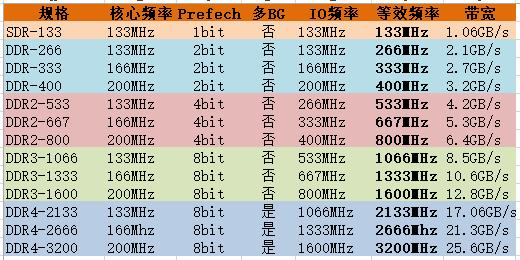
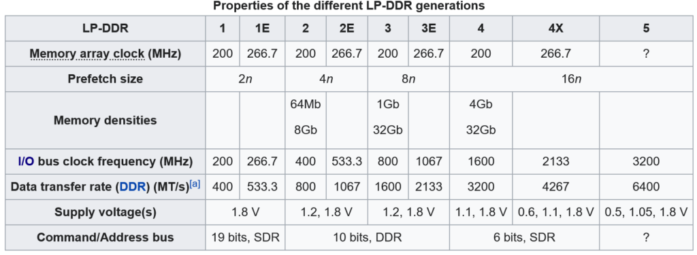
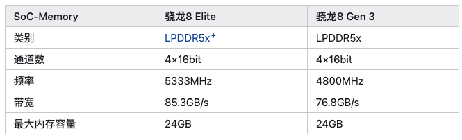

# memory

## DDR

| 内存分类            | 	传输带宽      |
|-----------------|------------|
| DDR	"DDR 266    | 2.1 GB/s   |
| DDR 333         | 2.6 GB/s   |
| DDR 400         | 3.2 GB/s"  |
| DDR2 533  | 4.2 GB/s   |
| DDR2 667        | 5.3 GB/s   |
| DDR2 800        | 6.4 GB/s"  |
| DDR3 1066 | 8.5 GB/s   |
| DDR3 1333       | 10.6 GB/s  |
| DDR3 1600       | 12.8 GB/s  |
| DDR3 1866       | 14.9 GB/s" |
| DDR4 2133 | 17 GB/s    |
| DDR4 2400       | 19.2 GB/s  |
| DDR4 2666       | 21.3 GB/s  |
| DDR4 3200       | 25.6 GB/s" |
| DDR5 4800 | 38.4 GB/s  |
| DDR5 5200       | 41.6 GB/s  |
| DDR5 5400       | 43.2 GB/s  |
| DDR5 5600       | 44.8 GB/s  |
| DDR5 6000       | 48.0 GB/s  |
| DDR5 6400       | 51.2 GB/s" |

## LPDDR

面向AI的手机面临内存带宽瓶颈问题，所以一般采用最新的LPDDR技术。

基于高通8gen3平台或MTK 9300平台的SoC，一般采用LPDDR5X,即4800MHz的LPDDR5内存，标称内存带宽是76.8GB/s，实际可以达到60GB/s。
基于高通8gen4平台或MTK 9400平台的SoC, 一般采用LPDDR5X plus，即5333MHz的LPDDR5内存，标称内存带宽是85.3GB/s，实际可以达到xxGB/s。

LPDDR5标准中，一个通道是16根（差分对，下同）线，一般手机用64根线，即4通道。单根线的数据率是9600Mbps(对应4800MHz)，总带宽是9.6GT/s * 8 bytes/T = 76.8GB/s。

LPDDR6单根线可达14.4Gbps, 对应频率应该是7200MHz。但是比较不同的是，LPDDR6一个通过是24根线的，这个数儿无法被64整除。合理的猜测是手机会用2通道(48根)或3通道（72根）。

这样总的带宽应该是14.4GT/s * 6 bytes/T = 86.4GB/s或 14.4GT/s * 9 bytes/T = 129.6 GB/s。如果是后者的话，带宽是LPDDR5X的1.69倍，是LPDDR5X plus的1.51倍。

[参数资料](https://www.jedec.org/sites/default/files/Brett%20Murdock_FINAL_Mobile_2024.pdf)

## UFS

UFS 4的理论带宽是4GB/s，它有2个lane(差分线对)，单个差分线对速度是23.2GT/s（不算头部开销理论传输速度是5.8GB/s）.

现在市面上的手机一般采用UFS 4.0。存储访问带宽与介质有关，与容量（内部bank个数）也相关。目前已知最快的实际速度为3.8GB/s。

UFS 4.1理论上可以达到8GB/s，本质上就是4 lane的UFS 4。

UFS 的jedec网址是：https://www.jedec.org/sites/default/files/docs/JESD220.pdf

