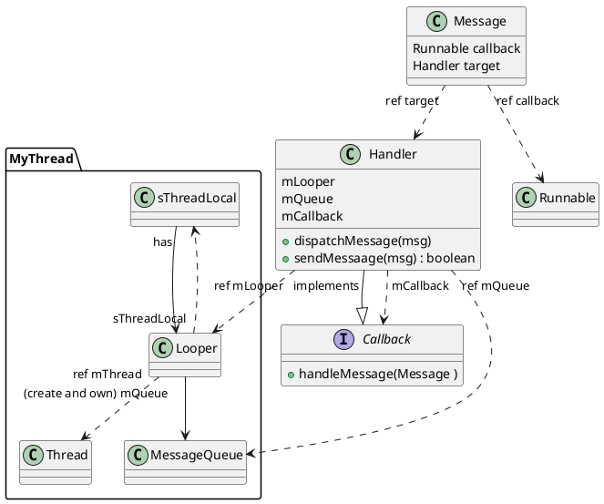

# Android的Looper, Handler和MessageQueue



1. Looper会被存储在一个线程的ThreadLocal中
2. Looper创建并持有一个MessageQueue, mQueue
3. 创建Handler时，传入一个Looper，这个Handler就获得了这个MessageQueue和Looper的引用。
4. Handler持有一个Callback mCallback的引用，本身也实现Callback接口。
5. Message有一个Runable类型的callback变量（名为callback,类型为Runnable)
6. 当一个message被派发给一个Handler的时间，Handler的dispatchMessage调用的优先级是:
   a. msg.callback.run(),
   b. mCallback.handleMessage(msg)
   c. self.handleMessage(msg)
   这里Message自带Runnable容易理解，投递的就是runnable。
   用Handler自己实现的handleMessage也能理解，普通message给Handler处理嘛
   但为什么Handler还要有一个mCallback呢？这实际给Handler了两种构造方法，一个是new Handler(new Callback...)，另一种是class MyHandler extends Handler...。即要不要派生一个类的问题。在不派生的情况下，Handler本身的handleMessage是个空实现。
7. Looper的loopOnce函数主要做的事情就是`msg.target.dispatchMessage(msg)`

从以上信息看，Handler都是挂在Message.target上送到MessageQueue，由Looper取出来，调用Handler的dispatchMessage的，那是不是Handler根本不需要持有Looper和MessageQueue的引用呢？

其实Handler不光是一个Message的处理者（出口），也是一个入口。消息被创建之后要通过一个handler发送到MessageQueue。所以Handler有一个`sendMessage(msg)`函数。这个函数等于`sendMessageDelayed(msg, 0)`, `sendMessageDelayed`等于`sendMessageAtTime(msg, now + delay)`，然而最终会调到`enqueueMessage(queue, msg, time)`，它会把msg.target设为handler自己，然后把msg送入queue。

除此之外，Handler还有权对MessageQueue中target为自己的消息去重、删除等管理动作。MessageQueue不可能把所有消息都让Handler看，因为不是所有消息的target都是这个Handler。MessageQueue中有一个`hasMessage(Handler)`方法，查询有没有target为某Handler的消息。类似地，还有`removeMessages(Handler,what, obj)`, `removeEqualMessages(Handler, what, object)`等。其内部实现就是一个简单的遍历。可能因为量少，没必要使用hash表之类。

```java
@UnsupportedAppUsage(maxTargetSdk = Build.VERSION_CODES.R, trackingBug = 170729553)
    boolean hasMessages(Handler h, Runnable r, Object object) {
        if (h == null) {
            return false;
        }

        synchronized (this) {
            Message p = mMessages;
            while (p != null) {
                if (p.target == h && p.callback == r && (object == null || p.obj == object)) {
                    return true;
                }
                p = p.next;
            }
            return false;
        }
    }
```

从以上内容可以看出，Looper是在一个线程中运行的，持有一个MessageQueue。Handler是一个入口也是一个出口，可以对MessageQueue中的target为自己的Message进行增删查。一个Looper可以对应多个Handler。
如下图所示：（https://pivinci.medium.com/how-looper-messagequeue-handler-runnable-work-in-android-dbbe9db62094）


Handler可以在不同的线程创建并sendMessage。

## HandlerThread

Handler和Thread, Looper的组合非常灵活，同时也繁琐。如果只需要一个Handler的话，那Handler, Thread, Looper就是一一对应的，把它们封装成一个类就可以一键生成所有，那就是HandlerThread。
https://github.com/aosp-mirror/platform_frameworks_base/blob/master/core/java/android/os/HandlerThread.java

它继承自Thread, 设置好了Looper，也构造了Handler。用户只需要拿到Handler的引用，就可以投递消息交给这个线程处理了。
它是在getThreadHandler的时候，lazy初始化的Handler:
```java
 /**
     * @return a shared {@link Handler} associated with this thread
     * @hide
     */
    @NonNull
    public Handler getThreadHandler() {
        if (mHandler == null) {
            mHandler = new Handler(getLooper());
        }
        return mHandler;
    }
```

这个Handler显示没有一个有用的Callback实现，也没有设置mCallback引用，所以目前只能期望Message自带一个Runnable callback。如果message不自带callback，就是普通消息，那我们可以通过给Handler设置Callback mCallback的方式设置处理方法，然而Handler本来并没有这样的方法。也就是说这个默认就有的Handler只能处理有Runnable Callback的消息，普通的消息会被空处理。这个Handler称为shared handler。

你也可以在getThreadHandler调用前（或者从来都不调用它），先调用getLooper()，然后自己new 一个Handler。

