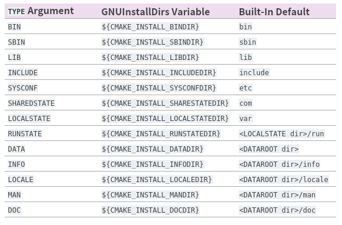
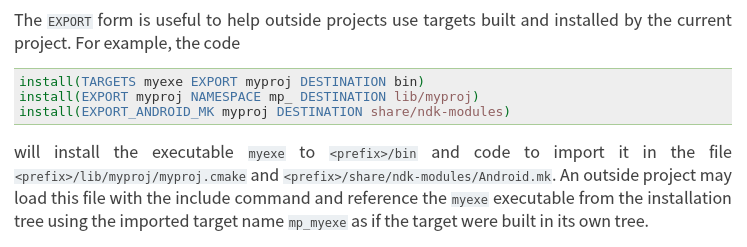

# ndk cmake externalproject不使用Android NDK编译问题

## 背景

原始工程有通过ExternalProject_Add添加依赖，但是一开始只是header only的库。没有问题。
后面添加了编译成静态链接库的工程就不行了。

提示找不到namespace开头为__ndk1的符号。

readelf -sW 符号名
c++filt 符号名
发现符号是在__cxx11 namespace下面的。

进一步看编译log发现是有/usr/bin/c++编译的，根本没有走ndk。

## 让ExternProject通过NDK构建

```cmake

set(MyAndroidProject_DEFAULT_ARGS
        -DANDROID_ABI:STRING=${ANDROID_ABI}
        -DANDROID_NATIVE_API_LEVEL:STRING=${ANDROID_NATIVE_API_LEVEL}
        -DANDROID_NDK:STRING=${ANDROID_NDK}
        -DANDROID_PLATFORM:STRING=${ANDROID_PLATFORM}
        -DANDROID_STL:STRING=${ANDROID_STL}
        -DANDROID_TOOLCHAIN:STRING=${ANDROID_TOOLCHAIN}
        -DBUILD_SHARED_LIBS:BOOL=${BUILD_SHARED_LIBS}
        -DCMAKE_BUILD_TYPE:STRING=${CMAKE_BUILD_TYPE}
        -DCMAKE_C_COMPILER:STRING=${CMAKE_C_COMPILER}
        -DCMAKE_CXX_COMPILER:STRING=${CMAKE_CXX_COMPILER}
        -DCMAKE_GENERATOR:STRING=${CMAKE_GENERATOR}
        -DCMAKE_MAKE_PROGRAM:FILEPATH=${CMAKE_MAKE_PROGRAM}
        -DCMAKE_TOOLCHAIN_FILE:FILEPATH=${CMAKE_TOOLCHAIN_FILE}
        -DCMAKE_INSTALL_PREFIX=${CMAKE_BINARY_DIR}/install
        )

include(ExternalProject)
ExternalProject_Add(handycpp1
        GIT_REPOSITORY https://github.com/zhangfuwen/handycpp
        GIT_TAG main
        CMAKE_ARGS -Wno-dev ${MyAndroidProject_DEFAULT_ARGS}
        PREFIX ${CMAKE_BINARY_DIR}
        SOURCE_DIR "${CMAKE_BINARY_DIR}/handycpp/src"
        BINARY_DIR "${CMAKE_BINARY_DIR}/handycpp/build"
        INSTALL_DIR "${CMAKE_BINARY_DIR}/install"
        #        INSTALL_COMMAND ""
        TEST_COMMAND ""
        )

```

增加一个cmake_args项，就可以向external project传送各种变量了。

## 构建出来的库无法链接

直接链接handycpp或handycpp::handycpp不行，因为ExternalProject_Add并没有帮你find_package，去引用相关的CMakeConfig.cmake代码。

最终的做法是link_directories, 然后在target_link_libraries中只引用库的名字。就可以解决了。

失败的尝试是只接引用库的绝对路径，这样cmake configure的时候就会去找这个库，找不到就报错了。

## 本地install

可能最好的办法是设定一个prefix，然后install。

在ExternalProject_Add中设置INSTALL_DIR是没有用的，需要在CMAKE_ARGS里`-DCMAKE_INSTALL_PREFIX=${CMAKE_BINARY_DIR}/install`才行。

## cmake的install

```cmake

# 将库文件，可执行文件，头文件安装到指定目录
install(TARGETS mymath mymathapp
        EXPORT MyMathTargets
        LIBRARY DESTINATION lib
        ARCHIVE DESTINATION lib
        RUNTIME DESTINATION bin
        PUBLIC_HEADER DESTINATION include
        )
```

install命令可以安装几类东西, TARGETS, FILES, DIRECTORY之类的。

```cmake
install(TARGETS <target>... [...])
install(IMPORTED_RUNTIME_ARTIFACTS <target>... [...])
install({FILES | PROGRAMS} <file>... [...])
install(DIRECTORY <dir>... [...])
install(SCRIPT <file> [...])
install(CODE <code> [...])
install(EXPORT <export-name> [...])
install(RUNTIME_DEPENDENCY_SET <set-name> [...])
```

正常来讲，files, directories是指与target无关的东西。与target有关的都可以用
install(TARGETS)来搞定。

### targets有关的东西

```cmake
ARCHIVE 静态链接库
LIBRARY 动态链接库
RUNTIME 可执行文件
OBJECTS .o文件，暂时不care, 3.9引入
FRAMEWORK macos专用
BUNDLE macos专用
PUBLIC_HEADER macos专用
PRIVATE_HEADER macos专用
RESOURCE macos专用
```

从名字上看，PUBLIC_HEADER、PRIVATE_HEADER、RESOURCE都挺有用的，但是这些是MacOS专用的。
所以最终直接能给linux/android用的也就三个，即静态链接库，动态链接库和可执行文件。

安装header、 .cmake文件、资源文件等还是要通过FILES, DIRECTORIES的方式安装。

## files

安装文件要指定安装的目标文件夹或是文件类型。
指定文件类型的话，cmake会为你翻译成一个文件夹。

```cmake
install(FILES file1.txt file2.h
        TYPE INCLUDE
        )

install(FILES file1.txt file2.h
        DESTINATION ${CMAKE_INSTALL_INCLUDEDIR}
        )
```




## 指定destination的标准姿势

指定destination要以相对路径的方式来指向，即lib, include, bin, etc这样去指定。

因为真正安装的时候，cmake会为你加`${CMAKE_INSTALL_PREFIX}`。

## exports



cmake查找package有两种方法，一种是package vendor提供一个config.cmake文件，叫做package configuration file, 包配置文件。
另一种是使用者写一个find module文件。
前者叫config-file packages，后者叫find-module packages。

这里是应用于前者的。

config-file packages要求软件包的提供者提供一个包名+Config.cmake的文件，名称必须是：
foo-config.cmake或BarConfig.cmake。

cmake会按照这样的名字去匹配。

### package vendor怎么提供这个config/targets文件呢？

#### targets.cmake文件

要配合install(TARGETS)和install(EXPORT)两个命令来用。

```cmake
install(TARGETS MathFunctions
        EXPORT MathFunctionsTargets
        LIBRARY DESTINATION ${CMAKE_INSTALL_LIBDIR}
        ARCHIVE DESTINATION ${CMAKE_INSTALL_LIBDIR}
        RUNTIME DESTINATION ${CMAKE_INSTALL_BINDIR}
        INCLUDES DESTINATION ${CMAKE_INSTALL_INCLUDEDIR}
)
```
在安装TARGETS时，要指定导出名。
上一句命令会根据LIBRARY, ARCHIVE, RUNTIME, INCLUDES等选项，记录要导出的包的各种文件都在什么地方，这是一个信息。

install(EXPORT)命令会根据上个命令记录下来的信息，生成MathFunctionsTargets.cmake文件，并把这安装到指定位置。

```cmake
install(EXPORT MathFunctionsTargets
        FILE MathFunctionsTargets.cmake
        NAMESPACE MathFunctions::
        DESTINATION ${CMAKE_INSTALL_LIBDIR}/cmake/MathFunctions
)
```

MathFunctionsTargets.cmake会生成imported targets:
下面是我的一个工程的xxx-targets.cmake里的内容。

```cmake
# Create imported target handycpp::handycpp
add_library(handycpp::handycpp STATIC IMPORTED)

set_target_properties(handycpp::handycpp PROPERTIES
  INTERFACE_COMPILE_FEATURES "cxx_std_20"
  INTERFACE_INCLUDE_DIRECTORIES "${_IMPORT_PREFIX}/include"
)

```

似乎是你直接include这个xxx-targets.cmake的绝对路径就可以使用这个包了，但是使用绝对路径不方便。
xxx-config.cmake是用来让cmake找到这个包的。它的里面会include(xxx-targets.cmake)文件。

```cmake
# xxx-config.cmake的内容
...
include("${CMAKE_CURRENT_LIST_DIR}/handycppTargets.cmake")
```

#### config文件要自己写

targets.cmake文件是自动生成的。config文件相对来讲，要自己写。

当然cmake也提供了一个helper来帮助你少写代码。实际上你要写的是一个config.cmake.in文件。

```cmake
if(NOT INCLUDE_INSTALL_DIR)
    set(INCLUDE_INSTALL_DIR include/hello)
endif()

include(CMakePackageConfigHelpers)
write_basic_package_version_file("${PROJECT_NAME}ConfigVersion.cmake"
        VERSION ${PROJECT_VERSION}
        COMPATIBILITY SameMajorVersion)
configure_package_config_file(
        "${PROJECT_SOURCE_DIR}/cmake/${PROJECT_NAME}Config.cmake.in"
        "${PROJECT_BINARY_DIR}/${PROJECT_NAME}Config.cmake"
        INSTALL_DESTINATION ${CMAKE_INSTALL_DATAROOTDIR}/${PROJECT_NAME}/cmake
        PATH_VARS INCLUDE_INSTALL_DIR)

install(FILES "${PROJECT_BINARY_DIR}/${PROJECT_NAME}Config.cmake"
        "${PROJECT_BINARY_DIR}/${PROJECT_NAME}ConfigVersion.cmake"
        DESTINATION ${CMAKE_INSTALL_DATAROOTDIR}/${PROJECT_NAME}/cmake)
```

    WRITE_BASIC_CONFIG_VERSION_FILE( filename
    [VERSION major.minor.patch]
    COMPATIBILITY (AnyNewerVersion|SameMajorVersion|SameMinorVersion|ExactVersion)
    [ARCH_INDEPENDENT]
    )

    configure_package_config_file(<input> <output>
    INSTALL_DESTINATION <path>
    [PATH_VARS <var1> <var2> ... <varN>]
    [NO_SET_AND_CHECK_MACRO]
    [NO_CHECK_REQUIRED_COMPONENTS_MACRO]
    [INSTALL_PREFIX <path>]
    )

xxx-config.cmake.in文件是一个模板文件，里面的内容：
```cmake
set(FOO_VERSION x.y.z)
...
@PACKAGE_INIT@
...
set_and_check(FOO_INCLUDE_DIR "@PACKAGE_INCLUDE_INSTALL_DIR@")
set_and_check(FOO_SYSCONFIG_DIR "@PACKAGE_SYSCONFIG_INSTALL_DIR@")

check_required_components(Foo)
```

`set_and_check`就是设置一个变量，比如说这个包导出的头文件路径，设置到变量FOO_INCLUDE_DIR里面。
它是一个macro，正文是：
```cmake
macro(set_and_check _var _file)
    set(${_var} "${_file}")
    if(NOT EXISTS "${_file}")
        message(FATAL_ERROR "File or directory ${_file} referenced by variable ${_var} does not exist !")
    endif()
endmacro()
```
就是说设置变量值，然后看看这个文件或目录在不在，如果不存在就报错。

`check_required_components`是求证一下xxx-targets.cmake中所有导出组件都找得到：
```cmake
macro(check_required_components _NAME)
  foreach(comp ${${_NAME}_FIND_COMPONENTS})
    if(NOT ${_NAME}_${comp}_FOUND)
      if(${_NAME}_FIND_REQUIRED_${comp})
        set(${_NAME}_FOUND FALSE)
      endif()
    endif()
  endforeach()
endmacro()
```
比如说check_required_components(Foo)就是说Foo下面的所有组件，是不是都找到了。如果有一个没找到，就把Foo_FOUND设为false。

上面两个宏都是模块文件中@PACKAGE_INIT@展出得到的。
