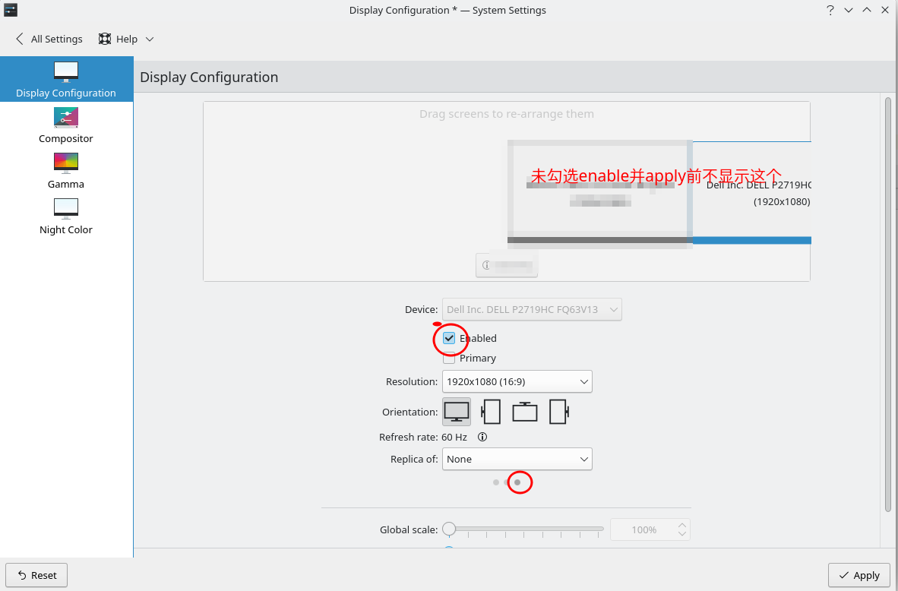

---

title: Linux下的DISPLAY环境变量以及wayland equivalent
tags: ['display', 'linux', 'wayland', 'x11', 'uds', 'xrandr', 'screen']

---

# X下的display

[an old book](assets/graphics_admin_guide.pdf)

DISPLAY环境变量的格式分三部分：

`xxx:display[.screen]`

格式为：[图片参考链接](https://books.google.com.hk/books?redir_esc=y&hl=zh-CN&id=FNBQAAAAYAAJ&dq=shmlink&focus=searchwithinvolume&q=shmlink)

[display name format](assets/display_name_format.png)


如localhost:0.0, 192.168.1.1:0.0, unix:0.0, shmlink:0.0, 

1. xxx

xxx不是`unix`, `shmlink`, 'local`, 或省略的情况下，认为是主机名或ip地址，走的是tcpip协议，端口为6000+display。

xxx是unix的情况下，用的是unix domain socket(UDS), 就是`/tmp/.X11-unix/X0`或`@/tmp/.X11-unix/X0`，其中0是`display`部分指定的。

xxx是shmlink的情况下，走的是Shared Memory Transport(SMT)。

xxx是local或省略的情况，用库自动选择当前机器上最高效的协议，如果有SMT就走SMT，如果没有使能SMT就走UDS，实在不行走TCP。

```
➜  ~ netstat -l | grep X11
unix  2      [ ACC ]     STREAM     LISTENING     26848    @/tmp/.X11-unix/X0
unix  2      [ ACC ]     STREAM     LISTENING     26850    @/tmp/.X11-unix/X1
unix  2      [ ACC ]     STREAM     LISTENING     26851    /tmp/.X11-unix/X1
unix  2      [ ACC ]     STREAM     LISTENING     26849    /tmp/.X11-unix/X0

```

2. display

一个机器可能有多个display，这个是逻辑上的概念，通常是一个物理的，多个虚拟的。

一个display包含多个screen。如果display是物理的，那么screen就代表你机器上的真实显示器。

3. screen如上，可省略。


# wayland

```
➜  ~ netstat -l | grep wayland
unix  2      [ ACC ]     STREAM     LISTENING     26852    /run/user/32001/wayland-0
```


# 命令行查看已经连接的显示器

```bash
xrandr --query
```

发现usb显示器已经连接了，是kde没有使能它。
解决办法是在设置里点击下面的三个小点，找到对应的显示器，勾选enable




# wayland protocol

```plantuml

@startmindmap
wayland protocols 
** core protocol
*** wl_display - core global object
*** wl_registry - global registry object
*** wl_callback - callback object
*** wl_compositor - the compositor singleton
*** wl_shm_pool - a shared memory pool
*** wl_shm - shared memory support
*** wl_buffer - content for a wl_surface
*** wl_data_offer - offer to transfer data
*** wl_data_source - offer to transfer data
*** wl_data_device - data transfer device
*** wl_data_device_manager - data transfer interface
*** wl_shell - create desktop-style surfaces
*** wl_shell_surface - desktop-style metadata interface
*** wl_surface - an onscreen surface
*** wl_seat - group of input devices
*** wl_pointer - pointer input device
*** wl_keyboard - keyboard input device
*** wl_touch - touchscreen input device
*** wl_output - compositor output region
*** wl_region - region interface
*** wl_subcompositor - sub-surface compositing
*** wl_subsurface - sub-surface interface to a wl_surface
++ wl_shell (deprecated by xdg_shell_protocol_v6)
++ ivi_shell 
++ wlr_layer_shell
++ wlr-foreign-toplevel-management
** xdg_shell_protocol_v6
*** xdg_wm_base
*** xdg_surface
*** xdg_popup
*** xdg_positioner
*** xdg_decoration_v1
*** xdg_output
*** xdg_foreign
++ xwayland
++ linux-dmabuf
++ keyboard-shortcuts-inhibit
++ virtual-keyboard
++ pointer-gestures


@endmindmap
```

