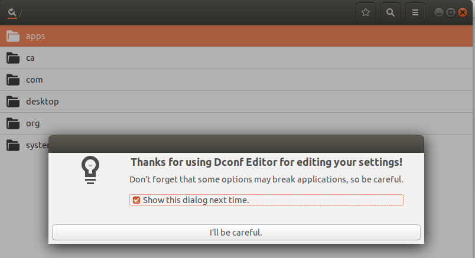

---

title: Gtk 编程杂记

---

# gio

## gsettings


gsettings好比android中的property，是系统范围的可读、可写、可watch的键值对。

gsettings可以通过gio这个动态链接库访问、可以通过gsettings或dconf这个命令访问、可以通过dconf-editor这个图形界面工具访问。


### 通过gsettings访问

```bash
➜  ~ gsettings
用法：
  gsettings --version
  gsettings [--schemadir 架构目录] 命令 [参数…]

命令：
  help                      显示此信息
  list-schemas              列出安装了的架构
  list-relocatable-schemas  列出可重定位的架构
  list-keys                 列出某个架构中的键
  list-children             列出某个架构的子对象
  list-recursively          递归地列出键和值
  range                     查询某个键的范围
  describe                  查询某个键的描述
  get                       获取某个键值
  set                       设置某个键值
  reset                     重设某个键值
  reset-recursively         重设指定架构中的所有值
  writable                  检查某个键是否可写
  monitor                   监视更改

➜  ~ gsettings list-schemas
org.gnome.settings-daemon.plugins.color
org.gnome.crypto.pgp
....
org.gnome.settings-daemon.plugins.power

➜  ~ gsettings list-keys org.gnome.shell

app-picker-view
command-history
disable-user-extensions
always-show-log-out
disable-extension-version-validation
app-picker-layout
had-bluetooth-devices-setup
favorite-apps
enabled-extensions
disabled-extensions
development-tools
introspect
looking-glass-history
remember-mount-password

➜  ~ gsettings get org.gnome.shell favorite-apps
['firefox-esr.desktop', 'org.gnome.Nautilus.desktop', 'org.gnome.Software.desktop', 'funterm.desktop', 'chromium.desktop']

```

### 通过dconf访问

```bash
➜  ~ dconf
error: no command specified

Usage:
  dconf COMMAND [ARGS...]

Commands:
  help              Show this information
  read              Read the value of a key
  list              List the contents of a dir
  write             Change the value of a key
  reset             Reset the value of a key or dir
  compile           Compile a binary database from keyfiles
  update            Update the system databases
  watch             Watch a path for changes
  dump              Dump an entire subpath to stdout
  load              Populate a subpath from stdin

➜  ~ dconf list /
ca/
desktop/
org/

➜  ~ dconf list /org/gnome/shell/
enabled-extensions
extensions/
favorite-apps
overrides/

➜  ~ dconf read /org/gnome/shell/enabled-extensions
['dash-to-panel@jderose9.github.com', 'wintile@nowsci.com', 'ibus-indicator@example.com', 'kimpanel@kde.org', 'ibus-tweaker@tuberry.github.com', 'appindicatorsupport@rgcjonas.gmail.com', 'panel-indicators@leavitals']

```

### 通过dconf-editor图形界面访问

```bash
sudo apt install dconf-editor
dconf-editor

```


### 通过gio访问

1. [gio gsettings](https://docs.gtk.org/gio/migrating-gconf.html)

2. [gsettings man page](http://www.manpagez.com/html/gio/gio-2.42.1/GSettings.php)

[示例代码](https://github.com/bratsche/glib/blob/master/gio/tests/gsettings.c)：

```c
static void
test_basic (void)
{
  gchar *str = NULL;
  GSettings *settings;

  settings = g_settings_new ("org.gtk.test");

  g_object_get (settings, "schema", &str, NULL);
  g_assert_cmpstr (str, ==, "org.gtk.test");
  g_free (str);

  g_settings_get (settings, "greeting", "s", &str);
  g_assert_cmpstr (str, ==, "Hello, earthlings");
  g_free (str);

  g_settings_set (settings, "greeting", "s", "goodbye world");
  g_settings_get (settings, "greeting", "s", &str);
  g_assert_cmpstr (str, ==, "goodbye world");
  g_free (str);
  str = NULL;

  if (!backend_set)
    {
      if (g_test_trap_fork (0, G_TEST_TRAP_SILENCE_STDERR))
        {
          settings = g_settings_new ("org.gtk.test");
          g_settings_set (settings, "greeting", "i", 555);
          abort ();
        }
      g_test_trap_assert_failed ();
      g_test_trap_assert_stderr ("*g_settings_set_value*expects type*");
    }

  g_settings_get (settings, "greeting", "s", &str);
  g_assert_cmpstr (str, ==, "goodbye world");
  g_free (str);
  str = NULL;

  g_settings_reset (settings, "greeting");
  str = g_settings_get_string (settings, "greeting");
  g_assert_cmpstr (str, ==, "Hello, earthlings");
  g_free (str);

  g_settings_set (settings, "greeting", "s", "this is the end");
  g_object_unref (settings);
}


```

### gio C++

[by including <giomm/settings.h> and use class Settings](https://developer-old.gnome.org/glibmm/unstable/classGio_1_1Settings.html)


## desktop apps

如果要开发一个launcher, 需要获取系统所有的应用程序列表。你可以手动去/usr/share/applications文件夹下搜.desktop文件，但gio提供了现成的接手，而且可能比你自己搜索更加全面。

[Gio::AppInfo](https://developer-old.gnome.org/glibmm/unstable/classGio_1_1AppInfo.html)

```c
static std::vector< Glib::RefPtr< AppInfo > > 	get_all () // 	Gets a list of all of the applications currently registered on this system.
tatic Glib::RefPtr< AppInfo > 	create_from_commandline (const std::string& commandline, const std::string& application_name, CreateFlags flags)
bool Gio::AppInfo::launch	(	const Glib::RefPtr< Gio::File >& 	file	)	
Glib::RefPtr<Icon> Gio::AppInfo::get_icon	()
std::string Gio::AppInfo::get_executable	()	const
std::string Gio::AppInfo::get_display_name	()	const


```

## unix domain socket

GIO提供了一个Unix Domain socket的封装，可以用来发送普通消息和fd。

[UnixConnection](https://developer-old.gnome.org/glibmm/unstable/classGio_1_1UnixConnection.html)

```c
bool 	send_fd (int fd, const Glib::RefPtr< Cancellable >& cancellable)
// 	Passes a file descriptor to the receiving side of the connection.

int 	receive_fd ()
// 	A receive_fd() convenience overload.
Glib::RefPtr< InputStream > 	get_input_stream () //父类方法，用于发送接收普通数据
Glib::RefPtr< OutputStream > 	get_output_stream ()
```

# Glib

## Misc Utils

[Utils 文档](https://developer-old.gnome.org/glibmm/unstable/group__MiscUtils.html)

```c
//xdg base dirs
std::string 	Glib::get_current_dir ()
std::string 	Glib::get_user_config_dir ()

// environment variables
Glib::ustring 	Glib::get_host_name ()
std::string 	Glib::getenv (StdStringView variable)
bool 	Glib::setenv (StdStringView variable, StdStringView value, bool overwrite=true)

// path utils
std::string 	Glib::path_get_basename (StdStringView filename)
std::string 	Glib::path_get_dirname (StdStringView filename)
```

## File Utils

[File Utils](https://developer-old.gnome.org/glibmm/unstable/group__FileUtils.html)

```c
class  	Glib::DirIterator
class  	Glib::Dir
bool 	Glib::file_test (const std::string& filename, FileTest test)
int 	Glib::mkstemp (std::string& filename_template)
int 	Glib::file_open_tmp (std::string& name_used, const std::string& prefix)
std::string 	Glib::file_get_contents (const std::string& filename)

        
```
