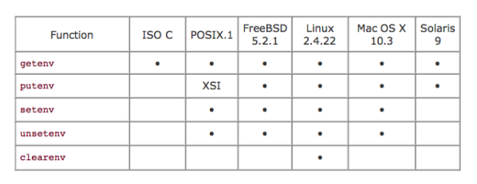
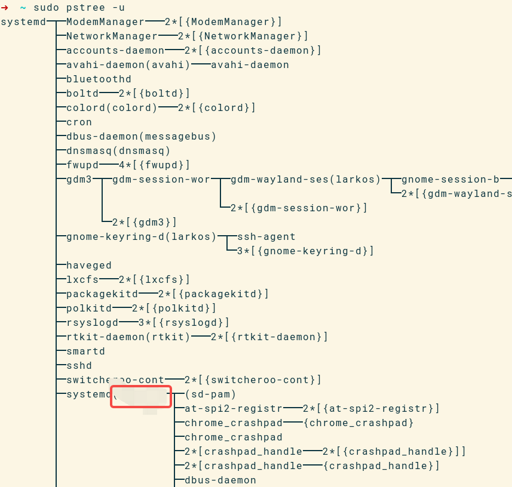

---

title: Linux下的常用概念深究

---

## 环境变量

## 环境变量是什么，存在哪里？

环境变量是一个键值对，从理论上来讲，它可以存在用户态，也可以存在内核态。那它倒底是存在哪里的呢？

[这里有答案](https://stackoverflow.com/questions/532155/linux-where-are-environment-variables-stored)

它是存在内存核的，而且可以通过procfs访问：

```
➜  ~ cat /proc/57611/environ
ection --display-capture-permissions-policy-allowed --change-stack-guard-on-fork=enable --lang=en-US --num-raster-threads=4 --enable-main-frame-before-activation --renderer-client-id=702 --launch-time-ticks=53101368960 --shared-files=v8_context_snapshot_data:100 --field-trial-handle=0,i,8611520294527000547,15429379014231219836,131072%
```
这是chromium的，不过看起来不像环境变量，倒像是命令行参数。

另一个进程的看起来就正常多了：
```
➜  ~ cat /proc/3097/environ 
GJS_DEBUG_TOPICS=JS ERROR;JS LOGUSER=xxxxXDG_SESSION_TYPE=waylandSHLVL=0HOME=/home/xxxxOLDPWD=/home/xxxxDESKTOP_SESSION=gnomeGIO_LAUNCHED_DESKTOP_FILE=/usr/share/applications/funterm.desktopMANAGERPID=1296DBUS_SESSION_BUS_ADDRESS=unix:path=/run/user/32001/busGIO_LAUNCHED_DESKTOP_FILE_PID=3097WAYLAND_DISPLAY=wayland-0LOGNAME=xxxxGTK_IM_MODULE=ibus_=/usr/bin/gnome-sessionJOURNAL_STREAM=8:24930XDG_SESSION_CLASS=userUSERNAME=xxxxGNOME_DESKTOP_SESSION_ID=this-is-deprecatedPATH=/usr/local/bin:/usr/bin:/bin:/usr/gamesGDM_LANG=zh_CN.UTF-8SESSION_MANAGER=local/xxxx:@/tmp/.ICE-unix/1433,unix/xxxx:/tmp/.ICE-unix/1433INVOCATION_ID=117928d87ec24acea07facfe87ad94aaXDG_RUNTIME_DIR=/run/user/32001XDG_MENU_PREFIX=gnome-GNOME_SETUP_DISPLAY=:1DISPLAY=:0LANG=zh_CN.UTF-8XDG_CURRENT_DESKTOP=GNOMEXMODIFIERS=@im=ibusXDG_SESSION_DESKTOP=gnomeXAUTHORITY=/run/user/32001/.mutter-Xwaylandauth.J4DMN1SSH_AGENT_LAUNCHER=opensshSSH_AUTH_SOCK=/run/user/32001/keyring/sshSHELL=/usr/bin/zshQT_ACCESSIBILITY=1GDMSESSION=gnomeGJS_DEBUG_OUTPUT=stderrQT_IM_MODULE=ibusPWD=XXXX
```

不过它没有任何分隔，看起来乱乱的。

```
➜  ~ cat /proc/3097/environ | tr '\0' '\n'
GJS_DEBUG_TOPICS=JS ERROR;JS LOG
USER=xxxx
XDG_SESSION_TYPE=wayland
SHLVL=0
HOME=/home/xxxx
OLDPWD=/home/xxxxx
DESKTOP_SESSION=gnome
GIO_LAUNCHED_DESKTOP_FILE=/usr/share/applications/funterm.desktop
MANAGERPID=1296
DBUS_SESSION_BUS_ADDRESS=unix:path=/run/user/32001/bus
GIO_LAUNCHED_DESKTOP_FILE_PID=3097
WAYLAND_DISPLAY=wayland-0
LOGNAME=xxxx
GTK_IM_MODULE=ibus
_=/usr/bin/gnome-session
JOURNAL_STREAM=8:24930
XDG_SESSION_CLASS=user
USERNAME=xxxx
GNOME_DESKTOP_SESSION_ID=this-is-deprecated
PATH=/usr/local/bin:/usr/bin:/bin:/usr/games
GDM_LANG=zh_CN.UTF-8
SESSION_MANAGER=local/xxxx:@/tmp/.ICE-unix/1433,unix/xxxx:/tmp/.ICE-unix/1433
INVOCATION_ID=117928d87ec24acea07facfe87ad94aa
XDG_RUNTIME_DIR=/run/user/32001
XDG_MENU_PREFIX=gnome-
GNOME_SETUP_DISPLAY=:1
DISPLAY=:0
LANG=zh_CN.UTF-8
XDG_CURRENT_DESKTOP=GNOME
XMODIFIERS=@im=ibus
XDG_SESSION_DESKTOP=gnome
XAUTHORITY=/run/user/32001/.mutter-Xwaylandauth.J4DMN1
SSH_AGENT_LAUNCHER=openssh
SSH_AUTH_SOCK=/run/user/32001/keyring/ssh
SHELL=/usr/bin/zsh
QT_ACCESSIBILITY=1
GDMSESSION=gnome
GJS_DEBUG_OUTPUT=stderr
QT_IM_MODULE=ibus
PWD=/home/lxxx
```

## 环境变量是存在内核里的，那它的存取是通过系统调用吗？

我们在C语言中是用[setenv/getenv](https://man7.org/linux/man-pages/man3/setenv.3.html)两个函数来访问的，它是stdlib.h中的。看了一下在glibc中它的实现，。。。没看懂。

还是在网上搜了一翻找到了，环境变量其实是在**进程的应用态内存里的，但是位置是固定的，所以用户程序和内核都能访问得到**。

[process_vm_env](assets/process_vm_env.png)

图片来自:https://www.ffutop.com/posts/2019-07-17-understand-kernel-13/

从这个图里可以看到，arg和env其实是差不多。其实的确也是。

main函数可以直接得到arg的地址，其实也可以得到env的地址的，main函数还有一种写法是这样的：

```cpp

#include <stdio.h>
int main( int argc, char *argv[], char *envp[] )
{
    int i;
    /* echo all environment args */
    for (i = 0 ; envp[i] ; i++)
        printf( "envp[%d]: %s\n", i, envp[i] );
    return 0;
}

```

[一个比较短的课的也讲明了这个问题](assets/linux_environment.pdf)





args和env本质上是一个的，所以procfs中也有办法获取到args:

```bash
➜  ~ cat /proc/31100/cmdline 
/opt/weixin/weixin --type=zygote --no-zygote-sandbox%
```

## 环境变量操纵工具

env和printenv命令都能打印当前shell中的环境变量，这很容易实现，上一节的代码实际就是其中一个实现。因为子进程会以copy on write的形式继承父进程环境变量。

linux还有一个export命令，可以让后续子进程都具有某个环境变量，应该是直接修改了shell的environ所指内存的值，它是怎么实现的？一个子进程怎么可以修改父进程的环境变量呢？

答案很简单，export不是一个子进程，它不是一个单独的可执行程序，而是shell的builtin功能，shell解析到export命令时，直接在自己的进程里执行了。。。

# udev & netlink


# inotify

# 用户

linux只通过一个uid来区分不同的用户，除此之外，linux对用户一无所知。

uid在linux中使用的地方包括：1. 在文件系统中保存uid，来确定owner，2. 在访问控制相关代码中，主要是DAC方式，检查当前uid，来确认用户是否有权限。

用户名与密码的匹配是在用户层做的, 内核不管。内核只管在fork的时间，要不要setuid,或seteuid，即要不要切换当前用户。通常init进程的用户为root，即uid 为0。init会启动login程序，此时uid仍为0，当登陆成功后，init进程会fork一个新进程、调用`setuid` syscall来切换用户、调用execv将新进程的代码替换为该用户下首个进程的代码，比如说systemd-user。



```c
#include <unistd.h>

int setuid(uid_t uid);
```