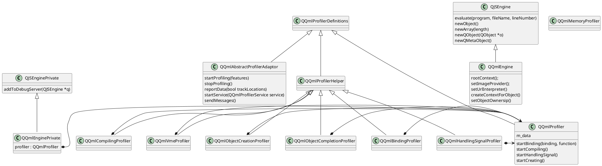

---

title: qt/qml profiler
tags: ['qml', 'profiler', 'engine']

---

# 使用

```bash
qmlprofiler /usr/bin/testapp
```

or 

```bash
/usr/bin/testapp -qmljsdebugger=port:12345

# another terminal

qmlprofiler -a localhsot -p 12345

```

# diagram


