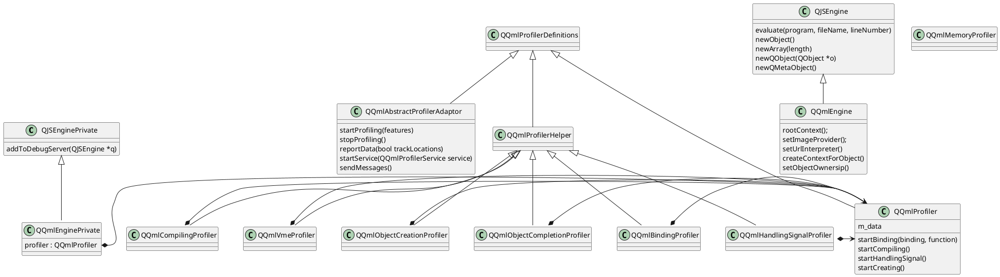

# qt & qml

## qml http get json

```javascript
function httpGet(keyword) {
        var http = new XMLHttpRequest();
        var url = "https://so.toutiao.com/search?source=input&keyword=" + keyword + "&format=raw_json";
        var params = "num=22&num2=333";
        http.open("GET", url, true);
        // Send the proper header information along with the request
        http.setRequestHeader("Content-type", "application/x-www-form-urlencoded");
        // http.setRequestHeader("Content-length", params.length);
        http.setRequestHeader("Connection", "close");
        console.error("http get");
        http.onreadystatechange = function() {
            // Call a function when the state changes.
            if (http.readyState == 4) {
                if (http.status == 200) {
                    console.error("ok");
                    // console.error(http.responseJSON.data);
                    var jsonResponse = JSON.parse(http.responseText);
                    console.error("data length " + jsonResponse.data.length);
                    searchEngineListModel.clear();
                    for (var i = 0; i < jsonResponse.data.length; i++) {
                        let d = jsonResponse.data[i];
                        if (d.hasOwnProperty('emphasized')) {
                            console.error("emphasized " + d.emphasized);
                            if (d.emphasized.hasOwnProperty('title')) {
                                searchEngineListModel.append({
                                    "name": d.emphasized.title,
                                    "desc": d.emphasized.summary
                                });
                                console.error("title: " + d.emphasized.title);
                                console.error("summary: " + d.emphasized.summary);
                            } else {
                                console.error("data " + i + " has no field named emphasized.title");
                            }
                        } else {
                            console.error("data " + i + " has no field named emphasized");
                        }
                    }
                } else {
                    console.log("error: " + http.status);
                }
            }
        };
        http.send(params);
    }
```

##  qml 模块

qml代码是运行时解释执行的。qml中的`import`语句导入的模块，需要运行时去找。

### 去哪里找

[QQmlEngine::importPathList](https://doc.qt.io/qt-6/qqmlengine.html#importPathList)会打印出当前程序所在的
运行环下查找模块的目录列表。

它通常由几部分构成：

1. 当前qml文件所有的文件夹
2. [QLibraryInfo::QmlImportsPath](https://doc.qt.io/qt-6/qlibraryinfo.html#LibraryPath-enum)常量定义的路径。
3. `QML_IMPORT_PATH`环境变量定义的路径
4. qrc文件中定义的`qrc:/qt-project.org/imports`值。
5. 使用qmlscene等工具时，可以用`-I`指定路径。

```c++
for(const auto & p : engine.importPathList()) {
    FUN_INFO("import path: %s", qPrintable(p));
}
```

```c++
212425 212425 22-08-31 12:15:41.170 Info [main.cpp:228 main] > import path: /home/xxx/Code/search/cmake-build-debug
212425 212425 22-08-31 12:15:41.170 Info [main.cpp:228 main] > import path: qrc:/qt-project.org/imports
212425 212425 22-08-31 12:15:41.170 Info [main.cpp:228 main] > import path: /usr/lib/x86_64-linux-gnu/qt5/qml
```

代码填加import路径：
`engine.addImportPath(QStringLiteral("qrc:/import/qtquick/"));`

### 如何找

```javascript
import myapp.mycomponents 1.0
```

会找各个路径下找myapp/mycomponents/qmldir文件：
```javascript
QML_IMPORT_TRACE=true qmlscene ../test.qml
QQmlImports(test.qml)::addLibraryImport: "QtQuick" 2.0 as ""
QQmlImports(test.qml)::importExtension: loaded "/usr/lib/x86_64-linux-gnu/qt5/qml/QtQuick.2/qmldir"
QQmlImportDatabase::registerPluginTypes: "QtQuick" from "/usr/lib/x86_64-linux-gnu/qt5/qml/QtQuick.2"
```

qmldir文件的内容为：

```javascript
module myapp.mycomponents
CheckBox 1.0 CheckBox.qml
DialogBox 1.0 DialogBox.qml
Slider 1.0 Slider.qml
```

如果需要C++的动态链接库，则这么写qmldir:

```javascript
module TimeExample
plugin qmlqtimeexampleplugin
```

如果使用cmake，qmldir不需要手写，cmake会帮你生成：

```cmake
set(qml_files
        imports/TimeExample/Clock.qml
        )

set(images
        imports/TimeExample/center.png
        imports/TimeExample/clock.png
        imports/TimeExample/hour.png
        imports/TimeExample/minute.png
        )
qt_add_qml_module(qmlqtimeexample
    OUTPUT_DIRECTORY imports/TimeExample
    VERSION 1.0
    URI "TimeExample"
    SOURCES timemodel.cpp timemodel.h
    QML_FILES ${qml_files}
    RESOURCES ${images}
)
```

定义C++ plugin:
```c++
#include <QQmlEngineExtensionPlugin>

class ChartsPlugin : public QQmlExtensionPlugin
{
    Q_OBJECT
    Q_PLUGIN_METADATA(IID QQmlEngineExtensionInterface_iid)
public:
    inline void registerTypes(const char *uri) override {
        qmlRegisterType<XXX>(uri, 1, 0, "XXX");
    }
};
```


## qt获取标准dir

```c++
const QString downloadsFolder = QStandardPaths::writableLocation(QStandardPaths::DownloadLocation);
```

# qmlformat

```bash
➜  Downloads sudo apt-file search qmlformat           
qtdeclarative5-dev-tools: /usr/lib/qt5/bin/qmlformat
qtdeclarative5-dev-tools: /usr/lib/x86_64-linux-gnu/qt5/bin/qmlformat

```


# qtquick代码



qmldebug service

```plantuml
class QQmlDebugService
QQmlDebugService <|-- QQmlProfilerService
QQmlDebugService <|-- QQmlEngineDebugService
QQmlDebugService <|-- QQmlNativeDebugService
QQmlDebugService <|-- QQmlInspectorService
QQmlDebugService <|-- QQmlDebugMessageService
QQmlDebugService <|-- QQmlEngineControlService
```

