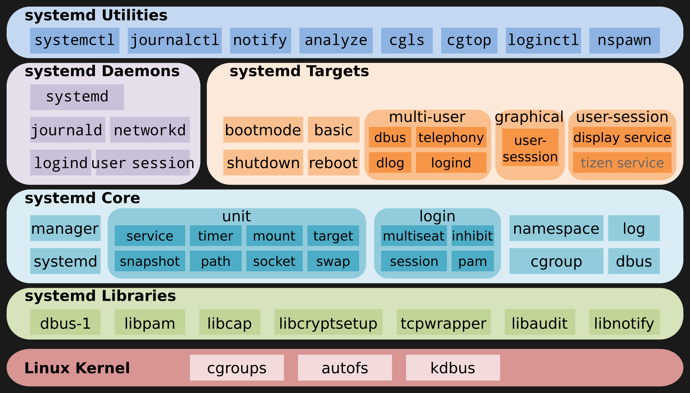

---

title: systemd

---

# 命令与用法

[参考](https://kiosk007.top/post/systemd-%E5%9F%BA%E6%9C%AC%E6%A6%82%E5%BF%B5/)

## systemd列出所有服务及其状态

```bash
systemctl list-units --type=service
```

# systemd概念

## 基础概念

systemd 是pid 为1的进程，即系统进所有用户进程的父进程。它使用cgroup/namespace等管理系统内的所有资源（因为它是所有进程的父
进程，所以它有权管）。

systemd管理的所有资源都是通过unit文件配置给systemd去启动的。这次资源分为很多种类型：

1. automount：用于控制自动挂载文件系统，相当于 SysV-init 的 autofs 服务
2. device：对于 /dev 目录下的设备，主要用于定义设备之间的依赖关系
3. mount：定义系统结构层次中的一个挂载点，可以替代过去的 /etc/fstab 配置文件
4. path：用于监控指定目录或文件的变化，并触发其它 Unit 运行
5. scope：这种 Unit 文件不是用户创建的，而是 Systemd 运行时产生的，描述一些系统服务的分组信息
6. service：封装守护进程的启动、停止、重启和重载操作，是最常见的一种 Unit 文件
7. slice：用于表示一个 CGroup 的树，通常用户不会自己创建这样的 Unit 文件
8. snapshot：用于表示一个由 systemctl snapshot 命令创建的 Systemd Units 运行状态快照
9. socket：监控来自于系统或网络的数据消息，用于实现基于数据自动触发服务启动
10. swap：定义一个用户做虚拟内存的交换分区
11. target：用于对 Unit 文件进行逻辑分组，引导其它 Unit 的执行。它替代了 SysV-init 运行级别的作用，并提供更灵活的基于特定设备事件的启动方式。其实是一群unit 的集合，例如上面表格中谈到的multi-user.target 其实就是一堆服务的集合～也就是说， 选择执行multi-user.target 就是执行一堆其他.service 或/及.socket 之类的服务就是了！
12. timer：用于配置在特定时间触发的任务，替代了 Crontab 的功能

这些配置可以对比Android的initrc文件和selinux配置去看，有很多相似之处。

/etc/systemd/system/：管理员依据主机系统的需求所建立的执行脚本，其实这个目录有点像以前/etc/rc.d/rc5.d/Sxx之类的功能。
/run/systemd/system/：系统执行过程中所产生的服务脚本，这些脚本的优先序要比/usr/lib/systemd/system/高！
/usr/lib/systemd/system/：每个服务最主要的启动脚本设定，有点类似以前的/etc/init.d底下的档案；

可以先list，然后用show命令去看配置文件的具体内容和所有路径：

```bash
systemctl list-units --type=automount
```

输出：

```commandline
  UNIT                              LOAD   ACTIVE SUB     DESCRIPTION
  proc-sys-fs-binfmt_misc.automount loaded active running Arbitrary Executable File Formats File System Automo>

LOAD   = Reflects whether the unit definition was properly loaded.
ACTIVE = The high-level unit activation state, i.e. generalization of SUB.
SUB    = The low-level unit activation state, values depend on unit type.
1 loaded units listed. Pass --all to see loaded but inactive units, too.
To show all installed unit files use 'systemctl list-unit-files'.

```

```bash
systemctl show  proc-sys-fs-binfmt_misc.automount
```

输出：

```commandline
Where=/proc/sys/fs/binfmt_misc
DirectoryMode=0755
Result=success
TimeoutIdleUSec=0
Id=proc-sys-fs-binfmt_misc.automount
Names=proc-sys-fs-binfmt_misc.automount
WantedBy=sysinit.target
Before=systemd-binfmt.service proc-sys-fs-binfmt_misc.mount binfmt-support.service sysinit.target
After=-.mount
Triggers=proc-sys-fs-binfmt_misc.mount
RequiresMountsFor=/proc/sys/fs
Documentation=https://www.kernel.org/doc/html/latest/admin-guide/binfmt-misc.html https://www.freedesktop.org/>
Description=Arbitrary Executable File Formats File System Automount Point
LoadState=loaded
ActiveState=active
FreezerState=running
SubState=running
FragmentPath=/lib/systemd/system/proc-sys-fs-binfmt_misc.automount
UnitFileState=static
UnitFilePreset=enabled
StateChangeTimestamp=Wed 2022-07-13 23:15:19 CST
StateChangeTimestampMonotonic=5507885
InactiveExitTimestamp=Wed 2022-07-13 23:15:18 CST
InactiveExitTimestampMonotonic=4937320
ActiveEnterTimestamp=Wed 2022-07-13 23:15:18 CST
ActiveEnterTimestampMonotonic=4937320
ActiveExitTimestampMonotonic=0
InactiveEnterTimestampMonotonic=0
CanStart=yes
CanStop=yes
CanReload=no
CanIsolate=no
CanFreeze=no
StopWhenUnneeded=no
RefuseManualStart=no
RefuseManualStop=no
AllowIsolate=no
DefaultDependencies=no
OnFailureJobMode=replace
IgnoreOnIsolate=yes
NeedDaemonReload=no
JobTimeoutUSec=infinity
JobRunningTimeoutUSec=infinity
JobTimeoutAction=none
ConditionResult=yes
AssertResult=yes
ConditionTimestamp=Wed 2022-07-13 23:15:18 CST
ConditionTimestampMonotonic=4937143
AssertTimestamp=Wed 2022-07-13 23:15:18 CST
AssertTimestampMonotonic=4937170
Transient=no
Perpetual=no
StartLimitIntervalUSec=10s
StartLimitBurst=5
StartLimitAction=none
FailureAction=none
SuccessAction=none
InvocationID=14d256d70b0c46b99617f285f347a1bb
CollectMode=inactive

```

上述命令打印的是运行时信息，实际去看它的配置文件没有这么复杂：

```bash
cat /lib/systemd/system/proc-sys-fs-binfmt_misc.automount

```


输出:

```commandline
[Unit]
Description=Arbitrary Executable File Formats File System Automount Point
Documentation=https://www.kernel.org/doc/html/latest/admin-guide/binfmt-misc.html
Documentation=https://www.freedesktop.org/wiki/Software/systemd/APIFileSystems
DefaultDependencies=no
Before=sysinit.target
ConditionPathExists=/proc/sys/fs/binfmt_misc/
ConditionPathIsReadWrite=/proc/sys/

[Automount]
Where=/proc/sys/fs/binfmt_misc
```

## systemd架构图



# Service

```bash
systemctl list-units --type=service 
```

输出：

```commandline
 UNIT                                                 LOAD   ACTIVE SUB     DESCRIPTION
  accounts-daemon.service                              loaded active running Accounts Service
  alsa-restore.service                                 loaded active exited  Save/Restore Sound Card State
  apparmor.service                                     loaded active exited  Load AppArmor profiles
  avahi-daemon.service                                 loaded active running Avahi mDNS/DNS-SD Stack
  binfmt-support.service                               loaded active exited  Enable support for additional exe>
  bluetooth.service                                    loaded active running Bluetooth service
  cron.service                                         loaded active running Regular background program proces>
  dbus.service                                         loaded active running D-Bus System Message Bus
  gdm3.service                                         loaded active exited  LSB: GNOME Display Manager
  haveged.service                                      loaded active running Entropy Daemon based on the HAVEG>
  ifupdown-pre.service                                 loaded active exited  Helper to synchronize boot up for>
  kmod-static-nodes.service                            loaded active exited  Create list of static device node>
  lm-sensors.service                                   loaded active exited  Initialize hardware monitoring se>
  lxc-net.service                                      loaded active exited  LXC network bridge setup
  lxc.service                                          loaded active exited  LXC Container Initialization and >
  lxcfs.service                                        loaded active running FUSE filesystem for LXC
  ModemManager.service                                 loaded active running Modem Manager
  networking.service                                   loaded active exited  Raise network interfaces
  NetworkManager.service                               loaded active running Network Manager
● nvidia-persistenced.service                          loaded failed failed  NVIDIA Persistence Daemon
  packagekit.service                                   loaded active running PackageKit Daemon
  plymouth-quit-wait.service                           loaded active exited  Hold until boot process finishes >
  plymouth-quit.service                                loaded active exited  Terminate Plymouth Boot Screen
  plymouth-read-write.service                          loaded active exited  Tell Plymouth To Write Out Runtim>
  plymouth-start.service                               loaded active exited  Show Plymouth Boot Screen

```

我们可以通过名字(去掉.service后缀)查看其中的一个：

```bash
systemctl cat dbus.service
```

```commandline

# /lib/systemd/system/dbus.service
[Unit]
Description=D-Bus System Message Bus
Documentation=man:dbus-daemon(1)
Requires=dbus.socket

[Service]
ExecStart=/usr/bin/dbus-daemon --system --address=systemd: --nofork --nopidfile --systemd-activation --syslog->
ExecReload=/usr/bin/dbus-send --print-reply --system --type=method_call --dest=org.freedesktop.DBus / org.free>
OOMScoreAdjust=-900
lines 1-10/10 (END)

```

从配置文件我们可以知道如下信息：

想看查看这个服务的文档可以使用命令`man 1 dbus-daemon`。
这个服务的启动依赖于dbus.socket这个socket资源的创建.

它的启动和reload命令分别是...。

# socket

dbus.socket是另一个systemd管理的unit，我们可以看一下它的内容：

```bash
systemctl cat dbus.socket
```

输出:

```markdown
# /lib/systemd/system/dbus.socket
[Unit]
Description=D-Bus System Message Bus Socket

[Socket]
ListenStream=/run/dbus/system_bus_socket
```
可以看到：

1. 这个socket的路径是/run/dbus/system_bus_socket。
 
因为它的路径，显然它是一个unix domain socket。

```bash
ls /run/dbus/system_bus_socket -la 
```

也可以通过show子命令来查看:
```bash
systemctl show dbus.socket

```

socket相关的systemd代码在这里：[socket.c](https://github.com/systemd/systemd/blob/main/src/core/socket.c)

# 入口

systemd启动后第一个查看的配置文件是`/etc/systemd/system/default.target`，这个一个软链接，它指向的目标是可以get/set的。

## get

```bash
default=$(systemctl get-default)
echo $default
systemctl cat $default
```

由于我的系统被我配置成了默认不进图形界面，所以它指向的是multi-user.target.

这时，我启动系统后进入命令行，需要手动运行`sddm`或是`lightdm`，才能进入图形界面。

如果想一启动就进入图形界面，需要设置default为`graphical.target`。

## set

```bash
systemctl set-default graphicl.target
```

graphical.target的内容是:

```bash
systemctl cat graphical.target
```

```markdown
[Unit]
Description=Graphical Interface
Documentation=man:systemd.special(7)
Requires=multi-user.target
Wants=display-manager.service
Conflicts=rescue.service rescue.target
After=multi-user.target rescue.service rescue.target display-manager.service
AllowIsolate=yes
```

可以看到它基本就是multi-user.target + display-manager.service。

```bash
systemctl cat display-manager.service
```

```markdown
# /lib/systemd/system/lightdm.service
[Unit]
Description=Light Display Manager
Documentation=man:lightdm(1)
After=systemd-user-sessions.service

# replaces plymouth-quit since lightdm quits plymouth on its own
Conflicts=plymouth-quit.service
After=plymouth-quit.service

# lightdm takes responsibility for stopping plymouth, so if it fails
# for any reason, make sure plymouth still stops
OnFailure=plymouth-quit.service

[Service]
ExecStart=/usr/sbin/lightdm
Restart=always
BusName=org.freedesktop.DisplayManager

[Install]
Alias=display-manager.service
```

可以看到我的display-manager.service应该也是一个软链接，它指向lightdm.service。

