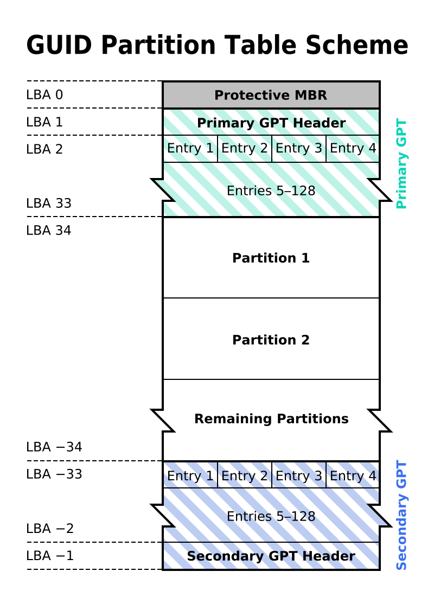

---

title: uefi 引导启动过程

---

# GPT (GUID Partition Table)

GPT是相对于MBR而提出来分区格式，可以支持好多个分区，每个分区是平等的，不存在包含关系。


GPT分区表方案将整个磁盘视为一个拥有N个扇区(sector)的设备。每个sector的大小可以是512或4K字节。N是64位整数，每个sector用一个LBA(Logical Block Address, 逻辑块地址）来表示。对于sector大小为512的磁盘来讲，LBA表示机制最多可以表达2的63次方*1KB的存储空间。

GPT与MBR兼容，它不占用第一个sector（用于MBR)，从第二个sector开始存储primary GPT header。

## primary GPT header

| Offset	| Length	| Contents |
| --- | --- | --- |
| 0 (0x00)	| 8 bytes	| Signature ("EFI PART", 45h 46h 49h 20h 50h 41h 52h 54h or 0x5452415020494645ULL[a] on little-endian machines)
| 8 (0x08)	| 4 bytes |	Revision number of header - 1.0 (00h 00h 01h 00h) for UEFI 2.10
| 12 (0x0C)	| 4 bytes |	Header size in little endian (in bytes, usually 5Ch 00h 00h 00h or 92 bytes)
| 16 (0x10)	| 4 bytes  |	CRC32 of header (offset +0 to +0x5c) in little endian, with this field zeroed during calculation
| 20 (0x14)	| 4 bytes |	Reserved; must be zero
| 24 (0x18)	| 8 bytes |	Current LBA (location of this header copy)
| 32 (0x20)	| 8 bytes |	Backup LBA (location of the other header copy)
| 40 (0x28)	| 8 bytes |	First usable LBA for partitions (primary partition table last LBA + 1)
| 48 (0x30)	| 8 bytes |	Last usable LBA (secondary partition table first LBA − 1)
| 56 (0x38)	| 16 bytes |	Disk GUID in mixed endian[11]
| 72 (0x48)	| 8 bytes |	Starting LBA of array of partition entries (usually 2 for compatibility)
| 80 (0x50)	| 4 bytes |	Number of partition entries in array
| 84 (0x54)	| 4 bytes |	Size of a single partition entry (usually 80h or 128)
| 88 (0x58)	| 4 bytes |	CRC32 of partition entries array in little endian
| 92 (0x5C)	| *	| Reserved; must be zeroes for the rest of the block (420 bytes for a sector size of 512 bytes; but can be more with larger sector sizes)


这里指明了partition entry的个数和大小。每个entry的大小一般是128，即0x80。

## partition entry

header后面跟的就是partition entry，即分区描述符的列表。每个entry大小是一样的：
每个entry的格式如下：

| Offset | 	Length |	Contents |
| --- | --- | --- |
| 0 (0x00) | 	16 bytes | 	Partition type GUID (mixed endian[11])
| 16 (0x10) | 	16 bytes | 	Unique partition GUID (mixed endian)
| 32 (0x20) | 	8 bytes | 	First LBA (little endian)
| 40 (0x28) | 	8 bytes | 	Last LBA (inclusive, usually odd)
| 48 (0x30) | 	8 bytes | 	Attribute flags (e.g. bit 60 denotes read-only)
| 56 (0x38) | 	72 bytes | 	Partition name (36 UTF-16LE code units)

## 图示



## 代码

下面的代码可以读取并打印GPT表：

```cpp

#include <iostream>
#include <fstream>
#include <vector>
#include <cstring>
#include <cstdint>

#pragma pack(push, 1) // 确保结构体按1字节对齐

// GPT Header结构体
struct GPTHeader {
    uint64_t signature; // "EFI PART"
    uint32_t revision;  // 版本
    uint32_t headerSize; // 头部大小
    uint32_t headerCRC32; // 头部CRC32校验
    uint32_t reserved; // 保留字段
    uint64_t currentLBA; // 当前LBA
    uint64_t backupLBA; // 备份LBA
    uint64_t firstUsableLBA; // 第一个可用LBA
    uint64_t lastUsableLBA; // 最后一个可用LBA
    uint8_t diskGUID[16]; // 磁盘GUID
    uint64_t partitionEntryLBA; // 分区条目LBA
    uint32_t numberOfPartitionEntries; // 分区条目数量
    uint32_t sizeOfPartitionEntry; // 分区条目大小
    uint32_t partitionEntryArrayCRC32; // 分区表CRC32
};

#pragma pack(pop)

void readGPT(const std::string& device) {
    std::ifstream disk(device, std::ios::binary);
    if (!disk.is_open()) {
        std::cerr << "无法打开设备 " << device << std::endl;
        return;
    }

    // 定位到GPT头部
    disk.seekg(512); // GPT头通常在LBA 1
    GPTHeader gptHeader;
    disk.read(reinterpret_cast<char*>(&gptHeader), sizeof(GPTHeader));

    // 检查签名
    if (gptHeader.signature != 0x5452415020494645) { // "EFI PART"的十六进制表示
        std::cerr << "该设备没有GPT分区表。" << std::endl;
        return;
    }

    std::cout << "GPT Header Information:" << std::endl;
    std::cout << "Signature: " << std::hex << gptHeader.signature << std::dec << std::endl;
    std::cout << "Revision: " << gptHeader.revision << std::endl;
    std::cout << "Header Size: " << gptHeader.headerSize << std::endl;
    std::cout << "Number of Partition Entries: " << gptHeader.numberOfPartitionEntries << std::endl;
    std::cout << "Size of Each Partition Entry: " << gptHeader.sizeOfPartitionEntry << std::endl;

    // 读取分区条目
    uint64_t partitionEntryOffset = gptHeader.partitionEntryLBA * 512; // 每个扇区512字节
    disk.seekg(partitionEntryOffset);

    std::vector<char> partitionEntries(gptHeader.numberOfPartitionEntries * gptHeader.sizeOfPartitionEntry);
    disk.read(partitionEntries.data(), partitionEntries.size());

    std::cout << "Partition Entries:" << std::endl;
    for (uint32_t i = 0; i < gptHeader.numberOfPartitionEntries; ++i) {
        // 这里可以解析每个分区条目
        // 此处代码省略，您可以根据需要进一步解析每个条目
        std::cout << "Partition " << i + 1 << " entry read." << std::endl;
    }

    disk.close();
}

int main() {
    std::string device;
    std::cout << "请输入设备路径（例如 /dev/sda）：";
    std::cin >> device;

    readGPT(device);

    return 0;
}
```


# EFI Boot menu

EFI支持启动多个OS，一方面EFI探测硬盘的时候发现新的包含可引导分区的硬盘时会记录一个条目在内存里。
另一方面EFI在一个叫做NVRAM（这个词的含议比它字面意思复杂多了）的地方保存一个引导顺序列表，这个是非易失的，就是说关闭重启后它还在，但是它不在硬盘里。
一般来说是在spi flash里，就是存UEFI本身的那个存储设备上。

在linux下，可以用efibootmgr来查看和修改。这个列表。

```bash
➜  ~ efibootmgr
BootCurrent: 0000
Timeout: 1 seconds
BootOrder: 0000,0001,0002,0003,0004,0005,0006
Boot0000* ubuntu
Boot0001* Diskette Drive
Boot0002* USB Storage Device
Boot0003* CD/DVD/CD-RW Drive
Boot0004  Onboard NIC
Boot0005* UEFI: SK hynix SC401 SATA 256GB
Boot0006* UEFI: TOSHIBA DT01ACA200
```

列表中的每个条目都指向硬盘某个分区中的某个`.efi`文件，用`efibootmgr -v`可以看到：

```bash
➜  ~ efibootmgr -v    
BootCurrent: 0000
Timeout: 1 seconds
BootOrder: 0000,0001,0002,0003,0004,0005,0006
Boot0000* ubuntu	HD(1,GPT,e83a23a5-b84b-4837-9568-57a70affe4c7,0x800,0xfa000)/File(\EFI\ubuntu\shimx64.efi)
Boot0001* Diskette Drive	BBS(Floppy,Diskette Drive,0x0)..BO
Boot0002* USB Storage Device	BBS(USB,USB Storage Device,0x0)..BO
Boot0003* CD/DVD/CD-RW Drive	BBS(CDROM,CD/DVD/CD-RW Drive,0x0)..BO
Boot0004  Onboard NIC	BBS(Network,IBA CL Slot 00FE v0114,0x0)..BO
Boot0005* UEFI: SK hynix SC401 SATA 256GB	HD(1,GPT,e83a23a5-b84b-4837-9568-57a70affe4c7,0x800,0xfa000)/File(\EFI\Boot\BootX64.efi)..BO
Boot0006* UEFI: TOSHIBA DT01ACA200	HD(2,GPT,5ad594ab-5ecf-4094-9fe7-9b3309355f3b,0xe8121800,0xce6800)/File(\EFI\Boot\BootX64.efi)..BO
```

当然，你实际看到的并不都指向文件，比如说USB Storage Device。这种可以是要进一步探测的。

列表中每个条目指向的文件所有的分区需要满足以下条件：
1. 标识为boot,esp, 这样的分区叫ESP分区，可以有很多个。EFI System Partition.
2. fat16格式化
3. 存在EFI文件夹

UEFI遇到这样的分区，遇到EFI文件，就会去下面找后缀名为.efi的文件，如果找到用于引导操作系统的文件，就会在内存里建一个条目。

。。。。 反正EFI启动的时候也会找，所以修改NVRAM好像没有必要。所以如果你要制做一个OS，安装时也可以不动NVRAM，只需要安装efi文件到ESP分区的EFI文件夹里就行。
通常来讲，每个OS要为自己建一个文件夹：

```bash
/boot/efi/EFI
├── Boot
│   ├── bootx64.efi		[The default bootloader]
│   ├── bootx64.OEM		[Backup of same as delivered]
├── fedora			[Plus other things at the root /boot/efi/ level]
│   ├── BOOT.CSV
│   ├── fonts
│   │   └── unicode.pf2
│   ├── gcdx64.efi
│   ├── grub.cfg
│   ├── grubx64.efi
│   ├── MokManager.efi
│   ├── shim.efi
│   └── shim-fedora.efi
├── mageia			[Standard latest Mageia bootloader]
│   └── grubx64.efi
├── mageia4			[Separated out by me]
│   └── grubx64.efi
├── mageia5			[Separated out by me]
│   └── grubx64.efi
├── manjaro_grub
│   ├── grubx64.efi
...
├── Microsoft
│   └── Boot
...
│       ├── bootmgfw.efi	[The standard Win8 bootloader]
│       ├── bootmgr.efi
...
├── opensuse
│   └── grubx64.efi
├── refind			[added EFI boot manager]
│   ├── icons
│   │   ├── arrow_left.icns
...
│   │   └── vol_optical.icns
│   ├── refind.conf
│   └── refind_x64.efi
└── tools
    └── drivers_x64
        ├── ext2_x64.efi
        ├── hfs_x64.efi
        ├── iso9660_x64.efi
        └── reiserfs_x64.efi

```

整体的格式就是：
`\EFI\<distribution>\<bootloader>`


https://wiki.mageia.org/en/About_EFI_UEFI:
```note

which for Linux is normally grubx64.efi . Some explanations are warranted, however.

\EFI\Boot\bootx64.efi is the default bootloader when nothing else works (BootNext, BootOrder). In theory it should never be used... On a box delivered with Windows, it will invoke \EFI\Microsoft\Boot\bootmgfw.efi . You can put here whatever you like if you need to - but keep a copy of the original. I have rEFInd here (as well as its correct place \EFI\refind\refindx64.efi).
I suspect that this is the bootloader used for the NVRAM "UEFI" disc entry.

Most of the Fedora stuff (for Korora) is related to Secure Boot. Not shown are several additional items at the \ level; it really is intrusive.
All the 'refind' and 'tools' stuff is about rEFInd, an EFI boot manager, more of which later. Normally only refindx64.efi is absolutely essential.
The most truculent boxes may load directly \EFI\Microsoft\Boot\bootmgfw.efi , so to get it to do anything else you have to replace that; again, backup the original.
Apparently OpenDesktop recommends throwing everything into the ESP - kernels and initrds. This seems to contradict the separatist spirit of EFI; a bad idea.
You can install an OS bootloader into the ESP without creating an NVRAM entry for it; this is an oversight (or laziness)... But a boot manager like rEFInd will still find it. I have not bothered [yet] to add my mageia4/5 specials to NVRAM for this very reason: compare the NVRAM and ESP mageia entries.
```

## grub

```bash
grub2-install --target=x86_64-efi --efi-directory=/boot/efi --bootloader-id=<OSname>
```

grub2-install这个命令就是干了两件事：
1. 把grubx64.efi安装到ESP下面本OS的文件夹下
2. 修改NVRAM，添加一个条目，当然是从头部添加了，这样下次本OS就可以第一个启动了

如果grub已经有了，但是NVRAM不对，需要修正的话，可以用：

```bash
 efibootmgr -c -d /dev/sda -p 1 -L mageia -l \\EFI\\mageia\\grubx64.efi
```

-c = create
-d = bootloader device
-p = & partition, the ESP
-L = distribution name for the EFI boot menu
-l = loader path [use \\ for one \].

## efi boot menu and boot manager

efi boot menu条目由NVRAM决定。每个条目指定一个boot manager(如grub)。

boot manager有时也会去看ESP文件夹，所以boot manager有可能会列出没有NVRAM，但是ESP里安装了条目的OS。


## 其他工具

## rEFInd, (refind)

A product of EFI guru Rod Smith - who also wrote gdisk. It really is magic: it finds automatically everything in the ESP - even those with no NVRAM entry - and all recent linux's (i.e. with a boot stub) installed on the disc, regardless of whether they have an ESP bootloader or not.

安装方法：
1. 把它放在EFI\refind\rebind_x64.efi
2. windows下 bcdedit /set {bootmgr} path \EFI\refind\refind_x64.efi

这样windows下就多了一个refind条目，可以用来找所有的linux系统了。

## EFI shell

这个有点类似于grub shell，提供一个命令行可以用来做一些事情，也是可以自己安装的

## boot.csv

https://www.rodsbooks.com/efi-bootloaders/fallback.html

```note
Under any filename, fallback.efi is a sort of boot manager—but rather than present a menu of boot options, it scans the subdirectories of EFI on its own disk for files called BOOT.CSV, BOOTX64.CSV, or other architecture-specific variants of that filename. With this file found, it's read and processed to generate a new NVRAM entry. The program then launches the first of the new NVRAM entries it creates. A comma-separated value (CSV) file holds multiple data elements separated by commas; and in this case, the values are:

filename—This is the filename of the file to be added to the NVRAM boot manager list, in the same directory as BOOT.CSV.
label—This is the label to be associated with the file. This label is displayed by the firmware's own built-in boot manager.
options—If the boot loader requires options, you'd specify them here. Most boot loaders don't normally take options, so this field is likely to be empty.
description—This field describes the entry. It's not used by fallback.efi; it exists solely for human consumption.
```


# 参考资料

[refind homepage](http://www.rodsbooks.com/)
[refind](assets/refind_0.13.3.1-1_amd64.deb) 这是一个deb包，里面层层解压可以找到refind.efi。当然，也可以用ubuntu下安装，安装后会有一个refind_install命令。

[efi shell下载网址](https://github.com/tianocore/edk2/blob/UDK2018/ShellBinPkg/UefiShell/X64/Shell.efi)
[efi shell我的备份](assets/Shell.efi)

[tiano core edk2 代码](https://github.com/tianocore/edk2/tree/edk2-stable202208)


