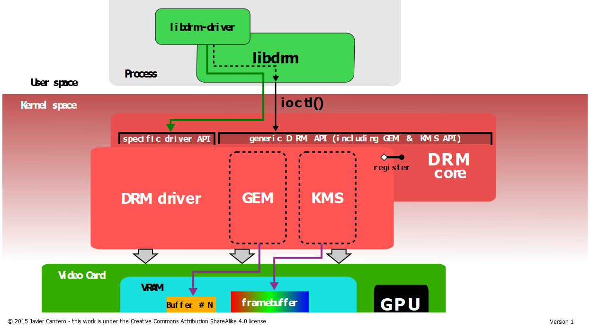
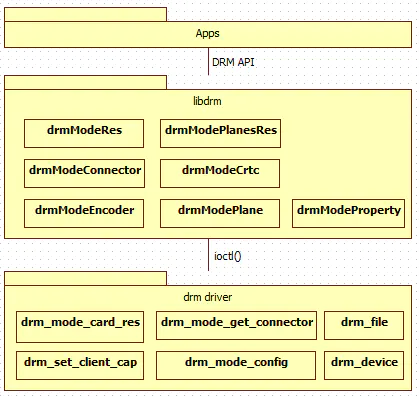
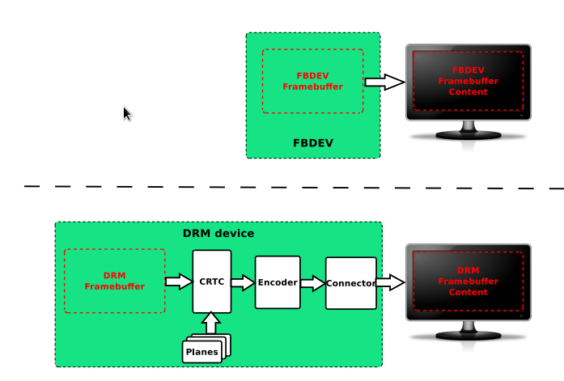
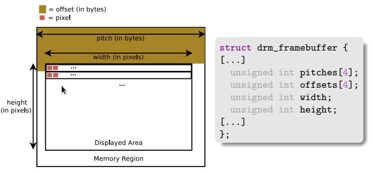
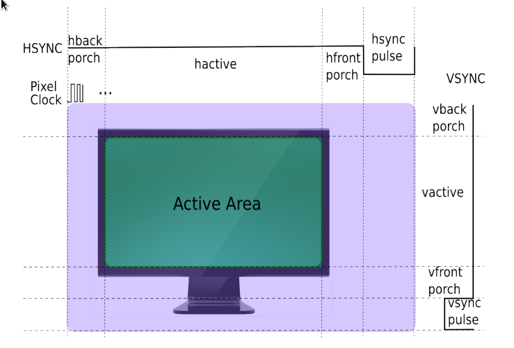
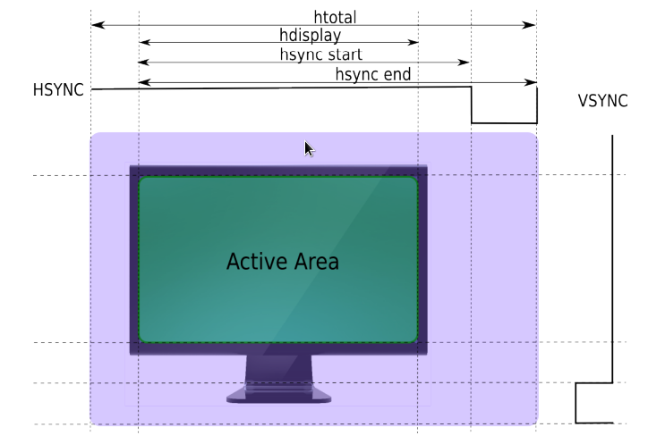
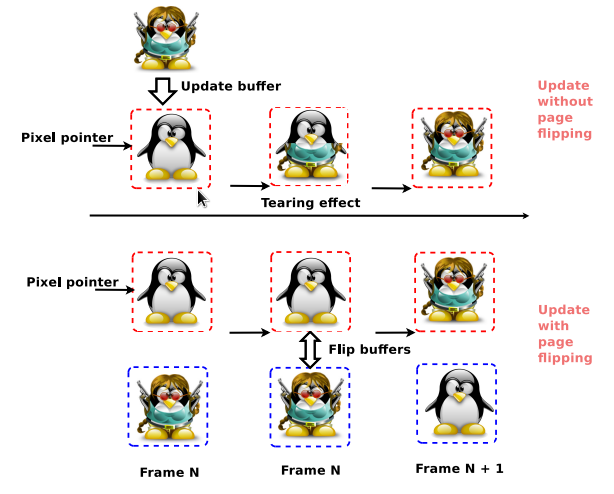
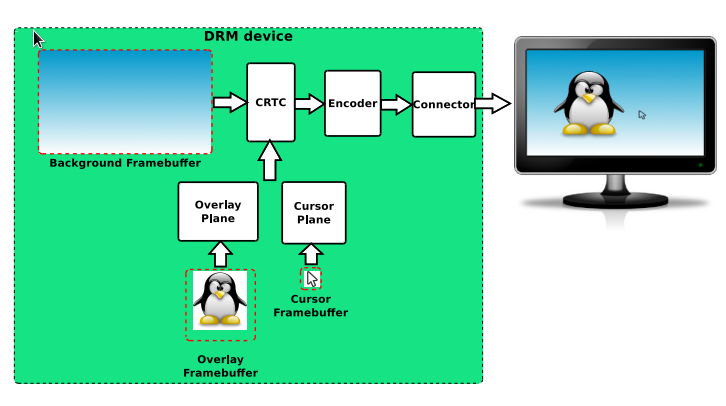
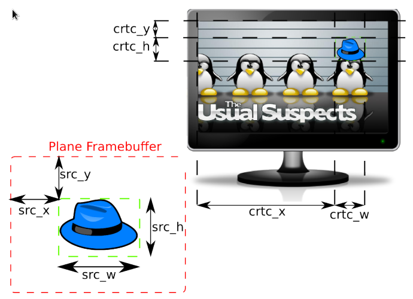

---

title: egl_platform
tags: ['egl', 'platform', 'surfaceless', 'x11', 'wayland', 'haiku']


---


# platform

-D platforms=...
List the platforms (window systems) to support. Its argument is a comma separated string such as -D platforms=x11,wayland. It decides the platforms a driver may support. The first listed platform is also used by the main library to decide the native platform.

The available platforms are x11, wayland, android, and haiku. The android platform can either be built as a system component, part of AOSP, using Android.mk files, or cross-compiled using appropriate options. Unless for special needs, the build system should select the right platforms automatically.


`EGL_PLATFORM`

This variable specifies the native platform. The valid values are the same as those for `-D platforms=....` When the variable is not set, the main library uses the first platform listed in -D platforms=... as the native platform.

Extensions like `EGL_MESA_drm_display` define new functions to create displays for non-native platforms. These extensions are usually used by applications that support non-native platforms. Setting this variable is probably required only for some of the demos found in mesa/demo repository.


# other platforms

[EGL_PLATFORM=surfaceless](https://registry.khronos.org/EGL/extensions/MESA/EGL_MESA_platform_surfaceless.txt)

[EGL_PLATFORM=gbm](https://registry.khronos.org/EGL/extensions/MESA/EGL_MESA_platform_gbm.txt)

## surfaceless

## gbm

platform为gbm时，可以创建window surface，用于交换。

创建的window surface对应一个GBM surface（`gbm_surface_create`）.

GBM(Generic Buffer Management) API是建立在DRM上的一个缓冲区管理api。

> [wayland book](https://wayland-book.com/introduction/high-level-design.html): 
> the GBM (Generic Buffer Management) library — an abstraction on top of libdrm for allocating buffers on the GPU.

[mesa wiki](https://en.m.wikipedia.org/wiki/Mesa_(computer_graphics))
At XDC2014, Nvidia employee Andy Ritger proposed to enhance EGL in order to replace GBM.[102] This was not taken positively by the community, and Nvidia eventually changed their mind,[103] and took another approach.

[gbm api 列表](https://github.com/robclark/libgbm/blob/master/gbm.h)
```cpp
int
gbm_device_get_fd(struct gbm_device *gbm);

const char *
gbm_device_get_backend_name(struct gbm_device *gbm);

int
gbm_device_is_format_supported(struct gbm_device *gbm,
                               uint32_t format, uint32_t usage);

void
gbm_device_destroy(struct gbm_device *gbm);

struct gbm_device *
gbm_create_device(int fd);

struct gbm_bo *
gbm_bo_create(struct gbm_device *gbm,
              uint32_t width, uint32_t height,
              uint32_t format, uint32_t flags);

#define GBM_BO_IMPORT_WL_BUFFER         0x5501
#define GBM_BO_IMPORT_EGL_IMAGE         0x5502

struct gbm_bo *
gbm_bo_import(struct gbm_device *gbm, uint32_t type,
              void *buffer, uint32_t usage);

uint32_t
gbm_bo_get_width(struct gbm_bo *bo);

uint32_t
gbm_bo_get_height(struct gbm_bo *bo);

uint32_t
gbm_bo_get_stride(struct gbm_bo *bo);

uint32_t
gbm_bo_get_format(struct gbm_bo *bo);

struct gbm_device *
gbm_bo_get_device(struct gbm_bo *bo);

union gbm_bo_handle
gbm_bo_get_handle(struct gbm_bo *bo);

int
gbm_bo_write(struct gbm_bo *bo, const void *buf, size_t count);

void
gbm_bo_set_user_data(struct gbm_bo *bo, void *data,
		     void (*destroy_user_data)(struct gbm_bo *, void *));

void *
gbm_bo_get_user_data(struct gbm_bo *bo);

void
gbm_bo_destroy(struct gbm_bo *bo);

struct gbm_surface *
gbm_surface_create(struct gbm_device *gbm,
                   uint32_t width, uint32_t height,
		   uint32_t format, uint32_t flags);

struct gbm_bo *
gbm_surface_lock_front_buffer(struct gbm_surface *surface);

void
gbm_surface_release_buffer(struct gbm_surface *surface, struct gbm_bo *bo);

int
gbm_surface_has_free_buffers(struct gbm_surface *surface);

void
gbm_surface_destroy(struct gbm_surface *surface);
```

[x] 问题：gbm_surface_create创建的surface是对应/dev/fb还是什么，eglSwapBuffers的时候是送显还是离屏？
    gbm_surface创建的是只一个交换链+ surface format，是离屏的。要送显需要lock_front然后通过drm送给drm_fb。
[x] 问题：gbm_surface_create调用的是drm的什么函数？
    不同的gbm back end应该不一样。
[x] 问题: drm与KMS是啥关系？
    KMS是DRM的一部分，DRM除了KMS还包含缓冲区管理和master/slave的Auth.


# DRM

DRM, direct render manager, 本来是应X Server的DRI需求而开发的。后来X没落了，但DRM仍然很活跃。

DRM主要包括三部分：（1）Auth，即谁有权使用设备，谁是master, (2) GEM，即buffer object管理, (3) KMS，即送显及显示器的配置。

DRM分用户态和内核态两部分。






```info
原文链接里有代码，可以打开看看。

KMS：CRTC，ENCODER，CONNECTOR，PLANE，FB，VBLANK，property
GEM：DUMB、PRIME、fence

DUMB	只支持连续物理内存，基于kernel中通用CMA API实现，多用于小分辨率简单场景
PRIME	连续、非连续物理内存都支持，基于DMA-BUF机制，可以实现buffer共享，多用于大内存复杂场景
fence	buffer同步机制，基于内核dma_fence机制实现，用于防止显示内容出现异步问题
————————————————
版权声明：本文为CSDN博主「何小龙」的原创文章，遵循CC 4.0 BY-SA版权协议，转载请附上原文出处链接及本声明。
原文链接：https://blog.csdn.net/hexiaolong2009/article/details/83720940
```

## 缓冲区管理

[这个文档](https://01.org/linuxgraphics/gfx-docs/drm/drm-memory-management.html)里列举了所有缓冲区管理相关的kernel API。

缓冲区或者说显存的管理，主要是分配、释放、进程间共享和同步。

GEM是一个比较差的设计，它通过一个32位的name和一个32位的handle来代表一个缓冲区。由于32位数据是可以穷举的，所以带来一些安全问题。

比GEM更优的方案是DMA_buf。

DMA_buf不光用来支持显卡驱动，也用来支持V4L2等，使用比较普遍。

PRIME使用DMA_buf来在进程间共享缓冲区。为了与GEM相互转换，新提出了两个DRM API。


## DRM-KMS 与显示

[参考PDF](assets/brezillon-drm-kms.pdf)

这一块主要讲内核和硬件部分，下面是一些摘要。

### 概述

送显有三个途径: (1) fbdev framebfufer, (2) drm framebuffer, (3) v4l2

KMS是DRM的一个sub part，主要处理送显。KMS是fbdev alternative。

显卡的设备文件分为两部分：
/dev/dri/renderX and
/dev/dri/controlDX或cardX

渲染节点无需特权，仅支持PRIME DMA_buf buffer object的申请，不支持GEM。
cardX节点支持GEN和送显。

### ION 和 DMA_buf

DMA_buf可以理解为上层的封送结构，它本身不提供分配缓冲的方法。真正的缓冲区来源于ION、CMA等分配器。

### 关于PRIME， DUMB的命名

https://blog.csdn.net/hexiaolong2009/article/details/105961192

PRIME最初用于nVidia的GPU offloading，所以GPU offloading就是集成显卡合成送显、独立显示渲染。这样两个显卡分工合作，可以在不切换显示的情况下，提高游戏性能。
具体参考：https://airlied.livejournal.com/71734.html


### kms vs fbdev 



### drm framebuffer



###  crtc display timing





### page flip



### planes






## 代码

### 通过render node离屏渲染


#### 通过gbm

```cpp
#include <EGL/egl.h>
#include <EGL/eglext.h>
#include <GLES3/gl31.h>
#include <assert.h>
#include <fcntl.h>
#include <gbm.h>
#include <stdbool.h>
#include <stdio.h>
#include <string.h>
#include <unistd.h>
 
/* a dummy compute shader that does nothing */
#define COMPUTE_SHADER_SRC "          \
#version 310 es\n                                                       \
                                                                        \
layout (local_size_x = 1, local_size_y = 1, local_size_z = 1) in;       \
                                                                        \
void main(void) {                                                       \
   /* awesome compute code here */                                      \
}                                                                       \
"
 
int32_t
main (int32_t argc, char* argv[])
{
   bool res;
 
   int32_t fd = open ("/dev/dri/renderD128", O_RDWR);
   assert (fd > 0);
 
   struct gbm_device *gbm = gbm_create_device (fd);
   assert (gbm != NULL);
 
   /* setup EGL from the GBM device */
   EGLDisplay egl_dpy = eglGetPlatformDisplay (EGL_PLATFORM_GBM_MESA, gbm, NULL);
   assert (egl_dpy != NULL);
 
   res = eglInitialize (egl_dpy, NULL, NULL);
   assert (res);
 
   const char *egl_extension_st = eglQueryString (egl_dpy, EGL_EXTENSIONS);
   assert (strstr (egl_extension_st, "EGL_KHR_create_context") != NULL);
   assert (strstr (egl_extension_st, "EGL_KHR_surfaceless_context") != NULL);
 
   static const EGLint config_attribs[] = {
      EGL_RENDERABLE_TYPE, EGL_OPENGL_ES3_BIT_KHR,
      EGL_NONE
   };
   EGLConfig cfg;
   EGLint count;
 
   res = eglChooseConfig (egl_dpy, config_attribs, &cfg, 1, &count);
   assert (res);
 
   res = eglBindAPI (EGL_OPENGL_ES_API);
   assert (res);
 
   static const EGLint attribs[] = {
      EGL_CONTEXT_CLIENT_VERSION, 3,
      EGL_NONE
   };
   EGLContext core_ctx = eglCreateContext (egl_dpy,
                                           cfg,
                                           EGL_NO_CONTEXT,
                                           attribs);
   assert (core_ctx != EGL_NO_CONTEXT);
 
   res = eglMakeCurrent (egl_dpy, EGL_NO_SURFACE, EGL_NO_SURFACE, core_ctx);
   assert (res);
 
   /* setup a compute shader */
   GLuint compute_shader = glCreateShader (GL_COMPUTE_SHADER);
   assert (glGetError () == GL_NO_ERROR);
 
   const char *shader_source = COMPUTE_SHADER_SRC;
   glShaderSource (compute_shader, 1, &shader_source, NULL);
   assert (glGetError () == GL_NO_ERROR);
 
   glCompileShader (compute_shader);
   assert (glGetError () == GL_NO_ERROR);
 
   GLuint shader_program = glCreateProgram ();
 
   glAttachShader (shader_program, compute_shader);
   assert (glGetError () == GL_NO_ERROR);
 
   glLinkProgram (shader_program);
   assert (glGetError () == GL_NO_ERROR);
 
   glDeleteShader (compute_shader);
 
   glUseProgram (shader_program);
   assert (glGetError () == GL_NO_ERROR);
 
   /* dispatch computation */
   glDispatchCompute (1, 1, 1);
   assert (glGetError () == GL_NO_ERROR);
 
   printf ("Compute shader dispatched and finished successfully\n");
 
   /* free stuff */
   glDeleteProgram (shader_program);
   eglDestroyContext (egl_dpy, core_ctx);
   eglTerminate (egl_dpy);
   gbm_device_destroy (gbm);
   close (fd);
 
   return 0;
}
```

### 渲染到gbm_surface

下面这段代码渲染到一个gbm_surface，gbm_surface本身没有关联一个窗口系统，所以它本质上只是一个交换链。

```cpp

    // This example program creates an EGL surface from a GBM surface.
    //
    // If the macro EGL_MESA_platform_gbm is defined, then the program
    // creates the surfaces using the methods defined in this specification.
    // Otherwise, it uses the methods defined by the EGL 1.4 specification.
    //
    // Compile with `cc -std=c99 example.c -lgbm -lEGL`.

    #include <stdlib.h>
    #include <string.h>

    #include <sys/types.h>
    #include <sys/stat.h>
    #include <fcntl.h>

    #include <EGL/egl.h>
    #include <gbm.h>

    struct my_display {
        struct gbm_device *gbm;
        EGLDisplay egl;
    };

    struct my_config {
        struct my_display dpy;
        EGLConfig egl;
    };

    struct my_window {
        struct my_config config;
        struct gbm_surface *gbm;
        EGLSurface egl;
    };

    static void
    check_extensions(void)
    {
    #ifdef EGL_MESA_platform_gbm
        const char *client_extensions = eglQueryString(EGL_NO_DISPLAY, EGL_EXTENSIONS);

        if (!client_extensions) {
            // EGL_EXT_client_extensions is unsupported.
            abort();
        }
        if (!strstr(client_extensions, "EGL_MESA_platform_gbm")) {
            abort();
        }
    #endif
    }

    static struct my_display
    get_display(void)
    {
        struct my_display dpy;

        int fd = open("/dev/dri/card0", O_RDWR | FD_CLOEXEC);
        if (fd < 0) {
            abort();
        }

        dpy.gbm = gbm_create_device(fd);
        if (!dpy.gbm) {
            abort();
        }


    #ifdef EGL_MESA_platform_gbm
        dpy.egl = eglGetPlatformDisplayEXT(EGL_PLATFORM_GBM_MESA, dpy.gbm, NULL);
    #else
        dpy.egl = eglGetDisplay(dpy.gbm);
    #endif

        if (dpy.egl == EGL_NO_DISPLAY) {
            abort();
        }

        EGLint major, minor;
        if (!eglInitialize(dpy.egl, &major, &minor)) {
            abort();
        }

        return dpy;
    }

    static struct my_config
    get_config(struct my_display dpy)
    {
        struct my_config config = {
            .dpy = dpy,
        };

        EGLint egl_config_attribs[] = {
            EGL_BUFFER_SIZE,        32,
            EGL_DEPTH_SIZE,         EGL_DONT_CARE,
            EGL_STENCIL_SIZE,       EGL_DONT_CARE,
            EGL_RENDERABLE_TYPE,    EGL_OPENGL_ES2_BIT,
            EGL_SURFACE_TYPE,       EGL_WINDOW_BIT,
            EGL_NONE,
        };

        EGLint num_configs;
        if (!eglGetConfigs(dpy.egl, NULL, 0, &num_configs)) {
            abort();
        }

        EGLConfig *configs = malloc(num_configs * sizeof(EGLConfig));
        if (!eglChooseConfig(dpy.egl, egl_config_attribs,
                             configs, num_configs, &num_configs)) {
            abort();
        }
        if (num_configs == 0) {
            abort();
        }

        // Find a config whose native visual ID is the desired GBM format.
        for (int i = 0; i < num_configs; ++i) {
            EGLint gbm_format;

            if (!eglGetConfigAttrib(dpy.egl, configs[i],
                                    EGL_NATIVE_VISUAL_ID, &gbm_format)) {
                abort();
            }

            if (gbm_format == GBM_FORMAT_XRGB8888) {
                config.egl = configs[i];
                free(configs);
                return config;
            }
        }

        // Failed to find a config with matching GBM format.
        abort();
    }

    static struct my_window
    get_window(struct my_config config)
    {
        struct my_window window = {
            .config = config,
        };

        window.gbm = gbm_surface_create(config.dpy.gbm,
                                        256, 256,
                                        GBM_FORMAT_XRGB8888,
                                        GBM_BO_USE_RENDERING);
        if (!window.gbm) {
            abort();
        }

    #ifdef EGL_MESA_platform_gbm
        window.egl = eglCreatePlatformWindowSurfaceEXT(config.dpy.egl,
                                                       config.egl,
                                                       window.gbm,
                                                       NULL);
    #else
        window.egl = eglCreateWindowSurface(config.dpy.egl,
                                            config.egl,
                                            window.gbm,
                                            NULL);
    #endif

        if (window.egl == EGL_NO_SURFACE) {
            abort();
        }

        return window;
    }

    int
    main(void)
    {
        check_extensions();

        struct my_display dpy = get_display();
        struct my_config config = get_config(dpy);
        struct my_window window = get_window(config);

        return 0;
    }
```


### 通过control node送显

送显主要是就是给drm framebuffer送一个bo。

这个bo可以是gbm_surface交换链中的一个bo。
送显一定要用card节点。

```cpp
int fd = open("/dev/dri/card0");
drmModeResPtr res = drmModeGetResources(fd);
drmModeConnectorPtr connector = NULL;
for (int i = 0; i < res->count_connectors; i++) {
    connector = drmModeGetConnector(fd, res->connectors[i]);
    // find a connected connection
    if (connector->connection == DRM_MODE_CONNECTED)
        break;
}
drmModeEncoderPtr encoder = drmModeGetEncoder(fd, connector->encoder_id);
drmModeCrtcPtr crtc = drmModeGetCrtc(fd, encoder->crtc_id);
drmModeFBPtr fb = drmModeGetFB(fd, crtc->buffer_id);
struct gbm_bo *bo = gbm_surface_lock_front_buffer(my_gbm_surface);
uint32_t my_fb;
drmModeAddFB(fd, gbm_bo_get_handle(bo).u32, &my_fb);
drmModeSetCrtc(fd, crtc->crtc_id, my_fb);
```

## 示意代码

### 渲染节点渲染

```cpp
int fd = open("/dev/dri/renderD128");
struct gbm_device *gbm = gbm_create_device(fd);
struct gbm_surface *gs = gbm_surface_create(gbm);
EGLDisplay display = eglGetPlatformDisplayEXT(gbm);
EGLSurface surface = eglCreatePlatformWindowSurfaceEXT(display, gs);
EGLContext context = eglCreateContext(display);
eglMakeCurrent(display, surface, surface, context);
// OpenGL Render
...
eglSwapBuffers(display, surface);
```

### 送显线程送显

注意，送显在另一个线程。

```cpp
int fd = open("/dev/dri/card0");
drmModeResPtr res = drmModeGetResources(fd);
drmModeConnectorPtr connector = NULL;
for (int i = 0; i < res->count_connectors; i++) {
    connector = drmModeGetConnector(fd, res->connectors[i]);
    // find a connected connection
    if (connector->connection == DRM_MODE_CONNECTED)
        break;
}
drmModeEncoderPtr encoder = drmModeGetEncoder(fd, connector->encoder_id);
drmModeCrtcPtr crtc = drmModeGetCrtc(fd, encoder->crtc_id);
drmModeFBPtr fb = drmModeGetFB(fd, crtc->buffer_id);
struct gbm_bo *bo = gbm_surface_lock_front_buffer(gs);
uint32_t my_fb;
drmModeAddFB(fd, gbm_bo_get_handle(bo).u32, &my_fb);
drmModeSetCrtc(fd, crtc->crtc_id, my_fb);
```

### 跨进程送显

#### 发送

```cpp
// 获得缓冲
struct gbm_bo *bo = gbm_surface_lock_front_buffer(gs);
// 用unix local socket发送缓冲的dma-buf
struct msghdr msg;
struct cmsghdr *cmsg = CMSG_FIRSTHDR(&msg);
*((int *) CMSG_DATA(cmsg)) = gbm_bo_get_fd(bo);
sendmsg(sock, &msg);
```

#### 接收

```cpp
// 接收dma-buf
struct msghdr msg;
recvmsg(sock, &msg);
struct cmsghdr *cmsg = CMSG_FIRSTHDR(&msg);
int fd = *((int *) CMSG_DATA(cmsg));
// 还原缓冲
struct gbm_import_fd_data gbm_data = {.fd = fd};
struct gbm_bo *bo = gbm_bo_import(gbm, &gbm_data);


// 然后显示


```

### 导入bo为texture

```cpp
struct gbm_import_fd_data gbm_data = {.fd = fd};
struct gbm_bo *bo = gbm_bo_import(gbm, &gbm_data);
EGLImageKHR image = eglCreateImageKHR(display, context, bo);
glEGLImageTargetTexture2DOES(GL_TEXTURE_2D, image);
```

# libdrm

[代码](https://github.com/freedesktop/mesa-drm/tree/main)

libdrm不光包含基础部分，还包含vendor的自定义部分，所以代码仓比较大。

Installed Libraries:
libdrm_amdgpu.so, libdrm_intel.so, libdrm_nouveau.so, libdrm_radeon.so, and libdrm.so
Installed Directories:
/usr/include/libdrm and /usr/share/libdrm
Short Descriptions
libdrm_amdgpu.so

contains the AMDGPU specific Direct Rendering Manager functions

libdrm_intel.so

contains the Intel specific Direct Rendering Manager functions

libdrm_nouveau.so

contains the open source nVidia (Nouveau) specific Direct Rendering Manager functions

libdrm_radeon.so

contains the AMD Radeon specific Direct Rendering Manager functions

libdrm.so

contains the Direct Rendering Manager API functions

# libgbm

[wayland的libgbm前端(loader)](https://github.com/robclark/libgbm)
[mesa的libgbm前后端](https://gitlab.freedesktop.org/mesa/mesa/-/blob/main/src/gbm/main/gbm.h)
[libgbm 带kms/drm backend](https://github.com/thayama/libgbm)

libgbm代码量非常小，它的具体实现在其backend里。


# egl与gbm的交互

猜测：
egl使用gbm的公开api即可完成应用的功能：

1. egl使用gbm的bo创建函数即可以创建egl image
2. egl使用gbm的lock_front_buffer函数即可实现eglSwapbuffers

但很可能是不对的，在mesa里没有找到gbm_surface_create的调用。