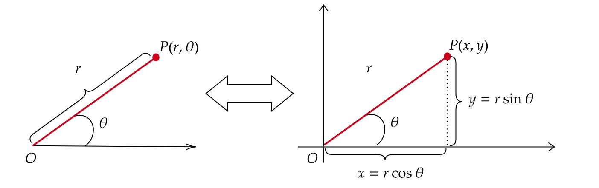

# 坐标系

## 2D坐标系

### 2D笛卡尔坐标系

### 2D极坐标系

用r和θ两个变量来表示坐标系中的一个点。

 {:width="70%"}

    x = r*cos(θ)
    y = r*sin(θ)

## 3D坐标系

`左手坐标系` : LHS, z的正坐标向纸内。
`右手坐标系` : RHS, z的正坐标向纸外。

### 3D柱面坐标系

### 3D球面坐标系

## OpenGL ES

| 版本 | 基于 | 备注 |
| --- | --- | --- |
| OpenGL ES 1.0 | OpenGL 1.3 |  |
| OpenGL ES 1.1 | OpenGL 1.5 | Ａndroid 1.0 和更高的版本支持这个 API 规范，OpenGL ES 1.x 是针对固定硬件管线的。|
| OpenGL ES 2.0 | OpenGL 2.0 | 不兼容 OpenGL ES 1.x。Android 2.2 (API 8) 和更高的版本支持这个 API 规范，OpenGL ES 2.x 是针对可编程硬件管线的。|
| OpenGL ES 3.0 | OpenGL 3.x | 技术特性几乎完全来自 OpenGL 3.x 的，向下兼容 OpenGL ES 2.x。Android 4.3 (API 18) 及更高的版本支持这个 API 规范。 |
| OpenGL ES 3.1 | OpenGL 4.x | 基本上可以属于 OpenGL 4.x 的子集，向下兼容 OpenGL ES 3.0/2.0。Android 5.0 (API 21) 和更高的版本支持这个 API 规范。|

**顶点着色器**

**片元着色器**

** OpenGL ES坐标系**

OpenGL ES 采用`右手`坐标，选取屏幕`中心`为原点，从原点到屏幕边缘默认长度为 1，也就是说默认情况下，从原点到 (1,0,0) 的距离和到 (0,1,0) 的距离在屏幕上展示的并不相同。

向右为 X 正轴方向，

向上为 Y 轴正轴方向，

屏幕外为 Z 轴正轴方向。

`纹理坐标`是以左上角为原理，向右为x, 向下为y轴正方向。

# 术语

投影，正交投影（orthogonal [ɔ:ˈθɔɡənl] projection）

透视投影（perspective [pəˈspektiv] projection)

环境光（ambient light [ˈæmbi:ənt lait]）

镜面光（specular ['spekjʊlə]）

漫反射（diffuse [dɪˈfjuːs , dɪˈfjuːz]）

# OpenGL 

