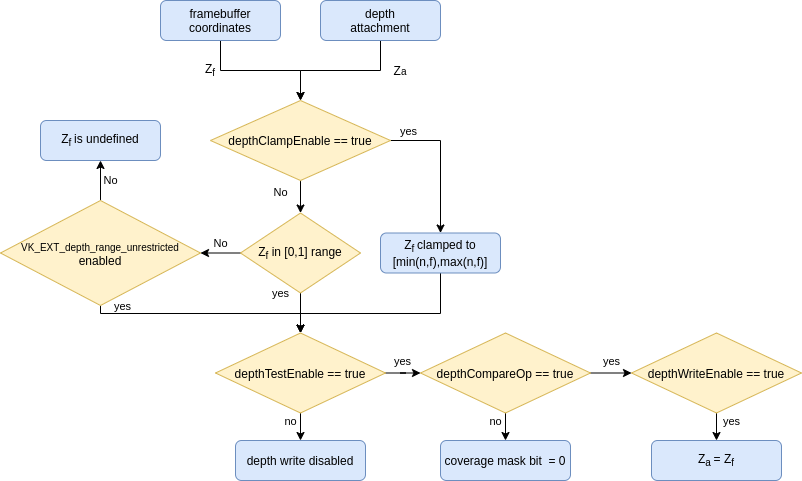

Table of Contents

<ul class="sectlevel0">
<li><a href="#Depth">Depth</a>
<ul class="sectlevel1">
<li><a href="#graphics-pipeline">1. Graphics Pipeline</a></li>
<li><a href="#depth-formats">2. Depth Formats</a></li>
<li><a href="#depth-buffer-as-a-vkimage">3. Depth Buffer as a VkImage</a>
<ul class="sectlevel2">
<li><a href="#layout">3.1. Layout</a></li>
<li><a href="#clearing">3.2. Clearing</a></li>
</ul>
</li>
<li><a href="#pre-rasterization">4. Pre-rasterization</a>
<ul class="sectlevel2">
<li><a href="#primitive-clipping">4.1. Primitive Clipping</a></li>
<li><a href="#viewport-transformation">4.2. Viewport Transformation</a></li>
</ul>
</li>
<li><a href="#rasterization">5. Rasterization</a>
<ul class="sectlevel2">
<li><a href="#depth-bias">5.1. Depth Bias</a></li>
</ul>
</li>
<li><a href="#post-rasterization">6. Post-rasterization</a>
<ul class="sectlevel2">
<li><a href="#fragment-shader">6.1. Fragment Shader</a></li>
<li><a href="#per-sample-processing-and-coverage-mask">6.2. Per-sample processing and coverage mask</a></li>
<li><a href="#depth-bounds">6.3. Depth Bounds</a></li>
<li><a href="#depth-test">6.4. Depth Test</a></li>
</ul>
</li>
</ul>
</li>
</ul>

permalink: /Notes/004-3d-rendering/vulkan/chapters/depth.html
layout: default
---

<h1 id="Depth" class="sect0">Depth</h1>

The term <code>depth</code> is used in various spots in the <a href="vulkan_spec.html">Vulkan Spec</a>. This chapter is aimed to give an overview of the various "depth" terminology used in Vulkan. Some basic knowledge of 3D graphics is needed to get the most out of this chapter.

<table>
<tr>
<td class="icon">

Note

</td>
<td class="content">

While stencil is closely related depth, this chapter does not aim to cover it outside the realm of API names

</td>
</tr>
</table>

<ul>
<li>

<a href="#graphics-pipeline">Graphics Pipeline</a>

</li>
<li>

<a href="#depth-formats">Depth Formats</a>

</li>
<li>

<a href="#depth-buffer-as-a-vkimage">Depth Buffer as a VkImage</a>

<ul>
<li>

<a href="#layout">Layout</a>

</li>
<li>

<a href="#clearing">Clearing</a>

</li>
</ul>

</li>
<li>

<a href="#pre-rasterization">Pre-rasterization</a>

<ul>
<li>

<a href="#primitive-clipping">Primitive Clipping</a>

<ul>
<li>

<a href="#user-defined-clipping-and-culling">User defined clipping and culling</a>

</li>
<li>

<a href="#porting-from-opengl">Porting from OpenGL</a>

</li>
</ul>

</li>
<li>

<a href="#viewport-transformation">Viewport Transformation</a>

<ul>
<li>

<a href="#depth-range">Depth Range</a>

</li>
</ul>

</li>
</ul>

</li>
<li>

<a href="#rasterization">Rasterization</a>

<ul>
<li>

<a href="#depth-bias">Depth Bias</a>

</li>
</ul>

</li>
<li>

<a href="#post-rasterization">Post-rasterization</a>

<ul>
<li>

<a href="#fragment-shader">Fragment Shader</a>

<ul>
<li>

<a href="#conservative-depth">Conservative depth</a>

</li>
</ul>

</li>
<li>

<a href="#per-sample-processing-and-coverage-mask">Per-sample processing and coverage mask</a>

<ul>
<li>

<a href="#resolving-depth-buffer">Resolving depth buffer</a>

</li>
</ul>

</li>
<li>

<a href="#depth-bounds">Depth Bounds</a>

</li>
<li>

<a href="#depth-test">Depth Test</a>

<ul>
<li>

<a href="#depth-compare-operation">Depth Compare Operation</a>

</li>
<li>

<a href="#depth-buffer-writes">Depth Buffer Writes</a>

</li>
<li>

<a href="#depth-clamping">Depth Clamping</a>

</li>
</ul>

</li>
</ul>

</li>
</ul>

<h2 id="graphics-pipeline">1. Graphics Pipeline</h2>

The concept of "depth" is only used for <a href="what_vulkan_can_do.html">graphics pipelines</a> in Vulkan and doesn&#8217;t take effect until a draw call is submitted.

Inside the <code>VkGraphicsPipelineCreateInfo</code> there are many different values related to <code>depth</code> that can be controlled. Some states are even <a href="dynamic_state.html">dynamic</a> as well.

<h2 id="depth-formats">2. Depth Formats</h2>

There are a few different depth formats and an implementation may expose support for in Vulkan.

For <strong>reading</strong> from a depth image only <code>VK_FORMAT_D16_UNORM</code> and <code>VK_FORMAT_D32_SFLOAT</code> are required to support being read via sampling or blit operations.

For <strong>writing</strong> to a depth image <code>VK_FORMAT_D16_UNORM</code> is required to be supported. From here at least one of (<code>VK_FORMAT_X8_D24_UNORM_PACK32</code> <strong>or</strong> <code>VK_FORMAT_D32_SFLOAT</code>) <strong>and</strong> (<code>VK_FORMAT_D24_UNORM_S8_UINT</code> <strong>or</strong> <code>VK_FORMAT_D32_SFLOAT_S8_UINT</code>) must also be supported. This will involve some extra logic when trying to find which format to use if <strong>both</strong> the depth and stencil are needed in the same format.

<pre class="highlight"><code class="language-cpp" data-lang="cpp">// Example of query logic
VkFormatProperties properties;

vkGetPhysicalDeviceFormatProperties(physicalDevice, VK_FORMAT_D24_UNORM_S8_UINT, &amp;properties);
bool d24s8_support = (properties.optimalTilingFeatures &amp; VK_FORMAT_FEATURE_DEPTH_STENCIL_ATTACHMENT_BIT);

vkGetPhysicalDeviceFormatProperties(physicalDevice, VK_FORMAT_D32_SFLOAT_S8_UINT, &amp;properties);
bool d32s8_support = (properties.optimalTilingFeatures &amp; VK_FORMAT_FEATURE_DEPTH_STENCIL_ATTACHMENT_BIT);

assert(d24s8_support | d32s8_support); // will always support at least one</code></pre>

<h2 id="depth-buffer-as-a-vkimage">3. Depth Buffer as a VkImage</h2>

The term "depth buffer" is used a lot when talking about graphics, but in Vulkan, it is just a <code>VkImage</code>/<code>VkImageView</code> that a <code>VkFramebuffer</code> can reference at draw time. When creating a <code>VkRenderPass</code> the <code>pDepthStencilAttachment</code> value points to the depth attachment in the framebuffer.

In order to use <code>pDepthStencilAttachment</code> the backing <code>VkImage</code> must have been created with <code>VK_IMAGE_USAGE_DEPTH_STENCIL_ATTACHMENT_BIT</code>.

When performing operations such as image barriers or clearing where the <code>VkImageAspectFlags</code> is required, the <code>VK_IMAGE_ASPECT_DEPTH_BIT</code> is used to reference the depth memory.

<h3 id="layout">3.1. Layout</h3>

When selecting the <code>VkImageLayout</code> there are some layouts that allow for <strong>both</strong> reading and writing to the image:

<ul>
<li>

VK_IMAGE_LAYOUT_<strong>DEPTH</strong>_STENCIL_<strong>ATTACHMENT</strong>_OPTIMAL

</li>
<li>

VK_IMAGE_LAYOUT_<strong>DEPTH_ATTACHMENT</strong>_STENCIL_READ_ONLY_OPTIMAL

</li>
<li>

VK_IMAGE_LAYOUT_<strong>DEPTH_ATTACHMENT</strong>_OPTIMAL

</li>
</ul>

as well as layouts that allow for <strong>only</strong> reading to the image:

<ul>
<li>

VK_IMAGE_LAYOUT_<strong>DEPTH</strong>_STENCIL_<strong>READ_ONLY</strong>_OPTIMAL

</li>
<li>

VK_IMAGE_LAYOUT_<strong>DEPTH_READ_ONLY</strong>_STENCIL_ATTACHMENT_OPTIMAL

</li>
<li>

VK_IMAGE_LAYOUT_<strong>DEPTH_READ_ONLY</strong>_OPTIMAL

</li>
</ul>

When doing the layout transition make sure to set the proper depth access masks needed for both reading and writing the depth image.

<pre class="highlight"><code class="language-cpp" data-lang="cpp">// Example of going from undefined layout to a depth attachment to be read and written to

// Core Vulkan example
srcAccessMask = 0;
dstAccessMask = VK_ACCESS_DEPTH_STENCIL_ATTACHMENT_READ_BIT | VK_ACCESS_DEPTH_STENCIL_ATTACHMENT_WRITE_BIT;
sourceStage = VK_PIPELINE_STAGE_TOP_OF_PIPE_BIT;
destinationStage = VK_PIPELINE_STAGE_EARLY_FRAGMENT_TESTS_BIT | VK_PIPELINE_STAGE_LATE_FRAGMENT_TESTS_BIT;

// VK_KHR_synchronization2
srcAccessMask = VK_ACCESS_2_NONE_KHR;
dstAccessMask = VK_ACCESS_2_DEPTH_STENCIL_ATTACHMENT_READ_BIT_KHR | VK_ACCESS_2_DEPTH_STENCIL_ATTACHMENT_WRITE_BIT_KHR;
sourceStage = VK_PIPELINE_STAGE_2_NONE_KHR;
destinationStage = VK_PIPELINE_STAGE_2_EARLY_FRAGMENT_TESTS_BIT_KHR | VK_PIPELINE_STAGE_2_LATE_FRAGMENT_TESTS_BIT_KHR;</code></pre>

<table>
<tr>
<td class="icon">

Note

</td>
<td class="content">

If unsure to use only early or late fragment tests for your application, use both.

</td>
</tr>
</table>

<h3 id="clearing">3.2. Clearing</h3>

It is always better to clear a depth buffer at the start of the pass with <code>loadOp</code> set to <code>VK_ATTACHMENT_LOAD_OP_CLEAR</code>, but depth images can also be cleared outside a render pass using <code>vkCmdClearDepthStencilImage</code>.

When clearing, notice that <code>VkClearValue</code> is a union and <code>VkClearDepthStencilValue depthStencil</code> should be set instead of the color clear value.

<h2 id="pre-rasterization">4. Pre-rasterization</h2>

In the graphics pipeline, there are a series of <a href="https://www.khronos.org/registry/vulkan/specs/1.3-extensions/html/vkspec.html#pipeline-graphics-subsets-pre-rasterization">pre-rasterization shader stages</a> that generate primitives to be rasterized. Before reaching the rasterization step, the final <code>vec4</code> position (<code>gl_Position</code>) of the last pre-rasterization stage runs through <a href="https://www.khronos.org/registry/vulkan/specs/1.3-extensions/html/vkspec.html#vertexpostproc">Fixed-Function Vertex Post-Processing</a>.

The following gives a high level overview of the various coordinates name and operations that occur before rasterization.

<h3 id="primitive-clipping">4.1. Primitive Clipping</h3>

Clipping always occurs, unless using the <code>depthClipEnable</code> from <a href="extensions/translation_layer_extensions.html#vk_ext_depth_clip_enable">VK_EXT_depth_clip_enable</a>, if the primitive is outside the <code>view volume</code>. In Vulkan, this is expressed for depth as

<pre class="highlight"><code>0 &lt;= Zc &lt;= Wc</code></pre>

When the normalized device coordinates (NDC) are calculated, anything outside of <code>[0, 1]</code> is clipped.

A few examples where <code>Zd</code> is the result of <code>Zc</code>/<code>Wc</code>:

<ul>
<li>

<code>vec4(1.0, 1.0, 2.0, 2.0)</code> - not clipped (<code>Zd</code> == <code>1.0</code>)

</li>
<li>

<code>vec4(1.0, 1.0, 0.0, 2.0)</code> - not clipped (<code>Zd</code> == <code>0.0</code>)

</li>
<li>

<code>vec4(1.0, 1.0, -1.0, 2.0)</code> - clipped  (<code>Zd</code> == <code>-0.5</code>)

</li>
<li>

<code>vec4(1.0, 1.0, -1.0, -2.0)</code> - not clipped (<code>Zd</code> == <code>0.5</code>)

</li>
</ul>

<h4 id="user-defined-clipping-and-culling">4.1.1. User defined clipping and culling</h4>

Using <code>ClipDistance</code> and <code>CullDistance</code> built-in arrays the <a href="https://www.khronos.org/registry/vulkan/specs/1.3-extensions/html/vkspec.html#pipeline-graphics-subsets-pre-rasterization">pre-rasterization shader stages</a> can set <a href="https://www.khronos.org/opengl/wiki/Vertex_Post-Processing#User-defined_clipping">user defined clipping and culling</a>.

In the last pre-rasterization shader stage, these values will be linearly interpolated across the primitive and the portion of the primitive with interpolated distances less than <code>0</code> will be considered outside the clip volume. If <code>ClipDistance</code> or <code>CullDistance</code> are then used by a fragment shader, they contain these linearly interpolated values.

<table>
<tr>
<td class="icon">

Note

</td>
<td class="content">

<code>ClipDistance</code> and <code>CullDistance</code> are <code>gl_ClipDistance[]</code> and <code>gl_CullDistance[]</code> in GLSL.

</td>
</tr>
</table>

<h4 id="porting-from-opengl">4.1.2. Porting from OpenGL</h4>

In OpenGL the <code>view volume</code> is expressed as

<pre class="highlight"><code>-Wc &lt;= Zc &lt;= Wc</code></pre>

and anything outside of <code>[-1, 1]</code> is clipped.

The <a href="https://www.khronos.org/registry/vulkan/specs/1.3-extensions/man/html/VK_EXT_depth_clip_control.html">VK_EXT_depth_clip_control</a> extension was added to allow efficient layering of OpenGL over Vulkan. By setting the <code>VkPipelineViewportDepthClipControlCreateInfoEXT::negativeOneToOne</code> to <code>VK_TRUE</code> when creating the <code>VkPipeline</code> it will use the OpenGL <code>[-1, 1]</code> view volume.

If <code>VK_EXT_depth_clip_control</code> is not available, the <a href="https://github.com/KhronosGroup/Vulkan-Docs/issues/1054#issuecomment-547202276">workaround currently</a> is to perform the conversion in the pre-rasterization shader

<pre class="highlight"><code class="language-glsl" data-lang="glsl">// [-1,1] to [0,1]
position.z = (position.z + position.w) * 0.5;</code></pre>

<h3 id="viewport-transformation">4.2. Viewport Transformation</h3>

The viewport transformation is a transformation from normalized device coordinates to framebuffer coordinates, based on a viewport rectangle and depth range.

The list of viewports being used in the pipeline is expressed by <code>VkPipelineViewportStateCreateInfo::pViewports</code> and <code>VkPipelineViewportStateCreateInfo::viewportCount</code> sets the number of viewports being used. If <code>VkPhysicalDeviceFeatures::multiViewport</code> is not enabled, there must only be 1 viewport.

<table>
<tr>
<td class="icon">

Note

</td>
<td class="content">

The viewport value can be set <a href="dynamic_state.html">dynamically</a> using <code>VK_DYNAMIC_STATE_VIEWPORT</code> or the <code>VK_DYNAMIC_STATE_VIEWPORT_WITH_COUNT_EXT</code> from <a href="https://www.khronos.org/registry/vulkan/specs/1.3-extensions/man/html/VK_EXT_extended_dynamic_state.html">VK_EXT_extended_dynamic_state</a>.

</td>
</tr>
</table>

<h4 id="depth-range">4.2.1. Depth Range</h4>

Each viewport holds a <code>VkViewport::minDepth</code> and <code>VkViewport::maxDepth</code> value which sets the "depth range" for the viewport.

<table>
<tr>
<td class="icon">

Note

</td>
<td class="content">

Despite their names, <code>minDepth</code> can be less than, equal to, or greater than <code>maxDepth</code>.

</td>
</tr>
</table>

The <code>minDepth</code> and <code>maxDepth</code> are restricted to be set inclusively between <code>0.0</code> and <code>1.0</code>. If the <a href="https://www.khronos.org/registry/vulkan/specs/1.3-extensions/man/html/VK_EXT_depth_range_unrestricted.html">VK_EXT_depth_range_unrestricted</a> is enabled, this restriction goes away.

The framebuffer depth coordinate <code>Zf</code> is represented as:

<pre class="highlight"><code>Zf = Pz * Zd + Oz</code></pre>

<ul>
<li>

<code>Zd</code> = <code>Zc</code>/<code>Wc</code> (see <a href="#primitive-clipping">Primitive Clipping</a>)

</li>
<li>

<code>Oz</code> = <code>minDepth</code>

</li>
<li>

<code>Pz</code> = <code>maxDepth</code> - <code>minDepth</code>

</li>
</ul>

<h2 id="rasterization">5. Rasterization</h2>

<h3 id="depth-bias">5.1. Depth Bias</h3>

The depth values of all fragments generated by the rasterization of a polygon can be offset by a single value that is computed for that polygon. If <code>VkPipelineRasterizationStateCreateInfo::depthBiasEnable</code> is <code>VK_FALSE</code> at draw time, no depth bias is applied.

Using the <code>depthBiasConstantFactor</code>, <code>depthBiasClamp</code>, and <code>depthBiasSlopeFactor</code> in <code>VkPipelineRasterizationStateCreateInfo</code> the depth bias <a href="https://www.khronos.org/registry/vulkan/specs/1.3-extensions/html/vkspec.html#primsrast-depthbias">can be calculated</a>.

<table>
<tr>
<td class="icon">

Note

</td>
<td class="content">

Requires the <code>VkPhysicalDeviceFeatures::depthBiasClamp</code> feature to be supported otherwise <code>VkPipelineRasterizationStateCreateInfo::depthBiasClamp</code> must be <code>0.0f</code>.

</td>
</tr>
</table>

<table>
<tr>
<td class="icon">

Note

</td>
<td class="content">

The depth bias values can be set <a href="dynamic_state.html">dynamically</a> using <code>VK_DYNAMIC_STATE_DEPTH_BIAS</code> or the <code>VK_DYNAMIC_STATE_DEPTH_BIAS_ENABLE_EXT</code> from <a href="https://www.khronos.org/registry/vulkan/specs/1.3-extensions/man/html/VK_EXT_extended_dynamic_state2.html">VK_EXT_extended_dynamic_state2</a>.

</td>
</tr>
</table>

<h2 id="post-rasterization">6. Post-rasterization</h2>

<h3 id="fragment-shader">6.1. Fragment Shader</h3>

The input built-in <code>FragCoord</code> is the framebuffer coordinate. The <code>Z</code> component is the interpolated depth value of the primitive. This <code>Z</code> component value will be written to <code>FragDepth</code> if the shader doesn&#8217;t write to it. If the shader dynamically writes to <code>FragDepth</code>, the <code>DepthReplacing</code> Execution Mode must be declared (This is done in tools such as glslang).

<table>
<tr>
<td class="icon">

Note

</td>
<td class="content">

<code>FragDepth</code> and <code>FragCoord</code> are <code>gl_FragDepth</code> and <code>gl_FragCoord</code> in GLSL.

</td>
</tr>
</table>

<table>
<tr>
<td class="icon">

Note

</td>
<td class="content">

When using <code>OpTypeImage</code> in SPIR-V the <code>Depth</code> operand is ignored in Vulkan

</td>
</tr>
</table>

<h4 id="conservative-depth">6.1.1. Conservative depth</h4>

The <code>DepthGreater</code>, <code>DepthLess</code>, and <code>DepthUnchanged</code> Executation Mode allow for a possible optimization for implementations that <a href="https://www.khronos.org/registry/OpenGL/extensions/ARB/ARB_conservative_depth.txt">relies on an early depth test to be run before the fragment</a>. This can be easily done in GLSL by declaring <code>gl_FragDepth</code> with the proper layout qualifier.

<pre class="highlight"><code class="language-glsl" data-lang="glsl">// assume it may be modified in any way
layout(depth_any) out float gl_FragDepth;

// assume it may be modified such that its value will only increase
layout(depth_greater) out float gl_FragDepth;

// assume it may be modified such that its value will only decrease
layout(depth_less) out float gl_FragDepth;

// assume it will not be modified
layout(depth_unchanged) out float gl_FragDepth;</code></pre>

Violating the condition​ yields undefined behavior.

<h3 id="per-sample-processing-and-coverage-mask">6.2. Per-sample processing and coverage mask</h3>

The following post-rasterization occurs as a "per-sample" operation. This means when doing <a href="https://www.khronos.org/registry/vulkan/specs/1.3-extensions/html/vkspec.html#fragops-covg">multisampling</a> with a color attachment, any "depth buffer" <code>VkImage</code> used as well must also have been created with the same <code>VkSampleCountFlagBits</code> value.

Each fragment has a <a href="https://www.khronos.org/registry/vulkan/specs/1.3-extensions/html/vkspec.html#primsrast-multisampling-coverage-mask">coverage mask</a> based on which samples within that fragment are determined to be within the area of the primitive that generated the fragment. If a fragment operation results in all bits of the coverage mask being <code>0</code>, the fragment is discarded.

<h4 id="resolving-depth-buffer">6.2.1. Resolving depth buffer</h4>

It is possible in Vulkan using the <a href="extensions/cleanup.html#vk_khr_depth_stencil_resolve">VK_KHR_depth_stencil_resolve</a> extension (promoted to Vulkan core in 1.2) to resolve multisampled depth/stencil attachments in a subpass in a similar manner as for color attachments.

<h3 id="depth-bounds">6.3. Depth Bounds</h3>

<table>
<tr>
<td class="icon">

Note

</td>
<td class="content">

Requires the <code>VkPhysicalDeviceFeatures::depthBounds</code> feature to be supported.

</td>
</tr>
</table>

If <code>VkPipelineDepthStencilStateCreateInfo::depthBoundsTestEnable</code> is used to take each <code>Za</code> in the depth attachment and check if it is within the range set by <code>VkPipelineDepthStencilStateCreateInfo::minDepthBounds</code> and <code>VkPipelineDepthStencilStateCreateInfo::maxDepthBounds</code>. If the value is not within the bounds, the <a href="https://www.khronos.org/registry/vulkan/specs/1.3-extensions/html/vkspec.html#primsrast-multisampling-coverage-mask">coverage mask</a> is set to zero.

<table>
<tr>
<td class="icon">

Note

</td>
<td class="content">

The depth bound values can be set <a href="dynamic_state.html">dynamically</a> using <code>VK_DYNAMIC_STATE_DEPTH_BOUNDS</code> or the <code>VK_DYNAMIC_STATE_DEPTH_BOUNDS_TEST_ENABLE_EXT</code> from <a href="https://www.khronos.org/registry/vulkan/specs/1.3-extensions/man/html/VK_EXT_extended_dynamic_state.html">VK_EXT_extended_dynamic_state</a>.

</td>
</tr>
</table>

<h3 id="depth-test">6.4. Depth Test</h3>

The depth test compares the framebuffer depth coordinate <code>Zf</code> with the depth value <code>Za</code> in the depth attachment. If the test fails, the fragment is discarded. If the test passes, the depth attachment will be updated with the fragment&#8217;s output depth. The <code>VkPipelineDepthStencilStateCreateInfo::depthTestEnable</code> is used to enable/disable the test in the pipeline.

The following gives a high level overview of the depth test.

<h4 id="depth-compare-operation">6.4.1. Depth Compare Operation</h4>

The <code>VkPipelineDepthStencilStateCreateInfo::depthCompareOp</code> provides the comparison function used for the depth test.

An example where <code>depthCompareOp</code> == <code>VK_COMPARE_OP_LESS</code> (<code>Zf</code> &lt; <code>Za</code>)

<ul>
<li>

<code>Zf</code> = 1.0 | <code>Za</code> = 2.0 | test passes

</li>
<li>

<code>Zf</code> = 1.0 | <code>Za</code> = 1.0 | test fails

</li>
<li>

<code>Zf</code> = 1.0 | <code>Za</code> = 0.0 | test fails

</li>
</ul>

<table>
<tr>
<td class="icon">

Note

</td>
<td class="content">

The <code>depthTestEnable</code> and <code>depthCompareOp</code> value can be set <a href="dynamic_state.html">dynamically</a> using <code>VK_DYNAMIC_STATE_DEPTH_TEST_ENABLE_EXT</code> and <code>VK_DYNAMIC_STATE_DEPTH_COMPARE_OP_EXT</code> from <a href="https://www.khronos.org/registry/vulkan/specs/1.3-extensions/man/html/VK_EXT_extended_dynamic_state.html">VK_EXT_extended_dynamic_state</a>.

</td>
</tr>
</table>

<h4 id="depth-buffer-writes">6.4.2. Depth Buffer Writes</h4>

Even if the depth test passes, if <code>VkPipelineDepthStencilStateCreateInfo::depthWriteEnable</code> is set to <code>VK_FALSE</code> it will not write the value out to the depth attachment. The main reason for this is because the depth test itself will set the <a href="https://www.khronos.org/registry/vulkan/specs/1.3-extensions/html/vkspec.html#primsrast-multisampling-coverage-mask">coverage mask</a> which can be used for certain render techniques.

<table>
<tr>
<td class="icon">

Note

</td>
<td class="content">

The <code>depthWriteEnable</code> value can be set <a href="dynamic_state.html">dynamically</a> using <code>VK_DYNAMIC_STATE_DEPTH_WRITE_ENABLE_EXT</code> from <a href="https://www.khronos.org/registry/vulkan/specs/1.3-extensions/man/html/VK_EXT_extended_dynamic_state.html">VK_EXT_extended_dynamic_state</a>.

</td>
</tr>
</table>

<h4 id="depth-clamping">6.4.3. Depth Clamping</h4>

<table>
<tr>
<td class="icon">

Note

</td>
<td class="content">

Requires the <code>VkPhysicalDeviceFeatures::depthClamp</code> feature to be supported.

</td>
</tr>
</table>

Prior to the depth test, if <code>VkPipelineRasterizationStateCreateInfo::depthClampEnable</code> is enabled, before the sample’s <code>Zf</code> is compared to <code>Za</code>, <code>Zf</code> is clamped to <code>[min(n,f), max(n,f)]</code>, where <code>n</code> and <code>f</code> are the <code>minDepth</code> and <code>maxDepth</code> depth range values of the viewport used by this fragment, respectively.

