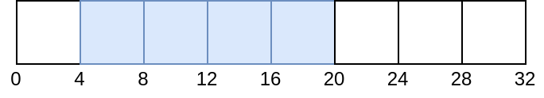

Table of Contents

<ul class="sectlevel0">
<li><a href="#descriptor-dynamic-offset">Descriptor Dynamic Offset</a>
<ul class="sectlevel1">
<li><a href="#_example">1. Example</a></li>
<li><a href="#_example_with_vk_whole_size">2. Example with VK_WHOLE_SIZE</a></li>
<li><a href="#_limits">3. Limits</a></li>
</ul>
</li>
</ul>

permalink: /Notes/004-3d-rendering/vulkan/chapters/descriptor_dynamic_offset.html
---

<h1 id="descriptor-dynamic-offset" class="sect0">Descriptor Dynamic Offset</h1>

Vulkan offers two types of descriptors that allow adjusting the offset at bind time as <a href="https://www.khronos.org/registry/vulkan/specs/1.3/html/vkspec.html#descriptorsets-binding-dynamicoffsets">defined in the spec</a>.

<ul>
<li>

dynamic uniform buffer (<code>VK_DESCRIPTOR_TYPE_UNIFORM_BUFFER_DYNAMIC</code>)

</li>
<li>

dynamic storage buffer (<code>VK_DESCRIPTOR_TYPE_STORAGE_BUFFER_DYNAMIC</code>)

</li>
</ul>

<h2 id="_example">1. Example</h2>

This example will have buffer of 32 bytes and 16 of the bytes will be set at <code>vkUpdateDescriptorSets</code> time. In this first example, we will not add any dynamic offset.

<pre class="highlight"><code class="language-c" data-lang="c">VkDescriptorSet descriptorSet; // allocated
VkBuffer buffer; // size of 32 bytes

VkDescriptorBufferInfo bufferInfo = {
    buffer,
    4,      // offset
    16      // range
};

VkWriteDescriptorSet writeInfo = {
    .dstSet = descriptorSet,
    .descriptorType = VK_DESCRIPTOR_TYPE_STORAGE_BUFFER_DYNAMIC,
    .pBufferInfo = bufferInfo
};

vkUpdateDescriptorSets(
    1,         // descriptorWriteCount,
    &amp;writeInfo // pDescriptorWrites,
);

// No dynamic offset
vkCmdBindDescriptorSets(
    1,              // descriptorSetCount,
    &amp;descriptorSet, // pDescriptorSets,
    0,              // dynamicOffsetCount
    NULL            // pDynamicOffsets
);</code></pre>

Our buffer now currently looks like the following:

Next, a 8 byte dynamic offset will applied at bind time.

<pre class="highlight"><code class="language-c" data-lang="c">uint32_t offsets[1] = { 8 };
vkCmdBindDescriptorSets(
    1,              // descriptorSetCount,
    &amp;descriptorSet, // pDescriptorSets,
    1,              // dynamicOffsetCount
    offsets         // pDynamicOffsets
);</code></pre>

Our buffer currently looks like the following:

<h2 id="_example_with_vk_whole_size">2. Example with VK_WHOLE_SIZE</h2>

This time the <code>VK_WHOLE_SIZE</code> value will be used for the range. Everything looks the same as the above example except the <code>VkDescriptorBufferInfo::range</code>

<pre class="highlight"><code class="language-c" data-lang="c">VkDescriptorSet descriptorSet; // allocated
VkBuffer buffer; // size of 32 bytes

VkDescriptorBufferInfo info = {
    buffer,
    4,             // offset
    VK_WHOLE_SIZE  // range
};

VkWriteDescriptorSet writeInfo = {
    .dstSet = descriptorSet,
    .descriptorType = VK_DESCRIPTOR_TYPE_STORAGE_BUFFER_DYNAMIC,
    .pBufferInfo = bufferInfo
};

vkUpdateDescriptorSets(
    1,         // descriptorWriteCount,
    &amp;writeInfo // pDescriptorWrites,
);

// No dynamic offset
vkCmdBindDescriptorSets(
    1,              // descriptorSetCount,
    &amp;descriptorSet, // pDescriptorSets,
    0,              // dynamicOffsetCount
    NULL            // pDynamicOffsets
);</code></pre>

Our buffer currently looks like the following:

This time, if we attempt to apply a dynamic offset it will be met with undefined behavior and the <a href="https://github.com/KhronosGroup/Vulkan-ValidationLayers/issues/2846">validation layers will give an error</a>

<pre class="highlight"><code class="language-c" data-lang="c">// Invalid
uint32_t offsets[1] = { 8 };
vkCmdBindDescriptorSets(
    1,              // descriptorSetCount,
    &amp;descriptorSet, // pDescriptorSets,
    1,              // dynamicOffsetCount
    offsets         // pDynamicOffsets
);</code></pre>

This is what it looks like with the invalid dynamic offset

<h2 id="_limits">3. Limits</h2>

It is important to also check the <code>minUniformBufferOffsetAlignment</code> and <code>minStorageBufferOffsetAlignment</code> as both the base offset and dynamic offset must be multiples of these limits.

