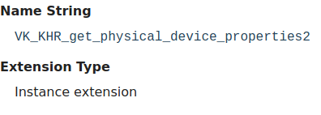

Table of Contents

<ul class="sectlevel0">
<li><a href="#enabling-extensions">Enabling Extensions</a>
<ul class="sectlevel1">
<li><a href="#_two_types_of_extensions">1. Two types of extensions</a></li>
<li><a href="#_check_for_support">2. Check for support</a></li>
<li><a href="#_enable_the_extension">3. Enable the Extension</a></li>
<li><a href="#_check_for_feature_bits">4. Check for feature bits</a></li>
<li><a href="#_promotion_process">5. Promotion Process</a>
<ul class="sectlevel2">
<li><a href="#_promotion_change_of_behavior">5.1. Promotion Change of Behavior</a></li>
</ul>
</li>
</ul>
</li>
</ul>

permalink: /Notes/004-3d-rendering/vulkan/chapters/enabling_extensions.html
---

<h1 id="enabling-extensions" class="sect0">Enabling Extensions</h1>

This section goes over the logistics for enabling extensions.

<h2 id="_two_types_of_extensions">1. Two types of extensions</h2>

There are two groups of extensions, <strong>instance extensions</strong> and <strong>device extensions</strong>. Simply put, <strong>instance extensions</strong> are tied to the entire <code>VkInstance</code> while <strong>device extensions</strong> are tied to only a single <code>VkDevice</code> instance.

This information is documented under the &#8220;Extension Type&#8221; section of each extension reference page. Example below:

<h2 id="_check_for_support">2. Check for support</h2>

An application can <a href="https://www.khronos.org/registry/vulkan/specs/1.3-extensions/html/vkspec.html#extendingvulkan-extensions">query the physical device</a> first to check if the extension is <strong>supported</strong> with <code>vkEnumerateInstanceExtensionProperties</code> or <code>vkEnumerateDeviceExtensionProperties</code>.

<pre class="highlight"><code class="language-cpp" data-lang="cpp">// Simple example
uint32_t count = 0;
vkEnumerateDeviceExtensionProperties(physicalDevice, nullptr, &amp;count, nullptr);
std::vector&lt;VkExtensionProperties&gt; extensions(count);
vkEnumerateDeviceExtensionProperties(physicalDevice, nullptr, &amp;count, extensions.data());

// Checking for support of VK_KHR_bind_memory2
for (uint32_t i = 0; i &lt; count; i++) {
    if (strcmp(VK_KHR_BIND_MEMORY_2_EXTENSION_NAME, extensions[i].extensionName) == 0) {
        break; // VK_KHR_bind_memory2 is supported
    }
}</code></pre>

<h2 id="_enable_the_extension">3. Enable the Extension</h2>

Even if the extension is <strong>supported</strong> by the implementation, it is <strong>undefined behavior</strong> to use the functionality of the extension unless it is <strong>enabled</strong> at <code>VkInstance</code> or <code>VkDevice</code> creation time.

Here is an example of what is needed to enable an extension such as <code>VK_KHR_driver_properties</code>.

<pre class="highlight"><code class="language-cpp" data-lang="cpp">// VK_KHR_get_physical_device_properties2 is required to use VK_KHR_driver_properties
// since it's an instance extension it needs to be enabled before at VkInstance creation time
std::vector&lt;const char*&gt; instance_extensions;
instance_extensions.push_back(VK_KHR_GET_PHYSICAL_DEVICE_PROPERTIES_2_EXTENSION_NAME);

VkInstanceCreateInfo instance_create_info  = {};
instance_create_info.enabledExtensionCount   = static_cast&lt;uint32_t&gt;(instance_extensions.size());
instance_create_info.ppEnabledExtensionNames = instance_extensions.data();
vkCreateInstance(&amp;instance_create_info, nullptr, &amp;myInstance));

// ...

std::vector&lt;const char*&gt; device_extensions;
device_extensions.push_back(VK_KHR_DRIVER_PROPERTIES_EXTENSION_NAME);

VkDeviceCreateInfo device_create_info      = {};
device_create_info.enabledExtensionCount   = static_cast&lt;uint32_t&gt;(device_extensions.size());
device_create_info.ppEnabledExtensionNames = device_extensions.data();
vkCreateDevice(physicalDevice, &amp;device_create_info, nullptr, &amp;myDevice);</code></pre>

<h2 id="_check_for_feature_bits">4. Check for feature bits</h2>

It is important to remember that extensions add the existence of functionality to the Vulkan spec, but this doesn&#8217;t mean that all features of an extension are available if the extension is <strong>supported</strong>. An example is an extension such as <code>VK_KHR_8bit_storage</code>, which has 3 features it exposes in <code>VkPhysicalDevice8BitStorageFeatures</code>.

This means after enabling the extension, an application will still need to <a href="enabling_features.html#enabling-features">query and enable the features</a> needed from an extension.

<h2 id="_promotion_process">5. Promotion Process</h2>

When minor versions of <a href="vulkan_release_summary.html#vulkan-release-summary">Vulkan are released</a>, some extensions are <a href="https://www.khronos.org/registry/vulkan/specs/1.3-extensions/html/vkspec.html#extendingvulkan-compatibility-promotion">promoted as defined in the spec</a>. The goal of promotion is to have extended functionality, that the Vulkan Working Group has decided is widely supported, to be in the core Vulkan spec. More details about Vulkan versions can be found in the <a href="versions.html#versions">version chapter</a>.

An example would be something such as <code>VK_KHR_get_physical_device_properties2</code> which is used for most other extensions. In Vulkan 1.0, an application has to query for support of <code>VK_KHR_get_physical_device_properties2</code> before being able to call a function such as <code>vkGetPhysicalDeviceFeatures2KHR</code>. Starting in Vulkan 1.1, the <code>vkGetPhysicalDeviceFeatures2</code> function is guaranteed to be supported.

Another way to look at promotion is with the <code>VK_KHR_8bit_storage</code> as an example again. Since Vulkan 1.0 some features, such as <code>textureCompressionASTC_LDR</code>, are not required to be supported, but are available to query without needing to enable any extensions. Starting in Vulkan 1.2 when <code>VK_KHR_8bit_storage</code> was promoted to core, all the features in <code>VkPhysicalDevice8BitStorageFeatures</code> can now be found in <code>VkPhysicalDeviceVulkan12Features</code>.

<h3 id="_promotion_change_of_behavior">5.1. Promotion Change of Behavior</h3>

It is important to realize there is a subtle difference for <strong>some</strong> extension that are promoted. <a href="https://www.khronos.org/registry/vulkan/specs/1.3-extensions/html/vkspec.html#extendingvulkan-compatibility-promotion">The spec describes</a> how promotion <strong>can</strong> involve minor changes such as in the extension&#8217;s &#8220;Feature advertisement/enablement&#8221;. To best describe the subtlety of this, <code>VK_KHR_8bit_storage</code> can be used as a use case.

The <a href="https://www.khronos.org/registry/vulkan/specs/1.3-extensions/html/vkspec.html#_differences_relative_to_vk_khr_8bit_storage">Vulkan spec describes the change</a> for <code>VK_KHR_8bit_storage</code> for Vulkan 1.2 where it states:

<blockquote>

If the VK_KHR_8bit_storage extension is not supported, support for the SPIR-V StorageBuffer8BitAccess capability in shader modules is optional.

</blockquote>

"not supported" here refers to the fact that an implementation might support Vulkan 1.2+, but if an application queries <code>vkEnumerateDeviceExtensionProperties</code> it is possible that <code>VK_KHR_8bit_storage</code> will not be in the result.

<ul>
<li>

If <code>VK_KHR_8bit_storage</code> is found in <code>vkEnumerateDeviceExtensionProperties</code> then the <code>storageBuffer8BitAccess</code> feature is <strong>guaranteed</strong> to be supported.

</li>
<li>

If <code>VK_KHR_8bit_storage</code> is <strong>not</strong> found in <code>vkEnumerateDeviceExtensionProperties</code> then the <code>storageBuffer8BitAccess</code> feature <strong>might</strong> be supported and can be checked by querying <code>VkPhysicalDeviceVulkan12Features::storageBuffer8BitAccess</code>.

</li>
</ul>

The list of all feature changes to promoted extensions can be found in the <a href="https://www.khronos.org/registry/vulkan/specs/1.3-extensions/html/vkspec.html#versions">version appendix of the spec</a>.

