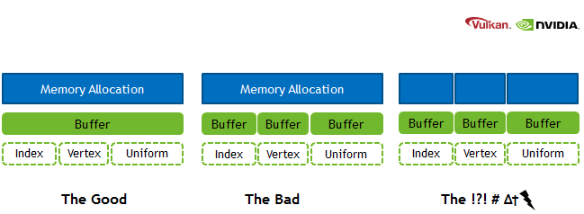
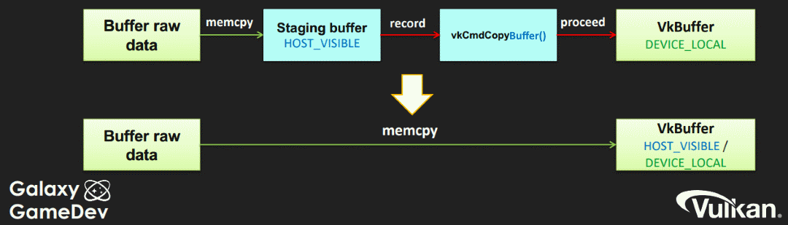

Table of Contents

<ul class="sectlevel0">
<li><a href="#memory-allocation">Memory Allocation</a>
<ul class="sectlevel1">
<li><a href="#_sub_allocation">1. Sub-allocation</a></li>
<li><a href="#_transfer">2. Transfer</a></li>
<li><a href="#_lazily_allocated_memory">3. Lazily Allocated Memory</a></li>
</ul>
</li>
</ul>

permalink:/Notes/004-3d-rendering/vulkan/chapters/memory_allocation.html
layout: default
---

<h1 id="memory-allocation" class="sect0">Memory Allocation</h1>

Managing the device memory in Vulkan is something some developers might be new to and it is important to understand some of the basics.

Two really great Khronos presentations on Vulkan Memory Management from <a href="https://www.khronos.org/assets/uploads/developers/library/2018-vulkan-devday/03-Memory.pdf">Vulkan Dev Day Montreal</a> (<a href="https://www.youtube.com/watch?v=rXSdDE7NWmA">video</a>) and <a href="https://www.khronos.org/assets/uploads/developers/library/2018-vulkanised/03-Steven-Tovey-VulkanMemoryManagement_Vulkanised2018.pdf">2018 Vulkanised</a> (<a href="https://www.youtube.com/watch?v=zSG6dPq57P8">video</a>) are great ways to learn some of the main concepts.

It is also worth noting that managing memory is not easy and developers might want to opt instead to use libraries such as <a href="https://github.com/GPUOpen-LibrariesAndSDKs/VulkanMemoryAllocator">Vulkan Memory Allocator</a> to help.

<h2 id="_sub_allocation">1. Sub-allocation</h2>

Sub-allocation is considered to be a first-class approach when working in Vulkan. It is also important to realize there is a <a href="https://www.khronos.org/registry/vulkan/specs/1.3/html/vkspec.html#limits-maxMemoryAllocationCount">maxMemoryAllocationCount</a> which creates a limit to the number of simultaneously active allocations an application can use at once. Memory allocation and deallocation at the OS/driver level is likely to be really slow which is another reason for sub-allocation. A Vulkan app should aim to create large allocations and then manage them itself.

<h2 id="_transfer">2. Transfer</h2>

The <a href="https://www.khronos.org/registry/vulkan/specs/1.3/html/vkspec.html#VkPhysicalDeviceType">VkPhysicalDeviceType</a> advertises two main different types of GPUs, discrete and integrated (also referred to as UMA (unified memory architecture). It is important for performance to understand the difference between the two.

Discrete graphics cards contain their own dedicated memory on the device. The data is transferred over a bus (such as PCIe) which is usually a bottleneck due to the physical speed limitation of transferring data. Some physical devices will advertise a queue with a <code>VK_QUEUE_TRANSFER_BIT</code> which allows for a dedicated queue for transferring data. The common practice is to create a <em>staging buffer</em> to copy the host data into before sending through a command buffer to copy over to the device local memory.

UMA systems share the memory between the device and host which is advertised with a <code>VK_MEMORY_PROPERTY_DEVICE_LOCAL_BIT | VK_MEMORY_PROPERTY_HOST_VISIBLE_BIT</code> combination. The disadvantage of this is that system memory has to be shared with the GPU which requires being cautious of memory pressure. The main advantage is that there is no need to create a <em>staging buffer</em> and the transfer overhead is greatly reduced.

<h2 id="_lazily_allocated_memory">3. Lazily Allocated Memory</h2>

On tile-based architectures (virtually all mobile GPUs) the <code>LAZILY_ALLOCATED_BIT</code> memory type is not backed by actual memory. It can be used for attachments that can be held in tile memory, such as the G-buffer between subpasses, depth buffer, or multi-sampled images. This saves some significant bandwidth cost for writing the image back to memory. You can find more information in Khronos' tutorials on <a href="https://github.com/KhronosGroup/Vulkan-Samples/tree/master/samples/performance/render_passes">Render Passes</a> and <a href="https://github.com/KhronosGroup/Vulkan-Samples/tree/master/samples/performance/subpasses">Subpasses</a>.

