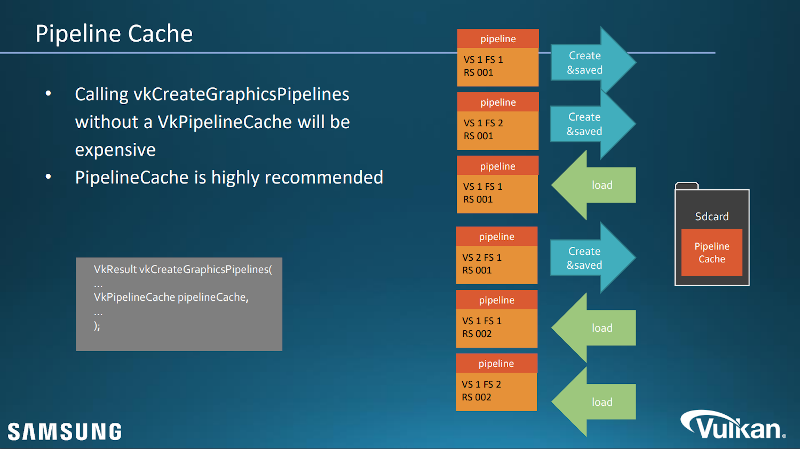

Table of Contents

<ul class="sectlevel0">
<li><a href="#pipeline-cache">Pipeline Cache</a></li>
</ul>

permalink:/Notes/004-3d-rendering/vulkan/chapters/pipeline_cache.html
layout: default
---

<h1 id="pipeline-cache" class="sect0">Pipeline Cache</h1>

Pipeline caching is a technique used with <a href="https://www.khronos.org/registry/vulkan/specs/1.3/html/vkspec.html#VkPipelineCache">VkPipelineCache</a> objects to reuse pipelines that have already been created. Pipeline creation can be somewhat costly - it has to compile the shaders at creation time for example. The big advantage of a pipeline cache is that the pipeline state can be saved to a file to be used between runs of an application, eliminating some of the costly parts of creation. There is a great Khronos presentation on pipeline caching from <a href="https://www.khronos.org/assets/uploads/developers/library/2016-siggraph/3D-BOF-SIGGRAPH_Jul16.pdf">SIGGRAPH 2016</a> (<a href="https://www.youtube.com/watch?v=owuJRPKIUAg&amp;t=1045s">video</a>) starting on slide 140.

While pipeline caches are an important tool, it is important to create a robust system for them which Arseny Kapoulkine talks about in his <a href="https://zeux.io/2019/07/17/serializing-pipeline-cache/">blog post</a>.

To illustrate the performance gain and see a reference implementation of pipeline caches Khronos offers a <a href="https://github.com/KhronosGroup/Vulkan-Samples/tree/master/samples/performance/pipeline_cache">sample and tutorial</a>.

