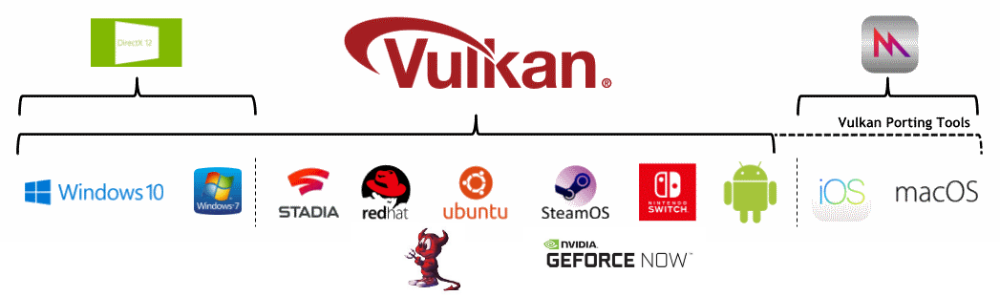

Table of Contents

<ul class="sectlevel0">
<li><a href="#platforms">Platforms</a>
<ul class="sectlevel1">
<li><a href="#_android">1. Android</a></li>
<li><a href="#_bsd_unix">2. BSD Unix</a></li>
<li><a href="#_fuchsia">3. Fuchsia</a></li>
<li><a href="#_ios">4. iOS</a></li>
<li><a href="#_linux">5. Linux</a></li>
<li><a href="#_macos">6. MacOS</a></li>
<li><a href="#_nintendo_switch">7. Nintendo Switch</a></li>
<li><a href="#_qnx">8. QNX</a></li>
<li><a href="#_stadia">9. Stadia</a></li>
<li><a href="#_windows">10. Windows</a></li>
<li><a href="#_others">11. Others</a></li>
</ul>
</li>
</ul>

permalink:/Notes/004-3d-rendering/vulkan/chapters/platforms.html
layout: default
---

<h1 id="platforms" class="sect0">Platforms</h1>

While Vulkan runs on many platforms, each has small variations on how Vulkan is managed.

<h2 id="_android">1. Android</h2>

The Vulkan API is <a href="https://developer.android.com/ndk/guides/graphics/getting-started">available</a> on any Android device starting with API level 24 (Android Nougat), however not all devices will have a Vulkan driver.

Android uses its <a href="https://source.android.com/devices/architecture/hal">Hardware Abstraction Layer (HAL)</a> to find the Vulkan Driver in a <a href="https://source.android.com/devices/graphics/implement-vulkan#driver_emun">predefined path</a>.

All 64-bit devices that launch with API level 29 (Android Q) or later must include a Vulkan 1.1 driver.

<h2 id="_bsd_unix">2. BSD Unix</h2>

Vulkan is supported on many BSD Unix distributions.

<h2 id="_fuchsia">3. Fuchsia</h2>

Vulkan is supported on the <a href="https://fuchsia.dev/fuchsia-src/development/graphics/magma/concepts/vulkan">Fuchsia operation system</a>.

<h2 id="_ios">4. iOS</h2>

Vulkan is not natively supported on iOS, but can still be targeted with <a href="portability_initiative.html#portability-initiative">Vulkan Portability Tools</a>.

<h2 id="_linux">5. Linux</h2>

Vulkan is supported on many Linux distributions.

<h2 id="_macos">6. MacOS</h2>

Vulkan is not natively supported on MacOS, but can still be targeted with <a href="portability_initiative.html#portability-initiative">Vulkan Portability Tools</a>.

<h2 id="_nintendo_switch">7. Nintendo Switch</h2>

The Nintendo Switch runs an NVIDIA Tegra chipset that supports native Vulkan.

<h2 id="_qnx">8. QNX</h2>

Vulkan is supported on QNX operation system.

<h2 id="_stadia">9. Stadia</h2>

Google&#8217;s Stadia runs on AMD based Linux machines and Vulkan is the required graphics API.

<h2 id="_windows">10. Windows</h2>

Vulkan is supported on Windows 7, Windows 8, and Windows 10.

<h2 id="_others">11. Others</h2>

Some embedded systems support Vulkan by allowing presentation <a href="https://www.khronos.org/registry/vulkan/specs/1.3-extensions/html/vkspec.html#display">directly-to-display</a>.

