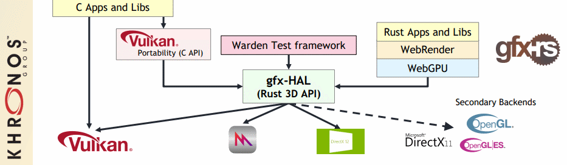

Table of Contents

<ul class="sectlevel0">
<li><a href="#portability-initiative">Portability Initiative</a>
<ul class="sectlevel1">
<li><a href="#_translation_layer">1. Translation Layer</a></li>
<li><a href="#_macos_and_ios_tools">2. MacOS and iOS Tools</a></li>
<li><a href="#_gfx_rs">3. gfx-rs</a></li>
</ul>
</li>
</ul>

permalink:/Notes/004-3d-rendering/vulkan/chapters/portability_initiative.html
layout: default
---

<h1 id="portability-initiative" class="sect0">Portability Initiative</h1>

<table>
<tr>
<td class="icon">

Note

</td>
<td class="content">

Notice

Currently a provisional <a href="https://www.khronos.org/registry/vulkan/specs/1.3-extensions/man/html/VK_KHR_portability_subset.html">VK_KHR_portability_subset</a> extension specification is available with the <a href="https://github.com/KhronosGroup/Vulkan-Headers/blob/main/include/vulkan/vulkan_beta.h">vulkan_beta.h</a> headers. More information can found in the <a href="https://www.khronos.org/blog/fighting-fragmentation-vulkan-portability-extension-released-implementations-shipping">press release</a>.

</td>
</tr>
</table>

The <a href="https://www.vulkan.org/portability">Vulkan Portability Initiative</a> is an effort inside the Khronos Group to develop resources to define and evolve the <a href="https://github.com/KhronosGroup/Vulkan-Portability">subset</a> of Vulkan capabilities that can be made universally available at native performance levels across all major platforms, including those not currently served by Vulkan native drivers. In a nutshell, this initiative is about making Vulkan viable on platforms that do not natively support the API (e.g MacOS and iOS).

<h2 id="_translation_layer">1. Translation Layer</h2>

Layered implementations fight industry fragmentation by enabling more applications to run on more platforms, even in a fragmented industry API landscape.  For example, the first row in the diagram below shows how Vulkan is being used as a porting target to bring additional APIs to platforms to enable more content without the need for additional kernel-level drivers.  Layered API implementations have been used to successfully ship production applications on multiple platforms.

The columns in the figure show layering projects being used to make APIs available across additional platforms, even if no native drivers are available, giving application developers the deployment flexibility they need to develop with the graphics API of their choice and ship across multiple platforms.  The first column in the diagram is the work of the Vulkan Portability Initiative, enabling layered implementations of Vulkan functionality across diverse platforms.

<h2 id="_macos_and_ios_tools">2. MacOS and iOS Tools</h2>

Khronos Blog for <a href="https://www.khronos.org/blog/new-release-of-vulkan-sdk">information about macOS and iOS support</a>

<h2 id="_gfx_rs">3. gfx-rs</h2>

Mozilla is currently helping drive <a href="https://github.com/gfx-rs/portability">gfx-rs portability</a> to use <a href="https://gfx-rs.github.io/2017/07/24/low-level.html">gfx-hal</a> as a way to interface with various other APIs.

