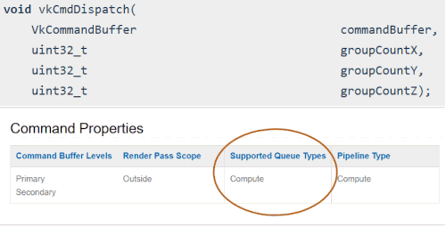

Table of Contents

<ul class="sectlevel0">
<li><a href="#queues">Queues</a>
<ul class="sectlevel1">
<li><a href="#_queue_family">1. Queue Family</a>
<ul class="sectlevel2">
<li><a href="#_knowing_which_queue_family_is_needed">1.1. Knowing which Queue Family is needed</a></li>
<li><a href="#_querying_for_queue_family">1.2. Querying for Queue Family</a></li>
</ul>
</li>
<li><a href="#_creating_and_getting_a_queue">2. Creating and getting a Queue</a></li>
</ul>
</li>
</ul>

permalink:/Notes/004-3d-rendering/vulkan/chapters/queues.html
layout: default
---

<h1 id="queues" class="sect0">Queues</h1>

<table>
<tr>
<td class="icon">

Note

</td>
<td class="content">

Further resources for queues from <a href="https://gpuopen.com/learn/concurrent-execution-asynchronous-queues/">AMD</a> and <a href="https://www.khronos.org/assets/uploads/developers/library/2016-vulkan-devday-uk/9-Asynchonous-compute.pdf">NVIDIA</a>

</td>
</tr>
</table>

An application submits work to a <code>VkQueue</code>, normally in the form of <code>VkCommandBuffer</code> objects or <a href="sparse_resources.html#sparse-resources">sparse bindings</a>.

Command buffers submitted to a <code>VkQueue</code> start in order, but are allowed to proceed independently after that and complete out of order.

Command buffers submitted to different queues are unordered relative to each other unless you explicitly synchronize them with a <code>VkSemaphore</code>.

You can only submit work to a <code>VkQueue</code> from one thread at a time, but different threads can submit work to a different <code>VkQueue</code> simultaneously.

How a <code>VkQueue</code> is mapped to the underlying hardware is implementation-defined. Some implementations will have multiple hardware queues and submitting work to multiple <code>VkQueue</code>&#8203;s will proceed independently and concurrently. Some implementations will do scheduling at a kernel driver level before submitting work to the hardware. There is no current way in Vulkan to expose the exact details how each <code>VkQueue</code> is mapped.

<table>
<tr>
<td class="icon">

Note

</td>
<td class="content">

Not all applications will require or benefit from multiple queues. It is reasonable for an application to have a single &#8220;universal&#8221; graphics supported queue to submit all the work to the GPU.

</td>
</tr>
</table>

<h2 id="_queue_family">1. Queue Family</h2>

There are various types of operations a <code>VkQueue</code> can support. A &#8220;Queue Family&#8221; just describes a set of <code>VkQueue</code>&#8203;s that have common properties and support the same functionality, as advertised in <code>VkQueueFamilyProperties</code>.

The following are the queue operations found in <a href="https://www.khronos.org/registry/vulkan/specs/1.3-extensions/man/html/VkQueueFlagBits.html">VkQueueFlagBits</a>:

<ul>
<li>

<code>VK_QUEUE_GRAPHICS_BIT</code> used for <code>vkCmdDraw*</code> and graphic pipeline commands.

</li>
<li>

<code>VK_QUEUE_COMPUTE_BIT</code> used for <code>vkCmdDispatch*</code> and <code>vkCmdTraceRays*</code> and compute pipeline related commands.

</li>
<li>

<code>VK_QUEUE_TRANSFER_BIT</code> used for all transfer commands.

<ul>
<li>

<a href="https://www.khronos.org/registry/vulkan/specs/1.3-extensions/man/html/VkPipelineStageFlagBits.html">VK_PIPELINE_STAGE_TRANSFER_BIT</a> in the Spec describes &#8220;transfer commands&#8221;.

</li>
<li>

Queue Families with only <code>VK_QUEUE_TRANSFER_BIT</code> are usually for using <a href="https://en.wikipedia.org/wiki/Direct_memory_access">DMA</a> to asynchronously transfer data between host and device memory on discrete GPUs, so transfers can be done concurrently with independent graphics/compute operations.

</li>
<li>

<code>VK_QUEUE_GRAPHICS_BIT</code> and <code>VK_QUEUE_COMPUTE_BIT</code> can always implicitly accept <code>VK_QUEUE_TRANSFER_BIT</code> commands.

</li>
</ul>

</li>
<li>

<code>VK_QUEUE_SPARSE_BINDING_BIT</code> used for binding <a href="sparse_resources.html#sparse-resources">sparse resources</a> to memory with <code>vkQueueBindSparse</code>.

</li>
<li>

<code>VK_QUEUE_PROTECTED_BIT</code> used for <a href="protected.html#protected">protected memory</a>.

</li>
<li>

<code>VK_QUEUE_VIDEO_DECODE_BIT_KHR</code> and <code>VK_QUEUE_VIDEO_ENCODE_BIT_KHR</code> used with <a href="https://www.khronos.org/blog/an-introduction-to-vulkan-video?mc_cid=8052312abe&amp;mc_eid=64241dfcfa">Vulkan Video</a>.

</li>
</ul>

<h3 id="_knowing_which_queue_family_is_needed">1.1. Knowing which Queue Family is needed</h3>

Each operation in the Vulkan Spec has a &#8220;Supported Queue Types&#8221; section generated from the <a href="https://github.com/KhronosGroup/Vulkan-Docs/blob/main/xml/vk.xml">vk.xml</a> file. The following is 3 different examples of what it looks like in the Spec:

<h3 id="_querying_for_queue_family">1.2. Querying for Queue Family</h3>

The following is the simplest logic needed if an application only wants a single graphics <code>VkQueue</code>

<pre class="highlight"><code class="language-cpp" data-lang="cpp">uint32_t count = 0;
vkGetPhysicalDeviceQueueFamilyProperties(physicalDevice, &amp;count, nullptr);
std::vector&lt;VkQueueFamilyProperties&gt; properties(count);
vkGetPhysicalDeviceQueueFamilyProperties(physicalDevice, &amp;count, properties.data());

// Vulkan requires an implementation to expose at least 1 queue family with graphics
uint32_t graphicsQueueFamilyIndex;

for (uint32_t i = 0; i &lt; count; i++) {
    if ((properties[i].queueFlags &amp; VK_QUEUE_GRAPHICS_BIT) != 0) {
        // This Queue Family support graphics
        graphicsQueueFamilyIndex = i;
        break;
    }
}</code></pre>

<h2 id="_creating_and_getting_a_queue">2. Creating and getting a Queue</h2>

Unlike other handles such as <code>VkDevice</code>, <code>VkBuffer</code>, <code>VkDeviceMemory</code>, there is <strong>no</strong> <code>vkCreateQueue</code> or <code>vkAllocateQueue</code>. Instead, the driver is in charge of creating and destroying the <code>VkQueue</code> handles during <code>vkCreateDevice</code>/<code>vkDestroyDevice</code> time.

The following examples will use the hypothetical implementation which support 3 <code>VkQueue</code>&#8203;s from 2 Queue Families:

The following is an example how to create all 3 <code>VkQueue</code>&#8203;s with the logical device:

<pre class="highlight"><code class="language-cpp" data-lang="cpp">VkDeviceQueueCreateInfo queueCreateInfo[2];
queueCreateInfo[0].queueFamilyIndex = 0; // Transfer
queueCreateInfo[0].queueCount = 1;
queueCreateInfo[1].queueFamilyIndex = 1; // Graphics
queueCreateInfo[1].queueCount = 2;

VkDeviceCreateInfo deviceCreateInfo   = {};
deviceCreateInfo.pQueueCreateInfos    = queueCreateInfo;
deviceCreateInfo.queueCreateInfoCount = 2;

vkCreateDevice(physicalDevice, &amp;deviceCreateInfo, nullptr, &amp;device);</code></pre>

After creating the <code>VkDevice</code> the application can use <code>vkGetDeviceQueue</code> to get the <code>VkQueue</code> handles

<pre class="highlight"><code class="language-cpp" data-lang="cpp">VkQueue graphicsQueue0 = VK_NULL_HANDLE;
VkQueue graphicsQueue1 = VK_NULL_HANDLE;
VkQueue transferQueue0 = VK_NULL_HANDLE;

// Can be obtained in any order
vkGetDeviceQueue(device, 0, 0, &amp;transferQueue0); // family 0 - queue 0
vkGetDeviceQueue(device, 1, 1, &amp;graphicsQueue1); // family 1 - queue 1
vkGetDeviceQueue(device, 1, 0, &amp;graphicsQueue0); // family 1 - queue 0</code></pre>

