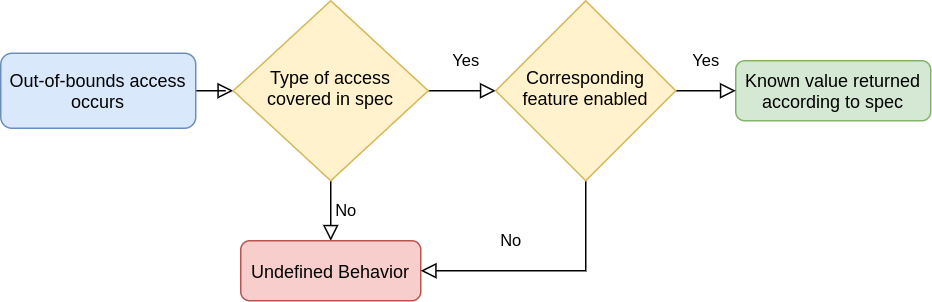

Table of Contents

<ul class="sectlevel0">
<li><a href="#robustness">Robustness</a>
<ul class="sectlevel1">
<li><a href="#_what_does_robustness_mean">1. What does robustness mean</a></li>
<li><a href="#_when_to_use">2. When to use</a></li>
<li><a href="#_what_vulkan_provides_in_core">3. What Vulkan provides in core</a></li>
<li><a href="#_vk_ext_image_robustness">4. VK_EXT_image_robustness</a>
<ul class="sectlevel2">
<li><a href="#_robustimageaccess">4.1. robustImageAccess</a></li>
</ul>
</li>
<li><a href="#_vk_ext_robustness2">5. VK_EXT_robustness2</a>
<ul class="sectlevel2">
<li><a href="#_robustbufferaccess2">5.1. robustBufferAccess2</a></li>
<li><a href="#_robustimageaccess2">5.2. robustImageAccess2</a></li>
<li><a href="#_nulldescriptor">5.3. nullDescriptor</a></li>
</ul>
</li>
</ul>
</li>
</ul>

permalink:/Notes/004-3d-rendering/vulkan/chapters/robustness.html
layout: default
---

<h1 id="robustness" class="sect0">Robustness</h1>

<h2 id="_what_does_robustness_mean">1. What does robustness mean</h2>

When a Vulkan application tries to access (load, store, or perform an atomic on) memory it doesn&#8217;t have access to, the implementation must react somehow. In the case where there is no robustness, it is undefined behavior and the implementation is even allowed to terminate the program. If robustness is enabled for the type of memory accessed, then the implementation must behave a certain way as defined by the spec.

<h2 id="_when_to_use">2. When to use</h2>

The nature of some Vulkan applications requires the ability run shader code that cannot be guaranteed to avoid bad memory accesses. Robustness is needed for these applications.

<table>
<tr>
<td class="icon">

Note

</td>
<td class="content">

Important

Turning on robustness may incur a runtime performance cost. Application writers should carefully consider the implications of enabling robustness.

</td>
</tr>
</table>

<h2 id="_what_vulkan_provides_in_core">3. What Vulkan provides in core</h2>

All Vulkan implementations are required to support the <code>robustBufferAccess</code> feature. The <a href="https://www.khronos.org/registry/vulkan/specs/1.3-extensions/html/vkspec.html#features-robustBufferAccess">spec describes what is considered out-of-bounds</a> and also how it should be handled. Implementations are given some amount of flexibility for <code>robustBufferAccess</code>. An example would be accessing a <code>vec4(x,y,z,w)</code> where the <code>w</code> value is out-of-bounds as the spec allows the implementation to decide if the <code>x</code>, <code>y</code>, and <code>z</code> are also considered out-of-bounds or not.

If dealing with the update after bind functionality found in <code>VK_EXT_descriptor_indexing</code> (which is core as of Vulkan 1.2) it is important to be aware of the <a href="https://www.khronos.org/registry/vulkan/specs/1.3-extensions/html/vkspec.html#limits-robustBufferAccessUpdateAfterBind">robustBufferAccessUpdateAfterBind</a> which indicates if an implementation can support both <code>robustBufferAccess</code> and the ability to update the descriptor after binding it.

The <code>robustBufferAccess</code> feature has some limitations as it only covers buffers and not images. It also allows out-of-bounds writes and atomics to modify the data of the buffer being accessed. For applications looking for a stronger form of robustness, there is <a href="https://www.khronos.org/registry/vulkan/specs/1.3-extensions/man/html/VK_EXT_robustness2.html">VK_EXT_robustness2</a>.

When images are out-of-bounds core Vulkan <a href="https://www.khronos.org/registry/vulkan/specs/1.3-extensions/html/vkspec.html#textures-output-coordinate-validation">provides the guarantee</a> that stores and atomics have no effect on the memory being accessed.

<h2 id="_vk_ext_image_robustness">4. VK_EXT_image_robustness</h2>

<h3 id="_robustimageaccess">4.1. robustImageAccess</h3>

The <a href="https://www.khronos.org/registry/vulkan/specs/1.3-extensions/html/vkspec.html#features-robustImageAccess">robustImageAccess</a> feature in <a href="https://www.khronos.org/registry/vulkan/specs/1.3-extensions/html/vkspec.html#VK_EXT_image_robustness">VK_EXT_image_robustness</a> enables out-of-bounds checking against the dimensions of the image view being accessed. If there is an out-of-bounds access to any image it will return <code>(0, 0, 0, 0)</code> or <code>(0, 0, 0, 1)</code>.

The <code>robustImageAccess</code> feature provides no guarantees about the values returned for access to an invalid LOD, it is still undefined behavior.

<h2 id="_vk_ext_robustness2">5. VK_EXT_robustness2</h2>

Some applications, such as those being ported from other APIs such as D3D12, require stricter guarantees than <code>robustBufferAccess</code> and <code>robustImageAccess</code> provide. The <a href="https://www.khronos.org/registry/vulkan/specs/1.3-extensions/man/html/VK_EXT_robustness2.html">VK_EXT_robustness2</a> extension adds this by exposing 3 new robustness features, described in the following sections. For some implementations these extra guarantees can come at a performance cost. Applications that don&#8217;t need the extra robustness are recommended to use <code>robustBufferAccess</code> and/or <code>robustImageAccess</code> instead where possible.

<h3 id="_robustbufferaccess2">5.1. robustBufferAccess2</h3>

The <a href="https://www.khronos.org/registry/vulkan/specs/1.3-extensions/html/vkspec.html#features-robustBufferAccess2">robustBufferAccess2</a> feature can be seen as a superset of <code>robustBufferAccess</code>.

With the feature enabled, it prevents all out-of-bounds writes and atomic from modifying any memory backing buffers. The <code>robustBufferAccess2</code> feature also enforces the values that must be returned for the various types of buffers when accessed out-of-bounds as <a href="https://www.khronos.org/registry/vulkan/specs/1.3-extensions/html/vkspec.html#features-robustBufferAccess">described in the spec</a>.

It is important to query the <code>robustUniformBufferAccessSizeAlignment</code> and <code>robustStorageBufferAccessSizeAlignment</code> from <a href="https://www.khronos.org/registry/vulkan/specs/1.3-extensions/man/html/VkPhysicalDeviceRobustness2PropertiesEXT.html">VkPhysicalDeviceRobustness2PropertiesEXT</a> as the alignment of where buffers are bound-checked is different between implementations.

<h3 id="_robustimageaccess2">5.2. robustImageAccess2</h3>

The <a href="https://www.khronos.org/registry/vulkan/specs/1.3-extensions/html/vkspec.html#features-robustImageAccess2">robustImageAccess2</a> feature can be seen as a superset of <code>robustImageAccess</code>. It builds on the out-of-bounds checking against the dimensions of the image view being accessed, adding stricter requirements on which values may be returned.

With <code>robustImageAccess2</code> an out-of-bounds access to an R, RG, or RGB format will return <code>(0, 0, 0, 1)</code>. For an RGBA format, such as <code>VK_FORMAT_R8G8B8A8_UNORM</code>, it will return <code>(0, 0, 0, 0)</code>.

For the case of accessing an image LOD outside the supported range, with <code>robustImageAccess2</code> enabled, it will be considered out of bounds.

<h3 id="_nulldescriptor">5.3. nullDescriptor</h3>

Without the <a href="https://www.khronos.org/registry/vulkan/specs/1.3-extensions/html/vkspec.html#features-nullDescriptor">nullDescriptor</a> feature enabled, when updating a <code>VkDescriptorSet</code>, all the resources backing it must be non-null, even if the descriptor is statically not used by the shader. This feature allows descriptors to be backed by null resources or views. Loads from a null descriptor return zero values and stores and atomics to a null descriptor are discarded.

The <code>nullDescriptor</code> feature also allows accesses to vertex input bindings where <code>vkCmdBindVertexBuffers::pBuffers</code> is null.

