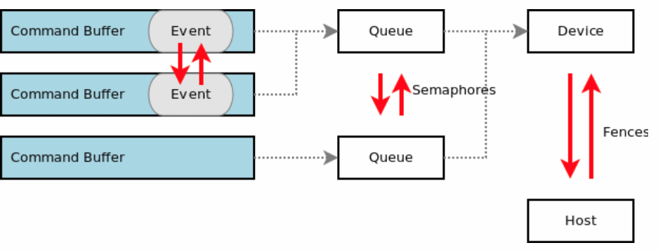
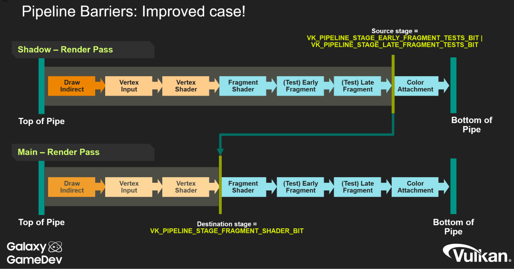

Table of Contents

<ul class="sectlevel0">
<li><a href="#synchronization">Synchronization</a>
<ul class="sectlevel1">
<li><a href="#_validation">1. Validation</a></li>
<li><a href="#_pipeline_barriers">2. Pipeline Barriers</a></li>
<li><a href="#_vk_khr_synchronization2">3. VK_KHR_synchronization2</a></li>
</ul>
</li>
</ul>

permalink:/Notes/004-3d-rendering/vulkan/chapters/synchronization.html
layout: default
---

<h1 id="synchronization" class="sect0">Synchronization</h1>

Synchronization is one of the most powerful but also most complex parts of using Vulkan. The application developer is now responsible for managing synchronization using the various <a href="https://www.khronos.org/registry/vulkan/specs/1.3/html/vkspec.html#synchronization">Vulkan synchronization primitives</a>. Improper use of synchronization can lead to hard-to-find bugs as well as poor performance in cases where the the GPU is unnecessarily idle.

There are a <a href="https://github.com/KhronosGroup/Vulkan-Docs/wiki/Synchronization-Examples">set of examples</a> and a <a href="https://www.khronos.org/blog/understanding-vulkan-synchronization">Understanding Vulkan Synchronization</a> blog provided by Khronos on how to use some of the synchronization primitives. There are also presentations from Tobias Hector from past Vulkan talks: <a href="https://www.khronos.org/assets/uploads/developers/library/2017-vulkan-devu-vancouver/009%20-%20Synchronization%20-%20Keeping%20Your%20Device%20Fed.pdf">part 1 slides</a> (<a href="https://www.youtube.com/watch?v=YkJ4hKCPjm0">video</a>) and <a href="https://www.khronos.org/assets/uploads/developers/library/2018-vulkanised/06-Keeping%20Your%20Device%20Fed%20v4_Vulkanised2018.pdf">part 2 slides</a> (<a href="https://www.youtube.com/watch?v=5GDg4OxkSEc">video</a>).

The following is an overview diagram of the difference between <code>VkEvent</code>, <code>VkFence</code>, and <code>VkSemaphore</code>

<h2 id="_validation">1. Validation</h2>

The Khronos Validation Layer has implemented some <a href="https://vulkan.lunarg.com/doc/sdk/latest/windows/synchronization_usage.html">validation for synchronization</a>. It can easily be enabled by the <a href="https://vulkan.lunarg.com/doc/sdk/latest/windows/vkconfig.html">Vulkan Configurator</a> included with the <a href="https://vulkan.lunarg.com/sdk/home">Vulkan SDK</a>. A <a href="https://www.lunarg.com/wp-content/uploads/2020/09/Final_LunarG_Guide_to_Vulkan-Synchronization_Validation_08_20.pdf">detailed whitepaper</a> discussing the synchronization validation has been written as well and released as a <a href="https://www.khronos.org/blog/a-guide-to-vulkan-synchronization-validation">Khronos Blog</a>.

<h2 id="_pipeline_barriers">2. Pipeline Barriers</h2>

<a href="https://www.khronos.org/registry/vulkan/specs/1.3/html/vkspec.html#synchronization-pipeline-barriers">Pipeline Barriers</a> give control over which pipeline stages need to wait on previous pipeline stages when a command buffer is executed.

While Pipeline Barriers might be hard to understand at first, there are many great Khronos talks and other resources that go more in depth on the topic.

<ul>
<li>

<a href="https://www.khronos.org/assets/uploads/developers/library/2018-vulkanised/05-The%20low-level%20mysteries%20of%20pipeline%20barriers_Vulkanised2018.pdf">Vulkanised 2018 - Low-level mysteries of pipeline barriers</a> (<a href="https://www.youtube.com/watch?v=e0ySJ9Qzvrs">video</a>)

</li>
<li>

<a href="https://www.khronos.org/assets/uploads/developers/library/2019-vulkanised/02_Live%20Long%20And%20Optimise-May19.pdf">Vulkanised 2019 - Live Long and Optimise</a>  (<a href="https://www.youtube.com/watch?v=ch6161wvME8&amp;t=463s">video</a>) Pipeline Analysis starting slide 12

</li>
<li>

<a href="https://gpuopen.com/learn/vulkan-barriers-explained/">Vulkan barriers explained</a> blog post

</li>
<li>

<a href="http://themaister.net/blog/2019/08/14/yet-another-blog-explaining-vulkan-synchronization/">Yet another blog post explaining Vulkan synchronization</a>

</li>
</ul>

<h2 id="_vk_khr_synchronization2">3. VK_KHR_synchronization2</h2>

The <code>VK_KHR_synchronization2</code> extension overhauls the original core synchronization APIs to reduce complexity for application developers, as well as adding a few additional features not present in the original APIs.

Read the <a href="extensions/VK_KHR_synchronization2.html#VK_KHR_synchronization2">VK_KHR_synchronization2</a> chapter for more info about the difference in the synchronization APIs and how to port over to using the new extension

