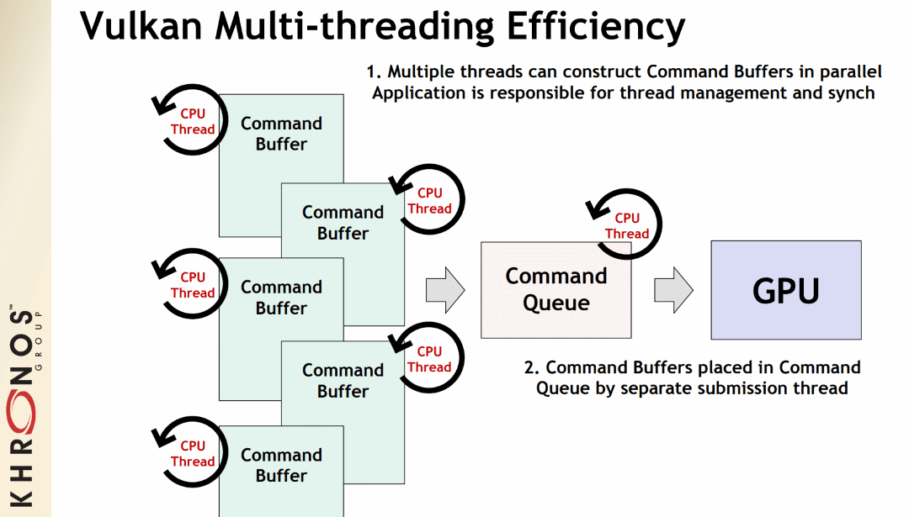

Table of Contents

<ul class="sectlevel0">
<li><a href="#threading">Threading</a>
<ul class="sectlevel1">
<li><a href="#_command_pools">1. Command Pools</a></li>
<li><a href="#_descriptor_pools">2. Descriptor Pools</a></li>
</ul>
</li>
</ul>

permalink:/Notes/004-3d-rendering/vulkan/chapters/threading.html
layout: default
---

<h1 id="threading" class="sect0">Threading</h1>

One of the big differences between Vulkan and OpenGL is that Vulkan is not limited to a single-threaded state machine system. Before running off to implement threads in an application, it is important to understand how threading works in Vulkan.

The Vulkan Spec <a href="https://www.khronos.org/registry/vulkan/specs/1.3/html/vkspec.html#fundamentals-threadingbehavior">Threading Behavior section</a> explains in detail how applications are in charge of managing all <em>externally synchronized</em> elements of Vulkan. It is important to realize that multithreading in Vulkan only provides host-side scaling, as anything interacting with the device still needs to be <a href="sychronization.html#synchronization">synchronized correctly</a>

Vulkan implementations are not supposed to introduce any multi-threading, so if an app wants multi-CPU performance, the app is in charge of managing the threading.

<h2 id="_command_pools">1. Command Pools</h2>

<a href="https://www.khronos.org/registry/vulkan/specs/1.3/html/vkspec.html#commandbuffers-pools">Command Pools</a> are a system to allow recording command buffers across multiple threads. A single command pool must be <em>externally synchronized</em>; it must not be accessed simultaneously from multiple threads. By using a separate command pool in each host-thread the application can create multiple command buffers in parallel without any costly locks.

The idea is command buffers can be recorded on multiple threads while having a relatively light thread handle the submissions.

Khronos' <a href="https://github.com/KhronosGroup/Vulkan-Samples/tree/master/samples/performance/command_buffer_usage">sample and tutorial</a> show in more detail how to record command buffers in parallel.

<h2 id="_descriptor_pools">2. Descriptor Pools</h2>

<a href="https://www.khronos.org/registry/vulkan/specs/1.3/html/vkspec.html#VkDescriptorPool">Descriptor Pools</a> are used to allocate, free, reset, and update descriptor sets. By creating multiple descriptor pools, each application host thread is able to manage a descriptor set in each descriptor pool at the same time.

