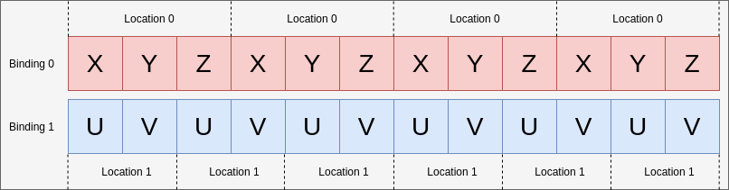
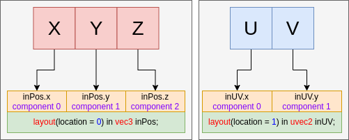

Table of Contents

<ul class="sectlevel0">
<li><a href="#vertex-input-data-processing">Vertex Input Data Processing</a>
<ul class="sectlevel1">
<li><a href="#_binding_and_locations">1. Binding and Locations</a>
<ul class="sectlevel2">
<li><a href="#_example_a_packed_data">1.1. Example A - packed data</a></li>
<li><a href="#_example_b_padding_and_adjusting_offset">1.2. Example B - padding and adjusting offset</a></li>
<li><a href="#_example_c_non_interleaved">1.3. Example C - non-interleaved</a></li>
<li><a href="#_example_d_2_bindings_and_3_locations">1.4. Example D - 2 bindings and 3 locations</a></li>
</ul>
</li>
<li><a href="#input-attribute-format">2. Example E - understanding input attribute format</a></li>
<li><a href="#_components_assignment">3. Components Assignment</a>
<ul class="sectlevel2">
<li><a href="#_filling_in_components">3.1. Filling in components</a></li>
</ul>
</li>
</ul>
</li>
</ul>

permalink:/Notes/004-3d-rendering/vulkan/chapters/vertex_input_data_processing.html
layout: default
---

<h1 id="vertex-input-data-processing" class="sect0">Vertex Input Data Processing</h1>

This chapter is an overview of the <a href="https://www.khronos.org/registry/vulkan/specs/1.3-extensions/html/vkspec.html#fxvertex">Fixed-Function Vertex Processing chapter in the spec</a> to help give a high level understanding of how an application can map data to the vertex shader when using a graphics pipeline.

It is also important to remember that Vulkan is a tool that can be used in different ways. The following are examples for educational purposes of how vertex data <strong>can</strong> be laid out.

<h2 id="_binding_and_locations">1. Binding and Locations</h2>

A <code>binding</code> is tied to a position in the vertex buffer from which the vertex shader will start reading data out of during a <code>vkCmdDraw*</code> call. Changing the <code>bindings</code> does <strong>not</strong> require making any alterations to an app&#8217;s vertex shader source code.

As an example, the following code matches the diagram of how <code>bindings</code> work.

<pre class="highlight"><code class="language-c" data-lang="c">// Using the same buffer for both bindings in this example
VkBuffer buffers[] = { vertex_buffer, vertex_buffer };
VkDeviceSize offsets[] = { 8, 0 };

vkCmdBindVertexBuffers(
                        my_command_buffer, // commandBuffer
                        0,                 // firstBinding
                        2,                 // bindingCount
                        buffers,           // pBuffers
                        offsets,           // pOffsets
                      );</code></pre>

The following examples show various ways to set your <code>binding</code> and <code>location</code> values depending on your data input.

<h3 id="_example_a_packed_data">1.1. Example A - packed data</h3>

For the first example, the per-vertex attribute data will look like:

<pre class="highlight"><code class="language-c" data-lang="c">struct Vertex {
    float   x, y, z;
    uint8_t u, v;
};</code></pre>

The pipeline create info code will look roughly like:

<pre class="highlight"><code class="language-c" data-lang="c">const VkVertexInputBindingDescription binding = {
    0,                          // binding
    sizeof(Vertex),             // stride
    VK_VERTEX_INPUT_RATE_VERTEX // inputRate
};

const VkVertexInputAttributeDescription attributes[] = {
    {
        0,                          // location
        binding.binding,            // binding
        VK_FORMAT_R32G32B32_SFLOAT, // format
        0                           // offset
    },
    {
        1,                          // location
        binding.binding,            // binding
        VK_FORMAT_R8G8_UNORM,       // format
        3 * sizeof(float)           // offset
    }
};

const VkPipelineVertexInputStateCreateInfo info = {
    1,             // vertexBindingDescriptionCount
    &amp;binding,      // pVertexBindingDescriptions
    2,             // vertexAttributeDescriptionCount
    &amp;attributes[0] // pVertexAttributeDescriptions
};</code></pre>

The GLSL code that would consume this could look like

<pre class="highlight"><code class="language-glsl" data-lang="glsl">layout(location = 0) in vec3 inPos;
layout(location = 1) in uvec2 inUV;</code></pre>

<h3 id="_example_b_padding_and_adjusting_offset">1.2. Example B - padding and adjusting offset</h3>

This example examines a case where the vertex data is not tightly packed and has extra padding.

<pre class="highlight"><code class="language-c" data-lang="c">struct Vertex {
    float   x, y, z, pad;
    uint8_t u, v;
};</code></pre>

The only change needed is to adjust the offset at pipeline creation

<pre class="highlight"><code class="language-patch" data-lang="patch">        1,                          // location
        binding.binding,            // binding
        VK_FORMAT_R8G8_UNORM,       // format
-        3 * sizeof(float)           // offset
+        4 * sizeof(float)           // offset</code></pre>

As this will now set the correct offset for where <code>u</code> and <code>v</code> are read in from.

<h3 id="_example_c_non_interleaved">1.3. Example C - non-interleaved</h3>

Sometimes data is not interleaved, in this case, you might have the following

<pre class="highlight"><code class="language-c" data-lang="c">float position_data[] = { /*....*/ };
uint8_t uv_data[] = { /*....*/ };</code></pre>

In this case, there will be 2 bindings, but still 2 locations

<pre class="highlight"><code class="language-c" data-lang="c">const VkVertexInputBindingDescription bindings[] = {
    {
        0,                          // binding
        3 * sizeof(float),          // stride
        VK_VERTEX_INPUT_RATE_VERTEX // inputRate
    },
    {
        1,                          // binding
        2 * sizeof(uint8_t),        // stride
        VK_VERTEX_INPUT_RATE_VERTEX // inputRate
    }
};

const VkVertexInputAttributeDescription attributes[] = {
    {
        0,                          // location
        bindings[0].binding,        // binding
        VK_FORMAT_R32G32B32_SFLOAT, // format
        0                           // offset
    },
    {
        1,                          // location
        bindings[1].binding,        // binding
        VK_FORMAT_R8G8_UNORM,       // format
        0                           // offset
    }
};

const VkPipelineVertexInputStateCreateInfo info = {
    2,             // vertexBindingDescriptionCount
    &amp;bindings[0],  // pVertexBindingDescriptions
    2,             // vertexAttributeDescriptionCount
    &amp;attributes[0] // pVertexAttributeDescriptions
};</code></pre>

The GLSL code does not change from Example A

<pre class="highlight"><code class="language-glsl" data-lang="glsl">layout(location = 0) in vec3 inPos;
layout(location = 1) in uvec2 inUV;</code></pre>

<h3 id="_example_d_2_bindings_and_3_locations">1.4. Example D - 2 bindings and 3 locations</h3>

This example is to help illustrate that the <code>binding</code> and <code>location</code> are independent of each other.

In this example, the data of the vertices is laid out in two buffers provided in the following format:

<pre class="highlight"><code class="language-c" data-lang="c">struct typeA {
    float   x, y, z; // position
    uint8_t u, v;    // UV
};

struct typeB {
    float x, y, z; // normal
};

typeA a[] = { /*....*/ };
typeB b[] = { /*....*/ };</code></pre>

and the shader being used has the interface of

<pre class="highlight"><code class="language-glsl" data-lang="glsl">layout(location = 0) in vec3 inPos;
layout(location = 1) in vec3 inNormal;
layout(location = 2) in uvec2 inUV;</code></pre>

The following can still be mapped properly by setting the <code>VkVertexInputBindingDescription</code> and <code>VkVertexInputAttributeDescription</code> accordingly:

<pre class="highlight"><code class="language-c" data-lang="c">const VkVertexInputBindingDescription bindings[] = {
    {
        0,                          // binding
        sizeof(typeA),              // stride
        VK_VERTEX_INPUT_RATE_VERTEX // inputRate
    },
    {
        1,                          // binding
        sizeof(typeB),              // stride
        VK_VERTEX_INPUT_RATE_VERTEX // inputRate
    }
};

const VkVertexInputAttributeDescription attributes[] = {
    {
        0,                          // location
        bindings[0].binding,        // binding
        VK_FORMAT_R32G32B32_SFLOAT, // format
        0                           // offset
    },
    {
        1,                          // location
        bindings[1].binding,        // binding
        VK_FORMAT_R32G32B32_SFLOAT, // format
        0                           // offset
    },
    {
        2,                          // location
        bindings[0].binding,        // binding
        VK_FORMAT_R8G8_UNORM,       // format
        3 * sizeof(float)           // offset
    }
};</code></pre>

<h2 id="input-attribute-format">2. Example E - understanding input attribute format</h2>

The <code>VkVertexInputAttributeDescription::format</code> can be the cause of confusion. The <code>format</code> field just describes the <strong>size</strong> and <strong>type</strong> of the data the shader should read in.

The reason for using the <code>VkFormat</code> values is they are well defined and match the input layouts of the vertex shader.

For this example the vertex data is just four floats:

<pre class="highlight"><code class="language-c" data-lang="c">struct Vertex {
    float a, b, c, d;
};</code></pre>

The data being read will be overlapped from how the <code>format</code> and <code>offset</code> is set

<pre class="highlight"><code class="language-c" data-lang="c">const VkVertexInputBindingDescription binding = {
    0,                          // binding
    sizeof(Vertex),             // stride
    VK_VERTEX_INPUT_RATE_VERTEX // inputRate
};

const VkVertexInputAttributeDescription attributes[] = {
    {
        0,                          // location
        binding.binding,            // binding
        VK_FORMAT_R32G32_SFLOAT,    // format - Reads in two 32-bit signed floats ('a' and 'b')
        0                           // offset
    },
    {
        1,                          // location
        binding.binding,            // binding
        VK_FORMAT_R32G32B32_SFLOAT, // format - Reads in three 32-bit signed floats ('b', 'c', and 'd')
        1 * sizeof(float)           // offset
    }
};</code></pre>

When reading in the data in the shader the value will be the same where it overlaps

<pre class="highlight"><code class="language-glsl" data-lang="glsl">layout(location = 0) in vec2 in0;
layout(location = 1) in vec2 in1;

// in0.y == in1.x</code></pre>

It is important to notice that <code>in1</code> is a <code>vec2</code> while the input attribute is <code>VK_FORMAT_R32G32B32_SFLOAT</code> which doesn&#8217;t fully match. According to the spec:

<blockquote>

If the vertex shader has fewer components, the extra components are discarded.

</blockquote>

So in this case, the last component of location 1 (<code>d</code>) is discarded and would not be read in by the shader.

<h2 id="_components_assignment">3. Components Assignment</h2>

The <a href="https://www.khronos.org/registry/vulkan/specs/1.3-extensions/html/vkspec.html#fxvertex-attrib-location">spec</a> explains more in detail about the <code>Component</code> assignment. The following is a general overview of the topic.

<h3 id="_filling_in_components">3.1. Filling in components</h3>

Each <code>location</code> in the <code>VkVertexInputAttributeDescription</code> has 4 components. The example above already showed that extra components from the <code>format</code> are discarded when the shader input has fewer components.

<table>
<tr>
<td class="icon">

Note

</td>
<td class="content">

Example

<code>VK_FORMAT_R32G32B32_SFLOAT</code> has 3 components while a <code>vec2</code> has only 2

</td>
</tr>
</table>

For the opposite case, the spec says:

<blockquote>

If the format does not include G, B, or A components, then those are filled with (0,0,1) as needed (using either 1.0f or integer 1 based on the format) for attributes that are not 64-bit data types.

</blockquote>

This means the example of

<pre class="highlight"><code class="language-glsl" data-lang="glsl">layout(location = 0) in vec3 inPos;
layout(location = 1) in uvec2 inUV;</code></pre>

would fill the examples above with the following

<pre class="highlight"><code class="language-glsl" data-lang="glsl">layout(location = 0) in vec4 inPos;
layout(location = 1) in uvec4 inUV;</code></pre>

