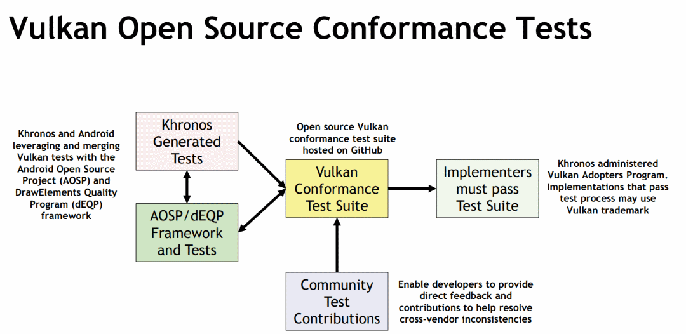

Table of Contents

<ul class="sectlevel0">
<li><a href="#vulkan-cts">Vulkan CTS</a></li>
</ul>

permalink:/Notes/004-3d-rendering/vulkan/chapters/vulkan_cts.html
layout: default
---

<h1 id="vulkan-cts" class="sect0">Vulkan CTS</h1>

The Vulkan Conformance Tests Suite (CTS) is a set of tests used to verify the conformance of an implementation. A conformant implementation shows that it has successfully passed CTS and it is a valid implementation of Vulkan. A <a href="https://www.khronos.org/conformance/adopters/conformant-products/vulkan">list of conformant products</a> is publicly available.

Any company with a conformant implementation may freely use the publicly released Vulkan specification to create a product. All implementations of the Vulkan API must be tested for conformance in the <a href="https://www.khronos.org/adopters">Khronos Vulkan Adopter Program</a> before the Vulkan name or logo may be used in association with an implementation of the API.

The <a href="https://github.com/KhronosGroup/VK-GL-CTS/tree/master/external/vulkancts">Vulkan CTS source code</a> is freely available and anyone is free to create and add a new test to the Vulkan CTS as long as they follow the <a href="https://github.com/KhronosGroup/VK-GL-CTS/wiki/Contributing">Contributing Wiki</a>.

An application can query the version of CTS passed for an implementation using the <a href="https://www.khronos.org/registry/vulkan/specs/1.3-extensions/html/vkspec.html#VkConformanceVersion">VkConformanceVersion</a> property via the <code>VK_KHR_driver_properties</code> extension (this was promoted to core in Vulkan 1.2).

