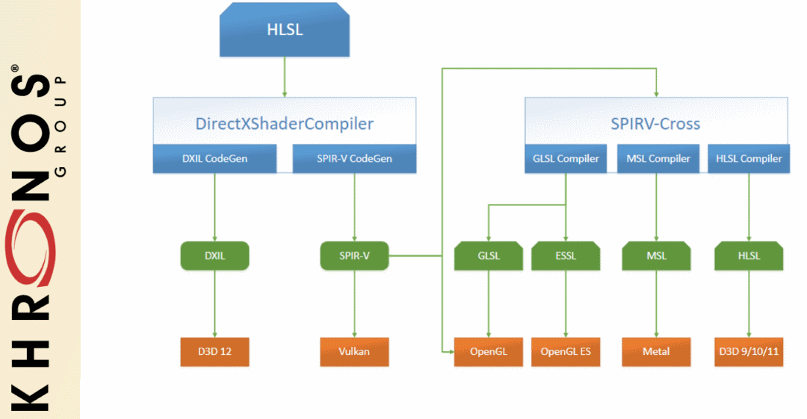

Table of Contents

<ul class="sectlevel0">
<li><a href="#what-is-spirv">What is SPIR-V</a>
<ul class="sectlevel1">
<li><a href="#_spir_v_interface_and_capabilities">1. SPIR-V Interface and Capabilities</a></li>
<li><a href="#_compilers">2. Compilers</a>
<ul class="sectlevel2">
<li><a href="#_glslang">2.1. glslang</a></li>
<li><a href="#_shaderc">2.2. Shaderc</a></li>
<li><a href="#_dxc">2.3. DXC</a></li>
<li><a href="#_clspv">2.4. Clspv</a></li>
</ul>
</li>
<li><a href="#_tools_and_ecosystem">3. Tools and Ecosystem</a>
<ul class="sectlevel2">
<li><a href="#_spirv_tools">3.1. SPIRV-Tools</a></li>
<li><a href="#_spirv_cross">3.2. SPIRV-Cross</a></li>
<li><a href="#_spirv_llvm">3.3. SPIRV-LLVM</a></li>
</ul>
</li>
</ul>
</li>
</ul>

permalink: /Notes/004-3d-rendering/vulkan/chapters/what_is_spirv.html
layout: default
---

<h1 id="what-is-spirv" class="sect0">What is SPIR-V</h1>

<table>
<tr>
<td class="icon">

Note

</td>
<td class="content">

Please read the <a href="https://github.com/KhronosGroup/SPIRV-Guide">SPIRV-Guide</a> for more in detail information about SPIR-V

</td>
</tr>
</table>

<a href="https://www.khronos.org/registry/SPIR-V/">SPIR-V</a> is a binary intermediate representation for graphical-shader stages and compute kernels. With Vulkan, an application can still write their shaders in a high-level shading language such as GLSL or <a href="hlsl.html">HLSL</a>, but a SPIR-V binary is needed when using <a href="https://www.khronos.org/registry/vulkan/specs/1.3/html/vkspec.html#vkCreateShaderModule">vkCreateShaderModule</a>. Khronos has a very nice <a href="https://www.khronos.org/registry/SPIR-V/papers/WhitePaper.pdf">white paper</a> about SPIR-V and its advantages, and a high-level description of the representation. There are also two great Khronos presentations from Vulkan DevDay 2016 <a href="https://www.khronos.org/assets/uploads/developers/library/2016-vulkan-devday-uk/3-Intro-to-spir-v-shaders.pdf">here</a> and <a href="https://www.khronos.org/assets/uploads/developers/library/2016-vulkan-devday-uk/4-Using-spir-v-with-spirv-cross.pdf">here</a>
(<a href="https://www.youtube.com/watch?v=XRpVwdduzgU">video of both</a>).

<h2 id="_spir_v_interface_and_capabilities">1. SPIR-V Interface and Capabilities</h2>

Vulkan has an entire section that defines how <a href="https://www.khronos.org/registry/vulkan/specs/1.3/html/vkspec.html#interfaces">Vulkan interfaces with SPIR-V shaders</a>. Most valid usages of interfacing with SPIR-V occur during pipeline creation when shaders are compiled together.

SPIR-V has many capabilities as it has other targets than just Vulkan. To see the supported capabilities Vulkan requires, one can reference the <a href="https://www.khronos.org/registry/vulkan/specs/1.3/html/vkspec.html#spirvenv-capabilities">Appendix</a>. Some extensions and features in Vulkan are just designed to check if some SPIR-V capabilities are supported or not.

<h2 id="_compilers">2. Compilers</h2>

<h3 id="_glslang">2.1. glslang</h3>

<a href="https://github.com/KhronosGroup/glslang">glslang</a> is the Khronos reference front-end for GLSL, HLSL and ESSL, and sample SPIR-V generator. There is a standalone <code>glslangValidator</code> tool that is included that can be used to create SPIR-V from GLSL, HLSL and ESSL.

<h3 id="_shaderc">2.2. Shaderc</h3>

A collection of tools, libraries, and tests for Vulkan shader compilation hosted by Google. It contains <code>glslc</code> which wraps around core functionality in <a href="https://github.com/KhronosGroup/glslang">glslang</a> and <a href="https://github.com/KhronosGroup/SPIRV-Tools">SPIRV-Tools</a>. Shaderc also contains <code>spvc</code> which wraps around core functionality in <a href="https://github.com/KhronosGroup/SPIRV-Cross">SPIRV-Cross</a> and <a href="https://github.com/KhronosGroup/SPIRV-Tools">SPIRV-Tools</a>.

Shaderc builds both tools as a standalone command line tool (<a href="https://github.com/google/shaderc/tree/main/glslc">glslc</a>) as well as a library to link to (<a href="https://github.com/google/shaderc/tree/main/libshaderc">libshaderc</a>).

<h3 id="_dxc">2.3. DXC</h3>

<a href="https://github.com/microsoft/DirectXShaderCompiler">DirectXShaderCompiler</a> also supports <a href="https://github.com/Microsoft/DirectXShaderCompiler/wiki/SPIR%E2%80%90V-CodeGen">translating HLSL into the SPIR-V</a>.

<h3 id="_clspv">2.4. Clspv</h3>

<a href="https://github.com/google/clspv">Clspv</a> is a prototype compiler for a subset of OpenCL C to SPIR-V to be used as Vulkan compute shaders.

<h2 id="_tools_and_ecosystem">3. Tools and Ecosystem</h2>

There is a rich ecosystem of tools to take advantage of SPIR-V. The <a href="https://vulkan.lunarg.com/doc/sdk/latest/windows/spirv_toolchain.html">Vulkan SDK gives an overview</a> of all the SPIR-V tools that are built and packaged for developers.

<h3 id="_spirv_tools">3.1. SPIRV-Tools</h3>

The Khronos <a href="https://github.com/KhronosGroup/SPIRV-Tools">SPIRV-Tools</a> project provides C and C++ APIs and a command line interface to work with SPIR-V modules. More information in the <a href="https://github.com/KhronosGroup/SPIRV-Guide/blob/master/chapters/khronos_tooling.md#spir-v-tools">SPIRV-Guide</a>.

<h3 id="_spirv_cross">3.2. SPIRV-Cross</h3>

The Khronos <a href="https://github.com/KhronosGroup/SPIRV-Cross">SPIRV-Cross</a> project is a practical tool and library for performing reflection on SPIR-V and disassembling SPIR-V back to a desired high-level shading language. For more details, <a href="https://github.com/Themaister">Hans Kristian</a>, the main developer of SPIR-V Cross, has given two great presentations about what it takes to create a tool such as SPIR-V Cross from <a href="https://www.khronos.org/assets/uploads/developers/library/2018-vulkanised/04-SPIRVCross_Vulkanised2018.pdf">2018 Vulkanised</a> (<a href="https://www.youtube.com/watch?v=T5Va6hSGx44">video</a>) and <a href="https://www.khronos.org/assets/uploads/developers/library/2019-vulkanised/04-SPIRV-Cross-May19.pdf">2019 Vulkanised</a> (<a href="https://www.youtube.com/watch?v=lv-fh_oFJUc">video</a>)

<h3 id="_spirv_llvm">3.3. SPIRV-LLVM</h3>

The Khronos <a href="https://github.com/KhronosGroup/SPIRV-LLVM">SPIRV-LLVM</a> project is a LLVM framework with SPIR-V support. It&#8217;s intended to contain a bi-directional converter between LLVM and SPIR-V. It also serves as a foundation for LLVM-based front-end compilers targeting SPIR-V.

