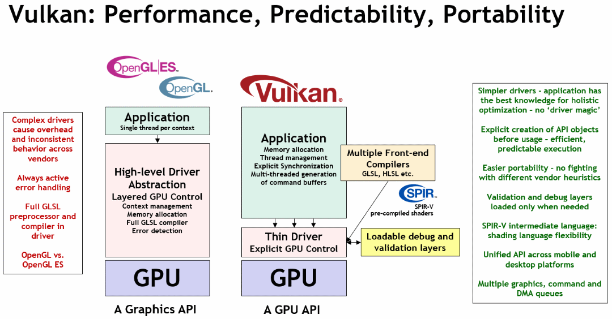

Table of Contents

<ul class="sectlevel0">
<li><a href="#what-is-vulkan">What is Vulkan?</a>
<ul class="sectlevel1">
<li><a href="#_vulkan_at_its_core">1. Vulkan at its core</a></li>
<li><a href="#_vulkan_and_opengl">2. Vulkan and OpenGL</a></li>
<li><a href="#_using_helping_libraries">3. Using helping libraries</a></li>
<li><a href="#_learning_to_use_vulkan">4. Learning to use Vulkan</a></li>
</ul>
</li>
</ul>

permalink: /Notes/004-3d-rendering/vulkan/chapters/what_is_vulkan.html
layout: default
---

<h1 id="what-is-vulkan" class="sect0">What is Vulkan?</h1>

<table>
<tr>
<td class="icon">

Note

</td>
<td class="content">

Vulkan is a new generation graphics and compute API that provides high-efficiency, cross-platform access to modern GPUs used in a wide variety of devices from PCs and consoles to mobile phones and embedded platforms.

</td>
</tr>
</table>

Vulkan is not a company, nor language, but rather a way for developers to program their modern GPU hardware in a cross-platform and cross-vendor fashion. The Khronos Group is a member-driven consortium that created and maintains Vulkan.

<h2 id="_vulkan_at_its_core">1. Vulkan at its core</h2>

At the core, Vulkan is an <a href="https://www.khronos.org/registry/vulkan/#apispecs">API Specification</a> that conformant hardware implementations follow. The public specification is generated from the <a href="https://github.com/KhronosGroup/Vulkan-Docs/blob/main/xml/vk.xml">./xml/vk.xml</a> Vulkan Registry file in the official public copy of the Vulkan Specification repo found at <a href="https://github.com/KhronosGroup/Vulkan-Docs">Vulkan-Doc</a>. Documentation of the <a href="https://www.khronos.org/registry/vulkan/specs/1.3/registry.html">XML schema</a> is also available.

The Khronos Group, along with the Vulkan Specification, releases <a href="http://www.open-std.org/jtc1/sc22/wg14/www/standards">C99</a> <a href="https://github.com/KhronosGroup/Vulkan-Headers/tree/main/include/vulkan">header files</a> generated from the <a href="https://www.khronos.org/registry/vulkan/#apiregistry">API Registry</a> that developers can use to interface with the Vulkan API.

For those who might not work with C code, there are various <a href="https://github.com/KhronosGroup/Khronosdotorg/blob/main/api/vulkan/resources.md#language-bindings">language</a> <a href="https://github.com/vinjn/awesome-vulkan#bindings">bindings</a> out there.

<h2 id="_vulkan_and_opengl">2. Vulkan and OpenGL</h2>

Some developers might be aware of the other Khronos Group standard <a href="https://www.khronos.org/opengl/">OpenGL</a> which is also a 3D Graphics API. Vulkan is not a direct replacement for OpenGL, but rather an explicit API that allows for more explicit control of the GPU.

Khronos' <a href="https://github.com/KhronosGroup/Vulkan-Samples">Vulkan Samples</a> article on <a href="https://github.com/KhronosGroup/Vulkan-Samples/blob/master/samples/vulkan_basics.md">"How does Vulkan compare to OpenGL ES? What should you expect when targeting Vulkan?</a> offers a more detailed comparison between the two APIs.

Vulkan puts more work and responsibility into the application. Not every developer will want to make that extra investment, but those that do so correctly can find power and performance improvements.

<h2 id="_using_helping_libraries">3. Using helping libraries</h2>

While some developers may want to try using Vulkan with no help, it is common to use some lighter libraries in your development flow to help abstract some of the more tedious aspect of Vulkan. Here are some <a href="https://github.com/KhronosGroup/Khronosdotorg/blob/main/api/vulkan/resources.md#libraries">libraries</a> to <a href="https://github.com/vinjn/awesome-vulkan#libraries">help with development</a>

<h2 id="_learning_to_use_vulkan">4. Learning to use Vulkan</h2>

Vulkan is a tool for developers to create hardware accelerated applications. The Vulkan Guide tries to cover the more logistical material such as extensions, versions, spec, etc. For more information how to &#8220;use&#8221; Vulkan to create something such as the Hello World Triangle, please take a look at resources such as those found in <a href="https://www.vulkan.org/learn">Khronos' Vulkan &#8220;learn&#8221; page</a>. If you want to get more hands-on help and knowledge, feel free to join the <a href="https://khr.io/slack">Khronos Developer Slack</a> or the <a href="https://community.khronos.org/">Khronos Community Forums</a> as well!

