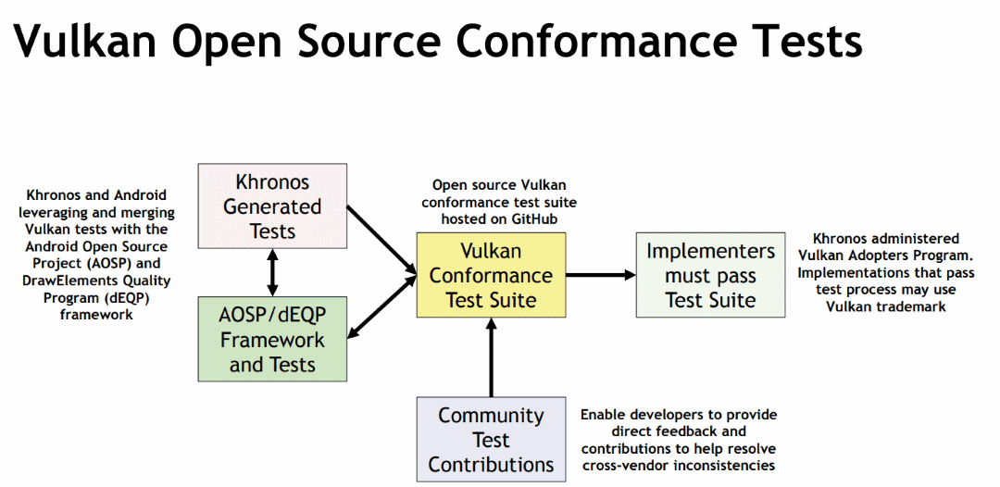
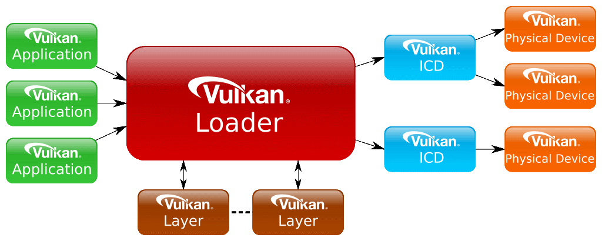
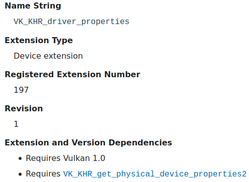
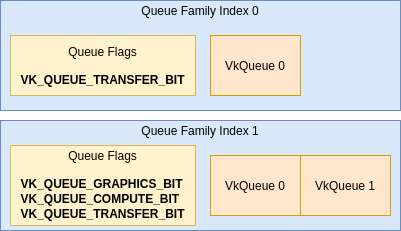
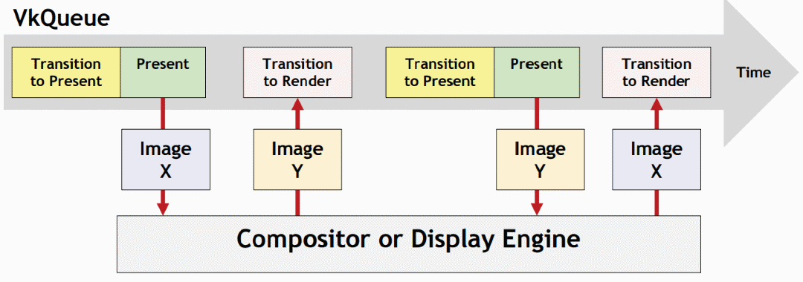
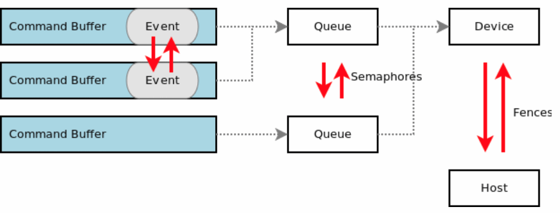
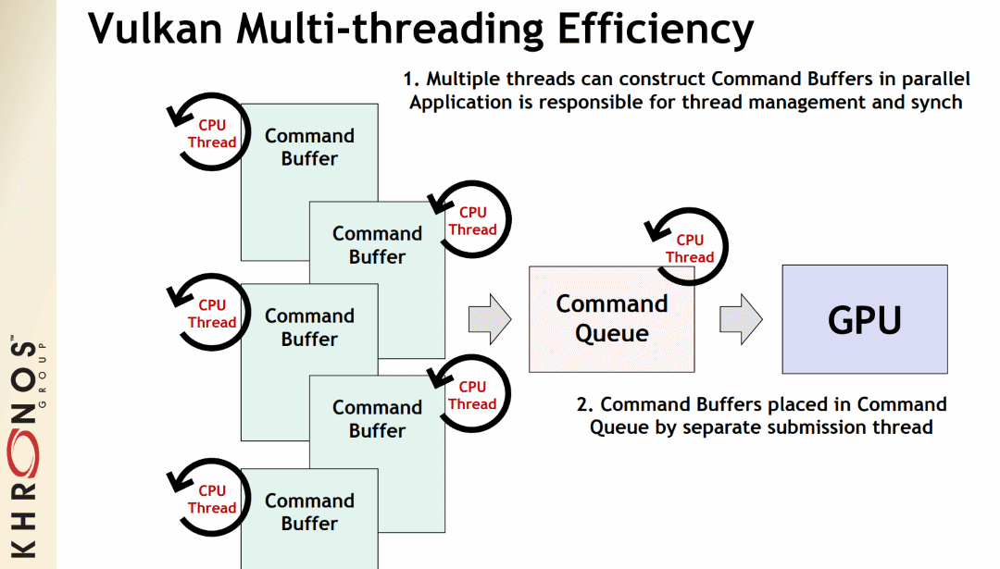
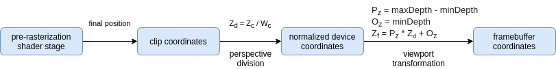
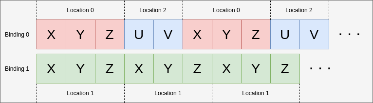
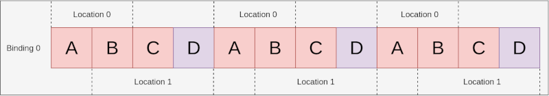

Table of Contents

<ul class="sectlevel0">
<li><a href="#_vulkan_guide">Vulkan® Guide</a>
<ul class="sectlevel1">
<li><a href="#_logistics_overview">1. Logistics Overview</a></li>
<li><a href="#what-is-vulkan">2. What is Vulkan?</a>
<ul class="sectlevel2">
<li><a href="#_vulkan_at_its_core">2.1. Vulkan at its core</a></li>
<li><a href="#_vulkan_and_opengl">2.2. Vulkan and OpenGL</a></li>
<li><a href="#_using_helping_libraries">2.3. Using helping libraries</a></li>
<li><a href="#_learning_to_use_vulkan">2.4. Learning to use Vulkan</a></li>
</ul>
</li>
<li><a href="#what-vulkan-can-do">3. What Vulkan Can Do</a>
<ul class="sectlevel2">
<li><a href="#_graphics">3.1. Graphics</a></li>
<li><a href="#_compute">3.2. Compute</a></li>
<li><a href="#_ray_tracing">3.3. Ray Tracing</a></li>
<li><a href="#_video">3.4. Video</a></li>
<li><a href="#_machine_learning">3.5. Machine Learning</a></li>
<li><a href="#_safety_critical">3.6. Safety Critical</a></li>
</ul>
</li>
<li><a href="#vulkan-spec">4. Vulkan Specification</a>
<ul class="sectlevel2">
<li><a href="#_vulkan_spec_variations">4.1. Vulkan Spec Variations</a></li>
<li><a href="#_vulkan_spec_format">4.2. Vulkan Spec Format</a></li>
</ul>
</li>
<li><a href="#platforms">5. Platforms</a>
<ul class="sectlevel2">
<li><a href="#_android">5.1. Android</a></li>
<li><a href="#_bsd_unix">5.2. BSD Unix</a></li>
<li><a href="#_fuchsia">5.3. Fuchsia</a></li>
<li><a href="#_ios">5.4. iOS</a></li>
<li><a href="#_linux">5.5. Linux</a></li>
<li><a href="#_macos">5.6. MacOS</a></li>
<li><a href="#_nintendo_switch">5.7. Nintendo Switch</a></li>
<li><a href="#_qnx">5.8. QNX</a></li>
<li><a href="#_stadia">5.9. Stadia</a></li>
<li><a href="#_windows">5.10. Windows</a></li>
<li><a href="#_others">5.11. Others</a></li>
</ul>
</li>
<li><a href="#checking-for-support">6. Checking For Vulkan Support</a>
<ul class="sectlevel2">
<li><a href="#_platform_support">6.1. Platform Support</a></li>
<li><a href="#_device_support">6.2. Device Support</a></li>
<li><a href="#_ways_of_checking_for_vulkan">6.3. Ways of Checking for Vulkan</a></li>
</ul>
</li>
<li><a href="#versions">7. Versions</a>
<ul class="sectlevel2">
<li><a href="#_instance_and_device">7.1. Instance and Device</a></li>
<li><a href="#_header">7.2. Header</a></li>
<li><a href="#_extensions">7.3. Extensions</a></li>
<li><a href="#_structs_and_enums">7.4. Structs and enums</a></li>
<li><a href="#_functions">7.5. Functions</a></li>
<li><a href="#_features">7.6. Features</a></li>
<li><a href="#_limits">7.7. Limits</a></li>
<li><a href="#_spir_v">7.8. SPIR-V</a></li>
</ul>
</li>
<li><a href="#vulkan-release-summary">8. Vulkan Release Summary</a>
<ul class="sectlevel2">
<li><a href="#_vulkan_1_1">8.1. Vulkan 1.1</a></li>
<li><a href="#_vulkan_1_2">8.2. Vulkan 1.2</a></li>
<li><a href="#_vulkan_1_3">8.3. Vulkan 1.3</a></li>
</ul>
</li>
<li><a href="#what-is-spirv">9. What is SPIR-V</a>
<ul class="sectlevel2">
<li><a href="#_spir_v_interface_and_capabilities">9.1. SPIR-V Interface and Capabilities</a></li>
<li><a href="#_compilers">9.2. Compilers</a></li>
<li><a href="#_tools_and_ecosystem">9.3. Tools and Ecosystem</a></li>
</ul>
</li>
<li><a href="#portability-initiative">10. Portability Initiative</a>
<ul class="sectlevel2">
<li><a href="#_translation_layer">10.1. Translation Layer</a></li>
<li><a href="#_macos_and_ios_tools">10.2. MacOS and iOS Tools</a></li>
<li><a href="#_gfx_rs">10.3. gfx-rs</a></li>
</ul>
</li>
<li><a href="#vulkan-cts">11. Vulkan CTS</a></li>
<li><a href="#development-tools">12. Development Tools</a>
<ul class="sectlevel2">
<li><a href="#_vulkan_layers">12.1. Vulkan Layers</a></li>
<li><a href="#_debugging">12.2. Debugging</a></li>
<li><a href="#_profiling">12.3. Profiling</a></li>
</ul>
</li>
<li><a href="#validation-overview">13. Vulkan Validation Overview</a>
<ul class="sectlevel2">
<li><a href="#_valid_usage_vu">13.1. Valid Usage (VU)</a></li>
<li><a href="#_undefined_behavior">13.2. Undefined Behavior</a></li>
<li><a href="#_valid_usage_id_vuid">13.3. Valid Usage ID (VUID)</a></li>
<li><a href="#khronos-validation-layer">13.4. Khronos Validation Layer</a></li>
<li><a href="#_breaking_down_a_validation_error_message">13.5. Breaking Down a Validation Error Message</a></li>
<li><a href="#_multiple_vuids">13.6. Multiple VUIDs</a></li>
<li><a href="#_special_usage_tags">13.7. Special Usage Tags</a></li>
</ul>
</li>
<li><a href="#decoder-ring">14. Vulkan Decoder Ring</a></li>
<li><a href="#_using_vulkan">15. Using Vulkan</a></li>
<li><a href="#loader">16. Loader</a>
<ul class="sectlevel2">
<li><a href="#_linking_against_the_loader">16.1. Linking Against the Loader</a></li>
<li><a href="#_platform_variations">16.2. Platform Variations</a></li>
</ul>
</li>
<li><a href="#layers">17. Layers</a>
<ul class="sectlevel2">
<li><a href="#_using_layers">17.1. Using Layers</a></li>
<li><a href="#_vulkan_configurator_tool">17.2. Vulkan Configurator Tool</a></li>
<li><a href="#_device_layers_deprecation">17.3. Device Layers Deprecation</a></li>
<li><a href="#_creating_a_layer">17.4. Creating a Layer</a></li>
<li><a href="#_platform_variations_2">17.5. Platform Variations</a></li>
</ul>
</li>
<li><a href="#querying-extensions-features">18. Querying Properties, Extensions, Features, Limits, and Formats</a>
<ul class="sectlevel2">
<li><a href="#_properties">18.1. Properties</a></li>
<li><a href="#_extensions_2">18.2. Extensions</a></li>
<li><a href="#_features_2">18.3. Features</a></li>
<li><a href="#_limits_2">18.4. Limits</a></li>
<li><a href="#_formats">18.5. Formats</a></li>
<li><a href="#_tools">18.6. Tools</a></li>
</ul>
</li>
<li><a href="#enabling-extensions">19. Enabling Extensions</a>
<ul class="sectlevel2">
<li><a href="#_two_types_of_extensions">19.1. Two types of extensions</a></li>
<li><a href="#_check_for_support">19.2. Check for support</a></li>
<li><a href="#_enable_the_extension">19.3. Enable the Extension</a></li>
<li><a href="#_check_for_feature_bits">19.4. Check for feature bits</a></li>
<li><a href="#_promotion_process">19.5. Promotion Process</a></li>
</ul>
</li>
<li><a href="#enabling-features">20. Enabling Features</a>
<ul class="sectlevel2">
<li><a href="#_category_of_features">20.1. Category of Features</a></li>
<li><a href="#_how_to_enable_the_features">20.2. How to Enable the Features</a></li>
</ul>
</li>
<li><a href="#spirv-extensions">21. Using SPIR-V Extensions</a>
<ul class="sectlevel2">
<li><a href="#_spir_v_extension_example">21.1. SPIR-V Extension Example</a></li>
</ul>
</li>
<li><a href="#formats">22. Formats</a>
<ul class="sectlevel2">
<li><a href="#feature-support">22.1. Feature Support</a></li>
<li><a href="#_variations_of_formats">22.2. Variations of Formats</a></li>
</ul>
</li>
<li><a href="#queues">23. Queues</a>
<ul class="sectlevel2">
<li><a href="#_queue_family">23.1. Queue Family</a></li>
<li><a href="#_creating_and_getting_a_queue">23.2. Creating and getting a Queue</a></li>
</ul>
</li>
<li><a href="#wsi">24. Window System Integration (WSI)</a>
<ul class="sectlevel2">
<li><a href="#_surface">24.1. Surface</a></li>
<li><a href="#_swapchain">24.2. Swapchain</a></li>
<li><a href="#_pre_rotation">24.3. Pre-Rotation</a></li>
</ul>
</li>
<li><a href="#pnext-and-stype">25. pNext and sType</a>
<ul class="sectlevel2">
<li><a href="#_two_base_structures">25.1. Two Base Structures</a></li>
<li><a href="#_setting_pnext_structure_example">25.2. Setting pNext Structure Example</a></li>
<li><a href="#_reading_pnext_values_example">25.3. Reading pNext Values Example</a></li>
</ul>
</li>
<li><a href="#synchronization">26. Synchronization</a>
<ul class="sectlevel2">
<li><a href="#_validation">26.1. Validation</a></li>
<li><a href="#_pipeline_barriers">26.2. Pipeline Barriers</a></li>
<li><a href="#_vk_khr_synchronization2">26.3. VK_KHR_synchronization2</a></li>
</ul>
</li>
<li><a href="#VK_KHR_synchronization2">27. VK_KHR_synchronization2</a>
<ul class="sectlevel2">
<li><a href="#_rethinking_pipeline_stages_and_access_flags">27.1. Rethinking Pipeline Stages and Access Flags</a></li>
<li><a href="#_reusing_the_same_pipeline_stage_and_access_flag_names">27.2. Reusing the same pipeline stage and access flag names</a></li>
<li><a href="#_vksubpassdependency">27.3. VkSubpassDependency</a></li>
<li><a href="#_splitting_up_pipeline_stages_and_access_masks">27.4. Splitting up pipeline stages and access masks</a></li>
<li><a href="#_vk_access_shader_write_bit_alias">27.5. VK_ACCESS_SHADER_WRITE_BIT alias</a></li>
<li><a href="#_top_of_pipe_and_bottom_of_pipe_deprecation">27.6. TOP_OF_PIPE and BOTTOM_OF_PIPE deprecation</a></li>
<li><a href="#_making_use_of_new_image_layouts">27.7. Making use of new image layouts</a></li>
<li><a href="#_new_submission_flow">27.8. New submission flow</a></li>
<li><a href="#_emulation_layer">27.9. Emulation Layer</a></li>
</ul>
</li>
<li><a href="#memory-allocation">28. Memory Allocation</a>
<ul class="sectlevel2">
<li><a href="#_sub_allocation">28.1. Sub-allocation</a></li>
<li><a href="#_transfer">28.2. Transfer</a></li>
<li><a href="#_lazily_allocated_memory">28.3. Lazily Allocated Memory</a></li>
</ul>
</li>
<li><a href="#sparse-resources">29. Sparse Resources</a>
<ul class="sectlevel2">
<li><a href="#_binding_sparse_memory">29.1. Binding Sparse Memory</a></li>
<li><a href="#_sparse_buffers">29.2. Sparse Buffers</a></li>
</ul>
</li>
<li><a href="#protected">30. Protected Memory</a>
<ul class="sectlevel2">
<li><a href="#_checking_for_support">30.1. Checking for support</a></li>
<li><a href="#_protected_queues">30.2. Protected queues</a></li>
<li><a href="#_protected_resources">30.3. Protected resources</a></li>
<li><a href="#_protected_swapchain">30.4. Protected swapchain</a></li>
<li><a href="#_protected_command_buffer">30.5. Protected command buffer</a></li>
<li><a href="#_submitting_protected_work">30.6. Submitting protected work</a></li>
</ul>
</li>
<li><a href="#pipeline-cache">31. Pipeline Cache</a></li>
<li><a href="#threading">32. Threading</a>
<ul class="sectlevel2">
<li><a href="#_command_pools">32.1. Command Pools</a></li>
<li><a href="#_descriptor_pools">32.2. Descriptor Pools</a></li>
</ul>
</li>
<li><a href="#Depth">33. Depth</a>
<ul class="sectlevel2">
<li><a href="#graphics-pipeline">33.1. Graphics Pipeline</a></li>
<li><a href="#depth-formats">33.2. Depth Formats</a></li>
<li><a href="#depth-buffer-as-a-vkimage">33.3. Depth Buffer as a VkImage</a></li>
<li><a href="#pre-rasterization">33.4. Pre-rasterization</a></li>
<li><a href="#rasterization">33.5. Rasterization</a></li>
<li><a href="#post-rasterization">33.6. Post-rasterization</a></li>
</ul>
</li>
<li><a href="#mapping-data-to-shaders">34. Mapping Data to Shaders</a>
<ul class="sectlevel2">
<li><a href="#input-attributes">34.1. Input Attributes</a></li>
<li><a href="#descriptors">34.2. Descriptors</a></li>
<li><a href="#push-constants">34.3. Push Constants</a></li>
<li><a href="#specialization-constants">34.4. Specialization Constants</a></li>
<li><a href="#physical-storage-buffer">34.5. Physical Storage Buffer</a></li>
<li><a href="#_limits_3">34.6. Limits</a></li>
</ul>
</li>
<li><a href="#vertex-input-data-processing">35. Vertex Input Data Processing</a>
<ul class="sectlevel2">
<li><a href="#_binding_and_locations">35.1. Binding and Locations</a></li>
<li><a href="#input-attribute-format">35.2. Example E - understanding input attribute format</a></li>
<li><a href="#_components_assignment">35.3. Components Assignment</a></li>
</ul>
</li>
<li><a href="#descriptor-dynamic-offset">36. Descriptor Dynamic Offset</a>
<ul class="sectlevel2">
<li><a href="#_example_3">36.1. Example</a></li>
<li><a href="#_example_with_vk_whole_size">36.2. Example with VK_WHOLE_SIZE</a></li>
<li><a href="#_limits_4">36.3. Limits</a></li>
</ul>
</li>
<li><a href="#robustness">37. Robustness</a>
<ul class="sectlevel2">
<li><a href="#_what_does_robustness_mean">37.1. What does robustness mean</a></li>
<li><a href="#_when_to_use">37.2. When to use</a></li>
<li><a href="#_what_vulkan_provides_in_core">37.3. What Vulkan provides in core</a></li>
<li><a href="#_vk_ext_image_robustness">37.4. VK_EXT_image_robustness</a></li>
<li><a href="#_vk_ext_robustness2">37.5. VK_EXT_robustness2</a></li>
</ul>
</li>
<li><a href="#dynamic-state">38. Pipeline Dynamic State</a>
<ul class="sectlevel2">
<li><a href="#_overview">38.1. Overview</a></li>
<li><a href="#_when_to_use_dynamic_state">38.2. When to use dynamic state</a></li>
<li><a href="#states-that-are-dynamic">38.3. What states are dynamic</a></li>
</ul>
</li>
<li><a href="#subgroups">39. Subgroups</a>
<ul class="sectlevel2">
<li><a href="#_resources">39.1. Resources</a></li>
<li><a href="#_subgroup_size">39.2. Subgroup size</a></li>
<li><a href="#_checking_for_support_2">39.3. Checking for support</a></li>
<li><a href="#VK_KHR_shader_subgroup_extended_types">39.4. VK_KHR_shader_subgroup_extended_types</a></li>
<li><a href="#VK_EXT_shader_subgroup_ballot-and-VK_EXT_shader_subgroup_vote">39.5. VK_EXT_shader_subgroup_ballot and VK_EXT_shader_subgroup_vote</a></li>
</ul>
</li>
<li><a href="#shader-memory-layout">40. Shader Memory Layout</a>
<ul class="sectlevel2">
<li><a href="#alignment-requirements">40.1. Alignment Requirements</a></li>
<li><a href="#VK_KHR_uniform_buffer_standard_layout">40.2. VK_KHR_uniform_buffer_standard_layout</a></li>
<li><a href="#VK_KHR_relaxed_block_layout">40.3. VK_KHR_relaxed_block_layout</a></li>
<li><a href="#VK_EXT_scalar_block_layout">40.4. VK_EXT_scalar_block_layout</a></li>
<li><a href="#alignment-examples">40.5. Alignment Examples</a></li>
</ul>
</li>
<li><a href="#atomics">41. Atomics</a>
<ul class="sectlevel2">
<li><a href="#_variations_of_atomics">41.1. Variations of Atomics</a></li>
<li><a href="#_baseline_support">41.2. Baseline Support</a></li>
<li><a href="#VK_KHR_shader_atomic_int64">41.3. VK_KHR_shader_atomic_int64</a></li>
<li><a href="#VK_EXT_shader_image_atomic_int64">41.4. VK_EXT_shader_image_atomic_int64</a></li>
<li><a href="#VK_EXT_shader_atomic_float">41.5. VK_EXT_shader_atomic_float</a></li>
<li><a href="#VK_EXT_shader_atomic_float2">41.6. VK_EXT_shader_atomic_float2</a></li>
</ul>
</li>
<li><a href="#common-pitfalls">42. Common Pitfalls for New Vulkan Developers</a>
<ul class="sectlevel2">
<li><a href="#_validation_layers">42.1. Validation Layers</a></li>
<li><a href="#_vulkan_is_a_box_of_tools">42.2. Vulkan Is a Box of Tools</a></li>
<li><a href="#_recording_command_buffers">42.3. Recording Command Buffers</a></li>
<li><a href="#_multiple_pipelines">42.4. Multiple Pipelines</a></li>
<li><a href="#_resource_duplication_per_swapchain_image">42.5. Resource Duplication per Swapchain Image</a></li>
<li><a href="#_multiple_queues_per_queue_family">42.6. Multiple Queues per Queue Family</a></li>
<li><a href="#_descriptor_sets">42.7. Descriptor Sets</a></li>
<li><a href="#_correct_api_usage_practices">42.8. Correct API usage practices</a></li>
</ul>
</li>
<li><a href="#hlsl-in-vulkan">43. HLSL in Vulkan</a>
<ul class="sectlevel2">
<li><a href="#applications-pov">43.1. From the application&#8217;s point-of-view</a></li>
<li><a href="#hlsl-spirv-mapping-manual">43.2. HLSL to SPIR-V feature mapping manual</a></li>
<li><a href="#vk-namespace">43.3. The Vulkan HLSL namespace</a></li>
<li><a href="#syntax-comparison">43.4. Syntax comparison</a></li>
<li><a href="#DirectXShaderCompiler">43.5. DirectXShaderCompiler (DXC)</a></li>
<li><a href="#_shader_model_coverage">43.6. Shader model coverage</a></li>
</ul>
</li>
<li><a href="#_when_and_why_to_use_extensions">44. When and Why to use Extensions</a></li>
<li><a href="#cleanup">45. Cleanup Extensions</a>
<ul class="sectlevel2">
<li><a href="#VK_KHR_driver_properties">45.1. VK_KHR_driver_properties</a></li>
<li><a href="#VK_EXT_host_query_reset">45.2. VK_EXT_host_query_reset</a></li>
<li><a href="#VK_KHR_separate_depth_stencil_layouts">45.3. VK_KHR_separate_depth_stencil_layouts</a></li>
<li><a href="#VK_KHR_depth_stencil_resolve">45.4. VK_KHR_depth_stencil_resolve</a></li>
<li><a href="#VK_EXT_separate_stencil_usage">45.5. VK_EXT_separate_stencil_usage</a></li>
<li><a href="#VK_KHR_dedicated_allocation">45.6. VK_KHR_dedicated_allocation</a></li>
<li><a href="#VK_EXT_sampler_filter_minmax">45.7. VK_EXT_sampler_filter_minmax</a></li>
<li><a href="#VK_KHR_sampler_mirror_clamp_to_edge">45.8. VK_KHR_sampler_mirror_clamp_to_edge</a></li>
<li><a href="#VK_EXT_4444_formats-and-VK_EXT_ycbcr_2plane_444_formats">45.9. VK_EXT_4444_formats and VK_EXT_ycbcr_2plane_444_formats</a></li>
<li><a href="#VK_KHR_format_feature_flags2">45.10. VK_KHR_format_feature_flags2</a></li>
<li><a href="#VK_EXT_rgba10x6_formats">45.11. VK_EXT_rgba10x6_formats</a></li>
<li><a href="#maintenance-extensions">45.12. Maintenance Extensions</a></li>
<li><a href="#pnext-expansions">45.13. pNext Expansions</a></li>
</ul>
</li>
<li><a href="#device-groups">46. Device Groups</a></li>
<li><a href="#external-memory">47. External Memory and Synchronization</a>
<ul class="sectlevel2">
<li><a href="#_capabilities">47.1. Capabilities</a></li>
<li><a href="#_memory_vs_synchronization">47.2. Memory vs Synchronization</a></li>
<li><a href="#_example_5">47.3. Example</a></li>
</ul>
</li>
<li><a href="#ray-tracing">48. Ray Tracing</a>
<ul class="sectlevel2">
<li><a href="#VK_KHR_acceleration_structure">48.1. VK_KHR_acceleration_structure</a></li>
<li><a href="#VK_KHR_ray_tracing_pipeline">48.2. VK_KHR_ray_tracing_pipeline</a></li>
<li><a href="#VK_KHR_ray_query">48.3. VK_KHR_ray_query</a></li>
<li><a href="#VK_KHR_pipeline_library">48.4. VK_KHR_pipeline_library</a></li>
<li><a href="#VK_KHR_deferred_host_operations">48.5. VK_KHR_deferred_host_operations</a></li>
</ul>
</li>
<li><a href="#shader-features">49. Shader Features</a>
<ul class="sectlevel2">
<li><a href="#VK_KHR_spirv_1_4">49.1. VK_KHR_spirv_1_4</a></li>
<li><a href="#VK_KHR_16bit_storage">49.2. VK_KHR_8bit_storage and VK_KHR_16bit_storage</a></li>
<li><a href="#VK_KHR_shader_float16_int8">49.3. VK_KHR_shader_float16_int8</a></li>
<li><a href="#VK_KHR_shader_float_controls">49.4. VK_KHR_shader_float_controls</a></li>
<li><a href="#VK_KHR_storage_buffer_storage_class">49.5. VK_KHR_storage_buffer_storage_class</a></li>
<li><a href="#VK_KHR_variable_pointers">49.6. VK_KHR_variable_pointers</a></li>
<li><a href="#VK_KHR_vulkan_memory_model">49.7. VK_KHR_vulkan_memory_model</a></li>
<li><a href="#VK_EXT_shader_viewport_index_layer">49.8. VK_EXT_shader_viewport_index_layer</a></li>
<li><a href="#VK_KHR_shader_draw_parameters">49.9. VK_KHR_shader_draw_parameters</a></li>
<li><a href="#VK_EXT_shader_stencil_export">49.10. VK_EXT_shader_stencil_export</a></li>
<li><a href="#VK_EXT_shader_demote_to_helper_invocation">49.11. VK_EXT_shader_demote_to_helper_invocation</a></li>
<li><a href="#VK_KHR_shader_clock">49.12. VK_KHR_shader_clock</a></li>
<li><a href="#VK_KHR_shader_non_semantic_info">49.13. VK_KHR_shader_non_semantic_info</a></li>
<li><a href="#VK_KHR_shader_terminate_invocation">49.14. VK_KHR_shader_terminate_invocation</a></li>
<li><a href="#VK_KHR_workgroup_memory_explicit_layout">49.15. VK_KHR_workgroup_memory_explicit_layout</a></li>
<li><a href="#VK_KHR_zero_initialize_workgroup_memory">49.16. VK_KHR_zero_initialize_workgroup_memory</a></li>
</ul>
</li>
<li><a href="#translation-layer-extensions">50. Translation Layer Extensions</a>
<ul class="sectlevel2">
<li><a href="#VK_EXT_custom_border_color">50.1. VK_EXT_custom_border_color</a></li>
<li><a href="#VK_EXT_border_color_swizzle">50.2. VK_EXT_border_color_swizzle</a></li>
<li><a href="#VK_EXT_depth_clip_enable">50.3. VK_EXT_depth_clip_enable</a></li>
<li><a href="#VK_EXT_depth_clip_control">50.4. VK_EXT_depth_clip_control</a></li>
<li><a href="#VK_EXT_provoking_vertex">50.5. VK_EXT_provoking_vertex</a></li>
<li><a href="#VK_EXT_transform_feedback">50.6. VK_EXT_transform_feedback</a></li>
<li><a href="#VK_EXT_image_view_min_lod">50.7. VK_EXT_image_view_min_lod</a></li>
</ul>
</li>
<li><a href="#VK_EXT_descriptor_indexing">51. VK_EXT_descriptor_indexing</a>
<ul class="sectlevel2">
<li><a href="#_update_after_bind">51.1. Update after Bind</a></li>
<li><a href="#_partially_bound">51.2. Partially bound</a></li>
<li><a href="#_dynamic_indexing">51.3. Dynamic Indexing</a></li>
<li><a href="#_dynamic_non_uniform_indexing">51.4. Dynamic Non-Uniform Indexing</a></li>
</ul>
</li>
<li><a href="#VK_EXT_inline_uniform_block">52. VK_EXT_inline_uniform_block</a>
<ul class="sectlevel2">
<li><a href="#_suggestions">52.1. Suggestions</a></li>
</ul>
</li>
<li><a href="#VK_EXT_memory_priority">53. VK_EXT_memory_priority</a>
<ul class="sectlevel2">
<li><a href="#_suggestions_2">53.1. Suggestions</a></li>
</ul>
</li>
<li><a href="#VK_KHR_descriptor_update_template">54. VK_KHR_descriptor_update_template</a></li>
<li><a href="#VK_KHR_draw_indirect_count">55. VK_KHR_draw_indirect_count</a></li>
<li><a href="#VK_KHR_image_format_list">56. VK_KHR_image_format_list</a></li>
<li><a href="#VK_KHR_imageless_framebuffer">57. VK_KHR_imageless_framebuffer</a></li>
<li><a href="#VK_KHR_sampler_ycbcr_conversion">58. VK_KHR_sampler_ycbcr_conversion</a>
<ul class="sectlevel2">
<li><a href="#multi-planar-formats">58.1. Multi-planar Formats</a></li>
<li><a href="#_disjoint">58.2. Disjoint</a></li>
<li><a href="#_copying_memory_to_each_plane">58.3. Copying memory to each plane</a></li>
<li><a href="#_vksamplerycbcrconversion">58.4. VkSamplerYcbcrConversion</a></li>
<li><a href="#_combinedimagesamplerdescriptorcount">58.5. combinedImageSamplerDescriptorCount</a></li>
</ul>
</li>
<li><a href="#VK_KHR_shader_subgroup_uniform_control_flow">59. VK_KHR_shader_subgroup_uniform_control_flow</a>
<ul class="sectlevel2">
<li><a href="#_overview_2">59.1. Overview</a></li>
<li><a href="#_example_6">59.2. Example</a></li>
<li><a href="#_related_extensions">59.3. Related Extensions</a></li>
</ul>
</li>
<li><a href="#_contributing">60. Contributing</a></li>
<li><a href="#_license">61. License</a></li>
<li><a href="#_code_of_conduct">62. Code of conduct</a></li>
</ul>
</li>
</ul>

permalink: /Notes/004-3d-rendering/vulkan/guide.html
layout: post

<h1 id="_vulkan_guide" class="sect0">Vulkan® Guide</h1>

The Khronos® Vulkan Working Group
:data-uri:
:icons: font
:toc2:
:toclevels: 2
:max-width: 100%
:numbered:
:source-highlighter: rouge
:rouge-style: github

The Vulkan Guide is designed to help developers get up and going with the world of Vulkan. It is aimed to be a light read that leads to many other useful links depending on what a developer is looking for. All information is intended to help better fill the gaps about the many nuances of Vulkan.

<h2 id="_logistics_overview">1. Logistics Overview</h2>

permalink: /Notes/004-3d-rendering/vulkan/chapters/what_is_vulkan.html
layout: default
---

<h2 id="what-is-vulkan">2. What is Vulkan?</h2>

<table>
<tr>
<td class="icon">

Note

</td>
<td class="content">

Vulkan is a new generation graphics and compute API that provides high-efficiency, cross-platform access to modern GPUs used in a wide variety of devices from PCs and consoles to mobile phones and embedded platforms.

</td>
</tr>
</table>

Vulkan is not a company, nor language, but rather a way for developers to program their modern GPU hardware in a cross-platform and cross-vendor fashion. The Khronos Group is a member-driven consortium that created and maintains Vulkan.

<h3 id="_vulkan_at_its_core">2.1. Vulkan at its core</h3>

At the core, Vulkan is an <a href="https://www.khronos.org/registry/vulkan/#apispecs">API Specification</a> that conformant hardware implementations follow. The public specification is generated from the <a href="https://github.com/KhronosGroup/Vulkan-Docs/blob/main/xml/vk.xml">./xml/vk.xml</a> Vulkan Registry file in the official public copy of the Vulkan Specification repo found at <a href="https://github.com/KhronosGroup/Vulkan-Docs">Vulkan-Doc</a>. Documentation of the <a href="https://www.khronos.org/registry/vulkan/specs/1.3/registry.html">XML schema</a> is also available.

The Khronos Group, along with the Vulkan Specification, releases <a href="http://www.open-std.org/jtc1/sc22/wg14/www/standards">C99</a> <a href="https://github.com/KhronosGroup/Vulkan-Headers/tree/main/include/vulkan">header files</a> generated from the <a href="https://www.khronos.org/registry/vulkan/#apiregistry">API Registry</a> that developers can use to interface with the Vulkan API.

For those who might not work with C code, there are various <a href="https://github.com/KhronosGroup/Khronosdotorg/blob/main/api/vulkan/resources.md#language-bindings">language</a> <a href="https://github.com/vinjn/awesome-vulkan#bindings">bindings</a> out there.

<h3 id="_vulkan_and_opengl">2.2. Vulkan and OpenGL</h3>

Some developers might be aware of the other Khronos Group standard <a href="https://www.khronos.org/opengl/">OpenGL</a> which is also a 3D Graphics API. Vulkan is not a direct replacement for OpenGL, but rather an explicit API that allows for more explicit control of the GPU.

Khronos' <a href="https://github.com/KhronosGroup/Vulkan-Samples">Vulkan Samples</a> article on <a href="https://github.com/KhronosGroup/Vulkan-Samples/blob/master/samples/vulkan_basics.md">"How does Vulkan compare to OpenGL ES? What should you expect when targeting Vulkan?</a> offers a more detailed comparison between the two APIs.

Vulkan puts more work and responsibility into the application. Not every developer will want to make that extra investment, but those that do so correctly can find power and performance improvements.

<h3 id="_using_helping_libraries">2.3. Using helping libraries</h3>

While some developers may want to try using Vulkan with no help, it is common to use some lighter libraries in your development flow to help abstract some of the more tedious aspect of Vulkan. Here are some <a href="https://github.com/KhronosGroup/Khronosdotorg/blob/main/api/vulkan/resources.md#libraries">libraries</a> to <a href="https://github.com/vinjn/awesome-vulkan#libraries">help with development</a>

<h3 id="_learning_to_use_vulkan">2.4. Learning to use Vulkan</h3>

Vulkan is a tool for developers to create hardware accelerated applications. The Vulkan Guide tries to cover the more logistical material such as extensions, versions, spec, etc. For more information how to &#8220;use&#8221; Vulkan to create something such as the Hello World Triangle, please take a look at resources such as those found in <a href="https://www.vulkan.org/learn">Khronos' Vulkan &#8220;learn&#8221; page</a>. If you want to get more hands-on help and knowledge, feel free to join the <a href="https://khr.io/slack">Khronos Developer Slack</a> or the <a href="https://community.khronos.org/">Khronos Community Forums</a> as well!

permalink: /Notes/004-3d-rendering/vulkan/chapters/what_vulkan_can_do.html
---

<h2 id="what-vulkan-can-do">3. What Vulkan Can Do</h2>

Vulkan can be used to develop applications for many use cases. While Vulkan applications can choose to use a subset of the functionality described below, it was designed so a developer could use all of them in a single API.

<table>
<tr>
<td class="icon">

Note

</td>
<td class="content">

It is important to understand Vulkan is a box of tools and there are multiple ways of doing a task.

</td>
</tr>
</table>

<h3 id="_graphics">3.1. Graphics</h3>

2D and 3D graphics are primarily what the Vulkan API is designed for. Vulkan is designed to allow developers to create hardware accelerated graphical applications.

<table>
<tr>
<td class="icon">

Note

</td>
<td class="content">

All Vulkan implementations are required to support Graphics, but the <a href="#wsi">WSI</a> system is not required.

</td>
</tr>
</table>

<h3 id="_compute">3.2. Compute</h3>

Due to the parallel nature of GPUs, a new style of programming referred to as <a href="https://en.wikipedia.org/wiki/General-purpose_computing_on_graphics_processing_units">GPGPU</a> can be used to exploit a GPU for computational tasks. Vulkan supports compute variations of <code>VkQueues</code>, <code>VkPipelines</code>, and more which allow Vulkan to be used for general computation.

<table>
<tr>
<td class="icon">

Note

</td>
<td class="content">

All Vulkan implementations are required to support Compute.

</td>
</tr>
</table>

<h3 id="_ray_tracing">3.3. Ray Tracing</h3>

Ray tracing is an alternative rendering technique, based around the concept of simulating the physical behavior of light.

Cross-vendor API support for ray tracing was added to Vulkan as a set of extensions in the 1.2.162 specification.
These are primarily <a href="https://www.khronos.org/registry/vulkan/specs/1.3-extensions/html/vkspec.html#VK_KHR_ray_tracing_pipeline"><code>VK_KHR_ray_tracing_pipeline</code></a>, <a href="https://www.khronos.org/registry/vulkan/specs/1.3-extensions/html/vkspec.html#VK_KHR_ray_query"><code>VK_KHR_ray_query</code></a>, and <a href="https://www.khronos.org/registry/vulkan/specs/1.3-extensions/html/vkspec.html#VK_KHR_acceleration_structure"><code>VK_KHR_acceleration_structure</code></a>.

<table>
<tr>
<td class="icon">

Note

</td>
<td class="content">

There is also an older <a href="https://www.khronos.org/registry/vulkan/specs/1.3-extensions/html/vkspec.html#VK_NV_ray_tracing">NVIDIA vendor extension</a> exposing an implementation of ray tracing on Vulkan. This extension preceded the cross-vendor extensions. For new development, applications are recommended to prefer the more recent KHR extensions.

</td>
</tr>
</table>

<h3 id="_video">3.4. Video</h3>

<a href="https://www.khronos.org/blog/an-introduction-to-vulkan-video?mc_cid=8052312abe&amp;mc_eid=64241dfcfa">Vulkan Video</a> has release a provisional specification as of the 1.2.175 spec release.

Vulkan Video adheres to the Vulkan philosophy of providing flexible, fine-grained control over video processing scheduling, synchronization, and memory utilization to the application.

<table>
<tr>
<td class="icon">

Note

</td>
<td class="content">

<a href="https://github.com/KhronosGroup/Vulkan-Docs/issues/1497">feedback</a> for the provisional specification is welcomed

</td>
</tr>
</table>

<h3 id="_machine_learning">3.5. Machine Learning</h3>

Currently, the Vulkan Working Group is looking into how to make Vulkan a first class API for exposing ML compute capabilities of modern GPUs. More information was announced at <a href="https://www.youtube.com/watch?v=_57aiwJISCI&amp;feature=youtu.be&amp;t=5007">Siggraph 2019</a>.

<table>
<tr>
<td class="icon">

Note

</td>
<td class="content">

As of now, there exists no public Vulkan API for machine learning.

</td>
</tr>
</table>

<h3 id="_safety_critical">3.6. Safety Critical</h3>

Vulkan SC ("Safety Critical") aims to bring the graphics and compute capabilities of modern GPUs to safety-critical systems in the automotive, avionics, industrial and medical space. It was publicly <a href="https://www.khronos.org/news/press/khronos-releases-vulkan-safety-critical-1.0-specification-to-deliver-safety-critical-graphics-compute">launched on March 1st 2022</a> and the specification is available <a href="https://www.khronos.org/vulkansc/">here</a>.

<table>
<tr>
<td class="icon">

Note

</td>
<td class="content">

Vulkan SC is based on Vulkan 1.2, but removed functionality that is not needed for safety-critical markets, increases the robustness of the specification by eliminating ignored parameters and undefined behaviors, and enables enhanced detection, reporting, and correction of run-time faults.

</td>
</tr>
</table>

permalink:/Notes/004-3d-rendering/vulkan/chapters/vulkan_spec.html
layout: default
---

<h2 id="vulkan-spec">4. Vulkan Specification</h2>

The Vulkan Specification (usually referred to as the <em>Vulkan Spec</em>) is the official description of how the Vulkan API works and is ultimately used to decide what is and is not valid Vulkan usage. At first glance, the Vulkan Spec seems like an incredibly huge and dry chunk of text, but it is usually the most useful item to have open when developing.

<table>
<tr>
<td class="icon">

Note

</td>
<td class="content">

Reference the Vulkan Spec early and often.

</td>
</tr>
</table>

<h3 id="_vulkan_spec_variations">4.1. Vulkan Spec Variations</h3>

The Vulkan Spec can be built for any version and with any permutation of extensions. The Khronos Group hosts the <a href="https://www.khronos.org/registry/vulkan/specs/">Vulkan Spec Registry</a> which contains a few publicly available variations that most developers will find sufficient. Anyone can build their own variation of the Vulkan Spec from <a href="https://github.com/KhronosGroup/Vulkan-Docs/blob/main/BUILD.adoc">Vulkan-Docs</a>.

When building the Vulkan Spec, you pass in what version of Vulkan to build for as well as what extensions to include. A Vulkan Spec without any extensions is also referred to as the <a href="https://www.khronos.org/registry/vulkan/specs/1.3/html/vkspec.html#extendingvulkan-coreversions">core version</a> as it is the minimal amount of Vulkan an implementation needs to support in order to be <a href="#vulkan-cts">conformant</a>.

<h3 id="_vulkan_spec_format">4.2. Vulkan Spec Format</h3>

The Vulkan Spec can be built into different formats.

<h4 id="_html_chunked">4.2.1. HTML Chunked</h4>

Due to the size of the Vulkan Spec, a chunked version is the default when you visit the default <code>index.html</code> page.

Example: <a href="https://www.khronos.org/registry/vulkan/specs/1.3/html/">https://www.khronos.org/registry/vulkan/specs/1.3/html/</a>

Prebuilt HTML Chunked Vulkan Spec

<ul>
<li>

The Vulkan SDK comes packaged with the chunked version of the spec. Each Vulkan SDK version includes the corresponding spec version. See the <a href="https://vulkan.lunarg.com/doc/sdk/latest/windows/chunked_spec/index.html">Chunked Specification</a> for the latest Vulkan SDK.

</li>
<li>

Vulkan 1.0 Specification

<ul>
<li>

<a href="https://www.khronos.org/registry/vulkan/specs/1.0/html/">Core</a>

</li>
<li>

<a href="https://www.khronos.org/registry/vulkan/specs/1.0-extensions/html/">Core with Extensions</a>

</li>
<li>

<a href="https://www.khronos.org/registry/vulkan/specs/1.0-wsi_extensions/html/">Core with WSI Extensions</a>

</li>
</ul>

</li>
<li>

Vulkan 1.1 Specification

<ul>
<li>

<a href="https://www.khronos.org/registry/vulkan/specs/1.1/html/">Core</a>

</li>
<li>

<a href="https://www.khronos.org/registry/vulkan/specs/1.1-extensions/html/">Core with Extensions</a>

</li>
<li>

<a href="https://www.khronos.org/registry/vulkan/specs/1.1-khr-extensions/html/">Core with KHR Extensions</a>

</li>
</ul>

</li>
<li>

Vulkan 1.2 Specification

<ul>
<li>

<a href="https://www.khronos.org/registry/vulkan/specs/1.2/html/">Core</a>

</li>
<li>

<a href="https://www.khronos.org/registry/vulkan/specs/1.2-extensions/html/">Core with Extensions</a>

</li>
<li>

<a href="https://www.khronos.org/registry/vulkan/specs/1.2-khr-extensions/html/">Core with KHR Extensions</a>

</li>
</ul>

</li>
<li>

Vulkan 1.3 Specification

<ul>
<li>

<a href="https://www.khronos.org/registry/vulkan/specs/1.3/html/">Core</a>

</li>
<li>

<a href="https://www.khronos.org/registry/vulkan/specs/1.3-extensions/html/">Core with Extensions</a>

</li>
<li>

<a href="https://www.khronos.org/registry/vulkan/specs/1.3-khr-extensions/html/">Core with KHR Extensions</a>

</li>
</ul>

</li>
</ul>

<h4 id="_html_full">4.2.2. HTML Full</h4>

If you want to view the Vulkan Spec in its entirety as HTML, you just need to view the <code>vkspec.html</code> file.

Example: <a href="https://www.khronos.org/registry/vulkan/specs/1.3/html/vkspec.html" class="bare">https://www.khronos.org/registry/vulkan/specs/1.3/html/vkspec.html</a>

Prebuilt HTML Full Vulkan Spec

<ul>
<li>

The Vulkan SDK comes packaged with Vulkan Spec in its entirety as HTML for the version corresponding to the Vulkan SDK version. See the <a href="https://vulkan.lunarg.com/doc/sdk/latest/windows/vkspec.html">HTML version of the Specification</a> for the latest Vulkan SDK. (Note: Slow to load. The advantage of the full HTML version is its searching capability).

</li>
<li>

Vulkan 1.0 Specification

<ul>
<li>

<a href="https://www.khronos.org/registry/vulkan/specs/1.0/html/vkspec.html">Core</a>

</li>
<li>

<a href="https://www.khronos.org/registry/vulkan/specs/1.0-extensions/html/vkspec.html">Core with Extensions </a>

</li>
<li>

<a href="https://www.khronos.org/registry/vulkan/specs/1.0-wsi_extensions/html/vkspec.html">Core with WSI Extensions</a>

</li>
</ul>

</li>
<li>

Vulkan 1.1 Specification

<ul>
<li>

<a href="https://www.khronos.org/registry/vulkan/specs/1.1/html/vkspec.html">Core</a>

</li>
<li>

<a href="https://www.khronos.org/registry/vulkan/specs/1.1-extensions/html/vkspec.html">Core with Extensions</a>

</li>
<li>

<a href="https://www.khronos.org/registry/vulkan/specs/1.1-khr-extensions/html/vkspec.html">Core with KHR Extensions</a>

</li>
</ul>

</li>
<li>

Vulkan 1.2 Specification

<ul>
<li>

<a href="https://www.khronos.org/registry/vulkan/specs/1.2/html/vkspec.html">Core</a>

</li>
<li>

<a href="https://www.khronos.org/registry/vulkan/specs/1.2-extensions/html/vkspec.html">Core with Extensions</a>

</li>
<li>

<a href="https://www.khronos.org/registry/vulkan/specs/1.2-khr-extensions/html/vkspec.html">Core with KHR Extensions</a>

</li>
</ul>

</li>
<li>

Vulkan 1.3 Specification

<ul>
<li>

<a href="https://www.khronos.org/registry/vulkan/specs/1.3/html/vkspec.html">Core</a>

</li>
<li>

<a href="https://www.khronos.org/registry/vulkan/specs/1.3-extensions/html/vkspec.html">Core with Extensions</a>

</li>
<li>

<a href="https://www.khronos.org/registry/vulkan/specs/1.3-khr-extensions/html/vkspec.html">Core with KHR Extensions</a>

</li>
</ul>

</li>
</ul>

<h4 id="_pdf">4.2.3. PDF</h4>

To view the PDF format, visit the <code>pdf/vkspec.pdf</code> file.

Example: <a href="https://www.khronos.org/registry/vulkan/specs/1.3/pdf/vkspec.pdf" class="bare">https://www.khronos.org/registry/vulkan/specs/1.3/pdf/vkspec.pdf</a>

Prebuilt PDF Vulkan Spec

<ul>
<li>

Vulkan 1.0 Specification

<ul>
<li>

<a href="https://www.khronos.org/registry/vulkan/specs/1.0/pdf/vkspec.pdf">Core</a>

</li>
<li>

<a href="https://www.khronos.org/registry/vulkan/specs/1.0-extensions/pdf/vkspec.pdf">Core with Extensions </a>

</li>
<li>

<a href="https://www.khronos.org/registry/vulkan/specs/1.0-wsi_extensions/pdf/vkspec.pdf">Core with WSI Extensions</a>

</li>
</ul>

</li>
<li>

Vulkan 1.1 Specification

<ul>
<li>

<a href="https://www.khronos.org/registry/vulkan/specs/1.1/pdf/vkspec.pdf">Core</a>

</li>
<li>

<a href="https://www.khronos.org/registry/vulkan/specs/1.1-extensions/pdf/vkspec.pdf">Core with Extensions</a>

</li>
<li>

<a href="https://www.khronos.org/registry/vulkan/specs/1.1-khr-extensions/pdf/vkspec.pdf">Core with KHR Extensions</a>

</li>
</ul>

</li>
<li>

Vulkan 1.2 Specification

<ul>
<li>

<a href="https://www.khronos.org/registry/vulkan/specs/1.2/pdf/vkspec.pdf">Core</a>

</li>
<li>

<a href="https://www.khronos.org/registry/vulkan/specs/1.2-extensions/pdf/vkspec.pdf">Core with Extensions</a>

</li>
<li>

<a href="https://www.khronos.org/registry/vulkan/specs/1.2-khr-extensions/pdf/vkspec.pdf">Core with KHR Extensions</a>

</li>
</ul>

</li>
<li>

Vulkan 1.3 Specification

<ul>
<li>

<a href="https://www.khronos.org/registry/vulkan/specs/1.3/pdf/vkspec.pdf">Core</a>

</li>
<li>

<a href="https://www.khronos.org/registry/vulkan/specs/1.3-extensions/pdf/vkspec.pdf">Core with Extensions</a>

</li>
<li>

<a href="https://www.khronos.org/registry/vulkan/specs/1.3-khr-extensions/pdf/vkspec.pdf">Core with KHR Extensions</a>

</li>
</ul>

</li>
</ul>

<h4 id="_man_pages">4.2.4. Man pages</h4>

The Khronos Group currently only host the Vulkan Man Pages for the latest version of the 1.3 spec, with all extensions, on the <a href="https://www.khronos.org/registry/vulkan/specs/1.3-extensions/man/html/">online registry</a>.

The Vulkan Man Pages can also be found in the VulkanSDK for each SDK version. See the <a href="https://vulkan.lunarg.com/doc/sdk/latest/windows/apispec.html">Man Pages</a> for the latest Vulkan SDK.

permalink:/Notes/004-3d-rendering/vulkan/chapters/platforms.html
layout: default
---

<h2 id="platforms">5. Platforms</h2>

While Vulkan runs on many platforms, each has small variations on how Vulkan is managed.

<h3 id="_android">5.1. Android</h3>

The Vulkan API is <a href="https://developer.android.com/ndk/guides/graphics/getting-started">available</a> on any Android device starting with API level 24 (Android Nougat), however not all devices will have a Vulkan driver.

Android uses its <a href="https://source.android.com/devices/architecture/hal">Hardware Abstraction Layer (HAL)</a> to find the Vulkan Driver in a <a href="https://source.android.com/devices/graphics/implement-vulkan#driver_emun">predefined path</a>.

All 64-bit devices that launch with API level 29 (Android Q) or later must include a Vulkan 1.1 driver.

<h3 id="_bsd_unix">5.2. BSD Unix</h3>

Vulkan is supported on many BSD Unix distributions.

<h3 id="_fuchsia">5.3. Fuchsia</h3>

Vulkan is supported on the <a href="https://fuchsia.dev/fuchsia-src/development/graphics/magma/concepts/vulkan">Fuchsia operation system</a>.

<h3 id="_ios">5.4. iOS</h3>

Vulkan is not natively supported on iOS, but can still be targeted with <a href="#portability-initiative">Vulkan Portability Tools</a>.

<h3 id="_linux">5.5. Linux</h3>

Vulkan is supported on many Linux distributions.

<h3 id="_macos">5.6. MacOS</h3>

Vulkan is not natively supported on MacOS, but can still be targeted with <a href="#portability-initiative">Vulkan Portability Tools</a>.

<h3 id="_nintendo_switch">5.7. Nintendo Switch</h3>

The Nintendo Switch runs an NVIDIA Tegra chipset that supports native Vulkan.

<h3 id="_qnx">5.8. QNX</h3>

Vulkan is supported on QNX operation system.

<h3 id="_stadia">5.9. Stadia</h3>

Google&#8217;s Stadia runs on AMD based Linux machines and Vulkan is the required graphics API.

<h3 id="_windows">5.10. Windows</h3>

Vulkan is supported on Windows 7, Windows 8, and Windows 10.

<h3 id="_others">5.11. Others</h3>

Some embedded systems support Vulkan by allowing presentation <a href="https://www.khronos.org/registry/vulkan/specs/1.3-extensions/html/vkspec.html#display">directly-to-display</a>.

permalink: /Notes/004-3d-rendering/vulkan/chapters/checking_for_support.html
---

<h2 id="checking-for-support">6. Checking For Vulkan Support</h2>

Vulkan requires both a <a href="#loader">Vulkan Loader</a> and a Vulkan Driver (also referred to as a <em>Vulkan Implementation</em>). The driver is in charge of translating Vulkan API calls into a valid implementation of Vulkan. The most common case is a GPU hardware vendor releasing a driver that is used to run Vulkan on a physical GPU. It should be noted that it is possible to have an entire implementation of Vulkan software based, though the performance impact would be very noticeable.

When checking for Vulkan Support it is important to distinguish the difference between <em>platform support</em> and <em>device support</em>.

<h3 id="_platform_support">6.1. Platform Support</h3>

The first thing to check is if your <a href="#platforms">platform</a> even supports Vulkan. Each platform uses a different mechanism to manage how the <a href="#loader">Vulkan Loader</a> is implemented. The loader is then in charge of determining if a Vulkan Driver is exposed correctly.

<h4 id="_android_2">6.1.1. Android</h4>

A simple way of grabbing info on Vulkan is to run the <a href="https://play.google.com/store/apps/details?id=de.saschawillems.vulkancapsviewer&amp;hl=en_US">Vulkan Hardware Capability Viewer</a> app developed by Sascha Willems. This app will not only show if Vulkan is supported, but also all the capabilities the device offers.

<h4 id="_bsd_unix_2">6.1.2. BSD Unix</h4>

Grab the <a href="https://vulkan.lunarg.com/sdk/home#linux">Vulkan SDK</a>. Build Vulkan SDK using the command <code>./vulkansdk.sh</code> and then run the <a href="https://vulkan.lunarg.com/doc/sdk/latest/linux/vulkaninfo.html">vulkaninfo</a> executable to easily check for Vulkan support as well as all the capabilities the device offers.

<h4 id="_ios_2">6.1.3. iOS</h4>

A simple way of grabbing info on Vulkan is to run the iOS port of the <a href="https://apps.apple.com/us/app/vulkan-capabilities-viewer/id1552796816">Vulkan Hardware Capability Viewer</a> provided by LunarG. This app will not only show if Vulkan is supported, but also all the capabilities the device offers.

<h4 id="_linux_2">6.1.4. Linux</h4>

Grab the <a href="https://vulkan.lunarg.com/sdk/home#linux">Vulkan SDK</a> and run the <a href="https://vulkan.lunarg.com/doc/sdk/latest/linux/vulkaninfo.html">vulkaninfo</a> executable to easily check for Vulkan support as well as all the capabilities the device offers.

<h4 id="_macos_2">6.1.5. MacOS</h4>

Grab the <a href="https://vulkan.lunarg.com/sdk/home#mac">Vulkan SDK</a> and run the <a href="https://vulkan.lunarg.com/doc/sdk/latest/mac/vulkaninfo.html">vulkaninfo</a> executable to easily check for Vulkan support as well as all the capabilities the device offers.

<h4 id="_windows_2">6.1.6. Windows</h4>

Grab the <a href="https://vulkan.lunarg.com/sdk/home#windows">Vulkan SDK</a> and run the <a href="https://vulkan.lunarg.com/doc/sdk/latest/windows/vulkaninfo.html">vulkaninfo.exe</a> executable to easily check for Vulkan support as well as all the capabilities the device offers.

<h3 id="_device_support">6.2. Device Support</h3>

Just because the platform supports Vulkan does not mean there is device support. For device support, one will need to make sure a Vulkan Driver is available that fully implements Vulkan. There are a few different variations of a Vulkan Driver.

<h4 id="_hardware_implementation">6.2.1. Hardware Implementation</h4>

A driver targeting a physical piece of GPU hardware is the most common case for a Vulkan implementation. It is important to understand that while a certain GPU might have the physical capabilities of running Vulkan, it still requires a driver to control it. The driver is in charge of getting the Vulkan calls mapped to the hardware in the most efficient way possible.

Drivers, like any software, are updated and this means there can be many variations of drivers for the same physical device and platform. There is a <a href="https://vulkan.gpuinfo.org/">Vulkan Database</a>, developed and maintained by Sascha Willems, which is the largest collection of recorded Vulkan implementation details

<table>
<tr>
<td class="icon">

Note

</td>
<td class="content">

Just because a physical device or platform isn&#8217;t in the Vulkan Database doesn&#8217;t mean it couldn&#8217;t exist.

</td>
</tr>
</table>

<h4 id="_null_driver">6.2.2. Null Driver</h4>

The term &#8220;null driver&#8221; is given to any driver that accepts Vulkan API calls, but does not do anything with them. This is common for testing interactions with the driver without needing any working implementation backing it. Many uses cases such as creating <a href="#vulkan-cts">CTS tests</a> for new features, <a href="https://github.com/KhronosGroup/Vulkan-ValidationLayers/blob/master/docs/creating_tests.md#running-tests-on-devsim-and-mockicd">testing the Validation Layers</a>, and more rely on the idea of a null driver.

Khronos provides the <a href="https://github.com/KhronosGroup/Vulkan-Tools/tree/master/icd">Mock ICD</a> as one implementation of a null driver that works on various platforms.

<h4 id="_software_implementation">6.2.3. Software Implementation</h4>

It is possible to create a Vulkan implementation that only runs on the CPU. This is useful if there is a need to test Vulkan that is hardware independent, but unlike the null driver, also outputs a valid result.

<a href="https://github.com/google/swiftshader">SwiftShader</a> is an example of CPU-based implementation.

<h3 id="_ways_of_checking_for_vulkan">6.3. Ways of Checking for Vulkan</h3>

<h4 id="_via_vulkan_installation_analyzer">6.3.1. VIA (Vulkan Installation Analyzer)</h4>

Included in the <a href="https://vulkan.lunarg.com/sdk/home">Vulkan SDK</a> is a utility to check the Vulkan installation on your computer. It is supported on Windows, Linux, and macOS. VIA can:

<ul>
<li>

Determine the state of Vulkan components on your system

</li>
<li>

Validate that your Vulkan Loader and drivers are installed properly

</li>
<li>

Capture your system state in a form that can be used as an attachment when submitting bugs

</li>
</ul>

View the <a href="https://vulkan.lunarg.com/doc/sdk/latest/windows/via.html">SDK documentation on VIA</a> for more information.

<h4 id="_hello_create_instance">6.3.2. Hello Create Instance</h4>

A simple way to check for Vulkan support cross platform is to create a simple &#8220;Hello World&#8221; Vulkan application. The <code>vkCreateInstance</code> function is used to create a Vulkan Instance and is also the shortest way to write a valid Vulkan application.

The Vulkan SDK provides a minimal <a href="https://vulkan.lunarg.com/doc/view/latest/windows/tutorial/html/01-init_instance.html">vkCreateInstance</a> example <code>01-init_instance.cpp</code> that can be used.

permalink:/Notes/004-3d-rendering/vulkan/chapters/versions.html
layout: default
---

<h2 id="versions">7. Versions</h2>

Vulkan works on a <a href="https://www.khronos.org/registry/vulkan/specs/1.3/html/vkspec.html#extendingvulkan-coreversions-versionnumbers">major, minor, patch</a> versioning system. Currently, there are 3 minor version releases of Vulkan (1.0, 1.1, 1.2 and 1.3) which are backward compatible with each other. An application can use <a href="https://www.khronos.org/registry/vulkan/specs/1.3/html/vkspec.html#vkEnumerateInstanceVersion">vkEnumerateInstanceVersion</a> to check what version of a Vulkan instance is supported. There is also a <a href="https://www.lunarg.com/wp-content/uploads/2019/02/Vulkan-1.1-Compatibility-Statement_01_19.pdf">white paper</a> by LunarG on how to query and check for the supported version. While working across minor versions, there are some subtle things to be aware of.

<h3 id="_instance_and_device">7.1. Instance and Device</h3>

It is important to remember there is a difference between the instance-level version and device-level version. It is possible that the loader and implementations will support different versions.

The <a href="https://www.khronos.org/registry/vulkan/specs/1.3/html/vkspec.html#extendingvulkan-coreversions-queryingversionsupport">Querying Version Support</a> section in the Vulkan Spec goes into details on how to query for supported versions at both the instance and device level.

<h3 id="_header">7.2. Header</h3>

There is only one supported header for all major releases of Vulkan. This means that there is no such thing as &#8220;Vulkan 1.0 headers&#8221; as all headers for a minor and patch version are unified. This should not be confused with the ability to generate a 1.0 version of the <a href="#vulkan-spec">Vulkan Spec</a>, as the Vulkan Spec and header of the same patch version will match. An example would be that the generated 1.0.42 Vulkan Spec will match the 1.x.42 header.

It is highly recommended that developers try to keep up to date with the latest header files released. The Vulkan SDK comes in many versions which map to the header version it will have been packaged for.

<h3 id="_extensions">7.3. Extensions</h3>

Between minor versions of Vulkan, <a href="https://www.khronos.org/registry/vulkan/specs/1.3/html/vkspec.html#versions-1.1">some extensions</a> get <a href="https://www.khronos.org/registry/vulkan/specs/1.3/html/vkspec.html#extendingvulkan-compatibility-promotions">promoted</a> to the <a href="https://www.khronos.org/registry/vulkan/specs/1.3/html/vkspec.html#extendingvulkan-coreversions">core version</a>. When targeting a newer minor version of Vulkan, an application will not need to enable the newly promoted extensions at the instance and device creation. However, if an application wants to keep backward compatibility, it will need to enable the extensions.

For a summary of what is new in each version, check out the <a href="#vulkan-release-summary">Vulkan Release Summary</a>

<h3 id="_structs_and_enums">7.4. Structs and enums</h3>

Structs and enums are dependent on the header file being used and not the version of the instance or device queried. For example, the struct <code>VkPhysicalDeviceFeatures2</code> used to be <code>VkPhysicalDeviceFeatures2KHR</code> before Vulkan 1.1 was released. Regardless of the 1.x version of Vulkan being used, an application should use <code>VkPhysicalDeviceFeatures2</code> in its code as it matches the newest header version. For applications that did have <code>VkPhysicalDeviceFeatures2KHR</code> in the code, there is no need to worry as the Vulkan header also aliases any promoted structs and enums (<code>typedef VkPhysicalDeviceFeatures2 VkPhysicalDeviceFeatures2KHR;</code>).

The reason for using the newer naming is that the Vulkan Spec itself will only refer to <code>VkPhysicalDeviceFeatures2</code> regardless of what version of the Vulkan Spec is generated. Using the newer naming makes it easier to quickly search for where the structure is used.

<h3 id="_functions">7.5. Functions</h3>

Since functions are used to interact with the loader and implementations, there needs to be a little more care when working between minor versions. As an example, let&#8217;s look at <code>vkGetPhysicalDeviceFeatures2KHR</code> which was promoted to core as <code>vkGetPhysicalDeviceFeatures2</code> from Vulkan 1.0 to Vulkan 1.1. Looking at the Vulkan header both are declared.

<pre class="highlight"><code class="language-cpp" data-lang="cpp">typedef void (VKAPI_PTR *PFN_vkGetPhysicalDeviceFeatures2)(VkPhysicalDevice physicalDevice, VkPhysicalDeviceFeatures2* pFeatures);
// ...
typedef void (VKAPI_PTR *PFN_vkGetPhysicalDeviceFeatures2KHR)(VkPhysicalDevice physicalDevice, VkPhysicalDeviceFeatures2* pFeatures);</code></pre>

The main difference is when calling <code>vkGetInstanceProcAddr(instance, &#8220;vkGetPhysicalDeviceFeatures2&#8221;);</code> a Vulkan 1.0 implementation may not be aware of <code>vkGetPhysicalDeviceFeatures2</code> existence and <code>vkGetInstanceProcAddr</code> will return <code>NULL</code>. To be backward compatible with Vulkan 1.0 in this situation, the application should query for <code>vkGetPhysicalDeviceFeatures2KHR</code> as a 1.1 Vulkan implementation will likely have the function directly pointed to the <code>vkGetPhysicalDeviceFeatures2</code> function pointer internally.

<table>
<tr>
<td class="icon">

Note

</td>
<td class="content">

The <code>vkGetPhysicalDeviceFeatures2KHR</code> function will only exist in a Vulkan 1.0 implementation if it is supported as an extension.

</td>
</tr>
</table>

<h3 id="_features">7.6. Features</h3>

Between minor versions, it is possible that some feature bits are added, removed, made optional, or made mandatory. All details of features that have changed are described in the <a href="https://www.khronos.org/registry/vulkan/specs/1.3-extensions/html/vkspec.html#versions">Core Revisions</a> section.

The <a href="https://www.khronos.org/registry/vulkan/specs/1.3-extensions/html/vkspec.html#features-requirements">Feature Requirements</a> section in the Vulkan Spec can be used to view the list of features that are required from implementations across minor versions.

<h3 id="_limits">7.7. Limits</h3>

Currently, all versions of Vulkan share the same minimum/maximum limit requirements, but any changes would be listed in the <a href="https://www.khronos.org/registry/vulkan/specs/1.3-extensions/html/vkspec.html#limits-minmax">Limit Requirements</a> section of the Vulkan Spec.

<h3 id="_spir_v">7.8. SPIR-V</h3>

Every minor version of Vulkan maps to a version of <a href="https://www.khronos.org/registry/vulkan/specs/1.3/html/vkspec.html#spirvenv">SPIR-V that must be supported</a>.

<ul>
<li>

Vulkan 1.0 supports SPIR-V 1.0

</li>
<li>

Vulkan 1.1 supports SPIR-V 1.3 and below

</li>
<li>

Vulkan 1.2 supports SPIR-V 1.5 and below

</li>
<li>

Vulkan 1.3 supports SPIR-V 1.6 and below

</li>
</ul>

It is up to the application to make sure that the SPIR-V in <code>VkShaderModule</code> is of a valid version to the corresponding Vulkan version.

permalink:/Notes/004-3d-rendering/vulkan/chapters/vulkan_release_summary.html
layout: default
---

<h2 id="vulkan-release-summary">8. Vulkan Release Summary</h2>

Each minor release version of Vulkan <a href="https://www.khronos.org/registry/vulkan/specs/1.3-extensions/html/vkspec.html#extendingvulkan-compatibility-promotion">promoted</a> a different set of extension to core. This means that it&#8217;s no longer necessary to enable an extensions to use it&#8217;s functionality if the application requests at least that Vulkan version (given that the version is supported by the implementation).

The following summary contains a list of the extensions added to the respective core versions and why they were added. This list is taken from the Vulkan spec, but links jump to the various spots in the Vulkan Guide

<h3 id="_vulkan_1_1">8.1. Vulkan 1.1</h3>

<table>
<tr>
<td class="icon">

Note

</td>
<td class="content">

<a href="https://www.khronos.org/registry/vulkan/specs/1.3-extensions/html/vkspec.html#versions-1.1">Vulkan Spec Section</a>

</td>
</tr>
</table>

Vulkan 1.1 was released on March 7, 2018

Besides the listed extensions below, Vulkan 1.1 introduced the <a href="#subgroups">subgroups</a>, <a href="#protected">protected memory</a>, and the ability to query the instance version.

<ul>
<li>

<a href="#VK_KHR_16bit_storage">VK_KHR_16bit_storage</a>

</li>
<li>

<a href="#pnext-expansions">VK_KHR_bind_memory2</a>

</li>
<li>

<a href="#VK_KHR_dedicated_allocation">VK_KHR_dedicated_allocation</a>

</li>
<li>

<a href="#VK_KHR_descriptor_update_template">VK_KHR_descriptor_update_template</a>

</li>
<li>

<a href="#device-groups">VK_KHR_device_group</a>

</li>
<li>

<a href="#device-groups">VK_KHR_device_group_creation</a>

</li>
<li>

<a href="#external-memory">VK_KHR_external_fence</a>

</li>
<li>

<a href="#external-memory">VK_KHR_external_fence_capabilities</a>

</li>
<li>

<a href="#external-memory">VK_KHR_external_memory</a>

</li>
<li>

<a href="#external-memory">VK_KHR_external_memory_capabilities</a>

</li>
<li>

<a href="#external-memory">VK_KHR_external_semaphore</a>

</li>
<li>

<a href="#external-memory">VK_KHR_external_semaphore_capabilities</a>

</li>
<li>

<a href="#pnext-expansions">VK_KHR_get_memory_requirements2</a>

</li>
<li>

<a href="#pnext-expansions">VK_KHR_get_physical_device_properties2</a>

</li>
<li>

<a href="#maintenance-extensions">VK_KHR_maintenance1</a>

</li>
<li>

<a href="#maintenance-extensions">VK_KHR_maintenance2</a>

</li>
<li>

<a href="#maintenance-extensions">VK_KHR_maintenance3</a>

</li>
<li>

<a href="https://www.khronos.org/registry/vulkan/specs/1.3-extensions/man/html/VK_KHR_multiview.html#_description">VK_KHR_multiview</a>

</li>
<li>

<a href="#VK_KHR_relaxed_block_layout">VK_KHR_relaxed_block_layout</a>

</li>
<li>

<a href="#VK_KHR_sampler_ycbcr_conversion">VK_KHR_sampler_ycbcr_conversion</a>

</li>
<li>

<a href="#VK_KHR_shader_draw_parameters">VK_KHR_shader_draw_parameters</a>

</li>
<li>

<a href="#VK_KHR_storage_buffer_storage_class">VK_KHR_storage_buffer_storage_class</a>

</li>
<li>

<a href="#VK_KHR_variable_pointers">VK_KHR_variable_pointers</a>

</li>
</ul>

<h3 id="_vulkan_1_2">8.2. Vulkan 1.2</h3>

<table>
<tr>
<td class="icon">

Note

</td>
<td class="content">

<a href="https://www.khronos.org/registry/vulkan/specs/1.3-extensions/html/vkspec.html#versions-1.2">Vulkan Spec Section</a>

</td>
</tr>
</table>

Vulkan 1.2 was released on January 15, 2020

<ul>
<li>

<a href="#VK_KHR_8bit_storage">VK_KHR_8bit_storage</a>

</li>
<li>

<a href="https://www.khronos.org/registry/vulkan/specs/1.3-extensions/man/html/VK_KHR_buffer_device_address.html#_description">VK_KHR_buffer_device_address</a>

</li>
<li>

<a href="#pnext-expansions">VK_KHR_create_renderpass2</a>

</li>
<li>

<a href="https://www.khronos.org/registry/vulkan/specs/1.3-extensions/man/html/VK_KHR_depth_stencil_resolve.html#_description">VK_KHR_depth_stencil_resolve</a>

</li>
<li>

<a href="#VK_KHR_draw_indirect_count">VK_KHR_draw_indirect_count</a>

</li>
<li>

<a href="#VK_KHR_driver_properties">VK_KHR_driver_properties</a>

</li>
<li>

<a href="#VK_KHR_image_format_list">VK_KHR_image_format_list</a>

</li>
<li>

<a href="#VK_KHR_imageless_framebuffer">VK_KHR_imageless_framebuffer</a>

</li>
<li>

<a href="#VK_KHR_sampler_mirror_clamp_to_edge">VK_KHR_sampler_mirror_clamp_to_edge</a>

</li>
<li>

<a href="#VK_KHR_separate_depth_stencil_layouts">VK_KHR_separate_depth_stencil_layouts</a>

</li>
<li>

<a href="#VK_KHR_shader_atomic_int64">VK_KHR_shader_atomic_int64</a>

</li>
<li>

<a href="#VK_KHR_shader_float16_int8">VK_KHR_shader_float16_int8</a>

</li>
<li>

<a href="#VK_KHR_shader_float_controls">VK_KHR_shader_float_controls</a>

</li>
<li>

<a href="#VK_KHR_shader_subgroup_extended_types">VK_KHR_shader_subgroup_extended_types</a>

</li>
<li>

<a href="#VK_KHR_spirv_1_4">VK_KHR_spirv_1_4</a>

</li>
<li>

<a href="https://www.khronos.org/blog/vulkan-timeline-semaphores">VK_KHR_timeline_semaphore</a>

</li>
<li>

<a href="#VK_KHR_uniform_buffer_standard_layout">VK_KHR_uniform_buffer_standard_layout</a>

</li>
<li>

<a href="#VK_KHR_vulkan_memory_model">VK_KHR_vulkan_memory_model</a>

</li>
<li>

<a href="#VK_EXT_descriptor_indexing">VK_EXT_descriptor_indexing</a>

</li>
<li>

<a href="#VK_EXT_host_query_reset">VK_EXT_host_query_reset</a>

</li>
<li>

<a href="#VK_EXT_sampler_filter_minmax">VK_EXT_sampler_filter_minmax</a>

</li>
<li>

<a href="#VK_EXT_scalar_block_layout">VK_EXT_scalar_block_layout</a>

</li>
<li>

<a href="#VK_EXT_separate_stencil_usage">VK_EXT_separate_stencil_usage</a>

</li>
<li>

<a href="#VK_EXT_shader_viewport_index_layer">VK_EXT_shader_viewport_index_layer</a>

</li>
</ul>

<h3 id="_vulkan_1_3">8.3. Vulkan 1.3</h3>

<table>
<tr>
<td class="icon">

Note

</td>
<td class="content">

<a href="https://www.khronos.org/registry/vulkan/specs/1.3-extensions/html/vkspec.html#versions-1.3">Vulkan Spec Section</a>

</td>
</tr>
</table>

Vulkan 1.3 was released on January 25, 2022

<ul>
<li>

<a href="#pnext-expansions">VK_KHR_copy_commands2</a>

</li>
<li>

<a href="https://www.khronos.org/blog/streamlining-render-passes">VK_KHR_dynamic_rendering</a>

</li>
<li>

<a href="#VK_KHR_format_feature_flags2">VK_KHR_format_feature_flags2</a>

</li>
<li>

<a href="#VK_KHR_maintenance4">VK_KHR_maintenance4</a>

</li>
<li>

<a href="https://www.khronos.org/registry/vulkan/specs/1.3-extensions/man/html/VK_KHR_shader_integer_dot_product.html#_description">VK_KHR_shader_integer_dot_product</a>

</li>
<li>

<a href="#VK_KHR_shader_non_semantic_info">VK_KHR_shader_non_semantic_info</a>

</li>
<li>

<a href="#VK_KHR_shader_terminate_invocation">VK_KHR_shader_terminate_invocation</a>

</li>
<li>

<a href="#">VK_KHR_synchronization2</a>

</li>
<li>

<a href="#VK_KHR_zero_initialize_workgroup_memory">VK_KHR_zero_initialize_workgroup_memory</a>

</li>
<li>

<a href="#VK_EXT_4444_formats-and-VK_EXT_ycbcr_2plane_444_formats">VK_EXT_4444_formats</a>

</li>
<li>

<a href="#states-that-are-dynamic">VK_EXT_extended_dynamic_state</a>

</li>
<li>

<a href="#states-that-are-dynamic">VK_EXT_extended_dynamic_state2</a>

</li>
<li>

<a href="#VK_EXT_inline_uniform_block">VK_EXT_inline_uniform_block</a>

</li>
<li>

<a href="https://www.khronos.org/registry/vulkan/specs/1.3-extensions/man/html/VK_EXT_pipeline_creation_cache_control.html#_description">VK_EXT_pipeline_creation_cache_control</a>

</li>
<li>

<a href="https://www.khronos.org/registry/vulkan/specs/1.3-extensions/man/html/VK_EXT_pipeline_creation_feedback.html#_description">VK_EXT_pipeline_creation_feedback</a>

</li>
<li>

<a href="https://www.khronos.org/registry/vulkan/specs/1.3-extensions/man/html/VK_EXT_private_data.html#_description">VK_EXT_private_data</a>

</li>
<li>

<a href="#VK_EXT_shader_demote_to_helper_invocation">VK_EXT_shader_demote_to_helper_invocation</a>

</li>
<li>

<a href="#VK_EXT_subgroup_size_control">VK_EXT_subgroup_size_control</a>

</li>
<li>

<a href="https://www.khronos.org/registry/vulkan/specs/1.3-extensions/man/html/VK_EXT_texel_buffer_alignment.html#_description">VK_EXT_texel_buffer_alignment</a>

</li>
<li>

<a href="https://www.khronos.org/registry/vulkan/specs/1.3-extensions/man/html/VK_EXT_texture_compression_astc_hdr.html#_description">VK_EXT_texture_compression_astc_hdr</a>

</li>
<li>

<a href="https://www.khronos.org/registry/vulkan/specs/1.3-extensions/man/html/VK_EXT_tooling_info.html#_description">VK_EXT_tooling_info</a>

</li>
<li>

<a href="#VK_EXT_4444_formats-and-VK_EXT_ycbcr_2plane_444_formats">VK_EXT_ycbcr_2plane_444_formats</a>

</li>
</ul>

permalink: /Notes/004-3d-rendering/vulkan/chapters/what_is_spirv.html
layout: default
---

<h2 id="what-is-spirv">9. What is SPIR-V</h2>

<table>
<tr>
<td class="icon">

Note

</td>
<td class="content">

Please read the <a href="https://github.com/KhronosGroup/SPIRV-Guide">SPIRV-Guide</a> for more in detail information about SPIR-V

</td>
</tr>
</table>

<a href="https://www.khronos.org/registry/SPIR-V/">SPIR-V</a> is a binary intermediate representation for graphical-shader stages and compute kernels. With Vulkan, an application can still write their shaders in a high-level shading language such as GLSL or <a href="#">HLSL</a>, but a SPIR-V binary is needed when using <a href="https://www.khronos.org/registry/vulkan/specs/1.3/html/vkspec.html#vkCreateShaderModule">vkCreateShaderModule</a>. Khronos has a very nice <a href="https://www.khronos.org/registry/SPIR-V/papers/WhitePaper.pdf">white paper</a> about SPIR-V and its advantages, and a high-level description of the representation. There are also two great Khronos presentations from Vulkan DevDay 2016 <a href="https://www.khronos.org/assets/uploads/developers/library/2016-vulkan-devday-uk/3-Intro-to-spir-v-shaders.pdf">here</a> and <a href="https://www.khronos.org/assets/uploads/developers/library/2016-vulkan-devday-uk/4-Using-spir-v-with-spirv-cross.pdf">here</a>
(<a href="https://www.youtube.com/watch?v=XRpVwdduzgU">video of both</a>).

<h3 id="_spir_v_interface_and_capabilities">9.1. SPIR-V Interface and Capabilities</h3>

Vulkan has an entire section that defines how <a href="https://www.khronos.org/registry/vulkan/specs/1.3/html/vkspec.html#interfaces">Vulkan interfaces with SPIR-V shaders</a>. Most valid usages of interfacing with SPIR-V occur during pipeline creation when shaders are compiled together.

SPIR-V has many capabilities as it has other targets than just Vulkan. To see the supported capabilities Vulkan requires, one can reference the <a href="https://www.khronos.org/registry/vulkan/specs/1.3/html/vkspec.html#spirvenv-capabilities">Appendix</a>. Some extensions and features in Vulkan are just designed to check if some SPIR-V capabilities are supported or not.

<h3 id="_compilers">9.2. Compilers</h3>

<h4 id="_glslang">9.2.1. glslang</h4>

<a href="https://github.com/KhronosGroup/glslang">glslang</a> is the Khronos reference front-end for GLSL, HLSL and ESSL, and sample SPIR-V generator. There is a standalone <code>glslangValidator</code> tool that is included that can be used to create SPIR-V from GLSL, HLSL and ESSL.

<h4 id="_shaderc">9.2.2. Shaderc</h4>

A collection of tools, libraries, and tests for Vulkan shader compilation hosted by Google. It contains <code>glslc</code> which wraps around core functionality in <a href="https://github.com/KhronosGroup/glslang">glslang</a> and <a href="https://github.com/KhronosGroup/SPIRV-Tools">SPIRV-Tools</a>. Shaderc also contains <code>spvc</code> which wraps around core functionality in <a href="https://github.com/KhronosGroup/SPIRV-Cross">SPIRV-Cross</a> and <a href="https://github.com/KhronosGroup/SPIRV-Tools">SPIRV-Tools</a>.

Shaderc builds both tools as a standalone command line tool (<a href="https://github.com/google/shaderc/tree/main/glslc">glslc</a>) as well as a library to link to (<a href="https://github.com/google/shaderc/tree/main/libshaderc">libshaderc</a>).

<h4 id="_dxc">9.2.3. DXC</h4>

<a href="https://github.com/microsoft/DirectXShaderCompiler">DirectXShaderCompiler</a> also supports <a href="https://github.com/Microsoft/DirectXShaderCompiler/wiki/SPIR%E2%80%90V-CodeGen">translating HLSL into the SPIR-V</a>.

<h4 id="_clspv">9.2.4. Clspv</h4>

<a href="https://github.com/google/clspv">Clspv</a> is a prototype compiler for a subset of OpenCL C to SPIR-V to be used as Vulkan compute shaders.

<h3 id="_tools_and_ecosystem">9.3. Tools and Ecosystem</h3>

There is a rich ecosystem of tools to take advantage of SPIR-V. The <a href="https://vulkan.lunarg.com/doc/sdk/latest/windows/spirv_toolchain.html">Vulkan SDK gives an overview</a> of all the SPIR-V tools that are built and packaged for developers.

<h4 id="_spirv_tools">9.3.1. SPIRV-Tools</h4>

The Khronos <a href="https://github.com/KhronosGroup/SPIRV-Tools">SPIRV-Tools</a> project provides C and C++ APIs and a command line interface to work with SPIR-V modules. More information in the <a href="https://github.com/KhronosGroup/SPIRV-Guide/blob/master/chapters/khronos_tooling.md#spir-v-tools">SPIRV-Guide</a>.

<h4 id="_spirv_cross">9.3.2. SPIRV-Cross</h4>

The Khronos <a href="https://github.com/KhronosGroup/SPIRV-Cross">SPIRV-Cross</a> project is a practical tool and library for performing reflection on SPIR-V and disassembling SPIR-V back to a desired high-level shading language. For more details, <a href="https://github.com/Themaister">Hans Kristian</a>, the main developer of SPIR-V Cross, has given two great presentations about what it takes to create a tool such as SPIR-V Cross from <a href="https://www.khronos.org/assets/uploads/developers/library/2018-vulkanised/04-SPIRVCross_Vulkanised2018.pdf">2018 Vulkanised</a> (<a href="https://www.youtube.com/watch?v=T5Va6hSGx44">video</a>) and <a href="https://www.khronos.org/assets/uploads/developers/library/2019-vulkanised/04-SPIRV-Cross-May19.pdf">2019 Vulkanised</a> (<a href="https://www.youtube.com/watch?v=lv-fh_oFJUc">video</a>)

<h4 id="_spirv_llvm">9.3.3. SPIRV-LLVM</h4>

The Khronos <a href="https://github.com/KhronosGroup/SPIRV-LLVM">SPIRV-LLVM</a> project is a LLVM framework with SPIR-V support. It&#8217;s intended to contain a bi-directional converter between LLVM and SPIR-V. It also serves as a foundation for LLVM-based front-end compilers targeting SPIR-V.

permalink:/Notes/004-3d-rendering/vulkan/chapters/portability_initiative.html
layout: default
---

<h2 id="portability-initiative">10. Portability Initiative</h2>

<table>
<tr>
<td class="icon">

Note

</td>
<td class="content">

Notice

Currently a provisional <a href="https://www.khronos.org/registry/vulkan/specs/1.3-extensions/man/html/VK_KHR_portability_subset.html">VK_KHR_portability_subset</a> extension specification is available with the <a href="https://github.com/KhronosGroup/Vulkan-Headers/blob/main/include/vulkan/vulkan_beta.h">vulkan_beta.h</a> headers. More information can found in the <a href="https://www.khronos.org/blog/fighting-fragmentation-vulkan-portability-extension-released-implementations-shipping">press release</a>.

</td>
</tr>
</table>

The <a href="https://www.vulkan.org/portability">Vulkan Portability Initiative</a> is an effort inside the Khronos Group to develop resources to define and evolve the <a href="https://github.com/KhronosGroup/Vulkan-Portability">subset</a> of Vulkan capabilities that can be made universally available at native performance levels across all major platforms, including those not currently served by Vulkan native drivers. In a nutshell, this initiative is about making Vulkan viable on platforms that do not natively support the API (e.g MacOS and iOS).

<h3 id="_translation_layer">10.1. Translation Layer</h3>

Layered implementations fight industry fragmentation by enabling more applications to run on more platforms, even in a fragmented industry API landscape.  For example, the first row in the diagram below shows how Vulkan is being used as a porting target to bring additional APIs to platforms to enable more content without the need for additional kernel-level drivers.  Layered API implementations have been used to successfully ship production applications on multiple platforms.

The columns in the figure show layering projects being used to make APIs available across additional platforms, even if no native drivers are available, giving application developers the deployment flexibility they need to develop with the graphics API of their choice and ship across multiple platforms.  The first column in the diagram is the work of the Vulkan Portability Initiative, enabling layered implementations of Vulkan functionality across diverse platforms.

<h3 id="_macos_and_ios_tools">10.2. MacOS and iOS Tools</h3>

Khronos Blog for <a href="https://www.khronos.org/blog/new-release-of-vulkan-sdk">information about macOS and iOS support</a>

<h3 id="_gfx_rs">10.3. gfx-rs</h3>

Mozilla is currently helping drive <a href="https://github.com/gfx-rs/portability">gfx-rs portability</a> to use <a href="https://gfx-rs.github.io/2017/07/24/low-level.html">gfx-hal</a> as a way to interface with various other APIs.

permalink:/Notes/004-3d-rendering/vulkan/chapters/vulkan_cts.html
layout: default
---

<h2 id="vulkan-cts">11. Vulkan CTS</h2>

The Vulkan Conformance Tests Suite (CTS) is a set of tests used to verify the conformance of an implementation. A conformant implementation shows that it has successfully passed CTS and it is a valid implementation of Vulkan. A <a href="https://www.khronos.org/conformance/adopters/conformant-products/vulkan">list of conformant products</a> is publicly available.

Any company with a conformant implementation may freely use the publicly released Vulkan specification to create a product. All implementations of the Vulkan API must be tested for conformance in the <a href="https://www.khronos.org/adopters">Khronos Vulkan Adopter Program</a> before the Vulkan name or logo may be used in association with an implementation of the API.

The <a href="https://github.com/KhronosGroup/VK-GL-CTS/tree/master/external/vulkancts">Vulkan CTS source code</a> is freely available and anyone is free to create and add a new test to the Vulkan CTS as long as they follow the <a href="https://github.com/KhronosGroup/VK-GL-CTS/wiki/Contributing">Contributing Wiki</a>.

An application can query the version of CTS passed for an implementation using the <a href="https://www.khronos.org/registry/vulkan/specs/1.3-extensions/html/vkspec.html#VkConformanceVersion">VkConformanceVersion</a> property via the <code>VK_KHR_driver_properties</code> extension (this was promoted to core in Vulkan 1.2).

permalink: /Notes/004-3d-rendering/vulkan/chapters/development_tools.html
---

<h2 id="development-tools">12. Development Tools</h2>

The Vulkan ecosystem consists of many tools for development. This is <strong>not</strong> a full list and this is offered as a good starting point for many developers. Please continue to do your own research and search for other tools as the development ecosystem is much larger than what can reasonably fit on a single Markdown page.

Khronos hosts <a href="https://github.com/KhronosGroup/Vulkan-Samples">Vulkan Samples</a>, a collection of code and tutorials that demonstrates API usage and explains the implementation of performance best practices.

LunarG is privately sponsored to develop and maintain Vulkan ecosystem components and is currently the curator for the <a href="https://github.com/KhronosGroup/Vulkan-Loader">Vulkan Loader</a> and <a href="https://github.com/KhronosGroup/Vulkan-ValidationLayers">Vulkan Validation Layers</a> Khronos Group repositories. In addition, LunarG delivers the <a href="https://vulkan.lunarg.com/">Vulkan SDK</a> and develops other key tools such as the <a href="https://vulkan.lunarg.com/doc/sdk/latest/windows/vkconfig.html">Vulkan Configurator</a> and <a href="https://vulkan.lunarg.com/doc/sdk/latest/windows/capture_tools.html">GFXReconstruct</a>.

<h3 id="_vulkan_layers">12.1. Vulkan Layers</h3>

Layers are optional components that augment the Vulkan system. They can intercept, evaluate, and modify existing Vulkan functions on their way from the application down to the hardware. Layers are implemented as libraries that can be enabled and configured using <a href="https://vulkan.lunarg.com/doc/sdk/latest/windows/vkconfig.html">Vulkan Configurator</a>.

<h4 id="_khronos_layers">12.1.1. Khronos Layers</h4>

<ul>
<li>

<a href="#khronos-validation-layer"><code>VK_LAYER_KHRONOS_validation</code></a>, the Khronos Validation Layer.
It is every developer&#8217;s first layer of defense when debugging their Vulkan application and this is the reason it is at the top of this list. Read the <a href="#validation-overview">Validation Overview chapter</a> for more details.
The validation layer included multiple features:

<ul>
<li>

<a href="https://vulkan.lunarg.com/doc/sdk/latest/windows/synchronization_usage.html">Synchronization Validation</a>: Identify resource access conflicts due to missing or incorrect synchronization operations between actions (Draw, Copy, Dispatch, Blit) reading or writing the same regions of memory.

</li>
<li>

<a href="https://vulkan.lunarg.com/doc/sdk/latest/windows/gpu_validation.html">GPU-Assisted Validation</a>: Instrument shader code to perform run-time checks for error conditions produced during shader execution.

</li>
<li>

<a href="https://vulkan.lunarg.com/doc/sdk/latest/windows/debug_printf.html">Shader printf</a>: Debug shader code by &#8220;printing&#8221; any values of interest to the debug callback or stdout.

</li>
<li>

<a href="https://vulkan.lunarg.com/doc/sdk/latest/windows/best_practices.html">Best Practices Warnings</a>: Highlights potential performance issues, questionable usage patterns, common mistakes.

</li>
</ul>

</li>
<li>

<a href="https://vulkan.lunarg.com/doc/view/latest/windows/synchronization2_layer.html"><code>VK_LAYER_KHRONOS_synchronization2</code></a>, the Khronos Synchronization2 layer.
The <code>VK_LAYER_KHRONOS_synchronization2</code> layer implements the <code>VK_KHR_synchronization2</code> extension. By default, it will disable itself if the underlying driver provides the extension.

</li>
</ul>

<h4 id="_vulkan_sdk_layers">12.1.2. Vulkan SDK layers</h4>

Besides the Khronos Layers, the Vulkan SDK included additional useful platform independent layers.

<ul>
<li>

<a href="https://vulkan.lunarg.com/doc/sdk/latest/windows/api_dump_layer.html"><code>VK_LAYER_LUNARG_api_dump</code></a>, a layer to log Vulkan API calls.
The API dump layer prints API calls, parameters, and values to the identified output stream.

</li>
<li>

<a href="https://vulkan.lunarg.com/doc/sdk/latest/windows/capture_tools.html"><code>VK_LAYER_LUNARG_gfxreconstruct</code></a>, a layer for capturing frames created with Vulkan.
This layer is a part of GFXReconstruct, a software for capturing and replaying Vulkan API calls. Full Android support is also available at <a href="https://github.com/LunarG/gfxreconstruct" class="bare">https://github.com/LunarG/gfxreconstruct</a>

</li>
<li>

<a href="https://vulkan.lunarg.com/doc/sdk/latest/windows/device_simulation_layer.html"><code>VK_LAYER_LUNARG_device_simulation</code></a>, a layer to test Vulkan applications portability.
The device simulation layer can be used to test whether a Vulkan application would run on a Vulkan device with lower capabilities.

</li>
<li>

<a href="https://vulkan.lunarg.com/doc/sdk/latest/windows/screenshot_layer.html"><code>VK_LAYER_LUNARG_screenshot</code></a>, a screenshot layer.
Captures the rendered image of a Vulkan application to a viewable image.

</li>
<li>

<a href="https://vulkan.lunarg.com/doc/sdk/latest/windows/monitor_layer.html"><code>VK_LAYER_LUNARG_monitor</code></a>, a framerate monitor layer.
Display the Vulkan application FPS in the window title bar to give a hint about the performance.

</li>
</ul>

<h4 id="_vulkan_third_party_layers">12.1.3. Vulkan Third-party layers</h4>

There are also other publicly available layers that can be used to help in development.

<ul>
<li>

<a href="https://github.com/ARM-software/perfdoc"><code>VK_LAYER_ARM_mali_perf_doc</code></a>, the ARM PerfDoc layer.
Checks Vulkan applications for best practices on Arm Mali devices.

</li>
<li>

<a href="https://github.com/powervr-graphics/perfdoc"><code>VK_LAYER_IMG_powervr_perf_doc</code></a>, the PowerVR PerfDoc layer.
Checks Vulkan applications for best practices on Imagination Technologies PowerVR devices.

</li>
<li>

<a href="https://developer.qualcomm.com/software/adreno-gpu-sdk/tools"><code>VK_LAYER_adreno</code></a>, the Vulkan Adreno Layer.
Checks Vulkan applications for best practices on Qualcomm Adreno devices.

</li>
</ul>

<h3 id="_debugging">12.2. Debugging</h3>

Debugging something running on a GPU can be incredibly hard, luckily there are tools out there to help.

<ul>
<li>

<a href="https://developer.arm.com/tools-and-software/graphics-and-gaming/arm-mobile-studio/components/graphics-analyzer">Arm Graphics Analyzer</a>

</li>
<li>

<a href="https://github.com/google/gapid">GAPID</a>

</li>
<li>

<a href="https://developer.nvidia.com/nsight-graphics">NVIDIA Nsight</a>

</li>
<li>

<a href="https://developer.imaginationtech.com">PVRCarbon</a>

</li>
<li>

<a href="https://renderdoc.org/">RenderDoc</a>

</li>
<li>

<a href="https://vulkan.lunarg.com/doc/sdk/latest/windows/capture_tools.html">GFXReconstruct</a>

</li>
</ul>

<h3 id="_profiling">12.3. Profiling</h3>

With anything related to a GPU it is best to not assume and profile when possible. Here is a list of known profilers to aid in your development.

<ul>
<li>

<a href="https://gpuopen.com/rgp/">AMD Radeon GPU Profiler</a> - Low-level performance analysis tool for AMD Radeon GPUs.

</li>
<li>

<a href="https://developer.arm.com/tools-and-software/graphics-and-gaming/arm-mobile-studio/components/streamline-performance-analyzer">Arm Streamline Performance Analyzer</a> - Visualize the performance of mobile games and applications for a broad range of devices, using Arm Mobile Studio.

</li>
<li>

<a href="https://www.intel.com/content/www/us/en/developer/tools/graphics-performance-analyzers/overview.html">Intel&#174; GPA</a> - Intel&#8217;s Graphics Performance Analyzers that supports capturing and analyzing multi-frame streams of Vulkan apps.

</li>
<li>

<a href="https://github.com/GPUOpen-Tools/OCAT">OCAT</a> - The Open Capture and Analytics Tool (OCAT) provides an FPS overlay and performance measurement for D3D11, D3D12, and Vulkan.

</li>
<li>

<a href="https://developer.imaginationtech.com">PVRTune</a>

</li>
<li>

<a href="https://developer.qualcomm.com/software/snapdragon-profiler">Qualcomm Snapdragon Profiler</a> - Profiling tool targeting Adreno GPU.

</li>
<li>

<a href="https://www.vktracer.com">VKtracer</a> - Cross-vendor and cross-platform profiler.

</li>
</ul>

permalink:/Notes/004-3d-rendering/vulkan/chapters/validation_overview.html
layout: default
---

<h2 id="validation-overview">13. Vulkan Validation Overview</h2>

<table>
<tr>
<td class="icon">

Note

</td>
<td class="content">

The purpose of this section is to give a full overview of how Vulkan deals with <em>valid usage</em> of the API.

</td>
</tr>
</table>

<h3 id="_valid_usage_vu">13.1. Valid Usage (VU)</h3>

A <strong>VU</strong> is explicitly <a href="https://www.khronos.org/registry/vulkan/specs/1.3-extensions/html/vkspec.html#fundamentals-validusage">defined in the Vulkan Spec</a> as:

<table>
<tr>
<td class="icon">

Note

</td>
<td class="content">

set of conditions that <strong>must</strong> be met in order to achieve well-defined run-time behavior in an application.

</td>
</tr>
</table>

One of the main advantages of Vulkan, as an explicit API, is that the implementation (driver) doesn&#8217;t waste time checking for valid input. In OpenGL, the implementation would have to always check for valid usage which added noticeable overhead. There is no <a href="https://www.khronos.org/opengl/wiki/OpenGL_Error">glGetError</a> equivalent in Vulkan.

The valid usages will be listed in the spec after every function and structure. For example, if a VUID checks for an invalid <code>VkImage</code> at <code>VkBindImageMemory</code> then the valid usage in the spec is found under <code>VkBindImageMemory</code>. This is because the Validation Layers will only know about all the information at <code>VkBindImageMemory</code> during the execution of the application.

<h3 id="_undefined_behavior">13.2. Undefined Behavior</h3>

When an application supplies invalid input, according to the valid usages in the spec, the result is <em>undefined behavior</em>. In this state, Vulkan makes no guarantees as <a href="https://raphlinus.github.io/programming/rust/2018/08/17/undefined-behavior.html">anything is possible with undefined behavior</a>.

<strong>VERY IMPORTANT</strong>: While undefined behavior might seem to work on one implementation, there is a good chance it will fail on another.

<h3 id="_valid_usage_id_vuid">13.3. Valid Usage ID (VUID)</h3>

A <code>VUID</code> is an unique ID given to each valid usage. This allows a way to point to a valid usage in the spec easily.

Using <code>VUID-vkBindImageMemory-memoryOffset-01046</code> as an example, it is as simple as adding the VUID to an anchor in the HMTL version of the spec (<a href="https://www.khronos.org/registry/vulkan/specs/1.3-extensions/html/vkspec.html#VUID-vkBindImageMemory-memoryOffset-01046">vkspec.html#VUID-vkBindImageMemory-memoryOffset-01046</a>) and it will jump right to the VUID.

<h3 id="khronos-validation-layer">13.4. Khronos Validation Layer</h3>

Since Vulkan doesn&#8217;t do any error checking, it is <strong>very important</strong>, when developing, to enable the <a href="https://github.com/KhronosGroup/Vulkan-ValidationLayers">Validation Layers</a> right away to help catch invalid behavior. Applications should also never ship the Validation Layers with their application as they noticeably reduce performance and are designed for the development phase.

<table>
<tr>
<td class="icon">

Note

</td>
<td class="content">

The Khronos Validation Layer used to consist of multiple layers but now has been unified to a single <code>VK_LAYER_KHRONOS_validition</code> layer. <a href="https://www.lunarg.com/wp-content/uploads/2019/04/UberLayer_V3.pdf">More details explained in LunarG&#8217;s whitepaper</a>.

</td>
</tr>
</table>

<h4 id="_getting_validation_layers">13.4.1. Getting Validation Layers</h4>

The Validation Layers are constantly being updated and improved so it is always possible to grab the source and <a href="https://github.com/KhronosGroup/Vulkan-ValidationLayers/blob/master/BUILD.md">build it yourself</a>. In case you want a prebuit version there are various options for all supported platforms:

<ul>
<li>

<strong>Android</strong> - Binaries are <a href="https://github.com/KhronosGroup/Vulkan-ValidationLayers/releases">released on GitHub</a> with most up to date version. The NDK will also comes with the Validation Layers built and <a href="https://developer.android.com/ndk/guides/graphics/validation-layer">information on how to use them</a>.

</li>
<li>

<strong>Linux</strong> - The <a href="https://vulkan.lunarg.com/sdk/home">Vulkan SDK</a> comes with the Validation Layers built and instructions on how to use them on <a href="https://vulkan.lunarg.com/doc/sdk/latest/linux/validation_layers.html">Linux</a>.

</li>
<li>

<strong>MacOS</strong> - The <a href="https://vulkan.lunarg.com/sdk/home">Vulkan SDK</a> comes with the Validation Layers built and instructions on how to use them on <a href="https://vulkan.lunarg.com/doc/sdk/latest/mac/validation_layers.html">MacOS</a>.

</li>
<li>

<strong>Windows</strong> - The <a href="https://vulkan.lunarg.com/sdk/home">Vulkan SDK</a> comes with the Validation Layers built and instructions on how to use them on <a href="https://vulkan.lunarg.com/doc/sdk/latest/windows/validation_layers.html">Windows</a>.

</li>
</ul>

<h3 id="_breaking_down_a_validation_error_message">13.5. Breaking Down a Validation Error Message</h3>

The Validation Layers attempt to supply as much useful information as possible when an error occurs. The following examples are to help show how to get the most information out of the Validation Layers

<h4 id="_example_1_implicit_valid_usage">13.5.1. Example 1 - Implicit Valid Usage</h4>

This example shows a case where an <a href="https://www.khronos.org/registry/vulkan/specs/1.3-extensions/html/vkspec.html#fundamentals-implicit-validity">implicit VU</a> is triggered. There will not be a number at the end of the VUID.

<pre class="highlight"><code>Validation Error: [ VUID-vkBindBufferMemory-memory-parameter ] Object 0: handle =
0x20c8650, type = VK_OBJECT_TYPE_INSTANCE; | MessageID = 0xe9199965 | Invalid
VkDeviceMemory Object 0x60000000006. The Vulkan spec states: memory must be a valid
VkDeviceMemory handle (https://www.khronos.org/registry/vulkan/specs/1.1-extensions/
html/vkspec.html#VUID-vkBindBufferMemory-memory-parameter)</code></pre>

<ul>
<li>

The first thing to notice is the VUID is listed first in the message (<code>VUID-vkBindBufferMemory-memory-parameter</code>)

<ul>
<li>

There is also a link at the end of the message to the VUID in the spec

</li>
</ul>

</li>
<li>

<code>The Vulkan spec states:</code> is the quoted VUID from the spec.

</li>
<li>

The <code>VK_OBJECT_TYPE_INSTANCE</code> is the <a href="https://www.khronos.org/registry/vulkan/specs/1.3-extensions/html/vkspec.html#_debugging">VkObjectType</a>

</li>
<li>

<code>Invalid VkDeviceMemory Object 0x60000000006</code> is the <a href="https://www.khronos.org/registry/vulkan/specs/1.3-extensions/html/vkspec.html#fundamentals-objectmodel-overview">Dispatchable Handle</a> to help show which <code>VkDeviceMemory</code> handle was the cause of the error.

</li>
</ul>

<h4 id="_example_2_explicit_valid_usage">13.5.2. Example 2 - Explicit Valid Usage</h4>

This example shows an error where some <code>VkImage</code> is trying to be bound to 2 different <code>VkDeviceMemory</code> objects

<pre class="highlight"><code>Validation Error: [ VUID-vkBindImageMemory-image-01044 ] Object 0: handle =
0x90000000009, name = myTextureMemory, type = VK_OBJECT_TYPE_DEVICE_MEMORY; Object 1:
handle = 0x70000000007, type = VK_OBJECT_TYPE_IMAGE; Object 2: handle = 0x90000000006,
name = myIconMemory, type = VK_OBJECT_TYPE_DEVICE_MEMORY; | MessageID = 0x6f3eac96 |
In vkBindImageMemory(), attempting to bind VkDeviceMemory 0x90000000009[myTextureMemory]
to VkImage 0x70000000007[] which has already been bound to VkDeviceMemory
0x90000000006[myIconMemory]. The Vulkan spec states: image must not already be
backed by a memory object (https://www.khronos.org/registry/vulkan/specs/1.1-extensions/
html/vkspec.html#VUID-vkBindImageMemory-image-01044)</code></pre>

<ul>
<li>

Example 2 is about the same as Example 1 with the exception that the <code>name</code> that was attached to the object (<code>name = myTextureMemory</code>). This was done using the <a href="https://www.lunarg.com/new-tutorial-for-vulkan-debug-utilities-extension/">VK_EXT_debug_util</a> extension (<a href="https://github.com/KhronosGroup/Vulkan-Samples/tree/master/samples/extensions/debug_utils">Sample of how to use the extension</a>). Note that the old way of using <a href="https://www.saschawillems.de/blog/2016/05/28/tutorial-on-using-vulkans-vk_ext_debug_marker-with-renderdoc/">VK_EXT_debug_report</a> might be needed on legacy devices that don&#8217;t support <code>VK_EXT_debug_util</code>.

</li>
<li>

There were 3 objects involved in causing this error.

<ul>
<li>

Object 0 is a <code>VkDeviceMemory</code> named <code>myTextureMemory</code>

</li>
<li>

Object 1 is a <code>VkImage</code> with no name

</li>
<li>

Object 2 is a <code>VkDeviceMemory</code> named <code>myIconMemory</code>

</li>
</ul>

</li>
<li>

With the names it is easy to see &#8220;In <code>vkBindImageMemory()</code>, the <code>myTextureMemory</code> memory was attempting to bind to an image already been bound to the <code>myIconMemory</code> memory&#8221;.

</li>
</ul>

Each error message contains a uniform logging pattern. This allows information to be easily found in any error. The pattern is as followed:

<ul>
<li>

Log status (ex. <code>Error:</code>, <code>Warning:</code>, etc)

</li>
<li>

The VUID

</li>
<li>

Array of objects involved

<ul>
<li>

Index of array

</li>
<li>

Dispatch Handle value

</li>
<li>

Optional name

</li>
<li>

Object Type

</li>
</ul>

</li>
<li>

Function or struct error occurred in

</li>
<li>

Message the layer has created to help describe the issue

</li>
<li>

The full Valid Usage from the spec

</li>
<li>

Link to the Valid Usage

</li>
</ul>

<h3 id="_multiple_vuids">13.6. Multiple VUIDs</h3>

<table>
<tr>
<td class="icon">

Note

</td>
<td class="content">

The following is not ideal and is being looked into how to make it simpler

</td>
</tr>
</table>

Currently, the spec is designed to only show the VUIDs depending on the <a href="#vulkan-spec-variations">version and extensions the spec was built with</a>. Simply put, additions of extensions and versions may alter the VU language enough (from new API items added) that a separate VUID is created.

An example of this from the <a href="https://github.com/KhronosGroup/Vulkan-Docs">Vulkan-Docs</a> where the <a href="#vulkan-spec">spec in generated from</a>

<pre class="highlight"><code class="language-c" data-lang="c">  * [[VUID-VkPipelineLayoutCreateInfo-pSetLayouts-00287]]
    ...</code></pre>

What this creates is two very similar VUIDs

In this example, both VUIDs are very similar and the only difference is the fact <code>VK_DESCRIPTOR_SET_LAYOUT_CREATE_UPDATE_AFTER_BIND_POOL_BIT</code> is referenced in one and not this other. This is because the enum was added with the addition of <code>VK_EXT_descriptor_indexing</code> which is now part of Vulkan 1.2.

This means the 2 valid <a href="#html-full">html links to the spec</a> would look like

<ul>
<li>

<code>1.1/html/vkspec.html#VUID-VkPipelineLayoutCreateInfo-pSetLayouts-00287</code>

</li>
<li>

<code>1.2/html/vkspec.html#VUID-VkPipelineLayoutCreateInfo-descriptorType-03016</code>

</li>
</ul>

The Validation Layer uses the device properties of the application in order to decide which one to display. So in this case, if you are running on a Vulkan 1.2 implementation or a device that supports <code>VK_EXT_descriptor_indexing</code> it will display the VUID <code>03016</code>.

<h3 id="_special_usage_tags">13.7. Special Usage Tags</h3>

The <a href="https://vulkan.lunarg.com/doc/sdk/latest/windows/best_practices.html">Best Practices layer</a> will produce warnings when an application tries to use any extension with <a href="https://www.khronos.org/registry/vulkan/specs/1.3-extensions/html/vkspec.html#extendingvulkan-compatibility-specialuse">special usage tags</a>. An example of such an extension is <a href="#vk_ext_transform_feedback">VK_EXT_transform_feedback</a> which is only designed for emulation layers. If an application&#8217;s intended usage corresponds to one of the special use cases, the following approach will allow you to ignore the warnings.

Ignoring Special Usage Warnings with <code>VK_EXT_debug_report</code>

<pre class="highlight"><code class="language-cpp" data-lang="cpp">VkBool32 DebugReportCallbackEXT(/* ... */ const char* pMessage /* ... */)
{
    // If pMessage contains "specialuse-extension", then exit
    if(strstr(pMessage, "specialuse-extension") != NULL) {
        return VK_FALSE;
    };

    // Handle remaining validation messages
}</code></pre>

Ignoring Special Usage Warnings with <code>VK_EXT_debug_utils</code>

<pre class="highlight"><code class="language-cpp" data-lang="cpp">VkBool32 DebugUtilsMessengerCallbackEXT(/* ... */ const VkDebugUtilsMessengerCallbackDataEXT* pCallbackData /* ... */)
{
    // If pMessageIdName contains "specialuse-extension", then exit
    if(strstr(pCallbackData-&gt;pMessageIdName, "specialuse-extension") != NULL) {
        return VK_FALSE;
    };

    // Handle remaining validation messages
}</code></pre>

permalink: /Notes/004-3d-rendering/vulkan/chapters/decoder_ring.html
---

<h2 id="decoder-ring">14. Vulkan Decoder Ring</h2>

This section provides a mapping between the Vulkan term for a concept and the terminology used in other APIs. It is organized in alphabetical order by Vulkan term. If you are searching for the Vulkan equivalent of a concept used in an API you know, you can find the term you know in this list and then search the <a href="#vulkan-spec">Vulkan specification</a> for the corresponding Vulkan term.

<table>
<tr>
<td class="icon">

Note

</td>
<td class="content">

Not everything will be a perfect 1:1 match, the goal is to give a rough idea where to start looking in the spec.

</td>
</tr>
</table>

<table class="tableblock frame-all grid-all stretch">
<colgroup>
<col style="width: 25%;">
<col style="width: 25%;">
<col style="width: 25%;">
<col style="width: 25%;">
</colgroup>
<thead>
<tr>
<th class="tableblock halign-left valign-top"><strong>Vulkan</strong></th>
<th class="tableblock halign-left valign-top"><strong>GL,GLES</strong></th>
<th class="tableblock halign-left valign-top"><strong>DirectX</strong></th>
<th class="tableblock halign-left valign-top"><strong>Metal</strong></th>
</tr>
</thead>
<tbody>
<tr>
<td class="tableblock halign-left valign-top">
buffer device address
</td>
<td class="tableblock halign-left valign-top"></td>
<td class="tableblock halign-left valign-top">
GPU virtual address
</td>
<td class="tableblock halign-left valign-top"></td>
</tr>
<tr>
<td class="tableblock halign-left valign-top">
buffer view, texel buffer
</td>
<td class="tableblock halign-left valign-top">
texture buffer
</td>
<td class="tableblock halign-left valign-top">
typed buffer SRV, typed buffer UAV
</td>
<td class="tableblock halign-left valign-top">
texture buffer
</td>
</tr>
<tr>
<td class="tableblock halign-left valign-top">
color attachments
</td>
<td class="tableblock halign-left valign-top">
color attachments
</td>
<td class="tableblock halign-left valign-top">
render target
</td>
<td class="tableblock halign-left valign-top">
color attachments or render target
</td>
</tr>
<tr>
<td class="tableblock halign-left valign-top">
command buffer
</td>
<td class="tableblock halign-left valign-top">
part of context, display list, NV_command_list
</td>
<td class="tableblock halign-left valign-top">
command list
</td>
<td class="tableblock halign-left valign-top">
command buffer
</td>
</tr>
<tr>
<td class="tableblock halign-left valign-top">
command pool
</td>
<td class="tableblock halign-left valign-top">
part of context
</td>
<td class="tableblock halign-left valign-top">
command allocator
</td>
<td class="tableblock halign-left valign-top">
command queue
</td>
</tr>
<tr>
<td class="tableblock halign-left valign-top">
conditional rendering
</td>
<td class="tableblock halign-left valign-top">
conditional rendering
</td>
<td class="tableblock halign-left valign-top">
predication
</td>
<td class="tableblock halign-left valign-top"></td>
</tr>
<tr>
<td class="tableblock halign-left valign-top">
depth/stencil attachment
</td>
<td class="tableblock halign-left valign-top">
depth Attachment and stencil Attachment
</td>
<td class="tableblock halign-left valign-top">
depth/stencil view
</td>
<td class="tableblock halign-left valign-top">
depth attachment and stencil attachment, depth render target and stencil render target
</td>
</tr>
<tr>
<td class="tableblock halign-left valign-top">
descriptor
</td>
<td class="tableblock halign-left valign-top"></td>
<td class="tableblock halign-left valign-top">
descriptor
</td>
<td class="tableblock halign-left valign-top">
argument
</td>
</tr>
<tr>
<td class="tableblock halign-left valign-top">
descriptor pool
</td>
<td class="tableblock halign-left valign-top"></td>
<td class="tableblock halign-left valign-top">
descriptor heap
</td>
<td class="tableblock halign-left valign-top">
heap
</td>
</tr>
<tr>
<td class="tableblock halign-left valign-top">
descriptor set
</td>
<td class="tableblock halign-left valign-top"></td>
<td class="tableblock halign-left valign-top">
descriptor table
</td>
<td class="tableblock halign-left valign-top">
argument buffer
</td>
</tr>
<tr>
<td class="tableblock halign-left valign-top">
descriptor set layout binding, push descriptor
</td>
<td class="tableblock halign-left valign-top"></td>
<td class="tableblock halign-left valign-top">
root parameter
</td>
<td class="tableblock halign-left valign-top">
argument in shader parameter list
</td>
</tr>
<tr>
<td class="tableblock halign-left valign-top">
device group
</td>
<td class="tableblock halign-left valign-top">
implicit (E.g. SLI,CrossFire)
</td>
<td class="tableblock halign-left valign-top">
multi-adapter device
</td>
<td class="tableblock halign-left valign-top">
peer group
</td>
</tr>
<tr>
<td class="tableblock halign-left valign-top">
device memory
</td>
<td class="tableblock halign-left valign-top"></td>
<td class="tableblock halign-left valign-top">
heap
</td>
<td class="tableblock halign-left valign-top">
placement heap
</td>
</tr>
<tr>
<td class="tableblock halign-left valign-top">
event
</td>
<td class="tableblock halign-left valign-top"></td>
<td class="tableblock halign-left valign-top">
split barrier
</td>
<td class="tableblock halign-left valign-top"></td>
</tr>
<tr>
<td class="tableblock halign-left valign-top">
fence
</td>
<td class="tableblock halign-left valign-top">
fence, sync
</td>
<td class="tableblock halign-left valign-top">
<code>ID3D12Fence::SetEventOnCompletion</code>
</td>
<td class="tableblock halign-left valign-top">
completed handler, <code>-[MTLCommandBuffer waitUntilComplete]</code>
</td>
</tr>
<tr>
<td class="tableblock halign-left valign-top">
fragment shader
</td>
<td class="tableblock halign-left valign-top">
fragment shader
</td>
<td class="tableblock halign-left valign-top">
pixel shader
</td>
<td class="tableblock halign-left valign-top">
fragment shader or fragment function
</td>
</tr>
<tr>
<td class="tableblock halign-left valign-top">
fragment shader interlock
</td>
<td class="tableblock halign-left valign-top">
<a href="https://www.khronos.org/registry/OpenGL/extensions/ARB/ARB_fragment_shader_interlock.txt">GL_ARB_fragment_shader_interlock</a>
</td>
<td class="tableblock halign-left valign-top">
rasterizer order view (ROV)
</td>
<td class="tableblock halign-left valign-top">
raster order group
</td>
</tr>
<tr>
<td class="tableblock halign-left valign-top">
framebuffer
</td>
<td class="tableblock halign-left valign-top">
framebuffer object
</td>
<td class="tableblock halign-left valign-top">
collection of resources
</td>
<td class="tableblock halign-left valign-top"></td>
</tr>
<tr>
<td class="tableblock halign-left valign-top">
heap
</td>
<td class="tableblock halign-left valign-top"></td>
<td class="tableblock halign-left valign-top">
pool
</td>
<td class="tableblock halign-left valign-top"></td>
</tr>
<tr>
<td class="tableblock halign-left valign-top">
image
</td>
<td class="tableblock halign-left valign-top">
texture and renderbuffer
</td>
<td class="tableblock halign-left valign-top">
texture
</td>
<td class="tableblock halign-left valign-top">
texture
</td>
</tr>
<tr>
<td class="tableblock halign-left valign-top">
image layout
</td>
<td class="tableblock halign-left valign-top"></td>
<td class="tableblock halign-left valign-top">
resource state
</td>
<td class="tableblock halign-left valign-top"></td>
</tr>
<tr>
<td class="tableblock halign-left valign-top">
image tiling
</td>
<td class="tableblock halign-left valign-top"></td>
<td class="tableblock halign-left valign-top">
image layout, swizzle
</td>
<td class="tableblock halign-left valign-top"></td>
</tr>
<tr>
<td class="tableblock halign-left valign-top">
image view
</td>
<td class="tableblock halign-left valign-top">
texture view
</td>
<td class="tableblock halign-left valign-top">
render target view, depth/stencil view, shader resource view, unordered access view
</td>
<td class="tableblock halign-left valign-top">
texture view
</td>
</tr>
<tr>
<td class="tableblock halign-left valign-top">
interface matching (<code>in</code>/<code>out</code>)
</td>
<td class="tableblock halign-left valign-top">
varying (<a href="https://www.khronos.org/registry/OpenGL/specs/gl/GLSLangSpec.4.20.pdf">removed in GLSL 4.20</a>)
</td>
<td class="tableblock halign-left valign-top">
Matching semantics
</td>
<td class="tableblock halign-left valign-top"></td>
</tr>
<tr>
<td class="tableblock halign-left valign-top">
invocation
</td>
<td class="tableblock halign-left valign-top">
invocation
</td>
<td class="tableblock halign-left valign-top">
thread, lane
</td>
<td class="tableblock halign-left valign-top">
thread, lane
</td>
</tr>
<tr>
<td class="tableblock halign-left valign-top">
layer
</td>
<td class="tableblock halign-left valign-top"></td>
<td class="tableblock halign-left valign-top">
slice
</td>
<td class="tableblock halign-left valign-top">
slice
</td>
</tr>
<tr>
<td class="tableblock halign-left valign-top">
logical device
</td>
<td class="tableblock halign-left valign-top">
context
</td>
<td class="tableblock halign-left valign-top">
device
</td>
<td class="tableblock halign-left valign-top">
device
</td>
</tr>
<tr>
<td class="tableblock halign-left valign-top">
memory type
</td>
<td class="tableblock halign-left valign-top">
automatically managed, <a href="https://www.khronos.org/registry/OpenGL/extensions/APPLE/APPLE_texture_range.txt">texture storage hint</a>, <a href="https://www.khronos.org/registry/OpenGL/extensions/ARB/ARB_buffer_storage.txt">buffer storage</a>
</td>
<td class="tableblock halign-left valign-top">
heap type, CPU page property
</td>
<td class="tableblock halign-left valign-top">
storage mode, CPU cache mode
</td>
</tr>
<tr>
<td class="tableblock halign-left valign-top">
multiview rendering
</td>
<td class="tableblock halign-left valign-top">
multiview rendering
</td>
<td class="tableblock halign-left valign-top">
view instancing
</td>
<td class="tableblock halign-left valign-top">
vertex amplification
</td>
</tr>
<tr>
<td class="tableblock halign-left valign-top">
physical device
</td>
<td class="tableblock halign-left valign-top"></td>
<td class="tableblock halign-left valign-top">
adapter, node
</td>
<td class="tableblock halign-left valign-top">
device
</td>
</tr>
<tr>
<td class="tableblock halign-left valign-top">
pipeline
</td>
<td class="tableblock halign-left valign-top">
state and program or program pipeline
</td>
<td class="tableblock halign-left valign-top">
pipeline state
</td>
<td class="tableblock halign-left valign-top">
pipeline state
</td>
</tr>
<tr>
<td class="tableblock halign-left valign-top">
pipeline barrier, memory barrier
</td>
<td class="tableblock halign-left valign-top">
texture barrier, memory barrier
</td>
<td class="tableblock halign-left valign-top">
resource barrier
</td>
<td class="tableblock halign-left valign-top">
texture barrier, memory barrier
</td>
</tr>
<tr>
<td class="tableblock halign-left valign-top">
pipeline layout
</td>
<td class="tableblock halign-left valign-top"></td>
<td class="tableblock halign-left valign-top">
root signature
</td>
<td class="tableblock halign-left valign-top"></td>
</tr>
<tr>
<td class="tableblock halign-left valign-top">
queue
</td>
<td class="tableblock halign-left valign-top">
part of context
</td>
<td class="tableblock halign-left valign-top">
command queue
</td>
<td class="tableblock halign-left valign-top">
command queue
</td>
</tr>
<tr>
<td class="tableblock halign-left valign-top">
semaphore
</td>
<td class="tableblock halign-left valign-top">
fence, sync
</td>
<td class="tableblock halign-left valign-top">
fence
</td>
<td class="tableblock halign-left valign-top">
fence, event
</td>
</tr>
<tr>
<td class="tableblock halign-left valign-top">
shader module
</td>
<td class="tableblock halign-left valign-top">
shader object
</td>
<td class="tableblock halign-left valign-top">
resulting <code>ID3DBlob</code> from <code>D3DCompileFromFile</code>
</td>
<td class="tableblock halign-left valign-top">
shader library
</td>
</tr>
<tr>
<td class="tableblock halign-left valign-top">
shading rate attachment
</td>
<td class="tableblock halign-left valign-top"></td>
<td class="tableblock halign-left valign-top">
shading rate image
</td>
<td class="tableblock halign-left valign-top">
rasterization rate map
</td>
</tr>
<tr>
<td class="tableblock halign-left valign-top">
sparse block
</td>
<td class="tableblock halign-left valign-top">
sparse block
</td>
<td class="tableblock halign-left valign-top">
tile
</td>
<td class="tableblock halign-left valign-top">
sparse tile
</td>
</tr>
<tr>
<td class="tableblock halign-left valign-top">
sparse image
</td>
<td class="tableblock halign-left valign-top">
sparse texture
</td>
<td class="tableblock halign-left valign-top">
reserved resource (D12), tiled resource (D11)
</td>
<td class="tableblock halign-left valign-top">
sparse texture
</td>
</tr>
<tr>
<td class="tableblock halign-left valign-top">
storage buffer
</td>
<td class="tableblock halign-left valign-top">
shader storage buffer
</td>
<td class="tableblock halign-left valign-top">
raw or structured buffer UAV
</td>
<td class="tableblock halign-left valign-top">
buffer in <code>device</code> address space
</td>
</tr>
<tr>
<td class="tableblock halign-left valign-top">
subgroup
</td>
<td class="tableblock halign-left valign-top">
subgroup
</td>
<td class="tableblock halign-left valign-top">
wave
</td>
<td class="tableblock halign-left valign-top">
SIMD-group, quadgroup
</td>
</tr>
<tr>
<td class="tableblock halign-left valign-top">
surface
</td>
<td class="tableblock halign-left valign-top">
HDC, GLXDrawable, EGLSurface
</td>
<td class="tableblock halign-left valign-top">
window
</td>
<td class="tableblock halign-left valign-top">
layer
</td>
</tr>
<tr>
<td class="tableblock halign-left valign-top">
swapchain
</td>
<td class="tableblock halign-left valign-top">
Part of HDC, GLXDrawable, EGLSurface
</td>
<td class="tableblock halign-left valign-top">
swapchain
</td>
<td class="tableblock halign-left valign-top">
layer
</td>
</tr>
<tr>
<td class="tableblock halign-left valign-top">
swapchain image
</td>
<td class="tableblock halign-left valign-top">
default framebuffer
</td>
<td class="tableblock halign-left valign-top"></td>
<td class="tableblock halign-left valign-top">
drawable texture
</td>
</tr>
<tr>
<td class="tableblock halign-left valign-top">
task shader
</td>
<td class="tableblock halign-left valign-top"></td>
<td class="tableblock halign-left valign-top">
amplification shader
</td>
<td class="tableblock halign-left valign-top"></td>
</tr>
<tr>
<td class="tableblock halign-left valign-top">
tessellation control shader
</td>
<td class="tableblock halign-left valign-top">
tessellation control shader
</td>
<td class="tableblock halign-left valign-top">
hull shader
</td>
<td class="tableblock halign-left valign-top">
tessellation compute kernel
</td>
</tr>
<tr>
<td class="tableblock halign-left valign-top">
tessellation evaluation shader
</td>
<td class="tableblock halign-left valign-top">
tessellation evaluation shader
</td>
<td class="tableblock halign-left valign-top">
domain shader
</td>
<td class="tableblock halign-left valign-top">
post-tessellation vertex shader
</td>
</tr>
<tr>
<td class="tableblock halign-left valign-top">
timeline semaphore
</td>
<td class="tableblock halign-left valign-top"></td>
<td class="tableblock halign-left valign-top">
D3D12 fence
</td>
<td class="tableblock halign-left valign-top">
event
</td>
</tr>
<tr>
<td class="tableblock halign-left valign-top">
transform feedback
</td>
<td class="tableblock halign-left valign-top">
transform feedback
</td>
<td class="tableblock halign-left valign-top">
stream-out
</td>
<td class="tableblock halign-left valign-top"></td>
</tr>
<tr>
<td class="tableblock halign-left valign-top">
uniform buffer
</td>
<td class="tableblock halign-left valign-top">
uniform buffer
</td>
<td class="tableblock halign-left valign-top">
constant buffer views (CBV)
</td>
<td class="tableblock halign-left valign-top">
buffer in <code>constant</code> address space
</td>
</tr>
<tr>
<td class="tableblock halign-left valign-top">
workgroup
</td>
<td class="tableblock halign-left valign-top">
workgroup
</td>
<td class="tableblock halign-left valign-top">
threadgroup
</td>
<td class="tableblock halign-left valign-top">
threadgroup
</td>
</tr>
</tbody>
</table>

<h2 id="_using_vulkan">15. Using Vulkan</h2>

permalink: /Notes/004-3d-rendering/vulkan/chapters/loader.html
---

<h2 id="loader">16. Loader</h2>

The loader is responsible for mapping an application to Vulkan layers and Vulkan installable client drivers (ICD).

Anyone can create their own Vulkan Loader, as long as they follow the <a href="https://github.com/KhronosGroup/Vulkan-Loader/blob/master/loader/LoaderAndLayerInterface.md">Loader Interface</a>. One can build the <a href="https://github.com/KhronosGroup/Vulkan-Loader/blob/master/BUILD.md">reference loader</a> as well or grab a built version from the <a href="https://vulkan.lunarg.com/sdk/home">Vulkan SDK</a> for selected platforms.

<h3 id="_linking_against_the_loader">16.1. Linking Against the Loader</h3>

The <a href="https://github.com/KhronosGroup/Vulkan-Headers">Vulkan headers</a> only provide the Vulkan function prototypes. When building a Vulkan application you have to link it to the loader or you will get errors about undefined references to the Vulkan functions. There are two ways of linking the loader, <a href="https://github.com/KhronosGroup/Vulkan-Loader/blob/master/loader/LoaderAndLayerInterface.md#directly-linking-to-the-loader">directly</a> and <a href="https://github.com/KhronosGroup/Vulkan-Loader/blob/master/loader/LoaderAndLayerInterface.md#indirectly-linking-to-the-loader">indirectly</a>, which should not be confused with &#8220;static and dynamic linking&#8221;.

<ul>
<li>

<a href="https://github.com/KhronosGroup/Vulkan-Loader/blob/master/loader/LoaderAndLayerInterface.md#directly-linking-to-the-loader">Directly linking</a> at compile time

<ul>
<li>

This requires having a built Vulkan Loader (either as a static or dynamic library) that your build system can find.

</li>
<li>

Build systems (Visual Studio, CMake, etc) have documentation on how to link to the library. Try searching &#8220;(InsertBuildSystem) link to external library&#8221; online.

</li>
</ul>

</li>
<li>

<a href="https://github.com/KhronosGroup/Vulkan-Loader/blob/master/loader/LoaderAndLayerInterface.md#indirectly-linking-to-the-loader">Indirectly linking</a> at runtime

<ul>
<li>

Using dynamic symbol lookup (via system calls such as <code>dlsym</code> and <code>dlopen</code>) an application can initialize its own dispatch table. This allows an application to fail gracefully if the loader cannot be found. It also provides the fastest mechanism for the application to call Vulkan functions.

</li>
<li>

<a href="https://github.com/zeux/volk/">Volk</a> is an open source implementation of a meta-loader to help simplify this process.

</li>
</ul>

</li>
</ul>

<h3 id="_platform_variations">16.2. Platform Variations</h3>

Each platform can set its own rules on how to enforce the Vulkan Loader.

<h4 id="_android_3">16.2.1. Android</h4>

Android devices supporting Vulkan provide a <a href="https://source.android.com/devices/graphics/implement-vulkan#vulkan_loader">Vulkan loader</a> already built into the OS.

A <a href="https://developer.android.com/ndk/guides/graphics/getting-started#using">vulkan_wrapper.c/h</a> file is provided in the Android NDK for indirectly linking. This is needed, in part, because the Vulkan Loader can be different across different vendors and OEM devices.

<h4 id="_linux_3">16.2.2. Linux</h4>

The <a href="https://vulkan.lunarg.com/sdk/home">Vulkan SDK</a> provides a pre-built loader for Linux.

The <a href="https://vulkan.lunarg.com/doc/sdk/latest/linux/getting_started.html">Getting Started</a> page in the Vulkan SDK explains how the loader is found on Linux.

<h4 id="_macos_3">16.2.3. MacOS</h4>

The <a href="https://vulkan.lunarg.com/sdk/home">Vulkan SDK</a> provides a pre-built loader for MacOS

The <a href="https://vulkan.lunarg.com/doc/sdk/latest/mac/getting_started.html">Getting Started</a> page in the Vulkan SDK explains how the loader is found on MacOS.

<h4 id="_windows_3">16.2.4. Windows</h4>

The <a href="https://vulkan.lunarg.com/sdk/home">Vulkan SDK</a> provides a pre-built loader for Windows.

The <a href="https://vulkan.lunarg.com/doc/sdk/latest/windows/getting_started.html">Getting Started</a> page in the Vulkan SDK explains how the loader is found on Windows.

permalink: /Notes/004-3d-rendering/vulkan/chapters/layers.html
---

<h2 id="layers">17. Layers</h2>

Layers are optional components that augment the Vulkan system. They can intercept, evaluate, and modify existing Vulkan functions on their way from the application down to the hardware. Layer properties can be queried from an application with <a href="https://www.khronos.org/registry/vulkan/specs/1.3/html/vkspec.html#vkEnumerateInstanceLayerProperties">vkEnumerateInstanceLayerProperties</a>.

<h3 id="_using_layers">17.1. Using Layers</h3>

Layers are packaged as shared libraries that get dynamically loaded in by the loader and inserted between it and the application. The two things needed to use layers are the location of the binary files and which layers to enable. The layers to use can be either explicitly enabled by the application or implicitly enabled by telling the loader to use them. More details about implicit and explicit layers can be found in the <a href="https://github.com/KhronosGroup/Vulkan-Loader/blob/master/loader/LoaderAndLayerInterface.md#implicit-vs-explicit-layers">Loader and Layer Interface</a>.

The <a href="https://vulkan.lunarg.com/sdk/home">Vulkan SDK</a> contains a <a href="https://vulkan.lunarg.com/doc/sdk/latest/windows/layer_configuration.html">layer configuration document</a> that is very specific to how to discover and configure layers on each of the platforms.

<h3 id="_vulkan_configurator_tool">17.2. Vulkan Configurator Tool</h3>

Developers on Windows, Linux, and macOS can use the Vulkan Configurator, vkconfig, to enable explicit layers and disable implicit layers as well as change layer settings from a graphical user interface.
Please see the <a href="https://vulkan.lunarg.com/doc/sdk/latest/windows/vkconfig.html">Vulkan Configurator documentation</a> in the Vulkan SDK for more information on using the Vulkan Configurator.

<h3 id="_device_layers_deprecation">17.3. Device Layers Deprecation</h3>

There used to be both instance layers and device layers, but device layers were <a href="https://www.khronos.org/registry/vulkan/specs/1.3/html/vkspec.html#extendingvulkan-layers-devicelayerdeprecation">deprecated</a> early in Vulkan&#8217;s life and should be avoided.

<h3 id="_creating_a_layer">17.4. Creating a Layer</h3>

Anyone can create a layer as long as it follows the <a href="https://github.com/KhronosGroup/Vulkan-Loader/blob/master/loader/LoaderAndLayerInterface.md#loader-and-layer-interface">loader to layer interface</a> which is how the loader and layers agree to communicate with each other.

LunarG provides a framework for layer creation called the <a href="https://github.com/LunarG/VulkanTools/tree/master/layer_factory">Layer Factory</a> to help develop new layers (<a href="https://www.youtube.com/watch?v=gVT7nyXz6M8&amp;t=5m22s">Video presentation</a>).
The layer factory hides the majority of the loader-layer interface, layer boilerplate, setup and initialization, and complexities of layer development.
During application development, the ability to easily create a layer to aid in debugging your application can be useful.
For more information, see the <a href="https://github.com/LunarG/VulkanTools/blob/master/layer_factory/README.md">Vulkan Layer Factory documentation</a>.

<h3 id="_platform_variations_2">17.5. Platform Variations</h3>

The way to load a layer in implicitly varies between loader and platform.

<h4 id="_android_4">17.5.1. Android</h4>

As of Android P (Android 9 / API level 28), if a device is in a debuggable state such that <code>getprop ro.debuggable</code> <a href="http://androidxref.com/9.0.0_r3/xref/frameworks/native/vulkan/libvulkan/layers_extensions.cpp#454">returns 1</a>, then the loader will look in <a href="http://androidxref.com/9.0.0_r3/xref/frameworks/native/vulkan/libvulkan/layers_extensions.cpp#67">/data/local/debug/vulkan</a>.

Starting in Android P (Android 9 / API level 28) implicit layers can be <a href="https://developer.android.com/ndk/guides/graphics/validation-layer#vl-adb">pushed using ADB</a> if the application was built in debug mode.

There is no way other than the options above to use implicit layers.

<h4 id="_linux_4">17.5.2. Linux</h4>

The <a href="https://vulkan.lunarg.com/doc/sdk/latest/linux/layer_configuration.html">Vulkan SDK</a> explains how to use implicit layers on Linux.

<h4 id="_macos_4">17.5.3. MacOS</h4>

The <a href="https://vulkan.lunarg.com/doc/sdk/latest/mac/layer_configuration.html">Vulkan SDK</a> explains how to use implicit layers on MacOS.

<h4 id="_windows_4">17.5.4. Windows</h4>

The <a href="https://vulkan.lunarg.com/doc/sdk/latest/windows/layer_configuration.html">Vulkan SDK</a> explains how to use implicit layers on Windows.

permalink:/Notes/004-3d-rendering/vulkan/chapters/querying_extensions_features.html
layout: default
---

<h2 id="querying-extensions-features">18. Querying Properties, Extensions, Features, Limits, and Formats</h2>

One of Vulkan&#8217;s main features is that is can be used to develop on multiple platforms and devices. To make this possible, an application is responsible for querying the information from each physical device and then basing decisions on this information.

The items that can be queried from a physical device

<ul>
<li>

Properties

</li>
<li>

Features

</li>
<li>

Extensions

</li>
<li>

Limits

</li>
<li>

Formats

</li>
</ul>

<h3 id="_properties">18.1. Properties</h3>

There are many other components in Vulkan that are labeled as properties. The term &#8220;properties&#8221; is an umbrella term for any read-only data that can be queried.

<h3 id="_extensions_2">18.2. Extensions</h3>

<table>
<tr>
<td class="icon">

Note

</td>
<td class="content">

Check out the <a href="#enabling-extensions">Enabling Extensions</a> chapter for more information.

There is a <a href="https://www.khronos.org/registry/vulkan/#repo-docs">Registry</a> with all available extensions.

</td>
</tr>
</table>

There are many times when a set of new functionality is desired in Vulkan that doesn&#8217;t currently exist. Extensions have the ability to add new functionality. Extensions may define new Vulkan functions, enums, structs, or feature bits. While all of these extended items are found by default in the Vulkan Headers, it is <strong>undefined behavior</strong> to use extended Vulkan if the <a href="#enabling-extensions">extensions are not enabled</a>.

<h3 id="_features_2">18.3. Features</h3>

<table>
<tr>
<td class="icon">

Note

</td>
<td class="content">

Checkout the <a href="#enabling-features">Enabling Features</a> chapter for more information.

</td>
</tr>
</table>

Features describe functionality which is not supported on all implementations. Features can be <a href="https://www.khronos.org/registry/vulkan/specs/1.3/html/vkspec.html#vkGetPhysicalDeviceFeatures">queried</a> and then enabled when creating the <code>VkDevice</code>. Besides the <a href="https://www.khronos.org/registry/vulkan/specs/1.3/html/vkspec.html#features">list of all features</a>, some <a href="https://www.khronos.org/registry/vulkan/specs/1.3-extensions/html/vkspec.html#features-requirements">features are mandatory</a> due to newer Vulkan versions or use of extensions.

A common technique is for an extension to expose a new struct that can be passed through <code>pNext</code> that adds more features to be queried.

<h3 id="_limits_2">18.4. Limits</h3>

Limits are implementation-dependent minimums, maximums, and other device characteristics that an application may need to be aware of. Besides the <a href="https://www.khronos.org/registry/vulkan/specs/1.3/html/vkspec.html#limits">list of all limits</a>, some limits also have <a href="https://www.khronos.org/registry/vulkan/specs/1.3/html/vkspec.html#limits-minmax">minimum/maximum required values</a> guaranteed from a Vulkan implementation.

<h3 id="_formats">18.5. Formats</h3>

Vulkan provides many <code>VkFormat</code> that have multiple <code>VkFormatFeatureFlags</code> each holding a various <a href="https://www.khronos.org/registry/vulkan/specs/1.3-extensions/man/html/VkFormatFeatureFlagBits.html">VkFormatFeatureFlagBits</a> bitmasks that can be queried.

Checkout the <a href="#feature-support">Format chapter</a> for more information.

<h3 id="_tools">18.6. Tools</h3>

There are a few tools to help with getting all the information in a quick and in a human readable format.

<code>vulkaninfo</code> is a command line utility for Windows, Linux, and macOS that enables you to see all the available items listed above about your GPU. Refer to the <a href="https://vulkan.lunarg.com/doc/sdk/latest/windows/vulkaninfo.html">Vulkaninfo documentation</a> in the Vulkan SDK.

The <a href="https://play.google.com/store/apps/details?id=de.saschawillems.vulkancapsviewer&amp;hl=en_US">Vulkan Hardware Capability Viewer</a> app developed by Sascha Willems, is an Android app to display all details for devices that support Vulkan.

permalink: /Notes/004-3d-rendering/vulkan/chapters/enabling_extensions.html
---

<h2 id="enabling-extensions">19. Enabling Extensions</h2>

This section goes over the logistics for enabling extensions.

<h3 id="_two_types_of_extensions">19.1. Two types of extensions</h3>

There are two groups of extensions, <strong>instance extensions</strong> and <strong>device extensions</strong>. Simply put, <strong>instance extensions</strong> are tied to the entire <code>VkInstance</code> while <strong>device extensions</strong> are tied to only a single <code>VkDevice</code> instance.

This information is documented under the &#8220;Extension Type&#8221; section of each extension reference page. Example below:

<h3 id="_check_for_support">19.2. Check for support</h3>

An application can <a href="https://www.khronos.org/registry/vulkan/specs/1.3-extensions/html/vkspec.html#extendingvulkan-extensions">query the physical device</a> first to check if the extension is <strong>supported</strong> with <code>vkEnumerateInstanceExtensionProperties</code> or <code>vkEnumerateDeviceExtensionProperties</code>.

<pre class="highlight"><code class="language-cpp" data-lang="cpp">// Simple example
uint32_t count = 0;
vkEnumerateDeviceExtensionProperties(physicalDevice, nullptr, &amp;count, nullptr);
std::vector&lt;VkExtensionProperties&gt; extensions(count);
vkEnumerateDeviceExtensionProperties(physicalDevice, nullptr, &amp;count, extensions.data());

// Checking for support of VK_KHR_bind_memory2
for (uint32_t i = 0; i &lt; count; i++) {
    if (strcmp(VK_KHR_BIND_MEMORY_2_EXTENSION_NAME, extensions[i].extensionName) == 0) {
        break; // VK_KHR_bind_memory2 is supported
    }
}</code></pre>

<h3 id="_enable_the_extension">19.3. Enable the Extension</h3>

Even if the extension is <strong>supported</strong> by the implementation, it is <strong>undefined behavior</strong> to use the functionality of the extension unless it is <strong>enabled</strong> at <code>VkInstance</code> or <code>VkDevice</code> creation time.

Here is an example of what is needed to enable an extension such as <code>VK_KHR_driver_properties</code>.

<pre class="highlight"><code class="language-cpp" data-lang="cpp">// VK_KHR_get_physical_device_properties2 is required to use VK_KHR_driver_properties
// since it's an instance extension it needs to be enabled before at VkInstance creation time
std::vector&lt;const char*&gt; instance_extensions;
instance_extensions.push_back(VK_KHR_GET_PHYSICAL_DEVICE_PROPERTIES_2_EXTENSION_NAME);

VkInstanceCreateInfo instance_create_info  = {};
instance_create_info.enabledExtensionCount   = static_cast&lt;uint32_t&gt;(instance_extensions.size());
instance_create_info.ppEnabledExtensionNames = instance_extensions.data();
vkCreateInstance(&amp;instance_create_info, nullptr, &amp;myInstance));

// ...

std::vector&lt;const char*&gt; device_extensions;
device_extensions.push_back(VK_KHR_DRIVER_PROPERTIES_EXTENSION_NAME);

VkDeviceCreateInfo device_create_info      = {};
device_create_info.enabledExtensionCount   = static_cast&lt;uint32_t&gt;(device_extensions.size());
device_create_info.ppEnabledExtensionNames = device_extensions.data();
vkCreateDevice(physicalDevice, &amp;device_create_info, nullptr, &amp;myDevice);</code></pre>

<h3 id="_check_for_feature_bits">19.4. Check for feature bits</h3>

It is important to remember that extensions add the existence of functionality to the Vulkan spec, but this doesn&#8217;t mean that all features of an extension are available if the extension is <strong>supported</strong>. An example is an extension such as <code>VK_KHR_8bit_storage</code>, which has 3 features it exposes in <code>VkPhysicalDevice8BitStorageFeatures</code>.

This means after enabling the extension, an application will still need to <a href="#enabling-features">query and enable the features</a> needed from an extension.

<h3 id="_promotion_process">19.5. Promotion Process</h3>

When minor versions of <a href="#vulkan-release-summary">Vulkan are released</a>, some extensions are <a href="https://www.khronos.org/registry/vulkan/specs/1.3-extensions/html/vkspec.html#extendingvulkan-compatibility-promotion">promoted as defined in the spec</a>. The goal of promotion is to have extended functionality, that the Vulkan Working Group has decided is widely supported, to be in the core Vulkan spec. More details about Vulkan versions can be found in the <a href="#versions">version chapter</a>.

An example would be something such as <code>VK_KHR_get_physical_device_properties2</code> which is used for most other extensions. In Vulkan 1.0, an application has to query for support of <code>VK_KHR_get_physical_device_properties2</code> before being able to call a function such as <code>vkGetPhysicalDeviceFeatures2KHR</code>. Starting in Vulkan 1.1, the <code>vkGetPhysicalDeviceFeatures2</code> function is guaranteed to be supported.

Another way to look at promotion is with the <code>VK_KHR_8bit_storage</code> as an example again. Since Vulkan 1.0 some features, such as <code>textureCompressionASTC_LDR</code>, are not required to be supported, but are available to query without needing to enable any extensions. Starting in Vulkan 1.2 when <code>VK_KHR_8bit_storage</code> was promoted to core, all the features in <code>VkPhysicalDevice8BitStorageFeatures</code> can now be found in <code>VkPhysicalDeviceVulkan12Features</code>.

<h4 id="_promotion_change_of_behavior">19.5.1. Promotion Change of Behavior</h4>

It is important to realize there is a subtle difference for <strong>some</strong> extension that are promoted. <a href="https://www.khronos.org/registry/vulkan/specs/1.3-extensions/html/vkspec.html#extendingvulkan-compatibility-promotion">The spec describes</a> how promotion <strong>can</strong> involve minor changes such as in the extension&#8217;s &#8220;Feature advertisement/enablement&#8221;. To best describe the subtlety of this, <code>VK_KHR_8bit_storage</code> can be used as a use case.

The <a href="https://www.khronos.org/registry/vulkan/specs/1.3-extensions/html/vkspec.html#_differences_relative_to_vk_khr_8bit_storage">Vulkan spec describes the change</a> for <code>VK_KHR_8bit_storage</code> for Vulkan 1.2 where it states:

<blockquote>

If the VK_KHR_8bit_storage extension is not supported, support for the SPIR-V StorageBuffer8BitAccess capability in shader modules is optional.

</blockquote>

"not supported" here refers to the fact that an implementation might support Vulkan 1.2+, but if an application queries <code>vkEnumerateDeviceExtensionProperties</code> it is possible that <code>VK_KHR_8bit_storage</code> will not be in the result.

<ul>
<li>

If <code>VK_KHR_8bit_storage</code> is found in <code>vkEnumerateDeviceExtensionProperties</code> then the <code>storageBuffer8BitAccess</code> feature is <strong>guaranteed</strong> to be supported.

</li>
<li>

If <code>VK_KHR_8bit_storage</code> is <strong>not</strong> found in <code>vkEnumerateDeviceExtensionProperties</code> then the <code>storageBuffer8BitAccess</code> feature <strong>might</strong> be supported and can be checked by querying <code>VkPhysicalDeviceVulkan12Features::storageBuffer8BitAccess</code>.

</li>
</ul>

The list of all feature changes to promoted extensions can be found in the <a href="https://www.khronos.org/registry/vulkan/specs/1.3-extensions/html/vkspec.html#versions">version appendix of the spec</a>.

permalink: /Notes/004-3d-rendering/vulkan/chapters/enabling_features.html
---

<h2 id="enabling-features">20. Enabling Features</h2>

This section goes over the logistics for enabling features.

<h3 id="_category_of_features">20.1. Category of Features</h3>

All features in Vulkan can be categorized/found in 3 sections

<ol class="arabic">
<li>

Core 1.0 Features

<ul>
<li>

These are the set of features that were available from the initial 1.0 release of Vulkan. The list of features can be found in <a href="https://www.khronos.org/registry/vulkan/specs/1.3-extensions/html/vkspec.html#VkPhysicalDeviceFeatures">VkPhysicalDeviceFeatures</a>

</li>
</ul>

</li>
<li>

Future Core Version Features

<ul>
<li>

With Vulkan 1.1+ some new features were added to the core version of Vulkan. To keep the size of <code>VkPhysicalDeviceFeatures</code> backward compatible, new structs were created to hold the grouping of features.

</li>
<li>

<a href="https://www.khronos.org/registry/vulkan/specs/1.3-extensions/html/vkspec.html#VkPhysicalDeviceVulkan11Features">VkPhysicalDeviceVulkan11Features</a>

</li>
<li>

<a href="https://www.khronos.org/registry/vulkan/specs/1.3-extensions/html/vkspec.html#VkPhysicalDeviceVulkan12Features">VkPhysicalDeviceVulkan12Features</a>

</li>
</ul>

</li>
<li>

Extension Features

<ul>
<li>

Sometimes extensions contain features in order to enable certain aspects of the extension. These are easily found as they are all labeled as <code>VkPhysicalDeviceFeatures</code>

</li>
</ul>

</li>
</ol>

<h3 id="_how_to_enable_the_features">20.2. How to Enable the Features</h3>

All features must be enabled at <code>VkDevice</code> creation time inside the <a href="https://www.khronos.org/registry/vulkan/specs/1.3-extensions/html/vkspec.html#VkDeviceCreateInfo">VkDeviceCreateInfo</a> struct.

<table>
<tr>
<td class="icon">

Note

</td>
<td class="content">

Don&#8217;t forget to query first with <code>vkGetPhysicalDeviceFeatures</code> or <code>vkGetPhysicalDeviceFeatures2</code>

</td>
</tr>
</table>

For the Core 1.0 Features, this is as simple as setting <code>VkDeviceCreateInfo::pEnabledFeatures</code> with the features desired to be turned on.

<pre class="highlight"><code class="language-cpp" data-lang="cpp">VkPhysicalDeviceFeatures features = {};
vkGetPhysicalDeviceFeatures(physical_device, &amp;features);

// Logic if feature is not supported
if (features.robustBufferAccess == VK_FALSE) {
}

VkDeviceCreateInfo info = {};
info.pEnabledFeatures = &amp;features;</code></pre>

For <strong>all features</strong>, including the Core 1.0 Features, use <code>VkPhysicalDeviceFeatures2</code> to pass into <code>VkDeviceCreateInfo.pNext</code>

<pre class="highlight"><code class="language-cpp" data-lang="cpp">VkPhysicalDeviceShaderDrawParametersFeatures ext_feature = {};

VkPhysicalDeviceFeatures2 physical_features2 = {};
physical_features2.pNext = &amp;ext_feature;

vkGetPhysicalDeviceFeatures2(physical_device, &amp;physical_features2);

// Logic if feature is not supported
if (ext_feature.shaderDrawParameters == VK_FALSE) {
}

VkDeviceCreateInfo info = {};
info.pNext = &amp;physical_features2;</code></pre>

The same works for the &#8220;Future Core Version Features&#8221; too.

<pre class="highlight"><code class="language-cpp" data-lang="cpp">VkPhysicalDeviceVulkan11Features features11 = {};

VkPhysicalDeviceFeatures2 physical_features2 = {};
physical_features2.pNext = &amp;features11;

vkGetPhysicalDeviceFeatures2(physical_device, &amp;physical_features2);

// Logic if feature is not supported
if (features11.shaderDrawParameters == VK_FALSE) {
}

VkDeviceCreateInfo info = {};
info.pNext = &amp;physical_features2;</code></pre>

permalink:/Notes/004-3d-rendering/vulkan/chapters/spirv_extensions.html
layout: default
---

<h2 id="spirv-extensions">21. Using SPIR-V Extensions</h2>

<a href="#">SPIR-V</a> is the shader representation used at <code>vkCreateShaderModule</code> time. Just like Vulkan, <a href="https://github.com/KhronosGroup/SPIRV-Guide/blob/master/chapters/extension_overview.md">SPIR-V also has extensions</a> and a <a href="https://github.com/KhronosGroup/SPIRV-Guide/blob/master/chapters/capabilities.md">capabilities system</a>.

It is important to remember that SPIR-V is an intermediate language and not an API, it relies on an API, such as Vulkan, to expose what features are available to the application at runtime. This chapter aims to explain how Vulkan, as a SPIR-V client API, interacts with the SPIR-V extensions and capabilities.

<h3 id="_spir_v_extension_example">21.1. SPIR-V Extension Example</h3>

For this example, the <a href="https://www.khronos.org/registry/vulkan/specs/1.3-extensions/man/html/VK_KHR_shader_atomic_int64.html">VK_KHR_8bit_storage</a> and <a href="http://htmlpreview.github.io/?https://github.com/KhronosGroup/SPIRV-Registry/blob/master/extensions/KHR/SPV_KHR_8bit_storage.html">SPV_KHR_8bit_storage</a> will be used to expose the <code>UniformAndStorageBuffer8BitAccess</code> capability. The following is what the SPIR-V disassembled looks like:

<pre class="highlight"><code class="language-swift" data-lang="swift">OpCapability Shader
OpCapability UniformAndStorageBuffer8BitAccess
OpExtension  "SPV_KHR_8bit_storage"</code></pre>

<h4 id="steps-for-using-spriv-features">21.1.1. Steps for using SPIR-V features:</h4>

<ol class="arabic">
<li>

Make sure the SPIR-V extension and capability are available in Vulkan.

</li>
<li>

Check if the required Vulkan extension, features or version are supported.

</li>
<li>

If needed, enable the Vulkan extension and features.

</li>
<li>

If needed, see if there is a matching extension for the high-level shading language (ex. GLSL or HLSL) being used.

</li>
</ol>

Breaking down each step in more detail:

<h5 id="_check_if_spir_v_feature_is_supported">Check if SPIR-V feature is supported</h5>

Depending on the shader feature there might only be a <code>OpExtension</code> or <code>OpCapability</code> that is needed. For this example, the <code>UniformAndStorageBuffer8BitAccess</code> is part of the <a href="http://htmlpreview.github.io/?https://github.com/KhronosGroup/SPIRV-Registry/blob/master/extensions/KHR/SPV_KHR_8bit_storage.html">SPV_KHR_8bit_storage</a> extension.

To check if the SPIR-V extension is supported take a look at the <a href="https://www.khronos.org/registry/vulkan/specs/1.3-extensions/html/vkspec.html#spirvenv-extensions">Supported SPIR-V Extension Table</a> in the Vulkan Spec.

Also, take a look at the <a href="https://www.khronos.org/registry/vulkan/specs/1.3-extensions/html/vkspec.html#spirvenv-capabilities">Supported SPIR-V Capabilities Table</a> in the Vulkan Spec.

<table>
<tr>
<td class="icon">

Note

</td>
<td class="content">

while it says <code>VkPhysicalDeviceVulkan12Features::uniformAndStorageBuffer8BitAccess</code> in the table, the <code>VkPhysicalDevice8BitStorageFeatures::uniformAndStorageBuffer8BitAccess</code> is an alias can be considered the same here.

</td>
</tr>
</table>

Luckily if you forget to check, the Vulkan Validation Layers has an <a href="https://github.com/KhronosGroup/Vulkan-ValidationLayers/blob/master/layers/generated/spirv_validation_helper.cpp">auto-generated validation</a> in place. Both the Validation Layers and the Vulkan Spec table are all based on the <a href="https://github.com/KhronosGroup/Vulkan-Docs/blob/main/xml/vk.xml">./xml/vk.xml</a> file.

<pre class="highlight"><code class="language-xml" data-lang="xml">&lt;spirvcapability name="UniformAndStorageBuffer8BitAccess"&gt;
    &lt;enable struct="VkPhysicalDeviceVulkan12Features" feature="uniformAndStorageBuffer8BitAccess" requires="VK_VERSION_1_2,VK_KHR_8bit_storage"/&gt;
&lt;/spirvcapability&gt;

&lt;spirvextension name="SPV_KHR_8bit_storage"&gt;
    &lt;enable version="VK_VERSION_1_2"/&gt;
    &lt;enable extension="VK_KHR_8bit_storage"/&gt;
&lt;/spirvextension&gt;</code></pre>

<h5 id="_check_for_support_then_enable_if_needed">Check for support then enable if needed</h5>

In this example, either <code>VK_KHR_8bit_storage</code> or a Vulkan 1.2 device is required.

If using a Vulkan 1.0 or 1.1 device, the <code>VK_KHR_8bit_storage</code> extension will need to be <a href="#enabling-extensions">supported and enabled</a> at device creation time.

Regardless of using the Vulkan extension or version, if required, an app still <strong>must</strong> make sure any matching Vulkan feature needed is <a href="#enabling-extensions">supported and enabled</a> at device creation time. Some SPIR-V extensions and capabilities don&#8217;t require a Vulkan feature, but this is all listed in the tables in the spec.

For this example, either the <code>VkPhysicalDeviceVulkan12Features::uniformAndStorageBuffer8BitAccess</code> or <code>VkPhysicalDevice8BitStorageFeatures::uniformAndStorageBuffer8BitAccess</code> feature must be supported and enabled.

<h5 id="_using_high_level_shading_language_extensions">Using high level shading language extensions</h5>

For this example, GLSL has a <a href="https://github.com/KhronosGroup/GLSL/blob/master/extensions/ext/GL_EXT_shader_16bit_storage.txt">GL_EXT_shader_16bit_storage</a> extension that includes the match <code>GL_EXT_shader_8bit_storage</code> extension in it.

Tools such as <code>glslang</code> and <code>SPIRV-Tools</code> will handle to make sure the matching <code>OpExtension</code> and <code>OpCapability</code> are used.

permalink: /Notes/004-3d-rendering/vulkan/chapters/formats.html
---

<h2 id="formats">22. Formats</h2>

Vulkan formats are used to describe how memory is laid out. This chapter aims to give a high-level overview of the variations of formats in Vulkan and some logistical information for how to use them. All details are already well specified in both the <a href="https://www.khronos.org/registry/vulkan/specs/1.3-extensions/html/vkspec.html#formats">Vulkan Spec format chapter</a> and the <a href="https://www.khronos.org/registry/DataFormat/specs/1.3/dataformat.1.3.html">Khronos Data Format Specification</a>.

The most common use case for a <code>VkFormat</code> is when creating a <code>VkImage</code>. Because the <code>VkFormat</code>&#8203;s are well defined, they are also used when describing the memory layout for things such as a <code>VkBufferView</code>, <a href="#input-attribute-format">vertex input attribute</a>, <a href="https://www.khronos.org/registry/vulkan/specs/1.3-extensions/html/vkspec.html#spirvenv-image-formats">mapping SPIR-V image formats</a>, creating <a href="https://www.khronos.org/registry/vulkan/specs/1.3-extensions/man/html/VkAccelerationStructureGeometryTrianglesDataKHR.html">triangle geometry in a bottom-level acceleration structure</a>, etc.

<h3 id="feature-support">22.1. Feature Support</h3>

It is important to understand that "format support" is not a single binary value per format, but rather each format has a set of <a href="https://www.khronos.org/registry/vulkan/specs/1.3-extensions/man/html/VkFormatFeatureFlagBits.html">VkFormatFeatureFlagBits</a> that each describes with features are supported for a format.

The supported formats may vary across implementations, but a <a href="https://www.khronos.org/registry/vulkan/specs/1.3/html/vkspec.html#features-required-format-support">minimum set of format features are guaranteed</a>. An application can <a href="https://www.khronos.org/registry/vulkan/specs/1.3/html/vkspec.html#formats-properties">query</a> for the supported format properties.

<table>
<tr>
<td class="icon">

Note

</td>
<td class="content">

Both <a href="https://www.khronos.org/registry/vulkan/specs/1.3-extensions/man/html/VK_KHR_get_physical_device_properties2.html">VK_KHR_get_physical_device_properties2</a> and <a href="https://www.khronos.org/registry/vulkan/specs/1.3-extensions/man/html/VK_KHR_format_feature_flags2.html">VK_KHR_format_feature_flags2</a> expose another way to query for format features.

</td>
</tr>
</table>

<h4 id="_format_feature_query_example">22.1.1. Format Feature Query Example</h4>

In this example, the code will check if the <code>VK_FORMAT_R8_UNORM</code> format supports being sampled from a <code>VkImage</code> created with <code>VK_IMAGE_TILING_LINEAR</code> for <code>VkImageCreateInfo::tiling</code>. To do this, the code will query the <code>linearTilingFeatures</code> flags for <code>VK_FORMAT_R8_UNORM</code> to see if the <code>VK_FORMAT_FEATURE_SAMPLED_IMAGE_BIT</code> is supported by the implementation.

<pre class="highlight"><code class="language-cpp" data-lang="cpp">// Using core Vulkan 1.0
VkFormatProperties formatProperties;
vkGetPhysicalDeviceFormatProperties(physicalDevice, VK_FORMAT_R8_UNORM, &amp;formatProperties);
if ((formatProperties.linearTilingFeatures &amp; VK_FORMAT_FEATURE_SAMPLED_IMAGE_BIT) != 0) {
    // supported
} else {
    // not supported
}</code></pre>

<pre class="highlight"><code class="language-cpp" data-lang="cpp">// Using core Vulkan 1.1 or VK_KHR_get_physical_device_properties2
VkFormatProperties2 formatProperties2;
formatProperties2.sType = VK_STRUCTURE_TYPE_FORMAT_PROPERTIES_2;
formatProperties2.pNext = nullptr; // used for possible extensions

vkGetPhysicalDeviceFormatProperties2(physicalDevice, VK_FORMAT_R8_UNORM, &amp;formatProperties2);
if ((formatProperties2.formatProperties.linearTilingFeatures &amp; VK_FORMAT_FEATURE_SAMPLED_IMAGE_BIT) != 0) {
    // supported
} else {
    // not supported
}</code></pre>

<pre class="highlight"><code class="language-cpp" data-lang="cpp">// Using VK_KHR_format_feature_flags2
VkFormatProperties3KHR formatProperties3;
formatProperties2.sType = VK_STRUCTURE_TYPE_FORMAT_PROPERTIES_3_KHR;
formatProperties2.pNext = nullptr;

VkFormatProperties2 formatProperties2;
formatProperties2.sType = VK_STRUCTURE_TYPE_FORMAT_PROPERTIES_2;
formatProperties2.pNext = &amp;formatProperties3;

vkGetPhysicalDeviceFormatProperties2(physicalDevice, VK_FORMAT_R8_UNORM, &amp;formatProperties2);
if ((formatProperties3.linearTilingFeatures &amp; VK_FORMAT_FEATURE_2_STORAGE_IMAGE_BIT_KHR) != 0) {
    // supported
} else {
    // not supported
}</code></pre>

<h3 id="_variations_of_formats">22.2. Variations of Formats</h3>

Formats come in many variations, most can be grouped by the <a href="https://www.khronos.org/registry/vulkan/specs/1.3-extensions/html/vkspec.html#_identification_of_formats">name of the format</a>. When dealing with images, the  <a href="https://www.khronos.org/registry/vulkan/specs/1.3-extensions/man/html/VkImageAspectFlagBits.html">VkImageAspectFlagBits</a> values are used to represent which part of the data is being accessed for operations such as clears and copies.

<h4 id="_color">22.2.1. Color</h4>

Format with a <code>R</code>, <code>G</code>, <code>B</code> or <code>A</code> component and accessed with the <code>VK_IMAGE_ASPECT_COLOR_BIT</code>

<h4 id="_depth_and_stencil">22.2.2. Depth and Stencil</h4>

Formats with a <code>D</code> or <code>S</code> component. These formats are <a href="https://www.khronos.org/registry/vulkan/specs/1.3-extensions/html/vkspec.html#formats-depth-stencil">considered opaque</a> and have special rules when it comes to <a href="https://www.khronos.org/registry/vulkan/specs/1.3-extensions/html/vkspec.html#VkBufferImageCopy">copy to and from</a> depth/stencil images.

Some formats have both a depth and stencil component and can be accessed separately with <code>VK_IMAGE_ASPECT_DEPTH_BIT</code> and <code>VK_IMAGE_ASPECT_STENCIL_BIT</code>.

<table>
<tr>
<td class="icon">

Note

</td>
<td class="content">

<a href="https://www.khronos.org/registry/vulkan/specs/1.3-extensions/man/html/VK_KHR_separate_depth_stencil_layouts.html">VK_KHR_separate_depth_stencil_layouts</a> and <a href="https://www.khronos.org/registry/vulkan/specs/1.3-extensions/man/html/VK_EXT_separate_stencil_usage.html">VK_EXT_separate_stencil_usage</a>, which are both promoted to Vulkan 1.2, can be used to have finer control between the depth and stencil components.

</td>
</tr>
</table>

More information about depth format can also be found in the <a href="#depth-formats">depth chapter</a>.

<h4 id="_compressed">22.2.3. Compressed</h4>

<a href="https://www.khronos.org/registry/vulkan/specs/1.3-extensions/html/vkspec.html#compressed_image_formats">Compressed image formats</a>
representation of multiple pixels encoded interdependently within a region.

<table class="tableblock frame-all grid-all stretch">
<caption class="title">Table 1. Vulkan Compressed Image Formats</caption>
<colgroup>
<col style="width: 50%;">
<col style="width: 50%;">
</colgroup>
<thead>
<tr>
<th class="tableblock halign-left valign-top">Format</th>
<th class="tableblock halign-left valign-top">How to enable</th>
</tr>
</thead>
<tbody>
<tr>
<td class="tableblock halign-left valign-top">
<a href="https://www.khronos.org/registry/vulkan/specs/1.3-extensions/html/vkspec.html#appendix-compressedtex-bc">BC (Block-Compressed)</a>
</td>
<td class="tableblock halign-left valign-top">
<code>VkPhysicalDeviceFeatures::textureCompressionBC</code>
</td>
</tr>
<tr>
<td class="tableblock halign-left valign-top">
<a href="https://www.khronos.org/registry/vulkan/specs/1.3-extensions/html/vkspec.html#appendix-compressedtex-etc2">ETC2 and EAC</a>
</td>
<td class="tableblock halign-left valign-top">
<code>VkPhysicalDeviceFeatures::textureCompressionETC2</code>
</td>
</tr>
<tr>
<td class="tableblock halign-left valign-top">
<a href="https://www.khronos.org/registry/vulkan/specs/1.3-extensions/html/vkspec.html#appendix-compressedtex-astc">ASTC LDR</a>
</td>
<td class="tableblock halign-left valign-top">
<code>VkPhysicalDeviceFeatures::textureCompressionASTC_LDR</code>
</td>
</tr>
<tr>
<td class="tableblock halign-left valign-top">
<a href="https://www.khronos.org/registry/vulkan/specs/1.3-extensions/html/vkspec.html#appendix-compressedtex-astc">ASTC HDR</a>
</td>
<td class="tableblock halign-left valign-top">
<a href="https://www.khronos.org/registry/vulkan/specs/1.3-extensions/man/html/VK_EXT_texture_compression_astc_hdr.html">VK_EXT_texture_compression_astc_hdr</a>
</td>
</tr>
<tr>
<td class="tableblock halign-left valign-top">
<a href="https://www.khronos.org/registry/vulkan/specs/1.3-extensions/html/vkspec.html#appendix-compressedtex-pvrtc">PVRTC</a>
</td>
<td class="tableblock halign-left valign-top">
<a href="https://www.khronos.org/registry/vulkan/specs/1.3-extensions/man/html/VK_IMG_format_pvrtc.html">VK_IMG_format_pvrtc</a>
</td>
</tr>
</tbody>
</table>

<h4 id="_planar">22.2.4. Planar</h4>

<a href="https://www.khronos.org/registry/vulkan/specs/1.3-extensions/man/html/VK_KHR_sampler_ycbcr_conversion.html">VK_KHR_sampler_ycbcr_conversion</a> and <a href="https://www.khronos.org/registry/vulkan/specs/1.3-extensions/man/html/VK_EXT_ycbcr_2plane_444_formats.html">VK_EXT_ycbcr_2plane_444_formats</a> add <a href="chapters/VK_KHR_sampler_ycbcr_conversion.html#multi-planar-formats">multi-planar formats</a> to Vulkan. The planes can be accessed separately with <code>VK_IMAGE_ASPECT_PLANE_0_BIT</code>, <code>VK_IMAGE_ASPECT_PLANE_1_BIT</code>, and <code>VK_IMAGE_ASPECT_PLANE_2_BIT</code>.

<h4 id="_packed">22.2.5. Packed</h4>

<a href="https://www.khronos.org/registry/vulkan/specs/1.3-extensions/html/vkspec.html#formats-packed">Packed formats</a> are for the purposes of address alignment. As an example, <code>VK_FORMAT_A8B8G8R8_UNORM_PACK32</code> and <code>VK_FORMAT_R8G8B8A8_UNORM</code> might seem very similar, but when using the formula from the <a href="https://www.khronos.org/registry/vulkan/specs/1.3-extensions/html/vkspec.html#fxvertex-input-extraction">Vertex Input Extraction section of the spec</a>

<blockquote>

attribAddress = bufferBindingAddress + vertexOffset + attribDesc.offset;

</blockquote>

For <code>VK_FORMAT_R8G8B8A8_UNORM</code> the <code>attribAddress</code> has to be a multiple of the component size (8 bits) while <code>VK_FORMAT_A8B8G8R8_UNORM_PACK32</code> has to be a multiple of the packed size (32 bits).

<h4 id="_external">22.2.6. External</h4>

Currently only supported with the <code>VK_ANDROID_external_memory_android_hardware_buffer</code> extension. This extension allows Android applications to import implementation-defined external formats to be used with a <a href="chapters/VK_KHR_sampler_ycbcr_conversion.html">VkSamplerYcbcrConversion</a>. There are many restrictions what are allowed with these external formats which are <a href="https://www.khronos.org/registry/vulkan/specs/1.3-extensions/html/vkspec.html#memory-external-android-hardware-buffer-external-formats">documented in the spec</a>.

permalink:/Notes/004-3d-rendering/vulkan/chapters/queues.html
layout: default
---

<h2 id="queues">23. Queues</h2>

<table>
<tr>
<td class="icon">

Note

</td>
<td class="content">

Further resources for queues from <a href="https://gpuopen.com/learn/concurrent-execution-asynchronous-queues/">AMD</a> and <a href="https://www.khronos.org/assets/uploads/developers/library/2016-vulkan-devday-uk/9-Asynchonous-compute.pdf">NVIDIA</a>

</td>
</tr>
</table>

An application submits work to a <code>VkQueue</code>, normally in the form of <code>VkCommandBuffer</code> objects or <a href="#sparse-resources">sparse bindings</a>.

Command buffers submitted to a <code>VkQueue</code> start in order, but are allowed to proceed independently after that and complete out of order.

Command buffers submitted to different queues are unordered relative to each other unless you explicitly synchronize them with a <code>VkSemaphore</code>.

You can only submit work to a <code>VkQueue</code> from one thread at a time, but different threads can submit work to a different <code>VkQueue</code> simultaneously.

How a <code>VkQueue</code> is mapped to the underlying hardware is implementation-defined. Some implementations will have multiple hardware queues and submitting work to multiple <code>VkQueue</code>&#8203;s will proceed independently and concurrently. Some implementations will do scheduling at a kernel driver level before submitting work to the hardware. There is no current way in Vulkan to expose the exact details how each <code>VkQueue</code> is mapped.

<table>
<tr>
<td class="icon">

Note

</td>
<td class="content">

Not all applications will require or benefit from multiple queues. It is reasonable for an application to have a single &#8220;universal&#8221; graphics supported queue to submit all the work to the GPU.

</td>
</tr>
</table>

<h3 id="_queue_family">23.1. Queue Family</h3>

There are various types of operations a <code>VkQueue</code> can support. A &#8220;Queue Family&#8221; just describes a set of <code>VkQueue</code>&#8203;s that have common properties and support the same functionality, as advertised in <code>VkQueueFamilyProperties</code>.

The following are the queue operations found in <a href="https://www.khronos.org/registry/vulkan/specs/1.3-extensions/man/html/VkQueueFlagBits.html">VkQueueFlagBits</a>:

<ul>
<li>

<code>VK_QUEUE_GRAPHICS_BIT</code> used for <code>vkCmdDraw*</code> and graphic pipeline commands.

</li>
<li>

<code>VK_QUEUE_COMPUTE_BIT</code> used for <code>vkCmdDispatch*</code> and <code>vkCmdTraceRays*</code> and compute pipeline related commands.

</li>
<li>

<code>VK_QUEUE_TRANSFER_BIT</code> used for all transfer commands.

<ul>
<li>

<a href="https://www.khronos.org/registry/vulkan/specs/1.3-extensions/man/html/VkPipelineStageFlagBits.html">VK_PIPELINE_STAGE_TRANSFER_BIT</a> in the Spec describes &#8220;transfer commands&#8221;.

</li>
<li>

Queue Families with only <code>VK_QUEUE_TRANSFER_BIT</code> are usually for using <a href="https://en.wikipedia.org/wiki/Direct_memory_access">DMA</a> to asynchronously transfer data between host and device memory on discrete GPUs, so transfers can be done concurrently with independent graphics/compute operations.

</li>
<li>

<code>VK_QUEUE_GRAPHICS_BIT</code> and <code>VK_QUEUE_COMPUTE_BIT</code> can always implicitly accept <code>VK_QUEUE_TRANSFER_BIT</code> commands.

</li>
</ul>

</li>
<li>

<code>VK_QUEUE_SPARSE_BINDING_BIT</code> used for binding <a href="#sparse-resources">sparse resources</a> to memory with <code>vkQueueBindSparse</code>.

</li>
<li>

<code>VK_QUEUE_PROTECTED_BIT</code> used for <a href="#protected">protected memory</a>.

</li>
<li>

<code>VK_QUEUE_VIDEO_DECODE_BIT_KHR</code> and <code>VK_QUEUE_VIDEO_ENCODE_BIT_KHR</code> used with <a href="https://www.khronos.org/blog/an-introduction-to-vulkan-video?mc_cid=8052312abe&amp;mc_eid=64241dfcfa">Vulkan Video</a>.

</li>
</ul>

<h4 id="_knowing_which_queue_family_is_needed">23.1.1. Knowing which Queue Family is needed</h4>

Each operation in the Vulkan Spec has a &#8220;Supported Queue Types&#8221; section generated from the <a href="https://github.com/KhronosGroup/Vulkan-Docs/blob/main/xml/vk.xml">vk.xml</a> file. The following is 3 different examples of what it looks like in the Spec:

<h4 id="_querying_for_queue_family">23.1.2. Querying for Queue Family</h4>

The following is the simplest logic needed if an application only wants a single graphics <code>VkQueue</code>

<pre class="highlight"><code class="language-cpp" data-lang="cpp">uint32_t count = 0;
vkGetPhysicalDeviceQueueFamilyProperties(physicalDevice, &amp;count, nullptr);
std::vector&lt;VkQueueFamilyProperties&gt; properties(count);
vkGetPhysicalDeviceQueueFamilyProperties(physicalDevice, &amp;count, properties.data());

// Vulkan requires an implementation to expose at least 1 queue family with graphics
uint32_t graphicsQueueFamilyIndex;

for (uint32_t i = 0; i &lt; count; i++) {
    if ((properties[i].queueFlags &amp; VK_QUEUE_GRAPHICS_BIT) != 0) {
        // This Queue Family support graphics
        graphicsQueueFamilyIndex = i;
        break;
    }
}</code></pre>

<h3 id="_creating_and_getting_a_queue">23.2. Creating and getting a Queue</h3>

Unlike other handles such as <code>VkDevice</code>, <code>VkBuffer</code>, <code>VkDeviceMemory</code>, there is <strong>no</strong> <code>vkCreateQueue</code> or <code>vkAllocateQueue</code>. Instead, the driver is in charge of creating and destroying the <code>VkQueue</code> handles during <code>vkCreateDevice</code>/<code>vkDestroyDevice</code> time.

The following examples will use the hypothetical implementation which support 3 <code>VkQueue</code>&#8203;s from 2 Queue Families:

The following is an example how to create all 3 <code>VkQueue</code>&#8203;s with the logical device:

<pre class="highlight"><code class="language-cpp" data-lang="cpp">VkDeviceQueueCreateInfo queueCreateInfo[2];
queueCreateInfo[0].queueFamilyIndex = 0; // Transfer
queueCreateInfo[0].queueCount = 1;
queueCreateInfo[1].queueFamilyIndex = 1; // Graphics
queueCreateInfo[1].queueCount = 2;

VkDeviceCreateInfo deviceCreateInfo   = {};
deviceCreateInfo.pQueueCreateInfos    = queueCreateInfo;
deviceCreateInfo.queueCreateInfoCount = 2;

vkCreateDevice(physicalDevice, &amp;deviceCreateInfo, nullptr, &amp;device);</code></pre>

After creating the <code>VkDevice</code> the application can use <code>vkGetDeviceQueue</code> to get the <code>VkQueue</code> handles

<pre class="highlight"><code class="language-cpp" data-lang="cpp">VkQueue graphicsQueue0 = VK_NULL_HANDLE;
VkQueue graphicsQueue1 = VK_NULL_HANDLE;
VkQueue transferQueue0 = VK_NULL_HANDLE;

// Can be obtained in any order
vkGetDeviceQueue(device, 0, 0, &amp;transferQueue0); // family 0 - queue 0
vkGetDeviceQueue(device, 1, 1, &amp;graphicsQueue1); // family 1 - queue 1
vkGetDeviceQueue(device, 1, 0, &amp;graphicsQueue0); // family 1 - queue 0</code></pre>

permalink: /Notes/004-3d-rendering/vulkan/chapters/wsi.html
---

<h2 id="wsi">24. Window System Integration (WSI)</h2>

Since the Vulkan API can be used without displaying results, WSI is provided through the use of <a href="https://www.khronos.org/registry/vulkan/specs/1.3-extensions/html/vkspec.html#wsi">optional Vulkan extensions</a>. Most implementations will include WSI support. The WSI design was created to abstract each platform&#8217;s windowing mechanism from the core Vulkan API.

<h3 id="_surface">24.1. Surface</h3>

The <code>VkSurfaceKHR</code> object is platform agnostic and designed so the rest of the Vulkan API can use it for all WSI operations. It is enabled using the <code>VK_KHR_surface</code> extension.

Each platform that supports a Vulkan Surface has its own way to create a <code>VkSurfaceKHR</code> object from its respective platform-specific API.

<ul>
<li>

Android - <a href="https://www.khronos.org/registry/vulkan/specs/1.3-extensions/html/vkspec.html#vkCreateAndroidSurfaceKHR">vkCreateAndroidSurfaceKHR</a>

</li>
<li>

DirectFB - <a href="https://www.khronos.org/registry/vulkan/specs/1.3-extensions/html/vkspec.html#vkCreateDirectFBSurfaceEXT">vkCreateDirectFBSurfaceEXT</a>

</li>
<li>

Fuchsia - <a href="https://www.khronos.org/registry/vulkan/specs/1.3-extensions/html/vkspec.html#vkCreateImagePipeSurfaceFUCHSIA">vkCreateImagePipeSurfaceFUCHSIA</a>

</li>
<li>

Google Games - <a href="https://www.khronos.org/registry/vulkan/specs/1.3-extensions/html/vkspec.html#vkCreateStreamDescriptorSurfaceGGP">vkCreateStreamDescriptorSurfaceGGP</a>

</li>
<li>

iOS - <a href="https://www.khronos.org/registry/vulkan/specs/1.3-extensions/html/vkspec.html#vkCreateIOSSurfaceMVK">vkCreateIOSSurfaceMVK</a>

</li>
<li>

macOS - <a href="https://www.khronos.org/registry/vulkan/specs/1.3-extensions/html/vkspec.html#vkCreateMacOSSurfaceMVK">vkCreateMacOSSurfaceMVK</a>

</li>
<li>

Metal - <a href="https://www.khronos.org/registry/vulkan/specs/1.3-extensions/html/vkspec.html#vkCreateMetalSurfaceEXT">vkCreateMetalSurfaceEXT</a>

</li>
<li>

VI - <a href="https://www.khronos.org/registry/vulkan/specs/1.3-extensions/html/vkspec.html#vkCreateViSurfaceNN">vkCreateViSurfaceNN</a>

</li>
<li>

Wayland - <a href="https://www.khronos.org/registry/vulkan/specs/1.3-extensions/html/vkspec.html#vkWaylandSurfaceCreateInfoKHR">vkWaylandSurfaceCreateInfoKHR</a>

</li>
<li>

QNX - <a href="https://www.khronos.org/registry/vulkan/specs/1.3-extensions/man/html/vkCreateScreenSurfaceQNX.html">vkCreateScreenSurfaceQNX</a>

</li>
<li>

Windows - <a href="https://www.khronos.org/registry/vulkan/specs/1.3-extensions/html/vkspec.html#vkCreateWin32SurfaceKHR">vkCreateWin32SurfaceKHR</a>

</li>
<li>

XCB - <a href="https://www.khronos.org/registry/vulkan/specs/1.3-extensions/html/vkspec.html#vkCreateXcbSurfaceKHR">vkCreateXcbSurfaceKHR</a>

</li>
<li>

Xlib - <a href="https://www.khronos.org/registry/vulkan/specs/1.3-extensions/html/vkspec.html#vkCreateXlibSurfaceKHR">vkCreateXlibSurfaceKHR</a>

</li>
<li>

Direct-to-Display - <a href="https://www.khronos.org/registry/vulkan/specs/1.3-extensions/html/vkspec.html#vkCreateDisplayPlaneSurfaceKHR">vkCreateDisplayPlaneSurfaceKHR</a>

</li>
</ul>

Once a <code>VkSurfaceKHR</code> is created there are various <a href="https://www.khronos.org/registry/vulkan/specs/1.3-extensions/html/vkspec.html#vkGetPhysicalDeviceSurfaceCapabilitiesKHR">capabilities</a>, <a href="https://www.khronos.org/registry/vulkan/specs/1.3-extensions/html/vkspec.html#vkGetPhysicalDeviceSurfaceFormatsKHR">formats</a>, and <a href="https://www.khronos.org/registry/vulkan/specs/1.3-extensions/html/vkspec.html#vkGetPhysicalDeviceSurfacePresentModesKHR">presentation modes</a> to query for.

<h3 id="_swapchain">24.2. Swapchain</h3>

The <code>VkSwapchainKHR</code> object provides the ability to present rendering results to a surface through an array of <code>VkImage</code> objects. The swapchain&#8217;s various <a href="https://www.khronos.org/registry/vulkan/specs/1.3-extensions/html/vkspec.html#VkPresentModeKHR">present modes</a> determine how the presentation engine is implemented.

Khronos' <a href="https://github.com/KhronosGroup/Vulkan-Samples/tree/master/samples/performance/swapchain_images">sample and tutorial</a> explain different considerations to make when creating a swapchain and selecting a presentation mode.

<h3 id="_pre_rotation">24.3. Pre-Rotation</h3>

Mobile devices can be rotated, therefore the logical orientation of the application window and the physical orientation of the display may not match. Applications need to be able to operate in two modes: <code>portrait</code> and <code>landscape</code>. The difference between these two modes can be simplified to just a change in resolution. However, some display subsystems always work on the &#8220;native&#8221; (or &#8220;physical&#8221;) orientation of the display panel. Since the device has been rotated, to achieve the desired effect the application output must also rotate.

In order for your application to get the most out of Vulkan on mobile platforms, such as Android, implementing pre-rotation is a must. There is a <a href="https://android-developers.googleblog.com/2020/02/handling-device-orientation-efficiently.html?m=1">detailed blog post from Google</a> that goes over how to handle the surface rotation by specifying the orientation during swapchain creation and also comes with a <a href="https://github.com/google/vulkan-pre-rotation-demo">standalone example</a>. The <a href="https://github.com/KhronosGroup/Vulkan-Samples">Vulkan-Samples</a> also has both a <a href="https://github.com/KhronosGroup/Vulkan-Samples/tree/master/samples/performance/surface_rotation">great write up</a> of why pre-rotation is a problem as well as <a href="https://github.com/KhronosGroup/Vulkan-Samples/tree/master/samples/performance/surface_rotation">a sample to run</a> that shows a way to solve it in the shader. If using an Adreno GPU powered device, Qualcomm suggests making use of the <a href="https://www.khronos.org/registry/vulkan/specs/1.3-extensions/man/html/VK_QCOM_render_pass_transform.html">VK_QCOM_render_pass_transform</a> extension to implement pre-rotation.

permalink:/Notes/004-3d-rendering/vulkan/chapters/pnext_and_stype.html
layout: default
---

<h2 id="pnext-and-stype">25. pNext and sType</h2>

People new to Vulkan will start to notice the <code>pNext</code> and <code>sType</code> variables all around the Vulkan Spec. The <code>void* pNext</code> is used to allow for expanding the Vulkan Spec by creating a Linked List between structures. The <code>VkStructureType sType</code> is used by the loader, layers, and implementations to know what type of struct was passed in by <code>pNext</code>. <code>pNext</code> is mostly used when dealing with extensions that expose new structures.

<h3 id="_two_base_structures">25.1. Two Base Structures</h3>

The Vulkan API <a href="https://www.khronos.org/registry/vulkan/specs/1.3/html/vkspec.html#fundamentals-validusage-pNext">provides two base structures</a>, <code>VkBaseInStructure</code> and <code>VkBaseOutStructure</code>, to be used as a convenient way to iterate through a structure pointer chain.

The <code>In</code> of <code>VkBaseInStructure</code> refers to the fact <code>pNext</code> is a <code>const *</code> and are read-only to loader, layers, and driver receiving them. The <code>Out</code> of <code>VkBaseOutStructure</code> refers the <code>pNext</code> being used to return data back to the application.

<h3 id="_setting_pnext_structure_example">25.2. Setting pNext Structure Example</h3>

<pre class="highlight"><code class="language-cpp" data-lang="cpp">// An example with two simple structures, "a" and "b"
typedef struct VkA {
    VkStructureType sType;
    void* pNext;
    uint32_t value;
} VkA;

typedef struct VkB {
    VkStructureType sType;
    void* pNext;
    uint32_t value;
} VkB;

// A Vulkan Function that takes struct "a" as an argument
// This function is in charge of populating the values
void vkGetValue(VkA* pA);

// Define "a" and "b" and set their sType
struct VkB b = {};
b.sType = VK_STRUCTURE_TYPE_B;

struct VkA a = {};
a.sType = VK_STRUCTURE_TYPE_A;

// Set the pNext pointer from "a" to "b"
a.pNext = (void*)&amp;b;

// Pass "a" to the function
vkGetValue(&amp;a);

// Use the values which were both set from vkGetValue()
printf("VkA value = %u \n", a.value);
printf("VkB value = %u \n", b.value);</code></pre>

<h3 id="_reading_pnext_values_example">25.3. Reading pNext Values Example</h3>

Underneath, the loader, layers, and driver are now able to find the chained <code>pNext</code> structures. Here is an example to help illustrate how one <strong>could</strong> implement <code>pNext</code> from the loader, layer, or driver point of view.

<pre class="highlight"><code class="language-cpp" data-lang="cpp">void vkGetValue(VkA* pA) {

    VkBaseOutStructure* next = reinterpret_cast&lt;VkBaseOutStructure*&gt;(pA-&gt;pNext);
    while (next != nullptr) {
        switch (next-&gt;sType) {

            case VK_STRUCTURE_TYPE_B:
                VkB* pB = reinterpret_cast&lt;VkB*&gt;(next);
                // This is where the "b.value" above got set
                pB-&gt;value = 42;
                break;

            case VK_STRUCTURE_TYPE_C:
                // Can chain as many structures as supported
                VkC* pC = reinterpret_cast&lt;VkC*&gt;(next);
                SomeFunction(pC);
                break;

            default:
                LOG("Unsupported sType %d", next-&gt;sType);
        }

        // This works because the first two values of all chainable Vulkan structs
        // are "sType" and "pNext" making the offsets the same for pNext
        next = reinterpret_cast&lt;VkBaseOutStructure*&gt;(next-&gt;pNext);
    }

    // ...
}</code></pre>

permalink:/Notes/004-3d-rendering/vulkan/chapters/synchronization.html
layout: default
---

<h2 id="synchronization">26. Synchronization</h2>

Synchronization is one of the most powerful but also most complex parts of using Vulkan. The application developer is now responsible for managing synchronization using the various <a href="https://www.khronos.org/registry/vulkan/specs/1.3/html/vkspec.html#synchronization">Vulkan synchronization primitives</a>. Improper use of synchronization can lead to hard-to-find bugs as well as poor performance in cases where the the GPU is unnecessarily idle.

There are a <a href="https://github.com/KhronosGroup/Vulkan-Docs/wiki/Synchronization-Examples">set of examples</a> and a <a href="https://www.khronos.org/blog/understanding-vulkan-synchronization">Understanding Vulkan Synchronization</a> blog provided by Khronos on how to use some of the synchronization primitives. There are also presentations from Tobias Hector from past Vulkan talks: <a href="https://www.khronos.org/assets/uploads/developers/library/2017-vulkan-devu-vancouver/009%20-%20Synchronization%20-%20Keeping%20Your%20Device%20Fed.pdf">part 1 slides</a> (<a href="https://www.youtube.com/watch?v=YkJ4hKCPjm0">video</a>) and <a href="https://www.khronos.org/assets/uploads/developers/library/2018-vulkanised/06-Keeping%20Your%20Device%20Fed%20v4_Vulkanised2018.pdf">part 2 slides</a> (<a href="https://www.youtube.com/watch?v=5GDg4OxkSEc">video</a>).

The following is an overview diagram of the difference between <code>VkEvent</code>, <code>VkFence</code>, and <code>VkSemaphore</code>

<h3 id="_validation">26.1. Validation</h3>

The Khronos Validation Layer has implemented some <a href="https://vulkan.lunarg.com/doc/sdk/latest/windows/synchronization_usage.html">validation for synchronization</a>. It can easily be enabled by the <a href="https://vulkan.lunarg.com/doc/sdk/latest/windows/vkconfig.html">Vulkan Configurator</a> included with the <a href="https://vulkan.lunarg.com/sdk/home">Vulkan SDK</a>. A <a href="https://www.lunarg.com/wp-content/uploads/2020/09/Final_LunarG_Guide_to_Vulkan-Synchronization_Validation_08_20.pdf">detailed whitepaper</a> discussing the synchronization validation has been written as well and released as a <a href="https://www.khronos.org/blog/a-guide-to-vulkan-synchronization-validation">Khronos Blog</a>.

<h3 id="_pipeline_barriers">26.2. Pipeline Barriers</h3>

<a href="https://www.khronos.org/registry/vulkan/specs/1.3/html/vkspec.html#synchronization-pipeline-barriers">Pipeline Barriers</a> give control over which pipeline stages need to wait on previous pipeline stages when a command buffer is executed.

While Pipeline Barriers might be hard to understand at first, there are many great Khronos talks and other resources that go more in depth on the topic.

<ul>
<li>

<a href="https://www.khronos.org/assets/uploads/developers/library/2018-vulkanised/05-The%20low-level%20mysteries%20of%20pipeline%20barriers_Vulkanised2018.pdf">Vulkanised 2018 - Low-level mysteries of pipeline barriers</a> (<a href="https://www.youtube.com/watch?v=e0ySJ9Qzvrs">video</a>)

</li>
<li>

<a href="https://www.khronos.org/assets/uploads/developers/library/2019-vulkanised/02_Live%20Long%20And%20Optimise-May19.pdf">Vulkanised 2019 - Live Long and Optimise</a>  (<a href="https://www.youtube.com/watch?v=ch6161wvME8&amp;t=463s">video</a>) Pipeline Analysis starting slide 12

</li>
<li>

<a href="https://gpuopen.com/learn/vulkan-barriers-explained/">Vulkan barriers explained</a> blog post

</li>
<li>

<a href="http://themaister.net/blog/2019/08/14/yet-another-blog-explaining-vulkan-synchronization/">Yet another blog post explaining Vulkan synchronization</a>

</li>
</ul>

<h3 id="_vk_khr_synchronization2">26.3. VK_KHR_synchronization2</h3>

The <code>VK_KHR_synchronization2</code> extension overhauls the original core synchronization APIs to reduce complexity for application developers, as well as adding a few additional features not present in the original APIs.

Read the <a href="#VK_KHR_synchronization2">VK_KHR_synchronization2</a> chapter for more info about the difference in the synchronization APIs and how to port over to using the new extension

permalink:/Notes/004-3d-rendering/vulkan/chapters/extensions/VK_KHR_synchronization2.html
layout: default
---

<h2 id="VK_KHR_synchronization2">27. VK_KHR_synchronization2</h2>

<table>
<tr>
<td class="icon">

Note

</td>
<td class="content">

Promoted to core in Vulkan 1.3

</td>
</tr>
</table>

The <code>VK_KHR_synchronization2</code> extension provides improvements to pipeline barriers, events, image layout transitions and queue submission. This document shows the difference between the original Vulkan synchronization operations and those provided by the extension. There are also examples of how to update application code to make use of the extension.

<h3 id="_rethinking_pipeline_stages_and_access_flags">27.1. Rethinking Pipeline Stages and Access Flags</h3>

One main change with the extension is to have pipeline stages and access flags now specified together in memory barrier structures. This makes the connection between the two more obvious.

The only new type of structure needed is <code>VkDependencyInfoKHR</code>, which wraps all the barriers into a single location.

<h4 id="_adding_barriers_for_setting_events">27.1.1. Adding barriers for setting events</h4>

Note that with the introduction of <code>VkDependencyInfoKHR</code> that <code>vkCmdSetEvent2KHR</code>, unlike <code>vkCmdSetEvent</code>, has the ability to add barriers. This was added to allow the <code>VkEvent</code> to be more useful. Because the implementation of a synchronization2 <code>VkEvent</code> is likely to be substantially different from a Vulkan 1.2 <code>VkEvent</code>, you must not mix extension and core api calls for a single <code>VkEvent</code>. For example, you must not call <code>vkCmdSetEvent2KHR()</code> and then <code>vkCmdWaitEvents()</code>.

<h3 id="_reusing_the_same_pipeline_stage_and_access_flag_names">27.2. Reusing the same pipeline stage and access flag names</h3>

Due to running out of the 32 bits for <code>VkAccessFlag</code> the <code>VkAccessFlags2KHR</code> type was created with a 64-bit range. To prevent the same issue for <code>VkPipelineStageFlags</code>, the <code>VkPipelineStageFlags2KHR</code> type was also created with a 64-bit range.

64-bit enumeration types are not available in all C/C++ compilers, so the code for the new fields uses <code>static const</code> values instead of an enum. As a result of this, there are no equivalent types to <code>VkPipelineStageFlagBits</code> and <code>VkAccessFlagBits</code>. Some code, including Vulkan functions such as <code>vkCmdWriteTimestamp()</code>, used the <code>Bits</code> type to indicate that the caller could only pass in a single bit value, rather than a mask of multiple bits. These calls need to be converted to take the <code>Flags</code> type and enforce the &#8220;only 1-bit&#8221; limitation via Valid Usage or the appropriate coding convention for your own code, as was done for <code>vkCmdWriteTimestamp2KHR()</code>.

The new flags include identical bits to the original synchronization flags, with the same base name and identical values.
Old flags can be used directly in the new APIs, subject to any typecasting constraints of the coding environment.
The following 2 examples show the naming differences:

<ul>
<li>

<code>VK_PIPELINE_STAGE_COMPUTE_SHADER_BIT</code> to <code>VK_PIPELINE_STAGE_2_COMPUTE_SHADER_BIT_KHR</code>

</li>
<li>

<code>VK_ACCESS_SHADER_READ_BIT</code> to <code>VK_ACCESS_2_SHADER_READ_BIT_KHR</code>

</li>
</ul>

<h3 id="_vksubpassdependency">27.3. VkSubpassDependency</h3>

Updating the use of the pipeline stages and access flags in <code>VkSubpassDependency</code> requires simply using <code>VkSubpassDependency2</code> which can have a <code>VkMemoryBarrier2KHR</code> passed in the <code>pNext</code>

Example would be taking

<pre class="highlight"><code class="language-cpp" data-lang="cpp">// Without VK_KHR_synchronization2
VkSubpassDependency dependency = {
    .srcSubpass = 0,
    .dstSubpass = 1,
    .srcStageMask = VK_PIPELINE_STAGE_EARLY_FRAGMENT_TESTS_BIT |
                    VK_PIPELINE_STAGE_LATE_FRAGMENT_TESTS_BIT,
    .dstStageMask = VK_PIPELINE_STAGE_FRAGMENT_SHADER_BIT,
    .srcAccessMask = VK_ACCESS_DEPTH_STENCIL_ATTACHMENT_WRITE_BIT,
    .dstAccessMask = VK_ACCESS_INPUT_ATTACHMENT_READ_BIT,
    .dependencyFlags = VK_DEPENDENCY_BY_REGION_BIT
};</code></pre>

and turning it into

<pre class="highlight"><code class="language-cpp" data-lang="cpp">// With VK_KHR_synchronization2
VkMemoryBarrier2KHR memoryBarrier = {
    .sType = VK_STRUCTURE_TYPE_MEMORY_BARRIER_2_KHR,
    .pNext = nullptr,
    .srcStageMask = VK_PIPELINE_STAGE_2_EARLY_FRAGMENT_TESTS_BIT_KHR |
                    VK_PIPELINE_STAGE_2_LATE_FRAGMENT_TESTS_BIT_KHR,
    .dstStageMask = VK_PIPELINE_STAGE_2_FRAGMENT_SHADER_BIT_KHR,
    .srcAccessMask = VK_ACCESS_2_DEPTH_STENCIL_ATTACHMENT_WRITE_BIT_KHR,
    .dstAccessMask = VK_ACCESS_2_INPUT_ATTACHMENT_READ_BIT_KHR
}

// The 4 fields unset are ignored according to the spec
// When VkMemoryBarrier2KHR is passed into pNext
VkSubpassDependency2 dependency = {
    .sType = VK_STRUCTURE_TYPE_SUBPASS_DEPENDENCY_2,
    .pNext = &amp;memoryBarrier,
    .srcSubpass = 0,
    .dstSubpass = 1,
    .dependencyFlags = VK_DEPENDENCY_BY_REGION_BIT
};</code></pre>

<h3 id="_splitting_up_pipeline_stages_and_access_masks">27.4. Splitting up pipeline stages and access masks</h3>

Some <code>VkAccessFlags</code> and <code>VkPipelineStageFlags</code> had values that were ambiguous to what it was targeting in hardware. The new <code>VkAccessFlags2KHR</code> and <code>VkPipelineStageFlags2KHR</code> break these up for some cases while leaving the old value for maintability.

<h4 id="_splitting_up_vk_pipeline_stage_vertex_input_bit">27.4.1. Splitting up VK_PIPELINE_STAGE_VERTEX_INPUT_BIT</h4>

The <code>VK_PIPELINE_STAGE_VERTEX_INPUT_BIT</code> (now <code>VK_PIPELINE_STAGE_2_VERTEX_INPUT_BIT_KHR</code>) was split into 2 new stage flags which specify a dedicated stage for both the index input and the vertex input instead of having them combined into a single pipeline stage flag.

<ul>
<li>

<code>VK_PIPELINE_STAGE_2_INDEX_INPUT_BIT_KHR</code>

</li>
<li>

<code>VK_PIPELINE_STAGE_2_VERTEX_ATTRIBUTE_INPUT_BIT_KHR</code>

</li>
</ul>

<h4 id="_splitting_up_vk_pipeline_stage_all_transfer_bit">27.4.2. Splitting up VK_PIPELINE_STAGE_ALL_TRANSFER_BIT</h4>

The <code>VK_PIPELINE_STAGE_ALL_TRANSFER_BIT</code> (now <code>VK_PIPELINE_STAGE_2_ALL_TRANSFER_BIT_KHR</code>) was split into 4 new stage flags which specify a dedicated stage for the various staging commands instead of having them combined into a single pipeline stage flag.

<ul>
<li>

<code>VK_PIPELINE_STAGE_2_COPY_BIT_KHR</code>

</li>
<li>

<code>VK_PIPELINE_STAGE_2_RESOLVE_BIT_KHR</code>

</li>
<li>

<code>VK_PIPELINE_STAGE_2_BLIT_BIT_KHR</code>

</li>
<li>

<code>VK_PIPELINE_STAGE_2_CLEAR_BIT_KHR</code>

</li>
</ul>

<h4 id="_splitting_up_vk_access_shader_read_bit">27.4.3. Splitting up VK_ACCESS_SHADER_READ_BIT</h4>

The <code>VK_ACCESS_SHADER_READ_BIT</code> (now <code>VK_ACCESS_2_SHADER_READ_BIT_KHR</code>) was split into 3 new access flags which specify a dedicated access for the various case instead of having them combined into a single access flag.

<ul>
<li>

<code>VK_ACCESS_2_UNIFORM_READ_BIT_KHR</code>

</li>
<li>

<code>VK_ACCESS_2_SHADER_SAMPLED_READ_BIT_KHR</code>

</li>
<li>

<code>VK_ACCESS_2_SHADER_STORAGE_READ_BIT_KHR</code>

</li>
</ul>

<h4 id="_combining_shader_stages_for_pre_rasterization">27.4.4. Combining shader stages for pre-rasterization</h4>

Besides splitting up flags, the <code>VK_PIPELINE_STAGE_2_PRE_RASTERIZATION_SHADERS_BIT_KHR</code> was added to combine shader stages that occurs before rasterization in a single, convenient flag.

<h3 id="_vk_access_shader_write_bit_alias">27.5. VK_ACCESS_SHADER_WRITE_BIT alias</h3>

The <code>VK_ACCESS_SHADER_WRITE_BIT</code> (now <code>VK_ACCESS_2_SHADER_WRITE_BIT_KHR</code>) was given an alias of <code>VK_ACCESS_2_SHADER_STORAGE_WRITE_BIT_KHR</code> to better describe the scope of what resources in the shader are described by the access flag.

<h3 id="_top_of_pipe_and_bottom_of_pipe_deprecation">27.6. TOP_OF_PIPE and BOTTOM_OF_PIPE deprecation</h3>

The use of <code>VK_PIPELINE_STAGE_TOP_OF_PIPE_BIT</code> and <code>VK_PIPELINE_STAGE_BOTTOM_OF_PIPE_BIT</code> are now deprecated and updating is simple as following the following 4 case with the new equivalents.

<ul>
<li>

<code>VK_PIPELINE_STAGE_TOP_OF_PIPE_BIT</code> in first synchronization scope

<pre class="highlight"><code class="language-cpp" data-lang="cpp">// From
  .srcStageMask = VK_PIPELINE_STAGE_TOP_OF_PIPE_BIT;

// To
  .srcStageMask = VK_PIPELINE_STAGE_2_NONE_KHR;
  .srcAccessMask = VK_ACCESS_2_NONE_KHR;</code></pre>

</li>
<li>

<code>VK_PIPELINE_STAGE_TOP_OF_PIPE_BIT</code> in second synchronization scope

<pre class="highlight"><code class="language-cpp" data-lang="cpp">// From
  .dstStageMask = VK_PIPELINE_STAGE_TOP_OF_PIPE_BIT;

// To
  .dstStageMask = VK_PIPELINE_STAGE_2_ALL_COMMANDS_BIT_KHR;
  .dstAccessMask = VK_ACCESS_2_NONE_KHR;</code></pre>

</li>
<li>

<code>VK_PIPELINE_STAGE_BOTTOM_OF_PIPE_BIT</code> in first synchronization scope

<pre class="highlight"><code class="language-cpp" data-lang="cpp">// From
  .srcStageMask = VK_PIPELINE_STAGE_BOTTOM_OF_PIPE_BIT;

// To
  .srcStageMask = VK_PIPELINE_STAGE_2_ALL_COMMANDS_BIT_KHR;
  .srcAccessMask = VK_ACCESS_2_NONE_KHR;</code></pre>

</li>
<li>

<code>VK_PIPELINE_STAGE_BOTTOM_OF_PIPE_BIT</code> in second synchronization scope

<pre class="highlight"><code class="language-cpp" data-lang="cpp">// From
  .dstStageMask = VK_PIPELINE_STAGE_BOTTOM_OF_PIPE_BIT;

// To
  .dstStageMask = VK_PIPELINE_STAGE_2_NONE_KHR;
  .dstAccessMask = VK_ACCESS_2_NONE_KHR;</code></pre>

</li>
</ul>

<h3 id="_making_use_of_new_image_layouts">27.7. Making use of new image layouts</h3>

<code>VK_KHR_synchronization2</code> adds 2 new image layouts <code>VK_IMAGE_LAYOUT_ATTACHMENT_OPTIMAL_KHR</code> and <code>VK_IMAGE_LAYOUT_READ_ONLY_OPTIMAL_KHR</code> to help with making layout transition easier.

The following uses the example of doing a draw thats writes to both a color attachment and depth/stencil attachment which then are both sampled in the next draw. Prior a developer needed to make sure they matched up the layouts and access mask correctly such as the following:

<pre class="highlight"><code class="language-cpp" data-lang="cpp">VkImageMemoryBarrier colorImageMemoryBarrier = {
  .srcAccessMask = VK_ACCESS_COLOR_ATTACHMENT_WRITE_BIT,
  .dstAccessMask = VK_ACCESS_SHADER_READ_BIT,
  .oldLayout = VK_IMAGE_LAYOUT_COLOR_ATTACHMENT_OPTIMAL,
  .newLayout = VK_IMAGE_LAYOUT_SHADER_READ_ONLY_OPTIMAL
};

VkImageMemoryBarrier depthStencilImageMemoryBarrier = {
  .srcAccessMask = VK_ACCESS_DEPTH_STENCIL_ATTACHMENT_WRITE_BIT,,
  .dstAccessMask = VK_ACCESS_SHADER_READ_BIT,
  .oldLayout = VK_IMAGE_LAYOUT_DEPTH_STENCIL_ATTACHMENT_OPTIMAL,
  .newLayout = VK_IMAGE_LAYOUT_SHADER_READ_ONLY_OPTIMAL
};</code></pre>

but with <code>VK_KHR_synchronization2</code> this is made simple

<pre class="highlight"><code class="language-cpp" data-lang="cpp">VkImageMemoryBarrier colorImageMemoryBarrier = {
  .srcAccessMask = VK_ACCESS_2_COLOR_ATTACHMENT_WRITE_BIT_KHR,
  .dstAccessMask = VK_ACCESS_2_SHADER_READ_BIT_KHR,
  .oldLayout = VK_IMAGE_LAYOUT_ATTACHMENT_OPTIMAL_KHR, // new layout from VK_KHR_synchronization2
  .newLayout = VK_IMAGE_LAYOUT_READ_ONLY_OPTIMAL_KHR   // new layout from VK_KHR_synchronization2
};

VkImageMemoryBarrier depthStencilImageMemoryBarrier = {
  .srcAccessMask = VK_ACCESS_2_DEPTH_STENCIL_ATTACHMENT_WRITE_BIT_KHR,,
  .dstAccessMask = VK_ACCESS_2_SHADER_READ_BIT_KHR,
  .oldLayout = VK_IMAGE_LAYOUT_ATTACHMENT_OPTIMAL_KHR, // new layout from VK_KHR_synchronization2
  .newLayout = VK_IMAGE_LAYOUT_READ_ONLY_OPTIMAL_KHR   // new layout from VK_KHR_synchronization2
};</code></pre>

In the new case <code>VK_IMAGE_LAYOUT_ATTACHMENT_OPTIMAL_KHR</code> works by contextually appling itself based on the image format used. So as long as <code>colorImageMemoryBarrier</code> is used on a color format, <code>VK_IMAGE_LAYOUT_ATTACHMENT_OPTIMAL_KHR</code> maps to <code>VK_IMAGE_LAYOUT_COLOR_ATTACHMENT_OPTIMAL</code>

Additionally, with <code>VK_KHR_synchronization2</code>, if <code>oldLayout</code> is equal to <code>newLayout</code>, no layout transition is performed and the image contents are preserved.  The layout used does not even need to match the layout of an image, so the following barrier is valid:

<pre class="highlight"><code class="language-cpp" data-lang="cpp">VkImageMemoryBarrier depthStencilImageMemoryBarrier = {
  // other fields omitted
  .oldLayout = VK_IMAGE_LAYOUT_UNDEFINED,
  .newLayout = VK_IMAGE_LAYOUT_UNDEFINED,
};</code></pre>

<h3 id="_new_submission_flow">27.8. New submission flow</h3>

<code>VK_KHR_synchronization2</code> adds the <code>vkQueueSubmit2KHR</code> command which main goal is to clean up the syntax for the function to wrap command buffers and semaphores in extensible structures, which incorporate changes from Vulkan 1.1, <code>VK_KHR_device_group</code>, and <code>VK_KHR_timeline_semaphore</code>.

Taking the following example of a normal queue submission call

<pre class="highlight"><code class="language-cpp" data-lang="cpp">VkSemaphore waitSemaphore;
VkSemaphore signalSemaphore;
VkCommandBuffer commandBuffers[8];

// Possible pNext from VK_KHR_timeline_semaphore
VkTimelineSemaphoreSubmitInfo timelineSemaphoreSubmitInfo = {
    // ...
    .pNext = nullptr
};

// Possible pNext from VK_KHR_device_group
VkDeviceGroupSubmitInfo deviceGroupSubmitInfo = {
    // ...
    .pNext = &amp;timelineSemaphoreSubmitInfo
};

// Possible pNext from Vulkan 1.1
VkProtectedSubmitInfo = protectedSubmitInfo {
    // ...
    .pNext = &amp;deviceGroupSubmitInfo
};

VkSubmitInfo submitInfo = {
    .pNext = &amp;protectedSubmitInfo, // Chains all 3 extensible structures
    .waitSemaphoreCount = 1,
    .pWaitSemaphores = &amp;waitSemaphore,
    .pWaitDstStageMask = VK_PIPELINE_STAGE_COLOR_ATTACHMENT_OUTPUT_BIT
    .commandBufferCount = 8,
    .pCommandBuffers = commandBuffers,
    .signalSemaphoreCount = 1,
    .pSignalSemaphores = signalSemaphore
};

vkQueueSubmit(queue, 1, submitInfo, fence);</code></pre>

this can now be transformed to <code>vkQueueSubmit2KHR</code> as

<pre class="highlight"><code class="language-cpp" data-lang="cpp">// Uses same semaphore and command buffer handles
VkSemaphore waitSemaphore;
VkSemaphore signalSemaphore;
VkCommandBuffer commandBuffers[8];

VkSemaphoreSubmitInfoKHR waitSemaphoreSubmitInfo = {
    .semaphore = waitSemaphore,
    .value = 1, // replaces VkTimelineSemaphoreSubmitInfo
    .stageMask = VK_PIPELINE_STAGE_2_COLOR_ATTACHMENT_OUTPUT_BIT_KHR,
    .deviceIndex = 0, // replaces VkDeviceGroupSubmitInfo
};

// Note this is allowing a stage to set the signal operation
VkSemaphoreSubmitInfoKHR signalSemaphoreSubmitInfo = {
    .semaphore = waitSemaphore,
    .value = 2, // replaces VkTimelineSemaphoreSubmitInfo
    .stageMask = VK_PIPELINE_STAGE_2_VERTEX_SHADER_BIT_KHR, // when to signal semaphore
    .deviceIndex = 0, // replaces VkDeviceGroupSubmitInfo
};

// Need one for each VkCommandBuffer
VkCommandBufferSubmitInfoKHR = commandBufferSubmitInfos[8] {
    // ...
    {
        .commandBuffer = commandBuffers[i],
        .deviceMask = 0 // replaces VkDeviceGroupSubmitInfo
    },
};

VkSubmitInfo2KHR submitInfo = {
    .pNext = nullptr, // All 3 struct above are built into VkSubmitInfo2KHR
    .flags = VK_SUBMIT_PROTECTED_BIT_KHR, // also can be zero, replaces VkProtectedSubmitInfo
    .waitSemaphoreInfoCount = 1,
    .pWaitSemaphoreInfos = waitSemaphoreSubmitInfo,
    .commandBufferInfoCount = 8,
    .pCommandBufferInfos = commandBufferSubmitInfos,
    .signalSemaphoreInfoCount = 1,
    .pSignalSemaphoreInfos = signalSemaphoreSubmitInfo
}

vkQueueSubmit2KHR(queue, 1, submitInfo, fence);</code></pre>

The difference between the two examples code snippets above is that the <code>vkQueueSubmit2KHR</code> will signal <code>VkSemaphore signalSemaphore</code> when the vertex shader stage is complete compared to the <code>vkQueueSubmit</code> call which will wait until the end of the submission.

To emulate the same behavior of semaphore signaling from <code>vkQueueSubmit</code> in <code>vkQueueSubmit2KHR</code> the <code>stageMask</code> can be set to <code>VK_PIPELINE_STAGE_2_ALL_COMMANDS_BIT</code>

<pre class="highlight"><code class="language-cpp" data-lang="cpp">// Waits until everything is done
VkSemaphoreSubmitInfoKHR signalSemaphoreSubmitInfo = {
    // ...
    .stageMask = VK_PIPELINE_STAGE_2_ALL_COMMANDS_BIT,
    // ...
};</code></pre>

<h3 id="_emulation_layer">27.9. Emulation Layer</h3>

For devices that do not natively support this extension, there is a portable implementation in the <a href="https://github.com/KhronosGroup/Vulkan-ExtensionLayer">Vulkan-Extensionlayer</a> repository.   This layer should work with any Vulkan device. For more information see the <a href="https://github.com/KhronosGroup/Vulkan-ExtensionLayer/blob/master/docs/synchronization2_layer.md">layer documentation</a> and the <a href="https://github.com/KhronosGroup/Vulkan-ExtensionLayer/blob/bd8a72b14c67d011561cd795d777fb838c926e0f/tests/synchronization2_tests.cpp#L1243">Sync2Compat.Vulkan10</a> test case.

<table>
<tr>
<td class="icon">

Note

</td>
<td class="content">

The <code>VK_KHR_synchronization2</code> specification lists <code>VK_KHR_create_renderpass2</code> and <code>VK_KHR_get_phyiscal_device_properties2</code> as requirements. As a result, using synchronization2 without these extensions may result in validation errors. The extension requirements are being reevaluated and validation will be adjusted once this is complete.

</td>
</tr>
</table>

permalink:/Notes/004-3d-rendering/vulkan/chapters/memory_allocation.html
layout: default
---

<h2 id="memory-allocation">28. Memory Allocation</h2>

Managing the device memory in Vulkan is something some developers might be new to and it is important to understand some of the basics.

Two really great Khronos presentations on Vulkan Memory Management from <a href="https://www.khronos.org/assets/uploads/developers/library/2018-vulkan-devday/03-Memory.pdf">Vulkan Dev Day Montreal</a> (<a href="https://www.youtube.com/watch?v=rXSdDE7NWmA">video</a>) and <a href="https://www.khronos.org/assets/uploads/developers/library/2018-vulkanised/03-Steven-Tovey-VulkanMemoryManagement_Vulkanised2018.pdf">2018 Vulkanised</a> (<a href="https://www.youtube.com/watch?v=zSG6dPq57P8">video</a>) are great ways to learn some of the main concepts.

It is also worth noting that managing memory is not easy and developers might want to opt instead to use libraries such as <a href="https://github.com/GPUOpen-LibrariesAndSDKs/VulkanMemoryAllocator">Vulkan Memory Allocator</a> to help.

<h3 id="_sub_allocation">28.1. Sub-allocation</h3>

Sub-allocation is considered to be a first-class approach when working in Vulkan. It is also important to realize there is a <a href="https://www.khronos.org/registry/vulkan/specs/1.3/html/vkspec.html#limits-maxMemoryAllocationCount">maxMemoryAllocationCount</a> which creates a limit to the number of simultaneously active allocations an application can use at once. Memory allocation and deallocation at the OS/driver level is likely to be really slow which is another reason for sub-allocation. A Vulkan app should aim to create large allocations and then manage them itself.

<h3 id="_transfer">28.2. Transfer</h3>

The <a href="https://www.khronos.org/registry/vulkan/specs/1.3/html/vkspec.html#VkPhysicalDeviceType">VkPhysicalDeviceType</a> advertises two main different types of GPUs, discrete and integrated (also referred to as UMA (unified memory architecture). It is important for performance to understand the difference between the two.

Discrete graphics cards contain their own dedicated memory on the device. The data is transferred over a bus (such as PCIe) which is usually a bottleneck due to the physical speed limitation of transferring data. Some physical devices will advertise a queue with a <code>VK_QUEUE_TRANSFER_BIT</code> which allows for a dedicated queue for transferring data. The common practice is to create a <em>staging buffer</em> to copy the host data into before sending through a command buffer to copy over to the device local memory.

UMA systems share the memory between the device and host which is advertised with a <code>VK_MEMORY_PROPERTY_DEVICE_LOCAL_BIT | VK_MEMORY_PROPERTY_HOST_VISIBLE_BIT</code> combination. The disadvantage of this is that system memory has to be shared with the GPU which requires being cautious of memory pressure. The main advantage is that there is no need to create a <em>staging buffer</em> and the transfer overhead is greatly reduced.

<h3 id="_lazily_allocated_memory">28.3. Lazily Allocated Memory</h3>

On tile-based architectures (virtually all mobile GPUs) the <code>LAZILY_ALLOCATED_BIT</code> memory type is not backed by actual memory. It can be used for attachments that can be held in tile memory, such as the G-buffer between subpasses, depth buffer, or multi-sampled images. This saves some significant bandwidth cost for writing the image back to memory. You can find more information in Khronos' tutorials on <a href="https://github.com/KhronosGroup/Vulkan-Samples/tree/master/samples/performance/render_passes">Render Passes</a> and <a href="https://github.com/KhronosGroup/Vulkan-Samples/tree/master/samples/performance/subpasses">Subpasses</a>.

permalink:/Notes/004-3d-rendering/vulkan/chapters/sparse_resources.html
layout: default
---

<h2 id="sparse-resources">29. Sparse Resources</h2>

Vulkan <a href="https://www.khronos.org/registry/vulkan/specs/1.3-extensions/html/vkspec.html#sparsememory">sparse resources</a> are a way to create <code>VkBuffer</code> and <code>VkImage</code> objects which can be bound non-contiguously to one or more <code>VkDeviceMemory</code> allocations. There are many aspects and features of sparse resources which the <a href="https://www.khronos.org/registry/vulkan/specs/1.3-extensions/html/vkspec.html#sparsememory-sparseresourcefeatures">spec</a> does a good job explaining. As the <a href="https://www.khronos.org/registry/vulkan/specs/1.3-extensions/html/vkspec.html#_sparse_resource_implementation_guidelines">implementation guidelines</a> point out, most implementations use sparse resources to expose a linear virtual address range of memory to the application while mapping each sparse block to physical pages when bound.

<h3 id="_binding_sparse_memory">29.1. Binding Sparse Memory</h3>

Unlike normal resources that call <code>vkBindBufferMemory()</code> or <code>vkBindImageMemory()</code>, sparse memory is bound via a <a href="https://www.khronos.org/registry/vulkan/specs/1.3-extensions/html/vkspec.html#sparsememory-resource-binding">queue operation</a> <code>vkQueueBindSparse()</code>. The main advantage of this is that an application can rebind memory to a sparse resource throughout its lifetime.

It is important to notice that this requires some extra consideration from the application. Applications <strong>must</strong> use synchronization primitives to guarantee that other queues do not access ranges of memory concurrently with a binding change. Also, freeing a <code>VkDeviceMemory</code> object with <code>vkFreeMemory()</code> will <strong>not</strong> cause resources (or resource regions) bound to the memory object to become unbound. Applications must not access resources bound to memory that has been freed.

<h3 id="_sparse_buffers">29.2. Sparse Buffers</h3>

The following example is used to help visually showcase how a sparse <code>VkBuffer</code> looks in memory. Note, it is not required, but most implementations will use sparse block sizes of 64 KB for <code>VkBuffer</code> (actual size is returned in <code>VkMemoryRequirements::alignment</code>).

Imagine a 256 KB <code>VkBuffer</code> where there are 3 parts that an application wants to update separately.

<ul>
<li>

Section A - 64 KB

</li>
<li>

Section B - 128 KB

</li>
<li>

Section C - 64 KB

</li>
</ul>

The following showcases how the application views the <code>VkBuffer</code>:

<h4 id="_sparse_images">29.2.1. Sparse Images</h4>

<h5 id="_mip_tail_regions">Mip Tail Regions</h5>

Sparse images can be used to update mip levels separately which results in a <a href="https://www.khronos.org/registry/vulkan/specs/1.3-extensions/html/vkspec.html#sparsememory-miptail">mip tail region</a>. The spec describes the various examples that can occur with diagrams.

<h5 id="_basic_sparse_resources_example">Basic Sparse Resources Example</h5>

The following examples illustrate basic creation of sparse images and binding them to physical memory.

This basic example creates a normal <code>VkImage</code> object but uses fine-grained memory allocation to back the resource with multiple memory ranges.

<pre class="highlight"><code class="language-cpp" data-lang="cpp">VkDevice                device;
VkQueue                 queue;
VkImage                 sparseImage;
VkAllocationCallbacks*  pAllocator = NULL;
VkMemoryRequirements    memoryRequirements = {};
VkDeviceSize            offset = 0;
VkSparseMemoryBind      binds[MAX_CHUNKS] = {}; // MAX_CHUNKS is NOT part of Vulkan
uint32_t                bindCount = 0;

// ...

// Allocate image object
const VkImageCreateInfo sparseImageInfo =
{
    VK_STRUCTURE_TYPE_IMAGE_CREATE_INFO,        // sType
    NULL,                                       // pNext
    VK_IMAGE_CREATE_SPARSE_BINDING_BIT | ...,   // flags
    ...
};
vkCreateImage(device, &amp;sparseImageInfo, pAllocator, &amp;sparseImage);

// Get memory requirements
vkGetImageMemoryRequirements(
    device,
    sparseImage,
    &amp;memoryRequirements);

// Bind memory in fine-grained fashion, find available memory ranges
// from potentially multiple VkDeviceMemory pools.
// (Illustration purposes only, can be optimized for perf)
while (memoryRequirements.size &amp;&amp; bindCount &lt; MAX_CHUNKS)
{
    VkSparseMemoryBind* pBind = &amp;binds[bindCount];
    pBind-&gt;resourceOffset = offset;

    AllocateOrGetMemoryRange(
        device,
        &amp;memoryRequirements,
        &amp;pBind-&gt;memory,
        &amp;pBind-&gt;memoryOffset,
        &amp;pBind-&gt;size);

    // memory ranges must be sized as multiples of the alignment
    assert(IsMultiple(pBind-&gt;size, memoryRequirements.alignment));
    assert(IsMultiple(pBind-&gt;memoryOffset, memoryRequirements.alignment));

    memoryRequirements.size -= pBind-&gt;size;
    offset                  += pBind-&gt;size;
    bindCount++;
}

// Ensure entire image has backing
if (memoryRequirements.size)
{
    // Error condition - too many chunks
}

const VkSparseImageOpaqueMemoryBindInfo opaqueBindInfo =
{
    sparseImage,                                // image
    bindCount,                                  // bindCount
    binds                                       // pBinds
};

const VkBindSparseInfo bindSparseInfo =
{
    VK_STRUCTURE_TYPE_BIND_SPARSE_INFO,         // sType
    NULL,                                       // pNext
    ...
    1,                                          // imageOpaqueBindCount
    &amp;opaqueBindInfo,                            // pImageOpaqueBinds
    ...
};

// vkQueueBindSparse is externally synchronized per queue object.
AcquireQueueOwnership(queue);

// Actually bind memory
vkQueueBindSparse(queue, 1, &amp;bindSparseInfo, VK_NULL_HANDLE);

ReleaseQueueOwnership(queue);</code></pre>

<h5 id="_advanced_sparse_resources">Advanced Sparse Resources</h5>

This more advanced example creates an arrayed color attachment / texture image and binds only LOD zero and the required metadata to physical memory.

<pre class="highlight"><code class="language-cpp" data-lang="cpp">VkDevice                            device;
VkQueue                             queue;
VkImage                             sparseImage;
VkAllocationCallbacks*              pAllocator = NULL;
VkMemoryRequirements                memoryRequirements = {};
uint32_t                            sparseRequirementsCount = 0;
VkSparseImageMemoryRequirements*    pSparseReqs = NULL;
VkSparseMemoryBind                  binds[MY_IMAGE_ARRAY_SIZE] = {};
VkSparseImageMemoryBind             imageBinds[MY_IMAGE_ARRAY_SIZE] = {};
uint32_t                            bindCount = 0;

// Allocate image object (both renderable and sampleable)
const VkImageCreateInfo sparseImageInfo =
{
    VK_STRUCTURE_TYPE_IMAGE_CREATE_INFO,        // sType
    NULL,                                       // pNext
    VK_IMAGE_CREATE_SPARSE_RESIDENCY_BIT | ..., // flags
    ...
    VK_FORMAT_R8G8B8A8_UNORM,                   // format
    ...
    MY_IMAGE_ARRAY_SIZE,                        // arrayLayers
    ...
    VK_IMAGE_USAGE_COLOR_ATTACHMENT_BIT |
    VK_IMAGE_USAGE_SAMPLED_BIT,                 // usage
    ...
};
vkCreateImage(device, &amp;sparseImageInfo, pAllocator, &amp;sparseImage);

// Get memory requirements
vkGetImageMemoryRequirements(
    device,
    sparseImage,
    &amp;memoryRequirements);

// Get sparse image aspect properties
vkGetImageSparseMemoryRequirements(
    device,
    sparseImage,
    &amp;sparseRequirementsCount,
    NULL);

pSparseReqs = (VkSparseImageMemoryRequirements*)
    malloc(sparseRequirementsCount * sizeof(VkSparseImageMemoryRequirements));

vkGetImageSparseMemoryRequirements(
    device,
    sparseImage,
    &amp;sparseRequirementsCount,
    pSparseReqs);

// Bind LOD level 0 and any required metadata to memory
for (uint32_t i = 0; i &lt; sparseRequirementsCount; ++i)
{
    if (pSparseReqs[i].formatProperties.aspectMask &amp;
        VK_IMAGE_ASPECT_METADATA_BIT)
    {
        // Metadata must not be combined with other aspects
        assert(pSparseReqs[i].formatProperties.aspectMask ==
               VK_IMAGE_ASPECT_METADATA_BIT);

        if (pSparseReqs[i].formatProperties.flags &amp;
            VK_SPARSE_IMAGE_FORMAT_SINGLE_MIPTAIL_BIT)
        {
            VkSparseMemoryBind* pBind = &amp;binds[bindCount];
            pBind-&gt;memorySize = pSparseReqs[i].imageMipTailSize;
            bindCount++;

            // ... Allocate memory range

            pBind-&gt;resourceOffset = pSparseReqs[i].imageMipTailOffset;
            pBind-&gt;memoryOffset = /* allocated memoryOffset */;
            pBind-&gt;memory = /* allocated memory */;
            pBind-&gt;flags = VK_SPARSE_MEMORY_BIND_METADATA_BIT;

        }
        else
        {
            // Need a mip tail region per array layer.
            for (uint32_t a = 0; a &lt; sparseImageInfo.arrayLayers; ++a)
            {
                VkSparseMemoryBind* pBind = &amp;binds[bindCount];
                pBind-&gt;memorySize = pSparseReqs[i].imageMipTailSize;
                bindCount++;

                // ... Allocate memory range

                pBind-&gt;resourceOffset = pSparseReqs[i].imageMipTailOffset +
                                        (a * pSparseReqs[i].imageMipTailStride);

                pBind-&gt;memoryOffset = /* allocated memoryOffset */;
                pBind-&gt;memory = /* allocated memory */
                pBind-&gt;flags = VK_SPARSE_MEMORY_BIND_METADATA_BIT;
            }
        }
    }
    else
    {
        // resource data
        VkExtent3D lod0BlockSize =
        {
            AlignedDivide(
                sparseImageInfo.extent.width,
                pSparseReqs[i].formatProperties.imageGranularity.width);
            AlignedDivide(
                sparseImageInfo.extent.height,
                pSparseReqs[i].formatProperties.imageGranularity.height);
            AlignedDivide(
                sparseImageInfo.extent.depth,
                pSparseReqs[i].formatProperties.imageGranularity.depth);
        }
        size_t totalBlocks =
            lod0BlockSize.width *
            lod0BlockSize.height *
            lod0BlockSize.depth;

        // Each block is the same size as the alignment requirement,
        // calculate total memory size for level 0
        VkDeviceSize lod0MemSize = totalBlocks * memoryRequirements.alignment;

        // Allocate memory for each array layer
        for (uint32_t a = 0; a &lt; sparseImageInfo.arrayLayers; ++a)
        {
            // ... Allocate memory range

            VkSparseImageMemoryBind* pBind = &amp;imageBinds[a];
            pBind-&gt;subresource.aspectMask = pSparseReqs[i].formatProperties.aspectMask;
            pBind-&gt;subresource.mipLevel = 0;
            pBind-&gt;subresource.arrayLayer = a;

            pBind-&gt;offset = (VkOffset3D){0, 0, 0};
            pBind-&gt;extent = sparseImageInfo.extent;
            pBind-&gt;memoryOffset = /* allocated memoryOffset */;
            pBind-&gt;memory = /* allocated memory */;
            pBind-&gt;flags = 0;
        }
    }

    free(pSparseReqs);
}

const VkSparseImageOpaqueMemoryBindInfo opaqueBindInfo =
{
    sparseImage,                                // image
    bindCount,                                  // bindCount
    binds                                       // pBinds
};

const VkSparseImageMemoryBindInfo imageBindInfo =
{
    sparseImage,                                // image
    sparseImageInfo.arrayLayers,                // bindCount
    imageBinds                                  // pBinds
};

const VkBindSparseInfo bindSparseInfo =
{
    VK_STRUCTURE_TYPE_BIND_SPARSE_INFO,         // sType
    NULL,                                       // pNext
    ...
    1,                                          // imageOpaqueBindCount
    &amp;opaqueBindInfo,                            // pImageOpaqueBinds
    1,                                          // imageBindCount
    &amp;imageBindInfo,                             // pImageBinds
    ...
};

// vkQueueBindSparse is externally synchronized per queue object.
AcquireQueueOwnership(queue);

// Actually bind memory
vkQueueBindSparse(queue, 1, &amp;bindSparseInfo, VK_NULL_HANDLE);

ReleaseQueueOwnership(queue);</code></pre>

permalink:/Notes/004-3d-rendering/vulkan/chapters/protected.html
layout: default
---

<h2 id="protected">30. Protected Memory</h2>

Protected memory divides device memory into &#8220;protected device memory&#8221; and &#8220;unprotected device memory&#8221;.

In general, most OS don&#8217;t allow one application to access another application&#8217;s GPU memory unless explicitly shared (e.g. via <a href="#external-memory">external memory</a>). A common example of protected memory is for containing DRM content, which a process might be allowed to modify (e.g. for image filtering, or compositing playback controls and closed captions) but shouldn' be able to extract into unprotected memory. The data comes in encrypted and remains encrypted until it reaches the pixels on the display.

The Vulkan Spec <a href="https://www.khronos.org/registry/vulkan/specs/1.3-extensions/html/vkspec.html#memory-protected-memory">explains in detail</a> what &#8220;protected device memory&#8221; enforces. The following is a breakdown of what is required in order to properly enable a protected submission using protected memory.

<h3 id="_checking_for_support">30.1. Checking for support</h3>

Protected memory was added in Vulkan 1.1 and there was no extension prior. This means any Vulkan 1.0 device will not be capable of supporting protected memory. To check for support, an application must <a href="#enabling-features">query and enable</a> the <code>VkPhysicalDeviceProtectedMemoryFeatures::protectedMemory</code> field.

<h3 id="_protected_queues">30.2. Protected queues</h3>

A protected queue can read both protected and unprotected memory, but can only write to protected memory. If a queue can write to unprotected memory, then it can&#8217;t also read from protected memory.

<table>
<tr>
<td class="icon">

Note

</td>
<td class="content">

Often performance counters and other timing measurement systems are disabled or less accurate for protected queues to prevent side-channel attacks.

</td>
</tr>
</table>

Using <code>vkGetPhysicalDeviceQueueFamilyProperties</code> to get the <code>VkQueueFlags</code> of each queue, an application can find a queue family with <code>VK_QUEUE_PROTECTED_BIT</code> flag exposed. This does <strong>not</strong> mean the queues from the family are always protected, but rather the queues <strong>can be</strong> a protected queue.

To tell the driver to make the <code>VkQueue</code> protected, the <code>VK_DEVICE_QUEUE_CREATE_PROTECTED_BIT</code> is needed in <code>VkDeviceQueueCreateInfo</code> during <code>vkCreateDevice</code>.

The following pseudo code is how an application could request for 2 protected <code>VkQueue</code> objects to be created from the same queue family:

<pre class="highlight"><code class="language-cpp" data-lang="cpp">VkDeviceQueueCreateInfo queueCreateInfo[1];
queueCreateInfo[0].flags             = VK_DEVICE_QUEUE_CREATE_PROTECTED_BIT;
queueCreateInfo[0].queueFamilyIndex  = queueFamilyFound;
queueCreateInfo[0].queueCount        = 2; // assuming 2 queues are in the queue family

VkDeviceCreateInfo deviceCreateInfo   = {};
deviceCreateInfo.pQueueCreateInfos    = queueCreateInfo;
deviceCreateInfo.queueCreateInfoCount = 1;
vkCreateDevice(physicalDevice, &amp;deviceCreateInfo, nullptr, &amp;deviceHandle);</code></pre>

It is also possible to split the queues in a queue family so some are protected and some are not. The following pseudo code is how an application could request for 1 protected <code>VkQueue</code> and 1 unprotected <code>VkQueue</code> objects to be created from the same queue family:

<pre class="highlight"><code class="language-cpp" data-lang="cpp">VkDeviceQueueCreateInfo queueCreateInfo[2];
queueCreateInfo[0].flags             = VK_DEVICE_QUEUE_CREATE_PROTECTED_BIT;
queueCreateInfo[0].queueFamilyIndex  = queueFamilyFound;
queueCreateInfo[0].queueCount        = 1;

queueCreateInfo[1].flags             = 0; // unprotected because the protected flag is not set
queueCreateInfo[1].queueFamilyIndex  = queueFamilyFound;
queueCreateInfo[1].queueCount        = 1;

VkDeviceCreateInfo deviceCreateInfo   = {};
deviceCreateInfo.pQueueCreateInfos    = queueCreateInfo;
deviceCreateInfo.queueCreateInfoCount = 2;
vkCreateDevice(physicalDevice, &amp;deviceCreateInfo, nullptr, &amp;deviceHandle);</code></pre>

Now instead of using <code>vkGetDeviceQueue</code> an application has to use <code>vkGetDeviceQueue2</code> in order to pass the <code>VK_DEVICE_QUEUE_CREATE_PROTECTED_BIT</code> flag when getting the <code>VkQueue</code> handle.

<pre class="highlight"><code class="language-cpp" data-lang="cpp">VkDeviceQueueInfo2 info = {};
info.queueFamilyIndex = queueFamilyFound;
info.queueIndex       = 0;
info.flags            = VK_DEVICE_QUEUE_CREATE_PROTECTED_BIT;
vkGetDeviceQueue2(deviceHandle, &amp;info, &amp;protectedQueue);</code></pre>

<h3 id="_protected_resources">30.3. Protected resources</h3>

When creating a <code>VkImage</code> or <code>VkBuffer</code> to make them protected is as simple as setting <code>VK_IMAGE_CREATE_PROTECTED_BIT</code> and <code>VK_BUFFER_CREATE_PROTECTED_BIT</code> respectively.

When binding memory to the protected resource, the <code>VkDeviceMemory</code> must have been allocated from a <code>VkMemoryType</code> with the <code>VK_MEMORY_PROPERTY_PROTECTED_BIT</code> bit.

<h3 id="_protected_swapchain">30.4. Protected swapchain</h3>

When creating a swapchain the <code>VK_SWAPCHAIN_CREATE_PROTECTED_BIT_KHR</code> bit is used to make a protected swapchain.

All <code>VkImage</code> from <code>vkGetSwapchainImagesKHR</code> using a protected swapchain are the same as if the image was created with <code>VK_IMAGE_CREATE_PROTECTED_BIT</code>.

Sometimes it is unknown whether swapchains can be created with the <code>VK_SWAPCHAIN_CREATE_PROTECTED_BIT_KHR</code> flag set. The <a href="https://www.khronos.org/registry/vulkan/specs/1.3-extensions/man/html/VK_KHR_surface_protected_capabilities.html">VK_KHR_surface_protected_capabilities</a> extension is exposed on platforms where this might be unknown.

<h3 id="_protected_command_buffer">30.5. Protected command buffer</h3>

Using the protected <code>VkQueue</code>, an application can also use <code>VK_COMMAND_POOL_CREATE_PROTECTED_BIT</code> when creating a <code>VkCommandPool</code>

<pre class="highlight"><code class="language-cpp" data-lang="cpp">VkCommandPoolCreateInfo info = {};
info.flags            = VK_COMMAND_POOL_CREATE_PROTECTED_BIT;
info.queueFamilyIndex = queueFamilyFound; // protected queue
vkCreateCommandPool(deviceHandle, &amp;info, nullptr, &amp;protectedCommandPool));</code></pre>

All command buffers allocated from the protected command pool become &#8220;protected command buffers&#8221;

<pre class="highlight"><code class="language-cpp" data-lang="cpp">VkCommandBufferAllocateInfo info = {};
info.commandPool = protectedCommandPool;
vkAllocateCommandBuffers(deviceHandle, &amp;info, &amp;protectedCommandBuffers);</code></pre>

<h3 id="_submitting_protected_work">30.6. Submitting protected work</h3>

When submitting work to be protected, all the <code>VkCommandBuffer</code> submitted must also be protected.

<pre class="highlight"><code class="language-cpp" data-lang="cpp">VkProtectedSubmitInfo protectedSubmitInfo = {};
protectedSubmitInfo.protectedSubmit       = true;

VkSubmitInfo submitInfo                  = {};
submitInfo.pNext                         = &amp;protectedSubmitInfo;
submitInfo.pCommandBuffers               = protectedCommandBuffers;

vkQueueSubmit(protectedQueue, 1, &amp;submitInfo, fence));</code></pre>

or using <a href="#VK_KHR_synchronization2">VK_KHR_synchronization2</a>

<pre class="highlight"><code class="language-cpp" data-lang="cpp">VkSubmitInfo2KHR submitInfo = {}
submitInfo.flags = VK_SUBMIT_PROTECTED_BIT_KHR;

vkQueueSubmit2KHR(protectedQueue, 1, submitInfo, fence);</code></pre>

permalink:/Notes/004-3d-rendering/vulkan/chapters/pipeline_cache.html
layout: default
---

<h2 id="pipeline-cache">31. Pipeline Cache</h2>

Pipeline caching is a technique used with <a href="https://www.khronos.org/registry/vulkan/specs/1.3/html/vkspec.html#VkPipelineCache">VkPipelineCache</a> objects to reuse pipelines that have already been created. Pipeline creation can be somewhat costly - it has to compile the shaders at creation time for example. The big advantage of a pipeline cache is that the pipeline state can be saved to a file to be used between runs of an application, eliminating some of the costly parts of creation. There is a great Khronos presentation on pipeline caching from <a href="https://www.khronos.org/assets/uploads/developers/library/2016-siggraph/3D-BOF-SIGGRAPH_Jul16.pdf">SIGGRAPH 2016</a> (<a href="https://www.youtube.com/watch?v=owuJRPKIUAg&amp;t=1045s">video</a>) starting on slide 140.

While pipeline caches are an important tool, it is important to create a robust system for them which Arseny Kapoulkine talks about in his <a href="https://zeux.io/2019/07/17/serializing-pipeline-cache/">blog post</a>.

To illustrate the performance gain and see a reference implementation of pipeline caches Khronos offers a <a href="https://github.com/KhronosGroup/Vulkan-Samples/tree/master/samples/performance/pipeline_cache">sample and tutorial</a>.

permalink:/Notes/004-3d-rendering/vulkan/chapters/threading.html
layout: default
---

<h2 id="threading">32. Threading</h2>

One of the big differences between Vulkan and OpenGL is that Vulkan is not limited to a single-threaded state machine system. Before running off to implement threads in an application, it is important to understand how threading works in Vulkan.

The Vulkan Spec <a href="https://www.khronos.org/registry/vulkan/specs/1.3/html/vkspec.html#fundamentals-threadingbehavior">Threading Behavior section</a> explains in detail how applications are in charge of managing all <em>externally synchronized</em> elements of Vulkan. It is important to realize that multithreading in Vulkan only provides host-side scaling, as anything interacting with the device still needs to be <a href="chapters/sychronization.html#synchronization">synchronized correctly</a>

Vulkan implementations are not supposed to introduce any multi-threading, so if an app wants multi-CPU performance, the app is in charge of managing the threading.

<h3 id="_command_pools">32.1. Command Pools</h3>

<a href="https://www.khronos.org/registry/vulkan/specs/1.3/html/vkspec.html#commandbuffers-pools">Command Pools</a> are a system to allow recording command buffers across multiple threads. A single command pool must be <em>externally synchronized</em>; it must not be accessed simultaneously from multiple threads. By using a separate command pool in each host-thread the application can create multiple command buffers in parallel without any costly locks.

The idea is command buffers can be recorded on multiple threads while having a relatively light thread handle the submissions.

Khronos' <a href="https://github.com/KhronosGroup/Vulkan-Samples/tree/master/samples/performance/command_buffer_usage">sample and tutorial</a> show in more detail how to record command buffers in parallel.

<h3 id="_descriptor_pools">32.2. Descriptor Pools</h3>

<a href="https://www.khronos.org/registry/vulkan/specs/1.3/html/vkspec.html#VkDescriptorPool">Descriptor Pools</a> are used to allocate, free, reset, and update descriptor sets. By creating multiple descriptor pools, each application host thread is able to manage a descriptor set in each descriptor pool at the same time.

permalink: /Notes/004-3d-rendering/vulkan/chapters/depth.html
layout: default
---

<h2 id="Depth">33. Depth</h2>

The term <code>depth</code> is used in various spots in the <a href="#">Vulkan Spec</a>. This chapter is aimed to give an overview of the various "depth" terminology used in Vulkan. Some basic knowledge of 3D graphics is needed to get the most out of this chapter.

<table>
<tr>
<td class="icon">

Note

</td>
<td class="content">

While stencil is closely related depth, this chapter does not aim to cover it outside the realm of API names

</td>
</tr>
</table>

<ul>
<li>

<a href="#graphics-pipeline">Graphics Pipeline</a>

</li>
<li>

<a href="#depth-formats">Depth Formats</a>

</li>
<li>

<a href="#depth-buffer-as-a-vkimage">Depth Buffer as a VkImage</a>

<ul>
<li>

<a href="#layout">Layout</a>

</li>
<li>

<a href="#clearing">Clearing</a>

</li>
</ul>

</li>
<li>

<a href="#pre-rasterization">Pre-rasterization</a>

<ul>
<li>

<a href="#primitive-clipping">Primitive Clipping</a>

<ul>
<li>

<a href="#user-defined-clipping-and-culling">User defined clipping and culling</a>

</li>
<li>

<a href="#porting-from-opengl">Porting from OpenGL</a>

</li>
</ul>

</li>
<li>

<a href="#viewport-transformation">Viewport Transformation</a>

<ul>
<li>

<a href="#depth-range">Depth Range</a>

</li>
</ul>

</li>
</ul>

</li>
<li>

<a href="#rasterization">Rasterization</a>

<ul>
<li>

<a href="#depth-bias">Depth Bias</a>

</li>
</ul>

</li>
<li>

<a href="#post-rasterization">Post-rasterization</a>

<ul>
<li>

<a href="#fragment-shader">Fragment Shader</a>

<ul>
<li>

<a href="#conservative-depth">Conservative depth</a>

</li>
</ul>

</li>
<li>

<a href="#per-sample-processing-and-coverage-mask">Per-sample processing and coverage mask</a>

<ul>
<li>

<a href="#resolving-depth-buffer">Resolving depth buffer</a>

</li>
</ul>

</li>
<li>

<a href="#depth-bounds">Depth Bounds</a>

</li>
<li>

<a href="#depth-test">Depth Test</a>

<ul>
<li>

<a href="#depth-compare-operation">Depth Compare Operation</a>

</li>
<li>

<a href="#depth-buffer-writes">Depth Buffer Writes</a>

</li>
<li>

<a href="#depth-clamping">Depth Clamping</a>

</li>
</ul>

</li>
</ul>

</li>
</ul>

<h3 id="graphics-pipeline">33.1. Graphics Pipeline</h3>

The concept of "depth" is only used for <a href="#">graphics pipelines</a> in Vulkan and doesn&#8217;t take effect until a draw call is submitted.

Inside the <code>VkGraphicsPipelineCreateInfo</code> there are many different values related to <code>depth</code> that can be controlled. Some states are even <a href="#">dynamic</a> as well.

<h3 id="depth-formats">33.2. Depth Formats</h3>

There are a few different depth formats and an implementation may expose support for in Vulkan.

For <strong>reading</strong> from a depth image only <code>VK_FORMAT_D16_UNORM</code> and <code>VK_FORMAT_D32_SFLOAT</code> are required to support being read via sampling or blit operations.

For <strong>writing</strong> to a depth image <code>VK_FORMAT_D16_UNORM</code> is required to be supported. From here at least one of (<code>VK_FORMAT_X8_D24_UNORM_PACK32</code> <strong>or</strong> <code>VK_FORMAT_D32_SFLOAT</code>) <strong>and</strong> (<code>VK_FORMAT_D24_UNORM_S8_UINT</code> <strong>or</strong> <code>VK_FORMAT_D32_SFLOAT_S8_UINT</code>) must also be supported. This will involve some extra logic when trying to find which format to use if <strong>both</strong> the depth and stencil are needed in the same format.

<pre class="highlight"><code class="language-cpp" data-lang="cpp">// Example of query logic
VkFormatProperties properties;

vkGetPhysicalDeviceFormatProperties(physicalDevice, VK_FORMAT_D24_UNORM_S8_UINT, &amp;properties);
bool d24s8_support = (properties.optimalTilingFeatures &amp; VK_FORMAT_FEATURE_DEPTH_STENCIL_ATTACHMENT_BIT);

vkGetPhysicalDeviceFormatProperties(physicalDevice, VK_FORMAT_D32_SFLOAT_S8_UINT, &amp;properties);
bool d32s8_support = (properties.optimalTilingFeatures &amp; VK_FORMAT_FEATURE_DEPTH_STENCIL_ATTACHMENT_BIT);

assert(d24s8_support | d32s8_support); // will always support at least one</code></pre>

<h3 id="depth-buffer-as-a-vkimage">33.3. Depth Buffer as a VkImage</h3>

The term "depth buffer" is used a lot when talking about graphics, but in Vulkan, it is just a <code>VkImage</code>/<code>VkImageView</code> that a <code>VkFramebuffer</code> can reference at draw time. When creating a <code>VkRenderPass</code> the <code>pDepthStencilAttachment</code> value points to the depth attachment in the framebuffer.

In order to use <code>pDepthStencilAttachment</code> the backing <code>VkImage</code> must have been created with <code>VK_IMAGE_USAGE_DEPTH_STENCIL_ATTACHMENT_BIT</code>.

When performing operations such as image barriers or clearing where the <code>VkImageAspectFlags</code> is required, the <code>VK_IMAGE_ASPECT_DEPTH_BIT</code> is used to reference the depth memory.

<h4 id="layout">33.3.1. Layout</h4>

When selecting the <code>VkImageLayout</code> there are some layouts that allow for <strong>both</strong> reading and writing to the image:

<ul>
<li>

VK_IMAGE_LAYOUT_<strong>DEPTH</strong>_STENCIL_<strong>ATTACHMENT</strong>_OPTIMAL

</li>
<li>

VK_IMAGE_LAYOUT_<strong>DEPTH_ATTACHMENT</strong>_STENCIL_READ_ONLY_OPTIMAL

</li>
<li>

VK_IMAGE_LAYOUT_<strong>DEPTH_ATTACHMENT</strong>_OPTIMAL

</li>
</ul>

as well as layouts that allow for <strong>only</strong> reading to the image:

<ul>
<li>

VK_IMAGE_LAYOUT_<strong>DEPTH</strong>_STENCIL_<strong>READ_ONLY</strong>_OPTIMAL

</li>
<li>

VK_IMAGE_LAYOUT_<strong>DEPTH_READ_ONLY</strong>_STENCIL_ATTACHMENT_OPTIMAL

</li>
<li>

VK_IMAGE_LAYOUT_<strong>DEPTH_READ_ONLY</strong>_OPTIMAL

</li>
</ul>

When doing the layout transition make sure to set the proper depth access masks needed for both reading and writing the depth image.

<pre class="highlight"><code class="language-cpp" data-lang="cpp">// Example of going from undefined layout to a depth attachment to be read and written to

// Core Vulkan example
srcAccessMask = 0;
dstAccessMask = VK_ACCESS_DEPTH_STENCIL_ATTACHMENT_READ_BIT | VK_ACCESS_DEPTH_STENCIL_ATTACHMENT_WRITE_BIT;
sourceStage = VK_PIPELINE_STAGE_TOP_OF_PIPE_BIT;
destinationStage = VK_PIPELINE_STAGE_EARLY_FRAGMENT_TESTS_BIT | VK_PIPELINE_STAGE_LATE_FRAGMENT_TESTS_BIT;

// VK_KHR_synchronization2
srcAccessMask = VK_ACCESS_2_NONE_KHR;
dstAccessMask = VK_ACCESS_2_DEPTH_STENCIL_ATTACHMENT_READ_BIT_KHR | VK_ACCESS_2_DEPTH_STENCIL_ATTACHMENT_WRITE_BIT_KHR;
sourceStage = VK_PIPELINE_STAGE_2_NONE_KHR;
destinationStage = VK_PIPELINE_STAGE_2_EARLY_FRAGMENT_TESTS_BIT_KHR | VK_PIPELINE_STAGE_2_LATE_FRAGMENT_TESTS_BIT_KHR;</code></pre>

<table>
<tr>
<td class="icon">

Note

</td>
<td class="content">

If unsure to use only early or late fragment tests for your application, use both.

</td>
</tr>
</table>

<h4 id="clearing">33.3.2. Clearing</h4>

It is always better to clear a depth buffer at the start of the pass with <code>loadOp</code> set to <code>VK_ATTACHMENT_LOAD_OP_CLEAR</code>, but depth images can also be cleared outside a render pass using <code>vkCmdClearDepthStencilImage</code>.

When clearing, notice that <code>VkClearValue</code> is a union and <code>VkClearDepthStencilValue depthStencil</code> should be set instead of the color clear value.

<h3 id="pre-rasterization">33.4. Pre-rasterization</h3>

In the graphics pipeline, there are a series of <a href="https://www.khronos.org/registry/vulkan/specs/1.3-extensions/html/vkspec.html#pipeline-graphics-subsets-pre-rasterization">pre-rasterization shader stages</a> that generate primitives to be rasterized. Before reaching the rasterization step, the final <code>vec4</code> position (<code>gl_Position</code>) of the last pre-rasterization stage runs through <a href="https://www.khronos.org/registry/vulkan/specs/1.3-extensions/html/vkspec.html#vertexpostproc">Fixed-Function Vertex Post-Processing</a>.

The following gives a high level overview of the various coordinates name and operations that occur before rasterization.

<h4 id="primitive-clipping">33.4.1. Primitive Clipping</h4>

Clipping always occurs, unless using the <code>depthClipEnable</code> from <a href="#vk_ext_depth_clip_enable">VK_EXT_depth_clip_enable</a>, if the primitive is outside the <code>view volume</code>. In Vulkan, this is expressed for depth as

<pre class="highlight"><code>0 &lt;= Zc &lt;= Wc</code></pre>

When the normalized device coordinates (NDC) are calculated, anything outside of <code>[0, 1]</code> is clipped.

A few examples where <code>Zd</code> is the result of <code>Zc</code>/<code>Wc</code>:

<ul>
<li>

<code>vec4(1.0, 1.0, 2.0, 2.0)</code> - not clipped (<code>Zd</code> == <code>1.0</code>)

</li>
<li>

<code>vec4(1.0, 1.0, 0.0, 2.0)</code> - not clipped (<code>Zd</code> == <code>0.0</code>)

</li>
<li>

<code>vec4(1.0, 1.0, -1.0, 2.0)</code> - clipped  (<code>Zd</code> == <code>-0.5</code>)

</li>
<li>

<code>vec4(1.0, 1.0, -1.0, -2.0)</code> - not clipped (<code>Zd</code> == <code>0.5</code>)

</li>
</ul>

<h5 id="user-defined-clipping-and-culling">User defined clipping and culling</h5>

Using <code>ClipDistance</code> and <code>CullDistance</code> built-in arrays the <a href="https://www.khronos.org/registry/vulkan/specs/1.3-extensions/html/vkspec.html#pipeline-graphics-subsets-pre-rasterization">pre-rasterization shader stages</a> can set <a href="https://www.khronos.org/opengl/wiki/Vertex_Post-Processing#User-defined_clipping">user defined clipping and culling</a>.

In the last pre-rasterization shader stage, these values will be linearly interpolated across the primitive and the portion of the primitive with interpolated distances less than <code>0</code> will be considered outside the clip volume. If <code>ClipDistance</code> or <code>CullDistance</code> are then used by a fragment shader, they contain these linearly interpolated values.

<table>
<tr>
<td class="icon">

Note

</td>
<td class="content">

<code>ClipDistance</code> and <code>CullDistance</code> are <code>gl_ClipDistance[]</code> and <code>gl_CullDistance[]</code> in GLSL.

</td>
</tr>
</table>

<h5 id="porting-from-opengl">Porting from OpenGL</h5>

In OpenGL the <code>view volume</code> is expressed as

<pre class="highlight"><code>-Wc &lt;= Zc &lt;= Wc</code></pre>

and anything outside of <code>[-1, 1]</code> is clipped.

The <a href="https://www.khronos.org/registry/vulkan/specs/1.3-extensions/man/html/VK_EXT_depth_clip_control.html">VK_EXT_depth_clip_control</a> extension was added to allow efficient layering of OpenGL over Vulkan. By setting the <code>VkPipelineViewportDepthClipControlCreateInfoEXT::negativeOneToOne</code> to <code>VK_TRUE</code> when creating the <code>VkPipeline</code> it will use the OpenGL <code>[-1, 1]</code> view volume.

If <code>VK_EXT_depth_clip_control</code> is not available, the <a href="https://github.com/KhronosGroup/Vulkan-Docs/issues/1054#issuecomment-547202276">workaround currently</a> is to perform the conversion in the pre-rasterization shader

<pre class="highlight"><code class="language-glsl" data-lang="glsl">// [-1,1] to [0,1]
position.z = (position.z + position.w) * 0.5;</code></pre>

<h4 id="viewport-transformation">33.4.2. Viewport Transformation</h4>

The viewport transformation is a transformation from normalized device coordinates to framebuffer coordinates, based on a viewport rectangle and depth range.

The list of viewports being used in the pipeline is expressed by <code>VkPipelineViewportStateCreateInfo::pViewports</code> and <code>VkPipelineViewportStateCreateInfo::viewportCount</code> sets the number of viewports being used. If <code>VkPhysicalDeviceFeatures::multiViewport</code> is not enabled, there must only be 1 viewport.

<table>
<tr>
<td class="icon">

Note

</td>
<td class="content">

The viewport value can be set <a href="#">dynamically</a> using <code>VK_DYNAMIC_STATE_VIEWPORT</code> or the <code>VK_DYNAMIC_STATE_VIEWPORT_WITH_COUNT_EXT</code> from <a href="https://www.khronos.org/registry/vulkan/specs/1.3-extensions/man/html/VK_EXT_extended_dynamic_state.html">VK_EXT_extended_dynamic_state</a>.

</td>
</tr>
</table>

<h5 id="depth-range">Depth Range</h5>

Each viewport holds a <code>VkViewport::minDepth</code> and <code>VkViewport::maxDepth</code> value which sets the "depth range" for the viewport.

<table>
<tr>
<td class="icon">

Note

</td>
<td class="content">

Despite their names, <code>minDepth</code> can be less than, equal to, or greater than <code>maxDepth</code>.

</td>
</tr>
</table>

The <code>minDepth</code> and <code>maxDepth</code> are restricted to be set inclusively between <code>0.0</code> and <code>1.0</code>. If the <a href="https://www.khronos.org/registry/vulkan/specs/1.3-extensions/man/html/VK_EXT_depth_range_unrestricted.html">VK_EXT_depth_range_unrestricted</a> is enabled, this restriction goes away.

The framebuffer depth coordinate <code>Zf</code> is represented as:

<pre class="highlight"><code>Zf = Pz * Zd + Oz</code></pre>

<ul>
<li>

<code>Zd</code> = <code>Zc</code>/<code>Wc</code> (see <a href="#primitive-clipping">Primitive Clipping</a>)

</li>
<li>

<code>Oz</code> = <code>minDepth</code>

</li>
<li>

<code>Pz</code> = <code>maxDepth</code> - <code>minDepth</code>

</li>
</ul>

<h3 id="rasterization">33.5. Rasterization</h3>

<h4 id="depth-bias">33.5.1. Depth Bias</h4>

The depth values of all fragments generated by the rasterization of a polygon can be offset by a single value that is computed for that polygon. If <code>VkPipelineRasterizationStateCreateInfo::depthBiasEnable</code> is <code>VK_FALSE</code> at draw time, no depth bias is applied.

Using the <code>depthBiasConstantFactor</code>, <code>depthBiasClamp</code>, and <code>depthBiasSlopeFactor</code> in <code>VkPipelineRasterizationStateCreateInfo</code> the depth bias <a href="https://www.khronos.org/registry/vulkan/specs/1.3-extensions/html/vkspec.html#primsrast-depthbias">can be calculated</a>.

<table>
<tr>
<td class="icon">

Note

</td>
<td class="content">

Requires the <code>VkPhysicalDeviceFeatures::depthBiasClamp</code> feature to be supported otherwise <code>VkPipelineRasterizationStateCreateInfo::depthBiasClamp</code> must be <code>0.0f</code>.

</td>
</tr>
</table>

<table>
<tr>
<td class="icon">

Note

</td>
<td class="content">

The depth bias values can be set <a href="#">dynamically</a> using <code>VK_DYNAMIC_STATE_DEPTH_BIAS</code> or the <code>VK_DYNAMIC_STATE_DEPTH_BIAS_ENABLE_EXT</code> from <a href="https://www.khronos.org/registry/vulkan/specs/1.3-extensions/man/html/VK_EXT_extended_dynamic_state2.html">VK_EXT_extended_dynamic_state2</a>.

</td>
</tr>
</table>

<h3 id="post-rasterization">33.6. Post-rasterization</h3>

<h4 id="fragment-shader">33.6.1. Fragment Shader</h4>

The input built-in <code>FragCoord</code> is the framebuffer coordinate. The <code>Z</code> component is the interpolated depth value of the primitive. This <code>Z</code> component value will be written to <code>FragDepth</code> if the shader doesn&#8217;t write to it. If the shader dynamically writes to <code>FragDepth</code>, the <code>DepthReplacing</code> Execution Mode must be declared (This is done in tools such as glslang).

<table>
<tr>
<td class="icon">

Note

</td>
<td class="content">

<code>FragDepth</code> and <code>FragCoord</code> are <code>gl_FragDepth</code> and <code>gl_FragCoord</code> in GLSL.

</td>
</tr>
</table>

<table>
<tr>
<td class="icon">

Note

</td>
<td class="content">

When using <code>OpTypeImage</code> in SPIR-V the <code>Depth</code> operand is ignored in Vulkan

</td>
</tr>
</table>

<h5 id="conservative-depth">Conservative depth</h5>

The <code>DepthGreater</code>, <code>DepthLess</code>, and <code>DepthUnchanged</code> Executation Mode allow for a possible optimization for implementations that <a href="https://www.khronos.org/registry/OpenGL/extensions/ARB/ARB_conservative_depth.txt">relies on an early depth test to be run before the fragment</a>. This can be easily done in GLSL by declaring <code>gl_FragDepth</code> with the proper layout qualifier.

<pre class="highlight"><code class="language-glsl" data-lang="glsl">// assume it may be modified in any way
layout(depth_any) out float gl_FragDepth;

// assume it may be modified such that its value will only increase
layout(depth_greater) out float gl_FragDepth;

// assume it may be modified such that its value will only decrease
layout(depth_less) out float gl_FragDepth;

// assume it will not be modified
layout(depth_unchanged) out float gl_FragDepth;</code></pre>

Violating the condition​ yields undefined behavior.

<h4 id="per-sample-processing-and-coverage-mask">33.6.2. Per-sample processing and coverage mask</h4>

The following post-rasterization occurs as a "per-sample" operation. This means when doing <a href="https://www.khronos.org/registry/vulkan/specs/1.3-extensions/html/vkspec.html#fragops-covg">multisampling</a> with a color attachment, any "depth buffer" <code>VkImage</code> used as well must also have been created with the same <code>VkSampleCountFlagBits</code> value.

Each fragment has a <a href="https://www.khronos.org/registry/vulkan/specs/1.3-extensions/html/vkspec.html#primsrast-multisampling-coverage-mask">coverage mask</a> based on which samples within that fragment are determined to be within the area of the primitive that generated the fragment. If a fragment operation results in all bits of the coverage mask being <code>0</code>, the fragment is discarded.

<h5 id="resolving-depth-buffer">Resolving depth buffer</h5>

It is possible in Vulkan using the <a href="#vk_khr_depth_stencil_resolve">VK_KHR_depth_stencil_resolve</a> extension (promoted to Vulkan core in 1.2) to resolve multisampled depth/stencil attachments in a subpass in a similar manner as for color attachments.

<h4 id="depth-bounds">33.6.3. Depth Bounds</h4>

<table>
<tr>
<td class="icon">

Note

</td>
<td class="content">

Requires the <code>VkPhysicalDeviceFeatures::depthBounds</code> feature to be supported.

</td>
</tr>
</table>

If <code>VkPipelineDepthStencilStateCreateInfo::depthBoundsTestEnable</code> is used to take each <code>Za</code> in the depth attachment and check if it is within the range set by <code>VkPipelineDepthStencilStateCreateInfo::minDepthBounds</code> and <code>VkPipelineDepthStencilStateCreateInfo::maxDepthBounds</code>. If the value is not within the bounds, the <a href="https://www.khronos.org/registry/vulkan/specs/1.3-extensions/html/vkspec.html#primsrast-multisampling-coverage-mask">coverage mask</a> is set to zero.

<table>
<tr>
<td class="icon">

Note

</td>
<td class="content">

The depth bound values can be set <a href="#">dynamically</a> using <code>VK_DYNAMIC_STATE_DEPTH_BOUNDS</code> or the <code>VK_DYNAMIC_STATE_DEPTH_BOUNDS_TEST_ENABLE_EXT</code> from <a href="https://www.khronos.org/registry/vulkan/specs/1.3-extensions/man/html/VK_EXT_extended_dynamic_state.html">VK_EXT_extended_dynamic_state</a>.

</td>
</tr>
</table>

<h4 id="depth-test">33.6.4. Depth Test</h4>

The depth test compares the framebuffer depth coordinate <code>Zf</code> with the depth value <code>Za</code> in the depth attachment. If the test fails, the fragment is discarded. If the test passes, the depth attachment will be updated with the fragment&#8217;s output depth. The <code>VkPipelineDepthStencilStateCreateInfo::depthTestEnable</code> is used to enable/disable the test in the pipeline.

The following gives a high level overview of the depth test.

<h5 id="depth-compare-operation">Depth Compare Operation</h5>

The <code>VkPipelineDepthStencilStateCreateInfo::depthCompareOp</code> provides the comparison function used for the depth test.

An example where <code>depthCompareOp</code> == <code>VK_COMPARE_OP_LESS</code> (<code>Zf</code> &lt; <code>Za</code>)

<ul>
<li>

<code>Zf</code> = 1.0 | <code>Za</code> = 2.0 | test passes

</li>
<li>

<code>Zf</code> = 1.0 | <code>Za</code> = 1.0 | test fails

</li>
<li>

<code>Zf</code> = 1.0 | <code>Za</code> = 0.0 | test fails

</li>
</ul>

<table>
<tr>
<td class="icon">

Note

</td>
<td class="content">

The <code>depthTestEnable</code> and <code>depthCompareOp</code> value can be set <a href="#">dynamically</a> using <code>VK_DYNAMIC_STATE_DEPTH_TEST_ENABLE_EXT</code> and <code>VK_DYNAMIC_STATE_DEPTH_COMPARE_OP_EXT</code> from <a href="https://www.khronos.org/registry/vulkan/specs/1.3-extensions/man/html/VK_EXT_extended_dynamic_state.html">VK_EXT_extended_dynamic_state</a>.

</td>
</tr>
</table>

<h5 id="depth-buffer-writes">Depth Buffer Writes</h5>

Even if the depth test passes, if <code>VkPipelineDepthStencilStateCreateInfo::depthWriteEnable</code> is set to <code>VK_FALSE</code> it will not write the value out to the depth attachment. The main reason for this is because the depth test itself will set the <a href="https://www.khronos.org/registry/vulkan/specs/1.3-extensions/html/vkspec.html#primsrast-multisampling-coverage-mask">coverage mask</a> which can be used for certain render techniques.

<table>
<tr>
<td class="icon">

Note

</td>
<td class="content">

The <code>depthWriteEnable</code> value can be set <a href="#">dynamically</a> using <code>VK_DYNAMIC_STATE_DEPTH_WRITE_ENABLE_EXT</code> from <a href="https://www.khronos.org/registry/vulkan/specs/1.3-extensions/man/html/VK_EXT_extended_dynamic_state.html">VK_EXT_extended_dynamic_state</a>.

</td>
</tr>
</table>

<h5 id="depth-clamping">Depth Clamping</h5>

<table>
<tr>
<td class="icon">

Note

</td>
<td class="content">

Requires the <code>VkPhysicalDeviceFeatures::depthClamp</code> feature to be supported.

</td>
</tr>
</table>

Prior to the depth test, if <code>VkPipelineRasterizationStateCreateInfo::depthClampEnable</code> is enabled, before the sample’s <code>Zf</code> is compared to <code>Za</code>, <code>Zf</code> is clamped to <code>[min(n,f), max(n,f)]</code>, where <code>n</code> and <code>f</code> are the <code>minDepth</code> and <code>maxDepth</code> depth range values of the viewport used by this fragment, respectively.

permalink:/Notes/004-3d-rendering/vulkan/chapters/mapping_data_to_shaders.html
layout: default
---

<h2 id="mapping-data-to-shaders">34. Mapping Data to Shaders</h2>

<table>
<tr>
<td class="icon">

Note

</td>
<td class="content">

All SPIR-V assembly was generated with glslangValidator

</td>
</tr>
</table>

This chapter goes over how to <a href="https://www.khronos.org/registry/vulkan/specs/1.3-extensions/html/vkspec.html#interfaces">interface Vulkan with SPIR-V</a> in order to map data. Using the <code>VkDeviceMemory</code> objects allocated from <code>vkAllocateMemory</code>, it is up to the application to properly map the data from Vulkan such that the SPIR-V shader understands how to consume it correctly.

In core Vulkan, there are 5 fundamental ways to map data from your Vulkan application to interface with SPIR-V:

<ul>
<li>

<a href="#input-attributes">Input Attributes</a>

</li>
<li>

<a href="#descriptors">Descriptors</a>

<ul>
<li>

<a href="#descriptor-types">Descriptor types</a>

<ul>
<li>

<a href="#storage-image">VK_DESCRIPTOR_TYPE_STORAGE_IMAGE</a>

</li>
<li>

<a href="#sampler-and-sampled-image">VK_DESCRIPTOR_TYPE_SAMPLER and VK_DESCRIPTOR_TYPE_SAMPLED_IMAGE</a>

</li>
<li>

<a href="#combined-image-sampler">VK_DESCRIPTOR_TYPE_COMBINED_IMAGE_SAMPLER</a>

</li>
<li>

<a href="#uniform-buffer">VK_DESCRIPTOR_TYPE_UNIFORM_BUFFER</a>

</li>
<li>

<a href="#storage-buffer">VK_DESCRIPTOR_TYPE_STORAGE_BUFFER</a>

</li>
<li>

<a href="#uniform-texel-buffer">VK_DESCRIPTOR_TYPE_UNIFORM_TEXEL_BUFFER</a>

</li>
<li>

<a href="#storage-texel-buffer">VK_DESCRIPTOR_TYPE_STORAGE_TEXEL_BUFFER</a>

</li>
<li>

<a href="#input-attachment">VK_DESCRIPTOR_TYPE_INPUT_ATTACHMENT</a>

</li>
</ul>

</li>
</ul>

</li>
<li>

<a href="#push-constants">Push Constants</a>

</li>
<li>

<a href="#specialization-constants">Specialization Constants</a>

</li>
<li>

<a href="#physical-storage-buffer">Physical Storage Buffer</a>

</li>
</ul>

<h3 id="input-attributes">34.1. Input Attributes</h3>

The only shader stage in core Vulkan that has an input attribute controlled by Vulkan is the vertex shader stage (<code>VK_SHADER_STAGE_VERTEX_BIT</code>). This involves declaring the interface slots when creating the <code>VkPipeline</code> and then binding the <code>VkBuffer</code> before draw time with the data to map. Other shaders stages, such as a fragment shader stage, has input attributes, but the values are determined from the output of the previous stages ran before it.

Before calling <code>vkCreateGraphicsPipelines</code> a <code>VkPipelineVertexInputStateCreateInfo</code> struct will need to be filled out with a list of <code>VkVertexInputAttributeDescription</code> mappings to the shader.

An example GLSL vertex shader:

<pre class="highlight"><code class="language-glsl" data-lang="glsl">#version 450
layout(location = 0) in vec3 inPosition;

void main() {
    gl_Position = vec4(inPosition, 1.0);
}</code></pre>

There is only a single input attribute at location 0. This can also be seen in the generated SPIR-V assembly:

<pre class="highlight"><code class="language-swift" data-lang="swift">                Name 18  "inPosition"
                Decorate 18(inPosition) Location 0

            17: TypePointer Input 16(fvec3)
18(inPosition): 17(ptr) Variable Input
            19: 16(fvec3) Load 18(inPosition)</code></pre>

In this example, the following could be used for the <code>VkVertexInputAttributeDescription</code>:

<pre class="highlight"><code class="language-c" data-lang="c">VkVertexInputAttributeDescription input = {};
input.location = 0;
input.binding  = 0;
input.format   = VK_FORMAT_R32G32B32_SFLOAT; // maps to vec3
input.offset   = 0;</code></pre>

The only thing left to do is bind the vertex buffer and optional index buffer prior to the draw call.

<table>
<tr>
<td class="icon">

Note

</td>
<td class="content">

Using <code>VK_BUFFER_USAGE_VERTEX_BUFFER_BIT</code> when creating the <code>VkBuffer</code> is what makes it a &#8220;vertex buffer&#8221;

</td>
</tr>
</table>

<pre class="highlight"><code class="language-c" data-lang="c">vkBeginCommandBuffer();
// ...
vkCmdBindVertexBuffer();
vkCmdDraw();
// ...
vkCmdBindVertexBuffer();
vkCmdBindIndexBuffer();
vkCmdDrawIndexed();
// ...
vkEndCommandBuffer();</code></pre>

<table>
<tr>
<td class="icon">

Note

</td>
<td class="content">

More information can be found in the <a href="#vertex-input-data-processing">Vertex Input Data Processing</a> chapter

</td>
</tr>
</table>

<h3 id="descriptors">34.2. Descriptors</h3>

A <a href="https://www.khronos.org/registry/vulkan/specs/1.3-extensions/html/vkspec.html#descriptorsets">resource descriptor</a> is the core way to map data such as uniform buffers, storage buffers, samplers, etc. to any shader stage in Vulkan. One way to conceptualize a descriptor is by thinking of it as a pointer to memory that the shader can use.

There are various <a href="https://www.khronos.org/registry/vulkan/specs/1.3-extensions/html/vkspec.html#VkDescriptorType">descriptor types</a> in Vulkan, each with their own <a href="https://www.khronos.org/registry/vulkan/specs/1.3-extensions/html/vkspec.html#descriptorsets-types">detailed description</a> in what they allow.

Descriptors are grouped together in <a href="https://www.khronos.org/registry/vulkan/specs/1.3-extensions/html/vkspec.html#descriptorsets-sets">descriptor sets</a> which get bound to the shader. Even if there is only a single descriptor in the descriptor set, the entire <code>VkDescriptorSet</code> is used when binding to the shader.

<h4 id="_example">34.2.1. Example</h4>

In this example, there are the following 3 descriptor sets:

The GLSL of the shader:

<pre class="highlight"><code class="language-glsl" data-lang="glsl">// Note - only set 0 and 2 are used in this shader

layout(set = 0, binding = 0) uniform sampler2D myTextureSampler;

layout(set = 0, binding = 2) uniform uniformBuffer0 {
    float someData;
} ubo_0;

layout(set = 0, binding = 3) uniform uniformBuffer1 {
    float moreData;
} ubo_1;

layout(set = 2, binding = 0) buffer storageBuffer {
    float myResults;
} ssbo;</code></pre>

The corresponding SPIR-V assembly:

<pre class="highlight"><code class="language-swift" data-lang="swift">Decorate 19(myTextureSampler) DescriptorSet 0
Decorate 19(myTextureSampler) Binding 0

MemberDecorate 29(uniformBuffer0) 0 Offset 0
Decorate 29(uniformBuffer0) Block
Decorate 31(ubo_0) DescriptorSet 0
Decorate 31(ubo_0) Binding 2

MemberDecorate 38(uniformBuffer1) 0 Offset 0
Decorate 38(uniformBuffer1) Block
Decorate 40(ubo_1) DescriptorSet 0
Decorate 40(ubo_1) Binding 3

MemberDecorate 44(storageBuffer) 0 Offset 0
Decorate 44(storageBuffer) BufferBlock
Decorate 46(ssbo) DescriptorSet 2
Decorate 46(ssbo) Binding 0</code></pre>

The binding of descriptors is done while recording the command buffer. The descriptors must be bound at the time of a draw/dispatch call. The following is some pseudo code to better represent this:

<pre class="highlight"><code class="language-c" data-lang="c">vkBeginCommandBuffer();
// ...
vkCmdBindPipeline(); // Binds shader

// One possible way of binding the two sets
vkCmdBindDescriptorSets(firstSet = 0, pDescriptorSets = &amp;descriptor_set_c);
vkCmdBindDescriptorSets(firstSet = 2, pDescriptorSets = &amp;descriptor_set_b);

vkCmdDraw(); // or dispatch
// ...
vkEndCommandBuffer();</code></pre>

The following results would look as followed

<h4 id="descriptor-types">34.2.2. Descriptor types</h4>

The Vulkan Spec has a <a href="https://www.khronos.org/registry/vulkan/specs/1.3-extensions/html/vkspec.html#interfaces-resources-storage-class-correspondence">Shader Resource and Storage Class Correspondence</a> table that describes how each descriptor type needs to be mapped to in SPIR-V.

The following shows an example of what GLSL and SPIR-V mapping to each of the <a href="https://www.khronos.org/registry/vulkan/specs/1.3-extensions/html/vkspec.html#descriptorsets-types">descriptor types</a> looks like.

For GLSL, more information can be found in the <a href="https://www.khronos.org/registry/OpenGL/specs/gl/GLSLangSpec.4.60.pdf">GLSL Spec - 12.2.4. Vulkan Only: Samplers, Images, Textures, and Buffers</a>

<h5 id="storage-image">Storage Image</h5>

<code>VK_DESCRIPTOR_TYPE_STORAGE_IMAGE</code>

<pre class="highlight"><code class="language-glsl" data-lang="glsl">// VK_FORMAT_R32_UINT
layout(set = 0, binding = 0, r32ui) uniform uimage2D storageImage;

// example usage for reading and writing in GLSL
const uvec4 texel = imageLoad(storageImage, ivec2(0, 0));
imageStore(storageImage, ivec2(1, 1), texel);</code></pre>

<pre class="highlight"><code class="language-swift" data-lang="swift">OpDecorate %storageImage DescriptorSet 0
OpDecorate %storageImage Binding 0

%r32ui        = OpTypeImage %uint 2D 0 0 0 2 R32ui
%ptr          = OpTypePointer UniformConstant %r32ui
%storageImage = OpVariable %ptr UniformConstant</code></pre>

<h5 id="sampler-and-sampled-image">Sampler and Sampled Image</h5>

<code>VK_DESCRIPTOR_TYPE_SAMPLER</code> and <code>VK_DESCRIPTOR_TYPE_SAMPLED_IMAGE</code>

<pre class="highlight"><code class="language-glsl" data-lang="glsl">layout(set = 0, binding = 0) uniform sampler samplerDescriptor;
layout(set = 0, binding = 1) uniform texture2D sampledImage;

// example usage of using texture() in GLSL
vec4 data = texture(sampler2D(sampledImage,  samplerDescriptor), vec2(0.0, 0.0));</code></pre>

<pre class="highlight"><code class="language-swift" data-lang="swift">OpDecorate %sampledImage DescriptorSet 0
OpDecorate %sampledImage Binding 1
OpDecorate %samplerDescriptor DescriptorSet 0
OpDecorate %samplerDescriptor Binding 0

%image        = OpTypeImage %float 2D 0 0 0 1 Unknown
%imagePtr     = OpTypePointer UniformConstant %image
%sampledImage = OpVariable %imagePtr UniformConstant

%sampler           = OpTypeSampler
%samplerPtr        = OpTypePointer UniformConstant %sampler
%samplerDescriptor = OpVariable %samplerPtr UniformConstant

%imageLoad       = OpLoad %image %sampledImage
%samplerLoad     = OpLoad %sampler %samplerDescriptor

%sampleImageType = OpTypeSampledImage %image
%1               = OpSampledImage %sampleImageType %imageLoad %samplerLoad

%textureSampled = OpImageSampleExplicitLod %v4float %1 %coordinate Lod %float_0</code></pre>

<h5 id="combined-image-sampler">Combined Image Sampler</h5>

<code>VK_DESCRIPTOR_TYPE_COMBINED_IMAGE_SAMPLER</code>

<table>
<tr>
<td class="icon">

Note

</td>
<td class="content">

On some implementations, it <strong>may</strong> be more efficient to sample from an image using a combination of sampler and sampled image that are stored together in the descriptor set in a combined descriptor.

</td>
</tr>
</table>

<pre class="highlight"><code class="language-glsl" data-lang="glsl">layout(set = 0, binding = 0) uniform sampler2D combinedImageSampler;

// example usage of using texture() in GLSL
vec4 data = texture(combinedImageSampler, vec2(0.0, 0.0));</code></pre>

<pre class="highlight"><code class="language-swift" data-lang="swift">OpDecorate %combinedImageSampler DescriptorSet 0
OpDecorate %combinedImageSampler Binding 0

%imageType            = OpTypeImage %float 2D 0 0 0 1 Unknown
%sampleImageType      = OpTypeSampledImage imageType
%ptr                  = OpTypePointer UniformConstant %sampleImageType
%combinedImageSampler = OpVariable %ptr UniformConstant

%load           = OpLoad %sampleImageType %combinedImageSampler
%textureSampled = OpImageSampleExplicitLod %v4float %load %coordinate Lod %float_0</code></pre>

<h5 id="uniform-buffer">Uniform Buffer</h5>

<code>VK_DESCRIPTOR_TYPE_UNIFORM_BUFFER</code>

<table>
<tr>
<td class="icon">

Note

</td>
<td class="content">

Uniform buffers can also have <a href="#">dynamic offsets at bind time</a> (VK_DESCRIPTOR_TYPE_UNIFORM_BUFFER_DYNAMIC)

</td>
</tr>
</table>

<pre class="highlight"><code class="language-glsl" data-lang="glsl">layout(set = 0, binding = 0) uniform uniformBuffer {
    float a;
    int b;
} ubo;

// example of reading from UBO in GLSL
int x = ubo.b + 1;
vec3 y = vec3(ubo.a);</code></pre>

<pre class="highlight"><code class="language-swift" data-lang="swift">OpMemberDecorate %uniformBuffer 0 Offset 0
OpMemberDecorate %uniformBuffer 1 Offset 4
OpDecorate %uniformBuffer Block
OpDecorate %ubo DescriptorSet 0
OpDecorate %ubo Binding 0

%uniformBuffer = OpTypeStruct %float %int
%ptr           = OpTypePointer Uniform %uniformBuffer
%ubo           = OpVariable %ptr Uniform</code></pre>

<h5 id="storage-buffer">Storage Buffer</h5>

<code>VK_DESCRIPTOR_TYPE_STORAGE_BUFFER</code>

<table>
<tr>
<td class="icon">

Note

</td>
<td class="content">

Storage buffers can also have <a href="#">dynamic offsets at bind time</a> (VK_DESCRIPTOR_TYPE_STORAGE_BUFFER_DYNAMIC)

</td>
</tr>
</table>

<pre class="highlight"><code class="language-glsl" data-lang="glsl">layout(set = 0, binding = 0) buffer storageBuffer {
    float a;
    int b;
} ssbo;

// example of reading and writing SSBO in GLSL
ssbo.a = ssbo.a + 1.0;
ssbo.b = ssbo.b + 1;</code></pre>

<table>
<tr>
<td class="icon">

Note

</td>
<td class="content">

Important

<code>BufferBlock</code> and <code>Uniform</code> would have been seen prior to <a href="#VK_KHR_storage_buffer_storage_class">VK_KHR_storage_buffer_storage_class</a>

</td>
</tr>
</table>

<pre class="highlight"><code class="language-swift" data-lang="swift">OpMemberDecorate %storageBuffer 0 Offset 0
OpMemberDecorate %storageBuffer 1 Offset 4
OpDecorate %storageBuffer Block
OpDecorate %ssbo DescriptorSet 0
OpDecorate %ssbo Binding 0

%storageBuffer = OpTypeStruct %float %int
%ptr           = OpTypePointer StorageBuffer %storageBuffer
%ssbo          = OpVariable %ptr StorageBuffer</code></pre>

<h5 id="uniform-texel-buffer">Uniform Texel Buffer</h5>

<code>VK_DESCRIPTOR_TYPE_UNIFORM_TEXEL_BUFFER</code>

<pre class="highlight"><code class="language-glsl" data-lang="glsl">layout(set = 0, binding = 0) uniform textureBuffer uniformTexelBuffer;

// example of reading texel buffer in GLSL
vec4 data = texelFetch(uniformTexelBuffer, 0);</code></pre>

<pre class="highlight"><code class="language-swift" data-lang="swift">OpDecorate %uniformTexelBuffer DescriptorSet 0
OpDecorate %uniformTexelBuffer Binding 0

%texelBuffer        = OpTypeImage %float Buffer 0 0 0 1 Unknown
%ptr                = OpTypePointer UniformConstant %texelBuffer
%uniformTexelBuffer = OpVariable %ptr UniformConstant</code></pre>

<h5 id="storage-texel-buffer">Storage Texel Buffer</h5>

<code>VK_DESCRIPTOR_TYPE_STORAGE_TEXEL_BUFFER</code>

<pre class="highlight"><code class="language-glsl" data-lang="glsl">// VK_FORMAT_R8G8B8A8_UINT
layout(set = 0, binding = 0, rgba8ui) uniform uimageBuffer storageTexelBuffer;

// example of reading and writing texel buffer in GLSL
int offset = int(gl_GlobalInvocationID.x);
vec4 data = imageLoad(storageTexelBuffer, offset);
imageStore(storageTexelBuffer, offset, uvec4(0));</code></pre>

<pre class="highlight"><code class="language-swift" data-lang="swift">OpDecorate %storageTexelBuffer DescriptorSet 0
OpDecorate %storageTexelBuffer Binding 0

%rgba8ui            = OpTypeImage %uint Buffer 0 0 0 2 Rgba8ui
%ptr                = OpTypePointer UniformConstant %rgba8ui
%storageTexelBuffer = OpVariable %ptr UniformConstant</code></pre>

<h5 id="input-attachment">Input Attachment</h5>

<code>VK_DESCRIPTOR_TYPE_INPUT_ATTACHMENT</code>

<pre class="highlight"><code class="language-glsl" data-lang="glsl">layout (input_attachment_index = 0, set = 0, binding = 0) uniform subpassInput inputAttachment;

// example loading the attachment data in GLSL
vec4 data = subpassLoad(inputAttachment);</code></pre>

<pre class="highlight"><code class="language-swift" data-lang="swift">OpDecorate %inputAttachment DescriptorSet 0
OpDecorate %inputAttachment Binding 0
OpDecorate %inputAttachment InputAttachmentIndex 0

%subpass         = OpTypeImage %float SubpassData 0 0 0 2 Unknown
%ptr             = OpTypePointer UniformConstant %subpass
%inputAttachment = OpVariable %ptr UniformConstant</code></pre>

<h3 id="push-constants">34.3. Push Constants</h3>

A push constant is a small bank of values accessible in shaders. Push constants allow the application to set values used in shaders without creating buffers or modifying and binding descriptor sets for each update.

These are designed for small amount (a few dwords) of high frequency data to be updated per-recording of the command buffer.

From a shader perspective, it is similar to a uniform buffer.

<pre class="highlight"><code class="language-glsl" data-lang="glsl">#version 450

layout(push_constant) uniform myPushConstants {
    vec4 myData;
} myData;</code></pre>

Resulting SPIR-V assembly:

<pre class="highlight"><code class="language-swift" data-lang="swift">MemberDecorate 13(myPushConstants) 0 Offset 0
Decorate 13(myPushConstants) Block</code></pre>

While recording the command buffer the values of the push constants are decided.

<pre class="highlight"><code class="language-c" data-lang="c">vkBeginCommandBuffer();
// ...
vkCmdBindPipeline();

float someData[4] = {0.0, 1.0, 2.0, 3.0};
vkCmdPushConstants(sizeof(float) * 4, someData);

vkCmdDraw();
// ...
vkEndCommandBuffer();</code></pre>

<h3 id="specialization-constants">34.4. Specialization Constants</h3>

<a href="https://www.khronos.org/registry/vulkan/specs/1.3-extensions/html/vkspec.html#pipelines-specialization-constants">Specialization constants</a> are a mechanism allowing a constant value in SPIR-V to be specified at <code>VkPipeline</code> creation time. This is powerful as it replaces the idea of doing preprocessor macros in the high level shading language (GLSL, HLSL, etc).

<h4 id="_example_2">34.4.1. Example</h4>

If an application wants to create to <code>VkPipeline</code> where the color value is different for each, a naive approach is to have two shaders:

<pre class="highlight"><code class="language-glsl" data-lang="glsl">// shader_a.frag
#version 450
layout(location = 0) out vec4 outColor;

void main() {
    outColor = vec4(0.0);
}</code></pre>

<pre class="highlight"><code class="language-glsl" data-lang="glsl">// shader_b.frag
#version 450
layout(location = 0) out vec4 outColor;

void main() {
    outColor = vec4(1.0);
}</code></pre>

Using specialization constants, the decision can instead be made when calling <code>vkCreateGraphicsPipelines</code> to compile the shader. This means there only needs to be a single shader.

<pre class="highlight"><code class="language-glsl" data-lang="glsl">#version 450
layout (constant_id = 0) const float myColor = 1.0;
layout(location = 0) out vec4 outColor;

void main() {
    outColor = vec4(myColor);
}</code></pre>

Resulting SPIR-V assembly:

<pre class="highlight"><code class="language-spswiftirv" data-lang="spswiftirv">                      Decorate 9(outColor) Location 0
                      Decorate 10(myColor) SpecId 0

                      // 0x3f800000 as decimal which is 1.0 for a 32 bit float
10(myColor): 6(float) SpecConstant 1065353216</code></pre>

With specialization constants, the value is still a constant inside the shader, but for example, if another <code>VkPipeline</code> uses the same shader, but wants to set the <code>myColor</code> value to <code>0.5f</code>, it is possible to do so at runtime.

<pre class="highlight"><code class="language-cpp" data-lang="cpp">struct myData {
    float myColor = 1.0f;
} myData;

VkSpecializationMapEntry mapEntry = {};
mapEntry.constantID = 0; // matches constant_id in GLSL and SpecId in SPIR-V
mapEntry.offset     = 0;
mapEntry.size       = sizeof(float);

VkSpecializationInfo specializationInfo = {};
specializationInfo.mapEntryCount = 1;
specializationInfo.pMapEntries   = &amp;mapEntry;
specializationInfo.dataSize      = sizeof(myData);
specializationInfo.pData         = &amp;myData;

VkGraphicsPipelineCreateInfo pipelineInfo = {};
pipelineInfo.pStages[fragIndex].pSpecializationInfo = &amp;specializationInfo;

// Create first pipeline with myColor as 1.0
vkCreateGraphicsPipelines(&amp;pipelineInfo);

// Create second pipeline with same shader, but sets different value
myData.myColor = 0.5f;
vkCreateGraphicsPipelines(&amp;pipelineInfo);</code></pre>

The second <code>VkPipeline</code> shader disassembled has the new constant value for <code>myColor</code> of <code>0.5f</code>.

<h4 id="_3_types_of_specialization_constants_usages">34.4.2. 3 Types of Specialization Constants Usages</h4>

The typical use cases for specialization constants can be best grouped into three different usages.

<ul>
<li>

Toggling features

<ul>
<li>

Support for a feature in Vulkan isn&#8217;t known until runtime. This usage of specialization constants is to prevent writing two separate shaders, but instead embedding a constant runtime decision.

</li>
</ul>

</li>
<li>

Improving backend optimizations

<ul>
<li>

The &#8220;backend&#8221; here refers the implementation&#8217;s compiler that takes the resulting SPIR-V and lowers it down to some ISA to run on the device.

</li>
<li>

Constant values allow a set of optimizations such as <a href="https://en.wikipedia.org/wiki/Constant_folding">constant folding</a>, <a href="https://en.wikipedia.org/wiki/Dead_code_elimination">dead code elimination</a>, etc. to occur.

</li>
</ul>

</li>
<li>

Affecting types and memory sizes

<ul>
<li>

It is possible to set the length of an array or a variable type used through a specialization constant.

</li>
<li>

It is important to notice that a compiler will need to allocate registers depending on these types and sizes. This means it is likely that a pipeline cache will fail if the difference is significant in registers allocated.

</li>
</ul>

</li>
</ul>

<h3 id="physical-storage-buffer">34.5. Physical Storage Buffer</h3>

The <a href="https://www.khronos.org/registry/vulkan/specs/1.3-extensions/man/html/VK_KHR_buffer_device_address.html#_description">VK_KHR_buffer_device_address</a> extension promoted to Vulkan 1.2 adds the ability to have &#8220;pointers in the shader&#8221;. Using the <code>PhysicalStorageBuffer</code> storage class in SPIR-V an application can call <code>vkGetBufferDeviceAddress</code> which will return the <code>VkDeviceAddress</code> to the memory.

While this is a way to map data to the shader, it is not a way to interface with the shader. For example, if an application wants to use this with a uniform buffer it would have to create a <code>VkBuffer</code> with both <code>VK_BUFFER_USAGE_SHADER_DEVICE_ADDRESS_BIT</code> and <code>VK_BUFFER_USAGE_UNIFORM_BUFFER_BIT</code>. From here in this example, Vulkan would use a descriptor to interface with the shader, but could then use the physical storage buffer to update the value after.

<h3 id="_limits_3">34.6. Limits</h3>

With all the above examples it is important to be aware that there are <a href="https://www.khronos.org/registry/vulkan/specs/1.3-extensions/html/vkspec.html#limits">limits in Vulkan</a> that expose how much data can be bound at a single time.

<ul>
<li>

Input Attributes

<ul>
<li>

<code>maxVertexInputAttributes</code>

</li>
<li>

<code>maxVertexInputAttributeOffset</code>

</li>
</ul>

</li>
<li>

Descriptors

<ul>
<li>

<code>maxBoundDescriptorSets</code>

</li>
<li>

Per stage limit

</li>
<li>

<code>maxPerStageDescriptorSamplers</code>

</li>
<li>

<code>maxPerStageDescriptorUniformBuffers</code>

</li>
<li>

<code>maxPerStageDescriptorStorageBuffers</code>

</li>
<li>

<code>maxPerStageDescriptorSampledImages</code>

</li>
<li>

<code>maxPerStageDescriptorStorageImages</code>

</li>
<li>

<code>maxPerStageDescriptorInputAttachments</code>

</li>
<li>

Per type limit

</li>
<li>

<code>maxPerStageResources</code>

</li>
<li>

<code>maxDescriptorSetSamplers</code>

</li>
<li>

<code>maxDescriptorSetUniformBuffers</code>

</li>
<li>

<code>maxDescriptorSetUniformBuffersDynamic</code>

</li>
<li>

<code>maxDescriptorSetStorageBuffers</code>

</li>
<li>

<code>maxDescriptorSetStorageBuffersDynamic</code>

</li>
<li>

<code>maxDescriptorSetSampledImages</code>

</li>
<li>

<code>maxDescriptorSetStorageImages</code>

</li>
<li>

<code>maxDescriptorSetInputAttachments</code>

</li>
<li>

<code>VkPhysicalDeviceDescriptorIndexingProperties</code> if using <a href="#VK_EXT_inline_uniform_block">Descriptor Indexing</a>

</li>
<li>

<code>VkPhysicalDeviceInlineUniformBlockPropertiesEXT</code> if using <a href="#VK_EXT_inline_uniform_block">Inline Uniform Block</a>

</li>
</ul>

</li>
<li>

Push Constants

<ul>
<li>

<code>maxPushConstantsSize</code> - guaranteed at least <code>128</code> bytes on all devices

</li>
</ul>

</li>
</ul>

permalink:/Notes/004-3d-rendering/vulkan/chapters/vertex_input_data_processing.html
layout: default
---

<h2 id="vertex-input-data-processing">35. Vertex Input Data Processing</h2>

This chapter is an overview of the <a href="https://www.khronos.org/registry/vulkan/specs/1.3-extensions/html/vkspec.html#fxvertex">Fixed-Function Vertex Processing chapter in the spec</a> to help give a high level understanding of how an application can map data to the vertex shader when using a graphics pipeline.

It is also important to remember that Vulkan is a tool that can be used in different ways. The following are examples for educational purposes of how vertex data <strong>can</strong> be laid out.

<h3 id="_binding_and_locations">35.1. Binding and Locations</h3>

A <code>binding</code> is tied to a position in the vertex buffer from which the vertex shader will start reading data out of during a <code>vkCmdDraw*</code> call. Changing the <code>bindings</code> does <strong>not</strong> require making any alterations to an app&#8217;s vertex shader source code.

As an example, the following code matches the diagram of how <code>bindings</code> work.

<pre class="highlight"><code class="language-c" data-lang="c">// Using the same buffer for both bindings in this example
VkBuffer buffers[] = { vertex_buffer, vertex_buffer };
VkDeviceSize offsets[] = { 8, 0 };

vkCmdBindVertexBuffers(
                        my_command_buffer, // commandBuffer
                        0,                 // firstBinding
                        2,                 // bindingCount
                        buffers,           // pBuffers
                        offsets,           // pOffsets
                      );</code></pre>

The following examples show various ways to set your <code>binding</code> and <code>location</code> values depending on your data input.

<h4 id="_example_a_packed_data">35.1.1. Example A - packed data</h4>

For the first example, the per-vertex attribute data will look like:

<pre class="highlight"><code class="language-c" data-lang="c">struct Vertex {
    float   x, y, z;
    uint8_t u, v;
};</code></pre>

The pipeline create info code will look roughly like:

<pre class="highlight"><code class="language-c" data-lang="c">const VkVertexInputBindingDescription binding = {
    0,                          // binding
    sizeof(Vertex),             // stride
    VK_VERTEX_INPUT_RATE_VERTEX // inputRate
};

const VkVertexInputAttributeDescription attributes[] = {
    {
        0,                          // location
        binding.binding,            // binding
        VK_FORMAT_R32G32B32_SFLOAT, // format
        0                           // offset
    },
    {
        1,                          // location
        binding.binding,            // binding
        VK_FORMAT_R8G8_UNORM,       // format
        3 * sizeof(float)           // offset
    }
};

const VkPipelineVertexInputStateCreateInfo info = {
    1,             // vertexBindingDescriptionCount
    &amp;binding,      // pVertexBindingDescriptions
    2,             // vertexAttributeDescriptionCount
    &amp;attributes[0] // pVertexAttributeDescriptions
};</code></pre>

The GLSL code that would consume this could look like

<pre class="highlight"><code class="language-glsl" data-lang="glsl">layout(location = 0) in vec3 inPos;
layout(location = 1) in uvec2 inUV;</code></pre>

<h4 id="_example_b_padding_and_adjusting_offset">35.1.2. Example B - padding and adjusting offset</h4>

This example examines a case where the vertex data is not tightly packed and has extra padding.

<pre class="highlight"><code class="language-c" data-lang="c">struct Vertex {
    float   x, y, z, pad;
    uint8_t u, v;
};</code></pre>

The only change needed is to adjust the offset at pipeline creation

<pre class="highlight"><code class="language-patch" data-lang="patch">        1,                          // location
        binding.binding,            // binding
        VK_FORMAT_R8G8_UNORM,       // format
-        3 * sizeof(float)           // offset
+        4 * sizeof(float)           // offset</code></pre>

As this will now set the correct offset for where <code>u</code> and <code>v</code> are read in from.

<h4 id="_example_c_non_interleaved">35.1.3. Example C - non-interleaved</h4>

Sometimes data is not interleaved, in this case, you might have the following

<pre class="highlight"><code class="language-c" data-lang="c">float position_data[] = { /*....*/ };
uint8_t uv_data[] = { /*....*/ };</code></pre>

In this case, there will be 2 bindings, but still 2 locations

<pre class="highlight"><code class="language-c" data-lang="c">const VkVertexInputBindingDescription bindings[] = {
    {
        0,                          // binding
        3 * sizeof(float),          // stride
        VK_VERTEX_INPUT_RATE_VERTEX // inputRate
    },
    {
        1,                          // binding
        2 * sizeof(uint8_t),        // stride
        VK_VERTEX_INPUT_RATE_VERTEX // inputRate
    }
};

const VkVertexInputAttributeDescription attributes[] = {
    {
        0,                          // location
        bindings[0].binding,        // binding
        VK_FORMAT_R32G32B32_SFLOAT, // format
        0                           // offset
    },
    {
        1,                          // location
        bindings[1].binding,        // binding
        VK_FORMAT_R8G8_UNORM,       // format
        0                           // offset
    }
};

const VkPipelineVertexInputStateCreateInfo info = {
    2,             // vertexBindingDescriptionCount
    &amp;bindings[0],  // pVertexBindingDescriptions
    2,             // vertexAttributeDescriptionCount
    &amp;attributes[0] // pVertexAttributeDescriptions
};</code></pre>

The GLSL code does not change from Example A

<pre class="highlight"><code class="language-glsl" data-lang="glsl">layout(location = 0) in vec3 inPos;
layout(location = 1) in uvec2 inUV;</code></pre>

<h4 id="_example_d_2_bindings_and_3_locations">35.1.4. Example D - 2 bindings and 3 locations</h4>

This example is to help illustrate that the <code>binding</code> and <code>location</code> are independent of each other.

In this example, the data of the vertices is laid out in two buffers provided in the following format:

<pre class="highlight"><code class="language-c" data-lang="c">struct typeA {
    float   x, y, z; // position
    uint8_t u, v;    // UV
};

struct typeB {
    float x, y, z; // normal
};

typeA a[] = { /*....*/ };
typeB b[] = { /*....*/ };</code></pre>

and the shader being used has the interface of

<pre class="highlight"><code class="language-glsl" data-lang="glsl">layout(location = 0) in vec3 inPos;
layout(location = 1) in vec3 inNormal;
layout(location = 2) in uvec2 inUV;</code></pre>

The following can still be mapped properly by setting the <code>VkVertexInputBindingDescription</code> and <code>VkVertexInputAttributeDescription</code> accordingly:

<pre class="highlight"><code class="language-c" data-lang="c">const VkVertexInputBindingDescription bindings[] = {
    {
        0,                          // binding
        sizeof(typeA),              // stride
        VK_VERTEX_INPUT_RATE_VERTEX // inputRate
    },
    {
        1,                          // binding
        sizeof(typeB),              // stride
        VK_VERTEX_INPUT_RATE_VERTEX // inputRate
    }
};

const VkVertexInputAttributeDescription attributes[] = {
    {
        0,                          // location
        bindings[0].binding,        // binding
        VK_FORMAT_R32G32B32_SFLOAT, // format
        0                           // offset
    },
    {
        1,                          // location
        bindings[1].binding,        // binding
        VK_FORMAT_R32G32B32_SFLOAT, // format
        0                           // offset
    },
    {
        2,                          // location
        bindings[0].binding,        // binding
        VK_FORMAT_R8G8_UNORM,       // format
        3 * sizeof(float)           // offset
    }
};</code></pre>

<h3 id="input-attribute-format">35.2. Example E - understanding input attribute format</h3>

The <code>VkVertexInputAttributeDescription::format</code> can be the cause of confusion. The <code>format</code> field just describes the <strong>size</strong> and <strong>type</strong> of the data the shader should read in.

The reason for using the <code>VkFormat</code> values is they are well defined and match the input layouts of the vertex shader.

For this example the vertex data is just four floats:

<pre class="highlight"><code class="language-c" data-lang="c">struct Vertex {
    float a, b, c, d;
};</code></pre>

The data being read will be overlapped from how the <code>format</code> and <code>offset</code> is set

<pre class="highlight"><code class="language-c" data-lang="c">const VkVertexInputBindingDescription binding = {
    0,                          // binding
    sizeof(Vertex),             // stride
    VK_VERTEX_INPUT_RATE_VERTEX // inputRate
};

const VkVertexInputAttributeDescription attributes[] = {
    {
        0,                          // location
        binding.binding,            // binding
        VK_FORMAT_R32G32_SFLOAT,    // format - Reads in two 32-bit signed floats ('a' and 'b')
        0                           // offset
    },
    {
        1,                          // location
        binding.binding,            // binding
        VK_FORMAT_R32G32B32_SFLOAT, // format - Reads in three 32-bit signed floats ('b', 'c', and 'd')
        1 * sizeof(float)           // offset
    }
};</code></pre>

When reading in the data in the shader the value will be the same where it overlaps

<pre class="highlight"><code class="language-glsl" data-lang="glsl">layout(location = 0) in vec2 in0;
layout(location = 1) in vec2 in1;

// in0.y == in1.x</code></pre>

It is important to notice that <code>in1</code> is a <code>vec2</code> while the input attribute is <code>VK_FORMAT_R32G32B32_SFLOAT</code> which doesn&#8217;t fully match. According to the spec:

<blockquote>

If the vertex shader has fewer components, the extra components are discarded.

</blockquote>

So in this case, the last component of location 1 (<code>d</code>) is discarded and would not be read in by the shader.

<h3 id="_components_assignment">35.3. Components Assignment</h3>

The <a href="https://www.khronos.org/registry/vulkan/specs/1.3-extensions/html/vkspec.html#fxvertex-attrib-location">spec</a> explains more in detail about the <code>Component</code> assignment. The following is a general overview of the topic.

<h4 id="_filling_in_components">35.3.1. Filling in components</h4>

Each <code>location</code> in the <code>VkVertexInputAttributeDescription</code> has 4 components. The example above already showed that extra components from the <code>format</code> are discarded when the shader input has fewer components.

<table>
<tr>
<td class="icon">

Note

</td>
<td class="content">

Example

<code>VK_FORMAT_R32G32B32_SFLOAT</code> has 3 components while a <code>vec2</code> has only 2

</td>
</tr>
</table>

For the opposite case, the spec says:

<blockquote>

If the format does not include G, B, or A components, then those are filled with (0,0,1) as needed (using either 1.0f or integer 1 based on the format) for attributes that are not 64-bit data types.

</blockquote>

This means the example of

<pre class="highlight"><code class="language-glsl" data-lang="glsl">layout(location = 0) in vec3 inPos;
layout(location = 1) in uvec2 inUV;</code></pre>

would fill the examples above with the following

<pre class="highlight"><code class="language-glsl" data-lang="glsl">layout(location = 0) in vec4 inPos;
layout(location = 1) in uvec4 inUV;</code></pre>

permalink: /Notes/004-3d-rendering/vulkan/chapters/descriptor_dynamic_offset.html
---

<h2 id="descriptor-dynamic-offset">36. Descriptor Dynamic Offset</h2>

Vulkan offers two types of descriptors that allow adjusting the offset at bind time as <a href="https://www.khronos.org/registry/vulkan/specs/1.3/html/vkspec.html#descriptorsets-binding-dynamicoffsets">defined in the spec</a>.

<ul>
<li>

dynamic uniform buffer (<code>VK_DESCRIPTOR_TYPE_UNIFORM_BUFFER_DYNAMIC</code>)

</li>
<li>

dynamic storage buffer (<code>VK_DESCRIPTOR_TYPE_STORAGE_BUFFER_DYNAMIC</code>)

</li>
</ul>

<h3 id="_example_3">36.1. Example</h3>

This example will have buffer of 32 bytes and 16 of the bytes will be set at <code>vkUpdateDescriptorSets</code> time. In this first example, we will not add any dynamic offset.

<pre class="highlight"><code class="language-c" data-lang="c">VkDescriptorSet descriptorSet; // allocated
VkBuffer buffer; // size of 32 bytes

VkDescriptorBufferInfo bufferInfo = {
    buffer,
    4,      // offset
    16      // range
};

VkWriteDescriptorSet writeInfo = {
    .dstSet = descriptorSet,
    .descriptorType = VK_DESCRIPTOR_TYPE_STORAGE_BUFFER_DYNAMIC,
    .pBufferInfo = bufferInfo
};

vkUpdateDescriptorSets(
    1,         // descriptorWriteCount,
    &amp;writeInfo // pDescriptorWrites,
);

// No dynamic offset
vkCmdBindDescriptorSets(
    1,              // descriptorSetCount,
    &amp;descriptorSet, // pDescriptorSets,
    0,              // dynamicOffsetCount
    NULL            // pDynamicOffsets
);</code></pre>

Our buffer now currently looks like the following:

Next, a 8 byte dynamic offset will applied at bind time.

<pre class="highlight"><code class="language-c" data-lang="c">uint32_t offsets[1] = { 8 };
vkCmdBindDescriptorSets(
    1,              // descriptorSetCount,
    &amp;descriptorSet, // pDescriptorSets,
    1,              // dynamicOffsetCount
    offsets         // pDynamicOffsets
);</code></pre>

Our buffer currently looks like the following:

<h3 id="_example_with_vk_whole_size">36.2. Example with VK_WHOLE_SIZE</h3>

This time the <code>VK_WHOLE_SIZE</code> value will be used for the range. Everything looks the same as the above example except the <code>VkDescriptorBufferInfo::range</code>

<pre class="highlight"><code class="language-c" data-lang="c">VkDescriptorSet descriptorSet; // allocated
VkBuffer buffer; // size of 32 bytes

VkDescriptorBufferInfo info = {
    buffer,
    4,             // offset
    VK_WHOLE_SIZE  // range
};

VkWriteDescriptorSet writeInfo = {
    .dstSet = descriptorSet,
    .descriptorType = VK_DESCRIPTOR_TYPE_STORAGE_BUFFER_DYNAMIC,
    .pBufferInfo = bufferInfo
};

vkUpdateDescriptorSets(
    1,         // descriptorWriteCount,
    &amp;writeInfo // pDescriptorWrites,
);

// No dynamic offset
vkCmdBindDescriptorSets(
    1,              // descriptorSetCount,
    &amp;descriptorSet, // pDescriptorSets,
    0,              // dynamicOffsetCount
    NULL            // pDynamicOffsets
);</code></pre>

Our buffer currently looks like the following:

This time, if we attempt to apply a dynamic offset it will be met with undefined behavior and the <a href="https://github.com/KhronosGroup/Vulkan-ValidationLayers/issues/2846">validation layers will give an error</a>

<pre class="highlight"><code class="language-c" data-lang="c">// Invalid
uint32_t offsets[1] = { 8 };
vkCmdBindDescriptorSets(
    1,              // descriptorSetCount,
    &amp;descriptorSet, // pDescriptorSets,
    1,              // dynamicOffsetCount
    offsets         // pDynamicOffsets
);</code></pre>

This is what it looks like with the invalid dynamic offset

<h3 id="_limits_4">36.3. Limits</h3>

It is important to also check the <code>minUniformBufferOffsetAlignment</code> and <code>minStorageBufferOffsetAlignment</code> as both the base offset and dynamic offset must be multiples of these limits.

permalink:/Notes/004-3d-rendering/vulkan/chapters/robustness.html
layout: default
---

<h2 id="robustness">37. Robustness</h2>

<h3 id="_what_does_robustness_mean">37.1. What does robustness mean</h3>

When a Vulkan application tries to access (load, store, or perform an atomic on) memory it doesn&#8217;t have access to, the implementation must react somehow. In the case where there is no robustness, it is undefined behavior and the implementation is even allowed to terminate the program. If robustness is enabled for the type of memory accessed, then the implementation must behave a certain way as defined by the spec.

<h3 id="_when_to_use">37.2. When to use</h3>

The nature of some Vulkan applications requires the ability run shader code that cannot be guaranteed to avoid bad memory accesses. Robustness is needed for these applications.

<table>
<tr>
<td class="icon">

Note

</td>
<td class="content">

Important

Turning on robustness may incur a runtime performance cost. Application writers should carefully consider the implications of enabling robustness.

</td>
</tr>
</table>

<h3 id="_what_vulkan_provides_in_core">37.3. What Vulkan provides in core</h3>

All Vulkan implementations are required to support the <code>robustBufferAccess</code> feature. The <a href="https://www.khronos.org/registry/vulkan/specs/1.3-extensions/html/vkspec.html#features-robustBufferAccess">spec describes what is considered out-of-bounds</a> and also how it should be handled. Implementations are given some amount of flexibility for <code>robustBufferAccess</code>. An example would be accessing a <code>vec4(x,y,z,w)</code> where the <code>w</code> value is out-of-bounds as the spec allows the implementation to decide if the <code>x</code>, <code>y</code>, and <code>z</code> are also considered out-of-bounds or not.

If dealing with the update after bind functionality found in <code>VK_EXT_descriptor_indexing</code> (which is core as of Vulkan 1.2) it is important to be aware of the <a href="https://www.khronos.org/registry/vulkan/specs/1.3-extensions/html/vkspec.html#limits-robustBufferAccessUpdateAfterBind">robustBufferAccessUpdateAfterBind</a> which indicates if an implementation can support both <code>robustBufferAccess</code> and the ability to update the descriptor after binding it.

The <code>robustBufferAccess</code> feature has some limitations as it only covers buffers and not images. It also allows out-of-bounds writes and atomics to modify the data of the buffer being accessed. For applications looking for a stronger form of robustness, there is <a href="https://www.khronos.org/registry/vulkan/specs/1.3-extensions/man/html/VK_EXT_robustness2.html">VK_EXT_robustness2</a>.

When images are out-of-bounds core Vulkan <a href="https://www.khronos.org/registry/vulkan/specs/1.3-extensions/html/vkspec.html#textures-output-coordinate-validation">provides the guarantee</a> that stores and atomics have no effect on the memory being accessed.

<h3 id="_vk_ext_image_robustness">37.4. VK_EXT_image_robustness</h3>

<h4 id="_robustimageaccess">37.4.1. robustImageAccess</h4>

The <a href="https://www.khronos.org/registry/vulkan/specs/1.3-extensions/html/vkspec.html#features-robustImageAccess">robustImageAccess</a> feature in <a href="https://www.khronos.org/registry/vulkan/specs/1.3-extensions/html/vkspec.html#VK_EXT_image_robustness">VK_EXT_image_robustness</a> enables out-of-bounds checking against the dimensions of the image view being accessed. If there is an out-of-bounds access to any image it will return <code>(0, 0, 0, 0)</code> or <code>(0, 0, 0, 1)</code>.

The <code>robustImageAccess</code> feature provides no guarantees about the values returned for access to an invalid LOD, it is still undefined behavior.

<h3 id="_vk_ext_robustness2">37.5. VK_EXT_robustness2</h3>

Some applications, such as those being ported from other APIs such as D3D12, require stricter guarantees than <code>robustBufferAccess</code> and <code>robustImageAccess</code> provide. The <a href="https://www.khronos.org/registry/vulkan/specs/1.3-extensions/man/html/VK_EXT_robustness2.html">VK_EXT_robustness2</a> extension adds this by exposing 3 new robustness features, described in the following sections. For some implementations these extra guarantees can come at a performance cost. Applications that don&#8217;t need the extra robustness are recommended to use <code>robustBufferAccess</code> and/or <code>robustImageAccess</code> instead where possible.

<h4 id="_robustbufferaccess2">37.5.1. robustBufferAccess2</h4>

The <a href="https://www.khronos.org/registry/vulkan/specs/1.3-extensions/html/vkspec.html#features-robustBufferAccess2">robustBufferAccess2</a> feature can be seen as a superset of <code>robustBufferAccess</code>.

With the feature enabled, it prevents all out-of-bounds writes and atomic from modifying any memory backing buffers. The <code>robustBufferAccess2</code> feature also enforces the values that must be returned for the various types of buffers when accessed out-of-bounds as <a href="https://www.khronos.org/registry/vulkan/specs/1.3-extensions/html/vkspec.html#features-robustBufferAccess">described in the spec</a>.

It is important to query the <code>robustUniformBufferAccessSizeAlignment</code> and <code>robustStorageBufferAccessSizeAlignment</code> from <a href="https://www.khronos.org/registry/vulkan/specs/1.3-extensions/man/html/VkPhysicalDeviceRobustness2PropertiesEXT.html">VkPhysicalDeviceRobustness2PropertiesEXT</a> as the alignment of where buffers are bound-checked is different between implementations.

<h4 id="_robustimageaccess2">37.5.2. robustImageAccess2</h4>

The <a href="https://www.khronos.org/registry/vulkan/specs/1.3-extensions/html/vkspec.html#features-robustImageAccess2">robustImageAccess2</a> feature can be seen as a superset of <code>robustImageAccess</code>. It builds on the out-of-bounds checking against the dimensions of the image view being accessed, adding stricter requirements on which values may be returned.

With <code>robustImageAccess2</code> an out-of-bounds access to an R, RG, or RGB format will return <code>(0, 0, 0, 1)</code>. For an RGBA format, such as <code>VK_FORMAT_R8G8B8A8_UNORM</code>, it will return <code>(0, 0, 0, 0)</code>.

For the case of accessing an image LOD outside the supported range, with <code>robustImageAccess2</code> enabled, it will be considered out of bounds.

<h4 id="_nulldescriptor">37.5.3. nullDescriptor</h4>

Without the <a href="https://www.khronos.org/registry/vulkan/specs/1.3-extensions/html/vkspec.html#features-nullDescriptor">nullDescriptor</a> feature enabled, when updating a <code>VkDescriptorSet</code>, all the resources backing it must be non-null, even if the descriptor is statically not used by the shader. This feature allows descriptors to be backed by null resources or views. Loads from a null descriptor return zero values and stores and atomics to a null descriptor are discarded.

The <code>nullDescriptor</code> feature also allows accesses to vertex input bindings where <code>vkCmdBindVertexBuffers::pBuffers</code> is null.

permalink: /Notes/004-3d-rendering/vulkan/chapters/dynamic_state.html
layout: default
---

<h2 id="dynamic-state">38. Pipeline Dynamic State</h2>

<table>
<tr>
<td class="icon">

Note

</td>
<td class="content">

<a href="https://www.khronos.org/registry/vulkan/specs/1.3-extensions/html/vkspec.html#pipelines-dynamic-state">Vulkan Spec chapter</a>

</td>
</tr>
</table>

<h3 id="_overview">38.1. Overview</h3>

When creating a graphics <code>VkPipeline</code> object the logical flow for setting state is:

<pre class="highlight"><code class="language-cpp" data-lang="cpp">// Using viewport state as an example
VkViewport viewport = {0.0, 0.0, 32.0, 32.0, 0.0, 1.0};

// Set value of state
VkPipelineViewportStateCreateInfo viewportStateCreateInfo;
viewportStateCreateInfo.pViewports = &amp;viewport;
viewportStateCreateInfo.viewportCount = 1;

// Create the pipeline with the state value set
VkGraphicsPipelineCreateInfo pipelineCreateInfo;
pipelineCreateInfo.pViewportState = &amp;viewportStateCreateInfo;
vkCreateGraphicsPipelines(pipelineCreateInfo, &amp;pipeline);

vkBeginCommandBuffer();
// Select the pipeline and draw with the state's static value
vkCmdBindPipeline(pipeline);
vkCmdDraw();
vkEndCommandBuffer();</code></pre>

When the <code>VkPipeline</code> uses <a href="https://www.khronos.org/registry/vulkan/specs/1.3-extensions/html/vkspec.html#pipelines-dynamic-state">dynamic state</a>, some pipeline information can be omitted at creation time and instead set during recording of the command buffer. The new logical flow is:

<pre class="highlight"><code class="language-cpp" data-lang="cpp">// Using viewport state as an example
VkViewport viewport = {0.0, 0.0, 32.0, 32.0, 0.0, 1.0};
VkDynamicState dynamicState = VK_DYNAMIC_STATE_VIEWPORT;

// not used now
VkPipelineViewportStateCreateInfo viewportStateCreateInfo;
viewportStateCreateInfo.pViewports = nullptr;
// still need to say how many viewports will be used here
viewportStateCreateInfo.viewportCount = 1;

// Set the state as being dynamic
VkPipelineDynamicStateCreateInfo dynamicStateCreateInfo;
dynamicStateCreateInfo.dynamicStateCount = 1;
dynamicStateCreateInfo.pDynamicStates = &amp;dynamicState;

// Create the pipeline with state value not known
VkGraphicsPipelineCreateInfo pipelineCreateInfo;
pipelineCreateInfo.pViewportState = &amp;viewportStateCreateInfo;
pipelineCreateInfo.pDynamicState = &amp;dynamicStateCreateInfo;
vkCreateGraphicsPipelines(pipelineCreateInfo, &amp;pipeline);

vkBeginCommandBuffer();
vkCmdBindPipeline(pipeline);
// Set the state for the pipeline at recording time
vkCmdSetViewport(viewport);
vkCmdDraw();
viewport.height = 64.0;
// set a new state value between draws
vkCmdSetViewport(viewport);
vkCmdDraw();
vkEndCommandBuffer();</code></pre>

<h3 id="_when_to_use_dynamic_state">38.2. When to use dynamic state</h3>

<table>
<tr>
<td class="icon">

Note

</td>
<td class="content">

Vulkan is a tool, so as with most things, and there is no single answer for this.

</td>
</tr>
</table>

Some implementations might have a performance loss using some certain <code>VkDynamicState</code> state over a static value, but dynamic states might prevent an application from having to create many permutations of pipeline objects which might be a bigger desire for the application.

<h3 id="states-that-are-dynamic">38.3. What states are dynamic</h3>

The full list of possible dynamic states can be found in <a href="https://www.khronos.org/registry/vulkan/specs/1.3-extensions/html/vkspec.html#VkDynamicState">VkDynamicState</a>.

The <code>VK_EXT_extended_dynamic_state</code>, <code>VK_EXT_extended_dynamic_state2</code>, <code>VK_EXT_vertex_input_dynamic_state</code>, and <code>VK_EXT_color_write_enable</code> extensions were added with the goal to support applications that need to reduce the number of pipeline state objects they compile and bind.

permalink:/Notes/004-3d-rendering/vulkan/chapters/subgroups.html
layout: default
---

<h2 id="subgroups">39. Subgroups</h2>

The Vulkan Spec defines subgroups as:

<table>
<tr>
<td class="icon">

Note

</td>
<td class="content">

A set of shader invocations that can synchronize and share data with each other efficiently. In compute shaders, the local workgroup is a superset of the subgroup.

</td>
</tr>
</table>

For many implementations, a subgroup is the groups of invocations that run the same instruction at once. Subgroups allow for a shader writer to work at a finer granularity than a single workgroup.

<h3 id="_resources">39.1. Resources</h3>

For more detailed information about subgroups there is a great <a href="https://www.khronos.org/blog/vulkan-subgroup-tutorial">Khronos blog post</a> as well as a presentation from Vulkan Developer Day 2018 (<a href="https://www.khronos.org/assets/uploads/developers/library/2018-vulkan-devday/06-subgroups.pdf">slides</a> and <a href="https://www.youtube.com/watch?v=8MyqQLu_tW0">video</a>). GLSL support can be found in the <a href="https://github.com/KhronosGroup/GLSL/blob/master/extensions/khr/GL_KHR_shader_subgroup.txt">GL_KHR_shader_subgroup</a> extension.

<h3 id="_subgroup_size">39.2. Subgroup size</h3>

It is important to also realize the size of a subgroup can be dynamic for an implementation. Some implementations may dispatch shaders with a varying subgroup size for different subgroups. As a result, they could implicitly split a large subgroup into smaller subgroups or represent a small subgroup as a larger subgroup, some of whose invocations were inactive on launch.

<h4 id="VK_EXT_subgroup_size_control">39.2.1. VK_EXT_subgroup_size_control</h4>

<table>
<tr>
<td class="icon">

Note

</td>
<td class="content">

Promoted to core in Vulkan 1.3

</td>
</tr>
</table>

This extension was created due to some implementation having more than one subgroup size and Vulkan originally only exposing a single subgroup size.

For example, if an implementation has both support for subgroups of size <code>4</code> and <code>16</code> before they would have had to expose only one size, but now can expose both. This allows applications to potentially control the hardware at a finer granularity for implementations that expose multiple subgroup sizes. If an device does not support this extension, it most likely means there is only one supported subgroup size to expose.

<h3 id="_checking_for_support_2">39.3. Checking for support</h3>

With Vulkan 1.1, all the information for subgroups is found in <code>VkPhysicalDeviceSubgroupProperties</code>

<pre class="highlight"><code class="language-cpp" data-lang="cpp">VkPhysicalDeviceSubgroupProperties subgroupProperties;

VkPhysicalDeviceProperties2KHR deviceProperties2;
deviceProperties2.sType      = VK_STRUCTURE_TYPE_PHYSICAL_DEVICE_PROPERTIES_2;
deviceProperties2.pNext      = &amp;subgroupProperties;
vkGetPhysicalDeviceProperties2(physicalDevice, &amp;deviceProperties2);

// Example of checking if supported in fragment shader
if ((subgroupProperties.supportedStages &amp; VK_SHADER_STAGE_FRAGMENT_BIT) != 0) {
    // fragment shaders supported
}

// Example of checking if ballot is supported
if ((subgroupProperties.supportedOperations &amp; VK_SUBGROUP_FEATURE_BALLOT_BIT) != 0) {
    // ballot subgroup operations supported
}</code></pre>

<h4 id="_guaranteed_support">39.3.1. Guaranteed support</h4>

For supported stages, the Vulkan Spec guarantees the following support:

<table>
<tr>
<td class="icon">

Note

</td>
<td class="content">

<strong>supportedStages</strong> will have the <strong>VK_SHADER_STAGE_COMPUTE_BIT</strong> bit set if any of the physical device&#8217;s queues support <strong>VK_QUEUE_COMPUTE_BIT</strong>.

</td>
</tr>
</table>

For supported operations, the Vulkan Spec guarantees the following support:

<table>
<tr>
<td class="icon">

Note

</td>
<td class="content">

<strong>supportedOperations</strong> will have the <strong>VK_SUBGROUP_FEATURE_BASIC_BIT</strong> bit set if any of the physical device&#8217;s queues support <strong>VK_QUEUE_GRAPHICS_BIT</strong> or <strong>VK_QUEUE_COMPUTE_BIT</strong>.

</td>
</tr>
</table>

<h3 id="VK_KHR_shader_subgroup_extended_types">39.4. VK_KHR_shader_subgroup_extended_types</h3>

<table>
<tr>
<td class="icon">

Note

</td>
<td class="content">

Promoted to core in Vulkan 1.2

<a href="https://github.com/KhronosGroup/GLSL/blob/master/extensions/ext/GLSL_EXT_shader_subgroup_extended_types.txt">GLSL_EXT_shader_subgroup_extended_types</a>

</td>
</tr>
</table>

This extension allows subgroup operations to use 8-bit integer, 16-bit integer, 64-bit integer, 16-bit floating-point, and vectors of these types in group operations with subgroup scope if the implementation supports the types already.

For example, if an implementation supports 8-bit integers an application can now use the GLSL <code>genI8Type subgroupAdd(genI8Type value);</code> call which will get mapped to <code>OpGroupNonUniformFAdd</code> in SPIR-V.

<h3 id="VK_EXT_shader_subgroup_ballot-and-VK_EXT_shader_subgroup_vote">39.5. VK_EXT_shader_subgroup_ballot and VK_EXT_shader_subgroup_vote</h3>

<code>VK_EXT_shader_subgroup_ballot</code> and <code>VK_EXT_shader_subgroup_vote</code> were the original efforts to expose subgroups in Vulkan. If an application is using Vulkan 1.1 or greater, there is no need to use these extensions and should instead use the core API to query for subgroup support.

permalink:/Notes/004-3d-rendering/vulkan/chapters/shader_memory_layout.html
layout: default
---

<h2 id="shader-memory-layout">40. Shader Memory Layout</h2>

When an implementation accesses memory from an interface, it needs to know how the <strong>memory layout</strong>. This includes things such as <strong>offsets</strong>, <strong>stride</strong>, and <strong>alignments</strong>. While the Vulkan Spec has a <a href="https://www.khronos.org/registry/vulkan/specs/1.3-extensions/html/vkspec.html#interfaces-resources-layout">section dedicated to this</a>, it can be hard to parse due to the various extensions that add extra complexity to the spec language. This chapter aims to help explain all the memory layout concepts Vulkan uses with some high level shading language (GLSL) examples.

<h3 id="alignment-requirements">40.1. Alignment Requirements</h3>

Vulkan has 3 <a href="https://www.khronos.org/registry/vulkan/specs/1.3-extensions/html/vkspec.html#interfaces-alignment-requirements">alignment requirements</a> that interface objects can be laid out in.

<ul>
<li>

extended alignment (also know as <code>std140</code>)

</li>
<li>

base alignment (also know as <code>std430</code>)

</li>
<li>

scalar alignment

</li>
</ul>

The spec language for alignment breaks down the rule for each of the following block member types.

<ul>
<li>

scalar (<code>float</code>, <code>int</code>, <code>char</code>, etc)

</li>
<li>

vector (<code>float2</code>, <code>vec3</code>, &#8217;uvec4' etc)

</li>
<li>

matrix

</li>
<li>

array

</li>
<li>

struct

</li>
</ul>

<h3 id="VK_KHR_uniform_buffer_standard_layout">40.2. VK_KHR_uniform_buffer_standard_layout</h3>

<table>
<tr>
<td class="icon">

Note

</td>
<td class="content">

Promoted to core in Vulkan 1.2

</td>
</tr>
</table>

This extension allows the use of <code>std430</code> memory layout in UBOs. <a href="https://www.khronos.org/registry/vulkan/specs/1.3-extensions/html/vkspec.html#interfaces-resources-standard-layout">Vulkan Standard Buffer Layout Interface</a> can be found outside this guide. These memory layout changes are only applied to <code>Uniforms</code> as other storage items such as Push Constants and SSBO already allow for std430 style layouts.

One example of when the <code>uniformBufferStandardLayout</code> feature is needed is when an application doesn&#8217;t want the array stride for a UBO to be restricted to <code>extended alignment</code>

<pre class="highlight"><code class="language-glsl" data-lang="glsl">layout(std140, binding = 0) uniform ubo140 {
   float array140[8];
};

layout(std430, binding = 1) uniform ubo430 {
   float array430[8];
};</code></pre>

Which translates in SPIR-V to

<pre class="highlight"><code class="language-swift" data-lang="swift">// extended alignment for array is rounded up to multiple of 16
OpDecorate %array140 ArrayStride 16

// base alignment is 4 bytes (OpTypeFloat 32)
// only valid with uniformBufferStandardLayout feature enabled
OpDecorate %array430 ArrayStride 4</code></pre>

Make sure to set <code>--uniform-buffer-standard-layout</code> when running the SPIR-V Validator.

<h3 id="VK_KHR_relaxed_block_layout">40.3. VK_KHR_relaxed_block_layout</h3>

<table>
<tr>
<td class="icon">

Note

</td>
<td class="content">

Promoted to core in Vulkan 1.1

There was never a feature bit added for this extension, so all Vulkan 1.1+ devices support relaxed block layout.

</td>
</tr>
</table>

This extension allows implementations to indicate they can support more variation in block <code>Offset</code> decorations. This comes up when using <code>std430</code> memory layout where a <code>vec3</code> (which is 12 bytes) is still defined as a 16 byte alignment. With relaxed block layout an application can fit a <code>float</code> on either side of the <code>vec3</code> and maintain the 16 byte alignment between them.

<pre class="highlight"><code class="language-glsl" data-lang="glsl">// SPIR-V offsets WITHOUT relaxed block layout
layout (set = 0, binding = 0) buffer block {
    float b; // Offset: 0
    vec3 a;  // Offset: 16
} ssbo;

// SPIR-V offsets WITH relaxed block layout
layout (set = 0, binding = 0) buffer block {
    float b; // Offset: 0
    vec3 a;  // Offset: 4
} ssbo;</code></pre>

<code>VK_KHR_relaxed_block_layout</code> can also be seen as a subset of <code>VK_EXT_scalar_block_layout</code>

<table>
<tr>
<td class="icon">

Note

</td>
<td class="content">

Make sure to set <code>--relax-block-layout</code> when running the SPIR-V Validator and using a Vulkan 1.0 environment.

</td>
</tr>
</table>

<table>
<tr>
<td class="icon">

Note

</td>
<td class="content">

Currently there is no way in GLSL to legally express relaxed block layout, but an developer can use the <code>--hlsl-offsets</code> with <code>glslang</code> to produce the desired offsets.

</td>
</tr>
</table>

<h3 id="VK_EXT_scalar_block_layout">40.4. VK_EXT_scalar_block_layout</h3>

<table>
<tr>
<td class="icon">

Note

</td>
<td class="content">

Promoted to core in Vulkan 1.2

<a href="https://github.com/KhronosGroup/GLSL/blob/master/extensions/ext/GL_EXT_scalar_block_layout.txt">GLSL - GL_EXT_scalar_block_layout</a>

</td>
</tr>
</table>

This extension allows most storage types to be aligned in <code>scalar alignment</code>. A big difference is being able to straddle the 16-byte boundary.

In GLSL this can be used with <code>scalar</code> keyword and extension

<pre class="highlight"><code class="language-glsl" data-lang="glsl">#extension GL_EXT_scalar_block_layout : enable
layout (scalar, binding = 0) buffer block { }</code></pre>

<table>
<tr>
<td class="icon">

Note

</td>
<td class="content">

Make sure to set <code>--scalar-block-layout</code> when running the SPIR-V Validator.

</td>
</tr>
</table>

<table>
<tr>
<td class="icon">

Note

</td>
<td class="content">

The <code>Workgroup</code> storage class is not supported with <code>VK_EXT_scalar_block_layout</code> and the <code>workgroupMemoryExplicitLayoutScalarBlockLayout</code> in <a href="#VK_KHR_workgroup_memory_explicit_layout">VK_KHR_workgroup_memory_explicit_layout</a> is needed to enabled scalar support.

</td>
</tr>
</table>

<h3 id="alignment-examples">40.5. Alignment Examples</h3>

The following are some GLSL to SPIR-V examples to help better understand the difference in the alignments supported.

<h4 id="_alignment_example_1">40.5.1. Alignment Example 1</h4>

<pre class="highlight"><code class="language-glsl" data-lang="glsl">layout(binding = 0) buffer block {
    vec2 a[4];
    vec4 b;
};</code></pre>

Which translates in SPIR-V to

<pre class="highlight"><code class="language-swift" data-lang="swift">// extended alignment (std140)
OpDecorate %vec2array ArrayStride 16
OpMemberDecorate %block 0 Offset 0
OpMemberDecorate %block 1 Offset 64

// scalar alignment and base alignment (std430)
OpDecorate %vec2array ArrayStride 8
OpMemberDecorate %block 0 Offset 0
OpMemberDecorate %block 1 Offset 32</code></pre>

<h4 id="_alignment_example_2">40.5.2. Alignment Example 2</h4>

<pre class="highlight"><code class="language-glsl" data-lang="glsl">layout(binding = 0) buffer block {
    float a;
    vec2 b;
    vec2 c;
};</code></pre>

Which translates in SPIR-V to

<pre class="highlight"><code class="language-swift" data-lang="swift">// extended alignment (std140) and base alignment (std430)
OpMemberDecorate %block 0 Offset 0
OpMemberDecorate %block 1 Offset 8
OpMemberDecorate %block 2 Offset 16

// scalar alignment
OpMemberDecorate %block 0 Offset 0
OpMemberDecorate %block 1 Offset 4
OpMemberDecorate %block 2 Offset 12</code></pre>

<h4 id="_alignment_example_3">40.5.3. Alignment Example 3</h4>

<pre class="highlight"><code class="language-glsl" data-lang="glsl">layout(binding = 0) buffer block {
    vec3 a;
    vec2 b;
    vec4 c;
};</code></pre>

Which translates in SPIR-V to

<pre class="highlight"><code class="language-swift" data-lang="swift">// extended alignment (std140) and base alignment (std430)
OpMemberDecorate %block 0 Offset 0
OpMemberDecorate %block 1 Offset 16
OpMemberDecorate %block 2 Offset 32

// scalar alignment
OpMemberDecorate %block 0 Offset 0
OpMemberDecorate %block 1 Offset 12
OpMemberDecorate %block 2 Offset 20</code></pre>

<h4 id="_alignment_example_4">40.5.4. Alignment Example 4</h4>

<pre class="highlight"><code class="language-glsl" data-lang="glsl">layout (binding = 0) buffer block {
    vec3 a;
    vec2 b;
    vec2 c;
    vec3 d;
};</code></pre>

Which translates in SPIR-V to

<pre class="highlight"><code class="language-swift" data-lang="swift">// extended alignment (std140) and base alignment (std430)
OpMemberDecorate %block 0 Offset 0
OpMemberDecorate %block 1 Offset 16
OpMemberDecorate %block 2 Offset 24
OpMemberDecorate %block 3 Offset 32

// scalar alignment
OpMemberDecorate %block 0 Offset 0
OpMemberDecorate %block 1 Offset 12
OpMemberDecorate %block 2 Offset 20
OpMemberDecorate %block 3 Offset 28</code></pre>

permalink: /Notes/004-3d-rendering/vulkan/chapters/atomics.html
---

<h2 id="atomics">41. Atomics</h2>

The purpose of this chapter is to help users understand the various features Vulkan exposes for atomic operations.

<h3 id="_variations_of_atomics">41.1. Variations of Atomics</h3>

To better understand the different extensions, it is first important to be aware of the various types of atomics exposed.

<ul>
<li>

Type

<ul>
<li>

<code>float</code>

</li>
<li>

<code>int</code>

</li>
</ul>

</li>
<li>

Width

<ul>
<li>

<code>16 bit</code>

</li>
<li>

<code>32 bit</code>

</li>
<li>

<code>64 bit</code>

</li>
</ul>

</li>
<li>

Operations

<ul>
<li>

loads

</li>
<li>

stores

</li>
<li>

exchange

</li>
<li>

add

</li>
<li>

min

</li>
<li>

max

</li>
<li>

etc.

</li>
</ul>

</li>
<li>

Storage Class

<ul>
<li>

<code>StorageBuffer</code> or <code>Uniform</code> (buffer)

</li>
<li>

<code>Workgroup</code> (shared memory)

</li>
<li>

<code>Image</code> (image or sparse image)

</li>
</ul>

</li>
</ul>

<h3 id="_baseline_support">41.2. Baseline Support</h3>

With Vulkan 1.0 and no extensions, an application is allowed to use <code>32-bit int</code> type for atomics. This can be used for all supported SPIR-V operations (load, store, exchange, etc). SPIR-V contains some atomic operations that are guarded with the <code>Kernel</code> capability and are not currently allowed in Vulkan.

<h4 id="_atomic_counters">41.2.1. Atomic Counters</h4>

While both GLSL and SPIR-V support the use of atomic counters, Vulkan does <strong>not</strong> expose the <code>AtomicStorage</code> SPIR-V capability needed to use the <code>AtomicCounter</code> storage class. It was decided that an app can just use <code>OpAtomicIAdd</code> and <code>OpAtomicISub</code> with the value <code>1</code> to achieve the same results.

<h4 id="_expanding_atomic_support">41.2.2. Expanding Atomic support</h4>

The current extensions that expose additional support for atomics are:

<ul>
<li>

<a href="https://www.khronos.org/registry/vulkan/specs/1.3-extensions/man/html/VK_KHR_shader_atomic_int64.html">VK_KHR_shader_atomic_int64</a>

</li>
<li>

<a href="https://www.khronos.org/registry/vulkan/specs/1.3-extensions/man/html/VK_EXT_shader_image_atomic_int64.html">VK_EXT_shader_image_atomic_int64</a>

</li>
<li>

<a href="https://www.khronos.org/registry/vulkan/specs/1.3-extensions/man/html/VK_EXT_shader_atomic_float.html">VK_EXT_shader_atomic_float</a>

</li>
<li>

<a href="https://www.khronos.org/registry/vulkan/specs/1.3-extensions/man/html/VK_EXT_shader_atomic_float2.html">VK_EXT_shader_atomic_float2</a>

</li>
</ul>

Each explained in more details below.

<h3 id="VK_KHR_shader_atomic_int64">41.3. VK_KHR_shader_atomic_int64</h3>

<table>
<tr>
<td class="icon">

Note

</td>
<td class="content">

Promoted to core in Vulkan 1.2

<a href="https://github.com/KhronosGroup/GLSL/blob/master/extensions/ext/GL_EXT_shader_atomic_int64.txt">GLSL - GL_EXT_shader_atomic_int64</a>

</td>
</tr>
</table>

This extension allows for <code>64-bit int</code> atomic operations for <strong>buffers</strong> and <strong>shared memory</strong>. If the <code>Int64Atomics</code> SPIR-V capability is declared, all supported SPIR-V operations can be used with <code>64-bit int</code>.

The two feature bits, <code>shaderBufferInt64Atomics</code> and <code>shaderSharedInt64Atomics</code>, are used to query what storage classes are supported for <code>64-bit int</code> atomics.

<ul>
<li>

<code>shaderBufferInt64Atomics</code> - buffers

</li>
<li>

<code>shaderSharedInt64Atomics</code> - shared memory

</li>
</ul>

The <code>shaderBufferInt64Atomics</code> is always guaranteed to be supported if using Vulkan 1.2+ or the extension is exposed.

<h3 id="VK_EXT_shader_image_atomic_int64">41.4. VK_EXT_shader_image_atomic_int64</h3>

<table>
<tr>
<td class="icon">

Note

</td>
<td class="content">

<a href="https://htmlpreview.github.io/?https://github.com/KhronosGroup/SPIRV-Registry/blob/master/extensions/EXT/SPV_EXT_shader_image_int64.html">SPV_EXT_shader_image_int64</a>

<a href="https://github.com/KhronosGroup/GLSL/blob/master/extensions/ext/GLSL_EXT_shader_image_int64.txt">GLSL_EXT_shader_image_int64</a>

</td>
</tr>
</table>

This extension allows for <code>64-bit int</code> atomic operations for <strong>images</strong> and <strong>sparse images</strong>. If the <code>Int64Atomics</code> and <code>Int64ImageEXT</code> SPIR-V capability is declared, all supported SPIR-V operations can be used with <code>64-bit int</code> on images.

<h4 id="_image_vs_sparse_image_support">41.4.1. Image vs Sparse Image support</h4>

This extension exposes both a <code>shaderImageInt64Atomics</code> and <code>sparseImageInt64Atomics</code> feature bit. The <code>sparseImage*</code> feature is an additional feature bit and is only allowed to be used if the <code>shaderImage*</code> bit is enabled as well. Some hardware has a hard time doing atomics on images with <a href="#sparse-resources">sparse resources</a>, therefor the atomic feature is split up to allow <strong>sparse images</strong> as an additional feature an implementation can expose.

<h3 id="VK_EXT_shader_atomic_float">41.5. VK_EXT_shader_atomic_float</h3>

<table>
<tr>
<td class="icon">

Note

</td>
<td class="content">

<a href="https://htmlpreview.github.io/?https://github.com/KhronosGroup/SPIRV-Registry/blob/master/extensions/EXT/SPV_EXT_shader_atomic_float_add.html">SPV_EXT_shader_atomic_float_add</a>

<a href="https://github.com/KhronosGroup/GLSL/blob/master/extensions/ext/GLSL_EXT_shader_atomic_float.txt">GLSL_EXT_shader_atomic_float</a>

</td>
</tr>
</table>

This extension allows for <code>float</code> atomic operations for <strong>buffers</strong>, <strong>shared memory</strong>, <strong>images</strong>, and <strong>sparse images</strong>. Only a subset of operations is supported for <code>float</code> types with this extension.

The extension lists many feature bits. One way to group them is by <code>*Float*Atomics</code> and <code>*Float*AtomicAdd</code>:

<ul>
<li>

The <code>*Float*Atomics</code> features allow for the use of <code>OpAtomicStore</code>, <code>OpAtomicLoad</code>, and <code>OpAtomicExchange</code> for <code>float</code> types.

<ul>
<li>

Note the <code>OpAtomicCompareExchange</code> &#8220;exchange&#8221; operation is not included as the SPIR-V spec only allows <code>int</code> types for it.

</li>
</ul>

</li>
<li>

The <code>*Float*AtomicAdd</code> features allow the use of the two extended SPIR-V operations <code>AtomicFloat32AddEXT</code> and <code>AtomicFloat64AddEXT</code>.

</li>
</ul>

From here the rest of the permutations of features fall into the grouping of <code>32-bit float</code> support:

<ul>
<li>

<code>shaderBufferFloat32*</code> - buffers

</li>
<li>

<code>shaderSharedFloat32*</code> - shared memory

</li>
<li>

<code>shaderImageFloat32*</code> - images

</li>
<li>

<code>sparseImageFloat32*</code> - sparse images

</li>
</ul>

and <code>64-bit float</code> support:

<ul>
<li>

<code>shaderBufferFloat64*</code> - buffers

</li>
<li>

<code>shaderSharedFloat64*</code> - shared memory

</li>
</ul>

<table>
<tr>
<td class="icon">

Note

</td>
<td class="content">

OpenGLES <a href="https://www.khronos.org/registry/OpenGL/extensions/OES/OES_shader_image_atomic.txt">OES_shader_image_atomic</a> allowed the use of atomics on <code>r32f</code> for <code>imageAtomicExchange</code>. For porting, an application will want to check for <code>shaderImageFloat32Atomics</code> support to be able to do the same in Vulkan.

</td>
</tr>
</table>

<h3 id="VK_EXT_shader_atomic_float2">41.6. VK_EXT_shader_atomic_float2</h3>

<table>
<tr>
<td class="icon">

Note

</td>
<td class="content">

<a href="https://htmlpreview.github.io/?https://github.com/KhronosGroup/SPIRV-Registry/blob/master/extensions/EXT/SPV_EXT_shader_atomic_float_min_max.html">SPV_EXT_shader_atomic_float_min_max</a>

<a href="https://htmlpreview.github.io/?https://github.com/KhronosGroup/SPIRV-Registry/blob/master/extensions/EXT/SPV_EXT_shader_atomic_float16_add.html">SPV_EXT_shader_atomic_float16_add</a>

<a href="https://github.com/KhronosGroup/GLSL/blob/master/extensions/ext/GLSL_EXT_shader_atomic_float.txt">GLSL_EXT_shader_atomic_float</a>

</td>
</tr>
</table>

This extension adds 2 additional sets of features missing in <code>VK_EXT_shader_atomic_float</code>

First, it adds <code>16-bit floats</code> for both <strong>buffers</strong> and <strong>shared memory</strong> in the same fashion as found above for <code>VK_EXT_shader_atomic_float</code>.

<ul>
<li>

<code>shaderBufferFloat16*</code> - buffers

</li>
<li>

<code>shaderSharedFloat16*</code> - shared memory

</li>
</ul>

Second, it adds <code>float</code> support for <code>min</code> and <code>max</code> atomic operations (<code>OpAtomicFMinEXT</code> and <code>OpAtomicFMaxEXT</code>)

For <code>16-bit float</code> support (with <code>AtomicFloat16MinMaxEXT</code> capability):

<ul>
<li>

<code>shaderBufferFloat16AtomicMinMax</code> - buffers

</li>
<li>

<code>shaderSharedFloat16AtomicMinMax</code> - shared memory

</li>
</ul>

For <code>32-bit float</code> support (with <code>AtomicFloat32MinMaxEXT</code> capability):

<ul>
<li>

<code>shaderBufferFloat32AtomicMinMax</code> - buffers

</li>
<li>

<code>shaderSharedFloat32AtomicMinMax</code> - shared memory

</li>
<li>

<code>shaderImageFloat32AtomicMinMax</code> - images

</li>
<li>

<code>sparseImageFloat32AtomicMinMax</code> - sparse images

</li>
</ul>

For <code>64-bit float</code> support (with <code>AtomicFloat64MinMaxEXT</code> capability):

<ul>
<li>

<code>shaderBufferFloat64AtomicMinMax</code> - buffers

</li>
<li>

<code>shaderSharedFloat64AtomicMinMax</code> - shared memory

</li>
</ul>

permalink: /Notes/004-3d-rendering/vulkan/chapters/common_pitfalls.html
---

<h2 id="common-pitfalls">42. Common Pitfalls for New Vulkan Developers</h2>

This is a short list of assumptions, traps, and anti-patterns in the Vulkan API. It is not a list of &#8220;best practices&#8221;, rather it covers the common mistakes that developers new to Vulkan could easily make.

<h3 id="_validation_layers">42.1. Validation Layers</h3>

During development, ensure that the Validation Layers are enabled. They are an invaluable tool for catching mistakes while using the Vulkan API. Parameter checking, object lifetimes, and threading violations all are part of the provided error checks. A way to reassure that they are enabled is to verify if the text &#8220;Debug Messenger Added&#8221; is in the output stream. More info can be found in the <a href="https://vulkan.lunarg.com/doc/sdk/latest/windows/layer_configuration.html">Vulkan SDK</a> layer documentation.

<h3 id="_vulkan_is_a_box_of_tools">42.2. Vulkan Is a Box of Tools</h3>

In Vulkan, most problems can be tackled with multiple methods, each with their own benefits and drawbacks. There is rarely a &#8220;perfect&#8221; solution and obsessing over finding one is often a fruitless effort. When faced with a problem, try to create an adequate solution that meets the current needs and isn&#8217;t overly convoluted. While the specification for Vulkan can be useful, it isn&#8217;t the best source for how to use Vulkan in practice. Instead, reference external sources, like this guide, hardware best practice guides, tutorials, and other articles for more in-depth information. Finally, profiling various solutions is an important part of discovering which solution to use.

<h3 id="_recording_command_buffers">42.3. Recording Command Buffers</h3>

Many early Vulkan tutorials and documents recommended writing a command buffer once and re-using it wherever possible. In practice however re-use rarely has the advertized performance benefit while incurring a non-trivial development burden due to the complexity of implementation. While it may appear counterintuitive, as re-using computed data is a common optimization, managing a scene with objects being added and removed as well as techniques such as frustum culling which vary the draw calls issued on a per frame basis make reusing command buffers a serious design challenge. It requires a caching scheme to manage command buffers and maintaining state for determining if and when re-recording becomes necessary. Instead, prefer to re-record fresh command buffers every frame. If performance is a problem, recording can be multithreaded as well as using secondary command buffers for non-variable draw calls, like post processing.

<h3 id="_multiple_pipelines">42.4. Multiple Pipelines</h3>

A graphics <code>VkPipeline</code> contains the combination of state needed to perform a draw call. Rendering a scene with different shaders, blending modes, vertex layouts, etc, will require a pipeline for each possibility. Because pipeline creation and swapping them between draw calls have an associated cost, it is a good practice to create and swap pipelines only as needed. However, by using various techniques and features to further reduce creation and swapping beyond the simple cases can be counterproductive, as it adds complexity with no guarantee of benefit. For large engines this may be necessary, but otherwise it is unlikely to be a bottleneck. Using the pipeline cache can further reduce the costs without resorting to more complex schemes.

<h3 id="_resource_duplication_per_swapchain_image">42.5. Resource Duplication per Swapchain Image</h3>

Pipelining frames is a common way to improve performance. By having multiple frames rendering at the same time, each using their own copy of the required resources, it reduces latency by removing resource contention. A simple implementation of this will duplicate the resources needed by each image in the swapchain. The issue is that this leads to assuming rendering resources must be duplicated once for each swapchain image. While practical for some resources, like the command buffers and semaphores used for each frame, the one-to-one duplication with swapchain images isn&#8217;t often necessary. Vulkan offers a large amount of flexibility, letting the developer choose what level of duplication is right for their situation. Many resources may only need two copies, for example, uniform buffers or data which is updated once per frame, and others may not need any duplication at all.

<h3 id="_multiple_queues_per_queue_family">42.6. Multiple Queues per Queue Family</h3>

Several hardware platforms have more than one <code>VkQueue</code> per queue family. This can be useful by being able to submit work to the same queue family from separate queues. While there can be advantages, it isn&#8217;t necessarily better to create or use the extra queues. For specific performance recommendations, refer to hardware vendors' best practices guides.

<h3 id="_descriptor_sets">42.7. Descriptor Sets</h3>

Descriptor Sets are designed to facilitate grouping data used in shaders by usage and update frequency. The Vulkan Spec mandates that hardware supports using at least 4 Descriptor Sets at a time, with most hardware supporting at least 8. Therefore there is very little reason not to use more than one where it is sensible.

<h3 id="_correct_api_usage_practices">42.8. Correct API usage practices</h3>

While the Validation Layers can catch many types of errors, they are not perfect. Below is a short list of good habits and possible sources of error when encountering odd behavior.

<ul>
<li>

Initialize all variables and structs.

</li>
<li>

Use the correct <code>sType</code> for each structure.

</li>
<li>

Verify correct <code>pNext</code> chain usage, nulling it out when not needed.

</li>
<li>

There are no default values in Vulkan.

</li>
<li>

Use correct enum, <code>VkFlag</code>, and bitmask values.

</li>
<li>

Consider using a type-safe Vulkan wrapper, eg. <a href="https://github.com/KhronosGroup/Vulkan-Hpp">Vulkan.hpp</a> for C++

</li>
<li>

Check function return values, eg <code>VkResult</code>.

</li>
<li>

Call cleanup functions where appropriate.

</li>
</ul>

permalink: /Notes/004-3d-rendering/vulkan/chapters/hlsl.html
---

<h2 id="hlsl-in-vulkan">43. HLSL in Vulkan</h2>

Vulkan does not directly consume shaders in a human-readable text format, but instead uses <a href="#">SPIR-V</a> as an intermediate representation. This opens the option to use shader languages other than e.g. GLSL, as long as they can target the Vulkan SPIR-V environment.

One such language is the High Level Shading Language (HLSL) by Microsoft, used by DirectX. Thanks to <a href="https://www.khronos.org/blog/hlsl-first-class-vulkan-shading-language">recent additions to Vulkan 1.2</a> it is now considered a first class shading language for Vulkan that can be used just as easily as GLSL.

With <a href="https://github.com/microsoft/DirectXShaderCompiler/blob/master/docs/SPIR-V.rst#unsupported-hlsl-features">a few exceptions</a>, all Vulkan features and shader stages available with GLSL can be used with HLSL too, including recent Vulkan additions like hardware accelerated ray tracing. On the other hand, HLSL to SPIR-V supports Vulkan exclusive features that are not (yet) available in DirectX.

<h3 id="applications-pov">43.1. From the application&#8217;s point-of-view</h3>

From the application&#8217;s point-of-view, using HLSL is exactly the same as using GLSL. As the application always consumes shaders in the SPIR-V format, the only difference is in the tooling to generate the SPIR-V shaders from the desired shading language.

<h3 id="hlsl-spirv-mapping-manual">43.2. HLSL to SPIR-V feature mapping manual</h3>

A great starting point on using HLSL in Vulkan via SPIR-V is the <a href="https://github.com/microsoft/DirectXShaderCompiler/blob/master/docs/SPIR-V.rst">HLSL to SPIR-V feature mapping manual</a>. It contains detailed information on semantics, syntax, supported features and extensions and much more and is a must-read. The <a href="#">decoder ring</a> also has a translation table for concepts and terms used in Vulkan an DirectX.

<h3 id="vk-namespace">43.3. The Vulkan HLSL namespace</h3>

To make HLSL compatible with Vulkan, an <a href="https://github.com/microsoft/DirectXShaderCompiler/blob/master/docs/SPIR-V.rst#the-implicit-vk-namespace)">implicit namespace</a> has been introduced that provides an interface for for Vulkan-specific features.

<h3 id="syntax-comparison">43.4. Syntax comparison</h3>

Similar to regular programming languages, HLSL and GLSL differ in their syntax. While GLSL is more procedural (like C), HLSL is more object-oriented (like C++).

Here is the same shader written in both languages to give quick comparison on how they basically differ, including the aforementioned namespace that e.g. adds explicit locations:

<h4 id="_glsl">43.4.1. GLSL</h4>

<pre class="highlight"><code class="language-glsl" data-lang="glsl">#version 450

layout (location = 0) in vec3 inPosition;
layout (location = 1) in vec3 inColor;

layout (binding = 0) uniform UBO
{
	mat4 projectionMatrix;
	mat4 modelMatrix;
	mat4 viewMatrix;
} ubo;

layout (location = 0) out vec3 outColor;

void main()
{
	outColor = inColor * float(gl_VertexIndex);
	gl_Position = ubo.projectionMatrix * ubo.viewMatrix * ubo.modelMatrix * vec4(inPosition.xyz, 1.0);
}</code></pre>

<h4 id="_hlsl">43.4.2. HLSL</h4>

<pre class="highlight"><code class="language-hlsl" data-lang="hlsl">struct VSInput
{
[[vk::location(0)]] float3 Position : POSITION0;
[[vk::location(1)]] float3 Color : COLOR0;
};

struct UBO
{
	float4x4 projectionMatrix;
	float4x4 modelMatrix;
	float4x4 viewMatrix;
};

cbuffer ubo : register(b0, space0) { UBO ubo; }

struct VSOutput
{
	float4 Pos : SV_POSITION;
[[vk::location(0)]] float3 Color : COLOR0;
};

VSOutput main(VSInput input, uint VertexIndex : SV_VertexID)
{
	VSOutput output = (VSOutput)0;
	output.Color = input.Color * float(VertexIndex);
	output.Position = mul(ubo.projectionMatrix, mul(ubo.viewMatrix, mul(ubo.modelMatrix, float4(input.Position.xyz, 1.0))));
	return output;
}</code></pre>

Aside from the syntax differences, built-ins use HLSL names. E.g. <code>gl_vertex</code> becomes <code>VertexIndex</code> in HLSL. A list of GLSL to HLSL built-in mappings can be found <a href="https://anteru.net/blog/2016/mapping-between-HLSL-and-GLSL/">here</a>.

<h3 id="DirectXShaderCompiler">43.5. DirectXShaderCompiler (DXC)</h3>

As is the case with GLSL to SPIR-V, to use HLSL with Vulkan, a shader compiler is required. Whereas <a href="https://github.com/KhronosGroup/glslang">glslang</a> is the reference GLSL to SPIR-V compiler, the <a href="https://github.com/microsoft/DirectXShaderCompiler">DirectXShaderCompiler</a> (DXC) is the reference HLSL to SPIR-V compiler. Thanks to open source contributions, the SPIR-V backend of DXC is now supported and enabled in official release builds and can be used out-of-the box. While other shader compiling tools like <a href="https://github.com/KhronosGroup/glslang/wiki/HLSL-FAQ">glslang</a> also offer HLSL support, DXC has the most complete and up-to-date support and is the recommended way of generating SPIR-V from HLSL.

<h4 id="_where_to_get">43.5.1. Where to get</h4>

The <a href="https://vulkan.lunarg.com/">LunarG Vulkan SDK</a> includes pre-compiled DXC binaries, libraries and headers to get you started. If you&#8217;re looking for the latest releases, check the <a href="https://github.com/microsoft/DirectXShaderCompiler/releases">official DXC repository</a>.

<h4 id="_offline_compilation_using_the_stand_alone_compiler">43.5.2. Offline compilation using the stand-alone compiler</h4>

Compiling a shader offline via the pre-compiled dxc binary is similar to compiling with glslang:

<pre class="highlight"><code>dxc.exe -spirv -T vs_6_0 -E main .\triangle.vert -Fo .\triangle.vert.spv</code></pre>

<code>-T</code> selects the profile to compile the shader against (<code>vs_6_0</code> = Vertex shader model 6, <code>ps_6_0</code> = Pixel/fragment shader model 6, etc.).

<code>-E</code> selects the main entry point for the shader.

Extensions are implicitly enabled based on feature usage, but can also be explicitly specified:

<pre class="highlight"><code>dxc.exe -spirv -T vs_6_1 -E main .\input.vert -Fo .\output.vert.spv -fspv-extension=SPV_EXT_descriptor_indexing</code></pre>

The resulting SPIR-V can then be directly loaded, same as SPIR-V generated from GLSL.

<h4 id="_runtime_compilation_using_the_library">43.5.3. Runtime compilation using the library</h4>

DXC can also be integrated into a Vulkan application using the DirectX Compiler API. This allows for runtime compilation of shaders. Doing so requires you to include the <code>dxcapi.h</code> header and link against the <code>dxcompiler</code> library. The easiest way is using the dynamic library and distributing it with your application (e.g. <code>dxcompiler.dll</code> on Windows).

Compiling HLSL to SPIR-V at runtime then is pretty straight-forward:

<pre class="highlight"><code class="language-cpp" data-lang="cpp">#include "include/dxc/dxcapi.h"

...

HRESULT hres;

// Initialize DXC library
CComPtr&lt;IDxcLibrary&gt; library;
hres = DxcCreateInstance(CLSID_DxcLibrary, IID_PPV_ARGS(&amp;library));
if (FAILED(hres)) {
	throw std::runtime_error("Could not init DXC Library");
}

// Initialize the DXC compiler
CComPtr&lt;IDxcCompiler&gt; compiler;
hres = DxcCreateInstance(CLSID_DxcCompiler, IID_PPV_ARGS(&amp;compiler));
if (FAILED(hres)) {
	throw std::runtime_error("Could not init DXC Compiler");
}

// Load the HLSL text shader from disk
uint32_t codePage = CP_UTF8;
CComPtr&lt;IDxcBlobEncoding&gt; sourceBlob;
hres = library-&gt;CreateBlobFromFile(filename.c_str(), &amp;codePage, &amp;sourceBlob);
if (FAILED(hres)) {
	throw std::runtime_error("Could not load shader file");
}

// Set up arguments to be passed to the shader compiler

// Tell the compiler to output SPIR-V
std::vector&lt;LPCWSTR&gt; arguments;
arguments.push_back(L"-spirv");

// Select target profile based on shader file extension
LPCWSTR targetProfile{};
size_t idx = filename.rfind('.');
if (idx != std::string::npos) {
	std::wstring extension = filename.substr(idx + 1);
	if (extension == L"vert") {
		targetProfile = L"vs_6_1";
	}
	if (extension == L"frag") {
		targetProfile = L"ps_6_1";
	}
	// Mapping for other file types go here (cs_x_y, lib_x_y, etc.)
}

// Compile shader
CComPtr&lt;IDxcOperationResult&gt; resultOp;
hres = compiler-&gt;Compile(
	sourceBlob,
	nullptr,
	L"main",
	targetProfile,
	arguments.data(),
	(uint32_t)arguments.size(),
	nullptr,
	0,
	nullptr,
	&amp;resultOp);

if (SUCCEEDED(hres)) {
	resultOp-&gt;GetStatus(&amp;hres);
}

// Output error if compilation failed
if (FAILED(hres) &amp;&amp; (resultOp)) {
	CComPtr&lt;IDxcBlobEncoding&gt; errorBlob;
	hres = resultOp-&gt;GetErrorBuffer(&amp;errorBlob);
	if (SUCCEEDED(hres) &amp;&amp; errorBlob) {
		std::cerr &lt;&lt; "Shader compilation failed :\n\n" &lt;&lt; (const char*)errorBlob-&gt;GetBufferPointer();
		throw std::runtime_error("Compilation failed");
	}
}

// Get compilation result
CComPtr&lt;IDxcBlob&gt; code;
resultOp-&gt;GetResult(&amp;code);

// Create a Vulkan shader module from the compilation result
VkShaderModuleCreateInfo shaderModuleCI{};
shaderModuleCI.sType = VK_STRUCTURE_TYPE_SHADER_MODULE_CREATE_INFO;
shaderModuleCI.codeSize = code-&gt;GetBufferSize();
shaderModuleCI.pCode = (uint32_t*)code-&gt;GetBufferPointer();
VkShaderModule shaderModule;
vkCreateShaderModule(device, &amp;shaderModuleCI, nullptr, &amp;shaderModule);</code></pre>

<h4 id="_vulkan_shader_stage_to_hlsl_target_shader_profile_mapping">43.5.4. Vulkan shader stage to HLSL target shader profile mapping</h4>

When compiling HLSL with DXC you need to select a target shader profile. The name for a profile consists of the shader type and the desired shader model.

<table class="tableblock frame-all grid-all stretch">
<colgroup>
<col style="width: 33.3333%;">
<col style="width: 33.3333%;">
<col style="width: 33.3334%;">
</colgroup>
<thead>
<tr>
<th class="tableblock halign-left valign-top">Vulkan shader stage</th>
<th class="tableblock halign-left valign-top">HLSL target shader profile</th>
<th class="tableblock halign-left valign-top">Remarks</th>
</tr>
</thead>
<tbody>
<tr>
<td class="tableblock halign-left valign-top">
<code>VK_SHADER_STAGE_VERTEX_BIT</code>
</td>
<td class="tableblock halign-left valign-top">
<code>vs</code>
</td>
<td class="tableblock halign-left valign-top"></td>
</tr>
<tr>
<td class="tableblock halign-left valign-top">
<code>VK_SHADER_STAGE_TESSELLATION_CONTROL_BIT</code>
</td>
<td class="tableblock halign-left valign-top">
<code>hs</code>
</td>
<td class="tableblock halign-left valign-top">
Hull shader in HLSL terminology
</td>
</tr>
<tr>
<td class="tableblock halign-left valign-top">
<code>VK_SHADER_STAGE_TESSELLATION_EVALUATION_BIT</code>
</td>
<td class="tableblock halign-left valign-top">
<code>ds</code>
</td>
<td class="tableblock halign-left valign-top">
Domain shader in HLSL terminology
</td>
</tr>
<tr>
<td class="tableblock halign-left valign-top">
<code>VK_SHADER_STAGE_GEOMETRY_BIT</code>
</td>
<td class="tableblock halign-left valign-top">
<code>gs</code>
</td>
<td class="tableblock halign-left valign-top"></td>
</tr>
<tr>
<td class="tableblock halign-left valign-top">
<code>VK_SHADER_STAGE_FRAGMENT_BIT</code>
</td>
<td class="tableblock halign-left valign-top">
<code>ps</code>
</td>
<td class="tableblock halign-left valign-top">
Pixel shader in HLSL terminology
</td>
</tr>
<tr>
<td class="tableblock halign-left valign-top">
<code>VK_SHADER_STAGE_COMPUTE_BIT</code>
</td>
<td class="tableblock halign-left valign-top">
<code>cs</code>
</td>
<td class="tableblock halign-left valign-top"></td>
</tr>
<tr>
<td class="tableblock halign-left valign-top">
<code>VK_SHADER_STAGE_RAYGEN_BIT_KHR</code>,
<code>VK_SHADER_STAGE_ANY_HIT_BIT_KHR</code>,
<code>VK_SHADER_STAGE_CLOSEST_HIT_BIT_KHR</code>,
<code>VK_SHADER_STAGE_MISS_BIT_KHR</code>,
<code>VK_SHADER_STAGE_INTERSECTION_BIT_KHR</code>,
<code>VK_SHADER_STAGE_CALLABLE_BIT_KHR</code>
</td>
<td class="tableblock halign-left valign-top">
<code>lib</code>
</td>
<td class="tableblock halign-left valign-top">
All raytracing related shaders are built using the <code>lib</code> shader target profile and must use at least shader model 6.3 (e.g. <code>lib_6_3</code>).
</td>
</tr>
<tr>
<td class="tableblock halign-left valign-top">
<code>VK_SHADER_STAGE_TASK_BIT_NV</code>
</td>
<td class="tableblock halign-left valign-top">
<code>as</code>
</td>
<td class="tableblock halign-left valign-top">
Amplification shader in HLSL terminology. Must use at least shader model 6.5 (e.g. <code>as_6_5</code>).
</td>
</tr>
<tr>
<td class="tableblock halign-left valign-top">
<code>VK_SHADER_STAGE_MESH_BIT_NV</code>
</td>
<td class="tableblock halign-left valign-top">
<code>ms</code>
</td>
<td class="tableblock halign-left valign-top">
Must use at least shader model 6.5 (e.g. <code>ms_6_5</code>).
</td>
</tr>
</tbody>
</table>

So if you for example you want to compile a compute shader targeting shader model 6.6 features, the target shader profile would be <code>cs_6_6</code>. For a ray tracing any hit shader it would be <code>lib_6_3</code>.

<h3 id="_shader_model_coverage">43.6. Shader model coverage</h3>

DirectX and HLSL use a fixed shader model notion to describe the supported feature set. This is different from Vulkan and SPIR-V&#8217;s flexible extension based way of adding features to shaders. The following table tries to list Vulkan&#8217;s coverage for the HLSL shader models without guarantee of completeness:

<table class="tableblock frame-all grid-all stretch">
<caption class="title">Table 2. Shader models</caption>
<colgroup>
<col style="width: 33.3333%;">
<col style="width: 33.3333%;">
<col style="width: 33.3334%;">
</colgroup>
<thead>
<tr>
<th class="tableblock halign-left valign-top">Shader Model</th>
<th class="tableblock halign-left valign-top">Supported</th>
<th class="tableblock halign-left valign-top">Remarks</th>
</tr>
</thead>
<tbody>
<tr>
<td class="tableblock halign-left valign-top">
Shader Model 5.1 and below
</td>
<td class="tableblock halign-left valign-top">
✔
</td>
<td class="tableblock halign-left valign-top">
Excluding features without Vulkan equivalent
</td>
</tr>
<tr>
<td class="tableblock halign-left valign-top">
<a href="https://github.com/microsoft/DirectXShaderCompiler/wiki/Shader-Model-6.0">Shader Model 6.0</a>
</td>
<td class="tableblock halign-left valign-top">
✔
</td>
<td class="tableblock halign-left valign-top">
Wave intrinsics, 64-bit integers
</td>
</tr>
<tr>
<td class="tableblock halign-left valign-top">
<a href="https://github.com/microsoft/DirectXShaderCompiler/wiki/Shader-Model-6.1">Shader Model 6.1</a>
</td>
<td class="tableblock halign-left valign-top">
✔
</td>
<td class="tableblock halign-left valign-top">
SV_ViewID, SV_Barycentrics
</td>
</tr>
<tr>
<td class="tableblock halign-left valign-top">
<a href="https://github.com/microsoft/DirectXShaderCompiler/wiki/Shader-Model-6.2">Shader Model 6.2</a>
</td>
<td class="tableblock halign-left valign-top">
✔
</td>
<td class="tableblock halign-left valign-top">
16-bit types, Denorm mode
</td>
</tr>
<tr>
<td class="tableblock halign-left valign-top">
<a href="https://github.com/microsoft/DirectXShaderCompiler/wiki/Shader-Model-6.3">Shader Model 6.3</a>
</td>
<td class="tableblock halign-left valign-top">
✔
</td>
<td class="tableblock halign-left valign-top">
Hardware accelerated ray tracing
</td>
</tr>
<tr>
<td class="tableblock halign-left valign-top">
<a href="https://github.com/microsoft/DirectXShaderCompiler/wiki/Shader-Model-6.4">Shader Model 6.4</a>
</td>
<td class="tableblock halign-left valign-top">
✔
</td>
<td class="tableblock halign-left valign-top">
Shader integer dot product, SV_ShadingRate
</td>
</tr>
<tr>
<td class="tableblock halign-left valign-top">
<a href="https://github.com/microsoft/DirectXShaderCompiler/wiki/Shader-Model-6.5">Shader Model 6.5</a>
</td>
<td class="tableblock halign-left valign-top">
❌ (partially)
</td>
<td class="tableblock halign-left valign-top">
DXR1.1 (KHR ray tracing), Mesh and Amplification shaders, additional Wave intrinsics
</td>
</tr>
<tr>
<td class="tableblock halign-left valign-top">
<a href="https://github.com/microsoft/DirectXShaderCompiler/wiki/Shader-Model-6.6">Shader Model 6.6</a>
</td>
<td class="tableblock halign-left valign-top">
❌ (partially)
</td>
<td class="tableblock halign-left valign-top">
VK_NV_compute_shader_derivatives, VK_KHR_shader_atomic_int64
</td>
</tr>
</tbody>
</table>

<h2 id="_when_and_why_to_use_extensions">44. When and Why to use Extensions</h2>

<table>
<tr>
<td class="icon">

Note

</td>
<td class="content">

These are supplemental references for the various Vulkan Extensions. Please consult the Vulkan Spec for further details on any extension

</td>
</tr>
</table>

permalink:/Notes/004-3d-rendering/vulkan/chapters/extensions/cleanup.html
layout: default
---

<h2 id="cleanup">45. Cleanup Extensions</h2>

<table>
<tr>
<td class="icon">

Note

</td>
<td class="content">

These are extensions that are unofficially called &#8220;cleanup extension&#8221;. The Vulkan Guide defines them as cleanup extensions due to their nature of only adding a small bit of functionality or being very simple, self-explanatory extensions in terms of their purpose.

</td>
</tr>
</table>

<h3 id="VK_KHR_driver_properties">45.1. VK_KHR_driver_properties</h3>

<table>
<tr>
<td class="icon">

Note

</td>
<td class="content">

Promoted to core in Vulkan 1.2

</td>
</tr>
</table>

This extension adds more information to query about each implementation. The <a href="https://www.khronos.org/registry/vulkan/specs/1.3-extensions/html/vkspec.html#VkDriverId">VkDriverId</a> will be a registered vendor&#8217;s ID for the implementation. The <a href="https://www.khronos.org/registry/vulkan/specs/1.3-extensions/html/vkspec.html#VkConformanceVersion">VkConformanceVersion</a> displays which version of <a href="#vulkan-cts">the Vulkan Conformance Test Suite</a> the implementation passed.

<h3 id="VK_EXT_host_query_reset">45.2. VK_EXT_host_query_reset</h3>

<table>
<tr>
<td class="icon">

Note

</td>
<td class="content">

Promoted to core in Vulkan 1.2

</td>
</tr>
</table>

This extension allows an application to call <code>vkResetQueryPool</code> from the host instead of needing to setup logic to submit <code>vkCmdResetQueryPool</code> since this is mainly just a quick write to memory for most implementations.

<h3 id="VK_KHR_separate_depth_stencil_layouts">45.3. VK_KHR_separate_depth_stencil_layouts</h3>

<table>
<tr>
<td class="icon">

Note

</td>
<td class="content">

Promoted to core in Vulkan 1.2

</td>
</tr>
</table>

This extension allows an application when using a depth/stencil format to do an image translation on each the depth and stencil separately. Starting in Vulkan 1.2 this functionality is required for all implementations.

<h3 id="VK_KHR_depth_stencil_resolve">45.4. VK_KHR_depth_stencil_resolve</h3>

<table>
<tr>
<td class="icon">

Note

</td>
<td class="content">

Promoted to core in Vulkan 1.2

</td>
</tr>
</table>

This extension adds support for automatically resolving multisampled depth/stencil attachments in a subpass in a similar manner as for color attachments.

For more information please check out the GDC presentation. (<a href="https://www.khronos.org/assets/uploads/developers/presentations/Vulkan-Depth-Stencil-Resolve-GDC-Mar19.pdf">slides</a> and <a href="https://www.youtube.com/watch?v=GnnEmJFFC7Q&amp;t=1980s">video</a>)

<h3 id="VK_EXT_separate_stencil_usage">45.5. VK_EXT_separate_stencil_usage</h3>

<table>
<tr>
<td class="icon">

Note

</td>
<td class="content">

Promoted to core in Vulkan 1.2

</td>
</tr>
</table>

There are formats that express both the usage of depth and stencil, but there was no way to list a different usage for them. The <code>VkImageStencilUsageCreateInfo</code> now lets an application pass in a separate <code>VkImageUsageFlags</code> for the stencil usage of an image. The depth usage is the original usage passed into <code>VkImageCreateInfo::usage</code> and without using <code>VkImageStencilUsageCreateInfo</code> the stencil usage will be the same as well.

A good use case of this is when using the <a href="chapters/VK_KHR_image_format_list.html#VK_KHR_image_format_list">VK_KHR_image_format_list</a> extension. This provides a way for the application to more explicitly describe the possible image views of their <code>VkImage</code> at creation time. This allows some implementations to possibly do implementation dependent optimization depending on the usages set.

<h3 id="VK_KHR_dedicated_allocation">45.6. VK_KHR_dedicated_allocation</h3>

<table>
<tr>
<td class="icon">

Note

</td>
<td class="content">

Promoted to core in Vulkan 1.1

</td>
</tr>
</table>

Normally applications allocate large chunks for <code>VkDeviceMemory</code> and then suballocate to various buffers and images. There are times where it might be better to have a dedicated allocation for <code>VkImage</code> or <code>VkBuffer</code>. An application can pass <code>VkMemoryDedicatedRequirements</code> into <code>vkGetBufferMemoryRequirements2</code> or <code>vkGetImageMemoryRequirements2</code> to find out if a dedicated allocation is preferred or required. When dealing with external memory it will often require a dedicated allocation.

<h3 id="VK_EXT_sampler_filter_minmax">45.7. VK_EXT_sampler_filter_minmax</h3>

<table>
<tr>
<td class="icon">

Note

</td>
<td class="content">

Promoted to core in Vulkan 1.2

</td>
</tr>
</table>

By default, Vulkan samplers using linear filtering return a filtered texel value produced by computing a weighted average of a collection of texels in the neighborhood of the texture coordinate provided. This extension provides a new sampler parameter which allows applications to produce a filtered texel value by computing a component-wise minimum (<code>VK_SAMPLER_REDUCTION_MODE_MIN</code>) or maximum (<code>VK_SAMPLER_REDUCTION_MODE_MAX</code>) of the texels that would normally be averaged. This is similar to <a href="https://www.khronos.org/registry/OpenGL/extensions/EXT/EXT_texture_filter_minmax.txt">GL EXT_texture_filter_minmax</a>.

<h3 id="VK_KHR_sampler_mirror_clamp_to_edge">45.8. VK_KHR_sampler_mirror_clamp_to_edge</h3>

<table>
<tr>
<td class="icon">

Note

</td>
<td class="content">

Promoted to core in Vulkan 1.2

</td>
</tr>
</table>

This extension adds a new sampler address mode (<code>VK_SAMPLER_ADDRESS_MODE_MIRROR_CLAMP_TO_EDGE</code>) that effectively uses a texture map twice as large as the original image in which the additional half of the new image is a mirror image of the original image. This new mode relaxes the need to generate images whose opposite edges match by using the original image to generate a matching &#8220;mirror image&#8221;. This mode allows the texture to be mirrored only once in the negative <code>s</code>, <code>t</code>, and <code>r</code> directions.

<h3 id="VK_EXT_4444_formats-and-VK_EXT_ycbcr_2plane_444_formats">45.9. VK_EXT_4444_formats and VK_EXT_ycbcr_2plane_444_formats</h3>

<table>
<tr>
<td class="icon">

Note

</td>
<td class="content">

Promoted to core in Vulkan 1.3

</td>
</tr>
</table>

These extensions add new <code>VkFormat</code> that were not originally in the spec

<h3 id="VK_KHR_format_feature_flags2">45.10. VK_KHR_format_feature_flags2</h3>

<table>
<tr>
<td class="icon">

Note

</td>
<td class="content">

Promoted to core in Vulkan 1.3

</td>
</tr>
</table>

This extension adds a new <code>VkFormatFeatureFlagBits2KHR</code> 64bits format feature flag type to extend the existing <code>VkFormatFeatureFlagBits</code> which is limited to 31 flags.

<h3 id="VK_EXT_rgba10x6_formats">45.11. VK_EXT_rgba10x6_formats</h3>

This extension adds an exception for <code>VK_FORMAT_R10X6G10X6B10X6A10X6_UNORM_4PACK16</code> in the <a href="https://github.com/KhronosGroup/Vulkan-ValidationLayers/pull/3397">validation layers</a> to allow being able to render to the format.

<h3 id="maintenance-extensions">45.12. Maintenance Extensions</h3>

The maintenance extensions add a collection of minor features that were intentionally left out or overlooked from the original Vulkan 1.0 release.

Currently, there are 4 maintenance extensions. The first 3 were bundled in Vulkan 1.1 as core. All the details for each are well defined in the extension appendix page.

<ul>
<li>

<a href="https://www.khronos.org/registry/vulkan/specs/1.3-extensions/html/vkspec.html#VK_KHR_maintenance1">VK_KHR_maintenance1</a> - core in Vulkan 1.1

</li>
<li>

<a href="https://www.khronos.org/registry/vulkan/specs/1.3-extensions/html/vkspec.html#VK_KHR_maintenance2">VK_KHR_maintenance2</a> - core in Vulkan 1.1

</li>
<li>

<a href="https://www.khronos.org/registry/vulkan/specs/1.3-extensions/html/vkspec.html#VK_KHR_maintenance3">VK_KHR_maintenance3</a> - core in Vulkan 1.1

</li>
<li>

<a href="https://www.khronos.org/registry/vulkan/specs/1.3-extensions/html/vkspec.html#VK_KHR_maintenance4">VK_KHR_maintenance4</a> - core in Vulkan 1.3

</li>
</ul>

<h3 id="pnext-expansions">45.13. pNext Expansions</h3>

There have been a few times where the Vulkan Working Group realized that some structs in the original 1.0 Vulkan spec were missing the ability to be extended properly due to missing <code>sType</code>/<code>pNext</code>.

Keeping backward compatibility between versions is very important, so the best solution was to create an extension to amend the mistake. These extensions are mainly new structs, but also need to create new function entry points to make use of the new structs.

The current list of extensions that fit this category are:

<ul>
<li>

<code>VK_KHR_get_memory_requirements2</code>

<ul>
<li>

Added to core in Vulkan 1.1

</li>
</ul>

</li>
<li>

<code>VK_KHR_get_physical_device_properties2</code>

<ul>
<li>

Added to core in Vulkan 1.1

</li>
</ul>

</li>
<li>

<code>VK_KHR_bind_memory2</code>

<ul>
<li>

Added to core in Vulkan 1.1

</li>
</ul>

</li>
<li>

<code>VK_KHR_create_renderpass2</code>

<ul>
<li>

Added to core in Vulkan 1.2

</li>
</ul>

</li>
<li>

<code>VK_KHR_copy_commands2</code>

<ul>
<li>

Added to core in Vulkan 1.3

</li>
</ul>

</li>
</ul>

All of these are very simple extensions and were promoted to core in their respective versions to make it easier to use without having to query for their support.

<table>
<tr>
<td class="icon">

Note

</td>
<td class="content">

<code>VK_KHR_get_physical_device_properties2</code> has additional functionality as it adds the ability to query feature support for extensions and newer Vulkan versions. It has become a requirement for most other Vulkan extensions because of this.

</td>
</tr>
</table>

<h4 id="_example_4">45.13.1. Example</h4>

Using <code>VK_KHR_bind_memory2</code> as an example, instead of using the standard <code>vkBindImageMemory</code>

<pre class="highlight"><code class="language-cpp" data-lang="cpp">// VkImage images[3]
// VkDeviceMemory memories[2];

vkBindImageMemory(myDevice, images[0], memories[0], 0);
vkBindImageMemory(myDevice, images[1], memories[0], 64);
vkBindImageMemory(myDevice, images[2], memories[1], 0);</code></pre>

They can now be batched together

<pre class="highlight"><code class="language-cpp" data-lang="cpp">// VkImage images[3];
// VkDeviceMemory memories[2];

VkBindImageMemoryInfo infos[3];
infos[0] = {VK_STRUCTURE_TYPE_BIND_IMAGE_MEMORY_INFO, NULL, images[0], memories[0], 0};
infos[1] = {VK_STRUCTURE_TYPE_BIND_IMAGE_MEMORY_INFO, NULL, images[1], memories[0], 64};
infos[2] = {VK_STRUCTURE_TYPE_BIND_IMAGE_MEMORY_INFO, NULL, images[2], memories[1], 0};

vkBindImageMemory2(myDevice, 3, infos);</code></pre>

Some extensions such as <code>VK_KHR_sampler_ycbcr_conversion</code> expose structs that can be passed into the <code>pNext</code>

<pre class="highlight"><code class="language-cpp" data-lang="cpp">VkBindImagePlaneMemoryInfo plane_info[2];
plane_info[0] = {VK_STRUCTURE_TYPE_BIND_IMAGE_PLANE_MEMORY_INFO, NULL, VK_IMAGE_ASPECT_PLANE_0_BIT};
plane_info[1] = {VK_STRUCTURE_TYPE_BIND_IMAGE_PLANE_MEMORY_INFO, NULL, VK_IMAGE_ASPECT_PLANE_1_BIT};

// Can now pass other extensions structs into the pNext missing from vkBindImagemMemory()
VkBindImageMemoryInfo infos[2];
infos[0] = {VK_STRUCTURE_TYPE_BIND_IMAGE_MEMORY_INFO, &amp;plane_info[0], image, memories[0], 0};
infos[1] = {VK_STRUCTURE_TYPE_BIND_IMAGE_MEMORY_INFO, &amp;plane_info[1], image, memories[1], 0};

vkBindImageMemory2(myDevice, 2, infos);</code></pre>

<h4 id="_it_is_fine_to_not_use_these">45.13.2. It is fine to not use these</h4>

Unless an application need to make use of one of the extensions that rely on the above extensions, it is normally ok to use the original function/structs still.

One possible way to handle this is as followed:

<pre class="highlight"><code class="language-cpp" data-lang="cpp">void HandleVkBindImageMemoryInfo(const VkBindImageMemoryInfo* info) {
    // ...
}

//
// Entry points into tool/implementation
//
void vkBindImageMemory(VkDevice device,
                       VkImage image,
                       VkDeviceMemory memory,
                       VkDeviceSize memoryOffset)
{
    VkBindImageMemoryInfo info;
    // original call doesn't have a pNext or sType
    info.sType = VK_STRUCTURE_TYPE_BIND_IMAGE_MEMORY_INFO;
    info.pNext = nullptr;

    // Match the rest of struct the same
    info.image = image;
    info.memory = memory;
    info.memoryOffset = memoryOffset;

    HandleVkBindImageMemoryInfo(&amp;info);
}

void vkBindImageMemory2(VkDevice device,
                        uint32_t bindInfoCount, const
                        VkBindImageMemoryInfo* pBindInfos)
{
    for (uint32_t i = 0; i &lt; bindInfoCount; i++) {
        HandleVkBindImageMemoryInfo(pBindInfos[i]);
    }
}</code></pre>

permalink:/Notes/004-3d-rendering/vulkan/chapters/extensions/device_groups.html
layout: default
---

<h2 id="device-groups">46. Device Groups</h2>

<table>
<tr>
<td class="icon">

Note

</td>
<td class="content">

Promoted to core in Vulkan 1.1

<a href="https://htmlpreview.github.io/?https://github.com/KhronosGroup/SPIRV-Registry/blob/master/extensions/KHR/SPV_KHR_device_group.html">SPV_KHR_device_group</a>

<a href="https://github.com/KhronosGroup/GLSL/blob/master/extensions/ext/GL_EXT_device_group.txt">GLSL - GL_EXT_device_group</a>

</td>
</tr>
</table>

Device groups are a way to have multiple physical devices (single-vendor) represented as a single logical device. If for example, an application have two of the same GPU, connected by some vendor-provided bridge interface, in a single system, one approach is to create two logical devices in Vulkan. The issue here is that there are limitations on what can be shared and synchronized between two <code>VkDevice</code> objects which is not a bad thing, but there are use cases where an application might want to combine the memory between two GPUs. Device Groups were designed for this use case by having an application create &#8220;sub-devices&#8221; to a single <code>VkDevice</code>. With device groups, objects like <code>VkCommandBuffers</code> and <code>VkQueue</code> are not tied to a single &#8220;sub-device&#8221; but instead, the driver will manage which physical device to run it on. Another usage of device groups is an alternative frame presenting system where every frame is displayed by a different &#8220;sub-device&#8221;.

There are two extensions, <code>VK_KHR_device_group</code> and <code>VK_KHR_device_group_creation</code>. The reason for two separate extensions is that extensions are either &#8220;instance level extensions&#8221; or &#8220;device level extensions&#8221;. Since device groups need to interact with instance level calls as well as device level calls, two extensions were created. There is also a matching <a href="https://htmlpreview.github.io/?https://github.com/KhronosGroup/SPIRV-Registry/blob/master/extensions/KHR/SPV_KHR_device_group.html">SPV_KHR_device_group</a> extension adding the <code>DeviceGroup</code> scope and a new <code>DeviceIndex</code> built-in type to shaders that allow shaders to control what to do for each logical device. If using GLSL there is also a <a href="https://github.com/KhronosGroup/GLSL/blob/master/extensions/ext/GL_EXT_device_group.txt">GL_EXT_device_group</a> extension that introduces a <code>highp int gl_DeviceIndex;</code> built-in variable for all shader types.

permalink:/Notes/004-3d-rendering/vulkan/chapters/extensions/external.html
layout: default
---

<h2 id="external-memory">47. External Memory and Synchronization</h2>

Sometimes not everything an application does related to the GPU is done in Vulkan. There are various situations where memory is written or read outside the scope of Vulkan. To support these use cases a set of external memory and synchronization functions was created

The list of extensions involved are:

<ul>
<li>

<code>VK_KHR_external_fence</code>

<ul>
<li>

Promoted to core in 1.1

</li>
</ul>

</li>
<li>

<code>VK_KHR_external_fence_capabilities</code>

<ul>
<li>

Promoted to core in 1.1

</li>
</ul>

</li>
<li>

<code>VK_KHR_external_memory</code>

<ul>
<li>

Promoted to core in 1.1

</li>
</ul>

</li>
<li>

<code>VK_KHR_external_memory_capabilities</code>

<ul>
<li>

Promoted to core in 1.1

</li>
</ul>

</li>
<li>

<code>VK_KHR_external_semaphore</code>

<ul>
<li>

Promoted to core in 1.1

</li>
</ul>

</li>
<li>

<code>VK_KHR_external_semaphore_capabilities</code>

<ul>
<li>

Promoted to core in 1.1

</li>
</ul>

</li>
<li>

<code>VK_KHR_external_fence_fd</code>

</li>
<li>

<code>VK_KHR_external_fence_win32</code>

</li>
<li>

<code>VK_KHR_external_memory_fd</code>

</li>
<li>

<code>VK_KHR_external_memory_win32</code>

</li>
<li>

<code>VK_KHR_external_semaphore_fd</code>

</li>
<li>

<code>VK_KHR_external_semaphore_win32</code>

</li>
<li>

<code>VK_ANDROID_external_memory_android_hardware_buffer</code>

</li>
</ul>

This seems like a lot so let&#8217;s break it down little by little.

<h3 id="_capabilities">47.1. Capabilities</h3>

The <code>VK_KHR_external_fence_capabilities</code>, <code>VK_KHR_external_semaphore_capabilities</code>, and <code>VK_KHR_external_memory_capabilities</code> are simply just ways to query information about what external support an implementation provides.

<h3 id="_memory_vs_synchronization">47.2. Memory vs Synchronization</h3>

There is a set of extensions to handle the importing/exporting of just the memory itself. The other set extensions are for the synchronization primitives (<code>VkFence</code> and <code>VkSemaphore</code>) used to control internal Vulkan commands. It is common practice that for each piece of memory imported/exported there is also a matching fence/semaphore to manage the memory access.

<h4 id="_memory">47.2.1. Memory</h4>

The <code>VK_KHR_external_memory</code> extension is mainly to provide the <code>VkExternalMemoryHandleTypeFlagBits</code> enum which describes the type of memory being used externally.

There are currently 3 supported ways to import/export memory

<ul>
<li>

<code>VK_KHR_external_memory_fd</code> for memory in a POSIX file descriptor

</li>
<li>

<code>VK_KHR_external_memory_win32</code> for memory in a Windows handle

</li>
<li>

<code>VK_ANDROID_external_memory_android_hardware_buffer</code> for memory in a AHardwareBuffer

</li>
</ul>

Each of these methods has their own detailed descriptions about limitations, requirements, ownership, etc.

<h5 id="_importing_memory">Importing Memory</h5>

To import memory, there is a <code>VkImport*Info</code> struct provided by the given external memory extension. This is passed into <code>vkAllocateMemory</code> where Vulkan will now have a <code>VkDeviceMemory</code> handle that maps to the imported memory.

<h5 id="_exporting_memory">Exporting Memory</h5>

To export memory, there is a <code>VkGetMemory*</code> function provided by the given external memory extension. This function will take in a <code>VkDeviceMemory</code> handle and then map that to the extension exposed object.

<h4 id="_synchronization">47.2.2. Synchronization</h4>

External synchronization can be used in Vulkan for both <code>VkFence</code> and <code>VkSemaphores</code>. There is almost no difference between the two with regards to how it is used to import and export them.

The <code>VK_KHR_external_fence</code> and <code>VK_KHR_external_semaphore</code> extension both expose a <code>Vk*ImportFlagBits</code> enum and <code>VkExport*CreateInfo</code> struct to describe the type a synchronization being imported/exported.

There are currently 2 supported ways to import/export synchronization

<ul>
<li>

<code>VK_KHR_external_fence_fd</code> / <code>VK_KHR_external_semaphore_fd</code>

</li>
<li>

<code>VK_KHR_external_fence_win32</code> / <code>VK_KHR_external_semaphore_win32</code>

</li>
</ul>

Each extension explains how it manages ownership of the synchronization primitives.

<h5 id="_importing_and_exporting_synchronization_primitives">Importing and Exporting Synchronization Primitives</h5>

There is a <code>VkImport*</code> function for importing and a <code>VkGet*</code> function for exporting. These both take the <code>VkFence</code>/<code>VkSemaphores</code> handle passed in along with the extension&#8217;s method of defining the external synchronization object.

<h3 id="_example_5">47.3. Example</h3>

Here is a simple diagram showing the timeline of events between Vulkan and some other API talking to the GPU. This is used to represent a common use case for these external memory and synchronization extensions.

permalink:/Notes/004-3d-rendering/vulkan/chapters/extensions/ray_tracing.html
layout: default
---

<h2 id="ray-tracing">48. Ray Tracing</h2>

A set of five interrelated extensions provide ray tracing support in the Vulkan API.

<ul>
<li>

<a href="https://www.khronos.org/registry/vulkan/specs/1.3-extensions/man/html/VK_KHR_acceleration_structure.html">VK_KHR_acceleration_structure</a>

</li>
<li>

<a href="https://www.khronos.org/registry/vulkan/specs/1.3-extensions/man/html/VK_KHR_ray_tracing_pipeline.html">VK_KHR_ray_tracing_pipeline</a>

</li>
<li>

<a href="https://www.khronos.org/registry/vulkan/specs/1.3-extensions/man/html/VK_KHR_ray_query.html">VK_KHR_ray_query</a>

</li>
<li>

<a href="https://www.khronos.org/registry/vulkan/specs/1.3-extensions/man/html/VK_KHR_pipeline_library.html">VK_KHR_pipeline_library</a>

</li>
<li>

<a href="https://www.khronos.org/registry/vulkan/specs/1.3-extensions/man/html/VK_KHR_deferred_host_operations.html">VK_KHR_deferred_host_operations</a>

</li>
</ul>

Additional SPIR-V and GLSL extensions also expose the necessary programmable functionality for shaders:

<ul>
<li>

<a href="http://htmlpreview.github.io/?https://github.com/KhronosGroup/SPIRV-Registry/blob/master/extensions/KHR/SPV_KHR_ray_tracing.html">SPV_KHR_ray_tracing</a>

</li>
<li>

<a href="http://htmlpreview.github.io/?https://github.com/KhronosGroup/SPIRV-Registry/blob/master/extensions/KHR/SPV_KHR_ray_query.html">SPV_KHR_ray_query</a>

</li>
<li>

<a href="https://github.com/KhronosGroup/GLSL/blob/master/extensions/ext/GLSL_EXT_ray_tracing.txt">GLSL_EXT_ray_tracing</a>

</li>
<li>

<a href="https://github.com/KhronosGroup/GLSL/blob/master/extensions/ext/GLSL_EXT_ray_query.txt">GLSL_EXT_ray_query</a>

</li>
<li>

<a href="https://github.com/KhronosGroup/GLSL/blob/master/extensions/ext/GLSL_EXT_ray_flags_primitive_culling.txt">GLSL_EXT_ray_flags_primitive_culling</a>

</li>
</ul>

<table>
<tr>
<td class="icon">

Note

</td>
<td class="content">

Many ray tracing applications require large contiguous memory
allocations. Due to the limited size of the address space, this can prove
challenging on 32-bit systems. Whilst implementations are free to expose ray
tracing extensions on 32-bit systems, applications may encounter intermittent
memory-related issues such as allocation failures due to fragmentation.
Additionally, some implementations may opt not to expose ray tracing
extensions on 32-bit drivers.

</td>
</tr>
</table>

<h3 id="VK_KHR_acceleration_structure">48.1. VK_KHR_acceleration_structure</h3>

Acceleration structures are an implementation-dependent opaque representation
of geometric objects, which are used for ray tracing.
By building objects into acceleration structures, ray tracing can be performed
against a known data layout, and in an efficient manner.
The <code>VK_KHR_acceleration_structure</code> extension introduces functionality to build
and copy acceleration structures, along with functionality to support
serialization to/from memory.

Acceleration structures are required for both ray pipelines
(<code>VK_KHR_ray_tracing_pipeline</code>) and ray queries (<code>VK_KHR_ray_query</code>).

To create an acceleration structure:

<ul>
<li>

Populate an instance of <code>VkAccelerationStructureBuildGeometryInfoKHR</code> with
the acceleration structure type, geometry types, counts, and maximum sizes.
The geometry data does not need to be populated at this point.

</li>
<li>

Call <code>vkGetAccelerationStructureBuildSizesKHR</code> to get the memory size
requirements to perform a build.

</li>
<li>

Allocate buffers of sufficient size to hold the acceleration structure
(<code>VkAccelerationStructureBuildSizesKHR::accelerationStructureSize</code>) and build
scratch buffer (<code>VkAccelerationStructureBuildSizesKHR::buildScratchSize</code>)

</li>
<li>

Call <code>vkCreateAccelerationStructureKHR</code> to create an acceleration structure
at a specified location within a buffer

</li>
<li>

Call <code>vkCmdBuildAccelerationStructuresKHR</code> to build the acceleration structure.
The previously populated <code>VkAccelerationStructureBuildGeometryInfoKHR</code> should
be used as a parameter here, along with the destination acceleration structure
object, build scratch buffer, and geometry data pointers (for vertices,
indices and transforms)

</li>
</ul>

<h3 id="VK_KHR_ray_tracing_pipeline">48.2. VK_KHR_ray_tracing_pipeline</h3>

The <code>VK_KHR_ray_tracing_pipeline</code> extension introduces ray tracing pipelines.
This new form of rendering pipeline is independent of the traditional
rasterization pipeline. Ray tracing pipelines utilize a dedicated set of shader
stages, distinct from the traditional vertex/geometry/fragment stages. Ray tracing
pipelines also utilize dedicated commands to submit rendering work
(<code>vkCmdTraceRaysKHR</code> and <code>vkCmdTraceRaysIndirectKHR</code>). These commands can be
regarded as somewhat analagous to the drawing commands in traditional
rasterization pipelines (<code>vkCmdDraw</code> and <code>vkCmdDrawIndirect</code>).

To trace rays:

<ul>
<li>

Bind a ray tracing pipeline using <code>vkCmdBindPipeline</code> with
<code>VK_PIPELINE_BIND_POINT_RAY_TRACING_KHR</code>

</li>
<li>

Call <code>vkCmdTraceRaysKHR</code> or <code>vkCmdTraceRaysIndirectKHR</code>

</li>
</ul>

Ray tracing pipelines introduce several new shader domains. These are described
below:

<ul>
<li>

Ray generation shader represents the starting point for ray tracing. The ray tracing commands
(<code>vkCmdTraceRaysKHR</code> and <code>vkCmdTraceRaysIndirectKHR</code>) launch a grid of shader invocations,
similar to compute shaders. A ray generation shader constructs rays and begins tracing via
the invocation of traceRayEXT(). Additionally, it processes the results from the hit group.

</li>
<li>

Closest hit shaders are executed when the ray intersects the closest geometry. An application
can support any number of closest hit shaders. They are typically used for carrying out
lighting calculations and can recursively trace additional rays.

</li>
<li>

Miss shaders are executed instead of a closest hit shader when a ray does not intersect any
geometry during traversal. A common use for a miss shader is to sample an environment map.

</li>
<li>

The built-in intersection test is a ray-triangle test. Intersection shaders allow for custom
intersection handling.

</li>
<li>

Similar to the closest hit shader, any-hit shaders are executed after an intersection is
reported. The difference is that an any-hit shader are be invoked for any intersection in
the ray interval defined by [tmin, tmax] and not the closest one to the origin of the ray.
The any-hit shader is used to filter an intersection and therefore is often used to
implement alpha-testing.

</li>
</ul>

<h3 id="VK_KHR_ray_query">48.3. VK_KHR_ray_query</h3>

The <code>VK_KHR_ray_query</code> extension provides support for tracing rays from all
shader types, including graphics, compute, and ray tracing pipelines.

Ray query requires that ray traversal code is explicitly included within the
shader. This differs from ray tracing pipelines, where ray generation,
intersection testing and handling of ray-geometry hits are represented as
separate shader stages. Consequently, whilst ray query allows rays to be traced
from a wider range of shader stages, it also restricts the range of optimizations
that a Vulkan implementation might apply to the scheduling and tracing of rays.

The extension does not introduce additional API entry-points. It simply provides
API support for the related SPIR-V and GLSL extensions (<code>SPV_KHR_ray_query</code> and
<code>GLSL_EXT_ray_query</code>).

The functionality provided by <code>VK_KHR_ray_query</code> is complementary to that
provided by <code>VK_KHR_ray_tracing_pipeline</code>, and the two extensions can be used
together.

<pre class="highlight"><code class="language-glsl" data-lang="glsl">rayQueryEXT rq;

rayQueryInitializeEXT(rq, accStruct, gl_RayFlagsNoneEXT, 0, origin, tMin, direction, tMax);

while(rayQueryProceedEXT(rq)) {
        if (rayQueryGetIntersectionTypeEXT(rq, false) == gl_RayQueryCandidateIntersectionTriangleEXT) {
                //...
                rayQueryConfirmIntersectionEXT(rq);
        }
}

if (rayQueryGetIntersectionTypeEXT(rq, true) == gl_RayQueryCommittedIntersectionNoneEXT) {
        //...
}</code></pre>

<h3 id="VK_KHR_pipeline_library">48.4. VK_KHR_pipeline_library</h3>

<code>VK_KHR_pipeline_library</code> introduces pipeline libraries. A pipeline library is
a special pipeline that was created using the <code>VK_PIPELINE_CREATE_LIBRARY_BIT_KHR</code>
and cannot be bound and used directly. Instead, these are pipelines that
represent a collection of shaders, shader groups and related state which can be
linked into other pipelines.

<code>VK_KHR_pipeline_library</code> does not introduce any new API functions directly, or
define how to create a pipeline library. Instead, this functionality is left to
other extensions which make use of the functionality provided by
<code>VK_KHR_pipeline_library</code>.
Currently, the only example of this is <code>VK_KHR_ray_tracing_pipeline</code>.
<code>VK_KHR_pipeline_library</code> was defined as a separate extension to allow for the
possibility of using the same functionality in other extensions in the future
without introducing a dependency on the ray tracing extensions.

To create a ray tracing pipeline library:

<ul>
<li>

Set <code>VK_PIPELINE_CREATE_LIBRARY_BIT_KHR</code> in <code>VkRayTracingPipelineCreateInfoKHR::flags</code>
when calling <code>vkCreateRayTracingPipelinesKHR</code>

</li>
</ul>

To link ray tracing pipeline libraries into a full pipeline:

<ul>
<li>

Set <code>VkRayTracingPipelineCreateInfoKHR::pLibraryInfo</code> to point to an instance
of <code>VkPipelineLibraryCreateInfoKHR</code>

</li>
<li>

Populate <code>VkPipelineLibraryCreateInfoKHR::pLibraries</code> with the pipeline
libraries to be used as inputs to linking, and set <code>VkPipelineLibraryCreateInfoKHR::libraryCount</code>
to the appropriate value

</li>
</ul>

<h3 id="VK_KHR_deferred_host_operations">48.5. VK_KHR_deferred_host_operations</h3>

<code>VK_KHR_deferred_host_operations</code> introduces a mechanism for distributing expensive
CPU tasks across multiple threads. Rather than introduce a thread pool into Vulkan
drivers, <code>VK_KHR_deferred_host_operations</code> is designed to allow an application to
create and manage the threads.

As with <code>VK_KHR_pipeline_library</code>, <code>VK_KHR_deferred_host_operations</code> was defined
as a separate extension to allow for the possibility of using the same functionality
in other extensions in the future without introducing a dependency on the ray
tracing extensions.

Only operations that are specifically noted as supporting deferral may be deferred.
Currently the only operations which support deferral are <code>vkCreateRayTracingPipelinesKHR</code>,
<code>vkBuildAccelerationStructuresKHR</code>, <code>vkCopyAccelerationStructureKHR</code>,
<code>vkCopyMemoryToAccelerationStructureKHR</code>, and <code>vkCopyAccelerationStructureToMemoryKHR</code>

To request that an operation is deferred:

<ul>
<li>

Create a <code>VkDeferredOperationKHR</code> object by calling <code>vkCreateDeferredOperationKHR</code>

</li>
<li>

Call the operation that you wish to be deferred, passing the <code>VkDeferredOperationKHR</code>
as a parameter.

</li>
<li>

Check the <code>VkResult</code> returned by the above operation:

<ul>
<li>

<code>VK_OPERATION_DEFERRED_KHR</code> indicates that the operation was successfully
deferred

</li>
<li>

<code>VK_OPERATION_NOT_DEFERRED_KHR</code> indicates that the operation successfully
completed immediately

</li>
<li>

Any error value indicates that an error occurred

</li>
</ul>

</li>
</ul>

To join a thread to a deferred operation, and contribute CPU time to progressing
the operation:

<ul>
<li>

Call <code>vkDeferredOperationJoinKHR</code> from each thread that you wish to participate
in the operation

</li>
<li>

Check the <code>VkResult</code> returned by <code>vkDeferredOperationJoinKHR</code>:

<ul>
<li>

<code>VK_SUCCESS</code> indicates that the operation is complete

</li>
<li>

<code>VK_THREAD_DONE_KHR</code> indicates that there is no more work to assign to the
calling thread, but that other threads may still have some additional work to
complete. The current thread should not attempt to re-join by calling
<code>vkDeferredOperationJoinKHR</code> again

</li>
<li>

<code>VK_THREAD_IDLE_KHR</code> indicates that there is <strong>temporarily</strong> no work to assign
to the calling thread, but that additional work may become available in the
future. The current thread may perform some other useful work on the calling
thread, and re-joining by calling <code>vkDeferredOperationJoinKHR</code> again later
may prove beneficial

</li>
</ul>

</li>
</ul>

After an operation has completed (i.e. <code>vkDeferredOperationJoinKHR</code> has returned
<code>VK_SUCCESS</code>), call <code>vkGetDeferredOperationResultKHR</code> to get the result of the
operation.

permalink:/Notes/004-3d-rendering/vulkan/chapters/extensions/shader_features.html
layout: default
---

<h2 id="shader-features">49. Shader Features</h2>

There are various reasons why every part of SPIR-V was not exposed to Vulkan 1.0. Over time the Vulkan Working Group has identified use cases where it makes sense to expose a new SPIR-V feature.

Some of the following extensions were added alongside a SPIR-V extension. For example, the <code>VK_KHR_8bit_storage</code> extension was created in parallel with <code>SPV_KHR_8bit_storage</code>. The Vulkan extension only purpose is to allow an application to query for SPIR-V support in the implementation. The SPIR-V extension is there to define the changes made to the SPIR-V intermediate representation.

For details how to use SPIR-V extension please read the <a href="#">dedicated Vulkan Guide chapter</a>.

<h3 id="VK_KHR_spirv_1_4">49.1. VK_KHR_spirv_1_4</h3>

<table>
<tr>
<td class="icon">

Note

</td>
<td class="content">

Promoted to core in Vulkan 1.2

</td>
</tr>
</table>

This extension is designed for a Vulkan 1.1 implementations to expose the SPIR-V 1.4 feature set. Vulkan 1.1 only requires SPIR-V 1.3 and some use cases were found where an implementation might not upgrade to Vulkan 1.2, but still want to offer SPIR-V 1.4 features.

<h3 id="VK_KHR_16bit_storage">49.2. VK_KHR_8bit_storage and VK_KHR_16bit_storage</h3>

<table>
<tr>
<td class="icon">

Note

</td>
<td class="content">

<a href="http://htmlpreview.github.io/?https://github.com/KhronosGroup/SPIRV-Registry/blob/master/extensions/KHR/SPV_KHR_8bit_storage.html">SPV_KHR_8bit_storage</a>

<a href="http://htmlpreview.github.io/?https://github.com/KhronosGroup/SPIRV-Registry/blob/master/extensions/KHR/SPV_KHR_16bit_storage.html">SPV_KHR_16bit_storage</a>

<a href="https://github.com/KhronosGroup/GLSL/blob/master/extensions/ext/GL_EXT_shader_16bit_storage.txt">GLSL - GL_EXT_shader_16bit_storage</a> defines both

</td>
</tr>
</table>

Both <code>VK_KHR_8bit_storage</code> (promoted in Vulkan 1.2) and <code>VK_KHR_16bit_storage</code> (promoted in Vulkan 1.1) were added to allow the ability to use small values as input or output to a SPIR-V storage object. Prior to these extensions, all UBO, SSBO, and push constants needed to consume at least 4 bytes. With this, an application can now use 8-bit or 16-bit values directly from a buffer. It is also commonly paired with the use of <code>VK_KHR_shader_float16_int8</code> as this extension only deals with the storage interfaces.

The following is an example of using <code>SPV_KHR_8bit_storage</code> with the GLSL extension:

<pre class="highlight"><code class="language-glsl" data-lang="glsl">#version 450

// Without 8-bit storage each block variable has to be 32-byte wide
layout (set = 0, binding = 0) readonly buffer StorageBuffer {
    uint data; // 0x0000AABB
} ssbo;

void main() {
    uint a = ssbo.data &amp; 0x0000FF00;
    uint b = ssbo.data &amp; 0x000000FF;
}</code></pre>

With the extension

<pre class="highlight"><code class="language-glsl" data-lang="glsl">#version 450
#extension GL_EXT_shader_8bit_storage : enable

layout (set = 0, binding = 0) readonly buffer StorageBuffer {
    uint8_t dataA; // 0xAA
    uint8_t dataB; // 0xBB
} ssbo;

void main() {
    uint a = uint(ssbo.dataA);
    uint b = uint(ssbo.dataB);
}</code></pre>

<h3 id="VK_KHR_shader_float16_int8">49.3. VK_KHR_shader_float16_int8</h3>

<table>
<tr>
<td class="icon">

Note

</td>
<td class="content">

Promoted to core in Vulkan 1.2

<a href="https://github.com/KhronosGroup/GLSL/blob/master/extensions/ext/GL_EXT_shader_explicit_arithmetic_types.txt">GLSL - GL_EXT_shader_explicit_arithmetic_types</a>

</td>
</tr>
</table>

This extension allows the use of 8-bit integer types or 16-bit floating-point types for arithmetic operations. This does not allow for 8-bit integer types or 16-bit floating-point types in any shader input and output interfaces and therefore is commonly paired with the use of <code>VK_KHR_8bit_storage</code> and <code>VK_KHR_16bit_storage</code>.

<h3 id="VK_KHR_shader_float_controls">49.4. VK_KHR_shader_float_controls</h3>

<table>
<tr>
<td class="icon">

Note

</td>
<td class="content">

Promoted to core in Vulkan 1.2

<a href="http://htmlpreview.github.io/?https://github.com/KhronosGroup/SPIRV-Registry/blob/master/extensions/KHR/SPV_KHR_float_controls.html">SPV_KHR_float_controls</a>

</td>
</tr>
</table>

This extension allows the ability to set how rounding of floats are handled. The <code>VkPhysicalDeviceFloatControlsProperties</code> shows the full list of features that can be queried. This is useful when converting OpenCL kernels to Vulkan.

<h3 id="VK_KHR_storage_buffer_storage_class">49.5. VK_KHR_storage_buffer_storage_class</h3>

<table>
<tr>
<td class="icon">

Note

</td>
<td class="content">

Promoted to core in Vulkan 1.1

<a href="https://htmlpreview.github.io/?https://github.com/KhronosGroup/SPIRV-Registry/blob/master/extensions/KHR/SPV_KHR_storage_buffer_storage_class.html">SPV_KHR_storage_buffer_storage_class</a>

</td>
</tr>
</table>

Originally SPIR-V combined both UBO and SSBO into the 'Uniform' storage classes and differentiated them only through extra decorations. Because some hardware treats UBO an SSBO as two different storage objects, the SPIR-V wanted to reflect that. This extension serves the purpose of extending SPIR-V to have a new <code>StorageBuffer</code> class.

An example of this can be seen if you take the following GLSL shader snippet:

<pre class="highlight"><code class="language-glsl" data-lang="glsl">layout(set = 0, binding = 0) buffer ssbo {
    int x;
};</code></pre>

If you target Vulkan 1.0 (which requires SPIR-V 1.0), using glslang <code>--target-env vulkan1.0</code>, you will get something like:

<pre class="highlight"><code class="language-swift" data-lang="swift">    Decorate 7(ssbo) BufferBlock
8:  TypePointer Uniform 7(ssbo)
9:  8(ptr) Variable Uniform
12: TypePointer Uniform 6(int)</code></pre>

Since <code>SPV_KHR_storage_buffer_storage_class</code> was added to SPIR-V 1.3, if you target Vulkan 1.1 (which requires SPIR-V 1.3) ,using glslang <code>--target-env vulkan1.1</code>, it will make use of the new <code>StorageBuffer</code> class.

<pre class="highlight"><code class="language-swift" data-lang="swift">    Decorate 7(ssbo) Block
8:  TypePointer StorageBuffer 7(ssbo)
9:  8(ptr) Variable StorageBuffer
12: TypePointer StorageBuffer 6(int)</code></pre>

<h3 id="VK_KHR_variable_pointers">49.6. VK_KHR_variable_pointers</h3>

<table>
<tr>
<td class="icon">

Note

</td>
<td class="content">

Promoted to core in Vulkan 1.1

<a href="https://htmlpreview.github.io/?https://github.com/KhronosGroup/SPIRV-Registry/blob/master/extensions/KHR/SPV_KHR_variable_pointers.html">SPV_KHR_variable_pointers</a>

</td>
</tr>
</table>

A <code>Variable pointer</code> is defined in SPIR-V as

<table>
<tr>
<td class="icon">

Note

</td>
<td class="content">

A pointer of logical pointer type that results from one of the following instructions: <code>OpSelect</code>, <code>OpPhi</code>, <code>OpFunctionCall</code>, <code>OpPtrAccessChain</code>, <code>OpLoad</code>, or <code>OpConstantNull</code>

</td>
</tr>
</table>

When this extension is enabled, invocation-private pointers can be dynamic and non-uniform. Without this extension a variable pointer must be selected from pointers pointing into the same structure or be <code>OpConstantNull</code>.

This extension has two levels to it. The first is the <code>variablePointersStorageBuffer</code> feature bit which allows implementations to support the use of variable pointers into a SSBO only. The <code>variablePointers</code> feature bit allows the use of variable pointers outside the SSBO as well.

<h3 id="VK_KHR_vulkan_memory_model">49.7. VK_KHR_vulkan_memory_model</h3>

<table>
<tr>
<td class="icon">

Note

</td>
<td class="content">

Promoted to core in Vulkan 1.2

<a href="https://www.khronos.org/blog/comparing-the-vulkan-spir-v-memory-model-to-cs/">Comparing the Vulkan SPIR-V memory model to C&#8217;s</a>

</td>
</tr>
</table>

The <a href="https://www.khronos.org/registry/vulkan/specs/1.3-extensions/html/vkspec.html#memory-model">Vulkan Memory Model</a> formally defines how to synchronize memory accesses to the same memory locations performed by multiple shader invocations and this extension exposes a boolean to let implementations to indicate support for it. This is important because with many things targeting Vulkan/SPIR-V it is important that any memory transfer operations an application might attempt to optimize doesn&#8217;t break across implementations.

<h3 id="VK_EXT_shader_viewport_index_layer">49.8. VK_EXT_shader_viewport_index_layer</h3>

<table>
<tr>
<td class="icon">

Note

</td>
<td class="content">

Promoted to core in Vulkan 1.2

<a href="https://htmlpreview.github.io/?https://github.com/KhronosGroup/SPIRV-Registry/blob/master/extensions/EXT/SPV_EXT_shader_viewport_index_layer.html">SPV_EXT_shader_viewport_index_layer</a>

<a href="https://www.khronos.org/registry/OpenGL/extensions/ARB/ARB_shader_viewport_layer_array.txt">GLSL - GL_ARB_shader_viewport_layer_array</a>

</td>
</tr>
</table>

This extension adds the <code>ViewportIndex</code>, <code>Layer</code> built-in for exporting from vertex or tessellation shaders.

In GLSL these are represented by <code>gl_ViewportIndex</code> and <code>gl_Layer</code> built-ins.

<h3 id="VK_KHR_shader_draw_parameters">49.9. VK_KHR_shader_draw_parameters</h3>

<table>
<tr>
<td class="icon">

Note

</td>
<td class="content">

Promoted to core in Vulkan 1.1

<a href="https://htmlpreview.github.io/?https://github.com/KhronosGroup/SPIRV-Registry/blob/master/extensions/KHR/SPV_KHR_shader_draw_parameters.html">SPV_KHR_shader_draw_parameters</a>

<a href="https://www.khronos.org/registry/OpenGL/extensions/ARB/ARB_shader_draw_parameters.txt">GLSL - GL_ARB_shader_draw_parameters</a>

</td>
</tr>
</table>

This extension adds the <code>BaseInstance</code>, <code>BaseVertex</code>, and <code>DrawIndex</code> built-in for vertex shaders. This was added as there are legitimate use cases for both inclusion and exclusion of the <code>BaseVertex</code> or <code>BaseInstance</code> parameters in <code>VertexId</code> and <code>InstanceId</code>, respectively.

In GLSL these are represented by <code>gl_BaseInstanceARB</code>, <code>gl_BaseVertexARB</code> and <code>gl_BaseInstanceARB</code> built-ins.

<h3 id="VK_EXT_shader_stencil_export">49.10. VK_EXT_shader_stencil_export</h3>

<table>
<tr>
<td class="icon">

Note

</td>
<td class="content">

<a href="https://htmlpreview.github.io/?https://github.com/KhronosGroup/SPIRV-Registry/blob/master/extensions/EXT/SPV_EXT_shader_stencil_export.html">SPV_EXT_shader_stencil_export</a>

<a href="https://www.khronos.org/registry/OpenGL/extensions/ARB/ARB_shader_stencil_export.txt">GLSL - GL_ARB_shader_stencil_export</a>

</td>
</tr>
</table>

This extension allows a shader to generate the stencil reference value per invocation. When stencil testing is enabled, this allows the test to be performed against the value generated in the shader.

In GLSL this is represented by a <code>out int gl_FragStencilRefARB</code> built-in.

<h3 id="VK_EXT_shader_demote_to_helper_invocation">49.11. VK_EXT_shader_demote_to_helper_invocation</h3>

<table>
<tr>
<td class="icon">

Note

</td>
<td class="content">

Promoted to core in Vulkan 1.3

<a href="https://htmlpreview.github.io/?https://github.com/KhronosGroup/SPIRV-Registry/blob/master/extensions/EXT/SPV_EXT_demote_to_helper_invocation.html">SPV_EXT_demote_to_helper_invocation</a>

<a href="https://github.com/KhronosGroup/GLSL/blob/master/extensions/ext/GLSL_EXT_demote_to_helper_invocation.txt">GLSL - GL_EXT_demote_to_helper_invocation</a>

</td>
</tr>
</table>

This extension was created to help with matching the HLSL <code>discard</code> instruction in SPIR-V by adding a <code>demote</code> keyword. When using <code>demote</code> in a fragment shader invocation it becomes a helper invocation. Any stores to memory after this instruction are suppressed and the fragment does not write outputs to the framebuffer.

<h3 id="VK_KHR_shader_clock">49.12. VK_KHR_shader_clock</h3>

<table>
<tr>
<td class="icon">

Note

</td>
<td class="content">

<a href="http://htmlpreview.github.io/?https://github.com/KhronosGroup/SPIRV-Registry/blob/master/extensions/KHR/SPV_KHR_shader_clock.html">SPV_KHR_shader_clock</a>

<a href="https://github.com/KhronosGroup/GLSL/blob/master/extensions/ext/GL_EXT_shader_realtime_clock.txt">GLSL - GL_EXT_shader_realtime_clock</a>

</td>
</tr>
</table>

This extension allows the shader to read the value of a monotonically incrementing counter provided by the implementation. This can be used as one possible method for debugging by tracking the order of when an invocation executes the instruction. It is worth noting that the addition of the <code>OpReadClockKHR</code> alters the shader one might want to debug. This means there is a certain level of accuracy representing the order as if the instructions did not exists.

<h3 id="VK_KHR_shader_non_semantic_info">49.13. VK_KHR_shader_non_semantic_info</h3>

<table>
<tr>
<td class="icon">

Note

</td>
<td class="content">

Promoted to core in Vulkan 1.3

<a href="http://htmlpreview.github.io/?https://github.com/KhronosGroup/SPIRV-Registry/blob/master/extensions/KHR/SPV_KHR_shader_clock.html">SPV_KHR_non_semantic_info</a>

</td>
</tr>
</table>

This extension exposes <a href="https://htmlpreview.github.io/?https://github.com/KhronosGroup/SPIRV-Registry/blob/master/extensions/KHR/SPV_KHR_non_semantic_info.html">SPV_KHR_non_semantic_info</a> which <a href="https://github.com/KhronosGroup/SPIRV-Guide/blob/master/chapters/nonsemantic.md">adds the ability</a> to declare extended instruction sets that have no semantic impact and can be safely removed from a module.

<h3 id="VK_KHR_shader_terminate_invocation">49.14. VK_KHR_shader_terminate_invocation</h3>

<table>
<tr>
<td class="icon">

Note

</td>
<td class="content">

Promoted to core in Vulkan 1.3

<a href="https://htmlpreview.github.io/?https://github.com/KhronosGroup/SPIRV-Registry/blob/master/extensions/KHR/SPV_KHR_terminate_invocation.html">SPV_KHR_terminate_invocation</a>

</td>
</tr>
</table>

This extension adds the new instruction <code>OpTerminateInvocation</code> to provide a disambiguated functionality compared to the <code>OpKill</code> instruction.

<h3 id="VK_KHR_workgroup_memory_explicit_layout">49.15. VK_KHR_workgroup_memory_explicit_layout</h3>

<table>
<tr>
<td class="icon">

Note

</td>
<td class="content">

<a href="https://htmlpreview.github.io/?https://github.com/KhronosGroup/SPIRV-Registry/blob/master/extensions/KHR/SPV_KHR_workgroup_memory_explicit_layout.html">SPV_KHR_workgroup_memory_explicit_layout</a>

<a href="https://github.com/KhronosGroup/GLSL/blob/master/extensions/ext/GL_EXT_shared_memory_block.txt">GLSL - GL_EXT_shared_memory_block</a>

</td>
</tr>
</table>

This extension provides a way for the shader to define the layout of <code>Workgroup</code> <code>Storage Class</code> memory. <code>Workgroup</code> variables can be declared in blocks, and then use the same explicit layout decorations (e.g. <code>Offset</code>, <code>ArrayStride</code>) as other storage classes.

One use case is to do large vector copies (e.g. <code>uvec4</code> at at a time) from buffer memory into shared memory, even if the shared memory is really a different type (e.g. <code>scalar fp16</code>).

Another use case is a developers could potentially use this to reuse shared memory and reduce the total shared memory consumption using something such as the following:

<pre class="highlight"><code>pass1 - write shmem using type A
barrier()
pass2 - read shmem using type A
barrier()
pass3 - write shmem using type B
barrier()
pass4 - read shmem using type B</code></pre>

The explicit layout support and some form of aliasing is also required for layering OpenCL on top of Vulkan.

<h3 id="VK_KHR_zero_initialize_workgroup_memory">49.16. VK_KHR_zero_initialize_workgroup_memory</h3>

<table>
<tr>
<td class="icon">

Note

</td>
<td class="content">

Promoted to core in Vulkan 1.3

</td>
</tr>
</table>

This extension allows <code>OpVariable</code> with a <code>Workgroup</code> <code>Storage Class</code> to use the <code>Initializer</code> operand.

For security reasons, applications running untrusted content (e.g. web browsers) need to be able to zero-initialize workgroup memory at the start of workgroup execution. Adding instructions to set all workgroup variables to zero would be less efficient than what some hardware is capable of, due to poor access patterns.

permalink:/Notes/004-3d-rendering/vulkan/chapters/extensions/translation_layer_extensions.html
layout: default
---

<h2 id="translation-layer-extensions">50. Translation Layer Extensions</h2>

There is a class of extensions that were only created to allow efficient ways for <a href="#translation-layer">translation layers</a> to map to Vulkan.

This includes replicating legacy behavior that is challenging for drivers to implement efficiently. This functionality is <strong>not</strong> considered forward looking, and is <strong>not</strong> expected to be promoted to a KHR extension or to core Vulkan.

Unless this is needed for translation, it is <strong>highly recommended</strong> that developers use alternative techniques of using the GPU to achieve the same functionality.

<h3 id="VK_EXT_custom_border_color">50.1. VK_EXT_custom_border_color</h3>

Vulkan provides a transparent black, opaque black, and opaque white <code>VkBorderColor</code> for <code>VkSampler</code> objects in the core spec. Both OpenGL and D3D have the option to set the sampler border to be a custom color.

<h3 id="VK_EXT_border_color_swizzle">50.2. VK_EXT_border_color_swizzle</h3>

After the publication of <code>VK_EXT_custom_border_color</code>, it was discovered that some implementations had undefined behavior when combining a sampler that uses a custom border color with image views whose component mapping is not the identity mapping.

<h3 id="VK_EXT_depth_clip_enable">50.3. VK_EXT_depth_clip_enable</h3>

The depth clip enable functionality is specified differently from D3D11 and Vulkan. Instead of <code>VkPipelineRasterizationStateCreateInfo::depthClampEnable</code>, D3D11 has <a href="https://docs.microsoft.com/en-us/windows/win32/api/d3d11/ns-d3d11-d3d11_rasterizer_desc">DepthClipEnable (D3D12_RASTERIZER_DESC)</a>, which only affects the viewport clip of depth values before rasterization and does not affect the depth clamp that always occurs in the output merger stage of the D3D11 graphics pipeline.

<h3 id="VK_EXT_depth_clip_control">50.4. VK_EXT_depth_clip_control</h3>

The depth clip control functionality allows the application to use the OpenGL depth range in NDC. In OpenGL it is <code>[-1, 1]</code> as opposed to Vulkan’s default of <code>[0, 1]</code>. Support for clip control was supported in OpenGL via the <a href="https://www.khronos.org/registry/OpenGL/extensions/ARB/ARB_clip_control.txt">ARB_clip_control</a> extension.

More info in the <a href="#user-defined-clipping-and-culling">depth chapter</a>

<h3 id="VK_EXT_provoking_vertex">50.5. VK_EXT_provoking_vertex</h3>

Vulkan&#8217;s defaults convention for provoking vertex is &#8220;first vertex&#8221; while OpenGL&#8217;s defaults convention is &#8220;last vertex&#8221;.

<h3 id="VK_EXT_transform_feedback">50.6. VK_EXT_transform_feedback</h3>

Everything needed for transform feedback can be done via a compute shader in Vulkan. There is also a great <a href="https://www.jlekstrand.net/jason/blog/2018/10/transform-feedback-is-terrible-so-why/">blog by Jason Ekstrand</a> on why transform feedback is terrible and should be avoided.

<h3 id="VK_EXT_image_view_min_lod">50.7. VK_EXT_image_view_min_lod</h3>

This extension provides an API-side version of the <code>MinLod</code> SPIR-V qualifier.
The new value is associated with the image view, and is
intended to match D3D12&#8217;s SRV ResourceMinLODClamp parameter.
Using MinLod and similar functionality is primarily intended for sparse texturing since higher resolution mip levels can be paged in and out on demand.
There are many ways to achieve a similar clamp in Vulkan. A <code>VkImageView</code> can clamp the base level, but a <code>MinLod</code> can also clamp to a fractional LOD
and does not have to modify the base texture dimension, which might simplify some algorithms. <code>VkSampler</code>&#8203;s can also clamp to fractional LOD, but
using many unique samplers for this purpose might not be practical.

permalink:/Notes/004-3d-rendering/vulkan/chapters/extensions/VK_EXT_descriptor_indexing.html
layout: default
---

<h2 id="VK_EXT_descriptor_indexing">51. VK_EXT_descriptor_indexing</h2>

<table>
<tr>
<td class="icon">

Note

</td>
<td class="content">

Promoted to core in Vulkan 1.2

<a href="https://htmlpreview.github.io/?https://github.com/KhronosGroup/SPIRV-Registry/blob/master/extensions/EXT/SPV_EXT_descriptor_indexing.html">SPV_EXT_descriptor_indexing</a>

<a href="https://github.com/KhronosGroup/GLSL/blob/master/extensions/ext/GL_EXT_nonuniform_qualifier.txt">GLSL - GL_EXT_nonuniform_qualifier</a>

Presentation from Montreal Developer Day (<a href="https://www.youtube.com/watch?v=tXipcoeuNh4">video</a> and <a href="https://www.khronos.org/assets/uploads/developers/library/2018-vulkan-devday/11-DescriptorUpdateTemplates.pdf">slides</a>)

</td>
</tr>
</table>

This extension was designed to be broken down into a few different, smaller features to allow implementations to add support for the each feature when possible.

<h3 id="_update_after_bind">51.1. Update after Bind</h3>

Without this extension, descriptors in an application are not allowed to update between recording the command buffer and the execution of the command buffers. With this extension an application can querying for <code>descriptorBinding*UpdateAfterBind</code> support for the type of descriptor being used which allows an application to then update in between recording and execution.

<table>
<tr>
<td class="icon">

Note

</td>
<td class="content">

Example

If an application has a <code>StorageBuffer</code> descriptor, then it will query for <code>descriptorBindingStorageBufferUpdateAfterBind</code> support.

</td>
</tr>
</table>

After enabling the desired feature support for updating after bind, an application needs to setup the following in order to use a descriptor that can update after bind:

<ul>
<li>

The <code>VK_DESCRIPTOR_POOL_CREATE_UPDATE_AFTER_BIND_BIT_EXT</code> flag for any <code>VkDescriptorPool</code> the descriptor is allocated from.

</li>
<li>

The <code>VK_DESCRIPTOR_SET_LAYOUT_CREATE_UPDATE_AFTER_BIND_POOL_BIT_EXT</code> flag for any <code>VkDescriptorSetLayout</code> the descriptor is from.

</li>
<li>

The <code>VK_DESCRIPTOR_BINDING_UPDATE_AFTER_BIND_BIT_EXT</code> for each binding in the <code>VkDescriptorSetLayout</code> that the descriptor will use.

</li>
</ul>

The following code example gives an idea of the difference between enabling update after bind and without it:

<h3 id="_partially_bound">51.2. Partially bound</h3>

With the <code>descriptorBindingPartiallyBound</code> feature and using <code>VK_DESCRIPTOR_BINDING_PARTIALLY_BOUND_BIT_EXT</code> in the <code>VkDescriptorSetLayoutBindingFlagsCreateInfo::pBindingFlags</code> an application developer isn&#8217;t required to update all the descriptors at time of use.

An example would be if an application&#8217;s GLSL has

<pre class="highlight"><code class="language-glsl" data-lang="glsl">layout(set = 0, binding = 0) uniform sampler2D textureSampler[64];</code></pre>

but only binds the first 32 slots in the array. This also relies on the the application knowing that it will not index into the unbound slots in the array.

<h3 id="_dynamic_indexing">51.3. Dynamic Indexing</h3>

Normally when an application indexes into an array of bound descriptors the index needs to be known at compile time. With the <code>shader*ArrayDynamicIndexing</code> feature, a certain type of descriptor can be indexed by &#8220;dynamically uniform&#8221; integers. This was already supported as a <code>VkPhysicalDeviceFeatures</code> for most descriptors, but this extension adds <code>VkPhysicalDeviceDescriptorIndexingFeatures</code> struct that lets implementations expose support for dynamic uniform indexing of input attachments, uniform texel buffers, and storage texel buffers as well.

The key word here is &#8220;uniform&#8221; which means that all invocations in a SPIR-V Invocation Group need to all use the same dynamic index. This translates to either all invocations in a single <code>vkCmdDraw*</code> call or a single workgroup of a <code>vkCmdDispatch*</code> call.

An example of dynamic uniform indexing in GLSL

<pre class="highlight"><code class="language-glsl" data-lang="glsl">layout(set = 0, binding = 0) uniform sampler2D mySampler[64];
layout(set = 0, binding = 1) uniform UniformBufferObject {
    int textureId;
} ubo;

// ...

void main() {
    // ...
    vec4 samplerColor = texture(mySampler[ubo.textureId], uvCoords);
    // ...
}</code></pre>

This example is &#8220;dynamic&#8221; as it is will not be known until runtime what the value of <code>ubo.textureId</code> is. This is also &#8220;uniform&#8221; as all invocations will use <code>ubo.textureId</code> in this shader.

<h3 id="_dynamic_non_uniform_indexing">51.4. Dynamic Non-Uniform Indexing</h3>

To be dynamically <strong>non-uniform</strong> means that it is possible that invocations might index differently into an array of descriptors, but it won&#8217;t be known until runtime. This extension exposes in <code>VkPhysicalDeviceDescriptorIndexingFeatures</code> a set of <code>shader*ArrayNonUniformIndexing</code> feature bits to show which descriptor types an implementation supports dynamic non-uniform indexing for. The SPIR-V extension adds a <code>NonUniform</code> decoration which can be set in GLSL with the help of the <code>nonuniformEXT</code> keyword added.

An example of dynamic non-uniform indexing in GLSL

<pre class="highlight"><code class="language-glsl" data-lang="glsl">#version450
#extension GL_EXT_nonuniform_qualifier : enable

layout(set = 0, binding = 0) uniform sampler2D mySampler[64];
layout(set = 0, binding = 1) uniform UniformBufferObject {
    int textureId;
} ubo;

// ...

void main() {
    // ...
    if (uvCoords.x &gt; runtimeThreshold) {
        index = 0;
    } else {
        index = 1;
    }
    vec4 samplerColor = texture(mySampler[nonuniformEXT(index)], uvCoords);
    // ...
}</code></pre>

This example is non-uniform as some invocations index a <code>mySampler[0]</code> and some at <code>mySampler[1]</code>. The <code>nonuniformEXT()</code> is needed in this case.

permalink:/Notes/004-3d-rendering/vulkan/chapters/extensions/VK_EXT_inline_uniform_block.html
layout: default
---

<h2 id="VK_EXT_inline_uniform_block">52. VK_EXT_inline_uniform_block</h2>

<table>
<tr>
<td class="icon">

Note

</td>
<td class="content">

Promoted to core in Vulkan 1.3

</td>
</tr>
</table>

For a common implementation, descriptors are just a table to indirectly point to the data that was bound to it during the recording of the command buffer. The issue is that not all descriptors are created equally, for example, one descriptor might only be a few DWORDS in size.

Using <code>VK_EXT_inline_uniform_block</code> gives an implementation the opportunity to reduce the number of indirections an implementation takes to access uniform values, when only a few values are used. Unlike push constants, this data can be reused across multiple disjoint sets of draws/dispatches.

<h3 id="_suggestions">52.1. Suggestions</h3>

<ul>
<li>

Make sure to check the <code>VkPhysicalDeviceInlineUniformBlockPropertiesEXT</code> struct for the limitation for the implementation&#8217;s usage of inline uniform blocks.

</li>
<li>

Don&#8217;t overdo the usage of inlining, otherwise the driver may need to repack them into a buffer, adding CPU overhead and losing the indirection benefit - aim for no more than a few dwords.

</li>
</ul>

permalink:/Notes/004-3d-rendering/vulkan/chapters/extensions/VK_EXT_memory_priority.html
layout: default
---

<h2 id="VK_EXT_memory_priority">53. VK_EXT_memory_priority</h2>

Memory management is an important part of Vulkan. The <code>VK_EXT_memory_priority</code> extension was designed to allow an application to prevent important allocations from being moved to slower memory.

This extension can be explained with an example of two applications (the main application and another process on the host machine). Over time the applications both attempt to consume the limited device heap memory.

In this situation, the allocation from the main application is still present, just possibly on slower memory (implementation might have moved it to host visible memory until it is needed again).

The decision of <strong>what</strong> memory will get moved is implementation defined. Let&#8217;s now imagine this is the main application&#8217;s memory usage

As we can see, there was some memory the application felt was more important to always attempt to keep in fast memory.

The <code>VK_EXT_memory_priority</code> extension makes this very easy. When allocating memory, an application just needs to add <code>VkMemoryPriorityAllocateInfoEXT</code> to <code>VkMemoryAllocateInfo::pNext</code>. From here the <code>VkMemoryPriorityAllocateInfoEXT::priority</code> value can be set with a value between <code>0.0</code> and <code>1.0</code> (where <code>0.5</code>) is the default. This allows the application to help the implementation make a better guess if the above situation occurs.

<h3 id="_suggestions_2">53.1. Suggestions</h3>

<ul>
<li>

Make sure the extension is supported.

</li>
<li>

Remember this is a <strong>hint</strong> to the implementation and an application should still try to budget properly prior to using this.

</li>
<li>

Always measure memory bottlenecks instead of making assumptions when possible.

</li>
<li>

Any memory being written to will have a good chance of being a high priority.

<ul>
<li>

Render targets (Ex: Framebuffer&#8217;s output attachments) are usually important to set to high priority

</li>
</ul>

</li>
<li>

View high priority memory as having &#8220;high frequency access&#8221; and &#8220;low latency tolerance&#8221;

<ul>
<li>

Ex: Vertex buffers, which remain stable across multiple frames, have each value accessed only once, and typically are forgiving for access latency, are usually a good candidate for lower priorities.

</li>
</ul>

</li>
</ul>

permalink:/Notes/004-3d-rendering/vulkan/chapters/extensions/VK_KHR_descriptor_update_template.html
layout: default
---

<h2 id="VK_KHR_descriptor_update_template">54. VK_KHR_descriptor_update_template</h2>

<table>
<tr>
<td class="icon">

Note

</td>
<td class="content">

Promoted to core in Vulkan 1.1

<a href="https://www.khronos.org/assets/uploads/developers/library/2018-vulkan-devday/11-DescriptorUpdateTemplates.pdf">Presentation from Montreal Developer Day</a>

</td>
</tr>
</table>

This extension is designed around how some applications create and update many <code>VkDescriptorSets</code> during the initialization phase. It&#8217;s not unlikely that a lot of updates end up having the same <code>VkDescriptorLayout</code> and the same bindings are being updated so therefore descriptor update templates are designed to only pass the update information once.

The descriptors themselves are not specified in the <code>VkDescriptorUpdateTemplate</code>, rather, offsets into an application provided a pointer to host memory are specified, which are combined with a pointer passed to <code>vkUpdateDescriptorSetWithTemplate</code> or <code>vkCmdPushDescriptorSetWithTemplateKHR</code>. This allows large batches of updates to be executed without having to convert application data structures into a strictly-defined Vulkan data structure.

permalink:/Notes/004-3d-rendering/vulkan/chapters/extensions/VK_KHR_draw_indirect_count.html
layout: default
---

<h2 id="VK_KHR_draw_indirect_count">55. VK_KHR_draw_indirect_count</h2>

<table>
<tr>
<td class="icon">

Note

</td>
<td class="content">

Promoted to core in Vulkan 1.2

</td>
</tr>
</table>

Every call to <code>vkCmdDraw</code> consumes a set of parameters describing the draw call. To batch draw calls together the same parameters are stored in a <code>VkBuffer</code> in blocks of <code>VkDrawIndirectCommand</code>. Using <code>vkCmdDrawIndirect</code> allows you to invoke a <code>drawCount</code> number of draws, but the <code>drawCount</code> is needed at record time. The new <code>vkCmdDrawIndirectCount</code> call allows the <code>drawCount</code> to also be in a <code>VkBuffer</code>. This allows the value of <code>drawCount</code> to be dynamic and decided when the draw call is executed.

<table>
<tr>
<td class="icon">

Note

</td>
<td class="content">

The <code>vkCmdDrawIndirectCount</code> and <code>vkCmdDrawIndexedIndirectCount</code> function can be used if the extension is supported or if the <code>VkPhysicalDeviceVulkan12Features::drawIndirectCount</code> feature bit is <code>true</code>.

</td>
</tr>
</table>

The following diagram is to visualize the difference between <code>vkCmdDraw</code>, <code>vkCmdDrawIndirect</code>, and <code>vkCmdDrawIndirectCount</code>.

permalink:/Notes/004-3d-rendering/vulkan/chapters/extensions/VK_KHR_image_format_list.html
layout: default
---

<h2 id="VK_KHR_image_format_list">56. VK_KHR_image_format_list</h2>

<table>
<tr>
<td class="icon">

Note

</td>
<td class="content">

Promoted to core in Vulkan 1.2

</td>
</tr>
</table>

On some implementations, setting the <code>VK_IMAGE_CREATE_MUTABLE_FORMAT_BIT</code> on <code>VkImage</code> creation can cause access to that <code>VkImage</code> to perform worse than an equivalent <code>VkImage</code> created without <code>VK_IMAGE_CREATE_MUTABLE_FORMAT_BIT</code> because the implementation does not know what <code>VkImageView</code> formats will be paired with the <code>VkImage</code>. This may force the implementation to disable (<code>VkImageView</code>) format-specific optimizations such as lossless image compression. If the <code>VkImageFormatListCreateInfo</code> struct used to explicitly list the <code>VkImageView</code> formats the <code>VkImage</code> may be paired with, the implementation may be able to enable format-specific optimization in additional cases.

If the application is not using the <code>VK_IMAGE_CREATE_MUTABLE_FORMAT_BIT</code> to create images, then there is no need to be concerned with this extension.

permalink:/Notes/004-3d-rendering/vulkan/chapters/extensions/VK_KHR_imageless_framebuffer.html
layout: default
---

<h2 id="VK_KHR_imageless_framebuffer">57. VK_KHR_imageless_framebuffer</h2>

<table>
<tr>
<td class="icon">

Note

</td>
<td class="content">

Promoted to core in Vulkan 1.2

</td>
</tr>
</table>

When creating a <code>VkFramebuffer</code> you normally need to pass the <code>VkImageViews</code> being used in <code>VkFramebufferCreateInfo::pAttachments</code>.

To use an imageless <code>VkFramebuffer</code>

<ul>
<li>

Make sure the implementation has support for it by querying <code>VkPhysicalDeviceImagelessFramebufferFeatures::imagelessFramebuffer</code> or <code>VkPhysicalDeviceVulkan12Features::imagelessFramebuffer</code>

</li>
<li>

Set the <code>VK_FRAMEBUFFER_CREATE_IMAGELESS_BIT</code> in <code>VkFramebufferCreateInfo::flags</code>

</li>
<li>

Include a <code>VkFramebufferAttachmentsCreateInfo</code> struct in the <code>VkFramebufferCreateInfo::pNext</code>

</li>
<li>

When beginning the render pass, pass in a <code>VkRenderPassAttachmentBeginInfo</code> structure into <code>VkRenderPassBeginInfo::pNext</code> with the compatible attachments

</li>
</ul>

<pre class="highlight"><code class="language-cpp" data-lang="cpp">// Fill information about attachment
VkFramebufferAttachmentImageInfo attachments_image_info = {};
// ...

VkFramebufferAttachmentsCreateInfo attachments_create_info = {};
// ...
attachments_create_info.attachmentImageInfoCount = 1;
attachments_create_info.pAttachmentImageInfos = &amp;attachments_image_info;

// Create FrameBuffer as imageless
VkFramebufferCreateInfo framebuffer_info = {};
framebuffer_info.pNext = &amp;attachments_create_info;
framebuffer_info.flags |= VK_FRAMEBUFFER_CREATE_IMAGELESS_BIT;
// ...
framebffer_info.pAttachments = NULL; // pAttachments is ignored here now

vkCreateFramebuffer(device, &amp;framebuffer_info, NULL, &amp;framebuffer_object);

// ...

// Start recording a command buffer
VkRenderPassAttachmentBeginInfo attachment_begin_info = {};
// attachment_begin_info.pAttachments contains VkImageView objects

VkRenderPassBeginInfo begin_info = {};
begin_info.pNext = &amp;attachment_begin_info;
// ...

vkCmdBeginRenderPass(command_buffer, &amp;begin_info, VK_SUBPASS_CONTENTS_INLINE);</code></pre>

permalink:/Notes/004-3d-rendering/vulkan/chapters/extensions/VK_KHR_sampler_ycbcr_conversion.html
layout: default
---

<h2 id="VK_KHR_sampler_ycbcr_conversion">58. VK_KHR_sampler_ycbcr_conversion</h2>

<table>
<tr>
<td class="icon">

Note

</td>
<td class="content">

Promoted to core in Vulkan 1.1

</td>
</tr>
</table>

All the examples below use a <code>4:2:0</code> multi-planar Y′CBCR format for illustration purposes.

<h3 id="multi-planar-formats">58.1. Multi-planar Formats</h3>

To represent a Y′CBCR image for which the Y' (luma) data is stored in plane 0, the CB blue chroma difference value ("U") data is stored in plane 1, and the CR red chroma difference value ("V") data is stored in plane 2, an application would use the <code>VK_FORMAT_G8_B8_R8_3PLANE_420_UNORM format</code>.

The Vulkan specification separately describes each multi-planar format representation and its mapping to each color component. Because the mapping and color conversion is separated from the format, Vulkan uses &#8220;RGB&#8221; color channel notations in the formats, and the conversion then describes the mapping from these channels to the input to the color conversion.

This allows, for example, <code>VK_FORMAT_B8G8R8_UNORM</code> images to represent Y′CBCR texels.

<ul>
<li>

<code>G</code> == <code>Y</code>

</li>
<li>

<code>B</code> == <code>Cb</code>

</li>
<li>

<code>R</code> == <code>Cr</code>

</li>
</ul>

This may require some extra focus when mapping the swizzle components between <code>RGBA</code> and the Y′CBCR format.

<h3 id="_disjoint">58.2. Disjoint</h3>

Normally when an application creates a <code>VkImage</code> it only binds it to a single <code>VkDeviceMemory</code> object. If the implementation supports <code>VK_FORMAT_FEATURE_DISJOINT_BIT</code> for a given format then an application can bind multiple disjoint <code>VkDeviceMemory</code> to a single <code>VkImage</code> where each <code>VkDeviceMemory</code> represents a single plane.

Image processing operations on Y′CBCR images often treat channels separately. For example, applying a sharpening operation to the luma channel or selectively denoising luma. Separating the planes allows them to be processed separately or to reuse unchanged plane data for different final images.

Using disjoint images follows the same pattern as the normal binding of memory to an image with the use of a few new functions. Here is some pseudo code to represent the new workflow:

<pre class="highlight"><code class="language-cpp" data-lang="cpp">VkImagePlaneMemoryRequirementsInfo imagePlaneMemoryRequirementsInfo = {};
imagePlaneMemoryRequirementsInfo.planeAspect = VK_IMAGE_ASPECT_PLANE_0_BIT;

VkImageMemoryRequirementsInfo2 imageMemoryRequirementsInfo2 = {};
imageMemoryRequirementsInfo2.pNext = &amp;imagePlaneMemoryRequirementsInfo;
imageMemoryRequirementsInfo2.image = myImage;

// Get memory requirement for each plane
VkMemoryRequirements2 memoryRequirements2 = {};
vkGetImageMemoryRequirements2(device, &amp;imageMemoryRequirementsInfo2, &amp;memoryRequirements2);

// Allocate plane 0 memory
VkMemoryAllocateInfo memoryAllocateInfo = {};
memoryAllocateInfo.allocationSize       = memoryRequirements2.memoryRequirements.size;
vkAllocateMemory(device, &amp;memoryAllocateInfo, nullptr, &amp;disjointMemoryPlane0));

// Allocate the same for each plane

// Bind plane 0 memory
VkBindImagePlaneMemoryInfo bindImagePlaneMemoryInfo = {};
bindImagePlaneMemoryInfo0.planeAspect               = VK_IMAGE_ASPECT_PLANE_0_BIT;

VkBindImageMemoryInfo bindImageMemoryInfo = {};
bindImageMemoryInfo.pNext        = &amp;bindImagePlaneMemoryInfo0;
bindImageMemoryInfo.image        = myImage;
bindImageMemoryInfo.memory       = disjointMemoryPlane0;

// Bind the same for each plane

vkBindImageMemory2(device, bindImageMemoryInfoSize, bindImageMemoryInfoArray));</code></pre>

<h3 id="_copying_memory_to_each_plane">58.3. Copying memory to each plane</h3>

Even if an application is not using disjoint memory, it still needs to use the <code>VK_IMAGE_ASPECT_PLANE_0_BIT</code> when copying over data to each plane.

For example, if an application plans to do a <code>vkCmdCopyBufferToImage</code> to copy over a single <code>VkBuffer</code> to a single non-disjoint <code>VkImage</code> the data, the logic for a <code>YUV420p</code> layout will look partially like:

<pre class="highlight"><code class="language-cpp" data-lang="cpp">VkBufferImageCopy bufferCopyRegions[3];
bufferCopyRegions[0].imageSubresource.aspectMask = VK_IMAGE_ASPECT_PLANE_0_BIT;
bufferCopyRegions[0].imageOffset                 = {0, 0, 0};
bufferCopyRegions[0].imageExtent.width           = myImage.width;
bufferCopyRegions[0].imageExtent.height          = myImage.height;
bufferCopyRegions[0].imageExtent.depth           = 1;

/// ...

// the Cb component is half the height and width
bufferCopyRegions[1].imageOffset                  = {0, 0, 0};
bufferCopyRegions[1].imageExtent.width            = myImage.width / 2;
bufferCopyRegions[1].imageExtent.height           = myImage.height / 2;
bufferCopyRegions[1].imageSubresource.aspectMask  = VK_IMAGE_ASPECT_PLANE_1_BIT;

/// ...

// the Cr component is half the height and width
bufferCopyRegions[2].imageOffset                  = {0, 0, 0};
bufferCopyRegions[2].imageExtent.width            = myImage.width / 2;
bufferCopyRegions[2].imageExtent.height           = myImage.height / 2;
bufferCopyRegions[2].imageSubresource.aspectMask  = VK_IMAGE_ASPECT_PLANE_2_BIT;

vkCmdCopyBufferToImage(...)</code></pre>

It is worth noting here is that the <code>imageOffset</code> is zero because its base is the plane, not the entire sname:VkImage. So when using the <code>imageOffset</code> make sure to start from base of the plane and not always plane 0.

<h3 id="_vksamplerycbcrconversion">58.4. VkSamplerYcbcrConversion</h3>

The <code>VkSamplerYcbcrConversion</code> describes all the &#8220;out of scope explaining here&#8221; aspects of Y′CBCR conversion which are described in the <a href="https://www.khronos.org/registry/DataFormat/specs/1.3/dataformat.1.3.html#_introduction_to_color_conversions">Khronos Data Format Specification</a>. The values set here are dependent on the input Y′CBCR data being obtained and how to do the conversion to RGB color spacce.

Here is some pseudo code to help give an idea of how to use it from the API point of view:

<pre class="highlight"><code class="language-cpp" data-lang="cpp">// Create conversion object that describes how to have the implementation do the {YCbCr} conversion
VkSamplerYcbcrConversion samplerYcbcrConversion;
VkSamplerYcbcrConversionCreateInfo samplerYcbcrConversionCreateInfo = {};
// ...
vkCreateSamplerYcbcrConversion(device, &amp;samplerYcbcrConversionCreateInfo, nullptr, &amp;samplerYcbcrConversion));

VkSamplerYcbcrConversionInfo samplerYcbcrConversionInfo = {};
samplerYcbcrConversionInfo.conversion = samplerYcbcrConversion;

// Create an ImageView with conversion
VkImageViewCreateInfo imageViewInfo = {};
imageViewInfo.pNext = &amp;samplerYcbcrConversionInfo;
// ...
vkCreateImageView(device, &amp;imageViewInfo, nullptr, &amp;myImageView));

// Create a sampler with conversion
VkSamplerCreateInfo samplerInfo = {};
samplerInfo.pNext = &amp;samplerYcbcrConversionInfo;
// ...
vkCreateSampler(device, &amp;samplerInfo, nullptr, &amp;mySampler));</code></pre>

<h3 id="_combinedimagesamplerdescriptorcount">58.5. combinedImageSamplerDescriptorCount</h3>

An important value to monitor is the <code>combinedImageSamplerDescriptorCount</code> which describes how many descriptor an implementation uses for each multi-planar format. This means for <code>VK_FORMAT_G8_B8_R8_3PLANE_420_UNORM</code> an implementation can use 1, 2, or 3 descriptors for each combined image sampler used.

All descriptors in a binding use the same maximum <code>combinedImageSamplerDescriptorCount</code> descriptors to allow implementations to use a uniform stride for dynamic indexing of the descriptors in the binding.

For example, consider a descriptor set layout binding with two descriptors and immutable samplers for multi-planar formats that have <code>VkSamplerYcbcrConversionImageFormatProperties::combinedImageSamplerDescriptorCount</code> values of <code>2</code> and <code>3</code> respectively. There are two descriptors in the binding and the maximum <code>combinedImageSamplerDescriptorCount</code> is <code>3</code>, so descriptor sets with this layout consume <code>6</code> descriptors from the descriptor pool. To create a descriptor pool that allows allocating <code>4</code> descriptor sets with this layout, <code>descriptorCount</code> must be at least <code>24</code>.

Some pseudo code how to query for the <code>combinedImageSamplerDescriptorCount</code>:

<pre class="highlight"><code class="language-cpp" data-lang="cpp">VkSamplerYcbcrConversionImageFormatProperties samplerYcbcrConversionImageFormatProperties = {};

VkImageFormatProperties imageFormatProperties   = {};
VkImageFormatProperties2 imageFormatProperties2 = {};
// ...
imageFormatProperties2.pNext                 = &amp;samplerYcbcrConversionImageFormatProperties;
imageFormatProperties2.imageFormatProperties = imageFormatProperties;

VkPhysicalDeviceImageFormatInfo2 imageFormatInfo = {};
// ...
imageFormatInfo.format = formatToQuery;
vkGetPhysicalDeviceImageFormatProperties2(physicalDevice, &amp;imageFormatInfo, &amp;imageFormatProperties2));

printf("combinedImageSamplerDescriptorCount = %u\n", samplerYcbcrConversionImageFormatProperties.combinedImageSamplerDescriptorCount);</code></pre>

permalink:/Notes/004-3d-rendering/vulkan/chapters/extensions/VK_KHR_shader_subgroup_uniform_control_flow.html
layout: default
---

<h2 id="VK_KHR_shader_subgroup_uniform_control_flow">59. VK_KHR_shader_subgroup_uniform_control_flow</h2>

<h3 id="_overview_2">59.1. Overview</h3>

<a href="https://www.khronos.org/registry/vulkan/specs/1.3-extensions/man/html/VK_KHR_shader_subgroup_uniform_control_flow.html">VK_KHR_shader_subgroup_uniform_control_flow</a>
provides stronger guarantees for reconvergence of invocations in a shader. If
the extension is supported, shaders can be modified to include a new attribute
that provides the stronger guarantees (see
<a href="https://github.com/KhronosGroup/GLSL/blob/master/extensions/ext/GL_EXT_subgroup_uniform_control_flow.txt">GL_EXT_subgroup_uniform_control_flow</a>).
This attribute can only be applied to shader stages that support subgroup
operations (check <code>VkPhysicalDeviceSubgroupProperties::supportedStages</code> or
<code>VkPhysicalDeviceVulkan11Properties::subgroupSupportedStages</code>).

The stronger guarantees cause the uniform control flow rules in the SPIR-V
specification to also apply to individual subgroups. The most important part of
those rules is the requirement to reconverge at a merge block if the all
invocations were converged upon entry to the header block. This is often
implicitly relied upon by shader authors, but not actually guaranteed by the
core Vulkan specification.

<h3 id="_example_6">59.2. Example</h3>

Consider the following GLSL snippet of a compute shader that attempts to reduce
the number of atomic operations from one per invocation to one per subgroup:

<pre class="highlight"><code class="language-glsl" data-lang="glsl">// Free should be initialized to 0.
layout(set=0, binding=0) buffer BUFFER { uint free; uint data[]; } b;
void main() {
  bool needs_space = false;
  ...
  if (needs_space) {
    // gl_SubgroupSize may be larger than the actual subgroup size so
    // calculate the actual subgroup size.
    uvec4 mask = subgroupBallot(needs_space);
    uint size = subgroupBallotBitCount(mask);
    uint base = 0;
    if (subgroupElect()) {
      // "free" tracks the next free slot for writes.
      // The first invocation in the subgroup allocates space
      // for each invocation in the subgroup that requires it.
      base = atomicAdd(b.free, size);
    }

    // Broadcast the base index to other invocations in the subgroup.
    base = subgroupBroadcastFirst(base);
    // Calculate the offset from "base" for each invocation.
    uint offset = subgroupBallotExclusiveBitCount(mask);

    // Write the data in the allocated slot for each invocation that
    // requested space.
    b.data[base + offset] = ...;
  }
  ...
}</code></pre>

There is a problem with the code that might lead to unexpected results. Vulkan
only requires invocations to reconverge after the if statement that performs
the subgroup election if all the invocations in the <em>workgroup</em> are converged at
that if statement. If the invocations don&#8217;t reconverge then the broadcast and
offset calculations will be incorrect. Not all invocations would write their
results to the correct index.

<code>VK_KHR_shader_subgroup_uniform_control_flow</code> can be utilized to make the shader
behave as expected in most cases. Consider the following rewritten version of
the example:

<pre class="highlight"><code class="language-glsl" data-lang="glsl">// Free should be initialized to 0.
layout(set=0, binding=0) buffer BUFFER { uint free; uint data[]; } b;
// Note the addition of a new attribute.
void main() [[subroup_uniform_control_flow]] {
  bool needs_space = false;
  ...
  // Note the change of the condition.
  if (subgroupAny(needs_space)) {
    // gl_SubgroupSize may be larger than the actual subgroup size so
    // calculate the actual subgroup size.
    uvec4 mask = subgroupBallot(needs_space);
    uint size = subgroupBallotBitCount(mask);
    uint base = 0;
    if (subgroupElect()) {
      // "free" tracks the next free slot for writes.
      // The first invocation in the subgroup allocates space
      // for each invocation in the subgroup that requires it.
      base = atomicAdd(b.free, size);
    }

    // Broadcast the base index to other invocations in the subgroup.
    base = subgroupBroadcastFirst(base);
    // Calculate the offset from "base" for each invocation.
    uint offset = subgroupBallotExclusiveBitCount(mask);

    if (needs_space) {
      // Write the data in the allocated slot for each invocation that
      // requested space.
      b.data[base + offset] = ...;
    }
  }
  ...
}</code></pre>

The differences from the original shader are relatively minor. First, the
addition of the <code>subgroup_uniform_control_flow</code> attribute informs the
implementation that stronger guarantees are required by this shader. Second,
the first if statement no longer tests needs_space. Instead, all invocations in
the subgroup enter the if statement if any invocation in the subgroup needs to
write data. This keeps the subgroup uniform to utilize the enhanced guarantees
for the inner subgroup election.

There is a final caveat with this example. In order for the shader to operate
correctly in all circumstances, the subgroup must be uniform (converged) prior
to the first if statement.

<h3 id="_related_extensions">59.3. Related Extensions</h3>

<ul>
<li>

<a href="https://github.com/KhronosGroup/GLSL/blob/master/extensions/ext/GL_EXT_subgroup_uniform_control_flow.txt">GL_EXT_subgroup_uniform_control_flow</a> - adds a GLSL attribute for entry points
to notify implementations that stronger guarantees for convergence are
required. This translates to a new execution mode in the SPIR-V entry point.

</li>
<li>

<a href="http://htmlpreview.github.io/?https://github.com/KhronosGroup/SPIRV-Registry/blob/master/extensions/KHR/SPV_KHR_subgroup_uniform_control_flow.html">SPV_KHR_subgroup_uniform_control_flow</a> - adds an execution mode for entry
points to indicate the requirement for stronger reconvergence guarantees.

</li>
</ul>

<h2 id="_contributing">60. <a href="CONTRIBUTING.adoc">Contributing</a></h2>

<h2 id="_license">61. <a href="LICENSE">License</a></h2>

<h2 id="_code_of_conduct">62. <a href="CODE_OF_CONDUCT.adoc">Code of conduct</a></h2>

