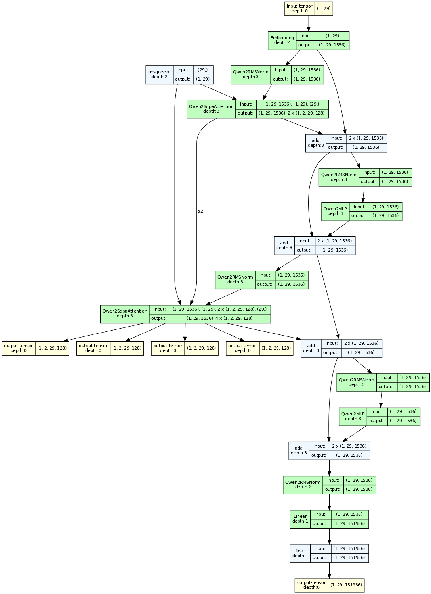

## LLM concepts and architecture

### Attention is all you needs

### Attention

#### MHA

多头与不多头不同之处在于，每个k*q都会产生一个seq_len * seq_len的矩阵。如果没有多头的话，只有一个seq_len * seq_len的矩阵。


拆分过程：


#### MQA

#### GQA

#### MLA


### Normalization

#### LayerNorm

##### 定义

Layer Normalization（层归一化）是一种常用的归一化方法，其计算公式如下：

对于一个形状为$(N, D)$的输入张量$x$，其中$N$是批量大小，$D$是特征维度。

首先，计算每个样本在特征维度上的均值$\mu$和方差$\sigma^{2}$：
- $\mu=\frac{1}{D}\sum_{i = 1}^{D}x_{i}$
- $\sigma^{2}=\frac{1}{D}\sum_{i = 1}^{D}(x_{i}-\mu)^{2}$

然后，对输入进行归一化：
- $\hat{x}=\frac{x_{i}-\mu}{\sqrt{\sigma^{2}+\epsilon}}$

其中，$\epsilon$是一个很小的常数，通常取$1e - 5$或$1e - 8$，用于防止分母为零。

最后，通过可学习的参数$\gamma$和$\beta$对归一化后的结果进行缩放和平移：
- $y=\gamma\hat{x}+\beta$

$\gamma$和$\beta$是可学习的参数，通过训练来调整，以使得模型能够更好地学习数据的特征。

##### BatchNorm对比

层归一化（Layer Normalization）和批量归一化（Batch Normalization）有以下区别：

归一化对象
- **Batch Normalization**：对一个批次的数据在特征维度上进行归一化，即对不同样本的同一特征进行归一化。
- **Layer Normalization**：对单个样本在所有特征维度上进行归一化，是在一个样本的内部对其所有特征进行操作。

 计算方式
- **Batch Normalization**：计算一个批次数据的均值和方差，然后对该批次内的所有样本进行归一化。
- **Layer Normalization**：独立计算每个样本的均值和方差，然后对该样本进行归一化。

 应用场景
- **Batch Normalization**：适用于计算机视觉等领域，在处理图像数据时，能够有效加速模型收敛，减少梯度消失和爆炸问题。
- **Layer Normalization**：在自然语言处理中表现较好，对于变长序列数据，能够更好地适应不同长度的输入，对每个样本独立归一化，不受批次中其他样本的影响。

 对模型训练的影响
- **Batch Normalization**：由于依赖批次统计信息，在训练和推理时的行为有所不同，可能需要进行一些额外的处理来保证模型的稳定性。
- **Layer Normalization**：在训练和推理时的行为一致，因为它只依赖于单个样本的统计信息，不需要进行特殊的处理来适应不同的阶段。

超参数敏感性
- **Batch Normalization**：对批次大小较为敏感，批次大小的变化可能会影响归一化的效果和模型的性能。
- **Layer Normalization**：对批次大小不敏感，更适合于批次大小较小或者动态变化的情况。

##### 与RMS Norm对比

RMS Norm（Root Mean Square Normalization）即均方根归一化，是一种归一化方法，与Layer Norm和Batch Norm有相似之处，但也有不同。以下是其相关介绍：

计算公式
对输入张量$x$，其计算公式为$y=\frac{x}{\sqrt{E[x^{2}]+\epsilon}}$，其中$E[x^{2}]$是$x$元素平方的均值，$\epsilon$是一个小常数，防止分母为零。

与其他归一化方法的区别
- **计算方式**：Layer Norm计算均值和方差时是在特征维度上对所有元素进行操作，Batch Norm是在一个批次内对不同样本的同一特征进行计算，而RMS Norm主要关注元素平方的均值，计算相对更简单，不涉及减去均值的操作。
- **对数据的影响**：Layer Norm和Batch Norm会将数据归一化到均值为0、方差为1的分布，而RMS Norm主要是对数据的尺度进行调整，使其元素的均方根值处于一定范围，不一定改变数据的均值。
- **应用场景**：RMS Norm在一些自然语言处理任务，如Transformer架构中有所应用，能在一定程度上提高模型的稳定性和泛化能力。与Layer Norm类似，它也适用于处理序列数据，但在一些具体任务中的表现可能与Layer Norm有所不同，具体使用哪种需要根据实际情况进行实验和选择。

#### 使用场景

**Pre-input Layer Normalization**: (1)缓解输入数据波动较大的情况，（2）输入数据分布在重要信息也会被平滑掉一些。
**Post-output Layer Normalization**：稳定输出，对模型能力影响不大，主要是对分类、回归任务进行前处理。
**Inter-Layer Normalization**：（1）稳定数据，防止梯度爆炸或消失，（2）提高模型泛化能力，（3）计算开销大。

各模型应用情况：

1. GPT 在Attention和FFN之间使用Layer Norm
2. BERT 在每一层的输入输出使用Layer Norm
3. LLama在Attention和FFN之间使用RMS Norm
4. 千问2, post_attetion, input使用RMS Norm
5. Whisper使用attention_ln, mlp_ln, ln_post(最后一层的后面)
6. Gemma，有input_layernorm, post_attention, pre_ffn, post_ffn，都是RMS Norm。
7. minicpm，在q, kv分别使用layer norm， attenttion, 和input。都是RMS Norm。

### Activation functions

#### Common Activation Functions 

在语言模型（LM）和大型语言模型（LLM）中，常用的激活函数有以下几种：
- **ReLU（Rectified Linear Unit）**
    - **公式**：$f(x)=\max(0,x)$。
    - **特点**：计算简单高效，能有效缓解梯度消失问题，加快模型收敛速度。在处理自然语言中的稀疏数据时表现良好，能使模型自动学习哪些特征是重要的，将不重要的特征置为0，起到特征选择的作用。但它在输入小于0时梯度为0，可能导致部分神经元在训练过程中“死亡”，即不再被激活。
    - **应用**：广泛应用于各种LLM的神经网络架构中，如Transformer的前馈神经网络部分。
- **GELU（Gaussian Error Linear Unit）**
    - **公式**：$GELU(x)=x\Phi(x)$，其中$\Phi(x)$是标准正态分布的累积分布函数。
    - **特点**：它是一种平滑的非线性激活函数，比ReLU更加柔和。GELU考虑了输入的整体分布情况，能根据输入的概率分布来调整输出，具有更好的正则化效果，有助于提高模型的泛化能力。
    - **应用**：在许多现代LLM中被广泛使用，如BERT、GPT - 3等都采用了GELU激活函数，以提高模型的性能和稳定性。
- **Swish(也叫SiLU)**
    - **公式**：$Swish(x)=x\times\sigma(x)$，其中$sigma(x)$是Sigmoid函数。
    - **特点**：Swish是一种自门控激活函数，它结合了Sigmoid函数的门控机制和线性函数的特性。具有平滑、非单调的特性，在不同的输入范围内表现出不同的行为，能够更好地适应复杂的语言数据分布。同时，它在训练过程中能够保持较好的梯度流，有助于模型的收敛。
    - **应用**：在一些LLM的研究和实践中也有应用，例如在一些对模型性能有较高要求的自然语言处理任务中，Swish激活函数能够帮助模型更好地学习语言的复杂模式。
- **Softmax**
    - **公式**：$Softmax(x_i)=\frac{e^{x_i}}{\sum_{j=1}^{n}e^{x_j}}$，用于将一个数值向量转换为表示各个类别概率的概率分布向量。
    - **特点**：它将输入值转换为0到1之间的概率值，且所有概率值之和为1，能够很好地表示分类任务中各个类别的可能性。
    - **应用**：通常用于LLM的输出层，将模型的输出转换为各个可能词汇或标签的概率分布，以便进行分类或生成任务。例如，在语言生成任务中，通过Softmax函数可以得到下一个单词的概率分布，从而根据概率采样或选择概率最高的单词作为生成结果。


从图中可以看出，GELU和SiLU(Swish)差不多，但是GELU计算量会小一些。

#### Adaptation By Models

以下是这些模型常用的激活函数：
- **Qwen2**、**Llama3**：在MLP中使用SiLU。
- **Gemma**2：PytorchGELUTanh


### FFN

在Transformer架构里，前馈神经网络（FFN）有时会采用门控机制，像GLU（Gated Linear Unit）这种形式，此时会涉及到`gate`、`up`、`down`矩阵。接下来我会详细说明计算过程，并且借助mermaid为你绘制计算流程示意图。

#### 计算过程
假设输入为向量 $x$，其维度是 $d_{model}$。FFN里的门控机制一般包含以下计算步骤：
1. **线性变换**：对输入 $x$ 分别做三次线性变换，得到 `gate`、`up`、`down` 矩阵的中间结果。
这里会用到三个不同的权重矩阵 $W_{gate}$、$W_{up}$ 和 $W_{down}$，以及对应的偏置向量 $b_{gate}$、$b_{up}$ 和 $b_{down}$。
    - $gate = \text{Linear}_{gate}(x)=W_{gate}x + b_{gate}$
    - $up = \text{Linear}_{up}(x)=W_{up}x + b_{up}$
    - $down = \text{Linear}_{down}(x)=W_{down}x + b_{down}$
2. **门控操作**：使用激活函数（例如Sigmoid）对 `gate` 进行处理，然后和 `up` 逐元素相乘，这一过程起到了门控的作用，能够控制信息的流通。
    - $gated = \sigma(gate)\odot up$
    其中，$\sigma$ 代表激活函数，$\odot$ 表示逐元素相乘。
3. **最终输出**：把门控操作的结果和 `down` 相加，就得到了FFN的最终输出 \(y\)。
    - $y = \text{ReLU}(gated + down)$

#### 示意图
此图展示了带有门控机制的FFN的计算流程：
1. 输入 \(x\) 经过线性变换得到 `gate`、`up`、`down`。
2. `gate` 经过Sigmoid激活后和 `up` 逐元素相乘，得到 `gated`。
3. `gated` 和 `down` 相加，再经过ReLU激活，最终得到输出 \(y\)。 


## MoE

## LoRA


## ways to dive into model architecture and flops

### print(model)

```python
print(model)
```

#### whisper model

```
Whisper(
  (encoder): AudioEncoder(
    (conv1): Conv1d(80, 512, kernel_size=(3,), stride=(1,), padding=(1,))
    (conv2): Conv1d(512, 512, kernel_size=(3,), stride=(2,), padding=(1,))
    (blocks): ModuleList(
      (0-5): 6 x ResidualAttentionBlock(
        (attn): MultiHeadAttention(
          (query): Linear(in_features=512, out_features=512, bias=True)
          (key): Linear(in_features=512, out_features=512, bias=False)
          (value): Linear(in_features=512, out_features=512, bias=True)
          (out): Linear(in_features=512, out_features=512, bias=True)
        )
        (attn_ln): LayerNorm((512,), eps=1e-05, elementwise_affine=True)
        (mlp): Sequential(
          (0): Linear(in_features=512, out_features=2048, bias=True)
          (1): GELU(approximate='none')
          (2): Linear(in_features=2048, out_features=512, bias=True)
        )
        (mlp_ln): LayerNorm((512,), eps=1e-05, elementwise_affine=True)
      )
    )
    (ln_post): LayerNorm((512,), eps=1e-05, elementwise_affine=True)
  )
  (decoder): TextDecoder(
    (token_embedding): Embedding(51865, 512)
    (blocks): ModuleList(
      (0-5): 6 x ResidualAttentionBlock(
        (attn): MultiHeadAttention(
          (query): Linear(in_features=512, out_features=512, bias=True)
          (key): Linear(in_features=512, out_features=512, bias=False)
          (value): Linear(in_features=512, out_features=512, bias=True)
          (out): Linear(in_features=512, out_features=512, bias=True)
        )
        (attn_ln): LayerNorm((512,), eps=1e-05, elementwise_affine=True)
        (cross_attn): MultiHeadAttention(
          (query): Linear(in_features=512, out_features=512, bias=True)
          (key): Linear(in_features=512, out_features=512, bias=False)
          (value): Linear(in_features=512, out_features=512, bias=True)
          (out): Linear(in_features=512, out_features=512, bias=True)
        )
        (cross_attn_ln): LayerNorm((512,), eps=1e-05, elementwise_affine=True)
        (mlp): Sequential(
          (0): Linear(in_features=512, out_features=2048, bias=True)
          (1): GELU(approximate='none')
          (2): Linear(in_features=2048, out_features=512, bias=True)
        )
        (mlp_ln): LayerNorm((512,), eps=1e-05, elementwise_affine=True)
      )
    )
    (ln): LayerNorm((512,), eps=1e-05, elementwise_affine=True)
  )
)
```


#### vqgan_imagenet_f16_1024

参数量：89,623,492

```
VQModel(
  (encoder): Encoder(
    (conv_in): Conv2d(3, 128, kernel_size=(3, 3), stride=(1, 1), padding=(1, 1))
    (down): ModuleList(
      (0-1): 2 x Module(
        (block): ModuleList(
          (0-1): 2 x ResnetBlock(
            (norm1): GroupNorm(32, 128, eps=1e-06, affine=True)
            (conv1): Conv2d(128, 128, kernel_size=(3, 3), stride=(1, 1), padding=(1, 1))
            (norm2): GroupNorm(32, 128, eps=1e-06, affine=True)
            (dropout): Dropout(p=0.0, inplace=False)
            (conv2): Conv2d(128, 128, kernel_size=(3, 3), stride=(1, 1), padding=(1, 1))
          )
        )
        (attn): ModuleList()
        (downsample): Downsample(
          (conv): Conv2d(128, 128, kernel_size=(3, 3), stride=(2, 2))
        )
      )
      (2): Module(
        (block): ModuleList(
          (0): ResnetBlock(
            (norm1): GroupNorm(32, 128, eps=1e-06, affine=True)
            (conv1): Conv2d(128, 256, kernel_size=(3, 3), stride=(1, 1), padding=(1, 1))
            (norm2): GroupNorm(32, 256, eps=1e-06, affine=True)
            (dropout): Dropout(p=0.0, inplace=False)
            (conv2): Conv2d(256, 256, kernel_size=(3, 3), stride=(1, 1), padding=(1, 1))
            (nin_shortcut): Conv2d(128, 256, kernel_size=(1, 1), stride=(1, 1))
          )
          (1): ResnetBlock(
            (norm1): GroupNorm(32, 256, eps=1e-06, affine=True)
            (conv1): Conv2d(256, 256, kernel_size=(3, 3), stride=(1, 1), padding=(1, 1))
            (norm2): GroupNorm(32, 256, eps=1e-06, affine=True)
            (dropout): Dropout(p=0.0, inplace=False)
            (conv2): Conv2d(256, 256, kernel_size=(3, 3), stride=(1, 1), padding=(1, 1))
          )
        )
        (attn): ModuleList()
        (downsample): Downsample(
          (conv): Conv2d(256, 256, kernel_size=(3, 3), stride=(2, 2))
        )
      )
      (3): Module(
        (block): ModuleList(
          (0-1): 2 x ResnetBlock(
            (norm1): GroupNorm(32, 256, eps=1e-06, affine=True)
            (conv1): Conv2d(256, 256, kernel_size=(3, 3), stride=(1, 1), padding=(1, 1))
            (norm2): GroupNorm(32, 256, eps=1e-06, affine=True)
            (dropout): Dropout(p=0.0, inplace=False)
            (conv2): Conv2d(256, 256, kernel_size=(3, 3), stride=(1, 1), padding=(1, 1))
          )
        )
        (attn): ModuleList()
        (downsample): Downsample(
          (conv): Conv2d(256, 256, kernel_size=(3, 3), stride=(2, 2))
        )
      )
      (4): Module(
        (block): ModuleList(
          (0): ResnetBlock(
            (norm1): GroupNorm(32, 256, eps=1e-06, affine=True)
            (conv1): Conv2d(256, 512, kernel_size=(3, 3), stride=(1, 1), padding=(1, 1))
            (norm2): GroupNorm(32, 512, eps=1e-06, affine=True)
            (dropout): Dropout(p=0.0, inplace=False)
            (conv2): Conv2d(512, 512, kernel_size=(3, 3), stride=(1, 1), padding=(1, 1))
            (nin_shortcut): Conv2d(256, 512, kernel_size=(1, 1), stride=(1, 1))
          )
          (1): ResnetBlock(
            (norm1): GroupNorm(32, 512, eps=1e-06, affine=True)
            (conv1): Conv2d(512, 512, kernel_size=(3, 3), stride=(1, 1), padding=(1, 1))
            (norm2): GroupNorm(32, 512, eps=1e-06, affine=True)
            (dropout): Dropout(p=0.0, inplace=False)
            (conv2): Conv2d(512, 512, kernel_size=(3, 3), stride=(1, 1), padding=(1, 1))
          )
        )
        (attn): ModuleList(
          (0-1): 2 x AttnBlock(
            (norm): GroupNorm(32, 512, eps=1e-06, affine=True)
            (q): Conv2d(512, 512, kernel_size=(1, 1), stride=(1, 1))
            (k): Conv2d(512, 512, kernel_size=(1, 1), stride=(1, 1))
            (v): Conv2d(512, 512, kernel_size=(1, 1), stride=(1, 1))
            (proj_out): Conv2d(512, 512, kernel_size=(1, 1), stride=(1, 1))
          )
        )
      )
    )
    (mid): Module(
      (block_1): ResnetBlock(
        (norm1): GroupNorm(32, 512, eps=1e-06, affine=True)
        (conv1): Conv2d(512, 512, kernel_size=(3, 3), stride=(1, 1), padding=(1, 1))
        (norm2): GroupNorm(32, 512, eps=1e-06, affine=True)
        (dropout): Dropout(p=0.0, inplace=False)
        (conv2): Conv2d(512, 512, kernel_size=(3, 3), stride=(1, 1), padding=(1, 1))
      )
      (attn_1): AttnBlock(
        (norm): GroupNorm(32, 512, eps=1e-06, affine=True)
        (q): Conv2d(512, 512, kernel_size=(1, 1), stride=(1, 1))
        (k): Conv2d(512, 512, kernel_size=(1, 1), stride=(1, 1))
        (v): Conv2d(512, 512, kernel_size=(1, 1), stride=(1, 1))
        (proj_out): Conv2d(512, 512, kernel_size=(1, 1), stride=(1, 1))
      )
      (block_2): ResnetBlock(
        (norm1): GroupNorm(32, 512, eps=1e-06, affine=True)
        (conv1): Conv2d(512, 512, kernel_size=(3, 3), stride=(1, 1), padding=(1, 1))
        (norm2): GroupNorm(32, 512, eps=1e-06, affine=True)
        (dropout): Dropout(p=0.0, inplace=False)
        (conv2): Conv2d(512, 512, kernel_size=(3, 3), stride=(1, 1), padding=(1, 1))
      )
    )
    (norm_out): GroupNorm(32, 512, eps=1e-06, affine=True)
    (conv_out): Conv2d(512, 256, kernel_size=(3, 3), stride=(1, 1), padding=(1, 1))
  )
  (decoder): Decoder(
    (conv_in): Conv2d(256, 512, kernel_size=(3, 3), stride=(1, 1), padding=(1, 1))
    (mid): Module(
      (block_1): ResnetBlock(
        (norm1): GroupNorm(32, 512, eps=1e-06, affine=True)
        (conv1): Conv2d(512, 512, kernel_size=(3, 3), stride=(1, 1), padding=(1, 1))
        (norm2): GroupNorm(32, 512, eps=1e-06, affine=True)
        (dropout): Dropout(p=0.0, inplace=False)
        (conv2): Conv2d(512, 512, kernel_size=(3, 3), stride=(1, 1), padding=(1, 1))
      )
      (attn_1): AttnBlock(
        (norm): GroupNorm(32, 512, eps=1e-06, affine=True)
        (q): Conv2d(512, 512, kernel_size=(1, 1), stride=(1, 1))
        (k): Conv2d(512, 512, kernel_size=(1, 1), stride=(1, 1))
        (v): Conv2d(512, 512, kernel_size=(1, 1), stride=(1, 1))
        (proj_out): Conv2d(512, 512, kernel_size=(1, 1), stride=(1, 1))
      )
      (block_2): ResnetBlock(
        (norm1): GroupNorm(32, 512, eps=1e-06, affine=True)
        (conv1): Conv2d(512, 512, kernel_size=(3, 3), stride=(1, 1), padding=(1, 1))
        (norm2): GroupNorm(32, 512, eps=1e-06, affine=True)
        (dropout): Dropout(p=0.0, inplace=False)
        (conv2): Conv2d(512, 512, kernel_size=(3, 3), stride=(1, 1), padding=(1, 1))
      )
    )
    (up): ModuleList(
      (0): Module(
        (block): ModuleList(
          (0-2): 3 x ResnetBlock(
            (norm1): GroupNorm(32, 128, eps=1e-06, affine=True)
            (conv1): Conv2d(128, 128, kernel_size=(3, 3), stride=(1, 1), padding=(1, 1))
            (norm2): GroupNorm(32, 128, eps=1e-06, affine=True)
            (dropout): Dropout(p=0.0, inplace=False)
            (conv2): Conv2d(128, 128, kernel_size=(3, 3), stride=(1, 1), padding=(1, 1))
          )
        )
        (attn): ModuleList()
      )
      (1): Module(
        (block): ModuleList(
          (0): ResnetBlock(
            (norm1): GroupNorm(32, 256, eps=1e-06, affine=True)
            (conv1): Conv2d(256, 128, kernel_size=(3, 3), stride=(1, 1), padding=(1, 1))
            (norm2): GroupNorm(32, 128, eps=1e-06, affine=True)
            (dropout): Dropout(p=0.0, inplace=False)
            (conv2): Conv2d(128, 128, kernel_size=(3, 3), stride=(1, 1), padding=(1, 1))
            (nin_shortcut): Conv2d(256, 128, kernel_size=(1, 1), stride=(1, 1))
          )
          (1-2): 2 x ResnetBlock(
            (norm1): GroupNorm(32, 128, eps=1e-06, affine=True)
            (conv1): Conv2d(128, 128, kernel_size=(3, 3), stride=(1, 1), padding=(1, 1))
            (norm2): GroupNorm(32, 128, eps=1e-06, affine=True)
            (dropout): Dropout(p=0.0, inplace=False)
            (conv2): Conv2d(128, 128, kernel_size=(3, 3), stride=(1, 1), padding=(1, 1))
          )
        )
        (attn): ModuleList()
        (upsample): Upsample(
          (conv): Conv2d(128, 128, kernel_size=(3, 3), stride=(1, 1), padding=(1, 1))
        )
      )
      (2): Module(
        (block): ModuleList(
          (0-2): 3 x ResnetBlock(
            (norm1): GroupNorm(32, 256, eps=1e-06, affine=True)
            (conv1): Conv2d(256, 256, kernel_size=(3, 3), stride=(1, 1), padding=(1, 1))
            (norm2): GroupNorm(32, 256, eps=1e-06, affine=True)
            (dropout): Dropout(p=0.0, inplace=False)
            (conv2): Conv2d(256, 256, kernel_size=(3, 3), stride=(1, 1), padding=(1, 1))
          )
        )
        (attn): ModuleList()
        (upsample): Upsample(
          (conv): Conv2d(256, 256, kernel_size=(3, 3), stride=(1, 1), padding=(1, 1))
        )
      )
      (3): Module(
        (block): ModuleList(
          (0): ResnetBlock(
            (norm1): GroupNorm(32, 512, eps=1e-06, affine=True)
            (conv1): Conv2d(512, 256, kernel_size=(3, 3), stride=(1, 1), padding=(1, 1))
            (norm2): GroupNorm(32, 256, eps=1e-06, affine=True)
            (dropout): Dropout(p=0.0, inplace=False)
            (conv2): Conv2d(256, 256, kernel_size=(3, 3), stride=(1, 1), padding=(1, 1))
            (nin_shortcut): Conv2d(512, 256, kernel_size=(1, 1), stride=(1, 1))
          )
          (1-2): 2 x ResnetBlock(
            (norm1): GroupNorm(32, 256, eps=1e-06, affine=True)
            (conv1): Conv2d(256, 256, kernel_size=(3, 3), stride=(1, 1), padding=(1, 1))
            (norm2): GroupNorm(32, 256, eps=1e-06, affine=True)
            (dropout): Dropout(p=0.0, inplace=False)
            (conv2): Conv2d(256, 256, kernel_size=(3, 3), stride=(1, 1), padding=(1, 1))
          )
        )
        (attn): ModuleList()
        (upsample): Upsample(
          (conv): Conv2d(256, 256, kernel_size=(3, 3), stride=(1, 1), padding=(1, 1))
        )
      )
      (4): Module(
        (block): ModuleList(
          (0-2): 3 x ResnetBlock(
            (norm1): GroupNorm(32, 512, eps=1e-06, affine=True)
            (conv1): Conv2d(512, 512, kernel_size=(3, 3), stride=(1, 1), padding=(1, 1))
            (norm2): GroupNorm(32, 512, eps=1e-06, affine=True)
            (dropout): Dropout(p=0.0, inplace=False)
            (conv2): Conv2d(512, 512, kernel_size=(3, 3), stride=(1, 1), padding=(1, 1))
          )
        )
        (attn): ModuleList(
          (0-2): 3 x AttnBlock(
            (norm): GroupNorm(32, 512, eps=1e-06, affine=True)
            (q): Conv2d(512, 512, kernel_size=(1, 1), stride=(1, 1))
            (k): Conv2d(512, 512, kernel_size=(1, 1), stride=(1, 1))
            (v): Conv2d(512, 512, kernel_size=(1, 1), stride=(1, 1))
            (proj_out): Conv2d(512, 512, kernel_size=(1, 1), stride=(1, 1))
          )
        )
        (upsample): Upsample(
          (conv): Conv2d(512, 512, kernel_size=(3, 3), stride=(1, 1), padding=(1, 1))
        )
      )
    )
    (norm_out): GroupNorm(32, 128, eps=1e-06, affine=True)
    (conv_out): Conv2d(128, 3, kernel_size=(3, 3), stride=(1, 1), padding=(1, 1))
  )
  (loss): VQLPIPSWithDiscriminator(
    (perceptual_loss): LPIPS(
      (scaling_layer): ScalingLayer()
      (net): vgg16(
        (slice1): Sequential(
          (0): Conv2d(3, 64, kernel_size=(3, 3), stride=(1, 1), padding=(1, 1))
          (1): ReLU(inplace=True)
          (2): Conv2d(64, 64, kernel_size=(3, 3), stride=(1, 1), padding=(1, 1))
          (3): ReLU(inplace=True)
        )
        (slice2): Sequential(
          (4): MaxPool2d(kernel_size=2, stride=2, padding=0, dilation=1, ceil_mode=False)
          (5): Conv2d(64, 128, kernel_size=(3, 3), stride=(1, 1), padding=(1, 1))
          (6): ReLU(inplace=True)
          (7): Conv2d(128, 128, kernel_size=(3, 3), stride=(1, 1), padding=(1, 1))
          (8): ReLU(inplace=True)
        )
        (slice3): Sequential(
          (9): MaxPool2d(kernel_size=2, stride=2, padding=0, dilation=1, ceil_mode=False)
          (10): Conv2d(128, 256, kernel_size=(3, 3), stride=(1, 1), padding=(1, 1))
          (11): ReLU(inplace=True)
          (12): Conv2d(256, 256, kernel_size=(3, 3), stride=(1, 1), padding=(1, 1))
          (13): ReLU(inplace=True)
          (14): Conv2d(256, 256, kernel_size=(3, 3), stride=(1, 1), padding=(1, 1))
          (15): ReLU(inplace=True)
        )
        (slice4): Sequential(
          (16): MaxPool2d(kernel_size=2, stride=2, padding=0, dilation=1, ceil_mode=False)
          (17): Conv2d(256, 512, kernel_size=(3, 3), stride=(1, 1), padding=(1, 1))
          (18): ReLU(inplace=True)
          (19): Conv2d(512, 512, kernel_size=(3, 3), stride=(1, 1), padding=(1, 1))
          (20): ReLU(inplace=True)
          (21): Conv2d(512, 512, kernel_size=(3, 3), stride=(1, 1), padding=(1, 1))
          (22): ReLU(inplace=True)
        )
        (slice5): Sequential(
          (23): MaxPool2d(kernel_size=2, stride=2, padding=0, dilation=1, ceil_mode=False)
          (24): Conv2d(512, 512, kernel_size=(3, 3), stride=(1, 1), padding=(1, 1))
          (25): ReLU(inplace=True)
          (26): Conv2d(512, 512, kernel_size=(3, 3), stride=(1, 1), padding=(1, 1))
          (27): ReLU(inplace=True)
          (28): Conv2d(512, 512, kernel_size=(3, 3), stride=(1, 1), padding=(1, 1))
          (29): ReLU(inplace=True)
        )
      )
      (lin0): NetLinLayer(
        (model): Sequential(
          (0): Dropout(p=0.5, inplace=False)
          (1): Conv2d(64, 1, kernel_size=(1, 1), stride=(1, 1), bias=False)
        )
      )
      (lin1): NetLinLayer(
        (model): Sequential(
          (0): Dropout(p=0.5, inplace=False)
          (1): Conv2d(128, 1, kernel_size=(1, 1), stride=(1, 1), bias=False)
        )
      )
      (lin2): NetLinLayer(
        (model): Sequential(
          (0): Dropout(p=0.5, inplace=False)
          (1): Conv2d(256, 1, kernel_size=(1, 1), stride=(1, 1), bias=False)
        )
      )
      (lin3): NetLinLayer(
        (model): Sequential(
          (0): Dropout(p=0.5, inplace=False)
          (1): Conv2d(512, 1, kernel_size=(1, 1), stride=(1, 1), bias=False)
        )
      )
      (lin4): NetLinLayer(
        (model): Sequential(
          (0): Dropout(p=0.5, inplace=False)
          (1): Conv2d(512, 1, kernel_size=(1, 1), stride=(1, 1), bias=False)
        )
      )
    )
    (discriminator): NLayerDiscriminator(
      (main): Sequential(
        (0): Conv2d(3, 64, kernel_size=(4, 4), stride=(2, 2), padding=(1, 1))
        (1): LeakyReLU(negative_slope=0.2, inplace=True)
        (2): Conv2d(64, 128, kernel_size=(4, 4), stride=(2, 2), padding=(1, 1), bias=False)
        (3): BatchNorm2d(128, eps=1e-05, momentum=0.1, affine=True, track_running_stats=True)
        (4): LeakyReLU(negative_slope=0.2, inplace=True)
        (5): Conv2d(128, 256, kernel_size=(4, 4), stride=(2, 2), padding=(1, 1), bias=False)
        (6): BatchNorm2d(256, eps=1e-05, momentum=0.1, affine=True, track_running_stats=True)
        (7): LeakyReLU(negative_slope=0.2, inplace=True)
        (8): Conv2d(256, 512, kernel_size=(4, 4), stride=(1, 1), padding=(1, 1), bias=False)
        (9): BatchNorm2d(512, eps=1e-05, momentum=0.1, affine=True, track_running_stats=True)
        (10): LeakyReLU(negative_slope=0.2, inplace=True)
        (11): Conv2d(512, 1, kernel_size=(4, 4), stride=(1, 1), padding=(1, 1))
      )
    )
  )
  (quantize): VectorQuantizer2(
    (embedding): Embedding(1024, 256)
  )
  (quant_conv): Conv2d(256, 256, kernel_size=(1, 1), stride=(1, 1))
  (post_quant_conv): Conv2d(256, 256, kernel_size=(1, 1), stride=(1, 1))
)

```

#### vqgan_imagenet_f16_16384

参数量：91,453,380

```
VQModel(
  (encoder): Encoder(
    (conv_in): Conv2d(3, 128, kernel_size=(3, 3), stride=(1, 1), padding=(1, 1))
    (down): ModuleList(
      (0-1): 2 x Module(
        (block): ModuleList(
          (0-1): 2 x ResnetBlock(
            (norm1): GroupNorm(32, 128, eps=1e-06, affine=True)
            (conv1): Conv2d(128, 128, kernel_size=(3, 3), stride=(1, 1), padding=(1, 1))
            (norm2): GroupNorm(32, 128, eps=1e-06, affine=True)
            (dropout): Dropout(p=0.0, inplace=False)
            (conv2): Conv2d(128, 128, kernel_size=(3, 3), stride=(1, 1), padding=(1, 1))
          )
        )
        (attn): ModuleList()
        (downsample): Downsample(
          (conv): Conv2d(128, 128, kernel_size=(3, 3), stride=(2, 2))
        )
      )
      (2): Module(
        (block): ModuleList(
          (0): ResnetBlock(
            (norm1): GroupNorm(32, 128, eps=1e-06, affine=True)
            (conv1): Conv2d(128, 256, kernel_size=(3, 3), stride=(1, 1), padding=(1, 1))
            (norm2): GroupNorm(32, 256, eps=1e-06, affine=True)
            (dropout): Dropout(p=0.0, inplace=False)
            (conv2): Conv2d(256, 256, kernel_size=(3, 3), stride=(1, 1), padding=(1, 1))
            (nin_shortcut): Conv2d(128, 256, kernel_size=(1, 1), stride=(1, 1))
          )
          (1): ResnetBlock(
            (norm1): GroupNorm(32, 256, eps=1e-06, affine=True)
            (conv1): Conv2d(256, 256, kernel_size=(3, 3), stride=(1, 1), padding=(1, 1))
            (norm2): GroupNorm(32, 256, eps=1e-06, affine=True)
            (dropout): Dropout(p=0.0, inplace=False)
            (conv2): Conv2d(256, 256, kernel_size=(3, 3), stride=(1, 1), padding=(1, 1))
          )
        )
        (attn): ModuleList()
        (downsample): Downsample(
          (conv): Conv2d(256, 256, kernel_size=(3, 3), stride=(2, 2))
        )
      )
      (3): Module(
        (block): ModuleList(
          (0-1): 2 x ResnetBlock(
            (norm1): GroupNorm(32, 256, eps=1e-06, affine=True)
            (conv1): Conv2d(256, 256, kernel_size=(3, 3), stride=(1, 1), padding=(1, 1))
            (norm2): GroupNorm(32, 256, eps=1e-06, affine=True)
            (dropout): Dropout(p=0.0, inplace=False)
            (conv2): Conv2d(256, 256, kernel_size=(3, 3), stride=(1, 1), padding=(1, 1))
          )
        )
        (attn): ModuleList()
        (downsample): Downsample(
          (conv): Conv2d(256, 256, kernel_size=(3, 3), stride=(2, 2))
        )
      )
      (4): Module(
        (block): ModuleList(
          (0): ResnetBlock(
            (norm1): GroupNorm(32, 256, eps=1e-06, affine=True)
            (conv1): Conv2d(256, 512, kernel_size=(3, 3), stride=(1, 1), padding=(1, 1))
            (norm2): GroupNorm(32, 512, eps=1e-06, affine=True)
            (dropout): Dropout(p=0.0, inplace=False)
            (conv2): Conv2d(512, 512, kernel_size=(3, 3), stride=(1, 1), padding=(1, 1))
            (nin_shortcut): Conv2d(256, 512, kernel_size=(1, 1), stride=(1, 1))
          )
          (1): ResnetBlock(
            (norm1): GroupNorm(32, 512, eps=1e-06, affine=True)
            (conv1): Conv2d(512, 512, kernel_size=(3, 3), stride=(1, 1), padding=(1, 1))
            (norm2): GroupNorm(32, 512, eps=1e-06, affine=True)
            (dropout): Dropout(p=0.0, inplace=False)
            (conv2): Conv2d(512, 512, kernel_size=(3, 3), stride=(1, 1), padding=(1, 1))
          )
        )
        (attn): ModuleList(
          (0-1): 2 x AttnBlock(
            (norm): GroupNorm(32, 512, eps=1e-06, affine=True)
            (q): Conv2d(512, 512, kernel_size=(1, 1), stride=(1, 1))
            (k): Conv2d(512, 512, kernel_size=(1, 1), stride=(1, 1))
            (v): Conv2d(512, 512, kernel_size=(1, 1), stride=(1, 1))
            (proj_out): Conv2d(512, 512, kernel_size=(1, 1), stride=(1, 1))
          )
        )
      )
    )
    (mid): Module(
      (block_1): ResnetBlock(
        (norm1): GroupNorm(32, 512, eps=1e-06, affine=True)
        (conv1): Conv2d(512, 512, kernel_size=(3, 3), stride=(1, 1), padding=(1, 1))
        (norm2): GroupNorm(32, 512, eps=1e-06, affine=True)
        (dropout): Dropout(p=0.0, inplace=False)
        (conv2): Conv2d(512, 512, kernel_size=(3, 3), stride=(1, 1), padding=(1, 1))
      )
      (attn_1): AttnBlock(
        (norm): GroupNorm(32, 512, eps=1e-06, affine=True)
        (q): Conv2d(512, 512, kernel_size=(1, 1), stride=(1, 1))
        (k): Conv2d(512, 512, kernel_size=(1, 1), stride=(1, 1))
        (v): Conv2d(512, 512, kernel_size=(1, 1), stride=(1, 1))
        (proj_out): Conv2d(512, 512, kernel_size=(1, 1), stride=(1, 1))
      )
      (block_2): ResnetBlock(
        (norm1): GroupNorm(32, 512, eps=1e-06, affine=True)
        (conv1): Conv2d(512, 512, kernel_size=(3, 3), stride=(1, 1), padding=(1, 1))
        (norm2): GroupNorm(32, 512, eps=1e-06, affine=True)
        (dropout): Dropout(p=0.0, inplace=False)
        (conv2): Conv2d(512, 512, kernel_size=(3, 3), stride=(1, 1), padding=(1, 1))
      )
    )
    (norm_out): GroupNorm(32, 512, eps=1e-06, affine=True)
    (conv_out): Conv2d(512, 256, kernel_size=(3, 3), stride=(1, 1), padding=(1, 1))
  )
  (decoder): Decoder(
    (conv_in): Conv2d(256, 512, kernel_size=(3, 3), stride=(1, 1), padding=(1, 1))
    (mid): Module(
      (block_1): ResnetBlock(
        (norm1): GroupNorm(32, 512, eps=1e-06, affine=True)
        (conv1): Conv2d(512, 512, kernel_size=(3, 3), stride=(1, 1), padding=(1, 1))
        (norm2): GroupNorm(32, 512, eps=1e-06, affine=True)
        (dropout): Dropout(p=0.0, inplace=False)
        (conv2): Conv2d(512, 512, kernel_size=(3, 3), stride=(1, 1), padding=(1, 1))
      )
      (attn_1): AttnBlock(
        (norm): GroupNorm(32, 512, eps=1e-06, affine=True)
        (q): Conv2d(512, 512, kernel_size=(1, 1), stride=(1, 1))
        (k): Conv2d(512, 512, kernel_size=(1, 1), stride=(1, 1))
        (v): Conv2d(512, 512, kernel_size=(1, 1), stride=(1, 1))
        (proj_out): Conv2d(512, 512, kernel_size=(1, 1), stride=(1, 1))
      )
      (block_2): ResnetBlock(
        (norm1): GroupNorm(32, 512, eps=1e-06, affine=True)
        (conv1): Conv2d(512, 512, kernel_size=(3, 3), stride=(1, 1), padding=(1, 1))
        (norm2): GroupNorm(32, 512, eps=1e-06, affine=True)
        (dropout): Dropout(p=0.0, inplace=False)
        (conv2): Conv2d(512, 512, kernel_size=(3, 3), stride=(1, 1), padding=(1, 1))
      )
    )
    (up): ModuleList(
      (0): Module(
        (block): ModuleList(
          (0-2): 3 x ResnetBlock(
            (norm1): GroupNorm(32, 128, eps=1e-06, affine=True)
            (conv1): Conv2d(128, 128, kernel_size=(3, 3), stride=(1, 1), padding=(1, 1))
            (norm2): GroupNorm(32, 128, eps=1e-06, affine=True)
            (dropout): Dropout(p=0.0, inplace=False)
            (conv2): Conv2d(128, 128, kernel_size=(3, 3), stride=(1, 1), padding=(1, 1))
          )
        )
        (attn): ModuleList()
      )
      (1): Module(
        (block): ModuleList(
          (0): ResnetBlock(
            (norm1): GroupNorm(32, 256, eps=1e-06, affine=True)
            (conv1): Conv2d(256, 128, kernel_size=(3, 3), stride=(1, 1), padding=(1, 1))
            (norm2): GroupNorm(32, 128, eps=1e-06, affine=True)
            (dropout): Dropout(p=0.0, inplace=False)
            (conv2): Conv2d(128, 128, kernel_size=(3, 3), stride=(1, 1), padding=(1, 1))
            (nin_shortcut): Conv2d(256, 128, kernel_size=(1, 1), stride=(1, 1))
          )
          (1-2): 2 x ResnetBlock(
            (norm1): GroupNorm(32, 128, eps=1e-06, affine=True)
            (conv1): Conv2d(128, 128, kernel_size=(3, 3), stride=(1, 1), padding=(1, 1))
            (norm2): GroupNorm(32, 128, eps=1e-06, affine=True)
            (dropout): Dropout(p=0.0, inplace=False)
            (conv2): Conv2d(128, 128, kernel_size=(3, 3), stride=(1, 1), padding=(1, 1))
          )
        )
        (attn): ModuleList()
        (upsample): Upsample(
          (conv): Conv2d(128, 128, kernel_size=(3, 3), stride=(1, 1), padding=(1, 1))
        )
      )
      (2): Module(
        (block): ModuleList(
          (0-2): 3 x ResnetBlock(
            (norm1): GroupNorm(32, 256, eps=1e-06, affine=True)
            (conv1): Conv2d(256, 256, kernel_size=(3, 3), stride=(1, 1), padding=(1, 1))
            (norm2): GroupNorm(32, 256, eps=1e-06, affine=True)
            (dropout): Dropout(p=0.0, inplace=False)
            (conv2): Conv2d(256, 256, kernel_size=(3, 3), stride=(1, 1), padding=(1, 1))
          )
        )
        (attn): ModuleList()
        (upsample): Upsample(
          (conv): Conv2d(256, 256, kernel_size=(3, 3), stride=(1, 1), padding=(1, 1))
        )
      )
      (3): Module(
        (block): ModuleList(
          (0): ResnetBlock(
            (norm1): GroupNorm(32, 512, eps=1e-06, affine=True)
            (conv1): Conv2d(512, 256, kernel_size=(3, 3), stride=(1, 1), padding=(1, 1))
            (norm2): GroupNorm(32, 256, eps=1e-06, affine=True)
            (dropout): Dropout(p=0.0, inplace=False)
            (conv2): Conv2d(256, 256, kernel_size=(3, 3), stride=(1, 1), padding=(1, 1))
            (nin_shortcut): Conv2d(512, 256, kernel_size=(1, 1), stride=(1, 1))
          )
          (1-2): 2 x ResnetBlock(
            (norm1): GroupNorm(32, 256, eps=1e-06, affine=True)
            (conv1): Conv2d(256, 256, kernel_size=(3, 3), stride=(1, 1), padding=(1, 1))
            (norm2): GroupNorm(32, 256, eps=1e-06, affine=True)
            (dropout): Dropout(p=0.0, inplace=False)
            (conv2): Conv2d(256, 256, kernel_size=(3, 3), stride=(1, 1), padding=(1, 1))
          )
        )
        (attn): ModuleList()
        (upsample): Upsample(
          (conv): Conv2d(256, 256, kernel_size=(3, 3), stride=(1, 1), padding=(1, 1))
        )
      )
      (4): Module(
        (block): ModuleList(
          (0-2): 3 x ResnetBlock(
            (norm1): GroupNorm(32, 512, eps=1e-06, affine=True)
            (conv1): Conv2d(512, 512, kernel_size=(3, 3), stride=(1, 1), padding=(1, 1))
            (norm2): GroupNorm(32, 512, eps=1e-06, affine=True)
            (dropout): Dropout(p=0.0, inplace=False)
            (conv2): Conv2d(512, 512, kernel_size=(3, 3), stride=(1, 1), padding=(1, 1))
          )
        )
        (attn): ModuleList(
          (0-2): 3 x AttnBlock(
            (norm): GroupNorm(32, 512, eps=1e-06, affine=True)
            (q): Conv2d(512, 512, kernel_size=(1, 1), stride=(1, 1))
            (k): Conv2d(512, 512, kernel_size=(1, 1), stride=(1, 1))
            (v): Conv2d(512, 512, kernel_size=(1, 1), stride=(1, 1))
            (proj_out): Conv2d(512, 512, kernel_size=(1, 1), stride=(1, 1))
          )
        )
        (upsample): Upsample(
          (conv): Conv2d(512, 512, kernel_size=(3, 3), stride=(1, 1), padding=(1, 1))
        )
      )
    )
    (norm_out): GroupNorm(32, 128, eps=1e-06, affine=True)
    (conv_out): Conv2d(128, 3, kernel_size=(3, 3), stride=(1, 1), padding=(1, 1))
  )
  (loss): VQLPIPSWithDiscriminator(
    (perceptual_loss): LPIPS(
      (scaling_layer): ScalingLayer()
      (net): vgg16(
        (slice1): Sequential(
          (0): Conv2d(3, 64, kernel_size=(3, 3), stride=(1, 1), padding=(1, 1))
          (1): ReLU(inplace=True)
          (2): Conv2d(64, 64, kernel_size=(3, 3), stride=(1, 1), padding=(1, 1))
          (3): ReLU(inplace=True)
        )
        (slice2): Sequential(
          (4): MaxPool2d(kernel_size=2, stride=2, padding=0, dilation=1, ceil_mode=False)
          (5): Conv2d(64, 128, kernel_size=(3, 3), stride=(1, 1), padding=(1, 1))
          (6): ReLU(inplace=True)
          (7): Conv2d(128, 128, kernel_size=(3, 3), stride=(1, 1), padding=(1, 1))
          (8): ReLU(inplace=True)
        )
        (slice3): Sequential(
          (9): MaxPool2d(kernel_size=2, stride=2, padding=0, dilation=1, ceil_mode=False)
          (10): Conv2d(128, 256, kernel_size=(3, 3), stride=(1, 1), padding=(1, 1))
          (11): ReLU(inplace=True)
          (12): Conv2d(256, 256, kernel_size=(3, 3), stride=(1, 1), padding=(1, 1))
          (13): ReLU(inplace=True)
          (14): Conv2d(256, 256, kernel_size=(3, 3), stride=(1, 1), padding=(1, 1))
          (15): ReLU(inplace=True)
        )
        (slice4): Sequential(
          (16): MaxPool2d(kernel_size=2, stride=2, padding=0, dilation=1, ceil_mode=False)
          (17): Conv2d(256, 512, kernel_size=(3, 3), stride=(1, 1), padding=(1, 1))
          (18): ReLU(inplace=True)
          (19): Conv2d(512, 512, kernel_size=(3, 3), stride=(1, 1), padding=(1, 1))
          (20): ReLU(inplace=True)
          (21): Conv2d(512, 512, kernel_size=(3, 3), stride=(1, 1), padding=(1, 1))
          (22): ReLU(inplace=True)
        )
        (slice5): Sequential(
          (23): MaxPool2d(kernel_size=2, stride=2, padding=0, dilation=1, ceil_mode=False)
          (24): Conv2d(512, 512, kernel_size=(3, 3), stride=(1, 1), padding=(1, 1))
          (25): ReLU(inplace=True)
          (26): Conv2d(512, 512, kernel_size=(3, 3), stride=(1, 1), padding=(1, 1))
          (27): ReLU(inplace=True)
          (28): Conv2d(512, 512, kernel_size=(3, 3), stride=(1, 1), padding=(1, 1))
          (29): ReLU(inplace=True)
        )
      )
      (lin0): NetLinLayer(
        (model): Sequential(
          (0): Dropout(p=0.5, inplace=False)
          (1): Conv2d(64, 1, kernel_size=(1, 1), stride=(1, 1), bias=False)
        )
      )
      (lin1): NetLinLayer(
        (model): Sequential(
          (0): Dropout(p=0.5, inplace=False)
          (1): Conv2d(128, 1, kernel_size=(1, 1), stride=(1, 1), bias=False)
        )
      )
      (lin2): NetLinLayer(
        (model): Sequential(
          (0): Dropout(p=0.5, inplace=False)
          (1): Conv2d(256, 1, kernel_size=(1, 1), stride=(1, 1), bias=False)
        )
      )
      (lin3): NetLinLayer(
        (model): Sequential(
          (0): Dropout(p=0.5, inplace=False)
          (1): Conv2d(512, 1, kernel_size=(1, 1), stride=(1, 1), bias=False)
        )
      )
      (lin4): NetLinLayer(
        (model): Sequential(
          (0): Dropout(p=0.5, inplace=False)
          (1): Conv2d(512, 1, kernel_size=(1, 1), stride=(1, 1), bias=False)
        )
      )
    )
    (discriminator): NLayerDiscriminator(
      (main): Sequential(
        (0): Conv2d(3, 64, kernel_size=(4, 4), stride=(2, 2), padding=(1, 1))
        (1): LeakyReLU(negative_slope=0.2, inplace=True)
        (2): Conv2d(64, 128, kernel_size=(4, 4), stride=(2, 2), padding=(1, 1), bias=False)
        (3): BatchNorm2d(128, eps=1e-05, momentum=0.1, affine=True, track_running_stats=True)
        (4): LeakyReLU(negative_slope=0.2, inplace=True)
        (5): Conv2d(128, 256, kernel_size=(4, 4), stride=(1, 1), padding=(1, 1), bias=False)
        (6): BatchNorm2d(256, eps=1e-05, momentum=0.1, affine=True, track_running_stats=True)
        (7): LeakyReLU(negative_slope=0.2, inplace=True)
        (8): Conv2d(256, 1, kernel_size=(4, 4), stride=(1, 1), padding=(1, 1))
      )
    )
  )
  (quantize): VectorQuantizer2(
    (embedding): Embedding(16384, 256)
  )
  (quant_conv): Conv2d(256, 256, kernel_size=(1, 1), stride=(1, 1))
  (post_quant_conv): Conv2d(256, 256, kernel_size=(1, 1), stride=(1, 1))
)
```

#### dalle_encoder

参数量：53,786,240

```
Encoder(
  (blocks): Sequential(
    (input): Conv2d(n_in=3, n_out=256, kw=7, use_float16=True, device=device(type='cpu'), requires_grad=False)
    (group_1): Sequential(
      (block_1): EncoderBlock(
        (id_path): Identity()
        (res_path): Sequential(
          (relu_1): ReLU()
          (conv_1): Conv2d(n_in=256, n_out=64, kw=3, use_float16=True, device=device(type='cpu'), requires_grad=False)
          (relu_2): ReLU()
          (conv_2): Conv2d(n_in=64, n_out=64, kw=3, use_float16=True, device=device(type='cpu'), requires_grad=False)
          (relu_3): ReLU()
          (conv_3): Conv2d(n_in=64, n_out=64, kw=3, use_float16=True, device=device(type='cpu'), requires_grad=False)
          (relu_4): ReLU()
          (conv_4): Conv2d(n_in=64, n_out=256, kw=1, use_float16=True, device=device(type='cpu'), requires_grad=False)
        )
      )
      (block_2): EncoderBlock(
        (id_path): Identity()
        (res_path): Sequential(
          (relu_1): ReLU()
          (conv_1): Conv2d(n_in=256, n_out=64, kw=3, use_float16=True, device=device(type='cpu'), requires_grad=False)
          (relu_2): ReLU()
          (conv_2): Conv2d(n_in=64, n_out=64, kw=3, use_float16=True, device=device(type='cpu'), requires_grad=False)
          (relu_3): ReLU()
          (conv_3): Conv2d(n_in=64, n_out=64, kw=3, use_float16=True, device=device(type='cpu'), requires_grad=False)
          (relu_4): ReLU()
          (conv_4): Conv2d(n_in=64, n_out=256, kw=1, use_float16=True, device=device(type='cpu'), requires_grad=False)
        )
      )
      (pool): MaxPool2d(kernel_size=2, stride=2, padding=0, dilation=1, ceil_mode=False)
    )
    (group_2): Sequential(
      (block_1): EncoderBlock(
        (id_path): Conv2d(n_in=256, n_out=512, kw=1, use_float16=True, device=device(type='cpu'), requires_grad=False)
        (res_path): Sequential(
          (relu_1): ReLU()
          (conv_1): Conv2d(n_in=256, n_out=128, kw=3, use_float16=True, device=device(type='cpu'), requires_grad=False)
          (relu_2): ReLU()
          (conv_2): Conv2d(n_in=128, n_out=128, kw=3, use_float16=True, device=device(type='cpu'), requires_grad=False)
          (relu_3): ReLU()
          (conv_3): Conv2d(n_in=128, n_out=128, kw=3, use_float16=True, device=device(type='cpu'), requires_grad=False)
          (relu_4): ReLU()
          (conv_4): Conv2d(n_in=128, n_out=512, kw=1, use_float16=True, device=device(type='cpu'), requires_grad=False)
        )
      )
      (block_2): EncoderBlock(
        (id_path): Identity()
        (res_path): Sequential(
          (relu_1): ReLU()
          (conv_1): Conv2d(n_in=512, n_out=128, kw=3, use_float16=True, device=device(type='cpu'), requires_grad=False)
          (relu_2): ReLU()
          (conv_2): Conv2d(n_in=128, n_out=128, kw=3, use_float16=True, device=device(type='cpu'), requires_grad=False)
          (relu_3): ReLU()
          (conv_3): Conv2d(n_in=128, n_out=128, kw=3, use_float16=True, device=device(type='cpu'), requires_grad=False)
          (relu_4): ReLU()
          (conv_4): Conv2d(n_in=128, n_out=512, kw=1, use_float16=True, device=device(type='cpu'), requires_grad=False)
        )
      )
      (pool): MaxPool2d(kernel_size=2, stride=2, padding=0, dilation=1, ceil_mode=False)
    )
    (group_3): Sequential(
      (block_1): EncoderBlock(
        (id_path): Conv2d(n_in=512, n_out=1024, kw=1, use_float16=True, device=device(type='cpu'), requires_grad=False)
        (res_path): Sequential(
          (relu_1): ReLU()
          (conv_1): Conv2d(n_in=512, n_out=256, kw=3, use_float16=True, device=device(type='cpu'), requires_grad=False)
          (relu_2): ReLU()
          (conv_2): Conv2d(n_in=256, n_out=256, kw=3, use_float16=True, device=device(type='cpu'), requires_grad=False)
          (relu_3): ReLU()
          (conv_3): Conv2d(n_in=256, n_out=256, kw=3, use_float16=True, device=device(type='cpu'), requires_grad=False)
          (relu_4): ReLU()
          (conv_4): Conv2d(n_in=256, n_out=1024, kw=1, use_float16=True, device=device(type='cpu'), requires_grad=False)
        )
      )
      (block_2): EncoderBlock(
        (id_path): Identity()
        (res_path): Sequential(
          (relu_1): ReLU()
          (conv_1): Conv2d(n_in=1024, n_out=256, kw=3, use_float16=True, device=device(type='cpu'), requires_grad=False)
          (relu_2): ReLU()
          (conv_2): Conv2d(n_in=256, n_out=256, kw=3, use_float16=True, device=device(type='cpu'), requires_grad=False)
          (relu_3): ReLU()
          (conv_3): Conv2d(n_in=256, n_out=256, kw=3, use_float16=True, device=device(type='cpu'), requires_grad=False)
          (relu_4): ReLU()
          (conv_4): Conv2d(n_in=256, n_out=1024, kw=1, use_float16=True, device=device(type='cpu'), requires_grad=False)
        )
      )
      (pool): MaxPool2d(kernel_size=2, stride=2, padding=0, dilation=1, ceil_mode=False)
    )
    (group_4): Sequential(
      (block_1): EncoderBlock(
        (id_path): Conv2d(n_in=1024, n_out=2048, kw=1, use_float16=True, device=device(type='cpu'), requires_grad=False)
        (res_path): Sequential(
          (relu_1): ReLU()
          (conv_1): Conv2d(n_in=1024, n_out=512, kw=3, use_float16=True, device=device(type='cpu'), requires_grad=False)
          (relu_2): ReLU()
          (conv_2): Conv2d(n_in=512, n_out=512, kw=3, use_float16=True, device=device(type='cpu'), requires_grad=False)
          (relu_3): ReLU()
          (conv_3): Conv2d(n_in=512, n_out=512, kw=3, use_float16=True, device=device(type='cpu'), requires_grad=False)
          (relu_4): ReLU()
          (conv_4): Conv2d(n_in=512, n_out=2048, kw=1, use_float16=True, device=device(type='cpu'), requires_grad=False)
        )
      )
      (block_2): EncoderBlock(
        (id_path): Identity()
        (res_path): Sequential(
          (relu_1): ReLU()
          (conv_1): Conv2d(n_in=2048, n_out=512, kw=3, use_float16=True, device=device(type='cpu'), requires_grad=False)
          (relu_2): ReLU()
          (conv_2): Conv2d(n_in=512, n_out=512, kw=3, use_float16=True, device=device(type='cpu'), requires_grad=False)
          (relu_3): ReLU()
          (conv_3): Conv2d(n_in=512, n_out=512, kw=3, use_float16=True, device=device(type='cpu'), requires_grad=False)
          (relu_4): ReLU()
          (conv_4): Conv2d(n_in=512, n_out=2048, kw=1, use_float16=True, device=device(type='cpu'), requires_grad=False)
        )
      )
    )
    (output): Sequential(
      (relu): ReLU()
      (conv): Conv2d(n_in=2048, n_out=8192, kw=1, use_float16=False, device=device(type='cpu'), requires_grad=False)
    )
  )
)
```
#### decoder_dalle

参数量:43,829,766

```

Decoder(
  (blocks): Sequential(
    (input): Conv2d(n_in=8192, n_out=128, kw=1, use_float16=False, device=device(type='cpu'), requires_grad=False)
    (group_1): Sequential(
      (block_1): DecoderBlock(
        (id_path): Conv2d(n_in=128, n_out=2048, kw=1, use_float16=True, device=device(type='cpu'), requires_grad=False)
        (res_path): Sequential(
          (relu_1): ReLU()
          (conv_1): Conv2d(n_in=128, n_out=512, kw=1, use_float16=True, device=device(type='cpu'), requires_grad=False)
          (relu_2): ReLU()
          (conv_2): Conv2d(n_in=512, n_out=512, kw=3, use_float16=True, device=device(type='cpu'), requires_grad=False)
          (relu_3): ReLU()
          (conv_3): Conv2d(n_in=512, n_out=512, kw=3, use_float16=True, device=device(type='cpu'), requires_grad=False)
          (relu_4): ReLU()
          (conv_4): Conv2d(n_in=512, n_out=2048, kw=3, use_float16=True, device=device(type='cpu'), requires_grad=False)
        )
      )
      (block_2): DecoderBlock(
        (id_path): Identity()
        (res_path): Sequential(
          (relu_1): ReLU()
          (conv_1): Conv2d(n_in=2048, n_out=512, kw=1, use_float16=True, device=device(type='cpu'), requires_grad=False)
          (relu_2): ReLU()
          (conv_2): Conv2d(n_in=512, n_out=512, kw=3, use_float16=True, device=device(type='cpu'), requires_grad=False)
          (relu_3): ReLU()
          (conv_3): Conv2d(n_in=512, n_out=512, kw=3, use_float16=True, device=device(type='cpu'), requires_grad=False)
          (relu_4): ReLU()
          (conv_4): Conv2d(n_in=512, n_out=2048, kw=3, use_float16=True, device=device(type='cpu'), requires_grad=False)
        )
      )
      (upsample): Upsample(scale_factor=2.0, mode='nearest')
    )
    (group_2): Sequential(
      (block_1): DecoderBlock(
        (id_path): Conv2d(n_in=2048, n_out=1024, kw=1, use_float16=True, device=device(type='cpu'), requires_grad=False)
        (res_path): Sequential(
          (relu_1): ReLU()
          (conv_1): Conv2d(n_in=2048, n_out=256, kw=1, use_float16=True, device=device(type='cpu'), requires_grad=False)
          (relu_2): ReLU()
          (conv_2): Conv2d(n_in=256, n_out=256, kw=3, use_float16=True, device=device(type='cpu'), requires_grad=False)
          (relu_3): ReLU()
          (conv_3): Conv2d(n_in=256, n_out=256, kw=3, use_float16=True, device=device(type='cpu'), requires_grad=False)
          (relu_4): ReLU()
          (conv_4): Conv2d(n_in=256, n_out=1024, kw=3, use_float16=True, device=device(type='cpu'), requires_grad=False)
        )
      )
      (block_2): DecoderBlock(
        (id_path): Identity()
        (res_path): Sequential(
          (relu_1): ReLU()
          (conv_1): Conv2d(n_in=1024, n_out=256, kw=1, use_float16=True, device=device(type='cpu'), requires_grad=False)
          (relu_2): ReLU()
          (conv_2): Conv2d(n_in=256, n_out=256, kw=3, use_float16=True, device=device(type='cpu'), requires_grad=False)
          (relu_3): ReLU()
          (conv_3): Conv2d(n_in=256, n_out=256, kw=3, use_float16=True, device=device(type='cpu'), requires_grad=False)
          (relu_4): ReLU()
          (conv_4): Conv2d(n_in=256, n_out=1024, kw=3, use_float16=True, device=device(type='cpu'), requires_grad=False)
        )
      )
      (upsample): Upsample(scale_factor=2.0, mode='nearest')
    )
    (group_3): Sequential(
      (block_1): DecoderBlock(
        (id_path): Conv2d(n_in=1024, n_out=512, kw=1, use_float16=True, device=device(type='cpu'), requires_grad=False)
        (res_path): Sequential(
          (relu_1): ReLU()
          (conv_1): Conv2d(n_in=1024, n_out=128, kw=1, use_float16=True, device=device(type='cpu'), requires_grad=False)
          (relu_2): ReLU()
          (conv_2): Conv2d(n_in=128, n_out=128, kw=3, use_float16=True, device=device(type='cpu'), requires_grad=False)
          (relu_3): ReLU()
          (conv_3): Conv2d(n_in=128, n_out=128, kw=3, use_float16=True, device=device(type='cpu'), requires_grad=False)
          (relu_4): ReLU()
          (conv_4): Conv2d(n_in=128, n_out=512, kw=3, use_float16=True, device=device(type='cpu'), requires_grad=False)
        )
      )
      (block_2): DecoderBlock(
        (id_path): Identity()
        (res_path): Sequential(
          (relu_1): ReLU()
          (conv_1): Conv2d(n_in=512, n_out=128, kw=1, use_float16=True, device=device(type='cpu'), requires_grad=False)
          (relu_2): ReLU()
          (conv_2): Conv2d(n_in=128, n_out=128, kw=3, use_float16=True, device=device(type='cpu'), requires_grad=False)
          (relu_3): ReLU()
          (conv_3): Conv2d(n_in=128, n_out=128, kw=3, use_float16=True, device=device(type='cpu'), requires_grad=False)
          (relu_4): ReLU()
          (conv_4): Conv2d(n_in=128, n_out=512, kw=3, use_float16=True, device=device(type='cpu'), requires_grad=False)
        )
      )
      (upsample): Upsample(scale_factor=2.0, mode='nearest')
    )
    (group_4): Sequential(
      (block_1): DecoderBlock(
        (id_path): Conv2d(n_in=512, n_out=256, kw=1, use_float16=True, device=device(type='cpu'), requires_grad=False)
        (res_path): Sequential(
          (relu_1): ReLU()
          (conv_1): Conv2d(n_in=512, n_out=64, kw=1, use_float16=True, device=device(type='cpu'), requires_grad=False)
          (relu_2): ReLU()
          (conv_2): Conv2d(n_in=64, n_out=64, kw=3, use_float16=True, device=device(type='cpu'), requires_grad=False)
          (relu_3): ReLU()
          (conv_3): Conv2d(n_in=64, n_out=64, kw=3, use_float16=True, device=device(type='cpu'), requires_grad=False)
          (relu_4): ReLU()
          (conv_4): Conv2d(n_in=64, n_out=256, kw=3, use_float16=True, device=device(type='cpu'), requires_grad=False)
        )
      )
      (block_2): DecoderBlock(
        (id_path): Identity()
        (res_path): Sequential(
          (relu_1): ReLU()
          (conv_1): Conv2d(n_in=256, n_out=64, kw=1, use_float16=True, device=device(type='cpu'), requires_grad=False)
          (relu_2): ReLU()
          (conv_2): Conv2d(n_in=64, n_out=64, kw=3, use_float16=True, device=device(type='cpu'), requires_grad=False)
          (relu_3): ReLU()
          (conv_3): Conv2d(n_in=64, n_out=64, kw=3, use_float16=True, device=device(type='cpu'), requires_grad=False)
          (relu_4): ReLU()
          (conv_4): Conv2d(n_in=64, n_out=256, kw=3, use_float16=True, device=device(type='cpu'), requires_grad=False)
        )
      )
    )
    (output): Sequential(
      (relu): ReLU()
      (conv): Conv2d(n_in=256, n_out=6, kw=1, use_float16=True, device=device(type='cpu'), requires_grad=False)
    )
  )
)
```


### torchview


```python

from transformers import AutoModelForCausalLM, AutoTokenizer
device = "cuda" # the device to load the model onto
from torchview import draw_graph
import torch


from calflops import calculate_flops
from transformers import AutoModel
from transformers import AutoTokenizer

batch_size, max_seq_length = 1, 128

path="/mnt/bn/znzx-public/models/Qwen2-1.5B-Instruct"

model = AutoModelForCausalLM.from_pretrained(
    path,
    torch_dtype="auto",
    device_map="auto"
)


tokenizer = AutoTokenizer.from_pretrained(path)


flops, macs, params = calculate_flops(model=model,
                                      input_shape=(batch_size,max_seq_length),
                                      transformer_tokenizer=tokenizer)
print("FLOPs:%s   MACs:%s   Params:%s \n" %(flops, macs, params))

prompt = "Give me a short introduction to large language model."
messages = [
    {"role": "system", "content": "You are a helpful assistant."},
    {"role": "user", "content": prompt}
]
text = tokenizer.apply_chat_template(
    messages,
    tokenize=False,
    add_generation_prompt=True
)
model_inputs = tokenizer([text], return_tensors="pt").to(device)

# print(model.model.layers)
# help(model.model.layers)

model.model.layers = torch.nn.ModuleList(model.model.layers[0:2]) # 只保留两层，防止输出太长


model_graph = draw_graph(model, input_data=model_inputs.input_ids, device=device, save_graph=True)


generated_ids = model.generate(
    model_inputs.input_ids,
    max_new_tokens=512
)

#out = model(model_inputs.input_ids)
#make_dot(out)


#model_graph.visual_graph

generated_ids = [
    output_ids[len(input_ids):] for input_ids, output_ids in zip(model_inputs.input_ids, generated_ids)
]

response = tokenizer.batch_decode(generated_ids, skip_special_tokens=True)[0]

```

### calcflops


```python
sum([param.nelement() for param in model.parameters()])
```


```python
model = model1024.encoder
print([ name for name, item in model1024.named_children()])
num_params = sum([param.nelement() for param in model.parameters()])
print(f"参数量:{num_params}")
#print(model)
url = "/content/drive/MyDrive/images/IMG_0567.PNG"
#x_dalle = preprocess(PIL.Image.open(url)
x_vqgan = preprocess(PIL.Image.open(url), target_image_size=1024,
map_dalle=False)
#x_dalle = x_dalle.to(DEVICE)
x_vqgan = x_vqgan.to(DEVICE)
print(x_vqgan.shape)
from thop import profile,clever_format
flops,params = profile(model, inputs=(x_vqgan,), verbose=True)
flops,params = clever_format([flops, params], "%.3f")
print("flops:", flops, "params:", params)


from calflops import calculate_flops
flops, macs, params = calculate_flops(model=model, 
                                      input_shape=(1, 3, 1024,1024),
                                      output_as_string=True,
                                      output_precision=4)
print("FLOPs:%s   MACs:%s   Params:%s \n" %(flops, macs, params))
```

## model architecture and flops

### code to print architecture and flops

```python
from transformers import AutoModelForCausalLM, AutoTokenizer
import torch
torch.manual_seed(0)

from calflops import calculate_flops
from transformers import AutoModel
from transformers import AutoTokenizer

batch_size, max_seq_length = 1, 128
#model_name = ""
#model_save = "../pretrain_models/" + model_name
path = 'openbmb/MiniCPM-2B-dpo-bf16'
model_save=path
#model = AutoModel.from_pretrained(model_save)
model = AutoModelForCausalLM.from_pretrained(path, torch_dtype=torch.bfloat16, device_map='cuda', trust_remote_code=True)
tokenizer = AutoTokenizer.from_pretrained(model_save)

flops, macs, params = calculate_flops(model=model,
                                      input_shape=(batch_size,max_seq_length),
                                      transformer_tokenizer=tokenizer)
print("Bert(hfl/chinese-roberta-wwm-ext) FLOPs:%s   MACs:%s   Params:%s \n" %(flops, macs, params))
```

### output examples(minicpm)

```
 python3 minicpm.py
/root/anaconda3/envs/minicpm/lib/python3.11/site-packages/huggingface_hub/file_download.py:1150: FutureWarning: `resume_download` is deprecated and will be removed in version 1.0.0. Downloads always resume when possible. If you want to force a new download, use `force_download=True`.
  warnings.warn(
/root/anaconda3/envs/minicpm/lib/python3.11/site-packages/transformers/tokenization_utils_base.py:2654: FutureWarning: The `truncation_strategy` argument is deprecated and will be removed in a future version, use `truncation=True` to truncate examples to a max length. You can give a specific length with `max_length` (e.g. `max_length=45`) or leave max_length to None to truncate to the maximal input size of the model (e.g. 512 for Bert).  If you have pairs of inputs, you can give a specific truncation strategy selected among `truncation='only_first'` (will only truncate the first sentence in the pairs) `truncation='only_second'` (will only truncate the second sentence in the pairs) or `truncation='longest_first'` (will iteratively remove tokens from the longest sentence in the pairs).
  warnings.warn(
Asking to truncate to max_length but no maximum length is provided and the model has no predefined maximum length. Default to no truncation.

------------------------------------- Calculate Flops Results -------------------------------------
Notations:
number of parameters (Params), number of multiply-accumulate operations(MACs),
number of floating-point operations (FLOPs), floating-point operations per second (FLOPS),
fwd FLOPs (model forward propagation FLOPs), bwd FLOPs (model backward propagation FLOPs),
default model backpropagation takes 2.00 times as much computation as forward propagation.

Total Training Params:                                                  2.72 B
fwd MACs:                                                               348.76 GMACs
fwd FLOPs:                                                              697.55 GFLOPS
fwd+bwd MACs:                                                           1.05 TMACs
fwd+bwd FLOPs:                                                          2.09 TFLOPS

-------------------------------- Detailed Calculated FLOPs Results --------------------------------
Each module caculated is listed after its name in the following order:
params, percentage of total params, MACs, percentage of total MACs, FLOPS, percentage of total FLOPs

Note: 1. A module can have torch.nn.module or torch.nn.functional to compute logits (e.g. CrossEntropyLoss).
 They are not counted as submodules in calflops and not to be printed out. However they make up the difference between a parent's MACs and the sum of its submodules'.
2. Number of floating-point operations is a theoretical estimation, thus FLOPS computed using that could be larger than the maximum system throughput.

MiniCPMForCausalLM(
  2.72 B = 100% Params, 348.76 GMACs = 100% MACs, 697.55 GFLOPS = 100% FLOPs
  (model): MiniCPMModel(
    2.72 B = 100% Params, 312.56 GMACs = 89.62% MACs, 625.15 GFLOPS = 89.62% FLOPs
    (embed_tokens): Embedding(282.82 M = 10.38% Params, 0 MACs = 0% MACs, 0 FLOPS = 0% FLOPs, 122753, 2304)
    (layers): ModuleList(
      (0-39): 40 x MiniCPMDecoderLayer(
        61.05 M = 2.24% Params, 7.81 GMACs = 2.24% MACs, 15.63 GFLOPS = 2.24% FLOPs
        (self_attn): MiniCPMFlashAttention2(
          21.23 M = 0.78% Params, 2.72 GMACs = 0.78% MACs, 5.44 GFLOPS = 0.78% FLOPs
          (q_proj): Linear(5.31 M = 0.19% Params, 679.48 MMACs = 0.19% MACs, 1.36 GFLOPS = 0.19% FLOPs, in_features=2304, out_features=2304, bias=False)
          (k_proj): Linear(5.31 M = 0.19% Params, 679.48 MMACs = 0.19% MACs, 1.36 GFLOPS = 0.19% FLOPs, in_features=2304, out_features=2304, bias=False)
          (v_proj): Linear(5.31 M = 0.19% Params, 679.48 MMACs = 0.19% MACs, 1.36 GFLOPS = 0.19% FLOPs, in_features=2304, out_features=2304, bias=False)
          (o_proj): Linear(5.31 M = 0.19% Params, 679.48 MMACs = 0.19% MACs, 1.36 GFLOPS = 0.19% FLOPs, in_features=2304, out_features=2304, bias=False)
          (rotary_emb): MiniCPMRotaryEmbedding(0 = 0% Params, 0 MACs = 0% MACs, 0 FLOPS = 0% FLOPs)
        )
        (mlp): MiniCPMMLP(
          39.81 M = 1.46% Params, 5.1 GMACs = 1.46% MACs, 10.19 GFLOPS = 1.46% FLOPs
          (gate_proj): Linear(13.27 M = 0.49% Params, 1.7 GMACs = 0.49% MACs, 3.4 GFLOPS = 0.49% FLOPs, in_features=2304, out_features=5760, bias=False)
          (up_proj): Linear(13.27 M = 0.49% Params, 1.7 GMACs = 0.49% MACs, 3.4 GFLOPS = 0.49% FLOPs, in_features=2304, out_features=5760, bias=False)
          (down_proj): Linear(13.27 M = 0.49% Params, 1.7 GMACs = 0.49% MACs, 3.4 GFLOPS = 0.49% FLOPs, in_features=5760, out_features=2304, bias=False)
          (act_fn): SiLU(0 = 0% Params, 0 MACs = 0% MACs, 737.28 KFLOPS = 0% FLOPs)
        )
        (input_layernorm): MiniCPMRMSNorm(2.3 K = 0% Params, 0 MACs = 0% MACs, 0 FLOPS = 0% FLOPs)
        (post_attention_layernorm): MiniCPMRMSNorm(2.3 K = 0% Params, 0 MACs = 0% MACs, 0 FLOPS = 0% FLOPs)
      )
    )
    (norm): MiniCPMRMSNorm(2.3 K = 0% Params, 0 MACs = 0% MACs, 0 FLOPS = 0% FLOPs)
  )
  (lm_head): Linear(282.82 M = 10.38% Params, 36.2 GMACs = 10.38% MACs, 72.4 GFLOPS = 10.38% FLOPs, in_features=2304, out_features=122753, bias=False)
)
---------------------------------------------------------------------------------------------------
Bert(hfl/chinese-roberta-wwm-ext) FLOPs:697.55 GFLOPS   MACs:348.76 GMACs   Params:2.72 B
```

### figures explanation 
统计的实际是计算128个token的flops，所以平均一个token是697/128=5.445 GFLOPS，即2.72GMACs，与参数个数基本一致。也就是说平均一个参数参与一个乘加的计算。

从图中也可以看出参数量分布：

| 名称                | 参数量     | 份数  | 总数     |
| ----------------- | ------- | --- | ------ |
| embedding         | 282.82M | 1   | 0.282G |
| transformer block | 61.05M  | 40  | 2.442G |
| lm_head           | 282.82M | 1   | 0.282G |
| 总数                | --      | --  | 2.724G |
minicpm是embedding和lm head共享权重的。


如果我们把seq length设置成4096呢？

```
/root/anaconda3/envs/minicpm/lib/python3.11/site-packages/huggingface_hub/file_download.py:1150: FutureWarning: `resume_download` is deprecated and will be removed in version 1.0.0. Downloads always resume when possible. If you want to force a new download, use `force_download=True`.
  warnings.warn(
/root/anaconda3/envs/minicpm/lib/python3.11/site-packages/transformers/tokenization_utils_base.py:2654: FutureWarning: The `truncation_strategy` argument is deprecated and will be removed in a future version, use `truncation=True` to truncate examples to a max length. You can give a specific length with `max_length` (e.g. `max_length=45`) or leave max_length to None to truncate to the maximal input size of the model (e.g. 512 for Bert).  If you have pairs of inputs, you can give a specific truncation strategy selected among `truncation='only_first'` (will only truncate the first sentence in the pairs) `truncation='only_second'` (will only truncate the second sentence in the pairs) or `truncation='longest_first'` (will iteratively remove tokens from the longest sentence in the pairs).
  warnings.warn(
Asking to truncate to max_length but no maximum length is provided and the model has no predefined maximum length. Default to no truncation.

------------------------------------- Calculate Flops Results -------------------------------------
Notations:
number of parameters (Params), number of multiply-accumulate operations(MACs),
number of floating-point operations (FLOPs), floating-point operations per second (FLOPS),
fwd FLOPs (model forward propagation FLOPs), bwd FLOPs (model backward propagation FLOPs),
default model backpropagation takes 2.00 times as much computation as forward propagation.

Total Training Params:                                                  2.72 B
fwd MACs:                                                               11.16 TMACs
fwd FLOPs:                                                              22.32 TFLOPS
fwd+bwd MACs:                                                           33.48 TMACs
fwd+bwd FLOPs:                                                          66.96 TFLOPS

-------------------------------- Detailed Calculated FLOPs Results --------------------------------
Each module caculated is listed after its name in the following order:
params, percentage of total params, MACs, percentage of total MACs, FLOPS, percentage of total FLOPs

Note: 1. A module can have torch.nn.module or torch.nn.functional to compute logits (e.g. CrossEntropyLoss).
 They are not counted as submodules in calflops and not to be printed out. However they make up the difference between a parent's MACs and the sum of its submodules'.
2. Number of floating-point operations is a theoretical estimation, thus FLOPS computed using that could be larger than the maximum system throughput.

MiniCPMForCausalLM(
  2.72 B = 100% Params, 11.16 TMACs = 100% MACs, 22.32 TFLOPS = 100% FLOPs
  (model): MiniCPMModel(
    2.72 B = 100% Params, 10 TMACs = 89.62% MACs, 20 TFLOPS = 89.62% FLOPs
    (embed_tokens): Embedding(282.82 M = 10.38% Params, 0 MACs = 0% MACs, 0 FLOPS = 0% FLOPs, 122753, 2304)
    (layers): ModuleList(
      (0-39): 40 x MiniCPMDecoderLayer(
        61.05 M = 2.24% Params, 250.05 GMACs = 2.24% MACs, 500.12 GFLOPS = 2.24% FLOPs
        (self_attn): MiniCPMFlashAttention2(
          21.23 M = 0.78% Params, 86.97 GMACs = 0.78% MACs, 173.95 GFLOPS = 0.78% FLOPs
          (q_proj): Linear(5.31 M = 0.19% Params, 21.74 GMACs = 0.19% MACs, 43.49 GFLOPS = 0.19% FLOPs, in_features=2304, out_features=2304, bias=False)
          (k_proj): Linear(5.31 M = 0.19% Params, 21.74 GMACs = 0.19% MACs, 43.49 GFLOPS = 0.19% FLOPs, in_features=2304, out_features=2304, bias=False)
          (v_proj): Linear(5.31 M = 0.19% Params, 21.74 GMACs = 0.19% MACs, 43.49 GFLOPS = 0.19% FLOPs, in_features=2304, out_features=2304, bias=False)
          (o_proj): Linear(5.31 M = 0.19% Params, 21.74 GMACs = 0.19% MACs, 43.49 GFLOPS = 0.19% FLOPs, in_features=2304, out_features=2304, bias=False)
          (rotary_emb): MiniCPMRotaryEmbedding(0 = 0% Params, 0 MACs = 0% MACs, 0 FLOPS = 0% FLOPs)
        )
        (mlp): MiniCPMMLP(
          39.81 M = 1.46% Params, 163.07 GMACs = 1.46% MACs, 326.17 GFLOPS = 1.46% FLOPs
          (gate_proj): Linear(13.27 M = 0.49% Params, 54.36 GMACs = 0.49% MACs, 108.72 GFLOPS = 0.49% FLOPs, in_features=2304, out_features=5760, bias=False)
          (up_proj): Linear(13.27 M = 0.49% Params, 54.36 GMACs = 0.49% MACs, 108.72 GFLOPS = 0.49% FLOPs, in_features=2304, out_features=5760, bias=False)
          (down_proj): Linear(13.27 M = 0.49% Params, 54.36 GMACs = 0.49% MACs, 108.72 GFLOPS = 0.49% FLOPs, in_features=5760, out_features=2304, bias=False)
          (act_fn): SiLU(0 = 0% Params, 0 MACs = 0% MACs, 23.59 MFLOPS = 0% FLOPs)
        )
        (input_layernorm): MiniCPMRMSNorm(2.3 K = 0% Params, 0 MACs = 0% MACs, 0 FLOPS = 0% FLOPs)
        (post_attention_layernorm): MiniCPMRMSNorm(2.3 K = 0% Params, 0 MACs = 0% MACs, 0 FLOPS = 0% FLOPs)
      )
    )
    (norm): MiniCPMRMSNorm(2.3 K = 0% Params, 0 MACs = 0% MACs, 0 FLOPS = 0% FLOPs)
  )
  (lm_head): Linear(282.82 M = 10.38% Params, 1.16 TMACs = 10.38% MACs, 2.32 TFLOPS = 10.38% FLOPs, in_features=2304, out_features=122753, bias=False)
)
---------------------------------------------------------------------------------------------------
Bert(hfl/chinese-roberta-wwm-ext) FLOPs:22.32 TFLOPS   MACs:11.16 TMACs   Params:2.72 B
```
算出来也是2.72GMACs。

### real models

#### phi-3-mini

```
Phi3ForCausalLM(
  3.82 B = 100% Params, 479.69 GMACs = 100% MACs, 959.42 GFLOPS = 100% FLOPs
  (model): Phi3Model(
    3.72 B = 97.42% Params, 467.08 GMACs = 97.37% MACs, 934.21 GFLOPS = 97.37% FLOPs
    (embed_tokens): Embedding(98.5 M = 2.58% Params, 0 MACs = 0% MACs, 0 FLOPS = 0% FLOPs, 32064, 3072, padding_idx=32000)
    (embed_dropout): Dropout(0 = 0% Params, 0 MACs = 0% MACs, 0 FLOPS = 0% FLOPs, p=0.0, inplace=False)
    (layers): ModuleList(
      (0-31): 32 x Phi3DecoderLayer(
        113.25 M = 2.96% Params, 14.6 GMACs = 3.04% MACs, 29.19 GFLOPS = 3.04% FLOPs
        (self_attn): Phi3Attention(
          37.75 M = 0.99% Params, 4.93 GMACs = 1.03% MACs, 9.87 GFLOPS = 1.03% FLOPs
          (o_proj): Linear(9.44 M = 0.25% Params, 1.21 GMACs = 0.25% MACs, 2.42 GFLOPS = 0.25% FLOPs, in_features=3072, out_features=3072, bias=False)
          (qkv_proj): Linear(28.31 M = 0.74% Params, 3.62 GMACs = 0.76% MACs, 7.25 GFLOPS = 0.76% FLOPs, in_features=3072, out_features=9216, bias=False)
          (rotary_emb): Phi3RotaryEmbedding(0 = 0% Params, 0 MACs = 0% MACs, 0 FLOPS = 0% FLOPs)
        )
        (mlp): Phi3MLP(
          75.5 M = 1.98% Params, 9.66 GMACs = 2.01% MACs, 19.33 GFLOPS = 2.01% FLOPs
          (gate_up_proj): Linear(50.33 M = 1.32% Params, 6.44 GMACs = 1.34% MACs, 12.88 GFLOPS = 1.34% FLOPs, in_features=3072, out_features=16384, bias=False)
          (down_proj): Linear(25.17 M = 0.66% Params, 3.22 GMACs = 0.67% MACs, 6.44 GFLOPS = 0.67% FLOPs, in_features=8192, out_features=3072, bias=False)
          (activation_fn): SiLU(0 = 0% Params, 0 MACs = 0% MACs, 1.05 MFLOPS = 0% FLOPs)
        )
        (input_layernorm): Phi3RMSNorm(3.07 K = 0% Params, 0 MACs = 0% MACs, 0 FLOPS = 0% FLOPs)
        (resid_attn_dropout): Dropout(0 = 0% Params, 0 MACs = 0% MACs, 0 FLOPS = 0% FLOPs, p=0.0, inplace=False)
        (resid_mlp_dropout): Dropout(0 = 0% Params, 0 MACs = 0% MACs, 0 FLOPS = 0% FLOPs, p=0.0, inplace=False)
        (post_attention_layernorm): Phi3RMSNorm(3.07 K = 0% Params, 0 MACs = 0% MACs, 0 FLOPS = 0% FLOPs)
      )
    )
    (norm): Phi3RMSNorm(3.07 K = 0% Params, 0 MACs = 0% MACs, 0 FLOPS = 0% FLOPs)
  )
  (lm_head): Linear(98.5 M = 2.58% Params, 12.61 GMACs = 2.63% MACs, 25.22 GFLOPS = 2.63% FLOPs, in_features=3072, out_features=32064, bias=False)
)
---------------------------------------------------------------------------------------------------
 FLOPs:959.42 GFLOPS   MACs:479.69 GMACs   Params:3.82 B 
```

#### phi-3.5-mini

架构没有变化

```
Total Training Params:                                                  3.82 B  
fwd MACs:                                                               479.69 GMACs
fwd FLOPs:                                                              959.42 GFLOPS
fwd+bwd MACs:                                                           1.44 TMACs
fwd+bwd FLOPs:                                                          2.88 TFLOPS

-------------------------------- Detailed Calculated FLOPs Results --------------------------------
Each module caculated is listed after its name in the following order: 
params, percentage of total params, MACs, percentage of total MACs, FLOPS, percentage of total FLOPs

Note: 1. A module can have torch.nn.module or torch.nn.functional to compute logits (e.g. CrossEntropyLoss). 
 They are not counted as submodules in calflops and not to be printed out. However they make up the difference between a parent's MACs and the sum of its submodules'.
2. Number of floating-point operations is a theoretical estimation, thus FLOPS computed using that could be larger than the maximum system throughput.

Phi3ForCausalLM(
  3.82 B = 100% Params, 479.69 GMACs = 100% MACs, 959.42 GFLOPS = 100% FLOPs
  (model): Phi3Model(
    3.72 B = 97.42% Params, 467.08 GMACs = 97.37% MACs, 934.21 GFLOPS = 97.37% FLOPs
    (embed_tokens): Embedding(98.5 M = 2.58% Params, 0 MACs = 0% MACs, 0 FLOPS = 0% FLOPs, 32064, 3072, padding_idx=32000)
    (embed_dropout): Dropout(0 = 0% Params, 0 MACs = 0% MACs, 0 FLOPS = 0% FLOPs, p=0.0, inplace=False)
    (layers): ModuleList(
      (0-31): 32 x Phi3DecoderLayer(
        113.25 M = 2.96% Params, 14.6 GMACs = 3.04% MACs, 29.19 GFLOPS = 3.04% FLOPs
        (self_attn): Phi3Attention(
          37.75 M = 0.99% Params, 4.93 GMACs = 1.03% MACs, 9.87 GFLOPS = 1.03% FLOPs
          (o_proj): Linear(9.44 M = 0.25% Params, 1.21 GMACs = 0.25% MACs, 2.42 GFLOPS = 0.25% FLOPs, in_features=3072, out_features=3072, bias=False)
          (qkv_proj): Linear(28.31 M = 0.74% Params, 3.62 GMACs = 0.76% MACs, 7.25 GFLOPS = 0.76% FLOPs, in_features=3072, out_features=9216, bias=False)
          (rotary_emb): Phi3LongRoPEScaledRotaryEmbedding(0 = 0% Params, 0 MACs = 0% MACs, 0 FLOPS = 0% FLOPs)
        )
        (mlp): Phi3MLP(
          75.5 M = 1.98% Params, 9.66 GMACs = 2.01% MACs, 19.33 GFLOPS = 2.01% FLOPs
          (gate_up_proj): Linear(50.33 M = 1.32% Params, 6.44 GMACs = 1.34% MACs, 12.88 GFLOPS = 1.34% FLOPs, in_features=3072, out_features=16384, bias=False)
          (down_proj): Linear(25.17 M = 0.66% Params, 3.22 GMACs = 0.67% MACs, 6.44 GFLOPS = 0.67% FLOPs, in_features=8192, out_features=3072, bias=False)
          (activation_fn): SiLU(0 = 0% Params, 0 MACs = 0% MACs, 1.05 MFLOPS = 0% FLOPs)
        )
        (input_layernorm): Phi3RMSNorm(3.07 K = 0% Params, 0 MACs = 0% MACs, 0 FLOPS = 0% FLOPs)
        (resid_attn_dropout): Dropout(0 = 0% Params, 0 MACs = 0% MACs, 0 FLOPS = 0% FLOPs, p=0.0, inplace=False)
        (resid_mlp_dropout): Dropout(0 = 0% Params, 0 MACs = 0% MACs, 0 FLOPS = 0% FLOPs, p=0.0, inplace=False)
        (post_attention_layernorm): Phi3RMSNorm(3.07 K = 0% Params, 0 MACs = 0% MACs, 0 FLOPS = 0% FLOPs)
      )
    )
    (norm): Phi3RMSNorm(3.07 K = 0% Params, 0 MACs = 0% MACs, 0 FLOPS = 0% FLOPs)
  )
  (lm_head): Linear(98.5 M = 2.58% Params, 12.61 GMACs = 2.63% MACs, 25.22 GFLOPS = 2.63% FLOPs, in_features=3072, out_features=32064, bias=False)
)
---------------------------------------------------------------------------------------------------
 FLOPs:959.42 GFLOPS   MACs:479.69 GMACs   Params:3.82 B 
```

#### qwen2-1.5B


```
Total Training Params:                                                  1.54 B  
fwd MACs:                                                               197.58 GMACs
fwd FLOPs:                                                              395.19 GFLOPS
fwd+bwd MACs:                                                           592.73 GMACs
fwd+bwd FLOPs:                                                          1.19 TFLOPS

-------------------------------- Detailed Calculated FLOPs Results --------------------------------
Each module caculated is listed after its name in the following order: 
params, percentage of total params, MACs, percentage of total MACs, FLOPS, percentage of total FLOPs

Note: 1. A module can have torch.nn.module or torch.nn.functional to compute logits (e.g. CrossEntropyLoss). 
 They are not counted as submodules in calflops and not to be printed out. However they make up the difference between a parent's MACs and the sum of its submodules'.
2. Number of floating-point operations is a theoretical estimation, thus FLOPS computed using that could be larger than the maximum system throughput.

Qwen2ForCausalLM(
  1.54 B = 100% Params, 197.58 GMACs = 100% MACs, 395.19 GFLOPS = 100% FLOPs
  (model): Qwen2Model(
    1.54 B = 100% Params, 167.71 GMACs = 84.88% MACs, 335.44 GFLOPS = 84.88% FLOPs
    (embed_tokens): Embedding(233.37 M = 15.12% Params, 0 MACs = 0% MACs, 0 FLOPS = 0% FLOPs, 151936, 1536)
    (layers): ModuleList(
      (0-27): 28 x Qwen2DecoderLayer(
        46.8 M = 3.03% Params, 5.99 GMACs = 3.03% MACs, 11.98 GFLOPS = 3.03% FLOPs
        (self_attn): Qwen2SdpaAttention(
          5.51 M = 0.36% Params, 704.64 MMACs = 0.36% MACs, 1.41 GFLOPS = 0.36% FLOPs
          (q_proj): Linear(2.36 M = 0.15% Params, 301.99 MMACs = 0.15% MACs, 603.98 MFLOPS = 0.15% FLOPs, in_features=1536, out_features=1536, bias=True)
          (k_proj): Linear(393.47 K = 0.03% Params, 50.33 MMACs = 0.03% MACs, 100.66 MFLOPS = 0.03% FLOPs, in_features=1536, out_features=256, bias=True)
          (v_proj): Linear(393.47 K = 0.03% Params, 50.33 MMACs = 0.03% MACs, 100.66 MFLOPS = 0.03% FLOPs, in_features=1536, out_features=256, bias=True)
          (o_proj): Linear(2.36 M = 0.15% Params, 301.99 MMACs = 0.15% MACs, 603.98 MFLOPS = 0.15% FLOPs, in_features=1536, out_features=1536, bias=False)
          (rotary_emb): Qwen2RotaryEmbedding(0 = 0% Params, 0 MACs = 0% MACs, 0 FLOPS = 0% FLOPs)
        )
        (mlp): Qwen2MLP(
          41.29 M = 2.67% Params, 5.28 GMACs = 2.67% MACs, 10.57 GFLOPS = 2.67% FLOPs
          (gate_proj): Linear(13.76 M = 0.89% Params, 1.76 GMACs = 0.89% MACs, 3.52 GFLOPS = 0.89% FLOPs, in_features=1536, out_features=8960, bias=False)
          (up_proj): Linear(13.76 M = 0.89% Params, 1.76 GMACs = 0.89% MACs, 3.52 GFLOPS = 0.89% FLOPs, in_features=1536, out_features=8960, bias=False)
          (down_proj): Linear(13.76 M = 0.89% Params, 1.76 GMACs = 0.89% MACs, 3.52 GFLOPS = 0.89% FLOPs, in_features=8960, out_features=1536, bias=False)
          (act_fn): SiLU(0 = 0% Params, 0 MACs = 0% MACs, 1.15 MFLOPS = 0% FLOPs)
        )
        (input_layernorm): Qwen2RMSNorm(1.54 K = 0% Params, 0 MACs = 0% MACs, 0 FLOPS = 0% FLOPs, (1536,), eps=1e-06)
        (post_attention_layernorm): Qwen2RMSNorm(1.54 K = 0% Params, 0 MACs = 0% MACs, 0 FLOPS = 0% FLOPs, (1536,), eps=1e-06)
      )
    )
    (norm): Qwen2RMSNorm(1.54 K = 0% Params, 0 MACs = 0% MACs, 0 FLOPS = 0% FLOPs, (1536,), eps=1e-06)
  )
  (lm_head): Linear(233.37 M = 15.12% Params, 29.87 GMACs = 15.12% MACs, 59.74 GFLOPS = 15.12% FLOPs, in_features=1536, out_features=151936, bias=False)
)
---------------------------------------------------------------------------------------------------
FLOPs:395.19 GFLOPS   MACs:197.58 GMACs   Params:1.54 B 
```




#### phi-3-small


```
  
------------------------------------- Calculate Flops Results -------------------------------------
Notations:
number of parameters (Params), number of multiply-accumulate operations(MACs),
number of floating-point operations (FLOPs), floating-point operations per second (FLOPS),
fwd FLOPs (model forward propagation FLOPs), bwd FLOPs (model backward propagation FLOPs),
default model backpropagation takes 2.00 times as much computation as forward propagation.

Total Training Params:                                                  7.39 B  
fwd MACs:                                                               945.97 GMACs
fwd FLOPs:                                                              1.89 TFLOPS
fwd+bwd MACs:                                                           2.84 TMACs
fwd+bwd FLOPs:                                                          5.68 TFLOPS

-------------------------------- Detailed Calculated FLOPs Results --------------------------------
Each module caculated is listed after its name in the following order: 
params, percentage of total params, MACs, percentage of total MACs, FLOPS, percentage of total FLOPs

Note: 1. A module can have torch.nn.module or torch.nn.functional to compute logits (e.g. CrossEntropyLoss). 
 They are not counted as submodules in calflops and not to be printed out. However they make up the difference between a parent's MACs and the sum of its submodules'.
2. Number of floating-point operations is a theoretical estimation, thus FLOPS computed using that could be larger than the maximum system throughput.

Phi3SmallForCausalLM(
  7.39 B = 100% Params, 945.97 GMACs = 100% MACs, 1.89 TFLOPS = 100% FLOPs
  (model): Phi3SmallModel(
    7.39 B = 100% Params, 893.35 GMACs = 94.44% MACs, 1.79 TFLOPS = 94.44% FLOPs
    (embed_tokens): Embedding(411.04 M = 5.56% Params, 0 MACs = 0% MACs, 0 FLOPS = 0% FLOPs, 100352, 4096)
    (embedding_dropout): Dropout(0 = 0% Params, 0 MACs = 0% MACs, 0 FLOPS = 0% FLOPs, p=0.1, inplace=False)
    (layers): ModuleList(
      (0): Phi3SmallDecoderLayer(
        218.16 M = 2.95% Params, 27.92 GMACs = 2.95% MACs, 55.84 GFLOPS = 2.95% FLOPs
        (self_attn): Phi3SmallSelfAttention(
          41.95 M = 0.57% Params, 5.37 GMACs = 0.57% MACs, 10.74 GFLOPS = 0.57% FLOPs
          (query_key_value): Linear(25.17 M = 0.34% Params, 3.22 GMACs = 0.34% MACs, 6.44 GFLOPS = 0.34% FLOPs, in_features=4096, out_features=6144, bias=True)
          (dense): Linear(16.78 M = 0.23% Params, 2.15 GMACs = 0.23% MACs, 4.29 GFLOPS = 0.23% FLOPs, in_features=4096, out_features=4096, bias=True)
          (_blocksparse_layer): BlockSparseAttentionLayer(0 = 0% Params, 0 MACs = 0% MACs, 0 FLOPS = 0% FLOPs)
          (rotary_emb): RotaryEmbedding(0 = 0% Params, 0 MACs = 0% MACs, 0 FLOPS = 0% FLOPs)
        )
        (mlp): Phi3SmallMLP(
          176.19 M = 2.38% Params, 22.55 GMACs = 2.38% MACs, 45.1 GFLOPS = 2.38% FLOPs
          (up_proj): Linear(117.47 M = 1.59% Params, 15.03 GMACs = 1.59% MACs, 30.06 GFLOPS = 1.59% FLOPs, in_features=4096, out_features=28672, bias=True)
          (down_proj): Linear(58.72 M = 0.79% Params, 7.52 GMACs = 0.79% MACs, 15.03 GFLOPS = 0.79% FLOPs, in_features=14336, out_features=4096, bias=True)
          (dropout): Dropout(0 = 0% Params, 0 MACs = 0% MACs, 0 FLOPS = 0% FLOPs, p=0.1, inplace=False)
        )
        (input_layernorm): LayerNorm(8.19 K = 0% Params, 0 MACs = 0% MACs, 2.62 MFLOPS = 0% FLOPs, (4096,), eps=1e-05, elementwise_affine=True)
        (post_attention_layernorm): LayerNorm(8.19 K = 0% Params, 0 MACs = 0% MACs, 2.62 MFLOPS = 0% FLOPs, (4096,), eps=1e-05, elementwise_affine=True)
      )
      (1): Phi3SmallDecoderLayer(
        218.16 M = 2.95% Params, 27.92 GMACs = 2.95% MACs, 55.84 GFLOPS = 2.95% FLOPs
        (self_attn): Phi3SmallSelfAttention(
          41.95 M = 0.57% Params, 5.37 GMACs = 0.57% MACs, 10.74 GFLOPS = 0.57% FLOPs
          (query_key_value): Linear(25.17 M = 0.34% Params, 3.22 GMACs = 0.34% MACs, 6.44 GFLOPS = 0.34% FLOPs, in_features=4096, out_features=6144, bias=True)
          (dense): Linear(16.78 M = 0.23% Params, 2.15 GMACs = 0.23% MACs, 4.29 GFLOPS = 0.23% FLOPs, in_features=4096, out_features=4096, bias=True)
          (rotary_emb): RotaryEmbedding(0 = 0% Params, 0 MACs = 0% MACs, 0 FLOPS = 0% FLOPs)
        )
        (mlp): Phi3SmallMLP(
          176.19 M = 2.38% Params, 22.55 GMACs = 2.38% MACs, 45.1 GFLOPS = 2.38% FLOPs
          (up_proj): Linear(117.47 M = 1.59% Params, 15.03 GMACs = 1.59% MACs, 30.06 GFLOPS = 1.59% FLOPs, in_features=4096, out_features=28672, bias=True)
          (down_proj): Linear(58.72 M = 0.79% Params, 7.52 GMACs = 0.79% MACs, 15.03 GFLOPS = 0.79% FLOPs, in_features=14336, out_features=4096, bias=True)
          (dropout): Dropout(0 = 0% Params, 0 MACs = 0% MACs, 0 FLOPS = 0% FLOPs, p=0.1, inplace=False)
        )
        (input_layernorm): LayerNorm(8.19 K = 0% Params, 0 MACs = 0% MACs, 2.62 MFLOPS = 0% FLOPs, (4096,), eps=1e-05, elementwise_affine=True)
        (post_attention_layernorm): LayerNorm(8.19 K = 0% Params, 0 MACs = 0% MACs, 2.62 MFLOPS = 0% FLOPs, (4096,), eps=1e-05, elementwise_affine=True)
      )
      (2): Phi3SmallDecoderLayer(
        218.16 M = 2.95% Params, 27.92 GMACs = 2.95% MACs, 55.84 GFLOPS = 2.95% FLOPs
        (self_attn): Phi3SmallSelfAttention(
          41.95 M = 0.57% Params, 5.37 GMACs = 0.57% MACs, 10.74 GFLOPS = 0.57% FLOPs
          (query_key_value): Linear(25.17 M = 0.34% Params, 3.22 GMACs = 0.34% MACs, 6.44 GFLOPS = 0.34% FLOPs, in_features=4096, out_features=6144, bias=True)
          (dense): Linear(16.78 M = 0.23% Params, 2.15 GMACs = 0.23% MACs, 4.29 GFLOPS = 0.23% FLOPs, in_features=4096, out_features=4096, bias=True)
          (_blocksparse_layer): BlockSparseAttentionLayer(0 = 0% Params, 0 MACs = 0% MACs, 0 FLOPS = 0% FLOPs)
          (rotary_emb): RotaryEmbedding(0 = 0% Params, 0 MACs = 0% MACs, 0 FLOPS = 0% FLOPs)
        )
        (mlp): Phi3SmallMLP(
          176.19 M = 2.38% Params, 22.55 GMACs = 2.38% MACs, 45.1 GFLOPS = 2.38% FLOPs
          (up_proj): Linear(117.47 M = 1.59% Params, 15.03 GMACs = 1.59% MACs, 30.06 GFLOPS = 1.59% FLOPs, in_features=4096, out_features=28672, bias=True)
          (down_proj): Linear(58.72 M = 0.79% Params, 7.52 GMACs = 0.79% MACs, 15.03 GFLOPS = 0.79% FLOPs, in_features=14336, out_features=4096, bias=True)
          (dropout): Dropout(0 = 0% Params, 0 MACs = 0% MACs, 0 FLOPS = 0% FLOPs, p=0.1, inplace=False)
        )
        (input_layernorm): LayerNorm(8.19 K = 0% Params, 0 MACs = 0% MACs, 2.62 MFLOPS = 0% FLOPs, (4096,), eps=1e-05, elementwise_affine=True)
        (post_attention_layernorm): LayerNorm(8.19 K = 0% Params, 0 MACs = 0% MACs, 2.62 MFLOPS = 0% FLOPs, (4096,), eps=1e-05, elementwise_affine=True)
      )
      (3): Phi3SmallDecoderLayer(
        218.16 M = 2.95% Params, 27.92 GMACs = 2.95% MACs, 55.84 GFLOPS = 2.95% FLOPs
        (self_attn): Phi3SmallSelfAttention(
          41.95 M = 0.57% Params, 5.37 GMACs = 0.57% MACs, 10.74 GFLOPS = 0.57% FLOPs
          (query_key_value): Linear(25.17 M = 0.34% Params, 3.22 GMACs = 0.34% MACs, 6.44 GFLOPS = 0.34% FLOPs, in_features=4096, out_features=6144, bias=True)
          (dense): Linear(16.78 M = 0.23% Params, 2.15 GMACs = 0.23% MACs, 4.29 GFLOPS = 0.23% FLOPs, in_features=4096, out_features=4096, bias=True)
          (rotary_emb): RotaryEmbedding(0 = 0% Params, 0 MACs = 0% MACs, 0 FLOPS = 0% FLOPs)
        )
        (mlp): Phi3SmallMLP(
          176.19 M = 2.38% Params, 22.55 GMACs = 2.38% MACs, 45.1 GFLOPS = 2.38% FLOPs
          (up_proj): Linear(117.47 M = 1.59% Params, 15.03 GMACs = 1.59% MACs, 30.06 GFLOPS = 1.59% FLOPs, in_features=4096, out_features=28672, bias=True)
          (down_proj): Linear(58.72 M = 0.79% Params, 7.52 GMACs = 0.79% MACs, 15.03 GFLOPS = 0.79% FLOPs, in_features=14336, out_features=4096, bias=True)
          (dropout): Dropout(0 = 0% Params, 0 MACs = 0% MACs, 0 FLOPS = 0% FLOPs, p=0.1, inplace=False)
        )
        (input_layernorm): LayerNorm(8.19 K = 0% Params, 0 MACs = 0% MACs, 2.62 MFLOPS = 0% FLOPs, (4096,), eps=1e-05, elementwise_affine=True)
        (post_attention_layernorm): LayerNorm(8.19 K = 0% Params, 0 MACs = 0% MACs, 2.62 MFLOPS = 0% FLOPs, (4096,), eps=1e-05, elementwise_affine=True)
      )
      (4): Phi3SmallDecoderLayer(
        218.16 M = 2.95% Params, 27.92 GMACs = 2.95% MACs, 55.84 GFLOPS = 2.95% FLOPs
        (self_attn): Phi3SmallSelfAttention(
          41.95 M = 0.57% Params, 5.37 GMACs = 0.57% MACs, 10.74 GFLOPS = 0.57% FLOPs
          (query_key_value): Linear(25.17 M = 0.34% Params, 3.22 GMACs = 0.34% MACs, 6.44 GFLOPS = 0.34% FLOPs, in_features=4096, out_features=6144, bias=True)
          (dense): Linear(16.78 M = 0.23% Params, 2.15 GMACs = 0.23% MACs, 4.29 GFLOPS = 0.23% FLOPs, in_features=4096, out_features=4096, bias=True)
          (_blocksparse_layer): BlockSparseAttentionLayer(0 = 0% Params, 0 MACs = 0% MACs, 0 FLOPS = 0% FLOPs)
          (rotary_emb): RotaryEmbedding(0 = 0% Params, 0 MACs = 0% MACs, 0 FLOPS = 0% FLOPs)
        )
        (mlp): Phi3SmallMLP(
          176.19 M = 2.38% Params, 22.55 GMACs = 2.38% MACs, 45.1 GFLOPS = 2.38% FLOPs
          (up_proj): Linear(117.47 M = 1.59% Params, 15.03 GMACs = 1.59% MACs, 30.06 GFLOPS = 1.59% FLOPs, in_features=4096, out_features=28672, bias=True)
          (down_proj): Linear(58.72 M = 0.79% Params, 7.52 GMACs = 0.79% MACs, 15.03 GFLOPS = 0.79% FLOPs, in_features=14336, out_features=4096, bias=True)
          (dropout): Dropout(0 = 0% Params, 0 MACs = 0% MACs, 0 FLOPS = 0% FLOPs, p=0.1, inplace=False)
        )
        (input_layernorm): LayerNorm(8.19 K = 0% Params, 0 MACs = 0% MACs, 2.62 MFLOPS = 0% FLOPs, (4096,), eps=1e-05, elementwise_affine=True)
        (post_attention_layernorm): LayerNorm(8.19 K = 0% Params, 0 MACs = 0% MACs, 2.62 MFLOPS = 0% FLOPs, (4096,), eps=1e-05, elementwise_affine=True)
      )
      (5): Phi3SmallDecoderLayer(
        218.16 M = 2.95% Params, 27.92 GMACs = 2.95% MACs, 55.84 GFLOPS = 2.95% FLOPs
        (self_attn): Phi3SmallSelfAttention(
          41.95 M = 0.57% Params, 5.37 GMACs = 0.57% MACs, 10.74 GFLOPS = 0.57% FLOPs
          (query_key_value): Linear(25.17 M = 0.34% Params, 3.22 GMACs = 0.34% MACs, 6.44 GFLOPS = 0.34% FLOPs, in_features=4096, out_features=6144, bias=True)
          (dense): Linear(16.78 M = 0.23% Params, 2.15 GMACs = 0.23% MACs, 4.29 GFLOPS = 0.23% FLOPs, in_features=4096, out_features=4096, bias=True)
          (rotary_emb): RotaryEmbedding(0 = 0% Params, 0 MACs = 0% MACs, 0 FLOPS = 0% FLOPs)
        )
        (mlp): Phi3SmallMLP(
          176.19 M = 2.38% Params, 22.55 GMACs = 2.38% MACs, 45.1 GFLOPS = 2.38% FLOPs
          (up_proj): Linear(117.47 M = 1.59% Params, 15.03 GMACs = 1.59% MACs, 30.06 GFLOPS = 1.59% FLOPs, in_features=4096, out_features=28672, bias=True)
          (down_proj): Linear(58.72 M = 0.79% Params, 7.52 GMACs = 0.79% MACs, 15.03 GFLOPS = 0.79% FLOPs, in_features=14336, out_features=4096, bias=True)
          (dropout): Dropout(0 = 0% Params, 0 MACs = 0% MACs, 0 FLOPS = 0% FLOPs, p=0.1, inplace=False)
        )
        (input_layernorm): LayerNorm(8.19 K = 0% Params, 0 MACs = 0% MACs, 2.62 MFLOPS = 0% FLOPs, (4096,), eps=1e-05, elementwise_affine=True)
        (post_attention_layernorm): LayerNorm(8.19 K = 0% Params, 0 MACs = 0% MACs, 2.62 MFLOPS = 0% FLOPs, (4096,), eps=1e-05, elementwise_affine=True)
      )
      (6): Phi3SmallDecoderLayer(
        218.16 M = 2.95% Params, 27.92 GMACs = 2.95% MACs, 55.84 GFLOPS = 2.95% FLOPs
        (self_attn): Phi3SmallSelfAttention(
          41.95 M = 0.57% Params, 5.37 GMACs = 0.57% MACs, 10.74 GFLOPS = 0.57% FLOPs
          (query_key_value): Linear(25.17 M = 0.34% Params, 3.22 GMACs = 0.34% MACs, 6.44 GFLOPS = 0.34% FLOPs, in_features=4096, out_features=6144, bias=True)
          (dense): Linear(16.78 M = 0.23% Params, 2.15 GMACs = 0.23% MACs, 4.29 GFLOPS = 0.23% FLOPs, in_features=4096, out_features=4096, bias=True)
          (_blocksparse_layer): BlockSparseAttentionLayer(0 = 0% Params, 0 MACs = 0% MACs, 0 FLOPS = 0% FLOPs)
          (rotary_emb): RotaryEmbedding(0 = 0% Params, 0 MACs = 0% MACs, 0 FLOPS = 0% FLOPs)
        )
        (mlp): Phi3SmallMLP(
          176.19 M = 2.38% Params, 22.55 GMACs = 2.38% MACs, 45.1 GFLOPS = 2.38% FLOPs
          (up_proj): Linear(117.47 M = 1.59% Params, 15.03 GMACs = 1.59% MACs, 30.06 GFLOPS = 1.59% FLOPs, in_features=4096, out_features=28672, bias=True)
          (down_proj): Linear(58.72 M = 0.79% Params, 7.52 GMACs = 0.79% MACs, 15.03 GFLOPS = 0.79% FLOPs, in_features=14336, out_features=4096, bias=True)
          (dropout): Dropout(0 = 0% Params, 0 MACs = 0% MACs, 0 FLOPS = 0% FLOPs, p=0.1, inplace=False)
        )
        (input_layernorm): LayerNorm(8.19 K = 0% Params, 0 MACs = 0% MACs, 2.62 MFLOPS = 0% FLOPs, (4096,), eps=1e-05, elementwise_affine=True)
        (post_attention_layernorm): LayerNorm(8.19 K = 0% Params, 0 MACs = 0% MACs, 2.62 MFLOPS = 0% FLOPs, (4096,), eps=1e-05, elementwise_affine=True)
      )
      (7): Phi3SmallDecoderLayer(
        218.16 M = 2.95% Params, 27.92 GMACs = 2.95% MACs, 55.84 GFLOPS = 2.95% FLOPs
        (self_attn): Phi3SmallSelfAttention(
          41.95 M = 0.57% Params, 5.37 GMACs = 0.57% MACs, 10.74 GFLOPS = 0.57% FLOPs
          (query_key_value): Linear(25.17 M = 0.34% Params, 3.22 GMACs = 0.34% MACs, 6.44 GFLOPS = 0.34% FLOPs, in_features=4096, out_features=6144, bias=True)
          (dense): Linear(16.78 M = 0.23% Params, 2.15 GMACs = 0.23% MACs, 4.29 GFLOPS = 0.23% FLOPs, in_features=4096, out_features=4096, bias=True)
          (rotary_emb): RotaryEmbedding(0 = 0% Params, 0 MACs = 0% MACs, 0 FLOPS = 0% FLOPs)
        )
        (mlp): Phi3SmallMLP(
          176.19 M = 2.38% Params, 22.55 GMACs = 2.38% MACs, 45.1 GFLOPS = 2.38% FLOPs
          (up_proj): Linear(117.47 M = 1.59% Params, 15.03 GMACs = 1.59% MACs, 30.06 GFLOPS = 1.59% FLOPs, in_features=4096, out_features=28672, bias=True)
          (down_proj): Linear(58.72 M = 0.79% Params, 7.52 GMACs = 0.79% MACs, 15.03 GFLOPS = 0.79% FLOPs, in_features=14336, out_features=4096, bias=True)
          (dropout): Dropout(0 = 0% Params, 0 MACs = 0% MACs, 0 FLOPS = 0% FLOPs, p=0.1, inplace=False)
        )
        (input_layernorm): LayerNorm(8.19 K = 0% Params, 0 MACs = 0% MACs, 2.62 MFLOPS = 0% FLOPs, (4096,), eps=1e-05, elementwise_affine=True)
        (post_attention_layernorm): LayerNorm(8.19 K = 0% Params, 0 MACs = 0% MACs, 2.62 MFLOPS = 0% FLOPs, (4096,), eps=1e-05, elementwise_affine=True)
      )
      (8): Phi3SmallDecoderLayer(
        218.16 M = 2.95% Params, 27.92 GMACs = 2.95% MACs, 55.84 GFLOPS = 2.95% FLOPs
        (self_attn): Phi3SmallSelfAttention(
          41.95 M = 0.57% Params, 5.37 GMACs = 0.57% MACs, 10.74 GFLOPS = 0.57% FLOPs
          (query_key_value): Linear(25.17 M = 0.34% Params, 3.22 GMACs = 0.34% MACs, 6.44 GFLOPS = 0.34% FLOPs, in_features=4096, out_features=6144, bias=True)
          (dense): Linear(16.78 M = 0.23% Params, 2.15 GMACs = 0.23% MACs, 4.29 GFLOPS = 0.23% FLOPs, in_features=4096, out_features=4096, bias=True)
          (_blocksparse_layer): BlockSparseAttentionLayer(0 = 0% Params, 0 MACs = 0% MACs, 0 FLOPS = 0% FLOPs)
          (rotary_emb): RotaryEmbedding(0 = 0% Params, 0 MACs = 0% MACs, 0 FLOPS = 0% FLOPs)
        )
        (mlp): Phi3SmallMLP(
          176.19 M = 2.38% Params, 22.55 GMACs = 2.38% MACs, 45.1 GFLOPS = 2.38% FLOPs
          (up_proj): Linear(117.47 M = 1.59% Params, 15.03 GMACs = 1.59% MACs, 30.06 GFLOPS = 1.59% FLOPs, in_features=4096, out_features=28672, bias=True)
          (down_proj): Linear(58.72 M = 0.79% Params, 7.52 GMACs = 0.79% MACs, 15.03 GFLOPS = 0.79% FLOPs, in_features=14336, out_features=4096, bias=True)
          (dropout): Dropout(0 = 0% Params, 0 MACs = 0% MACs, 0 FLOPS = 0% FLOPs, p=0.1, inplace=False)
        )
        (input_layernorm): LayerNorm(8.19 K = 0% Params, 0 MACs = 0% MACs, 2.62 MFLOPS = 0% FLOPs, (4096,), eps=1e-05, elementwise_affine=True)
        (post_attention_layernorm): LayerNorm(8.19 K = 0% Params, 0 MACs = 0% MACs, 2.62 MFLOPS = 0% FLOPs, (4096,), eps=1e-05, elementwise_affine=True)
      )
      (9): Phi3SmallDecoderLayer(
        218.16 M = 2.95% Params, 27.92 GMACs = 2.95% MACs, 55.84 GFLOPS = 2.95% FLOPs
        (self_attn): Phi3SmallSelfAttention(
          41.95 M = 0.57% Params, 5.37 GMACs = 0.57% MACs, 10.74 GFLOPS = 0.57% FLOPs
          (query_key_value): Linear(25.17 M = 0.34% Params, 3.22 GMACs = 0.34% MACs, 6.44 GFLOPS = 0.34% FLOPs, in_features=4096, out_features=6144, bias=True)
          (dense): Linear(16.78 M = 0.23% Params, 2.15 GMACs = 0.23% MACs, 4.29 GFLOPS = 0.23% FLOPs, in_features=4096, out_features=4096, bias=True)
          (rotary_emb): RotaryEmbedding(0 = 0% Params, 0 MACs = 0% MACs, 0 FLOPS = 0% FLOPs)
        )
        (mlp): Phi3SmallMLP(
          176.19 M = 2.38% Params, 22.55 GMACs = 2.38% MACs, 45.1 GFLOPS = 2.38% FLOPs
          (up_proj): Linear(117.47 M = 1.59% Params, 15.03 GMACs = 1.59% MACs, 30.06 GFLOPS = 1.59% FLOPs, in_features=4096, out_features=28672, bias=True)
          (down_proj): Linear(58.72 M = 0.79% Params, 7.52 GMACs = 0.79% MACs, 15.03 GFLOPS = 0.79% FLOPs, in_features=14336, out_features=4096, bias=True)
          (dropout): Dropout(0 = 0% Params, 0 MACs = 0% MACs, 0 FLOPS = 0% FLOPs, p=0.1, inplace=False)
        )
        (input_layernorm): LayerNorm(8.19 K = 0% Params, 0 MACs = 0% MACs, 2.62 MFLOPS = 0% FLOPs, (4096,), eps=1e-05, elementwise_affine=True)
        (post_attention_layernorm): LayerNorm(8.19 K = 0% Params, 0 MACs = 0% MACs, 2.62 MFLOPS = 0% FLOPs, (4096,), eps=1e-05, elementwise_affine=True)
      )
      (10): Phi3SmallDecoderLayer(
        218.16 M = 2.95% Params, 27.92 GMACs = 2.95% MACs, 55.84 GFLOPS = 2.95% FLOPs
        (self_attn): Phi3SmallSelfAttention(
          41.95 M = 0.57% Params, 5.37 GMACs = 0.57% MACs, 10.74 GFLOPS = 0.57% FLOPs
          (query_key_value): Linear(25.17 M = 0.34% Params, 3.22 GMACs = 0.34% MACs, 6.44 GFLOPS = 0.34% FLOPs, in_features=4096, out_features=6144, bias=True)
          (dense): Linear(16.78 M = 0.23% Params, 2.15 GMACs = 0.23% MACs, 4.29 GFLOPS = 0.23% FLOPs, in_features=4096, out_features=4096, bias=True)
          (_blocksparse_layer): BlockSparseAttentionLayer(0 = 0% Params, 0 MACs = 0% MACs, 0 FLOPS = 0% FLOPs)
          (rotary_emb): RotaryEmbedding(0 = 0% Params, 0 MACs = 0% MACs, 0 FLOPS = 0% FLOPs)
        )
        (mlp): Phi3SmallMLP(
          176.19 M = 2.38% Params, 22.55 GMACs = 2.38% MACs, 45.1 GFLOPS = 2.38% FLOPs
          (up_proj): Linear(117.47 M = 1.59% Params, 15.03 GMACs = 1.59% MACs, 30.06 GFLOPS = 1.59% FLOPs, in_features=4096, out_features=28672, bias=True)
          (down_proj): Linear(58.72 M = 0.79% Params, 7.52 GMACs = 0.79% MACs, 15.03 GFLOPS = 0.79% FLOPs, in_features=14336, out_features=4096, bias=True)
          (dropout): Dropout(0 = 0% Params, 0 MACs = 0% MACs, 0 FLOPS = 0% FLOPs, p=0.1, inplace=False)
        )
        (input_layernorm): LayerNorm(8.19 K = 0% Params, 0 MACs = 0% MACs, 2.62 MFLOPS = 0% FLOPs, (4096,), eps=1e-05, elementwise_affine=True)
        (post_attention_layernorm): LayerNorm(8.19 K = 0% Params, 0 MACs = 0% MACs, 2.62 MFLOPS = 0% FLOPs, (4096,), eps=1e-05, elementwise_affine=True)
      )
      (11): Phi3SmallDecoderLayer(
        218.16 M = 2.95% Params, 27.92 GMACs = 2.95% MACs, 55.84 GFLOPS = 2.95% FLOPs
        (self_attn): Phi3SmallSelfAttention(
          41.95 M = 0.57% Params, 5.37 GMACs = 0.57% MACs, 10.74 GFLOPS = 0.57% FLOPs
          (query_key_value): Linear(25.17 M = 0.34% Params, 3.22 GMACs = 0.34% MACs, 6.44 GFLOPS = 0.34% FLOPs, in_features=4096, out_features=6144, bias=True)
          (dense): Linear(16.78 M = 0.23% Params, 2.15 GMACs = 0.23% MACs, 4.29 GFLOPS = 0.23% FLOPs, in_features=4096, out_features=4096, bias=True)
          (rotary_emb): RotaryEmbedding(0 = 0% Params, 0 MACs = 0% MACs, 0 FLOPS = 0% FLOPs)
        )
        (mlp): Phi3SmallMLP(
          176.19 M = 2.38% Params, 22.55 GMACs = 2.38% MACs, 45.1 GFLOPS = 2.38% FLOPs
          (up_proj): Linear(117.47 M = 1.59% Params, 15.03 GMACs = 1.59% MACs, 30.06 GFLOPS = 1.59% FLOPs, in_features=4096, out_features=28672, bias=True)
          (down_proj): Linear(58.72 M = 0.79% Params, 7.52 GMACs = 0.79% MACs, 15.03 GFLOPS = 0.79% FLOPs, in_features=14336, out_features=4096, bias=True)
          (dropout): Dropout(0 = 0% Params, 0 MACs = 0% MACs, 0 FLOPS = 0% FLOPs, p=0.1, inplace=False)
        )
        (input_layernorm): LayerNorm(8.19 K = 0% Params, 0 MACs = 0% MACs, 2.62 MFLOPS = 0% FLOPs, (4096,), eps=1e-05, elementwise_affine=True)
        (post_attention_layernorm): LayerNorm(8.19 K = 0% Params, 0 MACs = 0% MACs, 2.62 MFLOPS = 0% FLOPs, (4096,), eps=1e-05, elementwise_affine=True)
      )
      (12): Phi3SmallDecoderLayer(
        218.16 M = 2.95% Params, 27.92 GMACs = 2.95% MACs, 55.84 GFLOPS = 2.95% FLOPs
        (self_attn): Phi3SmallSelfAttention(
          41.95 M = 0.57% Params, 5.37 GMACs = 0.57% MACs, 10.74 GFLOPS = 0.57% FLOPs
          (query_key_value): Linear(25.17 M = 0.34% Params, 3.22 GMACs = 0.34% MACs, 6.44 GFLOPS = 0.34% FLOPs, in_features=4096, out_features=6144, bias=True)
          (dense): Linear(16.78 M = 0.23% Params, 2.15 GMACs = 0.23% MACs, 4.29 GFLOPS = 0.23% FLOPs, in_features=4096, out_features=4096, bias=True)
          (_blocksparse_layer): BlockSparseAttentionLayer(0 = 0% Params, 0 MACs = 0% MACs, 0 FLOPS = 0% FLOPs)
          (rotary_emb): RotaryEmbedding(0 = 0% Params, 0 MACs = 0% MACs, 0 FLOPS = 0% FLOPs)
        )
        (mlp): Phi3SmallMLP(
          176.19 M = 2.38% Params, 22.55 GMACs = 2.38% MACs, 45.1 GFLOPS = 2.38% FLOPs
          (up_proj): Linear(117.47 M = 1.59% Params, 15.03 GMACs = 1.59% MACs, 30.06 GFLOPS = 1.59% FLOPs, in_features=4096, out_features=28672, bias=True)
          (down_proj): Linear(58.72 M = 0.79% Params, 7.52 GMACs = 0.79% MACs, 15.03 GFLOPS = 0.79% FLOPs, in_features=14336, out_features=4096, bias=True)
          (dropout): Dropout(0 = 0% Params, 0 MACs = 0% MACs, 0 FLOPS = 0% FLOPs, p=0.1, inplace=False)
        )
        (input_layernorm): LayerNorm(8.19 K = 0% Params, 0 MACs = 0% MACs, 2.62 MFLOPS = 0% FLOPs, (4096,), eps=1e-05, elementwise_affine=True)
        (post_attention_layernorm): LayerNorm(8.19 K = 0% Params, 0 MACs = 0% MACs, 2.62 MFLOPS = 0% FLOPs, (4096,), eps=1e-05, elementwise_affine=True)
      )
      (13): Phi3SmallDecoderLayer(
        218.16 M = 2.95% Params, 27.92 GMACs = 2.95% MACs, 55.84 GFLOPS = 2.95% FLOPs
        (self_attn): Phi3SmallSelfAttention(
          41.95 M = 0.57% Params, 5.37 GMACs = 0.57% MACs, 10.74 GFLOPS = 0.57% FLOPs
          (query_key_value): Linear(25.17 M = 0.34% Params, 3.22 GMACs = 0.34% MACs, 6.44 GFLOPS = 0.34% FLOPs, in_features=4096, out_features=6144, bias=True)
          (dense): Linear(16.78 M = 0.23% Params, 2.15 GMACs = 0.23% MACs, 4.29 GFLOPS = 0.23% FLOPs, in_features=4096, out_features=4096, bias=True)
          (rotary_emb): RotaryEmbedding(0 = 0% Params, 0 MACs = 0% MACs, 0 FLOPS = 0% FLOPs)
        )
        (mlp): Phi3SmallMLP(
          176.19 M = 2.38% Params, 22.55 GMACs = 2.38% MACs, 45.1 GFLOPS = 2.38% FLOPs
          (up_proj): Linear(117.47 M = 1.59% Params, 15.03 GMACs = 1.59% MACs, 30.06 GFLOPS = 1.59% FLOPs, in_features=4096, out_features=28672, bias=True)
          (down_proj): Linear(58.72 M = 0.79% Params, 7.52 GMACs = 0.79% MACs, 15.03 GFLOPS = 0.79% FLOPs, in_features=14336, out_features=4096, bias=True)
          (dropout): Dropout(0 = 0% Params, 0 MACs = 0% MACs, 0 FLOPS = 0% FLOPs, p=0.1, inplace=False)
        )
        (input_layernorm): LayerNorm(8.19 K = 0% Params, 0 MACs = 0% MACs, 2.62 MFLOPS = 0% FLOPs, (4096,), eps=1e-05, elementwise_affine=True)
        (post_attention_layernorm): LayerNorm(8.19 K = 0% Params, 0 MACs = 0% MACs, 2.62 MFLOPS = 0% FLOPs, (4096,), eps=1e-05, elementwise_affine=True)
      )
      (14): Phi3SmallDecoderLayer(
        218.16 M = 2.95% Params, 27.92 GMACs = 2.95% MACs, 55.84 GFLOPS = 2.95% FLOPs
        (self_attn): Phi3SmallSelfAttention(
          41.95 M = 0.57% Params, 5.37 GMACs = 0.57% MACs, 10.74 GFLOPS = 0.57% FLOPs
          (query_key_value): Linear(25.17 M = 0.34% Params, 3.22 GMACs = 0.34% MACs, 6.44 GFLOPS = 0.34% FLOPs, in_features=4096, out_features=6144, bias=True)
          (dense): Linear(16.78 M = 0.23% Params, 2.15 GMACs = 0.23% MACs, 4.29 GFLOPS = 0.23% FLOPs, in_features=4096, out_features=4096, bias=True)
          (_blocksparse_layer): BlockSparseAttentionLayer(0 = 0% Params, 0 MACs = 0% MACs, 0 FLOPS = 0% FLOPs)
          (rotary_emb): RotaryEmbedding(0 = 0% Params, 0 MACs = 0% MACs, 0 FLOPS = 0% FLOPs)
        )
        (mlp): Phi3SmallMLP(
          176.19 M = 2.38% Params, 22.55 GMACs = 2.38% MACs, 45.1 GFLOPS = 2.38% FLOPs
          (up_proj): Linear(117.47 M = 1.59% Params, 15.03 GMACs = 1.59% MACs, 30.06 GFLOPS = 1.59% FLOPs, in_features=4096, out_features=28672, bias=True)
          (down_proj): Linear(58.72 M = 0.79% Params, 7.52 GMACs = 0.79% MACs, 15.03 GFLOPS = 0.79% FLOPs, in_features=14336, out_features=4096, bias=True)
          (dropout): Dropout(0 = 0% Params, 0 MACs = 0% MACs, 0 FLOPS = 0% FLOPs, p=0.1, inplace=False)
        )
        (input_layernorm): LayerNorm(8.19 K = 0% Params, 0 MACs = 0% MACs, 2.62 MFLOPS = 0% FLOPs, (4096,), eps=1e-05, elementwise_affine=True)
        (post_attention_layernorm): LayerNorm(8.19 K = 0% Params, 0 MACs = 0% MACs, 2.62 MFLOPS = 0% FLOPs, (4096,), eps=1e-05, elementwise_affine=True)
      )
      (15): Phi3SmallDecoderLayer(
        218.16 M = 2.95% Params, 27.92 GMACs = 2.95% MACs, 55.84 GFLOPS = 2.95% FLOPs
        (self_attn): Phi3SmallSelfAttention(
          41.95 M = 0.57% Params, 5.37 GMACs = 0.57% MACs, 10.74 GFLOPS = 0.57% FLOPs
          (query_key_value): Linear(25.17 M = 0.34% Params, 3.22 GMACs = 0.34% MACs, 6.44 GFLOPS = 0.34% FLOPs, in_features=4096, out_features=6144, bias=True)
          (dense): Linear(16.78 M = 0.23% Params, 2.15 GMACs = 0.23% MACs, 4.29 GFLOPS = 0.23% FLOPs, in_features=4096, out_features=4096, bias=True)
          (rotary_emb): RotaryEmbedding(0 = 0% Params, 0 MACs = 0% MACs, 0 FLOPS = 0% FLOPs)
        )
        (mlp): Phi3SmallMLP(
          176.19 M = 2.38% Params, 22.55 GMACs = 2.38% MACs, 45.1 GFLOPS = 2.38% FLOPs
          (up_proj): Linear(117.47 M = 1.59% Params, 15.03 GMACs = 1.59% MACs, 30.06 GFLOPS = 1.59% FLOPs, in_features=4096, out_features=28672, bias=True)
          (down_proj): Linear(58.72 M = 0.79% Params, 7.52 GMACs = 0.79% MACs, 15.03 GFLOPS = 0.79% FLOPs, in_features=14336, out_features=4096, bias=True)
          (dropout): Dropout(0 = 0% Params, 0 MACs = 0% MACs, 0 FLOPS = 0% FLOPs, p=0.1, inplace=False)
        )
        (input_layernorm): LayerNorm(8.19 K = 0% Params, 0 MACs = 0% MACs, 2.62 MFLOPS = 0% FLOPs, (4096,), eps=1e-05, elementwise_affine=True)
        (post_attention_layernorm): LayerNorm(8.19 K = 0% Params, 0 MACs = 0% MACs, 2.62 MFLOPS = 0% FLOPs, (4096,), eps=1e-05, elementwise_affine=True)
      )
      (16): Phi3SmallDecoderLayer(
        218.16 M = 2.95% Params, 27.92 GMACs = 2.95% MACs, 55.84 GFLOPS = 2.95% FLOPs
        (self_attn): Phi3SmallSelfAttention(
          41.95 M = 0.57% Params, 5.37 GMACs = 0.57% MACs, 10.74 GFLOPS = 0.57% FLOPs
          (query_key_value): Linear(25.17 M = 0.34% Params, 3.22 GMACs = 0.34% MACs, 6.44 GFLOPS = 0.34% FLOPs, in_features=4096, out_features=6144, bias=True)
          (dense): Linear(16.78 M = 0.23% Params, 2.15 GMACs = 0.23% MACs, 4.29 GFLOPS = 0.23% FLOPs, in_features=4096, out_features=4096, bias=True)
          (_blocksparse_layer): BlockSparseAttentionLayer(0 = 0% Params, 0 MACs = 0% MACs, 0 FLOPS = 0% FLOPs)
          (rotary_emb): RotaryEmbedding(0 = 0% Params, 0 MACs = 0% MACs, 0 FLOPS = 0% FLOPs)
        )
        (mlp): Phi3SmallMLP(
          176.19 M = 2.38% Params, 22.55 GMACs = 2.38% MACs, 45.1 GFLOPS = 2.38% FLOPs
          (up_proj): Linear(117.47 M = 1.59% Params, 15.03 GMACs = 1.59% MACs, 30.06 GFLOPS = 1.59% FLOPs, in_features=4096, out_features=28672, bias=True)
          (down_proj): Linear(58.72 M = 0.79% Params, 7.52 GMACs = 0.79% MACs, 15.03 GFLOPS = 0.79% FLOPs, in_features=14336, out_features=4096, bias=True)
          (dropout): Dropout(0 = 0% Params, 0 MACs = 0% MACs, 0 FLOPS = 0% FLOPs, p=0.1, inplace=False)
        )
        (input_layernorm): LayerNorm(8.19 K = 0% Params, 0 MACs = 0% MACs, 2.62 MFLOPS = 0% FLOPs, (4096,), eps=1e-05, elementwise_affine=True)
        (post_attention_layernorm): LayerNorm(8.19 K = 0% Params, 0 MACs = 0% MACs, 2.62 MFLOPS = 0% FLOPs, (4096,), eps=1e-05, elementwise_affine=True)
      )
      (17): Phi3SmallDecoderLayer(
        218.16 M = 2.95% Params, 27.92 GMACs = 2.95% MACs, 55.84 GFLOPS = 2.95% FLOPs
        (self_attn): Phi3SmallSelfAttention(
          41.95 M = 0.57% Params, 5.37 GMACs = 0.57% MACs, 10.74 GFLOPS = 0.57% FLOPs
          (query_key_value): Linear(25.17 M = 0.34% Params, 3.22 GMACs = 0.34% MACs, 6.44 GFLOPS = 0.34% FLOPs, in_features=4096, out_features=6144, bias=True)
          (dense): Linear(16.78 M = 0.23% Params, 2.15 GMACs = 0.23% MACs, 4.29 GFLOPS = 0.23% FLOPs, in_features=4096, out_features=4096, bias=True)
          (rotary_emb): RotaryEmbedding(0 = 0% Params, 0 MACs = 0% MACs, 0 FLOPS = 0% FLOPs)
        )
        (mlp): Phi3SmallMLP(
          176.19 M = 2.38% Params, 22.55 GMACs = 2.38% MACs, 45.1 GFLOPS = 2.38% FLOPs
          (up_proj): Linear(117.47 M = 1.59% Params, 15.03 GMACs = 1.59% MACs, 30.06 GFLOPS = 1.59% FLOPs, in_features=4096, out_features=28672, bias=True)
          (down_proj): Linear(58.72 M = 0.79% Params, 7.52 GMACs = 0.79% MACs, 15.03 GFLOPS = 0.79% FLOPs, in_features=14336, out_features=4096, bias=True)
          (dropout): Dropout(0 = 0% Params, 0 MACs = 0% MACs, 0 FLOPS = 0% FLOPs, p=0.1, inplace=False)
        )
        (input_layernorm): LayerNorm(8.19 K = 0% Params, 0 MACs = 0% MACs, 2.62 MFLOPS = 0% FLOPs, (4096,), eps=1e-05, elementwise_affine=True)
        (post_attention_layernorm): LayerNorm(8.19 K = 0% Params, 0 MACs = 0% MACs, 2.62 MFLOPS = 0% FLOPs, (4096,), eps=1e-05, elementwise_affine=True)
      )
      (18): Phi3SmallDecoderLayer(
        218.16 M = 2.95% Params, 27.92 GMACs = 2.95% MACs, 55.84 GFLOPS = 2.95% FLOPs
        (self_attn): Phi3SmallSelfAttention(
          41.95 M = 0.57% Params, 5.37 GMACs = 0.57% MACs, 10.74 GFLOPS = 0.57% FLOPs
          (query_key_value): Linear(25.17 M = 0.34% Params, 3.22 GMACs = 0.34% MACs, 6.44 GFLOPS = 0.34% FLOPs, in_features=4096, out_features=6144, bias=True)
          (dense): Linear(16.78 M = 0.23% Params, 2.15 GMACs = 0.23% MACs, 4.29 GFLOPS = 0.23% FLOPs, in_features=4096, out_features=4096, bias=True)
          (_blocksparse_layer): BlockSparseAttentionLayer(0 = 0% Params, 0 MACs = 0% MACs, 0 FLOPS = 0% FLOPs)
          (rotary_emb): RotaryEmbedding(0 = 0% Params, 0 MACs = 0% MACs, 0 FLOPS = 0% FLOPs)
        )
        (mlp): Phi3SmallMLP(
          176.19 M = 2.38% Params, 22.55 GMACs = 2.38% MACs, 45.1 GFLOPS = 2.38% FLOPs
          (up_proj): Linear(117.47 M = 1.59% Params, 15.03 GMACs = 1.59% MACs, 30.06 GFLOPS = 1.59% FLOPs, in_features=4096, out_features=28672, bias=True)
          (down_proj): Linear(58.72 M = 0.79% Params, 7.52 GMACs = 0.79% MACs, 15.03 GFLOPS = 0.79% FLOPs, in_features=14336, out_features=4096, bias=True)
          (dropout): Dropout(0 = 0% Params, 0 MACs = 0% MACs, 0 FLOPS = 0% FLOPs, p=0.1, inplace=False)
        )
        (input_layernorm): LayerNorm(8.19 K = 0% Params, 0 MACs = 0% MACs, 2.62 MFLOPS = 0% FLOPs, (4096,), eps=1e-05, elementwise_affine=True)
        (post_attention_layernorm): LayerNorm(8.19 K = 0% Params, 0 MACs = 0% MACs, 2.62 MFLOPS = 0% FLOPs, (4096,), eps=1e-05, elementwise_affine=True)
      )
      (19): Phi3SmallDecoderLayer(
        218.16 M = 2.95% Params, 27.92 GMACs = 2.95% MACs, 55.84 GFLOPS = 2.95% FLOPs
        (self_attn): Phi3SmallSelfAttention(
          41.95 M = 0.57% Params, 5.37 GMACs = 0.57% MACs, 10.74 GFLOPS = 0.57% FLOPs
          (query_key_value): Linear(25.17 M = 0.34% Params, 3.22 GMACs = 0.34% MACs, 6.44 GFLOPS = 0.34% FLOPs, in_features=4096, out_features=6144, bias=True)
          (dense): Linear(16.78 M = 0.23% Params, 2.15 GMACs = 0.23% MACs, 4.29 GFLOPS = 0.23% FLOPs, in_features=4096, out_features=4096, bias=True)
          (rotary_emb): RotaryEmbedding(0 = 0% Params, 0 MACs = 0% MACs, 0 FLOPS = 0% FLOPs)
        )
        (mlp): Phi3SmallMLP(
          176.19 M = 2.38% Params, 22.55 GMACs = 2.38% MACs, 45.1 GFLOPS = 2.38% FLOPs
          (up_proj): Linear(117.47 M = 1.59% Params, 15.03 GMACs = 1.59% MACs, 30.06 GFLOPS = 1.59% FLOPs, in_features=4096, out_features=28672, bias=True)
          (down_proj): Linear(58.72 M = 0.79% Params, 7.52 GMACs = 0.79% MACs, 15.03 GFLOPS = 0.79% FLOPs, in_features=14336, out_features=4096, bias=True)
          (dropout): Dropout(0 = 0% Params, 0 MACs = 0% MACs, 0 FLOPS = 0% FLOPs, p=0.1, inplace=False)
        )
        (input_layernorm): LayerNorm(8.19 K = 0% Params, 0 MACs = 0% MACs, 2.62 MFLOPS = 0% FLOPs, (4096,), eps=1e-05, elementwise_affine=True)
        (post_attention_layernorm): LayerNorm(8.19 K = 0% Params, 0 MACs = 0% MACs, 2.62 MFLOPS = 0% FLOPs, (4096,), eps=1e-05, elementwise_affine=True)
      )
      (20): Phi3SmallDecoderLayer(
        218.16 M = 2.95% Params, 27.92 GMACs = 2.95% MACs, 55.84 GFLOPS = 2.95% FLOPs
        (self_attn): Phi3SmallSelfAttention(
          41.95 M = 0.57% Params, 5.37 GMACs = 0.57% MACs, 10.74 GFLOPS = 0.57% FLOPs
          (query_key_value): Linear(25.17 M = 0.34% Params, 3.22 GMACs = 0.34% MACs, 6.44 GFLOPS = 0.34% FLOPs, in_features=4096, out_features=6144, bias=True)
          (dense): Linear(16.78 M = 0.23% Params, 2.15 GMACs = 0.23% MACs, 4.29 GFLOPS = 0.23% FLOPs, in_features=4096, out_features=4096, bias=True)
          (_blocksparse_layer): BlockSparseAttentionLayer(0 = 0% Params, 0 MACs = 0% MACs, 0 FLOPS = 0% FLOPs)
          (rotary_emb): RotaryEmbedding(0 = 0% Params, 0 MACs = 0% MACs, 0 FLOPS = 0% FLOPs)
        )
        (mlp): Phi3SmallMLP(
          176.19 M = 2.38% Params, 22.55 GMACs = 2.38% MACs, 45.1 GFLOPS = 2.38% FLOPs
          (up_proj): Linear(117.47 M = 1.59% Params, 15.03 GMACs = 1.59% MACs, 30.06 GFLOPS = 1.59% FLOPs, in_features=4096, out_features=28672, bias=True)
          (down_proj): Linear(58.72 M = 0.79% Params, 7.52 GMACs = 0.79% MACs, 15.03 GFLOPS = 0.79% FLOPs, in_features=14336, out_features=4096, bias=True)
          (dropout): Dropout(0 = 0% Params, 0 MACs = 0% MACs, 0 FLOPS = 0% FLOPs, p=0.1, inplace=False)
        )
        (input_layernorm): LayerNorm(8.19 K = 0% Params, 0 MACs = 0% MACs, 2.62 MFLOPS = 0% FLOPs, (4096,), eps=1e-05, elementwise_affine=True)
        (post_attention_layernorm): LayerNorm(8.19 K = 0% Params, 0 MACs = 0% MACs, 2.62 MFLOPS = 0% FLOPs, (4096,), eps=1e-05, elementwise_affine=True)
      )
      (21): Phi3SmallDecoderLayer(
        218.16 M = 2.95% Params, 27.92 GMACs = 2.95% MACs, 55.84 GFLOPS = 2.95% FLOPs
        (self_attn): Phi3SmallSelfAttention(
          41.95 M = 0.57% Params, 5.37 GMACs = 0.57% MACs, 10.74 GFLOPS = 0.57% FLOPs
          (query_key_value): Linear(25.17 M = 0.34% Params, 3.22 GMACs = 0.34% MACs, 6.44 GFLOPS = 0.34% FLOPs, in_features=4096, out_features=6144, bias=True)
          (dense): Linear(16.78 M = 0.23% Params, 2.15 GMACs = 0.23% MACs, 4.29 GFLOPS = 0.23% FLOPs, in_features=4096, out_features=4096, bias=True)
          (rotary_emb): RotaryEmbedding(0 = 0% Params, 0 MACs = 0% MACs, 0 FLOPS = 0% FLOPs)
        )
        (mlp): Phi3SmallMLP(
          176.19 M = 2.38% Params, 22.55 GMACs = 2.38% MACs, 45.1 GFLOPS = 2.38% FLOPs
          (up_proj): Linear(117.47 M = 1.59% Params, 15.03 GMACs = 1.59% MACs, 30.06 GFLOPS = 1.59% FLOPs, in_features=4096, out_features=28672, bias=True)
          (down_proj): Linear(58.72 M = 0.79% Params, 7.52 GMACs = 0.79% MACs, 15.03 GFLOPS = 0.79% FLOPs, in_features=14336, out_features=4096, bias=True)
          (dropout): Dropout(0 = 0% Params, 0 MACs = 0% MACs, 0 FLOPS = 0% FLOPs, p=0.1, inplace=False)
        )
        (input_layernorm): LayerNorm(8.19 K = 0% Params, 0 MACs = 0% MACs, 2.62 MFLOPS = 0% FLOPs, (4096,), eps=1e-05, elementwise_affine=True)
        (post_attention_layernorm): LayerNorm(8.19 K = 0% Params, 0 MACs = 0% MACs, 2.62 MFLOPS = 0% FLOPs, (4096,), eps=1e-05, elementwise_affine=True)
      )
      (22): Phi3SmallDecoderLayer(
        218.16 M = 2.95% Params, 27.92 GMACs = 2.95% MACs, 55.84 GFLOPS = 2.95% FLOPs
        (self_attn): Phi3SmallSelfAttention(
          41.95 M = 0.57% Params, 5.37 GMACs = 0.57% MACs, 10.74 GFLOPS = 0.57% FLOPs
          (query_key_value): Linear(25.17 M = 0.34% Params, 3.22 GMACs = 0.34% MACs, 6.44 GFLOPS = 0.34% FLOPs, in_features=4096, out_features=6144, bias=True)
          (dense): Linear(16.78 M = 0.23% Params, 2.15 GMACs = 0.23% MACs, 4.29 GFLOPS = 0.23% FLOPs, in_features=4096, out_features=4096, bias=True)
          (_blocksparse_layer): BlockSparseAttentionLayer(0 = 0% Params, 0 MACs = 0% MACs, 0 FLOPS = 0% FLOPs)
          (rotary_emb): RotaryEmbedding(0 = 0% Params, 0 MACs = 0% MACs, 0 FLOPS = 0% FLOPs)
        )
        (mlp): Phi3SmallMLP(
          176.19 M = 2.38% Params, 22.55 GMACs = 2.38% MACs, 45.1 GFLOPS = 2.38% FLOPs
          (up_proj): Linear(117.47 M = 1.59% Params, 15.03 GMACs = 1.59% MACs, 30.06 GFLOPS = 1.59% FLOPs, in_features=4096, out_features=28672, bias=True)
          (down_proj): Linear(58.72 M = 0.79% Params, 7.52 GMACs = 0.79% MACs, 15.03 GFLOPS = 0.79% FLOPs, in_features=14336, out_features=4096, bias=True)
          (dropout): Dropout(0 = 0% Params, 0 MACs = 0% MACs, 0 FLOPS = 0% FLOPs, p=0.1, inplace=False)
        )
        (input_layernorm): LayerNorm(8.19 K = 0% Params, 0 MACs = 0% MACs, 2.62 MFLOPS = 0% FLOPs, (4096,), eps=1e-05, elementwise_affine=True)
        (post_attention_layernorm): LayerNorm(8.19 K = 0% Params, 0 MACs = 0% MACs, 2.62 MFLOPS = 0% FLOPs, (4096,), eps=1e-05, elementwise_affine=True)
      )
      (23): Phi3SmallDecoderLayer(
        218.16 M = 2.95% Params, 27.92 GMACs = 2.95% MACs, 55.84 GFLOPS = 2.95% FLOPs
        (self_attn): Phi3SmallSelfAttention(
          41.95 M = 0.57% Params, 5.37 GMACs = 0.57% MACs, 10.74 GFLOPS = 0.57% FLOPs
          (query_key_value): Linear(25.17 M = 0.34% Params, 3.22 GMACs = 0.34% MACs, 6.44 GFLOPS = 0.34% FLOPs, in_features=4096, out_features=6144, bias=True)
          (dense): Linear(16.78 M = 0.23% Params, 2.15 GMACs = 0.23% MACs, 4.29 GFLOPS = 0.23% FLOPs, in_features=4096, out_features=4096, bias=True)
          (rotary_emb): RotaryEmbedding(0 = 0% Params, 0 MACs = 0% MACs, 0 FLOPS = 0% FLOPs)
        )
        (mlp): Phi3SmallMLP(
          176.19 M = 2.38% Params, 22.55 GMACs = 2.38% MACs, 45.1 GFLOPS = 2.38% FLOPs
          (up_proj): Linear(117.47 M = 1.59% Params, 15.03 GMACs = 1.59% MACs, 30.06 GFLOPS = 1.59% FLOPs, in_features=4096, out_features=28672, bias=True)
          (down_proj): Linear(58.72 M = 0.79% Params, 7.52 GMACs = 0.79% MACs, 15.03 GFLOPS = 0.79% FLOPs, in_features=14336, out_features=4096, bias=True)
          (dropout): Dropout(0 = 0% Params, 0 MACs = 0% MACs, 0 FLOPS = 0% FLOPs, p=0.1, inplace=False)
        )
        (input_layernorm): LayerNorm(8.19 K = 0% Params, 0 MACs = 0% MACs, 2.62 MFLOPS = 0% FLOPs, (4096,), eps=1e-05, elementwise_affine=True)
        (post_attention_layernorm): LayerNorm(8.19 K = 0% Params, 0 MACs = 0% MACs, 2.62 MFLOPS = 0% FLOPs, (4096,), eps=1e-05, elementwise_affine=True)
      )
      (24): Phi3SmallDecoderLayer(
        218.16 M = 2.95% Params, 27.92 GMACs = 2.95% MACs, 55.84 GFLOPS = 2.95% FLOPs
        (self_attn): Phi3SmallSelfAttention(
          41.95 M = 0.57% Params, 5.37 GMACs = 0.57% MACs, 10.74 GFLOPS = 0.57% FLOPs
          (query_key_value): Linear(25.17 M = 0.34% Params, 3.22 GMACs = 0.34% MACs, 6.44 GFLOPS = 0.34% FLOPs, in_features=4096, out_features=6144, bias=True)
          (dense): Linear(16.78 M = 0.23% Params, 2.15 GMACs = 0.23% MACs, 4.29 GFLOPS = 0.23% FLOPs, in_features=4096, out_features=4096, bias=True)
          (_blocksparse_layer): BlockSparseAttentionLayer(0 = 0% Params, 0 MACs = 0% MACs, 0 FLOPS = 0% FLOPs)
          (rotary_emb): RotaryEmbedding(0 = 0% Params, 0 MACs = 0% MACs, 0 FLOPS = 0% FLOPs)
        )
        (mlp): Phi3SmallMLP(
          176.19 M = 2.38% Params, 22.55 GMACs = 2.38% MACs, 45.1 GFLOPS = 2.38% FLOPs
          (up_proj): Linear(117.47 M = 1.59% Params, 15.03 GMACs = 1.59% MACs, 30.06 GFLOPS = 1.59% FLOPs, in_features=4096, out_features=28672, bias=True)
          (down_proj): Linear(58.72 M = 0.79% Params, 7.52 GMACs = 0.79% MACs, 15.03 GFLOPS = 0.79% FLOPs, in_features=14336, out_features=4096, bias=True)
          (dropout): Dropout(0 = 0% Params, 0 MACs = 0% MACs, 0 FLOPS = 0% FLOPs, p=0.1, inplace=False)
        )
        (input_layernorm): LayerNorm(8.19 K = 0% Params, 0 MACs = 0% MACs, 2.62 MFLOPS = 0% FLOPs, (4096,), eps=1e-05, elementwise_affine=True)
        (post_attention_layernorm): LayerNorm(8.19 K = 0% Params, 0 MACs = 0% MACs, 2.62 MFLOPS = 0% FLOPs, (4096,), eps=1e-05, elementwise_affine=True)
      )
      (25): Phi3SmallDecoderLayer(
        218.16 M = 2.95% Params, 27.92 GMACs = 2.95% MACs, 55.84 GFLOPS = 2.95% FLOPs
        (self_attn): Phi3SmallSelfAttention(
          41.95 M = 0.57% Params, 5.37 GMACs = 0.57% MACs, 10.74 GFLOPS = 0.57% FLOPs
          (query_key_value): Linear(25.17 M = 0.34% Params, 3.22 GMACs = 0.34% MACs, 6.44 GFLOPS = 0.34% FLOPs, in_features=4096, out_features=6144, bias=True)
          (dense): Linear(16.78 M = 0.23% Params, 2.15 GMACs = 0.23% MACs, 4.29 GFLOPS = 0.23% FLOPs, in_features=4096, out_features=4096, bias=True)
          (rotary_emb): RotaryEmbedding(0 = 0% Params, 0 MACs = 0% MACs, 0 FLOPS = 0% FLOPs)
        )
        (mlp): Phi3SmallMLP(
          176.19 M = 2.38% Params, 22.55 GMACs = 2.38% MACs, 45.1 GFLOPS = 2.38% FLOPs
          (up_proj): Linear(117.47 M = 1.59% Params, 15.03 GMACs = 1.59% MACs, 30.06 GFLOPS = 1.59% FLOPs, in_features=4096, out_features=28672, bias=True)
          (down_proj): Linear(58.72 M = 0.79% Params, 7.52 GMACs = 0.79% MACs, 15.03 GFLOPS = 0.79% FLOPs, in_features=14336, out_features=4096, bias=True)
          (dropout): Dropout(0 = 0% Params, 0 MACs = 0% MACs, 0 FLOPS = 0% FLOPs, p=0.1, inplace=False)
        )
        (input_layernorm): LayerNorm(8.19 K = 0% Params, 0 MACs = 0% MACs, 2.62 MFLOPS = 0% FLOPs, (4096,), eps=1e-05, elementwise_affine=True)
        (post_attention_layernorm): LayerNorm(8.19 K = 0% Params, 0 MACs = 0% MACs, 2.62 MFLOPS = 0% FLOPs, (4096,), eps=1e-05, elementwise_affine=True)
      )
      (26): Phi3SmallDecoderLayer(
        218.16 M = 2.95% Params, 27.92 GMACs = 2.95% MACs, 55.84 GFLOPS = 2.95% FLOPs
        (self_attn): Phi3SmallSelfAttention(
          41.95 M = 0.57% Params, 5.37 GMACs = 0.57% MACs, 10.74 GFLOPS = 0.57% FLOPs
          (query_key_value): Linear(25.17 M = 0.34% Params, 3.22 GMACs = 0.34% MACs, 6.44 GFLOPS = 0.34% FLOPs, in_features=4096, out_features=6144, bias=True)
          (dense): Linear(16.78 M = 0.23% Params, 2.15 GMACs = 0.23% MACs, 4.29 GFLOPS = 0.23% FLOPs, in_features=4096, out_features=4096, bias=True)
          (_blocksparse_layer): BlockSparseAttentionLayer(0 = 0% Params, 0 MACs = 0% MACs, 0 FLOPS = 0% FLOPs)
          (rotary_emb): RotaryEmbedding(0 = 0% Params, 0 MACs = 0% MACs, 0 FLOPS = 0% FLOPs)
        )
        (mlp): Phi3SmallMLP(
          176.19 M = 2.38% Params, 22.55 GMACs = 2.38% MACs, 45.1 GFLOPS = 2.38% FLOPs
          (up_proj): Linear(117.47 M = 1.59% Params, 15.03 GMACs = 1.59% MACs, 30.06 GFLOPS = 1.59% FLOPs, in_features=4096, out_features=28672, bias=True)
          (down_proj): Linear(58.72 M = 0.79% Params, 7.52 GMACs = 0.79% MACs, 15.03 GFLOPS = 0.79% FLOPs, in_features=14336, out_features=4096, bias=True)
          (dropout): Dropout(0 = 0% Params, 0 MACs = 0% MACs, 0 FLOPS = 0% FLOPs, p=0.1, inplace=False)
        )
        (input_layernorm): LayerNorm(8.19 K = 0% Params, 0 MACs = 0% MACs, 2.62 MFLOPS = 0% FLOPs, (4096,), eps=1e-05, elementwise_affine=True)
        (post_attention_layernorm): LayerNorm(8.19 K = 0% Params, 0 MACs = 0% MACs, 2.62 MFLOPS = 0% FLOPs, (4096,), eps=1e-05, elementwise_affine=True)
      )
      (27): Phi3SmallDecoderLayer(
        218.16 M = 2.95% Params, 27.92 GMACs = 2.95% MACs, 55.84 GFLOPS = 2.95% FLOPs
        (self_attn): Phi3SmallSelfAttention(
          41.95 M = 0.57% Params, 5.37 GMACs = 0.57% MACs, 10.74 GFLOPS = 0.57% FLOPs
          (query_key_value): Linear(25.17 M = 0.34% Params, 3.22 GMACs = 0.34% MACs, 6.44 GFLOPS = 0.34% FLOPs, in_features=4096, out_features=6144, bias=True)
          (dense): Linear(16.78 M = 0.23% Params, 2.15 GMACs = 0.23% MACs, 4.29 GFLOPS = 0.23% FLOPs, in_features=4096, out_features=4096, bias=True)
          (rotary_emb): RotaryEmbedding(0 = 0% Params, 0 MACs = 0% MACs, 0 FLOPS = 0% FLOPs)
        )
        (mlp): Phi3SmallMLP(
          176.19 M = 2.38% Params, 22.55 GMACs = 2.38% MACs, 45.1 GFLOPS = 2.38% FLOPs
          (up_proj): Linear(117.47 M = 1.59% Params, 15.03 GMACs = 1.59% MACs, 30.06 GFLOPS = 1.59% FLOPs, in_features=4096, out_features=28672, bias=True)
          (down_proj): Linear(58.72 M = 0.79% Params, 7.52 GMACs = 0.79% MACs, 15.03 GFLOPS = 0.79% FLOPs, in_features=14336, out_features=4096, bias=True)
          (dropout): Dropout(0 = 0% Params, 0 MACs = 0% MACs, 0 FLOPS = 0% FLOPs, p=0.1, inplace=False)
        )
        (input_layernorm): LayerNorm(8.19 K = 0% Params, 0 MACs = 0% MACs, 2.62 MFLOPS = 0% FLOPs, (4096,), eps=1e-05, elementwise_affine=True)
        (post_attention_layernorm): LayerNorm(8.19 K = 0% Params, 0 MACs = 0% MACs, 2.62 MFLOPS = 0% FLOPs, (4096,), eps=1e-05, elementwise_affine=True)
      )
      (28): Phi3SmallDecoderLayer(
        218.16 M = 2.95% Params, 27.92 GMACs = 2.95% MACs, 55.84 GFLOPS = 2.95% FLOPs
        (self_attn): Phi3SmallSelfAttention(
          41.95 M = 0.57% Params, 5.37 GMACs = 0.57% MACs, 10.74 GFLOPS = 0.57% FLOPs
          (query_key_value): Linear(25.17 M = 0.34% Params, 3.22 GMACs = 0.34% MACs, 6.44 GFLOPS = 0.34% FLOPs, in_features=4096, out_features=6144, bias=True)
          (dense): Linear(16.78 M = 0.23% Params, 2.15 GMACs = 0.23% MACs, 4.29 GFLOPS = 0.23% FLOPs, in_features=4096, out_features=4096, bias=True)
          (_blocksparse_layer): BlockSparseAttentionLayer(0 = 0% Params, 0 MACs = 0% MACs, 0 FLOPS = 0% FLOPs)
          (rotary_emb): RotaryEmbedding(0 = 0% Params, 0 MACs = 0% MACs, 0 FLOPS = 0% FLOPs)
        )
        (mlp): Phi3SmallMLP(
          176.19 M = 2.38% Params, 22.55 GMACs = 2.38% MACs, 45.1 GFLOPS = 2.38% FLOPs
          (up_proj): Linear(117.47 M = 1.59% Params, 15.03 GMACs = 1.59% MACs, 30.06 GFLOPS = 1.59% FLOPs, in_features=4096, out_features=28672, bias=True)
          (down_proj): Linear(58.72 M = 0.79% Params, 7.52 GMACs = 0.79% MACs, 15.03 GFLOPS = 0.79% FLOPs, in_features=14336, out_features=4096, bias=True)
          (dropout): Dropout(0 = 0% Params, 0 MACs = 0% MACs, 0 FLOPS = 0% FLOPs, p=0.1, inplace=False)
        )
        (input_layernorm): LayerNorm(8.19 K = 0% Params, 0 MACs = 0% MACs, 2.62 MFLOPS = 0% FLOPs, (4096,), eps=1e-05, elementwise_affine=True)
        (post_attention_layernorm): LayerNorm(8.19 K = 0% Params, 0 MACs = 0% MACs, 2.62 MFLOPS = 0% FLOPs, (4096,), eps=1e-05, elementwise_affine=True)
      )
      (29): Phi3SmallDecoderLayer(
        218.16 M = 2.95% Params, 27.92 GMACs = 2.95% MACs, 55.84 GFLOPS = 2.95% FLOPs
        (self_attn): Phi3SmallSelfAttention(
          41.95 M = 0.57% Params, 5.37 GMACs = 0.57% MACs, 10.74 GFLOPS = 0.57% FLOPs
          (query_key_value): Linear(25.17 M = 0.34% Params, 3.22 GMACs = 0.34% MACs, 6.44 GFLOPS = 0.34% FLOPs, in_features=4096, out_features=6144, bias=True)
          (dense): Linear(16.78 M = 0.23% Params, 2.15 GMACs = 0.23% MACs, 4.29 GFLOPS = 0.23% FLOPs, in_features=4096, out_features=4096, bias=True)
          (rotary_emb): RotaryEmbedding(0 = 0% Params, 0 MACs = 0% MACs, 0 FLOPS = 0% FLOPs)
        )
        (mlp): Phi3SmallMLP(
          176.19 M = 2.38% Params, 22.55 GMACs = 2.38% MACs, 45.1 GFLOPS = 2.38% FLOPs
          (up_proj): Linear(117.47 M = 1.59% Params, 15.03 GMACs = 1.59% MACs, 30.06 GFLOPS = 1.59% FLOPs, in_features=4096, out_features=28672, bias=True)
          (down_proj): Linear(58.72 M = 0.79% Params, 7.52 GMACs = 0.79% MACs, 15.03 GFLOPS = 0.79% FLOPs, in_features=14336, out_features=4096, bias=True)
          (dropout): Dropout(0 = 0% Params, 0 MACs = 0% MACs, 0 FLOPS = 0% FLOPs, p=0.1, inplace=False)
        )
        (input_layernorm): LayerNorm(8.19 K = 0% Params, 0 MACs = 0% MACs, 2.62 MFLOPS = 0% FLOPs, (4096,), eps=1e-05, elementwise_affine=True)
        (post_attention_layernorm): LayerNorm(8.19 K = 0% Params, 0 MACs = 0% MACs, 2.62 MFLOPS = 0% FLOPs, (4096,), eps=1e-05, elementwise_affine=True)
      )
      (30): Phi3SmallDecoderLayer(
        218.16 M = 2.95% Params, 27.92 GMACs = 2.95% MACs, 55.84 GFLOPS = 2.95% FLOPs
        (self_attn): Phi3SmallSelfAttention(
          41.95 M = 0.57% Params, 5.37 GMACs = 0.57% MACs, 10.74 GFLOPS = 0.57% FLOPs
          (query_key_value): Linear(25.17 M = 0.34% Params, 3.22 GMACs = 0.34% MACs, 6.44 GFLOPS = 0.34% FLOPs, in_features=4096, out_features=6144, bias=True)
          (dense): Linear(16.78 M = 0.23% Params, 2.15 GMACs = 0.23% MACs, 4.29 GFLOPS = 0.23% FLOPs, in_features=4096, out_features=4096, bias=True)
          (_blocksparse_layer): BlockSparseAttentionLayer(0 = 0% Params, 0 MACs = 0% MACs, 0 FLOPS = 0% FLOPs)
          (rotary_emb): RotaryEmbedding(0 = 0% Params, 0 MACs = 0% MACs, 0 FLOPS = 0% FLOPs)
        )
        (mlp): Phi3SmallMLP(
          176.19 M = 2.38% Params, 22.55 GMACs = 2.38% MACs, 45.1 GFLOPS = 2.38% FLOPs
          (up_proj): Linear(117.47 M = 1.59% Params, 15.03 GMACs = 1.59% MACs, 30.06 GFLOPS = 1.59% FLOPs, in_features=4096, out_features=28672, bias=True)
          (down_proj): Linear(58.72 M = 0.79% Params, 7.52 GMACs = 0.79% MACs, 15.03 GFLOPS = 0.79% FLOPs, in_features=14336, out_features=4096, bias=True)
          (dropout): Dropout(0 = 0% Params, 0 MACs = 0% MACs, 0 FLOPS = 0% FLOPs, p=0.1, inplace=False)
        )
        (input_layernorm): LayerNorm(8.19 K = 0% Params, 0 MACs = 0% MACs, 2.62 MFLOPS = 0% FLOPs, (4096,), eps=1e-05, elementwise_affine=True)
        (post_attention_layernorm): LayerNorm(8.19 K = 0% Params, 0 MACs = 0% MACs, 2.62 MFLOPS = 0% FLOPs, (4096,), eps=1e-05, elementwise_affine=True)
      )
      (31): Phi3SmallDecoderLayer(
        218.16 M = 2.95% Params, 27.92 GMACs = 2.95% MACs, 55.84 GFLOPS = 2.95% FLOPs
        (self_attn): Phi3SmallSelfAttention(
          41.95 M = 0.57% Params, 5.37 GMACs = 0.57% MACs, 10.74 GFLOPS = 0.57% FLOPs
          (query_key_value): Linear(25.17 M = 0.34% Params, 3.22 GMACs = 0.34% MACs, 6.44 GFLOPS = 0.34% FLOPs, in_features=4096, out_features=6144, bias=True)
          (dense): Linear(16.78 M = 0.23% Params, 2.15 GMACs = 0.23% MACs, 4.29 GFLOPS = 0.23% FLOPs, in_features=4096, out_features=4096, bias=True)
          (rotary_emb): RotaryEmbedding(0 = 0% Params, 0 MACs = 0% MACs, 0 FLOPS = 0% FLOPs)
        )
        (mlp): Phi3SmallMLP(
          176.19 M = 2.38% Params, 22.55 GMACs = 2.38% MACs, 45.1 GFLOPS = 2.38% FLOPs
          (up_proj): Linear(117.47 M = 1.59% Params, 15.03 GMACs = 1.59% MACs, 30.06 GFLOPS = 1.59% FLOPs, in_features=4096, out_features=28672, bias=True)
          (down_proj): Linear(58.72 M = 0.79% Params, 7.52 GMACs = 0.79% MACs, 15.03 GFLOPS = 0.79% FLOPs, in_features=14336, out_features=4096, bias=True)
          (dropout): Dropout(0 = 0% Params, 0 MACs = 0% MACs, 0 FLOPS = 0% FLOPs, p=0.1, inplace=False)
        )
        (input_layernorm): LayerNorm(8.19 K = 0% Params, 0 MACs = 0% MACs, 2.62 MFLOPS = 0% FLOPs, (4096,), eps=1e-05, elementwise_affine=True)
        (post_attention_layernorm): LayerNorm(8.19 K = 0% Params, 0 MACs = 0% MACs, 2.62 MFLOPS = 0% FLOPs, (4096,), eps=1e-05, elementwise_affine=True)
      )
    )
    (final_layernorm): LayerNorm(8.19 K = 0% Params, 0 MACs = 0% MACs, 2.62 MFLOPS = 0% FLOPs, (4096,), eps=1e-05, elementwise_affine=True)
  )
  (lm_head): Linear(411.04 M = 5.56% Params, 52.61 GMACs = 5.56% MACs, 105.23 GFLOPS = 5.56% FLOPs, in_features=4096, out_features=100352, bias=False)
)
---------------------------------------------------------------------------------------------------
minicpm FLOPs:1.89 TFLOPS   MACs:945.97 GMACs   Params:7.39 B
```

#### phi-3-medium

```
------------------------------------- Calculate Flops Results -------------------------------------
Notations:
number of parameters (Params), number of multiply-accumulate operations(MACs),
number of floating-point operations (FLOPs), floating-point operations per second (FLOPS),
fwd FLOPs (model forward propagation FLOPs), bwd FLOPs (model backward propagation FLOPs),
default model backpropagation takes 2.00 times as much computation as forward propagation.

Total Training Params:                                                  13.96 B 
fwd MACs:                                                               1.77 TMACs
fwd FLOPs:                                                              3.55 TFLOPS
fwd+bwd MACs:                                                           5.32 TMACs
fwd+bwd FLOPs:                                                          10.64 TFLOPS

-------------------------------- Detailed Calculated FLOPs Results --------------------------------
Each module caculated is listed after its name in the following order: 
params, percentage of total params, MACs, percentage of total MACs, FLOPS, percentage of total FLOPs

Note: 1. A module can have torch.nn.module or torch.nn.functional to compute logits (e.g. CrossEntropyLoss). 
 They are not counted as submodules in calflops and not to be printed out. However they make up the difference between a parent's MACs and the sum of its submodules'.
2. Number of floating-point operations is a theoretical estimation, thus FLOPS computed using that could be larger than the maximum system throughput.

Phi3ForCausalLM(
  13.96 B = 100% Params, 1.77 TMACs = 100% MACs, 3.55 TFLOPS = 100% FLOPs
  (model): Phi3Model(
    13.8 B = 98.82% Params, 1.75 TMACs = 98.81% MACs, 3.5 TFLOPS = 98.81% FLOPs
    (embed_tokens): Embedding(164.17 M = 1.18% Params, 0 MACs = 0% MACs, 0 FLOPS = 0% FLOPs, 32064, 5120, padding_idx=32000)
    (embed_dropout): Dropout(0 = 0% Params, 0 MACs = 0% MACs, 0 FLOPS = 0% FLOPs, p=0.0, inplace=False)
    (layers): ModuleList(
      (0-39): 40 x Phi3DecoderLayer(
        340.8 M = 2.44% Params, 43.79 GMACs = 2.47% MACs, 87.58 GFLOPS = 2.47% FLOPs
        (self_attn): Phi3Attention(
          65.54 M = 0.47% Params, 8.56 GMACs = 0.48% MACs, 17.11 GFLOPS = 0.48% FLOPs
          (o_proj): Linear(26.21 M = 0.19% Params, 3.36 GMACs = 0.19% MACs, 6.71 GFLOPS = 0.19% FLOPs, in_features=5120, out_features=5120, bias=False)
          (qkv_proj): Linear(39.32 M = 0.28% Params, 5.03 GMACs = 0.28% MACs, 10.07 GFLOPS = 0.28% FLOPs, in_features=5120, out_features=7680, bias=False)
          (rotary_emb): Phi3RotaryEmbedding(0 = 0% Params, 0 MACs = 0% MACs, 0 FLOPS = 0% FLOPs)
        )
        (mlp): Phi3MLP(
          275.25 M = 1.97% Params, 35.23 GMACs = 1.99% MACs, 70.47 GFLOPS = 1.99% FLOPs
          (gate_up_proj): Linear(183.5 M = 1.31% Params, 23.49 GMACs = 1.33% MACs, 46.98 GFLOPS = 1.33% FLOPs, in_features=5120, out_features=35840, bias=False)
          (down_proj): Linear(91.75 M = 0.66% Params, 11.74 GMACs = 0.66% MACs, 23.49 GFLOPS = 0.66% FLOPs, in_features=17920, out_features=5120, bias=False)
          (activation_fn): SiLU(0 = 0% Params, 0 MACs = 0% MACs, 2.29 MFLOPS = 0% FLOPs)
        )
        (input_layernorm): Phi3RMSNorm(5.12 K = 0% Params, 0 MACs = 0% MACs, 0 FLOPS = 0% FLOPs)
        (resid_attn_dropout): Dropout(0 = 0% Params, 0 MACs = 0% MACs, 0 FLOPS = 0% FLOPs, p=0.0, inplace=False)
        (resid_mlp_dropout): Dropout(0 = 0% Params, 0 MACs = 0% MACs, 0 FLOPS = 0% FLOPs, p=0.0, inplace=False)
        (post_attention_layernorm): Phi3RMSNorm(5.12 K = 0% Params, 0 MACs = 0% MACs, 0 FLOPS = 0% FLOPs)
      )
    )
    (norm): Phi3RMSNorm(5.12 K = 0% Params, 0 MACs = 0% MACs, 0 FLOPS = 0% FLOPs)
  )
  (lm_head): Linear(164.17 M = 1.18% Params, 21.01 GMACs = 1.19% MACs, 42.03 GFLOPS = 1.19% FLOPs, in_features=5120, out_features=32064, bias=False)
)
---------------------------------------------------------------------------------------------------
minicpm FLOPs:3.55 TFLOPS   MACs:1.77 TMACs   Params:13.96 B
```


#### gemma-2-27B

```
------------------------------------- Calculate Flops Results -------------------------------------
Notations:
number of parameters (Params), number of multiply-accumulate operations(MACs),
number of floating-point operations (FLOPs), floating-point operations per second (FLOPS),
fwd FLOPs (model forward propagation FLOPs), bwd FLOPs (model backward propagation FLOPs),
default model backpropagation takes 2.00 times as much computation as forward propagation.

Total Training Params:                                                  27.23 B 
fwd MACs:                                                               3.49 TMACs
fwd FLOPs:                                                              6.98 TFLOPS
fwd+bwd MACs:                                                           10.47 TMACs
fwd+bwd FLOPs:                                                          20.95 TFLOPS

-------------------------------- Detailed Calculated FLOPs Results --------------------------------
Each module caculated is listed after its name in the following order: 
params, percentage of total params, MACs, percentage of total MACs, FLOPS, percentage of total FLOPs

Note: 1. A module can have torch.nn.module or torch.nn.functional to compute logits (e.g. CrossEntropyLoss). 
 They are not counted as submodules in calflops and not to be printed out. However they make up the difference between a parent's MACs and the sum of its submodules'.
2. Number of floating-point operations is a theoretical estimation, thus FLOPS computed using that could be larger than the maximum system throughput.

Gemma2ForCausalLM(
  27.23 B = 100% Params, 3.49 TMACs = 100% MACs, 6.98 TFLOPS = 100% FLOPs
  (model): Gemma2Model(
    27.23 B = 100% Params, 3.34 TMACs = 95.67% MACs, 6.68 TFLOPS = 95.68% FLOPs
    (embed_tokens): Embedding(1.18 B = 4.33% Params, 0 MACs = 0% MACs, 0 FLOPS = 0% FLOPs, 256000, 4608, padding_idx=0)
    (layers): ModuleList(
      (0-45): 46 x Gemma2DecoderLayer(
        566.25 M = 2.08% Params, 72.61 GMACs = 2.08% MACs, 145.23 GFLOPS = 2.08% FLOPs
        (self_attn): Gemma2Attention(
          56.62 M = 0.21% Params, 7.38 GMACs = 0.21% MACs, 14.76 GFLOPS = 0.21% FLOPs
          (q_proj): Linear(18.87 M = 0.07% Params, 2.42 GMACs = 0.07% MACs, 4.83 GFLOPS = 0.07% FLOPs, in_features=4608, out_features=4096, bias=False)
          (k_proj): Linear(9.44 M = 0.03% Params, 1.21 GMACs = 0.03% MACs, 2.42 GFLOPS = 0.03% FLOPs, in_features=4608, out_features=2048, bias=False)
          (v_proj): Linear(9.44 M = 0.03% Params, 1.21 GMACs = 0.03% MACs, 2.42 GFLOPS = 0.03% FLOPs, in_features=4608, out_features=2048, bias=False)
          (o_proj): Linear(18.87 M = 0.07% Params, 2.42 GMACs = 0.07% MACs, 4.83 GFLOPS = 0.07% FLOPs, in_features=4096, out_features=4608, bias=False)
          (rotary_emb): Gemma2RotaryEmbedding(0 = 0% Params, 0 MACs = 0% MACs, 0 FLOPS = 0% FLOPs)
        )
        (mlp): Gemma2MLP(
          509.61 M = 1.87% Params, 65.23 GMACs = 1.87% MACs, 130.46 GFLOPS = 1.87% FLOPs
          (gate_proj): Linear(169.87 M = 0.62% Params, 21.74 GMACs = 0.62% MACs, 43.49 GFLOPS = 0.62% FLOPs, in_features=4608, out_features=36864, bias=False)
          (up_proj): Linear(169.87 M = 0.62% Params, 21.74 GMACs = 0.62% MACs, 43.49 GFLOPS = 0.62% FLOPs, in_features=4608, out_features=36864, bias=False)
          (down_proj): Linear(169.87 M = 0.62% Params, 21.74 GMACs = 0.62% MACs, 43.49 GFLOPS = 0.62% FLOPs, in_features=36864, out_features=4608, bias=False)
          (act_fn): PytorchGELUTanh(0 = 0% Params, 0 MACs = 0% MACs, 4.72 MFLOPS = 0% FLOPs)
        )
        (input_layernorm): Gemma2RMSNorm(4.61 K = 0% Params, 0 MACs = 0% MACs, 0 FLOPS = 0% FLOPs, (4608,), eps=1e-06)
        (post_attention_layernorm): Gemma2RMSNorm(4.61 K = 0% Params, 0 MACs = 0% MACs, 0 FLOPS = 0% FLOPs, (4608,), eps=1e-06)
        (pre_feedforward_layernorm): Gemma2RMSNorm(4.61 K = 0% Params, 0 MACs = 0% MACs, 0 FLOPS = 0% FLOPs, (4608,), eps=1e-06)
        (post_feedforward_layernorm): Gemma2RMSNorm(4.61 K = 0% Params, 0 MACs = 0% MACs, 0 FLOPS = 0% FLOPs, (4608,), eps=1e-06)
      )
    )
    (norm): Gemma2RMSNorm(4.61 K = 0% Params, 0 MACs = 0% MACs, 0 FLOPS = 0% FLOPs, (4608,), eps=1e-06)
  )
  (lm_head): Linear(1.18 B = 4.33% Params, 150.99 GMACs = 4.33% MACs, 301.99 GFLOPS = 4.32% FLOPs, in_features=4608, out_features=256000, bias=False)
)
---------------------------------------------------------------------------------------------------
gemma-2-27b-it FLOPs:6.98 TFLOPS   MACs:3.49 TMACs   Params:27.23 B
```

#### glm4-9B

```
  
------------------------------------- Calculate Flops Results -------------------------------------
Notations:
number of parameters (Params), number of multiply-accumulate operations(MACs),
number of floating-point operations (FLOPs), floating-point operations per second (FLOPS),
fwd FLOPs (model forward propagation FLOPs), bwd FLOPs (model backward propagation FLOPs),
default model backpropagation takes 2.00 times as much computation as forward propagation.

Total Training Params:                                                  9.4 B   
fwd MACs:                                                               1.12 TMACs
fwd FLOPs:                                                              2.25 TFLOPS
fwd+bwd MACs:                                                           3.37 TMACs
fwd+bwd FLOPs:                                                          6.74 TFLOPS

-------------------------------- Detailed Calculated FLOPs Results --------------------------------
Each module caculated is listed after its name in the following order: 
params, percentage of total params, MACs, percentage of total MACs, FLOPS, percentage of total FLOPs

Note: 1. A module can have torch.nn.module or torch.nn.functional to compute logits (e.g. CrossEntropyLoss). 
 They are not counted as submodules in calflops and not to be printed out. However they make up the difference between a parent's MACs and the sum of its submodules'.
2. Number of floating-point operations is a theoretical estimation, thus FLOPS computed using that could be larger than the maximum system throughput.

ChatGLMForConditionalGeneration(
  9.4 B = 100% Params, 1.12 TMACs = 100% MACs, 2.25 TFLOPS = 100% FLOPs
  (transformer): ChatGLMModel(
    9.4 B = 100% Params, 1.12 TMACs = 100% MACs, 2.25 TFLOPS = 100% FLOPs
    (embedding): Embedding(
      620.76 M = 6.6% Params, 0 MACs = 0% MACs, 0 FLOPS = 0% FLOPs
      (word_embeddings): Embedding(620.76 M = 6.6% Params, 0 MACs = 0% MACs, 0 FLOPS = 0% FLOPs, 151552, 4096)
    )
    (rotary_pos_emb): RotaryEmbedding(0 = 0% Params, 0 MACs = 0% MACs, 0 FLOPS = 0% FLOPs)
    (encoder): GLMTransformer(
      8.16 B = 86.79% Params, 1.04 TMACs = 92.93% MACs, 2.09 TFLOPS = 92.93% FLOPs
      (layers): ModuleList(
        (0-39): 40 x GLMBlock(
          203.96 M = 2.17% Params, 26.11 GMACs = 2.32% MACs, 52.21 GFLOPS = 2.32% FLOPs
          (input_layernorm): RMSNorm(4.1 K = 0% Params, 0 MACs = 0% MACs, 0 FLOPS = 0% FLOPs)
          (self_attention): SelfAttention(
            35.66 M = 0.38% Params, 4.56 GMACs = 0.41% MACs, 9.13 GFLOPS = 0.41% FLOPs
            (query_key_value): Linear(18.88 M = 0.2% Params, 2.42 GMACs = 0.22% MACs, 4.83 GFLOPS = 0.21% FLOPs, in_features=4096, out_features=4608, bias=True)
            (core_attention): SdpaAttention(
              0 = 0% Params, 0 MACs = 0% MACs, 0 FLOPS = 0% FLOPs
              (attention_dropout): Dropout(0 = 0% Params, 0 MACs = 0% MACs, 0 FLOPS = 0% FLOPs, p=0.0, inplace=False)
            )
            (dense): Linear(16.78 M = 0.18% Params, 2.15 GMACs = 0.19% MACs, 4.29 GFLOPS = 0.19% FLOPs, in_features=4096, out_features=4096, bias=False)
          )
          (post_attention_layernorm): RMSNorm(4.1 K = 0% Params, 0 MACs = 0% MACs, 0 FLOPS = 0% FLOPs)
          (mlp): MLP(
            168.3 M = 1.79% Params, 21.54 GMACs = 1.92% MACs, 43.09 GFLOPS = 1.92% FLOPs
            (dense_h_to_4h): Linear(112.2 M = 1.19% Params, 14.36 GMACs = 1.28% MACs, 28.72 GFLOPS = 1.28% FLOPs, in_features=4096, out_features=27392, bias=False)
            (dense_4h_to_h): Linear(56.1 M = 0.6% Params, 7.18 GMACs = 0.64% MACs, 14.36 GFLOPS = 0.64% FLOPs, in_features=13696, out_features=4096, bias=False)
          )
        )
      )
      (final_layernorm): RMSNorm(4.1 K = 0% Params, 0 MACs = 0% MACs, 0 FLOPS = 0% FLOPs)
    )
    (output_layer): Linear(620.76 M = 6.6% Params, 79.46 GMACs = 7.07% MACs, 158.91 GFLOPS = 7.07% FLOPs, in_features=4096, out_features=151552, bias=False)
  )
)
---------------------------------------------------------------------------------------------------
/mnt/bn/znzx-public/models/glm-4-9b-chat FLOPs:2.25 TFLOPS   MACs:1.12 TMACs   Params:9.4 B
```

#### llama 3.1-8B

```
------------------------------------- Calculate Flops Results -------------------------------------
Notations:
number of parameters (Params), number of multiply-accumulate operations(MACs),
number of floating-point operations (FLOPs), floating-point operations per second (FLOPS),
fwd FLOPs (model forward propagation FLOPs), bwd FLOPs (model backward propagation FLOPs),
default model backpropagation takes 2.00 times as much computation as forward propagation.

Total Training Params:                                                  8.03 B  
fwd MACs:                                                               960.6 GMACs
fwd FLOPs:                                                              1.92 TFLOPS
fwd+bwd MACs:                                                           2.88 TMACs
fwd+bwd FLOPs:                                                          5.76 TFLOPS

-------------------------------- Detailed Calculated FLOPs Results --------------------------------
Each module caculated is listed after its name in the following order: 
params, percentage of total params, MACs, percentage of total MACs, FLOPS, percentage of total FLOPs

Note: 1. A module can have torch.nn.module or torch.nn.functional to compute logits (e.g. CrossEntropyLoss). 
 They are not counted as submodules in calflops and not to be printed out. However they make up the difference between a parent's MACs and the sum of its submodules'.
2. Number of floating-point operations is a theoretical estimation, thus FLOPS computed using that could be larger than the maximum system throughput.

LlamaForCausalLM(
  8.03 B = 100% Params, 960.6 GMACs = 100% MACs, 1.92 TFLOPS = 100% FLOPs
  (model): LlamaModel(
    7.5 B = 93.46% Params, 893.35 GMACs = 93% MACs, 1.79 TFLOPS = 93% FLOPs
    (embed_tokens): Embedding(525.34 M = 6.54% Params, 0 MACs = 0% MACs, 0 FLOPS = 0% FLOPs, 128256, 4096)
    (layers): ModuleList(
      (0-31): 32 x LlamaDecoderLayer(
        218.11 M = 2.72% Params, 27.92 GMACs = 2.91% MACs, 55.84 GFLOPS = 2.91% FLOPs
        (self_attn): LlamaSdpaAttention(
          41.94 M = 0.52% Params, 5.37 GMACs = 0.56% MACs, 10.74 GFLOPS = 0.56% FLOPs
          (q_proj): Linear(16.78 M = 0.21% Params, 2.15 GMACs = 0.22% MACs, 4.29 GFLOPS = 0.22% FLOPs, in_features=4096, out_features=4096, bias=False)
          (k_proj): Linear(4.19 M = 0.05% Params, 536.87 MMACs = 0.06% MACs, 1.07 GFLOPS = 0.06% FLOPs, in_features=4096, out_features=1024, bias=False)
          (v_proj): Linear(4.19 M = 0.05% Params, 536.87 MMACs = 0.06% MACs, 1.07 GFLOPS = 0.06% FLOPs, in_features=4096, out_features=1024, bias=False)
          (o_proj): Linear(16.78 M = 0.21% Params, 2.15 GMACs = 0.22% MACs, 4.29 GFLOPS = 0.22% FLOPs, in_features=4096, out_features=4096, bias=False)
          (rotary_emb): LlamaRotaryEmbedding(0 = 0% Params, 0 MACs = 0% MACs, 0 FLOPS = 0% FLOPs)
        )
        (mlp): LlamaMLP(
          176.16 M = 2.19% Params, 22.55 GMACs = 2.35% MACs, 45.1 GFLOPS = 2.35% FLOPs
          (gate_proj): Linear(58.72 M = 0.73% Params, 7.52 GMACs = 0.78% MACs, 15.03 GFLOPS = 0.78% FLOPs, in_features=4096, out_features=14336, bias=False)
          (up_proj): Linear(58.72 M = 0.73% Params, 7.52 GMACs = 0.78% MACs, 15.03 GFLOPS = 0.78% FLOPs, in_features=4096, out_features=14336, bias=False)
          (down_proj): Linear(58.72 M = 0.73% Params, 7.52 GMACs = 0.78% MACs, 15.03 GFLOPS = 0.78% FLOPs, in_features=14336, out_features=4096, bias=False)
          (act_fn): SiLU(0 = 0% Params, 0 MACs = 0% MACs, 1.84 MFLOPS = 0% FLOPs)
        )
        (input_layernorm): LlamaRMSNorm(4.1 K = 0% Params, 0 MACs = 0% MACs, 0 FLOPS = 0% FLOPs, (4096,), eps=1e-05)
        (post_attention_layernorm): LlamaRMSNorm(4.1 K = 0% Params, 0 MACs = 0% MACs, 0 FLOPS = 0% FLOPs, (4096,), eps=1e-05)
      )
    )
    (norm): LlamaRMSNorm(4.1 K = 0% Params, 0 MACs = 0% MACs, 0 FLOPS = 0% FLOPs, (4096,), eps=1e-05)
    (rotary_emb): LlamaRotaryEmbedding(0 = 0% Params, 0 MACs = 0% MACs, 0 FLOPS = 0% FLOPs)
  )
  (lm_head): Linear(525.34 M = 6.54% Params, 67.24 GMACs = 7% MACs, 134.49 GFLOPS = 7% FLOPs, in_features=4096, out_features=128256, bias=False)
)
---------------------------------------------------------------------------------------------------
Llama-3.1-8B-Ultra-Instruct FLOPs:1.92 TFLOPS   MACs:960.6 GMACs   Params:8.03 B
```
#### qwen2-7B

```
------------------------------------- Calculate Flops Results -------------------------------------
Notations:
number of parameters (Params), number of multiply-accumulate operations(MACs),
number of floating-point operations (FLOPs), floating-point operations per second (FLOPS),
fwd FLOPs (model forward propagation FLOPs), bwd FLOPs (model backward propagation FLOPs),
default model backpropagation takes 2.00 times as much computation as forward propagation.

Total Training Params:                                                  7.62 B  
fwd MACs:                                                               905 GMACs
fwd FLOPs:                                                              1.81 TFLOPS
fwd+bwd MACs:                                                           2.71 TMACs
fwd+bwd FLOPs:                                                          5.43 TFLOPS

-------------------------------- Detailed Calculated FLOPs Results --------------------------------
Each module caculated is listed after its name in the following order: 
params, percentage of total params, MACs, percentage of total MACs, FLOPS, percentage of total FLOPs

Note: 1. A module can have torch.nn.module or torch.nn.functional to compute logits (e.g. CrossEntropyLoss). 
 They are not counted as submodules in calflops and not to be printed out. However they make up the difference between a parent's MACs and the sum of its submodules'.
2. Number of floating-point operations is a theoretical estimation, thus FLOPS computed using that could be larger than the maximum system throughput.

Qwen2ForCausalLM(
  7.62 B = 100% Params, 905 GMACs = 100% MACs, 1.81 TFLOPS = 100% FLOPs
  (model): Qwen2Model(
    7.07 B = 92.84% Params, 835.24 GMACs = 92.29% MACs, 1.67 TFLOPS = 92.29% FLOPs
    (embed_tokens): Embedding(545 M = 7.16% Params, 0 MACs = 0% MACs, 0 FLOPS = 0% FLOPs, 152064, 3584)
    (layers): ModuleList(
      (0-27): 28 x Qwen2DecoderLayer(
        233.06 M = 3.06% Params, 29.83 GMACs = 3.3% MACs, 59.66 GFLOPS = 3.3% FLOPs
        (self_attn): Qwen2SdpaAttention(
          29.36 M = 0.39% Params, 3.76 GMACs = 0.42% MACs, 7.52 GFLOPS = 0.42% FLOPs
          (q_proj): Linear(12.85 M = 0.17% Params, 1.64 GMACs = 0.18% MACs, 3.29 GFLOPS = 0.18% FLOPs, in_features=3584, out_features=3584, bias=True)
          (k_proj): Linear(1.84 M = 0.02% Params, 234.88 MMACs = 0.03% MACs, 469.76 MFLOPS = 0.03% FLOPs, in_features=3584, out_features=512, bias=True)
          (v_proj): Linear(1.84 M = 0.02% Params, 234.88 MMACs = 0.03% MACs, 469.76 MFLOPS = 0.03% FLOPs, in_features=3584, out_features=512, bias=True)
          (o_proj): Linear(12.85 M = 0.17% Params, 1.64 GMACs = 0.18% MACs, 3.29 GFLOPS = 0.18% FLOPs, in_features=3584, out_features=3584, bias=False)
          (rotary_emb): Qwen2RotaryEmbedding(0 = 0% Params, 0 MACs = 0% MACs, 0 FLOPS = 0% FLOPs)
        )
        (mlp): Qwen2MLP(
          203.69 M = 2.67% Params, 26.07 GMACs = 2.88% MACs, 52.15 GFLOPS = 2.88% FLOPs
          (gate_proj): Linear(67.9 M = 0.89% Params, 8.69 GMACs = 0.96% MACs, 17.38 GFLOPS = 0.96% FLOPs, in_features=3584, out_features=18944, bias=False)
          (up_proj): Linear(67.9 M = 0.89% Params, 8.69 GMACs = 0.96% MACs, 17.38 GFLOPS = 0.96% FLOPs, in_features=3584, out_features=18944, bias=False)
          (down_proj): Linear(67.9 M = 0.89% Params, 8.69 GMACs = 0.96% MACs, 17.38 GFLOPS = 0.96% FLOPs, in_features=18944, out_features=3584, bias=False)
          (act_fn): SiLU(0 = 0% Params, 0 MACs = 0% MACs, 2.42 MFLOPS = 0% FLOPs)
        )
        (input_layernorm): Qwen2RMSNorm(3.58 K = 0% Params, 0 MACs = 0% MACs, 0 FLOPS = 0% FLOPs, (3584,), eps=1e-06)
        (post_attention_layernorm): Qwen2RMSNorm(3.58 K = 0% Params, 0 MACs = 0% MACs, 0 FLOPS = 0% FLOPs, (3584,), eps=1e-06)
      )
    )
    (norm): Qwen2RMSNorm(3.58 K = 0% Params, 0 MACs = 0% MACs, 0 FLOPS = 0% FLOPs, (3584,), eps=1e-06)
  )
  (lm_head): Linear(545 M = 7.16% Params, 69.76 GMACs = 7.71% MACs, 139.52 GFLOPS = 7.71% FLOPs, in_features=3584, out_features=152064, bias=False)
)
---------------------------------------------------------------------------------------------------
Qwen2-7B-Instruct FLOPs:1.81 TFLOPS   MACs:905 GMACs   Params:7.62 B
```

#### minicpm3-4B

```
------------------------------------- Calculate Flops Results -------------------------------------
Notations:
number of parameters (Params), number of multiply-accumulate operations(MACs),
number of floating-point operations (FLOPs), floating-point operations per second (FLOPS),
fwd FLOPs (model forward propagation FLOPs), bwd FLOPs (model backward propagation FLOPs),
default model backpropagation takes 2.00 times as much computation as forward propagation.

Total Training Params:                                                  4.07 B  
fwd MACs:                                                               521.41 GMACs
fwd FLOPs:                                                              1.04 TFLOPS
fwd+bwd MACs:                                                           1.56 TMACs
fwd+bwd FLOPs:                                                          3.13 TFLOPS

-------------------------------- Detailed Calculated FLOPs Results --------------------------------
Each module caculated is listed after its name in the following order: 
params, percentage of total params, MACs, percentage of total MACs, FLOPS, percentage of total FLOPs

Note: 1. A module can have torch.nn.module or torch.nn.functional to compute logits (e.g. CrossEntropyLoss). 
 They are not counted as submodules in calflops and not to be printed out. However they make up the difference between a parent's MACs and the sum of its submodules'.
2. Number of floating-point operations is a theoretical estimation, thus FLOPS computed using that could be larger than the maximum system throughput.

MiniCPM3ForCausalLM(
  4.07 B = 100% Params, 521.41 GMACs = 100% MACs, 1.04 TFLOPS = 100% FLOPs
  (model): MiniCPM3Model(
    4.07 B = 100% Params, 497.34 GMACs = 95.38% MACs, 994.73 GFLOPS = 95.38% FLOPs
    (embed_tokens): Embedding(188.03 M = 4.62% Params, 0 MACs = 0% MACs, 0 FLOPS = 0% FLOPs, 73448, 2560)
    (layers): ModuleList(
      (0-61): 62 x MiniCPMDecoderLayer(
        62.67 M = 1.54% Params, 8.02 GMACs = 1.54% MACs, 16.04 GFLOPS = 1.54% FLOPs
        (self_attn): MiniCPMFlashAttention2(
          13.52 M = 0.33% Params, 1.73 GMACs = 0.33% MACs, 3.46 GFLOPS = 0.33% FLOPs
          (q_a_proj): Linear(1.97 M = 0.05% Params, 251.66 MMACs = 0.05% MACs, 503.32 MFLOPS = 0.05% FLOPs, in_features=2560, out_features=768, bias=False)
          (q_a_layernorm): MiniCPMRMSNorm(768 = 0% Params, 0 MACs = 0% MACs, 0 FLOPS = 0% FLOPs)
          (q_b_proj): Linear(2.95 M = 0.07% Params, 377.49 MMACs = 0.07% MACs, 754.97 MFLOPS = 0.07% FLOPs, in_features=768, out_features=3840, bias=False)
          (kv_a_proj_with_mqa): Linear(737.28 K = 0.02% Params, 94.37 MMACs = 0.02% MACs, 188.74 MFLOPS = 0.02% FLOPs, in_features=2560, out_features=288, bias=False)
          (kv_a_layernorm): MiniCPMRMSNorm(256 = 0% Params, 0 MACs = 0% MACs, 0 FLOPS = 0% FLOPs)
          (kv_b_proj): Linear(1.31 M = 0.03% Params, 167.77 MMACs = 0.03% MACs, 335.54 MFLOPS = 0.03% FLOPs, in_features=256, out_features=5120, bias=False)
          (o_proj): Linear(6.55 M = 0.16% Params, 838.86 MMACs = 0.16% MACs, 1.68 GFLOPS = 0.16% FLOPs, in_features=2560, out_features=2560, bias=False)
          (rotary_emb): MiniCPMLongRoPE(0 = 0% Params, 0 MACs = 0% MACs, 0 FLOPS = 0% FLOPs)
        )
        (mlp): MiniCPMMLP(
          49.15 M = 1.21% Params, 6.29 GMACs = 1.21% MACs, 12.58 GFLOPS = 1.21% FLOPs
          (gate_proj): Linear(16.38 M = 0.4% Params, 2.1 GMACs = 0.4% MACs, 4.19 GFLOPS = 0.4% FLOPs, in_features=2560, out_features=6400, bias=False)
          (up_proj): Linear(16.38 M = 0.4% Params, 2.1 GMACs = 0.4% MACs, 4.19 GFLOPS = 0.4% FLOPs, in_features=2560, out_features=6400, bias=False)
          (down_proj): Linear(16.38 M = 0.4% Params, 2.1 GMACs = 0.4% MACs, 4.19 GFLOPS = 0.4% FLOPs, in_features=6400, out_features=2560, bias=False)
          (act_fn): SiLU(0 = 0% Params, 0 MACs = 0% MACs, 819.2 KFLOPS = 0% FLOPs)
        )
        (input_layernorm): MiniCPMRMSNorm(2.56 K = 0% Params, 0 MACs = 0% MACs, 0 FLOPS = 0% FLOPs)
        (post_attention_layernorm): MiniCPMRMSNorm(2.56 K = 0% Params, 0 MACs = 0% MACs, 0 FLOPS = 0% FLOPs)
      )
    )
    (norm): MiniCPMRMSNorm(2.56 K = 0% Params, 0 MACs = 0% MACs, 0 FLOPS = 0% FLOPs)
  )
  (lm_head): Linear(188.03 M = 4.62% Params, 24.07 GMACs = 4.62% MACs, 48.13 GFLOPS = 4.62% FLOPs, in_features=2560, out_features=73448, bias=False)
)
---------------------------------------------------------------------------------------------------
MiniCPM3-4B FLOPs:1.04 TFLOPS   MACs:521.41 GMACs   Params:4.07 B
```

#### qwen2-0.5B

```
------------------------------------- Calculate Flops Results -------------------------------------
Notations:
number of parameters (Params), number of multiply-accumulate operations(MACs),
number of floating-point operations (FLOPs), floating-point operations per second (FLOPS),
fwd FLOPs (model forward propagation FLOPs), bwd FLOPs (model backward propagation FLOPs),
default model backpropagation takes 2.00 times as much computation as forward propagation.

Total Training Params:                                                  494.03 M
fwd MACs:                                                               63.23 GMACs
fwd FLOPs:                                                              126.47 GFLOPS
fwd+bwd MACs:                                                           189.68 GMACs
fwd+bwd FLOPs:                                                          379.41 GFLOPS

-------------------------------- Detailed Calculated FLOPs Results --------------------------------
Each module caculated is listed after its name in the following order: 
params, percentage of total params, MACs, percentage of total MACs, FLOPS, percentage of total FLOPs

Note: 1. A module can have torch.nn.module or torch.nn.functional to compute logits (e.g. CrossEntropyLoss). 
 They are not counted as submodules in calflops and not to be printed out. However they make up the difference between a parent's MACs and the sum of its submodules'.
2. Number of floating-point operations is a theoretical estimation, thus FLOPS computed using that could be larger than the maximum system throughput.

Qwen2ForCausalLM(
  494.03 M = 100% Params, 63.23 GMACs = 100% MACs, 126.47 GFLOPS = 100% FLOPs
  (model): Qwen2Model(
    494.03 M = 100% Params, 45.8 GMACs = 72.44% MACs, 91.62 GFLOPS = 72.44% FLOPs
    (embed_tokens): Embedding(136.13 M = 27.56% Params, 0 MACs = 0% MACs, 0 FLOPS = 0% FLOPs, 151936, 896)
    (layers): ModuleList(
      (0-23): 24 x Qwen2DecoderLayer(
        14.91 M = 3.02% Params, 1.91 GMACs = 3.02% MACs, 3.82 GFLOPS = 3.02% FLOPs
        (self_attn): Qwen2SdpaAttention(
          1.84 M = 0.37% Params, 234.88 MMACs = 0.37% MACs, 469.76 MFLOPS = 0.37% FLOPs
          (q_proj): Linear(803.71 K = 0.16% Params, 102.76 MMACs = 0.16% MACs, 205.52 MFLOPS = 0.16% FLOPs, in_features=896, out_features=896, bias=True)
          (k_proj): Linear(114.82 K = 0.02% Params, 14.68 MMACs = 0.02% MACs, 29.36 MFLOPS = 0.02% FLOPs, in_features=896, out_features=128, bias=True)
          (v_proj): Linear(114.82 K = 0.02% Params, 14.68 MMACs = 0.02% MACs, 29.36 MFLOPS = 0.02% FLOPs, in_features=896, out_features=128, bias=True)
          (o_proj): Linear(802.82 K = 0.16% Params, 102.76 MMACs = 0.16% MACs, 205.52 MFLOPS = 0.16% FLOPs, in_features=896, out_features=896, bias=False)
          (rotary_emb): Qwen2RotaryEmbedding(0 = 0% Params, 0 MACs = 0% MACs, 0 FLOPS = 0% FLOPs)
        )
        (mlp): Qwen2MLP(
          13.07 M = 2.65% Params, 1.67 GMACs = 2.65% MACs, 3.35 GFLOPS = 2.65% FLOPs
          (gate_proj): Linear(4.36 M = 0.88% Params, 557.84 MMACs = 0.88% MACs, 1.12 GFLOPS = 0.88% FLOPs, in_features=896, out_features=4864, bias=False)
          (up_proj): Linear(4.36 M = 0.88% Params, 557.84 MMACs = 0.88% MACs, 1.12 GFLOPS = 0.88% FLOPs, in_features=896, out_features=4864, bias=False)
          (down_proj): Linear(4.36 M = 0.88% Params, 557.84 MMACs = 0.88% MACs, 1.12 GFLOPS = 0.88% FLOPs, in_features=4864, out_features=896, bias=False)
          (act_fn): SiLU(0 = 0% Params, 0 MACs = 0% MACs, 622.59 KFLOPS = 0% FLOPs)
        )
        (input_layernorm): Qwen2RMSNorm(896 = 0% Params, 0 MACs = 0% MACs, 0 FLOPS = 0% FLOPs)
        (post_attention_layernorm): Qwen2RMSNorm(896 = 0% Params, 0 MACs = 0% MACs, 0 FLOPS = 0% FLOPs)
      )
    )
    (norm): Qwen2RMSNorm(896 = 0% Params, 0 MACs = 0% MACs, 0 FLOPS = 0% FLOPs)
  )
  (lm_head): Linear(136.13 M = 27.56% Params, 17.43 GMACs = 27.56% MACs, 34.85 GFLOPS = 27.56% FLOPs, in_features=896, out_features=151936, bias=False)
)
---------------------------------------------------------------------------------------------------
Qwen2-0.5B-Instruct FLOPs:126.47 GFLOPS   MACs:63.23 GMACs   Params:494.03 M
```

#### Llama 3.2 1B

```
------------------------------------- Calculate Flops Results -------------------------------------
Notations:
number of parameters (Params), number of multiply-accumulate operations(MACs),
number of floating-point operations (FLOPs), floating-point operations per second (FLOPS),
fwd FLOPs (model forward propagation FLOPs), bwd FLOPs (model backward propagation FLOPs),
default model backpropagation takes 2.00 times as much computation as forward propagation.

Total Training Params:                                                  1.24 B  
fwd MACs:                                                               5.06 TMACs
fwd FLOPs:                                                              10.12 TFLOPS
fwd+bwd MACs:                                                           15.18 TMACs
fwd+bwd FLOPs:                                                          30.37 TFLOPS

-------------------------------- Detailed Calculated FLOPs Results --------------------------------
Each module caculated is listed after its name in the following order: 
params, percentage of total params, MACs, percentage of total MACs, FLOPS, percentage of total FLOPs

Note: 1. A module can have torch.nn.module or torch.nn.functional to compute logits (e.g. CrossEntropyLoss). 
 They are not counted as submodules in calflops and not to be printed out. However they make up the difference between a parent's MACs and the sum of its submodules'.
2. Number of floating-point operations is a theoretical estimation, thus FLOPS computed using that could be larger than the maximum system throughput.

LlamaForCausalLM(
  1.24 B = 100% Params, 5.06 TMACs = 100% MACs, 10.12 TFLOPS = 100% FLOPs
  (model): LlamaModel(
    1.24 B = 100% Params, 3.99 TMACs = 78.74% MACs, 7.97 TFLOPS = 78.75% FLOPs
    (embed_tokens): Embedding(262.67 M = 21.25% Params, 0 MACs = 0% MACs, 0 FLOPS = 0% FLOPs, 128256, 2048)
    (layers): ModuleList(
      (0-15): 16 x LlamaDecoderLayer(
        60.82 M = 4.92% Params, 249.11 GMACs = 4.92% MACs, 498.25 GFLOPS = 4.92% FLOPs
        (self_attn): LlamaSdpaAttention(
          10.49 M = 0.85% Params, 42.95 GMACs = 0.85% MACs, 85.9 GFLOPS = 0.85% FLOPs
          (q_proj): Linear(4.19 M = 0.34% Params, 17.18 GMACs = 0.34% MACs, 34.36 GFLOPS = 0.34% FLOPs, in_features=2048, out_features=2048, bias=False)
          (k_proj): Linear(1.05 M = 0.08% Params, 4.29 GMACs = 0.08% MACs, 8.59 GFLOPS = 0.08% FLOPs, in_features=2048, out_features=512, bias=False)
          (v_proj): Linear(1.05 M = 0.08% Params, 4.29 GMACs = 0.08% MACs, 8.59 GFLOPS = 0.08% FLOPs, in_features=2048, out_features=512, bias=False)
          (o_proj): Linear(4.19 M = 0.34% Params, 17.18 GMACs = 0.34% MACs, 34.36 GFLOPS = 0.34% FLOPs, in_features=2048, out_features=2048, bias=False)
          (rotary_emb): LlamaRotaryEmbedding(0 = 0% Params, 0 MACs = 0% MACs, 0 FLOPS = 0% FLOPs)
        )
        (mlp): LlamaMLP(
          50.33 M = 4.07% Params, 206.16 GMACs = 4.07% MACs, 412.35 GFLOPS = 4.07% FLOPs
          (gate_proj): Linear(16.78 M = 1.36% Params, 68.72 GMACs = 1.36% MACs, 137.44 GFLOPS = 1.36% FLOPs, in_features=2048, out_features=8192, bias=False)
          (up_proj): Linear(16.78 M = 1.36% Params, 68.72 GMACs = 1.36% MACs, 137.44 GFLOPS = 1.36% FLOPs, in_features=2048, out_features=8192, bias=False)
          (down_proj): Linear(16.78 M = 1.36% Params, 68.72 GMACs = 1.36% MACs, 137.44 GFLOPS = 1.36% FLOPs, in_features=8192, out_features=2048, bias=False)
          (act_fn): SiLU(0 = 0% Params, 0 MACs = 0% MACs, 33.55 MFLOPS = 0% FLOPs)
        )
        (input_layernorm): LlamaRMSNorm(2.05 K = 0% Params, 0 MACs = 0% MACs, 0 FLOPS = 0% FLOPs, (2048,), eps=1e-05)
        (post_attention_layernorm): LlamaRMSNorm(2.05 K = 0% Params, 0 MACs = 0% MACs, 0 FLOPS = 0% FLOPs, (2048,), eps=1e-05)
      )
    )
    (norm): LlamaRMSNorm(2.05 K = 0% Params, 0 MACs = 0% MACs, 0 FLOPS = 0% FLOPs, (2048,), eps=1e-05)
    (rotary_emb): LlamaRotaryEmbedding(0 = 0% Params, 0 MACs = 0% MACs, 0 FLOPS = 0% FLOPs)
  )
  (lm_head): Linear(262.67 M = 21.25% Params, 1.08 TMACs = 21.26% MACs, 2.15 TFLOPS = 21.25% FLOPs, in_features=2048, out_features=128256, bias=False)
)
---------------------------------------------------------------------------------------------------
Llama-3.2-1B-Instruct FLOPs:10.12 TFLOPS   MACs:5.06 TMACs   Params:1.24 B
```


#### llama. 3.2 3B

```
------------------------------------- Calculate Flops Results -------------------------------------
Notations:
number of parameters (Params), number of multiply-accumulate operations(MACs),
number of floating-point operations (FLOPs), floating-point operations per second (FLOPS),
fwd FLOPs (model forward propagation FLOPs), bwd FLOPs (model backward propagation FLOPs),
default model backpropagation takes 2.00 times as much computation as forward propagation.

Total Training Params:                                                  3.21 B  
fwd MACs:                                                               13.16 TMACs
fwd FLOPs:                                                              26.32 TFLOPS
fwd+bwd MACs:                                                           39.48 TMACs
fwd+bwd FLOPs:                                                          78.96 TFLOPS

-------------------------------- Detailed Calculated FLOPs Results --------------------------------
Each module caculated is listed after its name in the following order: 
params, percentage of total params, MACs, percentage of total MACs, FLOPS, percentage of total FLOPs

Note: 1. A module can have torch.nn.module or torch.nn.functional to compute logits (e.g. CrossEntropyLoss). 
 They are not counted as submodules in calflops and not to be printed out. However they make up the difference between a parent's MACs and the sum of its submodules'.
2. Number of floating-point operations is a theoretical estimation, thus FLOPS computed using that could be larger than the maximum system throughput.

LlamaForCausalLM(
  3.21 B = 100% Params, 13.16 TMACs = 100% MACs, 26.32 TFLOPS = 100% FLOPs
  (model): LlamaModel(
    3.21 B = 100% Params, 11.54 TMACs = 87.74% MACs, 23.09 TFLOPS = 87.74% FLOPs
    (embed_tokens): Embedding(394 M = 12.26% Params, 0 MACs = 0% MACs, 0 FLOPS = 0% FLOPs, 128256, 3072)
    (layers): ModuleList(
      (0-27): 28 x LlamaDecoderLayer(
        100.67 M = 3.13% Params, 412.32 GMACs = 3.13% MACs, 824.67 GFLOPS = 3.13% FLOPs
        (self_attn): LlamaSdpaAttention(
          25.17 M = 0.78% Params, 103.08 GMACs = 0.78% MACs, 206.16 GFLOPS = 0.78% FLOPs
          (q_proj): Linear(9.44 M = 0.29% Params, 38.65 GMACs = 0.29% MACs, 77.31 GFLOPS = 0.29% FLOPs, in_features=3072, out_features=3072, bias=False)
          (k_proj): Linear(3.15 M = 0.1% Params, 12.88 GMACs = 0.1% MACs, 25.77 GFLOPS = 0.1% FLOPs, in_features=3072, out_features=1024, bias=False)
          (v_proj): Linear(3.15 M = 0.1% Params, 12.88 GMACs = 0.1% MACs, 25.77 GFLOPS = 0.1% FLOPs, in_features=3072, out_features=1024, bias=False)
          (o_proj): Linear(9.44 M = 0.29% Params, 38.65 GMACs = 0.29% MACs, 77.31 GFLOPS = 0.29% FLOPs, in_features=3072, out_features=3072, bias=False)
          (rotary_emb): LlamaRotaryEmbedding(0 = 0% Params, 0 MACs = 0% MACs, 0 FLOPS = 0% FLOPs)
        )
        (mlp): LlamaMLP(
          75.5 M = 2.35% Params, 309.24 GMACs = 2.35% MACs, 618.51 GFLOPS = 2.35% FLOPs
          (gate_proj): Linear(25.17 M = 0.78% Params, 103.08 GMACs = 0.78% MACs, 206.16 GFLOPS = 0.78% FLOPs, in_features=3072, out_features=8192, bias=False)
          (up_proj): Linear(25.17 M = 0.78% Params, 103.08 GMACs = 0.78% MACs, 206.16 GFLOPS = 0.78% FLOPs, in_features=3072, out_features=8192, bias=False)
          (down_proj): Linear(25.17 M = 0.78% Params, 103.08 GMACs = 0.78% MACs, 206.16 GFLOPS = 0.78% FLOPs, in_features=8192, out_features=3072, bias=False)
          (act_fn): SiLU(0 = 0% Params, 0 MACs = 0% MACs, 33.55 MFLOPS = 0% FLOPs)
        )
        (input_layernorm): LlamaRMSNorm(3.07 K = 0% Params, 0 MACs = 0% MACs, 0 FLOPS = 0% FLOPs, (3072,), eps=1e-05)
        (post_attention_layernorm): LlamaRMSNorm(3.07 K = 0% Params, 0 MACs = 0% MACs, 0 FLOPS = 0% FLOPs, (3072,), eps=1e-05)
      )
    )
    (norm): LlamaRMSNorm(3.07 K = 0% Params, 0 MACs = 0% MACs, 0 FLOPS = 0% FLOPs, (3072,), eps=1e-05)
    (rotary_emb): LlamaRotaryEmbedding(0 = 0% Params, 0 MACs = 0% MACs, 0 FLOPS = 0% FLOPs)
  )
  (lm_head): Linear(394 M = 12.26% Params, 1.61 TMACs = 12.26% MACs, 3.23 TFLOPS = 12.26% FLOPs, in_features=3072, out_features=128256, bias=False)
)
---------------------------------------------------------------------------------------------------
Llama-3.2-3B-Instruct FLOPs:26.32 TFLOPS   MACs:13.16 TMACs   Params:3.21 B
```

#### Llama-3.2-11B-Vision-Instruct

```
------------------------------------- Calculate Flops Results -------------------------------------
Notations:
number of parameters (Params), number of multiply-accumulate operations(MACs),
number of floating-point operations (FLOPs), floating-point operations per second (FLOPS),
fwd FLOPs (model forward propagation FLOPs), bwd FLOPs (model backward propagation FLOPs),
default model backpropagation takes 2.00 times as much computation as forward propagation.

Total Training Params:                                                  9.78 B  
fwd MACs:                                                               30.74 TMACs
fwd FLOPs:                                                              61.48 TFLOPS
fwd+bwd MACs:                                                           92.22 TMACs
fwd+bwd FLOPs:                                                          184.44 TFLOPS

-------------------------------- Detailed Calculated FLOPs Results --------------------------------
Each module caculated is listed after its name in the following order: 
params, percentage of total params, MACs, percentage of total MACs, FLOPS, percentage of total FLOPs

Note: 1. A module can have torch.nn.module or torch.nn.functional to compute logits (e.g. CrossEntropyLoss). 
 They are not counted as submodules in calflops and not to be printed out. However they make up the difference between a parent's MACs and the sum of its submodules'.
2. Number of floating-point operations is a theoretical estimation, thus FLOPS computed using that could be larger than the maximum system throughput.

MllamaForCausalLM(
  9.78 B = 100% Params, 30.74 TMACs = 100% MACs, 61.48 TFLOPS = 100% FLOPs
  (model): MllamaTextModel(
    9.25 B = 94.63% Params, 28.59 TMACs = 93% MACs, 57.18 TFLOPS = 93% FLOPs
    (embed_tokens): Embedding(525.37 M = 5.37% Params, 0 MACs = 0% MACs, 0 FLOPS = 0% FLOPs, 128264, 4096, padding_idx=128004)
    (layers): ModuleList(
      (0-2): 3 x MllamaSelfAttentionDecoderLayer(
        218.11 M = 2.23% Params, 893.35 GMACs = 2.91% MACs, 1.79 TFLOPS = 2.91% FLOPs
        (self_attn): MllamaTextSelfSdpaAttention(
          41.94 M = 0.43% Params, 171.8 GMACs = 0.56% MACs, 343.6 GFLOPS = 0.56% FLOPs
          (q_proj): Linear(16.78 M = 0.17% Params, 68.72 GMACs = 0.22% MACs, 137.44 GFLOPS = 0.22% FLOPs, in_features=4096, out_features=4096, bias=False)
          (k_proj): Linear(4.19 M = 0.04% Params, 17.18 GMACs = 0.06% MACs, 34.36 GFLOPS = 0.06% FLOPs, in_features=4096, out_features=1024, bias=False)
          (v_proj): Linear(4.19 M = 0.04% Params, 17.18 GMACs = 0.06% MACs, 34.36 GFLOPS = 0.06% FLOPs, in_features=4096, out_features=1024, bias=False)
          (o_proj): Linear(16.78 M = 0.17% Params, 68.72 GMACs = 0.22% MACs, 137.44 GFLOPS = 0.22% FLOPs, in_features=4096, out_features=4096, bias=False)
        )
        (mlp): MllamaTextMLP(
          176.16 M = 1.8% Params, 721.55 GMACs = 2.35% MACs, 1.44 TFLOPS = 2.35% FLOPs
          (gate_proj): Linear(58.72 M = 0.6% Params, 240.52 GMACs = 0.78% MACs, 481.04 GFLOPS = 0.78% FLOPs, in_features=4096, out_features=14336, bias=False)
          (up_proj): Linear(58.72 M = 0.6% Params, 240.52 GMACs = 0.78% MACs, 481.04 GFLOPS = 0.78% FLOPs, in_features=4096, out_features=14336, bias=False)
          (down_proj): Linear(58.72 M = 0.6% Params, 240.52 GMACs = 0.78% MACs, 481.04 GFLOPS = 0.78% FLOPs, in_features=14336, out_features=4096, bias=False)
          (act_fn): SiLU(0 = 0% Params, 0 MACs = 0% MACs, 58.72 MFLOPS = 0% FLOPs)
        )
        (input_layernorm): MllamaTextRMSNorm(4.1 K = 0% Params, 0 MACs = 0% MACs, 0 FLOPS = 0% FLOPs, (4096,), eps=1e-05)
        (post_attention_layernorm): MllamaTextRMSNorm(4.1 K = 0% Params, 0 MACs = 0% MACs, 0 FLOPS = 0% FLOPs, (4096,), eps=1e-05)
      )
      (3): MllamaCrossAttentionDecoderLayer(
        218.11 M = 2.23% Params, 0 MACs = 0% MACs, 0 FLOPS = 0% FLOPs
        (cross_attn): MllamaTextCrossSdpaAttention(
          41.94 M = 0.43% Params, 0 MACs = 0% MACs, 0 FLOPS = 0% FLOPs
          (q_proj): Linear(16.78 M = 0.17% Params, 0 MACs = 0% MACs, 0 FLOPS = 0% FLOPs, in_features=4096, out_features=4096, bias=False)
          (k_proj): Linear(4.19 M = 0.04% Params, 0 MACs = 0% MACs, 0 FLOPS = 0% FLOPs, in_features=4096, out_features=1024, bias=False)
          (v_proj): Linear(4.19 M = 0.04% Params, 0 MACs = 0% MACs, 0 FLOPS = 0% FLOPs, in_features=4096, out_features=1024, bias=False)
          (o_proj): Linear(16.78 M = 0.17% Params, 0 MACs = 0% MACs, 0 FLOPS = 0% FLOPs, in_features=4096, out_features=4096, bias=False)
          (q_norm): MllamaTextRMSNorm(128 = 0% Params, 0 MACs = 0% MACs, 0 FLOPS = 0% FLOPs, (128,), eps=1e-05)
          (k_norm): MllamaTextRMSNorm(128 = 0% Params, 0 MACs = 0% MACs, 0 FLOPS = 0% FLOPs, (128,), eps=1e-05)
        )
        (input_layernorm): MllamaTextRMSNorm(4.1 K = 0% Params, 0 MACs = 0% MACs, 0 FLOPS = 0% FLOPs, (4096,), eps=1e-05)
        (mlp): MllamaTextMLP(
          176.16 M = 1.8% Params, 0 MACs = 0% MACs, 0 FLOPS = 0% FLOPs
          (gate_proj): Linear(58.72 M = 0.6% Params, 0 MACs = 0% MACs, 0 FLOPS = 0% FLOPs, in_features=4096, out_features=14336, bias=False)
          (up_proj): Linear(58.72 M = 0.6% Params, 0 MACs = 0% MACs, 0 FLOPS = 0% FLOPs, in_features=4096, out_features=14336, bias=False)
          (down_proj): Linear(58.72 M = 0.6% Params, 0 MACs = 0% MACs, 0 FLOPS = 0% FLOPs, in_features=14336, out_features=4096, bias=False)
          (act_fn): SiLU(0 = 0% Params, 0 MACs = 0% MACs, 0 FLOPS = 0% FLOPs)
        )
        (post_attention_layernorm): MllamaTextRMSNorm(4.1 K = 0% Params, 0 MACs = 0% MACs, 0 FLOPS = 0% FLOPs, (4096,), eps=1e-05)
      )
      (4-7): 4 x MllamaSelfAttentionDecoderLayer(
        218.11 M = 2.23% Params, 893.35 GMACs = 2.91% MACs, 1.79 TFLOPS = 2.91% FLOPs
        (self_attn): MllamaTextSelfSdpaAttention(
          41.94 M = 0.43% Params, 171.8 GMACs = 0.56% MACs, 343.6 GFLOPS = 0.56% FLOPs
          (q_proj): Linear(16.78 M = 0.17% Params, 68.72 GMACs = 0.22% MACs, 137.44 GFLOPS = 0.22% FLOPs, in_features=4096, out_features=4096, bias=False)
          (k_proj): Linear(4.19 M = 0.04% Params, 17.18 GMACs = 0.06% MACs, 34.36 GFLOPS = 0.06% FLOPs, in_features=4096, out_features=1024, bias=False)
          (v_proj): Linear(4.19 M = 0.04% Params, 17.18 GMACs = 0.06% MACs, 34.36 GFLOPS = 0.06% FLOPs, in_features=4096, out_features=1024, bias=False)
          (o_proj): Linear(16.78 M = 0.17% Params, 68.72 GMACs = 0.22% MACs, 137.44 GFLOPS = 0.22% FLOPs, in_features=4096, out_features=4096, bias=False)
        )
        (mlp): MllamaTextMLP(
          176.16 M = 1.8% Params, 721.55 GMACs = 2.35% MACs, 1.44 TFLOPS = 2.35% FLOPs
          (gate_proj): Linear(58.72 M = 0.6% Params, 240.52 GMACs = 0.78% MACs, 481.04 GFLOPS = 0.78% FLOPs, in_features=4096, out_features=14336, bias=False)
          (up_proj): Linear(58.72 M = 0.6% Params, 240.52 GMACs = 0.78% MACs, 481.04 GFLOPS = 0.78% FLOPs, in_features=4096, out_features=14336, bias=False)
          (down_proj): Linear(58.72 M = 0.6% Params, 240.52 GMACs = 0.78% MACs, 481.04 GFLOPS = 0.78% FLOPs, in_features=14336, out_features=4096, bias=False)
          (act_fn): SiLU(0 = 0% Params, 0 MACs = 0% MACs, 58.72 MFLOPS = 0% FLOPs)
        )
        (input_layernorm): MllamaTextRMSNorm(4.1 K = 0% Params, 0 MACs = 0% MACs, 0 FLOPS = 0% FLOPs, (4096,), eps=1e-05)
        (post_attention_layernorm): MllamaTextRMSNorm(4.1 K = 0% Params, 0 MACs = 0% MACs, 0 FLOPS = 0% FLOPs, (4096,), eps=1e-05)
      )
      (8): MllamaCrossAttentionDecoderLayer(
        218.11 M = 2.23% Params, 0 MACs = 0% MACs, 0 FLOPS = 0% FLOPs
        (cross_attn): MllamaTextCrossSdpaAttention(
          41.94 M = 0.43% Params, 0 MACs = 0% MACs, 0 FLOPS = 0% FLOPs
          (q_proj): Linear(16.78 M = 0.17% Params, 0 MACs = 0% MACs, 0 FLOPS = 0% FLOPs, in_features=4096, out_features=4096, bias=False)
          (k_proj): Linear(4.19 M = 0.04% Params, 0 MACs = 0% MACs, 0 FLOPS = 0% FLOPs, in_features=4096, out_features=1024, bias=False)
          (v_proj): Linear(4.19 M = 0.04% Params, 0 MACs = 0% MACs, 0 FLOPS = 0% FLOPs, in_features=4096, out_features=1024, bias=False)
          (o_proj): Linear(16.78 M = 0.17% Params, 0 MACs = 0% MACs, 0 FLOPS = 0% FLOPs, in_features=4096, out_features=4096, bias=False)
          (q_norm): MllamaTextRMSNorm(128 = 0% Params, 0 MACs = 0% MACs, 0 FLOPS = 0% FLOPs, (128,), eps=1e-05)
          (k_norm): MllamaTextRMSNorm(128 = 0% Params, 0 MACs = 0% MACs, 0 FLOPS = 0% FLOPs, (128,), eps=1e-05)
        )
        (input_layernorm): MllamaTextRMSNorm(4.1 K = 0% Params, 0 MACs = 0% MACs, 0 FLOPS = 0% FLOPs, (4096,), eps=1e-05)
        (mlp): MllamaTextMLP(
          176.16 M = 1.8% Params, 0 MACs = 0% MACs, 0 FLOPS = 0% FLOPs
          (gate_proj): Linear(58.72 M = 0.6% Params, 0 MACs = 0% MACs, 0 FLOPS = 0% FLOPs, in_features=4096, out_features=14336, bias=False)
          (up_proj): Linear(58.72 M = 0.6% Params, 0 MACs = 0% MACs, 0 FLOPS = 0% FLOPs, in_features=4096, out_features=14336, bias=False)
          (down_proj): Linear(58.72 M = 0.6% Params, 0 MACs = 0% MACs, 0 FLOPS = 0% FLOPs, in_features=14336, out_features=4096, bias=False)
          (act_fn): SiLU(0 = 0% Params, 0 MACs = 0% MACs, 0 FLOPS = 0% FLOPs)
        )
        (post_attention_layernorm): MllamaTextRMSNorm(4.1 K = 0% Params, 0 MACs = 0% MACs, 0 FLOPS = 0% FLOPs, (4096,), eps=1e-05)
      )
      (9-12): 4 x MllamaSelfAttentionDecoderLayer(
        218.11 M = 2.23% Params, 893.35 GMACs = 2.91% MACs, 1.79 TFLOPS = 2.91% FLOPs
        (self_attn): MllamaTextSelfSdpaAttention(
          41.94 M = 0.43% Params, 171.8 GMACs = 0.56% MACs, 343.6 GFLOPS = 0.56% FLOPs
          (q_proj): Linear(16.78 M = 0.17% Params, 68.72 GMACs = 0.22% MACs, 137.44 GFLOPS = 0.22% FLOPs, in_features=4096, out_features=4096, bias=False)
          (k_proj): Linear(4.19 M = 0.04% Params, 17.18 GMACs = 0.06% MACs, 34.36 GFLOPS = 0.06% FLOPs, in_features=4096, out_features=1024, bias=False)
          (v_proj): Linear(4.19 M = 0.04% Params, 17.18 GMACs = 0.06% MACs, 34.36 GFLOPS = 0.06% FLOPs, in_features=4096, out_features=1024, bias=False)
          (o_proj): Linear(16.78 M = 0.17% Params, 68.72 GMACs = 0.22% MACs, 137.44 GFLOPS = 0.22% FLOPs, in_features=4096, out_features=4096, bias=False)
        )
        (mlp): MllamaTextMLP(
          176.16 M = 1.8% Params, 721.55 GMACs = 2.35% MACs, 1.44 TFLOPS = 2.35% FLOPs
          (gate_proj): Linear(58.72 M = 0.6% Params, 240.52 GMACs = 0.78% MACs, 481.04 GFLOPS = 0.78% FLOPs, in_features=4096, out_features=14336, bias=False)
          (up_proj): Linear(58.72 M = 0.6% Params, 240.52 GMACs = 0.78% MACs, 481.04 GFLOPS = 0.78% FLOPs, in_features=4096, out_features=14336, bias=False)
          (down_proj): Linear(58.72 M = 0.6% Params, 240.52 GMACs = 0.78% MACs, 481.04 GFLOPS = 0.78% FLOPs, in_features=14336, out_features=4096, bias=False)
          (act_fn): SiLU(0 = 0% Params, 0 MACs = 0% MACs, 58.72 MFLOPS = 0% FLOPs)
        )
        (input_layernorm): MllamaTextRMSNorm(4.1 K = 0% Params, 0 MACs = 0% MACs, 0 FLOPS = 0% FLOPs, (4096,), eps=1e-05)
        (post_attention_layernorm): MllamaTextRMSNorm(4.1 K = 0% Params, 0 MACs = 0% MACs, 0 FLOPS = 0% FLOPs, (4096,), eps=1e-05)
      )
      (13): MllamaCrossAttentionDecoderLayer(
        218.11 M = 2.23% Params, 0 MACs = 0% MACs, 0 FLOPS = 0% FLOPs
        (cross_attn): MllamaTextCrossSdpaAttention(
          41.94 M = 0.43% Params, 0 MACs = 0% MACs, 0 FLOPS = 0% FLOPs
          (q_proj): Linear(16.78 M = 0.17% Params, 0 MACs = 0% MACs, 0 FLOPS = 0% FLOPs, in_features=4096, out_features=4096, bias=False)
          (k_proj): Linear(4.19 M = 0.04% Params, 0 MACs = 0% MACs, 0 FLOPS = 0% FLOPs, in_features=4096, out_features=1024, bias=False)
          (v_proj): Linear(4.19 M = 0.04% Params, 0 MACs = 0% MACs, 0 FLOPS = 0% FLOPs, in_features=4096, out_features=1024, bias=False)
          (o_proj): Linear(16.78 M = 0.17% Params, 0 MACs = 0% MACs, 0 FLOPS = 0% FLOPs, in_features=4096, out_features=4096, bias=False)
          (q_norm): MllamaTextRMSNorm(128 = 0% Params, 0 MACs = 0% MACs, 0 FLOPS = 0% FLOPs, (128,), eps=1e-05)
          (k_norm): MllamaTextRMSNorm(128 = 0% Params, 0 MACs = 0% MACs, 0 FLOPS = 0% FLOPs, (128,), eps=1e-05)
        )
        (input_layernorm): MllamaTextRMSNorm(4.1 K = 0% Params, 0 MACs = 0% MACs, 0 FLOPS = 0% FLOPs, (4096,), eps=1e-05)
        (mlp): MllamaTextMLP(
          176.16 M = 1.8% Params, 0 MACs = 0% MACs, 0 FLOPS = 0% FLOPs
          (gate_proj): Linear(58.72 M = 0.6% Params, 0 MACs = 0% MACs, 0 FLOPS = 0% FLOPs, in_features=4096, out_features=14336, bias=False)
          (up_proj): Linear(58.72 M = 0.6% Params, 0 MACs = 0% MACs, 0 FLOPS = 0% FLOPs, in_features=4096, out_features=14336, bias=False)
          (down_proj): Linear(58.72 M = 0.6% Params, 0 MACs = 0% MACs, 0 FLOPS = 0% FLOPs, in_features=14336, out_features=4096, bias=False)
          (act_fn): SiLU(0 = 0% Params, 0 MACs = 0% MACs, 0 FLOPS = 0% FLOPs)
        )
        (post_attention_layernorm): MllamaTextRMSNorm(4.1 K = 0% Params, 0 MACs = 0% MACs, 0 FLOPS = 0% FLOPs, (4096,), eps=1e-05)
      )
      (14-17): 4 x MllamaSelfAttentionDecoderLayer(
        218.11 M = 2.23% Params, 893.35 GMACs = 2.91% MACs, 1.79 TFLOPS = 2.91% FLOPs
        (self_attn): MllamaTextSelfSdpaAttention(
          41.94 M = 0.43% Params, 171.8 GMACs = 0.56% MACs, 343.6 GFLOPS = 0.56% FLOPs
          (q_proj): Linear(16.78 M = 0.17% Params, 68.72 GMACs = 0.22% MACs, 137.44 GFLOPS = 0.22% FLOPs, in_features=4096, out_features=4096, bias=False)
          (k_proj): Linear(4.19 M = 0.04% Params, 17.18 GMACs = 0.06% MACs, 34.36 GFLOPS = 0.06% FLOPs, in_features=4096, out_features=1024, bias=False)
          (v_proj): Linear(4.19 M = 0.04% Params, 17.18 GMACs = 0.06% MACs, 34.36 GFLOPS = 0.06% FLOPs, in_features=4096, out_features=1024, bias=False)
          (o_proj): Linear(16.78 M = 0.17% Params, 68.72 GMACs = 0.22% MACs, 137.44 GFLOPS = 0.22% FLOPs, in_features=4096, out_features=4096, bias=False)
        )
        (mlp): MllamaTextMLP(
          176.16 M = 1.8% Params, 721.55 GMACs = 2.35% MACs, 1.44 TFLOPS = 2.35% FLOPs
          (gate_proj): Linear(58.72 M = 0.6% Params, 240.52 GMACs = 0.78% MACs, 481.04 GFLOPS = 0.78% FLOPs, in_features=4096, out_features=14336, bias=False)
          (up_proj): Linear(58.72 M = 0.6% Params, 240.52 GMACs = 0.78% MACs, 481.04 GFLOPS = 0.78% FLOPs, in_features=4096, out_features=14336, bias=False)
          (down_proj): Linear(58.72 M = 0.6% Params, 240.52 GMACs = 0.78% MACs, 481.04 GFLOPS = 0.78% FLOPs, in_features=14336, out_features=4096, bias=False)
          (act_fn): SiLU(0 = 0% Params, 0 MACs = 0% MACs, 58.72 MFLOPS = 0% FLOPs)
        )
        (input_layernorm): MllamaTextRMSNorm(4.1 K = 0% Params, 0 MACs = 0% MACs, 0 FLOPS = 0% FLOPs, (4096,), eps=1e-05)
        (post_attention_layernorm): MllamaTextRMSNorm(4.1 K = 0% Params, 0 MACs = 0% MACs, 0 FLOPS = 0% FLOPs, (4096,), eps=1e-05)
      )
      (18): MllamaCrossAttentionDecoderLayer(
        218.11 M = 2.23% Params, 0 MACs = 0% MACs, 0 FLOPS = 0% FLOPs
        (cross_attn): MllamaTextCrossSdpaAttention(
          41.94 M = 0.43% Params, 0 MACs = 0% MACs, 0 FLOPS = 0% FLOPs
          (q_proj): Linear(16.78 M = 0.17% Params, 0 MACs = 0% MACs, 0 FLOPS = 0% FLOPs, in_features=4096, out_features=4096, bias=False)
          (k_proj): Linear(4.19 M = 0.04% Params, 0 MACs = 0% MACs, 0 FLOPS = 0% FLOPs, in_features=4096, out_features=1024, bias=False)
          (v_proj): Linear(4.19 M = 0.04% Params, 0 MACs = 0% MACs, 0 FLOPS = 0% FLOPs, in_features=4096, out_features=1024, bias=False)
          (o_proj): Linear(16.78 M = 0.17% Params, 0 MACs = 0% MACs, 0 FLOPS = 0% FLOPs, in_features=4096, out_features=4096, bias=False)
          (q_norm): MllamaTextRMSNorm(128 = 0% Params, 0 MACs = 0% MACs, 0 FLOPS = 0% FLOPs, (128,), eps=1e-05)
          (k_norm): MllamaTextRMSNorm(128 = 0% Params, 0 MACs = 0% MACs, 0 FLOPS = 0% FLOPs, (128,), eps=1e-05)
        )
        (input_layernorm): MllamaTextRMSNorm(4.1 K = 0% Params, 0 MACs = 0% MACs, 0 FLOPS = 0% FLOPs, (4096,), eps=1e-05)
        (mlp): MllamaTextMLP(
          176.16 M = 1.8% Params, 0 MACs = 0% MACs, 0 FLOPS = 0% FLOPs
          (gate_proj): Linear(58.72 M = 0.6% Params, 0 MACs = 0% MACs, 0 FLOPS = 0% FLOPs, in_features=4096, out_features=14336, bias=False)
          (up_proj): Linear(58.72 M = 0.6% Params, 0 MACs = 0% MACs, 0 FLOPS = 0% FLOPs, in_features=4096, out_features=14336, bias=False)
          (down_proj): Linear(58.72 M = 0.6% Params, 0 MACs = 0% MACs, 0 FLOPS = 0% FLOPs, in_features=14336, out_features=4096, bias=False)
          (act_fn): SiLU(0 = 0% Params, 0 MACs = 0% MACs, 0 FLOPS = 0% FLOPs)
        )
        (post_attention_layernorm): MllamaTextRMSNorm(4.1 K = 0% Params, 0 MACs = 0% MACs, 0 FLOPS = 0% FLOPs, (4096,), eps=1e-05)
      )
      (19-22): 4 x MllamaSelfAttentionDecoderLayer(
        218.11 M = 2.23% Params, 893.35 GMACs = 2.91% MACs, 1.79 TFLOPS = 2.91% FLOPs
        (self_attn): MllamaTextSelfSdpaAttention(
          41.94 M = 0.43% Params, 171.8 GMACs = 0.56% MACs, 343.6 GFLOPS = 0.56% FLOPs
          (q_proj): Linear(16.78 M = 0.17% Params, 68.72 GMACs = 0.22% MACs, 137.44 GFLOPS = 0.22% FLOPs, in_features=4096, out_features=4096, bias=False)
          (k_proj): Linear(4.19 M = 0.04% Params, 17.18 GMACs = 0.06% MACs, 34.36 GFLOPS = 0.06% FLOPs, in_features=4096, out_features=1024, bias=False)
          (v_proj): Linear(4.19 M = 0.04% Params, 17.18 GMACs = 0.06% MACs, 34.36 GFLOPS = 0.06% FLOPs, in_features=4096, out_features=1024, bias=False)
          (o_proj): Linear(16.78 M = 0.17% Params, 68.72 GMACs = 0.22% MACs, 137.44 GFLOPS = 0.22% FLOPs, in_features=4096, out_features=4096, bias=False)
        )
        (mlp): MllamaTextMLP(
          176.16 M = 1.8% Params, 721.55 GMACs = 2.35% MACs, 1.44 TFLOPS = 2.35% FLOPs
          (gate_proj): Linear(58.72 M = 0.6% Params, 240.52 GMACs = 0.78% MACs, 481.04 GFLOPS = 0.78% FLOPs, in_features=4096, out_features=14336, bias=False)
          (up_proj): Linear(58.72 M = 0.6% Params, 240.52 GMACs = 0.78% MACs, 481.04 GFLOPS = 0.78% FLOPs, in_features=4096, out_features=14336, bias=False)
          (down_proj): Linear(58.72 M = 0.6% Params, 240.52 GMACs = 0.78% MACs, 481.04 GFLOPS = 0.78% FLOPs, in_features=14336, out_features=4096, bias=False)
          (act_fn): SiLU(0 = 0% Params, 0 MACs = 0% MACs, 58.72 MFLOPS = 0% FLOPs)
        )
        (input_layernorm): MllamaTextRMSNorm(4.1 K = 0% Params, 0 MACs = 0% MACs, 0 FLOPS = 0% FLOPs, (4096,), eps=1e-05)
        (post_attention_layernorm): MllamaTextRMSNorm(4.1 K = 0% Params, 0 MACs = 0% MACs, 0 FLOPS = 0% FLOPs, (4096,), eps=1e-05)
      )
      (23): MllamaCrossAttentionDecoderLayer(
        218.11 M = 2.23% Params, 0 MACs = 0% MACs, 0 FLOPS = 0% FLOPs
        (cross_attn): MllamaTextCrossSdpaAttention(
          41.94 M = 0.43% Params, 0 MACs = 0% MACs, 0 FLOPS = 0% FLOPs
          (q_proj): Linear(16.78 M = 0.17% Params, 0 MACs = 0% MACs, 0 FLOPS = 0% FLOPs, in_features=4096, out_features=4096, bias=False)
          (k_proj): Linear(4.19 M = 0.04% Params, 0 MACs = 0% MACs, 0 FLOPS = 0% FLOPs, in_features=4096, out_features=1024, bias=False)
          (v_proj): Linear(4.19 M = 0.04% Params, 0 MACs = 0% MACs, 0 FLOPS = 0% FLOPs, in_features=4096, out_features=1024, bias=False)
          (o_proj): Linear(16.78 M = 0.17% Params, 0 MACs = 0% MACs, 0 FLOPS = 0% FLOPs, in_features=4096, out_features=4096, bias=False)
          (q_norm): MllamaTextRMSNorm(128 = 0% Params, 0 MACs = 0% MACs, 0 FLOPS = 0% FLOPs, (128,), eps=1e-05)
          (k_norm): MllamaTextRMSNorm(128 = 0% Params, 0 MACs = 0% MACs, 0 FLOPS = 0% FLOPs, (128,), eps=1e-05)
        )
        (input_layernorm): MllamaTextRMSNorm(4.1 K = 0% Params, 0 MACs = 0% MACs, 0 FLOPS = 0% FLOPs, (4096,), eps=1e-05)
        (mlp): MllamaTextMLP(
          176.16 M = 1.8% Params, 0 MACs = 0% MACs, 0 FLOPS = 0% FLOPs
          (gate_proj): Linear(58.72 M = 0.6% Params, 0 MACs = 0% MACs, 0 FLOPS = 0% FLOPs, in_features=4096, out_features=14336, bias=False)
          (up_proj): Linear(58.72 M = 0.6% Params, 0 MACs = 0% MACs, 0 FLOPS = 0% FLOPs, in_features=4096, out_features=14336, bias=False)
          (down_proj): Linear(58.72 M = 0.6% Params, 0 MACs = 0% MACs, 0 FLOPS = 0% FLOPs, in_features=14336, out_features=4096, bias=False)
          (act_fn): SiLU(0 = 0% Params, 0 MACs = 0% MACs, 0 FLOPS = 0% FLOPs)
        )
        (post_attention_layernorm): MllamaTextRMSNorm(4.1 K = 0% Params, 0 MACs = 0% MACs, 0 FLOPS = 0% FLOPs, (4096,), eps=1e-05)
      )
      (24-27): 4 x MllamaSelfAttentionDecoderLayer(
        218.11 M = 2.23% Params, 893.35 GMACs = 2.91% MACs, 1.79 TFLOPS = 2.91% FLOPs
        (self_attn): MllamaTextSelfSdpaAttention(
          41.94 M = 0.43% Params, 171.8 GMACs = 0.56% MACs, 343.6 GFLOPS = 0.56% FLOPs
          (q_proj): Linear(16.78 M = 0.17% Params, 68.72 GMACs = 0.22% MACs, 137.44 GFLOPS = 0.22% FLOPs, in_features=4096, out_features=4096, bias=False)
          (k_proj): Linear(4.19 M = 0.04% Params, 17.18 GMACs = 0.06% MACs, 34.36 GFLOPS = 0.06% FLOPs, in_features=4096, out_features=1024, bias=False)
          (v_proj): Linear(4.19 M = 0.04% Params, 17.18 GMACs = 0.06% MACs, 34.36 GFLOPS = 0.06% FLOPs, in_features=4096, out_features=1024, bias=False)
          (o_proj): Linear(16.78 M = 0.17% Params, 68.72 GMACs = 0.22% MACs, 137.44 GFLOPS = 0.22% FLOPs, in_features=4096, out_features=4096, bias=False)
        )
        (mlp): MllamaTextMLP(
          176.16 M = 1.8% Params, 721.55 GMACs = 2.35% MACs, 1.44 TFLOPS = 2.35% FLOPs
          (gate_proj): Linear(58.72 M = 0.6% Params, 240.52 GMACs = 0.78% MACs, 481.04 GFLOPS = 0.78% FLOPs, in_features=4096, out_features=14336, bias=False)
          (up_proj): Linear(58.72 M = 0.6% Params, 240.52 GMACs = 0.78% MACs, 481.04 GFLOPS = 0.78% FLOPs, in_features=4096, out_features=14336, bias=False)
          (down_proj): Linear(58.72 M = 0.6% Params, 240.52 GMACs = 0.78% MACs, 481.04 GFLOPS = 0.78% FLOPs, in_features=14336, out_features=4096, bias=False)
          (act_fn): SiLU(0 = 0% Params, 0 MACs = 0% MACs, 58.72 MFLOPS = 0% FLOPs)
        )
        (input_layernorm): MllamaTextRMSNorm(4.1 K = 0% Params, 0 MACs = 0% MACs, 0 FLOPS = 0% FLOPs, (4096,), eps=1e-05)
        (post_attention_layernorm): MllamaTextRMSNorm(4.1 K = 0% Params, 0 MACs = 0% MACs, 0 FLOPS = 0% FLOPs, (4096,), eps=1e-05)
      )
      (28): MllamaCrossAttentionDecoderLayer(
        218.11 M = 2.23% Params, 0 MACs = 0% MACs, 0 FLOPS = 0% FLOPs
        (cross_attn): MllamaTextCrossSdpaAttention(
          41.94 M = 0.43% Params, 0 MACs = 0% MACs, 0 FLOPS = 0% FLOPs
          (q_proj): Linear(16.78 M = 0.17% Params, 0 MACs = 0% MACs, 0 FLOPS = 0% FLOPs, in_features=4096, out_features=4096, bias=False)
          (k_proj): Linear(4.19 M = 0.04% Params, 0 MACs = 0% MACs, 0 FLOPS = 0% FLOPs, in_features=4096, out_features=1024, bias=False)
          (v_proj): Linear(4.19 M = 0.04% Params, 0 MACs = 0% MACs, 0 FLOPS = 0% FLOPs, in_features=4096, out_features=1024, bias=False)
          (o_proj): Linear(16.78 M = 0.17% Params, 0 MACs = 0% MACs, 0 FLOPS = 0% FLOPs, in_features=4096, out_features=4096, bias=False)
          (q_norm): MllamaTextRMSNorm(128 = 0% Params, 0 MACs = 0% MACs, 0 FLOPS = 0% FLOPs, (128,), eps=1e-05)
          (k_norm): MllamaTextRMSNorm(128 = 0% Params, 0 MACs = 0% MACs, 0 FLOPS = 0% FLOPs, (128,), eps=1e-05)
        )
        (input_layernorm): MllamaTextRMSNorm(4.1 K = 0% Params, 0 MACs = 0% MACs, 0 FLOPS = 0% FLOPs, (4096,), eps=1e-05)
        (mlp): MllamaTextMLP(
          176.16 M = 1.8% Params, 0 MACs = 0% MACs, 0 FLOPS = 0% FLOPs
          (gate_proj): Linear(58.72 M = 0.6% Params, 0 MACs = 0% MACs, 0 FLOPS = 0% FLOPs, in_features=4096, out_features=14336, bias=False)
          (up_proj): Linear(58.72 M = 0.6% Params, 0 MACs = 0% MACs, 0 FLOPS = 0% FLOPs, in_features=4096, out_features=14336, bias=False)
          (down_proj): Linear(58.72 M = 0.6% Params, 0 MACs = 0% MACs, 0 FLOPS = 0% FLOPs, in_features=14336, out_features=4096, bias=False)
          (act_fn): SiLU(0 = 0% Params, 0 MACs = 0% MACs, 0 FLOPS = 0% FLOPs)
        )
        (post_attention_layernorm): MllamaTextRMSNorm(4.1 K = 0% Params, 0 MACs = 0% MACs, 0 FLOPS = 0% FLOPs, (4096,), eps=1e-05)
      )
      (29-32): 4 x MllamaSelfAttentionDecoderLayer(
        218.11 M = 2.23% Params, 893.35 GMACs = 2.91% MACs, 1.79 TFLOPS = 2.91% FLOPs
        (self_attn): MllamaTextSelfSdpaAttention(
          41.94 M = 0.43% Params, 171.8 GMACs = 0.56% MACs, 343.6 GFLOPS = 0.56% FLOPs
          (q_proj): Linear(16.78 M = 0.17% Params, 68.72 GMACs = 0.22% MACs, 137.44 GFLOPS = 0.22% FLOPs, in_features=4096, out_features=4096, bias=False)
          (k_proj): Linear(4.19 M = 0.04% Params, 17.18 GMACs = 0.06% MACs, 34.36 GFLOPS = 0.06% FLOPs, in_features=4096, out_features=1024, bias=False)
          (v_proj): Linear(4.19 M = 0.04% Params, 17.18 GMACs = 0.06% MACs, 34.36 GFLOPS = 0.06% FLOPs, in_features=4096, out_features=1024, bias=False)
          (o_proj): Linear(16.78 M = 0.17% Params, 68.72 GMACs = 0.22% MACs, 137.44 GFLOPS = 0.22% FLOPs, in_features=4096, out_features=4096, bias=False)
        )
        (mlp): MllamaTextMLP(
          176.16 M = 1.8% Params, 721.55 GMACs = 2.35% MACs, 1.44 TFLOPS = 2.35% FLOPs
          (gate_proj): Linear(58.72 M = 0.6% Params, 240.52 GMACs = 0.78% MACs, 481.04 GFLOPS = 0.78% FLOPs, in_features=4096, out_features=14336, bias=False)
          (up_proj): Linear(58.72 M = 0.6% Params, 240.52 GMACs = 0.78% MACs, 481.04 GFLOPS = 0.78% FLOPs, in_features=4096, out_features=14336, bias=False)
          (down_proj): Linear(58.72 M = 0.6% Params, 240.52 GMACs = 0.78% MACs, 481.04 GFLOPS = 0.78% FLOPs, in_features=14336, out_features=4096, bias=False)
          (act_fn): SiLU(0 = 0% Params, 0 MACs = 0% MACs, 58.72 MFLOPS = 0% FLOPs)
        )
        (input_layernorm): MllamaTextRMSNorm(4.1 K = 0% Params, 0 MACs = 0% MACs, 0 FLOPS = 0% FLOPs, (4096,), eps=1e-05)
        (post_attention_layernorm): MllamaTextRMSNorm(4.1 K = 0% Params, 0 MACs = 0% MACs, 0 FLOPS = 0% FLOPs, (4096,), eps=1e-05)
      )
      (33): MllamaCrossAttentionDecoderLayer(
        218.11 M = 2.23% Params, 0 MACs = 0% MACs, 0 FLOPS = 0% FLOPs
        (cross_attn): MllamaTextCrossSdpaAttention(
          41.94 M = 0.43% Params, 0 MACs = 0% MACs, 0 FLOPS = 0% FLOPs
          (q_proj): Linear(16.78 M = 0.17% Params, 0 MACs = 0% MACs, 0 FLOPS = 0% FLOPs, in_features=4096, out_features=4096, bias=False)
          (k_proj): Linear(4.19 M = 0.04% Params, 0 MACs = 0% MACs, 0 FLOPS = 0% FLOPs, in_features=4096, out_features=1024, bias=False)
          (v_proj): Linear(4.19 M = 0.04% Params, 0 MACs = 0% MACs, 0 FLOPS = 0% FLOPs, in_features=4096, out_features=1024, bias=False)
          (o_proj): Linear(16.78 M = 0.17% Params, 0 MACs = 0% MACs, 0 FLOPS = 0% FLOPs, in_features=4096, out_features=4096, bias=False)
          (q_norm): MllamaTextRMSNorm(128 = 0% Params, 0 MACs = 0% MACs, 0 FLOPS = 0% FLOPs, (128,), eps=1e-05)
          (k_norm): MllamaTextRMSNorm(128 = 0% Params, 0 MACs = 0% MACs, 0 FLOPS = 0% FLOPs, (128,), eps=1e-05)
        )
        (input_layernorm): MllamaTextRMSNorm(4.1 K = 0% Params, 0 MACs = 0% MACs, 0 FLOPS = 0% FLOPs, (4096,), eps=1e-05)
        (mlp): MllamaTextMLP(
          176.16 M = 1.8% Params, 0 MACs = 0% MACs, 0 FLOPS = 0% FLOPs
          (gate_proj): Linear(58.72 M = 0.6% Params, 0 MACs = 0% MACs, 0 FLOPS = 0% FLOPs, in_features=4096, out_features=14336, bias=False)
          (up_proj): Linear(58.72 M = 0.6% Params, 0 MACs = 0% MACs, 0 FLOPS = 0% FLOPs, in_features=4096, out_features=14336, bias=False)
          (down_proj): Linear(58.72 M = 0.6% Params, 0 MACs = 0% MACs, 0 FLOPS = 0% FLOPs, in_features=14336, out_features=4096, bias=False)
          (act_fn): SiLU(0 = 0% Params, 0 MACs = 0% MACs, 0 FLOPS = 0% FLOPs)
        )
        (post_attention_layernorm): MllamaTextRMSNorm(4.1 K = 0% Params, 0 MACs = 0% MACs, 0 FLOPS = 0% FLOPs, (4096,), eps=1e-05)
      )
      (34-37): 4 x MllamaSelfAttentionDecoderLayer(
        218.11 M = 2.23% Params, 893.35 GMACs = 2.91% MACs, 1.79 TFLOPS = 2.91% FLOPs
        (self_attn): MllamaTextSelfSdpaAttention(
          41.94 M = 0.43% Params, 171.8 GMACs = 0.56% MACs, 343.6 GFLOPS = 0.56% FLOPs
          (q_proj): Linear(16.78 M = 0.17% Params, 68.72 GMACs = 0.22% MACs, 137.44 GFLOPS = 0.22% FLOPs, in_features=4096, out_features=4096, bias=False)
          (k_proj): Linear(4.19 M = 0.04% Params, 17.18 GMACs = 0.06% MACs, 34.36 GFLOPS = 0.06% FLOPs, in_features=4096, out_features=1024, bias=False)
          (v_proj): Linear(4.19 M = 0.04% Params, 17.18 GMACs = 0.06% MACs, 34.36 GFLOPS = 0.06% FLOPs, in_features=4096, out_features=1024, bias=False)
          (o_proj): Linear(16.78 M = 0.17% Params, 68.72 GMACs = 0.22% MACs, 137.44 GFLOPS = 0.22% FLOPs, in_features=4096, out_features=4096, bias=False)
        )
        (mlp): MllamaTextMLP(
          176.16 M = 1.8% Params, 721.55 GMACs = 2.35% MACs, 1.44 TFLOPS = 2.35% FLOPs
          (gate_proj): Linear(58.72 M = 0.6% Params, 240.52 GMACs = 0.78% MACs, 481.04 GFLOPS = 0.78% FLOPs, in_features=4096, out_features=14336, bias=False)
          (up_proj): Linear(58.72 M = 0.6% Params, 240.52 GMACs = 0.78% MACs, 481.04 GFLOPS = 0.78% FLOPs, in_features=4096, out_features=14336, bias=False)
          (down_proj): Linear(58.72 M = 0.6% Params, 240.52 GMACs = 0.78% MACs, 481.04 GFLOPS = 0.78% FLOPs, in_features=14336, out_features=4096, bias=False)
          (act_fn): SiLU(0 = 0% Params, 0 MACs = 0% MACs, 58.72 MFLOPS = 0% FLOPs)
        )
        (input_layernorm): MllamaTextRMSNorm(4.1 K = 0% Params, 0 MACs = 0% MACs, 0 FLOPS = 0% FLOPs, (4096,), eps=1e-05)
        (post_attention_layernorm): MllamaTextRMSNorm(4.1 K = 0% Params, 0 MACs = 0% MACs, 0 FLOPS = 0% FLOPs, (4096,), eps=1e-05)
      )
      (38): MllamaCrossAttentionDecoderLayer(
        218.11 M = 2.23% Params, 0 MACs = 0% MACs, 0 FLOPS = 0% FLOPs
        (cross_attn): MllamaTextCrossSdpaAttention(
          41.94 M = 0.43% Params, 0 MACs = 0% MACs, 0 FLOPS = 0% FLOPs
          (q_proj): Linear(16.78 M = 0.17% Params, 0 MACs = 0% MACs, 0 FLOPS = 0% FLOPs, in_features=4096, out_features=4096, bias=False)
          (k_proj): Linear(4.19 M = 0.04% Params, 0 MACs = 0% MACs, 0 FLOPS = 0% FLOPs, in_features=4096, out_features=1024, bias=False)
          (v_proj): Linear(4.19 M = 0.04% Params, 0 MACs = 0% MACs, 0 FLOPS = 0% FLOPs, in_features=4096, out_features=1024, bias=False)
          (o_proj): Linear(16.78 M = 0.17% Params, 0 MACs = 0% MACs, 0 FLOPS = 0% FLOPs, in_features=4096, out_features=4096, bias=False)
          (q_norm): MllamaTextRMSNorm(128 = 0% Params, 0 MACs = 0% MACs, 0 FLOPS = 0% FLOPs, (128,), eps=1e-05)
          (k_norm): MllamaTextRMSNorm(128 = 0% Params, 0 MACs = 0% MACs, 0 FLOPS = 0% FLOPs, (128,), eps=1e-05)
        )
        (input_layernorm): MllamaTextRMSNorm(4.1 K = 0% Params, 0 MACs = 0% MACs, 0 FLOPS = 0% FLOPs, (4096,), eps=1e-05)
        (mlp): MllamaTextMLP(
          176.16 M = 1.8% Params, 0 MACs = 0% MACs, 0 FLOPS = 0% FLOPs
          (gate_proj): Linear(58.72 M = 0.6% Params, 0 MACs = 0% MACs, 0 FLOPS = 0% FLOPs, in_features=4096, out_features=14336, bias=False)
          (up_proj): Linear(58.72 M = 0.6% Params, 0 MACs = 0% MACs, 0 FLOPS = 0% FLOPs, in_features=4096, out_features=14336, bias=False)
          (down_proj): Linear(58.72 M = 0.6% Params, 0 MACs = 0% MACs, 0 FLOPS = 0% FLOPs, in_features=14336, out_features=4096, bias=False)
          (act_fn): SiLU(0 = 0% Params, 0 MACs = 0% MACs, 0 FLOPS = 0% FLOPs)
        )
        (post_attention_layernorm): MllamaTextRMSNorm(4.1 K = 0% Params, 0 MACs = 0% MACs, 0 FLOPS = 0% FLOPs, (4096,), eps=1e-05)
      )
      (39): MllamaSelfAttentionDecoderLayer(
        218.11 M = 2.23% Params, 893.35 GMACs = 2.91% MACs, 1.79 TFLOPS = 2.91% FLOPs
        (self_attn): MllamaTextSelfSdpaAttention(
          41.94 M = 0.43% Params, 171.8 GMACs = 0.56% MACs, 343.6 GFLOPS = 0.56% FLOPs
          (q_proj): Linear(16.78 M = 0.17% Params, 68.72 GMACs = 0.22% MACs, 137.44 GFLOPS = 0.22% FLOPs, in_features=4096, out_features=4096, bias=False)
          (k_proj): Linear(4.19 M = 0.04% Params, 17.18 GMACs = 0.06% MACs, 34.36 GFLOPS = 0.06% FLOPs, in_features=4096, out_features=1024, bias=False)
          (v_proj): Linear(4.19 M = 0.04% Params, 17.18 GMACs = 0.06% MACs, 34.36 GFLOPS = 0.06% FLOPs, in_features=4096, out_features=1024, bias=False)
          (o_proj): Linear(16.78 M = 0.17% Params, 68.72 GMACs = 0.22% MACs, 137.44 GFLOPS = 0.22% FLOPs, in_features=4096, out_features=4096, bias=False)
        )
        (mlp): MllamaTextMLP(
          176.16 M = 1.8% Params, 721.55 GMACs = 2.35% MACs, 1.44 TFLOPS = 2.35% FLOPs
          (gate_proj): Linear(58.72 M = 0.6% Params, 240.52 GMACs = 0.78% MACs, 481.04 GFLOPS = 0.78% FLOPs, in_features=4096, out_features=14336, bias=False)
          (up_proj): Linear(58.72 M = 0.6% Params, 240.52 GMACs = 0.78% MACs, 481.04 GFLOPS = 0.78% FLOPs, in_features=4096, out_features=14336, bias=False)
          (down_proj): Linear(58.72 M = 0.6% Params, 240.52 GMACs = 0.78% MACs, 481.04 GFLOPS = 0.78% FLOPs, in_features=14336, out_features=4096, bias=False)
          (act_fn): SiLU(0 = 0% Params, 0 MACs = 0% MACs, 58.72 MFLOPS = 0% FLOPs)
        )
        (input_layernorm): MllamaTextRMSNorm(4.1 K = 0% Params, 0 MACs = 0% MACs, 0 FLOPS = 0% FLOPs, (4096,), eps=1e-05)
        (post_attention_layernorm): MllamaTextRMSNorm(4.1 K = 0% Params, 0 MACs = 0% MACs, 0 FLOPS = 0% FLOPs, (4096,), eps=1e-05)
      )
    )
    (norm): MllamaTextRMSNorm(4.1 K = 0% Params, 0 MACs = 0% MACs, 0 FLOPS = 0% FLOPs, (4096,), eps=1e-05)
    (rotary_emb): MllamaRotaryEmbedding(0 = 0% Params, 0 MACs = 0% MACs, 0 FLOPS = 0% FLOPs)
  )
  (lm_head): Linear(525.34 M = 5.37% Params, 2.15 TMACs = 7% MACs, 4.3 TFLOPS = 7% FLOPs, in_features=4096, out_features=128256, bias=False)
)
---------------------------------------------------------------------------------------------------
Llama-3.2-11B-Vision-Instruct FLOPs:61.48 TFLOPS   MACs:30.74 TMACs   Params:9.78 B
```

```
MllamaForConditionalGeneration(
  (vision_model): MllamaVisionModel(
    (patch_embedding): Conv2d(3, 1280, kernel_size=(14, 14), stride=(14, 14), padding=valid, bias=False)
    (gated_positional_embedding): MllamaPrecomputedPositionEmbedding(
      (tile_embedding): Embedding(9, 8197120)
    )
    (pre_tile_positional_embedding): MllamaPrecomputedAspectRatioEmbedding(
      (embedding): Embedding(9, 5120)
    )
    (post_tile_positional_embedding): MllamaPrecomputedAspectRatioEmbedding(
      (embedding): Embedding(9, 5120)
    )
    (layernorm_pre): LayerNorm((1280,), eps=1e-05, elementwise_affine=True)
    (layernorm_post): LayerNorm((1280,), eps=1e-05, elementwise_affine=True)
    (transformer): MllamaVisionEncoder(
      (layers): ModuleList(
        (0-31): 32 x MllamaVisionEncoderLayer(
          (self_attn): MllamaVisionSdpaAttention(
            (q_proj): Linear(in_features=1280, out_features=1280, bias=False)
            (k_proj): Linear(in_features=1280, out_features=1280, bias=False)
            (v_proj): Linear(in_features=1280, out_features=1280, bias=False)
            (o_proj): Linear(in_features=1280, out_features=1280, bias=False)
          )
          (mlp): MllamaVisionMLP(
            (activation_fn): GELUActivation()
            (fc1): Linear(in_features=1280, out_features=5120, bias=True)
            (fc2): Linear(in_features=5120, out_features=1280, bias=True)
          )
          (input_layernorm): LayerNorm((1280,), eps=1e-05, elementwise_affine=True)
          (post_attention_layernorm): LayerNorm((1280,), eps=1e-05, elementwise_affine=True)
        )
      )
    )
    (global_transformer): MllamaVisionEncoder(
      (layers): ModuleList(
        (0-7): 8 x MllamaVisionEncoderLayer(
          (self_attn): MllamaVisionSdpaAttention(
            (q_proj): Linear(in_features=1280, out_features=1280, bias=False)
            (k_proj): Linear(in_features=1280, out_features=1280, bias=False)
            (v_proj): Linear(in_features=1280, out_features=1280, bias=False)
            (o_proj): Linear(in_features=1280, out_features=1280, bias=False)
          )
          (mlp): MllamaVisionMLP(
            (activation_fn): GELUActivation()
            (fc1): Linear(in_features=1280, out_features=5120, bias=True)
            (fc2): Linear(in_features=5120, out_features=1280, bias=True)
          )
          (input_layernorm): LayerNorm((1280,), eps=1e-05, elementwise_affine=True)
          (post_attention_layernorm): LayerNorm((1280,), eps=1e-05, elementwise_affine=True)
        )
      )
    )
  )
  (language_model): MllamaForCausalLM(
    (model): MllamaTextModel(
      (embed_tokens): Embedding(128264, 4096, padding_idx=128004)
      (layers): ModuleList(
        (0-2): 3 x MllamaSelfAttentionDecoderLayer(
          (self_attn): MllamaTextSelfSdpaAttention(
            (q_proj): Linear(in_features=4096, out_features=4096, bias=False)
            (k_proj): Linear(in_features=4096, out_features=1024, bias=False)
            (v_proj): Linear(in_features=4096, out_features=1024, bias=False)
            (o_proj): Linear(in_features=4096, out_features=4096, bias=False)
          )
          (mlp): MllamaTextMLP(
            (gate_proj): Linear(in_features=4096, out_features=14336, bias=False)
            (up_proj): Linear(in_features=4096, out_features=14336, bias=False)
            (down_proj): Linear(in_features=14336, out_features=4096, bias=False)
            (act_fn): SiLU()
          )
          (input_layernorm): MllamaTextRMSNorm((4096,), eps=1e-05)
          (post_attention_layernorm): MllamaTextRMSNorm((4096,), eps=1e-05)
        )
        (3): MllamaCrossAttentionDecoderLayer(
          (cross_attn): MllamaTextCrossSdpaAttention(
            (q_proj): Linear(in_features=4096, out_features=4096, bias=False)
            (k_proj): Linear(in_features=4096, out_features=1024, bias=False)
            (v_proj): Linear(in_features=4096, out_features=1024, bias=False)
            (o_proj): Linear(in_features=4096, out_features=4096, bias=False)
            (q_norm): MllamaTextRMSNorm((128,), eps=1e-05)
            (k_norm): MllamaTextRMSNorm((128,), eps=1e-05)
          )
          (input_layernorm): MllamaTextRMSNorm((4096,), eps=1e-05)
          (mlp): MllamaTextMLP(
            (gate_proj): Linear(in_features=4096, out_features=14336, bias=False)
            (up_proj): Linear(in_features=4096, out_features=14336, bias=False)
            (down_proj): Linear(in_features=14336, out_features=4096, bias=False)
            (act_fn): SiLU()
          )
          (post_attention_layernorm): MllamaTextRMSNorm((4096,), eps=1e-05)
        )
        (4-7): 4 x MllamaSelfAttentionDecoderLayer(
          (self_attn): MllamaTextSelfSdpaAttention(
            (q_proj): Linear(in_features=4096, out_features=4096, bias=False)
            (k_proj): Linear(in_features=4096, out_features=1024, bias=False)
            (v_proj): Linear(in_features=4096, out_features=1024, bias=False)
            (o_proj): Linear(in_features=4096, out_features=4096, bias=False)
          )
          (mlp): MllamaTextMLP(
            (gate_proj): Linear(in_features=4096, out_features=14336, bias=False)
            (up_proj): Linear(in_features=4096, out_features=14336, bias=False)
            (down_proj): Linear(in_features=14336, out_features=4096, bias=False)
            (act_fn): SiLU()
          )
          (input_layernorm): MllamaTextRMSNorm((4096,), eps=1e-05)
          (post_attention_layernorm): MllamaTextRMSNorm((4096,), eps=1e-05)
        )
        (8): MllamaCrossAttentionDecoderLayer(
          (cross_attn): MllamaTextCrossSdpaAttention(
            (q_proj): Linear(in_features=4096, out_features=4096, bias=False)
            (k_proj): Linear(in_features=4096, out_features=1024, bias=False)
            (v_proj): Linear(in_features=4096, out_features=1024, bias=False)
            (o_proj): Linear(in_features=4096, out_features=4096, bias=False)
            (q_norm): MllamaTextRMSNorm((128,), eps=1e-05)
            (k_norm): MllamaTextRMSNorm((128,), eps=1e-05)
          )
          (input_layernorm): MllamaTextRMSNorm((4096,), eps=1e-05)
          (mlp): MllamaTextMLP(
            (gate_proj): Linear(in_features=4096, out_features=14336, bias=False)
            (up_proj): Linear(in_features=4096, out_features=14336, bias=False)
            (down_proj): Linear(in_features=14336, out_features=4096, bias=False)
            (act_fn): SiLU()
          )
          (post_attention_layernorm): MllamaTextRMSNorm((4096,), eps=1e-05)
        )
        (9-12): 4 x MllamaSelfAttentionDecoderLayer(
          (self_attn): MllamaTextSelfSdpaAttention(
            (q_proj): Linear(in_features=4096, out_features=4096, bias=False)
            (k_proj): Linear(in_features=4096, out_features=1024, bias=False)
            (v_proj): Linear(in_features=4096, out_features=1024, bias=False)
            (o_proj): Linear(in_features=4096, out_features=4096, bias=False)
          )
          (mlp): MllamaTextMLP(
            (gate_proj): Linear(in_features=4096, out_features=14336, bias=False)
            (up_proj): Linear(in_features=4096, out_features=14336, bias=False)
            (down_proj): Linear(in_features=14336, out_features=4096, bias=False)
            (act_fn): SiLU()
          )
          (input_layernorm): MllamaTextRMSNorm((4096,), eps=1e-05)
          (post_attention_layernorm): MllamaTextRMSNorm((4096,), eps=1e-05)
        )
        (13): MllamaCrossAttentionDecoderLayer(
          (cross_attn): MllamaTextCrossSdpaAttention(
            (q_proj): Linear(in_features=4096, out_features=4096, bias=False)
            (k_proj): Linear(in_features=4096, out_features=1024, bias=False)
            (v_proj): Linear(in_features=4096, out_features=1024, bias=False)
            (o_proj): Linear(in_features=4096, out_features=4096, bias=False)
            (q_norm): MllamaTextRMSNorm((128,), eps=1e-05)
            (k_norm): MllamaTextRMSNorm((128,), eps=1e-05)
          )
          (input_layernorm): MllamaTextRMSNorm((4096,), eps=1e-05)
          (mlp): MllamaTextMLP(
            (gate_proj): Linear(in_features=4096, out_features=14336, bias=False)
            (up_proj): Linear(in_features=4096, out_features=14336, bias=False)
            (down_proj): Linear(in_features=14336, out_features=4096, bias=False)
            (act_fn): SiLU()
          )
          (post_attention_layernorm): MllamaTextRMSNorm((4096,), eps=1e-05)
        )
        (14-17): 4 x MllamaSelfAttentionDecoderLayer(
          (self_attn): MllamaTextSelfSdpaAttention(
            (q_proj): Linear(in_features=4096, out_features=4096, bias=False)
            (k_proj): Linear(in_features=4096, out_features=1024, bias=False)
            (v_proj): Linear(in_features=4096, out_features=1024, bias=False)
            (o_proj): Linear(in_features=4096, out_features=4096, bias=False)
          )
          (mlp): MllamaTextMLP(
            (gate_proj): Linear(in_features=4096, out_features=14336, bias=False)
            (up_proj): Linear(in_features=4096, out_features=14336, bias=False)
            (down_proj): Linear(in_features=14336, out_features=4096, bias=False)
            (act_fn): SiLU()
          )
          (input_layernorm): MllamaTextRMSNorm((4096,), eps=1e-05)
          (post_attention_layernorm): MllamaTextRMSNorm((4096,), eps=1e-05)
        )
        (18): MllamaCrossAttentionDecoderLayer(
          (cross_attn): MllamaTextCrossSdpaAttention(
            (q_proj): Linear(in_features=4096, out_features=4096, bias=False)
            (k_proj): Linear(in_features=4096, out_features=1024, bias=False)
            (v_proj): Linear(in_features=4096, out_features=1024, bias=False)
            (o_proj): Linear(in_features=4096, out_features=4096, bias=False)
            (q_norm): MllamaTextRMSNorm((128,), eps=1e-05)
            (k_norm): MllamaTextRMSNorm((128,), eps=1e-05)
          )
          (input_layernorm): MllamaTextRMSNorm((4096,), eps=1e-05)
          (mlp): MllamaTextMLP(
            (gate_proj): Linear(in_features=4096, out_features=14336, bias=False)
            (up_proj): Linear(in_features=4096, out_features=14336, bias=False)
            (down_proj): Linear(in_features=14336, out_features=4096, bias=False)
            (act_fn): SiLU()
          )
          (post_attention_layernorm): MllamaTextRMSNorm((4096,), eps=1e-05)
        )
        (19-22): 4 x MllamaSelfAttentionDecoderLayer(
          (self_attn): MllamaTextSelfSdpaAttention(
            (q_proj): Linear(in_features=4096, out_features=4096, bias=False)
            (k_proj): Linear(in_features=4096, out_features=1024, bias=False)
            (v_proj): Linear(in_features=4096, out_features=1024, bias=False)
            (o_proj): Linear(in_features=4096, out_features=4096, bias=False)
          )
          (mlp): MllamaTextMLP(
            (gate_proj): Linear(in_features=4096, out_features=14336, bias=False)
            (up_proj): Linear(in_features=4096, out_features=14336, bias=False)
            (down_proj): Linear(in_features=14336, out_features=4096, bias=False)
            (act_fn): SiLU()
          )
          (input_layernorm): MllamaTextRMSNorm((4096,), eps=1e-05)
          (post_attention_layernorm): MllamaTextRMSNorm((4096,), eps=1e-05)
        )
        (23): MllamaCrossAttentionDecoderLayer(
          (cross_attn): MllamaTextCrossSdpaAttention(
            (q_proj): Linear(in_features=4096, out_features=4096, bias=False)
            (k_proj): Linear(in_features=4096, out_features=1024, bias=False)
            (v_proj): Linear(in_features=4096, out_features=1024, bias=False)
            (o_proj): Linear(in_features=4096, out_features=4096, bias=False)
            (q_norm): MllamaTextRMSNorm((128,), eps=1e-05)
            (k_norm): MllamaTextRMSNorm((128,), eps=1e-05)
          )
          (input_layernorm): MllamaTextRMSNorm((4096,), eps=1e-05)
          (mlp): MllamaTextMLP(
            (gate_proj): Linear(in_features=4096, out_features=14336, bias=False)
            (up_proj): Linear(in_features=4096, out_features=14336, bias=False)
            (down_proj): Linear(in_features=14336, out_features=4096, bias=False)
            (act_fn): SiLU()
          )
          (post_attention_layernorm): MllamaTextRMSNorm((4096,), eps=1e-05)
        )
        (24-27): 4 x MllamaSelfAttentionDecoderLayer(
          (self_attn): MllamaTextSelfSdpaAttention(
            (q_proj): Linear(in_features=4096, out_features=4096, bias=False)
            (k_proj): Linear(in_features=4096, out_features=1024, bias=False)
            (v_proj): Linear(in_features=4096, out_features=1024, bias=False)
            (o_proj): Linear(in_features=4096, out_features=4096, bias=False)
          )
          (mlp): MllamaTextMLP(
            (gate_proj): Linear(in_features=4096, out_features=14336, bias=False)
            (up_proj): Linear(in_features=4096, out_features=14336, bias=False)
            (down_proj): Linear(in_features=14336, out_features=4096, bias=False)
            (act_fn): SiLU()
          )
          (input_layernorm): MllamaTextRMSNorm((4096,), eps=1e-05)
          (post_attention_layernorm): MllamaTextRMSNorm((4096,), eps=1e-05)
        )
        (28): MllamaCrossAttentionDecoderLayer(
          (cross_attn): MllamaTextCrossSdpaAttention(
            (q_proj): Linear(in_features=4096, out_features=4096, bias=False)
            (k_proj): Linear(in_features=4096, out_features=1024, bias=False)
            (v_proj): Linear(in_features=4096, out_features=1024, bias=False)
            (o_proj): Linear(in_features=4096, out_features=4096, bias=False)
            (q_norm): MllamaTextRMSNorm((128,), eps=1e-05)
            (k_norm): MllamaTextRMSNorm((128,), eps=1e-05)
          )
          (input_layernorm): MllamaTextRMSNorm((4096,), eps=1e-05)
          (mlp): MllamaTextMLP(
            (gate_proj): Linear(in_features=4096, out_features=14336, bias=False)
            (up_proj): Linear(in_features=4096, out_features=14336, bias=False)
            (down_proj): Linear(in_features=14336, out_features=4096, bias=False)
            (act_fn): SiLU()
          )
          (post_attention_layernorm): MllamaTextRMSNorm((4096,), eps=1e-05)
        )
        (29-32): 4 x MllamaSelfAttentionDecoderLayer(
          (self_attn): MllamaTextSelfSdpaAttention(
            (q_proj): Linear(in_features=4096, out_features=4096, bias=False)
            (k_proj): Linear(in_features=4096, out_features=1024, bias=False)
            (v_proj): Linear(in_features=4096, out_features=1024, bias=False)
            (o_proj): Linear(in_features=4096, out_features=4096, bias=False)
          )
          (mlp): MllamaTextMLP(
            (gate_proj): Linear(in_features=4096, out_features=14336, bias=False)
            (up_proj): Linear(in_features=4096, out_features=14336, bias=False)
            (down_proj): Linear(in_features=14336, out_features=4096, bias=False)
            (act_fn): SiLU()
          )
          (input_layernorm): MllamaTextRMSNorm((4096,), eps=1e-05)
          (post_attention_layernorm): MllamaTextRMSNorm((4096,), eps=1e-05)
        )
        (33): MllamaCrossAttentionDecoderLayer(
          (cross_attn): MllamaTextCrossSdpaAttention(
            (q_proj): Linear(in_features=4096, out_features=4096, bias=False)
            (k_proj): Linear(in_features=4096, out_features=1024, bias=False)
            (v_proj): Linear(in_features=4096, out_features=1024, bias=False)
            (o_proj): Linear(in_features=4096, out_features=4096, bias=False)
            (q_norm): MllamaTextRMSNorm((128,), eps=1e-05)
            (k_norm): MllamaTextRMSNorm((128,), eps=1e-05)
          )
          (input_layernorm): MllamaTextRMSNorm((4096,), eps=1e-05)
          (mlp): MllamaTextMLP(
            (gate_proj): Linear(in_features=4096, out_features=14336, bias=False)
            (up_proj): Linear(in_features=4096, out_features=14336, bias=False)
            (down_proj): Linear(in_features=14336, out_features=4096, bias=False)
            (act_fn): SiLU()
          )
          (post_attention_layernorm): MllamaTextRMSNorm((4096,), eps=1e-05)
        )
        (34-37): 4 x MllamaSelfAttentionDecoderLayer(
          (self_attn): MllamaTextSelfSdpaAttention(
            (q_proj): Linear(in_features=4096, out_features=4096, bias=False)
            (k_proj): Linear(in_features=4096, out_features=1024, bias=False)
            (v_proj): Linear(in_features=4096, out_features=1024, bias=False)
            (o_proj): Linear(in_features=4096, out_features=4096, bias=False)
          )
          (mlp): MllamaTextMLP(
            (gate_proj): Linear(in_features=4096, out_features=14336, bias=False)
            (up_proj): Linear(in_features=4096, out_features=14336, bias=False)
            (down_proj): Linear(in_features=14336, out_features=4096, bias=False)
            (act_fn): SiLU()
          )
          (input_layernorm): MllamaTextRMSNorm((4096,), eps=1e-05)
          (post_attention_layernorm): MllamaTextRMSNorm((4096,), eps=1e-05)
        )
        (38): MllamaCrossAttentionDecoderLayer(
          (cross_attn): MllamaTextCrossSdpaAttention(
            (q_proj): Linear(in_features=4096, out_features=4096, bias=False)
            (k_proj): Linear(in_features=4096, out_features=1024, bias=False)
            (v_proj): Linear(in_features=4096, out_features=1024, bias=False)
            (o_proj): Linear(in_features=4096, out_features=4096, bias=False)
            (q_norm): MllamaTextRMSNorm((128,), eps=1e-05)
            (k_norm): MllamaTextRMSNorm((128,), eps=1e-05)
          )
          (input_layernorm): MllamaTextRMSNorm((4096,), eps=1e-05)
          (mlp): MllamaTextMLP(
            (gate_proj): Linear(in_features=4096, out_features=14336, bias=False)
            (up_proj): Linear(in_features=4096, out_features=14336, bias=False)
            (down_proj): Linear(in_features=14336, out_features=4096, bias=False)
            (act_fn): SiLU()
          )
          (post_attention_layernorm): MllamaTextRMSNorm((4096,), eps=1e-05)
        )
        (39): MllamaSelfAttentionDecoderLayer(
          (self_attn): MllamaTextSelfSdpaAttention(
            (q_proj): Linear(in_features=4096, out_features=4096, bias=False)
            (k_proj): Linear(in_features=4096, out_features=1024, bias=False)
            (v_proj): Linear(in_features=4096, out_features=1024, bias=False)
            (o_proj): Linear(in_features=4096, out_features=4096, bias=False)
          )
          (mlp): MllamaTextMLP(
            (gate_proj): Linear(in_features=4096, out_features=14336, bias=False)
            (up_proj): Linear(in_features=4096, out_features=14336, bias=False)
            (down_proj): Linear(in_features=14336, out_features=4096, bias=False)
            (act_fn): SiLU()
          )
          (input_layernorm): MllamaTextRMSNorm((4096,), eps=1e-05)
          (post_attention_layernorm): MllamaTextRMSNorm((4096,), eps=1e-05)
        )
      )
      (norm): MllamaTextRMSNorm((4096,), eps=1e-05)
      (rotary_emb): MllamaRotaryEmbedding()
    )
    (lm_head): Linear(in_features=4096, out_features=128256, bias=False)
  )
  (multi_modal_projector): Linear(in_features=7680, out_features=4096, bias=True)
)
```

#### Qwen2.3-3B-Instruct

```
------------------------------------- Calculate Flops Results -------------------------------------
Notations:
number of parameters (Params), number of multiply-accumulate operations(MACs),
number of floating-point operations (FLOPs), floating-point operations per second (FLOPS),
fwd FLOPs (model forward propagation FLOPs), bwd FLOPs (model backward propagation FLOPs),
default model backpropagation takes 2.00 times as much computation as forward propagation.

Total Training Params:                                                  3.09 B  
fwd MACs:                                                               12.64 TMACs
fwd FLOPs:                                                              25.28 TFLOPS
fwd+bwd MACs:                                                           37.92 TMACs
fwd+bwd FLOPs:                                                          75.84 TFLOPS

-------------------------------- Detailed Calculated FLOPs Results --------------------------------
Each module caculated is listed after its name in the following order: 
params, percentage of total params, MACs, percentage of total MACs, FLOPS, percentage of total FLOPs

Note: 1. A module can have torch.nn.module or torch.nn.functional to compute logits (e.g. CrossEntropyLoss). 
 They are not counted as submodules in calflops and not to be printed out. However they make up the difference between a parent's MACs and the sum of its submodules'.
2. Number of floating-point operations is a theoretical estimation, thus FLOPS computed using that could be larger than the maximum system throughput.

Qwen2ForCausalLM(
  3.09 B = 100% Params, 12.64 TMACs = 100% MACs, 25.28 TFLOPS = 100% FLOPs
  (model): Qwen2Model(
    3.09 B = 100% Params, 11.36 TMACs = 89.92% MACs, 22.73 TFLOPS = 89.92% FLOPs
    (embed_tokens): Embedding(311.16 M = 10.08% Params, 0 MACs = 0% MACs, 0 FLOPS = 0% FLOPs, 151936, 2048)
    (layers): ModuleList(
      (0-35): 36 x Qwen2DecoderLayer(
        77.08 M = 2.5% Params, 315.68 GMACs = 2.5% MACs, 631.41 GFLOPS = 2.5% FLOPs
        (self_attn): Qwen2SdpaAttention(
          9.44 M = 0.31% Params, 38.65 GMACs = 0.31% MACs, 77.31 GFLOPS = 0.31% FLOPs
          (q_proj): Linear(4.2 M = 0.14% Params, 17.18 GMACs = 0.14% MACs, 34.36 GFLOPS = 0.14% FLOPs, in_features=2048, out_features=2048, bias=True)
          (k_proj): Linear(524.54 K = 0.02% Params, 2.15 GMACs = 0.02% MACs, 4.29 GFLOPS = 0.02% FLOPs, in_features=2048, out_features=256, bias=True)
          (v_proj): Linear(524.54 K = 0.02% Params, 2.15 GMACs = 0.02% MACs, 4.29 GFLOPS = 0.02% FLOPs, in_features=2048, out_features=256, bias=True)
          (o_proj): Linear(4.19 M = 0.14% Params, 17.18 GMACs = 0.14% MACs, 34.36 GFLOPS = 0.14% FLOPs, in_features=2048, out_features=2048, bias=False)
          (rotary_emb): Qwen2RotaryEmbedding(0 = 0% Params, 0 MACs = 0% MACs, 0 FLOPS = 0% FLOPs)
        )
        (mlp): Qwen2MLP(
          67.63 M = 2.19% Params, 277.03 GMACs = 2.19% MACs, 554.1 GFLOPS = 2.19% FLOPs
          (gate_proj): Linear(22.54 M = 0.73% Params, 92.34 GMACs = 0.73% MACs, 184.68 GFLOPS = 0.73% FLOPs, in_features=2048, out_features=11008, bias=False)
          (up_proj): Linear(22.54 M = 0.73% Params, 92.34 GMACs = 0.73% MACs, 184.68 GFLOPS = 0.73% FLOPs, in_features=2048, out_features=11008, bias=False)
          (down_proj): Linear(22.54 M = 0.73% Params, 92.34 GMACs = 0.73% MACs, 184.68 GFLOPS = 0.73% FLOPs, in_features=11008, out_features=2048, bias=False)
          (act_fn): SiLU(0 = 0% Params, 0 MACs = 0% MACs, 45.09 MFLOPS = 0% FLOPs)
        )
        (input_layernorm): Qwen2RMSNorm(2.05 K = 0% Params, 0 MACs = 0% MACs, 0 FLOPS = 0% FLOPs)
        (post_attention_layernorm): Qwen2RMSNorm(2.05 K = 0% Params, 0 MACs = 0% MACs, 0 FLOPS = 0% FLOPs)
      )
    )
    (norm): Qwen2RMSNorm(2.05 K = 0% Params, 0 MACs = 0% MACs, 0 FLOPS = 0% FLOPs)
  )
  (lm_head): Linear(311.16 M = 10.08% Params, 1.27 TMACs = 10.08% MACs, 2.55 TFLOPS = 10.08% FLOPs, in_features=2048, out_features=151936, bias=False)
)
---------------------------------------------------------------------------------------------------
/mnt/bn/znzx-public/models/Qwen2.5-3B-Instruct FLOPs:25.28 TFLOPS   MACs:12.64 TMACs   Params:3.09 B
```

#### 加了lora的qwen2-1.5B

```
Qwen2ForCausalLM(
  (model): Qwen2Model(
    (embed_tokens): Embedding(151936, 2048)
    (layers): ModuleList(
      (0-23): 24 x Qwen2DecoderLayer(
        (self_attn): Qwen2SdpaAttention(
          (q_proj): lora.Linear(
            (base_layer): Linear(in_features=2048, out_features=2048, bias=True)
            (lora_dropout): ModuleDict(
              (default): Dropout(p=0.05, inplace=False)
            )
            (lora_A): ModuleDict(
              (default): Linear(in_features=2048, out_features=64, bias=False)
            )
            (lora_B): ModuleDict(
              (default): Linear(in_features=64, out_features=2048, bias=False)
            )
            (lora_embedding_A): ParameterDict()
            (lora_embedding_B): ParameterDict()
            (lora_magnitude_vector): ModuleDict()
          )
          (k_proj): Linear(in_features=2048, out_features=2048, bias=True)
          (v_proj): lora.Linear(
            (base_layer): Linear(in_features=2048, out_features=2048, bias=True)
            (lora_dropout): ModuleDict(
              (default): Dropout(p=0.05, inplace=False)
            )
            (lora_A): ModuleDict(
              (default): Linear(in_features=2048, out_features=64, bias=False)
            )
            (lora_B): ModuleDict(
              (default): Linear(in_features=64, out_features=2048, bias=False)
            )
            (lora_embedding_A): ParameterDict()
            (lora_embedding_B): ParameterDict()
            (lora_magnitude_vector): ModuleDict()
          )
          (o_proj): Linear(in_features=2048, out_features=2048, bias=False)
          (rotary_emb): Qwen2RotaryEmbedding()
        )
        (mlp): Qwen2MLP(
          (gate_proj): Linear(in_features=2048, out_features=5504, bias=False)
          (up_proj): Linear(in_features=2048, out_features=5504, bias=False)
          (down_proj): Linear(in_features=5504, out_features=2048, bias=False)
          (act_fn): SiLU()
        )
        (input_layernorm): Qwen2RMSNorm((2048,), eps=1e-06)
        (post_attention_layernorm): Qwen2RMSNorm((2048,), eps=1e-06)
      )
    )
    (norm): Qwen2RMSNorm((2048,), eps=1e-06)
  )
  (lm_head): Linear(in_features=2048, out_features=151936, bias=False)
)
```


#### clip model

```
tensor([[49406,   320,  1125,   539,   320,  2368, 49407],
        [49406,   320,  1125,   539,   320,  1929, 49407]])
CLIPModel(
  (text_model): CLIPTextTransformer(
    (embeddings): CLIPTextEmbeddings(
      (token_embedding): Embedding(49408, 512)
      (position_embedding): Embedding(77, 512)
    )
    (encoder): CLIPEncoder(
      (layers): ModuleList(
        (0-11): 12 x CLIPEncoderLayer(
          (self_attn): CLIPAttention(
            (k_proj): Linear(in_features=512, out_features=512, bias=True)
            (v_proj): Linear(in_features=512, out_features=512, bias=True)
            (q_proj): Linear(in_features=512, out_features=512, bias=True)
            (out_proj): Linear(in_features=512, out_features=512, bias=True)
          )
          (layer_norm1): LayerNorm((512,), eps=1e-05, elementwise_affine=True)
          (mlp): CLIPMLP(
            (activation_fn): QuickGELUActivation()
            (fc1): Linear(in_features=512, out_features=2048, bias=True)
            (fc2): Linear(in_features=2048, out_features=512, bias=True)
          )
          (layer_norm2): LayerNorm((512,), eps=1e-05, elementwise_affine=True)
        )
      )
    )
    (final_layer_norm): LayerNorm((512,), eps=1e-05, elementwise_affine=True)
  )
  (vision_model): CLIPVisionTransformer(
    (embeddings): CLIPVisionEmbeddings(
      (patch_embedding): Conv2d(3, 768, kernel_size=(16, 16), stride=(16, 16), bias=False)
      (position_embedding): Embedding(197, 768)
    )
    (pre_layrnorm): LayerNorm((768,), eps=1e-05, elementwise_affine=True)
    (encoder): CLIPEncoder(
      (layers): ModuleList(
        (0-11): 12 x CLIPEncoderLayer(
          (self_attn): CLIPAttention(
            (k_proj): Linear(in_features=768, out_features=768, bias=True)
            (v_proj): Linear(in_features=768, out_features=768, bias=True)
            (q_proj): Linear(in_features=768, out_features=768, bias=True)
            (out_proj): Linear(in_features=768, out_features=768, bias=True)
          )
          (layer_norm1): LayerNorm((768,), eps=1e-05, elementwise_affine=True)
          (mlp): CLIPMLP(
            (activation_fn): QuickGELUActivation()
            (fc1): Linear(in_features=768, out_features=3072, bias=True)
            (fc2): Linear(in_features=3072, out_features=768, bias=True)
          )
          (layer_norm2): LayerNorm((768,), eps=1e-05, elementwise_affine=True)
        )
      )
    )
    (post_layernorm): LayerNorm((768,), eps=1e-05, elementwise_affine=True)
  )
  (visual_projection): Linear(in_features=768, out_features=512, bias=False)
  (text_projection): Linear(in_features=512, out_features=512, bias=False)
)
outputs text: torch.Size([2, 512]), image:torch.Size([1, 512])
```

##### clip vision embeddings

```python
print(inputs)
print(model.vision_model.embeddings)
print(f"input shape: {inputs['pixel_values'].shape}")
embedding_output = model.vision_model.embeddings(inputs['pixel_values'])
print(f"output shape: {embedding_output.shape}")
```

```
{'input_ids': tensor([[49406,   320,  1125,   539,   320,  2368, 49407],
        [49406,   320,  1125,   539,   320,  1929, 49407]]), 'attention_mask': tensor([[1, 1, 1, 1, 1, 1, 1],
        [1, 1, 1, 1, 1, 1, 1]]), 'pixel_values': tensor([[[[ 0.5873,  0.5873,  0.6165,  ...,  0.0617,  0.0471, -0.0259],
          [ 0.5727,  0.5727,  0.6603,  ...,  0.1201,  0.0763,  0.0909],
          [ 0.5873,  0.5435,  0.6165,  ...,  0.0325,  0.1201,  0.0617],
          ...,
          [ 1.8719,  1.8573,  1.8719,  ...,  1.3902,  1.4340,  1.4194],
          [ 1.8281,  1.8719,  1.8427,  ...,  1.4486,  1.4340,  1.5070],
          [ 1.8573,  1.9011,  1.8281,  ...,  1.3756,  1.3610,  1.4486]],

         [[-1.3169, -1.3019, -1.3169,  ..., -1.4970, -1.4369, -1.4820],
          [-1.2418, -1.2718, -1.2268,  ..., -1.4369, -1.4669, -1.4519],
          [-1.2568, -1.3169, -1.2268,  ..., -1.4669, -1.4069, -1.4519],
          ...,
          [ 0.1239,  0.1089,  0.1239,  ..., -0.7016, -0.6865, -0.6865],
          [ 0.0789,  0.0939,  0.0488,  ..., -0.6565, -0.6865, -0.6115],
          [ 0.0939,  0.1089,  0.0038,  ..., -0.7766, -0.7316, -0.6115]],

         [[-0.4848, -0.4137, -0.3853,  ..., -0.9541, -0.8545, -0.8545],
          [-0.4137, -0.4706, -0.3711,  ..., -0.8119, -0.8545, -0.7834],
          [-0.3284, -0.4422, -0.3853,  ..., -0.8688, -0.8119, -0.8830],
          ...,
          [ 1.5771,  1.6482,  1.6340,  ...,  0.9088,  0.9514,  0.8945],
          [ 1.6198,  1.6055,  1.6055,  ...,  0.8661,  0.8092,  0.7950],
          [ 1.6624,  1.6766,  1.5487,  ...,  0.7950,  0.8661,  0.8519]]]])}
CLIPVisionEmbeddings(
  (patch_embedding): Conv2d(3, 768, kernel_size=(16, 16), stride=(16, 16), bias=False)
  (position_embedding): Embedding(197, 768)
)
input shape: torch.Size([1, 3, 224, 224])
output shape: torch.Size([1, 197, 768])
```
##### image embeddings flops

```python
from thop import profile,clever_format
flops,params = profile(model.vision_model.embeddings, inputs=(inputs['pixel_values'],), verbose=True)
flops,params = clever_format([flops, params], "%.3f")
print("flops:", flops, "params:", params)
```

```
[INFO] Register count_convNd() for <class 'torch.nn.modules.conv.Conv2d'>.
flops: 115.606M params: 589.824K
```

##### vision model flops

```python
from thop import profile,clever_format
flops,params = profile(model.vision_model, inputs=(inputs['pixel_values'],), verbose=True)
flops,params = clever_format([flops, params], "%.3f")
print("flops:", flops, "params:", params)
```

```
[INFO] Register count_convNd() for <class 'torch.nn.modules.conv.Conv2d'>.
[INFO] Register count_normalization() for <class 'torch.nn.modules.normalization.LayerNorm'>.
[INFO] Register count_linear() for <class 'torch.nn.modules.linear.Linear'>.
flops: 33.726G params: 85.647M
```

85M * 196 * 2(flops/mac) = 33G 符合预期

##### text model flops
##### CLIP architecture(graph)


%0A%20--%3E%0A%3C!--%20Title%3A%20model%20Pages%3A%201%20--%3E%0A%3Csvg%20width%3D%222141pt%22%20height%3D%222214pt%22%0A%20viewBox%3D%220.00%200.00%202140.50%202214.00%22%20xmlns%3D%22http%3A%2F%2Fwww.w3.org%2F2000%2Fsvg%22%20xmlns%3Axlink%3D%22http%3A%2F%2Fwww.w3.org%2F1999%2Fxlink%22%3E%0A%3Cg%20id%3D%22graph0%22%20class%3D%22graph%22%20transform%3D%22scale(1%201)%20rotate(0)%20translate(4%202210)%22%3E%0A%3Ctitle%3Emodel%3C%2Ftitle%3E%0A%3Cpolygon%20fill%3D%22%23ffffff%22%20stroke%3D%22transparent%22%20points%3D%22-4%2C4%20-4%2C-2210%202136.5%2C-2210%202136.5%2C4%20-4%2C4%22%2F%3E%0A%3C!--%200%20--%3E%0A%3Cg%20id%3D%22node1%22%20class%3D%22node%22%3E%0A%3Ctitle%3E0%3C%2Ftitle%3E%0A%3Cpolygon%20fill%3D%22%23ffffe0%22%20stroke%3D%22transparent%22%20points%3D%221066%2C-1899%20960%2C-1899%20960%2C-1867%201066%2C-1867%201066%2C-1899%22%2F%3E%0A%3Cpolygon%20fill%3D%22none%22%20stroke%3D%22%23000000%22%20points%3D%22960%2C-1867%20960%2C-1899%201030%2C-1899%201030%2C-1867%20960%2C-1867%22%2F%3E%0A%3Ctext%20text-anchor%3D%22start%22%20x%3D%22965%22%20y%3D%22-1886%22%20font-family%3D%22Linux%20libertine%22%20font-size%3D%2210.00%22%20fill%3D%22%23000000%22%3Einput%26%2345%3Btensor%3C%2Ftext%3E%0A%3Ctext%20text-anchor%3D%22start%22%20x%3D%22976.5%22%20y%3D%22-1875%22%20font-family%3D%22Linux%20libertine%22%20font-size%3D%2210.00%22%20fill%3D%22%23000000%22%3Edepth%3A0%3C%2Ftext%3E%0A%3Cpolygon%20fill%3D%22none%22%20stroke%3D%22%23000000%22%20points%3D%221030%2C-1867%201030%2C-1899%201066%2C-1899%201066%2C-1867%201030%2C-1867%22%2F%3E%0A%3Ctext%20text-anchor%3D%22start%22%20x%3D%221035%22%20y%3D%22-1880.5%22%20font-family%3D%22Linux%20libertine%22%20font-size%3D%2210.00%22%20fill%3D%22%23000000%22%3E(2%2C%207)%3C%2Ftext%3E%0A%3C%2Fg%3E%0A%3C!--%2024%20--%3E%0A%3Cg%20id%3D%22node25%22%20class%3D%22node%22%3E%0A%3Ctitle%3E24%3C%2Ftitle%3E%0A%3Cpolygon%20fill%3D%22%23f0f8ff%22%20stroke%3D%22transparent%22%20points%3D%221080%2C-1826%20946%2C-1826%20946%2C-1784%201080%2C-1784%201080%2C-1826%22%2F%3E%0A%3Cpolygon%20fill%3D%22none%22%20stroke%3D%22%23000000%22%20points%3D%22946%2C-1784%20946%2C-1826%20993%2C-1826%20993%2C-1784%20946%2C-1784%22%2F%3E%0A%3Ctext%20text-anchor%3D%22start%22%20x%3D%22957.5%22%20y%3D%22-1808%22%20font-family%3D%22Linux%20libertine%22%20font-size%3D%2210.00%22%20fill%3D%22%23000000%22%3Eview%3C%2Ftext%3E%0A%3Ctext%20text-anchor%3D%22start%22%20x%3D%22951%22%20y%3D%22-1797%22%20font-family%3D%22Linux%20libertine%22%20font-size%3D%2210.00%22%20fill%3D%22%23000000%22%3Edepth%3A2%3C%2Ftext%3E%0A%3Cpolygon%20fill%3D%22none%22%20stroke%3D%22%23000000%22%20points%3D%22993%2C-1805%20993%2C-1826%201041%2C-1826%201041%2C-1805%20993%2C-1805%22%2F%3E%0A%3Ctext%20text-anchor%3D%22start%22%20x%3D%221003%22%20y%3D%22-1813%22%20font-family%3D%22Linux%20libertine%22%20font-size%3D%2210.00%22%20fill%3D%22%23000000%22%3Einput%3A%3C%2Ftext%3E%0A%3Cpolygon%20fill%3D%22none%22%20stroke%3D%22%23000000%22%20points%3D%221041%2C-1805%201041%2C-1826%201080%2C-1826%201080%2C-1805%201041%2C-1805%22%2F%3E%0A%3Ctext%20text-anchor%3D%22start%22%20x%3D%221046%22%20y%3D%22-1813%22%20font-family%3D%22Linux%20libertine%22%20font-size%3D%2210.00%22%20fill%3D%22%23000000%22%3E(2%2C%207)%20%3C%2Ftext%3E%0A%3Cpolygon%20fill%3D%22none%22%20stroke%3D%22%23000000%22%20points%3D%22993%2C-1784%20993%2C-1805%201041%2C-1805%201041%2C-1784%20993%2C-1784%22%2F%3E%0A%3Ctext%20text-anchor%3D%22start%22%20x%3D%22998%22%20y%3D%22-1792%22%20font-family%3D%22Linux%20libertine%22%20font-size%3D%2210.00%22%20fill%3D%22%23000000%22%3Eoutput%3A%20%3C%2Ftext%3E%0A%3Cpolygon%20fill%3D%22none%22%20stroke%3D%22%23000000%22%20points%3D%221041%2C-1784%201041%2C-1805%201080%2C-1805%201080%2C-1784%201041%2C-1784%22%2F%3E%0A%3Ctext%20text-anchor%3D%22start%22%20x%3D%221046%22%20y%3D%22-1792%22%20font-family%3D%22Linux%20libertine%22%20font-size%3D%2210.00%22%20fill%3D%22%23000000%22%3E(2%2C%207)%20%3C%2Ftext%3E%0A%3C%2Fg%3E%0A%3C!--%200%26%2345%3B%26gt%3B24%20--%3E%0A%3Cg%20id%3D%22edge23%22%20class%3D%22edge%22%3E%0A%3Ctitle%3E0%26%2345%3B%26gt%3B24%3C%2Ftitle%3E%0A%3Cpath%20fill%3D%22none%22%20stroke%3D%22%23000000%22%20d%3D%22M1013%2C-1866.8383C1013%2C-1858.0031%201013%2C-1846.7534%201013%2C-1836.2779%22%2F%3E%0A%3Cpolygon%20fill%3D%22%23000000%22%20stroke%3D%22%23000000%22%20points%3D%221016.5001%2C-1836.1786%201013%2C-1826.1786%201009.5001%2C-1836.1787%201016.5001%2C-1836.1786%22%2F%3E%0A%3C%2Fg%3E%0A%3C!--%201%20--%3E%0A%3Cg%20id%3D%22node2%22%20class%3D%22node%22%3E%0A%3Ctitle%3E1%3C%2Ftitle%3E%0A%3Cpolygon%20fill%3D%22%23ffffe0%22%20stroke%3D%22transparent%22%20points%3D%22414%2C-2133%20308%2C-2133%20308%2C-2101%20414%2C-2101%20414%2C-2133%22%2F%3E%0A%3Cpolygon%20fill%3D%22none%22%20stroke%3D%22%23000000%22%20points%3D%22308%2C-2101%20308%2C-2133%20378%2C-2133%20378%2C-2101%20308%2C-2101%22%2F%3E%0A%3Ctext%20text-anchor%3D%22start%22%20x%3D%22313%22%20y%3D%22-2120%22%20font-family%3D%22Linux%20libertine%22%20font-size%3D%2210.00%22%20fill%3D%22%23000000%22%3Einput%26%2345%3Btensor%3C%2Ftext%3E%0A%3Ctext%20text-anchor%3D%22start%22%20x%3D%22324.5%22%20y%3D%22-2109%22%20font-family%3D%22Linux%20libertine%22%20font-size%3D%2210.00%22%20fill%3D%22%23000000%22%3Edepth%3A0%3C%2Ftext%3E%0A%3Cpolygon%20fill%3D%22none%22%20stroke%3D%22%23000000%22%20points%3D%22378%2C-2101%20378%2C-2133%20414%2C-2133%20414%2C-2101%20378%2C-2101%22%2F%3E%0A%3Ctext%20text-anchor%3D%22start%22%20x%3D%22383%22%20y%3D%22-2114.5%22%20font-family%3D%22Linux%20libertine%22%20font-size%3D%2210.00%22%20fill%3D%22%23000000%22%3E(2%2C%207)%3C%2Ftext%3E%0A%3C%2Fg%3E%0A%3C!--%2034%20--%3E%0A%3Cg%20id%3D%22node35%22%20class%3D%22node%22%3E%0A%3Ctitle%3E34%3C%2Ftitle%3E%0A%3Cpolygon%20fill%3D%22%23f0f8ff%22%20stroke%3D%22transparent%22%20points%3D%22451.5%2C-2060%20270.5%2C-2060%20270.5%2C-2018%20451.5%2C-2018%20451.5%2C-2060%22%2F%3E%0A%3Cpolygon%20fill%3D%22none%22%20stroke%3D%22%23000000%22%20points%3D%22271%2C-2018%20271%2C-2060%20341%2C-2060%20341%2C-2018%20271%2C-2018%22%2F%3E%0A%3Ctext%20text-anchor%3D%22start%22%20x%3D%22276%22%20y%3D%22-2042%22%20font-family%3D%22Linux%20libertine%22%20font-size%3D%2210.00%22%20fill%3D%22%23000000%22%3E__getitem__%3C%2Ftext%3E%0A%3Ctext%20text-anchor%3D%22start%22%20x%3D%22287.5%22%20y%3D%22-2031%22%20font-family%3D%22Linux%20libertine%22%20font-size%3D%2210.00%22%20fill%3D%22%23000000%22%3Edepth%3A2%3C%2Ftext%3E%0A%3Cpolygon%20fill%3D%22none%22%20stroke%3D%22%23000000%22%20points%3D%22341%2C-2039%20341%2C-2060%20389%2C-2060%20389%2C-2039%20341%2C-2039%22%2F%3E%0A%3Ctext%20text-anchor%3D%22start%22%20x%3D%22351%22%20y%3D%22-2047%22%20font-family%3D%22Linux%20libertine%22%20font-size%3D%2210.00%22%20fill%3D%22%23000000%22%3Einput%3A%3C%2Ftext%3E%0A%3Cpolygon%20fill%3D%22none%22%20stroke%3D%22%23000000%22%20points%3D%22389%2C-2039%20389%2C-2060%20452%2C-2060%20452%2C-2039%20389%2C-2039%22%2F%3E%0A%3Ctext%20text-anchor%3D%22start%22%20x%3D%22406%22%20y%3D%22-2047%22%20font-family%3D%22Linux%20libertine%22%20font-size%3D%2210.00%22%20fill%3D%22%23000000%22%3E(2%2C%207)%20%3C%2Ftext%3E%0A%3Cpolygon%20fill%3D%22none%22%20stroke%3D%22%23000000%22%20points%3D%22341%2C-2018%20341%2C-2039%20389%2C-2039%20389%2C-2018%20341%2C-2018%22%2F%3E%0A%3Ctext%20text-anchor%3D%22start%22%20x%3D%22346%22%20y%3D%22-2026%22%20font-family%3D%22Linux%20libertine%22%20font-size%3D%2210.00%22%20fill%3D%22%23000000%22%3Eoutput%3A%20%3C%2Ftext%3E%0A%3Cpolygon%20fill%3D%22none%22%20stroke%3D%22%23000000%22%20points%3D%22389%2C-2018%20389%2C-2039%20452%2C-2039%20452%2C-2018%20389%2C-2018%22%2F%3E%0A%3Ctext%20text-anchor%3D%22start%22%20x%3D%22394%22%20y%3D%22-2026%22%20font-family%3D%22Linux%20libertine%22%20font-size%3D%2210.00%22%20fill%3D%22%23000000%22%3E(2%2C%201%2C%201%2C%207)%20%3C%2Ftext%3E%0A%3C%2Fg%3E%0A%3C!--%201%26%2345%3B%26gt%3B34%20--%3E%0A%3Cg%20id%3D%22edge24%22%20class%3D%22edge%22%3E%0A%3Ctitle%3E1%26%2345%3B%26gt%3B34%3C%2Ftitle%3E%0A%3Cpath%20fill%3D%22none%22%20stroke%3D%22%23000000%22%20d%3D%22M361%2C-2100.8383C361%2C-2092.0031%20361%2C-2080.7534%20361%2C-2070.2779%22%2F%3E%0A%3Cpolygon%20fill%3D%22%23000000%22%20stroke%3D%22%23000000%22%20points%3D%22364.5001%2C-2070.1786%20361%2C-2060.1786%20357.5001%2C-2070.1787%20364.5001%2C-2070.1786%22%2F%3E%0A%3C%2Fg%3E%0A%3C!--%202%20--%3E%0A%3Cg%20id%3D%22node3%22%20class%3D%22node%22%3E%0A%3Ctitle%3E2%3C%2Ftitle%3E%0A%3Cpolygon%20fill%3D%22%23ffffe0%22%20stroke%3D%22transparent%22%20points%3D%221991%2C-2206%201837%2C-2206%201837%2C-2174%201991%2C-2174%201991%2C-2206%22%2F%3E%0A%3Cpolygon%20fill%3D%22none%22%20stroke%3D%22%23000000%22%20points%3D%221837%2C-2174%201837%2C-2206%201907%2C-2206%201907%2C-2174%201837%2C-2174%22%2F%3E%0A%3Ctext%20text-anchor%3D%22start%22%20x%3D%221842%22%20y%3D%22-2193%22%20font-family%3D%22Linux%20libertine%22%20font-size%3D%2210.00%22%20fill%3D%22%23000000%22%3Einput%26%2345%3Btensor%3C%2Ftext%3E%0A%3Ctext%20text-anchor%3D%22start%22%20x%3D%221853.5%22%20y%3D%22-2182%22%20font-family%3D%22Linux%20libertine%22%20font-size%3D%2210.00%22%20fill%3D%22%23000000%22%3Edepth%3A0%3C%2Ftext%3E%0A%3Cpolygon%20fill%3D%22none%22%20stroke%3D%22%23000000%22%20points%3D%221907%2C-2174%201907%2C-2206%201991%2C-2206%201991%2C-2174%201907%2C-2174%22%2F%3E%0A%3Ctext%20text-anchor%3D%22start%22%20x%3D%221912%22%20y%3D%22-2187.5%22%20font-family%3D%22Linux%20libertine%22%20font-size%3D%2210.00%22%20fill%3D%22%23000000%22%3E(1%2C%203%2C%20224%2C%20224)%3C%2Ftext%3E%0A%3C%2Fg%3E%0A%3C!--%203%20--%3E%0A%3Cg%20id%3D%22node4%22%20class%3D%22node%22%3E%0A%3Ctitle%3E3%3C%2Ftitle%3E%0A%3Cpolygon%20fill%3D%22%23c1ffc1%22%20stroke%3D%22transparent%22%20points%3D%222005%2C-2138%201823%2C-2138%201823%2C-2096%202005%2C-2096%202005%2C-2138%22%2F%3E%0A%3Cpolygon%20fill%3D%22none%22%20stroke%3D%22%23000000%22%20points%3D%221823%2C-2096%201823%2C-2138%201870%2C-2138%201870%2C-2096%201823%2C-2096%22%2F%3E%0A%3Ctext%20text-anchor%3D%22start%22%20x%3D%221828%22%20y%3D%22-2120%22%20font-family%3D%22Linux%20libertine%22%20font-size%3D%2210.00%22%20fill%3D%22%23000000%22%3EConv2d%3C%2Ftext%3E%0A%3Ctext%20text-anchor%3D%22start%22%20x%3D%221828%22%20y%3D%22-2109%22%20font-family%3D%22Linux%20libertine%22%20font-size%3D%2210.00%22%20fill%3D%22%23000000%22%3Edepth%3A3%3C%2Ftext%3E%0A%3Cpolygon%20fill%3D%22none%22%20stroke%3D%22%23000000%22%20points%3D%221870%2C-2117%201870%2C-2138%201918%2C-2138%201918%2C-2117%201870%2C-2117%22%2F%3E%0A%3Ctext%20text-anchor%3D%22start%22%20x%3D%221880%22%20y%3D%22-2125%22%20font-family%3D%22Linux%20libertine%22%20font-size%3D%2210.00%22%20fill%3D%22%23000000%22%3Einput%3A%3C%2Ftext%3E%0A%3Cpolygon%20fill%3D%22none%22%20stroke%3D%22%23000000%22%20points%3D%221918%2C-2117%201918%2C-2138%202005%2C-2138%202005%2C-2117%201918%2C-2117%22%2F%3E%0A%3Ctext%20text-anchor%3D%22start%22%20x%3D%221923%22%20y%3D%22-2125%22%20font-family%3D%22Linux%20libertine%22%20font-size%3D%2210.00%22%20fill%3D%22%23000000%22%3E(1%2C%203%2C%20224%2C%20224)%20%3C%2Ftext%3E%0A%3Cpolygon%20fill%3D%22none%22%20stroke%3D%22%23000000%22%20points%3D%221870%2C-2096%201870%2C-2117%201918%2C-2117%201918%2C-2096%201870%2C-2096%22%2F%3E%0A%3Ctext%20text-anchor%3D%22start%22%20x%3D%221875%22%20y%3D%22-2104%22%20font-family%3D%22Linux%20libertine%22%20font-size%3D%2210.00%22%20fill%3D%22%23000000%22%3Eoutput%3A%20%3C%2Ftext%3E%0A%3Cpolygon%20fill%3D%22none%22%20stroke%3D%22%23000000%22%20points%3D%221918%2C-2096%201918%2C-2117%202005%2C-2117%202005%2C-2096%201918%2C-2096%22%2F%3E%0A%3Ctext%20text-anchor%3D%22start%22%20x%3D%221929%22%20y%3D%22-2104%22%20font-family%3D%22Linux%20libertine%22%20font-size%3D%2210.00%22%20fill%3D%22%23000000%22%3E(1%2C%20768%2C%207%2C%207)%20%3C%2Ftext%3E%0A%3C%2Fg%3E%0A%3C!--%202%26%2345%3B%26gt%3B3%20--%3E%0A%3Cg%20id%3D%22edge1%22%20class%3D%22edge%22%3E%0A%3Ctitle%3E2%26%2345%3B%26gt%3B3%3C%2Ftitle%3E%0A%3Cpath%20fill%3D%22none%22%20stroke%3D%22%23000000%22%20d%3D%22M1914%2C-2173.7989C1914%2C-2166.2512%201914%2C-2157.0055%201914%2C-2148.1832%22%2F%3E%0A%3Cpolygon%20fill%3D%22%23000000%22%20stroke%3D%22%23000000%22%20points%3D%221917.5001%2C-2148.1483%201914%2C-2138.1483%201910.5001%2C-2148.1484%201917.5001%2C-2148.1483%22%2F%3E%0A%3C%2Fg%3E%0A%3C!--%204%20--%3E%0A%3Cg%20id%3D%22node5%22%20class%3D%22node%22%3E%0A%3Ctitle%3E4%3C%2Ftitle%3E%0A%3Cpolygon%20fill%3D%22%23f0f8ff%22%20stroke%3D%22transparent%22%20points%3D%221999%2C-2060%201829%2C-2060%201829%2C-2018%201999%2C-2018%201999%2C-2060%22%2F%3E%0A%3Cpolygon%20fill%3D%22none%22%20stroke%3D%22%23000000%22%20points%3D%221829%2C-2018%201829%2C-2060%201876%2C-2060%201876%2C-2018%201829%2C-2018%22%2F%3E%0A%3Ctext%20text-anchor%3D%22start%22%20x%3D%221836.5%22%20y%3D%22-2042%22%20font-family%3D%22Linux%20libertine%22%20font-size%3D%2210.00%22%20fill%3D%22%23000000%22%3Eflatten%3C%2Ftext%3E%0A%3Ctext%20text-anchor%3D%22start%22%20x%3D%221834%22%20y%3D%22-2031%22%20font-family%3D%22Linux%20libertine%22%20font-size%3D%2210.00%22%20fill%3D%22%23000000%22%3Edepth%3A3%3C%2Ftext%3E%0A%3Cpolygon%20fill%3D%22none%22%20stroke%3D%22%23000000%22%20points%3D%221876%2C-2039%201876%2C-2060%201924%2C-2060%201924%2C-2039%201876%2C-2039%22%2F%3E%0A%3Ctext%20text-anchor%3D%22start%22%20x%3D%221886%22%20y%3D%22-2047%22%20font-family%3D%22Linux%20libertine%22%20font-size%3D%2210.00%22%20fill%3D%22%23000000%22%3Einput%3A%3C%2Ftext%3E%0A%3Cpolygon%20fill%3D%22none%22%20stroke%3D%22%23000000%22%20points%3D%221924%2C-2039%201924%2C-2060%201999%2C-2060%201999%2C-2039%201924%2C-2039%22%2F%3E%0A%3Ctext%20text-anchor%3D%22start%22%20x%3D%221929%22%20y%3D%22-2047%22%20font-family%3D%22Linux%20libertine%22%20font-size%3D%2210.00%22%20fill%3D%22%23000000%22%3E(1%2C%20768%2C%207%2C%207)%20%3C%2Ftext%3E%0A%3Cpolygon%20fill%3D%22none%22%20stroke%3D%22%23000000%22%20points%3D%221876%2C-2018%201876%2C-2039%201924%2C-2039%201924%2C-2018%201876%2C-2018%22%2F%3E%0A%3Ctext%20text-anchor%3D%22start%22%20x%3D%221881%22%20y%3D%22-2026%22%20font-family%3D%22Linux%20libertine%22%20font-size%3D%2210.00%22%20fill%3D%22%23000000%22%3Eoutput%3A%20%3C%2Ftext%3E%0A%3Cpolygon%20fill%3D%22none%22%20stroke%3D%22%23000000%22%20points%3D%221924%2C-2018%201924%2C-2039%201999%2C-2039%201999%2C-2018%201924%2C-2018%22%2F%3E%0A%3Ctext%20text-anchor%3D%22start%22%20x%3D%221932%22%20y%3D%22-2026%22%20font-family%3D%22Linux%20libertine%22%20font-size%3D%2210.00%22%20fill%3D%22%23000000%22%3E(1%2C%20768%2C%2049)%20%3C%2Ftext%3E%0A%3C%2Fg%3E%0A%3C!--%203%26%2345%3B%26gt%3B4%20--%3E%0A%3Cg%20id%3D%22edge2%22%20class%3D%22edge%22%3E%0A%3Ctitle%3E3%26%2345%3B%26gt%3B4%3C%2Ftitle%3E%0A%3Cpath%20fill%3D%22none%22%20stroke%3D%22%23000000%22%20d%3D%22M1914%2C-2095.6862C1914%2C-2087.7975%201914%2C-2078.684%201914%2C-2070.1029%22%2F%3E%0A%3Cpolygon%20fill%3D%22%23000000%22%20stroke%3D%22%23000000%22%20points%3D%221917.5001%2C-2070.018%201914%2C-2060.018%201910.5001%2C-2070.018%201917.5001%2C-2070.018%22%2F%3E%0A%3C%2Fg%3E%0A%3C!--%205%20--%3E%0A%3Cg%20id%3D%22node6%22%20class%3D%22node%22%3E%0A%3Ctitle%3E5%3C%2Ftitle%3E%0A%3Cpolygon%20fill%3D%22%23f0f8ff%22%20stroke%3D%22transparent%22%20points%3D%222002%2C-1982%201826%2C-1982%201826%2C-1940%202002%2C-1940%202002%2C-1982%22%2F%3E%0A%3Cpolygon%20fill%3D%22none%22%20stroke%3D%22%23000000%22%20points%3D%221826%2C-1940%201826%2C-1982%201885%2C-1982%201885%2C-1940%201826%2C-1940%22%2F%3E%0A%3Ctext%20text-anchor%3D%22start%22%20x%3D%221831%22%20y%3D%22-1964%22%20font-family%3D%22Linux%20libertine%22%20font-size%3D%2210.00%22%20fill%3D%22%23000000%22%3Etranspose%3C%2Ftext%3E%0A%3Ctext%20text-anchor%3D%22start%22%20x%3D%221837%22%20y%3D%22-1953%22%20font-family%3D%22Linux%20libertine%22%20font-size%3D%2210.00%22%20fill%3D%22%23000000%22%3Edepth%3A3%3C%2Ftext%3E%0A%3Cpolygon%20fill%3D%22none%22%20stroke%3D%22%23000000%22%20points%3D%221885%2C-1961%201885%2C-1982%201933%2C-1982%201933%2C-1961%201885%2C-1961%22%2F%3E%0A%3Ctext%20text-anchor%3D%22start%22%20x%3D%221895%22%20y%3D%22-1969%22%20font-family%3D%22Linux%20libertine%22%20font-size%3D%2210.00%22%20fill%3D%22%23000000%22%3Einput%3A%3C%2Ftext%3E%0A%3Cpolygon%20fill%3D%22none%22%20stroke%3D%22%23000000%22%20points%3D%221933%2C-1961%201933%2C-1982%202002%2C-1982%202002%2C-1961%201933%2C-1961%22%2F%3E%0A%3Ctext%20text-anchor%3D%22start%22%20x%3D%221938%22%20y%3D%22-1969%22%20font-family%3D%22Linux%20libertine%22%20font-size%3D%2210.00%22%20fill%3D%22%23000000%22%3E(1%2C%20768%2C%2049)%20%3C%2Ftext%3E%0A%3Cpolygon%20fill%3D%22none%22%20stroke%3D%22%23000000%22%20points%3D%221885%2C-1940%201885%2C-1961%201933%2C-1961%201933%2C-1940%201885%2C-1940%22%2F%3E%0A%3Ctext%20text-anchor%3D%22start%22%20x%3D%221890%22%20y%3D%22-1948%22%20font-family%3D%22Linux%20libertine%22%20font-size%3D%2210.00%22%20fill%3D%22%23000000%22%3Eoutput%3A%20%3C%2Ftext%3E%0A%3Cpolygon%20fill%3D%22none%22%20stroke%3D%22%23000000%22%20points%3D%221933%2C-1940%201933%2C-1961%202002%2C-1961%202002%2C-1940%201933%2C-1940%22%2F%3E%0A%3Ctext%20text-anchor%3D%22start%22%20x%3D%221938%22%20y%3D%22-1948%22%20font-family%3D%22Linux%20libertine%22%20font-size%3D%2210.00%22%20fill%3D%22%23000000%22%3E(1%2C%2049%2C%20768)%20%3C%2Ftext%3E%0A%3C%2Fg%3E%0A%3C!--%204%26%2345%3B%26gt%3B5%20--%3E%0A%3Cg%20id%3D%22edge3%22%20class%3D%22edge%22%3E%0A%3Ctitle%3E4%26%2345%3B%26gt%3B5%3C%2Ftitle%3E%0A%3Cpath%20fill%3D%22none%22%20stroke%3D%22%23000000%22%20d%3D%22M1914%2C-2017.6862C1914%2C-2009.7975%201914%2C-2000.684%201914%2C-1992.1029%22%2F%3E%0A%3Cpolygon%20fill%3D%22%23000000%22%20stroke%3D%22%23000000%22%20points%3D%221917.5001%2C-1992.018%201914%2C-1982.018%201910.5001%2C-1992.018%201917.5001%2C-1992.018%22%2F%3E%0A%3C%2Fg%3E%0A%3C!--%206%20--%3E%0A%3Cg%20id%3D%22node7%22%20class%3D%22node%22%3E%0A%3Ctitle%3E6%3C%2Ftitle%3E%0A%3Cpolygon%20fill%3D%22%23f0f8ff%22%20stroke%3D%22transparent%22%20points%3D%221996%2C-1904%201832%2C-1904%201832%2C-1862%201996%2C-1862%201996%2C-1904%22%2F%3E%0A%3Cpolygon%20fill%3D%22none%22%20stroke%3D%22%23000000%22%20points%3D%221832%2C-1862%201832%2C-1904%201879%2C-1904%201879%2C-1862%201832%2C-1862%22%2F%3E%0A%3Ctext%20text-anchor%3D%22start%22%20x%3D%221847.5%22%20y%3D%22-1886%22%20font-family%3D%22Linux%20libertine%22%20font-size%3D%2210.00%22%20fill%3D%22%23000000%22%3Ecat%3C%2Ftext%3E%0A%3Ctext%20text-anchor%3D%22start%22%20x%3D%221837%22%20y%3D%22-1875%22%20font-family%3D%22Linux%20libertine%22%20font-size%3D%2210.00%22%20fill%3D%22%23000000%22%3Edepth%3A3%3C%2Ftext%3E%0A%3Cpolygon%20fill%3D%22none%22%20stroke%3D%22%23000000%22%20points%3D%221879%2C-1883%201879%2C-1904%201927%2C-1904%201927%2C-1883%201879%2C-1883%22%2F%3E%0A%3Ctext%20text-anchor%3D%22start%22%20x%3D%221889%22%20y%3D%22-1891%22%20font-family%3D%22Linux%20libertine%22%20font-size%3D%2210.00%22%20fill%3D%22%23000000%22%3Einput%3A%3C%2Ftext%3E%0A%3Cpolygon%20fill%3D%22none%22%20stroke%3D%22%23000000%22%20points%3D%221927%2C-1883%201927%2C-1904%201996%2C-1904%201996%2C-1883%201927%2C-1883%22%2F%3E%0A%3Ctext%20text-anchor%3D%22start%22%20x%3D%221932%22%20y%3D%22-1891%22%20font-family%3D%22Linux%20libertine%22%20font-size%3D%2210.00%22%20fill%3D%22%23000000%22%3E(1%2C%2049%2C%20768)%20%3C%2Ftext%3E%0A%3Cpolygon%20fill%3D%22none%22%20stroke%3D%22%23000000%22%20points%3D%221879%2C-1862%201879%2C-1883%201927%2C-1883%201927%2C-1862%201879%2C-1862%22%2F%3E%0A%3Ctext%20text-anchor%3D%22start%22%20x%3D%221884%22%20y%3D%22-1870%22%20font-family%3D%22Linux%20libertine%22%20font-size%3D%2210.00%22%20fill%3D%22%23000000%22%3Eoutput%3A%20%3C%2Ftext%3E%0A%3Cpolygon%20fill%3D%22none%22%20stroke%3D%22%23000000%22%20points%3D%221927%2C-1862%201927%2C-1883%201996%2C-1883%201996%2C-1862%201927%2C-1862%22%2F%3E%0A%3Ctext%20text-anchor%3D%22start%22%20x%3D%221932%22%20y%3D%22-1870%22%20font-family%3D%22Linux%20libertine%22%20font-size%3D%2210.00%22%20fill%3D%22%23000000%22%3E(1%2C%2050%2C%20768)%20%3C%2Ftext%3E%0A%3C%2Fg%3E%0A%3C!--%205%26%2345%3B%26gt%3B6%20--%3E%0A%3Cg%20id%3D%22edge4%22%20class%3D%22edge%22%3E%0A%3Ctitle%3E5%26%2345%3B%26gt%3B6%3C%2Ftitle%3E%0A%3Cpath%20fill%3D%22none%22%20stroke%3D%22%23000000%22%20d%3D%22M1914%2C-1939.6862C1914%2C-1931.7975%201914%2C-1922.684%201914%2C-1914.1029%22%2F%3E%0A%3Cpolygon%20fill%3D%22%23000000%22%20stroke%3D%22%23000000%22%20points%3D%221917.5001%2C-1914.018%201914%2C-1904.018%201910.5001%2C-1914.018%201917.5001%2C-1914.018%22%2F%3E%0A%3C%2Fg%3E%0A%3C!--%207%20--%3E%0A%3Cg%20id%3D%22node8%22%20class%3D%22node%22%3E%0A%3Ctitle%3E7%3C%2Ftitle%3E%0A%3Cpolygon%20fill%3D%22%23f0f8ff%22%20stroke%3D%22transparent%22%20points%3D%221996%2C-1826%201832%2C-1826%201832%2C-1784%201996%2C-1784%201996%2C-1826%22%2F%3E%0A%3Cpolygon%20fill%3D%22none%22%20stroke%3D%22%23000000%22%20points%3D%221832%2C-1784%201832%2C-1826%201879%2C-1826%201879%2C-1784%201832%2C-1784%22%2F%3E%0A%3Ctext%20text-anchor%3D%22start%22%20x%3D%221846%22%20y%3D%22-1808%22%20font-family%3D%22Linux%20libertine%22%20font-size%3D%2210.00%22%20fill%3D%22%23000000%22%3Eadd%3C%2Ftext%3E%0A%3Ctext%20text-anchor%3D%22start%22%20x%3D%221837%22%20y%3D%22-1797%22%20font-family%3D%22Linux%20libertine%22%20font-size%3D%2210.00%22%20fill%3D%22%23000000%22%3Edepth%3A3%3C%2Ftext%3E%0A%3Cpolygon%20fill%3D%22none%22%20stroke%3D%22%23000000%22%20points%3D%221879%2C-1805%201879%2C-1826%201927%2C-1826%201927%2C-1805%201879%2C-1805%22%2F%3E%0A%3Ctext%20text-anchor%3D%22start%22%20x%3D%221889%22%20y%3D%22-1813%22%20font-family%3D%22Linux%20libertine%22%20font-size%3D%2210.00%22%20fill%3D%22%23000000%22%3Einput%3A%3C%2Ftext%3E%0A%3Cpolygon%20fill%3D%22none%22%20stroke%3D%22%23000000%22%20points%3D%221927%2C-1805%201927%2C-1826%201996%2C-1826%201996%2C-1805%201927%2C-1805%22%2F%3E%0A%3Ctext%20text-anchor%3D%22start%22%20x%3D%221932%22%20y%3D%22-1813%22%20font-family%3D%22Linux%20libertine%22%20font-size%3D%2210.00%22%20fill%3D%22%23000000%22%3E(1%2C%2050%2C%20768)%20%3C%2Ftext%3E%0A%3Cpolygon%20fill%3D%22none%22%20stroke%3D%22%23000000%22%20points%3D%221879%2C-1784%201879%2C-1805%201927%2C-1805%201927%2C-1784%201879%2C-1784%22%2F%3E%0A%3Ctext%20text-anchor%3D%22start%22%20x%3D%221884%22%20y%3D%22-1792%22%20font-family%3D%22Linux%20libertine%22%20font-size%3D%2210.00%22%20fill%3D%22%23000000%22%3Eoutput%3A%20%3C%2Ftext%3E%0A%3Cpolygon%20fill%3D%22none%22%20stroke%3D%22%23000000%22%20points%3D%221927%2C-1784%201927%2C-1805%201996%2C-1805%201996%2C-1784%201927%2C-1784%22%2F%3E%0A%3Ctext%20text-anchor%3D%22start%22%20x%3D%221932%22%20y%3D%22-1792%22%20font-family%3D%22Linux%20libertine%22%20font-size%3D%2210.00%22%20fill%3D%22%23000000%22%3E(1%2C%2050%2C%20768)%20%3C%2Ftext%3E%0A%3C%2Fg%3E%0A%3C!--%206%26%2345%3B%26gt%3B7%20--%3E%0A%3Cg%20id%3D%22edge5%22%20class%3D%22edge%22%3E%0A%3Ctitle%3E6%26%2345%3B%26gt%3B7%3C%2Ftitle%3E%0A%3Cpath%20fill%3D%22none%22%20stroke%3D%22%23000000%22%20d%3D%22M1914%2C-1861.6862C1914%2C-1853.7975%201914%2C-1844.684%201914%2C-1836.1029%22%2F%3E%0A%3Cpolygon%20fill%3D%22%23000000%22%20stroke%3D%22%23000000%22%20points%3D%221917.5001%2C-1836.018%201914%2C-1826.018%201910.5001%2C-1836.018%201917.5001%2C-1836.018%22%2F%3E%0A%3C%2Fg%3E%0A%3C!--%208%20--%3E%0A%3Cg%20id%3D%22node9%22%20class%3D%22node%22%3E%0A%3Ctitle%3E8%3C%2Ftitle%3E%0A%3Cpolygon%20fill%3D%22%23c1ffc1%22%20stroke%3D%22transparent%22%20points%3D%222005%2C-1748%201823%2C-1748%201823%2C-1706%202005%2C-1706%202005%2C-1748%22%2F%3E%0A%3Cpolygon%20fill%3D%22none%22%20stroke%3D%22%23000000%22%20points%3D%221823%2C-1706%201823%2C-1748%201888%2C-1748%201888%2C-1706%201823%2C-1706%22%2F%3E%0A%3Ctext%20text-anchor%3D%22start%22%20x%3D%221828%22%20y%3D%22-1730%22%20font-family%3D%22Linux%20libertine%22%20font-size%3D%2210.00%22%20fill%3D%22%23000000%22%3ELayerNorm%3C%2Ftext%3E%0A%3Ctext%20text-anchor%3D%22start%22%20x%3D%221837%22%20y%3D%22-1719%22%20font-family%3D%22Linux%20libertine%22%20font-size%3D%2210.00%22%20fill%3D%22%23000000%22%3Edepth%3A2%3C%2Ftext%3E%0A%3Cpolygon%20fill%3D%22none%22%20stroke%3D%22%23000000%22%20points%3D%221888%2C-1727%201888%2C-1748%201936%2C-1748%201936%2C-1727%201888%2C-1727%22%2F%3E%0A%3Ctext%20text-anchor%3D%22start%22%20x%3D%221898%22%20y%3D%22-1735%22%20font-family%3D%22Linux%20libertine%22%20font-size%3D%2210.00%22%20fill%3D%22%23000000%22%3Einput%3A%3C%2Ftext%3E%0A%3Cpolygon%20fill%3D%22none%22%20stroke%3D%22%23000000%22%20points%3D%221936%2C-1727%201936%2C-1748%202005%2C-1748%202005%2C-1727%201936%2C-1727%22%2F%3E%0A%3Ctext%20text-anchor%3D%22start%22%20x%3D%221941%22%20y%3D%22-1735%22%20font-family%3D%22Linux%20libertine%22%20font-size%3D%2210.00%22%20fill%3D%22%23000000%22%3E(1%2C%2050%2C%20768)%20%3C%2Ftext%3E%0A%3Cpolygon%20fill%3D%22none%22%20stroke%3D%22%23000000%22%20points%3D%221888%2C-1706%201888%2C-1727%201936%2C-1727%201936%2C-1706%201888%2C-1706%22%2F%3E%0A%3Ctext%20text-anchor%3D%22start%22%20x%3D%221893%22%20y%3D%22-1714%22%20font-family%3D%22Linux%20libertine%22%20font-size%3D%2210.00%22%20fill%3D%22%23000000%22%3Eoutput%3A%20%3C%2Ftext%3E%0A%3Cpolygon%20fill%3D%22none%22%20stroke%3D%22%23000000%22%20points%3D%221936%2C-1706%201936%2C-1727%202005%2C-1727%202005%2C-1706%201936%2C-1706%22%2F%3E%0A%3Ctext%20text-anchor%3D%22start%22%20x%3D%221941%22%20y%3D%22-1714%22%20font-family%3D%22Linux%20libertine%22%20font-size%3D%2210.00%22%20fill%3D%22%23000000%22%3E(1%2C%2050%2C%20768)%20%3C%2Ftext%3E%0A%3C%2Fg%3E%0A%3C!--%207%26%2345%3B%26gt%3B8%20--%3E%0A%3Cg%20id%3D%22edge6%22%20class%3D%22edge%22%3E%0A%3Ctitle%3E7%26%2345%3B%26gt%3B8%3C%2Ftitle%3E%0A%3Cpath%20fill%3D%22none%22%20stroke%3D%22%23000000%22%20d%3D%22M1914%2C-1783.6862C1914%2C-1775.7975%201914%2C-1766.684%201914%2C-1758.1029%22%2F%3E%0A%3Cpolygon%20fill%3D%22%23000000%22%20stroke%3D%22%23000000%22%20points%3D%221917.5001%2C-1758.018%201914%2C-1748.018%201910.5001%2C-1758.018%201917.5001%2C-1758.018%22%2F%3E%0A%3C%2Fg%3E%0A%3C!--%209%20--%3E%0A%3Cg%20id%3D%22node10%22%20class%3D%22node%22%3E%0A%3Ctitle%3E9%3C%2Ftitle%3E%0A%3Cpolygon%20fill%3D%22%23c1ffc1%22%20stroke%3D%22transparent%22%20points%3D%222021.5%2C-1670%201806.5%2C-1670%201806.5%2C-1628%202021.5%2C-1628%202021.5%2C-1670%22%2F%3E%0A%3Cpolygon%20fill%3D%22none%22%20stroke%3D%22%23000000%22%20points%3D%221807%2C-1628%201807%2C-1670%201905%2C-1670%201905%2C-1628%201807%2C-1628%22%2F%3E%0A%3Ctext%20text-anchor%3D%22start%22%20x%3D%221812%22%20y%3D%22-1652%22%20font-family%3D%22Linux%20libertine%22%20font-size%3D%2210.00%22%20fill%3D%22%23000000%22%3ECLIPEncoderLayer%3C%2Ftext%3E%0A%3Ctext%20text-anchor%3D%22start%22%20x%3D%221837.5%22%20y%3D%22-1641%22%20font-family%3D%22Linux%20libertine%22%20font-size%3D%2210.00%22%20fill%3D%22%23000000%22%3Edepth%3A3%3C%2Ftext%3E%0A%3Cpolygon%20fill%3D%22none%22%20stroke%3D%22%23000000%22%20points%3D%221905%2C-1649%201905%2C-1670%201953%2C-1670%201953%2C-1649%201905%2C-1649%22%2F%3E%0A%3Ctext%20text-anchor%3D%22start%22%20x%3D%221915%22%20y%3D%22-1657%22%20font-family%3D%22Linux%20libertine%22%20font-size%3D%2210.00%22%20fill%3D%22%23000000%22%3Einput%3A%3C%2Ftext%3E%0A%3Cpolygon%20fill%3D%22none%22%20stroke%3D%22%23000000%22%20points%3D%221953%2C-1649%201953%2C-1670%202022%2C-1670%202022%2C-1649%201953%2C-1649%22%2F%3E%0A%3Ctext%20text-anchor%3D%22start%22%20x%3D%221958%22%20y%3D%22-1657%22%20font-family%3D%22Linux%20libertine%22%20font-size%3D%2210.00%22%20fill%3D%22%23000000%22%3E(1%2C%2050%2C%20768)%20%3C%2Ftext%3E%0A%3Cpolygon%20fill%3D%22none%22%20stroke%3D%22%23000000%22%20points%3D%221905%2C-1628%201905%2C-1649%201953%2C-1649%201953%2C-1628%201905%2C-1628%22%2F%3E%0A%3Ctext%20text-anchor%3D%22start%22%20x%3D%221910%22%20y%3D%22-1636%22%20font-family%3D%22Linux%20libertine%22%20font-size%3D%2210.00%22%20fill%3D%22%23000000%22%3Eoutput%3A%20%3C%2Ftext%3E%0A%3Cpolygon%20fill%3D%22none%22%20stroke%3D%22%23000000%22%20points%3D%221953%2C-1628%201953%2C-1649%202022%2C-1649%202022%2C-1628%201953%2C-1628%22%2F%3E%0A%3Ctext%20text-anchor%3D%22start%22%20x%3D%221958%22%20y%3D%22-1636%22%20font-family%3D%22Linux%20libertine%22%20font-size%3D%2210.00%22%20fill%3D%22%23000000%22%3E(1%2C%2050%2C%20768)%20%3C%2Ftext%3E%0A%3C%2Fg%3E%0A%3C!--%208%26%2345%3B%26gt%3B9%20--%3E%0A%3Cg%20id%3D%22edge7%22%20class%3D%22edge%22%3E%0A%3Ctitle%3E8%26%2345%3B%26gt%3B9%3C%2Ftitle%3E%0A%3Cpath%20fill%3D%22none%22%20stroke%3D%22%23000000%22%20d%3D%22M1914%2C-1705.6862C1914%2C-1697.7975%201914%2C-1688.684%201914%2C-1680.1029%22%2F%3E%0A%3Cpolygon%20fill%3D%22%23000000%22%20stroke%3D%22%23000000%22%20points%3D%221917.5001%2C-1680.018%201914%2C-1670.018%201910.5001%2C-1680.018%201917.5001%2C-1680.018%22%2F%3E%0A%3C%2Fg%3E%0A%3C!--%2010%20--%3E%0A%3Cg%20id%3D%22node11%22%20class%3D%22node%22%3E%0A%3Ctitle%3E10%3C%2Ftitle%3E%0A%3Cpolygon%20fill%3D%22%23c1ffc1%22%20stroke%3D%22transparent%22%20points%3D%222021.5%2C-1592%201806.5%2C-1592%201806.5%2C-1550%202021.5%2C-1550%202021.5%2C-1592%22%2F%3E%0A%3Cpolygon%20fill%3D%22none%22%20stroke%3D%22%23000000%22%20points%3D%221807%2C-1550%201807%2C-1592%201905%2C-1592%201905%2C-1550%201807%2C-1550%22%2F%3E%0A%3Ctext%20text-anchor%3D%22start%22%20x%3D%221812%22%20y%3D%22-1574%22%20font-family%3D%22Linux%20libertine%22%20font-size%3D%2210.00%22%20fill%3D%22%23000000%22%3ECLIPEncoderLayer%3C%2Ftext%3E%0A%3Ctext%20text-anchor%3D%22start%22%20x%3D%221837.5%22%20y%3D%22-1563%22%20font-family%3D%22Linux%20libertine%22%20font-size%3D%2210.00%22%20fill%3D%22%23000000%22%3Edepth%3A3%3C%2Ftext%3E%0A%3Cpolygon%20fill%3D%22none%22%20stroke%3D%22%23000000%22%20points%3D%221905%2C-1571%201905%2C-1592%201953%2C-1592%201953%2C-1571%201905%2C-1571%22%2F%3E%0A%3Ctext%20text-anchor%3D%22start%22%20x%3D%221915%22%20y%3D%22-1579%22%20font-family%3D%22Linux%20libertine%22%20font-size%3D%2210.00%22%20fill%3D%22%23000000%22%3Einput%3A%3C%2Ftext%3E%0A%3Cpolygon%20fill%3D%22none%22%20stroke%3D%22%23000000%22%20points%3D%221953%2C-1571%201953%2C-1592%202022%2C-1592%202022%2C-1571%201953%2C-1571%22%2F%3E%0A%3Ctext%20text-anchor%3D%22start%22%20x%3D%221958%22%20y%3D%22-1579%22%20font-family%3D%22Linux%20libertine%22%20font-size%3D%2210.00%22%20fill%3D%22%23000000%22%3E(1%2C%2050%2C%20768)%20%3C%2Ftext%3E%0A%3Cpolygon%20fill%3D%22none%22%20stroke%3D%22%23000000%22%20points%3D%221905%2C-1550%201905%2C-1571%201953%2C-1571%201953%2C-1550%201905%2C-1550%22%2F%3E%0A%3Ctext%20text-anchor%3D%22start%22%20x%3D%221910%22%20y%3D%22-1558%22%20font-family%3D%22Linux%20libertine%22%20font-size%3D%2210.00%22%20fill%3D%22%23000000%22%3Eoutput%3A%20%3C%2Ftext%3E%0A%3Cpolygon%20fill%3D%22none%22%20stroke%3D%22%23000000%22%20points%3D%221953%2C-1550%201953%2C-1571%202022%2C-1571%202022%2C-1550%201953%2C-1550%22%2F%3E%0A%3Ctext%20text-anchor%3D%22start%22%20x%3D%221958%22%20y%3D%22-1558%22%20font-family%3D%22Linux%20libertine%22%20font-size%3D%2210.00%22%20fill%3D%22%23000000%22%3E(1%2C%2050%2C%20768)%20%3C%2Ftext%3E%0A%3C%2Fg%3E%0A%3C!--%209%26%2345%3B%26gt%3B10%20--%3E%0A%3Cg%20id%3D%22edge8%22%20class%3D%22edge%22%3E%0A%3Ctitle%3E9%26%2345%3B%26gt%3B10%3C%2Ftitle%3E%0A%3Cpath%20fill%3D%22none%22%20stroke%3D%22%23000000%22%20d%3D%22M1914%2C-1627.6862C1914%2C-1619.7975%201914%2C-1610.684%201914%2C-1602.1029%22%2F%3E%0A%3Cpolygon%20fill%3D%22%23000000%22%20stroke%3D%22%23000000%22%20points%3D%221917.5001%2C-1602.018%201914%2C-1592.018%201910.5001%2C-1602.018%201917.5001%2C-1602.018%22%2F%3E%0A%3C%2Fg%3E%0A%3C!--%2011%20--%3E%0A%3Cg%20id%3D%22node12%22%20class%3D%22node%22%3E%0A%3Ctitle%3E11%3C%2Ftitle%3E%0A%3Cpolygon%20fill%3D%22%23c1ffc1%22%20stroke%3D%22transparent%22%20points%3D%222021.5%2C-1514%201806.5%2C-1514%201806.5%2C-1472%202021.5%2C-1472%202021.5%2C-1514%22%2F%3E%0A%3Cpolygon%20fill%3D%22none%22%20stroke%3D%22%23000000%22%20points%3D%221807%2C-1472%201807%2C-1514%201905%2C-1514%201905%2C-1472%201807%2C-1472%22%2F%3E%0A%3Ctext%20text-anchor%3D%22start%22%20x%3D%221812%22%20y%3D%22-1496%22%20font-family%3D%22Linux%20libertine%22%20font-size%3D%2210.00%22%20fill%3D%22%23000000%22%3ECLIPEncoderLayer%3C%2Ftext%3E%0A%3Ctext%20text-anchor%3D%22start%22%20x%3D%221837.5%22%20y%3D%22-1485%22%20font-family%3D%22Linux%20libertine%22%20font-size%3D%2210.00%22%20fill%3D%22%23000000%22%3Edepth%3A3%3C%2Ftext%3E%0A%3Cpolygon%20fill%3D%22none%22%20stroke%3D%22%23000000%22%20points%3D%221905%2C-1493%201905%2C-1514%201953%2C-1514%201953%2C-1493%201905%2C-1493%22%2F%3E%0A%3Ctext%20text-anchor%3D%22start%22%20x%3D%221915%22%20y%3D%22-1501%22%20font-family%3D%22Linux%20libertine%22%20font-size%3D%2210.00%22%20fill%3D%22%23000000%22%3Einput%3A%3C%2Ftext%3E%0A%3Cpolygon%20fill%3D%22none%22%20stroke%3D%22%23000000%22%20points%3D%221953%2C-1493%201953%2C-1514%202022%2C-1514%202022%2C-1493%201953%2C-1493%22%2F%3E%0A%3Ctext%20text-anchor%3D%22start%22%20x%3D%221958%22%20y%3D%22-1501%22%20font-family%3D%22Linux%20libertine%22%20font-size%3D%2210.00%22%20fill%3D%22%23000000%22%3E(1%2C%2050%2C%20768)%20%3C%2Ftext%3E%0A%3Cpolygon%20fill%3D%22none%22%20stroke%3D%22%23000000%22%20points%3D%221905%2C-1472%201905%2C-1493%201953%2C-1493%201953%2C-1472%201905%2C-1472%22%2F%3E%0A%3Ctext%20text-anchor%3D%22start%22%20x%3D%221910%22%20y%3D%22-1480%22%20font-family%3D%22Linux%20libertine%22%20font-size%3D%2210.00%22%20fill%3D%22%23000000%22%3Eoutput%3A%20%3C%2Ftext%3E%0A%3Cpolygon%20fill%3D%22none%22%20stroke%3D%22%23000000%22%20points%3D%221953%2C-1472%201953%2C-1493%202022%2C-1493%202022%2C-1472%201953%2C-1472%22%2F%3E%0A%3Ctext%20text-anchor%3D%22start%22%20x%3D%221958%22%20y%3D%22-1480%22%20font-family%3D%22Linux%20libertine%22%20font-size%3D%2210.00%22%20fill%3D%22%23000000%22%3E(1%2C%2050%2C%20768)%20%3C%2Ftext%3E%0A%3C%2Fg%3E%0A%3C!--%2010%26%2345%3B%26gt%3B11%20--%3E%0A%3Cg%20id%3D%22edge9%22%20class%3D%22edge%22%3E%0A%3Ctitle%3E10%26%2345%3B%26gt%3B11%3C%2Ftitle%3E%0A%3Cpath%20fill%3D%22none%22%20stroke%3D%22%23000000%22%20d%3D%22M1914%2C-1549.6862C1914%2C-1541.7975%201914%2C-1532.684%201914%2C-1524.1029%22%2F%3E%0A%3Cpolygon%20fill%3D%22%23000000%22%20stroke%3D%22%23000000%22%20points%3D%221917.5001%2C-1524.018%201914%2C-1514.018%201910.5001%2C-1524.018%201917.5001%2C-1524.018%22%2F%3E%0A%3C%2Fg%3E%0A%3C!--%2012%20--%3E%0A%3Cg%20id%3D%22node13%22%20class%3D%22node%22%3E%0A%3Ctitle%3E12%3C%2Ftitle%3E%0A%3Cpolygon%20fill%3D%22%23c1ffc1%22%20stroke%3D%22transparent%22%20points%3D%222021.5%2C-1436%201806.5%2C-1436%201806.5%2C-1394%202021.5%2C-1394%202021.5%2C-1436%22%2F%3E%0A%3Cpolygon%20fill%3D%22none%22%20stroke%3D%22%23000000%22%20points%3D%221807%2C-1394%201807%2C-1436%201905%2C-1436%201905%2C-1394%201807%2C-1394%22%2F%3E%0A%3Ctext%20text-anchor%3D%22start%22%20x%3D%221812%22%20y%3D%22-1418%22%20font-family%3D%22Linux%20libertine%22%20font-size%3D%2210.00%22%20fill%3D%22%23000000%22%3ECLIPEncoderLayer%3C%2Ftext%3E%0A%3Ctext%20text-anchor%3D%22start%22%20x%3D%221837.5%22%20y%3D%22-1407%22%20font-family%3D%22Linux%20libertine%22%20font-size%3D%2210.00%22%20fill%3D%22%23000000%22%3Edepth%3A3%3C%2Ftext%3E%0A%3Cpolygon%20fill%3D%22none%22%20stroke%3D%22%23000000%22%20points%3D%221905%2C-1415%201905%2C-1436%201953%2C-1436%201953%2C-1415%201905%2C-1415%22%2F%3E%0A%3Ctext%20text-anchor%3D%22start%22%20x%3D%221915%22%20y%3D%22-1423%22%20font-family%3D%22Linux%20libertine%22%20font-size%3D%2210.00%22%20fill%3D%22%23000000%22%3Einput%3A%3C%2Ftext%3E%0A%3Cpolygon%20fill%3D%22none%22%20stroke%3D%22%23000000%22%20points%3D%221953%2C-1415%201953%2C-1436%202022%2C-1436%202022%2C-1415%201953%2C-1415%22%2F%3E%0A%3Ctext%20text-anchor%3D%22start%22%20x%3D%221958%22%20y%3D%22-1423%22%20font-family%3D%22Linux%20libertine%22%20font-size%3D%2210.00%22%20fill%3D%22%23000000%22%3E(1%2C%2050%2C%20768)%20%3C%2Ftext%3E%0A%3Cpolygon%20fill%3D%22none%22%20stroke%3D%22%23000000%22%20points%3D%221905%2C-1394%201905%2C-1415%201953%2C-1415%201953%2C-1394%201905%2C-1394%22%2F%3E%0A%3Ctext%20text-anchor%3D%22start%22%20x%3D%221910%22%20y%3D%22-1402%22%20font-family%3D%22Linux%20libertine%22%20font-size%3D%2210.00%22%20fill%3D%22%23000000%22%3Eoutput%3A%20%3C%2Ftext%3E%0A%3Cpolygon%20fill%3D%22none%22%20stroke%3D%22%23000000%22%20points%3D%221953%2C-1394%201953%2C-1415%202022%2C-1415%202022%2C-1394%201953%2C-1394%22%2F%3E%0A%3Ctext%20text-anchor%3D%22start%22%20x%3D%221958%22%20y%3D%22-1402%22%20font-family%3D%22Linux%20libertine%22%20font-size%3D%2210.00%22%20fill%3D%22%23000000%22%3E(1%2C%2050%2C%20768)%20%3C%2Ftext%3E%0A%3C%2Fg%3E%0A%3C!--%2011%26%2345%3B%26gt%3B12%20--%3E%0A%3Cg%20id%3D%22edge10%22%20class%3D%22edge%22%3E%0A%3Ctitle%3E11%26%2345%3B%26gt%3B12%3C%2Ftitle%3E%0A%3Cpath%20fill%3D%22none%22%20stroke%3D%22%23000000%22%20d%3D%22M1914%2C-1471.6862C1914%2C-1463.7975%201914%2C-1454.684%201914%2C-1446.1029%22%2F%3E%0A%3Cpolygon%20fill%3D%22%23000000%22%20stroke%3D%22%23000000%22%20points%3D%221917.5001%2C-1446.018%201914%2C-1436.018%201910.5001%2C-1446.018%201917.5001%2C-1446.018%22%2F%3E%0A%3C%2Fg%3E%0A%3C!--%2013%20--%3E%0A%3Cg%20id%3D%22node14%22%20class%3D%22node%22%3E%0A%3Ctitle%3E13%3C%2Ftitle%3E%0A%3Cpolygon%20fill%3D%22%23c1ffc1%22%20stroke%3D%22transparent%22%20points%3D%222021.5%2C-1358%201806.5%2C-1358%201806.5%2C-1316%202021.5%2C-1316%202021.5%2C-1358%22%2F%3E%0A%3Cpolygon%20fill%3D%22none%22%20stroke%3D%22%23000000%22%20points%3D%221807%2C-1316%201807%2C-1358%201905%2C-1358%201905%2C-1316%201807%2C-1316%22%2F%3E%0A%3Ctext%20text-anchor%3D%22start%22%20x%3D%221812%22%20y%3D%22-1340%22%20font-family%3D%22Linux%20libertine%22%20font-size%3D%2210.00%22%20fill%3D%22%23000000%22%3ECLIPEncoderLayer%3C%2Ftext%3E%0A%3Ctext%20text-anchor%3D%22start%22%20x%3D%221837.5%22%20y%3D%22-1329%22%20font-family%3D%22Linux%20libertine%22%20font-size%3D%2210.00%22%20fill%3D%22%23000000%22%3Edepth%3A3%3C%2Ftext%3E%0A%3Cpolygon%20fill%3D%22none%22%20stroke%3D%22%23000000%22%20points%3D%221905%2C-1337%201905%2C-1358%201953%2C-1358%201953%2C-1337%201905%2C-1337%22%2F%3E%0A%3Ctext%20text-anchor%3D%22start%22%20x%3D%221915%22%20y%3D%22-1345%22%20font-family%3D%22Linux%20libertine%22%20font-size%3D%2210.00%22%20fill%3D%22%23000000%22%3Einput%3A%3C%2Ftext%3E%0A%3Cpolygon%20fill%3D%22none%22%20stroke%3D%22%23000000%22%20points%3D%221953%2C-1337%201953%2C-1358%202022%2C-1358%202022%2C-1337%201953%2C-1337%22%2F%3E%0A%3Ctext%20text-anchor%3D%22start%22%20x%3D%221958%22%20y%3D%22-1345%22%20font-family%3D%22Linux%20libertine%22%20font-size%3D%2210.00%22%20fill%3D%22%23000000%22%3E(1%2C%2050%2C%20768)%20%3C%2Ftext%3E%0A%3Cpolygon%20fill%3D%22none%22%20stroke%3D%22%23000000%22%20points%3D%221905%2C-1316%201905%2C-1337%201953%2C-1337%201953%2C-1316%201905%2C-1316%22%2F%3E%0A%3Ctext%20text-anchor%3D%22start%22%20x%3D%221910%22%20y%3D%22-1324%22%20font-family%3D%22Linux%20libertine%22%20font-size%3D%2210.00%22%20fill%3D%22%23000000%22%3Eoutput%3A%20%3C%2Ftext%3E%0A%3Cpolygon%20fill%3D%22none%22%20stroke%3D%22%23000000%22%20points%3D%221953%2C-1316%201953%2C-1337%202022%2C-1337%202022%2C-1316%201953%2C-1316%22%2F%3E%0A%3Ctext%20text-anchor%3D%22start%22%20x%3D%221958%22%20y%3D%22-1324%22%20font-family%3D%22Linux%20libertine%22%20font-size%3D%2210.00%22%20fill%3D%22%23000000%22%3E(1%2C%2050%2C%20768)%20%3C%2Ftext%3E%0A%3C%2Fg%3E%0A%3C!--%2012%26%2345%3B%26gt%3B13%20--%3E%0A%3Cg%20id%3D%22edge11%22%20class%3D%22edge%22%3E%0A%3Ctitle%3E12%26%2345%3B%26gt%3B13%3C%2Ftitle%3E%0A%3Cpath%20fill%3D%22none%22%20stroke%3D%22%23000000%22%20d%3D%22M1914%2C-1393.6862C1914%2C-1385.7975%201914%2C-1376.684%201914%2C-1368.1029%22%2F%3E%0A%3Cpolygon%20fill%3D%22%23000000%22%20stroke%3D%22%23000000%22%20points%3D%221917.5001%2C-1368.018%201914%2C-1358.018%201910.5001%2C-1368.018%201917.5001%2C-1368.018%22%2F%3E%0A%3C%2Fg%3E%0A%3C!--%2014%20--%3E%0A%3Cg%20id%3D%22node15%22%20class%3D%22node%22%3E%0A%3Ctitle%3E14%3C%2Ftitle%3E%0A%3Cpolygon%20fill%3D%22%23c1ffc1%22%20stroke%3D%22transparent%22%20points%3D%222021.5%2C-1280%201806.5%2C-1280%201806.5%2C-1238%202021.5%2C-1238%202021.5%2C-1280%22%2F%3E%0A%3Cpolygon%20fill%3D%22none%22%20stroke%3D%22%23000000%22%20points%3D%221807%2C-1238%201807%2C-1280%201905%2C-1280%201905%2C-1238%201807%2C-1238%22%2F%3E%0A%3Ctext%20text-anchor%3D%22start%22%20x%3D%221812%22%20y%3D%22-1262%22%20font-family%3D%22Linux%20libertine%22%20font-size%3D%2210.00%22%20fill%3D%22%23000000%22%3ECLIPEncoderLayer%3C%2Ftext%3E%0A%3Ctext%20text-anchor%3D%22start%22%20x%3D%221837.5%22%20y%3D%22-1251%22%20font-family%3D%22Linux%20libertine%22%20font-size%3D%2210.00%22%20fill%3D%22%23000000%22%3Edepth%3A3%3C%2Ftext%3E%0A%3Cpolygon%20fill%3D%22none%22%20stroke%3D%22%23000000%22%20points%3D%221905%2C-1259%201905%2C-1280%201953%2C-1280%201953%2C-1259%201905%2C-1259%22%2F%3E%0A%3Ctext%20text-anchor%3D%22start%22%20x%3D%221915%22%20y%3D%22-1267%22%20font-family%3D%22Linux%20libertine%22%20font-size%3D%2210.00%22%20fill%3D%22%23000000%22%3Einput%3A%3C%2Ftext%3E%0A%3Cpolygon%20fill%3D%22none%22%20stroke%3D%22%23000000%22%20points%3D%221953%2C-1259%201953%2C-1280%202022%2C-1280%202022%2C-1259%201953%2C-1259%22%2F%3E%0A%3Ctext%20text-anchor%3D%22start%22%20x%3D%221958%22%20y%3D%22-1267%22%20font-family%3D%22Linux%20libertine%22%20font-size%3D%2210.00%22%20fill%3D%22%23000000%22%3E(1%2C%2050%2C%20768)%20%3C%2Ftext%3E%0A%3Cpolygon%20fill%3D%22none%22%20stroke%3D%22%23000000%22%20points%3D%221905%2C-1238%201905%2C-1259%201953%2C-1259%201953%2C-1238%201905%2C-1238%22%2F%3E%0A%3Ctext%20text-anchor%3D%22start%22%20x%3D%221910%22%20y%3D%22-1246%22%20font-family%3D%22Linux%20libertine%22%20font-size%3D%2210.00%22%20fill%3D%22%23000000%22%3Eoutput%3A%20%3C%2Ftext%3E%0A%3Cpolygon%20fill%3D%22none%22%20stroke%3D%22%23000000%22%20points%3D%221953%2C-1238%201953%2C-1259%202022%2C-1259%202022%2C-1238%201953%2C-1238%22%2F%3E%0A%3Ctext%20text-anchor%3D%22start%22%20x%3D%221958%22%20y%3D%22-1246%22%20font-family%3D%22Linux%20libertine%22%20font-size%3D%2210.00%22%20fill%3D%22%23000000%22%3E(1%2C%2050%2C%20768)%20%3C%2Ftext%3E%0A%3C%2Fg%3E%0A%3C!--%2013%26%2345%3B%26gt%3B14%20--%3E%0A%3Cg%20id%3D%22edge12%22%20class%3D%22edge%22%3E%0A%3Ctitle%3E13%26%2345%3B%26gt%3B14%3C%2Ftitle%3E%0A%3Cpath%20fill%3D%22none%22%20stroke%3D%22%23000000%22%20d%3D%22M1914%2C-1315.6862C1914%2C-1307.7975%201914%2C-1298.684%201914%2C-1290.1029%22%2F%3E%0A%3Cpolygon%20fill%3D%22%23000000%22%20stroke%3D%22%23000000%22%20points%3D%221917.5001%2C-1290.018%201914%2C-1280.018%201910.5001%2C-1290.018%201917.5001%2C-1290.018%22%2F%3E%0A%3C%2Fg%3E%0A%3C!--%2015%20--%3E%0A%3Cg%20id%3D%22node16%22%20class%3D%22node%22%3E%0A%3Ctitle%3E15%3C%2Ftitle%3E%0A%3Cpolygon%20fill%3D%22%23c1ffc1%22%20stroke%3D%22transparent%22%20points%3D%222021.5%2C-1202%201806.5%2C-1202%201806.5%2C-1160%202021.5%2C-1160%202021.5%2C-1202%22%2F%3E%0A%3Cpolygon%20fill%3D%22none%22%20stroke%3D%22%23000000%22%20points%3D%221807%2C-1160%201807%2C-1202%201905%2C-1202%201905%2C-1160%201807%2C-1160%22%2F%3E%0A%3Ctext%20text-anchor%3D%22start%22%20x%3D%221812%22%20y%3D%22-1184%22%20font-family%3D%22Linux%20libertine%22%20font-size%3D%2210.00%22%20fill%3D%22%23000000%22%3ECLIPEncoderLayer%3C%2Ftext%3E%0A%3Ctext%20text-anchor%3D%22start%22%20x%3D%221837.5%22%20y%3D%22-1173%22%20font-family%3D%22Linux%20libertine%22%20font-size%3D%2210.00%22%20fill%3D%22%23000000%22%3Edepth%3A3%3C%2Ftext%3E%0A%3Cpolygon%20fill%3D%22none%22%20stroke%3D%22%23000000%22%20points%3D%221905%2C-1181%201905%2C-1202%201953%2C-1202%201953%2C-1181%201905%2C-1181%22%2F%3E%0A%3Ctext%20text-anchor%3D%22start%22%20x%3D%221915%22%20y%3D%22-1189%22%20font-family%3D%22Linux%20libertine%22%20font-size%3D%2210.00%22%20fill%3D%22%23000000%22%3Einput%3A%3C%2Ftext%3E%0A%3Cpolygon%20fill%3D%22none%22%20stroke%3D%22%23000000%22%20points%3D%221953%2C-1181%201953%2C-1202%202022%2C-1202%202022%2C-1181%201953%2C-1181%22%2F%3E%0A%3Ctext%20text-anchor%3D%22start%22%20x%3D%221958%22%20y%3D%22-1189%22%20font-family%3D%22Linux%20libertine%22%20font-size%3D%2210.00%22%20fill%3D%22%23000000%22%3E(1%2C%2050%2C%20768)%20%3C%2Ftext%3E%0A%3Cpolygon%20fill%3D%22none%22%20stroke%3D%22%23000000%22%20points%3D%221905%2C-1160%201905%2C-1181%201953%2C-1181%201953%2C-1160%201905%2C-1160%22%2F%3E%0A%3Ctext%20text-anchor%3D%22start%22%20x%3D%221910%22%20y%3D%22-1168%22%20font-family%3D%22Linux%20libertine%22%20font-size%3D%2210.00%22%20fill%3D%22%23000000%22%3Eoutput%3A%20%3C%2Ftext%3E%0A%3Cpolygon%20fill%3D%22none%22%20stroke%3D%22%23000000%22%20points%3D%221953%2C-1160%201953%2C-1181%202022%2C-1181%202022%2C-1160%201953%2C-1160%22%2F%3E%0A%3Ctext%20text-anchor%3D%22start%22%20x%3D%221958%22%20y%3D%22-1168%22%20font-family%3D%22Linux%20libertine%22%20font-size%3D%2210.00%22%20fill%3D%22%23000000%22%3E(1%2C%2050%2C%20768)%20%3C%2Ftext%3E%0A%3C%2Fg%3E%0A%3C!--%2014%26%2345%3B%26gt%3B15%20--%3E%0A%3Cg%20id%3D%22edge13%22%20class%3D%22edge%22%3E%0A%3Ctitle%3E14%26%2345%3B%26gt%3B15%3C%2Ftitle%3E%0A%3Cpath%20fill%3D%22none%22%20stroke%3D%22%23000000%22%20d%3D%22M1914%2C-1237.6862C1914%2C-1229.7975%201914%2C-1220.684%201914%2C-1212.1029%22%2F%3E%0A%3Cpolygon%20fill%3D%22%23000000%22%20stroke%3D%22%23000000%22%20points%3D%221917.5001%2C-1212.018%201914%2C-1202.018%201910.5001%2C-1212.018%201917.5001%2C-1212.018%22%2F%3E%0A%3C%2Fg%3E%0A%3C!--%2016%20--%3E%0A%3Cg%20id%3D%22node17%22%20class%3D%22node%22%3E%0A%3Ctitle%3E16%3C%2Ftitle%3E%0A%3Cpolygon%20fill%3D%22%23c1ffc1%22%20stroke%3D%22transparent%22%20points%3D%222021.5%2C-1124%201806.5%2C-1124%201806.5%2C-1082%202021.5%2C-1082%202021.5%2C-1124%22%2F%3E%0A%3Cpolygon%20fill%3D%22none%22%20stroke%3D%22%23000000%22%20points%3D%221807%2C-1082%201807%2C-1124%201905%2C-1124%201905%2C-1082%201807%2C-1082%22%2F%3E%0A%3Ctext%20text-anchor%3D%22start%22%20x%3D%221812%22%20y%3D%22-1106%22%20font-family%3D%22Linux%20libertine%22%20font-size%3D%2210.00%22%20fill%3D%22%23000000%22%3ECLIPEncoderLayer%3C%2Ftext%3E%0A%3Ctext%20text-anchor%3D%22start%22%20x%3D%221837.5%22%20y%3D%22-1095%22%20font-family%3D%22Linux%20libertine%22%20font-size%3D%2210.00%22%20fill%3D%22%23000000%22%3Edepth%3A3%3C%2Ftext%3E%0A%3Cpolygon%20fill%3D%22none%22%20stroke%3D%22%23000000%22%20points%3D%221905%2C-1103%201905%2C-1124%201953%2C-1124%201953%2C-1103%201905%2C-1103%22%2F%3E%0A%3Ctext%20text-anchor%3D%22start%22%20x%3D%221915%22%20y%3D%22-1111%22%20font-family%3D%22Linux%20libertine%22%20font-size%3D%2210.00%22%20fill%3D%22%23000000%22%3Einput%3A%3C%2Ftext%3E%0A%3Cpolygon%20fill%3D%22none%22%20stroke%3D%22%23000000%22%20points%3D%221953%2C-1103%201953%2C-1124%202022%2C-1124%202022%2C-1103%201953%2C-1103%22%2F%3E%0A%3Ctext%20text-anchor%3D%22start%22%20x%3D%221958%22%20y%3D%22-1111%22%20font-family%3D%22Linux%20libertine%22%20font-size%3D%2210.00%22%20fill%3D%22%23000000%22%3E(1%2C%2050%2C%20768)%20%3C%2Ftext%3E%0A%3Cpolygon%20fill%3D%22none%22%20stroke%3D%22%23000000%22%20points%3D%221905%2C-1082%201905%2C-1103%201953%2C-1103%201953%2C-1082%201905%2C-1082%22%2F%3E%0A%3Ctext%20text-anchor%3D%22start%22%20x%3D%221910%22%20y%3D%22-1090%22%20font-family%3D%22Linux%20libertine%22%20font-size%3D%2210.00%22%20fill%3D%22%23000000%22%3Eoutput%3A%20%3C%2Ftext%3E%0A%3Cpolygon%20fill%3D%22none%22%20stroke%3D%22%23000000%22%20points%3D%221953%2C-1082%201953%2C-1103%202022%2C-1103%202022%2C-1082%201953%2C-1082%22%2F%3E%0A%3Ctext%20text-anchor%3D%22start%22%20x%3D%221958%22%20y%3D%22-1090%22%20font-family%3D%22Linux%20libertine%22%20font-size%3D%2210.00%22%20fill%3D%22%23000000%22%3E(1%2C%2050%2C%20768)%20%3C%2Ftext%3E%0A%3C%2Fg%3E%0A%3C!--%2015%26%2345%3B%26gt%3B16%20--%3E%0A%3Cg%20id%3D%22edge14%22%20class%3D%22edge%22%3E%0A%3Ctitle%3E15%26%2345%3B%26gt%3B16%3C%2Ftitle%3E%0A%3Cpath%20fill%3D%22none%22%20stroke%3D%22%23000000%22%20d%3D%22M1914%2C-1159.6862C1914%2C-1151.7975%201914%2C-1142.684%201914%2C-1134.1029%22%2F%3E%0A%3Cpolygon%20fill%3D%22%23000000%22%20stroke%3D%22%23000000%22%20points%3D%221917.5001%2C-1134.018%201914%2C-1124.018%201910.5001%2C-1134.018%201917.5001%2C-1134.018%22%2F%3E%0A%3C%2Fg%3E%0A%3C!--%2017%20--%3E%0A%3Cg%20id%3D%22node18%22%20class%3D%22node%22%3E%0A%3Ctitle%3E17%3C%2Ftitle%3E%0A%3Cpolygon%20fill%3D%22%23c1ffc1%22%20stroke%3D%22transparent%22%20points%3D%222021.5%2C-1046%201806.5%2C-1046%201806.5%2C-1004%202021.5%2C-1004%202021.5%2C-1046%22%2F%3E%0A%3Cpolygon%20fill%3D%22none%22%20stroke%3D%22%23000000%22%20points%3D%221807%2C-1004%201807%2C-1046%201905%2C-1046%201905%2C-1004%201807%2C-1004%22%2F%3E%0A%3Ctext%20text-anchor%3D%22start%22%20x%3D%221812%22%20y%3D%22-1028%22%20font-family%3D%22Linux%20libertine%22%20font-size%3D%2210.00%22%20fill%3D%22%23000000%22%3ECLIPEncoderLayer%3C%2Ftext%3E%0A%3Ctext%20text-anchor%3D%22start%22%20x%3D%221837.5%22%20y%3D%22-1017%22%20font-family%3D%22Linux%20libertine%22%20font-size%3D%2210.00%22%20fill%3D%22%23000000%22%3Edepth%3A3%3C%2Ftext%3E%0A%3Cpolygon%20fill%3D%22none%22%20stroke%3D%22%23000000%22%20points%3D%221905%2C-1025%201905%2C-1046%201953%2C-1046%201953%2C-1025%201905%2C-1025%22%2F%3E%0A%3Ctext%20text-anchor%3D%22start%22%20x%3D%221915%22%20y%3D%22-1033%22%20font-family%3D%22Linux%20libertine%22%20font-size%3D%2210.00%22%20fill%3D%22%23000000%22%3Einput%3A%3C%2Ftext%3E%0A%3Cpolygon%20fill%3D%22none%22%20stroke%3D%22%23000000%22%20points%3D%221953%2C-1025%201953%2C-1046%202022%2C-1046%202022%2C-1025%201953%2C-1025%22%2F%3E%0A%3Ctext%20text-anchor%3D%22start%22%20x%3D%221958%22%20y%3D%22-1033%22%20font-family%3D%22Linux%20libertine%22%20font-size%3D%2210.00%22%20fill%3D%22%23000000%22%3E(1%2C%2050%2C%20768)%20%3C%2Ftext%3E%0A%3Cpolygon%20fill%3D%22none%22%20stroke%3D%22%23000000%22%20points%3D%221905%2C-1004%201905%2C-1025%201953%2C-1025%201953%2C-1004%201905%2C-1004%22%2F%3E%0A%3Ctext%20text-anchor%3D%22start%22%20x%3D%221910%22%20y%3D%22-1012%22%20font-family%3D%22Linux%20libertine%22%20font-size%3D%2210.00%22%20fill%3D%22%23000000%22%3Eoutput%3A%20%3C%2Ftext%3E%0A%3Cpolygon%20fill%3D%22none%22%20stroke%3D%22%23000000%22%20points%3D%221953%2C-1004%201953%2C-1025%202022%2C-1025%202022%2C-1004%201953%2C-1004%22%2F%3E%0A%3Ctext%20text-anchor%3D%22start%22%20x%3D%221958%22%20y%3D%22-1012%22%20font-family%3D%22Linux%20libertine%22%20font-size%3D%2210.00%22%20fill%3D%22%23000000%22%3E(1%2C%2050%2C%20768)%20%3C%2Ftext%3E%0A%3C%2Fg%3E%0A%3C!--%2016%26%2345%3B%26gt%3B17%20--%3E%0A%3Cg%20id%3D%22edge15%22%20class%3D%22edge%22%3E%0A%3Ctitle%3E16%26%2345%3B%26gt%3B17%3C%2Ftitle%3E%0A%3Cpath%20fill%3D%22none%22%20stroke%3D%22%23000000%22%20d%3D%22M1914%2C-1081.6862C1914%2C-1073.7975%201914%2C-1064.684%201914%2C-1056.1029%22%2F%3E%0A%3Cpolygon%20fill%3D%22%23000000%22%20stroke%3D%22%23000000%22%20points%3D%221917.5001%2C-1056.018%201914%2C-1046.018%201910.5001%2C-1056.018%201917.5001%2C-1056.018%22%2F%3E%0A%3C%2Fg%3E%0A%3C!--%2018%20--%3E%0A%3Cg%20id%3D%22node19%22%20class%3D%22node%22%3E%0A%3Ctitle%3E18%3C%2Ftitle%3E%0A%3Cpolygon%20fill%3D%22%23c1ffc1%22%20stroke%3D%22transparent%22%20points%3D%222021.5%2C-968%201806.5%2C-968%201806.5%2C-926%202021.5%2C-926%202021.5%2C-968%22%2F%3E%0A%3Cpolygon%20fill%3D%22none%22%20stroke%3D%22%23000000%22%20points%3D%221807%2C-926%201807%2C-968%201905%2C-968%201905%2C-926%201807%2C-926%22%2F%3E%0A%3Ctext%20text-anchor%3D%22start%22%20x%3D%221812%22%20y%3D%22-950%22%20font-family%3D%22Linux%20libertine%22%20font-size%3D%2210.00%22%20fill%3D%22%23000000%22%3ECLIPEncoderLayer%3C%2Ftext%3E%0A%3Ctext%20text-anchor%3D%22start%22%20x%3D%221837.5%22%20y%3D%22-939%22%20font-family%3D%22Linux%20libertine%22%20font-size%3D%2210.00%22%20fill%3D%22%23000000%22%3Edepth%3A3%3C%2Ftext%3E%0A%3Cpolygon%20fill%3D%22none%22%20stroke%3D%22%23000000%22%20points%3D%221905%2C-947%201905%2C-968%201953%2C-968%201953%2C-947%201905%2C-947%22%2F%3E%0A%3Ctext%20text-anchor%3D%22start%22%20x%3D%221915%22%20y%3D%22-955%22%20font-family%3D%22Linux%20libertine%22%20font-size%3D%2210.00%22%20fill%3D%22%23000000%22%3Einput%3A%3C%2Ftext%3E%0A%3Cpolygon%20fill%3D%22none%22%20stroke%3D%22%23000000%22%20points%3D%221953%2C-947%201953%2C-968%202022%2C-968%202022%2C-947%201953%2C-947%22%2F%3E%0A%3Ctext%20text-anchor%3D%22start%22%20x%3D%221958%22%20y%3D%22-955%22%20font-family%3D%22Linux%20libertine%22%20font-size%3D%2210.00%22%20fill%3D%22%23000000%22%3E(1%2C%2050%2C%20768)%20%3C%2Ftext%3E%0A%3Cpolygon%20fill%3D%22none%22%20stroke%3D%22%23000000%22%20points%3D%221905%2C-926%201905%2C-947%201953%2C-947%201953%2C-926%201905%2C-926%22%2F%3E%0A%3Ctext%20text-anchor%3D%22start%22%20x%3D%221910%22%20y%3D%22-934%22%20font-family%3D%22Linux%20libertine%22%20font-size%3D%2210.00%22%20fill%3D%22%23000000%22%3Eoutput%3A%20%3C%2Ftext%3E%0A%3Cpolygon%20fill%3D%22none%22%20stroke%3D%22%23000000%22%20points%3D%221953%2C-926%201953%2C-947%202022%2C-947%202022%2C-926%201953%2C-926%22%2F%3E%0A%3Ctext%20text-anchor%3D%22start%22%20x%3D%221958%22%20y%3D%22-934%22%20font-family%3D%22Linux%20libertine%22%20font-size%3D%2210.00%22%20fill%3D%22%23000000%22%3E(1%2C%2050%2C%20768)%20%3C%2Ftext%3E%0A%3C%2Fg%3E%0A%3C!--%2017%26%2345%3B%26gt%3B18%20--%3E%0A%3Cg%20id%3D%22edge16%22%20class%3D%22edge%22%3E%0A%3Ctitle%3E17%26%2345%3B%26gt%3B18%3C%2Ftitle%3E%0A%3Cpath%20fill%3D%22none%22%20stroke%3D%22%23000000%22%20d%3D%22M1914%2C-1003.6862C1914%2C-995.7975%201914%2C-986.684%201914%2C-978.1029%22%2F%3E%0A%3Cpolygon%20fill%3D%22%23000000%22%20stroke%3D%22%23000000%22%20points%3D%221917.5001%2C-978.018%201914%2C-968.018%201910.5001%2C-978.018%201917.5001%2C-978.018%22%2F%3E%0A%3C%2Fg%3E%0A%3C!--%2019%20--%3E%0A%3Cg%20id%3D%22node20%22%20class%3D%22node%22%3E%0A%3Ctitle%3E19%3C%2Ftitle%3E%0A%3Cpolygon%20fill%3D%22%23c1ffc1%22%20stroke%3D%22transparent%22%20points%3D%222021.5%2C-890%201806.5%2C-890%201806.5%2C-848%202021.5%2C-848%202021.5%2C-890%22%2F%3E%0A%3Cpolygon%20fill%3D%22none%22%20stroke%3D%22%23000000%22%20points%3D%221807%2C-848%201807%2C-890%201905%2C-890%201905%2C-848%201807%2C-848%22%2F%3E%0A%3Ctext%20text-anchor%3D%22start%22%20x%3D%221812%22%20y%3D%22-872%22%20font-family%3D%22Linux%20libertine%22%20font-size%3D%2210.00%22%20fill%3D%22%23000000%22%3ECLIPEncoderLayer%3C%2Ftext%3E%0A%3Ctext%20text-anchor%3D%22start%22%20x%3D%221837.5%22%20y%3D%22-861%22%20font-family%3D%22Linux%20libertine%22%20font-size%3D%2210.00%22%20fill%3D%22%23000000%22%3Edepth%3A3%3C%2Ftext%3E%0A%3Cpolygon%20fill%3D%22none%22%20stroke%3D%22%23000000%22%20points%3D%221905%2C-869%201905%2C-890%201953%2C-890%201953%2C-869%201905%2C-869%22%2F%3E%0A%3Ctext%20text-anchor%3D%22start%22%20x%3D%221915%22%20y%3D%22-877%22%20font-family%3D%22Linux%20libertine%22%20font-size%3D%2210.00%22%20fill%3D%22%23000000%22%3Einput%3A%3C%2Ftext%3E%0A%3Cpolygon%20fill%3D%22none%22%20stroke%3D%22%23000000%22%20points%3D%221953%2C-869%201953%2C-890%202022%2C-890%202022%2C-869%201953%2C-869%22%2F%3E%0A%3Ctext%20text-anchor%3D%22start%22%20x%3D%221958%22%20y%3D%22-877%22%20font-family%3D%22Linux%20libertine%22%20font-size%3D%2210.00%22%20fill%3D%22%23000000%22%3E(1%2C%2050%2C%20768)%20%3C%2Ftext%3E%0A%3Cpolygon%20fill%3D%22none%22%20stroke%3D%22%23000000%22%20points%3D%221905%2C-848%201905%2C-869%201953%2C-869%201953%2C-848%201905%2C-848%22%2F%3E%0A%3Ctext%20text-anchor%3D%22start%22%20x%3D%221910%22%20y%3D%22-856%22%20font-family%3D%22Linux%20libertine%22%20font-size%3D%2210.00%22%20fill%3D%22%23000000%22%3Eoutput%3A%20%3C%2Ftext%3E%0A%3Cpolygon%20fill%3D%22none%22%20stroke%3D%22%23000000%22%20points%3D%221953%2C-848%201953%2C-869%202022%2C-869%202022%2C-848%201953%2C-848%22%2F%3E%0A%3Ctext%20text-anchor%3D%22start%22%20x%3D%221958%22%20y%3D%22-856%22%20font-family%3D%22Linux%20libertine%22%20font-size%3D%2210.00%22%20fill%3D%22%23000000%22%3E(1%2C%2050%2C%20768)%20%3C%2Ftext%3E%0A%3C%2Fg%3E%0A%3C!--%2018%26%2345%3B%26gt%3B19%20--%3E%0A%3Cg%20id%3D%22edge17%22%20class%3D%22edge%22%3E%0A%3Ctitle%3E18%26%2345%3B%26gt%3B19%3C%2Ftitle%3E%0A%3Cpath%20fill%3D%22none%22%20stroke%3D%22%23000000%22%20d%3D%22M1914%2C-925.6862C1914%2C-917.7975%201914%2C-908.684%201914%2C-900.1029%22%2F%3E%0A%3Cpolygon%20fill%3D%22%23000000%22%20stroke%3D%22%23000000%22%20points%3D%221917.5001%2C-900.018%201914%2C-890.018%201910.5001%2C-900.018%201917.5001%2C-900.018%22%2F%3E%0A%3C%2Fg%3E%0A%3C!--%2020%20--%3E%0A%3Cg%20id%3D%22node21%22%20class%3D%22node%22%3E%0A%3Ctitle%3E20%3C%2Ftitle%3E%0A%3Cpolygon%20fill%3D%22%23c1ffc1%22%20stroke%3D%22transparent%22%20points%3D%222021.5%2C-812%201806.5%2C-812%201806.5%2C-770%202021.5%2C-770%202021.5%2C-812%22%2F%3E%0A%3Cpolygon%20fill%3D%22none%22%20stroke%3D%22%23000000%22%20points%3D%221807%2C-770%201807%2C-812%201905%2C-812%201905%2C-770%201807%2C-770%22%2F%3E%0A%3Ctext%20text-anchor%3D%22start%22%20x%3D%221812%22%20y%3D%22-794%22%20font-family%3D%22Linux%20libertine%22%20font-size%3D%2210.00%22%20fill%3D%22%23000000%22%3ECLIPEncoderLayer%3C%2Ftext%3E%0A%3Ctext%20text-anchor%3D%22start%22%20x%3D%221837.5%22%20y%3D%22-783%22%20font-family%3D%22Linux%20libertine%22%20font-size%3D%2210.00%22%20fill%3D%22%23000000%22%3Edepth%3A3%3C%2Ftext%3E%0A%3Cpolygon%20fill%3D%22none%22%20stroke%3D%22%23000000%22%20points%3D%221905%2C-791%201905%2C-812%201953%2C-812%201953%2C-791%201905%2C-791%22%2F%3E%0A%3Ctext%20text-anchor%3D%22start%22%20x%3D%221915%22%20y%3D%22-799%22%20font-family%3D%22Linux%20libertine%22%20font-size%3D%2210.00%22%20fill%3D%22%23000000%22%3Einput%3A%3C%2Ftext%3E%0A%3Cpolygon%20fill%3D%22none%22%20stroke%3D%22%23000000%22%20points%3D%221953%2C-791%201953%2C-812%202022%2C-812%202022%2C-791%201953%2C-791%22%2F%3E%0A%3Ctext%20text-anchor%3D%22start%22%20x%3D%221958%22%20y%3D%22-799%22%20font-family%3D%22Linux%20libertine%22%20font-size%3D%2210.00%22%20fill%3D%22%23000000%22%3E(1%2C%2050%2C%20768)%20%3C%2Ftext%3E%0A%3Cpolygon%20fill%3D%22none%22%20stroke%3D%22%23000000%22%20points%3D%221905%2C-770%201905%2C-791%201953%2C-791%201953%2C-770%201905%2C-770%22%2F%3E%0A%3Ctext%20text-anchor%3D%22start%22%20x%3D%221910%22%20y%3D%22-778%22%20font-family%3D%22Linux%20libertine%22%20font-size%3D%2210.00%22%20fill%3D%22%23000000%22%3Eoutput%3A%20%3C%2Ftext%3E%0A%3Cpolygon%20fill%3D%22none%22%20stroke%3D%22%23000000%22%20points%3D%221953%2C-770%201953%2C-791%202022%2C-791%202022%2C-770%201953%2C-770%22%2F%3E%0A%3Ctext%20text-anchor%3D%22start%22%20x%3D%221958%22%20y%3D%22-778%22%20font-family%3D%22Linux%20libertine%22%20font-size%3D%2210.00%22%20fill%3D%22%23000000%22%3E(1%2C%2050%2C%20768)%20%3C%2Ftext%3E%0A%3C%2Fg%3E%0A%3C!--%2019%26%2345%3B%26gt%3B20%20--%3E%0A%3Cg%20id%3D%22edge18%22%20class%3D%22edge%22%3E%0A%3Ctitle%3E19%26%2345%3B%26gt%3B20%3C%2Ftitle%3E%0A%3Cpath%20fill%3D%22none%22%20stroke%3D%22%23000000%22%20d%3D%22M1914%2C-847.6862C1914%2C-839.7975%201914%2C-830.684%201914%2C-822.1029%22%2F%3E%0A%3Cpolygon%20fill%3D%22%23000000%22%20stroke%3D%22%23000000%22%20points%3D%221917.5001%2C-822.018%201914%2C-812.018%201910.5001%2C-822.018%201917.5001%2C-822.018%22%2F%3E%0A%3C%2Fg%3E%0A%3C!--%2021%20--%3E%0A%3Cg%20id%3D%22node22%22%20class%3D%22node%22%3E%0A%3Ctitle%3E21%3C%2Ftitle%3E%0A%3Cpolygon%20fill%3D%22%23f0f8ff%22%20stroke%3D%22transparent%22%20points%3D%221971.5%2C-734%201784.5%2C-734%201784.5%2C-692%201971.5%2C-692%201971.5%2C-734%22%2F%3E%0A%3Cpolygon%20fill%3D%22none%22%20stroke%3D%22%23000000%22%20points%3D%221785%2C-692%201785%2C-734%201855%2C-734%201855%2C-692%201785%2C-692%22%2F%3E%0A%3Ctext%20text-anchor%3D%22start%22%20x%3D%221790%22%20y%3D%22-716%22%20font-family%3D%22Linux%20libertine%22%20font-size%3D%2210.00%22%20fill%3D%22%23000000%22%3E__getitem__%3C%2Ftext%3E%0A%3Ctext%20text-anchor%3D%22start%22%20x%3D%221801.5%22%20y%3D%22-705%22%20font-family%3D%22Linux%20libertine%22%20font-size%3D%2210.00%22%20fill%3D%22%23000000%22%3Edepth%3A2%3C%2Ftext%3E%0A%3Cpolygon%20fill%3D%22none%22%20stroke%3D%22%23000000%22%20points%3D%221855%2C-713%201855%2C-734%201903%2C-734%201903%2C-713%201855%2C-713%22%2F%3E%0A%3Ctext%20text-anchor%3D%22start%22%20x%3D%221865%22%20y%3D%22-721%22%20font-family%3D%22Linux%20libertine%22%20font-size%3D%2210.00%22%20fill%3D%22%23000000%22%3Einput%3A%3C%2Ftext%3E%0A%3Cpolygon%20fill%3D%22none%22%20stroke%3D%22%23000000%22%20points%3D%221903%2C-713%201903%2C-734%201972%2C-734%201972%2C-713%201903%2C-713%22%2F%3E%0A%3Ctext%20text-anchor%3D%22start%22%20x%3D%221908%22%20y%3D%22-721%22%20font-family%3D%22Linux%20libertine%22%20font-size%3D%2210.00%22%20fill%3D%22%23000000%22%3E(1%2C%2050%2C%20768)%20%3C%2Ftext%3E%0A%3Cpolygon%20fill%3D%22none%22%20stroke%3D%22%23000000%22%20points%3D%221855%2C-692%201855%2C-713%201903%2C-713%201903%2C-692%201855%2C-692%22%2F%3E%0A%3Ctext%20text-anchor%3D%22start%22%20x%3D%221860%22%20y%3D%22-700%22%20font-family%3D%22Linux%20libertine%22%20font-size%3D%2210.00%22%20fill%3D%22%23000000%22%3Eoutput%3A%20%3C%2Ftext%3E%0A%3Cpolygon%20fill%3D%22none%22%20stroke%3D%22%23000000%22%20points%3D%221903%2C-692%201903%2C-713%201972%2C-713%201972%2C-692%201903%2C-692%22%2F%3E%0A%3Ctext%20text-anchor%3D%22start%22%20x%3D%221917%22%20y%3D%22-700%22%20font-family%3D%22Linux%20libertine%22%20font-size%3D%2210.00%22%20fill%3D%22%23000000%22%3E(1%2C%20768)%20%3C%2Ftext%3E%0A%3C%2Fg%3E%0A%3C!--%2020%26%2345%3B%26gt%3B21%20--%3E%0A%3Cg%20id%3D%22edge19%22%20class%3D%22edge%22%3E%0A%3Ctitle%3E20%26%2345%3B%26gt%3B21%3C%2Ftitle%3E%0A%3Cpath%20fill%3D%22none%22%20stroke%3D%22%23000000%22%20d%3D%22M1904.1628%2C-769.6862C1900.4019%2C-761.5374%201896.0378%2C-752.0818%201891.9643%2C-743.256%22%2F%3E%0A%3Cpolygon%20fill%3D%22%23000000%22%20stroke%3D%22%23000000%22%20points%3D%221895.0691%2C-741.6309%201887.7006%2C-734.018%201888.7134%2C-744.5643%201895.0691%2C-741.6309%22%2F%3E%0A%3C%2Fg%3E%0A%3C!--%2023%20--%3E%0A%3Cg%20id%3D%22node24%22%20class%3D%22node%22%3E%0A%3Ctitle%3E23%3C%2Ftitle%3E%0A%3Cpolygon%20fill%3D%22%23ffffe0%22%20stroke%3D%22transparent%22%20points%3D%222132.5%2C-729%201989.5%2C-729%201989.5%2C-697%202132.5%2C-697%202132.5%2C-729%22%2F%3E%0A%3Cpolygon%20fill%3D%22none%22%20stroke%3D%22%23000000%22%20points%3D%221990%2C-697%201990%2C-729%202067%2C-729%202067%2C-697%201990%2C-697%22%2F%3E%0A%3Ctext%20text-anchor%3D%22start%22%20x%3D%221995%22%20y%3D%22-716%22%20font-family%3D%22Linux%20libertine%22%20font-size%3D%2210.00%22%20fill%3D%22%23000000%22%3Eoutput%26%2345%3Btensor%3C%2Ftext%3E%0A%3Ctext%20text-anchor%3D%22start%22%20x%3D%222010%22%20y%3D%22-705%22%20font-family%3D%22Linux%20libertine%22%20font-size%3D%2210.00%22%20fill%3D%22%23000000%22%3Edepth%3A0%3C%2Ftext%3E%0A%3Cpolygon%20fill%3D%22none%22%20stroke%3D%22%23000000%22%20points%3D%222067%2C-697%202067%2C-729%202133%2C-729%202133%2C-697%202067%2C-697%22%2F%3E%0A%3Ctext%20text-anchor%3D%22start%22%20x%3D%222072%22%20y%3D%22-710.5%22%20font-family%3D%22Linux%20libertine%22%20font-size%3D%2210.00%22%20fill%3D%22%23000000%22%3E(1%2C%2050%2C%20768)%3C%2Ftext%3E%0A%3C%2Fg%3E%0A%3C!--%2020%26%2345%3B%26gt%3B23%20--%3E%0A%3Cg%20id%3D%22edge22%22%20class%3D%22edge%22%3E%0A%3Ctitle%3E20%26%2345%3B%26gt%3B23%3C%2Ftitle%3E%0A%3Cpath%20fill%3D%22none%22%20stroke%3D%22%23000000%22%20d%3D%22M1953.7803%2C-769.8921C1974.8156%2C-758.7305%202000.5554%2C-745.0727%202021.5423%2C-733.9368%22%2F%3E%0A%3Cpolygon%20fill%3D%22%23000000%22%20stroke%3D%22%23000000%22%20points%3D%222023.3234%2C-736.9539%202030.5164%2C-729.175%202020.0424%2C-730.7704%202023.3234%2C-736.9539%22%2F%3E%0A%3C%2Fg%3E%0A%3C!--%2022%20--%3E%0A%3Cg%20id%3D%22node23%22%20class%3D%22node%22%3E%0A%3Ctitle%3E22%3C%2Ftitle%3E%0A%3Cpolygon%20fill%3D%22%23c1ffc1%22%20stroke%3D%22transparent%22%20points%3D%221960%2C-656%201796%2C-656%201796%2C-614%201960%2C-614%201960%2C-656%22%2F%3E%0A%3Cpolygon%20fill%3D%22none%22%20stroke%3D%22%23000000%22%20points%3D%221796%2C-614%201796%2C-656%201861%2C-656%201861%2C-614%201796%2C-614%22%2F%3E%0A%3Ctext%20text-anchor%3D%22start%22%20x%3D%221801%22%20y%3D%22-638%22%20font-family%3D%22Linux%20libertine%22%20font-size%3D%2210.00%22%20fill%3D%22%23000000%22%3ELayerNorm%3C%2Ftext%3E%0A%3Ctext%20text-anchor%3D%22start%22%20x%3D%221810%22%20y%3D%22-627%22%20font-family%3D%22Linux%20libertine%22%20font-size%3D%2210.00%22%20fill%3D%22%23000000%22%3Edepth%3A2%3C%2Ftext%3E%0A%3Cpolygon%20fill%3D%22none%22%20stroke%3D%22%23000000%22%20points%3D%221861%2C-635%201861%2C-656%201909%2C-656%201909%2C-635%201861%2C-635%22%2F%3E%0A%3Ctext%20text-anchor%3D%22start%22%20x%3D%221871%22%20y%3D%22-643%22%20font-family%3D%22Linux%20libertine%22%20font-size%3D%2210.00%22%20fill%3D%22%23000000%22%3Einput%3A%3C%2Ftext%3E%0A%3Cpolygon%20fill%3D%22none%22%20stroke%3D%22%23000000%22%20points%3D%221909%2C-635%201909%2C-656%201960%2C-656%201960%2C-635%201909%2C-635%22%2F%3E%0A%3Ctext%20text-anchor%3D%22start%22%20x%3D%221914%22%20y%3D%22-643%22%20font-family%3D%22Linux%20libertine%22%20font-size%3D%2210.00%22%20fill%3D%22%23000000%22%3E(1%2C%20768)%20%3C%2Ftext%3E%0A%3Cpolygon%20fill%3D%22none%22%20stroke%3D%22%23000000%22%20points%3D%221861%2C-614%201861%2C-635%201909%2C-635%201909%2C-614%201861%2C-614%22%2F%3E%0A%3Ctext%20text-anchor%3D%22start%22%20x%3D%221866%22%20y%3D%22-622%22%20font-family%3D%22Linux%20libertine%22%20font-size%3D%2210.00%22%20fill%3D%22%23000000%22%3Eoutput%3A%20%3C%2Ftext%3E%0A%3Cpolygon%20fill%3D%22none%22%20stroke%3D%22%23000000%22%20points%3D%221909%2C-614%201909%2C-635%201960%2C-635%201960%2C-614%201909%2C-614%22%2F%3E%0A%3Ctext%20text-anchor%3D%22start%22%20x%3D%221914%22%20y%3D%22-622%22%20font-family%3D%22Linux%20libertine%22%20font-size%3D%2210.00%22%20fill%3D%22%23000000%22%3E(1%2C%20768)%20%3C%2Ftext%3E%0A%3C%2Fg%3E%0A%3C!--%2021%26%2345%3B%26gt%3B22%20--%3E%0A%3Cg%20id%3D%22edge20%22%20class%3D%22edge%22%3E%0A%3Ctitle%3E21%26%2345%3B%26gt%3B22%3C%2Ftitle%3E%0A%3Cpath%20fill%3D%22none%22%20stroke%3D%22%23000000%22%20d%3D%22M1878%2C-691.6862C1878%2C-683.7975%201878%2C-674.684%201878%2C-666.1029%22%2F%3E%0A%3Cpolygon%20fill%3D%22%23000000%22%20stroke%3D%22%23000000%22%20points%3D%221881.5001%2C-666.018%201878%2C-656.018%201874.5001%2C-666.018%201881.5001%2C-666.018%22%2F%3E%0A%3C%2Fg%3E%0A%3C!--%2057%20--%3E%0A%3Cg%20id%3D%22node58%22%20class%3D%22node%22%3E%0A%3Ctitle%3E57%3C%2Ftitle%3E%0A%3Cpolygon%20fill%3D%22%23c1ffc1%22%20stroke%3D%22transparent%22%20points%3D%221924%2C-578%201778%2C-578%201778%2C-536%201924%2C-536%201924%2C-578%22%2F%3E%0A%3Cpolygon%20fill%3D%22none%22%20stroke%3D%22%23000000%22%20points%3D%221778%2C-536%201778%2C-578%201825%2C-578%201825%2C-536%201778%2C-536%22%2F%3E%0A%3Ctext%20text-anchor%3D%22start%22%20x%3D%221786%22%20y%3D%22-560%22%20font-family%3D%22Linux%20libertine%22%20font-size%3D%2210.00%22%20fill%3D%22%23000000%22%3ELinear%3C%2Ftext%3E%0A%3Ctext%20text-anchor%3D%22start%22%20x%3D%221783%22%20y%3D%22-549%22%20font-family%3D%22Linux%20libertine%22%20font-size%3D%2210.00%22%20fill%3D%22%23000000%22%3Edepth%3A1%3C%2Ftext%3E%0A%3Cpolygon%20fill%3D%22none%22%20stroke%3D%22%23000000%22%20points%3D%221825%2C-557%201825%2C-578%201873%2C-578%201873%2C-557%201825%2C-557%22%2F%3E%0A%3Ctext%20text-anchor%3D%22start%22%20x%3D%221835%22%20y%3D%22-565%22%20font-family%3D%22Linux%20libertine%22%20font-size%3D%2210.00%22%20fill%3D%22%23000000%22%3Einput%3A%3C%2Ftext%3E%0A%3Cpolygon%20fill%3D%22none%22%20stroke%3D%22%23000000%22%20points%3D%221873%2C-557%201873%2C-578%201924%2C-578%201924%2C-557%201873%2C-557%22%2F%3E%0A%3Ctext%20text-anchor%3D%22start%22%20x%3D%221878%22%20y%3D%22-565%22%20font-family%3D%22Linux%20libertine%22%20font-size%3D%2210.00%22%20fill%3D%22%23000000%22%3E(1%2C%20768)%20%3C%2Ftext%3E%0A%3Cpolygon%20fill%3D%22none%22%20stroke%3D%22%23000000%22%20points%3D%221825%2C-536%201825%2C-557%201873%2C-557%201873%2C-536%201825%2C-536%22%2F%3E%0A%3Ctext%20text-anchor%3D%22start%22%20x%3D%221830%22%20y%3D%22-544%22%20font-family%3D%22Linux%20libertine%22%20font-size%3D%2210.00%22%20fill%3D%22%23000000%22%3Eoutput%3A%20%3C%2Ftext%3E%0A%3Cpolygon%20fill%3D%22none%22%20stroke%3D%22%23000000%22%20points%3D%221873%2C-536%201873%2C-557%201924%2C-557%201924%2C-536%201873%2C-536%22%2F%3E%0A%3Ctext%20text-anchor%3D%22start%22%20x%3D%221878%22%20y%3D%22-544%22%20font-family%3D%22Linux%20libertine%22%20font-size%3D%2210.00%22%20fill%3D%22%23000000%22%3E(1%2C%20512)%20%3C%2Ftext%3E%0A%3C%2Fg%3E%0A%3C!--%2022%26%2345%3B%26gt%3B57%20--%3E%0A%3Cg%20id%3D%22edge21%22%20class%3D%22edge%22%3E%0A%3Ctitle%3E22%26%2345%3B%26gt%3B57%3C%2Ftitle%3E%0A%3Cpath%20fill%3D%22none%22%20stroke%3D%22%23000000%22%20d%3D%22M1870.6221%2C-613.6862C1867.8314%2C-605.6241%201864.5979%2C-596.2828%201861.5708%2C-587.5379%22%2F%3E%0A%3Cpolygon%20fill%3D%22%23000000%22%20stroke%3D%22%23000000%22%20points%3D%221864.8541%2C-586.323%201858.2755%2C-578.018%201858.2392%2C-588.6128%201864.8541%2C-586.323%22%2F%3E%0A%3C%2Fg%3E%0A%3C!--%2072%20--%3E%0A%3Cg%20id%3D%22node73%22%20class%3D%22node%22%3E%0A%3Ctitle%3E72%3C%2Ftitle%3E%0A%3Cpolygon%20fill%3D%22%23ffffe0%22%20stroke%3D%22transparent%22%20points%3D%222067.5%2C-573%201942.5%2C-573%201942.5%2C-541%202067.5%2C-541%202067.5%2C-573%22%2F%3E%0A%3Cpolygon%20fill%3D%22none%22%20stroke%3D%22%23000000%22%20points%3D%221943%2C-541%201943%2C-573%202020%2C-573%202020%2C-541%201943%2C-541%22%2F%3E%0A%3Ctext%20text-anchor%3D%22start%22%20x%3D%221948%22%20y%3D%22-560%22%20font-family%3D%22Linux%20libertine%22%20font-size%3D%2210.00%22%20fill%3D%22%23000000%22%3Eoutput%26%2345%3Btensor%3C%2Ftext%3E%0A%3Ctext%20text-anchor%3D%22start%22%20x%3D%221963%22%20y%3D%22-549%22%20font-family%3D%22Linux%20libertine%22%20font-size%3D%2210.00%22%20fill%3D%22%23000000%22%3Edepth%3A0%3C%2Ftext%3E%0A%3Cpolygon%20fill%3D%22none%22%20stroke%3D%22%23000000%22%20points%3D%222020%2C-541%202020%2C-573%202068%2C-573%202068%2C-541%202020%2C-541%22%2F%3E%0A%3Ctext%20text-anchor%3D%22start%22%20x%3D%222025%22%20y%3D%22-554.5%22%20font-family%3D%22Linux%20libertine%22%20font-size%3D%2210.00%22%20fill%3D%22%23000000%22%3E(1%2C%20768)%3C%2Ftext%3E%0A%3C%2Fg%3E%0A%3C!--%2022%26%2345%3B%26gt%3B72%20--%3E%0A%3Cg%20id%3D%22edge98%22%20class%3D%22edge%22%3E%0A%3Ctitle%3E22%26%2345%3B%26gt%3B72%3C%2Ftitle%3E%0A%3Cpath%20fill%3D%22none%22%20stroke%3D%22%23000000%22%20d%3D%22M1912.368%2C-613.8921C1930.1339%2C-602.9808%201951.784%2C-589.6839%201969.6849%2C-578.6896%22%2F%3E%0A%3Cpolygon%20fill%3D%22%23000000%22%20stroke%3D%22%23000000%22%20points%3D%221971.9744%2C-581.3909%201978.6638%2C-573.175%201968.3109%2C-575.4261%201971.9744%2C-581.3909%22%2F%3E%0A%3C%2Fg%3E%0A%3C!--%2025%20--%3E%0A%3Cg%20id%3D%22node26%22%20class%3D%22node%22%3E%0A%3Ctitle%3E25%3C%2Ftitle%3E%0A%3Cpolygon%20fill%3D%22%23c1ffc1%22%20stroke%3D%22transparent%22%20points%3D%22784%2C-1748%20608%2C-1748%20608%2C-1706%20784%2C-1706%20784%2C-1748%22%2F%3E%0A%3Cpolygon%20fill%3D%22none%22%20stroke%3D%22%23000000%22%20points%3D%22608%2C-1706%20608%2C-1748%20673%2C-1748%20673%2C-1706%20608%2C-1706%22%2F%3E%0A%3Ctext%20text-anchor%3D%22start%22%20x%3D%22613%22%20y%3D%22-1730%22%20font-family%3D%22Linux%20libertine%22%20font-size%3D%2210.00%22%20fill%3D%22%23000000%22%3EEmbedding%3C%2Ftext%3E%0A%3Ctext%20text-anchor%3D%22start%22%20x%3D%22622%22%20y%3D%22-1719%22%20font-family%3D%22Linux%20libertine%22%20font-size%3D%2210.00%22%20fill%3D%22%23000000%22%3Edepth%3A3%3C%2Ftext%3E%0A%3Cpolygon%20fill%3D%22none%22%20stroke%3D%22%23000000%22%20points%3D%22673%2C-1727%20673%2C-1748%20721%2C-1748%20721%2C-1727%20673%2C-1727%22%2F%3E%0A%3Ctext%20text-anchor%3D%22start%22%20x%3D%22683%22%20y%3D%22-1735%22%20font-family%3D%22Linux%20libertine%22%20font-size%3D%2210.00%22%20fill%3D%22%23000000%22%3Einput%3A%3C%2Ftext%3E%0A%3Cpolygon%20fill%3D%22none%22%20stroke%3D%22%23000000%22%20points%3D%22721%2C-1727%20721%2C-1748%20784%2C-1748%20784%2C-1727%20721%2C-1727%22%2F%3E%0A%3Ctext%20text-anchor%3D%22start%22%20x%3D%22738%22%20y%3D%22-1735%22%20font-family%3D%22Linux%20libertine%22%20font-size%3D%2210.00%22%20fill%3D%22%23000000%22%3E(2%2C%207)%20%3C%2Ftext%3E%0A%3Cpolygon%20fill%3D%22none%22%20stroke%3D%22%23000000%22%20points%3D%22673%2C-1706%20673%2C-1727%20721%2C-1727%20721%2C-1706%20673%2C-1706%22%2F%3E%0A%3Ctext%20text-anchor%3D%22start%22%20x%3D%22678%22%20y%3D%22-1714%22%20font-family%3D%22Linux%20libertine%22%20font-size%3D%2210.00%22%20fill%3D%22%23000000%22%3Eoutput%3A%20%3C%2Ftext%3E%0A%3Cpolygon%20fill%3D%22none%22%20stroke%3D%22%23000000%22%20points%3D%22721%2C-1706%20721%2C-1727%20784%2C-1727%20784%2C-1706%20721%2C-1706%22%2F%3E%0A%3Ctext%20text-anchor%3D%22start%22%20x%3D%22726%22%20y%3D%22-1714%22%20font-family%3D%22Linux%20libertine%22%20font-size%3D%2210.00%22%20fill%3D%22%23000000%22%3E(2%2C%207%2C%20512)%20%3C%2Ftext%3E%0A%3C%2Fg%3E%0A%3C!--%2024%26%2345%3B%26gt%3B25%20--%3E%0A%3Cg%20id%3D%22edge26%22%20class%3D%22edge%22%3E%0A%3Ctitle%3E24%26%2345%3B%26gt%3B25%3C%2Ftitle%3E%0A%3Cpath%20fill%3D%22none%22%20stroke%3D%22%23000000%22%20d%3D%22M945.7725%2C-1788.4582C900.8762%2C-1777.4112%20841.1588%2C-1762.7173%20791.3736%2C-1750.4673%22%2F%3E%0A%3Cpolygon%20fill%3D%22%23000000%22%20stroke%3D%22%23000000%22%20points%3D%22792.103%2C-1747.0425%20781.5563%2C-1748.0517%20790.4304%2C-1753.8397%20792.103%2C-1747.0425%22%2F%3E%0A%3C%2Fg%3E%0A%3C!--%2053%20--%3E%0A%3Cg%20id%3D%22node54%22%20class%3D%22node%22%3E%0A%3Ctitle%3E53%3C%2Ftitle%3E%0A%3Cpolygon%20fill%3D%22%23f0f8ff%22%20stroke%3D%22transparent%22%20points%3D%221528%2C-1670%201394%2C-1670%201394%2C-1628%201528%2C-1628%201528%2C-1670%22%2F%3E%0A%3Cpolygon%20fill%3D%22none%22%20stroke%3D%22%23000000%22%20points%3D%221394%2C-1628%201394%2C-1670%201441%2C-1670%201441%2C-1628%201394%2C-1628%22%2F%3E%0A%3Ctext%20text-anchor%3D%22start%22%20x%3D%221412.5%22%20y%3D%22-1652%22%20font-family%3D%22Linux%20libertine%22%20font-size%3D%2210.00%22%20fill%3D%22%23000000%22%3Eto%3C%2Ftext%3E%0A%3Ctext%20text-anchor%3D%22start%22%20x%3D%221399%22%20y%3D%22-1641%22%20font-family%3D%22Linux%20libertine%22%20font-size%3D%2210.00%22%20fill%3D%22%23000000%22%3Edepth%3A2%3C%2Ftext%3E%0A%3Cpolygon%20fill%3D%22none%22%20stroke%3D%22%23000000%22%20points%3D%221441%2C-1649%201441%2C-1670%201489%2C-1670%201489%2C-1649%201441%2C-1649%22%2F%3E%0A%3Ctext%20text-anchor%3D%22start%22%20x%3D%221451%22%20y%3D%22-1657%22%20font-family%3D%22Linux%20libertine%22%20font-size%3D%2210.00%22%20fill%3D%22%23000000%22%3Einput%3A%3C%2Ftext%3E%0A%3Cpolygon%20fill%3D%22none%22%20stroke%3D%22%23000000%22%20points%3D%221489%2C-1649%201489%2C-1670%201528%2C-1670%201528%2C-1649%201489%2C-1649%22%2F%3E%0A%3Ctext%20text-anchor%3D%22start%22%20x%3D%221494%22%20y%3D%22-1657%22%20font-family%3D%22Linux%20libertine%22%20font-size%3D%2210.00%22%20fill%3D%22%23000000%22%3E(2%2C%207)%20%3C%2Ftext%3E%0A%3Cpolygon%20fill%3D%22none%22%20stroke%3D%22%23000000%22%20points%3D%221441%2C-1628%201441%2C-1649%201489%2C-1649%201489%2C-1628%201441%2C-1628%22%2F%3E%0A%3Ctext%20text-anchor%3D%22start%22%20x%3D%221446%22%20y%3D%22-1636%22%20font-family%3D%22Linux%20libertine%22%20font-size%3D%2210.00%22%20fill%3D%22%23000000%22%3Eoutput%3A%20%3C%2Ftext%3E%0A%3Cpolygon%20fill%3D%22none%22%20stroke%3D%22%23000000%22%20points%3D%221489%2C-1628%201489%2C-1649%201528%2C-1649%201528%2C-1628%201489%2C-1628%22%2F%3E%0A%3Ctext%20text-anchor%3D%22start%22%20x%3D%221494%22%20y%3D%22-1636%22%20font-family%3D%22Linux%20libertine%22%20font-size%3D%2210.00%22%20fill%3D%22%23000000%22%3E(2%2C%207)%20%3C%2Ftext%3E%0A%3C%2Fg%3E%0A%3C!--%2024%26%2345%3B%26gt%3B53%20--%3E%0A%3Cg%20id%3D%22edge25%22%20class%3D%22edge%22%3E%0A%3Ctitle%3E24%26%2345%3B%26gt%3B53%3C%2Ftitle%3E%0A%3Cpath%20fill%3D%22none%22%20stroke%3D%22%23000000%22%20d%3D%22M1073.4193%2C-1783.9611C1155.9487%2C-1755.2232%201303.6174%2C-1703.8029%201390.9101%2C-1673.4063%22%2F%3E%0A%3Cpolygon%20fill%3D%22%23000000%22%20stroke%3D%22%23000000%22%20points%3D%221392.1733%2C-1676.6726%201400.4661%2C-1670.0788%201389.8713%2C-1670.062%201392.1733%2C-1676.6726%22%2F%3E%0A%3C%2Fg%3E%0A%3C!--%2026%20--%3E%0A%3Cg%20id%3D%22node27%22%20class%3D%22node%22%3E%0A%3Ctitle%3E26%3C%2Ftitle%3E%0A%3Cpolygon%20fill%3D%22%23f0f8ff%22%20stroke%3D%22transparent%22%20points%3D%22158%2C-1670%200%2C-1670%200%2C-1628%20158%2C-1628%20158%2C-1670%22%2F%3E%0A%3Cpolygon%20fill%3D%22none%22%20stroke%3D%22%23000000%22%20points%3D%220%2C-1628%200%2C-1670%2047%2C-1670%2047%2C-1628%200%2C-1628%22%2F%3E%0A%3Ctext%20text-anchor%3D%22start%22%20x%3D%2214%22%20y%3D%22-1652%22%20font-family%3D%22Linux%20libertine%22%20font-size%3D%2210.00%22%20fill%3D%22%23000000%22%3Eadd%3C%2Ftext%3E%0A%3Ctext%20text-anchor%3D%22start%22%20x%3D%225%22%20y%3D%22-1641%22%20font-family%3D%22Linux%20libertine%22%20font-size%3D%2210.00%22%20fill%3D%22%23000000%22%3Edepth%3A3%3C%2Ftext%3E%0A%3Cpolygon%20fill%3D%22none%22%20stroke%3D%22%23000000%22%20points%3D%2247%2C-1649%2047%2C-1670%2095%2C-1670%2095%2C-1649%2047%2C-1649%22%2F%3E%0A%3Ctext%20text-anchor%3D%22start%22%20x%3D%2257%22%20y%3D%22-1657%22%20font-family%3D%22Linux%20libertine%22%20font-size%3D%2210.00%22%20fill%3D%22%23000000%22%3Einput%3A%3C%2Ftext%3E%0A%3Cpolygon%20fill%3D%22none%22%20stroke%3D%22%23000000%22%20points%3D%2295%2C-1649%2095%2C-1670%20158%2C-1670%20158%2C-1649%2095%2C-1649%22%2F%3E%0A%3Ctext%20text-anchor%3D%22start%22%20x%3D%22100%22%20y%3D%22-1657%22%20font-family%3D%22Linux%20libertine%22%20font-size%3D%2210.00%22%20fill%3D%22%23000000%22%3E(2%2C%207%2C%20512)%20%3C%2Ftext%3E%0A%3Cpolygon%20fill%3D%22none%22%20stroke%3D%22%23000000%22%20points%3D%2247%2C-1628%2047%2C-1649%2095%2C-1649%2095%2C-1628%2047%2C-1628%22%2F%3E%0A%3Ctext%20text-anchor%3D%22start%22%20x%3D%2252%22%20y%3D%22-1636%22%20font-family%3D%22Linux%20libertine%22%20font-size%3D%2210.00%22%20fill%3D%22%23000000%22%3Eoutput%3A%20%3C%2Ftext%3E%0A%3Cpolygon%20fill%3D%22none%22%20stroke%3D%22%23000000%22%20points%3D%2295%2C-1628%2095%2C-1649%20158%2C-1649%20158%2C-1628%2095%2C-1628%22%2F%3E%0A%3Ctext%20text-anchor%3D%22start%22%20x%3D%22100%22%20y%3D%22-1636%22%20font-family%3D%22Linux%20libertine%22%20font-size%3D%2210.00%22%20fill%3D%22%23000000%22%3E(2%2C%207%2C%20512)%20%3C%2Ftext%3E%0A%3C%2Fg%3E%0A%3C!--%2025%26%2345%3B%26gt%3B26%20--%3E%0A%3Cg%20id%3D%22edge27%22%20class%3D%22edge%22%3E%0A%3Ctitle%3E25%26%2345%3B%26gt%3B26%3C%2Ftitle%3E%0A%3Cpath%20fill%3D%22none%22%20stroke%3D%22%23000000%22%20d%3D%22M607.8679%2C-1718.8731C484.5256%2C-1707.2732%20265.5238%2C-1685.7966%20168.1997%2C-1670.0623%22%2F%3E%0A%3Cpolygon%20fill%3D%22%23000000%22%20stroke%3D%22%23000000%22%20points%3D%22168.4965%2C-1666.5634%20158.0561%2C-1668.3659%20167.3419%2C-1673.4675%20168.4965%2C-1666.5634%22%2F%3E%0A%3C%2Fg%3E%0A%3C!--%2040%20--%3E%0A%3Cg%20id%3D%22node41%22%20class%3D%22node%22%3E%0A%3Ctitle%3E40%3C%2Ftitle%3E%0A%3Cpolygon%20fill%3D%22%23c1ffc1%22%20stroke%3D%22transparent%22%20points%3D%22737.5%2C-1592%20454.5%2C-1592%20454.5%2C-1550%20737.5%2C-1550%20737.5%2C-1592%22%2F%3E%0A%3Cpolygon%20fill%3D%22none%22%20stroke%3D%22%23000000%22%20points%3D%22455%2C-1550%20455%2C-1592%20553%2C-1592%20553%2C-1550%20455%2C-1550%22%2F%3E%0A%3Ctext%20text-anchor%3D%22start%22%20x%3D%22460%22%20y%3D%22-1574%22%20font-family%3D%22Linux%20libertine%22%20font-size%3D%2210.00%22%20fill%3D%22%23000000%22%3ECLIPEncoderLayer%3C%2Ftext%3E%0A%3Ctext%20text-anchor%3D%22start%22%20x%3D%22485.5%22%20y%3D%22-1563%22%20font-family%3D%22Linux%20libertine%22%20font-size%3D%2210.00%22%20fill%3D%22%23000000%22%3Edepth%3A3%3C%2Ftext%3E%0A%3Cpolygon%20fill%3D%22none%22%20stroke%3D%22%23000000%22%20points%3D%22553%2C-1571%20553%2C-1592%20601%2C-1592%20601%2C-1571%20553%2C-1571%22%2F%3E%0A%3Ctext%20text-anchor%3D%22start%22%20x%3D%22563%22%20y%3D%22-1579%22%20font-family%3D%22Linux%20libertine%22%20font-size%3D%2210.00%22%20fill%3D%22%23000000%22%3Einput%3A%3C%2Ftext%3E%0A%3Cpolygon%20fill%3D%22none%22%20stroke%3D%22%23000000%22%20points%3D%22601%2C-1571%20601%2C-1592%20738%2C-1592%20738%2C-1571%20601%2C-1571%22%2F%3E%0A%3Ctext%20text-anchor%3D%22start%22%20x%3D%22606%22%20y%3D%22-1579%22%20font-family%3D%22Linux%20libertine%22%20font-size%3D%2210.00%22%20fill%3D%22%23000000%22%3E(2%2C%207%2C%20512)%2C%202%20x%20(2%2C%201%2C%207%2C%207)%20%3C%2Ftext%3E%0A%3Cpolygon%20fill%3D%22none%22%20stroke%3D%22%23000000%22%20points%3D%22553%2C-1550%20553%2C-1571%20601%2C-1571%20601%2C-1550%20553%2C-1550%22%2F%3E%0A%3Ctext%20text-anchor%3D%22start%22%20x%3D%22558%22%20y%3D%22-1558%22%20font-family%3D%22Linux%20libertine%22%20font-size%3D%2210.00%22%20fill%3D%22%23000000%22%3Eoutput%3A%20%3C%2Ftext%3E%0A%3Cpolygon%20fill%3D%22none%22%20stroke%3D%22%23000000%22%20points%3D%22601%2C-1550%20601%2C-1571%20738%2C-1571%20738%2C-1550%20601%2C-1550%22%2F%3E%0A%3Ctext%20text-anchor%3D%22start%22%20x%3D%22643%22%20y%3D%22-1558%22%20font-family%3D%22Linux%20libertine%22%20font-size%3D%2210.00%22%20fill%3D%22%23000000%22%3E(2%2C%207%2C%20512)%20%3C%2Ftext%3E%0A%3C%2Fg%3E%0A%3C!--%2026%26%2345%3B%26gt%3B40%20--%3E%0A%3Cg%20id%3D%22edge40%22%20class%3D%22edge%22%3E%0A%3Ctitle%3E26%26%2345%3B%26gt%3B40%3C%2Ftitle%3E%0A%3Cpath%20fill%3D%22none%22%20stroke%3D%22%23000000%22%20d%3D%22M158.0729%2C-1629.7276C161.0821%2C-1629.1222%20164.0656%2C-1628.5436%20167%2C-1628%20258.5783%2C-1611.035%20362.0563%2C-1597.1348%20444.4373%2C-1587.3091%22%2F%3E%0A%3Cpolygon%20fill%3D%22%23000000%22%20stroke%3D%22%23000000%22%20points%3D%22444.8584%2C-1590.7838%20454.3769%2C-1586.1312%20444.0345%2C-1583.8325%20444.8584%2C-1590.7838%22%2F%3E%0A%3C%2Fg%3E%0A%3C!--%2027%20--%3E%0A%3Cg%20id%3D%22node28%22%20class%3D%22node%22%3E%0A%3Ctitle%3E27%3C%2Ftitle%3E%0A%3Cpolygon%20fill%3D%22%23f0f8ff%22%20stroke%3D%22transparent%22%20points%3D%22217.5%2C-2138%2092.5%2C-2138%2092.5%2C-2096%20217.5%2C-2096%20217.5%2C-2138%22%2F%3E%0A%3Cpolygon%20fill%3D%22none%22%20stroke%3D%22%23000000%22%20points%3D%2293%2C-2096%2093%2C-2138%20140%2C-2138%20140%2C-2096%2093%2C-2096%22%2F%3E%0A%3Ctext%20text-anchor%3D%22start%22%20x%3D%22107%22%20y%3D%22-2120%22%20font-family%3D%22Linux%20libertine%22%20font-size%3D%2210.00%22%20fill%3D%22%23000000%22%3Eadd%3C%2Ftext%3E%0A%3Ctext%20text-anchor%3D%22start%22%20x%3D%2298%22%20y%3D%22-2109%22%20font-family%3D%22Linux%20libertine%22%20font-size%3D%2210.00%22%20fill%3D%22%23000000%22%3Edepth%3A2%3C%2Ftext%3E%0A%3Cpolygon%20fill%3D%22none%22%20stroke%3D%22%23000000%22%20points%3D%22140%2C-2117%20140%2C-2138%20188%2C-2138%20188%2C-2117%20140%2C-2117%22%2F%3E%0A%3Ctext%20text-anchor%3D%22start%22%20x%3D%22150%22%20y%3D%22-2125%22%20font-family%3D%22Linux%20libertine%22%20font-size%3D%2210.00%22%20fill%3D%22%23000000%22%3Einput%3A%3C%2Ftext%3E%0A%3Cpolygon%20fill%3D%22none%22%20stroke%3D%22%23000000%22%20points%3D%22188%2C-2117%20188%2C-2138%20218%2C-2138%20218%2C-2117%20188%2C-2117%22%2F%3E%0A%3Ctext%20text-anchor%3D%22start%22%20x%3D%22193%22%20y%3D%22-2125%22%20font-family%3D%22Linux%20libertine%22%20font-size%3D%2210.00%22%20fill%3D%22%23000000%22%3E(7%2C)%20%3C%2Ftext%3E%0A%3Cpolygon%20fill%3D%22none%22%20stroke%3D%22%23000000%22%20points%3D%22140%2C-2096%20140%2C-2117%20188%2C-2117%20188%2C-2096%20140%2C-2096%22%2F%3E%0A%3Ctext%20text-anchor%3D%22start%22%20x%3D%22145%22%20y%3D%22-2104%22%20font-family%3D%22Linux%20libertine%22%20font-size%3D%2210.00%22%20fill%3D%22%23000000%22%3Eoutput%3A%20%3C%2Ftext%3E%0A%3Cpolygon%20fill%3D%22none%22%20stroke%3D%22%23000000%22%20points%3D%22188%2C-2096%20188%2C-2117%20218%2C-2117%20218%2C-2096%20188%2C-2096%22%2F%3E%0A%3Ctext%20text-anchor%3D%22start%22%20x%3D%22193%22%20y%3D%22-2104%22%20font-family%3D%22Linux%20libertine%22%20font-size%3D%2210.00%22%20fill%3D%22%23000000%22%3E(7%2C)%20%3C%2Ftext%3E%0A%3C%2Fg%3E%0A%3C!--%2028%20--%3E%0A%3Cg%20id%3D%22node29%22%20class%3D%22node%22%3E%0A%3Ctitle%3E28%3C%2Ftitle%3E%0A%3Cpolygon%20fill%3D%22%23f0f8ff%22%20stroke%3D%22transparent%22%20points%3D%22222%2C-2060%2088%2C-2060%2088%2C-2018%20222%2C-2018%20222%2C-2060%22%2F%3E%0A%3Cpolygon%20fill%3D%22none%22%20stroke%3D%22%23000000%22%20points%3D%2288%2C-2018%2088%2C-2060%20135%2C-2060%20135%2C-2018%2088%2C-2018%22%2F%3E%0A%3Ctext%20text-anchor%3D%22start%22%20x%3D%2299.5%22%20y%3D%22-2042%22%20font-family%3D%22Linux%20libertine%22%20font-size%3D%2210.00%22%20fill%3D%22%23000000%22%3Eview%3C%2Ftext%3E%0A%3Ctext%20text-anchor%3D%22start%22%20x%3D%2293%22%20y%3D%22-2031%22%20font-family%3D%22Linux%20libertine%22%20font-size%3D%2210.00%22%20fill%3D%22%23000000%22%3Edepth%3A2%3C%2Ftext%3E%0A%3Cpolygon%20fill%3D%22none%22%20stroke%3D%22%23000000%22%20points%3D%22135%2C-2039%20135%2C-2060%20183%2C-2060%20183%2C-2039%20135%2C-2039%22%2F%3E%0A%3Ctext%20text-anchor%3D%22start%22%20x%3D%22145%22%20y%3D%22-2047%22%20font-family%3D%22Linux%20libertine%22%20font-size%3D%2210.00%22%20fill%3D%22%23000000%22%3Einput%3A%3C%2Ftext%3E%0A%3Cpolygon%20fill%3D%22none%22%20stroke%3D%22%23000000%22%20points%3D%22183%2C-2039%20183%2C-2060%20222%2C-2060%20222%2C-2039%20183%2C-2039%22%2F%3E%0A%3Ctext%20text-anchor%3D%22start%22%20x%3D%22192.5%22%20y%3D%22-2047%22%20font-family%3D%22Linux%20libertine%22%20font-size%3D%2210.00%22%20fill%3D%22%23000000%22%3E(7%2C)%20%3C%2Ftext%3E%0A%3Cpolygon%20fill%3D%22none%22%20stroke%3D%22%23000000%22%20points%3D%22135%2C-2018%20135%2C-2039%20183%2C-2039%20183%2C-2018%20135%2C-2018%22%2F%3E%0A%3Ctext%20text-anchor%3D%22start%22%20x%3D%22140%22%20y%3D%22-2026%22%20font-family%3D%22Linux%20libertine%22%20font-size%3D%2210.00%22%20fill%3D%22%23000000%22%3Eoutput%3A%20%3C%2Ftext%3E%0A%3Cpolygon%20fill%3D%22none%22%20stroke%3D%22%23000000%22%20points%3D%22183%2C-2018%20183%2C-2039%20222%2C-2039%20222%2C-2018%20183%2C-2018%22%2F%3E%0A%3Ctext%20text-anchor%3D%22start%22%20x%3D%22188%22%20y%3D%22-2026%22%20font-family%3D%22Linux%20libertine%22%20font-size%3D%2210.00%22%20fill%3D%22%23000000%22%3E(7%2C%201)%20%3C%2Ftext%3E%0A%3C%2Fg%3E%0A%3C!--%2027%26%2345%3B%26gt%3B28%20--%3E%0A%3Cg%20id%3D%22edge28%22%20class%3D%22edge%22%3E%0A%3Ctitle%3E27%26%2345%3B%26gt%3B28%3C%2Ftitle%3E%0A%3Cpath%20fill%3D%22none%22%20stroke%3D%22%23000000%22%20d%3D%22M155%2C-2095.6862C155%2C-2087.7975%20155%2C-2078.684%20155%2C-2070.1029%22%2F%3E%0A%3Cpolygon%20fill%3D%22%23000000%22%20stroke%3D%22%23000000%22%20points%3D%22158.5001%2C-2070.018%20155%2C-2060.018%20151.5001%2C-2070.018%20158.5001%2C-2070.018%22%2F%3E%0A%3C%2Fg%3E%0A%3C!--%2029%20--%3E%0A%3Cg%20id%3D%22node30%22%20class%3D%22node%22%3E%0A%3Ctitle%3E29%3C%2Ftitle%3E%0A%3Cpolygon%20fill%3D%22%23f0f8ff%22%20stroke%3D%22transparent%22%20points%3D%22233.5%2C-1982%2076.5%2C-1982%2076.5%2C-1940%20233.5%2C-1940%20233.5%2C-1982%22%2F%3E%0A%3Cpolygon%20fill%3D%22none%22%20stroke%3D%22%23000000%22%20points%3D%2277%2C-1940%2077%2C-1982%20124%2C-1982%20124%2C-1940%2077%2C-1940%22%2F%3E%0A%3Ctext%20text-anchor%3D%22start%22%20x%3D%2297%22%20y%3D%22-1964%22%20font-family%3D%22Linux%20libertine%22%20font-size%3D%2210.00%22%20fill%3D%22%23000000%22%3Elt%3C%2Ftext%3E%0A%3Ctext%20text-anchor%3D%22start%22%20x%3D%2282%22%20y%3D%22-1953%22%20font-family%3D%22Linux%20libertine%22%20font-size%3D%2210.00%22%20fill%3D%22%23000000%22%3Edepth%3A2%3C%2Ftext%3E%0A%3Cpolygon%20fill%3D%22none%22%20stroke%3D%22%23000000%22%20points%3D%22124%2C-1961%20124%2C-1982%20172%2C-1982%20172%2C-1961%20124%2C-1961%22%2F%3E%0A%3Ctext%20text-anchor%3D%22start%22%20x%3D%22134%22%20y%3D%22-1969%22%20font-family%3D%22Linux%20libertine%22%20font-size%3D%2210.00%22%20fill%3D%22%23000000%22%3Einput%3A%3C%2Ftext%3E%0A%3Cpolygon%20fill%3D%22none%22%20stroke%3D%22%23000000%22%20points%3D%22172%2C-1961%20172%2C-1982%20234%2C-1982%20234%2C-1961%20172%2C-1961%22%2F%3E%0A%3Ctext%20text-anchor%3D%22start%22%20x%3D%22177%22%20y%3D%22-1969%22%20font-family%3D%22Linux%20libertine%22%20font-size%3D%2210.00%22%20fill%3D%22%23000000%22%3E(7%2C)%2C%20(7%2C%201)%20%3C%2Ftext%3E%0A%3Cpolygon%20fill%3D%22none%22%20stroke%3D%22%23000000%22%20points%3D%22124%2C-1940%20124%2C-1961%20172%2C-1961%20172%2C-1940%20124%2C-1940%22%2F%3E%0A%3Ctext%20text-anchor%3D%22start%22%20x%3D%22129%22%20y%3D%22-1948%22%20font-family%3D%22Linux%20libertine%22%20font-size%3D%2210.00%22%20fill%3D%22%23000000%22%3Eoutput%3A%20%3C%2Ftext%3E%0A%3Cpolygon%20fill%3D%22none%22%20stroke%3D%22%23000000%22%20points%3D%22172%2C-1940%20172%2C-1961%20234%2C-1961%20234%2C-1940%20172%2C-1940%22%2F%3E%0A%3Ctext%20text-anchor%3D%22start%22%20x%3D%22188.5%22%20y%3D%22-1948%22%20font-family%3D%22Linux%20libertine%22%20font-size%3D%2210.00%22%20fill%3D%22%23000000%22%3E(7%2C%207)%20%3C%2Ftext%3E%0A%3C%2Fg%3E%0A%3C!--%2028%26%2345%3B%26gt%3B29%20--%3E%0A%3Cg%20id%3D%22edge29%22%20class%3D%22edge%22%3E%0A%3Ctitle%3E28%26%2345%3B%26gt%3B29%3C%2Ftitle%3E%0A%3Cpath%20fill%3D%22none%22%20stroke%3D%22%23000000%22%20d%3D%22M155%2C-2017.6862C155%2C-2009.7975%20155%2C-2000.684%20155%2C-1992.1029%22%2F%3E%0A%3Cpolygon%20fill%3D%22%23000000%22%20stroke%3D%22%23000000%22%20points%3D%22158.5001%2C-1992.018%20155%2C-1982.018%20151.5001%2C-1992.018%20158.5001%2C-1992.018%22%2F%3E%0A%3C%2Fg%3E%0A%3C!--%2030%20--%3E%0A%3Cg%20id%3D%22node31%22%20class%3D%22node%22%3E%0A%3Ctitle%3E30%3C%2Ftitle%3E%0A%3Cpolygon%20fill%3D%22%23f0f8ff%22%20stroke%3D%22transparent%22%20points%3D%22243.5%2C-1904%2066.5%2C-1904%2066.5%2C-1862%20243.5%2C-1862%20243.5%2C-1904%22%2F%3E%0A%3Cpolygon%20fill%3D%22none%22%20stroke%3D%22%23000000%22%20points%3D%2267%2C-1862%2067%2C-1904%20139%2C-1904%20139%2C-1862%2067%2C-1862%22%2F%3E%0A%3Ctext%20text-anchor%3D%22start%22%20x%3D%2272%22%20y%3D%22-1886%22%20font-family%3D%22Linux%20libertine%22%20font-size%3D%2210.00%22%20fill%3D%22%23000000%22%3Emasked_fill_%3C%2Ftext%3E%0A%3Ctext%20text-anchor%3D%22start%22%20x%3D%2284.5%22%20y%3D%22-1875%22%20font-family%3D%22Linux%20libertine%22%20font-size%3D%2210.00%22%20fill%3D%22%23000000%22%3Edepth%3A2%3C%2Ftext%3E%0A%3Cpolygon%20fill%3D%22none%22%20stroke%3D%22%23000000%22%20points%3D%22139%2C-1883%20139%2C-1904%20187%2C-1904%20187%2C-1883%20139%2C-1883%22%2F%3E%0A%3Ctext%20text-anchor%3D%22start%22%20x%3D%22149%22%20y%3D%22-1891%22%20font-family%3D%22Linux%20libertine%22%20font-size%3D%2210.00%22%20fill%3D%22%23000000%22%3Einput%3A%3C%2Ftext%3E%0A%3Cpolygon%20fill%3D%22none%22%20stroke%3D%22%23000000%22%20points%3D%22187%2C-1883%20187%2C-1904%20244%2C-1904%20244%2C-1883%20187%2C-1883%22%2F%3E%0A%3Ctext%20text-anchor%3D%22start%22%20x%3D%22192%22%20y%3D%22-1891%22%20font-family%3D%22Linux%20libertine%22%20font-size%3D%2210.00%22%20fill%3D%22%23000000%22%3E2%20x%20(7%2C%207)%20%3C%2Ftext%3E%0A%3Cpolygon%20fill%3D%22none%22%20stroke%3D%22%23000000%22%20points%3D%22139%2C-1862%20139%2C-1883%20187%2C-1883%20187%2C-1862%20139%2C-1862%22%2F%3E%0A%3Ctext%20text-anchor%3D%22start%22%20x%3D%22144%22%20y%3D%22-1870%22%20font-family%3D%22Linux%20libertine%22%20font-size%3D%2210.00%22%20fill%3D%22%23000000%22%3Eoutput%3A%20%3C%2Ftext%3E%0A%3Cpolygon%20fill%3D%22none%22%20stroke%3D%22%23000000%22%20points%3D%22187%2C-1862%20187%2C-1883%20244%2C-1883%20244%2C-1862%20187%2C-1862%22%2F%3E%0A%3Ctext%20text-anchor%3D%22start%22%20x%3D%22201%22%20y%3D%22-1870%22%20font-family%3D%22Linux%20libertine%22%20font-size%3D%2210.00%22%20fill%3D%22%23000000%22%3E(7%2C%207)%20%3C%2Ftext%3E%0A%3C%2Fg%3E%0A%3C!--%2029%26%2345%3B%26gt%3B30%20--%3E%0A%3Cg%20id%3D%22edge30%22%20class%3D%22edge%22%3E%0A%3Ctitle%3E29%26%2345%3B%26gt%3B30%3C%2Ftitle%3E%0A%3Cpath%20fill%3D%22none%22%20stroke%3D%22%23000000%22%20d%3D%22M155%2C-1939.6862C155%2C-1931.7975%20155%2C-1922.684%20155%2C-1914.1029%22%2F%3E%0A%3Cpolygon%20fill%3D%22%23000000%22%20stroke%3D%22%23000000%22%20points%3D%22158.5001%2C-1914.018%20155%2C-1904.018%20151.5001%2C-1914.018%20158.5001%2C-1914.018%22%2F%3E%0A%3C%2Fg%3E%0A%3C!--%2031%20--%3E%0A%3Cg%20id%3D%22node32%22%20class%3D%22node%22%3E%0A%3Ctitle%3E31%3C%2Ftitle%3E%0A%3Cpolygon%20fill%3D%22%23f0f8ff%22%20stroke%3D%22transparent%22%20points%3D%22222%2C-1826%2088%2C-1826%2088%2C-1784%20222%2C-1784%20222%2C-1826%22%2F%3E%0A%3Cpolygon%20fill%3D%22none%22%20stroke%3D%22%23000000%22%20points%3D%2288%2C-1784%2088%2C-1826%20135%2C-1826%20135%2C-1784%2088%2C-1784%22%2F%3E%0A%3Ctext%20text-anchor%3D%22start%22%20x%3D%22106.5%22%20y%3D%22-1808%22%20font-family%3D%22Linux%20libertine%22%20font-size%3D%2210.00%22%20fill%3D%22%23000000%22%3Eto%3C%2Ftext%3E%0A%3Ctext%20text-anchor%3D%22start%22%20x%3D%2293%22%20y%3D%22-1797%22%20font-family%3D%22Linux%20libertine%22%20font-size%3D%2210.00%22%20fill%3D%22%23000000%22%3Edepth%3A2%3C%2Ftext%3E%0A%3Cpolygon%20fill%3D%22none%22%20stroke%3D%22%23000000%22%20points%3D%22135%2C-1805%20135%2C-1826%20183%2C-1826%20183%2C-1805%20135%2C-1805%22%2F%3E%0A%3Ctext%20text-anchor%3D%22start%22%20x%3D%22145%22%20y%3D%22-1813%22%20font-family%3D%22Linux%20libertine%22%20font-size%3D%2210.00%22%20fill%3D%22%23000000%22%3Einput%3A%3C%2Ftext%3E%0A%3Cpolygon%20fill%3D%22none%22%20stroke%3D%22%23000000%22%20points%3D%22183%2C-1805%20183%2C-1826%20222%2C-1826%20222%2C-1805%20183%2C-1805%22%2F%3E%0A%3Ctext%20text-anchor%3D%22start%22%20x%3D%22188%22%20y%3D%22-1813%22%20font-family%3D%22Linux%20libertine%22%20font-size%3D%2210.00%22%20fill%3D%22%23000000%22%3E(7%2C%207)%20%3C%2Ftext%3E%0A%3Cpolygon%20fill%3D%22none%22%20stroke%3D%22%23000000%22%20points%3D%22135%2C-1784%20135%2C-1805%20183%2C-1805%20183%2C-1784%20135%2C-1784%22%2F%3E%0A%3Ctext%20text-anchor%3D%22start%22%20x%3D%22140%22%20y%3D%22-1792%22%20font-family%3D%22Linux%20libertine%22%20font-size%3D%2210.00%22%20fill%3D%22%23000000%22%3Eoutput%3A%20%3C%2Ftext%3E%0A%3Cpolygon%20fill%3D%22none%22%20stroke%3D%22%23000000%22%20points%3D%22183%2C-1784%20183%2C-1805%20222%2C-1805%20222%2C-1784%20183%2C-1784%22%2F%3E%0A%3Ctext%20text-anchor%3D%22start%22%20x%3D%22188%22%20y%3D%22-1792%22%20font-family%3D%22Linux%20libertine%22%20font-size%3D%2210.00%22%20fill%3D%22%23000000%22%3E(7%2C%207)%20%3C%2Ftext%3E%0A%3C%2Fg%3E%0A%3C!--%2030%26%2345%3B%26gt%3B31%20--%3E%0A%3Cg%20id%3D%22edge31%22%20class%3D%22edge%22%3E%0A%3Ctitle%3E30%26%2345%3B%26gt%3B31%3C%2Ftitle%3E%0A%3Cpath%20fill%3D%22none%22%20stroke%3D%22%23000000%22%20d%3D%22M155%2C-1861.6862C155%2C-1853.7975%20155%2C-1844.684%20155%2C-1836.1029%22%2F%3E%0A%3Cpolygon%20fill%3D%22%23000000%22%20stroke%3D%22%23000000%22%20points%3D%22158.5001%2C-1836.018%20155%2C-1826.018%20151.5001%2C-1836.018%20158.5001%2C-1836.018%22%2F%3E%0A%3C%2Fg%3E%0A%3C!--%2032%20--%3E%0A%3Cg%20id%3D%22node33%22%20class%3D%22node%22%3E%0A%3Ctitle%3E32%3C%2Ftitle%3E%0A%3Cpolygon%20fill%3D%22%23f0f8ff%22%20stroke%3D%22transparent%22%20points%3D%22245.5%2C-1748%2064.5%2C-1748%2064.5%2C-1706%20245.5%2C-1706%20245.5%2C-1748%22%2F%3E%0A%3Cpolygon%20fill%3D%22none%22%20stroke%3D%22%23000000%22%20points%3D%2265%2C-1706%2065%2C-1748%20135%2C-1748%20135%2C-1706%2065%2C-1706%22%2F%3E%0A%3Ctext%20text-anchor%3D%22start%22%20x%3D%2270%22%20y%3D%22-1730%22%20font-family%3D%22Linux%20libertine%22%20font-size%3D%2210.00%22%20fill%3D%22%23000000%22%3E__getitem__%3C%2Ftext%3E%0A%3Ctext%20text-anchor%3D%22start%22%20x%3D%2281.5%22%20y%3D%22-1719%22%20font-family%3D%22Linux%20libertine%22%20font-size%3D%2210.00%22%20fill%3D%22%23000000%22%3Edepth%3A2%3C%2Ftext%3E%0A%3Cpolygon%20fill%3D%22none%22%20stroke%3D%22%23000000%22%20points%3D%22135%2C-1727%20135%2C-1748%20183%2C-1748%20183%2C-1727%20135%2C-1727%22%2F%3E%0A%3Ctext%20text-anchor%3D%22start%22%20x%3D%22145%22%20y%3D%22-1735%22%20font-family%3D%22Linux%20libertine%22%20font-size%3D%2210.00%22%20fill%3D%22%23000000%22%3Einput%3A%3C%2Ftext%3E%0A%3Cpolygon%20fill%3D%22none%22%20stroke%3D%22%23000000%22%20points%3D%22183%2C-1727%20183%2C-1748%20246%2C-1748%20246%2C-1727%20183%2C-1727%22%2F%3E%0A%3Ctext%20text-anchor%3D%22start%22%20x%3D%22200%22%20y%3D%22-1735%22%20font-family%3D%22Linux%20libertine%22%20font-size%3D%2210.00%22%20fill%3D%22%23000000%22%3E(7%2C%207)%20%3C%2Ftext%3E%0A%3Cpolygon%20fill%3D%22none%22%20stroke%3D%22%23000000%22%20points%3D%22135%2C-1706%20135%2C-1727%20183%2C-1727%20183%2C-1706%20135%2C-1706%22%2F%3E%0A%3Ctext%20text-anchor%3D%22start%22%20x%3D%22140%22%20y%3D%22-1714%22%20font-family%3D%22Linux%20libertine%22%20font-size%3D%2210.00%22%20fill%3D%22%23000000%22%3Eoutput%3A%20%3C%2Ftext%3E%0A%3Cpolygon%20fill%3D%22none%22%20stroke%3D%22%23000000%22%20points%3D%22183%2C-1706%20183%2C-1727%20246%2C-1727%20246%2C-1706%20183%2C-1706%22%2F%3E%0A%3Ctext%20text-anchor%3D%22start%22%20x%3D%22188%22%20y%3D%22-1714%22%20font-family%3D%22Linux%20libertine%22%20font-size%3D%2210.00%22%20fill%3D%22%23000000%22%3E(1%2C%201%2C%207%2C%207)%20%3C%2Ftext%3E%0A%3C%2Fg%3E%0A%3C!--%2031%26%2345%3B%26gt%3B32%20--%3E%0A%3Cg%20id%3D%22edge32%22%20class%3D%22edge%22%3E%0A%3Ctitle%3E31%26%2345%3B%26gt%3B32%3C%2Ftitle%3E%0A%3Cpath%20fill%3D%22none%22%20stroke%3D%22%23000000%22%20d%3D%22M155%2C-1783.6862C155%2C-1775.7975%20155%2C-1766.684%20155%2C-1758.1029%22%2F%3E%0A%3Cpolygon%20fill%3D%22%23000000%22%20stroke%3D%22%23000000%22%20points%3D%22158.5001%2C-1758.018%20155%2C-1748.018%20151.5001%2C-1758.018%20158.5001%2C-1758.018%22%2F%3E%0A%3C%2Fg%3E%0A%3C!--%2033%20--%3E%0A%3Cg%20id%3D%22node34%22%20class%3D%22node%22%3E%0A%3Ctitle%3E33%3C%2Ftitle%3E%0A%3Cpolygon%20fill%3D%22%23f0f8ff%22%20stroke%3D%22transparent%22%20points%3D%22959%2C-1670%20801%2C-1670%20801%2C-1628%20959%2C-1628%20959%2C-1670%22%2F%3E%0A%3Cpolygon%20fill%3D%22none%22%20stroke%3D%22%23000000%22%20points%3D%22801%2C-1628%20801%2C-1670%20848%2C-1670%20848%2C-1628%20801%2C-1628%22%2F%3E%0A%3Ctext%20text-anchor%3D%22start%22%20x%3D%22806%22%20y%3D%22-1652%22%20font-family%3D%22Linux%20libertine%22%20font-size%3D%2210.00%22%20fill%3D%22%23000000%22%3Eexpand%3C%2Ftext%3E%0A%3Ctext%20text-anchor%3D%22start%22%20x%3D%22806%22%20y%3D%22-1641%22%20font-family%3D%22Linux%20libertine%22%20font-size%3D%2210.00%22%20fill%3D%22%23000000%22%3Edepth%3A2%3C%2Ftext%3E%0A%3Cpolygon%20fill%3D%22none%22%20stroke%3D%22%23000000%22%20points%3D%22848%2C-1649%20848%2C-1670%20896%2C-1670%20896%2C-1649%20848%2C-1649%22%2F%3E%0A%3Ctext%20text-anchor%3D%22start%22%20x%3D%22858%22%20y%3D%22-1657%22%20font-family%3D%22Linux%20libertine%22%20font-size%3D%2210.00%22%20fill%3D%22%23000000%22%3Einput%3A%3C%2Ftext%3E%0A%3Cpolygon%20fill%3D%22none%22%20stroke%3D%22%23000000%22%20points%3D%22896%2C-1649%20896%2C-1670%20959%2C-1670%20959%2C-1649%20896%2C-1649%22%2F%3E%0A%3Ctext%20text-anchor%3D%22start%22%20x%3D%22901%22%20y%3D%22-1657%22%20font-family%3D%22Linux%20libertine%22%20font-size%3D%2210.00%22%20fill%3D%22%23000000%22%3E(1%2C%201%2C%207%2C%207)%20%3C%2Ftext%3E%0A%3Cpolygon%20fill%3D%22none%22%20stroke%3D%22%23000000%22%20points%3D%22848%2C-1628%20848%2C-1649%20896%2C-1649%20896%2C-1628%20848%2C-1628%22%2F%3E%0A%3Ctext%20text-anchor%3D%22start%22%20x%3D%22853%22%20y%3D%22-1636%22%20font-family%3D%22Linux%20libertine%22%20font-size%3D%2210.00%22%20fill%3D%22%23000000%22%3Eoutput%3A%20%3C%2Ftext%3E%0A%3Cpolygon%20fill%3D%22none%22%20stroke%3D%22%23000000%22%20points%3D%22896%2C-1628%20896%2C-1649%20959%2C-1649%20959%2C-1628%20896%2C-1628%22%2F%3E%0A%3Ctext%20text-anchor%3D%22start%22%20x%3D%22901%22%20y%3D%22-1636%22%20font-family%3D%22Linux%20libertine%22%20font-size%3D%2210.00%22%20fill%3D%22%23000000%22%3E(2%2C%201%2C%207%2C%207)%20%3C%2Ftext%3E%0A%3C%2Fg%3E%0A%3C!--%2032%26%2345%3B%26gt%3B33%20--%3E%0A%3Cg%20id%3D%22edge33%22%20class%3D%22edge%22%3E%0A%3Ctitle%3E32%26%2345%3B%26gt%3B33%3C%2Ftitle%3E%0A%3Cpath%20fill%3D%22none%22%20stroke%3D%22%23000000%22%20d%3D%22M245.8362%2C-1712.4614C261.5435%2C-1710.1524%20277.7293%2C-1707.9019%20293%2C-1706%20468.8033%2C-1684.1044%20675.1168%2C-1665.7677%20790.3857%2C-1656.1815%22%2F%3E%0A%3Cpolygon%20fill%3D%22%23000000%22%20stroke%3D%22%23000000%22%20points%3D%22790.8936%2C-1659.6515%20800.5704%2C-1655.3376%20790.3155%2C-1652.6754%20790.8936%2C-1659.6515%22%2F%3E%0A%3C%2Fg%3E%0A%3C!--%2033%26%2345%3B%26gt%3B40%20--%3E%0A%3Cg%20id%3D%22edge53%22%20class%3D%22edge%22%3E%0A%3Ctitle%3E33%26%2345%3B%26gt%3B40%3C%2Ftitle%3E%0A%3Cpath%20fill%3D%22none%22%20stroke%3D%22%23000000%22%20d%3D%22M803.5196%2C-1627.9948C766.1102%2C-1617.7204%20720.9305%2C-1605.3119%20682.2909%2C-1594.6996%22%2F%3E%0A%3Cpolygon%20fill%3D%22%23000000%22%20stroke%3D%22%23000000%22%20points%3D%22683.1869%2C-1591.3161%20672.617%2C-1592.0427%20681.3329%2C-1598.0662%20683.1869%2C-1591.3161%22%2F%3E%0A%3C%2Fg%3E%0A%3C!--%2041%20--%3E%0A%3Cg%20id%3D%22node42%22%20class%3D%22node%22%3E%0A%3Ctitle%3E41%3C%2Ftitle%3E%0A%3Cpolygon%20fill%3D%22%23c1ffc1%22%20stroke%3D%22transparent%22%20points%3D%221229.5%2C-1514%20946.5%2C-1514%20946.5%2C-1472%201229.5%2C-1472%201229.5%2C-1514%22%2F%3E%0A%3Cpolygon%20fill%3D%22none%22%20stroke%3D%22%23000000%22%20points%3D%22947%2C-1472%20947%2C-1514%201045%2C-1514%201045%2C-1472%20947%2C-1472%22%2F%3E%0A%3Ctext%20text-anchor%3D%22start%22%20x%3D%22952%22%20y%3D%22-1496%22%20font-family%3D%22Linux%20libertine%22%20font-size%3D%2210.00%22%20fill%3D%22%23000000%22%3ECLIPEncoderLayer%3C%2Ftext%3E%0A%3Ctext%20text-anchor%3D%22start%22%20x%3D%22977.5%22%20y%3D%22-1485%22%20font-family%3D%22Linux%20libertine%22%20font-size%3D%2210.00%22%20fill%3D%22%23000000%22%3Edepth%3A3%3C%2Ftext%3E%0A%3Cpolygon%20fill%3D%22none%22%20stroke%3D%22%23000000%22%20points%3D%221045%2C-1493%201045%2C-1514%201093%2C-1514%201093%2C-1493%201045%2C-1493%22%2F%3E%0A%3Ctext%20text-anchor%3D%22start%22%20x%3D%221055%22%20y%3D%22-1501%22%20font-family%3D%22Linux%20libertine%22%20font-size%3D%2210.00%22%20fill%3D%22%23000000%22%3Einput%3A%3C%2Ftext%3E%0A%3Cpolygon%20fill%3D%22none%22%20stroke%3D%22%23000000%22%20points%3D%221093%2C-1493%201093%2C-1514%201230%2C-1514%201230%2C-1493%201093%2C-1493%22%2F%3E%0A%3Ctext%20text-anchor%3D%22start%22%20x%3D%221098%22%20y%3D%22-1501%22%20font-family%3D%22Linux%20libertine%22%20font-size%3D%2210.00%22%20fill%3D%22%23000000%22%3E(2%2C%207%2C%20512)%2C%202%20x%20(2%2C%201%2C%207%2C%207)%20%3C%2Ftext%3E%0A%3Cpolygon%20fill%3D%22none%22%20stroke%3D%22%23000000%22%20points%3D%221045%2C-1472%201045%2C-1493%201093%2C-1493%201093%2C-1472%201045%2C-1472%22%2F%3E%0A%3Ctext%20text-anchor%3D%22start%22%20x%3D%221050%22%20y%3D%22-1480%22%20font-family%3D%22Linux%20libertine%22%20font-size%3D%2210.00%22%20fill%3D%22%23000000%22%3Eoutput%3A%20%3C%2Ftext%3E%0A%3Cpolygon%20fill%3D%22none%22%20stroke%3D%22%23000000%22%20points%3D%221093%2C-1472%201093%2C-1493%201230%2C-1493%201230%2C-1472%201093%2C-1472%22%2F%3E%0A%3Ctext%20text-anchor%3D%22start%22%20x%3D%221135%22%20y%3D%22-1480%22%20font-family%3D%22Linux%20libertine%22%20font-size%3D%2210.00%22%20fill%3D%22%23000000%22%3E(2%2C%207%2C%20512)%20%3C%2Ftext%3E%0A%3C%2Fg%3E%0A%3C!--%2033%26%2345%3B%26gt%3B41%20--%3E%0A%3Cg%20id%3D%22edge54%22%20class%3D%22edge%22%3E%0A%3Ctitle%3E33%26%2345%3B%26gt%3B41%3C%2Ftitle%3E%0A%3Cpath%20fill%3D%22none%22%20stroke%3D%22%23000000%22%20d%3D%22M800.8219%2C-1644.1803C682.0102%2C-1636.1305%20468.9904%2C-1618.2074%20446%2C-1592%20433.69%2C-1577.9676%20433.3978%2C-1563.7706%20446%2C-1550%20478.4601%2C-1514.5302%20756.7236%2C-1500.995%20936.0991%2C-1495.9295%22%2F%3E%0A%3Cpolygon%20fill%3D%22%23000000%22%20stroke%3D%22%23000000%22%20points%3D%22936.2649%2C-1499.4264%20946.1643%2C-1495.6512%20936.0714%2C-1492.4291%20936.2649%2C-1499.4264%22%2F%3E%0A%3C%2Fg%3E%0A%3C!--%2042%20--%3E%0A%3Cg%20id%3D%22node43%22%20class%3D%22node%22%3E%0A%3Ctitle%3E42%3C%2Ftitle%3E%0A%3Cpolygon%20fill%3D%22%23c1ffc1%22%20stroke%3D%22transparent%22%20points%3D%221191.5%2C-1436%20908.5%2C-1436%20908.5%2C-1394%201191.5%2C-1394%201191.5%2C-1436%22%2F%3E%0A%3Cpolygon%20fill%3D%22none%22%20stroke%3D%22%23000000%22%20points%3D%22909%2C-1394%20909%2C-1436%201007%2C-1436%201007%2C-1394%20909%2C-1394%22%2F%3E%0A%3Ctext%20text-anchor%3D%22start%22%20x%3D%22914%22%20y%3D%22-1418%22%20font-family%3D%22Linux%20libertine%22%20font-size%3D%2210.00%22%20fill%3D%22%23000000%22%3ECLIPEncoderLayer%3C%2Ftext%3E%0A%3Ctext%20text-anchor%3D%22start%22%20x%3D%22939.5%22%20y%3D%22-1407%22%20font-family%3D%22Linux%20libertine%22%20font-size%3D%2210.00%22%20fill%3D%22%23000000%22%3Edepth%3A3%3C%2Ftext%3E%0A%3Cpolygon%20fill%3D%22none%22%20stroke%3D%22%23000000%22%20points%3D%221007%2C-1415%201007%2C-1436%201055%2C-1436%201055%2C-1415%201007%2C-1415%22%2F%3E%0A%3Ctext%20text-anchor%3D%22start%22%20x%3D%221017%22%20y%3D%22-1423%22%20font-family%3D%22Linux%20libertine%22%20font-size%3D%2210.00%22%20fill%3D%22%23000000%22%3Einput%3A%3C%2Ftext%3E%0A%3Cpolygon%20fill%3D%22none%22%20stroke%3D%22%23000000%22%20points%3D%221055%2C-1415%201055%2C-1436%201192%2C-1436%201192%2C-1415%201055%2C-1415%22%2F%3E%0A%3Ctext%20text-anchor%3D%22start%22%20x%3D%221060%22%20y%3D%22-1423%22%20font-family%3D%22Linux%20libertine%22%20font-size%3D%2210.00%22%20fill%3D%22%23000000%22%3E(2%2C%207%2C%20512)%2C%202%20x%20(2%2C%201%2C%207%2C%207)%20%3C%2Ftext%3E%0A%3Cpolygon%20fill%3D%22none%22%20stroke%3D%22%23000000%22%20points%3D%221007%2C-1394%201007%2C-1415%201055%2C-1415%201055%2C-1394%201007%2C-1394%22%2F%3E%0A%3Ctext%20text-anchor%3D%22start%22%20x%3D%221012%22%20y%3D%22-1402%22%20font-family%3D%22Linux%20libertine%22%20font-size%3D%2210.00%22%20fill%3D%22%23000000%22%3Eoutput%3A%20%3C%2Ftext%3E%0A%3Cpolygon%20fill%3D%22none%22%20stroke%3D%22%23000000%22%20points%3D%221055%2C-1394%201055%2C-1415%201192%2C-1415%201192%2C-1394%201055%2C-1394%22%2F%3E%0A%3Ctext%20text-anchor%3D%22start%22%20x%3D%221097%22%20y%3D%22-1402%22%20font-family%3D%22Linux%20libertine%22%20font-size%3D%2210.00%22%20fill%3D%22%23000000%22%3E(2%2C%207%2C%20512)%20%3C%2Ftext%3E%0A%3C%2Fg%3E%0A%3C!--%2033%26%2345%3B%26gt%3B42%20--%3E%0A%3Cg%20id%3D%22edge55%22%20class%3D%22edge%22%3E%0A%3Ctitle%3E33%26%2345%3B%26gt%3B42%3C%2Ftitle%3E%0A%3Cpath%20fill%3D%22none%22%20stroke%3D%22%23000000%22%20d%3D%22M885.9789%2C-1627.7323C898.5854%2C-1583.3907%20927.5864%2C-1484.1562%20938%2C-1472%20949.0942%2C-1459.0494%20963.8541%2C-1448.6935%20979.0073%2C-1440.5551%22%2F%3E%0A%3Cpolygon%20fill%3D%22%23000000%22%20stroke%3D%22%23000000%22%20points%3D%22980.6166%2C-1443.6634%20987.95%2C-1436.0167%20977.4487%2C-1437.4212%20980.6166%2C-1443.6634%22%2F%3E%0A%3C%2Fg%3E%0A%3C!--%2043%20--%3E%0A%3Cg%20id%3D%22node44%22%20class%3D%22node%22%3E%0A%3Ctitle%3E43%3C%2Ftitle%3E%0A%3Cpolygon%20fill%3D%22%23c1ffc1%22%20stroke%3D%22transparent%22%20points%3D%221153.5%2C-1358%20870.5%2C-1358%20870.5%2C-1316%201153.5%2C-1316%201153.5%2C-1358%22%2F%3E%0A%3Cpolygon%20fill%3D%22none%22%20stroke%3D%22%23000000%22%20points%3D%22871%2C-1316%20871%2C-1358%20969%2C-1358%20969%2C-1316%20871%2C-1316%22%2F%3E%0A%3Ctext%20text-anchor%3D%22start%22%20x%3D%22876%22%20y%3D%22-1340%22%20font-family%3D%22Linux%20libertine%22%20font-size%3D%2210.00%22%20fill%3D%22%23000000%22%3ECLIPEncoderLayer%3C%2Ftext%3E%0A%3Ctext%20text-anchor%3D%22start%22%20x%3D%22901.5%22%20y%3D%22-1329%22%20font-family%3D%22Linux%20libertine%22%20font-size%3D%2210.00%22%20fill%3D%22%23000000%22%3Edepth%3A3%3C%2Ftext%3E%0A%3Cpolygon%20fill%3D%22none%22%20stroke%3D%22%23000000%22%20points%3D%22969%2C-1337%20969%2C-1358%201017%2C-1358%201017%2C-1337%20969%2C-1337%22%2F%3E%0A%3Ctext%20text-anchor%3D%22start%22%20x%3D%22979%22%20y%3D%22-1345%22%20font-family%3D%22Linux%20libertine%22%20font-size%3D%2210.00%22%20fill%3D%22%23000000%22%3Einput%3A%3C%2Ftext%3E%0A%3Cpolygon%20fill%3D%22none%22%20stroke%3D%22%23000000%22%20points%3D%221017%2C-1337%201017%2C-1358%201154%2C-1358%201154%2C-1337%201017%2C-1337%22%2F%3E%0A%3Ctext%20text-anchor%3D%22start%22%20x%3D%221022%22%20y%3D%22-1345%22%20font-family%3D%22Linux%20libertine%22%20font-size%3D%2210.00%22%20fill%3D%22%23000000%22%3E(2%2C%207%2C%20512)%2C%202%20x%20(2%2C%201%2C%207%2C%207)%20%3C%2Ftext%3E%0A%3Cpolygon%20fill%3D%22none%22%20stroke%3D%22%23000000%22%20points%3D%22969%2C-1316%20969%2C-1337%201017%2C-1337%201017%2C-1316%20969%2C-1316%22%2F%3E%0A%3Ctext%20text-anchor%3D%22start%22%20x%3D%22974%22%20y%3D%22-1324%22%20font-family%3D%22Linux%20libertine%22%20font-size%3D%2210.00%22%20fill%3D%22%23000000%22%3Eoutput%3A%20%3C%2Ftext%3E%0A%3Cpolygon%20fill%3D%22none%22%20stroke%3D%22%23000000%22%20points%3D%221017%2C-1316%201017%2C-1337%201154%2C-1337%201154%2C-1316%201017%2C-1316%22%2F%3E%0A%3Ctext%20text-anchor%3D%22start%22%20x%3D%221059%22%20y%3D%22-1324%22%20font-family%3D%22Linux%20libertine%22%20font-size%3D%2210.00%22%20fill%3D%22%23000000%22%3E(2%2C%207%2C%20512)%20%3C%2Ftext%3E%0A%3C%2Fg%3E%0A%3C!--%2033%26%2345%3B%26gt%3B43%20--%3E%0A%3Cg%20id%3D%22edge56%22%20class%3D%22edge%22%3E%0A%3Ctitle%3E33%26%2345%3B%26gt%3B43%3C%2Ftitle%3E%0A%3Cpath%20fill%3D%22none%22%20stroke%3D%22%23000000%22%20d%3D%22M875.2991%2C-1627.983C866.1251%2C-1581.3747%20850.7736%2C-1467.6561%20900%2C-1394%20908.652%2C-1381.0543%20921.1843%2C-1370.8967%20934.7611%2C-1362.9787%22%2F%3E%0A%3Cpolygon%20fill%3D%22%23000000%22%20stroke%3D%22%23000000%22%20points%3D%22936.6699%2C-1365.9256%20943.8035%2C-1358.0921%20933.3419%2C-1359.7673%20936.6699%2C-1365.9256%22%2F%3E%0A%3C%2Fg%3E%0A%3C!--%2044%20--%3E%0A%3Cg%20id%3D%22node45%22%20class%3D%22node%22%3E%0A%3Ctitle%3E44%3C%2Ftitle%3E%0A%3Cpolygon%20fill%3D%22%23c1ffc1%22%20stroke%3D%22transparent%22%20points%3D%221115.5%2C-1280%20832.5%2C-1280%20832.5%2C-1238%201115.5%2C-1238%201115.5%2C-1280%22%2F%3E%0A%3Cpolygon%20fill%3D%22none%22%20stroke%3D%22%23000000%22%20points%3D%22833%2C-1238%20833%2C-1280%20931%2C-1280%20931%2C-1238%20833%2C-1238%22%2F%3E%0A%3Ctext%20text-anchor%3D%22start%22%20x%3D%22838%22%20y%3D%22-1262%22%20font-family%3D%22Linux%20libertine%22%20font-size%3D%2210.00%22%20fill%3D%22%23000000%22%3ECLIPEncoderLayer%3C%2Ftext%3E%0A%3Ctext%20text-anchor%3D%22start%22%20x%3D%22863.5%22%20y%3D%22-1251%22%20font-family%3D%22Linux%20libertine%22%20font-size%3D%2210.00%22%20fill%3D%22%23000000%22%3Edepth%3A3%3C%2Ftext%3E%0A%3Cpolygon%20fill%3D%22none%22%20stroke%3D%22%23000000%22%20points%3D%22931%2C-1259%20931%2C-1280%20979%2C-1280%20979%2C-1259%20931%2C-1259%22%2F%3E%0A%3Ctext%20text-anchor%3D%22start%22%20x%3D%22941%22%20y%3D%22-1267%22%20font-family%3D%22Linux%20libertine%22%20font-size%3D%2210.00%22%20fill%3D%22%23000000%22%3Einput%3A%3C%2Ftext%3E%0A%3Cpolygon%20fill%3D%22none%22%20stroke%3D%22%23000000%22%20points%3D%22979%2C-1259%20979%2C-1280%201116%2C-1280%201116%2C-1259%20979%2C-1259%22%2F%3E%0A%3Ctext%20text-anchor%3D%22start%22%20x%3D%22984%22%20y%3D%22-1267%22%20font-family%3D%22Linux%20libertine%22%20font-size%3D%2210.00%22%20fill%3D%22%23000000%22%3E(2%2C%207%2C%20512)%2C%202%20x%20(2%2C%201%2C%207%2C%207)%20%3C%2Ftext%3E%0A%3Cpolygon%20fill%3D%22none%22%20stroke%3D%22%23000000%22%20points%3D%22931%2C-1238%20931%2C-1259%20979%2C-1259%20979%2C-1238%20931%2C-1238%22%2F%3E%0A%3Ctext%20text-anchor%3D%22start%22%20x%3D%22936%22%20y%3D%22-1246%22%20font-family%3D%22Linux%20libertine%22%20font-size%3D%2210.00%22%20fill%3D%22%23000000%22%3Eoutput%3A%20%3C%2Ftext%3E%0A%3Cpolygon%20fill%3D%22none%22%20stroke%3D%22%23000000%22%20points%3D%22979%2C-1238%20979%2C-1259%201116%2C-1259%201116%2C-1238%20979%2C-1238%22%2F%3E%0A%3Ctext%20text-anchor%3D%22start%22%20x%3D%221021%22%20y%3D%22-1246%22%20font-family%3D%22Linux%20libertine%22%20font-size%3D%2210.00%22%20fill%3D%22%23000000%22%3E(2%2C%207%2C%20512)%20%3C%2Ftext%3E%0A%3C%2Fg%3E%0A%3C!--%2033%26%2345%3B%26gt%3B44%20--%3E%0A%3Cg%20id%3D%22edge57%22%20class%3D%22edge%22%3E%0A%3Ctitle%3E33%26%2345%3B%26gt%3B44%3C%2Ftitle%3E%0A%3Cpath%20fill%3D%22none%22%20stroke%3D%22%23000000%22%20d%3D%22M871.4721%2C-1627.9477C860.2684%2C-1598.3409%20842%2C-1542.4786%20842%2C-1493%20842%2C-1493%20842%2C-1493%20842%2C-1415%20842%2C-1370.1111%20834.8451%2C-1351.7439%20862%2C-1316%20871.8369%2C-1303.0517%20885.4392%2C-1292.8116%20899.7807%2C-1284.8001%22%2F%3E%0A%3Cpolygon%20fill%3D%22%23000000%22%20stroke%3D%22%23000000%22%20points%3D%22901.5386%2C-1287.8306%20908.7788%2C-1280.0956%20898.2953%2C-1281.6273%20901.5386%2C-1287.8306%22%2F%3E%0A%3C%2Fg%3E%0A%3C!--%2045%20--%3E%0A%3Cg%20id%3D%22node46%22%20class%3D%22node%22%3E%0A%3Ctitle%3E45%3C%2Ftitle%3E%0A%3Cpolygon%20fill%3D%22%23c1ffc1%22%20stroke%3D%22transparent%22%20points%3D%221096.5%2C-1202%20813.5%2C-1202%20813.5%2C-1160%201096.5%2C-1160%201096.5%2C-1202%22%2F%3E%0A%3Cpolygon%20fill%3D%22none%22%20stroke%3D%22%23000000%22%20points%3D%22814%2C-1160%20814%2C-1202%20912%2C-1202%20912%2C-1160%20814%2C-1160%22%2F%3E%0A%3Ctext%20text-anchor%3D%22start%22%20x%3D%22819%22%20y%3D%22-1184%22%20font-family%3D%22Linux%20libertine%22%20font-size%3D%2210.00%22%20fill%3D%22%23000000%22%3ECLIPEncoderLayer%3C%2Ftext%3E%0A%3Ctext%20text-anchor%3D%22start%22%20x%3D%22844.5%22%20y%3D%22-1173%22%20font-family%3D%22Linux%20libertine%22%20font-size%3D%2210.00%22%20fill%3D%22%23000000%22%3Edepth%3A3%3C%2Ftext%3E%0A%3Cpolygon%20fill%3D%22none%22%20stroke%3D%22%23000000%22%20points%3D%22912%2C-1181%20912%2C-1202%20960%2C-1202%20960%2C-1181%20912%2C-1181%22%2F%3E%0A%3Ctext%20text-anchor%3D%22start%22%20x%3D%22922%22%20y%3D%22-1189%22%20font-family%3D%22Linux%20libertine%22%20font-size%3D%2210.00%22%20fill%3D%22%23000000%22%3Einput%3A%3C%2Ftext%3E%0A%3Cpolygon%20fill%3D%22none%22%20stroke%3D%22%23000000%22%20points%3D%22960%2C-1181%20960%2C-1202%201097%2C-1202%201097%2C-1181%20960%2C-1181%22%2F%3E%0A%3Ctext%20text-anchor%3D%22start%22%20x%3D%22965%22%20y%3D%22-1189%22%20font-family%3D%22Linux%20libertine%22%20font-size%3D%2210.00%22%20fill%3D%22%23000000%22%3E(2%2C%207%2C%20512)%2C%202%20x%20(2%2C%201%2C%207%2C%207)%20%3C%2Ftext%3E%0A%3Cpolygon%20fill%3D%22none%22%20stroke%3D%22%23000000%22%20points%3D%22912%2C-1160%20912%2C-1181%20960%2C-1181%20960%2C-1160%20912%2C-1160%22%2F%3E%0A%3Ctext%20text-anchor%3D%22start%22%20x%3D%22917%22%20y%3D%22-1168%22%20font-family%3D%22Linux%20libertine%22%20font-size%3D%2210.00%22%20fill%3D%22%23000000%22%3Eoutput%3A%20%3C%2Ftext%3E%0A%3Cpolygon%20fill%3D%22none%22%20stroke%3D%22%23000000%22%20points%3D%22960%2C-1160%20960%2C-1181%201097%2C-1181%201097%2C-1160%20960%2C-1160%22%2F%3E%0A%3Ctext%20text-anchor%3D%22start%22%20x%3D%221002%22%20y%3D%22-1168%22%20font-family%3D%22Linux%20libertine%22%20font-size%3D%2210.00%22%20fill%3D%22%23000000%22%3E(2%2C%207%2C%20512)%20%3C%2Ftext%3E%0A%3C%2Fg%3E%0A%3C!--%2033%26%2345%3B%26gt%3B45%20--%3E%0A%3Cg%20id%3D%22edge58%22%20class%3D%22edge%22%3E%0A%3Ctitle%3E33%26%2345%3B%26gt%3B45%3C%2Ftitle%3E%0A%3Cpath%20fill%3D%22none%22%20stroke%3D%22%23000000%22%20d%3D%22M861.9891%2C-1627.8644C839.5148%2C-1599.2615%20804%2C-1545.7212%20804%2C-1493%20804%2C-1493%20804%2C-1493%20804%2C-1337%20804%2C-1292.1111%20795.7789%2C-1272.9082%20824%2C-1238%20834.7538%2C-1224.698%20849.2206%2C-1214.4263%20864.6196%2C-1206.5176%22%2F%3E%0A%3Cpolygon%20fill%3D%22%23000000%22%20stroke%3D%22%23000000%22%20points%3D%22866.2689%2C-1209.6084%20873.7729%2C-1202.1291%20863.2426%2C-1203.2964%20866.2689%2C-1209.6084%22%2F%3E%0A%3C%2Fg%3E%0A%3C!--%2046%20--%3E%0A%3Cg%20id%3D%22node47%22%20class%3D%22node%22%3E%0A%3Ctitle%3E46%3C%2Ftitle%3E%0A%3Cpolygon%20fill%3D%22%23c1ffc1%22%20stroke%3D%22transparent%22%20points%3D%221721.5%2C-1124%201438.5%2C-1124%201438.5%2C-1082%201721.5%2C-1082%201721.5%2C-1124%22%2F%3E%0A%3Cpolygon%20fill%3D%22none%22%20stroke%3D%22%23000000%22%20points%3D%221439%2C-1082%201439%2C-1124%201537%2C-1124%201537%2C-1082%201439%2C-1082%22%2F%3E%0A%3Ctext%20text-anchor%3D%22start%22%20x%3D%221444%22%20y%3D%22-1106%22%20font-family%3D%22Linux%20libertine%22%20font-size%3D%2210.00%22%20fill%3D%22%23000000%22%3ECLIPEncoderLayer%3C%2Ftext%3E%0A%3Ctext%20text-anchor%3D%22start%22%20x%3D%221469.5%22%20y%3D%22-1095%22%20font-family%3D%22Linux%20libertine%22%20font-size%3D%2210.00%22%20fill%3D%22%23000000%22%3Edepth%3A3%3C%2Ftext%3E%0A%3Cpolygon%20fill%3D%22none%22%20stroke%3D%22%23000000%22%20points%3D%221537%2C-1103%201537%2C-1124%201585%2C-1124%201585%2C-1103%201537%2C-1103%22%2F%3E%0A%3Ctext%20text-anchor%3D%22start%22%20x%3D%221547%22%20y%3D%22-1111%22%20font-family%3D%22Linux%20libertine%22%20font-size%3D%2210.00%22%20fill%3D%22%23000000%22%3Einput%3A%3C%2Ftext%3E%0A%3Cpolygon%20fill%3D%22none%22%20stroke%3D%22%23000000%22%20points%3D%221585%2C-1103%201585%2C-1124%201722%2C-1124%201722%2C-1103%201585%2C-1103%22%2F%3E%0A%3Ctext%20text-anchor%3D%22start%22%20x%3D%221590%22%20y%3D%22-1111%22%20font-family%3D%22Linux%20libertine%22%20font-size%3D%2210.00%22%20fill%3D%22%23000000%22%3E(2%2C%207%2C%20512)%2C%202%20x%20(2%2C%201%2C%207%2C%207)%20%3C%2Ftext%3E%0A%3Cpolygon%20fill%3D%22none%22%20stroke%3D%22%23000000%22%20points%3D%221537%2C-1082%201537%2C-1103%201585%2C-1103%201585%2C-1082%201537%2C-1082%22%2F%3E%0A%3Ctext%20text-anchor%3D%22start%22%20x%3D%221542%22%20y%3D%22-1090%22%20font-family%3D%22Linux%20libertine%22%20font-size%3D%2210.00%22%20fill%3D%22%23000000%22%3Eoutput%3A%20%3C%2Ftext%3E%0A%3Cpolygon%20fill%3D%22none%22%20stroke%3D%22%23000000%22%20points%3D%221585%2C-1082%201585%2C-1103%201722%2C-1103%201722%2C-1082%201585%2C-1082%22%2F%3E%0A%3Ctext%20text-anchor%3D%22start%22%20x%3D%221627%22%20y%3D%22-1090%22%20font-family%3D%22Linux%20libertine%22%20font-size%3D%2210.00%22%20fill%3D%22%23000000%22%3E(2%2C%207%2C%20512)%20%3C%2Ftext%3E%0A%3C%2Fg%3E%0A%3C!--%2033%26%2345%3B%26gt%3B46%20--%3E%0A%3Cg%20id%3D%22edge59%22%20class%3D%22edge%22%3E%0A%3Ctitle%3E33%26%2345%3B%26gt%3B46%3C%2Ftitle%3E%0A%3Cpath%20fill%3D%22none%22%20stroke%3D%22%23000000%22%20d%3D%22M849.2791%2C-1627.9161C836.5693%2C-1618.0885%20822.4034%2C-1605.57%20812%2C-1592%20782.4808%2C-1553.4956%20766%2C-1541.5178%20766%2C-1493%20766%2C-1493%20766%2C-1493%20766%2C-1259%20766%2C-1211.7089%20766.9125%2C-1188.0318%20805%2C-1160%20853.8424%2C-1124.0527%201216.3942%2C-1110.4826%201427.8841%2C-1105.5892%22%2F%3E%0A%3Cpolygon%20fill%3D%22%23000000%22%20stroke%3D%22%23000000%22%20points%3D%221428.2335%2C-1109.0823%201438.1513%2C-1105.3557%201428.0743%2C-1102.0841%201428.2335%2C-1109.0823%22%2F%3E%0A%3C%2Fg%3E%0A%3C!--%2047%20--%3E%0A%3Cg%20id%3D%22node48%22%20class%3D%22node%22%3E%0A%3Ctitle%3E47%3C%2Ftitle%3E%0A%3Cpolygon%20fill%3D%22%23c1ffc1%22%20stroke%3D%22transparent%22%20points%3D%221683.5%2C-1046%201400.5%2C-1046%201400.5%2C-1004%201683.5%2C-1004%201683.5%2C-1046%22%2F%3E%0A%3Cpolygon%20fill%3D%22none%22%20stroke%3D%22%23000000%22%20points%3D%221401%2C-1004%201401%2C-1046%201499%2C-1046%201499%2C-1004%201401%2C-1004%22%2F%3E%0A%3Ctext%20text-anchor%3D%22start%22%20x%3D%221406%22%20y%3D%22-1028%22%20font-family%3D%22Linux%20libertine%22%20font-size%3D%2210.00%22%20fill%3D%22%23000000%22%3ECLIPEncoderLayer%3C%2Ftext%3E%0A%3Ctext%20text-anchor%3D%22start%22%20x%3D%221431.5%22%20y%3D%22-1017%22%20font-family%3D%22Linux%20libertine%22%20font-size%3D%2210.00%22%20fill%3D%22%23000000%22%3Edepth%3A3%3C%2Ftext%3E%0A%3Cpolygon%20fill%3D%22none%22%20stroke%3D%22%23000000%22%20points%3D%221499%2C-1025%201499%2C-1046%201547%2C-1046%201547%2C-1025%201499%2C-1025%22%2F%3E%0A%3Ctext%20text-anchor%3D%22start%22%20x%3D%221509%22%20y%3D%22-1033%22%20font-family%3D%22Linux%20libertine%22%20font-size%3D%2210.00%22%20fill%3D%22%23000000%22%3Einput%3A%3C%2Ftext%3E%0A%3Cpolygon%20fill%3D%22none%22%20stroke%3D%22%23000000%22%20points%3D%221547%2C-1025%201547%2C-1046%201684%2C-1046%201684%2C-1025%201547%2C-1025%22%2F%3E%0A%3Ctext%20text-anchor%3D%22start%22%20x%3D%221552%22%20y%3D%22-1033%22%20font-family%3D%22Linux%20libertine%22%20font-size%3D%2210.00%22%20fill%3D%22%23000000%22%3E(2%2C%207%2C%20512)%2C%202%20x%20(2%2C%201%2C%207%2C%207)%20%3C%2Ftext%3E%0A%3Cpolygon%20fill%3D%22none%22%20stroke%3D%22%23000000%22%20points%3D%221499%2C-1004%201499%2C-1025%201547%2C-1025%201547%2C-1004%201499%2C-1004%22%2F%3E%0A%3Ctext%20text-anchor%3D%22start%22%20x%3D%221504%22%20y%3D%22-1012%22%20font-family%3D%22Linux%20libertine%22%20font-size%3D%2210.00%22%20fill%3D%22%23000000%22%3Eoutput%3A%20%3C%2Ftext%3E%0A%3Cpolygon%20fill%3D%22none%22%20stroke%3D%22%23000000%22%20points%3D%221547%2C-1004%201547%2C-1025%201684%2C-1025%201684%2C-1004%201547%2C-1004%22%2F%3E%0A%3Ctext%20text-anchor%3D%22start%22%20x%3D%221589%22%20y%3D%22-1012%22%20font-family%3D%22Linux%20libertine%22%20font-size%3D%2210.00%22%20fill%3D%22%23000000%22%3E(2%2C%207%2C%20512)%20%3C%2Ftext%3E%0A%3C%2Fg%3E%0A%3C!--%2033%26%2345%3B%26gt%3B47%20--%3E%0A%3Cg%20id%3D%22edge60%22%20class%3D%22edge%22%3E%0A%3Ctitle%3E33%26%2345%3B%26gt%3B47%3C%2Ftitle%3E%0A%3Cpath%20fill%3D%22none%22%20stroke%3D%22%23000000%22%20d%3D%22M959.131%2C-1645.0219C1093.4544%2C-1637.5511%201354.6469%2C-1619.6415%201386%2C-1592%201419.9608%2C-1562.0594%201410%2C-1538.2745%201410%2C-1493%201410%2C-1493%201410%2C-1493%201410%2C-1181%201410%2C-1136.1111%201402.8451%2C-1117.7439%201430%2C-1082%201439.8369%2C-1069.0517%201453.4392%2C-1058.8116%201467.7807%2C-1050.8001%22%2F%3E%0A%3Cpolygon%20fill%3D%22%23000000%22%20stroke%3D%22%23000000%22%20points%3D%221469.5386%2C-1053.8306%201476.7788%2C-1046.0956%201466.2953%2C-1047.6273%201469.5386%2C-1053.8306%22%2F%3E%0A%3C%2Fg%3E%0A%3C!--%2048%20--%3E%0A%3Cg%20id%3D%22node49%22%20class%3D%22node%22%3E%0A%3Ctitle%3E48%3C%2Ftitle%3E%0A%3Cpolygon%20fill%3D%22%23c1ffc1%22%20stroke%3D%22transparent%22%20points%3D%221645.5%2C-968%201362.5%2C-968%201362.5%2C-926%201645.5%2C-926%201645.5%2C-968%22%2F%3E%0A%3Cpolygon%20fill%3D%22none%22%20stroke%3D%22%23000000%22%20points%3D%221363%2C-926%201363%2C-968%201461%2C-968%201461%2C-926%201363%2C-926%22%2F%3E%0A%3Ctext%20text-anchor%3D%22start%22%20x%3D%221368%22%20y%3D%22-950%22%20font-family%3D%22Linux%20libertine%22%20font-size%3D%2210.00%22%20fill%3D%22%23000000%22%3ECLIPEncoderLayer%3C%2Ftext%3E%0A%3Ctext%20text-anchor%3D%22start%22%20x%3D%221393.5%22%20y%3D%22-939%22%20font-family%3D%22Linux%20libertine%22%20font-size%3D%2210.00%22%20fill%3D%22%23000000%22%3Edepth%3A3%3C%2Ftext%3E%0A%3Cpolygon%20fill%3D%22none%22%20stroke%3D%22%23000000%22%20points%3D%221461%2C-947%201461%2C-968%201509%2C-968%201509%2C-947%201461%2C-947%22%2F%3E%0A%3Ctext%20text-anchor%3D%22start%22%20x%3D%221471%22%20y%3D%22-955%22%20font-family%3D%22Linux%20libertine%22%20font-size%3D%2210.00%22%20fill%3D%22%23000000%22%3Einput%3A%3C%2Ftext%3E%0A%3Cpolygon%20fill%3D%22none%22%20stroke%3D%22%23000000%22%20points%3D%221509%2C-947%201509%2C-968%201646%2C-968%201646%2C-947%201509%2C-947%22%2F%3E%0A%3Ctext%20text-anchor%3D%22start%22%20x%3D%221514%22%20y%3D%22-955%22%20font-family%3D%22Linux%20libertine%22%20font-size%3D%2210.00%22%20fill%3D%22%23000000%22%3E(2%2C%207%2C%20512)%2C%202%20x%20(2%2C%201%2C%207%2C%207)%20%3C%2Ftext%3E%0A%3Cpolygon%20fill%3D%22none%22%20stroke%3D%22%23000000%22%20points%3D%221461%2C-926%201461%2C-947%201509%2C-947%201509%2C-926%201461%2C-926%22%2F%3E%0A%3Ctext%20text-anchor%3D%22start%22%20x%3D%221466%22%20y%3D%22-934%22%20font-family%3D%22Linux%20libertine%22%20font-size%3D%2210.00%22%20fill%3D%22%23000000%22%3Eoutput%3A%20%3C%2Ftext%3E%0A%3Cpolygon%20fill%3D%22none%22%20stroke%3D%22%23000000%22%20points%3D%221509%2C-926%201509%2C-947%201646%2C-947%201646%2C-926%201509%2C-926%22%2F%3E%0A%3Ctext%20text-anchor%3D%22start%22%20x%3D%221551%22%20y%3D%22-934%22%20font-family%3D%22Linux%20libertine%22%20font-size%3D%2210.00%22%20fill%3D%22%23000000%22%3E(2%2C%207%2C%20512)%20%3C%2Ftext%3E%0A%3C%2Fg%3E%0A%3C!--%2033%26%2345%3B%26gt%3B48%20--%3E%0A%3Cg%20id%3D%22edge61%22%20class%3D%22edge%22%3E%0A%3Ctitle%3E33%26%2345%3B%26gt%3B48%3C%2Ftitle%3E%0A%3Cpath%20fill%3D%22none%22%20stroke%3D%22%23000000%22%20d%3D%22M959.2064%2C-1644.2366C1085.0804%2C-1635.95%201319.5452%2C-1617.3154%201348%2C-1592%201381.8254%2C-1561.9065%201372%2C-1538.2745%201372%2C-1493%201372%2C-1493%201372%2C-1493%201372%2C-1103%201372%2C-1058.1111%201364.8451%2C-1039.7439%201392%2C-1004%201401.8369%2C-991.0517%201415.4392%2C-980.8116%201429.7807%2C-972.8001%22%2F%3E%0A%3Cpolygon%20fill%3D%22%23000000%22%20stroke%3D%22%23000000%22%20points%3D%221431.5386%2C-975.8306%201438.7788%2C-968.0956%201428.2953%2C-969.6273%201431.5386%2C-975.8306%22%2F%3E%0A%3C%2Fg%3E%0A%3C!--%2049%20--%3E%0A%3Cg%20id%3D%22node50%22%20class%3D%22node%22%3E%0A%3Ctitle%3E49%3C%2Ftitle%3E%0A%3Cpolygon%20fill%3D%22%23c1ffc1%22%20stroke%3D%22transparent%22%20points%3D%221607.5%2C-890%201324.5%2C-890%201324.5%2C-848%201607.5%2C-848%201607.5%2C-890%22%2F%3E%0A%3Cpolygon%20fill%3D%22none%22%20stroke%3D%22%23000000%22%20points%3D%221325%2C-848%201325%2C-890%201423%2C-890%201423%2C-848%201325%2C-848%22%2F%3E%0A%3Ctext%20text-anchor%3D%22start%22%20x%3D%221330%22%20y%3D%22-872%22%20font-family%3D%22Linux%20libertine%22%20font-size%3D%2210.00%22%20fill%3D%22%23000000%22%3ECLIPEncoderLayer%3C%2Ftext%3E%0A%3Ctext%20text-anchor%3D%22start%22%20x%3D%221355.5%22%20y%3D%22-861%22%20font-family%3D%22Linux%20libertine%22%20font-size%3D%2210.00%22%20fill%3D%22%23000000%22%3Edepth%3A3%3C%2Ftext%3E%0A%3Cpolygon%20fill%3D%22none%22%20stroke%3D%22%23000000%22%20points%3D%221423%2C-869%201423%2C-890%201471%2C-890%201471%2C-869%201423%2C-869%22%2F%3E%0A%3Ctext%20text-anchor%3D%22start%22%20x%3D%221433%22%20y%3D%22-877%22%20font-family%3D%22Linux%20libertine%22%20font-size%3D%2210.00%22%20fill%3D%22%23000000%22%3Einput%3A%3C%2Ftext%3E%0A%3Cpolygon%20fill%3D%22none%22%20stroke%3D%22%23000000%22%20points%3D%221471%2C-869%201471%2C-890%201608%2C-890%201608%2C-869%201471%2C-869%22%2F%3E%0A%3Ctext%20text-anchor%3D%22start%22%20x%3D%221476%22%20y%3D%22-877%22%20font-family%3D%22Linux%20libertine%22%20font-size%3D%2210.00%22%20fill%3D%22%23000000%22%3E(2%2C%207%2C%20512)%2C%202%20x%20(2%2C%201%2C%207%2C%207)%20%3C%2Ftext%3E%0A%3Cpolygon%20fill%3D%22none%22%20stroke%3D%22%23000000%22%20points%3D%221423%2C-848%201423%2C-869%201471%2C-869%201471%2C-848%201423%2C-848%22%2F%3E%0A%3Ctext%20text-anchor%3D%22start%22%20x%3D%221428%22%20y%3D%22-856%22%20font-family%3D%22Linux%20libertine%22%20font-size%3D%2210.00%22%20fill%3D%22%23000000%22%3Eoutput%3A%20%3C%2Ftext%3E%0A%3Cpolygon%20fill%3D%22none%22%20stroke%3D%22%23000000%22%20points%3D%221471%2C-848%201471%2C-869%201608%2C-869%201608%2C-848%201471%2C-848%22%2F%3E%0A%3Ctext%20text-anchor%3D%22start%22%20x%3D%221513%22%20y%3D%22-856%22%20font-family%3D%22Linux%20libertine%22%20font-size%3D%2210.00%22%20fill%3D%22%23000000%22%3E(2%2C%207%2C%20512)%20%3C%2Ftext%3E%0A%3C%2Fg%3E%0A%3C!--%2033%26%2345%3B%26gt%3B49%20--%3E%0A%3Cg%20id%3D%22edge62%22%20class%3D%22edge%22%3E%0A%3Ctitle%3E33%26%2345%3B%26gt%3B49%3C%2Ftitle%3E%0A%3Cpath%20fill%3D%22none%22%20stroke%3D%22%23000000%22%20d%3D%22M959.1846%2C-1643.3208C1076.2288%2C-1634.2124%201284.4166%2C-1615.0047%201310%2C-1592%201343.6656%2C-1561.7278%201334%2C-1538.2745%201334%2C-1493%201334%2C-1493%201334%2C-1493%201334%2C-1025%201334%2C-980.1111%201326.8451%2C-961.7439%201354%2C-926%201363.8369%2C-913.0517%201377.4392%2C-902.8116%201391.7807%2C-894.8001%22%2F%3E%0A%3Cpolygon%20fill%3D%22%23000000%22%20stroke%3D%22%23000000%22%20points%3D%221393.5386%2C-897.8306%201400.7788%2C-890.0956%201390.2953%2C-891.6273%201393.5386%2C-897.8306%22%2F%3E%0A%3C%2Fg%3E%0A%3C!--%2050%20--%3E%0A%3Cg%20id%3D%22node51%22%20class%3D%22node%22%3E%0A%3Ctitle%3E50%3C%2Ftitle%3E%0A%3Cpolygon%20fill%3D%22%23c1ffc1%22%20stroke%3D%22transparent%22%20points%3D%221569.5%2C-812%201286.5%2C-812%201286.5%2C-770%201569.5%2C-770%201569.5%2C-812%22%2F%3E%0A%3Cpolygon%20fill%3D%22none%22%20stroke%3D%22%23000000%22%20points%3D%221287%2C-770%201287%2C-812%201385%2C-812%201385%2C-770%201287%2C-770%22%2F%3E%0A%3Ctext%20text-anchor%3D%22start%22%20x%3D%221292%22%20y%3D%22-794%22%20font-family%3D%22Linux%20libertine%22%20font-size%3D%2210.00%22%20fill%3D%22%23000000%22%3ECLIPEncoderLayer%3C%2Ftext%3E%0A%3Ctext%20text-anchor%3D%22start%22%20x%3D%221317.5%22%20y%3D%22-783%22%20font-family%3D%22Linux%20libertine%22%20font-size%3D%2210.00%22%20fill%3D%22%23000000%22%3Edepth%3A3%3C%2Ftext%3E%0A%3Cpolygon%20fill%3D%22none%22%20stroke%3D%22%23000000%22%20points%3D%221385%2C-791%201385%2C-812%201433%2C-812%201433%2C-791%201385%2C-791%22%2F%3E%0A%3Ctext%20text-anchor%3D%22start%22%20x%3D%221395%22%20y%3D%22-799%22%20font-family%3D%22Linux%20libertine%22%20font-size%3D%2210.00%22%20fill%3D%22%23000000%22%3Einput%3A%3C%2Ftext%3E%0A%3Cpolygon%20fill%3D%22none%22%20stroke%3D%22%23000000%22%20points%3D%221433%2C-791%201433%2C-812%201570%2C-812%201570%2C-791%201433%2C-791%22%2F%3E%0A%3Ctext%20text-anchor%3D%22start%22%20x%3D%221438%22%20y%3D%22-799%22%20font-family%3D%22Linux%20libertine%22%20font-size%3D%2210.00%22%20fill%3D%22%23000000%22%3E(2%2C%207%2C%20512)%2C%202%20x%20(2%2C%201%2C%207%2C%207)%20%3C%2Ftext%3E%0A%3Cpolygon%20fill%3D%22none%22%20stroke%3D%22%23000000%22%20points%3D%221385%2C-770%201385%2C-791%201433%2C-791%201433%2C-770%201385%2C-770%22%2F%3E%0A%3Ctext%20text-anchor%3D%22start%22%20x%3D%221390%22%20y%3D%22-778%22%20font-family%3D%22Linux%20libertine%22%20font-size%3D%2210.00%22%20fill%3D%22%23000000%22%3Eoutput%3A%20%3C%2Ftext%3E%0A%3Cpolygon%20fill%3D%22none%22%20stroke%3D%22%23000000%22%20points%3D%221433%2C-770%201433%2C-791%201570%2C-791%201570%2C-770%201433%2C-770%22%2F%3E%0A%3Ctext%20text-anchor%3D%22start%22%20x%3D%221475%22%20y%3D%22-778%22%20font-family%3D%22Linux%20libertine%22%20font-size%3D%2210.00%22%20fill%3D%22%23000000%22%3E(2%2C%207%2C%20512)%20%3C%2Ftext%3E%0A%3C%2Fg%3E%0A%3C!--%2033%26%2345%3B%26gt%3B50%20--%3E%0A%3Cg%20id%3D%22edge63%22%20class%3D%22edge%22%3E%0A%3Ctitle%3E33%26%2345%3B%26gt%3B50%3C%2Ftitle%3E%0A%3Cpath%20fill%3D%22none%22%20stroke%3D%22%23000000%22%20d%3D%22M959.3346%2C-1642.2141C1067.1703%2C-1632.278%201249.2779%2C-1612.6923%201272%2C-1592%201305.4741%2C-1561.5162%201296%2C-1538.2745%201296%2C-1493%201296%2C-1493%201296%2C-1493%201296%2C-947%201296%2C-902.1111%201288.8451%2C-883.7439%201316%2C-848%201325.8369%2C-835.0517%201339.4392%2C-824.8116%201353.7807%2C-816.8001%22%2F%3E%0A%3Cpolygon%20fill%3D%22%23000000%22%20stroke%3D%22%23000000%22%20points%3D%221355.5386%2C-819.8306%201362.7788%2C-812.0956%201352.2953%2C-813.6273%201355.5386%2C-819.8306%22%2F%3E%0A%3C%2Fg%3E%0A%3C!--%2051%20--%3E%0A%3Cg%20id%3D%22node52%22%20class%3D%22node%22%3E%0A%3Ctitle%3E51%3C%2Ftitle%3E%0A%3Cpolygon%20fill%3D%22%23c1ffc1%22%20stroke%3D%22transparent%22%20points%3D%221446.5%2C-734%201163.5%2C-734%201163.5%2C-692%201446.5%2C-692%201446.5%2C-734%22%2F%3E%0A%3Cpolygon%20fill%3D%22none%22%20stroke%3D%22%23000000%22%20points%3D%221164%2C-692%201164%2C-734%201262%2C-734%201262%2C-692%201164%2C-692%22%2F%3E%0A%3Ctext%20text-anchor%3D%22start%22%20x%3D%221169%22%20y%3D%22-716%22%20font-family%3D%22Linux%20libertine%22%20font-size%3D%2210.00%22%20fill%3D%22%23000000%22%3ECLIPEncoderLayer%3C%2Ftext%3E%0A%3Ctext%20text-anchor%3D%22start%22%20x%3D%221194.5%22%20y%3D%22-705%22%20font-family%3D%22Linux%20libertine%22%20font-size%3D%2210.00%22%20fill%3D%22%23000000%22%3Edepth%3A3%3C%2Ftext%3E%0A%3Cpolygon%20fill%3D%22none%22%20stroke%3D%22%23000000%22%20points%3D%221262%2C-713%201262%2C-734%201310%2C-734%201310%2C-713%201262%2C-713%22%2F%3E%0A%3Ctext%20text-anchor%3D%22start%22%20x%3D%221272%22%20y%3D%22-721%22%20font-family%3D%22Linux%20libertine%22%20font-size%3D%2210.00%22%20fill%3D%22%23000000%22%3Einput%3A%3C%2Ftext%3E%0A%3Cpolygon%20fill%3D%22none%22%20stroke%3D%22%23000000%22%20points%3D%221310%2C-713%201310%2C-734%201447%2C-734%201447%2C-713%201310%2C-713%22%2F%3E%0A%3Ctext%20text-anchor%3D%22start%22%20x%3D%221315%22%20y%3D%22-721%22%20font-family%3D%22Linux%20libertine%22%20font-size%3D%2210.00%22%20fill%3D%22%23000000%22%3E(2%2C%207%2C%20512)%2C%202%20x%20(2%2C%201%2C%207%2C%207)%20%3C%2Ftext%3E%0A%3Cpolygon%20fill%3D%22none%22%20stroke%3D%22%23000000%22%20points%3D%221262%2C-692%201262%2C-713%201310%2C-713%201310%2C-692%201262%2C-692%22%2F%3E%0A%3Ctext%20text-anchor%3D%22start%22%20x%3D%221267%22%20y%3D%22-700%22%20font-family%3D%22Linux%20libertine%22%20font-size%3D%2210.00%22%20fill%3D%22%23000000%22%3Eoutput%3A%20%3C%2Ftext%3E%0A%3Cpolygon%20fill%3D%22none%22%20stroke%3D%22%23000000%22%20points%3D%221310%2C-692%201310%2C-713%201447%2C-713%201447%2C-692%201310%2C-692%22%2F%3E%0A%3Ctext%20text-anchor%3D%22start%22%20x%3D%221352%22%20y%3D%22-700%22%20font-family%3D%22Linux%20libertine%22%20font-size%3D%2210.00%22%20fill%3D%22%23000000%22%3E(2%2C%207%2C%20512)%20%3C%2Ftext%3E%0A%3C%2Fg%3E%0A%3C!--%2033%26%2345%3B%26gt%3B51%20--%3E%0A%3Cg%20id%3D%22edge64%22%20class%3D%22edge%22%3E%0A%3Ctitle%3E33%26%2345%3B%26gt%3B51%3C%2Ftitle%3E%0A%3Cpath%20fill%3D%22none%22%20stroke%3D%22%23000000%22%20d%3D%22M959.2412%2C-1633.016C1070.0829%2C-1608.3456%201258%2C-1557.0721%201258%2C-1493%201258%2C-1493%201258%2C-1493%201258%2C-869%201258%2C-824.1111%201263.843%2C-812.598%201278%2C-770%201280.9607%2C-761.0913%201284.9666%2C-751.7566%201288.9856%2C-743.2805%22%2F%3E%0A%3Cpolygon%20fill%3D%22%23000000%22%20stroke%3D%22%23000000%22%20points%3D%221292.206%2C-744.6627%201293.4736%2C-734.1439%201285.9231%2C-741.5764%201292.206%2C-744.6627%22%2F%3E%0A%3C%2Fg%3E%0A%3C!--%2035%20--%3E%0A%3Cg%20id%3D%22node36%22%20class%3D%22node%22%3E%0A%3Ctitle%3E35%3C%2Ftitle%3E%0A%3Cpolygon%20fill%3D%22%23f0f8ff%22%20stroke%3D%22transparent%22%20points%3D%22440%2C-1982%20282%2C-1982%20282%2C-1940%20440%2C-1940%20440%2C-1982%22%2F%3E%0A%3Cpolygon%20fill%3D%22none%22%20stroke%3D%22%23000000%22%20points%3D%22282%2C-1940%20282%2C-1982%20329%2C-1982%20329%2C-1940%20282%2C-1940%22%2F%3E%0A%3Ctext%20text-anchor%3D%22start%22%20x%3D%22287%22%20y%3D%22-1964%22%20font-family%3D%22Linux%20libertine%22%20font-size%3D%2210.00%22%20fill%3D%22%23000000%22%3Eexpand%3C%2Ftext%3E%0A%3Ctext%20text-anchor%3D%22start%22%20x%3D%22287%22%20y%3D%22-1953%22%20font-family%3D%22Linux%20libertine%22%20font-size%3D%2210.00%22%20fill%3D%22%23000000%22%3Edepth%3A2%3C%2Ftext%3E%0A%3Cpolygon%20fill%3D%22none%22%20stroke%3D%22%23000000%22%20points%3D%22329%2C-1961%20329%2C-1982%20377%2C-1982%20377%2C-1961%20329%2C-1961%22%2F%3E%0A%3Ctext%20text-anchor%3D%22start%22%20x%3D%22339%22%20y%3D%22-1969%22%20font-family%3D%22Linux%20libertine%22%20font-size%3D%2210.00%22%20fill%3D%22%23000000%22%3Einput%3A%3C%2Ftext%3E%0A%3Cpolygon%20fill%3D%22none%22%20stroke%3D%22%23000000%22%20points%3D%22377%2C-1961%20377%2C-1982%20440%2C-1982%20440%2C-1961%20377%2C-1961%22%2F%3E%0A%3Ctext%20text-anchor%3D%22start%22%20x%3D%22382%22%20y%3D%22-1969%22%20font-family%3D%22Linux%20libertine%22%20font-size%3D%2210.00%22%20fill%3D%22%23000000%22%3E(2%2C%201%2C%201%2C%207)%20%3C%2Ftext%3E%0A%3Cpolygon%20fill%3D%22none%22%20stroke%3D%22%23000000%22%20points%3D%22329%2C-1940%20329%2C-1961%20377%2C-1961%20377%2C-1940%20329%2C-1940%22%2F%3E%0A%3Ctext%20text-anchor%3D%22start%22%20x%3D%22334%22%20y%3D%22-1948%22%20font-family%3D%22Linux%20libertine%22%20font-size%3D%2210.00%22%20fill%3D%22%23000000%22%3Eoutput%3A%20%3C%2Ftext%3E%0A%3Cpolygon%20fill%3D%22none%22%20stroke%3D%22%23000000%22%20points%3D%22377%2C-1940%20377%2C-1961%20440%2C-1961%20440%2C-1940%20377%2C-1940%22%2F%3E%0A%3Ctext%20text-anchor%3D%22start%22%20x%3D%22382%22%20y%3D%22-1948%22%20font-family%3D%22Linux%20libertine%22%20font-size%3D%2210.00%22%20fill%3D%22%23000000%22%3E(2%2C%201%2C%207%2C%207)%20%3C%2Ftext%3E%0A%3C%2Fg%3E%0A%3C!--%2034%26%2345%3B%26gt%3B35%20--%3E%0A%3Cg%20id%3D%22edge34%22%20class%3D%22edge%22%3E%0A%3Ctitle%3E34%26%2345%3B%26gt%3B35%3C%2Ftitle%3E%0A%3Cpath%20fill%3D%22none%22%20stroke%3D%22%23000000%22%20d%3D%22M361%2C-2017.6862C361%2C-2009.7975%20361%2C-2000.684%20361%2C-1992.1029%22%2F%3E%0A%3Cpolygon%20fill%3D%22%23000000%22%20stroke%3D%22%23000000%22%20points%3D%22364.5001%2C-1992.018%20361%2C-1982.018%20357.5001%2C-1992.018%20364.5001%2C-1992.018%22%2F%3E%0A%3C%2Fg%3E%0A%3C!--%2036%20--%3E%0A%3Cg%20id%3D%22node37%22%20class%3D%22node%22%3E%0A%3Ctitle%3E36%3C%2Ftitle%3E%0A%3Cpolygon%20fill%3D%22%23f0f8ff%22%20stroke%3D%22transparent%22%20points%3D%22440%2C-1904%20282%2C-1904%20282%2C-1862%20440%2C-1862%20440%2C-1904%22%2F%3E%0A%3Cpolygon%20fill%3D%22none%22%20stroke%3D%22%23000000%22%20points%3D%22282%2C-1862%20282%2C-1904%20329%2C-1904%20329%2C-1862%20282%2C-1862%22%2F%3E%0A%3Ctext%20text-anchor%3D%22start%22%20x%3D%22300.5%22%20y%3D%22-1886%22%20font-family%3D%22Linux%20libertine%22%20font-size%3D%2210.00%22%20fill%3D%22%23000000%22%3Eto%3C%2Ftext%3E%0A%3Ctext%20text-anchor%3D%22start%22%20x%3D%22287%22%20y%3D%22-1875%22%20font-family%3D%22Linux%20libertine%22%20font-size%3D%2210.00%22%20fill%3D%22%23000000%22%3Edepth%3A2%3C%2Ftext%3E%0A%3Cpolygon%20fill%3D%22none%22%20stroke%3D%22%23000000%22%20points%3D%22329%2C-1883%20329%2C-1904%20377%2C-1904%20377%2C-1883%20329%2C-1883%22%2F%3E%0A%3Ctext%20text-anchor%3D%22start%22%20x%3D%22339%22%20y%3D%22-1891%22%20font-family%3D%22Linux%20libertine%22%20font-size%3D%2210.00%22%20fill%3D%22%23000000%22%3Einput%3A%3C%2Ftext%3E%0A%3Cpolygon%20fill%3D%22none%22%20stroke%3D%22%23000000%22%20points%3D%22377%2C-1883%20377%2C-1904%20440%2C-1904%20440%2C-1883%20377%2C-1883%22%2F%3E%0A%3Ctext%20text-anchor%3D%22start%22%20x%3D%22382%22%20y%3D%22-1891%22%20font-family%3D%22Linux%20libertine%22%20font-size%3D%2210.00%22%20fill%3D%22%23000000%22%3E(2%2C%201%2C%207%2C%207)%20%3C%2Ftext%3E%0A%3Cpolygon%20fill%3D%22none%22%20stroke%3D%22%23000000%22%20points%3D%22329%2C-1862%20329%2C-1883%20377%2C-1883%20377%2C-1862%20329%2C-1862%22%2F%3E%0A%3Ctext%20text-anchor%3D%22start%22%20x%3D%22334%22%20y%3D%22-1870%22%20font-family%3D%22Linux%20libertine%22%20font-size%3D%2210.00%22%20fill%3D%22%23000000%22%3Eoutput%3A%20%3C%2Ftext%3E%0A%3Cpolygon%20fill%3D%22none%22%20stroke%3D%22%23000000%22%20points%3D%22377%2C-1862%20377%2C-1883%20440%2C-1883%20440%2C-1862%20377%2C-1862%22%2F%3E%0A%3Ctext%20text-anchor%3D%22start%22%20x%3D%22382%22%20y%3D%22-1870%22%20font-family%3D%22Linux%20libertine%22%20font-size%3D%2210.00%22%20fill%3D%22%23000000%22%3E(2%2C%201%2C%207%2C%207)%20%3C%2Ftext%3E%0A%3C%2Fg%3E%0A%3C!--%2035%26%2345%3B%26gt%3B36%20--%3E%0A%3Cg%20id%3D%22edge35%22%20class%3D%22edge%22%3E%0A%3Ctitle%3E35%26%2345%3B%26gt%3B36%3C%2Ftitle%3E%0A%3Cpath%20fill%3D%22none%22%20stroke%3D%22%23000000%22%20d%3D%22M361%2C-1939.6862C361%2C-1931.7975%20361%2C-1922.684%20361%2C-1914.1029%22%2F%3E%0A%3Cpolygon%20fill%3D%22%23000000%22%20stroke%3D%22%23000000%22%20points%3D%22364.5001%2C-1914.018%20361%2C-1904.018%20357.5001%2C-1914.018%20364.5001%2C-1914.018%22%2F%3E%0A%3C%2Fg%3E%0A%3C!--%2037%20--%3E%0A%3Cg%20id%3D%22node38%22%20class%3D%22node%22%3E%0A%3Ctitle%3E37%3C%2Ftitle%3E%0A%3Cpolygon%20fill%3D%22%23f0f8ff%22%20stroke%3D%22transparent%22%20points%3D%22443%2C-1826%20279%2C-1826%20279%2C-1784%20443%2C-1784%20443%2C-1826%22%2F%3E%0A%3Cpolygon%20fill%3D%22none%22%20stroke%3D%22%23000000%22%20points%3D%22279%2C-1784%20279%2C-1826%20332%2C-1826%20332%2C-1784%20279%2C-1784%22%2F%3E%0A%3Ctext%20text-anchor%3D%22start%22%20x%3D%22284%22%20y%3D%22-1808%22%20font-family%3D%22Linux%20libertine%22%20font-size%3D%2210.00%22%20fill%3D%22%23000000%22%3E__rsub__%3C%2Ftext%3E%0A%3Ctext%20text-anchor%3D%22start%22%20x%3D%22287%22%20y%3D%22-1797%22%20font-family%3D%22Linux%20libertine%22%20font-size%3D%2210.00%22%20fill%3D%22%23000000%22%3Edepth%3A2%3C%2Ftext%3E%0A%3Cpolygon%20fill%3D%22none%22%20stroke%3D%22%23000000%22%20points%3D%22332%2C-1805%20332%2C-1826%20380%2C-1826%20380%2C-1805%20332%2C-1805%22%2F%3E%0A%3Ctext%20text-anchor%3D%22start%22%20x%3D%22342%22%20y%3D%22-1813%22%20font-family%3D%22Linux%20libertine%22%20font-size%3D%2210.00%22%20fill%3D%22%23000000%22%3Einput%3A%3C%2Ftext%3E%0A%3Cpolygon%20fill%3D%22none%22%20stroke%3D%22%23000000%22%20points%3D%22380%2C-1805%20380%2C-1826%20443%2C-1826%20443%2C-1805%20380%2C-1805%22%2F%3E%0A%3Ctext%20text-anchor%3D%22start%22%20x%3D%22385%22%20y%3D%22-1813%22%20font-family%3D%22Linux%20libertine%22%20font-size%3D%2210.00%22%20fill%3D%22%23000000%22%3E(2%2C%201%2C%207%2C%207)%20%3C%2Ftext%3E%0A%3Cpolygon%20fill%3D%22none%22%20stroke%3D%22%23000000%22%20points%3D%22332%2C-1784%20332%2C-1805%20380%2C-1805%20380%2C-1784%20332%2C-1784%22%2F%3E%0A%3Ctext%20text-anchor%3D%22start%22%20x%3D%22337%22%20y%3D%22-1792%22%20font-family%3D%22Linux%20libertine%22%20font-size%3D%2210.00%22%20fill%3D%22%23000000%22%3Eoutput%3A%20%3C%2Ftext%3E%0A%3Cpolygon%20fill%3D%22none%22%20stroke%3D%22%23000000%22%20points%3D%22380%2C-1784%20380%2C-1805%20443%2C-1805%20443%2C-1784%20380%2C-1784%22%2F%3E%0A%3Ctext%20text-anchor%3D%22start%22%20x%3D%22385%22%20y%3D%22-1792%22%20font-family%3D%22Linux%20libertine%22%20font-size%3D%2210.00%22%20fill%3D%22%23000000%22%3E(2%2C%201%2C%207%2C%207)%20%3C%2Ftext%3E%0A%3C%2Fg%3E%0A%3C!--%2036%26%2345%3B%26gt%3B37%20--%3E%0A%3Cg%20id%3D%22edge36%22%20class%3D%22edge%22%3E%0A%3Ctitle%3E36%26%2345%3B%26gt%3B37%3C%2Ftitle%3E%0A%3Cpath%20fill%3D%22none%22%20stroke%3D%22%23000000%22%20d%3D%22M361%2C-1861.6862C361%2C-1853.7975%20361%2C-1844.684%20361%2C-1836.1029%22%2F%3E%0A%3Cpolygon%20fill%3D%22%23000000%22%20stroke%3D%22%23000000%22%20points%3D%22364.5001%2C-1836.018%20361%2C-1826.018%20357.5001%2C-1836.018%20364.5001%2C-1836.018%22%2F%3E%0A%3C%2Fg%3E%0A%3C!--%2038%20--%3E%0A%3Cg%20id%3D%22node39%22%20class%3D%22node%22%3E%0A%3Ctitle%3E38%3C%2Ftitle%3E%0A%3Cpolygon%20fill%3D%22%23f0f8ff%22%20stroke%3D%22transparent%22%20points%3D%22460%2C-1748%20302%2C-1748%20302%2C-1706%20460%2C-1706%20460%2C-1748%22%2F%3E%0A%3Cpolygon%20fill%3D%22none%22%20stroke%3D%22%23000000%22%20points%3D%22302%2C-1706%20302%2C-1748%20349%2C-1748%20349%2C-1706%20302%2C-1706%22%2F%3E%0A%3Ctext%20text-anchor%3D%22start%22%20x%3D%22320.5%22%20y%3D%22-1730%22%20font-family%3D%22Linux%20libertine%22%20font-size%3D%2210.00%22%20fill%3D%22%23000000%22%3Eto%3C%2Ftext%3E%0A%3Ctext%20text-anchor%3D%22start%22%20x%3D%22307%22%20y%3D%22-1719%22%20font-family%3D%22Linux%20libertine%22%20font-size%3D%2210.00%22%20fill%3D%22%23000000%22%3Edepth%3A2%3C%2Ftext%3E%0A%3Cpolygon%20fill%3D%22none%22%20stroke%3D%22%23000000%22%20points%3D%22349%2C-1727%20349%2C-1748%20397%2C-1748%20397%2C-1727%20349%2C-1727%22%2F%3E%0A%3Ctext%20text-anchor%3D%22start%22%20x%3D%22359%22%20y%3D%22-1735%22%20font-family%3D%22Linux%20libertine%22%20font-size%3D%2210.00%22%20fill%3D%22%23000000%22%3Einput%3A%3C%2Ftext%3E%0A%3Cpolygon%20fill%3D%22none%22%20stroke%3D%22%23000000%22%20points%3D%22397%2C-1727%20397%2C-1748%20460%2C-1748%20460%2C-1727%20397%2C-1727%22%2F%3E%0A%3Ctext%20text-anchor%3D%22start%22%20x%3D%22402%22%20y%3D%22-1735%22%20font-family%3D%22Linux%20libertine%22%20font-size%3D%2210.00%22%20fill%3D%22%23000000%22%3E(2%2C%201%2C%207%2C%207)%20%3C%2Ftext%3E%0A%3Cpolygon%20fill%3D%22none%22%20stroke%3D%22%23000000%22%20points%3D%22349%2C-1706%20349%2C-1727%20397%2C-1727%20397%2C-1706%20349%2C-1706%22%2F%3E%0A%3Ctext%20text-anchor%3D%22start%22%20x%3D%22354%22%20y%3D%22-1714%22%20font-family%3D%22Linux%20libertine%22%20font-size%3D%2210.00%22%20fill%3D%22%23000000%22%3Eoutput%3A%20%3C%2Ftext%3E%0A%3Cpolygon%20fill%3D%22none%22%20stroke%3D%22%23000000%22%20points%3D%22397%2C-1706%20397%2C-1727%20460%2C-1727%20460%2C-1706%20397%2C-1706%22%2F%3E%0A%3Ctext%20text-anchor%3D%22start%22%20x%3D%22402%22%20y%3D%22-1714%22%20font-family%3D%22Linux%20libertine%22%20font-size%3D%2210.00%22%20fill%3D%22%23000000%22%3E(2%2C%201%2C%207%2C%207)%20%3C%2Ftext%3E%0A%3C%2Fg%3E%0A%3C!--%2037%26%2345%3B%26gt%3B38%20--%3E%0A%3Cg%20id%3D%22edge37%22%20class%3D%22edge%22%3E%0A%3Ctitle%3E37%26%2345%3B%26gt%3B38%3C%2Ftitle%3E%0A%3Cpath%20fill%3D%22none%22%20stroke%3D%22%23000000%22%20d%3D%22M366.4651%2C-1783.6862C368.51%2C-1775.7108%20370.876%2C-1766.4836%20373.0974%2C-1757.8202%22%2F%3E%0A%3Cpolygon%20fill%3D%22%23000000%22%20stroke%3D%22%23000000%22%20points%3D%22376.5173%2C-1758.574%20375.6108%2C-1748.018%20369.7366%2C-1756.8353%20376.5173%2C-1758.574%22%2F%3E%0A%3C%2Fg%3E%0A%3C!--%2039%20--%3E%0A%3Cg%20id%3D%22node40%22%20class%3D%22node%22%3E%0A%3Ctitle%3E39%3C%2Ftitle%3E%0A%3Cpolygon%20fill%3D%22%23f0f8ff%22%20stroke%3D%22transparent%22%20points%3D%22372%2C-1670%20176%2C-1670%20176%2C-1628%20372%2C-1628%20372%2C-1670%22%2F%3E%0A%3Cpolygon%20fill%3D%22none%22%20stroke%3D%22%23000000%22%20points%3D%22176%2C-1628%20176%2C-1670%20243%2C-1670%20243%2C-1628%20176%2C-1628%22%2F%3E%0A%3Ctext%20text-anchor%3D%22start%22%20x%3D%22181%22%20y%3D%22-1652%22%20font-family%3D%22Linux%20libertine%22%20font-size%3D%2210.00%22%20fill%3D%22%23000000%22%3Emasked_fill%3C%2Ftext%3E%0A%3Ctext%20text-anchor%3D%22start%22%20x%3D%22191%22%20y%3D%22-1641%22%20font-family%3D%22Linux%20libertine%22%20font-size%3D%2210.00%22%20fill%3D%22%23000000%22%3Edepth%3A2%3C%2Ftext%3E%0A%3Cpolygon%20fill%3D%22none%22%20stroke%3D%22%23000000%22%20points%3D%22243%2C-1649%20243%2C-1670%20291%2C-1670%20291%2C-1649%20243%2C-1649%22%2F%3E%0A%3Ctext%20text-anchor%3D%22start%22%20x%3D%22253%22%20y%3D%22-1657%22%20font-family%3D%22Linux%20libertine%22%20font-size%3D%2210.00%22%20fill%3D%22%23000000%22%3Einput%3A%3C%2Ftext%3E%0A%3Cpolygon%20fill%3D%22none%22%20stroke%3D%22%23000000%22%20points%3D%22291%2C-1649%20291%2C-1670%20372%2C-1670%20372%2C-1649%20291%2C-1649%22%2F%3E%0A%3Ctext%20text-anchor%3D%22start%22%20x%3D%22296%22%20y%3D%22-1657%22%20font-family%3D%22Linux%20libertine%22%20font-size%3D%2210.00%22%20fill%3D%22%23000000%22%3E2%20x%20(2%2C%201%2C%207%2C%207)%20%3C%2Ftext%3E%0A%3Cpolygon%20fill%3D%22none%22%20stroke%3D%22%23000000%22%20points%3D%22243%2C-1628%20243%2C-1649%20291%2C-1649%20291%2C-1628%20243%2C-1628%22%2F%3E%0A%3Ctext%20text-anchor%3D%22start%22%20x%3D%22248%22%20y%3D%22-1636%22%20font-family%3D%22Linux%20libertine%22%20font-size%3D%2210.00%22%20fill%3D%22%23000000%22%3Eoutput%3A%20%3C%2Ftext%3E%0A%3Cpolygon%20fill%3D%22none%22%20stroke%3D%22%23000000%22%20points%3D%22291%2C-1628%20291%2C-1649%20372%2C-1649%20372%2C-1628%20291%2C-1628%22%2F%3E%0A%3Ctext%20text-anchor%3D%22start%22%20x%3D%22305%22%20y%3D%22-1636%22%20font-family%3D%22Linux%20libertine%22%20font-size%3D%2210.00%22%20fill%3D%22%23000000%22%3E(2%2C%201%2C%207%2C%207)%20%3C%2Ftext%3E%0A%3C%2Fg%3E%0A%3C!--%2037%26%2345%3B%26gt%3B39%20--%3E%0A%3Cg%20id%3D%22edge38%22%20class%3D%22edge%22%3E%0A%3Ctitle%3E37%26%2345%3B%26gt%3B39%3C%2Ftitle%3E%0A%3Cpath%20fill%3D%22none%22%20stroke%3D%22%23000000%22%20d%3D%22M327.1963%2C-1783.9905C314.6022%2C-1774.499%20301.3524%2C-1762.2099%20293%2C-1748%20280.9167%2C-1727.4429%20276.3135%2C-1700.7246%20274.6509%2C-1680.2265%22%2F%3E%0A%3Cpolygon%20fill%3D%22%23000000%22%20stroke%3D%22%23000000%22%20points%3D%22278.1378%2C-1679.9042%20274.0255%2C-1670.14%20271.1512%2C-1680.3374%20278.1378%2C-1679.9042%22%2F%3E%0A%3C%2Fg%3E%0A%3C!--%2038%26%2345%3B%26gt%3B39%20--%3E%0A%3Cg%20id%3D%22edge39%22%20class%3D%22edge%22%3E%0A%3Ctitle%3E38%26%2345%3B%26gt%3B39%3C%2Ftitle%3E%0A%3Cpath%20fill%3D%22none%22%20stroke%3D%22%23000000%22%20d%3D%22M352.0443%2C-1705.8921C339.4358%2C-1696.7008%20324.5053%2C-1685.8169%20311.0966%2C-1676.0424%22%2F%3E%0A%3Cpolygon%20fill%3D%22%23000000%22%20stroke%3D%22%23000000%22%20points%3D%22313.1215%2C-1673.1872%20302.9789%2C-1670.1248%20308.998%2C-1678.8438%20313.1215%2C-1673.1872%22%2F%3E%0A%3C%2Fg%3E%0A%3C!--%2039%26%2345%3B%26gt%3B40%20--%3E%0A%3Cg%20id%3D%22edge41%22%20class%3D%22edge%22%3E%0A%3Ctitle%3E39%26%2345%3B%26gt%3B40%3C%2Ftitle%3E%0A%3Cpath%20fill%3D%22none%22%20stroke%3D%22%23000000%22%20d%3D%22M360.7137%2C-1627.9948C403.488%2C-1617.6333%20455.2223%2C-1605.1014%20499.2753%2C-1594.4302%22%2F%3E%0A%3Cpolygon%20fill%3D%22%23000000%22%20stroke%3D%22%23000000%22%20points%3D%22500.2366%2C-1597.7987%20509.1315%2C-1592.0427%20498.5885%2C-1590.9954%20500.2366%2C-1597.7987%22%2F%3E%0A%3C%2Fg%3E%0A%3C!--%2039%26%2345%3B%26gt%3B41%20--%3E%0A%3Cg%20id%3D%22edge42%22%20class%3D%22edge%22%3E%0A%3Ctitle%3E39%26%2345%3B%26gt%3B41%3C%2Ftitle%3E%0A%3Cpath%20fill%3D%22none%22%20stroke%3D%22%23000000%22%20d%3D%22M307.3516%2C-1627.8306C352.687%2C-1599.0937%20428.5661%2C-1551.1502%20432%2C-1550%20522.1831%2C-1519.7932%20772.2652%2C-1504.7732%20936.2901%2C-1497.9592%22%2F%3E%0A%3Cpolygon%20fill%3D%22%23000000%22%20stroke%3D%22%23000000%22%20points%3D%22936.629%2C-1501.4484%20946.4774%2C-1497.542%20936.3425%2C-1494.4543%20936.629%2C-1501.4484%22%2F%3E%0A%3C%2Fg%3E%0A%3C!--%2039%26%2345%3B%26gt%3B42%20--%3E%0A%3Cg%20id%3D%22edge43%22%20class%3D%22edge%22%3E%0A%3Ctitle%3E39%26%2345%3B%26gt%3B42%3C%2Ftitle%3E%0A%3Cpath%20fill%3D%22none%22%20stroke%3D%22%23000000%22%20d%3D%22M286.6912%2C-1627.9156C301.6917%2C-1604.939%20328.8525%2C-1568.9331%20362%2C-1550%20451.6211%2C-1498.8105%20724.413%2C-1456.1998%20898.3714%2C-1433.2651%22%2F%3E%0A%3Cpolygon%20fill%3D%22%23000000%22%20stroke%3D%22%23000000%22%20points%3D%22898.9284%2C-1436.7221%20908.3886%2C-1431.9517%20898.0184%2C-1429.7815%20898.9284%2C-1436.7221%22%2F%3E%0A%3C%2Fg%3E%0A%3C!--%2039%26%2345%3B%26gt%3B43%20--%3E%0A%3Cg%20id%3D%22edge44%22%20class%3D%22edge%22%3E%0A%3Ctitle%3E39%26%2345%3B%26gt%3B43%3C%2Ftitle%3E%0A%3Cpath%20fill%3D%22none%22%20stroke%3D%22%23000000%22%20d%3D%22M189.7248%2C-1627.8902C172.4573%2C-1619.5687%20156.3998%2C-1608.0155%20146%2C-1592%20135.834%2C-1576.3445%20134.5068%2C-1564.7088%20146%2C-1550%20232.9619%2C-1438.7075%20635.8236%2C-1377.8615%20860.1456%2C-1352.0844%22%2F%3E%0A%3Cpolygon%20fill%3D%22%23000000%22%20stroke%3D%22%23000000%22%20points%3D%22860.8208%2C-1355.5302%20870.3603%2C-1350.9207%20860.0284%2C-1348.5752%20860.8208%2C-1355.5302%22%2F%3E%0A%3C%2Fg%3E%0A%3C!--%2039%26%2345%3B%26gt%3B44%20--%3E%0A%3Cg%20id%3D%22edge45%22%20class%3D%22edge%22%3E%0A%3Ctitle%3E39%26%2345%3B%26gt%3B44%3C%2Ftitle%3E%0A%3Cpath%20fill%3D%22none%22%20stroke%3D%22%23000000%22%20d%3D%22M182.7139%2C-1627.9789C132.4048%2C-1615.6099%2078.431%2C-1600.7281%2070%2C-1592%2038.5452%2C-1559.4367%2046%2C-1538.2745%2046%2C-1493%2046%2C-1493%2046%2C-1493%2046%2C-1415%2046%2C-1337.2495%20559.1458%2C-1288.8698%20822.2747%2C-1269.1728%22%2F%3E%0A%3Cpolygon%20fill%3D%22%23000000%22%20stroke%3D%22%23000000%22%20points%3D%22822.5866%2C-1272.6594%20832.2994%2C-1268.4272%20822.0673%2C-1265.6787%20822.5866%2C-1272.6594%22%2F%3E%0A%3C%2Fg%3E%0A%3C!--%2039%26%2345%3B%26gt%3B45%20--%3E%0A%3Cg%20id%3D%22edge46%22%20class%3D%22edge%22%3E%0A%3Ctitle%3E39%26%2345%3B%26gt%3B45%3C%2Ftitle%3E%0A%3Cpath%20fill%3D%22none%22%20stroke%3D%22%23000000%22%20d%3D%22M298.164%2C-1627.7578C308.1231%2C-1617.8123%20318.9567%2C-1605.2464%20326%2C-1592%20347.2553%2C-1552.0251%20350%2C-1538.2745%20350%2C-1493%20350%2C-1493%20350%2C-1493%20350%2C-1337%20350%2C-1243.5834%20623.881%2C-1205.2526%20803.0941%2C-1190.1706%22%2F%3E%0A%3Cpolygon%20fill%3D%22%23000000%22%20stroke%3D%22%23000000%22%20points%3D%22803.4763%2C-1193.651%20813.1544%2C-1189.3399%20802.9002%2C-1186.6747%20803.4763%2C-1193.651%22%2F%3E%0A%3C%2Fg%3E%0A%3C!--%2039%26%2345%3B%26gt%3B46%20--%3E%0A%3Cg%20id%3D%22edge47%22%20class%3D%22edge%22%3E%0A%3Ctitle%3E39%26%2345%3B%26gt%3B46%3C%2Ftitle%3E%0A%3Cpath%20fill%3D%22none%22%20stroke%3D%22%23000000%22%20d%3D%22M274%2C-1627.8047C274%2C-1597.7966%20274%2C-1541.2083%20274%2C-1493%20274%2C-1493%20274%2C-1493%20274%2C-1259%20274%2C-1143.8918%201084.2172%2C-1113.3324%201428.3286%2C-1105.5443%22%2F%3E%0A%3Cpolygon%20fill%3D%22%23000000%22%20stroke%3D%22%23000000%22%20points%3D%221428.4527%2C-1109.0425%201438.3722%2C-1105.3205%201428.2966%2C-1102.0442%201428.4527%2C-1109.0425%22%2F%3E%0A%3C%2Fg%3E%0A%3C!--%2039%26%2345%3B%26gt%3B47%20--%3E%0A%3Cg%20id%3D%22edge48%22%20class%3D%22edge%22%3E%0A%3Ctitle%3E39%26%2345%3B%26gt%3B47%3C%2Ftitle%3E%0A%3Cpath%20fill%3D%22none%22%20stroke%3D%22%23000000%22%20d%3D%22M244.6422%2C-1627.7973C210.8648%2C-1600.6955%20160%2C-1550.3607%20160%2C-1493%20160%2C-1493%20160%2C-1493%20160%2C-1181%20160%2C-1058.3208%201031.0038%2C-1032.1084%201390.0627%2C-1026.5147%22%2F%3E%0A%3Cpolygon%20fill%3D%22%23000000%22%20stroke%3D%22%23000000%22%20points%3D%221390.3291%2C-1030.0112%201400.2745%2C-1026.3591%201390.2223%2C-1023.012%201390.3291%2C-1030.0112%22%2F%3E%0A%3C%2Fg%3E%0A%3C!--%2039%26%2345%3B%26gt%3B48%20--%3E%0A%3Cg%20id%3D%22edge49%22%20class%3D%22edge%22%3E%0A%3Ctitle%3E39%26%2345%3B%26gt%3B48%3C%2Ftitle%3E%0A%3Cpath%20fill%3D%22none%22%20stroke%3D%22%23000000%22%20d%3D%22M175.8516%2C-1629.3178C117.7118%2C-1616.8735%2053.3858%2C-1601.4157%2043%2C-1592%208.425%2C-1560.6544%208%2C-1539.6688%208%2C-1493%208%2C-1493%208%2C-1493%208%2C-1103%208%2C-1035.9418%20971.4315%2C-976.0471%201351.9884%2C-955.0043%22%2F%3E%0A%3Cpolygon%20fill%3D%22%23000000%22%20stroke%3D%22%23000000%22%20points%3D%221352.4568%2C-958.4839%201362.2489%2C-954.4386%201352.0714%2C-951.4945%201352.4568%2C-958.4839%22%2F%3E%0A%3C%2Fg%3E%0A%3C!--%2039%26%2345%3B%26gt%3B49%20--%3E%0A%3Cg%20id%3D%22edge50%22%20class%3D%22edge%22%3E%0A%3Ctitle%3E39%26%2345%3B%26gt%3B49%3C%2Ftitle%3E%0A%3Cpath%20fill%3D%22none%22%20stroke%3D%22%23000000%22%20d%3D%22M265.4721%2C-1627.9477C254.2684%2C-1598.3409%20236%2C-1542.4786%20236%2C-1493%20236%2C-1493%20236%2C-1493%20236%2C-1025%20236%2C-917.4788%20985.2692%2C-882.7664%201314.2159%2C-872.7078%22%2F%3E%0A%3Cpolygon%20fill%3D%22%23000000%22%20stroke%3D%22%23000000%22%20points%3D%221314.4134%2C-876.2035%201324.3031%2C-872.4031%201314.2019%2C-869.2067%201314.4134%2C-876.2035%22%2F%3E%0A%3C%2Fg%3E%0A%3C!--%2039%26%2345%3B%26gt%3B50%20--%3E%0A%3Cg%20id%3D%22edge51%22%20class%3D%22edge%22%3E%0A%3Ctitle%3E39%26%2345%3B%26gt%3B50%3C%2Ftitle%3E%0A%3Cpath%20fill%3D%22none%22%20stroke%3D%22%23000000%22%20d%3D%22M282.5279%2C-1627.9477C293.7316%2C-1598.3409%20312%2C-1542.4786%20312%2C-1493%20312%2C-1493%20312%2C-1493%20312%2C-947%20312%2C-850.7955%20970.8821%2C-810.3309%201276.1127%2C-796.7471%22%2F%3E%0A%3Cpolygon%20fill%3D%22%23000000%22%20stroke%3D%22%23000000%22%20points%3D%221276.5387%2C-800.2318%201286.3748%2C-796.2946%201276.2303%2C-793.2386%201276.5387%2C-800.2318%22%2F%3E%0A%3C%2Fg%3E%0A%3C!--%2039%26%2345%3B%26gt%3B51%20--%3E%0A%3Cg%20id%3D%22edge52%22%20class%3D%22edge%22%3E%0A%3Ctitle%3E39%26%2345%3B%26gt%3B51%3C%2Ftitle%3E%0A%3Cpath%20fill%3D%22none%22%20stroke%3D%22%23000000%22%20d%3D%22M194.5549%2C-1627.9464C173.0747%2C-1619.4144%20151.0742%2C-1607.7438%20134%2C-1592%2097.7612%2C-1558.5848%2084%2C-1542.2933%2084%2C-1493%2084%2C-1493%2084%2C-1493%2084%2C-869%2084%2C-762.3522%20826.4057%2C-727.1717%201153.4156%2C-716.8485%22%2F%3E%0A%3Cpolygon%20fill%3D%22%23000000%22%20stroke%3D%22%23000000%22%20points%3D%221153.5582%2C-720.3458%201163.4441%2C-716.5356%201153.3398%2C-713.3492%201153.5582%2C-720.3458%22%2F%3E%0A%3C%2Fg%3E%0A%3C!--%2040%26%2345%3B%26gt%3B41%20--%3E%0A%3Cg%20id%3D%22edge65%22%20class%3D%22edge%22%3E%0A%3Ctitle%3E40%26%2345%3B%26gt%3B41%3C%2Ftitle%3E%0A%3Cpath%20fill%3D%22none%22%20stroke%3D%22%23000000%22%20d%3D%22M728.4942%2C-1549.9948C795.4988%2C-1539.3721%20876.893%2C-1526.4682%20945.2774%2C-1515.6268%22%2F%3E%0A%3Cpolygon%20fill%3D%22%23000000%22%20stroke%3D%22%23000000%22%20points%3D%22945.9406%2C-1519.0654%20955.2692%2C-1514.0427%20944.8445%2C-1512.1518%20945.9406%2C-1519.0654%22%2F%3E%0A%3C%2Fg%3E%0A%3C!--%2041%26%2345%3B%26gt%3B42%20--%3E%0A%3Cg%20id%3D%22edge66%22%20class%3D%22edge%22%3E%0A%3Ctitle%3E41%26%2345%3B%26gt%3B42%3C%2Ftitle%3E%0A%3Cpath%20fill%3D%22none%22%20stroke%3D%22%23000000%22%20d%3D%22M1077.6163%2C-1471.6862C1073.6464%2C-1463.5374%201069.0399%2C-1454.0818%201064.7401%2C-1445.256%22%2F%3E%0A%3Cpolygon%20fill%3D%22%23000000%22%20stroke%3D%22%23000000%22%20points%3D%221067.7658%2C-1443.475%201060.2395%2C-1436.018%201061.4728%2C-1446.5408%201067.7658%2C-1443.475%22%2F%3E%0A%3C%2Fg%3E%0A%3C!--%2042%26%2345%3B%26gt%3B43%20--%3E%0A%3Cg%20id%3D%22edge67%22%20class%3D%22edge%22%3E%0A%3Ctitle%3E42%26%2345%3B%26gt%3B43%3C%2Ftitle%3E%0A%3Cpath%20fill%3D%22none%22%20stroke%3D%22%23000000%22%20d%3D%22M1039.6163%2C-1393.6862C1035.6464%2C-1385.5374%201031.0399%2C-1376.0818%201026.7401%2C-1367.256%22%2F%3E%0A%3Cpolygon%20fill%3D%22%23000000%22%20stroke%3D%22%23000000%22%20points%3D%221029.7658%2C-1365.475%201022.2395%2C-1358.018%201023.4728%2C-1368.5408%201029.7658%2C-1365.475%22%2F%3E%0A%3C%2Fg%3E%0A%3C!--%2043%26%2345%3B%26gt%3B44%20--%3E%0A%3Cg%20id%3D%22edge68%22%20class%3D%22edge%22%3E%0A%3Ctitle%3E43%26%2345%3B%26gt%3B44%3C%2Ftitle%3E%0A%3Cpath%20fill%3D%22none%22%20stroke%3D%22%23000000%22%20d%3D%22M1001.6163%2C-1315.6862C997.6464%2C-1307.5374%20993.0399%2C-1298.0818%20988.7401%2C-1289.256%22%2F%3E%0A%3Cpolygon%20fill%3D%22%23000000%22%20stroke%3D%22%23000000%22%20points%3D%22991.7658%2C-1287.475%20984.2395%2C-1280.018%20985.4728%2C-1290.5408%20991.7658%2C-1287.475%22%2F%3E%0A%3C%2Fg%3E%0A%3C!--%2044%26%2345%3B%26gt%3B45%20--%3E%0A%3Cg%20id%3D%22edge69%22%20class%3D%22edge%22%3E%0A%3Ctitle%3E44%26%2345%3B%26gt%3B45%3C%2Ftitle%3E%0A%3Cpath%20fill%3D%22none%22%20stroke%3D%22%23000000%22%20d%3D%22M968.8082%2C-1237.6862C966.8655%2C-1229.7108%20964.6178%2C-1220.4836%20962.5075%2C-1211.8202%22%2F%3E%0A%3Cpolygon%20fill%3D%22%23000000%22%20stroke%3D%22%23000000%22%20points%3D%22965.8871%2C-1210.9055%20960.1198%2C-1202.018%20959.086%2C-1212.5623%20965.8871%2C-1210.9055%22%2F%3E%0A%3C%2Fg%3E%0A%3C!--%2045%26%2345%3B%26gt%3B46%20--%3E%0A%3Cg%20id%3D%22edge70%22%20class%3D%22edge%22%3E%0A%3Ctitle%3E45%26%2345%3B%26gt%3B46%3C%2Ftitle%3E%0A%3Cpath%20fill%3D%22none%22%20stroke%3D%22%23000000%22%20d%3D%22M1096.8222%2C-1163.3006C1195.7238%2C-1150.9577%201327.5266%2C-1134.5087%201428.4882%2C-1121.9087%22%2F%3E%0A%3Cpolygon%20fill%3D%22%23000000%22%20stroke%3D%22%23000000%22%20points%3D%221428.9797%2C-1125.3746%201438.4692%2C-1120.663%201428.1127%2C-1118.4285%201428.9797%2C-1125.3746%22%2F%3E%0A%3C%2Fg%3E%0A%3C!--%2046%26%2345%3B%26gt%3B47%20--%3E%0A%3Cg%20id%3D%22edge71%22%20class%3D%22edge%22%3E%0A%3Ctitle%3E46%26%2345%3B%26gt%3B47%3C%2Ftitle%3E%0A%3Cpath%20fill%3D%22none%22%20stroke%3D%22%23000000%22%20d%3D%22M1569.6163%2C-1081.6862C1565.6464%2C-1073.5374%201561.0399%2C-1064.0818%201556.7401%2C-1055.256%22%2F%3E%0A%3Cpolygon%20fill%3D%22%23000000%22%20stroke%3D%22%23000000%22%20points%3D%221559.7658%2C-1053.475%201552.2395%2C-1046.018%201553.4728%2C-1056.5408%201559.7658%2C-1053.475%22%2F%3E%0A%3C%2Fg%3E%0A%3C!--%2047%26%2345%3B%26gt%3B48%20--%3E%0A%3Cg%20id%3D%22edge72%22%20class%3D%22edge%22%3E%0A%3Ctitle%3E47%26%2345%3B%26gt%3B48%3C%2Ftitle%3E%0A%3Cpath%20fill%3D%22none%22%20stroke%3D%22%23000000%22%20d%3D%22M1531.6163%2C-1003.6862C1527.6464%2C-995.5374%201523.0399%2C-986.0818%201518.7401%2C-977.256%22%2F%3E%0A%3Cpolygon%20fill%3D%22%23000000%22%20stroke%3D%22%23000000%22%20points%3D%221521.7658%2C-975.475%201514.2395%2C-968.018%201515.4728%2C-978.5408%201521.7658%2C-975.475%22%2F%3E%0A%3C%2Fg%3E%0A%3C!--%2048%26%2345%3B%26gt%3B49%20--%3E%0A%3Cg%20id%3D%22edge73%22%20class%3D%22edge%22%3E%0A%3Ctitle%3E48%26%2345%3B%26gt%3B49%3C%2Ftitle%3E%0A%3Cpath%20fill%3D%22none%22%20stroke%3D%22%23000000%22%20d%3D%22M1493.6163%2C-925.6862C1489.6464%2C-917.5374%201485.0399%2C-908.0818%201480.7401%2C-899.256%22%2F%3E%0A%3Cpolygon%20fill%3D%22%23000000%22%20stroke%3D%22%23000000%22%20points%3D%221483.7658%2C-897.475%201476.2395%2C-890.018%201477.4728%2C-900.5408%201483.7658%2C-897.475%22%2F%3E%0A%3C%2Fg%3E%0A%3C!--%2049%26%2345%3B%26gt%3B50%20--%3E%0A%3Cg%20id%3D%22edge74%22%20class%3D%22edge%22%3E%0A%3Ctitle%3E49%26%2345%3B%26gt%3B50%3C%2Ftitle%3E%0A%3Cpath%20fill%3D%22none%22%20stroke%3D%22%23000000%22%20d%3D%22M1455.6163%2C-847.6862C1451.6464%2C-839.5374%201447.0399%2C-830.0818%201442.7401%2C-821.256%22%2F%3E%0A%3Cpolygon%20fill%3D%22%23000000%22%20stroke%3D%22%23000000%22%20points%3D%221445.7658%2C-819.475%201438.2395%2C-812.018%201439.4728%2C-822.5408%201445.7658%2C-819.475%22%2F%3E%0A%3C%2Fg%3E%0A%3C!--%2050%26%2345%3B%26gt%3B51%20--%3E%0A%3Cg%20id%3D%22edge75%22%20class%3D%22edge%22%3E%0A%3Ctitle%3E50%26%2345%3B%26gt%3B51%3C%2Ftitle%3E%0A%3Cpath%20fill%3D%22none%22%20stroke%3D%22%23000000%22%20d%3D%22M1394.7144%2C-769.8921C1379.9471%2C-760.5274%201362.4088%2C-749.4056%201346.7732%2C-739.4903%22%2F%3E%0A%3Cpolygon%20fill%3D%22%23000000%22%20stroke%3D%22%23000000%22%20points%3D%221348.6317%2C-736.5245%201338.3122%2C-734.1248%201344.8829%2C-742.436%201348.6317%2C-736.5245%22%2F%3E%0A%3C%2Fg%3E%0A%3C!--%2052%20--%3E%0A%3Cg%20id%3D%22node53%22%20class%3D%22node%22%3E%0A%3Ctitle%3E52%3C%2Ftitle%3E%0A%3Cpolygon%20fill%3D%22%23c1ffc1%22%20stroke%3D%22transparent%22%20points%3D%221420%2C-656%201244%2C-656%201244%2C-614%201420%2C-614%201420%2C-656%22%2F%3E%0A%3Cpolygon%20fill%3D%22none%22%20stroke%3D%22%23000000%22%20points%3D%221244%2C-614%201244%2C-656%201309%2C-656%201309%2C-614%201244%2C-614%22%2F%3E%0A%3Ctext%20text-anchor%3D%22start%22%20x%3D%221249%22%20y%3D%22-638%22%20font-family%3D%22Linux%20libertine%22%20font-size%3D%2210.00%22%20fill%3D%22%23000000%22%3ELayerNorm%3C%2Ftext%3E%0A%3Ctext%20text-anchor%3D%22start%22%20x%3D%221258%22%20y%3D%22-627%22%20font-family%3D%22Linux%20libertine%22%20font-size%3D%2210.00%22%20fill%3D%22%23000000%22%3Edepth%3A2%3C%2Ftext%3E%0A%3Cpolygon%20fill%3D%22none%22%20stroke%3D%22%23000000%22%20points%3D%221309%2C-635%201309%2C-656%201357%2C-656%201357%2C-635%201309%2C-635%22%2F%3E%0A%3Ctext%20text-anchor%3D%22start%22%20x%3D%221319%22%20y%3D%22-643%22%20font-family%3D%22Linux%20libertine%22%20font-size%3D%2210.00%22%20fill%3D%22%23000000%22%3Einput%3A%3C%2Ftext%3E%0A%3Cpolygon%20fill%3D%22none%22%20stroke%3D%22%23000000%22%20points%3D%221357%2C-635%201357%2C-656%201420%2C-656%201420%2C-635%201357%2C-635%22%2F%3E%0A%3Ctext%20text-anchor%3D%22start%22%20x%3D%221362%22%20y%3D%22-643%22%20font-family%3D%22Linux%20libertine%22%20font-size%3D%2210.00%22%20fill%3D%22%23000000%22%3E(2%2C%207%2C%20512)%20%3C%2Ftext%3E%0A%3Cpolygon%20fill%3D%22none%22%20stroke%3D%22%23000000%22%20points%3D%221309%2C-614%201309%2C-635%201357%2C-635%201357%2C-614%201309%2C-614%22%2F%3E%0A%3Ctext%20text-anchor%3D%22start%22%20x%3D%221314%22%20y%3D%22-622%22%20font-family%3D%22Linux%20libertine%22%20font-size%3D%2210.00%22%20fill%3D%22%23000000%22%3Eoutput%3A%20%3C%2Ftext%3E%0A%3Cpolygon%20fill%3D%22none%22%20stroke%3D%22%23000000%22%20points%3D%221357%2C-614%201357%2C-635%201420%2C-635%201420%2C-614%201357%2C-614%22%2F%3E%0A%3Ctext%20text-anchor%3D%22start%22%20x%3D%221362%22%20y%3D%22-622%22%20font-family%3D%22Linux%20libertine%22%20font-size%3D%2210.00%22%20fill%3D%22%23000000%22%3E(2%2C%207%2C%20512)%20%3C%2Ftext%3E%0A%3C%2Fg%3E%0A%3C!--%2051%26%2345%3B%26gt%3B52%20--%3E%0A%3Cg%20id%3D%22edge76%22%20class%3D%22edge%22%3E%0A%3Ctitle%3E51%26%2345%3B%26gt%3B52%3C%2Ftitle%3E%0A%3Cpath%20fill%3D%22none%22%20stroke%3D%22%23000000%22%20d%3D%22M1312.3779%2C-691.6862C1315.1686%2C-683.6241%201318.4021%2C-674.2828%201321.4292%2C-665.5379%22%2F%3E%0A%3Cpolygon%20fill%3D%22%23000000%22%20stroke%3D%22%23000000%22%20points%3D%221324.7608%2C-666.6128%201324.7245%2C-656.018%201318.1459%2C-664.323%201324.7608%2C-666.6128%22%2F%3E%0A%3C%2Fg%3E%0A%3C!--%2055%20--%3E%0A%3Cg%20id%3D%22node56%22%20class%3D%22node%22%3E%0A%3Ctitle%3E55%3C%2Ftitle%3E%0A%3Cpolygon%20fill%3D%22%23f0f8ff%22%20stroke%3D%22transparent%22%20points%3D%221747%2C-578%201525%2C-578%201525%2C-536%201747%2C-536%201747%2C-578%22%2F%3E%0A%3Cpolygon%20fill%3D%22none%22%20stroke%3D%22%23000000%22%20points%3D%221525%2C-536%201525%2C-578%201595%2C-578%201595%2C-536%201525%2C-536%22%2F%3E%0A%3Ctext%20text-anchor%3D%22start%22%20x%3D%221530%22%20y%3D%22-560%22%20font-family%3D%22Linux%20libertine%22%20font-size%3D%2210.00%22%20fill%3D%22%23000000%22%3E__getitem__%3C%2Ftext%3E%0A%3Ctext%20text-anchor%3D%22start%22%20x%3D%221541.5%22%20y%3D%22-549%22%20font-family%3D%22Linux%20libertine%22%20font-size%3D%2210.00%22%20fill%3D%22%23000000%22%3Edepth%3A2%3C%2Ftext%3E%0A%3Cpolygon%20fill%3D%22none%22%20stroke%3D%22%23000000%22%20points%3D%221595%2C-557%201595%2C-578%201643%2C-578%201643%2C-557%201595%2C-557%22%2F%3E%0A%3Ctext%20text-anchor%3D%22start%22%20x%3D%221605%22%20y%3D%22-565%22%20font-family%3D%22Linux%20libertine%22%20font-size%3D%2210.00%22%20fill%3D%22%23000000%22%3Einput%3A%3C%2Ftext%3E%0A%3Cpolygon%20fill%3D%22none%22%20stroke%3D%22%23000000%22%20points%3D%221643%2C-557%201643%2C-578%201747%2C-578%201747%2C-557%201643%2C-557%22%2F%3E%0A%3Ctext%20text-anchor%3D%22start%22%20x%3D%221648%22%20y%3D%22-565%22%20font-family%3D%22Linux%20libertine%22%20font-size%3D%2210.00%22%20fill%3D%22%23000000%22%3E(2%2C%207%2C%20512)%2C%202%20x%20(2%2C)%20%3C%2Ftext%3E%0A%3Cpolygon%20fill%3D%22none%22%20stroke%3D%22%23000000%22%20points%3D%221595%2C-536%201595%2C-557%201643%2C-557%201643%2C-536%201595%2C-536%22%2F%3E%0A%3Ctext%20text-anchor%3D%22start%22%20x%3D%221600%22%20y%3D%22-544%22%20font-family%3D%22Linux%20libertine%22%20font-size%3D%2210.00%22%20fill%3D%22%23000000%22%3Eoutput%3A%20%3C%2Ftext%3E%0A%3Cpolygon%20fill%3D%22none%22%20stroke%3D%22%23000000%22%20points%3D%221643%2C-536%201643%2C-557%201747%2C-557%201747%2C-536%201643%2C-536%22%2F%3E%0A%3Ctext%20text-anchor%3D%22start%22%20x%3D%221674.5%22%20y%3D%22-544%22%20font-family%3D%22Linux%20libertine%22%20font-size%3D%2210.00%22%20fill%3D%22%23000000%22%3E(2%2C%20512)%20%3C%2Ftext%3E%0A%3C%2Fg%3E%0A%3C!--%2052%26%2345%3B%26gt%3B55%20--%3E%0A%3Cg%20id%3D%22edge77%22%20class%3D%22edge%22%3E%0A%3Ctitle%3E52%26%2345%3B%26gt%3B55%3C%2Ftitle%3E%0A%3Cpath%20fill%3D%22none%22%20stroke%3D%22%23000000%22%20d%3D%22M1413.8663%2C-613.9948C1454.0798%2C-603.6769%201502.6816%2C-591.2067%201544.1576%2C-580.5648%22%2F%3E%0A%3Cpolygon%20fill%3D%22%23000000%22%20stroke%3D%22%23000000%22%20points%3D%221545.1711%2C-583.9182%201553.9875%2C-578.0427%201543.4314%2C-577.1379%201545.1711%2C-583.9182%22%2F%3E%0A%3C%2Fg%3E%0A%3C!--%2056%20--%3E%0A%3Cg%20id%3D%22node57%22%20class%3D%22node%22%3E%0A%3Ctitle%3E56%3C%2Ftitle%3E%0A%3Cpolygon%20fill%3D%22%23ffffe0%22%20stroke%3D%22transparent%22%20points%3D%221400.5%2C-573%201263.5%2C-573%201263.5%2C-541%201400.5%2C-541%201400.5%2C-573%22%2F%3E%0A%3Cpolygon%20fill%3D%22none%22%20stroke%3D%22%23000000%22%20points%3D%221264%2C-541%201264%2C-573%201341%2C-573%201341%2C-541%201264%2C-541%22%2F%3E%0A%3Ctext%20text-anchor%3D%22start%22%20x%3D%221269%22%20y%3D%22-560%22%20font-family%3D%22Linux%20libertine%22%20font-size%3D%2210.00%22%20fill%3D%22%23000000%22%3Eoutput%26%2345%3Btensor%3C%2Ftext%3E%0A%3Ctext%20text-anchor%3D%22start%22%20x%3D%221284%22%20y%3D%22-549%22%20font-family%3D%22Linux%20libertine%22%20font-size%3D%2210.00%22%20fill%3D%22%23000000%22%3Edepth%3A0%3C%2Ftext%3E%0A%3Cpolygon%20fill%3D%22none%22%20stroke%3D%22%23000000%22%20points%3D%221341%2C-541%201341%2C-573%201401%2C-573%201401%2C-541%201341%2C-541%22%2F%3E%0A%3Ctext%20text-anchor%3D%22start%22%20x%3D%221346%22%20y%3D%22-554.5%22%20font-family%3D%22Linux%20libertine%22%20font-size%3D%2210.00%22%20fill%3D%22%23000000%22%3E(2%2C%207%2C%20512)%3C%2Ftext%3E%0A%3C%2Fg%3E%0A%3C!--%2052%26%2345%3B%26gt%3B56%20--%3E%0A%3Cg%20id%3D%22edge81%22%20class%3D%22edge%22%3E%0A%3Ctitle%3E52%26%2345%3B%26gt%3B56%3C%2Ftitle%3E%0A%3Cpath%20fill%3D%22none%22%20stroke%3D%22%23000000%22%20d%3D%22M1332%2C-613.6862C1332%2C-604.2787%201332%2C-593.1294%201332%2C-583.2183%22%2F%3E%0A%3Cpolygon%20fill%3D%22%23000000%22%20stroke%3D%22%23000000%22%20points%3D%221335.5001%2C-583.0907%201332%2C-573.0907%201328.5001%2C-583.0907%201335.5001%2C-583.0907%22%2F%3E%0A%3C%2Fg%3E%0A%3C!--%2054%20--%3E%0A%3Cg%20id%3D%22node55%22%20class%3D%22node%22%3E%0A%3Ctitle%3E54%3C%2Ftitle%3E%0A%3Cpolygon%20fill%3D%22%23f0f8ff%22%20stroke%3D%22transparent%22%20points%3D%221788.5%2C-1592%201653.5%2C-1592%201653.5%2C-1550%201788.5%2C-1550%201788.5%2C-1592%22%2F%3E%0A%3Cpolygon%20fill%3D%22none%22%20stroke%3D%22%23000000%22%20points%3D%221654%2C-1550%201654%2C-1592%201702%2C-1592%201702%2C-1550%201654%2C-1550%22%2F%3E%0A%3Ctext%20text-anchor%3D%22start%22%20x%3D%221659%22%20y%3D%22-1574%22%20font-family%3D%22Linux%20libertine%22%20font-size%3D%2210.00%22%20fill%3D%22%23000000%22%3Eargmax%3C%2Ftext%3E%0A%3Ctext%20text-anchor%3D%22start%22%20x%3D%221659.5%22%20y%3D%22-1563%22%20font-family%3D%22Linux%20libertine%22%20font-size%3D%2210.00%22%20fill%3D%22%23000000%22%3Edepth%3A2%3C%2Ftext%3E%0A%3Cpolygon%20fill%3D%22none%22%20stroke%3D%22%23000000%22%20points%3D%221702%2C-1571%201702%2C-1592%201750%2C-1592%201750%2C-1571%201702%2C-1571%22%2F%3E%0A%3Ctext%20text-anchor%3D%22start%22%20x%3D%221712%22%20y%3D%22-1579%22%20font-family%3D%22Linux%20libertine%22%20font-size%3D%2210.00%22%20fill%3D%22%23000000%22%3Einput%3A%3C%2Ftext%3E%0A%3Cpolygon%20fill%3D%22none%22%20stroke%3D%22%23000000%22%20points%3D%221750%2C-1571%201750%2C-1592%201789%2C-1592%201789%2C-1571%201750%2C-1571%22%2F%3E%0A%3Ctext%20text-anchor%3D%22start%22%20x%3D%221755%22%20y%3D%22-1579%22%20font-family%3D%22Linux%20libertine%22%20font-size%3D%2210.00%22%20fill%3D%22%23000000%22%3E(2%2C%207)%20%3C%2Ftext%3E%0A%3Cpolygon%20fill%3D%22none%22%20stroke%3D%22%23000000%22%20points%3D%221702%2C-1550%201702%2C-1571%201750%2C-1571%201750%2C-1550%201702%2C-1550%22%2F%3E%0A%3Ctext%20text-anchor%3D%22start%22%20x%3D%221707%22%20y%3D%22-1558%22%20font-family%3D%22Linux%20libertine%22%20font-size%3D%2210.00%22%20fill%3D%22%23000000%22%3Eoutput%3A%20%3C%2Ftext%3E%0A%3Cpolygon%20fill%3D%22none%22%20stroke%3D%22%23000000%22%20points%3D%221750%2C-1550%201750%2C-1571%201789%2C-1571%201789%2C-1550%201750%2C-1550%22%2F%3E%0A%3Ctext%20text-anchor%3D%22start%22%20x%3D%221759.5%22%20y%3D%22-1558%22%20font-family%3D%22Linux%20libertine%22%20font-size%3D%2210.00%22%20fill%3D%22%23000000%22%3E(2%2C)%20%3C%2Ftext%3E%0A%3C%2Fg%3E%0A%3C!--%2053%26%2345%3B%26gt%3B54%20--%3E%0A%3Cg%20id%3D%22edge78%22%20class%3D%22edge%22%3E%0A%3Ctitle%3E53%26%2345%3B%26gt%3B54%3C%2Ftitle%3E%0A%3Cpath%20fill%3D%22none%22%20stroke%3D%22%23000000%22%20d%3D%22M1528.2946%2C-1628.8116C1563.5152%2C-1618.2454%201606.8108%2C-1605.2568%201643.4357%2C-1594.2693%22%2F%3E%0A%3Cpolygon%20fill%3D%22%23000000%22%20stroke%3D%22%23000000%22%20points%3D%221644.5115%2C-1597.6007%201653.084%2C-1591.3748%201642.5%2C-1590.896%201644.5115%2C-1597.6007%22%2F%3E%0A%3C%2Fg%3E%0A%3C!--%2054%26%2345%3B%26gt%3B55%20--%3E%0A%3Cg%20id%3D%22edge79%22%20class%3D%22edge%22%3E%0A%3Ctitle%3E54%26%2345%3B%26gt%3B55%3C%2Ftitle%3E%0A%3Cpath%20fill%3D%22none%22%20stroke%3D%22%23000000%22%20d%3D%22M1727.5082%2C-1549.7835C1736.0583%2C-1519.9839%201750%2C-1463.8965%201750%2C-1415%201750%2C-1415%201750%2C-1415%201750%2C-713%201750%2C-659.8966%201706.4053%2C-612.8148%201673.1332%2C-584.6144%22%2F%3E%0A%3Cpolygon%20fill%3D%22%23000000%22%20stroke%3D%22%23000000%22%20points%3D%221675.2998%2C-581.8645%201665.3578%2C-578.2027%201670.8463%2C-587.2652%201675.2998%2C-581.8645%22%2F%3E%0A%3C%2Fg%3E%0A%3C!--%2058%20--%3E%0A%3Cg%20id%3D%22node59%22%20class%3D%22node%22%3E%0A%3Ctitle%3E58%3C%2Ftitle%3E%0A%3Cpolygon%20fill%3D%22%23c1ffc1%22%20stroke%3D%22transparent%22%20points%3D%221566%2C-500%201420%2C-500%201420%2C-458%201566%2C-458%201566%2C-500%22%2F%3E%0A%3Cpolygon%20fill%3D%22none%22%20stroke%3D%22%23000000%22%20points%3D%221420%2C-458%201420%2C-500%201467%2C-500%201467%2C-458%201420%2C-458%22%2F%3E%0A%3Ctext%20text-anchor%3D%22start%22%20x%3D%221428%22%20y%3D%22-482%22%20font-family%3D%22Linux%20libertine%22%20font-size%3D%2210.00%22%20fill%3D%22%23000000%22%3ELinear%3C%2Ftext%3E%0A%3Ctext%20text-anchor%3D%22start%22%20x%3D%221425%22%20y%3D%22-471%22%20font-family%3D%22Linux%20libertine%22%20font-size%3D%2210.00%22%20fill%3D%22%23000000%22%3Edepth%3A1%3C%2Ftext%3E%0A%3Cpolygon%20fill%3D%22none%22%20stroke%3D%22%23000000%22%20points%3D%221467%2C-479%201467%2C-500%201515%2C-500%201515%2C-479%201467%2C-479%22%2F%3E%0A%3Ctext%20text-anchor%3D%22start%22%20x%3D%221477%22%20y%3D%22-487%22%20font-family%3D%22Linux%20libertine%22%20font-size%3D%2210.00%22%20fill%3D%22%23000000%22%3Einput%3A%3C%2Ftext%3E%0A%3Cpolygon%20fill%3D%22none%22%20stroke%3D%22%23000000%22%20points%3D%221515%2C-479%201515%2C-500%201566%2C-500%201566%2C-479%201515%2C-479%22%2F%3E%0A%3Ctext%20text-anchor%3D%22start%22%20x%3D%221520%22%20y%3D%22-487%22%20font-family%3D%22Linux%20libertine%22%20font-size%3D%2210.00%22%20fill%3D%22%23000000%22%3E(2%2C%20512)%20%3C%2Ftext%3E%0A%3Cpolygon%20fill%3D%22none%22%20stroke%3D%22%23000000%22%20points%3D%221467%2C-458%201467%2C-479%201515%2C-479%201515%2C-458%201467%2C-458%22%2F%3E%0A%3Ctext%20text-anchor%3D%22start%22%20x%3D%221472%22%20y%3D%22-466%22%20font-family%3D%22Linux%20libertine%22%20font-size%3D%2210.00%22%20fill%3D%22%23000000%22%3Eoutput%3A%20%3C%2Ftext%3E%0A%3Cpolygon%20fill%3D%22none%22%20stroke%3D%22%23000000%22%20points%3D%221515%2C-458%201515%2C-479%201566%2C-479%201566%2C-458%201515%2C-458%22%2F%3E%0A%3Ctext%20text-anchor%3D%22start%22%20x%3D%221520%22%20y%3D%22-466%22%20font-family%3D%22Linux%20libertine%22%20font-size%3D%2210.00%22%20fill%3D%22%23000000%22%3E(2%2C%20512)%20%3C%2Ftext%3E%0A%3C%2Fg%3E%0A%3C!--%2055%26%2345%3B%26gt%3B58%20--%3E%0A%3Cg%20id%3D%22edge80%22%20class%3D%22edge%22%3E%0A%3Ctitle%3E55%26%2345%3B%26gt%3B58%3C%2Ftitle%3E%0A%3Cpath%20fill%3D%22none%22%20stroke%3D%22%23000000%22%20d%3D%22M1597.3021%2C-535.8921C1579.8157%2C-526.354%201558.9873%2C-514.9931%201540.558%2C-504.9407%22%2F%3E%0A%3Cpolygon%20fill%3D%22%23000000%22%20stroke%3D%22%23000000%22%20points%3D%221542.1838%2C-501.8407%201531.7288%2C-500.1248%201538.8318%2C-507.986%201542.1838%2C-501.8407%22%2F%3E%0A%3C%2Fg%3E%0A%3C!--%2071%20--%3E%0A%3Cg%20id%3D%22node72%22%20class%3D%22node%22%3E%0A%3Ctitle%3E71%3C%2Ftitle%3E%0A%3Cpolygon%20fill%3D%22%23ffffe0%22%20stroke%3D%22transparent%22%20points%3D%221709.5%2C-495%201584.5%2C-495%201584.5%2C-463%201709.5%2C-463%201709.5%2C-495%22%2F%3E%0A%3Cpolygon%20fill%3D%22none%22%20stroke%3D%22%23000000%22%20points%3D%221585%2C-463%201585%2C-495%201662%2C-495%201662%2C-463%201585%2C-463%22%2F%3E%0A%3Ctext%20text-anchor%3D%22start%22%20x%3D%221590%22%20y%3D%22-482%22%20font-family%3D%22Linux%20libertine%22%20font-size%3D%2210.00%22%20fill%3D%22%23000000%22%3Eoutput%26%2345%3Btensor%3C%2Ftext%3E%0A%3Ctext%20text-anchor%3D%22start%22%20x%3D%221605%22%20y%3D%22-471%22%20font-family%3D%22Linux%20libertine%22%20font-size%3D%2210.00%22%20fill%3D%22%23000000%22%3Edepth%3A0%3C%2Ftext%3E%0A%3Cpolygon%20fill%3D%22none%22%20stroke%3D%22%23000000%22%20points%3D%221662%2C-463%201662%2C-495%201710%2C-495%201710%2C-463%201662%2C-463%22%2F%3E%0A%3Ctext%20text-anchor%3D%22start%22%20x%3D%221667%22%20y%3D%22-476.5%22%20font-family%3D%22Linux%20libertine%22%20font-size%3D%2210.00%22%20fill%3D%22%23000000%22%3E(2%2C%20512)%3C%2Ftext%3E%0A%3C%2Fg%3E%0A%3C!--%2055%26%2345%3B%26gt%3B71%20--%3E%0A%3Cg%20id%3D%22edge97%22%20class%3D%22edge%22%3E%0A%3Ctitle%3E55%26%2345%3B%26gt%3B71%3C%2Ftitle%3E%0A%3Cpath%20fill%3D%22none%22%20stroke%3D%22%23000000%22%20d%3D%22M1639.0058%2C-535.6862C1640.3325%2C-526.2787%201641.9048%2C-515.1294%201643.3026%2C-505.2183%22%2F%3E%0A%3Cpolygon%20fill%3D%22%23000000%22%20stroke%3D%22%23000000%22%20points%3D%221646.8%2C-505.4815%201644.7308%2C-495.0907%201639.8686%2C-504.5039%201646.8%2C-505.4815%22%2F%3E%0A%3C%2Fg%3E%0A%3C!--%2059%20--%3E%0A%3Cg%20id%3D%22node60%22%20class%3D%22node%22%3E%0A%3Ctitle%3E59%3C%2Ftitle%3E%0A%3Cpolygon%20fill%3D%22%23f0f8ff%22%20stroke%3D%22transparent%22%20points%3D%221943%2C-500%201797%2C-500%201797%2C-458%201943%2C-458%201943%2C-500%22%2F%3E%0A%3Cpolygon%20fill%3D%22none%22%20stroke%3D%22%23000000%22%20points%3D%221797%2C-458%201797%2C-500%201844%2C-500%201844%2C-458%201797%2C-458%22%2F%3E%0A%3Ctext%20text-anchor%3D%22start%22%20x%3D%221807.5%22%20y%3D%22-482%22%20font-family%3D%22Linux%20libertine%22%20font-size%3D%2210.00%22%20fill%3D%22%23000000%22%3Enorm%3C%2Ftext%3E%0A%3Ctext%20text-anchor%3D%22start%22%20x%3D%221802%22%20y%3D%22-471%22%20font-family%3D%22Linux%20libertine%22%20font-size%3D%2210.00%22%20fill%3D%22%23000000%22%3Edepth%3A1%3C%2Ftext%3E%0A%3Cpolygon%20fill%3D%22none%22%20stroke%3D%22%23000000%22%20points%3D%221844%2C-479%201844%2C-500%201892%2C-500%201892%2C-479%201844%2C-479%22%2F%3E%0A%3Ctext%20text-anchor%3D%22start%22%20x%3D%221854%22%20y%3D%22-487%22%20font-family%3D%22Linux%20libertine%22%20font-size%3D%2210.00%22%20fill%3D%22%23000000%22%3Einput%3A%3C%2Ftext%3E%0A%3Cpolygon%20fill%3D%22none%22%20stroke%3D%22%23000000%22%20points%3D%221892%2C-479%201892%2C-500%201943%2C-500%201943%2C-479%201892%2C-479%22%2F%3E%0A%3Ctext%20text-anchor%3D%22start%22%20x%3D%221897%22%20y%3D%22-487%22%20font-family%3D%22Linux%20libertine%22%20font-size%3D%2210.00%22%20fill%3D%22%23000000%22%3E(1%2C%20512)%20%3C%2Ftext%3E%0A%3Cpolygon%20fill%3D%22none%22%20stroke%3D%22%23000000%22%20points%3D%221844%2C-458%201844%2C-479%201892%2C-479%201892%2C-458%201844%2C-458%22%2F%3E%0A%3Ctext%20text-anchor%3D%22start%22%20x%3D%221849%22%20y%3D%22-466%22%20font-family%3D%22Linux%20libertine%22%20font-size%3D%2210.00%22%20fill%3D%22%23000000%22%3Eoutput%3A%20%3C%2Ftext%3E%0A%3Cpolygon%20fill%3D%22none%22%20stroke%3D%22%23000000%22%20points%3D%221892%2C-458%201892%2C-479%201943%2C-479%201943%2C-458%201892%2C-458%22%2F%3E%0A%3Ctext%20text-anchor%3D%22start%22%20x%3D%221903%22%20y%3D%22-466%22%20font-family%3D%22Linux%20libertine%22%20font-size%3D%2210.00%22%20fill%3D%22%23000000%22%3E(1%2C%201)%20%3C%2Ftext%3E%0A%3C%2Fg%3E%0A%3C!--%2057%26%2345%3B%26gt%3B59%20--%3E%0A%3Cg%20id%3D%22edge82%22%20class%3D%22edge%22%3E%0A%3Ctitle%3E57%26%2345%3B%26gt%3B59%3C%2Ftitle%3E%0A%3Cpath%20fill%3D%22none%22%20stroke%3D%22%23000000%22%20d%3D%22M1856.1918%2C-535.6862C1858.1345%2C-527.7108%201860.3822%2C-518.4836%201862.4925%2C-509.8202%22%2F%3E%0A%3Cpolygon%20fill%3D%22%23000000%22%20stroke%3D%22%23000000%22%20points%3D%221865.914%2C-510.5623%201864.8802%2C-500.018%201859.1129%2C-508.9055%201865.914%2C-510.5623%22%2F%3E%0A%3C%2Fg%3E%0A%3C!--%2060%20--%3E%0A%3Cg%20id%3D%22node61%22%20class%3D%22node%22%3E%0A%3Ctitle%3E60%3C%2Ftitle%3E%0A%3Cpolygon%20fill%3D%22%23f0f8ff%22%20stroke%3D%22transparent%22%20points%3D%221878%2C-422%201700%2C-422%201700%2C-380%201878%2C-380%201878%2C-422%22%2F%3E%0A%3Cpolygon%20fill%3D%22none%22%20stroke%3D%22%23000000%22%20points%3D%221700%2C-380%201700%2C-422%201747%2C-422%201747%2C-380%201700%2C-380%22%2F%3E%0A%3Ctext%20text-anchor%3D%22start%22%20x%3D%221715.5%22%20y%3D%22-404%22%20font-family%3D%22Linux%20libertine%22%20font-size%3D%2210.00%22%20fill%3D%22%23000000%22%3Ediv%3C%2Ftext%3E%0A%3Ctext%20text-anchor%3D%22start%22%20x%3D%221705%22%20y%3D%22-393%22%20font-family%3D%22Linux%20libertine%22%20font-size%3D%2210.00%22%20fill%3D%22%23000000%22%3Edepth%3A1%3C%2Ftext%3E%0A%3Cpolygon%20fill%3D%22none%22%20stroke%3D%22%23000000%22%20points%3D%221747%2C-401%201747%2C-422%201795%2C-422%201795%2C-401%201747%2C-401%22%2F%3E%0A%3Ctext%20text-anchor%3D%22start%22%20x%3D%221757%22%20y%3D%22-409%22%20font-family%3D%22Linux%20libertine%22%20font-size%3D%2210.00%22%20fill%3D%22%23000000%22%3Einput%3A%3C%2Ftext%3E%0A%3Cpolygon%20fill%3D%22none%22%20stroke%3D%22%23000000%22%20points%3D%221795%2C-401%201795%2C-422%201878%2C-422%201878%2C-401%201795%2C-401%22%2F%3E%0A%3Ctext%20text-anchor%3D%22start%22%20x%3D%221800%22%20y%3D%22-409%22%20font-family%3D%22Linux%20libertine%22%20font-size%3D%2210.00%22%20fill%3D%22%23000000%22%3E(1%2C%20512)%2C%20(1%2C%201)%20%3C%2Ftext%3E%0A%3Cpolygon%20fill%3D%22none%22%20stroke%3D%22%23000000%22%20points%3D%221747%2C-380%201747%2C-401%201795%2C-401%201795%2C-380%201747%2C-380%22%2F%3E%0A%3Ctext%20text-anchor%3D%22start%22%20x%3D%221752%22%20y%3D%22-388%22%20font-family%3D%22Linux%20libertine%22%20font-size%3D%2210.00%22%20fill%3D%22%23000000%22%3Eoutput%3A%20%3C%2Ftext%3E%0A%3Cpolygon%20fill%3D%22none%22%20stroke%3D%22%23000000%22%20points%3D%221795%2C-380%201795%2C-401%201878%2C-401%201878%2C-380%201795%2C-380%22%2F%3E%0A%3Ctext%20text-anchor%3D%22start%22%20x%3D%221816%22%20y%3D%22-388%22%20font-family%3D%22Linux%20libertine%22%20font-size%3D%2210.00%22%20fill%3D%22%23000000%22%3E(1%2C%20512)%20%3C%2Ftext%3E%0A%3C%2Fg%3E%0A%3C!--%2057%26%2345%3B%26gt%3B60%20--%3E%0A%3Cg%20id%3D%22edge83%22%20class%3D%22edge%22%3E%0A%3Ctitle%3E57%26%2345%3B%26gt%3B60%3C%2Ftitle%3E%0A%3Cpath%20fill%3D%22none%22%20stroke%3D%22%23000000%22%20d%3D%22M1817.991%2C-535.9437C1806.2333%2C-526.5194%201794.3421%2C-514.2907%201788%2C-500%201778.5596%2C-478.7279%201779.385%2C-452.2636%201782.2579%2C-432.05%22%2F%3E%0A%3Cpolygon%20fill%3D%22%23000000%22%20stroke%3D%22%23000000%22%20points%3D%221785.7231%2C-432.5474%201783.9033%2C-422.11%201778.8171%2C-431.4041%201785.7231%2C-432.5474%22%2F%3E%0A%3C%2Fg%3E%0A%3C!--%2061%20--%3E%0A%3Cg%20id%3D%22node62%22%20class%3D%22node%22%3E%0A%3Ctitle%3E61%3C%2Ftitle%3E%0A%3Cpolygon%20fill%3D%22%23f0f8ff%22%20stroke%3D%22transparent%22%20points%3D%221661%2C-422%201515%2C-422%201515%2C-380%201661%2C-380%201661%2C-422%22%2F%3E%0A%3Cpolygon%20fill%3D%22none%22%20stroke%3D%22%23000000%22%20points%3D%221515%2C-380%201515%2C-422%201562%2C-422%201562%2C-380%201515%2C-380%22%2F%3E%0A%3Ctext%20text-anchor%3D%22start%22%20x%3D%221525.5%22%20y%3D%22-404%22%20font-family%3D%22Linux%20libertine%22%20font-size%3D%2210.00%22%20fill%3D%22%23000000%22%3Enorm%3C%2Ftext%3E%0A%3Ctext%20text-anchor%3D%22start%22%20x%3D%221520%22%20y%3D%22-393%22%20font-family%3D%22Linux%20libertine%22%20font-size%3D%2210.00%22%20fill%3D%22%23000000%22%3Edepth%3A1%3C%2Ftext%3E%0A%3Cpolygon%20fill%3D%22none%22%20stroke%3D%22%23000000%22%20points%3D%221562%2C-401%201562%2C-422%201610%2C-422%201610%2C-401%201562%2C-401%22%2F%3E%0A%3Ctext%20text-anchor%3D%22start%22%20x%3D%221572%22%20y%3D%22-409%22%20font-family%3D%22Linux%20libertine%22%20font-size%3D%2210.00%22%20fill%3D%22%23000000%22%3Einput%3A%3C%2Ftext%3E%0A%3Cpolygon%20fill%3D%22none%22%20stroke%3D%22%23000000%22%20points%3D%221610%2C-401%201610%2C-422%201661%2C-422%201661%2C-401%201610%2C-401%22%2F%3E%0A%3Ctext%20text-anchor%3D%22start%22%20x%3D%221615%22%20y%3D%22-409%22%20font-family%3D%22Linux%20libertine%22%20font-size%3D%2210.00%22%20fill%3D%22%23000000%22%3E(2%2C%20512)%20%3C%2Ftext%3E%0A%3Cpolygon%20fill%3D%22none%22%20stroke%3D%22%23000000%22%20points%3D%221562%2C-380%201562%2C-401%201610%2C-401%201610%2C-380%201562%2C-380%22%2F%3E%0A%3Ctext%20text-anchor%3D%22start%22%20x%3D%221567%22%20y%3D%22-388%22%20font-family%3D%22Linux%20libertine%22%20font-size%3D%2210.00%22%20fill%3D%22%23000000%22%3Eoutput%3A%20%3C%2Ftext%3E%0A%3Cpolygon%20fill%3D%22none%22%20stroke%3D%22%23000000%22%20points%3D%221610%2C-380%201610%2C-401%201661%2C-401%201661%2C-380%201610%2C-380%22%2F%3E%0A%3Ctext%20text-anchor%3D%22start%22%20x%3D%221621%22%20y%3D%22-388%22%20font-family%3D%22Linux%20libertine%22%20font-size%3D%2210.00%22%20fill%3D%22%23000000%22%3E(2%2C%201)%20%3C%2Ftext%3E%0A%3C%2Fg%3E%0A%3C!--%2058%26%2345%3B%26gt%3B61%20--%3E%0A%3Cg%20id%3D%22edge84%22%20class%3D%22edge%22%3E%0A%3Ctitle%3E58%26%2345%3B%26gt%3B61%3C%2Ftitle%3E%0A%3Cpath%20fill%3D%22none%22%20stroke%3D%22%23000000%22%20d%3D%22M1518.9592%2C-457.6862C1529.9397%2C-448.6706%201542.8687%2C-438.0552%201554.5514%2C-428.463%22%2F%3E%0A%3Cpolygon%20fill%3D%22%23000000%22%20stroke%3D%22%23000000%22%20points%3D%221556.8934%2C-431.0688%201562.4011%2C-422.018%201552.4514%2C-425.6587%201556.8934%2C-431.0688%22%2F%3E%0A%3C%2Fg%3E%0A%3C!--%2062%20--%3E%0A%3Cg%20id%3D%22node63%22%20class%3D%22node%22%3E%0A%3Ctitle%3E62%3C%2Ftitle%3E%0A%3Cpolygon%20fill%3D%22%23f0f8ff%22%20stroke%3D%22transparent%22%20points%3D%221626%2C-344%201448%2C-344%201448%2C-302%201626%2C-302%201626%2C-344%22%2F%3E%0A%3Cpolygon%20fill%3D%22none%22%20stroke%3D%22%23000000%22%20points%3D%221448%2C-302%201448%2C-344%201495%2C-344%201495%2C-302%201448%2C-302%22%2F%3E%0A%3Ctext%20text-anchor%3D%22start%22%20x%3D%221463.5%22%20y%3D%22-326%22%20font-family%3D%22Linux%20libertine%22%20font-size%3D%2210.00%22%20fill%3D%22%23000000%22%3Ediv%3C%2Ftext%3E%0A%3Ctext%20text-anchor%3D%22start%22%20x%3D%221453%22%20y%3D%22-315%22%20font-family%3D%22Linux%20libertine%22%20font-size%3D%2210.00%22%20fill%3D%22%23000000%22%3Edepth%3A1%3C%2Ftext%3E%0A%3Cpolygon%20fill%3D%22none%22%20stroke%3D%22%23000000%22%20points%3D%221495%2C-323%201495%2C-344%201543%2C-344%201543%2C-323%201495%2C-323%22%2F%3E%0A%3Ctext%20text-anchor%3D%22start%22%20x%3D%221505%22%20y%3D%22-331%22%20font-family%3D%22Linux%20libertine%22%20font-size%3D%2210.00%22%20fill%3D%22%23000000%22%3Einput%3A%3C%2Ftext%3E%0A%3Cpolygon%20fill%3D%22none%22%20stroke%3D%22%23000000%22%20points%3D%221543%2C-323%201543%2C-344%201626%2C-344%201626%2C-323%201543%2C-323%22%2F%3E%0A%3Ctext%20text-anchor%3D%22start%22%20x%3D%221548%22%20y%3D%22-331%22%20font-family%3D%22Linux%20libertine%22%20font-size%3D%2210.00%22%20fill%3D%22%23000000%22%3E(2%2C%20512)%2C%20(2%2C%201)%20%3C%2Ftext%3E%0A%3Cpolygon%20fill%3D%22none%22%20stroke%3D%22%23000000%22%20points%3D%221495%2C-302%201495%2C-323%201543%2C-323%201543%2C-302%201495%2C-302%22%2F%3E%0A%3Ctext%20text-anchor%3D%22start%22%20x%3D%221500%22%20y%3D%22-310%22%20font-family%3D%22Linux%20libertine%22%20font-size%3D%2210.00%22%20fill%3D%22%23000000%22%3Eoutput%3A%20%3C%2Ftext%3E%0A%3Cpolygon%20fill%3D%22none%22%20stroke%3D%22%23000000%22%20points%3D%221543%2C-302%201543%2C-323%201626%2C-323%201626%2C-302%201543%2C-302%22%2F%3E%0A%3Ctext%20text-anchor%3D%22start%22%20x%3D%221564%22%20y%3D%22-310%22%20font-family%3D%22Linux%20libertine%22%20font-size%3D%2210.00%22%20fill%3D%22%23000000%22%3E(2%2C%20512)%20%3C%2Ftext%3E%0A%3C%2Fg%3E%0A%3C!--%2058%26%2345%3B%26gt%3B62%20--%3E%0A%3Cg%20id%3D%22edge85%22%20class%3D%22edge%22%3E%0A%3Ctitle%3E58%26%2345%3B%26gt%3B62%3C%2Ftitle%3E%0A%3Cpath%20fill%3D%22none%22%20stroke%3D%22%23000000%22%20d%3D%22M1493.5534%2C-457.6467C1494.6021%2C-437.2537%201497.5851%2C-405.8824%201506%2C-380%201508.9926%2C-370.7954%201513.4685%2C-361.3486%201518.0949%2C-352.859%22%2F%3E%0A%3Cpolygon%20fill%3D%22%23000000%22%20stroke%3D%22%23000000%22%20points%3D%221521.1892%2C-354.4984%201523.111%2C-344.0793%201515.1112%2C-351.0258%201521.1892%2C-354.4984%22%2F%3E%0A%3C%2Fg%3E%0A%3C!--%2059%26%2345%3B%26gt%3B60%20--%3E%0A%3Cg%20id%3D%22edge86%22%20class%3D%22edge%22%3E%0A%3Ctitle%3E59%26%2345%3B%26gt%3B60%3C%2Ftitle%3E%0A%3Cpath%20fill%3D%22none%22%20stroke%3D%22%23000000%22%20d%3D%22M1847.8664%2C-457.6862C1838.6841%2C-448.8439%201827.9038%2C-438.4629%201818.0951%2C-429.0175%22%2F%3E%0A%3Cpolygon%20fill%3D%22%23000000%22%20stroke%3D%22%23000000%22%20points%3D%221820.4574%2C-426.4333%201810.8264%2C-422.018%201815.6019%2C-431.4756%201820.4574%2C-426.4333%22%2F%3E%0A%3C%2Fg%3E%0A%3C!--%2063%20--%3E%0A%3Cg%20id%3D%22node64%22%20class%3D%22node%22%3E%0A%3Ctitle%3E63%3C%2Ftitle%3E%0A%3Cpolygon%20fill%3D%22%23f0f8ff%22%20stroke%3D%22transparent%22%20points%3D%221933%2C-344%201787%2C-344%201787%2C-302%201933%2C-302%201933%2C-344%22%2F%3E%0A%3Cpolygon%20fill%3D%22none%22%20stroke%3D%22%23000000%22%20points%3D%221787%2C-302%201787%2C-344%201834%2C-344%201834%2C-302%201787%2C-302%22%2F%3E%0A%3Ctext%20text-anchor%3D%22start%22%20x%3D%221808.5%22%20y%3D%22-326%22%20font-family%3D%22Linux%20libertine%22%20font-size%3D%2210.00%22%20fill%3D%22%23000000%22%3Et%3C%2Ftext%3E%0A%3Ctext%20text-anchor%3D%22start%22%20x%3D%221792%22%20y%3D%22-315%22%20font-family%3D%22Linux%20libertine%22%20font-size%3D%2210.00%22%20fill%3D%22%23000000%22%3Edepth%3A1%3C%2Ftext%3E%0A%3Cpolygon%20fill%3D%22none%22%20stroke%3D%22%23000000%22%20points%3D%221834%2C-323%201834%2C-344%201882%2C-344%201882%2C-323%201834%2C-323%22%2F%3E%0A%3Ctext%20text-anchor%3D%22start%22%20x%3D%221844%22%20y%3D%22-331%22%20font-family%3D%22Linux%20libertine%22%20font-size%3D%2210.00%22%20fill%3D%22%23000000%22%3Einput%3A%3C%2Ftext%3E%0A%3Cpolygon%20fill%3D%22none%22%20stroke%3D%22%23000000%22%20points%3D%221882%2C-323%201882%2C-344%201933%2C-344%201933%2C-323%201882%2C-323%22%2F%3E%0A%3Ctext%20text-anchor%3D%22start%22%20x%3D%221887%22%20y%3D%22-331%22%20font-family%3D%22Linux%20libertine%22%20font-size%3D%2210.00%22%20fill%3D%22%23000000%22%3E(1%2C%20512)%20%3C%2Ftext%3E%0A%3Cpolygon%20fill%3D%22none%22%20stroke%3D%22%23000000%22%20points%3D%221834%2C-302%201834%2C-323%201882%2C-323%201882%2C-302%201834%2C-302%22%2F%3E%0A%3Ctext%20text-anchor%3D%22start%22%20x%3D%221839%22%20y%3D%22-310%22%20font-family%3D%22Linux%20libertine%22%20font-size%3D%2210.00%22%20fill%3D%22%23000000%22%3Eoutput%3A%20%3C%2Ftext%3E%0A%3Cpolygon%20fill%3D%22none%22%20stroke%3D%22%23000000%22%20points%3D%221882%2C-302%201882%2C-323%201933%2C-323%201933%2C-302%201882%2C-302%22%2F%3E%0A%3Ctext%20text-anchor%3D%22start%22%20x%3D%221887%22%20y%3D%22-310%22%20font-family%3D%22Linux%20libertine%22%20font-size%3D%2210.00%22%20fill%3D%22%23000000%22%3E(512%2C%201)%20%3C%2Ftext%3E%0A%3C%2Fg%3E%0A%3C!--%2060%26%2345%3B%26gt%3B63%20--%3E%0A%3Cg%20id%3D%22edge87%22%20class%3D%22edge%22%3E%0A%3Ctitle%3E60%26%2345%3B%26gt%3B63%3C%2Ftitle%3E%0A%3Cpath%20fill%3D%22none%22%20stroke%3D%22%23000000%22%20d%3D%22M1808.4011%2C-379.6862C1816.2919%2C-371.0173%201825.5291%2C-360.8694%201833.9901%2C-351.5742%22%2F%3E%0A%3Cpolygon%20fill%3D%22%23000000%22%20stroke%3D%22%23000000%22%20points%3D%221836.725%2C-353.7692%201840.8682%2C-344.018%201831.5484%2C-349.0571%201836.725%2C-353.7692%22%2F%3E%0A%3C%2Fg%3E%0A%3C!--%2070%20--%3E%0A%3Cg%20id%3D%22node71%22%20class%3D%22node%22%3E%0A%3Ctitle%3E70%3C%2Ftitle%3E%0A%3Cpolygon%20fill%3D%22%23ffffe0%22%20stroke%3D%22transparent%22%20points%3D%221768.5%2C-339%201643.5%2C-339%201643.5%2C-307%201768.5%2C-307%201768.5%2C-339%22%2F%3E%0A%3Cpolygon%20fill%3D%22none%22%20stroke%3D%22%23000000%22%20points%3D%221644%2C-307%201644%2C-339%201721%2C-339%201721%2C-307%201644%2C-307%22%2F%3E%0A%3Ctext%20text-anchor%3D%22start%22%20x%3D%221649%22%20y%3D%22-326%22%20font-family%3D%22Linux%20libertine%22%20font-size%3D%2210.00%22%20fill%3D%22%23000000%22%3Eoutput%26%2345%3Btensor%3C%2Ftext%3E%0A%3Ctext%20text-anchor%3D%22start%22%20x%3D%221664%22%20y%3D%22-315%22%20font-family%3D%22Linux%20libertine%22%20font-size%3D%2210.00%22%20fill%3D%22%23000000%22%3Edepth%3A0%3C%2Ftext%3E%0A%3Cpolygon%20fill%3D%22none%22%20stroke%3D%22%23000000%22%20points%3D%221721%2C-307%201721%2C-339%201769%2C-339%201769%2C-307%201721%2C-307%22%2F%3E%0A%3Ctext%20text-anchor%3D%22start%22%20x%3D%221726%22%20y%3D%22-320.5%22%20font-family%3D%22Linux%20libertine%22%20font-size%3D%2210.00%22%20fill%3D%22%23000000%22%3E(1%2C%20512)%3C%2Ftext%3E%0A%3C%2Fg%3E%0A%3C!--%2060%26%2345%3B%26gt%3B70%20--%3E%0A%3Cg%20id%3D%22edge96%22%20class%3D%22edge%22%3E%0A%3Ctitle%3E60%26%2345%3B%26gt%3B70%3C%2Ftitle%3E%0A%3Cpath%20fill%3D%22none%22%20stroke%3D%22%23000000%22%20d%3D%22M1766.3199%2C-379.6862C1755.2444%2C-369.2779%201741.9001%2C-356.7375%201730.5816%2C-346.1008%22%2F%3E%0A%3Cpolygon%20fill%3D%22%23000000%22%20stroke%3D%22%23000000%22%20points%3D%221732.8062%2C-343.3884%201723.1222%2C-339.0907%201728.0125%2C-348.4894%201732.8062%2C-343.3884%22%2F%3E%0A%3C%2Fg%3E%0A%3C!--%2061%26%2345%3B%26gt%3B62%20--%3E%0A%3Cg%20id%3D%22edge88%22%20class%3D%22edge%22%3E%0A%3Ctitle%3E61%26%2345%3B%26gt%3B62%3C%2Ftitle%3E%0A%3Cpath%20fill%3D%22none%22%20stroke%3D%22%23000000%22%20d%3D%22M1574.064%2C-379.6862C1568.566%2C-371.2774%201562.158%2C-361.4769%201556.2316%2C-352.413%22%2F%3E%0A%3Cpolygon%20fill%3D%22%23000000%22%20stroke%3D%22%23000000%22%20points%3D%221559.1445%2C-350.4723%201550.7425%2C-344.018%201553.2857%2C-354.3031%201559.1445%2C-350.4723%22%2F%3E%0A%3C%2Fg%3E%0A%3C!--%2064%20--%3E%0A%3Cg%20id%3D%22node65%22%20class%3D%22node%22%3E%0A%3Ctitle%3E64%3C%2Ftitle%3E%0A%3Cpolygon%20fill%3D%22%23f0f8ff%22%20stroke%3D%22transparent%22%20points%3D%221883%2C-266%201691%2C-266%201691%2C-224%201883%2C-224%201883%2C-266%22%2F%3E%0A%3Cpolygon%20fill%3D%22none%22%20stroke%3D%22%23000000%22%20points%3D%221691%2C-224%201691%2C-266%201740%2C-266%201740%2C-224%201691%2C-224%22%2F%3E%0A%3Ctext%20text-anchor%3D%22start%22%20x%3D%221696%22%20y%3D%22-248%22%20font-family%3D%22Linux%20libertine%22%20font-size%3D%2210.00%22%20fill%3D%22%23000000%22%3Ematmul%3C%2Ftext%3E%0A%3Ctext%20text-anchor%3D%22start%22%20x%3D%221697%22%20y%3D%22-237%22%20font-family%3D%22Linux%20libertine%22%20font-size%3D%2210.00%22%20fill%3D%22%23000000%22%3Edepth%3A1%3C%2Ftext%3E%0A%3Cpolygon%20fill%3D%22none%22%20stroke%3D%22%23000000%22%20points%3D%221740%2C-245%201740%2C-266%201788%2C-266%201788%2C-245%201740%2C-245%22%2F%3E%0A%3Ctext%20text-anchor%3D%22start%22%20x%3D%221750%22%20y%3D%22-253%22%20font-family%3D%22Linux%20libertine%22%20font-size%3D%2210.00%22%20fill%3D%22%23000000%22%3Einput%3A%3C%2Ftext%3E%0A%3Cpolygon%20fill%3D%22none%22%20stroke%3D%22%23000000%22%20points%3D%221788%2C-245%201788%2C-266%201883%2C-266%201883%2C-245%201788%2C-245%22%2F%3E%0A%3Ctext%20text-anchor%3D%22start%22%20x%3D%221793%22%20y%3D%22-253%22%20font-family%3D%22Linux%20libertine%22%20font-size%3D%2210.00%22%20fill%3D%22%23000000%22%3E(2%2C%20512)%2C%20(512%2C%201)%20%3C%2Ftext%3E%0A%3Cpolygon%20fill%3D%22none%22%20stroke%3D%22%23000000%22%20points%3D%221740%2C-224%201740%2C-245%201788%2C-245%201788%2C-224%201740%2C-224%22%2F%3E%0A%3Ctext%20text-anchor%3D%22start%22%20x%3D%221745%22%20y%3D%22-232%22%20font-family%3D%22Linux%20libertine%22%20font-size%3D%2210.00%22%20fill%3D%22%23000000%22%3Eoutput%3A%20%3C%2Ftext%3E%0A%3Cpolygon%20fill%3D%22none%22%20stroke%3D%22%23000000%22%20points%3D%221788%2C-224%201788%2C-245%201883%2C-245%201883%2C-224%201788%2C-224%22%2F%3E%0A%3Ctext%20text-anchor%3D%22start%22%20x%3D%221821%22%20y%3D%22-232%22%20font-family%3D%22Linux%20libertine%22%20font-size%3D%2210.00%22%20fill%3D%22%23000000%22%3E(2%2C%201)%20%3C%2Ftext%3E%0A%3C%2Fg%3E%0A%3C!--%2062%26%2345%3B%26gt%3B64%20--%3E%0A%3Cg%20id%3D%22edge89%22%20class%3D%22edge%22%3E%0A%3Ctitle%3E62%26%2345%3B%26gt%3B64%3C%2Ftitle%3E%0A%3Cpath%20fill%3D%22none%22%20stroke%3D%22%23000000%22%20d%3D%22M1604.3243%2C-301.9948C1636.8365%2C-291.851%201676.016%2C-279.627%201709.7398%2C-269.1052%22%2F%3E%0A%3Cpolygon%20fill%3D%22%23000000%22%20stroke%3D%22%23000000%22%20points%3D%221711.0518%2C-272.3623%201719.5555%2C-266.0427%201708.9669%2C-265.68%201711.0518%2C-272.3623%22%2F%3E%0A%3C%2Fg%3E%0A%3C!--%2069%20--%3E%0A%3Cg%20id%3D%22node70%22%20class%3D%22node%22%3E%0A%3Ctitle%3E69%3C%2Ftitle%3E%0A%3Cpolygon%20fill%3D%22%23ffffe0%22%20stroke%3D%22transparent%22%20points%3D%221599.5%2C-261%201474.5%2C-261%201474.5%2C-229%201599.5%2C-229%201599.5%2C-261%22%2F%3E%0A%3Cpolygon%20fill%3D%22none%22%20stroke%3D%22%23000000%22%20points%3D%221475%2C-229%201475%2C-261%201552%2C-261%201552%2C-229%201475%2C-229%22%2F%3E%0A%3Ctext%20text-anchor%3D%22start%22%20x%3D%221480%22%20y%3D%22-248%22%20font-family%3D%22Linux%20libertine%22%20font-size%3D%2210.00%22%20fill%3D%22%23000000%22%3Eoutput%26%2345%3Btensor%3C%2Ftext%3E%0A%3Ctext%20text-anchor%3D%22start%22%20x%3D%221495%22%20y%3D%22-237%22%20font-family%3D%22Linux%20libertine%22%20font-size%3D%2210.00%22%20fill%3D%22%23000000%22%3Edepth%3A0%3C%2Ftext%3E%0A%3Cpolygon%20fill%3D%22none%22%20stroke%3D%22%23000000%22%20points%3D%221552%2C-229%201552%2C-261%201600%2C-261%201600%2C-229%201552%2C-229%22%2F%3E%0A%3Ctext%20text-anchor%3D%22start%22%20x%3D%221557%22%20y%3D%22-242.5%22%20font-family%3D%22Linux%20libertine%22%20font-size%3D%2210.00%22%20fill%3D%22%23000000%22%3E(2%2C%20512)%3C%2Ftext%3E%0A%3C%2Fg%3E%0A%3C!--%2062%26%2345%3B%26gt%3B69%20--%3E%0A%3Cg%20id%3D%22edge95%22%20class%3D%22edge%22%3E%0A%3Ctitle%3E62%26%2345%3B%26gt%3B69%3C%2Ftitle%3E%0A%3Cpath%20fill%3D%22none%22%20stroke%3D%22%23000000%22%20d%3D%22M1537%2C-301.6862C1537%2C-292.2787%201537%2C-281.1294%201537%2C-271.2183%22%2F%3E%0A%3Cpolygon%20fill%3D%22%23000000%22%20stroke%3D%22%23000000%22%20points%3D%221540.5001%2C-271.0907%201537%2C-261.0907%201533.5001%2C-271.0907%201540.5001%2C-271.0907%22%2F%3E%0A%3C%2Fg%3E%0A%3C!--%2063%26%2345%3B%26gt%3B64%20--%3E%0A%3Cg%20id%3D%22edge90%22%20class%3D%22edge%22%3E%0A%3Ctitle%3E63%26%2345%3B%26gt%3B64%3C%2Ftitle%3E%0A%3Cpath%20fill%3D%22none%22%20stroke%3D%22%23000000%22%20d%3D%22M1840.0524%2C-301.6862C1831.9393%2C-293.0173%201822.4419%2C-282.8694%201813.7425%2C-273.5742%22%2F%3E%0A%3Cpolygon%20fill%3D%22%23000000%22%20stroke%3D%22%23000000%22%20points%3D%221816.0593%2C-270.9276%201806.6707%2C-266.018%201810.9485%2C-275.7109%201816.0593%2C-270.9276%22%2F%3E%0A%3C%2Fg%3E%0A%3C!--%2065%20--%3E%0A%3Cg%20id%3D%22node66%22%20class%3D%22node%22%3E%0A%3Ctitle%3E65%3C%2Ftitle%3E%0A%3Cpolygon%20fill%3D%22%23f0f8ff%22%20stroke%3D%22transparent%22%20points%3D%221854%2C-188%201720%2C-188%201720%2C-146%201854%2C-146%201854%2C-188%22%2F%3E%0A%3Cpolygon%20fill%3D%22none%22%20stroke%3D%22%23000000%22%20points%3D%221720%2C-146%201720%2C-188%201767%2C-188%201767%2C-146%201720%2C-146%22%2F%3E%0A%3Ctext%20text-anchor%3D%22start%22%20x%3D%221734%22%20y%3D%22-170%22%20font-family%3D%22Linux%20libertine%22%20font-size%3D%2210.00%22%20fill%3D%22%23000000%22%3Emul%3C%2Ftext%3E%0A%3Ctext%20text-anchor%3D%22start%22%20x%3D%221725%22%20y%3D%22-159%22%20font-family%3D%22Linux%20libertine%22%20font-size%3D%2210.00%22%20fill%3D%22%23000000%22%3Edepth%3A1%3C%2Ftext%3E%0A%3Cpolygon%20fill%3D%22none%22%20stroke%3D%22%23000000%22%20points%3D%221767%2C-167%201767%2C-188%201815%2C-188%201815%2C-167%201767%2C-167%22%2F%3E%0A%3Ctext%20text-anchor%3D%22start%22%20x%3D%221777%22%20y%3D%22-175%22%20font-family%3D%22Linux%20libertine%22%20font-size%3D%2210.00%22%20fill%3D%22%23000000%22%3Einput%3A%3C%2Ftext%3E%0A%3Cpolygon%20fill%3D%22none%22%20stroke%3D%22%23000000%22%20points%3D%221815%2C-167%201815%2C-188%201854%2C-188%201854%2C-167%201815%2C-167%22%2F%3E%0A%3Ctext%20text-anchor%3D%22start%22%20x%3D%221820%22%20y%3D%22-175%22%20font-family%3D%22Linux%20libertine%22%20font-size%3D%2210.00%22%20fill%3D%22%23000000%22%3E(2%2C%201)%20%3C%2Ftext%3E%0A%3Cpolygon%20fill%3D%22none%22%20stroke%3D%22%23000000%22%20points%3D%221767%2C-146%201767%2C-167%201815%2C-167%201815%2C-146%201767%2C-146%22%2F%3E%0A%3Ctext%20text-anchor%3D%22start%22%20x%3D%221772%22%20y%3D%22-154%22%20font-family%3D%22Linux%20libertine%22%20font-size%3D%2210.00%22%20fill%3D%22%23000000%22%3Eoutput%3A%20%3C%2Ftext%3E%0A%3Cpolygon%20fill%3D%22none%22%20stroke%3D%22%23000000%22%20points%3D%221815%2C-146%201815%2C-167%201854%2C-167%201854%2C-146%201815%2C-146%22%2F%3E%0A%3Ctext%20text-anchor%3D%22start%22%20x%3D%221820%22%20y%3D%22-154%22%20font-family%3D%22Linux%20libertine%22%20font-size%3D%2210.00%22%20fill%3D%22%23000000%22%3E(2%2C%201)%20%3C%2Ftext%3E%0A%3C%2Fg%3E%0A%3C!--%2064%26%2345%3B%26gt%3B65%20--%3E%0A%3Cg%20id%3D%22edge91%22%20class%3D%22edge%22%3E%0A%3Ctitle%3E64%26%2345%3B%26gt%3B65%3C%2Ftitle%3E%0A%3Cpath%20fill%3D%22none%22%20stroke%3D%22%23000000%22%20d%3D%22M1787%2C-223.6862C1787%2C-215.7975%201787%2C-206.684%201787%2C-198.1029%22%2F%3E%0A%3Cpolygon%20fill%3D%22%23000000%22%20stroke%3D%22%23000000%22%20points%3D%221790.5001%2C-198.018%201787%2C-188.018%201783.5001%2C-198.018%201790.5001%2C-198.018%22%2F%3E%0A%3C%2Fg%3E%0A%3C!--%2066%20--%3E%0A%3Cg%20id%3D%22node67%22%20class%3D%22node%22%3E%0A%3Ctitle%3E66%3C%2Ftitle%3E%0A%3Cpolygon%20fill%3D%22%23f0f8ff%22%20stroke%3D%22transparent%22%20points%3D%221783%2C-110%201649%2C-110%201649%2C-68%201783%2C-68%201783%2C-110%22%2F%3E%0A%3Cpolygon%20fill%3D%22none%22%20stroke%3D%22%23000000%22%20points%3D%221649%2C-68%201649%2C-110%201696%2C-110%201696%2C-68%201649%2C-68%22%2F%3E%0A%3Ctext%20text-anchor%3D%22start%22%20x%3D%221670.5%22%20y%3D%22-92%22%20font-family%3D%22Linux%20libertine%22%20font-size%3D%2210.00%22%20fill%3D%22%23000000%22%3Et%3C%2Ftext%3E%0A%3Ctext%20text-anchor%3D%22start%22%20x%3D%221654%22%20y%3D%22-81%22%20font-family%3D%22Linux%20libertine%22%20font-size%3D%2210.00%22%20fill%3D%22%23000000%22%3Edepth%3A1%3C%2Ftext%3E%0A%3Cpolygon%20fill%3D%22none%22%20stroke%3D%22%23000000%22%20points%3D%221696%2C-89%201696%2C-110%201744%2C-110%201744%2C-89%201696%2C-89%22%2F%3E%0A%3Ctext%20text-anchor%3D%22start%22%20x%3D%221706%22%20y%3D%22-97%22%20font-family%3D%22Linux%20libertine%22%20font-size%3D%2210.00%22%20fill%3D%22%23000000%22%3Einput%3A%3C%2Ftext%3E%0A%3Cpolygon%20fill%3D%22none%22%20stroke%3D%22%23000000%22%20points%3D%221744%2C-89%201744%2C-110%201783%2C-110%201783%2C-89%201744%2C-89%22%2F%3E%0A%3Ctext%20text-anchor%3D%22start%22%20x%3D%221749%22%20y%3D%22-97%22%20font-family%3D%22Linux%20libertine%22%20font-size%3D%2210.00%22%20fill%3D%22%23000000%22%3E(2%2C%201)%20%3C%2Ftext%3E%0A%3Cpolygon%20fill%3D%22none%22%20stroke%3D%22%23000000%22%20points%3D%221696%2C-68%201696%2C-89%201744%2C-89%201744%2C-68%201696%2C-68%22%2F%3E%0A%3Ctext%20text-anchor%3D%22start%22%20x%3D%221701%22%20y%3D%22-76%22%20font-family%3D%22Linux%20libertine%22%20font-size%3D%2210.00%22%20fill%3D%22%23000000%22%3Eoutput%3A%20%3C%2Ftext%3E%0A%3Cpolygon%20fill%3D%22none%22%20stroke%3D%22%23000000%22%20points%3D%221744%2C-68%201744%2C-89%201783%2C-89%201783%2C-68%201744%2C-68%22%2F%3E%0A%3Ctext%20text-anchor%3D%22start%22%20x%3D%221749%22%20y%3D%22-76%22%20font-family%3D%22Linux%20libertine%22%20font-size%3D%2210.00%22%20fill%3D%22%23000000%22%3E(1%2C%202)%20%3C%2Ftext%3E%0A%3C%2Fg%3E%0A%3C!--%2065%26%2345%3B%26gt%3B66%20--%3E%0A%3Cg%20id%3D%22edge92%22%20class%3D%22edge%22%3E%0A%3Ctitle%3E65%26%2345%3B%26gt%3B66%3C%2Ftitle%3E%0A%3Cpath%20fill%3D%22none%22%20stroke%3D%22%23000000%22%20d%3D%22M1767.5989%2C-145.6862C1759.7081%2C-137.0173%201750.4709%2C-126.8694%201742.0099%2C-117.5742%22%2F%3E%0A%3Cpolygon%20fill%3D%22%23000000%22%20stroke%3D%22%23000000%22%20points%3D%221744.4516%2C-115.0571%201735.1318%2C-110.018%201739.275%2C-119.7692%201744.4516%2C-115.0571%22%2F%3E%0A%3C%2Fg%3E%0A%3C!--%2068%20--%3E%0A%3Cg%20id%3D%22node69%22%20class%3D%22node%22%3E%0A%3Ctitle%3E68%3C%2Ftitle%3E%0A%3Cpolygon%20fill%3D%22%23ffffe0%22%20stroke%3D%22transparent%22%20points%3D%221914.5%2C-105%201801.5%2C-105%201801.5%2C-73%201914.5%2C-73%201914.5%2C-105%22%2F%3E%0A%3Cpolygon%20fill%3D%22none%22%20stroke%3D%22%23000000%22%20points%3D%221802%2C-73%201802%2C-105%201879%2C-105%201879%2C-73%201802%2C-73%22%2F%3E%0A%3Ctext%20text-anchor%3D%22start%22%20x%3D%221807%22%20y%3D%22-92%22%20font-family%3D%22Linux%20libertine%22%20font-size%3D%2210.00%22%20fill%3D%22%23000000%22%3Eoutput%26%2345%3Btensor%3C%2Ftext%3E%0A%3Ctext%20text-anchor%3D%22start%22%20x%3D%221822%22%20y%3D%22-81%22%20font-family%3D%22Linux%20libertine%22%20font-size%3D%2210.00%22%20fill%3D%22%23000000%22%3Edepth%3A0%3C%2Ftext%3E%0A%3Cpolygon%20fill%3D%22none%22%20stroke%3D%22%23000000%22%20points%3D%221879%2C-73%201879%2C-105%201915%2C-105%201915%2C-73%201879%2C-73%22%2F%3E%0A%3Ctext%20text-anchor%3D%22start%22%20x%3D%221884%22%20y%3D%22-86.5%22%20font-family%3D%22Linux%20libertine%22%20font-size%3D%2210.00%22%20fill%3D%22%23000000%22%3E(2%2C%201)%3C%2Ftext%3E%0A%3C%2Fg%3E%0A%3C!--%2065%26%2345%3B%26gt%3B68%20--%3E%0A%3Cg%20id%3D%22edge94%22%20class%3D%22edge%22%3E%0A%3Ctitle%3E65%26%2345%3B%26gt%3B68%3C%2Ftitle%3E%0A%3Cpath%20fill%3D%22none%22%20stroke%3D%22%23000000%22%20d%3D%22M1806.4011%2C-145.6862C1815.693%2C-135.4781%201826.8519%2C-123.219%201836.4119%2C-112.7165%22%2F%3E%0A%3Cpolygon%20fill%3D%22%23000000%22%20stroke%3D%22%23000000%22%20points%3D%221839.2102%2C-114.8419%201843.3533%2C-105.0907%201834.0336%2C-110.1298%201839.2102%2C-114.8419%22%2F%3E%0A%3C%2Fg%3E%0A%3C!--%2067%20--%3E%0A%3Cg%20id%3D%22node68%22%20class%3D%22node%22%3E%0A%3Ctitle%3E67%3C%2Ftitle%3E%0A%3Cpolygon%20fill%3D%22%23ffffe0%22%20stroke%3D%22transparent%22%20points%3D%221772.5%2C-32%201659.5%2C-32%201659.5%2C0%201772.5%2C0%201772.5%2C-32%22%2F%3E%0A%3Cpolygon%20fill%3D%22none%22%20stroke%3D%22%23000000%22%20points%3D%221660%2C0%201660%2C-32%201737%2C-32%201737%2C0%201660%2C0%22%2F%3E%0A%3Ctext%20text-anchor%3D%22start%22%20x%3D%221665%22%20y%3D%22-19%22%20font-family%3D%22Linux%20libertine%22%20font-size%3D%2210.00%22%20fill%3D%22%23000000%22%3Eoutput%26%2345%3Btensor%3C%2Ftext%3E%0A%3Ctext%20text-anchor%3D%22start%22%20x%3D%221680%22%20y%3D%22-8%22%20font-family%3D%22Linux%20libertine%22%20font-size%3D%2210.00%22%20fill%3D%22%23000000%22%3Edepth%3A0%3C%2Ftext%3E%0A%3Cpolygon%20fill%3D%22none%22%20stroke%3D%22%23000000%22%20points%3D%221737%2C0%201737%2C-32%201773%2C-32%201773%2C0%201737%2C0%22%2F%3E%0A%3Ctext%20text-anchor%3D%22start%22%20x%3D%221742%22%20y%3D%22-13.5%22%20font-family%3D%22Linux%20libertine%22%20font-size%3D%2210.00%22%20fill%3D%22%23000000%22%3E(1%2C%202)%3C%2Ftext%3E%0A%3C%2Fg%3E%0A%3C!--%2066%26%2345%3B%26gt%3B67%20--%3E%0A%3Cg%20id%3D%22edge93%22%20class%3D%22edge%22%3E%0A%3Ctitle%3E66%26%2345%3B%26gt%3B67%3C%2Ftitle%3E%0A%3Cpath%20fill%3D%22none%22%20stroke%3D%22%23000000%22%20d%3D%22M1716%2C-67.8854C1716%2C-59.9505%201716%2C-50.8282%201716%2C-42.4674%22%2F%3E%0A%3Cpolygon%20fill%3D%22%23000000%22%20stroke%3D%22%23000000%22%20points%3D%221719.5001%2C-42.4309%201716%2C-32.431%201712.5001%2C-42.431%201719.5001%2C-42.4309%22%2F%3E%0A%3C%2Fg%3E%0A%3C%2Fg%3E%0A%3C%2Fsvg%3E%0A)


```python
from thop import profile,clever_format

print(f"input shape: {inputs['input_ids'].shape}")

flops,params = profile(model.text_model, inputs=(inputs['input_ids'],), verbose=True)

flops,params = clever_format([flops, params], "%.3f")

print("flops:", flops, "params:", params)


```

```
input shape: torch.Size([2, 7])
[INFO] Register count_linear() for <class 'torch.nn.modules.linear.Linear'>.
[INFO] Register count_normalization() for <class 'torch.nn.modules.normalization.LayerNorm'>.
flops: 1.058G params: 37.830M

```

38M * 2 * 7 * 2 flops/mac = 1.06G flops 符合预期

#### Qwen3-30B-A3B

```

Loading checkpoint shards:   0%|          | 0/16 [00:00<?, ?it/s]
Loading checkpoint shards:   6%|▋         | 1/16 [00:01<00:25,  1.68s/it]
Loading checkpoint shards:  12%|█▎        | 2/16 [00:03<00:25,  1.81s/it]
Loading checkpoint shards:  19%|█▉        | 3/16 [00:05<00:23,  1.83s/it]
Loading checkpoint shards:  25%|██▌       | 4/16 [00:07<00:22,  1.86s/it]
Loading checkpoint shards:  31%|███▏      | 5/16 [00:09<00:20,  1.91s/it]
Loading checkpoint shards:  38%|███▊      | 6/16 [00:11<00:19,  1.93s/it]
Loading checkpoint shards:  44%|████▍     | 7/16 [00:13<00:17,  1.94s/it]
Loading checkpoint shards:  50%|█████     | 8/16 [00:15<00:15,  1.96s/it]
Loading checkpoint shards:  56%|█████▋    | 9/16 [00:17<00:13,  1.98s/it]
Loading checkpoint shards:  62%|██████▎   | 10/16 [00:19<00:12,  2.03s/it]
Loading checkpoint shards:  69%|██████▉   | 11/16 [00:21<00:10,  2.06s/it]
Loading checkpoint shards:  75%|███████▌  | 12/16 [00:23<00:08,  2.15s/it]
Loading checkpoint shards:  81%|████████▏ | 13/16 [00:25<00:06,  2.10s/it]
Loading checkpoint shards:  88%|████████▊ | 14/16 [00:27<00:04,  2.08s/it]
Loading checkpoint shards:  94%|█████████▍| 15/16 [00:29<00:02,  2.07s/it]
Loading checkpoint shards: 100%|██████████| 16/16 [00:30<00:00,  1.56s/it]
Loading checkpoint shards: 100%|██████████| 16/16 [00:30<00:00,  1.90s/it]

------------------------------------- Calculate Flops Results -------------------------------------
Notations:
number of parameters (Params), number of multiply-accumulate operations(MACs),
number of floating-point operations (FLOPs), floating-point operations per second (FLOPS),
fwd FLOPs (model forward propagation FLOPs), bwd FLOPs (model backward propagation FLOPs),
default model backpropagation takes 2.00 times as much computation as forward propagation.

Total Training Params:                                                  30.53 B 
fwd MACs:                                                               389.33 GMACs
fwd FLOPs:                                                              778.7 GFLOPS
fwd+bwd MACs:                                                           1.17 TMACs
fwd+bwd FLOPs:                                                          2.34 TFLOPS

-------------------------------- Detailed Calculated FLOPs Results --------------------------------
Each module caculated is listed after its name in the following order: 
params, percentage of total params, MACs, percentage of total MACs, FLOPS, percentage of total FLOPs

Note: 1. A module can have torch.nn.module or torch.nn.functional to compute logits (e.g. CrossEntropyLoss). 
 They are not counted as submodules in calflops and not to be printed out. However they make up the difference between a parent's MACs and the sum of its submodules'.
2. Number of floating-point operations is a theoretical estimation, thus FLOPS computed using that could be larger than the maximum system throughput.

Qwen3MoeForCausalLM(
  30.53 B = 100% Params, 389.33 GMACs = 100% MACs, 778.7 GFLOPS = 100% FLOPs
  (model): Qwen3MoeModel(
    30.22 B = 98.98% Params, 349.5 GMACs = 89.77% MACs, 699.04 GFLOPS = 89.77% FLOPs
    (embed_tokens): Embedding(311.16 M = 1.02% Params, 0 MACs = 0% MACs, 0 FLOPS = 0% FLOPs, 151936, 2048)
    (layers): ModuleList(
      (0): Qwen3MoeDecoderLayer(
        623.12 M = 2.04% Params, 7.28 GMACs = 1.87% MACs, 14.56 GFLOPS = 1.87% FLOPs
        (self_attn): Qwen3MoeAttention(
          18.87 M = 0.06% Params, 2.42 GMACs = 0.62% MACs, 4.83 GFLOPS = 0.62% FLOPs
          (q_proj): Linear(8.39 M = 0.03% Params, 1.07 GMACs = 0.28% MACs, 2.15 GFLOPS = 0.28% FLOPs, in_features=2048, out_features=4096, bias=False)
          (k_proj): Linear(1.05 M = 0% Params, 134.22 MMACs = 0.03% MACs, 268.44 MFLOPS = 0.03% FLOPs, in_features=2048, out_features=512, bias=False)
          (v_proj): Linear(1.05 M = 0% Params, 134.22 MMACs = 0.03% MACs, 268.44 MFLOPS = 0.03% FLOPs, in_features=2048, out_features=512, bias=False)
          (o_proj): Linear(8.39 M = 0.03% Params, 1.07 GMACs = 0.28% MACs, 2.15 GFLOPS = 0.28% FLOPs, in_features=4096, out_features=2048, bias=False)
          (q_norm): Qwen3MoeRMSNorm(128 = 0% Params, 0 MACs = 0% MACs, 0 FLOPS = 0% FLOPs, (128,), eps=1e-06)
          (k_norm): Qwen3MoeRMSNorm(128 = 0% Params, 0 MACs = 0% MACs, 0 FLOPS = 0% FLOPs, (128,), eps=1e-06)
        )
        (mlp): Qwen3MoeSparseMoeBlock(
          604.24 M = 1.98% Params, 4.87 GMACs = 1.25% MACs, 9.73 GFLOPS = 1.25% FLOPs
          (gate): Linear(262.14 K = 0% Params, 33.55 MMACs = 0.01% MACs, 67.11 MFLOPS = 0.01% FLOPs, in_features=2048, out_features=128, bias=False)
          (experts): ModuleList(
            (0): Qwen3MoeMLP(
              4.72 M = 0.02% Params, 0 MACs = 0% MACs, 0 FLOPS = 0% FLOPs
              (gate_proj): Linear(1.57 M = 0.01% Params, 0 MACs = 0% MACs, 0 FLOPS = 0% FLOPs, in_features=2048, out_features=768, bias=False)
              (up_proj): Linear(1.57 M = 0.01% Params, 0 MACs = 0% MACs, 0 FLOPS = 0% FLOPs, in_features=2048, out_features=768, bias=False)
              (down_proj): Linear(1.57 M = 0.01% Params, 0 MACs = 0% MACs, 0 FLOPS = 0% FLOPs, in_features=768, out_features=2048, bias=False)
              (act_fn): SiLU(0 = 0% Params, 0 MACs = 0% MACs, 0 FLOPS = 0% FLOPs)
            )
            (1): Qwen3MoeMLP(
              4.72 M = 0.02% Params, 603.98 MMACs = 0.16% MACs, 1.21 GFLOPS = 0.16% FLOPs
              (gate_proj): Linear(1.57 M = 0.01% Params, 201.33 MMACs = 0.05% MACs, 402.65 MFLOPS = 0.05% FLOPs, in_features=2048, out_features=768, bias=False)
              (up_proj): Linear(1.57 M = 0.01% Params, 201.33 MMACs = 0.05% MACs, 402.65 MFLOPS = 0.05% FLOPs, in_features=2048, out_features=768, bias=False)
              (down_proj): Linear(1.57 M = 0.01% Params, 201.33 MMACs = 0.05% MACs, 402.65 MFLOPS = 0.05% FLOPs, in_features=768, out_features=2048, bias=False)
              (act_fn): SiLU(0 = 0% Params, 0 MACs = 0% MACs, 98.3 KFLOPS = 0% FLOPs)
            )
            (2-4): 3 x Qwen3MoeMLP(
              4.72 M = 0.02% Params, 0 MACs = 0% MACs, 0 FLOPS = 0% FLOPs
              (gate_proj): Linear(1.57 M = 0.01% Params, 0 MACs = 0% MACs, 0 FLOPS = 0% FLOPs, in_features=2048, out_features=768, bias=False)
              (up_proj): Linear(1.57 M = 0.01% Params, 0 MACs = 0% MACs, 0 FLOPS = 0% FLOPs, in_features=2048, out_features=768, bias=False)
              (down_proj): Linear(1.57 M = 0.01% Params, 0 MACs = 0% MACs, 0 FLOPS = 0% FLOPs, in_features=768, out_features=2048, bias=False)
              (act_fn): SiLU(0 = 0% Params, 0 MACs = 0% MACs, 0 FLOPS = 0% FLOPs)
            )
            (5): Qwen3MoeMLP(
              4.72 M = 0.02% Params, 603.98 MMACs = 0.16% MACs, 1.21 GFLOPS = 0.16% FLOPs
              (gate_proj): Linear(1.57 M = 0.01% Params, 201.33 MMACs = 0.05% MACs, 402.65 MFLOPS = 0.05% FLOPs, in_features=2048, out_features=768, bias=False)
              (up_proj): Linear(1.57 M = 0.01% Params, 201.33 MMACs = 0.05% MACs, 402.65 MFLOPS = 0.05% FLOPs, in_features=2048, out_features=768, bias=False)
              (down_proj): Linear(1.57 M = 0.01% Params, 201.33 MMACs = 0.05% MACs, 402.65 MFLOPS = 0.05% FLOPs, in_features=768, out_features=2048, bias=False)
              (act_fn): SiLU(0 = 0% Params, 0 MACs = 0% MACs, 98.3 KFLOPS = 0% FLOPs)
            )
            (6-15): 10 x Qwen3MoeMLP(
              4.72 M = 0.02% Params, 0 MACs = 0% MACs, 0 FLOPS = 0% FLOPs
              (gate_proj): Linear(1.57 M = 0.01% Params, 0 MACs = 0% MACs, 0 FLOPS = 0% FLOPs, in_features=2048, out_features=768, bias=False)
              (up_proj): Linear(1.57 M = 0.01% Params, 0 MACs = 0% MACs, 0 FLOPS = 0% FLOPs, in_features=2048, out_features=768, bias=False)
              (down_proj): Linear(1.57 M = 0.01% Params, 0 MACs = 0% MACs, 0 FLOPS = 0% FLOPs, in_features=768, out_features=2048, bias=False)
              (act_fn): SiLU(0 = 0% Params, 0 MACs = 0% MACs, 0 FLOPS = 0% FLOPs)
            )
            (16): Qwen3MoeMLP(
              4.72 M = 0.02% Params, 603.98 MMACs = 0.16% MACs, 1.21 GFLOPS = 0.16% FLOPs
              (gate_proj): Linear(1.57 M = 0.01% Params, 201.33 MMACs = 0.05% MACs, 402.65 MFLOPS = 0.05% FLOPs, in_features=2048, out_features=768, bias=False)
              (up_proj): Linear(1.57 M = 0.01% Params, 201.33 MMACs = 0.05% MACs, 402.65 MFLOPS = 0.05% FLOPs, in_features=2048, out_features=768, bias=False)
              (down_proj): Linear(1.57 M = 0.01% Params, 201.33 MMACs = 0.05% MACs, 402.65 MFLOPS = 0.05% FLOPs, in_features=768, out_features=2048, bias=False)
              (act_fn): SiLU(0 = 0% Params, 0 MACs = 0% MACs, 98.3 KFLOPS = 0% FLOPs)
            )
            (17-52): 36 x Qwen3MoeMLP(
              4.72 M = 0.02% Params, 0 MACs = 0% MACs, 0 FLOPS = 0% FLOPs
              (gate_proj): Linear(1.57 M = 0.01% Params, 0 MACs = 0% MACs, 0 FLOPS = 0% FLOPs, in_features=2048, out_features=768, bias=False)
              (up_proj): Linear(1.57 M = 0.01% Params, 0 MACs = 0% MACs, 0 FLOPS = 0% FLOPs, in_features=2048, out_features=768, bias=False)
              (down_proj): Linear(1.57 M = 0.01% Params, 0 MACs = 0% MACs, 0 FLOPS = 0% FLOPs, in_features=768, out_features=2048, bias=False)
              (act_fn): SiLU(0 = 0% Params, 0 MACs = 0% MACs, 0 FLOPS = 0% FLOPs)
            )
            (53): Qwen3MoeMLP(
              4.72 M = 0.02% Params, 603.98 MMACs = 0.16% MACs, 1.21 GFLOPS = 0.16% FLOPs
              (gate_proj): Linear(1.57 M = 0.01% Params, 201.33 MMACs = 0.05% MACs, 402.65 MFLOPS = 0.05% FLOPs, in_features=2048, out_features=768, bias=False)
              (up_proj): Linear(1.57 M = 0.01% Params, 201.33 MMACs = 0.05% MACs, 402.65 MFLOPS = 0.05% FLOPs, in_features=2048, out_features=768, bias=False)
              (down_proj): Linear(1.57 M = 0.01% Params, 201.33 MMACs = 0.05% MACs, 402.65 MFLOPS = 0.05% FLOPs, in_features=768, out_features=2048, bias=False)
              (act_fn): SiLU(0 = 0% Params, 0 MACs = 0% MACs, 98.3 KFLOPS = 0% FLOPs)
            )
            (54-67): 14 x Qwen3MoeMLP(
              4.72 M = 0.02% Params, 0 MACs = 0% MACs, 0 FLOPS = 0% FLOPs
              (gate_proj): Linear(1.57 M = 0.01% Params, 0 MACs = 0% MACs, 0 FLOPS = 0% FLOPs, in_features=2048, out_features=768, bias=False)
              (up_proj): Linear(1.57 M = 0.01% Params, 0 MACs = 0% MACs, 0 FLOPS = 0% FLOPs, in_features=2048, out_features=768, bias=False)
              (down_proj): Linear(1.57 M = 0.01% Params, 0 MACs = 0% MACs, 0 FLOPS = 0% FLOPs, in_features=768, out_features=2048, bias=False)
              (act_fn): SiLU(0 = 0% Params, 0 MACs = 0% MACs, 0 FLOPS = 0% FLOPs)
            )
            (68): Qwen3MoeMLP(
              4.72 M = 0.02% Params, 603.98 MMACs = 0.16% MACs, 1.21 GFLOPS = 0.16% FLOPs
              (gate_proj): Linear(1.57 M = 0.01% Params, 201.33 MMACs = 0.05% MACs, 402.65 MFLOPS = 0.05% FLOPs, in_features=2048, out_features=768, bias=False)
              (up_proj): Linear(1.57 M = 0.01% Params, 201.33 MMACs = 0.05% MACs, 402.65 MFLOPS = 0.05% FLOPs, in_features=2048, out_features=768, bias=False)
              (down_proj): Linear(1.57 M = 0.01% Params, 201.33 MMACs = 0.05% MACs, 402.65 MFLOPS = 0.05% FLOPs, in_features=768, out_features=2048, bias=False)
              (act_fn): SiLU(0 = 0% Params, 0 MACs = 0% MACs, 98.3 KFLOPS = 0% FLOPs)
            )
            (69-83): 15 x Qwen3MoeMLP(
              4.72 M = 0.02% Params, 0 MACs = 0% MACs, 0 FLOPS = 0% FLOPs
              (gate_proj): Linear(1.57 M = 0.01% Params, 0 MACs = 0% MACs, 0 FLOPS = 0% FLOPs, in_features=2048, out_features=768, bias=False)
              (up_proj): Linear(1.57 M = 0.01% Params, 0 MACs = 0% MACs, 0 FLOPS = 0% FLOPs, in_features=2048, out_features=768, bias=False)
              (down_proj): Linear(1.57 M = 0.01% Params, 0 MACs = 0% MACs, 0 FLOPS = 0% FLOPs, in_features=768, out_features=2048, bias=False)
              (act_fn): SiLU(0 = 0% Params, 0 MACs = 0% MACs, 0 FLOPS = 0% FLOPs)
            )
            (84): Qwen3MoeMLP(
              4.72 M = 0.02% Params, 603.98 MMACs = 0.16% MACs, 1.21 GFLOPS = 0.16% FLOPs
              (gate_proj): Linear(1.57 M = 0.01% Params, 201.33 MMACs = 0.05% MACs, 402.65 MFLOPS = 0.05% FLOPs, in_features=2048, out_features=768, bias=False)
              (up_proj): Linear(1.57 M = 0.01% Params, 201.33 MMACs = 0.05% MACs, 402.65 MFLOPS = 0.05% FLOPs, in_features=2048, out_features=768, bias=False)
              (down_proj): Linear(1.57 M = 0.01% Params, 201.33 MMACs = 0.05% MACs, 402.65 MFLOPS = 0.05% FLOPs, in_features=768, out_features=2048, bias=False)
              (act_fn): SiLU(0 = 0% Params, 0 MACs = 0% MACs, 98.3 KFLOPS = 0% FLOPs)
            )
            (85-113): 29 x Qwen3MoeMLP(
              4.72 M = 0.02% Params, 0 MACs = 0% MACs, 0 FLOPS = 0% FLOPs
              (gate_proj): Linear(1.57 M = 0.01% Params, 0 MACs = 0% MACs, 0 FLOPS = 0% FLOPs, in_features=2048, out_features=768, bias=False)
              (up_proj): Linear(1.57 M = 0.01% Params, 0 MACs = 0% MACs, 0 FLOPS = 0% FLOPs, in_features=2048, out_features=768, bias=False)
              (down_proj): Linear(1.57 M = 0.01% Params, 0 MACs = 0% MACs, 0 FLOPS = 0% FLOPs, in_features=768, out_features=2048, bias=False)
              (act_fn): SiLU(0 = 0% Params, 0 MACs = 0% MACs, 0 FLOPS = 0% FLOPs)
            )
            (114): Qwen3MoeMLP(
              4.72 M = 0.02% Params, 603.98 MMACs = 0.16% MACs, 1.21 GFLOPS = 0.16% FLOPs
              (gate_proj): Linear(1.57 M = 0.01% Params, 201.33 MMACs = 0.05% MACs, 402.65 MFLOPS = 0.05% FLOPs, in_features=2048, out_features=768, bias=False)
              (up_proj): Linear(1.57 M = 0.01% Params, 201.33 MMACs = 0.05% MACs, 402.65 MFLOPS = 0.05% FLOPs, in_features=2048, out_features=768, bias=False)
              (down_proj): Linear(1.57 M = 0.01% Params, 201.33 MMACs = 0.05% MACs, 402.65 MFLOPS = 0.05% FLOPs, in_features=768, out_features=2048, bias=False)
              (act_fn): SiLU(0 = 0% Params, 0 MACs = 0% MACs, 98.3 KFLOPS = 0% FLOPs)
            )
            (115-118): 4 x Qwen3MoeMLP(
              4.72 M = 0.02% Params, 0 MACs = 0% MACs, 0 FLOPS = 0% FLOPs
              (gate_proj): Linear(1.57 M = 0.01% Params, 0 MACs = 0% MACs, 0 FLOPS = 0% FLOPs, in_features=2048, out_features=768, bias=False)
              (up_proj): Linear(1.57 M = 0.01% Params, 0 MACs = 0% MACs, 0 FLOPS = 0% FLOPs, in_features=2048, out_features=768, bias=False)
              (down_proj): Linear(1.57 M = 0.01% Params, 0 MACs = 0% MACs, 0 FLOPS = 0% FLOPs, in_features=768, out_features=2048, bias=False)
              (act_fn): SiLU(0 = 0% Params, 0 MACs = 0% MACs, 0 FLOPS = 0% FLOPs)
            )
            (119): Qwen3MoeMLP(
              4.72 M = 0.02% Params, 603.98 MMACs = 0.16% MACs, 1.21 GFLOPS = 0.16% FLOPs
              (gate_proj): Linear(1.57 M = 0.01% Params, 201.33 MMACs = 0.05% MACs, 402.65 MFLOPS = 0.05% FLOPs, in_features=2048, out_features=768, bias=False)
              (up_proj): Linear(1.57 M = 0.01% Params, 201.33 MMACs = 0.05% MACs, 402.65 MFLOPS = 0.05% FLOPs, in_features=2048, out_features=768, bias=False)
              (down_proj): Linear(1.57 M = 0.01% Params, 201.33 MMACs = 0.05% MACs, 402.65 MFLOPS = 0.05% FLOPs, in_features=768, out_features=2048, bias=False)
              (act_fn): SiLU(0 = 0% Params, 0 MACs = 0% MACs, 98.3 KFLOPS = 0% FLOPs)
            )
            (120-127): 8 x Qwen3MoeMLP(
              4.72 M = 0.02% Params, 0 MACs = 0% MACs, 0 FLOPS = 0% FLOPs
              (gate_proj): Linear(1.57 M = 0.01% Params, 0 MACs = 0% MACs, 0 FLOPS = 0% FLOPs, in_features=2048, out_features=768, bias=False)
              (up_proj): Linear(1.57 M = 0.01% Params, 0 MACs = 0% MACs, 0 FLOPS = 0% FLOPs, in_features=2048, out_features=768, bias=False)
              (down_proj): Linear(1.57 M = 0.01% Params, 0 MACs = 0% MACs, 0 FLOPS = 0% FLOPs, in_features=768, out_features=2048, bias=False)
              (act_fn): SiLU(0 = 0% Params, 0 MACs = 0% MACs, 0 FLOPS = 0% FLOPs)
            )
          )
        )
        (input_layernorm): Qwen3MoeRMSNorm(2.05 K = 0% Params, 0 MACs = 0% MACs, 0 FLOPS = 0% FLOPs, (2048,), eps=1e-06)
        (post_attention_layernorm): Qwen3MoeRMSNorm(2.05 K = 0% Params, 0 MACs = 0% MACs, 0 FLOPS = 0% FLOPs, (2048,), eps=1e-06)
      )
      (1): Qwen3MoeDecoderLayer(
        623.12 M = 2.04% Params, 7.28 GMACs = 1.87% MACs, 14.56 GFLOPS = 1.87% FLOPs
        (self_attn): Qwen3MoeAttention(
          18.87 M = 0.06% Params, 2.42 GMACs = 0.62% MACs, 4.83 GFLOPS = 0.62% FLOPs
          (q_proj): Linear(8.39 M = 0.03% Params, 1.07 GMACs = 0.28% MACs, 2.15 GFLOPS = 0.28% FLOPs, in_features=2048, out_features=4096, bias=False)
          (k_proj): Linear(1.05 M = 0% Params, 134.22 MMACs = 0.03% MACs, 268.44 MFLOPS = 0.03% FLOPs, in_features=2048, out_features=512, bias=False)
          (v_proj): Linear(1.05 M = 0% Params, 134.22 MMACs = 0.03% MACs, 268.44 MFLOPS = 0.03% FLOPs, in_features=2048, out_features=512, bias=False)
          (o_proj): Linear(8.39 M = 0.03% Params, 1.07 GMACs = 0.28% MACs, 2.15 GFLOPS = 0.28% FLOPs, in_features=4096, out_features=2048, bias=False)
          (q_norm): Qwen3MoeRMSNorm(128 = 0% Params, 0 MACs = 0% MACs, 0 FLOPS = 0% FLOPs, (128,), eps=1e-06)
          (k_norm): Qwen3MoeRMSNorm(128 = 0% Params, 0 MACs = 0% MACs, 0 FLOPS = 0% FLOPs, (128,), eps=1e-06)
        )
        (mlp): Qwen3MoeSparseMoeBlock(
          604.24 M = 1.98% Params, 4.87 GMACs = 1.25% MACs, 9.73 GFLOPS = 1.25% FLOPs
          (gate): Linear(262.14 K = 0% Params, 33.55 MMACs = 0.01% MACs, 67.11 MFLOPS = 0.01% FLOPs, in_features=2048, out_features=128, bias=False)
          (experts): ModuleList(
            (0-3): 4 x Qwen3MoeMLP(
              4.72 M = 0.02% Params, 0 MACs = 0% MACs, 0 FLOPS = 0% FLOPs
              (gate_proj): Linear(1.57 M = 0.01% Params, 0 MACs = 0% MACs, 0 FLOPS = 0% FLOPs, in_features=2048, out_features=768, bias=False)
              (up_proj): Linear(1.57 M = 0.01% Params, 0 MACs = 0% MACs, 0 FLOPS = 0% FLOPs, in_features=2048, out_features=768, bias=False)
              (down_proj): Linear(1.57 M = 0.01% Params, 0 MACs = 0% MACs, 0 FLOPS = 0% FLOPs, in_features=768, out_features=2048, bias=False)
              (act_fn): SiLU(0 = 0% Params, 0 MACs = 0% MACs, 0 FLOPS = 0% FLOPs)
            )
            (4-5): 2 x Qwen3MoeMLP(
              4.72 M = 0.02% Params, 603.98 MMACs = 0.16% MACs, 1.21 GFLOPS = 0.16% FLOPs
              (gate_proj): Linear(1.57 M = 0.01% Params, 201.33 MMACs = 0.05% MACs, 402.65 MFLOPS = 0.05% FLOPs, in_features=2048, out_features=768, bias=False)
              (up_proj): Linear(1.57 M = 0.01% Params, 201.33 MMACs = 0.05% MACs, 402.65 MFLOPS = 0.05% FLOPs, in_features=2048, out_features=768, bias=False)
              (down_proj): Linear(1.57 M = 0.01% Params, 201.33 MMACs = 0.05% MACs, 402.65 MFLOPS = 0.05% FLOPs, in_features=768, out_features=2048, bias=False)
              (act_fn): SiLU(0 = 0% Params, 0 MACs = 0% MACs, 98.3 KFLOPS = 0% FLOPs)
            )
            (6-54): 49 x Qwen3MoeMLP(
              4.72 M = 0.02% Params, 0 MACs = 0% MACs, 0 FLOPS = 0% FLOPs
              (gate_proj): Linear(1.57 M = 0.01% Params, 0 MACs = 0% MACs, 0 FLOPS = 0% FLOPs, in_features=2048, out_features=768, bias=False)
              (up_proj): Linear(1.57 M = 0.01% Params, 0 MACs = 0% MACs, 0 FLOPS = 0% FLOPs, in_features=2048, out_features=768, bias=False)
              (down_proj): Linear(1.57 M = 0.01% Params, 0 MACs = 0% MACs, 0 FLOPS = 0% FLOPs, in_features=768, out_features=2048, bias=False)
              (act_fn): SiLU(0 = 0% Params, 0 MACs = 0% MACs, 0 FLOPS = 0% FLOPs)
            )
            (55): Qwen3MoeMLP(
              4.72 M = 0.02% Params, 603.98 MMACs = 0.16% MACs, 1.21 GFLOPS = 0.16% FLOPs
              (gate_proj): Linear(1.57 M = 0.01% Params, 201.33 MMACs = 0.05% MACs, 402.65 MFLOPS = 0.05% FLOPs, in_features=2048, out_features=768, bias=False)
              (up_proj): Linear(1.57 M = 0.01% Params, 201.33 MMACs = 0.05% MACs, 402.65 MFLOPS = 0.05% FLOPs, in_features=2048, out_features=768, bias=False)
              (down_proj): Linear(1.57 M = 0.01% Params, 201.33 MMACs = 0.05% MACs, 402.65 MFLOPS = 0.05% FLOPs, in_features=768, out_features=2048, bias=False)
              (act_fn): SiLU(0 = 0% Params, 0 MACs = 0% MACs, 98.3 KFLOPS = 0% FLOPs)
            )
            (56-67): 12 x Qwen3MoeMLP(
              4.72 M = 0.02% Params, 0 MACs = 0% MACs, 0 FLOPS = 0% FLOPs
              (gate_proj): Linear(1.57 M = 0.01% Params, 0 MACs = 0% MACs, 0 FLOPS = 0% FLOPs, in_features=2048, out_features=768, bias=False)
              (up_proj): Linear(1.57 M = 0.01% Params, 0 MACs = 0% MACs, 0 FLOPS = 0% FLOPs, in_features=2048, out_features=768, bias=False)
              (down_proj): Linear(1.57 M = 0.01% Params, 0 MACs = 0% MACs, 0 FLOPS = 0% FLOPs, in_features=768, out_features=2048, bias=False)
              (act_fn): SiLU(0 = 0% Params, 0 MACs = 0% MACs, 0 FLOPS = 0% FLOPs)
            )
            (68): Qwen3MoeMLP(
              4.72 M = 0.02% Params, 603.98 MMACs = 0.16% MACs, 1.21 GFLOPS = 0.16% FLOPs
              (gate_proj): Linear(1.57 M = 0.01% Params, 201.33 MMACs = 0.05% MACs, 402.65 MFLOPS = 0.05% FLOPs, in_features=2048, out_features=768, bias=False)
              (up_proj): Linear(1.57 M = 0.01% Params, 201.33 MMACs = 0.05% MACs, 402.65 MFLOPS = 0.05% FLOPs, in_features=2048, out_features=768, bias=False)
              (down_proj): Linear(1.57 M = 0.01% Params, 201.33 MMACs = 0.05% MACs, 402.65 MFLOPS = 0.05% FLOPs, in_features=768, out_features=2048, bias=False)
              (act_fn): SiLU(0 = 0% Params, 0 MACs = 0% MACs, 98.3 KFLOPS = 0% FLOPs)
            )
            (69-81): 13 x Qwen3MoeMLP(
              4.72 M = 0.02% Params, 0 MACs = 0% MACs, 0 FLOPS = 0% FLOPs
              (gate_proj): Linear(1.57 M = 0.01% Params, 0 MACs = 0% MACs, 0 FLOPS = 0% FLOPs, in_features=2048, out_features=768, bias=False)
              (up_proj): Linear(1.57 M = 0.01% Params, 0 MACs = 0% MACs, 0 FLOPS = 0% FLOPs, in_features=2048, out_features=768, bias=False)
              (down_proj): Linear(1.57 M = 0.01% Params, 0 MACs = 0% MACs, 0 FLOPS = 0% FLOPs, in_features=768, out_features=2048, bias=False)
              (act_fn): SiLU(0 = 0% Params, 0 MACs = 0% MACs, 0 FLOPS = 0% FLOPs)
            )
            (82): Qwen3MoeMLP(
              4.72 M = 0.02% Params, 603.98 MMACs = 0.16% MACs, 1.21 GFLOPS = 0.16% FLOPs
              (gate_proj): Linear(1.57 M = 0.01% Params, 201.33 MMACs = 0.05% MACs, 402.65 MFLOPS = 0.05% FLOPs, in_features=2048, out_features=768, bias=False)
              (up_proj): Linear(1.57 M = 0.01% Params, 201.33 MMACs = 0.05% MACs, 402.65 MFLOPS = 0.05% FLOPs, in_features=2048, out_features=768, bias=False)
              (down_proj): Linear(1.57 M = 0.01% Params, 201.33 MMACs = 0.05% MACs, 402.65 MFLOPS = 0.05% FLOPs, in_features=768, out_features=2048, bias=False)
              (act_fn): SiLU(0 = 0% Params, 0 MACs = 0% MACs, 98.3 KFLOPS = 0% FLOPs)
            )
            (83-89): 7 x Qwen3MoeMLP(
              4.72 M = 0.02% Params, 0 MACs = 0% MACs, 0 FLOPS = 0% FLOPs
              (gate_proj): Linear(1.57 M = 0.01% Params, 0 MACs = 0% MACs, 0 FLOPS = 0% FLOPs, in_features=2048, out_features=768, bias=False)
              (up_proj): Linear(1.57 M = 0.01% Params, 0 MACs = 0% MACs, 0 FLOPS = 0% FLOPs, in_features=2048, out_features=768, bias=False)
              (down_proj): Linear(1.57 M = 0.01% Params, 0 MACs = 0% MACs, 0 FLOPS = 0% FLOPs, in_features=768, out_features=2048, bias=False)
              (act_fn): SiLU(0 = 0% Params, 0 MACs = 0% MACs, 0 FLOPS = 0% FLOPs)
            )
            (90): Qwen3MoeMLP(
              4.72 M = 0.02% Params, 603.98 MMACs = 0.16% MACs, 1.21 GFLOPS = 0.16% FLOPs
              (gate_proj): Linear(1.57 M = 0.01% Params, 201.33 MMACs = 0.05% MACs, 402.65 MFLOPS = 0.05% FLOPs, in_features=2048, out_features=768, bias=False)
              (up_proj): Linear(1.57 M = 0.01% Params, 201.33 MMACs = 0.05% MACs, 402.65 MFLOPS = 0.05% FLOPs, in_features=2048, out_features=768, bias=False)
              (down_proj): Linear(1.57 M = 0.01% Params, 201.33 MMACs = 0.05% MACs, 402.65 MFLOPS = 0.05% FLOPs, in_features=768, out_features=2048, bias=False)
              (act_fn): SiLU(0 = 0% Params, 0 MACs = 0% MACs, 98.3 KFLOPS = 0% FLOPs)
            )
            (91-113): 23 x Qwen3MoeMLP(
              4.72 M = 0.02% Params, 0 MACs = 0% MACs, 0 FLOPS = 0% FLOPs
              (gate_proj): Linear(1.57 M = 0.01% Params, 0 MACs = 0% MACs, 0 FLOPS = 0% FLOPs, in_features=2048, out_features=768, bias=False)
              (up_proj): Linear(1.57 M = 0.01% Params, 0 MACs = 0% MACs, 0 FLOPS = 0% FLOPs, in_features=2048, out_features=768, bias=False)
              (down_proj): Linear(1.57 M = 0.01% Params, 0 MACs = 0% MACs, 0 FLOPS = 0% FLOPs, in_features=768, out_features=2048, bias=False)
              (act_fn): SiLU(0 = 0% Params, 0 MACs = 0% MACs, 0 FLOPS = 0% FLOPs)
            )
            (114): Qwen3MoeMLP(
              4.72 M = 0.02% Params, 603.98 MMACs = 0.16% MACs, 1.21 GFLOPS = 0.16% FLOPs
              (gate_proj): Linear(1.57 M = 0.01% Params, 201.33 MMACs = 0.05% MACs, 402.65 MFLOPS = 0.05% FLOPs, in_features=2048, out_features=768, bias=False)
              (up_proj): Linear(1.57 M = 0.01% Params, 201.33 MMACs = 0.05% MACs, 402.65 MFLOPS = 0.05% FLOPs, in_features=2048, out_features=768, bias=False)
              (down_proj): Linear(1.57 M = 0.01% Params, 201.33 MMACs = 0.05% MACs, 402.65 MFLOPS = 0.05% FLOPs, in_features=768, out_features=2048, bias=False)
              (act_fn): SiLU(0 = 0% Params, 0 MACs = 0% MACs, 98.3 KFLOPS = 0% FLOPs)
            )
            (115-118): 4 x Qwen3MoeMLP(
              4.72 M = 0.02% Params, 0 MACs = 0% MACs, 0 FLOPS = 0% FLOPs
              (gate_proj): Linear(1.57 M = 0.01% Params, 0 MACs = 0% MACs, 0 FLOPS = 0% FLOPs, in_features=2048, out_features=768, bias=False)
              (up_proj): Linear(1.57 M = 0.01% Params, 0 MACs = 0% MACs, 0 FLOPS = 0% FLOPs, in_features=2048, out_features=768, bias=False)
              (down_proj): Linear(1.57 M = 0.01% Params, 0 MACs = 0% MACs, 0 FLOPS = 0% FLOPs, in_features=768, out_features=2048, bias=False)
              (act_fn): SiLU(0 = 0% Params, 0 MACs = 0% MACs, 0 FLOPS = 0% FLOPs)
            )
            (119): Qwen3MoeMLP(
              4.72 M = 0.02% Params, 603.98 MMACs = 0.16% MACs, 1.21 GFLOPS = 0.16% FLOPs
              (gate_proj): Linear(1.57 M = 0.01% Params, 201.33 MMACs = 0.05% MACs, 402.65 MFLOPS = 0.05% FLOPs, in_features=2048, out_features=768, bias=False)
              (up_proj): Linear(1.57 M = 0.01% Params, 201.33 MMACs = 0.05% MACs, 402.65 MFLOPS = 0.05% FLOPs, in_features=2048, out_features=768, bias=False)
              (down_proj): Linear(1.57 M = 0.01% Params, 201.33 MMACs = 0.05% MACs, 402.65 MFLOPS = 0.05% FLOPs, in_features=768, out_features=2048, bias=False)
              (act_fn): SiLU(0 = 0% Params, 0 MACs = 0% MACs, 98.3 KFLOPS = 0% FLOPs)
            )
            (120-127): 8 x Qwen3MoeMLP(
              4.72 M = 0.02% Params, 0 MACs = 0% MACs, 0 FLOPS = 0% FLOPs
              (gate_proj): Linear(1.57 M = 0.01% Params, 0 MACs = 0% MACs, 0 FLOPS = 0% FLOPs, in_features=2048, out_features=768, bias=False)
              (up_proj): Linear(1.57 M = 0.01% Params, 0 MACs = 0% MACs, 0 FLOPS = 0% FLOPs, in_features=2048, out_features=768, bias=False)
              (down_proj): Linear(1.57 M = 0.01% Params, 0 MACs = 0% MACs, 0 FLOPS = 0% FLOPs, in_features=768, out_features=2048, bias=False)
              (act_fn): SiLU(0 = 0% Params, 0 MACs = 0% MACs, 0 FLOPS = 0% FLOPs)
            )
          )
        )
        (input_layernorm): Qwen3MoeRMSNorm(2.05 K = 0% Params, 0 MACs = 0% MACs, 0 FLOPS = 0% FLOPs, (2048,), eps=1e-06)
        (post_attention_layernorm): Qwen3MoeRMSNorm(2.05 K = 0% Params, 0 MACs = 0% MACs, 0 FLOPS = 0% FLOPs, (2048,), eps=1e-06)
      )
      (2): Qwen3MoeDecoderLayer(
        623.12 M = 2.04% Params, 7.28 GMACs = 1.87% MACs, 14.56 GFLOPS = 1.87% FLOPs
        (self_attn): Qwen3MoeAttention(
          18.87 M = 0.06% Params, 2.42 GMACs = 0.62% MACs, 4.83 GFLOPS = 0.62% FLOPs
          (q_proj): Linear(8.39 M = 0.03% Params, 1.07 GMACs = 0.28% MACs, 2.15 GFLOPS = 0.28% FLOPs, in_features=2048, out_features=4096, bias=False)
          (k_proj): Linear(1.05 M = 0% Params, 134.22 MMACs = 0.03% MACs, 268.44 MFLOPS = 0.03% FLOPs, in_features=2048, out_features=512, bias=False)
          (v_proj): Linear(1.05 M = 0% Params, 134.22 MMACs = 0.03% MACs, 268.44 MFLOPS = 0.03% FLOPs, in_features=2048, out_features=512, bias=False)
          (o_proj): Linear(8.39 M = 0.03% Params, 1.07 GMACs = 0.28% MACs, 2.15 GFLOPS = 0.28% FLOPs, in_features=4096, out_features=2048, bias=False)
          (q_norm): Qwen3MoeRMSNorm(128 = 0% Params, 0 MACs = 0% MACs, 0 FLOPS = 0% FLOPs, (128,), eps=1e-06)
          (k_norm): Qwen3MoeRMSNorm(128 = 0% Params, 0 MACs = 0% MACs, 0 FLOPS = 0% FLOPs, (128,), eps=1e-06)
        )
        (mlp): Qwen3MoeSparseMoeBlock(
          604.24 M = 1.98% Params, 4.87 GMACs = 1.25% MACs, 9.73 GFLOPS = 1.25% FLOPs
          (gate): Linear(262.14 K = 0% Params, 33.55 MMACs = 0.01% MACs, 67.11 MFLOPS = 0.01% FLOPs, in_features=2048, out_features=128, bias=False)
          (experts): ModuleList(
            (0-33): 34 x Qwen3MoeMLP(
              4.72 M = 0.02% Params, 0 MACs = 0% MACs, 0 FLOPS = 0% FLOPs
              (gate_proj): Linear(1.57 M = 0.01% Params, 0 MACs = 0% MACs, 0 FLOPS = 0% FLOPs, in_features=2048, out_features=768, bias=False)
              (up_proj): Linear(1.57 M = 0.01% Params, 0 MACs = 0% MACs, 0 FLOPS = 0% FLOPs, in_features=2048, out_features=768, bias=False)
              (down_proj): Linear(1.57 M = 0.01% Params, 0 MACs = 0% MACs, 0 FLOPS = 0% FLOPs, in_features=768, out_features=2048, bias=False)
              (act_fn): SiLU(0 = 0% Params, 0 MACs = 0% MACs, 0 FLOPS = 0% FLOPs)
            )
            (34): Qwen3MoeMLP(
              4.72 M = 0.02% Params, 603.98 MMACs = 0.16% MACs, 1.21 GFLOPS = 0.16% FLOPs
              (gate_proj): Linear(1.57 M = 0.01% Params, 201.33 MMACs = 0.05% MACs, 402.65 MFLOPS = 0.05% FLOPs, in_features=2048, out_features=768, bias=False)
              (up_proj): Linear(1.57 M = 0.01% Params, 201.33 MMACs = 0.05% MACs, 402.65 MFLOPS = 0.05% FLOPs, in_features=2048, out_features=768, bias=False)
              (down_proj): Linear(1.57 M = 0.01% Params, 201.33 MMACs = 0.05% MACs, 402.65 MFLOPS = 0.05% FLOPs, in_features=768, out_features=2048, bias=False)
              (act_fn): SiLU(0 = 0% Params, 0 MACs = 0% MACs, 98.3 KFLOPS = 0% FLOPs)
            )
            (35): Qwen3MoeMLP(
              4.72 M = 0.02% Params, 0 MACs = 0% MACs, 0 FLOPS = 0% FLOPs
              (gate_proj): Linear(1.57 M = 0.01% Params, 0 MACs = 0% MACs, 0 FLOPS = 0% FLOPs, in_features=2048, out_features=768, bias=False)
              (up_proj): Linear(1.57 M = 0.01% Params, 0 MACs = 0% MACs, 0 FLOPS = 0% FLOPs, in_features=2048, out_features=768, bias=False)
              (down_proj): Linear(1.57 M = 0.01% Params, 0 MACs = 0% MACs, 0 FLOPS = 0% FLOPs, in_features=768, out_features=2048, bias=False)
              (act_fn): SiLU(0 = 0% Params, 0 MACs = 0% MACs, 0 FLOPS = 0% FLOPs)
            )
            (36): Qwen3MoeMLP(
              4.72 M = 0.02% Params, 603.98 MMACs = 0.16% MACs, 1.21 GFLOPS = 0.16% FLOPs
              (gate_proj): Linear(1.57 M = 0.01% Params, 201.33 MMACs = 0.05% MACs, 402.65 MFLOPS = 0.05% FLOPs, in_features=2048, out_features=768, bias=False)
              (up_proj): Linear(1.57 M = 0.01% Params, 201.33 MMACs = 0.05% MACs, 402.65 MFLOPS = 0.05% FLOPs, in_features=2048, out_features=768, bias=False)
              (down_proj): Linear(1.57 M = 0.01% Params, 201.33 MMACs = 0.05% MACs, 402.65 MFLOPS = 0.05% FLOPs, in_features=768, out_features=2048, bias=False)
              (act_fn): SiLU(0 = 0% Params, 0 MACs = 0% MACs, 98.3 KFLOPS = 0% FLOPs)
            )
            (37-40): 4 x Qwen3MoeMLP(
              4.72 M = 0.02% Params, 0 MACs = 0% MACs, 0 FLOPS = 0% FLOPs
              (gate_proj): Linear(1.57 M = 0.01% Params, 0 MACs = 0% MACs, 0 FLOPS = 0% FLOPs, in_features=2048, out_features=768, bias=False)
              (up_proj): Linear(1.57 M = 0.01% Params, 0 MACs = 0% MACs, 0 FLOPS = 0% FLOPs, in_features=2048, out_features=768, bias=False)
              (down_proj): Linear(1.57 M = 0.01% Params, 0 MACs = 0% MACs, 0 FLOPS = 0% FLOPs, in_features=768, out_features=2048, bias=False)
              (act_fn): SiLU(0 = 0% Params, 0 MACs = 0% MACs, 0 FLOPS = 0% FLOPs)
            )
            (41): Qwen3MoeMLP(
              4.72 M = 0.02% Params, 603.98 MMACs = 0.16% MACs, 1.21 GFLOPS = 0.16% FLOPs
              (gate_proj): Linear(1.57 M = 0.01% Params, 201.33 MMACs = 0.05% MACs, 402.65 MFLOPS = 0.05% FLOPs, in_features=2048, out_features=768, bias=False)
              (up_proj): Linear(1.57 M = 0.01% Params, 201.33 MMACs = 0.05% MACs, 402.65 MFLOPS = 0.05% FLOPs, in_features=2048, out_features=768, bias=False)
              (down_proj): Linear(1.57 M = 0.01% Params, 201.33 MMACs = 0.05% MACs, 402.65 MFLOPS = 0.05% FLOPs, in_features=768, out_features=2048, bias=False)
              (act_fn): SiLU(0 = 0% Params, 0 MACs = 0% MACs, 98.3 KFLOPS = 0% FLOPs)
            )
            (42-76): 35 x Qwen3MoeMLP(
              4.72 M = 0.02% Params, 0 MACs = 0% MACs, 0 FLOPS = 0% FLOPs
              (gate_proj): Linear(1.57 M = 0.01% Params, 0 MACs = 0% MACs, 0 FLOPS = 0% FLOPs, in_features=2048, out_features=768, bias=False)
              (up_proj): Linear(1.57 M = 0.01% Params, 0 MACs = 0% MACs, 0 FLOPS = 0% FLOPs, in_features=2048, out_features=768, bias=False)
              (down_proj): Linear(1.57 M = 0.01% Params, 0 MACs = 0% MACs, 0 FLOPS = 0% FLOPs, in_features=768, out_features=2048, bias=False)
              (act_fn): SiLU(0 = 0% Params, 0 MACs = 0% MACs, 0 FLOPS = 0% FLOPs)
            )
            (77): Qwen3MoeMLP(
              4.72 M = 0.02% Params, 603.98 MMACs = 0.16% MACs, 1.21 GFLOPS = 0.16% FLOPs
              (gate_proj): Linear(1.57 M = 0.01% Params, 201.33 MMACs = 0.05% MACs, 402.65 MFLOPS = 0.05% FLOPs, in_features=2048, out_features=768, bias=False)
              (up_proj): Linear(1.57 M = 0.01% Params, 201.33 MMACs = 0.05% MACs, 402.65 MFLOPS = 0.05% FLOPs, in_features=2048, out_features=768, bias=False)
              (down_proj): Linear(1.57 M = 0.01% Params, 201.33 MMACs = 0.05% MACs, 402.65 MFLOPS = 0.05% FLOPs, in_features=768, out_features=2048, bias=False)
              (act_fn): SiLU(0 = 0% Params, 0 MACs = 0% MACs, 98.3 KFLOPS = 0% FLOPs)
            )
            (78-82): 5 x Qwen3MoeMLP(
              4.72 M = 0.02% Params, 0 MACs = 0% MACs, 0 FLOPS = 0% FLOPs
              (gate_proj): Linear(1.57 M = 0.01% Params, 0 MACs = 0% MACs, 0 FLOPS = 0% FLOPs, in_features=2048, out_features=768, bias=False)
              (up_proj): Linear(1.57 M = 0.01% Params, 0 MACs = 0% MACs, 0 FLOPS = 0% FLOPs, in_features=2048, out_features=768, bias=False)
              (down_proj): Linear(1.57 M = 0.01% Params, 0 MACs = 0% MACs, 0 FLOPS = 0% FLOPs, in_features=768, out_features=2048, bias=False)
              (act_fn): SiLU(0 = 0% Params, 0 MACs = 0% MACs, 0 FLOPS = 0% FLOPs)
            )
            (83): Qwen3MoeMLP(
              4.72 M = 0.02% Params, 603.98 MMACs = 0.16% MACs, 1.21 GFLOPS = 0.16% FLOPs
              (gate_proj): Linear(1.57 M = 0.01% Params, 201.33 MMACs = 0.05% MACs, 402.65 MFLOPS = 0.05% FLOPs, in_features=2048, out_features=768, bias=False)
              (up_proj): Linear(1.57 M = 0.01% Params, 201.33 MMACs = 0.05% MACs, 402.65 MFLOPS = 0.05% FLOPs, in_features=2048, out_features=768, bias=False)
              (down_proj): Linear(1.57 M = 0.01% Params, 201.33 MMACs = 0.05% MACs, 402.65 MFLOPS = 0.05% FLOPs, in_features=768, out_features=2048, bias=False)
              (act_fn): SiLU(0 = 0% Params, 0 MACs = 0% MACs, 98.3 KFLOPS = 0% FLOPs)
            )
            (84-91): 8 x Qwen3MoeMLP(
              4.72 M = 0.02% Params, 0 MACs = 0% MACs, 0 FLOPS = 0% FLOPs
              (gate_proj): Linear(1.57 M = 0.01% Params, 0 MACs = 0% MACs, 0 FLOPS = 0% FLOPs, in_features=2048, out_features=768, bias=False)
              (up_proj): Linear(1.57 M = 0.01% Params, 0 MACs = 0% MACs, 0 FLOPS = 0% FLOPs, in_features=2048, out_features=768, bias=False)
              (down_proj): Linear(1.57 M = 0.01% Params, 0 MACs = 0% MACs, 0 FLOPS = 0% FLOPs, in_features=768, out_features=2048, bias=False)
              (act_fn): SiLU(0 = 0% Params, 0 MACs = 0% MACs, 0 FLOPS = 0% FLOPs)
            )
            (92): Qwen3MoeMLP(
              4.72 M = 0.02% Params, 603.98 MMACs = 0.16% MACs, 1.21 GFLOPS = 0.16% FLOPs
              (gate_proj): Linear(1.57 M = 0.01% Params, 201.33 MMACs = 0.05% MACs, 402.65 MFLOPS = 0.05% FLOPs, in_features=2048, out_features=768, bias=False)
              (up_proj): Linear(1.57 M = 0.01% Params, 201.33 MMACs = 0.05% MACs, 402.65 MFLOPS = 0.05% FLOPs, in_features=2048, out_features=768, bias=False)
              (down_proj): Linear(1.57 M = 0.01% Params, 201.33 MMACs = 0.05% MACs, 402.65 MFLOPS = 0.05% FLOPs, in_features=768, out_features=2048, bias=False)
              (act_fn): SiLU(0 = 0% Params, 0 MACs = 0% MACs, 98.3 KFLOPS = 0% FLOPs)
            )
            (93-112): 20 x Qwen3MoeMLP(
              4.72 M = 0.02% Params, 0 MACs = 0% MACs, 0 FLOPS = 0% FLOPs
              (gate_proj): Linear(1.57 M = 0.01% Params, 0 MACs = 0% MACs, 0 FLOPS = 0% FLOPs, in_features=2048, out_features=768, bias=False)
              (up_proj): Linear(1.57 M = 0.01% Params, 0 MACs = 0% MACs, 0 FLOPS = 0% FLOPs, in_features=2048, out_features=768, bias=False)
              (down_proj): Linear(1.57 M = 0.01% Params, 0 MACs = 0% MACs, 0 FLOPS = 0% FLOPs, in_features=768, out_features=2048, bias=False)
              (act_fn): SiLU(0 = 0% Params, 0 MACs = 0% MACs, 0 FLOPS = 0% FLOPs)
            )
            (113): Qwen3MoeMLP(
              4.72 M = 0.02% Params, 603.98 MMACs = 0.16% MACs, 1.21 GFLOPS = 0.16% FLOPs
              (gate_proj): Linear(1.57 M = 0.01% Params, 201.33 MMACs = 0.05% MACs, 402.65 MFLOPS = 0.05% FLOPs, in_features=2048, out_features=768, bias=False)
              (up_proj): Linear(1.57 M = 0.01% Params, 201.33 MMACs = 0.05% MACs, 402.65 MFLOPS = 0.05% FLOPs, in_features=2048, out_features=768, bias=False)
              (down_proj): Linear(1.57 M = 0.01% Params, 201.33 MMACs = 0.05% MACs, 402.65 MFLOPS = 0.05% FLOPs, in_features=768, out_features=2048, bias=False)
              (act_fn): SiLU(0 = 0% Params, 0 MACs = 0% MACs, 98.3 KFLOPS = 0% FLOPs)
            )
            (114-123): 10 x Qwen3MoeMLP(
              4.72 M = 0.02% Params, 0 MACs = 0% MACs, 0 FLOPS = 0% FLOPs
              (gate_proj): Linear(1.57 M = 0.01% Params, 0 MACs = 0% MACs, 0 FLOPS = 0% FLOPs, in_features=2048, out_features=768, bias=False)
              (up_proj): Linear(1.57 M = 0.01% Params, 0 MACs = 0% MACs, 0 FLOPS = 0% FLOPs, in_features=2048, out_features=768, bias=False)
              (down_proj): Linear(1.57 M = 0.01% Params, 0 MACs = 0% MACs, 0 FLOPS = 0% FLOPs, in_features=768, out_features=2048, bias=False)
              (act_fn): SiLU(0 = 0% Params, 0 MACs = 0% MACs, 0 FLOPS = 0% FLOPs)
            )
            (124): Qwen3MoeMLP(
              4.72 M = 0.02% Params, 603.98 MMACs = 0.16% MACs, 1.21 GFLOPS = 0.16% FLOPs
              (gate_proj): Linear(1.57 M = 0.01% Params, 201.33 MMACs = 0.05% MACs, 402.65 MFLOPS = 0.05% FLOPs, in_features=2048, out_features=768, bias=False)
              (up_proj): Linear(1.57 M = 0.01% Params, 201.33 MMACs = 0.05% MACs, 402.65 MFLOPS = 0.05% FLOPs, in_features=2048, out_features=768, bias=False)
              (down_proj): Linear(1.57 M = 0.01% Params, 201.33 MMACs = 0.05% MACs, 402.65 MFLOPS = 0.05% FLOPs, in_features=768, out_features=2048, bias=False)
              (act_fn): SiLU(0 = 0% Params, 0 MACs = 0% MACs, 98.3 KFLOPS = 0% FLOPs)
            )
            (125-127): 3 x Qwen3MoeMLP(
              4.72 M = 0.02% Params, 0 MACs = 0% MACs, 0 FLOPS = 0% FLOPs
              (gate_proj): Linear(1.57 M = 0.01% Params, 0 MACs = 0% MACs, 0 FLOPS = 0% FLOPs, in_features=2048, out_features=768, bias=False)
              (up_proj): Linear(1.57 M = 0.01% Params, 0 MACs = 0% MACs, 0 FLOPS = 0% FLOPs, in_features=2048, out_features=768, bias=False)
              (down_proj): Linear(1.57 M = 0.01% Params, 0 MACs = 0% MACs, 0 FLOPS = 0% FLOPs, in_features=768, out_features=2048, bias=False)
              (act_fn): SiLU(0 = 0% Params, 0 MACs = 0% MACs, 0 FLOPS = 0% FLOPs)
            )
          )
        )
        (input_layernorm): Qwen3MoeRMSNorm(2.05 K = 0% Params, 0 MACs = 0% MACs, 0 FLOPS = 0% FLOPs, (2048,), eps=1e-06)
        (post_attention_layernorm): Qwen3MoeRMSNorm(2.05 K = 0% Params, 0 MACs = 0% MACs, 0 FLOPS = 0% FLOPs, (2048,), eps=1e-06)
      )
      (3): Qwen3MoeDecoderLayer(
        623.12 M = 2.04% Params, 7.28 GMACs = 1.87% MACs, 14.56 GFLOPS = 1.87% FLOPs
        (self_attn): Qwen3MoeAttention(
          18.87 M = 0.06% Params, 2.42 GMACs = 0.62% MACs, 4.83 GFLOPS = 0.62% FLOPs
          (q_proj): Linear(8.39 M = 0.03% Params, 1.07 GMACs = 0.28% MACs, 2.15 GFLOPS = 0.28% FLOPs, in_features=2048, out_features=4096, bias=False)
          (k_proj): Linear(1.05 M = 0% Params, 134.22 MMACs = 0.03% MACs, 268.44 MFLOPS = 0.03% FLOPs, in_features=2048, out_features=512, bias=False)
          (v_proj): Linear(1.05 M = 0% Params, 134.22 MMACs = 0.03% MACs, 268.44 MFLOPS = 0.03% FLOPs, in_features=2048, out_features=512, bias=False)
          (o_proj): Linear(8.39 M = 0.03% Params, 1.07 GMACs = 0.28% MACs, 2.15 GFLOPS = 0.28% FLOPs, in_features=4096, out_features=2048, bias=False)
          (q_norm): Qwen3MoeRMSNorm(128 = 0% Params, 0 MACs = 0% MACs, 0 FLOPS = 0% FLOPs, (128,), eps=1e-06)
          (k_norm): Qwen3MoeRMSNorm(128 = 0% Params, 0 MACs = 0% MACs, 0 FLOPS = 0% FLOPs, (128,), eps=1e-06)
        )
        (mlp): Qwen3MoeSparseMoeBlock(
          604.24 M = 1.98% Params, 4.87 GMACs = 1.25% MACs, 9.73 GFLOPS = 1.25% FLOPs
          (gate): Linear(262.14 K = 0% Params, 33.55 MMACs = 0.01% MACs, 67.11 MFLOPS = 0.01% FLOPs, in_features=2048, out_features=128, bias=False)
          (experts): ModuleList(
            (0-11): 12 x Qwen3MoeMLP(
              4.72 M = 0.02% Params, 0 MACs = 0% MACs, 0 FLOPS = 0% FLOPs
              (gate_proj): Linear(1.57 M = 0.01% Params, 0 MACs = 0% MACs, 0 FLOPS = 0% FLOPs, in_features=2048, out_features=768, bias=False)
              (up_proj): Linear(1.57 M = 0.01% Params, 0 MACs = 0% MACs, 0 FLOPS = 0% FLOPs, in_features=2048, out_features=768, bias=False)
              (down_proj): Linear(1.57 M = 0.01% Params, 0 MACs = 0% MACs, 0 FLOPS = 0% FLOPs, in_features=768, out_features=2048, bias=False)
              (act_fn): SiLU(0 = 0% Params, 0 MACs = 0% MACs, 0 FLOPS = 0% FLOPs)
            )
            (12): Qwen3MoeMLP(
              4.72 M = 0.02% Params, 603.98 MMACs = 0.16% MACs, 1.21 GFLOPS = 0.16% FLOPs
              (gate_proj): Linear(1.57 M = 0.01% Params, 201.33 MMACs = 0.05% MACs, 402.65 MFLOPS = 0.05% FLOPs, in_features=2048, out_features=768, bias=False)
              (up_proj): Linear(1.57 M = 0.01% Params, 201.33 MMACs = 0.05% MACs, 402.65 MFLOPS = 0.05% FLOPs, in_features=2048, out_features=768, bias=False)
              (down_proj): Linear(1.57 M = 0.01% Params, 201.33 MMACs = 0.05% MACs, 402.65 MFLOPS = 0.05% FLOPs, in_features=768, out_features=2048, bias=False)
              (act_fn): SiLU(0 = 0% Params, 0 MACs = 0% MACs, 98.3 KFLOPS = 0% FLOPs)
            )
            (13-42): 30 x Qwen3MoeMLP(
              4.72 M = 0.02% Params, 0 MACs = 0% MACs, 0 FLOPS = 0% FLOPs
              (gate_proj): Linear(1.57 M = 0.01% Params, 0 MACs = 0% MACs, 0 FLOPS = 0% FLOPs, in_features=2048, out_features=768, bias=False)
              (up_proj): Linear(1.57 M = 0.01% Params, 0 MACs = 0% MACs, 0 FLOPS = 0% FLOPs, in_features=2048, out_features=768, bias=False)
              (down_proj): Linear(1.57 M = 0.01% Params, 0 MACs = 0% MACs, 0 FLOPS = 0% FLOPs, in_features=768, out_features=2048, bias=False)
              (act_fn): SiLU(0 = 0% Params, 0 MACs = 0% MACs, 0 FLOPS = 0% FLOPs)
            )
            (43): Qwen3MoeMLP(
              4.72 M = 0.02% Params, 603.98 MMACs = 0.16% MACs, 1.21 GFLOPS = 0.16% FLOPs
              (gate_proj): Linear(1.57 M = 0.01% Params, 201.33 MMACs = 0.05% MACs, 402.65 MFLOPS = 0.05% FLOPs, in_features=2048, out_features=768, bias=False)
              (up_proj): Linear(1.57 M = 0.01% Params, 201.33 MMACs = 0.05% MACs, 402.65 MFLOPS = 0.05% FLOPs, in_features=2048, out_features=768, bias=False)
              (down_proj): Linear(1.57 M = 0.01% Params, 201.33 MMACs = 0.05% MACs, 402.65 MFLOPS = 0.05% FLOPs, in_features=768, out_features=2048, bias=False)
              (act_fn): SiLU(0 = 0% Params, 0 MACs = 0% MACs, 98.3 KFLOPS = 0% FLOPs)
            )
            (44-81): 38 x Qwen3MoeMLP(
              4.72 M = 0.02% Params, 0 MACs = 0% MACs, 0 FLOPS = 0% FLOPs
              (gate_proj): Linear(1.57 M = 0.01% Params, 0 MACs = 0% MACs, 0 FLOPS = 0% FLOPs, in_features=2048, out_features=768, bias=False)
              (up_proj): Linear(1.57 M = 0.01% Params, 0 MACs = 0% MACs, 0 FLOPS = 0% FLOPs, in_features=2048, out_features=768, bias=False)
              (down_proj): Linear(1.57 M = 0.01% Params, 0 MACs = 0% MACs, 0 FLOPS = 0% FLOPs, in_features=768, out_features=2048, bias=False)
              (act_fn): SiLU(0 = 0% Params, 0 MACs = 0% MACs, 0 FLOPS = 0% FLOPs)
            )
            (82): Qwen3MoeMLP(
              4.72 M = 0.02% Params, 603.98 MMACs = 0.16% MACs, 1.21 GFLOPS = 0.16% FLOPs
              (gate_proj): Linear(1.57 M = 0.01% Params, 201.33 MMACs = 0.05% MACs, 402.65 MFLOPS = 0.05% FLOPs, in_features=2048, out_features=768, bias=False)
              (up_proj): Linear(1.57 M = 0.01% Params, 201.33 MMACs = 0.05% MACs, 402.65 MFLOPS = 0.05% FLOPs, in_features=2048, out_features=768, bias=False)
              (down_proj): Linear(1.57 M = 0.01% Params, 201.33 MMACs = 0.05% MACs, 402.65 MFLOPS = 0.05% FLOPs, in_features=768, out_features=2048, bias=False)
              (act_fn): SiLU(0 = 0% Params, 0 MACs = 0% MACs, 98.3 KFLOPS = 0% FLOPs)
            )
            (83-84): 2 x Qwen3MoeMLP(
              4.72 M = 0.02% Params, 0 MACs = 0% MACs, 0 FLOPS = 0% FLOPs
              (gate_proj): Linear(1.57 M = 0.01% Params, 0 MACs = 0% MACs, 0 FLOPS = 0% FLOPs, in_features=2048, out_features=768, bias=False)
              (up_proj): Linear(1.57 M = 0.01% Params, 0 MACs = 0% MACs, 0 FLOPS = 0% FLOPs, in_features=2048, out_features=768, bias=False)
              (down_proj): Linear(1.57 M = 0.01% Params, 0 MACs = 0% MACs, 0 FLOPS = 0% FLOPs, in_features=768, out_features=2048, bias=False)
              (act_fn): SiLU(0 = 0% Params, 0 MACs = 0% MACs, 0 FLOPS = 0% FLOPs)
            )
            (85): Qwen3MoeMLP(
              4.72 M = 0.02% Params, 603.98 MMACs = 0.16% MACs, 1.21 GFLOPS = 0.16% FLOPs
              (gate_proj): Linear(1.57 M = 0.01% Params, 201.33 MMACs = 0.05% MACs, 402.65 MFLOPS = 0.05% FLOPs, in_features=2048, out_features=768, bias=False)
              (up_proj): Linear(1.57 M = 0.01% Params, 201.33 MMACs = 0.05% MACs, 402.65 MFLOPS = 0.05% FLOPs, in_features=2048, out_features=768, bias=False)
              (down_proj): Linear(1.57 M = 0.01% Params, 201.33 MMACs = 0.05% MACs, 402.65 MFLOPS = 0.05% FLOPs, in_features=768, out_features=2048, bias=False)
              (act_fn): SiLU(0 = 0% Params, 0 MACs = 0% MACs, 98.3 KFLOPS = 0% FLOPs)
            )
            (86-106): 21 x Qwen3MoeMLP(
              4.72 M = 0.02% Params, 0 MACs = 0% MACs, 0 FLOPS = 0% FLOPs
              (gate_proj): Linear(1.57 M = 0.01% Params, 0 MACs = 0% MACs, 0 FLOPS = 0% FLOPs, in_features=2048, out_features=768, bias=False)
              (up_proj): Linear(1.57 M = 0.01% Params, 0 MACs = 0% MACs, 0 FLOPS = 0% FLOPs, in_features=2048, out_features=768, bias=False)
              (down_proj): Linear(1.57 M = 0.01% Params, 0 MACs = 0% MACs, 0 FLOPS = 0% FLOPs, in_features=768, out_features=2048, bias=False)
              (act_fn): SiLU(0 = 0% Params, 0 MACs = 0% MACs, 0 FLOPS = 0% FLOPs)
            )
            (107-108): 2 x Qwen3MoeMLP(
              4.72 M = 0.02% Params, 603.98 MMACs = 0.16% MACs, 1.21 GFLOPS = 0.16% FLOPs
              (gate_proj): Linear(1.57 M = 0.01% Params, 201.33 MMACs = 0.05% MACs, 402.65 MFLOPS = 0.05% FLOPs, in_features=2048, out_features=768, bias=False)
              (up_proj): Linear(1.57 M = 0.01% Params, 201.33 MMACs = 0.05% MACs, 402.65 MFLOPS = 0.05% FLOPs, in_features=2048, out_features=768, bias=False)
              (down_proj): Linear(1.57 M = 0.01% Params, 201.33 MMACs = 0.05% MACs, 402.65 MFLOPS = 0.05% FLOPs, in_features=768, out_features=2048, bias=False)
              (act_fn): SiLU(0 = 0% Params, 0 MACs = 0% MACs, 98.3 KFLOPS = 0% FLOPs)
            )
            (109): Qwen3MoeMLP(
              4.72 M = 0.02% Params, 0 MACs = 0% MACs, 0 FLOPS = 0% FLOPs
              (gate_proj): Linear(1.57 M = 0.01% Params, 0 MACs = 0% MACs, 0 FLOPS = 0% FLOPs, in_features=2048, out_features=768, bias=False)
              (up_proj): Linear(1.57 M = 0.01% Params, 0 MACs = 0% MACs, 0 FLOPS = 0% FLOPs, in_features=2048, out_features=768, bias=False)
              (down_proj): Linear(1.57 M = 0.01% Params, 0 MACs = 0% MACs, 0 FLOPS = 0% FLOPs, in_features=768, out_features=2048, bias=False)
              (act_fn): SiLU(0 = 0% Params, 0 MACs = 0% MACs, 0 FLOPS = 0% FLOPs)
            )
            (110): Qwen3MoeMLP(
              4.72 M = 0.02% Params, 603.98 MMACs = 0.16% MACs, 1.21 GFLOPS = 0.16% FLOPs
              (gate_proj): Linear(1.57 M = 0.01% Params, 201.33 MMACs = 0.05% MACs, 402.65 MFLOPS = 0.05% FLOPs, in_features=2048, out_features=768, bias=False)
              (up_proj): Linear(1.57 M = 0.01% Params, 201.33 MMACs = 0.05% MACs, 402.65 MFLOPS = 0.05% FLOPs, in_features=2048, out_features=768, bias=False)
              (down_proj): Linear(1.57 M = 0.01% Params, 201.33 MMACs = 0.05% MACs, 402.65 MFLOPS = 0.05% FLOPs, in_features=768, out_features=2048, bias=False)
              (act_fn): SiLU(0 = 0% Params, 0 MACs = 0% MACs, 98.3 KFLOPS = 0% FLOPs)
            )
            (111-117): 7 x Qwen3MoeMLP(
              4.72 M = 0.02% Params, 0 MACs = 0% MACs, 0 FLOPS = 0% FLOPs
              (gate_proj): Linear(1.57 M = 0.01% Params, 0 MACs = 0% MACs, 0 FLOPS = 0% FLOPs, in_features=2048, out_features=768, bias=False)
              (up_proj): Linear(1.57 M = 0.01% Params, 0 MACs = 0% MACs, 0 FLOPS = 0% FLOPs, in_features=2048, out_features=768, bias=False)
              (down_proj): Linear(1.57 M = 0.01% Params, 0 MACs = 0% MACs, 0 FLOPS = 0% FLOPs, in_features=768, out_features=2048, bias=False)
              (act_fn): SiLU(0 = 0% Params, 0 MACs = 0% MACs, 0 FLOPS = 0% FLOPs)
            )
            (118): Qwen3MoeMLP(
              4.72 M = 0.02% Params, 603.98 MMACs = 0.16% MACs, 1.21 GFLOPS = 0.16% FLOPs
              (gate_proj): Linear(1.57 M = 0.01% Params, 201.33 MMACs = 0.05% MACs, 402.65 MFLOPS = 0.05% FLOPs, in_features=2048, out_features=768, bias=False)
              (up_proj): Linear(1.57 M = 0.01% Params, 201.33 MMACs = 0.05% MACs, 402.65 MFLOPS = 0.05% FLOPs, in_features=2048, out_features=768, bias=False)
              (down_proj): Linear(1.57 M = 0.01% Params, 201.33 MMACs = 0.05% MACs, 402.65 MFLOPS = 0.05% FLOPs, in_features=768, out_features=2048, bias=False)
              (act_fn): SiLU(0 = 0% Params, 0 MACs = 0% MACs, 98.3 KFLOPS = 0% FLOPs)
            )
            (119-127): 9 x Qwen3MoeMLP(
              4.72 M = 0.02% Params, 0 MACs = 0% MACs, 0 FLOPS = 0% FLOPs
              (gate_proj): Linear(1.57 M = 0.01% Params, 0 MACs = 0% MACs, 0 FLOPS = 0% FLOPs, in_features=2048, out_features=768, bias=False)
              (up_proj): Linear(1.57 M = 0.01% Params, 0 MACs = 0% MACs, 0 FLOPS = 0% FLOPs, in_features=2048, out_features=768, bias=False)
              (down_proj): Linear(1.57 M = 0.01% Params, 0 MACs = 0% MACs, 0 FLOPS = 0% FLOPs, in_features=768, out_features=2048, bias=False)
              (act_fn): SiLU(0 = 0% Params, 0 MACs = 0% MACs, 0 FLOPS = 0% FLOPs)
            )
          )
        )
        (input_layernorm): Qwen3MoeRMSNorm(2.05 K = 0% Params, 0 MACs = 0% MACs, 0 FLOPS = 0% FLOPs, (2048,), eps=1e-06)
        (post_attention_layernorm): Qwen3MoeRMSNorm(2.05 K = 0% Params, 0 MACs = 0% MACs, 0 FLOPS = 0% FLOPs, (2048,), eps=1e-06)
      )
      (4): Qwen3MoeDecoderLayer(
        623.12 M = 2.04% Params, 7.28 GMACs = 1.87% MACs, 14.56 GFLOPS = 1.87% FLOPs
        (self_attn): Qwen3MoeAttention(
          18.87 M = 0.06% Params, 2.42 GMACs = 0.62% MACs, 4.83 GFLOPS = 0.62% FLOPs
          (q_proj): Linear(8.39 M = 0.03% Params, 1.07 GMACs = 0.28% MACs, 2.15 GFLOPS = 0.28% FLOPs, in_features=2048, out_features=4096, bias=False)
          (k_proj): Linear(1.05 M = 0% Params, 134.22 MMACs = 0.03% MACs, 268.44 MFLOPS = 0.03% FLOPs, in_features=2048, out_features=512, bias=False)
          (v_proj): Linear(1.05 M = 0% Params, 134.22 MMACs = 0.03% MACs, 268.44 MFLOPS = 0.03% FLOPs, in_features=2048, out_features=512, bias=False)
          (o_proj): Linear(8.39 M = 0.03% Params, 1.07 GMACs = 0.28% MACs, 2.15 GFLOPS = 0.28% FLOPs, in_features=4096, out_features=2048, bias=False)
          (q_norm): Qwen3MoeRMSNorm(128 = 0% Params, 0 MACs = 0% MACs, 0 FLOPS = 0% FLOPs, (128,), eps=1e-06)
          (k_norm): Qwen3MoeRMSNorm(128 = 0% Params, 0 MACs = 0% MACs, 0 FLOPS = 0% FLOPs, (128,), eps=1e-06)
        )
        (mlp): Qwen3MoeSparseMoeBlock(
          604.24 M = 1.98% Params, 4.87 GMACs = 1.25% MACs, 9.73 GFLOPS = 1.25% FLOPs
          (gate): Linear(262.14 K = 0% Params, 33.55 MMACs = 0.01% MACs, 67.11 MFLOPS = 0.01% FLOPs, in_features=2048, out_features=128, bias=False)
          (experts): ModuleList(
            (0-14): 15 x Qwen3MoeMLP(
              4.72 M = 0.02% Params, 0 MACs = 0% MACs, 0 FLOPS = 0% FLOPs
              (gate_proj): Linear(1.57 M = 0.01% Params, 0 MACs = 0% MACs, 0 FLOPS = 0% FLOPs, in_features=2048, out_features=768, bias=False)
              (up_proj): Linear(1.57 M = 0.01% Params, 0 MACs = 0% MACs, 0 FLOPS = 0% FLOPs, in_features=2048, out_features=768, bias=False)
              (down_proj): Linear(1.57 M = 0.01% Params, 0 MACs = 0% MACs, 0 FLOPS = 0% FLOPs, in_features=768, out_features=2048, bias=False)
              (act_fn): SiLU(0 = 0% Params, 0 MACs = 0% MACs, 0 FLOPS = 0% FLOPs)
            )
            (15-16): 2 x Qwen3MoeMLP(
              4.72 M = 0.02% Params, 603.98 MMACs = 0.16% MACs, 1.21 GFLOPS = 0.16% FLOPs
              (gate_proj): Linear(1.57 M = 0.01% Params, 201.33 MMACs = 0.05% MACs, 402.65 MFLOPS = 0.05% FLOPs, in_features=2048, out_features=768, bias=False)
              (up_proj): Linear(1.57 M = 0.01% Params, 201.33 MMACs = 0.05% MACs, 402.65 MFLOPS = 0.05% FLOPs, in_features=2048, out_features=768, bias=False)
              (down_proj): Linear(1.57 M = 0.01% Params, 201.33 MMACs = 0.05% MACs, 402.65 MFLOPS = 0.05% FLOPs, in_features=768, out_features=2048, bias=False)
              (act_fn): SiLU(0 = 0% Params, 0 MACs = 0% MACs, 98.3 KFLOPS = 0% FLOPs)
            )
            (17-18): 2 x Qwen3MoeMLP(
              4.72 M = 0.02% Params, 0 MACs = 0% MACs, 0 FLOPS = 0% FLOPs
              (gate_proj): Linear(1.57 M = 0.01% Params, 0 MACs = 0% MACs, 0 FLOPS = 0% FLOPs, in_features=2048, out_features=768, bias=False)
              (up_proj): Linear(1.57 M = 0.01% Params, 0 MACs = 0% MACs, 0 FLOPS = 0% FLOPs, in_features=2048, out_features=768, bias=False)
              (down_proj): Linear(1.57 M = 0.01% Params, 0 MACs = 0% MACs, 0 FLOPS = 0% FLOPs, in_features=768, out_features=2048, bias=False)
              (act_fn): SiLU(0 = 0% Params, 0 MACs = 0% MACs, 0 FLOPS = 0% FLOPs)
            )
            (19): Qwen3MoeMLP(
              4.72 M = 0.02% Params, 603.98 MMACs = 0.16% MACs, 1.21 GFLOPS = 0.16% FLOPs
              (gate_proj): Linear(1.57 M = 0.01% Params, 201.33 MMACs = 0.05% MACs, 402.65 MFLOPS = 0.05% FLOPs, in_features=2048, out_features=768, bias=False)
              (up_proj): Linear(1.57 M = 0.01% Params, 201.33 MMACs = 0.05% MACs, 402.65 MFLOPS = 0.05% FLOPs, in_features=2048, out_features=768, bias=False)
              (down_proj): Linear(1.57 M = 0.01% Params, 201.33 MMACs = 0.05% MACs, 402.65 MFLOPS = 0.05% FLOPs, in_features=768, out_features=2048, bias=False)
              (act_fn): SiLU(0 = 0% Params, 0 MACs = 0% MACs, 98.3 KFLOPS = 0% FLOPs)
            )
            (20-42): 23 x Qwen3MoeMLP(
              4.72 M = 0.02% Params, 0 MACs = 0% MACs, 0 FLOPS = 0% FLOPs
              (gate_proj): Linear(1.57 M = 0.01% Params, 0 MACs = 0% MACs, 0 FLOPS = 0% FLOPs, in_features=2048, out_features=768, bias=False)
              (up_proj): Linear(1.57 M = 0.01% Params, 0 MACs = 0% MACs, 0 FLOPS = 0% FLOPs, in_features=2048, out_features=768, bias=False)
              (down_proj): Linear(1.57 M = 0.01% Params, 0 MACs = 0% MACs, 0 FLOPS = 0% FLOPs, in_features=768, out_features=2048, bias=False)
              (act_fn): SiLU(0 = 0% Params, 0 MACs = 0% MACs, 0 FLOPS = 0% FLOPs)
            )
            (43): Qwen3MoeMLP(
              4.72 M = 0.02% Params, 603.98 MMACs = 0.16% MACs, 1.21 GFLOPS = 0.16% FLOPs
              (gate_proj): Linear(1.57 M = 0.01% Params, 201.33 MMACs = 0.05% MACs, 402.65 MFLOPS = 0.05% FLOPs, in_features=2048, out_features=768, bias=False)
              (up_proj): Linear(1.57 M = 0.01% Params, 201.33 MMACs = 0.05% MACs, 402.65 MFLOPS = 0.05% FLOPs, in_features=2048, out_features=768, bias=False)
              (down_proj): Linear(1.57 M = 0.01% Params, 201.33 MMACs = 0.05% MACs, 402.65 MFLOPS = 0.05% FLOPs, in_features=768, out_features=2048, bias=False)
              (act_fn): SiLU(0 = 0% Params, 0 MACs = 0% MACs, 98.3 KFLOPS = 0% FLOPs)
            )
            (44-63): 20 x Qwen3MoeMLP(
              4.72 M = 0.02% Params, 0 MACs = 0% MACs, 0 FLOPS = 0% FLOPs
              (gate_proj): Linear(1.57 M = 0.01% Params, 0 MACs = 0% MACs, 0 FLOPS = 0% FLOPs, in_features=2048, out_features=768, bias=False)
              (up_proj): Linear(1.57 M = 0.01% Params, 0 MACs = 0% MACs, 0 FLOPS = 0% FLOPs, in_features=2048, out_features=768, bias=False)
              (down_proj): Linear(1.57 M = 0.01% Params, 0 MACs = 0% MACs, 0 FLOPS = 0% FLOPs, in_features=768, out_features=2048, bias=False)
              (act_fn): SiLU(0 = 0% Params, 0 MACs = 0% MACs, 0 FLOPS = 0% FLOPs)
            )
            (64): Qwen3MoeMLP(
              4.72 M = 0.02% Params, 603.98 MMACs = 0.16% MACs, 1.21 GFLOPS = 0.16% FLOPs
              (gate_proj): Linear(1.57 M = 0.01% Params, 201.33 MMACs = 0.05% MACs, 402.65 MFLOPS = 0.05% FLOPs, in_features=2048, out_features=768, bias=False)
              (up_proj): Linear(1.57 M = 0.01% Params, 201.33 MMACs = 0.05% MACs, 402.65 MFLOPS = 0.05% FLOPs, in_features=2048, out_features=768, bias=False)
              (down_proj): Linear(1.57 M = 0.01% Params, 201.33 MMACs = 0.05% MACs, 402.65 MFLOPS = 0.05% FLOPs, in_features=768, out_features=2048, bias=False)
              (act_fn): SiLU(0 = 0% Params, 0 MACs = 0% MACs, 98.3 KFLOPS = 0% FLOPs)
            )
            (65-70): 6 x Qwen3MoeMLP(
              4.72 M = 0.02% Params, 0 MACs = 0% MACs, 0 FLOPS = 0% FLOPs
              (gate_proj): Linear(1.57 M = 0.01% Params, 0 MACs = 0% MACs, 0 FLOPS = 0% FLOPs, in_features=2048, out_features=768, bias=False)
              (up_proj): Linear(1.57 M = 0.01% Params, 0 MACs = 0% MACs, 0 FLOPS = 0% FLOPs, in_features=2048, out_features=768, bias=False)
              (down_proj): Linear(1.57 M = 0.01% Params, 0 MACs = 0% MACs, 0 FLOPS = 0% FLOPs, in_features=768, out_features=2048, bias=False)
              (act_fn): SiLU(0 = 0% Params, 0 MACs = 0% MACs, 0 FLOPS = 0% FLOPs)
            )
            (71): Qwen3MoeMLP(
              4.72 M = 0.02% Params, 603.98 MMACs = 0.16% MACs, 1.21 GFLOPS = 0.16% FLOPs
              (gate_proj): Linear(1.57 M = 0.01% Params, 201.33 MMACs = 0.05% MACs, 402.65 MFLOPS = 0.05% FLOPs, in_features=2048, out_features=768, bias=False)
              (up_proj): Linear(1.57 M = 0.01% Params, 201.33 MMACs = 0.05% MACs, 402.65 MFLOPS = 0.05% FLOPs, in_features=2048, out_features=768, bias=False)
              (down_proj): Linear(1.57 M = 0.01% Params, 201.33 MMACs = 0.05% MACs, 402.65 MFLOPS = 0.05% FLOPs, in_features=768, out_features=2048, bias=False)
              (act_fn): SiLU(0 = 0% Params, 0 MACs = 0% MACs, 98.3 KFLOPS = 0% FLOPs)
            )
            (72-83): 12 x Qwen3MoeMLP(
              4.72 M = 0.02% Params, 0 MACs = 0% MACs, 0 FLOPS = 0% FLOPs
              (gate_proj): Linear(1.57 M = 0.01% Params, 0 MACs = 0% MACs, 0 FLOPS = 0% FLOPs, in_features=2048, out_features=768, bias=False)
              (up_proj): Linear(1.57 M = 0.01% Params, 0 MACs = 0% MACs, 0 FLOPS = 0% FLOPs, in_features=2048, out_features=768, bias=False)
              (down_proj): Linear(1.57 M = 0.01% Params, 0 MACs = 0% MACs, 0 FLOPS = 0% FLOPs, in_features=768, out_features=2048, bias=False)
              (act_fn): SiLU(0 = 0% Params, 0 MACs = 0% MACs, 0 FLOPS = 0% FLOPs)
            )
            (84): Qwen3MoeMLP(
              4.72 M = 0.02% Params, 603.98 MMACs = 0.16% MACs, 1.21 GFLOPS = 0.16% FLOPs
              (gate_proj): Linear(1.57 M = 0.01% Params, 201.33 MMACs = 0.05% MACs, 402.65 MFLOPS = 0.05% FLOPs, in_features=2048, out_features=768, bias=False)
              (up_proj): Linear(1.57 M = 0.01% Params, 201.33 MMACs = 0.05% MACs, 402.65 MFLOPS = 0.05% FLOPs, in_features=2048, out_features=768, bias=False)
              (down_proj): Linear(1.57 M = 0.01% Params, 201.33 MMACs = 0.05% MACs, 402.65 MFLOPS = 0.05% FLOPs, in_features=768, out_features=2048, bias=False)
              (act_fn): SiLU(0 = 0% Params, 0 MACs = 0% MACs, 98.3 KFLOPS = 0% FLOPs)
            )
            (85-125): 41 x Qwen3MoeMLP(
              4.72 M = 0.02% Params, 0 MACs = 0% MACs, 0 FLOPS = 0% FLOPs
              (gate_proj): Linear(1.57 M = 0.01% Params, 0 MACs = 0% MACs, 0 FLOPS = 0% FLOPs, in_features=2048, out_features=768, bias=False)
              (up_proj): Linear(1.57 M = 0.01% Params, 0 MACs = 0% MACs, 0 FLOPS = 0% FLOPs, in_features=2048, out_features=768, bias=False)
              (down_proj): Linear(1.57 M = 0.01% Params, 0 MACs = 0% MACs, 0 FLOPS = 0% FLOPs, in_features=768, out_features=2048, bias=False)
              (act_fn): SiLU(0 = 0% Params, 0 MACs = 0% MACs, 0 FLOPS = 0% FLOPs)
            )
            (126): Qwen3MoeMLP(
              4.72 M = 0.02% Params, 603.98 MMACs = 0.16% MACs, 1.21 GFLOPS = 0.16% FLOPs
              (gate_proj): Linear(1.57 M = 0.01% Params, 201.33 MMACs = 0.05% MACs, 402.65 MFLOPS = 0.05% FLOPs, in_features=2048, out_features=768, bias=False)
              (up_proj): Linear(1.57 M = 0.01% Params, 201.33 MMACs = 0.05% MACs, 402.65 MFLOPS = 0.05% FLOPs, in_features=2048, out_features=768, bias=False)
              (down_proj): Linear(1.57 M = 0.01% Params, 201.33 MMACs = 0.05% MACs, 402.65 MFLOPS = 0.05% FLOPs, in_features=768, out_features=2048, bias=False)
              (act_fn): SiLU(0 = 0% Params, 0 MACs = 0% MACs, 98.3 KFLOPS = 0% FLOPs)
            )
            (127): Qwen3MoeMLP(
              4.72 M = 0.02% Params, 0 MACs = 0% MACs, 0 FLOPS = 0% FLOPs
              (gate_proj): Linear(1.57 M = 0.01% Params, 0 MACs = 0% MACs, 0 FLOPS = 0% FLOPs, in_features=2048, out_features=768, bias=False)
              (up_proj): Linear(1.57 M = 0.01% Params, 0 MACs = 0% MACs, 0 FLOPS = 0% FLOPs, in_features=2048, out_features=768, bias=False)
              (down_proj): Linear(1.57 M = 0.01% Params, 0 MACs = 0% MACs, 0 FLOPS = 0% FLOPs, in_features=768, out_features=2048, bias=False)
              (act_fn): SiLU(0 = 0% Params, 0 MACs = 0% MACs, 0 FLOPS = 0% FLOPs)
            )
          )
        )
        (input_layernorm): Qwen3MoeRMSNorm(2.05 K = 0% Params, 0 MACs = 0% MACs, 0 FLOPS = 0% FLOPs, (2048,), eps=1e-06)
        (post_attention_layernorm): Qwen3MoeRMSNorm(2.05 K = 0% Params, 0 MACs = 0% MACs, 0 FLOPS = 0% FLOPs, (2048,), eps=1e-06)
      )
      (5): Qwen3MoeDecoderLayer(
        623.12 M = 2.04% Params, 7.28 GMACs = 1.87% MACs, 14.56 GFLOPS = 1.87% FLOPs
        (self_attn): Qwen3MoeAttention(
          18.87 M = 0.06% Params, 2.42 GMACs = 0.62% MACs, 4.83 GFLOPS = 0.62% FLOPs
          (q_proj): Linear(8.39 M = 0.03% Params, 1.07 GMACs = 0.28% MACs, 2.15 GFLOPS = 0.28% FLOPs, in_features=2048, out_features=4096, bias=False)
          (k_proj): Linear(1.05 M = 0% Params, 134.22 MMACs = 0.03% MACs, 268.44 MFLOPS = 0.03% FLOPs, in_features=2048, out_features=512, bias=False)
          (v_proj): Linear(1.05 M = 0% Params, 134.22 MMACs = 0.03% MACs, 268.44 MFLOPS = 0.03% FLOPs, in_features=2048, out_features=512, bias=False)
          (o_proj): Linear(8.39 M = 0.03% Params, 1.07 GMACs = 0.28% MACs, 2.15 GFLOPS = 0.28% FLOPs, in_features=4096, out_features=2048, bias=False)
          (q_norm): Qwen3MoeRMSNorm(128 = 0% Params, 0 MACs = 0% MACs, 0 FLOPS = 0% FLOPs, (128,), eps=1e-06)
          (k_norm): Qwen3MoeRMSNorm(128 = 0% Params, 0 MACs = 0% MACs, 0 FLOPS = 0% FLOPs, (128,), eps=1e-06)
        )
        (mlp): Qwen3MoeSparseMoeBlock(
          604.24 M = 1.98% Params, 4.87 GMACs = 1.25% MACs, 9.73 GFLOPS = 1.25% FLOPs
          (gate): Linear(262.14 K = 0% Params, 33.55 MMACs = 0.01% MACs, 67.11 MFLOPS = 0.01% FLOPs, in_features=2048, out_features=128, bias=False)
          (experts): ModuleList(
            (0-7): 8 x Qwen3MoeMLP(
              4.72 M = 0.02% Params, 0 MACs = 0% MACs, 0 FLOPS = 0% FLOPs
              (gate_proj): Linear(1.57 M = 0.01% Params, 0 MACs = 0% MACs, 0 FLOPS = 0% FLOPs, in_features=2048, out_features=768, bias=False)
              (up_proj): Linear(1.57 M = 0.01% Params, 0 MACs = 0% MACs, 0 FLOPS = 0% FLOPs, in_features=2048, out_features=768, bias=False)
              (down_proj): Linear(1.57 M = 0.01% Params, 0 MACs = 0% MACs, 0 FLOPS = 0% FLOPs, in_features=768, out_features=2048, bias=False)
              (act_fn): SiLU(0 = 0% Params, 0 MACs = 0% MACs, 0 FLOPS = 0% FLOPs)
            )
            (8): Qwen3MoeMLP(
              4.72 M = 0.02% Params, 603.98 MMACs = 0.16% MACs, 1.21 GFLOPS = 0.16% FLOPs
              (gate_proj): Linear(1.57 M = 0.01% Params, 201.33 MMACs = 0.05% MACs, 402.65 MFLOPS = 0.05% FLOPs, in_features=2048, out_features=768, bias=False)
              (up_proj): Linear(1.57 M = 0.01% Params, 201.33 MMACs = 0.05% MACs, 402.65 MFLOPS = 0.05% FLOPs, in_features=2048, out_features=768, bias=False)
              (down_proj): Linear(1.57 M = 0.01% Params, 201.33 MMACs = 0.05% MACs, 402.65 MFLOPS = 0.05% FLOPs, in_features=768, out_features=2048, bias=False)
              (act_fn): SiLU(0 = 0% Params, 0 MACs = 0% MACs, 98.3 KFLOPS = 0% FLOPs)
            )
            (9-25): 17 x Qwen3MoeMLP(
              4.72 M = 0.02% Params, 0 MACs = 0% MACs, 0 FLOPS = 0% FLOPs
              (gate_proj): Linear(1.57 M = 0.01% Params, 0 MACs = 0% MACs, 0 FLOPS = 0% FLOPs, in_features=2048, out_features=768, bias=False)
              (up_proj): Linear(1.57 M = 0.01% Params, 0 MACs = 0% MACs, 0 FLOPS = 0% FLOPs, in_features=2048, out_features=768, bias=False)
              (down_proj): Linear(1.57 M = 0.01% Params, 0 MACs = 0% MACs, 0 FLOPS = 0% FLOPs, in_features=768, out_features=2048, bias=False)
              (act_fn): SiLU(0 = 0% Params, 0 MACs = 0% MACs, 0 FLOPS = 0% FLOPs)
            )
            (26): Qwen3MoeMLP(
              4.72 M = 0.02% Params, 603.98 MMACs = 0.16% MACs, 1.21 GFLOPS = 0.16% FLOPs
              (gate_proj): Linear(1.57 M = 0.01% Params, 201.33 MMACs = 0.05% MACs, 402.65 MFLOPS = 0.05% FLOPs, in_features=2048, out_features=768, bias=False)
              (up_proj): Linear(1.57 M = 0.01% Params, 201.33 MMACs = 0.05% MACs, 402.65 MFLOPS = 0.05% FLOPs, in_features=2048, out_features=768, bias=False)
              (down_proj): Linear(1.57 M = 0.01% Params, 201.33 MMACs = 0.05% MACs, 402.65 MFLOPS = 0.05% FLOPs, in_features=768, out_features=2048, bias=False)
              (act_fn): SiLU(0 = 0% Params, 0 MACs = 0% MACs, 98.3 KFLOPS = 0% FLOPs)
            )
            (27-37): 11 x Qwen3MoeMLP(
              4.72 M = 0.02% Params, 0 MACs = 0% MACs, 0 FLOPS = 0% FLOPs
              (gate_proj): Linear(1.57 M = 0.01% Params, 0 MACs = 0% MACs, 0 FLOPS = 0% FLOPs, in_features=2048, out_features=768, bias=False)
              (up_proj): Linear(1.57 M = 0.01% Params, 0 MACs = 0% MACs, 0 FLOPS = 0% FLOPs, in_features=2048, out_features=768, bias=False)
              (down_proj): Linear(1.57 M = 0.01% Params, 0 MACs = 0% MACs, 0 FLOPS = 0% FLOPs, in_features=768, out_features=2048, bias=False)
              (act_fn): SiLU(0 = 0% Params, 0 MACs = 0% MACs, 0 FLOPS = 0% FLOPs)
            )
            (38): Qwen3MoeMLP(
              4.72 M = 0.02% Params, 603.98 MMACs = 0.16% MACs, 1.21 GFLOPS = 0.16% FLOPs
              (gate_proj): Linear(1.57 M = 0.01% Params, 201.33 MMACs = 0.05% MACs, 402.65 MFLOPS = 0.05% FLOPs, in_features=2048, out_features=768, bias=False)
              (up_proj): Linear(1.57 M = 0.01% Params, 201.33 MMACs = 0.05% MACs, 402.65 MFLOPS = 0.05% FLOPs, in_features=2048, out_features=768, bias=False)
              (down_proj): Linear(1.57 M = 0.01% Params, 201.33 MMACs = 0.05% MACs, 402.65 MFLOPS = 0.05% FLOPs, in_features=768, out_features=2048, bias=False)
              (act_fn): SiLU(0 = 0% Params, 0 MACs = 0% MACs, 98.3 KFLOPS = 0% FLOPs)
            )
            (39-45): 7 x Qwen3MoeMLP(
              4.72 M = 0.02% Params, 0 MACs = 0% MACs, 0 FLOPS = 0% FLOPs
              (gate_proj): Linear(1.57 M = 0.01% Params, 0 MACs = 0% MACs, 0 FLOPS = 0% FLOPs, in_features=2048, out_features=768, bias=False)
              (up_proj): Linear(1.57 M = 0.01% Params, 0 MACs = 0% MACs, 0 FLOPS = 0% FLOPs, in_features=2048, out_features=768, bias=False)
              (down_proj): Linear(1.57 M = 0.01% Params, 0 MACs = 0% MACs, 0 FLOPS = 0% FLOPs, in_features=768, out_features=2048, bias=False)
              (act_fn): SiLU(0 = 0% Params, 0 MACs = 0% MACs, 0 FLOPS = 0% FLOPs)
            )
            (46): Qwen3MoeMLP(
              4.72 M = 0.02% Params, 603.98 MMACs = 0.16% MACs, 1.21 GFLOPS = 0.16% FLOPs
              (gate_proj): Linear(1.57 M = 0.01% Params, 201.33 MMACs = 0.05% MACs, 402.65 MFLOPS = 0.05% FLOPs, in_features=2048, out_features=768, bias=False)
              (up_proj): Linear(1.57 M = 0.01% Params, 201.33 MMACs = 0.05% MACs, 402.65 MFLOPS = 0.05% FLOPs, in_features=2048, out_features=768, bias=False)
              (down_proj): Linear(1.57 M = 0.01% Params, 201.33 MMACs = 0.05% MACs, 402.65 MFLOPS = 0.05% FLOPs, in_features=768, out_features=2048, bias=False)
              (act_fn): SiLU(0 = 0% Params, 0 MACs = 0% MACs, 98.3 KFLOPS = 0% FLOPs)
            )
            (47-80): 34 x Qwen3MoeMLP(
              4.72 M = 0.02% Params, 0 MACs = 0% MACs, 0 FLOPS = 0% FLOPs
              (gate_proj): Linear(1.57 M = 0.01% Params, 0 MACs = 0% MACs, 0 FLOPS = 0% FLOPs, in_features=2048, out_features=768, bias=False)
              (up_proj): Linear(1.57 M = 0.01% Params, 0 MACs = 0% MACs, 0 FLOPS = 0% FLOPs, in_features=2048, out_features=768, bias=False)
              (down_proj): Linear(1.57 M = 0.01% Params, 0 MACs = 0% MACs, 0 FLOPS = 0% FLOPs, in_features=768, out_features=2048, bias=False)
              (act_fn): SiLU(0 = 0% Params, 0 MACs = 0% MACs, 0 FLOPS = 0% FLOPs)
            )
            (81): Qwen3MoeMLP(
              4.72 M = 0.02% Params, 603.98 MMACs = 0.16% MACs, 1.21 GFLOPS = 0.16% FLOPs
              (gate_proj): Linear(1.57 M = 0.01% Params, 201.33 MMACs = 0.05% MACs, 402.65 MFLOPS = 0.05% FLOPs, in_features=2048, out_features=768, bias=False)
              (up_proj): Linear(1.57 M = 0.01% Params, 201.33 MMACs = 0.05% MACs, 402.65 MFLOPS = 0.05% FLOPs, in_features=2048, out_features=768, bias=False)
              (down_proj): Linear(1.57 M = 0.01% Params, 201.33 MMACs = 0.05% MACs, 402.65 MFLOPS = 0.05% FLOPs, in_features=768, out_features=2048, bias=False)
              (act_fn): SiLU(0 = 0% Params, 0 MACs = 0% MACs, 98.3 KFLOPS = 0% FLOPs)
            )
            (82-87): 6 x Qwen3MoeMLP(
              4.72 M = 0.02% Params, 0 MACs = 0% MACs, 0 FLOPS = 0% FLOPs
              (gate_proj): Linear(1.57 M = 0.01% Params, 0 MACs = 0% MACs, 0 FLOPS = 0% FLOPs, in_features=2048, out_features=768, bias=False)
              (up_proj): Linear(1.57 M = 0.01% Params, 0 MACs = 0% MACs, 0 FLOPS = 0% FLOPs, in_features=2048, out_features=768, bias=False)
              (down_proj): Linear(1.57 M = 0.01% Params, 0 MACs = 0% MACs, 0 FLOPS = 0% FLOPs, in_features=768, out_features=2048, bias=False)
              (act_fn): SiLU(0 = 0% Params, 0 MACs = 0% MACs, 0 FLOPS = 0% FLOPs)
            )
            (88): Qwen3MoeMLP(
              4.72 M = 0.02% Params, 603.98 MMACs = 0.16% MACs, 1.21 GFLOPS = 0.16% FLOPs
              (gate_proj): Linear(1.57 M = 0.01% Params, 201.33 MMACs = 0.05% MACs, 402.65 MFLOPS = 0.05% FLOPs, in_features=2048, out_features=768, bias=False)
              (up_proj): Linear(1.57 M = 0.01% Params, 201.33 MMACs = 0.05% MACs, 402.65 MFLOPS = 0.05% FLOPs, in_features=2048, out_features=768, bias=False)
              (down_proj): Linear(1.57 M = 0.01% Params, 201.33 MMACs = 0.05% MACs, 402.65 MFLOPS = 0.05% FLOPs, in_features=768, out_features=2048, bias=False)
              (act_fn): SiLU(0 = 0% Params, 0 MACs = 0% MACs, 98.3 KFLOPS = 0% FLOPs)
            )
            (89-97): 9 x Qwen3MoeMLP(
              4.72 M = 0.02% Params, 0 MACs = 0% MACs, 0 FLOPS = 0% FLOPs
              (gate_proj): Linear(1.57 M = 0.01% Params, 0 MACs = 0% MACs, 0 FLOPS = 0% FLOPs, in_features=2048, out_features=768, bias=False)
              (up_proj): Linear(1.57 M = 0.01% Params, 0 MACs = 0% MACs, 0 FLOPS = 0% FLOPs, in_features=2048, out_features=768, bias=False)
              (down_proj): Linear(1.57 M = 0.01% Params, 0 MACs = 0% MACs, 0 FLOPS = 0% FLOPs, in_features=768, out_features=2048, bias=False)
              (act_fn): SiLU(0 = 0% Params, 0 MACs = 0% MACs, 0 FLOPS = 0% FLOPs)
            )
            (98): Qwen3MoeMLP(
              4.72 M = 0.02% Params, 603.98 MMACs = 0.16% MACs, 1.21 GFLOPS = 0.16% FLOPs
              (gate_proj): Linear(1.57 M = 0.01% Params, 201.33 MMACs = 0.05% MACs, 402.65 MFLOPS = 0.05% FLOPs, in_features=2048, out_features=768, bias=False)
              (up_proj): Linear(1.57 M = 0.01% Params, 201.33 MMACs = 0.05% MACs, 402.65 MFLOPS = 0.05% FLOPs, in_features=2048, out_features=768, bias=False)
              (down_proj): Linear(1.57 M = 0.01% Params, 201.33 MMACs = 0.05% MACs, 402.65 MFLOPS = 0.05% FLOPs, in_features=768, out_features=2048, bias=False)
              (act_fn): SiLU(0 = 0% Params, 0 MACs = 0% MACs, 98.3 KFLOPS = 0% FLOPs)
            )
            (99): Qwen3MoeMLP(
              4.72 M = 0.02% Params, 0 MACs = 0% MACs, 0 FLOPS = 0% FLOPs
              (gate_proj): Linear(1.57 M = 0.01% Params, 0 MACs = 0% MACs, 0 FLOPS = 0% FLOPs, in_features=2048, out_features=768, bias=False)
              (up_proj): Linear(1.57 M = 0.01% Params, 0 MACs = 0% MACs, 0 FLOPS = 0% FLOPs, in_features=2048, out_features=768, bias=False)
              (down_proj): Linear(1.57 M = 0.01% Params, 0 MACs = 0% MACs, 0 FLOPS = 0% FLOPs, in_features=768, out_features=2048, bias=False)
              (act_fn): SiLU(0 = 0% Params, 0 MACs = 0% MACs, 0 FLOPS = 0% FLOPs)
            )
            (100): Qwen3MoeMLP(
              4.72 M = 0.02% Params, 603.98 MMACs = 0.16% MACs, 1.21 GFLOPS = 0.16% FLOPs
              (gate_proj): Linear(1.57 M = 0.01% Params, 201.33 MMACs = 0.05% MACs, 402.65 MFLOPS = 0.05% FLOPs, in_features=2048, out_features=768, bias=False)
              (up_proj): Linear(1.57 M = 0.01% Params, 201.33 MMACs = 0.05% MACs, 402.65 MFLOPS = 0.05% FLOPs, in_features=2048, out_features=768, bias=False)
              (down_proj): Linear(1.57 M = 0.01% Params, 201.33 MMACs = 0.05% MACs, 402.65 MFLOPS = 0.05% FLOPs, in_features=768, out_features=2048, bias=False)
              (act_fn): SiLU(0 = 0% Params, 0 MACs = 0% MACs, 98.3 KFLOPS = 0% FLOPs)
            )
            (101-127): 27 x Qwen3MoeMLP(
              4.72 M = 0.02% Params, 0 MACs = 0% MACs, 0 FLOPS = 0% FLOPs
              (gate_proj): Linear(1.57 M = 0.01% Params, 0 MACs = 0% MACs, 0 FLOPS = 0% FLOPs, in_features=2048, out_features=768, bias=False)
              (up_proj): Linear(1.57 M = 0.01% Params, 0 MACs = 0% MACs, 0 FLOPS = 0% FLOPs, in_features=2048, out_features=768, bias=False)
              (down_proj): Linear(1.57 M = 0.01% Params, 0 MACs = 0% MACs, 0 FLOPS = 0% FLOPs, in_features=768, out_features=2048, bias=False)
              (act_fn): SiLU(0 = 0% Params, 0 MACs = 0% MACs, 0 FLOPS = 0% FLOPs)
            )
          )
        )
        (input_layernorm): Qwen3MoeRMSNorm(2.05 K = 0% Params, 0 MACs = 0% MACs, 0 FLOPS = 0% FLOPs, (2048,), eps=1e-06)
        (post_attention_layernorm): Qwen3MoeRMSNorm(2.05 K = 0% Params, 0 MACs = 0% MACs, 0 FLOPS = 0% FLOPs, (2048,), eps=1e-06)
      )
      (6): Qwen3MoeDecoderLayer(
        623.12 M = 2.04% Params, 7.28 GMACs = 1.87% MACs, 14.56 GFLOPS = 1.87% FLOPs
        (self_attn): Qwen3MoeAttention(
          18.87 M = 0.06% Params, 2.42 GMACs = 0.62% MACs, 4.83 GFLOPS = 0.62% FLOPs
          (q_proj): Linear(8.39 M = 0.03% Params, 1.07 GMACs = 0.28% MACs, 2.15 GFLOPS = 0.28% FLOPs, in_features=2048, out_features=4096, bias=False)
          (k_proj): Linear(1.05 M = 0% Params, 134.22 MMACs = 0.03% MACs, 268.44 MFLOPS = 0.03% FLOPs, in_features=2048, out_features=512, bias=False)
          (v_proj): Linear(1.05 M = 0% Params, 134.22 MMACs = 0.03% MACs, 268.44 MFLOPS = 0.03% FLOPs, in_features=2048, out_features=512, bias=False)
          (o_proj): Linear(8.39 M = 0.03% Params, 1.07 GMACs = 0.28% MACs, 2.15 GFLOPS = 0.28% FLOPs, in_features=4096, out_features=2048, bias=False)
          (q_norm): Qwen3MoeRMSNorm(128 = 0% Params, 0 MACs = 0% MACs, 0 FLOPS = 0% FLOPs, (128,), eps=1e-06)
          (k_norm): Qwen3MoeRMSNorm(128 = 0% Params, 0 MACs = 0% MACs, 0 FLOPS = 0% FLOPs, (128,), eps=1e-06)
        )
        (mlp): Qwen3MoeSparseMoeBlock(
          604.24 M = 1.98% Params, 4.87 GMACs = 1.25% MACs, 9.73 GFLOPS = 1.25% FLOPs
          (gate): Linear(262.14 K = 0% Params, 33.55 MMACs = 0.01% MACs, 67.11 MFLOPS = 0.01% FLOPs, in_features=2048, out_features=128, bias=False)
          (experts): ModuleList(
            (0-31): 32 x Qwen3MoeMLP(
              4.72 M = 0.02% Params, 0 MACs = 0% MACs, 0 FLOPS = 0% FLOPs
              (gate_proj): Linear(1.57 M = 0.01% Params, 0 MACs = 0% MACs, 0 FLOPS = 0% FLOPs, in_features=2048, out_features=768, bias=False)
              (up_proj): Linear(1.57 M = 0.01% Params, 0 MACs = 0% MACs, 0 FLOPS = 0% FLOPs, in_features=2048, out_features=768, bias=False)
              (down_proj): Linear(1.57 M = 0.01% Params, 0 MACs = 0% MACs, 0 FLOPS = 0% FLOPs, in_features=768, out_features=2048, bias=False)
              (act_fn): SiLU(0 = 0% Params, 0 MACs = 0% MACs, 0 FLOPS = 0% FLOPs)
            )
            (32): Qwen3MoeMLP(
              4.72 M = 0.02% Params, 603.98 MMACs = 0.16% MACs, 1.21 GFLOPS = 0.16% FLOPs
              (gate_proj): Linear(1.57 M = 0.01% Params, 201.33 MMACs = 0.05% MACs, 402.65 MFLOPS = 0.05% FLOPs, in_features=2048, out_features=768, bias=False)
              (up_proj): Linear(1.57 M = 0.01% Params, 201.33 MMACs = 0.05% MACs, 402.65 MFLOPS = 0.05% FLOPs, in_features=2048, out_features=768, bias=False)
              (down_proj): Linear(1.57 M = 0.01% Params, 201.33 MMACs = 0.05% MACs, 402.65 MFLOPS = 0.05% FLOPs, in_features=768, out_features=2048, bias=False)
              (act_fn): SiLU(0 = 0% Params, 0 MACs = 0% MACs, 98.3 KFLOPS = 0% FLOPs)
            )
            (33-49): 17 x Qwen3MoeMLP(
              4.72 M = 0.02% Params, 0 MACs = 0% MACs, 0 FLOPS = 0% FLOPs
              (gate_proj): Linear(1.57 M = 0.01% Params, 0 MACs = 0% MACs, 0 FLOPS = 0% FLOPs, in_features=2048, out_features=768, bias=False)
              (up_proj): Linear(1.57 M = 0.01% Params, 0 MACs = 0% MACs, 0 FLOPS = 0% FLOPs, in_features=2048, out_features=768, bias=False)
              (down_proj): Linear(1.57 M = 0.01% Params, 0 MACs = 0% MACs, 0 FLOPS = 0% FLOPs, in_features=768, out_features=2048, bias=False)
              (act_fn): SiLU(0 = 0% Params, 0 MACs = 0% MACs, 0 FLOPS = 0% FLOPs)
            )
            (50): Qwen3MoeMLP(
              4.72 M = 0.02% Params, 603.98 MMACs = 0.16% MACs, 1.21 GFLOPS = 0.16% FLOPs
              (gate_proj): Linear(1.57 M = 0.01% Params, 201.33 MMACs = 0.05% MACs, 402.65 MFLOPS = 0.05% FLOPs, in_features=2048, out_features=768, bias=False)
              (up_proj): Linear(1.57 M = 0.01% Params, 201.33 MMACs = 0.05% MACs, 402.65 MFLOPS = 0.05% FLOPs, in_features=2048, out_features=768, bias=False)
              (down_proj): Linear(1.57 M = 0.01% Params, 201.33 MMACs = 0.05% MACs, 402.65 MFLOPS = 0.05% FLOPs, in_features=768, out_features=2048, bias=False)
              (act_fn): SiLU(0 = 0% Params, 0 MACs = 0% MACs, 98.3 KFLOPS = 0% FLOPs)
            )
            (51-68): 18 x Qwen3MoeMLP(
              4.72 M = 0.02% Params, 0 MACs = 0% MACs, 0 FLOPS = 0% FLOPs
              (gate_proj): Linear(1.57 M = 0.01% Params, 0 MACs = 0% MACs, 0 FLOPS = 0% FLOPs, in_features=2048, out_features=768, bias=False)
              (up_proj): Linear(1.57 M = 0.01% Params, 0 MACs = 0% MACs, 0 FLOPS = 0% FLOPs, in_features=2048, out_features=768, bias=False)
              (down_proj): Linear(1.57 M = 0.01% Params, 0 MACs = 0% MACs, 0 FLOPS = 0% FLOPs, in_features=768, out_features=2048, bias=False)
              (act_fn): SiLU(0 = 0% Params, 0 MACs = 0% MACs, 0 FLOPS = 0% FLOPs)
            )
            (69): Qwen3MoeMLP(
              4.72 M = 0.02% Params, 603.98 MMACs = 0.16% MACs, 1.21 GFLOPS = 0.16% FLOPs
              (gate_proj): Linear(1.57 M = 0.01% Params, 201.33 MMACs = 0.05% MACs, 402.65 MFLOPS = 0.05% FLOPs, in_features=2048, out_features=768, bias=False)
              (up_proj): Linear(1.57 M = 0.01% Params, 201.33 MMACs = 0.05% MACs, 402.65 MFLOPS = 0.05% FLOPs, in_features=2048, out_features=768, bias=False)
              (down_proj): Linear(1.57 M = 0.01% Params, 201.33 MMACs = 0.05% MACs, 402.65 MFLOPS = 0.05% FLOPs, in_features=768, out_features=2048, bias=False)
              (act_fn): SiLU(0 = 0% Params, 0 MACs = 0% MACs, 98.3 KFLOPS = 0% FLOPs)
            )
            (70): Qwen3MoeMLP(
              4.72 M = 0.02% Params, 0 MACs = 0% MACs, 0 FLOPS = 0% FLOPs
              (gate_proj): Linear(1.57 M = 0.01% Params, 0 MACs = 0% MACs, 0 FLOPS = 0% FLOPs, in_features=2048, out_features=768, bias=False)
              (up_proj): Linear(1.57 M = 0.01% Params, 0 MACs = 0% MACs, 0 FLOPS = 0% FLOPs, in_features=2048, out_features=768, bias=False)
              (down_proj): Linear(1.57 M = 0.01% Params, 0 MACs = 0% MACs, 0 FLOPS = 0% FLOPs, in_features=768, out_features=2048, bias=False)
              (act_fn): SiLU(0 = 0% Params, 0 MACs = 0% MACs, 0 FLOPS = 0% FLOPs)
            )
            (71): Qwen3MoeMLP(
              4.72 M = 0.02% Params, 603.98 MMACs = 0.16% MACs, 1.21 GFLOPS = 0.16% FLOPs
              (gate_proj): Linear(1.57 M = 0.01% Params, 201.33 MMACs = 0.05% MACs, 402.65 MFLOPS = 0.05% FLOPs, in_features=2048, out_features=768, bias=False)
              (up_proj): Linear(1.57 M = 0.01% Params, 201.33 MMACs = 0.05% MACs, 402.65 MFLOPS = 0.05% FLOPs, in_features=2048, out_features=768, bias=False)
              (down_proj): Linear(1.57 M = 0.01% Params, 201.33 MMACs = 0.05% MACs, 402.65 MFLOPS = 0.05% FLOPs, in_features=768, out_features=2048, bias=False)
              (act_fn): SiLU(0 = 0% Params, 0 MACs = 0% MACs, 98.3 KFLOPS = 0% FLOPs)
            )
            (72-73): 2 x Qwen3MoeMLP(
              4.72 M = 0.02% Params, 0 MACs = 0% MACs, 0 FLOPS = 0% FLOPs
              (gate_proj): Linear(1.57 M = 0.01% Params, 0 MACs = 0% MACs, 0 FLOPS = 0% FLOPs, in_features=2048, out_features=768, bias=False)
              (up_proj): Linear(1.57 M = 0.01% Params, 0 MACs = 0% MACs, 0 FLOPS = 0% FLOPs, in_features=2048, out_features=768, bias=False)
              (down_proj): Linear(1.57 M = 0.01% Params, 0 MACs = 0% MACs, 0 FLOPS = 0% FLOPs, in_features=768, out_features=2048, bias=False)
              (act_fn): SiLU(0 = 0% Params, 0 MACs = 0% MACs, 0 FLOPS = 0% FLOPs)
            )
            (74): Qwen3MoeMLP(
              4.72 M = 0.02% Params, 603.98 MMACs = 0.16% MACs, 1.21 GFLOPS = 0.16% FLOPs
              (gate_proj): Linear(1.57 M = 0.01% Params, 201.33 MMACs = 0.05% MACs, 402.65 MFLOPS = 0.05% FLOPs, in_features=2048, out_features=768, bias=False)
              (up_proj): Linear(1.57 M = 0.01% Params, 201.33 MMACs = 0.05% MACs, 402.65 MFLOPS = 0.05% FLOPs, in_features=2048, out_features=768, bias=False)
              (down_proj): Linear(1.57 M = 0.01% Params, 201.33 MMACs = 0.05% MACs, 402.65 MFLOPS = 0.05% FLOPs, in_features=768, out_features=2048, bias=False)
              (act_fn): SiLU(0 = 0% Params, 0 MACs = 0% MACs, 98.3 KFLOPS = 0% FLOPs)
            )
            (75-90): 16 x Qwen3MoeMLP(
              4.72 M = 0.02% Params, 0 MACs = 0% MACs, 0 FLOPS = 0% FLOPs
              (gate_proj): Linear(1.57 M = 0.01% Params, 0 MACs = 0% MACs, 0 FLOPS = 0% FLOPs, in_features=2048, out_features=768, bias=False)
              (up_proj): Linear(1.57 M = 0.01% Params, 0 MACs = 0% MACs, 0 FLOPS = 0% FLOPs, in_features=2048, out_features=768, bias=False)
              (down_proj): Linear(1.57 M = 0.01% Params, 0 MACs = 0% MACs, 0 FLOPS = 0% FLOPs, in_features=768, out_features=2048, bias=False)
              (act_fn): SiLU(0 = 0% Params, 0 MACs = 0% MACs, 0 FLOPS = 0% FLOPs)
            )
            (91): Qwen3MoeMLP(
              4.72 M = 0.02% Params, 603.98 MMACs = 0.16% MACs, 1.21 GFLOPS = 0.16% FLOPs
              (gate_proj): Linear(1.57 M = 0.01% Params, 201.33 MMACs = 0.05% MACs, 402.65 MFLOPS = 0.05% FLOPs, in_features=2048, out_features=768, bias=False)
              (up_proj): Linear(1.57 M = 0.01% Params, 201.33 MMACs = 0.05% MACs, 402.65 MFLOPS = 0.05% FLOPs, in_features=2048, out_features=768, bias=False)
              (down_proj): Linear(1.57 M = 0.01% Params, 201.33 MMACs = 0.05% MACs, 402.65 MFLOPS = 0.05% FLOPs, in_features=768, out_features=2048, bias=False)
              (act_fn): SiLU(0 = 0% Params, 0 MACs = 0% MACs, 98.3 KFLOPS = 0% FLOPs)
            )
            (92-102): 11 x Qwen3MoeMLP(
              4.72 M = 0.02% Params, 0 MACs = 0% MACs, 0 FLOPS = 0% FLOPs
              (gate_proj): Linear(1.57 M = 0.01% Params, 0 MACs = 0% MACs, 0 FLOPS = 0% FLOPs, in_features=2048, out_features=768, bias=False)
              (up_proj): Linear(1.57 M = 0.01% Params, 0 MACs = 0% MACs, 0 FLOPS = 0% FLOPs, in_features=2048, out_features=768, bias=False)
              (down_proj): Linear(1.57 M = 0.01% Params, 0 MACs = 0% MACs, 0 FLOPS = 0% FLOPs, in_features=768, out_features=2048, bias=False)
              (act_fn): SiLU(0 = 0% Params, 0 MACs = 0% MACs, 0 FLOPS = 0% FLOPs)
            )
            (103): Qwen3MoeMLP(
              4.72 M = 0.02% Params, 603.98 MMACs = 0.16% MACs, 1.21 GFLOPS = 0.16% FLOPs
              (gate_proj): Linear(1.57 M = 0.01% Params, 201.33 MMACs = 0.05% MACs, 402.65 MFLOPS = 0.05% FLOPs, in_features=2048, out_features=768, bias=False)
              (up_proj): Linear(1.57 M = 0.01% Params, 201.33 MMACs = 0.05% MACs, 402.65 MFLOPS = 0.05% FLOPs, in_features=2048, out_features=768, bias=False)
              (down_proj): Linear(1.57 M = 0.01% Params, 201.33 MMACs = 0.05% MACs, 402.65 MFLOPS = 0.05% FLOPs, in_features=768, out_features=2048, bias=False)
              (act_fn): SiLU(0 = 0% Params, 0 MACs = 0% MACs, 98.3 KFLOPS = 0% FLOPs)
            )
            (104-107): 4 x Qwen3MoeMLP(
              4.72 M = 0.02% Params, 0 MACs = 0% MACs, 0 FLOPS = 0% FLOPs
              (gate_proj): Linear(1.57 M = 0.01% Params, 0 MACs = 0% MACs, 0 FLOPS = 0% FLOPs, in_features=2048, out_features=768, bias=False)
              (up_proj): Linear(1.57 M = 0.01% Params, 0 MACs = 0% MACs, 0 FLOPS = 0% FLOPs, in_features=2048, out_features=768, bias=False)
              (down_proj): Linear(1.57 M = 0.01% Params, 0 MACs = 0% MACs, 0 FLOPS = 0% FLOPs, in_features=768, out_features=2048, bias=False)
              (act_fn): SiLU(0 = 0% Params, 0 MACs = 0% MACs, 0 FLOPS = 0% FLOPs)
            )
            (108): Qwen3MoeMLP(
              4.72 M = 0.02% Params, 603.98 MMACs = 0.16% MACs, 1.21 GFLOPS = 0.16% FLOPs
              (gate_proj): Linear(1.57 M = 0.01% Params, 201.33 MMACs = 0.05% MACs, 402.65 MFLOPS = 0.05% FLOPs, in_features=2048, out_features=768, bias=False)
              (up_proj): Linear(1.57 M = 0.01% Params, 201.33 MMACs = 0.05% MACs, 402.65 MFLOPS = 0.05% FLOPs, in_features=2048, out_features=768, bias=False)
              (down_proj): Linear(1.57 M = 0.01% Params, 201.33 MMACs = 0.05% MACs, 402.65 MFLOPS = 0.05% FLOPs, in_features=768, out_features=2048, bias=False)
              (act_fn): SiLU(0 = 0% Params, 0 MACs = 0% MACs, 98.3 KFLOPS = 0% FLOPs)
            )
            (109-127): 19 x Qwen3MoeMLP(
              4.72 M = 0.02% Params, 0 MACs = 0% MACs, 0 FLOPS = 0% FLOPs
              (gate_proj): Linear(1.57 M = 0.01% Params, 0 MACs = 0% MACs, 0 FLOPS = 0% FLOPs, in_features=2048, out_features=768, bias=False)
              (up_proj): Linear(1.57 M = 0.01% Params, 0 MACs = 0% MACs, 0 FLOPS = 0% FLOPs, in_features=2048, out_features=768, bias=False)
              (down_proj): Linear(1.57 M = 0.01% Params, 0 MACs = 0% MACs, 0 FLOPS = 0% FLOPs, in_features=768, out_features=2048, bias=False)
              (act_fn): SiLU(0 = 0% Params, 0 MACs = 0% MACs, 0 FLOPS = 0% FLOPs)
            )
          )
        )
        (input_layernorm): Qwen3MoeRMSNorm(2.05 K = 0% Params, 0 MACs = 0% MACs, 0 FLOPS = 0% FLOPs, (2048,), eps=1e-06)
        (post_attention_layernorm): Qwen3MoeRMSNorm(2.05 K = 0% Params, 0 MACs = 0% MACs, 0 FLOPS = 0% FLOPs, (2048,), eps=1e-06)
      )
      (7): Qwen3MoeDecoderLayer(
        623.12 M = 2.04% Params, 7.28 GMACs = 1.87% MACs, 14.56 GFLOPS = 1.87% FLOPs
        (self_attn): Qwen3MoeAttention(
          18.87 M = 0.06% Params, 2.42 GMACs = 0.62% MACs, 4.83 GFLOPS = 0.62% FLOPs
          (q_proj): Linear(8.39 M = 0.03% Params, 1.07 GMACs = 0.28% MACs, 2.15 GFLOPS = 0.28% FLOPs, in_features=2048, out_features=4096, bias=False)
          (k_proj): Linear(1.05 M = 0% Params, 134.22 MMACs = 0.03% MACs, 268.44 MFLOPS = 0.03% FLOPs, in_features=2048, out_features=512, bias=False)
          (v_proj): Linear(1.05 M = 0% Params, 134.22 MMACs = 0.03% MACs, 268.44 MFLOPS = 0.03% FLOPs, in_features=2048, out_features=512, bias=False)
          (o_proj): Linear(8.39 M = 0.03% Params, 1.07 GMACs = 0.28% MACs, 2.15 GFLOPS = 0.28% FLOPs, in_features=4096, out_features=2048, bias=False)
          (q_norm): Qwen3MoeRMSNorm(128 = 0% Params, 0 MACs = 0% MACs, 0 FLOPS = 0% FLOPs, (128,), eps=1e-06)
          (k_norm): Qwen3MoeRMSNorm(128 = 0% Params, 0 MACs = 0% MACs, 0 FLOPS = 0% FLOPs, (128,), eps=1e-06)
        )
        (mlp): Qwen3MoeSparseMoeBlock(
          604.24 M = 1.98% Params, 4.87 GMACs = 1.25% MACs, 9.73 GFLOPS = 1.25% FLOPs
          (gate): Linear(262.14 K = 0% Params, 33.55 MMACs = 0.01% MACs, 67.11 MFLOPS = 0.01% FLOPs, in_features=2048, out_features=128, bias=False)
          (experts): ModuleList(
            (0): Qwen3MoeMLP(
              4.72 M = 0.02% Params, 603.98 MMACs = 0.16% MACs, 1.21 GFLOPS = 0.16% FLOPs
              (gate_proj): Linear(1.57 M = 0.01% Params, 201.33 MMACs = 0.05% MACs, 402.65 MFLOPS = 0.05% FLOPs, in_features=2048, out_features=768, bias=False)
              (up_proj): Linear(1.57 M = 0.01% Params, 201.33 MMACs = 0.05% MACs, 402.65 MFLOPS = 0.05% FLOPs, in_features=2048, out_features=768, bias=False)
              (down_proj): Linear(1.57 M = 0.01% Params, 201.33 MMACs = 0.05% MACs, 402.65 MFLOPS = 0.05% FLOPs, in_features=768, out_features=2048, bias=False)
              (act_fn): SiLU(0 = 0% Params, 0 MACs = 0% MACs, 98.3 KFLOPS = 0% FLOPs)
            )
            (1-27): 27 x Qwen3MoeMLP(
              4.72 M = 0.02% Params, 0 MACs = 0% MACs, 0 FLOPS = 0% FLOPs
              (gate_proj): Linear(1.57 M = 0.01% Params, 0 MACs = 0% MACs, 0 FLOPS = 0% FLOPs, in_features=2048, out_features=768, bias=False)
              (up_proj): Linear(1.57 M = 0.01% Params, 0 MACs = 0% MACs, 0 FLOPS = 0% FLOPs, in_features=2048, out_features=768, bias=False)
              (down_proj): Linear(1.57 M = 0.01% Params, 0 MACs = 0% MACs, 0 FLOPS = 0% FLOPs, in_features=768, out_features=2048, bias=False)
              (act_fn): SiLU(0 = 0% Params, 0 MACs = 0% MACs, 0 FLOPS = 0% FLOPs)
            )
            (28): Qwen3MoeMLP(
              4.72 M = 0.02% Params, 603.98 MMACs = 0.16% MACs, 1.21 GFLOPS = 0.16% FLOPs
              (gate_proj): Linear(1.57 M = 0.01% Params, 201.33 MMACs = 0.05% MACs, 402.65 MFLOPS = 0.05% FLOPs, in_features=2048, out_features=768, bias=False)
              (up_proj): Linear(1.57 M = 0.01% Params, 201.33 MMACs = 0.05% MACs, 402.65 MFLOPS = 0.05% FLOPs, in_features=2048, out_features=768, bias=False)
              (down_proj): Linear(1.57 M = 0.01% Params, 201.33 MMACs = 0.05% MACs, 402.65 MFLOPS = 0.05% FLOPs, in_features=768, out_features=2048, bias=False)
              (act_fn): SiLU(0 = 0% Params, 0 MACs = 0% MACs, 98.3 KFLOPS = 0% FLOPs)
            )
            (29-37): 9 x Qwen3MoeMLP(
              4.72 M = 0.02% Params, 0 MACs = 0% MACs, 0 FLOPS = 0% FLOPs
              (gate_proj): Linear(1.57 M = 0.01% Params, 0 MACs = 0% MACs, 0 FLOPS = 0% FLOPs, in_features=2048, out_features=768, bias=False)
              (up_proj): Linear(1.57 M = 0.01% Params, 0 MACs = 0% MACs, 0 FLOPS = 0% FLOPs, in_features=2048, out_features=768, bias=False)
              (down_proj): Linear(1.57 M = 0.01% Params, 0 MACs = 0% MACs, 0 FLOPS = 0% FLOPs, in_features=768, out_features=2048, bias=False)
              (act_fn): SiLU(0 = 0% Params, 0 MACs = 0% MACs, 0 FLOPS = 0% FLOPs)
            )
            (38): Qwen3MoeMLP(
              4.72 M = 0.02% Params, 603.98 MMACs = 0.16% MACs, 1.21 GFLOPS = 0.16% FLOPs
              (gate_proj): Linear(1.57 M = 0.01% Params, 201.33 MMACs = 0.05% MACs, 402.65 MFLOPS = 0.05% FLOPs, in_features=2048, out_features=768, bias=False)
              (up_proj): Linear(1.57 M = 0.01% Params, 201.33 MMACs = 0.05% MACs, 402.65 MFLOPS = 0.05% FLOPs, in_features=2048, out_features=768, bias=False)
              (down_proj): Linear(1.57 M = 0.01% Params, 201.33 MMACs = 0.05% MACs, 402.65 MFLOPS = 0.05% FLOPs, in_features=768, out_features=2048, bias=False)
              (act_fn): SiLU(0 = 0% Params, 0 MACs = 0% MACs, 98.3 KFLOPS = 0% FLOPs)
            )
            (39-62): 24 x Qwen3MoeMLP(
              4.72 M = 0.02% Params, 0 MACs = 0% MACs, 0 FLOPS = 0% FLOPs
              (gate_proj): Linear(1.57 M = 0.01% Params, 0 MACs = 0% MACs, 0 FLOPS = 0% FLOPs, in_features=2048, out_features=768, bias=False)
              (up_proj): Linear(1.57 M = 0.01% Params, 0 MACs = 0% MACs, 0 FLOPS = 0% FLOPs, in_features=2048, out_features=768, bias=False)
              (down_proj): Linear(1.57 M = 0.01% Params, 0 MACs = 0% MACs, 0 FLOPS = 0% FLOPs, in_features=768, out_features=2048, bias=False)
              (act_fn): SiLU(0 = 0% Params, 0 MACs = 0% MACs, 0 FLOPS = 0% FLOPs)
            )
            (63): Qwen3MoeMLP(
              4.72 M = 0.02% Params, 603.98 MMACs = 0.16% MACs, 1.21 GFLOPS = 0.16% FLOPs
              (gate_proj): Linear(1.57 M = 0.01% Params, 201.33 MMACs = 0.05% MACs, 402.65 MFLOPS = 0.05% FLOPs, in_features=2048, out_features=768, bias=False)
              (up_proj): Linear(1.57 M = 0.01% Params, 201.33 MMACs = 0.05% MACs, 402.65 MFLOPS = 0.05% FLOPs, in_features=2048, out_features=768, bias=False)
              (down_proj): Linear(1.57 M = 0.01% Params, 201.33 MMACs = 0.05% MACs, 402.65 MFLOPS = 0.05% FLOPs, in_features=768, out_features=2048, bias=False)
              (act_fn): SiLU(0 = 0% Params, 0 MACs = 0% MACs, 98.3 KFLOPS = 0% FLOPs)
            )
            (64-92): 29 x Qwen3MoeMLP(
              4.72 M = 0.02% Params, 0 MACs = 0% MACs, 0 FLOPS = 0% FLOPs
              (gate_proj): Linear(1.57 M = 0.01% Params, 0 MACs = 0% MACs, 0 FLOPS = 0% FLOPs, in_features=2048, out_features=768, bias=False)
              (up_proj): Linear(1.57 M = 0.01% Params, 0 MACs = 0% MACs, 0 FLOPS = 0% FLOPs, in_features=2048, out_features=768, bias=False)
              (down_proj): Linear(1.57 M = 0.01% Params, 0 MACs = 0% MACs, 0 FLOPS = 0% FLOPs, in_features=768, out_features=2048, bias=False)
              (act_fn): SiLU(0 = 0% Params, 0 MACs = 0% MACs, 0 FLOPS = 0% FLOPs)
            )
            (93-94): 2 x Qwen3MoeMLP(
              4.72 M = 0.02% Params, 603.98 MMACs = 0.16% MACs, 1.21 GFLOPS = 0.16% FLOPs
              (gate_proj): Linear(1.57 M = 0.01% Params, 201.33 MMACs = 0.05% MACs, 402.65 MFLOPS = 0.05% FLOPs, in_features=2048, out_features=768, bias=False)
              (up_proj): Linear(1.57 M = 0.01% Params, 201.33 MMACs = 0.05% MACs, 402.65 MFLOPS = 0.05% FLOPs, in_features=2048, out_features=768, bias=False)
              (down_proj): Linear(1.57 M = 0.01% Params, 201.33 MMACs = 0.05% MACs, 402.65 MFLOPS = 0.05% FLOPs, in_features=768, out_features=2048, bias=False)
              (act_fn): SiLU(0 = 0% Params, 0 MACs = 0% MACs, 98.3 KFLOPS = 0% FLOPs)
            )
            (95-114): 20 x Qwen3MoeMLP(
              4.72 M = 0.02% Params, 0 MACs = 0% MACs, 0 FLOPS = 0% FLOPs
              (gate_proj): Linear(1.57 M = 0.01% Params, 0 MACs = 0% MACs, 0 FLOPS = 0% FLOPs, in_features=2048, out_features=768, bias=False)
              (up_proj): Linear(1.57 M = 0.01% Params, 0 MACs = 0% MACs, 0 FLOPS = 0% FLOPs, in_features=2048, out_features=768, bias=False)
              (down_proj): Linear(1.57 M = 0.01% Params, 0 MACs = 0% MACs, 0 FLOPS = 0% FLOPs, in_features=768, out_features=2048, bias=False)
              (act_fn): SiLU(0 = 0% Params, 0 MACs = 0% MACs, 0 FLOPS = 0% FLOPs)
            )
            (115): Qwen3MoeMLP(
              4.72 M = 0.02% Params, 603.98 MMACs = 0.16% MACs, 1.21 GFLOPS = 0.16% FLOPs
              (gate_proj): Linear(1.57 M = 0.01% Params, 201.33 MMACs = 0.05% MACs, 402.65 MFLOPS = 0.05% FLOPs, in_features=2048, out_features=768, bias=False)
              (up_proj): Linear(1.57 M = 0.01% Params, 201.33 MMACs = 0.05% MACs, 402.65 MFLOPS = 0.05% FLOPs, in_features=2048, out_features=768, bias=False)
              (down_proj): Linear(1.57 M = 0.01% Params, 201.33 MMACs = 0.05% MACs, 402.65 MFLOPS = 0.05% FLOPs, in_features=768, out_features=2048, bias=False)
              (act_fn): SiLU(0 = 0% Params, 0 MACs = 0% MACs, 98.3 KFLOPS = 0% FLOPs)
            )
            (116-117): 2 x Qwen3MoeMLP(
              4.72 M = 0.02% Params, 0 MACs = 0% MACs, 0 FLOPS = 0% FLOPs
              (gate_proj): Linear(1.57 M = 0.01% Params, 0 MACs = 0% MACs, 0 FLOPS = 0% FLOPs, in_features=2048, out_features=768, bias=False)
              (up_proj): Linear(1.57 M = 0.01% Params, 0 MACs = 0% MACs, 0 FLOPS = 0% FLOPs, in_features=2048, out_features=768, bias=False)
              (down_proj): Linear(1.57 M = 0.01% Params, 0 MACs = 0% MACs, 0 FLOPS = 0% FLOPs, in_features=768, out_features=2048, bias=False)
              (act_fn): SiLU(0 = 0% Params, 0 MACs = 0% MACs, 0 FLOPS = 0% FLOPs)
            )
            (118): Qwen3MoeMLP(
              4.72 M = 0.02% Params, 603.98 MMACs = 0.16% MACs, 1.21 GFLOPS = 0.16% FLOPs
              (gate_proj): Linear(1.57 M = 0.01% Params, 201.33 MMACs = 0.05% MACs, 402.65 MFLOPS = 0.05% FLOPs, in_features=2048, out_features=768, bias=False)
              (up_proj): Linear(1.57 M = 0.01% Params, 201.33 MMACs = 0.05% MACs, 402.65 MFLOPS = 0.05% FLOPs, in_features=2048, out_features=768, bias=False)
              (down_proj): Linear(1.57 M = 0.01% Params, 201.33 MMACs = 0.05% MACs, 402.65 MFLOPS = 0.05% FLOPs, in_features=768, out_features=2048, bias=False)
              (act_fn): SiLU(0 = 0% Params, 0 MACs = 0% MACs, 98.3 KFLOPS = 0% FLOPs)
            )
            (119-127): 9 x Qwen3MoeMLP(
              4.72 M = 0.02% Params, 0 MACs = 0% MACs, 0 FLOPS = 0% FLOPs
              (gate_proj): Linear(1.57 M = 0.01% Params, 0 MACs = 0% MACs, 0 FLOPS = 0% FLOPs, in_features=2048, out_features=768, bias=False)
              (up_proj): Linear(1.57 M = 0.01% Params, 0 MACs = 0% MACs, 0 FLOPS = 0% FLOPs, in_features=2048, out_features=768, bias=False)
              (down_proj): Linear(1.57 M = 0.01% Params, 0 MACs = 0% MACs, 0 FLOPS = 0% FLOPs, in_features=768, out_features=2048, bias=False)
              (act_fn): SiLU(0 = 0% Params, 0 MACs = 0% MACs, 0 FLOPS = 0% FLOPs)
            )
          )
        )
        (input_layernorm): Qwen3MoeRMSNorm(2.05 K = 0% Params, 0 MACs = 0% MACs, 0 FLOPS = 0% FLOPs, (2048,), eps=1e-06)
        (post_attention_layernorm): Qwen3MoeRMSNorm(2.05 K = 0% Params, 0 MACs = 0% MACs, 0 FLOPS = 0% FLOPs, (2048,), eps=1e-06)
      )
      (8): Qwen3MoeDecoderLayer(
        623.12 M = 2.04% Params, 7.28 GMACs = 1.87% MACs, 14.56 GFLOPS = 1.87% FLOPs
        (self_attn): Qwen3MoeAttention(
          18.87 M = 0.06% Params, 2.42 GMACs = 0.62% MACs, 4.83 GFLOPS = 0.62% FLOPs
          (q_proj): Linear(8.39 M = 0.03% Params, 1.07 GMACs = 0.28% MACs, 2.15 GFLOPS = 0.28% FLOPs, in_features=2048, out_features=4096, bias=False)
          (k_proj): Linear(1.05 M = 0% Params, 134.22 MMACs = 0.03% MACs, 268.44 MFLOPS = 0.03% FLOPs, in_features=2048, out_features=512, bias=False)
          (v_proj): Linear(1.05 M = 0% Params, 134.22 MMACs = 0.03% MACs, 268.44 MFLOPS = 0.03% FLOPs, in_features=2048, out_features=512, bias=False)
          (o_proj): Linear(8.39 M = 0.03% Params, 1.07 GMACs = 0.28% MACs, 2.15 GFLOPS = 0.28% FLOPs, in_features=4096, out_features=2048, bias=False)
          (q_norm): Qwen3MoeRMSNorm(128 = 0% Params, 0 MACs = 0% MACs, 0 FLOPS = 0% FLOPs, (128,), eps=1e-06)
          (k_norm): Qwen3MoeRMSNorm(128 = 0% Params, 0 MACs = 0% MACs, 0 FLOPS = 0% FLOPs, (128,), eps=1e-06)
        )
        (mlp): Qwen3MoeSparseMoeBlock(
          604.24 M = 1.98% Params, 4.87 GMACs = 1.25% MACs, 9.73 GFLOPS = 1.25% FLOPs
          (gate): Linear(262.14 K = 0% Params, 33.55 MMACs = 0.01% MACs, 67.11 MFLOPS = 0.01% FLOPs, in_features=2048, out_features=128, bias=False)
          (experts): ModuleList(
            (0-2): 3 x Qwen3MoeMLP(
              4.72 M = 0.02% Params, 0 MACs = 0% MACs, 0 FLOPS = 0% FLOPs
              (gate_proj): Linear(1.57 M = 0.01% Params, 0 MACs = 0% MACs, 0 FLOPS = 0% FLOPs, in_features=2048, out_features=768, bias=False)
              (up_proj): Linear(1.57 M = 0.01% Params, 0 MACs = 0% MACs, 0 FLOPS = 0% FLOPs, in_features=2048, out_features=768, bias=False)
              (down_proj): Linear(1.57 M = 0.01% Params, 0 MACs = 0% MACs, 0 FLOPS = 0% FLOPs, in_features=768, out_features=2048, bias=False)
              (act_fn): SiLU(0 = 0% Params, 0 MACs = 0% MACs, 0 FLOPS = 0% FLOPs)
            )
            (3): Qwen3MoeMLP(
              4.72 M = 0.02% Params, 603.98 MMACs = 0.16% MACs, 1.21 GFLOPS = 0.16% FLOPs
              (gate_proj): Linear(1.57 M = 0.01% Params, 201.33 MMACs = 0.05% MACs, 402.65 MFLOPS = 0.05% FLOPs, in_features=2048, out_features=768, bias=False)
              (up_proj): Linear(1.57 M = 0.01% Params, 201.33 MMACs = 0.05% MACs, 402.65 MFLOPS = 0.05% FLOPs, in_features=2048, out_features=768, bias=False)
              (down_proj): Linear(1.57 M = 0.01% Params, 201.33 MMACs = 0.05% MACs, 402.65 MFLOPS = 0.05% FLOPs, in_features=768, out_features=2048, bias=False)
              (act_fn): SiLU(0 = 0% Params, 0 MACs = 0% MACs, 98.3 KFLOPS = 0% FLOPs)
            )
            (4-9): 6 x Qwen3MoeMLP(
              4.72 M = 0.02% Params, 0 MACs = 0% MACs, 0 FLOPS = 0% FLOPs
              (gate_proj): Linear(1.57 M = 0.01% Params, 0 MACs = 0% MACs, 0 FLOPS = 0% FLOPs, in_features=2048, out_features=768, bias=False)
              (up_proj): Linear(1.57 M = 0.01% Params, 0 MACs = 0% MACs, 0 FLOPS = 0% FLOPs, in_features=2048, out_features=768, bias=False)
              (down_proj): Linear(1.57 M = 0.01% Params, 0 MACs = 0% MACs, 0 FLOPS = 0% FLOPs, in_features=768, out_features=2048, bias=False)
              (act_fn): SiLU(0 = 0% Params, 0 MACs = 0% MACs, 0 FLOPS = 0% FLOPs)
            )
            (10): Qwen3MoeMLP(
              4.72 M = 0.02% Params, 603.98 MMACs = 0.16% MACs, 1.21 GFLOPS = 0.16% FLOPs
              (gate_proj): Linear(1.57 M = 0.01% Params, 201.33 MMACs = 0.05% MACs, 402.65 MFLOPS = 0.05% FLOPs, in_features=2048, out_features=768, bias=False)
              (up_proj): Linear(1.57 M = 0.01% Params, 201.33 MMACs = 0.05% MACs, 402.65 MFLOPS = 0.05% FLOPs, in_features=2048, out_features=768, bias=False)
              (down_proj): Linear(1.57 M = 0.01% Params, 201.33 MMACs = 0.05% MACs, 402.65 MFLOPS = 0.05% FLOPs, in_features=768, out_features=2048, bias=False)
              (act_fn): SiLU(0 = 0% Params, 0 MACs = 0% MACs, 98.3 KFLOPS = 0% FLOPs)
            )
            (11-37): 27 x Qwen3MoeMLP(
              4.72 M = 0.02% Params, 0 MACs = 0% MACs, 0 FLOPS = 0% FLOPs
              (gate_proj): Linear(1.57 M = 0.01% Params, 0 MACs = 0% MACs, 0 FLOPS = 0% FLOPs, in_features=2048, out_features=768, bias=False)
              (up_proj): Linear(1.57 M = 0.01% Params, 0 MACs = 0% MACs, 0 FLOPS = 0% FLOPs, in_features=2048, out_features=768, bias=False)
              (down_proj): Linear(1.57 M = 0.01% Params, 0 MACs = 0% MACs, 0 FLOPS = 0% FLOPs, in_features=768, out_features=2048, bias=False)
              (act_fn): SiLU(0 = 0% Params, 0 MACs = 0% MACs, 0 FLOPS = 0% FLOPs)
            )
            (38): Qwen3MoeMLP(
              4.72 M = 0.02% Params, 603.98 MMACs = 0.16% MACs, 1.21 GFLOPS = 0.16% FLOPs
              (gate_proj): Linear(1.57 M = 0.01% Params, 201.33 MMACs = 0.05% MACs, 402.65 MFLOPS = 0.05% FLOPs, in_features=2048, out_features=768, bias=False)
              (up_proj): Linear(1.57 M = 0.01% Params, 201.33 MMACs = 0.05% MACs, 402.65 MFLOPS = 0.05% FLOPs, in_features=2048, out_features=768, bias=False)
              (down_proj): Linear(1.57 M = 0.01% Params, 201.33 MMACs = 0.05% MACs, 402.65 MFLOPS = 0.05% FLOPs, in_features=768, out_features=2048, bias=False)
              (act_fn): SiLU(0 = 0% Params, 0 MACs = 0% MACs, 98.3 KFLOPS = 0% FLOPs)
            )
            (39-59): 21 x Qwen3MoeMLP(
              4.72 M = 0.02% Params, 0 MACs = 0% MACs, 0 FLOPS = 0% FLOPs
              (gate_proj): Linear(1.57 M = 0.01% Params, 0 MACs = 0% MACs, 0 FLOPS = 0% FLOPs, in_features=2048, out_features=768, bias=False)
              (up_proj): Linear(1.57 M = 0.01% Params, 0 MACs = 0% MACs, 0 FLOPS = 0% FLOPs, in_features=2048, out_features=768, bias=False)
              (down_proj): Linear(1.57 M = 0.01% Params, 0 MACs = 0% MACs, 0 FLOPS = 0% FLOPs, in_features=768, out_features=2048, bias=False)
              (act_fn): SiLU(0 = 0% Params, 0 MACs = 0% MACs, 0 FLOPS = 0% FLOPs)
            )
            (60): Qwen3MoeMLP(
              4.72 M = 0.02% Params, 603.98 MMACs = 0.16% MACs, 1.21 GFLOPS = 0.16% FLOPs
              (gate_proj): Linear(1.57 M = 0.01% Params, 201.33 MMACs = 0.05% MACs, 402.65 MFLOPS = 0.05% FLOPs, in_features=2048, out_features=768, bias=False)
              (up_proj): Linear(1.57 M = 0.01% Params, 201.33 MMACs = 0.05% MACs, 402.65 MFLOPS = 0.05% FLOPs, in_features=2048, out_features=768, bias=False)
              (down_proj): Linear(1.57 M = 0.01% Params, 201.33 MMACs = 0.05% MACs, 402.65 MFLOPS = 0.05% FLOPs, in_features=768, out_features=2048, bias=False)
              (act_fn): SiLU(0 = 0% Params, 0 MACs = 0% MACs, 98.3 KFLOPS = 0% FLOPs)
            )
            (61-75): 15 x Qwen3MoeMLP(
              4.72 M = 0.02% Params, 0 MACs = 0% MACs, 0 FLOPS = 0% FLOPs
              (gate_proj): Linear(1.57 M = 0.01% Params, 0 MACs = 0% MACs, 0 FLOPS = 0% FLOPs, in_features=2048, out_features=768, bias=False)
              (up_proj): Linear(1.57 M = 0.01% Params, 0 MACs = 0% MACs, 0 FLOPS = 0% FLOPs, in_features=2048, out_features=768, bias=False)
              (down_proj): Linear(1.57 M = 0.01% Params, 0 MACs = 0% MACs, 0 FLOPS = 0% FLOPs, in_features=768, out_features=2048, bias=False)
              (act_fn): SiLU(0 = 0% Params, 0 MACs = 0% MACs, 0 FLOPS = 0% FLOPs)
            )
            (76): Qwen3MoeMLP(
              4.72 M = 0.02% Params, 603.98 MMACs = 0.16% MACs, 1.21 GFLOPS = 0.16% FLOPs
              (gate_proj): Linear(1.57 M = 0.01% Params, 201.33 MMACs = 0.05% MACs, 402.65 MFLOPS = 0.05% FLOPs, in_features=2048, out_features=768, bias=False)
              (up_proj): Linear(1.57 M = 0.01% Params, 201.33 MMACs = 0.05% MACs, 402.65 MFLOPS = 0.05% FLOPs, in_features=2048, out_features=768, bias=False)
              (down_proj): Linear(1.57 M = 0.01% Params, 201.33 MMACs = 0.05% MACs, 402.65 MFLOPS = 0.05% FLOPs, in_features=768, out_features=2048, bias=False)
              (act_fn): SiLU(0 = 0% Params, 0 MACs = 0% MACs, 98.3 KFLOPS = 0% FLOPs)
            )
            (77-82): 6 x Qwen3MoeMLP(
              4.72 M = 0.02% Params, 0 MACs = 0% MACs, 0 FLOPS = 0% FLOPs
              (gate_proj): Linear(1.57 M = 0.01% Params, 0 MACs = 0% MACs, 0 FLOPS = 0% FLOPs, in_features=2048, out_features=768, bias=False)
              (up_proj): Linear(1.57 M = 0.01% Params, 0 MACs = 0% MACs, 0 FLOPS = 0% FLOPs, in_features=2048, out_features=768, bias=False)
              (down_proj): Linear(1.57 M = 0.01% Params, 0 MACs = 0% MACs, 0 FLOPS = 0% FLOPs, in_features=768, out_features=2048, bias=False)
              (act_fn): SiLU(0 = 0% Params, 0 MACs = 0% MACs, 0 FLOPS = 0% FLOPs)
            )
            (83): Qwen3MoeMLP(
              4.72 M = 0.02% Params, 603.98 MMACs = 0.16% MACs, 1.21 GFLOPS = 0.16% FLOPs
              (gate_proj): Linear(1.57 M = 0.01% Params, 201.33 MMACs = 0.05% MACs, 402.65 MFLOPS = 0.05% FLOPs, in_features=2048, out_features=768, bias=False)
              (up_proj): Linear(1.57 M = 0.01% Params, 201.33 MMACs = 0.05% MACs, 402.65 MFLOPS = 0.05% FLOPs, in_features=2048, out_features=768, bias=False)
              (down_proj): Linear(1.57 M = 0.01% Params, 201.33 MMACs = 0.05% MACs, 402.65 MFLOPS = 0.05% FLOPs, in_features=768, out_features=2048, bias=False)
              (act_fn): SiLU(0 = 0% Params, 0 MACs = 0% MACs, 98.3 KFLOPS = 0% FLOPs)
            )
            (84-87): 4 x Qwen3MoeMLP(
              4.72 M = 0.02% Params, 0 MACs = 0% MACs, 0 FLOPS = 0% FLOPs
              (gate_proj): Linear(1.57 M = 0.01% Params, 0 MACs = 0% MACs, 0 FLOPS = 0% FLOPs, in_features=2048, out_features=768, bias=False)
              (up_proj): Linear(1.57 M = 0.01% Params, 0 MACs = 0% MACs, 0 FLOPS = 0% FLOPs, in_features=2048, out_features=768, bias=False)
              (down_proj): Linear(1.57 M = 0.01% Params, 0 MACs = 0% MACs, 0 FLOPS = 0% FLOPs, in_features=768, out_features=2048, bias=False)
              (act_fn): SiLU(0 = 0% Params, 0 MACs = 0% MACs, 0 FLOPS = 0% FLOPs)
            )
            (88): Qwen3MoeMLP(
              4.72 M = 0.02% Params, 603.98 MMACs = 0.16% MACs, 1.21 GFLOPS = 0.16% FLOPs
              (gate_proj): Linear(1.57 M = 0.01% Params, 201.33 MMACs = 0.05% MACs, 402.65 MFLOPS = 0.05% FLOPs, in_features=2048, out_features=768, bias=False)
              (up_proj): Linear(1.57 M = 0.01% Params, 201.33 MMACs = 0.05% MACs, 402.65 MFLOPS = 0.05% FLOPs, in_features=2048, out_features=768, bias=False)
              (down_proj): Linear(1.57 M = 0.01% Params, 201.33 MMACs = 0.05% MACs, 402.65 MFLOPS = 0.05% FLOPs, in_features=768, out_features=2048, bias=False)
              (act_fn): SiLU(0 = 0% Params, 0 MACs = 0% MACs, 98.3 KFLOPS = 0% FLOPs)
            )
            (89-95): 7 x Qwen3MoeMLP(
              4.72 M = 0.02% Params, 0 MACs = 0% MACs, 0 FLOPS = 0% FLOPs
              (gate_proj): Linear(1.57 M = 0.01% Params, 0 MACs = 0% MACs, 0 FLOPS = 0% FLOPs, in_features=2048, out_features=768, bias=False)
              (up_proj): Linear(1.57 M = 0.01% Params, 0 MACs = 0% MACs, 0 FLOPS = 0% FLOPs, in_features=2048, out_features=768, bias=False)
              (down_proj): Linear(1.57 M = 0.01% Params, 0 MACs = 0% MACs, 0 FLOPS = 0% FLOPs, in_features=768, out_features=2048, bias=False)
              (act_fn): SiLU(0 = 0% Params, 0 MACs = 0% MACs, 0 FLOPS = 0% FLOPs)
            )
            (96): Qwen3MoeMLP(
              4.72 M = 0.02% Params, 603.98 MMACs = 0.16% MACs, 1.21 GFLOPS = 0.16% FLOPs
              (gate_proj): Linear(1.57 M = 0.01% Params, 201.33 MMACs = 0.05% MACs, 402.65 MFLOPS = 0.05% FLOPs, in_features=2048, out_features=768, bias=False)
              (up_proj): Linear(1.57 M = 0.01% Params, 201.33 MMACs = 0.05% MACs, 402.65 MFLOPS = 0.05% FLOPs, in_features=2048, out_features=768, bias=False)
              (down_proj): Linear(1.57 M = 0.01% Params, 201.33 MMACs = 0.05% MACs, 402.65 MFLOPS = 0.05% FLOPs, in_features=768, out_features=2048, bias=False)
              (act_fn): SiLU(0 = 0% Params, 0 MACs = 0% MACs, 98.3 KFLOPS = 0% FLOPs)
            )
            (97-127): 31 x Qwen3MoeMLP(
              4.72 M = 0.02% Params, 0 MACs = 0% MACs, 0 FLOPS = 0% FLOPs
              (gate_proj): Linear(1.57 M = 0.01% Params, 0 MACs = 0% MACs, 0 FLOPS = 0% FLOPs, in_features=2048, out_features=768, bias=False)
              (up_proj): Linear(1.57 M = 0.01% Params, 0 MACs = 0% MACs, 0 FLOPS = 0% FLOPs, in_features=2048, out_features=768, bias=False)
              (down_proj): Linear(1.57 M = 0.01% Params, 0 MACs = 0% MACs, 0 FLOPS = 0% FLOPs, in_features=768, out_features=2048, bias=False)
              (act_fn): SiLU(0 = 0% Params, 0 MACs = 0% MACs, 0 FLOPS = 0% FLOPs)
            )
          )
        )
        (input_layernorm): Qwen3MoeRMSNorm(2.05 K = 0% Params, 0 MACs = 0% MACs, 0 FLOPS = 0% FLOPs, (2048,), eps=1e-06)
        (post_attention_layernorm): Qwen3MoeRMSNorm(2.05 K = 0% Params, 0 MACs = 0% MACs, 0 FLOPS = 0% FLOPs, (2048,), eps=1e-06)
      )
      (9): Qwen3MoeDecoderLayer(
        623.12 M = 2.04% Params, 7.28 GMACs = 1.87% MACs, 14.56 GFLOPS = 1.87% FLOPs
        (self_attn): Qwen3MoeAttention(
          18.87 M = 0.06% Params, 2.42 GMACs = 0.62% MACs, 4.83 GFLOPS = 0.62% FLOPs
          (q_proj): Linear(8.39 M = 0.03% Params, 1.07 GMACs = 0.28% MACs, 2.15 GFLOPS = 0.28% FLOPs, in_features=2048, out_features=4096, bias=False)
          (k_proj): Linear(1.05 M = 0% Params, 134.22 MMACs = 0.03% MACs, 268.44 MFLOPS = 0.03% FLOPs, in_features=2048, out_features=512, bias=False)
          (v_proj): Linear(1.05 M = 0% Params, 134.22 MMACs = 0.03% MACs, 268.44 MFLOPS = 0.03% FLOPs, in_features=2048, out_features=512, bias=False)
          (o_proj): Linear(8.39 M = 0.03% Params, 1.07 GMACs = 0.28% MACs, 2.15 GFLOPS = 0.28% FLOPs, in_features=4096, out_features=2048, bias=False)
          (q_norm): Qwen3MoeRMSNorm(128 = 0% Params, 0 MACs = 0% MACs, 0 FLOPS = 0% FLOPs, (128,), eps=1e-06)
          (k_norm): Qwen3MoeRMSNorm(128 = 0% Params, 0 MACs = 0% MACs, 0 FLOPS = 0% FLOPs, (128,), eps=1e-06)
        )
        (mlp): Qwen3MoeSparseMoeBlock(
          604.24 M = 1.98% Params, 4.87 GMACs = 1.25% MACs, 9.73 GFLOPS = 1.25% FLOPs
          (gate): Linear(262.14 K = 0% Params, 33.55 MMACs = 0.01% MACs, 67.11 MFLOPS = 0.01% FLOPs, in_features=2048, out_features=128, bias=False)
          (experts): ModuleList(
            (0-9): 10 x Qwen3MoeMLP(
              4.72 M = 0.02% Params, 0 MACs = 0% MACs, 0 FLOPS = 0% FLOPs
              (gate_proj): Linear(1.57 M = 0.01% Params, 0 MACs = 0% MACs, 0 FLOPS = 0% FLOPs, in_features=2048, out_features=768, bias=False)
              (up_proj): Linear(1.57 M = 0.01% Params, 0 MACs = 0% MACs, 0 FLOPS = 0% FLOPs, in_features=2048, out_features=768, bias=False)
              (down_proj): Linear(1.57 M = 0.01% Params, 0 MACs = 0% MACs, 0 FLOPS = 0% FLOPs, in_features=768, out_features=2048, bias=False)
              (act_fn): SiLU(0 = 0% Params, 0 MACs = 0% MACs, 0 FLOPS = 0% FLOPs)
            )
            (10): Qwen3MoeMLP(
              4.72 M = 0.02% Params, 603.98 MMACs = 0.16% MACs, 1.21 GFLOPS = 0.16% FLOPs
              (gate_proj): Linear(1.57 M = 0.01% Params, 201.33 MMACs = 0.05% MACs, 402.65 MFLOPS = 0.05% FLOPs, in_features=2048, out_features=768, bias=False)
              (up_proj): Linear(1.57 M = 0.01% Params, 201.33 MMACs = 0.05% MACs, 402.65 MFLOPS = 0.05% FLOPs, in_features=2048, out_features=768, bias=False)
              (down_proj): Linear(1.57 M = 0.01% Params, 201.33 MMACs = 0.05% MACs, 402.65 MFLOPS = 0.05% FLOPs, in_features=768, out_features=2048, bias=False)
              (act_fn): SiLU(0 = 0% Params, 0 MACs = 0% MACs, 98.3 KFLOPS = 0% FLOPs)
            )
            (11-38): 28 x Qwen3MoeMLP(
              4.72 M = 0.02% Params, 0 MACs = 0% MACs, 0 FLOPS = 0% FLOPs
              (gate_proj): Linear(1.57 M = 0.01% Params, 0 MACs = 0% MACs, 0 FLOPS = 0% FLOPs, in_features=2048, out_features=768, bias=False)
              (up_proj): Linear(1.57 M = 0.01% Params, 0 MACs = 0% MACs, 0 FLOPS = 0% FLOPs, in_features=2048, out_features=768, bias=False)
              (down_proj): Linear(1.57 M = 0.01% Params, 0 MACs = 0% MACs, 0 FLOPS = 0% FLOPs, in_features=768, out_features=2048, bias=False)
              (act_fn): SiLU(0 = 0% Params, 0 MACs = 0% MACs, 0 FLOPS = 0% FLOPs)
            )
            (39): Qwen3MoeMLP(
              4.72 M = 0.02% Params, 603.98 MMACs = 0.16% MACs, 1.21 GFLOPS = 0.16% FLOPs
              (gate_proj): Linear(1.57 M = 0.01% Params, 201.33 MMACs = 0.05% MACs, 402.65 MFLOPS = 0.05% FLOPs, in_features=2048, out_features=768, bias=False)
              (up_proj): Linear(1.57 M = 0.01% Params, 201.33 MMACs = 0.05% MACs, 402.65 MFLOPS = 0.05% FLOPs, in_features=2048, out_features=768, bias=False)
              (down_proj): Linear(1.57 M = 0.01% Params, 201.33 MMACs = 0.05% MACs, 402.65 MFLOPS = 0.05% FLOPs, in_features=768, out_features=2048, bias=False)
              (act_fn): SiLU(0 = 0% Params, 0 MACs = 0% MACs, 98.3 KFLOPS = 0% FLOPs)
            )
            (40-63): 24 x Qwen3MoeMLP(
              4.72 M = 0.02% Params, 0 MACs = 0% MACs, 0 FLOPS = 0% FLOPs
              (gate_proj): Linear(1.57 M = 0.01% Params, 0 MACs = 0% MACs, 0 FLOPS = 0% FLOPs, in_features=2048, out_features=768, bias=False)
              (up_proj): Linear(1.57 M = 0.01% Params, 0 MACs = 0% MACs, 0 FLOPS = 0% FLOPs, in_features=2048, out_features=768, bias=False)
              (down_proj): Linear(1.57 M = 0.01% Params, 0 MACs = 0% MACs, 0 FLOPS = 0% FLOPs, in_features=768, out_features=2048, bias=False)
              (act_fn): SiLU(0 = 0% Params, 0 MACs = 0% MACs, 0 FLOPS = 0% FLOPs)
            )
            (64): Qwen3MoeMLP(
              4.72 M = 0.02% Params, 603.98 MMACs = 0.16% MACs, 1.21 GFLOPS = 0.16% FLOPs
              (gate_proj): Linear(1.57 M = 0.01% Params, 201.33 MMACs = 0.05% MACs, 402.65 MFLOPS = 0.05% FLOPs, in_features=2048, out_features=768, bias=False)
              (up_proj): Linear(1.57 M = 0.01% Params, 201.33 MMACs = 0.05% MACs, 402.65 MFLOPS = 0.05% FLOPs, in_features=2048, out_features=768, bias=False)
              (down_proj): Linear(1.57 M = 0.01% Params, 201.33 MMACs = 0.05% MACs, 402.65 MFLOPS = 0.05% FLOPs, in_features=768, out_features=2048, bias=False)
              (act_fn): SiLU(0 = 0% Params, 0 MACs = 0% MACs, 98.3 KFLOPS = 0% FLOPs)
            )
            (65-68): 4 x Qwen3MoeMLP(
              4.72 M = 0.02% Params, 0 MACs = 0% MACs, 0 FLOPS = 0% FLOPs
              (gate_proj): Linear(1.57 M = 0.01% Params, 0 MACs = 0% MACs, 0 FLOPS = 0% FLOPs, in_features=2048, out_features=768, bias=False)
              (up_proj): Linear(1.57 M = 0.01% Params, 0 MACs = 0% MACs, 0 FLOPS = 0% FLOPs, in_features=2048, out_features=768, bias=False)
              (down_proj): Linear(1.57 M = 0.01% Params, 0 MACs = 0% MACs, 0 FLOPS = 0% FLOPs, in_features=768, out_features=2048, bias=False)
              (act_fn): SiLU(0 = 0% Params, 0 MACs = 0% MACs, 0 FLOPS = 0% FLOPs)
            )
            (69): Qwen3MoeMLP(
              4.72 M = 0.02% Params, 603.98 MMACs = 0.16% MACs, 1.21 GFLOPS = 0.16% FLOPs
              (gate_proj): Linear(1.57 M = 0.01% Params, 201.33 MMACs = 0.05% MACs, 402.65 MFLOPS = 0.05% FLOPs, in_features=2048, out_features=768, bias=False)
              (up_proj): Linear(1.57 M = 0.01% Params, 201.33 MMACs = 0.05% MACs, 402.65 MFLOPS = 0.05% FLOPs, in_features=2048, out_features=768, bias=False)
              (down_proj): Linear(1.57 M = 0.01% Params, 201.33 MMACs = 0.05% MACs, 402.65 MFLOPS = 0.05% FLOPs, in_features=768, out_features=2048, bias=False)
              (act_fn): SiLU(0 = 0% Params, 0 MACs = 0% MACs, 98.3 KFLOPS = 0% FLOPs)
            )
            (70-74): 5 x Qwen3MoeMLP(
              4.72 M = 0.02% Params, 0 MACs = 0% MACs, 0 FLOPS = 0% FLOPs
              (gate_proj): Linear(1.57 M = 0.01% Params, 0 MACs = 0% MACs, 0 FLOPS = 0% FLOPs, in_features=2048, out_features=768, bias=False)
              (up_proj): Linear(1.57 M = 0.01% Params, 0 MACs = 0% MACs, 0 FLOPS = 0% FLOPs, in_features=2048, out_features=768, bias=False)
              (down_proj): Linear(1.57 M = 0.01% Params, 0 MACs = 0% MACs, 0 FLOPS = 0% FLOPs, in_features=768, out_features=2048, bias=False)
              (act_fn): SiLU(0 = 0% Params, 0 MACs = 0% MACs, 0 FLOPS = 0% FLOPs)
            )
            (75): Qwen3MoeMLP(
              4.72 M = 0.02% Params, 603.98 MMACs = 0.16% MACs, 1.21 GFLOPS = 0.16% FLOPs
              (gate_proj): Linear(1.57 M = 0.01% Params, 201.33 MMACs = 0.05% MACs, 402.65 MFLOPS = 0.05% FLOPs, in_features=2048, out_features=768, bias=False)
              (up_proj): Linear(1.57 M = 0.01% Params, 201.33 MMACs = 0.05% MACs, 402.65 MFLOPS = 0.05% FLOPs, in_features=2048, out_features=768, bias=False)
              (down_proj): Linear(1.57 M = 0.01% Params, 201.33 MMACs = 0.05% MACs, 402.65 MFLOPS = 0.05% FLOPs, in_features=768, out_features=2048, bias=False)
              (act_fn): SiLU(0 = 0% Params, 0 MACs = 0% MACs, 98.3 KFLOPS = 0% FLOPs)
            )
            (76): Qwen3MoeMLP(
              4.72 M = 0.02% Params, 0 MACs = 0% MACs, 0 FLOPS = 0% FLOPs
              (gate_proj): Linear(1.57 M = 0.01% Params, 0 MACs = 0% MACs, 0 FLOPS = 0% FLOPs, in_features=2048, out_features=768, bias=False)
              (up_proj): Linear(1.57 M = 0.01% Params, 0 MACs = 0% MACs, 0 FLOPS = 0% FLOPs, in_features=2048, out_features=768, bias=False)
              (down_proj): Linear(1.57 M = 0.01% Params, 0 MACs = 0% MACs, 0 FLOPS = 0% FLOPs, in_features=768, out_features=2048, bias=False)
              (act_fn): SiLU(0 = 0% Params, 0 MACs = 0% MACs, 0 FLOPS = 0% FLOPs)
            )
            (77): Qwen3MoeMLP(
              4.72 M = 0.02% Params, 603.98 MMACs = 0.16% MACs, 1.21 GFLOPS = 0.16% FLOPs
              (gate_proj): Linear(1.57 M = 0.01% Params, 201.33 MMACs = 0.05% MACs, 402.65 MFLOPS = 0.05% FLOPs, in_features=2048, out_features=768, bias=False)
              (up_proj): Linear(1.57 M = 0.01% Params, 201.33 MMACs = 0.05% MACs, 402.65 MFLOPS = 0.05% FLOPs, in_features=2048, out_features=768, bias=False)
              (down_proj): Linear(1.57 M = 0.01% Params, 201.33 MMACs = 0.05% MACs, 402.65 MFLOPS = 0.05% FLOPs, in_features=768, out_features=2048, bias=False)
              (act_fn): SiLU(0 = 0% Params, 0 MACs = 0% MACs, 98.3 KFLOPS = 0% FLOPs)
            )
            (78-84): 7 x Qwen3MoeMLP(
              4.72 M = 0.02% Params, 0 MACs = 0% MACs, 0 FLOPS = 0% FLOPs
              (gate_proj): Linear(1.57 M = 0.01% Params, 0 MACs = 0% MACs, 0 FLOPS = 0% FLOPs, in_features=2048, out_features=768, bias=False)
              (up_proj): Linear(1.57 M = 0.01% Params, 0 MACs = 0% MACs, 0 FLOPS = 0% FLOPs, in_features=2048, out_features=768, bias=False)
              (down_proj): Linear(1.57 M = 0.01% Params, 0 MACs = 0% MACs, 0 FLOPS = 0% FLOPs, in_features=768, out_features=2048, bias=False)
              (act_fn): SiLU(0 = 0% Params, 0 MACs = 0% MACs, 0 FLOPS = 0% FLOPs)
            )
            (85): Qwen3MoeMLP(
              4.72 M = 0.02% Params, 603.98 MMACs = 0.16% MACs, 1.21 GFLOPS = 0.16% FLOPs
              (gate_proj): Linear(1.57 M = 0.01% Params, 201.33 MMACs = 0.05% MACs, 402.65 MFLOPS = 0.05% FLOPs, in_features=2048, out_features=768, bias=False)
              (up_proj): Linear(1.57 M = 0.01% Params, 201.33 MMACs = 0.05% MACs, 402.65 MFLOPS = 0.05% FLOPs, in_features=2048, out_features=768, bias=False)
              (down_proj): Linear(1.57 M = 0.01% Params, 201.33 MMACs = 0.05% MACs, 402.65 MFLOPS = 0.05% FLOPs, in_features=768, out_features=2048, bias=False)
              (act_fn): SiLU(0 = 0% Params, 0 MACs = 0% MACs, 98.3 KFLOPS = 0% FLOPs)
            )
            (86-122): 37 x Qwen3MoeMLP(
              4.72 M = 0.02% Params, 0 MACs = 0% MACs, 0 FLOPS = 0% FLOPs
              (gate_proj): Linear(1.57 M = 0.01% Params, 0 MACs = 0% MACs, 0 FLOPS = 0% FLOPs, in_features=2048, out_features=768, bias=False)
              (up_proj): Linear(1.57 M = 0.01% Params, 0 MACs = 0% MACs, 0 FLOPS = 0% FLOPs, in_features=2048, out_features=768, bias=False)
              (down_proj): Linear(1.57 M = 0.01% Params, 0 MACs = 0% MACs, 0 FLOPS = 0% FLOPs, in_features=768, out_features=2048, bias=False)
              (act_fn): SiLU(0 = 0% Params, 0 MACs = 0% MACs, 0 FLOPS = 0% FLOPs)
            )
            (123): Qwen3MoeMLP(
              4.72 M = 0.02% Params, 603.98 MMACs = 0.16% MACs, 1.21 GFLOPS = 0.16% FLOPs
              (gate_proj): Linear(1.57 M = 0.01% Params, 201.33 MMACs = 0.05% MACs, 402.65 MFLOPS = 0.05% FLOPs, in_features=2048, out_features=768, bias=False)
              (up_proj): Linear(1.57 M = 0.01% Params, 201.33 MMACs = 0.05% MACs, 402.65 MFLOPS = 0.05% FLOPs, in_features=2048, out_features=768, bias=False)
              (down_proj): Linear(1.57 M = 0.01% Params, 201.33 MMACs = 0.05% MACs, 402.65 MFLOPS = 0.05% FLOPs, in_features=768, out_features=2048, bias=False)
              (act_fn): SiLU(0 = 0% Params, 0 MACs = 0% MACs, 98.3 KFLOPS = 0% FLOPs)
            )
            (124-127): 4 x Qwen3MoeMLP(
              4.72 M = 0.02% Params, 0 MACs = 0% MACs, 0 FLOPS = 0% FLOPs
              (gate_proj): Linear(1.57 M = 0.01% Params, 0 MACs = 0% MACs, 0 FLOPS = 0% FLOPs, in_features=2048, out_features=768, bias=False)
              (up_proj): Linear(1.57 M = 0.01% Params, 0 MACs = 0% MACs, 0 FLOPS = 0% FLOPs, in_features=2048, out_features=768, bias=False)
              (down_proj): Linear(1.57 M = 0.01% Params, 0 MACs = 0% MACs, 0 FLOPS = 0% FLOPs, in_features=768, out_features=2048, bias=False)
              (act_fn): SiLU(0 = 0% Params, 0 MACs = 0% MACs, 0 FLOPS = 0% FLOPs)
            )
          )
        )
        (input_layernorm): Qwen3MoeRMSNorm(2.05 K = 0% Params, 0 MACs = 0% MACs, 0 FLOPS = 0% FLOPs, (2048,), eps=1e-06)
        (post_attention_layernorm): Qwen3MoeRMSNorm(2.05 K = 0% Params, 0 MACs = 0% MACs, 0 FLOPS = 0% FLOPs, (2048,), eps=1e-06)
      )
      (10): Qwen3MoeDecoderLayer(
        623.12 M = 2.04% Params, 7.28 GMACs = 1.87% MACs, 14.56 GFLOPS = 1.87% FLOPs
        (self_attn): Qwen3MoeAttention(
          18.87 M = 0.06% Params, 2.42 GMACs = 0.62% MACs, 4.83 GFLOPS = 0.62% FLOPs
          (q_proj): Linear(8.39 M = 0.03% Params, 1.07 GMACs = 0.28% MACs, 2.15 GFLOPS = 0.28% FLOPs, in_features=2048, out_features=4096, bias=False)
          (k_proj): Linear(1.05 M = 0% Params, 134.22 MMACs = 0.03% MACs, 268.44 MFLOPS = 0.03% FLOPs, in_features=2048, out_features=512, bias=False)
          (v_proj): Linear(1.05 M = 0% Params, 134.22 MMACs = 0.03% MACs, 268.44 MFLOPS = 0.03% FLOPs, in_features=2048, out_features=512, bias=False)
          (o_proj): Linear(8.39 M = 0.03% Params, 1.07 GMACs = 0.28% MACs, 2.15 GFLOPS = 0.28% FLOPs, in_features=4096, out_features=2048, bias=False)
          (q_norm): Qwen3MoeRMSNorm(128 = 0% Params, 0 MACs = 0% MACs, 0 FLOPS = 0% FLOPs, (128,), eps=1e-06)
          (k_norm): Qwen3MoeRMSNorm(128 = 0% Params, 0 MACs = 0% MACs, 0 FLOPS = 0% FLOPs, (128,), eps=1e-06)
        )
        (mlp): Qwen3MoeSparseMoeBlock(
          604.24 M = 1.98% Params, 4.87 GMACs = 1.25% MACs, 9.73 GFLOPS = 1.25% FLOPs
          (gate): Linear(262.14 K = 0% Params, 33.55 MMACs = 0.01% MACs, 67.11 MFLOPS = 0.01% FLOPs, in_features=2048, out_features=128, bias=False)
          (experts): ModuleList(
            (0): Qwen3MoeMLP(
              4.72 M = 0.02% Params, 603.98 MMACs = 0.16% MACs, 1.21 GFLOPS = 0.16% FLOPs
              (gate_proj): Linear(1.57 M = 0.01% Params, 201.33 MMACs = 0.05% MACs, 402.65 MFLOPS = 0.05% FLOPs, in_features=2048, out_features=768, bias=False)
              (up_proj): Linear(1.57 M = 0.01% Params, 201.33 MMACs = 0.05% MACs, 402.65 MFLOPS = 0.05% FLOPs, in_features=2048, out_features=768, bias=False)
              (down_proj): Linear(1.57 M = 0.01% Params, 201.33 MMACs = 0.05% MACs, 402.65 MFLOPS = 0.05% FLOPs, in_features=768, out_features=2048, bias=False)
              (act_fn): SiLU(0 = 0% Params, 0 MACs = 0% MACs, 98.3 KFLOPS = 0% FLOPs)
            )
            (1-37): 37 x Qwen3MoeMLP(
              4.72 M = 0.02% Params, 0 MACs = 0% MACs, 0 FLOPS = 0% FLOPs
              (gate_proj): Linear(1.57 M = 0.01% Params, 0 MACs = 0% MACs, 0 FLOPS = 0% FLOPs, in_features=2048, out_features=768, bias=False)
              (up_proj): Linear(1.57 M = 0.01% Params, 0 MACs = 0% MACs, 0 FLOPS = 0% FLOPs, in_features=2048, out_features=768, bias=False)
              (down_proj): Linear(1.57 M = 0.01% Params, 0 MACs = 0% MACs, 0 FLOPS = 0% FLOPs, in_features=768, out_features=2048, bias=False)
              (act_fn): SiLU(0 = 0% Params, 0 MACs = 0% MACs, 0 FLOPS = 0% FLOPs)
            )
            (38): Qwen3MoeMLP(
              4.72 M = 0.02% Params, 603.98 MMACs = 0.16% MACs, 1.21 GFLOPS = 0.16% FLOPs
              (gate_proj): Linear(1.57 M = 0.01% Params, 201.33 MMACs = 0.05% MACs, 402.65 MFLOPS = 0.05% FLOPs, in_features=2048, out_features=768, bias=False)
              (up_proj): Linear(1.57 M = 0.01% Params, 201.33 MMACs = 0.05% MACs, 402.65 MFLOPS = 0.05% FLOPs, in_features=2048, out_features=768, bias=False)
              (down_proj): Linear(1.57 M = 0.01% Params, 201.33 MMACs = 0.05% MACs, 402.65 MFLOPS = 0.05% FLOPs, in_features=768, out_features=2048, bias=False)
              (act_fn): SiLU(0 = 0% Params, 0 MACs = 0% MACs, 98.3 KFLOPS = 0% FLOPs)
            )
            (39-50): 12 x Qwen3MoeMLP(
              4.72 M = 0.02% Params, 0 MACs = 0% MACs, 0 FLOPS = 0% FLOPs
              (gate_proj): Linear(1.57 M = 0.01% Params, 0 MACs = 0% MACs, 0 FLOPS = 0% FLOPs, in_features=2048, out_features=768, bias=False)
              (up_proj): Linear(1.57 M = 0.01% Params, 0 MACs = 0% MACs, 0 FLOPS = 0% FLOPs, in_features=2048, out_features=768, bias=False)
              (down_proj): Linear(1.57 M = 0.01% Params, 0 MACs = 0% MACs, 0 FLOPS = 0% FLOPs, in_features=768, out_features=2048, bias=False)
              (act_fn): SiLU(0 = 0% Params, 0 MACs = 0% MACs, 0 FLOPS = 0% FLOPs)
            )
            (51): Qwen3MoeMLP(
              4.72 M = 0.02% Params, 603.98 MMACs = 0.16% MACs, 1.21 GFLOPS = 0.16% FLOPs
              (gate_proj): Linear(1.57 M = 0.01% Params, 201.33 MMACs = 0.05% MACs, 402.65 MFLOPS = 0.05% FLOPs, in_features=2048, out_features=768, bias=False)
              (up_proj): Linear(1.57 M = 0.01% Params, 201.33 MMACs = 0.05% MACs, 402.65 MFLOPS = 0.05% FLOPs, in_features=2048, out_features=768, bias=False)
              (down_proj): Linear(1.57 M = 0.01% Params, 201.33 MMACs = 0.05% MACs, 402.65 MFLOPS = 0.05% FLOPs, in_features=768, out_features=2048, bias=False)
              (act_fn): SiLU(0 = 0% Params, 0 MACs = 0% MACs, 98.3 KFLOPS = 0% FLOPs)
            )
            (52-68): 17 x Qwen3MoeMLP(
              4.72 M = 0.02% Params, 0 MACs = 0% MACs, 0 FLOPS = 0% FLOPs
              (gate_proj): Linear(1.57 M = 0.01% Params, 0 MACs = 0% MACs, 0 FLOPS = 0% FLOPs, in_features=2048, out_features=768, bias=False)
              (up_proj): Linear(1.57 M = 0.01% Params, 0 MACs = 0% MACs, 0 FLOPS = 0% FLOPs, in_features=2048, out_features=768, bias=False)
              (down_proj): Linear(1.57 M = 0.01% Params, 0 MACs = 0% MACs, 0 FLOPS = 0% FLOPs, in_features=768, out_features=2048, bias=False)
              (act_fn): SiLU(0 = 0% Params, 0 MACs = 0% MACs, 0 FLOPS = 0% FLOPs)
            )
            (69-70): 2 x Qwen3MoeMLP(
              4.72 M = 0.02% Params, 603.98 MMACs = 0.16% MACs, 1.21 GFLOPS = 0.16% FLOPs
              (gate_proj): Linear(1.57 M = 0.01% Params, 201.33 MMACs = 0.05% MACs, 402.65 MFLOPS = 0.05% FLOPs, in_features=2048, out_features=768, bias=False)
              (up_proj): Linear(1.57 M = 0.01% Params, 201.33 MMACs = 0.05% MACs, 402.65 MFLOPS = 0.05% FLOPs, in_features=2048, out_features=768, bias=False)
              (down_proj): Linear(1.57 M = 0.01% Params, 201.33 MMACs = 0.05% MACs, 402.65 MFLOPS = 0.05% FLOPs, in_features=768, out_features=2048, bias=False)
              (act_fn): SiLU(0 = 0% Params, 0 MACs = 0% MACs, 98.3 KFLOPS = 0% FLOPs)
            )
            (71-83): 13 x Qwen3MoeMLP(
              4.72 M = 0.02% Params, 0 MACs = 0% MACs, 0 FLOPS = 0% FLOPs
              (gate_proj): Linear(1.57 M = 0.01% Params, 0 MACs = 0% MACs, 0 FLOPS = 0% FLOPs, in_features=2048, out_features=768, bias=False)
              (up_proj): Linear(1.57 M = 0.01% Params, 0 MACs = 0% MACs, 0 FLOPS = 0% FLOPs, in_features=2048, out_features=768, bias=False)
              (down_proj): Linear(1.57 M = 0.01% Params, 0 MACs = 0% MACs, 0 FLOPS = 0% FLOPs, in_features=768, out_features=2048, bias=False)
              (act_fn): SiLU(0 = 0% Params, 0 MACs = 0% MACs, 0 FLOPS = 0% FLOPs)
            )
            (84): Qwen3MoeMLP(
              4.72 M = 0.02% Params, 603.98 MMACs = 0.16% MACs, 1.21 GFLOPS = 0.16% FLOPs
              (gate_proj): Linear(1.57 M = 0.01% Params, 201.33 MMACs = 0.05% MACs, 402.65 MFLOPS = 0.05% FLOPs, in_features=2048, out_features=768, bias=False)
              (up_proj): Linear(1.57 M = 0.01% Params, 201.33 MMACs = 0.05% MACs, 402.65 MFLOPS = 0.05% FLOPs, in_features=2048, out_features=768, bias=False)
              (down_proj): Linear(1.57 M = 0.01% Params, 201.33 MMACs = 0.05% MACs, 402.65 MFLOPS = 0.05% FLOPs, in_features=768, out_features=2048, bias=False)
              (act_fn): SiLU(0 = 0% Params, 0 MACs = 0% MACs, 98.3 KFLOPS = 0% FLOPs)
            )
            (85-96): 12 x Qwen3MoeMLP(
              4.72 M = 0.02% Params, 0 MACs = 0% MACs, 0 FLOPS = 0% FLOPs
              (gate_proj): Linear(1.57 M = 0.01% Params, 0 MACs = 0% MACs, 0 FLOPS = 0% FLOPs, in_features=2048, out_features=768, bias=False)
              (up_proj): Linear(1.57 M = 0.01% Params, 0 MACs = 0% MACs, 0 FLOPS = 0% FLOPs, in_features=2048, out_features=768, bias=False)
              (down_proj): Linear(1.57 M = 0.01% Params, 0 MACs = 0% MACs, 0 FLOPS = 0% FLOPs, in_features=768, out_features=2048, bias=False)
              (act_fn): SiLU(0 = 0% Params, 0 MACs = 0% MACs, 0 FLOPS = 0% FLOPs)
            )
            (97): Qwen3MoeMLP(
              4.72 M = 0.02% Params, 603.98 MMACs = 0.16% MACs, 1.21 GFLOPS = 0.16% FLOPs
              (gate_proj): Linear(1.57 M = 0.01% Params, 201.33 MMACs = 0.05% MACs, 402.65 MFLOPS = 0.05% FLOPs, in_features=2048, out_features=768, bias=False)
              (up_proj): Linear(1.57 M = 0.01% Params, 201.33 MMACs = 0.05% MACs, 402.65 MFLOPS = 0.05% FLOPs, in_features=2048, out_features=768, bias=False)
              (down_proj): Linear(1.57 M = 0.01% Params, 201.33 MMACs = 0.05% MACs, 402.65 MFLOPS = 0.05% FLOPs, in_features=768, out_features=2048, bias=False)
              (act_fn): SiLU(0 = 0% Params, 0 MACs = 0% MACs, 98.3 KFLOPS = 0% FLOPs)
            )
            (98-103): 6 x Qwen3MoeMLP(
              4.72 M = 0.02% Params, 0 MACs = 0% MACs, 0 FLOPS = 0% FLOPs
              (gate_proj): Linear(1.57 M = 0.01% Params, 0 MACs = 0% MACs, 0 FLOPS = 0% FLOPs, in_features=2048, out_features=768, bias=False)
              (up_proj): Linear(1.57 M = 0.01% Params, 0 MACs = 0% MACs, 0 FLOPS = 0% FLOPs, in_features=2048, out_features=768, bias=False)
              (down_proj): Linear(1.57 M = 0.01% Params, 0 MACs = 0% MACs, 0 FLOPS = 0% FLOPs, in_features=768, out_features=2048, bias=False)
              (act_fn): SiLU(0 = 0% Params, 0 MACs = 0% MACs, 0 FLOPS = 0% FLOPs)
            )
            (104): Qwen3MoeMLP(
              4.72 M = 0.02% Params, 603.98 MMACs = 0.16% MACs, 1.21 GFLOPS = 0.16% FLOPs
              (gate_proj): Linear(1.57 M = 0.01% Params, 201.33 MMACs = 0.05% MACs, 402.65 MFLOPS = 0.05% FLOPs, in_features=2048, out_features=768, bias=False)
              (up_proj): Linear(1.57 M = 0.01% Params, 201.33 MMACs = 0.05% MACs, 402.65 MFLOPS = 0.05% FLOPs, in_features=2048, out_features=768, bias=False)
              (down_proj): Linear(1.57 M = 0.01% Params, 201.33 MMACs = 0.05% MACs, 402.65 MFLOPS = 0.05% FLOPs, in_features=768, out_features=2048, bias=False)
              (act_fn): SiLU(0 = 0% Params, 0 MACs = 0% MACs, 98.3 KFLOPS = 0% FLOPs)
            )
            (105-127): 23 x Qwen3MoeMLP(
              4.72 M = 0.02% Params, 0 MACs = 0% MACs, 0 FLOPS = 0% FLOPs
              (gate_proj): Linear(1.57 M = 0.01% Params, 0 MACs = 0% MACs, 0 FLOPS = 0% FLOPs, in_features=2048, out_features=768, bias=False)
              (up_proj): Linear(1.57 M = 0.01% Params, 0 MACs = 0% MACs, 0 FLOPS = 0% FLOPs, in_features=2048, out_features=768, bias=False)
              (down_proj): Linear(1.57 M = 0.01% Params, 0 MACs = 0% MACs, 0 FLOPS = 0% FLOPs, in_features=768, out_features=2048, bias=False)
              (act_fn): SiLU(0 = 0% Params, 0 MACs = 0% MACs, 0 FLOPS = 0% FLOPs)
            )
          )
        )
        (input_layernorm): Qwen3MoeRMSNorm(2.05 K = 0% Params, 0 MACs = 0% MACs, 0 FLOPS = 0% FLOPs, (2048,), eps=1e-06)
        (post_attention_layernorm): Qwen3MoeRMSNorm(2.05 K = 0% Params, 0 MACs = 0% MACs, 0 FLOPS = 0% FLOPs, (2048,), eps=1e-06)
      )
      (11): Qwen3MoeDecoderLayer(
        623.12 M = 2.04% Params, 7.28 GMACs = 1.87% MACs, 14.56 GFLOPS = 1.87% FLOPs
        (self_attn): Qwen3MoeAttention(
          18.87 M = 0.06% Params, 2.42 GMACs = 0.62% MACs, 4.83 GFLOPS = 0.62% FLOPs
          (q_proj): Linear(8.39 M = 0.03% Params, 1.07 GMACs = 0.28% MACs, 2.15 GFLOPS = 0.28% FLOPs, in_features=2048, out_features=4096, bias=False)
          (k_proj): Linear(1.05 M = 0% Params, 134.22 MMACs = 0.03% MACs, 268.44 MFLOPS = 0.03% FLOPs, in_features=2048, out_features=512, bias=False)
          (v_proj): Linear(1.05 M = 0% Params, 134.22 MMACs = 0.03% MACs, 268.44 MFLOPS = 0.03% FLOPs, in_features=2048, out_features=512, bias=False)
          (o_proj): Linear(8.39 M = 0.03% Params, 1.07 GMACs = 0.28% MACs, 2.15 GFLOPS = 0.28% FLOPs, in_features=4096, out_features=2048, bias=False)
          (q_norm): Qwen3MoeRMSNorm(128 = 0% Params, 0 MACs = 0% MACs, 0 FLOPS = 0% FLOPs, (128,), eps=1e-06)
          (k_norm): Qwen3MoeRMSNorm(128 = 0% Params, 0 MACs = 0% MACs, 0 FLOPS = 0% FLOPs, (128,), eps=1e-06)
        )
        (mlp): Qwen3MoeSparseMoeBlock(
          604.24 M = 1.98% Params, 4.87 GMACs = 1.25% MACs, 9.73 GFLOPS = 1.25% FLOPs
          (gate): Linear(262.14 K = 0% Params, 33.55 MMACs = 0.01% MACs, 67.11 MFLOPS = 0.01% FLOPs, in_features=2048, out_features=128, bias=False)
          (experts): ModuleList(
            (0): Qwen3MoeMLP(
              4.72 M = 0.02% Params, 603.98 MMACs = 0.16% MACs, 1.21 GFLOPS = 0.16% FLOPs
              (gate_proj): Linear(1.57 M = 0.01% Params, 201.33 MMACs = 0.05% MACs, 402.65 MFLOPS = 0.05% FLOPs, in_features=2048, out_features=768, bias=False)
              (up_proj): Linear(1.57 M = 0.01% Params, 201.33 MMACs = 0.05% MACs, 402.65 MFLOPS = 0.05% FLOPs, in_features=2048, out_features=768, bias=False)
              (down_proj): Linear(1.57 M = 0.01% Params, 201.33 MMACs = 0.05% MACs, 402.65 MFLOPS = 0.05% FLOPs, in_features=768, out_features=2048, bias=False)
              (act_fn): SiLU(0 = 0% Params, 0 MACs = 0% MACs, 98.3 KFLOPS = 0% FLOPs)
            )
            (1-3): 3 x Qwen3MoeMLP(
              4.72 M = 0.02% Params, 0 MACs = 0% MACs, 0 FLOPS = 0% FLOPs
              (gate_proj): Linear(1.57 M = 0.01% Params, 0 MACs = 0% MACs, 0 FLOPS = 0% FLOPs, in_features=2048, out_features=768, bias=False)
              (up_proj): Linear(1.57 M = 0.01% Params, 0 MACs = 0% MACs, 0 FLOPS = 0% FLOPs, in_features=2048, out_features=768, bias=False)
              (down_proj): Linear(1.57 M = 0.01% Params, 0 MACs = 0% MACs, 0 FLOPS = 0% FLOPs, in_features=768, out_features=2048, bias=False)
              (act_fn): SiLU(0 = 0% Params, 0 MACs = 0% MACs, 0 FLOPS = 0% FLOPs)
            )
            (4): Qwen3MoeMLP(
              4.72 M = 0.02% Params, 603.98 MMACs = 0.16% MACs, 1.21 GFLOPS = 0.16% FLOPs
              (gate_proj): Linear(1.57 M = 0.01% Params, 201.33 MMACs = 0.05% MACs, 402.65 MFLOPS = 0.05% FLOPs, in_features=2048, out_features=768, bias=False)
              (up_proj): Linear(1.57 M = 0.01% Params, 201.33 MMACs = 0.05% MACs, 402.65 MFLOPS = 0.05% FLOPs, in_features=2048, out_features=768, bias=False)
              (down_proj): Linear(1.57 M = 0.01% Params, 201.33 MMACs = 0.05% MACs, 402.65 MFLOPS = 0.05% FLOPs, in_features=768, out_features=2048, bias=False)
              (act_fn): SiLU(0 = 0% Params, 0 MACs = 0% MACs, 98.3 KFLOPS = 0% FLOPs)
            )
            (5-8): 4 x Qwen3MoeMLP(
              4.72 M = 0.02% Params, 0 MACs = 0% MACs, 0 FLOPS = 0% FLOPs
              (gate_proj): Linear(1.57 M = 0.01% Params, 0 MACs = 0% MACs, 0 FLOPS = 0% FLOPs, in_features=2048, out_features=768, bias=False)
              (up_proj): Linear(1.57 M = 0.01% Params, 0 MACs = 0% MACs, 0 FLOPS = 0% FLOPs, in_features=2048, out_features=768, bias=False)
              (down_proj): Linear(1.57 M = 0.01% Params, 0 MACs = 0% MACs, 0 FLOPS = 0% FLOPs, in_features=768, out_features=2048, bias=False)
              (act_fn): SiLU(0 = 0% Params, 0 MACs = 0% MACs, 0 FLOPS = 0% FLOPs)
            )
            (9): Qwen3MoeMLP(
              4.72 M = 0.02% Params, 603.98 MMACs = 0.16% MACs, 1.21 GFLOPS = 0.16% FLOPs
              (gate_proj): Linear(1.57 M = 0.01% Params, 201.33 MMACs = 0.05% MACs, 402.65 MFLOPS = 0.05% FLOPs, in_features=2048, out_features=768, bias=False)
              (up_proj): Linear(1.57 M = 0.01% Params, 201.33 MMACs = 0.05% MACs, 402.65 MFLOPS = 0.05% FLOPs, in_features=2048, out_features=768, bias=False)
              (down_proj): Linear(1.57 M = 0.01% Params, 201.33 MMACs = 0.05% MACs, 402.65 MFLOPS = 0.05% FLOPs, in_features=768, out_features=2048, bias=False)
              (act_fn): SiLU(0 = 0% Params, 0 MACs = 0% MACs, 98.3 KFLOPS = 0% FLOPs)
            )
            (10-13): 4 x Qwen3MoeMLP(
              4.72 M = 0.02% Params, 0 MACs = 0% MACs, 0 FLOPS = 0% FLOPs
              (gate_proj): Linear(1.57 M = 0.01% Params, 0 MACs = 0% MACs, 0 FLOPS = 0% FLOPs, in_features=2048, out_features=768, bias=False)
              (up_proj): Linear(1.57 M = 0.01% Params, 0 MACs = 0% MACs, 0 FLOPS = 0% FLOPs, in_features=2048, out_features=768, bias=False)
              (down_proj): Linear(1.57 M = 0.01% Params, 0 MACs = 0% MACs, 0 FLOPS = 0% FLOPs, in_features=768, out_features=2048, bias=False)
              (act_fn): SiLU(0 = 0% Params, 0 MACs = 0% MACs, 0 FLOPS = 0% FLOPs)
            )
            (14): Qwen3MoeMLP(
              4.72 M = 0.02% Params, 603.98 MMACs = 0.16% MACs, 1.21 GFLOPS = 0.16% FLOPs
              (gate_proj): Linear(1.57 M = 0.01% Params, 201.33 MMACs = 0.05% MACs, 402.65 MFLOPS = 0.05% FLOPs, in_features=2048, out_features=768, bias=False)
              (up_proj): Linear(1.57 M = 0.01% Params, 201.33 MMACs = 0.05% MACs, 402.65 MFLOPS = 0.05% FLOPs, in_features=2048, out_features=768, bias=False)
              (down_proj): Linear(1.57 M = 0.01% Params, 201.33 MMACs = 0.05% MACs, 402.65 MFLOPS = 0.05% FLOPs, in_features=768, out_features=2048, bias=False)
              (act_fn): SiLU(0 = 0% Params, 0 MACs = 0% MACs, 98.3 KFLOPS = 0% FLOPs)
            )
            (15-35): 21 x Qwen3MoeMLP(
              4.72 M = 0.02% Params, 0 MACs = 0% MACs, 0 FLOPS = 0% FLOPs
              (gate_proj): Linear(1.57 M = 0.01% Params, 0 MACs = 0% MACs, 0 FLOPS = 0% FLOPs, in_features=2048, out_features=768, bias=False)
              (up_proj): Linear(1.57 M = 0.01% Params, 0 MACs = 0% MACs, 0 FLOPS = 0% FLOPs, in_features=2048, out_features=768, bias=False)
              (down_proj): Linear(1.57 M = 0.01% Params, 0 MACs = 0% MACs, 0 FLOPS = 0% FLOPs, in_features=768, out_features=2048, bias=False)
              (act_fn): SiLU(0 = 0% Params, 0 MACs = 0% MACs, 0 FLOPS = 0% FLOPs)
            )
            (36): Qwen3MoeMLP(
              4.72 M = 0.02% Params, 603.98 MMACs = 0.16% MACs, 1.21 GFLOPS = 0.16% FLOPs
              (gate_proj): Linear(1.57 M = 0.01% Params, 201.33 MMACs = 0.05% MACs, 402.65 MFLOPS = 0.05% FLOPs, in_features=2048, out_features=768, bias=False)
              (up_proj): Linear(1.57 M = 0.01% Params, 201.33 MMACs = 0.05% MACs, 402.65 MFLOPS = 0.05% FLOPs, in_features=2048, out_features=768, bias=False)
              (down_proj): Linear(1.57 M = 0.01% Params, 201.33 MMACs = 0.05% MACs, 402.65 MFLOPS = 0.05% FLOPs, in_features=768, out_features=2048, bias=False)
              (act_fn): SiLU(0 = 0% Params, 0 MACs = 0% MACs, 98.3 KFLOPS = 0% FLOPs)
            )
            (37-38): 2 x Qwen3MoeMLP(
              4.72 M = 0.02% Params, 0 MACs = 0% MACs, 0 FLOPS = 0% FLOPs
              (gate_proj): Linear(1.57 M = 0.01% Params, 0 MACs = 0% MACs, 0 FLOPS = 0% FLOPs, in_features=2048, out_features=768, bias=False)
              (up_proj): Linear(1.57 M = 0.01% Params, 0 MACs = 0% MACs, 0 FLOPS = 0% FLOPs, in_features=2048, out_features=768, bias=False)
              (down_proj): Linear(1.57 M = 0.01% Params, 0 MACs = 0% MACs, 0 FLOPS = 0% FLOPs, in_features=768, out_features=2048, bias=False)
              (act_fn): SiLU(0 = 0% Params, 0 MACs = 0% MACs, 0 FLOPS = 0% FLOPs)
            )
            (39): Qwen3MoeMLP(
              4.72 M = 0.02% Params, 603.98 MMACs = 0.16% MACs, 1.21 GFLOPS = 0.16% FLOPs
              (gate_proj): Linear(1.57 M = 0.01% Params, 201.33 MMACs = 0.05% MACs, 402.65 MFLOPS = 0.05% FLOPs, in_features=2048, out_features=768, bias=False)
              (up_proj): Linear(1.57 M = 0.01% Params, 201.33 MMACs = 0.05% MACs, 402.65 MFLOPS = 0.05% FLOPs, in_features=2048, out_features=768, bias=False)
              (down_proj): Linear(1.57 M = 0.01% Params, 201.33 MMACs = 0.05% MACs, 402.65 MFLOPS = 0.05% FLOPs, in_features=768, out_features=2048, bias=False)
              (act_fn): SiLU(0 = 0% Params, 0 MACs = 0% MACs, 98.3 KFLOPS = 0% FLOPs)
            )
            (40-69): 30 x Qwen3MoeMLP(
              4.72 M = 0.02% Params, 0 MACs = 0% MACs, 0 FLOPS = 0% FLOPs
              (gate_proj): Linear(1.57 M = 0.01% Params, 0 MACs = 0% MACs, 0 FLOPS = 0% FLOPs, in_features=2048, out_features=768, bias=False)
              (up_proj): Linear(1.57 M = 0.01% Params, 0 MACs = 0% MACs, 0 FLOPS = 0% FLOPs, in_features=2048, out_features=768, bias=False)
              (down_proj): Linear(1.57 M = 0.01% Params, 0 MACs = 0% MACs, 0 FLOPS = 0% FLOPs, in_features=768, out_features=2048, bias=False)
              (act_fn): SiLU(0 = 0% Params, 0 MACs = 0% MACs, 0 FLOPS = 0% FLOPs)
            )
            (70): Qwen3MoeMLP(
              4.72 M = 0.02% Params, 603.98 MMACs = 0.16% MACs, 1.21 GFLOPS = 0.16% FLOPs
              (gate_proj): Linear(1.57 M = 0.01% Params, 201.33 MMACs = 0.05% MACs, 402.65 MFLOPS = 0.05% FLOPs, in_features=2048, out_features=768, bias=False)
              (up_proj): Linear(1.57 M = 0.01% Params, 201.33 MMACs = 0.05% MACs, 402.65 MFLOPS = 0.05% FLOPs, in_features=2048, out_features=768, bias=False)
              (down_proj): Linear(1.57 M = 0.01% Params, 201.33 MMACs = 0.05% MACs, 402.65 MFLOPS = 0.05% FLOPs, in_features=768, out_features=2048, bias=False)
              (act_fn): SiLU(0 = 0% Params, 0 MACs = 0% MACs, 98.3 KFLOPS = 0% FLOPs)
            )
            (71-95): 25 x Qwen3MoeMLP(
              4.72 M = 0.02% Params, 0 MACs = 0% MACs, 0 FLOPS = 0% FLOPs
              (gate_proj): Linear(1.57 M = 0.01% Params, 0 MACs = 0% MACs, 0 FLOPS = 0% FLOPs, in_features=2048, out_features=768, bias=False)
              (up_proj): Linear(1.57 M = 0.01% Params, 0 MACs = 0% MACs, 0 FLOPS = 0% FLOPs, in_features=2048, out_features=768, bias=False)
              (down_proj): Linear(1.57 M = 0.01% Params, 0 MACs = 0% MACs, 0 FLOPS = 0% FLOPs, in_features=768, out_features=2048, bias=False)
              (act_fn): SiLU(0 = 0% Params, 0 MACs = 0% MACs, 0 FLOPS = 0% FLOPs)
            )
            (96): Qwen3MoeMLP(
              4.72 M = 0.02% Params, 603.98 MMACs = 0.16% MACs, 1.21 GFLOPS = 0.16% FLOPs
              (gate_proj): Linear(1.57 M = 0.01% Params, 201.33 MMACs = 0.05% MACs, 402.65 MFLOPS = 0.05% FLOPs, in_features=2048, out_features=768, bias=False)
              (up_proj): Linear(1.57 M = 0.01% Params, 201.33 MMACs = 0.05% MACs, 402.65 MFLOPS = 0.05% FLOPs, in_features=2048, out_features=768, bias=False)
              (down_proj): Linear(1.57 M = 0.01% Params, 201.33 MMACs = 0.05% MACs, 402.65 MFLOPS = 0.05% FLOPs, in_features=768, out_features=2048, bias=False)
              (act_fn): SiLU(0 = 0% Params, 0 MACs = 0% MACs, 98.3 KFLOPS = 0% FLOPs)
            )
            (97-127): 31 x Qwen3MoeMLP(
              4.72 M = 0.02% Params, 0 MACs = 0% MACs, 0 FLOPS = 0% FLOPs
              (gate_proj): Linear(1.57 M = 0.01% Params, 0 MACs = 0% MACs, 0 FLOPS = 0% FLOPs, in_features=2048, out_features=768, bias=False)
              (up_proj): Linear(1.57 M = 0.01% Params, 0 MACs = 0% MACs, 0 FLOPS = 0% FLOPs, in_features=2048, out_features=768, bias=False)
              (down_proj): Linear(1.57 M = 0.01% Params, 0 MACs = 0% MACs, 0 FLOPS = 0% FLOPs, in_features=768, out_features=2048, bias=False)
              (act_fn): SiLU(0 = 0% Params, 0 MACs = 0% MACs, 0 FLOPS = 0% FLOPs)
            )
          )
        )
        (input_layernorm): Qwen3MoeRMSNorm(2.05 K = 0% Params, 0 MACs = 0% MACs, 0 FLOPS = 0% FLOPs, (2048,), eps=1e-06)
        (post_attention_layernorm): Qwen3MoeRMSNorm(2.05 K = 0% Params, 0 MACs = 0% MACs, 0 FLOPS = 0% FLOPs, (2048,), eps=1e-06)
      )
      (12): Qwen3MoeDecoderLayer(
        623.12 M = 2.04% Params, 7.28 GMACs = 1.87% MACs, 14.56 GFLOPS = 1.87% FLOPs
        (self_attn): Qwen3MoeAttention(
          18.87 M = 0.06% Params, 2.42 GMACs = 0.62% MACs, 4.83 GFLOPS = 0.62% FLOPs
          (q_proj): Linear(8.39 M = 0.03% Params, 1.07 GMACs = 0.28% MACs, 2.15 GFLOPS = 0.28% FLOPs, in_features=2048, out_features=4096, bias=False)
          (k_proj): Linear(1.05 M = 0% Params, 134.22 MMACs = 0.03% MACs, 268.44 MFLOPS = 0.03% FLOPs, in_features=2048, out_features=512, bias=False)
          (v_proj): Linear(1.05 M = 0% Params, 134.22 MMACs = 0.03% MACs, 268.44 MFLOPS = 0.03% FLOPs, in_features=2048, out_features=512, bias=False)
          (o_proj): Linear(8.39 M = 0.03% Params, 1.07 GMACs = 0.28% MACs, 2.15 GFLOPS = 0.28% FLOPs, in_features=4096, out_features=2048, bias=False)
          (q_norm): Qwen3MoeRMSNorm(128 = 0% Params, 0 MACs = 0% MACs, 0 FLOPS = 0% FLOPs, (128,), eps=1e-06)
          (k_norm): Qwen3MoeRMSNorm(128 = 0% Params, 0 MACs = 0% MACs, 0 FLOPS = 0% FLOPs, (128,), eps=1e-06)
        )
        (mlp): Qwen3MoeSparseMoeBlock(
          604.24 M = 1.98% Params, 4.87 GMACs = 1.25% MACs, 9.73 GFLOPS = 1.25% FLOPs
          (gate): Linear(262.14 K = 0% Params, 33.55 MMACs = 0.01% MACs, 67.11 MFLOPS = 0.01% FLOPs, in_features=2048, out_features=128, bias=False)
          (experts): ModuleList(
            (0-9): 10 x Qwen3MoeMLP(
              4.72 M = 0.02% Params, 0 MACs = 0% MACs, 0 FLOPS = 0% FLOPs
              (gate_proj): Linear(1.57 M = 0.01% Params, 0 MACs = 0% MACs, 0 FLOPS = 0% FLOPs, in_features=2048, out_features=768, bias=False)
              (up_proj): Linear(1.57 M = 0.01% Params, 0 MACs = 0% MACs, 0 FLOPS = 0% FLOPs, in_features=2048, out_features=768, bias=False)
              (down_proj): Linear(1.57 M = 0.01% Params, 0 MACs = 0% MACs, 0 FLOPS = 0% FLOPs, in_features=768, out_features=2048, bias=False)
              (act_fn): SiLU(0 = 0% Params, 0 MACs = 0% MACs, 0 FLOPS = 0% FLOPs)
            )
            (10): Qwen3MoeMLP(
              4.72 M = 0.02% Params, 603.98 MMACs = 0.16% MACs, 1.21 GFLOPS = 0.16% FLOPs
              (gate_proj): Linear(1.57 M = 0.01% Params, 201.33 MMACs = 0.05% MACs, 402.65 MFLOPS = 0.05% FLOPs, in_features=2048, out_features=768, bias=False)
              (up_proj): Linear(1.57 M = 0.01% Params, 201.33 MMACs = 0.05% MACs, 402.65 MFLOPS = 0.05% FLOPs, in_features=2048, out_features=768, bias=False)
              (down_proj): Linear(1.57 M = 0.01% Params, 201.33 MMACs = 0.05% MACs, 402.65 MFLOPS = 0.05% FLOPs, in_features=768, out_features=2048, bias=False)
              (act_fn): SiLU(0 = 0% Params, 0 MACs = 0% MACs, 98.3 KFLOPS = 0% FLOPs)
            )
            (11-23): 13 x Qwen3MoeMLP(
              4.72 M = 0.02% Params, 0 MACs = 0% MACs, 0 FLOPS = 0% FLOPs
              (gate_proj): Linear(1.57 M = 0.01% Params, 0 MACs = 0% MACs, 0 FLOPS = 0% FLOPs, in_features=2048, out_features=768, bias=False)
              (up_proj): Linear(1.57 M = 0.01% Params, 0 MACs = 0% MACs, 0 FLOPS = 0% FLOPs, in_features=2048, out_features=768, bias=False)
              (down_proj): Linear(1.57 M = 0.01% Params, 0 MACs = 0% MACs, 0 FLOPS = 0% FLOPs, in_features=768, out_features=2048, bias=False)
              (act_fn): SiLU(0 = 0% Params, 0 MACs = 0% MACs, 0 FLOPS = 0% FLOPs)
            )
            (24): Qwen3MoeMLP(
              4.72 M = 0.02% Params, 603.98 MMACs = 0.16% MACs, 1.21 GFLOPS = 0.16% FLOPs
              (gate_proj): Linear(1.57 M = 0.01% Params, 201.33 MMACs = 0.05% MACs, 402.65 MFLOPS = 0.05% FLOPs, in_features=2048, out_features=768, bias=False)
              (up_proj): Linear(1.57 M = 0.01% Params, 201.33 MMACs = 0.05% MACs, 402.65 MFLOPS = 0.05% FLOPs, in_features=2048, out_features=768, bias=False)
              (down_proj): Linear(1.57 M = 0.01% Params, 201.33 MMACs = 0.05% MACs, 402.65 MFLOPS = 0.05% FLOPs, in_features=768, out_features=2048, bias=False)
              (act_fn): SiLU(0 = 0% Params, 0 MACs = 0% MACs, 98.3 KFLOPS = 0% FLOPs)
            )
            (25-30): 6 x Qwen3MoeMLP(
              4.72 M = 0.02% Params, 0 MACs = 0% MACs, 0 FLOPS = 0% FLOPs
              (gate_proj): Linear(1.57 M = 0.01% Params, 0 MACs = 0% MACs, 0 FLOPS = 0% FLOPs, in_features=2048, out_features=768, bias=False)
              (up_proj): Linear(1.57 M = 0.01% Params, 0 MACs = 0% MACs, 0 FLOPS = 0% FLOPs, in_features=2048, out_features=768, bias=False)
              (down_proj): Linear(1.57 M = 0.01% Params, 0 MACs = 0% MACs, 0 FLOPS = 0% FLOPs, in_features=768, out_features=2048, bias=False)
              (act_fn): SiLU(0 = 0% Params, 0 MACs = 0% MACs, 0 FLOPS = 0% FLOPs)
            )
            (31): Qwen3MoeMLP(
              4.72 M = 0.02% Params, 603.98 MMACs = 0.16% MACs, 1.21 GFLOPS = 0.16% FLOPs
              (gate_proj): Linear(1.57 M = 0.01% Params, 201.33 MMACs = 0.05% MACs, 402.65 MFLOPS = 0.05% FLOPs, in_features=2048, out_features=768, bias=False)
              (up_proj): Linear(1.57 M = 0.01% Params, 201.33 MMACs = 0.05% MACs, 402.65 MFLOPS = 0.05% FLOPs, in_features=2048, out_features=768, bias=False)
              (down_proj): Linear(1.57 M = 0.01% Params, 201.33 MMACs = 0.05% MACs, 402.65 MFLOPS = 0.05% FLOPs, in_features=768, out_features=2048, bias=False)
              (act_fn): SiLU(0 = 0% Params, 0 MACs = 0% MACs, 98.3 KFLOPS = 0% FLOPs)
            )
            (32-40): 9 x Qwen3MoeMLP(
              4.72 M = 0.02% Params, 0 MACs = 0% MACs, 0 FLOPS = 0% FLOPs
              (gate_proj): Linear(1.57 M = 0.01% Params, 0 MACs = 0% MACs, 0 FLOPS = 0% FLOPs, in_features=2048, out_features=768, bias=False)
              (up_proj): Linear(1.57 M = 0.01% Params, 0 MACs = 0% MACs, 0 FLOPS = 0% FLOPs, in_features=2048, out_features=768, bias=False)
              (down_proj): Linear(1.57 M = 0.01% Params, 0 MACs = 0% MACs, 0 FLOPS = 0% FLOPs, in_features=768, out_features=2048, bias=False)
              (act_fn): SiLU(0 = 0% Params, 0 MACs = 0% MACs, 0 FLOPS = 0% FLOPs)
            )
            (41): Qwen3MoeMLP(
              4.72 M = 0.02% Params, 603.98 MMACs = 0.16% MACs, 1.21 GFLOPS = 0.16% FLOPs
              (gate_proj): Linear(1.57 M = 0.01% Params, 201.33 MMACs = 0.05% MACs, 402.65 MFLOPS = 0.05% FLOPs, in_features=2048, out_features=768, bias=False)
              (up_proj): Linear(1.57 M = 0.01% Params, 201.33 MMACs = 0.05% MACs, 402.65 MFLOPS = 0.05% FLOPs, in_features=2048, out_features=768, bias=False)
              (down_proj): Linear(1.57 M = 0.01% Params, 201.33 MMACs = 0.05% MACs, 402.65 MFLOPS = 0.05% FLOPs, in_features=768, out_features=2048, bias=False)
              (act_fn): SiLU(0 = 0% Params, 0 MACs = 0% MACs, 98.3 KFLOPS = 0% FLOPs)
            )
            (42-87): 46 x Qwen3MoeMLP(
              4.72 M = 0.02% Params, 0 MACs = 0% MACs, 0 FLOPS = 0% FLOPs
              (gate_proj): Linear(1.57 M = 0.01% Params, 0 MACs = 0% MACs, 0 FLOPS = 0% FLOPs, in_features=2048, out_features=768, bias=False)
              (up_proj): Linear(1.57 M = 0.01% Params, 0 MACs = 0% MACs, 0 FLOPS = 0% FLOPs, in_features=2048, out_features=768, bias=False)
              (down_proj): Linear(1.57 M = 0.01% Params, 0 MACs = 0% MACs, 0 FLOPS = 0% FLOPs, in_features=768, out_features=2048, bias=False)
              (act_fn): SiLU(0 = 0% Params, 0 MACs = 0% MACs, 0 FLOPS = 0% FLOPs)
            )
            (88): Qwen3MoeMLP(
              4.72 M = 0.02% Params, 603.98 MMACs = 0.16% MACs, 1.21 GFLOPS = 0.16% FLOPs
              (gate_proj): Linear(1.57 M = 0.01% Params, 201.33 MMACs = 0.05% MACs, 402.65 MFLOPS = 0.05% FLOPs, in_features=2048, out_features=768, bias=False)
              (up_proj): Linear(1.57 M = 0.01% Params, 201.33 MMACs = 0.05% MACs, 402.65 MFLOPS = 0.05% FLOPs, in_features=2048, out_features=768, bias=False)
              (down_proj): Linear(1.57 M = 0.01% Params, 201.33 MMACs = 0.05% MACs, 402.65 MFLOPS = 0.05% FLOPs, in_features=768, out_features=2048, bias=False)
              (act_fn): SiLU(0 = 0% Params, 0 MACs = 0% MACs, 98.3 KFLOPS = 0% FLOPs)
            )
            (89-100): 12 x Qwen3MoeMLP(
              4.72 M = 0.02% Params, 0 MACs = 0% MACs, 0 FLOPS = 0% FLOPs
              (gate_proj): Linear(1.57 M = 0.01% Params, 0 MACs = 0% MACs, 0 FLOPS = 0% FLOPs, in_features=2048, out_features=768, bias=False)
              (up_proj): Linear(1.57 M = 0.01% Params, 0 MACs = 0% MACs, 0 FLOPS = 0% FLOPs, in_features=2048, out_features=768, bias=False)
              (down_proj): Linear(1.57 M = 0.01% Params, 0 MACs = 0% MACs, 0 FLOPS = 0% FLOPs, in_features=768, out_features=2048, bias=False)
              (act_fn): SiLU(0 = 0% Params, 0 MACs = 0% MACs, 0 FLOPS = 0% FLOPs)
            )
            (101): Qwen3MoeMLP(
              4.72 M = 0.02% Params, 603.98 MMACs = 0.16% MACs, 1.21 GFLOPS = 0.16% FLOPs
              (gate_proj): Linear(1.57 M = 0.01% Params, 201.33 MMACs = 0.05% MACs, 402.65 MFLOPS = 0.05% FLOPs, in_features=2048, out_features=768, bias=False)
              (up_proj): Linear(1.57 M = 0.01% Params, 201.33 MMACs = 0.05% MACs, 402.65 MFLOPS = 0.05% FLOPs, in_features=2048, out_features=768, bias=False)
              (down_proj): Linear(1.57 M = 0.01% Params, 201.33 MMACs = 0.05% MACs, 402.65 MFLOPS = 0.05% FLOPs, in_features=768, out_features=2048, bias=False)
              (act_fn): SiLU(0 = 0% Params, 0 MACs = 0% MACs, 98.3 KFLOPS = 0% FLOPs)
            )
            (102-107): 6 x Qwen3MoeMLP(
              4.72 M = 0.02% Params, 0 MACs = 0% MACs, 0 FLOPS = 0% FLOPs
              (gate_proj): Linear(1.57 M = 0.01% Params, 0 MACs = 0% MACs, 0 FLOPS = 0% FLOPs, in_features=2048, out_features=768, bias=False)
              (up_proj): Linear(1.57 M = 0.01% Params, 0 MACs = 0% MACs, 0 FLOPS = 0% FLOPs, in_features=2048, out_features=768, bias=False)
              (down_proj): Linear(1.57 M = 0.01% Params, 0 MACs = 0% MACs, 0 FLOPS = 0% FLOPs, in_features=768, out_features=2048, bias=False)
              (act_fn): SiLU(0 = 0% Params, 0 MACs = 0% MACs, 0 FLOPS = 0% FLOPs)
            )
            (108): Qwen3MoeMLP(
              4.72 M = 0.02% Params, 603.98 MMACs = 0.16% MACs, 1.21 GFLOPS = 0.16% FLOPs
              (gate_proj): Linear(1.57 M = 0.01% Params, 201.33 MMACs = 0.05% MACs, 402.65 MFLOPS = 0.05% FLOPs, in_features=2048, out_features=768, bias=False)
              (up_proj): Linear(1.57 M = 0.01% Params, 201.33 MMACs = 0.05% MACs, 402.65 MFLOPS = 0.05% FLOPs, in_features=2048, out_features=768, bias=False)
              (down_proj): Linear(1.57 M = 0.01% Params, 201.33 MMACs = 0.05% MACs, 402.65 MFLOPS = 0.05% FLOPs, in_features=768, out_features=2048, bias=False)
              (act_fn): SiLU(0 = 0% Params, 0 MACs = 0% MACs, 98.3 KFLOPS = 0% FLOPs)
            )
            (109-112): 4 x Qwen3MoeMLP(
              4.72 M = 0.02% Params, 0 MACs = 0% MACs, 0 FLOPS = 0% FLOPs
              (gate_proj): Linear(1.57 M = 0.01% Params, 0 MACs = 0% MACs, 0 FLOPS = 0% FLOPs, in_features=2048, out_features=768, bias=False)
              (up_proj): Linear(1.57 M = 0.01% Params, 0 MACs = 0% MACs, 0 FLOPS = 0% FLOPs, in_features=2048, out_features=768, bias=False)
              (down_proj): Linear(1.57 M = 0.01% Params, 0 MACs = 0% MACs, 0 FLOPS = 0% FLOPs, in_features=768, out_features=2048, bias=False)
              (act_fn): SiLU(0 = 0% Params, 0 MACs = 0% MACs, 0 FLOPS = 0% FLOPs)
            )
            (113): Qwen3MoeMLP(
              4.72 M = 0.02% Params, 603.98 MMACs = 0.16% MACs, 1.21 GFLOPS = 0.16% FLOPs
              (gate_proj): Linear(1.57 M = 0.01% Params, 201.33 MMACs = 0.05% MACs, 402.65 MFLOPS = 0.05% FLOPs, in_features=2048, out_features=768, bias=False)
              (up_proj): Linear(1.57 M = 0.01% Params, 201.33 MMACs = 0.05% MACs, 402.65 MFLOPS = 0.05% FLOPs, in_features=2048, out_features=768, bias=False)
              (down_proj): Linear(1.57 M = 0.01% Params, 201.33 MMACs = 0.05% MACs, 402.65 MFLOPS = 0.05% FLOPs, in_features=768, out_features=2048, bias=False)
              (act_fn): SiLU(0 = 0% Params, 0 MACs = 0% MACs, 98.3 KFLOPS = 0% FLOPs)
            )
            (114-127): 14 x Qwen3MoeMLP(
              4.72 M = 0.02% Params, 0 MACs = 0% MACs, 0 FLOPS = 0% FLOPs
              (gate_proj): Linear(1.57 M = 0.01% Params, 0 MACs = 0% MACs, 0 FLOPS = 0% FLOPs, in_features=2048, out_features=768, bias=False)
              (up_proj): Linear(1.57 M = 0.01% Params, 0 MACs = 0% MACs, 0 FLOPS = 0% FLOPs, in_features=2048, out_features=768, bias=False)
              (down_proj): Linear(1.57 M = 0.01% Params, 0 MACs = 0% MACs, 0 FLOPS = 0% FLOPs, in_features=768, out_features=2048, bias=False)
              (act_fn): SiLU(0 = 0% Params, 0 MACs = 0% MACs, 0 FLOPS = 0% FLOPs)
            )
          )
        )
        (input_layernorm): Qwen3MoeRMSNorm(2.05 K = 0% Params, 0 MACs = 0% MACs, 0 FLOPS = 0% FLOPs, (2048,), eps=1e-06)
        (post_attention_layernorm): Qwen3MoeRMSNorm(2.05 K = 0% Params, 0 MACs = 0% MACs, 0 FLOPS = 0% FLOPs, (2048,), eps=1e-06)
      )
      (13): Qwen3MoeDecoderLayer(
        623.12 M = 2.04% Params, 7.28 GMACs = 1.87% MACs, 14.56 GFLOPS = 1.87% FLOPs
        (self_attn): Qwen3MoeAttention(
          18.87 M = 0.06% Params, 2.42 GMACs = 0.62% MACs, 4.83 GFLOPS = 0.62% FLOPs
          (q_proj): Linear(8.39 M = 0.03% Params, 1.07 GMACs = 0.28% MACs, 2.15 GFLOPS = 0.28% FLOPs, in_features=2048, out_features=4096, bias=False)
          (k_proj): Linear(1.05 M = 0% Params, 134.22 MMACs = 0.03% MACs, 268.44 MFLOPS = 0.03% FLOPs, in_features=2048, out_features=512, bias=False)
          (v_proj): Linear(1.05 M = 0% Params, 134.22 MMACs = 0.03% MACs, 268.44 MFLOPS = 0.03% FLOPs, in_features=2048, out_features=512, bias=False)
          (o_proj): Linear(8.39 M = 0.03% Params, 1.07 GMACs = 0.28% MACs, 2.15 GFLOPS = 0.28% FLOPs, in_features=4096, out_features=2048, bias=False)
          (q_norm): Qwen3MoeRMSNorm(128 = 0% Params, 0 MACs = 0% MACs, 0 FLOPS = 0% FLOPs, (128,), eps=1e-06)
          (k_norm): Qwen3MoeRMSNorm(128 = 0% Params, 0 MACs = 0% MACs, 0 FLOPS = 0% FLOPs, (128,), eps=1e-06)
        )
        (mlp): Qwen3MoeSparseMoeBlock(
          604.24 M = 1.98% Params, 4.87 GMACs = 1.25% MACs, 9.73 GFLOPS = 1.25% FLOPs
          (gate): Linear(262.14 K = 0% Params, 33.55 MMACs = 0.01% MACs, 67.11 MFLOPS = 0.01% FLOPs, in_features=2048, out_features=128, bias=False)
          (experts): ModuleList(
            (0-6): 7 x Qwen3MoeMLP(
              4.72 M = 0.02% Params, 0 MACs = 0% MACs, 0 FLOPS = 0% FLOPs
              (gate_proj): Linear(1.57 M = 0.01% Params, 0 MACs = 0% MACs, 0 FLOPS = 0% FLOPs, in_features=2048, out_features=768, bias=False)
              (up_proj): Linear(1.57 M = 0.01% Params, 0 MACs = 0% MACs, 0 FLOPS = 0% FLOPs, in_features=2048, out_features=768, bias=False)
              (down_proj): Linear(1.57 M = 0.01% Params, 0 MACs = 0% MACs, 0 FLOPS = 0% FLOPs, in_features=768, out_features=2048, bias=False)
              (act_fn): SiLU(0 = 0% Params, 0 MACs = 0% MACs, 0 FLOPS = 0% FLOPs)
            )
            (7): Qwen3MoeMLP(
              4.72 M = 0.02% Params, 603.98 MMACs = 0.16% MACs, 1.21 GFLOPS = 0.16% FLOPs
              (gate_proj): Linear(1.57 M = 0.01% Params, 201.33 MMACs = 0.05% MACs, 402.65 MFLOPS = 0.05% FLOPs, in_features=2048, out_features=768, bias=False)
              (up_proj): Linear(1.57 M = 0.01% Params, 201.33 MMACs = 0.05% MACs, 402.65 MFLOPS = 0.05% FLOPs, in_features=2048, out_features=768, bias=False)
              (down_proj): Linear(1.57 M = 0.01% Params, 201.33 MMACs = 0.05% MACs, 402.65 MFLOPS = 0.05% FLOPs, in_features=768, out_features=2048, bias=False)
              (act_fn): SiLU(0 = 0% Params, 0 MACs = 0% MACs, 98.3 KFLOPS = 0% FLOPs)
            )
            (8-12): 5 x Qwen3MoeMLP(
              4.72 M = 0.02% Params, 0 MACs = 0% MACs, 0 FLOPS = 0% FLOPs
              (gate_proj): Linear(1.57 M = 0.01% Params, 0 MACs = 0% MACs, 0 FLOPS = 0% FLOPs, in_features=2048, out_features=768, bias=False)
              (up_proj): Linear(1.57 M = 0.01% Params, 0 MACs = 0% MACs, 0 FLOPS = 0% FLOPs, in_features=2048, out_features=768, bias=False)
              (down_proj): Linear(1.57 M = 0.01% Params, 0 MACs = 0% MACs, 0 FLOPS = 0% FLOPs, in_features=768, out_features=2048, bias=False)
              (act_fn): SiLU(0 = 0% Params, 0 MACs = 0% MACs, 0 FLOPS = 0% FLOPs)
            )
            (13-14): 2 x Qwen3MoeMLP(
              4.72 M = 0.02% Params, 603.98 MMACs = 0.16% MACs, 1.21 GFLOPS = 0.16% FLOPs
              (gate_proj): Linear(1.57 M = 0.01% Params, 201.33 MMACs = 0.05% MACs, 402.65 MFLOPS = 0.05% FLOPs, in_features=2048, out_features=768, bias=False)
              (up_proj): Linear(1.57 M = 0.01% Params, 201.33 MMACs = 0.05% MACs, 402.65 MFLOPS = 0.05% FLOPs, in_features=2048, out_features=768, bias=False)
              (down_proj): Linear(1.57 M = 0.01% Params, 201.33 MMACs = 0.05% MACs, 402.65 MFLOPS = 0.05% FLOPs, in_features=768, out_features=2048, bias=False)
              (act_fn): SiLU(0 = 0% Params, 0 MACs = 0% MACs, 98.3 KFLOPS = 0% FLOPs)
            )
            (15-19): 5 x Qwen3MoeMLP(
              4.72 M = 0.02% Params, 0 MACs = 0% MACs, 0 FLOPS = 0% FLOPs
              (gate_proj): Linear(1.57 M = 0.01% Params, 0 MACs = 0% MACs, 0 FLOPS = 0% FLOPs, in_features=2048, out_features=768, bias=False)
              (up_proj): Linear(1.57 M = 0.01% Params, 0 MACs = 0% MACs, 0 FLOPS = 0% FLOPs, in_features=2048, out_features=768, bias=False)
              (down_proj): Linear(1.57 M = 0.01% Params, 0 MACs = 0% MACs, 0 FLOPS = 0% FLOPs, in_features=768, out_features=2048, bias=False)
              (act_fn): SiLU(0 = 0% Params, 0 MACs = 0% MACs, 0 FLOPS = 0% FLOPs)
            )
            (20): Qwen3MoeMLP(
              4.72 M = 0.02% Params, 603.98 MMACs = 0.16% MACs, 1.21 GFLOPS = 0.16% FLOPs
              (gate_proj): Linear(1.57 M = 0.01% Params, 201.33 MMACs = 0.05% MACs, 402.65 MFLOPS = 0.05% FLOPs, in_features=2048, out_features=768, bias=False)
              (up_proj): Linear(1.57 M = 0.01% Params, 201.33 MMACs = 0.05% MACs, 402.65 MFLOPS = 0.05% FLOPs, in_features=2048, out_features=768, bias=False)
              (down_proj): Linear(1.57 M = 0.01% Params, 201.33 MMACs = 0.05% MACs, 402.65 MFLOPS = 0.05% FLOPs, in_features=768, out_features=2048, bias=False)
              (act_fn): SiLU(0 = 0% Params, 0 MACs = 0% MACs, 98.3 KFLOPS = 0% FLOPs)
            )
            (21-34): 14 x Qwen3MoeMLP(
              4.72 M = 0.02% Params, 0 MACs = 0% MACs, 0 FLOPS = 0% FLOPs
              (gate_proj): Linear(1.57 M = 0.01% Params, 0 MACs = 0% MACs, 0 FLOPS = 0% FLOPs, in_features=2048, out_features=768, bias=False)
              (up_proj): Linear(1.57 M = 0.01% Params, 0 MACs = 0% MACs, 0 FLOPS = 0% FLOPs, in_features=2048, out_features=768, bias=False)
              (down_proj): Linear(1.57 M = 0.01% Params, 0 MACs = 0% MACs, 0 FLOPS = 0% FLOPs, in_features=768, out_features=2048, bias=False)
              (act_fn): SiLU(0 = 0% Params, 0 MACs = 0% MACs, 0 FLOPS = 0% FLOPs)
            )
            (35): Qwen3MoeMLP(
              4.72 M = 0.02% Params, 603.98 MMACs = 0.16% MACs, 1.21 GFLOPS = 0.16% FLOPs
              (gate_proj): Linear(1.57 M = 0.01% Params, 201.33 MMACs = 0.05% MACs, 402.65 MFLOPS = 0.05% FLOPs, in_features=2048, out_features=768, bias=False)
              (up_proj): Linear(1.57 M = 0.01% Params, 201.33 MMACs = 0.05% MACs, 402.65 MFLOPS = 0.05% FLOPs, in_features=2048, out_features=768, bias=False)
              (down_proj): Linear(1.57 M = 0.01% Params, 201.33 MMACs = 0.05% MACs, 402.65 MFLOPS = 0.05% FLOPs, in_features=768, out_features=2048, bias=False)
              (act_fn): SiLU(0 = 0% Params, 0 MACs = 0% MACs, 98.3 KFLOPS = 0% FLOPs)
            )
            (36-61): 26 x Qwen3MoeMLP(
              4.72 M = 0.02% Params, 0 MACs = 0% MACs, 0 FLOPS = 0% FLOPs
              (gate_proj): Linear(1.57 M = 0.01% Params, 0 MACs = 0% MACs, 0 FLOPS = 0% FLOPs, in_features=2048, out_features=768, bias=False)
              (up_proj): Linear(1.57 M = 0.01% Params, 0 MACs = 0% MACs, 0 FLOPS = 0% FLOPs, in_features=2048, out_features=768, bias=False)
              (down_proj): Linear(1.57 M = 0.01% Params, 0 MACs = 0% MACs, 0 FLOPS = 0% FLOPs, in_features=768, out_features=2048, bias=False)
              (act_fn): SiLU(0 = 0% Params, 0 MACs = 0% MACs, 0 FLOPS = 0% FLOPs)
            )
            (62): Qwen3MoeMLP(
              4.72 M = 0.02% Params, 603.98 MMACs = 0.16% MACs, 1.21 GFLOPS = 0.16% FLOPs
              (gate_proj): Linear(1.57 M = 0.01% Params, 201.33 MMACs = 0.05% MACs, 402.65 MFLOPS = 0.05% FLOPs, in_features=2048, out_features=768, bias=False)
              (up_proj): Linear(1.57 M = 0.01% Params, 201.33 MMACs = 0.05% MACs, 402.65 MFLOPS = 0.05% FLOPs, in_features=2048, out_features=768, bias=False)
              (down_proj): Linear(1.57 M = 0.01% Params, 201.33 MMACs = 0.05% MACs, 402.65 MFLOPS = 0.05% FLOPs, in_features=768, out_features=2048, bias=False)
              (act_fn): SiLU(0 = 0% Params, 0 MACs = 0% MACs, 98.3 KFLOPS = 0% FLOPs)
            )
            (63-103): 41 x Qwen3MoeMLP(
              4.72 M = 0.02% Params, 0 MACs = 0% MACs, 0 FLOPS = 0% FLOPs
              (gate_proj): Linear(1.57 M = 0.01% Params, 0 MACs = 0% MACs, 0 FLOPS = 0% FLOPs, in_features=2048, out_features=768, bias=False)
              (up_proj): Linear(1.57 M = 0.01% Params, 0 MACs = 0% MACs, 0 FLOPS = 0% FLOPs, in_features=2048, out_features=768, bias=False)
              (down_proj): Linear(1.57 M = 0.01% Params, 0 MACs = 0% MACs, 0 FLOPS = 0% FLOPs, in_features=768, out_features=2048, bias=False)
              (act_fn): SiLU(0 = 0% Params, 0 MACs = 0% MACs, 0 FLOPS = 0% FLOPs)
            )
            (104): Qwen3MoeMLP(
              4.72 M = 0.02% Params, 603.98 MMACs = 0.16% MACs, 1.21 GFLOPS = 0.16% FLOPs
              (gate_proj): Linear(1.57 M = 0.01% Params, 201.33 MMACs = 0.05% MACs, 402.65 MFLOPS = 0.05% FLOPs, in_features=2048, out_features=768, bias=False)
              (up_proj): Linear(1.57 M = 0.01% Params, 201.33 MMACs = 0.05% MACs, 402.65 MFLOPS = 0.05% FLOPs, in_features=2048, out_features=768, bias=False)
              (down_proj): Linear(1.57 M = 0.01% Params, 201.33 MMACs = 0.05% MACs, 402.65 MFLOPS = 0.05% FLOPs, in_features=768, out_features=2048, bias=False)
              (act_fn): SiLU(0 = 0% Params, 0 MACs = 0% MACs, 98.3 KFLOPS = 0% FLOPs)
            )
            (105-109): 5 x Qwen3MoeMLP(
              4.72 M = 0.02% Params, 0 MACs = 0% MACs, 0 FLOPS = 0% FLOPs
              (gate_proj): Linear(1.57 M = 0.01% Params, 0 MACs = 0% MACs, 0 FLOPS = 0% FLOPs, in_features=2048, out_features=768, bias=False)
              (up_proj): Linear(1.57 M = 0.01% Params, 0 MACs = 0% MACs, 0 FLOPS = 0% FLOPs, in_features=2048, out_features=768, bias=False)
              (down_proj): Linear(1.57 M = 0.01% Params, 0 MACs = 0% MACs, 0 FLOPS = 0% FLOPs, in_features=768, out_features=2048, bias=False)
              (act_fn): SiLU(0 = 0% Params, 0 MACs = 0% MACs, 0 FLOPS = 0% FLOPs)
            )
            (110): Qwen3MoeMLP(
              4.72 M = 0.02% Params, 603.98 MMACs = 0.16% MACs, 1.21 GFLOPS = 0.16% FLOPs
              (gate_proj): Linear(1.57 M = 0.01% Params, 201.33 MMACs = 0.05% MACs, 402.65 MFLOPS = 0.05% FLOPs, in_features=2048, out_features=768, bias=False)
              (up_proj): Linear(1.57 M = 0.01% Params, 201.33 MMACs = 0.05% MACs, 402.65 MFLOPS = 0.05% FLOPs, in_features=2048, out_features=768, bias=False)
              (down_proj): Linear(1.57 M = 0.01% Params, 201.33 MMACs = 0.05% MACs, 402.65 MFLOPS = 0.05% FLOPs, in_features=768, out_features=2048, bias=False)
              (act_fn): SiLU(0 = 0% Params, 0 MACs = 0% MACs, 98.3 KFLOPS = 0% FLOPs)
            )
            (111-127): 17 x Qwen3MoeMLP(
              4.72 M = 0.02% Params, 0 MACs = 0% MACs, 0 FLOPS = 0% FLOPs
              (gate_proj): Linear(1.57 M = 0.01% Params, 0 MACs = 0% MACs, 0 FLOPS = 0% FLOPs, in_features=2048, out_features=768, bias=False)
              (up_proj): Linear(1.57 M = 0.01% Params, 0 MACs = 0% MACs, 0 FLOPS = 0% FLOPs, in_features=2048, out_features=768, bias=False)
              (down_proj): Linear(1.57 M = 0.01% Params, 0 MACs = 0% MACs, 0 FLOPS = 0% FLOPs, in_features=768, out_features=2048, bias=False)
              (act_fn): SiLU(0 = 0% Params, 0 MACs = 0% MACs, 0 FLOPS = 0% FLOPs)
            )
          )
        )
        (input_layernorm): Qwen3MoeRMSNorm(2.05 K = 0% Params, 0 MACs = 0% MACs, 0 FLOPS = 0% FLOPs, (2048,), eps=1e-06)
        (post_attention_layernorm): Qwen3MoeRMSNorm(2.05 K = 0% Params, 0 MACs = 0% MACs, 0 FLOPS = 0% FLOPs, (2048,), eps=1e-06)
      )
      (14): Qwen3MoeDecoderLayer(
        623.12 M = 2.04% Params, 7.28 GMACs = 1.87% MACs, 14.56 GFLOPS = 1.87% FLOPs
        (self_attn): Qwen3MoeAttention(
          18.87 M = 0.06% Params, 2.42 GMACs = 0.62% MACs, 4.83 GFLOPS = 0.62% FLOPs
          (q_proj): Linear(8.39 M = 0.03% Params, 1.07 GMACs = 0.28% MACs, 2.15 GFLOPS = 0.28% FLOPs, in_features=2048, out_features=4096, bias=False)
          (k_proj): Linear(1.05 M = 0% Params, 134.22 MMACs = 0.03% MACs, 268.44 MFLOPS = 0.03% FLOPs, in_features=2048, out_features=512, bias=False)
          (v_proj): Linear(1.05 M = 0% Params, 134.22 MMACs = 0.03% MACs, 268.44 MFLOPS = 0.03% FLOPs, in_features=2048, out_features=512, bias=False)
          (o_proj): Linear(8.39 M = 0.03% Params, 1.07 GMACs = 0.28% MACs, 2.15 GFLOPS = 0.28% FLOPs, in_features=4096, out_features=2048, bias=False)
          (q_norm): Qwen3MoeRMSNorm(128 = 0% Params, 0 MACs = 0% MACs, 0 FLOPS = 0% FLOPs, (128,), eps=1e-06)
          (k_norm): Qwen3MoeRMSNorm(128 = 0% Params, 0 MACs = 0% MACs, 0 FLOPS = 0% FLOPs, (128,), eps=1e-06)
        )
        (mlp): Qwen3MoeSparseMoeBlock(
          604.24 M = 1.98% Params, 4.87 GMACs = 1.25% MACs, 9.73 GFLOPS = 1.25% FLOPs
          (gate): Linear(262.14 K = 0% Params, 33.55 MMACs = 0.01% MACs, 67.11 MFLOPS = 0.01% FLOPs, in_features=2048, out_features=128, bias=False)
          (experts): ModuleList(
            (0): Qwen3MoeMLP(
              4.72 M = 0.02% Params, 0 MACs = 0% MACs, 0 FLOPS = 0% FLOPs
              (gate_proj): Linear(1.57 M = 0.01% Params, 0 MACs = 0% MACs, 0 FLOPS = 0% FLOPs, in_features=2048, out_features=768, bias=False)
              (up_proj): Linear(1.57 M = 0.01% Params, 0 MACs = 0% MACs, 0 FLOPS = 0% FLOPs, in_features=2048, out_features=768, bias=False)
              (down_proj): Linear(1.57 M = 0.01% Params, 0 MACs = 0% MACs, 0 FLOPS = 0% FLOPs, in_features=768, out_features=2048, bias=False)
              (act_fn): SiLU(0 = 0% Params, 0 MACs = 0% MACs, 0 FLOPS = 0% FLOPs)
            )
            (1): Qwen3MoeMLP(
              4.72 M = 0.02% Params, 603.98 MMACs = 0.16% MACs, 1.21 GFLOPS = 0.16% FLOPs
              (gate_proj): Linear(1.57 M = 0.01% Params, 201.33 MMACs = 0.05% MACs, 402.65 MFLOPS = 0.05% FLOPs, in_features=2048, out_features=768, bias=False)
              (up_proj): Linear(1.57 M = 0.01% Params, 201.33 MMACs = 0.05% MACs, 402.65 MFLOPS = 0.05% FLOPs, in_features=2048, out_features=768, bias=False)
              (down_proj): Linear(1.57 M = 0.01% Params, 201.33 MMACs = 0.05% MACs, 402.65 MFLOPS = 0.05% FLOPs, in_features=768, out_features=2048, bias=False)
              (act_fn): SiLU(0 = 0% Params, 0 MACs = 0% MACs, 98.3 KFLOPS = 0% FLOPs)
            )
            (2-13): 12 x Qwen3MoeMLP(
              4.72 M = 0.02% Params, 0 MACs = 0% MACs, 0 FLOPS = 0% FLOPs
              (gate_proj): Linear(1.57 M = 0.01% Params, 0 MACs = 0% MACs, 0 FLOPS = 0% FLOPs, in_features=2048, out_features=768, bias=False)
              (up_proj): Linear(1.57 M = 0.01% Params, 0 MACs = 0% MACs, 0 FLOPS = 0% FLOPs, in_features=2048, out_features=768, bias=False)
              (down_proj): Linear(1.57 M = 0.01% Params, 0 MACs = 0% MACs, 0 FLOPS = 0% FLOPs, in_features=768, out_features=2048, bias=False)
              (act_fn): SiLU(0 = 0% Params, 0 MACs = 0% MACs, 0 FLOPS = 0% FLOPs)
            )
            (14): Qwen3MoeMLP(
              4.72 M = 0.02% Params, 603.98 MMACs = 0.16% MACs, 1.21 GFLOPS = 0.16% FLOPs
              (gate_proj): Linear(1.57 M = 0.01% Params, 201.33 MMACs = 0.05% MACs, 402.65 MFLOPS = 0.05% FLOPs, in_features=2048, out_features=768, bias=False)
              (up_proj): Linear(1.57 M = 0.01% Params, 201.33 MMACs = 0.05% MACs, 402.65 MFLOPS = 0.05% FLOPs, in_features=2048, out_features=768, bias=False)
              (down_proj): Linear(1.57 M = 0.01% Params, 201.33 MMACs = 0.05% MACs, 402.65 MFLOPS = 0.05% FLOPs, in_features=768, out_features=2048, bias=False)
              (act_fn): SiLU(0 = 0% Params, 0 MACs = 0% MACs, 98.3 KFLOPS = 0% FLOPs)
            )
            (15-25): 11 x Qwen3MoeMLP(
              4.72 M = 0.02% Params, 0 MACs = 0% MACs, 0 FLOPS = 0% FLOPs
              (gate_proj): Linear(1.57 M = 0.01% Params, 0 MACs = 0% MACs, 0 FLOPS = 0% FLOPs, in_features=2048, out_features=768, bias=False)
              (up_proj): Linear(1.57 M = 0.01% Params, 0 MACs = 0% MACs, 0 FLOPS = 0% FLOPs, in_features=2048, out_features=768, bias=False)
              (down_proj): Linear(1.57 M = 0.01% Params, 0 MACs = 0% MACs, 0 FLOPS = 0% FLOPs, in_features=768, out_features=2048, bias=False)
              (act_fn): SiLU(0 = 0% Params, 0 MACs = 0% MACs, 0 FLOPS = 0% FLOPs)
            )
            (26): Qwen3MoeMLP(
              4.72 M = 0.02% Params, 603.98 MMACs = 0.16% MACs, 1.21 GFLOPS = 0.16% FLOPs
              (gate_proj): Linear(1.57 M = 0.01% Params, 201.33 MMACs = 0.05% MACs, 402.65 MFLOPS = 0.05% FLOPs, in_features=2048, out_features=768, bias=False)
              (up_proj): Linear(1.57 M = 0.01% Params, 201.33 MMACs = 0.05% MACs, 402.65 MFLOPS = 0.05% FLOPs, in_features=2048, out_features=768, bias=False)
              (down_proj): Linear(1.57 M = 0.01% Params, 201.33 MMACs = 0.05% MACs, 402.65 MFLOPS = 0.05% FLOPs, in_features=768, out_features=2048, bias=False)
              (act_fn): SiLU(0 = 0% Params, 0 MACs = 0% MACs, 98.3 KFLOPS = 0% FLOPs)
            )
            (27-54): 28 x Qwen3MoeMLP(
              4.72 M = 0.02% Params, 0 MACs = 0% MACs, 0 FLOPS = 0% FLOPs
              (gate_proj): Linear(1.57 M = 0.01% Params, 0 MACs = 0% MACs, 0 FLOPS = 0% FLOPs, in_features=2048, out_features=768, bias=False)
              (up_proj): Linear(1.57 M = 0.01% Params, 0 MACs = 0% MACs, 0 FLOPS = 0% FLOPs, in_features=2048, out_features=768, bias=False)
              (down_proj): Linear(1.57 M = 0.01% Params, 0 MACs = 0% MACs, 0 FLOPS = 0% FLOPs, in_features=768, out_features=2048, bias=False)
              (act_fn): SiLU(0 = 0% Params, 0 MACs = 0% MACs, 0 FLOPS = 0% FLOPs)
            )
            (55): Qwen3MoeMLP(
              4.72 M = 0.02% Params, 603.98 MMACs = 0.16% MACs, 1.21 GFLOPS = 0.16% FLOPs
              (gate_proj): Linear(1.57 M = 0.01% Params, 201.33 MMACs = 0.05% MACs, 402.65 MFLOPS = 0.05% FLOPs, in_features=2048, out_features=768, bias=False)
              (up_proj): Linear(1.57 M = 0.01% Params, 201.33 MMACs = 0.05% MACs, 402.65 MFLOPS = 0.05% FLOPs, in_features=2048, out_features=768, bias=False)
              (down_proj): Linear(1.57 M = 0.01% Params, 201.33 MMACs = 0.05% MACs, 402.65 MFLOPS = 0.05% FLOPs, in_features=768, out_features=2048, bias=False)
              (act_fn): SiLU(0 = 0% Params, 0 MACs = 0% MACs, 98.3 KFLOPS = 0% FLOPs)
            )
            (56-60): 5 x Qwen3MoeMLP(
              4.72 M = 0.02% Params, 0 MACs = 0% MACs, 0 FLOPS = 0% FLOPs
              (gate_proj): Linear(1.57 M = 0.01% Params, 0 MACs = 0% MACs, 0 FLOPS = 0% FLOPs, in_features=2048, out_features=768, bias=False)
              (up_proj): Linear(1.57 M = 0.01% Params, 0 MACs = 0% MACs, 0 FLOPS = 0% FLOPs, in_features=2048, out_features=768, bias=False)
              (down_proj): Linear(1.57 M = 0.01% Params, 0 MACs = 0% MACs, 0 FLOPS = 0% FLOPs, in_features=768, out_features=2048, bias=False)
              (act_fn): SiLU(0 = 0% Params, 0 MACs = 0% MACs, 0 FLOPS = 0% FLOPs)
            )
            (61): Qwen3MoeMLP(
              4.72 M = 0.02% Params, 603.98 MMACs = 0.16% MACs, 1.21 GFLOPS = 0.16% FLOPs
              (gate_proj): Linear(1.57 M = 0.01% Params, 201.33 MMACs = 0.05% MACs, 402.65 MFLOPS = 0.05% FLOPs, in_features=2048, out_features=768, bias=False)
              (up_proj): Linear(1.57 M = 0.01% Params, 201.33 MMACs = 0.05% MACs, 402.65 MFLOPS = 0.05% FLOPs, in_features=2048, out_features=768, bias=False)
              (down_proj): Linear(1.57 M = 0.01% Params, 201.33 MMACs = 0.05% MACs, 402.65 MFLOPS = 0.05% FLOPs, in_features=768, out_features=2048, bias=False)
              (act_fn): SiLU(0 = 0% Params, 0 MACs = 0% MACs, 98.3 KFLOPS = 0% FLOPs)
            )
            (62-90): 29 x Qwen3MoeMLP(
              4.72 M = 0.02% Params, 0 MACs = 0% MACs, 0 FLOPS = 0% FLOPs
              (gate_proj): Linear(1.57 M = 0.01% Params, 0 MACs = 0% MACs, 0 FLOPS = 0% FLOPs, in_features=2048, out_features=768, bias=False)
              (up_proj): Linear(1.57 M = 0.01% Params, 0 MACs = 0% MACs, 0 FLOPS = 0% FLOPs, in_features=2048, out_features=768, bias=False)
              (down_proj): Linear(1.57 M = 0.01% Params, 0 MACs = 0% MACs, 0 FLOPS = 0% FLOPs, in_features=768, out_features=2048, bias=False)
              (act_fn): SiLU(0 = 0% Params, 0 MACs = 0% MACs, 0 FLOPS = 0% FLOPs)
            )
            (91): Qwen3MoeMLP(
              4.72 M = 0.02% Params, 603.98 MMACs = 0.16% MACs, 1.21 GFLOPS = 0.16% FLOPs
              (gate_proj): Linear(1.57 M = 0.01% Params, 201.33 MMACs = 0.05% MACs, 402.65 MFLOPS = 0.05% FLOPs, in_features=2048, out_features=768, bias=False)
              (up_proj): Linear(1.57 M = 0.01% Params, 201.33 MMACs = 0.05% MACs, 402.65 MFLOPS = 0.05% FLOPs, in_features=2048, out_features=768, bias=False)
              (down_proj): Linear(1.57 M = 0.01% Params, 201.33 MMACs = 0.05% MACs, 402.65 MFLOPS = 0.05% FLOPs, in_features=768, out_features=2048, bias=False)
              (act_fn): SiLU(0 = 0% Params, 0 MACs = 0% MACs, 98.3 KFLOPS = 0% FLOPs)
            )
            (92-102): 11 x Qwen3MoeMLP(
              4.72 M = 0.02% Params, 0 MACs = 0% MACs, 0 FLOPS = 0% FLOPs
              (gate_proj): Linear(1.57 M = 0.01% Params, 0 MACs = 0% MACs, 0 FLOPS = 0% FLOPs, in_features=2048, out_features=768, bias=False)
              (up_proj): Linear(1.57 M = 0.01% Params, 0 MACs = 0% MACs, 0 FLOPS = 0% FLOPs, in_features=2048, out_features=768, bias=False)
              (down_proj): Linear(1.57 M = 0.01% Params, 0 MACs = 0% MACs, 0 FLOPS = 0% FLOPs, in_features=768, out_features=2048, bias=False)
              (act_fn): SiLU(0 = 0% Params, 0 MACs = 0% MACs, 0 FLOPS = 0% FLOPs)
            )
            (103): Qwen3MoeMLP(
              4.72 M = 0.02% Params, 603.98 MMACs = 0.16% MACs, 1.21 GFLOPS = 0.16% FLOPs
              (gate_proj): Linear(1.57 M = 0.01% Params, 201.33 MMACs = 0.05% MACs, 402.65 MFLOPS = 0.05% FLOPs, in_features=2048, out_features=768, bias=False)
              (up_proj): Linear(1.57 M = 0.01% Params, 201.33 MMACs = 0.05% MACs, 402.65 MFLOPS = 0.05% FLOPs, in_features=2048, out_features=768, bias=False)
              (down_proj): Linear(1.57 M = 0.01% Params, 201.33 MMACs = 0.05% MACs, 402.65 MFLOPS = 0.05% FLOPs, in_features=768, out_features=2048, bias=False)
              (act_fn): SiLU(0 = 0% Params, 0 MACs = 0% MACs, 98.3 KFLOPS = 0% FLOPs)
            )
            (104-116): 13 x Qwen3MoeMLP(
              4.72 M = 0.02% Params, 0 MACs = 0% MACs, 0 FLOPS = 0% FLOPs
              (gate_proj): Linear(1.57 M = 0.01% Params, 0 MACs = 0% MACs, 0 FLOPS = 0% FLOPs, in_features=2048, out_features=768, bias=False)
              (up_proj): Linear(1.57 M = 0.01% Params, 0 MACs = 0% MACs, 0 FLOPS = 0% FLOPs, in_features=2048, out_features=768, bias=False)
              (down_proj): Linear(1.57 M = 0.01% Params, 0 MACs = 0% MACs, 0 FLOPS = 0% FLOPs, in_features=768, out_features=2048, bias=False)
              (act_fn): SiLU(0 = 0% Params, 0 MACs = 0% MACs, 0 FLOPS = 0% FLOPs)
            )
            (117): Qwen3MoeMLP(
              4.72 M = 0.02% Params, 603.98 MMACs = 0.16% MACs, 1.21 GFLOPS = 0.16% FLOPs
              (gate_proj): Linear(1.57 M = 0.01% Params, 201.33 MMACs = 0.05% MACs, 402.65 MFLOPS = 0.05% FLOPs, in_features=2048, out_features=768, bias=False)
              (up_proj): Linear(1.57 M = 0.01% Params, 201.33 MMACs = 0.05% MACs, 402.65 MFLOPS = 0.05% FLOPs, in_features=2048, out_features=768, bias=False)
              (down_proj): Linear(1.57 M = 0.01% Params, 201.33 MMACs = 0.05% MACs, 402.65 MFLOPS = 0.05% FLOPs, in_features=768, out_features=2048, bias=False)
              (act_fn): SiLU(0 = 0% Params, 0 MACs = 0% MACs, 98.3 KFLOPS = 0% FLOPs)
            )
            (118-127): 10 x Qwen3MoeMLP(
              4.72 M = 0.02% Params, 0 MACs = 0% MACs, 0 FLOPS = 0% FLOPs
              (gate_proj): Linear(1.57 M = 0.01% Params, 0 MACs = 0% MACs, 0 FLOPS = 0% FLOPs, in_features=2048, out_features=768, bias=False)
              (up_proj): Linear(1.57 M = 0.01% Params, 0 MACs = 0% MACs, 0 FLOPS = 0% FLOPs, in_features=2048, out_features=768, bias=False)
              (down_proj): Linear(1.57 M = 0.01% Params, 0 MACs = 0% MACs, 0 FLOPS = 0% FLOPs, in_features=768, out_features=2048, bias=False)
              (act_fn): SiLU(0 = 0% Params, 0 MACs = 0% MACs, 0 FLOPS = 0% FLOPs)
            )
          )
        )
        (input_layernorm): Qwen3MoeRMSNorm(2.05 K = 0% Params, 0 MACs = 0% MACs, 0 FLOPS = 0% FLOPs, (2048,), eps=1e-06)
        (post_attention_layernorm): Qwen3MoeRMSNorm(2.05 K = 0% Params, 0 MACs = 0% MACs, 0 FLOPS = 0% FLOPs, (2048,), eps=1e-06)
      )
      (15): Qwen3MoeDecoderLayer(
        623.12 M = 2.04% Params, 7.28 GMACs = 1.87% MACs, 14.56 GFLOPS = 1.87% FLOPs
        (self_attn): Qwen3MoeAttention(
          18.87 M = 0.06% Params, 2.42 GMACs = 0.62% MACs, 4.83 GFLOPS = 0.62% FLOPs
          (q_proj): Linear(8.39 M = 0.03% Params, 1.07 GMACs = 0.28% MACs, 2.15 GFLOPS = 0.28% FLOPs, in_features=2048, out_features=4096, bias=False)
          (k_proj): Linear(1.05 M = 0% Params, 134.22 MMACs = 0.03% MACs, 268.44 MFLOPS = 0.03% FLOPs, in_features=2048, out_features=512, bias=False)
          (v_proj): Linear(1.05 M = 0% Params, 134.22 MMACs = 0.03% MACs, 268.44 MFLOPS = 0.03% FLOPs, in_features=2048, out_features=512, bias=False)
          (o_proj): Linear(8.39 M = 0.03% Params, 1.07 GMACs = 0.28% MACs, 2.15 GFLOPS = 0.28% FLOPs, in_features=4096, out_features=2048, bias=False)
          (q_norm): Qwen3MoeRMSNorm(128 = 0% Params, 0 MACs = 0% MACs, 0 FLOPS = 0% FLOPs, (128,), eps=1e-06)
          (k_norm): Qwen3MoeRMSNorm(128 = 0% Params, 0 MACs = 0% MACs, 0 FLOPS = 0% FLOPs, (128,), eps=1e-06)
        )
        (mlp): Qwen3MoeSparseMoeBlock(
          604.24 M = 1.98% Params, 4.87 GMACs = 1.25% MACs, 9.73 GFLOPS = 1.25% FLOPs
          (gate): Linear(262.14 K = 0% Params, 33.55 MMACs = 0.01% MACs, 67.11 MFLOPS = 0.01% FLOPs, in_features=2048, out_features=128, bias=False)
          (experts): ModuleList(
            (0-4): 5 x Qwen3MoeMLP(
              4.72 M = 0.02% Params, 0 MACs = 0% MACs, 0 FLOPS = 0% FLOPs
              (gate_proj): Linear(1.57 M = 0.01% Params, 0 MACs = 0% MACs, 0 FLOPS = 0% FLOPs, in_features=2048, out_features=768, bias=False)
              (up_proj): Linear(1.57 M = 0.01% Params, 0 MACs = 0% MACs, 0 FLOPS = 0% FLOPs, in_features=2048, out_features=768, bias=False)
              (down_proj): Linear(1.57 M = 0.01% Params, 0 MACs = 0% MACs, 0 FLOPS = 0% FLOPs, in_features=768, out_features=2048, bias=False)
              (act_fn): SiLU(0 = 0% Params, 0 MACs = 0% MACs, 0 FLOPS = 0% FLOPs)
            )
            (5): Qwen3MoeMLP(
              4.72 M = 0.02% Params, 603.98 MMACs = 0.16% MACs, 1.21 GFLOPS = 0.16% FLOPs
              (gate_proj): Linear(1.57 M = 0.01% Params, 201.33 MMACs = 0.05% MACs, 402.65 MFLOPS = 0.05% FLOPs, in_features=2048, out_features=768, bias=False)
              (up_proj): Linear(1.57 M = 0.01% Params, 201.33 MMACs = 0.05% MACs, 402.65 MFLOPS = 0.05% FLOPs, in_features=2048, out_features=768, bias=False)
              (down_proj): Linear(1.57 M = 0.01% Params, 201.33 MMACs = 0.05% MACs, 402.65 MFLOPS = 0.05% FLOPs, in_features=768, out_features=2048, bias=False)
              (act_fn): SiLU(0 = 0% Params, 0 MACs = 0% MACs, 98.3 KFLOPS = 0% FLOPs)
            )
            (6-23): 18 x Qwen3MoeMLP(
              4.72 M = 0.02% Params, 0 MACs = 0% MACs, 0 FLOPS = 0% FLOPs
              (gate_proj): Linear(1.57 M = 0.01% Params, 0 MACs = 0% MACs, 0 FLOPS = 0% FLOPs, in_features=2048, out_features=768, bias=False)
              (up_proj): Linear(1.57 M = 0.01% Params, 0 MACs = 0% MACs, 0 FLOPS = 0% FLOPs, in_features=2048, out_features=768, bias=False)
              (down_proj): Linear(1.57 M = 0.01% Params, 0 MACs = 0% MACs, 0 FLOPS = 0% FLOPs, in_features=768, out_features=2048, bias=False)
              (act_fn): SiLU(0 = 0% Params, 0 MACs = 0% MACs, 0 FLOPS = 0% FLOPs)
            )
            (24): Qwen3MoeMLP(
              4.72 M = 0.02% Params, 603.98 MMACs = 0.16% MACs, 1.21 GFLOPS = 0.16% FLOPs
              (gate_proj): Linear(1.57 M = 0.01% Params, 201.33 MMACs = 0.05% MACs, 402.65 MFLOPS = 0.05% FLOPs, in_features=2048, out_features=768, bias=False)
              (up_proj): Linear(1.57 M = 0.01% Params, 201.33 MMACs = 0.05% MACs, 402.65 MFLOPS = 0.05% FLOPs, in_features=2048, out_features=768, bias=False)
              (down_proj): Linear(1.57 M = 0.01% Params, 201.33 MMACs = 0.05% MACs, 402.65 MFLOPS = 0.05% FLOPs, in_features=768, out_features=2048, bias=False)
              (act_fn): SiLU(0 = 0% Params, 0 MACs = 0% MACs, 98.3 KFLOPS = 0% FLOPs)
            )
            (25-31): 7 x Qwen3MoeMLP(
              4.72 M = 0.02% Params, 0 MACs = 0% MACs, 0 FLOPS = 0% FLOPs
              (gate_proj): Linear(1.57 M = 0.01% Params, 0 MACs = 0% MACs, 0 FLOPS = 0% FLOPs, in_features=2048, out_features=768, bias=False)
              (up_proj): Linear(1.57 M = 0.01% Params, 0 MACs = 0% MACs, 0 FLOPS = 0% FLOPs, in_features=2048, out_features=768, bias=False)
              (down_proj): Linear(1.57 M = 0.01% Params, 0 MACs = 0% MACs, 0 FLOPS = 0% FLOPs, in_features=768, out_features=2048, bias=False)
              (act_fn): SiLU(0 = 0% Params, 0 MACs = 0% MACs, 0 FLOPS = 0% FLOPs)
            )
            (32): Qwen3MoeMLP(
              4.72 M = 0.02% Params, 603.98 MMACs = 0.16% MACs, 1.21 GFLOPS = 0.16% FLOPs
              (gate_proj): Linear(1.57 M = 0.01% Params, 201.33 MMACs = 0.05% MACs, 402.65 MFLOPS = 0.05% FLOPs, in_features=2048, out_features=768, bias=False)
              (up_proj): Linear(1.57 M = 0.01% Params, 201.33 MMACs = 0.05% MACs, 402.65 MFLOPS = 0.05% FLOPs, in_features=2048, out_features=768, bias=False)
              (down_proj): Linear(1.57 M = 0.01% Params, 201.33 MMACs = 0.05% MACs, 402.65 MFLOPS = 0.05% FLOPs, in_features=768, out_features=2048, bias=False)
              (act_fn): SiLU(0 = 0% Params, 0 MACs = 0% MACs, 98.3 KFLOPS = 0% FLOPs)
            )
            (33-41): 9 x Qwen3MoeMLP(
              4.72 M = 0.02% Params, 0 MACs = 0% MACs, 0 FLOPS = 0% FLOPs
              (gate_proj): Linear(1.57 M = 0.01% Params, 0 MACs = 0% MACs, 0 FLOPS = 0% FLOPs, in_features=2048, out_features=768, bias=False)
              (up_proj): Linear(1.57 M = 0.01% Params, 0 MACs = 0% MACs, 0 FLOPS = 0% FLOPs, in_features=2048, out_features=768, bias=False)
              (down_proj): Linear(1.57 M = 0.01% Params, 0 MACs = 0% MACs, 0 FLOPS = 0% FLOPs, in_features=768, out_features=2048, bias=False)
              (act_fn): SiLU(0 = 0% Params, 0 MACs = 0% MACs, 0 FLOPS = 0% FLOPs)
            )
            (42): Qwen3MoeMLP(
              4.72 M = 0.02% Params, 603.98 MMACs = 0.16% MACs, 1.21 GFLOPS = 0.16% FLOPs
              (gate_proj): Linear(1.57 M = 0.01% Params, 201.33 MMACs = 0.05% MACs, 402.65 MFLOPS = 0.05% FLOPs, in_features=2048, out_features=768, bias=False)
              (up_proj): Linear(1.57 M = 0.01% Params, 201.33 MMACs = 0.05% MACs, 402.65 MFLOPS = 0.05% FLOPs, in_features=2048, out_features=768, bias=False)
              (down_proj): Linear(1.57 M = 0.01% Params, 201.33 MMACs = 0.05% MACs, 402.65 MFLOPS = 0.05% FLOPs, in_features=768, out_features=2048, bias=False)
              (act_fn): SiLU(0 = 0% Params, 0 MACs = 0% MACs, 98.3 KFLOPS = 0% FLOPs)
            )
            (43-48): 6 x Qwen3MoeMLP(
              4.72 M = 0.02% Params, 0 MACs = 0% MACs, 0 FLOPS = 0% FLOPs
              (gate_proj): Linear(1.57 M = 0.01% Params, 0 MACs = 0% MACs, 0 FLOPS = 0% FLOPs, in_features=2048, out_features=768, bias=False)
              (up_proj): Linear(1.57 M = 0.01% Params, 0 MACs = 0% MACs, 0 FLOPS = 0% FLOPs, in_features=2048, out_features=768, bias=False)
              (down_proj): Linear(1.57 M = 0.01% Params, 0 MACs = 0% MACs, 0 FLOPS = 0% FLOPs, in_features=768, out_features=2048, bias=False)
              (act_fn): SiLU(0 = 0% Params, 0 MACs = 0% MACs, 0 FLOPS = 0% FLOPs)
            )
            (49): Qwen3MoeMLP(
              4.72 M = 0.02% Params, 603.98 MMACs = 0.16% MACs, 1.21 GFLOPS = 0.16% FLOPs
              (gate_proj): Linear(1.57 M = 0.01% Params, 201.33 MMACs = 0.05% MACs, 402.65 MFLOPS = 0.05% FLOPs, in_features=2048, out_features=768, bias=False)
              (up_proj): Linear(1.57 M = 0.01% Params, 201.33 MMACs = 0.05% MACs, 402.65 MFLOPS = 0.05% FLOPs, in_features=2048, out_features=768, bias=False)
              (down_proj): Linear(1.57 M = 0.01% Params, 201.33 MMACs = 0.05% MACs, 402.65 MFLOPS = 0.05% FLOPs, in_features=768, out_features=2048, bias=False)
              (act_fn): SiLU(0 = 0% Params, 0 MACs = 0% MACs, 98.3 KFLOPS = 0% FLOPs)
            )
            (50-65): 16 x Qwen3MoeMLP(
              4.72 M = 0.02% Params, 0 MACs = 0% MACs, 0 FLOPS = 0% FLOPs
              (gate_proj): Linear(1.57 M = 0.01% Params, 0 MACs = 0% MACs, 0 FLOPS = 0% FLOPs, in_features=2048, out_features=768, bias=False)
              (up_proj): Linear(1.57 M = 0.01% Params, 0 MACs = 0% MACs, 0 FLOPS = 0% FLOPs, in_features=2048, out_features=768, bias=False)
              (down_proj): Linear(1.57 M = 0.01% Params, 0 MACs = 0% MACs, 0 FLOPS = 0% FLOPs, in_features=768, out_features=2048, bias=False)
              (act_fn): SiLU(0 = 0% Params, 0 MACs = 0% MACs, 0 FLOPS = 0% FLOPs)
            )
            (66): Qwen3MoeMLP(
              4.72 M = 0.02% Params, 603.98 MMACs = 0.16% MACs, 1.21 GFLOPS = 0.16% FLOPs
              (gate_proj): Linear(1.57 M = 0.01% Params, 201.33 MMACs = 0.05% MACs, 402.65 MFLOPS = 0.05% FLOPs, in_features=2048, out_features=768, bias=False)
              (up_proj): Linear(1.57 M = 0.01% Params, 201.33 MMACs = 0.05% MACs, 402.65 MFLOPS = 0.05% FLOPs, in_features=2048, out_features=768, bias=False)
              (down_proj): Linear(1.57 M = 0.01% Params, 201.33 MMACs = 0.05% MACs, 402.65 MFLOPS = 0.05% FLOPs, in_features=768, out_features=2048, bias=False)
              (act_fn): SiLU(0 = 0% Params, 0 MACs = 0% MACs, 98.3 KFLOPS = 0% FLOPs)
            )
            (67-72): 6 x Qwen3MoeMLP(
              4.72 M = 0.02% Params, 0 MACs = 0% MACs, 0 FLOPS = 0% FLOPs
              (gate_proj): Linear(1.57 M = 0.01% Params, 0 MACs = 0% MACs, 0 FLOPS = 0% FLOPs, in_features=2048, out_features=768, bias=False)
              (up_proj): Linear(1.57 M = 0.01% Params, 0 MACs = 0% MACs, 0 FLOPS = 0% FLOPs, in_features=2048, out_features=768, bias=False)
              (down_proj): Linear(1.57 M = 0.01% Params, 0 MACs = 0% MACs, 0 FLOPS = 0% FLOPs, in_features=768, out_features=2048, bias=False)
              (act_fn): SiLU(0 = 0% Params, 0 MACs = 0% MACs, 0 FLOPS = 0% FLOPs)
            )
            (73): Qwen3MoeMLP(
              4.72 M = 0.02% Params, 603.98 MMACs = 0.16% MACs, 1.21 GFLOPS = 0.16% FLOPs
              (gate_proj): Linear(1.57 M = 0.01% Params, 201.33 MMACs = 0.05% MACs, 402.65 MFLOPS = 0.05% FLOPs, in_features=2048, out_features=768, bias=False)
              (up_proj): Linear(1.57 M = 0.01% Params, 201.33 MMACs = 0.05% MACs, 402.65 MFLOPS = 0.05% FLOPs, in_features=2048, out_features=768, bias=False)
              (down_proj): Linear(1.57 M = 0.01% Params, 201.33 MMACs = 0.05% MACs, 402.65 MFLOPS = 0.05% FLOPs, in_features=768, out_features=2048, bias=False)
              (act_fn): SiLU(0 = 0% Params, 0 MACs = 0% MACs, 98.3 KFLOPS = 0% FLOPs)
            )
            (74-105): 32 x Qwen3MoeMLP(
              4.72 M = 0.02% Params, 0 MACs = 0% MACs, 0 FLOPS = 0% FLOPs
              (gate_proj): Linear(1.57 M = 0.01% Params, 0 MACs = 0% MACs, 0 FLOPS = 0% FLOPs, in_features=2048, out_features=768, bias=False)
              (up_proj): Linear(1.57 M = 0.01% Params, 0 MACs = 0% MACs, 0 FLOPS = 0% FLOPs, in_features=2048, out_features=768, bias=False)
              (down_proj): Linear(1.57 M = 0.01% Params, 0 MACs = 0% MACs, 0 FLOPS = 0% FLOPs, in_features=768, out_features=2048, bias=False)
              (act_fn): SiLU(0 = 0% Params, 0 MACs = 0% MACs, 0 FLOPS = 0% FLOPs)
            )
            (106): Qwen3MoeMLP(
              4.72 M = 0.02% Params, 603.98 MMACs = 0.16% MACs, 1.21 GFLOPS = 0.16% FLOPs
              (gate_proj): Linear(1.57 M = 0.01% Params, 201.33 MMACs = 0.05% MACs, 402.65 MFLOPS = 0.05% FLOPs, in_features=2048, out_features=768, bias=False)
              (up_proj): Linear(1.57 M = 0.01% Params, 201.33 MMACs = 0.05% MACs, 402.65 MFLOPS = 0.05% FLOPs, in_features=2048, out_features=768, bias=False)
              (down_proj): Linear(1.57 M = 0.01% Params, 201.33 MMACs = 0.05% MACs, 402.65 MFLOPS = 0.05% FLOPs, in_features=768, out_features=2048, bias=False)
              (act_fn): SiLU(0 = 0% Params, 0 MACs = 0% MACs, 98.3 KFLOPS = 0% FLOPs)
            )
            (107-127): 21 x Qwen3MoeMLP(
              4.72 M = 0.02% Params, 0 MACs = 0% MACs, 0 FLOPS = 0% FLOPs
              (gate_proj): Linear(1.57 M = 0.01% Params, 0 MACs = 0% MACs, 0 FLOPS = 0% FLOPs, in_features=2048, out_features=768, bias=False)
              (up_proj): Linear(1.57 M = 0.01% Params, 0 MACs = 0% MACs, 0 FLOPS = 0% FLOPs, in_features=2048, out_features=768, bias=False)
              (down_proj): Linear(1.57 M = 0.01% Params, 0 MACs = 0% MACs, 0 FLOPS = 0% FLOPs, in_features=768, out_features=2048, bias=False)
              (act_fn): SiLU(0 = 0% Params, 0 MACs = 0% MACs, 0 FLOPS = 0% FLOPs)
            )
          )
        )
        (input_layernorm): Qwen3MoeRMSNorm(2.05 K = 0% Params, 0 MACs = 0% MACs, 0 FLOPS = 0% FLOPs, (2048,), eps=1e-06)
        (post_attention_layernorm): Qwen3MoeRMSNorm(2.05 K = 0% Params, 0 MACs = 0% MACs, 0 FLOPS = 0% FLOPs, (2048,), eps=1e-06)
      )
      (16): Qwen3MoeDecoderLayer(
        623.12 M = 2.04% Params, 7.28 GMACs = 1.87% MACs, 14.56 GFLOPS = 1.87% FLOPs
        (self_attn): Qwen3MoeAttention(
          18.87 M = 0.06% Params, 2.42 GMACs = 0.62% MACs, 4.83 GFLOPS = 0.62% FLOPs
          (q_proj): Linear(8.39 M = 0.03% Params, 1.07 GMACs = 0.28% MACs, 2.15 GFLOPS = 0.28% FLOPs, in_features=2048, out_features=4096, bias=False)
          (k_proj): Linear(1.05 M = 0% Params, 134.22 MMACs = 0.03% MACs, 268.44 MFLOPS = 0.03% FLOPs, in_features=2048, out_features=512, bias=False)
          (v_proj): Linear(1.05 M = 0% Params, 134.22 MMACs = 0.03% MACs, 268.44 MFLOPS = 0.03% FLOPs, in_features=2048, out_features=512, bias=False)
          (o_proj): Linear(8.39 M = 0.03% Params, 1.07 GMACs = 0.28% MACs, 2.15 GFLOPS = 0.28% FLOPs, in_features=4096, out_features=2048, bias=False)
          (q_norm): Qwen3MoeRMSNorm(128 = 0% Params, 0 MACs = 0% MACs, 0 FLOPS = 0% FLOPs, (128,), eps=1e-06)
          (k_norm): Qwen3MoeRMSNorm(128 = 0% Params, 0 MACs = 0% MACs, 0 FLOPS = 0% FLOPs, (128,), eps=1e-06)
        )
        (mlp): Qwen3MoeSparseMoeBlock(
          604.24 M = 1.98% Params, 4.87 GMACs = 1.25% MACs, 9.73 GFLOPS = 1.25% FLOPs
          (gate): Linear(262.14 K = 0% Params, 33.55 MMACs = 0.01% MACs, 67.11 MFLOPS = 0.01% FLOPs, in_features=2048, out_features=128, bias=False)
          (experts): ModuleList(
            (0-20): 21 x Qwen3MoeMLP(
              4.72 M = 0.02% Params, 0 MACs = 0% MACs, 0 FLOPS = 0% FLOPs
              (gate_proj): Linear(1.57 M = 0.01% Params, 0 MACs = 0% MACs, 0 FLOPS = 0% FLOPs, in_features=2048, out_features=768, bias=False)
              (up_proj): Linear(1.57 M = 0.01% Params, 0 MACs = 0% MACs, 0 FLOPS = 0% FLOPs, in_features=2048, out_features=768, bias=False)
              (down_proj): Linear(1.57 M = 0.01% Params, 0 MACs = 0% MACs, 0 FLOPS = 0% FLOPs, in_features=768, out_features=2048, bias=False)
              (act_fn): SiLU(0 = 0% Params, 0 MACs = 0% MACs, 0 FLOPS = 0% FLOPs)
            )
            (21): Qwen3MoeMLP(
              4.72 M = 0.02% Params, 603.98 MMACs = 0.16% MACs, 1.21 GFLOPS = 0.16% FLOPs
              (gate_proj): Linear(1.57 M = 0.01% Params, 201.33 MMACs = 0.05% MACs, 402.65 MFLOPS = 0.05% FLOPs, in_features=2048, out_features=768, bias=False)
              (up_proj): Linear(1.57 M = 0.01% Params, 201.33 MMACs = 0.05% MACs, 402.65 MFLOPS = 0.05% FLOPs, in_features=2048, out_features=768, bias=False)
              (down_proj): Linear(1.57 M = 0.01% Params, 201.33 MMACs = 0.05% MACs, 402.65 MFLOPS = 0.05% FLOPs, in_features=768, out_features=2048, bias=False)
              (act_fn): SiLU(0 = 0% Params, 0 MACs = 0% MACs, 98.3 KFLOPS = 0% FLOPs)
            )
            (22-26): 5 x Qwen3MoeMLP(
              4.72 M = 0.02% Params, 0 MACs = 0% MACs, 0 FLOPS = 0% FLOPs
              (gate_proj): Linear(1.57 M = 0.01% Params, 0 MACs = 0% MACs, 0 FLOPS = 0% FLOPs, in_features=2048, out_features=768, bias=False)
              (up_proj): Linear(1.57 M = 0.01% Params, 0 MACs = 0% MACs, 0 FLOPS = 0% FLOPs, in_features=2048, out_features=768, bias=False)
              (down_proj): Linear(1.57 M = 0.01% Params, 0 MACs = 0% MACs, 0 FLOPS = 0% FLOPs, in_features=768, out_features=2048, bias=False)
              (act_fn): SiLU(0 = 0% Params, 0 MACs = 0% MACs, 0 FLOPS = 0% FLOPs)
            )
            (27-28): 2 x Qwen3MoeMLP(
              4.72 M = 0.02% Params, 603.98 MMACs = 0.16% MACs, 1.21 GFLOPS = 0.16% FLOPs
              (gate_proj): Linear(1.57 M = 0.01% Params, 201.33 MMACs = 0.05% MACs, 402.65 MFLOPS = 0.05% FLOPs, in_features=2048, out_features=768, bias=False)
              (up_proj): Linear(1.57 M = 0.01% Params, 201.33 MMACs = 0.05% MACs, 402.65 MFLOPS = 0.05% FLOPs, in_features=2048, out_features=768, bias=False)
              (down_proj): Linear(1.57 M = 0.01% Params, 201.33 MMACs = 0.05% MACs, 402.65 MFLOPS = 0.05% FLOPs, in_features=768, out_features=2048, bias=False)
              (act_fn): SiLU(0 = 0% Params, 0 MACs = 0% MACs, 98.3 KFLOPS = 0% FLOPs)
            )
            (29-40): 12 x Qwen3MoeMLP(
              4.72 M = 0.02% Params, 0 MACs = 0% MACs, 0 FLOPS = 0% FLOPs
              (gate_proj): Linear(1.57 M = 0.01% Params, 0 MACs = 0% MACs, 0 FLOPS = 0% FLOPs, in_features=2048, out_features=768, bias=False)
              (up_proj): Linear(1.57 M = 0.01% Params, 0 MACs = 0% MACs, 0 FLOPS = 0% FLOPs, in_features=2048, out_features=768, bias=False)
              (down_proj): Linear(1.57 M = 0.01% Params, 0 MACs = 0% MACs, 0 FLOPS = 0% FLOPs, in_features=768, out_features=2048, bias=False)
              (act_fn): SiLU(0 = 0% Params, 0 MACs = 0% MACs, 0 FLOPS = 0% FLOPs)
            )
            (41): Qwen3MoeMLP(
              4.72 M = 0.02% Params, 603.98 MMACs = 0.16% MACs, 1.21 GFLOPS = 0.16% FLOPs
              (gate_proj): Linear(1.57 M = 0.01% Params, 201.33 MMACs = 0.05% MACs, 402.65 MFLOPS = 0.05% FLOPs, in_features=2048, out_features=768, bias=False)
              (up_proj): Linear(1.57 M = 0.01% Params, 201.33 MMACs = 0.05% MACs, 402.65 MFLOPS = 0.05% FLOPs, in_features=2048, out_features=768, bias=False)
              (down_proj): Linear(1.57 M = 0.01% Params, 201.33 MMACs = 0.05% MACs, 402.65 MFLOPS = 0.05% FLOPs, in_features=768, out_features=2048, bias=False)
              (act_fn): SiLU(0 = 0% Params, 0 MACs = 0% MACs, 98.3 KFLOPS = 0% FLOPs)
            )
            (42-52): 11 x Qwen3MoeMLP(
              4.72 M = 0.02% Params, 0 MACs = 0% MACs, 0 FLOPS = 0% FLOPs
              (gate_proj): Linear(1.57 M = 0.01% Params, 0 MACs = 0% MACs, 0 FLOPS = 0% FLOPs, in_features=2048, out_features=768, bias=False)
              (up_proj): Linear(1.57 M = 0.01% Params, 0 MACs = 0% MACs, 0 FLOPS = 0% FLOPs, in_features=2048, out_features=768, bias=False)
              (down_proj): Linear(1.57 M = 0.01% Params, 0 MACs = 0% MACs, 0 FLOPS = 0% FLOPs, in_features=768, out_features=2048, bias=False)
              (act_fn): SiLU(0 = 0% Params, 0 MACs = 0% MACs, 0 FLOPS = 0% FLOPs)
            )
            (53): Qwen3MoeMLP(
              4.72 M = 0.02% Params, 603.98 MMACs = 0.16% MACs, 1.21 GFLOPS = 0.16% FLOPs
              (gate_proj): Linear(1.57 M = 0.01% Params, 201.33 MMACs = 0.05% MACs, 402.65 MFLOPS = 0.05% FLOPs, in_features=2048, out_features=768, bias=False)
              (up_proj): Linear(1.57 M = 0.01% Params, 201.33 MMACs = 0.05% MACs, 402.65 MFLOPS = 0.05% FLOPs, in_features=2048, out_features=768, bias=False)
              (down_proj): Linear(1.57 M = 0.01% Params, 201.33 MMACs = 0.05% MACs, 402.65 MFLOPS = 0.05% FLOPs, in_features=768, out_features=2048, bias=False)
              (act_fn): SiLU(0 = 0% Params, 0 MACs = 0% MACs, 98.3 KFLOPS = 0% FLOPs)
            )
            (54-72): 19 x Qwen3MoeMLP(
              4.72 M = 0.02% Params, 0 MACs = 0% MACs, 0 FLOPS = 0% FLOPs
              (gate_proj): Linear(1.57 M = 0.01% Params, 0 MACs = 0% MACs, 0 FLOPS = 0% FLOPs, in_features=2048, out_features=768, bias=False)
              (up_proj): Linear(1.57 M = 0.01% Params, 0 MACs = 0% MACs, 0 FLOPS = 0% FLOPs, in_features=2048, out_features=768, bias=False)
              (down_proj): Linear(1.57 M = 0.01% Params, 0 MACs = 0% MACs, 0 FLOPS = 0% FLOPs, in_features=768, out_features=2048, bias=False)
              (act_fn): SiLU(0 = 0% Params, 0 MACs = 0% MACs, 0 FLOPS = 0% FLOPs)
            )
            (73-74): 2 x Qwen3MoeMLP(
              4.72 M = 0.02% Params, 603.98 MMACs = 0.16% MACs, 1.21 GFLOPS = 0.16% FLOPs
              (gate_proj): Linear(1.57 M = 0.01% Params, 201.33 MMACs = 0.05% MACs, 402.65 MFLOPS = 0.05% FLOPs, in_features=2048, out_features=768, bias=False)
              (up_proj): Linear(1.57 M = 0.01% Params, 201.33 MMACs = 0.05% MACs, 402.65 MFLOPS = 0.05% FLOPs, in_features=2048, out_features=768, bias=False)
              (down_proj): Linear(1.57 M = 0.01% Params, 201.33 MMACs = 0.05% MACs, 402.65 MFLOPS = 0.05% FLOPs, in_features=768, out_features=2048, bias=False)
              (act_fn): SiLU(0 = 0% Params, 0 MACs = 0% MACs, 98.3 KFLOPS = 0% FLOPs)
            )
            (75-86): 12 x Qwen3MoeMLP(
              4.72 M = 0.02% Params, 0 MACs = 0% MACs, 0 FLOPS = 0% FLOPs
              (gate_proj): Linear(1.57 M = 0.01% Params, 0 MACs = 0% MACs, 0 FLOPS = 0% FLOPs, in_features=2048, out_features=768, bias=False)
              (up_proj): Linear(1.57 M = 0.01% Params, 0 MACs = 0% MACs, 0 FLOPS = 0% FLOPs, in_features=2048, out_features=768, bias=False)
              (down_proj): Linear(1.57 M = 0.01% Params, 0 MACs = 0% MACs, 0 FLOPS = 0% FLOPs, in_features=768, out_features=2048, bias=False)
              (act_fn): SiLU(0 = 0% Params, 0 MACs = 0% MACs, 0 FLOPS = 0% FLOPs)
            )
            (87): Qwen3MoeMLP(
              4.72 M = 0.02% Params, 603.98 MMACs = 0.16% MACs, 1.21 GFLOPS = 0.16% FLOPs
              (gate_proj): Linear(1.57 M = 0.01% Params, 201.33 MMACs = 0.05% MACs, 402.65 MFLOPS = 0.05% FLOPs, in_features=2048, out_features=768, bias=False)
              (up_proj): Linear(1.57 M = 0.01% Params, 201.33 MMACs = 0.05% MACs, 402.65 MFLOPS = 0.05% FLOPs, in_features=2048, out_features=768, bias=False)
              (down_proj): Linear(1.57 M = 0.01% Params, 201.33 MMACs = 0.05% MACs, 402.65 MFLOPS = 0.05% FLOPs, in_features=768, out_features=2048, bias=False)
              (act_fn): SiLU(0 = 0% Params, 0 MACs = 0% MACs, 98.3 KFLOPS = 0% FLOPs)
            )
            (88-127): 40 x Qwen3MoeMLP(
              4.72 M = 0.02% Params, 0 MACs = 0% MACs, 0 FLOPS = 0% FLOPs
              (gate_proj): Linear(1.57 M = 0.01% Params, 0 MACs = 0% MACs, 0 FLOPS = 0% FLOPs, in_features=2048, out_features=768, bias=False)
              (up_proj): Linear(1.57 M = 0.01% Params, 0 MACs = 0% MACs, 0 FLOPS = 0% FLOPs, in_features=2048, out_features=768, bias=False)
              (down_proj): Linear(1.57 M = 0.01% Params, 0 MACs = 0% MACs, 0 FLOPS = 0% FLOPs, in_features=768, out_features=2048, bias=False)
              (act_fn): SiLU(0 = 0% Params, 0 MACs = 0% MACs, 0 FLOPS = 0% FLOPs)
            )
          )
        )
        (input_layernorm): Qwen3MoeRMSNorm(2.05 K = 0% Params, 0 MACs = 0% MACs, 0 FLOPS = 0% FLOPs, (2048,), eps=1e-06)
        (post_attention_layernorm): Qwen3MoeRMSNorm(2.05 K = 0% Params, 0 MACs = 0% MACs, 0 FLOPS = 0% FLOPs, (2048,), eps=1e-06)
      )
      (17): Qwen3MoeDecoderLayer(
        623.12 M = 2.04% Params, 7.28 GMACs = 1.87% MACs, 14.56 GFLOPS = 1.87% FLOPs
        (self_attn): Qwen3MoeAttention(
          18.87 M = 0.06% Params, 2.42 GMACs = 0.62% MACs, 4.83 GFLOPS = 0.62% FLOPs
          (q_proj): Linear(8.39 M = 0.03% Params, 1.07 GMACs = 0.28% MACs, 2.15 GFLOPS = 0.28% FLOPs, in_features=2048, out_features=4096, bias=False)
          (k_proj): Linear(1.05 M = 0% Params, 134.22 MMACs = 0.03% MACs, 268.44 MFLOPS = 0.03% FLOPs, in_features=2048, out_features=512, bias=False)
          (v_proj): Linear(1.05 M = 0% Params, 134.22 MMACs = 0.03% MACs, 268.44 MFLOPS = 0.03% FLOPs, in_features=2048, out_features=512, bias=False)
          (o_proj): Linear(8.39 M = 0.03% Params, 1.07 GMACs = 0.28% MACs, 2.15 GFLOPS = 0.28% FLOPs, in_features=4096, out_features=2048, bias=False)
          (q_norm): Qwen3MoeRMSNorm(128 = 0% Params, 0 MACs = 0% MACs, 0 FLOPS = 0% FLOPs, (128,), eps=1e-06)
          (k_norm): Qwen3MoeRMSNorm(128 = 0% Params, 0 MACs = 0% MACs, 0 FLOPS = 0% FLOPs, (128,), eps=1e-06)
        )
        (mlp): Qwen3MoeSparseMoeBlock(
          604.24 M = 1.98% Params, 4.87 GMACs = 1.25% MACs, 9.73 GFLOPS = 1.25% FLOPs
          (gate): Linear(262.14 K = 0% Params, 33.55 MMACs = 0.01% MACs, 67.11 MFLOPS = 0.01% FLOPs, in_features=2048, out_features=128, bias=False)
          (experts): ModuleList(
            (0-21): 22 x Qwen3MoeMLP(
              4.72 M = 0.02% Params, 0 MACs = 0% MACs, 0 FLOPS = 0% FLOPs
              (gate_proj): Linear(1.57 M = 0.01% Params, 0 MACs = 0% MACs, 0 FLOPS = 0% FLOPs, in_features=2048, out_features=768, bias=False)
              (up_proj): Linear(1.57 M = 0.01% Params, 0 MACs = 0% MACs, 0 FLOPS = 0% FLOPs, in_features=2048, out_features=768, bias=False)
              (down_proj): Linear(1.57 M = 0.01% Params, 0 MACs = 0% MACs, 0 FLOPS = 0% FLOPs, in_features=768, out_features=2048, bias=False)
              (act_fn): SiLU(0 = 0% Params, 0 MACs = 0% MACs, 0 FLOPS = 0% FLOPs)
            )
            (22-23): 2 x Qwen3MoeMLP(
              4.72 M = 0.02% Params, 603.98 MMACs = 0.16% MACs, 1.21 GFLOPS = 0.16% FLOPs
              (gate_proj): Linear(1.57 M = 0.01% Params, 201.33 MMACs = 0.05% MACs, 402.65 MFLOPS = 0.05% FLOPs, in_features=2048, out_features=768, bias=False)
              (up_proj): Linear(1.57 M = 0.01% Params, 201.33 MMACs = 0.05% MACs, 402.65 MFLOPS = 0.05% FLOPs, in_features=2048, out_features=768, bias=False)
              (down_proj): Linear(1.57 M = 0.01% Params, 201.33 MMACs = 0.05% MACs, 402.65 MFLOPS = 0.05% FLOPs, in_features=768, out_features=2048, bias=False)
              (act_fn): SiLU(0 = 0% Params, 0 MACs = 0% MACs, 98.3 KFLOPS = 0% FLOPs)
            )
            (24-25): 2 x Qwen3MoeMLP(
              4.72 M = 0.02% Params, 0 MACs = 0% MACs, 0 FLOPS = 0% FLOPs
              (gate_proj): Linear(1.57 M = 0.01% Params, 0 MACs = 0% MACs, 0 FLOPS = 0% FLOPs, in_features=2048, out_features=768, bias=False)
              (up_proj): Linear(1.57 M = 0.01% Params, 0 MACs = 0% MACs, 0 FLOPS = 0% FLOPs, in_features=2048, out_features=768, bias=False)
              (down_proj): Linear(1.57 M = 0.01% Params, 0 MACs = 0% MACs, 0 FLOPS = 0% FLOPs, in_features=768, out_features=2048, bias=False)
              (act_fn): SiLU(0 = 0% Params, 0 MACs = 0% MACs, 0 FLOPS = 0% FLOPs)
            )
            (26): Qwen3MoeMLP(
              4.72 M = 0.02% Params, 603.98 MMACs = 0.16% MACs, 1.21 GFLOPS = 0.16% FLOPs
              (gate_proj): Linear(1.57 M = 0.01% Params, 201.33 MMACs = 0.05% MACs, 402.65 MFLOPS = 0.05% FLOPs, in_features=2048, out_features=768, bias=False)
              (up_proj): Linear(1.57 M = 0.01% Params, 201.33 MMACs = 0.05% MACs, 402.65 MFLOPS = 0.05% FLOPs, in_features=2048, out_features=768, bias=False)
              (down_proj): Linear(1.57 M = 0.01% Params, 201.33 MMACs = 0.05% MACs, 402.65 MFLOPS = 0.05% FLOPs, in_features=768, out_features=2048, bias=False)
              (act_fn): SiLU(0 = 0% Params, 0 MACs = 0% MACs, 98.3 KFLOPS = 0% FLOPs)
            )
            (27-29): 3 x Qwen3MoeMLP(
              4.72 M = 0.02% Params, 0 MACs = 0% MACs, 0 FLOPS = 0% FLOPs
              (gate_proj): Linear(1.57 M = 0.01% Params, 0 MACs = 0% MACs, 0 FLOPS = 0% FLOPs, in_features=2048, out_features=768, bias=False)
              (up_proj): Linear(1.57 M = 0.01% Params, 0 MACs = 0% MACs, 0 FLOPS = 0% FLOPs, in_features=2048, out_features=768, bias=False)
              (down_proj): Linear(1.57 M = 0.01% Params, 0 MACs = 0% MACs, 0 FLOPS = 0% FLOPs, in_features=768, out_features=2048, bias=False)
              (act_fn): SiLU(0 = 0% Params, 0 MACs = 0% MACs, 0 FLOPS = 0% FLOPs)
            )
            (30): Qwen3MoeMLP(
              4.72 M = 0.02% Params, 603.98 MMACs = 0.16% MACs, 1.21 GFLOPS = 0.16% FLOPs
              (gate_proj): Linear(1.57 M = 0.01% Params, 201.33 MMACs = 0.05% MACs, 402.65 MFLOPS = 0.05% FLOPs, in_features=2048, out_features=768, bias=False)
              (up_proj): Linear(1.57 M = 0.01% Params, 201.33 MMACs = 0.05% MACs, 402.65 MFLOPS = 0.05% FLOPs, in_features=2048, out_features=768, bias=False)
              (down_proj): Linear(1.57 M = 0.01% Params, 201.33 MMACs = 0.05% MACs, 402.65 MFLOPS = 0.05% FLOPs, in_features=768, out_features=2048, bias=False)
              (act_fn): SiLU(0 = 0% Params, 0 MACs = 0% MACs, 98.3 KFLOPS = 0% FLOPs)
            )
            (31-47): 17 x Qwen3MoeMLP(
              4.72 M = 0.02% Params, 0 MACs = 0% MACs, 0 FLOPS = 0% FLOPs
              (gate_proj): Linear(1.57 M = 0.01% Params, 0 MACs = 0% MACs, 0 FLOPS = 0% FLOPs, in_features=2048, out_features=768, bias=False)
              (up_proj): Linear(1.57 M = 0.01% Params, 0 MACs = 0% MACs, 0 FLOPS = 0% FLOPs, in_features=2048, out_features=768, bias=False)
              (down_proj): Linear(1.57 M = 0.01% Params, 0 MACs = 0% MACs, 0 FLOPS = 0% FLOPs, in_features=768, out_features=2048, bias=False)
              (act_fn): SiLU(0 = 0% Params, 0 MACs = 0% MACs, 0 FLOPS = 0% FLOPs)
            )
            (48): Qwen3MoeMLP(
              4.72 M = 0.02% Params, 603.98 MMACs = 0.16% MACs, 1.21 GFLOPS = 0.16% FLOPs
              (gate_proj): Linear(1.57 M = 0.01% Params, 201.33 MMACs = 0.05% MACs, 402.65 MFLOPS = 0.05% FLOPs, in_features=2048, out_features=768, bias=False)
              (up_proj): Linear(1.57 M = 0.01% Params, 201.33 MMACs = 0.05% MACs, 402.65 MFLOPS = 0.05% FLOPs, in_features=2048, out_features=768, bias=False)
              (down_proj): Linear(1.57 M = 0.01% Params, 201.33 MMACs = 0.05% MACs, 402.65 MFLOPS = 0.05% FLOPs, in_features=768, out_features=2048, bias=False)
              (act_fn): SiLU(0 = 0% Params, 0 MACs = 0% MACs, 98.3 KFLOPS = 0% FLOPs)
            )
            (49-72): 24 x Qwen3MoeMLP(
              4.72 M = 0.02% Params, 0 MACs = 0% MACs, 0 FLOPS = 0% FLOPs
              (gate_proj): Linear(1.57 M = 0.01% Params, 0 MACs = 0% MACs, 0 FLOPS = 0% FLOPs, in_features=2048, out_features=768, bias=False)
              (up_proj): Linear(1.57 M = 0.01% Params, 0 MACs = 0% MACs, 0 FLOPS = 0% FLOPs, in_features=2048, out_features=768, bias=False)
              (down_proj): Linear(1.57 M = 0.01% Params, 0 MACs = 0% MACs, 0 FLOPS = 0% FLOPs, in_features=768, out_features=2048, bias=False)
              (act_fn): SiLU(0 = 0% Params, 0 MACs = 0% MACs, 0 FLOPS = 0% FLOPs)
            )
            (73): Qwen3MoeMLP(
              4.72 M = 0.02% Params, 603.98 MMACs = 0.16% MACs, 1.21 GFLOPS = 0.16% FLOPs
              (gate_proj): Linear(1.57 M = 0.01% Params, 201.33 MMACs = 0.05% MACs, 402.65 MFLOPS = 0.05% FLOPs, in_features=2048, out_features=768, bias=False)
              (up_proj): Linear(1.57 M = 0.01% Params, 201.33 MMACs = 0.05% MACs, 402.65 MFLOPS = 0.05% FLOPs, in_features=2048, out_features=768, bias=False)
              (down_proj): Linear(1.57 M = 0.01% Params, 201.33 MMACs = 0.05% MACs, 402.65 MFLOPS = 0.05% FLOPs, in_features=768, out_features=2048, bias=False)
              (act_fn): SiLU(0 = 0% Params, 0 MACs = 0% MACs, 98.3 KFLOPS = 0% FLOPs)
            )
            (74-94): 21 x Qwen3MoeMLP(
              4.72 M = 0.02% Params, 0 MACs = 0% MACs, 0 FLOPS = 0% FLOPs
              (gate_proj): Linear(1.57 M = 0.01% Params, 0 MACs = 0% MACs, 0 FLOPS = 0% FLOPs, in_features=2048, out_features=768, bias=False)
              (up_proj): Linear(1.57 M = 0.01% Params, 0 MACs = 0% MACs, 0 FLOPS = 0% FLOPs, in_features=2048, out_features=768, bias=False)
              (down_proj): Linear(1.57 M = 0.01% Params, 0 MACs = 0% MACs, 0 FLOPS = 0% FLOPs, in_features=768, out_features=2048, bias=False)
              (act_fn): SiLU(0 = 0% Params, 0 MACs = 0% MACs, 0 FLOPS = 0% FLOPs)
            )
            (95): Qwen3MoeMLP(
              4.72 M = 0.02% Params, 603.98 MMACs = 0.16% MACs, 1.21 GFLOPS = 0.16% FLOPs
              (gate_proj): Linear(1.57 M = 0.01% Params, 201.33 MMACs = 0.05% MACs, 402.65 MFLOPS = 0.05% FLOPs, in_features=2048, out_features=768, bias=False)
              (up_proj): Linear(1.57 M = 0.01% Params, 201.33 MMACs = 0.05% MACs, 402.65 MFLOPS = 0.05% FLOPs, in_features=2048, out_features=768, bias=False)
              (down_proj): Linear(1.57 M = 0.01% Params, 201.33 MMACs = 0.05% MACs, 402.65 MFLOPS = 0.05% FLOPs, in_features=768, out_features=2048, bias=False)
              (act_fn): SiLU(0 = 0% Params, 0 MACs = 0% MACs, 98.3 KFLOPS = 0% FLOPs)
            )
            (96-123): 28 x Qwen3MoeMLP(
              4.72 M = 0.02% Params, 0 MACs = 0% MACs, 0 FLOPS = 0% FLOPs
              (gate_proj): Linear(1.57 M = 0.01% Params, 0 MACs = 0% MACs, 0 FLOPS = 0% FLOPs, in_features=2048, out_features=768, bias=False)
              (up_proj): Linear(1.57 M = 0.01% Params, 0 MACs = 0% MACs, 0 FLOPS = 0% FLOPs, in_features=2048, out_features=768, bias=False)
              (down_proj): Linear(1.57 M = 0.01% Params, 0 MACs = 0% MACs, 0 FLOPS = 0% FLOPs, in_features=768, out_features=2048, bias=False)
              (act_fn): SiLU(0 = 0% Params, 0 MACs = 0% MACs, 0 FLOPS = 0% FLOPs)
            )
            (124): Qwen3MoeMLP(
              4.72 M = 0.02% Params, 603.98 MMACs = 0.16% MACs, 1.21 GFLOPS = 0.16% FLOPs
              (gate_proj): Linear(1.57 M = 0.01% Params, 201.33 MMACs = 0.05% MACs, 402.65 MFLOPS = 0.05% FLOPs, in_features=2048, out_features=768, bias=False)
              (up_proj): Linear(1.57 M = 0.01% Params, 201.33 MMACs = 0.05% MACs, 402.65 MFLOPS = 0.05% FLOPs, in_features=2048, out_features=768, bias=False)
              (down_proj): Linear(1.57 M = 0.01% Params, 201.33 MMACs = 0.05% MACs, 402.65 MFLOPS = 0.05% FLOPs, in_features=768, out_features=2048, bias=False)
              (act_fn): SiLU(0 = 0% Params, 0 MACs = 0% MACs, 98.3 KFLOPS = 0% FLOPs)
            )
            (125-127): 3 x Qwen3MoeMLP(
              4.72 M = 0.02% Params, 0 MACs = 0% MACs, 0 FLOPS = 0% FLOPs
              (gate_proj): Linear(1.57 M = 0.01% Params, 0 MACs = 0% MACs, 0 FLOPS = 0% FLOPs, in_features=2048, out_features=768, bias=False)
              (up_proj): Linear(1.57 M = 0.01% Params, 0 MACs = 0% MACs, 0 FLOPS = 0% FLOPs, in_features=2048, out_features=768, bias=False)
              (down_proj): Linear(1.57 M = 0.01% Params, 0 MACs = 0% MACs, 0 FLOPS = 0% FLOPs, in_features=768, out_features=2048, bias=False)
              (act_fn): SiLU(0 = 0% Params, 0 MACs = 0% MACs, 0 FLOPS = 0% FLOPs)
            )
          )
        )
        (input_layernorm): Qwen3MoeRMSNorm(2.05 K = 0% Params, 0 MACs = 0% MACs, 0 FLOPS = 0% FLOPs, (2048,), eps=1e-06)
        (post_attention_layernorm): Qwen3MoeRMSNorm(2.05 K = 0% Params, 0 MACs = 0% MACs, 0 FLOPS = 0% FLOPs, (2048,), eps=1e-06)
      )
      (18): Qwen3MoeDecoderLayer(
        623.12 M = 2.04% Params, 7.28 GMACs = 1.87% MACs, 14.56 GFLOPS = 1.87% FLOPs
        (self_attn): Qwen3MoeAttention(
          18.87 M = 0.06% Params, 2.42 GMACs = 0.62% MACs, 4.83 GFLOPS = 0.62% FLOPs
          (q_proj): Linear(8.39 M = 0.03% Params, 1.07 GMACs = 0.28% MACs, 2.15 GFLOPS = 0.28% FLOPs, in_features=2048, out_features=4096, bias=False)
          (k_proj): Linear(1.05 M = 0% Params, 134.22 MMACs = 0.03% MACs, 268.44 MFLOPS = 0.03% FLOPs, in_features=2048, out_features=512, bias=False)
          (v_proj): Linear(1.05 M = 0% Params, 134.22 MMACs = 0.03% MACs, 268.44 MFLOPS = 0.03% FLOPs, in_features=2048, out_features=512, bias=False)
          (o_proj): Linear(8.39 M = 0.03% Params, 1.07 GMACs = 0.28% MACs, 2.15 GFLOPS = 0.28% FLOPs, in_features=4096, out_features=2048, bias=False)
          (q_norm): Qwen3MoeRMSNorm(128 = 0% Params, 0 MACs = 0% MACs, 0 FLOPS = 0% FLOPs, (128,), eps=1e-06)
          (k_norm): Qwen3MoeRMSNorm(128 = 0% Params, 0 MACs = 0% MACs, 0 FLOPS = 0% FLOPs, (128,), eps=1e-06)
        )
        (mlp): Qwen3MoeSparseMoeBlock(
          604.24 M = 1.98% Params, 4.87 GMACs = 1.25% MACs, 9.73 GFLOPS = 1.25% FLOPs
          (gate): Linear(262.14 K = 0% Params, 33.55 MMACs = 0.01% MACs, 67.11 MFLOPS = 0.01% FLOPs, in_features=2048, out_features=128, bias=False)
          (experts): ModuleList(
            (0-31): 32 x Qwen3MoeMLP(
              4.72 M = 0.02% Params, 0 MACs = 0% MACs, 0 FLOPS = 0% FLOPs
              (gate_proj): Linear(1.57 M = 0.01% Params, 0 MACs = 0% MACs, 0 FLOPS = 0% FLOPs, in_features=2048, out_features=768, bias=False)
              (up_proj): Linear(1.57 M = 0.01% Params, 0 MACs = 0% MACs, 0 FLOPS = 0% FLOPs, in_features=2048, out_features=768, bias=False)
              (down_proj): Linear(1.57 M = 0.01% Params, 0 MACs = 0% MACs, 0 FLOPS = 0% FLOPs, in_features=768, out_features=2048, bias=False)
              (act_fn): SiLU(0 = 0% Params, 0 MACs = 0% MACs, 0 FLOPS = 0% FLOPs)
            )
            (32): Qwen3MoeMLP(
              4.72 M = 0.02% Params, 603.98 MMACs = 0.16% MACs, 1.21 GFLOPS = 0.16% FLOPs
              (gate_proj): Linear(1.57 M = 0.01% Params, 201.33 MMACs = 0.05% MACs, 402.65 MFLOPS = 0.05% FLOPs, in_features=2048, out_features=768, bias=False)
              (up_proj): Linear(1.57 M = 0.01% Params, 201.33 MMACs = 0.05% MACs, 402.65 MFLOPS = 0.05% FLOPs, in_features=2048, out_features=768, bias=False)
              (down_proj): Linear(1.57 M = 0.01% Params, 201.33 MMACs = 0.05% MACs, 402.65 MFLOPS = 0.05% FLOPs, in_features=768, out_features=2048, bias=False)
              (act_fn): SiLU(0 = 0% Params, 0 MACs = 0% MACs, 98.3 KFLOPS = 0% FLOPs)
            )
            (33-47): 15 x Qwen3MoeMLP(
              4.72 M = 0.02% Params, 0 MACs = 0% MACs, 0 FLOPS = 0% FLOPs
              (gate_proj): Linear(1.57 M = 0.01% Params, 0 MACs = 0% MACs, 0 FLOPS = 0% FLOPs, in_features=2048, out_features=768, bias=False)
              (up_proj): Linear(1.57 M = 0.01% Params, 0 MACs = 0% MACs, 0 FLOPS = 0% FLOPs, in_features=2048, out_features=768, bias=False)
              (down_proj): Linear(1.57 M = 0.01% Params, 0 MACs = 0% MACs, 0 FLOPS = 0% FLOPs, in_features=768, out_features=2048, bias=False)
              (act_fn): SiLU(0 = 0% Params, 0 MACs = 0% MACs, 0 FLOPS = 0% FLOPs)
            )
            (48): Qwen3MoeMLP(
              4.72 M = 0.02% Params, 603.98 MMACs = 0.16% MACs, 1.21 GFLOPS = 0.16% FLOPs
              (gate_proj): Linear(1.57 M = 0.01% Params, 201.33 MMACs = 0.05% MACs, 402.65 MFLOPS = 0.05% FLOPs, in_features=2048, out_features=768, bias=False)
              (up_proj): Linear(1.57 M = 0.01% Params, 201.33 MMACs = 0.05% MACs, 402.65 MFLOPS = 0.05% FLOPs, in_features=2048, out_features=768, bias=False)
              (down_proj): Linear(1.57 M = 0.01% Params, 201.33 MMACs = 0.05% MACs, 402.65 MFLOPS = 0.05% FLOPs, in_features=768, out_features=2048, bias=False)
              (act_fn): SiLU(0 = 0% Params, 0 MACs = 0% MACs, 98.3 KFLOPS = 0% FLOPs)
            )
            (49-65): 17 x Qwen3MoeMLP(
              4.72 M = 0.02% Params, 0 MACs = 0% MACs, 0 FLOPS = 0% FLOPs
              (gate_proj): Linear(1.57 M = 0.01% Params, 0 MACs = 0% MACs, 0 FLOPS = 0% FLOPs, in_features=2048, out_features=768, bias=False)
              (up_proj): Linear(1.57 M = 0.01% Params, 0 MACs = 0% MACs, 0 FLOPS = 0% FLOPs, in_features=2048, out_features=768, bias=False)
              (down_proj): Linear(1.57 M = 0.01% Params, 0 MACs = 0% MACs, 0 FLOPS = 0% FLOPs, in_features=768, out_features=2048, bias=False)
              (act_fn): SiLU(0 = 0% Params, 0 MACs = 0% MACs, 0 FLOPS = 0% FLOPs)
            )
            (66): Qwen3MoeMLP(
              4.72 M = 0.02% Params, 603.98 MMACs = 0.16% MACs, 1.21 GFLOPS = 0.16% FLOPs
              (gate_proj): Linear(1.57 M = 0.01% Params, 201.33 MMACs = 0.05% MACs, 402.65 MFLOPS = 0.05% FLOPs, in_features=2048, out_features=768, bias=False)
              (up_proj): Linear(1.57 M = 0.01% Params, 201.33 MMACs = 0.05% MACs, 402.65 MFLOPS = 0.05% FLOPs, in_features=2048, out_features=768, bias=False)
              (down_proj): Linear(1.57 M = 0.01% Params, 201.33 MMACs = 0.05% MACs, 402.65 MFLOPS = 0.05% FLOPs, in_features=768, out_features=2048, bias=False)
              (act_fn): SiLU(0 = 0% Params, 0 MACs = 0% MACs, 98.3 KFLOPS = 0% FLOPs)
            )
            (67): Qwen3MoeMLP(
              4.72 M = 0.02% Params, 0 MACs = 0% MACs, 0 FLOPS = 0% FLOPs
              (gate_proj): Linear(1.57 M = 0.01% Params, 0 MACs = 0% MACs, 0 FLOPS = 0% FLOPs, in_features=2048, out_features=768, bias=False)
              (up_proj): Linear(1.57 M = 0.01% Params, 0 MACs = 0% MACs, 0 FLOPS = 0% FLOPs, in_features=2048, out_features=768, bias=False)
              (down_proj): Linear(1.57 M = 0.01% Params, 0 MACs = 0% MACs, 0 FLOPS = 0% FLOPs, in_features=768, out_features=2048, bias=False)
              (act_fn): SiLU(0 = 0% Params, 0 MACs = 0% MACs, 0 FLOPS = 0% FLOPs)
            )
            (68): Qwen3MoeMLP(
              4.72 M = 0.02% Params, 603.98 MMACs = 0.16% MACs, 1.21 GFLOPS = 0.16% FLOPs
              (gate_proj): Linear(1.57 M = 0.01% Params, 201.33 MMACs = 0.05% MACs, 402.65 MFLOPS = 0.05% FLOPs, in_features=2048, out_features=768, bias=False)
              (up_proj): Linear(1.57 M = 0.01% Params, 201.33 MMACs = 0.05% MACs, 402.65 MFLOPS = 0.05% FLOPs, in_features=2048, out_features=768, bias=False)
              (down_proj): Linear(1.57 M = 0.01% Params, 201.33 MMACs = 0.05% MACs, 402.65 MFLOPS = 0.05% FLOPs, in_features=768, out_features=2048, bias=False)
              (act_fn): SiLU(0 = 0% Params, 0 MACs = 0% MACs, 98.3 KFLOPS = 0% FLOPs)
            )
            (69-89): 21 x Qwen3MoeMLP(
              4.72 M = 0.02% Params, 0 MACs = 0% MACs, 0 FLOPS = 0% FLOPs
              (gate_proj): Linear(1.57 M = 0.01% Params, 0 MACs = 0% MACs, 0 FLOPS = 0% FLOPs, in_features=2048, out_features=768, bias=False)
              (up_proj): Linear(1.57 M = 0.01% Params, 0 MACs = 0% MACs, 0 FLOPS = 0% FLOPs, in_features=2048, out_features=768, bias=False)
              (down_proj): Linear(1.57 M = 0.01% Params, 0 MACs = 0% MACs, 0 FLOPS = 0% FLOPs, in_features=768, out_features=2048, bias=False)
              (act_fn): SiLU(0 = 0% Params, 0 MACs = 0% MACs, 0 FLOPS = 0% FLOPs)
            )
            (90): Qwen3MoeMLP(
              4.72 M = 0.02% Params, 603.98 MMACs = 0.16% MACs, 1.21 GFLOPS = 0.16% FLOPs
              (gate_proj): Linear(1.57 M = 0.01% Params, 201.33 MMACs = 0.05% MACs, 402.65 MFLOPS = 0.05% FLOPs, in_features=2048, out_features=768, bias=False)
              (up_proj): Linear(1.57 M = 0.01% Params, 201.33 MMACs = 0.05% MACs, 402.65 MFLOPS = 0.05% FLOPs, in_features=2048, out_features=768, bias=False)
              (down_proj): Linear(1.57 M = 0.01% Params, 201.33 MMACs = 0.05% MACs, 402.65 MFLOPS = 0.05% FLOPs, in_features=768, out_features=2048, bias=False)
              (act_fn): SiLU(0 = 0% Params, 0 MACs = 0% MACs, 98.3 KFLOPS = 0% FLOPs)
            )
            (91-92): 2 x Qwen3MoeMLP(
              4.72 M = 0.02% Params, 0 MACs = 0% MACs, 0 FLOPS = 0% FLOPs
              (gate_proj): Linear(1.57 M = 0.01% Params, 0 MACs = 0% MACs, 0 FLOPS = 0% FLOPs, in_features=2048, out_features=768, bias=False)
              (up_proj): Linear(1.57 M = 0.01% Params, 0 MACs = 0% MACs, 0 FLOPS = 0% FLOPs, in_features=2048, out_features=768, bias=False)
              (down_proj): Linear(1.57 M = 0.01% Params, 0 MACs = 0% MACs, 0 FLOPS = 0% FLOPs, in_features=768, out_features=2048, bias=False)
              (act_fn): SiLU(0 = 0% Params, 0 MACs = 0% MACs, 0 FLOPS = 0% FLOPs)
            )
            (93): Qwen3MoeMLP(
              4.72 M = 0.02% Params, 603.98 MMACs = 0.16% MACs, 1.21 GFLOPS = 0.16% FLOPs
              (gate_proj): Linear(1.57 M = 0.01% Params, 201.33 MMACs = 0.05% MACs, 402.65 MFLOPS = 0.05% FLOPs, in_features=2048, out_features=768, bias=False)
              (up_proj): Linear(1.57 M = 0.01% Params, 201.33 MMACs = 0.05% MACs, 402.65 MFLOPS = 0.05% FLOPs, in_features=2048, out_features=768, bias=False)
              (down_proj): Linear(1.57 M = 0.01% Params, 201.33 MMACs = 0.05% MACs, 402.65 MFLOPS = 0.05% FLOPs, in_features=768, out_features=2048, bias=False)
              (act_fn): SiLU(0 = 0% Params, 0 MACs = 0% MACs, 98.3 KFLOPS = 0% FLOPs)
            )
            (94-102): 9 x Qwen3MoeMLP(
              4.72 M = 0.02% Params, 0 MACs = 0% MACs, 0 FLOPS = 0% FLOPs
              (gate_proj): Linear(1.57 M = 0.01% Params, 0 MACs = 0% MACs, 0 FLOPS = 0% FLOPs, in_features=2048, out_features=768, bias=False)
              (up_proj): Linear(1.57 M = 0.01% Params, 0 MACs = 0% MACs, 0 FLOPS = 0% FLOPs, in_features=2048, out_features=768, bias=False)
              (down_proj): Linear(1.57 M = 0.01% Params, 0 MACs = 0% MACs, 0 FLOPS = 0% FLOPs, in_features=768, out_features=2048, bias=False)
              (act_fn): SiLU(0 = 0% Params, 0 MACs = 0% MACs, 0 FLOPS = 0% FLOPs)
            )
            (103): Qwen3MoeMLP(
              4.72 M = 0.02% Params, 603.98 MMACs = 0.16% MACs, 1.21 GFLOPS = 0.16% FLOPs
              (gate_proj): Linear(1.57 M = 0.01% Params, 201.33 MMACs = 0.05% MACs, 402.65 MFLOPS = 0.05% FLOPs, in_features=2048, out_features=768, bias=False)
              (up_proj): Linear(1.57 M = 0.01% Params, 201.33 MMACs = 0.05% MACs, 402.65 MFLOPS = 0.05% FLOPs, in_features=2048, out_features=768, bias=False)
              (down_proj): Linear(1.57 M = 0.01% Params, 201.33 MMACs = 0.05% MACs, 402.65 MFLOPS = 0.05% FLOPs, in_features=768, out_features=2048, bias=False)
              (act_fn): SiLU(0 = 0% Params, 0 MACs = 0% MACs, 98.3 KFLOPS = 0% FLOPs)
            )
            (104-106): 3 x Qwen3MoeMLP(
              4.72 M = 0.02% Params, 0 MACs = 0% MACs, 0 FLOPS = 0% FLOPs
              (gate_proj): Linear(1.57 M = 0.01% Params, 0 MACs = 0% MACs, 0 FLOPS = 0% FLOPs, in_features=2048, out_features=768, bias=False)
              (up_proj): Linear(1.57 M = 0.01% Params, 0 MACs = 0% MACs, 0 FLOPS = 0% FLOPs, in_features=2048, out_features=768, bias=False)
              (down_proj): Linear(1.57 M = 0.01% Params, 0 MACs = 0% MACs, 0 FLOPS = 0% FLOPs, in_features=768, out_features=2048, bias=False)
              (act_fn): SiLU(0 = 0% Params, 0 MACs = 0% MACs, 0 FLOPS = 0% FLOPs)
            )
            (107): Qwen3MoeMLP(
              4.72 M = 0.02% Params, 603.98 MMACs = 0.16% MACs, 1.21 GFLOPS = 0.16% FLOPs
              (gate_proj): Linear(1.57 M = 0.01% Params, 201.33 MMACs = 0.05% MACs, 402.65 MFLOPS = 0.05% FLOPs, in_features=2048, out_features=768, bias=False)
              (up_proj): Linear(1.57 M = 0.01% Params, 201.33 MMACs = 0.05% MACs, 402.65 MFLOPS = 0.05% FLOPs, in_features=2048, out_features=768, bias=False)
              (down_proj): Linear(1.57 M = 0.01% Params, 201.33 MMACs = 0.05% MACs, 402.65 MFLOPS = 0.05% FLOPs, in_features=768, out_features=2048, bias=False)
              (act_fn): SiLU(0 = 0% Params, 0 MACs = 0% MACs, 98.3 KFLOPS = 0% FLOPs)
            )
            (108-127): 20 x Qwen3MoeMLP(
              4.72 M = 0.02% Params, 0 MACs = 0% MACs, 0 FLOPS = 0% FLOPs
              (gate_proj): Linear(1.57 M = 0.01% Params, 0 MACs = 0% MACs, 0 FLOPS = 0% FLOPs, in_features=2048, out_features=768, bias=False)
              (up_proj): Linear(1.57 M = 0.01% Params, 0 MACs = 0% MACs, 0 FLOPS = 0% FLOPs, in_features=2048, out_features=768, bias=False)
              (down_proj): Linear(1.57 M = 0.01% Params, 0 MACs = 0% MACs, 0 FLOPS = 0% FLOPs, in_features=768, out_features=2048, bias=False)
              (act_fn): SiLU(0 = 0% Params, 0 MACs = 0% MACs, 0 FLOPS = 0% FLOPs)
            )
          )
        )
        (input_layernorm): Qwen3MoeRMSNorm(2.05 K = 0% Params, 0 MACs = 0% MACs, 0 FLOPS = 0% FLOPs, (2048,), eps=1e-06)
        (post_attention_layernorm): Qwen3MoeRMSNorm(2.05 K = 0% Params, 0 MACs = 0% MACs, 0 FLOPS = 0% FLOPs, (2048,), eps=1e-06)
      )
      (19): Qwen3MoeDecoderLayer(
        623.12 M = 2.04% Params, 7.28 GMACs = 1.87% MACs, 14.56 GFLOPS = 1.87% FLOPs
        (self_attn): Qwen3MoeAttention(
          18.87 M = 0.06% Params, 2.42 GMACs = 0.62% MACs, 4.83 GFLOPS = 0.62% FLOPs
          (q_proj): Linear(8.39 M = 0.03% Params, 1.07 GMACs = 0.28% MACs, 2.15 GFLOPS = 0.28% FLOPs, in_features=2048, out_features=4096, bias=False)
          (k_proj): Linear(1.05 M = 0% Params, 134.22 MMACs = 0.03% MACs, 268.44 MFLOPS = 0.03% FLOPs, in_features=2048, out_features=512, bias=False)
          (v_proj): Linear(1.05 M = 0% Params, 134.22 MMACs = 0.03% MACs, 268.44 MFLOPS = 0.03% FLOPs, in_features=2048, out_features=512, bias=False)
          (o_proj): Linear(8.39 M = 0.03% Params, 1.07 GMACs = 0.28% MACs, 2.15 GFLOPS = 0.28% FLOPs, in_features=4096, out_features=2048, bias=False)
          (q_norm): Qwen3MoeRMSNorm(128 = 0% Params, 0 MACs = 0% MACs, 0 FLOPS = 0% FLOPs, (128,), eps=1e-06)
          (k_norm): Qwen3MoeRMSNorm(128 = 0% Params, 0 MACs = 0% MACs, 0 FLOPS = 0% FLOPs, (128,), eps=1e-06)
        )
        (mlp): Qwen3MoeSparseMoeBlock(
          604.24 M = 1.98% Params, 4.87 GMACs = 1.25% MACs, 9.73 GFLOPS = 1.25% FLOPs
          (gate): Linear(262.14 K = 0% Params, 33.55 MMACs = 0.01% MACs, 67.11 MFLOPS = 0.01% FLOPs, in_features=2048, out_features=128, bias=False)
          (experts): ModuleList(
            (0-6): 7 x Qwen3MoeMLP(
              4.72 M = 0.02% Params, 0 MACs = 0% MACs, 0 FLOPS = 0% FLOPs
              (gate_proj): Linear(1.57 M = 0.01% Params, 0 MACs = 0% MACs, 0 FLOPS = 0% FLOPs, in_features=2048, out_features=768, bias=False)
              (up_proj): Linear(1.57 M = 0.01% Params, 0 MACs = 0% MACs, 0 FLOPS = 0% FLOPs, in_features=2048, out_features=768, bias=False)
              (down_proj): Linear(1.57 M = 0.01% Params, 0 MACs = 0% MACs, 0 FLOPS = 0% FLOPs, in_features=768, out_features=2048, bias=False)
              (act_fn): SiLU(0 = 0% Params, 0 MACs = 0% MACs, 0 FLOPS = 0% FLOPs)
            )
            (7): Qwen3MoeMLP(
              4.72 M = 0.02% Params, 603.98 MMACs = 0.16% MACs, 1.21 GFLOPS = 0.16% FLOPs
              (gate_proj): Linear(1.57 M = 0.01% Params, 201.33 MMACs = 0.05% MACs, 402.65 MFLOPS = 0.05% FLOPs, in_features=2048, out_features=768, bias=False)
              (up_proj): Linear(1.57 M = 0.01% Params, 201.33 MMACs = 0.05% MACs, 402.65 MFLOPS = 0.05% FLOPs, in_features=2048, out_features=768, bias=False)
              (down_proj): Linear(1.57 M = 0.01% Params, 201.33 MMACs = 0.05% MACs, 402.65 MFLOPS = 0.05% FLOPs, in_features=768, out_features=2048, bias=False)
              (act_fn): SiLU(0 = 0% Params, 0 MACs = 0% MACs, 98.3 KFLOPS = 0% FLOPs)
            )
            (8): Qwen3MoeMLP(
              4.72 M = 0.02% Params, 0 MACs = 0% MACs, 0 FLOPS = 0% FLOPs
              (gate_proj): Linear(1.57 M = 0.01% Params, 0 MACs = 0% MACs, 0 FLOPS = 0% FLOPs, in_features=2048, out_features=768, bias=False)
              (up_proj): Linear(1.57 M = 0.01% Params, 0 MACs = 0% MACs, 0 FLOPS = 0% FLOPs, in_features=2048, out_features=768, bias=False)
              (down_proj): Linear(1.57 M = 0.01% Params, 0 MACs = 0% MACs, 0 FLOPS = 0% FLOPs, in_features=768, out_features=2048, bias=False)
              (act_fn): SiLU(0 = 0% Params, 0 MACs = 0% MACs, 0 FLOPS = 0% FLOPs)
            )
            (9): Qwen3MoeMLP(
              4.72 M = 0.02% Params, 603.98 MMACs = 0.16% MACs, 1.21 GFLOPS = 0.16% FLOPs
              (gate_proj): Linear(1.57 M = 0.01% Params, 201.33 MMACs = 0.05% MACs, 402.65 MFLOPS = 0.05% FLOPs, in_features=2048, out_features=768, bias=False)
              (up_proj): Linear(1.57 M = 0.01% Params, 201.33 MMACs = 0.05% MACs, 402.65 MFLOPS = 0.05% FLOPs, in_features=2048, out_features=768, bias=False)
              (down_proj): Linear(1.57 M = 0.01% Params, 201.33 MMACs = 0.05% MACs, 402.65 MFLOPS = 0.05% FLOPs, in_features=768, out_features=2048, bias=False)
              (act_fn): SiLU(0 = 0% Params, 0 MACs = 0% MACs, 98.3 KFLOPS = 0% FLOPs)
            )
            (10-17): 8 x Qwen3MoeMLP(
              4.72 M = 0.02% Params, 0 MACs = 0% MACs, 0 FLOPS = 0% FLOPs
              (gate_proj): Linear(1.57 M = 0.01% Params, 0 MACs = 0% MACs, 0 FLOPS = 0% FLOPs, in_features=2048, out_features=768, bias=False)
              (up_proj): Linear(1.57 M = 0.01% Params, 0 MACs = 0% MACs, 0 FLOPS = 0% FLOPs, in_features=2048, out_features=768, bias=False)
              (down_proj): Linear(1.57 M = 0.01% Params, 0 MACs = 0% MACs, 0 FLOPS = 0% FLOPs, in_features=768, out_features=2048, bias=False)
              (act_fn): SiLU(0 = 0% Params, 0 MACs = 0% MACs, 0 FLOPS = 0% FLOPs)
            )
            (18): Qwen3MoeMLP(
              4.72 M = 0.02% Params, 603.98 MMACs = 0.16% MACs, 1.21 GFLOPS = 0.16% FLOPs
              (gate_proj): Linear(1.57 M = 0.01% Params, 201.33 MMACs = 0.05% MACs, 402.65 MFLOPS = 0.05% FLOPs, in_features=2048, out_features=768, bias=False)
              (up_proj): Linear(1.57 M = 0.01% Params, 201.33 MMACs = 0.05% MACs, 402.65 MFLOPS = 0.05% FLOPs, in_features=2048, out_features=768, bias=False)
              (down_proj): Linear(1.57 M = 0.01% Params, 201.33 MMACs = 0.05% MACs, 402.65 MFLOPS = 0.05% FLOPs, in_features=768, out_features=2048, bias=False)
              (act_fn): SiLU(0 = 0% Params, 0 MACs = 0% MACs, 98.3 KFLOPS = 0% FLOPs)
            )
            (19-27): 9 x Qwen3MoeMLP(
              4.72 M = 0.02% Params, 0 MACs = 0% MACs, 0 FLOPS = 0% FLOPs
              (gate_proj): Linear(1.57 M = 0.01% Params, 0 MACs = 0% MACs, 0 FLOPS = 0% FLOPs, in_features=2048, out_features=768, bias=False)
              (up_proj): Linear(1.57 M = 0.01% Params, 0 MACs = 0% MACs, 0 FLOPS = 0% FLOPs, in_features=2048, out_features=768, bias=False)
              (down_proj): Linear(1.57 M = 0.01% Params, 0 MACs = 0% MACs, 0 FLOPS = 0% FLOPs, in_features=768, out_features=2048, bias=False)
              (act_fn): SiLU(0 = 0% Params, 0 MACs = 0% MACs, 0 FLOPS = 0% FLOPs)
            )
            (28): Qwen3MoeMLP(
              4.72 M = 0.02% Params, 603.98 MMACs = 0.16% MACs, 1.21 GFLOPS = 0.16% FLOPs
              (gate_proj): Linear(1.57 M = 0.01% Params, 201.33 MMACs = 0.05% MACs, 402.65 MFLOPS = 0.05% FLOPs, in_features=2048, out_features=768, bias=False)
              (up_proj): Linear(1.57 M = 0.01% Params, 201.33 MMACs = 0.05% MACs, 402.65 MFLOPS = 0.05% FLOPs, in_features=2048, out_features=768, bias=False)
              (down_proj): Linear(1.57 M = 0.01% Params, 201.33 MMACs = 0.05% MACs, 402.65 MFLOPS = 0.05% FLOPs, in_features=768, out_features=2048, bias=False)
              (act_fn): SiLU(0 = 0% Params, 0 MACs = 0% MACs, 98.3 KFLOPS = 0% FLOPs)
            )
            (29-67): 39 x Qwen3MoeMLP(
              4.72 M = 0.02% Params, 0 MACs = 0% MACs, 0 FLOPS = 0% FLOPs
              (gate_proj): Linear(1.57 M = 0.01% Params, 0 MACs = 0% MACs, 0 FLOPS = 0% FLOPs, in_features=2048, out_features=768, bias=False)
              (up_proj): Linear(1.57 M = 0.01% Params, 0 MACs = 0% MACs, 0 FLOPS = 0% FLOPs, in_features=2048, out_features=768, bias=False)
              (down_proj): Linear(1.57 M = 0.01% Params, 0 MACs = 0% MACs, 0 FLOPS = 0% FLOPs, in_features=768, out_features=2048, bias=False)
              (act_fn): SiLU(0 = 0% Params, 0 MACs = 0% MACs, 0 FLOPS = 0% FLOPs)
            )
            (68): Qwen3MoeMLP(
              4.72 M = 0.02% Params, 603.98 MMACs = 0.16% MACs, 1.21 GFLOPS = 0.16% FLOPs
              (gate_proj): Linear(1.57 M = 0.01% Params, 201.33 MMACs = 0.05% MACs, 402.65 MFLOPS = 0.05% FLOPs, in_features=2048, out_features=768, bias=False)
              (up_proj): Linear(1.57 M = 0.01% Params, 201.33 MMACs = 0.05% MACs, 402.65 MFLOPS = 0.05% FLOPs, in_features=2048, out_features=768, bias=False)
              (down_proj): Linear(1.57 M = 0.01% Params, 201.33 MMACs = 0.05% MACs, 402.65 MFLOPS = 0.05% FLOPs, in_features=768, out_features=2048, bias=False)
              (act_fn): SiLU(0 = 0% Params, 0 MACs = 0% MACs, 98.3 KFLOPS = 0% FLOPs)
            )
            (69-104): 36 x Qwen3MoeMLP(
              4.72 M = 0.02% Params, 0 MACs = 0% MACs, 0 FLOPS = 0% FLOPs
              (gate_proj): Linear(1.57 M = 0.01% Params, 0 MACs = 0% MACs, 0 FLOPS = 0% FLOPs, in_features=2048, out_features=768, bias=False)
              (up_proj): Linear(1.57 M = 0.01% Params, 0 MACs = 0% MACs, 0 FLOPS = 0% FLOPs, in_features=2048, out_features=768, bias=False)
              (down_proj): Linear(1.57 M = 0.01% Params, 0 MACs = 0% MACs, 0 FLOPS = 0% FLOPs, in_features=768, out_features=2048, bias=False)
              (act_fn): SiLU(0 = 0% Params, 0 MACs = 0% MACs, 0 FLOPS = 0% FLOPs)
            )
            (105): Qwen3MoeMLP(
              4.72 M = 0.02% Params, 603.98 MMACs = 0.16% MACs, 1.21 GFLOPS = 0.16% FLOPs
              (gate_proj): Linear(1.57 M = 0.01% Params, 201.33 MMACs = 0.05% MACs, 402.65 MFLOPS = 0.05% FLOPs, in_features=2048, out_features=768, bias=False)
              (up_proj): Linear(1.57 M = 0.01% Params, 201.33 MMACs = 0.05% MACs, 402.65 MFLOPS = 0.05% FLOPs, in_features=2048, out_features=768, bias=False)
              (down_proj): Linear(1.57 M = 0.01% Params, 201.33 MMACs = 0.05% MACs, 402.65 MFLOPS = 0.05% FLOPs, in_features=768, out_features=2048, bias=False)
              (act_fn): SiLU(0 = 0% Params, 0 MACs = 0% MACs, 98.3 KFLOPS = 0% FLOPs)
            )
            (106-114): 9 x Qwen3MoeMLP(
              4.72 M = 0.02% Params, 0 MACs = 0% MACs, 0 FLOPS = 0% FLOPs
              (gate_proj): Linear(1.57 M = 0.01% Params, 0 MACs = 0% MACs, 0 FLOPS = 0% FLOPs, in_features=2048, out_features=768, bias=False)
              (up_proj): Linear(1.57 M = 0.01% Params, 0 MACs = 0% MACs, 0 FLOPS = 0% FLOPs, in_features=2048, out_features=768, bias=False)
              (down_proj): Linear(1.57 M = 0.01% Params, 0 MACs = 0% MACs, 0 FLOPS = 0% FLOPs, in_features=768, out_features=2048, bias=False)
              (act_fn): SiLU(0 = 0% Params, 0 MACs = 0% MACs, 0 FLOPS = 0% FLOPs)
            )
            (115): Qwen3MoeMLP(
              4.72 M = 0.02% Params, 603.98 MMACs = 0.16% MACs, 1.21 GFLOPS = 0.16% FLOPs
              (gate_proj): Linear(1.57 M = 0.01% Params, 201.33 MMACs = 0.05% MACs, 402.65 MFLOPS = 0.05% FLOPs, in_features=2048, out_features=768, bias=False)
              (up_proj): Linear(1.57 M = 0.01% Params, 201.33 MMACs = 0.05% MACs, 402.65 MFLOPS = 0.05% FLOPs, in_features=2048, out_features=768, bias=False)
              (down_proj): Linear(1.57 M = 0.01% Params, 201.33 MMACs = 0.05% MACs, 402.65 MFLOPS = 0.05% FLOPs, in_features=768, out_features=2048, bias=False)
              (act_fn): SiLU(0 = 0% Params, 0 MACs = 0% MACs, 98.3 KFLOPS = 0% FLOPs)
            )
            (116-117): 2 x Qwen3MoeMLP(
              4.72 M = 0.02% Params, 0 MACs = 0% MACs, 0 FLOPS = 0% FLOPs
              (gate_proj): Linear(1.57 M = 0.01% Params, 0 MACs = 0% MACs, 0 FLOPS = 0% FLOPs, in_features=2048, out_features=768, bias=False)
              (up_proj): Linear(1.57 M = 0.01% Params, 0 MACs = 0% MACs, 0 FLOPS = 0% FLOPs, in_features=2048, out_features=768, bias=False)
              (down_proj): Linear(1.57 M = 0.01% Params, 0 MACs = 0% MACs, 0 FLOPS = 0% FLOPs, in_features=768, out_features=2048, bias=False)
              (act_fn): SiLU(0 = 0% Params, 0 MACs = 0% MACs, 0 FLOPS = 0% FLOPs)
            )
            (118): Qwen3MoeMLP(
              4.72 M = 0.02% Params, 603.98 MMACs = 0.16% MACs, 1.21 GFLOPS = 0.16% FLOPs
              (gate_proj): Linear(1.57 M = 0.01% Params, 201.33 MMACs = 0.05% MACs, 402.65 MFLOPS = 0.05% FLOPs, in_features=2048, out_features=768, bias=False)
              (up_proj): Linear(1.57 M = 0.01% Params, 201.33 MMACs = 0.05% MACs, 402.65 MFLOPS = 0.05% FLOPs, in_features=2048, out_features=768, bias=False)
              (down_proj): Linear(1.57 M = 0.01% Params, 201.33 MMACs = 0.05% MACs, 402.65 MFLOPS = 0.05% FLOPs, in_features=768, out_features=2048, bias=False)
              (act_fn): SiLU(0 = 0% Params, 0 MACs = 0% MACs, 98.3 KFLOPS = 0% FLOPs)
            )
            (119-127): 9 x Qwen3MoeMLP(
              4.72 M = 0.02% Params, 0 MACs = 0% MACs, 0 FLOPS = 0% FLOPs
              (gate_proj): Linear(1.57 M = 0.01% Params, 0 MACs = 0% MACs, 0 FLOPS = 0% FLOPs, in_features=2048, out_features=768, bias=False)
              (up_proj): Linear(1.57 M = 0.01% Params, 0 MACs = 0% MACs, 0 FLOPS = 0% FLOPs, in_features=2048, out_features=768, bias=False)
              (down_proj): Linear(1.57 M = 0.01% Params, 0 MACs = 0% MACs, 0 FLOPS = 0% FLOPs, in_features=768, out_features=2048, bias=False)
              (act_fn): SiLU(0 = 0% Params, 0 MACs = 0% MACs, 0 FLOPS = 0% FLOPs)
            )
          )
        )
        (input_layernorm): Qwen3MoeRMSNorm(2.05 K = 0% Params, 0 MACs = 0% MACs, 0 FLOPS = 0% FLOPs, (2048,), eps=1e-06)
        (post_attention_layernorm): Qwen3MoeRMSNorm(2.05 K = 0% Params, 0 MACs = 0% MACs, 0 FLOPS = 0% FLOPs, (2048,), eps=1e-06)
      )
      (20): Qwen3MoeDecoderLayer(
        623.12 M = 2.04% Params, 7.28 GMACs = 1.87% MACs, 14.56 GFLOPS = 1.87% FLOPs
        (self_attn): Qwen3MoeAttention(
          18.87 M = 0.06% Params, 2.42 GMACs = 0.62% MACs, 4.83 GFLOPS = 0.62% FLOPs
          (q_proj): Linear(8.39 M = 0.03% Params, 1.07 GMACs = 0.28% MACs, 2.15 GFLOPS = 0.28% FLOPs, in_features=2048, out_features=4096, bias=False)
          (k_proj): Linear(1.05 M = 0% Params, 134.22 MMACs = 0.03% MACs, 268.44 MFLOPS = 0.03% FLOPs, in_features=2048, out_features=512, bias=False)
          (v_proj): Linear(1.05 M = 0% Params, 134.22 MMACs = 0.03% MACs, 268.44 MFLOPS = 0.03% FLOPs, in_features=2048, out_features=512, bias=False)
          (o_proj): Linear(8.39 M = 0.03% Params, 1.07 GMACs = 0.28% MACs, 2.15 GFLOPS = 0.28% FLOPs, in_features=4096, out_features=2048, bias=False)
          (q_norm): Qwen3MoeRMSNorm(128 = 0% Params, 0 MACs = 0% MACs, 0 FLOPS = 0% FLOPs, (128,), eps=1e-06)
          (k_norm): Qwen3MoeRMSNorm(128 = 0% Params, 0 MACs = 0% MACs, 0 FLOPS = 0% FLOPs, (128,), eps=1e-06)
        )
        (mlp): Qwen3MoeSparseMoeBlock(
          604.24 M = 1.98% Params, 4.87 GMACs = 1.25% MACs, 9.73 GFLOPS = 1.25% FLOPs
          (gate): Linear(262.14 K = 0% Params, 33.55 MMACs = 0.01% MACs, 67.11 MFLOPS = 0.01% FLOPs, in_features=2048, out_features=128, bias=False)
          (experts): ModuleList(
            (0-2): 3 x Qwen3MoeMLP(
              4.72 M = 0.02% Params, 0 MACs = 0% MACs, 0 FLOPS = 0% FLOPs
              (gate_proj): Linear(1.57 M = 0.01% Params, 0 MACs = 0% MACs, 0 FLOPS = 0% FLOPs, in_features=2048, out_features=768, bias=False)
              (up_proj): Linear(1.57 M = 0.01% Params, 0 MACs = 0% MACs, 0 FLOPS = 0% FLOPs, in_features=2048, out_features=768, bias=False)
              (down_proj): Linear(1.57 M = 0.01% Params, 0 MACs = 0% MACs, 0 FLOPS = 0% FLOPs, in_features=768, out_features=2048, bias=False)
              (act_fn): SiLU(0 = 0% Params, 0 MACs = 0% MACs, 0 FLOPS = 0% FLOPs)
            )
            (3): Qwen3MoeMLP(
              4.72 M = 0.02% Params, 603.98 MMACs = 0.16% MACs, 1.21 GFLOPS = 0.16% FLOPs
              (gate_proj): Linear(1.57 M = 0.01% Params, 201.33 MMACs = 0.05% MACs, 402.65 MFLOPS = 0.05% FLOPs, in_features=2048, out_features=768, bias=False)
              (up_proj): Linear(1.57 M = 0.01% Params, 201.33 MMACs = 0.05% MACs, 402.65 MFLOPS = 0.05% FLOPs, in_features=2048, out_features=768, bias=False)
              (down_proj): Linear(1.57 M = 0.01% Params, 201.33 MMACs = 0.05% MACs, 402.65 MFLOPS = 0.05% FLOPs, in_features=768, out_features=2048, bias=False)
              (act_fn): SiLU(0 = 0% Params, 0 MACs = 0% MACs, 98.3 KFLOPS = 0% FLOPs)
            )
            (4-25): 22 x Qwen3MoeMLP(
              4.72 M = 0.02% Params, 0 MACs = 0% MACs, 0 FLOPS = 0% FLOPs
              (gate_proj): Linear(1.57 M = 0.01% Params, 0 MACs = 0% MACs, 0 FLOPS = 0% FLOPs, in_features=2048, out_features=768, bias=False)
              (up_proj): Linear(1.57 M = 0.01% Params, 0 MACs = 0% MACs, 0 FLOPS = 0% FLOPs, in_features=2048, out_features=768, bias=False)
              (down_proj): Linear(1.57 M = 0.01% Params, 0 MACs = 0% MACs, 0 FLOPS = 0% FLOPs, in_features=768, out_features=2048, bias=False)
              (act_fn): SiLU(0 = 0% Params, 0 MACs = 0% MACs, 0 FLOPS = 0% FLOPs)
            )
            (26): Qwen3MoeMLP(
              4.72 M = 0.02% Params, 603.98 MMACs = 0.16% MACs, 1.21 GFLOPS = 0.16% FLOPs
              (gate_proj): Linear(1.57 M = 0.01% Params, 201.33 MMACs = 0.05% MACs, 402.65 MFLOPS = 0.05% FLOPs, in_features=2048, out_features=768, bias=False)
              (up_proj): Linear(1.57 M = 0.01% Params, 201.33 MMACs = 0.05% MACs, 402.65 MFLOPS = 0.05% FLOPs, in_features=2048, out_features=768, bias=False)
              (down_proj): Linear(1.57 M = 0.01% Params, 201.33 MMACs = 0.05% MACs, 402.65 MFLOPS = 0.05% FLOPs, in_features=768, out_features=2048, bias=False)
              (act_fn): SiLU(0 = 0% Params, 0 MACs = 0% MACs, 98.3 KFLOPS = 0% FLOPs)
            )
            (27-33): 7 x Qwen3MoeMLP(
              4.72 M = 0.02% Params, 0 MACs = 0% MACs, 0 FLOPS = 0% FLOPs
              (gate_proj): Linear(1.57 M = 0.01% Params, 0 MACs = 0% MACs, 0 FLOPS = 0% FLOPs, in_features=2048, out_features=768, bias=False)
              (up_proj): Linear(1.57 M = 0.01% Params, 0 MACs = 0% MACs, 0 FLOPS = 0% FLOPs, in_features=2048, out_features=768, bias=False)
              (down_proj): Linear(1.57 M = 0.01% Params, 0 MACs = 0% MACs, 0 FLOPS = 0% FLOPs, in_features=768, out_features=2048, bias=False)
              (act_fn): SiLU(0 = 0% Params, 0 MACs = 0% MACs, 0 FLOPS = 0% FLOPs)
            )
            (34): Qwen3MoeMLP(
              4.72 M = 0.02% Params, 603.98 MMACs = 0.16% MACs, 1.21 GFLOPS = 0.16% FLOPs
              (gate_proj): Linear(1.57 M = 0.01% Params, 201.33 MMACs = 0.05% MACs, 402.65 MFLOPS = 0.05% FLOPs, in_features=2048, out_features=768, bias=False)
              (up_proj): Linear(1.57 M = 0.01% Params, 201.33 MMACs = 0.05% MACs, 402.65 MFLOPS = 0.05% FLOPs, in_features=2048, out_features=768, bias=False)
              (down_proj): Linear(1.57 M = 0.01% Params, 201.33 MMACs = 0.05% MACs, 402.65 MFLOPS = 0.05% FLOPs, in_features=768, out_features=2048, bias=False)
              (act_fn): SiLU(0 = 0% Params, 0 MACs = 0% MACs, 98.3 KFLOPS = 0% FLOPs)
            )
            (35-37): 3 x Qwen3MoeMLP(
              4.72 M = 0.02% Params, 0 MACs = 0% MACs, 0 FLOPS = 0% FLOPs
              (gate_proj): Linear(1.57 M = 0.01% Params, 0 MACs = 0% MACs, 0 FLOPS = 0% FLOPs, in_features=2048, out_features=768, bias=False)
              (up_proj): Linear(1.57 M = 0.01% Params, 0 MACs = 0% MACs, 0 FLOPS = 0% FLOPs, in_features=2048, out_features=768, bias=False)
              (down_proj): Linear(1.57 M = 0.01% Params, 0 MACs = 0% MACs, 0 FLOPS = 0% FLOPs, in_features=768, out_features=2048, bias=False)
              (act_fn): SiLU(0 = 0% Params, 0 MACs = 0% MACs, 0 FLOPS = 0% FLOPs)
            )
            (38): Qwen3MoeMLP(
              4.72 M = 0.02% Params, 603.98 MMACs = 0.16% MACs, 1.21 GFLOPS = 0.16% FLOPs
              (gate_proj): Linear(1.57 M = 0.01% Params, 201.33 MMACs = 0.05% MACs, 402.65 MFLOPS = 0.05% FLOPs, in_features=2048, out_features=768, bias=False)
              (up_proj): Linear(1.57 M = 0.01% Params, 201.33 MMACs = 0.05% MACs, 402.65 MFLOPS = 0.05% FLOPs, in_features=2048, out_features=768, bias=False)
              (down_proj): Linear(1.57 M = 0.01% Params, 201.33 MMACs = 0.05% MACs, 402.65 MFLOPS = 0.05% FLOPs, in_features=768, out_features=2048, bias=False)
              (act_fn): SiLU(0 = 0% Params, 0 MACs = 0% MACs, 98.3 KFLOPS = 0% FLOPs)
            )
            (39-57): 19 x Qwen3MoeMLP(
              4.72 M = 0.02% Params, 0 MACs = 0% MACs, 0 FLOPS = 0% FLOPs
              (gate_proj): Linear(1.57 M = 0.01% Params, 0 MACs = 0% MACs, 0 FLOPS = 0% FLOPs, in_features=2048, out_features=768, bias=False)
              (up_proj): Linear(1.57 M = 0.01% Params, 0 MACs = 0% MACs, 0 FLOPS = 0% FLOPs, in_features=2048, out_features=768, bias=False)
              (down_proj): Linear(1.57 M = 0.01% Params, 0 MACs = 0% MACs, 0 FLOPS = 0% FLOPs, in_features=768, out_features=2048, bias=False)
              (act_fn): SiLU(0 = 0% Params, 0 MACs = 0% MACs, 0 FLOPS = 0% FLOPs)
            )
            (58): Qwen3MoeMLP(
              4.72 M = 0.02% Params, 603.98 MMACs = 0.16% MACs, 1.21 GFLOPS = 0.16% FLOPs
              (gate_proj): Linear(1.57 M = 0.01% Params, 201.33 MMACs = 0.05% MACs, 402.65 MFLOPS = 0.05% FLOPs, in_features=2048, out_features=768, bias=False)
              (up_proj): Linear(1.57 M = 0.01% Params, 201.33 MMACs = 0.05% MACs, 402.65 MFLOPS = 0.05% FLOPs, in_features=2048, out_features=768, bias=False)
              (down_proj): Linear(1.57 M = 0.01% Params, 201.33 MMACs = 0.05% MACs, 402.65 MFLOPS = 0.05% FLOPs, in_features=768, out_features=2048, bias=False)
              (act_fn): SiLU(0 = 0% Params, 0 MACs = 0% MACs, 98.3 KFLOPS = 0% FLOPs)
            )
            (59-87): 29 x Qwen3MoeMLP(
              4.72 M = 0.02% Params, 0 MACs = 0% MACs, 0 FLOPS = 0% FLOPs
              (gate_proj): Linear(1.57 M = 0.01% Params, 0 MACs = 0% MACs, 0 FLOPS = 0% FLOPs, in_features=2048, out_features=768, bias=False)
              (up_proj): Linear(1.57 M = 0.01% Params, 0 MACs = 0% MACs, 0 FLOPS = 0% FLOPs, in_features=2048, out_features=768, bias=False)
              (down_proj): Linear(1.57 M = 0.01% Params, 0 MACs = 0% MACs, 0 FLOPS = 0% FLOPs, in_features=768, out_features=2048, bias=False)
              (act_fn): SiLU(0 = 0% Params, 0 MACs = 0% MACs, 0 FLOPS = 0% FLOPs)
            )
            (88): Qwen3MoeMLP(
              4.72 M = 0.02% Params, 603.98 MMACs = 0.16% MACs, 1.21 GFLOPS = 0.16% FLOPs
              (gate_proj): Linear(1.57 M = 0.01% Params, 201.33 MMACs = 0.05% MACs, 402.65 MFLOPS = 0.05% FLOPs, in_features=2048, out_features=768, bias=False)
              (up_proj): Linear(1.57 M = 0.01% Params, 201.33 MMACs = 0.05% MACs, 402.65 MFLOPS = 0.05% FLOPs, in_features=2048, out_features=768, bias=False)
              (down_proj): Linear(1.57 M = 0.01% Params, 201.33 MMACs = 0.05% MACs, 402.65 MFLOPS = 0.05% FLOPs, in_features=768, out_features=2048, bias=False)
              (act_fn): SiLU(0 = 0% Params, 0 MACs = 0% MACs, 98.3 KFLOPS = 0% FLOPs)
            )
            (89-90): 2 x Qwen3MoeMLP(
              4.72 M = 0.02% Params, 0 MACs = 0% MACs, 0 FLOPS = 0% FLOPs
              (gate_proj): Linear(1.57 M = 0.01% Params, 0 MACs = 0% MACs, 0 FLOPS = 0% FLOPs, in_features=2048, out_features=768, bias=False)
              (up_proj): Linear(1.57 M = 0.01% Params, 0 MACs = 0% MACs, 0 FLOPS = 0% FLOPs, in_features=2048, out_features=768, bias=False)
              (down_proj): Linear(1.57 M = 0.01% Params, 0 MACs = 0% MACs, 0 FLOPS = 0% FLOPs, in_features=768, out_features=2048, bias=False)
              (act_fn): SiLU(0 = 0% Params, 0 MACs = 0% MACs, 0 FLOPS = 0% FLOPs)
            )
            (91): Qwen3MoeMLP(
              4.72 M = 0.02% Params, 603.98 MMACs = 0.16% MACs, 1.21 GFLOPS = 0.16% FLOPs
              (gate_proj): Linear(1.57 M = 0.01% Params, 201.33 MMACs = 0.05% MACs, 402.65 MFLOPS = 0.05% FLOPs, in_features=2048, out_features=768, bias=False)
              (up_proj): Linear(1.57 M = 0.01% Params, 201.33 MMACs = 0.05% MACs, 402.65 MFLOPS = 0.05% FLOPs, in_features=2048, out_features=768, bias=False)
              (down_proj): Linear(1.57 M = 0.01% Params, 201.33 MMACs = 0.05% MACs, 402.65 MFLOPS = 0.05% FLOPs, in_features=768, out_features=2048, bias=False)
              (act_fn): SiLU(0 = 0% Params, 0 MACs = 0% MACs, 98.3 KFLOPS = 0% FLOPs)
            )
            (92-95): 4 x Qwen3MoeMLP(
              4.72 M = 0.02% Params, 0 MACs = 0% MACs, 0 FLOPS = 0% FLOPs
              (gate_proj): Linear(1.57 M = 0.01% Params, 0 MACs = 0% MACs, 0 FLOPS = 0% FLOPs, in_features=2048, out_features=768, bias=False)
              (up_proj): Linear(1.57 M = 0.01% Params, 0 MACs = 0% MACs, 0 FLOPS = 0% FLOPs, in_features=2048, out_features=768, bias=False)
              (down_proj): Linear(1.57 M = 0.01% Params, 0 MACs = 0% MACs, 0 FLOPS = 0% FLOPs, in_features=768, out_features=2048, bias=False)
              (act_fn): SiLU(0 = 0% Params, 0 MACs = 0% MACs, 0 FLOPS = 0% FLOPs)
            )
            (96): Qwen3MoeMLP(
              4.72 M = 0.02% Params, 603.98 MMACs = 0.16% MACs, 1.21 GFLOPS = 0.16% FLOPs
              (gate_proj): Linear(1.57 M = 0.01% Params, 201.33 MMACs = 0.05% MACs, 402.65 MFLOPS = 0.05% FLOPs, in_features=2048, out_features=768, bias=False)
              (up_proj): Linear(1.57 M = 0.01% Params, 201.33 MMACs = 0.05% MACs, 402.65 MFLOPS = 0.05% FLOPs, in_features=2048, out_features=768, bias=False)
              (down_proj): Linear(1.57 M = 0.01% Params, 201.33 MMACs = 0.05% MACs, 402.65 MFLOPS = 0.05% FLOPs, in_features=768, out_features=2048, bias=False)
              (act_fn): SiLU(0 = 0% Params, 0 MACs = 0% MACs, 98.3 KFLOPS = 0% FLOPs)
            )
            (97-127): 31 x Qwen3MoeMLP(
              4.72 M = 0.02% Params, 0 MACs = 0% MACs, 0 FLOPS = 0% FLOPs
              (gate_proj): Linear(1.57 M = 0.01% Params, 0 MACs = 0% MACs, 0 FLOPS = 0% FLOPs, in_features=2048, out_features=768, bias=False)
              (up_proj): Linear(1.57 M = 0.01% Params, 0 MACs = 0% MACs, 0 FLOPS = 0% FLOPs, in_features=2048, out_features=768, bias=False)
              (down_proj): Linear(1.57 M = 0.01% Params, 0 MACs = 0% MACs, 0 FLOPS = 0% FLOPs, in_features=768, out_features=2048, bias=False)
              (act_fn): SiLU(0 = 0% Params, 0 MACs = 0% MACs, 0 FLOPS = 0% FLOPs)
            )
          )
        )
        (input_layernorm): Qwen3MoeRMSNorm(2.05 K = 0% Params, 0 MACs = 0% MACs, 0 FLOPS = 0% FLOPs, (2048,), eps=1e-06)
        (post_attention_layernorm): Qwen3MoeRMSNorm(2.05 K = 0% Params, 0 MACs = 0% MACs, 0 FLOPS = 0% FLOPs, (2048,), eps=1e-06)
      )
      (21): Qwen3MoeDecoderLayer(
        623.12 M = 2.04% Params, 7.28 GMACs = 1.87% MACs, 14.56 GFLOPS = 1.87% FLOPs
        (self_attn): Qwen3MoeAttention(
          18.87 M = 0.06% Params, 2.42 GMACs = 0.62% MACs, 4.83 GFLOPS = 0.62% FLOPs
          (q_proj): Linear(8.39 M = 0.03% Params, 1.07 GMACs = 0.28% MACs, 2.15 GFLOPS = 0.28% FLOPs, in_features=2048, out_features=4096, bias=False)
          (k_proj): Linear(1.05 M = 0% Params, 134.22 MMACs = 0.03% MACs, 268.44 MFLOPS = 0.03% FLOPs, in_features=2048, out_features=512, bias=False)
          (v_proj): Linear(1.05 M = 0% Params, 134.22 MMACs = 0.03% MACs, 268.44 MFLOPS = 0.03% FLOPs, in_features=2048, out_features=512, bias=False)
          (o_proj): Linear(8.39 M = 0.03% Params, 1.07 GMACs = 0.28% MACs, 2.15 GFLOPS = 0.28% FLOPs, in_features=4096, out_features=2048, bias=False)
          (q_norm): Qwen3MoeRMSNorm(128 = 0% Params, 0 MACs = 0% MACs, 0 FLOPS = 0% FLOPs, (128,), eps=1e-06)
          (k_norm): Qwen3MoeRMSNorm(128 = 0% Params, 0 MACs = 0% MACs, 0 FLOPS = 0% FLOPs, (128,), eps=1e-06)
        )
        (mlp): Qwen3MoeSparseMoeBlock(
          604.24 M = 1.98% Params, 4.87 GMACs = 1.25% MACs, 9.73 GFLOPS = 1.25% FLOPs
          (gate): Linear(262.14 K = 0% Params, 33.55 MMACs = 0.01% MACs, 67.11 MFLOPS = 0.01% FLOPs, in_features=2048, out_features=128, bias=False)
          (experts): ModuleList(
            (0-11): 12 x Qwen3MoeMLP(
              4.72 M = 0.02% Params, 0 MACs = 0% MACs, 0 FLOPS = 0% FLOPs
              (gate_proj): Linear(1.57 M = 0.01% Params, 0 MACs = 0% MACs, 0 FLOPS = 0% FLOPs, in_features=2048, out_features=768, bias=False)
              (up_proj): Linear(1.57 M = 0.01% Params, 0 MACs = 0% MACs, 0 FLOPS = 0% FLOPs, in_features=2048, out_features=768, bias=False)
              (down_proj): Linear(1.57 M = 0.01% Params, 0 MACs = 0% MACs, 0 FLOPS = 0% FLOPs, in_features=768, out_features=2048, bias=False)
              (act_fn): SiLU(0 = 0% Params, 0 MACs = 0% MACs, 0 FLOPS = 0% FLOPs)
            )
            (12-13): 2 x Qwen3MoeMLP(
              4.72 M = 0.02% Params, 603.98 MMACs = 0.16% MACs, 1.21 GFLOPS = 0.16% FLOPs
              (gate_proj): Linear(1.57 M = 0.01% Params, 201.33 MMACs = 0.05% MACs, 402.65 MFLOPS = 0.05% FLOPs, in_features=2048, out_features=768, bias=False)
              (up_proj): Linear(1.57 M = 0.01% Params, 201.33 MMACs = 0.05% MACs, 402.65 MFLOPS = 0.05% FLOPs, in_features=2048, out_features=768, bias=False)
              (down_proj): Linear(1.57 M = 0.01% Params, 201.33 MMACs = 0.05% MACs, 402.65 MFLOPS = 0.05% FLOPs, in_features=768, out_features=2048, bias=False)
              (act_fn): SiLU(0 = 0% Params, 0 MACs = 0% MACs, 98.3 KFLOPS = 0% FLOPs)
            )
            (14-25): 12 x Qwen3MoeMLP(
              4.72 M = 0.02% Params, 0 MACs = 0% MACs, 0 FLOPS = 0% FLOPs
              (gate_proj): Linear(1.57 M = 0.01% Params, 0 MACs = 0% MACs, 0 FLOPS = 0% FLOPs, in_features=2048, out_features=768, bias=False)
              (up_proj): Linear(1.57 M = 0.01% Params, 0 MACs = 0% MACs, 0 FLOPS = 0% FLOPs, in_features=2048, out_features=768, bias=False)
              (down_proj): Linear(1.57 M = 0.01% Params, 0 MACs = 0% MACs, 0 FLOPS = 0% FLOPs, in_features=768, out_features=2048, bias=False)
              (act_fn): SiLU(0 = 0% Params, 0 MACs = 0% MACs, 0 FLOPS = 0% FLOPs)
            )
            (26): Qwen3MoeMLP(
              4.72 M = 0.02% Params, 603.98 MMACs = 0.16% MACs, 1.21 GFLOPS = 0.16% FLOPs
              (gate_proj): Linear(1.57 M = 0.01% Params, 201.33 MMACs = 0.05% MACs, 402.65 MFLOPS = 0.05% FLOPs, in_features=2048, out_features=768, bias=False)
              (up_proj): Linear(1.57 M = 0.01% Params, 201.33 MMACs = 0.05% MACs, 402.65 MFLOPS = 0.05% FLOPs, in_features=2048, out_features=768, bias=False)
              (down_proj): Linear(1.57 M = 0.01% Params, 201.33 MMACs = 0.05% MACs, 402.65 MFLOPS = 0.05% FLOPs, in_features=768, out_features=2048, bias=False)
              (act_fn): SiLU(0 = 0% Params, 0 MACs = 0% MACs, 98.3 KFLOPS = 0% FLOPs)
            )
            (27-31): 5 x Qwen3MoeMLP(
              4.72 M = 0.02% Params, 0 MACs = 0% MACs, 0 FLOPS = 0% FLOPs
              (gate_proj): Linear(1.57 M = 0.01% Params, 0 MACs = 0% MACs, 0 FLOPS = 0% FLOPs, in_features=2048, out_features=768, bias=False)
              (up_proj): Linear(1.57 M = 0.01% Params, 0 MACs = 0% MACs, 0 FLOPS = 0% FLOPs, in_features=2048, out_features=768, bias=False)
              (down_proj): Linear(1.57 M = 0.01% Params, 0 MACs = 0% MACs, 0 FLOPS = 0% FLOPs, in_features=768, out_features=2048, bias=False)
              (act_fn): SiLU(0 = 0% Params, 0 MACs = 0% MACs, 0 FLOPS = 0% FLOPs)
            )
            (32): Qwen3MoeMLP(
              4.72 M = 0.02% Params, 603.98 MMACs = 0.16% MACs, 1.21 GFLOPS = 0.16% FLOPs
              (gate_proj): Linear(1.57 M = 0.01% Params, 201.33 MMACs = 0.05% MACs, 402.65 MFLOPS = 0.05% FLOPs, in_features=2048, out_features=768, bias=False)
              (up_proj): Linear(1.57 M = 0.01% Params, 201.33 MMACs = 0.05% MACs, 402.65 MFLOPS = 0.05% FLOPs, in_features=2048, out_features=768, bias=False)
              (down_proj): Linear(1.57 M = 0.01% Params, 201.33 MMACs = 0.05% MACs, 402.65 MFLOPS = 0.05% FLOPs, in_features=768, out_features=2048, bias=False)
              (act_fn): SiLU(0 = 0% Params, 0 MACs = 0% MACs, 98.3 KFLOPS = 0% FLOPs)
            )
            (33-60): 28 x Qwen3MoeMLP(
              4.72 M = 0.02% Params, 0 MACs = 0% MACs, 0 FLOPS = 0% FLOPs
              (gate_proj): Linear(1.57 M = 0.01% Params, 0 MACs = 0% MACs, 0 FLOPS = 0% FLOPs, in_features=2048, out_features=768, bias=False)
              (up_proj): Linear(1.57 M = 0.01% Params, 0 MACs = 0% MACs, 0 FLOPS = 0% FLOPs, in_features=2048, out_features=768, bias=False)
              (down_proj): Linear(1.57 M = 0.01% Params, 0 MACs = 0% MACs, 0 FLOPS = 0% FLOPs, in_features=768, out_features=2048, bias=False)
              (act_fn): SiLU(0 = 0% Params, 0 MACs = 0% MACs, 0 FLOPS = 0% FLOPs)
            )
            (61): Qwen3MoeMLP(
              4.72 M = 0.02% Params, 603.98 MMACs = 0.16% MACs, 1.21 GFLOPS = 0.16% FLOPs
              (gate_proj): Linear(1.57 M = 0.01% Params, 201.33 MMACs = 0.05% MACs, 402.65 MFLOPS = 0.05% FLOPs, in_features=2048, out_features=768, bias=False)
              (up_proj): Linear(1.57 M = 0.01% Params, 201.33 MMACs = 0.05% MACs, 402.65 MFLOPS = 0.05% FLOPs, in_features=2048, out_features=768, bias=False)
              (down_proj): Linear(1.57 M = 0.01% Params, 201.33 MMACs = 0.05% MACs, 402.65 MFLOPS = 0.05% FLOPs, in_features=768, out_features=2048, bias=False)
              (act_fn): SiLU(0 = 0% Params, 0 MACs = 0% MACs, 98.3 KFLOPS = 0% FLOPs)
            )
            (62-68): 7 x Qwen3MoeMLP(
              4.72 M = 0.02% Params, 0 MACs = 0% MACs, 0 FLOPS = 0% FLOPs
              (gate_proj): Linear(1.57 M = 0.01% Params, 0 MACs = 0% MACs, 0 FLOPS = 0% FLOPs, in_features=2048, out_features=768, bias=False)
              (up_proj): Linear(1.57 M = 0.01% Params, 0 MACs = 0% MACs, 0 FLOPS = 0% FLOPs, in_features=2048, out_features=768, bias=False)
              (down_proj): Linear(1.57 M = 0.01% Params, 0 MACs = 0% MACs, 0 FLOPS = 0% FLOPs, in_features=768, out_features=2048, bias=False)
              (act_fn): SiLU(0 = 0% Params, 0 MACs = 0% MACs, 0 FLOPS = 0% FLOPs)
            )
            (69): Qwen3MoeMLP(
              4.72 M = 0.02% Params, 603.98 MMACs = 0.16% MACs, 1.21 GFLOPS = 0.16% FLOPs
              (gate_proj): Linear(1.57 M = 0.01% Params, 201.33 MMACs = 0.05% MACs, 402.65 MFLOPS = 0.05% FLOPs, in_features=2048, out_features=768, bias=False)
              (up_proj): Linear(1.57 M = 0.01% Params, 201.33 MMACs = 0.05% MACs, 402.65 MFLOPS = 0.05% FLOPs, in_features=2048, out_features=768, bias=False)
              (down_proj): Linear(1.57 M = 0.01% Params, 201.33 MMACs = 0.05% MACs, 402.65 MFLOPS = 0.05% FLOPs, in_features=768, out_features=2048, bias=False)
              (act_fn): SiLU(0 = 0% Params, 0 MACs = 0% MACs, 98.3 KFLOPS = 0% FLOPs)
            )
            (70-74): 5 x Qwen3MoeMLP(
              4.72 M = 0.02% Params, 0 MACs = 0% MACs, 0 FLOPS = 0% FLOPs
              (gate_proj): Linear(1.57 M = 0.01% Params, 0 MACs = 0% MACs, 0 FLOPS = 0% FLOPs, in_features=2048, out_features=768, bias=False)
              (up_proj): Linear(1.57 M = 0.01% Params, 0 MACs = 0% MACs, 0 FLOPS = 0% FLOPs, in_features=2048, out_features=768, bias=False)
              (down_proj): Linear(1.57 M = 0.01% Params, 0 MACs = 0% MACs, 0 FLOPS = 0% FLOPs, in_features=768, out_features=2048, bias=False)
              (act_fn): SiLU(0 = 0% Params, 0 MACs = 0% MACs, 0 FLOPS = 0% FLOPs)
            )
            (75): Qwen3MoeMLP(
              4.72 M = 0.02% Params, 603.98 MMACs = 0.16% MACs, 1.21 GFLOPS = 0.16% FLOPs
              (gate_proj): Linear(1.57 M = 0.01% Params, 201.33 MMACs = 0.05% MACs, 402.65 MFLOPS = 0.05% FLOPs, in_features=2048, out_features=768, bias=False)
              (up_proj): Linear(1.57 M = 0.01% Params, 201.33 MMACs = 0.05% MACs, 402.65 MFLOPS = 0.05% FLOPs, in_features=2048, out_features=768, bias=False)
              (down_proj): Linear(1.57 M = 0.01% Params, 201.33 MMACs = 0.05% MACs, 402.65 MFLOPS = 0.05% FLOPs, in_features=768, out_features=2048, bias=False)
              (act_fn): SiLU(0 = 0% Params, 0 MACs = 0% MACs, 98.3 KFLOPS = 0% FLOPs)
            )
            (76-84): 9 x Qwen3MoeMLP(
              4.72 M = 0.02% Params, 0 MACs = 0% MACs, 0 FLOPS = 0% FLOPs
              (gate_proj): Linear(1.57 M = 0.01% Params, 0 MACs = 0% MACs, 0 FLOPS = 0% FLOPs, in_features=2048, out_features=768, bias=False)
              (up_proj): Linear(1.57 M = 0.01% Params, 0 MACs = 0% MACs, 0 FLOPS = 0% FLOPs, in_features=2048, out_features=768, bias=False)
              (down_proj): Linear(1.57 M = 0.01% Params, 0 MACs = 0% MACs, 0 FLOPS = 0% FLOPs, in_features=768, out_features=2048, bias=False)
              (act_fn): SiLU(0 = 0% Params, 0 MACs = 0% MACs, 0 FLOPS = 0% FLOPs)
            )
            (85): Qwen3MoeMLP(
              4.72 M = 0.02% Params, 603.98 MMACs = 0.16% MACs, 1.21 GFLOPS = 0.16% FLOPs
              (gate_proj): Linear(1.57 M = 0.01% Params, 201.33 MMACs = 0.05% MACs, 402.65 MFLOPS = 0.05% FLOPs, in_features=2048, out_features=768, bias=False)
              (up_proj): Linear(1.57 M = 0.01% Params, 201.33 MMACs = 0.05% MACs, 402.65 MFLOPS = 0.05% FLOPs, in_features=2048, out_features=768, bias=False)
              (down_proj): Linear(1.57 M = 0.01% Params, 201.33 MMACs = 0.05% MACs, 402.65 MFLOPS = 0.05% FLOPs, in_features=768, out_features=2048, bias=False)
              (act_fn): SiLU(0 = 0% Params, 0 MACs = 0% MACs, 98.3 KFLOPS = 0% FLOPs)
            )
            (86-127): 42 x Qwen3MoeMLP(
              4.72 M = 0.02% Params, 0 MACs = 0% MACs, 0 FLOPS = 0% FLOPs
              (gate_proj): Linear(1.57 M = 0.01% Params, 0 MACs = 0% MACs, 0 FLOPS = 0% FLOPs, in_features=2048, out_features=768, bias=False)
              (up_proj): Linear(1.57 M = 0.01% Params, 0 MACs = 0% MACs, 0 FLOPS = 0% FLOPs, in_features=2048, out_features=768, bias=False)
              (down_proj): Linear(1.57 M = 0.01% Params, 0 MACs = 0% MACs, 0 FLOPS = 0% FLOPs, in_features=768, out_features=2048, bias=False)
              (act_fn): SiLU(0 = 0% Params, 0 MACs = 0% MACs, 0 FLOPS = 0% FLOPs)
            )
          )
        )
        (input_layernorm): Qwen3MoeRMSNorm(2.05 K = 0% Params, 0 MACs = 0% MACs, 0 FLOPS = 0% FLOPs, (2048,), eps=1e-06)
        (post_attention_layernorm): Qwen3MoeRMSNorm(2.05 K = 0% Params, 0 MACs = 0% MACs, 0 FLOPS = 0% FLOPs, (2048,), eps=1e-06)
      )
      (22): Qwen3MoeDecoderLayer(
        623.12 M = 2.04% Params, 7.28 GMACs = 1.87% MACs, 14.56 GFLOPS = 1.87% FLOPs
        (self_attn): Qwen3MoeAttention(
          18.87 M = 0.06% Params, 2.42 GMACs = 0.62% MACs, 4.83 GFLOPS = 0.62% FLOPs
          (q_proj): Linear(8.39 M = 0.03% Params, 1.07 GMACs = 0.28% MACs, 2.15 GFLOPS = 0.28% FLOPs, in_features=2048, out_features=4096, bias=False)
          (k_proj): Linear(1.05 M = 0% Params, 134.22 MMACs = 0.03% MACs, 268.44 MFLOPS = 0.03% FLOPs, in_features=2048, out_features=512, bias=False)
          (v_proj): Linear(1.05 M = 0% Params, 134.22 MMACs = 0.03% MACs, 268.44 MFLOPS = 0.03% FLOPs, in_features=2048, out_features=512, bias=False)
          (o_proj): Linear(8.39 M = 0.03% Params, 1.07 GMACs = 0.28% MACs, 2.15 GFLOPS = 0.28% FLOPs, in_features=4096, out_features=2048, bias=False)
          (q_norm): Qwen3MoeRMSNorm(128 = 0% Params, 0 MACs = 0% MACs, 0 FLOPS = 0% FLOPs, (128,), eps=1e-06)
          (k_norm): Qwen3MoeRMSNorm(128 = 0% Params, 0 MACs = 0% MACs, 0 FLOPS = 0% FLOPs, (128,), eps=1e-06)
        )
        (mlp): Qwen3MoeSparseMoeBlock(
          604.24 M = 1.98% Params, 4.87 GMACs = 1.25% MACs, 9.73 GFLOPS = 1.25% FLOPs
          (gate): Linear(262.14 K = 0% Params, 33.55 MMACs = 0.01% MACs, 67.11 MFLOPS = 0.01% FLOPs, in_features=2048, out_features=128, bias=False)
          (experts): ModuleList(
            (0): Qwen3MoeMLP(
              4.72 M = 0.02% Params, 603.98 MMACs = 0.16% MACs, 1.21 GFLOPS = 0.16% FLOPs
              (gate_proj): Linear(1.57 M = 0.01% Params, 201.33 MMACs = 0.05% MACs, 402.65 MFLOPS = 0.05% FLOPs, in_features=2048, out_features=768, bias=False)
              (up_proj): Linear(1.57 M = 0.01% Params, 201.33 MMACs = 0.05% MACs, 402.65 MFLOPS = 0.05% FLOPs, in_features=2048, out_features=768, bias=False)
              (down_proj): Linear(1.57 M = 0.01% Params, 201.33 MMACs = 0.05% MACs, 402.65 MFLOPS = 0.05% FLOPs, in_features=768, out_features=2048, bias=False)
              (act_fn): SiLU(0 = 0% Params, 0 MACs = 0% MACs, 98.3 KFLOPS = 0% FLOPs)
            )
            (1-20): 20 x Qwen3MoeMLP(
              4.72 M = 0.02% Params, 0 MACs = 0% MACs, 0 FLOPS = 0% FLOPs
              (gate_proj): Linear(1.57 M = 0.01% Params, 0 MACs = 0% MACs, 0 FLOPS = 0% FLOPs, in_features=2048, out_features=768, bias=False)
              (up_proj): Linear(1.57 M = 0.01% Params, 0 MACs = 0% MACs, 0 FLOPS = 0% FLOPs, in_features=2048, out_features=768, bias=False)
              (down_proj): Linear(1.57 M = 0.01% Params, 0 MACs = 0% MACs, 0 FLOPS = 0% FLOPs, in_features=768, out_features=2048, bias=False)
              (act_fn): SiLU(0 = 0% Params, 0 MACs = 0% MACs, 0 FLOPS = 0% FLOPs)
            )
            (21): Qwen3MoeMLP(
              4.72 M = 0.02% Params, 603.98 MMACs = 0.16% MACs, 1.21 GFLOPS = 0.16% FLOPs
              (gate_proj): Linear(1.57 M = 0.01% Params, 201.33 MMACs = 0.05% MACs, 402.65 MFLOPS = 0.05% FLOPs, in_features=2048, out_features=768, bias=False)
              (up_proj): Linear(1.57 M = 0.01% Params, 201.33 MMACs = 0.05% MACs, 402.65 MFLOPS = 0.05% FLOPs, in_features=2048, out_features=768, bias=False)
              (down_proj): Linear(1.57 M = 0.01% Params, 201.33 MMACs = 0.05% MACs, 402.65 MFLOPS = 0.05% FLOPs, in_features=768, out_features=2048, bias=False)
              (act_fn): SiLU(0 = 0% Params, 0 MACs = 0% MACs, 98.3 KFLOPS = 0% FLOPs)
            )
            (22-37): 16 x Qwen3MoeMLP(
              4.72 M = 0.02% Params, 0 MACs = 0% MACs, 0 FLOPS = 0% FLOPs
              (gate_proj): Linear(1.57 M = 0.01% Params, 0 MACs = 0% MACs, 0 FLOPS = 0% FLOPs, in_features=2048, out_features=768, bias=False)
              (up_proj): Linear(1.57 M = 0.01% Params, 0 MACs = 0% MACs, 0 FLOPS = 0% FLOPs, in_features=2048, out_features=768, bias=False)
              (down_proj): Linear(1.57 M = 0.01% Params, 0 MACs = 0% MACs, 0 FLOPS = 0% FLOPs, in_features=768, out_features=2048, bias=False)
              (act_fn): SiLU(0 = 0% Params, 0 MACs = 0% MACs, 0 FLOPS = 0% FLOPs)
            )
            (38): Qwen3MoeMLP(
              4.72 M = 0.02% Params, 603.98 MMACs = 0.16% MACs, 1.21 GFLOPS = 0.16% FLOPs
              (gate_proj): Linear(1.57 M = 0.01% Params, 201.33 MMACs = 0.05% MACs, 402.65 MFLOPS = 0.05% FLOPs, in_features=2048, out_features=768, bias=False)
              (up_proj): Linear(1.57 M = 0.01% Params, 201.33 MMACs = 0.05% MACs, 402.65 MFLOPS = 0.05% FLOPs, in_features=2048, out_features=768, bias=False)
              (down_proj): Linear(1.57 M = 0.01% Params, 201.33 MMACs = 0.05% MACs, 402.65 MFLOPS = 0.05% FLOPs, in_features=768, out_features=2048, bias=False)
              (act_fn): SiLU(0 = 0% Params, 0 MACs = 0% MACs, 98.3 KFLOPS = 0% FLOPs)
            )
            (39-50): 12 x Qwen3MoeMLP(
              4.72 M = 0.02% Params, 0 MACs = 0% MACs, 0 FLOPS = 0% FLOPs
              (gate_proj): Linear(1.57 M = 0.01% Params, 0 MACs = 0% MACs, 0 FLOPS = 0% FLOPs, in_features=2048, out_features=768, bias=False)
              (up_proj): Linear(1.57 M = 0.01% Params, 0 MACs = 0% MACs, 0 FLOPS = 0% FLOPs, in_features=2048, out_features=768, bias=False)
              (down_proj): Linear(1.57 M = 0.01% Params, 0 MACs = 0% MACs, 0 FLOPS = 0% FLOPs, in_features=768, out_features=2048, bias=False)
              (act_fn): SiLU(0 = 0% Params, 0 MACs = 0% MACs, 0 FLOPS = 0% FLOPs)
            )
            (51): Qwen3MoeMLP(
              4.72 M = 0.02% Params, 603.98 MMACs = 0.16% MACs, 1.21 GFLOPS = 0.16% FLOPs
              (gate_proj): Linear(1.57 M = 0.01% Params, 201.33 MMACs = 0.05% MACs, 402.65 MFLOPS = 0.05% FLOPs, in_features=2048, out_features=768, bias=False)
              (up_proj): Linear(1.57 M = 0.01% Params, 201.33 MMACs = 0.05% MACs, 402.65 MFLOPS = 0.05% FLOPs, in_features=2048, out_features=768, bias=False)
              (down_proj): Linear(1.57 M = 0.01% Params, 201.33 MMACs = 0.05% MACs, 402.65 MFLOPS = 0.05% FLOPs, in_features=768, out_features=2048, bias=False)
              (act_fn): SiLU(0 = 0% Params, 0 MACs = 0% MACs, 98.3 KFLOPS = 0% FLOPs)
            )
            (52-67): 16 x Qwen3MoeMLP(
              4.72 M = 0.02% Params, 0 MACs = 0% MACs, 0 FLOPS = 0% FLOPs
              (gate_proj): Linear(1.57 M = 0.01% Params, 0 MACs = 0% MACs, 0 FLOPS = 0% FLOPs, in_features=2048, out_features=768, bias=False)
              (up_proj): Linear(1.57 M = 0.01% Params, 0 MACs = 0% MACs, 0 FLOPS = 0% FLOPs, in_features=2048, out_features=768, bias=False)
              (down_proj): Linear(1.57 M = 0.01% Params, 0 MACs = 0% MACs, 0 FLOPS = 0% FLOPs, in_features=768, out_features=2048, bias=False)
              (act_fn): SiLU(0 = 0% Params, 0 MACs = 0% MACs, 0 FLOPS = 0% FLOPs)
            )
            (68-70): 3 x Qwen3MoeMLP(
              4.72 M = 0.02% Params, 603.98 MMACs = 0.16% MACs, 1.21 GFLOPS = 0.16% FLOPs
              (gate_proj): Linear(1.57 M = 0.01% Params, 201.33 MMACs = 0.05% MACs, 402.65 MFLOPS = 0.05% FLOPs, in_features=2048, out_features=768, bias=False)
              (up_proj): Linear(1.57 M = 0.01% Params, 201.33 MMACs = 0.05% MACs, 402.65 MFLOPS = 0.05% FLOPs, in_features=2048, out_features=768, bias=False)
              (down_proj): Linear(1.57 M = 0.01% Params, 201.33 MMACs = 0.05% MACs, 402.65 MFLOPS = 0.05% FLOPs, in_features=768, out_features=2048, bias=False)
              (act_fn): SiLU(0 = 0% Params, 0 MACs = 0% MACs, 98.3 KFLOPS = 0% FLOPs)
            )
            (71-116): 46 x Qwen3MoeMLP(
              4.72 M = 0.02% Params, 0 MACs = 0% MACs, 0 FLOPS = 0% FLOPs
              (gate_proj): Linear(1.57 M = 0.01% Params, 0 MACs = 0% MACs, 0 FLOPS = 0% FLOPs, in_features=2048, out_features=768, bias=False)
              (up_proj): Linear(1.57 M = 0.01% Params, 0 MACs = 0% MACs, 0 FLOPS = 0% FLOPs, in_features=2048, out_features=768, bias=False)
              (down_proj): Linear(1.57 M = 0.01% Params, 0 MACs = 0% MACs, 0 FLOPS = 0% FLOPs, in_features=768, out_features=2048, bias=False)
              (act_fn): SiLU(0 = 0% Params, 0 MACs = 0% MACs, 0 FLOPS = 0% FLOPs)
            )
            (117): Qwen3MoeMLP(
              4.72 M = 0.02% Params, 603.98 MMACs = 0.16% MACs, 1.21 GFLOPS = 0.16% FLOPs
              (gate_proj): Linear(1.57 M = 0.01% Params, 201.33 MMACs = 0.05% MACs, 402.65 MFLOPS = 0.05% FLOPs, in_features=2048, out_features=768, bias=False)
              (up_proj): Linear(1.57 M = 0.01% Params, 201.33 MMACs = 0.05% MACs, 402.65 MFLOPS = 0.05% FLOPs, in_features=2048, out_features=768, bias=False)
              (down_proj): Linear(1.57 M = 0.01% Params, 201.33 MMACs = 0.05% MACs, 402.65 MFLOPS = 0.05% FLOPs, in_features=768, out_features=2048, bias=False)
              (act_fn): SiLU(0 = 0% Params, 0 MACs = 0% MACs, 98.3 KFLOPS = 0% FLOPs)
            )
            (118-127): 10 x Qwen3MoeMLP(
              4.72 M = 0.02% Params, 0 MACs = 0% MACs, 0 FLOPS = 0% FLOPs
              (gate_proj): Linear(1.57 M = 0.01% Params, 0 MACs = 0% MACs, 0 FLOPS = 0% FLOPs, in_features=2048, out_features=768, bias=False)
              (up_proj): Linear(1.57 M = 0.01% Params, 0 MACs = 0% MACs, 0 FLOPS = 0% FLOPs, in_features=2048, out_features=768, bias=False)
              (down_proj): Linear(1.57 M = 0.01% Params, 0 MACs = 0% MACs, 0 FLOPS = 0% FLOPs, in_features=768, out_features=2048, bias=False)
              (act_fn): SiLU(0 = 0% Params, 0 MACs = 0% MACs, 0 FLOPS = 0% FLOPs)
            )
          )
        )
        (input_layernorm): Qwen3MoeRMSNorm(2.05 K = 0% Params, 0 MACs = 0% MACs, 0 FLOPS = 0% FLOPs, (2048,), eps=1e-06)
        (post_attention_layernorm): Qwen3MoeRMSNorm(2.05 K = 0% Params, 0 MACs = 0% MACs, 0 FLOPS = 0% FLOPs, (2048,), eps=1e-06)
      )
      (23): Qwen3MoeDecoderLayer(
        623.12 M = 2.04% Params, 7.28 GMACs = 1.87% MACs, 14.56 GFLOPS = 1.87% FLOPs
        (self_attn): Qwen3MoeAttention(
          18.87 M = 0.06% Params, 2.42 GMACs = 0.62% MACs, 4.83 GFLOPS = 0.62% FLOPs
          (q_proj): Linear(8.39 M = 0.03% Params, 1.07 GMACs = 0.28% MACs, 2.15 GFLOPS = 0.28% FLOPs, in_features=2048, out_features=4096, bias=False)
          (k_proj): Linear(1.05 M = 0% Params, 134.22 MMACs = 0.03% MACs, 268.44 MFLOPS = 0.03% FLOPs, in_features=2048, out_features=512, bias=False)
          (v_proj): Linear(1.05 M = 0% Params, 134.22 MMACs = 0.03% MACs, 268.44 MFLOPS = 0.03% FLOPs, in_features=2048, out_features=512, bias=False)
          (o_proj): Linear(8.39 M = 0.03% Params, 1.07 GMACs = 0.28% MACs, 2.15 GFLOPS = 0.28% FLOPs, in_features=4096, out_features=2048, bias=False)
          (q_norm): Qwen3MoeRMSNorm(128 = 0% Params, 0 MACs = 0% MACs, 0 FLOPS = 0% FLOPs, (128,), eps=1e-06)
          (k_norm): Qwen3MoeRMSNorm(128 = 0% Params, 0 MACs = 0% MACs, 0 FLOPS = 0% FLOPs, (128,), eps=1e-06)
        )
        (mlp): Qwen3MoeSparseMoeBlock(
          604.24 M = 1.98% Params, 4.87 GMACs = 1.25% MACs, 9.73 GFLOPS = 1.25% FLOPs
          (gate): Linear(262.14 K = 0% Params, 33.55 MMACs = 0.01% MACs, 67.11 MFLOPS = 0.01% FLOPs, in_features=2048, out_features=128, bias=False)
          (experts): ModuleList(
            (0-2): 3 x Qwen3MoeMLP(
              4.72 M = 0.02% Params, 0 MACs = 0% MACs, 0 FLOPS = 0% FLOPs
              (gate_proj): Linear(1.57 M = 0.01% Params, 0 MACs = 0% MACs, 0 FLOPS = 0% FLOPs, in_features=2048, out_features=768, bias=False)
              (up_proj): Linear(1.57 M = 0.01% Params, 0 MACs = 0% MACs, 0 FLOPS = 0% FLOPs, in_features=2048, out_features=768, bias=False)
              (down_proj): Linear(1.57 M = 0.01% Params, 0 MACs = 0% MACs, 0 FLOPS = 0% FLOPs, in_features=768, out_features=2048, bias=False)
              (act_fn): SiLU(0 = 0% Params, 0 MACs = 0% MACs, 0 FLOPS = 0% FLOPs)
            )
            (3-4): 2 x Qwen3MoeMLP(
              4.72 M = 0.02% Params, 603.98 MMACs = 0.16% MACs, 1.21 GFLOPS = 0.16% FLOPs
              (gate_proj): Linear(1.57 M = 0.01% Params, 201.33 MMACs = 0.05% MACs, 402.65 MFLOPS = 0.05% FLOPs, in_features=2048, out_features=768, bias=False)
              (up_proj): Linear(1.57 M = 0.01% Params, 201.33 MMACs = 0.05% MACs, 402.65 MFLOPS = 0.05% FLOPs, in_features=2048, out_features=768, bias=False)
              (down_proj): Linear(1.57 M = 0.01% Params, 201.33 MMACs = 0.05% MACs, 402.65 MFLOPS = 0.05% FLOPs, in_features=768, out_features=2048, bias=False)
              (act_fn): SiLU(0 = 0% Params, 0 MACs = 0% MACs, 98.3 KFLOPS = 0% FLOPs)
            )
            (5-6): 2 x Qwen3MoeMLP(
              4.72 M = 0.02% Params, 0 MACs = 0% MACs, 0 FLOPS = 0% FLOPs
              (gate_proj): Linear(1.57 M = 0.01% Params, 0 MACs = 0% MACs, 0 FLOPS = 0% FLOPs, in_features=2048, out_features=768, bias=False)
              (up_proj): Linear(1.57 M = 0.01% Params, 0 MACs = 0% MACs, 0 FLOPS = 0% FLOPs, in_features=2048, out_features=768, bias=False)
              (down_proj): Linear(1.57 M = 0.01% Params, 0 MACs = 0% MACs, 0 FLOPS = 0% FLOPs, in_features=768, out_features=2048, bias=False)
              (act_fn): SiLU(0 = 0% Params, 0 MACs = 0% MACs, 0 FLOPS = 0% FLOPs)
            )
            (7): Qwen3MoeMLP(
              4.72 M = 0.02% Params, 603.98 MMACs = 0.16% MACs, 1.21 GFLOPS = 0.16% FLOPs
              (gate_proj): Linear(1.57 M = 0.01% Params, 201.33 MMACs = 0.05% MACs, 402.65 MFLOPS = 0.05% FLOPs, in_features=2048, out_features=768, bias=False)
              (up_proj): Linear(1.57 M = 0.01% Params, 201.33 MMACs = 0.05% MACs, 402.65 MFLOPS = 0.05% FLOPs, in_features=2048, out_features=768, bias=False)
              (down_proj): Linear(1.57 M = 0.01% Params, 201.33 MMACs = 0.05% MACs, 402.65 MFLOPS = 0.05% FLOPs, in_features=768, out_features=2048, bias=False)
              (act_fn): SiLU(0 = 0% Params, 0 MACs = 0% MACs, 98.3 KFLOPS = 0% FLOPs)
            )
            (8-27): 20 x Qwen3MoeMLP(
              4.72 M = 0.02% Params, 0 MACs = 0% MACs, 0 FLOPS = 0% FLOPs
              (gate_proj): Linear(1.57 M = 0.01% Params, 0 MACs = 0% MACs, 0 FLOPS = 0% FLOPs, in_features=2048, out_features=768, bias=False)
              (up_proj): Linear(1.57 M = 0.01% Params, 0 MACs = 0% MACs, 0 FLOPS = 0% FLOPs, in_features=2048, out_features=768, bias=False)
              (down_proj): Linear(1.57 M = 0.01% Params, 0 MACs = 0% MACs, 0 FLOPS = 0% FLOPs, in_features=768, out_features=2048, bias=False)
              (act_fn): SiLU(0 = 0% Params, 0 MACs = 0% MACs, 0 FLOPS = 0% FLOPs)
            )
            (28): Qwen3MoeMLP(
              4.72 M = 0.02% Params, 603.98 MMACs = 0.16% MACs, 1.21 GFLOPS = 0.16% FLOPs
              (gate_proj): Linear(1.57 M = 0.01% Params, 201.33 MMACs = 0.05% MACs, 402.65 MFLOPS = 0.05% FLOPs, in_features=2048, out_features=768, bias=False)
              (up_proj): Linear(1.57 M = 0.01% Params, 201.33 MMACs = 0.05% MACs, 402.65 MFLOPS = 0.05% FLOPs, in_features=2048, out_features=768, bias=False)
              (down_proj): Linear(1.57 M = 0.01% Params, 201.33 MMACs = 0.05% MACs, 402.65 MFLOPS = 0.05% FLOPs, in_features=768, out_features=2048, bias=False)
              (act_fn): SiLU(0 = 0% Params, 0 MACs = 0% MACs, 98.3 KFLOPS = 0% FLOPs)
            )
            (29-35): 7 x Qwen3MoeMLP(
              4.72 M = 0.02% Params, 0 MACs = 0% MACs, 0 FLOPS = 0% FLOPs
              (gate_proj): Linear(1.57 M = 0.01% Params, 0 MACs = 0% MACs, 0 FLOPS = 0% FLOPs, in_features=2048, out_features=768, bias=False)
              (up_proj): Linear(1.57 M = 0.01% Params, 0 MACs = 0% MACs, 0 FLOPS = 0% FLOPs, in_features=2048, out_features=768, bias=False)
              (down_proj): Linear(1.57 M = 0.01% Params, 0 MACs = 0% MACs, 0 FLOPS = 0% FLOPs, in_features=768, out_features=2048, bias=False)
              (act_fn): SiLU(0 = 0% Params, 0 MACs = 0% MACs, 0 FLOPS = 0% FLOPs)
            )
            (36): Qwen3MoeMLP(
              4.72 M = 0.02% Params, 603.98 MMACs = 0.16% MACs, 1.21 GFLOPS = 0.16% FLOPs
              (gate_proj): Linear(1.57 M = 0.01% Params, 201.33 MMACs = 0.05% MACs, 402.65 MFLOPS = 0.05% FLOPs, in_features=2048, out_features=768, bias=False)
              (up_proj): Linear(1.57 M = 0.01% Params, 201.33 MMACs = 0.05% MACs, 402.65 MFLOPS = 0.05% FLOPs, in_features=2048, out_features=768, bias=False)
              (down_proj): Linear(1.57 M = 0.01% Params, 201.33 MMACs = 0.05% MACs, 402.65 MFLOPS = 0.05% FLOPs, in_features=768, out_features=2048, bias=False)
              (act_fn): SiLU(0 = 0% Params, 0 MACs = 0% MACs, 98.3 KFLOPS = 0% FLOPs)
            )
            (37-72): 36 x Qwen3MoeMLP(
              4.72 M = 0.02% Params, 0 MACs = 0% MACs, 0 FLOPS = 0% FLOPs
              (gate_proj): Linear(1.57 M = 0.01% Params, 0 MACs = 0% MACs, 0 FLOPS = 0% FLOPs, in_features=2048, out_features=768, bias=False)
              (up_proj): Linear(1.57 M = 0.01% Params, 0 MACs = 0% MACs, 0 FLOPS = 0% FLOPs, in_features=2048, out_features=768, bias=False)
              (down_proj): Linear(1.57 M = 0.01% Params, 0 MACs = 0% MACs, 0 FLOPS = 0% FLOPs, in_features=768, out_features=2048, bias=False)
              (act_fn): SiLU(0 = 0% Params, 0 MACs = 0% MACs, 0 FLOPS = 0% FLOPs)
            )
            (73): Qwen3MoeMLP(
              4.72 M = 0.02% Params, 603.98 MMACs = 0.16% MACs, 1.21 GFLOPS = 0.16% FLOPs
              (gate_proj): Linear(1.57 M = 0.01% Params, 201.33 MMACs = 0.05% MACs, 402.65 MFLOPS = 0.05% FLOPs, in_features=2048, out_features=768, bias=False)
              (up_proj): Linear(1.57 M = 0.01% Params, 201.33 MMACs = 0.05% MACs, 402.65 MFLOPS = 0.05% FLOPs, in_features=2048, out_features=768, bias=False)
              (down_proj): Linear(1.57 M = 0.01% Params, 201.33 MMACs = 0.05% MACs, 402.65 MFLOPS = 0.05% FLOPs, in_features=768, out_features=2048, bias=False)
              (act_fn): SiLU(0 = 0% Params, 0 MACs = 0% MACs, 98.3 KFLOPS = 0% FLOPs)
            )
            (74-79): 6 x Qwen3MoeMLP(
              4.72 M = 0.02% Params, 0 MACs = 0% MACs, 0 FLOPS = 0% FLOPs
              (gate_proj): Linear(1.57 M = 0.01% Params, 0 MACs = 0% MACs, 0 FLOPS = 0% FLOPs, in_features=2048, out_features=768, bias=False)
              (up_proj): Linear(1.57 M = 0.01% Params, 0 MACs = 0% MACs, 0 FLOPS = 0% FLOPs, in_features=2048, out_features=768, bias=False)
              (down_proj): Linear(1.57 M = 0.01% Params, 0 MACs = 0% MACs, 0 FLOPS = 0% FLOPs, in_features=768, out_features=2048, bias=False)
              (act_fn): SiLU(0 = 0% Params, 0 MACs = 0% MACs, 0 FLOPS = 0% FLOPs)
            )
            (80): Qwen3MoeMLP(
              4.72 M = 0.02% Params, 603.98 MMACs = 0.16% MACs, 1.21 GFLOPS = 0.16% FLOPs
              (gate_proj): Linear(1.57 M = 0.01% Params, 201.33 MMACs = 0.05% MACs, 402.65 MFLOPS = 0.05% FLOPs, in_features=2048, out_features=768, bias=False)
              (up_proj): Linear(1.57 M = 0.01% Params, 201.33 MMACs = 0.05% MACs, 402.65 MFLOPS = 0.05% FLOPs, in_features=2048, out_features=768, bias=False)
              (down_proj): Linear(1.57 M = 0.01% Params, 201.33 MMACs = 0.05% MACs, 402.65 MFLOPS = 0.05% FLOPs, in_features=768, out_features=2048, bias=False)
              (act_fn): SiLU(0 = 0% Params, 0 MACs = 0% MACs, 98.3 KFLOPS = 0% FLOPs)
            )
            (81-98): 18 x Qwen3MoeMLP(
              4.72 M = 0.02% Params, 0 MACs = 0% MACs, 0 FLOPS = 0% FLOPs
              (gate_proj): Linear(1.57 M = 0.01% Params, 0 MACs = 0% MACs, 0 FLOPS = 0% FLOPs, in_features=2048, out_features=768, bias=False)
              (up_proj): Linear(1.57 M = 0.01% Params, 0 MACs = 0% MACs, 0 FLOPS = 0% FLOPs, in_features=2048, out_features=768, bias=False)
              (down_proj): Linear(1.57 M = 0.01% Params, 0 MACs = 0% MACs, 0 FLOPS = 0% FLOPs, in_features=768, out_features=2048, bias=False)
              (act_fn): SiLU(0 = 0% Params, 0 MACs = 0% MACs, 0 FLOPS = 0% FLOPs)
            )
            (99): Qwen3MoeMLP(
              4.72 M = 0.02% Params, 603.98 MMACs = 0.16% MACs, 1.21 GFLOPS = 0.16% FLOPs
              (gate_proj): Linear(1.57 M = 0.01% Params, 201.33 MMACs = 0.05% MACs, 402.65 MFLOPS = 0.05% FLOPs, in_features=2048, out_features=768, bias=False)
              (up_proj): Linear(1.57 M = 0.01% Params, 201.33 MMACs = 0.05% MACs, 402.65 MFLOPS = 0.05% FLOPs, in_features=2048, out_features=768, bias=False)
              (down_proj): Linear(1.57 M = 0.01% Params, 201.33 MMACs = 0.05% MACs, 402.65 MFLOPS = 0.05% FLOPs, in_features=768, out_features=2048, bias=False)
              (act_fn): SiLU(0 = 0% Params, 0 MACs = 0% MACs, 98.3 KFLOPS = 0% FLOPs)
            )
            (100-127): 28 x Qwen3MoeMLP(
              4.72 M = 0.02% Params, 0 MACs = 0% MACs, 0 FLOPS = 0% FLOPs
              (gate_proj): Linear(1.57 M = 0.01% Params, 0 MACs = 0% MACs, 0 FLOPS = 0% FLOPs, in_features=2048, out_features=768, bias=False)
              (up_proj): Linear(1.57 M = 0.01% Params, 0 MACs = 0% MACs, 0 FLOPS = 0% FLOPs, in_features=2048, out_features=768, bias=False)
              (down_proj): Linear(1.57 M = 0.01% Params, 0 MACs = 0% MACs, 0 FLOPS = 0% FLOPs, in_features=768, out_features=2048, bias=False)
              (act_fn): SiLU(0 = 0% Params, 0 MACs = 0% MACs, 0 FLOPS = 0% FLOPs)
            )
          )
        )
        (input_layernorm): Qwen3MoeRMSNorm(2.05 K = 0% Params, 0 MACs = 0% MACs, 0 FLOPS = 0% FLOPs, (2048,), eps=1e-06)
        (post_attention_layernorm): Qwen3MoeRMSNorm(2.05 K = 0% Params, 0 MACs = 0% MACs, 0 FLOPS = 0% FLOPs, (2048,), eps=1e-06)
      )
      (24): Qwen3MoeDecoderLayer(
        623.12 M = 2.04% Params, 7.28 GMACs = 1.87% MACs, 14.56 GFLOPS = 1.87% FLOPs
        (self_attn): Qwen3MoeAttention(
          18.87 M = 0.06% Params, 2.42 GMACs = 0.62% MACs, 4.83 GFLOPS = 0.62% FLOPs
          (q_proj): Linear(8.39 M = 0.03% Params, 1.07 GMACs = 0.28% MACs, 2.15 GFLOPS = 0.28% FLOPs, in_features=2048, out_features=4096, bias=False)
          (k_proj): Linear(1.05 M = 0% Params, 134.22 MMACs = 0.03% MACs, 268.44 MFLOPS = 0.03% FLOPs, in_features=2048, out_features=512, bias=False)
          (v_proj): Linear(1.05 M = 0% Params, 134.22 MMACs = 0.03% MACs, 268.44 MFLOPS = 0.03% FLOPs, in_features=2048, out_features=512, bias=False)
          (o_proj): Linear(8.39 M = 0.03% Params, 1.07 GMACs = 0.28% MACs, 2.15 GFLOPS = 0.28% FLOPs, in_features=4096, out_features=2048, bias=False)
          (q_norm): Qwen3MoeRMSNorm(128 = 0% Params, 0 MACs = 0% MACs, 0 FLOPS = 0% FLOPs, (128,), eps=1e-06)
          (k_norm): Qwen3MoeRMSNorm(128 = 0% Params, 0 MACs = 0% MACs, 0 FLOPS = 0% FLOPs, (128,), eps=1e-06)
        )
        (mlp): Qwen3MoeSparseMoeBlock(
          604.24 M = 1.98% Params, 4.87 GMACs = 1.25% MACs, 9.73 GFLOPS = 1.25% FLOPs
          (gate): Linear(262.14 K = 0% Params, 33.55 MMACs = 0.01% MACs, 67.11 MFLOPS = 0.01% FLOPs, in_features=2048, out_features=128, bias=False)
          (experts): ModuleList(
            (0-3): 4 x Qwen3MoeMLP(
              4.72 M = 0.02% Params, 0 MACs = 0% MACs, 0 FLOPS = 0% FLOPs
              (gate_proj): Linear(1.57 M = 0.01% Params, 0 MACs = 0% MACs, 0 FLOPS = 0% FLOPs, in_features=2048, out_features=768, bias=False)
              (up_proj): Linear(1.57 M = 0.01% Params, 0 MACs = 0% MACs, 0 FLOPS = 0% FLOPs, in_features=2048, out_features=768, bias=False)
              (down_proj): Linear(1.57 M = 0.01% Params, 0 MACs = 0% MACs, 0 FLOPS = 0% FLOPs, in_features=768, out_features=2048, bias=False)
              (act_fn): SiLU(0 = 0% Params, 0 MACs = 0% MACs, 0 FLOPS = 0% FLOPs)
            )
            (4): Qwen3MoeMLP(
              4.72 M = 0.02% Params, 603.98 MMACs = 0.16% MACs, 1.21 GFLOPS = 0.16% FLOPs
              (gate_proj): Linear(1.57 M = 0.01% Params, 201.33 MMACs = 0.05% MACs, 402.65 MFLOPS = 0.05% FLOPs, in_features=2048, out_features=768, bias=False)
              (up_proj): Linear(1.57 M = 0.01% Params, 201.33 MMACs = 0.05% MACs, 402.65 MFLOPS = 0.05% FLOPs, in_features=2048, out_features=768, bias=False)
              (down_proj): Linear(1.57 M = 0.01% Params, 201.33 MMACs = 0.05% MACs, 402.65 MFLOPS = 0.05% FLOPs, in_features=768, out_features=2048, bias=False)
              (act_fn): SiLU(0 = 0% Params, 0 MACs = 0% MACs, 98.3 KFLOPS = 0% FLOPs)
            )
            (5-7): 3 x Qwen3MoeMLP(
              4.72 M = 0.02% Params, 0 MACs = 0% MACs, 0 FLOPS = 0% FLOPs
              (gate_proj): Linear(1.57 M = 0.01% Params, 0 MACs = 0% MACs, 0 FLOPS = 0% FLOPs, in_features=2048, out_features=768, bias=False)
              (up_proj): Linear(1.57 M = 0.01% Params, 0 MACs = 0% MACs, 0 FLOPS = 0% FLOPs, in_features=2048, out_features=768, bias=False)
              (down_proj): Linear(1.57 M = 0.01% Params, 0 MACs = 0% MACs, 0 FLOPS = 0% FLOPs, in_features=768, out_features=2048, bias=False)
              (act_fn): SiLU(0 = 0% Params, 0 MACs = 0% MACs, 0 FLOPS = 0% FLOPs)
            )
            (8): Qwen3MoeMLP(
              4.72 M = 0.02% Params, 603.98 MMACs = 0.16% MACs, 1.21 GFLOPS = 0.16% FLOPs
              (gate_proj): Linear(1.57 M = 0.01% Params, 201.33 MMACs = 0.05% MACs, 402.65 MFLOPS = 0.05% FLOPs, in_features=2048, out_features=768, bias=False)
              (up_proj): Linear(1.57 M = 0.01% Params, 201.33 MMACs = 0.05% MACs, 402.65 MFLOPS = 0.05% FLOPs, in_features=2048, out_features=768, bias=False)
              (down_proj): Linear(1.57 M = 0.01% Params, 201.33 MMACs = 0.05% MACs, 402.65 MFLOPS = 0.05% FLOPs, in_features=768, out_features=2048, bias=False)
              (act_fn): SiLU(0 = 0% Params, 0 MACs = 0% MACs, 98.3 KFLOPS = 0% FLOPs)
            )
            (9): Qwen3MoeMLP(
              4.72 M = 0.02% Params, 0 MACs = 0% MACs, 0 FLOPS = 0% FLOPs
              (gate_proj): Linear(1.57 M = 0.01% Params, 0 MACs = 0% MACs, 0 FLOPS = 0% FLOPs, in_features=2048, out_features=768, bias=False)
              (up_proj): Linear(1.57 M = 0.01% Params, 0 MACs = 0% MACs, 0 FLOPS = 0% FLOPs, in_features=2048, out_features=768, bias=False)
              (down_proj): Linear(1.57 M = 0.01% Params, 0 MACs = 0% MACs, 0 FLOPS = 0% FLOPs, in_features=768, out_features=2048, bias=False)
              (act_fn): SiLU(0 = 0% Params, 0 MACs = 0% MACs, 0 FLOPS = 0% FLOPs)
            )
            (10): Qwen3MoeMLP(
              4.72 M = 0.02% Params, 603.98 MMACs = 0.16% MACs, 1.21 GFLOPS = 0.16% FLOPs
              (gate_proj): Linear(1.57 M = 0.01% Params, 201.33 MMACs = 0.05% MACs, 402.65 MFLOPS = 0.05% FLOPs, in_features=2048, out_features=768, bias=False)
              (up_proj): Linear(1.57 M = 0.01% Params, 201.33 MMACs = 0.05% MACs, 402.65 MFLOPS = 0.05% FLOPs, in_features=2048, out_features=768, bias=False)
              (down_proj): Linear(1.57 M = 0.01% Params, 201.33 MMACs = 0.05% MACs, 402.65 MFLOPS = 0.05% FLOPs, in_features=768, out_features=2048, bias=False)
              (act_fn): SiLU(0 = 0% Params, 0 MACs = 0% MACs, 98.3 KFLOPS = 0% FLOPs)
            )
            (11-23): 13 x Qwen3MoeMLP(
              4.72 M = 0.02% Params, 0 MACs = 0% MACs, 0 FLOPS = 0% FLOPs
              (gate_proj): Linear(1.57 M = 0.01% Params, 0 MACs = 0% MACs, 0 FLOPS = 0% FLOPs, in_features=2048, out_features=768, bias=False)
              (up_proj): Linear(1.57 M = 0.01% Params, 0 MACs = 0% MACs, 0 FLOPS = 0% FLOPs, in_features=2048, out_features=768, bias=False)
              (down_proj): Linear(1.57 M = 0.01% Params, 0 MACs = 0% MACs, 0 FLOPS = 0% FLOPs, in_features=768, out_features=2048, bias=False)
              (act_fn): SiLU(0 = 0% Params, 0 MACs = 0% MACs, 0 FLOPS = 0% FLOPs)
            )
            (24): Qwen3MoeMLP(
              4.72 M = 0.02% Params, 603.98 MMACs = 0.16% MACs, 1.21 GFLOPS = 0.16% FLOPs
              (gate_proj): Linear(1.57 M = 0.01% Params, 201.33 MMACs = 0.05% MACs, 402.65 MFLOPS = 0.05% FLOPs, in_features=2048, out_features=768, bias=False)
              (up_proj): Linear(1.57 M = 0.01% Params, 201.33 MMACs = 0.05% MACs, 402.65 MFLOPS = 0.05% FLOPs, in_features=2048, out_features=768, bias=False)
              (down_proj): Linear(1.57 M = 0.01% Params, 201.33 MMACs = 0.05% MACs, 402.65 MFLOPS = 0.05% FLOPs, in_features=768, out_features=2048, bias=False)
              (act_fn): SiLU(0 = 0% Params, 0 MACs = 0% MACs, 98.3 KFLOPS = 0% FLOPs)
            )
            (25-48): 24 x Qwen3MoeMLP(
              4.72 M = 0.02% Params, 0 MACs = 0% MACs, 0 FLOPS = 0% FLOPs
              (gate_proj): Linear(1.57 M = 0.01% Params, 0 MACs = 0% MACs, 0 FLOPS = 0% FLOPs, in_features=2048, out_features=768, bias=False)
              (up_proj): Linear(1.57 M = 0.01% Params, 0 MACs = 0% MACs, 0 FLOPS = 0% FLOPs, in_features=2048, out_features=768, bias=False)
              (down_proj): Linear(1.57 M = 0.01% Params, 0 MACs = 0% MACs, 0 FLOPS = 0% FLOPs, in_features=768, out_features=2048, bias=False)
              (act_fn): SiLU(0 = 0% Params, 0 MACs = 0% MACs, 0 FLOPS = 0% FLOPs)
            )
            (49): Qwen3MoeMLP(
              4.72 M = 0.02% Params, 603.98 MMACs = 0.16% MACs, 1.21 GFLOPS = 0.16% FLOPs
              (gate_proj): Linear(1.57 M = 0.01% Params, 201.33 MMACs = 0.05% MACs, 402.65 MFLOPS = 0.05% FLOPs, in_features=2048, out_features=768, bias=False)
              (up_proj): Linear(1.57 M = 0.01% Params, 201.33 MMACs = 0.05% MACs, 402.65 MFLOPS = 0.05% FLOPs, in_features=2048, out_features=768, bias=False)
              (down_proj): Linear(1.57 M = 0.01% Params, 201.33 MMACs = 0.05% MACs, 402.65 MFLOPS = 0.05% FLOPs, in_features=768, out_features=2048, bias=False)
              (act_fn): SiLU(0 = 0% Params, 0 MACs = 0% MACs, 98.3 KFLOPS = 0% FLOPs)
            )
            (50-64): 15 x Qwen3MoeMLP(
              4.72 M = 0.02% Params, 0 MACs = 0% MACs, 0 FLOPS = 0% FLOPs
              (gate_proj): Linear(1.57 M = 0.01% Params, 0 MACs = 0% MACs, 0 FLOPS = 0% FLOPs, in_features=2048, out_features=768, bias=False)
              (up_proj): Linear(1.57 M = 0.01% Params, 0 MACs = 0% MACs, 0 FLOPS = 0% FLOPs, in_features=2048, out_features=768, bias=False)
              (down_proj): Linear(1.57 M = 0.01% Params, 0 MACs = 0% MACs, 0 FLOPS = 0% FLOPs, in_features=768, out_features=2048, bias=False)
              (act_fn): SiLU(0 = 0% Params, 0 MACs = 0% MACs, 0 FLOPS = 0% FLOPs)
            )
            (65): Qwen3MoeMLP(
              4.72 M = 0.02% Params, 603.98 MMACs = 0.16% MACs, 1.21 GFLOPS = 0.16% FLOPs
              (gate_proj): Linear(1.57 M = 0.01% Params, 201.33 MMACs = 0.05% MACs, 402.65 MFLOPS = 0.05% FLOPs, in_features=2048, out_features=768, bias=False)
              (up_proj): Linear(1.57 M = 0.01% Params, 201.33 MMACs = 0.05% MACs, 402.65 MFLOPS = 0.05% FLOPs, in_features=2048, out_features=768, bias=False)
              (down_proj): Linear(1.57 M = 0.01% Params, 201.33 MMACs = 0.05% MACs, 402.65 MFLOPS = 0.05% FLOPs, in_features=768, out_features=2048, bias=False)
              (act_fn): SiLU(0 = 0% Params, 0 MACs = 0% MACs, 98.3 KFLOPS = 0% FLOPs)
            )
            (66-77): 12 x Qwen3MoeMLP(
              4.72 M = 0.02% Params, 0 MACs = 0% MACs, 0 FLOPS = 0% FLOPs
              (gate_proj): Linear(1.57 M = 0.01% Params, 0 MACs = 0% MACs, 0 FLOPS = 0% FLOPs, in_features=2048, out_features=768, bias=False)
              (up_proj): Linear(1.57 M = 0.01% Params, 0 MACs = 0% MACs, 0 FLOPS = 0% FLOPs, in_features=2048, out_features=768, bias=False)
              (down_proj): Linear(1.57 M = 0.01% Params, 0 MACs = 0% MACs, 0 FLOPS = 0% FLOPs, in_features=768, out_features=2048, bias=False)
              (act_fn): SiLU(0 = 0% Params, 0 MACs = 0% MACs, 0 FLOPS = 0% FLOPs)
            )
            (78): Qwen3MoeMLP(
              4.72 M = 0.02% Params, 603.98 MMACs = 0.16% MACs, 1.21 GFLOPS = 0.16% FLOPs
              (gate_proj): Linear(1.57 M = 0.01% Params, 201.33 MMACs = 0.05% MACs, 402.65 MFLOPS = 0.05% FLOPs, in_features=2048, out_features=768, bias=False)
              (up_proj): Linear(1.57 M = 0.01% Params, 201.33 MMACs = 0.05% MACs, 402.65 MFLOPS = 0.05% FLOPs, in_features=2048, out_features=768, bias=False)
              (down_proj): Linear(1.57 M = 0.01% Params, 201.33 MMACs = 0.05% MACs, 402.65 MFLOPS = 0.05% FLOPs, in_features=768, out_features=2048, bias=False)
              (act_fn): SiLU(0 = 0% Params, 0 MACs = 0% MACs, 98.3 KFLOPS = 0% FLOPs)
            )
            (79-104): 26 x Qwen3MoeMLP(
              4.72 M = 0.02% Params, 0 MACs = 0% MACs, 0 FLOPS = 0% FLOPs
              (gate_proj): Linear(1.57 M = 0.01% Params, 0 MACs = 0% MACs, 0 FLOPS = 0% FLOPs, in_features=2048, out_features=768, bias=False)
              (up_proj): Linear(1.57 M = 0.01% Params, 0 MACs = 0% MACs, 0 FLOPS = 0% FLOPs, in_features=2048, out_features=768, bias=False)
              (down_proj): Linear(1.57 M = 0.01% Params, 0 MACs = 0% MACs, 0 FLOPS = 0% FLOPs, in_features=768, out_features=2048, bias=False)
              (act_fn): SiLU(0 = 0% Params, 0 MACs = 0% MACs, 0 FLOPS = 0% FLOPs)
            )
            (105): Qwen3MoeMLP(
              4.72 M = 0.02% Params, 603.98 MMACs = 0.16% MACs, 1.21 GFLOPS = 0.16% FLOPs
              (gate_proj): Linear(1.57 M = 0.01% Params, 201.33 MMACs = 0.05% MACs, 402.65 MFLOPS = 0.05% FLOPs, in_features=2048, out_features=768, bias=False)
              (up_proj): Linear(1.57 M = 0.01% Params, 201.33 MMACs = 0.05% MACs, 402.65 MFLOPS = 0.05% FLOPs, in_features=2048, out_features=768, bias=False)
              (down_proj): Linear(1.57 M = 0.01% Params, 201.33 MMACs = 0.05% MACs, 402.65 MFLOPS = 0.05% FLOPs, in_features=768, out_features=2048, bias=False)
              (act_fn): SiLU(0 = 0% Params, 0 MACs = 0% MACs, 98.3 KFLOPS = 0% FLOPs)
            )
            (106-127): 22 x Qwen3MoeMLP(
              4.72 M = 0.02% Params, 0 MACs = 0% MACs, 0 FLOPS = 0% FLOPs
              (gate_proj): Linear(1.57 M = 0.01% Params, 0 MACs = 0% MACs, 0 FLOPS = 0% FLOPs, in_features=2048, out_features=768, bias=False)
              (up_proj): Linear(1.57 M = 0.01% Params, 0 MACs = 0% MACs, 0 FLOPS = 0% FLOPs, in_features=2048, out_features=768, bias=False)
              (down_proj): Linear(1.57 M = 0.01% Params, 0 MACs = 0% MACs, 0 FLOPS = 0% FLOPs, in_features=768, out_features=2048, bias=False)
              (act_fn): SiLU(0 = 0% Params, 0 MACs = 0% MACs, 0 FLOPS = 0% FLOPs)
            )
          )
        )
        (input_layernorm): Qwen3MoeRMSNorm(2.05 K = 0% Params, 0 MACs = 0% MACs, 0 FLOPS = 0% FLOPs, (2048,), eps=1e-06)
        (post_attention_layernorm): Qwen3MoeRMSNorm(2.05 K = 0% Params, 0 MACs = 0% MACs, 0 FLOPS = 0% FLOPs, (2048,), eps=1e-06)
      )
      (25): Qwen3MoeDecoderLayer(
        623.12 M = 2.04% Params, 7.28 GMACs = 1.87% MACs, 14.56 GFLOPS = 1.87% FLOPs
        (self_attn): Qwen3MoeAttention(
          18.87 M = 0.06% Params, 2.42 GMACs = 0.62% MACs, 4.83 GFLOPS = 0.62% FLOPs
          (q_proj): Linear(8.39 M = 0.03% Params, 1.07 GMACs = 0.28% MACs, 2.15 GFLOPS = 0.28% FLOPs, in_features=2048, out_features=4096, bias=False)
          (k_proj): Linear(1.05 M = 0% Params, 134.22 MMACs = 0.03% MACs, 268.44 MFLOPS = 0.03% FLOPs, in_features=2048, out_features=512, bias=False)
          (v_proj): Linear(1.05 M = 0% Params, 134.22 MMACs = 0.03% MACs, 268.44 MFLOPS = 0.03% FLOPs, in_features=2048, out_features=512, bias=False)
          (o_proj): Linear(8.39 M = 0.03% Params, 1.07 GMACs = 0.28% MACs, 2.15 GFLOPS = 0.28% FLOPs, in_features=4096, out_features=2048, bias=False)
          (q_norm): Qwen3MoeRMSNorm(128 = 0% Params, 0 MACs = 0% MACs, 0 FLOPS = 0% FLOPs, (128,), eps=1e-06)
          (k_norm): Qwen3MoeRMSNorm(128 = 0% Params, 0 MACs = 0% MACs, 0 FLOPS = 0% FLOPs, (128,), eps=1e-06)
        )
        (mlp): Qwen3MoeSparseMoeBlock(
          604.24 M = 1.98% Params, 4.87 GMACs = 1.25% MACs, 9.73 GFLOPS = 1.25% FLOPs
          (gate): Linear(262.14 K = 0% Params, 33.55 MMACs = 0.01% MACs, 67.11 MFLOPS = 0.01% FLOPs, in_features=2048, out_features=128, bias=False)
          (experts): ModuleList(
            (0): Qwen3MoeMLP(
              4.72 M = 0.02% Params, 603.98 MMACs = 0.16% MACs, 1.21 GFLOPS = 0.16% FLOPs
              (gate_proj): Linear(1.57 M = 0.01% Params, 201.33 MMACs = 0.05% MACs, 402.65 MFLOPS = 0.05% FLOPs, in_features=2048, out_features=768, bias=False)
              (up_proj): Linear(1.57 M = 0.01% Params, 201.33 MMACs = 0.05% MACs, 402.65 MFLOPS = 0.05% FLOPs, in_features=2048, out_features=768, bias=False)
              (down_proj): Linear(1.57 M = 0.01% Params, 201.33 MMACs = 0.05% MACs, 402.65 MFLOPS = 0.05% FLOPs, in_features=768, out_features=2048, bias=False)
              (act_fn): SiLU(0 = 0% Params, 0 MACs = 0% MACs, 98.3 KFLOPS = 0% FLOPs)
            )
            (1-19): 19 x Qwen3MoeMLP(
              4.72 M = 0.02% Params, 0 MACs = 0% MACs, 0 FLOPS = 0% FLOPs
              (gate_proj): Linear(1.57 M = 0.01% Params, 0 MACs = 0% MACs, 0 FLOPS = 0% FLOPs, in_features=2048, out_features=768, bias=False)
              (up_proj): Linear(1.57 M = 0.01% Params, 0 MACs = 0% MACs, 0 FLOPS = 0% FLOPs, in_features=2048, out_features=768, bias=False)
              (down_proj): Linear(1.57 M = 0.01% Params, 0 MACs = 0% MACs, 0 FLOPS = 0% FLOPs, in_features=768, out_features=2048, bias=False)
              (act_fn): SiLU(0 = 0% Params, 0 MACs = 0% MACs, 0 FLOPS = 0% FLOPs)
            )
            (20): Qwen3MoeMLP(
              4.72 M = 0.02% Params, 603.98 MMACs = 0.16% MACs, 1.21 GFLOPS = 0.16% FLOPs
              (gate_proj): Linear(1.57 M = 0.01% Params, 201.33 MMACs = 0.05% MACs, 402.65 MFLOPS = 0.05% FLOPs, in_features=2048, out_features=768, bias=False)
              (up_proj): Linear(1.57 M = 0.01% Params, 201.33 MMACs = 0.05% MACs, 402.65 MFLOPS = 0.05% FLOPs, in_features=2048, out_features=768, bias=False)
              (down_proj): Linear(1.57 M = 0.01% Params, 201.33 MMACs = 0.05% MACs, 402.65 MFLOPS = 0.05% FLOPs, in_features=768, out_features=2048, bias=False)
              (act_fn): SiLU(0 = 0% Params, 0 MACs = 0% MACs, 98.3 KFLOPS = 0% FLOPs)
            )
            (21-34): 14 x Qwen3MoeMLP(
              4.72 M = 0.02% Params, 0 MACs = 0% MACs, 0 FLOPS = 0% FLOPs
              (gate_proj): Linear(1.57 M = 0.01% Params, 0 MACs = 0% MACs, 0 FLOPS = 0% FLOPs, in_features=2048, out_features=768, bias=False)
              (up_proj): Linear(1.57 M = 0.01% Params, 0 MACs = 0% MACs, 0 FLOPS = 0% FLOPs, in_features=2048, out_features=768, bias=False)
              (down_proj): Linear(1.57 M = 0.01% Params, 0 MACs = 0% MACs, 0 FLOPS = 0% FLOPs, in_features=768, out_features=2048, bias=False)
              (act_fn): SiLU(0 = 0% Params, 0 MACs = 0% MACs, 0 FLOPS = 0% FLOPs)
            )
            (35): Qwen3MoeMLP(
              4.72 M = 0.02% Params, 603.98 MMACs = 0.16% MACs, 1.21 GFLOPS = 0.16% FLOPs
              (gate_proj): Linear(1.57 M = 0.01% Params, 201.33 MMACs = 0.05% MACs, 402.65 MFLOPS = 0.05% FLOPs, in_features=2048, out_features=768, bias=False)
              (up_proj): Linear(1.57 M = 0.01% Params, 201.33 MMACs = 0.05% MACs, 402.65 MFLOPS = 0.05% FLOPs, in_features=2048, out_features=768, bias=False)
              (down_proj): Linear(1.57 M = 0.01% Params, 201.33 MMACs = 0.05% MACs, 402.65 MFLOPS = 0.05% FLOPs, in_features=768, out_features=2048, bias=False)
              (act_fn): SiLU(0 = 0% Params, 0 MACs = 0% MACs, 98.3 KFLOPS = 0% FLOPs)
            )
            (36-61): 26 x Qwen3MoeMLP(
              4.72 M = 0.02% Params, 0 MACs = 0% MACs, 0 FLOPS = 0% FLOPs
              (gate_proj): Linear(1.57 M = 0.01% Params, 0 MACs = 0% MACs, 0 FLOPS = 0% FLOPs, in_features=2048, out_features=768, bias=False)
              (up_proj): Linear(1.57 M = 0.01% Params, 0 MACs = 0% MACs, 0 FLOPS = 0% FLOPs, in_features=2048, out_features=768, bias=False)
              (down_proj): Linear(1.57 M = 0.01% Params, 0 MACs = 0% MACs, 0 FLOPS = 0% FLOPs, in_features=768, out_features=2048, bias=False)
              (act_fn): SiLU(0 = 0% Params, 0 MACs = 0% MACs, 0 FLOPS = 0% FLOPs)
            )
            (62): Qwen3MoeMLP(
              4.72 M = 0.02% Params, 603.98 MMACs = 0.16% MACs, 1.21 GFLOPS = 0.16% FLOPs
              (gate_proj): Linear(1.57 M = 0.01% Params, 201.33 MMACs = 0.05% MACs, 402.65 MFLOPS = 0.05% FLOPs, in_features=2048, out_features=768, bias=False)
              (up_proj): Linear(1.57 M = 0.01% Params, 201.33 MMACs = 0.05% MACs, 402.65 MFLOPS = 0.05% FLOPs, in_features=2048, out_features=768, bias=False)
              (down_proj): Linear(1.57 M = 0.01% Params, 201.33 MMACs = 0.05% MACs, 402.65 MFLOPS = 0.05% FLOPs, in_features=768, out_features=2048, bias=False)
              (act_fn): SiLU(0 = 0% Params, 0 MACs = 0% MACs, 98.3 KFLOPS = 0% FLOPs)
            )
            (63-84): 22 x Qwen3MoeMLP(
              4.72 M = 0.02% Params, 0 MACs = 0% MACs, 0 FLOPS = 0% FLOPs
              (gate_proj): Linear(1.57 M = 0.01% Params, 0 MACs = 0% MACs, 0 FLOPS = 0% FLOPs, in_features=2048, out_features=768, bias=False)
              (up_proj): Linear(1.57 M = 0.01% Params, 0 MACs = 0% MACs, 0 FLOPS = 0% FLOPs, in_features=2048, out_features=768, bias=False)
              (down_proj): Linear(1.57 M = 0.01% Params, 0 MACs = 0% MACs, 0 FLOPS = 0% FLOPs, in_features=768, out_features=2048, bias=False)
              (act_fn): SiLU(0 = 0% Params, 0 MACs = 0% MACs, 0 FLOPS = 0% FLOPs)
            )
            (85): Qwen3MoeMLP(
              4.72 M = 0.02% Params, 603.98 MMACs = 0.16% MACs, 1.21 GFLOPS = 0.16% FLOPs
              (gate_proj): Linear(1.57 M = 0.01% Params, 201.33 MMACs = 0.05% MACs, 402.65 MFLOPS = 0.05% FLOPs, in_features=2048, out_features=768, bias=False)
              (up_proj): Linear(1.57 M = 0.01% Params, 201.33 MMACs = 0.05% MACs, 402.65 MFLOPS = 0.05% FLOPs, in_features=2048, out_features=768, bias=False)
              (down_proj): Linear(1.57 M = 0.01% Params, 201.33 MMACs = 0.05% MACs, 402.65 MFLOPS = 0.05% FLOPs, in_features=768, out_features=2048, bias=False)
              (act_fn): SiLU(0 = 0% Params, 0 MACs = 0% MACs, 98.3 KFLOPS = 0% FLOPs)
            )
            (86-91): 6 x Qwen3MoeMLP(
              4.72 M = 0.02% Params, 0 MACs = 0% MACs, 0 FLOPS = 0% FLOPs
              (gate_proj): Linear(1.57 M = 0.01% Params, 0 MACs = 0% MACs, 0 FLOPS = 0% FLOPs, in_features=2048, out_features=768, bias=False)
              (up_proj): Linear(1.57 M = 0.01% Params, 0 MACs = 0% MACs, 0 FLOPS = 0% FLOPs, in_features=2048, out_features=768, bias=False)
              (down_proj): Linear(1.57 M = 0.01% Params, 0 MACs = 0% MACs, 0 FLOPS = 0% FLOPs, in_features=768, out_features=2048, bias=False)
              (act_fn): SiLU(0 = 0% Params, 0 MACs = 0% MACs, 0 FLOPS = 0% FLOPs)
            )
            (92): Qwen3MoeMLP(
              4.72 M = 0.02% Params, 603.98 MMACs = 0.16% MACs, 1.21 GFLOPS = 0.16% FLOPs
              (gate_proj): Linear(1.57 M = 0.01% Params, 201.33 MMACs = 0.05% MACs, 402.65 MFLOPS = 0.05% FLOPs, in_features=2048, out_features=768, bias=False)
              (up_proj): Linear(1.57 M = 0.01% Params, 201.33 MMACs = 0.05% MACs, 402.65 MFLOPS = 0.05% FLOPs, in_features=2048, out_features=768, bias=False)
              (down_proj): Linear(1.57 M = 0.01% Params, 201.33 MMACs = 0.05% MACs, 402.65 MFLOPS = 0.05% FLOPs, in_features=768, out_features=2048, bias=False)
              (act_fn): SiLU(0 = 0% Params, 0 MACs = 0% MACs, 98.3 KFLOPS = 0% FLOPs)
            )
            (93-103): 11 x Qwen3MoeMLP(
              4.72 M = 0.02% Params, 0 MACs = 0% MACs, 0 FLOPS = 0% FLOPs
              (gate_proj): Linear(1.57 M = 0.01% Params, 0 MACs = 0% MACs, 0 FLOPS = 0% FLOPs, in_features=2048, out_features=768, bias=False)
              (up_proj): Linear(1.57 M = 0.01% Params, 0 MACs = 0% MACs, 0 FLOPS = 0% FLOPs, in_features=2048, out_features=768, bias=False)
              (down_proj): Linear(1.57 M = 0.01% Params, 0 MACs = 0% MACs, 0 FLOPS = 0% FLOPs, in_features=768, out_features=2048, bias=False)
              (act_fn): SiLU(0 = 0% Params, 0 MACs = 0% MACs, 0 FLOPS = 0% FLOPs)
            )
            (104): Qwen3MoeMLP(
              4.72 M = 0.02% Params, 603.98 MMACs = 0.16% MACs, 1.21 GFLOPS = 0.16% FLOPs
              (gate_proj): Linear(1.57 M = 0.01% Params, 201.33 MMACs = 0.05% MACs, 402.65 MFLOPS = 0.05% FLOPs, in_features=2048, out_features=768, bias=False)
              (up_proj): Linear(1.57 M = 0.01% Params, 201.33 MMACs = 0.05% MACs, 402.65 MFLOPS = 0.05% FLOPs, in_features=2048, out_features=768, bias=False)
              (down_proj): Linear(1.57 M = 0.01% Params, 201.33 MMACs = 0.05% MACs, 402.65 MFLOPS = 0.05% FLOPs, in_features=768, out_features=2048, bias=False)
              (act_fn): SiLU(0 = 0% Params, 0 MACs = 0% MACs, 98.3 KFLOPS = 0% FLOPs)
            )
            (105-109): 5 x Qwen3MoeMLP(
              4.72 M = 0.02% Params, 0 MACs = 0% MACs, 0 FLOPS = 0% FLOPs
              (gate_proj): Linear(1.57 M = 0.01% Params, 0 MACs = 0% MACs, 0 FLOPS = 0% FLOPs, in_features=2048, out_features=768, bias=False)
              (up_proj): Linear(1.57 M = 0.01% Params, 0 MACs = 0% MACs, 0 FLOPS = 0% FLOPs, in_features=2048, out_features=768, bias=False)
              (down_proj): Linear(1.57 M = 0.01% Params, 0 MACs = 0% MACs, 0 FLOPS = 0% FLOPs, in_features=768, out_features=2048, bias=False)
              (act_fn): SiLU(0 = 0% Params, 0 MACs = 0% MACs, 0 FLOPS = 0% FLOPs)
            )
            (110): Qwen3MoeMLP(
              4.72 M = 0.02% Params, 603.98 MMACs = 0.16% MACs, 1.21 GFLOPS = 0.16% FLOPs
              (gate_proj): Linear(1.57 M = 0.01% Params, 201.33 MMACs = 0.05% MACs, 402.65 MFLOPS = 0.05% FLOPs, in_features=2048, out_features=768, bias=False)
              (up_proj): Linear(1.57 M = 0.01% Params, 201.33 MMACs = 0.05% MACs, 402.65 MFLOPS = 0.05% FLOPs, in_features=2048, out_features=768, bias=False)
              (down_proj): Linear(1.57 M = 0.01% Params, 201.33 MMACs = 0.05% MACs, 402.65 MFLOPS = 0.05% FLOPs, in_features=768, out_features=2048, bias=False)
              (act_fn): SiLU(0 = 0% Params, 0 MACs = 0% MACs, 98.3 KFLOPS = 0% FLOPs)
            )
            (111-127): 17 x Qwen3MoeMLP(
              4.72 M = 0.02% Params, 0 MACs = 0% MACs, 0 FLOPS = 0% FLOPs
              (gate_proj): Linear(1.57 M = 0.01% Params, 0 MACs = 0% MACs, 0 FLOPS = 0% FLOPs, in_features=2048, out_features=768, bias=False)
              (up_proj): Linear(1.57 M = 0.01% Params, 0 MACs = 0% MACs, 0 FLOPS = 0% FLOPs, in_features=2048, out_features=768, bias=False)
              (down_proj): Linear(1.57 M = 0.01% Params, 0 MACs = 0% MACs, 0 FLOPS = 0% FLOPs, in_features=768, out_features=2048, bias=False)
              (act_fn): SiLU(0 = 0% Params, 0 MACs = 0% MACs, 0 FLOPS = 0% FLOPs)
            )
          )
        )
        (input_layernorm): Qwen3MoeRMSNorm(2.05 K = 0% Params, 0 MACs = 0% MACs, 0 FLOPS = 0% FLOPs, (2048,), eps=1e-06)
        (post_attention_layernorm): Qwen3MoeRMSNorm(2.05 K = 0% Params, 0 MACs = 0% MACs, 0 FLOPS = 0% FLOPs, (2048,), eps=1e-06)
      )
      (26): Qwen3MoeDecoderLayer(
        623.12 M = 2.04% Params, 7.28 GMACs = 1.87% MACs, 14.56 GFLOPS = 1.87% FLOPs
        (self_attn): Qwen3MoeAttention(
          18.87 M = 0.06% Params, 2.42 GMACs = 0.62% MACs, 4.83 GFLOPS = 0.62% FLOPs
          (q_proj): Linear(8.39 M = 0.03% Params, 1.07 GMACs = 0.28% MACs, 2.15 GFLOPS = 0.28% FLOPs, in_features=2048, out_features=4096, bias=False)
          (k_proj): Linear(1.05 M = 0% Params, 134.22 MMACs = 0.03% MACs, 268.44 MFLOPS = 0.03% FLOPs, in_features=2048, out_features=512, bias=False)
          (v_proj): Linear(1.05 M = 0% Params, 134.22 MMACs = 0.03% MACs, 268.44 MFLOPS = 0.03% FLOPs, in_features=2048, out_features=512, bias=False)
          (o_proj): Linear(8.39 M = 0.03% Params, 1.07 GMACs = 0.28% MACs, 2.15 GFLOPS = 0.28% FLOPs, in_features=4096, out_features=2048, bias=False)
          (q_norm): Qwen3MoeRMSNorm(128 = 0% Params, 0 MACs = 0% MACs, 0 FLOPS = 0% FLOPs, (128,), eps=1e-06)
          (k_norm): Qwen3MoeRMSNorm(128 = 0% Params, 0 MACs = 0% MACs, 0 FLOPS = 0% FLOPs, (128,), eps=1e-06)
        )
        (mlp): Qwen3MoeSparseMoeBlock(
          604.24 M = 1.98% Params, 4.87 GMACs = 1.25% MACs, 9.73 GFLOPS = 1.25% FLOPs
          (gate): Linear(262.14 K = 0% Params, 33.55 MMACs = 0.01% MACs, 67.11 MFLOPS = 0.01% FLOPs, in_features=2048, out_features=128, bias=False)
          (experts): ModuleList(
            (0-25): 26 x Qwen3MoeMLP(
              4.72 M = 0.02% Params, 0 MACs = 0% MACs, 0 FLOPS = 0% FLOPs
              (gate_proj): Linear(1.57 M = 0.01% Params, 0 MACs = 0% MACs, 0 FLOPS = 0% FLOPs, in_features=2048, out_features=768, bias=False)
              (up_proj): Linear(1.57 M = 0.01% Params, 0 MACs = 0% MACs, 0 FLOPS = 0% FLOPs, in_features=2048, out_features=768, bias=False)
              (down_proj): Linear(1.57 M = 0.01% Params, 0 MACs = 0% MACs, 0 FLOPS = 0% FLOPs, in_features=768, out_features=2048, bias=False)
              (act_fn): SiLU(0 = 0% Params, 0 MACs = 0% MACs, 0 FLOPS = 0% FLOPs)
            )
            (26): Qwen3MoeMLP(
              4.72 M = 0.02% Params, 603.98 MMACs = 0.16% MACs, 1.21 GFLOPS = 0.16% FLOPs
              (gate_proj): Linear(1.57 M = 0.01% Params, 201.33 MMACs = 0.05% MACs, 402.65 MFLOPS = 0.05% FLOPs, in_features=2048, out_features=768, bias=False)
              (up_proj): Linear(1.57 M = 0.01% Params, 201.33 MMACs = 0.05% MACs, 402.65 MFLOPS = 0.05% FLOPs, in_features=2048, out_features=768, bias=False)
              (down_proj): Linear(1.57 M = 0.01% Params, 201.33 MMACs = 0.05% MACs, 402.65 MFLOPS = 0.05% FLOPs, in_features=768, out_features=2048, bias=False)
              (act_fn): SiLU(0 = 0% Params, 0 MACs = 0% MACs, 98.3 KFLOPS = 0% FLOPs)
            )
            (27-44): 18 x Qwen3MoeMLP(
              4.72 M = 0.02% Params, 0 MACs = 0% MACs, 0 FLOPS = 0% FLOPs
              (gate_proj): Linear(1.57 M = 0.01% Params, 0 MACs = 0% MACs, 0 FLOPS = 0% FLOPs, in_features=2048, out_features=768, bias=False)
              (up_proj): Linear(1.57 M = 0.01% Params, 0 MACs = 0% MACs, 0 FLOPS = 0% FLOPs, in_features=2048, out_features=768, bias=False)
              (down_proj): Linear(1.57 M = 0.01% Params, 0 MACs = 0% MACs, 0 FLOPS = 0% FLOPs, in_features=768, out_features=2048, bias=False)
              (act_fn): SiLU(0 = 0% Params, 0 MACs = 0% MACs, 0 FLOPS = 0% FLOPs)
            )
            (45): Qwen3MoeMLP(
              4.72 M = 0.02% Params, 603.98 MMACs = 0.16% MACs, 1.21 GFLOPS = 0.16% FLOPs
              (gate_proj): Linear(1.57 M = 0.01% Params, 201.33 MMACs = 0.05% MACs, 402.65 MFLOPS = 0.05% FLOPs, in_features=2048, out_features=768, bias=False)
              (up_proj): Linear(1.57 M = 0.01% Params, 201.33 MMACs = 0.05% MACs, 402.65 MFLOPS = 0.05% FLOPs, in_features=2048, out_features=768, bias=False)
              (down_proj): Linear(1.57 M = 0.01% Params, 201.33 MMACs = 0.05% MACs, 402.65 MFLOPS = 0.05% FLOPs, in_features=768, out_features=2048, bias=False)
              (act_fn): SiLU(0 = 0% Params, 0 MACs = 0% MACs, 98.3 KFLOPS = 0% FLOPs)
            )
            (46-58): 13 x Qwen3MoeMLP(
              4.72 M = 0.02% Params, 0 MACs = 0% MACs, 0 FLOPS = 0% FLOPs
              (gate_proj): Linear(1.57 M = 0.01% Params, 0 MACs = 0% MACs, 0 FLOPS = 0% FLOPs, in_features=2048, out_features=768, bias=False)
              (up_proj): Linear(1.57 M = 0.01% Params, 0 MACs = 0% MACs, 0 FLOPS = 0% FLOPs, in_features=2048, out_features=768, bias=False)
              (down_proj): Linear(1.57 M = 0.01% Params, 0 MACs = 0% MACs, 0 FLOPS = 0% FLOPs, in_features=768, out_features=2048, bias=False)
              (act_fn): SiLU(0 = 0% Params, 0 MACs = 0% MACs, 0 FLOPS = 0% FLOPs)
            )
            (59): Qwen3MoeMLP(
              4.72 M = 0.02% Params, 603.98 MMACs = 0.16% MACs, 1.21 GFLOPS = 0.16% FLOPs
              (gate_proj): Linear(1.57 M = 0.01% Params, 201.33 MMACs = 0.05% MACs, 402.65 MFLOPS = 0.05% FLOPs, in_features=2048, out_features=768, bias=False)
              (up_proj): Linear(1.57 M = 0.01% Params, 201.33 MMACs = 0.05% MACs, 402.65 MFLOPS = 0.05% FLOPs, in_features=2048, out_features=768, bias=False)
              (down_proj): Linear(1.57 M = 0.01% Params, 201.33 MMACs = 0.05% MACs, 402.65 MFLOPS = 0.05% FLOPs, in_features=768, out_features=2048, bias=False)
              (act_fn): SiLU(0 = 0% Params, 0 MACs = 0% MACs, 98.3 KFLOPS = 0% FLOPs)
            )
            (60-66): 7 x Qwen3MoeMLP(
              4.72 M = 0.02% Params, 0 MACs = 0% MACs, 0 FLOPS = 0% FLOPs
              (gate_proj): Linear(1.57 M = 0.01% Params, 0 MACs = 0% MACs, 0 FLOPS = 0% FLOPs, in_features=2048, out_features=768, bias=False)
              (up_proj): Linear(1.57 M = 0.01% Params, 0 MACs = 0% MACs, 0 FLOPS = 0% FLOPs, in_features=2048, out_features=768, bias=False)
              (down_proj): Linear(1.57 M = 0.01% Params, 0 MACs = 0% MACs, 0 FLOPS = 0% FLOPs, in_features=768, out_features=2048, bias=False)
              (act_fn): SiLU(0 = 0% Params, 0 MACs = 0% MACs, 0 FLOPS = 0% FLOPs)
            )
            (67): Qwen3MoeMLP(
              4.72 M = 0.02% Params, 603.98 MMACs = 0.16% MACs, 1.21 GFLOPS = 0.16% FLOPs
              (gate_proj): Linear(1.57 M = 0.01% Params, 201.33 MMACs = 0.05% MACs, 402.65 MFLOPS = 0.05% FLOPs, in_features=2048, out_features=768, bias=False)
              (up_proj): Linear(1.57 M = 0.01% Params, 201.33 MMACs = 0.05% MACs, 402.65 MFLOPS = 0.05% FLOPs, in_features=2048, out_features=768, bias=False)
              (down_proj): Linear(1.57 M = 0.01% Params, 201.33 MMACs = 0.05% MACs, 402.65 MFLOPS = 0.05% FLOPs, in_features=768, out_features=2048, bias=False)
              (act_fn): SiLU(0 = 0% Params, 0 MACs = 0% MACs, 98.3 KFLOPS = 0% FLOPs)
            )
            (68-69): 2 x Qwen3MoeMLP(
              4.72 M = 0.02% Params, 0 MACs = 0% MACs, 0 FLOPS = 0% FLOPs
              (gate_proj): Linear(1.57 M = 0.01% Params, 0 MACs = 0% MACs, 0 FLOPS = 0% FLOPs, in_features=2048, out_features=768, bias=False)
              (up_proj): Linear(1.57 M = 0.01% Params, 0 MACs = 0% MACs, 0 FLOPS = 0% FLOPs, in_features=2048, out_features=768, bias=False)
              (down_proj): Linear(1.57 M = 0.01% Params, 0 MACs = 0% MACs, 0 FLOPS = 0% FLOPs, in_features=768, out_features=2048, bias=False)
              (act_fn): SiLU(0 = 0% Params, 0 MACs = 0% MACs, 0 FLOPS = 0% FLOPs)
            )
            (70): Qwen3MoeMLP(
              4.72 M = 0.02% Params, 603.98 MMACs = 0.16% MACs, 1.21 GFLOPS = 0.16% FLOPs
              (gate_proj): Linear(1.57 M = 0.01% Params, 201.33 MMACs = 0.05% MACs, 402.65 MFLOPS = 0.05% FLOPs, in_features=2048, out_features=768, bias=False)
              (up_proj): Linear(1.57 M = 0.01% Params, 201.33 MMACs = 0.05% MACs, 402.65 MFLOPS = 0.05% FLOPs, in_features=2048, out_features=768, bias=False)
              (down_proj): Linear(1.57 M = 0.01% Params, 201.33 MMACs = 0.05% MACs, 402.65 MFLOPS = 0.05% FLOPs, in_features=768, out_features=2048, bias=False)
              (act_fn): SiLU(0 = 0% Params, 0 MACs = 0% MACs, 98.3 KFLOPS = 0% FLOPs)
            )
            (71-97): 27 x Qwen3MoeMLP(
              4.72 M = 0.02% Params, 0 MACs = 0% MACs, 0 FLOPS = 0% FLOPs
              (gate_proj): Linear(1.57 M = 0.01% Params, 0 MACs = 0% MACs, 0 FLOPS = 0% FLOPs, in_features=2048, out_features=768, bias=False)
              (up_proj): Linear(1.57 M = 0.01% Params, 0 MACs = 0% MACs, 0 FLOPS = 0% FLOPs, in_features=2048, out_features=768, bias=False)
              (down_proj): Linear(1.57 M = 0.01% Params, 0 MACs = 0% MACs, 0 FLOPS = 0% FLOPs, in_features=768, out_features=2048, bias=False)
              (act_fn): SiLU(0 = 0% Params, 0 MACs = 0% MACs, 0 FLOPS = 0% FLOPs)
            )
            (98): Qwen3MoeMLP(
              4.72 M = 0.02% Params, 603.98 MMACs = 0.16% MACs, 1.21 GFLOPS = 0.16% FLOPs
              (gate_proj): Linear(1.57 M = 0.01% Params, 201.33 MMACs = 0.05% MACs, 402.65 MFLOPS = 0.05% FLOPs, in_features=2048, out_features=768, bias=False)
              (up_proj): Linear(1.57 M = 0.01% Params, 201.33 MMACs = 0.05% MACs, 402.65 MFLOPS = 0.05% FLOPs, in_features=2048, out_features=768, bias=False)
              (down_proj): Linear(1.57 M = 0.01% Params, 201.33 MMACs = 0.05% MACs, 402.65 MFLOPS = 0.05% FLOPs, in_features=768, out_features=2048, bias=False)
              (act_fn): SiLU(0 = 0% Params, 0 MACs = 0% MACs, 98.3 KFLOPS = 0% FLOPs)
            )
            (99-102): 4 x Qwen3MoeMLP(
              4.72 M = 0.02% Params, 0 MACs = 0% MACs, 0 FLOPS = 0% FLOPs
              (gate_proj): Linear(1.57 M = 0.01% Params, 0 MACs = 0% MACs, 0 FLOPS = 0% FLOPs, in_features=2048, out_features=768, bias=False)
              (up_proj): Linear(1.57 M = 0.01% Params, 0 MACs = 0% MACs, 0 FLOPS = 0% FLOPs, in_features=2048, out_features=768, bias=False)
              (down_proj): Linear(1.57 M = 0.01% Params, 0 MACs = 0% MACs, 0 FLOPS = 0% FLOPs, in_features=768, out_features=2048, bias=False)
              (act_fn): SiLU(0 = 0% Params, 0 MACs = 0% MACs, 0 FLOPS = 0% FLOPs)
            )
            (103): Qwen3MoeMLP(
              4.72 M = 0.02% Params, 603.98 MMACs = 0.16% MACs, 1.21 GFLOPS = 0.16% FLOPs
              (gate_proj): Linear(1.57 M = 0.01% Params, 201.33 MMACs = 0.05% MACs, 402.65 MFLOPS = 0.05% FLOPs, in_features=2048, out_features=768, bias=False)
              (up_proj): Linear(1.57 M = 0.01% Params, 201.33 MMACs = 0.05% MACs, 402.65 MFLOPS = 0.05% FLOPs, in_features=2048, out_features=768, bias=False)
              (down_proj): Linear(1.57 M = 0.01% Params, 201.33 MMACs = 0.05% MACs, 402.65 MFLOPS = 0.05% FLOPs, in_features=768, out_features=2048, bias=False)
              (act_fn): SiLU(0 = 0% Params, 0 MACs = 0% MACs, 98.3 KFLOPS = 0% FLOPs)
            )
            (104-116): 13 x Qwen3MoeMLP(
              4.72 M = 0.02% Params, 0 MACs = 0% MACs, 0 FLOPS = 0% FLOPs
              (gate_proj): Linear(1.57 M = 0.01% Params, 0 MACs = 0% MACs, 0 FLOPS = 0% FLOPs, in_features=2048, out_features=768, bias=False)
              (up_proj): Linear(1.57 M = 0.01% Params, 0 MACs = 0% MACs, 0 FLOPS = 0% FLOPs, in_features=2048, out_features=768, bias=False)
              (down_proj): Linear(1.57 M = 0.01% Params, 0 MACs = 0% MACs, 0 FLOPS = 0% FLOPs, in_features=768, out_features=2048, bias=False)
              (act_fn): SiLU(0 = 0% Params, 0 MACs = 0% MACs, 0 FLOPS = 0% FLOPs)
            )
            (117): Qwen3MoeMLP(
              4.72 M = 0.02% Params, 603.98 MMACs = 0.16% MACs, 1.21 GFLOPS = 0.16% FLOPs
              (gate_proj): Linear(1.57 M = 0.01% Params, 201.33 MMACs = 0.05% MACs, 402.65 MFLOPS = 0.05% FLOPs, in_features=2048, out_features=768, bias=False)
              (up_proj): Linear(1.57 M = 0.01% Params, 201.33 MMACs = 0.05% MACs, 402.65 MFLOPS = 0.05% FLOPs, in_features=2048, out_features=768, bias=False)
              (down_proj): Linear(1.57 M = 0.01% Params, 201.33 MMACs = 0.05% MACs, 402.65 MFLOPS = 0.05% FLOPs, in_features=768, out_features=2048, bias=False)
              (act_fn): SiLU(0 = 0% Params, 0 MACs = 0% MACs, 98.3 KFLOPS = 0% FLOPs)
            )
            (118-127): 10 x Qwen3MoeMLP(
              4.72 M = 0.02% Params, 0 MACs = 0% MACs, 0 FLOPS = 0% FLOPs
              (gate_proj): Linear(1.57 M = 0.01% Params, 0 MACs = 0% MACs, 0 FLOPS = 0% FLOPs, in_features=2048, out_features=768, bias=False)
              (up_proj): Linear(1.57 M = 0.01% Params, 0 MACs = 0% MACs, 0 FLOPS = 0% FLOPs, in_features=2048, out_features=768, bias=False)
              (down_proj): Linear(1.57 M = 0.01% Params, 0 MACs = 0% MACs, 0 FLOPS = 0% FLOPs, in_features=768, out_features=2048, bias=False)
              (act_fn): SiLU(0 = 0% Params, 0 MACs = 0% MACs, 0 FLOPS = 0% FLOPs)
            )
          )
        )
        (input_layernorm): Qwen3MoeRMSNorm(2.05 K = 0% Params, 0 MACs = 0% MACs, 0 FLOPS = 0% FLOPs, (2048,), eps=1e-06)
        (post_attention_layernorm): Qwen3MoeRMSNorm(2.05 K = 0% Params, 0 MACs = 0% MACs, 0 FLOPS = 0% FLOPs, (2048,), eps=1e-06)
      )
      (27): Qwen3MoeDecoderLayer(
        623.12 M = 2.04% Params, 7.28 GMACs = 1.87% MACs, 14.56 GFLOPS = 1.87% FLOPs
        (self_attn): Qwen3MoeAttention(
          18.87 M = 0.06% Params, 2.42 GMACs = 0.62% MACs, 4.83 GFLOPS = 0.62% FLOPs
          (q_proj): Linear(8.39 M = 0.03% Params, 1.07 GMACs = 0.28% MACs, 2.15 GFLOPS = 0.28% FLOPs, in_features=2048, out_features=4096, bias=False)
          (k_proj): Linear(1.05 M = 0% Params, 134.22 MMACs = 0.03% MACs, 268.44 MFLOPS = 0.03% FLOPs, in_features=2048, out_features=512, bias=False)
          (v_proj): Linear(1.05 M = 0% Params, 134.22 MMACs = 0.03% MACs, 268.44 MFLOPS = 0.03% FLOPs, in_features=2048, out_features=512, bias=False)
          (o_proj): Linear(8.39 M = 0.03% Params, 1.07 GMACs = 0.28% MACs, 2.15 GFLOPS = 0.28% FLOPs, in_features=4096, out_features=2048, bias=False)
          (q_norm): Qwen3MoeRMSNorm(128 = 0% Params, 0 MACs = 0% MACs, 0 FLOPS = 0% FLOPs, (128,), eps=1e-06)
          (k_norm): Qwen3MoeRMSNorm(128 = 0% Params, 0 MACs = 0% MACs, 0 FLOPS = 0% FLOPs, (128,), eps=1e-06)
        )
        (mlp): Qwen3MoeSparseMoeBlock(
          604.24 M = 1.98% Params, 4.87 GMACs = 1.25% MACs, 9.73 GFLOPS = 1.25% FLOPs
          (gate): Linear(262.14 K = 0% Params, 33.55 MMACs = 0.01% MACs, 67.11 MFLOPS = 0.01% FLOPs, in_features=2048, out_features=128, bias=False)
          (experts): ModuleList(
            (0-4): 5 x Qwen3MoeMLP(
              4.72 M = 0.02% Params, 0 MACs = 0% MACs, 0 FLOPS = 0% FLOPs
              (gate_proj): Linear(1.57 M = 0.01% Params, 0 MACs = 0% MACs, 0 FLOPS = 0% FLOPs, in_features=2048, out_features=768, bias=False)
              (up_proj): Linear(1.57 M = 0.01% Params, 0 MACs = 0% MACs, 0 FLOPS = 0% FLOPs, in_features=2048, out_features=768, bias=False)
              (down_proj): Linear(1.57 M = 0.01% Params, 0 MACs = 0% MACs, 0 FLOPS = 0% FLOPs, in_features=768, out_features=2048, bias=False)
              (act_fn): SiLU(0 = 0% Params, 0 MACs = 0% MACs, 0 FLOPS = 0% FLOPs)
            )
            (5): Qwen3MoeMLP(
              4.72 M = 0.02% Params, 603.98 MMACs = 0.16% MACs, 1.21 GFLOPS = 0.16% FLOPs
              (gate_proj): Linear(1.57 M = 0.01% Params, 201.33 MMACs = 0.05% MACs, 402.65 MFLOPS = 0.05% FLOPs, in_features=2048, out_features=768, bias=False)
              (up_proj): Linear(1.57 M = 0.01% Params, 201.33 MMACs = 0.05% MACs, 402.65 MFLOPS = 0.05% FLOPs, in_features=2048, out_features=768, bias=False)
              (down_proj): Linear(1.57 M = 0.01% Params, 201.33 MMACs = 0.05% MACs, 402.65 MFLOPS = 0.05% FLOPs, in_features=768, out_features=2048, bias=False)
              (act_fn): SiLU(0 = 0% Params, 0 MACs = 0% MACs, 98.3 KFLOPS = 0% FLOPs)
            )
            (6-18): 13 x Qwen3MoeMLP(
              4.72 M = 0.02% Params, 0 MACs = 0% MACs, 0 FLOPS = 0% FLOPs
              (gate_proj): Linear(1.57 M = 0.01% Params, 0 MACs = 0% MACs, 0 FLOPS = 0% FLOPs, in_features=2048, out_features=768, bias=False)
              (up_proj): Linear(1.57 M = 0.01% Params, 0 MACs = 0% MACs, 0 FLOPS = 0% FLOPs, in_features=2048, out_features=768, bias=False)
              (down_proj): Linear(1.57 M = 0.01% Params, 0 MACs = 0% MACs, 0 FLOPS = 0% FLOPs, in_features=768, out_features=2048, bias=False)
              (act_fn): SiLU(0 = 0% Params, 0 MACs = 0% MACs, 0 FLOPS = 0% FLOPs)
            )
            (19): Qwen3MoeMLP(
              4.72 M = 0.02% Params, 603.98 MMACs = 0.16% MACs, 1.21 GFLOPS = 0.16% FLOPs
              (gate_proj): Linear(1.57 M = 0.01% Params, 201.33 MMACs = 0.05% MACs, 402.65 MFLOPS = 0.05% FLOPs, in_features=2048, out_features=768, bias=False)
              (up_proj): Linear(1.57 M = 0.01% Params, 201.33 MMACs = 0.05% MACs, 402.65 MFLOPS = 0.05% FLOPs, in_features=2048, out_features=768, bias=False)
              (down_proj): Linear(1.57 M = 0.01% Params, 201.33 MMACs = 0.05% MACs, 402.65 MFLOPS = 0.05% FLOPs, in_features=768, out_features=2048, bias=False)
              (act_fn): SiLU(0 = 0% Params, 0 MACs = 0% MACs, 98.3 KFLOPS = 0% FLOPs)
            )
            (20-31): 12 x Qwen3MoeMLP(
              4.72 M = 0.02% Params, 0 MACs = 0% MACs, 0 FLOPS = 0% FLOPs
              (gate_proj): Linear(1.57 M = 0.01% Params, 0 MACs = 0% MACs, 0 FLOPS = 0% FLOPs, in_features=2048, out_features=768, bias=False)
              (up_proj): Linear(1.57 M = 0.01% Params, 0 MACs = 0% MACs, 0 FLOPS = 0% FLOPs, in_features=2048, out_features=768, bias=False)
              (down_proj): Linear(1.57 M = 0.01% Params, 0 MACs = 0% MACs, 0 FLOPS = 0% FLOPs, in_features=768, out_features=2048, bias=False)
              (act_fn): SiLU(0 = 0% Params, 0 MACs = 0% MACs, 0 FLOPS = 0% FLOPs)
            )
            (32): Qwen3MoeMLP(
              4.72 M = 0.02% Params, 603.98 MMACs = 0.16% MACs, 1.21 GFLOPS = 0.16% FLOPs
              (gate_proj): Linear(1.57 M = 0.01% Params, 201.33 MMACs = 0.05% MACs, 402.65 MFLOPS = 0.05% FLOPs, in_features=2048, out_features=768, bias=False)
              (up_proj): Linear(1.57 M = 0.01% Params, 201.33 MMACs = 0.05% MACs, 402.65 MFLOPS = 0.05% FLOPs, in_features=2048, out_features=768, bias=False)
              (down_proj): Linear(1.57 M = 0.01% Params, 201.33 MMACs = 0.05% MACs, 402.65 MFLOPS = 0.05% FLOPs, in_features=768, out_features=2048, bias=False)
              (act_fn): SiLU(0 = 0% Params, 0 MACs = 0% MACs, 98.3 KFLOPS = 0% FLOPs)
            )
            (33-40): 8 x Qwen3MoeMLP(
              4.72 M = 0.02% Params, 0 MACs = 0% MACs, 0 FLOPS = 0% FLOPs
              (gate_proj): Linear(1.57 M = 0.01% Params, 0 MACs = 0% MACs, 0 FLOPS = 0% FLOPs, in_features=2048, out_features=768, bias=False)
              (up_proj): Linear(1.57 M = 0.01% Params, 0 MACs = 0% MACs, 0 FLOPS = 0% FLOPs, in_features=2048, out_features=768, bias=False)
              (down_proj): Linear(1.57 M = 0.01% Params, 0 MACs = 0% MACs, 0 FLOPS = 0% FLOPs, in_features=768, out_features=2048, bias=False)
              (act_fn): SiLU(0 = 0% Params, 0 MACs = 0% MACs, 0 FLOPS = 0% FLOPs)
            )
            (41): Qwen3MoeMLP(
              4.72 M = 0.02% Params, 603.98 MMACs = 0.16% MACs, 1.21 GFLOPS = 0.16% FLOPs
              (gate_proj): Linear(1.57 M = 0.01% Params, 201.33 MMACs = 0.05% MACs, 402.65 MFLOPS = 0.05% FLOPs, in_features=2048, out_features=768, bias=False)
              (up_proj): Linear(1.57 M = 0.01% Params, 201.33 MMACs = 0.05% MACs, 402.65 MFLOPS = 0.05% FLOPs, in_features=2048, out_features=768, bias=False)
              (down_proj): Linear(1.57 M = 0.01% Params, 201.33 MMACs = 0.05% MACs, 402.65 MFLOPS = 0.05% FLOPs, in_features=768, out_features=2048, bias=False)
              (act_fn): SiLU(0 = 0% Params, 0 MACs = 0% MACs, 98.3 KFLOPS = 0% FLOPs)
            )
            (42-58): 17 x Qwen3MoeMLP(
              4.72 M = 0.02% Params, 0 MACs = 0% MACs, 0 FLOPS = 0% FLOPs
              (gate_proj): Linear(1.57 M = 0.01% Params, 0 MACs = 0% MACs, 0 FLOPS = 0% FLOPs, in_features=2048, out_features=768, bias=False)
              (up_proj): Linear(1.57 M = 0.01% Params, 0 MACs = 0% MACs, 0 FLOPS = 0% FLOPs, in_features=2048, out_features=768, bias=False)
              (down_proj): Linear(1.57 M = 0.01% Params, 0 MACs = 0% MACs, 0 FLOPS = 0% FLOPs, in_features=768, out_features=2048, bias=False)
              (act_fn): SiLU(0 = 0% Params, 0 MACs = 0% MACs, 0 FLOPS = 0% FLOPs)
            )
            (59): Qwen3MoeMLP(
              4.72 M = 0.02% Params, 603.98 MMACs = 0.16% MACs, 1.21 GFLOPS = 0.16% FLOPs
              (gate_proj): Linear(1.57 M = 0.01% Params, 201.33 MMACs = 0.05% MACs, 402.65 MFLOPS = 0.05% FLOPs, in_features=2048, out_features=768, bias=False)
              (up_proj): Linear(1.57 M = 0.01% Params, 201.33 MMACs = 0.05% MACs, 402.65 MFLOPS = 0.05% FLOPs, in_features=2048, out_features=768, bias=False)
              (down_proj): Linear(1.57 M = 0.01% Params, 201.33 MMACs = 0.05% MACs, 402.65 MFLOPS = 0.05% FLOPs, in_features=768, out_features=2048, bias=False)
              (act_fn): SiLU(0 = 0% Params, 0 MACs = 0% MACs, 98.3 KFLOPS = 0% FLOPs)
            )
            (60-72): 13 x Qwen3MoeMLP(
              4.72 M = 0.02% Params, 0 MACs = 0% MACs, 0 FLOPS = 0% FLOPs
              (gate_proj): Linear(1.57 M = 0.01% Params, 0 MACs = 0% MACs, 0 FLOPS = 0% FLOPs, in_features=2048, out_features=768, bias=False)
              (up_proj): Linear(1.57 M = 0.01% Params, 0 MACs = 0% MACs, 0 FLOPS = 0% FLOPs, in_features=2048, out_features=768, bias=False)
              (down_proj): Linear(1.57 M = 0.01% Params, 0 MACs = 0% MACs, 0 FLOPS = 0% FLOPs, in_features=768, out_features=2048, bias=False)
              (act_fn): SiLU(0 = 0% Params, 0 MACs = 0% MACs, 0 FLOPS = 0% FLOPs)
            )
            (73): Qwen3MoeMLP(
              4.72 M = 0.02% Params, 603.98 MMACs = 0.16% MACs, 1.21 GFLOPS = 0.16% FLOPs
              (gate_proj): Linear(1.57 M = 0.01% Params, 201.33 MMACs = 0.05% MACs, 402.65 MFLOPS = 0.05% FLOPs, in_features=2048, out_features=768, bias=False)
              (up_proj): Linear(1.57 M = 0.01% Params, 201.33 MMACs = 0.05% MACs, 402.65 MFLOPS = 0.05% FLOPs, in_features=2048, out_features=768, bias=False)
              (down_proj): Linear(1.57 M = 0.01% Params, 201.33 MMACs = 0.05% MACs, 402.65 MFLOPS = 0.05% FLOPs, in_features=768, out_features=2048, bias=False)
              (act_fn): SiLU(0 = 0% Params, 0 MACs = 0% MACs, 98.3 KFLOPS = 0% FLOPs)
            )
            (74-109): 36 x Qwen3MoeMLP(
              4.72 M = 0.02% Params, 0 MACs = 0% MACs, 0 FLOPS = 0% FLOPs
              (gate_proj): Linear(1.57 M = 0.01% Params, 0 MACs = 0% MACs, 0 FLOPS = 0% FLOPs, in_features=2048, out_features=768, bias=False)
              (up_proj): Linear(1.57 M = 0.01% Params, 0 MACs = 0% MACs, 0 FLOPS = 0% FLOPs, in_features=2048, out_features=768, bias=False)
              (down_proj): Linear(1.57 M = 0.01% Params, 0 MACs = 0% MACs, 0 FLOPS = 0% FLOPs, in_features=768, out_features=2048, bias=False)
              (act_fn): SiLU(0 = 0% Params, 0 MACs = 0% MACs, 0 FLOPS = 0% FLOPs)
            )
            (110): Qwen3MoeMLP(
              4.72 M = 0.02% Params, 603.98 MMACs = 0.16% MACs, 1.21 GFLOPS = 0.16% FLOPs
              (gate_proj): Linear(1.57 M = 0.01% Params, 201.33 MMACs = 0.05% MACs, 402.65 MFLOPS = 0.05% FLOPs, in_features=2048, out_features=768, bias=False)
              (up_proj): Linear(1.57 M = 0.01% Params, 201.33 MMACs = 0.05% MACs, 402.65 MFLOPS = 0.05% FLOPs, in_features=2048, out_features=768, bias=False)
              (down_proj): Linear(1.57 M = 0.01% Params, 201.33 MMACs = 0.05% MACs, 402.65 MFLOPS = 0.05% FLOPs, in_features=768, out_features=2048, bias=False)
              (act_fn): SiLU(0 = 0% Params, 0 MACs = 0% MACs, 98.3 KFLOPS = 0% FLOPs)
            )
            (111-113): 3 x Qwen3MoeMLP(
              4.72 M = 0.02% Params, 0 MACs = 0% MACs, 0 FLOPS = 0% FLOPs
              (gate_proj): Linear(1.57 M = 0.01% Params, 0 MACs = 0% MACs, 0 FLOPS = 0% FLOPs, in_features=2048, out_features=768, bias=False)
              (up_proj): Linear(1.57 M = 0.01% Params, 0 MACs = 0% MACs, 0 FLOPS = 0% FLOPs, in_features=2048, out_features=768, bias=False)
              (down_proj): Linear(1.57 M = 0.01% Params, 0 MACs = 0% MACs, 0 FLOPS = 0% FLOPs, in_features=768, out_features=2048, bias=False)
              (act_fn): SiLU(0 = 0% Params, 0 MACs = 0% MACs, 0 FLOPS = 0% FLOPs)
            )
            (114): Qwen3MoeMLP(
              4.72 M = 0.02% Params, 603.98 MMACs = 0.16% MACs, 1.21 GFLOPS = 0.16% FLOPs
              (gate_proj): Linear(1.57 M = 0.01% Params, 201.33 MMACs = 0.05% MACs, 402.65 MFLOPS = 0.05% FLOPs, in_features=2048, out_features=768, bias=False)
              (up_proj): Linear(1.57 M = 0.01% Params, 201.33 MMACs = 0.05% MACs, 402.65 MFLOPS = 0.05% FLOPs, in_features=2048, out_features=768, bias=False)
              (down_proj): Linear(1.57 M = 0.01% Params, 201.33 MMACs = 0.05% MACs, 402.65 MFLOPS = 0.05% FLOPs, in_features=768, out_features=2048, bias=False)
              (act_fn): SiLU(0 = 0% Params, 0 MACs = 0% MACs, 98.3 KFLOPS = 0% FLOPs)
            )
            (115-127): 13 x Qwen3MoeMLP(
              4.72 M = 0.02% Params, 0 MACs = 0% MACs, 0 FLOPS = 0% FLOPs
              (gate_proj): Linear(1.57 M = 0.01% Params, 0 MACs = 0% MACs, 0 FLOPS = 0% FLOPs, in_features=2048, out_features=768, bias=False)
              (up_proj): Linear(1.57 M = 0.01% Params, 0 MACs = 0% MACs, 0 FLOPS = 0% FLOPs, in_features=2048, out_features=768, bias=False)
              (down_proj): Linear(1.57 M = 0.01% Params, 0 MACs = 0% MACs, 0 FLOPS = 0% FLOPs, in_features=768, out_features=2048, bias=False)
              (act_fn): SiLU(0 = 0% Params, 0 MACs = 0% MACs, 0 FLOPS = 0% FLOPs)
            )
          )
        )
        (input_layernorm): Qwen3MoeRMSNorm(2.05 K = 0% Params, 0 MACs = 0% MACs, 0 FLOPS = 0% FLOPs, (2048,), eps=1e-06)
        (post_attention_layernorm): Qwen3MoeRMSNorm(2.05 K = 0% Params, 0 MACs = 0% MACs, 0 FLOPS = 0% FLOPs, (2048,), eps=1e-06)
      )
      (28): Qwen3MoeDecoderLayer(
        623.12 M = 2.04% Params, 7.28 GMACs = 1.87% MACs, 14.56 GFLOPS = 1.87% FLOPs
        (self_attn): Qwen3MoeAttention(
          18.87 M = 0.06% Params, 2.42 GMACs = 0.62% MACs, 4.83 GFLOPS = 0.62% FLOPs
          (q_proj): Linear(8.39 M = 0.03% Params, 1.07 GMACs = 0.28% MACs, 2.15 GFLOPS = 0.28% FLOPs, in_features=2048, out_features=4096, bias=False)
          (k_proj): Linear(1.05 M = 0% Params, 134.22 MMACs = 0.03% MACs, 268.44 MFLOPS = 0.03% FLOPs, in_features=2048, out_features=512, bias=False)
          (v_proj): Linear(1.05 M = 0% Params, 134.22 MMACs = 0.03% MACs, 268.44 MFLOPS = 0.03% FLOPs, in_features=2048, out_features=512, bias=False)
          (o_proj): Linear(8.39 M = 0.03% Params, 1.07 GMACs = 0.28% MACs, 2.15 GFLOPS = 0.28% FLOPs, in_features=4096, out_features=2048, bias=False)
          (q_norm): Qwen3MoeRMSNorm(128 = 0% Params, 0 MACs = 0% MACs, 0 FLOPS = 0% FLOPs, (128,), eps=1e-06)
          (k_norm): Qwen3MoeRMSNorm(128 = 0% Params, 0 MACs = 0% MACs, 0 FLOPS = 0% FLOPs, (128,), eps=1e-06)
        )
        (mlp): Qwen3MoeSparseMoeBlock(
          604.24 M = 1.98% Params, 4.87 GMACs = 1.25% MACs, 9.73 GFLOPS = 1.25% FLOPs
          (gate): Linear(262.14 K = 0% Params, 33.55 MMACs = 0.01% MACs, 67.11 MFLOPS = 0.01% FLOPs, in_features=2048, out_features=128, bias=False)
          (experts): ModuleList(
            (0-26): 27 x Qwen3MoeMLP(
              4.72 M = 0.02% Params, 0 MACs = 0% MACs, 0 FLOPS = 0% FLOPs
              (gate_proj): Linear(1.57 M = 0.01% Params, 0 MACs = 0% MACs, 0 FLOPS = 0% FLOPs, in_features=2048, out_features=768, bias=False)
              (up_proj): Linear(1.57 M = 0.01% Params, 0 MACs = 0% MACs, 0 FLOPS = 0% FLOPs, in_features=2048, out_features=768, bias=False)
              (down_proj): Linear(1.57 M = 0.01% Params, 0 MACs = 0% MACs, 0 FLOPS = 0% FLOPs, in_features=768, out_features=2048, bias=False)
              (act_fn): SiLU(0 = 0% Params, 0 MACs = 0% MACs, 0 FLOPS = 0% FLOPs)
            )
            (27): Qwen3MoeMLP(
              4.72 M = 0.02% Params, 603.98 MMACs = 0.16% MACs, 1.21 GFLOPS = 0.16% FLOPs
              (gate_proj): Linear(1.57 M = 0.01% Params, 201.33 MMACs = 0.05% MACs, 402.65 MFLOPS = 0.05% FLOPs, in_features=2048, out_features=768, bias=False)
              (up_proj): Linear(1.57 M = 0.01% Params, 201.33 MMACs = 0.05% MACs, 402.65 MFLOPS = 0.05% FLOPs, in_features=2048, out_features=768, bias=False)
              (down_proj): Linear(1.57 M = 0.01% Params, 201.33 MMACs = 0.05% MACs, 402.65 MFLOPS = 0.05% FLOPs, in_features=768, out_features=2048, bias=False)
              (act_fn): SiLU(0 = 0% Params, 0 MACs = 0% MACs, 98.3 KFLOPS = 0% FLOPs)
            )
            (28-33): 6 x Qwen3MoeMLP(
              4.72 M = 0.02% Params, 0 MACs = 0% MACs, 0 FLOPS = 0% FLOPs
              (gate_proj): Linear(1.57 M = 0.01% Params, 0 MACs = 0% MACs, 0 FLOPS = 0% FLOPs, in_features=2048, out_features=768, bias=False)
              (up_proj): Linear(1.57 M = 0.01% Params, 0 MACs = 0% MACs, 0 FLOPS = 0% FLOPs, in_features=2048, out_features=768, bias=False)
              (down_proj): Linear(1.57 M = 0.01% Params, 0 MACs = 0% MACs, 0 FLOPS = 0% FLOPs, in_features=768, out_features=2048, bias=False)
              (act_fn): SiLU(0 = 0% Params, 0 MACs = 0% MACs, 0 FLOPS = 0% FLOPs)
            )
            (34): Qwen3MoeMLP(
              4.72 M = 0.02% Params, 603.98 MMACs = 0.16% MACs, 1.21 GFLOPS = 0.16% FLOPs
              (gate_proj): Linear(1.57 M = 0.01% Params, 201.33 MMACs = 0.05% MACs, 402.65 MFLOPS = 0.05% FLOPs, in_features=2048, out_features=768, bias=False)
              (up_proj): Linear(1.57 M = 0.01% Params, 201.33 MMACs = 0.05% MACs, 402.65 MFLOPS = 0.05% FLOPs, in_features=2048, out_features=768, bias=False)
              (down_proj): Linear(1.57 M = 0.01% Params, 201.33 MMACs = 0.05% MACs, 402.65 MFLOPS = 0.05% FLOPs, in_features=768, out_features=2048, bias=False)
              (act_fn): SiLU(0 = 0% Params, 0 MACs = 0% MACs, 98.3 KFLOPS = 0% FLOPs)
            )
            (35-40): 6 x Qwen3MoeMLP(
              4.72 M = 0.02% Params, 0 MACs = 0% MACs, 0 FLOPS = 0% FLOPs
              (gate_proj): Linear(1.57 M = 0.01% Params, 0 MACs = 0% MACs, 0 FLOPS = 0% FLOPs, in_features=2048, out_features=768, bias=False)
              (up_proj): Linear(1.57 M = 0.01% Params, 0 MACs = 0% MACs, 0 FLOPS = 0% FLOPs, in_features=2048, out_features=768, bias=False)
              (down_proj): Linear(1.57 M = 0.01% Params, 0 MACs = 0% MACs, 0 FLOPS = 0% FLOPs, in_features=768, out_features=2048, bias=False)
              (act_fn): SiLU(0 = 0% Params, 0 MACs = 0% MACs, 0 FLOPS = 0% FLOPs)
            )
            (41): Qwen3MoeMLP(
              4.72 M = 0.02% Params, 603.98 MMACs = 0.16% MACs, 1.21 GFLOPS = 0.16% FLOPs
              (gate_proj): Linear(1.57 M = 0.01% Params, 201.33 MMACs = 0.05% MACs, 402.65 MFLOPS = 0.05% FLOPs, in_features=2048, out_features=768, bias=False)
              (up_proj): Linear(1.57 M = 0.01% Params, 201.33 MMACs = 0.05% MACs, 402.65 MFLOPS = 0.05% FLOPs, in_features=2048, out_features=768, bias=False)
              (down_proj): Linear(1.57 M = 0.01% Params, 201.33 MMACs = 0.05% MACs, 402.65 MFLOPS = 0.05% FLOPs, in_features=768, out_features=2048, bias=False)
              (act_fn): SiLU(0 = 0% Params, 0 MACs = 0% MACs, 98.3 KFLOPS = 0% FLOPs)
            )
            (42-52): 11 x Qwen3MoeMLP(
              4.72 M = 0.02% Params, 0 MACs = 0% MACs, 0 FLOPS = 0% FLOPs
              (gate_proj): Linear(1.57 M = 0.01% Params, 0 MACs = 0% MACs, 0 FLOPS = 0% FLOPs, in_features=2048, out_features=768, bias=False)
              (up_proj): Linear(1.57 M = 0.01% Params, 0 MACs = 0% MACs, 0 FLOPS = 0% FLOPs, in_features=2048, out_features=768, bias=False)
              (down_proj): Linear(1.57 M = 0.01% Params, 0 MACs = 0% MACs, 0 FLOPS = 0% FLOPs, in_features=768, out_features=2048, bias=False)
              (act_fn): SiLU(0 = 0% Params, 0 MACs = 0% MACs, 0 FLOPS = 0% FLOPs)
            )
            (53): Qwen3MoeMLP(
              4.72 M = 0.02% Params, 603.98 MMACs = 0.16% MACs, 1.21 GFLOPS = 0.16% FLOPs
              (gate_proj): Linear(1.57 M = 0.01% Params, 201.33 MMACs = 0.05% MACs, 402.65 MFLOPS = 0.05% FLOPs, in_features=2048, out_features=768, bias=False)
              (up_proj): Linear(1.57 M = 0.01% Params, 201.33 MMACs = 0.05% MACs, 402.65 MFLOPS = 0.05% FLOPs, in_features=2048, out_features=768, bias=False)
              (down_proj): Linear(1.57 M = 0.01% Params, 201.33 MMACs = 0.05% MACs, 402.65 MFLOPS = 0.05% FLOPs, in_features=768, out_features=2048, bias=False)
              (act_fn): SiLU(0 = 0% Params, 0 MACs = 0% MACs, 98.3 KFLOPS = 0% FLOPs)
            )
            (54-69): 16 x Qwen3MoeMLP(
              4.72 M = 0.02% Params, 0 MACs = 0% MACs, 0 FLOPS = 0% FLOPs
              (gate_proj): Linear(1.57 M = 0.01% Params, 0 MACs = 0% MACs, 0 FLOPS = 0% FLOPs, in_features=2048, out_features=768, bias=False)
              (up_proj): Linear(1.57 M = 0.01% Params, 0 MACs = 0% MACs, 0 FLOPS = 0% FLOPs, in_features=2048, out_features=768, bias=False)
              (down_proj): Linear(1.57 M = 0.01% Params, 0 MACs = 0% MACs, 0 FLOPS = 0% FLOPs, in_features=768, out_features=2048, bias=False)
              (act_fn): SiLU(0 = 0% Params, 0 MACs = 0% MACs, 0 FLOPS = 0% FLOPs)
            )
            (70): Qwen3MoeMLP(
              4.72 M = 0.02% Params, 603.98 MMACs = 0.16% MACs, 1.21 GFLOPS = 0.16% FLOPs
              (gate_proj): Linear(1.57 M = 0.01% Params, 201.33 MMACs = 0.05% MACs, 402.65 MFLOPS = 0.05% FLOPs, in_features=2048, out_features=768, bias=False)
              (up_proj): Linear(1.57 M = 0.01% Params, 201.33 MMACs = 0.05% MACs, 402.65 MFLOPS = 0.05% FLOPs, in_features=2048, out_features=768, bias=False)
              (down_proj): Linear(1.57 M = 0.01% Params, 201.33 MMACs = 0.05% MACs, 402.65 MFLOPS = 0.05% FLOPs, in_features=768, out_features=2048, bias=False)
              (act_fn): SiLU(0 = 0% Params, 0 MACs = 0% MACs, 98.3 KFLOPS = 0% FLOPs)
            )
            (71-72): 2 x Qwen3MoeMLP(
              4.72 M = 0.02% Params, 0 MACs = 0% MACs, 0 FLOPS = 0% FLOPs
              (gate_proj): Linear(1.57 M = 0.01% Params, 0 MACs = 0% MACs, 0 FLOPS = 0% FLOPs, in_features=2048, out_features=768, bias=False)
              (up_proj): Linear(1.57 M = 0.01% Params, 0 MACs = 0% MACs, 0 FLOPS = 0% FLOPs, in_features=2048, out_features=768, bias=False)
              (down_proj): Linear(1.57 M = 0.01% Params, 0 MACs = 0% MACs, 0 FLOPS = 0% FLOPs, in_features=768, out_features=2048, bias=False)
              (act_fn): SiLU(0 = 0% Params, 0 MACs = 0% MACs, 0 FLOPS = 0% FLOPs)
            )
            (73-74): 2 x Qwen3MoeMLP(
              4.72 M = 0.02% Params, 603.98 MMACs = 0.16% MACs, 1.21 GFLOPS = 0.16% FLOPs
              (gate_proj): Linear(1.57 M = 0.01% Params, 201.33 MMACs = 0.05% MACs, 402.65 MFLOPS = 0.05% FLOPs, in_features=2048, out_features=768, bias=False)
              (up_proj): Linear(1.57 M = 0.01% Params, 201.33 MMACs = 0.05% MACs, 402.65 MFLOPS = 0.05% FLOPs, in_features=2048, out_features=768, bias=False)
              (down_proj): Linear(1.57 M = 0.01% Params, 201.33 MMACs = 0.05% MACs, 402.65 MFLOPS = 0.05% FLOPs, in_features=768, out_features=2048, bias=False)
              (act_fn): SiLU(0 = 0% Params, 0 MACs = 0% MACs, 98.3 KFLOPS = 0% FLOPs)
            )
            (75-92): 18 x Qwen3MoeMLP(
              4.72 M = 0.02% Params, 0 MACs = 0% MACs, 0 FLOPS = 0% FLOPs
              (gate_proj): Linear(1.57 M = 0.01% Params, 0 MACs = 0% MACs, 0 FLOPS = 0% FLOPs, in_features=2048, out_features=768, bias=False)
              (up_proj): Linear(1.57 M = 0.01% Params, 0 MACs = 0% MACs, 0 FLOPS = 0% FLOPs, in_features=2048, out_features=768, bias=False)
              (down_proj): Linear(1.57 M = 0.01% Params, 0 MACs = 0% MACs, 0 FLOPS = 0% FLOPs, in_features=768, out_features=2048, bias=False)
              (act_fn): SiLU(0 = 0% Params, 0 MACs = 0% MACs, 0 FLOPS = 0% FLOPs)
            )
            (93): Qwen3MoeMLP(
              4.72 M = 0.02% Params, 603.98 MMACs = 0.16% MACs, 1.21 GFLOPS = 0.16% FLOPs
              (gate_proj): Linear(1.57 M = 0.01% Params, 201.33 MMACs = 0.05% MACs, 402.65 MFLOPS = 0.05% FLOPs, in_features=2048, out_features=768, bias=False)
              (up_proj): Linear(1.57 M = 0.01% Params, 201.33 MMACs = 0.05% MACs, 402.65 MFLOPS = 0.05% FLOPs, in_features=2048, out_features=768, bias=False)
              (down_proj): Linear(1.57 M = 0.01% Params, 201.33 MMACs = 0.05% MACs, 402.65 MFLOPS = 0.05% FLOPs, in_features=768, out_features=2048, bias=False)
              (act_fn): SiLU(0 = 0% Params, 0 MACs = 0% MACs, 98.3 KFLOPS = 0% FLOPs)
            )
            (94-127): 34 x Qwen3MoeMLP(
              4.72 M = 0.02% Params, 0 MACs = 0% MACs, 0 FLOPS = 0% FLOPs
              (gate_proj): Linear(1.57 M = 0.01% Params, 0 MACs = 0% MACs, 0 FLOPS = 0% FLOPs, in_features=2048, out_features=768, bias=False)
              (up_proj): Linear(1.57 M = 0.01% Params, 0 MACs = 0% MACs, 0 FLOPS = 0% FLOPs, in_features=2048, out_features=768, bias=False)
              (down_proj): Linear(1.57 M = 0.01% Params, 0 MACs = 0% MACs, 0 FLOPS = 0% FLOPs, in_features=768, out_features=2048, bias=False)
              (act_fn): SiLU(0 = 0% Params, 0 MACs = 0% MACs, 0 FLOPS = 0% FLOPs)
            )
          )
        )
        (input_layernorm): Qwen3MoeRMSNorm(2.05 K = 0% Params, 0 MACs = 0% MACs, 0 FLOPS = 0% FLOPs, (2048,), eps=1e-06)
        (post_attention_layernorm): Qwen3MoeRMSNorm(2.05 K = 0% Params, 0 MACs = 0% MACs, 0 FLOPS = 0% FLOPs, (2048,), eps=1e-06)
      )
      (29): Qwen3MoeDecoderLayer(
        623.12 M = 2.04% Params, 7.28 GMACs = 1.87% MACs, 14.56 GFLOPS = 1.87% FLOPs
        (self_attn): Qwen3MoeAttention(
          18.87 M = 0.06% Params, 2.42 GMACs = 0.62% MACs, 4.83 GFLOPS = 0.62% FLOPs
          (q_proj): Linear(8.39 M = 0.03% Params, 1.07 GMACs = 0.28% MACs, 2.15 GFLOPS = 0.28% FLOPs, in_features=2048, out_features=4096, bias=False)
          (k_proj): Linear(1.05 M = 0% Params, 134.22 MMACs = 0.03% MACs, 268.44 MFLOPS = 0.03% FLOPs, in_features=2048, out_features=512, bias=False)
          (v_proj): Linear(1.05 M = 0% Params, 134.22 MMACs = 0.03% MACs, 268.44 MFLOPS = 0.03% FLOPs, in_features=2048, out_features=512, bias=False)
          (o_proj): Linear(8.39 M = 0.03% Params, 1.07 GMACs = 0.28% MACs, 2.15 GFLOPS = 0.28% FLOPs, in_features=4096, out_features=2048, bias=False)
          (q_norm): Qwen3MoeRMSNorm(128 = 0% Params, 0 MACs = 0% MACs, 0 FLOPS = 0% FLOPs, (128,), eps=1e-06)
          (k_norm): Qwen3MoeRMSNorm(128 = 0% Params, 0 MACs = 0% MACs, 0 FLOPS = 0% FLOPs, (128,), eps=1e-06)
        )
        (mlp): Qwen3MoeSparseMoeBlock(
          604.24 M = 1.98% Params, 4.87 GMACs = 1.25% MACs, 9.73 GFLOPS = 1.25% FLOPs
          (gate): Linear(262.14 K = 0% Params, 33.55 MMACs = 0.01% MACs, 67.11 MFLOPS = 0.01% FLOPs, in_features=2048, out_features=128, bias=False)
          (experts): ModuleList(
            (0-15): 16 x Qwen3MoeMLP(
              4.72 M = 0.02% Params, 0 MACs = 0% MACs, 0 FLOPS = 0% FLOPs
              (gate_proj): Linear(1.57 M = 0.01% Params, 0 MACs = 0% MACs, 0 FLOPS = 0% FLOPs, in_features=2048, out_features=768, bias=False)
              (up_proj): Linear(1.57 M = 0.01% Params, 0 MACs = 0% MACs, 0 FLOPS = 0% FLOPs, in_features=2048, out_features=768, bias=False)
              (down_proj): Linear(1.57 M = 0.01% Params, 0 MACs = 0% MACs, 0 FLOPS = 0% FLOPs, in_features=768, out_features=2048, bias=False)
              (act_fn): SiLU(0 = 0% Params, 0 MACs = 0% MACs, 0 FLOPS = 0% FLOPs)
            )
            (16): Qwen3MoeMLP(
              4.72 M = 0.02% Params, 603.98 MMACs = 0.16% MACs, 1.21 GFLOPS = 0.16% FLOPs
              (gate_proj): Linear(1.57 M = 0.01% Params, 201.33 MMACs = 0.05% MACs, 402.65 MFLOPS = 0.05% FLOPs, in_features=2048, out_features=768, bias=False)
              (up_proj): Linear(1.57 M = 0.01% Params, 201.33 MMACs = 0.05% MACs, 402.65 MFLOPS = 0.05% FLOPs, in_features=2048, out_features=768, bias=False)
              (down_proj): Linear(1.57 M = 0.01% Params, 201.33 MMACs = 0.05% MACs, 402.65 MFLOPS = 0.05% FLOPs, in_features=768, out_features=2048, bias=False)
              (act_fn): SiLU(0 = 0% Params, 0 MACs = 0% MACs, 98.3 KFLOPS = 0% FLOPs)
            )
            (17): Qwen3MoeMLP(
              4.72 M = 0.02% Params, 0 MACs = 0% MACs, 0 FLOPS = 0% FLOPs
              (gate_proj): Linear(1.57 M = 0.01% Params, 0 MACs = 0% MACs, 0 FLOPS = 0% FLOPs, in_features=2048, out_features=768, bias=False)
              (up_proj): Linear(1.57 M = 0.01% Params, 0 MACs = 0% MACs, 0 FLOPS = 0% FLOPs, in_features=2048, out_features=768, bias=False)
              (down_proj): Linear(1.57 M = 0.01% Params, 0 MACs = 0% MACs, 0 FLOPS = 0% FLOPs, in_features=768, out_features=2048, bias=False)
              (act_fn): SiLU(0 = 0% Params, 0 MACs = 0% MACs, 0 FLOPS = 0% FLOPs)
            )
            (18): Qwen3MoeMLP(
              4.72 M = 0.02% Params, 603.98 MMACs = 0.16% MACs, 1.21 GFLOPS = 0.16% FLOPs
              (gate_proj): Linear(1.57 M = 0.01% Params, 201.33 MMACs = 0.05% MACs, 402.65 MFLOPS = 0.05% FLOPs, in_features=2048, out_features=768, bias=False)
              (up_proj): Linear(1.57 M = 0.01% Params, 201.33 MMACs = 0.05% MACs, 402.65 MFLOPS = 0.05% FLOPs, in_features=2048, out_features=768, bias=False)
              (down_proj): Linear(1.57 M = 0.01% Params, 201.33 MMACs = 0.05% MACs, 402.65 MFLOPS = 0.05% FLOPs, in_features=768, out_features=2048, bias=False)
              (act_fn): SiLU(0 = 0% Params, 0 MACs = 0% MACs, 98.3 KFLOPS = 0% FLOPs)
            )
            (19-22): 4 x Qwen3MoeMLP(
              4.72 M = 0.02% Params, 0 MACs = 0% MACs, 0 FLOPS = 0% FLOPs
              (gate_proj): Linear(1.57 M = 0.01% Params, 0 MACs = 0% MACs, 0 FLOPS = 0% FLOPs, in_features=2048, out_features=768, bias=False)
              (up_proj): Linear(1.57 M = 0.01% Params, 0 MACs = 0% MACs, 0 FLOPS = 0% FLOPs, in_features=2048, out_features=768, bias=False)
              (down_proj): Linear(1.57 M = 0.01% Params, 0 MACs = 0% MACs, 0 FLOPS = 0% FLOPs, in_features=768, out_features=2048, bias=False)
              (act_fn): SiLU(0 = 0% Params, 0 MACs = 0% MACs, 0 FLOPS = 0% FLOPs)
            )
            (23): Qwen3MoeMLP(
              4.72 M = 0.02% Params, 603.98 MMACs = 0.16% MACs, 1.21 GFLOPS = 0.16% FLOPs
              (gate_proj): Linear(1.57 M = 0.01% Params, 201.33 MMACs = 0.05% MACs, 402.65 MFLOPS = 0.05% FLOPs, in_features=2048, out_features=768, bias=False)
              (up_proj): Linear(1.57 M = 0.01% Params, 201.33 MMACs = 0.05% MACs, 402.65 MFLOPS = 0.05% FLOPs, in_features=2048, out_features=768, bias=False)
              (down_proj): Linear(1.57 M = 0.01% Params, 201.33 MMACs = 0.05% MACs, 402.65 MFLOPS = 0.05% FLOPs, in_features=768, out_features=2048, bias=False)
              (act_fn): SiLU(0 = 0% Params, 0 MACs = 0% MACs, 98.3 KFLOPS = 0% FLOPs)
            )
            (24-25): 2 x Qwen3MoeMLP(
              4.72 M = 0.02% Params, 0 MACs = 0% MACs, 0 FLOPS = 0% FLOPs
              (gate_proj): Linear(1.57 M = 0.01% Params, 0 MACs = 0% MACs, 0 FLOPS = 0% FLOPs, in_features=2048, out_features=768, bias=False)
              (up_proj): Linear(1.57 M = 0.01% Params, 0 MACs = 0% MACs, 0 FLOPS = 0% FLOPs, in_features=2048, out_features=768, bias=False)
              (down_proj): Linear(1.57 M = 0.01% Params, 0 MACs = 0% MACs, 0 FLOPS = 0% FLOPs, in_features=768, out_features=2048, bias=False)
              (act_fn): SiLU(0 = 0% Params, 0 MACs = 0% MACs, 0 FLOPS = 0% FLOPs)
            )
            (26): Qwen3MoeMLP(
              4.72 M = 0.02% Params, 603.98 MMACs = 0.16% MACs, 1.21 GFLOPS = 0.16% FLOPs
              (gate_proj): Linear(1.57 M = 0.01% Params, 201.33 MMACs = 0.05% MACs, 402.65 MFLOPS = 0.05% FLOPs, in_features=2048, out_features=768, bias=False)
              (up_proj): Linear(1.57 M = 0.01% Params, 201.33 MMACs = 0.05% MACs, 402.65 MFLOPS = 0.05% FLOPs, in_features=2048, out_features=768, bias=False)
              (down_proj): Linear(1.57 M = 0.01% Params, 201.33 MMACs = 0.05% MACs, 402.65 MFLOPS = 0.05% FLOPs, in_features=768, out_features=2048, bias=False)
              (act_fn): SiLU(0 = 0% Params, 0 MACs = 0% MACs, 98.3 KFLOPS = 0% FLOPs)
            )
            (27-28): 2 x Qwen3MoeMLP(
              4.72 M = 0.02% Params, 0 MACs = 0% MACs, 0 FLOPS = 0% FLOPs
              (gate_proj): Linear(1.57 M = 0.01% Params, 0 MACs = 0% MACs, 0 FLOPS = 0% FLOPs, in_features=2048, out_features=768, bias=False)
              (up_proj): Linear(1.57 M = 0.01% Params, 0 MACs = 0% MACs, 0 FLOPS = 0% FLOPs, in_features=2048, out_features=768, bias=False)
              (down_proj): Linear(1.57 M = 0.01% Params, 0 MACs = 0% MACs, 0 FLOPS = 0% FLOPs, in_features=768, out_features=2048, bias=False)
              (act_fn): SiLU(0 = 0% Params, 0 MACs = 0% MACs, 0 FLOPS = 0% FLOPs)
            )
            (29): Qwen3MoeMLP(
              4.72 M = 0.02% Params, 603.98 MMACs = 0.16% MACs, 1.21 GFLOPS = 0.16% FLOPs
              (gate_proj): Linear(1.57 M = 0.01% Params, 201.33 MMACs = 0.05% MACs, 402.65 MFLOPS = 0.05% FLOPs, in_features=2048, out_features=768, bias=False)
              (up_proj): Linear(1.57 M = 0.01% Params, 201.33 MMACs = 0.05% MACs, 402.65 MFLOPS = 0.05% FLOPs, in_features=2048, out_features=768, bias=False)
              (down_proj): Linear(1.57 M = 0.01% Params, 201.33 MMACs = 0.05% MACs, 402.65 MFLOPS = 0.05% FLOPs, in_features=768, out_features=2048, bias=False)
              (act_fn): SiLU(0 = 0% Params, 0 MACs = 0% MACs, 98.3 KFLOPS = 0% FLOPs)
            )
            (30-47): 18 x Qwen3MoeMLP(
              4.72 M = 0.02% Params, 0 MACs = 0% MACs, 0 FLOPS = 0% FLOPs
              (gate_proj): Linear(1.57 M = 0.01% Params, 0 MACs = 0% MACs, 0 FLOPS = 0% FLOPs, in_features=2048, out_features=768, bias=False)
              (up_proj): Linear(1.57 M = 0.01% Params, 0 MACs = 0% MACs, 0 FLOPS = 0% FLOPs, in_features=2048, out_features=768, bias=False)
              (down_proj): Linear(1.57 M = 0.01% Params, 0 MACs = 0% MACs, 0 FLOPS = 0% FLOPs, in_features=768, out_features=2048, bias=False)
              (act_fn): SiLU(0 = 0% Params, 0 MACs = 0% MACs, 0 FLOPS = 0% FLOPs)
            )
            (48): Qwen3MoeMLP(
              4.72 M = 0.02% Params, 603.98 MMACs = 0.16% MACs, 1.21 GFLOPS = 0.16% FLOPs
              (gate_proj): Linear(1.57 M = 0.01% Params, 201.33 MMACs = 0.05% MACs, 402.65 MFLOPS = 0.05% FLOPs, in_features=2048, out_features=768, bias=False)
              (up_proj): Linear(1.57 M = 0.01% Params, 201.33 MMACs = 0.05% MACs, 402.65 MFLOPS = 0.05% FLOPs, in_features=2048, out_features=768, bias=False)
              (down_proj): Linear(1.57 M = 0.01% Params, 201.33 MMACs = 0.05% MACs, 402.65 MFLOPS = 0.05% FLOPs, in_features=768, out_features=2048, bias=False)
              (act_fn): SiLU(0 = 0% Params, 0 MACs = 0% MACs, 98.3 KFLOPS = 0% FLOPs)
            )
            (49-72): 24 x Qwen3MoeMLP(
              4.72 M = 0.02% Params, 0 MACs = 0% MACs, 0 FLOPS = 0% FLOPs
              (gate_proj): Linear(1.57 M = 0.01% Params, 0 MACs = 0% MACs, 0 FLOPS = 0% FLOPs, in_features=2048, out_features=768, bias=False)
              (up_proj): Linear(1.57 M = 0.01% Params, 0 MACs = 0% MACs, 0 FLOPS = 0% FLOPs, in_features=2048, out_features=768, bias=False)
              (down_proj): Linear(1.57 M = 0.01% Params, 0 MACs = 0% MACs, 0 FLOPS = 0% FLOPs, in_features=768, out_features=2048, bias=False)
              (act_fn): SiLU(0 = 0% Params, 0 MACs = 0% MACs, 0 FLOPS = 0% FLOPs)
            )
            (73): Qwen3MoeMLP(
              4.72 M = 0.02% Params, 603.98 MMACs = 0.16% MACs, 1.21 GFLOPS = 0.16% FLOPs
              (gate_proj): Linear(1.57 M = 0.01% Params, 201.33 MMACs = 0.05% MACs, 402.65 MFLOPS = 0.05% FLOPs, in_features=2048, out_features=768, bias=False)
              (up_proj): Linear(1.57 M = 0.01% Params, 201.33 MMACs = 0.05% MACs, 402.65 MFLOPS = 0.05% FLOPs, in_features=2048, out_features=768, bias=False)
              (down_proj): Linear(1.57 M = 0.01% Params, 201.33 MMACs = 0.05% MACs, 402.65 MFLOPS = 0.05% FLOPs, in_features=768, out_features=2048, bias=False)
              (act_fn): SiLU(0 = 0% Params, 0 MACs = 0% MACs, 98.3 KFLOPS = 0% FLOPs)
            )
            (74-104): 31 x Qwen3MoeMLP(
              4.72 M = 0.02% Params, 0 MACs = 0% MACs, 0 FLOPS = 0% FLOPs
              (gate_proj): Linear(1.57 M = 0.01% Params, 0 MACs = 0% MACs, 0 FLOPS = 0% FLOPs, in_features=2048, out_features=768, bias=False)
              (up_proj): Linear(1.57 M = 0.01% Params, 0 MACs = 0% MACs, 0 FLOPS = 0% FLOPs, in_features=2048, out_features=768, bias=False)
              (down_proj): Linear(1.57 M = 0.01% Params, 0 MACs = 0% MACs, 0 FLOPS = 0% FLOPs, in_features=768, out_features=2048, bias=False)
              (act_fn): SiLU(0 = 0% Params, 0 MACs = 0% MACs, 0 FLOPS = 0% FLOPs)
            )
            (105): Qwen3MoeMLP(
              4.72 M = 0.02% Params, 603.98 MMACs = 0.16% MACs, 1.21 GFLOPS = 0.16% FLOPs
              (gate_proj): Linear(1.57 M = 0.01% Params, 201.33 MMACs = 0.05% MACs, 402.65 MFLOPS = 0.05% FLOPs, in_features=2048, out_features=768, bias=False)
              (up_proj): Linear(1.57 M = 0.01% Params, 201.33 MMACs = 0.05% MACs, 402.65 MFLOPS = 0.05% FLOPs, in_features=2048, out_features=768, bias=False)
              (down_proj): Linear(1.57 M = 0.01% Params, 201.33 MMACs = 0.05% MACs, 402.65 MFLOPS = 0.05% FLOPs, in_features=768, out_features=2048, bias=False)
              (act_fn): SiLU(0 = 0% Params, 0 MACs = 0% MACs, 98.3 KFLOPS = 0% FLOPs)
            )
            (106-127): 22 x Qwen3MoeMLP(
              4.72 M = 0.02% Params, 0 MACs = 0% MACs, 0 FLOPS = 0% FLOPs
              (gate_proj): Linear(1.57 M = 0.01% Params, 0 MACs = 0% MACs, 0 FLOPS = 0% FLOPs, in_features=2048, out_features=768, bias=False)
              (up_proj): Linear(1.57 M = 0.01% Params, 0 MACs = 0% MACs, 0 FLOPS = 0% FLOPs, in_features=2048, out_features=768, bias=False)
              (down_proj): Linear(1.57 M = 0.01% Params, 0 MACs = 0% MACs, 0 FLOPS = 0% FLOPs, in_features=768, out_features=2048, bias=False)
              (act_fn): SiLU(0 = 0% Params, 0 MACs = 0% MACs, 0 FLOPS = 0% FLOPs)
            )
          )
        )
        (input_layernorm): Qwen3MoeRMSNorm(2.05 K = 0% Params, 0 MACs = 0% MACs, 0 FLOPS = 0% FLOPs, (2048,), eps=1e-06)
        (post_attention_layernorm): Qwen3MoeRMSNorm(2.05 K = 0% Params, 0 MACs = 0% MACs, 0 FLOPS = 0% FLOPs, (2048,), eps=1e-06)
      )
      (30): Qwen3MoeDecoderLayer(
        623.12 M = 2.04% Params, 7.28 GMACs = 1.87% MACs, 14.56 GFLOPS = 1.87% FLOPs
        (self_attn): Qwen3MoeAttention(
          18.87 M = 0.06% Params, 2.42 GMACs = 0.62% MACs, 4.83 GFLOPS = 0.62% FLOPs
          (q_proj): Linear(8.39 M = 0.03% Params, 1.07 GMACs = 0.28% MACs, 2.15 GFLOPS = 0.28% FLOPs, in_features=2048, out_features=4096, bias=False)
          (k_proj): Linear(1.05 M = 0% Params, 134.22 MMACs = 0.03% MACs, 268.44 MFLOPS = 0.03% FLOPs, in_features=2048, out_features=512, bias=False)
          (v_proj): Linear(1.05 M = 0% Params, 134.22 MMACs = 0.03% MACs, 268.44 MFLOPS = 0.03% FLOPs, in_features=2048, out_features=512, bias=False)
          (o_proj): Linear(8.39 M = 0.03% Params, 1.07 GMACs = 0.28% MACs, 2.15 GFLOPS = 0.28% FLOPs, in_features=4096, out_features=2048, bias=False)
          (q_norm): Qwen3MoeRMSNorm(128 = 0% Params, 0 MACs = 0% MACs, 0 FLOPS = 0% FLOPs, (128,), eps=1e-06)
          (k_norm): Qwen3MoeRMSNorm(128 = 0% Params, 0 MACs = 0% MACs, 0 FLOPS = 0% FLOPs, (128,), eps=1e-06)
        )
        (mlp): Qwen3MoeSparseMoeBlock(
          604.24 M = 1.98% Params, 4.87 GMACs = 1.25% MACs, 9.73 GFLOPS = 1.25% FLOPs
          (gate): Linear(262.14 K = 0% Params, 33.55 MMACs = 0.01% MACs, 67.11 MFLOPS = 0.01% FLOPs, in_features=2048, out_features=128, bias=False)
          (experts): ModuleList(
            (0-25): 26 x Qwen3MoeMLP(
              4.72 M = 0.02% Params, 0 MACs = 0% MACs, 0 FLOPS = 0% FLOPs
              (gate_proj): Linear(1.57 M = 0.01% Params, 0 MACs = 0% MACs, 0 FLOPS = 0% FLOPs, in_features=2048, out_features=768, bias=False)
              (up_proj): Linear(1.57 M = 0.01% Params, 0 MACs = 0% MACs, 0 FLOPS = 0% FLOPs, in_features=2048, out_features=768, bias=False)
              (down_proj): Linear(1.57 M = 0.01% Params, 0 MACs = 0% MACs, 0 FLOPS = 0% FLOPs, in_features=768, out_features=2048, bias=False)
              (act_fn): SiLU(0 = 0% Params, 0 MACs = 0% MACs, 0 FLOPS = 0% FLOPs)
            )
            (26-27): 2 x Qwen3MoeMLP(
              4.72 M = 0.02% Params, 603.98 MMACs = 0.16% MACs, 1.21 GFLOPS = 0.16% FLOPs
              (gate_proj): Linear(1.57 M = 0.01% Params, 201.33 MMACs = 0.05% MACs, 402.65 MFLOPS = 0.05% FLOPs, in_features=2048, out_features=768, bias=False)
              (up_proj): Linear(1.57 M = 0.01% Params, 201.33 MMACs = 0.05% MACs, 402.65 MFLOPS = 0.05% FLOPs, in_features=2048, out_features=768, bias=False)
              (down_proj): Linear(1.57 M = 0.01% Params, 201.33 MMACs = 0.05% MACs, 402.65 MFLOPS = 0.05% FLOPs, in_features=768, out_features=2048, bias=False)
              (act_fn): SiLU(0 = 0% Params, 0 MACs = 0% MACs, 98.3 KFLOPS = 0% FLOPs)
            )
            (28-47): 20 x Qwen3MoeMLP(
              4.72 M = 0.02% Params, 0 MACs = 0% MACs, 0 FLOPS = 0% FLOPs
              (gate_proj): Linear(1.57 M = 0.01% Params, 0 MACs = 0% MACs, 0 FLOPS = 0% FLOPs, in_features=2048, out_features=768, bias=False)
              (up_proj): Linear(1.57 M = 0.01% Params, 0 MACs = 0% MACs, 0 FLOPS = 0% FLOPs, in_features=2048, out_features=768, bias=False)
              (down_proj): Linear(1.57 M = 0.01% Params, 0 MACs = 0% MACs, 0 FLOPS = 0% FLOPs, in_features=768, out_features=2048, bias=False)
              (act_fn): SiLU(0 = 0% Params, 0 MACs = 0% MACs, 0 FLOPS = 0% FLOPs)
            )
            (48): Qwen3MoeMLP(
              4.72 M = 0.02% Params, 603.98 MMACs = 0.16% MACs, 1.21 GFLOPS = 0.16% FLOPs
              (gate_proj): Linear(1.57 M = 0.01% Params, 201.33 MMACs = 0.05% MACs, 402.65 MFLOPS = 0.05% FLOPs, in_features=2048, out_features=768, bias=False)
              (up_proj): Linear(1.57 M = 0.01% Params, 201.33 MMACs = 0.05% MACs, 402.65 MFLOPS = 0.05% FLOPs, in_features=2048, out_features=768, bias=False)
              (down_proj): Linear(1.57 M = 0.01% Params, 201.33 MMACs = 0.05% MACs, 402.65 MFLOPS = 0.05% FLOPs, in_features=768, out_features=2048, bias=False)
              (act_fn): SiLU(0 = 0% Params, 0 MACs = 0% MACs, 98.3 KFLOPS = 0% FLOPs)
            )
            (49-65): 17 x Qwen3MoeMLP(
              4.72 M = 0.02% Params, 0 MACs = 0% MACs, 0 FLOPS = 0% FLOPs
              (gate_proj): Linear(1.57 M = 0.01% Params, 0 MACs = 0% MACs, 0 FLOPS = 0% FLOPs, in_features=2048, out_features=768, bias=False)
              (up_proj): Linear(1.57 M = 0.01% Params, 0 MACs = 0% MACs, 0 FLOPS = 0% FLOPs, in_features=2048, out_features=768, bias=False)
              (down_proj): Linear(1.57 M = 0.01% Params, 0 MACs = 0% MACs, 0 FLOPS = 0% FLOPs, in_features=768, out_features=2048, bias=False)
              (act_fn): SiLU(0 = 0% Params, 0 MACs = 0% MACs, 0 FLOPS = 0% FLOPs)
            )
            (66): Qwen3MoeMLP(
              4.72 M = 0.02% Params, 603.98 MMACs = 0.16% MACs, 1.21 GFLOPS = 0.16% FLOPs
              (gate_proj): Linear(1.57 M = 0.01% Params, 201.33 MMACs = 0.05% MACs, 402.65 MFLOPS = 0.05% FLOPs, in_features=2048, out_features=768, bias=False)
              (up_proj): Linear(1.57 M = 0.01% Params, 201.33 MMACs = 0.05% MACs, 402.65 MFLOPS = 0.05% FLOPs, in_features=2048, out_features=768, bias=False)
              (down_proj): Linear(1.57 M = 0.01% Params, 201.33 MMACs = 0.05% MACs, 402.65 MFLOPS = 0.05% FLOPs, in_features=768, out_features=2048, bias=False)
              (act_fn): SiLU(0 = 0% Params, 0 MACs = 0% MACs, 98.3 KFLOPS = 0% FLOPs)
            )
            (67-73): 7 x Qwen3MoeMLP(
              4.72 M = 0.02% Params, 0 MACs = 0% MACs, 0 FLOPS = 0% FLOPs
              (gate_proj): Linear(1.57 M = 0.01% Params, 0 MACs = 0% MACs, 0 FLOPS = 0% FLOPs, in_features=2048, out_features=768, bias=False)
              (up_proj): Linear(1.57 M = 0.01% Params, 0 MACs = 0% MACs, 0 FLOPS = 0% FLOPs, in_features=2048, out_features=768, bias=False)
              (down_proj): Linear(1.57 M = 0.01% Params, 0 MACs = 0% MACs, 0 FLOPS = 0% FLOPs, in_features=768, out_features=2048, bias=False)
              (act_fn): SiLU(0 = 0% Params, 0 MACs = 0% MACs, 0 FLOPS = 0% FLOPs)
            )
            (74): Qwen3MoeMLP(
              4.72 M = 0.02% Params, 603.98 MMACs = 0.16% MACs, 1.21 GFLOPS = 0.16% FLOPs
              (gate_proj): Linear(1.57 M = 0.01% Params, 201.33 MMACs = 0.05% MACs, 402.65 MFLOPS = 0.05% FLOPs, in_features=2048, out_features=768, bias=False)
              (up_proj): Linear(1.57 M = 0.01% Params, 201.33 MMACs = 0.05% MACs, 402.65 MFLOPS = 0.05% FLOPs, in_features=2048, out_features=768, bias=False)
              (down_proj): Linear(1.57 M = 0.01% Params, 201.33 MMACs = 0.05% MACs, 402.65 MFLOPS = 0.05% FLOPs, in_features=768, out_features=2048, bias=False)
              (act_fn): SiLU(0 = 0% Params, 0 MACs = 0% MACs, 98.3 KFLOPS = 0% FLOPs)
            )
            (75-78): 4 x Qwen3MoeMLP(
              4.72 M = 0.02% Params, 0 MACs = 0% MACs, 0 FLOPS = 0% FLOPs
              (gate_proj): Linear(1.57 M = 0.01% Params, 0 MACs = 0% MACs, 0 FLOPS = 0% FLOPs, in_features=2048, out_features=768, bias=False)
              (up_proj): Linear(1.57 M = 0.01% Params, 0 MACs = 0% MACs, 0 FLOPS = 0% FLOPs, in_features=2048, out_features=768, bias=False)
              (down_proj): Linear(1.57 M = 0.01% Params, 0 MACs = 0% MACs, 0 FLOPS = 0% FLOPs, in_features=768, out_features=2048, bias=False)
              (act_fn): SiLU(0 = 0% Params, 0 MACs = 0% MACs, 0 FLOPS = 0% FLOPs)
            )
            (79): Qwen3MoeMLP(
              4.72 M = 0.02% Params, 603.98 MMACs = 0.16% MACs, 1.21 GFLOPS = 0.16% FLOPs
              (gate_proj): Linear(1.57 M = 0.01% Params, 201.33 MMACs = 0.05% MACs, 402.65 MFLOPS = 0.05% FLOPs, in_features=2048, out_features=768, bias=False)
              (up_proj): Linear(1.57 M = 0.01% Params, 201.33 MMACs = 0.05% MACs, 402.65 MFLOPS = 0.05% FLOPs, in_features=2048, out_features=768, bias=False)
              (down_proj): Linear(1.57 M = 0.01% Params, 201.33 MMACs = 0.05% MACs, 402.65 MFLOPS = 0.05% FLOPs, in_features=768, out_features=2048, bias=False)
              (act_fn): SiLU(0 = 0% Params, 0 MACs = 0% MACs, 98.3 KFLOPS = 0% FLOPs)
            )
            (80-89): 10 x Qwen3MoeMLP(
              4.72 M = 0.02% Params, 0 MACs = 0% MACs, 0 FLOPS = 0% FLOPs
              (gate_proj): Linear(1.57 M = 0.01% Params, 0 MACs = 0% MACs, 0 FLOPS = 0% FLOPs, in_features=2048, out_features=768, bias=False)
              (up_proj): Linear(1.57 M = 0.01% Params, 0 MACs = 0% MACs, 0 FLOPS = 0% FLOPs, in_features=2048, out_features=768, bias=False)
              (down_proj): Linear(1.57 M = 0.01% Params, 0 MACs = 0% MACs, 0 FLOPS = 0% FLOPs, in_features=768, out_features=2048, bias=False)
              (act_fn): SiLU(0 = 0% Params, 0 MACs = 0% MACs, 0 FLOPS = 0% FLOPs)
            )
            (90): Qwen3MoeMLP(
              4.72 M = 0.02% Params, 603.98 MMACs = 0.16% MACs, 1.21 GFLOPS = 0.16% FLOPs
              (gate_proj): Linear(1.57 M = 0.01% Params, 201.33 MMACs = 0.05% MACs, 402.65 MFLOPS = 0.05% FLOPs, in_features=2048, out_features=768, bias=False)
              (up_proj): Linear(1.57 M = 0.01% Params, 201.33 MMACs = 0.05% MACs, 402.65 MFLOPS = 0.05% FLOPs, in_features=2048, out_features=768, bias=False)
              (down_proj): Linear(1.57 M = 0.01% Params, 201.33 MMACs = 0.05% MACs, 402.65 MFLOPS = 0.05% FLOPs, in_features=768, out_features=2048, bias=False)
              (act_fn): SiLU(0 = 0% Params, 0 MACs = 0% MACs, 98.3 KFLOPS = 0% FLOPs)
            )
            (91-102): 12 x Qwen3MoeMLP(
              4.72 M = 0.02% Params, 0 MACs = 0% MACs, 0 FLOPS = 0% FLOPs
              (gate_proj): Linear(1.57 M = 0.01% Params, 0 MACs = 0% MACs, 0 FLOPS = 0% FLOPs, in_features=2048, out_features=768, bias=False)
              (up_proj): Linear(1.57 M = 0.01% Params, 0 MACs = 0% MACs, 0 FLOPS = 0% FLOPs, in_features=2048, out_features=768, bias=False)
              (down_proj): Linear(1.57 M = 0.01% Params, 0 MACs = 0% MACs, 0 FLOPS = 0% FLOPs, in_features=768, out_features=2048, bias=False)
              (act_fn): SiLU(0 = 0% Params, 0 MACs = 0% MACs, 0 FLOPS = 0% FLOPs)
            )
            (103): Qwen3MoeMLP(
              4.72 M = 0.02% Params, 603.98 MMACs = 0.16% MACs, 1.21 GFLOPS = 0.16% FLOPs
              (gate_proj): Linear(1.57 M = 0.01% Params, 201.33 MMACs = 0.05% MACs, 402.65 MFLOPS = 0.05% FLOPs, in_features=2048, out_features=768, bias=False)
              (up_proj): Linear(1.57 M = 0.01% Params, 201.33 MMACs = 0.05% MACs, 402.65 MFLOPS = 0.05% FLOPs, in_features=2048, out_features=768, bias=False)
              (down_proj): Linear(1.57 M = 0.01% Params, 201.33 MMACs = 0.05% MACs, 402.65 MFLOPS = 0.05% FLOPs, in_features=768, out_features=2048, bias=False)
              (act_fn): SiLU(0 = 0% Params, 0 MACs = 0% MACs, 98.3 KFLOPS = 0% FLOPs)
            )
            (104-127): 24 x Qwen3MoeMLP(
              4.72 M = 0.02% Params, 0 MACs = 0% MACs, 0 FLOPS = 0% FLOPs
              (gate_proj): Linear(1.57 M = 0.01% Params, 0 MACs = 0% MACs, 0 FLOPS = 0% FLOPs, in_features=2048, out_features=768, bias=False)
              (up_proj): Linear(1.57 M = 0.01% Params, 0 MACs = 0% MACs, 0 FLOPS = 0% FLOPs, in_features=2048, out_features=768, bias=False)
              (down_proj): Linear(1.57 M = 0.01% Params, 0 MACs = 0% MACs, 0 FLOPS = 0% FLOPs, in_features=768, out_features=2048, bias=False)
              (act_fn): SiLU(0 = 0% Params, 0 MACs = 0% MACs, 0 FLOPS = 0% FLOPs)
            )
          )
        )
        (input_layernorm): Qwen3MoeRMSNorm(2.05 K = 0% Params, 0 MACs = 0% MACs, 0 FLOPS = 0% FLOPs, (2048,), eps=1e-06)
        (post_attention_layernorm): Qwen3MoeRMSNorm(2.05 K = 0% Params, 0 MACs = 0% MACs, 0 FLOPS = 0% FLOPs, (2048,), eps=1e-06)
      )
      (31): Qwen3MoeDecoderLayer(
        623.12 M = 2.04% Params, 7.28 GMACs = 1.87% MACs, 14.56 GFLOPS = 1.87% FLOPs
        (self_attn): Qwen3MoeAttention(
          18.87 M = 0.06% Params, 2.42 GMACs = 0.62% MACs, 4.83 GFLOPS = 0.62% FLOPs
          (q_proj): Linear(8.39 M = 0.03% Params, 1.07 GMACs = 0.28% MACs, 2.15 GFLOPS = 0.28% FLOPs, in_features=2048, out_features=4096, bias=False)
          (k_proj): Linear(1.05 M = 0% Params, 134.22 MMACs = 0.03% MACs, 268.44 MFLOPS = 0.03% FLOPs, in_features=2048, out_features=512, bias=False)
          (v_proj): Linear(1.05 M = 0% Params, 134.22 MMACs = 0.03% MACs, 268.44 MFLOPS = 0.03% FLOPs, in_features=2048, out_features=512, bias=False)
          (o_proj): Linear(8.39 M = 0.03% Params, 1.07 GMACs = 0.28% MACs, 2.15 GFLOPS = 0.28% FLOPs, in_features=4096, out_features=2048, bias=False)
          (q_norm): Qwen3MoeRMSNorm(128 = 0% Params, 0 MACs = 0% MACs, 0 FLOPS = 0% FLOPs, (128,), eps=1e-06)
          (k_norm): Qwen3MoeRMSNorm(128 = 0% Params, 0 MACs = 0% MACs, 0 FLOPS = 0% FLOPs, (128,), eps=1e-06)
        )
        (mlp): Qwen3MoeSparseMoeBlock(
          604.24 M = 1.98% Params, 4.87 GMACs = 1.25% MACs, 9.73 GFLOPS = 1.25% FLOPs
          (gate): Linear(262.14 K = 0% Params, 33.55 MMACs = 0.01% MACs, 67.11 MFLOPS = 0.01% FLOPs, in_features=2048, out_features=128, bias=False)
          (experts): ModuleList(
            (0-6): 7 x Qwen3MoeMLP(
              4.72 M = 0.02% Params, 0 MACs = 0% MACs, 0 FLOPS = 0% FLOPs
              (gate_proj): Linear(1.57 M = 0.01% Params, 0 MACs = 0% MACs, 0 FLOPS = 0% FLOPs, in_features=2048, out_features=768, bias=False)
              (up_proj): Linear(1.57 M = 0.01% Params, 0 MACs = 0% MACs, 0 FLOPS = 0% FLOPs, in_features=2048, out_features=768, bias=False)
              (down_proj): Linear(1.57 M = 0.01% Params, 0 MACs = 0% MACs, 0 FLOPS = 0% FLOPs, in_features=768, out_features=2048, bias=False)
              (act_fn): SiLU(0 = 0% Params, 0 MACs = 0% MACs, 0 FLOPS = 0% FLOPs)
            )
            (7): Qwen3MoeMLP(
              4.72 M = 0.02% Params, 603.98 MMACs = 0.16% MACs, 1.21 GFLOPS = 0.16% FLOPs
              (gate_proj): Linear(1.57 M = 0.01% Params, 201.33 MMACs = 0.05% MACs, 402.65 MFLOPS = 0.05% FLOPs, in_features=2048, out_features=768, bias=False)
              (up_proj): Linear(1.57 M = 0.01% Params, 201.33 MMACs = 0.05% MACs, 402.65 MFLOPS = 0.05% FLOPs, in_features=2048, out_features=768, bias=False)
              (down_proj): Linear(1.57 M = 0.01% Params, 201.33 MMACs = 0.05% MACs, 402.65 MFLOPS = 0.05% FLOPs, in_features=768, out_features=2048, bias=False)
              (act_fn): SiLU(0 = 0% Params, 0 MACs = 0% MACs, 98.3 KFLOPS = 0% FLOPs)
            )
            (8-27): 20 x Qwen3MoeMLP(
              4.72 M = 0.02% Params, 0 MACs = 0% MACs, 0 FLOPS = 0% FLOPs
              (gate_proj): Linear(1.57 M = 0.01% Params, 0 MACs = 0% MACs, 0 FLOPS = 0% FLOPs, in_features=2048, out_features=768, bias=False)
              (up_proj): Linear(1.57 M = 0.01% Params, 0 MACs = 0% MACs, 0 FLOPS = 0% FLOPs, in_features=2048, out_features=768, bias=False)
              (down_proj): Linear(1.57 M = 0.01% Params, 0 MACs = 0% MACs, 0 FLOPS = 0% FLOPs, in_features=768, out_features=2048, bias=False)
              (act_fn): SiLU(0 = 0% Params, 0 MACs = 0% MACs, 0 FLOPS = 0% FLOPs)
            )
            (28): Qwen3MoeMLP(
              4.72 M = 0.02% Params, 603.98 MMACs = 0.16% MACs, 1.21 GFLOPS = 0.16% FLOPs
              (gate_proj): Linear(1.57 M = 0.01% Params, 201.33 MMACs = 0.05% MACs, 402.65 MFLOPS = 0.05% FLOPs, in_features=2048, out_features=768, bias=False)
              (up_proj): Linear(1.57 M = 0.01% Params, 201.33 MMACs = 0.05% MACs, 402.65 MFLOPS = 0.05% FLOPs, in_features=2048, out_features=768, bias=False)
              (down_proj): Linear(1.57 M = 0.01% Params, 201.33 MMACs = 0.05% MACs, 402.65 MFLOPS = 0.05% FLOPs, in_features=768, out_features=2048, bias=False)
              (act_fn): SiLU(0 = 0% Params, 0 MACs = 0% MACs, 98.3 KFLOPS = 0% FLOPs)
            )
            (29-67): 39 x Qwen3MoeMLP(
              4.72 M = 0.02% Params, 0 MACs = 0% MACs, 0 FLOPS = 0% FLOPs
              (gate_proj): Linear(1.57 M = 0.01% Params, 0 MACs = 0% MACs, 0 FLOPS = 0% FLOPs, in_features=2048, out_features=768, bias=False)
              (up_proj): Linear(1.57 M = 0.01% Params, 0 MACs = 0% MACs, 0 FLOPS = 0% FLOPs, in_features=2048, out_features=768, bias=False)
              (down_proj): Linear(1.57 M = 0.01% Params, 0 MACs = 0% MACs, 0 FLOPS = 0% FLOPs, in_features=768, out_features=2048, bias=False)
              (act_fn): SiLU(0 = 0% Params, 0 MACs = 0% MACs, 0 FLOPS = 0% FLOPs)
            )
            (68): Qwen3MoeMLP(
              4.72 M = 0.02% Params, 603.98 MMACs = 0.16% MACs, 1.21 GFLOPS = 0.16% FLOPs
              (gate_proj): Linear(1.57 M = 0.01% Params, 201.33 MMACs = 0.05% MACs, 402.65 MFLOPS = 0.05% FLOPs, in_features=2048, out_features=768, bias=False)
              (up_proj): Linear(1.57 M = 0.01% Params, 201.33 MMACs = 0.05% MACs, 402.65 MFLOPS = 0.05% FLOPs, in_features=2048, out_features=768, bias=False)
              (down_proj): Linear(1.57 M = 0.01% Params, 201.33 MMACs = 0.05% MACs, 402.65 MFLOPS = 0.05% FLOPs, in_features=768, out_features=2048, bias=False)
              (act_fn): SiLU(0 = 0% Params, 0 MACs = 0% MACs, 98.3 KFLOPS = 0% FLOPs)
            )
            (69-70): 2 x Qwen3MoeMLP(
              4.72 M = 0.02% Params, 0 MACs = 0% MACs, 0 FLOPS = 0% FLOPs
              (gate_proj): Linear(1.57 M = 0.01% Params, 0 MACs = 0% MACs, 0 FLOPS = 0% FLOPs, in_features=2048, out_features=768, bias=False)
              (up_proj): Linear(1.57 M = 0.01% Params, 0 MACs = 0% MACs, 0 FLOPS = 0% FLOPs, in_features=2048, out_features=768, bias=False)
              (down_proj): Linear(1.57 M = 0.01% Params, 0 MACs = 0% MACs, 0 FLOPS = 0% FLOPs, in_features=768, out_features=2048, bias=False)
              (act_fn): SiLU(0 = 0% Params, 0 MACs = 0% MACs, 0 FLOPS = 0% FLOPs)
            )
            (71): Qwen3MoeMLP(
              4.72 M = 0.02% Params, 603.98 MMACs = 0.16% MACs, 1.21 GFLOPS = 0.16% FLOPs
              (gate_proj): Linear(1.57 M = 0.01% Params, 201.33 MMACs = 0.05% MACs, 402.65 MFLOPS = 0.05% FLOPs, in_features=2048, out_features=768, bias=False)
              (up_proj): Linear(1.57 M = 0.01% Params, 201.33 MMACs = 0.05% MACs, 402.65 MFLOPS = 0.05% FLOPs, in_features=2048, out_features=768, bias=False)
              (down_proj): Linear(1.57 M = 0.01% Params, 201.33 MMACs = 0.05% MACs, 402.65 MFLOPS = 0.05% FLOPs, in_features=768, out_features=2048, bias=False)
              (act_fn): SiLU(0 = 0% Params, 0 MACs = 0% MACs, 98.3 KFLOPS = 0% FLOPs)
            )
            (72-87): 16 x Qwen3MoeMLP(
              4.72 M = 0.02% Params, 0 MACs = 0% MACs, 0 FLOPS = 0% FLOPs
              (gate_proj): Linear(1.57 M = 0.01% Params, 0 MACs = 0% MACs, 0 FLOPS = 0% FLOPs, in_features=2048, out_features=768, bias=False)
              (up_proj): Linear(1.57 M = 0.01% Params, 0 MACs = 0% MACs, 0 FLOPS = 0% FLOPs, in_features=2048, out_features=768, bias=False)
              (down_proj): Linear(1.57 M = 0.01% Params, 0 MACs = 0% MACs, 0 FLOPS = 0% FLOPs, in_features=768, out_features=2048, bias=False)
              (act_fn): SiLU(0 = 0% Params, 0 MACs = 0% MACs, 0 FLOPS = 0% FLOPs)
            )
            (88): Qwen3MoeMLP(
              4.72 M = 0.02% Params, 603.98 MMACs = 0.16% MACs, 1.21 GFLOPS = 0.16% FLOPs
              (gate_proj): Linear(1.57 M = 0.01% Params, 201.33 MMACs = 0.05% MACs, 402.65 MFLOPS = 0.05% FLOPs, in_features=2048, out_features=768, bias=False)
              (up_proj): Linear(1.57 M = 0.01% Params, 201.33 MMACs = 0.05% MACs, 402.65 MFLOPS = 0.05% FLOPs, in_features=2048, out_features=768, bias=False)
              (down_proj): Linear(1.57 M = 0.01% Params, 201.33 MMACs = 0.05% MACs, 402.65 MFLOPS = 0.05% FLOPs, in_features=768, out_features=2048, bias=False)
              (act_fn): SiLU(0 = 0% Params, 0 MACs = 0% MACs, 98.3 KFLOPS = 0% FLOPs)
            )
            (89-114): 26 x Qwen3MoeMLP(
              4.72 M = 0.02% Params, 0 MACs = 0% MACs, 0 FLOPS = 0% FLOPs
              (gate_proj): Linear(1.57 M = 0.01% Params, 0 MACs = 0% MACs, 0 FLOPS = 0% FLOPs, in_features=2048, out_features=768, bias=False)
              (up_proj): Linear(1.57 M = 0.01% Params, 0 MACs = 0% MACs, 0 FLOPS = 0% FLOPs, in_features=2048, out_features=768, bias=False)
              (down_proj): Linear(1.57 M = 0.01% Params, 0 MACs = 0% MACs, 0 FLOPS = 0% FLOPs, in_features=768, out_features=2048, bias=False)
              (act_fn): SiLU(0 = 0% Params, 0 MACs = 0% MACs, 0 FLOPS = 0% FLOPs)
            )
            (115): Qwen3MoeMLP(
              4.72 M = 0.02% Params, 603.98 MMACs = 0.16% MACs, 1.21 GFLOPS = 0.16% FLOPs
              (gate_proj): Linear(1.57 M = 0.01% Params, 201.33 MMACs = 0.05% MACs, 402.65 MFLOPS = 0.05% FLOPs, in_features=2048, out_features=768, bias=False)
              (up_proj): Linear(1.57 M = 0.01% Params, 201.33 MMACs = 0.05% MACs, 402.65 MFLOPS = 0.05% FLOPs, in_features=2048, out_features=768, bias=False)
              (down_proj): Linear(1.57 M = 0.01% Params, 201.33 MMACs = 0.05% MACs, 402.65 MFLOPS = 0.05% FLOPs, in_features=768, out_features=2048, bias=False)
              (act_fn): SiLU(0 = 0% Params, 0 MACs = 0% MACs, 98.3 KFLOPS = 0% FLOPs)
            )
            (116-117): 2 x Qwen3MoeMLP(
              4.72 M = 0.02% Params, 0 MACs = 0% MACs, 0 FLOPS = 0% FLOPs
              (gate_proj): Linear(1.57 M = 0.01% Params, 0 MACs = 0% MACs, 0 FLOPS = 0% FLOPs, in_features=2048, out_features=768, bias=False)
              (up_proj): Linear(1.57 M = 0.01% Params, 0 MACs = 0% MACs, 0 FLOPS = 0% FLOPs, in_features=2048, out_features=768, bias=False)
              (down_proj): Linear(1.57 M = 0.01% Params, 0 MACs = 0% MACs, 0 FLOPS = 0% FLOPs, in_features=768, out_features=2048, bias=False)
              (act_fn): SiLU(0 = 0% Params, 0 MACs = 0% MACs, 0 FLOPS = 0% FLOPs)
            )
            (118): Qwen3MoeMLP(
              4.72 M = 0.02% Params, 603.98 MMACs = 0.16% MACs, 1.21 GFLOPS = 0.16% FLOPs
              (gate_proj): Linear(1.57 M = 0.01% Params, 201.33 MMACs = 0.05% MACs, 402.65 MFLOPS = 0.05% FLOPs, in_features=2048, out_features=768, bias=False)
              (up_proj): Linear(1.57 M = 0.01% Params, 201.33 MMACs = 0.05% MACs, 402.65 MFLOPS = 0.05% FLOPs, in_features=2048, out_features=768, bias=False)
              (down_proj): Linear(1.57 M = 0.01% Params, 201.33 MMACs = 0.05% MACs, 402.65 MFLOPS = 0.05% FLOPs, in_features=768, out_features=2048, bias=False)
              (act_fn): SiLU(0 = 0% Params, 0 MACs = 0% MACs, 98.3 KFLOPS = 0% FLOPs)
            )
            (119-124): 6 x Qwen3MoeMLP(
              4.72 M = 0.02% Params, 0 MACs = 0% MACs, 0 FLOPS = 0% FLOPs
              (gate_proj): Linear(1.57 M = 0.01% Params, 0 MACs = 0% MACs, 0 FLOPS = 0% FLOPs, in_features=2048, out_features=768, bias=False)
              (up_proj): Linear(1.57 M = 0.01% Params, 0 MACs = 0% MACs, 0 FLOPS = 0% FLOPs, in_features=2048, out_features=768, bias=False)
              (down_proj): Linear(1.57 M = 0.01% Params, 0 MACs = 0% MACs, 0 FLOPS = 0% FLOPs, in_features=768, out_features=2048, bias=False)
              (act_fn): SiLU(0 = 0% Params, 0 MACs = 0% MACs, 0 FLOPS = 0% FLOPs)
            )
            (125): Qwen3MoeMLP(
              4.72 M = 0.02% Params, 603.98 MMACs = 0.16% MACs, 1.21 GFLOPS = 0.16% FLOPs
              (gate_proj): Linear(1.57 M = 0.01% Params, 201.33 MMACs = 0.05% MACs, 402.65 MFLOPS = 0.05% FLOPs, in_features=2048, out_features=768, bias=False)
              (up_proj): Linear(1.57 M = 0.01% Params, 201.33 MMACs = 0.05% MACs, 402.65 MFLOPS = 0.05% FLOPs, in_features=2048, out_features=768, bias=False)
              (down_proj): Linear(1.57 M = 0.01% Params, 201.33 MMACs = 0.05% MACs, 402.65 MFLOPS = 0.05% FLOPs, in_features=768, out_features=2048, bias=False)
              (act_fn): SiLU(0 = 0% Params, 0 MACs = 0% MACs, 98.3 KFLOPS = 0% FLOPs)
            )
            (126-127): 2 x Qwen3MoeMLP(
              4.72 M = 0.02% Params, 0 MACs = 0% MACs, 0 FLOPS = 0% FLOPs
              (gate_proj): Linear(1.57 M = 0.01% Params, 0 MACs = 0% MACs, 0 FLOPS = 0% FLOPs, in_features=2048, out_features=768, bias=False)
              (up_proj): Linear(1.57 M = 0.01% Params, 0 MACs = 0% MACs, 0 FLOPS = 0% FLOPs, in_features=2048, out_features=768, bias=False)
              (down_proj): Linear(1.57 M = 0.01% Params, 0 MACs = 0% MACs, 0 FLOPS = 0% FLOPs, in_features=768, out_features=2048, bias=False)
              (act_fn): SiLU(0 = 0% Params, 0 MACs = 0% MACs, 0 FLOPS = 0% FLOPs)
            )
          )
        )
        (input_layernorm): Qwen3MoeRMSNorm(2.05 K = 0% Params, 0 MACs = 0% MACs, 0 FLOPS = 0% FLOPs, (2048,), eps=1e-06)
        (post_attention_layernorm): Qwen3MoeRMSNorm(2.05 K = 0% Params, 0 MACs = 0% MACs, 0 FLOPS = 0% FLOPs, (2048,), eps=1e-06)
      )
      (32): Qwen3MoeDecoderLayer(
        623.12 M = 2.04% Params, 7.28 GMACs = 1.87% MACs, 14.56 GFLOPS = 1.87% FLOPs
        (self_attn): Qwen3MoeAttention(
          18.87 M = 0.06% Params, 2.42 GMACs = 0.62% MACs, 4.83 GFLOPS = 0.62% FLOPs
          (q_proj): Linear(8.39 M = 0.03% Params, 1.07 GMACs = 0.28% MACs, 2.15 GFLOPS = 0.28% FLOPs, in_features=2048, out_features=4096, bias=False)
          (k_proj): Linear(1.05 M = 0% Params, 134.22 MMACs = 0.03% MACs, 268.44 MFLOPS = 0.03% FLOPs, in_features=2048, out_features=512, bias=False)
          (v_proj): Linear(1.05 M = 0% Params, 134.22 MMACs = 0.03% MACs, 268.44 MFLOPS = 0.03% FLOPs, in_features=2048, out_features=512, bias=False)
          (o_proj): Linear(8.39 M = 0.03% Params, 1.07 GMACs = 0.28% MACs, 2.15 GFLOPS = 0.28% FLOPs, in_features=4096, out_features=2048, bias=False)
          (q_norm): Qwen3MoeRMSNorm(128 = 0% Params, 0 MACs = 0% MACs, 0 FLOPS = 0% FLOPs, (128,), eps=1e-06)
          (k_norm): Qwen3MoeRMSNorm(128 = 0% Params, 0 MACs = 0% MACs, 0 FLOPS = 0% FLOPs, (128,), eps=1e-06)
        )
        (mlp): Qwen3MoeSparseMoeBlock(
          604.24 M = 1.98% Params, 4.87 GMACs = 1.25% MACs, 9.73 GFLOPS = 1.25% FLOPs
          (gate): Linear(262.14 K = 0% Params, 33.55 MMACs = 0.01% MACs, 67.11 MFLOPS = 0.01% FLOPs, in_features=2048, out_features=128, bias=False)
          (experts): ModuleList(
            (0-16): 17 x Qwen3MoeMLP(
              4.72 M = 0.02% Params, 0 MACs = 0% MACs, 0 FLOPS = 0% FLOPs
              (gate_proj): Linear(1.57 M = 0.01% Params, 0 MACs = 0% MACs, 0 FLOPS = 0% FLOPs, in_features=2048, out_features=768, bias=False)
              (up_proj): Linear(1.57 M = 0.01% Params, 0 MACs = 0% MACs, 0 FLOPS = 0% FLOPs, in_features=2048, out_features=768, bias=False)
              (down_proj): Linear(1.57 M = 0.01% Params, 0 MACs = 0% MACs, 0 FLOPS = 0% FLOPs, in_features=768, out_features=2048, bias=False)
              (act_fn): SiLU(0 = 0% Params, 0 MACs = 0% MACs, 0 FLOPS = 0% FLOPs)
            )
            (17): Qwen3MoeMLP(
              4.72 M = 0.02% Params, 603.98 MMACs = 0.16% MACs, 1.21 GFLOPS = 0.16% FLOPs
              (gate_proj): Linear(1.57 M = 0.01% Params, 201.33 MMACs = 0.05% MACs, 402.65 MFLOPS = 0.05% FLOPs, in_features=2048, out_features=768, bias=False)
              (up_proj): Linear(1.57 M = 0.01% Params, 201.33 MMACs = 0.05% MACs, 402.65 MFLOPS = 0.05% FLOPs, in_features=2048, out_features=768, bias=False)
              (down_proj): Linear(1.57 M = 0.01% Params, 201.33 MMACs = 0.05% MACs, 402.65 MFLOPS = 0.05% FLOPs, in_features=768, out_features=2048, bias=False)
              (act_fn): SiLU(0 = 0% Params, 0 MACs = 0% MACs, 98.3 KFLOPS = 0% FLOPs)
            )
            (18-37): 20 x Qwen3MoeMLP(
              4.72 M = 0.02% Params, 0 MACs = 0% MACs, 0 FLOPS = 0% FLOPs
              (gate_proj): Linear(1.57 M = 0.01% Params, 0 MACs = 0% MACs, 0 FLOPS = 0% FLOPs, in_features=2048, out_features=768, bias=False)
              (up_proj): Linear(1.57 M = 0.01% Params, 0 MACs = 0% MACs, 0 FLOPS = 0% FLOPs, in_features=2048, out_features=768, bias=False)
              (down_proj): Linear(1.57 M = 0.01% Params, 0 MACs = 0% MACs, 0 FLOPS = 0% FLOPs, in_features=768, out_features=2048, bias=False)
              (act_fn): SiLU(0 = 0% Params, 0 MACs = 0% MACs, 0 FLOPS = 0% FLOPs)
            )
            (38): Qwen3MoeMLP(
              4.72 M = 0.02% Params, 603.98 MMACs = 0.16% MACs, 1.21 GFLOPS = 0.16% FLOPs
              (gate_proj): Linear(1.57 M = 0.01% Params, 201.33 MMACs = 0.05% MACs, 402.65 MFLOPS = 0.05% FLOPs, in_features=2048, out_features=768, bias=False)
              (up_proj): Linear(1.57 M = 0.01% Params, 201.33 MMACs = 0.05% MACs, 402.65 MFLOPS = 0.05% FLOPs, in_features=2048, out_features=768, bias=False)
              (down_proj): Linear(1.57 M = 0.01% Params, 201.33 MMACs = 0.05% MACs, 402.65 MFLOPS = 0.05% FLOPs, in_features=768, out_features=2048, bias=False)
              (act_fn): SiLU(0 = 0% Params, 0 MACs = 0% MACs, 98.3 KFLOPS = 0% FLOPs)
            )
            (39-41): 3 x Qwen3MoeMLP(
              4.72 M = 0.02% Params, 0 MACs = 0% MACs, 0 FLOPS = 0% FLOPs
              (gate_proj): Linear(1.57 M = 0.01% Params, 0 MACs = 0% MACs, 0 FLOPS = 0% FLOPs, in_features=2048, out_features=768, bias=False)
              (up_proj): Linear(1.57 M = 0.01% Params, 0 MACs = 0% MACs, 0 FLOPS = 0% FLOPs, in_features=2048, out_features=768, bias=False)
              (down_proj): Linear(1.57 M = 0.01% Params, 0 MACs = 0% MACs, 0 FLOPS = 0% FLOPs, in_features=768, out_features=2048, bias=False)
              (act_fn): SiLU(0 = 0% Params, 0 MACs = 0% MACs, 0 FLOPS = 0% FLOPs)
            )
            (42): Qwen3MoeMLP(
              4.72 M = 0.02% Params, 603.98 MMACs = 0.16% MACs, 1.21 GFLOPS = 0.16% FLOPs
              (gate_proj): Linear(1.57 M = 0.01% Params, 201.33 MMACs = 0.05% MACs, 402.65 MFLOPS = 0.05% FLOPs, in_features=2048, out_features=768, bias=False)
              (up_proj): Linear(1.57 M = 0.01% Params, 201.33 MMACs = 0.05% MACs, 402.65 MFLOPS = 0.05% FLOPs, in_features=2048, out_features=768, bias=False)
              (down_proj): Linear(1.57 M = 0.01% Params, 201.33 MMACs = 0.05% MACs, 402.65 MFLOPS = 0.05% FLOPs, in_features=768, out_features=2048, bias=False)
              (act_fn): SiLU(0 = 0% Params, 0 MACs = 0% MACs, 98.3 KFLOPS = 0% FLOPs)
            )
            (43-62): 20 x Qwen3MoeMLP(
              4.72 M = 0.02% Params, 0 MACs = 0% MACs, 0 FLOPS = 0% FLOPs
              (gate_proj): Linear(1.57 M = 0.01% Params, 0 MACs = 0% MACs, 0 FLOPS = 0% FLOPs, in_features=2048, out_features=768, bias=False)
              (up_proj): Linear(1.57 M = 0.01% Params, 0 MACs = 0% MACs, 0 FLOPS = 0% FLOPs, in_features=2048, out_features=768, bias=False)
              (down_proj): Linear(1.57 M = 0.01% Params, 0 MACs = 0% MACs, 0 FLOPS = 0% FLOPs, in_features=768, out_features=2048, bias=False)
              (act_fn): SiLU(0 = 0% Params, 0 MACs = 0% MACs, 0 FLOPS = 0% FLOPs)
            )
            (63): Qwen3MoeMLP(
              4.72 M = 0.02% Params, 603.98 MMACs = 0.16% MACs, 1.21 GFLOPS = 0.16% FLOPs
              (gate_proj): Linear(1.57 M = 0.01% Params, 201.33 MMACs = 0.05% MACs, 402.65 MFLOPS = 0.05% FLOPs, in_features=2048, out_features=768, bias=False)
              (up_proj): Linear(1.57 M = 0.01% Params, 201.33 MMACs = 0.05% MACs, 402.65 MFLOPS = 0.05% FLOPs, in_features=2048, out_features=768, bias=False)
              (down_proj): Linear(1.57 M = 0.01% Params, 201.33 MMACs = 0.05% MACs, 402.65 MFLOPS = 0.05% FLOPs, in_features=768, out_features=2048, bias=False)
              (act_fn): SiLU(0 = 0% Params, 0 MACs = 0% MACs, 98.3 KFLOPS = 0% FLOPs)
            )
            (64-95): 32 x Qwen3MoeMLP(
              4.72 M = 0.02% Params, 0 MACs = 0% MACs, 0 FLOPS = 0% FLOPs
              (gate_proj): Linear(1.57 M = 0.01% Params, 0 MACs = 0% MACs, 0 FLOPS = 0% FLOPs, in_features=2048, out_features=768, bias=False)
              (up_proj): Linear(1.57 M = 0.01% Params, 0 MACs = 0% MACs, 0 FLOPS = 0% FLOPs, in_features=2048, out_features=768, bias=False)
              (down_proj): Linear(1.57 M = 0.01% Params, 0 MACs = 0% MACs, 0 FLOPS = 0% FLOPs, in_features=768, out_features=2048, bias=False)
              (act_fn): SiLU(0 = 0% Params, 0 MACs = 0% MACs, 0 FLOPS = 0% FLOPs)
            )
            (96): Qwen3MoeMLP(
              4.72 M = 0.02% Params, 603.98 MMACs = 0.16% MACs, 1.21 GFLOPS = 0.16% FLOPs
              (gate_proj): Linear(1.57 M = 0.01% Params, 201.33 MMACs = 0.05% MACs, 402.65 MFLOPS = 0.05% FLOPs, in_features=2048, out_features=768, bias=False)
              (up_proj): Linear(1.57 M = 0.01% Params, 201.33 MMACs = 0.05% MACs, 402.65 MFLOPS = 0.05% FLOPs, in_features=2048, out_features=768, bias=False)
              (down_proj): Linear(1.57 M = 0.01% Params, 201.33 MMACs = 0.05% MACs, 402.65 MFLOPS = 0.05% FLOPs, in_features=768, out_features=2048, bias=False)
              (act_fn): SiLU(0 = 0% Params, 0 MACs = 0% MACs, 98.3 KFLOPS = 0% FLOPs)
            )
            (97-110): 14 x Qwen3MoeMLP(
              4.72 M = 0.02% Params, 0 MACs = 0% MACs, 0 FLOPS = 0% FLOPs
              (gate_proj): Linear(1.57 M = 0.01% Params, 0 MACs = 0% MACs, 0 FLOPS = 0% FLOPs, in_features=2048, out_features=768, bias=False)
              (up_proj): Linear(1.57 M = 0.01% Params, 0 MACs = 0% MACs, 0 FLOPS = 0% FLOPs, in_features=2048, out_features=768, bias=False)
              (down_proj): Linear(1.57 M = 0.01% Params, 0 MACs = 0% MACs, 0 FLOPS = 0% FLOPs, in_features=768, out_features=2048, bias=False)
              (act_fn): SiLU(0 = 0% Params, 0 MACs = 0% MACs, 0 FLOPS = 0% FLOPs)
            )
            (111): Qwen3MoeMLP(
              4.72 M = 0.02% Params, 603.98 MMACs = 0.16% MACs, 1.21 GFLOPS = 0.16% FLOPs
              (gate_proj): Linear(1.57 M = 0.01% Params, 201.33 MMACs = 0.05% MACs, 402.65 MFLOPS = 0.05% FLOPs, in_features=2048, out_features=768, bias=False)
              (up_proj): Linear(1.57 M = 0.01% Params, 201.33 MMACs = 0.05% MACs, 402.65 MFLOPS = 0.05% FLOPs, in_features=2048, out_features=768, bias=False)
              (down_proj): Linear(1.57 M = 0.01% Params, 201.33 MMACs = 0.05% MACs, 402.65 MFLOPS = 0.05% FLOPs, in_features=768, out_features=2048, bias=False)
              (act_fn): SiLU(0 = 0% Params, 0 MACs = 0% MACs, 98.3 KFLOPS = 0% FLOPs)
            )
            (112-118): 7 x Qwen3MoeMLP(
              4.72 M = 0.02% Params, 0 MACs = 0% MACs, 0 FLOPS = 0% FLOPs
              (gate_proj): Linear(1.57 M = 0.01% Params, 0 MACs = 0% MACs, 0 FLOPS = 0% FLOPs, in_features=2048, out_features=768, bias=False)
              (up_proj): Linear(1.57 M = 0.01% Params, 0 MACs = 0% MACs, 0 FLOPS = 0% FLOPs, in_features=2048, out_features=768, bias=False)
              (down_proj): Linear(1.57 M = 0.01% Params, 0 MACs = 0% MACs, 0 FLOPS = 0% FLOPs, in_features=768, out_features=2048, bias=False)
              (act_fn): SiLU(0 = 0% Params, 0 MACs = 0% MACs, 0 FLOPS = 0% FLOPs)
            )
            (119): Qwen3MoeMLP(
              4.72 M = 0.02% Params, 603.98 MMACs = 0.16% MACs, 1.21 GFLOPS = 0.16% FLOPs
              (gate_proj): Linear(1.57 M = 0.01% Params, 201.33 MMACs = 0.05% MACs, 402.65 MFLOPS = 0.05% FLOPs, in_features=2048, out_features=768, bias=False)
              (up_proj): Linear(1.57 M = 0.01% Params, 201.33 MMACs = 0.05% MACs, 402.65 MFLOPS = 0.05% FLOPs, in_features=2048, out_features=768, bias=False)
              (down_proj): Linear(1.57 M = 0.01% Params, 201.33 MMACs = 0.05% MACs, 402.65 MFLOPS = 0.05% FLOPs, in_features=768, out_features=2048, bias=False)
              (act_fn): SiLU(0 = 0% Params, 0 MACs = 0% MACs, 98.3 KFLOPS = 0% FLOPs)
            )
            (120-125): 6 x Qwen3MoeMLP(
              4.72 M = 0.02% Params, 0 MACs = 0% MACs, 0 FLOPS = 0% FLOPs
              (gate_proj): Linear(1.57 M = 0.01% Params, 0 MACs = 0% MACs, 0 FLOPS = 0% FLOPs, in_features=2048, out_features=768, bias=False)
              (up_proj): Linear(1.57 M = 0.01% Params, 0 MACs = 0% MACs, 0 FLOPS = 0% FLOPs, in_features=2048, out_features=768, bias=False)
              (down_proj): Linear(1.57 M = 0.01% Params, 0 MACs = 0% MACs, 0 FLOPS = 0% FLOPs, in_features=768, out_features=2048, bias=False)
              (act_fn): SiLU(0 = 0% Params, 0 MACs = 0% MACs, 0 FLOPS = 0% FLOPs)
            )
            (126): Qwen3MoeMLP(
              4.72 M = 0.02% Params, 603.98 MMACs = 0.16% MACs, 1.21 GFLOPS = 0.16% FLOPs
              (gate_proj): Linear(1.57 M = 0.01% Params, 201.33 MMACs = 0.05% MACs, 402.65 MFLOPS = 0.05% FLOPs, in_features=2048, out_features=768, bias=False)
              (up_proj): Linear(1.57 M = 0.01% Params, 201.33 MMACs = 0.05% MACs, 402.65 MFLOPS = 0.05% FLOPs, in_features=2048, out_features=768, bias=False)
              (down_proj): Linear(1.57 M = 0.01% Params, 201.33 MMACs = 0.05% MACs, 402.65 MFLOPS = 0.05% FLOPs, in_features=768, out_features=2048, bias=False)
              (act_fn): SiLU(0 = 0% Params, 0 MACs = 0% MACs, 98.3 KFLOPS = 0% FLOPs)
            )
            (127): Qwen3MoeMLP(
              4.72 M = 0.02% Params, 0 MACs = 0% MACs, 0 FLOPS = 0% FLOPs
              (gate_proj): Linear(1.57 M = 0.01% Params, 0 MACs = 0% MACs, 0 FLOPS = 0% FLOPs, in_features=2048, out_features=768, bias=False)
              (up_proj): Linear(1.57 M = 0.01% Params, 0 MACs = 0% MACs, 0 FLOPS = 0% FLOPs, in_features=2048, out_features=768, bias=False)
              (down_proj): Linear(1.57 M = 0.01% Params, 0 MACs = 0% MACs, 0 FLOPS = 0% FLOPs, in_features=768, out_features=2048, bias=False)
              (act_fn): SiLU(0 = 0% Params, 0 MACs = 0% MACs, 0 FLOPS = 0% FLOPs)
            )
          )
        )
        (input_layernorm): Qwen3MoeRMSNorm(2.05 K = 0% Params, 0 MACs = 0% MACs, 0 FLOPS = 0% FLOPs, (2048,), eps=1e-06)
        (post_attention_layernorm): Qwen3MoeRMSNorm(2.05 K = 0% Params, 0 MACs = 0% MACs, 0 FLOPS = 0% FLOPs, (2048,), eps=1e-06)
      )
      (33): Qwen3MoeDecoderLayer(
        623.12 M = 2.04% Params, 7.28 GMACs = 1.87% MACs, 14.56 GFLOPS = 1.87% FLOPs
        (self_attn): Qwen3MoeAttention(
          18.87 M = 0.06% Params, 2.42 GMACs = 0.62% MACs, 4.83 GFLOPS = 0.62% FLOPs
          (q_proj): Linear(8.39 M = 0.03% Params, 1.07 GMACs = 0.28% MACs, 2.15 GFLOPS = 0.28% FLOPs, in_features=2048, out_features=4096, bias=False)
          (k_proj): Linear(1.05 M = 0% Params, 134.22 MMACs = 0.03% MACs, 268.44 MFLOPS = 0.03% FLOPs, in_features=2048, out_features=512, bias=False)
          (v_proj): Linear(1.05 M = 0% Params, 134.22 MMACs = 0.03% MACs, 268.44 MFLOPS = 0.03% FLOPs, in_features=2048, out_features=512, bias=False)
          (o_proj): Linear(8.39 M = 0.03% Params, 1.07 GMACs = 0.28% MACs, 2.15 GFLOPS = 0.28% FLOPs, in_features=4096, out_features=2048, bias=False)
          (q_norm): Qwen3MoeRMSNorm(128 = 0% Params, 0 MACs = 0% MACs, 0 FLOPS = 0% FLOPs, (128,), eps=1e-06)
          (k_norm): Qwen3MoeRMSNorm(128 = 0% Params, 0 MACs = 0% MACs, 0 FLOPS = 0% FLOPs, (128,), eps=1e-06)
        )
        (mlp): Qwen3MoeSparseMoeBlock(
          604.24 M = 1.98% Params, 4.87 GMACs = 1.25% MACs, 9.73 GFLOPS = 1.25% FLOPs
          (gate): Linear(262.14 K = 0% Params, 33.55 MMACs = 0.01% MACs, 67.11 MFLOPS = 0.01% FLOPs, in_features=2048, out_features=128, bias=False)
          (experts): ModuleList(
            (0-9): 10 x Qwen3MoeMLP(
              4.72 M = 0.02% Params, 0 MACs = 0% MACs, 0 FLOPS = 0% FLOPs
              (gate_proj): Linear(1.57 M = 0.01% Params, 0 MACs = 0% MACs, 0 FLOPS = 0% FLOPs, in_features=2048, out_features=768, bias=False)
              (up_proj): Linear(1.57 M = 0.01% Params, 0 MACs = 0% MACs, 0 FLOPS = 0% FLOPs, in_features=2048, out_features=768, bias=False)
              (down_proj): Linear(1.57 M = 0.01% Params, 0 MACs = 0% MACs, 0 FLOPS = 0% FLOPs, in_features=768, out_features=2048, bias=False)
              (act_fn): SiLU(0 = 0% Params, 0 MACs = 0% MACs, 0 FLOPS = 0% FLOPs)
            )
            (10): Qwen3MoeMLP(
              4.72 M = 0.02% Params, 603.98 MMACs = 0.16% MACs, 1.21 GFLOPS = 0.16% FLOPs
              (gate_proj): Linear(1.57 M = 0.01% Params, 201.33 MMACs = 0.05% MACs, 402.65 MFLOPS = 0.05% FLOPs, in_features=2048, out_features=768, bias=False)
              (up_proj): Linear(1.57 M = 0.01% Params, 201.33 MMACs = 0.05% MACs, 402.65 MFLOPS = 0.05% FLOPs, in_features=2048, out_features=768, bias=False)
              (down_proj): Linear(1.57 M = 0.01% Params, 201.33 MMACs = 0.05% MACs, 402.65 MFLOPS = 0.05% FLOPs, in_features=768, out_features=2048, bias=False)
              (act_fn): SiLU(0 = 0% Params, 0 MACs = 0% MACs, 98.3 KFLOPS = 0% FLOPs)
            )
            (11): Qwen3MoeMLP(
              4.72 M = 0.02% Params, 0 MACs = 0% MACs, 0 FLOPS = 0% FLOPs
              (gate_proj): Linear(1.57 M = 0.01% Params, 0 MACs = 0% MACs, 0 FLOPS = 0% FLOPs, in_features=2048, out_features=768, bias=False)
              (up_proj): Linear(1.57 M = 0.01% Params, 0 MACs = 0% MACs, 0 FLOPS = 0% FLOPs, in_features=2048, out_features=768, bias=False)
              (down_proj): Linear(1.57 M = 0.01% Params, 0 MACs = 0% MACs, 0 FLOPS = 0% FLOPs, in_features=768, out_features=2048, bias=False)
              (act_fn): SiLU(0 = 0% Params, 0 MACs = 0% MACs, 0 FLOPS = 0% FLOPs)
            )
            (12): Qwen3MoeMLP(
              4.72 M = 0.02% Params, 603.98 MMACs = 0.16% MACs, 1.21 GFLOPS = 0.16% FLOPs
              (gate_proj): Linear(1.57 M = 0.01% Params, 201.33 MMACs = 0.05% MACs, 402.65 MFLOPS = 0.05% FLOPs, in_features=2048, out_features=768, bias=False)
              (up_proj): Linear(1.57 M = 0.01% Params, 201.33 MMACs = 0.05% MACs, 402.65 MFLOPS = 0.05% FLOPs, in_features=2048, out_features=768, bias=False)
              (down_proj): Linear(1.57 M = 0.01% Params, 201.33 MMACs = 0.05% MACs, 402.65 MFLOPS = 0.05% FLOPs, in_features=768, out_features=2048, bias=False)
              (act_fn): SiLU(0 = 0% Params, 0 MACs = 0% MACs, 98.3 KFLOPS = 0% FLOPs)
            )
            (13-31): 19 x Qwen3MoeMLP(
              4.72 M = 0.02% Params, 0 MACs = 0% MACs, 0 FLOPS = 0% FLOPs
              (gate_proj): Linear(1.57 M = 0.01% Params, 0 MACs = 0% MACs, 0 FLOPS = 0% FLOPs, in_features=2048, out_features=768, bias=False)
              (up_proj): Linear(1.57 M = 0.01% Params, 0 MACs = 0% MACs, 0 FLOPS = 0% FLOPs, in_features=2048, out_features=768, bias=False)
              (down_proj): Linear(1.57 M = 0.01% Params, 0 MACs = 0% MACs, 0 FLOPS = 0% FLOPs, in_features=768, out_features=2048, bias=False)
              (act_fn): SiLU(0 = 0% Params, 0 MACs = 0% MACs, 0 FLOPS = 0% FLOPs)
            )
            (32): Qwen3MoeMLP(
              4.72 M = 0.02% Params, 603.98 MMACs = 0.16% MACs, 1.21 GFLOPS = 0.16% FLOPs
              (gate_proj): Linear(1.57 M = 0.01% Params, 201.33 MMACs = 0.05% MACs, 402.65 MFLOPS = 0.05% FLOPs, in_features=2048, out_features=768, bias=False)
              (up_proj): Linear(1.57 M = 0.01% Params, 201.33 MMACs = 0.05% MACs, 402.65 MFLOPS = 0.05% FLOPs, in_features=2048, out_features=768, bias=False)
              (down_proj): Linear(1.57 M = 0.01% Params, 201.33 MMACs = 0.05% MACs, 402.65 MFLOPS = 0.05% FLOPs, in_features=768, out_features=2048, bias=False)
              (act_fn): SiLU(0 = 0% Params, 0 MACs = 0% MACs, 98.3 KFLOPS = 0% FLOPs)
            )
            (33-60): 28 x Qwen3MoeMLP(
              4.72 M = 0.02% Params, 0 MACs = 0% MACs, 0 FLOPS = 0% FLOPs
              (gate_proj): Linear(1.57 M = 0.01% Params, 0 MACs = 0% MACs, 0 FLOPS = 0% FLOPs, in_features=2048, out_features=768, bias=False)
              (up_proj): Linear(1.57 M = 0.01% Params, 0 MACs = 0% MACs, 0 FLOPS = 0% FLOPs, in_features=2048, out_features=768, bias=False)
              (down_proj): Linear(1.57 M = 0.01% Params, 0 MACs = 0% MACs, 0 FLOPS = 0% FLOPs, in_features=768, out_features=2048, bias=False)
              (act_fn): SiLU(0 = 0% Params, 0 MACs = 0% MACs, 0 FLOPS = 0% FLOPs)
            )
            (61): Qwen3MoeMLP(
              4.72 M = 0.02% Params, 603.98 MMACs = 0.16% MACs, 1.21 GFLOPS = 0.16% FLOPs
              (gate_proj): Linear(1.57 M = 0.01% Params, 201.33 MMACs = 0.05% MACs, 402.65 MFLOPS = 0.05% FLOPs, in_features=2048, out_features=768, bias=False)
              (up_proj): Linear(1.57 M = 0.01% Params, 201.33 MMACs = 0.05% MACs, 402.65 MFLOPS = 0.05% FLOPs, in_features=2048, out_features=768, bias=False)
              (down_proj): Linear(1.57 M = 0.01% Params, 201.33 MMACs = 0.05% MACs, 402.65 MFLOPS = 0.05% FLOPs, in_features=768, out_features=2048, bias=False)
              (act_fn): SiLU(0 = 0% Params, 0 MACs = 0% MACs, 98.3 KFLOPS = 0% FLOPs)
            )
            (62-63): 2 x Qwen3MoeMLP(
              4.72 M = 0.02% Params, 0 MACs = 0% MACs, 0 FLOPS = 0% FLOPs
              (gate_proj): Linear(1.57 M = 0.01% Params, 0 MACs = 0% MACs, 0 FLOPS = 0% FLOPs, in_features=2048, out_features=768, bias=False)
              (up_proj): Linear(1.57 M = 0.01% Params, 0 MACs = 0% MACs, 0 FLOPS = 0% FLOPs, in_features=2048, out_features=768, bias=False)
              (down_proj): Linear(1.57 M = 0.01% Params, 0 MACs = 0% MACs, 0 FLOPS = 0% FLOPs, in_features=768, out_features=2048, bias=False)
              (act_fn): SiLU(0 = 0% Params, 0 MACs = 0% MACs, 0 FLOPS = 0% FLOPs)
            )
            (64): Qwen3MoeMLP(
              4.72 M = 0.02% Params, 603.98 MMACs = 0.16% MACs, 1.21 GFLOPS = 0.16% FLOPs
              (gate_proj): Linear(1.57 M = 0.01% Params, 201.33 MMACs = 0.05% MACs, 402.65 MFLOPS = 0.05% FLOPs, in_features=2048, out_features=768, bias=False)
              (up_proj): Linear(1.57 M = 0.01% Params, 201.33 MMACs = 0.05% MACs, 402.65 MFLOPS = 0.05% FLOPs, in_features=2048, out_features=768, bias=False)
              (down_proj): Linear(1.57 M = 0.01% Params, 201.33 MMACs = 0.05% MACs, 402.65 MFLOPS = 0.05% FLOPs, in_features=768, out_features=2048, bias=False)
              (act_fn): SiLU(0 = 0% Params, 0 MACs = 0% MACs, 98.3 KFLOPS = 0% FLOPs)
            )
            (65-68): 4 x Qwen3MoeMLP(
              4.72 M = 0.02% Params, 0 MACs = 0% MACs, 0 FLOPS = 0% FLOPs
              (gate_proj): Linear(1.57 M = 0.01% Params, 0 MACs = 0% MACs, 0 FLOPS = 0% FLOPs, in_features=2048, out_features=768, bias=False)
              (up_proj): Linear(1.57 M = 0.01% Params, 0 MACs = 0% MACs, 0 FLOPS = 0% FLOPs, in_features=2048, out_features=768, bias=False)
              (down_proj): Linear(1.57 M = 0.01% Params, 0 MACs = 0% MACs, 0 FLOPS = 0% FLOPs, in_features=768, out_features=2048, bias=False)
              (act_fn): SiLU(0 = 0% Params, 0 MACs = 0% MACs, 0 FLOPS = 0% FLOPs)
            )
            (69): Qwen3MoeMLP(
              4.72 M = 0.02% Params, 603.98 MMACs = 0.16% MACs, 1.21 GFLOPS = 0.16% FLOPs
              (gate_proj): Linear(1.57 M = 0.01% Params, 201.33 MMACs = 0.05% MACs, 402.65 MFLOPS = 0.05% FLOPs, in_features=2048, out_features=768, bias=False)
              (up_proj): Linear(1.57 M = 0.01% Params, 201.33 MMACs = 0.05% MACs, 402.65 MFLOPS = 0.05% FLOPs, in_features=2048, out_features=768, bias=False)
              (down_proj): Linear(1.57 M = 0.01% Params, 201.33 MMACs = 0.05% MACs, 402.65 MFLOPS = 0.05% FLOPs, in_features=768, out_features=2048, bias=False)
              (act_fn): SiLU(0 = 0% Params, 0 MACs = 0% MACs, 98.3 KFLOPS = 0% FLOPs)
            )
            (70-74): 5 x Qwen3MoeMLP(
              4.72 M = 0.02% Params, 0 MACs = 0% MACs, 0 FLOPS = 0% FLOPs
              (gate_proj): Linear(1.57 M = 0.01% Params, 0 MACs = 0% MACs, 0 FLOPS = 0% FLOPs, in_features=2048, out_features=768, bias=False)
              (up_proj): Linear(1.57 M = 0.01% Params, 0 MACs = 0% MACs, 0 FLOPS = 0% FLOPs, in_features=2048, out_features=768, bias=False)
              (down_proj): Linear(1.57 M = 0.01% Params, 0 MACs = 0% MACs, 0 FLOPS = 0% FLOPs, in_features=768, out_features=2048, bias=False)
              (act_fn): SiLU(0 = 0% Params, 0 MACs = 0% MACs, 0 FLOPS = 0% FLOPs)
            )
            (75): Qwen3MoeMLP(
              4.72 M = 0.02% Params, 603.98 MMACs = 0.16% MACs, 1.21 GFLOPS = 0.16% FLOPs
              (gate_proj): Linear(1.57 M = 0.01% Params, 201.33 MMACs = 0.05% MACs, 402.65 MFLOPS = 0.05% FLOPs, in_features=2048, out_features=768, bias=False)
              (up_proj): Linear(1.57 M = 0.01% Params, 201.33 MMACs = 0.05% MACs, 402.65 MFLOPS = 0.05% FLOPs, in_features=2048, out_features=768, bias=False)
              (down_proj): Linear(1.57 M = 0.01% Params, 201.33 MMACs = 0.05% MACs, 402.65 MFLOPS = 0.05% FLOPs, in_features=768, out_features=2048, bias=False)
              (act_fn): SiLU(0 = 0% Params, 0 MACs = 0% MACs, 98.3 KFLOPS = 0% FLOPs)
            )
            (76-86): 11 x Qwen3MoeMLP(
              4.72 M = 0.02% Params, 0 MACs = 0% MACs, 0 FLOPS = 0% FLOPs
              (gate_proj): Linear(1.57 M = 0.01% Params, 0 MACs = 0% MACs, 0 FLOPS = 0% FLOPs, in_features=2048, out_features=768, bias=False)
              (up_proj): Linear(1.57 M = 0.01% Params, 0 MACs = 0% MACs, 0 FLOPS = 0% FLOPs, in_features=2048, out_features=768, bias=False)
              (down_proj): Linear(1.57 M = 0.01% Params, 0 MACs = 0% MACs, 0 FLOPS = 0% FLOPs, in_features=768, out_features=2048, bias=False)
              (act_fn): SiLU(0 = 0% Params, 0 MACs = 0% MACs, 0 FLOPS = 0% FLOPs)
            )
            (87): Qwen3MoeMLP(
              4.72 M = 0.02% Params, 603.98 MMACs = 0.16% MACs, 1.21 GFLOPS = 0.16% FLOPs
              (gate_proj): Linear(1.57 M = 0.01% Params, 201.33 MMACs = 0.05% MACs, 402.65 MFLOPS = 0.05% FLOPs, in_features=2048, out_features=768, bias=False)
              (up_proj): Linear(1.57 M = 0.01% Params, 201.33 MMACs = 0.05% MACs, 402.65 MFLOPS = 0.05% FLOPs, in_features=2048, out_features=768, bias=False)
              (down_proj): Linear(1.57 M = 0.01% Params, 201.33 MMACs = 0.05% MACs, 402.65 MFLOPS = 0.05% FLOPs, in_features=768, out_features=2048, bias=False)
              (act_fn): SiLU(0 = 0% Params, 0 MACs = 0% MACs, 98.3 KFLOPS = 0% FLOPs)
            )
            (88-127): 40 x Qwen3MoeMLP(
              4.72 M = 0.02% Params, 0 MACs = 0% MACs, 0 FLOPS = 0% FLOPs
              (gate_proj): Linear(1.57 M = 0.01% Params, 0 MACs = 0% MACs, 0 FLOPS = 0% FLOPs, in_features=2048, out_features=768, bias=False)
              (up_proj): Linear(1.57 M = 0.01% Params, 0 MACs = 0% MACs, 0 FLOPS = 0% FLOPs, in_features=2048, out_features=768, bias=False)
              (down_proj): Linear(1.57 M = 0.01% Params, 0 MACs = 0% MACs, 0 FLOPS = 0% FLOPs, in_features=768, out_features=2048, bias=False)
              (act_fn): SiLU(0 = 0% Params, 0 MACs = 0% MACs, 0 FLOPS = 0% FLOPs)
            )
          )
        )
        (input_layernorm): Qwen3MoeRMSNorm(2.05 K = 0% Params, 0 MACs = 0% MACs, 0 FLOPS = 0% FLOPs, (2048,), eps=1e-06)
        (post_attention_layernorm): Qwen3MoeRMSNorm(2.05 K = 0% Params, 0 MACs = 0% MACs, 0 FLOPS = 0% FLOPs, (2048,), eps=1e-06)
      )
      (34): Qwen3MoeDecoderLayer(
        623.12 M = 2.04% Params, 7.28 GMACs = 1.87% MACs, 14.56 GFLOPS = 1.87% FLOPs
        (self_attn): Qwen3MoeAttention(
          18.87 M = 0.06% Params, 2.42 GMACs = 0.62% MACs, 4.83 GFLOPS = 0.62% FLOPs
          (q_proj): Linear(8.39 M = 0.03% Params, 1.07 GMACs = 0.28% MACs, 2.15 GFLOPS = 0.28% FLOPs, in_features=2048, out_features=4096, bias=False)
          (k_proj): Linear(1.05 M = 0% Params, 134.22 MMACs = 0.03% MACs, 268.44 MFLOPS = 0.03% FLOPs, in_features=2048, out_features=512, bias=False)
          (v_proj): Linear(1.05 M = 0% Params, 134.22 MMACs = 0.03% MACs, 268.44 MFLOPS = 0.03% FLOPs, in_features=2048, out_features=512, bias=False)
          (o_proj): Linear(8.39 M = 0.03% Params, 1.07 GMACs = 0.28% MACs, 2.15 GFLOPS = 0.28% FLOPs, in_features=4096, out_features=2048, bias=False)
          (q_norm): Qwen3MoeRMSNorm(128 = 0% Params, 0 MACs = 0% MACs, 0 FLOPS = 0% FLOPs, (128,), eps=1e-06)
          (k_norm): Qwen3MoeRMSNorm(128 = 0% Params, 0 MACs = 0% MACs, 0 FLOPS = 0% FLOPs, (128,), eps=1e-06)
        )
        (mlp): Qwen3MoeSparseMoeBlock(
          604.24 M = 1.98% Params, 4.87 GMACs = 1.25% MACs, 9.73 GFLOPS = 1.25% FLOPs
          (gate): Linear(262.14 K = 0% Params, 33.55 MMACs = 0.01% MACs, 67.11 MFLOPS = 0.01% FLOPs, in_features=2048, out_features=128, bias=False)
          (experts): ModuleList(
            (0): Qwen3MoeMLP(
              4.72 M = 0.02% Params, 603.98 MMACs = 0.16% MACs, 1.21 GFLOPS = 0.16% FLOPs
              (gate_proj): Linear(1.57 M = 0.01% Params, 201.33 MMACs = 0.05% MACs, 402.65 MFLOPS = 0.05% FLOPs, in_features=2048, out_features=768, bias=False)
              (up_proj): Linear(1.57 M = 0.01% Params, 201.33 MMACs = 0.05% MACs, 402.65 MFLOPS = 0.05% FLOPs, in_features=2048, out_features=768, bias=False)
              (down_proj): Linear(1.57 M = 0.01% Params, 201.33 MMACs = 0.05% MACs, 402.65 MFLOPS = 0.05% FLOPs, in_features=768, out_features=2048, bias=False)
              (act_fn): SiLU(0 = 0% Params, 0 MACs = 0% MACs, 98.3 KFLOPS = 0% FLOPs)
            )
            (1-21): 21 x Qwen3MoeMLP(
              4.72 M = 0.02% Params, 0 MACs = 0% MACs, 0 FLOPS = 0% FLOPs
              (gate_proj): Linear(1.57 M = 0.01% Params, 0 MACs = 0% MACs, 0 FLOPS = 0% FLOPs, in_features=2048, out_features=768, bias=False)
              (up_proj): Linear(1.57 M = 0.01% Params, 0 MACs = 0% MACs, 0 FLOPS = 0% FLOPs, in_features=2048, out_features=768, bias=False)
              (down_proj): Linear(1.57 M = 0.01% Params, 0 MACs = 0% MACs, 0 FLOPS = 0% FLOPs, in_features=768, out_features=2048, bias=False)
              (act_fn): SiLU(0 = 0% Params, 0 MACs = 0% MACs, 0 FLOPS = 0% FLOPs)
            )
            (22): Qwen3MoeMLP(
              4.72 M = 0.02% Params, 603.98 MMACs = 0.16% MACs, 1.21 GFLOPS = 0.16% FLOPs
              (gate_proj): Linear(1.57 M = 0.01% Params, 201.33 MMACs = 0.05% MACs, 402.65 MFLOPS = 0.05% FLOPs, in_features=2048, out_features=768, bias=False)
              (up_proj): Linear(1.57 M = 0.01% Params, 201.33 MMACs = 0.05% MACs, 402.65 MFLOPS = 0.05% FLOPs, in_features=2048, out_features=768, bias=False)
              (down_proj): Linear(1.57 M = 0.01% Params, 201.33 MMACs = 0.05% MACs, 402.65 MFLOPS = 0.05% FLOPs, in_features=768, out_features=2048, bias=False)
              (act_fn): SiLU(0 = 0% Params, 0 MACs = 0% MACs, 98.3 KFLOPS = 0% FLOPs)
            )
            (23-31): 9 x Qwen3MoeMLP(
              4.72 M = 0.02% Params, 0 MACs = 0% MACs, 0 FLOPS = 0% FLOPs
              (gate_proj): Linear(1.57 M = 0.01% Params, 0 MACs = 0% MACs, 0 FLOPS = 0% FLOPs, in_features=2048, out_features=768, bias=False)
              (up_proj): Linear(1.57 M = 0.01% Params, 0 MACs = 0% MACs, 0 FLOPS = 0% FLOPs, in_features=2048, out_features=768, bias=False)
              (down_proj): Linear(1.57 M = 0.01% Params, 0 MACs = 0% MACs, 0 FLOPS = 0% FLOPs, in_features=768, out_features=2048, bias=False)
              (act_fn): SiLU(0 = 0% Params, 0 MACs = 0% MACs, 0 FLOPS = 0% FLOPs)
            )
            (32): Qwen3MoeMLP(
              4.72 M = 0.02% Params, 603.98 MMACs = 0.16% MACs, 1.21 GFLOPS = 0.16% FLOPs
              (gate_proj): Linear(1.57 M = 0.01% Params, 201.33 MMACs = 0.05% MACs, 402.65 MFLOPS = 0.05% FLOPs, in_features=2048, out_features=768, bias=False)
              (up_proj): Linear(1.57 M = 0.01% Params, 201.33 MMACs = 0.05% MACs, 402.65 MFLOPS = 0.05% FLOPs, in_features=2048, out_features=768, bias=False)
              (down_proj): Linear(1.57 M = 0.01% Params, 201.33 MMACs = 0.05% MACs, 402.65 MFLOPS = 0.05% FLOPs, in_features=768, out_features=2048, bias=False)
              (act_fn): SiLU(0 = 0% Params, 0 MACs = 0% MACs, 98.3 KFLOPS = 0% FLOPs)
            )
            (33-37): 5 x Qwen3MoeMLP(
              4.72 M = 0.02% Params, 0 MACs = 0% MACs, 0 FLOPS = 0% FLOPs
              (gate_proj): Linear(1.57 M = 0.01% Params, 0 MACs = 0% MACs, 0 FLOPS = 0% FLOPs, in_features=2048, out_features=768, bias=False)
              (up_proj): Linear(1.57 M = 0.01% Params, 0 MACs = 0% MACs, 0 FLOPS = 0% FLOPs, in_features=2048, out_features=768, bias=False)
              (down_proj): Linear(1.57 M = 0.01% Params, 0 MACs = 0% MACs, 0 FLOPS = 0% FLOPs, in_features=768, out_features=2048, bias=False)
              (act_fn): SiLU(0 = 0% Params, 0 MACs = 0% MACs, 0 FLOPS = 0% FLOPs)
            )
            (38): Qwen3MoeMLP(
              4.72 M = 0.02% Params, 603.98 MMACs = 0.16% MACs, 1.21 GFLOPS = 0.16% FLOPs
              (gate_proj): Linear(1.57 M = 0.01% Params, 201.33 MMACs = 0.05% MACs, 402.65 MFLOPS = 0.05% FLOPs, in_features=2048, out_features=768, bias=False)
              (up_proj): Linear(1.57 M = 0.01% Params, 201.33 MMACs = 0.05% MACs, 402.65 MFLOPS = 0.05% FLOPs, in_features=2048, out_features=768, bias=False)
              (down_proj): Linear(1.57 M = 0.01% Params, 201.33 MMACs = 0.05% MACs, 402.65 MFLOPS = 0.05% FLOPs, in_features=768, out_features=2048, bias=False)
              (act_fn): SiLU(0 = 0% Params, 0 MACs = 0% MACs, 98.3 KFLOPS = 0% FLOPs)
            )
            (39-50): 12 x Qwen3MoeMLP(
              4.72 M = 0.02% Params, 0 MACs = 0% MACs, 0 FLOPS = 0% FLOPs
              (gate_proj): Linear(1.57 M = 0.01% Params, 0 MACs = 0% MACs, 0 FLOPS = 0% FLOPs, in_features=2048, out_features=768, bias=False)
              (up_proj): Linear(1.57 M = 0.01% Params, 0 MACs = 0% MACs, 0 FLOPS = 0% FLOPs, in_features=2048, out_features=768, bias=False)
              (down_proj): Linear(1.57 M = 0.01% Params, 0 MACs = 0% MACs, 0 FLOPS = 0% FLOPs, in_features=768, out_features=2048, bias=False)
              (act_fn): SiLU(0 = 0% Params, 0 MACs = 0% MACs, 0 FLOPS = 0% FLOPs)
            )
            (51): Qwen3MoeMLP(
              4.72 M = 0.02% Params, 603.98 MMACs = 0.16% MACs, 1.21 GFLOPS = 0.16% FLOPs
              (gate_proj): Linear(1.57 M = 0.01% Params, 201.33 MMACs = 0.05% MACs, 402.65 MFLOPS = 0.05% FLOPs, in_features=2048, out_features=768, bias=False)
              (up_proj): Linear(1.57 M = 0.01% Params, 201.33 MMACs = 0.05% MACs, 402.65 MFLOPS = 0.05% FLOPs, in_features=2048, out_features=768, bias=False)
              (down_proj): Linear(1.57 M = 0.01% Params, 201.33 MMACs = 0.05% MACs, 402.65 MFLOPS = 0.05% FLOPs, in_features=768, out_features=2048, bias=False)
              (act_fn): SiLU(0 = 0% Params, 0 MACs = 0% MACs, 98.3 KFLOPS = 0% FLOPs)
            )
            (52-62): 11 x Qwen3MoeMLP(
              4.72 M = 0.02% Params, 0 MACs = 0% MACs, 0 FLOPS = 0% FLOPs
              (gate_proj): Linear(1.57 M = 0.01% Params, 0 MACs = 0% MACs, 0 FLOPS = 0% FLOPs, in_features=2048, out_features=768, bias=False)
              (up_proj): Linear(1.57 M = 0.01% Params, 0 MACs = 0% MACs, 0 FLOPS = 0% FLOPs, in_features=2048, out_features=768, bias=False)
              (down_proj): Linear(1.57 M = 0.01% Params, 0 MACs = 0% MACs, 0 FLOPS = 0% FLOPs, in_features=768, out_features=2048, bias=False)
              (act_fn): SiLU(0 = 0% Params, 0 MACs = 0% MACs, 0 FLOPS = 0% FLOPs)
            )
            (63): Qwen3MoeMLP(
              4.72 M = 0.02% Params, 603.98 MMACs = 0.16% MACs, 1.21 GFLOPS = 0.16% FLOPs
              (gate_proj): Linear(1.57 M = 0.01% Params, 201.33 MMACs = 0.05% MACs, 402.65 MFLOPS = 0.05% FLOPs, in_features=2048, out_features=768, bias=False)
              (up_proj): Linear(1.57 M = 0.01% Params, 201.33 MMACs = 0.05% MACs, 402.65 MFLOPS = 0.05% FLOPs, in_features=2048, out_features=768, bias=False)
              (down_proj): Linear(1.57 M = 0.01% Params, 201.33 MMACs = 0.05% MACs, 402.65 MFLOPS = 0.05% FLOPs, in_features=768, out_features=2048, bias=False)
              (act_fn): SiLU(0 = 0% Params, 0 MACs = 0% MACs, 98.3 KFLOPS = 0% FLOPs)
            )
            (64-96): 33 x Qwen3MoeMLP(
              4.72 M = 0.02% Params, 0 MACs = 0% MACs, 0 FLOPS = 0% FLOPs
              (gate_proj): Linear(1.57 M = 0.01% Params, 0 MACs = 0% MACs, 0 FLOPS = 0% FLOPs, in_features=2048, out_features=768, bias=False)
              (up_proj): Linear(1.57 M = 0.01% Params, 0 MACs = 0% MACs, 0 FLOPS = 0% FLOPs, in_features=2048, out_features=768, bias=False)
              (down_proj): Linear(1.57 M = 0.01% Params, 0 MACs = 0% MACs, 0 FLOPS = 0% FLOPs, in_features=768, out_features=2048, bias=False)
              (act_fn): SiLU(0 = 0% Params, 0 MACs = 0% MACs, 0 FLOPS = 0% FLOPs)
            )
            (97-98): 2 x Qwen3MoeMLP(
              4.72 M = 0.02% Params, 603.98 MMACs = 0.16% MACs, 1.21 GFLOPS = 0.16% FLOPs
              (gate_proj): Linear(1.57 M = 0.01% Params, 201.33 MMACs = 0.05% MACs, 402.65 MFLOPS = 0.05% FLOPs, in_features=2048, out_features=768, bias=False)
              (up_proj): Linear(1.57 M = 0.01% Params, 201.33 MMACs = 0.05% MACs, 402.65 MFLOPS = 0.05% FLOPs, in_features=2048, out_features=768, bias=False)
              (down_proj): Linear(1.57 M = 0.01% Params, 201.33 MMACs = 0.05% MACs, 402.65 MFLOPS = 0.05% FLOPs, in_features=768, out_features=2048, bias=False)
              (act_fn): SiLU(0 = 0% Params, 0 MACs = 0% MACs, 98.3 KFLOPS = 0% FLOPs)
            )
            (99-127): 29 x Qwen3MoeMLP(
              4.72 M = 0.02% Params, 0 MACs = 0% MACs, 0 FLOPS = 0% FLOPs
              (gate_proj): Linear(1.57 M = 0.01% Params, 0 MACs = 0% MACs, 0 FLOPS = 0% FLOPs, in_features=2048, out_features=768, bias=False)
              (up_proj): Linear(1.57 M = 0.01% Params, 0 MACs = 0% MACs, 0 FLOPS = 0% FLOPs, in_features=2048, out_features=768, bias=False)
              (down_proj): Linear(1.57 M = 0.01% Params, 0 MACs = 0% MACs, 0 FLOPS = 0% FLOPs, in_features=768, out_features=2048, bias=False)
              (act_fn): SiLU(0 = 0% Params, 0 MACs = 0% MACs, 0 FLOPS = 0% FLOPs)
            )
          )
        )
        (input_layernorm): Qwen3MoeRMSNorm(2.05 K = 0% Params, 0 MACs = 0% MACs, 0 FLOPS = 0% FLOPs, (2048,), eps=1e-06)
        (post_attention_layernorm): Qwen3MoeRMSNorm(2.05 K = 0% Params, 0 MACs = 0% MACs, 0 FLOPS = 0% FLOPs, (2048,), eps=1e-06)
      )
      (35): Qwen3MoeDecoderLayer(
        623.12 M = 2.04% Params, 7.28 GMACs = 1.87% MACs, 14.56 GFLOPS = 1.87% FLOPs
        (self_attn): Qwen3MoeAttention(
          18.87 M = 0.06% Params, 2.42 GMACs = 0.62% MACs, 4.83 GFLOPS = 0.62% FLOPs
          (q_proj): Linear(8.39 M = 0.03% Params, 1.07 GMACs = 0.28% MACs, 2.15 GFLOPS = 0.28% FLOPs, in_features=2048, out_features=4096, bias=False)
          (k_proj): Linear(1.05 M = 0% Params, 134.22 MMACs = 0.03% MACs, 268.44 MFLOPS = 0.03% FLOPs, in_features=2048, out_features=512, bias=False)
          (v_proj): Linear(1.05 M = 0% Params, 134.22 MMACs = 0.03% MACs, 268.44 MFLOPS = 0.03% FLOPs, in_features=2048, out_features=512, bias=False)
          (o_proj): Linear(8.39 M = 0.03% Params, 1.07 GMACs = 0.28% MACs, 2.15 GFLOPS = 0.28% FLOPs, in_features=4096, out_features=2048, bias=False)
          (q_norm): Qwen3MoeRMSNorm(128 = 0% Params, 0 MACs = 0% MACs, 0 FLOPS = 0% FLOPs, (128,), eps=1e-06)
          (k_norm): Qwen3MoeRMSNorm(128 = 0% Params, 0 MACs = 0% MACs, 0 FLOPS = 0% FLOPs, (128,), eps=1e-06)
        )
        (mlp): Qwen3MoeSparseMoeBlock(
          604.24 M = 1.98% Params, 4.87 GMACs = 1.25% MACs, 9.73 GFLOPS = 1.25% FLOPs
          (gate): Linear(262.14 K = 0% Params, 33.55 MMACs = 0.01% MACs, 67.11 MFLOPS = 0.01% FLOPs, in_features=2048, out_features=128, bias=False)
          (experts): ModuleList(
            (0-6): 7 x Qwen3MoeMLP(
              4.72 M = 0.02% Params, 0 MACs = 0% MACs, 0 FLOPS = 0% FLOPs
              (gate_proj): Linear(1.57 M = 0.01% Params, 0 MACs = 0% MACs, 0 FLOPS = 0% FLOPs, in_features=2048, out_features=768, bias=False)
              (up_proj): Linear(1.57 M = 0.01% Params, 0 MACs = 0% MACs, 0 FLOPS = 0% FLOPs, in_features=2048, out_features=768, bias=False)
              (down_proj): Linear(1.57 M = 0.01% Params, 0 MACs = 0% MACs, 0 FLOPS = 0% FLOPs, in_features=768, out_features=2048, bias=False)
              (act_fn): SiLU(0 = 0% Params, 0 MACs = 0% MACs, 0 FLOPS = 0% FLOPs)
            )
            (7): Qwen3MoeMLP(
              4.72 M = 0.02% Params, 603.98 MMACs = 0.16% MACs, 1.21 GFLOPS = 0.16% FLOPs
              (gate_proj): Linear(1.57 M = 0.01% Params, 201.33 MMACs = 0.05% MACs, 402.65 MFLOPS = 0.05% FLOPs, in_features=2048, out_features=768, bias=False)
              (up_proj): Linear(1.57 M = 0.01% Params, 201.33 MMACs = 0.05% MACs, 402.65 MFLOPS = 0.05% FLOPs, in_features=2048, out_features=768, bias=False)
              (down_proj): Linear(1.57 M = 0.01% Params, 201.33 MMACs = 0.05% MACs, 402.65 MFLOPS = 0.05% FLOPs, in_features=768, out_features=2048, bias=False)
              (act_fn): SiLU(0 = 0% Params, 0 MACs = 0% MACs, 98.3 KFLOPS = 0% FLOPs)
            )
            (8-15): 8 x Qwen3MoeMLP(
              4.72 M = 0.02% Params, 0 MACs = 0% MACs, 0 FLOPS = 0% FLOPs
              (gate_proj): Linear(1.57 M = 0.01% Params, 0 MACs = 0% MACs, 0 FLOPS = 0% FLOPs, in_features=2048, out_features=768, bias=False)
              (up_proj): Linear(1.57 M = 0.01% Params, 0 MACs = 0% MACs, 0 FLOPS = 0% FLOPs, in_features=2048, out_features=768, bias=False)
              (down_proj): Linear(1.57 M = 0.01% Params, 0 MACs = 0% MACs, 0 FLOPS = 0% FLOPs, in_features=768, out_features=2048, bias=False)
              (act_fn): SiLU(0 = 0% Params, 0 MACs = 0% MACs, 0 FLOPS = 0% FLOPs)
            )
            (16): Qwen3MoeMLP(
              4.72 M = 0.02% Params, 603.98 MMACs = 0.16% MACs, 1.21 GFLOPS = 0.16% FLOPs
              (gate_proj): Linear(1.57 M = 0.01% Params, 201.33 MMACs = 0.05% MACs, 402.65 MFLOPS = 0.05% FLOPs, in_features=2048, out_features=768, bias=False)
              (up_proj): Linear(1.57 M = 0.01% Params, 201.33 MMACs = 0.05% MACs, 402.65 MFLOPS = 0.05% FLOPs, in_features=2048, out_features=768, bias=False)
              (down_proj): Linear(1.57 M = 0.01% Params, 201.33 MMACs = 0.05% MACs, 402.65 MFLOPS = 0.05% FLOPs, in_features=768, out_features=2048, bias=False)
              (act_fn): SiLU(0 = 0% Params, 0 MACs = 0% MACs, 98.3 KFLOPS = 0% FLOPs)
            )
            (17-27): 11 x Qwen3MoeMLP(
              4.72 M = 0.02% Params, 0 MACs = 0% MACs, 0 FLOPS = 0% FLOPs
              (gate_proj): Linear(1.57 M = 0.01% Params, 0 MACs = 0% MACs, 0 FLOPS = 0% FLOPs, in_features=2048, out_features=768, bias=False)
              (up_proj): Linear(1.57 M = 0.01% Params, 0 MACs = 0% MACs, 0 FLOPS = 0% FLOPs, in_features=2048, out_features=768, bias=False)
              (down_proj): Linear(1.57 M = 0.01% Params, 0 MACs = 0% MACs, 0 FLOPS = 0% FLOPs, in_features=768, out_features=2048, bias=False)
              (act_fn): SiLU(0 = 0% Params, 0 MACs = 0% MACs, 0 FLOPS = 0% FLOPs)
            )
            (28): Qwen3MoeMLP(
              4.72 M = 0.02% Params, 603.98 MMACs = 0.16% MACs, 1.21 GFLOPS = 0.16% FLOPs
              (gate_proj): Linear(1.57 M = 0.01% Params, 201.33 MMACs = 0.05% MACs, 402.65 MFLOPS = 0.05% FLOPs, in_features=2048, out_features=768, bias=False)
              (up_proj): Linear(1.57 M = 0.01% Params, 201.33 MMACs = 0.05% MACs, 402.65 MFLOPS = 0.05% FLOPs, in_features=2048, out_features=768, bias=False)
              (down_proj): Linear(1.57 M = 0.01% Params, 201.33 MMACs = 0.05% MACs, 402.65 MFLOPS = 0.05% FLOPs, in_features=768, out_features=2048, bias=False)
              (act_fn): SiLU(0 = 0% Params, 0 MACs = 0% MACs, 98.3 KFLOPS = 0% FLOPs)
            )
            (29-35): 7 x Qwen3MoeMLP(
              4.72 M = 0.02% Params, 0 MACs = 0% MACs, 0 FLOPS = 0% FLOPs
              (gate_proj): Linear(1.57 M = 0.01% Params, 0 MACs = 0% MACs, 0 FLOPS = 0% FLOPs, in_features=2048, out_features=768, bias=False)
              (up_proj): Linear(1.57 M = 0.01% Params, 0 MACs = 0% MACs, 0 FLOPS = 0% FLOPs, in_features=2048, out_features=768, bias=False)
              (down_proj): Linear(1.57 M = 0.01% Params, 0 MACs = 0% MACs, 0 FLOPS = 0% FLOPs, in_features=768, out_features=2048, bias=False)
              (act_fn): SiLU(0 = 0% Params, 0 MACs = 0% MACs, 0 FLOPS = 0% FLOPs)
            )
            (36): Qwen3MoeMLP(
              4.72 M = 0.02% Params, 603.98 MMACs = 0.16% MACs, 1.21 GFLOPS = 0.16% FLOPs
              (gate_proj): Linear(1.57 M = 0.01% Params, 201.33 MMACs = 0.05% MACs, 402.65 MFLOPS = 0.05% FLOPs, in_features=2048, out_features=768, bias=False)
              (up_proj): Linear(1.57 M = 0.01% Params, 201.33 MMACs = 0.05% MACs, 402.65 MFLOPS = 0.05% FLOPs, in_features=2048, out_features=768, bias=False)
              (down_proj): Linear(1.57 M = 0.01% Params, 201.33 MMACs = 0.05% MACs, 402.65 MFLOPS = 0.05% FLOPs, in_features=768, out_features=2048, bias=False)
              (act_fn): SiLU(0 = 0% Params, 0 MACs = 0% MACs, 98.3 KFLOPS = 0% FLOPs)
            )
            (37-40): 4 x Qwen3MoeMLP(
              4.72 M = 0.02% Params, 0 MACs = 0% MACs, 0 FLOPS = 0% FLOPs
              (gate_proj): Linear(1.57 M = 0.01% Params, 0 MACs = 0% MACs, 0 FLOPS = 0% FLOPs, in_features=2048, out_features=768, bias=False)
              (up_proj): Linear(1.57 M = 0.01% Params, 0 MACs = 0% MACs, 0 FLOPS = 0% FLOPs, in_features=2048, out_features=768, bias=False)
              (down_proj): Linear(1.57 M = 0.01% Params, 0 MACs = 0% MACs, 0 FLOPS = 0% FLOPs, in_features=768, out_features=2048, bias=False)
              (act_fn): SiLU(0 = 0% Params, 0 MACs = 0% MACs, 0 FLOPS = 0% FLOPs)
            )
            (41): Qwen3MoeMLP(
              4.72 M = 0.02% Params, 603.98 MMACs = 0.16% MACs, 1.21 GFLOPS = 0.16% FLOPs
              (gate_proj): Linear(1.57 M = 0.01% Params, 201.33 MMACs = 0.05% MACs, 402.65 MFLOPS = 0.05% FLOPs, in_features=2048, out_features=768, bias=False)
              (up_proj): Linear(1.57 M = 0.01% Params, 201.33 MMACs = 0.05% MACs, 402.65 MFLOPS = 0.05% FLOPs, in_features=2048, out_features=768, bias=False)
              (down_proj): Linear(1.57 M = 0.01% Params, 201.33 MMACs = 0.05% MACs, 402.65 MFLOPS = 0.05% FLOPs, in_features=768, out_features=2048, bias=False)
              (act_fn): SiLU(0 = 0% Params, 0 MACs = 0% MACs, 98.3 KFLOPS = 0% FLOPs)
            )
            (42-98): 57 x Qwen3MoeMLP(
              4.72 M = 0.02% Params, 0 MACs = 0% MACs, 0 FLOPS = 0% FLOPs
              (gate_proj): Linear(1.57 M = 0.01% Params, 0 MACs = 0% MACs, 0 FLOPS = 0% FLOPs, in_features=2048, out_features=768, bias=False)
              (up_proj): Linear(1.57 M = 0.01% Params, 0 MACs = 0% MACs, 0 FLOPS = 0% FLOPs, in_features=2048, out_features=768, bias=False)
              (down_proj): Linear(1.57 M = 0.01% Params, 0 MACs = 0% MACs, 0 FLOPS = 0% FLOPs, in_features=768, out_features=2048, bias=False)
              (act_fn): SiLU(0 = 0% Params, 0 MACs = 0% MACs, 0 FLOPS = 0% FLOPs)
            )
            (99): Qwen3MoeMLP(
              4.72 M = 0.02% Params, 603.98 MMACs = 0.16% MACs, 1.21 GFLOPS = 0.16% FLOPs
              (gate_proj): Linear(1.57 M = 0.01% Params, 201.33 MMACs = 0.05% MACs, 402.65 MFLOPS = 0.05% FLOPs, in_features=2048, out_features=768, bias=False)
              (up_proj): Linear(1.57 M = 0.01% Params, 201.33 MMACs = 0.05% MACs, 402.65 MFLOPS = 0.05% FLOPs, in_features=2048, out_features=768, bias=False)
              (down_proj): Linear(1.57 M = 0.01% Params, 201.33 MMACs = 0.05% MACs, 402.65 MFLOPS = 0.05% FLOPs, in_features=768, out_features=2048, bias=False)
              (act_fn): SiLU(0 = 0% Params, 0 MACs = 0% MACs, 98.3 KFLOPS = 0% FLOPs)
            )
            (100-107): 8 x Qwen3MoeMLP(
              4.72 M = 0.02% Params, 0 MACs = 0% MACs, 0 FLOPS = 0% FLOPs
              (gate_proj): Linear(1.57 M = 0.01% Params, 0 MACs = 0% MACs, 0 FLOPS = 0% FLOPs, in_features=2048, out_features=768, bias=False)
              (up_proj): Linear(1.57 M = 0.01% Params, 0 MACs = 0% MACs, 0 FLOPS = 0% FLOPs, in_features=2048, out_features=768, bias=False)
              (down_proj): Linear(1.57 M = 0.01% Params, 0 MACs = 0% MACs, 0 FLOPS = 0% FLOPs, in_features=768, out_features=2048, bias=False)
              (act_fn): SiLU(0 = 0% Params, 0 MACs = 0% MACs, 0 FLOPS = 0% FLOPs)
            )
            (108): Qwen3MoeMLP(
              4.72 M = 0.02% Params, 603.98 MMACs = 0.16% MACs, 1.21 GFLOPS = 0.16% FLOPs
              (gate_proj): Linear(1.57 M = 0.01% Params, 201.33 MMACs = 0.05% MACs, 402.65 MFLOPS = 0.05% FLOPs, in_features=2048, out_features=768, bias=False)
              (up_proj): Linear(1.57 M = 0.01% Params, 201.33 MMACs = 0.05% MACs, 402.65 MFLOPS = 0.05% FLOPs, in_features=2048, out_features=768, bias=False)
              (down_proj): Linear(1.57 M = 0.01% Params, 201.33 MMACs = 0.05% MACs, 402.65 MFLOPS = 0.05% FLOPs, in_features=768, out_features=2048, bias=False)
              (act_fn): SiLU(0 = 0% Params, 0 MACs = 0% MACs, 98.3 KFLOPS = 0% FLOPs)
            )
            (109-112): 4 x Qwen3MoeMLP(
              4.72 M = 0.02% Params, 0 MACs = 0% MACs, 0 FLOPS = 0% FLOPs
              (gate_proj): Linear(1.57 M = 0.01% Params, 0 MACs = 0% MACs, 0 FLOPS = 0% FLOPs, in_features=2048, out_features=768, bias=False)
              (up_proj): Linear(1.57 M = 0.01% Params, 0 MACs = 0% MACs, 0 FLOPS = 0% FLOPs, in_features=2048, out_features=768, bias=False)
              (down_proj): Linear(1.57 M = 0.01% Params, 0 MACs = 0% MACs, 0 FLOPS = 0% FLOPs, in_features=768, out_features=2048, bias=False)
              (act_fn): SiLU(0 = 0% Params, 0 MACs = 0% MACs, 0 FLOPS = 0% FLOPs)
            )
            (113): Qwen3MoeMLP(
              4.72 M = 0.02% Params, 603.98 MMACs = 0.16% MACs, 1.21 GFLOPS = 0.16% FLOPs
              (gate_proj): Linear(1.57 M = 0.01% Params, 201.33 MMACs = 0.05% MACs, 402.65 MFLOPS = 0.05% FLOPs, in_features=2048, out_features=768, bias=False)
              (up_proj): Linear(1.57 M = 0.01% Params, 201.33 MMACs = 0.05% MACs, 402.65 MFLOPS = 0.05% FLOPs, in_features=2048, out_features=768, bias=False)
              (down_proj): Linear(1.57 M = 0.01% Params, 201.33 MMACs = 0.05% MACs, 402.65 MFLOPS = 0.05% FLOPs, in_features=768, out_features=2048, bias=False)
              (act_fn): SiLU(0 = 0% Params, 0 MACs = 0% MACs, 98.3 KFLOPS = 0% FLOPs)
            )
            (114-127): 14 x Qwen3MoeMLP(
              4.72 M = 0.02% Params, 0 MACs = 0% MACs, 0 FLOPS = 0% FLOPs
              (gate_proj): Linear(1.57 M = 0.01% Params, 0 MACs = 0% MACs, 0 FLOPS = 0% FLOPs, in_features=2048, out_features=768, bias=False)
              (up_proj): Linear(1.57 M = 0.01% Params, 0 MACs = 0% MACs, 0 FLOPS = 0% FLOPs, in_features=2048, out_features=768, bias=False)
              (down_proj): Linear(1.57 M = 0.01% Params, 0 MACs = 0% MACs, 0 FLOPS = 0% FLOPs, in_features=768, out_features=2048, bias=False)
              (act_fn): SiLU(0 = 0% Params, 0 MACs = 0% MACs, 0 FLOPS = 0% FLOPs)
            )
          )
        )
        (input_layernorm): Qwen3MoeRMSNorm(2.05 K = 0% Params, 0 MACs = 0% MACs, 0 FLOPS = 0% FLOPs, (2048,), eps=1e-06)
        (post_attention_layernorm): Qwen3MoeRMSNorm(2.05 K = 0% Params, 0 MACs = 0% MACs, 0 FLOPS = 0% FLOPs, (2048,), eps=1e-06)
      )
      (36): Qwen3MoeDecoderLayer(
        623.12 M = 2.04% Params, 7.28 GMACs = 1.87% MACs, 14.56 GFLOPS = 1.87% FLOPs
        (self_attn): Qwen3MoeAttention(
          18.87 M = 0.06% Params, 2.42 GMACs = 0.62% MACs, 4.83 GFLOPS = 0.62% FLOPs
          (q_proj): Linear(8.39 M = 0.03% Params, 1.07 GMACs = 0.28% MACs, 2.15 GFLOPS = 0.28% FLOPs, in_features=2048, out_features=4096, bias=False)
          (k_proj): Linear(1.05 M = 0% Params, 134.22 MMACs = 0.03% MACs, 268.44 MFLOPS = 0.03% FLOPs, in_features=2048, out_features=512, bias=False)
          (v_proj): Linear(1.05 M = 0% Params, 134.22 MMACs = 0.03% MACs, 268.44 MFLOPS = 0.03% FLOPs, in_features=2048, out_features=512, bias=False)
          (o_proj): Linear(8.39 M = 0.03% Params, 1.07 GMACs = 0.28% MACs, 2.15 GFLOPS = 0.28% FLOPs, in_features=4096, out_features=2048, bias=False)
          (q_norm): Qwen3MoeRMSNorm(128 = 0% Params, 0 MACs = 0% MACs, 0 FLOPS = 0% FLOPs, (128,), eps=1e-06)
          (k_norm): Qwen3MoeRMSNorm(128 = 0% Params, 0 MACs = 0% MACs, 0 FLOPS = 0% FLOPs, (128,), eps=1e-06)
        )
        (mlp): Qwen3MoeSparseMoeBlock(
          604.24 M = 1.98% Params, 4.87 GMACs = 1.25% MACs, 9.73 GFLOPS = 1.25% FLOPs
          (gate): Linear(262.14 K = 0% Params, 33.55 MMACs = 0.01% MACs, 67.11 MFLOPS = 0.01% FLOPs, in_features=2048, out_features=128, bias=False)
          (experts): ModuleList(
            (0-9): 10 x Qwen3MoeMLP(
              4.72 M = 0.02% Params, 0 MACs = 0% MACs, 0 FLOPS = 0% FLOPs
              (gate_proj): Linear(1.57 M = 0.01% Params, 0 MACs = 0% MACs, 0 FLOPS = 0% FLOPs, in_features=2048, out_features=768, bias=False)
              (up_proj): Linear(1.57 M = 0.01% Params, 0 MACs = 0% MACs, 0 FLOPS = 0% FLOPs, in_features=2048, out_features=768, bias=False)
              (down_proj): Linear(1.57 M = 0.01% Params, 0 MACs = 0% MACs, 0 FLOPS = 0% FLOPs, in_features=768, out_features=2048, bias=False)
              (act_fn): SiLU(0 = 0% Params, 0 MACs = 0% MACs, 0 FLOPS = 0% FLOPs)
            )
            (10): Qwen3MoeMLP(
              4.72 M = 0.02% Params, 603.98 MMACs = 0.16% MACs, 1.21 GFLOPS = 0.16% FLOPs
              (gate_proj): Linear(1.57 M = 0.01% Params, 201.33 MMACs = 0.05% MACs, 402.65 MFLOPS = 0.05% FLOPs, in_features=2048, out_features=768, bias=False)
              (up_proj): Linear(1.57 M = 0.01% Params, 201.33 MMACs = 0.05% MACs, 402.65 MFLOPS = 0.05% FLOPs, in_features=2048, out_features=768, bias=False)
              (down_proj): Linear(1.57 M = 0.01% Params, 201.33 MMACs = 0.05% MACs, 402.65 MFLOPS = 0.05% FLOPs, in_features=768, out_features=2048, bias=False)
              (act_fn): SiLU(0 = 0% Params, 0 MACs = 0% MACs, 98.3 KFLOPS = 0% FLOPs)
            )
            (11-23): 13 x Qwen3MoeMLP(
              4.72 M = 0.02% Params, 0 MACs = 0% MACs, 0 FLOPS = 0% FLOPs
              (gate_proj): Linear(1.57 M = 0.01% Params, 0 MACs = 0% MACs, 0 FLOPS = 0% FLOPs, in_features=2048, out_features=768, bias=False)
              (up_proj): Linear(1.57 M = 0.01% Params, 0 MACs = 0% MACs, 0 FLOPS = 0% FLOPs, in_features=2048, out_features=768, bias=False)
              (down_proj): Linear(1.57 M = 0.01% Params, 0 MACs = 0% MACs, 0 FLOPS = 0% FLOPs, in_features=768, out_features=2048, bias=False)
              (act_fn): SiLU(0 = 0% Params, 0 MACs = 0% MACs, 0 FLOPS = 0% FLOPs)
            )
            (24): Qwen3MoeMLP(
              4.72 M = 0.02% Params, 603.98 MMACs = 0.16% MACs, 1.21 GFLOPS = 0.16% FLOPs
              (gate_proj): Linear(1.57 M = 0.01% Params, 201.33 MMACs = 0.05% MACs, 402.65 MFLOPS = 0.05% FLOPs, in_features=2048, out_features=768, bias=False)
              (up_proj): Linear(1.57 M = 0.01% Params, 201.33 MMACs = 0.05% MACs, 402.65 MFLOPS = 0.05% FLOPs, in_features=2048, out_features=768, bias=False)
              (down_proj): Linear(1.57 M = 0.01% Params, 201.33 MMACs = 0.05% MACs, 402.65 MFLOPS = 0.05% FLOPs, in_features=768, out_features=2048, bias=False)
              (act_fn): SiLU(0 = 0% Params, 0 MACs = 0% MACs, 98.3 KFLOPS = 0% FLOPs)
            )
            (25-40): 16 x Qwen3MoeMLP(
              4.72 M = 0.02% Params, 0 MACs = 0% MACs, 0 FLOPS = 0% FLOPs
              (gate_proj): Linear(1.57 M = 0.01% Params, 0 MACs = 0% MACs, 0 FLOPS = 0% FLOPs, in_features=2048, out_features=768, bias=False)
              (up_proj): Linear(1.57 M = 0.01% Params, 0 MACs = 0% MACs, 0 FLOPS = 0% FLOPs, in_features=2048, out_features=768, bias=False)
              (down_proj): Linear(1.57 M = 0.01% Params, 0 MACs = 0% MACs, 0 FLOPS = 0% FLOPs, in_features=768, out_features=2048, bias=False)
              (act_fn): SiLU(0 = 0% Params, 0 MACs = 0% MACs, 0 FLOPS = 0% FLOPs)
            )
            (41): Qwen3MoeMLP(
              4.72 M = 0.02% Params, 603.98 MMACs = 0.16% MACs, 1.21 GFLOPS = 0.16% FLOPs
              (gate_proj): Linear(1.57 M = 0.01% Params, 201.33 MMACs = 0.05% MACs, 402.65 MFLOPS = 0.05% FLOPs, in_features=2048, out_features=768, bias=False)
              (up_proj): Linear(1.57 M = 0.01% Params, 201.33 MMACs = 0.05% MACs, 402.65 MFLOPS = 0.05% FLOPs, in_features=2048, out_features=768, bias=False)
              (down_proj): Linear(1.57 M = 0.01% Params, 201.33 MMACs = 0.05% MACs, 402.65 MFLOPS = 0.05% FLOPs, in_features=768, out_features=2048, bias=False)
              (act_fn): SiLU(0 = 0% Params, 0 MACs = 0% MACs, 98.3 KFLOPS = 0% FLOPs)
            )
            (42-55): 14 x Qwen3MoeMLP(
              4.72 M = 0.02% Params, 0 MACs = 0% MACs, 0 FLOPS = 0% FLOPs
              (gate_proj): Linear(1.57 M = 0.01% Params, 0 MACs = 0% MACs, 0 FLOPS = 0% FLOPs, in_features=2048, out_features=768, bias=False)
              (up_proj): Linear(1.57 M = 0.01% Params, 0 MACs = 0% MACs, 0 FLOPS = 0% FLOPs, in_features=2048, out_features=768, bias=False)
              (down_proj): Linear(1.57 M = 0.01% Params, 0 MACs = 0% MACs, 0 FLOPS = 0% FLOPs, in_features=768, out_features=2048, bias=False)
              (act_fn): SiLU(0 = 0% Params, 0 MACs = 0% MACs, 0 FLOPS = 0% FLOPs)
            )
            (56): Qwen3MoeMLP(
              4.72 M = 0.02% Params, 603.98 MMACs = 0.16% MACs, 1.21 GFLOPS = 0.16% FLOPs
              (gate_proj): Linear(1.57 M = 0.01% Params, 201.33 MMACs = 0.05% MACs, 402.65 MFLOPS = 0.05% FLOPs, in_features=2048, out_features=768, bias=False)
              (up_proj): Linear(1.57 M = 0.01% Params, 201.33 MMACs = 0.05% MACs, 402.65 MFLOPS = 0.05% FLOPs, in_features=2048, out_features=768, bias=False)
              (down_proj): Linear(1.57 M = 0.01% Params, 201.33 MMACs = 0.05% MACs, 402.65 MFLOPS = 0.05% FLOPs, in_features=768, out_features=2048, bias=False)
              (act_fn): SiLU(0 = 0% Params, 0 MACs = 0% MACs, 98.3 KFLOPS = 0% FLOPs)
            )
            (57-64): 8 x Qwen3MoeMLP(
              4.72 M = 0.02% Params, 0 MACs = 0% MACs, 0 FLOPS = 0% FLOPs
              (gate_proj): Linear(1.57 M = 0.01% Params, 0 MACs = 0% MACs, 0 FLOPS = 0% FLOPs, in_features=2048, out_features=768, bias=False)
              (up_proj): Linear(1.57 M = 0.01% Params, 0 MACs = 0% MACs, 0 FLOPS = 0% FLOPs, in_features=2048, out_features=768, bias=False)
              (down_proj): Linear(1.57 M = 0.01% Params, 0 MACs = 0% MACs, 0 FLOPS = 0% FLOPs, in_features=768, out_features=2048, bias=False)
              (act_fn): SiLU(0 = 0% Params, 0 MACs = 0% MACs, 0 FLOPS = 0% FLOPs)
            )
            (65): Qwen3MoeMLP(
              4.72 M = 0.02% Params, 603.98 MMACs = 0.16% MACs, 1.21 GFLOPS = 0.16% FLOPs
              (gate_proj): Linear(1.57 M = 0.01% Params, 201.33 MMACs = 0.05% MACs, 402.65 MFLOPS = 0.05% FLOPs, in_features=2048, out_features=768, bias=False)
              (up_proj): Linear(1.57 M = 0.01% Params, 201.33 MMACs = 0.05% MACs, 402.65 MFLOPS = 0.05% FLOPs, in_features=2048, out_features=768, bias=False)
              (down_proj): Linear(1.57 M = 0.01% Params, 201.33 MMACs = 0.05% MACs, 402.65 MFLOPS = 0.05% FLOPs, in_features=768, out_features=2048, bias=False)
              (act_fn): SiLU(0 = 0% Params, 0 MACs = 0% MACs, 98.3 KFLOPS = 0% FLOPs)
            )
            (66-97): 32 x Qwen3MoeMLP(
              4.72 M = 0.02% Params, 0 MACs = 0% MACs, 0 FLOPS = 0% FLOPs
              (gate_proj): Linear(1.57 M = 0.01% Params, 0 MACs = 0% MACs, 0 FLOPS = 0% FLOPs, in_features=2048, out_features=768, bias=False)
              (up_proj): Linear(1.57 M = 0.01% Params, 0 MACs = 0% MACs, 0 FLOPS = 0% FLOPs, in_features=2048, out_features=768, bias=False)
              (down_proj): Linear(1.57 M = 0.01% Params, 0 MACs = 0% MACs, 0 FLOPS = 0% FLOPs, in_features=768, out_features=2048, bias=False)
              (act_fn): SiLU(0 = 0% Params, 0 MACs = 0% MACs, 0 FLOPS = 0% FLOPs)
            )
            (98): Qwen3MoeMLP(
              4.72 M = 0.02% Params, 603.98 MMACs = 0.16% MACs, 1.21 GFLOPS = 0.16% FLOPs
              (gate_proj): Linear(1.57 M = 0.01% Params, 201.33 MMACs = 0.05% MACs, 402.65 MFLOPS = 0.05% FLOPs, in_features=2048, out_features=768, bias=False)
              (up_proj): Linear(1.57 M = 0.01% Params, 201.33 MMACs = 0.05% MACs, 402.65 MFLOPS = 0.05% FLOPs, in_features=2048, out_features=768, bias=False)
              (down_proj): Linear(1.57 M = 0.01% Params, 201.33 MMACs = 0.05% MACs, 402.65 MFLOPS = 0.05% FLOPs, in_features=768, out_features=2048, bias=False)
              (act_fn): SiLU(0 = 0% Params, 0 MACs = 0% MACs, 98.3 KFLOPS = 0% FLOPs)
            )
            (99-100): 2 x Qwen3MoeMLP(
              4.72 M = 0.02% Params, 0 MACs = 0% MACs, 0 FLOPS = 0% FLOPs
              (gate_proj): Linear(1.57 M = 0.01% Params, 0 MACs = 0% MACs, 0 FLOPS = 0% FLOPs, in_features=2048, out_features=768, bias=False)
              (up_proj): Linear(1.57 M = 0.01% Params, 0 MACs = 0% MACs, 0 FLOPS = 0% FLOPs, in_features=2048, out_features=768, bias=False)
              (down_proj): Linear(1.57 M = 0.01% Params, 0 MACs = 0% MACs, 0 FLOPS = 0% FLOPs, in_features=768, out_features=2048, bias=False)
              (act_fn): SiLU(0 = 0% Params, 0 MACs = 0% MACs, 0 FLOPS = 0% FLOPs)
            )
            (101): Qwen3MoeMLP(
              4.72 M = 0.02% Params, 603.98 MMACs = 0.16% MACs, 1.21 GFLOPS = 0.16% FLOPs
              (gate_proj): Linear(1.57 M = 0.01% Params, 201.33 MMACs = 0.05% MACs, 402.65 MFLOPS = 0.05% FLOPs, in_features=2048, out_features=768, bias=False)
              (up_proj): Linear(1.57 M = 0.01% Params, 201.33 MMACs = 0.05% MACs, 402.65 MFLOPS = 0.05% FLOPs, in_features=2048, out_features=768, bias=False)
              (down_proj): Linear(1.57 M = 0.01% Params, 201.33 MMACs = 0.05% MACs, 402.65 MFLOPS = 0.05% FLOPs, in_features=768, out_features=2048, bias=False)
              (act_fn): SiLU(0 = 0% Params, 0 MACs = 0% MACs, 98.3 KFLOPS = 0% FLOPs)
            )
            (102-104): 3 x Qwen3MoeMLP(
              4.72 M = 0.02% Params, 0 MACs = 0% MACs, 0 FLOPS = 0% FLOPs
              (gate_proj): Linear(1.57 M = 0.01% Params, 0 MACs = 0% MACs, 0 FLOPS = 0% FLOPs, in_features=2048, out_features=768, bias=False)
              (up_proj): Linear(1.57 M = 0.01% Params, 0 MACs = 0% MACs, 0 FLOPS = 0% FLOPs, in_features=2048, out_features=768, bias=False)
              (down_proj): Linear(1.57 M = 0.01% Params, 0 MACs = 0% MACs, 0 FLOPS = 0% FLOPs, in_features=768, out_features=2048, bias=False)
              (act_fn): SiLU(0 = 0% Params, 0 MACs = 0% MACs, 0 FLOPS = 0% FLOPs)
            )
            (105): Qwen3MoeMLP(
              4.72 M = 0.02% Params, 603.98 MMACs = 0.16% MACs, 1.21 GFLOPS = 0.16% FLOPs
              (gate_proj): Linear(1.57 M = 0.01% Params, 201.33 MMACs = 0.05% MACs, 402.65 MFLOPS = 0.05% FLOPs, in_features=2048, out_features=768, bias=False)
              (up_proj): Linear(1.57 M = 0.01% Params, 201.33 MMACs = 0.05% MACs, 402.65 MFLOPS = 0.05% FLOPs, in_features=2048, out_features=768, bias=False)
              (down_proj): Linear(1.57 M = 0.01% Params, 201.33 MMACs = 0.05% MACs, 402.65 MFLOPS = 0.05% FLOPs, in_features=768, out_features=2048, bias=False)
              (act_fn): SiLU(0 = 0% Params, 0 MACs = 0% MACs, 98.3 KFLOPS = 0% FLOPs)
            )
            (106-127): 22 x Qwen3MoeMLP(
              4.72 M = 0.02% Params, 0 MACs = 0% MACs, 0 FLOPS = 0% FLOPs
              (gate_proj): Linear(1.57 M = 0.01% Params, 0 MACs = 0% MACs, 0 FLOPS = 0% FLOPs, in_features=2048, out_features=768, bias=False)
              (up_proj): Linear(1.57 M = 0.01% Params, 0 MACs = 0% MACs, 0 FLOPS = 0% FLOPs, in_features=2048, out_features=768, bias=False)
              (down_proj): Linear(1.57 M = 0.01% Params, 0 MACs = 0% MACs, 0 FLOPS = 0% FLOPs, in_features=768, out_features=2048, bias=False)
              (act_fn): SiLU(0 = 0% Params, 0 MACs = 0% MACs, 0 FLOPS = 0% FLOPs)
            )
          )
        )
        (input_layernorm): Qwen3MoeRMSNorm(2.05 K = 0% Params, 0 MACs = 0% MACs, 0 FLOPS = 0% FLOPs, (2048,), eps=1e-06)
        (post_attention_layernorm): Qwen3MoeRMSNorm(2.05 K = 0% Params, 0 MACs = 0% MACs, 0 FLOPS = 0% FLOPs, (2048,), eps=1e-06)
      )
      (37): Qwen3MoeDecoderLayer(
        623.12 M = 2.04% Params, 7.28 GMACs = 1.87% MACs, 14.56 GFLOPS = 1.87% FLOPs
        (self_attn): Qwen3MoeAttention(
          18.87 M = 0.06% Params, 2.42 GMACs = 0.62% MACs, 4.83 GFLOPS = 0.62% FLOPs
          (q_proj): Linear(8.39 M = 0.03% Params, 1.07 GMACs = 0.28% MACs, 2.15 GFLOPS = 0.28% FLOPs, in_features=2048, out_features=4096, bias=False)
          (k_proj): Linear(1.05 M = 0% Params, 134.22 MMACs = 0.03% MACs, 268.44 MFLOPS = 0.03% FLOPs, in_features=2048, out_features=512, bias=False)
          (v_proj): Linear(1.05 M = 0% Params, 134.22 MMACs = 0.03% MACs, 268.44 MFLOPS = 0.03% FLOPs, in_features=2048, out_features=512, bias=False)
          (o_proj): Linear(8.39 M = 0.03% Params, 1.07 GMACs = 0.28% MACs, 2.15 GFLOPS = 0.28% FLOPs, in_features=4096, out_features=2048, bias=False)
          (q_norm): Qwen3MoeRMSNorm(128 = 0% Params, 0 MACs = 0% MACs, 0 FLOPS = 0% FLOPs, (128,), eps=1e-06)
          (k_norm): Qwen3MoeRMSNorm(128 = 0% Params, 0 MACs = 0% MACs, 0 FLOPS = 0% FLOPs, (128,), eps=1e-06)
        )
        (mlp): Qwen3MoeSparseMoeBlock(
          604.24 M = 1.98% Params, 4.87 GMACs = 1.25% MACs, 9.73 GFLOPS = 1.25% FLOPs
          (gate): Linear(262.14 K = 0% Params, 33.55 MMACs = 0.01% MACs, 67.11 MFLOPS = 0.01% FLOPs, in_features=2048, out_features=128, bias=False)
          (experts): ModuleList(
            (0-28): 29 x Qwen3MoeMLP(
              4.72 M = 0.02% Params, 0 MACs = 0% MACs, 0 FLOPS = 0% FLOPs
              (gate_proj): Linear(1.57 M = 0.01% Params, 0 MACs = 0% MACs, 0 FLOPS = 0% FLOPs, in_features=2048, out_features=768, bias=False)
              (up_proj): Linear(1.57 M = 0.01% Params, 0 MACs = 0% MACs, 0 FLOPS = 0% FLOPs, in_features=2048, out_features=768, bias=False)
              (down_proj): Linear(1.57 M = 0.01% Params, 0 MACs = 0% MACs, 0 FLOPS = 0% FLOPs, in_features=768, out_features=2048, bias=False)
              (act_fn): SiLU(0 = 0% Params, 0 MACs = 0% MACs, 0 FLOPS = 0% FLOPs)
            )
            (29): Qwen3MoeMLP(
              4.72 M = 0.02% Params, 603.98 MMACs = 0.16% MACs, 1.21 GFLOPS = 0.16% FLOPs
              (gate_proj): Linear(1.57 M = 0.01% Params, 201.33 MMACs = 0.05% MACs, 402.65 MFLOPS = 0.05% FLOPs, in_features=2048, out_features=768, bias=False)
              (up_proj): Linear(1.57 M = 0.01% Params, 201.33 MMACs = 0.05% MACs, 402.65 MFLOPS = 0.05% FLOPs, in_features=2048, out_features=768, bias=False)
              (down_proj): Linear(1.57 M = 0.01% Params, 201.33 MMACs = 0.05% MACs, 402.65 MFLOPS = 0.05% FLOPs, in_features=768, out_features=2048, bias=False)
              (act_fn): SiLU(0 = 0% Params, 0 MACs = 0% MACs, 98.3 KFLOPS = 0% FLOPs)
            )
            (30-34): 5 x Qwen3MoeMLP(
              4.72 M = 0.02% Params, 0 MACs = 0% MACs, 0 FLOPS = 0% FLOPs
              (gate_proj): Linear(1.57 M = 0.01% Params, 0 MACs = 0% MACs, 0 FLOPS = 0% FLOPs, in_features=2048, out_features=768, bias=False)
              (up_proj): Linear(1.57 M = 0.01% Params, 0 MACs = 0% MACs, 0 FLOPS = 0% FLOPs, in_features=2048, out_features=768, bias=False)
              (down_proj): Linear(1.57 M = 0.01% Params, 0 MACs = 0% MACs, 0 FLOPS = 0% FLOPs, in_features=768, out_features=2048, bias=False)
              (act_fn): SiLU(0 = 0% Params, 0 MACs = 0% MACs, 0 FLOPS = 0% FLOPs)
            )
            (35): Qwen3MoeMLP(
              4.72 M = 0.02% Params, 603.98 MMACs = 0.16% MACs, 1.21 GFLOPS = 0.16% FLOPs
              (gate_proj): Linear(1.57 M = 0.01% Params, 201.33 MMACs = 0.05% MACs, 402.65 MFLOPS = 0.05% FLOPs, in_features=2048, out_features=768, bias=False)
              (up_proj): Linear(1.57 M = 0.01% Params, 201.33 MMACs = 0.05% MACs, 402.65 MFLOPS = 0.05% FLOPs, in_features=2048, out_features=768, bias=False)
              (down_proj): Linear(1.57 M = 0.01% Params, 201.33 MMACs = 0.05% MACs, 402.65 MFLOPS = 0.05% FLOPs, in_features=768, out_features=2048, bias=False)
              (act_fn): SiLU(0 = 0% Params, 0 MACs = 0% MACs, 98.3 KFLOPS = 0% FLOPs)
            )
            (36-69): 34 x Qwen3MoeMLP(
              4.72 M = 0.02% Params, 0 MACs = 0% MACs, 0 FLOPS = 0% FLOPs
              (gate_proj): Linear(1.57 M = 0.01% Params, 0 MACs = 0% MACs, 0 FLOPS = 0% FLOPs, in_features=2048, out_features=768, bias=False)
              (up_proj): Linear(1.57 M = 0.01% Params, 0 MACs = 0% MACs, 0 FLOPS = 0% FLOPs, in_features=2048, out_features=768, bias=False)
              (down_proj): Linear(1.57 M = 0.01% Params, 0 MACs = 0% MACs, 0 FLOPS = 0% FLOPs, in_features=768, out_features=2048, bias=False)
              (act_fn): SiLU(0 = 0% Params, 0 MACs = 0% MACs, 0 FLOPS = 0% FLOPs)
            )
            (70): Qwen3MoeMLP(
              4.72 M = 0.02% Params, 603.98 MMACs = 0.16% MACs, 1.21 GFLOPS = 0.16% FLOPs
              (gate_proj): Linear(1.57 M = 0.01% Params, 201.33 MMACs = 0.05% MACs, 402.65 MFLOPS = 0.05% FLOPs, in_features=2048, out_features=768, bias=False)
              (up_proj): Linear(1.57 M = 0.01% Params, 201.33 MMACs = 0.05% MACs, 402.65 MFLOPS = 0.05% FLOPs, in_features=2048, out_features=768, bias=False)
              (down_proj): Linear(1.57 M = 0.01% Params, 201.33 MMACs = 0.05% MACs, 402.65 MFLOPS = 0.05% FLOPs, in_features=768, out_features=2048, bias=False)
              (act_fn): SiLU(0 = 0% Params, 0 MACs = 0% MACs, 98.3 KFLOPS = 0% FLOPs)
            )
            (71-91): 21 x Qwen3MoeMLP(
              4.72 M = 0.02% Params, 0 MACs = 0% MACs, 0 FLOPS = 0% FLOPs
              (gate_proj): Linear(1.57 M = 0.01% Params, 0 MACs = 0% MACs, 0 FLOPS = 0% FLOPs, in_features=2048, out_features=768, bias=False)
              (up_proj): Linear(1.57 M = 0.01% Params, 0 MACs = 0% MACs, 0 FLOPS = 0% FLOPs, in_features=2048, out_features=768, bias=False)
              (down_proj): Linear(1.57 M = 0.01% Params, 0 MACs = 0% MACs, 0 FLOPS = 0% FLOPs, in_features=768, out_features=2048, bias=False)
              (act_fn): SiLU(0 = 0% Params, 0 MACs = 0% MACs, 0 FLOPS = 0% FLOPs)
            )
            (92): Qwen3MoeMLP(
              4.72 M = 0.02% Params, 603.98 MMACs = 0.16% MACs, 1.21 GFLOPS = 0.16% FLOPs
              (gate_proj): Linear(1.57 M = 0.01% Params, 201.33 MMACs = 0.05% MACs, 402.65 MFLOPS = 0.05% FLOPs, in_features=2048, out_features=768, bias=False)
              (up_proj): Linear(1.57 M = 0.01% Params, 201.33 MMACs = 0.05% MACs, 402.65 MFLOPS = 0.05% FLOPs, in_features=2048, out_features=768, bias=False)
              (down_proj): Linear(1.57 M = 0.01% Params, 201.33 MMACs = 0.05% MACs, 402.65 MFLOPS = 0.05% FLOPs, in_features=768, out_features=2048, bias=False)
              (act_fn): SiLU(0 = 0% Params, 0 MACs = 0% MACs, 98.3 KFLOPS = 0% FLOPs)
            )
            (93-99): 7 x Qwen3MoeMLP(
              4.72 M = 0.02% Params, 0 MACs = 0% MACs, 0 FLOPS = 0% FLOPs
              (gate_proj): Linear(1.57 M = 0.01% Params, 0 MACs = 0% MACs, 0 FLOPS = 0% FLOPs, in_features=2048, out_features=768, bias=False)
              (up_proj): Linear(1.57 M = 0.01% Params, 0 MACs = 0% MACs, 0 FLOPS = 0% FLOPs, in_features=2048, out_features=768, bias=False)
              (down_proj): Linear(1.57 M = 0.01% Params, 0 MACs = 0% MACs, 0 FLOPS = 0% FLOPs, in_features=768, out_features=2048, bias=False)
              (act_fn): SiLU(0 = 0% Params, 0 MACs = 0% MACs, 0 FLOPS = 0% FLOPs)
            )
            (100): Qwen3MoeMLP(
              4.72 M = 0.02% Params, 603.98 MMACs = 0.16% MACs, 1.21 GFLOPS = 0.16% FLOPs
              (gate_proj): Linear(1.57 M = 0.01% Params, 201.33 MMACs = 0.05% MACs, 402.65 MFLOPS = 0.05% FLOPs, in_features=2048, out_features=768, bias=False)
              (up_proj): Linear(1.57 M = 0.01% Params, 201.33 MMACs = 0.05% MACs, 402.65 MFLOPS = 0.05% FLOPs, in_features=2048, out_features=768, bias=False)
              (down_proj): Linear(1.57 M = 0.01% Params, 201.33 MMACs = 0.05% MACs, 402.65 MFLOPS = 0.05% FLOPs, in_features=768, out_features=2048, bias=False)
              (act_fn): SiLU(0 = 0% Params, 0 MACs = 0% MACs, 98.3 KFLOPS = 0% FLOPs)
            )
            (101-103): 3 x Qwen3MoeMLP(
              4.72 M = 0.02% Params, 0 MACs = 0% MACs, 0 FLOPS = 0% FLOPs
              (gate_proj): Linear(1.57 M = 0.01% Params, 0 MACs = 0% MACs, 0 FLOPS = 0% FLOPs, in_features=2048, out_features=768, bias=False)
              (up_proj): Linear(1.57 M = 0.01% Params, 0 MACs = 0% MACs, 0 FLOPS = 0% FLOPs, in_features=2048, out_features=768, bias=False)
              (down_proj): Linear(1.57 M = 0.01% Params, 0 MACs = 0% MACs, 0 FLOPS = 0% FLOPs, in_features=768, out_features=2048, bias=False)
              (act_fn): SiLU(0 = 0% Params, 0 MACs = 0% MACs, 0 FLOPS = 0% FLOPs)
            )
            (104): Qwen3MoeMLP(
              4.72 M = 0.02% Params, 603.98 MMACs = 0.16% MACs, 1.21 GFLOPS = 0.16% FLOPs
              (gate_proj): Linear(1.57 M = 0.01% Params, 201.33 MMACs = 0.05% MACs, 402.65 MFLOPS = 0.05% FLOPs, in_features=2048, out_features=768, bias=False)
              (up_proj): Linear(1.57 M = 0.01% Params, 201.33 MMACs = 0.05% MACs, 402.65 MFLOPS = 0.05% FLOPs, in_features=2048, out_features=768, bias=False)
              (down_proj): Linear(1.57 M = 0.01% Params, 201.33 MMACs = 0.05% MACs, 402.65 MFLOPS = 0.05% FLOPs, in_features=768, out_features=2048, bias=False)
              (act_fn): SiLU(0 = 0% Params, 0 MACs = 0% MACs, 98.3 KFLOPS = 0% FLOPs)
            )
            (105-109): 5 x Qwen3MoeMLP(
              4.72 M = 0.02% Params, 0 MACs = 0% MACs, 0 FLOPS = 0% FLOPs
              (gate_proj): Linear(1.57 M = 0.01% Params, 0 MACs = 0% MACs, 0 FLOPS = 0% FLOPs, in_features=2048, out_features=768, bias=False)
              (up_proj): Linear(1.57 M = 0.01% Params, 0 MACs = 0% MACs, 0 FLOPS = 0% FLOPs, in_features=2048, out_features=768, bias=False)
              (down_proj): Linear(1.57 M = 0.01% Params, 0 MACs = 0% MACs, 0 FLOPS = 0% FLOPs, in_features=768, out_features=2048, bias=False)
              (act_fn): SiLU(0 = 0% Params, 0 MACs = 0% MACs, 0 FLOPS = 0% FLOPs)
            )
            (110-111): 2 x Qwen3MoeMLP(
              4.72 M = 0.02% Params, 603.98 MMACs = 0.16% MACs, 1.21 GFLOPS = 0.16% FLOPs
              (gate_proj): Linear(1.57 M = 0.01% Params, 201.33 MMACs = 0.05% MACs, 402.65 MFLOPS = 0.05% FLOPs, in_features=2048, out_features=768, bias=False)
              (up_proj): Linear(1.57 M = 0.01% Params, 201.33 MMACs = 0.05% MACs, 402.65 MFLOPS = 0.05% FLOPs, in_features=2048, out_features=768, bias=False)
              (down_proj): Linear(1.57 M = 0.01% Params, 201.33 MMACs = 0.05% MACs, 402.65 MFLOPS = 0.05% FLOPs, in_features=768, out_features=2048, bias=False)
              (act_fn): SiLU(0 = 0% Params, 0 MACs = 0% MACs, 98.3 KFLOPS = 0% FLOPs)
            )
            (112-127): 16 x Qwen3MoeMLP(
              4.72 M = 0.02% Params, 0 MACs = 0% MACs, 0 FLOPS = 0% FLOPs
              (gate_proj): Linear(1.57 M = 0.01% Params, 0 MACs = 0% MACs, 0 FLOPS = 0% FLOPs, in_features=2048, out_features=768, bias=False)
              (up_proj): Linear(1.57 M = 0.01% Params, 0 MACs = 0% MACs, 0 FLOPS = 0% FLOPs, in_features=2048, out_features=768, bias=False)
              (down_proj): Linear(1.57 M = 0.01% Params, 0 MACs = 0% MACs, 0 FLOPS = 0% FLOPs, in_features=768, out_features=2048, bias=False)
              (act_fn): SiLU(0 = 0% Params, 0 MACs = 0% MACs, 0 FLOPS = 0% FLOPs)
            )
          )
        )
        (input_layernorm): Qwen3MoeRMSNorm(2.05 K = 0% Params, 0 MACs = 0% MACs, 0 FLOPS = 0% FLOPs, (2048,), eps=1e-06)
        (post_attention_layernorm): Qwen3MoeRMSNorm(2.05 K = 0% Params, 0 MACs = 0% MACs, 0 FLOPS = 0% FLOPs, (2048,), eps=1e-06)
      )
      (38): Qwen3MoeDecoderLayer(
        623.12 M = 2.04% Params, 7.28 GMACs = 1.87% MACs, 14.56 GFLOPS = 1.87% FLOPs
        (self_attn): Qwen3MoeAttention(
          18.87 M = 0.06% Params, 2.42 GMACs = 0.62% MACs, 4.83 GFLOPS = 0.62% FLOPs
          (q_proj): Linear(8.39 M = 0.03% Params, 1.07 GMACs = 0.28% MACs, 2.15 GFLOPS = 0.28% FLOPs, in_features=2048, out_features=4096, bias=False)
          (k_proj): Linear(1.05 M = 0% Params, 134.22 MMACs = 0.03% MACs, 268.44 MFLOPS = 0.03% FLOPs, in_features=2048, out_features=512, bias=False)
          (v_proj): Linear(1.05 M = 0% Params, 134.22 MMACs = 0.03% MACs, 268.44 MFLOPS = 0.03% FLOPs, in_features=2048, out_features=512, bias=False)
          (o_proj): Linear(8.39 M = 0.03% Params, 1.07 GMACs = 0.28% MACs, 2.15 GFLOPS = 0.28% FLOPs, in_features=4096, out_features=2048, bias=False)
          (q_norm): Qwen3MoeRMSNorm(128 = 0% Params, 0 MACs = 0% MACs, 0 FLOPS = 0% FLOPs, (128,), eps=1e-06)
          (k_norm): Qwen3MoeRMSNorm(128 = 0% Params, 0 MACs = 0% MACs, 0 FLOPS = 0% FLOPs, (128,), eps=1e-06)
        )
        (mlp): Qwen3MoeSparseMoeBlock(
          604.24 M = 1.98% Params, 4.87 GMACs = 1.25% MACs, 9.73 GFLOPS = 1.25% FLOPs
          (gate): Linear(262.14 K = 0% Params, 33.55 MMACs = 0.01% MACs, 67.11 MFLOPS = 0.01% FLOPs, in_features=2048, out_features=128, bias=False)
          (experts): ModuleList(
            (0): Qwen3MoeMLP(
              4.72 M = 0.02% Params, 0 MACs = 0% MACs, 0 FLOPS = 0% FLOPs
              (gate_proj): Linear(1.57 M = 0.01% Params, 0 MACs = 0% MACs, 0 FLOPS = 0% FLOPs, in_features=2048, out_features=768, bias=False)
              (up_proj): Linear(1.57 M = 0.01% Params, 0 MACs = 0% MACs, 0 FLOPS = 0% FLOPs, in_features=2048, out_features=768, bias=False)
              (down_proj): Linear(1.57 M = 0.01% Params, 0 MACs = 0% MACs, 0 FLOPS = 0% FLOPs, in_features=768, out_features=2048, bias=False)
              (act_fn): SiLU(0 = 0% Params, 0 MACs = 0% MACs, 0 FLOPS = 0% FLOPs)
            )
            (1): Qwen3MoeMLP(
              4.72 M = 0.02% Params, 603.98 MMACs = 0.16% MACs, 1.21 GFLOPS = 0.16% FLOPs
              (gate_proj): Linear(1.57 M = 0.01% Params, 201.33 MMACs = 0.05% MACs, 402.65 MFLOPS = 0.05% FLOPs, in_features=2048, out_features=768, bias=False)
              (up_proj): Linear(1.57 M = 0.01% Params, 201.33 MMACs = 0.05% MACs, 402.65 MFLOPS = 0.05% FLOPs, in_features=2048, out_features=768, bias=False)
              (down_proj): Linear(1.57 M = 0.01% Params, 201.33 MMACs = 0.05% MACs, 402.65 MFLOPS = 0.05% FLOPs, in_features=768, out_features=2048, bias=False)
              (act_fn): SiLU(0 = 0% Params, 0 MACs = 0% MACs, 98.3 KFLOPS = 0% FLOPs)
            )
            (2-11): 10 x Qwen3MoeMLP(
              4.72 M = 0.02% Params, 0 MACs = 0% MACs, 0 FLOPS = 0% FLOPs
              (gate_proj): Linear(1.57 M = 0.01% Params, 0 MACs = 0% MACs, 0 FLOPS = 0% FLOPs, in_features=2048, out_features=768, bias=False)
              (up_proj): Linear(1.57 M = 0.01% Params, 0 MACs = 0% MACs, 0 FLOPS = 0% FLOPs, in_features=2048, out_features=768, bias=False)
              (down_proj): Linear(1.57 M = 0.01% Params, 0 MACs = 0% MACs, 0 FLOPS = 0% FLOPs, in_features=768, out_features=2048, bias=False)
              (act_fn): SiLU(0 = 0% Params, 0 MACs = 0% MACs, 0 FLOPS = 0% FLOPs)
            )
            (12): Qwen3MoeMLP(
              4.72 M = 0.02% Params, 603.98 MMACs = 0.16% MACs, 1.21 GFLOPS = 0.16% FLOPs
              (gate_proj): Linear(1.57 M = 0.01% Params, 201.33 MMACs = 0.05% MACs, 402.65 MFLOPS = 0.05% FLOPs, in_features=2048, out_features=768, bias=False)
              (up_proj): Linear(1.57 M = 0.01% Params, 201.33 MMACs = 0.05% MACs, 402.65 MFLOPS = 0.05% FLOPs, in_features=2048, out_features=768, bias=False)
              (down_proj): Linear(1.57 M = 0.01% Params, 201.33 MMACs = 0.05% MACs, 402.65 MFLOPS = 0.05% FLOPs, in_features=768, out_features=2048, bias=False)
              (act_fn): SiLU(0 = 0% Params, 0 MACs = 0% MACs, 98.3 KFLOPS = 0% FLOPs)
            )
            (13-44): 32 x Qwen3MoeMLP(
              4.72 M = 0.02% Params, 0 MACs = 0% MACs, 0 FLOPS = 0% FLOPs
              (gate_proj): Linear(1.57 M = 0.01% Params, 0 MACs = 0% MACs, 0 FLOPS = 0% FLOPs, in_features=2048, out_features=768, bias=False)
              (up_proj): Linear(1.57 M = 0.01% Params, 0 MACs = 0% MACs, 0 FLOPS = 0% FLOPs, in_features=2048, out_features=768, bias=False)
              (down_proj): Linear(1.57 M = 0.01% Params, 0 MACs = 0% MACs, 0 FLOPS = 0% FLOPs, in_features=768, out_features=2048, bias=False)
              (act_fn): SiLU(0 = 0% Params, 0 MACs = 0% MACs, 0 FLOPS = 0% FLOPs)
            )
            (45): Qwen3MoeMLP(
              4.72 M = 0.02% Params, 603.98 MMACs = 0.16% MACs, 1.21 GFLOPS = 0.16% FLOPs
              (gate_proj): Linear(1.57 M = 0.01% Params, 201.33 MMACs = 0.05% MACs, 402.65 MFLOPS = 0.05% FLOPs, in_features=2048, out_features=768, bias=False)
              (up_proj): Linear(1.57 M = 0.01% Params, 201.33 MMACs = 0.05% MACs, 402.65 MFLOPS = 0.05% FLOPs, in_features=2048, out_features=768, bias=False)
              (down_proj): Linear(1.57 M = 0.01% Params, 201.33 MMACs = 0.05% MACs, 402.65 MFLOPS = 0.05% FLOPs, in_features=768, out_features=2048, bias=False)
              (act_fn): SiLU(0 = 0% Params, 0 MACs = 0% MACs, 98.3 KFLOPS = 0% FLOPs)
            )
            (46-54): 9 x Qwen3MoeMLP(
              4.72 M = 0.02% Params, 0 MACs = 0% MACs, 0 FLOPS = 0% FLOPs
              (gate_proj): Linear(1.57 M = 0.01% Params, 0 MACs = 0% MACs, 0 FLOPS = 0% FLOPs, in_features=2048, out_features=768, bias=False)
              (up_proj): Linear(1.57 M = 0.01% Params, 0 MACs = 0% MACs, 0 FLOPS = 0% FLOPs, in_features=2048, out_features=768, bias=False)
              (down_proj): Linear(1.57 M = 0.01% Params, 0 MACs = 0% MACs, 0 FLOPS = 0% FLOPs, in_features=768, out_features=2048, bias=False)
              (act_fn): SiLU(0 = 0% Params, 0 MACs = 0% MACs, 0 FLOPS = 0% FLOPs)
            )
            (55): Qwen3MoeMLP(
              4.72 M = 0.02% Params, 603.98 MMACs = 0.16% MACs, 1.21 GFLOPS = 0.16% FLOPs
              (gate_proj): Linear(1.57 M = 0.01% Params, 201.33 MMACs = 0.05% MACs, 402.65 MFLOPS = 0.05% FLOPs, in_features=2048, out_features=768, bias=False)
              (up_proj): Linear(1.57 M = 0.01% Params, 201.33 MMACs = 0.05% MACs, 402.65 MFLOPS = 0.05% FLOPs, in_features=2048, out_features=768, bias=False)
              (down_proj): Linear(1.57 M = 0.01% Params, 201.33 MMACs = 0.05% MACs, 402.65 MFLOPS = 0.05% FLOPs, in_features=768, out_features=2048, bias=False)
              (act_fn): SiLU(0 = 0% Params, 0 MACs = 0% MACs, 98.3 KFLOPS = 0% FLOPs)
            )
            (56-60): 5 x Qwen3MoeMLP(
              4.72 M = 0.02% Params, 0 MACs = 0% MACs, 0 FLOPS = 0% FLOPs
              (gate_proj): Linear(1.57 M = 0.01% Params, 0 MACs = 0% MACs, 0 FLOPS = 0% FLOPs, in_features=2048, out_features=768, bias=False)
              (up_proj): Linear(1.57 M = 0.01% Params, 0 MACs = 0% MACs, 0 FLOPS = 0% FLOPs, in_features=2048, out_features=768, bias=False)
              (down_proj): Linear(1.57 M = 0.01% Params, 0 MACs = 0% MACs, 0 FLOPS = 0% FLOPs, in_features=768, out_features=2048, bias=False)
              (act_fn): SiLU(0 = 0% Params, 0 MACs = 0% MACs, 0 FLOPS = 0% FLOPs)
            )
            (61): Qwen3MoeMLP(
              4.72 M = 0.02% Params, 603.98 MMACs = 0.16% MACs, 1.21 GFLOPS = 0.16% FLOPs
              (gate_proj): Linear(1.57 M = 0.01% Params, 201.33 MMACs = 0.05% MACs, 402.65 MFLOPS = 0.05% FLOPs, in_features=2048, out_features=768, bias=False)
              (up_proj): Linear(1.57 M = 0.01% Params, 201.33 MMACs = 0.05% MACs, 402.65 MFLOPS = 0.05% FLOPs, in_features=2048, out_features=768, bias=False)
              (down_proj): Linear(1.57 M = 0.01% Params, 201.33 MMACs = 0.05% MACs, 402.65 MFLOPS = 0.05% FLOPs, in_features=768, out_features=2048, bias=False)
              (act_fn): SiLU(0 = 0% Params, 0 MACs = 0% MACs, 98.3 KFLOPS = 0% FLOPs)
            )
            (62-76): 15 x Qwen3MoeMLP(
              4.72 M = 0.02% Params, 0 MACs = 0% MACs, 0 FLOPS = 0% FLOPs
              (gate_proj): Linear(1.57 M = 0.01% Params, 0 MACs = 0% MACs, 0 FLOPS = 0% FLOPs, in_features=2048, out_features=768, bias=False)
              (up_proj): Linear(1.57 M = 0.01% Params, 0 MACs = 0% MACs, 0 FLOPS = 0% FLOPs, in_features=2048, out_features=768, bias=False)
              (down_proj): Linear(1.57 M = 0.01% Params, 0 MACs = 0% MACs, 0 FLOPS = 0% FLOPs, in_features=768, out_features=2048, bias=False)
              (act_fn): SiLU(0 = 0% Params, 0 MACs = 0% MACs, 0 FLOPS = 0% FLOPs)
            )
            (77): Qwen3MoeMLP(
              4.72 M = 0.02% Params, 603.98 MMACs = 0.16% MACs, 1.21 GFLOPS = 0.16% FLOPs
              (gate_proj): Linear(1.57 M = 0.01% Params, 201.33 MMACs = 0.05% MACs, 402.65 MFLOPS = 0.05% FLOPs, in_features=2048, out_features=768, bias=False)
              (up_proj): Linear(1.57 M = 0.01% Params, 201.33 MMACs = 0.05% MACs, 402.65 MFLOPS = 0.05% FLOPs, in_features=2048, out_features=768, bias=False)
              (down_proj): Linear(1.57 M = 0.01% Params, 201.33 MMACs = 0.05% MACs, 402.65 MFLOPS = 0.05% FLOPs, in_features=768, out_features=2048, bias=False)
              (act_fn): SiLU(0 = 0% Params, 0 MACs = 0% MACs, 98.3 KFLOPS = 0% FLOPs)
            )
            (78-91): 14 x Qwen3MoeMLP(
              4.72 M = 0.02% Params, 0 MACs = 0% MACs, 0 FLOPS = 0% FLOPs
              (gate_proj): Linear(1.57 M = 0.01% Params, 0 MACs = 0% MACs, 0 FLOPS = 0% FLOPs, in_features=2048, out_features=768, bias=False)
              (up_proj): Linear(1.57 M = 0.01% Params, 0 MACs = 0% MACs, 0 FLOPS = 0% FLOPs, in_features=2048, out_features=768, bias=False)
              (down_proj): Linear(1.57 M = 0.01% Params, 0 MACs = 0% MACs, 0 FLOPS = 0% FLOPs, in_features=768, out_features=2048, bias=False)
              (act_fn): SiLU(0 = 0% Params, 0 MACs = 0% MACs, 0 FLOPS = 0% FLOPs)
            )
            (92): Qwen3MoeMLP(
              4.72 M = 0.02% Params, 603.98 MMACs = 0.16% MACs, 1.21 GFLOPS = 0.16% FLOPs
              (gate_proj): Linear(1.57 M = 0.01% Params, 201.33 MMACs = 0.05% MACs, 402.65 MFLOPS = 0.05% FLOPs, in_features=2048, out_features=768, bias=False)
              (up_proj): Linear(1.57 M = 0.01% Params, 201.33 MMACs = 0.05% MACs, 402.65 MFLOPS = 0.05% FLOPs, in_features=2048, out_features=768, bias=False)
              (down_proj): Linear(1.57 M = 0.01% Params, 201.33 MMACs = 0.05% MACs, 402.65 MFLOPS = 0.05% FLOPs, in_features=768, out_features=2048, bias=False)
              (act_fn): SiLU(0 = 0% Params, 0 MACs = 0% MACs, 98.3 KFLOPS = 0% FLOPs)
            )
            (93-116): 24 x Qwen3MoeMLP(
              4.72 M = 0.02% Params, 0 MACs = 0% MACs, 0 FLOPS = 0% FLOPs
              (gate_proj): Linear(1.57 M = 0.01% Params, 0 MACs = 0% MACs, 0 FLOPS = 0% FLOPs, in_features=2048, out_features=768, bias=False)
              (up_proj): Linear(1.57 M = 0.01% Params, 0 MACs = 0% MACs, 0 FLOPS = 0% FLOPs, in_features=2048, out_features=768, bias=False)
              (down_proj): Linear(1.57 M = 0.01% Params, 0 MACs = 0% MACs, 0 FLOPS = 0% FLOPs, in_features=768, out_features=2048, bias=False)
              (act_fn): SiLU(0 = 0% Params, 0 MACs = 0% MACs, 0 FLOPS = 0% FLOPs)
            )
            (117): Qwen3MoeMLP(
              4.72 M = 0.02% Params, 603.98 MMACs = 0.16% MACs, 1.21 GFLOPS = 0.16% FLOPs
              (gate_proj): Linear(1.57 M = 0.01% Params, 201.33 MMACs = 0.05% MACs, 402.65 MFLOPS = 0.05% FLOPs, in_features=2048, out_features=768, bias=False)
              (up_proj): Linear(1.57 M = 0.01% Params, 201.33 MMACs = 0.05% MACs, 402.65 MFLOPS = 0.05% FLOPs, in_features=2048, out_features=768, bias=False)
              (down_proj): Linear(1.57 M = 0.01% Params, 201.33 MMACs = 0.05% MACs, 402.65 MFLOPS = 0.05% FLOPs, in_features=768, out_features=2048, bias=False)
              (act_fn): SiLU(0 = 0% Params, 0 MACs = 0% MACs, 98.3 KFLOPS = 0% FLOPs)
            )
            (118-127): 10 x Qwen3MoeMLP(
              4.72 M = 0.02% Params, 0 MACs = 0% MACs, 0 FLOPS = 0% FLOPs
              (gate_proj): Linear(1.57 M = 0.01% Params, 0 MACs = 0% MACs, 0 FLOPS = 0% FLOPs, in_features=2048, out_features=768, bias=False)
              (up_proj): Linear(1.57 M = 0.01% Params, 0 MACs = 0% MACs, 0 FLOPS = 0% FLOPs, in_features=2048, out_features=768, bias=False)
              (down_proj): Linear(1.57 M = 0.01% Params, 0 MACs = 0% MACs, 0 FLOPS = 0% FLOPs, in_features=768, out_features=2048, bias=False)
              (act_fn): SiLU(0 = 0% Params, 0 MACs = 0% MACs, 0 FLOPS = 0% FLOPs)
            )
          )
        )
        (input_layernorm): Qwen3MoeRMSNorm(2.05 K = 0% Params, 0 MACs = 0% MACs, 0 FLOPS = 0% FLOPs, (2048,), eps=1e-06)
        (post_attention_layernorm): Qwen3MoeRMSNorm(2.05 K = 0% Params, 0 MACs = 0% MACs, 0 FLOPS = 0% FLOPs, (2048,), eps=1e-06)
      )
      (39): Qwen3MoeDecoderLayer(
        623.12 M = 2.04% Params, 7.28 GMACs = 1.87% MACs, 14.56 GFLOPS = 1.87% FLOPs
        (self_attn): Qwen3MoeAttention(
          18.87 M = 0.06% Params, 2.42 GMACs = 0.62% MACs, 4.83 GFLOPS = 0.62% FLOPs
          (q_proj): Linear(8.39 M = 0.03% Params, 1.07 GMACs = 0.28% MACs, 2.15 GFLOPS = 0.28% FLOPs, in_features=2048, out_features=4096, bias=False)
          (k_proj): Linear(1.05 M = 0% Params, 134.22 MMACs = 0.03% MACs, 268.44 MFLOPS = 0.03% FLOPs, in_features=2048, out_features=512, bias=False)
          (v_proj): Linear(1.05 M = 0% Params, 134.22 MMACs = 0.03% MACs, 268.44 MFLOPS = 0.03% FLOPs, in_features=2048, out_features=512, bias=False)
          (o_proj): Linear(8.39 M = 0.03% Params, 1.07 GMACs = 0.28% MACs, 2.15 GFLOPS = 0.28% FLOPs, in_features=4096, out_features=2048, bias=False)
          (q_norm): Qwen3MoeRMSNorm(128 = 0% Params, 0 MACs = 0% MACs, 0 FLOPS = 0% FLOPs, (128,), eps=1e-06)
          (k_norm): Qwen3MoeRMSNorm(128 = 0% Params, 0 MACs = 0% MACs, 0 FLOPS = 0% FLOPs, (128,), eps=1e-06)
        )
        (mlp): Qwen3MoeSparseMoeBlock(
          604.24 M = 1.98% Params, 4.87 GMACs = 1.25% MACs, 9.73 GFLOPS = 1.25% FLOPs
          (gate): Linear(262.14 K = 0% Params, 33.55 MMACs = 0.01% MACs, 67.11 MFLOPS = 0.01% FLOPs, in_features=2048, out_features=128, bias=False)
          (experts): ModuleList(
            (0-40): 41 x Qwen3MoeMLP(
              4.72 M = 0.02% Params, 0 MACs = 0% MACs, 0 FLOPS = 0% FLOPs
              (gate_proj): Linear(1.57 M = 0.01% Params, 0 MACs = 0% MACs, 0 FLOPS = 0% FLOPs, in_features=2048, out_features=768, bias=False)
              (up_proj): Linear(1.57 M = 0.01% Params, 0 MACs = 0% MACs, 0 FLOPS = 0% FLOPs, in_features=2048, out_features=768, bias=False)
              (down_proj): Linear(1.57 M = 0.01% Params, 0 MACs = 0% MACs, 0 FLOPS = 0% FLOPs, in_features=768, out_features=2048, bias=False)
              (act_fn): SiLU(0 = 0% Params, 0 MACs = 0% MACs, 0 FLOPS = 0% FLOPs)
            )
            (41): Qwen3MoeMLP(
              4.72 M = 0.02% Params, 603.98 MMACs = 0.16% MACs, 1.21 GFLOPS = 0.16% FLOPs
              (gate_proj): Linear(1.57 M = 0.01% Params, 201.33 MMACs = 0.05% MACs, 402.65 MFLOPS = 0.05% FLOPs, in_features=2048, out_features=768, bias=False)
              (up_proj): Linear(1.57 M = 0.01% Params, 201.33 MMACs = 0.05% MACs, 402.65 MFLOPS = 0.05% FLOPs, in_features=2048, out_features=768, bias=False)
              (down_proj): Linear(1.57 M = 0.01% Params, 201.33 MMACs = 0.05% MACs, 402.65 MFLOPS = 0.05% FLOPs, in_features=768, out_features=2048, bias=False)
              (act_fn): SiLU(0 = 0% Params, 0 MACs = 0% MACs, 98.3 KFLOPS = 0% FLOPs)
            )
            (42-72): 31 x Qwen3MoeMLP(
              4.72 M = 0.02% Params, 0 MACs = 0% MACs, 0 FLOPS = 0% FLOPs
              (gate_proj): Linear(1.57 M = 0.01% Params, 0 MACs = 0% MACs, 0 FLOPS = 0% FLOPs, in_features=2048, out_features=768, bias=False)
              (up_proj): Linear(1.57 M = 0.01% Params, 0 MACs = 0% MACs, 0 FLOPS = 0% FLOPs, in_features=2048, out_features=768, bias=False)
              (down_proj): Linear(1.57 M = 0.01% Params, 0 MACs = 0% MACs, 0 FLOPS = 0% FLOPs, in_features=768, out_features=2048, bias=False)
              (act_fn): SiLU(0 = 0% Params, 0 MACs = 0% MACs, 0 FLOPS = 0% FLOPs)
            )
            (73): Qwen3MoeMLP(
              4.72 M = 0.02% Params, 603.98 MMACs = 0.16% MACs, 1.21 GFLOPS = 0.16% FLOPs
              (gate_proj): Linear(1.57 M = 0.01% Params, 201.33 MMACs = 0.05% MACs, 402.65 MFLOPS = 0.05% FLOPs, in_features=2048, out_features=768, bias=False)
              (up_proj): Linear(1.57 M = 0.01% Params, 201.33 MMACs = 0.05% MACs, 402.65 MFLOPS = 0.05% FLOPs, in_features=2048, out_features=768, bias=False)
              (down_proj): Linear(1.57 M = 0.01% Params, 201.33 MMACs = 0.05% MACs, 402.65 MFLOPS = 0.05% FLOPs, in_features=768, out_features=2048, bias=False)
              (act_fn): SiLU(0 = 0% Params, 0 MACs = 0% MACs, 98.3 KFLOPS = 0% FLOPs)
            )
            (74-85): 12 x Qwen3MoeMLP(
              4.72 M = 0.02% Params, 0 MACs = 0% MACs, 0 FLOPS = 0% FLOPs
              (gate_proj): Linear(1.57 M = 0.01% Params, 0 MACs = 0% MACs, 0 FLOPS = 0% FLOPs, in_features=2048, out_features=768, bias=False)
              (up_proj): Linear(1.57 M = 0.01% Params, 0 MACs = 0% MACs, 0 FLOPS = 0% FLOPs, in_features=2048, out_features=768, bias=False)
              (down_proj): Linear(1.57 M = 0.01% Params, 0 MACs = 0% MACs, 0 FLOPS = 0% FLOPs, in_features=768, out_features=2048, bias=False)
              (act_fn): SiLU(0 = 0% Params, 0 MACs = 0% MACs, 0 FLOPS = 0% FLOPs)
            )
            (86): Qwen3MoeMLP(
              4.72 M = 0.02% Params, 603.98 MMACs = 0.16% MACs, 1.21 GFLOPS = 0.16% FLOPs
              (gate_proj): Linear(1.57 M = 0.01% Params, 201.33 MMACs = 0.05% MACs, 402.65 MFLOPS = 0.05% FLOPs, in_features=2048, out_features=768, bias=False)
              (up_proj): Linear(1.57 M = 0.01% Params, 201.33 MMACs = 0.05% MACs, 402.65 MFLOPS = 0.05% FLOPs, in_features=2048, out_features=768, bias=False)
              (down_proj): Linear(1.57 M = 0.01% Params, 201.33 MMACs = 0.05% MACs, 402.65 MFLOPS = 0.05% FLOPs, in_features=768, out_features=2048, bias=False)
              (act_fn): SiLU(0 = 0% Params, 0 MACs = 0% MACs, 98.3 KFLOPS = 0% FLOPs)
            )
            (87-91): 5 x Qwen3MoeMLP(
              4.72 M = 0.02% Params, 0 MACs = 0% MACs, 0 FLOPS = 0% FLOPs
              (gate_proj): Linear(1.57 M = 0.01% Params, 0 MACs = 0% MACs, 0 FLOPS = 0% FLOPs, in_features=2048, out_features=768, bias=False)
              (up_proj): Linear(1.57 M = 0.01% Params, 0 MACs = 0% MACs, 0 FLOPS = 0% FLOPs, in_features=2048, out_features=768, bias=False)
              (down_proj): Linear(1.57 M = 0.01% Params, 0 MACs = 0% MACs, 0 FLOPS = 0% FLOPs, in_features=768, out_features=2048, bias=False)
              (act_fn): SiLU(0 = 0% Params, 0 MACs = 0% MACs, 0 FLOPS = 0% FLOPs)
            )
            (92-93): 2 x Qwen3MoeMLP(
              4.72 M = 0.02% Params, 603.98 MMACs = 0.16% MACs, 1.21 GFLOPS = 0.16% FLOPs
              (gate_proj): Linear(1.57 M = 0.01% Params, 201.33 MMACs = 0.05% MACs, 402.65 MFLOPS = 0.05% FLOPs, in_features=2048, out_features=768, bias=False)
              (up_proj): Linear(1.57 M = 0.01% Params, 201.33 MMACs = 0.05% MACs, 402.65 MFLOPS = 0.05% FLOPs, in_features=2048, out_features=768, bias=False)
              (down_proj): Linear(1.57 M = 0.01% Params, 201.33 MMACs = 0.05% MACs, 402.65 MFLOPS = 0.05% FLOPs, in_features=768, out_features=2048, bias=False)
              (act_fn): SiLU(0 = 0% Params, 0 MACs = 0% MACs, 98.3 KFLOPS = 0% FLOPs)
            )
            (94-112): 19 x Qwen3MoeMLP(
              4.72 M = 0.02% Params, 0 MACs = 0% MACs, 0 FLOPS = 0% FLOPs
              (gate_proj): Linear(1.57 M = 0.01% Params, 0 MACs = 0% MACs, 0 FLOPS = 0% FLOPs, in_features=2048, out_features=768, bias=False)
              (up_proj): Linear(1.57 M = 0.01% Params, 0 MACs = 0% MACs, 0 FLOPS = 0% FLOPs, in_features=2048, out_features=768, bias=False)
              (down_proj): Linear(1.57 M = 0.01% Params, 0 MACs = 0% MACs, 0 FLOPS = 0% FLOPs, in_features=768, out_features=2048, bias=False)
              (act_fn): SiLU(0 = 0% Params, 0 MACs = 0% MACs, 0 FLOPS = 0% FLOPs)
            )
            (113): Qwen3MoeMLP(
              4.72 M = 0.02% Params, 603.98 MMACs = 0.16% MACs, 1.21 GFLOPS = 0.16% FLOPs
              (gate_proj): Linear(1.57 M = 0.01% Params, 201.33 MMACs = 0.05% MACs, 402.65 MFLOPS = 0.05% FLOPs, in_features=2048, out_features=768, bias=False)
              (up_proj): Linear(1.57 M = 0.01% Params, 201.33 MMACs = 0.05% MACs, 402.65 MFLOPS = 0.05% FLOPs, in_features=2048, out_features=768, bias=False)
              (down_proj): Linear(1.57 M = 0.01% Params, 201.33 MMACs = 0.05% MACs, 402.65 MFLOPS = 0.05% FLOPs, in_features=768, out_features=2048, bias=False)
              (act_fn): SiLU(0 = 0% Params, 0 MACs = 0% MACs, 98.3 KFLOPS = 0% FLOPs)
            )
            (114-121): 8 x Qwen3MoeMLP(
              4.72 M = 0.02% Params, 0 MACs = 0% MACs, 0 FLOPS = 0% FLOPs
              (gate_proj): Linear(1.57 M = 0.01% Params, 0 MACs = 0% MACs, 0 FLOPS = 0% FLOPs, in_features=2048, out_features=768, bias=False)
              (up_proj): Linear(1.57 M = 0.01% Params, 0 MACs = 0% MACs, 0 FLOPS = 0% FLOPs, in_features=2048, out_features=768, bias=False)
              (down_proj): Linear(1.57 M = 0.01% Params, 0 MACs = 0% MACs, 0 FLOPS = 0% FLOPs, in_features=768, out_features=2048, bias=False)
              (act_fn): SiLU(0 = 0% Params, 0 MACs = 0% MACs, 0 FLOPS = 0% FLOPs)
            )
            (122-123): 2 x Qwen3MoeMLP(
              4.72 M = 0.02% Params, 603.98 MMACs = 0.16% MACs, 1.21 GFLOPS = 0.16% FLOPs
              (gate_proj): Linear(1.57 M = 0.01% Params, 201.33 MMACs = 0.05% MACs, 402.65 MFLOPS = 0.05% FLOPs, in_features=2048, out_features=768, bias=False)
              (up_proj): Linear(1.57 M = 0.01% Params, 201.33 MMACs = 0.05% MACs, 402.65 MFLOPS = 0.05% FLOPs, in_features=2048, out_features=768, bias=False)
              (down_proj): Linear(1.57 M = 0.01% Params, 201.33 MMACs = 0.05% MACs, 402.65 MFLOPS = 0.05% FLOPs, in_features=768, out_features=2048, bias=False)
              (act_fn): SiLU(0 = 0% Params, 0 MACs = 0% MACs, 98.3 KFLOPS = 0% FLOPs)
            )
            (124-127): 4 x Qwen3MoeMLP(
              4.72 M = 0.02% Params, 0 MACs = 0% MACs, 0 FLOPS = 0% FLOPs
              (gate_proj): Linear(1.57 M = 0.01% Params, 0 MACs = 0% MACs, 0 FLOPS = 0% FLOPs, in_features=2048, out_features=768, bias=False)
              (up_proj): Linear(1.57 M = 0.01% Params, 0 MACs = 0% MACs, 0 FLOPS = 0% FLOPs, in_features=2048, out_features=768, bias=False)
              (down_proj): Linear(1.57 M = 0.01% Params, 0 MACs = 0% MACs, 0 FLOPS = 0% FLOPs, in_features=768, out_features=2048, bias=False)
              (act_fn): SiLU(0 = 0% Params, 0 MACs = 0% MACs, 0 FLOPS = 0% FLOPs)
            )
          )
        )
        (input_layernorm): Qwen3MoeRMSNorm(2.05 K = 0% Params, 0 MACs = 0% MACs, 0 FLOPS = 0% FLOPs, (2048,), eps=1e-06)
        (post_attention_layernorm): Qwen3MoeRMSNorm(2.05 K = 0% Params, 0 MACs = 0% MACs, 0 FLOPS = 0% FLOPs, (2048,), eps=1e-06)
      )
      (40): Qwen3MoeDecoderLayer(
        623.12 M = 2.04% Params, 7.28 GMACs = 1.87% MACs, 14.56 GFLOPS = 1.87% FLOPs
        (self_attn): Qwen3MoeAttention(
          18.87 M = 0.06% Params, 2.42 GMACs = 0.62% MACs, 4.83 GFLOPS = 0.62% FLOPs
          (q_proj): Linear(8.39 M = 0.03% Params, 1.07 GMACs = 0.28% MACs, 2.15 GFLOPS = 0.28% FLOPs, in_features=2048, out_features=4096, bias=False)
          (k_proj): Linear(1.05 M = 0% Params, 134.22 MMACs = 0.03% MACs, 268.44 MFLOPS = 0.03% FLOPs, in_features=2048, out_features=512, bias=False)
          (v_proj): Linear(1.05 M = 0% Params, 134.22 MMACs = 0.03% MACs, 268.44 MFLOPS = 0.03% FLOPs, in_features=2048, out_features=512, bias=False)
          (o_proj): Linear(8.39 M = 0.03% Params, 1.07 GMACs = 0.28% MACs, 2.15 GFLOPS = 0.28% FLOPs, in_features=4096, out_features=2048, bias=False)
          (q_norm): Qwen3MoeRMSNorm(128 = 0% Params, 0 MACs = 0% MACs, 0 FLOPS = 0% FLOPs, (128,), eps=1e-06)
          (k_norm): Qwen3MoeRMSNorm(128 = 0% Params, 0 MACs = 0% MACs, 0 FLOPS = 0% FLOPs, (128,), eps=1e-06)
        )
        (mlp): Qwen3MoeSparseMoeBlock(
          604.24 M = 1.98% Params, 4.87 GMACs = 1.25% MACs, 9.73 GFLOPS = 1.25% FLOPs
          (gate): Linear(262.14 K = 0% Params, 33.55 MMACs = 0.01% MACs, 67.11 MFLOPS = 0.01% FLOPs, in_features=2048, out_features=128, bias=False)
          (experts): ModuleList(
            (0-15): 16 x Qwen3MoeMLP(
              4.72 M = 0.02% Params, 0 MACs = 0% MACs, 0 FLOPS = 0% FLOPs
              (gate_proj): Linear(1.57 M = 0.01% Params, 0 MACs = 0% MACs, 0 FLOPS = 0% FLOPs, in_features=2048, out_features=768, bias=False)
              (up_proj): Linear(1.57 M = 0.01% Params, 0 MACs = 0% MACs, 0 FLOPS = 0% FLOPs, in_features=2048, out_features=768, bias=False)
              (down_proj): Linear(1.57 M = 0.01% Params, 0 MACs = 0% MACs, 0 FLOPS = 0% FLOPs, in_features=768, out_features=2048, bias=False)
              (act_fn): SiLU(0 = 0% Params, 0 MACs = 0% MACs, 0 FLOPS = 0% FLOPs)
            )
            (16): Qwen3MoeMLP(
              4.72 M = 0.02% Params, 603.98 MMACs = 0.16% MACs, 1.21 GFLOPS = 0.16% FLOPs
              (gate_proj): Linear(1.57 M = 0.01% Params, 201.33 MMACs = 0.05% MACs, 402.65 MFLOPS = 0.05% FLOPs, in_features=2048, out_features=768, bias=False)
              (up_proj): Linear(1.57 M = 0.01% Params, 201.33 MMACs = 0.05% MACs, 402.65 MFLOPS = 0.05% FLOPs, in_features=2048, out_features=768, bias=False)
              (down_proj): Linear(1.57 M = 0.01% Params, 201.33 MMACs = 0.05% MACs, 402.65 MFLOPS = 0.05% FLOPs, in_features=768, out_features=2048, bias=False)
              (act_fn): SiLU(0 = 0% Params, 0 MACs = 0% MACs, 98.3 KFLOPS = 0% FLOPs)
            )
            (17-38): 22 x Qwen3MoeMLP(
              4.72 M = 0.02% Params, 0 MACs = 0% MACs, 0 FLOPS = 0% FLOPs
              (gate_proj): Linear(1.57 M = 0.01% Params, 0 MACs = 0% MACs, 0 FLOPS = 0% FLOPs, in_features=2048, out_features=768, bias=False)
              (up_proj): Linear(1.57 M = 0.01% Params, 0 MACs = 0% MACs, 0 FLOPS = 0% FLOPs, in_features=2048, out_features=768, bias=False)
              (down_proj): Linear(1.57 M = 0.01% Params, 0 MACs = 0% MACs, 0 FLOPS = 0% FLOPs, in_features=768, out_features=2048, bias=False)
              (act_fn): SiLU(0 = 0% Params, 0 MACs = 0% MACs, 0 FLOPS = 0% FLOPs)
            )
            (39): Qwen3MoeMLP(
              4.72 M = 0.02% Params, 603.98 MMACs = 0.16% MACs, 1.21 GFLOPS = 0.16% FLOPs
              (gate_proj): Linear(1.57 M = 0.01% Params, 201.33 MMACs = 0.05% MACs, 402.65 MFLOPS = 0.05% FLOPs, in_features=2048, out_features=768, bias=False)
              (up_proj): Linear(1.57 M = 0.01% Params, 201.33 MMACs = 0.05% MACs, 402.65 MFLOPS = 0.05% FLOPs, in_features=2048, out_features=768, bias=False)
              (down_proj): Linear(1.57 M = 0.01% Params, 201.33 MMACs = 0.05% MACs, 402.65 MFLOPS = 0.05% FLOPs, in_features=768, out_features=2048, bias=False)
              (act_fn): SiLU(0 = 0% Params, 0 MACs = 0% MACs, 98.3 KFLOPS = 0% FLOPs)
            )
            (40-58): 19 x Qwen3MoeMLP(
              4.72 M = 0.02% Params, 0 MACs = 0% MACs, 0 FLOPS = 0% FLOPs
              (gate_proj): Linear(1.57 M = 0.01% Params, 0 MACs = 0% MACs, 0 FLOPS = 0% FLOPs, in_features=2048, out_features=768, bias=False)
              (up_proj): Linear(1.57 M = 0.01% Params, 0 MACs = 0% MACs, 0 FLOPS = 0% FLOPs, in_features=2048, out_features=768, bias=False)
              (down_proj): Linear(1.57 M = 0.01% Params, 0 MACs = 0% MACs, 0 FLOPS = 0% FLOPs, in_features=768, out_features=2048, bias=False)
              (act_fn): SiLU(0 = 0% Params, 0 MACs = 0% MACs, 0 FLOPS = 0% FLOPs)
            )
            (59): Qwen3MoeMLP(
              4.72 M = 0.02% Params, 603.98 MMACs = 0.16% MACs, 1.21 GFLOPS = 0.16% FLOPs
              (gate_proj): Linear(1.57 M = 0.01% Params, 201.33 MMACs = 0.05% MACs, 402.65 MFLOPS = 0.05% FLOPs, in_features=2048, out_features=768, bias=False)
              (up_proj): Linear(1.57 M = 0.01% Params, 201.33 MMACs = 0.05% MACs, 402.65 MFLOPS = 0.05% FLOPs, in_features=2048, out_features=768, bias=False)
              (down_proj): Linear(1.57 M = 0.01% Params, 201.33 MMACs = 0.05% MACs, 402.65 MFLOPS = 0.05% FLOPs, in_features=768, out_features=2048, bias=False)
              (act_fn): SiLU(0 = 0% Params, 0 MACs = 0% MACs, 98.3 KFLOPS = 0% FLOPs)
            )
            (60-63): 4 x Qwen3MoeMLP(
              4.72 M = 0.02% Params, 0 MACs = 0% MACs, 0 FLOPS = 0% FLOPs
              (gate_proj): Linear(1.57 M = 0.01% Params, 0 MACs = 0% MACs, 0 FLOPS = 0% FLOPs, in_features=2048, out_features=768, bias=False)
              (up_proj): Linear(1.57 M = 0.01% Params, 0 MACs = 0% MACs, 0 FLOPS = 0% FLOPs, in_features=2048, out_features=768, bias=False)
              (down_proj): Linear(1.57 M = 0.01% Params, 0 MACs = 0% MACs, 0 FLOPS = 0% FLOPs, in_features=768, out_features=2048, bias=False)
              (act_fn): SiLU(0 = 0% Params, 0 MACs = 0% MACs, 0 FLOPS = 0% FLOPs)
            )
            (64): Qwen3MoeMLP(
              4.72 M = 0.02% Params, 603.98 MMACs = 0.16% MACs, 1.21 GFLOPS = 0.16% FLOPs
              (gate_proj): Linear(1.57 M = 0.01% Params, 201.33 MMACs = 0.05% MACs, 402.65 MFLOPS = 0.05% FLOPs, in_features=2048, out_features=768, bias=False)
              (up_proj): Linear(1.57 M = 0.01% Params, 201.33 MMACs = 0.05% MACs, 402.65 MFLOPS = 0.05% FLOPs, in_features=2048, out_features=768, bias=False)
              (down_proj): Linear(1.57 M = 0.01% Params, 201.33 MMACs = 0.05% MACs, 402.65 MFLOPS = 0.05% FLOPs, in_features=768, out_features=2048, bias=False)
              (act_fn): SiLU(0 = 0% Params, 0 MACs = 0% MACs, 98.3 KFLOPS = 0% FLOPs)
            )
            (65-73): 9 x Qwen3MoeMLP(
              4.72 M = 0.02% Params, 0 MACs = 0% MACs, 0 FLOPS = 0% FLOPs
              (gate_proj): Linear(1.57 M = 0.01% Params, 0 MACs = 0% MACs, 0 FLOPS = 0% FLOPs, in_features=2048, out_features=768, bias=False)
              (up_proj): Linear(1.57 M = 0.01% Params, 0 MACs = 0% MACs, 0 FLOPS = 0% FLOPs, in_features=2048, out_features=768, bias=False)
              (down_proj): Linear(1.57 M = 0.01% Params, 0 MACs = 0% MACs, 0 FLOPS = 0% FLOPs, in_features=768, out_features=2048, bias=False)
              (act_fn): SiLU(0 = 0% Params, 0 MACs = 0% MACs, 0 FLOPS = 0% FLOPs)
            )
            (74): Qwen3MoeMLP(
              4.72 M = 0.02% Params, 603.98 MMACs = 0.16% MACs, 1.21 GFLOPS = 0.16% FLOPs
              (gate_proj): Linear(1.57 M = 0.01% Params, 201.33 MMACs = 0.05% MACs, 402.65 MFLOPS = 0.05% FLOPs, in_features=2048, out_features=768, bias=False)
              (up_proj): Linear(1.57 M = 0.01% Params, 201.33 MMACs = 0.05% MACs, 402.65 MFLOPS = 0.05% FLOPs, in_features=2048, out_features=768, bias=False)
              (down_proj): Linear(1.57 M = 0.01% Params, 201.33 MMACs = 0.05% MACs, 402.65 MFLOPS = 0.05% FLOPs, in_features=768, out_features=2048, bias=False)
              (act_fn): SiLU(0 = 0% Params, 0 MACs = 0% MACs, 98.3 KFLOPS = 0% FLOPs)
            )
            (75): Qwen3MoeMLP(
              4.72 M = 0.02% Params, 0 MACs = 0% MACs, 0 FLOPS = 0% FLOPs
              (gate_proj): Linear(1.57 M = 0.01% Params, 0 MACs = 0% MACs, 0 FLOPS = 0% FLOPs, in_features=2048, out_features=768, bias=False)
              (up_proj): Linear(1.57 M = 0.01% Params, 0 MACs = 0% MACs, 0 FLOPS = 0% FLOPs, in_features=2048, out_features=768, bias=False)
              (down_proj): Linear(1.57 M = 0.01% Params, 0 MACs = 0% MACs, 0 FLOPS = 0% FLOPs, in_features=768, out_features=2048, bias=False)
              (act_fn): SiLU(0 = 0% Params, 0 MACs = 0% MACs, 0 FLOPS = 0% FLOPs)
            )
            (76): Qwen3MoeMLP(
              4.72 M = 0.02% Params, 603.98 MMACs = 0.16% MACs, 1.21 GFLOPS = 0.16% FLOPs
              (gate_proj): Linear(1.57 M = 0.01% Params, 201.33 MMACs = 0.05% MACs, 402.65 MFLOPS = 0.05% FLOPs, in_features=2048, out_features=768, bias=False)
              (up_proj): Linear(1.57 M = 0.01% Params, 201.33 MMACs = 0.05% MACs, 402.65 MFLOPS = 0.05% FLOPs, in_features=2048, out_features=768, bias=False)
              (down_proj): Linear(1.57 M = 0.01% Params, 201.33 MMACs = 0.05% MACs, 402.65 MFLOPS = 0.05% FLOPs, in_features=768, out_features=2048, bias=False)
              (act_fn): SiLU(0 = 0% Params, 0 MACs = 0% MACs, 98.3 KFLOPS = 0% FLOPs)
            )
            (77-92): 16 x Qwen3MoeMLP(
              4.72 M = 0.02% Params, 0 MACs = 0% MACs, 0 FLOPS = 0% FLOPs
              (gate_proj): Linear(1.57 M = 0.01% Params, 0 MACs = 0% MACs, 0 FLOPS = 0% FLOPs, in_features=2048, out_features=768, bias=False)
              (up_proj): Linear(1.57 M = 0.01% Params, 0 MACs = 0% MACs, 0 FLOPS = 0% FLOPs, in_features=2048, out_features=768, bias=False)
              (down_proj): Linear(1.57 M = 0.01% Params, 0 MACs = 0% MACs, 0 FLOPS = 0% FLOPs, in_features=768, out_features=2048, bias=False)
              (act_fn): SiLU(0 = 0% Params, 0 MACs = 0% MACs, 0 FLOPS = 0% FLOPs)
            )
            (93): Qwen3MoeMLP(
              4.72 M = 0.02% Params, 603.98 MMACs = 0.16% MACs, 1.21 GFLOPS = 0.16% FLOPs
              (gate_proj): Linear(1.57 M = 0.01% Params, 201.33 MMACs = 0.05% MACs, 402.65 MFLOPS = 0.05% FLOPs, in_features=2048, out_features=768, bias=False)
              (up_proj): Linear(1.57 M = 0.01% Params, 201.33 MMACs = 0.05% MACs, 402.65 MFLOPS = 0.05% FLOPs, in_features=2048, out_features=768, bias=False)
              (down_proj): Linear(1.57 M = 0.01% Params, 201.33 MMACs = 0.05% MACs, 402.65 MFLOPS = 0.05% FLOPs, in_features=768, out_features=2048, bias=False)
              (act_fn): SiLU(0 = 0% Params, 0 MACs = 0% MACs, 98.3 KFLOPS = 0% FLOPs)
            )
            (94-96): 3 x Qwen3MoeMLP(
              4.72 M = 0.02% Params, 0 MACs = 0% MACs, 0 FLOPS = 0% FLOPs
              (gate_proj): Linear(1.57 M = 0.01% Params, 0 MACs = 0% MACs, 0 FLOPS = 0% FLOPs, in_features=2048, out_features=768, bias=False)
              (up_proj): Linear(1.57 M = 0.01% Params, 0 MACs = 0% MACs, 0 FLOPS = 0% FLOPs, in_features=2048, out_features=768, bias=False)
              (down_proj): Linear(1.57 M = 0.01% Params, 0 MACs = 0% MACs, 0 FLOPS = 0% FLOPs, in_features=768, out_features=2048, bias=False)
              (act_fn): SiLU(0 = 0% Params, 0 MACs = 0% MACs, 0 FLOPS = 0% FLOPs)
            )
            (97): Qwen3MoeMLP(
              4.72 M = 0.02% Params, 603.98 MMACs = 0.16% MACs, 1.21 GFLOPS = 0.16% FLOPs
              (gate_proj): Linear(1.57 M = 0.01% Params, 201.33 MMACs = 0.05% MACs, 402.65 MFLOPS = 0.05% FLOPs, in_features=2048, out_features=768, bias=False)
              (up_proj): Linear(1.57 M = 0.01% Params, 201.33 MMACs = 0.05% MACs, 402.65 MFLOPS = 0.05% FLOPs, in_features=2048, out_features=768, bias=False)
              (down_proj): Linear(1.57 M = 0.01% Params, 201.33 MMACs = 0.05% MACs, 402.65 MFLOPS = 0.05% FLOPs, in_features=768, out_features=2048, bias=False)
              (act_fn): SiLU(0 = 0% Params, 0 MACs = 0% MACs, 98.3 KFLOPS = 0% FLOPs)
            )
            (98-127): 30 x Qwen3MoeMLP(
              4.72 M = 0.02% Params, 0 MACs = 0% MACs, 0 FLOPS = 0% FLOPs
              (gate_proj): Linear(1.57 M = 0.01% Params, 0 MACs = 0% MACs, 0 FLOPS = 0% FLOPs, in_features=2048, out_features=768, bias=False)
              (up_proj): Linear(1.57 M = 0.01% Params, 0 MACs = 0% MACs, 0 FLOPS = 0% FLOPs, in_features=2048, out_features=768, bias=False)
              (down_proj): Linear(1.57 M = 0.01% Params, 0 MACs = 0% MACs, 0 FLOPS = 0% FLOPs, in_features=768, out_features=2048, bias=False)
              (act_fn): SiLU(0 = 0% Params, 0 MACs = 0% MACs, 0 FLOPS = 0% FLOPs)
            )
          )
        )
        (input_layernorm): Qwen3MoeRMSNorm(2.05 K = 0% Params, 0 MACs = 0% MACs, 0 FLOPS = 0% FLOPs, (2048,), eps=1e-06)
        (post_attention_layernorm): Qwen3MoeRMSNorm(2.05 K = 0% Params, 0 MACs = 0% MACs, 0 FLOPS = 0% FLOPs, (2048,), eps=1e-06)
      )
      (41): Qwen3MoeDecoderLayer(
        623.12 M = 2.04% Params, 7.28 GMACs = 1.87% MACs, 14.56 GFLOPS = 1.87% FLOPs
        (self_attn): Qwen3MoeAttention(
          18.87 M = 0.06% Params, 2.42 GMACs = 0.62% MACs, 4.83 GFLOPS = 0.62% FLOPs
          (q_proj): Linear(8.39 M = 0.03% Params, 1.07 GMACs = 0.28% MACs, 2.15 GFLOPS = 0.28% FLOPs, in_features=2048, out_features=4096, bias=False)
          (k_proj): Linear(1.05 M = 0% Params, 134.22 MMACs = 0.03% MACs, 268.44 MFLOPS = 0.03% FLOPs, in_features=2048, out_features=512, bias=False)
          (v_proj): Linear(1.05 M = 0% Params, 134.22 MMACs = 0.03% MACs, 268.44 MFLOPS = 0.03% FLOPs, in_features=2048, out_features=512, bias=False)
          (o_proj): Linear(8.39 M = 0.03% Params, 1.07 GMACs = 0.28% MACs, 2.15 GFLOPS = 0.28% FLOPs, in_features=4096, out_features=2048, bias=False)
          (q_norm): Qwen3MoeRMSNorm(128 = 0% Params, 0 MACs = 0% MACs, 0 FLOPS = 0% FLOPs, (128,), eps=1e-06)
          (k_norm): Qwen3MoeRMSNorm(128 = 0% Params, 0 MACs = 0% MACs, 0 FLOPS = 0% FLOPs, (128,), eps=1e-06)
        )
        (mlp): Qwen3MoeSparseMoeBlock(
          604.24 M = 1.98% Params, 4.87 GMACs = 1.25% MACs, 9.73 GFLOPS = 1.25% FLOPs
          (gate): Linear(262.14 K = 0% Params, 33.55 MMACs = 0.01% MACs, 67.11 MFLOPS = 0.01% FLOPs, in_features=2048, out_features=128, bias=False)
          (experts): ModuleList(
            (0-24): 25 x Qwen3MoeMLP(
              4.72 M = 0.02% Params, 0 MACs = 0% MACs, 0 FLOPS = 0% FLOPs
              (gate_proj): Linear(1.57 M = 0.01% Params, 0 MACs = 0% MACs, 0 FLOPS = 0% FLOPs, in_features=2048, out_features=768, bias=False)
              (up_proj): Linear(1.57 M = 0.01% Params, 0 MACs = 0% MACs, 0 FLOPS = 0% FLOPs, in_features=2048, out_features=768, bias=False)
              (down_proj): Linear(1.57 M = 0.01% Params, 0 MACs = 0% MACs, 0 FLOPS = 0% FLOPs, in_features=768, out_features=2048, bias=False)
              (act_fn): SiLU(0 = 0% Params, 0 MACs = 0% MACs, 0 FLOPS = 0% FLOPs)
            )
            (25): Qwen3MoeMLP(
              4.72 M = 0.02% Params, 603.98 MMACs = 0.16% MACs, 1.21 GFLOPS = 0.16% FLOPs
              (gate_proj): Linear(1.57 M = 0.01% Params, 201.33 MMACs = 0.05% MACs, 402.65 MFLOPS = 0.05% FLOPs, in_features=2048, out_features=768, bias=False)
              (up_proj): Linear(1.57 M = 0.01% Params, 201.33 MMACs = 0.05% MACs, 402.65 MFLOPS = 0.05% FLOPs, in_features=2048, out_features=768, bias=False)
              (down_proj): Linear(1.57 M = 0.01% Params, 201.33 MMACs = 0.05% MACs, 402.65 MFLOPS = 0.05% FLOPs, in_features=768, out_features=2048, bias=False)
              (act_fn): SiLU(0 = 0% Params, 0 MACs = 0% MACs, 98.3 KFLOPS = 0% FLOPs)
            )
            (26-28): 3 x Qwen3MoeMLP(
              4.72 M = 0.02% Params, 0 MACs = 0% MACs, 0 FLOPS = 0% FLOPs
              (gate_proj): Linear(1.57 M = 0.01% Params, 0 MACs = 0% MACs, 0 FLOPS = 0% FLOPs, in_features=2048, out_features=768, bias=False)
              (up_proj): Linear(1.57 M = 0.01% Params, 0 MACs = 0% MACs, 0 FLOPS = 0% FLOPs, in_features=2048, out_features=768, bias=False)
              (down_proj): Linear(1.57 M = 0.01% Params, 0 MACs = 0% MACs, 0 FLOPS = 0% FLOPs, in_features=768, out_features=2048, bias=False)
              (act_fn): SiLU(0 = 0% Params, 0 MACs = 0% MACs, 0 FLOPS = 0% FLOPs)
            )
            (29): Qwen3MoeMLP(
              4.72 M = 0.02% Params, 603.98 MMACs = 0.16% MACs, 1.21 GFLOPS = 0.16% FLOPs
              (gate_proj): Linear(1.57 M = 0.01% Params, 201.33 MMACs = 0.05% MACs, 402.65 MFLOPS = 0.05% FLOPs, in_features=2048, out_features=768, bias=False)
              (up_proj): Linear(1.57 M = 0.01% Params, 201.33 MMACs = 0.05% MACs, 402.65 MFLOPS = 0.05% FLOPs, in_features=2048, out_features=768, bias=False)
              (down_proj): Linear(1.57 M = 0.01% Params, 201.33 MMACs = 0.05% MACs, 402.65 MFLOPS = 0.05% FLOPs, in_features=768, out_features=2048, bias=False)
              (act_fn): SiLU(0 = 0% Params, 0 MACs = 0% MACs, 98.3 KFLOPS = 0% FLOPs)
            )
            (30-47): 18 x Qwen3MoeMLP(
              4.72 M = 0.02% Params, 0 MACs = 0% MACs, 0 FLOPS = 0% FLOPs
              (gate_proj): Linear(1.57 M = 0.01% Params, 0 MACs = 0% MACs, 0 FLOPS = 0% FLOPs, in_features=2048, out_features=768, bias=False)
              (up_proj): Linear(1.57 M = 0.01% Params, 0 MACs = 0% MACs, 0 FLOPS = 0% FLOPs, in_features=2048, out_features=768, bias=False)
              (down_proj): Linear(1.57 M = 0.01% Params, 0 MACs = 0% MACs, 0 FLOPS = 0% FLOPs, in_features=768, out_features=2048, bias=False)
              (act_fn): SiLU(0 = 0% Params, 0 MACs = 0% MACs, 0 FLOPS = 0% FLOPs)
            )
            (48): Qwen3MoeMLP(
              4.72 M = 0.02% Params, 603.98 MMACs = 0.16% MACs, 1.21 GFLOPS = 0.16% FLOPs
              (gate_proj): Linear(1.57 M = 0.01% Params, 201.33 MMACs = 0.05% MACs, 402.65 MFLOPS = 0.05% FLOPs, in_features=2048, out_features=768, bias=False)
              (up_proj): Linear(1.57 M = 0.01% Params, 201.33 MMACs = 0.05% MACs, 402.65 MFLOPS = 0.05% FLOPs, in_features=2048, out_features=768, bias=False)
              (down_proj): Linear(1.57 M = 0.01% Params, 201.33 MMACs = 0.05% MACs, 402.65 MFLOPS = 0.05% FLOPs, in_features=768, out_features=2048, bias=False)
              (act_fn): SiLU(0 = 0% Params, 0 MACs = 0% MACs, 98.3 KFLOPS = 0% FLOPs)
            )
            (49-72): 24 x Qwen3MoeMLP(
              4.72 M = 0.02% Params, 0 MACs = 0% MACs, 0 FLOPS = 0% FLOPs
              (gate_proj): Linear(1.57 M = 0.01% Params, 0 MACs = 0% MACs, 0 FLOPS = 0% FLOPs, in_features=2048, out_features=768, bias=False)
              (up_proj): Linear(1.57 M = 0.01% Params, 0 MACs = 0% MACs, 0 FLOPS = 0% FLOPs, in_features=2048, out_features=768, bias=False)
              (down_proj): Linear(1.57 M = 0.01% Params, 0 MACs = 0% MACs, 0 FLOPS = 0% FLOPs, in_features=768, out_features=2048, bias=False)
              (act_fn): SiLU(0 = 0% Params, 0 MACs = 0% MACs, 0 FLOPS = 0% FLOPs)
            )
            (73): Qwen3MoeMLP(
              4.72 M = 0.02% Params, 603.98 MMACs = 0.16% MACs, 1.21 GFLOPS = 0.16% FLOPs
              (gate_proj): Linear(1.57 M = 0.01% Params, 201.33 MMACs = 0.05% MACs, 402.65 MFLOPS = 0.05% FLOPs, in_features=2048, out_features=768, bias=False)
              (up_proj): Linear(1.57 M = 0.01% Params, 201.33 MMACs = 0.05% MACs, 402.65 MFLOPS = 0.05% FLOPs, in_features=2048, out_features=768, bias=False)
              (down_proj): Linear(1.57 M = 0.01% Params, 201.33 MMACs = 0.05% MACs, 402.65 MFLOPS = 0.05% FLOPs, in_features=768, out_features=2048, bias=False)
              (act_fn): SiLU(0 = 0% Params, 0 MACs = 0% MACs, 98.3 KFLOPS = 0% FLOPs)
            )
            (74-78): 5 x Qwen3MoeMLP(
              4.72 M = 0.02% Params, 0 MACs = 0% MACs, 0 FLOPS = 0% FLOPs
              (gate_proj): Linear(1.57 M = 0.01% Params, 0 MACs = 0% MACs, 0 FLOPS = 0% FLOPs, in_features=2048, out_features=768, bias=False)
              (up_proj): Linear(1.57 M = 0.01% Params, 0 MACs = 0% MACs, 0 FLOPS = 0% FLOPs, in_features=2048, out_features=768, bias=False)
              (down_proj): Linear(1.57 M = 0.01% Params, 0 MACs = 0% MACs, 0 FLOPS = 0% FLOPs, in_features=768, out_features=2048, bias=False)
              (act_fn): SiLU(0 = 0% Params, 0 MACs = 0% MACs, 0 FLOPS = 0% FLOPs)
            )
            (79): Qwen3MoeMLP(
              4.72 M = 0.02% Params, 603.98 MMACs = 0.16% MACs, 1.21 GFLOPS = 0.16% FLOPs
              (gate_proj): Linear(1.57 M = 0.01% Params, 201.33 MMACs = 0.05% MACs, 402.65 MFLOPS = 0.05% FLOPs, in_features=2048, out_features=768, bias=False)
              (up_proj): Linear(1.57 M = 0.01% Params, 201.33 MMACs = 0.05% MACs, 402.65 MFLOPS = 0.05% FLOPs, in_features=2048, out_features=768, bias=False)
              (down_proj): Linear(1.57 M = 0.01% Params, 201.33 MMACs = 0.05% MACs, 402.65 MFLOPS = 0.05% FLOPs, in_features=768, out_features=2048, bias=False)
              (act_fn): SiLU(0 = 0% Params, 0 MACs = 0% MACs, 98.3 KFLOPS = 0% FLOPs)
            )
            (80-92): 13 x Qwen3MoeMLP(
              4.72 M = 0.02% Params, 0 MACs = 0% MACs, 0 FLOPS = 0% FLOPs
              (gate_proj): Linear(1.57 M = 0.01% Params, 0 MACs = 0% MACs, 0 FLOPS = 0% FLOPs, in_features=2048, out_features=768, bias=False)
              (up_proj): Linear(1.57 M = 0.01% Params, 0 MACs = 0% MACs, 0 FLOPS = 0% FLOPs, in_features=2048, out_features=768, bias=False)
              (down_proj): Linear(1.57 M = 0.01% Params, 0 MACs = 0% MACs, 0 FLOPS = 0% FLOPs, in_features=768, out_features=2048, bias=False)
              (act_fn): SiLU(0 = 0% Params, 0 MACs = 0% MACs, 0 FLOPS = 0% FLOPs)
            )
            (93): Qwen3MoeMLP(
              4.72 M = 0.02% Params, 603.98 MMACs = 0.16% MACs, 1.21 GFLOPS = 0.16% FLOPs
              (gate_proj): Linear(1.57 M = 0.01% Params, 201.33 MMACs = 0.05% MACs, 402.65 MFLOPS = 0.05% FLOPs, in_features=2048, out_features=768, bias=False)
              (up_proj): Linear(1.57 M = 0.01% Params, 201.33 MMACs = 0.05% MACs, 402.65 MFLOPS = 0.05% FLOPs, in_features=2048, out_features=768, bias=False)
              (down_proj): Linear(1.57 M = 0.01% Params, 201.33 MMACs = 0.05% MACs, 402.65 MFLOPS = 0.05% FLOPs, in_features=768, out_features=2048, bias=False)
              (act_fn): SiLU(0 = 0% Params, 0 MACs = 0% MACs, 98.3 KFLOPS = 0% FLOPs)
            )
            (94-104): 11 x Qwen3MoeMLP(
              4.72 M = 0.02% Params, 0 MACs = 0% MACs, 0 FLOPS = 0% FLOPs
              (gate_proj): Linear(1.57 M = 0.01% Params, 0 MACs = 0% MACs, 0 FLOPS = 0% FLOPs, in_features=2048, out_features=768, bias=False)
              (up_proj): Linear(1.57 M = 0.01% Params, 0 MACs = 0% MACs, 0 FLOPS = 0% FLOPs, in_features=2048, out_features=768, bias=False)
              (down_proj): Linear(1.57 M = 0.01% Params, 0 MACs = 0% MACs, 0 FLOPS = 0% FLOPs, in_features=768, out_features=2048, bias=False)
              (act_fn): SiLU(0 = 0% Params, 0 MACs = 0% MACs, 0 FLOPS = 0% FLOPs)
            )
            (105): Qwen3MoeMLP(
              4.72 M = 0.02% Params, 603.98 MMACs = 0.16% MACs, 1.21 GFLOPS = 0.16% FLOPs
              (gate_proj): Linear(1.57 M = 0.01% Params, 201.33 MMACs = 0.05% MACs, 402.65 MFLOPS = 0.05% FLOPs, in_features=2048, out_features=768, bias=False)
              (up_proj): Linear(1.57 M = 0.01% Params, 201.33 MMACs = 0.05% MACs, 402.65 MFLOPS = 0.05% FLOPs, in_features=2048, out_features=768, bias=False)
              (down_proj): Linear(1.57 M = 0.01% Params, 201.33 MMACs = 0.05% MACs, 402.65 MFLOPS = 0.05% FLOPs, in_features=768, out_features=2048, bias=False)
              (act_fn): SiLU(0 = 0% Params, 0 MACs = 0% MACs, 98.3 KFLOPS = 0% FLOPs)
            )
            (106-107): 2 x Qwen3MoeMLP(
              4.72 M = 0.02% Params, 0 MACs = 0% MACs, 0 FLOPS = 0% FLOPs
              (gate_proj): Linear(1.57 M = 0.01% Params, 0 MACs = 0% MACs, 0 FLOPS = 0% FLOPs, in_features=2048, out_features=768, bias=False)
              (up_proj): Linear(1.57 M = 0.01% Params, 0 MACs = 0% MACs, 0 FLOPS = 0% FLOPs, in_features=2048, out_features=768, bias=False)
              (down_proj): Linear(1.57 M = 0.01% Params, 0 MACs = 0% MACs, 0 FLOPS = 0% FLOPs, in_features=768, out_features=2048, bias=False)
              (act_fn): SiLU(0 = 0% Params, 0 MACs = 0% MACs, 0 FLOPS = 0% FLOPs)
            )
            (108): Qwen3MoeMLP(
              4.72 M = 0.02% Params, 603.98 MMACs = 0.16% MACs, 1.21 GFLOPS = 0.16% FLOPs
              (gate_proj): Linear(1.57 M = 0.01% Params, 201.33 MMACs = 0.05% MACs, 402.65 MFLOPS = 0.05% FLOPs, in_features=2048, out_features=768, bias=False)
              (up_proj): Linear(1.57 M = 0.01% Params, 201.33 MMACs = 0.05% MACs, 402.65 MFLOPS = 0.05% FLOPs, in_features=2048, out_features=768, bias=False)
              (down_proj): Linear(1.57 M = 0.01% Params, 201.33 MMACs = 0.05% MACs, 402.65 MFLOPS = 0.05% FLOPs, in_features=768, out_features=2048, bias=False)
              (act_fn): SiLU(0 = 0% Params, 0 MACs = 0% MACs, 98.3 KFLOPS = 0% FLOPs)
            )
            (109-127): 19 x Qwen3MoeMLP(
              4.72 M = 0.02% Params, 0 MACs = 0% MACs, 0 FLOPS = 0% FLOPs
              (gate_proj): Linear(1.57 M = 0.01% Params, 0 MACs = 0% MACs, 0 FLOPS = 0% FLOPs, in_features=2048, out_features=768, bias=False)
              (up_proj): Linear(1.57 M = 0.01% Params, 0 MACs = 0% MACs, 0 FLOPS = 0% FLOPs, in_features=2048, out_features=768, bias=False)
              (down_proj): Linear(1.57 M = 0.01% Params, 0 MACs = 0% MACs, 0 FLOPS = 0% FLOPs, in_features=768, out_features=2048, bias=False)
              (act_fn): SiLU(0 = 0% Params, 0 MACs = 0% MACs, 0 FLOPS = 0% FLOPs)
            )
          )
        )
        (input_layernorm): Qwen3MoeRMSNorm(2.05 K = 0% Params, 0 MACs = 0% MACs, 0 FLOPS = 0% FLOPs, (2048,), eps=1e-06)
        (post_attention_layernorm): Qwen3MoeRMSNorm(2.05 K = 0% Params, 0 MACs = 0% MACs, 0 FLOPS = 0% FLOPs, (2048,), eps=1e-06)
      )
      (42): Qwen3MoeDecoderLayer(
        623.12 M = 2.04% Params, 7.28 GMACs = 1.87% MACs, 14.56 GFLOPS = 1.87% FLOPs
        (self_attn): Qwen3MoeAttention(
          18.87 M = 0.06% Params, 2.42 GMACs = 0.62% MACs, 4.83 GFLOPS = 0.62% FLOPs
          (q_proj): Linear(8.39 M = 0.03% Params, 1.07 GMACs = 0.28% MACs, 2.15 GFLOPS = 0.28% FLOPs, in_features=2048, out_features=4096, bias=False)
          (k_proj): Linear(1.05 M = 0% Params, 134.22 MMACs = 0.03% MACs, 268.44 MFLOPS = 0.03% FLOPs, in_features=2048, out_features=512, bias=False)
          (v_proj): Linear(1.05 M = 0% Params, 134.22 MMACs = 0.03% MACs, 268.44 MFLOPS = 0.03% FLOPs, in_features=2048, out_features=512, bias=False)
          (o_proj): Linear(8.39 M = 0.03% Params, 1.07 GMACs = 0.28% MACs, 2.15 GFLOPS = 0.28% FLOPs, in_features=4096, out_features=2048, bias=False)
          (q_norm): Qwen3MoeRMSNorm(128 = 0% Params, 0 MACs = 0% MACs, 0 FLOPS = 0% FLOPs, (128,), eps=1e-06)
          (k_norm): Qwen3MoeRMSNorm(128 = 0% Params, 0 MACs = 0% MACs, 0 FLOPS = 0% FLOPs, (128,), eps=1e-06)
        )
        (mlp): Qwen3MoeSparseMoeBlock(
          604.24 M = 1.98% Params, 4.87 GMACs = 1.25% MACs, 9.73 GFLOPS = 1.25% FLOPs
          (gate): Linear(262.14 K = 0% Params, 33.55 MMACs = 0.01% MACs, 67.11 MFLOPS = 0.01% FLOPs, in_features=2048, out_features=128, bias=False)
          (experts): ModuleList(
            (0-4): 5 x Qwen3MoeMLP(
              4.72 M = 0.02% Params, 0 MACs = 0% MACs, 0 FLOPS = 0% FLOPs
              (gate_proj): Linear(1.57 M = 0.01% Params, 0 MACs = 0% MACs, 0 FLOPS = 0% FLOPs, in_features=2048, out_features=768, bias=False)
              (up_proj): Linear(1.57 M = 0.01% Params, 0 MACs = 0% MACs, 0 FLOPS = 0% FLOPs, in_features=2048, out_features=768, bias=False)
              (down_proj): Linear(1.57 M = 0.01% Params, 0 MACs = 0% MACs, 0 FLOPS = 0% FLOPs, in_features=768, out_features=2048, bias=False)
              (act_fn): SiLU(0 = 0% Params, 0 MACs = 0% MACs, 0 FLOPS = 0% FLOPs)
            )
            (5): Qwen3MoeMLP(
              4.72 M = 0.02% Params, 603.98 MMACs = 0.16% MACs, 1.21 GFLOPS = 0.16% FLOPs
              (gate_proj): Linear(1.57 M = 0.01% Params, 201.33 MMACs = 0.05% MACs, 402.65 MFLOPS = 0.05% FLOPs, in_features=2048, out_features=768, bias=False)
              (up_proj): Linear(1.57 M = 0.01% Params, 201.33 MMACs = 0.05% MACs, 402.65 MFLOPS = 0.05% FLOPs, in_features=2048, out_features=768, bias=False)
              (down_proj): Linear(1.57 M = 0.01% Params, 201.33 MMACs = 0.05% MACs, 402.65 MFLOPS = 0.05% FLOPs, in_features=768, out_features=2048, bias=False)
              (act_fn): SiLU(0 = 0% Params, 0 MACs = 0% MACs, 98.3 KFLOPS = 0% FLOPs)
            )
            (6-16): 11 x Qwen3MoeMLP(
              4.72 M = 0.02% Params, 0 MACs = 0% MACs, 0 FLOPS = 0% FLOPs
              (gate_proj): Linear(1.57 M = 0.01% Params, 0 MACs = 0% MACs, 0 FLOPS = 0% FLOPs, in_features=2048, out_features=768, bias=False)
              (up_proj): Linear(1.57 M = 0.01% Params, 0 MACs = 0% MACs, 0 FLOPS = 0% FLOPs, in_features=2048, out_features=768, bias=False)
              (down_proj): Linear(1.57 M = 0.01% Params, 0 MACs = 0% MACs, 0 FLOPS = 0% FLOPs, in_features=768, out_features=2048, bias=False)
              (act_fn): SiLU(0 = 0% Params, 0 MACs = 0% MACs, 0 FLOPS = 0% FLOPs)
            )
            (17): Qwen3MoeMLP(
              4.72 M = 0.02% Params, 603.98 MMACs = 0.16% MACs, 1.21 GFLOPS = 0.16% FLOPs
              (gate_proj): Linear(1.57 M = 0.01% Params, 201.33 MMACs = 0.05% MACs, 402.65 MFLOPS = 0.05% FLOPs, in_features=2048, out_features=768, bias=False)
              (up_proj): Linear(1.57 M = 0.01% Params, 201.33 MMACs = 0.05% MACs, 402.65 MFLOPS = 0.05% FLOPs, in_features=2048, out_features=768, bias=False)
              (down_proj): Linear(1.57 M = 0.01% Params, 201.33 MMACs = 0.05% MACs, 402.65 MFLOPS = 0.05% FLOPs, in_features=768, out_features=2048, bias=False)
              (act_fn): SiLU(0 = 0% Params, 0 MACs = 0% MACs, 98.3 KFLOPS = 0% FLOPs)
            )
            (18-40): 23 x Qwen3MoeMLP(
              4.72 M = 0.02% Params, 0 MACs = 0% MACs, 0 FLOPS = 0% FLOPs
              (gate_proj): Linear(1.57 M = 0.01% Params, 0 MACs = 0% MACs, 0 FLOPS = 0% FLOPs, in_features=2048, out_features=768, bias=False)
              (up_proj): Linear(1.57 M = 0.01% Params, 0 MACs = 0% MACs, 0 FLOPS = 0% FLOPs, in_features=2048, out_features=768, bias=False)
              (down_proj): Linear(1.57 M = 0.01% Params, 0 MACs = 0% MACs, 0 FLOPS = 0% FLOPs, in_features=768, out_features=2048, bias=False)
              (act_fn): SiLU(0 = 0% Params, 0 MACs = 0% MACs, 0 FLOPS = 0% FLOPs)
            )
            (41): Qwen3MoeMLP(
              4.72 M = 0.02% Params, 603.98 MMACs = 0.16% MACs, 1.21 GFLOPS = 0.16% FLOPs
              (gate_proj): Linear(1.57 M = 0.01% Params, 201.33 MMACs = 0.05% MACs, 402.65 MFLOPS = 0.05% FLOPs, in_features=2048, out_features=768, bias=False)
              (up_proj): Linear(1.57 M = 0.01% Params, 201.33 MMACs = 0.05% MACs, 402.65 MFLOPS = 0.05% FLOPs, in_features=2048, out_features=768, bias=False)
              (down_proj): Linear(1.57 M = 0.01% Params, 201.33 MMACs = 0.05% MACs, 402.65 MFLOPS = 0.05% FLOPs, in_features=768, out_features=2048, bias=False)
              (act_fn): SiLU(0 = 0% Params, 0 MACs = 0% MACs, 98.3 KFLOPS = 0% FLOPs)
            )
            (42-51): 10 x Qwen3MoeMLP(
              4.72 M = 0.02% Params, 0 MACs = 0% MACs, 0 FLOPS = 0% FLOPs
              (gate_proj): Linear(1.57 M = 0.01% Params, 0 MACs = 0% MACs, 0 FLOPS = 0% FLOPs, in_features=2048, out_features=768, bias=False)
              (up_proj): Linear(1.57 M = 0.01% Params, 0 MACs = 0% MACs, 0 FLOPS = 0% FLOPs, in_features=2048, out_features=768, bias=False)
              (down_proj): Linear(1.57 M = 0.01% Params, 0 MACs = 0% MACs, 0 FLOPS = 0% FLOPs, in_features=768, out_features=2048, bias=False)
              (act_fn): SiLU(0 = 0% Params, 0 MACs = 0% MACs, 0 FLOPS = 0% FLOPs)
            )
            (52): Qwen3MoeMLP(
              4.72 M = 0.02% Params, 603.98 MMACs = 0.16% MACs, 1.21 GFLOPS = 0.16% FLOPs
              (gate_proj): Linear(1.57 M = 0.01% Params, 201.33 MMACs = 0.05% MACs, 402.65 MFLOPS = 0.05% FLOPs, in_features=2048, out_features=768, bias=False)
              (up_proj): Linear(1.57 M = 0.01% Params, 201.33 MMACs = 0.05% MACs, 402.65 MFLOPS = 0.05% FLOPs, in_features=2048, out_features=768, bias=False)
              (down_proj): Linear(1.57 M = 0.01% Params, 201.33 MMACs = 0.05% MACs, 402.65 MFLOPS = 0.05% FLOPs, in_features=768, out_features=2048, bias=False)
              (act_fn): SiLU(0 = 0% Params, 0 MACs = 0% MACs, 98.3 KFLOPS = 0% FLOPs)
            )
            (53-79): 27 x Qwen3MoeMLP(
              4.72 M = 0.02% Params, 0 MACs = 0% MACs, 0 FLOPS = 0% FLOPs
              (gate_proj): Linear(1.57 M = 0.01% Params, 0 MACs = 0% MACs, 0 FLOPS = 0% FLOPs, in_features=2048, out_features=768, bias=False)
              (up_proj): Linear(1.57 M = 0.01% Params, 0 MACs = 0% MACs, 0 FLOPS = 0% FLOPs, in_features=2048, out_features=768, bias=False)
              (down_proj): Linear(1.57 M = 0.01% Params, 0 MACs = 0% MACs, 0 FLOPS = 0% FLOPs, in_features=768, out_features=2048, bias=False)
              (act_fn): SiLU(0 = 0% Params, 0 MACs = 0% MACs, 0 FLOPS = 0% FLOPs)
            )
            (80): Qwen3MoeMLP(
              4.72 M = 0.02% Params, 603.98 MMACs = 0.16% MACs, 1.21 GFLOPS = 0.16% FLOPs
              (gate_proj): Linear(1.57 M = 0.01% Params, 201.33 MMACs = 0.05% MACs, 402.65 MFLOPS = 0.05% FLOPs, in_features=2048, out_features=768, bias=False)
              (up_proj): Linear(1.57 M = 0.01% Params, 201.33 MMACs = 0.05% MACs, 402.65 MFLOPS = 0.05% FLOPs, in_features=2048, out_features=768, bias=False)
              (down_proj): Linear(1.57 M = 0.01% Params, 201.33 MMACs = 0.05% MACs, 402.65 MFLOPS = 0.05% FLOPs, in_features=768, out_features=2048, bias=False)
              (act_fn): SiLU(0 = 0% Params, 0 MACs = 0% MACs, 98.3 KFLOPS = 0% FLOPs)
            )
            (81-109): 29 x Qwen3MoeMLP(
              4.72 M = 0.02% Params, 0 MACs = 0% MACs, 0 FLOPS = 0% FLOPs
              (gate_proj): Linear(1.57 M = 0.01% Params, 0 MACs = 0% MACs, 0 FLOPS = 0% FLOPs, in_features=2048, out_features=768, bias=False)
              (up_proj): Linear(1.57 M = 0.01% Params, 0 MACs = 0% MACs, 0 FLOPS = 0% FLOPs, in_features=2048, out_features=768, bias=False)
              (down_proj): Linear(1.57 M = 0.01% Params, 0 MACs = 0% MACs, 0 FLOPS = 0% FLOPs, in_features=768, out_features=2048, bias=False)
              (act_fn): SiLU(0 = 0% Params, 0 MACs = 0% MACs, 0 FLOPS = 0% FLOPs)
            )
            (110): Qwen3MoeMLP(
              4.72 M = 0.02% Params, 603.98 MMACs = 0.16% MACs, 1.21 GFLOPS = 0.16% FLOPs
              (gate_proj): Linear(1.57 M = 0.01% Params, 201.33 MMACs = 0.05% MACs, 402.65 MFLOPS = 0.05% FLOPs, in_features=2048, out_features=768, bias=False)
              (up_proj): Linear(1.57 M = 0.01% Params, 201.33 MMACs = 0.05% MACs, 402.65 MFLOPS = 0.05% FLOPs, in_features=2048, out_features=768, bias=False)
              (down_proj): Linear(1.57 M = 0.01% Params, 201.33 MMACs = 0.05% MACs, 402.65 MFLOPS = 0.05% FLOPs, in_features=768, out_features=2048, bias=False)
              (act_fn): SiLU(0 = 0% Params, 0 MACs = 0% MACs, 98.3 KFLOPS = 0% FLOPs)
            )
            (111): Qwen3MoeMLP(
              4.72 M = 0.02% Params, 0 MACs = 0% MACs, 0 FLOPS = 0% FLOPs
              (gate_proj): Linear(1.57 M = 0.01% Params, 0 MACs = 0% MACs, 0 FLOPS = 0% FLOPs, in_features=2048, out_features=768, bias=False)
              (up_proj): Linear(1.57 M = 0.01% Params, 0 MACs = 0% MACs, 0 FLOPS = 0% FLOPs, in_features=2048, out_features=768, bias=False)
              (down_proj): Linear(1.57 M = 0.01% Params, 0 MACs = 0% MACs, 0 FLOPS = 0% FLOPs, in_features=768, out_features=2048, bias=False)
              (act_fn): SiLU(0 = 0% Params, 0 MACs = 0% MACs, 0 FLOPS = 0% FLOPs)
            )
            (112-113): 2 x Qwen3MoeMLP(
              4.72 M = 0.02% Params, 603.98 MMACs = 0.16% MACs, 1.21 GFLOPS = 0.16% FLOPs
              (gate_proj): Linear(1.57 M = 0.01% Params, 201.33 MMACs = 0.05% MACs, 402.65 MFLOPS = 0.05% FLOPs, in_features=2048, out_features=768, bias=False)
              (up_proj): Linear(1.57 M = 0.01% Params, 201.33 MMACs = 0.05% MACs, 402.65 MFLOPS = 0.05% FLOPs, in_features=2048, out_features=768, bias=False)
              (down_proj): Linear(1.57 M = 0.01% Params, 201.33 MMACs = 0.05% MACs, 402.65 MFLOPS = 0.05% FLOPs, in_features=768, out_features=2048, bias=False)
              (act_fn): SiLU(0 = 0% Params, 0 MACs = 0% MACs, 98.3 KFLOPS = 0% FLOPs)
            )
            (114-127): 14 x Qwen3MoeMLP(
              4.72 M = 0.02% Params, 0 MACs = 0% MACs, 0 FLOPS = 0% FLOPs
              (gate_proj): Linear(1.57 M = 0.01% Params, 0 MACs = 0% MACs, 0 FLOPS = 0% FLOPs, in_features=2048, out_features=768, bias=False)
              (up_proj): Linear(1.57 M = 0.01% Params, 0 MACs = 0% MACs, 0 FLOPS = 0% FLOPs, in_features=2048, out_features=768, bias=False)
              (down_proj): Linear(1.57 M = 0.01% Params, 0 MACs = 0% MACs, 0 FLOPS = 0% FLOPs, in_features=768, out_features=2048, bias=False)
              (act_fn): SiLU(0 = 0% Params, 0 MACs = 0% MACs, 0 FLOPS = 0% FLOPs)
            )
          )
        )
        (input_layernorm): Qwen3MoeRMSNorm(2.05 K = 0% Params, 0 MACs = 0% MACs, 0 FLOPS = 0% FLOPs, (2048,), eps=1e-06)
        (post_attention_layernorm): Qwen3MoeRMSNorm(2.05 K = 0% Params, 0 MACs = 0% MACs, 0 FLOPS = 0% FLOPs, (2048,), eps=1e-06)
      )
      (43): Qwen3MoeDecoderLayer(
        623.12 M = 2.04% Params, 7.28 GMACs = 1.87% MACs, 14.56 GFLOPS = 1.87% FLOPs
        (self_attn): Qwen3MoeAttention(
          18.87 M = 0.06% Params, 2.42 GMACs = 0.62% MACs, 4.83 GFLOPS = 0.62% FLOPs
          (q_proj): Linear(8.39 M = 0.03% Params, 1.07 GMACs = 0.28% MACs, 2.15 GFLOPS = 0.28% FLOPs, in_features=2048, out_features=4096, bias=False)
          (k_proj): Linear(1.05 M = 0% Params, 134.22 MMACs = 0.03% MACs, 268.44 MFLOPS = 0.03% FLOPs, in_features=2048, out_features=512, bias=False)
          (v_proj): Linear(1.05 M = 0% Params, 134.22 MMACs = 0.03% MACs, 268.44 MFLOPS = 0.03% FLOPs, in_features=2048, out_features=512, bias=False)
          (o_proj): Linear(8.39 M = 0.03% Params, 1.07 GMACs = 0.28% MACs, 2.15 GFLOPS = 0.28% FLOPs, in_features=4096, out_features=2048, bias=False)
          (q_norm): Qwen3MoeRMSNorm(128 = 0% Params, 0 MACs = 0% MACs, 0 FLOPS = 0% FLOPs, (128,), eps=1e-06)
          (k_norm): Qwen3MoeRMSNorm(128 = 0% Params, 0 MACs = 0% MACs, 0 FLOPS = 0% FLOPs, (128,), eps=1e-06)
        )
        (mlp): Qwen3MoeSparseMoeBlock(
          604.24 M = 1.98% Params, 4.87 GMACs = 1.25% MACs, 9.73 GFLOPS = 1.25% FLOPs
          (gate): Linear(262.14 K = 0% Params, 33.55 MMACs = 0.01% MACs, 67.11 MFLOPS = 0.01% FLOPs, in_features=2048, out_features=128, bias=False)
          (experts): ModuleList(
            (0-9): 10 x Qwen3MoeMLP(
              4.72 M = 0.02% Params, 0 MACs = 0% MACs, 0 FLOPS = 0% FLOPs
              (gate_proj): Linear(1.57 M = 0.01% Params, 0 MACs = 0% MACs, 0 FLOPS = 0% FLOPs, in_features=2048, out_features=768, bias=False)
              (up_proj): Linear(1.57 M = 0.01% Params, 0 MACs = 0% MACs, 0 FLOPS = 0% FLOPs, in_features=2048, out_features=768, bias=False)
              (down_proj): Linear(1.57 M = 0.01% Params, 0 MACs = 0% MACs, 0 FLOPS = 0% FLOPs, in_features=768, out_features=2048, bias=False)
              (act_fn): SiLU(0 = 0% Params, 0 MACs = 0% MACs, 0 FLOPS = 0% FLOPs)
            )
            (10): Qwen3MoeMLP(
              4.72 M = 0.02% Params, 603.98 MMACs = 0.16% MACs, 1.21 GFLOPS = 0.16% FLOPs
              (gate_proj): Linear(1.57 M = 0.01% Params, 201.33 MMACs = 0.05% MACs, 402.65 MFLOPS = 0.05% FLOPs, in_features=2048, out_features=768, bias=False)
              (up_proj): Linear(1.57 M = 0.01% Params, 201.33 MMACs = 0.05% MACs, 402.65 MFLOPS = 0.05% FLOPs, in_features=2048, out_features=768, bias=False)
              (down_proj): Linear(1.57 M = 0.01% Params, 201.33 MMACs = 0.05% MACs, 402.65 MFLOPS = 0.05% FLOPs, in_features=768, out_features=2048, bias=False)
              (act_fn): SiLU(0 = 0% Params, 0 MACs = 0% MACs, 98.3 KFLOPS = 0% FLOPs)
            )
            (11-16): 6 x Qwen3MoeMLP(
              4.72 M = 0.02% Params, 0 MACs = 0% MACs, 0 FLOPS = 0% FLOPs
              (gate_proj): Linear(1.57 M = 0.01% Params, 0 MACs = 0% MACs, 0 FLOPS = 0% FLOPs, in_features=2048, out_features=768, bias=False)
              (up_proj): Linear(1.57 M = 0.01% Params, 0 MACs = 0% MACs, 0 FLOPS = 0% FLOPs, in_features=2048, out_features=768, bias=False)
              (down_proj): Linear(1.57 M = 0.01% Params, 0 MACs = 0% MACs, 0 FLOPS = 0% FLOPs, in_features=768, out_features=2048, bias=False)
              (act_fn): SiLU(0 = 0% Params, 0 MACs = 0% MACs, 0 FLOPS = 0% FLOPs)
            )
            (17): Qwen3MoeMLP(
              4.72 M = 0.02% Params, 603.98 MMACs = 0.16% MACs, 1.21 GFLOPS = 0.16% FLOPs
              (gate_proj): Linear(1.57 M = 0.01% Params, 201.33 MMACs = 0.05% MACs, 402.65 MFLOPS = 0.05% FLOPs, in_features=2048, out_features=768, bias=False)
              (up_proj): Linear(1.57 M = 0.01% Params, 201.33 MMACs = 0.05% MACs, 402.65 MFLOPS = 0.05% FLOPs, in_features=2048, out_features=768, bias=False)
              (down_proj): Linear(1.57 M = 0.01% Params, 201.33 MMACs = 0.05% MACs, 402.65 MFLOPS = 0.05% FLOPs, in_features=768, out_features=2048, bias=False)
              (act_fn): SiLU(0 = 0% Params, 0 MACs = 0% MACs, 98.3 KFLOPS = 0% FLOPs)
            )
            (18-77): 60 x Qwen3MoeMLP(
              4.72 M = 0.02% Params, 0 MACs = 0% MACs, 0 FLOPS = 0% FLOPs
              (gate_proj): Linear(1.57 M = 0.01% Params, 0 MACs = 0% MACs, 0 FLOPS = 0% FLOPs, in_features=2048, out_features=768, bias=False)
              (up_proj): Linear(1.57 M = 0.01% Params, 0 MACs = 0% MACs, 0 FLOPS = 0% FLOPs, in_features=2048, out_features=768, bias=False)
              (down_proj): Linear(1.57 M = 0.01% Params, 0 MACs = 0% MACs, 0 FLOPS = 0% FLOPs, in_features=768, out_features=2048, bias=False)
              (act_fn): SiLU(0 = 0% Params, 0 MACs = 0% MACs, 0 FLOPS = 0% FLOPs)
            )
            (78): Qwen3MoeMLP(
              4.72 M = 0.02% Params, 603.98 MMACs = 0.16% MACs, 1.21 GFLOPS = 0.16% FLOPs
              (gate_proj): Linear(1.57 M = 0.01% Params, 201.33 MMACs = 0.05% MACs, 402.65 MFLOPS = 0.05% FLOPs, in_features=2048, out_features=768, bias=False)
              (up_proj): Linear(1.57 M = 0.01% Params, 201.33 MMACs = 0.05% MACs, 402.65 MFLOPS = 0.05% FLOPs, in_features=2048, out_features=768, bias=False)
              (down_proj): Linear(1.57 M = 0.01% Params, 201.33 MMACs = 0.05% MACs, 402.65 MFLOPS = 0.05% FLOPs, in_features=768, out_features=2048, bias=False)
              (act_fn): SiLU(0 = 0% Params, 0 MACs = 0% MACs, 98.3 KFLOPS = 0% FLOPs)
            )
            (79-82): 4 x Qwen3MoeMLP(
              4.72 M = 0.02% Params, 0 MACs = 0% MACs, 0 FLOPS = 0% FLOPs
              (gate_proj): Linear(1.57 M = 0.01% Params, 0 MACs = 0% MACs, 0 FLOPS = 0% FLOPs, in_features=2048, out_features=768, bias=False)
              (up_proj): Linear(1.57 M = 0.01% Params, 0 MACs = 0% MACs, 0 FLOPS = 0% FLOPs, in_features=2048, out_features=768, bias=False)
              (down_proj): Linear(1.57 M = 0.01% Params, 0 MACs = 0% MACs, 0 FLOPS = 0% FLOPs, in_features=768, out_features=2048, bias=False)
              (act_fn): SiLU(0 = 0% Params, 0 MACs = 0% MACs, 0 FLOPS = 0% FLOPs)
            )
            (83): Qwen3MoeMLP(
              4.72 M = 0.02% Params, 603.98 MMACs = 0.16% MACs, 1.21 GFLOPS = 0.16% FLOPs
              (gate_proj): Linear(1.57 M = 0.01% Params, 201.33 MMACs = 0.05% MACs, 402.65 MFLOPS = 0.05% FLOPs, in_features=2048, out_features=768, bias=False)
              (up_proj): Linear(1.57 M = 0.01% Params, 201.33 MMACs = 0.05% MACs, 402.65 MFLOPS = 0.05% FLOPs, in_features=2048, out_features=768, bias=False)
              (down_proj): Linear(1.57 M = 0.01% Params, 201.33 MMACs = 0.05% MACs, 402.65 MFLOPS = 0.05% FLOPs, in_features=768, out_features=2048, bias=False)
              (act_fn): SiLU(0 = 0% Params, 0 MACs = 0% MACs, 98.3 KFLOPS = 0% FLOPs)
            )
            (84-95): 12 x Qwen3MoeMLP(
              4.72 M = 0.02% Params, 0 MACs = 0% MACs, 0 FLOPS = 0% FLOPs
              (gate_proj): Linear(1.57 M = 0.01% Params, 0 MACs = 0% MACs, 0 FLOPS = 0% FLOPs, in_features=2048, out_features=768, bias=False)
              (up_proj): Linear(1.57 M = 0.01% Params, 0 MACs = 0% MACs, 0 FLOPS = 0% FLOPs, in_features=2048, out_features=768, bias=False)
              (down_proj): Linear(1.57 M = 0.01% Params, 0 MACs = 0% MACs, 0 FLOPS = 0% FLOPs, in_features=768, out_features=2048, bias=False)
              (act_fn): SiLU(0 = 0% Params, 0 MACs = 0% MACs, 0 FLOPS = 0% FLOPs)
            )
            (96): Qwen3MoeMLP(
              4.72 M = 0.02% Params, 603.98 MMACs = 0.16% MACs, 1.21 GFLOPS = 0.16% FLOPs
              (gate_proj): Linear(1.57 M = 0.01% Params, 201.33 MMACs = 0.05% MACs, 402.65 MFLOPS = 0.05% FLOPs, in_features=2048, out_features=768, bias=False)
              (up_proj): Linear(1.57 M = 0.01% Params, 201.33 MMACs = 0.05% MACs, 402.65 MFLOPS = 0.05% FLOPs, in_features=2048, out_features=768, bias=False)
              (down_proj): Linear(1.57 M = 0.01% Params, 201.33 MMACs = 0.05% MACs, 402.65 MFLOPS = 0.05% FLOPs, in_features=768, out_features=2048, bias=False)
              (act_fn): SiLU(0 = 0% Params, 0 MACs = 0% MACs, 98.3 KFLOPS = 0% FLOPs)
            )
            (97): Qwen3MoeMLP(
              4.72 M = 0.02% Params, 0 MACs = 0% MACs, 0 FLOPS = 0% FLOPs
              (gate_proj): Linear(1.57 M = 0.01% Params, 0 MACs = 0% MACs, 0 FLOPS = 0% FLOPs, in_features=2048, out_features=768, bias=False)
              (up_proj): Linear(1.57 M = 0.01% Params, 0 MACs = 0% MACs, 0 FLOPS = 0% FLOPs, in_features=2048, out_features=768, bias=False)
              (down_proj): Linear(1.57 M = 0.01% Params, 0 MACs = 0% MACs, 0 FLOPS = 0% FLOPs, in_features=768, out_features=2048, bias=False)
              (act_fn): SiLU(0 = 0% Params, 0 MACs = 0% MACs, 0 FLOPS = 0% FLOPs)
            )
            (98): Qwen3MoeMLP(
              4.72 M = 0.02% Params, 603.98 MMACs = 0.16% MACs, 1.21 GFLOPS = 0.16% FLOPs
              (gate_proj): Linear(1.57 M = 0.01% Params, 201.33 MMACs = 0.05% MACs, 402.65 MFLOPS = 0.05% FLOPs, in_features=2048, out_features=768, bias=False)
              (up_proj): Linear(1.57 M = 0.01% Params, 201.33 MMACs = 0.05% MACs, 402.65 MFLOPS = 0.05% FLOPs, in_features=2048, out_features=768, bias=False)
              (down_proj): Linear(1.57 M = 0.01% Params, 201.33 MMACs = 0.05% MACs, 402.65 MFLOPS = 0.05% FLOPs, in_features=768, out_features=2048, bias=False)
              (act_fn): SiLU(0 = 0% Params, 0 MACs = 0% MACs, 98.3 KFLOPS = 0% FLOPs)
            )
            (99): Qwen3MoeMLP(
              4.72 M = 0.02% Params, 0 MACs = 0% MACs, 0 FLOPS = 0% FLOPs
              (gate_proj): Linear(1.57 M = 0.01% Params, 0 MACs = 0% MACs, 0 FLOPS = 0% FLOPs, in_features=2048, out_features=768, bias=False)
              (up_proj): Linear(1.57 M = 0.01% Params, 0 MACs = 0% MACs, 0 FLOPS = 0% FLOPs, in_features=2048, out_features=768, bias=False)
              (down_proj): Linear(1.57 M = 0.01% Params, 0 MACs = 0% MACs, 0 FLOPS = 0% FLOPs, in_features=768, out_features=2048, bias=False)
              (act_fn): SiLU(0 = 0% Params, 0 MACs = 0% MACs, 0 FLOPS = 0% FLOPs)
            )
            (100): Qwen3MoeMLP(
              4.72 M = 0.02% Params, 603.98 MMACs = 0.16% MACs, 1.21 GFLOPS = 0.16% FLOPs
              (gate_proj): Linear(1.57 M = 0.01% Params, 201.33 MMACs = 0.05% MACs, 402.65 MFLOPS = 0.05% FLOPs, in_features=2048, out_features=768, bias=False)
              (up_proj): Linear(1.57 M = 0.01% Params, 201.33 MMACs = 0.05% MACs, 402.65 MFLOPS = 0.05% FLOPs, in_features=2048, out_features=768, bias=False)
              (down_proj): Linear(1.57 M = 0.01% Params, 201.33 MMACs = 0.05% MACs, 402.65 MFLOPS = 0.05% FLOPs, in_features=768, out_features=2048, bias=False)
              (act_fn): SiLU(0 = 0% Params, 0 MACs = 0% MACs, 98.3 KFLOPS = 0% FLOPs)
            )
            (101-126): 26 x Qwen3MoeMLP(
              4.72 M = 0.02% Params, 0 MACs = 0% MACs, 0 FLOPS = 0% FLOPs
              (gate_proj): Linear(1.57 M = 0.01% Params, 0 MACs = 0% MACs, 0 FLOPS = 0% FLOPs, in_features=2048, out_features=768, bias=False)
              (up_proj): Linear(1.57 M = 0.01% Params, 0 MACs = 0% MACs, 0 FLOPS = 0% FLOPs, in_features=2048, out_features=768, bias=False)
              (down_proj): Linear(1.57 M = 0.01% Params, 0 MACs = 0% MACs, 0 FLOPS = 0% FLOPs, in_features=768, out_features=2048, bias=False)
              (act_fn): SiLU(0 = 0% Params, 0 MACs = 0% MACs, 0 FLOPS = 0% FLOPs)
            )
            (127): Qwen3MoeMLP(
              4.72 M = 0.02% Params, 603.98 MMACs = 0.16% MACs, 1.21 GFLOPS = 0.16% FLOPs
              (gate_proj): Linear(1.57 M = 0.01% Params, 201.33 MMACs = 0.05% MACs, 402.65 MFLOPS = 0.05% FLOPs, in_features=2048, out_features=768, bias=False)
              (up_proj): Linear(1.57 M = 0.01% Params, 201.33 MMACs = 0.05% MACs, 402.65 MFLOPS = 0.05% FLOPs, in_features=2048, out_features=768, bias=False)
              (down_proj): Linear(1.57 M = 0.01% Params, 201.33 MMACs = 0.05% MACs, 402.65 MFLOPS = 0.05% FLOPs, in_features=768, out_features=2048, bias=False)
              (act_fn): SiLU(0 = 0% Params, 0 MACs = 0% MACs, 98.3 KFLOPS = 0% FLOPs)
            )
          )
        )
        (input_layernorm): Qwen3MoeRMSNorm(2.05 K = 0% Params, 0 MACs = 0% MACs, 0 FLOPS = 0% FLOPs, (2048,), eps=1e-06)
        (post_attention_layernorm): Qwen3MoeRMSNorm(2.05 K = 0% Params, 0 MACs = 0% MACs, 0 FLOPS = 0% FLOPs, (2048,), eps=1e-06)
      )
      (44): Qwen3MoeDecoderLayer(
        623.12 M = 2.04% Params, 7.28 GMACs = 1.87% MACs, 14.56 GFLOPS = 1.87% FLOPs
        (self_attn): Qwen3MoeAttention(
          18.87 M = 0.06% Params, 2.42 GMACs = 0.62% MACs, 4.83 GFLOPS = 0.62% FLOPs
          (q_proj): Linear(8.39 M = 0.03% Params, 1.07 GMACs = 0.28% MACs, 2.15 GFLOPS = 0.28% FLOPs, in_features=2048, out_features=4096, bias=False)
          (k_proj): Linear(1.05 M = 0% Params, 134.22 MMACs = 0.03% MACs, 268.44 MFLOPS = 0.03% FLOPs, in_features=2048, out_features=512, bias=False)
          (v_proj): Linear(1.05 M = 0% Params, 134.22 MMACs = 0.03% MACs, 268.44 MFLOPS = 0.03% FLOPs, in_features=2048, out_features=512, bias=False)
          (o_proj): Linear(8.39 M = 0.03% Params, 1.07 GMACs = 0.28% MACs, 2.15 GFLOPS = 0.28% FLOPs, in_features=4096, out_features=2048, bias=False)
          (q_norm): Qwen3MoeRMSNorm(128 = 0% Params, 0 MACs = 0% MACs, 0 FLOPS = 0% FLOPs, (128,), eps=1e-06)
          (k_norm): Qwen3MoeRMSNorm(128 = 0% Params, 0 MACs = 0% MACs, 0 FLOPS = 0% FLOPs, (128,), eps=1e-06)
        )
        (mlp): Qwen3MoeSparseMoeBlock(
          604.24 M = 1.98% Params, 4.87 GMACs = 1.25% MACs, 9.73 GFLOPS = 1.25% FLOPs
          (gate): Linear(262.14 K = 0% Params, 33.55 MMACs = 0.01% MACs, 67.11 MFLOPS = 0.01% FLOPs, in_features=2048, out_features=128, bias=False)
          (experts): ModuleList(
            (0-9): 10 x Qwen3MoeMLP(
              4.72 M = 0.02% Params, 0 MACs = 0% MACs, 0 FLOPS = 0% FLOPs
              (gate_proj): Linear(1.57 M = 0.01% Params, 0 MACs = 0% MACs, 0 FLOPS = 0% FLOPs, in_features=2048, out_features=768, bias=False)
              (up_proj): Linear(1.57 M = 0.01% Params, 0 MACs = 0% MACs, 0 FLOPS = 0% FLOPs, in_features=2048, out_features=768, bias=False)
              (down_proj): Linear(1.57 M = 0.01% Params, 0 MACs = 0% MACs, 0 FLOPS = 0% FLOPs, in_features=768, out_features=2048, bias=False)
              (act_fn): SiLU(0 = 0% Params, 0 MACs = 0% MACs, 0 FLOPS = 0% FLOPs)
            )
            (10): Qwen3MoeMLP(
              4.72 M = 0.02% Params, 603.98 MMACs = 0.16% MACs, 1.21 GFLOPS = 0.16% FLOPs
              (gate_proj): Linear(1.57 M = 0.01% Params, 201.33 MMACs = 0.05% MACs, 402.65 MFLOPS = 0.05% FLOPs, in_features=2048, out_features=768, bias=False)
              (up_proj): Linear(1.57 M = 0.01% Params, 201.33 MMACs = 0.05% MACs, 402.65 MFLOPS = 0.05% FLOPs, in_features=2048, out_features=768, bias=False)
              (down_proj): Linear(1.57 M = 0.01% Params, 201.33 MMACs = 0.05% MACs, 402.65 MFLOPS = 0.05% FLOPs, in_features=768, out_features=2048, bias=False)
              (act_fn): SiLU(0 = 0% Params, 0 MACs = 0% MACs, 98.3 KFLOPS = 0% FLOPs)
            )
            (11-38): 28 x Qwen3MoeMLP(
              4.72 M = 0.02% Params, 0 MACs = 0% MACs, 0 FLOPS = 0% FLOPs
              (gate_proj): Linear(1.57 M = 0.01% Params, 0 MACs = 0% MACs, 0 FLOPS = 0% FLOPs, in_features=2048, out_features=768, bias=False)
              (up_proj): Linear(1.57 M = 0.01% Params, 0 MACs = 0% MACs, 0 FLOPS = 0% FLOPs, in_features=2048, out_features=768, bias=False)
              (down_proj): Linear(1.57 M = 0.01% Params, 0 MACs = 0% MACs, 0 FLOPS = 0% FLOPs, in_features=768, out_features=2048, bias=False)
              (act_fn): SiLU(0 = 0% Params, 0 MACs = 0% MACs, 0 FLOPS = 0% FLOPs)
            )
            (39-40): 2 x Qwen3MoeMLP(
              4.72 M = 0.02% Params, 603.98 MMACs = 0.16% MACs, 1.21 GFLOPS = 0.16% FLOPs
              (gate_proj): Linear(1.57 M = 0.01% Params, 201.33 MMACs = 0.05% MACs, 402.65 MFLOPS = 0.05% FLOPs, in_features=2048, out_features=768, bias=False)
              (up_proj): Linear(1.57 M = 0.01% Params, 201.33 MMACs = 0.05% MACs, 402.65 MFLOPS = 0.05% FLOPs, in_features=2048, out_features=768, bias=False)
              (down_proj): Linear(1.57 M = 0.01% Params, 201.33 MMACs = 0.05% MACs, 402.65 MFLOPS = 0.05% FLOPs, in_features=768, out_features=2048, bias=False)
              (act_fn): SiLU(0 = 0% Params, 0 MACs = 0% MACs, 98.3 KFLOPS = 0% FLOPs)
            )
            (41-81): 41 x Qwen3MoeMLP(
              4.72 M = 0.02% Params, 0 MACs = 0% MACs, 0 FLOPS = 0% FLOPs
              (gate_proj): Linear(1.57 M = 0.01% Params, 0 MACs = 0% MACs, 0 FLOPS = 0% FLOPs, in_features=2048, out_features=768, bias=False)
              (up_proj): Linear(1.57 M = 0.01% Params, 0 MACs = 0% MACs, 0 FLOPS = 0% FLOPs, in_features=2048, out_features=768, bias=False)
              (down_proj): Linear(1.57 M = 0.01% Params, 0 MACs = 0% MACs, 0 FLOPS = 0% FLOPs, in_features=768, out_features=2048, bias=False)
              (act_fn): SiLU(0 = 0% Params, 0 MACs = 0% MACs, 0 FLOPS = 0% FLOPs)
            )
            (82): Qwen3MoeMLP(
              4.72 M = 0.02% Params, 603.98 MMACs = 0.16% MACs, 1.21 GFLOPS = 0.16% FLOPs
              (gate_proj): Linear(1.57 M = 0.01% Params, 201.33 MMACs = 0.05% MACs, 402.65 MFLOPS = 0.05% FLOPs, in_features=2048, out_features=768, bias=False)
              (up_proj): Linear(1.57 M = 0.01% Params, 201.33 MMACs = 0.05% MACs, 402.65 MFLOPS = 0.05% FLOPs, in_features=2048, out_features=768, bias=False)
              (down_proj): Linear(1.57 M = 0.01% Params, 201.33 MMACs = 0.05% MACs, 402.65 MFLOPS = 0.05% FLOPs, in_features=768, out_features=2048, bias=False)
              (act_fn): SiLU(0 = 0% Params, 0 MACs = 0% MACs, 98.3 KFLOPS = 0% FLOPs)
            )
            (83-91): 9 x Qwen3MoeMLP(
              4.72 M = 0.02% Params, 0 MACs = 0% MACs, 0 FLOPS = 0% FLOPs
              (gate_proj): Linear(1.57 M = 0.01% Params, 0 MACs = 0% MACs, 0 FLOPS = 0% FLOPs, in_features=2048, out_features=768, bias=False)
              (up_proj): Linear(1.57 M = 0.01% Params, 0 MACs = 0% MACs, 0 FLOPS = 0% FLOPs, in_features=2048, out_features=768, bias=False)
              (down_proj): Linear(1.57 M = 0.01% Params, 0 MACs = 0% MACs, 0 FLOPS = 0% FLOPs, in_features=768, out_features=2048, bias=False)
              (act_fn): SiLU(0 = 0% Params, 0 MACs = 0% MACs, 0 FLOPS = 0% FLOPs)
            )
            (92): Qwen3MoeMLP(
              4.72 M = 0.02% Params, 603.98 MMACs = 0.16% MACs, 1.21 GFLOPS = 0.16% FLOPs
              (gate_proj): Linear(1.57 M = 0.01% Params, 201.33 MMACs = 0.05% MACs, 402.65 MFLOPS = 0.05% FLOPs, in_features=2048, out_features=768, bias=False)
              (up_proj): Linear(1.57 M = 0.01% Params, 201.33 MMACs = 0.05% MACs, 402.65 MFLOPS = 0.05% FLOPs, in_features=2048, out_features=768, bias=False)
              (down_proj): Linear(1.57 M = 0.01% Params, 201.33 MMACs = 0.05% MACs, 402.65 MFLOPS = 0.05% FLOPs, in_features=768, out_features=2048, bias=False)
              (act_fn): SiLU(0 = 0% Params, 0 MACs = 0% MACs, 98.3 KFLOPS = 0% FLOPs)
            )
            (93-95): 3 x Qwen3MoeMLP(
              4.72 M = 0.02% Params, 0 MACs = 0% MACs, 0 FLOPS = 0% FLOPs
              (gate_proj): Linear(1.57 M = 0.01% Params, 0 MACs = 0% MACs, 0 FLOPS = 0% FLOPs, in_features=2048, out_features=768, bias=False)
              (up_proj): Linear(1.57 M = 0.01% Params, 0 MACs = 0% MACs, 0 FLOPS = 0% FLOPs, in_features=2048, out_features=768, bias=False)
              (down_proj): Linear(1.57 M = 0.01% Params, 0 MACs = 0% MACs, 0 FLOPS = 0% FLOPs, in_features=768, out_features=2048, bias=False)
              (act_fn): SiLU(0 = 0% Params, 0 MACs = 0% MACs, 0 FLOPS = 0% FLOPs)
            )
            (96): Qwen3MoeMLP(
              4.72 M = 0.02% Params, 603.98 MMACs = 0.16% MACs, 1.21 GFLOPS = 0.16% FLOPs
              (gate_proj): Linear(1.57 M = 0.01% Params, 201.33 MMACs = 0.05% MACs, 402.65 MFLOPS = 0.05% FLOPs, in_features=2048, out_features=768, bias=False)
              (up_proj): Linear(1.57 M = 0.01% Params, 201.33 MMACs = 0.05% MACs, 402.65 MFLOPS = 0.05% FLOPs, in_features=2048, out_features=768, bias=False)
              (down_proj): Linear(1.57 M = 0.01% Params, 201.33 MMACs = 0.05% MACs, 402.65 MFLOPS = 0.05% FLOPs, in_features=768, out_features=2048, bias=False)
              (act_fn): SiLU(0 = 0% Params, 0 MACs = 0% MACs, 98.3 KFLOPS = 0% FLOPs)
            )
            (97-103): 7 x Qwen3MoeMLP(
              4.72 M = 0.02% Params, 0 MACs = 0% MACs, 0 FLOPS = 0% FLOPs
              (gate_proj): Linear(1.57 M = 0.01% Params, 0 MACs = 0% MACs, 0 FLOPS = 0% FLOPs, in_features=2048, out_features=768, bias=False)
              (up_proj): Linear(1.57 M = 0.01% Params, 0 MACs = 0% MACs, 0 FLOPS = 0% FLOPs, in_features=2048, out_features=768, bias=False)
              (down_proj): Linear(1.57 M = 0.01% Params, 0 MACs = 0% MACs, 0 FLOPS = 0% FLOPs, in_features=768, out_features=2048, bias=False)
              (act_fn): SiLU(0 = 0% Params, 0 MACs = 0% MACs, 0 FLOPS = 0% FLOPs)
            )
            (104): Qwen3MoeMLP(
              4.72 M = 0.02% Params, 603.98 MMACs = 0.16% MACs, 1.21 GFLOPS = 0.16% FLOPs
              (gate_proj): Linear(1.57 M = 0.01% Params, 201.33 MMACs = 0.05% MACs, 402.65 MFLOPS = 0.05% FLOPs, in_features=2048, out_features=768, bias=False)
              (up_proj): Linear(1.57 M = 0.01% Params, 201.33 MMACs = 0.05% MACs, 402.65 MFLOPS = 0.05% FLOPs, in_features=2048, out_features=768, bias=False)
              (down_proj): Linear(1.57 M = 0.01% Params, 201.33 MMACs = 0.05% MACs, 402.65 MFLOPS = 0.05% FLOPs, in_features=768, out_features=2048, bias=False)
              (act_fn): SiLU(0 = 0% Params, 0 MACs = 0% MACs, 98.3 KFLOPS = 0% FLOPs)
            )
            (105-118): 14 x Qwen3MoeMLP(
              4.72 M = 0.02% Params, 0 MACs = 0% MACs, 0 FLOPS = 0% FLOPs
              (gate_proj): Linear(1.57 M = 0.01% Params, 0 MACs = 0% MACs, 0 FLOPS = 0% FLOPs, in_features=2048, out_features=768, bias=False)
              (up_proj): Linear(1.57 M = 0.01% Params, 0 MACs = 0% MACs, 0 FLOPS = 0% FLOPs, in_features=2048, out_features=768, bias=False)
              (down_proj): Linear(1.57 M = 0.01% Params, 0 MACs = 0% MACs, 0 FLOPS = 0% FLOPs, in_features=768, out_features=2048, bias=False)
              (act_fn): SiLU(0 = 0% Params, 0 MACs = 0% MACs, 0 FLOPS = 0% FLOPs)
            )
            (119): Qwen3MoeMLP(
              4.72 M = 0.02% Params, 603.98 MMACs = 0.16% MACs, 1.21 GFLOPS = 0.16% FLOPs
              (gate_proj): Linear(1.57 M = 0.01% Params, 201.33 MMACs = 0.05% MACs, 402.65 MFLOPS = 0.05% FLOPs, in_features=2048, out_features=768, bias=False)
              (up_proj): Linear(1.57 M = 0.01% Params, 201.33 MMACs = 0.05% MACs, 402.65 MFLOPS = 0.05% FLOPs, in_features=2048, out_features=768, bias=False)
              (down_proj): Linear(1.57 M = 0.01% Params, 201.33 MMACs = 0.05% MACs, 402.65 MFLOPS = 0.05% FLOPs, in_features=768, out_features=2048, bias=False)
              (act_fn): SiLU(0 = 0% Params, 0 MACs = 0% MACs, 98.3 KFLOPS = 0% FLOPs)
            )
            (120-127): 8 x Qwen3MoeMLP(
              4.72 M = 0.02% Params, 0 MACs = 0% MACs, 0 FLOPS = 0% FLOPs
              (gate_proj): Linear(1.57 M = 0.01% Params, 0 MACs = 0% MACs, 0 FLOPS = 0% FLOPs, in_features=2048, out_features=768, bias=False)
              (up_proj): Linear(1.57 M = 0.01% Params, 0 MACs = 0% MACs, 0 FLOPS = 0% FLOPs, in_features=2048, out_features=768, bias=False)
              (down_proj): Linear(1.57 M = 0.01% Params, 0 MACs = 0% MACs, 0 FLOPS = 0% FLOPs, in_features=768, out_features=2048, bias=False)
              (act_fn): SiLU(0 = 0% Params, 0 MACs = 0% MACs, 0 FLOPS = 0% FLOPs)
            )
          )
        )
        (input_layernorm): Qwen3MoeRMSNorm(2.05 K = 0% Params, 0 MACs = 0% MACs, 0 FLOPS = 0% FLOPs, (2048,), eps=1e-06)
        (post_attention_layernorm): Qwen3MoeRMSNorm(2.05 K = 0% Params, 0 MACs = 0% MACs, 0 FLOPS = 0% FLOPs, (2048,), eps=1e-06)
      )
      (45): Qwen3MoeDecoderLayer(
        623.12 M = 2.04% Params, 7.28 GMACs = 1.87% MACs, 14.56 GFLOPS = 1.87% FLOPs
        (self_attn): Qwen3MoeAttention(
          18.87 M = 0.06% Params, 2.42 GMACs = 0.62% MACs, 4.83 GFLOPS = 0.62% FLOPs
          (q_proj): Linear(8.39 M = 0.03% Params, 1.07 GMACs = 0.28% MACs, 2.15 GFLOPS = 0.28% FLOPs, in_features=2048, out_features=4096, bias=False)
          (k_proj): Linear(1.05 M = 0% Params, 134.22 MMACs = 0.03% MACs, 268.44 MFLOPS = 0.03% FLOPs, in_features=2048, out_features=512, bias=False)
          (v_proj): Linear(1.05 M = 0% Params, 134.22 MMACs = 0.03% MACs, 268.44 MFLOPS = 0.03% FLOPs, in_features=2048, out_features=512, bias=False)
          (o_proj): Linear(8.39 M = 0.03% Params, 1.07 GMACs = 0.28% MACs, 2.15 GFLOPS = 0.28% FLOPs, in_features=4096, out_features=2048, bias=False)
          (q_norm): Qwen3MoeRMSNorm(128 = 0% Params, 0 MACs = 0% MACs, 0 FLOPS = 0% FLOPs, (128,), eps=1e-06)
          (k_norm): Qwen3MoeRMSNorm(128 = 0% Params, 0 MACs = 0% MACs, 0 FLOPS = 0% FLOPs, (128,), eps=1e-06)
        )
        (mlp): Qwen3MoeSparseMoeBlock(
          604.24 M = 1.98% Params, 4.87 GMACs = 1.25% MACs, 9.73 GFLOPS = 1.25% FLOPs
          (gate): Linear(262.14 K = 0% Params, 33.55 MMACs = 0.01% MACs, 67.11 MFLOPS = 0.01% FLOPs, in_features=2048, out_features=128, bias=False)
          (experts): ModuleList(
            (0-25): 26 x Qwen3MoeMLP(
              4.72 M = 0.02% Params, 0 MACs = 0% MACs, 0 FLOPS = 0% FLOPs
              (gate_proj): Linear(1.57 M = 0.01% Params, 0 MACs = 0% MACs, 0 FLOPS = 0% FLOPs, in_features=2048, out_features=768, bias=False)
              (up_proj): Linear(1.57 M = 0.01% Params, 0 MACs = 0% MACs, 0 FLOPS = 0% FLOPs, in_features=2048, out_features=768, bias=False)
              (down_proj): Linear(1.57 M = 0.01% Params, 0 MACs = 0% MACs, 0 FLOPS = 0% FLOPs, in_features=768, out_features=2048, bias=False)
              (act_fn): SiLU(0 = 0% Params, 0 MACs = 0% MACs, 0 FLOPS = 0% FLOPs)
            )
            (26): Qwen3MoeMLP(
              4.72 M = 0.02% Params, 603.98 MMACs = 0.16% MACs, 1.21 GFLOPS = 0.16% FLOPs
              (gate_proj): Linear(1.57 M = 0.01% Params, 201.33 MMACs = 0.05% MACs, 402.65 MFLOPS = 0.05% FLOPs, in_features=2048, out_features=768, bias=False)
              (up_proj): Linear(1.57 M = 0.01% Params, 201.33 MMACs = 0.05% MACs, 402.65 MFLOPS = 0.05% FLOPs, in_features=2048, out_features=768, bias=False)
              (down_proj): Linear(1.57 M = 0.01% Params, 201.33 MMACs = 0.05% MACs, 402.65 MFLOPS = 0.05% FLOPs, in_features=768, out_features=2048, bias=False)
              (act_fn): SiLU(0 = 0% Params, 0 MACs = 0% MACs, 98.3 KFLOPS = 0% FLOPs)
            )
            (27-37): 11 x Qwen3MoeMLP(
              4.72 M = 0.02% Params, 0 MACs = 0% MACs, 0 FLOPS = 0% FLOPs
              (gate_proj): Linear(1.57 M = 0.01% Params, 0 MACs = 0% MACs, 0 FLOPS = 0% FLOPs, in_features=2048, out_features=768, bias=False)
              (up_proj): Linear(1.57 M = 0.01% Params, 0 MACs = 0% MACs, 0 FLOPS = 0% FLOPs, in_features=2048, out_features=768, bias=False)
              (down_proj): Linear(1.57 M = 0.01% Params, 0 MACs = 0% MACs, 0 FLOPS = 0% FLOPs, in_features=768, out_features=2048, bias=False)
              (act_fn): SiLU(0 = 0% Params, 0 MACs = 0% MACs, 0 FLOPS = 0% FLOPs)
            )
            (38): Qwen3MoeMLP(
              4.72 M = 0.02% Params, 603.98 MMACs = 0.16% MACs, 1.21 GFLOPS = 0.16% FLOPs
              (gate_proj): Linear(1.57 M = 0.01% Params, 201.33 MMACs = 0.05% MACs, 402.65 MFLOPS = 0.05% FLOPs, in_features=2048, out_features=768, bias=False)
              (up_proj): Linear(1.57 M = 0.01% Params, 201.33 MMACs = 0.05% MACs, 402.65 MFLOPS = 0.05% FLOPs, in_features=2048, out_features=768, bias=False)
              (down_proj): Linear(1.57 M = 0.01% Params, 201.33 MMACs = 0.05% MACs, 402.65 MFLOPS = 0.05% FLOPs, in_features=768, out_features=2048, bias=False)
              (act_fn): SiLU(0 = 0% Params, 0 MACs = 0% MACs, 98.3 KFLOPS = 0% FLOPs)
            )
            (39-62): 24 x Qwen3MoeMLP(
              4.72 M = 0.02% Params, 0 MACs = 0% MACs, 0 FLOPS = 0% FLOPs
              (gate_proj): Linear(1.57 M = 0.01% Params, 0 MACs = 0% MACs, 0 FLOPS = 0% FLOPs, in_features=2048, out_features=768, bias=False)
              (up_proj): Linear(1.57 M = 0.01% Params, 0 MACs = 0% MACs, 0 FLOPS = 0% FLOPs, in_features=2048, out_features=768, bias=False)
              (down_proj): Linear(1.57 M = 0.01% Params, 0 MACs = 0% MACs, 0 FLOPS = 0% FLOPs, in_features=768, out_features=2048, bias=False)
              (act_fn): SiLU(0 = 0% Params, 0 MACs = 0% MACs, 0 FLOPS = 0% FLOPs)
            )
            (63-64): 2 x Qwen3MoeMLP(
              4.72 M = 0.02% Params, 603.98 MMACs = 0.16% MACs, 1.21 GFLOPS = 0.16% FLOPs
              (gate_proj): Linear(1.57 M = 0.01% Params, 201.33 MMACs = 0.05% MACs, 402.65 MFLOPS = 0.05% FLOPs, in_features=2048, out_features=768, bias=False)
              (up_proj): Linear(1.57 M = 0.01% Params, 201.33 MMACs = 0.05% MACs, 402.65 MFLOPS = 0.05% FLOPs, in_features=2048, out_features=768, bias=False)
              (down_proj): Linear(1.57 M = 0.01% Params, 201.33 MMACs = 0.05% MACs, 402.65 MFLOPS = 0.05% FLOPs, in_features=768, out_features=2048, bias=False)
              (act_fn): SiLU(0 = 0% Params, 0 MACs = 0% MACs, 98.3 KFLOPS = 0% FLOPs)
            )
            (65-68): 4 x Qwen3MoeMLP(
              4.72 M = 0.02% Params, 0 MACs = 0% MACs, 0 FLOPS = 0% FLOPs
              (gate_proj): Linear(1.57 M = 0.01% Params, 0 MACs = 0% MACs, 0 FLOPS = 0% FLOPs, in_features=2048, out_features=768, bias=False)
              (up_proj): Linear(1.57 M = 0.01% Params, 0 MACs = 0% MACs, 0 FLOPS = 0% FLOPs, in_features=2048, out_features=768, bias=False)
              (down_proj): Linear(1.57 M = 0.01% Params, 0 MACs = 0% MACs, 0 FLOPS = 0% FLOPs, in_features=768, out_features=2048, bias=False)
              (act_fn): SiLU(0 = 0% Params, 0 MACs = 0% MACs, 0 FLOPS = 0% FLOPs)
            )
            (69): Qwen3MoeMLP(
              4.72 M = 0.02% Params, 603.98 MMACs = 0.16% MACs, 1.21 GFLOPS = 0.16% FLOPs
              (gate_proj): Linear(1.57 M = 0.01% Params, 201.33 MMACs = 0.05% MACs, 402.65 MFLOPS = 0.05% FLOPs, in_features=2048, out_features=768, bias=False)
              (up_proj): Linear(1.57 M = 0.01% Params, 201.33 MMACs = 0.05% MACs, 402.65 MFLOPS = 0.05% FLOPs, in_features=2048, out_features=768, bias=False)
              (down_proj): Linear(1.57 M = 0.01% Params, 201.33 MMACs = 0.05% MACs, 402.65 MFLOPS = 0.05% FLOPs, in_features=768, out_features=2048, bias=False)
              (act_fn): SiLU(0 = 0% Params, 0 MACs = 0% MACs, 98.3 KFLOPS = 0% FLOPs)
            )
            (70-85): 16 x Qwen3MoeMLP(
              4.72 M = 0.02% Params, 0 MACs = 0% MACs, 0 FLOPS = 0% FLOPs
              (gate_proj): Linear(1.57 M = 0.01% Params, 0 MACs = 0% MACs, 0 FLOPS = 0% FLOPs, in_features=2048, out_features=768, bias=False)
              (up_proj): Linear(1.57 M = 0.01% Params, 0 MACs = 0% MACs, 0 FLOPS = 0% FLOPs, in_features=2048, out_features=768, bias=False)
              (down_proj): Linear(1.57 M = 0.01% Params, 0 MACs = 0% MACs, 0 FLOPS = 0% FLOPs, in_features=768, out_features=2048, bias=False)
              (act_fn): SiLU(0 = 0% Params, 0 MACs = 0% MACs, 0 FLOPS = 0% FLOPs)
            )
            (86): Qwen3MoeMLP(
              4.72 M = 0.02% Params, 603.98 MMACs = 0.16% MACs, 1.21 GFLOPS = 0.16% FLOPs
              (gate_proj): Linear(1.57 M = 0.01% Params, 201.33 MMACs = 0.05% MACs, 402.65 MFLOPS = 0.05% FLOPs, in_features=2048, out_features=768, bias=False)
              (up_proj): Linear(1.57 M = 0.01% Params, 201.33 MMACs = 0.05% MACs, 402.65 MFLOPS = 0.05% FLOPs, in_features=2048, out_features=768, bias=False)
              (down_proj): Linear(1.57 M = 0.01% Params, 201.33 MMACs = 0.05% MACs, 402.65 MFLOPS = 0.05% FLOPs, in_features=768, out_features=2048, bias=False)
              (act_fn): SiLU(0 = 0% Params, 0 MACs = 0% MACs, 98.3 KFLOPS = 0% FLOPs)
            )
            (87-88): 2 x Qwen3MoeMLP(
              4.72 M = 0.02% Params, 0 MACs = 0% MACs, 0 FLOPS = 0% FLOPs
              (gate_proj): Linear(1.57 M = 0.01% Params, 0 MACs = 0% MACs, 0 FLOPS = 0% FLOPs, in_features=2048, out_features=768, bias=False)
              (up_proj): Linear(1.57 M = 0.01% Params, 0 MACs = 0% MACs, 0 FLOPS = 0% FLOPs, in_features=2048, out_features=768, bias=False)
              (down_proj): Linear(1.57 M = 0.01% Params, 0 MACs = 0% MACs, 0 FLOPS = 0% FLOPs, in_features=768, out_features=2048, bias=False)
              (act_fn): SiLU(0 = 0% Params, 0 MACs = 0% MACs, 0 FLOPS = 0% FLOPs)
            )
            (89): Qwen3MoeMLP(
              4.72 M = 0.02% Params, 603.98 MMACs = 0.16% MACs, 1.21 GFLOPS = 0.16% FLOPs
              (gate_proj): Linear(1.57 M = 0.01% Params, 201.33 MMACs = 0.05% MACs, 402.65 MFLOPS = 0.05% FLOPs, in_features=2048, out_features=768, bias=False)
              (up_proj): Linear(1.57 M = 0.01% Params, 201.33 MMACs = 0.05% MACs, 402.65 MFLOPS = 0.05% FLOPs, in_features=2048, out_features=768, bias=False)
              (down_proj): Linear(1.57 M = 0.01% Params, 201.33 MMACs = 0.05% MACs, 402.65 MFLOPS = 0.05% FLOPs, in_features=768, out_features=2048, bias=False)
              (act_fn): SiLU(0 = 0% Params, 0 MACs = 0% MACs, 98.3 KFLOPS = 0% FLOPs)
            )
            (90-117): 28 x Qwen3MoeMLP(
              4.72 M = 0.02% Params, 0 MACs = 0% MACs, 0 FLOPS = 0% FLOPs
              (gate_proj): Linear(1.57 M = 0.01% Params, 0 MACs = 0% MACs, 0 FLOPS = 0% FLOPs, in_features=2048, out_features=768, bias=False)
              (up_proj): Linear(1.57 M = 0.01% Params, 0 MACs = 0% MACs, 0 FLOPS = 0% FLOPs, in_features=2048, out_features=768, bias=False)
              (down_proj): Linear(1.57 M = 0.01% Params, 0 MACs = 0% MACs, 0 FLOPS = 0% FLOPs, in_features=768, out_features=2048, bias=False)
              (act_fn): SiLU(0 = 0% Params, 0 MACs = 0% MACs, 0 FLOPS = 0% FLOPs)
            )
            (118): Qwen3MoeMLP(
              4.72 M = 0.02% Params, 603.98 MMACs = 0.16% MACs, 1.21 GFLOPS = 0.16% FLOPs
              (gate_proj): Linear(1.57 M = 0.01% Params, 201.33 MMACs = 0.05% MACs, 402.65 MFLOPS = 0.05% FLOPs, in_features=2048, out_features=768, bias=False)
              (up_proj): Linear(1.57 M = 0.01% Params, 201.33 MMACs = 0.05% MACs, 402.65 MFLOPS = 0.05% FLOPs, in_features=2048, out_features=768, bias=False)
              (down_proj): Linear(1.57 M = 0.01% Params, 201.33 MMACs = 0.05% MACs, 402.65 MFLOPS = 0.05% FLOPs, in_features=768, out_features=2048, bias=False)
              (act_fn): SiLU(0 = 0% Params, 0 MACs = 0% MACs, 98.3 KFLOPS = 0% FLOPs)
            )
            (119-127): 9 x Qwen3MoeMLP(
              4.72 M = 0.02% Params, 0 MACs = 0% MACs, 0 FLOPS = 0% FLOPs
              (gate_proj): Linear(1.57 M = 0.01% Params, 0 MACs = 0% MACs, 0 FLOPS = 0% FLOPs, in_features=2048, out_features=768, bias=False)
              (up_proj): Linear(1.57 M = 0.01% Params, 0 MACs = 0% MACs, 0 FLOPS = 0% FLOPs, in_features=2048, out_features=768, bias=False)
              (down_proj): Linear(1.57 M = 0.01% Params, 0 MACs = 0% MACs, 0 FLOPS = 0% FLOPs, in_features=768, out_features=2048, bias=False)
              (act_fn): SiLU(0 = 0% Params, 0 MACs = 0% MACs, 0 FLOPS = 0% FLOPs)
            )
          )
        )
        (input_layernorm): Qwen3MoeRMSNorm(2.05 K = 0% Params, 0 MACs = 0% MACs, 0 FLOPS = 0% FLOPs, (2048,), eps=1e-06)
        (post_attention_layernorm): Qwen3MoeRMSNorm(2.05 K = 0% Params, 0 MACs = 0% MACs, 0 FLOPS = 0% FLOPs, (2048,), eps=1e-06)
      )
      (46): Qwen3MoeDecoderLayer(
        623.12 M = 2.04% Params, 7.28 GMACs = 1.87% MACs, 14.56 GFLOPS = 1.87% FLOPs
        (self_attn): Qwen3MoeAttention(
          18.87 M = 0.06% Params, 2.42 GMACs = 0.62% MACs, 4.83 GFLOPS = 0.62% FLOPs
          (q_proj): Linear(8.39 M = 0.03% Params, 1.07 GMACs = 0.28% MACs, 2.15 GFLOPS = 0.28% FLOPs, in_features=2048, out_features=4096, bias=False)
          (k_proj): Linear(1.05 M = 0% Params, 134.22 MMACs = 0.03% MACs, 268.44 MFLOPS = 0.03% FLOPs, in_features=2048, out_features=512, bias=False)
          (v_proj): Linear(1.05 M = 0% Params, 134.22 MMACs = 0.03% MACs, 268.44 MFLOPS = 0.03% FLOPs, in_features=2048, out_features=512, bias=False)
          (o_proj): Linear(8.39 M = 0.03% Params, 1.07 GMACs = 0.28% MACs, 2.15 GFLOPS = 0.28% FLOPs, in_features=4096, out_features=2048, bias=False)
          (q_norm): Qwen3MoeRMSNorm(128 = 0% Params, 0 MACs = 0% MACs, 0 FLOPS = 0% FLOPs, (128,), eps=1e-06)
          (k_norm): Qwen3MoeRMSNorm(128 = 0% Params, 0 MACs = 0% MACs, 0 FLOPS = 0% FLOPs, (128,), eps=1e-06)
        )
        (mlp): Qwen3MoeSparseMoeBlock(
          604.24 M = 1.98% Params, 4.87 GMACs = 1.25% MACs, 9.73 GFLOPS = 1.25% FLOPs
          (gate): Linear(262.14 K = 0% Params, 33.55 MMACs = 0.01% MACs, 67.11 MFLOPS = 0.01% FLOPs, in_features=2048, out_features=128, bias=False)
          (experts): ModuleList(
            (0-24): 25 x Qwen3MoeMLP(
              4.72 M = 0.02% Params, 0 MACs = 0% MACs, 0 FLOPS = 0% FLOPs
              (gate_proj): Linear(1.57 M = 0.01% Params, 0 MACs = 0% MACs, 0 FLOPS = 0% FLOPs, in_features=2048, out_features=768, bias=False)
              (up_proj): Linear(1.57 M = 0.01% Params, 0 MACs = 0% MACs, 0 FLOPS = 0% FLOPs, in_features=2048, out_features=768, bias=False)
              (down_proj): Linear(1.57 M = 0.01% Params, 0 MACs = 0% MACs, 0 FLOPS = 0% FLOPs, in_features=768, out_features=2048, bias=False)
              (act_fn): SiLU(0 = 0% Params, 0 MACs = 0% MACs, 0 FLOPS = 0% FLOPs)
            )
            (25): Qwen3MoeMLP(
              4.72 M = 0.02% Params, 603.98 MMACs = 0.16% MACs, 1.21 GFLOPS = 0.16% FLOPs
              (gate_proj): Linear(1.57 M = 0.01% Params, 201.33 MMACs = 0.05% MACs, 402.65 MFLOPS = 0.05% FLOPs, in_features=2048, out_features=768, bias=False)
              (up_proj): Linear(1.57 M = 0.01% Params, 201.33 MMACs = 0.05% MACs, 402.65 MFLOPS = 0.05% FLOPs, in_features=2048, out_features=768, bias=False)
              (down_proj): Linear(1.57 M = 0.01% Params, 201.33 MMACs = 0.05% MACs, 402.65 MFLOPS = 0.05% FLOPs, in_features=768, out_features=2048, bias=False)
              (act_fn): SiLU(0 = 0% Params, 0 MACs = 0% MACs, 98.3 KFLOPS = 0% FLOPs)
            )
            (26-33): 8 x Qwen3MoeMLP(
              4.72 M = 0.02% Params, 0 MACs = 0% MACs, 0 FLOPS = 0% FLOPs
              (gate_proj): Linear(1.57 M = 0.01% Params, 0 MACs = 0% MACs, 0 FLOPS = 0% FLOPs, in_features=2048, out_features=768, bias=False)
              (up_proj): Linear(1.57 M = 0.01% Params, 0 MACs = 0% MACs, 0 FLOPS = 0% FLOPs, in_features=2048, out_features=768, bias=False)
              (down_proj): Linear(1.57 M = 0.01% Params, 0 MACs = 0% MACs, 0 FLOPS = 0% FLOPs, in_features=768, out_features=2048, bias=False)
              (act_fn): SiLU(0 = 0% Params, 0 MACs = 0% MACs, 0 FLOPS = 0% FLOPs)
            )
            (34): Qwen3MoeMLP(
              4.72 M = 0.02% Params, 603.98 MMACs = 0.16% MACs, 1.21 GFLOPS = 0.16% FLOPs
              (gate_proj): Linear(1.57 M = 0.01% Params, 201.33 MMACs = 0.05% MACs, 402.65 MFLOPS = 0.05% FLOPs, in_features=2048, out_features=768, bias=False)
              (up_proj): Linear(1.57 M = 0.01% Params, 201.33 MMACs = 0.05% MACs, 402.65 MFLOPS = 0.05% FLOPs, in_features=2048, out_features=768, bias=False)
              (down_proj): Linear(1.57 M = 0.01% Params, 201.33 MMACs = 0.05% MACs, 402.65 MFLOPS = 0.05% FLOPs, in_features=768, out_features=2048, bias=False)
              (act_fn): SiLU(0 = 0% Params, 0 MACs = 0% MACs, 98.3 KFLOPS = 0% FLOPs)
            )
            (35-37): 3 x Qwen3MoeMLP(
              4.72 M = 0.02% Params, 0 MACs = 0% MACs, 0 FLOPS = 0% FLOPs
              (gate_proj): Linear(1.57 M = 0.01% Params, 0 MACs = 0% MACs, 0 FLOPS = 0% FLOPs, in_features=2048, out_features=768, bias=False)
              (up_proj): Linear(1.57 M = 0.01% Params, 0 MACs = 0% MACs, 0 FLOPS = 0% FLOPs, in_features=2048, out_features=768, bias=False)
              (down_proj): Linear(1.57 M = 0.01% Params, 0 MACs = 0% MACs, 0 FLOPS = 0% FLOPs, in_features=768, out_features=2048, bias=False)
              (act_fn): SiLU(0 = 0% Params, 0 MACs = 0% MACs, 0 FLOPS = 0% FLOPs)
            )
            (38): Qwen3MoeMLP(
              4.72 M = 0.02% Params, 603.98 MMACs = 0.16% MACs, 1.21 GFLOPS = 0.16% FLOPs
              (gate_proj): Linear(1.57 M = 0.01% Params, 201.33 MMACs = 0.05% MACs, 402.65 MFLOPS = 0.05% FLOPs, in_features=2048, out_features=768, bias=False)
              (up_proj): Linear(1.57 M = 0.01% Params, 201.33 MMACs = 0.05% MACs, 402.65 MFLOPS = 0.05% FLOPs, in_features=2048, out_features=768, bias=False)
              (down_proj): Linear(1.57 M = 0.01% Params, 201.33 MMACs = 0.05% MACs, 402.65 MFLOPS = 0.05% FLOPs, in_features=768, out_features=2048, bias=False)
              (act_fn): SiLU(0 = 0% Params, 0 MACs = 0% MACs, 98.3 KFLOPS = 0% FLOPs)
            )
            (39-73): 35 x Qwen3MoeMLP(
              4.72 M = 0.02% Params, 0 MACs = 0% MACs, 0 FLOPS = 0% FLOPs
              (gate_proj): Linear(1.57 M = 0.01% Params, 0 MACs = 0% MACs, 0 FLOPS = 0% FLOPs, in_features=2048, out_features=768, bias=False)
              (up_proj): Linear(1.57 M = 0.01% Params, 0 MACs = 0% MACs, 0 FLOPS = 0% FLOPs, in_features=2048, out_features=768, bias=False)
              (down_proj): Linear(1.57 M = 0.01% Params, 0 MACs = 0% MACs, 0 FLOPS = 0% FLOPs, in_features=768, out_features=2048, bias=False)
              (act_fn): SiLU(0 = 0% Params, 0 MACs = 0% MACs, 0 FLOPS = 0% FLOPs)
            )
            (74-75): 2 x Qwen3MoeMLP(
              4.72 M = 0.02% Params, 603.98 MMACs = 0.16% MACs, 1.21 GFLOPS = 0.16% FLOPs
              (gate_proj): Linear(1.57 M = 0.01% Params, 201.33 MMACs = 0.05% MACs, 402.65 MFLOPS = 0.05% FLOPs, in_features=2048, out_features=768, bias=False)
              (up_proj): Linear(1.57 M = 0.01% Params, 201.33 MMACs = 0.05% MACs, 402.65 MFLOPS = 0.05% FLOPs, in_features=2048, out_features=768, bias=False)
              (down_proj): Linear(1.57 M = 0.01% Params, 201.33 MMACs = 0.05% MACs, 402.65 MFLOPS = 0.05% FLOPs, in_features=768, out_features=2048, bias=False)
              (act_fn): SiLU(0 = 0% Params, 0 MACs = 0% MACs, 98.3 KFLOPS = 0% FLOPs)
            )
            (76-95): 20 x Qwen3MoeMLP(
              4.72 M = 0.02% Params, 0 MACs = 0% MACs, 0 FLOPS = 0% FLOPs
              (gate_proj): Linear(1.57 M = 0.01% Params, 0 MACs = 0% MACs, 0 FLOPS = 0% FLOPs, in_features=2048, out_features=768, bias=False)
              (up_proj): Linear(1.57 M = 0.01% Params, 0 MACs = 0% MACs, 0 FLOPS = 0% FLOPs, in_features=2048, out_features=768, bias=False)
              (down_proj): Linear(1.57 M = 0.01% Params, 0 MACs = 0% MACs, 0 FLOPS = 0% FLOPs, in_features=768, out_features=2048, bias=False)
              (act_fn): SiLU(0 = 0% Params, 0 MACs = 0% MACs, 0 FLOPS = 0% FLOPs)
            )
            (96): Qwen3MoeMLP(
              4.72 M = 0.02% Params, 603.98 MMACs = 0.16% MACs, 1.21 GFLOPS = 0.16% FLOPs
              (gate_proj): Linear(1.57 M = 0.01% Params, 201.33 MMACs = 0.05% MACs, 402.65 MFLOPS = 0.05% FLOPs, in_features=2048, out_features=768, bias=False)
              (up_proj): Linear(1.57 M = 0.01% Params, 201.33 MMACs = 0.05% MACs, 402.65 MFLOPS = 0.05% FLOPs, in_features=2048, out_features=768, bias=False)
              (down_proj): Linear(1.57 M = 0.01% Params, 201.33 MMACs = 0.05% MACs, 402.65 MFLOPS = 0.05% FLOPs, in_features=768, out_features=2048, bias=False)
              (act_fn): SiLU(0 = 0% Params, 0 MACs = 0% MACs, 98.3 KFLOPS = 0% FLOPs)
            )
            (97-103): 7 x Qwen3MoeMLP(
              4.72 M = 0.02% Params, 0 MACs = 0% MACs, 0 FLOPS = 0% FLOPs
              (gate_proj): Linear(1.57 M = 0.01% Params, 0 MACs = 0% MACs, 0 FLOPS = 0% FLOPs, in_features=2048, out_features=768, bias=False)
              (up_proj): Linear(1.57 M = 0.01% Params, 0 MACs = 0% MACs, 0 FLOPS = 0% FLOPs, in_features=2048, out_features=768, bias=False)
              (down_proj): Linear(1.57 M = 0.01% Params, 0 MACs = 0% MACs, 0 FLOPS = 0% FLOPs, in_features=768, out_features=2048, bias=False)
              (act_fn): SiLU(0 = 0% Params, 0 MACs = 0% MACs, 0 FLOPS = 0% FLOPs)
            )
            (104): Qwen3MoeMLP(
              4.72 M = 0.02% Params, 603.98 MMACs = 0.16% MACs, 1.21 GFLOPS = 0.16% FLOPs
              (gate_proj): Linear(1.57 M = 0.01% Params, 201.33 MMACs = 0.05% MACs, 402.65 MFLOPS = 0.05% FLOPs, in_features=2048, out_features=768, bias=False)
              (up_proj): Linear(1.57 M = 0.01% Params, 201.33 MMACs = 0.05% MACs, 402.65 MFLOPS = 0.05% FLOPs, in_features=2048, out_features=768, bias=False)
              (down_proj): Linear(1.57 M = 0.01% Params, 201.33 MMACs = 0.05% MACs, 402.65 MFLOPS = 0.05% FLOPs, in_features=768, out_features=2048, bias=False)
              (act_fn): SiLU(0 = 0% Params, 0 MACs = 0% MACs, 98.3 KFLOPS = 0% FLOPs)
            )
            (105-117): 13 x Qwen3MoeMLP(
              4.72 M = 0.02% Params, 0 MACs = 0% MACs, 0 FLOPS = 0% FLOPs
              (gate_proj): Linear(1.57 M = 0.01% Params, 0 MACs = 0% MACs, 0 FLOPS = 0% FLOPs, in_features=2048, out_features=768, bias=False)
              (up_proj): Linear(1.57 M = 0.01% Params, 0 MACs = 0% MACs, 0 FLOPS = 0% FLOPs, in_features=2048, out_features=768, bias=False)
              (down_proj): Linear(1.57 M = 0.01% Params, 0 MACs = 0% MACs, 0 FLOPS = 0% FLOPs, in_features=768, out_features=2048, bias=False)
              (act_fn): SiLU(0 = 0% Params, 0 MACs = 0% MACs, 0 FLOPS = 0% FLOPs)
            )
            (118): Qwen3MoeMLP(
              4.72 M = 0.02% Params, 603.98 MMACs = 0.16% MACs, 1.21 GFLOPS = 0.16% FLOPs
              (gate_proj): Linear(1.57 M = 0.01% Params, 201.33 MMACs = 0.05% MACs, 402.65 MFLOPS = 0.05% FLOPs, in_features=2048, out_features=768, bias=False)
              (up_proj): Linear(1.57 M = 0.01% Params, 201.33 MMACs = 0.05% MACs, 402.65 MFLOPS = 0.05% FLOPs, in_features=2048, out_features=768, bias=False)
              (down_proj): Linear(1.57 M = 0.01% Params, 201.33 MMACs = 0.05% MACs, 402.65 MFLOPS = 0.05% FLOPs, in_features=768, out_features=2048, bias=False)
              (act_fn): SiLU(0 = 0% Params, 0 MACs = 0% MACs, 98.3 KFLOPS = 0% FLOPs)
            )
            (119-127): 9 x Qwen3MoeMLP(
              4.72 M = 0.02% Params, 0 MACs = 0% MACs, 0 FLOPS = 0% FLOPs
              (gate_proj): Linear(1.57 M = 0.01% Params, 0 MACs = 0% MACs, 0 FLOPS = 0% FLOPs, in_features=2048, out_features=768, bias=False)
              (up_proj): Linear(1.57 M = 0.01% Params, 0 MACs = 0% MACs, 0 FLOPS = 0% FLOPs, in_features=2048, out_features=768, bias=False)
              (down_proj): Linear(1.57 M = 0.01% Params, 0 MACs = 0% MACs, 0 FLOPS = 0% FLOPs, in_features=768, out_features=2048, bias=False)
              (act_fn): SiLU(0 = 0% Params, 0 MACs = 0% MACs, 0 FLOPS = 0% FLOPs)
            )
          )
        )
        (input_layernorm): Qwen3MoeRMSNorm(2.05 K = 0% Params, 0 MACs = 0% MACs, 0 FLOPS = 0% FLOPs, (2048,), eps=1e-06)
        (post_attention_layernorm): Qwen3MoeRMSNorm(2.05 K = 0% Params, 0 MACs = 0% MACs, 0 FLOPS = 0% FLOPs, (2048,), eps=1e-06)
      )
      (47): Qwen3MoeDecoderLayer(
        623.12 M = 2.04% Params, 7.28 GMACs = 1.87% MACs, 14.56 GFLOPS = 1.87% FLOPs
        (self_attn): Qwen3MoeAttention(
          18.87 M = 0.06% Params, 2.42 GMACs = 0.62% MACs, 4.83 GFLOPS = 0.62% FLOPs
          (q_proj): Linear(8.39 M = 0.03% Params, 1.07 GMACs = 0.28% MACs, 2.15 GFLOPS = 0.28% FLOPs, in_features=2048, out_features=4096, bias=False)
          (k_proj): Linear(1.05 M = 0% Params, 134.22 MMACs = 0.03% MACs, 268.44 MFLOPS = 0.03% FLOPs, in_features=2048, out_features=512, bias=False)
          (v_proj): Linear(1.05 M = 0% Params, 134.22 MMACs = 0.03% MACs, 268.44 MFLOPS = 0.03% FLOPs, in_features=2048, out_features=512, bias=False)
          (o_proj): Linear(8.39 M = 0.03% Params, 1.07 GMACs = 0.28% MACs, 2.15 GFLOPS = 0.28% FLOPs, in_features=4096, out_features=2048, bias=False)
          (q_norm): Qwen3MoeRMSNorm(128 = 0% Params, 0 MACs = 0% MACs, 0 FLOPS = 0% FLOPs, (128,), eps=1e-06)
          (k_norm): Qwen3MoeRMSNorm(128 = 0% Params, 0 MACs = 0% MACs, 0 FLOPS = 0% FLOPs, (128,), eps=1e-06)
        )
        (mlp): Qwen3MoeSparseMoeBlock(
          604.24 M = 1.98% Params, 4.87 GMACs = 1.25% MACs, 9.73 GFLOPS = 1.25% FLOPs
          (gate): Linear(262.14 K = 0% Params, 33.55 MMACs = 0.01% MACs, 67.11 MFLOPS = 0.01% FLOPs, in_features=2048, out_features=128, bias=False)
          (experts): ModuleList(
            (0-1): 2 x Qwen3MoeMLP(
              4.72 M = 0.02% Params, 0 MACs = 0% MACs, 0 FLOPS = 0% FLOPs
              (gate_proj): Linear(1.57 M = 0.01% Params, 0 MACs = 0% MACs, 0 FLOPS = 0% FLOPs, in_features=2048, out_features=768, bias=False)
              (up_proj): Linear(1.57 M = 0.01% Params, 0 MACs = 0% MACs, 0 FLOPS = 0% FLOPs, in_features=2048, out_features=768, bias=False)
              (down_proj): Linear(1.57 M = 0.01% Params, 0 MACs = 0% MACs, 0 FLOPS = 0% FLOPs, in_features=768, out_features=2048, bias=False)
              (act_fn): SiLU(0 = 0% Params, 0 MACs = 0% MACs, 0 FLOPS = 0% FLOPs)
            )
            (2): Qwen3MoeMLP(
              4.72 M = 0.02% Params, 603.98 MMACs = 0.16% MACs, 1.21 GFLOPS = 0.16% FLOPs
              (gate_proj): Linear(1.57 M = 0.01% Params, 201.33 MMACs = 0.05% MACs, 402.65 MFLOPS = 0.05% FLOPs, in_features=2048, out_features=768, bias=False)
              (up_proj): Linear(1.57 M = 0.01% Params, 201.33 MMACs = 0.05% MACs, 402.65 MFLOPS = 0.05% FLOPs, in_features=2048, out_features=768, bias=False)
              (down_proj): Linear(1.57 M = 0.01% Params, 201.33 MMACs = 0.05% MACs, 402.65 MFLOPS = 0.05% FLOPs, in_features=768, out_features=2048, bias=False)
              (act_fn): SiLU(0 = 0% Params, 0 MACs = 0% MACs, 98.3 KFLOPS = 0% FLOPs)
            )
            (3-57): 55 x Qwen3MoeMLP(
              4.72 M = 0.02% Params, 0 MACs = 0% MACs, 0 FLOPS = 0% FLOPs
              (gate_proj): Linear(1.57 M = 0.01% Params, 0 MACs = 0% MACs, 0 FLOPS = 0% FLOPs, in_features=2048, out_features=768, bias=False)
              (up_proj): Linear(1.57 M = 0.01% Params, 0 MACs = 0% MACs, 0 FLOPS = 0% FLOPs, in_features=2048, out_features=768, bias=False)
              (down_proj): Linear(1.57 M = 0.01% Params, 0 MACs = 0% MACs, 0 FLOPS = 0% FLOPs, in_features=768, out_features=2048, bias=False)
              (act_fn): SiLU(0 = 0% Params, 0 MACs = 0% MACs, 0 FLOPS = 0% FLOPs)
            )
            (58): Qwen3MoeMLP(
              4.72 M = 0.02% Params, 603.98 MMACs = 0.16% MACs, 1.21 GFLOPS = 0.16% FLOPs
              (gate_proj): Linear(1.57 M = 0.01% Params, 201.33 MMACs = 0.05% MACs, 402.65 MFLOPS = 0.05% FLOPs, in_features=2048, out_features=768, bias=False)
              (up_proj): Linear(1.57 M = 0.01% Params, 201.33 MMACs = 0.05% MACs, 402.65 MFLOPS = 0.05% FLOPs, in_features=2048, out_features=768, bias=False)
              (down_proj): Linear(1.57 M = 0.01% Params, 201.33 MMACs = 0.05% MACs, 402.65 MFLOPS = 0.05% FLOPs, in_features=768, out_features=2048, bias=False)
              (act_fn): SiLU(0 = 0% Params, 0 MACs = 0% MACs, 98.3 KFLOPS = 0% FLOPs)
            )
            (59-60): 2 x Qwen3MoeMLP(
              4.72 M = 0.02% Params, 0 MACs = 0% MACs, 0 FLOPS = 0% FLOPs
              (gate_proj): Linear(1.57 M = 0.01% Params, 0 MACs = 0% MACs, 0 FLOPS = 0% FLOPs, in_features=2048, out_features=768, bias=False)
              (up_proj): Linear(1.57 M = 0.01% Params, 0 MACs = 0% MACs, 0 FLOPS = 0% FLOPs, in_features=2048, out_features=768, bias=False)
              (down_proj): Linear(1.57 M = 0.01% Params, 0 MACs = 0% MACs, 0 FLOPS = 0% FLOPs, in_features=768, out_features=2048, bias=False)
              (act_fn): SiLU(0 = 0% Params, 0 MACs = 0% MACs, 0 FLOPS = 0% FLOPs)
            )
            (61): Qwen3MoeMLP(
              4.72 M = 0.02% Params, 603.98 MMACs = 0.16% MACs, 1.21 GFLOPS = 0.16% FLOPs
              (gate_proj): Linear(1.57 M = 0.01% Params, 201.33 MMACs = 0.05% MACs, 402.65 MFLOPS = 0.05% FLOPs, in_features=2048, out_features=768, bias=False)
              (up_proj): Linear(1.57 M = 0.01% Params, 201.33 MMACs = 0.05% MACs, 402.65 MFLOPS = 0.05% FLOPs, in_features=2048, out_features=768, bias=False)
              (down_proj): Linear(1.57 M = 0.01% Params, 201.33 MMACs = 0.05% MACs, 402.65 MFLOPS = 0.05% FLOPs, in_features=768, out_features=2048, bias=False)
              (act_fn): SiLU(0 = 0% Params, 0 MACs = 0% MACs, 98.3 KFLOPS = 0% FLOPs)
            )
            (62-76): 15 x Qwen3MoeMLP(
              4.72 M = 0.02% Params, 0 MACs = 0% MACs, 0 FLOPS = 0% FLOPs
              (gate_proj): Linear(1.57 M = 0.01% Params, 0 MACs = 0% MACs, 0 FLOPS = 0% FLOPs, in_features=2048, out_features=768, bias=False)
              (up_proj): Linear(1.57 M = 0.01% Params, 0 MACs = 0% MACs, 0 FLOPS = 0% FLOPs, in_features=2048, out_features=768, bias=False)
              (down_proj): Linear(1.57 M = 0.01% Params, 0 MACs = 0% MACs, 0 FLOPS = 0% FLOPs, in_features=768, out_features=2048, bias=False)
              (act_fn): SiLU(0 = 0% Params, 0 MACs = 0% MACs, 0 FLOPS = 0% FLOPs)
            )
            (77): Qwen3MoeMLP(
              4.72 M = 0.02% Params, 603.98 MMACs = 0.16% MACs, 1.21 GFLOPS = 0.16% FLOPs
              (gate_proj): Linear(1.57 M = 0.01% Params, 201.33 MMACs = 0.05% MACs, 402.65 MFLOPS = 0.05% FLOPs, in_features=2048, out_features=768, bias=False)
              (up_proj): Linear(1.57 M = 0.01% Params, 201.33 MMACs = 0.05% MACs, 402.65 MFLOPS = 0.05% FLOPs, in_features=2048, out_features=768, bias=False)
              (down_proj): Linear(1.57 M = 0.01% Params, 201.33 MMACs = 0.05% MACs, 402.65 MFLOPS = 0.05% FLOPs, in_features=768, out_features=2048, bias=False)
              (act_fn): SiLU(0 = 0% Params, 0 MACs = 0% MACs, 98.3 KFLOPS = 0% FLOPs)
            )
            (78-100): 23 x Qwen3MoeMLP(
              4.72 M = 0.02% Params, 0 MACs = 0% MACs, 0 FLOPS = 0% FLOPs
              (gate_proj): Linear(1.57 M = 0.01% Params, 0 MACs = 0% MACs, 0 FLOPS = 0% FLOPs, in_features=2048, out_features=768, bias=False)
              (up_proj): Linear(1.57 M = 0.01% Params, 0 MACs = 0% MACs, 0 FLOPS = 0% FLOPs, in_features=2048, out_features=768, bias=False)
              (down_proj): Linear(1.57 M = 0.01% Params, 0 MACs = 0% MACs, 0 FLOPS = 0% FLOPs, in_features=768, out_features=2048, bias=False)
              (act_fn): SiLU(0 = 0% Params, 0 MACs = 0% MACs, 0 FLOPS = 0% FLOPs)
            )
            (101): Qwen3MoeMLP(
              4.72 M = 0.02% Params, 603.98 MMACs = 0.16% MACs, 1.21 GFLOPS = 0.16% FLOPs
              (gate_proj): Linear(1.57 M = 0.01% Params, 201.33 MMACs = 0.05% MACs, 402.65 MFLOPS = 0.05% FLOPs, in_features=2048, out_features=768, bias=False)
              (up_proj): Linear(1.57 M = 0.01% Params, 201.33 MMACs = 0.05% MACs, 402.65 MFLOPS = 0.05% FLOPs, in_features=2048, out_features=768, bias=False)
              (down_proj): Linear(1.57 M = 0.01% Params, 201.33 MMACs = 0.05% MACs, 402.65 MFLOPS = 0.05% FLOPs, in_features=768, out_features=2048, bias=False)
              (act_fn): SiLU(0 = 0% Params, 0 MACs = 0% MACs, 98.3 KFLOPS = 0% FLOPs)
            )
            (102-111): 10 x Qwen3MoeMLP(
              4.72 M = 0.02% Params, 0 MACs = 0% MACs, 0 FLOPS = 0% FLOPs
              (gate_proj): Linear(1.57 M = 0.01% Params, 0 MACs = 0% MACs, 0 FLOPS = 0% FLOPs, in_features=2048, out_features=768, bias=False)
              (up_proj): Linear(1.57 M = 0.01% Params, 0 MACs = 0% MACs, 0 FLOPS = 0% FLOPs, in_features=2048, out_features=768, bias=False)
              (down_proj): Linear(1.57 M = 0.01% Params, 0 MACs = 0% MACs, 0 FLOPS = 0% FLOPs, in_features=768, out_features=2048, bias=False)
              (act_fn): SiLU(0 = 0% Params, 0 MACs = 0% MACs, 0 FLOPS = 0% FLOPs)
            )
            (112): Qwen3MoeMLP(
              4.72 M = 0.02% Params, 603.98 MMACs = 0.16% MACs, 1.21 GFLOPS = 0.16% FLOPs
              (gate_proj): Linear(1.57 M = 0.01% Params, 201.33 MMACs = 0.05% MACs, 402.65 MFLOPS = 0.05% FLOPs, in_features=2048, out_features=768, bias=False)
              (up_proj): Linear(1.57 M = 0.01% Params, 201.33 MMACs = 0.05% MACs, 402.65 MFLOPS = 0.05% FLOPs, in_features=2048, out_features=768, bias=False)
              (down_proj): Linear(1.57 M = 0.01% Params, 201.33 MMACs = 0.05% MACs, 402.65 MFLOPS = 0.05% FLOPs, in_features=768, out_features=2048, bias=False)
              (act_fn): SiLU(0 = 0% Params, 0 MACs = 0% MACs, 98.3 KFLOPS = 0% FLOPs)
            )
            (113-115): 3 x Qwen3MoeMLP(
              4.72 M = 0.02% Params, 0 MACs = 0% MACs, 0 FLOPS = 0% FLOPs
              (gate_proj): Linear(1.57 M = 0.01% Params, 0 MACs = 0% MACs, 0 FLOPS = 0% FLOPs, in_features=2048, out_features=768, bias=False)
              (up_proj): Linear(1.57 M = 0.01% Params, 0 MACs = 0% MACs, 0 FLOPS = 0% FLOPs, in_features=2048, out_features=768, bias=False)
              (down_proj): Linear(1.57 M = 0.01% Params, 0 MACs = 0% MACs, 0 FLOPS = 0% FLOPs, in_features=768, out_features=2048, bias=False)
              (act_fn): SiLU(0 = 0% Params, 0 MACs = 0% MACs, 0 FLOPS = 0% FLOPs)
            )
            (116): Qwen3MoeMLP(
              4.72 M = 0.02% Params, 603.98 MMACs = 0.16% MACs, 1.21 GFLOPS = 0.16% FLOPs
              (gate_proj): Linear(1.57 M = 0.01% Params, 201.33 MMACs = 0.05% MACs, 402.65 MFLOPS = 0.05% FLOPs, in_features=2048, out_features=768, bias=False)
              (up_proj): Linear(1.57 M = 0.01% Params, 201.33 MMACs = 0.05% MACs, 402.65 MFLOPS = 0.05% FLOPs, in_features=2048, out_features=768, bias=False)
              (down_proj): Linear(1.57 M = 0.01% Params, 201.33 MMACs = 0.05% MACs, 402.65 MFLOPS = 0.05% FLOPs, in_features=768, out_features=2048, bias=False)
              (act_fn): SiLU(0 = 0% Params, 0 MACs = 0% MACs, 98.3 KFLOPS = 0% FLOPs)
            )
            (117-124): 8 x Qwen3MoeMLP(
              4.72 M = 0.02% Params, 0 MACs = 0% MACs, 0 FLOPS = 0% FLOPs
              (gate_proj): Linear(1.57 M = 0.01% Params, 0 MACs = 0% MACs, 0 FLOPS = 0% FLOPs, in_features=2048, out_features=768, bias=False)
              (up_proj): Linear(1.57 M = 0.01% Params, 0 MACs = 0% MACs, 0 FLOPS = 0% FLOPs, in_features=2048, out_features=768, bias=False)
              (down_proj): Linear(1.57 M = 0.01% Params, 0 MACs = 0% MACs, 0 FLOPS = 0% FLOPs, in_features=768, out_features=2048, bias=False)
              (act_fn): SiLU(0 = 0% Params, 0 MACs = 0% MACs, 0 FLOPS = 0% FLOPs)
            )
            (125): Qwen3MoeMLP(
              4.72 M = 0.02% Params, 603.98 MMACs = 0.16% MACs, 1.21 GFLOPS = 0.16% FLOPs
              (gate_proj): Linear(1.57 M = 0.01% Params, 201.33 MMACs = 0.05% MACs, 402.65 MFLOPS = 0.05% FLOPs, in_features=2048, out_features=768, bias=False)
              (up_proj): Linear(1.57 M = 0.01% Params, 201.33 MMACs = 0.05% MACs, 402.65 MFLOPS = 0.05% FLOPs, in_features=2048, out_features=768, bias=False)
              (down_proj): Linear(1.57 M = 0.01% Params, 201.33 MMACs = 0.05% MACs, 402.65 MFLOPS = 0.05% FLOPs, in_features=768, out_features=2048, bias=False)
              (act_fn): SiLU(0 = 0% Params, 0 MACs = 0% MACs, 98.3 KFLOPS = 0% FLOPs)
            )
            (126-127): 2 x Qwen3MoeMLP(
              4.72 M = 0.02% Params, 0 MACs = 0% MACs, 0 FLOPS = 0% FLOPs
              (gate_proj): Linear(1.57 M = 0.01% Params, 0 MACs = 0% MACs, 0 FLOPS = 0% FLOPs, in_features=2048, out_features=768, bias=False)
              (up_proj): Linear(1.57 M = 0.01% Params, 0 MACs = 0% MACs, 0 FLOPS = 0% FLOPs, in_features=2048, out_features=768, bias=False)
              (down_proj): Linear(1.57 M = 0.01% Params, 0 MACs = 0% MACs, 0 FLOPS = 0% FLOPs, in_features=768, out_features=2048, bias=False)
              (act_fn): SiLU(0 = 0% Params, 0 MACs = 0% MACs, 0 FLOPS = 0% FLOPs)
            )
          )
        )
        (input_layernorm): Qwen3MoeRMSNorm(2.05 K = 0% Params, 0 MACs = 0% MACs, 0 FLOPS = 0% FLOPs, (2048,), eps=1e-06)
        (post_attention_layernorm): Qwen3MoeRMSNorm(2.05 K = 0% Params, 0 MACs = 0% MACs, 0 FLOPS = 0% FLOPs, (2048,), eps=1e-06)
      )
    )
    (norm): Qwen3MoeRMSNorm(2.05 K = 0% Params, 0 MACs = 0% MACs, 0 FLOPS = 0% FLOPs, (2048,), eps=1e-06)
    (rotary_emb): Qwen3MoeRotaryEmbedding(0 = 0% Params, 0 MACs = 0% MACs, 0 FLOPS = 0% FLOPs)
  )
  (lm_head): Linear(311.16 M = 1.02% Params, 39.83 GMACs = 10.23% MACs, 79.66 GFLOPS = 10.23% FLOPs, in_features=2048, out_features=151936, bias=False)
)
---------------------------------------------------------------------------------------------------
Qwen3-30B-A3B-Instruct-2507 FLOPs:778.7 GFLOPS   MACs:389.33 GMACs   Params:30.53 B 


```


#### deepseek-vl-v2(16B-A2B)

**总体：**

| 总权重    | vision   | projector | language |     |
| ------ | -------- | --------- | -------- | --- |
| 16.15B | 428.23 M | 13.64 M   | 15.71 B  |     |
**language:**

共27层（0~26），第0层没有多专家：

| total   | embeddings | layer 0 | layer 1~26 | lm head  |
| ------- | ---------- | ------- | ---------- | -------- |
| 15.71 B | 209.72 M   | 81.01 M | 584.85 M   | 209.72 M |
**layer 0:**

| total   | self_attn    | MLP           |
| ------- | ------------ | ------------- |
| 81.01 M | 13.76 M      | 67.24 M       |
|         | Wq: 6.29M    | Gate: 22.41 M |
|         | kv_a: 1.18 M | UP: 22.41 M   |
|         | kv_b:2.1 M   | Down:22.41 M  |
|         | Wo: 4.19M    |               |


**layer 1~26:**

self_attn与layer 0相同，MLP总参数量571.08 M， 64个专家，每个8.65 M，两个共享专家，每个也是8.65 M。
即共66个专家。

**activation:** 

每次激活6个专家。一层共51.9M参数，26层共1.349B。
layer 1~26的self_attn共0.358B.
layer 0共0.081B。
lm head: 0.2B。
加一起共1.987B，差不多2B。


```
Special tokens have been added in the vocabulary, make sure the associated word embeddings are fine-tuned or trained.
Python version is above 3.10, patching the collections module.
Add pad token = ['<｜▁pad▁｜>'] to the tokenizer
<｜▁pad▁｜>:100002
Add image token = ['<image>'] to the tokenizer
<image>:100003
Add grounding-related tokens = ['<|ref|>', '<|/ref|>', '<|det|>', '<|/det|>', '<|grounding|>'] to the tokenizer with input_ids
<|ref|>:100004
<|/ref|>:100005
<|det|>:100006
<|/det|>:100007
<|grounding|>:100008
Add chat tokens = ['<|User|>', '<|Assistant|>'] to the tokenizer with input_ids
<|User|>:100009
<|Assistant|>:100010


Loading checkpoint shards:   0%|          | 0/4 [00:00<?, ?it/s]
Loading checkpoint shards:  25%|██▌       | 1/4 [00:14<00:43, 14.58s/it]
Loading checkpoint shards:  50%|█████     | 2/4 [00:30<00:30, 15.33s/it]
Loading checkpoint shards:  75%|███████▌  | 3/4 [00:47<00:16, 16.30s/it]
Loading checkpoint shards: 100%|██████████| 4/4 [01:01<00:00, 15.05s/it]
Loading checkpoint shards: 100%|██████████| 4/4 [01:01<00:00, 15.26s/it]

------------------------------------- Calculate Flops Results -------------------------------------
Notations:
number of parameters (Params), number of multiply-accumulate operations(MACs),
number of floating-point operations (FLOPs), floating-point operations per second (FLOPS),
fwd FLOPs (model forward propagation FLOPs), bwd FLOPs (model backward propagation FLOPs),
default model backpropagation takes 2.00 times as much computation as forward propagation.

Total Training Params:                                                  16.15 B 
fwd MACs:                                                               317.84 GMACs
fwd FLOPs:                                                              642.98 GFLOPS
fwd+bwd MACs:                                                           953.53 GMACs
fwd+bwd FLOPs:                                                          1.93 TFLOPS

-------------------------------- Detailed Calculated FLOPs Results --------------------------------
Each module caculated is listed after its name in the following order: 
params, percentage of total params, MACs, percentage of total MACs, FLOPS, percentage of total FLOPs

Note: 1. A module can have torch.nn.module or torch.nn.functional to compute logits (e.g. CrossEntropyLoss). 
 They are not counted as submodules in calflops and not to be printed out. However they make up the difference between a parent's MACs and the sum of its submodules'.
2. Number of floating-point operations is a theoretical estimation, thus FLOPS computed using that could be larger than the maximum system throughput.

DeepseekVLV2ForCausalLM(
  16.15 B = 100% Params, 317.84 GMACs = 100% MACs, 642.98 GFLOPS = 100% FLOPs
  (vision): VisionTransformer(
    428.23 M = 2.65% Params, 0 MACs = 0% MACs, 0 FLOPS = 0% FLOPs
    (patch_embed): PatchEmbed(
      678.53 K = 0% Params, 0 MACs = 0% MACs, 0 FLOPS = 0% FLOPs
      (proj): Conv2d(678.53 K = 0% Params, 0 MACs = 0% MACs, 0 FLOPS = 0% FLOPs, 3, 1152, kernel_size=(14, 14), stride=(14, 14))
      (norm): Identity(0 = 0% Params, 0 MACs = 0% MACs, 0 FLOPS = 0% FLOPs)
    )
    (pos_drop): Dropout(0 = 0% Params, 0 MACs = 0% MACs, 0 FLOPS = 0% FLOPs, p=0.0, inplace=False)
    (patch_drop): Identity(0 = 0% Params, 0 MACs = 0% MACs, 0 FLOPS = 0% FLOPs)
    (norm_pre): Identity(0 = 0% Params, 0 MACs = 0% MACs, 0 FLOPS = 0% FLOPs)
    (blocks): Sequential(
      411.47 M = 2.55% Params, 0 MACs = 0% MACs, 0 FLOPS = 0% FLOPs
      (0): Block(
        15.24 M = 0.09% Params, 0 MACs = 0% MACs, 0 FLOPS = 0% FLOPs
        (norm1): LayerNorm(2.3 K = 0% Params, 0 MACs = 0% MACs, 0 FLOPS = 0% FLOPs, (1152,), eps=1e-06, elementwise_affine=True)
        (attn): Attention(
          5.31 M = 0.03% Params, 0 MACs = 0% MACs, 0 FLOPS = 0% FLOPs
          (qkv): Linear(3.98 M = 0.02% Params, 0 MACs = 0% MACs, 0 FLOPS = 0% FLOPs, in_features=1152, out_features=3456, bias=True)
          (q_norm): Identity(0 = 0% Params, 0 MACs = 0% MACs, 0 FLOPS = 0% FLOPs)
          (k_norm): Identity(0 = 0% Params, 0 MACs = 0% MACs, 0 FLOPS = 0% FLOPs)
          (attn_drop): Dropout(0 = 0% Params, 0 MACs = 0% MACs, 0 FLOPS = 0% FLOPs, p=0.0, inplace=False)
          (proj): Linear(1.33 M = 0.01% Params, 0 MACs = 0% MACs, 0 FLOPS = 0% FLOPs, in_features=1152, out_features=1152, bias=True)
          (proj_drop): Identity(0 = 0% Params, 0 MACs = 0% MACs, 0 FLOPS = 0% FLOPs)
        )
        (ls1): Identity(0 = 0% Params, 0 MACs = 0% MACs, 0 FLOPS = 0% FLOPs)
        (drop_path1): Identity(0 = 0% Params, 0 MACs = 0% MACs, 0 FLOPS = 0% FLOPs)
        (norm2): LayerNorm(2.3 K = 0% Params, 0 MACs = 0% MACs, 0 FLOPS = 0% FLOPs, (1152,), eps=1e-06, elementwise_affine=True)
        (mlp): Mlp(
          9.92 M = 0.06% Params, 0 MACs = 0% MACs, 0 FLOPS = 0% FLOPs
          (fc1): Linear(4.96 M = 0.03% Params, 0 MACs = 0% MACs, 0 FLOPS = 0% FLOPs, in_features=1152, out_features=4304, bias=True)
          (act): GELU(0 = 0% Params, 0 MACs = 0% MACs, 0 FLOPS = 0% FLOPs, approximate='tanh')
          (drop1): Dropout(0 = 0% Params, 0 MACs = 0% MACs, 0 FLOPS = 0% FLOPs, p=0.0, inplace=False)
          (norm): Identity(0 = 0% Params, 0 MACs = 0% MACs, 0 FLOPS = 0% FLOPs)
          (fc2): Linear(4.96 M = 0.03% Params, 0 MACs = 0% MACs, 0 FLOPS = 0% FLOPs, in_features=4304, out_features=1152, bias=True)
          (drop2): Dropout(0 = 0% Params, 0 MACs = 0% MACs, 0 FLOPS = 0% FLOPs, p=0.0, inplace=False)
        )
        (ls2): Identity(0 = 0% Params, 0 MACs = 0% MACs, 0 FLOPS = 0% FLOPs)
        (drop_path2): Identity(0 = 0% Params, 0 MACs = 0% MACs, 0 FLOPS = 0% FLOPs)
      )
      (1): Block(
        15.24 M = 0.09% Params, 0 MACs = 0% MACs, 0 FLOPS = 0% FLOPs
        (norm1): LayerNorm(2.3 K = 0% Params, 0 MACs = 0% MACs, 0 FLOPS = 0% FLOPs, (1152,), eps=1e-06, elementwise_affine=True)
        (attn): Attention(
          5.31 M = 0.03% Params, 0 MACs = 0% MACs, 0 FLOPS = 0% FLOPs
          (qkv): Linear(3.98 M = 0.02% Params, 0 MACs = 0% MACs, 0 FLOPS = 0% FLOPs, in_features=1152, out_features=3456, bias=True)
          (q_norm): Identity(0 = 0% Params, 0 MACs = 0% MACs, 0 FLOPS = 0% FLOPs)
          (k_norm): Identity(0 = 0% Params, 0 MACs = 0% MACs, 0 FLOPS = 0% FLOPs)
          (attn_drop): Dropout(0 = 0% Params, 0 MACs = 0% MACs, 0 FLOPS = 0% FLOPs, p=0.0, inplace=False)
          (proj): Linear(1.33 M = 0.01% Params, 0 MACs = 0% MACs, 0 FLOPS = 0% FLOPs, in_features=1152, out_features=1152, bias=True)
          (proj_drop): Identity(0 = 0% Params, 0 MACs = 0% MACs, 0 FLOPS = 0% FLOPs)
        )
        (ls1): Identity(0 = 0% Params, 0 MACs = 0% MACs, 0 FLOPS = 0% FLOPs)
        (drop_path1): Identity(0 = 0% Params, 0 MACs = 0% MACs, 0 FLOPS = 0% FLOPs)
        (norm2): LayerNorm(2.3 K = 0% Params, 0 MACs = 0% MACs, 0 FLOPS = 0% FLOPs, (1152,), eps=1e-06, elementwise_affine=True)
        (mlp): Mlp(
          9.92 M = 0.06% Params, 0 MACs = 0% MACs, 0 FLOPS = 0% FLOPs
          (fc1): Linear(4.96 M = 0.03% Params, 0 MACs = 0% MACs, 0 FLOPS = 0% FLOPs, in_features=1152, out_features=4304, bias=True)
          (act): GELU(0 = 0% Params, 0 MACs = 0% MACs, 0 FLOPS = 0% FLOPs, approximate='tanh')
          (drop1): Dropout(0 = 0% Params, 0 MACs = 0% MACs, 0 FLOPS = 0% FLOPs, p=0.0, inplace=False)
          (norm): Identity(0 = 0% Params, 0 MACs = 0% MACs, 0 FLOPS = 0% FLOPs)
          (fc2): Linear(4.96 M = 0.03% Params, 0 MACs = 0% MACs, 0 FLOPS = 0% FLOPs, in_features=4304, out_features=1152, bias=True)
          (drop2): Dropout(0 = 0% Params, 0 MACs = 0% MACs, 0 FLOPS = 0% FLOPs, p=0.0, inplace=False)
        )
        (ls2): Identity(0 = 0% Params, 0 MACs = 0% MACs, 0 FLOPS = 0% FLOPs)
        (drop_path2): Identity(0 = 0% Params, 0 MACs = 0% MACs, 0 FLOPS = 0% FLOPs)
      )
      (2): Block(
        15.24 M = 0.09% Params, 0 MACs = 0% MACs, 0 FLOPS = 0% FLOPs
        (norm1): LayerNorm(2.3 K = 0% Params, 0 MACs = 0% MACs, 0 FLOPS = 0% FLOPs, (1152,), eps=1e-06, elementwise_affine=True)
        (attn): Attention(
          5.31 M = 0.03% Params, 0 MACs = 0% MACs, 0 FLOPS = 0% FLOPs
          (qkv): Linear(3.98 M = 0.02% Params, 0 MACs = 0% MACs, 0 FLOPS = 0% FLOPs, in_features=1152, out_features=3456, bias=True)
          (q_norm): Identity(0 = 0% Params, 0 MACs = 0% MACs, 0 FLOPS = 0% FLOPs)
          (k_norm): Identity(0 = 0% Params, 0 MACs = 0% MACs, 0 FLOPS = 0% FLOPs)
          (attn_drop): Dropout(0 = 0% Params, 0 MACs = 0% MACs, 0 FLOPS = 0% FLOPs, p=0.0, inplace=False)
          (proj): Linear(1.33 M = 0.01% Params, 0 MACs = 0% MACs, 0 FLOPS = 0% FLOPs, in_features=1152, out_features=1152, bias=True)
          (proj_drop): Identity(0 = 0% Params, 0 MACs = 0% MACs, 0 FLOPS = 0% FLOPs)
        )
        (ls1): Identity(0 = 0% Params, 0 MACs = 0% MACs, 0 FLOPS = 0% FLOPs)
        (drop_path1): Identity(0 = 0% Params, 0 MACs = 0% MACs, 0 FLOPS = 0% FLOPs)
        (norm2): LayerNorm(2.3 K = 0% Params, 0 MACs = 0% MACs, 0 FLOPS = 0% FLOPs, (1152,), eps=1e-06, elementwise_affine=True)
        (mlp): Mlp(
          9.92 M = 0.06% Params, 0 MACs = 0% MACs, 0 FLOPS = 0% FLOPs
          (fc1): Linear(4.96 M = 0.03% Params, 0 MACs = 0% MACs, 0 FLOPS = 0% FLOPs, in_features=1152, out_features=4304, bias=True)
          (act): GELU(0 = 0% Params, 0 MACs = 0% MACs, 0 FLOPS = 0% FLOPs, approximate='tanh')
          (drop1): Dropout(0 = 0% Params, 0 MACs = 0% MACs, 0 FLOPS = 0% FLOPs, p=0.0, inplace=False)
          (norm): Identity(0 = 0% Params, 0 MACs = 0% MACs, 0 FLOPS = 0% FLOPs)
          (fc2): Linear(4.96 M = 0.03% Params, 0 MACs = 0% MACs, 0 FLOPS = 0% FLOPs, in_features=4304, out_features=1152, bias=True)
          (drop2): Dropout(0 = 0% Params, 0 MACs = 0% MACs, 0 FLOPS = 0% FLOPs, p=0.0, inplace=False)
        )
        (ls2): Identity(0 = 0% Params, 0 MACs = 0% MACs, 0 FLOPS = 0% FLOPs)
        (drop_path2): Identity(0 = 0% Params, 0 MACs = 0% MACs, 0 FLOPS = 0% FLOPs)
      )
      (3): Block(
        15.24 M = 0.09% Params, 0 MACs = 0% MACs, 0 FLOPS = 0% FLOPs
        (norm1): LayerNorm(2.3 K = 0% Params, 0 MACs = 0% MACs, 0 FLOPS = 0% FLOPs, (1152,), eps=1e-06, elementwise_affine=True)
        (attn): Attention(
          5.31 M = 0.03% Params, 0 MACs = 0% MACs, 0 FLOPS = 0% FLOPs
          (qkv): Linear(3.98 M = 0.02% Params, 0 MACs = 0% MACs, 0 FLOPS = 0% FLOPs, in_features=1152, out_features=3456, bias=True)
          (q_norm): Identity(0 = 0% Params, 0 MACs = 0% MACs, 0 FLOPS = 0% FLOPs)
          (k_norm): Identity(0 = 0% Params, 0 MACs = 0% MACs, 0 FLOPS = 0% FLOPs)
          (attn_drop): Dropout(0 = 0% Params, 0 MACs = 0% MACs, 0 FLOPS = 0% FLOPs, p=0.0, inplace=False)
          (proj): Linear(1.33 M = 0.01% Params, 0 MACs = 0% MACs, 0 FLOPS = 0% FLOPs, in_features=1152, out_features=1152, bias=True)
          (proj_drop): Identity(0 = 0% Params, 0 MACs = 0% MACs, 0 FLOPS = 0% FLOPs)
        )
        (ls1): Identity(0 = 0% Params, 0 MACs = 0% MACs, 0 FLOPS = 0% FLOPs)
        (drop_path1): Identity(0 = 0% Params, 0 MACs = 0% MACs, 0 FLOPS = 0% FLOPs)
        (norm2): LayerNorm(2.3 K = 0% Params, 0 MACs = 0% MACs, 0 FLOPS = 0% FLOPs, (1152,), eps=1e-06, elementwise_affine=True)
        (mlp): Mlp(
          9.92 M = 0.06% Params, 0 MACs = 0% MACs, 0 FLOPS = 0% FLOPs
          (fc1): Linear(4.96 M = 0.03% Params, 0 MACs = 0% MACs, 0 FLOPS = 0% FLOPs, in_features=1152, out_features=4304, bias=True)
          (act): GELU(0 = 0% Params, 0 MACs = 0% MACs, 0 FLOPS = 0% FLOPs, approximate='tanh')
          (drop1): Dropout(0 = 0% Params, 0 MACs = 0% MACs, 0 FLOPS = 0% FLOPs, p=0.0, inplace=False)
          (norm): Identity(0 = 0% Params, 0 MACs = 0% MACs, 0 FLOPS = 0% FLOPs)
          (fc2): Linear(4.96 M = 0.03% Params, 0 MACs = 0% MACs, 0 FLOPS = 0% FLOPs, in_features=4304, out_features=1152, bias=True)
          (drop2): Dropout(0 = 0% Params, 0 MACs = 0% MACs, 0 FLOPS = 0% FLOPs, p=0.0, inplace=False)
        )
        (ls2): Identity(0 = 0% Params, 0 MACs = 0% MACs, 0 FLOPS = 0% FLOPs)
        (drop_path2): Identity(0 = 0% Params, 0 MACs = 0% MACs, 0 FLOPS = 0% FLOPs)
      )
      (4): Block(
        15.24 M = 0.09% Params, 0 MACs = 0% MACs, 0 FLOPS = 0% FLOPs
        (norm1): LayerNorm(2.3 K = 0% Params, 0 MACs = 0% MACs, 0 FLOPS = 0% FLOPs, (1152,), eps=1e-06, elementwise_affine=True)
        (attn): Attention(
          5.31 M = 0.03% Params, 0 MACs = 0% MACs, 0 FLOPS = 0% FLOPs
          (qkv): Linear(3.98 M = 0.02% Params, 0 MACs = 0% MACs, 0 FLOPS = 0% FLOPs, in_features=1152, out_features=3456, bias=True)
          (q_norm): Identity(0 = 0% Params, 0 MACs = 0% MACs, 0 FLOPS = 0% FLOPs)
          (k_norm): Identity(0 = 0% Params, 0 MACs = 0% MACs, 0 FLOPS = 0% FLOPs)
          (attn_drop): Dropout(0 = 0% Params, 0 MACs = 0% MACs, 0 FLOPS = 0% FLOPs, p=0.0, inplace=False)
          (proj): Linear(1.33 M = 0.01% Params, 0 MACs = 0% MACs, 0 FLOPS = 0% FLOPs, in_features=1152, out_features=1152, bias=True)
          (proj_drop): Identity(0 = 0% Params, 0 MACs = 0% MACs, 0 FLOPS = 0% FLOPs)
        )
        (ls1): Identity(0 = 0% Params, 0 MACs = 0% MACs, 0 FLOPS = 0% FLOPs)
        (drop_path1): Identity(0 = 0% Params, 0 MACs = 0% MACs, 0 FLOPS = 0% FLOPs)
        (norm2): LayerNorm(2.3 K = 0% Params, 0 MACs = 0% MACs, 0 FLOPS = 0% FLOPs, (1152,), eps=1e-06, elementwise_affine=True)
        (mlp): Mlp(
          9.92 M = 0.06% Params, 0 MACs = 0% MACs, 0 FLOPS = 0% FLOPs
          (fc1): Linear(4.96 M = 0.03% Params, 0 MACs = 0% MACs, 0 FLOPS = 0% FLOPs, in_features=1152, out_features=4304, bias=True)
          (act): GELU(0 = 0% Params, 0 MACs = 0% MACs, 0 FLOPS = 0% FLOPs, approximate='tanh')
          (drop1): Dropout(0 = 0% Params, 0 MACs = 0% MACs, 0 FLOPS = 0% FLOPs, p=0.0, inplace=False)
          (norm): Identity(0 = 0% Params, 0 MACs = 0% MACs, 0 FLOPS = 0% FLOPs)
          (fc2): Linear(4.96 M = 0.03% Params, 0 MACs = 0% MACs, 0 FLOPS = 0% FLOPs, in_features=4304, out_features=1152, bias=True)
          (drop2): Dropout(0 = 0% Params, 0 MACs = 0% MACs, 0 FLOPS = 0% FLOPs, p=0.0, inplace=False)
        )
        (ls2): Identity(0 = 0% Params, 0 MACs = 0% MACs, 0 FLOPS = 0% FLOPs)
        (drop_path2): Identity(0 = 0% Params, 0 MACs = 0% MACs, 0 FLOPS = 0% FLOPs)
      )
      (5): Block(
        15.24 M = 0.09% Params, 0 MACs = 0% MACs, 0 FLOPS = 0% FLOPs
        (norm1): LayerNorm(2.3 K = 0% Params, 0 MACs = 0% MACs, 0 FLOPS = 0% FLOPs, (1152,), eps=1e-06, elementwise_affine=True)
        (attn): Attention(
          5.31 M = 0.03% Params, 0 MACs = 0% MACs, 0 FLOPS = 0% FLOPs
          (qkv): Linear(3.98 M = 0.02% Params, 0 MACs = 0% MACs, 0 FLOPS = 0% FLOPs, in_features=1152, out_features=3456, bias=True)
          (q_norm): Identity(0 = 0% Params, 0 MACs = 0% MACs, 0 FLOPS = 0% FLOPs)
          (k_norm): Identity(0 = 0% Params, 0 MACs = 0% MACs, 0 FLOPS = 0% FLOPs)
          (attn_drop): Dropout(0 = 0% Params, 0 MACs = 0% MACs, 0 FLOPS = 0% FLOPs, p=0.0, inplace=False)
          (proj): Linear(1.33 M = 0.01% Params, 0 MACs = 0% MACs, 0 FLOPS = 0% FLOPs, in_features=1152, out_features=1152, bias=True)
          (proj_drop): Identity(0 = 0% Params, 0 MACs = 0% MACs, 0 FLOPS = 0% FLOPs)
        )
        (ls1): Identity(0 = 0% Params, 0 MACs = 0% MACs, 0 FLOPS = 0% FLOPs)
        (drop_path1): Identity(0 = 0% Params, 0 MACs = 0% MACs, 0 FLOPS = 0% FLOPs)
        (norm2): LayerNorm(2.3 K = 0% Params, 0 MACs = 0% MACs, 0 FLOPS = 0% FLOPs, (1152,), eps=1e-06, elementwise_affine=True)
        (mlp): Mlp(
          9.92 M = 0.06% Params, 0 MACs = 0% MACs, 0 FLOPS = 0% FLOPs
          (fc1): Linear(4.96 M = 0.03% Params, 0 MACs = 0% MACs, 0 FLOPS = 0% FLOPs, in_features=1152, out_features=4304, bias=True)
          (act): GELU(0 = 0% Params, 0 MACs = 0% MACs, 0 FLOPS = 0% FLOPs, approximate='tanh')
          (drop1): Dropout(0 = 0% Params, 0 MACs = 0% MACs, 0 FLOPS = 0% FLOPs, p=0.0, inplace=False)
          (norm): Identity(0 = 0% Params, 0 MACs = 0% MACs, 0 FLOPS = 0% FLOPs)
          (fc2): Linear(4.96 M = 0.03% Params, 0 MACs = 0% MACs, 0 FLOPS = 0% FLOPs, in_features=4304, out_features=1152, bias=True)
          (drop2): Dropout(0 = 0% Params, 0 MACs = 0% MACs, 0 FLOPS = 0% FLOPs, p=0.0, inplace=False)
        )
        (ls2): Identity(0 = 0% Params, 0 MACs = 0% MACs, 0 FLOPS = 0% FLOPs)
        (drop_path2): Identity(0 = 0% Params, 0 MACs = 0% MACs, 0 FLOPS = 0% FLOPs)
      )
      (6): Block(
        15.24 M = 0.09% Params, 0 MACs = 0% MACs, 0 FLOPS = 0% FLOPs
        (norm1): LayerNorm(2.3 K = 0% Params, 0 MACs = 0% MACs, 0 FLOPS = 0% FLOPs, (1152,), eps=1e-06, elementwise_affine=True)
        (attn): Attention(
          5.31 M = 0.03% Params, 0 MACs = 0% MACs, 0 FLOPS = 0% FLOPs
          (qkv): Linear(3.98 M = 0.02% Params, 0 MACs = 0% MACs, 0 FLOPS = 0% FLOPs, in_features=1152, out_features=3456, bias=True)
          (q_norm): Identity(0 = 0% Params, 0 MACs = 0% MACs, 0 FLOPS = 0% FLOPs)
          (k_norm): Identity(0 = 0% Params, 0 MACs = 0% MACs, 0 FLOPS = 0% FLOPs)
          (attn_drop): Dropout(0 = 0% Params, 0 MACs = 0% MACs, 0 FLOPS = 0% FLOPs, p=0.0, inplace=False)
          (proj): Linear(1.33 M = 0.01% Params, 0 MACs = 0% MACs, 0 FLOPS = 0% FLOPs, in_features=1152, out_features=1152, bias=True)
          (proj_drop): Identity(0 = 0% Params, 0 MACs = 0% MACs, 0 FLOPS = 0% FLOPs)
        )
        (ls1): Identity(0 = 0% Params, 0 MACs = 0% MACs, 0 FLOPS = 0% FLOPs)
        (drop_path1): Identity(0 = 0% Params, 0 MACs = 0% MACs, 0 FLOPS = 0% FLOPs)
        (norm2): LayerNorm(2.3 K = 0% Params, 0 MACs = 0% MACs, 0 FLOPS = 0% FLOPs, (1152,), eps=1e-06, elementwise_affine=True)
        (mlp): Mlp(
          9.92 M = 0.06% Params, 0 MACs = 0% MACs, 0 FLOPS = 0% FLOPs
          (fc1): Linear(4.96 M = 0.03% Params, 0 MACs = 0% MACs, 0 FLOPS = 0% FLOPs, in_features=1152, out_features=4304, bias=True)
          (act): GELU(0 = 0% Params, 0 MACs = 0% MACs, 0 FLOPS = 0% FLOPs, approximate='tanh')
          (drop1): Dropout(0 = 0% Params, 0 MACs = 0% MACs, 0 FLOPS = 0% FLOPs, p=0.0, inplace=False)
          (norm): Identity(0 = 0% Params, 0 MACs = 0% MACs, 0 FLOPS = 0% FLOPs)
          (fc2): Linear(4.96 M = 0.03% Params, 0 MACs = 0% MACs, 0 FLOPS = 0% FLOPs, in_features=4304, out_features=1152, bias=True)
          (drop2): Dropout(0 = 0% Params, 0 MACs = 0% MACs, 0 FLOPS = 0% FLOPs, p=0.0, inplace=False)
        )
        (ls2): Identity(0 = 0% Params, 0 MACs = 0% MACs, 0 FLOPS = 0% FLOPs)
        (drop_path2): Identity(0 = 0% Params, 0 MACs = 0% MACs, 0 FLOPS = 0% FLOPs)
      )
      (7): Block(
        15.24 M = 0.09% Params, 0 MACs = 0% MACs, 0 FLOPS = 0% FLOPs
        (norm1): LayerNorm(2.3 K = 0% Params, 0 MACs = 0% MACs, 0 FLOPS = 0% FLOPs, (1152,), eps=1e-06, elementwise_affine=True)
        (attn): Attention(
          5.31 M = 0.03% Params, 0 MACs = 0% MACs, 0 FLOPS = 0% FLOPs
          (qkv): Linear(3.98 M = 0.02% Params, 0 MACs = 0% MACs, 0 FLOPS = 0% FLOPs, in_features=1152, out_features=3456, bias=True)
          (q_norm): Identity(0 = 0% Params, 0 MACs = 0% MACs, 0 FLOPS = 0% FLOPs)
          (k_norm): Identity(0 = 0% Params, 0 MACs = 0% MACs, 0 FLOPS = 0% FLOPs)
          (attn_drop): Dropout(0 = 0% Params, 0 MACs = 0% MACs, 0 FLOPS = 0% FLOPs, p=0.0, inplace=False)
          (proj): Linear(1.33 M = 0.01% Params, 0 MACs = 0% MACs, 0 FLOPS = 0% FLOPs, in_features=1152, out_features=1152, bias=True)
          (proj_drop): Identity(0 = 0% Params, 0 MACs = 0% MACs, 0 FLOPS = 0% FLOPs)
        )
        (ls1): Identity(0 = 0% Params, 0 MACs = 0% MACs, 0 FLOPS = 0% FLOPs)
        (drop_path1): Identity(0 = 0% Params, 0 MACs = 0% MACs, 0 FLOPS = 0% FLOPs)
        (norm2): LayerNorm(2.3 K = 0% Params, 0 MACs = 0% MACs, 0 FLOPS = 0% FLOPs, (1152,), eps=1e-06, elementwise_affine=True)
        (mlp): Mlp(
          9.92 M = 0.06% Params, 0 MACs = 0% MACs, 0 FLOPS = 0% FLOPs
          (fc1): Linear(4.96 M = 0.03% Params, 0 MACs = 0% MACs, 0 FLOPS = 0% FLOPs, in_features=1152, out_features=4304, bias=True)
          (act): GELU(0 = 0% Params, 0 MACs = 0% MACs, 0 FLOPS = 0% FLOPs, approximate='tanh')
          (drop1): Dropout(0 = 0% Params, 0 MACs = 0% MACs, 0 FLOPS = 0% FLOPs, p=0.0, inplace=False)
          (norm): Identity(0 = 0% Params, 0 MACs = 0% MACs, 0 FLOPS = 0% FLOPs)
          (fc2): Linear(4.96 M = 0.03% Params, 0 MACs = 0% MACs, 0 FLOPS = 0% FLOPs, in_features=4304, out_features=1152, bias=True)
          (drop2): Dropout(0 = 0% Params, 0 MACs = 0% MACs, 0 FLOPS = 0% FLOPs, p=0.0, inplace=False)
        )
        (ls2): Identity(0 = 0% Params, 0 MACs = 0% MACs, 0 FLOPS = 0% FLOPs)
        (drop_path2): Identity(0 = 0% Params, 0 MACs = 0% MACs, 0 FLOPS = 0% FLOPs)
      )
      (8): Block(
        15.24 M = 0.09% Params, 0 MACs = 0% MACs, 0 FLOPS = 0% FLOPs
        (norm1): LayerNorm(2.3 K = 0% Params, 0 MACs = 0% MACs, 0 FLOPS = 0% FLOPs, (1152,), eps=1e-06, elementwise_affine=True)
        (attn): Attention(
          5.31 M = 0.03% Params, 0 MACs = 0% MACs, 0 FLOPS = 0% FLOPs
          (qkv): Linear(3.98 M = 0.02% Params, 0 MACs = 0% MACs, 0 FLOPS = 0% FLOPs, in_features=1152, out_features=3456, bias=True)
          (q_norm): Identity(0 = 0% Params, 0 MACs = 0% MACs, 0 FLOPS = 0% FLOPs)
          (k_norm): Identity(0 = 0% Params, 0 MACs = 0% MACs, 0 FLOPS = 0% FLOPs)
          (attn_drop): Dropout(0 = 0% Params, 0 MACs = 0% MACs, 0 FLOPS = 0% FLOPs, p=0.0, inplace=False)
          (proj): Linear(1.33 M = 0.01% Params, 0 MACs = 0% MACs, 0 FLOPS = 0% FLOPs, in_features=1152, out_features=1152, bias=True)
          (proj_drop): Identity(0 = 0% Params, 0 MACs = 0% MACs, 0 FLOPS = 0% FLOPs)
        )
        (ls1): Identity(0 = 0% Params, 0 MACs = 0% MACs, 0 FLOPS = 0% FLOPs)
        (drop_path1): Identity(0 = 0% Params, 0 MACs = 0% MACs, 0 FLOPS = 0% FLOPs)
        (norm2): LayerNorm(2.3 K = 0% Params, 0 MACs = 0% MACs, 0 FLOPS = 0% FLOPs, (1152,), eps=1e-06, elementwise_affine=True)
        (mlp): Mlp(
          9.92 M = 0.06% Params, 0 MACs = 0% MACs, 0 FLOPS = 0% FLOPs
          (fc1): Linear(4.96 M = 0.03% Params, 0 MACs = 0% MACs, 0 FLOPS = 0% FLOPs, in_features=1152, out_features=4304, bias=True)
          (act): GELU(0 = 0% Params, 0 MACs = 0% MACs, 0 FLOPS = 0% FLOPs, approximate='tanh')
          (drop1): Dropout(0 = 0% Params, 0 MACs = 0% MACs, 0 FLOPS = 0% FLOPs, p=0.0, inplace=False)
          (norm): Identity(0 = 0% Params, 0 MACs = 0% MACs, 0 FLOPS = 0% FLOPs)
          (fc2): Linear(4.96 M = 0.03% Params, 0 MACs = 0% MACs, 0 FLOPS = 0% FLOPs, in_features=4304, out_features=1152, bias=True)
          (drop2): Dropout(0 = 0% Params, 0 MACs = 0% MACs, 0 FLOPS = 0% FLOPs, p=0.0, inplace=False)
        )
        (ls2): Identity(0 = 0% Params, 0 MACs = 0% MACs, 0 FLOPS = 0% FLOPs)
        (drop_path2): Identity(0 = 0% Params, 0 MACs = 0% MACs, 0 FLOPS = 0% FLOPs)
      )
      (9): Block(
        15.24 M = 0.09% Params, 0 MACs = 0% MACs, 0 FLOPS = 0% FLOPs
        (norm1): LayerNorm(2.3 K = 0% Params, 0 MACs = 0% MACs, 0 FLOPS = 0% FLOPs, (1152,), eps=1e-06, elementwise_affine=True)
        (attn): Attention(
          5.31 M = 0.03% Params, 0 MACs = 0% MACs, 0 FLOPS = 0% FLOPs
          (qkv): Linear(3.98 M = 0.02% Params, 0 MACs = 0% MACs, 0 FLOPS = 0% FLOPs, in_features=1152, out_features=3456, bias=True)
          (q_norm): Identity(0 = 0% Params, 0 MACs = 0% MACs, 0 FLOPS = 0% FLOPs)
          (k_norm): Identity(0 = 0% Params, 0 MACs = 0% MACs, 0 FLOPS = 0% FLOPs)
          (attn_drop): Dropout(0 = 0% Params, 0 MACs = 0% MACs, 0 FLOPS = 0% FLOPs, p=0.0, inplace=False)
          (proj): Linear(1.33 M = 0.01% Params, 0 MACs = 0% MACs, 0 FLOPS = 0% FLOPs, in_features=1152, out_features=1152, bias=True)
          (proj_drop): Identity(0 = 0% Params, 0 MACs = 0% MACs, 0 FLOPS = 0% FLOPs)
        )
        (ls1): Identity(0 = 0% Params, 0 MACs = 0% MACs, 0 FLOPS = 0% FLOPs)
        (drop_path1): Identity(0 = 0% Params, 0 MACs = 0% MACs, 0 FLOPS = 0% FLOPs)
        (norm2): LayerNorm(2.3 K = 0% Params, 0 MACs = 0% MACs, 0 FLOPS = 0% FLOPs, (1152,), eps=1e-06, elementwise_affine=True)
        (mlp): Mlp(
          9.92 M = 0.06% Params, 0 MACs = 0% MACs, 0 FLOPS = 0% FLOPs
          (fc1): Linear(4.96 M = 0.03% Params, 0 MACs = 0% MACs, 0 FLOPS = 0% FLOPs, in_features=1152, out_features=4304, bias=True)
          (act): GELU(0 = 0% Params, 0 MACs = 0% MACs, 0 FLOPS = 0% FLOPs, approximate='tanh')
          (drop1): Dropout(0 = 0% Params, 0 MACs = 0% MACs, 0 FLOPS = 0% FLOPs, p=0.0, inplace=False)
          (norm): Identity(0 = 0% Params, 0 MACs = 0% MACs, 0 FLOPS = 0% FLOPs)
          (fc2): Linear(4.96 M = 0.03% Params, 0 MACs = 0% MACs, 0 FLOPS = 0% FLOPs, in_features=4304, out_features=1152, bias=True)
          (drop2): Dropout(0 = 0% Params, 0 MACs = 0% MACs, 0 FLOPS = 0% FLOPs, p=0.0, inplace=False)
        )
        (ls2): Identity(0 = 0% Params, 0 MACs = 0% MACs, 0 FLOPS = 0% FLOPs)
        (drop_path2): Identity(0 = 0% Params, 0 MACs = 0% MACs, 0 FLOPS = 0% FLOPs)
      )
      (10): Block(
        15.24 M = 0.09% Params, 0 MACs = 0% MACs, 0 FLOPS = 0% FLOPs
        (norm1): LayerNorm(2.3 K = 0% Params, 0 MACs = 0% MACs, 0 FLOPS = 0% FLOPs, (1152,), eps=1e-06, elementwise_affine=True)
        (attn): Attention(
          5.31 M = 0.03% Params, 0 MACs = 0% MACs, 0 FLOPS = 0% FLOPs
          (qkv): Linear(3.98 M = 0.02% Params, 0 MACs = 0% MACs, 0 FLOPS = 0% FLOPs, in_features=1152, out_features=3456, bias=True)
          (q_norm): Identity(0 = 0% Params, 0 MACs = 0% MACs, 0 FLOPS = 0% FLOPs)
          (k_norm): Identity(0 = 0% Params, 0 MACs = 0% MACs, 0 FLOPS = 0% FLOPs)
          (attn_drop): Dropout(0 = 0% Params, 0 MACs = 0% MACs, 0 FLOPS = 0% FLOPs, p=0.0, inplace=False)
          (proj): Linear(1.33 M = 0.01% Params, 0 MACs = 0% MACs, 0 FLOPS = 0% FLOPs, in_features=1152, out_features=1152, bias=True)
          (proj_drop): Identity(0 = 0% Params, 0 MACs = 0% MACs, 0 FLOPS = 0% FLOPs)
        )
        (ls1): Identity(0 = 0% Params, 0 MACs = 0% MACs, 0 FLOPS = 0% FLOPs)
        (drop_path1): Identity(0 = 0% Params, 0 MACs = 0% MACs, 0 FLOPS = 0% FLOPs)
        (norm2): LayerNorm(2.3 K = 0% Params, 0 MACs = 0% MACs, 0 FLOPS = 0% FLOPs, (1152,), eps=1e-06, elementwise_affine=True)
        (mlp): Mlp(
          9.92 M = 0.06% Params, 0 MACs = 0% MACs, 0 FLOPS = 0% FLOPs
          (fc1): Linear(4.96 M = 0.03% Params, 0 MACs = 0% MACs, 0 FLOPS = 0% FLOPs, in_features=1152, out_features=4304, bias=True)
          (act): GELU(0 = 0% Params, 0 MACs = 0% MACs, 0 FLOPS = 0% FLOPs, approximate='tanh')
          (drop1): Dropout(0 = 0% Params, 0 MACs = 0% MACs, 0 FLOPS = 0% FLOPs, p=0.0, inplace=False)
          (norm): Identity(0 = 0% Params, 0 MACs = 0% MACs, 0 FLOPS = 0% FLOPs)
          (fc2): Linear(4.96 M = 0.03% Params, 0 MACs = 0% MACs, 0 FLOPS = 0% FLOPs, in_features=4304, out_features=1152, bias=True)
          (drop2): Dropout(0 = 0% Params, 0 MACs = 0% MACs, 0 FLOPS = 0% FLOPs, p=0.0, inplace=False)
        )
        (ls2): Identity(0 = 0% Params, 0 MACs = 0% MACs, 0 FLOPS = 0% FLOPs)
        (drop_path2): Identity(0 = 0% Params, 0 MACs = 0% MACs, 0 FLOPS = 0% FLOPs)
      )
      (11): Block(
        15.24 M = 0.09% Params, 0 MACs = 0% MACs, 0 FLOPS = 0% FLOPs
        (norm1): LayerNorm(2.3 K = 0% Params, 0 MACs = 0% MACs, 0 FLOPS = 0% FLOPs, (1152,), eps=1e-06, elementwise_affine=True)
        (attn): Attention(
          5.31 M = 0.03% Params, 0 MACs = 0% MACs, 0 FLOPS = 0% FLOPs
          (qkv): Linear(3.98 M = 0.02% Params, 0 MACs = 0% MACs, 0 FLOPS = 0% FLOPs, in_features=1152, out_features=3456, bias=True)
          (q_norm): Identity(0 = 0% Params, 0 MACs = 0% MACs, 0 FLOPS = 0% FLOPs)
          (k_norm): Identity(0 = 0% Params, 0 MACs = 0% MACs, 0 FLOPS = 0% FLOPs)
          (attn_drop): Dropout(0 = 0% Params, 0 MACs = 0% MACs, 0 FLOPS = 0% FLOPs, p=0.0, inplace=False)
          (proj): Linear(1.33 M = 0.01% Params, 0 MACs = 0% MACs, 0 FLOPS = 0% FLOPs, in_features=1152, out_features=1152, bias=True)
          (proj_drop): Identity(0 = 0% Params, 0 MACs = 0% MACs, 0 FLOPS = 0% FLOPs)
        )
        (ls1): Identity(0 = 0% Params, 0 MACs = 0% MACs, 0 FLOPS = 0% FLOPs)
        (drop_path1): Identity(0 = 0% Params, 0 MACs = 0% MACs, 0 FLOPS = 0% FLOPs)
        (norm2): LayerNorm(2.3 K = 0% Params, 0 MACs = 0% MACs, 0 FLOPS = 0% FLOPs, (1152,), eps=1e-06, elementwise_affine=True)
        (mlp): Mlp(
          9.92 M = 0.06% Params, 0 MACs = 0% MACs, 0 FLOPS = 0% FLOPs
          (fc1): Linear(4.96 M = 0.03% Params, 0 MACs = 0% MACs, 0 FLOPS = 0% FLOPs, in_features=1152, out_features=4304, bias=True)
          (act): GELU(0 = 0% Params, 0 MACs = 0% MACs, 0 FLOPS = 0% FLOPs, approximate='tanh')
          (drop1): Dropout(0 = 0% Params, 0 MACs = 0% MACs, 0 FLOPS = 0% FLOPs, p=0.0, inplace=False)
          (norm): Identity(0 = 0% Params, 0 MACs = 0% MACs, 0 FLOPS = 0% FLOPs)
          (fc2): Linear(4.96 M = 0.03% Params, 0 MACs = 0% MACs, 0 FLOPS = 0% FLOPs, in_features=4304, out_features=1152, bias=True)
          (drop2): Dropout(0 = 0% Params, 0 MACs = 0% MACs, 0 FLOPS = 0% FLOPs, p=0.0, inplace=False)
        )
        (ls2): Identity(0 = 0% Params, 0 MACs = 0% MACs, 0 FLOPS = 0% FLOPs)
        (drop_path2): Identity(0 = 0% Params, 0 MACs = 0% MACs, 0 FLOPS = 0% FLOPs)
      )
      (12): Block(
        15.24 M = 0.09% Params, 0 MACs = 0% MACs, 0 FLOPS = 0% FLOPs
        (norm1): LayerNorm(2.3 K = 0% Params, 0 MACs = 0% MACs, 0 FLOPS = 0% FLOPs, (1152,), eps=1e-06, elementwise_affine=True)
        (attn): Attention(
          5.31 M = 0.03% Params, 0 MACs = 0% MACs, 0 FLOPS = 0% FLOPs
          (qkv): Linear(3.98 M = 0.02% Params, 0 MACs = 0% MACs, 0 FLOPS = 0% FLOPs, in_features=1152, out_features=3456, bias=True)
          (q_norm): Identity(0 = 0% Params, 0 MACs = 0% MACs, 0 FLOPS = 0% FLOPs)
          (k_norm): Identity(0 = 0% Params, 0 MACs = 0% MACs, 0 FLOPS = 0% FLOPs)
          (attn_drop): Dropout(0 = 0% Params, 0 MACs = 0% MACs, 0 FLOPS = 0% FLOPs, p=0.0, inplace=False)
          (proj): Linear(1.33 M = 0.01% Params, 0 MACs = 0% MACs, 0 FLOPS = 0% FLOPs, in_features=1152, out_features=1152, bias=True)
          (proj_drop): Identity(0 = 0% Params, 0 MACs = 0% MACs, 0 FLOPS = 0% FLOPs)
        )
        (ls1): Identity(0 = 0% Params, 0 MACs = 0% MACs, 0 FLOPS = 0% FLOPs)
        (drop_path1): Identity(0 = 0% Params, 0 MACs = 0% MACs, 0 FLOPS = 0% FLOPs)
        (norm2): LayerNorm(2.3 K = 0% Params, 0 MACs = 0% MACs, 0 FLOPS = 0% FLOPs, (1152,), eps=1e-06, elementwise_affine=True)
        (mlp): Mlp(
          9.92 M = 0.06% Params, 0 MACs = 0% MACs, 0 FLOPS = 0% FLOPs
          (fc1): Linear(4.96 M = 0.03% Params, 0 MACs = 0% MACs, 0 FLOPS = 0% FLOPs, in_features=1152, out_features=4304, bias=True)
          (act): GELU(0 = 0% Params, 0 MACs = 0% MACs, 0 FLOPS = 0% FLOPs, approximate='tanh')
          (drop1): Dropout(0 = 0% Params, 0 MACs = 0% MACs, 0 FLOPS = 0% FLOPs, p=0.0, inplace=False)
          (norm): Identity(0 = 0% Params, 0 MACs = 0% MACs, 0 FLOPS = 0% FLOPs)
          (fc2): Linear(4.96 M = 0.03% Params, 0 MACs = 0% MACs, 0 FLOPS = 0% FLOPs, in_features=4304, out_features=1152, bias=True)
          (drop2): Dropout(0 = 0% Params, 0 MACs = 0% MACs, 0 FLOPS = 0% FLOPs, p=0.0, inplace=False)
        )
        (ls2): Identity(0 = 0% Params, 0 MACs = 0% MACs, 0 FLOPS = 0% FLOPs)
        (drop_path2): Identity(0 = 0% Params, 0 MACs = 0% MACs, 0 FLOPS = 0% FLOPs)
      )
      (13): Block(
        15.24 M = 0.09% Params, 0 MACs = 0% MACs, 0 FLOPS = 0% FLOPs
        (norm1): LayerNorm(2.3 K = 0% Params, 0 MACs = 0% MACs, 0 FLOPS = 0% FLOPs, (1152,), eps=1e-06, elementwise_affine=True)
        (attn): Attention(
          5.31 M = 0.03% Params, 0 MACs = 0% MACs, 0 FLOPS = 0% FLOPs
          (qkv): Linear(3.98 M = 0.02% Params, 0 MACs = 0% MACs, 0 FLOPS = 0% FLOPs, in_features=1152, out_features=3456, bias=True)
          (q_norm): Identity(0 = 0% Params, 0 MACs = 0% MACs, 0 FLOPS = 0% FLOPs)
          (k_norm): Identity(0 = 0% Params, 0 MACs = 0% MACs, 0 FLOPS = 0% FLOPs)
          (attn_drop): Dropout(0 = 0% Params, 0 MACs = 0% MACs, 0 FLOPS = 0% FLOPs, p=0.0, inplace=False)
          (proj): Linear(1.33 M = 0.01% Params, 0 MACs = 0% MACs, 0 FLOPS = 0% FLOPs, in_features=1152, out_features=1152, bias=True)
          (proj_drop): Identity(0 = 0% Params, 0 MACs = 0% MACs, 0 FLOPS = 0% FLOPs)
        )
        (ls1): Identity(0 = 0% Params, 0 MACs = 0% MACs, 0 FLOPS = 0% FLOPs)
        (drop_path1): Identity(0 = 0% Params, 0 MACs = 0% MACs, 0 FLOPS = 0% FLOPs)
        (norm2): LayerNorm(2.3 K = 0% Params, 0 MACs = 0% MACs, 0 FLOPS = 0% FLOPs, (1152,), eps=1e-06, elementwise_affine=True)
        (mlp): Mlp(
          9.92 M = 0.06% Params, 0 MACs = 0% MACs, 0 FLOPS = 0% FLOPs
          (fc1): Linear(4.96 M = 0.03% Params, 0 MACs = 0% MACs, 0 FLOPS = 0% FLOPs, in_features=1152, out_features=4304, bias=True)
          (act): GELU(0 = 0% Params, 0 MACs = 0% MACs, 0 FLOPS = 0% FLOPs, approximate='tanh')
          (drop1): Dropout(0 = 0% Params, 0 MACs = 0% MACs, 0 FLOPS = 0% FLOPs, p=0.0, inplace=False)
          (norm): Identity(0 = 0% Params, 0 MACs = 0% MACs, 0 FLOPS = 0% FLOPs)
          (fc2): Linear(4.96 M = 0.03% Params, 0 MACs = 0% MACs, 0 FLOPS = 0% FLOPs, in_features=4304, out_features=1152, bias=True)
          (drop2): Dropout(0 = 0% Params, 0 MACs = 0% MACs, 0 FLOPS = 0% FLOPs, p=0.0, inplace=False)
        )
        (ls2): Identity(0 = 0% Params, 0 MACs = 0% MACs, 0 FLOPS = 0% FLOPs)
        (drop_path2): Identity(0 = 0% Params, 0 MACs = 0% MACs, 0 FLOPS = 0% FLOPs)
      )
      (14): Block(
        15.24 M = 0.09% Params, 0 MACs = 0% MACs, 0 FLOPS = 0% FLOPs
        (norm1): LayerNorm(2.3 K = 0% Params, 0 MACs = 0% MACs, 0 FLOPS = 0% FLOPs, (1152,), eps=1e-06, elementwise_affine=True)
        (attn): Attention(
          5.31 M = 0.03% Params, 0 MACs = 0% MACs, 0 FLOPS = 0% FLOPs
          (qkv): Linear(3.98 M = 0.02% Params, 0 MACs = 0% MACs, 0 FLOPS = 0% FLOPs, in_features=1152, out_features=3456, bias=True)
          (q_norm): Identity(0 = 0% Params, 0 MACs = 0% MACs, 0 FLOPS = 0% FLOPs)
          (k_norm): Identity(0 = 0% Params, 0 MACs = 0% MACs, 0 FLOPS = 0% FLOPs)
          (attn_drop): Dropout(0 = 0% Params, 0 MACs = 0% MACs, 0 FLOPS = 0% FLOPs, p=0.0, inplace=False)
          (proj): Linear(1.33 M = 0.01% Params, 0 MACs = 0% MACs, 0 FLOPS = 0% FLOPs, in_features=1152, out_features=1152, bias=True)
          (proj_drop): Identity(0 = 0% Params, 0 MACs = 0% MACs, 0 FLOPS = 0% FLOPs)
        )
        (ls1): Identity(0 = 0% Params, 0 MACs = 0% MACs, 0 FLOPS = 0% FLOPs)
        (drop_path1): Identity(0 = 0% Params, 0 MACs = 0% MACs, 0 FLOPS = 0% FLOPs)
        (norm2): LayerNorm(2.3 K = 0% Params, 0 MACs = 0% MACs, 0 FLOPS = 0% FLOPs, (1152,), eps=1e-06, elementwise_affine=True)
        (mlp): Mlp(
          9.92 M = 0.06% Params, 0 MACs = 0% MACs, 0 FLOPS = 0% FLOPs
          (fc1): Linear(4.96 M = 0.03% Params, 0 MACs = 0% MACs, 0 FLOPS = 0% FLOPs, in_features=1152, out_features=4304, bias=True)
          (act): GELU(0 = 0% Params, 0 MACs = 0% MACs, 0 FLOPS = 0% FLOPs, approximate='tanh')
          (drop1): Dropout(0 = 0% Params, 0 MACs = 0% MACs, 0 FLOPS = 0% FLOPs, p=0.0, inplace=False)
          (norm): Identity(0 = 0% Params, 0 MACs = 0% MACs, 0 FLOPS = 0% FLOPs)
          (fc2): Linear(4.96 M = 0.03% Params, 0 MACs = 0% MACs, 0 FLOPS = 0% FLOPs, in_features=4304, out_features=1152, bias=True)
          (drop2): Dropout(0 = 0% Params, 0 MACs = 0% MACs, 0 FLOPS = 0% FLOPs, p=0.0, inplace=False)
        )
        (ls2): Identity(0 = 0% Params, 0 MACs = 0% MACs, 0 FLOPS = 0% FLOPs)
        (drop_path2): Identity(0 = 0% Params, 0 MACs = 0% MACs, 0 FLOPS = 0% FLOPs)
      )
      (15): Block(
        15.24 M = 0.09% Params, 0 MACs = 0% MACs, 0 FLOPS = 0% FLOPs
        (norm1): LayerNorm(2.3 K = 0% Params, 0 MACs = 0% MACs, 0 FLOPS = 0% FLOPs, (1152,), eps=1e-06, elementwise_affine=True)
        (attn): Attention(
          5.31 M = 0.03% Params, 0 MACs = 0% MACs, 0 FLOPS = 0% FLOPs
          (qkv): Linear(3.98 M = 0.02% Params, 0 MACs = 0% MACs, 0 FLOPS = 0% FLOPs, in_features=1152, out_features=3456, bias=True)
          (q_norm): Identity(0 = 0% Params, 0 MACs = 0% MACs, 0 FLOPS = 0% FLOPs)
          (k_norm): Identity(0 = 0% Params, 0 MACs = 0% MACs, 0 FLOPS = 0% FLOPs)
          (attn_drop): Dropout(0 = 0% Params, 0 MACs = 0% MACs, 0 FLOPS = 0% FLOPs, p=0.0, inplace=False)
          (proj): Linear(1.33 M = 0.01% Params, 0 MACs = 0% MACs, 0 FLOPS = 0% FLOPs, in_features=1152, out_features=1152, bias=True)
          (proj_drop): Identity(0 = 0% Params, 0 MACs = 0% MACs, 0 FLOPS = 0% FLOPs)
        )
        (ls1): Identity(0 = 0% Params, 0 MACs = 0% MACs, 0 FLOPS = 0% FLOPs)
        (drop_path1): Identity(0 = 0% Params, 0 MACs = 0% MACs, 0 FLOPS = 0% FLOPs)
        (norm2): LayerNorm(2.3 K = 0% Params, 0 MACs = 0% MACs, 0 FLOPS = 0% FLOPs, (1152,), eps=1e-06, elementwise_affine=True)
        (mlp): Mlp(
          9.92 M = 0.06% Params, 0 MACs = 0% MACs, 0 FLOPS = 0% FLOPs
          (fc1): Linear(4.96 M = 0.03% Params, 0 MACs = 0% MACs, 0 FLOPS = 0% FLOPs, in_features=1152, out_features=4304, bias=True)
          (act): GELU(0 = 0% Params, 0 MACs = 0% MACs, 0 FLOPS = 0% FLOPs, approximate='tanh')
          (drop1): Dropout(0 = 0% Params, 0 MACs = 0% MACs, 0 FLOPS = 0% FLOPs, p=0.0, inplace=False)
          (norm): Identity(0 = 0% Params, 0 MACs = 0% MACs, 0 FLOPS = 0% FLOPs)
          (fc2): Linear(4.96 M = 0.03% Params, 0 MACs = 0% MACs, 0 FLOPS = 0% FLOPs, in_features=4304, out_features=1152, bias=True)
          (drop2): Dropout(0 = 0% Params, 0 MACs = 0% MACs, 0 FLOPS = 0% FLOPs, p=0.0, inplace=False)
        )
        (ls2): Identity(0 = 0% Params, 0 MACs = 0% MACs, 0 FLOPS = 0% FLOPs)
        (drop_path2): Identity(0 = 0% Params, 0 MACs = 0% MACs, 0 FLOPS = 0% FLOPs)
      )
      (16): Block(
        15.24 M = 0.09% Params, 0 MACs = 0% MACs, 0 FLOPS = 0% FLOPs
        (norm1): LayerNorm(2.3 K = 0% Params, 0 MACs = 0% MACs, 0 FLOPS = 0% FLOPs, (1152,), eps=1e-06, elementwise_affine=True)
        (attn): Attention(
          5.31 M = 0.03% Params, 0 MACs = 0% MACs, 0 FLOPS = 0% FLOPs
          (qkv): Linear(3.98 M = 0.02% Params, 0 MACs = 0% MACs, 0 FLOPS = 0% FLOPs, in_features=1152, out_features=3456, bias=True)
          (q_norm): Identity(0 = 0% Params, 0 MACs = 0% MACs, 0 FLOPS = 0% FLOPs)
          (k_norm): Identity(0 = 0% Params, 0 MACs = 0% MACs, 0 FLOPS = 0% FLOPs)
          (attn_drop): Dropout(0 = 0% Params, 0 MACs = 0% MACs, 0 FLOPS = 0% FLOPs, p=0.0, inplace=False)
          (proj): Linear(1.33 M = 0.01% Params, 0 MACs = 0% MACs, 0 FLOPS = 0% FLOPs, in_features=1152, out_features=1152, bias=True)
          (proj_drop): Identity(0 = 0% Params, 0 MACs = 0% MACs, 0 FLOPS = 0% FLOPs)
        )
        (ls1): Identity(0 = 0% Params, 0 MACs = 0% MACs, 0 FLOPS = 0% FLOPs)
        (drop_path1): Identity(0 = 0% Params, 0 MACs = 0% MACs, 0 FLOPS = 0% FLOPs)
        (norm2): LayerNorm(2.3 K = 0% Params, 0 MACs = 0% MACs, 0 FLOPS = 0% FLOPs, (1152,), eps=1e-06, elementwise_affine=True)
        (mlp): Mlp(
          9.92 M = 0.06% Params, 0 MACs = 0% MACs, 0 FLOPS = 0% FLOPs
          (fc1): Linear(4.96 M = 0.03% Params, 0 MACs = 0% MACs, 0 FLOPS = 0% FLOPs, in_features=1152, out_features=4304, bias=True)
          (act): GELU(0 = 0% Params, 0 MACs = 0% MACs, 0 FLOPS = 0% FLOPs, approximate='tanh')
          (drop1): Dropout(0 = 0% Params, 0 MACs = 0% MACs, 0 FLOPS = 0% FLOPs, p=0.0, inplace=False)
          (norm): Identity(0 = 0% Params, 0 MACs = 0% MACs, 0 FLOPS = 0% FLOPs)
          (fc2): Linear(4.96 M = 0.03% Params, 0 MACs = 0% MACs, 0 FLOPS = 0% FLOPs, in_features=4304, out_features=1152, bias=True)
          (drop2): Dropout(0 = 0% Params, 0 MACs = 0% MACs, 0 FLOPS = 0% FLOPs, p=0.0, inplace=False)
        )
        (ls2): Identity(0 = 0% Params, 0 MACs = 0% MACs, 0 FLOPS = 0% FLOPs)
        (drop_path2): Identity(0 = 0% Params, 0 MACs = 0% MACs, 0 FLOPS = 0% FLOPs)
      )
      (17): Block(
        15.24 M = 0.09% Params, 0 MACs = 0% MACs, 0 FLOPS = 0% FLOPs
        (norm1): LayerNorm(2.3 K = 0% Params, 0 MACs = 0% MACs, 0 FLOPS = 0% FLOPs, (1152,), eps=1e-06, elementwise_affine=True)
        (attn): Attention(
          5.31 M = 0.03% Params, 0 MACs = 0% MACs, 0 FLOPS = 0% FLOPs
          (qkv): Linear(3.98 M = 0.02% Params, 0 MACs = 0% MACs, 0 FLOPS = 0% FLOPs, in_features=1152, out_features=3456, bias=True)
          (q_norm): Identity(0 = 0% Params, 0 MACs = 0% MACs, 0 FLOPS = 0% FLOPs)
          (k_norm): Identity(0 = 0% Params, 0 MACs = 0% MACs, 0 FLOPS = 0% FLOPs)
          (attn_drop): Dropout(0 = 0% Params, 0 MACs = 0% MACs, 0 FLOPS = 0% FLOPs, p=0.0, inplace=False)
          (proj): Linear(1.33 M = 0.01% Params, 0 MACs = 0% MACs, 0 FLOPS = 0% FLOPs, in_features=1152, out_features=1152, bias=True)
          (proj_drop): Identity(0 = 0% Params, 0 MACs = 0% MACs, 0 FLOPS = 0% FLOPs)
        )
        (ls1): Identity(0 = 0% Params, 0 MACs = 0% MACs, 0 FLOPS = 0% FLOPs)
        (drop_path1): Identity(0 = 0% Params, 0 MACs = 0% MACs, 0 FLOPS = 0% FLOPs)
        (norm2): LayerNorm(2.3 K = 0% Params, 0 MACs = 0% MACs, 0 FLOPS = 0% FLOPs, (1152,), eps=1e-06, elementwise_affine=True)
        (mlp): Mlp(
          9.92 M = 0.06% Params, 0 MACs = 0% MACs, 0 FLOPS = 0% FLOPs
          (fc1): Linear(4.96 M = 0.03% Params, 0 MACs = 0% MACs, 0 FLOPS = 0% FLOPs, in_features=1152, out_features=4304, bias=True)
          (act): GELU(0 = 0% Params, 0 MACs = 0% MACs, 0 FLOPS = 0% FLOPs, approximate='tanh')
          (drop1): Dropout(0 = 0% Params, 0 MACs = 0% MACs, 0 FLOPS = 0% FLOPs, p=0.0, inplace=False)
          (norm): Identity(0 = 0% Params, 0 MACs = 0% MACs, 0 FLOPS = 0% FLOPs)
          (fc2): Linear(4.96 M = 0.03% Params, 0 MACs = 0% MACs, 0 FLOPS = 0% FLOPs, in_features=4304, out_features=1152, bias=True)
          (drop2): Dropout(0 = 0% Params, 0 MACs = 0% MACs, 0 FLOPS = 0% FLOPs, p=0.0, inplace=False)
        )
        (ls2): Identity(0 = 0% Params, 0 MACs = 0% MACs, 0 FLOPS = 0% FLOPs)
        (drop_path2): Identity(0 = 0% Params, 0 MACs = 0% MACs, 0 FLOPS = 0% FLOPs)
      )
      (18): Block(
        15.24 M = 0.09% Params, 0 MACs = 0% MACs, 0 FLOPS = 0% FLOPs
        (norm1): LayerNorm(2.3 K = 0% Params, 0 MACs = 0% MACs, 0 FLOPS = 0% FLOPs, (1152,), eps=1e-06, elementwise_affine=True)
        (attn): Attention(
          5.31 M = 0.03% Params, 0 MACs = 0% MACs, 0 FLOPS = 0% FLOPs
          (qkv): Linear(3.98 M = 0.02% Params, 0 MACs = 0% MACs, 0 FLOPS = 0% FLOPs, in_features=1152, out_features=3456, bias=True)
          (q_norm): Identity(0 = 0% Params, 0 MACs = 0% MACs, 0 FLOPS = 0% FLOPs)
          (k_norm): Identity(0 = 0% Params, 0 MACs = 0% MACs, 0 FLOPS = 0% FLOPs)
          (attn_drop): Dropout(0 = 0% Params, 0 MACs = 0% MACs, 0 FLOPS = 0% FLOPs, p=0.0, inplace=False)
          (proj): Linear(1.33 M = 0.01% Params, 0 MACs = 0% MACs, 0 FLOPS = 0% FLOPs, in_features=1152, out_features=1152, bias=True)
          (proj_drop): Identity(0 = 0% Params, 0 MACs = 0% MACs, 0 FLOPS = 0% FLOPs)
        )
        (ls1): Identity(0 = 0% Params, 0 MACs = 0% MACs, 0 FLOPS = 0% FLOPs)
        (drop_path1): Identity(0 = 0% Params, 0 MACs = 0% MACs, 0 FLOPS = 0% FLOPs)
        (norm2): LayerNorm(2.3 K = 0% Params, 0 MACs = 0% MACs, 0 FLOPS = 0% FLOPs, (1152,), eps=1e-06, elementwise_affine=True)
        (mlp): Mlp(
          9.92 M = 0.06% Params, 0 MACs = 0% MACs, 0 FLOPS = 0% FLOPs
          (fc1): Linear(4.96 M = 0.03% Params, 0 MACs = 0% MACs, 0 FLOPS = 0% FLOPs, in_features=1152, out_features=4304, bias=True)
          (act): GELU(0 = 0% Params, 0 MACs = 0% MACs, 0 FLOPS = 0% FLOPs, approximate='tanh')
          (drop1): Dropout(0 = 0% Params, 0 MACs = 0% MACs, 0 FLOPS = 0% FLOPs, p=0.0, inplace=False)
          (norm): Identity(0 = 0% Params, 0 MACs = 0% MACs, 0 FLOPS = 0% FLOPs)
          (fc2): Linear(4.96 M = 0.03% Params, 0 MACs = 0% MACs, 0 FLOPS = 0% FLOPs, in_features=4304, out_features=1152, bias=True)
          (drop2): Dropout(0 = 0% Params, 0 MACs = 0% MACs, 0 FLOPS = 0% FLOPs, p=0.0, inplace=False)
        )
        (ls2): Identity(0 = 0% Params, 0 MACs = 0% MACs, 0 FLOPS = 0% FLOPs)
        (drop_path2): Identity(0 = 0% Params, 0 MACs = 0% MACs, 0 FLOPS = 0% FLOPs)
      )
      (19): Block(
        15.24 M = 0.09% Params, 0 MACs = 0% MACs, 0 FLOPS = 0% FLOPs
        (norm1): LayerNorm(2.3 K = 0% Params, 0 MACs = 0% MACs, 0 FLOPS = 0% FLOPs, (1152,), eps=1e-06, elementwise_affine=True)
        (attn): Attention(
          5.31 M = 0.03% Params, 0 MACs = 0% MACs, 0 FLOPS = 0% FLOPs
          (qkv): Linear(3.98 M = 0.02% Params, 0 MACs = 0% MACs, 0 FLOPS = 0% FLOPs, in_features=1152, out_features=3456, bias=True)
          (q_norm): Identity(0 = 0% Params, 0 MACs = 0% MACs, 0 FLOPS = 0% FLOPs)
          (k_norm): Identity(0 = 0% Params, 0 MACs = 0% MACs, 0 FLOPS = 0% FLOPs)
          (attn_drop): Dropout(0 = 0% Params, 0 MACs = 0% MACs, 0 FLOPS = 0% FLOPs, p=0.0, inplace=False)
          (proj): Linear(1.33 M = 0.01% Params, 0 MACs = 0% MACs, 0 FLOPS = 0% FLOPs, in_features=1152, out_features=1152, bias=True)
          (proj_drop): Identity(0 = 0% Params, 0 MACs = 0% MACs, 0 FLOPS = 0% FLOPs)
        )
        (ls1): Identity(0 = 0% Params, 0 MACs = 0% MACs, 0 FLOPS = 0% FLOPs)
        (drop_path1): Identity(0 = 0% Params, 0 MACs = 0% MACs, 0 FLOPS = 0% FLOPs)
        (norm2): LayerNorm(2.3 K = 0% Params, 0 MACs = 0% MACs, 0 FLOPS = 0% FLOPs, (1152,), eps=1e-06, elementwise_affine=True)
        (mlp): Mlp(
          9.92 M = 0.06% Params, 0 MACs = 0% MACs, 0 FLOPS = 0% FLOPs
          (fc1): Linear(4.96 M = 0.03% Params, 0 MACs = 0% MACs, 0 FLOPS = 0% FLOPs, in_features=1152, out_features=4304, bias=True)
          (act): GELU(0 = 0% Params, 0 MACs = 0% MACs, 0 FLOPS = 0% FLOPs, approximate='tanh')
          (drop1): Dropout(0 = 0% Params, 0 MACs = 0% MACs, 0 FLOPS = 0% FLOPs, p=0.0, inplace=False)
          (norm): Identity(0 = 0% Params, 0 MACs = 0% MACs, 0 FLOPS = 0% FLOPs)
          (fc2): Linear(4.96 M = 0.03% Params, 0 MACs = 0% MACs, 0 FLOPS = 0% FLOPs, in_features=4304, out_features=1152, bias=True)
          (drop2): Dropout(0 = 0% Params, 0 MACs = 0% MACs, 0 FLOPS = 0% FLOPs, p=0.0, inplace=False)
        )
        (ls2): Identity(0 = 0% Params, 0 MACs = 0% MACs, 0 FLOPS = 0% FLOPs)
        (drop_path2): Identity(0 = 0% Params, 0 MACs = 0% MACs, 0 FLOPS = 0% FLOPs)
      )
      (20): Block(
        15.24 M = 0.09% Params, 0 MACs = 0% MACs, 0 FLOPS = 0% FLOPs
        (norm1): LayerNorm(2.3 K = 0% Params, 0 MACs = 0% MACs, 0 FLOPS = 0% FLOPs, (1152,), eps=1e-06, elementwise_affine=True)
        (attn): Attention(
          5.31 M = 0.03% Params, 0 MACs = 0% MACs, 0 FLOPS = 0% FLOPs
          (qkv): Linear(3.98 M = 0.02% Params, 0 MACs = 0% MACs, 0 FLOPS = 0% FLOPs, in_features=1152, out_features=3456, bias=True)
          (q_norm): Identity(0 = 0% Params, 0 MACs = 0% MACs, 0 FLOPS = 0% FLOPs)
          (k_norm): Identity(0 = 0% Params, 0 MACs = 0% MACs, 0 FLOPS = 0% FLOPs)
          (attn_drop): Dropout(0 = 0% Params, 0 MACs = 0% MACs, 0 FLOPS = 0% FLOPs, p=0.0, inplace=False)
          (proj): Linear(1.33 M = 0.01% Params, 0 MACs = 0% MACs, 0 FLOPS = 0% FLOPs, in_features=1152, out_features=1152, bias=True)
          (proj_drop): Identity(0 = 0% Params, 0 MACs = 0% MACs, 0 FLOPS = 0% FLOPs)
        )
        (ls1): Identity(0 = 0% Params, 0 MACs = 0% MACs, 0 FLOPS = 0% FLOPs)
        (drop_path1): Identity(0 = 0% Params, 0 MACs = 0% MACs, 0 FLOPS = 0% FLOPs)
        (norm2): LayerNorm(2.3 K = 0% Params, 0 MACs = 0% MACs, 0 FLOPS = 0% FLOPs, (1152,), eps=1e-06, elementwise_affine=True)
        (mlp): Mlp(
          9.92 M = 0.06% Params, 0 MACs = 0% MACs, 0 FLOPS = 0% FLOPs
          (fc1): Linear(4.96 M = 0.03% Params, 0 MACs = 0% MACs, 0 FLOPS = 0% FLOPs, in_features=1152, out_features=4304, bias=True)
          (act): GELU(0 = 0% Params, 0 MACs = 0% MACs, 0 FLOPS = 0% FLOPs, approximate='tanh')
          (drop1): Dropout(0 = 0% Params, 0 MACs = 0% MACs, 0 FLOPS = 0% FLOPs, p=0.0, inplace=False)
          (norm): Identity(0 = 0% Params, 0 MACs = 0% MACs, 0 FLOPS = 0% FLOPs)
          (fc2): Linear(4.96 M = 0.03% Params, 0 MACs = 0% MACs, 0 FLOPS = 0% FLOPs, in_features=4304, out_features=1152, bias=True)
          (drop2): Dropout(0 = 0% Params, 0 MACs = 0% MACs, 0 FLOPS = 0% FLOPs, p=0.0, inplace=False)
        )
        (ls2): Identity(0 = 0% Params, 0 MACs = 0% MACs, 0 FLOPS = 0% FLOPs)
        (drop_path2): Identity(0 = 0% Params, 0 MACs = 0% MACs, 0 FLOPS = 0% FLOPs)
      )
      (21): Block(
        15.24 M = 0.09% Params, 0 MACs = 0% MACs, 0 FLOPS = 0% FLOPs
        (norm1): LayerNorm(2.3 K = 0% Params, 0 MACs = 0% MACs, 0 FLOPS = 0% FLOPs, (1152,), eps=1e-06, elementwise_affine=True)
        (attn): Attention(
          5.31 M = 0.03% Params, 0 MACs = 0% MACs, 0 FLOPS = 0% FLOPs
          (qkv): Linear(3.98 M = 0.02% Params, 0 MACs = 0% MACs, 0 FLOPS = 0% FLOPs, in_features=1152, out_features=3456, bias=True)
          (q_norm): Identity(0 = 0% Params, 0 MACs = 0% MACs, 0 FLOPS = 0% FLOPs)
          (k_norm): Identity(0 = 0% Params, 0 MACs = 0% MACs, 0 FLOPS = 0% FLOPs)
          (attn_drop): Dropout(0 = 0% Params, 0 MACs = 0% MACs, 0 FLOPS = 0% FLOPs, p=0.0, inplace=False)
          (proj): Linear(1.33 M = 0.01% Params, 0 MACs = 0% MACs, 0 FLOPS = 0% FLOPs, in_features=1152, out_features=1152, bias=True)
          (proj_drop): Identity(0 = 0% Params, 0 MACs = 0% MACs, 0 FLOPS = 0% FLOPs)
        )
        (ls1): Identity(0 = 0% Params, 0 MACs = 0% MACs, 0 FLOPS = 0% FLOPs)
        (drop_path1): Identity(0 = 0% Params, 0 MACs = 0% MACs, 0 FLOPS = 0% FLOPs)
        (norm2): LayerNorm(2.3 K = 0% Params, 0 MACs = 0% MACs, 0 FLOPS = 0% FLOPs, (1152,), eps=1e-06, elementwise_affine=True)
        (mlp): Mlp(
          9.92 M = 0.06% Params, 0 MACs = 0% MACs, 0 FLOPS = 0% FLOPs
          (fc1): Linear(4.96 M = 0.03% Params, 0 MACs = 0% MACs, 0 FLOPS = 0% FLOPs, in_features=1152, out_features=4304, bias=True)
          (act): GELU(0 = 0% Params, 0 MACs = 0% MACs, 0 FLOPS = 0% FLOPs, approximate='tanh')
          (drop1): Dropout(0 = 0% Params, 0 MACs = 0% MACs, 0 FLOPS = 0% FLOPs, p=0.0, inplace=False)
          (norm): Identity(0 = 0% Params, 0 MACs = 0% MACs, 0 FLOPS = 0% FLOPs)
          (fc2): Linear(4.96 M = 0.03% Params, 0 MACs = 0% MACs, 0 FLOPS = 0% FLOPs, in_features=4304, out_features=1152, bias=True)
          (drop2): Dropout(0 = 0% Params, 0 MACs = 0% MACs, 0 FLOPS = 0% FLOPs, p=0.0, inplace=False)
        )
        (ls2): Identity(0 = 0% Params, 0 MACs = 0% MACs, 0 FLOPS = 0% FLOPs)
        (drop_path2): Identity(0 = 0% Params, 0 MACs = 0% MACs, 0 FLOPS = 0% FLOPs)
      )
      (22): Block(
        15.24 M = 0.09% Params, 0 MACs = 0% MACs, 0 FLOPS = 0% FLOPs
        (norm1): LayerNorm(2.3 K = 0% Params, 0 MACs = 0% MACs, 0 FLOPS = 0% FLOPs, (1152,), eps=1e-06, elementwise_affine=True)
        (attn): Attention(
          5.31 M = 0.03% Params, 0 MACs = 0% MACs, 0 FLOPS = 0% FLOPs
          (qkv): Linear(3.98 M = 0.02% Params, 0 MACs = 0% MACs, 0 FLOPS = 0% FLOPs, in_features=1152, out_features=3456, bias=True)
          (q_norm): Identity(0 = 0% Params, 0 MACs = 0% MACs, 0 FLOPS = 0% FLOPs)
          (k_norm): Identity(0 = 0% Params, 0 MACs = 0% MACs, 0 FLOPS = 0% FLOPs)
          (attn_drop): Dropout(0 = 0% Params, 0 MACs = 0% MACs, 0 FLOPS = 0% FLOPs, p=0.0, inplace=False)
          (proj): Linear(1.33 M = 0.01% Params, 0 MACs = 0% MACs, 0 FLOPS = 0% FLOPs, in_features=1152, out_features=1152, bias=True)
          (proj_drop): Identity(0 = 0% Params, 0 MACs = 0% MACs, 0 FLOPS = 0% FLOPs)
        )
        (ls1): Identity(0 = 0% Params, 0 MACs = 0% MACs, 0 FLOPS = 0% FLOPs)
        (drop_path1): Identity(0 = 0% Params, 0 MACs = 0% MACs, 0 FLOPS = 0% FLOPs)
        (norm2): LayerNorm(2.3 K = 0% Params, 0 MACs = 0% MACs, 0 FLOPS = 0% FLOPs, (1152,), eps=1e-06, elementwise_affine=True)
        (mlp): Mlp(
          9.92 M = 0.06% Params, 0 MACs = 0% MACs, 0 FLOPS = 0% FLOPs
          (fc1): Linear(4.96 M = 0.03% Params, 0 MACs = 0% MACs, 0 FLOPS = 0% FLOPs, in_features=1152, out_features=4304, bias=True)
          (act): GELU(0 = 0% Params, 0 MACs = 0% MACs, 0 FLOPS = 0% FLOPs, approximate='tanh')
          (drop1): Dropout(0 = 0% Params, 0 MACs = 0% MACs, 0 FLOPS = 0% FLOPs, p=0.0, inplace=False)
          (norm): Identity(0 = 0% Params, 0 MACs = 0% MACs, 0 FLOPS = 0% FLOPs)
          (fc2): Linear(4.96 M = 0.03% Params, 0 MACs = 0% MACs, 0 FLOPS = 0% FLOPs, in_features=4304, out_features=1152, bias=True)
          (drop2): Dropout(0 = 0% Params, 0 MACs = 0% MACs, 0 FLOPS = 0% FLOPs, p=0.0, inplace=False)
        )
        (ls2): Identity(0 = 0% Params, 0 MACs = 0% MACs, 0 FLOPS = 0% FLOPs)
        (drop_path2): Identity(0 = 0% Params, 0 MACs = 0% MACs, 0 FLOPS = 0% FLOPs)
      )
      (23): Block(
        15.24 M = 0.09% Params, 0 MACs = 0% MACs, 0 FLOPS = 0% FLOPs
        (norm1): LayerNorm(2.3 K = 0% Params, 0 MACs = 0% MACs, 0 FLOPS = 0% FLOPs, (1152,), eps=1e-06, elementwise_affine=True)
        (attn): Attention(
          5.31 M = 0.03% Params, 0 MACs = 0% MACs, 0 FLOPS = 0% FLOPs
          (qkv): Linear(3.98 M = 0.02% Params, 0 MACs = 0% MACs, 0 FLOPS = 0% FLOPs, in_features=1152, out_features=3456, bias=True)
          (q_norm): Identity(0 = 0% Params, 0 MACs = 0% MACs, 0 FLOPS = 0% FLOPs)
          (k_norm): Identity(0 = 0% Params, 0 MACs = 0% MACs, 0 FLOPS = 0% FLOPs)
          (attn_drop): Dropout(0 = 0% Params, 0 MACs = 0% MACs, 0 FLOPS = 0% FLOPs, p=0.0, inplace=False)
          (proj): Linear(1.33 M = 0.01% Params, 0 MACs = 0% MACs, 0 FLOPS = 0% FLOPs, in_features=1152, out_features=1152, bias=True)
          (proj_drop): Identity(0 = 0% Params, 0 MACs = 0% MACs, 0 FLOPS = 0% FLOPs)
        )
        (ls1): Identity(0 = 0% Params, 0 MACs = 0% MACs, 0 FLOPS = 0% FLOPs)
        (drop_path1): Identity(0 = 0% Params, 0 MACs = 0% MACs, 0 FLOPS = 0% FLOPs)
        (norm2): LayerNorm(2.3 K = 0% Params, 0 MACs = 0% MACs, 0 FLOPS = 0% FLOPs, (1152,), eps=1e-06, elementwise_affine=True)
        (mlp): Mlp(
          9.92 M = 0.06% Params, 0 MACs = 0% MACs, 0 FLOPS = 0% FLOPs
          (fc1): Linear(4.96 M = 0.03% Params, 0 MACs = 0% MACs, 0 FLOPS = 0% FLOPs, in_features=1152, out_features=4304, bias=True)
          (act): GELU(0 = 0% Params, 0 MACs = 0% MACs, 0 FLOPS = 0% FLOPs, approximate='tanh')
          (drop1): Dropout(0 = 0% Params, 0 MACs = 0% MACs, 0 FLOPS = 0% FLOPs, p=0.0, inplace=False)
          (norm): Identity(0 = 0% Params, 0 MACs = 0% MACs, 0 FLOPS = 0% FLOPs)
          (fc2): Linear(4.96 M = 0.03% Params, 0 MACs = 0% MACs, 0 FLOPS = 0% FLOPs, in_features=4304, out_features=1152, bias=True)
          (drop2): Dropout(0 = 0% Params, 0 MACs = 0% MACs, 0 FLOPS = 0% FLOPs, p=0.0, inplace=False)
        )
        (ls2): Identity(0 = 0% Params, 0 MACs = 0% MACs, 0 FLOPS = 0% FLOPs)
        (drop_path2): Identity(0 = 0% Params, 0 MACs = 0% MACs, 0 FLOPS = 0% FLOPs)
      )
      (24): Block(
        15.24 M = 0.09% Params, 0 MACs = 0% MACs, 0 FLOPS = 0% FLOPs
        (norm1): LayerNorm(2.3 K = 0% Params, 0 MACs = 0% MACs, 0 FLOPS = 0% FLOPs, (1152,), eps=1e-06, elementwise_affine=True)
        (attn): Attention(
          5.31 M = 0.03% Params, 0 MACs = 0% MACs, 0 FLOPS = 0% FLOPs
          (qkv): Linear(3.98 M = 0.02% Params, 0 MACs = 0% MACs, 0 FLOPS = 0% FLOPs, in_features=1152, out_features=3456, bias=True)
          (q_norm): Identity(0 = 0% Params, 0 MACs = 0% MACs, 0 FLOPS = 0% FLOPs)
          (k_norm): Identity(0 = 0% Params, 0 MACs = 0% MACs, 0 FLOPS = 0% FLOPs)
          (attn_drop): Dropout(0 = 0% Params, 0 MACs = 0% MACs, 0 FLOPS = 0% FLOPs, p=0.0, inplace=False)
          (proj): Linear(1.33 M = 0.01% Params, 0 MACs = 0% MACs, 0 FLOPS = 0% FLOPs, in_features=1152, out_features=1152, bias=True)
          (proj_drop): Identity(0 = 0% Params, 0 MACs = 0% MACs, 0 FLOPS = 0% FLOPs)
        )
        (ls1): Identity(0 = 0% Params, 0 MACs = 0% MACs, 0 FLOPS = 0% FLOPs)
        (drop_path1): Identity(0 = 0% Params, 0 MACs = 0% MACs, 0 FLOPS = 0% FLOPs)
        (norm2): LayerNorm(2.3 K = 0% Params, 0 MACs = 0% MACs, 0 FLOPS = 0% FLOPs, (1152,), eps=1e-06, elementwise_affine=True)
        (mlp): Mlp(
          9.92 M = 0.06% Params, 0 MACs = 0% MACs, 0 FLOPS = 0% FLOPs
          (fc1): Linear(4.96 M = 0.03% Params, 0 MACs = 0% MACs, 0 FLOPS = 0% FLOPs, in_features=1152, out_features=4304, bias=True)
          (act): GELU(0 = 0% Params, 0 MACs = 0% MACs, 0 FLOPS = 0% FLOPs, approximate='tanh')
          (drop1): Dropout(0 = 0% Params, 0 MACs = 0% MACs, 0 FLOPS = 0% FLOPs, p=0.0, inplace=False)
          (norm): Identity(0 = 0% Params, 0 MACs = 0% MACs, 0 FLOPS = 0% FLOPs)
          (fc2): Linear(4.96 M = 0.03% Params, 0 MACs = 0% MACs, 0 FLOPS = 0% FLOPs, in_features=4304, out_features=1152, bias=True)
          (drop2): Dropout(0 = 0% Params, 0 MACs = 0% MACs, 0 FLOPS = 0% FLOPs, p=0.0, inplace=False)
        )
        (ls2): Identity(0 = 0% Params, 0 MACs = 0% MACs, 0 FLOPS = 0% FLOPs)
        (drop_path2): Identity(0 = 0% Params, 0 MACs = 0% MACs, 0 FLOPS = 0% FLOPs)
      )
      (25): Block(
        15.24 M = 0.09% Params, 0 MACs = 0% MACs, 0 FLOPS = 0% FLOPs
        (norm1): LayerNorm(2.3 K = 0% Params, 0 MACs = 0% MACs, 0 FLOPS = 0% FLOPs, (1152,), eps=1e-06, elementwise_affine=True)
        (attn): Attention(
          5.31 M = 0.03% Params, 0 MACs = 0% MACs, 0 FLOPS = 0% FLOPs
          (qkv): Linear(3.98 M = 0.02% Params, 0 MACs = 0% MACs, 0 FLOPS = 0% FLOPs, in_features=1152, out_features=3456, bias=True)
          (q_norm): Identity(0 = 0% Params, 0 MACs = 0% MACs, 0 FLOPS = 0% FLOPs)
          (k_norm): Identity(0 = 0% Params, 0 MACs = 0% MACs, 0 FLOPS = 0% FLOPs)
          (attn_drop): Dropout(0 = 0% Params, 0 MACs = 0% MACs, 0 FLOPS = 0% FLOPs, p=0.0, inplace=False)
          (proj): Linear(1.33 M = 0.01% Params, 0 MACs = 0% MACs, 0 FLOPS = 0% FLOPs, in_features=1152, out_features=1152, bias=True)
          (proj_drop): Identity(0 = 0% Params, 0 MACs = 0% MACs, 0 FLOPS = 0% FLOPs)
        )
        (ls1): Identity(0 = 0% Params, 0 MACs = 0% MACs, 0 FLOPS = 0% FLOPs)
        (drop_path1): Identity(0 = 0% Params, 0 MACs = 0% MACs, 0 FLOPS = 0% FLOPs)
        (norm2): LayerNorm(2.3 K = 0% Params, 0 MACs = 0% MACs, 0 FLOPS = 0% FLOPs, (1152,), eps=1e-06, elementwise_affine=True)
        (mlp): Mlp(
          9.92 M = 0.06% Params, 0 MACs = 0% MACs, 0 FLOPS = 0% FLOPs
          (fc1): Linear(4.96 M = 0.03% Params, 0 MACs = 0% MACs, 0 FLOPS = 0% FLOPs, in_features=1152, out_features=4304, bias=True)
          (act): GELU(0 = 0% Params, 0 MACs = 0% MACs, 0 FLOPS = 0% FLOPs, approximate='tanh')
          (drop1): Dropout(0 = 0% Params, 0 MACs = 0% MACs, 0 FLOPS = 0% FLOPs, p=0.0, inplace=False)
          (norm): Identity(0 = 0% Params, 0 MACs = 0% MACs, 0 FLOPS = 0% FLOPs)
          (fc2): Linear(4.96 M = 0.03% Params, 0 MACs = 0% MACs, 0 FLOPS = 0% FLOPs, in_features=4304, out_features=1152, bias=True)
          (drop2): Dropout(0 = 0% Params, 0 MACs = 0% MACs, 0 FLOPS = 0% FLOPs, p=0.0, inplace=False)
        )
        (ls2): Identity(0 = 0% Params, 0 MACs = 0% MACs, 0 FLOPS = 0% FLOPs)
        (drop_path2): Identity(0 = 0% Params, 0 MACs = 0% MACs, 0 FLOPS = 0% FLOPs)
      )
      (26): Block(
        15.24 M = 0.09% Params, 0 MACs = 0% MACs, 0 FLOPS = 0% FLOPs
        (norm1): LayerNorm(2.3 K = 0% Params, 0 MACs = 0% MACs, 0 FLOPS = 0% FLOPs, (1152,), eps=1e-06, elementwise_affine=True)
        (attn): Attention(
          5.31 M = 0.03% Params, 0 MACs = 0% MACs, 0 FLOPS = 0% FLOPs
          (qkv): Linear(3.98 M = 0.02% Params, 0 MACs = 0% MACs, 0 FLOPS = 0% FLOPs, in_features=1152, out_features=3456, bias=True)
          (q_norm): Identity(0 = 0% Params, 0 MACs = 0% MACs, 0 FLOPS = 0% FLOPs)
          (k_norm): Identity(0 = 0% Params, 0 MACs = 0% MACs, 0 FLOPS = 0% FLOPs)
          (attn_drop): Dropout(0 = 0% Params, 0 MACs = 0% MACs, 0 FLOPS = 0% FLOPs, p=0.0, inplace=False)
          (proj): Linear(1.33 M = 0.01% Params, 0 MACs = 0% MACs, 0 FLOPS = 0% FLOPs, in_features=1152, out_features=1152, bias=True)
          (proj_drop): Identity(0 = 0% Params, 0 MACs = 0% MACs, 0 FLOPS = 0% FLOPs)
        )
        (ls1): Identity(0 = 0% Params, 0 MACs = 0% MACs, 0 FLOPS = 0% FLOPs)
        (drop_path1): Identity(0 = 0% Params, 0 MACs = 0% MACs, 0 FLOPS = 0% FLOPs)
        (norm2): LayerNorm(2.3 K = 0% Params, 0 MACs = 0% MACs, 0 FLOPS = 0% FLOPs, (1152,), eps=1e-06, elementwise_affine=True)
        (mlp): Mlp(
          9.92 M = 0.06% Params, 0 MACs = 0% MACs, 0 FLOPS = 0% FLOPs
          (fc1): Linear(4.96 M = 0.03% Params, 0 MACs = 0% MACs, 0 FLOPS = 0% FLOPs, in_features=1152, out_features=4304, bias=True)
          (act): GELU(0 = 0% Params, 0 MACs = 0% MACs, 0 FLOPS = 0% FLOPs, approximate='tanh')
          (drop1): Dropout(0 = 0% Params, 0 MACs = 0% MACs, 0 FLOPS = 0% FLOPs, p=0.0, inplace=False)
          (norm): Identity(0 = 0% Params, 0 MACs = 0% MACs, 0 FLOPS = 0% FLOPs)
          (fc2): Linear(4.96 M = 0.03% Params, 0 MACs = 0% MACs, 0 FLOPS = 0% FLOPs, in_features=4304, out_features=1152, bias=True)
          (drop2): Dropout(0 = 0% Params, 0 MACs = 0% MACs, 0 FLOPS = 0% FLOPs, p=0.0, inplace=False)
        )
        (ls2): Identity(0 = 0% Params, 0 MACs = 0% MACs, 0 FLOPS = 0% FLOPs)
        (drop_path2): Identity(0 = 0% Params, 0 MACs = 0% MACs, 0 FLOPS = 0% FLOPs)
      )
    )
    (norm): LayerNorm(2.3 K = 0% Params, 0 MACs = 0% MACs, 0 FLOPS = 0% FLOPs, (1152,), eps=1e-06, elementwise_affine=True)
    (attn_pool): AttentionPoolLatent(
      15.24 M = 0.09% Params, 0 MACs = 0% MACs, 0 FLOPS = 0% FLOPs
      (q): Linear(1.33 M = 0.01% Params, 0 MACs = 0% MACs, 0 FLOPS = 0% FLOPs, in_features=1152, out_features=1152, bias=True)
      (kv): Linear(2.66 M = 0.02% Params, 0 MACs = 0% MACs, 0 FLOPS = 0% FLOPs, in_features=1152, out_features=2304, bias=True)
      (q_norm): Identity(0 = 0% Params, 0 MACs = 0% MACs, 0 FLOPS = 0% FLOPs)
      (k_norm): Identity(0 = 0% Params, 0 MACs = 0% MACs, 0 FLOPS = 0% FLOPs)
      (proj): Linear(1.33 M = 0.01% Params, 0 MACs = 0% MACs, 0 FLOPS = 0% FLOPs, in_features=1152, out_features=1152, bias=True)
      (proj_drop): Dropout(0 = 0% Params, 0 MACs = 0% MACs, 0 FLOPS = 0% FLOPs, p=0.0, inplace=False)
      (norm): LayerNorm(2.3 K = 0% Params, 0 MACs = 0% MACs, 0 FLOPS = 0% FLOPs, (1152,), eps=1e-06, elementwise_affine=True)
      (mlp): Mlp(
        9.92 M = 0.06% Params, 0 MACs = 0% MACs, 0 FLOPS = 0% FLOPs
        (fc1): Linear(4.96 M = 0.03% Params, 0 MACs = 0% MACs, 0 FLOPS = 0% FLOPs, in_features=1152, out_features=4304, bias=True)
        (act): GELU(0 = 0% Params, 0 MACs = 0% MACs, 0 FLOPS = 0% FLOPs, approximate='none')
        (drop1): Dropout(0 = 0% Params, 0 MACs = 0% MACs, 0 FLOPS = 0% FLOPs, p=0.0, inplace=False)
        (norm): Identity(0 = 0% Params, 0 MACs = 0% MACs, 0 FLOPS = 0% FLOPs)
        (fc2): Linear(4.96 M = 0.03% Params, 0 MACs = 0% MACs, 0 FLOPS = 0% FLOPs, in_features=4304, out_features=1152, bias=True)
        (drop2): Dropout(0 = 0% Params, 0 MACs = 0% MACs, 0 FLOPS = 0% FLOPs, p=0.0, inplace=False)
      )
    )
    (fc_norm): Identity(0 = 0% Params, 0 MACs = 0% MACs, 0 FLOPS = 0% FLOPs)
    (head_drop): Dropout(0 = 0% Params, 0 MACs = 0% MACs, 0 FLOPS = 0% FLOPs, p=0.0, inplace=False)
    (head): Identity(0 = 0% Params, 0 MACs = 0% MACs, 0 FLOPS = 0% FLOPs)
  )
  (projector): MlpProjector(
    13.64 M = 0.08% Params, 0 MACs = 0% MACs, 0 FLOPS = 0% FLOPs
    (layers): Sequential(
      13.64 M = 0.08% Params, 0 MACs = 0% MACs, 0 FLOPS = 0% FLOPs
      (0): Linear(9.44 M = 0.06% Params, 0 MACs = 0% MACs, 0 FLOPS = 0% FLOPs, in_features=4608, out_features=2048, bias=True)
      (1): GELU(0 = 0% Params, 0 MACs = 0% MACs, 0 FLOPS = 0% FLOPs, approximate='none')
      (2): Linear(4.2 M = 0.03% Params, 0 MACs = 0% MACs, 0 FLOPS = 0% FLOPs, in_features=2048, out_features=2048, bias=True)
    )
  )
  (language): DeepseekV2ForCausalLM(
    15.71 B = 97.26% Params, 317.84 GMACs = 100% MACs, 642.98 GFLOPS = 100% FLOPs
    (model): DeepseekV2Model(
      15.5 B = 95.97% Params, 291 GMACs = 91.55% MACs, 589.29 GFLOPS = 91.65% FLOPs
      (embed_tokens): Embedding(209.72 M = 1.3% Params, 0 MACs = 0% MACs, 0 FLOPS = 0% FLOPs, 102400, 2048)
      (layers): ModuleList(
        (0): DeepseekV2DecoderLayer(
          81.01 M = 0.5% Params, 10.52 GMACs = 3.31% MACs, 21.31 GFLOPS = 3.31% FLOPs
          (self_attn): DeepseekV2Attention(
            13.76 M = 0.09% Params, 1.91 GMACs = 0.6% MACs, 4.09 GFLOPS = 0.64% FLOPs
            (q_proj): Linear(6.29 M = 0.04% Params, 805.31 MMACs = 0.25% MACs, 1.61 GFLOPS = 0.25% FLOPs, in_features=2048, out_features=3072, bias=False)
            (kv_a_proj_with_mqa): Linear(1.18 M = 0.01% Params, 150.99 MMACs = 0.05% MACs, 301.99 MFLOPS = 0.05% FLOPs, in_features=2048, out_features=576, bias=False)
            (kv_a_layernorm): DeepseekV2RMSNorm(512 = 0% Params, 0 MACs = 0% MACs, 0 FLOPS = 0% FLOPs)
            (kv_b_proj): Linear(2.1 M = 0.01% Params, 0 MACs = 0% MACs, 0 FLOPS = 0% FLOPs, in_features=512, out_features=4096, bias=False)
            (o_proj): Linear(4.19 M = 0.03% Params, 536.87 MMACs = 0.17% MACs, 1.07 GFLOPS = 0.17% FLOPs, in_features=2048, out_features=2048, bias=False)
            (rotary_emb): DeepseekV2RotaryEmbedding(0 = 0% Params, 0 MACs = 0% MACs, 0 FLOPS = 0% FLOPs)
          )
          (mlp): DeepseekV2MLP(
            67.24 M = 0.42% Params, 8.61 GMACs = 2.71% MACs, 17.21 GFLOPS = 2.68% FLOPs
            (gate_proj): Linear(22.41 M = 0.14% Params, 2.87 GMACs = 0.9% MACs, 5.74 GFLOPS = 0.89% FLOPs, in_features=2048, out_features=10944, bias=False)
            (up_proj): Linear(22.41 M = 0.14% Params, 2.87 GMACs = 0.9% MACs, 5.74 GFLOPS = 0.89% FLOPs, in_features=2048, out_features=10944, bias=False)
            (down_proj): Linear(22.41 M = 0.14% Params, 2.87 GMACs = 0.9% MACs, 5.74 GFLOPS = 0.89% FLOPs, in_features=10944, out_features=2048, bias=False)
            (act_fn): SiLU(0 = 0% Params, 0 MACs = 0% MACs, 1.4 MFLOPS = 0% FLOPs)
          )
          (input_layernorm): DeepseekV2RMSNorm(2.05 K = 0% Params, 0 MACs = 0% MACs, 0 FLOPS = 0% FLOPs)
          (post_attention_layernorm): DeepseekV2RMSNorm(2.05 K = 0% Params, 0 MACs = 0% MACs, 0 FLOPS = 0% FLOPs)
        )
        (1): DeepseekV2DecoderLayer(
          584.85 M = 3.62% Params, 10.79 GMACs = 3.39% MACs, 21.85 GFLOPS = 3.4% FLOPs
          (self_attn): DeepseekV2Attention(
            13.76 M = 0.09% Params, 1.91 GMACs = 0.6% MACs, 4.09 GFLOPS = 0.64% FLOPs
            (q_proj): Linear(6.29 M = 0.04% Params, 805.31 MMACs = 0.25% MACs, 1.61 GFLOPS = 0.25% FLOPs, in_features=2048, out_features=3072, bias=False)
            (kv_a_proj_with_mqa): Linear(1.18 M = 0.01% Params, 150.99 MMACs = 0.05% MACs, 301.99 MFLOPS = 0.05% FLOPs, in_features=2048, out_features=576, bias=False)
            (kv_a_layernorm): DeepseekV2RMSNorm(512 = 0% Params, 0 MACs = 0% MACs, 0 FLOPS = 0% FLOPs)
            (kv_b_proj): Linear(2.1 M = 0.01% Params, 0 MACs = 0% MACs, 0 FLOPS = 0% FLOPs, in_features=512, out_features=4096, bias=False)
            (o_proj): Linear(4.19 M = 0.03% Params, 536.87 MMACs = 0.17% MACs, 1.07 GFLOPS = 0.17% FLOPs, in_features=2048, out_features=2048, bias=False)
            (rotary_emb): DeepseekV2RotaryEmbedding(0 = 0% Params, 0 MACs = 0% MACs, 0 FLOPS = 0% FLOPs)
          )
          (mlp): DeepseekV2MoE(
            571.08 M = 3.54% Params, 8.88 GMACs = 2.79% MACs, 17.75 GFLOPS = 2.76% FLOPs
            (experts): ModuleList(
              (0-6): 7 x DeepseekV2MLP(
                8.65 M = 0.05% Params, 0 MACs = 0% MACs, 0 FLOPS = 0% FLOPs
                (gate_proj): Linear(2.88 M = 0.02% Params, 0 MACs = 0% MACs, 0 FLOPS = 0% FLOPs, in_features=2048, out_features=1408, bias=False)
                (up_proj): Linear(2.88 M = 0.02% Params, 0 MACs = 0% MACs, 0 FLOPS = 0% FLOPs, in_features=2048, out_features=1408, bias=False)
                (down_proj): Linear(2.88 M = 0.02% Params, 0 MACs = 0% MACs, 0 FLOPS = 0% FLOPs, in_features=1408, out_features=2048, bias=False)
                (act_fn): SiLU(0 = 0% Params, 0 MACs = 0% MACs, 0 FLOPS = 0% FLOPs)
              )
              (7): DeepseekV2MLP(
                8.65 M = 0.05% Params, 8.65 MMACs = 0% MACs, 17.3 MFLOPS = 0% FLOPs
                (gate_proj): Linear(2.88 M = 0.02% Params, 2.88 MMACs = 0% MACs, 5.77 MFLOPS = 0% FLOPs, in_features=2048, out_features=1408, bias=False)
                (up_proj): Linear(2.88 M = 0.02% Params, 2.88 MMACs = 0% MACs, 5.77 MFLOPS = 0% FLOPs, in_features=2048, out_features=1408, bias=False)
                (down_proj): Linear(2.88 M = 0.02% Params, 2.88 MMACs = 0% MACs, 5.77 MFLOPS = 0% FLOPs, in_features=1408, out_features=2048, bias=False)
                (act_fn): SiLU(0 = 0% Params, 0 MACs = 0% MACs, 1.41 KFLOPS = 0% FLOPs)
              )
              (8-12): 5 x DeepseekV2MLP(
                8.65 M = 0.05% Params, 0 MACs = 0% MACs, 0 FLOPS = 0% FLOPs
                (gate_proj): Linear(2.88 M = 0.02% Params, 0 MACs = 0% MACs, 0 FLOPS = 0% FLOPs, in_features=2048, out_features=1408, bias=False)
                (up_proj): Linear(2.88 M = 0.02% Params, 0 MACs = 0% MACs, 0 FLOPS = 0% FLOPs, in_features=2048, out_features=1408, bias=False)
                (down_proj): Linear(2.88 M = 0.02% Params, 0 MACs = 0% MACs, 0 FLOPS = 0% FLOPs, in_features=1408, out_features=2048, bias=False)
                (act_fn): SiLU(0 = 0% Params, 0 MACs = 0% MACs, 0 FLOPS = 0% FLOPs)
              )
              (13): DeepseekV2MLP(
                8.65 M = 0.05% Params, 1.1 GMACs = 0.35% MACs, 2.2 GFLOPS = 0.34% FLOPs
                (gate_proj): Linear(2.88 M = 0.02% Params, 366.22 MMACs = 0.12% MACs, 732.43 MFLOPS = 0.11% FLOPs, in_features=2048, out_features=1408, bias=False)
                (up_proj): Linear(2.88 M = 0.02% Params, 366.22 MMACs = 0.12% MACs, 732.43 MFLOPS = 0.11% FLOPs, in_features=2048, out_features=1408, bias=False)
                (down_proj): Linear(2.88 M = 0.02% Params, 366.22 MMACs = 0.12% MACs, 732.43 MFLOPS = 0.11% FLOPs, in_features=1408, out_features=2048, bias=False)
                (act_fn): SiLU(0 = 0% Params, 0 MACs = 0% MACs, 178.82 KFLOPS = 0% FLOPs)
              )
              (14): DeepseekV2MLP(
                8.65 M = 0.05% Params, 0 MACs = 0% MACs, 0 FLOPS = 0% FLOPs
                (gate_proj): Linear(2.88 M = 0.02% Params, 0 MACs = 0% MACs, 0 FLOPS = 0% FLOPs, in_features=2048, out_features=1408, bias=False)
                (up_proj): Linear(2.88 M = 0.02% Params, 0 MACs = 0% MACs, 0 FLOPS = 0% FLOPs, in_features=2048, out_features=1408, bias=False)
                (down_proj): Linear(2.88 M = 0.02% Params, 0 MACs = 0% MACs, 0 FLOPS = 0% FLOPs, in_features=1408, out_features=2048, bias=False)
                (act_fn): SiLU(0 = 0% Params, 0 MACs = 0% MACs, 0 FLOPS = 0% FLOPs)
              )
              (15): DeepseekV2MLP(
                8.65 M = 0.05% Params, 1.1 GMACs = 0.35% MACs, 2.2 GFLOPS = 0.34% FLOPs
                (gate_proj): Linear(2.88 M = 0.02% Params, 366.22 MMACs = 0.12% MACs, 732.43 MFLOPS = 0.11% FLOPs, in_features=2048, out_features=1408, bias=False)
                (up_proj): Linear(2.88 M = 0.02% Params, 366.22 MMACs = 0.12% MACs, 732.43 MFLOPS = 0.11% FLOPs, in_features=2048, out_features=1408, bias=False)
                (down_proj): Linear(2.88 M = 0.02% Params, 366.22 MMACs = 0.12% MACs, 732.43 MFLOPS = 0.11% FLOPs, in_features=1408, out_features=2048, bias=False)
                (act_fn): SiLU(0 = 0% Params, 0 MACs = 0% MACs, 178.82 KFLOPS = 0% FLOPs)
              )
              (16-25): 10 x DeepseekV2MLP(
                8.65 M = 0.05% Params, 0 MACs = 0% MACs, 0 FLOPS = 0% FLOPs
                (gate_proj): Linear(2.88 M = 0.02% Params, 0 MACs = 0% MACs, 0 FLOPS = 0% FLOPs, in_features=2048, out_features=1408, bias=False)
                (up_proj): Linear(2.88 M = 0.02% Params, 0 MACs = 0% MACs, 0 FLOPS = 0% FLOPs, in_features=2048, out_features=1408, bias=False)
                (down_proj): Linear(2.88 M = 0.02% Params, 0 MACs = 0% MACs, 0 FLOPS = 0% FLOPs, in_features=1408, out_features=2048, bias=False)
                (act_fn): SiLU(0 = 0% Params, 0 MACs = 0% MACs, 0 FLOPS = 0% FLOPs)
              )
              (26): DeepseekV2MLP(
                8.65 M = 0.05% Params, 1.1 GMACs = 0.35% MACs, 2.2 GFLOPS = 0.34% FLOPs
                (gate_proj): Linear(2.88 M = 0.02% Params, 366.22 MMACs = 0.12% MACs, 732.43 MFLOPS = 0.11% FLOPs, in_features=2048, out_features=1408, bias=False)
                (up_proj): Linear(2.88 M = 0.02% Params, 366.22 MMACs = 0.12% MACs, 732.43 MFLOPS = 0.11% FLOPs, in_features=2048, out_features=1408, bias=False)
                (down_proj): Linear(2.88 M = 0.02% Params, 366.22 MMACs = 0.12% MACs, 732.43 MFLOPS = 0.11% FLOPs, in_features=1408, out_features=2048, bias=False)
                (act_fn): SiLU(0 = 0% Params, 0 MACs = 0% MACs, 178.82 KFLOPS = 0% FLOPs)
              )
              (27-30): 4 x DeepseekV2MLP(
                8.65 M = 0.05% Params, 0 MACs = 0% MACs, 0 FLOPS = 0% FLOPs
                (gate_proj): Linear(2.88 M = 0.02% Params, 0 MACs = 0% MACs, 0 FLOPS = 0% FLOPs, in_features=2048, out_features=1408, bias=False)
                (up_proj): Linear(2.88 M = 0.02% Params, 0 MACs = 0% MACs, 0 FLOPS = 0% FLOPs, in_features=2048, out_features=1408, bias=False)
                (down_proj): Linear(2.88 M = 0.02% Params, 0 MACs = 0% MACs, 0 FLOPS = 0% FLOPs, in_features=1408, out_features=2048, bias=False)
                (act_fn): SiLU(0 = 0% Params, 0 MACs = 0% MACs, 0 FLOPS = 0% FLOPs)
              )
              (31): DeepseekV2MLP(
                8.65 M = 0.05% Params, 8.65 MMACs = 0% MACs, 17.3 MFLOPS = 0% FLOPs
                (gate_proj): Linear(2.88 M = 0.02% Params, 2.88 MMACs = 0% MACs, 5.77 MFLOPS = 0% FLOPs, in_features=2048, out_features=1408, bias=False)
                (up_proj): Linear(2.88 M = 0.02% Params, 2.88 MMACs = 0% MACs, 5.77 MFLOPS = 0% FLOPs, in_features=2048, out_features=1408, bias=False)
                (down_proj): Linear(2.88 M = 0.02% Params, 2.88 MMACs = 0% MACs, 5.77 MFLOPS = 0% FLOPs, in_features=1408, out_features=2048, bias=False)
                (act_fn): SiLU(0 = 0% Params, 0 MACs = 0% MACs, 1.41 KFLOPS = 0% FLOPs)
              )
              (32-42): 11 x DeepseekV2MLP(
                8.65 M = 0.05% Params, 0 MACs = 0% MACs, 0 FLOPS = 0% FLOPs
                (gate_proj): Linear(2.88 M = 0.02% Params, 0 MACs = 0% MACs, 0 FLOPS = 0% FLOPs, in_features=2048, out_features=1408, bias=False)
                (up_proj): Linear(2.88 M = 0.02% Params, 0 MACs = 0% MACs, 0 FLOPS = 0% FLOPs, in_features=2048, out_features=1408, bias=False)
                (down_proj): Linear(2.88 M = 0.02% Params, 0 MACs = 0% MACs, 0 FLOPS = 0% FLOPs, in_features=1408, out_features=2048, bias=False)
                (act_fn): SiLU(0 = 0% Params, 0 MACs = 0% MACs, 0 FLOPS = 0% FLOPs)
              )
              (43): DeepseekV2MLP(
                8.65 M = 0.05% Params, 8.65 MMACs = 0% MACs, 17.3 MFLOPS = 0% FLOPs
                (gate_proj): Linear(2.88 M = 0.02% Params, 2.88 MMACs = 0% MACs, 5.77 MFLOPS = 0% FLOPs, in_features=2048, out_features=1408, bias=False)
                (up_proj): Linear(2.88 M = 0.02% Params, 2.88 MMACs = 0% MACs, 5.77 MFLOPS = 0% FLOPs, in_features=2048, out_features=1408, bias=False)
                (down_proj): Linear(2.88 M = 0.02% Params, 2.88 MMACs = 0% MACs, 5.77 MFLOPS = 0% FLOPs, in_features=1408, out_features=2048, bias=False)
                (act_fn): SiLU(0 = 0% Params, 0 MACs = 0% MACs, 1.41 KFLOPS = 0% FLOPs)
              )
              (44): DeepseekV2MLP(
                8.65 M = 0.05% Params, 1.11 GMACs = 0.35% MACs, 2.21 GFLOPS = 0.34% FLOPs
                (gate_proj): Linear(2.88 M = 0.02% Params, 369.1 MMACs = 0.12% MACs, 738.2 MFLOPS = 0.11% FLOPs, in_features=2048, out_features=1408, bias=False)
                (up_proj): Linear(2.88 M = 0.02% Params, 369.1 MMACs = 0.12% MACs, 738.2 MFLOPS = 0.11% FLOPs, in_features=2048, out_features=1408, bias=False)
                (down_proj): Linear(2.88 M = 0.02% Params, 369.1 MMACs = 0.12% MACs, 738.2 MFLOPS = 0.11% FLOPs, in_features=1408, out_features=2048, bias=False)
                (act_fn): SiLU(0 = 0% Params, 0 MACs = 0% MACs, 180.22 KFLOPS = 0% FLOPs)
              )
              (45): DeepseekV2MLP(
                8.65 M = 0.05% Params, 1.1 GMACs = 0.35% MACs, 2.2 GFLOPS = 0.34% FLOPs
                (gate_proj): Linear(2.88 M = 0.02% Params, 366.22 MMACs = 0.12% MACs, 732.43 MFLOPS = 0.11% FLOPs, in_features=2048, out_features=1408, bias=False)
                (up_proj): Linear(2.88 M = 0.02% Params, 366.22 MMACs = 0.12% MACs, 732.43 MFLOPS = 0.11% FLOPs, in_features=2048, out_features=1408, bias=False)
                (down_proj): Linear(2.88 M = 0.02% Params, 366.22 MMACs = 0.12% MACs, 732.43 MFLOPS = 0.11% FLOPs, in_features=1408, out_features=2048, bias=False)
                (act_fn): SiLU(0 = 0% Params, 0 MACs = 0% MACs, 178.82 KFLOPS = 0% FLOPs)
              )
              (46-50): 5 x DeepseekV2MLP(
                8.65 M = 0.05% Params, 0 MACs = 0% MACs, 0 FLOPS = 0% FLOPs
                (gate_proj): Linear(2.88 M = 0.02% Params, 0 MACs = 0% MACs, 0 FLOPS = 0% FLOPs, in_features=2048, out_features=1408, bias=False)
                (up_proj): Linear(2.88 M = 0.02% Params, 0 MACs = 0% MACs, 0 FLOPS = 0% FLOPs, in_features=2048, out_features=1408, bias=False)
                (down_proj): Linear(2.88 M = 0.02% Params, 0 MACs = 0% MACs, 0 FLOPS = 0% FLOPs, in_features=1408, out_features=2048, bias=False)
                (act_fn): SiLU(0 = 0% Params, 0 MACs = 0% MACs, 0 FLOPS = 0% FLOPs)
              )
              (51): DeepseekV2MLP(
                8.65 M = 0.05% Params, 8.65 MMACs = 0% MACs, 17.3 MFLOPS = 0% FLOPs
                (gate_proj): Linear(2.88 M = 0.02% Params, 2.88 MMACs = 0% MACs, 5.77 MFLOPS = 0% FLOPs, in_features=2048, out_features=1408, bias=False)
                (up_proj): Linear(2.88 M = 0.02% Params, 2.88 MMACs = 0% MACs, 5.77 MFLOPS = 0% FLOPs, in_features=2048, out_features=1408, bias=False)
                (down_proj): Linear(2.88 M = 0.02% Params, 2.88 MMACs = 0% MACs, 5.77 MFLOPS = 0% FLOPs, in_features=1408, out_features=2048, bias=False)
                (act_fn): SiLU(0 = 0% Params, 0 MACs = 0% MACs, 1.41 KFLOPS = 0% FLOPs)
              )
              (52-56): 5 x DeepseekV2MLP(
                8.65 M = 0.05% Params, 0 MACs = 0% MACs, 0 FLOPS = 0% FLOPs
                (gate_proj): Linear(2.88 M = 0.02% Params, 0 MACs = 0% MACs, 0 FLOPS = 0% FLOPs, in_features=2048, out_features=1408, bias=False)
                (up_proj): Linear(2.88 M = 0.02% Params, 0 MACs = 0% MACs, 0 FLOPS = 0% FLOPs, in_features=2048, out_features=1408, bias=False)
                (down_proj): Linear(2.88 M = 0.02% Params, 0 MACs = 0% MACs, 0 FLOPS = 0% FLOPs, in_features=1408, out_features=2048, bias=False)
                (act_fn): SiLU(0 = 0% Params, 0 MACs = 0% MACs, 0 FLOPS = 0% FLOPs)
              )
              (57): DeepseekV2MLP(
                8.65 M = 0.05% Params, 8.65 MMACs = 0% MACs, 17.3 MFLOPS = 0% FLOPs
                (gate_proj): Linear(2.88 M = 0.02% Params, 2.88 MMACs = 0% MACs, 5.77 MFLOPS = 0% FLOPs, in_features=2048, out_features=1408, bias=False)
                (up_proj): Linear(2.88 M = 0.02% Params, 2.88 MMACs = 0% MACs, 5.77 MFLOPS = 0% FLOPs, in_features=2048, out_features=1408, bias=False)
                (down_proj): Linear(2.88 M = 0.02% Params, 2.88 MMACs = 0% MACs, 5.77 MFLOPS = 0% FLOPs, in_features=1408, out_features=2048, bias=False)
                (act_fn): SiLU(0 = 0% Params, 0 MACs = 0% MACs, 1.41 KFLOPS = 0% FLOPs)
              )
              (58-59): 2 x DeepseekV2MLP(
                8.65 M = 0.05% Params, 0 MACs = 0% MACs, 0 FLOPS = 0% FLOPs
                (gate_proj): Linear(2.88 M = 0.02% Params, 0 MACs = 0% MACs, 0 FLOPS = 0% FLOPs, in_features=2048, out_features=1408, bias=False)
                (up_proj): Linear(2.88 M = 0.02% Params, 0 MACs = 0% MACs, 0 FLOPS = 0% FLOPs, in_features=2048, out_features=1408, bias=False)
                (down_proj): Linear(2.88 M = 0.02% Params, 0 MACs = 0% MACs, 0 FLOPS = 0% FLOPs, in_features=1408, out_features=2048, bias=False)
                (act_fn): SiLU(0 = 0% Params, 0 MACs = 0% MACs, 0 FLOPS = 0% FLOPs)
              )
              (60): DeepseekV2MLP(
                8.65 M = 0.05% Params, 1.1 GMACs = 0.35% MACs, 2.2 GFLOPS = 0.34% FLOPs
                (gate_proj): Linear(2.88 M = 0.02% Params, 366.22 MMACs = 0.12% MACs, 732.43 MFLOPS = 0.11% FLOPs, in_features=2048, out_features=1408, bias=False)
                (up_proj): Linear(2.88 M = 0.02% Params, 366.22 MMACs = 0.12% MACs, 732.43 MFLOPS = 0.11% FLOPs, in_features=2048, out_features=1408, bias=False)
                (down_proj): Linear(2.88 M = 0.02% Params, 366.22 MMACs = 0.12% MACs, 732.43 MFLOPS = 0.11% FLOPs, in_features=1408, out_features=2048, bias=False)
                (act_fn): SiLU(0 = 0% Params, 0 MACs = 0% MACs, 178.82 KFLOPS = 0% FLOPs)
              )
              (61-63): 3 x DeepseekV2MLP(
                8.65 M = 0.05% Params, 0 MACs = 0% MACs, 0 FLOPS = 0% FLOPs
                (gate_proj): Linear(2.88 M = 0.02% Params, 0 MACs = 0% MACs, 0 FLOPS = 0% FLOPs, in_features=2048, out_features=1408, bias=False)
                (up_proj): Linear(2.88 M = 0.02% Params, 0 MACs = 0% MACs, 0 FLOPS = 0% FLOPs, in_features=2048, out_features=1408, bias=False)
                (down_proj): Linear(2.88 M = 0.02% Params, 0 MACs = 0% MACs, 0 FLOPS = 0% FLOPs, in_features=1408, out_features=2048, bias=False)
                (act_fn): SiLU(0 = 0% Params, 0 MACs = 0% MACs, 0 FLOPS = 0% FLOPs)
              )
            )
            (gate): MoEGate(131.07 K = 0% Params, 16.78 MMACs = 0.01% MACs, 33.55 MFLOPS = 0.01% FLOPs)
            (shared_experts): DeepseekV2MLP(
              17.3 M = 0.11% Params, 2.21 GMACs = 0.7% MACs, 4.43 GFLOPS = 0.69% FLOPs
              (gate_proj): Linear(5.77 M = 0.04% Params, 738.2 MMACs = 0.23% MACs, 1.48 GFLOPS = 0.23% FLOPs, in_features=2048, out_features=2816, bias=False)
              (up_proj): Linear(5.77 M = 0.04% Params, 738.2 MMACs = 0.23% MACs, 1.48 GFLOPS = 0.23% FLOPs, in_features=2048, out_features=2816, bias=False)
              (down_proj): Linear(5.77 M = 0.04% Params, 738.2 MMACs = 0.23% MACs, 1.48 GFLOPS = 0.23% FLOPs, in_features=2816, out_features=2048, bias=False)
              (act_fn): SiLU(0 = 0% Params, 0 MACs = 0% MACs, 360.45 KFLOPS = 0% FLOPs)
            )
          )
          (input_layernorm): DeepseekV2RMSNorm(2.05 K = 0% Params, 0 MACs = 0% MACs, 0 FLOPS = 0% FLOPs)
          (post_attention_layernorm): DeepseekV2RMSNorm(2.05 K = 0% Params, 0 MACs = 0% MACs, 0 FLOPS = 0% FLOPs)
        )
        (2): DeepseekV2DecoderLayer(
          584.85 M = 3.62% Params, 10.79 GMACs = 3.39% MACs, 21.85 GFLOPS = 3.4% FLOPs
          (self_attn): DeepseekV2Attention(
            13.76 M = 0.09% Params, 1.91 GMACs = 0.6% MACs, 4.09 GFLOPS = 0.64% FLOPs
            (q_proj): Linear(6.29 M = 0.04% Params, 805.31 MMACs = 0.25% MACs, 1.61 GFLOPS = 0.25% FLOPs, in_features=2048, out_features=3072, bias=False)
            (kv_a_proj_with_mqa): Linear(1.18 M = 0.01% Params, 150.99 MMACs = 0.05% MACs, 301.99 MFLOPS = 0.05% FLOPs, in_features=2048, out_features=576, bias=False)
            (kv_a_layernorm): DeepseekV2RMSNorm(512 = 0% Params, 0 MACs = 0% MACs, 0 FLOPS = 0% FLOPs)
            (kv_b_proj): Linear(2.1 M = 0.01% Params, 0 MACs = 0% MACs, 0 FLOPS = 0% FLOPs, in_features=512, out_features=4096, bias=False)
            (o_proj): Linear(4.19 M = 0.03% Params, 536.87 MMACs = 0.17% MACs, 1.07 GFLOPS = 0.17% FLOPs, in_features=2048, out_features=2048, bias=False)
            (rotary_emb): DeepseekV2RotaryEmbedding(0 = 0% Params, 0 MACs = 0% MACs, 0 FLOPS = 0% FLOPs)
          )
          (mlp): DeepseekV2MoE(
            571.08 M = 3.54% Params, 8.88 GMACs = 2.79% MACs, 17.75 GFLOPS = 2.76% FLOPs
            (experts): ModuleList(
              (0): DeepseekV2MLP(
                8.65 M = 0.05% Params, 8.65 MMACs = 0% MACs, 17.3 MFLOPS = 0% FLOPs
                (gate_proj): Linear(2.88 M = 0.02% Params, 2.88 MMACs = 0% MACs, 5.77 MFLOPS = 0% FLOPs, in_features=2048, out_features=1408, bias=False)
                (up_proj): Linear(2.88 M = 0.02% Params, 2.88 MMACs = 0% MACs, 5.77 MFLOPS = 0% FLOPs, in_features=2048, out_features=1408, bias=False)
                (down_proj): Linear(2.88 M = 0.02% Params, 2.88 MMACs = 0% MACs, 5.77 MFLOPS = 0% FLOPs, in_features=1408, out_features=2048, bias=False)
                (act_fn): SiLU(0 = 0% Params, 0 MACs = 0% MACs, 1.41 KFLOPS = 0% FLOPs)
              )
              (1-2): 2 x DeepseekV2MLP(
                8.65 M = 0.05% Params, 0 MACs = 0% MACs, 0 FLOPS = 0% FLOPs
                (gate_proj): Linear(2.88 M = 0.02% Params, 0 MACs = 0% MACs, 0 FLOPS = 0% FLOPs, in_features=2048, out_features=1408, bias=False)
                (up_proj): Linear(2.88 M = 0.02% Params, 0 MACs = 0% MACs, 0 FLOPS = 0% FLOPs, in_features=2048, out_features=1408, bias=False)
                (down_proj): Linear(2.88 M = 0.02% Params, 0 MACs = 0% MACs, 0 FLOPS = 0% FLOPs, in_features=1408, out_features=2048, bias=False)
                (act_fn): SiLU(0 = 0% Params, 0 MACs = 0% MACs, 0 FLOPS = 0% FLOPs)
              )
              (3): DeepseekV2MLP(
                8.65 M = 0.05% Params, 8.65 MMACs = 0% MACs, 17.3 MFLOPS = 0% FLOPs
                (gate_proj): Linear(2.88 M = 0.02% Params, 2.88 MMACs = 0% MACs, 5.77 MFLOPS = 0% FLOPs, in_features=2048, out_features=1408, bias=False)
                (up_proj): Linear(2.88 M = 0.02% Params, 2.88 MMACs = 0% MACs, 5.77 MFLOPS = 0% FLOPs, in_features=2048, out_features=1408, bias=False)
                (down_proj): Linear(2.88 M = 0.02% Params, 2.88 MMACs = 0% MACs, 5.77 MFLOPS = 0% FLOPs, in_features=1408, out_features=2048, bias=False)
                (act_fn): SiLU(0 = 0% Params, 0 MACs = 0% MACs, 1.41 KFLOPS = 0% FLOPs)
              )
              (4-7): 4 x DeepseekV2MLP(
                8.65 M = 0.05% Params, 0 MACs = 0% MACs, 0 FLOPS = 0% FLOPs
                (gate_proj): Linear(2.88 M = 0.02% Params, 0 MACs = 0% MACs, 0 FLOPS = 0% FLOPs, in_features=2048, out_features=1408, bias=False)
                (up_proj): Linear(2.88 M = 0.02% Params, 0 MACs = 0% MACs, 0 FLOPS = 0% FLOPs, in_features=2048, out_features=1408, bias=False)
                (down_proj): Linear(2.88 M = 0.02% Params, 0 MACs = 0% MACs, 0 FLOPS = 0% FLOPs, in_features=1408, out_features=2048, bias=False)
                (act_fn): SiLU(0 = 0% Params, 0 MACs = 0% MACs, 0 FLOPS = 0% FLOPs)
              )
              (8): DeepseekV2MLP(
                8.65 M = 0.05% Params, 8.65 MMACs = 0% MACs, 17.3 MFLOPS = 0% FLOPs
                (gate_proj): Linear(2.88 M = 0.02% Params, 2.88 MMACs = 0% MACs, 5.77 MFLOPS = 0% FLOPs, in_features=2048, out_features=1408, bias=False)
                (up_proj): Linear(2.88 M = 0.02% Params, 2.88 MMACs = 0% MACs, 5.77 MFLOPS = 0% FLOPs, in_features=2048, out_features=1408, bias=False)
                (down_proj): Linear(2.88 M = 0.02% Params, 2.88 MMACs = 0% MACs, 5.77 MFLOPS = 0% FLOPs, in_features=1408, out_features=2048, bias=False)
                (act_fn): SiLU(0 = 0% Params, 0 MACs = 0% MACs, 1.41 KFLOPS = 0% FLOPs)
              )
              (9-13): 5 x DeepseekV2MLP(
                8.65 M = 0.05% Params, 0 MACs = 0% MACs, 0 FLOPS = 0% FLOPs
                (gate_proj): Linear(2.88 M = 0.02% Params, 0 MACs = 0% MACs, 0 FLOPS = 0% FLOPs, in_features=2048, out_features=1408, bias=False)
                (up_proj): Linear(2.88 M = 0.02% Params, 0 MACs = 0% MACs, 0 FLOPS = 0% FLOPs, in_features=2048, out_features=1408, bias=False)
                (down_proj): Linear(2.88 M = 0.02% Params, 0 MACs = 0% MACs, 0 FLOPS = 0% FLOPs, in_features=1408, out_features=2048, bias=False)
                (act_fn): SiLU(0 = 0% Params, 0 MACs = 0% MACs, 0 FLOPS = 0% FLOPs)
              )
              (14): DeepseekV2MLP(
                8.65 M = 0.05% Params, 1.1 GMACs = 0.35% MACs, 2.2 GFLOPS = 0.34% FLOPs
                (gate_proj): Linear(2.88 M = 0.02% Params, 366.22 MMACs = 0.12% MACs, 732.43 MFLOPS = 0.11% FLOPs, in_features=2048, out_features=1408, bias=False)
                (up_proj): Linear(2.88 M = 0.02% Params, 366.22 MMACs = 0.12% MACs, 732.43 MFLOPS = 0.11% FLOPs, in_features=2048, out_features=1408, bias=False)
                (down_proj): Linear(2.88 M = 0.02% Params, 366.22 MMACs = 0.12% MACs, 732.43 MFLOPS = 0.11% FLOPs, in_features=1408, out_features=2048, bias=False)
                (act_fn): SiLU(0 = 0% Params, 0 MACs = 0% MACs, 178.82 KFLOPS = 0% FLOPs)
              )
              (15-26): 12 x DeepseekV2MLP(
                8.65 M = 0.05% Params, 0 MACs = 0% MACs, 0 FLOPS = 0% FLOPs
                (gate_proj): Linear(2.88 M = 0.02% Params, 0 MACs = 0% MACs, 0 FLOPS = 0% FLOPs, in_features=2048, out_features=1408, bias=False)
                (up_proj): Linear(2.88 M = 0.02% Params, 0 MACs = 0% MACs, 0 FLOPS = 0% FLOPs, in_features=2048, out_features=1408, bias=False)
                (down_proj): Linear(2.88 M = 0.02% Params, 0 MACs = 0% MACs, 0 FLOPS = 0% FLOPs, in_features=1408, out_features=2048, bias=False)
                (act_fn): SiLU(0 = 0% Params, 0 MACs = 0% MACs, 0 FLOPS = 0% FLOPs)
              )
              (27): DeepseekV2MLP(
                8.65 M = 0.05% Params, 1.1 GMACs = 0.35% MACs, 2.2 GFLOPS = 0.34% FLOPs
                (gate_proj): Linear(2.88 M = 0.02% Params, 366.22 MMACs = 0.12% MACs, 732.43 MFLOPS = 0.11% FLOPs, in_features=2048, out_features=1408, bias=False)
                (up_proj): Linear(2.88 M = 0.02% Params, 366.22 MMACs = 0.12% MACs, 732.43 MFLOPS = 0.11% FLOPs, in_features=2048, out_features=1408, bias=False)
                (down_proj): Linear(2.88 M = 0.02% Params, 366.22 MMACs = 0.12% MACs, 732.43 MFLOPS = 0.11% FLOPs, in_features=1408, out_features=2048, bias=False)
                (act_fn): SiLU(0 = 0% Params, 0 MACs = 0% MACs, 178.82 KFLOPS = 0% FLOPs)
              )
              (28-34): 7 x DeepseekV2MLP(
                8.65 M = 0.05% Params, 0 MACs = 0% MACs, 0 FLOPS = 0% FLOPs
                (gate_proj): Linear(2.88 M = 0.02% Params, 0 MACs = 0% MACs, 0 FLOPS = 0% FLOPs, in_features=2048, out_features=1408, bias=False)
                (up_proj): Linear(2.88 M = 0.02% Params, 0 MACs = 0% MACs, 0 FLOPS = 0% FLOPs, in_features=2048, out_features=1408, bias=False)
                (down_proj): Linear(2.88 M = 0.02% Params, 0 MACs = 0% MACs, 0 FLOPS = 0% FLOPs, in_features=1408, out_features=2048, bias=False)
                (act_fn): SiLU(0 = 0% Params, 0 MACs = 0% MACs, 0 FLOPS = 0% FLOPs)
              )
              (35): DeepseekV2MLP(
                8.65 M = 0.05% Params, 1.1 GMACs = 0.35% MACs, 2.2 GFLOPS = 0.34% FLOPs
                (gate_proj): Linear(2.88 M = 0.02% Params, 366.22 MMACs = 0.12% MACs, 732.43 MFLOPS = 0.11% FLOPs, in_features=2048, out_features=1408, bias=False)
                (up_proj): Linear(2.88 M = 0.02% Params, 366.22 MMACs = 0.12% MACs, 732.43 MFLOPS = 0.11% FLOPs, in_features=2048, out_features=1408, bias=False)
                (down_proj): Linear(2.88 M = 0.02% Params, 366.22 MMACs = 0.12% MACs, 732.43 MFLOPS = 0.11% FLOPs, in_features=1408, out_features=2048, bias=False)
                (act_fn): SiLU(0 = 0% Params, 0 MACs = 0% MACs, 178.82 KFLOPS = 0% FLOPs)
              )
              (36-41): 6 x DeepseekV2MLP(
                8.65 M = 0.05% Params, 0 MACs = 0% MACs, 0 FLOPS = 0% FLOPs
                (gate_proj): Linear(2.88 M = 0.02% Params, 0 MACs = 0% MACs, 0 FLOPS = 0% FLOPs, in_features=2048, out_features=1408, bias=False)
                (up_proj): Linear(2.88 M = 0.02% Params, 0 MACs = 0% MACs, 0 FLOPS = 0% FLOPs, in_features=2048, out_features=1408, bias=False)
                (down_proj): Linear(2.88 M = 0.02% Params, 0 MACs = 0% MACs, 0 FLOPS = 0% FLOPs, in_features=1408, out_features=2048, bias=False)
                (act_fn): SiLU(0 = 0% Params, 0 MACs = 0% MACs, 0 FLOPS = 0% FLOPs)
              )
              (42): DeepseekV2MLP(
                8.65 M = 0.05% Params, 1.1 GMACs = 0.35% MACs, 2.2 GFLOPS = 0.34% FLOPs
                (gate_proj): Linear(2.88 M = 0.02% Params, 366.22 MMACs = 0.12% MACs, 732.43 MFLOPS = 0.11% FLOPs, in_features=2048, out_features=1408, bias=False)
                (up_proj): Linear(2.88 M = 0.02% Params, 366.22 MMACs = 0.12% MACs, 732.43 MFLOPS = 0.11% FLOPs, in_features=2048, out_features=1408, bias=False)
                (down_proj): Linear(2.88 M = 0.02% Params, 366.22 MMACs = 0.12% MACs, 732.43 MFLOPS = 0.11% FLOPs, in_features=1408, out_features=2048, bias=False)
                (act_fn): SiLU(0 = 0% Params, 0 MACs = 0% MACs, 178.82 KFLOPS = 0% FLOPs)
              )
              (43-45): 3 x DeepseekV2MLP(
                8.65 M = 0.05% Params, 0 MACs = 0% MACs, 0 FLOPS = 0% FLOPs
                (gate_proj): Linear(2.88 M = 0.02% Params, 0 MACs = 0% MACs, 0 FLOPS = 0% FLOPs, in_features=2048, out_features=1408, bias=False)
                (up_proj): Linear(2.88 M = 0.02% Params, 0 MACs = 0% MACs, 0 FLOPS = 0% FLOPs, in_features=2048, out_features=1408, bias=False)
                (down_proj): Linear(2.88 M = 0.02% Params, 0 MACs = 0% MACs, 0 FLOPS = 0% FLOPs, in_features=1408, out_features=2048, bias=False)
                (act_fn): SiLU(0 = 0% Params, 0 MACs = 0% MACs, 0 FLOPS = 0% FLOPs)
              )
              (46): DeepseekV2MLP(
                8.65 M = 0.05% Params, 8.65 MMACs = 0% MACs, 17.3 MFLOPS = 0% FLOPs
                (gate_proj): Linear(2.88 M = 0.02% Params, 2.88 MMACs = 0% MACs, 5.77 MFLOPS = 0% FLOPs, in_features=2048, out_features=1408, bias=False)
                (up_proj): Linear(2.88 M = 0.02% Params, 2.88 MMACs = 0% MACs, 5.77 MFLOPS = 0% FLOPs, in_features=2048, out_features=1408, bias=False)
                (down_proj): Linear(2.88 M = 0.02% Params, 2.88 MMACs = 0% MACs, 5.77 MFLOPS = 0% FLOPs, in_features=1408, out_features=2048, bias=False)
                (act_fn): SiLU(0 = 0% Params, 0 MACs = 0% MACs, 1.41 KFLOPS = 0% FLOPs)
              )
              (47-49): 3 x DeepseekV2MLP(
                8.65 M = 0.05% Params, 0 MACs = 0% MACs, 0 FLOPS = 0% FLOPs
                (gate_proj): Linear(2.88 M = 0.02% Params, 0 MACs = 0% MACs, 0 FLOPS = 0% FLOPs, in_features=2048, out_features=1408, bias=False)
                (up_proj): Linear(2.88 M = 0.02% Params, 0 MACs = 0% MACs, 0 FLOPS = 0% FLOPs, in_features=2048, out_features=1408, bias=False)
                (down_proj): Linear(2.88 M = 0.02% Params, 0 MACs = 0% MACs, 0 FLOPS = 0% FLOPs, in_features=1408, out_features=2048, bias=False)
                (act_fn): SiLU(0 = 0% Params, 0 MACs = 0% MACs, 0 FLOPS = 0% FLOPs)
              )
              (50): DeepseekV2MLP(
                8.65 M = 0.05% Params, 8.65 MMACs = 0% MACs, 17.3 MFLOPS = 0% FLOPs
                (gate_proj): Linear(2.88 M = 0.02% Params, 2.88 MMACs = 0% MACs, 5.77 MFLOPS = 0% FLOPs, in_features=2048, out_features=1408, bias=False)
                (up_proj): Linear(2.88 M = 0.02% Params, 2.88 MMACs = 0% MACs, 5.77 MFLOPS = 0% FLOPs, in_features=2048, out_features=1408, bias=False)
                (down_proj): Linear(2.88 M = 0.02% Params, 2.88 MMACs = 0% MACs, 5.77 MFLOPS = 0% FLOPs, in_features=1408, out_features=2048, bias=False)
                (act_fn): SiLU(0 = 0% Params, 0 MACs = 0% MACs, 1.41 KFLOPS = 0% FLOPs)
              )
              (51-52): 2 x DeepseekV2MLP(
                8.65 M = 0.05% Params, 0 MACs = 0% MACs, 0 FLOPS = 0% FLOPs
                (gate_proj): Linear(2.88 M = 0.02% Params, 0 MACs = 0% MACs, 0 FLOPS = 0% FLOPs, in_features=2048, out_features=1408, bias=False)
                (up_proj): Linear(2.88 M = 0.02% Params, 0 MACs = 0% MACs, 0 FLOPS = 0% FLOPs, in_features=2048, out_features=1408, bias=False)
                (down_proj): Linear(2.88 M = 0.02% Params, 0 MACs = 0% MACs, 0 FLOPS = 0% FLOPs, in_features=1408, out_features=2048, bias=False)
                (act_fn): SiLU(0 = 0% Params, 0 MACs = 0% MACs, 0 FLOPS = 0% FLOPs)
              )
              (53): DeepseekV2MLP(
                8.65 M = 0.05% Params, 8.65 MMACs = 0% MACs, 17.3 MFLOPS = 0% FLOPs
                (gate_proj): Linear(2.88 M = 0.02% Params, 2.88 MMACs = 0% MACs, 5.77 MFLOPS = 0% FLOPs, in_features=2048, out_features=1408, bias=False)
                (up_proj): Linear(2.88 M = 0.02% Params, 2.88 MMACs = 0% MACs, 5.77 MFLOPS = 0% FLOPs, in_features=2048, out_features=1408, bias=False)
                (down_proj): Linear(2.88 M = 0.02% Params, 2.88 MMACs = 0% MACs, 5.77 MFLOPS = 0% FLOPs, in_features=1408, out_features=2048, bias=False)
                (act_fn): SiLU(0 = 0% Params, 0 MACs = 0% MACs, 1.41 KFLOPS = 0% FLOPs)
              )
              (54-56): 3 x DeepseekV2MLP(
                8.65 M = 0.05% Params, 0 MACs = 0% MACs, 0 FLOPS = 0% FLOPs
                (gate_proj): Linear(2.88 M = 0.02% Params, 0 MACs = 0% MACs, 0 FLOPS = 0% FLOPs, in_features=2048, out_features=1408, bias=False)
                (up_proj): Linear(2.88 M = 0.02% Params, 0 MACs = 0% MACs, 0 FLOPS = 0% FLOPs, in_features=2048, out_features=1408, bias=False)
                (down_proj): Linear(2.88 M = 0.02% Params, 0 MACs = 0% MACs, 0 FLOPS = 0% FLOPs, in_features=1408, out_features=2048, bias=False)
                (act_fn): SiLU(0 = 0% Params, 0 MACs = 0% MACs, 0 FLOPS = 0% FLOPs)
              )
              (57): DeepseekV2MLP(
                8.65 M = 0.05% Params, 1.1 GMACs = 0.35% MACs, 2.2 GFLOPS = 0.34% FLOPs
                (gate_proj): Linear(2.88 M = 0.02% Params, 366.22 MMACs = 0.12% MACs, 732.43 MFLOPS = 0.11% FLOPs, in_features=2048, out_features=1408, bias=False)
                (up_proj): Linear(2.88 M = 0.02% Params, 366.22 MMACs = 0.12% MACs, 732.43 MFLOPS = 0.11% FLOPs, in_features=2048, out_features=1408, bias=False)
                (down_proj): Linear(2.88 M = 0.02% Params, 366.22 MMACs = 0.12% MACs, 732.43 MFLOPS = 0.11% FLOPs, in_features=1408, out_features=2048, bias=False)
                (act_fn): SiLU(0 = 0% Params, 0 MACs = 0% MACs, 178.82 KFLOPS = 0% FLOPs)
              )
              (58-62): 5 x DeepseekV2MLP(
                8.65 M = 0.05% Params, 0 MACs = 0% MACs, 0 FLOPS = 0% FLOPs
                (gate_proj): Linear(2.88 M = 0.02% Params, 0 MACs = 0% MACs, 0 FLOPS = 0% FLOPs, in_features=2048, out_features=1408, bias=False)
                (up_proj): Linear(2.88 M = 0.02% Params, 0 MACs = 0% MACs, 0 FLOPS = 0% FLOPs, in_features=2048, out_features=1408, bias=False)
                (down_proj): Linear(2.88 M = 0.02% Params, 0 MACs = 0% MACs, 0 FLOPS = 0% FLOPs, in_features=1408, out_features=2048, bias=False)
                (act_fn): SiLU(0 = 0% Params, 0 MACs = 0% MACs, 0 FLOPS = 0% FLOPs)
              )
              (63): DeepseekV2MLP(
                8.65 M = 0.05% Params, 1.1 GMACs = 0.35% MACs, 2.2 GFLOPS = 0.34% FLOPs
                (gate_proj): Linear(2.88 M = 0.02% Params, 366.22 MMACs = 0.12% MACs, 732.43 MFLOPS = 0.11% FLOPs, in_features=2048, out_features=1408, bias=False)
                (up_proj): Linear(2.88 M = 0.02% Params, 366.22 MMACs = 0.12% MACs, 732.43 MFLOPS = 0.11% FLOPs, in_features=2048, out_features=1408, bias=False)
                (down_proj): Linear(2.88 M = 0.02% Params, 366.22 MMACs = 0.12% MACs, 732.43 MFLOPS = 0.11% FLOPs, in_features=1408, out_features=2048, bias=False)
                (act_fn): SiLU(0 = 0% Params, 0 MACs = 0% MACs, 178.82 KFLOPS = 0% FLOPs)
              )
            )
            (gate): MoEGate(131.07 K = 0% Params, 16.78 MMACs = 0.01% MACs, 33.55 MFLOPS = 0.01% FLOPs)
            (shared_experts): DeepseekV2MLP(
              17.3 M = 0.11% Params, 2.21 GMACs = 0.7% MACs, 4.43 GFLOPS = 0.69% FLOPs
              (gate_proj): Linear(5.77 M = 0.04% Params, 738.2 MMACs = 0.23% MACs, 1.48 GFLOPS = 0.23% FLOPs, in_features=2048, out_features=2816, bias=False)
              (up_proj): Linear(5.77 M = 0.04% Params, 738.2 MMACs = 0.23% MACs, 1.48 GFLOPS = 0.23% FLOPs, in_features=2048, out_features=2816, bias=False)
              (down_proj): Linear(5.77 M = 0.04% Params, 738.2 MMACs = 0.23% MACs, 1.48 GFLOPS = 0.23% FLOPs, in_features=2816, out_features=2048, bias=False)
              (act_fn): SiLU(0 = 0% Params, 0 MACs = 0% MACs, 360.45 KFLOPS = 0% FLOPs)
            )
          )
          (input_layernorm): DeepseekV2RMSNorm(2.05 K = 0% Params, 0 MACs = 0% MACs, 0 FLOPS = 0% FLOPs)
          (post_attention_layernorm): DeepseekV2RMSNorm(2.05 K = 0% Params, 0 MACs = 0% MACs, 0 FLOPS = 0% FLOPs)
        )
        (3): DeepseekV2DecoderLayer(
          584.85 M = 3.62% Params, 10.79 GMACs = 3.39% MACs, 21.85 GFLOPS = 3.4% FLOPs
          (self_attn): DeepseekV2Attention(
            13.76 M = 0.09% Params, 1.91 GMACs = 0.6% MACs, 4.09 GFLOPS = 0.64% FLOPs
            (q_proj): Linear(6.29 M = 0.04% Params, 805.31 MMACs = 0.25% MACs, 1.61 GFLOPS = 0.25% FLOPs, in_features=2048, out_features=3072, bias=False)
            (kv_a_proj_with_mqa): Linear(1.18 M = 0.01% Params, 150.99 MMACs = 0.05% MACs, 301.99 MFLOPS = 0.05% FLOPs, in_features=2048, out_features=576, bias=False)
            (kv_a_layernorm): DeepseekV2RMSNorm(512 = 0% Params, 0 MACs = 0% MACs, 0 FLOPS = 0% FLOPs)
            (kv_b_proj): Linear(2.1 M = 0.01% Params, 0 MACs = 0% MACs, 0 FLOPS = 0% FLOPs, in_features=512, out_features=4096, bias=False)
            (o_proj): Linear(4.19 M = 0.03% Params, 536.87 MMACs = 0.17% MACs, 1.07 GFLOPS = 0.17% FLOPs, in_features=2048, out_features=2048, bias=False)
            (rotary_emb): DeepseekV2RotaryEmbedding(0 = 0% Params, 0 MACs = 0% MACs, 0 FLOPS = 0% FLOPs)
          )
          (mlp): DeepseekV2MoE(
            571.08 M = 3.54% Params, 8.88 GMACs = 2.79% MACs, 17.75 GFLOPS = 2.76% FLOPs
            (experts): ModuleList(
              (0-4): 5 x DeepseekV2MLP(
                8.65 M = 0.05% Params, 0 MACs = 0% MACs, 0 FLOPS = 0% FLOPs
                (gate_proj): Linear(2.88 M = 0.02% Params, 0 MACs = 0% MACs, 0 FLOPS = 0% FLOPs, in_features=2048, out_features=1408, bias=False)
                (up_proj): Linear(2.88 M = 0.02% Params, 0 MACs = 0% MACs, 0 FLOPS = 0% FLOPs, in_features=2048, out_features=1408, bias=False)
                (down_proj): Linear(2.88 M = 0.02% Params, 0 MACs = 0% MACs, 0 FLOPS = 0% FLOPs, in_features=1408, out_features=2048, bias=False)
                (act_fn): SiLU(0 = 0% Params, 0 MACs = 0% MACs, 0 FLOPS = 0% FLOPs)
              )
              (5): DeepseekV2MLP(
                8.65 M = 0.05% Params, 1.11 GMACs = 0.35% MACs, 2.21 GFLOPS = 0.34% FLOPs
                (gate_proj): Linear(2.88 M = 0.02% Params, 369.1 MMACs = 0.12% MACs, 738.2 MFLOPS = 0.11% FLOPs, in_features=2048, out_features=1408, bias=False)
                (up_proj): Linear(2.88 M = 0.02% Params, 369.1 MMACs = 0.12% MACs, 738.2 MFLOPS = 0.11% FLOPs, in_features=2048, out_features=1408, bias=False)
                (down_proj): Linear(2.88 M = 0.02% Params, 369.1 MMACs = 0.12% MACs, 738.2 MFLOPS = 0.11% FLOPs, in_features=1408, out_features=2048, bias=False)
                (act_fn): SiLU(0 = 0% Params, 0 MACs = 0% MACs, 180.22 KFLOPS = 0% FLOPs)
              )
              (6): DeepseekV2MLP(
                8.65 M = 0.05% Params, 0 MACs = 0% MACs, 0 FLOPS = 0% FLOPs
                (gate_proj): Linear(2.88 M = 0.02% Params, 0 MACs = 0% MACs, 0 FLOPS = 0% FLOPs, in_features=2048, out_features=1408, bias=False)
                (up_proj): Linear(2.88 M = 0.02% Params, 0 MACs = 0% MACs, 0 FLOPS = 0% FLOPs, in_features=2048, out_features=1408, bias=False)
                (down_proj): Linear(2.88 M = 0.02% Params, 0 MACs = 0% MACs, 0 FLOPS = 0% FLOPs, in_features=1408, out_features=2048, bias=False)
                (act_fn): SiLU(0 = 0% Params, 0 MACs = 0% MACs, 0 FLOPS = 0% FLOPs)
              )
              (7): DeepseekV2MLP(
                8.65 M = 0.05% Params, 1.1 GMACs = 0.35% MACs, 2.2 GFLOPS = 0.34% FLOPs
                (gate_proj): Linear(2.88 M = 0.02% Params, 366.22 MMACs = 0.12% MACs, 732.43 MFLOPS = 0.11% FLOPs, in_features=2048, out_features=1408, bias=False)
                (up_proj): Linear(2.88 M = 0.02% Params, 366.22 MMACs = 0.12% MACs, 732.43 MFLOPS = 0.11% FLOPs, in_features=2048, out_features=1408, bias=False)
                (down_proj): Linear(2.88 M = 0.02% Params, 366.22 MMACs = 0.12% MACs, 732.43 MFLOPS = 0.11% FLOPs, in_features=1408, out_features=2048, bias=False)
                (act_fn): SiLU(0 = 0% Params, 0 MACs = 0% MACs, 178.82 KFLOPS = 0% FLOPs)
              )
              (8-10): 3 x DeepseekV2MLP(
                8.65 M = 0.05% Params, 0 MACs = 0% MACs, 0 FLOPS = 0% FLOPs
                (gate_proj): Linear(2.88 M = 0.02% Params, 0 MACs = 0% MACs, 0 FLOPS = 0% FLOPs, in_features=2048, out_features=1408, bias=False)
                (up_proj): Linear(2.88 M = 0.02% Params, 0 MACs = 0% MACs, 0 FLOPS = 0% FLOPs, in_features=2048, out_features=1408, bias=False)
                (down_proj): Linear(2.88 M = 0.02% Params, 0 MACs = 0% MACs, 0 FLOPS = 0% FLOPs, in_features=1408, out_features=2048, bias=False)
                (act_fn): SiLU(0 = 0% Params, 0 MACs = 0% MACs, 0 FLOPS = 0% FLOPs)
              )
              (11): DeepseekV2MLP(
                8.65 M = 0.05% Params, 8.65 MMACs = 0% MACs, 17.3 MFLOPS = 0% FLOPs
                (gate_proj): Linear(2.88 M = 0.02% Params, 2.88 MMACs = 0% MACs, 5.77 MFLOPS = 0% FLOPs, in_features=2048, out_features=1408, bias=False)
                (up_proj): Linear(2.88 M = 0.02% Params, 2.88 MMACs = 0% MACs, 5.77 MFLOPS = 0% FLOPs, in_features=2048, out_features=1408, bias=False)
                (down_proj): Linear(2.88 M = 0.02% Params, 2.88 MMACs = 0% MACs, 5.77 MFLOPS = 0% FLOPs, in_features=1408, out_features=2048, bias=False)
                (act_fn): SiLU(0 = 0% Params, 0 MACs = 0% MACs, 1.41 KFLOPS = 0% FLOPs)
              )
              (12-13): 2 x DeepseekV2MLP(
                8.65 M = 0.05% Params, 0 MACs = 0% MACs, 0 FLOPS = 0% FLOPs
                (gate_proj): Linear(2.88 M = 0.02% Params, 0 MACs = 0% MACs, 0 FLOPS = 0% FLOPs, in_features=2048, out_features=1408, bias=False)
                (up_proj): Linear(2.88 M = 0.02% Params, 0 MACs = 0% MACs, 0 FLOPS = 0% FLOPs, in_features=2048, out_features=1408, bias=False)
                (down_proj): Linear(2.88 M = 0.02% Params, 0 MACs = 0% MACs, 0 FLOPS = 0% FLOPs, in_features=1408, out_features=2048, bias=False)
                (act_fn): SiLU(0 = 0% Params, 0 MACs = 0% MACs, 0 FLOPS = 0% FLOPs)
              )
              (14-15): 2 x DeepseekV2MLP(
                8.65 M = 0.05% Params, 1.1 GMACs = 0.35% MACs, 2.2 GFLOPS = 0.34% FLOPs
                (gate_proj): Linear(2.88 M = 0.02% Params, 366.22 MMACs = 0.12% MACs, 732.43 MFLOPS = 0.11% FLOPs, in_features=2048, out_features=1408, bias=False)
                (up_proj): Linear(2.88 M = 0.02% Params, 366.22 MMACs = 0.12% MACs, 732.43 MFLOPS = 0.11% FLOPs, in_features=2048, out_features=1408, bias=False)
                (down_proj): Linear(2.88 M = 0.02% Params, 366.22 MMACs = 0.12% MACs, 732.43 MFLOPS = 0.11% FLOPs, in_features=1408, out_features=2048, bias=False)
                (act_fn): SiLU(0 = 0% Params, 0 MACs = 0% MACs, 178.82 KFLOPS = 0% FLOPs)
              )
              (16-32): 17 x DeepseekV2MLP(
                8.65 M = 0.05% Params, 0 MACs = 0% MACs, 0 FLOPS = 0% FLOPs
                (gate_proj): Linear(2.88 M = 0.02% Params, 0 MACs = 0% MACs, 0 FLOPS = 0% FLOPs, in_features=2048, out_features=1408, bias=False)
                (up_proj): Linear(2.88 M = 0.02% Params, 0 MACs = 0% MACs, 0 FLOPS = 0% FLOPs, in_features=2048, out_features=1408, bias=False)
                (down_proj): Linear(2.88 M = 0.02% Params, 0 MACs = 0% MACs, 0 FLOPS = 0% FLOPs, in_features=1408, out_features=2048, bias=False)
                (act_fn): SiLU(0 = 0% Params, 0 MACs = 0% MACs, 0 FLOPS = 0% FLOPs)
              )
              (33): DeepseekV2MLP(
                8.65 M = 0.05% Params, 8.65 MMACs = 0% MACs, 17.3 MFLOPS = 0% FLOPs
                (gate_proj): Linear(2.88 M = 0.02% Params, 2.88 MMACs = 0% MACs, 5.77 MFLOPS = 0% FLOPs, in_features=2048, out_features=1408, bias=False)
                (up_proj): Linear(2.88 M = 0.02% Params, 2.88 MMACs = 0% MACs, 5.77 MFLOPS = 0% FLOPs, in_features=2048, out_features=1408, bias=False)
                (down_proj): Linear(2.88 M = 0.02% Params, 2.88 MMACs = 0% MACs, 5.77 MFLOPS = 0% FLOPs, in_features=1408, out_features=2048, bias=False)
                (act_fn): SiLU(0 = 0% Params, 0 MACs = 0% MACs, 1.41 KFLOPS = 0% FLOPs)
              )
              (34-46): 13 x DeepseekV2MLP(
                8.65 M = 0.05% Params, 0 MACs = 0% MACs, 0 FLOPS = 0% FLOPs
                (gate_proj): Linear(2.88 M = 0.02% Params, 0 MACs = 0% MACs, 0 FLOPS = 0% FLOPs, in_features=2048, out_features=1408, bias=False)
                (up_proj): Linear(2.88 M = 0.02% Params, 0 MACs = 0% MACs, 0 FLOPS = 0% FLOPs, in_features=2048, out_features=1408, bias=False)
                (down_proj): Linear(2.88 M = 0.02% Params, 0 MACs = 0% MACs, 0 FLOPS = 0% FLOPs, in_features=1408, out_features=2048, bias=False)
                (act_fn): SiLU(0 = 0% Params, 0 MACs = 0% MACs, 0 FLOPS = 0% FLOPs)
              )
              (47): DeepseekV2MLP(
                8.65 M = 0.05% Params, 8.65 MMACs = 0% MACs, 17.3 MFLOPS = 0% FLOPs
                (gate_proj): Linear(2.88 M = 0.02% Params, 2.88 MMACs = 0% MACs, 5.77 MFLOPS = 0% FLOPs, in_features=2048, out_features=1408, bias=False)
                (up_proj): Linear(2.88 M = 0.02% Params, 2.88 MMACs = 0% MACs, 5.77 MFLOPS = 0% FLOPs, in_features=2048, out_features=1408, bias=False)
                (down_proj): Linear(2.88 M = 0.02% Params, 2.88 MMACs = 0% MACs, 5.77 MFLOPS = 0% FLOPs, in_features=1408, out_features=2048, bias=False)
                (act_fn): SiLU(0 = 0% Params, 0 MACs = 0% MACs, 1.41 KFLOPS = 0% FLOPs)
              )
              (48): DeepseekV2MLP(
                8.65 M = 0.05% Params, 1.1 GMACs = 0.35% MACs, 2.2 GFLOPS = 0.34% FLOPs
                (gate_proj): Linear(2.88 M = 0.02% Params, 366.22 MMACs = 0.12% MACs, 732.43 MFLOPS = 0.11% FLOPs, in_features=2048, out_features=1408, bias=False)
                (up_proj): Linear(2.88 M = 0.02% Params, 366.22 MMACs = 0.12% MACs, 732.43 MFLOPS = 0.11% FLOPs, in_features=2048, out_features=1408, bias=False)
                (down_proj): Linear(2.88 M = 0.02% Params, 366.22 MMACs = 0.12% MACs, 732.43 MFLOPS = 0.11% FLOPs, in_features=1408, out_features=2048, bias=False)
                (act_fn): SiLU(0 = 0% Params, 0 MACs = 0% MACs, 178.82 KFLOPS = 0% FLOPs)
              )
              (49-53): 5 x DeepseekV2MLP(
                8.65 M = 0.05% Params, 0 MACs = 0% MACs, 0 FLOPS = 0% FLOPs
                (gate_proj): Linear(2.88 M = 0.02% Params, 0 MACs = 0% MACs, 0 FLOPS = 0% FLOPs, in_features=2048, out_features=1408, bias=False)
                (up_proj): Linear(2.88 M = 0.02% Params, 0 MACs = 0% MACs, 0 FLOPS = 0% FLOPs, in_features=2048, out_features=1408, bias=False)
                (down_proj): Linear(2.88 M = 0.02% Params, 0 MACs = 0% MACs, 0 FLOPS = 0% FLOPs, in_features=1408, out_features=2048, bias=False)
                (act_fn): SiLU(0 = 0% Params, 0 MACs = 0% MACs, 0 FLOPS = 0% FLOPs)
              )
              (54): DeepseekV2MLP(
                8.65 M = 0.05% Params, 8.65 MMACs = 0% MACs, 17.3 MFLOPS = 0% FLOPs
                (gate_proj): Linear(2.88 M = 0.02% Params, 2.88 MMACs = 0% MACs, 5.77 MFLOPS = 0% FLOPs, in_features=2048, out_features=1408, bias=False)
                (up_proj): Linear(2.88 M = 0.02% Params, 2.88 MMACs = 0% MACs, 5.77 MFLOPS = 0% FLOPs, in_features=2048, out_features=1408, bias=False)
                (down_proj): Linear(2.88 M = 0.02% Params, 2.88 MMACs = 0% MACs, 5.77 MFLOPS = 0% FLOPs, in_features=1408, out_features=2048, bias=False)
                (act_fn): SiLU(0 = 0% Params, 0 MACs = 0% MACs, 1.41 KFLOPS = 0% FLOPs)
              )
              (55-57): 3 x DeepseekV2MLP(
                8.65 M = 0.05% Params, 0 MACs = 0% MACs, 0 FLOPS = 0% FLOPs
                (gate_proj): Linear(2.88 M = 0.02% Params, 0 MACs = 0% MACs, 0 FLOPS = 0% FLOPs, in_features=2048, out_features=1408, bias=False)
                (up_proj): Linear(2.88 M = 0.02% Params, 0 MACs = 0% MACs, 0 FLOPS = 0% FLOPs, in_features=2048, out_features=1408, bias=False)
                (down_proj): Linear(2.88 M = 0.02% Params, 0 MACs = 0% MACs, 0 FLOPS = 0% FLOPs, in_features=1408, out_features=2048, bias=False)
                (act_fn): SiLU(0 = 0% Params, 0 MACs = 0% MACs, 0 FLOPS = 0% FLOPs)
              )
              (58): DeepseekV2MLP(
                8.65 M = 0.05% Params, 8.65 MMACs = 0% MACs, 17.3 MFLOPS = 0% FLOPs
                (gate_proj): Linear(2.88 M = 0.02% Params, 2.88 MMACs = 0% MACs, 5.77 MFLOPS = 0% FLOPs, in_features=2048, out_features=1408, bias=False)
                (up_proj): Linear(2.88 M = 0.02% Params, 2.88 MMACs = 0% MACs, 5.77 MFLOPS = 0% FLOPs, in_features=2048, out_features=1408, bias=False)
                (down_proj): Linear(2.88 M = 0.02% Params, 2.88 MMACs = 0% MACs, 5.77 MFLOPS = 0% FLOPs, in_features=1408, out_features=2048, bias=False)
                (act_fn): SiLU(0 = 0% Params, 0 MACs = 0% MACs, 1.41 KFLOPS = 0% FLOPs)
              )
              (59-61): 3 x DeepseekV2MLP(
                8.65 M = 0.05% Params, 0 MACs = 0% MACs, 0 FLOPS = 0% FLOPs
                (gate_proj): Linear(2.88 M = 0.02% Params, 0 MACs = 0% MACs, 0 FLOPS = 0% FLOPs, in_features=2048, out_features=1408, bias=False)
                (up_proj): Linear(2.88 M = 0.02% Params, 0 MACs = 0% MACs, 0 FLOPS = 0% FLOPs, in_features=2048, out_features=1408, bias=False)
                (down_proj): Linear(2.88 M = 0.02% Params, 0 MACs = 0% MACs, 0 FLOPS = 0% FLOPs, in_features=1408, out_features=2048, bias=False)
                (act_fn): SiLU(0 = 0% Params, 0 MACs = 0% MACs, 0 FLOPS = 0% FLOPs)
              )
              (62): DeepseekV2MLP(
                8.65 M = 0.05% Params, 1.1 GMACs = 0.35% MACs, 2.2 GFLOPS = 0.34% FLOPs
                (gate_proj): Linear(2.88 M = 0.02% Params, 366.22 MMACs = 0.12% MACs, 732.43 MFLOPS = 0.11% FLOPs, in_features=2048, out_features=1408, bias=False)
                (up_proj): Linear(2.88 M = 0.02% Params, 366.22 MMACs = 0.12% MACs, 732.43 MFLOPS = 0.11% FLOPs, in_features=2048, out_features=1408, bias=False)
                (down_proj): Linear(2.88 M = 0.02% Params, 366.22 MMACs = 0.12% MACs, 732.43 MFLOPS = 0.11% FLOPs, in_features=1408, out_features=2048, bias=False)
                (act_fn): SiLU(0 = 0% Params, 0 MACs = 0% MACs, 178.82 KFLOPS = 0% FLOPs)
              )
              (63): DeepseekV2MLP(
                8.65 M = 0.05% Params, 0 MACs = 0% MACs, 0 FLOPS = 0% FLOPs
                (gate_proj): Linear(2.88 M = 0.02% Params, 0 MACs = 0% MACs, 0 FLOPS = 0% FLOPs, in_features=2048, out_features=1408, bias=False)
                (up_proj): Linear(2.88 M = 0.02% Params, 0 MACs = 0% MACs, 0 FLOPS = 0% FLOPs, in_features=2048, out_features=1408, bias=False)
                (down_proj): Linear(2.88 M = 0.02% Params, 0 MACs = 0% MACs, 0 FLOPS = 0% FLOPs, in_features=1408, out_features=2048, bias=False)
                (act_fn): SiLU(0 = 0% Params, 0 MACs = 0% MACs, 0 FLOPS = 0% FLOPs)
              )
            )
            (gate): MoEGate(131.07 K = 0% Params, 16.78 MMACs = 0.01% MACs, 33.55 MFLOPS = 0.01% FLOPs)
            (shared_experts): DeepseekV2MLP(
              17.3 M = 0.11% Params, 2.21 GMACs = 0.7% MACs, 4.43 GFLOPS = 0.69% FLOPs
              (gate_proj): Linear(5.77 M = 0.04% Params, 738.2 MMACs = 0.23% MACs, 1.48 GFLOPS = 0.23% FLOPs, in_features=2048, out_features=2816, bias=False)
              (up_proj): Linear(5.77 M = 0.04% Params, 738.2 MMACs = 0.23% MACs, 1.48 GFLOPS = 0.23% FLOPs, in_features=2048, out_features=2816, bias=False)
              (down_proj): Linear(5.77 M = 0.04% Params, 738.2 MMACs = 0.23% MACs, 1.48 GFLOPS = 0.23% FLOPs, in_features=2816, out_features=2048, bias=False)
              (act_fn): SiLU(0 = 0% Params, 0 MACs = 0% MACs, 360.45 KFLOPS = 0% FLOPs)
            )
          )
          (input_layernorm): DeepseekV2RMSNorm(2.05 K = 0% Params, 0 MACs = 0% MACs, 0 FLOPS = 0% FLOPs)
          (post_attention_layernorm): DeepseekV2RMSNorm(2.05 K = 0% Params, 0 MACs = 0% MACs, 0 FLOPS = 0% FLOPs)
        )
        (4): DeepseekV2DecoderLayer(
          584.85 M = 3.62% Params, 10.79 GMACs = 3.39% MACs, 21.85 GFLOPS = 3.4% FLOPs
          (self_attn): DeepseekV2Attention(
            13.76 M = 0.09% Params, 1.91 GMACs = 0.6% MACs, 4.09 GFLOPS = 0.64% FLOPs
            (q_proj): Linear(6.29 M = 0.04% Params, 805.31 MMACs = 0.25% MACs, 1.61 GFLOPS = 0.25% FLOPs, in_features=2048, out_features=3072, bias=False)
            (kv_a_proj_with_mqa): Linear(1.18 M = 0.01% Params, 150.99 MMACs = 0.05% MACs, 301.99 MFLOPS = 0.05% FLOPs, in_features=2048, out_features=576, bias=False)
            (kv_a_layernorm): DeepseekV2RMSNorm(512 = 0% Params, 0 MACs = 0% MACs, 0 FLOPS = 0% FLOPs)
            (kv_b_proj): Linear(2.1 M = 0.01% Params, 0 MACs = 0% MACs, 0 FLOPS = 0% FLOPs, in_features=512, out_features=4096, bias=False)
            (o_proj): Linear(4.19 M = 0.03% Params, 536.87 MMACs = 0.17% MACs, 1.07 GFLOPS = 0.17% FLOPs, in_features=2048, out_features=2048, bias=False)
            (rotary_emb): DeepseekV2RotaryEmbedding(0 = 0% Params, 0 MACs = 0% MACs, 0 FLOPS = 0% FLOPs)
          )
          (mlp): DeepseekV2MoE(
            571.08 M = 3.54% Params, 8.88 GMACs = 2.79% MACs, 17.75 GFLOPS = 2.76% FLOPs
            (experts): ModuleList(
              (0-1): 2 x DeepseekV2MLP(
                8.65 M = 0.05% Params, 0 MACs = 0% MACs, 0 FLOPS = 0% FLOPs
                (gate_proj): Linear(2.88 M = 0.02% Params, 0 MACs = 0% MACs, 0 FLOPS = 0% FLOPs, in_features=2048, out_features=1408, bias=False)
                (up_proj): Linear(2.88 M = 0.02% Params, 0 MACs = 0% MACs, 0 FLOPS = 0% FLOPs, in_features=2048, out_features=1408, bias=False)
                (down_proj): Linear(2.88 M = 0.02% Params, 0 MACs = 0% MACs, 0 FLOPS = 0% FLOPs, in_features=1408, out_features=2048, bias=False)
                (act_fn): SiLU(0 = 0% Params, 0 MACs = 0% MACs, 0 FLOPS = 0% FLOPs)
              )
              (2): DeepseekV2MLP(
                8.65 M = 0.05% Params, 8.65 MMACs = 0% MACs, 17.3 MFLOPS = 0% FLOPs
                (gate_proj): Linear(2.88 M = 0.02% Params, 2.88 MMACs = 0% MACs, 5.77 MFLOPS = 0% FLOPs, in_features=2048, out_features=1408, bias=False)
                (up_proj): Linear(2.88 M = 0.02% Params, 2.88 MMACs = 0% MACs, 5.77 MFLOPS = 0% FLOPs, in_features=2048, out_features=1408, bias=False)
                (down_proj): Linear(2.88 M = 0.02% Params, 2.88 MMACs = 0% MACs, 5.77 MFLOPS = 0% FLOPs, in_features=1408, out_features=2048, bias=False)
                (act_fn): SiLU(0 = 0% Params, 0 MACs = 0% MACs, 1.41 KFLOPS = 0% FLOPs)
              )
              (3-13): 11 x DeepseekV2MLP(
                8.65 M = 0.05% Params, 0 MACs = 0% MACs, 0 FLOPS = 0% FLOPs
                (gate_proj): Linear(2.88 M = 0.02% Params, 0 MACs = 0% MACs, 0 FLOPS = 0% FLOPs, in_features=2048, out_features=1408, bias=False)
                (up_proj): Linear(2.88 M = 0.02% Params, 0 MACs = 0% MACs, 0 FLOPS = 0% FLOPs, in_features=2048, out_features=1408, bias=False)
                (down_proj): Linear(2.88 M = 0.02% Params, 0 MACs = 0% MACs, 0 FLOPS = 0% FLOPs, in_features=1408, out_features=2048, bias=False)
                (act_fn): SiLU(0 = 0% Params, 0 MACs = 0% MACs, 0 FLOPS = 0% FLOPs)
              )
              (14): DeepseekV2MLP(
                8.65 M = 0.05% Params, 8.65 MMACs = 0% MACs, 17.3 MFLOPS = 0% FLOPs
                (gate_proj): Linear(2.88 M = 0.02% Params, 2.88 MMACs = 0% MACs, 5.77 MFLOPS = 0% FLOPs, in_features=2048, out_features=1408, bias=False)
                (up_proj): Linear(2.88 M = 0.02% Params, 2.88 MMACs = 0% MACs, 5.77 MFLOPS = 0% FLOPs, in_features=2048, out_features=1408, bias=False)
                (down_proj): Linear(2.88 M = 0.02% Params, 2.88 MMACs = 0% MACs, 5.77 MFLOPS = 0% FLOPs, in_features=1408, out_features=2048, bias=False)
                (act_fn): SiLU(0 = 0% Params, 0 MACs = 0% MACs, 1.41 KFLOPS = 0% FLOPs)
              )
              (15-17): 3 x DeepseekV2MLP(
                8.65 M = 0.05% Params, 0 MACs = 0% MACs, 0 FLOPS = 0% FLOPs
                (gate_proj): Linear(2.88 M = 0.02% Params, 0 MACs = 0% MACs, 0 FLOPS = 0% FLOPs, in_features=2048, out_features=1408, bias=False)
                (up_proj): Linear(2.88 M = 0.02% Params, 0 MACs = 0% MACs, 0 FLOPS = 0% FLOPs, in_features=2048, out_features=1408, bias=False)
                (down_proj): Linear(2.88 M = 0.02% Params, 0 MACs = 0% MACs, 0 FLOPS = 0% FLOPs, in_features=1408, out_features=2048, bias=False)
                (act_fn): SiLU(0 = 0% Params, 0 MACs = 0% MACs, 0 FLOPS = 0% FLOPs)
              )
              (18): DeepseekV2MLP(
                8.65 M = 0.05% Params, 1.1 GMACs = 0.35% MACs, 2.2 GFLOPS = 0.34% FLOPs
                (gate_proj): Linear(2.88 M = 0.02% Params, 366.22 MMACs = 0.12% MACs, 732.43 MFLOPS = 0.11% FLOPs, in_features=2048, out_features=1408, bias=False)
                (up_proj): Linear(2.88 M = 0.02% Params, 366.22 MMACs = 0.12% MACs, 732.43 MFLOPS = 0.11% FLOPs, in_features=2048, out_features=1408, bias=False)
                (down_proj): Linear(2.88 M = 0.02% Params, 366.22 MMACs = 0.12% MACs, 732.43 MFLOPS = 0.11% FLOPs, in_features=1408, out_features=2048, bias=False)
                (act_fn): SiLU(0 = 0% Params, 0 MACs = 0% MACs, 178.82 KFLOPS = 0% FLOPs)
              )
              (19-20): 2 x DeepseekV2MLP(
                8.65 M = 0.05% Params, 0 MACs = 0% MACs, 0 FLOPS = 0% FLOPs
                (gate_proj): Linear(2.88 M = 0.02% Params, 0 MACs = 0% MACs, 0 FLOPS = 0% FLOPs, in_features=2048, out_features=1408, bias=False)
                (up_proj): Linear(2.88 M = 0.02% Params, 0 MACs = 0% MACs, 0 FLOPS = 0% FLOPs, in_features=2048, out_features=1408, bias=False)
                (down_proj): Linear(2.88 M = 0.02% Params, 0 MACs = 0% MACs, 0 FLOPS = 0% FLOPs, in_features=1408, out_features=2048, bias=False)
                (act_fn): SiLU(0 = 0% Params, 0 MACs = 0% MACs, 0 FLOPS = 0% FLOPs)
              )
              (21): DeepseekV2MLP(
                8.65 M = 0.05% Params, 8.65 MMACs = 0% MACs, 17.3 MFLOPS = 0% FLOPs
                (gate_proj): Linear(2.88 M = 0.02% Params, 2.88 MMACs = 0% MACs, 5.77 MFLOPS = 0% FLOPs, in_features=2048, out_features=1408, bias=False)
                (up_proj): Linear(2.88 M = 0.02% Params, 2.88 MMACs = 0% MACs, 5.77 MFLOPS = 0% FLOPs, in_features=2048, out_features=1408, bias=False)
                (down_proj): Linear(2.88 M = 0.02% Params, 2.88 MMACs = 0% MACs, 5.77 MFLOPS = 0% FLOPs, in_features=1408, out_features=2048, bias=False)
                (act_fn): SiLU(0 = 0% Params, 0 MACs = 0% MACs, 1.41 KFLOPS = 0% FLOPs)
              )
              (22-24): 3 x DeepseekV2MLP(
                8.65 M = 0.05% Params, 0 MACs = 0% MACs, 0 FLOPS = 0% FLOPs
                (gate_proj): Linear(2.88 M = 0.02% Params, 0 MACs = 0% MACs, 0 FLOPS = 0% FLOPs, in_features=2048, out_features=1408, bias=False)
                (up_proj): Linear(2.88 M = 0.02% Params, 0 MACs = 0% MACs, 0 FLOPS = 0% FLOPs, in_features=2048, out_features=1408, bias=False)
                (down_proj): Linear(2.88 M = 0.02% Params, 0 MACs = 0% MACs, 0 FLOPS = 0% FLOPs, in_features=1408, out_features=2048, bias=False)
                (act_fn): SiLU(0 = 0% Params, 0 MACs = 0% MACs, 0 FLOPS = 0% FLOPs)
              )
              (25-26): 2 x DeepseekV2MLP(
                8.65 M = 0.05% Params, 1.1 GMACs = 0.35% MACs, 2.2 GFLOPS = 0.34% FLOPs
                (gate_proj): Linear(2.88 M = 0.02% Params, 366.22 MMACs = 0.12% MACs, 732.43 MFLOPS = 0.11% FLOPs, in_features=2048, out_features=1408, bias=False)
                (up_proj): Linear(2.88 M = 0.02% Params, 366.22 MMACs = 0.12% MACs, 732.43 MFLOPS = 0.11% FLOPs, in_features=2048, out_features=1408, bias=False)
                (down_proj): Linear(2.88 M = 0.02% Params, 366.22 MMACs = 0.12% MACs, 732.43 MFLOPS = 0.11% FLOPs, in_features=1408, out_features=2048, bias=False)
                (act_fn): SiLU(0 = 0% Params, 0 MACs = 0% MACs, 178.82 KFLOPS = 0% FLOPs)
              )
              (27-28): 2 x DeepseekV2MLP(
                8.65 M = 0.05% Params, 0 MACs = 0% MACs, 0 FLOPS = 0% FLOPs
                (gate_proj): Linear(2.88 M = 0.02% Params, 0 MACs = 0% MACs, 0 FLOPS = 0% FLOPs, in_features=2048, out_features=1408, bias=False)
                (up_proj): Linear(2.88 M = 0.02% Params, 0 MACs = 0% MACs, 0 FLOPS = 0% FLOPs, in_features=2048, out_features=1408, bias=False)
                (down_proj): Linear(2.88 M = 0.02% Params, 0 MACs = 0% MACs, 0 FLOPS = 0% FLOPs, in_features=1408, out_features=2048, bias=False)
                (act_fn): SiLU(0 = 0% Params, 0 MACs = 0% MACs, 0 FLOPS = 0% FLOPs)
              )
              (29): DeepseekV2MLP(
                8.65 M = 0.05% Params, 1.1 GMACs = 0.35% MACs, 2.2 GFLOPS = 0.34% FLOPs
                (gate_proj): Linear(2.88 M = 0.02% Params, 366.22 MMACs = 0.12% MACs, 732.43 MFLOPS = 0.11% FLOPs, in_features=2048, out_features=1408, bias=False)
                (up_proj): Linear(2.88 M = 0.02% Params, 366.22 MMACs = 0.12% MACs, 732.43 MFLOPS = 0.11% FLOPs, in_features=2048, out_features=1408, bias=False)
                (down_proj): Linear(2.88 M = 0.02% Params, 366.22 MMACs = 0.12% MACs, 732.43 MFLOPS = 0.11% FLOPs, in_features=1408, out_features=2048, bias=False)
                (act_fn): SiLU(0 = 0% Params, 0 MACs = 0% MACs, 178.82 KFLOPS = 0% FLOPs)
              )
              (30-32): 3 x DeepseekV2MLP(
                8.65 M = 0.05% Params, 0 MACs = 0% MACs, 0 FLOPS = 0% FLOPs
                (gate_proj): Linear(2.88 M = 0.02% Params, 0 MACs = 0% MACs, 0 FLOPS = 0% FLOPs, in_features=2048, out_features=1408, bias=False)
                (up_proj): Linear(2.88 M = 0.02% Params, 0 MACs = 0% MACs, 0 FLOPS = 0% FLOPs, in_features=2048, out_features=1408, bias=False)
                (down_proj): Linear(2.88 M = 0.02% Params, 0 MACs = 0% MACs, 0 FLOPS = 0% FLOPs, in_features=1408, out_features=2048, bias=False)
                (act_fn): SiLU(0 = 0% Params, 0 MACs = 0% MACs, 0 FLOPS = 0% FLOPs)
              )
              (33): DeepseekV2MLP(
                8.65 M = 0.05% Params, 8.65 MMACs = 0% MACs, 17.3 MFLOPS = 0% FLOPs
                (gate_proj): Linear(2.88 M = 0.02% Params, 2.88 MMACs = 0% MACs, 5.77 MFLOPS = 0% FLOPs, in_features=2048, out_features=1408, bias=False)
                (up_proj): Linear(2.88 M = 0.02% Params, 2.88 MMACs = 0% MACs, 5.77 MFLOPS = 0% FLOPs, in_features=2048, out_features=1408, bias=False)
                (down_proj): Linear(2.88 M = 0.02% Params, 2.88 MMACs = 0% MACs, 5.77 MFLOPS = 0% FLOPs, in_features=1408, out_features=2048, bias=False)
                (act_fn): SiLU(0 = 0% Params, 0 MACs = 0% MACs, 1.41 KFLOPS = 0% FLOPs)
              )
              (34): DeepseekV2MLP(
                8.65 M = 0.05% Params, 1.1 GMACs = 0.35% MACs, 2.2 GFLOPS = 0.34% FLOPs
                (gate_proj): Linear(2.88 M = 0.02% Params, 366.22 MMACs = 0.12% MACs, 732.43 MFLOPS = 0.11% FLOPs, in_features=2048, out_features=1408, bias=False)
                (up_proj): Linear(2.88 M = 0.02% Params, 366.22 MMACs = 0.12% MACs, 732.43 MFLOPS = 0.11% FLOPs, in_features=2048, out_features=1408, bias=False)
                (down_proj): Linear(2.88 M = 0.02% Params, 366.22 MMACs = 0.12% MACs, 732.43 MFLOPS = 0.11% FLOPs, in_features=1408, out_features=2048, bias=False)
                (act_fn): SiLU(0 = 0% Params, 0 MACs = 0% MACs, 178.82 KFLOPS = 0% FLOPs)
              )
              (35-36): 2 x DeepseekV2MLP(
                8.65 M = 0.05% Params, 0 MACs = 0% MACs, 0 FLOPS = 0% FLOPs
                (gate_proj): Linear(2.88 M = 0.02% Params, 0 MACs = 0% MACs, 0 FLOPS = 0% FLOPs, in_features=2048, out_features=1408, bias=False)
                (up_proj): Linear(2.88 M = 0.02% Params, 0 MACs = 0% MACs, 0 FLOPS = 0% FLOPs, in_features=2048, out_features=1408, bias=False)
                (down_proj): Linear(2.88 M = 0.02% Params, 0 MACs = 0% MACs, 0 FLOPS = 0% FLOPs, in_features=1408, out_features=2048, bias=False)
                (act_fn): SiLU(0 = 0% Params, 0 MACs = 0% MACs, 0 FLOPS = 0% FLOPs)
              )
              (37): DeepseekV2MLP(
                8.65 M = 0.05% Params, 8.65 MMACs = 0% MACs, 17.3 MFLOPS = 0% FLOPs
                (gate_proj): Linear(2.88 M = 0.02% Params, 2.88 MMACs = 0% MACs, 5.77 MFLOPS = 0% FLOPs, in_features=2048, out_features=1408, bias=False)
                (up_proj): Linear(2.88 M = 0.02% Params, 2.88 MMACs = 0% MACs, 5.77 MFLOPS = 0% FLOPs, in_features=2048, out_features=1408, bias=False)
                (down_proj): Linear(2.88 M = 0.02% Params, 2.88 MMACs = 0% MACs, 5.77 MFLOPS = 0% FLOPs, in_features=1408, out_features=2048, bias=False)
                (act_fn): SiLU(0 = 0% Params, 0 MACs = 0% MACs, 1.41 KFLOPS = 0% FLOPs)
              )
              (38-48): 11 x DeepseekV2MLP(
                8.65 M = 0.05% Params, 0 MACs = 0% MACs, 0 FLOPS = 0% FLOPs
                (gate_proj): Linear(2.88 M = 0.02% Params, 0 MACs = 0% MACs, 0 FLOPS = 0% FLOPs, in_features=2048, out_features=1408, bias=False)
                (up_proj): Linear(2.88 M = 0.02% Params, 0 MACs = 0% MACs, 0 FLOPS = 0% FLOPs, in_features=2048, out_features=1408, bias=False)
                (down_proj): Linear(2.88 M = 0.02% Params, 0 MACs = 0% MACs, 0 FLOPS = 0% FLOPs, in_features=1408, out_features=2048, bias=False)
                (act_fn): SiLU(0 = 0% Params, 0 MACs = 0% MACs, 0 FLOPS = 0% FLOPs)
              )
              (49): DeepseekV2MLP(
                8.65 M = 0.05% Params, 8.65 MMACs = 0% MACs, 17.3 MFLOPS = 0% FLOPs
                (gate_proj): Linear(2.88 M = 0.02% Params, 2.88 MMACs = 0% MACs, 5.77 MFLOPS = 0% FLOPs, in_features=2048, out_features=1408, bias=False)
                (up_proj): Linear(2.88 M = 0.02% Params, 2.88 MMACs = 0% MACs, 5.77 MFLOPS = 0% FLOPs, in_features=2048, out_features=1408, bias=False)
                (down_proj): Linear(2.88 M = 0.02% Params, 2.88 MMACs = 0% MACs, 5.77 MFLOPS = 0% FLOPs, in_features=1408, out_features=2048, bias=False)
                (act_fn): SiLU(0 = 0% Params, 0 MACs = 0% MACs, 1.41 KFLOPS = 0% FLOPs)
              )
              (50-58): 9 x DeepseekV2MLP(
                8.65 M = 0.05% Params, 0 MACs = 0% MACs, 0 FLOPS = 0% FLOPs
                (gate_proj): Linear(2.88 M = 0.02% Params, 0 MACs = 0% MACs, 0 FLOPS = 0% FLOPs, in_features=2048, out_features=1408, bias=False)
                (up_proj): Linear(2.88 M = 0.02% Params, 0 MACs = 0% MACs, 0 FLOPS = 0% FLOPs, in_features=2048, out_features=1408, bias=False)
                (down_proj): Linear(2.88 M = 0.02% Params, 0 MACs = 0% MACs, 0 FLOPS = 0% FLOPs, in_features=1408, out_features=2048, bias=False)
                (act_fn): SiLU(0 = 0% Params, 0 MACs = 0% MACs, 0 FLOPS = 0% FLOPs)
              )
              (59): DeepseekV2MLP(
                8.65 M = 0.05% Params, 1.1 GMACs = 0.35% MACs, 2.2 GFLOPS = 0.34% FLOPs
                (gate_proj): Linear(2.88 M = 0.02% Params, 366.22 MMACs = 0.12% MACs, 732.43 MFLOPS = 0.11% FLOPs, in_features=2048, out_features=1408, bias=False)
                (up_proj): Linear(2.88 M = 0.02% Params, 366.22 MMACs = 0.12% MACs, 732.43 MFLOPS = 0.11% FLOPs, in_features=2048, out_features=1408, bias=False)
                (down_proj): Linear(2.88 M = 0.02% Params, 366.22 MMACs = 0.12% MACs, 732.43 MFLOPS = 0.11% FLOPs, in_features=1408, out_features=2048, bias=False)
                (act_fn): SiLU(0 = 0% Params, 0 MACs = 0% MACs, 178.82 KFLOPS = 0% FLOPs)
              )
              (60-63): 4 x DeepseekV2MLP(
                8.65 M = 0.05% Params, 0 MACs = 0% MACs, 0 FLOPS = 0% FLOPs
                (gate_proj): Linear(2.88 M = 0.02% Params, 0 MACs = 0% MACs, 0 FLOPS = 0% FLOPs, in_features=2048, out_features=1408, bias=False)
                (up_proj): Linear(2.88 M = 0.02% Params, 0 MACs = 0% MACs, 0 FLOPS = 0% FLOPs, in_features=2048, out_features=1408, bias=False)
                (down_proj): Linear(2.88 M = 0.02% Params, 0 MACs = 0% MACs, 0 FLOPS = 0% FLOPs, in_features=1408, out_features=2048, bias=False)
                (act_fn): SiLU(0 = 0% Params, 0 MACs = 0% MACs, 0 FLOPS = 0% FLOPs)
              )
            )
            (gate): MoEGate(131.07 K = 0% Params, 16.78 MMACs = 0.01% MACs, 33.55 MFLOPS = 0.01% FLOPs)
            (shared_experts): DeepseekV2MLP(
              17.3 M = 0.11% Params, 2.21 GMACs = 0.7% MACs, 4.43 GFLOPS = 0.69% FLOPs
              (gate_proj): Linear(5.77 M = 0.04% Params, 738.2 MMACs = 0.23% MACs, 1.48 GFLOPS = 0.23% FLOPs, in_features=2048, out_features=2816, bias=False)
              (up_proj): Linear(5.77 M = 0.04% Params, 738.2 MMACs = 0.23% MACs, 1.48 GFLOPS = 0.23% FLOPs, in_features=2048, out_features=2816, bias=False)
              (down_proj): Linear(5.77 M = 0.04% Params, 738.2 MMACs = 0.23% MACs, 1.48 GFLOPS = 0.23% FLOPs, in_features=2816, out_features=2048, bias=False)
              (act_fn): SiLU(0 = 0% Params, 0 MACs = 0% MACs, 360.45 KFLOPS = 0% FLOPs)
            )
          )
          (input_layernorm): DeepseekV2RMSNorm(2.05 K = 0% Params, 0 MACs = 0% MACs, 0 FLOPS = 0% FLOPs)
          (post_attention_layernorm): DeepseekV2RMSNorm(2.05 K = 0% Params, 0 MACs = 0% MACs, 0 FLOPS = 0% FLOPs)
        )
        (5): DeepseekV2DecoderLayer(
          584.85 M = 3.62% Params, 10.79 GMACs = 3.39% MACs, 21.85 GFLOPS = 3.4% FLOPs
          (self_attn): DeepseekV2Attention(
            13.76 M = 0.09% Params, 1.91 GMACs = 0.6% MACs, 4.09 GFLOPS = 0.64% FLOPs
            (q_proj): Linear(6.29 M = 0.04% Params, 805.31 MMACs = 0.25% MACs, 1.61 GFLOPS = 0.25% FLOPs, in_features=2048, out_features=3072, bias=False)
            (kv_a_proj_with_mqa): Linear(1.18 M = 0.01% Params, 150.99 MMACs = 0.05% MACs, 301.99 MFLOPS = 0.05% FLOPs, in_features=2048, out_features=576, bias=False)
            (kv_a_layernorm): DeepseekV2RMSNorm(512 = 0% Params, 0 MACs = 0% MACs, 0 FLOPS = 0% FLOPs)
            (kv_b_proj): Linear(2.1 M = 0.01% Params, 0 MACs = 0% MACs, 0 FLOPS = 0% FLOPs, in_features=512, out_features=4096, bias=False)
            (o_proj): Linear(4.19 M = 0.03% Params, 536.87 MMACs = 0.17% MACs, 1.07 GFLOPS = 0.17% FLOPs, in_features=2048, out_features=2048, bias=False)
            (rotary_emb): DeepseekV2RotaryEmbedding(0 = 0% Params, 0 MACs = 0% MACs, 0 FLOPS = 0% FLOPs)
          )
          (mlp): DeepseekV2MoE(
            571.08 M = 3.54% Params, 8.88 GMACs = 2.79% MACs, 17.75 GFLOPS = 2.76% FLOPs
            (experts): ModuleList(
              (0-8): 9 x DeepseekV2MLP(
                8.65 M = 0.05% Params, 0 MACs = 0% MACs, 0 FLOPS = 0% FLOPs
                (gate_proj): Linear(2.88 M = 0.02% Params, 0 MACs = 0% MACs, 0 FLOPS = 0% FLOPs, in_features=2048, out_features=1408, bias=False)
                (up_proj): Linear(2.88 M = 0.02% Params, 0 MACs = 0% MACs, 0 FLOPS = 0% FLOPs, in_features=2048, out_features=1408, bias=False)
                (down_proj): Linear(2.88 M = 0.02% Params, 0 MACs = 0% MACs, 0 FLOPS = 0% FLOPs, in_features=1408, out_features=2048, bias=False)
                (act_fn): SiLU(0 = 0% Params, 0 MACs = 0% MACs, 0 FLOPS = 0% FLOPs)
              )
              (9): DeepseekV2MLP(
                8.65 M = 0.05% Params, 8.65 MMACs = 0% MACs, 17.3 MFLOPS = 0% FLOPs
                (gate_proj): Linear(2.88 M = 0.02% Params, 2.88 MMACs = 0% MACs, 5.77 MFLOPS = 0% FLOPs, in_features=2048, out_features=1408, bias=False)
                (up_proj): Linear(2.88 M = 0.02% Params, 2.88 MMACs = 0% MACs, 5.77 MFLOPS = 0% FLOPs, in_features=2048, out_features=1408, bias=False)
                (down_proj): Linear(2.88 M = 0.02% Params, 2.88 MMACs = 0% MACs, 5.77 MFLOPS = 0% FLOPs, in_features=1408, out_features=2048, bias=False)
                (act_fn): SiLU(0 = 0% Params, 0 MACs = 0% MACs, 1.41 KFLOPS = 0% FLOPs)
              )
              (10-14): 5 x DeepseekV2MLP(
                8.65 M = 0.05% Params, 0 MACs = 0% MACs, 0 FLOPS = 0% FLOPs
                (gate_proj): Linear(2.88 M = 0.02% Params, 0 MACs = 0% MACs, 0 FLOPS = 0% FLOPs, in_features=2048, out_features=1408, bias=False)
                (up_proj): Linear(2.88 M = 0.02% Params, 0 MACs = 0% MACs, 0 FLOPS = 0% FLOPs, in_features=2048, out_features=1408, bias=False)
                (down_proj): Linear(2.88 M = 0.02% Params, 0 MACs = 0% MACs, 0 FLOPS = 0% FLOPs, in_features=1408, out_features=2048, bias=False)
                (act_fn): SiLU(0 = 0% Params, 0 MACs = 0% MACs, 0 FLOPS = 0% FLOPs)
              )
              (15): DeepseekV2MLP(
                8.65 M = 0.05% Params, 1.1 GMACs = 0.35% MACs, 2.2 GFLOPS = 0.34% FLOPs
                (gate_proj): Linear(2.88 M = 0.02% Params, 366.22 MMACs = 0.12% MACs, 732.43 MFLOPS = 0.11% FLOPs, in_features=2048, out_features=1408, bias=False)
                (up_proj): Linear(2.88 M = 0.02% Params, 366.22 MMACs = 0.12% MACs, 732.43 MFLOPS = 0.11% FLOPs, in_features=2048, out_features=1408, bias=False)
                (down_proj): Linear(2.88 M = 0.02% Params, 366.22 MMACs = 0.12% MACs, 732.43 MFLOPS = 0.11% FLOPs, in_features=1408, out_features=2048, bias=False)
                (act_fn): SiLU(0 = 0% Params, 0 MACs = 0% MACs, 178.82 KFLOPS = 0% FLOPs)
              )
              (16-17): 2 x DeepseekV2MLP(
                8.65 M = 0.05% Params, 0 MACs = 0% MACs, 0 FLOPS = 0% FLOPs
                (gate_proj): Linear(2.88 M = 0.02% Params, 0 MACs = 0% MACs, 0 FLOPS = 0% FLOPs, in_features=2048, out_features=1408, bias=False)
                (up_proj): Linear(2.88 M = 0.02% Params, 0 MACs = 0% MACs, 0 FLOPS = 0% FLOPs, in_features=2048, out_features=1408, bias=False)
                (down_proj): Linear(2.88 M = 0.02% Params, 0 MACs = 0% MACs, 0 FLOPS = 0% FLOPs, in_features=1408, out_features=2048, bias=False)
                (act_fn): SiLU(0 = 0% Params, 0 MACs = 0% MACs, 0 FLOPS = 0% FLOPs)
              )
              (18): DeepseekV2MLP(
                8.65 M = 0.05% Params, 1.1 GMACs = 0.35% MACs, 2.2 GFLOPS = 0.34% FLOPs
                (gate_proj): Linear(2.88 M = 0.02% Params, 366.22 MMACs = 0.12% MACs, 732.43 MFLOPS = 0.11% FLOPs, in_features=2048, out_features=1408, bias=False)
                (up_proj): Linear(2.88 M = 0.02% Params, 366.22 MMACs = 0.12% MACs, 732.43 MFLOPS = 0.11% FLOPs, in_features=2048, out_features=1408, bias=False)
                (down_proj): Linear(2.88 M = 0.02% Params, 366.22 MMACs = 0.12% MACs, 732.43 MFLOPS = 0.11% FLOPs, in_features=1408, out_features=2048, bias=False)
                (act_fn): SiLU(0 = 0% Params, 0 MACs = 0% MACs, 178.82 KFLOPS = 0% FLOPs)
              )
              (19): DeepseekV2MLP(
                8.65 M = 0.05% Params, 0 MACs = 0% MACs, 0 FLOPS = 0% FLOPs
                (gate_proj): Linear(2.88 M = 0.02% Params, 0 MACs = 0% MACs, 0 FLOPS = 0% FLOPs, in_features=2048, out_features=1408, bias=False)
                (up_proj): Linear(2.88 M = 0.02% Params, 0 MACs = 0% MACs, 0 FLOPS = 0% FLOPs, in_features=2048, out_features=1408, bias=False)
                (down_proj): Linear(2.88 M = 0.02% Params, 0 MACs = 0% MACs, 0 FLOPS = 0% FLOPs, in_features=1408, out_features=2048, bias=False)
                (act_fn): SiLU(0 = 0% Params, 0 MACs = 0% MACs, 0 FLOPS = 0% FLOPs)
              )
              (20): DeepseekV2MLP(
                8.65 M = 0.05% Params, 8.65 MMACs = 0% MACs, 17.3 MFLOPS = 0% FLOPs
                (gate_proj): Linear(2.88 M = 0.02% Params, 2.88 MMACs = 0% MACs, 5.77 MFLOPS = 0% FLOPs, in_features=2048, out_features=1408, bias=False)
                (up_proj): Linear(2.88 M = 0.02% Params, 2.88 MMACs = 0% MACs, 5.77 MFLOPS = 0% FLOPs, in_features=2048, out_features=1408, bias=False)
                (down_proj): Linear(2.88 M = 0.02% Params, 2.88 MMACs = 0% MACs, 5.77 MFLOPS = 0% FLOPs, in_features=1408, out_features=2048, bias=False)
                (act_fn): SiLU(0 = 0% Params, 0 MACs = 0% MACs, 1.41 KFLOPS = 0% FLOPs)
              )
              (21-37): 17 x DeepseekV2MLP(
                8.65 M = 0.05% Params, 0 MACs = 0% MACs, 0 FLOPS = 0% FLOPs
                (gate_proj): Linear(2.88 M = 0.02% Params, 0 MACs = 0% MACs, 0 FLOPS = 0% FLOPs, in_features=2048, out_features=1408, bias=False)
                (up_proj): Linear(2.88 M = 0.02% Params, 0 MACs = 0% MACs, 0 FLOPS = 0% FLOPs, in_features=2048, out_features=1408, bias=False)
                (down_proj): Linear(2.88 M = 0.02% Params, 0 MACs = 0% MACs, 0 FLOPS = 0% FLOPs, in_features=1408, out_features=2048, bias=False)
                (act_fn): SiLU(0 = 0% Params, 0 MACs = 0% MACs, 0 FLOPS = 0% FLOPs)
              )
              (38-39): 2 x DeepseekV2MLP(
                8.65 M = 0.05% Params, 1.1 GMACs = 0.35% MACs, 2.2 GFLOPS = 0.34% FLOPs
                (gate_proj): Linear(2.88 M = 0.02% Params, 366.22 MMACs = 0.12% MACs, 732.43 MFLOPS = 0.11% FLOPs, in_features=2048, out_features=1408, bias=False)
                (up_proj): Linear(2.88 M = 0.02% Params, 366.22 MMACs = 0.12% MACs, 732.43 MFLOPS = 0.11% FLOPs, in_features=2048, out_features=1408, bias=False)
                (down_proj): Linear(2.88 M = 0.02% Params, 366.22 MMACs = 0.12% MACs, 732.43 MFLOPS = 0.11% FLOPs, in_features=1408, out_features=2048, bias=False)
                (act_fn): SiLU(0 = 0% Params, 0 MACs = 0% MACs, 178.82 KFLOPS = 0% FLOPs)
              )
              (40): DeepseekV2MLP(
                8.65 M = 0.05% Params, 0 MACs = 0% MACs, 0 FLOPS = 0% FLOPs
                (gate_proj): Linear(2.88 M = 0.02% Params, 0 MACs = 0% MACs, 0 FLOPS = 0% FLOPs, in_features=2048, out_features=1408, bias=False)
                (up_proj): Linear(2.88 M = 0.02% Params, 0 MACs = 0% MACs, 0 FLOPS = 0% FLOPs, in_features=2048, out_features=1408, bias=False)
                (down_proj): Linear(2.88 M = 0.02% Params, 0 MACs = 0% MACs, 0 FLOPS = 0% FLOPs, in_features=1408, out_features=2048, bias=False)
                (act_fn): SiLU(0 = 0% Params, 0 MACs = 0% MACs, 0 FLOPS = 0% FLOPs)
              )
              (41): DeepseekV2MLP(
                8.65 M = 0.05% Params, 1.1 GMACs = 0.35% MACs, 2.2 GFLOPS = 0.34% FLOPs
                (gate_proj): Linear(2.88 M = 0.02% Params, 366.22 MMACs = 0.12% MACs, 732.43 MFLOPS = 0.11% FLOPs, in_features=2048, out_features=1408, bias=False)
                (up_proj): Linear(2.88 M = 0.02% Params, 366.22 MMACs = 0.12% MACs, 732.43 MFLOPS = 0.11% FLOPs, in_features=2048, out_features=1408, bias=False)
                (down_proj): Linear(2.88 M = 0.02% Params, 366.22 MMACs = 0.12% MACs, 732.43 MFLOPS = 0.11% FLOPs, in_features=1408, out_features=2048, bias=False)
                (act_fn): SiLU(0 = 0% Params, 0 MACs = 0% MACs, 178.82 KFLOPS = 0% FLOPs)
              )
              (42-46): 5 x DeepseekV2MLP(
                8.65 M = 0.05% Params, 0 MACs = 0% MACs, 0 FLOPS = 0% FLOPs
                (gate_proj): Linear(2.88 M = 0.02% Params, 0 MACs = 0% MACs, 0 FLOPS = 0% FLOPs, in_features=2048, out_features=1408, bias=False)
                (up_proj): Linear(2.88 M = 0.02% Params, 0 MACs = 0% MACs, 0 FLOPS = 0% FLOPs, in_features=2048, out_features=1408, bias=False)
                (down_proj): Linear(2.88 M = 0.02% Params, 0 MACs = 0% MACs, 0 FLOPS = 0% FLOPs, in_features=1408, out_features=2048, bias=False)
                (act_fn): SiLU(0 = 0% Params, 0 MACs = 0% MACs, 0 FLOPS = 0% FLOPs)
              )
              (47): DeepseekV2MLP(
                8.65 M = 0.05% Params, 8.65 MMACs = 0% MACs, 17.3 MFLOPS = 0% FLOPs
                (gate_proj): Linear(2.88 M = 0.02% Params, 2.88 MMACs = 0% MACs, 5.77 MFLOPS = 0% FLOPs, in_features=2048, out_features=1408, bias=False)
                (up_proj): Linear(2.88 M = 0.02% Params, 2.88 MMACs = 0% MACs, 5.77 MFLOPS = 0% FLOPs, in_features=2048, out_features=1408, bias=False)
                (down_proj): Linear(2.88 M = 0.02% Params, 2.88 MMACs = 0% MACs, 5.77 MFLOPS = 0% FLOPs, in_features=1408, out_features=2048, bias=False)
                (act_fn): SiLU(0 = 0% Params, 0 MACs = 0% MACs, 1.41 KFLOPS = 0% FLOPs)
              )
              (48-51): 4 x DeepseekV2MLP(
                8.65 M = 0.05% Params, 0 MACs = 0% MACs, 0 FLOPS = 0% FLOPs
                (gate_proj): Linear(2.88 M = 0.02% Params, 0 MACs = 0% MACs, 0 FLOPS = 0% FLOPs, in_features=2048, out_features=1408, bias=False)
                (up_proj): Linear(2.88 M = 0.02% Params, 0 MACs = 0% MACs, 0 FLOPS = 0% FLOPs, in_features=2048, out_features=1408, bias=False)
                (down_proj): Linear(2.88 M = 0.02% Params, 0 MACs = 0% MACs, 0 FLOPS = 0% FLOPs, in_features=1408, out_features=2048, bias=False)
                (act_fn): SiLU(0 = 0% Params, 0 MACs = 0% MACs, 0 FLOPS = 0% FLOPs)
              )
              (52): DeepseekV2MLP(
                8.65 M = 0.05% Params, 8.65 MMACs = 0% MACs, 17.3 MFLOPS = 0% FLOPs
                (gate_proj): Linear(2.88 M = 0.02% Params, 2.88 MMACs = 0% MACs, 5.77 MFLOPS = 0% FLOPs, in_features=2048, out_features=1408, bias=False)
                (up_proj): Linear(2.88 M = 0.02% Params, 2.88 MMACs = 0% MACs, 5.77 MFLOPS = 0% FLOPs, in_features=2048, out_features=1408, bias=False)
                (down_proj): Linear(2.88 M = 0.02% Params, 2.88 MMACs = 0% MACs, 5.77 MFLOPS = 0% FLOPs, in_features=1408, out_features=2048, bias=False)
                (act_fn): SiLU(0 = 0% Params, 0 MACs = 0% MACs, 1.41 KFLOPS = 0% FLOPs)
              )
              (53): DeepseekV2MLP(
                8.65 M = 0.05% Params, 0 MACs = 0% MACs, 0 FLOPS = 0% FLOPs
                (gate_proj): Linear(2.88 M = 0.02% Params, 0 MACs = 0% MACs, 0 FLOPS = 0% FLOPs, in_features=2048, out_features=1408, bias=False)
                (up_proj): Linear(2.88 M = 0.02% Params, 0 MACs = 0% MACs, 0 FLOPS = 0% FLOPs, in_features=2048, out_features=1408, bias=False)
                (down_proj): Linear(2.88 M = 0.02% Params, 0 MACs = 0% MACs, 0 FLOPS = 0% FLOPs, in_features=1408, out_features=2048, bias=False)
                (act_fn): SiLU(0 = 0% Params, 0 MACs = 0% MACs, 0 FLOPS = 0% FLOPs)
              )
              (54-55): 2 x DeepseekV2MLP(
                8.65 M = 0.05% Params, 8.65 MMACs = 0% MACs, 17.3 MFLOPS = 0% FLOPs
                (gate_proj): Linear(2.88 M = 0.02% Params, 2.88 MMACs = 0% MACs, 5.77 MFLOPS = 0% FLOPs, in_features=2048, out_features=1408, bias=False)
                (up_proj): Linear(2.88 M = 0.02% Params, 2.88 MMACs = 0% MACs, 5.77 MFLOPS = 0% FLOPs, in_features=2048, out_features=1408, bias=False)
                (down_proj): Linear(2.88 M = 0.02% Params, 2.88 MMACs = 0% MACs, 5.77 MFLOPS = 0% FLOPs, in_features=1408, out_features=2048, bias=False)
                (act_fn): SiLU(0 = 0% Params, 0 MACs = 0% MACs, 1.41 KFLOPS = 0% FLOPs)
              )
              (56-62): 7 x DeepseekV2MLP(
                8.65 M = 0.05% Params, 0 MACs = 0% MACs, 0 FLOPS = 0% FLOPs
                (gate_proj): Linear(2.88 M = 0.02% Params, 0 MACs = 0% MACs, 0 FLOPS = 0% FLOPs, in_features=2048, out_features=1408, bias=False)
                (up_proj): Linear(2.88 M = 0.02% Params, 0 MACs = 0% MACs, 0 FLOPS = 0% FLOPs, in_features=2048, out_features=1408, bias=False)
                (down_proj): Linear(2.88 M = 0.02% Params, 0 MACs = 0% MACs, 0 FLOPS = 0% FLOPs, in_features=1408, out_features=2048, bias=False)
                (act_fn): SiLU(0 = 0% Params, 0 MACs = 0% MACs, 0 FLOPS = 0% FLOPs)
              )
              (63): DeepseekV2MLP(
                8.65 M = 0.05% Params, 1.1 GMACs = 0.35% MACs, 2.2 GFLOPS = 0.34% FLOPs
                (gate_proj): Linear(2.88 M = 0.02% Params, 366.22 MMACs = 0.12% MACs, 732.43 MFLOPS = 0.11% FLOPs, in_features=2048, out_features=1408, bias=False)
                (up_proj): Linear(2.88 M = 0.02% Params, 366.22 MMACs = 0.12% MACs, 732.43 MFLOPS = 0.11% FLOPs, in_features=2048, out_features=1408, bias=False)
                (down_proj): Linear(2.88 M = 0.02% Params, 366.22 MMACs = 0.12% MACs, 732.43 MFLOPS = 0.11% FLOPs, in_features=1408, out_features=2048, bias=False)
                (act_fn): SiLU(0 = 0% Params, 0 MACs = 0% MACs, 178.82 KFLOPS = 0% FLOPs)
              )
            )
            (gate): MoEGate(131.07 K = 0% Params, 16.78 MMACs = 0.01% MACs, 33.55 MFLOPS = 0.01% FLOPs)
            (shared_experts): DeepseekV2MLP(
              17.3 M = 0.11% Params, 2.21 GMACs = 0.7% MACs, 4.43 GFLOPS = 0.69% FLOPs
              (gate_proj): Linear(5.77 M = 0.04% Params, 738.2 MMACs = 0.23% MACs, 1.48 GFLOPS = 0.23% FLOPs, in_features=2048, out_features=2816, bias=False)
              (up_proj): Linear(5.77 M = 0.04% Params, 738.2 MMACs = 0.23% MACs, 1.48 GFLOPS = 0.23% FLOPs, in_features=2048, out_features=2816, bias=False)
              (down_proj): Linear(5.77 M = 0.04% Params, 738.2 MMACs = 0.23% MACs, 1.48 GFLOPS = 0.23% FLOPs, in_features=2816, out_features=2048, bias=False)
              (act_fn): SiLU(0 = 0% Params, 0 MACs = 0% MACs, 360.45 KFLOPS = 0% FLOPs)
            )
          )
          (input_layernorm): DeepseekV2RMSNorm(2.05 K = 0% Params, 0 MACs = 0% MACs, 0 FLOPS = 0% FLOPs)
          (post_attention_layernorm): DeepseekV2RMSNorm(2.05 K = 0% Params, 0 MACs = 0% MACs, 0 FLOPS = 0% FLOPs)
        )
        (6): DeepseekV2DecoderLayer(
          584.85 M = 3.62% Params, 10.79 GMACs = 3.39% MACs, 21.85 GFLOPS = 3.4% FLOPs
          (self_attn): DeepseekV2Attention(
            13.76 M = 0.09% Params, 1.91 GMACs = 0.6% MACs, 4.09 GFLOPS = 0.64% FLOPs
            (q_proj): Linear(6.29 M = 0.04% Params, 805.31 MMACs = 0.25% MACs, 1.61 GFLOPS = 0.25% FLOPs, in_features=2048, out_features=3072, bias=False)
            (kv_a_proj_with_mqa): Linear(1.18 M = 0.01% Params, 150.99 MMACs = 0.05% MACs, 301.99 MFLOPS = 0.05% FLOPs, in_features=2048, out_features=576, bias=False)
            (kv_a_layernorm): DeepseekV2RMSNorm(512 = 0% Params, 0 MACs = 0% MACs, 0 FLOPS = 0% FLOPs)
            (kv_b_proj): Linear(2.1 M = 0.01% Params, 0 MACs = 0% MACs, 0 FLOPS = 0% FLOPs, in_features=512, out_features=4096, bias=False)
            (o_proj): Linear(4.19 M = 0.03% Params, 536.87 MMACs = 0.17% MACs, 1.07 GFLOPS = 0.17% FLOPs, in_features=2048, out_features=2048, bias=False)
            (rotary_emb): DeepseekV2RotaryEmbedding(0 = 0% Params, 0 MACs = 0% MACs, 0 FLOPS = 0% FLOPs)
          )
          (mlp): DeepseekV2MoE(
            571.08 M = 3.54% Params, 8.88 GMACs = 2.79% MACs, 17.75 GFLOPS = 2.76% FLOPs
            (experts): ModuleList(
              (0-12): 13 x DeepseekV2MLP(
                8.65 M = 0.05% Params, 0 MACs = 0% MACs, 0 FLOPS = 0% FLOPs
                (gate_proj): Linear(2.88 M = 0.02% Params, 0 MACs = 0% MACs, 0 FLOPS = 0% FLOPs, in_features=2048, out_features=1408, bias=False)
                (up_proj): Linear(2.88 M = 0.02% Params, 0 MACs = 0% MACs, 0 FLOPS = 0% FLOPs, in_features=2048, out_features=1408, bias=False)
                (down_proj): Linear(2.88 M = 0.02% Params, 0 MACs = 0% MACs, 0 FLOPS = 0% FLOPs, in_features=1408, out_features=2048, bias=False)
                (act_fn): SiLU(0 = 0% Params, 0 MACs = 0% MACs, 0 FLOPS = 0% FLOPs)
              )
              (13): DeepseekV2MLP(
                8.65 M = 0.05% Params, 8.65 MMACs = 0% MACs, 17.3 MFLOPS = 0% FLOPs
                (gate_proj): Linear(2.88 M = 0.02% Params, 2.88 MMACs = 0% MACs, 5.77 MFLOPS = 0% FLOPs, in_features=2048, out_features=1408, bias=False)
                (up_proj): Linear(2.88 M = 0.02% Params, 2.88 MMACs = 0% MACs, 5.77 MFLOPS = 0% FLOPs, in_features=2048, out_features=1408, bias=False)
                (down_proj): Linear(2.88 M = 0.02% Params, 2.88 MMACs = 0% MACs, 5.77 MFLOPS = 0% FLOPs, in_features=1408, out_features=2048, bias=False)
                (act_fn): SiLU(0 = 0% Params, 0 MACs = 0% MACs, 1.41 KFLOPS = 0% FLOPs)
              )
              (14-16): 3 x DeepseekV2MLP(
                8.65 M = 0.05% Params, 0 MACs = 0% MACs, 0 FLOPS = 0% FLOPs
                (gate_proj): Linear(2.88 M = 0.02% Params, 0 MACs = 0% MACs, 0 FLOPS = 0% FLOPs, in_features=2048, out_features=1408, bias=False)
                (up_proj): Linear(2.88 M = 0.02% Params, 0 MACs = 0% MACs, 0 FLOPS = 0% FLOPs, in_features=2048, out_features=1408, bias=False)
                (down_proj): Linear(2.88 M = 0.02% Params, 0 MACs = 0% MACs, 0 FLOPS = 0% FLOPs, in_features=1408, out_features=2048, bias=False)
                (act_fn): SiLU(0 = 0% Params, 0 MACs = 0% MACs, 0 FLOPS = 0% FLOPs)
              )
              (17): DeepseekV2MLP(
                8.65 M = 0.05% Params, 8.65 MMACs = 0% MACs, 17.3 MFLOPS = 0% FLOPs
                (gate_proj): Linear(2.88 M = 0.02% Params, 2.88 MMACs = 0% MACs, 5.77 MFLOPS = 0% FLOPs, in_features=2048, out_features=1408, bias=False)
                (up_proj): Linear(2.88 M = 0.02% Params, 2.88 MMACs = 0% MACs, 5.77 MFLOPS = 0% FLOPs, in_features=2048, out_features=1408, bias=False)
                (down_proj): Linear(2.88 M = 0.02% Params, 2.88 MMACs = 0% MACs, 5.77 MFLOPS = 0% FLOPs, in_features=1408, out_features=2048, bias=False)
                (act_fn): SiLU(0 = 0% Params, 0 MACs = 0% MACs, 1.41 KFLOPS = 0% FLOPs)
              )
              (18-20): 3 x DeepseekV2MLP(
                8.65 M = 0.05% Params, 0 MACs = 0% MACs, 0 FLOPS = 0% FLOPs
                (gate_proj): Linear(2.88 M = 0.02% Params, 0 MACs = 0% MACs, 0 FLOPS = 0% FLOPs, in_features=2048, out_features=1408, bias=False)
                (up_proj): Linear(2.88 M = 0.02% Params, 0 MACs = 0% MACs, 0 FLOPS = 0% FLOPs, in_features=2048, out_features=1408, bias=False)
                (down_proj): Linear(2.88 M = 0.02% Params, 0 MACs = 0% MACs, 0 FLOPS = 0% FLOPs, in_features=1408, out_features=2048, bias=False)
                (act_fn): SiLU(0 = 0% Params, 0 MACs = 0% MACs, 0 FLOPS = 0% FLOPs)
              )
              (21-22): 2 x DeepseekV2MLP(
                8.65 M = 0.05% Params, 8.65 MMACs = 0% MACs, 17.3 MFLOPS = 0% FLOPs
                (gate_proj): Linear(2.88 M = 0.02% Params, 2.88 MMACs = 0% MACs, 5.77 MFLOPS = 0% FLOPs, in_features=2048, out_features=1408, bias=False)
                (up_proj): Linear(2.88 M = 0.02% Params, 2.88 MMACs = 0% MACs, 5.77 MFLOPS = 0% FLOPs, in_features=2048, out_features=1408, bias=False)
                (down_proj): Linear(2.88 M = 0.02% Params, 2.88 MMACs = 0% MACs, 5.77 MFLOPS = 0% FLOPs, in_features=1408, out_features=2048, bias=False)
                (act_fn): SiLU(0 = 0% Params, 0 MACs = 0% MACs, 1.41 KFLOPS = 0% FLOPs)
              )
              (23-31): 9 x DeepseekV2MLP(
                8.65 M = 0.05% Params, 0 MACs = 0% MACs, 0 FLOPS = 0% FLOPs
                (gate_proj): Linear(2.88 M = 0.02% Params, 0 MACs = 0% MACs, 0 FLOPS = 0% FLOPs, in_features=2048, out_features=1408, bias=False)
                (up_proj): Linear(2.88 M = 0.02% Params, 0 MACs = 0% MACs, 0 FLOPS = 0% FLOPs, in_features=2048, out_features=1408, bias=False)
                (down_proj): Linear(2.88 M = 0.02% Params, 0 MACs = 0% MACs, 0 FLOPS = 0% FLOPs, in_features=1408, out_features=2048, bias=False)
                (act_fn): SiLU(0 = 0% Params, 0 MACs = 0% MACs, 0 FLOPS = 0% FLOPs)
              )
              (32): DeepseekV2MLP(
                8.65 M = 0.05% Params, 8.65 MMACs = 0% MACs, 17.3 MFLOPS = 0% FLOPs
                (gate_proj): Linear(2.88 M = 0.02% Params, 2.88 MMACs = 0% MACs, 5.77 MFLOPS = 0% FLOPs, in_features=2048, out_features=1408, bias=False)
                (up_proj): Linear(2.88 M = 0.02% Params, 2.88 MMACs = 0% MACs, 5.77 MFLOPS = 0% FLOPs, in_features=2048, out_features=1408, bias=False)
                (down_proj): Linear(2.88 M = 0.02% Params, 2.88 MMACs = 0% MACs, 5.77 MFLOPS = 0% FLOPs, in_features=1408, out_features=2048, bias=False)
                (act_fn): SiLU(0 = 0% Params, 0 MACs = 0% MACs, 1.41 KFLOPS = 0% FLOPs)
              )
              (33-36): 4 x DeepseekV2MLP(
                8.65 M = 0.05% Params, 0 MACs = 0% MACs, 0 FLOPS = 0% FLOPs
                (gate_proj): Linear(2.88 M = 0.02% Params, 0 MACs = 0% MACs, 0 FLOPS = 0% FLOPs, in_features=2048, out_features=1408, bias=False)
                (up_proj): Linear(2.88 M = 0.02% Params, 0 MACs = 0% MACs, 0 FLOPS = 0% FLOPs, in_features=2048, out_features=1408, bias=False)
                (down_proj): Linear(2.88 M = 0.02% Params, 0 MACs = 0% MACs, 0 FLOPS = 0% FLOPs, in_features=1408, out_features=2048, bias=False)
                (act_fn): SiLU(0 = 0% Params, 0 MACs = 0% MACs, 0 FLOPS = 0% FLOPs)
              )
              (37): DeepseekV2MLP(
                8.65 M = 0.05% Params, 1.1 GMACs = 0.35% MACs, 2.2 GFLOPS = 0.34% FLOPs
                (gate_proj): Linear(2.88 M = 0.02% Params, 366.22 MMACs = 0.12% MACs, 732.43 MFLOPS = 0.11% FLOPs, in_features=2048, out_features=1408, bias=False)
                (up_proj): Linear(2.88 M = 0.02% Params, 366.22 MMACs = 0.12% MACs, 732.43 MFLOPS = 0.11% FLOPs, in_features=2048, out_features=1408, bias=False)
                (down_proj): Linear(2.88 M = 0.02% Params, 366.22 MMACs = 0.12% MACs, 732.43 MFLOPS = 0.11% FLOPs, in_features=1408, out_features=2048, bias=False)
                (act_fn): SiLU(0 = 0% Params, 0 MACs = 0% MACs, 178.82 KFLOPS = 0% FLOPs)
              )
              (38): DeepseekV2MLP(
                8.65 M = 0.05% Params, 0 MACs = 0% MACs, 0 FLOPS = 0% FLOPs
                (gate_proj): Linear(2.88 M = 0.02% Params, 0 MACs = 0% MACs, 0 FLOPS = 0% FLOPs, in_features=2048, out_features=1408, bias=False)
                (up_proj): Linear(2.88 M = 0.02% Params, 0 MACs = 0% MACs, 0 FLOPS = 0% FLOPs, in_features=2048, out_features=1408, bias=False)
                (down_proj): Linear(2.88 M = 0.02% Params, 0 MACs = 0% MACs, 0 FLOPS = 0% FLOPs, in_features=1408, out_features=2048, bias=False)
                (act_fn): SiLU(0 = 0% Params, 0 MACs = 0% MACs, 0 FLOPS = 0% FLOPs)
              )
              (39): DeepseekV2MLP(
                8.65 M = 0.05% Params, 1.1 GMACs = 0.35% MACs, 2.2 GFLOPS = 0.34% FLOPs
                (gate_proj): Linear(2.88 M = 0.02% Params, 366.22 MMACs = 0.12% MACs, 732.43 MFLOPS = 0.11% FLOPs, in_features=2048, out_features=1408, bias=False)
                (up_proj): Linear(2.88 M = 0.02% Params, 366.22 MMACs = 0.12% MACs, 732.43 MFLOPS = 0.11% FLOPs, in_features=2048, out_features=1408, bias=False)
                (down_proj): Linear(2.88 M = 0.02% Params, 366.22 MMACs = 0.12% MACs, 732.43 MFLOPS = 0.11% FLOPs, in_features=1408, out_features=2048, bias=False)
                (act_fn): SiLU(0 = 0% Params, 0 MACs = 0% MACs, 178.82 KFLOPS = 0% FLOPs)
              )
              (40): DeepseekV2MLP(
                8.65 M = 0.05% Params, 0 MACs = 0% MACs, 0 FLOPS = 0% FLOPs
                (gate_proj): Linear(2.88 M = 0.02% Params, 0 MACs = 0% MACs, 0 FLOPS = 0% FLOPs, in_features=2048, out_features=1408, bias=False)
                (up_proj): Linear(2.88 M = 0.02% Params, 0 MACs = 0% MACs, 0 FLOPS = 0% FLOPs, in_features=2048, out_features=1408, bias=False)
                (down_proj): Linear(2.88 M = 0.02% Params, 0 MACs = 0% MACs, 0 FLOPS = 0% FLOPs, in_features=1408, out_features=2048, bias=False)
                (act_fn): SiLU(0 = 0% Params, 0 MACs = 0% MACs, 0 FLOPS = 0% FLOPs)
              )
              (41): DeepseekV2MLP(
                8.65 M = 0.05% Params, 1.1 GMACs = 0.35% MACs, 2.2 GFLOPS = 0.34% FLOPs
                (gate_proj): Linear(2.88 M = 0.02% Params, 366.22 MMACs = 0.12% MACs, 732.43 MFLOPS = 0.11% FLOPs, in_features=2048, out_features=1408, bias=False)
                (up_proj): Linear(2.88 M = 0.02% Params, 366.22 MMACs = 0.12% MACs, 732.43 MFLOPS = 0.11% FLOPs, in_features=2048, out_features=1408, bias=False)
                (down_proj): Linear(2.88 M = 0.02% Params, 366.22 MMACs = 0.12% MACs, 732.43 MFLOPS = 0.11% FLOPs, in_features=1408, out_features=2048, bias=False)
                (act_fn): SiLU(0 = 0% Params, 0 MACs = 0% MACs, 178.82 KFLOPS = 0% FLOPs)
              )
              (42-45): 4 x DeepseekV2MLP(
                8.65 M = 0.05% Params, 0 MACs = 0% MACs, 0 FLOPS = 0% FLOPs
                (gate_proj): Linear(2.88 M = 0.02% Params, 0 MACs = 0% MACs, 0 FLOPS = 0% FLOPs, in_features=2048, out_features=1408, bias=False)
                (up_proj): Linear(2.88 M = 0.02% Params, 0 MACs = 0% MACs, 0 FLOPS = 0% FLOPs, in_features=2048, out_features=1408, bias=False)
                (down_proj): Linear(2.88 M = 0.02% Params, 0 MACs = 0% MACs, 0 FLOPS = 0% FLOPs, in_features=1408, out_features=2048, bias=False)
                (act_fn): SiLU(0 = 0% Params, 0 MACs = 0% MACs, 0 FLOPS = 0% FLOPs)
              )
              (46): DeepseekV2MLP(
                8.65 M = 0.05% Params, 1.1 GMACs = 0.35% MACs, 2.2 GFLOPS = 0.34% FLOPs
                (gate_proj): Linear(2.88 M = 0.02% Params, 366.22 MMACs = 0.12% MACs, 732.43 MFLOPS = 0.11% FLOPs, in_features=2048, out_features=1408, bias=False)
                (up_proj): Linear(2.88 M = 0.02% Params, 366.22 MMACs = 0.12% MACs, 732.43 MFLOPS = 0.11% FLOPs, in_features=2048, out_features=1408, bias=False)
                (down_proj): Linear(2.88 M = 0.02% Params, 366.22 MMACs = 0.12% MACs, 732.43 MFLOPS = 0.11% FLOPs, in_features=1408, out_features=2048, bias=False)
                (act_fn): SiLU(0 = 0% Params, 0 MACs = 0% MACs, 178.82 KFLOPS = 0% FLOPs)
              )
              (47): DeepseekV2MLP(
                8.65 M = 0.05% Params, 8.65 MMACs = 0% MACs, 17.3 MFLOPS = 0% FLOPs
                (gate_proj): Linear(2.88 M = 0.02% Params, 2.88 MMACs = 0% MACs, 5.77 MFLOPS = 0% FLOPs, in_features=2048, out_features=1408, bias=False)
                (up_proj): Linear(2.88 M = 0.02% Params, 2.88 MMACs = 0% MACs, 5.77 MFLOPS = 0% FLOPs, in_features=2048, out_features=1408, bias=False)
                (down_proj): Linear(2.88 M = 0.02% Params, 2.88 MMACs = 0% MACs, 5.77 MFLOPS = 0% FLOPs, in_features=1408, out_features=2048, bias=False)
                (act_fn): SiLU(0 = 0% Params, 0 MACs = 0% MACs, 1.41 KFLOPS = 0% FLOPs)
              )
              (48-54): 7 x DeepseekV2MLP(
                8.65 M = 0.05% Params, 0 MACs = 0% MACs, 0 FLOPS = 0% FLOPs
                (gate_proj): Linear(2.88 M = 0.02% Params, 0 MACs = 0% MACs, 0 FLOPS = 0% FLOPs, in_features=2048, out_features=1408, bias=False)
                (up_proj): Linear(2.88 M = 0.02% Params, 0 MACs = 0% MACs, 0 FLOPS = 0% FLOPs, in_features=2048, out_features=1408, bias=False)
                (down_proj): Linear(2.88 M = 0.02% Params, 0 MACs = 0% MACs, 0 FLOPS = 0% FLOPs, in_features=1408, out_features=2048, bias=False)
                (act_fn): SiLU(0 = 0% Params, 0 MACs = 0% MACs, 0 FLOPS = 0% FLOPs)
              )
              (55-56): 2 x DeepseekV2MLP(
                8.65 M = 0.05% Params, 1.1 GMACs = 0.35% MACs, 2.2 GFLOPS = 0.34% FLOPs
                (gate_proj): Linear(2.88 M = 0.02% Params, 366.22 MMACs = 0.12% MACs, 732.43 MFLOPS = 0.11% FLOPs, in_features=2048, out_features=1408, bias=False)
                (up_proj): Linear(2.88 M = 0.02% Params, 366.22 MMACs = 0.12% MACs, 732.43 MFLOPS = 0.11% FLOPs, in_features=2048, out_features=1408, bias=False)
                (down_proj): Linear(2.88 M = 0.02% Params, 366.22 MMACs = 0.12% MACs, 732.43 MFLOPS = 0.11% FLOPs, in_features=1408, out_features=2048, bias=False)
                (act_fn): SiLU(0 = 0% Params, 0 MACs = 0% MACs, 178.82 KFLOPS = 0% FLOPs)
              )
              (57-63): 7 x DeepseekV2MLP(
                8.65 M = 0.05% Params, 0 MACs = 0% MACs, 0 FLOPS = 0% FLOPs
                (gate_proj): Linear(2.88 M = 0.02% Params, 0 MACs = 0% MACs, 0 FLOPS = 0% FLOPs, in_features=2048, out_features=1408, bias=False)
                (up_proj): Linear(2.88 M = 0.02% Params, 0 MACs = 0% MACs, 0 FLOPS = 0% FLOPs, in_features=2048, out_features=1408, bias=False)
                (down_proj): Linear(2.88 M = 0.02% Params, 0 MACs = 0% MACs, 0 FLOPS = 0% FLOPs, in_features=1408, out_features=2048, bias=False)
                (act_fn): SiLU(0 = 0% Params, 0 MACs = 0% MACs, 0 FLOPS = 0% FLOPs)
              )
            )
            (gate): MoEGate(131.07 K = 0% Params, 16.78 MMACs = 0.01% MACs, 33.55 MFLOPS = 0.01% FLOPs)
            (shared_experts): DeepseekV2MLP(
              17.3 M = 0.11% Params, 2.21 GMACs = 0.7% MACs, 4.43 GFLOPS = 0.69% FLOPs
              (gate_proj): Linear(5.77 M = 0.04% Params, 738.2 MMACs = 0.23% MACs, 1.48 GFLOPS = 0.23% FLOPs, in_features=2048, out_features=2816, bias=False)
              (up_proj): Linear(5.77 M = 0.04% Params, 738.2 MMACs = 0.23% MACs, 1.48 GFLOPS = 0.23% FLOPs, in_features=2048, out_features=2816, bias=False)
              (down_proj): Linear(5.77 M = 0.04% Params, 738.2 MMACs = 0.23% MACs, 1.48 GFLOPS = 0.23% FLOPs, in_features=2816, out_features=2048, bias=False)
              (act_fn): SiLU(0 = 0% Params, 0 MACs = 0% MACs, 360.45 KFLOPS = 0% FLOPs)
            )
          )
          (input_layernorm): DeepseekV2RMSNorm(2.05 K = 0% Params, 0 MACs = 0% MACs, 0 FLOPS = 0% FLOPs)
          (post_attention_layernorm): DeepseekV2RMSNorm(2.05 K = 0% Params, 0 MACs = 0% MACs, 0 FLOPS = 0% FLOPs)
        )
        (7): DeepseekV2DecoderLayer(
          584.85 M = 3.62% Params, 10.79 GMACs = 3.39% MACs, 21.85 GFLOPS = 3.4% FLOPs
          (self_attn): DeepseekV2Attention(
            13.76 M = 0.09% Params, 1.91 GMACs = 0.6% MACs, 4.09 GFLOPS = 0.64% FLOPs
            (q_proj): Linear(6.29 M = 0.04% Params, 805.31 MMACs = 0.25% MACs, 1.61 GFLOPS = 0.25% FLOPs, in_features=2048, out_features=3072, bias=False)
            (kv_a_proj_with_mqa): Linear(1.18 M = 0.01% Params, 150.99 MMACs = 0.05% MACs, 301.99 MFLOPS = 0.05% FLOPs, in_features=2048, out_features=576, bias=False)
            (kv_a_layernorm): DeepseekV2RMSNorm(512 = 0% Params, 0 MACs = 0% MACs, 0 FLOPS = 0% FLOPs)
            (kv_b_proj): Linear(2.1 M = 0.01% Params, 0 MACs = 0% MACs, 0 FLOPS = 0% FLOPs, in_features=512, out_features=4096, bias=False)
            (o_proj): Linear(4.19 M = 0.03% Params, 536.87 MMACs = 0.17% MACs, 1.07 GFLOPS = 0.17% FLOPs, in_features=2048, out_features=2048, bias=False)
            (rotary_emb): DeepseekV2RotaryEmbedding(0 = 0% Params, 0 MACs = 0% MACs, 0 FLOPS = 0% FLOPs)
          )
          (mlp): DeepseekV2MoE(
            571.08 M = 3.54% Params, 8.88 GMACs = 2.79% MACs, 17.75 GFLOPS = 2.76% FLOPs
            (experts): ModuleList(
              (0-7): 8 x DeepseekV2MLP(
                8.65 M = 0.05% Params, 0 MACs = 0% MACs, 0 FLOPS = 0% FLOPs
                (gate_proj): Linear(2.88 M = 0.02% Params, 0 MACs = 0% MACs, 0 FLOPS = 0% FLOPs, in_features=2048, out_features=1408, bias=False)
                (up_proj): Linear(2.88 M = 0.02% Params, 0 MACs = 0% MACs, 0 FLOPS = 0% FLOPs, in_features=2048, out_features=1408, bias=False)
                (down_proj): Linear(2.88 M = 0.02% Params, 0 MACs = 0% MACs, 0 FLOPS = 0% FLOPs, in_features=1408, out_features=2048, bias=False)
                (act_fn): SiLU(0 = 0% Params, 0 MACs = 0% MACs, 0 FLOPS = 0% FLOPs)
              )
              (8): DeepseekV2MLP(
                8.65 M = 0.05% Params, 1.1 GMACs = 0.35% MACs, 2.2 GFLOPS = 0.34% FLOPs
                (gate_proj): Linear(2.88 M = 0.02% Params, 366.22 MMACs = 0.12% MACs, 732.43 MFLOPS = 0.11% FLOPs, in_features=2048, out_features=1408, bias=False)
                (up_proj): Linear(2.88 M = 0.02% Params, 366.22 MMACs = 0.12% MACs, 732.43 MFLOPS = 0.11% FLOPs, in_features=2048, out_features=1408, bias=False)
                (down_proj): Linear(2.88 M = 0.02% Params, 366.22 MMACs = 0.12% MACs, 732.43 MFLOPS = 0.11% FLOPs, in_features=1408, out_features=2048, bias=False)
                (act_fn): SiLU(0 = 0% Params, 0 MACs = 0% MACs, 178.82 KFLOPS = 0% FLOPs)
              )
              (9-15): 7 x DeepseekV2MLP(
                8.65 M = 0.05% Params, 0 MACs = 0% MACs, 0 FLOPS = 0% FLOPs
                (gate_proj): Linear(2.88 M = 0.02% Params, 0 MACs = 0% MACs, 0 FLOPS = 0% FLOPs, in_features=2048, out_features=1408, bias=False)
                (up_proj): Linear(2.88 M = 0.02% Params, 0 MACs = 0% MACs, 0 FLOPS = 0% FLOPs, in_features=2048, out_features=1408, bias=False)
                (down_proj): Linear(2.88 M = 0.02% Params, 0 MACs = 0% MACs, 0 FLOPS = 0% FLOPs, in_features=1408, out_features=2048, bias=False)
                (act_fn): SiLU(0 = 0% Params, 0 MACs = 0% MACs, 0 FLOPS = 0% FLOPs)
              )
              (16): DeepseekV2MLP(
                8.65 M = 0.05% Params, 1.1 GMACs = 0.35% MACs, 2.2 GFLOPS = 0.34% FLOPs
                (gate_proj): Linear(2.88 M = 0.02% Params, 366.22 MMACs = 0.12% MACs, 732.43 MFLOPS = 0.11% FLOPs, in_features=2048, out_features=1408, bias=False)
                (up_proj): Linear(2.88 M = 0.02% Params, 366.22 MMACs = 0.12% MACs, 732.43 MFLOPS = 0.11% FLOPs, in_features=2048, out_features=1408, bias=False)
                (down_proj): Linear(2.88 M = 0.02% Params, 366.22 MMACs = 0.12% MACs, 732.43 MFLOPS = 0.11% FLOPs, in_features=1408, out_features=2048, bias=False)
                (act_fn): SiLU(0 = 0% Params, 0 MACs = 0% MACs, 178.82 KFLOPS = 0% FLOPs)
              )
              (17): DeepseekV2MLP(
                8.65 M = 0.05% Params, 0 MACs = 0% MACs, 0 FLOPS = 0% FLOPs
                (gate_proj): Linear(2.88 M = 0.02% Params, 0 MACs = 0% MACs, 0 FLOPS = 0% FLOPs, in_features=2048, out_features=1408, bias=False)
                (up_proj): Linear(2.88 M = 0.02% Params, 0 MACs = 0% MACs, 0 FLOPS = 0% FLOPs, in_features=2048, out_features=1408, bias=False)
                (down_proj): Linear(2.88 M = 0.02% Params, 0 MACs = 0% MACs, 0 FLOPS = 0% FLOPs, in_features=1408, out_features=2048, bias=False)
                (act_fn): SiLU(0 = 0% Params, 0 MACs = 0% MACs, 0 FLOPS = 0% FLOPs)
              )
              (18): DeepseekV2MLP(
                8.65 M = 0.05% Params, 8.65 MMACs = 0% MACs, 17.3 MFLOPS = 0% FLOPs
                (gate_proj): Linear(2.88 M = 0.02% Params, 2.88 MMACs = 0% MACs, 5.77 MFLOPS = 0% FLOPs, in_features=2048, out_features=1408, bias=False)
                (up_proj): Linear(2.88 M = 0.02% Params, 2.88 MMACs = 0% MACs, 5.77 MFLOPS = 0% FLOPs, in_features=2048, out_features=1408, bias=False)
                (down_proj): Linear(2.88 M = 0.02% Params, 2.88 MMACs = 0% MACs, 5.77 MFLOPS = 0% FLOPs, in_features=1408, out_features=2048, bias=False)
                (act_fn): SiLU(0 = 0% Params, 0 MACs = 0% MACs, 1.41 KFLOPS = 0% FLOPs)
              )
              (19-27): 9 x DeepseekV2MLP(
                8.65 M = 0.05% Params, 0 MACs = 0% MACs, 0 FLOPS = 0% FLOPs
                (gate_proj): Linear(2.88 M = 0.02% Params, 0 MACs = 0% MACs, 0 FLOPS = 0% FLOPs, in_features=2048, out_features=1408, bias=False)
                (up_proj): Linear(2.88 M = 0.02% Params, 0 MACs = 0% MACs, 0 FLOPS = 0% FLOPs, in_features=2048, out_features=1408, bias=False)
                (down_proj): Linear(2.88 M = 0.02% Params, 0 MACs = 0% MACs, 0 FLOPS = 0% FLOPs, in_features=1408, out_features=2048, bias=False)
                (act_fn): SiLU(0 = 0% Params, 0 MACs = 0% MACs, 0 FLOPS = 0% FLOPs)
              )
              (28): DeepseekV2MLP(
                8.65 M = 0.05% Params, 8.65 MMACs = 0% MACs, 17.3 MFLOPS = 0% FLOPs
                (gate_proj): Linear(2.88 M = 0.02% Params, 2.88 MMACs = 0% MACs, 5.77 MFLOPS = 0% FLOPs, in_features=2048, out_features=1408, bias=False)
                (up_proj): Linear(2.88 M = 0.02% Params, 2.88 MMACs = 0% MACs, 5.77 MFLOPS = 0% FLOPs, in_features=2048, out_features=1408, bias=False)
                (down_proj): Linear(2.88 M = 0.02% Params, 2.88 MMACs = 0% MACs, 5.77 MFLOPS = 0% FLOPs, in_features=1408, out_features=2048, bias=False)
                (act_fn): SiLU(0 = 0% Params, 0 MACs = 0% MACs, 1.41 KFLOPS = 0% FLOPs)
              )
              (29-30): 2 x DeepseekV2MLP(
                8.65 M = 0.05% Params, 0 MACs = 0% MACs, 0 FLOPS = 0% FLOPs
                (gate_proj): Linear(2.88 M = 0.02% Params, 0 MACs = 0% MACs, 0 FLOPS = 0% FLOPs, in_features=2048, out_features=1408, bias=False)
                (up_proj): Linear(2.88 M = 0.02% Params, 0 MACs = 0% MACs, 0 FLOPS = 0% FLOPs, in_features=2048, out_features=1408, bias=False)
                (down_proj): Linear(2.88 M = 0.02% Params, 0 MACs = 0% MACs, 0 FLOPS = 0% FLOPs, in_features=1408, out_features=2048, bias=False)
                (act_fn): SiLU(0 = 0% Params, 0 MACs = 0% MACs, 0 FLOPS = 0% FLOPs)
              )
              (31): DeepseekV2MLP(
                8.65 M = 0.05% Params, 8.65 MMACs = 0% MACs, 17.3 MFLOPS = 0% FLOPs
                (gate_proj): Linear(2.88 M = 0.02% Params, 2.88 MMACs = 0% MACs, 5.77 MFLOPS = 0% FLOPs, in_features=2048, out_features=1408, bias=False)
                (up_proj): Linear(2.88 M = 0.02% Params, 2.88 MMACs = 0% MACs, 5.77 MFLOPS = 0% FLOPs, in_features=2048, out_features=1408, bias=False)
                (down_proj): Linear(2.88 M = 0.02% Params, 2.88 MMACs = 0% MACs, 5.77 MFLOPS = 0% FLOPs, in_features=1408, out_features=2048, bias=False)
                (act_fn): SiLU(0 = 0% Params, 0 MACs = 0% MACs, 1.41 KFLOPS = 0% FLOPs)
              )
              (32-37): 6 x DeepseekV2MLP(
                8.65 M = 0.05% Params, 0 MACs = 0% MACs, 0 FLOPS = 0% FLOPs
                (gate_proj): Linear(2.88 M = 0.02% Params, 0 MACs = 0% MACs, 0 FLOPS = 0% FLOPs, in_features=2048, out_features=1408, bias=False)
                (up_proj): Linear(2.88 M = 0.02% Params, 0 MACs = 0% MACs, 0 FLOPS = 0% FLOPs, in_features=2048, out_features=1408, bias=False)
                (down_proj): Linear(2.88 M = 0.02% Params, 0 MACs = 0% MACs, 0 FLOPS = 0% FLOPs, in_features=1408, out_features=2048, bias=False)
                (act_fn): SiLU(0 = 0% Params, 0 MACs = 0% MACs, 0 FLOPS = 0% FLOPs)
              )
              (38): DeepseekV2MLP(
                8.65 M = 0.05% Params, 1.1 GMACs = 0.35% MACs, 2.2 GFLOPS = 0.34% FLOPs
                (gate_proj): Linear(2.88 M = 0.02% Params, 366.22 MMACs = 0.12% MACs, 732.43 MFLOPS = 0.11% FLOPs, in_features=2048, out_features=1408, bias=False)
                (up_proj): Linear(2.88 M = 0.02% Params, 366.22 MMACs = 0.12% MACs, 732.43 MFLOPS = 0.11% FLOPs, in_features=2048, out_features=1408, bias=False)
                (down_proj): Linear(2.88 M = 0.02% Params, 366.22 MMACs = 0.12% MACs, 732.43 MFLOPS = 0.11% FLOPs, in_features=1408, out_features=2048, bias=False)
                (act_fn): SiLU(0 = 0% Params, 0 MACs = 0% MACs, 178.82 KFLOPS = 0% FLOPs)
              )
              (39-40): 2 x DeepseekV2MLP(
                8.65 M = 0.05% Params, 0 MACs = 0% MACs, 0 FLOPS = 0% FLOPs
                (gate_proj): Linear(2.88 M = 0.02% Params, 0 MACs = 0% MACs, 0 FLOPS = 0% FLOPs, in_features=2048, out_features=1408, bias=False)
                (up_proj): Linear(2.88 M = 0.02% Params, 0 MACs = 0% MACs, 0 FLOPS = 0% FLOPs, in_features=2048, out_features=1408, bias=False)
                (down_proj): Linear(2.88 M = 0.02% Params, 0 MACs = 0% MACs, 0 FLOPS = 0% FLOPs, in_features=1408, out_features=2048, bias=False)
                (act_fn): SiLU(0 = 0% Params, 0 MACs = 0% MACs, 0 FLOPS = 0% FLOPs)
              )
              (41): DeepseekV2MLP(
                8.65 M = 0.05% Params, 1.1 GMACs = 0.35% MACs, 2.2 GFLOPS = 0.34% FLOPs
                (gate_proj): Linear(2.88 M = 0.02% Params, 366.22 MMACs = 0.12% MACs, 732.43 MFLOPS = 0.11% FLOPs, in_features=2048, out_features=1408, bias=False)
                (up_proj): Linear(2.88 M = 0.02% Params, 366.22 MMACs = 0.12% MACs, 732.43 MFLOPS = 0.11% FLOPs, in_features=2048, out_features=1408, bias=False)
                (down_proj): Linear(2.88 M = 0.02% Params, 366.22 MMACs = 0.12% MACs, 732.43 MFLOPS = 0.11% FLOPs, in_features=1408, out_features=2048, bias=False)
                (act_fn): SiLU(0 = 0% Params, 0 MACs = 0% MACs, 178.82 KFLOPS = 0% FLOPs)
              )
              (42): DeepseekV2MLP(
                8.65 M = 0.05% Params, 0 MACs = 0% MACs, 0 FLOPS = 0% FLOPs
                (gate_proj): Linear(2.88 M = 0.02% Params, 0 MACs = 0% MACs, 0 FLOPS = 0% FLOPs, in_features=2048, out_features=1408, bias=False)
                (up_proj): Linear(2.88 M = 0.02% Params, 0 MACs = 0% MACs, 0 FLOPS = 0% FLOPs, in_features=2048, out_features=1408, bias=False)
                (down_proj): Linear(2.88 M = 0.02% Params, 0 MACs = 0% MACs, 0 FLOPS = 0% FLOPs, in_features=1408, out_features=2048, bias=False)
                (act_fn): SiLU(0 = 0% Params, 0 MACs = 0% MACs, 0 FLOPS = 0% FLOPs)
              )
              (43-44): 2 x DeepseekV2MLP(
                8.65 M = 0.05% Params, 8.65 MMACs = 0% MACs, 17.3 MFLOPS = 0% FLOPs
                (gate_proj): Linear(2.88 M = 0.02% Params, 2.88 MMACs = 0% MACs, 5.77 MFLOPS = 0% FLOPs, in_features=2048, out_features=1408, bias=False)
                (up_proj): Linear(2.88 M = 0.02% Params, 2.88 MMACs = 0% MACs, 5.77 MFLOPS = 0% FLOPs, in_features=2048, out_features=1408, bias=False)
                (down_proj): Linear(2.88 M = 0.02% Params, 2.88 MMACs = 0% MACs, 5.77 MFLOPS = 0% FLOPs, in_features=1408, out_features=2048, bias=False)
                (act_fn): SiLU(0 = 0% Params, 0 MACs = 0% MACs, 1.41 KFLOPS = 0% FLOPs)
              )
              (45): DeepseekV2MLP(
                8.65 M = 0.05% Params, 0 MACs = 0% MACs, 0 FLOPS = 0% FLOPs
                (gate_proj): Linear(2.88 M = 0.02% Params, 0 MACs = 0% MACs, 0 FLOPS = 0% FLOPs, in_features=2048, out_features=1408, bias=False)
                (up_proj): Linear(2.88 M = 0.02% Params, 0 MACs = 0% MACs, 0 FLOPS = 0% FLOPs, in_features=2048, out_features=1408, bias=False)
                (down_proj): Linear(2.88 M = 0.02% Params, 0 MACs = 0% MACs, 0 FLOPS = 0% FLOPs, in_features=1408, out_features=2048, bias=False)
                (act_fn): SiLU(0 = 0% Params, 0 MACs = 0% MACs, 0 FLOPS = 0% FLOPs)
              )
              (46): DeepseekV2MLP(
                8.65 M = 0.05% Params, 1.1 GMACs = 0.35% MACs, 2.2 GFLOPS = 0.34% FLOPs
                (gate_proj): Linear(2.88 M = 0.02% Params, 366.22 MMACs = 0.12% MACs, 732.43 MFLOPS = 0.11% FLOPs, in_features=2048, out_features=1408, bias=False)
                (up_proj): Linear(2.88 M = 0.02% Params, 366.22 MMACs = 0.12% MACs, 732.43 MFLOPS = 0.11% FLOPs, in_features=2048, out_features=1408, bias=False)
                (down_proj): Linear(2.88 M = 0.02% Params, 366.22 MMACs = 0.12% MACs, 732.43 MFLOPS = 0.11% FLOPs, in_features=1408, out_features=2048, bias=False)
                (act_fn): SiLU(0 = 0% Params, 0 MACs = 0% MACs, 178.82 KFLOPS = 0% FLOPs)
              )
              (47-49): 3 x DeepseekV2MLP(
                8.65 M = 0.05% Params, 0 MACs = 0% MACs, 0 FLOPS = 0% FLOPs
                (gate_proj): Linear(2.88 M = 0.02% Params, 0 MACs = 0% MACs, 0 FLOPS = 0% FLOPs, in_features=2048, out_features=1408, bias=False)
                (up_proj): Linear(2.88 M = 0.02% Params, 0 MACs = 0% MACs, 0 FLOPS = 0% FLOPs, in_features=2048, out_features=1408, bias=False)
                (down_proj): Linear(2.88 M = 0.02% Params, 0 MACs = 0% MACs, 0 FLOPS = 0% FLOPs, in_features=1408, out_features=2048, bias=False)
                (act_fn): SiLU(0 = 0% Params, 0 MACs = 0% MACs, 0 FLOPS = 0% FLOPs)
              )
              (50): DeepseekV2MLP(
                8.65 M = 0.05% Params, 1.1 GMACs = 0.35% MACs, 2.2 GFLOPS = 0.34% FLOPs
                (gate_proj): Linear(2.88 M = 0.02% Params, 366.22 MMACs = 0.12% MACs, 732.43 MFLOPS = 0.11% FLOPs, in_features=2048, out_features=1408, bias=False)
                (up_proj): Linear(2.88 M = 0.02% Params, 366.22 MMACs = 0.12% MACs, 732.43 MFLOPS = 0.11% FLOPs, in_features=2048, out_features=1408, bias=False)
                (down_proj): Linear(2.88 M = 0.02% Params, 366.22 MMACs = 0.12% MACs, 732.43 MFLOPS = 0.11% FLOPs, in_features=1408, out_features=2048, bias=False)
                (act_fn): SiLU(0 = 0% Params, 0 MACs = 0% MACs, 178.82 KFLOPS = 0% FLOPs)
              )
              (51-57): 7 x DeepseekV2MLP(
                8.65 M = 0.05% Params, 0 MACs = 0% MACs, 0 FLOPS = 0% FLOPs
                (gate_proj): Linear(2.88 M = 0.02% Params, 0 MACs = 0% MACs, 0 FLOPS = 0% FLOPs, in_features=2048, out_features=1408, bias=False)
                (up_proj): Linear(2.88 M = 0.02% Params, 0 MACs = 0% MACs, 0 FLOPS = 0% FLOPs, in_features=2048, out_features=1408, bias=False)
                (down_proj): Linear(2.88 M = 0.02% Params, 0 MACs = 0% MACs, 0 FLOPS = 0% FLOPs, in_features=1408, out_features=2048, bias=False)
                (act_fn): SiLU(0 = 0% Params, 0 MACs = 0% MACs, 0 FLOPS = 0% FLOPs)
              )
              (58): DeepseekV2MLP(
                8.65 M = 0.05% Params, 8.65 MMACs = 0% MACs, 17.3 MFLOPS = 0% FLOPs
                (gate_proj): Linear(2.88 M = 0.02% Params, 2.88 MMACs = 0% MACs, 5.77 MFLOPS = 0% FLOPs, in_features=2048, out_features=1408, bias=False)
                (up_proj): Linear(2.88 M = 0.02% Params, 2.88 MMACs = 0% MACs, 5.77 MFLOPS = 0% FLOPs, in_features=2048, out_features=1408, bias=False)
                (down_proj): Linear(2.88 M = 0.02% Params, 2.88 MMACs = 0% MACs, 5.77 MFLOPS = 0% FLOPs, in_features=1408, out_features=2048, bias=False)
                (act_fn): SiLU(0 = 0% Params, 0 MACs = 0% MACs, 1.41 KFLOPS = 0% FLOPs)
              )
              (59-63): 5 x DeepseekV2MLP(
                8.65 M = 0.05% Params, 0 MACs = 0% MACs, 0 FLOPS = 0% FLOPs
                (gate_proj): Linear(2.88 M = 0.02% Params, 0 MACs = 0% MACs, 0 FLOPS = 0% FLOPs, in_features=2048, out_features=1408, bias=False)
                (up_proj): Linear(2.88 M = 0.02% Params, 0 MACs = 0% MACs, 0 FLOPS = 0% FLOPs, in_features=2048, out_features=1408, bias=False)
                (down_proj): Linear(2.88 M = 0.02% Params, 0 MACs = 0% MACs, 0 FLOPS = 0% FLOPs, in_features=1408, out_features=2048, bias=False)
                (act_fn): SiLU(0 = 0% Params, 0 MACs = 0% MACs, 0 FLOPS = 0% FLOPs)
              )
            )
            (gate): MoEGate(131.07 K = 0% Params, 16.78 MMACs = 0.01% MACs, 33.55 MFLOPS = 0.01% FLOPs)
            (shared_experts): DeepseekV2MLP(
              17.3 M = 0.11% Params, 2.21 GMACs = 0.7% MACs, 4.43 GFLOPS = 0.69% FLOPs
              (gate_proj): Linear(5.77 M = 0.04% Params, 738.2 MMACs = 0.23% MACs, 1.48 GFLOPS = 0.23% FLOPs, in_features=2048, out_features=2816, bias=False)
              (up_proj): Linear(5.77 M = 0.04% Params, 738.2 MMACs = 0.23% MACs, 1.48 GFLOPS = 0.23% FLOPs, in_features=2048, out_features=2816, bias=False)
              (down_proj): Linear(5.77 M = 0.04% Params, 738.2 MMACs = 0.23% MACs, 1.48 GFLOPS = 0.23% FLOPs, in_features=2816, out_features=2048, bias=False)
              (act_fn): SiLU(0 = 0% Params, 0 MACs = 0% MACs, 360.45 KFLOPS = 0% FLOPs)
            )
          )
          (input_layernorm): DeepseekV2RMSNorm(2.05 K = 0% Params, 0 MACs = 0% MACs, 0 FLOPS = 0% FLOPs)
          (post_attention_layernorm): DeepseekV2RMSNorm(2.05 K = 0% Params, 0 MACs = 0% MACs, 0 FLOPS = 0% FLOPs)
        )
        (8): DeepseekV2DecoderLayer(
          584.85 M = 3.62% Params, 10.79 GMACs = 3.39% MACs, 21.85 GFLOPS = 3.4% FLOPs
          (self_attn): DeepseekV2Attention(
            13.76 M = 0.09% Params, 1.91 GMACs = 0.6% MACs, 4.09 GFLOPS = 0.64% FLOPs
            (q_proj): Linear(6.29 M = 0.04% Params, 805.31 MMACs = 0.25% MACs, 1.61 GFLOPS = 0.25% FLOPs, in_features=2048, out_features=3072, bias=False)
            (kv_a_proj_with_mqa): Linear(1.18 M = 0.01% Params, 150.99 MMACs = 0.05% MACs, 301.99 MFLOPS = 0.05% FLOPs, in_features=2048, out_features=576, bias=False)
            (kv_a_layernorm): DeepseekV2RMSNorm(512 = 0% Params, 0 MACs = 0% MACs, 0 FLOPS = 0% FLOPs)
            (kv_b_proj): Linear(2.1 M = 0.01% Params, 0 MACs = 0% MACs, 0 FLOPS = 0% FLOPs, in_features=512, out_features=4096, bias=False)
            (o_proj): Linear(4.19 M = 0.03% Params, 536.87 MMACs = 0.17% MACs, 1.07 GFLOPS = 0.17% FLOPs, in_features=2048, out_features=2048, bias=False)
            (rotary_emb): DeepseekV2RotaryEmbedding(0 = 0% Params, 0 MACs = 0% MACs, 0 FLOPS = 0% FLOPs)
          )
          (mlp): DeepseekV2MoE(
            571.08 M = 3.54% Params, 8.88 GMACs = 2.79% MACs, 17.75 GFLOPS = 2.76% FLOPs
            (experts): ModuleList(
              (0-7): 8 x DeepseekV2MLP(
                8.65 M = 0.05% Params, 0 MACs = 0% MACs, 0 FLOPS = 0% FLOPs
                (gate_proj): Linear(2.88 M = 0.02% Params, 0 MACs = 0% MACs, 0 FLOPS = 0% FLOPs, in_features=2048, out_features=1408, bias=False)
                (up_proj): Linear(2.88 M = 0.02% Params, 0 MACs = 0% MACs, 0 FLOPS = 0% FLOPs, in_features=2048, out_features=1408, bias=False)
                (down_proj): Linear(2.88 M = 0.02% Params, 0 MACs = 0% MACs, 0 FLOPS = 0% FLOPs, in_features=1408, out_features=2048, bias=False)
                (act_fn): SiLU(0 = 0% Params, 0 MACs = 0% MACs, 0 FLOPS = 0% FLOPs)
              )
              (8): DeepseekV2MLP(
                8.65 M = 0.05% Params, 1.1 GMACs = 0.35% MACs, 2.2 GFLOPS = 0.34% FLOPs
                (gate_proj): Linear(2.88 M = 0.02% Params, 366.22 MMACs = 0.12% MACs, 732.43 MFLOPS = 0.11% FLOPs, in_features=2048, out_features=1408, bias=False)
                (up_proj): Linear(2.88 M = 0.02% Params, 366.22 MMACs = 0.12% MACs, 732.43 MFLOPS = 0.11% FLOPs, in_features=2048, out_features=1408, bias=False)
                (down_proj): Linear(2.88 M = 0.02% Params, 366.22 MMACs = 0.12% MACs, 732.43 MFLOPS = 0.11% FLOPs, in_features=1408, out_features=2048, bias=False)
                (act_fn): SiLU(0 = 0% Params, 0 MACs = 0% MACs, 178.82 KFLOPS = 0% FLOPs)
              )
              (9-10): 2 x DeepseekV2MLP(
                8.65 M = 0.05% Params, 0 MACs = 0% MACs, 0 FLOPS = 0% FLOPs
                (gate_proj): Linear(2.88 M = 0.02% Params, 0 MACs = 0% MACs, 0 FLOPS = 0% FLOPs, in_features=2048, out_features=1408, bias=False)
                (up_proj): Linear(2.88 M = 0.02% Params, 0 MACs = 0% MACs, 0 FLOPS = 0% FLOPs, in_features=2048, out_features=1408, bias=False)
                (down_proj): Linear(2.88 M = 0.02% Params, 0 MACs = 0% MACs, 0 FLOPS = 0% FLOPs, in_features=1408, out_features=2048, bias=False)
                (act_fn): SiLU(0 = 0% Params, 0 MACs = 0% MACs, 0 FLOPS = 0% FLOPs)
              )
              (11): DeepseekV2MLP(
                8.65 M = 0.05% Params, 8.65 MMACs = 0% MACs, 17.3 MFLOPS = 0% FLOPs
                (gate_proj): Linear(2.88 M = 0.02% Params, 2.88 MMACs = 0% MACs, 5.77 MFLOPS = 0% FLOPs, in_features=2048, out_features=1408, bias=False)
                (up_proj): Linear(2.88 M = 0.02% Params, 2.88 MMACs = 0% MACs, 5.77 MFLOPS = 0% FLOPs, in_features=2048, out_features=1408, bias=False)
                (down_proj): Linear(2.88 M = 0.02% Params, 2.88 MMACs = 0% MACs, 5.77 MFLOPS = 0% FLOPs, in_features=1408, out_features=2048, bias=False)
                (act_fn): SiLU(0 = 0% Params, 0 MACs = 0% MACs, 1.41 KFLOPS = 0% FLOPs)
              )
              (12): DeepseekV2MLP(
                8.65 M = 0.05% Params, 0 MACs = 0% MACs, 0 FLOPS = 0% FLOPs
                (gate_proj): Linear(2.88 M = 0.02% Params, 0 MACs = 0% MACs, 0 FLOPS = 0% FLOPs, in_features=2048, out_features=1408, bias=False)
                (up_proj): Linear(2.88 M = 0.02% Params, 0 MACs = 0% MACs, 0 FLOPS = 0% FLOPs, in_features=2048, out_features=1408, bias=False)
                (down_proj): Linear(2.88 M = 0.02% Params, 0 MACs = 0% MACs, 0 FLOPS = 0% FLOPs, in_features=1408, out_features=2048, bias=False)
                (act_fn): SiLU(0 = 0% Params, 0 MACs = 0% MACs, 0 FLOPS = 0% FLOPs)
              )
              (13): DeepseekV2MLP(
                8.65 M = 0.05% Params, 1.1 GMACs = 0.35% MACs, 2.2 GFLOPS = 0.34% FLOPs
                (gate_proj): Linear(2.88 M = 0.02% Params, 366.22 MMACs = 0.12% MACs, 732.43 MFLOPS = 0.11% FLOPs, in_features=2048, out_features=1408, bias=False)
                (up_proj): Linear(2.88 M = 0.02% Params, 366.22 MMACs = 0.12% MACs, 732.43 MFLOPS = 0.11% FLOPs, in_features=2048, out_features=1408, bias=False)
                (down_proj): Linear(2.88 M = 0.02% Params, 366.22 MMACs = 0.12% MACs, 732.43 MFLOPS = 0.11% FLOPs, in_features=1408, out_features=2048, bias=False)
                (act_fn): SiLU(0 = 0% Params, 0 MACs = 0% MACs, 178.82 KFLOPS = 0% FLOPs)
              )
              (14-29): 16 x DeepseekV2MLP(
                8.65 M = 0.05% Params, 0 MACs = 0% MACs, 0 FLOPS = 0% FLOPs
                (gate_proj): Linear(2.88 M = 0.02% Params, 0 MACs = 0% MACs, 0 FLOPS = 0% FLOPs, in_features=2048, out_features=1408, bias=False)
                (up_proj): Linear(2.88 M = 0.02% Params, 0 MACs = 0% MACs, 0 FLOPS = 0% FLOPs, in_features=2048, out_features=1408, bias=False)
                (down_proj): Linear(2.88 M = 0.02% Params, 0 MACs = 0% MACs, 0 FLOPS = 0% FLOPs, in_features=1408, out_features=2048, bias=False)
                (act_fn): SiLU(0 = 0% Params, 0 MACs = 0% MACs, 0 FLOPS = 0% FLOPs)
              )
              (30): DeepseekV2MLP(
                8.65 M = 0.05% Params, 8.65 MMACs = 0% MACs, 17.3 MFLOPS = 0% FLOPs
                (gate_proj): Linear(2.88 M = 0.02% Params, 2.88 MMACs = 0% MACs, 5.77 MFLOPS = 0% FLOPs, in_features=2048, out_features=1408, bias=False)
                (up_proj): Linear(2.88 M = 0.02% Params, 2.88 MMACs = 0% MACs, 5.77 MFLOPS = 0% FLOPs, in_features=2048, out_features=1408, bias=False)
                (down_proj): Linear(2.88 M = 0.02% Params, 2.88 MMACs = 0% MACs, 5.77 MFLOPS = 0% FLOPs, in_features=1408, out_features=2048, bias=False)
                (act_fn): SiLU(0 = 0% Params, 0 MACs = 0% MACs, 1.41 KFLOPS = 0% FLOPs)
              )
              (31-32): 2 x DeepseekV2MLP(
                8.65 M = 0.05% Params, 0 MACs = 0% MACs, 0 FLOPS = 0% FLOPs
                (gate_proj): Linear(2.88 M = 0.02% Params, 0 MACs = 0% MACs, 0 FLOPS = 0% FLOPs, in_features=2048, out_features=1408, bias=False)
                (up_proj): Linear(2.88 M = 0.02% Params, 0 MACs = 0% MACs, 0 FLOPS = 0% FLOPs, in_features=2048, out_features=1408, bias=False)
                (down_proj): Linear(2.88 M = 0.02% Params, 0 MACs = 0% MACs, 0 FLOPS = 0% FLOPs, in_features=1408, out_features=2048, bias=False)
                (act_fn): SiLU(0 = 0% Params, 0 MACs = 0% MACs, 0 FLOPS = 0% FLOPs)
              )
              (33): DeepseekV2MLP(
                8.65 M = 0.05% Params, 1.1 GMACs = 0.35% MACs, 2.2 GFLOPS = 0.34% FLOPs
                (gate_proj): Linear(2.88 M = 0.02% Params, 366.22 MMACs = 0.12% MACs, 732.43 MFLOPS = 0.11% FLOPs, in_features=2048, out_features=1408, bias=False)
                (up_proj): Linear(2.88 M = 0.02% Params, 366.22 MMACs = 0.12% MACs, 732.43 MFLOPS = 0.11% FLOPs, in_features=2048, out_features=1408, bias=False)
                (down_proj): Linear(2.88 M = 0.02% Params, 366.22 MMACs = 0.12% MACs, 732.43 MFLOPS = 0.11% FLOPs, in_features=1408, out_features=2048, bias=False)
                (act_fn): SiLU(0 = 0% Params, 0 MACs = 0% MACs, 178.82 KFLOPS = 0% FLOPs)
              )
              (34-38): 5 x DeepseekV2MLP(
                8.65 M = 0.05% Params, 0 MACs = 0% MACs, 0 FLOPS = 0% FLOPs
                (gate_proj): Linear(2.88 M = 0.02% Params, 0 MACs = 0% MACs, 0 FLOPS = 0% FLOPs, in_features=2048, out_features=1408, bias=False)
                (up_proj): Linear(2.88 M = 0.02% Params, 0 MACs = 0% MACs, 0 FLOPS = 0% FLOPs, in_features=2048, out_features=1408, bias=False)
                (down_proj): Linear(2.88 M = 0.02% Params, 0 MACs = 0% MACs, 0 FLOPS = 0% FLOPs, in_features=1408, out_features=2048, bias=False)
                (act_fn): SiLU(0 = 0% Params, 0 MACs = 0% MACs, 0 FLOPS = 0% FLOPs)
              )
              (39): DeepseekV2MLP(
                8.65 M = 0.05% Params, 8.65 MMACs = 0% MACs, 17.3 MFLOPS = 0% FLOPs
                (gate_proj): Linear(2.88 M = 0.02% Params, 2.88 MMACs = 0% MACs, 5.77 MFLOPS = 0% FLOPs, in_features=2048, out_features=1408, bias=False)
                (up_proj): Linear(2.88 M = 0.02% Params, 2.88 MMACs = 0% MACs, 5.77 MFLOPS = 0% FLOPs, in_features=2048, out_features=1408, bias=False)
                (down_proj): Linear(2.88 M = 0.02% Params, 2.88 MMACs = 0% MACs, 5.77 MFLOPS = 0% FLOPs, in_features=1408, out_features=2048, bias=False)
                (act_fn): SiLU(0 = 0% Params, 0 MACs = 0% MACs, 1.41 KFLOPS = 0% FLOPs)
              )
              (40-46): 7 x DeepseekV2MLP(
                8.65 M = 0.05% Params, 0 MACs = 0% MACs, 0 FLOPS = 0% FLOPs
                (gate_proj): Linear(2.88 M = 0.02% Params, 0 MACs = 0% MACs, 0 FLOPS = 0% FLOPs, in_features=2048, out_features=1408, bias=False)
                (up_proj): Linear(2.88 M = 0.02% Params, 0 MACs = 0% MACs, 0 FLOPS = 0% FLOPs, in_features=2048, out_features=1408, bias=False)
                (down_proj): Linear(2.88 M = 0.02% Params, 0 MACs = 0% MACs, 0 FLOPS = 0% FLOPs, in_features=1408, out_features=2048, bias=False)
                (act_fn): SiLU(0 = 0% Params, 0 MACs = 0% MACs, 0 FLOPS = 0% FLOPs)
              )
              (47): DeepseekV2MLP(
                8.65 M = 0.05% Params, 8.65 MMACs = 0% MACs, 17.3 MFLOPS = 0% FLOPs
                (gate_proj): Linear(2.88 M = 0.02% Params, 2.88 MMACs = 0% MACs, 5.77 MFLOPS = 0% FLOPs, in_features=2048, out_features=1408, bias=False)
                (up_proj): Linear(2.88 M = 0.02% Params, 2.88 MMACs = 0% MACs, 5.77 MFLOPS = 0% FLOPs, in_features=2048, out_features=1408, bias=False)
                (down_proj): Linear(2.88 M = 0.02% Params, 2.88 MMACs = 0% MACs, 5.77 MFLOPS = 0% FLOPs, in_features=1408, out_features=2048, bias=False)
                (act_fn): SiLU(0 = 0% Params, 0 MACs = 0% MACs, 1.41 KFLOPS = 0% FLOPs)
              )
              (48-49): 2 x DeepseekV2MLP(
                8.65 M = 0.05% Params, 0 MACs = 0% MACs, 0 FLOPS = 0% FLOPs
                (gate_proj): Linear(2.88 M = 0.02% Params, 0 MACs = 0% MACs, 0 FLOPS = 0% FLOPs, in_features=2048, out_features=1408, bias=False)
                (up_proj): Linear(2.88 M = 0.02% Params, 0 MACs = 0% MACs, 0 FLOPS = 0% FLOPs, in_features=2048, out_features=1408, bias=False)
                (down_proj): Linear(2.88 M = 0.02% Params, 0 MACs = 0% MACs, 0 FLOPS = 0% FLOPs, in_features=1408, out_features=2048, bias=False)
                (act_fn): SiLU(0 = 0% Params, 0 MACs = 0% MACs, 0 FLOPS = 0% FLOPs)
              )
              (50): DeepseekV2MLP(
                8.65 M = 0.05% Params, 1.1 GMACs = 0.35% MACs, 2.2 GFLOPS = 0.34% FLOPs
                (gate_proj): Linear(2.88 M = 0.02% Params, 366.22 MMACs = 0.12% MACs, 732.43 MFLOPS = 0.11% FLOPs, in_features=2048, out_features=1408, bias=False)
                (up_proj): Linear(2.88 M = 0.02% Params, 366.22 MMACs = 0.12% MACs, 732.43 MFLOPS = 0.11% FLOPs, in_features=2048, out_features=1408, bias=False)
                (down_proj): Linear(2.88 M = 0.02% Params, 366.22 MMACs = 0.12% MACs, 732.43 MFLOPS = 0.11% FLOPs, in_features=1408, out_features=2048, bias=False)
                (act_fn): SiLU(0 = 0% Params, 0 MACs = 0% MACs, 178.82 KFLOPS = 0% FLOPs)
              )
              (51): DeepseekV2MLP(
                8.65 M = 0.05% Params, 8.65 MMACs = 0% MACs, 17.3 MFLOPS = 0% FLOPs
                (gate_proj): Linear(2.88 M = 0.02% Params, 2.88 MMACs = 0% MACs, 5.77 MFLOPS = 0% FLOPs, in_features=2048, out_features=1408, bias=False)
                (up_proj): Linear(2.88 M = 0.02% Params, 2.88 MMACs = 0% MACs, 5.77 MFLOPS = 0% FLOPs, in_features=2048, out_features=1408, bias=False)
                (down_proj): Linear(2.88 M = 0.02% Params, 2.88 MMACs = 0% MACs, 5.77 MFLOPS = 0% FLOPs, in_features=1408, out_features=2048, bias=False)
                (act_fn): SiLU(0 = 0% Params, 0 MACs = 0% MACs, 1.41 KFLOPS = 0% FLOPs)
              )
              (52): DeepseekV2MLP(
                8.65 M = 0.05% Params, 1.1 GMACs = 0.35% MACs, 2.2 GFLOPS = 0.34% FLOPs
                (gate_proj): Linear(2.88 M = 0.02% Params, 366.22 MMACs = 0.12% MACs, 732.43 MFLOPS = 0.11% FLOPs, in_features=2048, out_features=1408, bias=False)
                (up_proj): Linear(2.88 M = 0.02% Params, 366.22 MMACs = 0.12% MACs, 732.43 MFLOPS = 0.11% FLOPs, in_features=2048, out_features=1408, bias=False)
                (down_proj): Linear(2.88 M = 0.02% Params, 366.22 MMACs = 0.12% MACs, 732.43 MFLOPS = 0.11% FLOPs, in_features=1408, out_features=2048, bias=False)
                (act_fn): SiLU(0 = 0% Params, 0 MACs = 0% MACs, 178.82 KFLOPS = 0% FLOPs)
              )
              (53): DeepseekV2MLP(
                8.65 M = 0.05% Params, 0 MACs = 0% MACs, 0 FLOPS = 0% FLOPs
                (gate_proj): Linear(2.88 M = 0.02% Params, 0 MACs = 0% MACs, 0 FLOPS = 0% FLOPs, in_features=2048, out_features=1408, bias=False)
                (up_proj): Linear(2.88 M = 0.02% Params, 0 MACs = 0% MACs, 0 FLOPS = 0% FLOPs, in_features=2048, out_features=1408, bias=False)
                (down_proj): Linear(2.88 M = 0.02% Params, 0 MACs = 0% MACs, 0 FLOPS = 0% FLOPs, in_features=1408, out_features=2048, bias=False)
                (act_fn): SiLU(0 = 0% Params, 0 MACs = 0% MACs, 0 FLOPS = 0% FLOPs)
              )
              (54): DeepseekV2MLP(
                8.65 M = 0.05% Params, 8.65 MMACs = 0% MACs, 17.3 MFLOPS = 0% FLOPs
                (gate_proj): Linear(2.88 M = 0.02% Params, 2.88 MMACs = 0% MACs, 5.77 MFLOPS = 0% FLOPs, in_features=2048, out_features=1408, bias=False)
                (up_proj): Linear(2.88 M = 0.02% Params, 2.88 MMACs = 0% MACs, 5.77 MFLOPS = 0% FLOPs, in_features=2048, out_features=1408, bias=False)
                (down_proj): Linear(2.88 M = 0.02% Params, 2.88 MMACs = 0% MACs, 5.77 MFLOPS = 0% FLOPs, in_features=1408, out_features=2048, bias=False)
                (act_fn): SiLU(0 = 0% Params, 0 MACs = 0% MACs, 1.41 KFLOPS = 0% FLOPs)
              )
              (55-62): 8 x DeepseekV2MLP(
                8.65 M = 0.05% Params, 0 MACs = 0% MACs, 0 FLOPS = 0% FLOPs
                (gate_proj): Linear(2.88 M = 0.02% Params, 0 MACs = 0% MACs, 0 FLOPS = 0% FLOPs, in_features=2048, out_features=1408, bias=False)
                (up_proj): Linear(2.88 M = 0.02% Params, 0 MACs = 0% MACs, 0 FLOPS = 0% FLOPs, in_features=2048, out_features=1408, bias=False)
                (down_proj): Linear(2.88 M = 0.02% Params, 0 MACs = 0% MACs, 0 FLOPS = 0% FLOPs, in_features=1408, out_features=2048, bias=False)
                (act_fn): SiLU(0 = 0% Params, 0 MACs = 0% MACs, 0 FLOPS = 0% FLOPs)
              )
              (63): DeepseekV2MLP(
                8.65 M = 0.05% Params, 1.1 GMACs = 0.35% MACs, 2.2 GFLOPS = 0.34% FLOPs
                (gate_proj): Linear(2.88 M = 0.02% Params, 366.22 MMACs = 0.12% MACs, 732.43 MFLOPS = 0.11% FLOPs, in_features=2048, out_features=1408, bias=False)
                (up_proj): Linear(2.88 M = 0.02% Params, 366.22 MMACs = 0.12% MACs, 732.43 MFLOPS = 0.11% FLOPs, in_features=2048, out_features=1408, bias=False)
                (down_proj): Linear(2.88 M = 0.02% Params, 366.22 MMACs = 0.12% MACs, 732.43 MFLOPS = 0.11% FLOPs, in_features=1408, out_features=2048, bias=False)
                (act_fn): SiLU(0 = 0% Params, 0 MACs = 0% MACs, 178.82 KFLOPS = 0% FLOPs)
              )
            )
            (gate): MoEGate(131.07 K = 0% Params, 16.78 MMACs = 0.01% MACs, 33.55 MFLOPS = 0.01% FLOPs)
            (shared_experts): DeepseekV2MLP(
              17.3 M = 0.11% Params, 2.21 GMACs = 0.7% MACs, 4.43 GFLOPS = 0.69% FLOPs
              (gate_proj): Linear(5.77 M = 0.04% Params, 738.2 MMACs = 0.23% MACs, 1.48 GFLOPS = 0.23% FLOPs, in_features=2048, out_features=2816, bias=False)
              (up_proj): Linear(5.77 M = 0.04% Params, 738.2 MMACs = 0.23% MACs, 1.48 GFLOPS = 0.23% FLOPs, in_features=2048, out_features=2816, bias=False)
              (down_proj): Linear(5.77 M = 0.04% Params, 738.2 MMACs = 0.23% MACs, 1.48 GFLOPS = 0.23% FLOPs, in_features=2816, out_features=2048, bias=False)
              (act_fn): SiLU(0 = 0% Params, 0 MACs = 0% MACs, 360.45 KFLOPS = 0% FLOPs)
            )
          )
          (input_layernorm): DeepseekV2RMSNorm(2.05 K = 0% Params, 0 MACs = 0% MACs, 0 FLOPS = 0% FLOPs)
          (post_attention_layernorm): DeepseekV2RMSNorm(2.05 K = 0% Params, 0 MACs = 0% MACs, 0 FLOPS = 0% FLOPs)
        )
        (9): DeepseekV2DecoderLayer(
          584.85 M = 3.62% Params, 10.79 GMACs = 3.39% MACs, 21.85 GFLOPS = 3.4% FLOPs
          (self_attn): DeepseekV2Attention(
            13.76 M = 0.09% Params, 1.91 GMACs = 0.6% MACs, 4.09 GFLOPS = 0.64% FLOPs
            (q_proj): Linear(6.29 M = 0.04% Params, 805.31 MMACs = 0.25% MACs, 1.61 GFLOPS = 0.25% FLOPs, in_features=2048, out_features=3072, bias=False)
            (kv_a_proj_with_mqa): Linear(1.18 M = 0.01% Params, 150.99 MMACs = 0.05% MACs, 301.99 MFLOPS = 0.05% FLOPs, in_features=2048, out_features=576, bias=False)
            (kv_a_layernorm): DeepseekV2RMSNorm(512 = 0% Params, 0 MACs = 0% MACs, 0 FLOPS = 0% FLOPs)
            (kv_b_proj): Linear(2.1 M = 0.01% Params, 0 MACs = 0% MACs, 0 FLOPS = 0% FLOPs, in_features=512, out_features=4096, bias=False)
            (o_proj): Linear(4.19 M = 0.03% Params, 536.87 MMACs = 0.17% MACs, 1.07 GFLOPS = 0.17% FLOPs, in_features=2048, out_features=2048, bias=False)
            (rotary_emb): DeepseekV2RotaryEmbedding(0 = 0% Params, 0 MACs = 0% MACs, 0 FLOPS = 0% FLOPs)
          )
          (mlp): DeepseekV2MoE(
            571.08 M = 3.54% Params, 8.88 GMACs = 2.79% MACs, 17.75 GFLOPS = 2.76% FLOPs
            (experts): ModuleList(
              (0): DeepseekV2MLP(
                8.65 M = 0.05% Params, 1.1 GMACs = 0.35% MACs, 2.2 GFLOPS = 0.34% FLOPs
                (gate_proj): Linear(2.88 M = 0.02% Params, 366.22 MMACs = 0.12% MACs, 732.43 MFLOPS = 0.11% FLOPs, in_features=2048, out_features=1408, bias=False)
                (up_proj): Linear(2.88 M = 0.02% Params, 366.22 MMACs = 0.12% MACs, 732.43 MFLOPS = 0.11% FLOPs, in_features=2048, out_features=1408, bias=False)
                (down_proj): Linear(2.88 M = 0.02% Params, 366.22 MMACs = 0.12% MACs, 732.43 MFLOPS = 0.11% FLOPs, in_features=1408, out_features=2048, bias=False)
                (act_fn): SiLU(0 = 0% Params, 0 MACs = 0% MACs, 178.82 KFLOPS = 0% FLOPs)
              )
              (1-9): 9 x DeepseekV2MLP(
                8.65 M = 0.05% Params, 0 MACs = 0% MACs, 0 FLOPS = 0% FLOPs
                (gate_proj): Linear(2.88 M = 0.02% Params, 0 MACs = 0% MACs, 0 FLOPS = 0% FLOPs, in_features=2048, out_features=1408, bias=False)
                (up_proj): Linear(2.88 M = 0.02% Params, 0 MACs = 0% MACs, 0 FLOPS = 0% FLOPs, in_features=2048, out_features=1408, bias=False)
                (down_proj): Linear(2.88 M = 0.02% Params, 0 MACs = 0% MACs, 0 FLOPS = 0% FLOPs, in_features=1408, out_features=2048, bias=False)
                (act_fn): SiLU(0 = 0% Params, 0 MACs = 0% MACs, 0 FLOPS = 0% FLOPs)
              )
              (10): DeepseekV2MLP(
                8.65 M = 0.05% Params, 1.1 GMACs = 0.35% MACs, 2.2 GFLOPS = 0.34% FLOPs
                (gate_proj): Linear(2.88 M = 0.02% Params, 366.22 MMACs = 0.12% MACs, 732.43 MFLOPS = 0.11% FLOPs, in_features=2048, out_features=1408, bias=False)
                (up_proj): Linear(2.88 M = 0.02% Params, 366.22 MMACs = 0.12% MACs, 732.43 MFLOPS = 0.11% FLOPs, in_features=2048, out_features=1408, bias=False)
                (down_proj): Linear(2.88 M = 0.02% Params, 366.22 MMACs = 0.12% MACs, 732.43 MFLOPS = 0.11% FLOPs, in_features=1408, out_features=2048, bias=False)
                (act_fn): SiLU(0 = 0% Params, 0 MACs = 0% MACs, 178.82 KFLOPS = 0% FLOPs)
              )
              (11): DeepseekV2MLP(
                8.65 M = 0.05% Params, 0 MACs = 0% MACs, 0 FLOPS = 0% FLOPs
                (gate_proj): Linear(2.88 M = 0.02% Params, 0 MACs = 0% MACs, 0 FLOPS = 0% FLOPs, in_features=2048, out_features=1408, bias=False)
                (up_proj): Linear(2.88 M = 0.02% Params, 0 MACs = 0% MACs, 0 FLOPS = 0% FLOPs, in_features=2048, out_features=1408, bias=False)
                (down_proj): Linear(2.88 M = 0.02% Params, 0 MACs = 0% MACs, 0 FLOPS = 0% FLOPs, in_features=1408, out_features=2048, bias=False)
                (act_fn): SiLU(0 = 0% Params, 0 MACs = 0% MACs, 0 FLOPS = 0% FLOPs)
              )
              (12): DeepseekV2MLP(
                8.65 M = 0.05% Params, 8.65 MMACs = 0% MACs, 17.3 MFLOPS = 0% FLOPs
                (gate_proj): Linear(2.88 M = 0.02% Params, 2.88 MMACs = 0% MACs, 5.77 MFLOPS = 0% FLOPs, in_features=2048, out_features=1408, bias=False)
                (up_proj): Linear(2.88 M = 0.02% Params, 2.88 MMACs = 0% MACs, 5.77 MFLOPS = 0% FLOPs, in_features=2048, out_features=1408, bias=False)
                (down_proj): Linear(2.88 M = 0.02% Params, 2.88 MMACs = 0% MACs, 5.77 MFLOPS = 0% FLOPs, in_features=1408, out_features=2048, bias=False)
                (act_fn): SiLU(0 = 0% Params, 0 MACs = 0% MACs, 1.41 KFLOPS = 0% FLOPs)
              )
              (13): DeepseekV2MLP(
                8.65 M = 0.05% Params, 1.11 GMACs = 0.35% MACs, 2.21 GFLOPS = 0.34% FLOPs
                (gate_proj): Linear(2.88 M = 0.02% Params, 369.1 MMACs = 0.12% MACs, 738.2 MFLOPS = 0.11% FLOPs, in_features=2048, out_features=1408, bias=False)
                (up_proj): Linear(2.88 M = 0.02% Params, 369.1 MMACs = 0.12% MACs, 738.2 MFLOPS = 0.11% FLOPs, in_features=2048, out_features=1408, bias=False)
                (down_proj): Linear(2.88 M = 0.02% Params, 369.1 MMACs = 0.12% MACs, 738.2 MFLOPS = 0.11% FLOPs, in_features=1408, out_features=2048, bias=False)
                (act_fn): SiLU(0 = 0% Params, 0 MACs = 0% MACs, 180.22 KFLOPS = 0% FLOPs)
              )
              (14-16): 3 x DeepseekV2MLP(
                8.65 M = 0.05% Params, 0 MACs = 0% MACs, 0 FLOPS = 0% FLOPs
                (gate_proj): Linear(2.88 M = 0.02% Params, 0 MACs = 0% MACs, 0 FLOPS = 0% FLOPs, in_features=2048, out_features=1408, bias=False)
                (up_proj): Linear(2.88 M = 0.02% Params, 0 MACs = 0% MACs, 0 FLOPS = 0% FLOPs, in_features=2048, out_features=1408, bias=False)
                (down_proj): Linear(2.88 M = 0.02% Params, 0 MACs = 0% MACs, 0 FLOPS = 0% FLOPs, in_features=1408, out_features=2048, bias=False)
                (act_fn): SiLU(0 = 0% Params, 0 MACs = 0% MACs, 0 FLOPS = 0% FLOPs)
              )
              (17): DeepseekV2MLP(
                8.65 M = 0.05% Params, 1.1 GMACs = 0.35% MACs, 2.2 GFLOPS = 0.34% FLOPs
                (gate_proj): Linear(2.88 M = 0.02% Params, 366.22 MMACs = 0.12% MACs, 732.43 MFLOPS = 0.11% FLOPs, in_features=2048, out_features=1408, bias=False)
                (up_proj): Linear(2.88 M = 0.02% Params, 366.22 MMACs = 0.12% MACs, 732.43 MFLOPS = 0.11% FLOPs, in_features=2048, out_features=1408, bias=False)
                (down_proj): Linear(2.88 M = 0.02% Params, 366.22 MMACs = 0.12% MACs, 732.43 MFLOPS = 0.11% FLOPs, in_features=1408, out_features=2048, bias=False)
                (act_fn): SiLU(0 = 0% Params, 0 MACs = 0% MACs, 178.82 KFLOPS = 0% FLOPs)
              )
              (18-21): 4 x DeepseekV2MLP(
                8.65 M = 0.05% Params, 0 MACs = 0% MACs, 0 FLOPS = 0% FLOPs
                (gate_proj): Linear(2.88 M = 0.02% Params, 0 MACs = 0% MACs, 0 FLOPS = 0% FLOPs, in_features=2048, out_features=1408, bias=False)
                (up_proj): Linear(2.88 M = 0.02% Params, 0 MACs = 0% MACs, 0 FLOPS = 0% FLOPs, in_features=2048, out_features=1408, bias=False)
                (down_proj): Linear(2.88 M = 0.02% Params, 0 MACs = 0% MACs, 0 FLOPS = 0% FLOPs, in_features=1408, out_features=2048, bias=False)
                (act_fn): SiLU(0 = 0% Params, 0 MACs = 0% MACs, 0 FLOPS = 0% FLOPs)
              )
              (22): DeepseekV2MLP(
                8.65 M = 0.05% Params, 8.65 MMACs = 0% MACs, 17.3 MFLOPS = 0% FLOPs
                (gate_proj): Linear(2.88 M = 0.02% Params, 2.88 MMACs = 0% MACs, 5.77 MFLOPS = 0% FLOPs, in_features=2048, out_features=1408, bias=False)
                (up_proj): Linear(2.88 M = 0.02% Params, 2.88 MMACs = 0% MACs, 5.77 MFLOPS = 0% FLOPs, in_features=2048, out_features=1408, bias=False)
                (down_proj): Linear(2.88 M = 0.02% Params, 2.88 MMACs = 0% MACs, 5.77 MFLOPS = 0% FLOPs, in_features=1408, out_features=2048, bias=False)
                (act_fn): SiLU(0 = 0% Params, 0 MACs = 0% MACs, 1.41 KFLOPS = 0% FLOPs)
              )
              (23-26): 4 x DeepseekV2MLP(
                8.65 M = 0.05% Params, 0 MACs = 0% MACs, 0 FLOPS = 0% FLOPs
                (gate_proj): Linear(2.88 M = 0.02% Params, 0 MACs = 0% MACs, 0 FLOPS = 0% FLOPs, in_features=2048, out_features=1408, bias=False)
                (up_proj): Linear(2.88 M = 0.02% Params, 0 MACs = 0% MACs, 0 FLOPS = 0% FLOPs, in_features=2048, out_features=1408, bias=False)
                (down_proj): Linear(2.88 M = 0.02% Params, 0 MACs = 0% MACs, 0 FLOPS = 0% FLOPs, in_features=1408, out_features=2048, bias=False)
                (act_fn): SiLU(0 = 0% Params, 0 MACs = 0% MACs, 0 FLOPS = 0% FLOPs)
              )
              (27): DeepseekV2MLP(
                8.65 M = 0.05% Params, 8.65 MMACs = 0% MACs, 17.3 MFLOPS = 0% FLOPs
                (gate_proj): Linear(2.88 M = 0.02% Params, 2.88 MMACs = 0% MACs, 5.77 MFLOPS = 0% FLOPs, in_features=2048, out_features=1408, bias=False)
                (up_proj): Linear(2.88 M = 0.02% Params, 2.88 MMACs = 0% MACs, 5.77 MFLOPS = 0% FLOPs, in_features=2048, out_features=1408, bias=False)
                (down_proj): Linear(2.88 M = 0.02% Params, 2.88 MMACs = 0% MACs, 5.77 MFLOPS = 0% FLOPs, in_features=1408, out_features=2048, bias=False)
                (act_fn): SiLU(0 = 0% Params, 0 MACs = 0% MACs, 1.41 KFLOPS = 0% FLOPs)
              )
              (28-31): 4 x DeepseekV2MLP(
                8.65 M = 0.05% Params, 0 MACs = 0% MACs, 0 FLOPS = 0% FLOPs
                (gate_proj): Linear(2.88 M = 0.02% Params, 0 MACs = 0% MACs, 0 FLOPS = 0% FLOPs, in_features=2048, out_features=1408, bias=False)
                (up_proj): Linear(2.88 M = 0.02% Params, 0 MACs = 0% MACs, 0 FLOPS = 0% FLOPs, in_features=2048, out_features=1408, bias=False)
                (down_proj): Linear(2.88 M = 0.02% Params, 0 MACs = 0% MACs, 0 FLOPS = 0% FLOPs, in_features=1408, out_features=2048, bias=False)
                (act_fn): SiLU(0 = 0% Params, 0 MACs = 0% MACs, 0 FLOPS = 0% FLOPs)
              )
              (32): DeepseekV2MLP(
                8.65 M = 0.05% Params, 8.65 MMACs = 0% MACs, 17.3 MFLOPS = 0% FLOPs
                (gate_proj): Linear(2.88 M = 0.02% Params, 2.88 MMACs = 0% MACs, 5.77 MFLOPS = 0% FLOPs, in_features=2048, out_features=1408, bias=False)
                (up_proj): Linear(2.88 M = 0.02% Params, 2.88 MMACs = 0% MACs, 5.77 MFLOPS = 0% FLOPs, in_features=2048, out_features=1408, bias=False)
                (down_proj): Linear(2.88 M = 0.02% Params, 2.88 MMACs = 0% MACs, 5.77 MFLOPS = 0% FLOPs, in_features=1408, out_features=2048, bias=False)
                (act_fn): SiLU(0 = 0% Params, 0 MACs = 0% MACs, 1.41 KFLOPS = 0% FLOPs)
              )
              (33-44): 12 x DeepseekV2MLP(
                8.65 M = 0.05% Params, 0 MACs = 0% MACs, 0 FLOPS = 0% FLOPs
                (gate_proj): Linear(2.88 M = 0.02% Params, 0 MACs = 0% MACs, 0 FLOPS = 0% FLOPs, in_features=2048, out_features=1408, bias=False)
                (up_proj): Linear(2.88 M = 0.02% Params, 0 MACs = 0% MACs, 0 FLOPS = 0% FLOPs, in_features=2048, out_features=1408, bias=False)
                (down_proj): Linear(2.88 M = 0.02% Params, 0 MACs = 0% MACs, 0 FLOPS = 0% FLOPs, in_features=1408, out_features=2048, bias=False)
                (act_fn): SiLU(0 = 0% Params, 0 MACs = 0% MACs, 0 FLOPS = 0% FLOPs)
              )
              (45): DeepseekV2MLP(
                8.65 M = 0.05% Params, 1.1 GMACs = 0.35% MACs, 2.2 GFLOPS = 0.34% FLOPs
                (gate_proj): Linear(2.88 M = 0.02% Params, 366.22 MMACs = 0.12% MACs, 732.43 MFLOPS = 0.11% FLOPs, in_features=2048, out_features=1408, bias=False)
                (up_proj): Linear(2.88 M = 0.02% Params, 366.22 MMACs = 0.12% MACs, 732.43 MFLOPS = 0.11% FLOPs, in_features=2048, out_features=1408, bias=False)
                (down_proj): Linear(2.88 M = 0.02% Params, 366.22 MMACs = 0.12% MACs, 732.43 MFLOPS = 0.11% FLOPs, in_features=1408, out_features=2048, bias=False)
                (act_fn): SiLU(0 = 0% Params, 0 MACs = 0% MACs, 178.82 KFLOPS = 0% FLOPs)
              )
              (46-49): 4 x DeepseekV2MLP(
                8.65 M = 0.05% Params, 0 MACs = 0% MACs, 0 FLOPS = 0% FLOPs
                (gate_proj): Linear(2.88 M = 0.02% Params, 0 MACs = 0% MACs, 0 FLOPS = 0% FLOPs, in_features=2048, out_features=1408, bias=False)
                (up_proj): Linear(2.88 M = 0.02% Params, 0 MACs = 0% MACs, 0 FLOPS = 0% FLOPs, in_features=2048, out_features=1408, bias=False)
                (down_proj): Linear(2.88 M = 0.02% Params, 0 MACs = 0% MACs, 0 FLOPS = 0% FLOPs, in_features=1408, out_features=2048, bias=False)
                (act_fn): SiLU(0 = 0% Params, 0 MACs = 0% MACs, 0 FLOPS = 0% FLOPs)
              )
              (50): DeepseekV2MLP(
                8.65 M = 0.05% Params, 1.1 GMACs = 0.35% MACs, 2.2 GFLOPS = 0.34% FLOPs
                (gate_proj): Linear(2.88 M = 0.02% Params, 366.22 MMACs = 0.12% MACs, 732.43 MFLOPS = 0.11% FLOPs, in_features=2048, out_features=1408, bias=False)
                (up_proj): Linear(2.88 M = 0.02% Params, 366.22 MMACs = 0.12% MACs, 732.43 MFLOPS = 0.11% FLOPs, in_features=2048, out_features=1408, bias=False)
                (down_proj): Linear(2.88 M = 0.02% Params, 366.22 MMACs = 0.12% MACs, 732.43 MFLOPS = 0.11% FLOPs, in_features=1408, out_features=2048, bias=False)
                (act_fn): SiLU(0 = 0% Params, 0 MACs = 0% MACs, 178.82 KFLOPS = 0% FLOPs)
              )
              (51-62): 12 x DeepseekV2MLP(
                8.65 M = 0.05% Params, 0 MACs = 0% MACs, 0 FLOPS = 0% FLOPs
                (gate_proj): Linear(2.88 M = 0.02% Params, 0 MACs = 0% MACs, 0 FLOPS = 0% FLOPs, in_features=2048, out_features=1408, bias=False)
                (up_proj): Linear(2.88 M = 0.02% Params, 0 MACs = 0% MACs, 0 FLOPS = 0% FLOPs, in_features=2048, out_features=1408, bias=False)
                (down_proj): Linear(2.88 M = 0.02% Params, 0 MACs = 0% MACs, 0 FLOPS = 0% FLOPs, in_features=1408, out_features=2048, bias=False)
                (act_fn): SiLU(0 = 0% Params, 0 MACs = 0% MACs, 0 FLOPS = 0% FLOPs)
              )
              (63): DeepseekV2MLP(
                8.65 M = 0.05% Params, 8.65 MMACs = 0% MACs, 17.3 MFLOPS = 0% FLOPs
                (gate_proj): Linear(2.88 M = 0.02% Params, 2.88 MMACs = 0% MACs, 5.77 MFLOPS = 0% FLOPs, in_features=2048, out_features=1408, bias=False)
                (up_proj): Linear(2.88 M = 0.02% Params, 2.88 MMACs = 0% MACs, 5.77 MFLOPS = 0% FLOPs, in_features=2048, out_features=1408, bias=False)
                (down_proj): Linear(2.88 M = 0.02% Params, 2.88 MMACs = 0% MACs, 5.77 MFLOPS = 0% FLOPs, in_features=1408, out_features=2048, bias=False)
                (act_fn): SiLU(0 = 0% Params, 0 MACs = 0% MACs, 1.41 KFLOPS = 0% FLOPs)
              )
            )
            (gate): MoEGate(131.07 K = 0% Params, 16.78 MMACs = 0.01% MACs, 33.55 MFLOPS = 0.01% FLOPs)
            (shared_experts): DeepseekV2MLP(
              17.3 M = 0.11% Params, 2.21 GMACs = 0.7% MACs, 4.43 GFLOPS = 0.69% FLOPs
              (gate_proj): Linear(5.77 M = 0.04% Params, 738.2 MMACs = 0.23% MACs, 1.48 GFLOPS = 0.23% FLOPs, in_features=2048, out_features=2816, bias=False)
              (up_proj): Linear(5.77 M = 0.04% Params, 738.2 MMACs = 0.23% MACs, 1.48 GFLOPS = 0.23% FLOPs, in_features=2048, out_features=2816, bias=False)
              (down_proj): Linear(5.77 M = 0.04% Params, 738.2 MMACs = 0.23% MACs, 1.48 GFLOPS = 0.23% FLOPs, in_features=2816, out_features=2048, bias=False)
              (act_fn): SiLU(0 = 0% Params, 0 MACs = 0% MACs, 360.45 KFLOPS = 0% FLOPs)
            )
          )
          (input_layernorm): DeepseekV2RMSNorm(2.05 K = 0% Params, 0 MACs = 0% MACs, 0 FLOPS = 0% FLOPs)
          (post_attention_layernorm): DeepseekV2RMSNorm(2.05 K = 0% Params, 0 MACs = 0% MACs, 0 FLOPS = 0% FLOPs)
        )
        (10): DeepseekV2DecoderLayer(
          584.85 M = 3.62% Params, 10.79 GMACs = 3.39% MACs, 21.85 GFLOPS = 3.4% FLOPs
          (self_attn): DeepseekV2Attention(
            13.76 M = 0.09% Params, 1.91 GMACs = 0.6% MACs, 4.09 GFLOPS = 0.64% FLOPs
            (q_proj): Linear(6.29 M = 0.04% Params, 805.31 MMACs = 0.25% MACs, 1.61 GFLOPS = 0.25% FLOPs, in_features=2048, out_features=3072, bias=False)
            (kv_a_proj_with_mqa): Linear(1.18 M = 0.01% Params, 150.99 MMACs = 0.05% MACs, 301.99 MFLOPS = 0.05% FLOPs, in_features=2048, out_features=576, bias=False)
            (kv_a_layernorm): DeepseekV2RMSNorm(512 = 0% Params, 0 MACs = 0% MACs, 0 FLOPS = 0% FLOPs)
            (kv_b_proj): Linear(2.1 M = 0.01% Params, 0 MACs = 0% MACs, 0 FLOPS = 0% FLOPs, in_features=512, out_features=4096, bias=False)
            (o_proj): Linear(4.19 M = 0.03% Params, 536.87 MMACs = 0.17% MACs, 1.07 GFLOPS = 0.17% FLOPs, in_features=2048, out_features=2048, bias=False)
            (rotary_emb): DeepseekV2RotaryEmbedding(0 = 0% Params, 0 MACs = 0% MACs, 0 FLOPS = 0% FLOPs)
          )
          (mlp): DeepseekV2MoE(
            571.08 M = 3.54% Params, 8.88 GMACs = 2.79% MACs, 17.75 GFLOPS = 2.76% FLOPs
            (experts): ModuleList(
              (0-8): 9 x DeepseekV2MLP(
                8.65 M = 0.05% Params, 0 MACs = 0% MACs, 0 FLOPS = 0% FLOPs
                (gate_proj): Linear(2.88 M = 0.02% Params, 0 MACs = 0% MACs, 0 FLOPS = 0% FLOPs, in_features=2048, out_features=1408, bias=False)
                (up_proj): Linear(2.88 M = 0.02% Params, 0 MACs = 0% MACs, 0 FLOPS = 0% FLOPs, in_features=2048, out_features=1408, bias=False)
                (down_proj): Linear(2.88 M = 0.02% Params, 0 MACs = 0% MACs, 0 FLOPS = 0% FLOPs, in_features=1408, out_features=2048, bias=False)
                (act_fn): SiLU(0 = 0% Params, 0 MACs = 0% MACs, 0 FLOPS = 0% FLOPs)
              )
              (9): DeepseekV2MLP(
                8.65 M = 0.05% Params, 1.11 GMACs = 0.35% MACs, 2.21 GFLOPS = 0.34% FLOPs
                (gate_proj): Linear(2.88 M = 0.02% Params, 369.1 MMACs = 0.12% MACs, 738.2 MFLOPS = 0.11% FLOPs, in_features=2048, out_features=1408, bias=False)
                (up_proj): Linear(2.88 M = 0.02% Params, 369.1 MMACs = 0.12% MACs, 738.2 MFLOPS = 0.11% FLOPs, in_features=2048, out_features=1408, bias=False)
                (down_proj): Linear(2.88 M = 0.02% Params, 369.1 MMACs = 0.12% MACs, 738.2 MFLOPS = 0.11% FLOPs, in_features=1408, out_features=2048, bias=False)
                (act_fn): SiLU(0 = 0% Params, 0 MACs = 0% MACs, 180.22 KFLOPS = 0% FLOPs)
              )
              (10): DeepseekV2MLP(
                8.65 M = 0.05% Params, 8.65 MMACs = 0% MACs, 17.3 MFLOPS = 0% FLOPs
                (gate_proj): Linear(2.88 M = 0.02% Params, 2.88 MMACs = 0% MACs, 5.77 MFLOPS = 0% FLOPs, in_features=2048, out_features=1408, bias=False)
                (up_proj): Linear(2.88 M = 0.02% Params, 2.88 MMACs = 0% MACs, 5.77 MFLOPS = 0% FLOPs, in_features=2048, out_features=1408, bias=False)
                (down_proj): Linear(2.88 M = 0.02% Params, 2.88 MMACs = 0% MACs, 5.77 MFLOPS = 0% FLOPs, in_features=1408, out_features=2048, bias=False)
                (act_fn): SiLU(0 = 0% Params, 0 MACs = 0% MACs, 1.41 KFLOPS = 0% FLOPs)
              )
              (11-12): 2 x DeepseekV2MLP(
                8.65 M = 0.05% Params, 0 MACs = 0% MACs, 0 FLOPS = 0% FLOPs
                (gate_proj): Linear(2.88 M = 0.02% Params, 0 MACs = 0% MACs, 0 FLOPS = 0% FLOPs, in_features=2048, out_features=1408, bias=False)
                (up_proj): Linear(2.88 M = 0.02% Params, 0 MACs = 0% MACs, 0 FLOPS = 0% FLOPs, in_features=2048, out_features=1408, bias=False)
                (down_proj): Linear(2.88 M = 0.02% Params, 0 MACs = 0% MACs, 0 FLOPS = 0% FLOPs, in_features=1408, out_features=2048, bias=False)
                (act_fn): SiLU(0 = 0% Params, 0 MACs = 0% MACs, 0 FLOPS = 0% FLOPs)
              )
              (13): DeepseekV2MLP(
                8.65 M = 0.05% Params, 8.65 MMACs = 0% MACs, 17.3 MFLOPS = 0% FLOPs
                (gate_proj): Linear(2.88 M = 0.02% Params, 2.88 MMACs = 0% MACs, 5.77 MFLOPS = 0% FLOPs, in_features=2048, out_features=1408, bias=False)
                (up_proj): Linear(2.88 M = 0.02% Params, 2.88 MMACs = 0% MACs, 5.77 MFLOPS = 0% FLOPs, in_features=2048, out_features=1408, bias=False)
                (down_proj): Linear(2.88 M = 0.02% Params, 2.88 MMACs = 0% MACs, 5.77 MFLOPS = 0% FLOPs, in_features=1408, out_features=2048, bias=False)
                (act_fn): SiLU(0 = 0% Params, 0 MACs = 0% MACs, 1.41 KFLOPS = 0% FLOPs)
              )
              (14-18): 5 x DeepseekV2MLP(
                8.65 M = 0.05% Params, 0 MACs = 0% MACs, 0 FLOPS = 0% FLOPs
                (gate_proj): Linear(2.88 M = 0.02% Params, 0 MACs = 0% MACs, 0 FLOPS = 0% FLOPs, in_features=2048, out_features=1408, bias=False)
                (up_proj): Linear(2.88 M = 0.02% Params, 0 MACs = 0% MACs, 0 FLOPS = 0% FLOPs, in_features=2048, out_features=1408, bias=False)
                (down_proj): Linear(2.88 M = 0.02% Params, 0 MACs = 0% MACs, 0 FLOPS = 0% FLOPs, in_features=1408, out_features=2048, bias=False)
                (act_fn): SiLU(0 = 0% Params, 0 MACs = 0% MACs, 0 FLOPS = 0% FLOPs)
              )
              (19): DeepseekV2MLP(
                8.65 M = 0.05% Params, 8.65 MMACs = 0% MACs, 17.3 MFLOPS = 0% FLOPs
                (gate_proj): Linear(2.88 M = 0.02% Params, 2.88 MMACs = 0% MACs, 5.77 MFLOPS = 0% FLOPs, in_features=2048, out_features=1408, bias=False)
                (up_proj): Linear(2.88 M = 0.02% Params, 2.88 MMACs = 0% MACs, 5.77 MFLOPS = 0% FLOPs, in_features=2048, out_features=1408, bias=False)
                (down_proj): Linear(2.88 M = 0.02% Params, 2.88 MMACs = 0% MACs, 5.77 MFLOPS = 0% FLOPs, in_features=1408, out_features=2048, bias=False)
                (act_fn): SiLU(0 = 0% Params, 0 MACs = 0% MACs, 1.41 KFLOPS = 0% FLOPs)
              )
              (20-21): 2 x DeepseekV2MLP(
                8.65 M = 0.05% Params, 0 MACs = 0% MACs, 0 FLOPS = 0% FLOPs
                (gate_proj): Linear(2.88 M = 0.02% Params, 0 MACs = 0% MACs, 0 FLOPS = 0% FLOPs, in_features=2048, out_features=1408, bias=False)
                (up_proj): Linear(2.88 M = 0.02% Params, 0 MACs = 0% MACs, 0 FLOPS = 0% FLOPs, in_features=2048, out_features=1408, bias=False)
                (down_proj): Linear(2.88 M = 0.02% Params, 0 MACs = 0% MACs, 0 FLOPS = 0% FLOPs, in_features=1408, out_features=2048, bias=False)
                (act_fn): SiLU(0 = 0% Params, 0 MACs = 0% MACs, 0 FLOPS = 0% FLOPs)
              )
              (22): DeepseekV2MLP(
                8.65 M = 0.05% Params, 8.65 MMACs = 0% MACs, 17.3 MFLOPS = 0% FLOPs
                (gate_proj): Linear(2.88 M = 0.02% Params, 2.88 MMACs = 0% MACs, 5.77 MFLOPS = 0% FLOPs, in_features=2048, out_features=1408, bias=False)
                (up_proj): Linear(2.88 M = 0.02% Params, 2.88 MMACs = 0% MACs, 5.77 MFLOPS = 0% FLOPs, in_features=2048, out_features=1408, bias=False)
                (down_proj): Linear(2.88 M = 0.02% Params, 2.88 MMACs = 0% MACs, 5.77 MFLOPS = 0% FLOPs, in_features=1408, out_features=2048, bias=False)
                (act_fn): SiLU(0 = 0% Params, 0 MACs = 0% MACs, 1.41 KFLOPS = 0% FLOPs)
              )
              (23-24): 2 x DeepseekV2MLP(
                8.65 M = 0.05% Params, 0 MACs = 0% MACs, 0 FLOPS = 0% FLOPs
                (gate_proj): Linear(2.88 M = 0.02% Params, 0 MACs = 0% MACs, 0 FLOPS = 0% FLOPs, in_features=2048, out_features=1408, bias=False)
                (up_proj): Linear(2.88 M = 0.02% Params, 0 MACs = 0% MACs, 0 FLOPS = 0% FLOPs, in_features=2048, out_features=1408, bias=False)
                (down_proj): Linear(2.88 M = 0.02% Params, 0 MACs = 0% MACs, 0 FLOPS = 0% FLOPs, in_features=1408, out_features=2048, bias=False)
                (act_fn): SiLU(0 = 0% Params, 0 MACs = 0% MACs, 0 FLOPS = 0% FLOPs)
              )
              (25): DeepseekV2MLP(
                8.65 M = 0.05% Params, 1.1 GMACs = 0.35% MACs, 2.2 GFLOPS = 0.34% FLOPs
                (gate_proj): Linear(2.88 M = 0.02% Params, 366.22 MMACs = 0.12% MACs, 732.43 MFLOPS = 0.11% FLOPs, in_features=2048, out_features=1408, bias=False)
                (up_proj): Linear(2.88 M = 0.02% Params, 366.22 MMACs = 0.12% MACs, 732.43 MFLOPS = 0.11% FLOPs, in_features=2048, out_features=1408, bias=False)
                (down_proj): Linear(2.88 M = 0.02% Params, 366.22 MMACs = 0.12% MACs, 732.43 MFLOPS = 0.11% FLOPs, in_features=1408, out_features=2048, bias=False)
                (act_fn): SiLU(0 = 0% Params, 0 MACs = 0% MACs, 178.82 KFLOPS = 0% FLOPs)
              )
              (26): DeepseekV2MLP(
                8.65 M = 0.05% Params, 0 MACs = 0% MACs, 0 FLOPS = 0% FLOPs
                (gate_proj): Linear(2.88 M = 0.02% Params, 0 MACs = 0% MACs, 0 FLOPS = 0% FLOPs, in_features=2048, out_features=1408, bias=False)
                (up_proj): Linear(2.88 M = 0.02% Params, 0 MACs = 0% MACs, 0 FLOPS = 0% FLOPs, in_features=2048, out_features=1408, bias=False)
                (down_proj): Linear(2.88 M = 0.02% Params, 0 MACs = 0% MACs, 0 FLOPS = 0% FLOPs, in_features=1408, out_features=2048, bias=False)
                (act_fn): SiLU(0 = 0% Params, 0 MACs = 0% MACs, 0 FLOPS = 0% FLOPs)
              )
              (27): DeepseekV2MLP(
                8.65 M = 0.05% Params, 1.1 GMACs = 0.35% MACs, 2.2 GFLOPS = 0.34% FLOPs
                (gate_proj): Linear(2.88 M = 0.02% Params, 366.22 MMACs = 0.12% MACs, 732.43 MFLOPS = 0.11% FLOPs, in_features=2048, out_features=1408, bias=False)
                (up_proj): Linear(2.88 M = 0.02% Params, 366.22 MMACs = 0.12% MACs, 732.43 MFLOPS = 0.11% FLOPs, in_features=2048, out_features=1408, bias=False)
                (down_proj): Linear(2.88 M = 0.02% Params, 366.22 MMACs = 0.12% MACs, 732.43 MFLOPS = 0.11% FLOPs, in_features=1408, out_features=2048, bias=False)
                (act_fn): SiLU(0 = 0% Params, 0 MACs = 0% MACs, 178.82 KFLOPS = 0% FLOPs)
              )
              (28): DeepseekV2MLP(
                8.65 M = 0.05% Params, 8.65 MMACs = 0% MACs, 17.3 MFLOPS = 0% FLOPs
                (gate_proj): Linear(2.88 M = 0.02% Params, 2.88 MMACs = 0% MACs, 5.77 MFLOPS = 0% FLOPs, in_features=2048, out_features=1408, bias=False)
                (up_proj): Linear(2.88 M = 0.02% Params, 2.88 MMACs = 0% MACs, 5.77 MFLOPS = 0% FLOPs, in_features=2048, out_features=1408, bias=False)
                (down_proj): Linear(2.88 M = 0.02% Params, 2.88 MMACs = 0% MACs, 5.77 MFLOPS = 0% FLOPs, in_features=1408, out_features=2048, bias=False)
                (act_fn): SiLU(0 = 0% Params, 0 MACs = 0% MACs, 1.41 KFLOPS = 0% FLOPs)
              )
              (29-40): 12 x DeepseekV2MLP(
                8.65 M = 0.05% Params, 0 MACs = 0% MACs, 0 FLOPS = 0% FLOPs
                (gate_proj): Linear(2.88 M = 0.02% Params, 0 MACs = 0% MACs, 0 FLOPS = 0% FLOPs, in_features=2048, out_features=1408, bias=False)
                (up_proj): Linear(2.88 M = 0.02% Params, 0 MACs = 0% MACs, 0 FLOPS = 0% FLOPs, in_features=2048, out_features=1408, bias=False)
                (down_proj): Linear(2.88 M = 0.02% Params, 0 MACs = 0% MACs, 0 FLOPS = 0% FLOPs, in_features=1408, out_features=2048, bias=False)
                (act_fn): SiLU(0 = 0% Params, 0 MACs = 0% MACs, 0 FLOPS = 0% FLOPs)
              )
              (41): DeepseekV2MLP(
                8.65 M = 0.05% Params, 1.1 GMACs = 0.35% MACs, 2.2 GFLOPS = 0.34% FLOPs
                (gate_proj): Linear(2.88 M = 0.02% Params, 366.22 MMACs = 0.12% MACs, 732.43 MFLOPS = 0.11% FLOPs, in_features=2048, out_features=1408, bias=False)
                (up_proj): Linear(2.88 M = 0.02% Params, 366.22 MMACs = 0.12% MACs, 732.43 MFLOPS = 0.11% FLOPs, in_features=2048, out_features=1408, bias=False)
                (down_proj): Linear(2.88 M = 0.02% Params, 366.22 MMACs = 0.12% MACs, 732.43 MFLOPS = 0.11% FLOPs, in_features=1408, out_features=2048, bias=False)
                (act_fn): SiLU(0 = 0% Params, 0 MACs = 0% MACs, 178.82 KFLOPS = 0% FLOPs)
              )
              (42-54): 13 x DeepseekV2MLP(
                8.65 M = 0.05% Params, 0 MACs = 0% MACs, 0 FLOPS = 0% FLOPs
                (gate_proj): Linear(2.88 M = 0.02% Params, 0 MACs = 0% MACs, 0 FLOPS = 0% FLOPs, in_features=2048, out_features=1408, bias=False)
                (up_proj): Linear(2.88 M = 0.02% Params, 0 MACs = 0% MACs, 0 FLOPS = 0% FLOPs, in_features=2048, out_features=1408, bias=False)
                (down_proj): Linear(2.88 M = 0.02% Params, 0 MACs = 0% MACs, 0 FLOPS = 0% FLOPs, in_features=1408, out_features=2048, bias=False)
                (act_fn): SiLU(0 = 0% Params, 0 MACs = 0% MACs, 0 FLOPS = 0% FLOPs)
              )
              (55): DeepseekV2MLP(
                8.65 M = 0.05% Params, 1.1 GMACs = 0.35% MACs, 2.2 GFLOPS = 0.34% FLOPs
                (gate_proj): Linear(2.88 M = 0.02% Params, 366.22 MMACs = 0.12% MACs, 732.43 MFLOPS = 0.11% FLOPs, in_features=2048, out_features=1408, bias=False)
                (up_proj): Linear(2.88 M = 0.02% Params, 366.22 MMACs = 0.12% MACs, 732.43 MFLOPS = 0.11% FLOPs, in_features=2048, out_features=1408, bias=False)
                (down_proj): Linear(2.88 M = 0.02% Params, 366.22 MMACs = 0.12% MACs, 732.43 MFLOPS = 0.11% FLOPs, in_features=1408, out_features=2048, bias=False)
                (act_fn): SiLU(0 = 0% Params, 0 MACs = 0% MACs, 178.82 KFLOPS = 0% FLOPs)
              )
              (56-58): 3 x DeepseekV2MLP(
                8.65 M = 0.05% Params, 0 MACs = 0% MACs, 0 FLOPS = 0% FLOPs
                (gate_proj): Linear(2.88 M = 0.02% Params, 0 MACs = 0% MACs, 0 FLOPS = 0% FLOPs, in_features=2048, out_features=1408, bias=False)
                (up_proj): Linear(2.88 M = 0.02% Params, 0 MACs = 0% MACs, 0 FLOPS = 0% FLOPs, in_features=2048, out_features=1408, bias=False)
                (down_proj): Linear(2.88 M = 0.02% Params, 0 MACs = 0% MACs, 0 FLOPS = 0% FLOPs, in_features=1408, out_features=2048, bias=False)
                (act_fn): SiLU(0 = 0% Params, 0 MACs = 0% MACs, 0 FLOPS = 0% FLOPs)
              )
              (59): DeepseekV2MLP(
                8.65 M = 0.05% Params, 1.1 GMACs = 0.35% MACs, 2.2 GFLOPS = 0.34% FLOPs
                (gate_proj): Linear(2.88 M = 0.02% Params, 366.22 MMACs = 0.12% MACs, 732.43 MFLOPS = 0.11% FLOPs, in_features=2048, out_features=1408, bias=False)
                (up_proj): Linear(2.88 M = 0.02% Params, 366.22 MMACs = 0.12% MACs, 732.43 MFLOPS = 0.11% FLOPs, in_features=2048, out_features=1408, bias=False)
                (down_proj): Linear(2.88 M = 0.02% Params, 366.22 MMACs = 0.12% MACs, 732.43 MFLOPS = 0.11% FLOPs, in_features=1408, out_features=2048, bias=False)
                (act_fn): SiLU(0 = 0% Params, 0 MACs = 0% MACs, 178.82 KFLOPS = 0% FLOPs)
              )
              (60-63): 4 x DeepseekV2MLP(
                8.65 M = 0.05% Params, 0 MACs = 0% MACs, 0 FLOPS = 0% FLOPs
                (gate_proj): Linear(2.88 M = 0.02% Params, 0 MACs = 0% MACs, 0 FLOPS = 0% FLOPs, in_features=2048, out_features=1408, bias=False)
                (up_proj): Linear(2.88 M = 0.02% Params, 0 MACs = 0% MACs, 0 FLOPS = 0% FLOPs, in_features=2048, out_features=1408, bias=False)
                (down_proj): Linear(2.88 M = 0.02% Params, 0 MACs = 0% MACs, 0 FLOPS = 0% FLOPs, in_features=1408, out_features=2048, bias=False)
                (act_fn): SiLU(0 = 0% Params, 0 MACs = 0% MACs, 0 FLOPS = 0% FLOPs)
              )
            )
            (gate): MoEGate(131.07 K = 0% Params, 16.78 MMACs = 0.01% MACs, 33.55 MFLOPS = 0.01% FLOPs)
            (shared_experts): DeepseekV2MLP(
              17.3 M = 0.11% Params, 2.21 GMACs = 0.7% MACs, 4.43 GFLOPS = 0.69% FLOPs
              (gate_proj): Linear(5.77 M = 0.04% Params, 738.2 MMACs = 0.23% MACs, 1.48 GFLOPS = 0.23% FLOPs, in_features=2048, out_features=2816, bias=False)
              (up_proj): Linear(5.77 M = 0.04% Params, 738.2 MMACs = 0.23% MACs, 1.48 GFLOPS = 0.23% FLOPs, in_features=2048, out_features=2816, bias=False)
              (down_proj): Linear(5.77 M = 0.04% Params, 738.2 MMACs = 0.23% MACs, 1.48 GFLOPS = 0.23% FLOPs, in_features=2816, out_features=2048, bias=False)
              (act_fn): SiLU(0 = 0% Params, 0 MACs = 0% MACs, 360.45 KFLOPS = 0% FLOPs)
            )
          )
          (input_layernorm): DeepseekV2RMSNorm(2.05 K = 0% Params, 0 MACs = 0% MACs, 0 FLOPS = 0% FLOPs)
          (post_attention_layernorm): DeepseekV2RMSNorm(2.05 K = 0% Params, 0 MACs = 0% MACs, 0 FLOPS = 0% FLOPs)
        )
        (11): DeepseekV2DecoderLayer(
          584.85 M = 3.62% Params, 10.79 GMACs = 3.39% MACs, 21.85 GFLOPS = 3.4% FLOPs
          (self_attn): DeepseekV2Attention(
            13.76 M = 0.09% Params, 1.91 GMACs = 0.6% MACs, 4.09 GFLOPS = 0.64% FLOPs
            (q_proj): Linear(6.29 M = 0.04% Params, 805.31 MMACs = 0.25% MACs, 1.61 GFLOPS = 0.25% FLOPs, in_features=2048, out_features=3072, bias=False)
            (kv_a_proj_with_mqa): Linear(1.18 M = 0.01% Params, 150.99 MMACs = 0.05% MACs, 301.99 MFLOPS = 0.05% FLOPs, in_features=2048, out_features=576, bias=False)
            (kv_a_layernorm): DeepseekV2RMSNorm(512 = 0% Params, 0 MACs = 0% MACs, 0 FLOPS = 0% FLOPs)
            (kv_b_proj): Linear(2.1 M = 0.01% Params, 0 MACs = 0% MACs, 0 FLOPS = 0% FLOPs, in_features=512, out_features=4096, bias=False)
            (o_proj): Linear(4.19 M = 0.03% Params, 536.87 MMACs = 0.17% MACs, 1.07 GFLOPS = 0.17% FLOPs, in_features=2048, out_features=2048, bias=False)
            (rotary_emb): DeepseekV2RotaryEmbedding(0 = 0% Params, 0 MACs = 0% MACs, 0 FLOPS = 0% FLOPs)
          )
          (mlp): DeepseekV2MoE(
            571.08 M = 3.54% Params, 8.88 GMACs = 2.79% MACs, 17.75 GFLOPS = 2.76% FLOPs
            (experts): ModuleList(
              (0-2): 3 x DeepseekV2MLP(
                8.65 M = 0.05% Params, 0 MACs = 0% MACs, 0 FLOPS = 0% FLOPs
                (gate_proj): Linear(2.88 M = 0.02% Params, 0 MACs = 0% MACs, 0 FLOPS = 0% FLOPs, in_features=2048, out_features=1408, bias=False)
                (up_proj): Linear(2.88 M = 0.02% Params, 0 MACs = 0% MACs, 0 FLOPS = 0% FLOPs, in_features=2048, out_features=1408, bias=False)
                (down_proj): Linear(2.88 M = 0.02% Params, 0 MACs = 0% MACs, 0 FLOPS = 0% FLOPs, in_features=1408, out_features=2048, bias=False)
                (act_fn): SiLU(0 = 0% Params, 0 MACs = 0% MACs, 0 FLOPS = 0% FLOPs)
              )
              (3): DeepseekV2MLP(
                8.65 M = 0.05% Params, 8.65 MMACs = 0% MACs, 17.3 MFLOPS = 0% FLOPs
                (gate_proj): Linear(2.88 M = 0.02% Params, 2.88 MMACs = 0% MACs, 5.77 MFLOPS = 0% FLOPs, in_features=2048, out_features=1408, bias=False)
                (up_proj): Linear(2.88 M = 0.02% Params, 2.88 MMACs = 0% MACs, 5.77 MFLOPS = 0% FLOPs, in_features=2048, out_features=1408, bias=False)
                (down_proj): Linear(2.88 M = 0.02% Params, 2.88 MMACs = 0% MACs, 5.77 MFLOPS = 0% FLOPs, in_features=1408, out_features=2048, bias=False)
                (act_fn): SiLU(0 = 0% Params, 0 MACs = 0% MACs, 1.41 KFLOPS = 0% FLOPs)
              )
              (4): DeepseekV2MLP(
                8.65 M = 0.05% Params, 1.1 GMACs = 0.35% MACs, 2.2 GFLOPS = 0.34% FLOPs
                (gate_proj): Linear(2.88 M = 0.02% Params, 366.22 MMACs = 0.12% MACs, 732.43 MFLOPS = 0.11% FLOPs, in_features=2048, out_features=1408, bias=False)
                (up_proj): Linear(2.88 M = 0.02% Params, 366.22 MMACs = 0.12% MACs, 732.43 MFLOPS = 0.11% FLOPs, in_features=2048, out_features=1408, bias=False)
                (down_proj): Linear(2.88 M = 0.02% Params, 366.22 MMACs = 0.12% MACs, 732.43 MFLOPS = 0.11% FLOPs, in_features=1408, out_features=2048, bias=False)
                (act_fn): SiLU(0 = 0% Params, 0 MACs = 0% MACs, 178.82 KFLOPS = 0% FLOPs)
              )
              (5-10): 6 x DeepseekV2MLP(
                8.65 M = 0.05% Params, 0 MACs = 0% MACs, 0 FLOPS = 0% FLOPs
                (gate_proj): Linear(2.88 M = 0.02% Params, 0 MACs = 0% MACs, 0 FLOPS = 0% FLOPs, in_features=2048, out_features=1408, bias=False)
                (up_proj): Linear(2.88 M = 0.02% Params, 0 MACs = 0% MACs, 0 FLOPS = 0% FLOPs, in_features=2048, out_features=1408, bias=False)
                (down_proj): Linear(2.88 M = 0.02% Params, 0 MACs = 0% MACs, 0 FLOPS = 0% FLOPs, in_features=1408, out_features=2048, bias=False)
                (act_fn): SiLU(0 = 0% Params, 0 MACs = 0% MACs, 0 FLOPS = 0% FLOPs)
              )
              (11): DeepseekV2MLP(
                8.65 M = 0.05% Params, 8.65 MMACs = 0% MACs, 17.3 MFLOPS = 0% FLOPs
                (gate_proj): Linear(2.88 M = 0.02% Params, 2.88 MMACs = 0% MACs, 5.77 MFLOPS = 0% FLOPs, in_features=2048, out_features=1408, bias=False)
                (up_proj): Linear(2.88 M = 0.02% Params, 2.88 MMACs = 0% MACs, 5.77 MFLOPS = 0% FLOPs, in_features=2048, out_features=1408, bias=False)
                (down_proj): Linear(2.88 M = 0.02% Params, 2.88 MMACs = 0% MACs, 5.77 MFLOPS = 0% FLOPs, in_features=1408, out_features=2048, bias=False)
                (act_fn): SiLU(0 = 0% Params, 0 MACs = 0% MACs, 1.41 KFLOPS = 0% FLOPs)
              )
              (12-16): 5 x DeepseekV2MLP(
                8.65 M = 0.05% Params, 0 MACs = 0% MACs, 0 FLOPS = 0% FLOPs
                (gate_proj): Linear(2.88 M = 0.02% Params, 0 MACs = 0% MACs, 0 FLOPS = 0% FLOPs, in_features=2048, out_features=1408, bias=False)
                (up_proj): Linear(2.88 M = 0.02% Params, 0 MACs = 0% MACs, 0 FLOPS = 0% FLOPs, in_features=2048, out_features=1408, bias=False)
                (down_proj): Linear(2.88 M = 0.02% Params, 0 MACs = 0% MACs, 0 FLOPS = 0% FLOPs, in_features=1408, out_features=2048, bias=False)
                (act_fn): SiLU(0 = 0% Params, 0 MACs = 0% MACs, 0 FLOPS = 0% FLOPs)
              )
              (17-18): 2 x DeepseekV2MLP(
                8.65 M = 0.05% Params, 8.65 MMACs = 0% MACs, 17.3 MFLOPS = 0% FLOPs
                (gate_proj): Linear(2.88 M = 0.02% Params, 2.88 MMACs = 0% MACs, 5.77 MFLOPS = 0% FLOPs, in_features=2048, out_features=1408, bias=False)
                (up_proj): Linear(2.88 M = 0.02% Params, 2.88 MMACs = 0% MACs, 5.77 MFLOPS = 0% FLOPs, in_features=2048, out_features=1408, bias=False)
                (down_proj): Linear(2.88 M = 0.02% Params, 2.88 MMACs = 0% MACs, 5.77 MFLOPS = 0% FLOPs, in_features=1408, out_features=2048, bias=False)
                (act_fn): SiLU(0 = 0% Params, 0 MACs = 0% MACs, 1.41 KFLOPS = 0% FLOPs)
              )
              (19-28): 10 x DeepseekV2MLP(
                8.65 M = 0.05% Params, 0 MACs = 0% MACs, 0 FLOPS = 0% FLOPs
                (gate_proj): Linear(2.88 M = 0.02% Params, 0 MACs = 0% MACs, 0 FLOPS = 0% FLOPs, in_features=2048, out_features=1408, bias=False)
                (up_proj): Linear(2.88 M = 0.02% Params, 0 MACs = 0% MACs, 0 FLOPS = 0% FLOPs, in_features=2048, out_features=1408, bias=False)
                (down_proj): Linear(2.88 M = 0.02% Params, 0 MACs = 0% MACs, 0 FLOPS = 0% FLOPs, in_features=1408, out_features=2048, bias=False)
                (act_fn): SiLU(0 = 0% Params, 0 MACs = 0% MACs, 0 FLOPS = 0% FLOPs)
              )
              (29-30): 2 x DeepseekV2MLP(
                8.65 M = 0.05% Params, 8.65 MMACs = 0% MACs, 17.3 MFLOPS = 0% FLOPs
                (gate_proj): Linear(2.88 M = 0.02% Params, 2.88 MMACs = 0% MACs, 5.77 MFLOPS = 0% FLOPs, in_features=2048, out_features=1408, bias=False)
                (up_proj): Linear(2.88 M = 0.02% Params, 2.88 MMACs = 0% MACs, 5.77 MFLOPS = 0% FLOPs, in_features=2048, out_features=1408, bias=False)
                (down_proj): Linear(2.88 M = 0.02% Params, 2.88 MMACs = 0% MACs, 5.77 MFLOPS = 0% FLOPs, in_features=1408, out_features=2048, bias=False)
                (act_fn): SiLU(0 = 0% Params, 0 MACs = 0% MACs, 1.41 KFLOPS = 0% FLOPs)
              )
              (31-33): 3 x DeepseekV2MLP(
                8.65 M = 0.05% Params, 0 MACs = 0% MACs, 0 FLOPS = 0% FLOPs
                (gate_proj): Linear(2.88 M = 0.02% Params, 0 MACs = 0% MACs, 0 FLOPS = 0% FLOPs, in_features=2048, out_features=1408, bias=False)
                (up_proj): Linear(2.88 M = 0.02% Params, 0 MACs = 0% MACs, 0 FLOPS = 0% FLOPs, in_features=2048, out_features=1408, bias=False)
                (down_proj): Linear(2.88 M = 0.02% Params, 0 MACs = 0% MACs, 0 FLOPS = 0% FLOPs, in_features=1408, out_features=2048, bias=False)
                (act_fn): SiLU(0 = 0% Params, 0 MACs = 0% MACs, 0 FLOPS = 0% FLOPs)
              )
              (34): DeepseekV2MLP(
                8.65 M = 0.05% Params, 1.1 GMACs = 0.35% MACs, 2.2 GFLOPS = 0.34% FLOPs
                (gate_proj): Linear(2.88 M = 0.02% Params, 366.22 MMACs = 0.12% MACs, 732.43 MFLOPS = 0.11% FLOPs, in_features=2048, out_features=1408, bias=False)
                (up_proj): Linear(2.88 M = 0.02% Params, 366.22 MMACs = 0.12% MACs, 732.43 MFLOPS = 0.11% FLOPs, in_features=2048, out_features=1408, bias=False)
                (down_proj): Linear(2.88 M = 0.02% Params, 366.22 MMACs = 0.12% MACs, 732.43 MFLOPS = 0.11% FLOPs, in_features=1408, out_features=2048, bias=False)
                (act_fn): SiLU(0 = 0% Params, 0 MACs = 0% MACs, 178.82 KFLOPS = 0% FLOPs)
              )
              (35-39): 5 x DeepseekV2MLP(
                8.65 M = 0.05% Params, 0 MACs = 0% MACs, 0 FLOPS = 0% FLOPs
                (gate_proj): Linear(2.88 M = 0.02% Params, 0 MACs = 0% MACs, 0 FLOPS = 0% FLOPs, in_features=2048, out_features=1408, bias=False)
                (up_proj): Linear(2.88 M = 0.02% Params, 0 MACs = 0% MACs, 0 FLOPS = 0% FLOPs, in_features=2048, out_features=1408, bias=False)
                (down_proj): Linear(2.88 M = 0.02% Params, 0 MACs = 0% MACs, 0 FLOPS = 0% FLOPs, in_features=1408, out_features=2048, bias=False)
                (act_fn): SiLU(0 = 0% Params, 0 MACs = 0% MACs, 0 FLOPS = 0% FLOPs)
              )
              (40): DeepseekV2MLP(
                8.65 M = 0.05% Params, 1.1 GMACs = 0.35% MACs, 2.2 GFLOPS = 0.34% FLOPs
                (gate_proj): Linear(2.88 M = 0.02% Params, 366.22 MMACs = 0.12% MACs, 732.43 MFLOPS = 0.11% FLOPs, in_features=2048, out_features=1408, bias=False)
                (up_proj): Linear(2.88 M = 0.02% Params, 366.22 MMACs = 0.12% MACs, 732.43 MFLOPS = 0.11% FLOPs, in_features=2048, out_features=1408, bias=False)
                (down_proj): Linear(2.88 M = 0.02% Params, 366.22 MMACs = 0.12% MACs, 732.43 MFLOPS = 0.11% FLOPs, in_features=1408, out_features=2048, bias=False)
                (act_fn): SiLU(0 = 0% Params, 0 MACs = 0% MACs, 178.82 KFLOPS = 0% FLOPs)
              )
              (41-42): 2 x DeepseekV2MLP(
                8.65 M = 0.05% Params, 0 MACs = 0% MACs, 0 FLOPS = 0% FLOPs
                (gate_proj): Linear(2.88 M = 0.02% Params, 0 MACs = 0% MACs, 0 FLOPS = 0% FLOPs, in_features=2048, out_features=1408, bias=False)
                (up_proj): Linear(2.88 M = 0.02% Params, 0 MACs = 0% MACs, 0 FLOPS = 0% FLOPs, in_features=2048, out_features=1408, bias=False)
                (down_proj): Linear(2.88 M = 0.02% Params, 0 MACs = 0% MACs, 0 FLOPS = 0% FLOPs, in_features=1408, out_features=2048, bias=False)
                (act_fn): SiLU(0 = 0% Params, 0 MACs = 0% MACs, 0 FLOPS = 0% FLOPs)
              )
              (43): DeepseekV2MLP(
                8.65 M = 0.05% Params, 1.1 GMACs = 0.35% MACs, 2.2 GFLOPS = 0.34% FLOPs
                (gate_proj): Linear(2.88 M = 0.02% Params, 366.22 MMACs = 0.12% MACs, 732.43 MFLOPS = 0.11% FLOPs, in_features=2048, out_features=1408, bias=False)
                (up_proj): Linear(2.88 M = 0.02% Params, 366.22 MMACs = 0.12% MACs, 732.43 MFLOPS = 0.11% FLOPs, in_features=2048, out_features=1408, bias=False)
                (down_proj): Linear(2.88 M = 0.02% Params, 366.22 MMACs = 0.12% MACs, 732.43 MFLOPS = 0.11% FLOPs, in_features=1408, out_features=2048, bias=False)
                (act_fn): SiLU(0 = 0% Params, 0 MACs = 0% MACs, 178.82 KFLOPS = 0% FLOPs)
              )
              (44-48): 5 x DeepseekV2MLP(
                8.65 M = 0.05% Params, 0 MACs = 0% MACs, 0 FLOPS = 0% FLOPs
                (gate_proj): Linear(2.88 M = 0.02% Params, 0 MACs = 0% MACs, 0 FLOPS = 0% FLOPs, in_features=2048, out_features=1408, bias=False)
                (up_proj): Linear(2.88 M = 0.02% Params, 0 MACs = 0% MACs, 0 FLOPS = 0% FLOPs, in_features=2048, out_features=1408, bias=False)
                (down_proj): Linear(2.88 M = 0.02% Params, 0 MACs = 0% MACs, 0 FLOPS = 0% FLOPs, in_features=1408, out_features=2048, bias=False)
                (act_fn): SiLU(0 = 0% Params, 0 MACs = 0% MACs, 0 FLOPS = 0% FLOPs)
              )
              (49): DeepseekV2MLP(
                8.65 M = 0.05% Params, 1.1 GMACs = 0.35% MACs, 2.2 GFLOPS = 0.34% FLOPs
                (gate_proj): Linear(2.88 M = 0.02% Params, 366.22 MMACs = 0.12% MACs, 732.43 MFLOPS = 0.11% FLOPs, in_features=2048, out_features=1408, bias=False)
                (up_proj): Linear(2.88 M = 0.02% Params, 366.22 MMACs = 0.12% MACs, 732.43 MFLOPS = 0.11% FLOPs, in_features=2048, out_features=1408, bias=False)
                (down_proj): Linear(2.88 M = 0.02% Params, 366.22 MMACs = 0.12% MACs, 732.43 MFLOPS = 0.11% FLOPs, in_features=1408, out_features=2048, bias=False)
                (act_fn): SiLU(0 = 0% Params, 0 MACs = 0% MACs, 178.82 KFLOPS = 0% FLOPs)
              )
              (50-60): 11 x DeepseekV2MLP(
                8.65 M = 0.05% Params, 0 MACs = 0% MACs, 0 FLOPS = 0% FLOPs
                (gate_proj): Linear(2.88 M = 0.02% Params, 0 MACs = 0% MACs, 0 FLOPS = 0% FLOPs, in_features=2048, out_features=1408, bias=False)
                (up_proj): Linear(2.88 M = 0.02% Params, 0 MACs = 0% MACs, 0 FLOPS = 0% FLOPs, in_features=2048, out_features=1408, bias=False)
                (down_proj): Linear(2.88 M = 0.02% Params, 0 MACs = 0% MACs, 0 FLOPS = 0% FLOPs, in_features=1408, out_features=2048, bias=False)
                (act_fn): SiLU(0 = 0% Params, 0 MACs = 0% MACs, 0 FLOPS = 0% FLOPs)
              )
              (61): DeepseekV2MLP(
                8.65 M = 0.05% Params, 1.1 GMACs = 0.35% MACs, 2.2 GFLOPS = 0.34% FLOPs
                (gate_proj): Linear(2.88 M = 0.02% Params, 366.22 MMACs = 0.12% MACs, 732.43 MFLOPS = 0.11% FLOPs, in_features=2048, out_features=1408, bias=False)
                (up_proj): Linear(2.88 M = 0.02% Params, 366.22 MMACs = 0.12% MACs, 732.43 MFLOPS = 0.11% FLOPs, in_features=2048, out_features=1408, bias=False)
                (down_proj): Linear(2.88 M = 0.02% Params, 366.22 MMACs = 0.12% MACs, 732.43 MFLOPS = 0.11% FLOPs, in_features=1408, out_features=2048, bias=False)
                (act_fn): SiLU(0 = 0% Params, 0 MACs = 0% MACs, 178.82 KFLOPS = 0% FLOPs)
              )
              (62-63): 2 x DeepseekV2MLP(
                8.65 M = 0.05% Params, 0 MACs = 0% MACs, 0 FLOPS = 0% FLOPs
                (gate_proj): Linear(2.88 M = 0.02% Params, 0 MACs = 0% MACs, 0 FLOPS = 0% FLOPs, in_features=2048, out_features=1408, bias=False)
                (up_proj): Linear(2.88 M = 0.02% Params, 0 MACs = 0% MACs, 0 FLOPS = 0% FLOPs, in_features=2048, out_features=1408, bias=False)
                (down_proj): Linear(2.88 M = 0.02% Params, 0 MACs = 0% MACs, 0 FLOPS = 0% FLOPs, in_features=1408, out_features=2048, bias=False)
                (act_fn): SiLU(0 = 0% Params, 0 MACs = 0% MACs, 0 FLOPS = 0% FLOPs)
              )
            )
            (gate): MoEGate(131.07 K = 0% Params, 16.78 MMACs = 0.01% MACs, 33.55 MFLOPS = 0.01% FLOPs)
            (shared_experts): DeepseekV2MLP(
              17.3 M = 0.11% Params, 2.21 GMACs = 0.7% MACs, 4.43 GFLOPS = 0.69% FLOPs
              (gate_proj): Linear(5.77 M = 0.04% Params, 738.2 MMACs = 0.23% MACs, 1.48 GFLOPS = 0.23% FLOPs, in_features=2048, out_features=2816, bias=False)
              (up_proj): Linear(5.77 M = 0.04% Params, 738.2 MMACs = 0.23% MACs, 1.48 GFLOPS = 0.23% FLOPs, in_features=2048, out_features=2816, bias=False)
              (down_proj): Linear(5.77 M = 0.04% Params, 738.2 MMACs = 0.23% MACs, 1.48 GFLOPS = 0.23% FLOPs, in_features=2816, out_features=2048, bias=False)
              (act_fn): SiLU(0 = 0% Params, 0 MACs = 0% MACs, 360.45 KFLOPS = 0% FLOPs)
            )
          )
          (input_layernorm): DeepseekV2RMSNorm(2.05 K = 0% Params, 0 MACs = 0% MACs, 0 FLOPS = 0% FLOPs)
          (post_attention_layernorm): DeepseekV2RMSNorm(2.05 K = 0% Params, 0 MACs = 0% MACs, 0 FLOPS = 0% FLOPs)
        )
        (12): DeepseekV2DecoderLayer(
          584.85 M = 3.62% Params, 10.79 GMACs = 3.39% MACs, 21.85 GFLOPS = 3.4% FLOPs
          (self_attn): DeepseekV2Attention(
            13.76 M = 0.09% Params, 1.91 GMACs = 0.6% MACs, 4.09 GFLOPS = 0.64% FLOPs
            (q_proj): Linear(6.29 M = 0.04% Params, 805.31 MMACs = 0.25% MACs, 1.61 GFLOPS = 0.25% FLOPs, in_features=2048, out_features=3072, bias=False)
            (kv_a_proj_with_mqa): Linear(1.18 M = 0.01% Params, 150.99 MMACs = 0.05% MACs, 301.99 MFLOPS = 0.05% FLOPs, in_features=2048, out_features=576, bias=False)
            (kv_a_layernorm): DeepseekV2RMSNorm(512 = 0% Params, 0 MACs = 0% MACs, 0 FLOPS = 0% FLOPs)
            (kv_b_proj): Linear(2.1 M = 0.01% Params, 0 MACs = 0% MACs, 0 FLOPS = 0% FLOPs, in_features=512, out_features=4096, bias=False)
            (o_proj): Linear(4.19 M = 0.03% Params, 536.87 MMACs = 0.17% MACs, 1.07 GFLOPS = 0.17% FLOPs, in_features=2048, out_features=2048, bias=False)
            (rotary_emb): DeepseekV2RotaryEmbedding(0 = 0% Params, 0 MACs = 0% MACs, 0 FLOPS = 0% FLOPs)
          )
          (mlp): DeepseekV2MoE(
            571.08 M = 3.54% Params, 8.88 GMACs = 2.79% MACs, 17.75 GFLOPS = 2.76% FLOPs
            (experts): ModuleList(
              (0-3): 4 x DeepseekV2MLP(
                8.65 M = 0.05% Params, 0 MACs = 0% MACs, 0 FLOPS = 0% FLOPs
                (gate_proj): Linear(2.88 M = 0.02% Params, 0 MACs = 0% MACs, 0 FLOPS = 0% FLOPs, in_features=2048, out_features=1408, bias=False)
                (up_proj): Linear(2.88 M = 0.02% Params, 0 MACs = 0% MACs, 0 FLOPS = 0% FLOPs, in_features=2048, out_features=1408, bias=False)
                (down_proj): Linear(2.88 M = 0.02% Params, 0 MACs = 0% MACs, 0 FLOPS = 0% FLOPs, in_features=1408, out_features=2048, bias=False)
                (act_fn): SiLU(0 = 0% Params, 0 MACs = 0% MACs, 0 FLOPS = 0% FLOPs)
              )
              (4-5): 2 x DeepseekV2MLP(
                8.65 M = 0.05% Params, 8.65 MMACs = 0% MACs, 17.3 MFLOPS = 0% FLOPs
                (gate_proj): Linear(2.88 M = 0.02% Params, 2.88 MMACs = 0% MACs, 5.77 MFLOPS = 0% FLOPs, in_features=2048, out_features=1408, bias=False)
                (up_proj): Linear(2.88 M = 0.02% Params, 2.88 MMACs = 0% MACs, 5.77 MFLOPS = 0% FLOPs, in_features=2048, out_features=1408, bias=False)
                (down_proj): Linear(2.88 M = 0.02% Params, 2.88 MMACs = 0% MACs, 5.77 MFLOPS = 0% FLOPs, in_features=1408, out_features=2048, bias=False)
                (act_fn): SiLU(0 = 0% Params, 0 MACs = 0% MACs, 1.41 KFLOPS = 0% FLOPs)
              )
              (6-11): 6 x DeepseekV2MLP(
                8.65 M = 0.05% Params, 0 MACs = 0% MACs, 0 FLOPS = 0% FLOPs
                (gate_proj): Linear(2.88 M = 0.02% Params, 0 MACs = 0% MACs, 0 FLOPS = 0% FLOPs, in_features=2048, out_features=1408, bias=False)
                (up_proj): Linear(2.88 M = 0.02% Params, 0 MACs = 0% MACs, 0 FLOPS = 0% FLOPs, in_features=2048, out_features=1408, bias=False)
                (down_proj): Linear(2.88 M = 0.02% Params, 0 MACs = 0% MACs, 0 FLOPS = 0% FLOPs, in_features=1408, out_features=2048, bias=False)
                (act_fn): SiLU(0 = 0% Params, 0 MACs = 0% MACs, 0 FLOPS = 0% FLOPs)
              )
              (12): DeepseekV2MLP(
                8.65 M = 0.05% Params, 1.1 GMACs = 0.35% MACs, 2.2 GFLOPS = 0.34% FLOPs
                (gate_proj): Linear(2.88 M = 0.02% Params, 366.22 MMACs = 0.12% MACs, 732.43 MFLOPS = 0.11% FLOPs, in_features=2048, out_features=1408, bias=False)
                (up_proj): Linear(2.88 M = 0.02% Params, 366.22 MMACs = 0.12% MACs, 732.43 MFLOPS = 0.11% FLOPs, in_features=2048, out_features=1408, bias=False)
                (down_proj): Linear(2.88 M = 0.02% Params, 366.22 MMACs = 0.12% MACs, 732.43 MFLOPS = 0.11% FLOPs, in_features=1408, out_features=2048, bias=False)
                (act_fn): SiLU(0 = 0% Params, 0 MACs = 0% MACs, 178.82 KFLOPS = 0% FLOPs)
              )
              (13-17): 5 x DeepseekV2MLP(
                8.65 M = 0.05% Params, 0 MACs = 0% MACs, 0 FLOPS = 0% FLOPs
                (gate_proj): Linear(2.88 M = 0.02% Params, 0 MACs = 0% MACs, 0 FLOPS = 0% FLOPs, in_features=2048, out_features=1408, bias=False)
                (up_proj): Linear(2.88 M = 0.02% Params, 0 MACs = 0% MACs, 0 FLOPS = 0% FLOPs, in_features=2048, out_features=1408, bias=False)
                (down_proj): Linear(2.88 M = 0.02% Params, 0 MACs = 0% MACs, 0 FLOPS = 0% FLOPs, in_features=1408, out_features=2048, bias=False)
                (act_fn): SiLU(0 = 0% Params, 0 MACs = 0% MACs, 0 FLOPS = 0% FLOPs)
              )
              (18): DeepseekV2MLP(
                8.65 M = 0.05% Params, 8.65 MMACs = 0% MACs, 17.3 MFLOPS = 0% FLOPs
                (gate_proj): Linear(2.88 M = 0.02% Params, 2.88 MMACs = 0% MACs, 5.77 MFLOPS = 0% FLOPs, in_features=2048, out_features=1408, bias=False)
                (up_proj): Linear(2.88 M = 0.02% Params, 2.88 MMACs = 0% MACs, 5.77 MFLOPS = 0% FLOPs, in_features=2048, out_features=1408, bias=False)
                (down_proj): Linear(2.88 M = 0.02% Params, 2.88 MMACs = 0% MACs, 5.77 MFLOPS = 0% FLOPs, in_features=1408, out_features=2048, bias=False)
                (act_fn): SiLU(0 = 0% Params, 0 MACs = 0% MACs, 1.41 KFLOPS = 0% FLOPs)
              )
              (19-22): 4 x DeepseekV2MLP(
                8.65 M = 0.05% Params, 0 MACs = 0% MACs, 0 FLOPS = 0% FLOPs
                (gate_proj): Linear(2.88 M = 0.02% Params, 0 MACs = 0% MACs, 0 FLOPS = 0% FLOPs, in_features=2048, out_features=1408, bias=False)
                (up_proj): Linear(2.88 M = 0.02% Params, 0 MACs = 0% MACs, 0 FLOPS = 0% FLOPs, in_features=2048, out_features=1408, bias=False)
                (down_proj): Linear(2.88 M = 0.02% Params, 0 MACs = 0% MACs, 0 FLOPS = 0% FLOPs, in_features=1408, out_features=2048, bias=False)
                (act_fn): SiLU(0 = 0% Params, 0 MACs = 0% MACs, 0 FLOPS = 0% FLOPs)
              )
              (23): DeepseekV2MLP(
                8.65 M = 0.05% Params, 1.1 GMACs = 0.35% MACs, 2.2 GFLOPS = 0.34% FLOPs
                (gate_proj): Linear(2.88 M = 0.02% Params, 366.22 MMACs = 0.12% MACs, 732.43 MFLOPS = 0.11% FLOPs, in_features=2048, out_features=1408, bias=False)
                (up_proj): Linear(2.88 M = 0.02% Params, 366.22 MMACs = 0.12% MACs, 732.43 MFLOPS = 0.11% FLOPs, in_features=2048, out_features=1408, bias=False)
                (down_proj): Linear(2.88 M = 0.02% Params, 366.22 MMACs = 0.12% MACs, 732.43 MFLOPS = 0.11% FLOPs, in_features=1408, out_features=2048, bias=False)
                (act_fn): SiLU(0 = 0% Params, 0 MACs = 0% MACs, 178.82 KFLOPS = 0% FLOPs)
              )
              (24-27): 4 x DeepseekV2MLP(
                8.65 M = 0.05% Params, 0 MACs = 0% MACs, 0 FLOPS = 0% FLOPs
                (gate_proj): Linear(2.88 M = 0.02% Params, 0 MACs = 0% MACs, 0 FLOPS = 0% FLOPs, in_features=2048, out_features=1408, bias=False)
                (up_proj): Linear(2.88 M = 0.02% Params, 0 MACs = 0% MACs, 0 FLOPS = 0% FLOPs, in_features=2048, out_features=1408, bias=False)
                (down_proj): Linear(2.88 M = 0.02% Params, 0 MACs = 0% MACs, 0 FLOPS = 0% FLOPs, in_features=1408, out_features=2048, bias=False)
                (act_fn): SiLU(0 = 0% Params, 0 MACs = 0% MACs, 0 FLOPS = 0% FLOPs)
              )
              (28-29): 2 x DeepseekV2MLP(
                8.65 M = 0.05% Params, 1.1 GMACs = 0.35% MACs, 2.2 GFLOPS = 0.34% FLOPs
                (gate_proj): Linear(2.88 M = 0.02% Params, 366.22 MMACs = 0.12% MACs, 732.43 MFLOPS = 0.11% FLOPs, in_features=2048, out_features=1408, bias=False)
                (up_proj): Linear(2.88 M = 0.02% Params, 366.22 MMACs = 0.12% MACs, 732.43 MFLOPS = 0.11% FLOPs, in_features=2048, out_features=1408, bias=False)
                (down_proj): Linear(2.88 M = 0.02% Params, 366.22 MMACs = 0.12% MACs, 732.43 MFLOPS = 0.11% FLOPs, in_features=1408, out_features=2048, bias=False)
                (act_fn): SiLU(0 = 0% Params, 0 MACs = 0% MACs, 178.82 KFLOPS = 0% FLOPs)
              )
              (30-39): 10 x DeepseekV2MLP(
                8.65 M = 0.05% Params, 0 MACs = 0% MACs, 0 FLOPS = 0% FLOPs
                (gate_proj): Linear(2.88 M = 0.02% Params, 0 MACs = 0% MACs, 0 FLOPS = 0% FLOPs, in_features=2048, out_features=1408, bias=False)
                (up_proj): Linear(2.88 M = 0.02% Params, 0 MACs = 0% MACs, 0 FLOPS = 0% FLOPs, in_features=2048, out_features=1408, bias=False)
                (down_proj): Linear(2.88 M = 0.02% Params, 0 MACs = 0% MACs, 0 FLOPS = 0% FLOPs, in_features=1408, out_features=2048, bias=False)
                (act_fn): SiLU(0 = 0% Params, 0 MACs = 0% MACs, 0 FLOPS = 0% FLOPs)
              )
              (40): DeepseekV2MLP(
                8.65 M = 0.05% Params, 8.65 MMACs = 0% MACs, 17.3 MFLOPS = 0% FLOPs
                (gate_proj): Linear(2.88 M = 0.02% Params, 2.88 MMACs = 0% MACs, 5.77 MFLOPS = 0% FLOPs, in_features=2048, out_features=1408, bias=False)
                (up_proj): Linear(2.88 M = 0.02% Params, 2.88 MMACs = 0% MACs, 5.77 MFLOPS = 0% FLOPs, in_features=2048, out_features=1408, bias=False)
                (down_proj): Linear(2.88 M = 0.02% Params, 2.88 MMACs = 0% MACs, 5.77 MFLOPS = 0% FLOPs, in_features=1408, out_features=2048, bias=False)
                (act_fn): SiLU(0 = 0% Params, 0 MACs = 0% MACs, 1.41 KFLOPS = 0% FLOPs)
              )
              (41-46): 6 x DeepseekV2MLP(
                8.65 M = 0.05% Params, 0 MACs = 0% MACs, 0 FLOPS = 0% FLOPs
                (gate_proj): Linear(2.88 M = 0.02% Params, 0 MACs = 0% MACs, 0 FLOPS = 0% FLOPs, in_features=2048, out_features=1408, bias=False)
                (up_proj): Linear(2.88 M = 0.02% Params, 0 MACs = 0% MACs, 0 FLOPS = 0% FLOPs, in_features=2048, out_features=1408, bias=False)
                (down_proj): Linear(2.88 M = 0.02% Params, 0 MACs = 0% MACs, 0 FLOPS = 0% FLOPs, in_features=1408, out_features=2048, bias=False)
                (act_fn): SiLU(0 = 0% Params, 0 MACs = 0% MACs, 0 FLOPS = 0% FLOPs)
              )
              (47): DeepseekV2MLP(
                8.65 M = 0.05% Params, 1.1 GMACs = 0.35% MACs, 2.2 GFLOPS = 0.34% FLOPs
                (gate_proj): Linear(2.88 M = 0.02% Params, 366.22 MMACs = 0.12% MACs, 732.43 MFLOPS = 0.11% FLOPs, in_features=2048, out_features=1408, bias=False)
                (up_proj): Linear(2.88 M = 0.02% Params, 366.22 MMACs = 0.12% MACs, 732.43 MFLOPS = 0.11% FLOPs, in_features=2048, out_features=1408, bias=False)
                (down_proj): Linear(2.88 M = 0.02% Params, 366.22 MMACs = 0.12% MACs, 732.43 MFLOPS = 0.11% FLOPs, in_features=1408, out_features=2048, bias=False)
                (act_fn): SiLU(0 = 0% Params, 0 MACs = 0% MACs, 178.82 KFLOPS = 0% FLOPs)
              )
              (48-58): 11 x DeepseekV2MLP(
                8.65 M = 0.05% Params, 0 MACs = 0% MACs, 0 FLOPS = 0% FLOPs
                (gate_proj): Linear(2.88 M = 0.02% Params, 0 MACs = 0% MACs, 0 FLOPS = 0% FLOPs, in_features=2048, out_features=1408, bias=False)
                (up_proj): Linear(2.88 M = 0.02% Params, 0 MACs = 0% MACs, 0 FLOPS = 0% FLOPs, in_features=2048, out_features=1408, bias=False)
                (down_proj): Linear(2.88 M = 0.02% Params, 0 MACs = 0% MACs, 0 FLOPS = 0% FLOPs, in_features=1408, out_features=2048, bias=False)
                (act_fn): SiLU(0 = 0% Params, 0 MACs = 0% MACs, 0 FLOPS = 0% FLOPs)
              )
              (59): DeepseekV2MLP(
                8.65 M = 0.05% Params, 8.65 MMACs = 0% MACs, 17.3 MFLOPS = 0% FLOPs
                (gate_proj): Linear(2.88 M = 0.02% Params, 2.88 MMACs = 0% MACs, 5.77 MFLOPS = 0% FLOPs, in_features=2048, out_features=1408, bias=False)
                (up_proj): Linear(2.88 M = 0.02% Params, 2.88 MMACs = 0% MACs, 5.77 MFLOPS = 0% FLOPs, in_features=2048, out_features=1408, bias=False)
                (down_proj): Linear(2.88 M = 0.02% Params, 2.88 MMACs = 0% MACs, 5.77 MFLOPS = 0% FLOPs, in_features=1408, out_features=2048, bias=False)
                (act_fn): SiLU(0 = 0% Params, 0 MACs = 0% MACs, 1.41 KFLOPS = 0% FLOPs)
              )
              (60): DeepseekV2MLP(
                8.65 M = 0.05% Params, 0 MACs = 0% MACs, 0 FLOPS = 0% FLOPs
                (gate_proj): Linear(2.88 M = 0.02% Params, 0 MACs = 0% MACs, 0 FLOPS = 0% FLOPs, in_features=2048, out_features=1408, bias=False)
                (up_proj): Linear(2.88 M = 0.02% Params, 0 MACs = 0% MACs, 0 FLOPS = 0% FLOPs, in_features=2048, out_features=1408, bias=False)
                (down_proj): Linear(2.88 M = 0.02% Params, 0 MACs = 0% MACs, 0 FLOPS = 0% FLOPs, in_features=1408, out_features=2048, bias=False)
                (act_fn): SiLU(0 = 0% Params, 0 MACs = 0% MACs, 0 FLOPS = 0% FLOPs)
              )
              (61): DeepseekV2MLP(
                8.65 M = 0.05% Params, 1.1 GMACs = 0.35% MACs, 2.2 GFLOPS = 0.34% FLOPs
                (gate_proj): Linear(2.88 M = 0.02% Params, 366.22 MMACs = 0.12% MACs, 732.43 MFLOPS = 0.11% FLOPs, in_features=2048, out_features=1408, bias=False)
                (up_proj): Linear(2.88 M = 0.02% Params, 366.22 MMACs = 0.12% MACs, 732.43 MFLOPS = 0.11% FLOPs, in_features=2048, out_features=1408, bias=False)
                (down_proj): Linear(2.88 M = 0.02% Params, 366.22 MMACs = 0.12% MACs, 732.43 MFLOPS = 0.11% FLOPs, in_features=1408, out_features=2048, bias=False)
                (act_fn): SiLU(0 = 0% Params, 0 MACs = 0% MACs, 178.82 KFLOPS = 0% FLOPs)
              )
              (62): DeepseekV2MLP(
                8.65 M = 0.05% Params, 0 MACs = 0% MACs, 0 FLOPS = 0% FLOPs
                (gate_proj): Linear(2.88 M = 0.02% Params, 0 MACs = 0% MACs, 0 FLOPS = 0% FLOPs, in_features=2048, out_features=1408, bias=False)
                (up_proj): Linear(2.88 M = 0.02% Params, 0 MACs = 0% MACs, 0 FLOPS = 0% FLOPs, in_features=2048, out_features=1408, bias=False)
                (down_proj): Linear(2.88 M = 0.02% Params, 0 MACs = 0% MACs, 0 FLOPS = 0% FLOPs, in_features=1408, out_features=2048, bias=False)
                (act_fn): SiLU(0 = 0% Params, 0 MACs = 0% MACs, 0 FLOPS = 0% FLOPs)
              )
              (63): DeepseekV2MLP(
                8.65 M = 0.05% Params, 8.65 MMACs = 0% MACs, 17.3 MFLOPS = 0% FLOPs
                (gate_proj): Linear(2.88 M = 0.02% Params, 2.88 MMACs = 0% MACs, 5.77 MFLOPS = 0% FLOPs, in_features=2048, out_features=1408, bias=False)
                (up_proj): Linear(2.88 M = 0.02% Params, 2.88 MMACs = 0% MACs, 5.77 MFLOPS = 0% FLOPs, in_features=2048, out_features=1408, bias=False)
                (down_proj): Linear(2.88 M = 0.02% Params, 2.88 MMACs = 0% MACs, 5.77 MFLOPS = 0% FLOPs, in_features=1408, out_features=2048, bias=False)
                (act_fn): SiLU(0 = 0% Params, 0 MACs = 0% MACs, 1.41 KFLOPS = 0% FLOPs)
              )
            )
            (gate): MoEGate(131.07 K = 0% Params, 16.78 MMACs = 0.01% MACs, 33.55 MFLOPS = 0.01% FLOPs)
            (shared_experts): DeepseekV2MLP(
              17.3 M = 0.11% Params, 2.21 GMACs = 0.7% MACs, 4.43 GFLOPS = 0.69% FLOPs
              (gate_proj): Linear(5.77 M = 0.04% Params, 738.2 MMACs = 0.23% MACs, 1.48 GFLOPS = 0.23% FLOPs, in_features=2048, out_features=2816, bias=False)
              (up_proj): Linear(5.77 M = 0.04% Params, 738.2 MMACs = 0.23% MACs, 1.48 GFLOPS = 0.23% FLOPs, in_features=2048, out_features=2816, bias=False)
              (down_proj): Linear(5.77 M = 0.04% Params, 738.2 MMACs = 0.23% MACs, 1.48 GFLOPS = 0.23% FLOPs, in_features=2816, out_features=2048, bias=False)
              (act_fn): SiLU(0 = 0% Params, 0 MACs = 0% MACs, 360.45 KFLOPS = 0% FLOPs)
            )
          )
          (input_layernorm): DeepseekV2RMSNorm(2.05 K = 0% Params, 0 MACs = 0% MACs, 0 FLOPS = 0% FLOPs)
          (post_attention_layernorm): DeepseekV2RMSNorm(2.05 K = 0% Params, 0 MACs = 0% MACs, 0 FLOPS = 0% FLOPs)
        )
        (13): DeepseekV2DecoderLayer(
          584.85 M = 3.62% Params, 10.79 GMACs = 3.39% MACs, 21.85 GFLOPS = 3.4% FLOPs
          (self_attn): DeepseekV2Attention(
            13.76 M = 0.09% Params, 1.91 GMACs = 0.6% MACs, 4.09 GFLOPS = 0.64% FLOPs
            (q_proj): Linear(6.29 M = 0.04% Params, 805.31 MMACs = 0.25% MACs, 1.61 GFLOPS = 0.25% FLOPs, in_features=2048, out_features=3072, bias=False)
            (kv_a_proj_with_mqa): Linear(1.18 M = 0.01% Params, 150.99 MMACs = 0.05% MACs, 301.99 MFLOPS = 0.05% FLOPs, in_features=2048, out_features=576, bias=False)
            (kv_a_layernorm): DeepseekV2RMSNorm(512 = 0% Params, 0 MACs = 0% MACs, 0 FLOPS = 0% FLOPs)
            (kv_b_proj): Linear(2.1 M = 0.01% Params, 0 MACs = 0% MACs, 0 FLOPS = 0% FLOPs, in_features=512, out_features=4096, bias=False)
            (o_proj): Linear(4.19 M = 0.03% Params, 536.87 MMACs = 0.17% MACs, 1.07 GFLOPS = 0.17% FLOPs, in_features=2048, out_features=2048, bias=False)
            (rotary_emb): DeepseekV2RotaryEmbedding(0 = 0% Params, 0 MACs = 0% MACs, 0 FLOPS = 0% FLOPs)
          )
          (mlp): DeepseekV2MoE(
            571.08 M = 3.54% Params, 8.88 GMACs = 2.79% MACs, 17.75 GFLOPS = 2.76% FLOPs
            (experts): ModuleList(
              (0-5): 6 x DeepseekV2MLP(
                8.65 M = 0.05% Params, 0 MACs = 0% MACs, 0 FLOPS = 0% FLOPs
                (gate_proj): Linear(2.88 M = 0.02% Params, 0 MACs = 0% MACs, 0 FLOPS = 0% FLOPs, in_features=2048, out_features=1408, bias=False)
                (up_proj): Linear(2.88 M = 0.02% Params, 0 MACs = 0% MACs, 0 FLOPS = 0% FLOPs, in_features=2048, out_features=1408, bias=False)
                (down_proj): Linear(2.88 M = 0.02% Params, 0 MACs = 0% MACs, 0 FLOPS = 0% FLOPs, in_features=1408, out_features=2048, bias=False)
                (act_fn): SiLU(0 = 0% Params, 0 MACs = 0% MACs, 0 FLOPS = 0% FLOPs)
              )
              (6): DeepseekV2MLP(
                8.65 M = 0.05% Params, 1.1 GMACs = 0.35% MACs, 2.2 GFLOPS = 0.34% FLOPs
                (gate_proj): Linear(2.88 M = 0.02% Params, 366.22 MMACs = 0.12% MACs, 732.43 MFLOPS = 0.11% FLOPs, in_features=2048, out_features=1408, bias=False)
                (up_proj): Linear(2.88 M = 0.02% Params, 366.22 MMACs = 0.12% MACs, 732.43 MFLOPS = 0.11% FLOPs, in_features=2048, out_features=1408, bias=False)
                (down_proj): Linear(2.88 M = 0.02% Params, 366.22 MMACs = 0.12% MACs, 732.43 MFLOPS = 0.11% FLOPs, in_features=1408, out_features=2048, bias=False)
                (act_fn): SiLU(0 = 0% Params, 0 MACs = 0% MACs, 178.82 KFLOPS = 0% FLOPs)
              )
              (7-13): 7 x DeepseekV2MLP(
                8.65 M = 0.05% Params, 0 MACs = 0% MACs, 0 FLOPS = 0% FLOPs
                (gate_proj): Linear(2.88 M = 0.02% Params, 0 MACs = 0% MACs, 0 FLOPS = 0% FLOPs, in_features=2048, out_features=1408, bias=False)
                (up_proj): Linear(2.88 M = 0.02% Params, 0 MACs = 0% MACs, 0 FLOPS = 0% FLOPs, in_features=2048, out_features=1408, bias=False)
                (down_proj): Linear(2.88 M = 0.02% Params, 0 MACs = 0% MACs, 0 FLOPS = 0% FLOPs, in_features=1408, out_features=2048, bias=False)
                (act_fn): SiLU(0 = 0% Params, 0 MACs = 0% MACs, 0 FLOPS = 0% FLOPs)
              )
              (14): DeepseekV2MLP(
                8.65 M = 0.05% Params, 1.11 GMACs = 0.35% MACs, 2.21 GFLOPS = 0.34% FLOPs
                (gate_proj): Linear(2.88 M = 0.02% Params, 369.1 MMACs = 0.12% MACs, 738.2 MFLOPS = 0.11% FLOPs, in_features=2048, out_features=1408, bias=False)
                (up_proj): Linear(2.88 M = 0.02% Params, 369.1 MMACs = 0.12% MACs, 738.2 MFLOPS = 0.11% FLOPs, in_features=2048, out_features=1408, bias=False)
                (down_proj): Linear(2.88 M = 0.02% Params, 369.1 MMACs = 0.12% MACs, 738.2 MFLOPS = 0.11% FLOPs, in_features=1408, out_features=2048, bias=False)
                (act_fn): SiLU(0 = 0% Params, 0 MACs = 0% MACs, 180.22 KFLOPS = 0% FLOPs)
              )
              (15): DeepseekV2MLP(
                8.65 M = 0.05% Params, 1.1 GMACs = 0.35% MACs, 2.2 GFLOPS = 0.34% FLOPs
                (gate_proj): Linear(2.88 M = 0.02% Params, 366.22 MMACs = 0.12% MACs, 732.43 MFLOPS = 0.11% FLOPs, in_features=2048, out_features=1408, bias=False)
                (up_proj): Linear(2.88 M = 0.02% Params, 366.22 MMACs = 0.12% MACs, 732.43 MFLOPS = 0.11% FLOPs, in_features=2048, out_features=1408, bias=False)
                (down_proj): Linear(2.88 M = 0.02% Params, 366.22 MMACs = 0.12% MACs, 732.43 MFLOPS = 0.11% FLOPs, in_features=1408, out_features=2048, bias=False)
                (act_fn): SiLU(0 = 0% Params, 0 MACs = 0% MACs, 178.82 KFLOPS = 0% FLOPs)
              )
              (16): DeepseekV2MLP(
                8.65 M = 0.05% Params, 0 MACs = 0% MACs, 0 FLOPS = 0% FLOPs
                (gate_proj): Linear(2.88 M = 0.02% Params, 0 MACs = 0% MACs, 0 FLOPS = 0% FLOPs, in_features=2048, out_features=1408, bias=False)
                (up_proj): Linear(2.88 M = 0.02% Params, 0 MACs = 0% MACs, 0 FLOPS = 0% FLOPs, in_features=2048, out_features=1408, bias=False)
                (down_proj): Linear(2.88 M = 0.02% Params, 0 MACs = 0% MACs, 0 FLOPS = 0% FLOPs, in_features=1408, out_features=2048, bias=False)
                (act_fn): SiLU(0 = 0% Params, 0 MACs = 0% MACs, 0 FLOPS = 0% FLOPs)
              )
              (17): DeepseekV2MLP(
                8.65 M = 0.05% Params, 8.65 MMACs = 0% MACs, 17.3 MFLOPS = 0% FLOPs
                (gate_proj): Linear(2.88 M = 0.02% Params, 2.88 MMACs = 0% MACs, 5.77 MFLOPS = 0% FLOPs, in_features=2048, out_features=1408, bias=False)
                (up_proj): Linear(2.88 M = 0.02% Params, 2.88 MMACs = 0% MACs, 5.77 MFLOPS = 0% FLOPs, in_features=2048, out_features=1408, bias=False)
                (down_proj): Linear(2.88 M = 0.02% Params, 2.88 MMACs = 0% MACs, 5.77 MFLOPS = 0% FLOPs, in_features=1408, out_features=2048, bias=False)
                (act_fn): SiLU(0 = 0% Params, 0 MACs = 0% MACs, 1.41 KFLOPS = 0% FLOPs)
              )
              (18-23): 6 x DeepseekV2MLP(
                8.65 M = 0.05% Params, 0 MACs = 0% MACs, 0 FLOPS = 0% FLOPs
                (gate_proj): Linear(2.88 M = 0.02% Params, 0 MACs = 0% MACs, 0 FLOPS = 0% FLOPs, in_features=2048, out_features=1408, bias=False)
                (up_proj): Linear(2.88 M = 0.02% Params, 0 MACs = 0% MACs, 0 FLOPS = 0% FLOPs, in_features=2048, out_features=1408, bias=False)
                (down_proj): Linear(2.88 M = 0.02% Params, 0 MACs = 0% MACs, 0 FLOPS = 0% FLOPs, in_features=1408, out_features=2048, bias=False)
                (act_fn): SiLU(0 = 0% Params, 0 MACs = 0% MACs, 0 FLOPS = 0% FLOPs)
              )
              (24): DeepseekV2MLP(
                8.65 M = 0.05% Params, 8.65 MMACs = 0% MACs, 17.3 MFLOPS = 0% FLOPs
                (gate_proj): Linear(2.88 M = 0.02% Params, 2.88 MMACs = 0% MACs, 5.77 MFLOPS = 0% FLOPs, in_features=2048, out_features=1408, bias=False)
                (up_proj): Linear(2.88 M = 0.02% Params, 2.88 MMACs = 0% MACs, 5.77 MFLOPS = 0% FLOPs, in_features=2048, out_features=1408, bias=False)
                (down_proj): Linear(2.88 M = 0.02% Params, 2.88 MMACs = 0% MACs, 5.77 MFLOPS = 0% FLOPs, in_features=1408, out_features=2048, bias=False)
                (act_fn): SiLU(0 = 0% Params, 0 MACs = 0% MACs, 1.41 KFLOPS = 0% FLOPs)
              )
              (25-28): 4 x DeepseekV2MLP(
                8.65 M = 0.05% Params, 0 MACs = 0% MACs, 0 FLOPS = 0% FLOPs
                (gate_proj): Linear(2.88 M = 0.02% Params, 0 MACs = 0% MACs, 0 FLOPS = 0% FLOPs, in_features=2048, out_features=1408, bias=False)
                (up_proj): Linear(2.88 M = 0.02% Params, 0 MACs = 0% MACs, 0 FLOPS = 0% FLOPs, in_features=2048, out_features=1408, bias=False)
                (down_proj): Linear(2.88 M = 0.02% Params, 0 MACs = 0% MACs, 0 FLOPS = 0% FLOPs, in_features=1408, out_features=2048, bias=False)
                (act_fn): SiLU(0 = 0% Params, 0 MACs = 0% MACs, 0 FLOPS = 0% FLOPs)
              )
              (29): DeepseekV2MLP(
                8.65 M = 0.05% Params, 1.1 GMACs = 0.35% MACs, 2.2 GFLOPS = 0.34% FLOPs
                (gate_proj): Linear(2.88 M = 0.02% Params, 366.22 MMACs = 0.12% MACs, 732.43 MFLOPS = 0.11% FLOPs, in_features=2048, out_features=1408, bias=False)
                (up_proj): Linear(2.88 M = 0.02% Params, 366.22 MMACs = 0.12% MACs, 732.43 MFLOPS = 0.11% FLOPs, in_features=2048, out_features=1408, bias=False)
                (down_proj): Linear(2.88 M = 0.02% Params, 366.22 MMACs = 0.12% MACs, 732.43 MFLOPS = 0.11% FLOPs, in_features=1408, out_features=2048, bias=False)
                (act_fn): SiLU(0 = 0% Params, 0 MACs = 0% MACs, 178.82 KFLOPS = 0% FLOPs)
              )
              (30-44): 15 x DeepseekV2MLP(
                8.65 M = 0.05% Params, 0 MACs = 0% MACs, 0 FLOPS = 0% FLOPs
                (gate_proj): Linear(2.88 M = 0.02% Params, 0 MACs = 0% MACs, 0 FLOPS = 0% FLOPs, in_features=2048, out_features=1408, bias=False)
                (up_proj): Linear(2.88 M = 0.02% Params, 0 MACs = 0% MACs, 0 FLOPS = 0% FLOPs, in_features=2048, out_features=1408, bias=False)
                (down_proj): Linear(2.88 M = 0.02% Params, 0 MACs = 0% MACs, 0 FLOPS = 0% FLOPs, in_features=1408, out_features=2048, bias=False)
                (act_fn): SiLU(0 = 0% Params, 0 MACs = 0% MACs, 0 FLOPS = 0% FLOPs)
              )
              (45): DeepseekV2MLP(
                8.65 M = 0.05% Params, 1.1 GMACs = 0.35% MACs, 2.2 GFLOPS = 0.34% FLOPs
                (gate_proj): Linear(2.88 M = 0.02% Params, 366.22 MMACs = 0.12% MACs, 732.43 MFLOPS = 0.11% FLOPs, in_features=2048, out_features=1408, bias=False)
                (up_proj): Linear(2.88 M = 0.02% Params, 366.22 MMACs = 0.12% MACs, 732.43 MFLOPS = 0.11% FLOPs, in_features=2048, out_features=1408, bias=False)
                (down_proj): Linear(2.88 M = 0.02% Params, 366.22 MMACs = 0.12% MACs, 732.43 MFLOPS = 0.11% FLOPs, in_features=1408, out_features=2048, bias=False)
                (act_fn): SiLU(0 = 0% Params, 0 MACs = 0% MACs, 178.82 KFLOPS = 0% FLOPs)
              )
              (46): DeepseekV2MLP(
                8.65 M = 0.05% Params, 0 MACs = 0% MACs, 0 FLOPS = 0% FLOPs
                (gate_proj): Linear(2.88 M = 0.02% Params, 0 MACs = 0% MACs, 0 FLOPS = 0% FLOPs, in_features=2048, out_features=1408, bias=False)
                (up_proj): Linear(2.88 M = 0.02% Params, 0 MACs = 0% MACs, 0 FLOPS = 0% FLOPs, in_features=2048, out_features=1408, bias=False)
                (down_proj): Linear(2.88 M = 0.02% Params, 0 MACs = 0% MACs, 0 FLOPS = 0% FLOPs, in_features=1408, out_features=2048, bias=False)
                (act_fn): SiLU(0 = 0% Params, 0 MACs = 0% MACs, 0 FLOPS = 0% FLOPs)
              )
              (47): DeepseekV2MLP(
                8.65 M = 0.05% Params, 8.65 MMACs = 0% MACs, 17.3 MFLOPS = 0% FLOPs
                (gate_proj): Linear(2.88 M = 0.02% Params, 2.88 MMACs = 0% MACs, 5.77 MFLOPS = 0% FLOPs, in_features=2048, out_features=1408, bias=False)
                (up_proj): Linear(2.88 M = 0.02% Params, 2.88 MMACs = 0% MACs, 5.77 MFLOPS = 0% FLOPs, in_features=2048, out_features=1408, bias=False)
                (down_proj): Linear(2.88 M = 0.02% Params, 2.88 MMACs = 0% MACs, 5.77 MFLOPS = 0% FLOPs, in_features=1408, out_features=2048, bias=False)
                (act_fn): SiLU(0 = 0% Params, 0 MACs = 0% MACs, 1.41 KFLOPS = 0% FLOPs)
              )
              (48): DeepseekV2MLP(
                8.65 M = 0.05% Params, 1.1 GMACs = 0.35% MACs, 2.2 GFLOPS = 0.34% FLOPs
                (gate_proj): Linear(2.88 M = 0.02% Params, 366.22 MMACs = 0.12% MACs, 732.43 MFLOPS = 0.11% FLOPs, in_features=2048, out_features=1408, bias=False)
                (up_proj): Linear(2.88 M = 0.02% Params, 366.22 MMACs = 0.12% MACs, 732.43 MFLOPS = 0.11% FLOPs, in_features=2048, out_features=1408, bias=False)
                (down_proj): Linear(2.88 M = 0.02% Params, 366.22 MMACs = 0.12% MACs, 732.43 MFLOPS = 0.11% FLOPs, in_features=1408, out_features=2048, bias=False)
                (act_fn): SiLU(0 = 0% Params, 0 MACs = 0% MACs, 178.82 KFLOPS = 0% FLOPs)
              )
              (49-53): 5 x DeepseekV2MLP(
                8.65 M = 0.05% Params, 0 MACs = 0% MACs, 0 FLOPS = 0% FLOPs
                (gate_proj): Linear(2.88 M = 0.02% Params, 0 MACs = 0% MACs, 0 FLOPS = 0% FLOPs, in_features=2048, out_features=1408, bias=False)
                (up_proj): Linear(2.88 M = 0.02% Params, 0 MACs = 0% MACs, 0 FLOPS = 0% FLOPs, in_features=2048, out_features=1408, bias=False)
                (down_proj): Linear(2.88 M = 0.02% Params, 0 MACs = 0% MACs, 0 FLOPS = 0% FLOPs, in_features=1408, out_features=2048, bias=False)
                (act_fn): SiLU(0 = 0% Params, 0 MACs = 0% MACs, 0 FLOPS = 0% FLOPs)
              )
              (54): DeepseekV2MLP(
                8.65 M = 0.05% Params, 8.65 MMACs = 0% MACs, 17.3 MFLOPS = 0% FLOPs
                (gate_proj): Linear(2.88 M = 0.02% Params, 2.88 MMACs = 0% MACs, 5.77 MFLOPS = 0% FLOPs, in_features=2048, out_features=1408, bias=False)
                (up_proj): Linear(2.88 M = 0.02% Params, 2.88 MMACs = 0% MACs, 5.77 MFLOPS = 0% FLOPs, in_features=2048, out_features=1408, bias=False)
                (down_proj): Linear(2.88 M = 0.02% Params, 2.88 MMACs = 0% MACs, 5.77 MFLOPS = 0% FLOPs, in_features=1408, out_features=2048, bias=False)
                (act_fn): SiLU(0 = 0% Params, 0 MACs = 0% MACs, 1.41 KFLOPS = 0% FLOPs)
              )
              (55-57): 3 x DeepseekV2MLP(
                8.65 M = 0.05% Params, 0 MACs = 0% MACs, 0 FLOPS = 0% FLOPs
                (gate_proj): Linear(2.88 M = 0.02% Params, 0 MACs = 0% MACs, 0 FLOPS = 0% FLOPs, in_features=2048, out_features=1408, bias=False)
                (up_proj): Linear(2.88 M = 0.02% Params, 0 MACs = 0% MACs, 0 FLOPS = 0% FLOPs, in_features=2048, out_features=1408, bias=False)
                (down_proj): Linear(2.88 M = 0.02% Params, 0 MACs = 0% MACs, 0 FLOPS = 0% FLOPs, in_features=1408, out_features=2048, bias=False)
                (act_fn): SiLU(0 = 0% Params, 0 MACs = 0% MACs, 0 FLOPS = 0% FLOPs)
              )
              (58): DeepseekV2MLP(
                8.65 M = 0.05% Params, 8.65 MMACs = 0% MACs, 17.3 MFLOPS = 0% FLOPs
                (gate_proj): Linear(2.88 M = 0.02% Params, 2.88 MMACs = 0% MACs, 5.77 MFLOPS = 0% FLOPs, in_features=2048, out_features=1408, bias=False)
                (up_proj): Linear(2.88 M = 0.02% Params, 2.88 MMACs = 0% MACs, 5.77 MFLOPS = 0% FLOPs, in_features=2048, out_features=1408, bias=False)
                (down_proj): Linear(2.88 M = 0.02% Params, 2.88 MMACs = 0% MACs, 5.77 MFLOPS = 0% FLOPs, in_features=1408, out_features=2048, bias=False)
                (act_fn): SiLU(0 = 0% Params, 0 MACs = 0% MACs, 1.41 KFLOPS = 0% FLOPs)
              )
              (59-63): 5 x DeepseekV2MLP(
                8.65 M = 0.05% Params, 0 MACs = 0% MACs, 0 FLOPS = 0% FLOPs
                (gate_proj): Linear(2.88 M = 0.02% Params, 0 MACs = 0% MACs, 0 FLOPS = 0% FLOPs, in_features=2048, out_features=1408, bias=False)
                (up_proj): Linear(2.88 M = 0.02% Params, 0 MACs = 0% MACs, 0 FLOPS = 0% FLOPs, in_features=2048, out_features=1408, bias=False)
                (down_proj): Linear(2.88 M = 0.02% Params, 0 MACs = 0% MACs, 0 FLOPS = 0% FLOPs, in_features=1408, out_features=2048, bias=False)
                (act_fn): SiLU(0 = 0% Params, 0 MACs = 0% MACs, 0 FLOPS = 0% FLOPs)
              )
            )
            (gate): MoEGate(131.07 K = 0% Params, 16.78 MMACs = 0.01% MACs, 33.55 MFLOPS = 0.01% FLOPs)
            (shared_experts): DeepseekV2MLP(
              17.3 M = 0.11% Params, 2.21 GMACs = 0.7% MACs, 4.43 GFLOPS = 0.69% FLOPs
              (gate_proj): Linear(5.77 M = 0.04% Params, 738.2 MMACs = 0.23% MACs, 1.48 GFLOPS = 0.23% FLOPs, in_features=2048, out_features=2816, bias=False)
              (up_proj): Linear(5.77 M = 0.04% Params, 738.2 MMACs = 0.23% MACs, 1.48 GFLOPS = 0.23% FLOPs, in_features=2048, out_features=2816, bias=False)
              (down_proj): Linear(5.77 M = 0.04% Params, 738.2 MMACs = 0.23% MACs, 1.48 GFLOPS = 0.23% FLOPs, in_features=2816, out_features=2048, bias=False)
              (act_fn): SiLU(0 = 0% Params, 0 MACs = 0% MACs, 360.45 KFLOPS = 0% FLOPs)
            )
          )
          (input_layernorm): DeepseekV2RMSNorm(2.05 K = 0% Params, 0 MACs = 0% MACs, 0 FLOPS = 0% FLOPs)
          (post_attention_layernorm): DeepseekV2RMSNorm(2.05 K = 0% Params, 0 MACs = 0% MACs, 0 FLOPS = 0% FLOPs)
        )
        (14): DeepseekV2DecoderLayer(
          584.85 M = 3.62% Params, 10.79 GMACs = 3.39% MACs, 21.85 GFLOPS = 3.4% FLOPs
          (self_attn): DeepseekV2Attention(
            13.76 M = 0.09% Params, 1.91 GMACs = 0.6% MACs, 4.09 GFLOPS = 0.64% FLOPs
            (q_proj): Linear(6.29 M = 0.04% Params, 805.31 MMACs = 0.25% MACs, 1.61 GFLOPS = 0.25% FLOPs, in_features=2048, out_features=3072, bias=False)
            (kv_a_proj_with_mqa): Linear(1.18 M = 0.01% Params, 150.99 MMACs = 0.05% MACs, 301.99 MFLOPS = 0.05% FLOPs, in_features=2048, out_features=576, bias=False)
            (kv_a_layernorm): DeepseekV2RMSNorm(512 = 0% Params, 0 MACs = 0% MACs, 0 FLOPS = 0% FLOPs)
            (kv_b_proj): Linear(2.1 M = 0.01% Params, 0 MACs = 0% MACs, 0 FLOPS = 0% FLOPs, in_features=512, out_features=4096, bias=False)
            (o_proj): Linear(4.19 M = 0.03% Params, 536.87 MMACs = 0.17% MACs, 1.07 GFLOPS = 0.17% FLOPs, in_features=2048, out_features=2048, bias=False)
            (rotary_emb): DeepseekV2RotaryEmbedding(0 = 0% Params, 0 MACs = 0% MACs, 0 FLOPS = 0% FLOPs)
          )
          (mlp): DeepseekV2MoE(
            571.08 M = 3.54% Params, 8.88 GMACs = 2.79% MACs, 17.75 GFLOPS = 2.76% FLOPs
            (experts): ModuleList(
              (0): DeepseekV2MLP(
                8.65 M = 0.05% Params, 1.1 GMACs = 0.35% MACs, 2.2 GFLOPS = 0.34% FLOPs
                (gate_proj): Linear(2.88 M = 0.02% Params, 366.22 MMACs = 0.12% MACs, 732.43 MFLOPS = 0.11% FLOPs, in_features=2048, out_features=1408, bias=False)
                (up_proj): Linear(2.88 M = 0.02% Params, 366.22 MMACs = 0.12% MACs, 732.43 MFLOPS = 0.11% FLOPs, in_features=2048, out_features=1408, bias=False)
                (down_proj): Linear(2.88 M = 0.02% Params, 366.22 MMACs = 0.12% MACs, 732.43 MFLOPS = 0.11% FLOPs, in_features=1408, out_features=2048, bias=False)
                (act_fn): SiLU(0 = 0% Params, 0 MACs = 0% MACs, 178.82 KFLOPS = 0% FLOPs)
              )
              (1-6): 6 x DeepseekV2MLP(
                8.65 M = 0.05% Params, 0 MACs = 0% MACs, 0 FLOPS = 0% FLOPs
                (gate_proj): Linear(2.88 M = 0.02% Params, 0 MACs = 0% MACs, 0 FLOPS = 0% FLOPs, in_features=2048, out_features=1408, bias=False)
                (up_proj): Linear(2.88 M = 0.02% Params, 0 MACs = 0% MACs, 0 FLOPS = 0% FLOPs, in_features=2048, out_features=1408, bias=False)
                (down_proj): Linear(2.88 M = 0.02% Params, 0 MACs = 0% MACs, 0 FLOPS = 0% FLOPs, in_features=1408, out_features=2048, bias=False)
                (act_fn): SiLU(0 = 0% Params, 0 MACs = 0% MACs, 0 FLOPS = 0% FLOPs)
              )
              (7): DeepseekV2MLP(
                8.65 M = 0.05% Params, 8.65 MMACs = 0% MACs, 17.3 MFLOPS = 0% FLOPs
                (gate_proj): Linear(2.88 M = 0.02% Params, 2.88 MMACs = 0% MACs, 5.77 MFLOPS = 0% FLOPs, in_features=2048, out_features=1408, bias=False)
                (up_proj): Linear(2.88 M = 0.02% Params, 2.88 MMACs = 0% MACs, 5.77 MFLOPS = 0% FLOPs, in_features=2048, out_features=1408, bias=False)
                (down_proj): Linear(2.88 M = 0.02% Params, 2.88 MMACs = 0% MACs, 5.77 MFLOPS = 0% FLOPs, in_features=1408, out_features=2048, bias=False)
                (act_fn): SiLU(0 = 0% Params, 0 MACs = 0% MACs, 1.41 KFLOPS = 0% FLOPs)
              )
              (8-12): 5 x DeepseekV2MLP(
                8.65 M = 0.05% Params, 0 MACs = 0% MACs, 0 FLOPS = 0% FLOPs
                (gate_proj): Linear(2.88 M = 0.02% Params, 0 MACs = 0% MACs, 0 FLOPS = 0% FLOPs, in_features=2048, out_features=1408, bias=False)
                (up_proj): Linear(2.88 M = 0.02% Params, 0 MACs = 0% MACs, 0 FLOPS = 0% FLOPs, in_features=2048, out_features=1408, bias=False)
                (down_proj): Linear(2.88 M = 0.02% Params, 0 MACs = 0% MACs, 0 FLOPS = 0% FLOPs, in_features=1408, out_features=2048, bias=False)
                (act_fn): SiLU(0 = 0% Params, 0 MACs = 0% MACs, 0 FLOPS = 0% FLOPs)
              )
              (13): DeepseekV2MLP(
                8.65 M = 0.05% Params, 1.1 GMACs = 0.35% MACs, 2.2 GFLOPS = 0.34% FLOPs
                (gate_proj): Linear(2.88 M = 0.02% Params, 366.22 MMACs = 0.12% MACs, 732.43 MFLOPS = 0.11% FLOPs, in_features=2048, out_features=1408, bias=False)
                (up_proj): Linear(2.88 M = 0.02% Params, 366.22 MMACs = 0.12% MACs, 732.43 MFLOPS = 0.11% FLOPs, in_features=2048, out_features=1408, bias=False)
                (down_proj): Linear(2.88 M = 0.02% Params, 366.22 MMACs = 0.12% MACs, 732.43 MFLOPS = 0.11% FLOPs, in_features=1408, out_features=2048, bias=False)
                (act_fn): SiLU(0 = 0% Params, 0 MACs = 0% MACs, 178.82 KFLOPS = 0% FLOPs)
              )
              (14-18): 5 x DeepseekV2MLP(
                8.65 M = 0.05% Params, 0 MACs = 0% MACs, 0 FLOPS = 0% FLOPs
                (gate_proj): Linear(2.88 M = 0.02% Params, 0 MACs = 0% MACs, 0 FLOPS = 0% FLOPs, in_features=2048, out_features=1408, bias=False)
                (up_proj): Linear(2.88 M = 0.02% Params, 0 MACs = 0% MACs, 0 FLOPS = 0% FLOPs, in_features=2048, out_features=1408, bias=False)
                (down_proj): Linear(2.88 M = 0.02% Params, 0 MACs = 0% MACs, 0 FLOPS = 0% FLOPs, in_features=1408, out_features=2048, bias=False)
                (act_fn): SiLU(0 = 0% Params, 0 MACs = 0% MACs, 0 FLOPS = 0% FLOPs)
              )
              (19): DeepseekV2MLP(
                8.65 M = 0.05% Params, 1.1 GMACs = 0.35% MACs, 2.2 GFLOPS = 0.34% FLOPs
                (gate_proj): Linear(2.88 M = 0.02% Params, 366.22 MMACs = 0.12% MACs, 732.43 MFLOPS = 0.11% FLOPs, in_features=2048, out_features=1408, bias=False)
                (up_proj): Linear(2.88 M = 0.02% Params, 366.22 MMACs = 0.12% MACs, 732.43 MFLOPS = 0.11% FLOPs, in_features=2048, out_features=1408, bias=False)
                (down_proj): Linear(2.88 M = 0.02% Params, 366.22 MMACs = 0.12% MACs, 732.43 MFLOPS = 0.11% FLOPs, in_features=1408, out_features=2048, bias=False)
                (act_fn): SiLU(0 = 0% Params, 0 MACs = 0% MACs, 178.82 KFLOPS = 0% FLOPs)
              )
              (20-21): 2 x DeepseekV2MLP(
                8.65 M = 0.05% Params, 0 MACs = 0% MACs, 0 FLOPS = 0% FLOPs
                (gate_proj): Linear(2.88 M = 0.02% Params, 0 MACs = 0% MACs, 0 FLOPS = 0% FLOPs, in_features=2048, out_features=1408, bias=False)
                (up_proj): Linear(2.88 M = 0.02% Params, 0 MACs = 0% MACs, 0 FLOPS = 0% FLOPs, in_features=2048, out_features=1408, bias=False)
                (down_proj): Linear(2.88 M = 0.02% Params, 0 MACs = 0% MACs, 0 FLOPS = 0% FLOPs, in_features=1408, out_features=2048, bias=False)
                (act_fn): SiLU(0 = 0% Params, 0 MACs = 0% MACs, 0 FLOPS = 0% FLOPs)
              )
              (22-23): 2 x DeepseekV2MLP(
                8.65 M = 0.05% Params, 8.65 MMACs = 0% MACs, 17.3 MFLOPS = 0% FLOPs
                (gate_proj): Linear(2.88 M = 0.02% Params, 2.88 MMACs = 0% MACs, 5.77 MFLOPS = 0% FLOPs, in_features=2048, out_features=1408, bias=False)
                (up_proj): Linear(2.88 M = 0.02% Params, 2.88 MMACs = 0% MACs, 5.77 MFLOPS = 0% FLOPs, in_features=2048, out_features=1408, bias=False)
                (down_proj): Linear(2.88 M = 0.02% Params, 2.88 MMACs = 0% MACs, 5.77 MFLOPS = 0% FLOPs, in_features=1408, out_features=2048, bias=False)
                (act_fn): SiLU(0 = 0% Params, 0 MACs = 0% MACs, 1.41 KFLOPS = 0% FLOPs)
              )
              (24-27): 4 x DeepseekV2MLP(
                8.65 M = 0.05% Params, 0 MACs = 0% MACs, 0 FLOPS = 0% FLOPs
                (gate_proj): Linear(2.88 M = 0.02% Params, 0 MACs = 0% MACs, 0 FLOPS = 0% FLOPs, in_features=2048, out_features=1408, bias=False)
                (up_proj): Linear(2.88 M = 0.02% Params, 0 MACs = 0% MACs, 0 FLOPS = 0% FLOPs, in_features=2048, out_features=1408, bias=False)
                (down_proj): Linear(2.88 M = 0.02% Params, 0 MACs = 0% MACs, 0 FLOPS = 0% FLOPs, in_features=1408, out_features=2048, bias=False)
                (act_fn): SiLU(0 = 0% Params, 0 MACs = 0% MACs, 0 FLOPS = 0% FLOPs)
              )
              (28): DeepseekV2MLP(
                8.65 M = 0.05% Params, 1.1 GMACs = 0.35% MACs, 2.2 GFLOPS = 0.34% FLOPs
                (gate_proj): Linear(2.88 M = 0.02% Params, 366.22 MMACs = 0.12% MACs, 732.43 MFLOPS = 0.11% FLOPs, in_features=2048, out_features=1408, bias=False)
                (up_proj): Linear(2.88 M = 0.02% Params, 366.22 MMACs = 0.12% MACs, 732.43 MFLOPS = 0.11% FLOPs, in_features=2048, out_features=1408, bias=False)
                (down_proj): Linear(2.88 M = 0.02% Params, 366.22 MMACs = 0.12% MACs, 732.43 MFLOPS = 0.11% FLOPs, in_features=1408, out_features=2048, bias=False)
                (act_fn): SiLU(0 = 0% Params, 0 MACs = 0% MACs, 178.82 KFLOPS = 0% FLOPs)
              )
              (29-30): 2 x DeepseekV2MLP(
                8.65 M = 0.05% Params, 0 MACs = 0% MACs, 0 FLOPS = 0% FLOPs
                (gate_proj): Linear(2.88 M = 0.02% Params, 0 MACs = 0% MACs, 0 FLOPS = 0% FLOPs, in_features=2048, out_features=1408, bias=False)
                (up_proj): Linear(2.88 M = 0.02% Params, 0 MACs = 0% MACs, 0 FLOPS = 0% FLOPs, in_features=2048, out_features=1408, bias=False)
                (down_proj): Linear(2.88 M = 0.02% Params, 0 MACs = 0% MACs, 0 FLOPS = 0% FLOPs, in_features=1408, out_features=2048, bias=False)
                (act_fn): SiLU(0 = 0% Params, 0 MACs = 0% MACs, 0 FLOPS = 0% FLOPs)
              )
              (31): DeepseekV2MLP(
                8.65 M = 0.05% Params, 8.65 MMACs = 0% MACs, 17.3 MFLOPS = 0% FLOPs
                (gate_proj): Linear(2.88 M = 0.02% Params, 2.88 MMACs = 0% MACs, 5.77 MFLOPS = 0% FLOPs, in_features=2048, out_features=1408, bias=False)
                (up_proj): Linear(2.88 M = 0.02% Params, 2.88 MMACs = 0% MACs, 5.77 MFLOPS = 0% FLOPs, in_features=2048, out_features=1408, bias=False)
                (down_proj): Linear(2.88 M = 0.02% Params, 2.88 MMACs = 0% MACs, 5.77 MFLOPS = 0% FLOPs, in_features=1408, out_features=2048, bias=False)
                (act_fn): SiLU(0 = 0% Params, 0 MACs = 0% MACs, 1.41 KFLOPS = 0% FLOPs)
              )
              (32-45): 14 x DeepseekV2MLP(
                8.65 M = 0.05% Params, 0 MACs = 0% MACs, 0 FLOPS = 0% FLOPs
                (gate_proj): Linear(2.88 M = 0.02% Params, 0 MACs = 0% MACs, 0 FLOPS = 0% FLOPs, in_features=2048, out_features=1408, bias=False)
                (up_proj): Linear(2.88 M = 0.02% Params, 0 MACs = 0% MACs, 0 FLOPS = 0% FLOPs, in_features=2048, out_features=1408, bias=False)
                (down_proj): Linear(2.88 M = 0.02% Params, 0 MACs = 0% MACs, 0 FLOPS = 0% FLOPs, in_features=1408, out_features=2048, bias=False)
                (act_fn): SiLU(0 = 0% Params, 0 MACs = 0% MACs, 0 FLOPS = 0% FLOPs)
              )
              (46): DeepseekV2MLP(
                8.65 M = 0.05% Params, 1.1 GMACs = 0.35% MACs, 2.2 GFLOPS = 0.34% FLOPs
                (gate_proj): Linear(2.88 M = 0.02% Params, 366.22 MMACs = 0.12% MACs, 732.43 MFLOPS = 0.11% FLOPs, in_features=2048, out_features=1408, bias=False)
                (up_proj): Linear(2.88 M = 0.02% Params, 366.22 MMACs = 0.12% MACs, 732.43 MFLOPS = 0.11% FLOPs, in_features=2048, out_features=1408, bias=False)
                (down_proj): Linear(2.88 M = 0.02% Params, 366.22 MMACs = 0.12% MACs, 732.43 MFLOPS = 0.11% FLOPs, in_features=1408, out_features=2048, bias=False)
                (act_fn): SiLU(0 = 0% Params, 0 MACs = 0% MACs, 178.82 KFLOPS = 0% FLOPs)
              )
              (47): DeepseekV2MLP(
                8.65 M = 0.05% Params, 0 MACs = 0% MACs, 0 FLOPS = 0% FLOPs
                (gate_proj): Linear(2.88 M = 0.02% Params, 0 MACs = 0% MACs, 0 FLOPS = 0% FLOPs, in_features=2048, out_features=1408, bias=False)
                (up_proj): Linear(2.88 M = 0.02% Params, 0 MACs = 0% MACs, 0 FLOPS = 0% FLOPs, in_features=2048, out_features=1408, bias=False)
                (down_proj): Linear(2.88 M = 0.02% Params, 0 MACs = 0% MACs, 0 FLOPS = 0% FLOPs, in_features=1408, out_features=2048, bias=False)
                (act_fn): SiLU(0 = 0% Params, 0 MACs = 0% MACs, 0 FLOPS = 0% FLOPs)
              )
              (48): DeepseekV2MLP(
                8.65 M = 0.05% Params, 8.65 MMACs = 0% MACs, 17.3 MFLOPS = 0% FLOPs
                (gate_proj): Linear(2.88 M = 0.02% Params, 2.88 MMACs = 0% MACs, 5.77 MFLOPS = 0% FLOPs, in_features=2048, out_features=1408, bias=False)
                (up_proj): Linear(2.88 M = 0.02% Params, 2.88 MMACs = 0% MACs, 5.77 MFLOPS = 0% FLOPs, in_features=2048, out_features=1408, bias=False)
                (down_proj): Linear(2.88 M = 0.02% Params, 2.88 MMACs = 0% MACs, 5.77 MFLOPS = 0% FLOPs, in_features=1408, out_features=2048, bias=False)
                (act_fn): SiLU(0 = 0% Params, 0 MACs = 0% MACs, 1.41 KFLOPS = 0% FLOPs)
              )
              (49-50): 2 x DeepseekV2MLP(
                8.65 M = 0.05% Params, 0 MACs = 0% MACs, 0 FLOPS = 0% FLOPs
                (gate_proj): Linear(2.88 M = 0.02% Params, 0 MACs = 0% MACs, 0 FLOPS = 0% FLOPs, in_features=2048, out_features=1408, bias=False)
                (up_proj): Linear(2.88 M = 0.02% Params, 0 MACs = 0% MACs, 0 FLOPS = 0% FLOPs, in_features=2048, out_features=1408, bias=False)
                (down_proj): Linear(2.88 M = 0.02% Params, 0 MACs = 0% MACs, 0 FLOPS = 0% FLOPs, in_features=1408, out_features=2048, bias=False)
                (act_fn): SiLU(0 = 0% Params, 0 MACs = 0% MACs, 0 FLOPS = 0% FLOPs)
              )
              (51): DeepseekV2MLP(
                8.65 M = 0.05% Params, 8.65 MMACs = 0% MACs, 17.3 MFLOPS = 0% FLOPs
                (gate_proj): Linear(2.88 M = 0.02% Params, 2.88 MMACs = 0% MACs, 5.77 MFLOPS = 0% FLOPs, in_features=2048, out_features=1408, bias=False)
                (up_proj): Linear(2.88 M = 0.02% Params, 2.88 MMACs = 0% MACs, 5.77 MFLOPS = 0% FLOPs, in_features=2048, out_features=1408, bias=False)
                (down_proj): Linear(2.88 M = 0.02% Params, 2.88 MMACs = 0% MACs, 5.77 MFLOPS = 0% FLOPs, in_features=1408, out_features=2048, bias=False)
                (act_fn): SiLU(0 = 0% Params, 0 MACs = 0% MACs, 1.41 KFLOPS = 0% FLOPs)
              )
              (52): DeepseekV2MLP(
                8.65 M = 0.05% Params, 0 MACs = 0% MACs, 0 FLOPS = 0% FLOPs
                (gate_proj): Linear(2.88 M = 0.02% Params, 0 MACs = 0% MACs, 0 FLOPS = 0% FLOPs, in_features=2048, out_features=1408, bias=False)
                (up_proj): Linear(2.88 M = 0.02% Params, 0 MACs = 0% MACs, 0 FLOPS = 0% FLOPs, in_features=2048, out_features=1408, bias=False)
                (down_proj): Linear(2.88 M = 0.02% Params, 0 MACs = 0% MACs, 0 FLOPS = 0% FLOPs, in_features=1408, out_features=2048, bias=False)
                (act_fn): SiLU(0 = 0% Params, 0 MACs = 0% MACs, 0 FLOPS = 0% FLOPs)
              )
              (53): DeepseekV2MLP(
                8.65 M = 0.05% Params, 1.1 GMACs = 0.35% MACs, 2.2 GFLOPS = 0.34% FLOPs
                (gate_proj): Linear(2.88 M = 0.02% Params, 366.22 MMACs = 0.12% MACs, 732.43 MFLOPS = 0.11% FLOPs, in_features=2048, out_features=1408, bias=False)
                (up_proj): Linear(2.88 M = 0.02% Params, 366.22 MMACs = 0.12% MACs, 732.43 MFLOPS = 0.11% FLOPs, in_features=2048, out_features=1408, bias=False)
                (down_proj): Linear(2.88 M = 0.02% Params, 366.22 MMACs = 0.12% MACs, 732.43 MFLOPS = 0.11% FLOPs, in_features=1408, out_features=2048, bias=False)
                (act_fn): SiLU(0 = 0% Params, 0 MACs = 0% MACs, 178.82 KFLOPS = 0% FLOPs)
              )
              (54-63): 10 x DeepseekV2MLP(
                8.65 M = 0.05% Params, 0 MACs = 0% MACs, 0 FLOPS = 0% FLOPs
                (gate_proj): Linear(2.88 M = 0.02% Params, 0 MACs = 0% MACs, 0 FLOPS = 0% FLOPs, in_features=2048, out_features=1408, bias=False)
                (up_proj): Linear(2.88 M = 0.02% Params, 0 MACs = 0% MACs, 0 FLOPS = 0% FLOPs, in_features=2048, out_features=1408, bias=False)
                (down_proj): Linear(2.88 M = 0.02% Params, 0 MACs = 0% MACs, 0 FLOPS = 0% FLOPs, in_features=1408, out_features=2048, bias=False)
                (act_fn): SiLU(0 = 0% Params, 0 MACs = 0% MACs, 0 FLOPS = 0% FLOPs)
              )
            )
            (gate): MoEGate(131.07 K = 0% Params, 16.78 MMACs = 0.01% MACs, 33.55 MFLOPS = 0.01% FLOPs)
            (shared_experts): DeepseekV2MLP(
              17.3 M = 0.11% Params, 2.21 GMACs = 0.7% MACs, 4.43 GFLOPS = 0.69% FLOPs
              (gate_proj): Linear(5.77 M = 0.04% Params, 738.2 MMACs = 0.23% MACs, 1.48 GFLOPS = 0.23% FLOPs, in_features=2048, out_features=2816, bias=False)
              (up_proj): Linear(5.77 M = 0.04% Params, 738.2 MMACs = 0.23% MACs, 1.48 GFLOPS = 0.23% FLOPs, in_features=2048, out_features=2816, bias=False)
              (down_proj): Linear(5.77 M = 0.04% Params, 738.2 MMACs = 0.23% MACs, 1.48 GFLOPS = 0.23% FLOPs, in_features=2816, out_features=2048, bias=False)
              (act_fn): SiLU(0 = 0% Params, 0 MACs = 0% MACs, 360.45 KFLOPS = 0% FLOPs)
            )
          )
          (input_layernorm): DeepseekV2RMSNorm(2.05 K = 0% Params, 0 MACs = 0% MACs, 0 FLOPS = 0% FLOPs)
          (post_attention_layernorm): DeepseekV2RMSNorm(2.05 K = 0% Params, 0 MACs = 0% MACs, 0 FLOPS = 0% FLOPs)
        )
        (15): DeepseekV2DecoderLayer(
          584.85 M = 3.62% Params, 10.79 GMACs = 3.39% MACs, 21.85 GFLOPS = 3.4% FLOPs
          (self_attn): DeepseekV2Attention(
            13.76 M = 0.09% Params, 1.91 GMACs = 0.6% MACs, 4.09 GFLOPS = 0.64% FLOPs
            (q_proj): Linear(6.29 M = 0.04% Params, 805.31 MMACs = 0.25% MACs, 1.61 GFLOPS = 0.25% FLOPs, in_features=2048, out_features=3072, bias=False)
            (kv_a_proj_with_mqa): Linear(1.18 M = 0.01% Params, 150.99 MMACs = 0.05% MACs, 301.99 MFLOPS = 0.05% FLOPs, in_features=2048, out_features=576, bias=False)
            (kv_a_layernorm): DeepseekV2RMSNorm(512 = 0% Params, 0 MACs = 0% MACs, 0 FLOPS = 0% FLOPs)
            (kv_b_proj): Linear(2.1 M = 0.01% Params, 0 MACs = 0% MACs, 0 FLOPS = 0% FLOPs, in_features=512, out_features=4096, bias=False)
            (o_proj): Linear(4.19 M = 0.03% Params, 536.87 MMACs = 0.17% MACs, 1.07 GFLOPS = 0.17% FLOPs, in_features=2048, out_features=2048, bias=False)
            (rotary_emb): DeepseekV2RotaryEmbedding(0 = 0% Params, 0 MACs = 0% MACs, 0 FLOPS = 0% FLOPs)
          )
          (mlp): DeepseekV2MoE(
            571.08 M = 3.54% Params, 8.88 GMACs = 2.79% MACs, 17.75 GFLOPS = 2.76% FLOPs
            (experts): ModuleList(
              (0): DeepseekV2MLP(
                8.65 M = 0.05% Params, 1.1 GMACs = 0.35% MACs, 2.2 GFLOPS = 0.34% FLOPs
                (gate_proj): Linear(2.88 M = 0.02% Params, 366.22 MMACs = 0.12% MACs, 732.43 MFLOPS = 0.11% FLOPs, in_features=2048, out_features=1408, bias=False)
                (up_proj): Linear(2.88 M = 0.02% Params, 366.22 MMACs = 0.12% MACs, 732.43 MFLOPS = 0.11% FLOPs, in_features=2048, out_features=1408, bias=False)
                (down_proj): Linear(2.88 M = 0.02% Params, 366.22 MMACs = 0.12% MACs, 732.43 MFLOPS = 0.11% FLOPs, in_features=1408, out_features=2048, bias=False)
                (act_fn): SiLU(0 = 0% Params, 0 MACs = 0% MACs, 178.82 KFLOPS = 0% FLOPs)
              )
              (1-4): 4 x DeepseekV2MLP(
                8.65 M = 0.05% Params, 0 MACs = 0% MACs, 0 FLOPS = 0% FLOPs
                (gate_proj): Linear(2.88 M = 0.02% Params, 0 MACs = 0% MACs, 0 FLOPS = 0% FLOPs, in_features=2048, out_features=1408, bias=False)
                (up_proj): Linear(2.88 M = 0.02% Params, 0 MACs = 0% MACs, 0 FLOPS = 0% FLOPs, in_features=2048, out_features=1408, bias=False)
                (down_proj): Linear(2.88 M = 0.02% Params, 0 MACs = 0% MACs, 0 FLOPS = 0% FLOPs, in_features=1408, out_features=2048, bias=False)
                (act_fn): SiLU(0 = 0% Params, 0 MACs = 0% MACs, 0 FLOPS = 0% FLOPs)
              )
              (5): DeepseekV2MLP(
                8.65 M = 0.05% Params, 8.65 MMACs = 0% MACs, 17.3 MFLOPS = 0% FLOPs
                (gate_proj): Linear(2.88 M = 0.02% Params, 2.88 MMACs = 0% MACs, 5.77 MFLOPS = 0% FLOPs, in_features=2048, out_features=1408, bias=False)
                (up_proj): Linear(2.88 M = 0.02% Params, 2.88 MMACs = 0% MACs, 5.77 MFLOPS = 0% FLOPs, in_features=2048, out_features=1408, bias=False)
                (down_proj): Linear(2.88 M = 0.02% Params, 2.88 MMACs = 0% MACs, 5.77 MFLOPS = 0% FLOPs, in_features=1408, out_features=2048, bias=False)
                (act_fn): SiLU(0 = 0% Params, 0 MACs = 0% MACs, 1.41 KFLOPS = 0% FLOPs)
              )
              (6-13): 8 x DeepseekV2MLP(
                8.65 M = 0.05% Params, 0 MACs = 0% MACs, 0 FLOPS = 0% FLOPs
                (gate_proj): Linear(2.88 M = 0.02% Params, 0 MACs = 0% MACs, 0 FLOPS = 0% FLOPs, in_features=2048, out_features=1408, bias=False)
                (up_proj): Linear(2.88 M = 0.02% Params, 0 MACs = 0% MACs, 0 FLOPS = 0% FLOPs, in_features=2048, out_features=1408, bias=False)
                (down_proj): Linear(2.88 M = 0.02% Params, 0 MACs = 0% MACs, 0 FLOPS = 0% FLOPs, in_features=1408, out_features=2048, bias=False)
                (act_fn): SiLU(0 = 0% Params, 0 MACs = 0% MACs, 0 FLOPS = 0% FLOPs)
              )
              (14): DeepseekV2MLP(
                8.65 M = 0.05% Params, 8.65 MMACs = 0% MACs, 17.3 MFLOPS = 0% FLOPs
                (gate_proj): Linear(2.88 M = 0.02% Params, 2.88 MMACs = 0% MACs, 5.77 MFLOPS = 0% FLOPs, in_features=2048, out_features=1408, bias=False)
                (up_proj): Linear(2.88 M = 0.02% Params, 2.88 MMACs = 0% MACs, 5.77 MFLOPS = 0% FLOPs, in_features=2048, out_features=1408, bias=False)
                (down_proj): Linear(2.88 M = 0.02% Params, 2.88 MMACs = 0% MACs, 5.77 MFLOPS = 0% FLOPs, in_features=1408, out_features=2048, bias=False)
                (act_fn): SiLU(0 = 0% Params, 0 MACs = 0% MACs, 1.41 KFLOPS = 0% FLOPs)
              )
              (15-19): 5 x DeepseekV2MLP(
                8.65 M = 0.05% Params, 0 MACs = 0% MACs, 0 FLOPS = 0% FLOPs
                (gate_proj): Linear(2.88 M = 0.02% Params, 0 MACs = 0% MACs, 0 FLOPS = 0% FLOPs, in_features=2048, out_features=1408, bias=False)
                (up_proj): Linear(2.88 M = 0.02% Params, 0 MACs = 0% MACs, 0 FLOPS = 0% FLOPs, in_features=2048, out_features=1408, bias=False)
                (down_proj): Linear(2.88 M = 0.02% Params, 0 MACs = 0% MACs, 0 FLOPS = 0% FLOPs, in_features=1408, out_features=2048, bias=False)
                (act_fn): SiLU(0 = 0% Params, 0 MACs = 0% MACs, 0 FLOPS = 0% FLOPs)
              )
              (20): DeepseekV2MLP(
                8.65 M = 0.05% Params, 8.65 MMACs = 0% MACs, 17.3 MFLOPS = 0% FLOPs
                (gate_proj): Linear(2.88 M = 0.02% Params, 2.88 MMACs = 0% MACs, 5.77 MFLOPS = 0% FLOPs, in_features=2048, out_features=1408, bias=False)
                (up_proj): Linear(2.88 M = 0.02% Params, 2.88 MMACs = 0% MACs, 5.77 MFLOPS = 0% FLOPs, in_features=2048, out_features=1408, bias=False)
                (down_proj): Linear(2.88 M = 0.02% Params, 2.88 MMACs = 0% MACs, 5.77 MFLOPS = 0% FLOPs, in_features=1408, out_features=2048, bias=False)
                (act_fn): SiLU(0 = 0% Params, 0 MACs = 0% MACs, 1.41 KFLOPS = 0% FLOPs)
              )
              (21-22): 2 x DeepseekV2MLP(
                8.65 M = 0.05% Params, 0 MACs = 0% MACs, 0 FLOPS = 0% FLOPs
                (gate_proj): Linear(2.88 M = 0.02% Params, 0 MACs = 0% MACs, 0 FLOPS = 0% FLOPs, in_features=2048, out_features=1408, bias=False)
                (up_proj): Linear(2.88 M = 0.02% Params, 0 MACs = 0% MACs, 0 FLOPS = 0% FLOPs, in_features=2048, out_features=1408, bias=False)
                (down_proj): Linear(2.88 M = 0.02% Params, 0 MACs = 0% MACs, 0 FLOPS = 0% FLOPs, in_features=1408, out_features=2048, bias=False)
                (act_fn): SiLU(0 = 0% Params, 0 MACs = 0% MACs, 0 FLOPS = 0% FLOPs)
              )
              (23-24): 2 x DeepseekV2MLP(
                8.65 M = 0.05% Params, 1.1 GMACs = 0.35% MACs, 2.2 GFLOPS = 0.34% FLOPs
                (gate_proj): Linear(2.88 M = 0.02% Params, 366.22 MMACs = 0.12% MACs, 732.43 MFLOPS = 0.11% FLOPs, in_features=2048, out_features=1408, bias=False)
                (up_proj): Linear(2.88 M = 0.02% Params, 366.22 MMACs = 0.12% MACs, 732.43 MFLOPS = 0.11% FLOPs, in_features=2048, out_features=1408, bias=False)
                (down_proj): Linear(2.88 M = 0.02% Params, 366.22 MMACs = 0.12% MACs, 732.43 MFLOPS = 0.11% FLOPs, in_features=1408, out_features=2048, bias=False)
                (act_fn): SiLU(0 = 0% Params, 0 MACs = 0% MACs, 178.82 KFLOPS = 0% FLOPs)
              )
              (25): DeepseekV2MLP(
                8.65 M = 0.05% Params, 0 MACs = 0% MACs, 0 FLOPS = 0% FLOPs
                (gate_proj): Linear(2.88 M = 0.02% Params, 0 MACs = 0% MACs, 0 FLOPS = 0% FLOPs, in_features=2048, out_features=1408, bias=False)
                (up_proj): Linear(2.88 M = 0.02% Params, 0 MACs = 0% MACs, 0 FLOPS = 0% FLOPs, in_features=2048, out_features=1408, bias=False)
                (down_proj): Linear(2.88 M = 0.02% Params, 0 MACs = 0% MACs, 0 FLOPS = 0% FLOPs, in_features=1408, out_features=2048, bias=False)
                (act_fn): SiLU(0 = 0% Params, 0 MACs = 0% MACs, 0 FLOPS = 0% FLOPs)
              )
              (26): DeepseekV2MLP(
                8.65 M = 0.05% Params, 1.1 GMACs = 0.35% MACs, 2.2 GFLOPS = 0.34% FLOPs
                (gate_proj): Linear(2.88 M = 0.02% Params, 366.22 MMACs = 0.12% MACs, 732.43 MFLOPS = 0.11% FLOPs, in_features=2048, out_features=1408, bias=False)
                (up_proj): Linear(2.88 M = 0.02% Params, 366.22 MMACs = 0.12% MACs, 732.43 MFLOPS = 0.11% FLOPs, in_features=2048, out_features=1408, bias=False)
                (down_proj): Linear(2.88 M = 0.02% Params, 366.22 MMACs = 0.12% MACs, 732.43 MFLOPS = 0.11% FLOPs, in_features=1408, out_features=2048, bias=False)
                (act_fn): SiLU(0 = 0% Params, 0 MACs = 0% MACs, 178.82 KFLOPS = 0% FLOPs)
              )
              (27): DeepseekV2MLP(
                8.65 M = 0.05% Params, 0 MACs = 0% MACs, 0 FLOPS = 0% FLOPs
                (gate_proj): Linear(2.88 M = 0.02% Params, 0 MACs = 0% MACs, 0 FLOPS = 0% FLOPs, in_features=2048, out_features=1408, bias=False)
                (up_proj): Linear(2.88 M = 0.02% Params, 0 MACs = 0% MACs, 0 FLOPS = 0% FLOPs, in_features=2048, out_features=1408, bias=False)
                (down_proj): Linear(2.88 M = 0.02% Params, 0 MACs = 0% MACs, 0 FLOPS = 0% FLOPs, in_features=1408, out_features=2048, bias=False)
                (act_fn): SiLU(0 = 0% Params, 0 MACs = 0% MACs, 0 FLOPS = 0% FLOPs)
              )
              (28): DeepseekV2MLP(
                8.65 M = 0.05% Params, 8.65 MMACs = 0% MACs, 17.3 MFLOPS = 0% FLOPs
                (gate_proj): Linear(2.88 M = 0.02% Params, 2.88 MMACs = 0% MACs, 5.77 MFLOPS = 0% FLOPs, in_features=2048, out_features=1408, bias=False)
                (up_proj): Linear(2.88 M = 0.02% Params, 2.88 MMACs = 0% MACs, 5.77 MFLOPS = 0% FLOPs, in_features=2048, out_features=1408, bias=False)
                (down_proj): Linear(2.88 M = 0.02% Params, 2.88 MMACs = 0% MACs, 5.77 MFLOPS = 0% FLOPs, in_features=1408, out_features=2048, bias=False)
                (act_fn): SiLU(0 = 0% Params, 0 MACs = 0% MACs, 1.41 KFLOPS = 0% FLOPs)
              )
              (29): DeepseekV2MLP(
                8.65 M = 0.05% Params, 0 MACs = 0% MACs, 0 FLOPS = 0% FLOPs
                (gate_proj): Linear(2.88 M = 0.02% Params, 0 MACs = 0% MACs, 0 FLOPS = 0% FLOPs, in_features=2048, out_features=1408, bias=False)
                (up_proj): Linear(2.88 M = 0.02% Params, 0 MACs = 0% MACs, 0 FLOPS = 0% FLOPs, in_features=2048, out_features=1408, bias=False)
                (down_proj): Linear(2.88 M = 0.02% Params, 0 MACs = 0% MACs, 0 FLOPS = 0% FLOPs, in_features=1408, out_features=2048, bias=False)
                (act_fn): SiLU(0 = 0% Params, 0 MACs = 0% MACs, 0 FLOPS = 0% FLOPs)
              )
              (30): DeepseekV2MLP(
                8.65 M = 0.05% Params, 1.1 GMACs = 0.35% MACs, 2.2 GFLOPS = 0.34% FLOPs
                (gate_proj): Linear(2.88 M = 0.02% Params, 366.22 MMACs = 0.12% MACs, 732.43 MFLOPS = 0.11% FLOPs, in_features=2048, out_features=1408, bias=False)
                (up_proj): Linear(2.88 M = 0.02% Params, 366.22 MMACs = 0.12% MACs, 732.43 MFLOPS = 0.11% FLOPs, in_features=2048, out_features=1408, bias=False)
                (down_proj): Linear(2.88 M = 0.02% Params, 366.22 MMACs = 0.12% MACs, 732.43 MFLOPS = 0.11% FLOPs, in_features=1408, out_features=2048, bias=False)
                (act_fn): SiLU(0 = 0% Params, 0 MACs = 0% MACs, 178.82 KFLOPS = 0% FLOPs)
              )
              (31-42): 12 x DeepseekV2MLP(
                8.65 M = 0.05% Params, 0 MACs = 0% MACs, 0 FLOPS = 0% FLOPs
                (gate_proj): Linear(2.88 M = 0.02% Params, 0 MACs = 0% MACs, 0 FLOPS = 0% FLOPs, in_features=2048, out_features=1408, bias=False)
                (up_proj): Linear(2.88 M = 0.02% Params, 0 MACs = 0% MACs, 0 FLOPS = 0% FLOPs, in_features=2048, out_features=1408, bias=False)
                (down_proj): Linear(2.88 M = 0.02% Params, 0 MACs = 0% MACs, 0 FLOPS = 0% FLOPs, in_features=1408, out_features=2048, bias=False)
                (act_fn): SiLU(0 = 0% Params, 0 MACs = 0% MACs, 0 FLOPS = 0% FLOPs)
              )
              (43): DeepseekV2MLP(
                8.65 M = 0.05% Params, 8.65 MMACs = 0% MACs, 17.3 MFLOPS = 0% FLOPs
                (gate_proj): Linear(2.88 M = 0.02% Params, 2.88 MMACs = 0% MACs, 5.77 MFLOPS = 0% FLOPs, in_features=2048, out_features=1408, bias=False)
                (up_proj): Linear(2.88 M = 0.02% Params, 2.88 MMACs = 0% MACs, 5.77 MFLOPS = 0% FLOPs, in_features=2048, out_features=1408, bias=False)
                (down_proj): Linear(2.88 M = 0.02% Params, 2.88 MMACs = 0% MACs, 5.77 MFLOPS = 0% FLOPs, in_features=1408, out_features=2048, bias=False)
                (act_fn): SiLU(0 = 0% Params, 0 MACs = 0% MACs, 1.41 KFLOPS = 0% FLOPs)
              )
              (44-46): 3 x DeepseekV2MLP(
                8.65 M = 0.05% Params, 0 MACs = 0% MACs, 0 FLOPS = 0% FLOPs
                (gate_proj): Linear(2.88 M = 0.02% Params, 0 MACs = 0% MACs, 0 FLOPS = 0% FLOPs, in_features=2048, out_features=1408, bias=False)
                (up_proj): Linear(2.88 M = 0.02% Params, 0 MACs = 0% MACs, 0 FLOPS = 0% FLOPs, in_features=2048, out_features=1408, bias=False)
                (down_proj): Linear(2.88 M = 0.02% Params, 0 MACs = 0% MACs, 0 FLOPS = 0% FLOPs, in_features=1408, out_features=2048, bias=False)
                (act_fn): SiLU(0 = 0% Params, 0 MACs = 0% MACs, 0 FLOPS = 0% FLOPs)
              )
              (47): DeepseekV2MLP(
                8.65 M = 0.05% Params, 1.1 GMACs = 0.35% MACs, 2.2 GFLOPS = 0.34% FLOPs
                (gate_proj): Linear(2.88 M = 0.02% Params, 366.22 MMACs = 0.12% MACs, 732.43 MFLOPS = 0.11% FLOPs, in_features=2048, out_features=1408, bias=False)
                (up_proj): Linear(2.88 M = 0.02% Params, 366.22 MMACs = 0.12% MACs, 732.43 MFLOPS = 0.11% FLOPs, in_features=2048, out_features=1408, bias=False)
                (down_proj): Linear(2.88 M = 0.02% Params, 366.22 MMACs = 0.12% MACs, 732.43 MFLOPS = 0.11% FLOPs, in_features=1408, out_features=2048, bias=False)
                (act_fn): SiLU(0 = 0% Params, 0 MACs = 0% MACs, 178.82 KFLOPS = 0% FLOPs)
              )
              (48-54): 7 x DeepseekV2MLP(
                8.65 M = 0.05% Params, 0 MACs = 0% MACs, 0 FLOPS = 0% FLOPs
                (gate_proj): Linear(2.88 M = 0.02% Params, 0 MACs = 0% MACs, 0 FLOPS = 0% FLOPs, in_features=2048, out_features=1408, bias=False)
                (up_proj): Linear(2.88 M = 0.02% Params, 0 MACs = 0% MACs, 0 FLOPS = 0% FLOPs, in_features=2048, out_features=1408, bias=False)
                (down_proj): Linear(2.88 M = 0.02% Params, 0 MACs = 0% MACs, 0 FLOPS = 0% FLOPs, in_features=1408, out_features=2048, bias=False)
                (act_fn): SiLU(0 = 0% Params, 0 MACs = 0% MACs, 0 FLOPS = 0% FLOPs)
              )
              (55): DeepseekV2MLP(
                8.65 M = 0.05% Params, 8.65 MMACs = 0% MACs, 17.3 MFLOPS = 0% FLOPs
                (gate_proj): Linear(2.88 M = 0.02% Params, 2.88 MMACs = 0% MACs, 5.77 MFLOPS = 0% FLOPs, in_features=2048, out_features=1408, bias=False)
                (up_proj): Linear(2.88 M = 0.02% Params, 2.88 MMACs = 0% MACs, 5.77 MFLOPS = 0% FLOPs, in_features=2048, out_features=1408, bias=False)
                (down_proj): Linear(2.88 M = 0.02% Params, 2.88 MMACs = 0% MACs, 5.77 MFLOPS = 0% FLOPs, in_features=1408, out_features=2048, bias=False)
                (act_fn): SiLU(0 = 0% Params, 0 MACs = 0% MACs, 1.41 KFLOPS = 0% FLOPs)
              )
              (56-63): 8 x DeepseekV2MLP(
                8.65 M = 0.05% Params, 0 MACs = 0% MACs, 0 FLOPS = 0% FLOPs
                (gate_proj): Linear(2.88 M = 0.02% Params, 0 MACs = 0% MACs, 0 FLOPS = 0% FLOPs, in_features=2048, out_features=1408, bias=False)
                (up_proj): Linear(2.88 M = 0.02% Params, 0 MACs = 0% MACs, 0 FLOPS = 0% FLOPs, in_features=2048, out_features=1408, bias=False)
                (down_proj): Linear(2.88 M = 0.02% Params, 0 MACs = 0% MACs, 0 FLOPS = 0% FLOPs, in_features=1408, out_features=2048, bias=False)
                (act_fn): SiLU(0 = 0% Params, 0 MACs = 0% MACs, 0 FLOPS = 0% FLOPs)
              )
            )
            (gate): MoEGate(131.07 K = 0% Params, 16.78 MMACs = 0.01% MACs, 33.55 MFLOPS = 0.01% FLOPs)
            (shared_experts): DeepseekV2MLP(
              17.3 M = 0.11% Params, 2.21 GMACs = 0.7% MACs, 4.43 GFLOPS = 0.69% FLOPs
              (gate_proj): Linear(5.77 M = 0.04% Params, 738.2 MMACs = 0.23% MACs, 1.48 GFLOPS = 0.23% FLOPs, in_features=2048, out_features=2816, bias=False)
              (up_proj): Linear(5.77 M = 0.04% Params, 738.2 MMACs = 0.23% MACs, 1.48 GFLOPS = 0.23% FLOPs, in_features=2048, out_features=2816, bias=False)
              (down_proj): Linear(5.77 M = 0.04% Params, 738.2 MMACs = 0.23% MACs, 1.48 GFLOPS = 0.23% FLOPs, in_features=2816, out_features=2048, bias=False)
              (act_fn): SiLU(0 = 0% Params, 0 MACs = 0% MACs, 360.45 KFLOPS = 0% FLOPs)
            )
          )
          (input_layernorm): DeepseekV2RMSNorm(2.05 K = 0% Params, 0 MACs = 0% MACs, 0 FLOPS = 0% FLOPs)
          (post_attention_layernorm): DeepseekV2RMSNorm(2.05 K = 0% Params, 0 MACs = 0% MACs, 0 FLOPS = 0% FLOPs)
        )
        (16): DeepseekV2DecoderLayer(
          584.85 M = 3.62% Params, 10.79 GMACs = 3.39% MACs, 21.85 GFLOPS = 3.4% FLOPs
          (self_attn): DeepseekV2Attention(
            13.76 M = 0.09% Params, 1.91 GMACs = 0.6% MACs, 4.09 GFLOPS = 0.64% FLOPs
            (q_proj): Linear(6.29 M = 0.04% Params, 805.31 MMACs = 0.25% MACs, 1.61 GFLOPS = 0.25% FLOPs, in_features=2048, out_features=3072, bias=False)
            (kv_a_proj_with_mqa): Linear(1.18 M = 0.01% Params, 150.99 MMACs = 0.05% MACs, 301.99 MFLOPS = 0.05% FLOPs, in_features=2048, out_features=576, bias=False)
            (kv_a_layernorm): DeepseekV2RMSNorm(512 = 0% Params, 0 MACs = 0% MACs, 0 FLOPS = 0% FLOPs)
            (kv_b_proj): Linear(2.1 M = 0.01% Params, 0 MACs = 0% MACs, 0 FLOPS = 0% FLOPs, in_features=512, out_features=4096, bias=False)
            (o_proj): Linear(4.19 M = 0.03% Params, 536.87 MMACs = 0.17% MACs, 1.07 GFLOPS = 0.17% FLOPs, in_features=2048, out_features=2048, bias=False)
            (rotary_emb): DeepseekV2RotaryEmbedding(0 = 0% Params, 0 MACs = 0% MACs, 0 FLOPS = 0% FLOPs)
          )
          (mlp): DeepseekV2MoE(
            571.08 M = 3.54% Params, 8.88 GMACs = 2.79% MACs, 17.75 GFLOPS = 2.76% FLOPs
            (experts): ModuleList(
              (0-8): 9 x DeepseekV2MLP(
                8.65 M = 0.05% Params, 0 MACs = 0% MACs, 0 FLOPS = 0% FLOPs
                (gate_proj): Linear(2.88 M = 0.02% Params, 0 MACs = 0% MACs, 0 FLOPS = 0% FLOPs, in_features=2048, out_features=1408, bias=False)
                (up_proj): Linear(2.88 M = 0.02% Params, 0 MACs = 0% MACs, 0 FLOPS = 0% FLOPs, in_features=2048, out_features=1408, bias=False)
                (down_proj): Linear(2.88 M = 0.02% Params, 0 MACs = 0% MACs, 0 FLOPS = 0% FLOPs, in_features=1408, out_features=2048, bias=False)
                (act_fn): SiLU(0 = 0% Params, 0 MACs = 0% MACs, 0 FLOPS = 0% FLOPs)
              )
              (9): DeepseekV2MLP(
                8.65 M = 0.05% Params, 1.11 GMACs = 0.35% MACs, 2.21 GFLOPS = 0.34% FLOPs
                (gate_proj): Linear(2.88 M = 0.02% Params, 369.1 MMACs = 0.12% MACs, 738.2 MFLOPS = 0.11% FLOPs, in_features=2048, out_features=1408, bias=False)
                (up_proj): Linear(2.88 M = 0.02% Params, 369.1 MMACs = 0.12% MACs, 738.2 MFLOPS = 0.11% FLOPs, in_features=2048, out_features=1408, bias=False)
                (down_proj): Linear(2.88 M = 0.02% Params, 369.1 MMACs = 0.12% MACs, 738.2 MFLOPS = 0.11% FLOPs, in_features=1408, out_features=2048, bias=False)
                (act_fn): SiLU(0 = 0% Params, 0 MACs = 0% MACs, 180.22 KFLOPS = 0% FLOPs)
              )
              (10): DeepseekV2MLP(
                8.65 M = 0.05% Params, 1.1 GMACs = 0.35% MACs, 2.2 GFLOPS = 0.34% FLOPs
                (gate_proj): Linear(2.88 M = 0.02% Params, 366.22 MMACs = 0.12% MACs, 732.43 MFLOPS = 0.11% FLOPs, in_features=2048, out_features=1408, bias=False)
                (up_proj): Linear(2.88 M = 0.02% Params, 366.22 MMACs = 0.12% MACs, 732.43 MFLOPS = 0.11% FLOPs, in_features=2048, out_features=1408, bias=False)
                (down_proj): Linear(2.88 M = 0.02% Params, 366.22 MMACs = 0.12% MACs, 732.43 MFLOPS = 0.11% FLOPs, in_features=1408, out_features=2048, bias=False)
                (act_fn): SiLU(0 = 0% Params, 0 MACs = 0% MACs, 178.82 KFLOPS = 0% FLOPs)
              )
              (11-15): 5 x DeepseekV2MLP(
                8.65 M = 0.05% Params, 0 MACs = 0% MACs, 0 FLOPS = 0% FLOPs
                (gate_proj): Linear(2.88 M = 0.02% Params, 0 MACs = 0% MACs, 0 FLOPS = 0% FLOPs, in_features=2048, out_features=1408, bias=False)
                (up_proj): Linear(2.88 M = 0.02% Params, 0 MACs = 0% MACs, 0 FLOPS = 0% FLOPs, in_features=2048, out_features=1408, bias=False)
                (down_proj): Linear(2.88 M = 0.02% Params, 0 MACs = 0% MACs, 0 FLOPS = 0% FLOPs, in_features=1408, out_features=2048, bias=False)
                (act_fn): SiLU(0 = 0% Params, 0 MACs = 0% MACs, 0 FLOPS = 0% FLOPs)
              )
              (16): DeepseekV2MLP(
                8.65 M = 0.05% Params, 1.1 GMACs = 0.35% MACs, 2.2 GFLOPS = 0.34% FLOPs
                (gate_proj): Linear(2.88 M = 0.02% Params, 366.22 MMACs = 0.12% MACs, 732.43 MFLOPS = 0.11% FLOPs, in_features=2048, out_features=1408, bias=False)
                (up_proj): Linear(2.88 M = 0.02% Params, 366.22 MMACs = 0.12% MACs, 732.43 MFLOPS = 0.11% FLOPs, in_features=2048, out_features=1408, bias=False)
                (down_proj): Linear(2.88 M = 0.02% Params, 366.22 MMACs = 0.12% MACs, 732.43 MFLOPS = 0.11% FLOPs, in_features=1408, out_features=2048, bias=False)
                (act_fn): SiLU(0 = 0% Params, 0 MACs = 0% MACs, 178.82 KFLOPS = 0% FLOPs)
              )
              (17-26): 10 x DeepseekV2MLP(
                8.65 M = 0.05% Params, 0 MACs = 0% MACs, 0 FLOPS = 0% FLOPs
                (gate_proj): Linear(2.88 M = 0.02% Params, 0 MACs = 0% MACs, 0 FLOPS = 0% FLOPs, in_features=2048, out_features=1408, bias=False)
                (up_proj): Linear(2.88 M = 0.02% Params, 0 MACs = 0% MACs, 0 FLOPS = 0% FLOPs, in_features=2048, out_features=1408, bias=False)
                (down_proj): Linear(2.88 M = 0.02% Params, 0 MACs = 0% MACs, 0 FLOPS = 0% FLOPs, in_features=1408, out_features=2048, bias=False)
                (act_fn): SiLU(0 = 0% Params, 0 MACs = 0% MACs, 0 FLOPS = 0% FLOPs)
              )
              (27): DeepseekV2MLP(
                8.65 M = 0.05% Params, 8.65 MMACs = 0% MACs, 17.3 MFLOPS = 0% FLOPs
                (gate_proj): Linear(2.88 M = 0.02% Params, 2.88 MMACs = 0% MACs, 5.77 MFLOPS = 0% FLOPs, in_features=2048, out_features=1408, bias=False)
                (up_proj): Linear(2.88 M = 0.02% Params, 2.88 MMACs = 0% MACs, 5.77 MFLOPS = 0% FLOPs, in_features=2048, out_features=1408, bias=False)
                (down_proj): Linear(2.88 M = 0.02% Params, 2.88 MMACs = 0% MACs, 5.77 MFLOPS = 0% FLOPs, in_features=1408, out_features=2048, bias=False)
                (act_fn): SiLU(0 = 0% Params, 0 MACs = 0% MACs, 1.41 KFLOPS = 0% FLOPs)
              )
              (28-29): 2 x DeepseekV2MLP(
                8.65 M = 0.05% Params, 0 MACs = 0% MACs, 0 FLOPS = 0% FLOPs
                (gate_proj): Linear(2.88 M = 0.02% Params, 0 MACs = 0% MACs, 0 FLOPS = 0% FLOPs, in_features=2048, out_features=1408, bias=False)
                (up_proj): Linear(2.88 M = 0.02% Params, 0 MACs = 0% MACs, 0 FLOPS = 0% FLOPs, in_features=2048, out_features=1408, bias=False)
                (down_proj): Linear(2.88 M = 0.02% Params, 0 MACs = 0% MACs, 0 FLOPS = 0% FLOPs, in_features=1408, out_features=2048, bias=False)
                (act_fn): SiLU(0 = 0% Params, 0 MACs = 0% MACs, 0 FLOPS = 0% FLOPs)
              )
              (30): DeepseekV2MLP(
                8.65 M = 0.05% Params, 8.65 MMACs = 0% MACs, 17.3 MFLOPS = 0% FLOPs
                (gate_proj): Linear(2.88 M = 0.02% Params, 2.88 MMACs = 0% MACs, 5.77 MFLOPS = 0% FLOPs, in_features=2048, out_features=1408, bias=False)
                (up_proj): Linear(2.88 M = 0.02% Params, 2.88 MMACs = 0% MACs, 5.77 MFLOPS = 0% FLOPs, in_features=2048, out_features=1408, bias=False)
                (down_proj): Linear(2.88 M = 0.02% Params, 2.88 MMACs = 0% MACs, 5.77 MFLOPS = 0% FLOPs, in_features=1408, out_features=2048, bias=False)
                (act_fn): SiLU(0 = 0% Params, 0 MACs = 0% MACs, 1.41 KFLOPS = 0% FLOPs)
              )
              (31-32): 2 x DeepseekV2MLP(
                8.65 M = 0.05% Params, 0 MACs = 0% MACs, 0 FLOPS = 0% FLOPs
                (gate_proj): Linear(2.88 M = 0.02% Params, 0 MACs = 0% MACs, 0 FLOPS = 0% FLOPs, in_features=2048, out_features=1408, bias=False)
                (up_proj): Linear(2.88 M = 0.02% Params, 0 MACs = 0% MACs, 0 FLOPS = 0% FLOPs, in_features=2048, out_features=1408, bias=False)
                (down_proj): Linear(2.88 M = 0.02% Params, 0 MACs = 0% MACs, 0 FLOPS = 0% FLOPs, in_features=1408, out_features=2048, bias=False)
                (act_fn): SiLU(0 = 0% Params, 0 MACs = 0% MACs, 0 FLOPS = 0% FLOPs)
              )
              (33): DeepseekV2MLP(
                8.65 M = 0.05% Params, 8.65 MMACs = 0% MACs, 17.3 MFLOPS = 0% FLOPs
                (gate_proj): Linear(2.88 M = 0.02% Params, 2.88 MMACs = 0% MACs, 5.77 MFLOPS = 0% FLOPs, in_features=2048, out_features=1408, bias=False)
                (up_proj): Linear(2.88 M = 0.02% Params, 2.88 MMACs = 0% MACs, 5.77 MFLOPS = 0% FLOPs, in_features=2048, out_features=1408, bias=False)
                (down_proj): Linear(2.88 M = 0.02% Params, 2.88 MMACs = 0% MACs, 5.77 MFLOPS = 0% FLOPs, in_features=1408, out_features=2048, bias=False)
                (act_fn): SiLU(0 = 0% Params, 0 MACs = 0% MACs, 1.41 KFLOPS = 0% FLOPs)
              )
              (34-36): 3 x DeepseekV2MLP(
                8.65 M = 0.05% Params, 0 MACs = 0% MACs, 0 FLOPS = 0% FLOPs
                (gate_proj): Linear(2.88 M = 0.02% Params, 0 MACs = 0% MACs, 0 FLOPS = 0% FLOPs, in_features=2048, out_features=1408, bias=False)
                (up_proj): Linear(2.88 M = 0.02% Params, 0 MACs = 0% MACs, 0 FLOPS = 0% FLOPs, in_features=2048, out_features=1408, bias=False)
                (down_proj): Linear(2.88 M = 0.02% Params, 0 MACs = 0% MACs, 0 FLOPS = 0% FLOPs, in_features=1408, out_features=2048, bias=False)
                (act_fn): SiLU(0 = 0% Params, 0 MACs = 0% MACs, 0 FLOPS = 0% FLOPs)
              )
              (37): DeepseekV2MLP(
                8.65 M = 0.05% Params, 1.1 GMACs = 0.35% MACs, 2.2 GFLOPS = 0.34% FLOPs
                (gate_proj): Linear(2.88 M = 0.02% Params, 366.22 MMACs = 0.12% MACs, 732.43 MFLOPS = 0.11% FLOPs, in_features=2048, out_features=1408, bias=False)
                (up_proj): Linear(2.88 M = 0.02% Params, 366.22 MMACs = 0.12% MACs, 732.43 MFLOPS = 0.11% FLOPs, in_features=2048, out_features=1408, bias=False)
                (down_proj): Linear(2.88 M = 0.02% Params, 366.22 MMACs = 0.12% MACs, 732.43 MFLOPS = 0.11% FLOPs, in_features=1408, out_features=2048, bias=False)
                (act_fn): SiLU(0 = 0% Params, 0 MACs = 0% MACs, 178.82 KFLOPS = 0% FLOPs)
              )
              (38-39): 2 x DeepseekV2MLP(
                8.65 M = 0.05% Params, 0 MACs = 0% MACs, 0 FLOPS = 0% FLOPs
                (gate_proj): Linear(2.88 M = 0.02% Params, 0 MACs = 0% MACs, 0 FLOPS = 0% FLOPs, in_features=2048, out_features=1408, bias=False)
                (up_proj): Linear(2.88 M = 0.02% Params, 0 MACs = 0% MACs, 0 FLOPS = 0% FLOPs, in_features=2048, out_features=1408, bias=False)
                (down_proj): Linear(2.88 M = 0.02% Params, 0 MACs = 0% MACs, 0 FLOPS = 0% FLOPs, in_features=1408, out_features=2048, bias=False)
                (act_fn): SiLU(0 = 0% Params, 0 MACs = 0% MACs, 0 FLOPS = 0% FLOPs)
              )
              (40): DeepseekV2MLP(
                8.65 M = 0.05% Params, 1.1 GMACs = 0.35% MACs, 2.2 GFLOPS = 0.34% FLOPs
                (gate_proj): Linear(2.88 M = 0.02% Params, 366.22 MMACs = 0.12% MACs, 732.43 MFLOPS = 0.11% FLOPs, in_features=2048, out_features=1408, bias=False)
                (up_proj): Linear(2.88 M = 0.02% Params, 366.22 MMACs = 0.12% MACs, 732.43 MFLOPS = 0.11% FLOPs, in_features=2048, out_features=1408, bias=False)
                (down_proj): Linear(2.88 M = 0.02% Params, 366.22 MMACs = 0.12% MACs, 732.43 MFLOPS = 0.11% FLOPs, in_features=1408, out_features=2048, bias=False)
                (act_fn): SiLU(0 = 0% Params, 0 MACs = 0% MACs, 178.82 KFLOPS = 0% FLOPs)
              )
              (41-46): 6 x DeepseekV2MLP(
                8.65 M = 0.05% Params, 0 MACs = 0% MACs, 0 FLOPS = 0% FLOPs
                (gate_proj): Linear(2.88 M = 0.02% Params, 0 MACs = 0% MACs, 0 FLOPS = 0% FLOPs, in_features=2048, out_features=1408, bias=False)
                (up_proj): Linear(2.88 M = 0.02% Params, 0 MACs = 0% MACs, 0 FLOPS = 0% FLOPs, in_features=2048, out_features=1408, bias=False)
                (down_proj): Linear(2.88 M = 0.02% Params, 0 MACs = 0% MACs, 0 FLOPS = 0% FLOPs, in_features=1408, out_features=2048, bias=False)
                (act_fn): SiLU(0 = 0% Params, 0 MACs = 0% MACs, 0 FLOPS = 0% FLOPs)
              )
              (47): DeepseekV2MLP(
                8.65 M = 0.05% Params, 1.1 GMACs = 0.35% MACs, 2.2 GFLOPS = 0.34% FLOPs
                (gate_proj): Linear(2.88 M = 0.02% Params, 366.22 MMACs = 0.12% MACs, 732.43 MFLOPS = 0.11% FLOPs, in_features=2048, out_features=1408, bias=False)
                (up_proj): Linear(2.88 M = 0.02% Params, 366.22 MMACs = 0.12% MACs, 732.43 MFLOPS = 0.11% FLOPs, in_features=2048, out_features=1408, bias=False)
                (down_proj): Linear(2.88 M = 0.02% Params, 366.22 MMACs = 0.12% MACs, 732.43 MFLOPS = 0.11% FLOPs, in_features=1408, out_features=2048, bias=False)
                (act_fn): SiLU(0 = 0% Params, 0 MACs = 0% MACs, 178.82 KFLOPS = 0% FLOPs)
              )
              (48-50): 3 x DeepseekV2MLP(
                8.65 M = 0.05% Params, 0 MACs = 0% MACs, 0 FLOPS = 0% FLOPs
                (gate_proj): Linear(2.88 M = 0.02% Params, 0 MACs = 0% MACs, 0 FLOPS = 0% FLOPs, in_features=2048, out_features=1408, bias=False)
                (up_proj): Linear(2.88 M = 0.02% Params, 0 MACs = 0% MACs, 0 FLOPS = 0% FLOPs, in_features=2048, out_features=1408, bias=False)
                (down_proj): Linear(2.88 M = 0.02% Params, 0 MACs = 0% MACs, 0 FLOPS = 0% FLOPs, in_features=1408, out_features=2048, bias=False)
                (act_fn): SiLU(0 = 0% Params, 0 MACs = 0% MACs, 0 FLOPS = 0% FLOPs)
              )
              (51): DeepseekV2MLP(
                8.65 M = 0.05% Params, 8.65 MMACs = 0% MACs, 17.3 MFLOPS = 0% FLOPs
                (gate_proj): Linear(2.88 M = 0.02% Params, 2.88 MMACs = 0% MACs, 5.77 MFLOPS = 0% FLOPs, in_features=2048, out_features=1408, bias=False)
                (up_proj): Linear(2.88 M = 0.02% Params, 2.88 MMACs = 0% MACs, 5.77 MFLOPS = 0% FLOPs, in_features=2048, out_features=1408, bias=False)
                (down_proj): Linear(2.88 M = 0.02% Params, 2.88 MMACs = 0% MACs, 5.77 MFLOPS = 0% FLOPs, in_features=1408, out_features=2048, bias=False)
                (act_fn): SiLU(0 = 0% Params, 0 MACs = 0% MACs, 1.41 KFLOPS = 0% FLOPs)
              )
              (52-62): 11 x DeepseekV2MLP(
                8.65 M = 0.05% Params, 0 MACs = 0% MACs, 0 FLOPS = 0% FLOPs
                (gate_proj): Linear(2.88 M = 0.02% Params, 0 MACs = 0% MACs, 0 FLOPS = 0% FLOPs, in_features=2048, out_features=1408, bias=False)
                (up_proj): Linear(2.88 M = 0.02% Params, 0 MACs = 0% MACs, 0 FLOPS = 0% FLOPs, in_features=2048, out_features=1408, bias=False)
                (down_proj): Linear(2.88 M = 0.02% Params, 0 MACs = 0% MACs, 0 FLOPS = 0% FLOPs, in_features=1408, out_features=2048, bias=False)
                (act_fn): SiLU(0 = 0% Params, 0 MACs = 0% MACs, 0 FLOPS = 0% FLOPs)
              )
              (63): DeepseekV2MLP(
                8.65 M = 0.05% Params, 8.65 MMACs = 0% MACs, 17.3 MFLOPS = 0% FLOPs
                (gate_proj): Linear(2.88 M = 0.02% Params, 2.88 MMACs = 0% MACs, 5.77 MFLOPS = 0% FLOPs, in_features=2048, out_features=1408, bias=False)
                (up_proj): Linear(2.88 M = 0.02% Params, 2.88 MMACs = 0% MACs, 5.77 MFLOPS = 0% FLOPs, in_features=2048, out_features=1408, bias=False)
                (down_proj): Linear(2.88 M = 0.02% Params, 2.88 MMACs = 0% MACs, 5.77 MFLOPS = 0% FLOPs, in_features=1408, out_features=2048, bias=False)
                (act_fn): SiLU(0 = 0% Params, 0 MACs = 0% MACs, 1.41 KFLOPS = 0% FLOPs)
              )
            )
            (gate): MoEGate(131.07 K = 0% Params, 16.78 MMACs = 0.01% MACs, 33.55 MFLOPS = 0.01% FLOPs)
            (shared_experts): DeepseekV2MLP(
              17.3 M = 0.11% Params, 2.21 GMACs = 0.7% MACs, 4.43 GFLOPS = 0.69% FLOPs
              (gate_proj): Linear(5.77 M = 0.04% Params, 738.2 MMACs = 0.23% MACs, 1.48 GFLOPS = 0.23% FLOPs, in_features=2048, out_features=2816, bias=False)
              (up_proj): Linear(5.77 M = 0.04% Params, 738.2 MMACs = 0.23% MACs, 1.48 GFLOPS = 0.23% FLOPs, in_features=2048, out_features=2816, bias=False)
              (down_proj): Linear(5.77 M = 0.04% Params, 738.2 MMACs = 0.23% MACs, 1.48 GFLOPS = 0.23% FLOPs, in_features=2816, out_features=2048, bias=False)
              (act_fn): SiLU(0 = 0% Params, 0 MACs = 0% MACs, 360.45 KFLOPS = 0% FLOPs)
            )
          )
          (input_layernorm): DeepseekV2RMSNorm(2.05 K = 0% Params, 0 MACs = 0% MACs, 0 FLOPS = 0% FLOPs)
          (post_attention_layernorm): DeepseekV2RMSNorm(2.05 K = 0% Params, 0 MACs = 0% MACs, 0 FLOPS = 0% FLOPs)
        )
        (17): DeepseekV2DecoderLayer(
          584.85 M = 3.62% Params, 10.79 GMACs = 3.39% MACs, 21.85 GFLOPS = 3.4% FLOPs
          (self_attn): DeepseekV2Attention(
            13.76 M = 0.09% Params, 1.91 GMACs = 0.6% MACs, 4.09 GFLOPS = 0.64% FLOPs
            (q_proj): Linear(6.29 M = 0.04% Params, 805.31 MMACs = 0.25% MACs, 1.61 GFLOPS = 0.25% FLOPs, in_features=2048, out_features=3072, bias=False)
            (kv_a_proj_with_mqa): Linear(1.18 M = 0.01% Params, 150.99 MMACs = 0.05% MACs, 301.99 MFLOPS = 0.05% FLOPs, in_features=2048, out_features=576, bias=False)
            (kv_a_layernorm): DeepseekV2RMSNorm(512 = 0% Params, 0 MACs = 0% MACs, 0 FLOPS = 0% FLOPs)
            (kv_b_proj): Linear(2.1 M = 0.01% Params, 0 MACs = 0% MACs, 0 FLOPS = 0% FLOPs, in_features=512, out_features=4096, bias=False)
            (o_proj): Linear(4.19 M = 0.03% Params, 536.87 MMACs = 0.17% MACs, 1.07 GFLOPS = 0.17% FLOPs, in_features=2048, out_features=2048, bias=False)
            (rotary_emb): DeepseekV2RotaryEmbedding(0 = 0% Params, 0 MACs = 0% MACs, 0 FLOPS = 0% FLOPs)
          )
          (mlp): DeepseekV2MoE(
            571.08 M = 3.54% Params, 8.88 GMACs = 2.79% MACs, 17.75 GFLOPS = 2.76% FLOPs
            (experts): ModuleList(
              (0): DeepseekV2MLP(
                8.65 M = 0.05% Params, 8.65 MMACs = 0% MACs, 17.3 MFLOPS = 0% FLOPs
                (gate_proj): Linear(2.88 M = 0.02% Params, 2.88 MMACs = 0% MACs, 5.77 MFLOPS = 0% FLOPs, in_features=2048, out_features=1408, bias=False)
                (up_proj): Linear(2.88 M = 0.02% Params, 2.88 MMACs = 0% MACs, 5.77 MFLOPS = 0% FLOPs, in_features=2048, out_features=1408, bias=False)
                (down_proj): Linear(2.88 M = 0.02% Params, 2.88 MMACs = 0% MACs, 5.77 MFLOPS = 0% FLOPs, in_features=1408, out_features=2048, bias=False)
                (act_fn): SiLU(0 = 0% Params, 0 MACs = 0% MACs, 1.41 KFLOPS = 0% FLOPs)
              )
              (1-9): 9 x DeepseekV2MLP(
                8.65 M = 0.05% Params, 0 MACs = 0% MACs, 0 FLOPS = 0% FLOPs
                (gate_proj): Linear(2.88 M = 0.02% Params, 0 MACs = 0% MACs, 0 FLOPS = 0% FLOPs, in_features=2048, out_features=1408, bias=False)
                (up_proj): Linear(2.88 M = 0.02% Params, 0 MACs = 0% MACs, 0 FLOPS = 0% FLOPs, in_features=2048, out_features=1408, bias=False)
                (down_proj): Linear(2.88 M = 0.02% Params, 0 MACs = 0% MACs, 0 FLOPS = 0% FLOPs, in_features=1408, out_features=2048, bias=False)
                (act_fn): SiLU(0 = 0% Params, 0 MACs = 0% MACs, 0 FLOPS = 0% FLOPs)
              )
              (10): DeepseekV2MLP(
                8.65 M = 0.05% Params, 1.1 GMACs = 0.35% MACs, 2.2 GFLOPS = 0.34% FLOPs
                (gate_proj): Linear(2.88 M = 0.02% Params, 366.22 MMACs = 0.12% MACs, 732.43 MFLOPS = 0.11% FLOPs, in_features=2048, out_features=1408, bias=False)
                (up_proj): Linear(2.88 M = 0.02% Params, 366.22 MMACs = 0.12% MACs, 732.43 MFLOPS = 0.11% FLOPs, in_features=2048, out_features=1408, bias=False)
                (down_proj): Linear(2.88 M = 0.02% Params, 366.22 MMACs = 0.12% MACs, 732.43 MFLOPS = 0.11% FLOPs, in_features=1408, out_features=2048, bias=False)
                (act_fn): SiLU(0 = 0% Params, 0 MACs = 0% MACs, 178.82 KFLOPS = 0% FLOPs)
              )
              (11): DeepseekV2MLP(
                8.65 M = 0.05% Params, 8.65 MMACs = 0% MACs, 17.3 MFLOPS = 0% FLOPs
                (gate_proj): Linear(2.88 M = 0.02% Params, 2.88 MMACs = 0% MACs, 5.77 MFLOPS = 0% FLOPs, in_features=2048, out_features=1408, bias=False)
                (up_proj): Linear(2.88 M = 0.02% Params, 2.88 MMACs = 0% MACs, 5.77 MFLOPS = 0% FLOPs, in_features=2048, out_features=1408, bias=False)
                (down_proj): Linear(2.88 M = 0.02% Params, 2.88 MMACs = 0% MACs, 5.77 MFLOPS = 0% FLOPs, in_features=1408, out_features=2048, bias=False)
                (act_fn): SiLU(0 = 0% Params, 0 MACs = 0% MACs, 1.41 KFLOPS = 0% FLOPs)
              )
              (12-25): 14 x DeepseekV2MLP(
                8.65 M = 0.05% Params, 0 MACs = 0% MACs, 0 FLOPS = 0% FLOPs
                (gate_proj): Linear(2.88 M = 0.02% Params, 0 MACs = 0% MACs, 0 FLOPS = 0% FLOPs, in_features=2048, out_features=1408, bias=False)
                (up_proj): Linear(2.88 M = 0.02% Params, 0 MACs = 0% MACs, 0 FLOPS = 0% FLOPs, in_features=2048, out_features=1408, bias=False)
                (down_proj): Linear(2.88 M = 0.02% Params, 0 MACs = 0% MACs, 0 FLOPS = 0% FLOPs, in_features=1408, out_features=2048, bias=False)
                (act_fn): SiLU(0 = 0% Params, 0 MACs = 0% MACs, 0 FLOPS = 0% FLOPs)
              )
              (26): DeepseekV2MLP(
                8.65 M = 0.05% Params, 1.11 GMACs = 0.35% MACs, 2.21 GFLOPS = 0.34% FLOPs
                (gate_proj): Linear(2.88 M = 0.02% Params, 369.1 MMACs = 0.12% MACs, 738.2 MFLOPS = 0.11% FLOPs, in_features=2048, out_features=1408, bias=False)
                (up_proj): Linear(2.88 M = 0.02% Params, 369.1 MMACs = 0.12% MACs, 738.2 MFLOPS = 0.11% FLOPs, in_features=2048, out_features=1408, bias=False)
                (down_proj): Linear(2.88 M = 0.02% Params, 369.1 MMACs = 0.12% MACs, 738.2 MFLOPS = 0.11% FLOPs, in_features=1408, out_features=2048, bias=False)
                (act_fn): SiLU(0 = 0% Params, 0 MACs = 0% MACs, 180.22 KFLOPS = 0% FLOPs)
              )
              (27): DeepseekV2MLP(
                8.65 M = 0.05% Params, 0 MACs = 0% MACs, 0 FLOPS = 0% FLOPs
                (gate_proj): Linear(2.88 M = 0.02% Params, 0 MACs = 0% MACs, 0 FLOPS = 0% FLOPs, in_features=2048, out_features=1408, bias=False)
                (up_proj): Linear(2.88 M = 0.02% Params, 0 MACs = 0% MACs, 0 FLOPS = 0% FLOPs, in_features=2048, out_features=1408, bias=False)
                (down_proj): Linear(2.88 M = 0.02% Params, 0 MACs = 0% MACs, 0 FLOPS = 0% FLOPs, in_features=1408, out_features=2048, bias=False)
                (act_fn): SiLU(0 = 0% Params, 0 MACs = 0% MACs, 0 FLOPS = 0% FLOPs)
              )
              (28-29): 2 x DeepseekV2MLP(
                8.65 M = 0.05% Params, 1.1 GMACs = 0.35% MACs, 2.2 GFLOPS = 0.34% FLOPs
                (gate_proj): Linear(2.88 M = 0.02% Params, 366.22 MMACs = 0.12% MACs, 732.43 MFLOPS = 0.11% FLOPs, in_features=2048, out_features=1408, bias=False)
                (up_proj): Linear(2.88 M = 0.02% Params, 366.22 MMACs = 0.12% MACs, 732.43 MFLOPS = 0.11% FLOPs, in_features=2048, out_features=1408, bias=False)
                (down_proj): Linear(2.88 M = 0.02% Params, 366.22 MMACs = 0.12% MACs, 732.43 MFLOPS = 0.11% FLOPs, in_features=1408, out_features=2048, bias=False)
                (act_fn): SiLU(0 = 0% Params, 0 MACs = 0% MACs, 178.82 KFLOPS = 0% FLOPs)
              )
              (30-31): 2 x DeepseekV2MLP(
                8.65 M = 0.05% Params, 0 MACs = 0% MACs, 0 FLOPS = 0% FLOPs
                (gate_proj): Linear(2.88 M = 0.02% Params, 0 MACs = 0% MACs, 0 FLOPS = 0% FLOPs, in_features=2048, out_features=1408, bias=False)
                (up_proj): Linear(2.88 M = 0.02% Params, 0 MACs = 0% MACs, 0 FLOPS = 0% FLOPs, in_features=2048, out_features=1408, bias=False)
                (down_proj): Linear(2.88 M = 0.02% Params, 0 MACs = 0% MACs, 0 FLOPS = 0% FLOPs, in_features=1408, out_features=2048, bias=False)
                (act_fn): SiLU(0 = 0% Params, 0 MACs = 0% MACs, 0 FLOPS = 0% FLOPs)
              )
              (32): DeepseekV2MLP(
                8.65 M = 0.05% Params, 8.65 MMACs = 0% MACs, 17.3 MFLOPS = 0% FLOPs
                (gate_proj): Linear(2.88 M = 0.02% Params, 2.88 MMACs = 0% MACs, 5.77 MFLOPS = 0% FLOPs, in_features=2048, out_features=1408, bias=False)
                (up_proj): Linear(2.88 M = 0.02% Params, 2.88 MMACs = 0% MACs, 5.77 MFLOPS = 0% FLOPs, in_features=2048, out_features=1408, bias=False)
                (down_proj): Linear(2.88 M = 0.02% Params, 2.88 MMACs = 0% MACs, 5.77 MFLOPS = 0% FLOPs, in_features=1408, out_features=2048, bias=False)
                (act_fn): SiLU(0 = 0% Params, 0 MACs = 0% MACs, 1.41 KFLOPS = 0% FLOPs)
              )
              (33-37): 5 x DeepseekV2MLP(
                8.65 M = 0.05% Params, 0 MACs = 0% MACs, 0 FLOPS = 0% FLOPs
                (gate_proj): Linear(2.88 M = 0.02% Params, 0 MACs = 0% MACs, 0 FLOPS = 0% FLOPs, in_features=2048, out_features=1408, bias=False)
                (up_proj): Linear(2.88 M = 0.02% Params, 0 MACs = 0% MACs, 0 FLOPS = 0% FLOPs, in_features=2048, out_features=1408, bias=False)
                (down_proj): Linear(2.88 M = 0.02% Params, 0 MACs = 0% MACs, 0 FLOPS = 0% FLOPs, in_features=1408, out_features=2048, bias=False)
                (act_fn): SiLU(0 = 0% Params, 0 MACs = 0% MACs, 0 FLOPS = 0% FLOPs)
              )
              (38): DeepseekV2MLP(
                8.65 M = 0.05% Params, 1.1 GMACs = 0.35% MACs, 2.2 GFLOPS = 0.34% FLOPs
                (gate_proj): Linear(2.88 M = 0.02% Params, 366.22 MMACs = 0.12% MACs, 732.43 MFLOPS = 0.11% FLOPs, in_features=2048, out_features=1408, bias=False)
                (up_proj): Linear(2.88 M = 0.02% Params, 366.22 MMACs = 0.12% MACs, 732.43 MFLOPS = 0.11% FLOPs, in_features=2048, out_features=1408, bias=False)
                (down_proj): Linear(2.88 M = 0.02% Params, 366.22 MMACs = 0.12% MACs, 732.43 MFLOPS = 0.11% FLOPs, in_features=1408, out_features=2048, bias=False)
                (act_fn): SiLU(0 = 0% Params, 0 MACs = 0% MACs, 178.82 KFLOPS = 0% FLOPs)
              )
              (39-40): 2 x DeepseekV2MLP(
                8.65 M = 0.05% Params, 0 MACs = 0% MACs, 0 FLOPS = 0% FLOPs
                (gate_proj): Linear(2.88 M = 0.02% Params, 0 MACs = 0% MACs, 0 FLOPS = 0% FLOPs, in_features=2048, out_features=1408, bias=False)
                (up_proj): Linear(2.88 M = 0.02% Params, 0 MACs = 0% MACs, 0 FLOPS = 0% FLOPs, in_features=2048, out_features=1408, bias=False)
                (down_proj): Linear(2.88 M = 0.02% Params, 0 MACs = 0% MACs, 0 FLOPS = 0% FLOPs, in_features=1408, out_features=2048, bias=False)
                (act_fn): SiLU(0 = 0% Params, 0 MACs = 0% MACs, 0 FLOPS = 0% FLOPs)
              )
              (41): DeepseekV2MLP(
                8.65 M = 0.05% Params, 8.65 MMACs = 0% MACs, 17.3 MFLOPS = 0% FLOPs
                (gate_proj): Linear(2.88 M = 0.02% Params, 2.88 MMACs = 0% MACs, 5.77 MFLOPS = 0% FLOPs, in_features=2048, out_features=1408, bias=False)
                (up_proj): Linear(2.88 M = 0.02% Params, 2.88 MMACs = 0% MACs, 5.77 MFLOPS = 0% FLOPs, in_features=2048, out_features=1408, bias=False)
                (down_proj): Linear(2.88 M = 0.02% Params, 2.88 MMACs = 0% MACs, 5.77 MFLOPS = 0% FLOPs, in_features=1408, out_features=2048, bias=False)
                (act_fn): SiLU(0 = 0% Params, 0 MACs = 0% MACs, 1.41 KFLOPS = 0% FLOPs)
              )
              (42-58): 17 x DeepseekV2MLP(
                8.65 M = 0.05% Params, 0 MACs = 0% MACs, 0 FLOPS = 0% FLOPs
                (gate_proj): Linear(2.88 M = 0.02% Params, 0 MACs = 0% MACs, 0 FLOPS = 0% FLOPs, in_features=2048, out_features=1408, bias=False)
                (up_proj): Linear(2.88 M = 0.02% Params, 0 MACs = 0% MACs, 0 FLOPS = 0% FLOPs, in_features=2048, out_features=1408, bias=False)
                (down_proj): Linear(2.88 M = 0.02% Params, 0 MACs = 0% MACs, 0 FLOPS = 0% FLOPs, in_features=1408, out_features=2048, bias=False)
                (act_fn): SiLU(0 = 0% Params, 0 MACs = 0% MACs, 0 FLOPS = 0% FLOPs)
              )
              (59): DeepseekV2MLP(
                8.65 M = 0.05% Params, 8.65 MMACs = 0% MACs, 17.3 MFLOPS = 0% FLOPs
                (gate_proj): Linear(2.88 M = 0.02% Params, 2.88 MMACs = 0% MACs, 5.77 MFLOPS = 0% FLOPs, in_features=2048, out_features=1408, bias=False)
                (up_proj): Linear(2.88 M = 0.02% Params, 2.88 MMACs = 0% MACs, 5.77 MFLOPS = 0% FLOPs, in_features=2048, out_features=1408, bias=False)
                (down_proj): Linear(2.88 M = 0.02% Params, 2.88 MMACs = 0% MACs, 5.77 MFLOPS = 0% FLOPs, in_features=1408, out_features=2048, bias=False)
                (act_fn): SiLU(0 = 0% Params, 0 MACs = 0% MACs, 1.41 KFLOPS = 0% FLOPs)
              )
              (60-61): 2 x DeepseekV2MLP(
                8.65 M = 0.05% Params, 0 MACs = 0% MACs, 0 FLOPS = 0% FLOPs
                (gate_proj): Linear(2.88 M = 0.02% Params, 0 MACs = 0% MACs, 0 FLOPS = 0% FLOPs, in_features=2048, out_features=1408, bias=False)
                (up_proj): Linear(2.88 M = 0.02% Params, 0 MACs = 0% MACs, 0 FLOPS = 0% FLOPs, in_features=2048, out_features=1408, bias=False)
                (down_proj): Linear(2.88 M = 0.02% Params, 0 MACs = 0% MACs, 0 FLOPS = 0% FLOPs, in_features=1408, out_features=2048, bias=False)
                (act_fn): SiLU(0 = 0% Params, 0 MACs = 0% MACs, 0 FLOPS = 0% FLOPs)
              )
              (62): DeepseekV2MLP(
                8.65 M = 0.05% Params, 1.1 GMACs = 0.35% MACs, 2.2 GFLOPS = 0.34% FLOPs
                (gate_proj): Linear(2.88 M = 0.02% Params, 366.22 MMACs = 0.12% MACs, 732.43 MFLOPS = 0.11% FLOPs, in_features=2048, out_features=1408, bias=False)
                (up_proj): Linear(2.88 M = 0.02% Params, 366.22 MMACs = 0.12% MACs, 732.43 MFLOPS = 0.11% FLOPs, in_features=2048, out_features=1408, bias=False)
                (down_proj): Linear(2.88 M = 0.02% Params, 366.22 MMACs = 0.12% MACs, 732.43 MFLOPS = 0.11% FLOPs, in_features=1408, out_features=2048, bias=False)
                (act_fn): SiLU(0 = 0% Params, 0 MACs = 0% MACs, 178.82 KFLOPS = 0% FLOPs)
              )
              (63): DeepseekV2MLP(
                8.65 M = 0.05% Params, 0 MACs = 0% MACs, 0 FLOPS = 0% FLOPs
                (gate_proj): Linear(2.88 M = 0.02% Params, 0 MACs = 0% MACs, 0 FLOPS = 0% FLOPs, in_features=2048, out_features=1408, bias=False)
                (up_proj): Linear(2.88 M = 0.02% Params, 0 MACs = 0% MACs, 0 FLOPS = 0% FLOPs, in_features=2048, out_features=1408, bias=False)
                (down_proj): Linear(2.88 M = 0.02% Params, 0 MACs = 0% MACs, 0 FLOPS = 0% FLOPs, in_features=1408, out_features=2048, bias=False)
                (act_fn): SiLU(0 = 0% Params, 0 MACs = 0% MACs, 0 FLOPS = 0% FLOPs)
              )
            )
            (gate): MoEGate(131.07 K = 0% Params, 16.78 MMACs = 0.01% MACs, 33.55 MFLOPS = 0.01% FLOPs)
            (shared_experts): DeepseekV2MLP(
              17.3 M = 0.11% Params, 2.21 GMACs = 0.7% MACs, 4.43 GFLOPS = 0.69% FLOPs
              (gate_proj): Linear(5.77 M = 0.04% Params, 738.2 MMACs = 0.23% MACs, 1.48 GFLOPS = 0.23% FLOPs, in_features=2048, out_features=2816, bias=False)
              (up_proj): Linear(5.77 M = 0.04% Params, 738.2 MMACs = 0.23% MACs, 1.48 GFLOPS = 0.23% FLOPs, in_features=2048, out_features=2816, bias=False)
              (down_proj): Linear(5.77 M = 0.04% Params, 738.2 MMACs = 0.23% MACs, 1.48 GFLOPS = 0.23% FLOPs, in_features=2816, out_features=2048, bias=False)
              (act_fn): SiLU(0 = 0% Params, 0 MACs = 0% MACs, 360.45 KFLOPS = 0% FLOPs)
            )
          )
          (input_layernorm): DeepseekV2RMSNorm(2.05 K = 0% Params, 0 MACs = 0% MACs, 0 FLOPS = 0% FLOPs)
          (post_attention_layernorm): DeepseekV2RMSNorm(2.05 K = 0% Params, 0 MACs = 0% MACs, 0 FLOPS = 0% FLOPs)
        )
        (18): DeepseekV2DecoderLayer(
          584.85 M = 3.62% Params, 10.79 GMACs = 3.39% MACs, 21.85 GFLOPS = 3.4% FLOPs
          (self_attn): DeepseekV2Attention(
            13.76 M = 0.09% Params, 1.91 GMACs = 0.6% MACs, 4.09 GFLOPS = 0.64% FLOPs
            (q_proj): Linear(6.29 M = 0.04% Params, 805.31 MMACs = 0.25% MACs, 1.61 GFLOPS = 0.25% FLOPs, in_features=2048, out_features=3072, bias=False)
            (kv_a_proj_with_mqa): Linear(1.18 M = 0.01% Params, 150.99 MMACs = 0.05% MACs, 301.99 MFLOPS = 0.05% FLOPs, in_features=2048, out_features=576, bias=False)
            (kv_a_layernorm): DeepseekV2RMSNorm(512 = 0% Params, 0 MACs = 0% MACs, 0 FLOPS = 0% FLOPs)
            (kv_b_proj): Linear(2.1 M = 0.01% Params, 0 MACs = 0% MACs, 0 FLOPS = 0% FLOPs, in_features=512, out_features=4096, bias=False)
            (o_proj): Linear(4.19 M = 0.03% Params, 536.87 MMACs = 0.17% MACs, 1.07 GFLOPS = 0.17% FLOPs, in_features=2048, out_features=2048, bias=False)
            (rotary_emb): DeepseekV2RotaryEmbedding(0 = 0% Params, 0 MACs = 0% MACs, 0 FLOPS = 0% FLOPs)
          )
          (mlp): DeepseekV2MoE(
            571.08 M = 3.54% Params, 8.88 GMACs = 2.79% MACs, 17.75 GFLOPS = 2.76% FLOPs
            (experts): ModuleList(
              (0-1): 2 x DeepseekV2MLP(
                8.65 M = 0.05% Params, 0 MACs = 0% MACs, 0 FLOPS = 0% FLOPs
                (gate_proj): Linear(2.88 M = 0.02% Params, 0 MACs = 0% MACs, 0 FLOPS = 0% FLOPs, in_features=2048, out_features=1408, bias=False)
                (up_proj): Linear(2.88 M = 0.02% Params, 0 MACs = 0% MACs, 0 FLOPS = 0% FLOPs, in_features=2048, out_features=1408, bias=False)
                (down_proj): Linear(2.88 M = 0.02% Params, 0 MACs = 0% MACs, 0 FLOPS = 0% FLOPs, in_features=1408, out_features=2048, bias=False)
                (act_fn): SiLU(0 = 0% Params, 0 MACs = 0% MACs, 0 FLOPS = 0% FLOPs)
              )
              (2): DeepseekV2MLP(
                8.65 M = 0.05% Params, 8.65 MMACs = 0% MACs, 17.3 MFLOPS = 0% FLOPs
                (gate_proj): Linear(2.88 M = 0.02% Params, 2.88 MMACs = 0% MACs, 5.77 MFLOPS = 0% FLOPs, in_features=2048, out_features=1408, bias=False)
                (up_proj): Linear(2.88 M = 0.02% Params, 2.88 MMACs = 0% MACs, 5.77 MFLOPS = 0% FLOPs, in_features=2048, out_features=1408, bias=False)
                (down_proj): Linear(2.88 M = 0.02% Params, 2.88 MMACs = 0% MACs, 5.77 MFLOPS = 0% FLOPs, in_features=1408, out_features=2048, bias=False)
                (act_fn): SiLU(0 = 0% Params, 0 MACs = 0% MACs, 1.41 KFLOPS = 0% FLOPs)
              )
              (3-9): 7 x DeepseekV2MLP(
                8.65 M = 0.05% Params, 0 MACs = 0% MACs, 0 FLOPS = 0% FLOPs
                (gate_proj): Linear(2.88 M = 0.02% Params, 0 MACs = 0% MACs, 0 FLOPS = 0% FLOPs, in_features=2048, out_features=1408, bias=False)
                (up_proj): Linear(2.88 M = 0.02% Params, 0 MACs = 0% MACs, 0 FLOPS = 0% FLOPs, in_features=2048, out_features=1408, bias=False)
                (down_proj): Linear(2.88 M = 0.02% Params, 0 MACs = 0% MACs, 0 FLOPS = 0% FLOPs, in_features=1408, out_features=2048, bias=False)
                (act_fn): SiLU(0 = 0% Params, 0 MACs = 0% MACs, 0 FLOPS = 0% FLOPs)
              )
              (10): DeepseekV2MLP(
                8.65 M = 0.05% Params, 8.65 MMACs = 0% MACs, 17.3 MFLOPS = 0% FLOPs
                (gate_proj): Linear(2.88 M = 0.02% Params, 2.88 MMACs = 0% MACs, 5.77 MFLOPS = 0% FLOPs, in_features=2048, out_features=1408, bias=False)
                (up_proj): Linear(2.88 M = 0.02% Params, 2.88 MMACs = 0% MACs, 5.77 MFLOPS = 0% FLOPs, in_features=2048, out_features=1408, bias=False)
                (down_proj): Linear(2.88 M = 0.02% Params, 2.88 MMACs = 0% MACs, 5.77 MFLOPS = 0% FLOPs, in_features=1408, out_features=2048, bias=False)
                (act_fn): SiLU(0 = 0% Params, 0 MACs = 0% MACs, 1.41 KFLOPS = 0% FLOPs)
              )
              (11-16): 6 x DeepseekV2MLP(
                8.65 M = 0.05% Params, 0 MACs = 0% MACs, 0 FLOPS = 0% FLOPs
                (gate_proj): Linear(2.88 M = 0.02% Params, 0 MACs = 0% MACs, 0 FLOPS = 0% FLOPs, in_features=2048, out_features=1408, bias=False)
                (up_proj): Linear(2.88 M = 0.02% Params, 0 MACs = 0% MACs, 0 FLOPS = 0% FLOPs, in_features=2048, out_features=1408, bias=False)
                (down_proj): Linear(2.88 M = 0.02% Params, 0 MACs = 0% MACs, 0 FLOPS = 0% FLOPs, in_features=1408, out_features=2048, bias=False)
                (act_fn): SiLU(0 = 0% Params, 0 MACs = 0% MACs, 0 FLOPS = 0% FLOPs)
              )
              (17-18): 2 x DeepseekV2MLP(
                8.65 M = 0.05% Params, 1.1 GMACs = 0.35% MACs, 2.2 GFLOPS = 0.34% FLOPs
                (gate_proj): Linear(2.88 M = 0.02% Params, 366.22 MMACs = 0.12% MACs, 732.43 MFLOPS = 0.11% FLOPs, in_features=2048, out_features=1408, bias=False)
                (up_proj): Linear(2.88 M = 0.02% Params, 366.22 MMACs = 0.12% MACs, 732.43 MFLOPS = 0.11% FLOPs, in_features=2048, out_features=1408, bias=False)
                (down_proj): Linear(2.88 M = 0.02% Params, 366.22 MMACs = 0.12% MACs, 732.43 MFLOPS = 0.11% FLOPs, in_features=1408, out_features=2048, bias=False)
                (act_fn): SiLU(0 = 0% Params, 0 MACs = 0% MACs, 178.82 KFLOPS = 0% FLOPs)
              )
              (19-29): 11 x DeepseekV2MLP(
                8.65 M = 0.05% Params, 0 MACs = 0% MACs, 0 FLOPS = 0% FLOPs
                (gate_proj): Linear(2.88 M = 0.02% Params, 0 MACs = 0% MACs, 0 FLOPS = 0% FLOPs, in_features=2048, out_features=1408, bias=False)
                (up_proj): Linear(2.88 M = 0.02% Params, 0 MACs = 0% MACs, 0 FLOPS = 0% FLOPs, in_features=2048, out_features=1408, bias=False)
                (down_proj): Linear(2.88 M = 0.02% Params, 0 MACs = 0% MACs, 0 FLOPS = 0% FLOPs, in_features=1408, out_features=2048, bias=False)
                (act_fn): SiLU(0 = 0% Params, 0 MACs = 0% MACs, 0 FLOPS = 0% FLOPs)
              )
              (30): DeepseekV2MLP(
                8.65 M = 0.05% Params, 1.1 GMACs = 0.35% MACs, 2.2 GFLOPS = 0.34% FLOPs
                (gate_proj): Linear(2.88 M = 0.02% Params, 366.22 MMACs = 0.12% MACs, 732.43 MFLOPS = 0.11% FLOPs, in_features=2048, out_features=1408, bias=False)
                (up_proj): Linear(2.88 M = 0.02% Params, 366.22 MMACs = 0.12% MACs, 732.43 MFLOPS = 0.11% FLOPs, in_features=2048, out_features=1408, bias=False)
                (down_proj): Linear(2.88 M = 0.02% Params, 366.22 MMACs = 0.12% MACs, 732.43 MFLOPS = 0.11% FLOPs, in_features=1408, out_features=2048, bias=False)
                (act_fn): SiLU(0 = 0% Params, 0 MACs = 0% MACs, 178.82 KFLOPS = 0% FLOPs)
              )
              (31-42): 12 x DeepseekV2MLP(
                8.65 M = 0.05% Params, 0 MACs = 0% MACs, 0 FLOPS = 0% FLOPs
                (gate_proj): Linear(2.88 M = 0.02% Params, 0 MACs = 0% MACs, 0 FLOPS = 0% FLOPs, in_features=2048, out_features=1408, bias=False)
                (up_proj): Linear(2.88 M = 0.02% Params, 0 MACs = 0% MACs, 0 FLOPS = 0% FLOPs, in_features=2048, out_features=1408, bias=False)
                (down_proj): Linear(2.88 M = 0.02% Params, 0 MACs = 0% MACs, 0 FLOPS = 0% FLOPs, in_features=1408, out_features=2048, bias=False)
                (act_fn): SiLU(0 = 0% Params, 0 MACs = 0% MACs, 0 FLOPS = 0% FLOPs)
              )
              (43): DeepseekV2MLP(
                8.65 M = 0.05% Params, 8.65 MMACs = 0% MACs, 17.3 MFLOPS = 0% FLOPs
                (gate_proj): Linear(2.88 M = 0.02% Params, 2.88 MMACs = 0% MACs, 5.77 MFLOPS = 0% FLOPs, in_features=2048, out_features=1408, bias=False)
                (up_proj): Linear(2.88 M = 0.02% Params, 2.88 MMACs = 0% MACs, 5.77 MFLOPS = 0% FLOPs, in_features=2048, out_features=1408, bias=False)
                (down_proj): Linear(2.88 M = 0.02% Params, 2.88 MMACs = 0% MACs, 5.77 MFLOPS = 0% FLOPs, in_features=1408, out_features=2048, bias=False)
                (act_fn): SiLU(0 = 0% Params, 0 MACs = 0% MACs, 1.41 KFLOPS = 0% FLOPs)
              )
              (44-45): 2 x DeepseekV2MLP(
                8.65 M = 0.05% Params, 0 MACs = 0% MACs, 0 FLOPS = 0% FLOPs
                (gate_proj): Linear(2.88 M = 0.02% Params, 0 MACs = 0% MACs, 0 FLOPS = 0% FLOPs, in_features=2048, out_features=1408, bias=False)
                (up_proj): Linear(2.88 M = 0.02% Params, 0 MACs = 0% MACs, 0 FLOPS = 0% FLOPs, in_features=2048, out_features=1408, bias=False)
                (down_proj): Linear(2.88 M = 0.02% Params, 0 MACs = 0% MACs, 0 FLOPS = 0% FLOPs, in_features=1408, out_features=2048, bias=False)
                (act_fn): SiLU(0 = 0% Params, 0 MACs = 0% MACs, 0 FLOPS = 0% FLOPs)
              )
              (46): DeepseekV2MLP(
                8.65 M = 0.05% Params, 1.1 GMACs = 0.35% MACs, 2.2 GFLOPS = 0.34% FLOPs
                (gate_proj): Linear(2.88 M = 0.02% Params, 366.22 MMACs = 0.12% MACs, 732.43 MFLOPS = 0.11% FLOPs, in_features=2048, out_features=1408, bias=False)
                (up_proj): Linear(2.88 M = 0.02% Params, 366.22 MMACs = 0.12% MACs, 732.43 MFLOPS = 0.11% FLOPs, in_features=2048, out_features=1408, bias=False)
                (down_proj): Linear(2.88 M = 0.02% Params, 366.22 MMACs = 0.12% MACs, 732.43 MFLOPS = 0.11% FLOPs, in_features=1408, out_features=2048, bias=False)
                (act_fn): SiLU(0 = 0% Params, 0 MACs = 0% MACs, 178.82 KFLOPS = 0% FLOPs)
              )
              (47-48): 2 x DeepseekV2MLP(
                8.65 M = 0.05% Params, 0 MACs = 0% MACs, 0 FLOPS = 0% FLOPs
                (gate_proj): Linear(2.88 M = 0.02% Params, 0 MACs = 0% MACs, 0 FLOPS = 0% FLOPs, in_features=2048, out_features=1408, bias=False)
                (up_proj): Linear(2.88 M = 0.02% Params, 0 MACs = 0% MACs, 0 FLOPS = 0% FLOPs, in_features=2048, out_features=1408, bias=False)
                (down_proj): Linear(2.88 M = 0.02% Params, 0 MACs = 0% MACs, 0 FLOPS = 0% FLOPs, in_features=1408, out_features=2048, bias=False)
                (act_fn): SiLU(0 = 0% Params, 0 MACs = 0% MACs, 0 FLOPS = 0% FLOPs)
              )
              (49): DeepseekV2MLP(
                8.65 M = 0.05% Params, 8.65 MMACs = 0% MACs, 17.3 MFLOPS = 0% FLOPs
                (gate_proj): Linear(2.88 M = 0.02% Params, 2.88 MMACs = 0% MACs, 5.77 MFLOPS = 0% FLOPs, in_features=2048, out_features=1408, bias=False)
                (up_proj): Linear(2.88 M = 0.02% Params, 2.88 MMACs = 0% MACs, 5.77 MFLOPS = 0% FLOPs, in_features=2048, out_features=1408, bias=False)
                (down_proj): Linear(2.88 M = 0.02% Params, 2.88 MMACs = 0% MACs, 5.77 MFLOPS = 0% FLOPs, in_features=1408, out_features=2048, bias=False)
                (act_fn): SiLU(0 = 0% Params, 0 MACs = 0% MACs, 1.41 KFLOPS = 0% FLOPs)
              )
              (50-52): 3 x DeepseekV2MLP(
                8.65 M = 0.05% Params, 0 MACs = 0% MACs, 0 FLOPS = 0% FLOPs
                (gate_proj): Linear(2.88 M = 0.02% Params, 0 MACs = 0% MACs, 0 FLOPS = 0% FLOPs, in_features=2048, out_features=1408, bias=False)
                (up_proj): Linear(2.88 M = 0.02% Params, 0 MACs = 0% MACs, 0 FLOPS = 0% FLOPs, in_features=2048, out_features=1408, bias=False)
                (down_proj): Linear(2.88 M = 0.02% Params, 0 MACs = 0% MACs, 0 FLOPS = 0% FLOPs, in_features=1408, out_features=2048, bias=False)
                (act_fn): SiLU(0 = 0% Params, 0 MACs = 0% MACs, 0 FLOPS = 0% FLOPs)
              )
              (53): DeepseekV2MLP(
                8.65 M = 0.05% Params, 1.1 GMACs = 0.35% MACs, 2.2 GFLOPS = 0.34% FLOPs
                (gate_proj): Linear(2.88 M = 0.02% Params, 366.22 MMACs = 0.12% MACs, 732.43 MFLOPS = 0.11% FLOPs, in_features=2048, out_features=1408, bias=False)
                (up_proj): Linear(2.88 M = 0.02% Params, 366.22 MMACs = 0.12% MACs, 732.43 MFLOPS = 0.11% FLOPs, in_features=2048, out_features=1408, bias=False)
                (down_proj): Linear(2.88 M = 0.02% Params, 366.22 MMACs = 0.12% MACs, 732.43 MFLOPS = 0.11% FLOPs, in_features=1408, out_features=2048, bias=False)
                (act_fn): SiLU(0 = 0% Params, 0 MACs = 0% MACs, 178.82 KFLOPS = 0% FLOPs)
              )
              (54-55): 2 x DeepseekV2MLP(
                8.65 M = 0.05% Params, 0 MACs = 0% MACs, 0 FLOPS = 0% FLOPs
                (gate_proj): Linear(2.88 M = 0.02% Params, 0 MACs = 0% MACs, 0 FLOPS = 0% FLOPs, in_features=2048, out_features=1408, bias=False)
                (up_proj): Linear(2.88 M = 0.02% Params, 0 MACs = 0% MACs, 0 FLOPS = 0% FLOPs, in_features=2048, out_features=1408, bias=False)
                (down_proj): Linear(2.88 M = 0.02% Params, 0 MACs = 0% MACs, 0 FLOPS = 0% FLOPs, in_features=1408, out_features=2048, bias=False)
                (act_fn): SiLU(0 = 0% Params, 0 MACs = 0% MACs, 0 FLOPS = 0% FLOPs)
              )
              (56): DeepseekV2MLP(
                8.65 M = 0.05% Params, 8.65 MMACs = 0% MACs, 17.3 MFLOPS = 0% FLOPs
                (gate_proj): Linear(2.88 M = 0.02% Params, 2.88 MMACs = 0% MACs, 5.77 MFLOPS = 0% FLOPs, in_features=2048, out_features=1408, bias=False)
                (up_proj): Linear(2.88 M = 0.02% Params, 2.88 MMACs = 0% MACs, 5.77 MFLOPS = 0% FLOPs, in_features=2048, out_features=1408, bias=False)
                (down_proj): Linear(2.88 M = 0.02% Params, 2.88 MMACs = 0% MACs, 5.77 MFLOPS = 0% FLOPs, in_features=1408, out_features=2048, bias=False)
                (act_fn): SiLU(0 = 0% Params, 0 MACs = 0% MACs, 1.41 KFLOPS = 0% FLOPs)
              )
              (57): DeepseekV2MLP(
                8.65 M = 0.05% Params, 0 MACs = 0% MACs, 0 FLOPS = 0% FLOPs
                (gate_proj): Linear(2.88 M = 0.02% Params, 0 MACs = 0% MACs, 0 FLOPS = 0% FLOPs, in_features=2048, out_features=1408, bias=False)
                (up_proj): Linear(2.88 M = 0.02% Params, 0 MACs = 0% MACs, 0 FLOPS = 0% FLOPs, in_features=2048, out_features=1408, bias=False)
                (down_proj): Linear(2.88 M = 0.02% Params, 0 MACs = 0% MACs, 0 FLOPS = 0% FLOPs, in_features=1408, out_features=2048, bias=False)
                (act_fn): SiLU(0 = 0% Params, 0 MACs = 0% MACs, 0 FLOPS = 0% FLOPs)
              )
              (58): DeepseekV2MLP(
                8.65 M = 0.05% Params, 8.65 MMACs = 0% MACs, 17.3 MFLOPS = 0% FLOPs
                (gate_proj): Linear(2.88 M = 0.02% Params, 2.88 MMACs = 0% MACs, 5.77 MFLOPS = 0% FLOPs, in_features=2048, out_features=1408, bias=False)
                (up_proj): Linear(2.88 M = 0.02% Params, 2.88 MMACs = 0% MACs, 5.77 MFLOPS = 0% FLOPs, in_features=2048, out_features=1408, bias=False)
                (down_proj): Linear(2.88 M = 0.02% Params, 2.88 MMACs = 0% MACs, 5.77 MFLOPS = 0% FLOPs, in_features=1408, out_features=2048, bias=False)
                (act_fn): SiLU(0 = 0% Params, 0 MACs = 0% MACs, 1.41 KFLOPS = 0% FLOPs)
              )
              (59): DeepseekV2MLP(
                8.65 M = 0.05% Params, 1.1 GMACs = 0.35% MACs, 2.2 GFLOPS = 0.34% FLOPs
                (gate_proj): Linear(2.88 M = 0.02% Params, 366.22 MMACs = 0.12% MACs, 732.43 MFLOPS = 0.11% FLOPs, in_features=2048, out_features=1408, bias=False)
                (up_proj): Linear(2.88 M = 0.02% Params, 366.22 MMACs = 0.12% MACs, 732.43 MFLOPS = 0.11% FLOPs, in_features=2048, out_features=1408, bias=False)
                (down_proj): Linear(2.88 M = 0.02% Params, 366.22 MMACs = 0.12% MACs, 732.43 MFLOPS = 0.11% FLOPs, in_features=1408, out_features=2048, bias=False)
                (act_fn): SiLU(0 = 0% Params, 0 MACs = 0% MACs, 178.82 KFLOPS = 0% FLOPs)
              )
              (60-63): 4 x DeepseekV2MLP(
                8.65 M = 0.05% Params, 0 MACs = 0% MACs, 0 FLOPS = 0% FLOPs
                (gate_proj): Linear(2.88 M = 0.02% Params, 0 MACs = 0% MACs, 0 FLOPS = 0% FLOPs, in_features=2048, out_features=1408, bias=False)
                (up_proj): Linear(2.88 M = 0.02% Params, 0 MACs = 0% MACs, 0 FLOPS = 0% FLOPs, in_features=2048, out_features=1408, bias=False)
                (down_proj): Linear(2.88 M = 0.02% Params, 0 MACs = 0% MACs, 0 FLOPS = 0% FLOPs, in_features=1408, out_features=2048, bias=False)
                (act_fn): SiLU(0 = 0% Params, 0 MACs = 0% MACs, 0 FLOPS = 0% FLOPs)
              )
            )
            (gate): MoEGate(131.07 K = 0% Params, 16.78 MMACs = 0.01% MACs, 33.55 MFLOPS = 0.01% FLOPs)
            (shared_experts): DeepseekV2MLP(
              17.3 M = 0.11% Params, 2.21 GMACs = 0.7% MACs, 4.43 GFLOPS = 0.69% FLOPs
              (gate_proj): Linear(5.77 M = 0.04% Params, 738.2 MMACs = 0.23% MACs, 1.48 GFLOPS = 0.23% FLOPs, in_features=2048, out_features=2816, bias=False)
              (up_proj): Linear(5.77 M = 0.04% Params, 738.2 MMACs = 0.23% MACs, 1.48 GFLOPS = 0.23% FLOPs, in_features=2048, out_features=2816, bias=False)
              (down_proj): Linear(5.77 M = 0.04% Params, 738.2 MMACs = 0.23% MACs, 1.48 GFLOPS = 0.23% FLOPs, in_features=2816, out_features=2048, bias=False)
              (act_fn): SiLU(0 = 0% Params, 0 MACs = 0% MACs, 360.45 KFLOPS = 0% FLOPs)
            )
          )
          (input_layernorm): DeepseekV2RMSNorm(2.05 K = 0% Params, 0 MACs = 0% MACs, 0 FLOPS = 0% FLOPs)
          (post_attention_layernorm): DeepseekV2RMSNorm(2.05 K = 0% Params, 0 MACs = 0% MACs, 0 FLOPS = 0% FLOPs)
        )
        (19): DeepseekV2DecoderLayer(
          584.85 M = 3.62% Params, 10.79 GMACs = 3.39% MACs, 21.85 GFLOPS = 3.4% FLOPs
          (self_attn): DeepseekV2Attention(
            13.76 M = 0.09% Params, 1.91 GMACs = 0.6% MACs, 4.09 GFLOPS = 0.64% FLOPs
            (q_proj): Linear(6.29 M = 0.04% Params, 805.31 MMACs = 0.25% MACs, 1.61 GFLOPS = 0.25% FLOPs, in_features=2048, out_features=3072, bias=False)
            (kv_a_proj_with_mqa): Linear(1.18 M = 0.01% Params, 150.99 MMACs = 0.05% MACs, 301.99 MFLOPS = 0.05% FLOPs, in_features=2048, out_features=576, bias=False)
            (kv_a_layernorm): DeepseekV2RMSNorm(512 = 0% Params, 0 MACs = 0% MACs, 0 FLOPS = 0% FLOPs)
            (kv_b_proj): Linear(2.1 M = 0.01% Params, 0 MACs = 0% MACs, 0 FLOPS = 0% FLOPs, in_features=512, out_features=4096, bias=False)
            (o_proj): Linear(4.19 M = 0.03% Params, 536.87 MMACs = 0.17% MACs, 1.07 GFLOPS = 0.17% FLOPs, in_features=2048, out_features=2048, bias=False)
            (rotary_emb): DeepseekV2RotaryEmbedding(0 = 0% Params, 0 MACs = 0% MACs, 0 FLOPS = 0% FLOPs)
          )
          (mlp): DeepseekV2MoE(
            571.08 M = 3.54% Params, 8.88 GMACs = 2.79% MACs, 17.75 GFLOPS = 2.76% FLOPs
            (experts): ModuleList(
              (0): DeepseekV2MLP(
                8.65 M = 0.05% Params, 0 MACs = 0% MACs, 0 FLOPS = 0% FLOPs
                (gate_proj): Linear(2.88 M = 0.02% Params, 0 MACs = 0% MACs, 0 FLOPS = 0% FLOPs, in_features=2048, out_features=1408, bias=False)
                (up_proj): Linear(2.88 M = 0.02% Params, 0 MACs = 0% MACs, 0 FLOPS = 0% FLOPs, in_features=2048, out_features=1408, bias=False)
                (down_proj): Linear(2.88 M = 0.02% Params, 0 MACs = 0% MACs, 0 FLOPS = 0% FLOPs, in_features=1408, out_features=2048, bias=False)
                (act_fn): SiLU(0 = 0% Params, 0 MACs = 0% MACs, 0 FLOPS = 0% FLOPs)
              )
              (1): DeepseekV2MLP(
                8.65 M = 0.05% Params, 1.1 GMACs = 0.35% MACs, 2.2 GFLOPS = 0.34% FLOPs
                (gate_proj): Linear(2.88 M = 0.02% Params, 366.22 MMACs = 0.12% MACs, 732.43 MFLOPS = 0.11% FLOPs, in_features=2048, out_features=1408, bias=False)
                (up_proj): Linear(2.88 M = 0.02% Params, 366.22 MMACs = 0.12% MACs, 732.43 MFLOPS = 0.11% FLOPs, in_features=2048, out_features=1408, bias=False)
                (down_proj): Linear(2.88 M = 0.02% Params, 366.22 MMACs = 0.12% MACs, 732.43 MFLOPS = 0.11% FLOPs, in_features=1408, out_features=2048, bias=False)
                (act_fn): SiLU(0 = 0% Params, 0 MACs = 0% MACs, 178.82 KFLOPS = 0% FLOPs)
              )
              (2-5): 4 x DeepseekV2MLP(
                8.65 M = 0.05% Params, 0 MACs = 0% MACs, 0 FLOPS = 0% FLOPs
                (gate_proj): Linear(2.88 M = 0.02% Params, 0 MACs = 0% MACs, 0 FLOPS = 0% FLOPs, in_features=2048, out_features=1408, bias=False)
                (up_proj): Linear(2.88 M = 0.02% Params, 0 MACs = 0% MACs, 0 FLOPS = 0% FLOPs, in_features=2048, out_features=1408, bias=False)
                (down_proj): Linear(2.88 M = 0.02% Params, 0 MACs = 0% MACs, 0 FLOPS = 0% FLOPs, in_features=1408, out_features=2048, bias=False)
                (act_fn): SiLU(0 = 0% Params, 0 MACs = 0% MACs, 0 FLOPS = 0% FLOPs)
              )
              (6): DeepseekV2MLP(
                8.65 M = 0.05% Params, 1.1 GMACs = 0.35% MACs, 2.2 GFLOPS = 0.34% FLOPs
                (gate_proj): Linear(2.88 M = 0.02% Params, 366.22 MMACs = 0.12% MACs, 732.43 MFLOPS = 0.11% FLOPs, in_features=2048, out_features=1408, bias=False)
                (up_proj): Linear(2.88 M = 0.02% Params, 366.22 MMACs = 0.12% MACs, 732.43 MFLOPS = 0.11% FLOPs, in_features=2048, out_features=1408, bias=False)
                (down_proj): Linear(2.88 M = 0.02% Params, 366.22 MMACs = 0.12% MACs, 732.43 MFLOPS = 0.11% FLOPs, in_features=1408, out_features=2048, bias=False)
                (act_fn): SiLU(0 = 0% Params, 0 MACs = 0% MACs, 178.82 KFLOPS = 0% FLOPs)
              )
              (7): DeepseekV2MLP(
                8.65 M = 0.05% Params, 0 MACs = 0% MACs, 0 FLOPS = 0% FLOPs
                (gate_proj): Linear(2.88 M = 0.02% Params, 0 MACs = 0% MACs, 0 FLOPS = 0% FLOPs, in_features=2048, out_features=1408, bias=False)
                (up_proj): Linear(2.88 M = 0.02% Params, 0 MACs = 0% MACs, 0 FLOPS = 0% FLOPs, in_features=2048, out_features=1408, bias=False)
                (down_proj): Linear(2.88 M = 0.02% Params, 0 MACs = 0% MACs, 0 FLOPS = 0% FLOPs, in_features=1408, out_features=2048, bias=False)
                (act_fn): SiLU(0 = 0% Params, 0 MACs = 0% MACs, 0 FLOPS = 0% FLOPs)
              )
              (8): DeepseekV2MLP(
                8.65 M = 0.05% Params, 8.65 MMACs = 0% MACs, 17.3 MFLOPS = 0% FLOPs
                (gate_proj): Linear(2.88 M = 0.02% Params, 2.88 MMACs = 0% MACs, 5.77 MFLOPS = 0% FLOPs, in_features=2048, out_features=1408, bias=False)
                (up_proj): Linear(2.88 M = 0.02% Params, 2.88 MMACs = 0% MACs, 5.77 MFLOPS = 0% FLOPs, in_features=2048, out_features=1408, bias=False)
                (down_proj): Linear(2.88 M = 0.02% Params, 2.88 MMACs = 0% MACs, 5.77 MFLOPS = 0% FLOPs, in_features=1408, out_features=2048, bias=False)
                (act_fn): SiLU(0 = 0% Params, 0 MACs = 0% MACs, 1.41 KFLOPS = 0% FLOPs)
              )
              (9-16): 8 x DeepseekV2MLP(
                8.65 M = 0.05% Params, 0 MACs = 0% MACs, 0 FLOPS = 0% FLOPs
                (gate_proj): Linear(2.88 M = 0.02% Params, 0 MACs = 0% MACs, 0 FLOPS = 0% FLOPs, in_features=2048, out_features=1408, bias=False)
                (up_proj): Linear(2.88 M = 0.02% Params, 0 MACs = 0% MACs, 0 FLOPS = 0% FLOPs, in_features=2048, out_features=1408, bias=False)
                (down_proj): Linear(2.88 M = 0.02% Params, 0 MACs = 0% MACs, 0 FLOPS = 0% FLOPs, in_features=1408, out_features=2048, bias=False)
                (act_fn): SiLU(0 = 0% Params, 0 MACs = 0% MACs, 0 FLOPS = 0% FLOPs)
              )
              (17): DeepseekV2MLP(
                8.65 M = 0.05% Params, 8.65 MMACs = 0% MACs, 17.3 MFLOPS = 0% FLOPs
                (gate_proj): Linear(2.88 M = 0.02% Params, 2.88 MMACs = 0% MACs, 5.77 MFLOPS = 0% FLOPs, in_features=2048, out_features=1408, bias=False)
                (up_proj): Linear(2.88 M = 0.02% Params, 2.88 MMACs = 0% MACs, 5.77 MFLOPS = 0% FLOPs, in_features=2048, out_features=1408, bias=False)
                (down_proj): Linear(2.88 M = 0.02% Params, 2.88 MMACs = 0% MACs, 5.77 MFLOPS = 0% FLOPs, in_features=1408, out_features=2048, bias=False)
                (act_fn): SiLU(0 = 0% Params, 0 MACs = 0% MACs, 1.41 KFLOPS = 0% FLOPs)
              )
              (18-21): 4 x DeepseekV2MLP(
                8.65 M = 0.05% Params, 0 MACs = 0% MACs, 0 FLOPS = 0% FLOPs
                (gate_proj): Linear(2.88 M = 0.02% Params, 0 MACs = 0% MACs, 0 FLOPS = 0% FLOPs, in_features=2048, out_features=1408, bias=False)
                (up_proj): Linear(2.88 M = 0.02% Params, 0 MACs = 0% MACs, 0 FLOPS = 0% FLOPs, in_features=2048, out_features=1408, bias=False)
                (down_proj): Linear(2.88 M = 0.02% Params, 0 MACs = 0% MACs, 0 FLOPS = 0% FLOPs, in_features=1408, out_features=2048, bias=False)
                (act_fn): SiLU(0 = 0% Params, 0 MACs = 0% MACs, 0 FLOPS = 0% FLOPs)
              )
              (22): DeepseekV2MLP(
                8.65 M = 0.05% Params, 1.1 GMACs = 0.35% MACs, 2.2 GFLOPS = 0.34% FLOPs
                (gate_proj): Linear(2.88 M = 0.02% Params, 366.22 MMACs = 0.12% MACs, 732.43 MFLOPS = 0.11% FLOPs, in_features=2048, out_features=1408, bias=False)
                (up_proj): Linear(2.88 M = 0.02% Params, 366.22 MMACs = 0.12% MACs, 732.43 MFLOPS = 0.11% FLOPs, in_features=2048, out_features=1408, bias=False)
                (down_proj): Linear(2.88 M = 0.02% Params, 366.22 MMACs = 0.12% MACs, 732.43 MFLOPS = 0.11% FLOPs, in_features=1408, out_features=2048, bias=False)
                (act_fn): SiLU(0 = 0% Params, 0 MACs = 0% MACs, 178.82 KFLOPS = 0% FLOPs)
              )
              (23): DeepseekV2MLP(
                8.65 M = 0.05% Params, 8.65 MMACs = 0% MACs, 17.3 MFLOPS = 0% FLOPs
                (gate_proj): Linear(2.88 M = 0.02% Params, 2.88 MMACs = 0% MACs, 5.77 MFLOPS = 0% FLOPs, in_features=2048, out_features=1408, bias=False)
                (up_proj): Linear(2.88 M = 0.02% Params, 2.88 MMACs = 0% MACs, 5.77 MFLOPS = 0% FLOPs, in_features=2048, out_features=1408, bias=False)
                (down_proj): Linear(2.88 M = 0.02% Params, 2.88 MMACs = 0% MACs, 5.77 MFLOPS = 0% FLOPs, in_features=1408, out_features=2048, bias=False)
                (act_fn): SiLU(0 = 0% Params, 0 MACs = 0% MACs, 1.41 KFLOPS = 0% FLOPs)
              )
              (24): DeepseekV2MLP(
                8.65 M = 0.05% Params, 1.11 GMACs = 0.35% MACs, 2.21 GFLOPS = 0.34% FLOPs
                (gate_proj): Linear(2.88 M = 0.02% Params, 369.1 MMACs = 0.12% MACs, 738.2 MFLOPS = 0.11% FLOPs, in_features=2048, out_features=1408, bias=False)
                (up_proj): Linear(2.88 M = 0.02% Params, 369.1 MMACs = 0.12% MACs, 738.2 MFLOPS = 0.11% FLOPs, in_features=2048, out_features=1408, bias=False)
                (down_proj): Linear(2.88 M = 0.02% Params, 369.1 MMACs = 0.12% MACs, 738.2 MFLOPS = 0.11% FLOPs, in_features=1408, out_features=2048, bias=False)
                (act_fn): SiLU(0 = 0% Params, 0 MACs = 0% MACs, 180.22 KFLOPS = 0% FLOPs)
              )
              (25-41): 17 x DeepseekV2MLP(
                8.65 M = 0.05% Params, 0 MACs = 0% MACs, 0 FLOPS = 0% FLOPs
                (gate_proj): Linear(2.88 M = 0.02% Params, 0 MACs = 0% MACs, 0 FLOPS = 0% FLOPs, in_features=2048, out_features=1408, bias=False)
                (up_proj): Linear(2.88 M = 0.02% Params, 0 MACs = 0% MACs, 0 FLOPS = 0% FLOPs, in_features=2048, out_features=1408, bias=False)
                (down_proj): Linear(2.88 M = 0.02% Params, 0 MACs = 0% MACs, 0 FLOPS = 0% FLOPs, in_features=1408, out_features=2048, bias=False)
                (act_fn): SiLU(0 = 0% Params, 0 MACs = 0% MACs, 0 FLOPS = 0% FLOPs)
              )
              (42): DeepseekV2MLP(
                8.65 M = 0.05% Params, 1.1 GMACs = 0.35% MACs, 2.2 GFLOPS = 0.34% FLOPs
                (gate_proj): Linear(2.88 M = 0.02% Params, 366.22 MMACs = 0.12% MACs, 732.43 MFLOPS = 0.11% FLOPs, in_features=2048, out_features=1408, bias=False)
                (up_proj): Linear(2.88 M = 0.02% Params, 366.22 MMACs = 0.12% MACs, 732.43 MFLOPS = 0.11% FLOPs, in_features=2048, out_features=1408, bias=False)
                (down_proj): Linear(2.88 M = 0.02% Params, 366.22 MMACs = 0.12% MACs, 732.43 MFLOPS = 0.11% FLOPs, in_features=1408, out_features=2048, bias=False)
                (act_fn): SiLU(0 = 0% Params, 0 MACs = 0% MACs, 178.82 KFLOPS = 0% FLOPs)
              )
              (43): DeepseekV2MLP(
                8.65 M = 0.05% Params, 0 MACs = 0% MACs, 0 FLOPS = 0% FLOPs
                (gate_proj): Linear(2.88 M = 0.02% Params, 0 MACs = 0% MACs, 0 FLOPS = 0% FLOPs, in_features=2048, out_features=1408, bias=False)
                (up_proj): Linear(2.88 M = 0.02% Params, 0 MACs = 0% MACs, 0 FLOPS = 0% FLOPs, in_features=2048, out_features=1408, bias=False)
                (down_proj): Linear(2.88 M = 0.02% Params, 0 MACs = 0% MACs, 0 FLOPS = 0% FLOPs, in_features=1408, out_features=2048, bias=False)
                (act_fn): SiLU(0 = 0% Params, 0 MACs = 0% MACs, 0 FLOPS = 0% FLOPs)
              )
              (44): DeepseekV2MLP(
                8.65 M = 0.05% Params, 8.65 MMACs = 0% MACs, 17.3 MFLOPS = 0% FLOPs
                (gate_proj): Linear(2.88 M = 0.02% Params, 2.88 MMACs = 0% MACs, 5.77 MFLOPS = 0% FLOPs, in_features=2048, out_features=1408, bias=False)
                (up_proj): Linear(2.88 M = 0.02% Params, 2.88 MMACs = 0% MACs, 5.77 MFLOPS = 0% FLOPs, in_features=2048, out_features=1408, bias=False)
                (down_proj): Linear(2.88 M = 0.02% Params, 2.88 MMACs = 0% MACs, 5.77 MFLOPS = 0% FLOPs, in_features=1408, out_features=2048, bias=False)
                (act_fn): SiLU(0 = 0% Params, 0 MACs = 0% MACs, 1.41 KFLOPS = 0% FLOPs)
              )
              (45-53): 9 x DeepseekV2MLP(
                8.65 M = 0.05% Params, 0 MACs = 0% MACs, 0 FLOPS = 0% FLOPs
                (gate_proj): Linear(2.88 M = 0.02% Params, 0 MACs = 0% MACs, 0 FLOPS = 0% FLOPs, in_features=2048, out_features=1408, bias=False)
                (up_proj): Linear(2.88 M = 0.02% Params, 0 MACs = 0% MACs, 0 FLOPS = 0% FLOPs, in_features=2048, out_features=1408, bias=False)
                (down_proj): Linear(2.88 M = 0.02% Params, 0 MACs = 0% MACs, 0 FLOPS = 0% FLOPs, in_features=1408, out_features=2048, bias=False)
                (act_fn): SiLU(0 = 0% Params, 0 MACs = 0% MACs, 0 FLOPS = 0% FLOPs)
              )
              (54): DeepseekV2MLP(
                8.65 M = 0.05% Params, 8.65 MMACs = 0% MACs, 17.3 MFLOPS = 0% FLOPs
                (gate_proj): Linear(2.88 M = 0.02% Params, 2.88 MMACs = 0% MACs, 5.77 MFLOPS = 0% FLOPs, in_features=2048, out_features=1408, bias=False)
                (up_proj): Linear(2.88 M = 0.02% Params, 2.88 MMACs = 0% MACs, 5.77 MFLOPS = 0% FLOPs, in_features=2048, out_features=1408, bias=False)
                (down_proj): Linear(2.88 M = 0.02% Params, 2.88 MMACs = 0% MACs, 5.77 MFLOPS = 0% FLOPs, in_features=1408, out_features=2048, bias=False)
                (act_fn): SiLU(0 = 0% Params, 0 MACs = 0% MACs, 1.41 KFLOPS = 0% FLOPs)
              )
              (55-57): 3 x DeepseekV2MLP(
                8.65 M = 0.05% Params, 0 MACs = 0% MACs, 0 FLOPS = 0% FLOPs
                (gate_proj): Linear(2.88 M = 0.02% Params, 0 MACs = 0% MACs, 0 FLOPS = 0% FLOPs, in_features=2048, out_features=1408, bias=False)
                (up_proj): Linear(2.88 M = 0.02% Params, 0 MACs = 0% MACs, 0 FLOPS = 0% FLOPs, in_features=2048, out_features=1408, bias=False)
                (down_proj): Linear(2.88 M = 0.02% Params, 0 MACs = 0% MACs, 0 FLOPS = 0% FLOPs, in_features=1408, out_features=2048, bias=False)
                (act_fn): SiLU(0 = 0% Params, 0 MACs = 0% MACs, 0 FLOPS = 0% FLOPs)
              )
              (58): DeepseekV2MLP(
                8.65 M = 0.05% Params, 1.1 GMACs = 0.35% MACs, 2.2 GFLOPS = 0.34% FLOPs
                (gate_proj): Linear(2.88 M = 0.02% Params, 366.22 MMACs = 0.12% MACs, 732.43 MFLOPS = 0.11% FLOPs, in_features=2048, out_features=1408, bias=False)
                (up_proj): Linear(2.88 M = 0.02% Params, 366.22 MMACs = 0.12% MACs, 732.43 MFLOPS = 0.11% FLOPs, in_features=2048, out_features=1408, bias=False)
                (down_proj): Linear(2.88 M = 0.02% Params, 366.22 MMACs = 0.12% MACs, 732.43 MFLOPS = 0.11% FLOPs, in_features=1408, out_features=2048, bias=False)
                (act_fn): SiLU(0 = 0% Params, 0 MACs = 0% MACs, 178.82 KFLOPS = 0% FLOPs)
              )
              (59-63): 5 x DeepseekV2MLP(
                8.65 M = 0.05% Params, 0 MACs = 0% MACs, 0 FLOPS = 0% FLOPs
                (gate_proj): Linear(2.88 M = 0.02% Params, 0 MACs = 0% MACs, 0 FLOPS = 0% FLOPs, in_features=2048, out_features=1408, bias=False)
                (up_proj): Linear(2.88 M = 0.02% Params, 0 MACs = 0% MACs, 0 FLOPS = 0% FLOPs, in_features=2048, out_features=1408, bias=False)
                (down_proj): Linear(2.88 M = 0.02% Params, 0 MACs = 0% MACs, 0 FLOPS = 0% FLOPs, in_features=1408, out_features=2048, bias=False)
                (act_fn): SiLU(0 = 0% Params, 0 MACs = 0% MACs, 0 FLOPS = 0% FLOPs)
              )
            )
            (gate): MoEGate(131.07 K = 0% Params, 16.78 MMACs = 0.01% MACs, 33.55 MFLOPS = 0.01% FLOPs)
            (shared_experts): DeepseekV2MLP(
              17.3 M = 0.11% Params, 2.21 GMACs = 0.7% MACs, 4.43 GFLOPS = 0.69% FLOPs
              (gate_proj): Linear(5.77 M = 0.04% Params, 738.2 MMACs = 0.23% MACs, 1.48 GFLOPS = 0.23% FLOPs, in_features=2048, out_features=2816, bias=False)
              (up_proj): Linear(5.77 M = 0.04% Params, 738.2 MMACs = 0.23% MACs, 1.48 GFLOPS = 0.23% FLOPs, in_features=2048, out_features=2816, bias=False)
              (down_proj): Linear(5.77 M = 0.04% Params, 738.2 MMACs = 0.23% MACs, 1.48 GFLOPS = 0.23% FLOPs, in_features=2816, out_features=2048, bias=False)
              (act_fn): SiLU(0 = 0% Params, 0 MACs = 0% MACs, 360.45 KFLOPS = 0% FLOPs)
            )
          )
          (input_layernorm): DeepseekV2RMSNorm(2.05 K = 0% Params, 0 MACs = 0% MACs, 0 FLOPS = 0% FLOPs)
          (post_attention_layernorm): DeepseekV2RMSNorm(2.05 K = 0% Params, 0 MACs = 0% MACs, 0 FLOPS = 0% FLOPs)
        )
        (20): DeepseekV2DecoderLayer(
          584.85 M = 3.62% Params, 10.79 GMACs = 3.39% MACs, 21.85 GFLOPS = 3.4% FLOPs
          (self_attn): DeepseekV2Attention(
            13.76 M = 0.09% Params, 1.91 GMACs = 0.6% MACs, 4.09 GFLOPS = 0.64% FLOPs
            (q_proj): Linear(6.29 M = 0.04% Params, 805.31 MMACs = 0.25% MACs, 1.61 GFLOPS = 0.25% FLOPs, in_features=2048, out_features=3072, bias=False)
            (kv_a_proj_with_mqa): Linear(1.18 M = 0.01% Params, 150.99 MMACs = 0.05% MACs, 301.99 MFLOPS = 0.05% FLOPs, in_features=2048, out_features=576, bias=False)
            (kv_a_layernorm): DeepseekV2RMSNorm(512 = 0% Params, 0 MACs = 0% MACs, 0 FLOPS = 0% FLOPs)
            (kv_b_proj): Linear(2.1 M = 0.01% Params, 0 MACs = 0% MACs, 0 FLOPS = 0% FLOPs, in_features=512, out_features=4096, bias=False)
            (o_proj): Linear(4.19 M = 0.03% Params, 536.87 MMACs = 0.17% MACs, 1.07 GFLOPS = 0.17% FLOPs, in_features=2048, out_features=2048, bias=False)
            (rotary_emb): DeepseekV2RotaryEmbedding(0 = 0% Params, 0 MACs = 0% MACs, 0 FLOPS = 0% FLOPs)
          )
          (mlp): DeepseekV2MoE(
            571.08 M = 3.54% Params, 8.88 GMACs = 2.79% MACs, 17.75 GFLOPS = 2.76% FLOPs
            (experts): ModuleList(
              (0): DeepseekV2MLP(
                8.65 M = 0.05% Params, 0 MACs = 0% MACs, 0 FLOPS = 0% FLOPs
                (gate_proj): Linear(2.88 M = 0.02% Params, 0 MACs = 0% MACs, 0 FLOPS = 0% FLOPs, in_features=2048, out_features=1408, bias=False)
                (up_proj): Linear(2.88 M = 0.02% Params, 0 MACs = 0% MACs, 0 FLOPS = 0% FLOPs, in_features=2048, out_features=1408, bias=False)
                (down_proj): Linear(2.88 M = 0.02% Params, 0 MACs = 0% MACs, 0 FLOPS = 0% FLOPs, in_features=1408, out_features=2048, bias=False)
                (act_fn): SiLU(0 = 0% Params, 0 MACs = 0% MACs, 0 FLOPS = 0% FLOPs)
              )
              (1): DeepseekV2MLP(
                8.65 M = 0.05% Params, 8.65 MMACs = 0% MACs, 17.3 MFLOPS = 0% FLOPs
                (gate_proj): Linear(2.88 M = 0.02% Params, 2.88 MMACs = 0% MACs, 5.77 MFLOPS = 0% FLOPs, in_features=2048, out_features=1408, bias=False)
                (up_proj): Linear(2.88 M = 0.02% Params, 2.88 MMACs = 0% MACs, 5.77 MFLOPS = 0% FLOPs, in_features=2048, out_features=1408, bias=False)
                (down_proj): Linear(2.88 M = 0.02% Params, 2.88 MMACs = 0% MACs, 5.77 MFLOPS = 0% FLOPs, in_features=1408, out_features=2048, bias=False)
                (act_fn): SiLU(0 = 0% Params, 0 MACs = 0% MACs, 1.41 KFLOPS = 0% FLOPs)
              )
              (2-14): 13 x DeepseekV2MLP(
                8.65 M = 0.05% Params, 0 MACs = 0% MACs, 0 FLOPS = 0% FLOPs
                (gate_proj): Linear(2.88 M = 0.02% Params, 0 MACs = 0% MACs, 0 FLOPS = 0% FLOPs, in_features=2048, out_features=1408, bias=False)
                (up_proj): Linear(2.88 M = 0.02% Params, 0 MACs = 0% MACs, 0 FLOPS = 0% FLOPs, in_features=2048, out_features=1408, bias=False)
                (down_proj): Linear(2.88 M = 0.02% Params, 0 MACs = 0% MACs, 0 FLOPS = 0% FLOPs, in_features=1408, out_features=2048, bias=False)
                (act_fn): SiLU(0 = 0% Params, 0 MACs = 0% MACs, 0 FLOPS = 0% FLOPs)
              )
              (15): DeepseekV2MLP(
                8.65 M = 0.05% Params, 1.1 GMACs = 0.35% MACs, 2.2 GFLOPS = 0.34% FLOPs
                (gate_proj): Linear(2.88 M = 0.02% Params, 366.22 MMACs = 0.12% MACs, 732.43 MFLOPS = 0.11% FLOPs, in_features=2048, out_features=1408, bias=False)
                (up_proj): Linear(2.88 M = 0.02% Params, 366.22 MMACs = 0.12% MACs, 732.43 MFLOPS = 0.11% FLOPs, in_features=2048, out_features=1408, bias=False)
                (down_proj): Linear(2.88 M = 0.02% Params, 366.22 MMACs = 0.12% MACs, 732.43 MFLOPS = 0.11% FLOPs, in_features=1408, out_features=2048, bias=False)
                (act_fn): SiLU(0 = 0% Params, 0 MACs = 0% MACs, 178.82 KFLOPS = 0% FLOPs)
              )
              (16-19): 4 x DeepseekV2MLP(
                8.65 M = 0.05% Params, 0 MACs = 0% MACs, 0 FLOPS = 0% FLOPs
                (gate_proj): Linear(2.88 M = 0.02% Params, 0 MACs = 0% MACs, 0 FLOPS = 0% FLOPs, in_features=2048, out_features=1408, bias=False)
                (up_proj): Linear(2.88 M = 0.02% Params, 0 MACs = 0% MACs, 0 FLOPS = 0% FLOPs, in_features=2048, out_features=1408, bias=False)
                (down_proj): Linear(2.88 M = 0.02% Params, 0 MACs = 0% MACs, 0 FLOPS = 0% FLOPs, in_features=1408, out_features=2048, bias=False)
                (act_fn): SiLU(0 = 0% Params, 0 MACs = 0% MACs, 0 FLOPS = 0% FLOPs)
              )
              (20-21): 2 x DeepseekV2MLP(
                8.65 M = 0.05% Params, 8.65 MMACs = 0% MACs, 17.3 MFLOPS = 0% FLOPs
                (gate_proj): Linear(2.88 M = 0.02% Params, 2.88 MMACs = 0% MACs, 5.77 MFLOPS = 0% FLOPs, in_features=2048, out_features=1408, bias=False)
                (up_proj): Linear(2.88 M = 0.02% Params, 2.88 MMACs = 0% MACs, 5.77 MFLOPS = 0% FLOPs, in_features=2048, out_features=1408, bias=False)
                (down_proj): Linear(2.88 M = 0.02% Params, 2.88 MMACs = 0% MACs, 5.77 MFLOPS = 0% FLOPs, in_features=1408, out_features=2048, bias=False)
                (act_fn): SiLU(0 = 0% Params, 0 MACs = 0% MACs, 1.41 KFLOPS = 0% FLOPs)
              )
              (22-24): 3 x DeepseekV2MLP(
                8.65 M = 0.05% Params, 0 MACs = 0% MACs, 0 FLOPS = 0% FLOPs
                (gate_proj): Linear(2.88 M = 0.02% Params, 0 MACs = 0% MACs, 0 FLOPS = 0% FLOPs, in_features=2048, out_features=1408, bias=False)
                (up_proj): Linear(2.88 M = 0.02% Params, 0 MACs = 0% MACs, 0 FLOPS = 0% FLOPs, in_features=2048, out_features=1408, bias=False)
                (down_proj): Linear(2.88 M = 0.02% Params, 0 MACs = 0% MACs, 0 FLOPS = 0% FLOPs, in_features=1408, out_features=2048, bias=False)
                (act_fn): SiLU(0 = 0% Params, 0 MACs = 0% MACs, 0 FLOPS = 0% FLOPs)
              )
              (25): DeepseekV2MLP(
                8.65 M = 0.05% Params, 1.1 GMACs = 0.35% MACs, 2.2 GFLOPS = 0.34% FLOPs
                (gate_proj): Linear(2.88 M = 0.02% Params, 366.22 MMACs = 0.12% MACs, 732.43 MFLOPS = 0.11% FLOPs, in_features=2048, out_features=1408, bias=False)
                (up_proj): Linear(2.88 M = 0.02% Params, 366.22 MMACs = 0.12% MACs, 732.43 MFLOPS = 0.11% FLOPs, in_features=2048, out_features=1408, bias=False)
                (down_proj): Linear(2.88 M = 0.02% Params, 366.22 MMACs = 0.12% MACs, 732.43 MFLOPS = 0.11% FLOPs, in_features=1408, out_features=2048, bias=False)
                (act_fn): SiLU(0 = 0% Params, 0 MACs = 0% MACs, 178.82 KFLOPS = 0% FLOPs)
              )
              (26-35): 10 x DeepseekV2MLP(
                8.65 M = 0.05% Params, 0 MACs = 0% MACs, 0 FLOPS = 0% FLOPs
                (gate_proj): Linear(2.88 M = 0.02% Params, 0 MACs = 0% MACs, 0 FLOPS = 0% FLOPs, in_features=2048, out_features=1408, bias=False)
                (up_proj): Linear(2.88 M = 0.02% Params, 0 MACs = 0% MACs, 0 FLOPS = 0% FLOPs, in_features=2048, out_features=1408, bias=False)
                (down_proj): Linear(2.88 M = 0.02% Params, 0 MACs = 0% MACs, 0 FLOPS = 0% FLOPs, in_features=1408, out_features=2048, bias=False)
                (act_fn): SiLU(0 = 0% Params, 0 MACs = 0% MACs, 0 FLOPS = 0% FLOPs)
              )
              (36): DeepseekV2MLP(
                8.65 M = 0.05% Params, 1.1 GMACs = 0.35% MACs, 2.2 GFLOPS = 0.34% FLOPs
                (gate_proj): Linear(2.88 M = 0.02% Params, 366.22 MMACs = 0.12% MACs, 732.43 MFLOPS = 0.11% FLOPs, in_features=2048, out_features=1408, bias=False)
                (up_proj): Linear(2.88 M = 0.02% Params, 366.22 MMACs = 0.12% MACs, 732.43 MFLOPS = 0.11% FLOPs, in_features=2048, out_features=1408, bias=False)
                (down_proj): Linear(2.88 M = 0.02% Params, 366.22 MMACs = 0.12% MACs, 732.43 MFLOPS = 0.11% FLOPs, in_features=1408, out_features=2048, bias=False)
                (act_fn): SiLU(0 = 0% Params, 0 MACs = 0% MACs, 178.82 KFLOPS = 0% FLOPs)
              )
              (37): DeepseekV2MLP(
                8.65 M = 0.05% Params, 0 MACs = 0% MACs, 0 FLOPS = 0% FLOPs
                (gate_proj): Linear(2.88 M = 0.02% Params, 0 MACs = 0% MACs, 0 FLOPS = 0% FLOPs, in_features=2048, out_features=1408, bias=False)
                (up_proj): Linear(2.88 M = 0.02% Params, 0 MACs = 0% MACs, 0 FLOPS = 0% FLOPs, in_features=2048, out_features=1408, bias=False)
                (down_proj): Linear(2.88 M = 0.02% Params, 0 MACs = 0% MACs, 0 FLOPS = 0% FLOPs, in_features=1408, out_features=2048, bias=False)
                (act_fn): SiLU(0 = 0% Params, 0 MACs = 0% MACs, 0 FLOPS = 0% FLOPs)
              )
              (38): DeepseekV2MLP(
                8.65 M = 0.05% Params, 8.65 MMACs = 0% MACs, 17.3 MFLOPS = 0% FLOPs
                (gate_proj): Linear(2.88 M = 0.02% Params, 2.88 MMACs = 0% MACs, 5.77 MFLOPS = 0% FLOPs, in_features=2048, out_features=1408, bias=False)
                (up_proj): Linear(2.88 M = 0.02% Params, 2.88 MMACs = 0% MACs, 5.77 MFLOPS = 0% FLOPs, in_features=2048, out_features=1408, bias=False)
                (down_proj): Linear(2.88 M = 0.02% Params, 2.88 MMACs = 0% MACs, 5.77 MFLOPS = 0% FLOPs, in_features=1408, out_features=2048, bias=False)
                (act_fn): SiLU(0 = 0% Params, 0 MACs = 0% MACs, 1.41 KFLOPS = 0% FLOPs)
              )
              (39-42): 4 x DeepseekV2MLP(
                8.65 M = 0.05% Params, 0 MACs = 0% MACs, 0 FLOPS = 0% FLOPs
                (gate_proj): Linear(2.88 M = 0.02% Params, 0 MACs = 0% MACs, 0 FLOPS = 0% FLOPs, in_features=2048, out_features=1408, bias=False)
                (up_proj): Linear(2.88 M = 0.02% Params, 0 MACs = 0% MACs, 0 FLOPS = 0% FLOPs, in_features=2048, out_features=1408, bias=False)
                (down_proj): Linear(2.88 M = 0.02% Params, 0 MACs = 0% MACs, 0 FLOPS = 0% FLOPs, in_features=1408, out_features=2048, bias=False)
                (act_fn): SiLU(0 = 0% Params, 0 MACs = 0% MACs, 0 FLOPS = 0% FLOPs)
              )
              (43-44): 2 x DeepseekV2MLP(
                8.65 M = 0.05% Params, 1.1 GMACs = 0.35% MACs, 2.2 GFLOPS = 0.34% FLOPs
                (gate_proj): Linear(2.88 M = 0.02% Params, 366.22 MMACs = 0.12% MACs, 732.43 MFLOPS = 0.11% FLOPs, in_features=2048, out_features=1408, bias=False)
                (up_proj): Linear(2.88 M = 0.02% Params, 366.22 MMACs = 0.12% MACs, 732.43 MFLOPS = 0.11% FLOPs, in_features=2048, out_features=1408, bias=False)
                (down_proj): Linear(2.88 M = 0.02% Params, 366.22 MMACs = 0.12% MACs, 732.43 MFLOPS = 0.11% FLOPs, in_features=1408, out_features=2048, bias=False)
                (act_fn): SiLU(0 = 0% Params, 0 MACs = 0% MACs, 178.82 KFLOPS = 0% FLOPs)
              )
              (45-54): 10 x DeepseekV2MLP(
                8.65 M = 0.05% Params, 0 MACs = 0% MACs, 0 FLOPS = 0% FLOPs
                (gate_proj): Linear(2.88 M = 0.02% Params, 0 MACs = 0% MACs, 0 FLOPS = 0% FLOPs, in_features=2048, out_features=1408, bias=False)
                (up_proj): Linear(2.88 M = 0.02% Params, 0 MACs = 0% MACs, 0 FLOPS = 0% FLOPs, in_features=2048, out_features=1408, bias=False)
                (down_proj): Linear(2.88 M = 0.02% Params, 0 MACs = 0% MACs, 0 FLOPS = 0% FLOPs, in_features=1408, out_features=2048, bias=False)
                (act_fn): SiLU(0 = 0% Params, 0 MACs = 0% MACs, 0 FLOPS = 0% FLOPs)
              )
              (55): DeepseekV2MLP(
                8.65 M = 0.05% Params, 8.65 MMACs = 0% MACs, 17.3 MFLOPS = 0% FLOPs
                (gate_proj): Linear(2.88 M = 0.02% Params, 2.88 MMACs = 0% MACs, 5.77 MFLOPS = 0% FLOPs, in_features=2048, out_features=1408, bias=False)
                (up_proj): Linear(2.88 M = 0.02% Params, 2.88 MMACs = 0% MACs, 5.77 MFLOPS = 0% FLOPs, in_features=2048, out_features=1408, bias=False)
                (down_proj): Linear(2.88 M = 0.02% Params, 2.88 MMACs = 0% MACs, 5.77 MFLOPS = 0% FLOPs, in_features=1408, out_features=2048, bias=False)
                (act_fn): SiLU(0 = 0% Params, 0 MACs = 0% MACs, 1.41 KFLOPS = 0% FLOPs)
              )
              (56): DeepseekV2MLP(
                8.65 M = 0.05% Params, 1.1 GMACs = 0.35% MACs, 2.2 GFLOPS = 0.34% FLOPs
                (gate_proj): Linear(2.88 M = 0.02% Params, 366.22 MMACs = 0.12% MACs, 732.43 MFLOPS = 0.11% FLOPs, in_features=2048, out_features=1408, bias=False)
                (up_proj): Linear(2.88 M = 0.02% Params, 366.22 MMACs = 0.12% MACs, 732.43 MFLOPS = 0.11% FLOPs, in_features=2048, out_features=1408, bias=False)
                (down_proj): Linear(2.88 M = 0.02% Params, 366.22 MMACs = 0.12% MACs, 732.43 MFLOPS = 0.11% FLOPs, in_features=1408, out_features=2048, bias=False)
                (act_fn): SiLU(0 = 0% Params, 0 MACs = 0% MACs, 178.82 KFLOPS = 0% FLOPs)
              )
              (57-58): 2 x DeepseekV2MLP(
                8.65 M = 0.05% Params, 0 MACs = 0% MACs, 0 FLOPS = 0% FLOPs
                (gate_proj): Linear(2.88 M = 0.02% Params, 0 MACs = 0% MACs, 0 FLOPS = 0% FLOPs, in_features=2048, out_features=1408, bias=False)
                (up_proj): Linear(2.88 M = 0.02% Params, 0 MACs = 0% MACs, 0 FLOPS = 0% FLOPs, in_features=2048, out_features=1408, bias=False)
                (down_proj): Linear(2.88 M = 0.02% Params, 0 MACs = 0% MACs, 0 FLOPS = 0% FLOPs, in_features=1408, out_features=2048, bias=False)
                (act_fn): SiLU(0 = 0% Params, 0 MACs = 0% MACs, 0 FLOPS = 0% FLOPs)
              )
              (59): DeepseekV2MLP(
                8.65 M = 0.05% Params, 8.65 MMACs = 0% MACs, 17.3 MFLOPS = 0% FLOPs
                (gate_proj): Linear(2.88 M = 0.02% Params, 2.88 MMACs = 0% MACs, 5.77 MFLOPS = 0% FLOPs, in_features=2048, out_features=1408, bias=False)
                (up_proj): Linear(2.88 M = 0.02% Params, 2.88 MMACs = 0% MACs, 5.77 MFLOPS = 0% FLOPs, in_features=2048, out_features=1408, bias=False)
                (down_proj): Linear(2.88 M = 0.02% Params, 2.88 MMACs = 0% MACs, 5.77 MFLOPS = 0% FLOPs, in_features=1408, out_features=2048, bias=False)
                (act_fn): SiLU(0 = 0% Params, 0 MACs = 0% MACs, 1.41 KFLOPS = 0% FLOPs)
              )
              (60-63): 4 x DeepseekV2MLP(
                8.65 M = 0.05% Params, 0 MACs = 0% MACs, 0 FLOPS = 0% FLOPs
                (gate_proj): Linear(2.88 M = 0.02% Params, 0 MACs = 0% MACs, 0 FLOPS = 0% FLOPs, in_features=2048, out_features=1408, bias=False)
                (up_proj): Linear(2.88 M = 0.02% Params, 0 MACs = 0% MACs, 0 FLOPS = 0% FLOPs, in_features=2048, out_features=1408, bias=False)
                (down_proj): Linear(2.88 M = 0.02% Params, 0 MACs = 0% MACs, 0 FLOPS = 0% FLOPs, in_features=1408, out_features=2048, bias=False)
                (act_fn): SiLU(0 = 0% Params, 0 MACs = 0% MACs, 0 FLOPS = 0% FLOPs)
              )
            )
            (gate): MoEGate(131.07 K = 0% Params, 16.78 MMACs = 0.01% MACs, 33.55 MFLOPS = 0.01% FLOPs)
            (shared_experts): DeepseekV2MLP(
              17.3 M = 0.11% Params, 2.21 GMACs = 0.7% MACs, 4.43 GFLOPS = 0.69% FLOPs
              (gate_proj): Linear(5.77 M = 0.04% Params, 738.2 MMACs = 0.23% MACs, 1.48 GFLOPS = 0.23% FLOPs, in_features=2048, out_features=2816, bias=False)
              (up_proj): Linear(5.77 M = 0.04% Params, 738.2 MMACs = 0.23% MACs, 1.48 GFLOPS = 0.23% FLOPs, in_features=2048, out_features=2816, bias=False)
              (down_proj): Linear(5.77 M = 0.04% Params, 738.2 MMACs = 0.23% MACs, 1.48 GFLOPS = 0.23% FLOPs, in_features=2816, out_features=2048, bias=False)
              (act_fn): SiLU(0 = 0% Params, 0 MACs = 0% MACs, 360.45 KFLOPS = 0% FLOPs)
            )
          )
          (input_layernorm): DeepseekV2RMSNorm(2.05 K = 0% Params, 0 MACs = 0% MACs, 0 FLOPS = 0% FLOPs)
          (post_attention_layernorm): DeepseekV2RMSNorm(2.05 K = 0% Params, 0 MACs = 0% MACs, 0 FLOPS = 0% FLOPs)
        )
        (21): DeepseekV2DecoderLayer(
          584.85 M = 3.62% Params, 10.79 GMACs = 3.39% MACs, 21.85 GFLOPS = 3.4% FLOPs
          (self_attn): DeepseekV2Attention(
            13.76 M = 0.09% Params, 1.91 GMACs = 0.6% MACs, 4.09 GFLOPS = 0.64% FLOPs
            (q_proj): Linear(6.29 M = 0.04% Params, 805.31 MMACs = 0.25% MACs, 1.61 GFLOPS = 0.25% FLOPs, in_features=2048, out_features=3072, bias=False)
            (kv_a_proj_with_mqa): Linear(1.18 M = 0.01% Params, 150.99 MMACs = 0.05% MACs, 301.99 MFLOPS = 0.05% FLOPs, in_features=2048, out_features=576, bias=False)
            (kv_a_layernorm): DeepseekV2RMSNorm(512 = 0% Params, 0 MACs = 0% MACs, 0 FLOPS = 0% FLOPs)
            (kv_b_proj): Linear(2.1 M = 0.01% Params, 0 MACs = 0% MACs, 0 FLOPS = 0% FLOPs, in_features=512, out_features=4096, bias=False)
            (o_proj): Linear(4.19 M = 0.03% Params, 536.87 MMACs = 0.17% MACs, 1.07 GFLOPS = 0.17% FLOPs, in_features=2048, out_features=2048, bias=False)
            (rotary_emb): DeepseekV2RotaryEmbedding(0 = 0% Params, 0 MACs = 0% MACs, 0 FLOPS = 0% FLOPs)
          )
          (mlp): DeepseekV2MoE(
            571.08 M = 3.54% Params, 8.88 GMACs = 2.79% MACs, 17.75 GFLOPS = 2.76% FLOPs
            (experts): ModuleList(
              (0): DeepseekV2MLP(
                8.65 M = 0.05% Params, 0 MACs = 0% MACs, 0 FLOPS = 0% FLOPs
                (gate_proj): Linear(2.88 M = 0.02% Params, 0 MACs = 0% MACs, 0 FLOPS = 0% FLOPs, in_features=2048, out_features=1408, bias=False)
                (up_proj): Linear(2.88 M = 0.02% Params, 0 MACs = 0% MACs, 0 FLOPS = 0% FLOPs, in_features=2048, out_features=1408, bias=False)
                (down_proj): Linear(2.88 M = 0.02% Params, 0 MACs = 0% MACs, 0 FLOPS = 0% FLOPs, in_features=1408, out_features=2048, bias=False)
                (act_fn): SiLU(0 = 0% Params, 0 MACs = 0% MACs, 0 FLOPS = 0% FLOPs)
              )
              (1): DeepseekV2MLP(
                8.65 M = 0.05% Params, 1.1 GMACs = 0.35% MACs, 2.2 GFLOPS = 0.34% FLOPs
                (gate_proj): Linear(2.88 M = 0.02% Params, 366.22 MMACs = 0.12% MACs, 732.43 MFLOPS = 0.11% FLOPs, in_features=2048, out_features=1408, bias=False)
                (up_proj): Linear(2.88 M = 0.02% Params, 366.22 MMACs = 0.12% MACs, 732.43 MFLOPS = 0.11% FLOPs, in_features=2048, out_features=1408, bias=False)
                (down_proj): Linear(2.88 M = 0.02% Params, 366.22 MMACs = 0.12% MACs, 732.43 MFLOPS = 0.11% FLOPs, in_features=1408, out_features=2048, bias=False)
                (act_fn): SiLU(0 = 0% Params, 0 MACs = 0% MACs, 178.82 KFLOPS = 0% FLOPs)
              )
              (2-9): 8 x DeepseekV2MLP(
                8.65 M = 0.05% Params, 0 MACs = 0% MACs, 0 FLOPS = 0% FLOPs
                (gate_proj): Linear(2.88 M = 0.02% Params, 0 MACs = 0% MACs, 0 FLOPS = 0% FLOPs, in_features=2048, out_features=1408, bias=False)
                (up_proj): Linear(2.88 M = 0.02% Params, 0 MACs = 0% MACs, 0 FLOPS = 0% FLOPs, in_features=2048, out_features=1408, bias=False)
                (down_proj): Linear(2.88 M = 0.02% Params, 0 MACs = 0% MACs, 0 FLOPS = 0% FLOPs, in_features=1408, out_features=2048, bias=False)
                (act_fn): SiLU(0 = 0% Params, 0 MACs = 0% MACs, 0 FLOPS = 0% FLOPs)
              )
              (10): DeepseekV2MLP(
                8.65 M = 0.05% Params, 1.11 GMACs = 0.35% MACs, 2.21 GFLOPS = 0.34% FLOPs
                (gate_proj): Linear(2.88 M = 0.02% Params, 369.1 MMACs = 0.12% MACs, 738.2 MFLOPS = 0.11% FLOPs, in_features=2048, out_features=1408, bias=False)
                (up_proj): Linear(2.88 M = 0.02% Params, 369.1 MMACs = 0.12% MACs, 738.2 MFLOPS = 0.11% FLOPs, in_features=2048, out_features=1408, bias=False)
                (down_proj): Linear(2.88 M = 0.02% Params, 369.1 MMACs = 0.12% MACs, 738.2 MFLOPS = 0.11% FLOPs, in_features=1408, out_features=2048, bias=False)
                (act_fn): SiLU(0 = 0% Params, 0 MACs = 0% MACs, 180.22 KFLOPS = 0% FLOPs)
              )
              (11): DeepseekV2MLP(
                8.65 M = 0.05% Params, 0 MACs = 0% MACs, 0 FLOPS = 0% FLOPs
                (gate_proj): Linear(2.88 M = 0.02% Params, 0 MACs = 0% MACs, 0 FLOPS = 0% FLOPs, in_features=2048, out_features=1408, bias=False)
                (up_proj): Linear(2.88 M = 0.02% Params, 0 MACs = 0% MACs, 0 FLOPS = 0% FLOPs, in_features=2048, out_features=1408, bias=False)
                (down_proj): Linear(2.88 M = 0.02% Params, 0 MACs = 0% MACs, 0 FLOPS = 0% FLOPs, in_features=1408, out_features=2048, bias=False)
                (act_fn): SiLU(0 = 0% Params, 0 MACs = 0% MACs, 0 FLOPS = 0% FLOPs)
              )
              (12): DeepseekV2MLP(
                8.65 M = 0.05% Params, 1.1 GMACs = 0.35% MACs, 2.2 GFLOPS = 0.34% FLOPs
                (gate_proj): Linear(2.88 M = 0.02% Params, 366.22 MMACs = 0.12% MACs, 732.43 MFLOPS = 0.11% FLOPs, in_features=2048, out_features=1408, bias=False)
                (up_proj): Linear(2.88 M = 0.02% Params, 366.22 MMACs = 0.12% MACs, 732.43 MFLOPS = 0.11% FLOPs, in_features=2048, out_features=1408, bias=False)
                (down_proj): Linear(2.88 M = 0.02% Params, 366.22 MMACs = 0.12% MACs, 732.43 MFLOPS = 0.11% FLOPs, in_features=1408, out_features=2048, bias=False)
                (act_fn): SiLU(0 = 0% Params, 0 MACs = 0% MACs, 178.82 KFLOPS = 0% FLOPs)
              )
              (13-14): 2 x DeepseekV2MLP(
                8.65 M = 0.05% Params, 0 MACs = 0% MACs, 0 FLOPS = 0% FLOPs
                (gate_proj): Linear(2.88 M = 0.02% Params, 0 MACs = 0% MACs, 0 FLOPS = 0% FLOPs, in_features=2048, out_features=1408, bias=False)
                (up_proj): Linear(2.88 M = 0.02% Params, 0 MACs = 0% MACs, 0 FLOPS = 0% FLOPs, in_features=2048, out_features=1408, bias=False)
                (down_proj): Linear(2.88 M = 0.02% Params, 0 MACs = 0% MACs, 0 FLOPS = 0% FLOPs, in_features=1408, out_features=2048, bias=False)
                (act_fn): SiLU(0 = 0% Params, 0 MACs = 0% MACs, 0 FLOPS = 0% FLOPs)
              )
              (15): DeepseekV2MLP(
                8.65 M = 0.05% Params, 8.65 MMACs = 0% MACs, 17.3 MFLOPS = 0% FLOPs
                (gate_proj): Linear(2.88 M = 0.02% Params, 2.88 MMACs = 0% MACs, 5.77 MFLOPS = 0% FLOPs, in_features=2048, out_features=1408, bias=False)
                (up_proj): Linear(2.88 M = 0.02% Params, 2.88 MMACs = 0% MACs, 5.77 MFLOPS = 0% FLOPs, in_features=2048, out_features=1408, bias=False)
                (down_proj): Linear(2.88 M = 0.02% Params, 2.88 MMACs = 0% MACs, 5.77 MFLOPS = 0% FLOPs, in_features=1408, out_features=2048, bias=False)
                (act_fn): SiLU(0 = 0% Params, 0 MACs = 0% MACs, 1.41 KFLOPS = 0% FLOPs)
              )
              (16): DeepseekV2MLP(
                8.65 M = 0.05% Params, 0 MACs = 0% MACs, 0 FLOPS = 0% FLOPs
                (gate_proj): Linear(2.88 M = 0.02% Params, 0 MACs = 0% MACs, 0 FLOPS = 0% FLOPs, in_features=2048, out_features=1408, bias=False)
                (up_proj): Linear(2.88 M = 0.02% Params, 0 MACs = 0% MACs, 0 FLOPS = 0% FLOPs, in_features=2048, out_features=1408, bias=False)
                (down_proj): Linear(2.88 M = 0.02% Params, 0 MACs = 0% MACs, 0 FLOPS = 0% FLOPs, in_features=1408, out_features=2048, bias=False)
                (act_fn): SiLU(0 = 0% Params, 0 MACs = 0% MACs, 0 FLOPS = 0% FLOPs)
              )
              (17): DeepseekV2MLP(
                8.65 M = 0.05% Params, 1.1 GMACs = 0.35% MACs, 2.2 GFLOPS = 0.34% FLOPs
                (gate_proj): Linear(2.88 M = 0.02% Params, 366.22 MMACs = 0.12% MACs, 732.43 MFLOPS = 0.11% FLOPs, in_features=2048, out_features=1408, bias=False)
                (up_proj): Linear(2.88 M = 0.02% Params, 366.22 MMACs = 0.12% MACs, 732.43 MFLOPS = 0.11% FLOPs, in_features=2048, out_features=1408, bias=False)
                (down_proj): Linear(2.88 M = 0.02% Params, 366.22 MMACs = 0.12% MACs, 732.43 MFLOPS = 0.11% FLOPs, in_features=1408, out_features=2048, bias=False)
                (act_fn): SiLU(0 = 0% Params, 0 MACs = 0% MACs, 178.82 KFLOPS = 0% FLOPs)
              )
              (18): DeepseekV2MLP(
                8.65 M = 0.05% Params, 0 MACs = 0% MACs, 0 FLOPS = 0% FLOPs
                (gate_proj): Linear(2.88 M = 0.02% Params, 0 MACs = 0% MACs, 0 FLOPS = 0% FLOPs, in_features=2048, out_features=1408, bias=False)
                (up_proj): Linear(2.88 M = 0.02% Params, 0 MACs = 0% MACs, 0 FLOPS = 0% FLOPs, in_features=2048, out_features=1408, bias=False)
                (down_proj): Linear(2.88 M = 0.02% Params, 0 MACs = 0% MACs, 0 FLOPS = 0% FLOPs, in_features=1408, out_features=2048, bias=False)
                (act_fn): SiLU(0 = 0% Params, 0 MACs = 0% MACs, 0 FLOPS = 0% FLOPs)
              )
              (19): DeepseekV2MLP(
                8.65 M = 0.05% Params, 8.65 MMACs = 0% MACs, 17.3 MFLOPS = 0% FLOPs
                (gate_proj): Linear(2.88 M = 0.02% Params, 2.88 MMACs = 0% MACs, 5.77 MFLOPS = 0% FLOPs, in_features=2048, out_features=1408, bias=False)
                (up_proj): Linear(2.88 M = 0.02% Params, 2.88 MMACs = 0% MACs, 5.77 MFLOPS = 0% FLOPs, in_features=2048, out_features=1408, bias=False)
                (down_proj): Linear(2.88 M = 0.02% Params, 2.88 MMACs = 0% MACs, 5.77 MFLOPS = 0% FLOPs, in_features=1408, out_features=2048, bias=False)
                (act_fn): SiLU(0 = 0% Params, 0 MACs = 0% MACs, 1.41 KFLOPS = 0% FLOPs)
              )
              (20): DeepseekV2MLP(
                8.65 M = 0.05% Params, 0 MACs = 0% MACs, 0 FLOPS = 0% FLOPs
                (gate_proj): Linear(2.88 M = 0.02% Params, 0 MACs = 0% MACs, 0 FLOPS = 0% FLOPs, in_features=2048, out_features=1408, bias=False)
                (up_proj): Linear(2.88 M = 0.02% Params, 0 MACs = 0% MACs, 0 FLOPS = 0% FLOPs, in_features=2048, out_features=1408, bias=False)
                (down_proj): Linear(2.88 M = 0.02% Params, 0 MACs = 0% MACs, 0 FLOPS = 0% FLOPs, in_features=1408, out_features=2048, bias=False)
                (act_fn): SiLU(0 = 0% Params, 0 MACs = 0% MACs, 0 FLOPS = 0% FLOPs)
              )
              (21): DeepseekV2MLP(
                8.65 M = 0.05% Params, 1.11 GMACs = 0.35% MACs, 2.21 GFLOPS = 0.34% FLOPs
                (gate_proj): Linear(2.88 M = 0.02% Params, 369.1 MMACs = 0.12% MACs, 738.2 MFLOPS = 0.11% FLOPs, in_features=2048, out_features=1408, bias=False)
                (up_proj): Linear(2.88 M = 0.02% Params, 369.1 MMACs = 0.12% MACs, 738.2 MFLOPS = 0.11% FLOPs, in_features=2048, out_features=1408, bias=False)
                (down_proj): Linear(2.88 M = 0.02% Params, 369.1 MMACs = 0.12% MACs, 738.2 MFLOPS = 0.11% FLOPs, in_features=1408, out_features=2048, bias=False)
                (act_fn): SiLU(0 = 0% Params, 0 MACs = 0% MACs, 180.22 KFLOPS = 0% FLOPs)
              )
              (22-27): 6 x DeepseekV2MLP(
                8.65 M = 0.05% Params, 0 MACs = 0% MACs, 0 FLOPS = 0% FLOPs
                (gate_proj): Linear(2.88 M = 0.02% Params, 0 MACs = 0% MACs, 0 FLOPS = 0% FLOPs, in_features=2048, out_features=1408, bias=False)
                (up_proj): Linear(2.88 M = 0.02% Params, 0 MACs = 0% MACs, 0 FLOPS = 0% FLOPs, in_features=2048, out_features=1408, bias=False)
                (down_proj): Linear(2.88 M = 0.02% Params, 0 MACs = 0% MACs, 0 FLOPS = 0% FLOPs, in_features=1408, out_features=2048, bias=False)
                (act_fn): SiLU(0 = 0% Params, 0 MACs = 0% MACs, 0 FLOPS = 0% FLOPs)
              )
              (28): DeepseekV2MLP(
                8.65 M = 0.05% Params, 8.65 MMACs = 0% MACs, 17.3 MFLOPS = 0% FLOPs
                (gate_proj): Linear(2.88 M = 0.02% Params, 2.88 MMACs = 0% MACs, 5.77 MFLOPS = 0% FLOPs, in_features=2048, out_features=1408, bias=False)
                (up_proj): Linear(2.88 M = 0.02% Params, 2.88 MMACs = 0% MACs, 5.77 MFLOPS = 0% FLOPs, in_features=2048, out_features=1408, bias=False)
                (down_proj): Linear(2.88 M = 0.02% Params, 2.88 MMACs = 0% MACs, 5.77 MFLOPS = 0% FLOPs, in_features=1408, out_features=2048, bias=False)
                (act_fn): SiLU(0 = 0% Params, 0 MACs = 0% MACs, 1.41 KFLOPS = 0% FLOPs)
              )
              (29-41): 13 x DeepseekV2MLP(
                8.65 M = 0.05% Params, 0 MACs = 0% MACs, 0 FLOPS = 0% FLOPs
                (gate_proj): Linear(2.88 M = 0.02% Params, 0 MACs = 0% MACs, 0 FLOPS = 0% FLOPs, in_features=2048, out_features=1408, bias=False)
                (up_proj): Linear(2.88 M = 0.02% Params, 0 MACs = 0% MACs, 0 FLOPS = 0% FLOPs, in_features=2048, out_features=1408, bias=False)
                (down_proj): Linear(2.88 M = 0.02% Params, 0 MACs = 0% MACs, 0 FLOPS = 0% FLOPs, in_features=1408, out_features=2048, bias=False)
                (act_fn): SiLU(0 = 0% Params, 0 MACs = 0% MACs, 0 FLOPS = 0% FLOPs)
              )
              (42): DeepseekV2MLP(
                8.65 M = 0.05% Params, 1.1 GMACs = 0.35% MACs, 2.2 GFLOPS = 0.34% FLOPs
                (gate_proj): Linear(2.88 M = 0.02% Params, 366.22 MMACs = 0.12% MACs, 732.43 MFLOPS = 0.11% FLOPs, in_features=2048, out_features=1408, bias=False)
                (up_proj): Linear(2.88 M = 0.02% Params, 366.22 MMACs = 0.12% MACs, 732.43 MFLOPS = 0.11% FLOPs, in_features=2048, out_features=1408, bias=False)
                (down_proj): Linear(2.88 M = 0.02% Params, 366.22 MMACs = 0.12% MACs, 732.43 MFLOPS = 0.11% FLOPs, in_features=1408, out_features=2048, bias=False)
                (act_fn): SiLU(0 = 0% Params, 0 MACs = 0% MACs, 178.82 KFLOPS = 0% FLOPs)
              )
              (43-53): 11 x DeepseekV2MLP(
                8.65 M = 0.05% Params, 0 MACs = 0% MACs, 0 FLOPS = 0% FLOPs
                (gate_proj): Linear(2.88 M = 0.02% Params, 0 MACs = 0% MACs, 0 FLOPS = 0% FLOPs, in_features=2048, out_features=1408, bias=False)
                (up_proj): Linear(2.88 M = 0.02% Params, 0 MACs = 0% MACs, 0 FLOPS = 0% FLOPs, in_features=2048, out_features=1408, bias=False)
                (down_proj): Linear(2.88 M = 0.02% Params, 0 MACs = 0% MACs, 0 FLOPS = 0% FLOPs, in_features=1408, out_features=2048, bias=False)
                (act_fn): SiLU(0 = 0% Params, 0 MACs = 0% MACs, 0 FLOPS = 0% FLOPs)
              )
              (54): DeepseekV2MLP(
                8.65 M = 0.05% Params, 8.65 MMACs = 0% MACs, 17.3 MFLOPS = 0% FLOPs
                (gate_proj): Linear(2.88 M = 0.02% Params, 2.88 MMACs = 0% MACs, 5.77 MFLOPS = 0% FLOPs, in_features=2048, out_features=1408, bias=False)
                (up_proj): Linear(2.88 M = 0.02% Params, 2.88 MMACs = 0% MACs, 5.77 MFLOPS = 0% FLOPs, in_features=2048, out_features=1408, bias=False)
                (down_proj): Linear(2.88 M = 0.02% Params, 2.88 MMACs = 0% MACs, 5.77 MFLOPS = 0% FLOPs, in_features=1408, out_features=2048, bias=False)
                (act_fn): SiLU(0 = 0% Params, 0 MACs = 0% MACs, 1.41 KFLOPS = 0% FLOPs)
              )
              (55-63): 9 x DeepseekV2MLP(
                8.65 M = 0.05% Params, 0 MACs = 0% MACs, 0 FLOPS = 0% FLOPs
                (gate_proj): Linear(2.88 M = 0.02% Params, 0 MACs = 0% MACs, 0 FLOPS = 0% FLOPs, in_features=2048, out_features=1408, bias=False)
                (up_proj): Linear(2.88 M = 0.02% Params, 0 MACs = 0% MACs, 0 FLOPS = 0% FLOPs, in_features=2048, out_features=1408, bias=False)
                (down_proj): Linear(2.88 M = 0.02% Params, 0 MACs = 0% MACs, 0 FLOPS = 0% FLOPs, in_features=1408, out_features=2048, bias=False)
                (act_fn): SiLU(0 = 0% Params, 0 MACs = 0% MACs, 0 FLOPS = 0% FLOPs)
              )
            )
            (gate): MoEGate(131.07 K = 0% Params, 16.78 MMACs = 0.01% MACs, 33.55 MFLOPS = 0.01% FLOPs)
            (shared_experts): DeepseekV2MLP(
              17.3 M = 0.11% Params, 2.21 GMACs = 0.7% MACs, 4.43 GFLOPS = 0.69% FLOPs
              (gate_proj): Linear(5.77 M = 0.04% Params, 738.2 MMACs = 0.23% MACs, 1.48 GFLOPS = 0.23% FLOPs, in_features=2048, out_features=2816, bias=False)
              (up_proj): Linear(5.77 M = 0.04% Params, 738.2 MMACs = 0.23% MACs, 1.48 GFLOPS = 0.23% FLOPs, in_features=2048, out_features=2816, bias=False)
              (down_proj): Linear(5.77 M = 0.04% Params, 738.2 MMACs = 0.23% MACs, 1.48 GFLOPS = 0.23% FLOPs, in_features=2816, out_features=2048, bias=False)
              (act_fn): SiLU(0 = 0% Params, 0 MACs = 0% MACs, 360.45 KFLOPS = 0% FLOPs)
            )
          )
          (input_layernorm): DeepseekV2RMSNorm(2.05 K = 0% Params, 0 MACs = 0% MACs, 0 FLOPS = 0% FLOPs)
          (post_attention_layernorm): DeepseekV2RMSNorm(2.05 K = 0% Params, 0 MACs = 0% MACs, 0 FLOPS = 0% FLOPs)
        )
        (22): DeepseekV2DecoderLayer(
          584.85 M = 3.62% Params, 10.79 GMACs = 3.39% MACs, 21.85 GFLOPS = 3.4% FLOPs
          (self_attn): DeepseekV2Attention(
            13.76 M = 0.09% Params, 1.91 GMACs = 0.6% MACs, 4.09 GFLOPS = 0.64% FLOPs
            (q_proj): Linear(6.29 M = 0.04% Params, 805.31 MMACs = 0.25% MACs, 1.61 GFLOPS = 0.25% FLOPs, in_features=2048, out_features=3072, bias=False)
            (kv_a_proj_with_mqa): Linear(1.18 M = 0.01% Params, 150.99 MMACs = 0.05% MACs, 301.99 MFLOPS = 0.05% FLOPs, in_features=2048, out_features=576, bias=False)
            (kv_a_layernorm): DeepseekV2RMSNorm(512 = 0% Params, 0 MACs = 0% MACs, 0 FLOPS = 0% FLOPs)
            (kv_b_proj): Linear(2.1 M = 0.01% Params, 0 MACs = 0% MACs, 0 FLOPS = 0% FLOPs, in_features=512, out_features=4096, bias=False)
            (o_proj): Linear(4.19 M = 0.03% Params, 536.87 MMACs = 0.17% MACs, 1.07 GFLOPS = 0.17% FLOPs, in_features=2048, out_features=2048, bias=False)
            (rotary_emb): DeepseekV2RotaryEmbedding(0 = 0% Params, 0 MACs = 0% MACs, 0 FLOPS = 0% FLOPs)
          )
          (mlp): DeepseekV2MoE(
            571.08 M = 3.54% Params, 8.88 GMACs = 2.79% MACs, 17.75 GFLOPS = 2.76% FLOPs
            (experts): ModuleList(
              (0-2): 3 x DeepseekV2MLP(
                8.65 M = 0.05% Params, 0 MACs = 0% MACs, 0 FLOPS = 0% FLOPs
                (gate_proj): Linear(2.88 M = 0.02% Params, 0 MACs = 0% MACs, 0 FLOPS = 0% FLOPs, in_features=2048, out_features=1408, bias=False)
                (up_proj): Linear(2.88 M = 0.02% Params, 0 MACs = 0% MACs, 0 FLOPS = 0% FLOPs, in_features=2048, out_features=1408, bias=False)
                (down_proj): Linear(2.88 M = 0.02% Params, 0 MACs = 0% MACs, 0 FLOPS = 0% FLOPs, in_features=1408, out_features=2048, bias=False)
                (act_fn): SiLU(0 = 0% Params, 0 MACs = 0% MACs, 0 FLOPS = 0% FLOPs)
              )
              (3): DeepseekV2MLP(
                8.65 M = 0.05% Params, 8.65 MMACs = 0% MACs, 17.3 MFLOPS = 0% FLOPs
                (gate_proj): Linear(2.88 M = 0.02% Params, 2.88 MMACs = 0% MACs, 5.77 MFLOPS = 0% FLOPs, in_features=2048, out_features=1408, bias=False)
                (up_proj): Linear(2.88 M = 0.02% Params, 2.88 MMACs = 0% MACs, 5.77 MFLOPS = 0% FLOPs, in_features=2048, out_features=1408, bias=False)
                (down_proj): Linear(2.88 M = 0.02% Params, 2.88 MMACs = 0% MACs, 5.77 MFLOPS = 0% FLOPs, in_features=1408, out_features=2048, bias=False)
                (act_fn): SiLU(0 = 0% Params, 0 MACs = 0% MACs, 1.41 KFLOPS = 0% FLOPs)
              )
              (4-7): 4 x DeepseekV2MLP(
                8.65 M = 0.05% Params, 0 MACs = 0% MACs, 0 FLOPS = 0% FLOPs
                (gate_proj): Linear(2.88 M = 0.02% Params, 0 MACs = 0% MACs, 0 FLOPS = 0% FLOPs, in_features=2048, out_features=1408, bias=False)
                (up_proj): Linear(2.88 M = 0.02% Params, 0 MACs = 0% MACs, 0 FLOPS = 0% FLOPs, in_features=2048, out_features=1408, bias=False)
                (down_proj): Linear(2.88 M = 0.02% Params, 0 MACs = 0% MACs, 0 FLOPS = 0% FLOPs, in_features=1408, out_features=2048, bias=False)
                (act_fn): SiLU(0 = 0% Params, 0 MACs = 0% MACs, 0 FLOPS = 0% FLOPs)
              )
              (8): DeepseekV2MLP(
                8.65 M = 0.05% Params, 1.1 GMACs = 0.35% MACs, 2.2 GFLOPS = 0.34% FLOPs
                (gate_proj): Linear(2.88 M = 0.02% Params, 366.22 MMACs = 0.12% MACs, 732.43 MFLOPS = 0.11% FLOPs, in_features=2048, out_features=1408, bias=False)
                (up_proj): Linear(2.88 M = 0.02% Params, 366.22 MMACs = 0.12% MACs, 732.43 MFLOPS = 0.11% FLOPs, in_features=2048, out_features=1408, bias=False)
                (down_proj): Linear(2.88 M = 0.02% Params, 366.22 MMACs = 0.12% MACs, 732.43 MFLOPS = 0.11% FLOPs, in_features=1408, out_features=2048, bias=False)
                (act_fn): SiLU(0 = 0% Params, 0 MACs = 0% MACs, 178.82 KFLOPS = 0% FLOPs)
              )
              (9-10): 2 x DeepseekV2MLP(
                8.65 M = 0.05% Params, 0 MACs = 0% MACs, 0 FLOPS = 0% FLOPs
                (gate_proj): Linear(2.88 M = 0.02% Params, 0 MACs = 0% MACs, 0 FLOPS = 0% FLOPs, in_features=2048, out_features=1408, bias=False)
                (up_proj): Linear(2.88 M = 0.02% Params, 0 MACs = 0% MACs, 0 FLOPS = 0% FLOPs, in_features=2048, out_features=1408, bias=False)
                (down_proj): Linear(2.88 M = 0.02% Params, 0 MACs = 0% MACs, 0 FLOPS = 0% FLOPs, in_features=1408, out_features=2048, bias=False)
                (act_fn): SiLU(0 = 0% Params, 0 MACs = 0% MACs, 0 FLOPS = 0% FLOPs)
              )
              (11): DeepseekV2MLP(
                8.65 M = 0.05% Params, 1.11 GMACs = 0.35% MACs, 2.21 GFLOPS = 0.34% FLOPs
                (gate_proj): Linear(2.88 M = 0.02% Params, 369.1 MMACs = 0.12% MACs, 738.2 MFLOPS = 0.11% FLOPs, in_features=2048, out_features=1408, bias=False)
                (up_proj): Linear(2.88 M = 0.02% Params, 369.1 MMACs = 0.12% MACs, 738.2 MFLOPS = 0.11% FLOPs, in_features=2048, out_features=1408, bias=False)
                (down_proj): Linear(2.88 M = 0.02% Params, 369.1 MMACs = 0.12% MACs, 738.2 MFLOPS = 0.11% FLOPs, in_features=1408, out_features=2048, bias=False)
                (act_fn): SiLU(0 = 0% Params, 0 MACs = 0% MACs, 180.22 KFLOPS = 0% FLOPs)
              )
              (12-16): 5 x DeepseekV2MLP(
                8.65 M = 0.05% Params, 0 MACs = 0% MACs, 0 FLOPS = 0% FLOPs
                (gate_proj): Linear(2.88 M = 0.02% Params, 0 MACs = 0% MACs, 0 FLOPS = 0% FLOPs, in_features=2048, out_features=1408, bias=False)
                (up_proj): Linear(2.88 M = 0.02% Params, 0 MACs = 0% MACs, 0 FLOPS = 0% FLOPs, in_features=2048, out_features=1408, bias=False)
                (down_proj): Linear(2.88 M = 0.02% Params, 0 MACs = 0% MACs, 0 FLOPS = 0% FLOPs, in_features=1408, out_features=2048, bias=False)
                (act_fn): SiLU(0 = 0% Params, 0 MACs = 0% MACs, 0 FLOPS = 0% FLOPs)
              )
              (17): DeepseekV2MLP(
                8.65 M = 0.05% Params, 8.65 MMACs = 0% MACs, 17.3 MFLOPS = 0% FLOPs
                (gate_proj): Linear(2.88 M = 0.02% Params, 2.88 MMACs = 0% MACs, 5.77 MFLOPS = 0% FLOPs, in_features=2048, out_features=1408, bias=False)
                (up_proj): Linear(2.88 M = 0.02% Params, 2.88 MMACs = 0% MACs, 5.77 MFLOPS = 0% FLOPs, in_features=2048, out_features=1408, bias=False)
                (down_proj): Linear(2.88 M = 0.02% Params, 2.88 MMACs = 0% MACs, 5.77 MFLOPS = 0% FLOPs, in_features=1408, out_features=2048, bias=False)
                (act_fn): SiLU(0 = 0% Params, 0 MACs = 0% MACs, 1.41 KFLOPS = 0% FLOPs)
              )
              (18-31): 14 x DeepseekV2MLP(
                8.65 M = 0.05% Params, 0 MACs = 0% MACs, 0 FLOPS = 0% FLOPs
                (gate_proj): Linear(2.88 M = 0.02% Params, 0 MACs = 0% MACs, 0 FLOPS = 0% FLOPs, in_features=2048, out_features=1408, bias=False)
                (up_proj): Linear(2.88 M = 0.02% Params, 0 MACs = 0% MACs, 0 FLOPS = 0% FLOPs, in_features=2048, out_features=1408, bias=False)
                (down_proj): Linear(2.88 M = 0.02% Params, 0 MACs = 0% MACs, 0 FLOPS = 0% FLOPs, in_features=1408, out_features=2048, bias=False)
                (act_fn): SiLU(0 = 0% Params, 0 MACs = 0% MACs, 0 FLOPS = 0% FLOPs)
              )
              (32): DeepseekV2MLP(
                8.65 M = 0.05% Params, 8.65 MMACs = 0% MACs, 17.3 MFLOPS = 0% FLOPs
                (gate_proj): Linear(2.88 M = 0.02% Params, 2.88 MMACs = 0% MACs, 5.77 MFLOPS = 0% FLOPs, in_features=2048, out_features=1408, bias=False)
                (up_proj): Linear(2.88 M = 0.02% Params, 2.88 MMACs = 0% MACs, 5.77 MFLOPS = 0% FLOPs, in_features=2048, out_features=1408, bias=False)
                (down_proj): Linear(2.88 M = 0.02% Params, 2.88 MMACs = 0% MACs, 5.77 MFLOPS = 0% FLOPs, in_features=1408, out_features=2048, bias=False)
                (act_fn): SiLU(0 = 0% Params, 0 MACs = 0% MACs, 1.41 KFLOPS = 0% FLOPs)
              )
              (33-49): 17 x DeepseekV2MLP(
                8.65 M = 0.05% Params, 0 MACs = 0% MACs, 0 FLOPS = 0% FLOPs
                (gate_proj): Linear(2.88 M = 0.02% Params, 0 MACs = 0% MACs, 0 FLOPS = 0% FLOPs, in_features=2048, out_features=1408, bias=False)
                (up_proj): Linear(2.88 M = 0.02% Params, 0 MACs = 0% MACs, 0 FLOPS = 0% FLOPs, in_features=2048, out_features=1408, bias=False)
                (down_proj): Linear(2.88 M = 0.02% Params, 0 MACs = 0% MACs, 0 FLOPS = 0% FLOPs, in_features=1408, out_features=2048, bias=False)
                (act_fn): SiLU(0 = 0% Params, 0 MACs = 0% MACs, 0 FLOPS = 0% FLOPs)
              )
              (50): DeepseekV2MLP(
                8.65 M = 0.05% Params, 1.1 GMACs = 0.35% MACs, 2.2 GFLOPS = 0.34% FLOPs
                (gate_proj): Linear(2.88 M = 0.02% Params, 366.22 MMACs = 0.12% MACs, 732.43 MFLOPS = 0.11% FLOPs, in_features=2048, out_features=1408, bias=False)
                (up_proj): Linear(2.88 M = 0.02% Params, 366.22 MMACs = 0.12% MACs, 732.43 MFLOPS = 0.11% FLOPs, in_features=2048, out_features=1408, bias=False)
                (down_proj): Linear(2.88 M = 0.02% Params, 366.22 MMACs = 0.12% MACs, 732.43 MFLOPS = 0.11% FLOPs, in_features=1408, out_features=2048, bias=False)
                (act_fn): SiLU(0 = 0% Params, 0 MACs = 0% MACs, 178.82 KFLOPS = 0% FLOPs)
              )
              (51): DeepseekV2MLP(
                8.65 M = 0.05% Params, 8.65 MMACs = 0% MACs, 17.3 MFLOPS = 0% FLOPs
                (gate_proj): Linear(2.88 M = 0.02% Params, 2.88 MMACs = 0% MACs, 5.77 MFLOPS = 0% FLOPs, in_features=2048, out_features=1408, bias=False)
                (up_proj): Linear(2.88 M = 0.02% Params, 2.88 MMACs = 0% MACs, 5.77 MFLOPS = 0% FLOPs, in_features=2048, out_features=1408, bias=False)
                (down_proj): Linear(2.88 M = 0.02% Params, 2.88 MMACs = 0% MACs, 5.77 MFLOPS = 0% FLOPs, in_features=1408, out_features=2048, bias=False)
                (act_fn): SiLU(0 = 0% Params, 0 MACs = 0% MACs, 1.41 KFLOPS = 0% FLOPs)
              )
              (52-54): 3 x DeepseekV2MLP(
                8.65 M = 0.05% Params, 0 MACs = 0% MACs, 0 FLOPS = 0% FLOPs
                (gate_proj): Linear(2.88 M = 0.02% Params, 0 MACs = 0% MACs, 0 FLOPS = 0% FLOPs, in_features=2048, out_features=1408, bias=False)
                (up_proj): Linear(2.88 M = 0.02% Params, 0 MACs = 0% MACs, 0 FLOPS = 0% FLOPs, in_features=2048, out_features=1408, bias=False)
                (down_proj): Linear(2.88 M = 0.02% Params, 0 MACs = 0% MACs, 0 FLOPS = 0% FLOPs, in_features=1408, out_features=2048, bias=False)
                (act_fn): SiLU(0 = 0% Params, 0 MACs = 0% MACs, 0 FLOPS = 0% FLOPs)
              )
              (55): DeepseekV2MLP(
                8.65 M = 0.05% Params, 1.1 GMACs = 0.35% MACs, 2.2 GFLOPS = 0.34% FLOPs
                (gate_proj): Linear(2.88 M = 0.02% Params, 366.22 MMACs = 0.12% MACs, 732.43 MFLOPS = 0.11% FLOPs, in_features=2048, out_features=1408, bias=False)
                (up_proj): Linear(2.88 M = 0.02% Params, 366.22 MMACs = 0.12% MACs, 732.43 MFLOPS = 0.11% FLOPs, in_features=2048, out_features=1408, bias=False)
                (down_proj): Linear(2.88 M = 0.02% Params, 366.22 MMACs = 0.12% MACs, 732.43 MFLOPS = 0.11% FLOPs, in_features=1408, out_features=2048, bias=False)
                (act_fn): SiLU(0 = 0% Params, 0 MACs = 0% MACs, 178.82 KFLOPS = 0% FLOPs)
              )
              (56-57): 2 x DeepseekV2MLP(
                8.65 M = 0.05% Params, 0 MACs = 0% MACs, 0 FLOPS = 0% FLOPs
                (gate_proj): Linear(2.88 M = 0.02% Params, 0 MACs = 0% MACs, 0 FLOPS = 0% FLOPs, in_features=2048, out_features=1408, bias=False)
                (up_proj): Linear(2.88 M = 0.02% Params, 0 MACs = 0% MACs, 0 FLOPS = 0% FLOPs, in_features=2048, out_features=1408, bias=False)
                (down_proj): Linear(2.88 M = 0.02% Params, 0 MACs = 0% MACs, 0 FLOPS = 0% FLOPs, in_features=1408, out_features=2048, bias=False)
                (act_fn): SiLU(0 = 0% Params, 0 MACs = 0% MACs, 0 FLOPS = 0% FLOPs)
              )
              (58): DeepseekV2MLP(
                8.65 M = 0.05% Params, 8.65 MMACs = 0% MACs, 17.3 MFLOPS = 0% FLOPs
                (gate_proj): Linear(2.88 M = 0.02% Params, 2.88 MMACs = 0% MACs, 5.77 MFLOPS = 0% FLOPs, in_features=2048, out_features=1408, bias=False)
                (up_proj): Linear(2.88 M = 0.02% Params, 2.88 MMACs = 0% MACs, 5.77 MFLOPS = 0% FLOPs, in_features=2048, out_features=1408, bias=False)
                (down_proj): Linear(2.88 M = 0.02% Params, 2.88 MMACs = 0% MACs, 5.77 MFLOPS = 0% FLOPs, in_features=1408, out_features=2048, bias=False)
                (act_fn): SiLU(0 = 0% Params, 0 MACs = 0% MACs, 1.41 KFLOPS = 0% FLOPs)
              )
              (59): DeepseekV2MLP(
                8.65 M = 0.05% Params, 0 MACs = 0% MACs, 0 FLOPS = 0% FLOPs
                (gate_proj): Linear(2.88 M = 0.02% Params, 0 MACs = 0% MACs, 0 FLOPS = 0% FLOPs, in_features=2048, out_features=1408, bias=False)
                (up_proj): Linear(2.88 M = 0.02% Params, 0 MACs = 0% MACs, 0 FLOPS = 0% FLOPs, in_features=2048, out_features=1408, bias=False)
                (down_proj): Linear(2.88 M = 0.02% Params, 0 MACs = 0% MACs, 0 FLOPS = 0% FLOPs, in_features=1408, out_features=2048, bias=False)
                (act_fn): SiLU(0 = 0% Params, 0 MACs = 0% MACs, 0 FLOPS = 0% FLOPs)
              )
              (60): DeepseekV2MLP(
                8.65 M = 0.05% Params, 1.1 GMACs = 0.35% MACs, 2.2 GFLOPS = 0.34% FLOPs
                (gate_proj): Linear(2.88 M = 0.02% Params, 366.22 MMACs = 0.12% MACs, 732.43 MFLOPS = 0.11% FLOPs, in_features=2048, out_features=1408, bias=False)
                (up_proj): Linear(2.88 M = 0.02% Params, 366.22 MMACs = 0.12% MACs, 732.43 MFLOPS = 0.11% FLOPs, in_features=2048, out_features=1408, bias=False)
                (down_proj): Linear(2.88 M = 0.02% Params, 366.22 MMACs = 0.12% MACs, 732.43 MFLOPS = 0.11% FLOPs, in_features=1408, out_features=2048, bias=False)
                (act_fn): SiLU(0 = 0% Params, 0 MACs = 0% MACs, 178.82 KFLOPS = 0% FLOPs)
              )
              (61-62): 2 x DeepseekV2MLP(
                8.65 M = 0.05% Params, 0 MACs = 0% MACs, 0 FLOPS = 0% FLOPs
                (gate_proj): Linear(2.88 M = 0.02% Params, 0 MACs = 0% MACs, 0 FLOPS = 0% FLOPs, in_features=2048, out_features=1408, bias=False)
                (up_proj): Linear(2.88 M = 0.02% Params, 0 MACs = 0% MACs, 0 FLOPS = 0% FLOPs, in_features=2048, out_features=1408, bias=False)
                (down_proj): Linear(2.88 M = 0.02% Params, 0 MACs = 0% MACs, 0 FLOPS = 0% FLOPs, in_features=1408, out_features=2048, bias=False)
                (act_fn): SiLU(0 = 0% Params, 0 MACs = 0% MACs, 0 FLOPS = 0% FLOPs)
              )
              (63): DeepseekV2MLP(
                8.65 M = 0.05% Params, 1.1 GMACs = 0.35% MACs, 2.2 GFLOPS = 0.34% FLOPs
                (gate_proj): Linear(2.88 M = 0.02% Params, 366.22 MMACs = 0.12% MACs, 732.43 MFLOPS = 0.11% FLOPs, in_features=2048, out_features=1408, bias=False)
                (up_proj): Linear(2.88 M = 0.02% Params, 366.22 MMACs = 0.12% MACs, 732.43 MFLOPS = 0.11% FLOPs, in_features=2048, out_features=1408, bias=False)
                (down_proj): Linear(2.88 M = 0.02% Params, 366.22 MMACs = 0.12% MACs, 732.43 MFLOPS = 0.11% FLOPs, in_features=1408, out_features=2048, bias=False)
                (act_fn): SiLU(0 = 0% Params, 0 MACs = 0% MACs, 178.82 KFLOPS = 0% FLOPs)
              )
            )
            (gate): MoEGate(131.07 K = 0% Params, 16.78 MMACs = 0.01% MACs, 33.55 MFLOPS = 0.01% FLOPs)
            (shared_experts): DeepseekV2MLP(
              17.3 M = 0.11% Params, 2.21 GMACs = 0.7% MACs, 4.43 GFLOPS = 0.69% FLOPs
              (gate_proj): Linear(5.77 M = 0.04% Params, 738.2 MMACs = 0.23% MACs, 1.48 GFLOPS = 0.23% FLOPs, in_features=2048, out_features=2816, bias=False)
              (up_proj): Linear(5.77 M = 0.04% Params, 738.2 MMACs = 0.23% MACs, 1.48 GFLOPS = 0.23% FLOPs, in_features=2048, out_features=2816, bias=False)
              (down_proj): Linear(5.77 M = 0.04% Params, 738.2 MMACs = 0.23% MACs, 1.48 GFLOPS = 0.23% FLOPs, in_features=2816, out_features=2048, bias=False)
              (act_fn): SiLU(0 = 0% Params, 0 MACs = 0% MACs, 360.45 KFLOPS = 0% FLOPs)
            )
          )
          (input_layernorm): DeepseekV2RMSNorm(2.05 K = 0% Params, 0 MACs = 0% MACs, 0 FLOPS = 0% FLOPs)
          (post_attention_layernorm): DeepseekV2RMSNorm(2.05 K = 0% Params, 0 MACs = 0% MACs, 0 FLOPS = 0% FLOPs)
        )
        (23): DeepseekV2DecoderLayer(
          584.85 M = 3.62% Params, 10.79 GMACs = 3.39% MACs, 21.85 GFLOPS = 3.4% FLOPs
          (self_attn): DeepseekV2Attention(
            13.76 M = 0.09% Params, 1.91 GMACs = 0.6% MACs, 4.09 GFLOPS = 0.64% FLOPs
            (q_proj): Linear(6.29 M = 0.04% Params, 805.31 MMACs = 0.25% MACs, 1.61 GFLOPS = 0.25% FLOPs, in_features=2048, out_features=3072, bias=False)
            (kv_a_proj_with_mqa): Linear(1.18 M = 0.01% Params, 150.99 MMACs = 0.05% MACs, 301.99 MFLOPS = 0.05% FLOPs, in_features=2048, out_features=576, bias=False)
            (kv_a_layernorm): DeepseekV2RMSNorm(512 = 0% Params, 0 MACs = 0% MACs, 0 FLOPS = 0% FLOPs)
            (kv_b_proj): Linear(2.1 M = 0.01% Params, 0 MACs = 0% MACs, 0 FLOPS = 0% FLOPs, in_features=512, out_features=4096, bias=False)
            (o_proj): Linear(4.19 M = 0.03% Params, 536.87 MMACs = 0.17% MACs, 1.07 GFLOPS = 0.17% FLOPs, in_features=2048, out_features=2048, bias=False)
            (rotary_emb): DeepseekV2RotaryEmbedding(0 = 0% Params, 0 MACs = 0% MACs, 0 FLOPS = 0% FLOPs)
          )
          (mlp): DeepseekV2MoE(
            571.08 M = 3.54% Params, 8.88 GMACs = 2.79% MACs, 17.75 GFLOPS = 2.76% FLOPs
            (experts): ModuleList(
              (0): DeepseekV2MLP(
                8.65 M = 0.05% Params, 8.65 MMACs = 0% MACs, 17.3 MFLOPS = 0% FLOPs
                (gate_proj): Linear(2.88 M = 0.02% Params, 2.88 MMACs = 0% MACs, 5.77 MFLOPS = 0% FLOPs, in_features=2048, out_features=1408, bias=False)
                (up_proj): Linear(2.88 M = 0.02% Params, 2.88 MMACs = 0% MACs, 5.77 MFLOPS = 0% FLOPs, in_features=2048, out_features=1408, bias=False)
                (down_proj): Linear(2.88 M = 0.02% Params, 2.88 MMACs = 0% MACs, 5.77 MFLOPS = 0% FLOPs, in_features=1408, out_features=2048, bias=False)
                (act_fn): SiLU(0 = 0% Params, 0 MACs = 0% MACs, 1.41 KFLOPS = 0% FLOPs)
              )
              (1-2): 2 x DeepseekV2MLP(
                8.65 M = 0.05% Params, 0 MACs = 0% MACs, 0 FLOPS = 0% FLOPs
                (gate_proj): Linear(2.88 M = 0.02% Params, 0 MACs = 0% MACs, 0 FLOPS = 0% FLOPs, in_features=2048, out_features=1408, bias=False)
                (up_proj): Linear(2.88 M = 0.02% Params, 0 MACs = 0% MACs, 0 FLOPS = 0% FLOPs, in_features=2048, out_features=1408, bias=False)
                (down_proj): Linear(2.88 M = 0.02% Params, 0 MACs = 0% MACs, 0 FLOPS = 0% FLOPs, in_features=1408, out_features=2048, bias=False)
                (act_fn): SiLU(0 = 0% Params, 0 MACs = 0% MACs, 0 FLOPS = 0% FLOPs)
              )
              (3): DeepseekV2MLP(
                8.65 M = 0.05% Params, 8.65 MMACs = 0% MACs, 17.3 MFLOPS = 0% FLOPs
                (gate_proj): Linear(2.88 M = 0.02% Params, 2.88 MMACs = 0% MACs, 5.77 MFLOPS = 0% FLOPs, in_features=2048, out_features=1408, bias=False)
                (up_proj): Linear(2.88 M = 0.02% Params, 2.88 MMACs = 0% MACs, 5.77 MFLOPS = 0% FLOPs, in_features=2048, out_features=1408, bias=False)
                (down_proj): Linear(2.88 M = 0.02% Params, 2.88 MMACs = 0% MACs, 5.77 MFLOPS = 0% FLOPs, in_features=1408, out_features=2048, bias=False)
                (act_fn): SiLU(0 = 0% Params, 0 MACs = 0% MACs, 1.41 KFLOPS = 0% FLOPs)
              )
              (4-7): 4 x DeepseekV2MLP(
                8.65 M = 0.05% Params, 0 MACs = 0% MACs, 0 FLOPS = 0% FLOPs
                (gate_proj): Linear(2.88 M = 0.02% Params, 0 MACs = 0% MACs, 0 FLOPS = 0% FLOPs, in_features=2048, out_features=1408, bias=False)
                (up_proj): Linear(2.88 M = 0.02% Params, 0 MACs = 0% MACs, 0 FLOPS = 0% FLOPs, in_features=2048, out_features=1408, bias=False)
                (down_proj): Linear(2.88 M = 0.02% Params, 0 MACs = 0% MACs, 0 FLOPS = 0% FLOPs, in_features=1408, out_features=2048, bias=False)
                (act_fn): SiLU(0 = 0% Params, 0 MACs = 0% MACs, 0 FLOPS = 0% FLOPs)
              )
              (8): DeepseekV2MLP(
                8.65 M = 0.05% Params, 8.65 MMACs = 0% MACs, 17.3 MFLOPS = 0% FLOPs
                (gate_proj): Linear(2.88 M = 0.02% Params, 2.88 MMACs = 0% MACs, 5.77 MFLOPS = 0% FLOPs, in_features=2048, out_features=1408, bias=False)
                (up_proj): Linear(2.88 M = 0.02% Params, 2.88 MMACs = 0% MACs, 5.77 MFLOPS = 0% FLOPs, in_features=2048, out_features=1408, bias=False)
                (down_proj): Linear(2.88 M = 0.02% Params, 2.88 MMACs = 0% MACs, 5.77 MFLOPS = 0% FLOPs, in_features=1408, out_features=2048, bias=False)
                (act_fn): SiLU(0 = 0% Params, 0 MACs = 0% MACs, 1.41 KFLOPS = 0% FLOPs)
              )
              (9): DeepseekV2MLP(
                8.65 M = 0.05% Params, 1.1 GMACs = 0.35% MACs, 2.2 GFLOPS = 0.34% FLOPs
                (gate_proj): Linear(2.88 M = 0.02% Params, 366.22 MMACs = 0.12% MACs, 732.43 MFLOPS = 0.11% FLOPs, in_features=2048, out_features=1408, bias=False)
                (up_proj): Linear(2.88 M = 0.02% Params, 366.22 MMACs = 0.12% MACs, 732.43 MFLOPS = 0.11% FLOPs, in_features=2048, out_features=1408, bias=False)
                (down_proj): Linear(2.88 M = 0.02% Params, 366.22 MMACs = 0.12% MACs, 732.43 MFLOPS = 0.11% FLOPs, in_features=1408, out_features=2048, bias=False)
                (act_fn): SiLU(0 = 0% Params, 0 MACs = 0% MACs, 178.82 KFLOPS = 0% FLOPs)
              )
              (10-15): 6 x DeepseekV2MLP(
                8.65 M = 0.05% Params, 0 MACs = 0% MACs, 0 FLOPS = 0% FLOPs
                (gate_proj): Linear(2.88 M = 0.02% Params, 0 MACs = 0% MACs, 0 FLOPS = 0% FLOPs, in_features=2048, out_features=1408, bias=False)
                (up_proj): Linear(2.88 M = 0.02% Params, 0 MACs = 0% MACs, 0 FLOPS = 0% FLOPs, in_features=2048, out_features=1408, bias=False)
                (down_proj): Linear(2.88 M = 0.02% Params, 0 MACs = 0% MACs, 0 FLOPS = 0% FLOPs, in_features=1408, out_features=2048, bias=False)
                (act_fn): SiLU(0 = 0% Params, 0 MACs = 0% MACs, 0 FLOPS = 0% FLOPs)
              )
              (16): DeepseekV2MLP(
                8.65 M = 0.05% Params, 8.65 MMACs = 0% MACs, 17.3 MFLOPS = 0% FLOPs
                (gate_proj): Linear(2.88 M = 0.02% Params, 2.88 MMACs = 0% MACs, 5.77 MFLOPS = 0% FLOPs, in_features=2048, out_features=1408, bias=False)
                (up_proj): Linear(2.88 M = 0.02% Params, 2.88 MMACs = 0% MACs, 5.77 MFLOPS = 0% FLOPs, in_features=2048, out_features=1408, bias=False)
                (down_proj): Linear(2.88 M = 0.02% Params, 2.88 MMACs = 0% MACs, 5.77 MFLOPS = 0% FLOPs, in_features=1408, out_features=2048, bias=False)
                (act_fn): SiLU(0 = 0% Params, 0 MACs = 0% MACs, 1.41 KFLOPS = 0% FLOPs)
              )
              (17-22): 6 x DeepseekV2MLP(
                8.65 M = 0.05% Params, 0 MACs = 0% MACs, 0 FLOPS = 0% FLOPs
                (gate_proj): Linear(2.88 M = 0.02% Params, 0 MACs = 0% MACs, 0 FLOPS = 0% FLOPs, in_features=2048, out_features=1408, bias=False)
                (up_proj): Linear(2.88 M = 0.02% Params, 0 MACs = 0% MACs, 0 FLOPS = 0% FLOPs, in_features=2048, out_features=1408, bias=False)
                (down_proj): Linear(2.88 M = 0.02% Params, 0 MACs = 0% MACs, 0 FLOPS = 0% FLOPs, in_features=1408, out_features=2048, bias=False)
                (act_fn): SiLU(0 = 0% Params, 0 MACs = 0% MACs, 0 FLOPS = 0% FLOPs)
              )
              (23): DeepseekV2MLP(
                8.65 M = 0.05% Params, 1.1 GMACs = 0.35% MACs, 2.2 GFLOPS = 0.34% FLOPs
                (gate_proj): Linear(2.88 M = 0.02% Params, 366.22 MMACs = 0.12% MACs, 732.43 MFLOPS = 0.11% FLOPs, in_features=2048, out_features=1408, bias=False)
                (up_proj): Linear(2.88 M = 0.02% Params, 366.22 MMACs = 0.12% MACs, 732.43 MFLOPS = 0.11% FLOPs, in_features=2048, out_features=1408, bias=False)
                (down_proj): Linear(2.88 M = 0.02% Params, 366.22 MMACs = 0.12% MACs, 732.43 MFLOPS = 0.11% FLOPs, in_features=1408, out_features=2048, bias=False)
                (act_fn): SiLU(0 = 0% Params, 0 MACs = 0% MACs, 178.82 KFLOPS = 0% FLOPs)
              )
              (24-31): 8 x DeepseekV2MLP(
                8.65 M = 0.05% Params, 0 MACs = 0% MACs, 0 FLOPS = 0% FLOPs
                (gate_proj): Linear(2.88 M = 0.02% Params, 0 MACs = 0% MACs, 0 FLOPS = 0% FLOPs, in_features=2048, out_features=1408, bias=False)
                (up_proj): Linear(2.88 M = 0.02% Params, 0 MACs = 0% MACs, 0 FLOPS = 0% FLOPs, in_features=2048, out_features=1408, bias=False)
                (down_proj): Linear(2.88 M = 0.02% Params, 0 MACs = 0% MACs, 0 FLOPS = 0% FLOPs, in_features=1408, out_features=2048, bias=False)
                (act_fn): SiLU(0 = 0% Params, 0 MACs = 0% MACs, 0 FLOPS = 0% FLOPs)
              )
              (32): DeepseekV2MLP(
                8.65 M = 0.05% Params, 1.1 GMACs = 0.35% MACs, 2.2 GFLOPS = 0.34% FLOPs
                (gate_proj): Linear(2.88 M = 0.02% Params, 366.22 MMACs = 0.12% MACs, 732.43 MFLOPS = 0.11% FLOPs, in_features=2048, out_features=1408, bias=False)
                (up_proj): Linear(2.88 M = 0.02% Params, 366.22 MMACs = 0.12% MACs, 732.43 MFLOPS = 0.11% FLOPs, in_features=2048, out_features=1408, bias=False)
                (down_proj): Linear(2.88 M = 0.02% Params, 366.22 MMACs = 0.12% MACs, 732.43 MFLOPS = 0.11% FLOPs, in_features=1408, out_features=2048, bias=False)
                (act_fn): SiLU(0 = 0% Params, 0 MACs = 0% MACs, 178.82 KFLOPS = 0% FLOPs)
              )
              (33-44): 12 x DeepseekV2MLP(
                8.65 M = 0.05% Params, 0 MACs = 0% MACs, 0 FLOPS = 0% FLOPs
                (gate_proj): Linear(2.88 M = 0.02% Params, 0 MACs = 0% MACs, 0 FLOPS = 0% FLOPs, in_features=2048, out_features=1408, bias=False)
                (up_proj): Linear(2.88 M = 0.02% Params, 0 MACs = 0% MACs, 0 FLOPS = 0% FLOPs, in_features=2048, out_features=1408, bias=False)
                (down_proj): Linear(2.88 M = 0.02% Params, 0 MACs = 0% MACs, 0 FLOPS = 0% FLOPs, in_features=1408, out_features=2048, bias=False)
                (act_fn): SiLU(0 = 0% Params, 0 MACs = 0% MACs, 0 FLOPS = 0% FLOPs)
              )
              (45): DeepseekV2MLP(
                8.65 M = 0.05% Params, 8.65 MMACs = 0% MACs, 17.3 MFLOPS = 0% FLOPs
                (gate_proj): Linear(2.88 M = 0.02% Params, 2.88 MMACs = 0% MACs, 5.77 MFLOPS = 0% FLOPs, in_features=2048, out_features=1408, bias=False)
                (up_proj): Linear(2.88 M = 0.02% Params, 2.88 MMACs = 0% MACs, 5.77 MFLOPS = 0% FLOPs, in_features=2048, out_features=1408, bias=False)
                (down_proj): Linear(2.88 M = 0.02% Params, 2.88 MMACs = 0% MACs, 5.77 MFLOPS = 0% FLOPs, in_features=1408, out_features=2048, bias=False)
                (act_fn): SiLU(0 = 0% Params, 0 MACs = 0% MACs, 1.41 KFLOPS = 0% FLOPs)
              )
              (46): DeepseekV2MLP(
                8.65 M = 0.05% Params, 0 MACs = 0% MACs, 0 FLOPS = 0% FLOPs
                (gate_proj): Linear(2.88 M = 0.02% Params, 0 MACs = 0% MACs, 0 FLOPS = 0% FLOPs, in_features=2048, out_features=1408, bias=False)
                (up_proj): Linear(2.88 M = 0.02% Params, 0 MACs = 0% MACs, 0 FLOPS = 0% FLOPs, in_features=2048, out_features=1408, bias=False)
                (down_proj): Linear(2.88 M = 0.02% Params, 0 MACs = 0% MACs, 0 FLOPS = 0% FLOPs, in_features=1408, out_features=2048, bias=False)
                (act_fn): SiLU(0 = 0% Params, 0 MACs = 0% MACs, 0 FLOPS = 0% FLOPs)
              )
              (47): DeepseekV2MLP(
                8.65 M = 0.05% Params, 8.65 MMACs = 0% MACs, 17.3 MFLOPS = 0% FLOPs
                (gate_proj): Linear(2.88 M = 0.02% Params, 2.88 MMACs = 0% MACs, 5.77 MFLOPS = 0% FLOPs, in_features=2048, out_features=1408, bias=False)
                (up_proj): Linear(2.88 M = 0.02% Params, 2.88 MMACs = 0% MACs, 5.77 MFLOPS = 0% FLOPs, in_features=2048, out_features=1408, bias=False)
                (down_proj): Linear(2.88 M = 0.02% Params, 2.88 MMACs = 0% MACs, 5.77 MFLOPS = 0% FLOPs, in_features=1408, out_features=2048, bias=False)
                (act_fn): SiLU(0 = 0% Params, 0 MACs = 0% MACs, 1.41 KFLOPS = 0% FLOPs)
              )
              (48-53): 6 x DeepseekV2MLP(
                8.65 M = 0.05% Params, 0 MACs = 0% MACs, 0 FLOPS = 0% FLOPs
                (gate_proj): Linear(2.88 M = 0.02% Params, 0 MACs = 0% MACs, 0 FLOPS = 0% FLOPs, in_features=2048, out_features=1408, bias=False)
                (up_proj): Linear(2.88 M = 0.02% Params, 0 MACs = 0% MACs, 0 FLOPS = 0% FLOPs, in_features=2048, out_features=1408, bias=False)
                (down_proj): Linear(2.88 M = 0.02% Params, 0 MACs = 0% MACs, 0 FLOPS = 0% FLOPs, in_features=1408, out_features=2048, bias=False)
                (act_fn): SiLU(0 = 0% Params, 0 MACs = 0% MACs, 0 FLOPS = 0% FLOPs)
              )
              (54-55): 2 x DeepseekV2MLP(
                8.65 M = 0.05% Params, 1.1 GMACs = 0.35% MACs, 2.2 GFLOPS = 0.34% FLOPs
                (gate_proj): Linear(2.88 M = 0.02% Params, 366.22 MMACs = 0.12% MACs, 732.43 MFLOPS = 0.11% FLOPs, in_features=2048, out_features=1408, bias=False)
                (up_proj): Linear(2.88 M = 0.02% Params, 366.22 MMACs = 0.12% MACs, 732.43 MFLOPS = 0.11% FLOPs, in_features=2048, out_features=1408, bias=False)
                (down_proj): Linear(2.88 M = 0.02% Params, 366.22 MMACs = 0.12% MACs, 732.43 MFLOPS = 0.11% FLOPs, in_features=1408, out_features=2048, bias=False)
                (act_fn): SiLU(0 = 0% Params, 0 MACs = 0% MACs, 178.82 KFLOPS = 0% FLOPs)
              )
              (56): DeepseekV2MLP(
                8.65 M = 0.05% Params, 0 MACs = 0% MACs, 0 FLOPS = 0% FLOPs
                (gate_proj): Linear(2.88 M = 0.02% Params, 0 MACs = 0% MACs, 0 FLOPS = 0% FLOPs, in_features=2048, out_features=1408, bias=False)
                (up_proj): Linear(2.88 M = 0.02% Params, 0 MACs = 0% MACs, 0 FLOPS = 0% FLOPs, in_features=2048, out_features=1408, bias=False)
                (down_proj): Linear(2.88 M = 0.02% Params, 0 MACs = 0% MACs, 0 FLOPS = 0% FLOPs, in_features=1408, out_features=2048, bias=False)
                (act_fn): SiLU(0 = 0% Params, 0 MACs = 0% MACs, 0 FLOPS = 0% FLOPs)
              )
              (57): DeepseekV2MLP(
                8.65 M = 0.05% Params, 1.1 GMACs = 0.35% MACs, 2.2 GFLOPS = 0.34% FLOPs
                (gate_proj): Linear(2.88 M = 0.02% Params, 366.22 MMACs = 0.12% MACs, 732.43 MFLOPS = 0.11% FLOPs, in_features=2048, out_features=1408, bias=False)
                (up_proj): Linear(2.88 M = 0.02% Params, 366.22 MMACs = 0.12% MACs, 732.43 MFLOPS = 0.11% FLOPs, in_features=2048, out_features=1408, bias=False)
                (down_proj): Linear(2.88 M = 0.02% Params, 366.22 MMACs = 0.12% MACs, 732.43 MFLOPS = 0.11% FLOPs, in_features=1408, out_features=2048, bias=False)
                (act_fn): SiLU(0 = 0% Params, 0 MACs = 0% MACs, 178.82 KFLOPS = 0% FLOPs)
              )
              (58-63): 6 x DeepseekV2MLP(
                8.65 M = 0.05% Params, 0 MACs = 0% MACs, 0 FLOPS = 0% FLOPs
                (gate_proj): Linear(2.88 M = 0.02% Params, 0 MACs = 0% MACs, 0 FLOPS = 0% FLOPs, in_features=2048, out_features=1408, bias=False)
                (up_proj): Linear(2.88 M = 0.02% Params, 0 MACs = 0% MACs, 0 FLOPS = 0% FLOPs, in_features=2048, out_features=1408, bias=False)
                (down_proj): Linear(2.88 M = 0.02% Params, 0 MACs = 0% MACs, 0 FLOPS = 0% FLOPs, in_features=1408, out_features=2048, bias=False)
                (act_fn): SiLU(0 = 0% Params, 0 MACs = 0% MACs, 0 FLOPS = 0% FLOPs)
              )
            )
            (gate): MoEGate(131.07 K = 0% Params, 16.78 MMACs = 0.01% MACs, 33.55 MFLOPS = 0.01% FLOPs)
            (shared_experts): DeepseekV2MLP(
              17.3 M = 0.11% Params, 2.21 GMACs = 0.7% MACs, 4.43 GFLOPS = 0.69% FLOPs
              (gate_proj): Linear(5.77 M = 0.04% Params, 738.2 MMACs = 0.23% MACs, 1.48 GFLOPS = 0.23% FLOPs, in_features=2048, out_features=2816, bias=False)
              (up_proj): Linear(5.77 M = 0.04% Params, 738.2 MMACs = 0.23% MACs, 1.48 GFLOPS = 0.23% FLOPs, in_features=2048, out_features=2816, bias=False)
              (down_proj): Linear(5.77 M = 0.04% Params, 738.2 MMACs = 0.23% MACs, 1.48 GFLOPS = 0.23% FLOPs, in_features=2816, out_features=2048, bias=False)
              (act_fn): SiLU(0 = 0% Params, 0 MACs = 0% MACs, 360.45 KFLOPS = 0% FLOPs)
            )
          )
          (input_layernorm): DeepseekV2RMSNorm(2.05 K = 0% Params, 0 MACs = 0% MACs, 0 FLOPS = 0% FLOPs)
          (post_attention_layernorm): DeepseekV2RMSNorm(2.05 K = 0% Params, 0 MACs = 0% MACs, 0 FLOPS = 0% FLOPs)
        )
        (24): DeepseekV2DecoderLayer(
          584.85 M = 3.62% Params, 10.79 GMACs = 3.39% MACs, 21.85 GFLOPS = 3.4% FLOPs
          (self_attn): DeepseekV2Attention(
            13.76 M = 0.09% Params, 1.91 GMACs = 0.6% MACs, 4.09 GFLOPS = 0.64% FLOPs
            (q_proj): Linear(6.29 M = 0.04% Params, 805.31 MMACs = 0.25% MACs, 1.61 GFLOPS = 0.25% FLOPs, in_features=2048, out_features=3072, bias=False)
            (kv_a_proj_with_mqa): Linear(1.18 M = 0.01% Params, 150.99 MMACs = 0.05% MACs, 301.99 MFLOPS = 0.05% FLOPs, in_features=2048, out_features=576, bias=False)
            (kv_a_layernorm): DeepseekV2RMSNorm(512 = 0% Params, 0 MACs = 0% MACs, 0 FLOPS = 0% FLOPs)
            (kv_b_proj): Linear(2.1 M = 0.01% Params, 0 MACs = 0% MACs, 0 FLOPS = 0% FLOPs, in_features=512, out_features=4096, bias=False)
            (o_proj): Linear(4.19 M = 0.03% Params, 536.87 MMACs = 0.17% MACs, 1.07 GFLOPS = 0.17% FLOPs, in_features=2048, out_features=2048, bias=False)
            (rotary_emb): DeepseekV2RotaryEmbedding(0 = 0% Params, 0 MACs = 0% MACs, 0 FLOPS = 0% FLOPs)
          )
          (mlp): DeepseekV2MoE(
            571.08 M = 3.54% Params, 8.88 GMACs = 2.79% MACs, 17.75 GFLOPS = 2.76% FLOPs
            (experts): ModuleList(
              (0-4): 5 x DeepseekV2MLP(
                8.65 M = 0.05% Params, 0 MACs = 0% MACs, 0 FLOPS = 0% FLOPs
                (gate_proj): Linear(2.88 M = 0.02% Params, 0 MACs = 0% MACs, 0 FLOPS = 0% FLOPs, in_features=2048, out_features=1408, bias=False)
                (up_proj): Linear(2.88 M = 0.02% Params, 0 MACs = 0% MACs, 0 FLOPS = 0% FLOPs, in_features=2048, out_features=1408, bias=False)
                (down_proj): Linear(2.88 M = 0.02% Params, 0 MACs = 0% MACs, 0 FLOPS = 0% FLOPs, in_features=1408, out_features=2048, bias=False)
                (act_fn): SiLU(0 = 0% Params, 0 MACs = 0% MACs, 0 FLOPS = 0% FLOPs)
              )
              (5): DeepseekV2MLP(
                8.65 M = 0.05% Params, 8.65 MMACs = 0% MACs, 17.3 MFLOPS = 0% FLOPs
                (gate_proj): Linear(2.88 M = 0.02% Params, 2.88 MMACs = 0% MACs, 5.77 MFLOPS = 0% FLOPs, in_features=2048, out_features=1408, bias=False)
                (up_proj): Linear(2.88 M = 0.02% Params, 2.88 MMACs = 0% MACs, 5.77 MFLOPS = 0% FLOPs, in_features=2048, out_features=1408, bias=False)
                (down_proj): Linear(2.88 M = 0.02% Params, 2.88 MMACs = 0% MACs, 5.77 MFLOPS = 0% FLOPs, in_features=1408, out_features=2048, bias=False)
                (act_fn): SiLU(0 = 0% Params, 0 MACs = 0% MACs, 1.41 KFLOPS = 0% FLOPs)
              )
              (6-7): 2 x DeepseekV2MLP(
                8.65 M = 0.05% Params, 0 MACs = 0% MACs, 0 FLOPS = 0% FLOPs
                (gate_proj): Linear(2.88 M = 0.02% Params, 0 MACs = 0% MACs, 0 FLOPS = 0% FLOPs, in_features=2048, out_features=1408, bias=False)
                (up_proj): Linear(2.88 M = 0.02% Params, 0 MACs = 0% MACs, 0 FLOPS = 0% FLOPs, in_features=2048, out_features=1408, bias=False)
                (down_proj): Linear(2.88 M = 0.02% Params, 0 MACs = 0% MACs, 0 FLOPS = 0% FLOPs, in_features=1408, out_features=2048, bias=False)
                (act_fn): SiLU(0 = 0% Params, 0 MACs = 0% MACs, 0 FLOPS = 0% FLOPs)
              )
              (8): DeepseekV2MLP(
                8.65 M = 0.05% Params, 8.65 MMACs = 0% MACs, 17.3 MFLOPS = 0% FLOPs
                (gate_proj): Linear(2.88 M = 0.02% Params, 2.88 MMACs = 0% MACs, 5.77 MFLOPS = 0% FLOPs, in_features=2048, out_features=1408, bias=False)
                (up_proj): Linear(2.88 M = 0.02% Params, 2.88 MMACs = 0% MACs, 5.77 MFLOPS = 0% FLOPs, in_features=2048, out_features=1408, bias=False)
                (down_proj): Linear(2.88 M = 0.02% Params, 2.88 MMACs = 0% MACs, 5.77 MFLOPS = 0% FLOPs, in_features=1408, out_features=2048, bias=False)
                (act_fn): SiLU(0 = 0% Params, 0 MACs = 0% MACs, 1.41 KFLOPS = 0% FLOPs)
              )
              (9): DeepseekV2MLP(
                8.65 M = 0.05% Params, 0 MACs = 0% MACs, 0 FLOPS = 0% FLOPs
                (gate_proj): Linear(2.88 M = 0.02% Params, 0 MACs = 0% MACs, 0 FLOPS = 0% FLOPs, in_features=2048, out_features=1408, bias=False)
                (up_proj): Linear(2.88 M = 0.02% Params, 0 MACs = 0% MACs, 0 FLOPS = 0% FLOPs, in_features=2048, out_features=1408, bias=False)
                (down_proj): Linear(2.88 M = 0.02% Params, 0 MACs = 0% MACs, 0 FLOPS = 0% FLOPs, in_features=1408, out_features=2048, bias=False)
                (act_fn): SiLU(0 = 0% Params, 0 MACs = 0% MACs, 0 FLOPS = 0% FLOPs)
              )
              (10): DeepseekV2MLP(
                8.65 M = 0.05% Params, 8.65 MMACs = 0% MACs, 17.3 MFLOPS = 0% FLOPs
                (gate_proj): Linear(2.88 M = 0.02% Params, 2.88 MMACs = 0% MACs, 5.77 MFLOPS = 0% FLOPs, in_features=2048, out_features=1408, bias=False)
                (up_proj): Linear(2.88 M = 0.02% Params, 2.88 MMACs = 0% MACs, 5.77 MFLOPS = 0% FLOPs, in_features=2048, out_features=1408, bias=False)
                (down_proj): Linear(2.88 M = 0.02% Params, 2.88 MMACs = 0% MACs, 5.77 MFLOPS = 0% FLOPs, in_features=1408, out_features=2048, bias=False)
                (act_fn): SiLU(0 = 0% Params, 0 MACs = 0% MACs, 1.41 KFLOPS = 0% FLOPs)
              )
              (11-23): 13 x DeepseekV2MLP(
                8.65 M = 0.05% Params, 0 MACs = 0% MACs, 0 FLOPS = 0% FLOPs
                (gate_proj): Linear(2.88 M = 0.02% Params, 0 MACs = 0% MACs, 0 FLOPS = 0% FLOPs, in_features=2048, out_features=1408, bias=False)
                (up_proj): Linear(2.88 M = 0.02% Params, 0 MACs = 0% MACs, 0 FLOPS = 0% FLOPs, in_features=2048, out_features=1408, bias=False)
                (down_proj): Linear(2.88 M = 0.02% Params, 0 MACs = 0% MACs, 0 FLOPS = 0% FLOPs, in_features=1408, out_features=2048, bias=False)
                (act_fn): SiLU(0 = 0% Params, 0 MACs = 0% MACs, 0 FLOPS = 0% FLOPs)
              )
              (24): DeepseekV2MLP(
                8.65 M = 0.05% Params, 1.1 GMACs = 0.35% MACs, 2.2 GFLOPS = 0.34% FLOPs
                (gate_proj): Linear(2.88 M = 0.02% Params, 366.22 MMACs = 0.12% MACs, 732.43 MFLOPS = 0.11% FLOPs, in_features=2048, out_features=1408, bias=False)
                (up_proj): Linear(2.88 M = 0.02% Params, 366.22 MMACs = 0.12% MACs, 732.43 MFLOPS = 0.11% FLOPs, in_features=2048, out_features=1408, bias=False)
                (down_proj): Linear(2.88 M = 0.02% Params, 366.22 MMACs = 0.12% MACs, 732.43 MFLOPS = 0.11% FLOPs, in_features=1408, out_features=2048, bias=False)
                (act_fn): SiLU(0 = 0% Params, 0 MACs = 0% MACs, 178.82 KFLOPS = 0% FLOPs)
              )
              (25-39): 15 x DeepseekV2MLP(
                8.65 M = 0.05% Params, 0 MACs = 0% MACs, 0 FLOPS = 0% FLOPs
                (gate_proj): Linear(2.88 M = 0.02% Params, 0 MACs = 0% MACs, 0 FLOPS = 0% FLOPs, in_features=2048, out_features=1408, bias=False)
                (up_proj): Linear(2.88 M = 0.02% Params, 0 MACs = 0% MACs, 0 FLOPS = 0% FLOPs, in_features=2048, out_features=1408, bias=False)
                (down_proj): Linear(2.88 M = 0.02% Params, 0 MACs = 0% MACs, 0 FLOPS = 0% FLOPs, in_features=1408, out_features=2048, bias=False)
                (act_fn): SiLU(0 = 0% Params, 0 MACs = 0% MACs, 0 FLOPS = 0% FLOPs)
              )
              (40): DeepseekV2MLP(
                8.65 M = 0.05% Params, 1.1 GMACs = 0.35% MACs, 2.2 GFLOPS = 0.34% FLOPs
                (gate_proj): Linear(2.88 M = 0.02% Params, 366.22 MMACs = 0.12% MACs, 732.43 MFLOPS = 0.11% FLOPs, in_features=2048, out_features=1408, bias=False)
                (up_proj): Linear(2.88 M = 0.02% Params, 366.22 MMACs = 0.12% MACs, 732.43 MFLOPS = 0.11% FLOPs, in_features=2048, out_features=1408, bias=False)
                (down_proj): Linear(2.88 M = 0.02% Params, 366.22 MMACs = 0.12% MACs, 732.43 MFLOPS = 0.11% FLOPs, in_features=1408, out_features=2048, bias=False)
                (act_fn): SiLU(0 = 0% Params, 0 MACs = 0% MACs, 178.82 KFLOPS = 0% FLOPs)
              )
              (41): DeepseekV2MLP(
                8.65 M = 0.05% Params, 0 MACs = 0% MACs, 0 FLOPS = 0% FLOPs
                (gate_proj): Linear(2.88 M = 0.02% Params, 0 MACs = 0% MACs, 0 FLOPS = 0% FLOPs, in_features=2048, out_features=1408, bias=False)
                (up_proj): Linear(2.88 M = 0.02% Params, 0 MACs = 0% MACs, 0 FLOPS = 0% FLOPs, in_features=2048, out_features=1408, bias=False)
                (down_proj): Linear(2.88 M = 0.02% Params, 0 MACs = 0% MACs, 0 FLOPS = 0% FLOPs, in_features=1408, out_features=2048, bias=False)
                (act_fn): SiLU(0 = 0% Params, 0 MACs = 0% MACs, 0 FLOPS = 0% FLOPs)
              )
              (42): DeepseekV2MLP(
                8.65 M = 0.05% Params, 1.1 GMACs = 0.35% MACs, 2.2 GFLOPS = 0.34% FLOPs
                (gate_proj): Linear(2.88 M = 0.02% Params, 366.22 MMACs = 0.12% MACs, 732.43 MFLOPS = 0.11% FLOPs, in_features=2048, out_features=1408, bias=False)
                (up_proj): Linear(2.88 M = 0.02% Params, 366.22 MMACs = 0.12% MACs, 732.43 MFLOPS = 0.11% FLOPs, in_features=2048, out_features=1408, bias=False)
                (down_proj): Linear(2.88 M = 0.02% Params, 366.22 MMACs = 0.12% MACs, 732.43 MFLOPS = 0.11% FLOPs, in_features=1408, out_features=2048, bias=False)
                (act_fn): SiLU(0 = 0% Params, 0 MACs = 0% MACs, 178.82 KFLOPS = 0% FLOPs)
              )
              (43-46): 4 x DeepseekV2MLP(
                8.65 M = 0.05% Params, 0 MACs = 0% MACs, 0 FLOPS = 0% FLOPs
                (gate_proj): Linear(2.88 M = 0.02% Params, 0 MACs = 0% MACs, 0 FLOPS = 0% FLOPs, in_features=2048, out_features=1408, bias=False)
                (up_proj): Linear(2.88 M = 0.02% Params, 0 MACs = 0% MACs, 0 FLOPS = 0% FLOPs, in_features=2048, out_features=1408, bias=False)
                (down_proj): Linear(2.88 M = 0.02% Params, 0 MACs = 0% MACs, 0 FLOPS = 0% FLOPs, in_features=1408, out_features=2048, bias=False)
                (act_fn): SiLU(0 = 0% Params, 0 MACs = 0% MACs, 0 FLOPS = 0% FLOPs)
              )
              (47): DeepseekV2MLP(
                8.65 M = 0.05% Params, 1.11 GMACs = 0.35% MACs, 2.21 GFLOPS = 0.34% FLOPs
                (gate_proj): Linear(2.88 M = 0.02% Params, 369.1 MMACs = 0.12% MACs, 738.2 MFLOPS = 0.11% FLOPs, in_features=2048, out_features=1408, bias=False)
                (up_proj): Linear(2.88 M = 0.02% Params, 369.1 MMACs = 0.12% MACs, 738.2 MFLOPS = 0.11% FLOPs, in_features=2048, out_features=1408, bias=False)
                (down_proj): Linear(2.88 M = 0.02% Params, 369.1 MMACs = 0.12% MACs, 738.2 MFLOPS = 0.11% FLOPs, in_features=1408, out_features=2048, bias=False)
                (act_fn): SiLU(0 = 0% Params, 0 MACs = 0% MACs, 180.22 KFLOPS = 0% FLOPs)
              )
              (48-49): 2 x DeepseekV2MLP(
                8.65 M = 0.05% Params, 0 MACs = 0% MACs, 0 FLOPS = 0% FLOPs
                (gate_proj): Linear(2.88 M = 0.02% Params, 0 MACs = 0% MACs, 0 FLOPS = 0% FLOPs, in_features=2048, out_features=1408, bias=False)
                (up_proj): Linear(2.88 M = 0.02% Params, 0 MACs = 0% MACs, 0 FLOPS = 0% FLOPs, in_features=2048, out_features=1408, bias=False)
                (down_proj): Linear(2.88 M = 0.02% Params, 0 MACs = 0% MACs, 0 FLOPS = 0% FLOPs, in_features=1408, out_features=2048, bias=False)
                (act_fn): SiLU(0 = 0% Params, 0 MACs = 0% MACs, 0 FLOPS = 0% FLOPs)
              )
              (50): DeepseekV2MLP(
                8.65 M = 0.05% Params, 1.1 GMACs = 0.35% MACs, 2.2 GFLOPS = 0.34% FLOPs
                (gate_proj): Linear(2.88 M = 0.02% Params, 366.22 MMACs = 0.12% MACs, 732.43 MFLOPS = 0.11% FLOPs, in_features=2048, out_features=1408, bias=False)
                (up_proj): Linear(2.88 M = 0.02% Params, 366.22 MMACs = 0.12% MACs, 732.43 MFLOPS = 0.11% FLOPs, in_features=2048, out_features=1408, bias=False)
                (down_proj): Linear(2.88 M = 0.02% Params, 366.22 MMACs = 0.12% MACs, 732.43 MFLOPS = 0.11% FLOPs, in_features=1408, out_features=2048, bias=False)
                (act_fn): SiLU(0 = 0% Params, 0 MACs = 0% MACs, 178.82 KFLOPS = 0% FLOPs)
              )
              (51-60): 10 x DeepseekV2MLP(
                8.65 M = 0.05% Params, 0 MACs = 0% MACs, 0 FLOPS = 0% FLOPs
                (gate_proj): Linear(2.88 M = 0.02% Params, 0 MACs = 0% MACs, 0 FLOPS = 0% FLOPs, in_features=2048, out_features=1408, bias=False)
                (up_proj): Linear(2.88 M = 0.02% Params, 0 MACs = 0% MACs, 0 FLOPS = 0% FLOPs, in_features=2048, out_features=1408, bias=False)
                (down_proj): Linear(2.88 M = 0.02% Params, 0 MACs = 0% MACs, 0 FLOPS = 0% FLOPs, in_features=1408, out_features=2048, bias=False)
                (act_fn): SiLU(0 = 0% Params, 0 MACs = 0% MACs, 0 FLOPS = 0% FLOPs)
              )
              (61): DeepseekV2MLP(
                8.65 M = 0.05% Params, 1.1 GMACs = 0.35% MACs, 2.2 GFLOPS = 0.34% FLOPs
                (gate_proj): Linear(2.88 M = 0.02% Params, 366.22 MMACs = 0.12% MACs, 732.43 MFLOPS = 0.11% FLOPs, in_features=2048, out_features=1408, bias=False)
                (up_proj): Linear(2.88 M = 0.02% Params, 366.22 MMACs = 0.12% MACs, 732.43 MFLOPS = 0.11% FLOPs, in_features=2048, out_features=1408, bias=False)
                (down_proj): Linear(2.88 M = 0.02% Params, 366.22 MMACs = 0.12% MACs, 732.43 MFLOPS = 0.11% FLOPs, in_features=1408, out_features=2048, bias=False)
                (act_fn): SiLU(0 = 0% Params, 0 MACs = 0% MACs, 178.82 KFLOPS = 0% FLOPs)
              )
              (62-63): 2 x DeepseekV2MLP(
                8.65 M = 0.05% Params, 8.65 MMACs = 0% MACs, 17.3 MFLOPS = 0% FLOPs
                (gate_proj): Linear(2.88 M = 0.02% Params, 2.88 MMACs = 0% MACs, 5.77 MFLOPS = 0% FLOPs, in_features=2048, out_features=1408, bias=False)
                (up_proj): Linear(2.88 M = 0.02% Params, 2.88 MMACs = 0% MACs, 5.77 MFLOPS = 0% FLOPs, in_features=2048, out_features=1408, bias=False)
                (down_proj): Linear(2.88 M = 0.02% Params, 2.88 MMACs = 0% MACs, 5.77 MFLOPS = 0% FLOPs, in_features=1408, out_features=2048, bias=False)
                (act_fn): SiLU(0 = 0% Params, 0 MACs = 0% MACs, 1.41 KFLOPS = 0% FLOPs)
              )
            )
            (gate): MoEGate(131.07 K = 0% Params, 16.78 MMACs = 0.01% MACs, 33.55 MFLOPS = 0.01% FLOPs)
            (shared_experts): DeepseekV2MLP(
              17.3 M = 0.11% Params, 2.21 GMACs = 0.7% MACs, 4.43 GFLOPS = 0.69% FLOPs
              (gate_proj): Linear(5.77 M = 0.04% Params, 738.2 MMACs = 0.23% MACs, 1.48 GFLOPS = 0.23% FLOPs, in_features=2048, out_features=2816, bias=False)
              (up_proj): Linear(5.77 M = 0.04% Params, 738.2 MMACs = 0.23% MACs, 1.48 GFLOPS = 0.23% FLOPs, in_features=2048, out_features=2816, bias=False)
              (down_proj): Linear(5.77 M = 0.04% Params, 738.2 MMACs = 0.23% MACs, 1.48 GFLOPS = 0.23% FLOPs, in_features=2816, out_features=2048, bias=False)
              (act_fn): SiLU(0 = 0% Params, 0 MACs = 0% MACs, 360.45 KFLOPS = 0% FLOPs)
            )
          )
          (input_layernorm): DeepseekV2RMSNorm(2.05 K = 0% Params, 0 MACs = 0% MACs, 0 FLOPS = 0% FLOPs)
          (post_attention_layernorm): DeepseekV2RMSNorm(2.05 K = 0% Params, 0 MACs = 0% MACs, 0 FLOPS = 0% FLOPs)
        )
        (25): DeepseekV2DecoderLayer(
          584.85 M = 3.62% Params, 10.79 GMACs = 3.39% MACs, 21.85 GFLOPS = 3.4% FLOPs
          (self_attn): DeepseekV2Attention(
            13.76 M = 0.09% Params, 1.91 GMACs = 0.6% MACs, 4.09 GFLOPS = 0.64% FLOPs
            (q_proj): Linear(6.29 M = 0.04% Params, 805.31 MMACs = 0.25% MACs, 1.61 GFLOPS = 0.25% FLOPs, in_features=2048, out_features=3072, bias=False)
            (kv_a_proj_with_mqa): Linear(1.18 M = 0.01% Params, 150.99 MMACs = 0.05% MACs, 301.99 MFLOPS = 0.05% FLOPs, in_features=2048, out_features=576, bias=False)
            (kv_a_layernorm): DeepseekV2RMSNorm(512 = 0% Params, 0 MACs = 0% MACs, 0 FLOPS = 0% FLOPs)
            (kv_b_proj): Linear(2.1 M = 0.01% Params, 0 MACs = 0% MACs, 0 FLOPS = 0% FLOPs, in_features=512, out_features=4096, bias=False)
            (o_proj): Linear(4.19 M = 0.03% Params, 536.87 MMACs = 0.17% MACs, 1.07 GFLOPS = 0.17% FLOPs, in_features=2048, out_features=2048, bias=False)
            (rotary_emb): DeepseekV2RotaryEmbedding(0 = 0% Params, 0 MACs = 0% MACs, 0 FLOPS = 0% FLOPs)
          )
          (mlp): DeepseekV2MoE(
            571.08 M = 3.54% Params, 8.88 GMACs = 2.79% MACs, 17.75 GFLOPS = 2.76% FLOPs
            (experts): ModuleList(
              (0): DeepseekV2MLP(
                8.65 M = 0.05% Params, 0 MACs = 0% MACs, 0 FLOPS = 0% FLOPs
                (gate_proj): Linear(2.88 M = 0.02% Params, 0 MACs = 0% MACs, 0 FLOPS = 0% FLOPs, in_features=2048, out_features=1408, bias=False)
                (up_proj): Linear(2.88 M = 0.02% Params, 0 MACs = 0% MACs, 0 FLOPS = 0% FLOPs, in_features=2048, out_features=1408, bias=False)
                (down_proj): Linear(2.88 M = 0.02% Params, 0 MACs = 0% MACs, 0 FLOPS = 0% FLOPs, in_features=1408, out_features=2048, bias=False)
                (act_fn): SiLU(0 = 0% Params, 0 MACs = 0% MACs, 0 FLOPS = 0% FLOPs)
              )
              (1): DeepseekV2MLP(
                8.65 M = 0.05% Params, 8.65 MMACs = 0% MACs, 17.3 MFLOPS = 0% FLOPs
                (gate_proj): Linear(2.88 M = 0.02% Params, 2.88 MMACs = 0% MACs, 5.77 MFLOPS = 0% FLOPs, in_features=2048, out_features=1408, bias=False)
                (up_proj): Linear(2.88 M = 0.02% Params, 2.88 MMACs = 0% MACs, 5.77 MFLOPS = 0% FLOPs, in_features=2048, out_features=1408, bias=False)
                (down_proj): Linear(2.88 M = 0.02% Params, 2.88 MMACs = 0% MACs, 5.77 MFLOPS = 0% FLOPs, in_features=1408, out_features=2048, bias=False)
                (act_fn): SiLU(0 = 0% Params, 0 MACs = 0% MACs, 1.41 KFLOPS = 0% FLOPs)
              )
              (2): DeepseekV2MLP(
                8.65 M = 0.05% Params, 1.1 GMACs = 0.35% MACs, 2.2 GFLOPS = 0.34% FLOPs
                (gate_proj): Linear(2.88 M = 0.02% Params, 366.22 MMACs = 0.12% MACs, 732.43 MFLOPS = 0.11% FLOPs, in_features=2048, out_features=1408, bias=False)
                (up_proj): Linear(2.88 M = 0.02% Params, 366.22 MMACs = 0.12% MACs, 732.43 MFLOPS = 0.11% FLOPs, in_features=2048, out_features=1408, bias=False)
                (down_proj): Linear(2.88 M = 0.02% Params, 366.22 MMACs = 0.12% MACs, 732.43 MFLOPS = 0.11% FLOPs, in_features=1408, out_features=2048, bias=False)
                (act_fn): SiLU(0 = 0% Params, 0 MACs = 0% MACs, 178.82 KFLOPS = 0% FLOPs)
              )
              (3-9): 7 x DeepseekV2MLP(
                8.65 M = 0.05% Params, 0 MACs = 0% MACs, 0 FLOPS = 0% FLOPs
                (gate_proj): Linear(2.88 M = 0.02% Params, 0 MACs = 0% MACs, 0 FLOPS = 0% FLOPs, in_features=2048, out_features=1408, bias=False)
                (up_proj): Linear(2.88 M = 0.02% Params, 0 MACs = 0% MACs, 0 FLOPS = 0% FLOPs, in_features=2048, out_features=1408, bias=False)
                (down_proj): Linear(2.88 M = 0.02% Params, 0 MACs = 0% MACs, 0 FLOPS = 0% FLOPs, in_features=1408, out_features=2048, bias=False)
                (act_fn): SiLU(0 = 0% Params, 0 MACs = 0% MACs, 0 FLOPS = 0% FLOPs)
              )
              (10): DeepseekV2MLP(
                8.65 M = 0.05% Params, 1.1 GMACs = 0.35% MACs, 2.2 GFLOPS = 0.34% FLOPs
                (gate_proj): Linear(2.88 M = 0.02% Params, 366.22 MMACs = 0.12% MACs, 732.43 MFLOPS = 0.11% FLOPs, in_features=2048, out_features=1408, bias=False)
                (up_proj): Linear(2.88 M = 0.02% Params, 366.22 MMACs = 0.12% MACs, 732.43 MFLOPS = 0.11% FLOPs, in_features=2048, out_features=1408, bias=False)
                (down_proj): Linear(2.88 M = 0.02% Params, 366.22 MMACs = 0.12% MACs, 732.43 MFLOPS = 0.11% FLOPs, in_features=1408, out_features=2048, bias=False)
                (act_fn): SiLU(0 = 0% Params, 0 MACs = 0% MACs, 178.82 KFLOPS = 0% FLOPs)
              )
              (11): DeepseekV2MLP(
                8.65 M = 0.05% Params, 8.65 MMACs = 0% MACs, 17.3 MFLOPS = 0% FLOPs
                (gate_proj): Linear(2.88 M = 0.02% Params, 2.88 MMACs = 0% MACs, 5.77 MFLOPS = 0% FLOPs, in_features=2048, out_features=1408, bias=False)
                (up_proj): Linear(2.88 M = 0.02% Params, 2.88 MMACs = 0% MACs, 5.77 MFLOPS = 0% FLOPs, in_features=2048, out_features=1408, bias=False)
                (down_proj): Linear(2.88 M = 0.02% Params, 2.88 MMACs = 0% MACs, 5.77 MFLOPS = 0% FLOPs, in_features=1408, out_features=2048, bias=False)
                (act_fn): SiLU(0 = 0% Params, 0 MACs = 0% MACs, 1.41 KFLOPS = 0% FLOPs)
              )
              (12-20): 9 x DeepseekV2MLP(
                8.65 M = 0.05% Params, 0 MACs = 0% MACs, 0 FLOPS = 0% FLOPs
                (gate_proj): Linear(2.88 M = 0.02% Params, 0 MACs = 0% MACs, 0 FLOPS = 0% FLOPs, in_features=2048, out_features=1408, bias=False)
                (up_proj): Linear(2.88 M = 0.02% Params, 0 MACs = 0% MACs, 0 FLOPS = 0% FLOPs, in_features=2048, out_features=1408, bias=False)
                (down_proj): Linear(2.88 M = 0.02% Params, 0 MACs = 0% MACs, 0 FLOPS = 0% FLOPs, in_features=1408, out_features=2048, bias=False)
                (act_fn): SiLU(0 = 0% Params, 0 MACs = 0% MACs, 0 FLOPS = 0% FLOPs)
              )
              (21): DeepseekV2MLP(
                8.65 M = 0.05% Params, 1.1 GMACs = 0.35% MACs, 2.2 GFLOPS = 0.34% FLOPs
                (gate_proj): Linear(2.88 M = 0.02% Params, 366.22 MMACs = 0.12% MACs, 732.43 MFLOPS = 0.11% FLOPs, in_features=2048, out_features=1408, bias=False)
                (up_proj): Linear(2.88 M = 0.02% Params, 366.22 MMACs = 0.12% MACs, 732.43 MFLOPS = 0.11% FLOPs, in_features=2048, out_features=1408, bias=False)
                (down_proj): Linear(2.88 M = 0.02% Params, 366.22 MMACs = 0.12% MACs, 732.43 MFLOPS = 0.11% FLOPs, in_features=1408, out_features=2048, bias=False)
                (act_fn): SiLU(0 = 0% Params, 0 MACs = 0% MACs, 178.82 KFLOPS = 0% FLOPs)
              )
              (22-35): 14 x DeepseekV2MLP(
                8.65 M = 0.05% Params, 0 MACs = 0% MACs, 0 FLOPS = 0% FLOPs
                (gate_proj): Linear(2.88 M = 0.02% Params, 0 MACs = 0% MACs, 0 FLOPS = 0% FLOPs, in_features=2048, out_features=1408, bias=False)
                (up_proj): Linear(2.88 M = 0.02% Params, 0 MACs = 0% MACs, 0 FLOPS = 0% FLOPs, in_features=2048, out_features=1408, bias=False)
                (down_proj): Linear(2.88 M = 0.02% Params, 0 MACs = 0% MACs, 0 FLOPS = 0% FLOPs, in_features=1408, out_features=2048, bias=False)
                (act_fn): SiLU(0 = 0% Params, 0 MACs = 0% MACs, 0 FLOPS = 0% FLOPs)
              )
              (36): DeepseekV2MLP(
                8.65 M = 0.05% Params, 8.65 MMACs = 0% MACs, 17.3 MFLOPS = 0% FLOPs
                (gate_proj): Linear(2.88 M = 0.02% Params, 2.88 MMACs = 0% MACs, 5.77 MFLOPS = 0% FLOPs, in_features=2048, out_features=1408, bias=False)
                (up_proj): Linear(2.88 M = 0.02% Params, 2.88 MMACs = 0% MACs, 5.77 MFLOPS = 0% FLOPs, in_features=2048, out_features=1408, bias=False)
                (down_proj): Linear(2.88 M = 0.02% Params, 2.88 MMACs = 0% MACs, 5.77 MFLOPS = 0% FLOPs, in_features=1408, out_features=2048, bias=False)
                (act_fn): SiLU(0 = 0% Params, 0 MACs = 0% MACs, 1.41 KFLOPS = 0% FLOPs)
              )
              (37): DeepseekV2MLP(
                8.65 M = 0.05% Params, 0 MACs = 0% MACs, 0 FLOPS = 0% FLOPs
                (gate_proj): Linear(2.88 M = 0.02% Params, 0 MACs = 0% MACs, 0 FLOPS = 0% FLOPs, in_features=2048, out_features=1408, bias=False)
                (up_proj): Linear(2.88 M = 0.02% Params, 0 MACs = 0% MACs, 0 FLOPS = 0% FLOPs, in_features=2048, out_features=1408, bias=False)
                (down_proj): Linear(2.88 M = 0.02% Params, 0 MACs = 0% MACs, 0 FLOPS = 0% FLOPs, in_features=1408, out_features=2048, bias=False)
                (act_fn): SiLU(0 = 0% Params, 0 MACs = 0% MACs, 0 FLOPS = 0% FLOPs)
              )
              (38-39): 2 x DeepseekV2MLP(
                8.65 M = 0.05% Params, 8.65 MMACs = 0% MACs, 17.3 MFLOPS = 0% FLOPs
                (gate_proj): Linear(2.88 M = 0.02% Params, 2.88 MMACs = 0% MACs, 5.77 MFLOPS = 0% FLOPs, in_features=2048, out_features=1408, bias=False)
                (up_proj): Linear(2.88 M = 0.02% Params, 2.88 MMACs = 0% MACs, 5.77 MFLOPS = 0% FLOPs, in_features=2048, out_features=1408, bias=False)
                (down_proj): Linear(2.88 M = 0.02% Params, 2.88 MMACs = 0% MACs, 5.77 MFLOPS = 0% FLOPs, in_features=1408, out_features=2048, bias=False)
                (act_fn): SiLU(0 = 0% Params, 0 MACs = 0% MACs, 1.41 KFLOPS = 0% FLOPs)
              )
              (40-44): 5 x DeepseekV2MLP(
                8.65 M = 0.05% Params, 0 MACs = 0% MACs, 0 FLOPS = 0% FLOPs
                (gate_proj): Linear(2.88 M = 0.02% Params, 0 MACs = 0% MACs, 0 FLOPS = 0% FLOPs, in_features=2048, out_features=1408, bias=False)
                (up_proj): Linear(2.88 M = 0.02% Params, 0 MACs = 0% MACs, 0 FLOPS = 0% FLOPs, in_features=2048, out_features=1408, bias=False)
                (down_proj): Linear(2.88 M = 0.02% Params, 0 MACs = 0% MACs, 0 FLOPS = 0% FLOPs, in_features=1408, out_features=2048, bias=False)
                (act_fn): SiLU(0 = 0% Params, 0 MACs = 0% MACs, 0 FLOPS = 0% FLOPs)
              )
              (45): DeepseekV2MLP(
                8.65 M = 0.05% Params, 8.65 MMACs = 0% MACs, 17.3 MFLOPS = 0% FLOPs
                (gate_proj): Linear(2.88 M = 0.02% Params, 2.88 MMACs = 0% MACs, 5.77 MFLOPS = 0% FLOPs, in_features=2048, out_features=1408, bias=False)
                (up_proj): Linear(2.88 M = 0.02% Params, 2.88 MMACs = 0% MACs, 5.77 MFLOPS = 0% FLOPs, in_features=2048, out_features=1408, bias=False)
                (down_proj): Linear(2.88 M = 0.02% Params, 2.88 MMACs = 0% MACs, 5.77 MFLOPS = 0% FLOPs, in_features=1408, out_features=2048, bias=False)
                (act_fn): SiLU(0 = 0% Params, 0 MACs = 0% MACs, 1.41 KFLOPS = 0% FLOPs)
              )
              (46): DeepseekV2MLP(
                8.65 M = 0.05% Params, 1.1 GMACs = 0.35% MACs, 2.2 GFLOPS = 0.34% FLOPs
                (gate_proj): Linear(2.88 M = 0.02% Params, 366.22 MMACs = 0.12% MACs, 732.43 MFLOPS = 0.11% FLOPs, in_features=2048, out_features=1408, bias=False)
                (up_proj): Linear(2.88 M = 0.02% Params, 366.22 MMACs = 0.12% MACs, 732.43 MFLOPS = 0.11% FLOPs, in_features=2048, out_features=1408, bias=False)
                (down_proj): Linear(2.88 M = 0.02% Params, 366.22 MMACs = 0.12% MACs, 732.43 MFLOPS = 0.11% FLOPs, in_features=1408, out_features=2048, bias=False)
                (act_fn): SiLU(0 = 0% Params, 0 MACs = 0% MACs, 178.82 KFLOPS = 0% FLOPs)
              )
              (47): DeepseekV2MLP(
                8.65 M = 0.05% Params, 0 MACs = 0% MACs, 0 FLOPS = 0% FLOPs
                (gate_proj): Linear(2.88 M = 0.02% Params, 0 MACs = 0% MACs, 0 FLOPS = 0% FLOPs, in_features=2048, out_features=1408, bias=False)
                (up_proj): Linear(2.88 M = 0.02% Params, 0 MACs = 0% MACs, 0 FLOPS = 0% FLOPs, in_features=2048, out_features=1408, bias=False)
                (down_proj): Linear(2.88 M = 0.02% Params, 0 MACs = 0% MACs, 0 FLOPS = 0% FLOPs, in_features=1408, out_features=2048, bias=False)
                (act_fn): SiLU(0 = 0% Params, 0 MACs = 0% MACs, 0 FLOPS = 0% FLOPs)
              )
              (48): DeepseekV2MLP(
                8.65 M = 0.05% Params, 1.1 GMACs = 0.35% MACs, 2.2 GFLOPS = 0.34% FLOPs
                (gate_proj): Linear(2.88 M = 0.02% Params, 366.22 MMACs = 0.12% MACs, 732.43 MFLOPS = 0.11% FLOPs, in_features=2048, out_features=1408, bias=False)
                (up_proj): Linear(2.88 M = 0.02% Params, 366.22 MMACs = 0.12% MACs, 732.43 MFLOPS = 0.11% FLOPs, in_features=2048, out_features=1408, bias=False)
                (down_proj): Linear(2.88 M = 0.02% Params, 366.22 MMACs = 0.12% MACs, 732.43 MFLOPS = 0.11% FLOPs, in_features=1408, out_features=2048, bias=False)
                (act_fn): SiLU(0 = 0% Params, 0 MACs = 0% MACs, 178.82 KFLOPS = 0% FLOPs)
              )
              (49-51): 3 x DeepseekV2MLP(
                8.65 M = 0.05% Params, 0 MACs = 0% MACs, 0 FLOPS = 0% FLOPs
                (gate_proj): Linear(2.88 M = 0.02% Params, 0 MACs = 0% MACs, 0 FLOPS = 0% FLOPs, in_features=2048, out_features=1408, bias=False)
                (up_proj): Linear(2.88 M = 0.02% Params, 0 MACs = 0% MACs, 0 FLOPS = 0% FLOPs, in_features=2048, out_features=1408, bias=False)
                (down_proj): Linear(2.88 M = 0.02% Params, 0 MACs = 0% MACs, 0 FLOPS = 0% FLOPs, in_features=1408, out_features=2048, bias=False)
                (act_fn): SiLU(0 = 0% Params, 0 MACs = 0% MACs, 0 FLOPS = 0% FLOPs)
              )
              (52): DeepseekV2MLP(
                8.65 M = 0.05% Params, 1.1 GMACs = 0.35% MACs, 2.2 GFLOPS = 0.34% FLOPs
                (gate_proj): Linear(2.88 M = 0.02% Params, 366.22 MMACs = 0.12% MACs, 732.43 MFLOPS = 0.11% FLOPs, in_features=2048, out_features=1408, bias=False)
                (up_proj): Linear(2.88 M = 0.02% Params, 366.22 MMACs = 0.12% MACs, 732.43 MFLOPS = 0.11% FLOPs, in_features=2048, out_features=1408, bias=False)
                (down_proj): Linear(2.88 M = 0.02% Params, 366.22 MMACs = 0.12% MACs, 732.43 MFLOPS = 0.11% FLOPs, in_features=1408, out_features=2048, bias=False)
                (act_fn): SiLU(0 = 0% Params, 0 MACs = 0% MACs, 178.82 KFLOPS = 0% FLOPs)
              )
              (53-63): 11 x DeepseekV2MLP(
                8.65 M = 0.05% Params, 0 MACs = 0% MACs, 0 FLOPS = 0% FLOPs
                (gate_proj): Linear(2.88 M = 0.02% Params, 0 MACs = 0% MACs, 0 FLOPS = 0% FLOPs, in_features=2048, out_features=1408, bias=False)
                (up_proj): Linear(2.88 M = 0.02% Params, 0 MACs = 0% MACs, 0 FLOPS = 0% FLOPs, in_features=2048, out_features=1408, bias=False)
                (down_proj): Linear(2.88 M = 0.02% Params, 0 MACs = 0% MACs, 0 FLOPS = 0% FLOPs, in_features=1408, out_features=2048, bias=False)
                (act_fn): SiLU(0 = 0% Params, 0 MACs = 0% MACs, 0 FLOPS = 0% FLOPs)
              )
            )
            (gate): MoEGate(131.07 K = 0% Params, 16.78 MMACs = 0.01% MACs, 33.55 MFLOPS = 0.01% FLOPs)
            (shared_experts): DeepseekV2MLP(
              17.3 M = 0.11% Params, 2.21 GMACs = 0.7% MACs, 4.43 GFLOPS = 0.69% FLOPs
              (gate_proj): Linear(5.77 M = 0.04% Params, 738.2 MMACs = 0.23% MACs, 1.48 GFLOPS = 0.23% FLOPs, in_features=2048, out_features=2816, bias=False)
              (up_proj): Linear(5.77 M = 0.04% Params, 738.2 MMACs = 0.23% MACs, 1.48 GFLOPS = 0.23% FLOPs, in_features=2048, out_features=2816, bias=False)
              (down_proj): Linear(5.77 M = 0.04% Params, 738.2 MMACs = 0.23% MACs, 1.48 GFLOPS = 0.23% FLOPs, in_features=2816, out_features=2048, bias=False)
              (act_fn): SiLU(0 = 0% Params, 0 MACs = 0% MACs, 360.45 KFLOPS = 0% FLOPs)
            )
          )
          (input_layernorm): DeepseekV2RMSNorm(2.05 K = 0% Params, 0 MACs = 0% MACs, 0 FLOPS = 0% FLOPs)
          (post_attention_layernorm): DeepseekV2RMSNorm(2.05 K = 0% Params, 0 MACs = 0% MACs, 0 FLOPS = 0% FLOPs)
        )
        (26): DeepseekV2DecoderLayer(
          584.85 M = 3.62% Params, 10.79 GMACs = 3.39% MACs, 21.85 GFLOPS = 3.4% FLOPs
          (self_attn): DeepseekV2Attention(
            13.76 M = 0.09% Params, 1.91 GMACs = 0.6% MACs, 4.09 GFLOPS = 0.64% FLOPs
            (q_proj): Linear(6.29 M = 0.04% Params, 805.31 MMACs = 0.25% MACs, 1.61 GFLOPS = 0.25% FLOPs, in_features=2048, out_features=3072, bias=False)
            (kv_a_proj_with_mqa): Linear(1.18 M = 0.01% Params, 150.99 MMACs = 0.05% MACs, 301.99 MFLOPS = 0.05% FLOPs, in_features=2048, out_features=576, bias=False)
            (kv_a_layernorm): DeepseekV2RMSNorm(512 = 0% Params, 0 MACs = 0% MACs, 0 FLOPS = 0% FLOPs)
            (kv_b_proj): Linear(2.1 M = 0.01% Params, 0 MACs = 0% MACs, 0 FLOPS = 0% FLOPs, in_features=512, out_features=4096, bias=False)
            (o_proj): Linear(4.19 M = 0.03% Params, 536.87 MMACs = 0.17% MACs, 1.07 GFLOPS = 0.17% FLOPs, in_features=2048, out_features=2048, bias=False)
            (rotary_emb): DeepseekV2RotaryEmbedding(0 = 0% Params, 0 MACs = 0% MACs, 0 FLOPS = 0% FLOPs)
          )
          (mlp): DeepseekV2MoE(
            571.08 M = 3.54% Params, 8.88 GMACs = 2.79% MACs, 17.75 GFLOPS = 2.76% FLOPs
            (experts): ModuleList(
              (0-2): 3 x DeepseekV2MLP(
                8.65 M = 0.05% Params, 0 MACs = 0% MACs, 0 FLOPS = 0% FLOPs
                (gate_proj): Linear(2.88 M = 0.02% Params, 0 MACs = 0% MACs, 0 FLOPS = 0% FLOPs, in_features=2048, out_features=1408, bias=False)
                (up_proj): Linear(2.88 M = 0.02% Params, 0 MACs = 0% MACs, 0 FLOPS = 0% FLOPs, in_features=2048, out_features=1408, bias=False)
                (down_proj): Linear(2.88 M = 0.02% Params, 0 MACs = 0% MACs, 0 FLOPS = 0% FLOPs, in_features=1408, out_features=2048, bias=False)
                (act_fn): SiLU(0 = 0% Params, 0 MACs = 0% MACs, 0 FLOPS = 0% FLOPs)
              )
              (3): DeepseekV2MLP(
                8.65 M = 0.05% Params, 1.1 GMACs = 0.35% MACs, 2.2 GFLOPS = 0.34% FLOPs
                (gate_proj): Linear(2.88 M = 0.02% Params, 366.22 MMACs = 0.12% MACs, 732.43 MFLOPS = 0.11% FLOPs, in_features=2048, out_features=1408, bias=False)
                (up_proj): Linear(2.88 M = 0.02% Params, 366.22 MMACs = 0.12% MACs, 732.43 MFLOPS = 0.11% FLOPs, in_features=2048, out_features=1408, bias=False)
                (down_proj): Linear(2.88 M = 0.02% Params, 366.22 MMACs = 0.12% MACs, 732.43 MFLOPS = 0.11% FLOPs, in_features=1408, out_features=2048, bias=False)
                (act_fn): SiLU(0 = 0% Params, 0 MACs = 0% MACs, 178.82 KFLOPS = 0% FLOPs)
              )
              (4-8): 5 x DeepseekV2MLP(
                8.65 M = 0.05% Params, 0 MACs = 0% MACs, 0 FLOPS = 0% FLOPs
                (gate_proj): Linear(2.88 M = 0.02% Params, 0 MACs = 0% MACs, 0 FLOPS = 0% FLOPs, in_features=2048, out_features=1408, bias=False)
                (up_proj): Linear(2.88 M = 0.02% Params, 0 MACs = 0% MACs, 0 FLOPS = 0% FLOPs, in_features=2048, out_features=1408, bias=False)
                (down_proj): Linear(2.88 M = 0.02% Params, 0 MACs = 0% MACs, 0 FLOPS = 0% FLOPs, in_features=1408, out_features=2048, bias=False)
                (act_fn): SiLU(0 = 0% Params, 0 MACs = 0% MACs, 0 FLOPS = 0% FLOPs)
              )
              (9): DeepseekV2MLP(
                8.65 M = 0.05% Params, 8.65 MMACs = 0% MACs, 17.3 MFLOPS = 0% FLOPs
                (gate_proj): Linear(2.88 M = 0.02% Params, 2.88 MMACs = 0% MACs, 5.77 MFLOPS = 0% FLOPs, in_features=2048, out_features=1408, bias=False)
                (up_proj): Linear(2.88 M = 0.02% Params, 2.88 MMACs = 0% MACs, 5.77 MFLOPS = 0% FLOPs, in_features=2048, out_features=1408, bias=False)
                (down_proj): Linear(2.88 M = 0.02% Params, 2.88 MMACs = 0% MACs, 5.77 MFLOPS = 0% FLOPs, in_features=1408, out_features=2048, bias=False)
                (act_fn): SiLU(0 = 0% Params, 0 MACs = 0% MACs, 1.41 KFLOPS = 0% FLOPs)
              )
              (10-16): 7 x DeepseekV2MLP(
                8.65 M = 0.05% Params, 0 MACs = 0% MACs, 0 FLOPS = 0% FLOPs
                (gate_proj): Linear(2.88 M = 0.02% Params, 0 MACs = 0% MACs, 0 FLOPS = 0% FLOPs, in_features=2048, out_features=1408, bias=False)
                (up_proj): Linear(2.88 M = 0.02% Params, 0 MACs = 0% MACs, 0 FLOPS = 0% FLOPs, in_features=2048, out_features=1408, bias=False)
                (down_proj): Linear(2.88 M = 0.02% Params, 0 MACs = 0% MACs, 0 FLOPS = 0% FLOPs, in_features=1408, out_features=2048, bias=False)
                (act_fn): SiLU(0 = 0% Params, 0 MACs = 0% MACs, 0 FLOPS = 0% FLOPs)
              )
              (17): DeepseekV2MLP(
                8.65 M = 0.05% Params, 1.1 GMACs = 0.35% MACs, 2.2 GFLOPS = 0.34% FLOPs
                (gate_proj): Linear(2.88 M = 0.02% Params, 366.22 MMACs = 0.12% MACs, 732.43 MFLOPS = 0.11% FLOPs, in_features=2048, out_features=1408, bias=False)
                (up_proj): Linear(2.88 M = 0.02% Params, 366.22 MMACs = 0.12% MACs, 732.43 MFLOPS = 0.11% FLOPs, in_features=2048, out_features=1408, bias=False)
                (down_proj): Linear(2.88 M = 0.02% Params, 366.22 MMACs = 0.12% MACs, 732.43 MFLOPS = 0.11% FLOPs, in_features=1408, out_features=2048, bias=False)
                (act_fn): SiLU(0 = 0% Params, 0 MACs = 0% MACs, 178.82 KFLOPS = 0% FLOPs)
              )
              (18-20): 3 x DeepseekV2MLP(
                8.65 M = 0.05% Params, 0 MACs = 0% MACs, 0 FLOPS = 0% FLOPs
                (gate_proj): Linear(2.88 M = 0.02% Params, 0 MACs = 0% MACs, 0 FLOPS = 0% FLOPs, in_features=2048, out_features=1408, bias=False)
                (up_proj): Linear(2.88 M = 0.02% Params, 0 MACs = 0% MACs, 0 FLOPS = 0% FLOPs, in_features=2048, out_features=1408, bias=False)
                (down_proj): Linear(2.88 M = 0.02% Params, 0 MACs = 0% MACs, 0 FLOPS = 0% FLOPs, in_features=1408, out_features=2048, bias=False)
                (act_fn): SiLU(0 = 0% Params, 0 MACs = 0% MACs, 0 FLOPS = 0% FLOPs)
              )
              (21): DeepseekV2MLP(
                8.65 M = 0.05% Params, 8.65 MMACs = 0% MACs, 17.3 MFLOPS = 0% FLOPs
                (gate_proj): Linear(2.88 M = 0.02% Params, 2.88 MMACs = 0% MACs, 5.77 MFLOPS = 0% FLOPs, in_features=2048, out_features=1408, bias=False)
                (up_proj): Linear(2.88 M = 0.02% Params, 2.88 MMACs = 0% MACs, 5.77 MFLOPS = 0% FLOPs, in_features=2048, out_features=1408, bias=False)
                (down_proj): Linear(2.88 M = 0.02% Params, 2.88 MMACs = 0% MACs, 5.77 MFLOPS = 0% FLOPs, in_features=1408, out_features=2048, bias=False)
                (act_fn): SiLU(0 = 0% Params, 0 MACs = 0% MACs, 1.41 KFLOPS = 0% FLOPs)
              )
              (22-25): 4 x DeepseekV2MLP(
                8.65 M = 0.05% Params, 0 MACs = 0% MACs, 0 FLOPS = 0% FLOPs
                (gate_proj): Linear(2.88 M = 0.02% Params, 0 MACs = 0% MACs, 0 FLOPS = 0% FLOPs, in_features=2048, out_features=1408, bias=False)
                (up_proj): Linear(2.88 M = 0.02% Params, 0 MACs = 0% MACs, 0 FLOPS = 0% FLOPs, in_features=2048, out_features=1408, bias=False)
                (down_proj): Linear(2.88 M = 0.02% Params, 0 MACs = 0% MACs, 0 FLOPS = 0% FLOPs, in_features=1408, out_features=2048, bias=False)
                (act_fn): SiLU(0 = 0% Params, 0 MACs = 0% MACs, 0 FLOPS = 0% FLOPs)
              )
              (26): DeepseekV2MLP(
                8.65 M = 0.05% Params, 1.11 GMACs = 0.35% MACs, 2.21 GFLOPS = 0.34% FLOPs
                (gate_proj): Linear(2.88 M = 0.02% Params, 369.1 MMACs = 0.12% MACs, 738.2 MFLOPS = 0.11% FLOPs, in_features=2048, out_features=1408, bias=False)
                (up_proj): Linear(2.88 M = 0.02% Params, 369.1 MMACs = 0.12% MACs, 738.2 MFLOPS = 0.11% FLOPs, in_features=2048, out_features=1408, bias=False)
                (down_proj): Linear(2.88 M = 0.02% Params, 369.1 MMACs = 0.12% MACs, 738.2 MFLOPS = 0.11% FLOPs, in_features=1408, out_features=2048, bias=False)
                (act_fn): SiLU(0 = 0% Params, 0 MACs = 0% MACs, 180.22 KFLOPS = 0% FLOPs)
              )
              (27-29): 3 x DeepseekV2MLP(
                8.65 M = 0.05% Params, 0 MACs = 0% MACs, 0 FLOPS = 0% FLOPs
                (gate_proj): Linear(2.88 M = 0.02% Params, 0 MACs = 0% MACs, 0 FLOPS = 0% FLOPs, in_features=2048, out_features=1408, bias=False)
                (up_proj): Linear(2.88 M = 0.02% Params, 0 MACs = 0% MACs, 0 FLOPS = 0% FLOPs, in_features=2048, out_features=1408, bias=False)
                (down_proj): Linear(2.88 M = 0.02% Params, 0 MACs = 0% MACs, 0 FLOPS = 0% FLOPs, in_features=1408, out_features=2048, bias=False)
                (act_fn): SiLU(0 = 0% Params, 0 MACs = 0% MACs, 0 FLOPS = 0% FLOPs)
              )
              (30): DeepseekV2MLP(
                8.65 M = 0.05% Params, 8.65 MMACs = 0% MACs, 17.3 MFLOPS = 0% FLOPs
                (gate_proj): Linear(2.88 M = 0.02% Params, 2.88 MMACs = 0% MACs, 5.77 MFLOPS = 0% FLOPs, in_features=2048, out_features=1408, bias=False)
                (up_proj): Linear(2.88 M = 0.02% Params, 2.88 MMACs = 0% MACs, 5.77 MFLOPS = 0% FLOPs, in_features=2048, out_features=1408, bias=False)
                (down_proj): Linear(2.88 M = 0.02% Params, 2.88 MMACs = 0% MACs, 5.77 MFLOPS = 0% FLOPs, in_features=1408, out_features=2048, bias=False)
                (act_fn): SiLU(0 = 0% Params, 0 MACs = 0% MACs, 1.41 KFLOPS = 0% FLOPs)
              )
              (31-33): 3 x DeepseekV2MLP(
                8.65 M = 0.05% Params, 0 MACs = 0% MACs, 0 FLOPS = 0% FLOPs
                (gate_proj): Linear(2.88 M = 0.02% Params, 0 MACs = 0% MACs, 0 FLOPS = 0% FLOPs, in_features=2048, out_features=1408, bias=False)
                (up_proj): Linear(2.88 M = 0.02% Params, 0 MACs = 0% MACs, 0 FLOPS = 0% FLOPs, in_features=2048, out_features=1408, bias=False)
                (down_proj): Linear(2.88 M = 0.02% Params, 0 MACs = 0% MACs, 0 FLOPS = 0% FLOPs, in_features=1408, out_features=2048, bias=False)
                (act_fn): SiLU(0 = 0% Params, 0 MACs = 0% MACs, 0 FLOPS = 0% FLOPs)
              )
              (34): DeepseekV2MLP(
                8.65 M = 0.05% Params, 8.65 MMACs = 0% MACs, 17.3 MFLOPS = 0% FLOPs
                (gate_proj): Linear(2.88 M = 0.02% Params, 2.88 MMACs = 0% MACs, 5.77 MFLOPS = 0% FLOPs, in_features=2048, out_features=1408, bias=False)
                (up_proj): Linear(2.88 M = 0.02% Params, 2.88 MMACs = 0% MACs, 5.77 MFLOPS = 0% FLOPs, in_features=2048, out_features=1408, bias=False)
                (down_proj): Linear(2.88 M = 0.02% Params, 2.88 MMACs = 0% MACs, 5.77 MFLOPS = 0% FLOPs, in_features=1408, out_features=2048, bias=False)
                (act_fn): SiLU(0 = 0% Params, 0 MACs = 0% MACs, 1.41 KFLOPS = 0% FLOPs)
              )
              (35-43): 9 x DeepseekV2MLP(
                8.65 M = 0.05% Params, 0 MACs = 0% MACs, 0 FLOPS = 0% FLOPs
                (gate_proj): Linear(2.88 M = 0.02% Params, 0 MACs = 0% MACs, 0 FLOPS = 0% FLOPs, in_features=2048, out_features=1408, bias=False)
                (up_proj): Linear(2.88 M = 0.02% Params, 0 MACs = 0% MACs, 0 FLOPS = 0% FLOPs, in_features=2048, out_features=1408, bias=False)
                (down_proj): Linear(2.88 M = 0.02% Params, 0 MACs = 0% MACs, 0 FLOPS = 0% FLOPs, in_features=1408, out_features=2048, bias=False)
                (act_fn): SiLU(0 = 0% Params, 0 MACs = 0% MACs, 0 FLOPS = 0% FLOPs)
              )
              (44-45): 2 x DeepseekV2MLP(
                8.65 M = 0.05% Params, 1.1 GMACs = 0.35% MACs, 2.2 GFLOPS = 0.34% FLOPs
                (gate_proj): Linear(2.88 M = 0.02% Params, 366.22 MMACs = 0.12% MACs, 732.43 MFLOPS = 0.11% FLOPs, in_features=2048, out_features=1408, bias=False)
                (up_proj): Linear(2.88 M = 0.02% Params, 366.22 MMACs = 0.12% MACs, 732.43 MFLOPS = 0.11% FLOPs, in_features=2048, out_features=1408, bias=False)
                (down_proj): Linear(2.88 M = 0.02% Params, 366.22 MMACs = 0.12% MACs, 732.43 MFLOPS = 0.11% FLOPs, in_features=1408, out_features=2048, bias=False)
                (act_fn): SiLU(0 = 0% Params, 0 MACs = 0% MACs, 178.82 KFLOPS = 0% FLOPs)
              )
              (46-55): 10 x DeepseekV2MLP(
                8.65 M = 0.05% Params, 0 MACs = 0% MACs, 0 FLOPS = 0% FLOPs
                (gate_proj): Linear(2.88 M = 0.02% Params, 0 MACs = 0% MACs, 0 FLOPS = 0% FLOPs, in_features=2048, out_features=1408, bias=False)
                (up_proj): Linear(2.88 M = 0.02% Params, 0 MACs = 0% MACs, 0 FLOPS = 0% FLOPs, in_features=2048, out_features=1408, bias=False)
                (down_proj): Linear(2.88 M = 0.02% Params, 0 MACs = 0% MACs, 0 FLOPS = 0% FLOPs, in_features=1408, out_features=2048, bias=False)
                (act_fn): SiLU(0 = 0% Params, 0 MACs = 0% MACs, 0 FLOPS = 0% FLOPs)
              )
              (56): DeepseekV2MLP(
                8.65 M = 0.05% Params, 1.11 GMACs = 0.35% MACs, 2.21 GFLOPS = 0.34% FLOPs
                (gate_proj): Linear(2.88 M = 0.02% Params, 369.1 MMACs = 0.12% MACs, 738.2 MFLOPS = 0.11% FLOPs, in_features=2048, out_features=1408, bias=False)
                (up_proj): Linear(2.88 M = 0.02% Params, 369.1 MMACs = 0.12% MACs, 738.2 MFLOPS = 0.11% FLOPs, in_features=2048, out_features=1408, bias=False)
                (down_proj): Linear(2.88 M = 0.02% Params, 369.1 MMACs = 0.12% MACs, 738.2 MFLOPS = 0.11% FLOPs, in_features=1408, out_features=2048, bias=False)
                (act_fn): SiLU(0 = 0% Params, 0 MACs = 0% MACs, 180.22 KFLOPS = 0% FLOPs)
              )
              (57-63): 7 x DeepseekV2MLP(
                8.65 M = 0.05% Params, 0 MACs = 0% MACs, 0 FLOPS = 0% FLOPs
                (gate_proj): Linear(2.88 M = 0.02% Params, 0 MACs = 0% MACs, 0 FLOPS = 0% FLOPs, in_features=2048, out_features=1408, bias=False)
                (up_proj): Linear(2.88 M = 0.02% Params, 0 MACs = 0% MACs, 0 FLOPS = 0% FLOPs, in_features=2048, out_features=1408, bias=False)
                (down_proj): Linear(2.88 M = 0.02% Params, 0 MACs = 0% MACs, 0 FLOPS = 0% FLOPs, in_features=1408, out_features=2048, bias=False)
                (act_fn): SiLU(0 = 0% Params, 0 MACs = 0% MACs, 0 FLOPS = 0% FLOPs)
              )
            )
            (gate): MoEGate(131.07 K = 0% Params, 16.78 MMACs = 0.01% MACs, 33.55 MFLOPS = 0.01% FLOPs)
            (shared_experts): DeepseekV2MLP(
              17.3 M = 0.11% Params, 2.21 GMACs = 0.7% MACs, 4.43 GFLOPS = 0.69% FLOPs
              (gate_proj): Linear(5.77 M = 0.04% Params, 738.2 MMACs = 0.23% MACs, 1.48 GFLOPS = 0.23% FLOPs, in_features=2048, out_features=2816, bias=False)
              (up_proj): Linear(5.77 M = 0.04% Params, 738.2 MMACs = 0.23% MACs, 1.48 GFLOPS = 0.23% FLOPs, in_features=2048, out_features=2816, bias=False)
              (down_proj): Linear(5.77 M = 0.04% Params, 738.2 MMACs = 0.23% MACs, 1.48 GFLOPS = 0.23% FLOPs, in_features=2816, out_features=2048, bias=False)
              (act_fn): SiLU(0 = 0% Params, 0 MACs = 0% MACs, 360.45 KFLOPS = 0% FLOPs)
            )
          )
          (input_layernorm): DeepseekV2RMSNorm(2.05 K = 0% Params, 0 MACs = 0% MACs, 0 FLOPS = 0% FLOPs)
          (post_attention_layernorm): DeepseekV2RMSNorm(2.05 K = 0% Params, 0 MACs = 0% MACs, 0 FLOPS = 0% FLOPs)
        )
      )
      (norm): DeepseekV2RMSNorm(2.05 K = 0% Params, 0 MACs = 0% MACs, 0 FLOPS = 0% FLOPs)
    )
    (lm_head): Linear(209.72 M = 1.3% Params, 26.84 GMACs = 8.45% MACs, 53.69 GFLOPS = 8.35% FLOPs, in_features=2048, out_features=102400, bias=False)
  )
)
---------------------------------------------------------------------------------------------------
deepseek-vl2-small FLOPs:642.98 GFLOPS   MACs:317.84 GMACs   Params:16.15 B 


```
### 3B模型/8 V100

```yaml
### model
#model_name_or_path: /mnt/bn/znzx-public/models/llama32/Llama-3.2-1B-Instruct
model_name_or_path: /root/Code/PythonScripts/custom_model_code/qwen2-3b-l46-2

### method
stage: pt
do_train: true
#train_from_scratch: true
finetuning_type: full
#resume_from_checkpoint: true
deepspeed: examples/deepspeed/ds_z3_config.json
#use_badam: false

logging_steps: 10
save_steps: 1000
save_total_limit: 5
num_train_epochs: 100
### dataset
dataset: "wiki_zh"
streaming: true
max_steps: 3000000
ignore_data_skip: true
eval_dataset: "wiki_zh"
template: qwen
cutoff_len: 1024
#max_samples: 50000
#overwrite_cache: true
fp16: true
preprocessing_num_workers: 16

### output
output_dir: /mnt/bn/znzx-public/lora/saves/custom_qwen3b_l46/
overwrite_output_dir: true

### eval
per_device_eval_batch_size: 1
per_device_train_batch_size: 1
gradient_accumulation_steps: 1

```


```json
{
"bos_token_id": 151643,
  "eos_token_id": 151645,
  "hidden_act": "silu",
  "hidden_size": 2304,
  "initializer_range": 0.02,
  "intermediate_size": 5760,
  "max_position_embeddings": 32768,
  "max_window_layers": 28,
  "model_type": "qwen2",
  "num_attention_heads": 18,
  "num_hidden_layers": 46,
  "num_key_value_heads": 2,
  "rms_norm_eps": 1e-06,
  "rope_theta": 1000000.0,
  "sliding_window": null,
  "tie_word_embeddings": true,
  "torch_dtype": "float16",
  "transformers_version": "4.44.2",
  "use_cache": false,
  "use_sliding_window": false,
  "vocab_size": 151936
}
```
推理速度：23988/119

