# Storage bandwidth of phones

单位是MB/s

| 型号                   | 顺序读    | 顺序写    | 随机读    | 随机写    |
| -------------------- | ------ | ------ | ------ | ------ |
| mi 13 pro 12GB+512GB | 3479.4 | 2627.1 | 391.9  | 425.6  |
| mi 14 pro            | 4075.7 | 3329   | 1651   | 1622   |
| mi 14 pro 16GB+1TB   | 3828.7 | 3463.7 | 1669.0 | 1055.0 |

mi 13
https://www.antutu.com/doc/128683.htm: 

## mi 14 ultra

https://www.antutu.com/doc/131057.htm

## mi 14 pro

https://www.antutu.com/doc/130518.htm:

## mi 14

https://www.antutu.com/doc/130507.htm:

# Memory bandwidth of phones

单位是MB/s

| 型号        | dma读到vtcm |
| --------- | --------- |
| mi 14 pro | 59000     |

# A100显卡算力

https://www.nvidia.cn/data-center/a100/

tf32的算力是156 TFLOPS，312 TFLOPS是要稀疏。

156T FLOPS是怎么算出来的？-> 108 SM, 1024 FMA per SM per cycle，frequency maximum 1410: 

FP32是19.5 TFLOPS，为108 SM, 每个SM共64个FP32单元，按1410MHz算，结果是9.75 TFLOPS。也许是乘加算2个，那就乘2，就是19.5 TFLOPS。

https://images.nvidia.com/aem-dam/en-zz/Solutions/data-center/nvidia-ampere-architecture-whitepaper.pdf

# 汇总

 
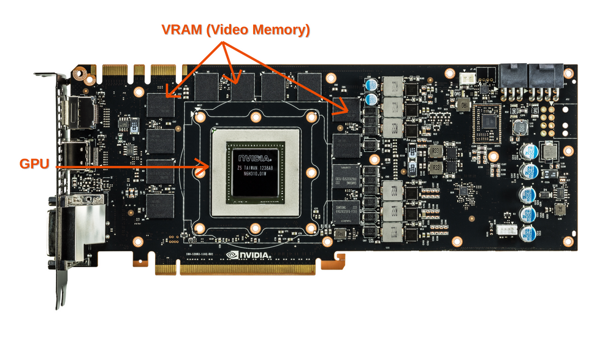

# DDR

| Generation | 时钟频率              | MT/s(clock rate的二倍) | burst chop | burst length | per chip data width | per channel (64bit) band width |
| ---------- | ----------------- | ------------------- | ---------- | ------------ | ------------------- | ------------------------------ |
| DDR3       | 800MHz ~  1600MHz | 1600MT/s ~ 3200MT/s | 4          | 8            | x4, x8, x16         | 25.6 GB/s                      |
| DDR4       | 1066MHz ~ 2666MHz | 2133MT/s ~ 5333MT/s | 4          | 8            | x4, x8, x16         | 42.6 GB/s                      |
| DDR5       | 2000MHz ~ 4000MHz | 4GT/s ~ 8GT/s       | 8          | 16           | x32+x8 ECC          | 64 GB/s                        |

## DDR3

[jedec spec](assets/JESD79-3E.pdf)

DDR3用于PC和服务器架构。
一个Socket(CPU)可能有多个Memory Controller。一个Controller可以支持多个channel，通常就是dual channel。一个channel代表一个DIMM条。一个DIMM条可以有多个rank，通常是两个。每个rank是一组内存颗粒。一个channel上的所有内存颗粒共享数据总线，所以同一个channel上有多个rank并不会增加内存带宽，它的作用更多的是增加内存密度。
每个内存颗粒都有一个CS#，即片选引脚。内存控制器能过将这个引脚置高来选择这个rank。
所以对于DDR3来说，rank是一个外部概念，但它通过片选信号还支持这个外部概念。
### Addressing

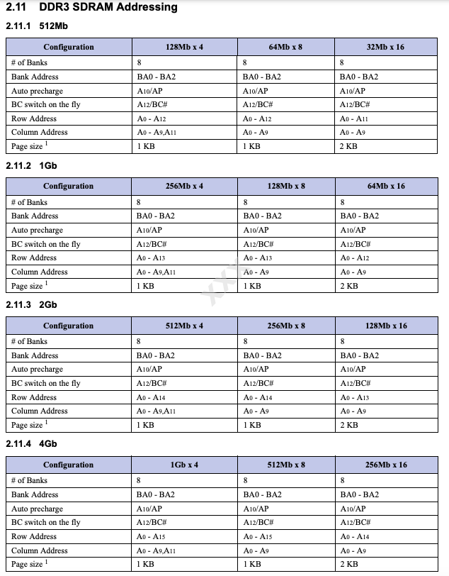

## DDR4 

[jedec spec](assets/JESD79-4.pdf)

### Addressing

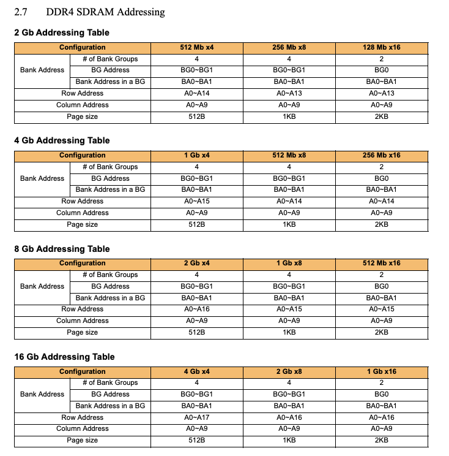

# LPDDR

## Wide IO  2

#  GDDR

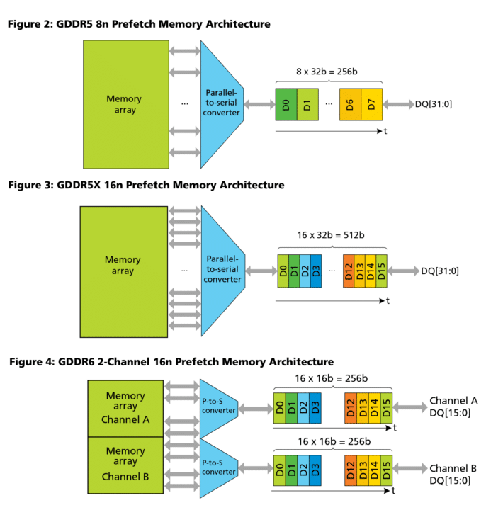

RTX 4090有24颗 GDDR6X芯片(16Gb density)，总容量48GB，

GDDR就是更高速的DDR, 它的本质是 Quad Data Rate或Octal Data Rate(WCK#是CK 4倍，或DQ是WCK#4倍）。

| ==Generation==                                             | CK# freq      | data rate in ref CK# | ==单引脚速率==         | 单芯片（DRAM)数据位宽 | 单芯片支持通道数 | 单芯片最大带宽 | 显卡可集成几块芯片         |
| ---------------------------------------------------------- | ------------- | -------------------- | ----------------- | ------------- | -------- | ------- | ----------------- |
| [GDDR5](https://en.wikipedia.org/wiki/GDDR5_SDRAM)         | 1~1.5GHz      | Quad                 | 4~6Gbps           | 16/32         | N.A.     | 24GB/s  | GTX 780集成16颗      |
| [GDDR5X](https://en.wikipedia.org/wiki/GDDR5_SDRAM#GDDR5X) | 1.125~1.25GHz | Octal(PAM2)          | 10~14Gbps         | 16/32         | N.A.     | 56GB/s  |                   |
| GDDR6                                                      | 1.25GHz       | Octal(PAM2)          | 14Gbps\16Gbps     | 32            | N.A.     | 64GB    | RTX 2060有12颗16位芯片 |
| GDDR6X                                                     |               | Octal(PAM2)       | 19~21Gbps         | 32            |          | 84GB/s  |                   |
| GDDR6W                                                     |               |                      | 22Gbps            | 64            |          |         |                   |
| GDDR7                                                      |               |                      | **32**Gbps\48Gbps | 64            | 4        | 192GB/s |                   |
|                                                            |               |                      |                   |               |          |         |                   |
|                                                            |               |                      |                   |               |          |         |                   |
|                                                            |               |                      |                   |               |          |         |                   |
|                                                            |               |                      |                   |               |          |         |                   |

## GDDR5

| key                    | typical value                     | value range |
| ---------------------- | --------------------------------- | ----------- |
| **CK#时钟信号**：           | 1.25GHz                           | 1~1.5       |
| **WCK#时钟信号**：       | 2.5GHz (二倍CK#)                    | 2~3         |
| **data rate per pin**： | 5Gbps(WCK#的上升沿和下降沿各采样一次)          | 4~6         |
| **单芯片数据引脚个数**:         | 32                                | 16/32       |
| **单芯片带宽**:             | 5Gbps * 32 = 160Gbps = 20GB/s  |             |
|                        |                                   |             |
|                        |                                   |             |

### 典型显卡解读

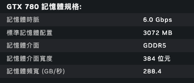

 
 
单芯片32位宽，总384位宽，算出芯片个数为12颗。即图中上、左、右各4颗。
总带宽288.4GB/s，算出单颗288.4/12=24GB/s。
单针脚带宽6Gbps，算出每颗芯片引脚数24GB/s / 6Gbps = 16个。
单针脚带宽6Gbps，则CK#频率1.25GHz, WK#频率2.5GHz。

## GDDR6

[jedec spec](assets/JESD250D.pdf)

### 典型显卡解读

RTX 2060数据：（[来源](https://www.techpowerup.com/gpu-specs/geforce-rtx-2060.c3310)）

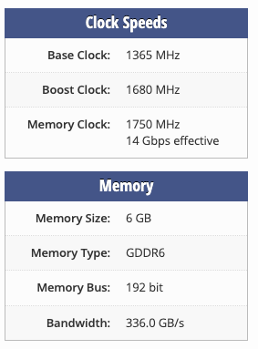

CK# 1.75GHz
WK# 3.5GHz
data rate per pin:  3.5GHz * 4(quad data rate) = 14Gbps
per chip. bandwidth(16 pins): 14Gbps * 32 / 8bits per byte = 54GB/s
number of chips: 192/32 = 6
total bandwidth: 54GB/s * 6 = 336GB/s

这个参数匹配下面的[芯片](https://www.anandtech.com/show/12345/sk-hynix-lists-gddr6-memory-as-available-now)：

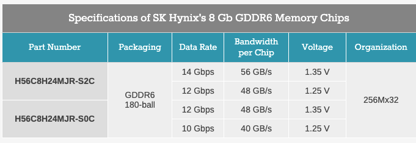

显卡上有6颗芯片也符合从[图](https://www.techpowerup.com/gpu-specs/geforce-rtx-2060.c3310#gallery-7)上看到的：

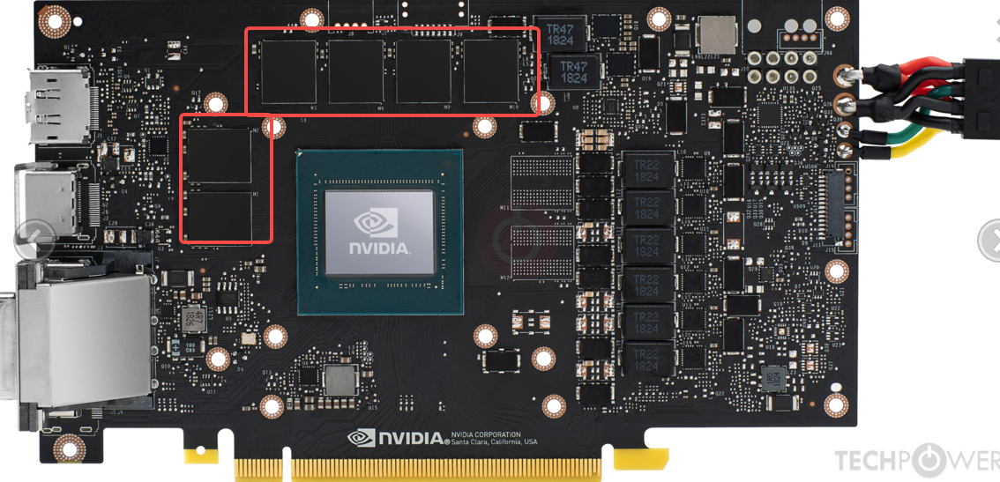

## GDDR6W

https://semiconductor.samsung.com/news-events/tech-blog/a-bridge-between-worlds-how-samsungs-gddr6w-is-creating-immersive-vr-with-powerful-graphics-memory/
相比GDDR6, 两层，64根线。

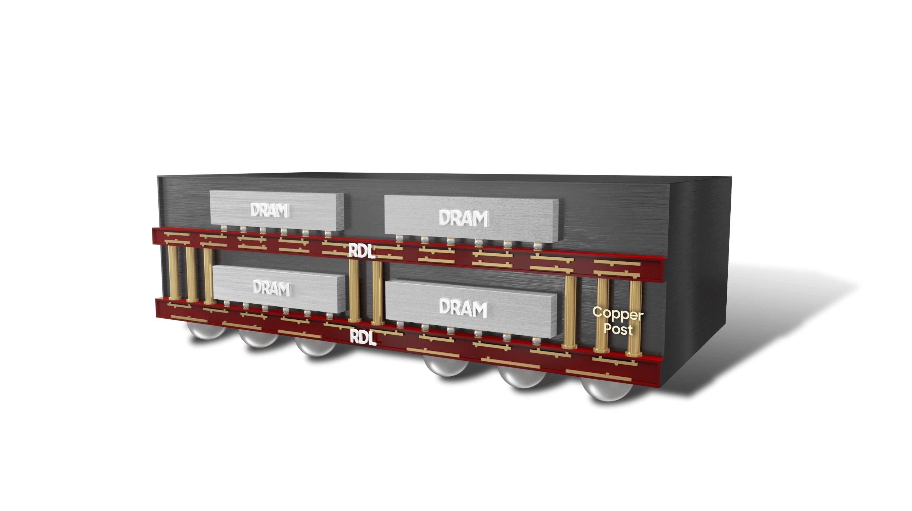

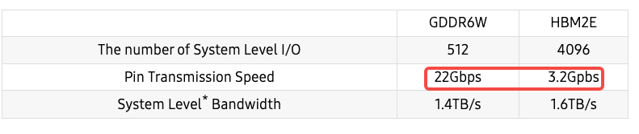 

与HBM2E的区别

## GDDR7

[Jedec Spec](assets/JESD239.01.pdf)

GDDR7把channel做为芯片内部概念，一个芯片有4个channel，一个channel有32个数据引脚，即单个芯片有128位宽。最高频率是32Gps，且每个时钟周期传输3bit数据。所以单颗GDDR7芯片的带宽为192GB/s。

主要参数：
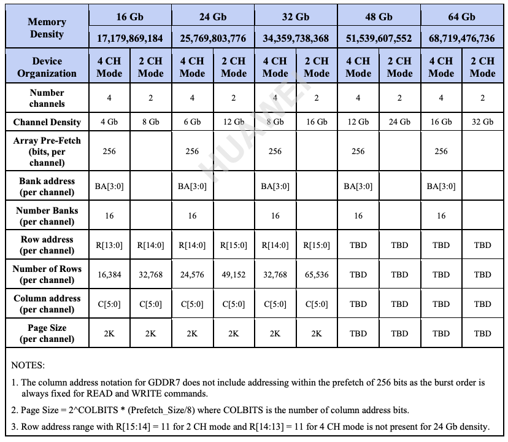
### GDDR7的单芯片192GB/s计算方法

根据提供的搜索结果,192GB/s这个带宽数值是针对GDDR7显存标准中每个单个GDDR7内存芯片的理论峰值带宽。具体来说:

- GDDR7标准支持每个引脚32Gbps的数据速率,规范最高可达48Gbps。
- GDDR7采用PAM3编码方式,每2个时钟周期可传输3个比特,而非传统的2个比特。这使得GDDR7的数据传输效率提高了50%。
- GDDR7相比GDDR6,独立通道数从2个增加到4个。

因此,如果一个GDDR7芯片有32个数据引脚,每个引脚32Gbps,4个独立通道,则该芯片的理论带宽为:  
32 (引脚数) x 32Gbps (每引脚数据率) x 4 (通道数) x 1.5 (PAM3编码效率) = 192GB/s所以192GB/s是基于GDDR7标准中规定的最大配置时,单个GDDR7芯片可实现的理论峰值带宽。这一带宽数值相比上一代GDDR6有了翻番的提升,主要得益于PAM3编码、更高的数据速率和增加的独立通道数等技术创新。
# HBM
HBM是位宽高，但是单引脚速度慢。采用堆叠方式，放了好多DRAM。
 与HBM2E的区别

# PCIe

PCIe 3.0是8GT/s
PCIe 4.0是16GT/s
PCIe 5.0是32GT/s

PCIe 5.0一个link最大支持32个lane，带宽为`32*32/8 = 128GB/s`。

# NVLink

2017年，Nvidia推出了第二代NVLink技术。两颗GPU V100之间含6条NVLink, 每个link中包含8个lane, 每条lane的速率提升到25Gb/s, 整个系统的双向带宽变为300GB/s，带宽是NVLink 1.0的近2倍。

2020年，NVLink 3.0技术诞生，两颗GPU A100芯片之间存在12条NVLink, 每条NVLink含有4条lane, 单条lane的速率为50Gb/s, 因此整个系统的双向带宽提升到600GB/s，总带宽相比NVLink 2.0提升了1倍。由于NVLink的数目增加了，NVSwitch的port数目也相应增加到36个，每个port的速率为50GB/s。由8颗GPU A100与4个NVSwitch组成了DGX A100, 如下图所示。
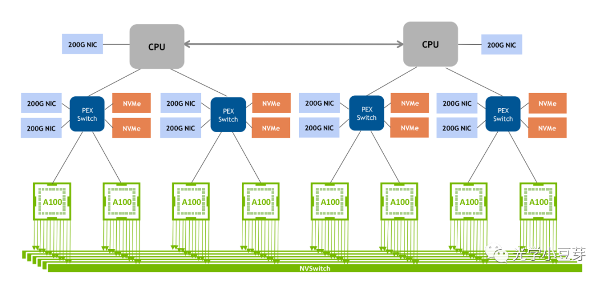

2022年，NVLink技术升级到第四代，两个GPU H100芯片间通过18条NVLink互联，每条link中含2条lane, 每条lane支持100Gb/s PAM4的速率，因此双向总带宽提升到900GB/s。NVSwitch也升级到第三代，每个NVSwitch支持64个port，每个port的速率为50GB/s。DGX H100由8颗H100芯片与4颗NVSwitch芯片构成，如下图所示。图中每个NVSwitch的另一侧与多个800G OSFP光模块相连。以左侧第一个NVSwitch为例，其与GPU相连侧的单向总带宽为4Tbps (20NVLink*200Gbps)，与光模块相连侧的总带宽为也为4Tbps (5*800Gbps)，两者大小相等， 是非阻塞(non-blocking)网络。需要注意的是，光模块中的带宽是单向带宽，而在AI芯片中一般习惯使用双向带宽。

(图片来自https://blog.apnic.net/2023/08/10/large-language-models-the-hardware-connection/)

下表整理了每一代NVLink的指标参数。

而PCIe每一代的参数如下表所示，

从单条lane的速率来看，NVLink整体比同一时期的PCIe的指标高1倍左右，而总带宽的优势更是明显，NVLink是PCIe总带宽的5倍左右。一直在超越，从未停止。

# PIM

## PIM MMU

