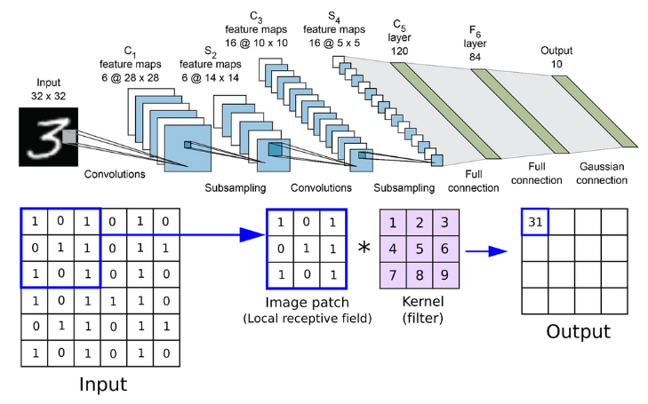

## Yolo

1. 一般这模型分三个部分，backbone, head, anchors。backbone是核心部分，用于识别图像的特征。head根据这些特征对图片进行分类。anchors没懂。
2. yolov5的back bone是CSPDarknet-53, CSP先不解释。
3. Darknet-53指有53个卷积层的darknet，即darknet的一种配置形式。
4. Darknet 是项目的名字，它包含一个模型和一系列工具。


```python
   Input
   |
   Conv2D
   |
   Conv2D
   |
   Residual Block x 1
   |
   Residual Block x 2
   |
   Residual Block x 8
   |
   Residual Block x 8
   |
   Residual Block x 4
   |
   Conv2D
   |
   Conv2D
   |
   FC
   |
   Output
   Darknet-53网络：(其中一个残差块包含两个卷积层）
   import torch
   import torch.nn as nn

class Darknet53(nn.Module):
def __init__(self):
super(Darknet53, self).__init__()

        # 卷积层1
        self.conv1 = nn.Conv2d(3, 32, 3, 1, 1)
        self.bn1 = nn.BatchNorm2d(32)
        self.relu1 = nn.LeakyReLU(0.1)

        # 卷积层2
        self.conv2 = nn.Conv2d(32, 64, 3, 2, 1)
        self.bn2 = nn.BatchNorm2d(64)
        self.relu2 = nn.LeakyReLU(0.1)

        # 残差块1
        self.resblock1 = self._make_resblock(64, 32, 64)

        # 卷积层3
        self.conv3 = nn.Conv2d(64, 128, 3, 2, 1)
        self.bn3 = nn.BatchNorm2d(128)
        self.relu3 = nn.LeakyReLU(0.1)

        # 残差块2
        self.resblock2 = self._make_resblock(128, 64, 128)
        self.resblock3 = self._make_resblock(128, 64, 128)

        # 卷积层4
        self.conv4 = nn.Conv2d(128, 256, 3, 2, 1)
        self.bn4 = nn.BatchNorm2d(256)
        self.relu4 = nn.LeakyReLU(0.1)

        # 残差块3
        self.resblock4 = self._make_resblock(256, 128, 256)
        self.resblock5 = self._make_resblock(256, 128, 256)
        self.resblock6 = self._make_resblock(256, 128, 256)
        self.resblock7 = self._make_resblock(256, 128, 256)
        self.resblock8 = self._make_resblock(256, 128, 256)
        self.resblock9 = self._make_resblock(256, 128, 256)
        self.resblock10 = self._make_resblock(256, 128, 256)
        self.resblock11 = self._make_resblock(256, 128, 256)

        # 卷积层5
        self.conv5 = nn.Conv2d(256, 512, 3, 2, 1)
        self.bn5 = nn.BatchNorm2d(512)
        self.relu5 = nn.LeakyReLU(0.1)

        # 残差块4
        self.resblock12 = self._make_resblock(512, 256, 512)
        self.resblock13 = self._make_resblock(512, 256, 512)
        self.resblock14 = self._make_resblock(512, 256, 512)
        self.resblock15 = self._make_resblock(512, 256, 512)
        self.resblock16 = self._make_resblock(512, 256, 512)
        self.resblock17 = self._make_resblock(512, 256, 512)
        self.resblock18 = self._make_resblock(512, 256, 512)
        self.resblock19 = self._make_resblock(512, 256, 512)

        # 卷积层6
        self.conv6 = nn.Conv2d(512, 1024, 3, 2, 1)
        self.bn6 = nn.BatchNorm2d(1024)
        self.relu6 = nn.LeakyReLU(0.1)

        # 残差块5
        self.resblock20 = self._make_resblock(1024, 512, 1024)
        self.resblock21 = self._make_resblock(1024, 512, 1024)
        self.resblock22 = self._make_resblock(1024, 512, 1024)
        self.resblock23 = self._make_resblock(1024, 512, 1024)

        # 平均池化层
        self.avgpool = nn.AdaptiveAvgPool2d((1, 1))

    def forward(self, x):
        x = self.relu1(self.bn1(self.conv1(x)))
        x = self.relu2(self.bn2(self.conv2(x)))
        x = self.resblock1(x)
        x = self.relu3(self.bn3(selfconv3(x)))
        x = self.resblock2(x)
        x = self.resblock3(x)
        x = self.relu4(self.bn4(self.conv4(x)))
        x = self.resblock4(x)
        x = self.resblock5(x)
        x = self.resblock6(x)
        x = self.resblock7(x)
        x = self.resblock8(x)
        x = self.resblock9(x)
        x = self.resblock10(x)
        x = self.resblock11(x)
        x = self.relu5(self.bn5(self.conv5(x)))
        x = self.resblock12(x)
        x = self.resblock13(x)
        x = self.resblock14(x)
        x = self.resblock15(x)
        x = self.resblock16(x)
        x = self.resblock17(x)
        x = self.resblock18(x)
        x = self.resblock19(x)
        x = self.relu6(self.bn6(self.conv6(x)))
        x = self.resblock20(x)
        x = self.resblock21(x)
        x = self.resblock22(x)
        x = self.resblock23(x)
        x = self.avgpool(x)
        x = x.view(x.size(0), -1)

        return x

    def _make_resblock(self, inplanes, planes, outplanes):
        return nn.Sequential(
            nn.Conv2d(inplanes, planes, 1, 1, 0),
            nn.BatchNorm2d(planes),
            nn.LeakyReLU(0.1),
            nn.Conv2d(planes, outplanes, 3, 1, 1),
            nn.BatchNorm2d(outplanes),
            nn.LeakyReLU(0.1),
        )
```

残差块长这样：

```python
   import torch
   import torch.nn as nn


   class ResidualBlock(nn.Module):
   def __init__(self, in_channels, out_channels, stride=1):
   super(ResidualBlock, self).__init__()
   self.conv1 = nn.Conv2d(in_channels, out_channels, kernel_size=3, stride=stride, padding=1, bias=False)
   self.bn1 = nn.BatchNorm2d(out_channels)
   self.relu = nn.ReLU(inplace=True)
   self.conv2 = nn.Conv2d(out_channels, out_channels, kernel_size=3, stride=1, padding=1, bias=False)
   self.bn2 = nn.BatchNorm2d(out_channels)

        # 如果输入输出通道数不同，需要使用1x1卷积核进行调整
        self.shortcut = nn.Sequential()
        if stride != 1 or in_channels != out_channels:
            self.shortcut = nn.Sequential(
                nn.Conv2d(in_channels, out_channels, kernel_size=1, stride=stride, bias=False),
                nn.BatchNorm2d(out_channels)
            )

    def forward(self, x):
        out = self.relu(self.bn1(self.conv1(x)))
        out = self.bn2(self.conv2(out))
        out  += self.shortcut(x)
        out = self.relu(out)
        return out


class ResNet(nn.Module):
def __init__(self, block, num_blocks, num_classes=10):
super(ResNet, self).__init__()
self.in_channels = 16
self.conv = nn.Conv2d(3, 16, kernel_size=3, stride=1, padding=1, bias=False)
self.bn = nn.BatchNorm2d(16)
self.relu = nn.ReLU(inplace=True)
self.layer1 = self.make_layer(block, 16, num_blocks[0], stride=1)
self.layer2 = self.make_layer(block, 32, num_blocks[1], stride=2)
self.layer3 = self.make_layer(block, 64, num_blocks[2], stride=2)
self.avg_pool = nn.AdaptiveAvgPool2d((1, 1))
self.fc = nn.Linear(64, num_classes)

    def make_layer(self, block, out_channels, num_blocks, stride):
        layers = []
        layers.append(block(self.in_channels, out_channels, stride))
        self.in_channels = out_channels
        for i in range(num_blocks - 1):
            layers.append(block(out_channels, out_channels, stride=1))
        return nn.Sequential(*layers)

    def forward(self, x):
        out = self.relu(self.bn(self.conv(x)))
        out = self.layer1(out)
        out = self.layer2(out)
        out = self.layer3(out)
        out = self.avg_pool(out)
        out = out.view(out.size(0), -1)
        out = self.fc(out)
        return out

    def ResNet18():
    return ResNet(ResidualBlock, [2, 2, 2])
    torch.nn.Conv2d(in_channels, out_channels, kernel_size, stride=1, padding=0, dilation=1, groups=1, bias=True, padding_mode='zeros', device=None, dtype=None)
```



每一个卷积层有Cin * Cout个卷积核，输出featuremap上[c,w,h]上的值是$$\sum\limits_{k=0}^{C_{in}} weight(j,k)*input(1,k)$$，如果有bias，直接相加。j是输出channel号。k是输入channel号。input的形状[ N,C,W,H]分别为[1, Cin, Win,  Hin]，weight的形状为[N,C,W,H]分别为[Cout, Cin, 3,3], 3是kernel size。
5. 与Darknet并举的还是ResNet, 残差网络：
   残差网络也有一些常用的配置形式：
   除了ResNet18之外，ResNet还有一系列深度不同的网络，包括ResNet34、ResNet50、ResNet101和ResNet152等。这些网络的层数分别为34、50、101和152层，其中ResNet50是最常用的一个版本。
6. 还有一些其他的卷积神经元网络
   除了ResNet和Darknet之外，还有很多其他的深度卷积神经网络，下面列举一些比较流行的模型：

VGG：VGG是由牛津大学的研究团队提出的一种深度卷积神经网络，其主要特点是采用一系列具有相同的卷积层和池化层组成的块来构建网络，在ImageNet等数据集上取得了很好的表现。

Inception：Inception是由谷歌的研究团队提出的一种深度卷积神经网络，其主要特点是采用多个不同大小和不同结构的卷积核来提取特征，并采用并行的结构来加速计算。

MobileNet：MobileNet是由谷歌的研究团队提出的一种轻量级深度卷积神经网络，其主要特点是采用深度可分离卷积（depthwise separable convolution）来减少计算量和参数数量，适合在移动设备等资源有限的场景中应用。

EfficientNet：EfficientNet是由谷歌的研究团队提出的一种基于自动化神经网络结构搜索的方法来构建高效的深度卷积神经网络，既考虑了模型深度、宽度和分辨率等因素，同时也取得了很好的表现。
7. 残差网络包含多个残差块，每个残差块是两个conv2d,只不过第一个conv2d不光接受第一个conv2d的输出，还接受它的输入。
   def _make_resblock(self, inplanes, planes, outplanes):
   return nn.Sequential(
   nn.Conv2d(inplanes, planes, 1, 1, 0),
   nn.BatchNorm2d(planes),
   nn.LeakyReLU(0.1),
   nn.Conv2d(planes, outplanes, 3, 1, 1),
   nn.BatchNorm2d(outplanes),
   nn.LeakyReLU(0.1),
   )


## CNN


每一个卷积层有Cin * Cout个卷积核，输出featuremap上[c,w,h]上的值是$$\sum\limits_{k=0}^{C_{in}} weight(j,k)*input(1,k)$$，如果有bias，直接相加。j是输出channel号。k是输入channel号。input的形状[ N,C,W,H]分别为[1, Cin, Win,  Hin]，weight的形状为[N,C,W,H]分别为[Cout, Cin, 3,3], 3是kernel size。

## Tensor

通常Tensor指四维矩阵，每个维度分别为[N,C,W,H]
在CNN中，N表是batch, 方便理解时可以认为它是1。就是说它实际是3维矩阵。
C是channel。
W, H是宽高。

