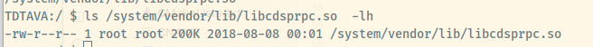

# qualcomm dsp

SDK position:
```angular2html
➜  adsp_proc git:(master) ls ~/Qualcomm/
HelloWorld  Hexagon_SDK

```

dsps

    The processing units include a Kryo CPU, an Adreno 640, and four separate DSPs, each devoted to a specific application space: sensor (sDSP), modem (mDSP), audio (aDSP), and compute (cDSP).

所以我们的目标是CDSP, compute DSP


tools

```angular2html
➜  3.5.4 cd tools
➜  tools ls
android-ndk-r19c  audio  debug  elfsigner  HALIDE_Tools  hexagon_ide  HEXAGON_Tools  Installer_logs  libusb  python_venv  qaic  utils
➜  tools cd


➜  8.3.07 ls
Documents  Examples  NOTICE.txt  RELEASE_NOTES.txt  Tools  Uninstall_Qualcomm_Hexagon_LLVM_Tools
➜  8.3.07 pwd
/home/xxx/Qualcomm/Hexagon_SDK/3.5.4/tools/HEXAGON_Tools/8.3.07

```


Hexagon apps are started from an app running on the apps processor
of the SoC. A RPC mechanism (called FastRPC) is used to load a shared library
on the DSP and the RPC stubs are generated from a IDL complier (qaic). The
RTOS on the DSP is QuRT but is often abstraced by the DSPAL APIs.

/system/vendor/lib/libadsprpc.so

(or)

/vendor/lib/libadsprpc.so

Shared object library that needs to be linked with the user space vendor application invoking the remote procedure call. This library interfaces with the kernel driver to initiate the remote invocation to aDSP

/system/vendor/lib/libcdsprpc.so

(or)

/vendor/lib/libcdsprpc.so

Shared object library that needs to be linked with the user space vendor application invoking the remote procedure call. This library interfaces with the kernel driver to initiate the remote invocation to cDSP

/system/lib/libadsprpc_system.so

Shared object library that needs to be linked with the user space system application invoking the remote procedure call. This library interfaces with the kernel driver to initiate the remote invocation to aDSP This is applicable only for Android P system applications

/system/lib/libcdsprpc_system.so

Shared object library that needs to be linked with the user space system application invoking the remote procedure call. This library interfaces with the kernel driver to initiate the remote invocation to cDSP This is applicable only for Android P system applications




Error: Error : Emulation hexagonv5 is deprecated in this version of the toolchain


https://zhuanlan.zhihu.com/p/429890621