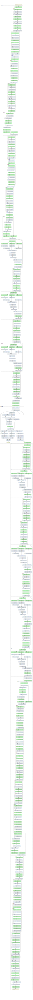
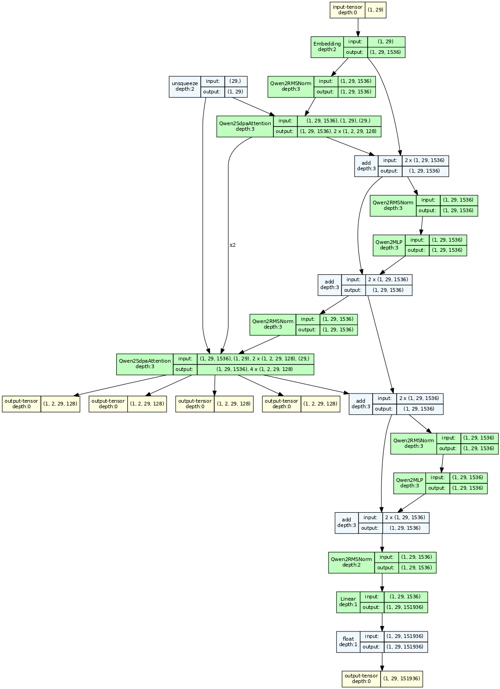

# 查看模型结构

## 文本方式

```python
print(model)
```

如whisper:

```
Whisper(
  (encoder): AudioEncoder(
    (conv1): Conv1d(80, 512, kernel_size=(3,), stride=(1,), padding=(1,))
    (conv2): Conv1d(512, 512, kernel_size=(3,), stride=(2,), padding=(1,))
    (blocks): ModuleList(
      (0-5): 6 x ResidualAttentionBlock(
        (attn): MultiHeadAttention(
          (query): Linear(in_features=512, out_features=512, bias=True)
          (key): Linear(in_features=512, out_features=512, bias=False)
          (value): Linear(in_features=512, out_features=512, bias=True)
          (out): Linear(in_features=512, out_features=512, bias=True)
        )
        (attn_ln): LayerNorm((512,), eps=1e-05, elementwise_affine=True)
        (mlp): Sequential(
          (0): Linear(in_features=512, out_features=2048, bias=True)
          (1): GELU(approximate='none')
          (2): Linear(in_features=2048, out_features=512, bias=True)
        )
        (mlp_ln): LayerNorm((512,), eps=1e-05, elementwise_affine=True)
      )
    )
    (ln_post): LayerNorm((512,), eps=1e-05, elementwise_affine=True)
  )
  (decoder): TextDecoder(
    (token_embedding): Embedding(51865, 512)
    (blocks): ModuleList(
      (0-5): 6 x ResidualAttentionBlock(
        (attn): MultiHeadAttention(
          (query): Linear(in_features=512, out_features=512, bias=True)
          (key): Linear(in_features=512, out_features=512, bias=False)
          (value): Linear(in_features=512, out_features=512, bias=True)
          (out): Linear(in_features=512, out_features=512, bias=True)
        )
        (attn_ln): LayerNorm((512,), eps=1e-05, elementwise_affine=True)
        (cross_attn): MultiHeadAttention(
          (query): Linear(in_features=512, out_features=512, bias=True)
          (key): Linear(in_features=512, out_features=512, bias=False)
          (value): Linear(in_features=512, out_features=512, bias=True)
          (out): Linear(in_features=512, out_features=512, bias=True)
        )
        (cross_attn_ln): LayerNorm((512,), eps=1e-05, elementwise_affine=True)
        (mlp): Sequential(
          (0): Linear(in_features=512, out_features=2048, bias=True)
          (1): GELU(approximate='none')
          (2): Linear(in_features=2048, out_features=512, bias=True)
        )
        (mlp_ln): LayerNorm((512,), eps=1e-05, elementwise_affine=True)
      )
    )
    (ln): LayerNorm((512,), eps=1e-05, elementwise_affine=True)
  )
)
```



## vqgan_imagenet_f16_1024

参数量：89,623,492

```
VQModel(
  (encoder): Encoder(
    (conv_in): Conv2d(3, 128, kernel_size=(3, 3), stride=(1, 1), padding=(1, 1))
    (down): ModuleList(
      (0-1): 2 x Module(
        (block): ModuleList(
          (0-1): 2 x ResnetBlock(
            (norm1): GroupNorm(32, 128, eps=1e-06, affine=True)
            (conv1): Conv2d(128, 128, kernel_size=(3, 3), stride=(1, 1), padding=(1, 1))
            (norm2): GroupNorm(32, 128, eps=1e-06, affine=True)
            (dropout): Dropout(p=0.0, inplace=False)
            (conv2): Conv2d(128, 128, kernel_size=(3, 3), stride=(1, 1), padding=(1, 1))
          )
        )
        (attn): ModuleList()
        (downsample): Downsample(
          (conv): Conv2d(128, 128, kernel_size=(3, 3), stride=(2, 2))
        )
      )
      (2): Module(
        (block): ModuleList(
          (0): ResnetBlock(
            (norm1): GroupNorm(32, 128, eps=1e-06, affine=True)
            (conv1): Conv2d(128, 256, kernel_size=(3, 3), stride=(1, 1), padding=(1, 1))
            (norm2): GroupNorm(32, 256, eps=1e-06, affine=True)
            (dropout): Dropout(p=0.0, inplace=False)
            (conv2): Conv2d(256, 256, kernel_size=(3, 3), stride=(1, 1), padding=(1, 1))
            (nin_shortcut): Conv2d(128, 256, kernel_size=(1, 1), stride=(1, 1))
          )
          (1): ResnetBlock(
            (norm1): GroupNorm(32, 256, eps=1e-06, affine=True)
            (conv1): Conv2d(256, 256, kernel_size=(3, 3), stride=(1, 1), padding=(1, 1))
            (norm2): GroupNorm(32, 256, eps=1e-06, affine=True)
            (dropout): Dropout(p=0.0, inplace=False)
            (conv2): Conv2d(256, 256, kernel_size=(3, 3), stride=(1, 1), padding=(1, 1))
          )
        )
        (attn): ModuleList()
        (downsample): Downsample(
          (conv): Conv2d(256, 256, kernel_size=(3, 3), stride=(2, 2))
        )
      )
      (3): Module(
        (block): ModuleList(
          (0-1): 2 x ResnetBlock(
            (norm1): GroupNorm(32, 256, eps=1e-06, affine=True)
            (conv1): Conv2d(256, 256, kernel_size=(3, 3), stride=(1, 1), padding=(1, 1))
            (norm2): GroupNorm(32, 256, eps=1e-06, affine=True)
            (dropout): Dropout(p=0.0, inplace=False)
            (conv2): Conv2d(256, 256, kernel_size=(3, 3), stride=(1, 1), padding=(1, 1))
          )
        )
        (attn): ModuleList()
        (downsample): Downsample(
          (conv): Conv2d(256, 256, kernel_size=(3, 3), stride=(2, 2))
        )
      )
      (4): Module(
        (block): ModuleList(
          (0): ResnetBlock(
            (norm1): GroupNorm(32, 256, eps=1e-06, affine=True)
            (conv1): Conv2d(256, 512, kernel_size=(3, 3), stride=(1, 1), padding=(1, 1))
            (norm2): GroupNorm(32, 512, eps=1e-06, affine=True)
            (dropout): Dropout(p=0.0, inplace=False)
            (conv2): Conv2d(512, 512, kernel_size=(3, 3), stride=(1, 1), padding=(1, 1))
            (nin_shortcut): Conv2d(256, 512, kernel_size=(1, 1), stride=(1, 1))
          )
          (1): ResnetBlock(
            (norm1): GroupNorm(32, 512, eps=1e-06, affine=True)
            (conv1): Conv2d(512, 512, kernel_size=(3, 3), stride=(1, 1), padding=(1, 1))
            (norm2): GroupNorm(32, 512, eps=1e-06, affine=True)
            (dropout): Dropout(p=0.0, inplace=False)
            (conv2): Conv2d(512, 512, kernel_size=(3, 3), stride=(1, 1), padding=(1, 1))
          )
        )
        (attn): ModuleList(
          (0-1): 2 x AttnBlock(
            (norm): GroupNorm(32, 512, eps=1e-06, affine=True)
            (q): Conv2d(512, 512, kernel_size=(1, 1), stride=(1, 1))
            (k): Conv2d(512, 512, kernel_size=(1, 1), stride=(1, 1))
            (v): Conv2d(512, 512, kernel_size=(1, 1), stride=(1, 1))
            (proj_out): Conv2d(512, 512, kernel_size=(1, 1), stride=(1, 1))
          )
        )
      )
    )
    (mid): Module(
      (block_1): ResnetBlock(
        (norm1): GroupNorm(32, 512, eps=1e-06, affine=True)
        (conv1): Conv2d(512, 512, kernel_size=(3, 3), stride=(1, 1), padding=(1, 1))
        (norm2): GroupNorm(32, 512, eps=1e-06, affine=True)
        (dropout): Dropout(p=0.0, inplace=False)
        (conv2): Conv2d(512, 512, kernel_size=(3, 3), stride=(1, 1), padding=(1, 1))
      )
      (attn_1): AttnBlock(
        (norm): GroupNorm(32, 512, eps=1e-06, affine=True)
        (q): Conv2d(512, 512, kernel_size=(1, 1), stride=(1, 1))
        (k): Conv2d(512, 512, kernel_size=(1, 1), stride=(1, 1))
        (v): Conv2d(512, 512, kernel_size=(1, 1), stride=(1, 1))
        (proj_out): Conv2d(512, 512, kernel_size=(1, 1), stride=(1, 1))
      )
      (block_2): ResnetBlock(
        (norm1): GroupNorm(32, 512, eps=1e-06, affine=True)
        (conv1): Conv2d(512, 512, kernel_size=(3, 3), stride=(1, 1), padding=(1, 1))
        (norm2): GroupNorm(32, 512, eps=1e-06, affine=True)
        (dropout): Dropout(p=0.0, inplace=False)
        (conv2): Conv2d(512, 512, kernel_size=(3, 3), stride=(1, 1), padding=(1, 1))
      )
    )
    (norm_out): GroupNorm(32, 512, eps=1e-06, affine=True)
    (conv_out): Conv2d(512, 256, kernel_size=(3, 3), stride=(1, 1), padding=(1, 1))
  )
  (decoder): Decoder(
    (conv_in): Conv2d(256, 512, kernel_size=(3, 3), stride=(1, 1), padding=(1, 1))
    (mid): Module(
      (block_1): ResnetBlock(
        (norm1): GroupNorm(32, 512, eps=1e-06, affine=True)
        (conv1): Conv2d(512, 512, kernel_size=(3, 3), stride=(1, 1), padding=(1, 1))
        (norm2): GroupNorm(32, 512, eps=1e-06, affine=True)
        (dropout): Dropout(p=0.0, inplace=False)
        (conv2): Conv2d(512, 512, kernel_size=(3, 3), stride=(1, 1), padding=(1, 1))
      )
      (attn_1): AttnBlock(
        (norm): GroupNorm(32, 512, eps=1e-06, affine=True)
        (q): Conv2d(512, 512, kernel_size=(1, 1), stride=(1, 1))
        (k): Conv2d(512, 512, kernel_size=(1, 1), stride=(1, 1))
        (v): Conv2d(512, 512, kernel_size=(1, 1), stride=(1, 1))
        (proj_out): Conv2d(512, 512, kernel_size=(1, 1), stride=(1, 1))
      )
      (block_2): ResnetBlock(
        (norm1): GroupNorm(32, 512, eps=1e-06, affine=True)
        (conv1): Conv2d(512, 512, kernel_size=(3, 3), stride=(1, 1), padding=(1, 1))
        (norm2): GroupNorm(32, 512, eps=1e-06, affine=True)
        (dropout): Dropout(p=0.0, inplace=False)
        (conv2): Conv2d(512, 512, kernel_size=(3, 3), stride=(1, 1), padding=(1, 1))
      )
    )
    (up): ModuleList(
      (0): Module(
        (block): ModuleList(
          (0-2): 3 x ResnetBlock(
            (norm1): GroupNorm(32, 128, eps=1e-06, affine=True)
            (conv1): Conv2d(128, 128, kernel_size=(3, 3), stride=(1, 1), padding=(1, 1))
            (norm2): GroupNorm(32, 128, eps=1e-06, affine=True)
            (dropout): Dropout(p=0.0, inplace=False)
            (conv2): Conv2d(128, 128, kernel_size=(3, 3), stride=(1, 1), padding=(1, 1))
          )
        )
        (attn): ModuleList()
      )
      (1): Module(
        (block): ModuleList(
          (0): ResnetBlock(
            (norm1): GroupNorm(32, 256, eps=1e-06, affine=True)
            (conv1): Conv2d(256, 128, kernel_size=(3, 3), stride=(1, 1), padding=(1, 1))
            (norm2): GroupNorm(32, 128, eps=1e-06, affine=True)
            (dropout): Dropout(p=0.0, inplace=False)
            (conv2): Conv2d(128, 128, kernel_size=(3, 3), stride=(1, 1), padding=(1, 1))
            (nin_shortcut): Conv2d(256, 128, kernel_size=(1, 1), stride=(1, 1))
          )
          (1-2): 2 x ResnetBlock(
            (norm1): GroupNorm(32, 128, eps=1e-06, affine=True)
            (conv1): Conv2d(128, 128, kernel_size=(3, 3), stride=(1, 1), padding=(1, 1))
            (norm2): GroupNorm(32, 128, eps=1e-06, affine=True)
            (dropout): Dropout(p=0.0, inplace=False)
            (conv2): Conv2d(128, 128, kernel_size=(3, 3), stride=(1, 1), padding=(1, 1))
          )
        )
        (attn): ModuleList()
        (upsample): Upsample(
          (conv): Conv2d(128, 128, kernel_size=(3, 3), stride=(1, 1), padding=(1, 1))
        )
      )
      (2): Module(
        (block): ModuleList(
          (0-2): 3 x ResnetBlock(
            (norm1): GroupNorm(32, 256, eps=1e-06, affine=True)
            (conv1): Conv2d(256, 256, kernel_size=(3, 3), stride=(1, 1), padding=(1, 1))
            (norm2): GroupNorm(32, 256, eps=1e-06, affine=True)
            (dropout): Dropout(p=0.0, inplace=False)
            (conv2): Conv2d(256, 256, kernel_size=(3, 3), stride=(1, 1), padding=(1, 1))
          )
        )
        (attn): ModuleList()
        (upsample): Upsample(
          (conv): Conv2d(256, 256, kernel_size=(3, 3), stride=(1, 1), padding=(1, 1))
        )
      )
      (3): Module(
        (block): ModuleList(
          (0): ResnetBlock(
            (norm1): GroupNorm(32, 512, eps=1e-06, affine=True)
            (conv1): Conv2d(512, 256, kernel_size=(3, 3), stride=(1, 1), padding=(1, 1))
            (norm2): GroupNorm(32, 256, eps=1e-06, affine=True)
            (dropout): Dropout(p=0.0, inplace=False)
            (conv2): Conv2d(256, 256, kernel_size=(3, 3), stride=(1, 1), padding=(1, 1))
            (nin_shortcut): Conv2d(512, 256, kernel_size=(1, 1), stride=(1, 1))
          )
          (1-2): 2 x ResnetBlock(
            (norm1): GroupNorm(32, 256, eps=1e-06, affine=True)
            (conv1): Conv2d(256, 256, kernel_size=(3, 3), stride=(1, 1), padding=(1, 1))
            (norm2): GroupNorm(32, 256, eps=1e-06, affine=True)
            (dropout): Dropout(p=0.0, inplace=False)
            (conv2): Conv2d(256, 256, kernel_size=(3, 3), stride=(1, 1), padding=(1, 1))
          )
        )
        (attn): ModuleList()
        (upsample): Upsample(
          (conv): Conv2d(256, 256, kernel_size=(3, 3), stride=(1, 1), padding=(1, 1))
        )
      )
      (4): Module(
        (block): ModuleList(
          (0-2): 3 x ResnetBlock(
            (norm1): GroupNorm(32, 512, eps=1e-06, affine=True)
            (conv1): Conv2d(512, 512, kernel_size=(3, 3), stride=(1, 1), padding=(1, 1))
            (norm2): GroupNorm(32, 512, eps=1e-06, affine=True)
            (dropout): Dropout(p=0.0, inplace=False)
            (conv2): Conv2d(512, 512, kernel_size=(3, 3), stride=(1, 1), padding=(1, 1))
          )
        )
        (attn): ModuleList(
          (0-2): 3 x AttnBlock(
            (norm): GroupNorm(32, 512, eps=1e-06, affine=True)
            (q): Conv2d(512, 512, kernel_size=(1, 1), stride=(1, 1))
            (k): Conv2d(512, 512, kernel_size=(1, 1), stride=(1, 1))
            (v): Conv2d(512, 512, kernel_size=(1, 1), stride=(1, 1))
            (proj_out): Conv2d(512, 512, kernel_size=(1, 1), stride=(1, 1))
          )
        )
        (upsample): Upsample(
          (conv): Conv2d(512, 512, kernel_size=(3, 3), stride=(1, 1), padding=(1, 1))
        )
      )
    )
    (norm_out): GroupNorm(32, 128, eps=1e-06, affine=True)
    (conv_out): Conv2d(128, 3, kernel_size=(3, 3), stride=(1, 1), padding=(1, 1))
  )
  (loss): VQLPIPSWithDiscriminator(
    (perceptual_loss): LPIPS(
      (scaling_layer): ScalingLayer()
      (net): vgg16(
        (slice1): Sequential(
          (0): Conv2d(3, 64, kernel_size=(3, 3), stride=(1, 1), padding=(1, 1))
          (1): ReLU(inplace=True)
          (2): Conv2d(64, 64, kernel_size=(3, 3), stride=(1, 1), padding=(1, 1))
          (3): ReLU(inplace=True)
        )
        (slice2): Sequential(
          (4): MaxPool2d(kernel_size=2, stride=2, padding=0, dilation=1, ceil_mode=False)
          (5): Conv2d(64, 128, kernel_size=(3, 3), stride=(1, 1), padding=(1, 1))
          (6): ReLU(inplace=True)
          (7): Conv2d(128, 128, kernel_size=(3, 3), stride=(1, 1), padding=(1, 1))
          (8): ReLU(inplace=True)
        )
        (slice3): Sequential(
          (9): MaxPool2d(kernel_size=2, stride=2, padding=0, dilation=1, ceil_mode=False)
          (10): Conv2d(128, 256, kernel_size=(3, 3), stride=(1, 1), padding=(1, 1))
          (11): ReLU(inplace=True)
          (12): Conv2d(256, 256, kernel_size=(3, 3), stride=(1, 1), padding=(1, 1))
          (13): ReLU(inplace=True)
          (14): Conv2d(256, 256, kernel_size=(3, 3), stride=(1, 1), padding=(1, 1))
          (15): ReLU(inplace=True)
        )
        (slice4): Sequential(
          (16): MaxPool2d(kernel_size=2, stride=2, padding=0, dilation=1, ceil_mode=False)
          (17): Conv2d(256, 512, kernel_size=(3, 3), stride=(1, 1), padding=(1, 1))
          (18): ReLU(inplace=True)
          (19): Conv2d(512, 512, kernel_size=(3, 3), stride=(1, 1), padding=(1, 1))
          (20): ReLU(inplace=True)
          (21): Conv2d(512, 512, kernel_size=(3, 3), stride=(1, 1), padding=(1, 1))
          (22): ReLU(inplace=True)
        )
        (slice5): Sequential(
          (23): MaxPool2d(kernel_size=2, stride=2, padding=0, dilation=1, ceil_mode=False)
          (24): Conv2d(512, 512, kernel_size=(3, 3), stride=(1, 1), padding=(1, 1))
          (25): ReLU(inplace=True)
          (26): Conv2d(512, 512, kernel_size=(3, 3), stride=(1, 1), padding=(1, 1))
          (27): ReLU(inplace=True)
          (28): Conv2d(512, 512, kernel_size=(3, 3), stride=(1, 1), padding=(1, 1))
          (29): ReLU(inplace=True)
        )
      )
      (lin0): NetLinLayer(
        (model): Sequential(
          (0): Dropout(p=0.5, inplace=False)
          (1): Conv2d(64, 1, kernel_size=(1, 1), stride=(1, 1), bias=False)
        )
      )
      (lin1): NetLinLayer(
        (model): Sequential(
          (0): Dropout(p=0.5, inplace=False)
          (1): Conv2d(128, 1, kernel_size=(1, 1), stride=(1, 1), bias=False)
        )
      )
      (lin2): NetLinLayer(
        (model): Sequential(
          (0): Dropout(p=0.5, inplace=False)
          (1): Conv2d(256, 1, kernel_size=(1, 1), stride=(1, 1), bias=False)
        )
      )
      (lin3): NetLinLayer(
        (model): Sequential(
          (0): Dropout(p=0.5, inplace=False)
          (1): Conv2d(512, 1, kernel_size=(1, 1), stride=(1, 1), bias=False)
        )
      )
      (lin4): NetLinLayer(
        (model): Sequential(
          (0): Dropout(p=0.5, inplace=False)
          (1): Conv2d(512, 1, kernel_size=(1, 1), stride=(1, 1), bias=False)
        )
      )
    )
    (discriminator): NLayerDiscriminator(
      (main): Sequential(
        (0): Conv2d(3, 64, kernel_size=(4, 4), stride=(2, 2), padding=(1, 1))
        (1): LeakyReLU(negative_slope=0.2, inplace=True)
        (2): Conv2d(64, 128, kernel_size=(4, 4), stride=(2, 2), padding=(1, 1), bias=False)
        (3): BatchNorm2d(128, eps=1e-05, momentum=0.1, affine=True, track_running_stats=True)
        (4): LeakyReLU(negative_slope=0.2, inplace=True)
        (5): Conv2d(128, 256, kernel_size=(4, 4), stride=(2, 2), padding=(1, 1), bias=False)
        (6): BatchNorm2d(256, eps=1e-05, momentum=0.1, affine=True, track_running_stats=True)
        (7): LeakyReLU(negative_slope=0.2, inplace=True)
        (8): Conv2d(256, 512, kernel_size=(4, 4), stride=(1, 1), padding=(1, 1), bias=False)
        (9): BatchNorm2d(512, eps=1e-05, momentum=0.1, affine=True, track_running_stats=True)
        (10): LeakyReLU(negative_slope=0.2, inplace=True)
        (11): Conv2d(512, 1, kernel_size=(4, 4), stride=(1, 1), padding=(1, 1))
      )
    )
  )
  (quantize): VectorQuantizer2(
    (embedding): Embedding(1024, 256)
  )
  (quant_conv): Conv2d(256, 256, kernel_size=(1, 1), stride=(1, 1))
  (post_quant_conv): Conv2d(256, 256, kernel_size=(1, 1), stride=(1, 1))
)

```

## vqgan_imagenet_f16_16384

参数量：91,453,380

```
VQModel(
  (encoder): Encoder(
    (conv_in): Conv2d(3, 128, kernel_size=(3, 3), stride=(1, 1), padding=(1, 1))
    (down): ModuleList(
      (0-1): 2 x Module(
        (block): ModuleList(
          (0-1): 2 x ResnetBlock(
            (norm1): GroupNorm(32, 128, eps=1e-06, affine=True)
            (conv1): Conv2d(128, 128, kernel_size=(3, 3), stride=(1, 1), padding=(1, 1))
            (norm2): GroupNorm(32, 128, eps=1e-06, affine=True)
            (dropout): Dropout(p=0.0, inplace=False)
            (conv2): Conv2d(128, 128, kernel_size=(3, 3), stride=(1, 1), padding=(1, 1))
          )
        )
        (attn): ModuleList()
        (downsample): Downsample(
          (conv): Conv2d(128, 128, kernel_size=(3, 3), stride=(2, 2))
        )
      )
      (2): Module(
        (block): ModuleList(
          (0): ResnetBlock(
            (norm1): GroupNorm(32, 128, eps=1e-06, affine=True)
            (conv1): Conv2d(128, 256, kernel_size=(3, 3), stride=(1, 1), padding=(1, 1))
            (norm2): GroupNorm(32, 256, eps=1e-06, affine=True)
            (dropout): Dropout(p=0.0, inplace=False)
            (conv2): Conv2d(256, 256, kernel_size=(3, 3), stride=(1, 1), padding=(1, 1))
            (nin_shortcut): Conv2d(128, 256, kernel_size=(1, 1), stride=(1, 1))
          )
          (1): ResnetBlock(
            (norm1): GroupNorm(32, 256, eps=1e-06, affine=True)
            (conv1): Conv2d(256, 256, kernel_size=(3, 3), stride=(1, 1), padding=(1, 1))
            (norm2): GroupNorm(32, 256, eps=1e-06, affine=True)
            (dropout): Dropout(p=0.0, inplace=False)
            (conv2): Conv2d(256, 256, kernel_size=(3, 3), stride=(1, 1), padding=(1, 1))
          )
        )
        (attn): ModuleList()
        (downsample): Downsample(
          (conv): Conv2d(256, 256, kernel_size=(3, 3), stride=(2, 2))
        )
      )
      (3): Module(
        (block): ModuleList(
          (0-1): 2 x ResnetBlock(
            (norm1): GroupNorm(32, 256, eps=1e-06, affine=True)
            (conv1): Conv2d(256, 256, kernel_size=(3, 3), stride=(1, 1), padding=(1, 1))
            (norm2): GroupNorm(32, 256, eps=1e-06, affine=True)
            (dropout): Dropout(p=0.0, inplace=False)
            (conv2): Conv2d(256, 256, kernel_size=(3, 3), stride=(1, 1), padding=(1, 1))
          )
        )
        (attn): ModuleList()
        (downsample): Downsample(
          (conv): Conv2d(256, 256, kernel_size=(3, 3), stride=(2, 2))
        )
      )
      (4): Module(
        (block): ModuleList(
          (0): ResnetBlock(
            (norm1): GroupNorm(32, 256, eps=1e-06, affine=True)
            (conv1): Conv2d(256, 512, kernel_size=(3, 3), stride=(1, 1), padding=(1, 1))
            (norm2): GroupNorm(32, 512, eps=1e-06, affine=True)
            (dropout): Dropout(p=0.0, inplace=False)
            (conv2): Conv2d(512, 512, kernel_size=(3, 3), stride=(1, 1), padding=(1, 1))
            (nin_shortcut): Conv2d(256, 512, kernel_size=(1, 1), stride=(1, 1))
          )
          (1): ResnetBlock(
            (norm1): GroupNorm(32, 512, eps=1e-06, affine=True)
            (conv1): Conv2d(512, 512, kernel_size=(3, 3), stride=(1, 1), padding=(1, 1))
            (norm2): GroupNorm(32, 512, eps=1e-06, affine=True)
            (dropout): Dropout(p=0.0, inplace=False)
            (conv2): Conv2d(512, 512, kernel_size=(3, 3), stride=(1, 1), padding=(1, 1))
          )
        )
        (attn): ModuleList(
          (0-1): 2 x AttnBlock(
            (norm): GroupNorm(32, 512, eps=1e-06, affine=True)
            (q): Conv2d(512, 512, kernel_size=(1, 1), stride=(1, 1))
            (k): Conv2d(512, 512, kernel_size=(1, 1), stride=(1, 1))
            (v): Conv2d(512, 512, kernel_size=(1, 1), stride=(1, 1))
            (proj_out): Conv2d(512, 512, kernel_size=(1, 1), stride=(1, 1))
          )
        )
      )
    )
    (mid): Module(
      (block_1): ResnetBlock(
        (norm1): GroupNorm(32, 512, eps=1e-06, affine=True)
        (conv1): Conv2d(512, 512, kernel_size=(3, 3), stride=(1, 1), padding=(1, 1))
        (norm2): GroupNorm(32, 512, eps=1e-06, affine=True)
        (dropout): Dropout(p=0.0, inplace=False)
        (conv2): Conv2d(512, 512, kernel_size=(3, 3), stride=(1, 1), padding=(1, 1))
      )
      (attn_1): AttnBlock(
        (norm): GroupNorm(32, 512, eps=1e-06, affine=True)
        (q): Conv2d(512, 512, kernel_size=(1, 1), stride=(1, 1))
        (k): Conv2d(512, 512, kernel_size=(1, 1), stride=(1, 1))
        (v): Conv2d(512, 512, kernel_size=(1, 1), stride=(1, 1))
        (proj_out): Conv2d(512, 512, kernel_size=(1, 1), stride=(1, 1))
      )
      (block_2): ResnetBlock(
        (norm1): GroupNorm(32, 512, eps=1e-06, affine=True)
        (conv1): Conv2d(512, 512, kernel_size=(3, 3), stride=(1, 1), padding=(1, 1))
        (norm2): GroupNorm(32, 512, eps=1e-06, affine=True)
        (dropout): Dropout(p=0.0, inplace=False)
        (conv2): Conv2d(512, 512, kernel_size=(3, 3), stride=(1, 1), padding=(1, 1))
      )
    )
    (norm_out): GroupNorm(32, 512, eps=1e-06, affine=True)
    (conv_out): Conv2d(512, 256, kernel_size=(3, 3), stride=(1, 1), padding=(1, 1))
  )
  (decoder): Decoder(
    (conv_in): Conv2d(256, 512, kernel_size=(3, 3), stride=(1, 1), padding=(1, 1))
    (mid): Module(
      (block_1): ResnetBlock(
        (norm1): GroupNorm(32, 512, eps=1e-06, affine=True)
        (conv1): Conv2d(512, 512, kernel_size=(3, 3), stride=(1, 1), padding=(1, 1))
        (norm2): GroupNorm(32, 512, eps=1e-06, affine=True)
        (dropout): Dropout(p=0.0, inplace=False)
        (conv2): Conv2d(512, 512, kernel_size=(3, 3), stride=(1, 1), padding=(1, 1))
      )
      (attn_1): AttnBlock(
        (norm): GroupNorm(32, 512, eps=1e-06, affine=True)
        (q): Conv2d(512, 512, kernel_size=(1, 1), stride=(1, 1))
        (k): Conv2d(512, 512, kernel_size=(1, 1), stride=(1, 1))
        (v): Conv2d(512, 512, kernel_size=(1, 1), stride=(1, 1))
        (proj_out): Conv2d(512, 512, kernel_size=(1, 1), stride=(1, 1))
      )
      (block_2): ResnetBlock(
        (norm1): GroupNorm(32, 512, eps=1e-06, affine=True)
        (conv1): Conv2d(512, 512, kernel_size=(3, 3), stride=(1, 1), padding=(1, 1))
        (norm2): GroupNorm(32, 512, eps=1e-06, affine=True)
        (dropout): Dropout(p=0.0, inplace=False)
        (conv2): Conv2d(512, 512, kernel_size=(3, 3), stride=(1, 1), padding=(1, 1))
      )
    )
    (up): ModuleList(
      (0): Module(
        (block): ModuleList(
          (0-2): 3 x ResnetBlock(
            (norm1): GroupNorm(32, 128, eps=1e-06, affine=True)
            (conv1): Conv2d(128, 128, kernel_size=(3, 3), stride=(1, 1), padding=(1, 1))
            (norm2): GroupNorm(32, 128, eps=1e-06, affine=True)
            (dropout): Dropout(p=0.0, inplace=False)
            (conv2): Conv2d(128, 128, kernel_size=(3, 3), stride=(1, 1), padding=(1, 1))
          )
        )
        (attn): ModuleList()
      )
      (1): Module(
        (block): ModuleList(
          (0): ResnetBlock(
            (norm1): GroupNorm(32, 256, eps=1e-06, affine=True)
            (conv1): Conv2d(256, 128, kernel_size=(3, 3), stride=(1, 1), padding=(1, 1))
            (norm2): GroupNorm(32, 128, eps=1e-06, affine=True)
            (dropout): Dropout(p=0.0, inplace=False)
            (conv2): Conv2d(128, 128, kernel_size=(3, 3), stride=(1, 1), padding=(1, 1))
            (nin_shortcut): Conv2d(256, 128, kernel_size=(1, 1), stride=(1, 1))
          )
          (1-2): 2 x ResnetBlock(
            (norm1): GroupNorm(32, 128, eps=1e-06, affine=True)
            (conv1): Conv2d(128, 128, kernel_size=(3, 3), stride=(1, 1), padding=(1, 1))
            (norm2): GroupNorm(32, 128, eps=1e-06, affine=True)
            (dropout): Dropout(p=0.0, inplace=False)
            (conv2): Conv2d(128, 128, kernel_size=(3, 3), stride=(1, 1), padding=(1, 1))
          )
        )
        (attn): ModuleList()
        (upsample): Upsample(
          (conv): Conv2d(128, 128, kernel_size=(3, 3), stride=(1, 1), padding=(1, 1))
        )
      )
      (2): Module(
        (block): ModuleList(
          (0-2): 3 x ResnetBlock(
            (norm1): GroupNorm(32, 256, eps=1e-06, affine=True)
            (conv1): Conv2d(256, 256, kernel_size=(3, 3), stride=(1, 1), padding=(1, 1))
            (norm2): GroupNorm(32, 256, eps=1e-06, affine=True)
            (dropout): Dropout(p=0.0, inplace=False)
            (conv2): Conv2d(256, 256, kernel_size=(3, 3), stride=(1, 1), padding=(1, 1))
          )
        )
        (attn): ModuleList()
        (upsample): Upsample(
          (conv): Conv2d(256, 256, kernel_size=(3, 3), stride=(1, 1), padding=(1, 1))
        )
      )
      (3): Module(
        (block): ModuleList(
          (0): ResnetBlock(
            (norm1): GroupNorm(32, 512, eps=1e-06, affine=True)
            (conv1): Conv2d(512, 256, kernel_size=(3, 3), stride=(1, 1), padding=(1, 1))
            (norm2): GroupNorm(32, 256, eps=1e-06, affine=True)
            (dropout): Dropout(p=0.0, inplace=False)
            (conv2): Conv2d(256, 256, kernel_size=(3, 3), stride=(1, 1), padding=(1, 1))
            (nin_shortcut): Conv2d(512, 256, kernel_size=(1, 1), stride=(1, 1))
          )
          (1-2): 2 x ResnetBlock(
            (norm1): GroupNorm(32, 256, eps=1e-06, affine=True)
            (conv1): Conv2d(256, 256, kernel_size=(3, 3), stride=(1, 1), padding=(1, 1))
            (norm2): GroupNorm(32, 256, eps=1e-06, affine=True)
            (dropout): Dropout(p=0.0, inplace=False)
            (conv2): Conv2d(256, 256, kernel_size=(3, 3), stride=(1, 1), padding=(1, 1))
          )
        )
        (attn): ModuleList()
        (upsample): Upsample(
          (conv): Conv2d(256, 256, kernel_size=(3, 3), stride=(1, 1), padding=(1, 1))
        )
      )
      (4): Module(
        (block): ModuleList(
          (0-2): 3 x ResnetBlock(
            (norm1): GroupNorm(32, 512, eps=1e-06, affine=True)
            (conv1): Conv2d(512, 512, kernel_size=(3, 3), stride=(1, 1), padding=(1, 1))
            (norm2): GroupNorm(32, 512, eps=1e-06, affine=True)
            (dropout): Dropout(p=0.0, inplace=False)
            (conv2): Conv2d(512, 512, kernel_size=(3, 3), stride=(1, 1), padding=(1, 1))
          )
        )
        (attn): ModuleList(
          (0-2): 3 x AttnBlock(
            (norm): GroupNorm(32, 512, eps=1e-06, affine=True)
            (q): Conv2d(512, 512, kernel_size=(1, 1), stride=(1, 1))
            (k): Conv2d(512, 512, kernel_size=(1, 1), stride=(1, 1))
            (v): Conv2d(512, 512, kernel_size=(1, 1), stride=(1, 1))
            (proj_out): Conv2d(512, 512, kernel_size=(1, 1), stride=(1, 1))
          )
        )
        (upsample): Upsample(
          (conv): Conv2d(512, 512, kernel_size=(3, 3), stride=(1, 1), padding=(1, 1))
        )
      )
    )
    (norm_out): GroupNorm(32, 128, eps=1e-06, affine=True)
    (conv_out): Conv2d(128, 3, kernel_size=(3, 3), stride=(1, 1), padding=(1, 1))
  )
  (loss): VQLPIPSWithDiscriminator(
    (perceptual_loss): LPIPS(
      (scaling_layer): ScalingLayer()
      (net): vgg16(
        (slice1): Sequential(
          (0): Conv2d(3, 64, kernel_size=(3, 3), stride=(1, 1), padding=(1, 1))
          (1): ReLU(inplace=True)
          (2): Conv2d(64, 64, kernel_size=(3, 3), stride=(1, 1), padding=(1, 1))
          (3): ReLU(inplace=True)
        )
        (slice2): Sequential(
          (4): MaxPool2d(kernel_size=2, stride=2, padding=0, dilation=1, ceil_mode=False)
          (5): Conv2d(64, 128, kernel_size=(3, 3), stride=(1, 1), padding=(1, 1))
          (6): ReLU(inplace=True)
          (7): Conv2d(128, 128, kernel_size=(3, 3), stride=(1, 1), padding=(1, 1))
          (8): ReLU(inplace=True)
        )
        (slice3): Sequential(
          (9): MaxPool2d(kernel_size=2, stride=2, padding=0, dilation=1, ceil_mode=False)
          (10): Conv2d(128, 256, kernel_size=(3, 3), stride=(1, 1), padding=(1, 1))
          (11): ReLU(inplace=True)
          (12): Conv2d(256, 256, kernel_size=(3, 3), stride=(1, 1), padding=(1, 1))
          (13): ReLU(inplace=True)
          (14): Conv2d(256, 256, kernel_size=(3, 3), stride=(1, 1), padding=(1, 1))
          (15): ReLU(inplace=True)
        )
        (slice4): Sequential(
          (16): MaxPool2d(kernel_size=2, stride=2, padding=0, dilation=1, ceil_mode=False)
          (17): Conv2d(256, 512, kernel_size=(3, 3), stride=(1, 1), padding=(1, 1))
          (18): ReLU(inplace=True)
          (19): Conv2d(512, 512, kernel_size=(3, 3), stride=(1, 1), padding=(1, 1))
          (20): ReLU(inplace=True)
          (21): Conv2d(512, 512, kernel_size=(3, 3), stride=(1, 1), padding=(1, 1))
          (22): ReLU(inplace=True)
        )
        (slice5): Sequential(
          (23): MaxPool2d(kernel_size=2, stride=2, padding=0, dilation=1, ceil_mode=False)
          (24): Conv2d(512, 512, kernel_size=(3, 3), stride=(1, 1), padding=(1, 1))
          (25): ReLU(inplace=True)
          (26): Conv2d(512, 512, kernel_size=(3, 3), stride=(1, 1), padding=(1, 1))
          (27): ReLU(inplace=True)
          (28): Conv2d(512, 512, kernel_size=(3, 3), stride=(1, 1), padding=(1, 1))
          (29): ReLU(inplace=True)
        )
      )
      (lin0): NetLinLayer(
        (model): Sequential(
          (0): Dropout(p=0.5, inplace=False)
          (1): Conv2d(64, 1, kernel_size=(1, 1), stride=(1, 1), bias=False)
        )
      )
      (lin1): NetLinLayer(
        (model): Sequential(
          (0): Dropout(p=0.5, inplace=False)
          (1): Conv2d(128, 1, kernel_size=(1, 1), stride=(1, 1), bias=False)
        )
      )
      (lin2): NetLinLayer(
        (model): Sequential(
          (0): Dropout(p=0.5, inplace=False)
          (1): Conv2d(256, 1, kernel_size=(1, 1), stride=(1, 1), bias=False)
        )
      )
      (lin3): NetLinLayer(
        (model): Sequential(
          (0): Dropout(p=0.5, inplace=False)
          (1): Conv2d(512, 1, kernel_size=(1, 1), stride=(1, 1), bias=False)
        )
      )
      (lin4): NetLinLayer(
        (model): Sequential(
          (0): Dropout(p=0.5, inplace=False)
          (1): Conv2d(512, 1, kernel_size=(1, 1), stride=(1, 1), bias=False)
        )
      )
    )
    (discriminator): NLayerDiscriminator(
      (main): Sequential(
        (0): Conv2d(3, 64, kernel_size=(4, 4), stride=(2, 2), padding=(1, 1))
        (1): LeakyReLU(negative_slope=0.2, inplace=True)
        (2): Conv2d(64, 128, kernel_size=(4, 4), stride=(2, 2), padding=(1, 1), bias=False)
        (3): BatchNorm2d(128, eps=1e-05, momentum=0.1, affine=True, track_running_stats=True)
        (4): LeakyReLU(negative_slope=0.2, inplace=True)
        (5): Conv2d(128, 256, kernel_size=(4, 4), stride=(1, 1), padding=(1, 1), bias=False)
        (6): BatchNorm2d(256, eps=1e-05, momentum=0.1, affine=True, track_running_stats=True)
        (7): LeakyReLU(negative_slope=0.2, inplace=True)
        (8): Conv2d(256, 1, kernel_size=(4, 4), stride=(1, 1), padding=(1, 1))
      )
    )
  )
  (quantize): VectorQuantizer2(
    (embedding): Embedding(16384, 256)
  )
  (quant_conv): Conv2d(256, 256, kernel_size=(1, 1), stride=(1, 1))
  (post_quant_conv): Conv2d(256, 256, kernel_size=(1, 1), stride=(1, 1))
)
```

## dalle_encoder

参数量：53,786,240

```
Encoder(
  (blocks): Sequential(
    (input): Conv2d(n_in=3, n_out=256, kw=7, use_float16=True, device=device(type='cpu'), requires_grad=False)
    (group_1): Sequential(
      (block_1): EncoderBlock(
        (id_path): Identity()
        (res_path): Sequential(
          (relu_1): ReLU()
          (conv_1): Conv2d(n_in=256, n_out=64, kw=3, use_float16=True, device=device(type='cpu'), requires_grad=False)
          (relu_2): ReLU()
          (conv_2): Conv2d(n_in=64, n_out=64, kw=3, use_float16=True, device=device(type='cpu'), requires_grad=False)
          (relu_3): ReLU()
          (conv_3): Conv2d(n_in=64, n_out=64, kw=3, use_float16=True, device=device(type='cpu'), requires_grad=False)
          (relu_4): ReLU()
          (conv_4): Conv2d(n_in=64, n_out=256, kw=1, use_float16=True, device=device(type='cpu'), requires_grad=False)
        )
      )
      (block_2): EncoderBlock(
        (id_path): Identity()
        (res_path): Sequential(
          (relu_1): ReLU()
          (conv_1): Conv2d(n_in=256, n_out=64, kw=3, use_float16=True, device=device(type='cpu'), requires_grad=False)
          (relu_2): ReLU()
          (conv_2): Conv2d(n_in=64, n_out=64, kw=3, use_float16=True, device=device(type='cpu'), requires_grad=False)
          (relu_3): ReLU()
          (conv_3): Conv2d(n_in=64, n_out=64, kw=3, use_float16=True, device=device(type='cpu'), requires_grad=False)
          (relu_4): ReLU()
          (conv_4): Conv2d(n_in=64, n_out=256, kw=1, use_float16=True, device=device(type='cpu'), requires_grad=False)
        )
      )
      (pool): MaxPool2d(kernel_size=2, stride=2, padding=0, dilation=1, ceil_mode=False)
    )
    (group_2): Sequential(
      (block_1): EncoderBlock(
        (id_path): Conv2d(n_in=256, n_out=512, kw=1, use_float16=True, device=device(type='cpu'), requires_grad=False)
        (res_path): Sequential(
          (relu_1): ReLU()
          (conv_1): Conv2d(n_in=256, n_out=128, kw=3, use_float16=True, device=device(type='cpu'), requires_grad=False)
          (relu_2): ReLU()
          (conv_2): Conv2d(n_in=128, n_out=128, kw=3, use_float16=True, device=device(type='cpu'), requires_grad=False)
          (relu_3): ReLU()
          (conv_3): Conv2d(n_in=128, n_out=128, kw=3, use_float16=True, device=device(type='cpu'), requires_grad=False)
          (relu_4): ReLU()
          (conv_4): Conv2d(n_in=128, n_out=512, kw=1, use_float16=True, device=device(type='cpu'), requires_grad=False)
        )
      )
      (block_2): EncoderBlock(
        (id_path): Identity()
        (res_path): Sequential(
          (relu_1): ReLU()
          (conv_1): Conv2d(n_in=512, n_out=128, kw=3, use_float16=True, device=device(type='cpu'), requires_grad=False)
          (relu_2): ReLU()
          (conv_2): Conv2d(n_in=128, n_out=128, kw=3, use_float16=True, device=device(type='cpu'), requires_grad=False)
          (relu_3): ReLU()
          (conv_3): Conv2d(n_in=128, n_out=128, kw=3, use_float16=True, device=device(type='cpu'), requires_grad=False)
          (relu_4): ReLU()
          (conv_4): Conv2d(n_in=128, n_out=512, kw=1, use_float16=True, device=device(type='cpu'), requires_grad=False)
        )
      )
      (pool): MaxPool2d(kernel_size=2, stride=2, padding=0, dilation=1, ceil_mode=False)
    )
    (group_3): Sequential(
      (block_1): EncoderBlock(
        (id_path): Conv2d(n_in=512, n_out=1024, kw=1, use_float16=True, device=device(type='cpu'), requires_grad=False)
        (res_path): Sequential(
          (relu_1): ReLU()
          (conv_1): Conv2d(n_in=512, n_out=256, kw=3, use_float16=True, device=device(type='cpu'), requires_grad=False)
          (relu_2): ReLU()
          (conv_2): Conv2d(n_in=256, n_out=256, kw=3, use_float16=True, device=device(type='cpu'), requires_grad=False)
          (relu_3): ReLU()
          (conv_3): Conv2d(n_in=256, n_out=256, kw=3, use_float16=True, device=device(type='cpu'), requires_grad=False)
          (relu_4): ReLU()
          (conv_4): Conv2d(n_in=256, n_out=1024, kw=1, use_float16=True, device=device(type='cpu'), requires_grad=False)
        )
      )
      (block_2): EncoderBlock(
        (id_path): Identity()
        (res_path): Sequential(
          (relu_1): ReLU()
          (conv_1): Conv2d(n_in=1024, n_out=256, kw=3, use_float16=True, device=device(type='cpu'), requires_grad=False)
          (relu_2): ReLU()
          (conv_2): Conv2d(n_in=256, n_out=256, kw=3, use_float16=True, device=device(type='cpu'), requires_grad=False)
          (relu_3): ReLU()
          (conv_3): Conv2d(n_in=256, n_out=256, kw=3, use_float16=True, device=device(type='cpu'), requires_grad=False)
          (relu_4): ReLU()
          (conv_4): Conv2d(n_in=256, n_out=1024, kw=1, use_float16=True, device=device(type='cpu'), requires_grad=False)
        )
      )
      (pool): MaxPool2d(kernel_size=2, stride=2, padding=0, dilation=1, ceil_mode=False)
    )
    (group_4): Sequential(
      (block_1): EncoderBlock(
        (id_path): Conv2d(n_in=1024, n_out=2048, kw=1, use_float16=True, device=device(type='cpu'), requires_grad=False)
        (res_path): Sequential(
          (relu_1): ReLU()
          (conv_1): Conv2d(n_in=1024, n_out=512, kw=3, use_float16=True, device=device(type='cpu'), requires_grad=False)
          (relu_2): ReLU()
          (conv_2): Conv2d(n_in=512, n_out=512, kw=3, use_float16=True, device=device(type='cpu'), requires_grad=False)
          (relu_3): ReLU()
          (conv_3): Conv2d(n_in=512, n_out=512, kw=3, use_float16=True, device=device(type='cpu'), requires_grad=False)
          (relu_4): ReLU()
          (conv_4): Conv2d(n_in=512, n_out=2048, kw=1, use_float16=True, device=device(type='cpu'), requires_grad=False)
        )
      )
      (block_2): EncoderBlock(
        (id_path): Identity()
        (res_path): Sequential(
          (relu_1): ReLU()
          (conv_1): Conv2d(n_in=2048, n_out=512, kw=3, use_float16=True, device=device(type='cpu'), requires_grad=False)
          (relu_2): ReLU()
          (conv_2): Conv2d(n_in=512, n_out=512, kw=3, use_float16=True, device=device(type='cpu'), requires_grad=False)
          (relu_3): ReLU()
          (conv_3): Conv2d(n_in=512, n_out=512, kw=3, use_float16=True, device=device(type='cpu'), requires_grad=False)
          (relu_4): ReLU()
          (conv_4): Conv2d(n_in=512, n_out=2048, kw=1, use_float16=True, device=device(type='cpu'), requires_grad=False)
        )
      )
    )
    (output): Sequential(
      (relu): ReLU()
      (conv): Conv2d(n_in=2048, n_out=8192, kw=1, use_float16=False, device=device(type='cpu'), requires_grad=False)
    )
  )
)
```
## decoder_dalle

参数量:43,829,766

```

Decoder(
  (blocks): Sequential(
    (input): Conv2d(n_in=8192, n_out=128, kw=1, use_float16=False, device=device(type='cpu'), requires_grad=False)
    (group_1): Sequential(
      (block_1): DecoderBlock(
        (id_path): Conv2d(n_in=128, n_out=2048, kw=1, use_float16=True, device=device(type='cpu'), requires_grad=False)
        (res_path): Sequential(
          (relu_1): ReLU()
          (conv_1): Conv2d(n_in=128, n_out=512, kw=1, use_float16=True, device=device(type='cpu'), requires_grad=False)
          (relu_2): ReLU()
          (conv_2): Conv2d(n_in=512, n_out=512, kw=3, use_float16=True, device=device(type='cpu'), requires_grad=False)
          (relu_3): ReLU()
          (conv_3): Conv2d(n_in=512, n_out=512, kw=3, use_float16=True, device=device(type='cpu'), requires_grad=False)
          (relu_4): ReLU()
          (conv_4): Conv2d(n_in=512, n_out=2048, kw=3, use_float16=True, device=device(type='cpu'), requires_grad=False)
        )
      )
      (block_2): DecoderBlock(
        (id_path): Identity()
        (res_path): Sequential(
          (relu_1): ReLU()
          (conv_1): Conv2d(n_in=2048, n_out=512, kw=1, use_float16=True, device=device(type='cpu'), requires_grad=False)
          (relu_2): ReLU()
          (conv_2): Conv2d(n_in=512, n_out=512, kw=3, use_float16=True, device=device(type='cpu'), requires_grad=False)
          (relu_3): ReLU()
          (conv_3): Conv2d(n_in=512, n_out=512, kw=3, use_float16=True, device=device(type='cpu'), requires_grad=False)
          (relu_4): ReLU()
          (conv_4): Conv2d(n_in=512, n_out=2048, kw=3, use_float16=True, device=device(type='cpu'), requires_grad=False)
        )
      )
      (upsample): Upsample(scale_factor=2.0, mode='nearest')
    )
    (group_2): Sequential(
      (block_1): DecoderBlock(
        (id_path): Conv2d(n_in=2048, n_out=1024, kw=1, use_float16=True, device=device(type='cpu'), requires_grad=False)
        (res_path): Sequential(
          (relu_1): ReLU()
          (conv_1): Conv2d(n_in=2048, n_out=256, kw=1, use_float16=True, device=device(type='cpu'), requires_grad=False)
          (relu_2): ReLU()
          (conv_2): Conv2d(n_in=256, n_out=256, kw=3, use_float16=True, device=device(type='cpu'), requires_grad=False)
          (relu_3): ReLU()
          (conv_3): Conv2d(n_in=256, n_out=256, kw=3, use_float16=True, device=device(type='cpu'), requires_grad=False)
          (relu_4): ReLU()
          (conv_4): Conv2d(n_in=256, n_out=1024, kw=3, use_float16=True, device=device(type='cpu'), requires_grad=False)
        )
      )
      (block_2): DecoderBlock(
        (id_path): Identity()
        (res_path): Sequential(
          (relu_1): ReLU()
          (conv_1): Conv2d(n_in=1024, n_out=256, kw=1, use_float16=True, device=device(type='cpu'), requires_grad=False)
          (relu_2): ReLU()
          (conv_2): Conv2d(n_in=256, n_out=256, kw=3, use_float16=True, device=device(type='cpu'), requires_grad=False)
          (relu_3): ReLU()
          (conv_3): Conv2d(n_in=256, n_out=256, kw=3, use_float16=True, device=device(type='cpu'), requires_grad=False)
          (relu_4): ReLU()
          (conv_4): Conv2d(n_in=256, n_out=1024, kw=3, use_float16=True, device=device(type='cpu'), requires_grad=False)
        )
      )
      (upsample): Upsample(scale_factor=2.0, mode='nearest')
    )
    (group_3): Sequential(
      (block_1): DecoderBlock(
        (id_path): Conv2d(n_in=1024, n_out=512, kw=1, use_float16=True, device=device(type='cpu'), requires_grad=False)
        (res_path): Sequential(
          (relu_1): ReLU()
          (conv_1): Conv2d(n_in=1024, n_out=128, kw=1, use_float16=True, device=device(type='cpu'), requires_grad=False)
          (relu_2): ReLU()
          (conv_2): Conv2d(n_in=128, n_out=128, kw=3, use_float16=True, device=device(type='cpu'), requires_grad=False)
          (relu_3): ReLU()
          (conv_3): Conv2d(n_in=128, n_out=128, kw=3, use_float16=True, device=device(type='cpu'), requires_grad=False)
          (relu_4): ReLU()
          (conv_4): Conv2d(n_in=128, n_out=512, kw=3, use_float16=True, device=device(type='cpu'), requires_grad=False)
        )
      )
      (block_2): DecoderBlock(
        (id_path): Identity()
        (res_path): Sequential(
          (relu_1): ReLU()
          (conv_1): Conv2d(n_in=512, n_out=128, kw=1, use_float16=True, device=device(type='cpu'), requires_grad=False)
          (relu_2): ReLU()
          (conv_2): Conv2d(n_in=128, n_out=128, kw=3, use_float16=True, device=device(type='cpu'), requires_grad=False)
          (relu_3): ReLU()
          (conv_3): Conv2d(n_in=128, n_out=128, kw=3, use_float16=True, device=device(type='cpu'), requires_grad=False)
          (relu_4): ReLU()
          (conv_4): Conv2d(n_in=128, n_out=512, kw=3, use_float16=True, device=device(type='cpu'), requires_grad=False)
        )
      )
      (upsample): Upsample(scale_factor=2.0, mode='nearest')
    )
    (group_4): Sequential(
      (block_1): DecoderBlock(
        (id_path): Conv2d(n_in=512, n_out=256, kw=1, use_float16=True, device=device(type='cpu'), requires_grad=False)
        (res_path): Sequential(
          (relu_1): ReLU()
          (conv_1): Conv2d(n_in=512, n_out=64, kw=1, use_float16=True, device=device(type='cpu'), requires_grad=False)
          (relu_2): ReLU()
          (conv_2): Conv2d(n_in=64, n_out=64, kw=3, use_float16=True, device=device(type='cpu'), requires_grad=False)
          (relu_3): ReLU()
          (conv_3): Conv2d(n_in=64, n_out=64, kw=3, use_float16=True, device=device(type='cpu'), requires_grad=False)
          (relu_4): ReLU()
          (conv_4): Conv2d(n_in=64, n_out=256, kw=3, use_float16=True, device=device(type='cpu'), requires_grad=False)
        )
      )
      (block_2): DecoderBlock(
        (id_path): Identity()
        (res_path): Sequential(
          (relu_1): ReLU()
          (conv_1): Conv2d(n_in=256, n_out=64, kw=1, use_float16=True, device=device(type='cpu'), requires_grad=False)
          (relu_2): ReLU()
          (conv_2): Conv2d(n_in=64, n_out=64, kw=3, use_float16=True, device=device(type='cpu'), requires_grad=False)
          (relu_3): ReLU()
          (conv_3): Conv2d(n_in=64, n_out=64, kw=3, use_float16=True, device=device(type='cpu'), requires_grad=False)
          (relu_4): ReLU()
          (conv_4): Conv2d(n_in=64, n_out=256, kw=3, use_float16=True, device=device(type='cpu'), requires_grad=False)
        )
      )
    )
    (output): Sequential(
      (relu): ReLU()
      (conv): Conv2d(n_in=256, n_out=6, kw=1, use_float16=True, device=device(type='cpu'), requires_grad=False)
    )
  )
)
```


## 图形方式

### torchview

```python

from transformers import AutoModelForCausalLM, AutoTokenizer
device = "cuda" # the device to load the model onto
from torchview import draw_graph
import torch


from calflops import calculate_flops
from transformers import AutoModel
from transformers import AutoTokenizer

batch_size, max_seq_length = 1, 128

path="/mnt/bn/znzx-public/models/Qwen2-1.5B-Instruct"

model = AutoModelForCausalLM.from_pretrained(
    path,
    torch_dtype="auto",
    device_map="auto"
)


tokenizer = AutoTokenizer.from_pretrained(path)


flops, macs, params = calculate_flops(model=model,
                                      input_shape=(batch_size,max_seq_length),
                                      transformer_tokenizer=tokenizer)
print("FLOPs:%s   MACs:%s   Params:%s \n" %(flops, macs, params))

prompt = "Give me a short introduction to large language model."
messages = [
    {"role": "system", "content": "You are a helpful assistant."},
    {"role": "user", "content": prompt}
]
text = tokenizer.apply_chat_template(
    messages,
    tokenize=False,
    add_generation_prompt=True
)
model_inputs = tokenizer([text], return_tensors="pt").to(device)

# print(model.model.layers)
# help(model.model.layers)

model.model.layers = torch.nn.ModuleList(model.model.layers[0:2]) # 只保留两层，防止输出太长


model_graph = draw_graph(model, input_data=model_inputs.input_ids, device=device, save_graph=True)


generated_ids = model.generate(
    model_inputs.input_ids,
    max_new_tokens=512
)

#out = model(model_inputs.input_ids)
#make_dot(out)


#model_graph.visual_graph

generated_ids = [
    output_ids[len(input_ids):] for input_ids, output_ids in zip(model_inputs.input_ids, generated_ids)
]

response = tokenizer.batch_decode(generated_ids, skip_special_tokens=True)[0]

```

## 计算参数量


```python
sum([param.nelement() for param in model.parameters()])
```

# 计算模型算力


```python
model = model1024.encoder
print([ name for name, item in model1024.named_children()])
num_params = sum([param.nelement() for param in model.parameters()])
print(f"参数量:{num_params}")
#print(model)
url = "/content/drive/MyDrive/images/IMG_0567.PNG"
#x_dalle = preprocess(PIL.Image.open(url)
x_vqgan = preprocess(PIL.Image.open(url), target_image_size=1024,
map_dalle=False)
#x_dalle = x_dalle.to(DEVICE)
x_vqgan = x_vqgan.to(DEVICE)
print(x_vqgan.shape)
from thop import profile,clever_format
flops,params = profile(model, inputs=(x_vqgan,), verbose=True)
flops,params = clever_format([flops, params], "%.3f")
print("flops:", flops, "params:", params)


from calflops import calculate_flops
flops, macs, params = calculate_flops(model=model, 
                                      input_shape=(1, 3, 1024,1024),
                                      output_as_string=True,
                                      output_precision=4)
print("FLOPs:%s   MACs:%s   Params:%s \n" %(flops, macs, params))
```

# 统计minicpm flops

```python
from transformers import AutoModelForCausalLM, AutoTokenizer
import torch
torch.manual_seed(0)

from calflops import calculate_flops
from transformers import AutoModel
from transformers import AutoTokenizer

batch_size, max_seq_length = 1, 128
#model_name = ""
#model_save = "../pretrain_models/" + model_name
path = 'openbmb/MiniCPM-2B-dpo-bf16'
model_save=path
#model = AutoModel.from_pretrained(model_save)
model = AutoModelForCausalLM.from_pretrained(path, torch_dtype=torch.bfloat16, device_map='cuda', trust_remote_code=True)
tokenizer = AutoTokenizer.from_pretrained(model_save)

flops, macs, params = calculate_flops(model=model,
                                      input_shape=(batch_size,max_seq_length),
                                      transformer_tokenizer=tokenizer)
print("Bert(hfl/chinese-roberta-wwm-ext) FLOPs:%s   MACs:%s   Params:%s \n" %(flops, macs, params))
```

```
 python3 minicpm.py
/root/anaconda3/envs/minicpm/lib/python3.11/site-packages/huggingface_hub/file_download.py:1150: FutureWarning: `resume_download` is deprecated and will be removed in version 1.0.0. Downloads always resume when possible. If you want to force a new download, use `force_download=True`.
  warnings.warn(
/root/anaconda3/envs/minicpm/lib/python3.11/site-packages/transformers/tokenization_utils_base.py:2654: FutureWarning: The `truncation_strategy` argument is deprecated and will be removed in a future version, use `truncation=True` to truncate examples to a max length. You can give a specific length with `max_length` (e.g. `max_length=45`) or leave max_length to None to truncate to the maximal input size of the model (e.g. 512 for Bert).  If you have pairs of inputs, you can give a specific truncation strategy selected among `truncation='only_first'` (will only truncate the first sentence in the pairs) `truncation='only_second'` (will only truncate the second sentence in the pairs) or `truncation='longest_first'` (will iteratively remove tokens from the longest sentence in the pairs).
  warnings.warn(
Asking to truncate to max_length but no maximum length is provided and the model has no predefined maximum length. Default to no truncation.

------------------------------------- Calculate Flops Results -------------------------------------
Notations:
number of parameters (Params), number of multiply-accumulate operations(MACs),
number of floating-point operations (FLOPs), floating-point operations per second (FLOPS),
fwd FLOPs (model forward propagation FLOPs), bwd FLOPs (model backward propagation FLOPs),
default model backpropagation takes 2.00 times as much computation as forward propagation.

Total Training Params:                                                  2.72 B
fwd MACs:                                                               348.76 GMACs
fwd FLOPs:                                                              697.55 GFLOPS
fwd+bwd MACs:                                                           1.05 TMACs
fwd+bwd FLOPs:                                                          2.09 TFLOPS

-------------------------------- Detailed Calculated FLOPs Results --------------------------------
Each module caculated is listed after its name in the following order:
params, percentage of total params, MACs, percentage of total MACs, FLOPS, percentage of total FLOPs

Note: 1. A module can have torch.nn.module or torch.nn.functional to compute logits (e.g. CrossEntropyLoss).
 They are not counted as submodules in calflops and not to be printed out. However they make up the difference between a parent's MACs and the sum of its submodules'.
2. Number of floating-point operations is a theoretical estimation, thus FLOPS computed using that could be larger than the maximum system throughput.

MiniCPMForCausalLM(
  2.72 B = 100% Params, 348.76 GMACs = 100% MACs, 697.55 GFLOPS = 100% FLOPs
  (model): MiniCPMModel(
    2.72 B = 100% Params, 312.56 GMACs = 89.62% MACs, 625.15 GFLOPS = 89.62% FLOPs
    (embed_tokens): Embedding(282.82 M = 10.38% Params, 0 MACs = 0% MACs, 0 FLOPS = 0% FLOPs, 122753, 2304)
    (layers): ModuleList(
      (0-39): 40 x MiniCPMDecoderLayer(
        61.05 M = 2.24% Params, 7.81 GMACs = 2.24% MACs, 15.63 GFLOPS = 2.24% FLOPs
        (self_attn): MiniCPMFlashAttention2(
          21.23 M = 0.78% Params, 2.72 GMACs = 0.78% MACs, 5.44 GFLOPS = 0.78% FLOPs
          (q_proj): Linear(5.31 M = 0.19% Params, 679.48 MMACs = 0.19% MACs, 1.36 GFLOPS = 0.19% FLOPs, in_features=2304, out_features=2304, bias=False)
          (k_proj): Linear(5.31 M = 0.19% Params, 679.48 MMACs = 0.19% MACs, 1.36 GFLOPS = 0.19% FLOPs, in_features=2304, out_features=2304, bias=False)
          (v_proj): Linear(5.31 M = 0.19% Params, 679.48 MMACs = 0.19% MACs, 1.36 GFLOPS = 0.19% FLOPs, in_features=2304, out_features=2304, bias=False)
          (o_proj): Linear(5.31 M = 0.19% Params, 679.48 MMACs = 0.19% MACs, 1.36 GFLOPS = 0.19% FLOPs, in_features=2304, out_features=2304, bias=False)
          (rotary_emb): MiniCPMRotaryEmbedding(0 = 0% Params, 0 MACs = 0% MACs, 0 FLOPS = 0% FLOPs)
        )
        (mlp): MiniCPMMLP(
          39.81 M = 1.46% Params, 5.1 GMACs = 1.46% MACs, 10.19 GFLOPS = 1.46% FLOPs
          (gate_proj): Linear(13.27 M = 0.49% Params, 1.7 GMACs = 0.49% MACs, 3.4 GFLOPS = 0.49% FLOPs, in_features=2304, out_features=5760, bias=False)
          (up_proj): Linear(13.27 M = 0.49% Params, 1.7 GMACs = 0.49% MACs, 3.4 GFLOPS = 0.49% FLOPs, in_features=2304, out_features=5760, bias=False)
          (down_proj): Linear(13.27 M = 0.49% Params, 1.7 GMACs = 0.49% MACs, 3.4 GFLOPS = 0.49% FLOPs, in_features=5760, out_features=2304, bias=False)
          (act_fn): SiLU(0 = 0% Params, 0 MACs = 0% MACs, 737.28 KFLOPS = 0% FLOPs)
        )
        (input_layernorm): MiniCPMRMSNorm(2.3 K = 0% Params, 0 MACs = 0% MACs, 0 FLOPS = 0% FLOPs)
        (post_attention_layernorm): MiniCPMRMSNorm(2.3 K = 0% Params, 0 MACs = 0% MACs, 0 FLOPS = 0% FLOPs)
      )
    )
    (norm): MiniCPMRMSNorm(2.3 K = 0% Params, 0 MACs = 0% MACs, 0 FLOPS = 0% FLOPs)
  )
  (lm_head): Linear(282.82 M = 10.38% Params, 36.2 GMACs = 10.38% MACs, 72.4 GFLOPS = 10.38% FLOPs, in_features=2304, out_features=122753, bias=False)
)
---------------------------------------------------------------------------------------------------
Bert(hfl/chinese-roberta-wwm-ext) FLOPs:697.55 GFLOPS   MACs:348.76 GMACs   Params:2.72 B
```

统计的实际是计算128个token的flops，所以平均一个token是697/128=5.445 GFLOPS，即2.72GMACs，与参数个数基本一致。也就是说平均一个参数参与一个乘加的计算。

从图中也可以看出参数量分布：

| 名称                | 参数量     | 份数  | 总数     |
| ----------------- | ------- | --- | ------ |
| embedding         | 282.82M | 1   | 0.282G |
| transformer block | 61.05M  | 40  | 2.442G |
| lm_head           | 282.82M | 1   | 0.282G |
| 总数                | --      | --  | 2.724G |
minicpm是embedding和lm head共享权重的。


如果我们把seq length设置成4096呢？

```
/root/anaconda3/envs/minicpm/lib/python3.11/site-packages/huggingface_hub/file_download.py:1150: FutureWarning: `resume_download` is deprecated and will be removed in version 1.0.0. Downloads always resume when possible. If you want to force a new download, use `force_download=True`.
  warnings.warn(
/root/anaconda3/envs/minicpm/lib/python3.11/site-packages/transformers/tokenization_utils_base.py:2654: FutureWarning: The `truncation_strategy` argument is deprecated and will be removed in a future version, use `truncation=True` to truncate examples to a max length. You can give a specific length with `max_length` (e.g. `max_length=45`) or leave max_length to None to truncate to the maximal input size of the model (e.g. 512 for Bert).  If you have pairs of inputs, you can give a specific truncation strategy selected among `truncation='only_first'` (will only truncate the first sentence in the pairs) `truncation='only_second'` (will only truncate the second sentence in the pairs) or `truncation='longest_first'` (will iteratively remove tokens from the longest sentence in the pairs).
  warnings.warn(
Asking to truncate to max_length but no maximum length is provided and the model has no predefined maximum length. Default to no truncation.

------------------------------------- Calculate Flops Results -------------------------------------
Notations:
number of parameters (Params), number of multiply-accumulate operations(MACs),
number of floating-point operations (FLOPs), floating-point operations per second (FLOPS),
fwd FLOPs (model forward propagation FLOPs), bwd FLOPs (model backward propagation FLOPs),
default model backpropagation takes 2.00 times as much computation as forward propagation.

Total Training Params:                                                  2.72 B
fwd MACs:                                                               11.16 TMACs
fwd FLOPs:                                                              22.32 TFLOPS
fwd+bwd MACs:                                                           33.48 TMACs
fwd+bwd FLOPs:                                                          66.96 TFLOPS

-------------------------------- Detailed Calculated FLOPs Results --------------------------------
Each module caculated is listed after its name in the following order:
params, percentage of total params, MACs, percentage of total MACs, FLOPS, percentage of total FLOPs

Note: 1. A module can have torch.nn.module or torch.nn.functional to compute logits (e.g. CrossEntropyLoss).
 They are not counted as submodules in calflops and not to be printed out. However they make up the difference between a parent's MACs and the sum of its submodules'.
2. Number of floating-point operations is a theoretical estimation, thus FLOPS computed using that could be larger than the maximum system throughput.

MiniCPMForCausalLM(
  2.72 B = 100% Params, 11.16 TMACs = 100% MACs, 22.32 TFLOPS = 100% FLOPs
  (model): MiniCPMModel(
    2.72 B = 100% Params, 10 TMACs = 89.62% MACs, 20 TFLOPS = 89.62% FLOPs
    (embed_tokens): Embedding(282.82 M = 10.38% Params, 0 MACs = 0% MACs, 0 FLOPS = 0% FLOPs, 122753, 2304)
    (layers): ModuleList(
      (0-39): 40 x MiniCPMDecoderLayer(
        61.05 M = 2.24% Params, 250.05 GMACs = 2.24% MACs, 500.12 GFLOPS = 2.24% FLOPs
        (self_attn): MiniCPMFlashAttention2(
          21.23 M = 0.78% Params, 86.97 GMACs = 0.78% MACs, 173.95 GFLOPS = 0.78% FLOPs
          (q_proj): Linear(5.31 M = 0.19% Params, 21.74 GMACs = 0.19% MACs, 43.49 GFLOPS = 0.19% FLOPs, in_features=2304, out_features=2304, bias=False)
          (k_proj): Linear(5.31 M = 0.19% Params, 21.74 GMACs = 0.19% MACs, 43.49 GFLOPS = 0.19% FLOPs, in_features=2304, out_features=2304, bias=False)
          (v_proj): Linear(5.31 M = 0.19% Params, 21.74 GMACs = 0.19% MACs, 43.49 GFLOPS = 0.19% FLOPs, in_features=2304, out_features=2304, bias=False)
          (o_proj): Linear(5.31 M = 0.19% Params, 21.74 GMACs = 0.19% MACs, 43.49 GFLOPS = 0.19% FLOPs, in_features=2304, out_features=2304, bias=False)
          (rotary_emb): MiniCPMRotaryEmbedding(0 = 0% Params, 0 MACs = 0% MACs, 0 FLOPS = 0% FLOPs)
        )
        (mlp): MiniCPMMLP(
          39.81 M = 1.46% Params, 163.07 GMACs = 1.46% MACs, 326.17 GFLOPS = 1.46% FLOPs
          (gate_proj): Linear(13.27 M = 0.49% Params, 54.36 GMACs = 0.49% MACs, 108.72 GFLOPS = 0.49% FLOPs, in_features=2304, out_features=5760, bias=False)
          (up_proj): Linear(13.27 M = 0.49% Params, 54.36 GMACs = 0.49% MACs, 108.72 GFLOPS = 0.49% FLOPs, in_features=2304, out_features=5760, bias=False)
          (down_proj): Linear(13.27 M = 0.49% Params, 54.36 GMACs = 0.49% MACs, 108.72 GFLOPS = 0.49% FLOPs, in_features=5760, out_features=2304, bias=False)
          (act_fn): SiLU(0 = 0% Params, 0 MACs = 0% MACs, 23.59 MFLOPS = 0% FLOPs)
        )
        (input_layernorm): MiniCPMRMSNorm(2.3 K = 0% Params, 0 MACs = 0% MACs, 0 FLOPS = 0% FLOPs)
        (post_attention_layernorm): MiniCPMRMSNorm(2.3 K = 0% Params, 0 MACs = 0% MACs, 0 FLOPS = 0% FLOPs)
      )
    )
    (norm): MiniCPMRMSNorm(2.3 K = 0% Params, 0 MACs = 0% MACs, 0 FLOPS = 0% FLOPs)
  )
  (lm_head): Linear(282.82 M = 10.38% Params, 1.16 TMACs = 10.38% MACs, 2.32 TFLOPS = 10.38% FLOPs, in_features=2304, out_features=122753, bias=False)
)
---------------------------------------------------------------------------------------------------
Bert(hfl/chinese-roberta-wwm-ext) FLOPs:22.32 TFLOPS   MACs:11.16 TMACs   Params:2.72 B
```
算出来也是2.72GMACs。


## phi-3-mini

```
Phi3ForCausalLM(
  3.82 B = 100% Params, 479.69 GMACs = 100% MACs, 959.42 GFLOPS = 100% FLOPs
  (model): Phi3Model(
    3.72 B = 97.42% Params, 467.08 GMACs = 97.37% MACs, 934.21 GFLOPS = 97.37% FLOPs
    (embed_tokens): Embedding(98.5 M = 2.58% Params, 0 MACs = 0% MACs, 0 FLOPS = 0% FLOPs, 32064, 3072, padding_idx=32000)
    (embed_dropout): Dropout(0 = 0% Params, 0 MACs = 0% MACs, 0 FLOPS = 0% FLOPs, p=0.0, inplace=False)
    (layers): ModuleList(
      (0-31): 32 x Phi3DecoderLayer(
        113.25 M = 2.96% Params, 14.6 GMACs = 3.04% MACs, 29.19 GFLOPS = 3.04% FLOPs
        (self_attn): Phi3Attention(
          37.75 M = 0.99% Params, 4.93 GMACs = 1.03% MACs, 9.87 GFLOPS = 1.03% FLOPs
          (o_proj): Linear(9.44 M = 0.25% Params, 1.21 GMACs = 0.25% MACs, 2.42 GFLOPS = 0.25% FLOPs, in_features=3072, out_features=3072, bias=False)
          (qkv_proj): Linear(28.31 M = 0.74% Params, 3.62 GMACs = 0.76% MACs, 7.25 GFLOPS = 0.76% FLOPs, in_features=3072, out_features=9216, bias=False)
          (rotary_emb): Phi3RotaryEmbedding(0 = 0% Params, 0 MACs = 0% MACs, 0 FLOPS = 0% FLOPs)
        )
        (mlp): Phi3MLP(
          75.5 M = 1.98% Params, 9.66 GMACs = 2.01% MACs, 19.33 GFLOPS = 2.01% FLOPs
          (gate_up_proj): Linear(50.33 M = 1.32% Params, 6.44 GMACs = 1.34% MACs, 12.88 GFLOPS = 1.34% FLOPs, in_features=3072, out_features=16384, bias=False)
          (down_proj): Linear(25.17 M = 0.66% Params, 3.22 GMACs = 0.67% MACs, 6.44 GFLOPS = 0.67% FLOPs, in_features=8192, out_features=3072, bias=False)
          (activation_fn): SiLU(0 = 0% Params, 0 MACs = 0% MACs, 1.05 MFLOPS = 0% FLOPs)
        )
        (input_layernorm): Phi3RMSNorm(3.07 K = 0% Params, 0 MACs = 0% MACs, 0 FLOPS = 0% FLOPs)
        (resid_attn_dropout): Dropout(0 = 0% Params, 0 MACs = 0% MACs, 0 FLOPS = 0% FLOPs, p=0.0, inplace=False)
        (resid_mlp_dropout): Dropout(0 = 0% Params, 0 MACs = 0% MACs, 0 FLOPS = 0% FLOPs, p=0.0, inplace=False)
        (post_attention_layernorm): Phi3RMSNorm(3.07 K = 0% Params, 0 MACs = 0% MACs, 0 FLOPS = 0% FLOPs)
      )
    )
    (norm): Phi3RMSNorm(3.07 K = 0% Params, 0 MACs = 0% MACs, 0 FLOPS = 0% FLOPs)
  )
  (lm_head): Linear(98.5 M = 2.58% Params, 12.61 GMACs = 2.63% MACs, 25.22 GFLOPS = 2.63% FLOPs, in_features=3072, out_features=32064, bias=False)
)
---------------------------------------------------------------------------------------------------
 FLOPs:959.42 GFLOPS   MACs:479.69 GMACs   Params:3.82 B 
```

## phi-3.5-mini

架构没有变化

```
Total Training Params:                                                  3.82 B  
fwd MACs:                                                               479.69 GMACs
fwd FLOPs:                                                              959.42 GFLOPS
fwd+bwd MACs:                                                           1.44 TMACs
fwd+bwd FLOPs:                                                          2.88 TFLOPS

-------------------------------- Detailed Calculated FLOPs Results --------------------------------
Each module caculated is listed after its name in the following order: 
params, percentage of total params, MACs, percentage of total MACs, FLOPS, percentage of total FLOPs

Note: 1. A module can have torch.nn.module or torch.nn.functional to compute logits (e.g. CrossEntropyLoss). 
 They are not counted as submodules in calflops and not to be printed out. However they make up the difference between a parent's MACs and the sum of its submodules'.
2. Number of floating-point operations is a theoretical estimation, thus FLOPS computed using that could be larger than the maximum system throughput.

Phi3ForCausalLM(
  3.82 B = 100% Params, 479.69 GMACs = 100% MACs, 959.42 GFLOPS = 100% FLOPs
  (model): Phi3Model(
    3.72 B = 97.42% Params, 467.08 GMACs = 97.37% MACs, 934.21 GFLOPS = 97.37% FLOPs
    (embed_tokens): Embedding(98.5 M = 2.58% Params, 0 MACs = 0% MACs, 0 FLOPS = 0% FLOPs, 32064, 3072, padding_idx=32000)
    (embed_dropout): Dropout(0 = 0% Params, 0 MACs = 0% MACs, 0 FLOPS = 0% FLOPs, p=0.0, inplace=False)
    (layers): ModuleList(
      (0-31): 32 x Phi3DecoderLayer(
        113.25 M = 2.96% Params, 14.6 GMACs = 3.04% MACs, 29.19 GFLOPS = 3.04% FLOPs
        (self_attn): Phi3Attention(
          37.75 M = 0.99% Params, 4.93 GMACs = 1.03% MACs, 9.87 GFLOPS = 1.03% FLOPs
          (o_proj): Linear(9.44 M = 0.25% Params, 1.21 GMACs = 0.25% MACs, 2.42 GFLOPS = 0.25% FLOPs, in_features=3072, out_features=3072, bias=False)
          (qkv_proj): Linear(28.31 M = 0.74% Params, 3.62 GMACs = 0.76% MACs, 7.25 GFLOPS = 0.76% FLOPs, in_features=3072, out_features=9216, bias=False)
          (rotary_emb): Phi3LongRoPEScaledRotaryEmbedding(0 = 0% Params, 0 MACs = 0% MACs, 0 FLOPS = 0% FLOPs)
        )
        (mlp): Phi3MLP(
          75.5 M = 1.98% Params, 9.66 GMACs = 2.01% MACs, 19.33 GFLOPS = 2.01% FLOPs
          (gate_up_proj): Linear(50.33 M = 1.32% Params, 6.44 GMACs = 1.34% MACs, 12.88 GFLOPS = 1.34% FLOPs, in_features=3072, out_features=16384, bias=False)
          (down_proj): Linear(25.17 M = 0.66% Params, 3.22 GMACs = 0.67% MACs, 6.44 GFLOPS = 0.67% FLOPs, in_features=8192, out_features=3072, bias=False)
          (activation_fn): SiLU(0 = 0% Params, 0 MACs = 0% MACs, 1.05 MFLOPS = 0% FLOPs)
        )
        (input_layernorm): Phi3RMSNorm(3.07 K = 0% Params, 0 MACs = 0% MACs, 0 FLOPS = 0% FLOPs)
        (resid_attn_dropout): Dropout(0 = 0% Params, 0 MACs = 0% MACs, 0 FLOPS = 0% FLOPs, p=0.0, inplace=False)
        (resid_mlp_dropout): Dropout(0 = 0% Params, 0 MACs = 0% MACs, 0 FLOPS = 0% FLOPs, p=0.0, inplace=False)
        (post_attention_layernorm): Phi3RMSNorm(3.07 K = 0% Params, 0 MACs = 0% MACs, 0 FLOPS = 0% FLOPs)
      )
    )
    (norm): Phi3RMSNorm(3.07 K = 0% Params, 0 MACs = 0% MACs, 0 FLOPS = 0% FLOPs)
  )
  (lm_head): Linear(98.5 M = 2.58% Params, 12.61 GMACs = 2.63% MACs, 25.22 GFLOPS = 2.63% FLOPs, in_features=3072, out_features=32064, bias=False)
)
---------------------------------------------------------------------------------------------------
 FLOPs:959.42 GFLOPS   MACs:479.69 GMACs   Params:3.82 B 
```

## qwen2-1.5B


```
Total Training Params:                                                  1.54 B  
fwd MACs:                                                               197.58 GMACs
fwd FLOPs:                                                              395.19 GFLOPS
fwd+bwd MACs:                                                           592.73 GMACs
fwd+bwd FLOPs:                                                          1.19 TFLOPS

-------------------------------- Detailed Calculated FLOPs Results --------------------------------
Each module caculated is listed after its name in the following order: 
params, percentage of total params, MACs, percentage of total MACs, FLOPS, percentage of total FLOPs

Note: 1. A module can have torch.nn.module or torch.nn.functional to compute logits (e.g. CrossEntropyLoss). 
 They are not counted as submodules in calflops and not to be printed out. However they make up the difference between a parent's MACs and the sum of its submodules'.
2. Number of floating-point operations is a theoretical estimation, thus FLOPS computed using that could be larger than the maximum system throughput.

Qwen2ForCausalLM(
  1.54 B = 100% Params, 197.58 GMACs = 100% MACs, 395.19 GFLOPS = 100% FLOPs
  (model): Qwen2Model(
    1.54 B = 100% Params, 167.71 GMACs = 84.88% MACs, 335.44 GFLOPS = 84.88% FLOPs
    (embed_tokens): Embedding(233.37 M = 15.12% Params, 0 MACs = 0% MACs, 0 FLOPS = 0% FLOPs, 151936, 1536)
    (layers): ModuleList(
      (0-27): 28 x Qwen2DecoderLayer(
        46.8 M = 3.03% Params, 5.99 GMACs = 3.03% MACs, 11.98 GFLOPS = 3.03% FLOPs
        (self_attn): Qwen2SdpaAttention(
          5.51 M = 0.36% Params, 704.64 MMACs = 0.36% MACs, 1.41 GFLOPS = 0.36% FLOPs
          (q_proj): Linear(2.36 M = 0.15% Params, 301.99 MMACs = 0.15% MACs, 603.98 MFLOPS = 0.15% FLOPs, in_features=1536, out_features=1536, bias=True)
          (k_proj): Linear(393.47 K = 0.03% Params, 50.33 MMACs = 0.03% MACs, 100.66 MFLOPS = 0.03% FLOPs, in_features=1536, out_features=256, bias=True)
          (v_proj): Linear(393.47 K = 0.03% Params, 50.33 MMACs = 0.03% MACs, 100.66 MFLOPS = 0.03% FLOPs, in_features=1536, out_features=256, bias=True)
          (o_proj): Linear(2.36 M = 0.15% Params, 301.99 MMACs = 0.15% MACs, 603.98 MFLOPS = 0.15% FLOPs, in_features=1536, out_features=1536, bias=False)
          (rotary_emb): Qwen2RotaryEmbedding(0 = 0% Params, 0 MACs = 0% MACs, 0 FLOPS = 0% FLOPs)
        )
        (mlp): Qwen2MLP(
          41.29 M = 2.67% Params, 5.28 GMACs = 2.67% MACs, 10.57 GFLOPS = 2.67% FLOPs
          (gate_proj): Linear(13.76 M = 0.89% Params, 1.76 GMACs = 0.89% MACs, 3.52 GFLOPS = 0.89% FLOPs, in_features=1536, out_features=8960, bias=False)
          (up_proj): Linear(13.76 M = 0.89% Params, 1.76 GMACs = 0.89% MACs, 3.52 GFLOPS = 0.89% FLOPs, in_features=1536, out_features=8960, bias=False)
          (down_proj): Linear(13.76 M = 0.89% Params, 1.76 GMACs = 0.89% MACs, 3.52 GFLOPS = 0.89% FLOPs, in_features=8960, out_features=1536, bias=False)
          (act_fn): SiLU(0 = 0% Params, 0 MACs = 0% MACs, 1.15 MFLOPS = 0% FLOPs)
        )
        (input_layernorm): Qwen2RMSNorm(1.54 K = 0% Params, 0 MACs = 0% MACs, 0 FLOPS = 0% FLOPs, (1536,), eps=1e-06)
        (post_attention_layernorm): Qwen2RMSNorm(1.54 K = 0% Params, 0 MACs = 0% MACs, 0 FLOPS = 0% FLOPs, (1536,), eps=1e-06)
      )
    )
    (norm): Qwen2RMSNorm(1.54 K = 0% Params, 0 MACs = 0% MACs, 0 FLOPS = 0% FLOPs, (1536,), eps=1e-06)
  )
  (lm_head): Linear(233.37 M = 15.12% Params, 29.87 GMACs = 15.12% MACs, 59.74 GFLOPS = 15.12% FLOPs, in_features=1536, out_features=151936, bias=False)
)
---------------------------------------------------------------------------------------------------
FLOPs:395.19 GFLOPS   MACs:197.58 GMACs   Params:1.54 B 
```



## phi-3-small

```
  
------------------------------------- Calculate Flops Results -------------------------------------
Notations:
number of parameters (Params), number of multiply-accumulate operations(MACs),
number of floating-point operations (FLOPs), floating-point operations per second (FLOPS),
fwd FLOPs (model forward propagation FLOPs), bwd FLOPs (model backward propagation FLOPs),
default model backpropagation takes 2.00 times as much computation as forward propagation.

Total Training Params:                                                  7.39 B  
fwd MACs:                                                               945.97 GMACs
fwd FLOPs:                                                              1.89 TFLOPS
fwd+bwd MACs:                                                           2.84 TMACs
fwd+bwd FLOPs:                                                          5.68 TFLOPS

-------------------------------- Detailed Calculated FLOPs Results --------------------------------
Each module caculated is listed after its name in the following order: 
params, percentage of total params, MACs, percentage of total MACs, FLOPS, percentage of total FLOPs

Note: 1. A module can have torch.nn.module or torch.nn.functional to compute logits (e.g. CrossEntropyLoss). 
 They are not counted as submodules in calflops and not to be printed out. However they make up the difference between a parent's MACs and the sum of its submodules'.
2. Number of floating-point operations is a theoretical estimation, thus FLOPS computed using that could be larger than the maximum system throughput.

Phi3SmallForCausalLM(
  7.39 B = 100% Params, 945.97 GMACs = 100% MACs, 1.89 TFLOPS = 100% FLOPs
  (model): Phi3SmallModel(
    7.39 B = 100% Params, 893.35 GMACs = 94.44% MACs, 1.79 TFLOPS = 94.44% FLOPs
    (embed_tokens): Embedding(411.04 M = 5.56% Params, 0 MACs = 0% MACs, 0 FLOPS = 0% FLOPs, 100352, 4096)
    (embedding_dropout): Dropout(0 = 0% Params, 0 MACs = 0% MACs, 0 FLOPS = 0% FLOPs, p=0.1, inplace=False)
    (layers): ModuleList(
      (0): Phi3SmallDecoderLayer(
        218.16 M = 2.95% Params, 27.92 GMACs = 2.95% MACs, 55.84 GFLOPS = 2.95% FLOPs
        (self_attn): Phi3SmallSelfAttention(
          41.95 M = 0.57% Params, 5.37 GMACs = 0.57% MACs, 10.74 GFLOPS = 0.57% FLOPs
          (query_key_value): Linear(25.17 M = 0.34% Params, 3.22 GMACs = 0.34% MACs, 6.44 GFLOPS = 0.34% FLOPs, in_features=4096, out_features=6144, bias=True)
          (dense): Linear(16.78 M = 0.23% Params, 2.15 GMACs = 0.23% MACs, 4.29 GFLOPS = 0.23% FLOPs, in_features=4096, out_features=4096, bias=True)
          (_blocksparse_layer): BlockSparseAttentionLayer(0 = 0% Params, 0 MACs = 0% MACs, 0 FLOPS = 0% FLOPs)
          (rotary_emb): RotaryEmbedding(0 = 0% Params, 0 MACs = 0% MACs, 0 FLOPS = 0% FLOPs)
        )
        (mlp): Phi3SmallMLP(
          176.19 M = 2.38% Params, 22.55 GMACs = 2.38% MACs, 45.1 GFLOPS = 2.38% FLOPs
          (up_proj): Linear(117.47 M = 1.59% Params, 15.03 GMACs = 1.59% MACs, 30.06 GFLOPS = 1.59% FLOPs, in_features=4096, out_features=28672, bias=True)
          (down_proj): Linear(58.72 M = 0.79% Params, 7.52 GMACs = 0.79% MACs, 15.03 GFLOPS = 0.79% FLOPs, in_features=14336, out_features=4096, bias=True)
          (dropout): Dropout(0 = 0% Params, 0 MACs = 0% MACs, 0 FLOPS = 0% FLOPs, p=0.1, inplace=False)
        )
        (input_layernorm): LayerNorm(8.19 K = 0% Params, 0 MACs = 0% MACs, 2.62 MFLOPS = 0% FLOPs, (4096,), eps=1e-05, elementwise_affine=True)
        (post_attention_layernorm): LayerNorm(8.19 K = 0% Params, 0 MACs = 0% MACs, 2.62 MFLOPS = 0% FLOPs, (4096,), eps=1e-05, elementwise_affine=True)
      )
      (1): Phi3SmallDecoderLayer(
        218.16 M = 2.95% Params, 27.92 GMACs = 2.95% MACs, 55.84 GFLOPS = 2.95% FLOPs
        (self_attn): Phi3SmallSelfAttention(
          41.95 M = 0.57% Params, 5.37 GMACs = 0.57% MACs, 10.74 GFLOPS = 0.57% FLOPs
          (query_key_value): Linear(25.17 M = 0.34% Params, 3.22 GMACs = 0.34% MACs, 6.44 GFLOPS = 0.34% FLOPs, in_features=4096, out_features=6144, bias=True)
          (dense): Linear(16.78 M = 0.23% Params, 2.15 GMACs = 0.23% MACs, 4.29 GFLOPS = 0.23% FLOPs, in_features=4096, out_features=4096, bias=True)
          (rotary_emb): RotaryEmbedding(0 = 0% Params, 0 MACs = 0% MACs, 0 FLOPS = 0% FLOPs)
        )
        (mlp): Phi3SmallMLP(
          176.19 M = 2.38% Params, 22.55 GMACs = 2.38% MACs, 45.1 GFLOPS = 2.38% FLOPs
          (up_proj): Linear(117.47 M = 1.59% Params, 15.03 GMACs = 1.59% MACs, 30.06 GFLOPS = 1.59% FLOPs, in_features=4096, out_features=28672, bias=True)
          (down_proj): Linear(58.72 M = 0.79% Params, 7.52 GMACs = 0.79% MACs, 15.03 GFLOPS = 0.79% FLOPs, in_features=14336, out_features=4096, bias=True)
          (dropout): Dropout(0 = 0% Params, 0 MACs = 0% MACs, 0 FLOPS = 0% FLOPs, p=0.1, inplace=False)
        )
        (input_layernorm): LayerNorm(8.19 K = 0% Params, 0 MACs = 0% MACs, 2.62 MFLOPS = 0% FLOPs, (4096,), eps=1e-05, elementwise_affine=True)
        (post_attention_layernorm): LayerNorm(8.19 K = 0% Params, 0 MACs = 0% MACs, 2.62 MFLOPS = 0% FLOPs, (4096,), eps=1e-05, elementwise_affine=True)
      )
      (2): Phi3SmallDecoderLayer(
        218.16 M = 2.95% Params, 27.92 GMACs = 2.95% MACs, 55.84 GFLOPS = 2.95% FLOPs
        (self_attn): Phi3SmallSelfAttention(
          41.95 M = 0.57% Params, 5.37 GMACs = 0.57% MACs, 10.74 GFLOPS = 0.57% FLOPs
          (query_key_value): Linear(25.17 M = 0.34% Params, 3.22 GMACs = 0.34% MACs, 6.44 GFLOPS = 0.34% FLOPs, in_features=4096, out_features=6144, bias=True)
          (dense): Linear(16.78 M = 0.23% Params, 2.15 GMACs = 0.23% MACs, 4.29 GFLOPS = 0.23% FLOPs, in_features=4096, out_features=4096, bias=True)
          (_blocksparse_layer): BlockSparseAttentionLayer(0 = 0% Params, 0 MACs = 0% MACs, 0 FLOPS = 0% FLOPs)
          (rotary_emb): RotaryEmbedding(0 = 0% Params, 0 MACs = 0% MACs, 0 FLOPS = 0% FLOPs)
        )
        (mlp): Phi3SmallMLP(
          176.19 M = 2.38% Params, 22.55 GMACs = 2.38% MACs, 45.1 GFLOPS = 2.38% FLOPs
          (up_proj): Linear(117.47 M = 1.59% Params, 15.03 GMACs = 1.59% MACs, 30.06 GFLOPS = 1.59% FLOPs, in_features=4096, out_features=28672, bias=True)
          (down_proj): Linear(58.72 M = 0.79% Params, 7.52 GMACs = 0.79% MACs, 15.03 GFLOPS = 0.79% FLOPs, in_features=14336, out_features=4096, bias=True)
          (dropout): Dropout(0 = 0% Params, 0 MACs = 0% MACs, 0 FLOPS = 0% FLOPs, p=0.1, inplace=False)
        )
        (input_layernorm): LayerNorm(8.19 K = 0% Params, 0 MACs = 0% MACs, 2.62 MFLOPS = 0% FLOPs, (4096,), eps=1e-05, elementwise_affine=True)
        (post_attention_layernorm): LayerNorm(8.19 K = 0% Params, 0 MACs = 0% MACs, 2.62 MFLOPS = 0% FLOPs, (4096,), eps=1e-05, elementwise_affine=True)
      )
      (3): Phi3SmallDecoderLayer(
        218.16 M = 2.95% Params, 27.92 GMACs = 2.95% MACs, 55.84 GFLOPS = 2.95% FLOPs
        (self_attn): Phi3SmallSelfAttention(
          41.95 M = 0.57% Params, 5.37 GMACs = 0.57% MACs, 10.74 GFLOPS = 0.57% FLOPs
          (query_key_value): Linear(25.17 M = 0.34% Params, 3.22 GMACs = 0.34% MACs, 6.44 GFLOPS = 0.34% FLOPs, in_features=4096, out_features=6144, bias=True)
          (dense): Linear(16.78 M = 0.23% Params, 2.15 GMACs = 0.23% MACs, 4.29 GFLOPS = 0.23% FLOPs, in_features=4096, out_features=4096, bias=True)
          (rotary_emb): RotaryEmbedding(0 = 0% Params, 0 MACs = 0% MACs, 0 FLOPS = 0% FLOPs)
        )
        (mlp): Phi3SmallMLP(
          176.19 M = 2.38% Params, 22.55 GMACs = 2.38% MACs, 45.1 GFLOPS = 2.38% FLOPs
          (up_proj): Linear(117.47 M = 1.59% Params, 15.03 GMACs = 1.59% MACs, 30.06 GFLOPS = 1.59% FLOPs, in_features=4096, out_features=28672, bias=True)
          (down_proj): Linear(58.72 M = 0.79% Params, 7.52 GMACs = 0.79% MACs, 15.03 GFLOPS = 0.79% FLOPs, in_features=14336, out_features=4096, bias=True)
          (dropout): Dropout(0 = 0% Params, 0 MACs = 0% MACs, 0 FLOPS = 0% FLOPs, p=0.1, inplace=False)
        )
        (input_layernorm): LayerNorm(8.19 K = 0% Params, 0 MACs = 0% MACs, 2.62 MFLOPS = 0% FLOPs, (4096,), eps=1e-05, elementwise_affine=True)
        (post_attention_layernorm): LayerNorm(8.19 K = 0% Params, 0 MACs = 0% MACs, 2.62 MFLOPS = 0% FLOPs, (4096,), eps=1e-05, elementwise_affine=True)
      )
      (4): Phi3SmallDecoderLayer(
        218.16 M = 2.95% Params, 27.92 GMACs = 2.95% MACs, 55.84 GFLOPS = 2.95% FLOPs
        (self_attn): Phi3SmallSelfAttention(
          41.95 M = 0.57% Params, 5.37 GMACs = 0.57% MACs, 10.74 GFLOPS = 0.57% FLOPs
          (query_key_value): Linear(25.17 M = 0.34% Params, 3.22 GMACs = 0.34% MACs, 6.44 GFLOPS = 0.34% FLOPs, in_features=4096, out_features=6144, bias=True)
          (dense): Linear(16.78 M = 0.23% Params, 2.15 GMACs = 0.23% MACs, 4.29 GFLOPS = 0.23% FLOPs, in_features=4096, out_features=4096, bias=True)
          (_blocksparse_layer): BlockSparseAttentionLayer(0 = 0% Params, 0 MACs = 0% MACs, 0 FLOPS = 0% FLOPs)
          (rotary_emb): RotaryEmbedding(0 = 0% Params, 0 MACs = 0% MACs, 0 FLOPS = 0% FLOPs)
        )
        (mlp): Phi3SmallMLP(
          176.19 M = 2.38% Params, 22.55 GMACs = 2.38% MACs, 45.1 GFLOPS = 2.38% FLOPs
          (up_proj): Linear(117.47 M = 1.59% Params, 15.03 GMACs = 1.59% MACs, 30.06 GFLOPS = 1.59% FLOPs, in_features=4096, out_features=28672, bias=True)
          (down_proj): Linear(58.72 M = 0.79% Params, 7.52 GMACs = 0.79% MACs, 15.03 GFLOPS = 0.79% FLOPs, in_features=14336, out_features=4096, bias=True)
          (dropout): Dropout(0 = 0% Params, 0 MACs = 0% MACs, 0 FLOPS = 0% FLOPs, p=0.1, inplace=False)
        )
        (input_layernorm): LayerNorm(8.19 K = 0% Params, 0 MACs = 0% MACs, 2.62 MFLOPS = 0% FLOPs, (4096,), eps=1e-05, elementwise_affine=True)
        (post_attention_layernorm): LayerNorm(8.19 K = 0% Params, 0 MACs = 0% MACs, 2.62 MFLOPS = 0% FLOPs, (4096,), eps=1e-05, elementwise_affine=True)
      )
      (5): Phi3SmallDecoderLayer(
        218.16 M = 2.95% Params, 27.92 GMACs = 2.95% MACs, 55.84 GFLOPS = 2.95% FLOPs
        (self_attn): Phi3SmallSelfAttention(
          41.95 M = 0.57% Params, 5.37 GMACs = 0.57% MACs, 10.74 GFLOPS = 0.57% FLOPs
          (query_key_value): Linear(25.17 M = 0.34% Params, 3.22 GMACs = 0.34% MACs, 6.44 GFLOPS = 0.34% FLOPs, in_features=4096, out_features=6144, bias=True)
          (dense): Linear(16.78 M = 0.23% Params, 2.15 GMACs = 0.23% MACs, 4.29 GFLOPS = 0.23% FLOPs, in_features=4096, out_features=4096, bias=True)
          (rotary_emb): RotaryEmbedding(0 = 0% Params, 0 MACs = 0% MACs, 0 FLOPS = 0% FLOPs)
        )
        (mlp): Phi3SmallMLP(
          176.19 M = 2.38% Params, 22.55 GMACs = 2.38% MACs, 45.1 GFLOPS = 2.38% FLOPs
          (up_proj): Linear(117.47 M = 1.59% Params, 15.03 GMACs = 1.59% MACs, 30.06 GFLOPS = 1.59% FLOPs, in_features=4096, out_features=28672, bias=True)
          (down_proj): Linear(58.72 M = 0.79% Params, 7.52 GMACs = 0.79% MACs, 15.03 GFLOPS = 0.79% FLOPs, in_features=14336, out_features=4096, bias=True)
          (dropout): Dropout(0 = 0% Params, 0 MACs = 0% MACs, 0 FLOPS = 0% FLOPs, p=0.1, inplace=False)
        )
        (input_layernorm): LayerNorm(8.19 K = 0% Params, 0 MACs = 0% MACs, 2.62 MFLOPS = 0% FLOPs, (4096,), eps=1e-05, elementwise_affine=True)
        (post_attention_layernorm): LayerNorm(8.19 K = 0% Params, 0 MACs = 0% MACs, 2.62 MFLOPS = 0% FLOPs, (4096,), eps=1e-05, elementwise_affine=True)
      )
      (6): Phi3SmallDecoderLayer(
        218.16 M = 2.95% Params, 27.92 GMACs = 2.95% MACs, 55.84 GFLOPS = 2.95% FLOPs
        (self_attn): Phi3SmallSelfAttention(
          41.95 M = 0.57% Params, 5.37 GMACs = 0.57% MACs, 10.74 GFLOPS = 0.57% FLOPs
          (query_key_value): Linear(25.17 M = 0.34% Params, 3.22 GMACs = 0.34% MACs, 6.44 GFLOPS = 0.34% FLOPs, in_features=4096, out_features=6144, bias=True)
          (dense): Linear(16.78 M = 0.23% Params, 2.15 GMACs = 0.23% MACs, 4.29 GFLOPS = 0.23% FLOPs, in_features=4096, out_features=4096, bias=True)
          (_blocksparse_layer): BlockSparseAttentionLayer(0 = 0% Params, 0 MACs = 0% MACs, 0 FLOPS = 0% FLOPs)
          (rotary_emb): RotaryEmbedding(0 = 0% Params, 0 MACs = 0% MACs, 0 FLOPS = 0% FLOPs)
        )
        (mlp): Phi3SmallMLP(
          176.19 M = 2.38% Params, 22.55 GMACs = 2.38% MACs, 45.1 GFLOPS = 2.38% FLOPs
          (up_proj): Linear(117.47 M = 1.59% Params, 15.03 GMACs = 1.59% MACs, 30.06 GFLOPS = 1.59% FLOPs, in_features=4096, out_features=28672, bias=True)
          (down_proj): Linear(58.72 M = 0.79% Params, 7.52 GMACs = 0.79% MACs, 15.03 GFLOPS = 0.79% FLOPs, in_features=14336, out_features=4096, bias=True)
          (dropout): Dropout(0 = 0% Params, 0 MACs = 0% MACs, 0 FLOPS = 0% FLOPs, p=0.1, inplace=False)
        )
        (input_layernorm): LayerNorm(8.19 K = 0% Params, 0 MACs = 0% MACs, 2.62 MFLOPS = 0% FLOPs, (4096,), eps=1e-05, elementwise_affine=True)
        (post_attention_layernorm): LayerNorm(8.19 K = 0% Params, 0 MACs = 0% MACs, 2.62 MFLOPS = 0% FLOPs, (4096,), eps=1e-05, elementwise_affine=True)
      )
      (7): Phi3SmallDecoderLayer(
        218.16 M = 2.95% Params, 27.92 GMACs = 2.95% MACs, 55.84 GFLOPS = 2.95% FLOPs
        (self_attn): Phi3SmallSelfAttention(
          41.95 M = 0.57% Params, 5.37 GMACs = 0.57% MACs, 10.74 GFLOPS = 0.57% FLOPs
          (query_key_value): Linear(25.17 M = 0.34% Params, 3.22 GMACs = 0.34% MACs, 6.44 GFLOPS = 0.34% FLOPs, in_features=4096, out_features=6144, bias=True)
          (dense): Linear(16.78 M = 0.23% Params, 2.15 GMACs = 0.23% MACs, 4.29 GFLOPS = 0.23% FLOPs, in_features=4096, out_features=4096, bias=True)
          (rotary_emb): RotaryEmbedding(0 = 0% Params, 0 MACs = 0% MACs, 0 FLOPS = 0% FLOPs)
        )
        (mlp): Phi3SmallMLP(
          176.19 M = 2.38% Params, 22.55 GMACs = 2.38% MACs, 45.1 GFLOPS = 2.38% FLOPs
          (up_proj): Linear(117.47 M = 1.59% Params, 15.03 GMACs = 1.59% MACs, 30.06 GFLOPS = 1.59% FLOPs, in_features=4096, out_features=28672, bias=True)
          (down_proj): Linear(58.72 M = 0.79% Params, 7.52 GMACs = 0.79% MACs, 15.03 GFLOPS = 0.79% FLOPs, in_features=14336, out_features=4096, bias=True)
          (dropout): Dropout(0 = 0% Params, 0 MACs = 0% MACs, 0 FLOPS = 0% FLOPs, p=0.1, inplace=False)
        )
        (input_layernorm): LayerNorm(8.19 K = 0% Params, 0 MACs = 0% MACs, 2.62 MFLOPS = 0% FLOPs, (4096,), eps=1e-05, elementwise_affine=True)
        (post_attention_layernorm): LayerNorm(8.19 K = 0% Params, 0 MACs = 0% MACs, 2.62 MFLOPS = 0% FLOPs, (4096,), eps=1e-05, elementwise_affine=True)
      )
      (8): Phi3SmallDecoderLayer(
        218.16 M = 2.95% Params, 27.92 GMACs = 2.95% MACs, 55.84 GFLOPS = 2.95% FLOPs
        (self_attn): Phi3SmallSelfAttention(
          41.95 M = 0.57% Params, 5.37 GMACs = 0.57% MACs, 10.74 GFLOPS = 0.57% FLOPs
          (query_key_value): Linear(25.17 M = 0.34% Params, 3.22 GMACs = 0.34% MACs, 6.44 GFLOPS = 0.34% FLOPs, in_features=4096, out_features=6144, bias=True)
          (dense): Linear(16.78 M = 0.23% Params, 2.15 GMACs = 0.23% MACs, 4.29 GFLOPS = 0.23% FLOPs, in_features=4096, out_features=4096, bias=True)
          (_blocksparse_layer): BlockSparseAttentionLayer(0 = 0% Params, 0 MACs = 0% MACs, 0 FLOPS = 0% FLOPs)
          (rotary_emb): RotaryEmbedding(0 = 0% Params, 0 MACs = 0% MACs, 0 FLOPS = 0% FLOPs)
        )
        (mlp): Phi3SmallMLP(
          176.19 M = 2.38% Params, 22.55 GMACs = 2.38% MACs, 45.1 GFLOPS = 2.38% FLOPs
          (up_proj): Linear(117.47 M = 1.59% Params, 15.03 GMACs = 1.59% MACs, 30.06 GFLOPS = 1.59% FLOPs, in_features=4096, out_features=28672, bias=True)
          (down_proj): Linear(58.72 M = 0.79% Params, 7.52 GMACs = 0.79% MACs, 15.03 GFLOPS = 0.79% FLOPs, in_features=14336, out_features=4096, bias=True)
          (dropout): Dropout(0 = 0% Params, 0 MACs = 0% MACs, 0 FLOPS = 0% FLOPs, p=0.1, inplace=False)
        )
        (input_layernorm): LayerNorm(8.19 K = 0% Params, 0 MACs = 0% MACs, 2.62 MFLOPS = 0% FLOPs, (4096,), eps=1e-05, elementwise_affine=True)
        (post_attention_layernorm): LayerNorm(8.19 K = 0% Params, 0 MACs = 0% MACs, 2.62 MFLOPS = 0% FLOPs, (4096,), eps=1e-05, elementwise_affine=True)
      )
      (9): Phi3SmallDecoderLayer(
        218.16 M = 2.95% Params, 27.92 GMACs = 2.95% MACs, 55.84 GFLOPS = 2.95% FLOPs
        (self_attn): Phi3SmallSelfAttention(
          41.95 M = 0.57% Params, 5.37 GMACs = 0.57% MACs, 10.74 GFLOPS = 0.57% FLOPs
          (query_key_value): Linear(25.17 M = 0.34% Params, 3.22 GMACs = 0.34% MACs, 6.44 GFLOPS = 0.34% FLOPs, in_features=4096, out_features=6144, bias=True)
          (dense): Linear(16.78 M = 0.23% Params, 2.15 GMACs = 0.23% MACs, 4.29 GFLOPS = 0.23% FLOPs, in_features=4096, out_features=4096, bias=True)
          (rotary_emb): RotaryEmbedding(0 = 0% Params, 0 MACs = 0% MACs, 0 FLOPS = 0% FLOPs)
        )
        (mlp): Phi3SmallMLP(
          176.19 M = 2.38% Params, 22.55 GMACs = 2.38% MACs, 45.1 GFLOPS = 2.38% FLOPs
          (up_proj): Linear(117.47 M = 1.59% Params, 15.03 GMACs = 1.59% MACs, 30.06 GFLOPS = 1.59% FLOPs, in_features=4096, out_features=28672, bias=True)
          (down_proj): Linear(58.72 M = 0.79% Params, 7.52 GMACs = 0.79% MACs, 15.03 GFLOPS = 0.79% FLOPs, in_features=14336, out_features=4096, bias=True)
          (dropout): Dropout(0 = 0% Params, 0 MACs = 0% MACs, 0 FLOPS = 0% FLOPs, p=0.1, inplace=False)
        )
        (input_layernorm): LayerNorm(8.19 K = 0% Params, 0 MACs = 0% MACs, 2.62 MFLOPS = 0% FLOPs, (4096,), eps=1e-05, elementwise_affine=True)
        (post_attention_layernorm): LayerNorm(8.19 K = 0% Params, 0 MACs = 0% MACs, 2.62 MFLOPS = 0% FLOPs, (4096,), eps=1e-05, elementwise_affine=True)
      )
      (10): Phi3SmallDecoderLayer(
        218.16 M = 2.95% Params, 27.92 GMACs = 2.95% MACs, 55.84 GFLOPS = 2.95% FLOPs
        (self_attn): Phi3SmallSelfAttention(
          41.95 M = 0.57% Params, 5.37 GMACs = 0.57% MACs, 10.74 GFLOPS = 0.57% FLOPs
          (query_key_value): Linear(25.17 M = 0.34% Params, 3.22 GMACs = 0.34% MACs, 6.44 GFLOPS = 0.34% FLOPs, in_features=4096, out_features=6144, bias=True)
          (dense): Linear(16.78 M = 0.23% Params, 2.15 GMACs = 0.23% MACs, 4.29 GFLOPS = 0.23% FLOPs, in_features=4096, out_features=4096, bias=True)
          (_blocksparse_layer): BlockSparseAttentionLayer(0 = 0% Params, 0 MACs = 0% MACs, 0 FLOPS = 0% FLOPs)
          (rotary_emb): RotaryEmbedding(0 = 0% Params, 0 MACs = 0% MACs, 0 FLOPS = 0% FLOPs)
        )
        (mlp): Phi3SmallMLP(
          176.19 M = 2.38% Params, 22.55 GMACs = 2.38% MACs, 45.1 GFLOPS = 2.38% FLOPs
          (up_proj): Linear(117.47 M = 1.59% Params, 15.03 GMACs = 1.59% MACs, 30.06 GFLOPS = 1.59% FLOPs, in_features=4096, out_features=28672, bias=True)
          (down_proj): Linear(58.72 M = 0.79% Params, 7.52 GMACs = 0.79% MACs, 15.03 GFLOPS = 0.79% FLOPs, in_features=14336, out_features=4096, bias=True)
          (dropout): Dropout(0 = 0% Params, 0 MACs = 0% MACs, 0 FLOPS = 0% FLOPs, p=0.1, inplace=False)
        )
        (input_layernorm): LayerNorm(8.19 K = 0% Params, 0 MACs = 0% MACs, 2.62 MFLOPS = 0% FLOPs, (4096,), eps=1e-05, elementwise_affine=True)
        (post_attention_layernorm): LayerNorm(8.19 K = 0% Params, 0 MACs = 0% MACs, 2.62 MFLOPS = 0% FLOPs, (4096,), eps=1e-05, elementwise_affine=True)
      )
      (11): Phi3SmallDecoderLayer(
        218.16 M = 2.95% Params, 27.92 GMACs = 2.95% MACs, 55.84 GFLOPS = 2.95% FLOPs
        (self_attn): Phi3SmallSelfAttention(
          41.95 M = 0.57% Params, 5.37 GMACs = 0.57% MACs, 10.74 GFLOPS = 0.57% FLOPs
          (query_key_value): Linear(25.17 M = 0.34% Params, 3.22 GMACs = 0.34% MACs, 6.44 GFLOPS = 0.34% FLOPs, in_features=4096, out_features=6144, bias=True)
          (dense): Linear(16.78 M = 0.23% Params, 2.15 GMACs = 0.23% MACs, 4.29 GFLOPS = 0.23% FLOPs, in_features=4096, out_features=4096, bias=True)
          (rotary_emb): RotaryEmbedding(0 = 0% Params, 0 MACs = 0% MACs, 0 FLOPS = 0% FLOPs)
        )
        (mlp): Phi3SmallMLP(
          176.19 M = 2.38% Params, 22.55 GMACs = 2.38% MACs, 45.1 GFLOPS = 2.38% FLOPs
          (up_proj): Linear(117.47 M = 1.59% Params, 15.03 GMACs = 1.59% MACs, 30.06 GFLOPS = 1.59% FLOPs, in_features=4096, out_features=28672, bias=True)
          (down_proj): Linear(58.72 M = 0.79% Params, 7.52 GMACs = 0.79% MACs, 15.03 GFLOPS = 0.79% FLOPs, in_features=14336, out_features=4096, bias=True)
          (dropout): Dropout(0 = 0% Params, 0 MACs = 0% MACs, 0 FLOPS = 0% FLOPs, p=0.1, inplace=False)
        )
        (input_layernorm): LayerNorm(8.19 K = 0% Params, 0 MACs = 0% MACs, 2.62 MFLOPS = 0% FLOPs, (4096,), eps=1e-05, elementwise_affine=True)
        (post_attention_layernorm): LayerNorm(8.19 K = 0% Params, 0 MACs = 0% MACs, 2.62 MFLOPS = 0% FLOPs, (4096,), eps=1e-05, elementwise_affine=True)
      )
      (12): Phi3SmallDecoderLayer(
        218.16 M = 2.95% Params, 27.92 GMACs = 2.95% MACs, 55.84 GFLOPS = 2.95% FLOPs
        (self_attn): Phi3SmallSelfAttention(
          41.95 M = 0.57% Params, 5.37 GMACs = 0.57% MACs, 10.74 GFLOPS = 0.57% FLOPs
          (query_key_value): Linear(25.17 M = 0.34% Params, 3.22 GMACs = 0.34% MACs, 6.44 GFLOPS = 0.34% FLOPs, in_features=4096, out_features=6144, bias=True)
          (dense): Linear(16.78 M = 0.23% Params, 2.15 GMACs = 0.23% MACs, 4.29 GFLOPS = 0.23% FLOPs, in_features=4096, out_features=4096, bias=True)
          (_blocksparse_layer): BlockSparseAttentionLayer(0 = 0% Params, 0 MACs = 0% MACs, 0 FLOPS = 0% FLOPs)
          (rotary_emb): RotaryEmbedding(0 = 0% Params, 0 MACs = 0% MACs, 0 FLOPS = 0% FLOPs)
        )
        (mlp): Phi3SmallMLP(
          176.19 M = 2.38% Params, 22.55 GMACs = 2.38% MACs, 45.1 GFLOPS = 2.38% FLOPs
          (up_proj): Linear(117.47 M = 1.59% Params, 15.03 GMACs = 1.59% MACs, 30.06 GFLOPS = 1.59% FLOPs, in_features=4096, out_features=28672, bias=True)
          (down_proj): Linear(58.72 M = 0.79% Params, 7.52 GMACs = 0.79% MACs, 15.03 GFLOPS = 0.79% FLOPs, in_features=14336, out_features=4096, bias=True)
          (dropout): Dropout(0 = 0% Params, 0 MACs = 0% MACs, 0 FLOPS = 0% FLOPs, p=0.1, inplace=False)
        )
        (input_layernorm): LayerNorm(8.19 K = 0% Params, 0 MACs = 0% MACs, 2.62 MFLOPS = 0% FLOPs, (4096,), eps=1e-05, elementwise_affine=True)
        (post_attention_layernorm): LayerNorm(8.19 K = 0% Params, 0 MACs = 0% MACs, 2.62 MFLOPS = 0% FLOPs, (4096,), eps=1e-05, elementwise_affine=True)
      )
      (13): Phi3SmallDecoderLayer(
        218.16 M = 2.95% Params, 27.92 GMACs = 2.95% MACs, 55.84 GFLOPS = 2.95% FLOPs
        (self_attn): Phi3SmallSelfAttention(
          41.95 M = 0.57% Params, 5.37 GMACs = 0.57% MACs, 10.74 GFLOPS = 0.57% FLOPs
          (query_key_value): Linear(25.17 M = 0.34% Params, 3.22 GMACs = 0.34% MACs, 6.44 GFLOPS = 0.34% FLOPs, in_features=4096, out_features=6144, bias=True)
          (dense): Linear(16.78 M = 0.23% Params, 2.15 GMACs = 0.23% MACs, 4.29 GFLOPS = 0.23% FLOPs, in_features=4096, out_features=4096, bias=True)
          (rotary_emb): RotaryEmbedding(0 = 0% Params, 0 MACs = 0% MACs, 0 FLOPS = 0% FLOPs)
        )
        (mlp): Phi3SmallMLP(
          176.19 M = 2.38% Params, 22.55 GMACs = 2.38% MACs, 45.1 GFLOPS = 2.38% FLOPs
          (up_proj): Linear(117.47 M = 1.59% Params, 15.03 GMACs = 1.59% MACs, 30.06 GFLOPS = 1.59% FLOPs, in_features=4096, out_features=28672, bias=True)
          (down_proj): Linear(58.72 M = 0.79% Params, 7.52 GMACs = 0.79% MACs, 15.03 GFLOPS = 0.79% FLOPs, in_features=14336, out_features=4096, bias=True)
          (dropout): Dropout(0 = 0% Params, 0 MACs = 0% MACs, 0 FLOPS = 0% FLOPs, p=0.1, inplace=False)
        )
        (input_layernorm): LayerNorm(8.19 K = 0% Params, 0 MACs = 0% MACs, 2.62 MFLOPS = 0% FLOPs, (4096,), eps=1e-05, elementwise_affine=True)
        (post_attention_layernorm): LayerNorm(8.19 K = 0% Params, 0 MACs = 0% MACs, 2.62 MFLOPS = 0% FLOPs, (4096,), eps=1e-05, elementwise_affine=True)
      )
      (14): Phi3SmallDecoderLayer(
        218.16 M = 2.95% Params, 27.92 GMACs = 2.95% MACs, 55.84 GFLOPS = 2.95% FLOPs
        (self_attn): Phi3SmallSelfAttention(
          41.95 M = 0.57% Params, 5.37 GMACs = 0.57% MACs, 10.74 GFLOPS = 0.57% FLOPs
          (query_key_value): Linear(25.17 M = 0.34% Params, 3.22 GMACs = 0.34% MACs, 6.44 GFLOPS = 0.34% FLOPs, in_features=4096, out_features=6144, bias=True)
          (dense): Linear(16.78 M = 0.23% Params, 2.15 GMACs = 0.23% MACs, 4.29 GFLOPS = 0.23% FLOPs, in_features=4096, out_features=4096, bias=True)
          (_blocksparse_layer): BlockSparseAttentionLayer(0 = 0% Params, 0 MACs = 0% MACs, 0 FLOPS = 0% FLOPs)
          (rotary_emb): RotaryEmbedding(0 = 0% Params, 0 MACs = 0% MACs, 0 FLOPS = 0% FLOPs)
        )
        (mlp): Phi3SmallMLP(
          176.19 M = 2.38% Params, 22.55 GMACs = 2.38% MACs, 45.1 GFLOPS = 2.38% FLOPs
          (up_proj): Linear(117.47 M = 1.59% Params, 15.03 GMACs = 1.59% MACs, 30.06 GFLOPS = 1.59% FLOPs, in_features=4096, out_features=28672, bias=True)
          (down_proj): Linear(58.72 M = 0.79% Params, 7.52 GMACs = 0.79% MACs, 15.03 GFLOPS = 0.79% FLOPs, in_features=14336, out_features=4096, bias=True)
          (dropout): Dropout(0 = 0% Params, 0 MACs = 0% MACs, 0 FLOPS = 0% FLOPs, p=0.1, inplace=False)
        )
        (input_layernorm): LayerNorm(8.19 K = 0% Params, 0 MACs = 0% MACs, 2.62 MFLOPS = 0% FLOPs, (4096,), eps=1e-05, elementwise_affine=True)
        (post_attention_layernorm): LayerNorm(8.19 K = 0% Params, 0 MACs = 0% MACs, 2.62 MFLOPS = 0% FLOPs, (4096,), eps=1e-05, elementwise_affine=True)
      )
      (15): Phi3SmallDecoderLayer(
        218.16 M = 2.95% Params, 27.92 GMACs = 2.95% MACs, 55.84 GFLOPS = 2.95% FLOPs
        (self_attn): Phi3SmallSelfAttention(
          41.95 M = 0.57% Params, 5.37 GMACs = 0.57% MACs, 10.74 GFLOPS = 0.57% FLOPs
          (query_key_value): Linear(25.17 M = 0.34% Params, 3.22 GMACs = 0.34% MACs, 6.44 GFLOPS = 0.34% FLOPs, in_features=4096, out_features=6144, bias=True)
          (dense): Linear(16.78 M = 0.23% Params, 2.15 GMACs = 0.23% MACs, 4.29 GFLOPS = 0.23% FLOPs, in_features=4096, out_features=4096, bias=True)
          (rotary_emb): RotaryEmbedding(0 = 0% Params, 0 MACs = 0% MACs, 0 FLOPS = 0% FLOPs)
        )
        (mlp): Phi3SmallMLP(
          176.19 M = 2.38% Params, 22.55 GMACs = 2.38% MACs, 45.1 GFLOPS = 2.38% FLOPs
          (up_proj): Linear(117.47 M = 1.59% Params, 15.03 GMACs = 1.59% MACs, 30.06 GFLOPS = 1.59% FLOPs, in_features=4096, out_features=28672, bias=True)
          (down_proj): Linear(58.72 M = 0.79% Params, 7.52 GMACs = 0.79% MACs, 15.03 GFLOPS = 0.79% FLOPs, in_features=14336, out_features=4096, bias=True)
          (dropout): Dropout(0 = 0% Params, 0 MACs = 0% MACs, 0 FLOPS = 0% FLOPs, p=0.1, inplace=False)
        )
        (input_layernorm): LayerNorm(8.19 K = 0% Params, 0 MACs = 0% MACs, 2.62 MFLOPS = 0% FLOPs, (4096,), eps=1e-05, elementwise_affine=True)
        (post_attention_layernorm): LayerNorm(8.19 K = 0% Params, 0 MACs = 0% MACs, 2.62 MFLOPS = 0% FLOPs, (4096,), eps=1e-05, elementwise_affine=True)
      )
      (16): Phi3SmallDecoderLayer(
        218.16 M = 2.95% Params, 27.92 GMACs = 2.95% MACs, 55.84 GFLOPS = 2.95% FLOPs
        (self_attn): Phi3SmallSelfAttention(
          41.95 M = 0.57% Params, 5.37 GMACs = 0.57% MACs, 10.74 GFLOPS = 0.57% FLOPs
          (query_key_value): Linear(25.17 M = 0.34% Params, 3.22 GMACs = 0.34% MACs, 6.44 GFLOPS = 0.34% FLOPs, in_features=4096, out_features=6144, bias=True)
          (dense): Linear(16.78 M = 0.23% Params, 2.15 GMACs = 0.23% MACs, 4.29 GFLOPS = 0.23% FLOPs, in_features=4096, out_features=4096, bias=True)
          (_blocksparse_layer): BlockSparseAttentionLayer(0 = 0% Params, 0 MACs = 0% MACs, 0 FLOPS = 0% FLOPs)
          (rotary_emb): RotaryEmbedding(0 = 0% Params, 0 MACs = 0% MACs, 0 FLOPS = 0% FLOPs)
        )
        (mlp): Phi3SmallMLP(
          176.19 M = 2.38% Params, 22.55 GMACs = 2.38% MACs, 45.1 GFLOPS = 2.38% FLOPs
          (up_proj): Linear(117.47 M = 1.59% Params, 15.03 GMACs = 1.59% MACs, 30.06 GFLOPS = 1.59% FLOPs, in_features=4096, out_features=28672, bias=True)
          (down_proj): Linear(58.72 M = 0.79% Params, 7.52 GMACs = 0.79% MACs, 15.03 GFLOPS = 0.79% FLOPs, in_features=14336, out_features=4096, bias=True)
          (dropout): Dropout(0 = 0% Params, 0 MACs = 0% MACs, 0 FLOPS = 0% FLOPs, p=0.1, inplace=False)
        )
        (input_layernorm): LayerNorm(8.19 K = 0% Params, 0 MACs = 0% MACs, 2.62 MFLOPS = 0% FLOPs, (4096,), eps=1e-05, elementwise_affine=True)
        (post_attention_layernorm): LayerNorm(8.19 K = 0% Params, 0 MACs = 0% MACs, 2.62 MFLOPS = 0% FLOPs, (4096,), eps=1e-05, elementwise_affine=True)
      )
      (17): Phi3SmallDecoderLayer(
        218.16 M = 2.95% Params, 27.92 GMACs = 2.95% MACs, 55.84 GFLOPS = 2.95% FLOPs
        (self_attn): Phi3SmallSelfAttention(
          41.95 M = 0.57% Params, 5.37 GMACs = 0.57% MACs, 10.74 GFLOPS = 0.57% FLOPs
          (query_key_value): Linear(25.17 M = 0.34% Params, 3.22 GMACs = 0.34% MACs, 6.44 GFLOPS = 0.34% FLOPs, in_features=4096, out_features=6144, bias=True)
          (dense): Linear(16.78 M = 0.23% Params, 2.15 GMACs = 0.23% MACs, 4.29 GFLOPS = 0.23% FLOPs, in_features=4096, out_features=4096, bias=True)
          (rotary_emb): RotaryEmbedding(0 = 0% Params, 0 MACs = 0% MACs, 0 FLOPS = 0% FLOPs)
        )
        (mlp): Phi3SmallMLP(
          176.19 M = 2.38% Params, 22.55 GMACs = 2.38% MACs, 45.1 GFLOPS = 2.38% FLOPs
          (up_proj): Linear(117.47 M = 1.59% Params, 15.03 GMACs = 1.59% MACs, 30.06 GFLOPS = 1.59% FLOPs, in_features=4096, out_features=28672, bias=True)
          (down_proj): Linear(58.72 M = 0.79% Params, 7.52 GMACs = 0.79% MACs, 15.03 GFLOPS = 0.79% FLOPs, in_features=14336, out_features=4096, bias=True)
          (dropout): Dropout(0 = 0% Params, 0 MACs = 0% MACs, 0 FLOPS = 0% FLOPs, p=0.1, inplace=False)
        )
        (input_layernorm): LayerNorm(8.19 K = 0% Params, 0 MACs = 0% MACs, 2.62 MFLOPS = 0% FLOPs, (4096,), eps=1e-05, elementwise_affine=True)
        (post_attention_layernorm): LayerNorm(8.19 K = 0% Params, 0 MACs = 0% MACs, 2.62 MFLOPS = 0% FLOPs, (4096,), eps=1e-05, elementwise_affine=True)
      )
      (18): Phi3SmallDecoderLayer(
        218.16 M = 2.95% Params, 27.92 GMACs = 2.95% MACs, 55.84 GFLOPS = 2.95% FLOPs
        (self_attn): Phi3SmallSelfAttention(
          41.95 M = 0.57% Params, 5.37 GMACs = 0.57% MACs, 10.74 GFLOPS = 0.57% FLOPs
          (query_key_value): Linear(25.17 M = 0.34% Params, 3.22 GMACs = 0.34% MACs, 6.44 GFLOPS = 0.34% FLOPs, in_features=4096, out_features=6144, bias=True)
          (dense): Linear(16.78 M = 0.23% Params, 2.15 GMACs = 0.23% MACs, 4.29 GFLOPS = 0.23% FLOPs, in_features=4096, out_features=4096, bias=True)
          (_blocksparse_layer): BlockSparseAttentionLayer(0 = 0% Params, 0 MACs = 0% MACs, 0 FLOPS = 0% FLOPs)
          (rotary_emb): RotaryEmbedding(0 = 0% Params, 0 MACs = 0% MACs, 0 FLOPS = 0% FLOPs)
        )
        (mlp): Phi3SmallMLP(
          176.19 M = 2.38% Params, 22.55 GMACs = 2.38% MACs, 45.1 GFLOPS = 2.38% FLOPs
          (up_proj): Linear(117.47 M = 1.59% Params, 15.03 GMACs = 1.59% MACs, 30.06 GFLOPS = 1.59% FLOPs, in_features=4096, out_features=28672, bias=True)
          (down_proj): Linear(58.72 M = 0.79% Params, 7.52 GMACs = 0.79% MACs, 15.03 GFLOPS = 0.79% FLOPs, in_features=14336, out_features=4096, bias=True)
          (dropout): Dropout(0 = 0% Params, 0 MACs = 0% MACs, 0 FLOPS = 0% FLOPs, p=0.1, inplace=False)
        )
        (input_layernorm): LayerNorm(8.19 K = 0% Params, 0 MACs = 0% MACs, 2.62 MFLOPS = 0% FLOPs, (4096,), eps=1e-05, elementwise_affine=True)
        (post_attention_layernorm): LayerNorm(8.19 K = 0% Params, 0 MACs = 0% MACs, 2.62 MFLOPS = 0% FLOPs, (4096,), eps=1e-05, elementwise_affine=True)
      )
      (19): Phi3SmallDecoderLayer(
        218.16 M = 2.95% Params, 27.92 GMACs = 2.95% MACs, 55.84 GFLOPS = 2.95% FLOPs
        (self_attn): Phi3SmallSelfAttention(
          41.95 M = 0.57% Params, 5.37 GMACs = 0.57% MACs, 10.74 GFLOPS = 0.57% FLOPs
          (query_key_value): Linear(25.17 M = 0.34% Params, 3.22 GMACs = 0.34% MACs, 6.44 GFLOPS = 0.34% FLOPs, in_features=4096, out_features=6144, bias=True)
          (dense): Linear(16.78 M = 0.23% Params, 2.15 GMACs = 0.23% MACs, 4.29 GFLOPS = 0.23% FLOPs, in_features=4096, out_features=4096, bias=True)
          (rotary_emb): RotaryEmbedding(0 = 0% Params, 0 MACs = 0% MACs, 0 FLOPS = 0% FLOPs)
        )
        (mlp): Phi3SmallMLP(
          176.19 M = 2.38% Params, 22.55 GMACs = 2.38% MACs, 45.1 GFLOPS = 2.38% FLOPs
          (up_proj): Linear(117.47 M = 1.59% Params, 15.03 GMACs = 1.59% MACs, 30.06 GFLOPS = 1.59% FLOPs, in_features=4096, out_features=28672, bias=True)
          (down_proj): Linear(58.72 M = 0.79% Params, 7.52 GMACs = 0.79% MACs, 15.03 GFLOPS = 0.79% FLOPs, in_features=14336, out_features=4096, bias=True)
          (dropout): Dropout(0 = 0% Params, 0 MACs = 0% MACs, 0 FLOPS = 0% FLOPs, p=0.1, inplace=False)
        )
        (input_layernorm): LayerNorm(8.19 K = 0% Params, 0 MACs = 0% MACs, 2.62 MFLOPS = 0% FLOPs, (4096,), eps=1e-05, elementwise_affine=True)
        (post_attention_layernorm): LayerNorm(8.19 K = 0% Params, 0 MACs = 0% MACs, 2.62 MFLOPS = 0% FLOPs, (4096,), eps=1e-05, elementwise_affine=True)
      )
      (20): Phi3SmallDecoderLayer(
        218.16 M = 2.95% Params, 27.92 GMACs = 2.95% MACs, 55.84 GFLOPS = 2.95% FLOPs
        (self_attn): Phi3SmallSelfAttention(
          41.95 M = 0.57% Params, 5.37 GMACs = 0.57% MACs, 10.74 GFLOPS = 0.57% FLOPs
          (query_key_value): Linear(25.17 M = 0.34% Params, 3.22 GMACs = 0.34% MACs, 6.44 GFLOPS = 0.34% FLOPs, in_features=4096, out_features=6144, bias=True)
          (dense): Linear(16.78 M = 0.23% Params, 2.15 GMACs = 0.23% MACs, 4.29 GFLOPS = 0.23% FLOPs, in_features=4096, out_features=4096, bias=True)
          (_blocksparse_layer): BlockSparseAttentionLayer(0 = 0% Params, 0 MACs = 0% MACs, 0 FLOPS = 0% FLOPs)
          (rotary_emb): RotaryEmbedding(0 = 0% Params, 0 MACs = 0% MACs, 0 FLOPS = 0% FLOPs)
        )
        (mlp): Phi3SmallMLP(
          176.19 M = 2.38% Params, 22.55 GMACs = 2.38% MACs, 45.1 GFLOPS = 2.38% FLOPs
          (up_proj): Linear(117.47 M = 1.59% Params, 15.03 GMACs = 1.59% MACs, 30.06 GFLOPS = 1.59% FLOPs, in_features=4096, out_features=28672, bias=True)
          (down_proj): Linear(58.72 M = 0.79% Params, 7.52 GMACs = 0.79% MACs, 15.03 GFLOPS = 0.79% FLOPs, in_features=14336, out_features=4096, bias=True)
          (dropout): Dropout(0 = 0% Params, 0 MACs = 0% MACs, 0 FLOPS = 0% FLOPs, p=0.1, inplace=False)
        )
        (input_layernorm): LayerNorm(8.19 K = 0% Params, 0 MACs = 0% MACs, 2.62 MFLOPS = 0% FLOPs, (4096,), eps=1e-05, elementwise_affine=True)
        (post_attention_layernorm): LayerNorm(8.19 K = 0% Params, 0 MACs = 0% MACs, 2.62 MFLOPS = 0% FLOPs, (4096,), eps=1e-05, elementwise_affine=True)
      )
      (21): Phi3SmallDecoderLayer(
        218.16 M = 2.95% Params, 27.92 GMACs = 2.95% MACs, 55.84 GFLOPS = 2.95% FLOPs
        (self_attn): Phi3SmallSelfAttention(
          41.95 M = 0.57% Params, 5.37 GMACs = 0.57% MACs, 10.74 GFLOPS = 0.57% FLOPs
          (query_key_value): Linear(25.17 M = 0.34% Params, 3.22 GMACs = 0.34% MACs, 6.44 GFLOPS = 0.34% FLOPs, in_features=4096, out_features=6144, bias=True)
          (dense): Linear(16.78 M = 0.23% Params, 2.15 GMACs = 0.23% MACs, 4.29 GFLOPS = 0.23% FLOPs, in_features=4096, out_features=4096, bias=True)
          (rotary_emb): RotaryEmbedding(0 = 0% Params, 0 MACs = 0% MACs, 0 FLOPS = 0% FLOPs)
        )
        (mlp): Phi3SmallMLP(
          176.19 M = 2.38% Params, 22.55 GMACs = 2.38% MACs, 45.1 GFLOPS = 2.38% FLOPs
          (up_proj): Linear(117.47 M = 1.59% Params, 15.03 GMACs = 1.59% MACs, 30.06 GFLOPS = 1.59% FLOPs, in_features=4096, out_features=28672, bias=True)
          (down_proj): Linear(58.72 M = 0.79% Params, 7.52 GMACs = 0.79% MACs, 15.03 GFLOPS = 0.79% FLOPs, in_features=14336, out_features=4096, bias=True)
          (dropout): Dropout(0 = 0% Params, 0 MACs = 0% MACs, 0 FLOPS = 0% FLOPs, p=0.1, inplace=False)
        )
        (input_layernorm): LayerNorm(8.19 K = 0% Params, 0 MACs = 0% MACs, 2.62 MFLOPS = 0% FLOPs, (4096,), eps=1e-05, elementwise_affine=True)
        (post_attention_layernorm): LayerNorm(8.19 K = 0% Params, 0 MACs = 0% MACs, 2.62 MFLOPS = 0% FLOPs, (4096,), eps=1e-05, elementwise_affine=True)
      )
      (22): Phi3SmallDecoderLayer(
        218.16 M = 2.95% Params, 27.92 GMACs = 2.95% MACs, 55.84 GFLOPS = 2.95% FLOPs
        (self_attn): Phi3SmallSelfAttention(
          41.95 M = 0.57% Params, 5.37 GMACs = 0.57% MACs, 10.74 GFLOPS = 0.57% FLOPs
          (query_key_value): Linear(25.17 M = 0.34% Params, 3.22 GMACs = 0.34% MACs, 6.44 GFLOPS = 0.34% FLOPs, in_features=4096, out_features=6144, bias=True)
          (dense): Linear(16.78 M = 0.23% Params, 2.15 GMACs = 0.23% MACs, 4.29 GFLOPS = 0.23% FLOPs, in_features=4096, out_features=4096, bias=True)
          (_blocksparse_layer): BlockSparseAttentionLayer(0 = 0% Params, 0 MACs = 0% MACs, 0 FLOPS = 0% FLOPs)
          (rotary_emb): RotaryEmbedding(0 = 0% Params, 0 MACs = 0% MACs, 0 FLOPS = 0% FLOPs)
        )
        (mlp): Phi3SmallMLP(
          176.19 M = 2.38% Params, 22.55 GMACs = 2.38% MACs, 45.1 GFLOPS = 2.38% FLOPs
          (up_proj): Linear(117.47 M = 1.59% Params, 15.03 GMACs = 1.59% MACs, 30.06 GFLOPS = 1.59% FLOPs, in_features=4096, out_features=28672, bias=True)
          (down_proj): Linear(58.72 M = 0.79% Params, 7.52 GMACs = 0.79% MACs, 15.03 GFLOPS = 0.79% FLOPs, in_features=14336, out_features=4096, bias=True)
          (dropout): Dropout(0 = 0% Params, 0 MACs = 0% MACs, 0 FLOPS = 0% FLOPs, p=0.1, inplace=False)
        )
        (input_layernorm): LayerNorm(8.19 K = 0% Params, 0 MACs = 0% MACs, 2.62 MFLOPS = 0% FLOPs, (4096,), eps=1e-05, elementwise_affine=True)
        (post_attention_layernorm): LayerNorm(8.19 K = 0% Params, 0 MACs = 0% MACs, 2.62 MFLOPS = 0% FLOPs, (4096,), eps=1e-05, elementwise_affine=True)
      )
      (23): Phi3SmallDecoderLayer(
        218.16 M = 2.95% Params, 27.92 GMACs = 2.95% MACs, 55.84 GFLOPS = 2.95% FLOPs
        (self_attn): Phi3SmallSelfAttention(
          41.95 M = 0.57% Params, 5.37 GMACs = 0.57% MACs, 10.74 GFLOPS = 0.57% FLOPs
          (query_key_value): Linear(25.17 M = 0.34% Params, 3.22 GMACs = 0.34% MACs, 6.44 GFLOPS = 0.34% FLOPs, in_features=4096, out_features=6144, bias=True)
          (dense): Linear(16.78 M = 0.23% Params, 2.15 GMACs = 0.23% MACs, 4.29 GFLOPS = 0.23% FLOPs, in_features=4096, out_features=4096, bias=True)
          (rotary_emb): RotaryEmbedding(0 = 0% Params, 0 MACs = 0% MACs, 0 FLOPS = 0% FLOPs)
        )
        (mlp): Phi3SmallMLP(
          176.19 M = 2.38% Params, 22.55 GMACs = 2.38% MACs, 45.1 GFLOPS = 2.38% FLOPs
          (up_proj): Linear(117.47 M = 1.59% Params, 15.03 GMACs = 1.59% MACs, 30.06 GFLOPS = 1.59% FLOPs, in_features=4096, out_features=28672, bias=True)
          (down_proj): Linear(58.72 M = 0.79% Params, 7.52 GMACs = 0.79% MACs, 15.03 GFLOPS = 0.79% FLOPs, in_features=14336, out_features=4096, bias=True)
          (dropout): Dropout(0 = 0% Params, 0 MACs = 0% MACs, 0 FLOPS = 0% FLOPs, p=0.1, inplace=False)
        )
        (input_layernorm): LayerNorm(8.19 K = 0% Params, 0 MACs = 0% MACs, 2.62 MFLOPS = 0% FLOPs, (4096,), eps=1e-05, elementwise_affine=True)
        (post_attention_layernorm): LayerNorm(8.19 K = 0% Params, 0 MACs = 0% MACs, 2.62 MFLOPS = 0% FLOPs, (4096,), eps=1e-05, elementwise_affine=True)
      )
      (24): Phi3SmallDecoderLayer(
        218.16 M = 2.95% Params, 27.92 GMACs = 2.95% MACs, 55.84 GFLOPS = 2.95% FLOPs
        (self_attn): Phi3SmallSelfAttention(
          41.95 M = 0.57% Params, 5.37 GMACs = 0.57% MACs, 10.74 GFLOPS = 0.57% FLOPs
          (query_key_value): Linear(25.17 M = 0.34% Params, 3.22 GMACs = 0.34% MACs, 6.44 GFLOPS = 0.34% FLOPs, in_features=4096, out_features=6144, bias=True)
          (dense): Linear(16.78 M = 0.23% Params, 2.15 GMACs = 0.23% MACs, 4.29 GFLOPS = 0.23% FLOPs, in_features=4096, out_features=4096, bias=True)
          (_blocksparse_layer): BlockSparseAttentionLayer(0 = 0% Params, 0 MACs = 0% MACs, 0 FLOPS = 0% FLOPs)
          (rotary_emb): RotaryEmbedding(0 = 0% Params, 0 MACs = 0% MACs, 0 FLOPS = 0% FLOPs)
        )
        (mlp): Phi3SmallMLP(
          176.19 M = 2.38% Params, 22.55 GMACs = 2.38% MACs, 45.1 GFLOPS = 2.38% FLOPs
          (up_proj): Linear(117.47 M = 1.59% Params, 15.03 GMACs = 1.59% MACs, 30.06 GFLOPS = 1.59% FLOPs, in_features=4096, out_features=28672, bias=True)
          (down_proj): Linear(58.72 M = 0.79% Params, 7.52 GMACs = 0.79% MACs, 15.03 GFLOPS = 0.79% FLOPs, in_features=14336, out_features=4096, bias=True)
          (dropout): Dropout(0 = 0% Params, 0 MACs = 0% MACs, 0 FLOPS = 0% FLOPs, p=0.1, inplace=False)
        )
        (input_layernorm): LayerNorm(8.19 K = 0% Params, 0 MACs = 0% MACs, 2.62 MFLOPS = 0% FLOPs, (4096,), eps=1e-05, elementwise_affine=True)
        (post_attention_layernorm): LayerNorm(8.19 K = 0% Params, 0 MACs = 0% MACs, 2.62 MFLOPS = 0% FLOPs, (4096,), eps=1e-05, elementwise_affine=True)
      )
      (25): Phi3SmallDecoderLayer(
        218.16 M = 2.95% Params, 27.92 GMACs = 2.95% MACs, 55.84 GFLOPS = 2.95% FLOPs
        (self_attn): Phi3SmallSelfAttention(
          41.95 M = 0.57% Params, 5.37 GMACs = 0.57% MACs, 10.74 GFLOPS = 0.57% FLOPs
          (query_key_value): Linear(25.17 M = 0.34% Params, 3.22 GMACs = 0.34% MACs, 6.44 GFLOPS = 0.34% FLOPs, in_features=4096, out_features=6144, bias=True)
          (dense): Linear(16.78 M = 0.23% Params, 2.15 GMACs = 0.23% MACs, 4.29 GFLOPS = 0.23% FLOPs, in_features=4096, out_features=4096, bias=True)
          (rotary_emb): RotaryEmbedding(0 = 0% Params, 0 MACs = 0% MACs, 0 FLOPS = 0% FLOPs)
        )
        (mlp): Phi3SmallMLP(
          176.19 M = 2.38% Params, 22.55 GMACs = 2.38% MACs, 45.1 GFLOPS = 2.38% FLOPs
          (up_proj): Linear(117.47 M = 1.59% Params, 15.03 GMACs = 1.59% MACs, 30.06 GFLOPS = 1.59% FLOPs, in_features=4096, out_features=28672, bias=True)
          (down_proj): Linear(58.72 M = 0.79% Params, 7.52 GMACs = 0.79% MACs, 15.03 GFLOPS = 0.79% FLOPs, in_features=14336, out_features=4096, bias=True)
          (dropout): Dropout(0 = 0% Params, 0 MACs = 0% MACs, 0 FLOPS = 0% FLOPs, p=0.1, inplace=False)
        )
        (input_layernorm): LayerNorm(8.19 K = 0% Params, 0 MACs = 0% MACs, 2.62 MFLOPS = 0% FLOPs, (4096,), eps=1e-05, elementwise_affine=True)
        (post_attention_layernorm): LayerNorm(8.19 K = 0% Params, 0 MACs = 0% MACs, 2.62 MFLOPS = 0% FLOPs, (4096,), eps=1e-05, elementwise_affine=True)
      )
      (26): Phi3SmallDecoderLayer(
        218.16 M = 2.95% Params, 27.92 GMACs = 2.95% MACs, 55.84 GFLOPS = 2.95% FLOPs
        (self_attn): Phi3SmallSelfAttention(
          41.95 M = 0.57% Params, 5.37 GMACs = 0.57% MACs, 10.74 GFLOPS = 0.57% FLOPs
          (query_key_value): Linear(25.17 M = 0.34% Params, 3.22 GMACs = 0.34% MACs, 6.44 GFLOPS = 0.34% FLOPs, in_features=4096, out_features=6144, bias=True)
          (dense): Linear(16.78 M = 0.23% Params, 2.15 GMACs = 0.23% MACs, 4.29 GFLOPS = 0.23% FLOPs, in_features=4096, out_features=4096, bias=True)
          (_blocksparse_layer): BlockSparseAttentionLayer(0 = 0% Params, 0 MACs = 0% MACs, 0 FLOPS = 0% FLOPs)
          (rotary_emb): RotaryEmbedding(0 = 0% Params, 0 MACs = 0% MACs, 0 FLOPS = 0% FLOPs)
        )
        (mlp): Phi3SmallMLP(
          176.19 M = 2.38% Params, 22.55 GMACs = 2.38% MACs, 45.1 GFLOPS = 2.38% FLOPs
          (up_proj): Linear(117.47 M = 1.59% Params, 15.03 GMACs = 1.59% MACs, 30.06 GFLOPS = 1.59% FLOPs, in_features=4096, out_features=28672, bias=True)
          (down_proj): Linear(58.72 M = 0.79% Params, 7.52 GMACs = 0.79% MACs, 15.03 GFLOPS = 0.79% FLOPs, in_features=14336, out_features=4096, bias=True)
          (dropout): Dropout(0 = 0% Params, 0 MACs = 0% MACs, 0 FLOPS = 0% FLOPs, p=0.1, inplace=False)
        )
        (input_layernorm): LayerNorm(8.19 K = 0% Params, 0 MACs = 0% MACs, 2.62 MFLOPS = 0% FLOPs, (4096,), eps=1e-05, elementwise_affine=True)
        (post_attention_layernorm): LayerNorm(8.19 K = 0% Params, 0 MACs = 0% MACs, 2.62 MFLOPS = 0% FLOPs, (4096,), eps=1e-05, elementwise_affine=True)
      )
      (27): Phi3SmallDecoderLayer(
        218.16 M = 2.95% Params, 27.92 GMACs = 2.95% MACs, 55.84 GFLOPS = 2.95% FLOPs
        (self_attn): Phi3SmallSelfAttention(
          41.95 M = 0.57% Params, 5.37 GMACs = 0.57% MACs, 10.74 GFLOPS = 0.57% FLOPs
          (query_key_value): Linear(25.17 M = 0.34% Params, 3.22 GMACs = 0.34% MACs, 6.44 GFLOPS = 0.34% FLOPs, in_features=4096, out_features=6144, bias=True)
          (dense): Linear(16.78 M = 0.23% Params, 2.15 GMACs = 0.23% MACs, 4.29 GFLOPS = 0.23% FLOPs, in_features=4096, out_features=4096, bias=True)
          (rotary_emb): RotaryEmbedding(0 = 0% Params, 0 MACs = 0% MACs, 0 FLOPS = 0% FLOPs)
        )
        (mlp): Phi3SmallMLP(
          176.19 M = 2.38% Params, 22.55 GMACs = 2.38% MACs, 45.1 GFLOPS = 2.38% FLOPs
          (up_proj): Linear(117.47 M = 1.59% Params, 15.03 GMACs = 1.59% MACs, 30.06 GFLOPS = 1.59% FLOPs, in_features=4096, out_features=28672, bias=True)
          (down_proj): Linear(58.72 M = 0.79% Params, 7.52 GMACs = 0.79% MACs, 15.03 GFLOPS = 0.79% FLOPs, in_features=14336, out_features=4096, bias=True)
          (dropout): Dropout(0 = 0% Params, 0 MACs = 0% MACs, 0 FLOPS = 0% FLOPs, p=0.1, inplace=False)
        )
        (input_layernorm): LayerNorm(8.19 K = 0% Params, 0 MACs = 0% MACs, 2.62 MFLOPS = 0% FLOPs, (4096,), eps=1e-05, elementwise_affine=True)
        (post_attention_layernorm): LayerNorm(8.19 K = 0% Params, 0 MACs = 0% MACs, 2.62 MFLOPS = 0% FLOPs, (4096,), eps=1e-05, elementwise_affine=True)
      )
      (28): Phi3SmallDecoderLayer(
        218.16 M = 2.95% Params, 27.92 GMACs = 2.95% MACs, 55.84 GFLOPS = 2.95% FLOPs
        (self_attn): Phi3SmallSelfAttention(
          41.95 M = 0.57% Params, 5.37 GMACs = 0.57% MACs, 10.74 GFLOPS = 0.57% FLOPs
          (query_key_value): Linear(25.17 M = 0.34% Params, 3.22 GMACs = 0.34% MACs, 6.44 GFLOPS = 0.34% FLOPs, in_features=4096, out_features=6144, bias=True)
          (dense): Linear(16.78 M = 0.23% Params, 2.15 GMACs = 0.23% MACs, 4.29 GFLOPS = 0.23% FLOPs, in_features=4096, out_features=4096, bias=True)
          (_blocksparse_layer): BlockSparseAttentionLayer(0 = 0% Params, 0 MACs = 0% MACs, 0 FLOPS = 0% FLOPs)
          (rotary_emb): RotaryEmbedding(0 = 0% Params, 0 MACs = 0% MACs, 0 FLOPS = 0% FLOPs)
        )
        (mlp): Phi3SmallMLP(
          176.19 M = 2.38% Params, 22.55 GMACs = 2.38% MACs, 45.1 GFLOPS = 2.38% FLOPs
          (up_proj): Linear(117.47 M = 1.59% Params, 15.03 GMACs = 1.59% MACs, 30.06 GFLOPS = 1.59% FLOPs, in_features=4096, out_features=28672, bias=True)
          (down_proj): Linear(58.72 M = 0.79% Params, 7.52 GMACs = 0.79% MACs, 15.03 GFLOPS = 0.79% FLOPs, in_features=14336, out_features=4096, bias=True)
          (dropout): Dropout(0 = 0% Params, 0 MACs = 0% MACs, 0 FLOPS = 0% FLOPs, p=0.1, inplace=False)
        )
        (input_layernorm): LayerNorm(8.19 K = 0% Params, 0 MACs = 0% MACs, 2.62 MFLOPS = 0% FLOPs, (4096,), eps=1e-05, elementwise_affine=True)
        (post_attention_layernorm): LayerNorm(8.19 K = 0% Params, 0 MACs = 0% MACs, 2.62 MFLOPS = 0% FLOPs, (4096,), eps=1e-05, elementwise_affine=True)
      )
      (29): Phi3SmallDecoderLayer(
        218.16 M = 2.95% Params, 27.92 GMACs = 2.95% MACs, 55.84 GFLOPS = 2.95% FLOPs
        (self_attn): Phi3SmallSelfAttention(
          41.95 M = 0.57% Params, 5.37 GMACs = 0.57% MACs, 10.74 GFLOPS = 0.57% FLOPs
          (query_key_value): Linear(25.17 M = 0.34% Params, 3.22 GMACs = 0.34% MACs, 6.44 GFLOPS = 0.34% FLOPs, in_features=4096, out_features=6144, bias=True)
          (dense): Linear(16.78 M = 0.23% Params, 2.15 GMACs = 0.23% MACs, 4.29 GFLOPS = 0.23% FLOPs, in_features=4096, out_features=4096, bias=True)
          (rotary_emb): RotaryEmbedding(0 = 0% Params, 0 MACs = 0% MACs, 0 FLOPS = 0% FLOPs)
        )
        (mlp): Phi3SmallMLP(
          176.19 M = 2.38% Params, 22.55 GMACs = 2.38% MACs, 45.1 GFLOPS = 2.38% FLOPs
          (up_proj): Linear(117.47 M = 1.59% Params, 15.03 GMACs = 1.59% MACs, 30.06 GFLOPS = 1.59% FLOPs, in_features=4096, out_features=28672, bias=True)
          (down_proj): Linear(58.72 M = 0.79% Params, 7.52 GMACs = 0.79% MACs, 15.03 GFLOPS = 0.79% FLOPs, in_features=14336, out_features=4096, bias=True)
          (dropout): Dropout(0 = 0% Params, 0 MACs = 0% MACs, 0 FLOPS = 0% FLOPs, p=0.1, inplace=False)
        )
        (input_layernorm): LayerNorm(8.19 K = 0% Params, 0 MACs = 0% MACs, 2.62 MFLOPS = 0% FLOPs, (4096,), eps=1e-05, elementwise_affine=True)
        (post_attention_layernorm): LayerNorm(8.19 K = 0% Params, 0 MACs = 0% MACs, 2.62 MFLOPS = 0% FLOPs, (4096,), eps=1e-05, elementwise_affine=True)
      )
      (30): Phi3SmallDecoderLayer(
        218.16 M = 2.95% Params, 27.92 GMACs = 2.95% MACs, 55.84 GFLOPS = 2.95% FLOPs
        (self_attn): Phi3SmallSelfAttention(
          41.95 M = 0.57% Params, 5.37 GMACs = 0.57% MACs, 10.74 GFLOPS = 0.57% FLOPs
          (query_key_value): Linear(25.17 M = 0.34% Params, 3.22 GMACs = 0.34% MACs, 6.44 GFLOPS = 0.34% FLOPs, in_features=4096, out_features=6144, bias=True)
          (dense): Linear(16.78 M = 0.23% Params, 2.15 GMACs = 0.23% MACs, 4.29 GFLOPS = 0.23% FLOPs, in_features=4096, out_features=4096, bias=True)
          (_blocksparse_layer): BlockSparseAttentionLayer(0 = 0% Params, 0 MACs = 0% MACs, 0 FLOPS = 0% FLOPs)
          (rotary_emb): RotaryEmbedding(0 = 0% Params, 0 MACs = 0% MACs, 0 FLOPS = 0% FLOPs)
        )
        (mlp): Phi3SmallMLP(
          176.19 M = 2.38% Params, 22.55 GMACs = 2.38% MACs, 45.1 GFLOPS = 2.38% FLOPs
          (up_proj): Linear(117.47 M = 1.59% Params, 15.03 GMACs = 1.59% MACs, 30.06 GFLOPS = 1.59% FLOPs, in_features=4096, out_features=28672, bias=True)
          (down_proj): Linear(58.72 M = 0.79% Params, 7.52 GMACs = 0.79% MACs, 15.03 GFLOPS = 0.79% FLOPs, in_features=14336, out_features=4096, bias=True)
          (dropout): Dropout(0 = 0% Params, 0 MACs = 0% MACs, 0 FLOPS = 0% FLOPs, p=0.1, inplace=False)
        )
        (input_layernorm): LayerNorm(8.19 K = 0% Params, 0 MACs = 0% MACs, 2.62 MFLOPS = 0% FLOPs, (4096,), eps=1e-05, elementwise_affine=True)
        (post_attention_layernorm): LayerNorm(8.19 K = 0% Params, 0 MACs = 0% MACs, 2.62 MFLOPS = 0% FLOPs, (4096,), eps=1e-05, elementwise_affine=True)
      )
      (31): Phi3SmallDecoderLayer(
        218.16 M = 2.95% Params, 27.92 GMACs = 2.95% MACs, 55.84 GFLOPS = 2.95% FLOPs
        (self_attn): Phi3SmallSelfAttention(
          41.95 M = 0.57% Params, 5.37 GMACs = 0.57% MACs, 10.74 GFLOPS = 0.57% FLOPs
          (query_key_value): Linear(25.17 M = 0.34% Params, 3.22 GMACs = 0.34% MACs, 6.44 GFLOPS = 0.34% FLOPs, in_features=4096, out_features=6144, bias=True)
          (dense): Linear(16.78 M = 0.23% Params, 2.15 GMACs = 0.23% MACs, 4.29 GFLOPS = 0.23% FLOPs, in_features=4096, out_features=4096, bias=True)
          (rotary_emb): RotaryEmbedding(0 = 0% Params, 0 MACs = 0% MACs, 0 FLOPS = 0% FLOPs)
        )
        (mlp): Phi3SmallMLP(
          176.19 M = 2.38% Params, 22.55 GMACs = 2.38% MACs, 45.1 GFLOPS = 2.38% FLOPs
          (up_proj): Linear(117.47 M = 1.59% Params, 15.03 GMACs = 1.59% MACs, 30.06 GFLOPS = 1.59% FLOPs, in_features=4096, out_features=28672, bias=True)
          (down_proj): Linear(58.72 M = 0.79% Params, 7.52 GMACs = 0.79% MACs, 15.03 GFLOPS = 0.79% FLOPs, in_features=14336, out_features=4096, bias=True)
          (dropout): Dropout(0 = 0% Params, 0 MACs = 0% MACs, 0 FLOPS = 0% FLOPs, p=0.1, inplace=False)
        )
        (input_layernorm): LayerNorm(8.19 K = 0% Params, 0 MACs = 0% MACs, 2.62 MFLOPS = 0% FLOPs, (4096,), eps=1e-05, elementwise_affine=True)
        (post_attention_layernorm): LayerNorm(8.19 K = 0% Params, 0 MACs = 0% MACs, 2.62 MFLOPS = 0% FLOPs, (4096,), eps=1e-05, elementwise_affine=True)
      )
    )
    (final_layernorm): LayerNorm(8.19 K = 0% Params, 0 MACs = 0% MACs, 2.62 MFLOPS = 0% FLOPs, (4096,), eps=1e-05, elementwise_affine=True)
  )
  (lm_head): Linear(411.04 M = 5.56% Params, 52.61 GMACs = 5.56% MACs, 105.23 GFLOPS = 5.56% FLOPs, in_features=4096, out_features=100352, bias=False)
)
---------------------------------------------------------------------------------------------------
minicpm FLOPs:1.89 TFLOPS   MACs:945.97 GMACs   Params:7.39 B
```

## phi-3-medium

```
------------------------------------- Calculate Flops Results -------------------------------------
Notations:
number of parameters (Params), number of multiply-accumulate operations(MACs),
number of floating-point operations (FLOPs), floating-point operations per second (FLOPS),
fwd FLOPs (model forward propagation FLOPs), bwd FLOPs (model backward propagation FLOPs),
default model backpropagation takes 2.00 times as much computation as forward propagation.

Total Training Params:                                                  13.96 B 
fwd MACs:                                                               1.77 TMACs
fwd FLOPs:                                                              3.55 TFLOPS
fwd+bwd MACs:                                                           5.32 TMACs
fwd+bwd FLOPs:                                                          10.64 TFLOPS

-------------------------------- Detailed Calculated FLOPs Results --------------------------------
Each module caculated is listed after its name in the following order: 
params, percentage of total params, MACs, percentage of total MACs, FLOPS, percentage of total FLOPs

Note: 1. A module can have torch.nn.module or torch.nn.functional to compute logits (e.g. CrossEntropyLoss). 
 They are not counted as submodules in calflops and not to be printed out. However they make up the difference between a parent's MACs and the sum of its submodules'.
2. Number of floating-point operations is a theoretical estimation, thus FLOPS computed using that could be larger than the maximum system throughput.

Phi3ForCausalLM(
  13.96 B = 100% Params, 1.77 TMACs = 100% MACs, 3.55 TFLOPS = 100% FLOPs
  (model): Phi3Model(
    13.8 B = 98.82% Params, 1.75 TMACs = 98.81% MACs, 3.5 TFLOPS = 98.81% FLOPs
    (embed_tokens): Embedding(164.17 M = 1.18% Params, 0 MACs = 0% MACs, 0 FLOPS = 0% FLOPs, 32064, 5120, padding_idx=32000)
    (embed_dropout): Dropout(0 = 0% Params, 0 MACs = 0% MACs, 0 FLOPS = 0% FLOPs, p=0.0, inplace=False)
    (layers): ModuleList(
      (0-39): 40 x Phi3DecoderLayer(
        340.8 M = 2.44% Params, 43.79 GMACs = 2.47% MACs, 87.58 GFLOPS = 2.47% FLOPs
        (self_attn): Phi3Attention(
          65.54 M = 0.47% Params, 8.56 GMACs = 0.48% MACs, 17.11 GFLOPS = 0.48% FLOPs
          (o_proj): Linear(26.21 M = 0.19% Params, 3.36 GMACs = 0.19% MACs, 6.71 GFLOPS = 0.19% FLOPs, in_features=5120, out_features=5120, bias=False)
          (qkv_proj): Linear(39.32 M = 0.28% Params, 5.03 GMACs = 0.28% MACs, 10.07 GFLOPS = 0.28% FLOPs, in_features=5120, out_features=7680, bias=False)
          (rotary_emb): Phi3RotaryEmbedding(0 = 0% Params, 0 MACs = 0% MACs, 0 FLOPS = 0% FLOPs)
        )
        (mlp): Phi3MLP(
          275.25 M = 1.97% Params, 35.23 GMACs = 1.99% MACs, 70.47 GFLOPS = 1.99% FLOPs
          (gate_up_proj): Linear(183.5 M = 1.31% Params, 23.49 GMACs = 1.33% MACs, 46.98 GFLOPS = 1.33% FLOPs, in_features=5120, out_features=35840, bias=False)
          (down_proj): Linear(91.75 M = 0.66% Params, 11.74 GMACs = 0.66% MACs, 23.49 GFLOPS = 0.66% FLOPs, in_features=17920, out_features=5120, bias=False)
          (activation_fn): SiLU(0 = 0% Params, 0 MACs = 0% MACs, 2.29 MFLOPS = 0% FLOPs)
        )
        (input_layernorm): Phi3RMSNorm(5.12 K = 0% Params, 0 MACs = 0% MACs, 0 FLOPS = 0% FLOPs)
        (resid_attn_dropout): Dropout(0 = 0% Params, 0 MACs = 0% MACs, 0 FLOPS = 0% FLOPs, p=0.0, inplace=False)
        (resid_mlp_dropout): Dropout(0 = 0% Params, 0 MACs = 0% MACs, 0 FLOPS = 0% FLOPs, p=0.0, inplace=False)
        (post_attention_layernorm): Phi3RMSNorm(5.12 K = 0% Params, 0 MACs = 0% MACs, 0 FLOPS = 0% FLOPs)
      )
    )
    (norm): Phi3RMSNorm(5.12 K = 0% Params, 0 MACs = 0% MACs, 0 FLOPS = 0% FLOPs)
  )
  (lm_head): Linear(164.17 M = 1.18% Params, 21.01 GMACs = 1.19% MACs, 42.03 GFLOPS = 1.19% FLOPs, in_features=5120, out_features=32064, bias=False)
)
---------------------------------------------------------------------------------------------------
minicpm FLOPs:3.55 TFLOPS   MACs:1.77 TMACs   Params:13.96 B
```


## gemma-2-27B

```
------------------------------------- Calculate Flops Results -------------------------------------
Notations:
number of parameters (Params), number of multiply-accumulate operations(MACs),
number of floating-point operations (FLOPs), floating-point operations per second (FLOPS),
fwd FLOPs (model forward propagation FLOPs), bwd FLOPs (model backward propagation FLOPs),
default model backpropagation takes 2.00 times as much computation as forward propagation.

Total Training Params:                                                  27.23 B 
fwd MACs:                                                               3.49 TMACs
fwd FLOPs:                                                              6.98 TFLOPS
fwd+bwd MACs:                                                           10.47 TMACs
fwd+bwd FLOPs:                                                          20.95 TFLOPS

-------------------------------- Detailed Calculated FLOPs Results --------------------------------
Each module caculated is listed after its name in the following order: 
params, percentage of total params, MACs, percentage of total MACs, FLOPS, percentage of total FLOPs

Note: 1. A module can have torch.nn.module or torch.nn.functional to compute logits (e.g. CrossEntropyLoss). 
 They are not counted as submodules in calflops and not to be printed out. However they make up the difference between a parent's MACs and the sum of its submodules'.
2. Number of floating-point operations is a theoretical estimation, thus FLOPS computed using that could be larger than the maximum system throughput.

Gemma2ForCausalLM(
  27.23 B = 100% Params, 3.49 TMACs = 100% MACs, 6.98 TFLOPS = 100% FLOPs
  (model): Gemma2Model(
    27.23 B = 100% Params, 3.34 TMACs = 95.67% MACs, 6.68 TFLOPS = 95.68% FLOPs
    (embed_tokens): Embedding(1.18 B = 4.33% Params, 0 MACs = 0% MACs, 0 FLOPS = 0% FLOPs, 256000, 4608, padding_idx=0)
    (layers): ModuleList(
      (0-45): 46 x Gemma2DecoderLayer(
        566.25 M = 2.08% Params, 72.61 GMACs = 2.08% MACs, 145.23 GFLOPS = 2.08% FLOPs
        (self_attn): Gemma2Attention(
          56.62 M = 0.21% Params, 7.38 GMACs = 0.21% MACs, 14.76 GFLOPS = 0.21% FLOPs
          (q_proj): Linear(18.87 M = 0.07% Params, 2.42 GMACs = 0.07% MACs, 4.83 GFLOPS = 0.07% FLOPs, in_features=4608, out_features=4096, bias=False)
          (k_proj): Linear(9.44 M = 0.03% Params, 1.21 GMACs = 0.03% MACs, 2.42 GFLOPS = 0.03% FLOPs, in_features=4608, out_features=2048, bias=False)
          (v_proj): Linear(9.44 M = 0.03% Params, 1.21 GMACs = 0.03% MACs, 2.42 GFLOPS = 0.03% FLOPs, in_features=4608, out_features=2048, bias=False)
          (o_proj): Linear(18.87 M = 0.07% Params, 2.42 GMACs = 0.07% MACs, 4.83 GFLOPS = 0.07% FLOPs, in_features=4096, out_features=4608, bias=False)
          (rotary_emb): Gemma2RotaryEmbedding(0 = 0% Params, 0 MACs = 0% MACs, 0 FLOPS = 0% FLOPs)
        )
        (mlp): Gemma2MLP(
          509.61 M = 1.87% Params, 65.23 GMACs = 1.87% MACs, 130.46 GFLOPS = 1.87% FLOPs
          (gate_proj): Linear(169.87 M = 0.62% Params, 21.74 GMACs = 0.62% MACs, 43.49 GFLOPS = 0.62% FLOPs, in_features=4608, out_features=36864, bias=False)
          (up_proj): Linear(169.87 M = 0.62% Params, 21.74 GMACs = 0.62% MACs, 43.49 GFLOPS = 0.62% FLOPs, in_features=4608, out_features=36864, bias=False)
          (down_proj): Linear(169.87 M = 0.62% Params, 21.74 GMACs = 0.62% MACs, 43.49 GFLOPS = 0.62% FLOPs, in_features=36864, out_features=4608, bias=False)
          (act_fn): PytorchGELUTanh(0 = 0% Params, 0 MACs = 0% MACs, 4.72 MFLOPS = 0% FLOPs)
        )
        (input_layernorm): Gemma2RMSNorm(4.61 K = 0% Params, 0 MACs = 0% MACs, 0 FLOPS = 0% FLOPs, (4608,), eps=1e-06)
        (post_attention_layernorm): Gemma2RMSNorm(4.61 K = 0% Params, 0 MACs = 0% MACs, 0 FLOPS = 0% FLOPs, (4608,), eps=1e-06)
        (pre_feedforward_layernorm): Gemma2RMSNorm(4.61 K = 0% Params, 0 MACs = 0% MACs, 0 FLOPS = 0% FLOPs, (4608,), eps=1e-06)
        (post_feedforward_layernorm): Gemma2RMSNorm(4.61 K = 0% Params, 0 MACs = 0% MACs, 0 FLOPS = 0% FLOPs, (4608,), eps=1e-06)
      )
    )
    (norm): Gemma2RMSNorm(4.61 K = 0% Params, 0 MACs = 0% MACs, 0 FLOPS = 0% FLOPs, (4608,), eps=1e-06)
  )
  (lm_head): Linear(1.18 B = 4.33% Params, 150.99 GMACs = 4.33% MACs, 301.99 GFLOPS = 4.32% FLOPs, in_features=4608, out_features=256000, bias=False)
)
---------------------------------------------------------------------------------------------------
gemma-2-27b-it FLOPs:6.98 TFLOPS   MACs:3.49 TMACs   Params:27.23 B
```

## glm4-9B

```
  
------------------------------------- Calculate Flops Results -------------------------------------
Notations:
number of parameters (Params), number of multiply-accumulate operations(MACs),
number of floating-point operations (FLOPs), floating-point operations per second (FLOPS),
fwd FLOPs (model forward propagation FLOPs), bwd FLOPs (model backward propagation FLOPs),
default model backpropagation takes 2.00 times as much computation as forward propagation.

Total Training Params:                                                  9.4 B   
fwd MACs:                                                               1.12 TMACs
fwd FLOPs:                                                              2.25 TFLOPS
fwd+bwd MACs:                                                           3.37 TMACs
fwd+bwd FLOPs:                                                          6.74 TFLOPS

-------------------------------- Detailed Calculated FLOPs Results --------------------------------
Each module caculated is listed after its name in the following order: 
params, percentage of total params, MACs, percentage of total MACs, FLOPS, percentage of total FLOPs

Note: 1. A module can have torch.nn.module or torch.nn.functional to compute logits (e.g. CrossEntropyLoss). 
 They are not counted as submodules in calflops and not to be printed out. However they make up the difference between a parent's MACs and the sum of its submodules'.
2. Number of floating-point operations is a theoretical estimation, thus FLOPS computed using that could be larger than the maximum system throughput.

ChatGLMForConditionalGeneration(
  9.4 B = 100% Params, 1.12 TMACs = 100% MACs, 2.25 TFLOPS = 100% FLOPs
  (transformer): ChatGLMModel(
    9.4 B = 100% Params, 1.12 TMACs = 100% MACs, 2.25 TFLOPS = 100% FLOPs
    (embedding): Embedding(
      620.76 M = 6.6% Params, 0 MACs = 0% MACs, 0 FLOPS = 0% FLOPs
      (word_embeddings): Embedding(620.76 M = 6.6% Params, 0 MACs = 0% MACs, 0 FLOPS = 0% FLOPs, 151552, 4096)
    )
    (rotary_pos_emb): RotaryEmbedding(0 = 0% Params, 0 MACs = 0% MACs, 0 FLOPS = 0% FLOPs)
    (encoder): GLMTransformer(
      8.16 B = 86.79% Params, 1.04 TMACs = 92.93% MACs, 2.09 TFLOPS = 92.93% FLOPs
      (layers): ModuleList(
        (0-39): 40 x GLMBlock(
          203.96 M = 2.17% Params, 26.11 GMACs = 2.32% MACs, 52.21 GFLOPS = 2.32% FLOPs
          (input_layernorm): RMSNorm(4.1 K = 0% Params, 0 MACs = 0% MACs, 0 FLOPS = 0% FLOPs)
          (self_attention): SelfAttention(
            35.66 M = 0.38% Params, 4.56 GMACs = 0.41% MACs, 9.13 GFLOPS = 0.41% FLOPs
            (query_key_value): Linear(18.88 M = 0.2% Params, 2.42 GMACs = 0.22% MACs, 4.83 GFLOPS = 0.21% FLOPs, in_features=4096, out_features=4608, bias=True)
            (core_attention): SdpaAttention(
              0 = 0% Params, 0 MACs = 0% MACs, 0 FLOPS = 0% FLOPs
              (attention_dropout): Dropout(0 = 0% Params, 0 MACs = 0% MACs, 0 FLOPS = 0% FLOPs, p=0.0, inplace=False)
            )
            (dense): Linear(16.78 M = 0.18% Params, 2.15 GMACs = 0.19% MACs, 4.29 GFLOPS = 0.19% FLOPs, in_features=4096, out_features=4096, bias=False)
          )
          (post_attention_layernorm): RMSNorm(4.1 K = 0% Params, 0 MACs = 0% MACs, 0 FLOPS = 0% FLOPs)
          (mlp): MLP(
            168.3 M = 1.79% Params, 21.54 GMACs = 1.92% MACs, 43.09 GFLOPS = 1.92% FLOPs
            (dense_h_to_4h): Linear(112.2 M = 1.19% Params, 14.36 GMACs = 1.28% MACs, 28.72 GFLOPS = 1.28% FLOPs, in_features=4096, out_features=27392, bias=False)
            (dense_4h_to_h): Linear(56.1 M = 0.6% Params, 7.18 GMACs = 0.64% MACs, 14.36 GFLOPS = 0.64% FLOPs, in_features=13696, out_features=4096, bias=False)
          )
        )
      )
      (final_layernorm): RMSNorm(4.1 K = 0% Params, 0 MACs = 0% MACs, 0 FLOPS = 0% FLOPs)
    )
    (output_layer): Linear(620.76 M = 6.6% Params, 79.46 GMACs = 7.07% MACs, 158.91 GFLOPS = 7.07% FLOPs, in_features=4096, out_features=151552, bias=False)
  )
)
---------------------------------------------------------------------------------------------------
/mnt/bn/znzx-public/models/glm-4-9b-chat FLOPs:2.25 TFLOPS   MACs:1.12 TMACs   Params:9.4 B
```

## llama 3.1-8B

```
------------------------------------- Calculate Flops Results -------------------------------------
Notations:
number of parameters (Params), number of multiply-accumulate operations(MACs),
number of floating-point operations (FLOPs), floating-point operations per second (FLOPS),
fwd FLOPs (model forward propagation FLOPs), bwd FLOPs (model backward propagation FLOPs),
default model backpropagation takes 2.00 times as much computation as forward propagation.

Total Training Params:                                                  8.03 B  
fwd MACs:                                                               960.6 GMACs
fwd FLOPs:                                                              1.92 TFLOPS
fwd+bwd MACs:                                                           2.88 TMACs
fwd+bwd FLOPs:                                                          5.76 TFLOPS

-------------------------------- Detailed Calculated FLOPs Results --------------------------------
Each module caculated is listed after its name in the following order: 
params, percentage of total params, MACs, percentage of total MACs, FLOPS, percentage of total FLOPs

Note: 1. A module can have torch.nn.module or torch.nn.functional to compute logits (e.g. CrossEntropyLoss). 
 They are not counted as submodules in calflops and not to be printed out. However they make up the difference between a parent's MACs and the sum of its submodules'.
2. Number of floating-point operations is a theoretical estimation, thus FLOPS computed using that could be larger than the maximum system throughput.

LlamaForCausalLM(
  8.03 B = 100% Params, 960.6 GMACs = 100% MACs, 1.92 TFLOPS = 100% FLOPs
  (model): LlamaModel(
    7.5 B = 93.46% Params, 893.35 GMACs = 93% MACs, 1.79 TFLOPS = 93% FLOPs
    (embed_tokens): Embedding(525.34 M = 6.54% Params, 0 MACs = 0% MACs, 0 FLOPS = 0% FLOPs, 128256, 4096)
    (layers): ModuleList(
      (0-31): 32 x LlamaDecoderLayer(
        218.11 M = 2.72% Params, 27.92 GMACs = 2.91% MACs, 55.84 GFLOPS = 2.91% FLOPs
        (self_attn): LlamaSdpaAttention(
          41.94 M = 0.52% Params, 5.37 GMACs = 0.56% MACs, 10.74 GFLOPS = 0.56% FLOPs
          (q_proj): Linear(16.78 M = 0.21% Params, 2.15 GMACs = 0.22% MACs, 4.29 GFLOPS = 0.22% FLOPs, in_features=4096, out_features=4096, bias=False)
          (k_proj): Linear(4.19 M = 0.05% Params, 536.87 MMACs = 0.06% MACs, 1.07 GFLOPS = 0.06% FLOPs, in_features=4096, out_features=1024, bias=False)
          (v_proj): Linear(4.19 M = 0.05% Params, 536.87 MMACs = 0.06% MACs, 1.07 GFLOPS = 0.06% FLOPs, in_features=4096, out_features=1024, bias=False)
          (o_proj): Linear(16.78 M = 0.21% Params, 2.15 GMACs = 0.22% MACs, 4.29 GFLOPS = 0.22% FLOPs, in_features=4096, out_features=4096, bias=False)
          (rotary_emb): LlamaRotaryEmbedding(0 = 0% Params, 0 MACs = 0% MACs, 0 FLOPS = 0% FLOPs)
        )
        (mlp): LlamaMLP(
          176.16 M = 2.19% Params, 22.55 GMACs = 2.35% MACs, 45.1 GFLOPS = 2.35% FLOPs
          (gate_proj): Linear(58.72 M = 0.73% Params, 7.52 GMACs = 0.78% MACs, 15.03 GFLOPS = 0.78% FLOPs, in_features=4096, out_features=14336, bias=False)
          (up_proj): Linear(58.72 M = 0.73% Params, 7.52 GMACs = 0.78% MACs, 15.03 GFLOPS = 0.78% FLOPs, in_features=4096, out_features=14336, bias=False)
          (down_proj): Linear(58.72 M = 0.73% Params, 7.52 GMACs = 0.78% MACs, 15.03 GFLOPS = 0.78% FLOPs, in_features=14336, out_features=4096, bias=False)
          (act_fn): SiLU(0 = 0% Params, 0 MACs = 0% MACs, 1.84 MFLOPS = 0% FLOPs)
        )
        (input_layernorm): LlamaRMSNorm(4.1 K = 0% Params, 0 MACs = 0% MACs, 0 FLOPS = 0% FLOPs, (4096,), eps=1e-05)
        (post_attention_layernorm): LlamaRMSNorm(4.1 K = 0% Params, 0 MACs = 0% MACs, 0 FLOPS = 0% FLOPs, (4096,), eps=1e-05)
      )
    )
    (norm): LlamaRMSNorm(4.1 K = 0% Params, 0 MACs = 0% MACs, 0 FLOPS = 0% FLOPs, (4096,), eps=1e-05)
    (rotary_emb): LlamaRotaryEmbedding(0 = 0% Params, 0 MACs = 0% MACs, 0 FLOPS = 0% FLOPs)
  )
  (lm_head): Linear(525.34 M = 6.54% Params, 67.24 GMACs = 7% MACs, 134.49 GFLOPS = 7% FLOPs, in_features=4096, out_features=128256, bias=False)
)
---------------------------------------------------------------------------------------------------
Llama-3.1-8B-Ultra-Instruct FLOPs:1.92 TFLOPS   MACs:960.6 GMACs   Params:8.03 B
```
## qwen2-7B

```
------------------------------------- Calculate Flops Results -------------------------------------
Notations:
number of parameters (Params), number of multiply-accumulate operations(MACs),
number of floating-point operations (FLOPs), floating-point operations per second (FLOPS),
fwd FLOPs (model forward propagation FLOPs), bwd FLOPs (model backward propagation FLOPs),
default model backpropagation takes 2.00 times as much computation as forward propagation.

Total Training Params:                                                  7.62 B  
fwd MACs:                                                               905 GMACs
fwd FLOPs:                                                              1.81 TFLOPS
fwd+bwd MACs:                                                           2.71 TMACs
fwd+bwd FLOPs:                                                          5.43 TFLOPS

-------------------------------- Detailed Calculated FLOPs Results --------------------------------
Each module caculated is listed after its name in the following order: 
params, percentage of total params, MACs, percentage of total MACs, FLOPS, percentage of total FLOPs

Note: 1. A module can have torch.nn.module or torch.nn.functional to compute logits (e.g. CrossEntropyLoss). 
 They are not counted as submodules in calflops and not to be printed out. However they make up the difference between a parent's MACs and the sum of its submodules'.
2. Number of floating-point operations is a theoretical estimation, thus FLOPS computed using that could be larger than the maximum system throughput.

Qwen2ForCausalLM(
  7.62 B = 100% Params, 905 GMACs = 100% MACs, 1.81 TFLOPS = 100% FLOPs
  (model): Qwen2Model(
    7.07 B = 92.84% Params, 835.24 GMACs = 92.29% MACs, 1.67 TFLOPS = 92.29% FLOPs
    (embed_tokens): Embedding(545 M = 7.16% Params, 0 MACs = 0% MACs, 0 FLOPS = 0% FLOPs, 152064, 3584)
    (layers): ModuleList(
      (0-27): 28 x Qwen2DecoderLayer(
        233.06 M = 3.06% Params, 29.83 GMACs = 3.3% MACs, 59.66 GFLOPS = 3.3% FLOPs
        (self_attn): Qwen2SdpaAttention(
          29.36 M = 0.39% Params, 3.76 GMACs = 0.42% MACs, 7.52 GFLOPS = 0.42% FLOPs
          (q_proj): Linear(12.85 M = 0.17% Params, 1.64 GMACs = 0.18% MACs, 3.29 GFLOPS = 0.18% FLOPs, in_features=3584, out_features=3584, bias=True)
          (k_proj): Linear(1.84 M = 0.02% Params, 234.88 MMACs = 0.03% MACs, 469.76 MFLOPS = 0.03% FLOPs, in_features=3584, out_features=512, bias=True)
          (v_proj): Linear(1.84 M = 0.02% Params, 234.88 MMACs = 0.03% MACs, 469.76 MFLOPS = 0.03% FLOPs, in_features=3584, out_features=512, bias=True)
          (o_proj): Linear(12.85 M = 0.17% Params, 1.64 GMACs = 0.18% MACs, 3.29 GFLOPS = 0.18% FLOPs, in_features=3584, out_features=3584, bias=False)
          (rotary_emb): Qwen2RotaryEmbedding(0 = 0% Params, 0 MACs = 0% MACs, 0 FLOPS = 0% FLOPs)
        )
        (mlp): Qwen2MLP(
          203.69 M = 2.67% Params, 26.07 GMACs = 2.88% MACs, 52.15 GFLOPS = 2.88% FLOPs
          (gate_proj): Linear(67.9 M = 0.89% Params, 8.69 GMACs = 0.96% MACs, 17.38 GFLOPS = 0.96% FLOPs, in_features=3584, out_features=18944, bias=False)
          (up_proj): Linear(67.9 M = 0.89% Params, 8.69 GMACs = 0.96% MACs, 17.38 GFLOPS = 0.96% FLOPs, in_features=3584, out_features=18944, bias=False)
          (down_proj): Linear(67.9 M = 0.89% Params, 8.69 GMACs = 0.96% MACs, 17.38 GFLOPS = 0.96% FLOPs, in_features=18944, out_features=3584, bias=False)
          (act_fn): SiLU(0 = 0% Params, 0 MACs = 0% MACs, 2.42 MFLOPS = 0% FLOPs)
        )
        (input_layernorm): Qwen2RMSNorm(3.58 K = 0% Params, 0 MACs = 0% MACs, 0 FLOPS = 0% FLOPs, (3584,), eps=1e-06)
        (post_attention_layernorm): Qwen2RMSNorm(3.58 K = 0% Params, 0 MACs = 0% MACs, 0 FLOPS = 0% FLOPs, (3584,), eps=1e-06)
      )
    )
    (norm): Qwen2RMSNorm(3.58 K = 0% Params, 0 MACs = 0% MACs, 0 FLOPS = 0% FLOPs, (3584,), eps=1e-06)
  )
  (lm_head): Linear(545 M = 7.16% Params, 69.76 GMACs = 7.71% MACs, 139.52 GFLOPS = 7.71% FLOPs, in_features=3584, out_features=152064, bias=False)
)
---------------------------------------------------------------------------------------------------
Qwen2-7B-Instruct FLOPs:1.81 TFLOPS   MACs:905 GMACs   Params:7.62 B
```

## minicpm3-4B

```
------------------------------------- Calculate Flops Results -------------------------------------
Notations:
number of parameters (Params), number of multiply-accumulate operations(MACs),
number of floating-point operations (FLOPs), floating-point operations per second (FLOPS),
fwd FLOPs (model forward propagation FLOPs), bwd FLOPs (model backward propagation FLOPs),
default model backpropagation takes 2.00 times as much computation as forward propagation.

Total Training Params:                                                  4.07 B  
fwd MACs:                                                               521.41 GMACs
fwd FLOPs:                                                              1.04 TFLOPS
fwd+bwd MACs:                                                           1.56 TMACs
fwd+bwd FLOPs:                                                          3.13 TFLOPS

-------------------------------- Detailed Calculated FLOPs Results --------------------------------
Each module caculated is listed after its name in the following order: 
params, percentage of total params, MACs, percentage of total MACs, FLOPS, percentage of total FLOPs

Note: 1. A module can have torch.nn.module or torch.nn.functional to compute logits (e.g. CrossEntropyLoss). 
 They are not counted as submodules in calflops and not to be printed out. However they make up the difference between a parent's MACs and the sum of its submodules'.
2. Number of floating-point operations is a theoretical estimation, thus FLOPS computed using that could be larger than the maximum system throughput.

MiniCPM3ForCausalLM(
  4.07 B = 100% Params, 521.41 GMACs = 100% MACs, 1.04 TFLOPS = 100% FLOPs
  (model): MiniCPM3Model(
    4.07 B = 100% Params, 497.34 GMACs = 95.38% MACs, 994.73 GFLOPS = 95.38% FLOPs
    (embed_tokens): Embedding(188.03 M = 4.62% Params, 0 MACs = 0% MACs, 0 FLOPS = 0% FLOPs, 73448, 2560)
    (layers): ModuleList(
      (0-61): 62 x MiniCPMDecoderLayer(
        62.67 M = 1.54% Params, 8.02 GMACs = 1.54% MACs, 16.04 GFLOPS = 1.54% FLOPs
        (self_attn): MiniCPMFlashAttention2(
          13.52 M = 0.33% Params, 1.73 GMACs = 0.33% MACs, 3.46 GFLOPS = 0.33% FLOPs
          (q_a_proj): Linear(1.97 M = 0.05% Params, 251.66 MMACs = 0.05% MACs, 503.32 MFLOPS = 0.05% FLOPs, in_features=2560, out_features=768, bias=False)
          (q_a_layernorm): MiniCPMRMSNorm(768 = 0% Params, 0 MACs = 0% MACs, 0 FLOPS = 0% FLOPs)
          (q_b_proj): Linear(2.95 M = 0.07% Params, 377.49 MMACs = 0.07% MACs, 754.97 MFLOPS = 0.07% FLOPs, in_features=768, out_features=3840, bias=False)
          (kv_a_proj_with_mqa): Linear(737.28 K = 0.02% Params, 94.37 MMACs = 0.02% MACs, 188.74 MFLOPS = 0.02% FLOPs, in_features=2560, out_features=288, bias=False)
          (kv_a_layernorm): MiniCPMRMSNorm(256 = 0% Params, 0 MACs = 0% MACs, 0 FLOPS = 0% FLOPs)
          (kv_b_proj): Linear(1.31 M = 0.03% Params, 167.77 MMACs = 0.03% MACs, 335.54 MFLOPS = 0.03% FLOPs, in_features=256, out_features=5120, bias=False)
          (o_proj): Linear(6.55 M = 0.16% Params, 838.86 MMACs = 0.16% MACs, 1.68 GFLOPS = 0.16% FLOPs, in_features=2560, out_features=2560, bias=False)
          (rotary_emb): MiniCPMLongRoPE(0 = 0% Params, 0 MACs = 0% MACs, 0 FLOPS = 0% FLOPs)
        )
        (mlp): MiniCPMMLP(
          49.15 M = 1.21% Params, 6.29 GMACs = 1.21% MACs, 12.58 GFLOPS = 1.21% FLOPs
          (gate_proj): Linear(16.38 M = 0.4% Params, 2.1 GMACs = 0.4% MACs, 4.19 GFLOPS = 0.4% FLOPs, in_features=2560, out_features=6400, bias=False)
          (up_proj): Linear(16.38 M = 0.4% Params, 2.1 GMACs = 0.4% MACs, 4.19 GFLOPS = 0.4% FLOPs, in_features=2560, out_features=6400, bias=False)
          (down_proj): Linear(16.38 M = 0.4% Params, 2.1 GMACs = 0.4% MACs, 4.19 GFLOPS = 0.4% FLOPs, in_features=6400, out_features=2560, bias=False)
          (act_fn): SiLU(0 = 0% Params, 0 MACs = 0% MACs, 819.2 KFLOPS = 0% FLOPs)
        )
        (input_layernorm): MiniCPMRMSNorm(2.56 K = 0% Params, 0 MACs = 0% MACs, 0 FLOPS = 0% FLOPs)
        (post_attention_layernorm): MiniCPMRMSNorm(2.56 K = 0% Params, 0 MACs = 0% MACs, 0 FLOPS = 0% FLOPs)
      )
    )
    (norm): MiniCPMRMSNorm(2.56 K = 0% Params, 0 MACs = 0% MACs, 0 FLOPS = 0% FLOPs)
  )
  (lm_head): Linear(188.03 M = 4.62% Params, 24.07 GMACs = 4.62% MACs, 48.13 GFLOPS = 4.62% FLOPs, in_features=2560, out_features=73448, bias=False)
)
---------------------------------------------------------------------------------------------------
MiniCPM3-4B FLOPs:1.04 TFLOPS   MACs:521.41 GMACs   Params:4.07 B
```

## qwen2-0.5B

```
------------------------------------- Calculate Flops Results -------------------------------------
Notations:
number of parameters (Params), number of multiply-accumulate operations(MACs),
number of floating-point operations (FLOPs), floating-point operations per second (FLOPS),
fwd FLOPs (model forward propagation FLOPs), bwd FLOPs (model backward propagation FLOPs),
default model backpropagation takes 2.00 times as much computation as forward propagation.

Total Training Params:                                                  494.03 M
fwd MACs:                                                               63.23 GMACs
fwd FLOPs:                                                              126.47 GFLOPS
fwd+bwd MACs:                                                           189.68 GMACs
fwd+bwd FLOPs:                                                          379.41 GFLOPS

-------------------------------- Detailed Calculated FLOPs Results --------------------------------
Each module caculated is listed after its name in the following order: 
params, percentage of total params, MACs, percentage of total MACs, FLOPS, percentage of total FLOPs

Note: 1. A module can have torch.nn.module or torch.nn.functional to compute logits (e.g. CrossEntropyLoss). 
 They are not counted as submodules in calflops and not to be printed out. However they make up the difference between a parent's MACs and the sum of its submodules'.
2. Number of floating-point operations is a theoretical estimation, thus FLOPS computed using that could be larger than the maximum system throughput.

Qwen2ForCausalLM(
  494.03 M = 100% Params, 63.23 GMACs = 100% MACs, 126.47 GFLOPS = 100% FLOPs
  (model): Qwen2Model(
    494.03 M = 100% Params, 45.8 GMACs = 72.44% MACs, 91.62 GFLOPS = 72.44% FLOPs
    (embed_tokens): Embedding(136.13 M = 27.56% Params, 0 MACs = 0% MACs, 0 FLOPS = 0% FLOPs, 151936, 896)
    (layers): ModuleList(
      (0-23): 24 x Qwen2DecoderLayer(
        14.91 M = 3.02% Params, 1.91 GMACs = 3.02% MACs, 3.82 GFLOPS = 3.02% FLOPs
        (self_attn): Qwen2SdpaAttention(
          1.84 M = 0.37% Params, 234.88 MMACs = 0.37% MACs, 469.76 MFLOPS = 0.37% FLOPs
          (q_proj): Linear(803.71 K = 0.16% Params, 102.76 MMACs = 0.16% MACs, 205.52 MFLOPS = 0.16% FLOPs, in_features=896, out_features=896, bias=True)
          (k_proj): Linear(114.82 K = 0.02% Params, 14.68 MMACs = 0.02% MACs, 29.36 MFLOPS = 0.02% FLOPs, in_features=896, out_features=128, bias=True)
          (v_proj): Linear(114.82 K = 0.02% Params, 14.68 MMACs = 0.02% MACs, 29.36 MFLOPS = 0.02% FLOPs, in_features=896, out_features=128, bias=True)
          (o_proj): Linear(802.82 K = 0.16% Params, 102.76 MMACs = 0.16% MACs, 205.52 MFLOPS = 0.16% FLOPs, in_features=896, out_features=896, bias=False)
          (rotary_emb): Qwen2RotaryEmbedding(0 = 0% Params, 0 MACs = 0% MACs, 0 FLOPS = 0% FLOPs)
        )
        (mlp): Qwen2MLP(
          13.07 M = 2.65% Params, 1.67 GMACs = 2.65% MACs, 3.35 GFLOPS = 2.65% FLOPs
          (gate_proj): Linear(4.36 M = 0.88% Params, 557.84 MMACs = 0.88% MACs, 1.12 GFLOPS = 0.88% FLOPs, in_features=896, out_features=4864, bias=False)
          (up_proj): Linear(4.36 M = 0.88% Params, 557.84 MMACs = 0.88% MACs, 1.12 GFLOPS = 0.88% FLOPs, in_features=896, out_features=4864, bias=False)
          (down_proj): Linear(4.36 M = 0.88% Params, 557.84 MMACs = 0.88% MACs, 1.12 GFLOPS = 0.88% FLOPs, in_features=4864, out_features=896, bias=False)
          (act_fn): SiLU(0 = 0% Params, 0 MACs = 0% MACs, 622.59 KFLOPS = 0% FLOPs)
        )
        (input_layernorm): Qwen2RMSNorm(896 = 0% Params, 0 MACs = 0% MACs, 0 FLOPS = 0% FLOPs)
        (post_attention_layernorm): Qwen2RMSNorm(896 = 0% Params, 0 MACs = 0% MACs, 0 FLOPS = 0% FLOPs)
      )
    )
    (norm): Qwen2RMSNorm(896 = 0% Params, 0 MACs = 0% MACs, 0 FLOPS = 0% FLOPs)
  )
  (lm_head): Linear(136.13 M = 27.56% Params, 17.43 GMACs = 27.56% MACs, 34.85 GFLOPS = 27.56% FLOPs, in_features=896, out_features=151936, bias=False)
)
---------------------------------------------------------------------------------------------------
Qwen2-0.5B-Instruct FLOPs:126.47 GFLOPS   MACs:63.23 GMACs   Params:494.03 M
```

## Llama 3.2 1B

```
------------------------------------- Calculate Flops Results -------------------------------------
Notations:
number of parameters (Params), number of multiply-accumulate operations(MACs),
number of floating-point operations (FLOPs), floating-point operations per second (FLOPS),
fwd FLOPs (model forward propagation FLOPs), bwd FLOPs (model backward propagation FLOPs),
default model backpropagation takes 2.00 times as much computation as forward propagation.

Total Training Params:                                                  1.24 B  
fwd MACs:                                                               5.06 TMACs
fwd FLOPs:                                                              10.12 TFLOPS
fwd+bwd MACs:                                                           15.18 TMACs
fwd+bwd FLOPs:                                                          30.37 TFLOPS

-------------------------------- Detailed Calculated FLOPs Results --------------------------------
Each module caculated is listed after its name in the following order: 
params, percentage of total params, MACs, percentage of total MACs, FLOPS, percentage of total FLOPs

Note: 1. A module can have torch.nn.module or torch.nn.functional to compute logits (e.g. CrossEntropyLoss). 
 They are not counted as submodules in calflops and not to be printed out. However they make up the difference between a parent's MACs and the sum of its submodules'.
2. Number of floating-point operations is a theoretical estimation, thus FLOPS computed using that could be larger than the maximum system throughput.

LlamaForCausalLM(
  1.24 B = 100% Params, 5.06 TMACs = 100% MACs, 10.12 TFLOPS = 100% FLOPs
  (model): LlamaModel(
    1.24 B = 100% Params, 3.99 TMACs = 78.74% MACs, 7.97 TFLOPS = 78.75% FLOPs
    (embed_tokens): Embedding(262.67 M = 21.25% Params, 0 MACs = 0% MACs, 0 FLOPS = 0% FLOPs, 128256, 2048)
    (layers): ModuleList(
      (0-15): 16 x LlamaDecoderLayer(
        60.82 M = 4.92% Params, 249.11 GMACs = 4.92% MACs, 498.25 GFLOPS = 4.92% FLOPs
        (self_attn): LlamaSdpaAttention(
          10.49 M = 0.85% Params, 42.95 GMACs = 0.85% MACs, 85.9 GFLOPS = 0.85% FLOPs
          (q_proj): Linear(4.19 M = 0.34% Params, 17.18 GMACs = 0.34% MACs, 34.36 GFLOPS = 0.34% FLOPs, in_features=2048, out_features=2048, bias=False)
          (k_proj): Linear(1.05 M = 0.08% Params, 4.29 GMACs = 0.08% MACs, 8.59 GFLOPS = 0.08% FLOPs, in_features=2048, out_features=512, bias=False)
          (v_proj): Linear(1.05 M = 0.08% Params, 4.29 GMACs = 0.08% MACs, 8.59 GFLOPS = 0.08% FLOPs, in_features=2048, out_features=512, bias=False)
          (o_proj): Linear(4.19 M = 0.34% Params, 17.18 GMACs = 0.34% MACs, 34.36 GFLOPS = 0.34% FLOPs, in_features=2048, out_features=2048, bias=False)
          (rotary_emb): LlamaRotaryEmbedding(0 = 0% Params, 0 MACs = 0% MACs, 0 FLOPS = 0% FLOPs)
        )
        (mlp): LlamaMLP(
          50.33 M = 4.07% Params, 206.16 GMACs = 4.07% MACs, 412.35 GFLOPS = 4.07% FLOPs
          (gate_proj): Linear(16.78 M = 1.36% Params, 68.72 GMACs = 1.36% MACs, 137.44 GFLOPS = 1.36% FLOPs, in_features=2048, out_features=8192, bias=False)
          (up_proj): Linear(16.78 M = 1.36% Params, 68.72 GMACs = 1.36% MACs, 137.44 GFLOPS = 1.36% FLOPs, in_features=2048, out_features=8192, bias=False)
          (down_proj): Linear(16.78 M = 1.36% Params, 68.72 GMACs = 1.36% MACs, 137.44 GFLOPS = 1.36% FLOPs, in_features=8192, out_features=2048, bias=False)
          (act_fn): SiLU(0 = 0% Params, 0 MACs = 0% MACs, 33.55 MFLOPS = 0% FLOPs)
        )
        (input_layernorm): LlamaRMSNorm(2.05 K = 0% Params, 0 MACs = 0% MACs, 0 FLOPS = 0% FLOPs, (2048,), eps=1e-05)
        (post_attention_layernorm): LlamaRMSNorm(2.05 K = 0% Params, 0 MACs = 0% MACs, 0 FLOPS = 0% FLOPs, (2048,), eps=1e-05)
      )
    )
    (norm): LlamaRMSNorm(2.05 K = 0% Params, 0 MACs = 0% MACs, 0 FLOPS = 0% FLOPs, (2048,), eps=1e-05)
    (rotary_emb): LlamaRotaryEmbedding(0 = 0% Params, 0 MACs = 0% MACs, 0 FLOPS = 0% FLOPs)
  )
  (lm_head): Linear(262.67 M = 21.25% Params, 1.08 TMACs = 21.26% MACs, 2.15 TFLOPS = 21.25% FLOPs, in_features=2048, out_features=128256, bias=False)
)
---------------------------------------------------------------------------------------------------
Llama-3.2-1B-Instruct FLOPs:10.12 TFLOPS   MACs:5.06 TMACs   Params:1.24 B
```


## llama. 3.2 3B

```
------------------------------------- Calculate Flops Results -------------------------------------
Notations:
number of parameters (Params), number of multiply-accumulate operations(MACs),
number of floating-point operations (FLOPs), floating-point operations per second (FLOPS),
fwd FLOPs (model forward propagation FLOPs), bwd FLOPs (model backward propagation FLOPs),
default model backpropagation takes 2.00 times as much computation as forward propagation.

Total Training Params:                                                  3.21 B  
fwd MACs:                                                               13.16 TMACs
fwd FLOPs:                                                              26.32 TFLOPS
fwd+bwd MACs:                                                           39.48 TMACs
fwd+bwd FLOPs:                                                          78.96 TFLOPS

-------------------------------- Detailed Calculated FLOPs Results --------------------------------
Each module caculated is listed after its name in the following order: 
params, percentage of total params, MACs, percentage of total MACs, FLOPS, percentage of total FLOPs

Note: 1. A module can have torch.nn.module or torch.nn.functional to compute logits (e.g. CrossEntropyLoss). 
 They are not counted as submodules in calflops and not to be printed out. However they make up the difference between a parent's MACs and the sum of its submodules'.
2. Number of floating-point operations is a theoretical estimation, thus FLOPS computed using that could be larger than the maximum system throughput.

LlamaForCausalLM(
  3.21 B = 100% Params, 13.16 TMACs = 100% MACs, 26.32 TFLOPS = 100% FLOPs
  (model): LlamaModel(
    3.21 B = 100% Params, 11.54 TMACs = 87.74% MACs, 23.09 TFLOPS = 87.74% FLOPs
    (embed_tokens): Embedding(394 M = 12.26% Params, 0 MACs = 0% MACs, 0 FLOPS = 0% FLOPs, 128256, 3072)
    (layers): ModuleList(
      (0-27): 28 x LlamaDecoderLayer(
        100.67 M = 3.13% Params, 412.32 GMACs = 3.13% MACs, 824.67 GFLOPS = 3.13% FLOPs
        (self_attn): LlamaSdpaAttention(
          25.17 M = 0.78% Params, 103.08 GMACs = 0.78% MACs, 206.16 GFLOPS = 0.78% FLOPs
          (q_proj): Linear(9.44 M = 0.29% Params, 38.65 GMACs = 0.29% MACs, 77.31 GFLOPS = 0.29% FLOPs, in_features=3072, out_features=3072, bias=False)
          (k_proj): Linear(3.15 M = 0.1% Params, 12.88 GMACs = 0.1% MACs, 25.77 GFLOPS = 0.1% FLOPs, in_features=3072, out_features=1024, bias=False)
          (v_proj): Linear(3.15 M = 0.1% Params, 12.88 GMACs = 0.1% MACs, 25.77 GFLOPS = 0.1% FLOPs, in_features=3072, out_features=1024, bias=False)
          (o_proj): Linear(9.44 M = 0.29% Params, 38.65 GMACs = 0.29% MACs, 77.31 GFLOPS = 0.29% FLOPs, in_features=3072, out_features=3072, bias=False)
          (rotary_emb): LlamaRotaryEmbedding(0 = 0% Params, 0 MACs = 0% MACs, 0 FLOPS = 0% FLOPs)
        )
        (mlp): LlamaMLP(
          75.5 M = 2.35% Params, 309.24 GMACs = 2.35% MACs, 618.51 GFLOPS = 2.35% FLOPs
          (gate_proj): Linear(25.17 M = 0.78% Params, 103.08 GMACs = 0.78% MACs, 206.16 GFLOPS = 0.78% FLOPs, in_features=3072, out_features=8192, bias=False)
          (up_proj): Linear(25.17 M = 0.78% Params, 103.08 GMACs = 0.78% MACs, 206.16 GFLOPS = 0.78% FLOPs, in_features=3072, out_features=8192, bias=False)
          (down_proj): Linear(25.17 M = 0.78% Params, 103.08 GMACs = 0.78% MACs, 206.16 GFLOPS = 0.78% FLOPs, in_features=8192, out_features=3072, bias=False)
          (act_fn): SiLU(0 = 0% Params, 0 MACs = 0% MACs, 33.55 MFLOPS = 0% FLOPs)
        )
        (input_layernorm): LlamaRMSNorm(3.07 K = 0% Params, 0 MACs = 0% MACs, 0 FLOPS = 0% FLOPs, (3072,), eps=1e-05)
        (post_attention_layernorm): LlamaRMSNorm(3.07 K = 0% Params, 0 MACs = 0% MACs, 0 FLOPS = 0% FLOPs, (3072,), eps=1e-05)
      )
    )
    (norm): LlamaRMSNorm(3.07 K = 0% Params, 0 MACs = 0% MACs, 0 FLOPS = 0% FLOPs, (3072,), eps=1e-05)
    (rotary_emb): LlamaRotaryEmbedding(0 = 0% Params, 0 MACs = 0% MACs, 0 FLOPS = 0% FLOPs)
  )
  (lm_head): Linear(394 M = 12.26% Params, 1.61 TMACs = 12.26% MACs, 3.23 TFLOPS = 12.26% FLOPs, in_features=3072, out_features=128256, bias=False)
)
---------------------------------------------------------------------------------------------------
Llama-3.2-3B-Instruct FLOPs:26.32 TFLOPS   MACs:13.16 TMACs   Params:3.21 B
```

## Llama-3.2-11B-Vision-Instruct

```
------------------------------------- Calculate Flops Results -------------------------------------
Notations:
number of parameters (Params), number of multiply-accumulate operations(MACs),
number of floating-point operations (FLOPs), floating-point operations per second (FLOPS),
fwd FLOPs (model forward propagation FLOPs), bwd FLOPs (model backward propagation FLOPs),
default model backpropagation takes 2.00 times as much computation as forward propagation.

Total Training Params:                                                  9.78 B  
fwd MACs:                                                               30.74 TMACs
fwd FLOPs:                                                              61.48 TFLOPS
fwd+bwd MACs:                                                           92.22 TMACs
fwd+bwd FLOPs:                                                          184.44 TFLOPS

-------------------------------- Detailed Calculated FLOPs Results --------------------------------
Each module caculated is listed after its name in the following order: 
params, percentage of total params, MACs, percentage of total MACs, FLOPS, percentage of total FLOPs

Note: 1. A module can have torch.nn.module or torch.nn.functional to compute logits (e.g. CrossEntropyLoss). 
 They are not counted as submodules in calflops and not to be printed out. However they make up the difference between a parent's MACs and the sum of its submodules'.
2. Number of floating-point operations is a theoretical estimation, thus FLOPS computed using that could be larger than the maximum system throughput.

MllamaForCausalLM(
  9.78 B = 100% Params, 30.74 TMACs = 100% MACs, 61.48 TFLOPS = 100% FLOPs
  (model): MllamaTextModel(
    9.25 B = 94.63% Params, 28.59 TMACs = 93% MACs, 57.18 TFLOPS = 93% FLOPs
    (embed_tokens): Embedding(525.37 M = 5.37% Params, 0 MACs = 0% MACs, 0 FLOPS = 0% FLOPs, 128264, 4096, padding_idx=128004)
    (layers): ModuleList(
      (0-2): 3 x MllamaSelfAttentionDecoderLayer(
        218.11 M = 2.23% Params, 893.35 GMACs = 2.91% MACs, 1.79 TFLOPS = 2.91% FLOPs
        (self_attn): MllamaTextSelfSdpaAttention(
          41.94 M = 0.43% Params, 171.8 GMACs = 0.56% MACs, 343.6 GFLOPS = 0.56% FLOPs
          (q_proj): Linear(16.78 M = 0.17% Params, 68.72 GMACs = 0.22% MACs, 137.44 GFLOPS = 0.22% FLOPs, in_features=4096, out_features=4096, bias=False)
          (k_proj): Linear(4.19 M = 0.04% Params, 17.18 GMACs = 0.06% MACs, 34.36 GFLOPS = 0.06% FLOPs, in_features=4096, out_features=1024, bias=False)
          (v_proj): Linear(4.19 M = 0.04% Params, 17.18 GMACs = 0.06% MACs, 34.36 GFLOPS = 0.06% FLOPs, in_features=4096, out_features=1024, bias=False)
          (o_proj): Linear(16.78 M = 0.17% Params, 68.72 GMACs = 0.22% MACs, 137.44 GFLOPS = 0.22% FLOPs, in_features=4096, out_features=4096, bias=False)
        )
        (mlp): MllamaTextMLP(
          176.16 M = 1.8% Params, 721.55 GMACs = 2.35% MACs, 1.44 TFLOPS = 2.35% FLOPs
          (gate_proj): Linear(58.72 M = 0.6% Params, 240.52 GMACs = 0.78% MACs, 481.04 GFLOPS = 0.78% FLOPs, in_features=4096, out_features=14336, bias=False)
          (up_proj): Linear(58.72 M = 0.6% Params, 240.52 GMACs = 0.78% MACs, 481.04 GFLOPS = 0.78% FLOPs, in_features=4096, out_features=14336, bias=False)
          (down_proj): Linear(58.72 M = 0.6% Params, 240.52 GMACs = 0.78% MACs, 481.04 GFLOPS = 0.78% FLOPs, in_features=14336, out_features=4096, bias=False)
          (act_fn): SiLU(0 = 0% Params, 0 MACs = 0% MACs, 58.72 MFLOPS = 0% FLOPs)
        )
        (input_layernorm): MllamaTextRMSNorm(4.1 K = 0% Params, 0 MACs = 0% MACs, 0 FLOPS = 0% FLOPs, (4096,), eps=1e-05)
        (post_attention_layernorm): MllamaTextRMSNorm(4.1 K = 0% Params, 0 MACs = 0% MACs, 0 FLOPS = 0% FLOPs, (4096,), eps=1e-05)
      )
      (3): MllamaCrossAttentionDecoderLayer(
        218.11 M = 2.23% Params, 0 MACs = 0% MACs, 0 FLOPS = 0% FLOPs
        (cross_attn): MllamaTextCrossSdpaAttention(
          41.94 M = 0.43% Params, 0 MACs = 0% MACs, 0 FLOPS = 0% FLOPs
          (q_proj): Linear(16.78 M = 0.17% Params, 0 MACs = 0% MACs, 0 FLOPS = 0% FLOPs, in_features=4096, out_features=4096, bias=False)
          (k_proj): Linear(4.19 M = 0.04% Params, 0 MACs = 0% MACs, 0 FLOPS = 0% FLOPs, in_features=4096, out_features=1024, bias=False)
          (v_proj): Linear(4.19 M = 0.04% Params, 0 MACs = 0% MACs, 0 FLOPS = 0% FLOPs, in_features=4096, out_features=1024, bias=False)
          (o_proj): Linear(16.78 M = 0.17% Params, 0 MACs = 0% MACs, 0 FLOPS = 0% FLOPs, in_features=4096, out_features=4096, bias=False)
          (q_norm): MllamaTextRMSNorm(128 = 0% Params, 0 MACs = 0% MACs, 0 FLOPS = 0% FLOPs, (128,), eps=1e-05)
          (k_norm): MllamaTextRMSNorm(128 = 0% Params, 0 MACs = 0% MACs, 0 FLOPS = 0% FLOPs, (128,), eps=1e-05)
        )
        (input_layernorm): MllamaTextRMSNorm(4.1 K = 0% Params, 0 MACs = 0% MACs, 0 FLOPS = 0% FLOPs, (4096,), eps=1e-05)
        (mlp): MllamaTextMLP(
          176.16 M = 1.8% Params, 0 MACs = 0% MACs, 0 FLOPS = 0% FLOPs
          (gate_proj): Linear(58.72 M = 0.6% Params, 0 MACs = 0% MACs, 0 FLOPS = 0% FLOPs, in_features=4096, out_features=14336, bias=False)
          (up_proj): Linear(58.72 M = 0.6% Params, 0 MACs = 0% MACs, 0 FLOPS = 0% FLOPs, in_features=4096, out_features=14336, bias=False)
          (down_proj): Linear(58.72 M = 0.6% Params, 0 MACs = 0% MACs, 0 FLOPS = 0% FLOPs, in_features=14336, out_features=4096, bias=False)
          (act_fn): SiLU(0 = 0% Params, 0 MACs = 0% MACs, 0 FLOPS = 0% FLOPs)
        )
        (post_attention_layernorm): MllamaTextRMSNorm(4.1 K = 0% Params, 0 MACs = 0% MACs, 0 FLOPS = 0% FLOPs, (4096,), eps=1e-05)
      )
      (4-7): 4 x MllamaSelfAttentionDecoderLayer(
        218.11 M = 2.23% Params, 893.35 GMACs = 2.91% MACs, 1.79 TFLOPS = 2.91% FLOPs
        (self_attn): MllamaTextSelfSdpaAttention(
          41.94 M = 0.43% Params, 171.8 GMACs = 0.56% MACs, 343.6 GFLOPS = 0.56% FLOPs
          (q_proj): Linear(16.78 M = 0.17% Params, 68.72 GMACs = 0.22% MACs, 137.44 GFLOPS = 0.22% FLOPs, in_features=4096, out_features=4096, bias=False)
          (k_proj): Linear(4.19 M = 0.04% Params, 17.18 GMACs = 0.06% MACs, 34.36 GFLOPS = 0.06% FLOPs, in_features=4096, out_features=1024, bias=False)
          (v_proj): Linear(4.19 M = 0.04% Params, 17.18 GMACs = 0.06% MACs, 34.36 GFLOPS = 0.06% FLOPs, in_features=4096, out_features=1024, bias=False)
          (o_proj): Linear(16.78 M = 0.17% Params, 68.72 GMACs = 0.22% MACs, 137.44 GFLOPS = 0.22% FLOPs, in_features=4096, out_features=4096, bias=False)
        )
        (mlp): MllamaTextMLP(
          176.16 M = 1.8% Params, 721.55 GMACs = 2.35% MACs, 1.44 TFLOPS = 2.35% FLOPs
          (gate_proj): Linear(58.72 M = 0.6% Params, 240.52 GMACs = 0.78% MACs, 481.04 GFLOPS = 0.78% FLOPs, in_features=4096, out_features=14336, bias=False)
          (up_proj): Linear(58.72 M = 0.6% Params, 240.52 GMACs = 0.78% MACs, 481.04 GFLOPS = 0.78% FLOPs, in_features=4096, out_features=14336, bias=False)
          (down_proj): Linear(58.72 M = 0.6% Params, 240.52 GMACs = 0.78% MACs, 481.04 GFLOPS = 0.78% FLOPs, in_features=14336, out_features=4096, bias=False)
          (act_fn): SiLU(0 = 0% Params, 0 MACs = 0% MACs, 58.72 MFLOPS = 0% FLOPs)
        )
        (input_layernorm): MllamaTextRMSNorm(4.1 K = 0% Params, 0 MACs = 0% MACs, 0 FLOPS = 0% FLOPs, (4096,), eps=1e-05)
        (post_attention_layernorm): MllamaTextRMSNorm(4.1 K = 0% Params, 0 MACs = 0% MACs, 0 FLOPS = 0% FLOPs, (4096,), eps=1e-05)
      )
      (8): MllamaCrossAttentionDecoderLayer(
        218.11 M = 2.23% Params, 0 MACs = 0% MACs, 0 FLOPS = 0% FLOPs
        (cross_attn): MllamaTextCrossSdpaAttention(
          41.94 M = 0.43% Params, 0 MACs = 0% MACs, 0 FLOPS = 0% FLOPs
          (q_proj): Linear(16.78 M = 0.17% Params, 0 MACs = 0% MACs, 0 FLOPS = 0% FLOPs, in_features=4096, out_features=4096, bias=False)
          (k_proj): Linear(4.19 M = 0.04% Params, 0 MACs = 0% MACs, 0 FLOPS = 0% FLOPs, in_features=4096, out_features=1024, bias=False)
          (v_proj): Linear(4.19 M = 0.04% Params, 0 MACs = 0% MACs, 0 FLOPS = 0% FLOPs, in_features=4096, out_features=1024, bias=False)
          (o_proj): Linear(16.78 M = 0.17% Params, 0 MACs = 0% MACs, 0 FLOPS = 0% FLOPs, in_features=4096, out_features=4096, bias=False)
          (q_norm): MllamaTextRMSNorm(128 = 0% Params, 0 MACs = 0% MACs, 0 FLOPS = 0% FLOPs, (128,), eps=1e-05)
          (k_norm): MllamaTextRMSNorm(128 = 0% Params, 0 MACs = 0% MACs, 0 FLOPS = 0% FLOPs, (128,), eps=1e-05)
        )
        (input_layernorm): MllamaTextRMSNorm(4.1 K = 0% Params, 0 MACs = 0% MACs, 0 FLOPS = 0% FLOPs, (4096,), eps=1e-05)
        (mlp): MllamaTextMLP(
          176.16 M = 1.8% Params, 0 MACs = 0% MACs, 0 FLOPS = 0% FLOPs
          (gate_proj): Linear(58.72 M = 0.6% Params, 0 MACs = 0% MACs, 0 FLOPS = 0% FLOPs, in_features=4096, out_features=14336, bias=False)
          (up_proj): Linear(58.72 M = 0.6% Params, 0 MACs = 0% MACs, 0 FLOPS = 0% FLOPs, in_features=4096, out_features=14336, bias=False)
          (down_proj): Linear(58.72 M = 0.6% Params, 0 MACs = 0% MACs, 0 FLOPS = 0% FLOPs, in_features=14336, out_features=4096, bias=False)
          (act_fn): SiLU(0 = 0% Params, 0 MACs = 0% MACs, 0 FLOPS = 0% FLOPs)
        )
        (post_attention_layernorm): MllamaTextRMSNorm(4.1 K = 0% Params, 0 MACs = 0% MACs, 0 FLOPS = 0% FLOPs, (4096,), eps=1e-05)
      )
      (9-12): 4 x MllamaSelfAttentionDecoderLayer(
        218.11 M = 2.23% Params, 893.35 GMACs = 2.91% MACs, 1.79 TFLOPS = 2.91% FLOPs
        (self_attn): MllamaTextSelfSdpaAttention(
          41.94 M = 0.43% Params, 171.8 GMACs = 0.56% MACs, 343.6 GFLOPS = 0.56% FLOPs
          (q_proj): Linear(16.78 M = 0.17% Params, 68.72 GMACs = 0.22% MACs, 137.44 GFLOPS = 0.22% FLOPs, in_features=4096, out_features=4096, bias=False)
          (k_proj): Linear(4.19 M = 0.04% Params, 17.18 GMACs = 0.06% MACs, 34.36 GFLOPS = 0.06% FLOPs, in_features=4096, out_features=1024, bias=False)
          (v_proj): Linear(4.19 M = 0.04% Params, 17.18 GMACs = 0.06% MACs, 34.36 GFLOPS = 0.06% FLOPs, in_features=4096, out_features=1024, bias=False)
          (o_proj): Linear(16.78 M = 0.17% Params, 68.72 GMACs = 0.22% MACs, 137.44 GFLOPS = 0.22% FLOPs, in_features=4096, out_features=4096, bias=False)
        )
        (mlp): MllamaTextMLP(
          176.16 M = 1.8% Params, 721.55 GMACs = 2.35% MACs, 1.44 TFLOPS = 2.35% FLOPs
          (gate_proj): Linear(58.72 M = 0.6% Params, 240.52 GMACs = 0.78% MACs, 481.04 GFLOPS = 0.78% FLOPs, in_features=4096, out_features=14336, bias=False)
          (up_proj): Linear(58.72 M = 0.6% Params, 240.52 GMACs = 0.78% MACs, 481.04 GFLOPS = 0.78% FLOPs, in_features=4096, out_features=14336, bias=False)
          (down_proj): Linear(58.72 M = 0.6% Params, 240.52 GMACs = 0.78% MACs, 481.04 GFLOPS = 0.78% FLOPs, in_features=14336, out_features=4096, bias=False)
          (act_fn): SiLU(0 = 0% Params, 0 MACs = 0% MACs, 58.72 MFLOPS = 0% FLOPs)
        )
        (input_layernorm): MllamaTextRMSNorm(4.1 K = 0% Params, 0 MACs = 0% MACs, 0 FLOPS = 0% FLOPs, (4096,), eps=1e-05)
        (post_attention_layernorm): MllamaTextRMSNorm(4.1 K = 0% Params, 0 MACs = 0% MACs, 0 FLOPS = 0% FLOPs, (4096,), eps=1e-05)
      )
      (13): MllamaCrossAttentionDecoderLayer(
        218.11 M = 2.23% Params, 0 MACs = 0% MACs, 0 FLOPS = 0% FLOPs
        (cross_attn): MllamaTextCrossSdpaAttention(
          41.94 M = 0.43% Params, 0 MACs = 0% MACs, 0 FLOPS = 0% FLOPs
          (q_proj): Linear(16.78 M = 0.17% Params, 0 MACs = 0% MACs, 0 FLOPS = 0% FLOPs, in_features=4096, out_features=4096, bias=False)
          (k_proj): Linear(4.19 M = 0.04% Params, 0 MACs = 0% MACs, 0 FLOPS = 0% FLOPs, in_features=4096, out_features=1024, bias=False)
          (v_proj): Linear(4.19 M = 0.04% Params, 0 MACs = 0% MACs, 0 FLOPS = 0% FLOPs, in_features=4096, out_features=1024, bias=False)
          (o_proj): Linear(16.78 M = 0.17% Params, 0 MACs = 0% MACs, 0 FLOPS = 0% FLOPs, in_features=4096, out_features=4096, bias=False)
          (q_norm): MllamaTextRMSNorm(128 = 0% Params, 0 MACs = 0% MACs, 0 FLOPS = 0% FLOPs, (128,), eps=1e-05)
          (k_norm): MllamaTextRMSNorm(128 = 0% Params, 0 MACs = 0% MACs, 0 FLOPS = 0% FLOPs, (128,), eps=1e-05)
        )
        (input_layernorm): MllamaTextRMSNorm(4.1 K = 0% Params, 0 MACs = 0% MACs, 0 FLOPS = 0% FLOPs, (4096,), eps=1e-05)
        (mlp): MllamaTextMLP(
          176.16 M = 1.8% Params, 0 MACs = 0% MACs, 0 FLOPS = 0% FLOPs
          (gate_proj): Linear(58.72 M = 0.6% Params, 0 MACs = 0% MACs, 0 FLOPS = 0% FLOPs, in_features=4096, out_features=14336, bias=False)
          (up_proj): Linear(58.72 M = 0.6% Params, 0 MACs = 0% MACs, 0 FLOPS = 0% FLOPs, in_features=4096, out_features=14336, bias=False)
          (down_proj): Linear(58.72 M = 0.6% Params, 0 MACs = 0% MACs, 0 FLOPS = 0% FLOPs, in_features=14336, out_features=4096, bias=False)
          (act_fn): SiLU(0 = 0% Params, 0 MACs = 0% MACs, 0 FLOPS = 0% FLOPs)
        )
        (post_attention_layernorm): MllamaTextRMSNorm(4.1 K = 0% Params, 0 MACs = 0% MACs, 0 FLOPS = 0% FLOPs, (4096,), eps=1e-05)
      )
      (14-17): 4 x MllamaSelfAttentionDecoderLayer(
        218.11 M = 2.23% Params, 893.35 GMACs = 2.91% MACs, 1.79 TFLOPS = 2.91% FLOPs
        (self_attn): MllamaTextSelfSdpaAttention(
          41.94 M = 0.43% Params, 171.8 GMACs = 0.56% MACs, 343.6 GFLOPS = 0.56% FLOPs
          (q_proj): Linear(16.78 M = 0.17% Params, 68.72 GMACs = 0.22% MACs, 137.44 GFLOPS = 0.22% FLOPs, in_features=4096, out_features=4096, bias=False)
          (k_proj): Linear(4.19 M = 0.04% Params, 17.18 GMACs = 0.06% MACs, 34.36 GFLOPS = 0.06% FLOPs, in_features=4096, out_features=1024, bias=False)
          (v_proj): Linear(4.19 M = 0.04% Params, 17.18 GMACs = 0.06% MACs, 34.36 GFLOPS = 0.06% FLOPs, in_features=4096, out_features=1024, bias=False)
          (o_proj): Linear(16.78 M = 0.17% Params, 68.72 GMACs = 0.22% MACs, 137.44 GFLOPS = 0.22% FLOPs, in_features=4096, out_features=4096, bias=False)
        )
        (mlp): MllamaTextMLP(
          176.16 M = 1.8% Params, 721.55 GMACs = 2.35% MACs, 1.44 TFLOPS = 2.35% FLOPs
          (gate_proj): Linear(58.72 M = 0.6% Params, 240.52 GMACs = 0.78% MACs, 481.04 GFLOPS = 0.78% FLOPs, in_features=4096, out_features=14336, bias=False)
          (up_proj): Linear(58.72 M = 0.6% Params, 240.52 GMACs = 0.78% MACs, 481.04 GFLOPS = 0.78% FLOPs, in_features=4096, out_features=14336, bias=False)
          (down_proj): Linear(58.72 M = 0.6% Params, 240.52 GMACs = 0.78% MACs, 481.04 GFLOPS = 0.78% FLOPs, in_features=14336, out_features=4096, bias=False)
          (act_fn): SiLU(0 = 0% Params, 0 MACs = 0% MACs, 58.72 MFLOPS = 0% FLOPs)
        )
        (input_layernorm): MllamaTextRMSNorm(4.1 K = 0% Params, 0 MACs = 0% MACs, 0 FLOPS = 0% FLOPs, (4096,), eps=1e-05)
        (post_attention_layernorm): MllamaTextRMSNorm(4.1 K = 0% Params, 0 MACs = 0% MACs, 0 FLOPS = 0% FLOPs, (4096,), eps=1e-05)
      )
      (18): MllamaCrossAttentionDecoderLayer(
        218.11 M = 2.23% Params, 0 MACs = 0% MACs, 0 FLOPS = 0% FLOPs
        (cross_attn): MllamaTextCrossSdpaAttention(
          41.94 M = 0.43% Params, 0 MACs = 0% MACs, 0 FLOPS = 0% FLOPs
          (q_proj): Linear(16.78 M = 0.17% Params, 0 MACs = 0% MACs, 0 FLOPS = 0% FLOPs, in_features=4096, out_features=4096, bias=False)
          (k_proj): Linear(4.19 M = 0.04% Params, 0 MACs = 0% MACs, 0 FLOPS = 0% FLOPs, in_features=4096, out_features=1024, bias=False)
          (v_proj): Linear(4.19 M = 0.04% Params, 0 MACs = 0% MACs, 0 FLOPS = 0% FLOPs, in_features=4096, out_features=1024, bias=False)
          (o_proj): Linear(16.78 M = 0.17% Params, 0 MACs = 0% MACs, 0 FLOPS = 0% FLOPs, in_features=4096, out_features=4096, bias=False)
          (q_norm): MllamaTextRMSNorm(128 = 0% Params, 0 MACs = 0% MACs, 0 FLOPS = 0% FLOPs, (128,), eps=1e-05)
          (k_norm): MllamaTextRMSNorm(128 = 0% Params, 0 MACs = 0% MACs, 0 FLOPS = 0% FLOPs, (128,), eps=1e-05)
        )
        (input_layernorm): MllamaTextRMSNorm(4.1 K = 0% Params, 0 MACs = 0% MACs, 0 FLOPS = 0% FLOPs, (4096,), eps=1e-05)
        (mlp): MllamaTextMLP(
          176.16 M = 1.8% Params, 0 MACs = 0% MACs, 0 FLOPS = 0% FLOPs
          (gate_proj): Linear(58.72 M = 0.6% Params, 0 MACs = 0% MACs, 0 FLOPS = 0% FLOPs, in_features=4096, out_features=14336, bias=False)
          (up_proj): Linear(58.72 M = 0.6% Params, 0 MACs = 0% MACs, 0 FLOPS = 0% FLOPs, in_features=4096, out_features=14336, bias=False)
          (down_proj): Linear(58.72 M = 0.6% Params, 0 MACs = 0% MACs, 0 FLOPS = 0% FLOPs, in_features=14336, out_features=4096, bias=False)
          (act_fn): SiLU(0 = 0% Params, 0 MACs = 0% MACs, 0 FLOPS = 0% FLOPs)
        )
        (post_attention_layernorm): MllamaTextRMSNorm(4.1 K = 0% Params, 0 MACs = 0% MACs, 0 FLOPS = 0% FLOPs, (4096,), eps=1e-05)
      )
      (19-22): 4 x MllamaSelfAttentionDecoderLayer(
        218.11 M = 2.23% Params, 893.35 GMACs = 2.91% MACs, 1.79 TFLOPS = 2.91% FLOPs
        (self_attn): MllamaTextSelfSdpaAttention(
          41.94 M = 0.43% Params, 171.8 GMACs = 0.56% MACs, 343.6 GFLOPS = 0.56% FLOPs
          (q_proj): Linear(16.78 M = 0.17% Params, 68.72 GMACs = 0.22% MACs, 137.44 GFLOPS = 0.22% FLOPs, in_features=4096, out_features=4096, bias=False)
          (k_proj): Linear(4.19 M = 0.04% Params, 17.18 GMACs = 0.06% MACs, 34.36 GFLOPS = 0.06% FLOPs, in_features=4096, out_features=1024, bias=False)
          (v_proj): Linear(4.19 M = 0.04% Params, 17.18 GMACs = 0.06% MACs, 34.36 GFLOPS = 0.06% FLOPs, in_features=4096, out_features=1024, bias=False)
          (o_proj): Linear(16.78 M = 0.17% Params, 68.72 GMACs = 0.22% MACs, 137.44 GFLOPS = 0.22% FLOPs, in_features=4096, out_features=4096, bias=False)
        )
        (mlp): MllamaTextMLP(
          176.16 M = 1.8% Params, 721.55 GMACs = 2.35% MACs, 1.44 TFLOPS = 2.35% FLOPs
          (gate_proj): Linear(58.72 M = 0.6% Params, 240.52 GMACs = 0.78% MACs, 481.04 GFLOPS = 0.78% FLOPs, in_features=4096, out_features=14336, bias=False)
          (up_proj): Linear(58.72 M = 0.6% Params, 240.52 GMACs = 0.78% MACs, 481.04 GFLOPS = 0.78% FLOPs, in_features=4096, out_features=14336, bias=False)
          (down_proj): Linear(58.72 M = 0.6% Params, 240.52 GMACs = 0.78% MACs, 481.04 GFLOPS = 0.78% FLOPs, in_features=14336, out_features=4096, bias=False)
          (act_fn): SiLU(0 = 0% Params, 0 MACs = 0% MACs, 58.72 MFLOPS = 0% FLOPs)
        )
        (input_layernorm): MllamaTextRMSNorm(4.1 K = 0% Params, 0 MACs = 0% MACs, 0 FLOPS = 0% FLOPs, (4096,), eps=1e-05)
        (post_attention_layernorm): MllamaTextRMSNorm(4.1 K = 0% Params, 0 MACs = 0% MACs, 0 FLOPS = 0% FLOPs, (4096,), eps=1e-05)
      )
      (23): MllamaCrossAttentionDecoderLayer(
        218.11 M = 2.23% Params, 0 MACs = 0% MACs, 0 FLOPS = 0% FLOPs
        (cross_attn): MllamaTextCrossSdpaAttention(
          41.94 M = 0.43% Params, 0 MACs = 0% MACs, 0 FLOPS = 0% FLOPs
          (q_proj): Linear(16.78 M = 0.17% Params, 0 MACs = 0% MACs, 0 FLOPS = 0% FLOPs, in_features=4096, out_features=4096, bias=False)
          (k_proj): Linear(4.19 M = 0.04% Params, 0 MACs = 0% MACs, 0 FLOPS = 0% FLOPs, in_features=4096, out_features=1024, bias=False)
          (v_proj): Linear(4.19 M = 0.04% Params, 0 MACs = 0% MACs, 0 FLOPS = 0% FLOPs, in_features=4096, out_features=1024, bias=False)
          (o_proj): Linear(16.78 M = 0.17% Params, 0 MACs = 0% MACs, 0 FLOPS = 0% FLOPs, in_features=4096, out_features=4096, bias=False)
          (q_norm): MllamaTextRMSNorm(128 = 0% Params, 0 MACs = 0% MACs, 0 FLOPS = 0% FLOPs, (128,), eps=1e-05)
          (k_norm): MllamaTextRMSNorm(128 = 0% Params, 0 MACs = 0% MACs, 0 FLOPS = 0% FLOPs, (128,), eps=1e-05)
        )
        (input_layernorm): MllamaTextRMSNorm(4.1 K = 0% Params, 0 MACs = 0% MACs, 0 FLOPS = 0% FLOPs, (4096,), eps=1e-05)
        (mlp): MllamaTextMLP(
          176.16 M = 1.8% Params, 0 MACs = 0% MACs, 0 FLOPS = 0% FLOPs
          (gate_proj): Linear(58.72 M = 0.6% Params, 0 MACs = 0% MACs, 0 FLOPS = 0% FLOPs, in_features=4096, out_features=14336, bias=False)
          (up_proj): Linear(58.72 M = 0.6% Params, 0 MACs = 0% MACs, 0 FLOPS = 0% FLOPs, in_features=4096, out_features=14336, bias=False)
          (down_proj): Linear(58.72 M = 0.6% Params, 0 MACs = 0% MACs, 0 FLOPS = 0% FLOPs, in_features=14336, out_features=4096, bias=False)
          (act_fn): SiLU(0 = 0% Params, 0 MACs = 0% MACs, 0 FLOPS = 0% FLOPs)
        )
        (post_attention_layernorm): MllamaTextRMSNorm(4.1 K = 0% Params, 0 MACs = 0% MACs, 0 FLOPS = 0% FLOPs, (4096,), eps=1e-05)
      )
      (24-27): 4 x MllamaSelfAttentionDecoderLayer(
        218.11 M = 2.23% Params, 893.35 GMACs = 2.91% MACs, 1.79 TFLOPS = 2.91% FLOPs
        (self_attn): MllamaTextSelfSdpaAttention(
          41.94 M = 0.43% Params, 171.8 GMACs = 0.56% MACs, 343.6 GFLOPS = 0.56% FLOPs
          (q_proj): Linear(16.78 M = 0.17% Params, 68.72 GMACs = 0.22% MACs, 137.44 GFLOPS = 0.22% FLOPs, in_features=4096, out_features=4096, bias=False)
          (k_proj): Linear(4.19 M = 0.04% Params, 17.18 GMACs = 0.06% MACs, 34.36 GFLOPS = 0.06% FLOPs, in_features=4096, out_features=1024, bias=False)
          (v_proj): Linear(4.19 M = 0.04% Params, 17.18 GMACs = 0.06% MACs, 34.36 GFLOPS = 0.06% FLOPs, in_features=4096, out_features=1024, bias=False)
          (o_proj): Linear(16.78 M = 0.17% Params, 68.72 GMACs = 0.22% MACs, 137.44 GFLOPS = 0.22% FLOPs, in_features=4096, out_features=4096, bias=False)
        )
        (mlp): MllamaTextMLP(
          176.16 M = 1.8% Params, 721.55 GMACs = 2.35% MACs, 1.44 TFLOPS = 2.35% FLOPs
          (gate_proj): Linear(58.72 M = 0.6% Params, 240.52 GMACs = 0.78% MACs, 481.04 GFLOPS = 0.78% FLOPs, in_features=4096, out_features=14336, bias=False)
          (up_proj): Linear(58.72 M = 0.6% Params, 240.52 GMACs = 0.78% MACs, 481.04 GFLOPS = 0.78% FLOPs, in_features=4096, out_features=14336, bias=False)
          (down_proj): Linear(58.72 M = 0.6% Params, 240.52 GMACs = 0.78% MACs, 481.04 GFLOPS = 0.78% FLOPs, in_features=14336, out_features=4096, bias=False)
          (act_fn): SiLU(0 = 0% Params, 0 MACs = 0% MACs, 58.72 MFLOPS = 0% FLOPs)
        )
        (input_layernorm): MllamaTextRMSNorm(4.1 K = 0% Params, 0 MACs = 0% MACs, 0 FLOPS = 0% FLOPs, (4096,), eps=1e-05)
        (post_attention_layernorm): MllamaTextRMSNorm(4.1 K = 0% Params, 0 MACs = 0% MACs, 0 FLOPS = 0% FLOPs, (4096,), eps=1e-05)
      )
      (28): MllamaCrossAttentionDecoderLayer(
        218.11 M = 2.23% Params, 0 MACs = 0% MACs, 0 FLOPS = 0% FLOPs
        (cross_attn): MllamaTextCrossSdpaAttention(
          41.94 M = 0.43% Params, 0 MACs = 0% MACs, 0 FLOPS = 0% FLOPs
          (q_proj): Linear(16.78 M = 0.17% Params, 0 MACs = 0% MACs, 0 FLOPS = 0% FLOPs, in_features=4096, out_features=4096, bias=False)
          (k_proj): Linear(4.19 M = 0.04% Params, 0 MACs = 0% MACs, 0 FLOPS = 0% FLOPs, in_features=4096, out_features=1024, bias=False)
          (v_proj): Linear(4.19 M = 0.04% Params, 0 MACs = 0% MACs, 0 FLOPS = 0% FLOPs, in_features=4096, out_features=1024, bias=False)
          (o_proj): Linear(16.78 M = 0.17% Params, 0 MACs = 0% MACs, 0 FLOPS = 0% FLOPs, in_features=4096, out_features=4096, bias=False)
          (q_norm): MllamaTextRMSNorm(128 = 0% Params, 0 MACs = 0% MACs, 0 FLOPS = 0% FLOPs, (128,), eps=1e-05)
          (k_norm): MllamaTextRMSNorm(128 = 0% Params, 0 MACs = 0% MACs, 0 FLOPS = 0% FLOPs, (128,), eps=1e-05)
        )
        (input_layernorm): MllamaTextRMSNorm(4.1 K = 0% Params, 0 MACs = 0% MACs, 0 FLOPS = 0% FLOPs, (4096,), eps=1e-05)
        (mlp): MllamaTextMLP(
          176.16 M = 1.8% Params, 0 MACs = 0% MACs, 0 FLOPS = 0% FLOPs
          (gate_proj): Linear(58.72 M = 0.6% Params, 0 MACs = 0% MACs, 0 FLOPS = 0% FLOPs, in_features=4096, out_features=14336, bias=False)
          (up_proj): Linear(58.72 M = 0.6% Params, 0 MACs = 0% MACs, 0 FLOPS = 0% FLOPs, in_features=4096, out_features=14336, bias=False)
          (down_proj): Linear(58.72 M = 0.6% Params, 0 MACs = 0% MACs, 0 FLOPS = 0% FLOPs, in_features=14336, out_features=4096, bias=False)
          (act_fn): SiLU(0 = 0% Params, 0 MACs = 0% MACs, 0 FLOPS = 0% FLOPs)
        )
        (post_attention_layernorm): MllamaTextRMSNorm(4.1 K = 0% Params, 0 MACs = 0% MACs, 0 FLOPS = 0% FLOPs, (4096,), eps=1e-05)
      )
      (29-32): 4 x MllamaSelfAttentionDecoderLayer(
        218.11 M = 2.23% Params, 893.35 GMACs = 2.91% MACs, 1.79 TFLOPS = 2.91% FLOPs
        (self_attn): MllamaTextSelfSdpaAttention(
          41.94 M = 0.43% Params, 171.8 GMACs = 0.56% MACs, 343.6 GFLOPS = 0.56% FLOPs
          (q_proj): Linear(16.78 M = 0.17% Params, 68.72 GMACs = 0.22% MACs, 137.44 GFLOPS = 0.22% FLOPs, in_features=4096, out_features=4096, bias=False)
          (k_proj): Linear(4.19 M = 0.04% Params, 17.18 GMACs = 0.06% MACs, 34.36 GFLOPS = 0.06% FLOPs, in_features=4096, out_features=1024, bias=False)
          (v_proj): Linear(4.19 M = 0.04% Params, 17.18 GMACs = 0.06% MACs, 34.36 GFLOPS = 0.06% FLOPs, in_features=4096, out_features=1024, bias=False)
          (o_proj): Linear(16.78 M = 0.17% Params, 68.72 GMACs = 0.22% MACs, 137.44 GFLOPS = 0.22% FLOPs, in_features=4096, out_features=4096, bias=False)
        )
        (mlp): MllamaTextMLP(
          176.16 M = 1.8% Params, 721.55 GMACs = 2.35% MACs, 1.44 TFLOPS = 2.35% FLOPs
          (gate_proj): Linear(58.72 M = 0.6% Params, 240.52 GMACs = 0.78% MACs, 481.04 GFLOPS = 0.78% FLOPs, in_features=4096, out_features=14336, bias=False)
          (up_proj): Linear(58.72 M = 0.6% Params, 240.52 GMACs = 0.78% MACs, 481.04 GFLOPS = 0.78% FLOPs, in_features=4096, out_features=14336, bias=False)
          (down_proj): Linear(58.72 M = 0.6% Params, 240.52 GMACs = 0.78% MACs, 481.04 GFLOPS = 0.78% FLOPs, in_features=14336, out_features=4096, bias=False)
          (act_fn): SiLU(0 = 0% Params, 0 MACs = 0% MACs, 58.72 MFLOPS = 0% FLOPs)
        )
        (input_layernorm): MllamaTextRMSNorm(4.1 K = 0% Params, 0 MACs = 0% MACs, 0 FLOPS = 0% FLOPs, (4096,), eps=1e-05)
        (post_attention_layernorm): MllamaTextRMSNorm(4.1 K = 0% Params, 0 MACs = 0% MACs, 0 FLOPS = 0% FLOPs, (4096,), eps=1e-05)
      )
      (33): MllamaCrossAttentionDecoderLayer(
        218.11 M = 2.23% Params, 0 MACs = 0% MACs, 0 FLOPS = 0% FLOPs
        (cross_attn): MllamaTextCrossSdpaAttention(
          41.94 M = 0.43% Params, 0 MACs = 0% MACs, 0 FLOPS = 0% FLOPs
          (q_proj): Linear(16.78 M = 0.17% Params, 0 MACs = 0% MACs, 0 FLOPS = 0% FLOPs, in_features=4096, out_features=4096, bias=False)
          (k_proj): Linear(4.19 M = 0.04% Params, 0 MACs = 0% MACs, 0 FLOPS = 0% FLOPs, in_features=4096, out_features=1024, bias=False)
          (v_proj): Linear(4.19 M = 0.04% Params, 0 MACs = 0% MACs, 0 FLOPS = 0% FLOPs, in_features=4096, out_features=1024, bias=False)
          (o_proj): Linear(16.78 M = 0.17% Params, 0 MACs = 0% MACs, 0 FLOPS = 0% FLOPs, in_features=4096, out_features=4096, bias=False)
          (q_norm): MllamaTextRMSNorm(128 = 0% Params, 0 MACs = 0% MACs, 0 FLOPS = 0% FLOPs, (128,), eps=1e-05)
          (k_norm): MllamaTextRMSNorm(128 = 0% Params, 0 MACs = 0% MACs, 0 FLOPS = 0% FLOPs, (128,), eps=1e-05)
        )
        (input_layernorm): MllamaTextRMSNorm(4.1 K = 0% Params, 0 MACs = 0% MACs, 0 FLOPS = 0% FLOPs, (4096,), eps=1e-05)
        (mlp): MllamaTextMLP(
          176.16 M = 1.8% Params, 0 MACs = 0% MACs, 0 FLOPS = 0% FLOPs
          (gate_proj): Linear(58.72 M = 0.6% Params, 0 MACs = 0% MACs, 0 FLOPS = 0% FLOPs, in_features=4096, out_features=14336, bias=False)
          (up_proj): Linear(58.72 M = 0.6% Params, 0 MACs = 0% MACs, 0 FLOPS = 0% FLOPs, in_features=4096, out_features=14336, bias=False)
          (down_proj): Linear(58.72 M = 0.6% Params, 0 MACs = 0% MACs, 0 FLOPS = 0% FLOPs, in_features=14336, out_features=4096, bias=False)
          (act_fn): SiLU(0 = 0% Params, 0 MACs = 0% MACs, 0 FLOPS = 0% FLOPs)
        )
        (post_attention_layernorm): MllamaTextRMSNorm(4.1 K = 0% Params, 0 MACs = 0% MACs, 0 FLOPS = 0% FLOPs, (4096,), eps=1e-05)
      )
      (34-37): 4 x MllamaSelfAttentionDecoderLayer(
        218.11 M = 2.23% Params, 893.35 GMACs = 2.91% MACs, 1.79 TFLOPS = 2.91% FLOPs
        (self_attn): MllamaTextSelfSdpaAttention(
          41.94 M = 0.43% Params, 171.8 GMACs = 0.56% MACs, 343.6 GFLOPS = 0.56% FLOPs
          (q_proj): Linear(16.78 M = 0.17% Params, 68.72 GMACs = 0.22% MACs, 137.44 GFLOPS = 0.22% FLOPs, in_features=4096, out_features=4096, bias=False)
          (k_proj): Linear(4.19 M = 0.04% Params, 17.18 GMACs = 0.06% MACs, 34.36 GFLOPS = 0.06% FLOPs, in_features=4096, out_features=1024, bias=False)
          (v_proj): Linear(4.19 M = 0.04% Params, 17.18 GMACs = 0.06% MACs, 34.36 GFLOPS = 0.06% FLOPs, in_features=4096, out_features=1024, bias=False)
          (o_proj): Linear(16.78 M = 0.17% Params, 68.72 GMACs = 0.22% MACs, 137.44 GFLOPS = 0.22% FLOPs, in_features=4096, out_features=4096, bias=False)
        )
        (mlp): MllamaTextMLP(
          176.16 M = 1.8% Params, 721.55 GMACs = 2.35% MACs, 1.44 TFLOPS = 2.35% FLOPs
          (gate_proj): Linear(58.72 M = 0.6% Params, 240.52 GMACs = 0.78% MACs, 481.04 GFLOPS = 0.78% FLOPs, in_features=4096, out_features=14336, bias=False)
          (up_proj): Linear(58.72 M = 0.6% Params, 240.52 GMACs = 0.78% MACs, 481.04 GFLOPS = 0.78% FLOPs, in_features=4096, out_features=14336, bias=False)
          (down_proj): Linear(58.72 M = 0.6% Params, 240.52 GMACs = 0.78% MACs, 481.04 GFLOPS = 0.78% FLOPs, in_features=14336, out_features=4096, bias=False)
          (act_fn): SiLU(0 = 0% Params, 0 MACs = 0% MACs, 58.72 MFLOPS = 0% FLOPs)
        )
        (input_layernorm): MllamaTextRMSNorm(4.1 K = 0% Params, 0 MACs = 0% MACs, 0 FLOPS = 0% FLOPs, (4096,), eps=1e-05)
        (post_attention_layernorm): MllamaTextRMSNorm(4.1 K = 0% Params, 0 MACs = 0% MACs, 0 FLOPS = 0% FLOPs, (4096,), eps=1e-05)
      )
      (38): MllamaCrossAttentionDecoderLayer(
        218.11 M = 2.23% Params, 0 MACs = 0% MACs, 0 FLOPS = 0% FLOPs
        (cross_attn): MllamaTextCrossSdpaAttention(
          41.94 M = 0.43% Params, 0 MACs = 0% MACs, 0 FLOPS = 0% FLOPs
          (q_proj): Linear(16.78 M = 0.17% Params, 0 MACs = 0% MACs, 0 FLOPS = 0% FLOPs, in_features=4096, out_features=4096, bias=False)
          (k_proj): Linear(4.19 M = 0.04% Params, 0 MACs = 0% MACs, 0 FLOPS = 0% FLOPs, in_features=4096, out_features=1024, bias=False)
          (v_proj): Linear(4.19 M = 0.04% Params, 0 MACs = 0% MACs, 0 FLOPS = 0% FLOPs, in_features=4096, out_features=1024, bias=False)
          (o_proj): Linear(16.78 M = 0.17% Params, 0 MACs = 0% MACs, 0 FLOPS = 0% FLOPs, in_features=4096, out_features=4096, bias=False)
          (q_norm): MllamaTextRMSNorm(128 = 0% Params, 0 MACs = 0% MACs, 0 FLOPS = 0% FLOPs, (128,), eps=1e-05)
          (k_norm): MllamaTextRMSNorm(128 = 0% Params, 0 MACs = 0% MACs, 0 FLOPS = 0% FLOPs, (128,), eps=1e-05)
        )
        (input_layernorm): MllamaTextRMSNorm(4.1 K = 0% Params, 0 MACs = 0% MACs, 0 FLOPS = 0% FLOPs, (4096,), eps=1e-05)
        (mlp): MllamaTextMLP(
          176.16 M = 1.8% Params, 0 MACs = 0% MACs, 0 FLOPS = 0% FLOPs
          (gate_proj): Linear(58.72 M = 0.6% Params, 0 MACs = 0% MACs, 0 FLOPS = 0% FLOPs, in_features=4096, out_features=14336, bias=False)
          (up_proj): Linear(58.72 M = 0.6% Params, 0 MACs = 0% MACs, 0 FLOPS = 0% FLOPs, in_features=4096, out_features=14336, bias=False)
          (down_proj): Linear(58.72 M = 0.6% Params, 0 MACs = 0% MACs, 0 FLOPS = 0% FLOPs, in_features=14336, out_features=4096, bias=False)
          (act_fn): SiLU(0 = 0% Params, 0 MACs = 0% MACs, 0 FLOPS = 0% FLOPs)
        )
        (post_attention_layernorm): MllamaTextRMSNorm(4.1 K = 0% Params, 0 MACs = 0% MACs, 0 FLOPS = 0% FLOPs, (4096,), eps=1e-05)
      )
      (39): MllamaSelfAttentionDecoderLayer(
        218.11 M = 2.23% Params, 893.35 GMACs = 2.91% MACs, 1.79 TFLOPS = 2.91% FLOPs
        (self_attn): MllamaTextSelfSdpaAttention(
          41.94 M = 0.43% Params, 171.8 GMACs = 0.56% MACs, 343.6 GFLOPS = 0.56% FLOPs
          (q_proj): Linear(16.78 M = 0.17% Params, 68.72 GMACs = 0.22% MACs, 137.44 GFLOPS = 0.22% FLOPs, in_features=4096, out_features=4096, bias=False)
          (k_proj): Linear(4.19 M = 0.04% Params, 17.18 GMACs = 0.06% MACs, 34.36 GFLOPS = 0.06% FLOPs, in_features=4096, out_features=1024, bias=False)
          (v_proj): Linear(4.19 M = 0.04% Params, 17.18 GMACs = 0.06% MACs, 34.36 GFLOPS = 0.06% FLOPs, in_features=4096, out_features=1024, bias=False)
          (o_proj): Linear(16.78 M = 0.17% Params, 68.72 GMACs = 0.22% MACs, 137.44 GFLOPS = 0.22% FLOPs, in_features=4096, out_features=4096, bias=False)
        )
        (mlp): MllamaTextMLP(
          176.16 M = 1.8% Params, 721.55 GMACs = 2.35% MACs, 1.44 TFLOPS = 2.35% FLOPs
          (gate_proj): Linear(58.72 M = 0.6% Params, 240.52 GMACs = 0.78% MACs, 481.04 GFLOPS = 0.78% FLOPs, in_features=4096, out_features=14336, bias=False)
          (up_proj): Linear(58.72 M = 0.6% Params, 240.52 GMACs = 0.78% MACs, 481.04 GFLOPS = 0.78% FLOPs, in_features=4096, out_features=14336, bias=False)
          (down_proj): Linear(58.72 M = 0.6% Params, 240.52 GMACs = 0.78% MACs, 481.04 GFLOPS = 0.78% FLOPs, in_features=14336, out_features=4096, bias=False)
          (act_fn): SiLU(0 = 0% Params, 0 MACs = 0% MACs, 58.72 MFLOPS = 0% FLOPs)
        )
        (input_layernorm): MllamaTextRMSNorm(4.1 K = 0% Params, 0 MACs = 0% MACs, 0 FLOPS = 0% FLOPs, (4096,), eps=1e-05)
        (post_attention_layernorm): MllamaTextRMSNorm(4.1 K = 0% Params, 0 MACs = 0% MACs, 0 FLOPS = 0% FLOPs, (4096,), eps=1e-05)
      )
    )
    (norm): MllamaTextRMSNorm(4.1 K = 0% Params, 0 MACs = 0% MACs, 0 FLOPS = 0% FLOPs, (4096,), eps=1e-05)
    (rotary_emb): MllamaRotaryEmbedding(0 = 0% Params, 0 MACs = 0% MACs, 0 FLOPS = 0% FLOPs)
  )
  (lm_head): Linear(525.34 M = 5.37% Params, 2.15 TMACs = 7% MACs, 4.3 TFLOPS = 7% FLOPs, in_features=4096, out_features=128256, bias=False)
)
---------------------------------------------------------------------------------------------------
Llama-3.2-11B-Vision-Instruct FLOPs:61.48 TFLOPS   MACs:30.74 TMACs   Params:9.78 B
```

```
MllamaForConditionalGeneration(
  (vision_model): MllamaVisionModel(
    (patch_embedding): Conv2d(3, 1280, kernel_size=(14, 14), stride=(14, 14), padding=valid, bias=False)
    (gated_positional_embedding): MllamaPrecomputedPositionEmbedding(
      (tile_embedding): Embedding(9, 8197120)
    )
    (pre_tile_positional_embedding): MllamaPrecomputedAspectRatioEmbedding(
      (embedding): Embedding(9, 5120)
    )
    (post_tile_positional_embedding): MllamaPrecomputedAspectRatioEmbedding(
      (embedding): Embedding(9, 5120)
    )
    (layernorm_pre): LayerNorm((1280,), eps=1e-05, elementwise_affine=True)
    (layernorm_post): LayerNorm((1280,), eps=1e-05, elementwise_affine=True)
    (transformer): MllamaVisionEncoder(
      (layers): ModuleList(
        (0-31): 32 x MllamaVisionEncoderLayer(
          (self_attn): MllamaVisionSdpaAttention(
            (q_proj): Linear(in_features=1280, out_features=1280, bias=False)
            (k_proj): Linear(in_features=1280, out_features=1280, bias=False)
            (v_proj): Linear(in_features=1280, out_features=1280, bias=False)
            (o_proj): Linear(in_features=1280, out_features=1280, bias=False)
          )
          (mlp): MllamaVisionMLP(
            (activation_fn): GELUActivation()
            (fc1): Linear(in_features=1280, out_features=5120, bias=True)
            (fc2): Linear(in_features=5120, out_features=1280, bias=True)
          )
          (input_layernorm): LayerNorm((1280,), eps=1e-05, elementwise_affine=True)
          (post_attention_layernorm): LayerNorm((1280,), eps=1e-05, elementwise_affine=True)
        )
      )
    )
    (global_transformer): MllamaVisionEncoder(
      (layers): ModuleList(
        (0-7): 8 x MllamaVisionEncoderLayer(
          (self_attn): MllamaVisionSdpaAttention(
            (q_proj): Linear(in_features=1280, out_features=1280, bias=False)
            (k_proj): Linear(in_features=1280, out_features=1280, bias=False)
            (v_proj): Linear(in_features=1280, out_features=1280, bias=False)
            (o_proj): Linear(in_features=1280, out_features=1280, bias=False)
          )
          (mlp): MllamaVisionMLP(
            (activation_fn): GELUActivation()
            (fc1): Linear(in_features=1280, out_features=5120, bias=True)
            (fc2): Linear(in_features=5120, out_features=1280, bias=True)
          )
          (input_layernorm): LayerNorm((1280,), eps=1e-05, elementwise_affine=True)
          (post_attention_layernorm): LayerNorm((1280,), eps=1e-05, elementwise_affine=True)
        )
      )
    )
  )
  (language_model): MllamaForCausalLM(
    (model): MllamaTextModel(
      (embed_tokens): Embedding(128264, 4096, padding_idx=128004)
      (layers): ModuleList(
        (0-2): 3 x MllamaSelfAttentionDecoderLayer(
          (self_attn): MllamaTextSelfSdpaAttention(
            (q_proj): Linear(in_features=4096, out_features=4096, bias=False)
            (k_proj): Linear(in_features=4096, out_features=1024, bias=False)
            (v_proj): Linear(in_features=4096, out_features=1024, bias=False)
            (o_proj): Linear(in_features=4096, out_features=4096, bias=False)
          )
          (mlp): MllamaTextMLP(
            (gate_proj): Linear(in_features=4096, out_features=14336, bias=False)
            (up_proj): Linear(in_features=4096, out_features=14336, bias=False)
            (down_proj): Linear(in_features=14336, out_features=4096, bias=False)
            (act_fn): SiLU()
          )
          (input_layernorm): MllamaTextRMSNorm((4096,), eps=1e-05)
          (post_attention_layernorm): MllamaTextRMSNorm((4096,), eps=1e-05)
        )
        (3): MllamaCrossAttentionDecoderLayer(
          (cross_attn): MllamaTextCrossSdpaAttention(
            (q_proj): Linear(in_features=4096, out_features=4096, bias=False)
            (k_proj): Linear(in_features=4096, out_features=1024, bias=False)
            (v_proj): Linear(in_features=4096, out_features=1024, bias=False)
            (o_proj): Linear(in_features=4096, out_features=4096, bias=False)
            (q_norm): MllamaTextRMSNorm((128,), eps=1e-05)
            (k_norm): MllamaTextRMSNorm((128,), eps=1e-05)
          )
          (input_layernorm): MllamaTextRMSNorm((4096,), eps=1e-05)
          (mlp): MllamaTextMLP(
            (gate_proj): Linear(in_features=4096, out_features=14336, bias=False)
            (up_proj): Linear(in_features=4096, out_features=14336, bias=False)
            (down_proj): Linear(in_features=14336, out_features=4096, bias=False)
            (act_fn): SiLU()
          )
          (post_attention_layernorm): MllamaTextRMSNorm((4096,), eps=1e-05)
        )
        (4-7): 4 x MllamaSelfAttentionDecoderLayer(
          (self_attn): MllamaTextSelfSdpaAttention(
            (q_proj): Linear(in_features=4096, out_features=4096, bias=False)
            (k_proj): Linear(in_features=4096, out_features=1024, bias=False)
            (v_proj): Linear(in_features=4096, out_features=1024, bias=False)
            (o_proj): Linear(in_features=4096, out_features=4096, bias=False)
          )
          (mlp): MllamaTextMLP(
            (gate_proj): Linear(in_features=4096, out_features=14336, bias=False)
            (up_proj): Linear(in_features=4096, out_features=14336, bias=False)
            (down_proj): Linear(in_features=14336, out_features=4096, bias=False)
            (act_fn): SiLU()
          )
          (input_layernorm): MllamaTextRMSNorm((4096,), eps=1e-05)
          (post_attention_layernorm): MllamaTextRMSNorm((4096,), eps=1e-05)
        )
        (8): MllamaCrossAttentionDecoderLayer(
          (cross_attn): MllamaTextCrossSdpaAttention(
            (q_proj): Linear(in_features=4096, out_features=4096, bias=False)
            (k_proj): Linear(in_features=4096, out_features=1024, bias=False)
            (v_proj): Linear(in_features=4096, out_features=1024, bias=False)
            (o_proj): Linear(in_features=4096, out_features=4096, bias=False)
            (q_norm): MllamaTextRMSNorm((128,), eps=1e-05)
            (k_norm): MllamaTextRMSNorm((128,), eps=1e-05)
          )
          (input_layernorm): MllamaTextRMSNorm((4096,), eps=1e-05)
          (mlp): MllamaTextMLP(
            (gate_proj): Linear(in_features=4096, out_features=14336, bias=False)
            (up_proj): Linear(in_features=4096, out_features=14336, bias=False)
            (down_proj): Linear(in_features=14336, out_features=4096, bias=False)
            (act_fn): SiLU()
          )
          (post_attention_layernorm): MllamaTextRMSNorm((4096,), eps=1e-05)
        )
        (9-12): 4 x MllamaSelfAttentionDecoderLayer(
          (self_attn): MllamaTextSelfSdpaAttention(
            (q_proj): Linear(in_features=4096, out_features=4096, bias=False)
            (k_proj): Linear(in_features=4096, out_features=1024, bias=False)
            (v_proj): Linear(in_features=4096, out_features=1024, bias=False)
            (o_proj): Linear(in_features=4096, out_features=4096, bias=False)
          )
          (mlp): MllamaTextMLP(
            (gate_proj): Linear(in_features=4096, out_features=14336, bias=False)
            (up_proj): Linear(in_features=4096, out_features=14336, bias=False)
            (down_proj): Linear(in_features=14336, out_features=4096, bias=False)
            (act_fn): SiLU()
          )
          (input_layernorm): MllamaTextRMSNorm((4096,), eps=1e-05)
          (post_attention_layernorm): MllamaTextRMSNorm((4096,), eps=1e-05)
        )
        (13): MllamaCrossAttentionDecoderLayer(
          (cross_attn): MllamaTextCrossSdpaAttention(
            (q_proj): Linear(in_features=4096, out_features=4096, bias=False)
            (k_proj): Linear(in_features=4096, out_features=1024, bias=False)
            (v_proj): Linear(in_features=4096, out_features=1024, bias=False)
            (o_proj): Linear(in_features=4096, out_features=4096, bias=False)
            (q_norm): MllamaTextRMSNorm((128,), eps=1e-05)
            (k_norm): MllamaTextRMSNorm((128,), eps=1e-05)
          )
          (input_layernorm): MllamaTextRMSNorm((4096,), eps=1e-05)
          (mlp): MllamaTextMLP(
            (gate_proj): Linear(in_features=4096, out_features=14336, bias=False)
            (up_proj): Linear(in_features=4096, out_features=14336, bias=False)
            (down_proj): Linear(in_features=14336, out_features=4096, bias=False)
            (act_fn): SiLU()
          )
          (post_attention_layernorm): MllamaTextRMSNorm((4096,), eps=1e-05)
        )
        (14-17): 4 x MllamaSelfAttentionDecoderLayer(
          (self_attn): MllamaTextSelfSdpaAttention(
            (q_proj): Linear(in_features=4096, out_features=4096, bias=False)
            (k_proj): Linear(in_features=4096, out_features=1024, bias=False)
            (v_proj): Linear(in_features=4096, out_features=1024, bias=False)
            (o_proj): Linear(in_features=4096, out_features=4096, bias=False)
          )
          (mlp): MllamaTextMLP(
            (gate_proj): Linear(in_features=4096, out_features=14336, bias=False)
            (up_proj): Linear(in_features=4096, out_features=14336, bias=False)
            (down_proj): Linear(in_features=14336, out_features=4096, bias=False)
            (act_fn): SiLU()
          )
          (input_layernorm): MllamaTextRMSNorm((4096,), eps=1e-05)
          (post_attention_layernorm): MllamaTextRMSNorm((4096,), eps=1e-05)
        )
        (18): MllamaCrossAttentionDecoderLayer(
          (cross_attn): MllamaTextCrossSdpaAttention(
            (q_proj): Linear(in_features=4096, out_features=4096, bias=False)
            (k_proj): Linear(in_features=4096, out_features=1024, bias=False)
            (v_proj): Linear(in_features=4096, out_features=1024, bias=False)
            (o_proj): Linear(in_features=4096, out_features=4096, bias=False)
            (q_norm): MllamaTextRMSNorm((128,), eps=1e-05)
            (k_norm): MllamaTextRMSNorm((128,), eps=1e-05)
          )
          (input_layernorm): MllamaTextRMSNorm((4096,), eps=1e-05)
          (mlp): MllamaTextMLP(
            (gate_proj): Linear(in_features=4096, out_features=14336, bias=False)
            (up_proj): Linear(in_features=4096, out_features=14336, bias=False)
            (down_proj): Linear(in_features=14336, out_features=4096, bias=False)
            (act_fn): SiLU()
          )
          (post_attention_layernorm): MllamaTextRMSNorm((4096,), eps=1e-05)
        )
        (19-22): 4 x MllamaSelfAttentionDecoderLayer(
          (self_attn): MllamaTextSelfSdpaAttention(
            (q_proj): Linear(in_features=4096, out_features=4096, bias=False)
            (k_proj): Linear(in_features=4096, out_features=1024, bias=False)
            (v_proj): Linear(in_features=4096, out_features=1024, bias=False)
            (o_proj): Linear(in_features=4096, out_features=4096, bias=False)
          )
          (mlp): MllamaTextMLP(
            (gate_proj): Linear(in_features=4096, out_features=14336, bias=False)
            (up_proj): Linear(in_features=4096, out_features=14336, bias=False)
            (down_proj): Linear(in_features=14336, out_features=4096, bias=False)
            (act_fn): SiLU()
          )
          (input_layernorm): MllamaTextRMSNorm((4096,), eps=1e-05)
          (post_attention_layernorm): MllamaTextRMSNorm((4096,), eps=1e-05)
        )
        (23): MllamaCrossAttentionDecoderLayer(
          (cross_attn): MllamaTextCrossSdpaAttention(
            (q_proj): Linear(in_features=4096, out_features=4096, bias=False)
            (k_proj): Linear(in_features=4096, out_features=1024, bias=False)
            (v_proj): Linear(in_features=4096, out_features=1024, bias=False)
            (o_proj): Linear(in_features=4096, out_features=4096, bias=False)
            (q_norm): MllamaTextRMSNorm((128,), eps=1e-05)
            (k_norm): MllamaTextRMSNorm((128,), eps=1e-05)
          )
          (input_layernorm): MllamaTextRMSNorm((4096,), eps=1e-05)
          (mlp): MllamaTextMLP(
            (gate_proj): Linear(in_features=4096, out_features=14336, bias=False)
            (up_proj): Linear(in_features=4096, out_features=14336, bias=False)
            (down_proj): Linear(in_features=14336, out_features=4096, bias=False)
            (act_fn): SiLU()
          )
          (post_attention_layernorm): MllamaTextRMSNorm((4096,), eps=1e-05)
        )
        (24-27): 4 x MllamaSelfAttentionDecoderLayer(
          (self_attn): MllamaTextSelfSdpaAttention(
            (q_proj): Linear(in_features=4096, out_features=4096, bias=False)
            (k_proj): Linear(in_features=4096, out_features=1024, bias=False)
            (v_proj): Linear(in_features=4096, out_features=1024, bias=False)
            (o_proj): Linear(in_features=4096, out_features=4096, bias=False)
          )
          (mlp): MllamaTextMLP(
            (gate_proj): Linear(in_features=4096, out_features=14336, bias=False)
            (up_proj): Linear(in_features=4096, out_features=14336, bias=False)
            (down_proj): Linear(in_features=14336, out_features=4096, bias=False)
            (act_fn): SiLU()
          )
          (input_layernorm): MllamaTextRMSNorm((4096,), eps=1e-05)
          (post_attention_layernorm): MllamaTextRMSNorm((4096,), eps=1e-05)
        )
        (28): MllamaCrossAttentionDecoderLayer(
          (cross_attn): MllamaTextCrossSdpaAttention(
            (q_proj): Linear(in_features=4096, out_features=4096, bias=False)
            (k_proj): Linear(in_features=4096, out_features=1024, bias=False)
            (v_proj): Linear(in_features=4096, out_features=1024, bias=False)
            (o_proj): Linear(in_features=4096, out_features=4096, bias=False)
            (q_norm): MllamaTextRMSNorm((128,), eps=1e-05)
            (k_norm): MllamaTextRMSNorm((128,), eps=1e-05)
          )
          (input_layernorm): MllamaTextRMSNorm((4096,), eps=1e-05)
          (mlp): MllamaTextMLP(
            (gate_proj): Linear(in_features=4096, out_features=14336, bias=False)
            (up_proj): Linear(in_features=4096, out_features=14336, bias=False)
            (down_proj): Linear(in_features=14336, out_features=4096, bias=False)
            (act_fn): SiLU()
          )
          (post_attention_layernorm): MllamaTextRMSNorm((4096,), eps=1e-05)
        )
        (29-32): 4 x MllamaSelfAttentionDecoderLayer(
          (self_attn): MllamaTextSelfSdpaAttention(
            (q_proj): Linear(in_features=4096, out_features=4096, bias=False)
            (k_proj): Linear(in_features=4096, out_features=1024, bias=False)
            (v_proj): Linear(in_features=4096, out_features=1024, bias=False)
            (o_proj): Linear(in_features=4096, out_features=4096, bias=False)
          )
          (mlp): MllamaTextMLP(
            (gate_proj): Linear(in_features=4096, out_features=14336, bias=False)
            (up_proj): Linear(in_features=4096, out_features=14336, bias=False)
            (down_proj): Linear(in_features=14336, out_features=4096, bias=False)
            (act_fn): SiLU()
          )
          (input_layernorm): MllamaTextRMSNorm((4096,), eps=1e-05)
          (post_attention_layernorm): MllamaTextRMSNorm((4096,), eps=1e-05)
        )
        (33): MllamaCrossAttentionDecoderLayer(
          (cross_attn): MllamaTextCrossSdpaAttention(
            (q_proj): Linear(in_features=4096, out_features=4096, bias=False)
            (k_proj): Linear(in_features=4096, out_features=1024, bias=False)
            (v_proj): Linear(in_features=4096, out_features=1024, bias=False)
            (o_proj): Linear(in_features=4096, out_features=4096, bias=False)
            (q_norm): MllamaTextRMSNorm((128,), eps=1e-05)
            (k_norm): MllamaTextRMSNorm((128,), eps=1e-05)
          )
          (input_layernorm): MllamaTextRMSNorm((4096,), eps=1e-05)
          (mlp): MllamaTextMLP(
            (gate_proj): Linear(in_features=4096, out_features=14336, bias=False)
            (up_proj): Linear(in_features=4096, out_features=14336, bias=False)
            (down_proj): Linear(in_features=14336, out_features=4096, bias=False)
            (act_fn): SiLU()
          )
          (post_attention_layernorm): MllamaTextRMSNorm((4096,), eps=1e-05)
        )
        (34-37): 4 x MllamaSelfAttentionDecoderLayer(
          (self_attn): MllamaTextSelfSdpaAttention(
            (q_proj): Linear(in_features=4096, out_features=4096, bias=False)
            (k_proj): Linear(in_features=4096, out_features=1024, bias=False)
            (v_proj): Linear(in_features=4096, out_features=1024, bias=False)
            (o_proj): Linear(in_features=4096, out_features=4096, bias=False)
          )
          (mlp): MllamaTextMLP(
            (gate_proj): Linear(in_features=4096, out_features=14336, bias=False)
            (up_proj): Linear(in_features=4096, out_features=14336, bias=False)
            (down_proj): Linear(in_features=14336, out_features=4096, bias=False)
            (act_fn): SiLU()
          )
          (input_layernorm): MllamaTextRMSNorm((4096,), eps=1e-05)
          (post_attention_layernorm): MllamaTextRMSNorm((4096,), eps=1e-05)
        )
        (38): MllamaCrossAttentionDecoderLayer(
          (cross_attn): MllamaTextCrossSdpaAttention(
            (q_proj): Linear(in_features=4096, out_features=4096, bias=False)
            (k_proj): Linear(in_features=4096, out_features=1024, bias=False)
            (v_proj): Linear(in_features=4096, out_features=1024, bias=False)
            (o_proj): Linear(in_features=4096, out_features=4096, bias=False)
            (q_norm): MllamaTextRMSNorm((128,), eps=1e-05)
            (k_norm): MllamaTextRMSNorm((128,), eps=1e-05)
          )
          (input_layernorm): MllamaTextRMSNorm((4096,), eps=1e-05)
          (mlp): MllamaTextMLP(
            (gate_proj): Linear(in_features=4096, out_features=14336, bias=False)
            (up_proj): Linear(in_features=4096, out_features=14336, bias=False)
            (down_proj): Linear(in_features=14336, out_features=4096, bias=False)
            (act_fn): SiLU()
          )
          (post_attention_layernorm): MllamaTextRMSNorm((4096,), eps=1e-05)
        )
        (39): MllamaSelfAttentionDecoderLayer(
          (self_attn): MllamaTextSelfSdpaAttention(
            (q_proj): Linear(in_features=4096, out_features=4096, bias=False)
            (k_proj): Linear(in_features=4096, out_features=1024, bias=False)
            (v_proj): Linear(in_features=4096, out_features=1024, bias=False)
            (o_proj): Linear(in_features=4096, out_features=4096, bias=False)
          )
          (mlp): MllamaTextMLP(
            (gate_proj): Linear(in_features=4096, out_features=14336, bias=False)
            (up_proj): Linear(in_features=4096, out_features=14336, bias=False)
            (down_proj): Linear(in_features=14336, out_features=4096, bias=False)
            (act_fn): SiLU()
          )
          (input_layernorm): MllamaTextRMSNorm((4096,), eps=1e-05)
          (post_attention_layernorm): MllamaTextRMSNorm((4096,), eps=1e-05)
        )
      )
      (norm): MllamaTextRMSNorm((4096,), eps=1e-05)
      (rotary_emb): MllamaRotaryEmbedding()
    )
    (lm_head): Linear(in_features=4096, out_features=128256, bias=False)
  )
  (multi_modal_projector): Linear(in_features=7680, out_features=4096, bias=True)
)
```

## Qwen2.3-3B-Instruct

```
------------------------------------- Calculate Flops Results -------------------------------------
Notations:
number of parameters (Params), number of multiply-accumulate operations(MACs),
number of floating-point operations (FLOPs), floating-point operations per second (FLOPS),
fwd FLOPs (model forward propagation FLOPs), bwd FLOPs (model backward propagation FLOPs),
default model backpropagation takes 2.00 times as much computation as forward propagation.

Total Training Params:                                                  3.09 B  
fwd MACs:                                                               12.64 TMACs
fwd FLOPs:                                                              25.28 TFLOPS
fwd+bwd MACs:                                                           37.92 TMACs
fwd+bwd FLOPs:                                                          75.84 TFLOPS

-------------------------------- Detailed Calculated FLOPs Results --------------------------------
Each module caculated is listed after its name in the following order: 
params, percentage of total params, MACs, percentage of total MACs, FLOPS, percentage of total FLOPs

Note: 1. A module can have torch.nn.module or torch.nn.functional to compute logits (e.g. CrossEntropyLoss). 
 They are not counted as submodules in calflops and not to be printed out. However they make up the difference between a parent's MACs and the sum of its submodules'.
2. Number of floating-point operations is a theoretical estimation, thus FLOPS computed using that could be larger than the maximum system throughput.

Qwen2ForCausalLM(
  3.09 B = 100% Params, 12.64 TMACs = 100% MACs, 25.28 TFLOPS = 100% FLOPs
  (model): Qwen2Model(
    3.09 B = 100% Params, 11.36 TMACs = 89.92% MACs, 22.73 TFLOPS = 89.92% FLOPs
    (embed_tokens): Embedding(311.16 M = 10.08% Params, 0 MACs = 0% MACs, 0 FLOPS = 0% FLOPs, 151936, 2048)
    (layers): ModuleList(
      (0-35): 36 x Qwen2DecoderLayer(
        77.08 M = 2.5% Params, 315.68 GMACs = 2.5% MACs, 631.41 GFLOPS = 2.5% FLOPs
        (self_attn): Qwen2SdpaAttention(
          9.44 M = 0.31% Params, 38.65 GMACs = 0.31% MACs, 77.31 GFLOPS = 0.31% FLOPs
          (q_proj): Linear(4.2 M = 0.14% Params, 17.18 GMACs = 0.14% MACs, 34.36 GFLOPS = 0.14% FLOPs, in_features=2048, out_features=2048, bias=True)
          (k_proj): Linear(524.54 K = 0.02% Params, 2.15 GMACs = 0.02% MACs, 4.29 GFLOPS = 0.02% FLOPs, in_features=2048, out_features=256, bias=True)
          (v_proj): Linear(524.54 K = 0.02% Params, 2.15 GMACs = 0.02% MACs, 4.29 GFLOPS = 0.02% FLOPs, in_features=2048, out_features=256, bias=True)
          (o_proj): Linear(4.19 M = 0.14% Params, 17.18 GMACs = 0.14% MACs, 34.36 GFLOPS = 0.14% FLOPs, in_features=2048, out_features=2048, bias=False)
          (rotary_emb): Qwen2RotaryEmbedding(0 = 0% Params, 0 MACs = 0% MACs, 0 FLOPS = 0% FLOPs)
        )
        (mlp): Qwen2MLP(
          67.63 M = 2.19% Params, 277.03 GMACs = 2.19% MACs, 554.1 GFLOPS = 2.19% FLOPs
          (gate_proj): Linear(22.54 M = 0.73% Params, 92.34 GMACs = 0.73% MACs, 184.68 GFLOPS = 0.73% FLOPs, in_features=2048, out_features=11008, bias=False)
          (up_proj): Linear(22.54 M = 0.73% Params, 92.34 GMACs = 0.73% MACs, 184.68 GFLOPS = 0.73% FLOPs, in_features=2048, out_features=11008, bias=False)
          (down_proj): Linear(22.54 M = 0.73% Params, 92.34 GMACs = 0.73% MACs, 184.68 GFLOPS = 0.73% FLOPs, in_features=11008, out_features=2048, bias=False)
          (act_fn): SiLU(0 = 0% Params, 0 MACs = 0% MACs, 45.09 MFLOPS = 0% FLOPs)
        )
        (input_layernorm): Qwen2RMSNorm(2.05 K = 0% Params, 0 MACs = 0% MACs, 0 FLOPS = 0% FLOPs)
        (post_attention_layernorm): Qwen2RMSNorm(2.05 K = 0% Params, 0 MACs = 0% MACs, 0 FLOPS = 0% FLOPs)
      )
    )
    (norm): Qwen2RMSNorm(2.05 K = 0% Params, 0 MACs = 0% MACs, 0 FLOPS = 0% FLOPs)
  )
  (lm_head): Linear(311.16 M = 10.08% Params, 1.27 TMACs = 10.08% MACs, 2.55 TFLOPS = 10.08% FLOPs, in_features=2048, out_features=151936, bias=False)
)
---------------------------------------------------------------------------------------------------
/mnt/bn/znzx-public/models/Qwen2.5-3B-Instruct FLOPs:25.28 TFLOPS   MACs:12.64 TMACs   Params:3.09 B
```

## 加了lora的qwen2-1.5B

```
Qwen2ForCausalLM(
  (model): Qwen2Model(
    (embed_tokens): Embedding(151936, 2048)
    (layers): ModuleList(
      (0-23): 24 x Qwen2DecoderLayer(
        (self_attn): Qwen2SdpaAttention(
          (q_proj): lora.Linear(
            (base_layer): Linear(in_features=2048, out_features=2048, bias=True)
            (lora_dropout): ModuleDict(
              (default): Dropout(p=0.05, inplace=False)
            )
            (lora_A): ModuleDict(
              (default): Linear(in_features=2048, out_features=64, bias=False)
            )
            (lora_B): ModuleDict(
              (default): Linear(in_features=64, out_features=2048, bias=False)
            )
            (lora_embedding_A): ParameterDict()
            (lora_embedding_B): ParameterDict()
            (lora_magnitude_vector): ModuleDict()
          )
          (k_proj): Linear(in_features=2048, out_features=2048, bias=True)
          (v_proj): lora.Linear(
            (base_layer): Linear(in_features=2048, out_features=2048, bias=True)
            (lora_dropout): ModuleDict(
              (default): Dropout(p=0.05, inplace=False)
            )
            (lora_A): ModuleDict(
              (default): Linear(in_features=2048, out_features=64, bias=False)
            )
            (lora_B): ModuleDict(
              (default): Linear(in_features=64, out_features=2048, bias=False)
            )
            (lora_embedding_A): ParameterDict()
            (lora_embedding_B): ParameterDict()
            (lora_magnitude_vector): ModuleDict()
          )
          (o_proj): Linear(in_features=2048, out_features=2048, bias=False)
          (rotary_emb): Qwen2RotaryEmbedding()
        )
        (mlp): Qwen2MLP(
          (gate_proj): Linear(in_features=2048, out_features=5504, bias=False)
          (up_proj): Linear(in_features=2048, out_features=5504, bias=False)
          (down_proj): Linear(in_features=5504, out_features=2048, bias=False)
          (act_fn): SiLU()
        )
        (input_layernorm): Qwen2RMSNorm((2048,), eps=1e-06)
        (post_attention_layernorm): Qwen2RMSNorm((2048,), eps=1e-06)
      )
    )
    (norm): Qwen2RMSNorm((2048,), eps=1e-06)
  )
  (lm_head): Linear(in_features=2048, out_features=151936, bias=False)
)
```


## clip model

```
tensor([[49406,   320,  1125,   539,   320,  2368, 49407],
        [49406,   320,  1125,   539,   320,  1929, 49407]])
CLIPModel(
  (text_model): CLIPTextTransformer(
    (embeddings): CLIPTextEmbeddings(
      (token_embedding): Embedding(49408, 512)
      (position_embedding): Embedding(77, 512)
    )
    (encoder): CLIPEncoder(
      (layers): ModuleList(
        (0-11): 12 x CLIPEncoderLayer(
          (self_attn): CLIPAttention(
            (k_proj): Linear(in_features=512, out_features=512, bias=True)
            (v_proj): Linear(in_features=512, out_features=512, bias=True)
            (q_proj): Linear(in_features=512, out_features=512, bias=True)
            (out_proj): Linear(in_features=512, out_features=512, bias=True)
          )
          (layer_norm1): LayerNorm((512,), eps=1e-05, elementwise_affine=True)
          (mlp): CLIPMLP(
            (activation_fn): QuickGELUActivation()
            (fc1): Linear(in_features=512, out_features=2048, bias=True)
            (fc2): Linear(in_features=2048, out_features=512, bias=True)
          )
          (layer_norm2): LayerNorm((512,), eps=1e-05, elementwise_affine=True)
        )
      )
    )
    (final_layer_norm): LayerNorm((512,), eps=1e-05, elementwise_affine=True)
  )
  (vision_model): CLIPVisionTransformer(
    (embeddings): CLIPVisionEmbeddings(
      (patch_embedding): Conv2d(3, 768, kernel_size=(16, 16), stride=(16, 16), bias=False)
      (position_embedding): Embedding(197, 768)
    )
    (pre_layrnorm): LayerNorm((768,), eps=1e-05, elementwise_affine=True)
    (encoder): CLIPEncoder(
      (layers): ModuleList(
        (0-11): 12 x CLIPEncoderLayer(
          (self_attn): CLIPAttention(
            (k_proj): Linear(in_features=768, out_features=768, bias=True)
            (v_proj): Linear(in_features=768, out_features=768, bias=True)
            (q_proj): Linear(in_features=768, out_features=768, bias=True)
            (out_proj): Linear(in_features=768, out_features=768, bias=True)
          )
          (layer_norm1): LayerNorm((768,), eps=1e-05, elementwise_affine=True)
          (mlp): CLIPMLP(
            (activation_fn): QuickGELUActivation()
            (fc1): Linear(in_features=768, out_features=3072, bias=True)
            (fc2): Linear(in_features=3072, out_features=768, bias=True)
          )
          (layer_norm2): LayerNorm((768,), eps=1e-05, elementwise_affine=True)
        )
      )
    )
    (post_layernorm): LayerNorm((768,), eps=1e-05, elementwise_affine=True)
  )
  (visual_projection): Linear(in_features=768, out_features=512, bias=False)
  (text_projection): Linear(in_features=512, out_features=512, bias=False)
)
outputs text: torch.Size([2, 512]), image:torch.Size([1, 512])
```

### clip vision embeddings

```python
print(inputs)
print(model.vision_model.embeddings)
print(f"input shape: {inputs['pixel_values'].shape}")
embedding_output = model.vision_model.embeddings(inputs['pixel_values'])
print(f"output shape: {embedding_output.shape}")
```

```
{'input_ids': tensor([[49406,   320,  1125,   539,   320,  2368, 49407],
        [49406,   320,  1125,   539,   320,  1929, 49407]]), 'attention_mask': tensor([[1, 1, 1, 1, 1, 1, 1],
        [1, 1, 1, 1, 1, 1, 1]]), 'pixel_values': tensor([[[[ 0.5873,  0.5873,  0.6165,  ...,  0.0617,  0.0471, -0.0259],
          [ 0.5727,  0.5727,  0.6603,  ...,  0.1201,  0.0763,  0.0909],
          [ 0.5873,  0.5435,  0.6165,  ...,  0.0325,  0.1201,  0.0617],
          ...,
          [ 1.8719,  1.8573,  1.8719,  ...,  1.3902,  1.4340,  1.4194],
          [ 1.8281,  1.8719,  1.8427,  ...,  1.4486,  1.4340,  1.5070],
          [ 1.8573,  1.9011,  1.8281,  ...,  1.3756,  1.3610,  1.4486]],

         [[-1.3169, -1.3019, -1.3169,  ..., -1.4970, -1.4369, -1.4820],
          [-1.2418, -1.2718, -1.2268,  ..., -1.4369, -1.4669, -1.4519],
          [-1.2568, -1.3169, -1.2268,  ..., -1.4669, -1.4069, -1.4519],
          ...,
          [ 0.1239,  0.1089,  0.1239,  ..., -0.7016, -0.6865, -0.6865],
          [ 0.0789,  0.0939,  0.0488,  ..., -0.6565, -0.6865, -0.6115],
          [ 0.0939,  0.1089,  0.0038,  ..., -0.7766, -0.7316, -0.6115]],

         [[-0.4848, -0.4137, -0.3853,  ..., -0.9541, -0.8545, -0.8545],
          [-0.4137, -0.4706, -0.3711,  ..., -0.8119, -0.8545, -0.7834],
          [-0.3284, -0.4422, -0.3853,  ..., -0.8688, -0.8119, -0.8830],
          ...,
          [ 1.5771,  1.6482,  1.6340,  ...,  0.9088,  0.9514,  0.8945],
          [ 1.6198,  1.6055,  1.6055,  ...,  0.8661,  0.8092,  0.7950],
          [ 1.6624,  1.6766,  1.5487,  ...,  0.7950,  0.8661,  0.8519]]]])}
CLIPVisionEmbeddings(
  (patch_embedding): Conv2d(3, 768, kernel_size=(16, 16), stride=(16, 16), bias=False)
  (position_embedding): Embedding(197, 768)
)
input shape: torch.Size([1, 3, 224, 224])
output shape: torch.Size([1, 197, 768])
```
### image embeddings flops

```python
from thop import profile,clever_format
flops,params = profile(model.vision_model.embeddings, inputs=(inputs['pixel_values'],), verbose=True)
flops,params = clever_format([flops, params], "%.3f")
print("flops:", flops, "params:", params)
```

```
[INFO] Register count_convNd() for <class 'torch.nn.modules.conv.Conv2d'>.
flops: 115.606M params: 589.824K
```

### vision model flops

```python
from thop import profile,clever_format
flops,params = profile(model.vision_model, inputs=(inputs['pixel_values'],), verbose=True)
flops,params = clever_format([flops, params], "%.3f")
print("flops:", flops, "params:", params)
```

```
[INFO] Register count_convNd() for <class 'torch.nn.modules.conv.Conv2d'>.
[INFO] Register count_normalization() for <class 'torch.nn.modules.normalization.LayerNorm'>.
[INFO] Register count_linear() for <class 'torch.nn.modules.linear.Linear'>.
flops: 33.726G params: 85.647M
```

85M * 196 * 2(flops/mac) = 33G 符合预期

### text model flops

```python
from thop import profile,clever_format

print(f"input shape: {inputs['input_ids'].shape}")

flops,params = profile(model.text_model, inputs=(inputs['input_ids'],), verbose=True)

flops,params = clever_format([flops, params], "%.3f")

print("flops:", flops, "params:", params)


```

```
input shape: torch.Size([2, 7])
[INFO] Register count_linear() for <class 'torch.nn.modules.linear.Linear'>.
[INFO] Register count_normalization() for <class 'torch.nn.modules.normalization.LayerNorm'>.
flops: 1.058G params: 37.830M

```

38M * 2 * 7 * 2 flops/mac = 1.06G flops 符合预期

# pretrain

```
.py:2134] 2024-10-02 22:46:14,378 >> ***** Running training *****
[INFO|trainer.py:2135] 2024-10-02 22:46:14,378 >>   Num examples = 16,527,707
[INFO|trainer.py:2136] 2024-10-02 22:46:14,378 >>   Num Epochs = 3
[INFO|trainer.py:2137] 2024-10-02 22:46:14,378 >>   Instantaneous batch size per device = 8
[INFO|trainer.py:2140] 2024-10-02 22:46:14,378 >>   Total train batch size (w. parallel, distributed & accumulation) = 8
[INFO|trainer.py:2141] 2024-10-02 22:46:14,378 >>   Gradient Accumulation steps = 1
[INFO|trainer.py:2142] 2024-10-02 22:46:14,378 >>   Total optimization steps = 6,197,892
[INFO|trainer.py:2143] 2024-10-02 22:46:14,380 >>   Number of trainable parameters = 1,235,814,400
```

```
per_device_train_batch_size: 1  
gradient_accumulation_steps: 8  
learning_rate: 1.0e-4  
num_train_epochs: 3.0  
lr_scheduler_type: cosine  
warmup_ratio: 0.1  
bf16: true
```

16,527,707 * 3 /8 = 6,197,892

25gb


py:2134] 2024-10-04 08:58:31,915 >> ***** Running training *****
[INFO|trainer.py:2135] 2024-10-04 08:58:31,915 >>   Num examples = 826,279
[INFO|trainer.py:2136] 2024-10-04 08:58:31,915 >>   Num Epochs = 3
[INFO|trainer.py:2137] 2024-10-04 08:58:31,915 >>   Instantaneous batch size per device = 1
[INFO|trainer.py:2140] 2024-10-04 08:58:31,915 >>   Total train batch size (w. parallel, distributed & accumulation) = 8
[INFO|trainer.py:2141] 2024-10-04 08:58:31,915 >>   Gradient Accumulation steps = 8
[INFO|trainer.py:2142] 2024-10-04 08:58:31,915 >>   Total optimization steps = 309,852
[INFO|trainer.py:2143] 2024-10-04 08:58:31,916 >>   Number of trainable parameters = 1,235,814,400

## 输出格式


## 训练资源占用


### 100M 模型/ V100

V100是15 TFLOPS FP32算力。
1. 当cutoff_len为1时，算力没有跑满，内存瓶颈。
2. 当cutoff_len为8192时，算力应该差不多跑满了。此时算力为6*（参数量）* token数 * 2.34(speed) = 11T。接近15T.(没有用到Tensor Core，seq_len太多，在attention引入了更多计算)
3. 当cutoff_len为1024，gradient_accumulation_steps=8时，理论上速度与上一条相同，但实际慢了一些，可能是因为多了7轮内存访问。
4. 当cutoff_len为1024, batch_size为8时，因为seq_length小，计算量小了些的缘故。按6 * 100 * 1024 * 8 * 3.3 = 16T，比15T大一些。

| task         | fp16     | speed        | num_gpu | batch size per gpu | gradient_accumulation_steps | cutoff_len | gpu memory usage(GB) | memory bandwidth |
| ------------ | -------- | ------------ | ------- | ------------------ | --------------------------- | ---------- | -------------------- | ---------------- |
| pretrain     | true     | 12.9 it/s    | 1       | 1                  | 1                           | 1          | 2.579                |                  |
| pretrain     | true     | 12.7 it/s    | 1       | 1                  | 1                           | 64         | 2.617                |                  |
| pretrain     | true     | 12.4 it/s    | 1       | 1                  | 1                           | 128        | 2.729                |                  |
| pretrain     | true     | 12.4 it/s    | 1       | 1                  | 1                           | 256        | 2.951                |                  |
| pretrain     | true     | 12.4 it/s    | 1       | 1                  | 1                           | 512        | 3.183                |                  |
| pretrain     | true     | 12.3it/s     | 1       | 1                  | 1                           | 1024       | 4.5                  |                  |
| pretrain     | true     | 9.03 it/s    | 1       | 1                  | 1                           | 2048       | 6.583                |                  |
| pretrain     | true     | 5 it/s       | 1       | 1                  | 1                           | 4096       | 9.647                |                  |
| pretrain     | true     | 2.34 it/s    | 1       | 1                  | 1                           | 8192       | 18.067               |                  |
|              |          |              |         |                    |                             |            |                      |                  |
|              |          |              |         |                    |                             |            |                      |                  |
| ==pretrain== | ==true== | ==12.3it/s== | ==1==   | ==1==              | ==1==                       | ==1024==   | ==4.5==              |                  |
| ==pretrain== | ==true== | ==1.82it/s== | ==1==   | ==1==              | ==8==                       | ==1024==   | ==4.529==            |                  |
| ==pretrain== | ==true== | ==1.2s/it==  | ==1==   | ==1==              | ==16==                      | ==1024==   | ==4.529==            |                  |
| pretrain     | true     | 2.26 it/s    | 1       | **12**             | 1                           | 1024       | 26.353               |                  |
| **pretrain** | **true** | **3.3it/s**  | **1**   | **8**              | **1**                       | **1024**   | **18.8**             | **70%**          |
| pretrain     | true     | 2.5s/it      | 1       | 8                  | **8**                       | 1024       | 18.0                 |                  |
| pretrain     | true     | 4.8s/it      | 1       | 8                  | **16**                      | 1024       | 18.0                 |                  |

A100:

| task         | fp16     | speed | num_gpu | batch size per gpu | gradient_accumulation_steps | cutoff_len | gpu memory usage(GB) | memory bandwidth |
| ------------ | -------- | ----- | ------- | ------------------ | --------------------------- | ---------- | -------------------- | ---------------- |
| **pretrain** | **true** |       | **1**   | **8**              | **1**                       | **1024**   | **18.8**             |                  |

### 1B 模型/ V100 *6

| num_gpu | batch size per gpu | gradient_accumulation_steps | cutoff_len | gpu memory usage(GB) | 算力  |
| ------- | ------------------ | --------------------------- | ---------- | -------------------- | --- |
| 6       | 16                 | 1                           | 1024       |                      |     |
|         |                    |                             |            |                      |     |
|         |                    |                             |            |                      |     |

### 1B 模型/ A100 

| task     | speed(s/it) | num_gpu | batch size per gpu | gradient_accumulation_steps | cutoff_len | gpu memory usage(GB) | memory bandwidth | fp32 | fp32算力(TFLOPS) |
| -------- | ----------- | ------- | ------------------ | --------------------------- | ---------- | -------------------- | ---------------- | ---- | -------------- |
| pretrain | 8.9         | 1       | 16                 | 1                           | 1024       | 42.73                | 10%(200GB/s)     | 90%  | 17.6           |
|          |             |         |                    |                             |            |                      |                  |      |                |
|          |             |         |                    |                             |            |                      |                  |      |                |
forward算力：2.4GFLOPS * 16 * 1024 = 38.4 TFLOPS(约需2s)，如果gradient_accumulation_steps设成8,那就是19s左右。


# A100显卡算力


https://www.nvidia.cn/data-center/a100/

tf32的算力是156 TFLOPS，312 TFLOPS是要稀疏。

156T FLOPS是怎么算出来的？-> 108 SM, 1024 FMA per SM per cycle，frequency maximum 1410: 


FP32是19.5 TFLOPS，为108 SM, 每个SM共64个FP32单元，按1410MHz算，结果是9.75 TFLOPS。也许是乘加算2个，那就乘2，就是19.5 TFLOPS。

https://images.nvidia.com/aem-dam/en-zz/Solutions/data-center/nvidia-ampere-architecture-whitepaper.pdf


