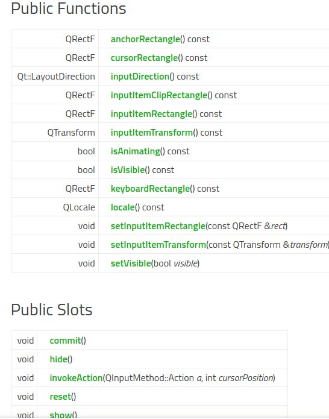

# Linux 实现一个linux输入法

## Linux应用是如何调用输入法的

Linux应用从输入法获取中文（或者其他文字，这里就以中文代替了）的方法有多种。一种最原生的方法是XIM，但最常用的方法是Qt IM Module和Gtk IM Module。

### XIM

XIM是X protocol定义的X应用从输入法获取中文的方法。它的大致流程分两步：

1. 从系统获取键盘事件，得到一个key event
2. 调用Xutf8LookupString，把key event传给输入法，从输入法获取转换后的中文

不是每次调用Xutf8LookupString都有中文吐回来的.

Xutf8LookupString的背后是基于DBus的进程间通信。具体在实现输入法的章节介绍。

一个简单的X应用获取输入法的代码如下：

[**https://****github.com/zhangfuwen/x****11-examples/blob/master/input_methods/fakeapp_main.c**](https://link.zhihu.com/?target=https%3A//github.com/zhangfuwen/x11-examples/blob/master/input_methods/fakeapp_main.c)

### Qt IM Module

这是Qt框架提供的标准输入法方法。Qt也支持从XIM的方式获取中文，但Qt5开始不再支持XIM。这里抛开XIM不提，只说Qt IM Module。

它实际是Qt的一个plugin。这个plugin是Qt开发的专用概念，具体的输入法，我们应该实现一个qt input context plugin。

关于这种plugin的描述：[QInputContextPlugin Class Referenc](https://link.zhihu.com/?target=http%3A//fiona.dmcs.p.lodz.pl/po/qt-tutorial/docs/qt/qinputcontextplugin.html)e

关于这种plugin的实现方法博客：[**https://www.****kdab.com/qt-input-metho****d-virtual-keyboard/**](https://link.zhihu.com/?target=https%3A//www.kdab.com/qt-input-method-virtual-keyboard/)

关于这种plugin的一个示例代码：[GitHub - michitux/qt-im-module-onboard: Qt Input Method for Onboard](https://link.zhihu.com/?target=https%3A//github.com/michitux/qt-im-module-onboard)

它的基本原理就是Qt应用在启动时，根据 `QT_IM_MODULE` 环境变量得到一个输入法名字，然后Qt就会去 `LD_LIBRARY_PATH` 中寻到提供这个名字的plugin的so，然后加载它。这个so库里提供了一个工厂方法，调用工厂方法可以创建一个QInputMethod类的实例，这个类就包含了输入法的各种操作。应用程序需要输入中文时，就会调用QInputMethod的方法来获取文字。

QInputMethod的定义如下：([QInputMethod Class](https://link.zhihu.com/?target=https%3A//doc.qt.io/qt-5/qinputmethod.html))




输入法的开发者在实现这个类的时候，可以直接查表返回对应中文，也可以通过进程间通信的方式从另一个进程获取中文．通常大家都是通过dbus做进程间通信，从而获取中文的．

这里具体实现不谈，主要想阐述的是，输入法开发者可以开发一个qt plugin，然后丢到linux系统的 `LD_LIBRARY_PATH` 下，再export一下 `QT_IM_MODULE` 环境变量，从而让QT开发的所有应用都使用你的这个输入法。

SCIM输入法就采用了这种方式：[**https://****github.com/heroxbd/scim****/commit/a99ca5e3e13fd8d278841ebd627d5be4d30956f6**](https://link.zhihu.com/?target=https%3A//github.com/heroxbd/scim/commit/a99ca5e3e13fd8d278841ebd627d5be4d30956f6)

### GTK IM Module

Gtk与Qt类似，也有InputContext和InputMethod的类。

Gtk的im module统一放在 `/usr/lib/x86_64-linux-gnu/gtk-4.0/4.0.0/immodules`。

```bash
➜  immodules pwd
/usr/lib/x86_64-linux-gnu/gtk-4.0/4.0.0/immodules
➜  immodules ls
giomodule.cache  libim-fcitx5.so  libim-ibus.so
➜  immodules readelf -sW libim-ibus.so | grep gtk_im
     7: 0000000000000000     0 FUNC    GLOBAL DEFAULT  UND gtk_im_context_simple_add_table
     9: 0000000000000000     0 FUNC    GLOBAL DEFAULT  UND gtk_im_context_filter_keypress
    16: 0000000000000000     0 FUNC    GLOBAL DEFAULT  UND gtk_im_context_set_cursor_location
    20: 0000000000000000     0 FUNC    GLOBAL DEFAULT  UND gtk_im_context_filter_key
    30: 0000000000000000     0 FUNC    GLOBAL DEFAULT  UND gtk_im_context_simple_new
    52: 0000000000000000     0 FUNC    GLOBAL DEFAULT  UND gtk_im_context_get_type
    63: 0000000000000000     0 FUNC    GLOBAL DEFAULT  UND gtk_im_context_reset
    66: 0000000000000000     0 FUNC    GLOBAL DEFAULT  UND gtk_im_context_focus_out
    83: 0000000000000000     0 FUNC    GLOBAL DEFAULT  UND gtk_im_context_set_use_preedit
   103: 0000000000000000     0 FUNC    GLOBAL DEFAULT  UND gtk_im_context_set_surrounding_with_selection
   108: 0000000000000000     0 FUNC    GLOBAL DEFAULT  UND gtk_im_context_simple_get_type
   115: 0000000000000000     0 FUNC    GLOBAL DEFAULT  UND gtk_im_context_focus_in
   118: 0000000000000000     0 FUNC    GLOBAL DEFAULT  UND gtk_im_context_set_client_widget
➜  immodules readelf -sW libim-fcitx5.so | grep gtk_im 
     8: 0000000000000000     0 FUNC    GLOBAL DEFAULT  UND gtk_im_context_filter_keypress
    29: 0000000000000000     0 FUNC    GLOBAL DEFAULT  UND gtk_im_context_reset
    52: 0000000000000000     0 FUNC    GLOBAL DEFAULT  UND gtk_im_context_focus_out
    65: 0000000000000000     0 FUNC    GLOBAL DEFAULT  UND gtk_im_context_get_preedit_string
    74: 0000000000000000     0 FUNC    GLOBAL DEFAULT  UND gtk_im_context_set_cursor_location
    96: 0000000000000000     0 FUNC    GLOBAL DEFAULT  UND gtk_im_context_set_use_preedit
   104: 0000000000000000     0 FUNC    GLOBAL DEFAULT  UND gtk_im_context_focus_in
   117: 0000000000000000     0 FUNC    GLOBAL DEFAULT  UND gtk_im_context_get_type
   118: 0000000000000000     0 FUNC    GLOBAL DEFAULT  UND gtk_im_context_set_surrounding
   127: 0000000000000000     0 FUNC    GLOBAL DEFAULT  UND gtk_im_context_simple_new
```

这个仓提供了fcitx5的gtk-im-modules的原代码，里面包括gtk-2, gtk-3, gtk-4的版本：

[**https://****github.com/fcitx/fcitx5****-gtk**](https://link.zhihu.com/?target=https%3A//github.com/fcitx/fcitx5-gtk)

这个网页则提供了一些编码上的要点：[Input methods in GTK+ 4](https://link.zhihu.com/?target=https%3A//blog.gtk.org/2018/03/06/input-methods-in-gtk-4/)

## 输入法接口和框架的一些混乱

可以看到linux系统下输入法还是比较混乱的，Gtk和Qt两个著名的开放框架各自有自己的输入法框架，还有一些其他的开发框架如SDDL, GLFW等，也需要输入法，它们或是自己也定义了一个框架，或者使用XIM接口。

这种混乱给输入法的实现带来了很多的困难，fcitx输入法需要实现各种不同的frontend：

[**https://****github.com/fcitx/fcitx5****/tree/master/src/frontend**](https://link.zhihu.com/?target=https%3A//github.com/fcitx/fcitx5/tree/master/src/frontend)

这种混乱给应用或应用开发框架也带来了困难，因为应用不知道用户使用什么输入法框架(fcitx还是ibus，还是其他)，又使用哪种输入法接口(xim, qt im module还是gtk im module)接入.

这种互相间的不确定性，导致有时候需要采用一些手段，才能让输入法好用。

Gtk和Qt支持本身的im module接口，但是它们几乎都提供了XIM的桥接模块，所以用户如果设置输入法为XIM，几乎总能工作。

```text
QT_IM_MODULE=xim
GTK_IM_MODULE=xim
XMODIFIERS=@im=xim
```

这样的配置的前提是ibus, fcitx等输入法几乎都实现了xim前端．

fcitx5也实现了ibus的接口，所以可以作为一个伪装的ibus daemon，提供ibus输入法服务。

## 输入法前端

[Fcitx 5 开发（一）一个按键事件的前半生：由程序到输入法](https://link.zhihu.com/?target=https%3A//www.csslayer.info/wordpress/fcitx-dev/fcitx5-dev-keyevent-from-app-to-fcitx/)

看这个吧。

## 如何实现一个输入法

### 实现为ibus或fcitx同级的输入法框架

实现一个输入法有多种方法，可以实现为一个ibus或fcitx等级的输入法，也可以实现为ibus或fcitx的一个engine。

实现为ibus或fcitx本身难度较大，原理可以参考上一节[输入法前端]。

### 实现为ibus engine

实现为ibus engine我这里有一个示例代码可以参考：

[**https://****github.com/zhangfuwen/x****11-examples/tree/master/input_methods/fake_ime**](https://link.zhihu.com/?target=https%3A//github.com/zhangfuwen/x11-examples/tree/master/input_methods/fake_ime)

这个代码在用户输入空格的时候就会返回四个固定的汉字，代码过于简单，就不多介绍了．

### 实现为fcitx engine

我没有实现过fcitx engine，网上请教了fcitx5的开发者wengxt, 他给了一些参考资料：

> 注册附加组件
> [**https://****codedocs.xyz/fcitx/fcit****x5/classfcitx_1_1AddonInstance.html**](https://link.zhihu.com/?target=https%3A//codedocs.xyz/fcitx/fcitx5/classfcitx_1_1AddonInstance.html)
> engine
> [**https://****codedocs.xyz/fcitx/fcit****x5/classfcitx_1_1InputMethodEngine.html**](https://link.zhihu.com/?target=https%3A//codedocs.xyz/fcitx/fcitx5/classfcitx_1_1InputMethodEngine.html)
> 也没更好的文档，大概也得参考已有的实现

[**https://****github.com/fcitx/fcitx5****/discussions/364**](https://link.zhihu.com/?target=https%3A//github.com/fcitx/fcitx5/discussions/364)

至此，关于输入法相关的疑问我基本都有了一个答案，暂时没有新问题就不进一步研究了，欢迎有问题的同学提出问题，大家一起研究．

