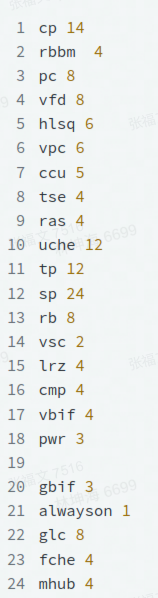
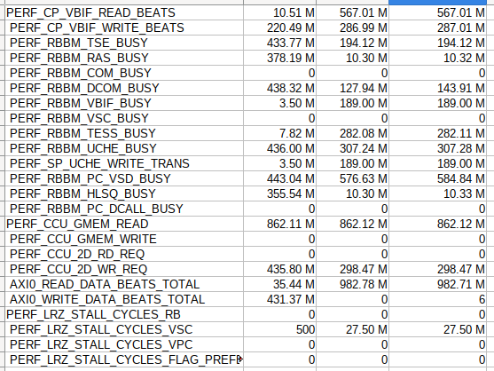

# perfcounter

## 每个组可用的寄存器数目




## glAMD API得到的perfcounter列表

```
Select CP:PERF_CP_ALWAYS_COUNT success
Select CP:PERF_CP_BUSY_GFX_CORE_IDLE success
Select CP:PERF_CP_BUSY_CYCLES success
Select CP:PERF_CP_NUM_PREEMPTIONS success
Select CP:PERF_CP_PREEMPTION_REACTION_DELAY success
Select CP:PERF_CP_PREEMPTION_SWITCH_OUT_TIME success
Select CP:PERF_CP_PREEMPTION_SWITCH_IN_TIME success
Select CP:PERF_CP_DEAD_DRAWS_IN_BIN_RENDER success
Select CP:PERF_CP_PREDICATED_DRAWS_KILLED success
Select CP:PERF_CP_MODE_SWITCH success
Select CP:PERF_CP_ZPASS_DONE success
Select CP:PERF_CP_CONTEXT_DONE success
Select CP:PERF_CP_CACHE_FLUSH success
Select CP:PERF_CP_LONG_PREEMPTIONS success
Select CP:PERF_CP_SQE_I_CACHE_STARVE failed
Select CP:PERF_CP_SQE_IDLE failed
Select CP:PERF_CP_SQE_PM4_STARVE_RB_IB failed
Select CP:PERF_CP_SQE_PM4_STARVE_SDS failed
Select CP:PERF_CP_SQE_MRB_STARVE failed
Select CP:PERF_CP_SQE_RRB_STARVE failed
Select CP:PERF_CP_SQE_VSD_STARVE failed
Select CP:PERF_CP_VSD_DECODE_STARVE failed
Select CP:PERF_CP_SQE_PIPE_OUT_STALL failed
Select CP:PERF_CP_SQE_SYNC_STALL failed
Select CP:PERF_CP_SQE_PM4_WFI_STALL failed
Select CP:PERF_CP_SQE_SYS_WFI_STALL failed
Select CP:PERF_CP_SQE_T4_EXEC failed
Select CP:PERF_CP_SQE_LOAD_STATE_EXEC failed
Select CP:PERF_CP_SQE_SAVE_SDS_STATE failed
Select CP:PERF_CP_SQE_DRAW_EXEC failed
Select CP:PERF_CP_SQE_CTXT_REG_BUNCH_EXEC failed
Select CP:PERF_CP_SQE_EXEC_PROFILED failed
Select CP:PERF_CP_MEMORY_POOL_EMPTY failed
Select CP:PERF_CP_MEMORY_POOL_SYNC_STALL failed
Select CP:PERF_CP_MEMORY_POOL_ABOVE_THRESH failed
Select CP:PERF_CP_AHB_WR_STALL_PRE_DRAWS failed
Select CP:PERF_CP_AHB_STALL_SQE_GMU failed
Select CP:PERF_CP_AHB_STALL_SQE_WR_OTHER failed
Select CP:PERF_CP_AHB_STALL_SQE_RD_OTHER failed
Select CP:PERF_CP_CLUSTER0_EMPTY failed
Select CP:PERF_CP_CLUSTER1_EMPTY failed
Select CP:PERF_CP_CLUSTER2_EMPTY failed
Select CP:PERF_CP_CLUSTER3_EMPTY failed
Select CP:PERF_CP_CLUSTER4_EMPTY failed
Select CP:PERF_CP_CLUSTER5_EMPTY failed
Select CP:PERF_CP_PM4_DATA failed
Select CP:PERF_CP_PM4_HEADERS failed
Select CP:PERF_CP_VBIF_READ_BEATS failed
Select CP:PERF_CP_VBIF_WRITE_BEATS failed
Select CP:PERF_CP_SQE_INSTR_COUNTER success
Select RBBM:PERF_RBBM_ALWAYS_COUNT success
Select RBBM:PERF_RBBM_ALWAYS_ON success
Select RBBM:PERF_RBBM_TSE_BUSY success
Select RBBM:PERF_RBBM_RAS_BUSY failed
Select RBBM:PERF_RBBM_PC_DCALL_BUSY failed
Select RBBM:PERF_RBBM_PC_VSD_BUSY failed
Select RBBM:PERF_RBBM_STATUS_MASKED failed
Select RBBM:PERF_RBBM_COM_BUSY failed
Select RBBM:PERF_RBBM_DCOM_BUSY failed
Select RBBM:PERF_RBBM_VBIF_BUSY failed
Select RBBM:PERF_RBBM_VSC_BUSY failed
Select RBBM:PERF_RBBM_TESS_BUSY failed
Select RBBM:PERF_RBBM_UCHE_BUSY failed
Select RBBM:PERF_RBBM_HLSQ_BUSY success
Select PC:PERF_PC_BUSY_CYCLES success
Select PC:PERF_PC_WORKING_CYCLES success
Select PC:PERF_PC_STALL_CYCLES_VFD success
Select PC:PERF_PC_STALL_CYCLES_TSE success
Select PC:PERF_PC_STALL_CYCLES_VPC success
Select PC:PERF_PC_STALL_CYCLES_UCHE success
Select PC:PERF_PC_STALL_CYCLES_TESS success
Select PC:PERF_PC_STALL_CYCLES_TSE_ONLY failed
Select PC:PERF_PC_STALL_CYCLES_VPC_ONLY failed
Select PC:PERF_PC_PASS1_TF_STALL_CYCLES failed
Select PC:PERF_PC_STARVE_CYCLES_FOR_INDEX failed
Select PC:PERF_PC_STARVE_CYCLES_FOR_TESS_FACTOR failed
Select PC:PERF_PC_STARVE_CYCLES_FOR_VIZ_STREAM failed
Select PC:PERF_PC_STARVE_CYCLES_FOR_POSITION failed
Select PC:PERF_PC_STARVE_CYCLES_DI failed
Select PC:PERF_PC_VIS_STREAMS_LOADED failed
Select PC:PERF_PC_INSTANCES failed
Select PC:PERF_PC_VPC_PRIMITIVES failed
Select PC:PERF_PC_DEAD_PRIM failed
Select PC:PERF_PC_LIVE_PRIM failed
Select PC:PERF_PC_VERTEX_HITS failed
Select PC:PERF_PC_IA_VERTICES failed
Select PC:PERF_PC_IA_PRIMITIVES failed
Select PC:PERF_PC_GS_PRIMITIVES failed
Select PC:PERF_PC_HS_INVOCATIONS failed
Select PC:PERF_PC_DS_INVOCATIONS failed
Select PC:PERF_PC_VS_INVOCATIONS failed
Select PC:PERF_PC_GS_INVOCATIONS failed
Select PC:PERF_PC_DS_PRIMITIVES failed
Select PC:PERF_PC_VPC_POS_DATA_TRANSACTION failed
Select PC:PERF_PC_3D_DRAWCALLS failed
Select PC:PERF_PC_2D_DRAWCALLS failed
Select PC:PERF_PC_NON_DRAWCALL_GLOBAL_EVENTS failed
Select PC:PERF_TESS_BUSY_CYCLES failed
Select PC:PERF_TESS_WORKING_CYCLES failed
Select PC:PERF_TESS_STALL_CYCLES_PC failed
Select PC:PERF_TESS_STARVE_CYCLES_PC failed
Select PC:PERF_PC_TSE_TRANSACTION failed
Select PC:PERF_PC_TSE_VERTEX failed
Select PC:PERF_PC_TESS_PC_UV_TRANS failed
Select PC:PERF_PC_TESS_PC_UV_PATCHES failed
Select PC:PERF_PC_TESS_FACTOR_TRANS success
Select VFD:PERF_VFD_BUSY_CYCLES success
Select VFD:PERF_VFD_STALL_CYCLES_UCHE success
Select VFD:PERF_VFD_STALL_CYCLES_VPC_ALLOC success
Select VFD:PERF_VFD_STALL_CYCLES_SP_INFO success
Select VFD:PERF_VFD_STALL_CYCLES_SP_ATTR success
Select VFD:PERF_VFD_STARVE_CYCLES_UCHE success
Select VFD:PERF_VFD_RBUFFER_FULL success
Select VFD:PERF_VFD_ATTR_INFO_FIFO_FULL failed
Select VFD:PERF_VFD_DECODED_ATTRIBUTE_BYTES failed
Select VFD:PERF_VFD_NUM_ATTRIBUTES failed
Select VFD:PERF_VFD_UPPER_SHADER_FIBERS failed
Select VFD:PERF_VFD_LOWER_SHADER_FIBERS failed
Select VFD:PERF_VFD_MODE_0_FIBERS failed
Select VFD:PERF_VFD_MODE_1_FIBERS failed
Select VFD:PERF_VFD_MODE_2_FIBERS failed
Select VFD:PERF_VFD_MODE_3_FIBERS failed
Select VFD:PERF_VFD_MODE_4_FIBERS failed
Select VFD:PERF_VFD_TOTAL_VERTICES failed
Select VFD:PERF_VFDP_STALL_CYCLES_VFD failed
Select VFD:PERF_VFDP_STALL_CYCLES_VFD_INDEX failed
Select VFD:PERF_VFDP_STALL_CYCLES_VFD_PROG failed
Select VFD:PERF_VFDP_STARVE_CYCLES_PC failed
Select VFD:PERF_VFDP_VS_STAGE_WAVES success
Select HLSQ:PERF_HLSQ_BUSY_CYCLES success
Select HLSQ:PERF_HLSQ_STALL_CYCLES_UCHE success
Select HLSQ:PERF_HLSQ_STALL_CYCLES_SP_STATE success
Select HLSQ:PERF_HLSQ_STALL_CYCLES_SP_FS_STAGE success
Select HLSQ:PERF_HLSQ_UCHE_LATENCY_CYCLES success
Select HLSQ:PERF_HLSQ_UCHE_LATENCY_COUNT failed
Select HLSQ:PERF_HLSQ_FS_STAGE_1X_WAVES failed
Select HLSQ:PERF_HLSQ_FS_STAGE_2X_WAVES failed
Select HLSQ:PERF_HLSQ_QUADS failed
Select HLSQ:PERF_HLSQ_CS_INVOCATIONS failed
Select HLSQ:PERF_HLSQ_COMPUTE_DRAWCALLS failed
Select HLSQ:PERF_HLSQ_FS_DATA_WAIT_PROGRAMMING failed
Select HLSQ:PERF_HLSQ_DUAL_FS_PROG_ACTIVE failed
Select HLSQ:PERF_HLSQ_DUAL_VS_PROG_ACTIVE failed
Select HLSQ:PERF_HLSQ_FS_BATCH_COUNT_ZERO failed
Select HLSQ:PERF_HLSQ_VS_BATCH_COUNT_ZERO failed
Select HLSQ:PERF_HLSQ_WAVE_PENDING_NO_QUAD failed
Select HLSQ:PERF_HLSQ_WAVE_PENDING_NO_PRIM_BASE failed
Select HLSQ:PERF_HLSQ_STALL_CYCLES_VPC failed
Select HLSQ:PERF_HLSQ_PIXELS failed
Select HLSQ:PERF_HLSQ_DRAW_MODE_SWITCH_VSFS_SYNC success
Select VPC:PERF_VPC_BUSY_CYCLES success
Select VPC:PERF_VPC_WORKING_CYCLES success
Select VPC:PERF_VPC_STALL_CYCLES_UCHE success
Select VPC:PERF_VPC_STALL_CYCLES_VFD_WACK success
Select VPC:PERF_VPC_STALL_CYCLES_HLSQ_PRIM_ALLOC success
Select VPC:PERF_VPC_STALL_CYCLES_PC failed
Select VPC:PERF_VPC_STALL_CYCLES_SP_LM failed
Select VPC:PERF_VPC_STARVE_CYCLES_SP failed
Select VPC:PERF_VPC_STARVE_CYCLES_LRZ failed
Select VPC:PERF_VPC_PC_PRIMITIVES failed
Select VPC:PERF_VPC_SP_COMPONENTS failed
Select VPC:PERF_VPC_STALL_CYCLES_VPCRAM_POS failed
Select VPC:PERF_VPC_LRZ_ASSIGN_PRIMITIVES failed
Select VPC:PERF_VPC_RB_VISIBLE_PRIMITIVES failed
Select VPC:PERF_VPC_LM_TRANSACTION failed
Select VPC:PERF_VPC_STREAMOUT_TRANSACTION failed
Select VPC:PERF_VPC_VS_BUSY_CYCLES failed
Select VPC:PERF_VPC_PS_BUSY_CYCLES failed
Select VPC:PERF_VPC_VS_WORKING_CYCLES failed
Select VPC:PERF_VPC_PS_WORKING_CYCLES failed
Select VPC:PERF_VPC_STARVE_CYCLES_RB failed
Select VPC:PERF_VPC_NUM_VPCRAM_READ_POS failed
Select VPC:PERF_VPC_WIT_FULL_CYCLES failed
Select VPC:PERF_VPC_VPCRAM_FULL_CYCLES failed
Select VPC:PERF_VPC_LM_FULL_WAIT_FOR_INTP_END failed
Select VPC:PERF_VPC_NUM_VPCRAM_WRITE failed
Select VPC:PERF_VPC_NUM_VPCRAM_READ_SO failed
Select VPC:PERF_VPC_NUM_ATTR_REQ_LM success
Select TSE:PERF_TSE_BUSY_CYCLES success
Select TSE:PERF_TSE_CLIPPING_CYCLES success
Select TSE:PERF_TSE_STALL_CYCLES_RAS success
Select TSE:PERF_TSE_STALL_CYCLES_LRZ_BARYPLANE failed
Select TSE:PERF_TSE_STALL_CYCLES_LRZ_ZPLANE failed
Select TSE:PERF_TSE_STARVE_CYCLES_PC failed
Select TSE:PERF_TSE_INPUT_PRIM failed
Select TSE:PERF_TSE_INPUT_NULL_PRIM failed
Select TSE:PERF_TSE_TRIVAL_REJ_PRIM failed
Select TSE:PERF_TSE_CLIPPED_PRIM failed
Select TSE:PERF_TSE_ZERO_AREA_PRIM failed
Select TSE:PERF_TSE_FACENESS_CULLED_PRIM failed
Select TSE:PERF_TSE_ZERO_PIXEL_PRIM failed
Select TSE:PERF_TSE_OUTPUT_NULL_PRIM failed
Select TSE:PERF_TSE_OUTPUT_VISIBLE_PRIM failed
Select TSE:PERF_TSE_CINVOCATION failed
Select TSE:PERF_TSE_CPRIMITIVES failed
Select TSE:PERF_TSE_2D_INPUT_PRIM failed
Select TSE:PERF_TSE_2D_ALIVE_CYCLES failed
Select TSE:PERF_TSE_CLIP_PLANES success
Select RAS:PERF_RAS_BUSY_CYCLES success
Select RAS:PERF_RAS_SUPERTILE_ACTIVE_CYCLES success
Select RAS:PERF_RAS_STALL_CYCLES_LRZ success
Select RAS:PERF_RAS_STARVE_CYCLES_TSE failed
Select RAS:PERF_RAS_SUPER_TILES failed
Select RAS:PERF_RAS_8X4_TILES failed
Select RAS:PERF_RAS_MASKGEN_ACTIVE failed
Select RAS:PERF_RAS_FULLY_COVERED_SUPER_TILES failed
Select RAS:PERF_RAS_FULLY_COVERED_8X4_TILES failed
Select RAS:PERF_RAS_PRIM_KILLED_INVISILBE failed
Select RAS:PERF_RAS_SUPERTILE_GEN_ACTIVE_CYCLES failed
Select RAS:PERF_RAS_LRZ_INTF_WORKING_CYCLES failed
Select RAS:PERF_RAS_BLOCKS success
Select UCHE:PERF_UCHE_BUSY_CYCLES success
Select UCHE:PERF_UCHE_STALL_CYCLES_ARBITER success
Select UCHE:PERF_UCHE_VBIF_LATENCY_CYCLES success
Select UCHE:PERF_UCHE_VBIF_LATENCY_SAMPLES success
Select UCHE:PERF_UCHE_VBIF_READ_BEATS_TP success
Select UCHE:PERF_UCHE_VBIF_READ_BEATS_VFD success
Select UCHE:PERF_UCHE_VBIF_READ_BEATS_HLSQ success
Select UCHE:PERF_UCHE_VBIF_READ_BEATS_LRZ success
Select UCHE:PERF_UCHE_VBIF_READ_BEATS_SP success
Select UCHE:PERF_UCHE_READ_REQUESTS_TP success
Select UCHE:PERF_UCHE_READ_REQUESTS_VFD success
Select UCHE:PERF_UCHE_READ_REQUESTS_HLSQ failed
Select UCHE:PERF_UCHE_READ_REQUESTS_LRZ failed
Select UCHE:PERF_UCHE_READ_REQUESTS_SP failed
Select UCHE:PERF_UCHE_WRITE_REQUESTS_LRZ failed
Select UCHE:PERF_UCHE_WRITE_REQUESTS_SP failed
Select UCHE:PERF_UCHE_WRITE_REQUESTS_VPC failed
Select UCHE:PERF_UCHE_WRITE_REQUESTS_VSC failed
Select UCHE:PERF_UCHE_EVICTS failed
Select UCHE:PERF_UCHE_BANK_REQ0 failed
Select UCHE:PERF_UCHE_BANK_REQ1 failed
Select UCHE:PERF_UCHE_BANK_REQ2 failed
Select UCHE:PERF_UCHE_BANK_REQ3 failed
Select UCHE:PERF_UCHE_BANK_REQ4 failed
Select UCHE:PERF_UCHE_BANK_REQ5 failed
Select UCHE:PERF_UCHE_BANK_REQ6 failed
Select UCHE:PERF_UCHE_BANK_REQ7 failed
Select UCHE:PERF_UCHE_VBIF_READ_BEATS_CH0 failed
Select UCHE:PERF_UCHE_VBIF_READ_BEATS_CH1 failed
Select UCHE:PERF_UCHE_GMEM_READ_BEATS failed
Select UCHE:PERF_UCHE_TPH_REF_FULL failed
Select UCHE:PERF_UCHE_TPH_VICTIM_FULL failed
Select UCHE:PERF_UCHE_TPH_EXT_FULL failed
Select UCHE:PERF_UCHE_VBIF_STALL_WRITE_DATA failed
Select UCHE:PERF_UCHE_DCMP_LATENCY_SAMPLES failed
Select UCHE:PERF_UCHE_DCMP_LATENCY_CYCLES failed
Select UCHE:PERF_UCHE_VBIF_READ_BEATS_PC failed
Select UCHE:PERF_UCHE_READ_REQUESTS_PC failed
Select UCHE:PERF_UCHE_RAM_READ_REQ failed
Select UCHE:PERF_UCHE_RAM_WRITE_REQ failed
Select UCHE:PERF_UCHE_STARVED_CYCLES_VBIF_DECMP failed
Select UCHE:PERF_UCHE_STALL_CYCLES_DECMP failed
Select UCHE:PERF_UCHE_ARBITER_STALL_CYCLES_VBIF failed
Select UCHE:PERF_UCHE_BANK_REQ8 failed
Select UCHE:PERF_UCHE_BANK_REQ9 failed
Select UCHE:PERF_UCHE_BANK_REQ10 failed
Select UCHE:PERF_UCHE_BANK_REQ11 failed
Select UCHE:PERF_UCHE_BANK_REQ12 failed
Select UCHE:PERF_UCHE_BANK_REQ13 failed
Select UCHE:PERF_UCHE_BANK_REQ14 failed
Select UCHE:PERF_UCHE_BANK_REQ15 failed
Select UCHE:PERF_UCHE_TPH_CONFLICT_CL0 failed
Select UCHE:PERF_UCHE_TPH_CONFLICT_CL1 failed
Select UCHE:PERF_UCHE_TPH_CONFLICT_CL2 failed
Select UCHE:PERF_UCHE_TPH_CONFLICT_CL3 failed
Select UCHE:PERF_UCHE_TPH_CONFLICT_CL4 failed
Select UCHE:PERF_UCHE_TPH_CONFLICT_CL5 failed
Select UCHE:PERF_UCHE_TPH_CONFLICT_CL6 failed
Select UCHE:PERF_UCHE_DBANK_CONFLICT_CL0 failed
Select UCHE:PERF_UCHE_DBANK_CONFLICT_CL1 failed
Select UCHE:PERF_UCHE_DBANK_CONFLICT_CL2 failed
Select UCHE:PERF_UCHE_DBANK_CONFLICT_CL3 failed
Select UCHE:PERF_UCHE_DBANK_CONFLICT_CL4 failed
Select UCHE:PERF_UCHE_DBANK_CONFLICT_CL5 failed
Select UCHE:PERF_UCHE_DBANK_CONFLICT_CL6 success
Select TP:PERF_TP_BUSY_CYCLES success
Select TP:PERF_TP_STALL_CYCLES_UCHE success
Select TP:PERF_TP_LATENCY_CYCLES success
Select TP:PERF_TP_LATENCY_TRANS success
Select TP:PERF_TP_FLAG_CACHE_REQUEST_SAMPLES success
Select TP:PERF_TP_FLAG_CACHE_REQUEST_LATENCY success
Select TP:PERF_TP_L1_CACHELINE_REQUESTS success
Select TP:PERF_TP_L1_CACHELINE_MISSES success
Select TP:PERF_TP_SP_TP_TRANS success
Select TP:PERF_TP_TP_SP_TRANS success
Select TP:PERF_TP_OUTPUT_PIXELS success
Select TP:PERF_TP_FILTER_WORKLOAD_16BIT failed
Select TP:PERF_TP_FILTER_WORKLOAD_32BIT failed
Select TP:PERF_TP_QUADS_RECEIVED failed
Select TP:PERF_TP_QUADS_OFFSET failed
Select TP:PERF_TP_QUADS_SHADOW failed
Select TP:PERF_TP_QUADS_ARRAY failed
Select TP:PERF_TP_QUADS_GRADIENT failed
Select TP:PERF_TP_QUADS_1D failed
Select TP:PERF_TP_QUADS_2D failed
Select TP:PERF_TP_QUADS_BUFFER failed
Select TP:PERF_TP_QUADS_3D failed
Select TP:PERF_TP_QUADS_CUBE failed
Select TP:PERF_TP_DIVERGENT_QUADS_RECEIVED failed
Select TP:PERF_TP_PRT_NON_RESIDENT_EVENTS failed
Select TP:PERF_TP_OUTPUT_PIXELS_POINT failed
Select TP:PERF_TP_OUTPUT_PIXELS_BILINEAR failed
Select TP:PERF_TP_OUTPUT_PIXELS_MIP failed
Select TP:PERF_TP_OUTPUT_PIXELS_ANISO failed
Select TP:PERF_TP_OUTPUT_PIXELS_ZERO_LOD failed
Select TP:PERF_TP_FLAG_CACHE_REQUESTS failed
Select TP:PERF_TP_FLAG_CACHE_MISSES failed
Select TP:PERF_TP_L1_5_L2_REQUESTS failed
Select TP:PERF_TP_2D_OUTPUT_PIXELS failed
Select TP:PERF_TP_2D_OUTPUT_PIXELS_POINT failed
Select TP:PERF_TP_2D_OUTPUT_PIXELS_BILINEAR failed
Select TP:PERF_TP_2D_FILTER_WORKLOAD_16BIT failed
Select TP:PERF_TP_2D_FILTER_WORKLOAD_32BIT failed
Select TP:PERF_TP_TPA2TPC_TRANS failed
Select TP:PERF_TP_L1_MISSES_ASTC_1TILE failed
Select TP:PERF_TP_L1_MISSES_ASTC_2TILE failed
Select TP:PERF_TP_L1_MISSES_ASTC_4TILE failed
Select TP:PERF_TP_L1_5_L2_COMPRESS_REQS failed
Select TP:PERF_TP_L1_5_L2_COMPRESS_MISS failed
Select TP:PERF_TP_L1_BANK_CONFLICT failed
Select TP:PERF_TP_L1_5_MISS_LATENCY_CYCLES failed
Select TP:PERF_TP_L1_5_MISS_LATENCY_TRANS failed
Select TP:PERF_TP_QUADS_CONSTANT_MULTIPLIED failed
Select TP:PERF_TP_FRONTEND_WORKING_CYCLES failed
Select TP:PERF_TP_L1_TAG_WORKING_CYCLES failed
Select TP:PERF_TP_L1_DATA_WRITE_WORKING_CYCLES failed
Select TP:PERF_TP_PRE_L1_DECOM_WORKING_CYCLES failed
Select TP:PERF_TP_BACKEND_WORKING_CYCLES failed
Select TP:PERF_TP_FLAG_CACHE_WORKING_CYCLES failed
Select TP:PERF_TP_L1_5_CACHE_WORKING_CYCLES failed
Select TP:PERF_TP_STARVE_CYCLES_SP failed
Select TP:PERF_TP_STARVE_CYCLES_UCHE success
Select SP:PERF_SP_BUSY_CYCLES success
Select SP:PERF_SP_ALU_WORKING_CYCLES success
Select SP:PERF_SP_EFU_WORKING_CYCLES success
Select SP:PERF_SP_STALL_CYCLES_VPC success
Select SP:PERF_SP_STALL_CYCLES_TP success
Select SP:PERF_SP_STALL_CYCLES_UCHE success
Select SP:PERF_SP_STALL_CYCLES_RB success
Select SP:PERF_SP_NON_EXECUTION_CYCLES success
Select SP:PERF_SP_WAVE_CONTEXTS success
Select SP:PERF_SP_WAVE_CONTEXT_CYCLES success
Select SP:PERF_SP_FS_STAGE_WAVE_CYCLES success
Select SP:PERF_SP_FS_STAGE_WAVE_SAMPLES success
Select SP:PERF_SP_VS_STAGE_WAVE_CYCLES success
Select SP:PERF_SP_VS_STAGE_WAVE_SAMPLES success
Select SP:PERF_SP_FS_STAGE_DURATION_CYCLES success
Select SP:PERF_SP_VS_STAGE_DURATION_CYCLES success
Select SP:PERF_SP_WAVE_CTRL_CYCLES success
Select SP:PERF_SP_WAVE_LOAD_CYCLES success
Select SP:PERF_SP_WAVE_EMIT_CYCLES success
Select SP:PERF_SP_WAVE_NOP_CYCLES success
Select SP:PERF_SP_WAVE_WAIT_CYCLES success
Select SP:PERF_SP_WAVE_FETCH_CYCLES success
Select SP:PERF_SP_WAVE_IDLE_CYCLES success
Select SP:PERF_SP_WAVE_END_CYCLES failed
Select SP:PERF_SP_WAVE_LONG_SYNC_CYCLES failed
Select SP:PERF_SP_WAVE_SHORT_SYNC_CYCLES failed
Select SP:PERF_SP_WAVE_JOIN_CYCLES failed
Select SP:PERF_SP_LM_LOAD_INSTRUCTIONS failed
Select SP:PERF_SP_LM_STORE_INSTRUCTIONS failed
Select SP:PERF_SP_LM_ATOMICS failed
Select SP:PERF_SP_GM_LOAD_INSTRUCTIONS failed
Select SP:PERF_SP_GM_STORE_INSTRUCTIONS failed
Select SP:PERF_SP_GM_ATOMICS failed
Select SP:PERF_SP_VS_STAGE_TEX_INSTRUCTIONS failed
Select SP:PERF_SP_VS_STAGE_EFU_INSTRUCTIONS failed
Select SP:PERF_SP_VS_STAGE_FULL_ALU_INSTRUCTIONS failed
Select SP:PERF_SP_VS_STAGE_HALF_ALU_INSTRUCTIONS failed
Select SP:PERF_SP_FS_STAGE_TEX_INSTRUCTIONS failed
Select SP:PERF_SP_FS_STAGE_CFLOW_INSTRUCTIONS failed
Select SP:PERF_SP_FS_STAGE_EFU_INSTRUCTIONS failed
Select SP:PERF_SP_FS_STAGE_FULL_ALU_INSTRUCTIONS failed
Select SP:PERF_SP_FS_STAGE_HALF_ALU_INSTRUCTIONS failed
Select SP:PERF_SP_FS_STAGE_BARY_INSTRUCTIONS failed
Select SP:PERF_SP_VS_INSTRUCTIONS failed
Select SP:PERF_SP_FS_INSTRUCTIONS failed
Select SP:PERF_SP_ADDR_LOCK_COUNT failed
Select SP:PERF_SP_UCHE_READ_TRANS failed
Select SP:PERF_SP_UCHE_WRITE_TRANS failed
Select SP:PERF_SP_EXPORT_VPC_TRANS failed
Select SP:PERF_SP_EXPORT_RB_TRANS failed
Select SP:PERF_SP_PIXELS_KILLED failed
Select SP:PERF_SP_ICL1_REQUESTS failed
Select SP:PERF_SP_ICL1_MISSES failed
Select SP:PERF_SP_HS_INSTRUCTIONS failed
Select SP:PERF_SP_DS_INSTRUCTIONS failed
Select SP:PERF_SP_GS_INSTRUCTIONS failed
Select SP:PERF_SP_CS_INSTRUCTIONS failed
Select SP:PERF_SP_GPR_READ failed
Select SP:PERF_SP_GPR_WRITE failed
Select SP:PERF_SP_FS_STAGE_HALF_EFU_INSTRUCTIONS failed
Select SP:PERF_SP_VS_STAGE_HALF_EFU_INSTRUCTIONS failed
Select SP:PERF_SP_LM_BANK_CONFLICTS failed
Select SP:PERF_SP_TEX_CONTROL_WORKING_CYCLES failed
Select SP:PERF_SP_LOAD_CONTROL_WORKING_CYCLES failed
Select SP:PERF_SP_FLOW_CONTROL_WORKING_CYCLES failed
Select SP:PERF_SP_LM_WORKING_CYCLES failed
Select SP:PERF_SP_DISPATCHER_WORKING_CYCLES failed
Select SP:PERF_SP_SEQUENCER_WORKING_CYCLES failed
Select SP:PERF_SP_LOW_EFFICIENCY_STARVED_BY_TP failed
Select SP:PERF_SP_STARVE_CYCLES_HLSQ failed
Select SP:PERF_SP_NON_EXECUTION_LS_CYCLES failed
Select SP:PERF_SP_WORKING_EU failed
Select SP:PERF_SP_ANY_EU_WORKING failed
Select SP:PERF_SP_WORKING_EU_FS_STAGE failed
Select SP:PERF_SP_ANY_EU_WORKING_FS_STAGE failed
Select SP:PERF_SP_WORKING_EU_VS_STAGE failed
Select SP:PERF_SP_ANY_EU_WORKING_VS_STAGE failed
Select SP:PERF_SP_WORKING_EU_CS_STAGE failed
Select SP:PERF_SP_ANY_EU_WORKING_CS_STAGE failed
Select SP:PERF_SP_GPR_READ_PREFETCH failed
Select SP:PERF_SP_GPR_READ_CONFLICT failed
Select SP:PERF_SP_GPR_WRITE_CONFLICT failed
Select SP:PERF_SP_GM_LOAD_LATENCY_CYCLES failed
Select SP:PERF_SP_GM_LOAD_LATENCY_SAMPLES failed
Select SP:PERF_SP_EXECUTABLE_WAVES failed
Select SP:PERF_SP_ICL1_MISS_FETCH_CYCLES failed
Select SP:PERF_SP_WORKING_EU_LPAC failed
Select SP:PERF_SP_BYPASS_BUSY_CYCLES failed
Select SP:PERF_SP_ANY_EU_WORKING_LPAC failed
Select SP:PERF_SP_WAVE_ALU_CYCLES failed
Select SP:PERF_SP_WAVE_EFU_CYCLES failed
Select SP:PERF_SP_WAVE_INT_CYCLES failed
Select SP:PERF_SP_WAVE_CSP_CYCLES failed
Select SP:PERF_SP_EWAVE_CONTEXTS failed
Select SP:PERF_SP_EWAVE_CONTEXT_CYCLES failed
Select SP:PERF_SP_LPAC_BUSY_CYCLES failed
Select SP:PERF_SP_LPAC_INSTRUCTIONS failed
Select SP:PERF_SP_FS_STAGE_1X_WAVES failed
Select SP:PERF_SP_FS_STAGE_2X_WAVES failed
Select SP:PERF_SP_QUADS failed
Select SP:PERF_SP_CS_INVOCATIONS failed
Select SP:PERF_SP_PIXELS failed
Select SP:PERF_SP_LPAC_DRAWCALLS failed
Select SP:PERF_SP_PI_WORKING_CYCLES failed
Select SP:PERF_SP_WAVE_INPUT_CYCLES failed
Select SP:PERF_SP_WAVE_OUTPUT_CYCLES failed
Select SP:PERF_SP_WAVE_HWAVE_WAIT_CYCLES failed
Select SP:PERF_SP_WAVE_HWAVE_SYNC failed
Select SP:PERF_SP_OUTPUT_3D_PIXELS success
Select RB:PERF_RB_BUSY_CYCLES success
Select RB:PERF_RB_STALL_CYCLES_HLSQ success
Select RB:PERF_RB_STALL_CYCLES_FIFO0_FULL success
Select RB:PERF_RB_STALL_CYCLES_FIFO1_FULL success
Select RB:PERF_RB_STALL_CYCLES_FIFO2_FULL success
Select RB:PERF_RB_STARVE_CYCLES_SP success
Select RB:PERF_RB_STARVE_CYCLES_LRZ_TILE success
Select RB:PERF_RB_STARVE_CYCLES_CCU failed
Select RB:PERF_RB_STARVE_CYCLES_Z_PLANE failed
Select RB:PERF_RB_STARVE_CYCLES_BARY_PLANE failed
Select RB:PERF_RB_Z_WORKLOAD failed
Select RB:PERF_RB_HLSQ_ACTIVE failed
Select RB:PERF_RB_Z_READ failed
Select RB:PERF_RB_Z_WRITE failed
Select RB:PERF_RB_C_READ failed
Select RB:PERF_RB_C_WRITE failed
Select RB:PERF_RB_TOTAL_PASS failed
Select RB:PERF_RB_Z_PASS failed
Select RB:PERF_RB_Z_FAIL failed
Select RB:PERF_RB_S_FAIL failed
Select RB:PERF_RB_BLENDED_FXP_COMPONENTS failed
Select RB:PERF_RB_BLENDED_FP16_COMPONENTS failed
Select RB:PERF_RB_PS_INVOCATIONS failed
Select RB:PERF_RB_2D_ALIVE_CYCLES failed
Select RB:PERF_RB_2D_STALL_CYCLES_A2D failed
Select RB:PERF_RB_2D_STARVE_CYCLES_SRC failed
Select RB:PERF_RB_2D_STARVE_CYCLES_SP failed
Select RB:PERF_RB_2D_STARVE_CYCLES_DST failed
Select RB:PERF_RB_2D_VALID_PIXELS failed
Select RB:PERF_RB_3D_PIXELS failed
Select RB:PERF_RB_BLENDER_WORKING_CYCLES failed
Select RB:PERF_RB_ZPROC_WORKING_CYCLES failed
Select RB:PERF_RB_CPROC_WORKING_CYCLES failed
Select RB:PERF_RB_SAMPLER_WORKING_CYCLES failed
Select RB:PERF_RB_STALL_CYCLES_CCU_COLOR_READ failed
Select RB:PERF_RB_STALL_CYCLES_CCU_COLOR_WRITE failed
Select RB:PERF_RB_STALL_CYCLES_CCU_DEPTH_READ failed
Select RB:PERF_RB_STALL_CYCLES_CCU_DEPTH_WRITE failed
Select RB:PERF_RB_STALL_CYCLES_VPC failed
Select RB:PERF_RB_2D_INPUT_TRANS failed
Select RB:PERF_RB_2D_OUTPUT_RB_DST_TRANS failed
Select RB:PERF_RB_2D_OUTPUT_RB_SRC_TRANS failed
Select RB:PERF_RB_BLENDED_FP32_COMPONENTS failed
Select RB:PERF_RB_COLOR_PIX_TILES failed
Select RB:PERF_RB_STALL_CYCLES_CCU failed
Select RB:PERF_RB_EARLY_Z_ARB3_GRANT failed
Select RB:PERF_RB_LATE_Z_ARB3_GRANT failed
Select RB:PERF_RB_EARLY_Z_SKIP_GRANT success
Select VSC:PERF_VSC_BUSY_CYCLES success
Select VSC:PERF_VSC_WORKING_CYCLES failed
Select VSC:PERF_VSC_STALL_CYCLES_UCHE failed
Select VSC:PERF_VSC_EOT_NUM failed
Select VSC:PERF_VSC_INPUT_TILES success
Select CCU:PERF_CCU_BUSY_CYCLES success
Select CCU:PERF_CCU_STALL_CYCLES_RB_DEPTH_RETURN success
Select CCU:PERF_CCU_STALL_CYCLES_RB_COLOR_RETURN success
Select CCU:PERF_CCU_STARVE_CYCLES_FLAG_RETURN success
Select CCU:PERF_CCU_DEPTH_BLOCKS failed
Select CCU:PERF_CCU_COLOR_BLOCKS failed
Select CCU:PERF_CCU_DEPTH_BLOCK_HIT failed
Select CCU:PERF_CCU_COLOR_BLOCK_HIT failed
Select CCU:PERF_CCU_PARTIAL_BLOCK_READ failed
Select CCU:PERF_CCU_GMEM_READ failed
Select CCU:PERF_CCU_GMEM_WRITE failed
Select CCU:PERF_CCU_DEPTH_READ_FLAG0_COUNT failed
Select CCU:PERF_CCU_DEPTH_READ_FLAG1_COUNT failed
Select CCU:PERF_CCU_DEPTH_READ_FLAG2_COUNT failed
Select CCU:PERF_CCU_DEPTH_READ_FLAG3_COUNT failed
Select CCU:PERF_CCU_DEPTH_READ_FLAG4_COUNT failed
Select CCU:PERF_CCU_DEPTH_READ_FLAG5_COUNT failed
Select CCU:PERF_CCU_DEPTH_READ_FLAG6_COUNT failed
Select CCU:PERF_CCU_DEPTH_READ_FLAG8_COUNT failed
Select CCU:PERF_CCU_COLOR_READ_FLAG0_COUNT failed
Select CCU:PERF_CCU_COLOR_READ_FLAG1_COUNT failed
Select CCU:PERF_CCU_COLOR_READ_FLAG2_COUNT failed
Select CCU:PERF_CCU_COLOR_READ_FLAG3_COUNT failed
Select CCU:PERF_CCU_COLOR_READ_FLAG4_COUNT failed
Select CCU:PERF_CCU_COLOR_READ_FLAG5_COUNT failed
Select CCU:PERF_CCU_COLOR_READ_FLAG6_COUNT failed
Select CCU:PERF_CCU_COLOR_READ_FLAG8_COUNT failed
Select CCU:PERF_CCU_2D_RD_REQ failed
Select CCU:PERF_CCU_2D_WR_REQ success
Select LRZ:PERF_LRZ_BUSY_CYCLES success
Select LRZ:PERF_LRZ_STARVE_CYCLES_RAS success
Select LRZ:PERF_LRZ_STALL_CYCLES_RB success
Select LRZ:PERF_LRZ_STALL_CYCLES_VSC failed
Select LRZ:PERF_LRZ_STALL_CYCLES_VPC failed
Select LRZ:PERF_LRZ_STALL_CYCLES_FLAG_PREFETCH failed
Select LRZ:PERF_LRZ_STALL_CYCLES_UCHE failed
Select LRZ:PERF_LRZ_LRZ_READ failed
Select LRZ:PERF_LRZ_LRZ_WRITE failed
Select LRZ:PERF_LRZ_READ_LATENCY failed
Select LRZ:PERF_LRZ_MERGE_CACHE_UPDATING failed
Select LRZ:PERF_LRZ_PRIM_KILLED_BY_MASKGEN failed
Select LRZ:PERF_LRZ_PRIM_KILLED_BY_LRZ failed
Select LRZ:PERF_LRZ_VISIBLE_PRIM_AFTER_LRZ failed
Select LRZ:PERF_LRZ_FULL_8X8_TILES failed
Select LRZ:PERF_LRZ_PARTIAL_8X8_TILES failed
Select LRZ:PERF_LRZ_TILE_KILLED failed
Select LRZ:PERF_LRZ_TOTAL_PIXEL failed
Select LRZ:PERF_LRZ_VISIBLE_PIXEL_AFTER_LRZ failed
Select LRZ:PERF_LRZ_FULLY_COVERED_TILES failed
Select LRZ:PERF_LRZ_PARTIAL_COVERED_TILES failed
Select LRZ:PERF_LRZ_FEEDBACK_ACCEPT failed
Select LRZ:PERF_LRZ_FEEDBACK_DISCARD failed
Select LRZ:PERF_LRZ_FEEDBACK_STALL failed
Select LRZ:PERF_LRZ_STALL_CYCLES_RB_ZPLANE failed
Select LRZ:PERF_LRZ_STALL_CYCLES_RB_BPLANE failed
Select LRZ:PERF_LRZ_STALL_CYCLES_VC failed
Select LRZ:PERF_LRZ_RAS_MASK_TRANS success
Select CMP:PERF_CMPDECMP_STALL_CYCLES_ARB success
Select CMP:PERF_CMPDECMP_VBIF_LATENCY_CYCLES success
Select CMP:PERF_CMPDECMP_VBIF_LATENCY_SAMPLES success
Select CMP:PERF_CMPDECMP_VBIF_READ_DATA_CCU failed
Select CMP:PERF_CMPDECMP_VBIF_WRITE_DATA_CCU failed
Select CMP:PERF_CMPDECMP_VBIF_READ_REQUEST failed
Select CMP:PERF_CMPDECMP_VBIF_WRITE_REQUEST failed
Select CMP:PERF_CMPDECMP_VBIF_READ_DATA failed
Select CMP:PERF_CMPDECMP_VBIF_WRITE_DATA failed
Select CMP:PERF_CMPDECMP_FLAG_FETCH_CYCLES failed
Select CMP:PERF_CMPDECMP_FLAG_FETCH_SAMPLES failed
Select CMP:PERF_CMPDECMP_DEPTH_WRITE_FLAG1_COUNT failed
Select CMP:PERF_CMPDECMP_DEPTH_WRITE_FLAG2_COUNT failed
Select CMP:PERF_CMPDECMP_DEPTH_WRITE_FLAG3_COUNT failed
Select CMP:PERF_CMPDECMP_DEPTH_WRITE_FLAG4_COUNT failed
Select CMP:PERF_CMPDECMP_DEPTH_WRITE_FLAG5_COUNT failed
Select CMP:PERF_CMPDECMP_DEPTH_WRITE_FLAG6_COUNT failed
Select CMP:PERF_CMPDECMP_DEPTH_WRITE_FLAG8_COUNT failed
Select CMP:PERF_CMPDECMP_COLOR_WRITE_FLAG1_COUNT failed
Select CMP:PERF_CMPDECMP_COLOR_WRITE_FLAG2_COUNT failed
Select CMP:PERF_CMPDECMP_COLOR_WRITE_FLAG3_COUNT failed
Select CMP:PERF_CMPDECMP_COLOR_WRITE_FLAG4_COUNT failed
Select CMP:PERF_CMPDECMP_COLOR_WRITE_FLAG5_COUNT failed
Select CMP:PERF_CMPDECMP_COLOR_WRITE_FLAG6_COUNT failed
Select CMP:PERF_CMPDECMP_COLOR_WRITE_FLAG8_COUNT failed
Select CMP:PERF_CMPDECMP_2D_STALL_CYCLES_VBIF_REQ failed
Select CMP:PERF_CMPDECMP_2D_STALL_CYCLES_VBIF_WR failed
Select CMP:PERF_CMPDECMP_2D_STALL_CYCLES_VBIF_RETURN failed
Select CMP:PERF_CMPDECMP_2D_RD_DATA failed
Select CMP:PERF_CMPDECMP_2D_WR_DATA failed
Select CMP:PERF_CMPDECMP_VBIF_READ_DATA_UCHE_CH0 failed
Select CMP:PERF_CMPDECMP_VBIF_READ_DATA_UCHE_CH1 failed
Select CMP:PERF_CMPDECMP_2D_OUTPUT_TRANS failed
Select CMP:PERF_CMPDECMP_VBIF_WRITE_DATA_UCHE failed
Select CMP:PERF_CMPDECMP_DEPTH_WRITE_FLAG0_COUNT failed
Select CMP:PERF_CMPDECMP_COLOR_WRITE_FLAG0_COUNT failed
Select CMP:PERF_CMPDECMP_COLOR_WRITE_FLAGALPHA_COUNT failed
Select CMP:PERF_CMPDECMP_2D_BUSY_CYCLES failed
Select CMP:PERF_CMPDECMP_2D_REORDER_STARVE_CYCLES failed
Select CMP:PERF_CMPDECMP_2D_PIXELS failed
Select GBIF:AXI_CH0_READ_REQUESTS_ID_0 failed
Select GBIF:AXI_CH0_READ_REQUESTS_ID_1 failed
Select GBIF:AXI_CH0_READ_REQUESTS_ID_2 failed
Select GBIF:AXI_CH0_READ_REQUESTS_ID_3 failed
Select GBIF:AXI_CH0_READ_REQUESTS_ID_4 failed
Select GBIF:AXI_CH1_READ_REQUESTS_ID_0 failed
Select GBIF:AXI_CH1_READ_REQUESTS_ID_1 failed
Select GBIF:AXI_CH1_READ_REQUESTS_ID_2 failed
Select GBIF:AXI_CH1_READ_REQUESTS_ID_3 failed
Select GBIF:AXI_CH1_READ_REQUESTS_ID_4 failed
Select GBIF:AXI0_READ_REQUESTS_TOTAL failed
Select GBIF:AXI1_READ_REQUESTS_TOTAL failed
Select GBIF:AXI_CH0_WRITE_REQUESTS_ID_0 failed
Select GBIF:AXI_CH0_WRITE_REQUESTS_ID_1 failed
Select GBIF:AXI_CH0_WRITE_REQUESTS_ID_2 failed
Select GBIF:AXI_CH0_WRITE_REQUESTS_ID_3 failed
Select GBIF:AXI_CH0_WRITE_REQUESTS_ID_4 failed
Select GBIF:AXI_CH1_WRITE_REQUESTS_ID_0 failed
Select GBIF:AXI_CH1_WRITE_REQUESTS_ID_1 failed
Select GBIF:AXI_CH1_WRITE_REQUESTS_ID_2 failed
Select GBIF:AXI_CH1_WRITE_REQUESTS_ID_3 failed
Select GBIF:AXI_CH1_WRITE_REQUESTS_ID_4 failed
Select GBIF:AXI0_WRITE_REQUESTS_TOTAL failed
Select GBIF:AXI1_WRITE_REQUESTS_TOTAL failed
Select GBIF:AXI_CH0_READ_DATA_BEATS_ID_0 failed
Select GBIF:AXI_CH0_READ_DATA_BEATS_ID_1 failed
Select GBIF:AXI_CH0_READ_DATA_BEATS_ID_2 failed
Select GBIF:AXI_CH0_READ_DATA_BEATS_ID_3 failed
Select GBIF:AXI_CH0_READ_DATA_BEATS_ID_4 failed
Select GBIF:AXI_CH1_READ_DATA_BEATS_ID_0 failed
Select GBIF:AXI_CH1_READ_DATA_BEATS_ID_1 failed
Select GBIF:AXI_CH1_READ_DATA_BEATS_ID_2 failed
Select GBIF:AXI_CH1_READ_DATA_BEATS_ID_3 failed
Select GBIF:AXI_CH1_READ_DATA_BEATS_ID_4 success
Select GBIF:AXI0_READ_DATA_BEATS_TOTAL success
Select GBIF:AXI1_READ_DATA_BEATS_TOTAL failed
Select GBIF:AXI_CH0_WRITE_DATA_BEATS_ID_0 failed
Select GBIF:AXI_CH0_WRITE_DATA_BEATS_ID_1 failed
Select GBIF:AXI_CH0_WRITE_DATA_BEATS_ID_2 failed
Select GBIF:AXI_CH0_WRITE_DATA_BEATS_ID_3 failed
Select GBIF:AXI_CH0_WRITE_DATA_BEATS_ID_4 failed
Select GBIF:AXI_CH1_WRITE_DATA_BEATS_ID_0 failed
Select GBIF:AXI_CH1_WRITE_DATA_BEATS_ID_1 failed
Select GBIF:AXI_CH1_WRITE_DATA_BEATS_ID_2 failed
Select GBIF:AXI_CH1_WRITE_DATA_BEATS_ID_3 failed
Select GBIF:AXI_CH1_WRITE_DATA_BEATS_ID_4 success
Select GBIF:AXI0_WRITE_DATA_BEATS_TOTAL success
Select GBIF:AXI1_WRITE_DATA_BEATS_TOTAL failed
Select GBIF:CYCLES_CH0_HELD_OFF_RD_0 failed
Select GBIF:CYCLES_CH0_HELD_OFF_RD_1 failed
Select GBIF:CYCLES_CH0_HELD_OFF_RD_2 failed
Select GBIF:CYCLES_CH0_HELD_OFF_RD_3 failed
Select GBIF:CYCLES_CH0_HELD_OFF_RD_4 failed
Select GBIF:CYCLES_CH1_HELD_OFF_RD_0 failed
Select GBIF:CYCLES_CH1_HELD_OFF_RD_1 failed
Select GBIF:CYCLES_CH1_HELD_OFF_RD_2 failed
Select GBIF:CYCLES_CH1_HELD_OFF_RD_3 failed
Select GBIF:CYCLES_CH1_HELD_OFF_RD_4 failed
Select GBIF:CYCLES_CH0_HELD_OFF_WR_0 failed
Select GBIF:CYCLES_CH0_HELD_OFF_WR_1 failed
Select GBIF:CYCLES_CH0_HELD_OFF_WR_2 failed
Select GBIF:CYCLES_CH0_HELD_OFF_WR_3 failed
Select GBIF:CYCLES_CH0_HELD_OFF_WR_4 failed
Select GBIF:CYCLES_CH1_HELD_OFF_WR_0 failed
Select GBIF:CYCLES_CH1_HELD_OFF_WR_1 failed
Select GBIF:CYCLES_CH1_HELD_OFF_WR_2 failed
Select GBIF:CYCLES_CH1_HELD_OFF_WR_3 failed
Select GBIF:CYCLES_CH1_HELD_OFF_WR_4 failed
Select GBIF:CYCLES_CH0_HELD_OFF_RD_ALL failed
Select GBIF:CYCLES_CH1_HELD_OFF_RD_ALL failed
Select GBIF:CYCLES_CH0_HELD_OFF_WR_ALL failed
Select GBIF:CYCLES_CH1_HELD_OFF_WR_ALL failed
Select GBIF:AXI_CH0_REQUEST_HELD_OFF failed
Select GBIF:AXI_CH1_REQUEST_HELD_OFF failed
Select GBIF:AXI_REQUEST_HELD_OFF failed
Select GBIF:AXI_CH0_WRITE_DATA_HELD_OFF failed
Select GBIF:AXI_CH1_WRITE_DATA_HELD_OFF failed
Select GBIF:AXI_ALL_WRITE_DATA_HELD_OFF success
Select GBIF_PWR:M0_STALL success
Select GBIF_PWR:M1_STALL success
Select GBIF_PWR:M0_NO_CLIENT_REQ failed
Select GBIF_PWR:M1_NO_CLIENT_REQ success
Select ALWAYSON:PERF_ALWAYSON failed
```

# adreno ftrace

https://www.cnblogs.com/lingjiajun/p/11913376.html

```bash

Step 1

Connect USB and execute below commands one by one , some times all commands in batch may not work due to adb file system issues
Verify Buffer size is reflected as the one that is set

adb shell "echo 0 > /sys/kernel/debug/tracing/tracing_on"
adb shell "cat /sys/kernel/debug/tracing/tracing_on"
adb shell "echo 150000 > /sys/kernel/debug/tracing/buffer_size_kb"
adb shell "cat /sys/kernel/debug/tracing/buffer_size_kb"

adb shell "echo  > /sys/kernel/debug/tracing/set_event"
adb shell cat /sys/kernel/debug/tracing/set_event
adb shell "echo  > /sys/kernel/debug/tracing/trace"
adb shell cat /sys/kernel/debug/tracing/trace
adb shell sync


Step 2

Enable below trace events

adb shell "echo 1 > /sys/kernel/debug/tracing/events/power/cpu_idle/enable"
adb shell "echo 1 > /sys/kernel/debug/tracing/events/power/cpu_frequency/enable"
adb shell "echo 1 > /sys/kernel/debug/tracing/events/power/cpu_frequency_switch_start/enable"
adb shell "echo 1 > /sys/kernel/debug/tracing/events/msm_low_power/*/enable"
adb shell "echo 1 > /sys/kernel/debug/tracing/events/sched/sched_switch/enable"
adb shell "echo 1 > /sys/kernel/debug/tracing/events/sched/sched_wakeup/enable"
adb shell "echo 1 > /sys/kernel/debug/tracing/events/sched/sched_wakeup_new/enable"
adb shell "echo 1 > /sys/kernel/debug/tracing/events/sched/sched_enq_deq_task/enable"

adb shell "echo 1 > /sys/kernel/debug/tracing/events/msm_bus/bus_update_request/enable"
adb shell "echo 1 > /sys/kernel/debug/tracing/events/clk/clk_set_rate/enable"
adb shell "echo 1 > /sys/kernel/debug/tracing/events/clk/clk_enable/enable"
adb shell "echo 1 > /sys/kernel/debug/tracing/events/clk/clk_disable/enable"
adb shell "echo 1 > /sys/kernel/debug/tracing/events/power/bw_hwmon_update/enable"
adb shell "echo 1 > /sys/kernel/debug/tracing/events/power/bw_hwmon_meas/enable"
adb shell "echo 1 > /sys/kernel/debug/tracing/events/power/memlat_dev_meas/enable"
adb shell "echo 1 > /sys/kernel/debug/tracing/events/power/memlat_dev_update/enable"

adb shell "echo 1 > /sys/kernel/debug/tracing/events/power/cpu_idle/enable"
adb shell "echo 1 > /sys/kernel/debug/tracing/events/power/cpu_frequency/enable"
adb shell "echo 1 > /sys/kernel/debug/tracing/events/power/cpu_frequency_switch_start/enable"
adb shell "echo 1 > /sys/kernel/debug/tracing/events/msm_low_power/*/enable"
adb shell "echo 1 > /sys/kernel/debug/tracing/events/sched/sched_switch/enable"
adb shell "echo 1 > /sys/kernel/debug/tracing/events/sched/sched_wakeup/enable"
adb shell "echo 1 > /sys/kernel/debug/tracing/events/sched/sched_wakeup_new/enable"
adb shell "echo 1 > /sys/kernel/debug/tracing/events/sched/sched_enq_deq_task/enable"
adb shell "echo 1 > /sys/kernel/debug/tracing/events/msm_low_power/cluster_enter/enable"
adb shell "echo 1 > /sys/kernel/debug/tracing/events/msm_low_power/cluster_exit/enable"
adb shell "echo 1 > /sys/kernel/debug/tracing/events/msm_low_power/cluster_pred_hist/enable"
adb shell "echo 1 > /sys/kernel/debug/tracing/events/msm_low_power/cluster_pred_select/enable"
adb shell "echo 1 > /sys/kernel/debug/tracing/events/msm_low_power/cpu_idle_enter/enable"
adb shell "echo 1 > /sys/kernel/debug/tracing/events/msm_low_power/cpu_idle_exit/enable"
adb shell "echo 1 > /sys/kernel/debug/tracing/events/msm_low_power/cpu_power_select/enable"
adb shell "echo 1 > /sys/kernel/debug/tracing/events/msm_low_power/cpu_pred_hist/enable"
adb shell "echo 1 > /sys/kernel/debug/tracing/events/msm_low_power/cpu_pred_select/enable"

adb shell "echo 1 > /sys/kernel/debug/tracing/events/kgsl/adreno_cmdbatch_queued/enable"
adb shell "echo 1 > /sys/kernel/debug/tracing/events/kgsl/adreno_cmdbatch_submitted/enable"
adb shell "echo 1 > /sys/kernel/debug/tracing/events/kgsl/adreno_cmdbatch_retired/enable"
adb shell "echo 1 > /sys/kernel/debug/tracing/events/kgsl/kgsl_gpubusy/enable"
adb shell "echo 1 > /sys/kernel/debug/tracing/events/kgsl/kgsl_pwr_request_state/enable"
adb shell "echo 1 > /sys/kernel/debug/tracing/events/kgsl/kgsl_pwr_set_state/enable"
adb shell "echo 1 > /sys/kernel/debug/tracing/events/kgsl/kgsl_pwrstats/enable"
adb shell "echo 1 > /sys/kernel/debug/tracing/events/kgsl/kgsl_buslevel/enable"
adb shell "echo 1 > /sys/kernel/debug/tracing/events/kgsl/kgsl_pwrlevel/enable"
adb shell "echo 1 > /sys/kernel/debug/tracing/events/kgsl/kgsl_clk/enable"
adb shell "echo 1 > /sys/kernel/debug/tracing/events/kgsl/kgsl_bus/enable"
adb shell "echo 1 > /sys/kernel/debug/tracing/events/kgsl/kgsl_rail/enable"
adb shell "echo 1 > /sys/kernel/debug/tracing/events/kgsl/dispatch_queue_context/enable"
adb shell "echo 1 > /sys/kernel/debug/tracing/events/kgsl/kgsl_user_pwrlevel_constraint/enable"
adb shell "echo 1 > /sys/kernel/debug/tracing/events/kgsl/kgsl_clock_throttling/enable"
adb shell "echo 1 > /sys/kernel/debug/tracing/events/kgsl/kgsl_constraint/enable"
adb shell "echo 1 > /sys/kernel/debug/tracing/events/kgsl/adreno_gpu_fault/enable"
adb shell "echo 1 > /sys/kernel/debug/tracing/events/kgsl/adreno_cmdbatch_fault/enable"
adb shell "echo 1 > /sys/kernel/debug/tracing/events/kgsl/adreno_cmdbatch_sync/enable"
adb shell "echo 1 > /sys/kernel/debug/tracing/events/kgsl/kgsl_issueibcmds/enable"
adb shell "echo 1 > /sys/kernel/debug/tracing/events/kgsl/kgsl_context_create/enable"
adb shell "echo 1 > /sys/kernel/debug/tracing/events/kgsl/kgsl_context_destroy/enable"
adb shell "echo 1 > /sys/kernel/debug/tracing/events/kgsl/kgsl_context_detach/enable"
adb shell "echo 1 > /d/tracing/events/msm_bus/bus_update_request/enable"
adb shell "echo 1 > /d/tracing/events/msm_bus/bus_agg_bw/enable"

Step 3 Verify the trace events and also remove any previous trace file
adb shell cat /sys/kernel/debug/tracing/set_event
adb shell rm /data/local/trace.txt


Step 4:  Start Usecase, Execute below commands with usb and disconnect usb within 5 seconds

adb shell
cd /d/tracing
sleep 10 && echo 0 > tracing_on && echo "" > trace && echo 1 > tracing_on && sleep 10 && echo 0 > tracing_on && cat trace > /data/local/trace.txt &

Step 5 : After 20 seconds, re-connect usb and pull the trace file

adb pull /data/local/trace.txt

```

## 设置gpu 频率

```bash

/sys/kernel/gpu # echo 587 > gpu_min_clock 

/sys/kernel/gpu # ls
gpu_available_governor  gpu_clock       gpu_governor   gpu_min_clock  gpu_tmu
gpu_busy                gpu_freq_table  gpu_max_clock  gpu_model
```

## 查看每个进程的显存占用


```bash

cat /sys/kernel//debug/kgsl/proc/1392/mem
```


## ahardware buffer慢的问题

### 1. 是普遍的吗？

是的，红米上也是。但是红米上pbuffer surface不慢。adreno上pbuffer surface也比texture慢。


**红米**

红米上第一和第三个数据没有高过4.40秒过。
第二个数据一直是高于4.40秒的。

```bash
on offscreen(pbuffer surface直接渲染)
1 round: time: 431108 us
2 round: time: 420680 us
3 round: time: 426077 us
4 round: time: 426393 us
5 round: time: 434032 us
6 round: time: 426161 us
7 round: time: 441449 us
8 round: time: 432911 us
9 round: time: 425257 us
10 round: time: 424511 us
total us: 4288579
on ahardwarebuffer
1 round: time: 448521 us
2 round: time: 461568 us
3 round: time: 433426 us
4 round: time: 440223 us
5 round: time: 422283 us
6 round: time: 446539 us
7 round: time: 442427 us
8 round: time: 459054 us
9 round: time: 454914 us
10 round: time: 448713 us
total us: 4457668
on texture
1 round: time: 442801 us
2 round: time: 408490 us
3 round: time: 405371 us
4 round: time: 434297 us
5 round: time: 435021 us
6 round: time: 437892 us
7 round: time: 436052 us
8 round: time: 429091 us
9 round: time: 453283 us
10 round: time: 428076 us
total us: 4310374

```

**adreno 650(587Hz锁频)**

```bash
on offscreen
1 round: time: 123494 us
2 round: time: 114145 us
3 round: time: 118861 us
4 round: time: 119680 us
5 round: time: 111774 us
6 round: time: 118367 us
7 round: time: 112398 us
8 round: time: 116392 us
9 round: time: 120694 us
10 round: time: 117300 us
total us: 1173105
on ahardwarebuffer
1 round: time: 108460 us
2 round: time: 114110 us
3 round: time: 115324 us
4 round: time: 114463 us
5 round: time: 111536 us
6 round: time: 116713 us
7 round: time: 116951 us
8 round: time: 116357 us
9 round: time: 110921 us
10 round: time: 113083 us
total us: 1137918
on texture
1 round: time: 80482 us
2 round: time: 89090 us
3 round: time: 83895 us
4 round: time: 84349 us
5 round: time: 71169 us
6 round: time: 95783 us
7 round: time: 74606 us
8 round: time: 88712 us
9 round: time: 76517 us
10 round: time: 81080 us
total us: 825683

```


### 2. 跟size有关吗？

下一项测试用的size是：

```c
#define VIEW_PORT_WIDTH 3750
#define VIEW_PORT_HEIGHT 1750
```

修改为3750x3750， 在adreno 650上测试5000帧：

pbuffer surface: 11.7s
ahardwarebuffer : 10.5s
texture: 6.9s
相差至少30%。

修改为3744x3744和3712x3712，得到的数据基本一致，所以可以说与alighment/stride无关。

```bash
on offscreen
1 round: time: 239200 us
2 round: time: 235986 us
3 round: time: 230568 us
4 round: time: 230193 us
5 round: time: 237294 us
6 round: time: 235746 us
7 round: time: 241780 us
8 round: time: 237943 us
9 round: time: 237922 us
10 round: time: 236801 us
11 round: time: 240831 us
12 round: time: 227555 us
13 round: time: 240831 us
14 round: time: 238398 us
15 round: time: 232454 us
16 round: time: 234113 us
17 round: time: 231645 us
18 round: time: 231582 us
19 round: time: 231839 us
20 round: time: 234578 us
21 round: time: 230020 us
22 round: time: 228352 us
23 round: time: 232705 us
24 round: time: 232300 us
25 round: time: 236544 us
26 round: time: 227925 us
27 round: time: 231249 us
28 round: time: 228276 us
29 round: time: 227464 us
30 round: time: 243549 us
31 round: time: 240960 us
32 round: time: 237399 us
33 round: time: 237119 us
34 round: time: 236078 us
35 round: time: 236671 us
36 round: time: 231312 us
37 round: time: 234462 us
38 round: time: 227629 us
39 round: time: 235564 us
40 round: time: 237280 us
41 round: time: 235940 us
42 round: time: 233894 us
43 round: time: 231069 us
44 round: time: 238023 us
45 round: time: 231004 us
46 round: time: 233870 us
47 round: time: 232869 us
48 round: time: 236491 us
49 round: time: 232334 us
50 round: time: 233229 us
total us: 11718840
on ahardwarebuffer
1 round: time: 214710 us
2 round: time: 208558 us
3 round: time: 211124 us
4 round: time: 206776 us
5 round: time: 207510 us
6 round: time: 206748 us
7 round: time: 217875 us
8 round: time: 210542 us
9 round: time: 214641 us
10 round: time: 212810 us
11 round: time: 209464 us
12 round: time: 210966 us
13 round: time: 212670 us
14 round: time: 203889 us
15 round: time: 207923 us
16 round: time: 208850 us
17 round: time: 210717 us
18 round: time: 214410 us
19 round: time: 209768 us
20 round: time: 214343 us
21 round: time: 209262 us
22 round: time: 209366 us
23 round: time: 210997 us
24 round: time: 208844 us
25 round: time: 203671 us
26 round: time: 204207 us
27 round: time: 203897 us
28 round: time: 214952 us
29 round: time: 213377 us
30 round: time: 217619 us
31 round: time: 216155 us
32 round: time: 215749 us
33 round: time: 207450 us
34 round: time: 209005 us
35 round: time: 212920 us
36 round: time: 213779 us
37 round: time: 211090 us
38 round: time: 217561 us
39 round: time: 217503 us
40 round: time: 216235 us
41 round: time: 213700 us
42 round: time: 212764 us
43 round: time: 209403 us
44 round: time: 211274 us
45 round: time: 212888 us
46 round: time: 209560 us
47 round: time: 211014 us
48 round: time: 214686 us
49 round: time: 205858 us
50 round: time: 212813 us
total us: 10561893
on texture
1 round: time: 156541 us
2 round: time: 136585 us
3 round: time: 137027 us
4 round: time: 138413 us
5 round: time: 131956 us
6 round: time: 136999 us
7 round: time: 140968 us
8 round: time: 141726 us
9 round: time: 141868 us
10 round: time: 134260 us
11 round: time: 137140 us
12 round: time: 139581 us
13 round: time: 140527 us
14 round: time: 143562 us
15 round: time: 139396 us
16 round: time: 140305 us
17 round: time: 140609 us
18 round: time: 141862 us
19 round: time: 140919 us
20 round: time: 136966 us
21 round: time: 141123 us
22 round: time: 140445 us
23 round: time: 135736 us
24 round: time: 144882 us
25 round: time: 144431 us
26 round: time: 145606 us
27 round: time: 134654 us
28 round: time: 135408 us
29 round: time: 139703 us
30 round: time: 140094 us
31 round: time: 137463 us
32 round: time: 135763 us
33 round: time: 139017 us
34 round: time: 142513 us
35 round: time: 131681 us
36 round: time: 136342 us
37 round: time: 136359 us
38 round: time: 134447 us
39 round: time: 133959 us
40 round: time: 134748 us
41 round: time: 136241 us
42 round: time: 134088 us
43 round: time: 131004 us
44 round: time: 138493 us
45 round: time: 141001 us
46 round: time: 141068 us
47 round: time: 140764 us
48 round: time: 137097 us
49 round: time: 144279 us
50 round: time: 140937 us
total us: 6946556
```


### 2. tiled rendering和direct rendering

上述数据每个drawcall没有调用glClear，默认是direct rendering。

调用glClear之后就会变成tiled rendering, 但ahardwarebuffer还是慢：


#### clearColor, tiled rendering

```
13620 13620 info AndroidMain.cpp:208 main > ###################### offscreen###################
13620 13620 info AndroidMain.cpp:161 operator() > 1 round: time: 431354 us
13620 13620 info AndroidMain.cpp:161 operator() > 2 round: time: 426053 us
13620 13620 info AndroidMain.cpp:161 operator() > 3 round: time: 433537 us
13620 13620 info AndroidMain.cpp:161 operator() > 4 round: time: 418824 us
13620 13620 info AndroidMain.cpp:161 operator() > 5 round: time: 412257 us
13620 13620 info AndroidMain.cpp:166 operator() > total us: 2122025
13620 13620 info AndroidMain.cpp:214 main > ###################### on ahardwarebuffer###################
13620 13620 info AndroidMain.cpp:161 operator() > 1 round: time: 230840 us
13620 13620 info AndroidMain.cpp:161 operator() > 2 round: time: 230884 us
13620 13620 info AndroidMain.cpp:161 operator() > 3 round: time: 231608 us
13620 13620 info AndroidMain.cpp:161 operator() > 4 round: time: 231318 us
13620 13620 info AndroidMain.cpp:161 operator() > 5 round: time: 232626 us
13620 13620 info AndroidMain.cpp:166 operator() > total us: 1157276
13620 13620 info AndroidMain.cpp:220 main > ###################### on texture###################
13620 13620 info AndroidMain.cpp:161 operator() > 1 round: time: 177718 us
13620 13620 info AndroidMain.cpp:161 operator() > 2 round: time: 156750 us
13620 13620 info AndroidMain.cpp:161 operator() > 3 round: time: 165421 us
13620 13620 info AndroidMain.cpp:161 operator() > 4 round: time: 164966 us
13620 13620 info AndroidMain.cpp:161 operator() > 5 round: time: 163107 us
13620 13620 info AndroidMain.cpp:166 operator() > total us: 827962
```


#### no clear, direct rendering

```
13787 13787 info AndroidMain.cpp:208 main > ###################### offscreen###################
13787 13787 info AndroidMain.cpp:161 operator() > 1 round: time: 234396 us
13787 13787 info AndroidMain.cpp:161 operator() > 2 round: time: 225095 us
13787 13787 info AndroidMain.cpp:161 operator() > 3 round: time: 226219 us
13787 13787 info AndroidMain.cpp:161 operator() > 4 round: time: 226146 us
13787 13787 info AndroidMain.cpp:161 operator() > 5 round: time: 226585 us
13787 13787 info AndroidMain.cpp:166 operator() > total us: 1138441
13787 13787 info AndroidMain.cpp:214 main > ###################### on ahardwarebuffer###################
13787 13787 info AndroidMain.cpp:161 operator() > 1 round: time: 202782 us
13787 13787 info AndroidMain.cpp:161 operator() > 2 round: time: 201634 us
13787 13787 info AndroidMain.cpp:161 operator() > 3 round: time: 202933 us
13787 13787 info AndroidMain.cpp:161 operator() > 4 round: time: 201004 us
13787 13787 info AndroidMain.cpp:161 operator() > 5 round: time: 198230 us
13787 13787 info AndroidMain.cpp:166 operator() > total us: 1006583
13787 13787 info AndroidMain.cpp:220 main > ###################### on texture###################
13787 13787 info AndroidMain.cpp:161 operator() > 1 round: time: 150048 us
13787 13787 info AndroidMain.cpp:161 operator() > 2 round: time: 136310 us
13787 13787 info AndroidMain.cpp:161 operator() > 3 round: time: 137255 us
13787 13787 info AndroidMain.cpp:161 operator() > 4 round: time: 133927 us
13787 13787 info AndroidMain.cpp:161 operator() > 5 round: time: 133681 us
13787 13787 info AndroidMain.cpp:166 operator() > total us: 691221
```


tiled rendering的情况下，访存数据似乎没有太大差别：




# 系统信息

adb shell dumpsys SurfaceFlinger > 1.txt

```
EGL_ANDROID_blob_cache
EGL_ANDROID_framebuffer_target
EGL_ANDROID_image_native_buffer
EGL_ANDROID_native_fence_sync
EGL_ANDROID_recordable
EGL_EXT_create_context_robustness
EGL_EXT_image_gl_colorspace
EGL_EXT_pixel_format_float
EGL_EXT_protected_content
EGL_EXT_surface_SMPTE2086_metadata
EGL_EXT_yuv_surface
EGL_IMG_context_priority
EGL_IMG_image_plane_attribs
EGL_KHR_cl_event
EGL_KHR_cl_event2
EGL_KHR_create_context
EGL_KHR_create_context_no_error
EGL_KHR_fence_sync
EGL_KHR_get_all_proc_addresses
EGL_KHR_gl_colorspace
EGL_KHR_gl_renderbuffer_image
EGL_KHR_gl_texture_2D_image
EGL_KHR_gl_texture_3D_image
EGL_KHR_gl_texture_cubemap_image
EGL_KHR_image
EGL_KHR_image_base
EGL_KHR_lock_surface
EGL_KHR_lock_surface2
EGL_KHR_lock_surface3
EGL_KHR_mutable_render_buffer
EGL_KHR_no_config_context
EGL_KHR_partial_update
EGL_KHR_reusable_sync
EGL_KHR_surfaceless_context
EGL_KHR_wait_sync
EGL_QCOM_create_image
EGL_QCOM_gpu_perf
EGL_QCOM_lock_image2

```

```
GL_AMD_compressed_ATC_texture
GL_ANDROID_extension_pack_es31a
GL_ARM_shader_framebuffer_fetch_depth_stencil
GL_EXT_EGL_image_array
GL_EXT_EGL_image_external_wrap_modes
GL_EXT_EGL_image_storage
GL_EXT_YUV_target
GL_EXT_blend_func_extended
GL_EXT_blit_framebuffer_params
GL_EXT_buffer_storage
GL_EXT_clip_control
GL_EXT_clip_cull_distance
GL_EXT_color_buffer_float
GL_EXT_color_buffer_half_float
GL_EXT_copy_image
GL_EXT_debug_label
GL_EXT_debug_marker
GL_EXT_discard_framebuffer
GL_EXT_disjoint_timer_query
GL_EXT_draw_buffers_indexed
GL_EXT_external_buffer
GL_EXT_fragment_invocation_density
GL_EXT_geometry_shader
GL_EXT_gpu_shader5
GL_EXT_memory_object
GL_EXT_memory_object_fd
GL_EXT_multisampled_render_to_texture
GL_EXT_multisampled_render_to_texture2
GL_EXT_primitive_bounding_box
GL_EXT_protected_textures
GL_EXT_read_format_bgra
GL_EXT_robustness
GL_EXT_sRGB
GL_EXT_sRGB_write_control
GL_EXT_shader_framebuffer_fetch
GL_EXT_shader_io_blocks
GL_EXT_shader_non_constant_global_initializers
GL_EXT_tessellation_shader
GL_EXT_texture_border_clamp
GL_EXT_texture_buffer
GL_EXT_texture_cube_map_array
GL_EXT_texture_filter_anisotropic
GL_EXT_texture_format_BGRA8888
GL_EXT_texture_format_sRGB_override
GL_EXT_texture_norm16
GL_EXT_texture_sRGB_R8
GL_EXT_texture_sRGB_decode
GL_EXT_texture_type_2_10_10_10_REV
GL_KHR_blend_equation_advanced
GL_KHR_blend_equation_advanced_coherent
GL_KHR_debug
GL_KHR_no_error
GL_KHR_robust_buffer_access_behavior
GL_KHR_texture_compression_astc_hdr
GL_KHR_texture_compression_astc_ldr
GL_NV_shader_noperspective_interpolation
GL_OES_EGL_image
GL_OES_EGL_image_external
GL_OES_EGL_image_external_essl3
GL_OES_EGL_sync
GL_OES_compressed_ETC1_RGB8_texture
GL_OES_depth24
GL_OES_depth_texture
GL_OES_depth_texture_cube_map
GL_OES_element_index_uint
GL_OES_framebuffer_object
GL_OES_get_program_binary
GL_OES_packed_depth_stencil
GL_OES_rgb8_rgba8
GL_OES_sample_shading
GL_OES_sample_variables
GL_OES_shader_image_atomic
GL_OES_shader_multisample_interpolation
GL_OES_standard_derivatives
GL_OES_surfaceless_context
GL_OES_texture_3D
GL_OES_texture_compression_astc
GL_OES_texture_float
GL_OES_texture_float_linear
GL_OES_texture_half_float
GL_OES_texture_half_float_linear
GL_OES_texture_npot
GL_OES_texture_stencil8
GL_OES_texture_storage_multisample_2d_array
GL_OES_texture_view
GL_OES_vertex_array_object
GL_OES_vertex_half_float
GL_OVR_multiview
GL_OVR_multiview2
GL_OVR_multiview_multisampled_render_to_texture
GL_QCOM_YUV_texture_gather
GL_QCOM_alpha_test
GL_QCOM_motion_estimation
GL_QCOM_shader_framebuffer_fetch_noncoherent
GL_QCOM_shader_framebuffer_fetch_rate
GL_QCOM_texture_foveated
GL_QCOM_texture_foveated_subsampled_layout
GL_QCOM_tiled_rendering
GL_QCOM_validate_shader_binary
```

还有一个路子是vulkan memobj -> ahardwarebuffer -> mutable texture
http://b2b.yimixiangchou.com/b4tb/ahardwarebuffer-example.html