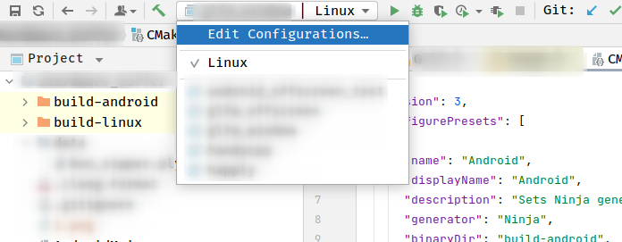

---

title: CMake中使用的一些技巧和踩坑记录

---


# 使用CMakePresets来配置的你的构建环境

参考[CMake官方文档](https://cmake.org/cmake/help/latest/manual/cmake-presets.7.html)

它的作用是以文本的方式记录你的构建环境。

比如说我有一份代码，我要在Linux(C++)和Android(NDK, C++)两个平台上都构建。以前的做法是写两个脚本。一个脚本用来构建Linux artifact, 一个用来构建Android artifact。

```bash
# build_linux.sh

mkdir build
cd build
cmake ..
make

# build_android.sh
mkdir build-android
cd build-android
cmake -DCMAKE_BUILD_TYPE=Debug \
 -G Ninja \
 -DANDROID_ABI=arm64-v8a \
 -DANDROID_NATIVE_API_LEVEL=29 \
 -DCMAKE_TOOLCHAIN_FILE=${ANDROID_NDK_HOME}/build/cmake/android.toolchain.cmake \
 -DANDROID_TOOLCHAIN=clang \
 -DCMAKE_BUILD_TYPE=Debug \
 -DCMAKE_INSTALL_PREFIX=../out/install/Android \
 -DCMAKE_MAKE_PROGRAM=ninja \
 ../
ninja

```

这种方法也算是解决了我构建的问题。但是如果我要使用CLion导入工程，这个脚本就帮不上我一点忙了。

为了让CLion识别Android构建环境，我需要把一大堆的-DANDROID_ABI之类的通过图形界面的方式填进去。换个开发环境就要再来一遍。

使用CMakePresets可以一劳永逸。


这个clion也可以识别，如图所示：



> 坑：CLion不太能识别你的环境变量。第一个图中用到了ANDROID_NDK_HOME变量。但是这个变量设置在`~/.bashrc`, `~/.zshrc`等文件里不起作用。

不起作用的方法：写在`~/.bashrc`, `~/.zshrc`,  `~/.profile`, `/etc/environment`, `/etc/profile.d/whatever_younameit.sh`里，然后通过图形界面打开clion。

起作用的方法：确保shell中有这个环境变量后，从shell命令行启动。
起作用的方法：写在`/etc/environment`, `/etc/profile.d/xxx`里，重启电脑（也许注销图形界面再回来也行)。
起作用的方法：写在Clion的`Appearance & Behavior` -> `Path Variable`里。

