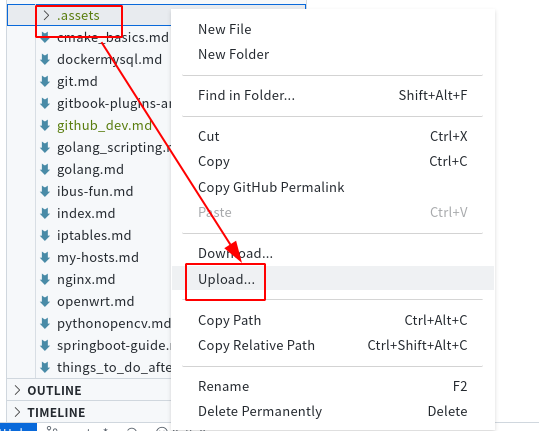
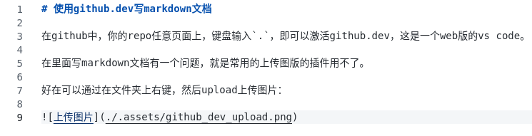
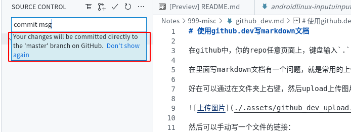

# 使用github.dev写markdown文档

在github中，你的repo任意页面上，键盘输入`.`，即可以激活github.dev，这是一个web版的vs code。

在里面写markdown文档有一个问题，就是常用的上传图版的插件用不了。

好在可以通过在文件夹上右键，然后upload上传图片：

然后可以手动写一个文件的链接：

好在vscode可以自动补全路径，所以文件名取怪一些也无所谓。

写完直接在SOURCE CONTROL上写commit msg然后点｀对勾`就可以了。代码会自动commit，并push到github上对应分支，非常方便，不用push了。而且这个web版vscode好像优化了流程，也无需stage了，直接写commit msg然后点对勾就行了。

