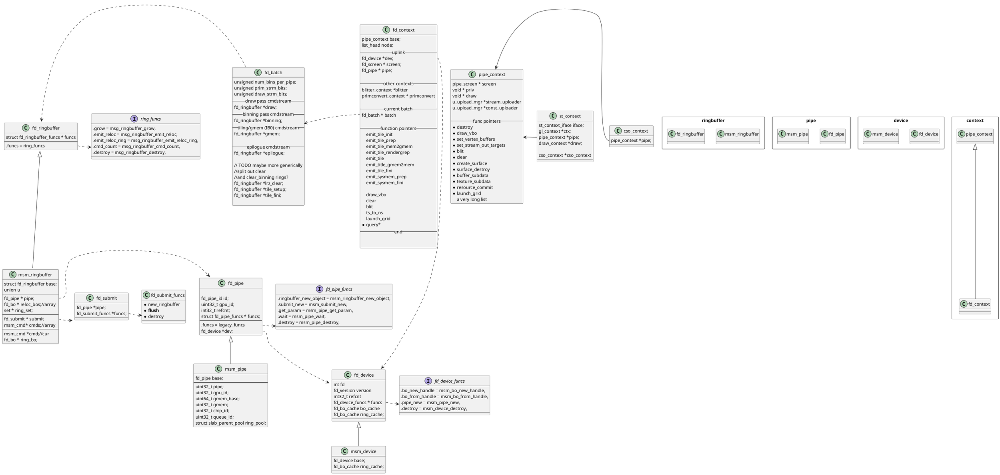
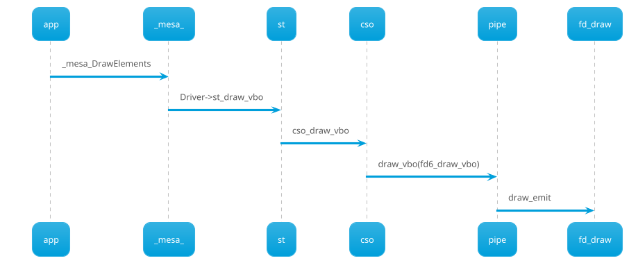
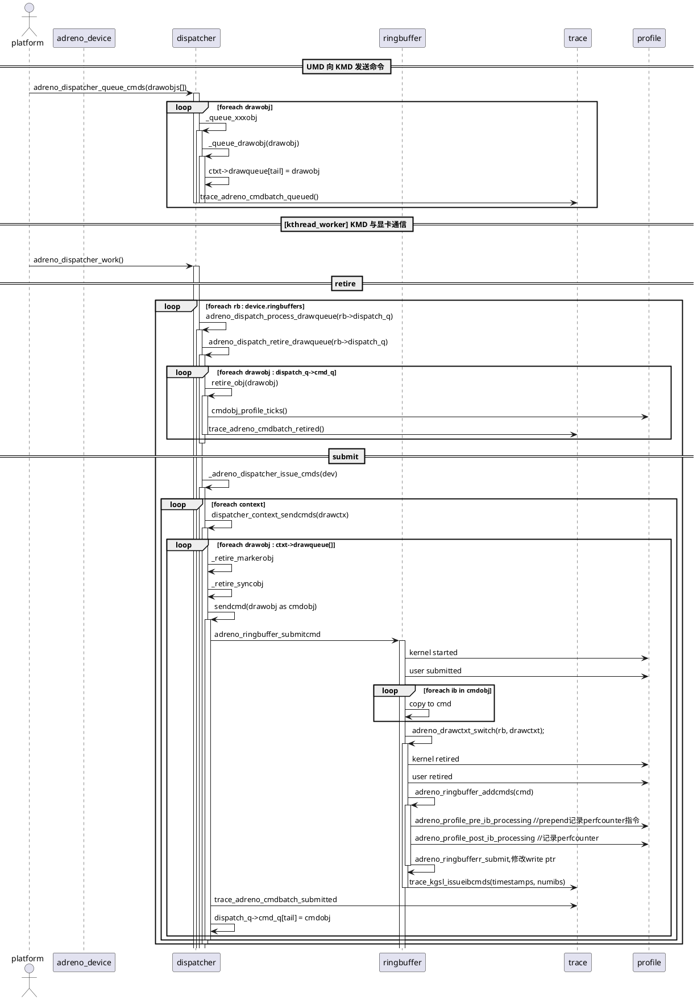
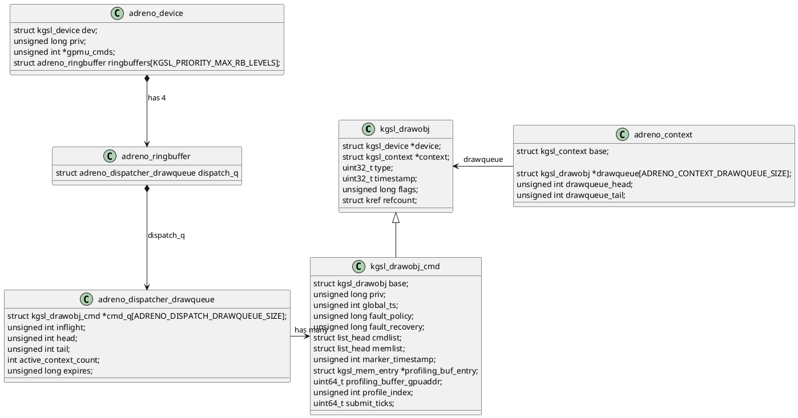

# 代码

https://github.com/facebookincubator/oculus-linux-kernel

# mesa 中freedreno代码



## draw的调用流程



### mesa adreno code

#### 类图

```plantuml
class pipe_screen {
    context_create: fun*
    ... fd6_context_create
}
class fd_screen
fd_screen -up-|> pipe_screen

class pipe_context {
    screen : pipe_screen *
    ---
    flush: func *
    draw_vbo: func *
}
class fd_context {
    base : pipe_context
    screen : fd_screen *
}
class fd6_context {
    base : fd_context
}
fd6_context -up-|> fd_context
fd_context -up-|> pipe_context

pipe_context .right.> pipe_screen : ref
fd_context .right.> fd_screen : ref
class st_context_iface {
    flush : func *
}
class st_context {
    iface: st_context_iface
    ctx : gl_context*
---
    pipe: pipe_context*
---
    draw: draw_context*
}
st_context::pipe .right.> pipe_context
st_context -up-|> st_context_iface

class dd_function_table {
    Flush : func *
}
class gl_context {
    Driver : dd_function_table
---
    st : st_context *
}
gl_context::st .right.> st_context
gl_context::Driver .up.|> dd_function_table
```

#### 时序图(sequence)

整个flush的调用sequence如下图。下图即说明了各个类的调用seqeunce，也说明了flush的最终目标。
flush的最终目标就是真正的tiled rendering，向kmd发送ringbuffer，包括一个binning pass和多个render pass。

```plantuml
app-> context++: _mesa_flush
context -> st_context++: Driver.Flush=\nst_glFlush(gl_context*)
context--
st_context -> st_context: st_flush(*st)
st_context -> pipe_context++: st->pipe->flush(pipe*)
st_context--
pipe_context -> freedreno_context++ : .flush=\nfd_context_flush(pipe)
pipe_context--
freedreno_context -> fd_batch++: fd_batch_flush\n(fd_batch*)
freedreno_context--
freedreno_context--
fd_batch -> fd_batch++: batch_flush(fd_batch*)
fd_batch -> freedreno_gmem++: fd_gmem_render_tiles\n(fd_batch*)
fd_batch--
fd_batch--
freedreno_gmem -> freedreno_gmem++: render_tiles\n(fd_batch*,gmem)
freedreno_gmem -> fd_context++: emit_tile_init
fd_context -> fd_context: fd6_emit_title_init
fd_context -> fd6_gmem: emit_binning_pass
fd_context--

loop foreach tile
freedreno_gmem -> fd_context: emit_tile_prep
freedreno_gmem -> fd_context: emit_tile_mem2gmem(unresolve)
freedreno_gmem -> fd_context: emit_tile_renderprep
freedreno_gmem -> fd_context: query_prepare_tile
alt if has emit_tile
freedreno_gmem -> fd_context: **emit_tile**
else
freedreno_gmem -> fd_context: emit_ib
end alt
freedreno_gmem -> fd_context: emit_tile_gmem2mem
end loop

freedreno_gmem -> fd_context: emit_tile_fini

freedreno_gmem--
freedreno_gmem -> freedreno_gmem: flush_ring(fd_batch*)
freedreno_gmem--
```

fd_batch是在freedreno_context阶段新创建的临时对象。
fd_batch包含一次提交所需要的各种资源（纹理、buffer之类的）和相应的ringbuffer。
ringbuffer包括 binning, draw, gmem，这三个是最主要的，分别用于binning stage、render stage和resolve stage。另外还有lrz_clear、tile_setup、tile_fini等非主要的ringbuffer。

ringbuffer中draw是必须的。binning可能没有，即使有，它也是从draw创建出来的，因为它所需的所有命令和资源draw中都有，所以binning这个ringbuffer自己的内容很少，它会把draw接进来作为一个indirect buffer(IB)，再结合自己独有的一些状态设置，就可以提交给显卡做binning了。

#### ringbuffer及指令录制

ringbuffer本身真的只是一个ringbuffer:

```plantuml
class fd_ringbuffer {
    uint32_t *cur, *end, *start; 
   -- buffer的指针--
   fd_ringbuffer_funcs funcs
   -- buffer的操作--
}
```

上一节讲到fd_batch及其draw, binning, gmem三个ringbuffer是在flush的时候创建的。其实说的不太对。它是在调用drawcall之前就要创建的。兴许这个flush在eglMakeCurrent的时候也会调用，所以可以保证draw call的时候有batch及ringbuffer存在。

ringbuffer录制的大部分工作发生在drawcall里，主要是`fd6_draw_vbo`函数。`fd6_draw_vbo`会创建一个emit结构体，这个结构体基本是由ctx中绑定的各种当前对象（当前program及其vs,fs,gs，顶点缓冲区等）初始化的。然后`fd6_draw_vbo`调用`fd6_emit_state`函数，把这些状态写入到ringbuffer里。 所有fd6_emit_开头的函数都是往ringbuffer写入数据用的，它的第一个参数一般是一个ringbuffer。`fd6_emit_state`里各种DIRTY_XXX判断，是为了减少不必要的状态切换，如果某些状态没有变化，就不通过指令去更新它。

```c
static bool
fd6_draw_vbo(struct fd_context *ctx, const struct pipe_draw_info *info,
             unsigned index_offset)
{
	struct fd6_context *fd6_ctx = fd6_context(ctx);
	struct ir3_shader *gs = ctx->prog.gs;
	struct fd6_emit emit = {
		.ctx = ctx,
		.vtx  = &ctx->vtx,
		.info = info,
		.key = {
			.vs = ctx->prog.vs,
			.gs = ctx->prog.gs,
			.fs = ctx->prog.fs,
			.key = {
				.color_two_side = ctx->rasterizer->light_twoside,
				.vclamp_color = ctx->rasterizer->clamp_vertex_color,
				.fclamp_color = ctx->rasterizer->clamp_fragment_color,
				.rasterflat = ctx->rasterizer->flatshade,
				.ucp_enables = ctx->rasterizer->clip_plane_enable,
				.has_per_samp = (fd6_ctx->fsaturate || fd6_ctx->vsaturate),
				.vsaturate_s = fd6_ctx->vsaturate_s,
				.vsaturate_t = fd6_ctx->vsaturate_t,
				.vsaturate_r = fd6_ctx->vsaturate_r,
				.fsaturate_s = fd6_ctx->fsaturate_s,
				.fsaturate_t = fd6_ctx->fsaturate_t,
				.fsaturate_r = fd6_ctx->fsaturate_r,
				.layer_zero = !gs || !(gs->nir->info.outputs_written & VARYING_BIT_LAYER),
				.vsamples = ctx->tex[PIPE_SHADER_VERTEX].samples,
				.fsamples = ctx->tex[PIPE_SHADER_FRAGMENT].samples,
				.sample_shading = (ctx->min_samples > 1),
				.msaa = (ctx->framebuffer.samples > 1),
			},
		},
		.rasterflat = ctx->rasterizer->flatshade,
		.sprite_coord_enable = ctx->rasterizer->sprite_coord_enable,
		.sprite_coord_mode = ctx->rasterizer->sprite_coord_mode,
		.primitive_restart = info->primitive_restart && info->index_size,
	};

	if (!(ctx->prog.vs && ctx->prog.fs))
		return false;

	if (info->mode == PIPE_PRIM_PATCHES) {
		emit.key.hs = ctx->prog.hs;
		emit.key.ds = ctx->prog.ds;

		if (!(ctx->prog.hs && ctx->prog.ds))
			return false;

		shader_info *ds_info = &emit.key.ds->nir->info;
		emit.key.key.tessellation = ir3_tess_mode(ds_info->tess.primitive_mode);
	}

	if (emit.key.gs)
		emit.key.key.has_gs = true;

	if (!(emit.key.hs || emit.key.ds || emit.key.gs || info->indirect))
		fd6_vsc_update_sizes(ctx->batch, info);

	fixup_shader_state(ctx, &emit.key.key);

	if (!(ctx->dirty & FD_DIRTY_PROG)) {
		emit.prog = fd6_ctx->prog;
	} else {
		fd6_ctx->prog = fd6_emit_get_prog(&emit);
	}

	/* bail if compile failed: */
	if (!fd6_ctx->prog)
		return NULL;

	fixup_draw_state(ctx, &emit);

	emit.dirty = ctx->dirty;      /* *after* fixup_shader_state() */
	emit.bs = fd6_emit_get_prog(&emit)->bs;
	emit.vs = fd6_emit_get_prog(&emit)->vs;
	emit.hs = fd6_emit_get_prog(&emit)->hs;
	emit.ds = fd6_emit_get_prog(&emit)->ds;
	emit.gs = fd6_emit_get_prog(&emit)->gs;
	emit.fs = fd6_emit_get_prog(&emit)->fs;

	ctx->stats.vs_regs += ir3_shader_halfregs(emit.vs);
	ctx->stats.hs_regs += COND(emit.hs, ir3_shader_halfregs(emit.hs));
	ctx->stats.ds_regs += COND(emit.ds, ir3_shader_halfregs(emit.ds));
	ctx->stats.gs_regs += COND(emit.gs, ir3_shader_halfregs(emit.gs));
	ctx->stats.fs_regs += ir3_shader_halfregs(emit.fs);

	struct fd_ringbuffer *ring = ctx->batch->draw;

	struct CP_DRAW_INDX_OFFSET_0 draw0 = {
			.prim_type = ctx->primtypes[info->mode],
			.vis_cull  = USE_VISIBILITY,
			.gs_enable = !!emit.key.gs,
	};

	if (info->index_size) {
		draw0.source_select = DI_SRC_SEL_DMA;
		draw0.index_size = fd4_size2indextype(info->index_size);
	} else {
		draw0.source_select = DI_SRC_SEL_AUTO_INDEX;
	}

	if (info->mode == PIPE_PRIM_PATCHES) {
		shader_info *ds_info = &emit.ds->shader->nir->info;
		uint32_t factor_stride;

		switch (ds_info->tess.primitive_mode) {
		case GL_ISOLINES:
			draw0.patch_type = TESS_ISOLINES;
			factor_stride = 12;
			break;
		case GL_TRIANGLES:
			draw0.patch_type = TESS_TRIANGLES;
			factor_stride = 20;
			break;
		case GL_QUADS:
			draw0.patch_type = TESS_QUADS;
			factor_stride = 28;
			break;
		default:
			unreachable("bad tessmode");
		}

		draw0.prim_type = DI_PT_PATCHES0 + info->vertices_per_patch;
		draw0.tess_enable = true;

		ctx->batch->tessellation = true;
		ctx->batch->tessparam_size = MAX2(ctx->batch->tessparam_size,
				emit.hs->output_size * 4 * info->count);
		ctx->batch->tessfactor_size = MAX2(ctx->batch->tessfactor_size,
				factor_stride * info->count);

		if (!ctx->batch->tess_addrs_constobj) {
			/* Reserve space for the bo address - we'll write them later in
			 * setup_tess_buffers().  We need 2 bo address, but indirect
			 * constant upload needs at least 4 vec4s.
			 */
			unsigned size = 4 * 16;

			ctx->batch->tess_addrs_constobj = fd_submit_new_ringbuffer(
				ctx->batch->submit, size, FD_RINGBUFFER_STREAMING);

			ctx->batch->tess_addrs_constobj->cur += size;
		}
	}

	uint32_t index_start = info->index_size ? info->index_bias : info->start;
	if (ctx->last.dirty || (ctx->last.index_start != index_start)) {
		OUT_PKT4(ring, REG_A6XX_VFD_INDEX_OFFSET, 1);
		OUT_RING(ring, index_start); /* VFD_INDEX_OFFSET */
		ctx->last.index_start = index_start;
	}

	if (ctx->last.dirty || (ctx->last.instance_start != info->start_instance)) {
		OUT_PKT4(ring, REG_A6XX_VFD_INSTANCE_START_OFFSET, 1);
		OUT_RING(ring, info->start_instance); /* VFD_INSTANCE_START_OFFSET */
		ctx->last.instance_start = info->start_instance;
	}

	uint32_t restart_index = info->primitive_restart ? info->restart_index : 0xffffffff;
	if (ctx->last.dirty || (ctx->last.restart_index != restart_index)) {
		OUT_PKT4(ring, REG_A6XX_PC_RESTART_INDEX, 1);
		OUT_RING(ring, restart_index); /* PC_RESTART_INDEX */
		ctx->last.restart_index = restart_index;
	}

	fd6_emit_state(ring, &emit);

	/* for debug after a lock up, write a unique counter value
	 * to scratch7 for each draw, to make it easier to match up
	 * register dumps to cmdstream.  The combination of IB
	 * (scratch6) and DRAW is enough to "triangulate" the
	 * particular draw that caused lockup.
	 */
	emit_marker6(ring, 7);

	if (info->indirect) {
		draw_emit_indirect(ring, &draw0, info, index_offset);
	} else {
		draw_emit(ring, &draw0, info, index_offset);
	}

	emit_marker6(ring, 7);
	fd_reset_wfi(ctx->batch);

	if (emit.streamout_mask) {
		struct fd_ringbuffer *ring = ctx->batch->draw;

		for (unsigned i = 0; i < PIPE_MAX_SO_BUFFERS; i++) {
			if (emit.streamout_mask & (1 << i)) {
				fd6_event_write(ctx->batch, ring, FLUSH_SO_0 + i, false);
			}
		}
	}

	fd_context_all_clean(ctx);

	return true;
}
```

另一个函数`fd6_emit_state`:

```c
void
fd6_emit_state(struct fd_ringbuffer *ring, struct fd6_emit *emit)
{
	struct fd_context *ctx = emit->ctx;
	struct pipe_framebuffer_state *pfb = &ctx->batch->framebuffer;
	const struct fd6_program_state *prog = fd6_emit_get_prog(emit);
	const struct ir3_shader_variant *vs = emit->vs;
	const struct ir3_shader_variant *hs = emit->hs;
	const struct ir3_shader_variant *ds = emit->ds;
	const struct ir3_shader_variant *gs = emit->gs;
	const struct ir3_shader_variant *fs = emit->fs;
	const enum fd_dirty_3d_state dirty = emit->dirty;
	bool needs_border = false;

	emit_marker6(ring, 5);

	/* NOTE: we track fb_read differently than _BLEND_ENABLED since
	 * we might at some point decide to do sysmem in some cases when
	 * blend is enabled:
	 */
	if (fs->fb_read)
		ctx->batch->gmem_reason |= FD_GMEM_FB_READ;

	if (emit->dirty & FD_DIRTY_VTXSTATE) {
		struct fd6_vertex_stateobj *vtx = fd6_vertex_stateobj(ctx->vtx.vtx);

		fd6_emit_add_group(emit, vtx->stateobj, FD6_GROUP_VTXSTATE, ENABLE_ALL);
	}

	if (emit->dirty & FD_DIRTY_VTXBUF) {
		struct fd_ringbuffer *state;

		state = build_vbo_state(emit);
		fd6_emit_take_group(emit, state, FD6_GROUP_VBO, ENABLE_ALL);
	}

	if (dirty & FD_DIRTY_ZSA) {
		struct fd6_zsa_stateobj *zsa = fd6_zsa_stateobj(ctx->zsa);

		if (util_format_is_pure_integer(pipe_surface_format(pfb->cbufs[0])))
			fd6_emit_add_group(emit, zsa->stateobj_no_alpha, FD6_GROUP_ZSA, ENABLE_ALL);
		else
			fd6_emit_add_group(emit, zsa->stateobj, FD6_GROUP_ZSA, ENABLE_ALL);
	}

	if (dirty & (FD_DIRTY_ZSA | FD_DIRTY_BLEND | FD_DIRTY_PROG)) {
		struct fd_ringbuffer *state;

		state = build_lrz(emit, false);
		if (state) {
			fd6_emit_take_group(emit, state, FD6_GROUP_LRZ, ENABLE_DRAW);
		}

		state = build_lrz(emit, true);
		if (state) {
			fd6_emit_take_group(emit, state,
					FD6_GROUP_LRZ_BINNING, CP_SET_DRAW_STATE__0_BINNING);
		}
	}

	if (dirty & FD_DIRTY_STENCIL_REF) {
		struct pipe_stencil_ref *sr = &ctx->stencil_ref;

		OUT_PKT4(ring, REG_A6XX_RB_STENCILREF, 1);
		OUT_RING(ring, A6XX_RB_STENCILREF_REF(sr->ref_value[0]) |
				A6XX_RB_STENCILREF_BFREF(sr->ref_value[1]));
	}

	/* NOTE: scissor enabled bit is part of rasterizer state, but
	 * fd_rasterizer_state_bind() will mark scissor dirty if needed:
	 */
	if (dirty & FD_DIRTY_SCISSOR) {
		struct fd_ringbuffer *ring = fd_submit_new_ringbuffer(
				emit->ctx->batch->submit, 3*4, FD_RINGBUFFER_STREAMING);
		struct pipe_scissor_state *scissor = fd_context_get_scissor(ctx);

		OUT_REG(ring,
				A6XX_GRAS_SC_SCREEN_SCISSOR_TL(0,
					.x = scissor->minx,
					.y = scissor->miny
				),
				A6XX_GRAS_SC_SCREEN_SCISSOR_BR(0,
					.x = MAX2(scissor->maxx, 1) - 1,
					.y = MAX2(scissor->maxy, 1) - 1
				)
			);

		fd6_emit_take_group(emit, ring, FD6_GROUP_SCISSOR, ENABLE_ALL);

		ctx->batch->max_scissor.minx = MIN2(ctx->batch->max_scissor.minx, scissor->minx);
		ctx->batch->max_scissor.miny = MIN2(ctx->batch->max_scissor.miny, scissor->miny);
		ctx->batch->max_scissor.maxx = MAX2(ctx->batch->max_scissor.maxx, scissor->maxx);
		ctx->batch->max_scissor.maxy = MAX2(ctx->batch->max_scissor.maxy, scissor->maxy);
	}

	if (dirty & FD_DIRTY_VIEWPORT) {
		struct pipe_scissor_state *scissor = &ctx->viewport_scissor;

		OUT_REG(ring,
				A6XX_GRAS_CL_VPORT_XOFFSET(0, ctx->viewport.translate[0]),
				A6XX_GRAS_CL_VPORT_XSCALE(0, ctx->viewport.scale[0]),
				A6XX_GRAS_CL_VPORT_YOFFSET(0, ctx->viewport.translate[1]),
				A6XX_GRAS_CL_VPORT_YSCALE(0, ctx->viewport.scale[1]),
				A6XX_GRAS_CL_VPORT_ZOFFSET(0, ctx->viewport.translate[2]),
				A6XX_GRAS_CL_VPORT_ZSCALE(0, ctx->viewport.scale[2])
			);

		OUT_REG(ring,
				A6XX_GRAS_SC_VIEWPORT_SCISSOR_TL(0,
					.x = scissor->minx,
					.y = scissor->miny
				),
				A6XX_GRAS_SC_VIEWPORT_SCISSOR_BR(0,
					.x = MAX2(scissor->maxx, 1) - 1,
					.y = MAX2(scissor->maxy, 1) - 1
				)
			);

		unsigned guardband_x =
			fd_calc_guardband(ctx->viewport.translate[0], ctx->viewport.scale[0],
							  false);
		unsigned guardband_y =
			fd_calc_guardband(ctx->viewport.translate[1], ctx->viewport.scale[1],
							  false);

		OUT_REG(ring, A6XX_GRAS_CL_GUARDBAND_CLIP_ADJ(
					.horz = guardband_x,
					.vert = guardband_y
				)
			);
	}

	if (dirty & FD_DIRTY_PROG) {
		fd6_emit_add_group(emit, prog->config_stateobj, FD6_GROUP_PROG_CONFIG, ENABLE_ALL);
		fd6_emit_add_group(emit, prog->stateobj, FD6_GROUP_PROG, ENABLE_DRAW);
		fd6_emit_add_group(emit, prog->binning_stateobj,
				FD6_GROUP_PROG_BINNING, CP_SET_DRAW_STATE__0_BINNING);

		/* emit remaining streaming program state, ie. what depends on
		 * other emit state, so cannot be pre-baked.
		 */
		struct fd_ringbuffer *streaming = fd6_program_interp_state(emit);

		fd6_emit_take_group(emit, streaming, FD6_GROUP_PROG_INTERP, ENABLE_DRAW);
	}

	if (dirty & FD_DIRTY_RASTERIZER) {
		struct fd_ringbuffer *stateobj =
			fd6_rasterizer_state(ctx, emit->primitive_restart);
		fd6_emit_add_group(emit, stateobj,
						   FD6_GROUP_RASTERIZER, ENABLE_ALL);
	}

	if (dirty & (FD_DIRTY_FRAMEBUFFER | FD_DIRTY_RASTERIZER_DISCARD | FD_DIRTY_PROG)) {
		struct fd_ringbuffer *ring = fd_submit_new_ringbuffer(
				emit->ctx->batch->submit, 5 * 4, FD_RINGBUFFER_STREAMING);

		unsigned nr = pfb->nr_cbufs;

		if (ctx->rasterizer->rasterizer_discard)
			nr = 0;

		OUT_PKT4(ring, REG_A6XX_RB_FS_OUTPUT_CNTL0, 2);
		OUT_RING(ring, COND(fs->writes_pos, A6XX_RB_FS_OUTPUT_CNTL0_FRAG_WRITES_Z) |
				COND(fs->writes_smask && pfb->samples > 1,
						A6XX_RB_FS_OUTPUT_CNTL0_FRAG_WRITES_SAMPMASK));
		OUT_RING(ring, A6XX_RB_FS_OUTPUT_CNTL1_MRT(nr));

		OUT_PKT4(ring, REG_A6XX_SP_FS_OUTPUT_CNTL1, 1);
		OUT_RING(ring, A6XX_SP_FS_OUTPUT_CNTL1_MRT(nr));

		fd6_emit_take_group(emit, ring, FD6_GROUP_PROG_FB_RAST, ENABLE_DRAW);
	}

	fd6_emit_consts(emit);

	struct ir3_stream_output_info *info = &fd6_last_shader(prog)->shader->stream_output;
	if (info->num_outputs)
		fd6_emit_streamout(ring, emit, info);

	if (dirty & (FD_DIRTY_BLEND | FD_DIRTY_SAMPLE_MASK)) {
		struct fd6_blend_variant *blend = fd6_blend_variant(ctx->blend,
				pfb->samples, ctx->sample_mask);
		fd6_emit_add_group(emit, blend->stateobj, FD6_GROUP_BLEND, ENABLE_DRAW);
	}

	if (dirty & FD_DIRTY_BLEND_COLOR) {
		struct pipe_blend_color *bcolor = &ctx->blend_color;
		struct fd_ringbuffer *ring = fd_submit_new_ringbuffer(
				emit->ctx->batch->submit, 5*4, FD_RINGBUFFER_STREAMING);

		OUT_REG(ring,
				A6XX_RB_BLEND_RED_F32(bcolor->color[0]),
				A6XX_RB_BLEND_GREEN_F32(bcolor->color[1]),
				A6XX_RB_BLEND_BLUE_F32(bcolor->color[2]),
				A6XX_RB_BLEND_ALPHA_F32(bcolor->color[3])
			);

		fd6_emit_take_group(emit, ring, FD6_GROUP_BLEND_COLOR, ENABLE_DRAW);
	}

	needs_border |= fd6_emit_combined_textures(ring, emit, PIPE_SHADER_VERTEX, vs);
	if (hs) {
		needs_border |= fd6_emit_combined_textures(ring, emit, PIPE_SHADER_TESS_CTRL, hs);
		needs_border |= fd6_emit_combined_textures(ring, emit, PIPE_SHADER_TESS_EVAL, ds);
	}
	if (gs) {
		needs_border |= fd6_emit_combined_textures(ring, emit, PIPE_SHADER_GEOMETRY, gs);
	}
	needs_border |= fd6_emit_combined_textures(ring, emit, PIPE_SHADER_FRAGMENT, fs);

	if (needs_border)
		emit_border_color(ctx, ring);

	if (hs) {
		debug_assert(ir3_shader_nibo(hs) == 0);
		debug_assert(ir3_shader_nibo(ds) == 0);
	}
	if (gs) {
		debug_assert(ir3_shader_nibo(gs) == 0);
	}

#define DIRTY_IBO (FD_DIRTY_SHADER_SSBO | FD_DIRTY_SHADER_IMAGE | \
				   FD_DIRTY_SHADER_PROG)
	if (ctx->dirty_shader[PIPE_SHADER_FRAGMENT] & DIRTY_IBO) {
		struct fd_ringbuffer *state =
			fd6_build_ibo_state(ctx, fs, PIPE_SHADER_FRAGMENT);
		struct fd_ringbuffer *obj = fd_submit_new_ringbuffer(
			ctx->batch->submit, 0x100, FD_RINGBUFFER_STREAMING);

		OUT_PKT7(obj, CP_LOAD_STATE6, 3);
		OUT_RING(obj, CP_LOAD_STATE6_0_DST_OFF(0) |
			CP_LOAD_STATE6_0_STATE_TYPE(ST6_SHADER) |
			CP_LOAD_STATE6_0_STATE_SRC(SS6_INDIRECT) |
			CP_LOAD_STATE6_0_STATE_BLOCK(SB6_IBO) |
			CP_LOAD_STATE6_0_NUM_UNIT(ir3_shader_nibo(fs)));
		OUT_RB(obj, state);

		OUT_PKT4(obj, REG_A6XX_SP_IBO_LO, 2);
		OUT_RB(obj, state);

		/* TODO if we used CP_SET_DRAW_STATE for compute shaders, we could
		 * de-duplicate this from program->config_stateobj
		 */
		OUT_PKT4(obj, REG_A6XX_SP_IBO_COUNT, 1);
		OUT_RING(obj, ir3_shader_nibo(fs));

		fd6_emit_ibo_consts(emit, fs, PIPE_SHADER_FRAGMENT, ring);

		fd6_emit_take_group(emit, obj, FD6_GROUP_IBO, ENABLE_DRAW);
		fd_ringbuffer_del(state);
	}

	if (emit->num_groups > 0) {
		OUT_PKT7(ring, CP_SET_DRAW_STATE, 3 * emit->num_groups);
		for (unsigned i = 0; i < emit->num_groups; i++) {
			struct fd6_state_group *g = &emit->groups[i];
			unsigned n = g->stateobj ?
				fd_ringbuffer_size(g->stateobj) / 4 : 0;

			debug_assert((g->enable_mask & ~ENABLE_ALL) == 0);

			if (n == 0) {
				OUT_RING(ring, CP_SET_DRAW_STATE__0_COUNT(0) |
						CP_SET_DRAW_STATE__0_DISABLE |
						g->enable_mask |
						CP_SET_DRAW_STATE__0_GROUP_ID(g->group_id));
				OUT_RING(ring, 0x00000000);
				OUT_RING(ring, 0x00000000);
			} else {
				OUT_RING(ring, CP_SET_DRAW_STATE__0_COUNT(n) |
						g->enable_mask |
						CP_SET_DRAW_STATE__0_GROUP_ID(g->group_id));
				OUT_RB(ring, g->stateobj);
			}

			if (g->stateobj)
				fd_ringbuffer_del(g->stateobj);
		}
		emit->num_groups = 0;
	}
}
```

# kernel code

## UMD、KMD、显卡数据交互流程



## 数据交互中重要的类图

UMD提交给KMD context的drawqueue的是`kgsl_drawobj`对象。

dispatcher从drawqueue中获取drawobj，转换并提交cmd给显卡，然后将drawobj放入了dispatch_q的cmd_q队列里的是`kgsl_drawobj_cmd`。实际这两个对象是继承关系。



## drawobj是如何retire的

device为每个context存了一个devmemstore结构，gpu会把endofpipe timestamp写进去。
如果endofpipe timestamp大于drawobj->timestamp，说明已经处理完了。

```cpp
struct kgsl_devmemstore {
       volatile unsigned int soptimestamp;
       unsigned int sbz;
       volatile unsigned int eoptimestamp;
       unsigned int sbz2;
       volatile unsigned int preempted;
       unsigned int sbz3;
       volatile unsigned int ref_wait_ts;
       unsigned int sbz4;
       unsigned int current_context;
       unsigned int sbz5;
};
```

向endofpipe timestamp写入值的微码是在`adreno_ringbuffer_addcmds`函数中追加的：

```cpp
*ringcmds++ = cp_mem_packet(adreno_dev, CP_EVENT_WRITE, 3, 1);
if (drawctxt || is_internal_cmds(flags))
*ringcmds++ = CACHE_FLUSH_TS | (1 << 31);
else
*ringcmds++ = CACHE_FLUSH_TS;

if (drawctxt && !is_internal_cmds(flags)) {
ringcmds += cp_gpuaddr(adreno_dev, ringcmds,
MEMSTORE_ID_GPU_ADDR(device, context_id, eoptimestamp));
*ringcmds++ = timestamp;

/* Write the end of pipeline timestamp to the ringbuffer too */
*ringcmds++ = cp_mem_packet(adreno_dev, CP_EVENT_WRITE, 3, 1);
*ringcmds++ = CACHE_FLUSH_TS;
ringcmds += cp_gpuaddr(adreno_dev, ringcmds,
MEMSTORE_RB_GPU_ADDR(device, rb, eoptimestamp));
*ringcmds++ = rb->timestamp;
} else {
```
