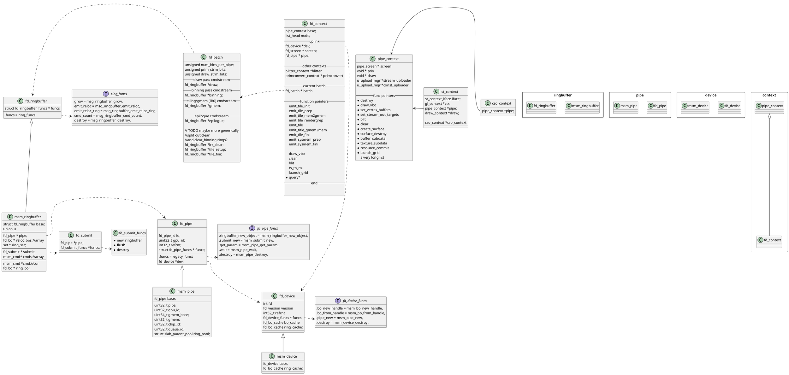
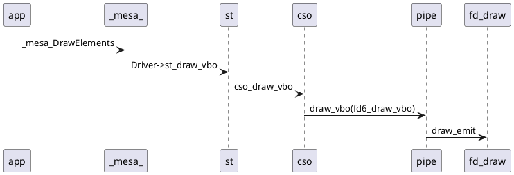
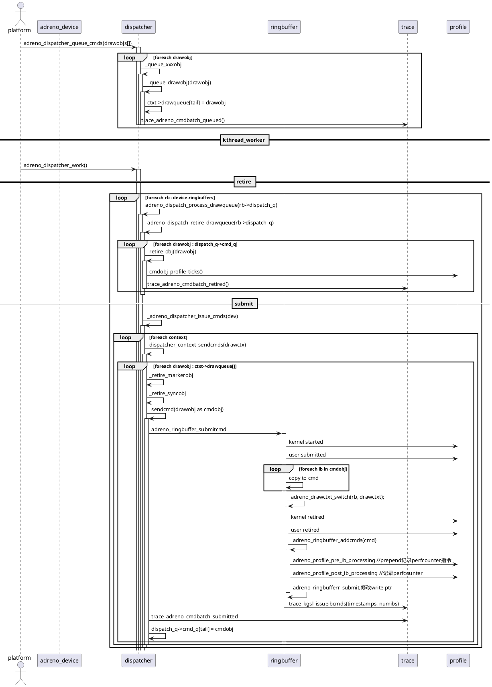
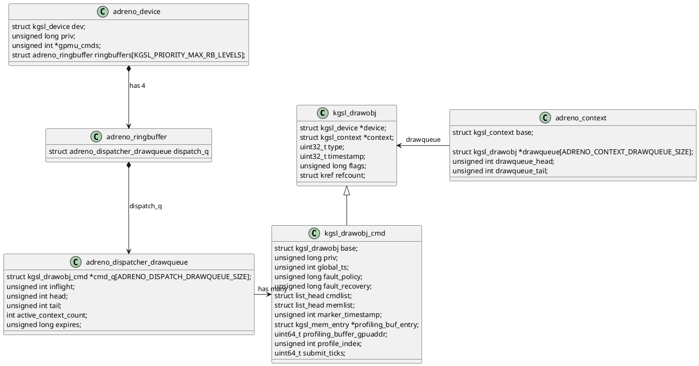

---

title: adreno 显卡驱动分析分析(mesa and kmd)

---

# 代码

 https://github.com/facebookincubator/oculus-linux-kernel

# mesa 中freedreno代码



## draw的调用流程




### mesa adreno code

```plantuml

st -> fd_context: fd6_emit_title_init
fd_context -> fd6_gmem: emit_binning_pass 

```


# kernel code

## 流程


## 类图




## drawobj如何retire

rb.dispatch_q->cmd_q[i].上的每个drawobj，

```c
struct kgsl_devmemstore {
       volatile unsigned int soptimestamp;
       unsigned int sbz;
       volatile unsigned int eoptimestamp;
       unsigned int sbz2;
       volatile unsigned int preempted;
       unsigned int sbz3;
       volatile unsigned int ref_wait_ts;
       unsigned int sbz4;
       unsigned int current_context;
       unsigned int sbz5;
};
device为每个context存了一个devmemstore结构，gpu会把endofpipe timestamp写进去。
如果endofpipe timestamp大于drawobj->timestamp，说明已经处理完了。

向endofpipe timestamp写入值的微码是在`adreno_ringbuffer_addcmds`函数中追加的：

*ringcmds++ = cp_mem_packet(adreno_dev, CP_EVENT_WRITE, 3, 1);
if (drawctxt || is_internal_cmds(flags))
       *ringcmds++ = CACHE_FLUSH_TS | (1 << 31);
else
       *ringcmds++ = CACHE_FLUSH_TS;

if (drawctxt && !is_internal_cmds(flags)) {
       ringcmds += cp_gpuaddr(adreno_dev, ringcmds,
              MEMSTORE_ID_GPU_ADDR(device, context_id, eoptimestamp));
       *ringcmds++ = timestamp;

       /* Write the end of pipeline timestamp to the ringbuffer too */
       *ringcmds++ = cp_mem_packet(adreno_dev, CP_EVENT_WRITE, 3, 1);
       *ringcmds++ = CACHE_FLUSH_TS;
       ringcmds += cp_gpuaddr(adreno_dev, ringcmds,
              MEMSTORE_RB_GPU_ADDR(device, rb, eoptimestamp));
       *ringcmds++ = rb->timestamp;
} else {
```