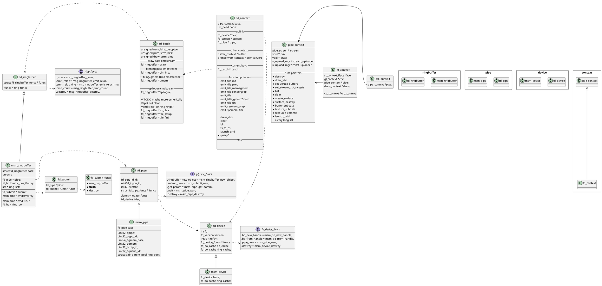
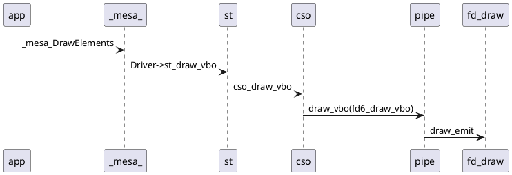

---

title: Linux内核中的trace

---

# 代码

 https://github.com/facebookincubator/oculus-linux-kernel

# mesa 中freedreno代码

```plantuml

@startuml

package ringbuffer <<Rectangle>> {
    class msm_ringbuffer
    class fd_ringbuffer
}

class msm_ringbuffer {
    struct fd_ringbuffer base;
    union u
---
    fd_pipe * pipe;
    fd_bo * reloc_bos;//array
    set * ring_set;
---
    fd_submit * submit
    msm_cmd* cmds;//array
---
    msm_cmd *cmd;//cur
    fd_bo * ring_bo;
}

class fd_ringbuffer {
    struct fd_ringbuffer_funcs * funcs
    ---
    .funcs = ring_funcs
}


fd_ringbuffer <|-- msm_ringbuffer

interface ring_funcs {
   .grow = msg_ringbuffer_grow,
   .emit_reloc = msg_ringbuffer_emit_reloc,
   .emit_reloc_ring = msg_ringbuffer_emit_reloc_ring,
   .cmd_count = msg_ringbuffer_cmd_count,
   .destroy = msg_ringbuffer_destroy,
}

fd_ringbuffer::ring_funcs .> ring_funcs


package pipe <<Rectangle>> {
    class fd_pipe
    class msm_pipe
}

class fd_pipe {
 
    fd_pipe_id id;
    uint32_t gpu_id;
    int32_t refcnt;
    struct fd_pipe_funcs * funcs;
---
    .funcs = legacy_funcs
    fd_device *dev;
}

interface fd_pipe_funcs {
    .ringbuffer_new_object = msm_ringbuffer_new_object,
    .submit_new = msm_submit_new,
    .get_param = msm_pipe_get_param,
    .wait = msm_pipe_wait,
    .destroy = msm_pipe_destroy,
}

fd_pipe::legacy_funcs .> fd_pipe_funcs

class msm_pipe {
    fd_pipe base;
    ---
    	uint32_t pipe;
	uint32_t gpu_id;
	uint64_t gmem_base;
	uint32_t gmem;
	uint32_t chip_id;
	uint32_t queue_id;
	struct slab_parent_pool ring_pool;
}

fd_pipe <|-- msm_pipe

class fd_submit_funcs {
	*new_ringbuffer
	* **flush**
	*destroy
}

class fd_submit {
	fd_pipe *pipe;
	fd_submit_funcs *funcs;
}

msm_ringbuffer::submit .> fd_submit
fd_submit::funcs .> fd_submit_funcs

package device <<Rectangle>> {
    class fd_device
    class msm_device
}

class fd_device {
    int fd
    fd_version version
    int32_t refcnt
    fd_device_funcs * funcs
    fd_bo_cache bo_cache
    fd_bo_cache ring_cache;
}
class msm_device {
    fd_device base;
    fd_bo_cache ring_cache;
}

fd_device <|-- msm_device

interface fd_device_funcs {
    		.bo_new_handle = msm_bo_new_handle,
		.bo_from_handle = msm_bo_from_handle,
		.pipe_new = msm_pipe_new,
		.destroy = msm_device_destroy,
}

fd_pipe::dev ..> fd_device
msm_ringbuffer::pipe .> fd_pipe
fd_device::funcs .> fd_device_funcs

package context <<Rectangle>> {
    class pipe_context
    class fd_context
}
pipe_context <|-- fd_context
class pipe_context {
    pipe_screen * screen
    void * priv
    void * draw
    u_upload_mgr *stream_uploader
    u_upload_mgr *const_uploader
    
    -- func pointers --
    *destroy
    *draw_vbo
    *set_vertex_buffers
    *set_stream_out_targets
    *blit
    *clear
    *create_surface
    *surface_destroy
    *buffer_subdata
    *texture_subdata
    *resource_commit
    *launch_grid
    a very long list
}

class fd_context {
    pipe_context base;
    list_head node;
    -- uplink --
    fd_device *dev;
    fd_screen * screen;
    fd_pipe * pipe;
    
    -- other contexts --
    blitter_context *blitter
    primconvert_context * primconvert
    
    -- current batch --
    fd_batch * batch

    -- function pointers --
    emit_tile_init
    emit_tile_prep
    emit_tile_mem2gmem
    emit_tile_rendergrep
    emit_tile
    emit_title_gmem2mem
    emit_tile_fini
    emit_sysmem_prep
    emit_sysmem_fini

    draw_vbo
    clear
    blit
    ts_to_ns
    launch_grid
    *query*
    -- end --
    
    
}

fd_context::dev .> fd_device

class cso_context {
    pipe_context *pipe;
}
cso_context::pipe -left-> pipe_context

class st_context {
    st_context_iface iface;
    gl_context *ctx;
    pipe_context *pipe;
    draw_context *draw;

    cso_context *cso_context
}
st_context::pipe -left-> pipe_context


class fd_batch {
    	unsigned num_bins_per_pipe;
	unsigned prim_strm_bits;
	unsigned draw_strm_bits;
	--draw pass cmdstream--
	fd_ringbuffer *draw;
	--binning pass cmdstream--
	fd_ringbuffer *binning;
	--tiling/gmem (IB0) cmdstream--
	fd_ringbuffer *gmem;

	--epilogue cmdstream--
	fd_ringbuffer *epilogue;

	// TODO maybe more generically 
        //split out clear 
        //and clear_binning rings?
	fd_ringbuffer *lrz_clear;
	fd_ringbuffer *tile_setup;
	fd_ringbuffer *tile_fini;

}
fd_context::batch .left.> fd_batch
fd_batch .left.> fd_ringbuffer


@enduml

```

### draw的调用流程

```plantuml
@startuml
app -> _mesa_: _mesa_DrawElements
_mesa_ -> st: Driver->st_draw_vbo
st -> cso: cso_draw_vbo
cso -> pipe: draw_vbo(fd6_draw_vbo)
pipe -> fd_draw: draw_emit
@enduml
```