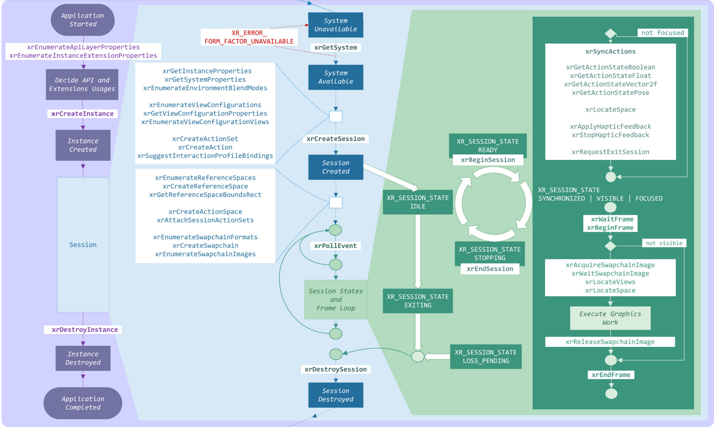

```plantuml
class comp_compositor {
    base : xrt_compositor_native
---
    r : comp_renderer *
    target : comp_target *
    xinst : xrt_instance *
    xdev : xrt_device *
}

class xrt_compositor_native {
    base : xrt_compositor
}

class xrt_compositor {
    info : xrt_compositor_info
    ---
    **create_swap_chain** : func *
    import_swap_chain : func *
    import_fence
  
}

class xrt_system_compositor {
    create_native_compositor : func *
}

comp_compositor -up-|> xrt_compositor_native
xrt_compositor_native -up-|> xrt_compositor

class xrt_device {
    name : xrt_device_name
    device_type : xrt_device_type
---
    inputs : xrt_input*
    outputs : xrt_output *
    hmd : xrt_hmd_parts *
    tracking_origin : xrt_tracking_origin *
    ---
    update_inputs : func *
    get_tracked_pos : func *
    get_hand_tracking : func *
    set_output : func *
    get_view_pos : func *
    compute_distortion : func *
}

comp_compositor::xdev .right.> xrt_device 

class xrt_instance {
    instance_info : xrt_instance_info
    ---
    select : func *
    create_system_compositor : func *
    get_prober : func *
    destroy : func *
}

comp_compositor::xinst .right.> xrt_instance

class oxr_session {
    handle : oxr_handle_base
    sys  : oxr_system *
    --
    compositor : xrt_compositor *
    xcn : xrt_compositor_native *

    ---
    **create_swapchain** : func *
}

oxr_session::xcn .left.> xrt_compositor_native
oxr_session::compositor .left.> xrt_compositor

```



[usage code](https://github1s.com/microsoft/OpenXR-MixedReality/blob/main/samples/BasicXrApp/OpenXrProgram.cpp)

[monado code](https://gitlab.freedesktop.org/-/ide/project/zhangfuwen/monado/tree/main/-/src/xrt/compositor/main/)

```plantuml

class oxr_swapchain {
    handle : oxr_handle_base
    sess : oxr_session *
    swapchain : xrt_swapchain
    ---
    enumerate_images
    acquire_image
    wait_image
    release_image
}

class ipc_client_swapchain {
    base : xrt_swapchain_native

    icc : ipc_client_compositor *
    uint32_t id;
}

class xrt_swapchain_native {
    base : xrt_swapchain
    images : xrt_image_native
}

interface xrt_swapchain {
    uint32_t num_images
    enumerate_images
    aquire_image
    wait_image
    release_image
}

class xrt_swapchain_gl {
    base : xrt_swapchain

    images[] : uint
}

class client_gl_swapchain {
    base : xrt_swapchain_gl
    xscn : xrt_swapchain_native *
}

class client_gl_memobj_swapchain {
    base : client_gl_swapchain
    memory[] : uint
}

class client_gl_egl_image_swapchain {
    base : client_gl_swapchain
    egl_images[] : EGLImage
}

xrt_swapchain_gl -up-|> xrt_swapchain
client_gl_swapchain -up-|> xrt_swapchain_gl
client_gl_swapchain::xscn .up.> xrt_swapchain_native

client_gl_memobj_swapchain -up-|> client_gl_swapchain
client_gl_egl_image_swapchain -up-|> client_gl_swapchain

xrt_swapchain_native -up-|> xrt_swapchain
ipc_client_swapchain -up-|> xrt_swapchain_native

oxr_swapchain::swapchain .left.> xrt_swapchain

class xrt_swapchain_vk {
    base : xrt_swapchain
    images[] : VkImage
}
class client_vk_swapchain {
    base : xrt_swapchain_vk
    xscn : xrt_swapchain_native *
    ---
    mems[]
    acqure[]
    release[]
    acquire_release_fence[]
}
xrt_swapchain_vk -up-|> xrt_swapchain
client_vk_swapchain -up-|> xrt_swapchain_vk


class comp_swapchain {
    base : xrt_swapchain_native
    c : comp_compositor *
    ---
    images[] : comp_swapchain_image
    gl_images[] : int
    egl_images[] : EGLImage
    gl_mem_objects[] : int
    image_state[] : comp_swapchain_image_state
}

comp_swapchain -up-|> xrt_swapchain_native

class comp_swapchain_image {
    sampler : VkSampler
    repeat_sampler : VkSampler

    views : VkImageView alphe, no_alpha
    array_size : size_t
}

```