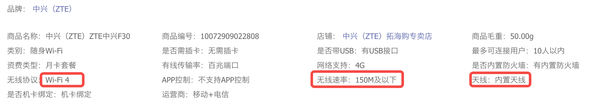

---

title: wifi技术

---

# Wifi 设备带宽计算

Wifi有几根天线，就可以发几个空间流。

  

比如说802.11n，即wifi4，支持4x4空间流，即4发4收天线，单流带宽150Mbps。
即 最高4*150Mbps，即600Mbps。

举例来说：
https://item.jd.com/10072909022808.html
链接中的随身wifi就只有1个天线，最大速度是150Mbps，即不到20MB/s的带宽。

  

另一个也是一样的：https://item.jd.com/10081749039551.html

  

而这一个：https://item.jd.com/100080592597.html， 能看到外置两个天线。

  

它的理论带宽就是300Mbps:

  

  

# 如果一个Wifi路由器，多个人接入呢？

那就是分时复用，大家共用同一个带宽。也就是说如果你的路由器是一根天线的wifi 4，最大带宽是150Mbps，那两个设备或多个设备是共用这个带宽的。

# 如果手机只有一根天线呢？

那哪怕路由器（AP）是多根天线的，你也只能用到一根天线的带宽。

# 空间Wifi带宽

同一片空域，无线信号肯定是互相干扰的。所有一片空间的总带宽应该是有限的。

2.4G上有14个信道。

  

每个信道理论上是可以传输150Mbps的数据的。对于一个设备而言，它一根天线同一时间只能用同一个信道。所以理论上讲，同一个空间，理论上的最大带宽是14*150Mbps，即280MB/s左右。然而，由于多个信道有干扰，如果同一片空间，每个信道都有设备在发送数据的话，那么整体带宽是小于280MB/s的。 （以上不知道说得对不对）

Wifi 4单天线的150Mbps的带宽，实际说的是一个空间流的带宽，应该一根天线同一时间只能使用一个空间流。空间流的英文是spatial stream,简写为SS。

  

从上面表上，可以看出，对于wifi4:
1. 20MHz的频宽和40MHz的频宽时，空间流的带宽是不一样的。
2. 40MHz的情况下，最多有4个空间流，总带宽600Mbps。

上面是说一个设备支持最大4个空间流，那么同一片空间可以通过放多个设备的方式支持最大多少个空间流呢？不考虑干扰的话，应该是可以有14个。但其实你可以放更多个设备，只不过因为干扰每个设备的带宽都要打折扣了。

# 你的手机，电脑能达到多大网速？

一般你只有2*2的天线，即只支持2个空间流。
所以：Wifi4最大300Mbps，即约40MB/s。
Wifi5 最大1733Mbps，即大约200MB/s
Wifi6 最大2402Mbps，即大约300MB/s。