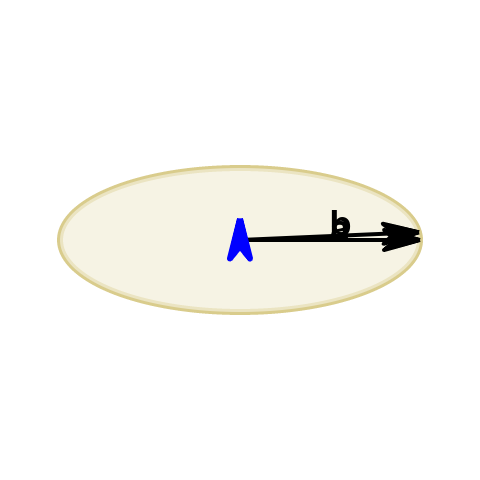
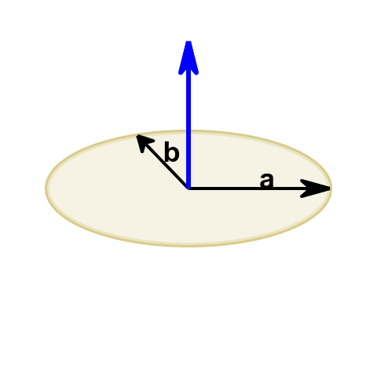
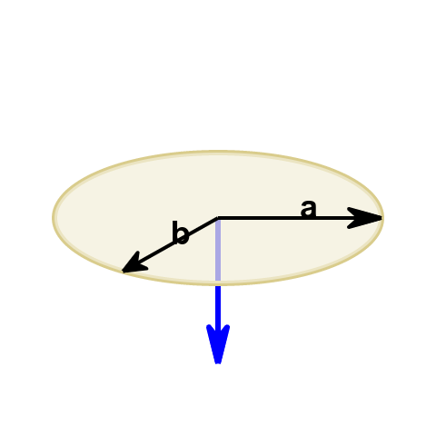
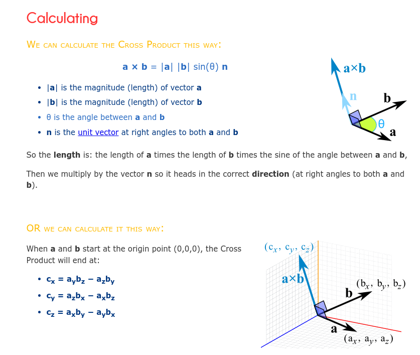
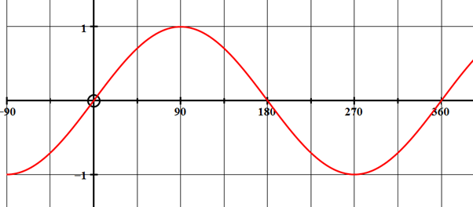

## cross product 叉积

这个[网页](https://www.mathsisfun.com/algebra/vectors-cross-product.html)上讲得非常好。

这里摘图出来：






1. 叉积有两个计算方法。
2. 二维空间是没办法计算叉积的，因为叉积的结果在另一维上。


```c++
struct point {
    float x;
    float y;
    float z;
};
typedef vector point

constexpr vector cross_product(vector a, vector b)
{
    return {
        a.y*b.z - a.z*b.y,
        a.z*b.x - a.z * b.z,
        a.x*b.y - a.y * b.x
    }
}

```

## sin



