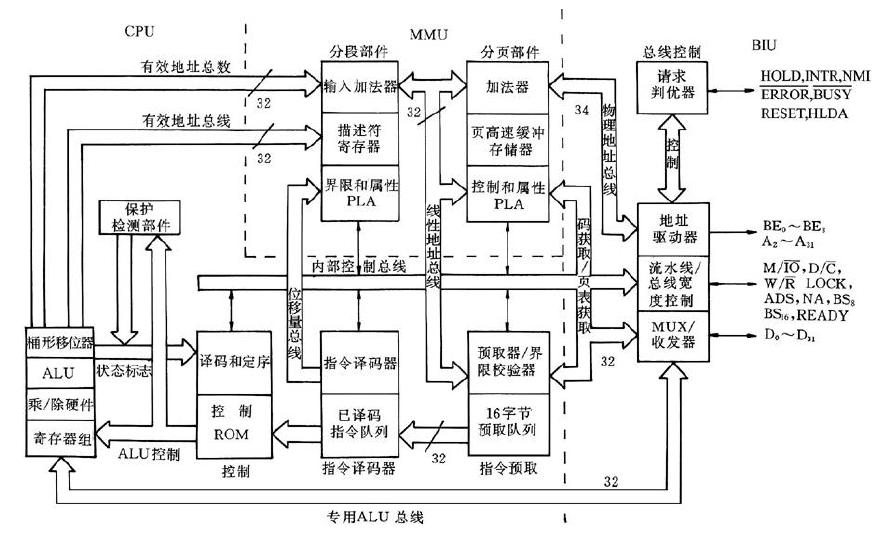

# Summary

* [Introduction](README.md)
* [内核模块与驱动程序](kernel_module_versus_device_driver.md)
   * [打印等级](print_level.md)
* [字符设备驱动](char_dev.md)
   * [设备号](dev_no.md)
   * [file_operations结构体](file_operations.md)
   * [描述性宏定义](descriptive_macros.md)
* [控制硬件](control_hardware/README.md)
* [中断系统](interrupt/README.md)
   * [使用workqueue](interrupt/workqueue.md)
   * [MSI中断](msi.md)
* [go scripting](go_scripting/README.md)
* [nginx](nginx/README.md)
   * [serve static files](nginx/serve_static_files.md)
* [vscode](vscode/README.md)
* [linux物理内存](linux/README.md)
   * [repo命令](linux/repo.md)

## 技术笔记

* [Android](android/README.md)
  * [Introduction](android/README.md)
  * [Android 通过repo下载代码](android/chapter1.md)
  * [manifest库详解](android/manifest.md)
  * [常用的repo子命令](android/repo.md)
  * [Android/Linux Input子系统与uinput用户层事件注入](android/androidlinux-inputuinput.md)
  * [Gradle及Gradle Wrapper的使用](android/gradlegradle-wrapper.md)
  * [Butter Knife Android 常用注解库](android/butter-knife-android-chang-yong-zhu-jie-ku.md)
* [Linux](linux/linux-work-queue.md)
  * [linux驱动中使 work queue处理中断](linux/linux-work-queue.md)
* [工具软件](utils/git.md)
  * [git命令行的使用与配置](utils/git.md)
  * [用docker提供mysql数据库服务](utils/dockermysql.md)
* [Golang](golang/golang.md)
  * [Golang编码规范](golang/golang.md)
* [Python](python/pythonopencv.md)
  * [使用python调用opencv](python/pythonopencv.md)
* [Java](java/README.md)

## 知乎专栏文章

* [现代计算机](modern-computing/x86qi-dong.md)
  * [001. x86启动](modern-computing/x86qi-dong.md)
  * [002. Nandflash芯片简介](modern-computing/nandflash.md)
  * [003. 闪存的磨损均衡](modern-computing/wear-leveling-of-nand-flash.md)
  * [004. Cache的组织形式](modern-computing/cache.md)
  * [005. 细说80286](modern-computing/xi-shuo-80286.md)
  * [006. 80286的调用门描述符](modern-computing/80286.md)
  * [007. 80286 任务状态段与任务切换](modern-computing/80286-tss.md)
  * [008. 80286 中断门和陷阱门](modern-computing/80286-interrupt-gate.md)
  * [009. x86计算机的架构演进](modern-computing/x86.md)
  * [010. 80386的页式内存管理](modern-computing/80386.md)
  * [011. 80386的缓存Cache](modern-computing/80386cache.md)
  * [012. 80486的轻微改善](modern-computing/80486.md)
  * [013. 80586-初代奔腾的超标量](modern-computing/80586-.md)
  * [014. 80686-Pentium Pro](modern-computing/80686-pentium-pro.md)
  * [015. 7代x86处理器Pentium 4](modern-computing/7dai-x86-chu-li-qi-pentium-4.md)
  * [016. 8代x86微架构Intel Core](modern-computing/8dai-ma-x86-wei-jia-gou-intel-core.md)
  * [017. 显卡的发展历史回顾--之一](modern-computing/017-display-card.md)
  * [018. 显卡的发展历史回顾--之二](modern-computing/018-playing-width-cga.md)
  * [020. 显卡到AI芯片--之一](modern-computing/020-modern-gpu.md)
  * [021. 显卡到AI芯片--之二](modern-computing/021-modern-gpu2.md)
  * [022. 显卡到AI芯片--之三](modern-computing/022-modern-gpu-3.md)



