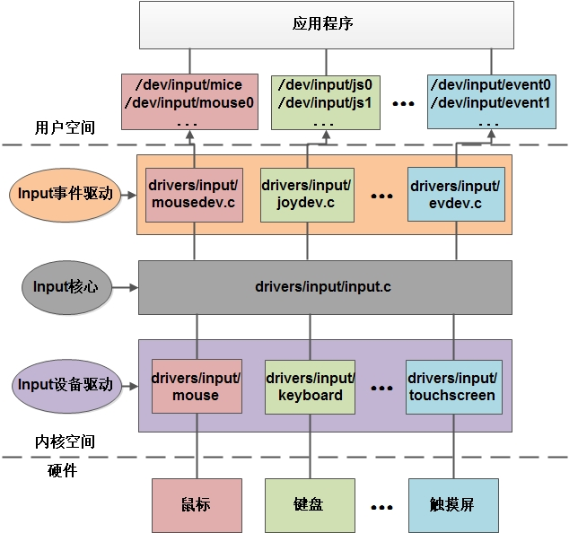
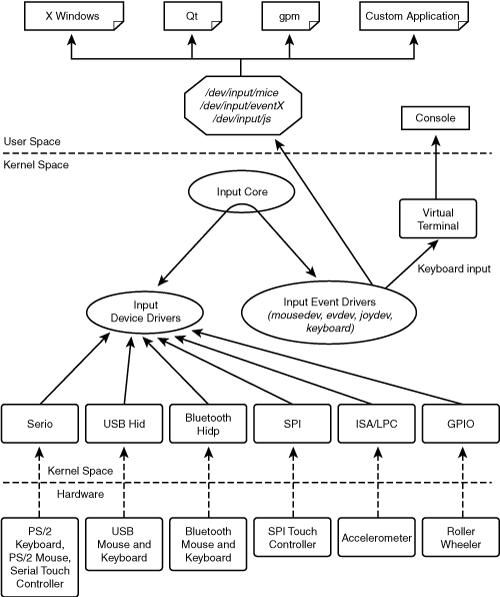
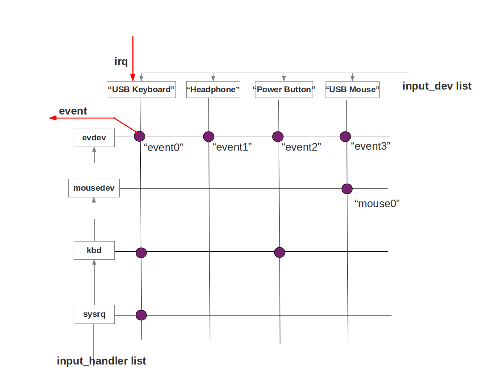
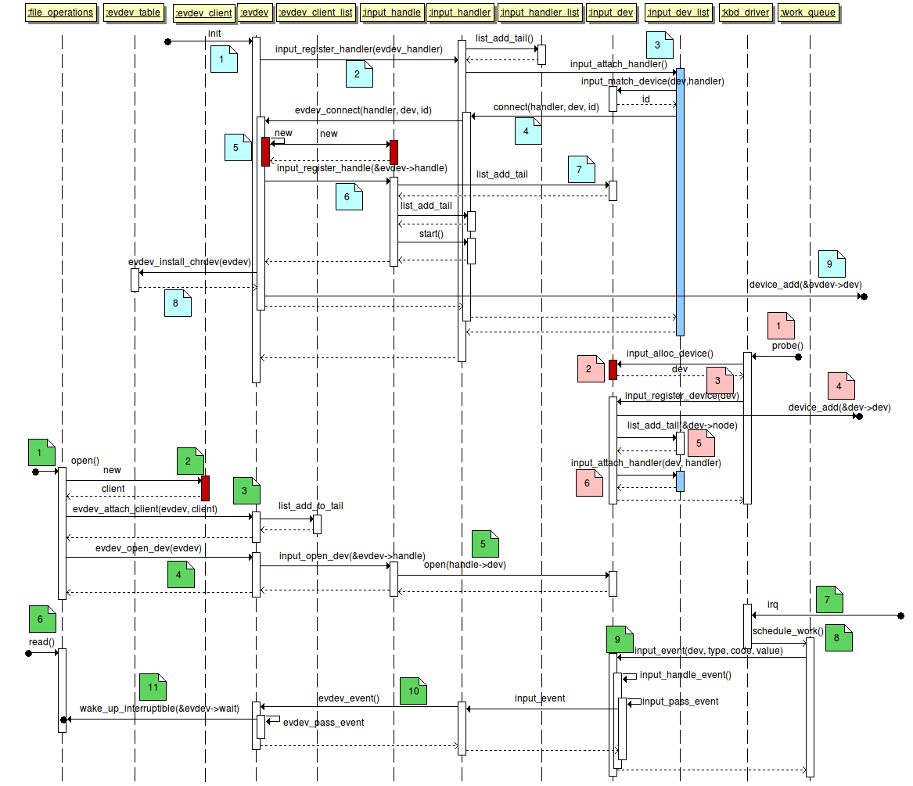
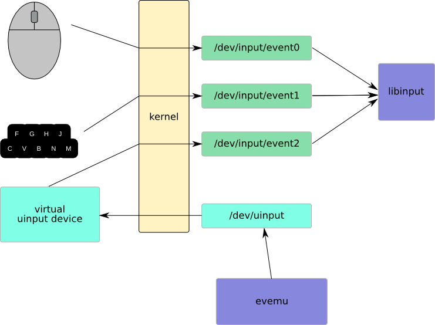

# Linux Input子系统整体架构

首先上两个画得比较好的图。

从图中可以看出，在内核空间，驱动被划分为 三个层次，即Input Device Driver、Input Core和Input Event Driver。驱动作者通常只按照规范，实现Device Driver，就可以正确地接入Input子系统，最终由Input Event Driver生成设备文件，即/dev/input/eventX。





# Input Core的作用

采用面向对象的语言描述。Input Device Driver实现一个`input_dev`类，将这个类注册给Input Core。Input Event Driver实现一个`input_handler`类，也把这个类注册给Input Core。Input Core分别为`input_dev`和`input_handler`维护一个列表。通过`input_connect`来对两者进行匹配，匹配上就会利用`input_handler`为`input_dev`生成一个设备文件。



上图中的深色点就是 Input Handle， 左边垂直方向是Input Handler， 而水平方向是Input Dev。 下面是更为详细的一个流程图，感兴趣的同学可以点击大图看看。



# 通过uinput虚拟设备驱动

从上一节可以看出，输入设备已经形成了一定的规则，设备类型基本明确。设备驱动基本上也有套路可走。由于在内核层写驱动终究不如用户层方便，因而出现一个uinput组件，它在内核层作一个代理，用户层代码可以通过/dev/uinput这个设备文件与这个内核层代理通信，让它帮你注册一个设备驱动，并且帮你上报输入事件。程序员可以用它实现用户层的设备驱动（可能要配合uio或/dev/mem\)，也可以通过它注入输入事件。



通过uinput注入输入事件大体需要4个步骤：

1. 打开uinput文件
2. 配置设备支持的事件类型
3. 创建虚拟设备
4. 注入事件
5. 销毁设备

## 1. 打开uinput文件

**uinput** 通常位于 `/dev/uinput`或者 `/dev/input/uinput`。

```c
#include <linux/input.h>
#include <linux/uinput.h>
#include <fcntl.h>
#include <stdlib.h>
#include <stdio.h>
...

int fd = open("/dev/uinput", O_WRONLY | O_NONBLOCK);
if (fd < 0) {
    fd = open("/dev/input/uinput", O_WRONLY | O_NONBLOCK);
    if (fd < 0) {
        ...
        return -1;
    }
}
```

## 2. 配置设备支持的事件类型

这些事件定义在 **linux/input.h** 文件中

| 宏 | 释义 |
| :--- | :--- |
| define EV\_SYN 0x00 | 同步事件 |
| define EV\_KEY 0x01 | 键盘按下和释放事件 |
| define EV\_REL 0x02 | 相对坐标事件 |
| define EV\_ABS 0x03 | 绝对坐标事件 |

对于键盘事件，进行如下配置（允许发送 key 和 syn 两种类型的事件）

```c
ret = ioctl(fd, UI_SET_EVBIT, EV_KEY);
ret = ioctl(fd, UI_SET_EVBIT, EV_SYN);
```

配置哪些按键可以输入（上下左右方向键）

```c
// 允许输入方向键上、下、左、右
ret = ioctl(fd, UI_SET_KEYBIT, KEY_UP);
ret = ioctl(fd, UI_SET_KEYBIT, KEY_DOWN);
ret = ioctl(fd, UI_SET_KEYBIT, KEY_LEFT);
ret = ioctl(fd, UI_SET_KEYBIT, KEY_RIGHT);
```

## 3. 创建虚拟设备

上面已经配置了一些基本特性，接下来介绍结构体 `uinput_user_dev`，它定义在 **linux/uinput.h** 头文件中

```c
#define UINPUT_MAX_NAME_SIZE 80
struct uinput_user_dev {
    char name[UINPUT_MAX_NAME_SIZE];
    struct input_id id;
    int ff_effects_max;
    int absmax[ABS_MAX + 1];
    int absmin[ABS_MAX + 1];
    int absfuzz[ABS_MAX + 1];
    int absflat[ABS_MAX + 1];
};
```

其中有几个比较重要的字段:

* name 要创建的虚拟设备名称
* id 内部结构体，描述设备的 usb 类型，厂商，产品，版本
* absmin and absmax 整型数组，描述鼠标或触屏事件的阈值

将虚拟设备的信息写入 `fd` ，虚拟设备命名为 **uinput-sample**

```c
struct uinput_user_dev dev;

memset(&dev, 0, sizeof(dev));
snprintf(dev.name, UINPUT_MAX_NAME_SIZE, "uinput-sample"); // 虚拟设备名称
dev.id.bustype = BUS_USB; // udb 类型
dev.id.vendor = 0x1;
dev.id.product = 0x1;
dev.id.version = 1;

write(fd, &dev, sizeof(dev)); // 写入
```

创建配置好的虚拟设备

```
ret = ioctl(fd, UI_DEV_CREATE)
```

## 4. 注入事件

创建好了设备，开始注入事件，这里还需介绍一个结构体 `input_event` ，它定义在 **linux/input.h** 中，其中几个重要的字段：

* `type`
  : event 的类型 \(EV\_KEY, EV\_ABS, EV\_REL, …\),
* `code`
  : 如果 type 是 EV\_KEY 类型，则是 key code；若type是 EV\_ABS 或者 EV\_REL 类型，则是 x、y轴
* `value`
  : 如果 type 是 EV\_KEY 类型，则 1 \(press\) 0 \(release\)；若type是 EV\_ABS 或者 EV\_REL 类型，则为 x，y 坐标

声明写入事件的方法

```c
int writeEvent(int fd,int type,int code,int value){
    struct input_event ev;    
    memset(&ev, 0, sizeof(ev));
    ev.type = type;
    ev.code = code;
    ev.value = value;
    ssize_t bytes;// 写入文档的字节数（成功）；-1（出错）
    bytes = write(fd, &ev, sizeof(struct input_event));
    return (int) bytes;
}
```

写入一个键盘方向键事件 **KEY\_UP**

```c
writeEvent(fd,EV_KEY,KEY_UP,1) // KEY_UP press
writeEvent(fd,EV_KEY,KEY_UP,0) // KEY_UP release
```

将写入的事件同步到虚拟设备

```c
writeEvent(fd,EV_SYN,SYN_REPORT,0)
```

## 销毁设备 {#销毁设备}

注入了事件之后需要销毁虚拟设备，调用下面的函数，再次执行 `adb shell getevent` 你会看到设备已被移除

```c
int destroy(int fd){
    if (fd != -1) {
        int ret = ioctl(fd, UI_DEV_DESTROY);
        return ret;
    }
    return -1;
}
```

# 参考资料

1. [UINPUT 事件注入 ](http://www.septenary.cn/2016/01/16/UINPUT-%E4%BA%8B%E4%BB%B6%E6%B3%A8%E5%85%A5/)
2. [Android的用户输入处理](http://www.cnblogs.com/samchen2009/p/3368158.html "图解Android - Android GUI 系统 (5) - Android的Event Input System")
3. [Linux Input子系统分析之eventX设备创建和事件传递](http://blog.pickbox.me/2014/09/04/Linux-Input%E5%AD%90%E7%B3%BB%E7%BB%9F%E5%88%86%E6%9E%90%E4%B9%8BeventX%E8%AE%BE%E5%A4%87%E5%88%9B%E5%BB%BA%E5%92%8C%E4%BA%8B%E4%BB%B6%E4%BC%A0%E9%80%92/ "Linux Input子系统分析之eventX设备创建和事件传递 ")

**长按识别二维码或手机扫描二维码  
打赏我1.5元**  


