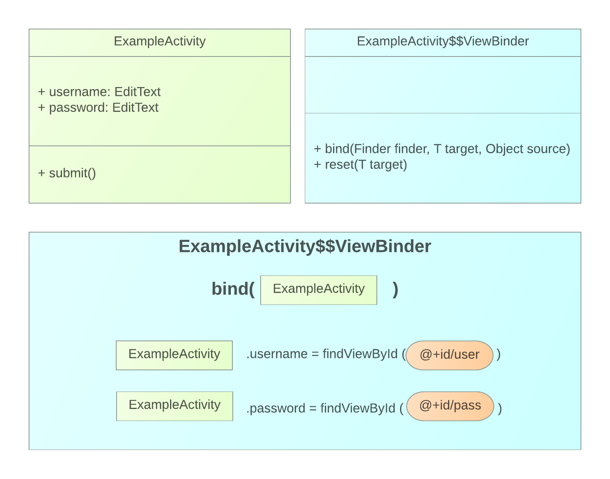

# Butter Knife

## 1. 介绍
Buffter Knife是一个Android应用开发经常用到的注解库。很多工程都用到了Butter Knife这个框架。使用它能节省很多代码量。像findViewById这种代码就不用再出现了，而且这个框架也提供了很多其他有用的注解。

## 2. 使用场景
在Android应用开发中，经常需要将某个xml定义的视图、资源或layout在运行时绑定到一个变量上。这些绑定操作从代码量角度上来讲并不多，但是却使代码结构看起来很复杂。使用buffer knife库之后，这类绑定操作都可以通过注解来完成，代码看起来会更清爽。比如下面这样：


```java
class ExampleActivity extends Activity {
  @BindView(R.id.user) EditText username;
  @BindView(R.id.pass) EditText password;

  @BindString(R.string.login_error) String loginErrorMessage;

  @OnClick(R.id.submit) void submit() {
    // TODO call server...
  }

  @Override public void onCreate(Bundle savedInstanceState) {
    super.onCreate(savedInstanceState);
    setContentView(R.layout.simple_activity);
    ButterKnife.bind(this);
    // TODO Use fields...
  }
}
```
## 3.  基本原理
`ButterKnife`显然没有使用会降低运行时效率的反射方式，它用了Java Annotation Processing技术，就是在Java代码编译成Java字节码的时候就已经处理了@Bind、@OnClick（ButterKnife还支持很多其他的注解）这些注解了。

### 3.1 Annotation processing

Annotation processing是在编译阶段执行的，它的原理就是读入Java源代码，解析注解，然后生成新的Java代码。新生成的Java代码最后被编译成Java字节码，注解解析器（Annotation Processor）不能改变读入的Java 类，比如不能加入或删除Java方法。

### 3.2 ButterKnife编译流程

下图是Java 编译代码的整个过程，可以帮助我们很好理解注解解析的过程：


对应上一节使用场景中的代码，bufferknife会生成类似如下的代码：


```java

public class ExampleActivity$$ViewBinder<T extends 
        io.bxbxbai.samples.ui.ExampleActivity> implements ViewBinder<T> {

     @Override public void bind(final Finder finder, final T target, Object source) {
          View view;
          view = finder.findRequiredView(source, 21313618, “field ‘user’”);
          target.username = finder.castView(view, 21313618, “field ‘user’”);
          view = finder.findRequiredView(source, 21313618, “field ‘pass’”);
          target.password = finder.castView(view, 21313618, “field ‘pass’”);
          view = finder.findRequiredView(source, 21313618, “field ‘submit’ and method ‘submit’”);
          view.setOnClickListener(
            new butterknife.internal.DebouncingOnClickListener() {
               @Override public void doClick(android.view.View p0) {
      target.submit();
           }
        });
      }

     @Override public void reset(T target) {
           target.username = null;
           target.password = null;
     }
}
```

用一张图来解释如下：

在上面的过程中可以看到，为什么你用@Bind、@OnClick等注解标注的属性或方法必须是public或protected的，因为ButterKnife是通过ExampleActivity.this.editText来注入View的。

### 3.3 bind(Object, View) 和 bind(View)

ButterKnife有bind(Object, View) 和 bind(View)两个方法，有什么区别呢？

如果你自定义了一个View，比如public class BadgeLayout extends Fragment，那么你可以可以通过ButterKnife.bind(BadgeLayout)来注入View的。

如果你在一个ViewHolder中inflate了一个xml布局文件，得到一个View对象，并且这个View是LinearLayout或FrameLayout等系统自带View，那么不是不能用ButterKnife.bind(View)来注入View的，因为ButterKnife认为这些类的包名以com.android开头的类是没有注解功能的，所以这种情况你需要使用ButterKnife.bind(ViewHolder，View)来注入View。

这表示你是把@Bind、@OnClick等注解写到了这个ViewHolder类中，ViewHolder中的View呢需要从后面那个View中去找

## 4. ButterKnife的几种使用方式

### 4.1 资源绑定


```java
class ExampleActivity extends Activity {
  @BindString(R.string.title) String title;
  @BindDrawable(R.drawable.graphic) Drawable graphic;
  @BindColor(R.color.red) int red; // int or ColorStateList field
  @BindDimen(R.dimen.spacer) Float spacer; // int (for pixel size) or float (for exact value) field
  // ...
}
```

### 4.2 非activity的绑定

You can also perform binding on arbitrary objects by supplying your own view root.


```java
public class FancyFragment extends Fragment {
  @BindView(R.id.button1) Button button1;
  @BindView(R.id.button2) Button button2;

  @Override public View onCreateView(LayoutInflater inflater, ViewGroup container, Bundle savedInstanceState) {
    View view = inflater.inflate(R.layout.fancy_fragment, container, false);
    ButterKnife.bind(this, view);
    // TODO Use fields...
    return view;
  }
}
```
### 4.3 ListAdapter中简化ViewHolder


```java

public class MyAdapter extends BaseAdapter {
  @Override public View getView(int position, View view, ViewGroup parent) {
    ViewHolder holder;
    if (view != null) {
      holder = (ViewHolder) view.getTag();
    } else {
      view = inflater.inflate(R.layout.whatever, parent, false);
      holder = new ViewHolder(view);
      view.setTag(holder);
    }

    holder.name.setText("John Doe");
    // etc...

    return view;
  }

  static class ViewHolder {
    @BindView(R.id.title) TextView name;
    @BindView(R.id.job_title) TextView jobTitle;

    public ViewHolder(View view) {
      ButterKnife.bind(this, view);
    }
  }
}
```

### 4.4 View list的批量注入和批量执行

#### 4.4.1 注入


```java
@BindViews({ R.id.first_name, R.id.middle_name, R.id.last_name })
List<EditText> nameViews;
```

#### 4.4.2 批量执行

首先通过Action和Setter接口定义行为：
```java
static final ButterKnife.Action<View> DISABLE = new ButterKnife.Action<View>() {
  @Override public void apply(View view, int index) {
    view.setEnabled(false);
  }
};
static final ButterKnife.Setter<View, Boolean> ENABLED = new ButterKnife.Setter<View, Boolean>() {
  @Override public void set(View view, Boolean value, int index) {
    view.setEnabled(value);
  }
};
```
然后通过apply方法批量执行：

```java
ButterKnife.apply(nameViews, DISABLE);
ButterKnife.apply(nameViews, ENABLED, false);
```
Android Property可以直接拿来apply:


```java

ButterKnife.apply(nameViews, View.ALPHA, 0.0f);
```
### 4.5 绑定Listener

可以直接为某个按钮绑定click事件的listener：

```java
@OnClick(R.id.submit)
public void submit(View view) {
  // TODO submit data to server...
}
```
入参view可以省略：


```java
@OnClick(R.id.submit)
public void submit() {
  // TODO submit data to server...
}
```
也可以指定为具体类型，butterknife会帮你转换：


```java
@OnClick(R.id.submit)
public void sayHi(Button button) {
  button.setText("Hello!");
}
```
如果多个view的click行为相同，也可以一起指定，只写一次方法：


```java
@OnClick({ R.id.door1, R.id.door2, R.id.door3 })
public void pickDoor(DoorView door) {
  if (door.hasPrizeBehind()) {
    Toast.makeText(this, "You win!", LENGTH_SHORT).show();
  } else {
    Toast.makeText(this, "Try again", LENGTH_SHORT).show();
  }
}
```
自定义的view，可以在内部注解click事件，无需指定id:

```java
public class FancyButton extends Button {
  @OnClick
  public void onClick() {
    // TODO do something!
  }
}
```

### 4.6 取消绑定

在fragment中，在onCreateView中绑定的view，需要在onDestroyView中置为null:

```java
public class FancyFragment extends Fragment {
  @BindView(R.id.button1) Button button1;
  @BindView(R.id.button2) Button button2;
  private Unbinder unbinder;

  @Override public View onCreateView(LayoutInflater inflater, ViewGroup container, Bundle savedInstanceState) {
    View view = inflater.inflate(R.layout.fancy_fragment, container, false);
    unbinder = ButterKnife.bind(this, view);
    // TODO Use fields...
    return view;
  }

  @Override public void onDestroyView() {
    super.onDestroyView();
    unbinder.unbind();
  }
}
```
### 4.7 optional binding
如果注解绑定的对象不存在，则会抛出异常，可以通过在view前加@Nullable和在method前加@Optional来避免绑定失败时的异常：


```java
@Nullable @BindView(R.id.might_not_be_there) TextView mightNotBeThere;

@Optional @OnClick(R.id.maybe_missing) void onMaybeMissingClicked() {
  // TODO ...
}
```

### 4.8 MULTI-METHOD LISTENERS

Method annotations whose corresponding listener has multiple callbacks can be used to bind to any one of them. Each annotation has a default callback that it binds to. Specify an alternate using the callback parameter.

```java
@OnItemSelected(R.id.list_view)
void onItemSelected(int position) {
  // TODO ...
}

@OnItemSelected(value = R.id.maybe_missing, callback = NOTHING_SELECTED)
void onNothingSelected() {
  // TODO ...
}
```


### 4.9 findById简化版

Also included are findById methods which simplify code that still has to find views on a View, Activity, or Dialog. It uses generics to infer the return type and automatically performs the cast.

```
View view = LayoutInflater.from(context).inflate(R.layout.thing, null);
TextView firstName = ButterKnife.findById(view, R.id.first_name);
TextView lastName = ButterKnife.findById(view, R.id.last_name);
ImageView photo = ButterKnife.findById(view, R.id.photo);
```


Add a static import for ButterKnife.findById and enjoy even more fun.

## 5. 使用


```groovy
buildscript {
  repositories {
    mavenCentral()
   }
  dependencies {
    classpath 'com.jakewharton:butterknife-gradle-plugin:8.5.1'
  }
}
apply plugin: 'com.android.library'
apply plugin: 'com.jakewharton.butterknife'
```


