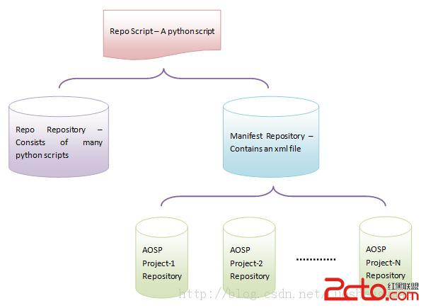

# repo命令介绍

Android开源项目是一个大项目。项目源代码有8GB大小。这样大的代码量用svn或是git管理都会感觉很吃力，可以预见checkout一个版本需要好长时间，好多人不停地提交代码，也会使代码的log变得难以阅读。

为了解决这个问题，Android项目将源代码分解成多个不同的子项目，并分别放在一个git库里来管理。这样每个子项目可以只关注本子项目的开发，而无需关注其他子项目的代码。

如何把这些子项目都下载到一个目录中，然后构建成一个Android安装镜像呢？Android用的是一个叫repo的命令。

repo命令是一些python脚本。它依赖一个manifest git库，这个manifest git库里只有一个文件，叫default.xml。这个xml文件里实际是一个子项目列表，记录了这个Android工程所依赖的子项目信息，包括每个子项目的git url、 下载到本地的目录、需要使用子项目的那个revision。



# 命令基本用法
## 下载Android源代码

开始Android开发之前，需求先下载一套Android源代码。

## 安装repo工具

To install Repo:

Make sure you have a bin/ directory in your home directory and that it is included in your path:


```shell
$ mkdir ~/bin
$ PATH=~/bin:$PATH
```


Download the Repo tool and ensure that it is executable:


```bash
$ curl https://storage.googleapis.com/git-repo-downloads/repo > ~/bin/repo
$ chmod a+x ~/bin/repo
```

## 下载manifest库

```
$ repo init -u https://android.googlesource.com/platform/manifest
```
## 从manifest库中取一个android版本


```
repo init -u https://android.googlesource.com/platform/manifest -b android-4.0.1_r1
```
或者


```
cd .repo/manifests
git checkout android-4.0.1_r1
```
这里，你可以读一下.repo/manifests文件夹下的default.xml代码。


##下载这个版本的android代码


```
repo sync
```
**长按识别二维码或手机扫描二维码
打赏我1.5元**


