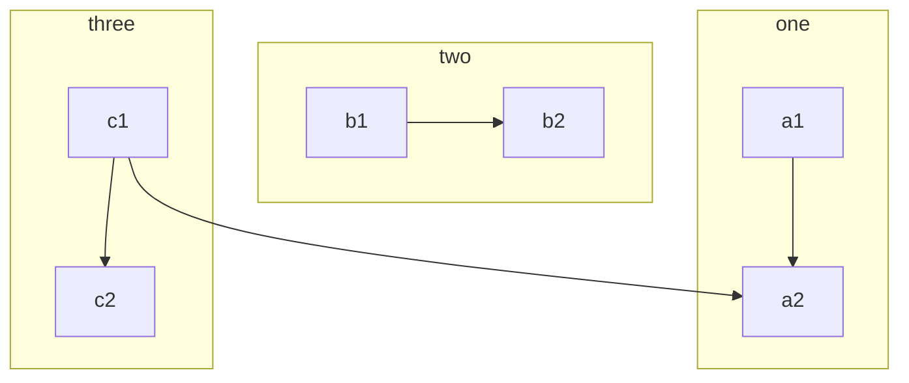
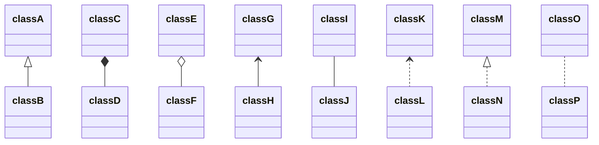
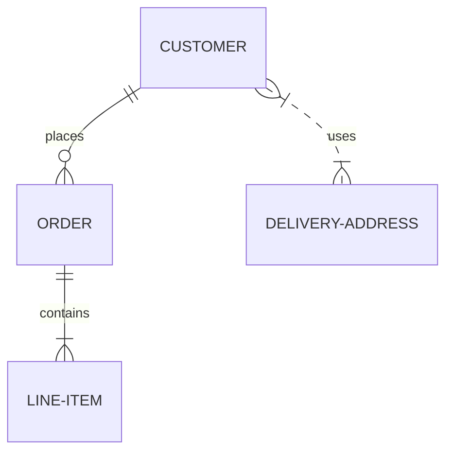

---

title: how to
sort: 1
text: |
  ABCDEFGHIJKLMNOPQRSTUVWXYZ
  abcdefghijklmnopqrstuvwxyz
  1234567890
  一二三四五六七八九十百千萬上中下左右大小春夏秋冬東南西北金木水火土
  ‘?’“!”(%)[#]{@}/&\<-+÷×=>®©$€£¥¢:;,.*

---

# toast cards



```note
### This is a note

Markdown is supported, Text can be **bold**, _italic_, or ~~strikethrough~~. [Links](https://github.com) should be blue with no underlines

`inline code`

[`inline code inside link`](#)
```





```tip
It’s bigger than a bread box.
```





```warning
Strong prose may provoke extreme mental exertion. Reader discretion is strongly advised.
```





```danger
Mad scientist at work!
```



```danger
Mad scientist at work!
```


# [math](https://www.tutorialspoint.com/tex_commands/brace.htm)

```information

`|` 要写作 `\|`

```

# math symbools

## Greek letters

inline math is like $ \alpha $, or \$ \beta \$, or \$$ gamma \$$, or [ \delta ], or $ \epsilon $;


| 符号 | math | 符号 | math |
| -    | -    | --  |  --  |
| $$ \alpha A $$ |	\alpha A	| $$ \nu N $$ |	\nu N
| $$ \beta B $$ |	\beta B	| $$ \xi \Xi $$ |	\xi \Xi
| $$ \gamma \Gamma $$ |	\gamma \Gamma	| $$ o O $$ |	o O
| $$ \delta \Delta $$ |	\delta \Delta	| $$ \pi \Pi $$ |	\pi \Pi
| $$ \epsilon \varepsilon E $$ |	\epsilon \varepsilon E	| $$ \rho \varrho P $$ |	\rho \varrho P
| $$ \zeta Z $$ |	\zeta Z	| $$ \sigma \,\!\Sigma $$ |	\sigma \Sigma
| $$ \eta H $$ |	\eta H	| $$ \tau T $$ |	\tau T
| $$ \theta \vartheta \Theta $$ |	\theta \vartheta \Theta	| $$ \upsilon \Upsilon $$ |	\upsilon \Upsilon
| $$ \iota I	$$ | \iota I	  | $$ \phi \varphi \Phi $$ |	\phi \varphi \Phi
| $$ \kappa K $$ |	\kappa K	| $$ \chi X $$ |	\chi X
| $$ \lambda \Lambda $$ |	\lambda \Lambda	| $$ \psi \Psi $$ |	\psi \Psi
| $$ \mu M $$ |	\mu M 	| $$ \omega \Omega $$ |	\omega \Omega

## Arrows

| 符号 | math | 符号 | math |
| -    | -    | --  |  --  |
| \$$ \leftarrow $$ |	\leftarrow	| $$ \Leftarrow $$ |	\Leftarrow
| $$ \rightarrow $$ |	\rightarrow	| $$ \Rightarrow \;$$ |	\Rightarrow
| $$ \leftrightarrow $$ |	\leftrightarrow	| $$ \rightleftharpoons $$ |	\rightleftharpoons
| $$ \uparrow $$ |	\uparrow	| $$ \downarrow $$ |	\downarrow
| $$ \Uparrow \;$$ |	\Uparrow	| $$ \Downarrow $$ |	\Downarrow
| $$ \Leftrightarrow \;$$ |	\Leftrightarrow	| $$ \Updownarrow $$ |	\Updownarrow
| $$ \mapsto $$ |	\mapsto	| $$ \longmapsto \;$$ |	\longmapsto
| $$ \nearrow $$ |	\nearrow	| $$ \searrow $$ |	\searrow
| $$ \swarrow $$ |	\swarrow	| $$ \nwarrow $$ |	\nwarrow
| $$ \leftharpoonup $$ |	\leftharpoonup	| $$ \rightharpoonup $$ |	\rightharpoonup
| $$ \leftharpoondown $$ |	\leftharpoondown	| $$ \rightharpoondown $$ |	\rightharpoondown		

## Miscellaneous symbols

| 符号 | math | 符号 | math |
| -    | -    | --  |  --  |
| $$ \infty $$ |	\infty	| $$ \forall $$ |	\forall
| $$ \Re $$ |	\Re	| $$ \Im $$ |	\Im
| $$ \nabla $$ |	\nabla	| $$ \exists $$ |	\exists
| $$ \partial $$ |	\partial	| $$ \nexists $$ |	\nexists
| $$ \emptyset $$ |	\emptyset	| $$ \varnothing $$ |	\varnothing
| $$ \wp $$ |	\wp	| $$ \complement $$ |	\complement
| $$ \neg $$ |	\neg	| $$ \cdots $$ |	\cdots
| $$ \square $$ |	\square	| $$ \surd $$ |	\surd
| $$ \blacksquare $$ |	\blacksquare	| $$ \triangle $$|	\triangle

## Binary Operation/Relation Symbols

| 符号 | math | 符号 | math |
| -    | -    | --  |  --  |
| $$ \times $$ |	\times	| $$ \cdot $$ |	\cdot
| $$ \div $$ |	\div	| $$ \cap $$ |	\cap
| $$ \cup $$ |	\cup	| $$ \neq \;$$ |	\neq
| $$ \leq $$ |	\leq	| $$ \geq $$ |	\geq
| $$ \in $$ |	\in	| $$ \perp \;$$ |	\perp
| $$ \notin $$ |	\notin	| $$ \subset $$ |	\subset
| $$ \simeq $$ |	\simeq	| $$ \approx $$ |	\approx
| $$ \wedge $$ |	\wedge	| $$ \vee $$ |	\vee
| $$ \oplus \;$$ |	\oplus	| $$ \otimes $$ |	\otimes
| $$ \Box $$ |	\Box	| $$ \boxtimes $$ |	\boxtimes
| $$ \equiv $$ |	\equiv	| $$ \cong $$ |	\cong


## 其它

| 符号 | math | 符号 | math |
| -    | -    | --  |  --  |
| $$ \acute{a} $$ |	\acute{a}	| $$ \check{a} $$ |	\check{a}
| $$ \bar{a} $$ |	\bar{a}	| $$ \grave{a} $$ |	\grave{a}
| $$ \tilde{a} $$ |	\tilde{a}	| $$ \dot{a} $$ |	\dot{a}
| $$ \mathring{a} $$ |	\mathring{a}	| $$ \dot{a} $$ |	\dot{a}
| $$ \mathbb{A} $$ |	\mathbb{A}	| $$ \mathcal{A} $$ |	\mathcal{A}
| $$ \sqrt{a*b} $$ |	\sqrt{a*b}	| $$ \int_{i=2}^ni*3 $$ |	\int_{i=2}^ni*3 
| $$ \sqrt{a*b} $$ |	\sqrt{a*b}	| $$ \oint_{i=2}^ni*3 $$ |	\oint_{i=2}^ni*3 
| $$ b\pmod{asdf} $$ |	\sqrt{a*b}	| $$ \sum_{i=2}^ni*3 $$ |	\sum_{i=2}^ni*3 
| $$ \lim_{x\to\infty} f(x) $$ |	\lim_{x\to\infty} f(x) | $$ \prod_{i=2}^ni*3 $$ |	\prod_{i=2}^ni*3 
| \$\$ \lim_{x\to\infty} f(x) \$\$$ |	`$$ \lim_{x\to\infty} f(x) $$` | $$ \prod_{i=2}^ni*3 $$ |	\prod_{i=2}^ni*3 


# Avatar 

```

```



```tip
Set config `plugins: [jekyll-avatar]`

For documentation, see: [https://github.com/benbalter/jekyll-avatar](https://github.com/benbalter/jekyll-avatar)
```

# Emoji Test

```
I give this theme two :+1:!
```

I give this theme two :+1:!

```tip
Set config `plugins: [jemoji]`, Emoji searcher, see: [https://emoji.muan.co/](https://emoji.muan.co/)
```


# Fonts Test

`{:.font-mono}`

```
{{ page.text -}}
```

`{:.font-body}`

{:.font-body}
{{ page.text }}

`{:.font-head}`

{:.font-head}
{{ page.text }}

## font-awesome

```html
<i class="fa fa-check-circle text-green">checked</i>
<i class="fa fa-battery-quarter text-red">battery</i>
```

<i class="fa fa-check-circle text-green">checked</i>
<i class="fa fa-battery-quarter text-red">battery</i>

# Gist Test

```

```
---



---



----




# Mathjax Test

$$
\begin{aligned}
  & \phi(x,y) = \phi \left(\sum_{i=1}^n x_ie_i, \sum_{j=1}^n y_je_j \right)
  = \sum_{i=1}^n \sum_{j=1}^n x_i y_j \phi(e_i, e_j) = \\
  & (x_1, \ldots, x_n) \left( \begin{array}{ccc}
      \phi(e_1, e_1) & \cdots & \phi(e_1, e_n) \\
      \vdots & \ddots & \vdots \\
      \phi(e_n, e_1) & \cdots & \phi(e_n, e_n)
    \end{array} \right)
  \left( \begin{array}{c}
      y_1 \\
      \vdots \\
      y_n
    \end{array} \right)
\end{aligned}
$$

```note
For documentation, see: https://kramdown.gettalong.org/syntax.html#math-blocks
```


# Mentions Test

```
Hey @zhangfuwen, what do you think of this?
```

Hey @zhangfuwen, what do you think of this?

```tip
Set config `plugins: [jekyll-mentions]`

For documentation, see: [https://github.com/jekyll/jekyll-mentions](https://github.com/jekyll/jekyll-mentions)
```


# Mermaid Test

    ```mermaid
    graph TB
        c1-->a2
        subgraph one
        a1-->a2
        end
        subgraph two
        b1-->b2
        end
        subgraph three
        c1-->c2
        end
    ```









# Toasts Card

THIS IS TOO LONG, NEED UPDATE! HERE IS SOME IDEAS:

- https://primer.style/css/components/box
- https://primer.style/css/components/toasts

```note
## This is a note

Markdown is supported, Text can be **bold**, _italic_, or ~~strikethrough~~. [Links](https://github.com) should be blue with no underlines

`inline code`

[`inline code inside link`](./)
```

```note
This is note2
```

```note
This is note3
```

```tip
It’s bigger than a bread box.
```

```tip
It’s tip 2
```

```warning
Strong prose may provoke extreme mental exertion. Reader discretion is strongly advised.
```

```danger
Mad scientist at work!
```


# Primer Utilities Test

Text can be **bold**, _italic_, or ~~strikethrough~~. [Links](https://github.com) should be blue with no underlines (unless hovered over).

{:.text-red}
Text can be **bold**, _italic_, or ~~strikethrough~~. [Links](https://github.com) should be blue with no underlines (unless hovered over).

{:.bg-yellow-dark}
Text can be **bold**, _italic_, or ~~strikethrough~~. [Links](https://github.com) should be blue with no underlines (unless hovered over).

{:.bg-yellow-dark.text-white}
Text can be **bold**, _italic_, or ~~strikethrough~~. [Links](https://github.com) should be blue with no underlines (unless hovered over).

{:.bg-yellow-dark.text-white.m-5}
Text can be **bold**, _italic_, or ~~strikethrough~~. [Links](https://github.com) should be blue with no underlines (unless hovered over).

{:.bg-yellow-dark.text-white.p-5.mb-6}
Text can be **bold**, _italic_, or ~~strikethrough~~. [Links](https://github.com) should be blue with no underlines (unless hovered over).

{:.bg-yellow-dark.text-white.p-5.mb-6}
Text can be **bold**{:.h1}, _italic_, or ~~strikethrough~~. [Links](https://github.com) should be blue with no underlines (unless hovered over).

{:.bg-yellow-dark.text-white.p-2.box-shadow-large}
Text can be **bold**{:.h1}, _italic_, or ~~strikethrough~~. [Links](https://github.com) should be blue with no underlines (unless hovered over).

{:.bg-yellow-dark.text-white.p-5.box-shadow-large.anim-pulse}
Text can be **bold**{:.h1}, _italic_, or ~~strikethrough~~. [Links](https://github.com) should be blue with no underlines (unless hovered over).

```tip
Edit this page to see how to add this to your docs, theme can use [@primer/css utilities](https://primer.style/css/utilities)
```

# jykell

[jykell variables](https://jekyllrb.com/docs/variables/)
