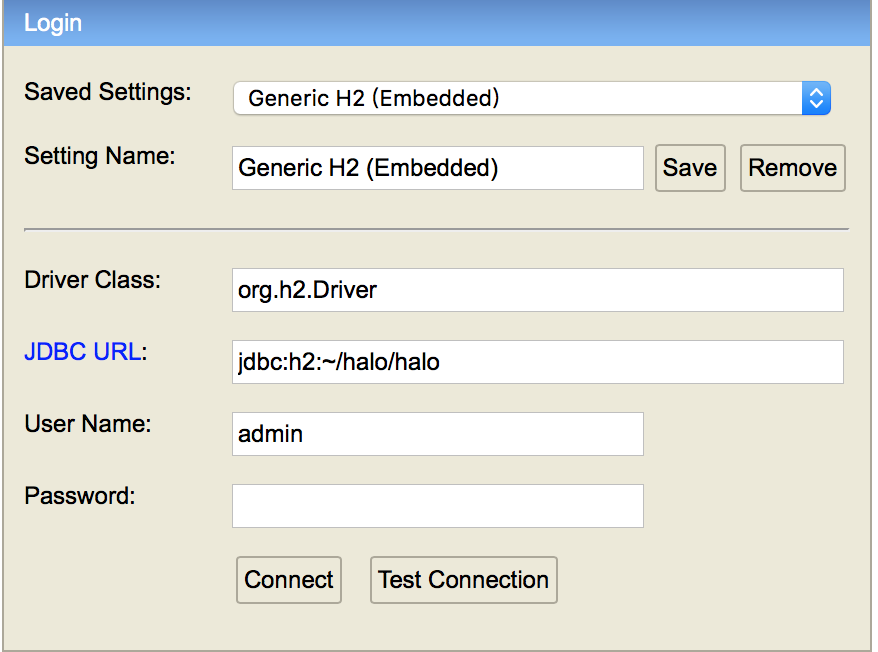
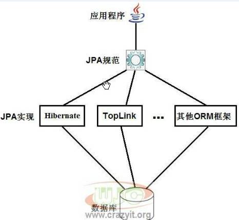

# 我的Java学习笔记

## spring boot项目如何在生产环境和研发环境使用不同的数据库？

理想的做法是研发和生产环境分别使用sqlite3和mysql。
或都使用H2

使用H2的时候可以以文件方式使用，也可以以内存的方式使用。我选择文件方式，这样可以取生产环境的一个数据库快照给研发环境测试用。

## halo的配置

```yaml
spring:
  datasource:
    type: com.alibaba.druid.pool.DruidDataSource
    # H2database 配置
    driver-class-name: org.h2.Driver
    url: jdbc:h2:file:~/halo/halo
    username: admin
    password: 123456
  h2:
    console:
      settings:
        web-allow-others: true
      path: /h2-console
      enabled: true
```

可以看到生成的数据库文件是：

```bash
➜  zhangfuwen ls ~/halo/halo.mv.db
/Users/dean/halo/halo.mv.db
```

## h2的配置参考

https://segmentfault.com/a/1190000007002140

## h2-console的登陆方法



## JPA 与Hibernate的关系

Hibernate ORM是JPA规范的一个实现。

JPA即Java Persistence API，它定义了一组ORM必须实现的接口。


## 一些其他的JPA配置

```
  #JPA Configuration: 
  spring.jpa.database=MYSQL
  # Show or not log for each sql query
  spring.jpa.show-sql=false
  spring.jpa.generate-ddl=true 
  # Hibernate ddl auto (create, create-drop, update)
  spring.jpa.hibernate.ddl-auto=create 
  #spring.jpa.database-platform=org.hibernate.dialect.MySQL5Dialect 
  spring.jpa.hibernate.naming_strategy=org.hibernate.cfg.ImprovedNamingStrategy 
  #spring.jpa.database=org.hibernate.dialect.MySQL5InnoDBDialect 
  spring.jpa.properties.hibernate.dialect=org.hibernate.dialect.MySQL5Dialect
```

## application.properties中配置的tomcat

这个配置是怎么对tomcat起作用的？
里面embed了tomcat，如果不想embed tomcat应该怎么做，在哪里配置tomcat?

在内置tomcat的情况下，是spring实例化一个tomcat类，并调用setter把properties文件的内容设置进去，但是外置的情况下是怎么配置的呢？通过war。在war包的情况下，是war包要遵循tomcat的规则，在固定位置写对应格式的配置文件。在application.properties里写还管用吗？

可以参考的文章：

http://www.chinacion.cn/article/1148.html

https://www.jianshu.com/p/ad102217ac6c

## maven project to gradle project

```
gradle init --type pom
```