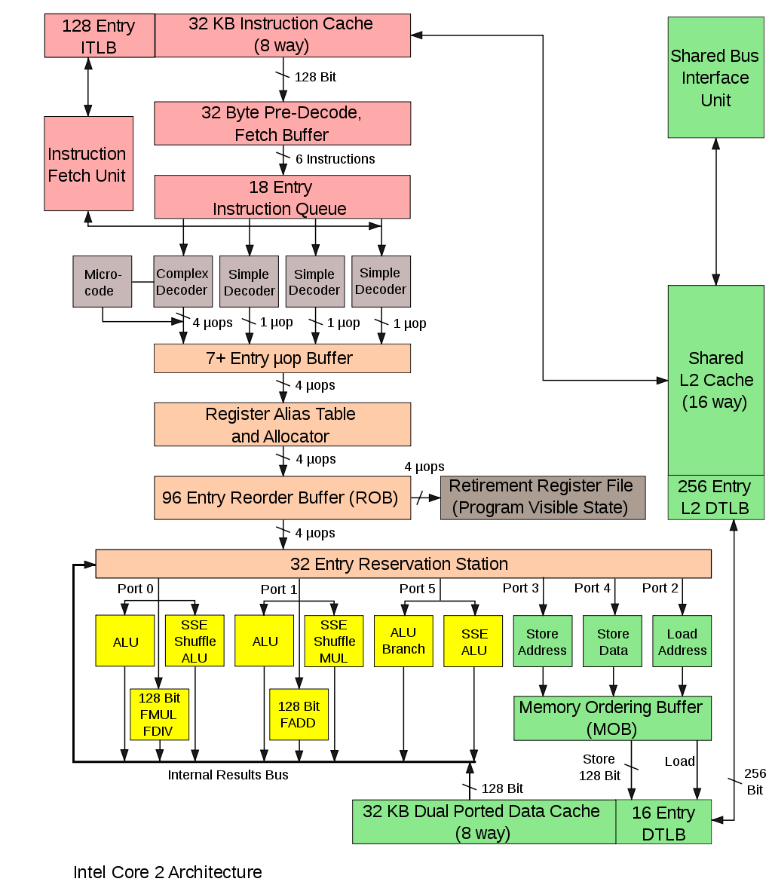

> Core微架构是一个由零设计起的处理器内部架构，但其有类似[Pentium M](https://zh.wikipedia.org/wiki/Pentium_M)的设计。它有14级[流水线](https://zh.wikipedia.org/wiki/流水线)（Pipeline），相比[NetBurst](https://zh.wikipedia.org/wiki/NetBurst)架构[Prescott](https://zh.wikipedia.org/wiki/奔腾4#Prescott)的31级，足足少了超过一半。另外，它的运行核心亦由[P6](https://zh.wikipedia.org/wiki/Intel_P6)、P6-M、及Netburst的一次可处理3个指令，增加至4个。本架构亦是一个双核心的设计，两个核心的L1缓存互相连接，分享的L2缓存。使用以上设计以达到最高性能功耗比（Performance per watt）。
>
> 其中一个新的设计为[宏融合](https://zh.wikipedia.org/wiki/宏融合)，将两个x86指令合并成为一个，以达到优化。另外，本架构亦将一个128位的SSE指令的思考时间由两个周期缩短为一个周期，及一个全新的省电设计。所有核心将会以最低速度运行，当有需要时则自动增速，以减低芯片的发热量，及其耗电量。本架构的[前端总线](https://zh.wikipedia.org/wiki/前端总线)（FSB）为Woodcrest核心的1333MHz（MT/s），Merom核心的667MHz（MT/s），及Conroe核心的1066MHz（MT/s，E6X00/Q6X00/QX6X00/X6X00）或1333MHz（MT/s，E6X50/E6X40/QX6X50）。不幸地，外频亦是本架构的弱点，因为其仍使用Pentium 4核心的设计，故仍未能完全控制双通道的DDR2内存，又或者新的[FB-DIMM](https://zh.wikipedia.org/wiki/FB-DIMM)。
>
> 英特尔宣称其功率消耗将会极端的低，Conroe核心的功率消耗将会是65W，而Woodcrest核心则是80W（相比Opteron 875HE有55W）。行动核心Merom将有功率消耗为35W的标准电压版本以及5W的低电压版本。

以上来自维基百科

# 流水线深度

前文中提到过，Netburst架构中，采用了破天荒的31级流水线，但是很快大家就发现流水线深度过犹不及的道理，在Core架构中流水线深度为14。

# 超标量支持

在P6微架构中，支持3发射超标量流水线。在7代微架构Netburst中，可能是因为流水线太长做多发射不容易的原因，回退成了2发射。8代微架构Core由于是重新设计的，流水线长度也降低是最深14级，它的超标量水平也得以进一步提高，变为4发射。

# 存储系统

Core微架构支持L1指令缓存和数据缓存分离，各32KB。每个核心单独有一组。L2缓存是共享的，没有L3缓存。

# 微码

从Core微架构开始，Intel CPU开始使用micro-ops，每一个x86 CISC指令在取址译码后，会翻译成一个或多个RISC指令，在流水线的后半部分，可以利用RISC CPU的一些技术提高指令的执行效率。

从上面的架构图中可以看到，译码单元包括三个简单译码器和一个复杂译码器，简单译码器的输出为1个micro-op，复杂译码器的输出为4个micro-ops。

坏消息是在这一代微架构中，micro-ops不支持64位指令。

# SSE3

在上一代微架构中，128位SSE指令需要2个周期，现在只需要一个周期。

# Enhanced Intel SpeedStep技术

以前就已经有了，就是初始工作频率很低，根据workload来决定是否切换到高频率。这样可以降低功耗。

# 虚拟化技术

虚拟化技术包括CPU虚拟机、内存虚拟化、网络虚拟化等，总之是提供一些硬件和指令来保证多个虚拟机可分享计算存储网络等资源的同时能够互不影响。虚拟化技术可以写一个单独的话题。

# Intel主动管理技术\(AMT, active management technology\)

> 英特尔主动管理技术（Active Management Technology） \[1\] 是一个以硬件为基础的远程管理技术，它是Intel vPro\[2\] 技术的其中之一。这项技术主要是让IT人员可以从通过OOB的网络连接来查看\(Discover\)、修复\(Heal\)以及保护\(Protect\)桌面型、笔记本电脑，或服务器。

简单来说这东西有点像现代服务器的BMC系统，BMC是在主板上集成一个小CPU，AMT则直接在CPU里面集成了另一个小CPU。这个小CPU或说SoC可以不受用户控制地管理你的网络、内存等。一听就很危险的样子。

> 硬件安全专家Damien Zammit在BoingBoing博客网站\[3\]指出Intel在部分CPU内建了一个无法被禁用的名为Intel管理引擎\(Intel Management Engine\)的子系统来运行AMT，该子系统运行在Intel处理器中处理器内并独立于计算机自身的闭源操作系统，能够直接访问计算机上的存储器并通过Intel的网络接口创建TCP/IP服务器使AMT具备运程控制功能，无论计算机的自身操作系统是否运行了防火墙，而且计算机即使在休眠情况下也能以极低的功耗运行，Zammit指出该子系统封闭源代码且系统固件采用RAS2048位算法加密，无法审计其安全性，也无法判断其是否为NSA的所谓后门，如果系统代码被恶意盗用，每台使用Intel处理器且连接互联网的计算机，都可能使子系统成为暴露的Rootkit。

